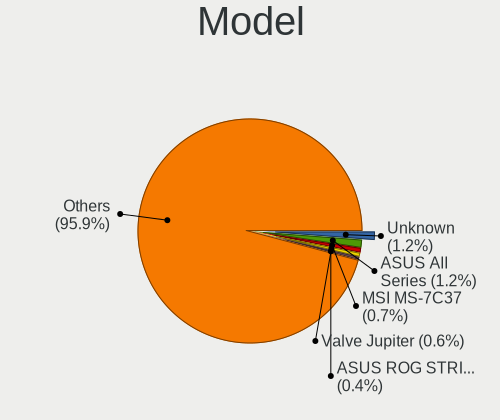
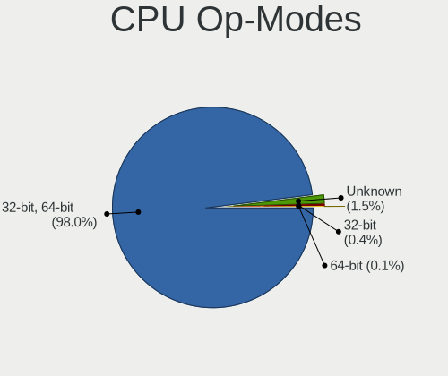
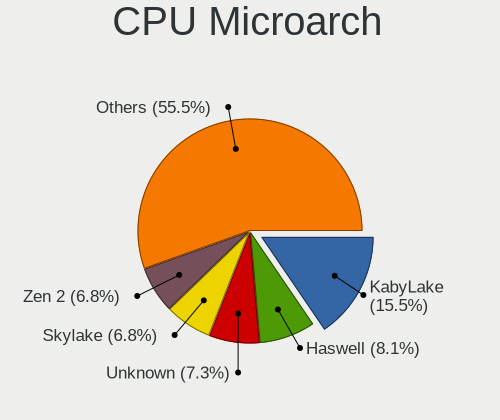
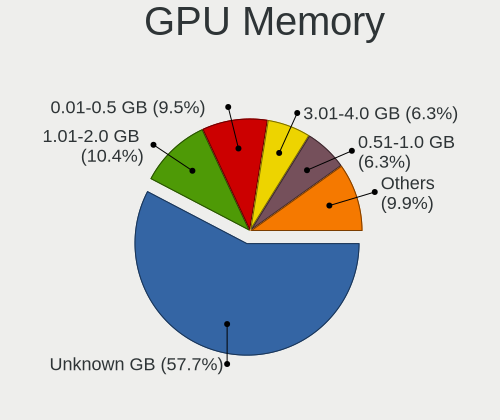
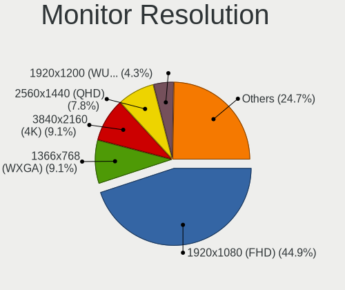
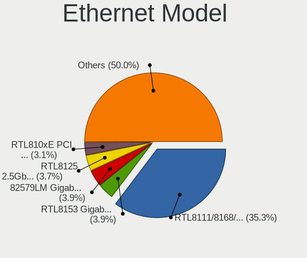
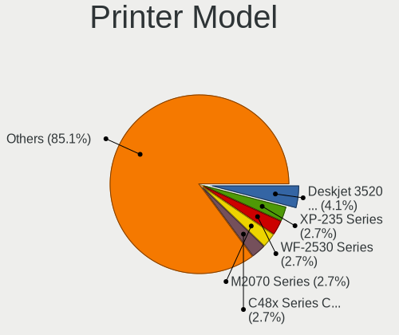

Linux in Austria - Tested Hardware & Statistics
-----------------------------------------------

A project to collect tested hardware configurations for Linux in Austria.

Anyone can contribute to this report by the [hw-probe](https://github.com/linuxhw/hw-probe) tool:

    sudo -E hw-probe -all -upload

Please contribute! Especially if your hardware is rare.

This is a report for all computer types. See also reports for [desktops](/Location/Austria/Desktop/README.md) and [notebooks](/Location/Austria/Notebook/README.md).

Contents
--------

* [ Test Cases ](#test-cases)

* [ System ](#system)
  - [ OS                       ](#os)
  - [ OS Family                ](#os-family)
  - [ Kernel                   ](#kernel)
  - [ Kernel Family            ](#kernel-family)
  - [ Kernel Major Ver.        ](#kernel-major-ver)
  - [ Arch                     ](#arch)
  - [ DE                       ](#de)
  - [ Display Server           ](#display-server)
  - [ Display Manager          ](#display-manager)
  - [ OS Lang                  ](#os-lang)
  - [ Boot Mode                ](#boot-mode)
  - [ Filesystem               ](#filesystem)
  - [ Part. scheme             ](#part-scheme)
  - [ Dual Boot with Linux/BSD ](#dual-boot-with-linuxbsd)
  - [ Dual Boot (Win)          ](#dual-boot-win)

* [ Board ](#board)
  - [ Vendor                   ](#vendor)
  - [ Model                    ](#model)
  - [ Model Family             ](#model-family)
  - [ MFG Year                 ](#mfg-year)
  - [ Form Factor              ](#form-factor)
  - [ Secure Boot              ](#secure-boot)
  - [ Coreboot                 ](#coreboot)
  - [ RAM Size                 ](#ram-size)
  - [ RAM Used                 ](#ram-used)
  - [ Total Drives             ](#total-drives)
  - [ Has CD-ROM               ](#has-cd-rom)
  - [ Has Ethernet             ](#has-ethernet)
  - [ Has WiFi                 ](#has-wifi)
  - [ Has Bluetooth            ](#has-bluetooth)

* [ Location ](#location)
  - [ Country                  ](#country)
  - [ City                     ](#city)

* [ Drives ](#drives)
  - [ Drive Vendor             ](#drive-vendor)
  - [ Drive Model              ](#drive-model)
  - [ HDD Vendor               ](#hdd-vendor)
  - [ SSD Vendor               ](#ssd-vendor)
  - [ Drive Kind               ](#drive-kind)
  - [ Drive Connector          ](#drive-connector)
  - [ Drive Size               ](#drive-size)
  - [ Space Total              ](#space-total)
  - [ Space Used               ](#space-used)
  - [ Malfunc. Drives          ](#malfunc-drives)
  - [ Malfunc. Drive Vendor    ](#malfunc-drive-vendor)
  - [ Malfunc. HDD Vendor      ](#malfunc-hdd-vendor)
  - [ Malfunc. Drive Kind      ](#malfunc-drive-kind)
  - [ Failed Drives            ](#failed-drives)
  - [ Failed Drive Vendor      ](#failed-drive-vendor)
  - [ Drive Status             ](#drive-status)

* [ Storage controller ](#storage-controller)
  - [ Storage Vendor           ](#storage-vendor)
  - [ Storage Model            ](#storage-model)
  - [ Storage Kind             ](#storage-kind)

* [ Processor ](#processor)
  - [ CPU Vendor               ](#cpu-vendor)
  - [ CPU Model                ](#cpu-model)
  - [ CPU Model Family         ](#cpu-model-family)
  - [ CPU Cores                ](#cpu-cores)
  - [ CPU Sockets              ](#cpu-sockets)
  - [ CPU Threads              ](#cpu-threads)
  - [ CPU Op-Modes             ](#cpu-op-modes)
  - [ CPU Microcode            ](#cpu-microcode)
  - [ CPU Microarch            ](#cpu-microarch)

* [ Graphics ](#graphics)
  - [ GPU Vendor               ](#gpu-vendor)
  - [ GPU Model                ](#gpu-model)
  - [ GPU Combo                ](#gpu-combo)
  - [ GPU Driver               ](#gpu-driver)
  - [ GPU Memory               ](#gpu-memory)

* [ Monitor ](#monitor)
  - [ Monitor Vendor           ](#monitor-vendor)
  - [ Monitor Model            ](#monitor-model)
  - [ Monitor Resolution       ](#monitor-resolution)
  - [ Monitor Diagonal         ](#monitor-diagonal)
  - [ Monitor Width            ](#monitor-width)
  - [ Aspect Ratio             ](#aspect-ratio)
  - [ Monitor Area             ](#monitor-area)
  - [ Pixel Density            ](#pixel-density)
  - [ Multiple Monitors        ](#multiple-monitors)

* [ Network ](#network)
  - [ Net Controller Vendor    ](#net-controller-vendor)
  - [ Net Controller Model     ](#net-controller-model)
  - [ Wireless Vendor          ](#wireless-vendor)
  - [ Wireless Model           ](#wireless-model)
  - [ Ethernet Vendor          ](#ethernet-vendor)
  - [ Ethernet Model           ](#ethernet-model)
  - [ Net Controller Kind      ](#net-controller-kind)
  - [ Used Controller          ](#used-controller)
  - [ NICs                     ](#nics)
  - [ IPv6                     ](#ipv6)

* [ Bluetooth ](#bluetooth)
  - [ Bluetooth Vendor         ](#bluetooth-vendor)
  - [ Bluetooth Model          ](#bluetooth-model)

* [ Sound ](#sound)
  - [ Sound Vendor             ](#sound-vendor)
  - [ Sound Model              ](#sound-model)

* [ Memory ](#memory)
  - [ Memory Vendor            ](#memory-vendor)
  - [ Memory Model             ](#memory-model)
  - [ Memory Kind              ](#memory-kind)
  - [ Memory Form Factor       ](#memory-form-factor)
  - [ Memory Size              ](#memory-size)
  - [ Memory Speed             ](#memory-speed)

* [ Printers & scanners ](#printers--scanners)
  - [ Printer Vendor           ](#printer-vendor)
  - [ Printer Model            ](#printer-model)
  - [ Scanner Vendor           ](#scanner-vendor)
  - [ Scanner Model            ](#scanner-model)

* [ Camera ](#camera)
  - [ Camera Vendor            ](#camera-vendor)
  - [ Camera Model             ](#camera-model)

* [ Security ](#security)
  - [ Fingerprint Vendor       ](#fingerprint-vendor)
  - [ Fingerprint Model        ](#fingerprint-model)
  - [ Chipcard Vendor          ](#chipcard-vendor)
  - [ Chipcard Model           ](#chipcard-model)

* [ Unsupported ](#unsupported)
  - [ Unsupported Devices      ](#unsupported-devices)
  - [ Unsupported Device Types ](#unsupported-device-types)

Test Cases
----------

Total: 2071

| Vendor        | Model                       | Form-Factor | Probe                                                      | Date         |
|---------------|-----------------------------|-------------|------------------------------------------------------------|--------------|
| Lenovo        | ThinkPad T14 Gen 2a 20XL... | Notebook    | [8fda480b12](https://linux-hardware.org/?probe=8fda480b12) | May 06, 2022 |
| Lenovo        | ThinkPad T450s 20BWS1U60... | Notebook    | [ffafca2b97](https://linux-hardware.org/?probe=ffafca2b97) | May 06, 2022 |
| ASRock        | B450 Steel Legend           | Desktop     | [d2a6709c96](https://linux-hardware.org/?probe=d2a6709c96) | May 06, 2022 |
| Gigabyte      | B550 AORUS PRO V2           | Desktop     | [feaa2cb9fb](https://linux-hardware.org/?probe=feaa2cb9fb) | May 06, 2022 |
| HP            | ZBook 17 G5                 | Notebook    | [5190bc7cf3](https://linux-hardware.org/?probe=5190bc7cf3) | May 06, 2022 |
| Toshiba       | Satellite C70D-B            | Notebook    | [0bc5a5fb9f](https://linux-hardware.org/?probe=0bc5a5fb9f) | May 05, 2022 |
| BESSTAR Te... | GB1B                        | Mini pc     | [9a83464a3b](https://linux-hardware.org/?probe=9a83464a3b) | May 04, 2022 |
| ASUSTek       | ROG STRIX B550-A GAMING     | Desktop     | [935eb1722b](https://linux-hardware.org/?probe=935eb1722b) | May 02, 2022 |
| ASUSTek       | ROG STRIX B350-F GAMING     | Desktop     | [925447d7e9](https://linux-hardware.org/?probe=925447d7e9) | May 01, 2022 |
| ASUSTek       | ROG STRIX B350-F GAMING     | Desktop     | [b1e331055f](https://linux-hardware.org/?probe=b1e331055f) | May 01, 2022 |
| Lenovo        | Legion 5 15ACH6H 82JU       | Notebook    | [5838cd4268](https://linux-hardware.org/?probe=5838cd4268) | Apr 30, 2022 |
| Sony          | VPCEH2J1E                   | Notebook    | [86f6b8c750](https://linux-hardware.org/?probe=86f6b8c750) | Apr 30, 2022 |
| Lenovo        | ThinkPad P14s Gen 2a 21A... | Notebook    | [9f5c24d3e8](https://linux-hardware.org/?probe=9f5c24d3e8) | Apr 29, 2022 |
| Lenovo        | ThinkPad P14s Gen 2a 21A... | Notebook    | [da73d0b77d](https://linux-hardware.org/?probe=da73d0b77d) | Apr 29, 2022 |
| MSI           | B550M PRO-VDH WIFI          | Desktop     | [b923126955](https://linux-hardware.org/?probe=b923126955) | Apr 27, 2022 |
| Lenovo        | ThinkPad T14s Gen 1 20UJ... | Notebook    | [2b7f66b701](https://linux-hardware.org/?probe=2b7f66b701) | Apr 26, 2022 |
| Fujitsu       | LIFEBOOK E751               | Notebook    | [ace84bb1e5](https://linux-hardware.org/?probe=ace84bb1e5) | Apr 25, 2022 |
| Lenovo        | Yoga C940-14IIL 81Q9        | Convertible | [bf7a7381a8](https://linux-hardware.org/?probe=bf7a7381a8) | Apr 24, 2022 |
| ASRock        | H110 Pro BTC+               | Desktop     | [1251ef669d](https://linux-hardware.org/?probe=1251ef669d) | Apr 24, 2022 |
| ASUSTek       | M4A89GTD-PRO/USB3           | Desktop     | [dbb48b83bf](https://linux-hardware.org/?probe=dbb48b83bf) | Apr 24, 2022 |
| ASUSTek       | M4A78-E                     | Desktop     | [e4779f4dc8](https://linux-hardware.org/?probe=e4779f4dc8) | Apr 23, 2022 |
| Lenovo        | ThinkBook 16p Gen 2 20YM    | Notebook    | [a8038d3972](https://linux-hardware.org/?probe=a8038d3972) | Apr 22, 2022 |
| HP            | ProBook 450 G4              | Notebook    | [77a6f92da0](https://linux-hardware.org/?probe=77a6f92da0) | Apr 22, 2022 |
| Lenovo        | Yoga 9 14ITL5 82BG          | Convertible | [208e83a199](https://linux-hardware.org/?probe=208e83a199) | Apr 22, 2022 |
| HP            | 250 G7 Notebook PC          | Notebook    | [e7f7e1188e](https://linux-hardware.org/?probe=e7f7e1188e) | Apr 21, 2022 |
| ASRock        | X470 Taichi Ultimate        | Desktop     | [d10be6941f](https://linux-hardware.org/?probe=d10be6941f) | Apr 20, 2022 |
| HUAWEI        | NBLK-WAX9X                  | Notebook    | [bbc4928d39](https://linux-hardware.org/?probe=bbc4928d39) | Apr 19, 2022 |
| ASRock        | Z490 Pro4                   | Desktop     | [67071d11a1](https://linux-hardware.org/?probe=67071d11a1) | Apr 18, 2022 |
| Apple         | MacBookPro9,2               | Notebook    | [812afb255a](https://linux-hardware.org/?probe=812afb255a) | Apr 18, 2022 |
| Gigabyte      | B450 AORUS ELITE            | Desktop     | [e269a6b9b8](https://linux-hardware.org/?probe=e269a6b9b8) | Apr 18, 2022 |
| HP            | 250 G7 Notebook PC          | Notebook    | [d9565f3e67](https://linux-hardware.org/?probe=d9565f3e67) | Apr 16, 2022 |
| Lenovo        | ThinkPad E14 Gen 3 20YDS... | Notebook    | [b228a9bf01](https://linux-hardware.org/?probe=b228a9bf01) | Apr 15, 2022 |
| Notebook      | NJ50_70CU                   | Notebook    | [1ec86958b8](https://linux-hardware.org/?probe=1ec86958b8) | Apr 15, 2022 |
| ASUSTek       | P7P55D LE                   | Desktop     | [381477f3e6](https://linux-hardware.org/?probe=381477f3e6) | Apr 15, 2022 |
| Fujitsu       | D3434-S2 S26361-D3434-S2    | Desktop     | [7ff488cc8d](https://linux-hardware.org/?probe=7ff488cc8d) | Apr 14, 2022 |
| Lenovo        | ThinkPad Yoga 370 20JH00... | Convertible | [51ba8cd105](https://linux-hardware.org/?probe=51ba8cd105) | Apr 14, 2022 |
| Lenovo        | ThinkPad X220 Tablet 429... | Notebook    | [c68c62f98c](https://linux-hardware.org/?probe=c68c62f98c) | Apr 14, 2022 |
| MSI           | MPG X570 GAMING EDGE WIF... | Desktop     | [cf0c239670](https://linux-hardware.org/?probe=cf0c239670) | Apr 13, 2022 |
| ASUSTek       | ROG STRIX B450-F GAMING     | Desktop     | [9af096ef7f](https://linux-hardware.org/?probe=9af096ef7f) | Apr 13, 2022 |
| ASUSTek       | PRIME X370-A                | Desktop     | [cb3eb74403](https://linux-hardware.org/?probe=cb3eb74403) | Apr 13, 2022 |
| ASUSTek       | P9X79                       | Desktop     | [b7a035ea6b](https://linux-hardware.org/?probe=b7a035ea6b) | Apr 13, 2022 |
| ASUSTek       | ROG STRIX B550-I GAMING     | Desktop     | [f75dc153d0](https://linux-hardware.org/?probe=f75dc153d0) | Apr 13, 2022 |
| Medion        | X6816                       | Notebook    | [41350ad402](https://linux-hardware.org/?probe=41350ad402) | Apr 12, 2022 |
| ASUSTek       | 1000H                       | Notebook    | [ac82d62350](https://linux-hardware.org/?probe=ac82d62350) | Apr 12, 2022 |
| ASUSTek       | 1000H                       | Notebook    | [60a1fc5c39](https://linux-hardware.org/?probe=60a1fc5c39) | Apr 12, 2022 |
| ASUSTek       | M5A97 EVO R2.0              | Desktop     | [3930b32e77](https://linux-hardware.org/?probe=3930b32e77) | Apr 12, 2022 |
| ASUSTek       | M5A97 EVO R2.0              | Desktop     | [1e302e1cce](https://linux-hardware.org/?probe=1e302e1cce) | Apr 12, 2022 |
| TUXEDO        | P65xHP                      | Notebook    | [a29da5ce79](https://linux-hardware.org/?probe=a29da5ce79) | Apr 11, 2022 |
| Medion        | MS-7707                     | Desktop     | [fb95ae3a92](https://linux-hardware.org/?probe=fb95ae3a92) | Apr 09, 2022 |
| Acer          | Aspire A114-31              | Notebook    | [8779ba2891](https://linux-hardware.org/?probe=8779ba2891) | Apr 09, 2022 |
| Acer          | Aspire A114-31              | Notebook    | [298acab48c](https://linux-hardware.org/?probe=298acab48c) | Apr 08, 2022 |
| Lenovo        | ThinkPad T470 W10DG 20JN... | Notebook    | [0b5e11625d](https://linux-hardware.org/?probe=0b5e11625d) | Apr 08, 2022 |
| Lenovo        | 314F SDK0T08861 WIN 3305... | Desktop     | [fa2e3ae8ee](https://linux-hardware.org/?probe=fa2e3ae8ee) | Apr 08, 2022 |
| Lenovo        | ThinkPad T470 W10DG 20JN... | Notebook    | [fed3e90b10](https://linux-hardware.org/?probe=fed3e90b10) | Apr 08, 2022 |
| Lenovo        | ThinkPad L13 Yoga 20R500... | Convertible | [79304f2f1b](https://linux-hardware.org/?probe=79304f2f1b) | Apr 06, 2022 |
| HP            | Pavilion dv6                | Notebook    | [b69de03677](https://linux-hardware.org/?probe=b69de03677) | Apr 06, 2022 |
| HP            | Pavilion dv6                | Notebook    | [9e8312e9c1](https://linux-hardware.org/?probe=9e8312e9c1) | Apr 06, 2022 |
| Dell          | XPS 13 9305                 | Notebook    | [0e254bc578](https://linux-hardware.org/?probe=0e254bc578) | Apr 05, 2022 |
| ASUSTek       | P9X79                       | Desktop     | [d82eb40c27](https://linux-hardware.org/?probe=d82eb40c27) | Apr 05, 2022 |
| Medion        | E7216                       | Notebook    | [58f12f9e91](https://linux-hardware.org/?probe=58f12f9e91) | Apr 05, 2022 |
| ECS           | CMLU-MINI                   | Desktop     | [742c0da37b](https://linux-hardware.org/?probe=742c0da37b) | Apr 05, 2022 |
| ASUSTek       | VivoBook_ASUSLaptop X712... | Notebook    | [edf4c472c3](https://linux-hardware.org/?probe=edf4c472c3) | Apr 05, 2022 |
| Gigabyte      | B75M-D3V                    | Desktop     | [16d1981053](https://linux-hardware.org/?probe=16d1981053) | Apr 04, 2022 |
| ASUSTek       | VivoBook_ASUSLaptop X712... | Notebook    | [35e0c67fed](https://linux-hardware.org/?probe=35e0c67fed) | Apr 03, 2022 |
| Acer          | TravelMate 7730             | Notebook    | [c0c1bedcec](https://linux-hardware.org/?probe=c0c1bedcec) | Apr 03, 2022 |
| Lenovo        | ThinkPad X250 20CLS2B000    | Notebook    | [869407eb01](https://linux-hardware.org/?probe=869407eb01) | Apr 03, 2022 |
| MSI           | MEG X570 UNIFY              | Desktop     | [0c57600526](https://linux-hardware.org/?probe=0c57600526) | Apr 03, 2022 |
| HP            | EliteBook 840 G8 Noteboo... | Notebook    | [26082e6921](https://linux-hardware.org/?probe=26082e6921) | Apr 02, 2022 |
| HP            | EliteBook 840 G8 Noteboo... | Notebook    | [0f191252cb](https://linux-hardware.org/?probe=0f191252cb) | Apr 02, 2022 |
| MSI           | Bravo 17 A4DDR              | Notebook    | [590d188f5d](https://linux-hardware.org/?probe=590d188f5d) | Apr 01, 2022 |
| ASUSTek       | ROG STRIX B550-XE GAMING... | Desktop     | [a9cf0523c2](https://linux-hardware.org/?probe=a9cf0523c2) | Mar 31, 2022 |
| VALE          | Notebook Slim S132          | Notebook    | [138a4f1d68](https://linux-hardware.org/?probe=138a4f1d68) | Mar 31, 2022 |
| Acer          | TravelMate 7730             | Notebook    | [6cabffccbe](https://linux-hardware.org/?probe=6cabffccbe) | Mar 30, 2022 |
| TUXEDO        | N7x0WU                      | Notebook    | [cf4f31fe3c](https://linux-hardware.org/?probe=cf4f31fe3c) | Mar 30, 2022 |
| Notebook      | NJ50_70CU                   | Notebook    | [ba5b62756b](https://linux-hardware.org/?probe=ba5b62756b) | Mar 29, 2022 |
| MSI           | MAG B660 TOMAHAWK WIFI D... | Desktop     | [99acee5d56](https://linux-hardware.org/?probe=99acee5d56) | Mar 29, 2022 |
| Lenovo        | 30BC SDK0J40705 WIN 3425... | Desktop     | [85a3c0a47e](https://linux-hardware.org/?probe=85a3c0a47e) | Mar 29, 2022 |
| Supermicro    | X11DPG-QTA                  | Server      | [dcbb3d117a](https://linux-hardware.org/?probe=dcbb3d117a) | Mar 29, 2022 |
| Acer          | Aspire XC-885 V:1.1         | Desktop     | [8696148b4a](https://linux-hardware.org/?probe=8696148b4a) | Mar 29, 2022 |
| Microsoft     | Surface Pro 4               | Tablet      | [a63052c272](https://linux-hardware.org/?probe=a63052c272) | Mar 29, 2022 |
| Lenovo        | 30BC SDK0J40705 WIN 3425... | Desktop     | [973087697b](https://linux-hardware.org/?probe=973087697b) | Mar 28, 2022 |
| Supermicro    | X11DPG-QTA                  | Server      | [ac15801ad7](https://linux-hardware.org/?probe=ac15801ad7) | Mar 28, 2022 |
| Sony          | VPCEH2J1E                   | Notebook    | [23d5b99aca](https://linux-hardware.org/?probe=23d5b99aca) | Mar 27, 2022 |
| Sony          | VPCEH2J1E                   | Notebook    | [97db2baf26](https://linux-hardware.org/?probe=97db2baf26) | Mar 27, 2022 |
| Acer          | Nitro AN515-45              | Notebook    | [4cc10c8b41](https://linux-hardware.org/?probe=4cc10c8b41) | Mar 27, 2022 |
| Acer          | Nitro AN515-45              | Notebook    | [918ef53f6f](https://linux-hardware.org/?probe=918ef53f6f) | Mar 27, 2022 |
| Acer          | Nitro AN515-45              | Notebook    | [9cac848b59](https://linux-hardware.org/?probe=9cac848b59) | Mar 27, 2022 |
| Acer          | Nitro AN515-45              | Notebook    | [c6fa89e81f](https://linux-hardware.org/?probe=c6fa89e81f) | Mar 26, 2022 |
| HUAWEI        | NBLB-WAX9N                  | Notebook    | [76b97dcfe7](https://linux-hardware.org/?probe=76b97dcfe7) | Mar 25, 2022 |
| HUAWEI        | NBLB-WAX9N                  | Notebook    | [ec3089df82](https://linux-hardware.org/?probe=ec3089df82) | Mar 25, 2022 |
| Medion        | E6220                       | Notebook    | [e739ef27a1](https://linux-hardware.org/?probe=e739ef27a1) | Mar 24, 2022 |
| ASUSTek       | X540SAA                     | Notebook    | [988b4570ed](https://linux-hardware.org/?probe=988b4570ed) | Mar 24, 2022 |
| HP            | 250 G7 Notebook PC          | Notebook    | [552f06718c](https://linux-hardware.org/?probe=552f06718c) | Mar 23, 2022 |
| HP            | Pavilion dv7                | Notebook    | [64d5f14244](https://linux-hardware.org/?probe=64d5f14244) | Mar 22, 2022 |
| HP            | Pavilion dv7                | Notebook    | [e2bfdae482](https://linux-hardware.org/?probe=e2bfdae482) | Mar 22, 2022 |
| Intel         | NUC9VXQNB K47179-402        | Mini pc     | [835e767bde](https://linux-hardware.org/?probe=835e767bde) | Mar 22, 2022 |
| MSI           | Modern 14 B10MW             | Notebook    | [e8bbca6adf](https://linux-hardware.org/?probe=e8bbca6adf) | Mar 21, 2022 |
| Intel         | NUC9VXQNB K47179-402        | Mini pc     | [2cd178853b](https://linux-hardware.org/?probe=2cd178853b) | Mar 21, 2022 |
| Fujitsu Si... | AMILO Pro Edition V3545     | Notebook    | [be2c23f4a5](https://linux-hardware.org/?probe=be2c23f4a5) | Mar 21, 2022 |
| HUAWEI        | KPL-W0X                     | Notebook    | [fbe7d7c6b0](https://linux-hardware.org/?probe=fbe7d7c6b0) | Mar 21, 2022 |
| Medion        | E14410                      | Notebook    | [800f98d1ef](https://linux-hardware.org/?probe=800f98d1ef) | Mar 21, 2022 |
| ASUSTek       | M3A32-MVP DELUXE            | Desktop     | [1bfef458ea](https://linux-hardware.org/?probe=1bfef458ea) | Mar 20, 2022 |
| Sony          | VPCEH2J1E                   | Notebook    | [ae54fc4033](https://linux-hardware.org/?probe=ae54fc4033) | Mar 19, 2022 |
| ASUSTek       | X201EP                      | Notebook    | [864fc80ac3](https://linux-hardware.org/?probe=864fc80ac3) | Mar 17, 2022 |
| ASUSTek       | TUF Gaming B550-PLUS        | Desktop     | [d2b4181439](https://linux-hardware.org/?probe=d2b4181439) | Mar 16, 2022 |
| MSI           | Alpha 15 B5EEK              | Notebook    | [f4c72eaa35](https://linux-hardware.org/?probe=f4c72eaa35) | Mar 15, 2022 |
| Dell          | 0T7D40 A01                  | Desktop     | [192926e183](https://linux-hardware.org/?probe=192926e183) | Mar 14, 2022 |
| Acer          | Predator PO3-600 V:1.1      | Desktop     | [fc992250ca](https://linux-hardware.org/?probe=fc992250ca) | Mar 13, 2022 |
| Apple         | Mac-F2218FC8                | All in one  | [9eb7577acd](https://linux-hardware.org/?probe=9eb7577acd) | Mar 12, 2022 |
| MSI           | Alpha 15 B5EEK              | Notebook    | [8859888f0c](https://linux-hardware.org/?probe=8859888f0c) | Mar 12, 2022 |
| Sony          | VPCEH2J1E                   | Notebook    | [694d2e6d15](https://linux-hardware.org/?probe=694d2e6d15) | Mar 12, 2022 |
| ASRock        | Z87M Extreme4               | Desktop     | [dba57ee1b3](https://linux-hardware.org/?probe=dba57ee1b3) | Mar 12, 2022 |
| Dell          | Inspiron MM061              | Notebook    | [1aa06e7b53](https://linux-hardware.org/?probe=1aa06e7b53) | Mar 12, 2022 |
| Lenovo        | ThinkPad E14 Gen 3 20Y70... | Notebook    | [e2eacd6969](https://linux-hardware.org/?probe=e2eacd6969) | Mar 12, 2022 |
| Lenovo        | ThinkPad E15 20RES12P00     | Notebook    | [200b3a0b69](https://linux-hardware.org/?probe=200b3a0b69) | Mar 12, 2022 |
| MSI           | H81M-P33                    | Desktop     | [0f103bcb15](https://linux-hardware.org/?probe=0f103bcb15) | Mar 12, 2022 |
| ASUSTek       | UX303LAB                    | Notebook    | [f3d0e8fbea](https://linux-hardware.org/?probe=f3d0e8fbea) | Mar 11, 2022 |
| MSI           | H81M-P33                    | Desktop     | [304738db66](https://linux-hardware.org/?probe=304738db66) | Mar 11, 2022 |
| ASRock        | B450M Pro4                  | Desktop     | [12459fc7ea](https://linux-hardware.org/?probe=12459fc7ea) | Mar 11, 2022 |
| Lenovo        | ThinkBook 16p Gen 2 20YM    | Notebook    | [adf7b6c95e](https://linux-hardware.org/?probe=adf7b6c95e) | Mar 10, 2022 |
| Lenovo        | MIIX 320-10ICR 80XF         | Tablet      | [4758b6520c](https://linux-hardware.org/?probe=4758b6520c) | Mar 10, 2022 |
| ASUSTek       | UX305FA                     | Notebook    | [f1641a436c](https://linux-hardware.org/?probe=f1641a436c) | Mar 09, 2022 |
| Dell          | Vostro 5471                 | Notebook    | [6e46455791](https://linux-hardware.org/?probe=6e46455791) | Mar 09, 2022 |
| Sony          | VPCEH2J1E                   | Notebook    | [713f08757a](https://linux-hardware.org/?probe=713f08757a) | Mar 09, 2022 |
| Sony          | VPCEH2J1E                   | Notebook    | [05dcc22b2d](https://linux-hardware.org/?probe=05dcc22b2d) | Mar 09, 2022 |
| Lenovo        | MIIX 320-10ICR 80XF         | Tablet      | [1949849d7e](https://linux-hardware.org/?probe=1949849d7e) | Mar 09, 2022 |
| MSI           | H81M-P33                    | Desktop     | [cf152def87](https://linux-hardware.org/?probe=cf152def87) | Mar 09, 2022 |
| Medion        | E7216                       | Notebook    | [728fdb1751](https://linux-hardware.org/?probe=728fdb1751) | Mar 08, 2022 |
| Lenovo        | Yoga C940-14IIL 81Q9        | Convertible | [d6d94816fc](https://linux-hardware.org/?probe=d6d94816fc) | Mar 08, 2022 |
| MSI           | H81M-P33                    | Desktop     | [546746c825](https://linux-hardware.org/?probe=546746c825) | Mar 07, 2022 |
| HP            | EliteBook 850 G1            | Notebook    | [b2aeea55e5](https://linux-hardware.org/?probe=b2aeea55e5) | Mar 07, 2022 |
| MSI           | H81M-P33                    | Desktop     | [493fe1a76a](https://linux-hardware.org/?probe=493fe1a76a) | Mar 07, 2022 |
| Hardkernel    | Odroid XU4                  | Soc         | [8e3573295d](https://linux-hardware.org/?probe=8e3573295d) | Mar 07, 2022 |
| Hardkernel    | Odroid XU4                  | Soc         | [d57f5c8ce3](https://linux-hardware.org/?probe=d57f5c8ce3) | Mar 07, 2022 |
| ASUSTek       | PRIME X299-DELUXE II        | Desktop     | [5183569327](https://linux-hardware.org/?probe=5183569327) | Mar 06, 2022 |
| Lenovo        | Yoga 7 14ITL5 82BH          | Convertible | [0f5c637f94](https://linux-hardware.org/?probe=0f5c637f94) | Mar 06, 2022 |
| MSI           | H81M-P33                    | Desktop     | [731850ebaf](https://linux-hardware.org/?probe=731850ebaf) | Mar 06, 2022 |
| IP3 Tech      | GB3B                        | Mini pc     | [b78185d870](https://linux-hardware.org/?probe=b78185d870) | Mar 06, 2022 |
| Lenovo        | ThinkPad E580 20KS001RGE    | Notebook    | [4ccce94591](https://linux-hardware.org/?probe=4ccce94591) | Mar 03, 2022 |
| HP            | Pavilion g6                 | Notebook    | [e9b1f4c1ec](https://linux-hardware.org/?probe=e9b1f4c1ec) | Mar 03, 2022 |
| HP            | Pavilion g6                 | Notebook    | [f378d8a1df](https://linux-hardware.org/?probe=f378d8a1df) | Mar 03, 2022 |
| MSI           | H81M-P33                    | Desktop     | [4595a12a77](https://linux-hardware.org/?probe=4595a12a77) | Feb 28, 2022 |
| MSI           | H81M-P33                    | Desktop     | [60e41d668b](https://linux-hardware.org/?probe=60e41d668b) | Feb 27, 2022 |
| Lenovo        | ThinkPad X1 Extreme 2nd ... | Notebook    | [359368d345](https://linux-hardware.org/?probe=359368d345) | Feb 26, 2022 |
| Toshiba       | Satellite L775-166          | Notebook    | [f0ad0a4da5](https://linux-hardware.org/?probe=f0ad0a4da5) | Feb 26, 2022 |
| BESSTAR Te... | UM200 V1.0                  | Desktop     | [bae5f3ad77](https://linux-hardware.org/?probe=bae5f3ad77) | Feb 26, 2022 |
| HP            | Laptop 17-by0xxx            | Notebook    | [745fa98d2e](https://linux-hardware.org/?probe=745fa98d2e) | Feb 26, 2022 |
| ASUSTek       | ROG Strix G513QY_G513QY     | Notebook    | [16281a52e8](https://linux-hardware.org/?probe=16281a52e8) | Feb 26, 2022 |
| Toshiba       | Satellite P500              | Notebook    | [980cb1d4af](https://linux-hardware.org/?probe=980cb1d4af) | Feb 25, 2022 |
| MSI           | H81M-P33                    | Desktop     | [647a154bd6](https://linux-hardware.org/?probe=647a154bd6) | Feb 25, 2022 |
| Lenovo        | ThinkPad L14 Gen 1 20U10... | Notebook    | [6bf461797c](https://linux-hardware.org/?probe=6bf461797c) | Feb 25, 2022 |
| HP            | ZBook 15 G3                 | Notebook    | [7b9e3082bf](https://linux-hardware.org/?probe=7b9e3082bf) | Feb 25, 2022 |
| ASUSTek       | P9X79                       | Desktop     | [cd0609e2cc](https://linux-hardware.org/?probe=cd0609e2cc) | Feb 25, 2022 |
| ASUSTek       | P9X79                       | Desktop     | [f576f08ecb](https://linux-hardware.org/?probe=f576f08ecb) | Feb 24, 2022 |
| MSI           | H81M-P33                    | Desktop     | [64955f775b](https://linux-hardware.org/?probe=64955f775b) | Feb 24, 2022 |
| HP            | EliteBook 820 G1            | Notebook    | [916b00f114](https://linux-hardware.org/?probe=916b00f114) | Feb 24, 2022 |
| Lenovo        | IdeaPad S206 2638           | Notebook    | [84772cc34d](https://linux-hardware.org/?probe=84772cc34d) | Feb 23, 2022 |
| Medion        | B250H4-EM                   | Desktop     | [851288ccf7](https://linux-hardware.org/?probe=851288ccf7) | Feb 22, 2022 |
| Medion        | B250H4-EM                   | Desktop     | [825c88d62b](https://linux-hardware.org/?probe=825c88d62b) | Feb 22, 2022 |
| HP            | EliteBook 6930p             | Notebook    | [82000c3346](https://linux-hardware.org/?probe=82000c3346) | Feb 22, 2022 |
| Dell          | 0C4Y3R A00                  | Server      | [3b0d723e31](https://linux-hardware.org/?probe=3b0d723e31) | Feb 21, 2022 |
| Lenovo        | ThinkPad T410 2522W6G       | Notebook    | [d2b007cb44](https://linux-hardware.org/?probe=d2b007cb44) | Feb 20, 2022 |
| HP            | ENVY x360 Convertible 15... | Convertible | [ad584de4c3](https://linux-hardware.org/?probe=ad584de4c3) | Feb 20, 2022 |
| Acer          | Aspire A517-51              | Notebook    | [997108b078](https://linux-hardware.org/?probe=997108b078) | Feb 19, 2022 |
| MSI           | MAG B550 TOMAHAWK           | Desktop     | [803b4d504c](https://linux-hardware.org/?probe=803b4d504c) | Feb 19, 2022 |
| HP            | 8906 SMVB                   | Desktop     | [ae83ee4d22](https://linux-hardware.org/?probe=ae83ee4d22) | Feb 19, 2022 |
| Acer          | Aspire E1-572G              | Notebook    | [c75a02af0d](https://linux-hardware.org/?probe=c75a02af0d) | Feb 18, 2022 |
| HP            | Pavilion x360 Convertibl... | Convertible | [84e32bec2d](https://linux-hardware.org/?probe=84e32bec2d) | Feb 18, 2022 |
| HP            | EliteBook 840 G1            | Notebook    | [3047069a4f](https://linux-hardware.org/?probe=3047069a4f) | Feb 17, 2022 |
| ASRock        | X299 Taichi XE              | Desktop     | [04a1425dca](https://linux-hardware.org/?probe=04a1425dca) | Feb 17, 2022 |
| ASRock        | X299 Taichi XE              | Desktop     | [45b82f5330](https://linux-hardware.org/?probe=45b82f5330) | Feb 17, 2022 |
| Lenovo        | IdeaPad 330S-15IKB 81F5     | Notebook    | [934591472d](https://linux-hardware.org/?probe=934591472d) | Feb 16, 2022 |
| MSI           | Z270 GAMING PRO             | Desktop     | [6c6a916a0b](https://linux-hardware.org/?probe=6c6a916a0b) | Feb 15, 2022 |
| Dell          | XPS 15 9550                 | Notebook    | [701eeea0ed](https://linux-hardware.org/?probe=701eeea0ed) | Feb 14, 2022 |
| Lenovo        | ThinkPad P15 Gen 1 20SUS... | Notebook    | [32022a8232](https://linux-hardware.org/?probe=32022a8232) | Feb 14, 2022 |
| Supermicro    | X11DPG-QTA                  | Server      | [2cdac4454d](https://linux-hardware.org/?probe=2cdac4454d) | Feb 14, 2022 |
| Lenovo        | ThinkPad P15 Gen 1 20SUS... | Notebook    | [372c231b58](https://linux-hardware.org/?probe=372c231b58) | Feb 14, 2022 |
| Acer          | Swift SF114-34              | Notebook    | [31d020671e](https://linux-hardware.org/?probe=31d020671e) | Feb 13, 2022 |
| ASUSTek       | ROG STRIX Z590-A GAMING ... | Desktop     | [4ff66e932f](https://linux-hardware.org/?probe=4ff66e932f) | Feb 13, 2022 |
| HP            | 3397                        | Desktop     | [8ea2c45260](https://linux-hardware.org/?probe=8ea2c45260) | Feb 13, 2022 |
| Lenovo        | ThinkPad X230T 34382AG      | Notebook    | [bec561800f](https://linux-hardware.org/?probe=bec561800f) | Feb 13, 2022 |
| Lenovo        | ThinkCentre A58 7515M6G     | Desktop     | [7b86a1d792](https://linux-hardware.org/?probe=7b86a1d792) | Feb 12, 2022 |
| HP            | 3397                        | Desktop     | [f92e367657](https://linux-hardware.org/?probe=f92e367657) | Feb 12, 2022 |
| ASUSTek       | PRIME X299-DELUXE II        | Desktop     | [b229af38f0](https://linux-hardware.org/?probe=b229af38f0) | Feb 12, 2022 |
| HP            | ProBook 4730s               | Notebook    | [2a3ff15659](https://linux-hardware.org/?probe=2a3ff15659) | Feb 12, 2022 |
| Biostar       | A10N-8800E                  | Desktop     | [8231d95ddc](https://linux-hardware.org/?probe=8231d95ddc) | Feb 12, 2022 |
| Intel         | DH67GD AAG10206-202         | Desktop     | [56c802164a](https://linux-hardware.org/?probe=56c802164a) | Feb 11, 2022 |
| HP            | Compaq 15                   | Notebook    | [78b2f3bfa6](https://linux-hardware.org/?probe=78b2f3bfa6) | Feb 11, 2022 |
| HP            | 1494                        | Desktop     | [93502b8c70](https://linux-hardware.org/?probe=93502b8c70) | Feb 11, 2022 |
| MSI           | B550-A PRO                  | Desktop     | [577fc1abce](https://linux-hardware.org/?probe=577fc1abce) | Feb 11, 2022 |
| ASUSTek       | TUF B365M-PLUS GAMING       | Desktop     | [529666b867](https://linux-hardware.org/?probe=529666b867) | Feb 10, 2022 |
| ASRock        | H81M-HDS                    | Desktop     | [5f2ada50f9](https://linux-hardware.org/?probe=5f2ada50f9) | Feb 10, 2022 |
| ASRock        | 970 Pro3 R2.0               | Desktop     | [c83ca2e528](https://linux-hardware.org/?probe=c83ca2e528) | Feb 10, 2022 |
| HP            | 8906 SMVB                   | Desktop     | [646a1296e0](https://linux-hardware.org/?probe=646a1296e0) | Feb 10, 2022 |
| ASUSTek       | SABERTOOTH Z77              | Desktop     | [4706a4f369](https://linux-hardware.org/?probe=4706a4f369) | Feb 10, 2022 |
| Supermicro    | X11DPG-QTA                  | Server      | [f0c1c16098](https://linux-hardware.org/?probe=f0c1c16098) | Feb 10, 2022 |
| Lenovo        | 30BC SDK0J40705 WIN 3425... | Desktop     | [c945332cad](https://linux-hardware.org/?probe=c945332cad) | Feb 10, 2022 |
| Lenovo        | 30BC SDK0J40705 WIN 3425... | Desktop     | [eb3836e9d0](https://linux-hardware.org/?probe=eb3836e9d0) | Feb 10, 2022 |
| Supermicro    | X11DPG-QTA                  | Server      | [75694b38b0](https://linux-hardware.org/?probe=75694b38b0) | Feb 10, 2022 |
| Acer          | Aspire A315-54              | Notebook    | [d4e5b617c7](https://linux-hardware.org/?probe=d4e5b617c7) | Feb 10, 2022 |
| ASUSTek       | PRIME X570-PRO              | Desktop     | [88181832a0](https://linux-hardware.org/?probe=88181832a0) | Feb 09, 2022 |
| ASUSTek       | PRIME X570-PRO              | Desktop     | [9ff4906aa1](https://linux-hardware.org/?probe=9ff4906aa1) | Feb 09, 2022 |
| Fujitsu       | LIFEBOOK E559               | Notebook    | [66696218c1](https://linux-hardware.org/?probe=66696218c1) | Feb 09, 2022 |
| ASUSTek       | H97-PLUS                    | Desktop     | [435e9532a8](https://linux-hardware.org/?probe=435e9532a8) | Feb 09, 2022 |
| HP            | 8906 SMVB                   | Desktop     | [454f14e47d](https://linux-hardware.org/?probe=454f14e47d) | Feb 09, 2022 |
| Fujitsu       | LIFEBOOK S751               | Notebook    | [42d5c28f38](https://linux-hardware.org/?probe=42d5c28f38) | Feb 09, 2022 |
| Medion        | P6402 MD60800               | Notebook    | [a749ba246d](https://linux-hardware.org/?probe=a749ba246d) | Feb 08, 2022 |
| ASUSTek       | TUF GAMING Z690-PLUS WIF... | Desktop     | [ab81e91207](https://linux-hardware.org/?probe=ab81e91207) | Feb 08, 2022 |
| HP            | ProBook 450 G2              | Notebook    | [57c513ecbc](https://linux-hardware.org/?probe=57c513ecbc) | Feb 08, 2022 |
| Acer          | Predator G9-792             | Notebook    | [8404f2e6d1](https://linux-hardware.org/?probe=8404f2e6d1) | Feb 08, 2022 |
| HP            | EliteBook 840 G3            | Notebook    | [82d892f3e5](https://linux-hardware.org/?probe=82d892f3e5) | Feb 07, 2022 |
| Dell          | 0GY6Y8 A01                  | Desktop     | [8b8eda08e4](https://linux-hardware.org/?probe=8b8eda08e4) | Feb 07, 2022 |
| Dell          | 042P49 A00                  | Desktop     | [9f98143f82](https://linux-hardware.org/?probe=9f98143f82) | Feb 07, 2022 |
| TUXEDO        | Stellaris Intel Gen3 (TG... | Notebook    | [8337edfc91](https://linux-hardware.org/?probe=8337edfc91) | Feb 07, 2022 |
| Acer          | TravelMate 5720             | Notebook    | [9db7cd9351](https://linux-hardware.org/?probe=9db7cd9351) | Feb 06, 2022 |
| Chuwi         | HeroBook Pro                | Notebook    | [9f5da53181](https://linux-hardware.org/?probe=9f5da53181) | Feb 06, 2022 |
| Acer          | Aspire V5-573PG             | Notebook    | [0edb115ff8](https://linux-hardware.org/?probe=0edb115ff8) | Feb 05, 2022 |
| Acer          | Aspire V5-573PG             | Notebook    | [68595aad84](https://linux-hardware.org/?probe=68595aad84) | Feb 05, 2022 |
| Acer          | Swift SF314-54              | Notebook    | [d11fb8c7b6](https://linux-hardware.org/?probe=d11fb8c7b6) | Feb 04, 2022 |
| Acer          | Aspire A114-31              | Notebook    | [4347251035](https://linux-hardware.org/?probe=4347251035) | Feb 04, 2022 |
| Acer          | Aspire A114-31              | Notebook    | [caa9365785](https://linux-hardware.org/?probe=caa9365785) | Feb 04, 2022 |
| Sony          | VPCEH2J1E                   | Notebook    | [f5ed0cbaa4](https://linux-hardware.org/?probe=f5ed0cbaa4) | Feb 04, 2022 |
| Lenovo        | ThinkPad E15 Gen 3 20YG0... | Notebook    | [5a1723f28e](https://linux-hardware.org/?probe=5a1723f28e) | Feb 04, 2022 |
| Lenovo        | ThinkPad E15 Gen 3 20YG0... | Notebook    | [7db46606ab](https://linux-hardware.org/?probe=7db46606ab) | Feb 04, 2022 |
| HP            | ZBook Firefly 15 inch G8... | Notebook    | [376503f06d](https://linux-hardware.org/?probe=376503f06d) | Feb 03, 2022 |
| HP            | ProBook 4310s               | Notebook    | [6d2a66aa1e](https://linux-hardware.org/?probe=6d2a66aa1e) | Feb 02, 2022 |
| Lenovo        | ThinkPad X280 20KF001GGE    | Notebook    | [f076061f22](https://linux-hardware.org/?probe=f076061f22) | Feb 02, 2022 |
| Acer          | Aspire E1-572G              | Notebook    | [3deec16346](https://linux-hardware.org/?probe=3deec16346) | Feb 02, 2022 |
| ZOTAC         | ZBOXNANO-CI520NANO/CI540... | Mini pc     | [ee91c21eb4](https://linux-hardware.org/?probe=ee91c21eb4) | Feb 01, 2022 |
| TrekStor      | Primetab T13B               | Tablet      | [172fc399f5](https://linux-hardware.org/?probe=172fc399f5) | Feb 01, 2022 |
| Acer          | Aspire E1-571G              | Notebook    | [440bc30637](https://linux-hardware.org/?probe=440bc30637) | Jan 31, 2022 |
| Acer          | Aspire E1-571G              | Notebook    | [dd2d541140](https://linux-hardware.org/?probe=dd2d541140) | Jan 31, 2022 |
| ASUSTek       | Z87-A                       | Desktop     | [b48601a549](https://linux-hardware.org/?probe=b48601a549) | Jan 31, 2022 |
| ASUSTek       | Z87-A                       | Desktop     | [b62cc09b63](https://linux-hardware.org/?probe=b62cc09b63) | Jan 30, 2022 |
| Dell          | XPS M1530                   | Notebook    | [4b402569cc](https://linux-hardware.org/?probe=4b402569cc) | Jan 29, 2022 |
| Dell          | XPS M1530                   | Notebook    | [c556697863](https://linux-hardware.org/?probe=c556697863) | Jan 29, 2022 |
| ASRock        | 970 Extreme4                | Desktop     | [f024dd97a0](https://linux-hardware.org/?probe=f024dd97a0) | Jan 29, 2022 |
| HP            | 8906 SMVB                   | Desktop     | [8005514f7c](https://linux-hardware.org/?probe=8005514f7c) | Jan 29, 2022 |
| Acer          | Predator G9-792             | Notebook    | [863bce4abe](https://linux-hardware.org/?probe=863bce4abe) | Jan 28, 2022 |
| Apple         | MacBookPro9,2               | Notebook    | [d112bf0361](https://linux-hardware.org/?probe=d112bf0361) | Jan 27, 2022 |
| ASUSTek       | P8H77-M PRO                 | Desktop     | [16d9024680](https://linux-hardware.org/?probe=16d9024680) | Jan 26, 2022 |
| HP            | 8906 SMVB                   | Desktop     | [132c3acbb1](https://linux-hardware.org/?probe=132c3acbb1) | Jan 26, 2022 |
| Microsoft     | Surface Go                  | Tablet      | [124dcb4c34](https://linux-hardware.org/?probe=124dcb4c34) | Jan 26, 2022 |
| Microsoft     | Surface Go                  | Tablet      | [804f9dbb94](https://linux-hardware.org/?probe=804f9dbb94) | Jan 26, 2022 |
| Gigabyte      | B550 AORUS PRO V2           | Desktop     | [dfe4dda46b](https://linux-hardware.org/?probe=dfe4dda46b) | Jan 26, 2022 |
| Dell          | Precision 5510              | Notebook    | [511eeac9a0](https://linux-hardware.org/?probe=511eeac9a0) | Jan 25, 2022 |
| Lenovo        | IdeaPad 5 15ARE05 81YQ      | Notebook    | [4d5edb2eb3](https://linux-hardware.org/?probe=4d5edb2eb3) | Jan 25, 2022 |
| Lenovo        | ThinkPad T495 20NJS0KB00    | Notebook    | [e92c44b58a](https://linux-hardware.org/?probe=e92c44b58a) | Jan 24, 2022 |
| Dell          | Inspiron 1720               | Notebook    | [0b6d89660a](https://linux-hardware.org/?probe=0b6d89660a) | Jan 24, 2022 |
| Lenovo        | MIIX 320-10ICR 80XF         | Tablet      | [94fe829346](https://linux-hardware.org/?probe=94fe829346) | Jan 24, 2022 |
| Lenovo        | Yoga 500-15IBD 80N6         | Notebook    | [46a5cef815](https://linux-hardware.org/?probe=46a5cef815) | Jan 23, 2022 |
| MSI           | B450M MORTAR MAX            | Desktop     | [619b081f40](https://linux-hardware.org/?probe=619b081f40) | Jan 23, 2022 |
| Lenovo        | ThinkPad T560 20FJS2PN00    | Notebook    | [e9f3d5c785](https://linux-hardware.org/?probe=e9f3d5c785) | Jan 23, 2022 |
| Apple         | MacBookPro9,2               | Notebook    | [a5a4652304](https://linux-hardware.org/?probe=a5a4652304) | Jan 23, 2022 |
| MSI           | MPG Z390 GAMING PLUS        | Desktop     | [635e361ebb](https://linux-hardware.org/?probe=635e361ebb) | Jan 22, 2022 |
| Razer         | Blade Stealth 13 Late 20... | Notebook    | [e19ee364b0](https://linux-hardware.org/?probe=e19ee364b0) | Jan 21, 2022 |
| HP            | 1998                        | Desktop     | [422b7b3f1c](https://linux-hardware.org/?probe=422b7b3f1c) | Jan 21, 2022 |
| HP            | ProBook 650 G8 Notebook ... | Notebook    | [a0399b1c6b](https://linux-hardware.org/?probe=a0399b1c6b) | Jan 21, 2022 |
| Lenovo        | ThinkPad T14 Gen 1 20UES... | Notebook    | [0410ba28b0](https://linux-hardware.org/?probe=0410ba28b0) | Jan 20, 2022 |
| Lenovo        | ThinkPad T14 Gen 1 20UES... | Notebook    | [24c10d9f2d](https://linux-hardware.org/?probe=24c10d9f2d) | Jan 20, 2022 |
| Supermicro    | X11SAE                      | Server      | [79e6eafc82](https://linux-hardware.org/?probe=79e6eafc82) | Jan 20, 2022 |
| Acer          | Nitro AN515-44              | Notebook    | [f45a7eb0bb](https://linux-hardware.org/?probe=f45a7eb0bb) | Jan 20, 2022 |
| ASUSTek       | ROG CROSSHAIR VIII HERO     | Desktop     | [0aab49a3e3](https://linux-hardware.org/?probe=0aab49a3e3) | Jan 20, 2022 |
| Acer          | Swift SF114-34              | Notebook    | [7ea8fc4686](https://linux-hardware.org/?probe=7ea8fc4686) | Jan 19, 2022 |
| Lenovo        | ThinkPad X1 Carbon 5th 2... | Notebook    | [5ba89b6e26](https://linux-hardware.org/?probe=5ba89b6e26) | Jan 18, 2022 |
| ASUSTek       | ROG Strix G513QY_G513QY     | Notebook    | [fca800793f](https://linux-hardware.org/?probe=fca800793f) | Jan 18, 2022 |
| Lenovo        | ThinkPad T560 20FJS2PN00    | Notebook    | [11340212f2](https://linux-hardware.org/?probe=11340212f2) | Jan 18, 2022 |
| Acer          | Aspire ES1-531              | Notebook    | [d089029f6c](https://linux-hardware.org/?probe=d089029f6c) | Jan 18, 2022 |
| Dell          | XPS 15 9570                 | Notebook    | [b8d4a9ee87](https://linux-hardware.org/?probe=b8d4a9ee87) | Jan 17, 2022 |
| HP            | 8906 SMVB                   | Desktop     | [566e943f08](https://linux-hardware.org/?probe=566e943f08) | Jan 16, 2022 |
| Lenovo        | ThinkPad X230 2325WR3       | Notebook    | [decbecce89](https://linux-hardware.org/?probe=decbecce89) | Jan 16, 2022 |
| Lenovo        | Yoga Slim 7 14IIL05 82A1    | Notebook    | [dd69f44bab](https://linux-hardware.org/?probe=dd69f44bab) | Jan 15, 2022 |
| ASUSTek       | ROG STRIX B550-I GAMING     | Desktop     | [6438d5a5af](https://linux-hardware.org/?probe=6438d5a5af) | Jan 15, 2022 |
| ASUSTek       | K52JT                       | Notebook    | [8545fedf93](https://linux-hardware.org/?probe=8545fedf93) | Jan 14, 2022 |
| Medion        | CRAWLER E10                 | Notebook    | [d658e7cd88](https://linux-hardware.org/?probe=d658e7cd88) | Jan 13, 2022 |
| HP            | 8906 SMVB                   | Desktop     | [118b411a8c](https://linux-hardware.org/?probe=118b411a8c) | Jan 12, 2022 |
| ASUSTek       | Maximus VII FORMULA         | Desktop     | [960bd82b34](https://linux-hardware.org/?probe=960bd82b34) | Jan 11, 2022 |
| MSI           | B360M PRO-VDH               | Desktop     | [bd136c19e0](https://linux-hardware.org/?probe=bd136c19e0) | Jan 10, 2022 |
| ASUSTek       | H81M-PLUS                   | Desktop     | [67ab65d5f0](https://linux-hardware.org/?probe=67ab65d5f0) | Jan 10, 2022 |
| HP            | EliteBook 1030 G1           | Notebook    | [73839f5dd5](https://linux-hardware.org/?probe=73839f5dd5) | Jan 09, 2022 |
| Lenovo        | Yoga Slim 7 14ARE05 82A2    | Notebook    | [f212038b15](https://linux-hardware.org/?probe=f212038b15) | Jan 09, 2022 |
| HP            | Compaq 8510p                | Notebook    | [94c5350957](https://linux-hardware.org/?probe=94c5350957) | Jan 09, 2022 |
| ASUSTek       | K52JT                       | Notebook    | [c5d880e138](https://linux-hardware.org/?probe=c5d880e138) | Jan 09, 2022 |
| Lenovo        | ThinkPad L14 Gen 1 20U50... | Notebook    | [dc436bb38c](https://linux-hardware.org/?probe=dc436bb38c) | Jan 08, 2022 |
| HP            | Laptop 15-db1xxx            | Notebook    | [28db094e56](https://linux-hardware.org/?probe=28db094e56) | Jan 08, 2022 |
| Lenovo        | IdeaPad 3 17ARE05 81W5      | Notebook    | [2dbdfe4883](https://linux-hardware.org/?probe=2dbdfe4883) | Jan 08, 2022 |
| Dell          | Vostro 5370                 | Notebook    | [0d027d4b84](https://linux-hardware.org/?probe=0d027d4b84) | Jan 07, 2022 |
| Dell          | Precision 5510              | Notebook    | [7a763a42bb](https://linux-hardware.org/?probe=7a763a42bb) | Jan 07, 2022 |
| ASUSTek       | F2A85-V PRO                 | Desktop     | [9333fdb2cc](https://linux-hardware.org/?probe=9333fdb2cc) | Jan 06, 2022 |
| ASUSTek       | P8B-M Series                | Server      | [8a2fb874fe](https://linux-hardware.org/?probe=8a2fb874fe) | Jan 06, 2022 |
| HP            | Laptop 17-ak0xx             | Notebook    | [fee6068743](https://linux-hardware.org/?probe=fee6068743) | Jan 05, 2022 |
| Dell          | Latitude E6520              | Notebook    | [f9c32b0bee](https://linux-hardware.org/?probe=f9c32b0bee) | Jan 05, 2022 |
| Dell          | Latitude E7440              | Notebook    | [c8811522dd](https://linux-hardware.org/?probe=c8811522dd) | Jan 05, 2022 |
| Dell          | Latitude E5550              | Notebook    | [8956b15ec8](https://linux-hardware.org/?probe=8956b15ec8) | Jan 04, 2022 |
| Intel         | NUC8BEB J72688-307          | Mini pc     | [a5ce28f08f](https://linux-hardware.org/?probe=a5ce28f08f) | Jan 04, 2022 |
| Intel         | NUC10i7FNB K61360-306       | Mini pc     | [2befa53304](https://linux-hardware.org/?probe=2befa53304) | Jan 04, 2022 |
| ASRock        | Z77 Pro4-M                  | Desktop     | [c3ddad9a30](https://linux-hardware.org/?probe=c3ddad9a30) | Jan 03, 2022 |
| HP            | EliteBook 8540p             | Notebook    | [a321b2cfd9](https://linux-hardware.org/?probe=a321b2cfd9) | Jan 03, 2022 |
| HP            | EliteBook 8540p             | Notebook    | [6130b11204](https://linux-hardware.org/?probe=6130b11204) | Jan 03, 2022 |
| ASUSTek       | E202SA                      | Notebook    | [d721e131f4](https://linux-hardware.org/?probe=d721e131f4) | Jan 02, 2022 |
| TUXEDO        | P65_67HSHP                  | Notebook    | [4d448637c0](https://linux-hardware.org/?probe=4d448637c0) | Jan 02, 2022 |
| ASUSTek       | N50Vn                       | Notebook    | [8fadb8c7af](https://linux-hardware.org/?probe=8fadb8c7af) | Jan 01, 2022 |
| Lenovo        | ThinkPad T440s 20ARS05V0... | Notebook    | [7c496e685d](https://linux-hardware.org/?probe=7c496e685d) | Dec 31, 2021 |
| ASRock        | X370 Killer SLI             | Desktop     | [7c10b6f7ae](https://linux-hardware.org/?probe=7c10b6f7ae) | Dec 30, 2021 |
| Unknown       | Unknown                     | Desktop     | [cbe80d8c24](https://linux-hardware.org/?probe=cbe80d8c24) | Dec 30, 2021 |
| Dell          | 051FJ8 A02                  | Desktop     | [8cc53ce548](https://linux-hardware.org/?probe=8cc53ce548) | Dec 30, 2021 |
| ASUSTek       | ROG Zephyrus G14 GA401IV... | Notebook    | [5095c47f07](https://linux-hardware.org/?probe=5095c47f07) | Dec 29, 2021 |
| Apple         | Mac-F4238CC8 PVT            | All in one  | [829dc5243a](https://linux-hardware.org/?probe=829dc5243a) | Dec 28, 2021 |
| Apple         | Mac-F4238CC8 PVT            | All in one  | [352c62bd8f](https://linux-hardware.org/?probe=352c62bd8f) | Dec 28, 2021 |
| Apple         | Mac-F4238CC8 PVT            | All in one  | [5d91acd13d](https://linux-hardware.org/?probe=5d91acd13d) | Dec 27, 2021 |
| Intel         | NUC11PABi5 K90634-304       | Mini pc     | [59a5f5e5c1](https://linux-hardware.org/?probe=59a5f5e5c1) | Dec 27, 2021 |
| Lenovo        | ThinkPad P14s Gen 1 20S4... | Notebook    | [1724d0d357](https://linux-hardware.org/?probe=1724d0d357) | Dec 26, 2021 |
| HP            | ProBook 470 G1              | Notebook    | [0e99096fe2](https://linux-hardware.org/?probe=0e99096fe2) | Dec 26, 2021 |
| Dell          | Inspiron 3505               | Notebook    | [fe87929ac5](https://linux-hardware.org/?probe=fe87929ac5) | Dec 26, 2021 |
| Intel         | NUC11PABi5 K90634-304       | Mini pc     | [536788561f](https://linux-hardware.org/?probe=536788561f) | Dec 26, 2021 |
| ASUSTek       | ROG Strix G513QY_G513QY     | Notebook    | [cb2ae92d82](https://linux-hardware.org/?probe=cb2ae92d82) | Dec 25, 2021 |
| Gigabyte      | Z170N-WIFI-CF               | Desktop     | [9bcfc1e034](https://linux-hardware.org/?probe=9bcfc1e034) | Dec 23, 2021 |
| ASUSTek       | VivoBook 15_ASUS Laptop ... | Notebook    | [492fc37142](https://linux-hardware.org/?probe=492fc37142) | Dec 22, 2021 |
| ASUSTek       | PN41                        | Mini pc     | [26a7b7f737](https://linux-hardware.org/?probe=26a7b7f737) | Dec 22, 2021 |
| HP            | 8906 SMVB                   | Desktop     | [673f8e22cd](https://linux-hardware.org/?probe=673f8e22cd) | Dec 22, 2021 |
| HP            | EliteBook 840 G8 Noteboo... | Notebook    | [d7f3d69923](https://linux-hardware.org/?probe=d7f3d69923) | Dec 21, 2021 |
| HP            | EliteBook 8460p             | Notebook    | [59ec7afd71](https://linux-hardware.org/?probe=59ec7afd71) | Dec 20, 2021 |
| ASUSTek       | GL702ZC                     | Notebook    | [ff27d21705](https://linux-hardware.org/?probe=ff27d21705) | Dec 20, 2021 |
| MSI           | MAG B550 TOMAHAWK           | Desktop     | [6653477f61](https://linux-hardware.org/?probe=6653477f61) | Dec 18, 2021 |
| MSI           | X470 GAMING PLUS MAX        | Desktop     | [b3d411a4d7](https://linux-hardware.org/?probe=b3d411a4d7) | Dec 18, 2021 |
| Gigabyte      | GA-870A-UD3                 | Desktop     | [c4b9060346](https://linux-hardware.org/?probe=c4b9060346) | Dec 18, 2021 |
| Lenovo        | ThinkPad P14s Gen 2a 21A... | Notebook    | [a8713c0bd9](https://linux-hardware.org/?probe=a8713c0bd9) | Dec 18, 2021 |
| ASUSTek       | M4A77                       | Desktop     | [4231ac26aa](https://linux-hardware.org/?probe=4231ac26aa) | Dec 17, 2021 |
| ZOTAC         | ZBOX-CI323NANO              | Mini pc     | [175dda01f6](https://linux-hardware.org/?probe=175dda01f6) | Dec 15, 2021 |
| MSI           | Modern 14 B10MW             | Notebook    | [1771ceeb4e](https://linux-hardware.org/?probe=1771ceeb4e) | Dec 14, 2021 |
| ASUSTek       | ROG STRIX X570-E GAMING     | Desktop     | [9fce8b9430](https://linux-hardware.org/?probe=9fce8b9430) | Dec 12, 2021 |
| MSI           | MAG B550 TOMAHAWK           | Desktop     | [bd4a0c5d2f](https://linux-hardware.org/?probe=bd4a0c5d2f) | Dec 12, 2021 |
| Dell          | XPS 17 9700                 | Notebook    | [eef9ef9d60](https://linux-hardware.org/?probe=eef9ef9d60) | Dec 12, 2021 |
| Lenovo        | IdeaPad Y510P 20217         | Notebook    | [c33bc12a7a](https://linux-hardware.org/?probe=c33bc12a7a) | Dec 11, 2021 |
| Dell          | XPS 17 9700                 | Notebook    | [d5ec843ea7](https://linux-hardware.org/?probe=d5ec843ea7) | Dec 11, 2021 |
| Toshiba       | Satellite L500              | Notebook    | [aaab078915](https://linux-hardware.org/?probe=aaab078915) | Dec 11, 2021 |
| Lenovo        | IdeaPad 500-15ACZ 80K4      | Notebook    | [ec9930ae99](https://linux-hardware.org/?probe=ec9930ae99) | Dec 11, 2021 |
| Lenovo        | IdeaPad 500-15ACZ 80K4      | Notebook    | [32be30d72a](https://linux-hardware.org/?probe=32be30d72a) | Dec 11, 2021 |
| HP            | ZBook Firefly 15 inch G8... | Notebook    | [f2bfaaf185](https://linux-hardware.org/?probe=f2bfaaf185) | Dec 11, 2021 |
| Hardkernel    | ODROID-C4                   | Soc         | [3bd9548bab](https://linux-hardware.org/?probe=3bd9548bab) | Dec 10, 2021 |
| ASUSTek       | STRIX Z270F GAMING          | Desktop     | [89dd614f98](https://linux-hardware.org/?probe=89dd614f98) | Dec 09, 2021 |
| Dell          | XPS M1530                   | Notebook    | [ad4bfb0cbd](https://linux-hardware.org/?probe=ad4bfb0cbd) | Dec 08, 2021 |
| HP            | Pavilion dv6                | Notebook    | [9dd21ffaf4](https://linux-hardware.org/?probe=9dd21ffaf4) | Dec 08, 2021 |
| Acer          | Aspire XC-605               | Desktop     | [770f6167f6](https://linux-hardware.org/?probe=770f6167f6) | Dec 08, 2021 |
| MSI           | X470 GAMING PLUS MAX        | Desktop     | [01b9229bd4](https://linux-hardware.org/?probe=01b9229bd4) | Dec 08, 2021 |
| Medion        | P7624                       | Notebook    | [05d0f23734](https://linux-hardware.org/?probe=05d0f23734) | Dec 08, 2021 |
| Medion        | E7216                       | Notebook    | [a86485392e](https://linux-hardware.org/?probe=a86485392e) | Dec 07, 2021 |
| Unknown       | Unknown                     | Notebook    | [9e9e0598b6](https://linux-hardware.org/?probe=9e9e0598b6) | Dec 07, 2021 |
| HP            | ProBook 650 G8 Notebook ... | Notebook    | [600faccbe5](https://linux-hardware.org/?probe=600faccbe5) | Dec 07, 2021 |
| Intel         | NUC7i5BNB J31144-310        | Mini pc     | [06a415755c](https://linux-hardware.org/?probe=06a415755c) | Dec 06, 2021 |
| MSI           | X570-A PRO                  | Desktop     | [d2704f29ec](https://linux-hardware.org/?probe=d2704f29ec) | Dec 06, 2021 |
| ASUSTek       | P9X79-E WS                  | Desktop     | [b65be23e52](https://linux-hardware.org/?probe=b65be23e52) | Dec 06, 2021 |
| Khadas        | VIM3                        | Soc         | [a1512911df](https://linux-hardware.org/?probe=a1512911df) | Dec 06, 2021 |
| ASUSTek       | T100HAN                     | Notebook    | [9ad6409a34](https://linux-hardware.org/?probe=9ad6409a34) | Dec 06, 2021 |
| Khadas        | VIM3                        | Soc         | [252169866a](https://linux-hardware.org/?probe=252169866a) | Dec 05, 2021 |
| HP            | 8906 SMVB                   | Desktop     | [24e7aef97f](https://linux-hardware.org/?probe=24e7aef97f) | Dec 05, 2021 |
| Dell          | Vostro 5471                 | Notebook    | [0d989a4f1f](https://linux-hardware.org/?probe=0d989a4f1f) | Dec 05, 2021 |
| ASRockRack    | C3558D4I-4L                 | Desktop     | [d563eb82ae](https://linux-hardware.org/?probe=d563eb82ae) | Dec 04, 2021 |
| Lenovo        | ThinkPad L14 Gen 1 20U50... | Notebook    | [c91db7e021](https://linux-hardware.org/?probe=c91db7e021) | Dec 04, 2021 |
| Sony          | SVF1532Z1EB                 | Notebook    | [d65626b69d](https://linux-hardware.org/?probe=d65626b69d) | Dec 04, 2021 |
| Lenovo        | ThinkPad W520 42844LG       | Notebook    | [cd254ead05](https://linux-hardware.org/?probe=cd254ead05) | Dec 04, 2021 |
| Gigabyte      | Z270P-D3-CF                 | Desktop     | [ca35105e1a](https://linux-hardware.org/?probe=ca35105e1a) | Dec 04, 2021 |
| HP            | 21D0                        | Desktop     | [50548c11b7](https://linux-hardware.org/?probe=50548c11b7) | Dec 04, 2021 |
| HP            | ProBook 470 G1              | Notebook    | [4359617795](https://linux-hardware.org/?probe=4359617795) | Dec 03, 2021 |
| Lenovo        | ThinkPad Edge E330 33549... | Notebook    | [d8c1e34c94](https://linux-hardware.org/?probe=d8c1e34c94) | Dec 02, 2021 |
| HP            | ProBook 650 G8 Notebook ... | Notebook    | [6204315459](https://linux-hardware.org/?probe=6204315459) | Dec 02, 2021 |
| HP            | Pavilion dv6                | Notebook    | [640e1f0491](https://linux-hardware.org/?probe=640e1f0491) | Dec 01, 2021 |
| Lenovo        | MAHOBAY                     | Desktop     | [e6f6525ecd](https://linux-hardware.org/?probe=e6f6525ecd) | Dec 01, 2021 |
| Lenovo        | IdeaPad 500-15ACZ 80K4      | Notebook    | [d77b252a78](https://linux-hardware.org/?probe=d77b252a78) | Dec 01, 2021 |
| Acer          | Swift SF314-42              | Notebook    | [c77012b538](https://linux-hardware.org/?probe=c77012b538) | Nov 30, 2021 |
| ASUSTek       | ROG STRIX B450-F GAMING     | Desktop     | [a1669a775b](https://linux-hardware.org/?probe=a1669a775b) | Nov 30, 2021 |
| ASUSTek       | ROG STRIX B450-F GAMING     | Desktop     | [0d42fdd2bf](https://linux-hardware.org/?probe=0d42fdd2bf) | Nov 30, 2021 |
| HP            | 625                         | Notebook    | [75b1dd3ee1](https://linux-hardware.org/?probe=75b1dd3ee1) | Nov 29, 2021 |
| Medion        | MS-7748                     | Desktop     | [bb473ca5d8](https://linux-hardware.org/?probe=bb473ca5d8) | Nov 29, 2021 |
| Khadas        | VIM3                        | Soc         | [d0c2533f31](https://linux-hardware.org/?probe=d0c2533f31) | Nov 28, 2021 |
| ASUSTek       | TUF GAMING B550-PLUS        | Desktop     | [f6ab5c54f6](https://linux-hardware.org/?probe=f6ab5c54f6) | Nov 27, 2021 |
| Lenovo        | ThinkPad P1 Gen 2 20QT00... | Notebook    | [b9c1906f2b](https://linux-hardware.org/?probe=b9c1906f2b) | Nov 26, 2021 |
| Khadas        | VIM3                        | Soc         | [0a4e689e9c](https://linux-hardware.org/?probe=0a4e689e9c) | Nov 25, 2021 |
| Medion        | P15648                      | Notebook    | [1328e63002](https://linux-hardware.org/?probe=1328e63002) | Nov 25, 2021 |
| Dell          | 0T7D40 A01                  | Desktop     | [065636c444](https://linux-hardware.org/?probe=065636c444) | Nov 25, 2021 |
| MSI           | A78M-E35                    | Desktop     | [999bbc1197](https://linux-hardware.org/?probe=999bbc1197) | Nov 24, 2021 |
| Dell          | XPS M1530                   | Notebook    | [0a3670a9e3](https://linux-hardware.org/?probe=0a3670a9e3) | Nov 24, 2021 |
| Dell          | XPS M1530                   | Notebook    | [139d3cbc98](https://linux-hardware.org/?probe=139d3cbc98) | Nov 24, 2021 |
| Lenovo        | IdeaPad 5 15IIL05 81YK      | Notebook    | [5632c40eac](https://linux-hardware.org/?probe=5632c40eac) | Nov 24, 2021 |
| Acer          | Revo 70                     | Desktop     | [f5cdb95334](https://linux-hardware.org/?probe=f5cdb95334) | Nov 24, 2021 |
| Acer          | Revo 70                     | Desktop     | [4c99b6ac71](https://linux-hardware.org/?probe=4c99b6ac71) | Nov 24, 2021 |
| HP            | Pavilion g7                 | Notebook    | [c8b8a8bed7](https://linux-hardware.org/?probe=c8b8a8bed7) | Nov 24, 2021 |
| ASRock        | X570 Pro4                   | Desktop     | [1cce90a2eb](https://linux-hardware.org/?probe=1cce90a2eb) | Nov 23, 2021 |
| HP            | Pavilion g7                 | Notebook    | [fab49120f0](https://linux-hardware.org/?probe=fab49120f0) | Nov 23, 2021 |
| HP            | ProBook 455 G8 Notebook ... | Notebook    | [56cd58b089](https://linux-hardware.org/?probe=56cd58b089) | Nov 23, 2021 |
| TrekStor      | Primetab T13B               | Tablet      | [59de544e38](https://linux-hardware.org/?probe=59de544e38) | Nov 23, 2021 |
| TrekStor      | Primetab T13B               | Tablet      | [19b9435dff](https://linux-hardware.org/?probe=19b9435dff) | Nov 23, 2021 |
| ASUSTek       | X751SA                      | Notebook    | [d19fd8c59f](https://linux-hardware.org/?probe=d19fd8c59f) | Nov 22, 2021 |
| MSI           | GF72 7RE                    | Notebook    | [8e48a382b9](https://linux-hardware.org/?probe=8e48a382b9) | Nov 21, 2021 |
| HP            | ENVY x360 Convertible 15... | Convertible | [f865c0e9f8](https://linux-hardware.org/?probe=f865c0e9f8) | Nov 20, 2021 |
| HP            | ENVY 15                     | Notebook    | [f4752615c9](https://linux-hardware.org/?probe=f4752615c9) | Nov 19, 2021 |
| Lenovo        | ThinkPad T15 Gen 1 20S6S... | Notebook    | [73b9b15b14](https://linux-hardware.org/?probe=73b9b15b14) | Nov 19, 2021 |
| HP            | 0AECh D                     | Desktop     | [c81bcc92ca](https://linux-hardware.org/?probe=c81bcc92ca) | Nov 19, 2021 |
| HP            | ENVY x360 Convertible 15... | Convertible | [b4975d2237](https://linux-hardware.org/?probe=b4975d2237) | Nov 19, 2021 |
| Lenovo        | ThinkPad P50 20EQS15P00     | Notebook    | [4c9b03387c](https://linux-hardware.org/?probe=4c9b03387c) | Nov 18, 2021 |
| HP            | ProLiant DL360p Gen8        | Server      | [7052b7628f](https://linux-hardware.org/?probe=7052b7628f) | Nov 18, 2021 |
| HP            | ProLiant MicroServer Gen... | Desktop     | [0178a25382](https://linux-hardware.org/?probe=0178a25382) | Nov 18, 2021 |
| HP            | EliteBook 840 G3            | Notebook    | [9e8fd0520d](https://linux-hardware.org/?probe=9e8fd0520d) | Nov 18, 2021 |
| Lenovo        | Yoga Slim 7 14ARE05 82A2    | Notebook    | [915853adf6](https://linux-hardware.org/?probe=915853adf6) | Nov 18, 2021 |
| ASUSTek       | P7P55D EVO                  | Desktop     | [f453f8d58d](https://linux-hardware.org/?probe=f453f8d58d) | Nov 18, 2021 |
| HP            | Laptop 15-db1xxx            | Notebook    | [cd32f937e9](https://linux-hardware.org/?probe=cd32f937e9) | Nov 17, 2021 |
| Acer          | Aspire 7750G                | Notebook    | [79eb5a8344](https://linux-hardware.org/?probe=79eb5a8344) | Nov 16, 2021 |
| Dell          | Vostro 5471                 | Notebook    | [348b6bc909](https://linux-hardware.org/?probe=348b6bc909) | Nov 16, 2021 |
| Lenovo        | ThinkPad P1 Gen 2 20QT00... | Notebook    | [1976dd6a72](https://linux-hardware.org/?probe=1976dd6a72) | Nov 14, 2021 |
| ASUSTek       | Z170-P                      | Desktop     | [1e333032a4](https://linux-hardware.org/?probe=1e333032a4) | Nov 14, 2021 |
| Lenovo        | ThinkPad P1 Gen 2 20QT00... | Notebook    | [039fb54354](https://linux-hardware.org/?probe=039fb54354) | Nov 12, 2021 |
| HP            | Laptop 15-db1xxx            | Notebook    | [c34d10b1c8](https://linux-hardware.org/?probe=c34d10b1c8) | Nov 12, 2021 |
| HP            | 8906 SMVB                   | Desktop     | [0b98c04caf](https://linux-hardware.org/?probe=0b98c04caf) | Nov 11, 2021 |
| ASRock        | P67 Pro3                    | Desktop     | [17c9af356a](https://linux-hardware.org/?probe=17c9af356a) | Nov 08, 2021 |
| ASUSTek       | Z170-P                      | Desktop     | [37f9ff3c0b](https://linux-hardware.org/?probe=37f9ff3c0b) | Nov 07, 2021 |
| Sony          | VPCEH2J1E                   | Notebook    | [02a4a3ea01](https://linux-hardware.org/?probe=02a4a3ea01) | Nov 06, 2021 |
| HP            | 8906 SMVB                   | Desktop     | [f9352b9088](https://linux-hardware.org/?probe=f9352b9088) | Nov 06, 2021 |
| ASUSTek       | ROG Strix G513QY_G513QY     | Notebook    | [f0d8cb68f0](https://linux-hardware.org/?probe=f0d8cb68f0) | Nov 06, 2021 |
| HP            | EliteBook 850 G7 Noteboo... | Notebook    | [f4273d4dc1](https://linux-hardware.org/?probe=f4273d4dc1) | Nov 06, 2021 |
| HP            | EliteBook 850 G7 Noteboo... | Notebook    | [86f7bd9873](https://linux-hardware.org/?probe=86f7bd9873) | Nov 06, 2021 |
| Lenovo        | Yoga 9 14ITL5 82BG          | Convertible | [32aedc2d5b](https://linux-hardware.org/?probe=32aedc2d5b) | Nov 05, 2021 |
| Lenovo        | G500s 20245                 | Notebook    | [e16940fe24](https://linux-hardware.org/?probe=e16940fe24) | Nov 05, 2021 |
| MSI           | MAG Z490 TOMAHAWK           | Desktop     | [5cea4f8e91](https://linux-hardware.org/?probe=5cea4f8e91) | Nov 04, 2021 |
| HP            | ENVY x360 Convertible 15... | Convertible | [6f7e1ba1c1](https://linux-hardware.org/?probe=6f7e1ba1c1) | Nov 04, 2021 |
| Medion        | E6220                       | Notebook    | [45d5f5ec30](https://linux-hardware.org/?probe=45d5f5ec30) | Nov 04, 2021 |
| Dell          | 0Y2MRG A00                  | Desktop     | [80cfec46fc](https://linux-hardware.org/?probe=80cfec46fc) | Nov 03, 2021 |
| ASUSTek       | TUF Z390-PLUS GAMING        | Desktop     | [4877535f8b](https://linux-hardware.org/?probe=4877535f8b) | Nov 03, 2021 |
| ASRock        | A320M-HDV R4.0              | Desktop     | [267a4603eb](https://linux-hardware.org/?probe=267a4603eb) | Nov 02, 2021 |
| Medion        | E7216                       | Notebook    | [ebb670244d](https://linux-hardware.org/?probe=ebb670244d) | Nov 02, 2021 |
| ASUSTek       | X580VD                      | Notebook    | [2970522382](https://linux-hardware.org/?probe=2970522382) | Nov 01, 2021 |
| Apple         | Mac-F2218FC8                | All in one  | [692df23ac8](https://linux-hardware.org/?probe=692df23ac8) | Nov 01, 2021 |
| ASUSTek       | TUF GAMING B550-PLUS        | Desktop     | [500411363b](https://linux-hardware.org/?probe=500411363b) | Nov 01, 2021 |
| Panasonic     | FZG1-3                      | Notebook    | [8a52b831d7](https://linux-hardware.org/?probe=8a52b831d7) | Oct 31, 2021 |
| Lenovo        | ThinkPad T14s Gen 2i 20W... | Notebook    | [ba228b1ed7](https://linux-hardware.org/?probe=ba228b1ed7) | Oct 31, 2021 |
| TrekStor      | Primetab T13B               | Tablet      | [6121781d85](https://linux-hardware.org/?probe=6121781d85) | Oct 30, 2021 |
| Medion        | Akoya S4220 MD99660         | Notebook    | [fd406382b2](https://linux-hardware.org/?probe=fd406382b2) | Oct 30, 2021 |
| Lenovo        | IdeaPad 5 15IIL05 81YK      | Notebook    | [0c865ddf24](https://linux-hardware.org/?probe=0c865ddf24) | Oct 30, 2021 |
| Dell          | Latitude 5490               | Notebook    | [4efdbaeea5](https://linux-hardware.org/?probe=4efdbaeea5) | Oct 30, 2021 |
| Gigabyte      | P55M-UD2                    | Desktop     | [b14c0e8dd2](https://linux-hardware.org/?probe=b14c0e8dd2) | Oct 29, 2021 |
| MSI           | A78M-E35                    | Desktop     | [69da26c946](https://linux-hardware.org/?probe=69da26c946) | Oct 29, 2021 |
| ASUSTek       | SABERTOOTH X79              | Desktop     | [2b361b1035](https://linux-hardware.org/?probe=2b361b1035) | Oct 28, 2021 |
| ASUSTek       | M11BB                       | Desktop     | [c049f2b753](https://linux-hardware.org/?probe=c049f2b753) | Oct 28, 2021 |
| HP            | 8906 SMVB                   | Desktop     | [b40ea88da1](https://linux-hardware.org/?probe=b40ea88da1) | Oct 25, 2021 |
| Acer          | Aspire A317-33              | Notebook    | [ad0f3b8799](https://linux-hardware.org/?probe=ad0f3b8799) | Oct 24, 2021 |
| HP            | 8906 SMVB                   | Desktop     | [30b96b341e](https://linux-hardware.org/?probe=30b96b341e) | Oct 24, 2021 |
| Acer          | TravelMate P253             | Notebook    | [d74c10f41f](https://linux-hardware.org/?probe=d74c10f41f) | Oct 24, 2021 |
| Medion        | E7216                       | Notebook    | [f4c7def4b7](https://linux-hardware.org/?probe=f4c7def4b7) | Oct 24, 2021 |
| Acer          | FIH57                       | Desktop     | [719b6ffbe5](https://linux-hardware.org/?probe=719b6ffbe5) | Oct 24, 2021 |
| Medion        | P7624                       | Notebook    | [efc2ccc6a2](https://linux-hardware.org/?probe=efc2ccc6a2) | Oct 24, 2021 |
| Lenovo        | Yoga 9 14ITL5 82BG          | Convertible | [0e913d2884](https://linux-hardware.org/?probe=0e913d2884) | Oct 23, 2021 |
| HP            | ProBook 430 G5              | Notebook    | [6954277377](https://linux-hardware.org/?probe=6954277377) | Oct 23, 2021 |
| Dell          | XPS M1530                   | Notebook    | [3e8a4ccd73](https://linux-hardware.org/?probe=3e8a4ccd73) | Oct 21, 2021 |
| MSI           | Modern 14 B10MW             | Notebook    | [ae43e74753](https://linux-hardware.org/?probe=ae43e74753) | Oct 21, 2021 |
| HP            | ENVY x360 Convertible 15... | Convertible | [5b605bad97](https://linux-hardware.org/?probe=5b605bad97) | Oct 20, 2021 |
| HP            | ENVY x360 Convertible 15... | Convertible | [b054e02856](https://linux-hardware.org/?probe=b054e02856) | Oct 20, 2021 |
| ASUSTek       | PRIME J4005I-C              | Desktop     | [2c5d786879](https://linux-hardware.org/?probe=2c5d786879) | Oct 20, 2021 |
| Lenovo        | ThinkPad T440s 20AQS0090... | Notebook    | [415cc7fe56](https://linux-hardware.org/?probe=415cc7fe56) | Oct 18, 2021 |
| HP            | Pavilion dv6                | Notebook    | [0392f507d0](https://linux-hardware.org/?probe=0392f507d0) | Oct 18, 2021 |
| Intel         | D54250WYK H13922-303        | Desktop     | [21b715e26a](https://linux-hardware.org/?probe=21b715e26a) | Oct 17, 2021 |
| Intel         | NUC6CAYB J23203-409         | Mini pc     | [b1c4af0594](https://linux-hardware.org/?probe=b1c4af0594) | Oct 17, 2021 |
| Sony          | VPCEH2J1E                   | Notebook    | [b92a5dc353](https://linux-hardware.org/?probe=b92a5dc353) | Oct 16, 2021 |
| Sony          | VPCEH2J1E                   | Notebook    | [944e8c4147](https://linux-hardware.org/?probe=944e8c4147) | Oct 16, 2021 |
| Apple         | Mac-35C5E08120C7EEAF Mac... | Mini pc     | [ae1729d840](https://linux-hardware.org/?probe=ae1729d840) | Oct 15, 2021 |
| Medion        | B250H4-EM                   | Desktop     | [e9d4b3c500](https://linux-hardware.org/?probe=e9d4b3c500) | Oct 15, 2021 |
| Medion        | B250H4-EM                   | Desktop     | [a728d25c99](https://linux-hardware.org/?probe=a728d25c99) | Oct 15, 2021 |
| HP            | Laptop 14s-fq1xxx           | Notebook    | [61d5829888](https://linux-hardware.org/?probe=61d5829888) | Oct 14, 2021 |
| HP            | Laptop 14s-fq1xxx           | Notebook    | [c42ff576c7](https://linux-hardware.org/?probe=c42ff576c7) | Oct 14, 2021 |
| Acer          | Aspire A515-51G             | Notebook    | [7555392d34](https://linux-hardware.org/?probe=7555392d34) | Oct 14, 2021 |
| Teclast       | F5                          | Convertible | [e4fb415516](https://linux-hardware.org/?probe=e4fb415516) | Oct 13, 2021 |
| Medion        | P15648                      | Notebook    | [5ea319450e](https://linux-hardware.org/?probe=5ea319450e) | Oct 13, 2021 |
| Gigabyte      | H61MA-D2V                   | Desktop     | [3968e39b0b](https://linux-hardware.org/?probe=3968e39b0b) | Oct 12, 2021 |
| HP            | Laptop 14s-fq1xxx           | Notebook    | [1e047e7a9a](https://linux-hardware.org/?probe=1e047e7a9a) | Oct 12, 2021 |
| ASUSTek       | N61Jv                       | Notebook    | [0e300bafe8](https://linux-hardware.org/?probe=0e300bafe8) | Oct 12, 2021 |
| theobroma-... | puma_rk3399                 | Soc         | [16d3c3d359](https://linux-hardware.org/?probe=16d3c3d359) | Oct 11, 2021 |
| theobroma-... | puma_rk3399                 | Soc         | [64aa8d06f4](https://linux-hardware.org/?probe=64aa8d06f4) | Oct 11, 2021 |
| ASUSTek       | PRIME A320I-K               | Desktop     | [eee2a960f5](https://linux-hardware.org/?probe=eee2a960f5) | Oct 11, 2021 |
| Gigabyte      | B450 I AORUS PRO WIFI-CF    | Desktop     | [4054b4ec35](https://linux-hardware.org/?probe=4054b4ec35) | Oct 11, 2021 |
| Lenovo        | ThinkPad T14s Gen 1 20UH... | Notebook    | [037a558c7d](https://linux-hardware.org/?probe=037a558c7d) | Oct 11, 2021 |
| HP            | 8906 SMVB                   | Desktop     | [8fca5ef20e](https://linux-hardware.org/?probe=8fca5ef20e) | Oct 11, 2021 |
| ASUSTek       | ROG STRIX B450-F GAMING     | Desktop     | [971cdf3ab8](https://linux-hardware.org/?probe=971cdf3ab8) | Oct 11, 2021 |
| Gigabyte      | B450 AORUS ELITE            | Desktop     | [d01c751c63](https://linux-hardware.org/?probe=d01c751c63) | Oct 11, 2021 |
| Lenovo        | ThinkPad P14s Gen 1 20S4... | Notebook    | [1984f59bbe](https://linux-hardware.org/?probe=1984f59bbe) | Oct 10, 2021 |
| MSI           | MPG B550I GAMING EDGE WI... | Desktop     | [719e7db7f5](https://linux-hardware.org/?probe=719e7db7f5) | Oct 09, 2021 |
| Gigabyte      | X570 AORUS PRO              | Desktop     | [d3c72411ee](https://linux-hardware.org/?probe=d3c72411ee) | Oct 09, 2021 |
| TUXEDO        | Polaris 15 AMD Gen1         | Notebook    | [a631c78255](https://linux-hardware.org/?probe=a631c78255) | Oct 09, 2021 |
| Lenovo        | IdeaPad 500-15ACZ 80K4      | Notebook    | [b6715f92f7](https://linux-hardware.org/?probe=b6715f92f7) | Oct 08, 2021 |
| Lenovo        | IdeaPad 500-15ACZ 80K4      | Notebook    | [6dedd79670](https://linux-hardware.org/?probe=6dedd79670) | Oct 08, 2021 |
| Dell          | Latitude E5550              | Notebook    | [a4f8896675](https://linux-hardware.org/?probe=a4f8896675) | Oct 07, 2021 |
| HP            | 212B                        | Desktop     | [a4318b7064](https://linux-hardware.org/?probe=a4318b7064) | Oct 06, 2021 |
| Medion        | E6415 MD99904               | Notebook    | [4b24e7fb1a](https://linux-hardware.org/?probe=4b24e7fb1a) | Oct 06, 2021 |
| HP            | Elite Dragonfly             | Convertible | [48cabedb1e](https://linux-hardware.org/?probe=48cabedb1e) | Oct 04, 2021 |
| Lenovo        | ThinkPad X1 Carbon 7th 2... | Notebook    | [572e073021](https://linux-hardware.org/?probe=572e073021) | Oct 04, 2021 |
| Lenovo        | ThinkPad L390 20NUS01W00    | Convertible | [880201a9eb](https://linux-hardware.org/?probe=880201a9eb) | Oct 04, 2021 |
| ASUSTek       | Pro WS WRX80E-SAGE SE WI... | Desktop     | [8f7011b085](https://linux-hardware.org/?probe=8f7011b085) | Oct 03, 2021 |
| ASUSTek       | X556UQK                     | Notebook    | [363c1a3642](https://linux-hardware.org/?probe=363c1a3642) | Oct 03, 2021 |
| ASUSTek       | X556UQK                     | Notebook    | [d883190cd7](https://linux-hardware.org/?probe=d883190cd7) | Oct 02, 2021 |
| Lenovo        | ThinkPad X1 Yoga 2nd 20J... | Convertible | [3c24d27d51](https://linux-hardware.org/?probe=3c24d27d51) | Oct 02, 2021 |
| Lenovo        | 102F SDK0J40697 WIN 3305... | Desktop     | [b6eca9083a](https://linux-hardware.org/?probe=b6eca9083a) | Oct 01, 2021 |
| Lenovo        | 102F SDK0J40697 WIN 3305... | Desktop     | [415f0d9244](https://linux-hardware.org/?probe=415f0d9244) | Oct 01, 2021 |
| Apple         | MacBookPro12,1              | Notebook    | [2a4757a98f](https://linux-hardware.org/?probe=2a4757a98f) | Sep 30, 2021 |
| Acer          | Nitro AN515-52              | Notebook    | [a7e79f067e](https://linux-hardware.org/?probe=a7e79f067e) | Sep 30, 2021 |
| Gigabyte      | GA-M56S-S3                  | Desktop     | [4502947e1a](https://linux-hardware.org/?probe=4502947e1a) | Sep 30, 2021 |
| ASRock        | Z170 Gaming K4              | Desktop     | [f107c84c00](https://linux-hardware.org/?probe=f107c84c00) | Sep 30, 2021 |
| Acer          | Nitro AN515-52              | Notebook    | [0b2f645654](https://linux-hardware.org/?probe=0b2f645654) | Sep 30, 2021 |
| TrekStor      | SurfTab wintron 7.0 ST70... | Notebook    | [c63b30f0df](https://linux-hardware.org/?probe=c63b30f0df) | Sep 29, 2021 |
| Lenovo        | Z50-70 20354                | Notebook    | [0aef47a401](https://linux-hardware.org/?probe=0aef47a401) | Sep 29, 2021 |
| Dell          | XPS M1530                   | Notebook    | [5bb2578d55](https://linux-hardware.org/?probe=5bb2578d55) | Sep 29, 2021 |
| TUXEDO        | Book BA1510                 | Notebook    | [e408c8fb46](https://linux-hardware.org/?probe=e408c8fb46) | Sep 28, 2021 |
| Acer          | Aspire ES1-332              | Notebook    | [ae6c812e4c](https://linux-hardware.org/?probe=ae6c812e4c) | Sep 28, 2021 |
| Acer          | Aspire ES1-332              | Notebook    | [6bbaec4cfc](https://linux-hardware.org/?probe=6bbaec4cfc) | Sep 28, 2021 |
| Lenovo        | ThinkPad T14 Gen 2i 20W0... | Notebook    | [4850590ac5](https://linux-hardware.org/?probe=4850590ac5) | Sep 27, 2021 |
| Lenovo        | ThinkPad T14 Gen 2i 20W0... | Notebook    | [e7f361c688](https://linux-hardware.org/?probe=e7f361c688) | Sep 27, 2021 |
| HP            | Pavilion Gaming Laptop 1... | Notebook    | [61fb50bdf0](https://linux-hardware.org/?probe=61fb50bdf0) | Sep 27, 2021 |
| Lenovo        | ThinkPad T14 Gen 2i 20W0... | Notebook    | [17bef7f4cf](https://linux-hardware.org/?probe=17bef7f4cf) | Sep 27, 2021 |
| ASUSTek       | P9D-X Series                | Server      | [fec09c0bac](https://linux-hardware.org/?probe=fec09c0bac) | Sep 27, 2021 |
| ASUSTek       | P9D-X Series                | Server      | [5062e6e567](https://linux-hardware.org/?probe=5062e6e567) | Sep 27, 2021 |
| HP            | Pavilion Gaming Laptop 1... | Notebook    | [8f8f724934](https://linux-hardware.org/?probe=8f8f724934) | Sep 26, 2021 |
| HP            | Pavilion Gaming Laptop 1... | Notebook    | [3b68a00361](https://linux-hardware.org/?probe=3b68a00361) | Sep 26, 2021 |
| ASUSTek       | ZenBook UX433FN_UX433FN     | Notebook    | [a49a61fb7d](https://linux-hardware.org/?probe=a49a61fb7d) | Sep 26, 2021 |
| MSI           | 790FX-GD70                  | Desktop     | [ba5f2949aa](https://linux-hardware.org/?probe=ba5f2949aa) | Sep 26, 2021 |
| Lenovo        | N23 80UR                    | Convertible | [04e375292d](https://linux-hardware.org/?probe=04e375292d) | Sep 25, 2021 |
| HP            | ENVY x360 Convertible 15... | Convertible | [e3cd7dfeba](https://linux-hardware.org/?probe=e3cd7dfeba) | Sep 25, 2021 |
| ASUSTek       | P7P55D LE                   | Desktop     | [45b6a5f65a](https://linux-hardware.org/?probe=45b6a5f65a) | Sep 25, 2021 |
| Dell          | Latitude E7450              | Notebook    | [f600127ab1](https://linux-hardware.org/?probe=f600127ab1) | Sep 24, 2021 |
| HP            | ENVY x360 Convertible 15... | Convertible | [e7f05eafc3](https://linux-hardware.org/?probe=e7f05eafc3) | Sep 22, 2021 |
| Lenovo        | B575e 368523G               | Notebook    | [f795bbcedc](https://linux-hardware.org/?probe=f795bbcedc) | Sep 22, 2021 |
| HP            | Compaq nc6400 (EH522AV)     | Notebook    | [8e613adf36](https://linux-hardware.org/?probe=8e613adf36) | Sep 22, 2021 |
| Apple         | MacBookPro15,1              | Notebook    | [3a3ccf8143](https://linux-hardware.org/?probe=3a3ccf8143) | Sep 21, 2021 |
| Apple         | MacBookPro15,1              | Notebook    | [2268c6af0e](https://linux-hardware.org/?probe=2268c6af0e) | Sep 21, 2021 |
| Gigabyte      | Z590 D                      | Desktop     | [97c779cffc](https://linux-hardware.org/?probe=97c779cffc) | Sep 20, 2021 |
| HP            | Pavilion dv6                | Notebook    | [6fb6904e1d](https://linux-hardware.org/?probe=6fb6904e1d) | Sep 20, 2021 |
| TUXEDO        | N130BU                      | Notebook    | [12a72404ea](https://linux-hardware.org/?probe=12a72404ea) | Sep 18, 2021 |
| Dell          | XPS 13 9305                 | Notebook    | [369e99699a](https://linux-hardware.org/?probe=369e99699a) | Sep 18, 2021 |
| Samsung       | 300E5EV/300E4EV/270E5EV/... | Notebook    | [318f8d1653](https://linux-hardware.org/?probe=318f8d1653) | Sep 18, 2021 |
| ASUSTek       | Maximus VIII RANGER         | Desktop     | [83649103a6](https://linux-hardware.org/?probe=83649103a6) | Sep 18, 2021 |
| ASUSTek       | Maximus VIII RANGER         | Desktop     | [ee40317007](https://linux-hardware.org/?probe=ee40317007) | Sep 18, 2021 |
| ASUSTek       | Maximus VIII RANGER         | Desktop     | [ae610c34e9](https://linux-hardware.org/?probe=ae610c34e9) | Sep 16, 2021 |
| HP            | EliteBook 840 G7 Noteboo... | Notebook    | [385fd35a7e](https://linux-hardware.org/?probe=385fd35a7e) | Sep 16, 2021 |
| Samsung       | 950QDB                      | Convertible | [607bfba560](https://linux-hardware.org/?probe=607bfba560) | Sep 16, 2021 |
| TUXEDO        | Book BA1510                 | Notebook    | [2397ee987d](https://linux-hardware.org/?probe=2397ee987d) | Sep 15, 2021 |
| Apple         | MacBookPro15,1              | Notebook    | [73bab0d19c](https://linux-hardware.org/?probe=73bab0d19c) | Sep 15, 2021 |
| Lenovo        | ThinkPad L15 Gen 2a 20X7... | Notebook    | [5fb084ffa4](https://linux-hardware.org/?probe=5fb084ffa4) | Sep 15, 2021 |
| ASUSTek       | P5K-VM                      | Desktop     | [59fc10448f](https://linux-hardware.org/?probe=59fc10448f) | Sep 14, 2021 |
| Lenovo        | ThinkPad E580 20KS0039GE    | Notebook    | [d85ddde9ba](https://linux-hardware.org/?probe=d85ddde9ba) | Sep 13, 2021 |
| Lenovo        | ThinkPad T14s Gen 1 20UH... | Notebook    | [216f21f8d5](https://linux-hardware.org/?probe=216f21f8d5) | Sep 13, 2021 |
| Dell          | Precision 5540              | Notebook    | [2888ae8d0a](https://linux-hardware.org/?probe=2888ae8d0a) | Sep 13, 2021 |
| AMI           | Aptio CRB                   | Mini pc     | [0d4ac42f55](https://linux-hardware.org/?probe=0d4ac42f55) | Sep 13, 2021 |
| MSI           | Z170-A PRO                  | Desktop     | [5b702a6c05](https://linux-hardware.org/?probe=5b702a6c05) | Sep 12, 2021 |
| ASUSTek       | G750JX                      | Notebook    | [185445c775](https://linux-hardware.org/?probe=185445c775) | Sep 12, 2021 |
| HP            | 8767 A                      | Desktop     | [bb5655cf3b](https://linux-hardware.org/?probe=bb5655cf3b) | Sep 12, 2021 |
| Dell          | Latitude E4300              | Notebook    | [4c52be511c](https://linux-hardware.org/?probe=4c52be511c) | Sep 11, 2021 |
| ASUSTek       | Maximus VIII RANGER         | Desktop     | [bc2d35138c](https://linux-hardware.org/?probe=bc2d35138c) | Sep 10, 2021 |
| TUXEDO        | N130BU                      | Notebook    | [e81e4cc415](https://linux-hardware.org/?probe=e81e4cc415) | Sep 08, 2021 |
| Medion        | P6618                       | Notebook    | [3fabc658b8](https://linux-hardware.org/?probe=3fabc658b8) | Sep 07, 2021 |
| Unknown       | 1.21                        | Desktop     | [dbf4f53e70](https://linux-hardware.org/?probe=dbf4f53e70) | Sep 05, 2021 |
| Unknown       | T3 MRD                      | Notebook    | [e4aff60504](https://linux-hardware.org/?probe=e4aff60504) | Sep 05, 2021 |
| Lenovo        | ThinkPad X130e 06222EU      | Notebook    | [a5822f49a3](https://linux-hardware.org/?probe=a5822f49a3) | Sep 05, 2021 |
| Lenovo        | ThinkPad X270 20HN0016GE    | Notebook    | [cecb5eb453](https://linux-hardware.org/?probe=cecb5eb453) | Sep 05, 2021 |
| Unknown       | T3 MRD                      | Notebook    | [686ecdcfdb](https://linux-hardware.org/?probe=686ecdcfdb) | Sep 04, 2021 |
| Acer          | Aspire A517-52G             | Notebook    | [2d3edcffdd](https://linux-hardware.org/?probe=2d3edcffdd) | Sep 04, 2021 |
| Acer          | Nitro AN517-41              | Notebook    | [5e1633d787](https://linux-hardware.org/?probe=5e1633d787) | Sep 04, 2021 |
| Biostar       | X470NH                      | Desktop     | [f0449b9946](https://linux-hardware.org/?probe=f0449b9946) | Sep 04, 2021 |
| Acer          | Nitro AN517-41              | Notebook    | [37968ff92c](https://linux-hardware.org/?probe=37968ff92c) | Sep 04, 2021 |
| Gigabyte      | M52LT-D3P                   | Desktop     | [949b2062ea](https://linux-hardware.org/?probe=949b2062ea) | Sep 03, 2021 |
| Acer          | Aspire A315-31              | Notebook    | [f07f0d19ca](https://linux-hardware.org/?probe=f07f0d19ca) | Sep 03, 2021 |
| TUXEDO        | Book BA1510                 | Notebook    | [98f35e1389](https://linux-hardware.org/?probe=98f35e1389) | Sep 02, 2021 |
| ASUSTek       | X556UQK                     | Notebook    | [7c848c59eb](https://linux-hardware.org/?probe=7c848c59eb) | Sep 01, 2021 |
| HP            | ENVY x360 Convertible 15... | Convertible | [662b6a0555](https://linux-hardware.org/?probe=662b6a0555) | Sep 01, 2021 |
| ASUSTek       | X556UQK                     | Notebook    | [a0cfe1fb29](https://linux-hardware.org/?probe=a0cfe1fb29) | Aug 31, 2021 |
| Lenovo        | ThinkBook 16p Gen 2 20YM    | Notebook    | [8c8a4d9cdf](https://linux-hardware.org/?probe=8c8a4d9cdf) | Aug 31, 2021 |
| Lenovo        | ThinkBook 16p Gen 2 20YM    | Notebook    | [bb2bba4301](https://linux-hardware.org/?probe=bb2bba4301) | Aug 31, 2021 |
| ASUSTek       | X556UQK                     | Notebook    | [5c12160a93](https://linux-hardware.org/?probe=5c12160a93) | Aug 31, 2021 |
| Apple         | MacBookPro8,1               | Notebook    | [cf9595f120](https://linux-hardware.org/?probe=cf9595f120) | Aug 31, 2021 |
| Dell          | XPS M1530                   | Notebook    | [8b4d6398c1](https://linux-hardware.org/?probe=8b4d6398c1) | Aug 30, 2021 |
| Lenovo        | IdeaPad 500-15ACZ 80K4      | Notebook    | [2db9a5db96](https://linux-hardware.org/?probe=2db9a5db96) | Aug 29, 2021 |
| ASUSTek       | X556UQK                     | Notebook    | [e0132c63a3](https://linux-hardware.org/?probe=e0132c63a3) | Aug 29, 2021 |
| Medion        | P6618                       | Notebook    | [39c6d2480b](https://linux-hardware.org/?probe=39c6d2480b) | Aug 28, 2021 |
| Fujitsu Si... | ESPRIMO Mobile U9200        | Notebook    | [39ae07c4d8](https://linux-hardware.org/?probe=39ae07c4d8) | Aug 27, 2021 |
| Apple         | MacBookPro8,1               | Notebook    | [c7926f6e27](https://linux-hardware.org/?probe=c7926f6e27) | Aug 27, 2021 |
| HP            | 655                         | Notebook    | [31397c6fa8](https://linux-hardware.org/?probe=31397c6fa8) | Aug 27, 2021 |
| Gigabyte      | GB-BRR7H-4800               | Desktop     | [68da5f41b2](https://linux-hardware.org/?probe=68da5f41b2) | Aug 27, 2021 |
| Gigabyte      | GB-BRR7H-4800               | Desktop     | [f76e6521ae](https://linux-hardware.org/?probe=f76e6521ae) | Aug 27, 2021 |
| Gigabyte      | GB-BRR7H-4800               | Desktop     | [d87877599e](https://linux-hardware.org/?probe=d87877599e) | Aug 26, 2021 |
| Shuttle       | FS61                        | Desktop     | [fc97f7167b](https://linux-hardware.org/?probe=fc97f7167b) | Aug 26, 2021 |
| HP            | 8906 SMVB                   | Desktop     | [ea16eee1c7](https://linux-hardware.org/?probe=ea16eee1c7) | Aug 24, 2021 |
| Lenovo        | Yoga 9 14ITL5 82BG          | Convertible | [a428352ddc](https://linux-hardware.org/?probe=a428352ddc) | Aug 21, 2021 |
| Lenovo        | ThinkPad E570 20H500B4GE    | Notebook    | [be964b556b](https://linux-hardware.org/?probe=be964b556b) | Aug 21, 2021 |
| Compulab      | fitlet2                     | Mini pc     | [eb4d3c15d8](https://linux-hardware.org/?probe=eb4d3c15d8) | Aug 20, 2021 |
| HP            | 8906 SMVB                   | Desktop     | [5f90a39c6f](https://linux-hardware.org/?probe=5f90a39c6f) | Aug 20, 2021 |
| HP            | 8906 SMVB                   | Desktop     | [49410afaa3](https://linux-hardware.org/?probe=49410afaa3) | Aug 19, 2021 |
| HP            | 8906 SMVB                   | Desktop     | [aa67d33730](https://linux-hardware.org/?probe=aa67d33730) | Aug 18, 2021 |
| HP            | 8906 SMVB                   | Desktop     | [2c85178e09](https://linux-hardware.org/?probe=2c85178e09) | Aug 18, 2021 |
| ASRock        | J4205-ITX                   | Desktop     | [30de75d2c8](https://linux-hardware.org/?probe=30de75d2c8) | Aug 18, 2021 |
| ASUSTek       | UX305CA                     | Notebook    | [6ab6beca67](https://linux-hardware.org/?probe=6ab6beca67) | Aug 18, 2021 |
| Apple         | MacBookPro15,1              | Notebook    | [c797030409](https://linux-hardware.org/?probe=c797030409) | Aug 17, 2021 |
| Apple         | MacBookPro15,1              | Notebook    | [2a4007a821](https://linux-hardware.org/?probe=2a4007a821) | Aug 17, 2021 |
| Medion        | MS-7707                     | Desktop     | [66ace31297](https://linux-hardware.org/?probe=66ace31297) | Aug 16, 2021 |
| ASRock        | Z590 Pro4                   | Desktop     | [5d9a3a97f2](https://linux-hardware.org/?probe=5d9a3a97f2) | Aug 16, 2021 |
| MSI           | GE63VR 7RF                  | Notebook    | [d7bffa1592](https://linux-hardware.org/?probe=d7bffa1592) | Aug 15, 2021 |
| ASUSTek       | TUF GAMING B450M-PRO II     | Desktop     | [73beb900ea](https://linux-hardware.org/?probe=73beb900ea) | Aug 15, 2021 |
| Acer          | Aspire 7750G                | Notebook    | [33750f4d18](https://linux-hardware.org/?probe=33750f4d18) | Aug 14, 2021 |
| Acer          | Aspire 7750G                | Notebook    | [0a59ad8e86](https://linux-hardware.org/?probe=0a59ad8e86) | Aug 14, 2021 |
| ASRock        | H97M Pro4                   | Desktop     | [5edf7e02c8](https://linux-hardware.org/?probe=5edf7e02c8) | Aug 14, 2021 |
| MSI           | GE63VR 7RF                  | Notebook    | [d661a3a186](https://linux-hardware.org/?probe=d661a3a186) | Aug 12, 2021 |
| MSI           | GE63VR 7RF                  | Notebook    | [15a5918df5](https://linux-hardware.org/?probe=15a5918df5) | Aug 12, 2021 |
| MSI           | MAG B550 TOMAHAWK           | Desktop     | [3fd838012c](https://linux-hardware.org/?probe=3fd838012c) | Aug 12, 2021 |
| Dell          | Precision 7550              | Notebook    | [4fc8f5c8e5](https://linux-hardware.org/?probe=4fc8f5c8e5) | Aug 12, 2021 |
| Lenovo        | V14 G2 ITL 82KA             | Notebook    | [2bc14051d8](https://linux-hardware.org/?probe=2bc14051d8) | Aug 12, 2021 |
| HP            | 8906 SMVB                   | Desktop     | [98dc285619](https://linux-hardware.org/?probe=98dc285619) | Aug 11, 2021 |
| Unknown       | Raspberry Pi                | Soc         | [ab15fa7759](https://linux-hardware.org/?probe=ab15fa7759) | Aug 11, 2021 |
| Apple         | MacBookAir7,2               | Notebook    | [54ca114d0c](https://linux-hardware.org/?probe=54ca114d0c) | Aug 10, 2021 |
| Acer          | AO531h                      | Notebook    | [f677e6e910](https://linux-hardware.org/?probe=f677e6e910) | Aug 09, 2021 |
| Acer          | AO531h                      | Notebook    | [42bc030846](https://linux-hardware.org/?probe=42bc030846) | Aug 09, 2021 |
| Acer          | AO531h                      | Notebook    | [3475d2f343](https://linux-hardware.org/?probe=3475d2f343) | Aug 09, 2021 |
| Acer          | Aspire E1-531               | Notebook    | [b26c826616](https://linux-hardware.org/?probe=b26c826616) | Aug 08, 2021 |
| Acer          | Aspire E1-531               | Notebook    | [e3f2ac2973](https://linux-hardware.org/?probe=e3f2ac2973) | Aug 08, 2021 |
| Apple         | MacBookAir6,1               | Notebook    | [5bf397d9fa](https://linux-hardware.org/?probe=5bf397d9fa) | Aug 08, 2021 |
| HP            | 8906 SMVB                   | Desktop     | [4c7e9555c1](https://linux-hardware.org/?probe=4c7e9555c1) | Aug 08, 2021 |
| Lenovo        | IdeaPad 500-15ACZ 80K4      | Notebook    | [dff1b9d6eb](https://linux-hardware.org/?probe=dff1b9d6eb) | Aug 07, 2021 |
| Dell          | 0T7D40 A01                  | Desktop     | [0728097100](https://linux-hardware.org/?probe=0728097100) | Aug 06, 2021 |
| Acer          | Aspire ES1-511              | Notebook    | [d8963041b5](https://linux-hardware.org/?probe=d8963041b5) | Aug 06, 2021 |
| Dell          | Latitude E4300              | Notebook    | [2e5aebdfe9](https://linux-hardware.org/?probe=2e5aebdfe9) | Aug 05, 2021 |
| MSI           | MAG B550 TOMAHAWK           | Desktop     | [2c843a3d35](https://linux-hardware.org/?probe=2c843a3d35) | Aug 04, 2021 |
| Lenovo        | ThinkPad E15 Gen 2 20T8C... | Notebook    | [b83cac3113](https://linux-hardware.org/?probe=b83cac3113) | Aug 03, 2021 |
| ASUSTek       | ROG STRIX B550-F GAMING     | Desktop     | [729ae360b5](https://linux-hardware.org/?probe=729ae360b5) | Aug 03, 2021 |
| HP            | 1495                        | Desktop     | [48e893c344](https://linux-hardware.org/?probe=48e893c344) | Aug 03, 2021 |
| Fujitsu       | D3162-A1 S26361-D3162-A1    | Desktop     | [50136afddd](https://linux-hardware.org/?probe=50136afddd) | Aug 02, 2021 |
| Fujitsu       | D3162-A1 S26361-D3162-A1    | Desktop     | [27e7a22365](https://linux-hardware.org/?probe=27e7a22365) | Aug 02, 2021 |
| Raspberry ... | Raspberry Pi                | Soc         | [f31e42b06c](https://linux-hardware.org/?probe=f31e42b06c) | Jul 31, 2021 |
| Teclast       | F15S                        | Notebook    | [68bbf00d14](https://linux-hardware.org/?probe=68bbf00d14) | Jul 31, 2021 |
| HP            | ProBook 4740s               | Notebook    | [ac069e99cf](https://linux-hardware.org/?probe=ac069e99cf) | Jul 30, 2021 |
| HP            | ProBook 4740s               | Notebook    | [a5251f5930](https://linux-hardware.org/?probe=a5251f5930) | Jul 30, 2021 |
| TrekStor      | Primebook C13               | Convertible | [e1c816cfcb](https://linux-hardware.org/?probe=e1c816cfcb) | Jul 30, 2021 |
| TENKU         | SB14                        | Notebook    | [b59b680689](https://linux-hardware.org/?probe=b59b680689) | Jul 30, 2021 |
| Gigabyte      | Z390 AORUS ULTRA-CF         | Desktop     | [55f86a29a2](https://linux-hardware.org/?probe=55f86a29a2) | Jul 29, 2021 |
| Lenovo        | ThinkPad P51 20HJS0D107     | Notebook    | [7100544202](https://linux-hardware.org/?probe=7100544202) | Jul 29, 2021 |
| Razer         | Blade 14 - RZ09-0370        | Notebook    | [3927a38ae3](https://linux-hardware.org/?probe=3927a38ae3) | Jul 28, 2021 |
| Dell          | XPS M1530                   | Notebook    | [30b7f582ce](https://linux-hardware.org/?probe=30b7f582ce) | Jul 27, 2021 |
| TUXEDO        | P95_HR                      | Notebook    | [60f8b3ac61](https://linux-hardware.org/?probe=60f8b3ac61) | Jul 26, 2021 |
| Lenovo        | IdeaPad 500-15ACZ 80K4      | Notebook    | [114e944077](https://linux-hardware.org/?probe=114e944077) | Jul 26, 2021 |
| ASUSTek       | ROG STRIX B550-I GAMING     | Desktop     | [816edfa4bb](https://linux-hardware.org/?probe=816edfa4bb) | Jul 25, 2021 |
| Gigabyte      | AB350M-DS3H V2-CF           | Desktop     | [8b1c4f962a](https://linux-hardware.org/?probe=8b1c4f962a) | Jul 25, 2021 |
| IBM           | I/O Port                    | Server      | [8538814cd6](https://linux-hardware.org/?probe=8538814cd6) | Jul 25, 2021 |
| ASUSTek       | B150M-K                     | Desktop     | [34e2582dc2](https://linux-hardware.org/?probe=34e2582dc2) | Jul 25, 2021 |
| Lenovo        | IdeaPad 500-15ACZ 80K4      | Notebook    | [17731d178f](https://linux-hardware.org/?probe=17731d178f) | Jul 25, 2021 |
| Lenovo        | IdeaPad 500-15ACZ 80K4      | Notebook    | [3f4a3d7cc5](https://linux-hardware.org/?probe=3f4a3d7cc5) | Jul 25, 2021 |
| Lenovo        | ThinkPad E15 Gen 2 20T8C... | Notebook    | [d1e3a988b1](https://linux-hardware.org/?probe=d1e3a988b1) | Jul 25, 2021 |
| Lenovo        | ThinkPad T450s 20BX004QG... | Notebook    | [079f1c9006](https://linux-hardware.org/?probe=079f1c9006) | Jul 25, 2021 |
| ASUSTek       | X79-DELUXE                  | Desktop     | [bc56fe50dd](https://linux-hardware.org/?probe=bc56fe50dd) | Jul 24, 2021 |
| MSI           | B85M-E45                    | Desktop     | [16178cb493](https://linux-hardware.org/?probe=16178cb493) | Jul 24, 2021 |
| ASUSTek       | Z170-WS                     | Desktop     | [3368a26a83](https://linux-hardware.org/?probe=3368a26a83) | Jul 23, 2021 |
| Lenovo        | Yoga Slim 7 15IIL05 82AA    | Notebook    | [5ca74a5c0a](https://linux-hardware.org/?probe=5ca74a5c0a) | Jul 22, 2021 |
| Dell          | Latitude E6320              | Notebook    | [f4460165a4](https://linux-hardware.org/?probe=f4460165a4) | Jul 22, 2021 |
| Acer          | Aspire TC-780               | Desktop     | [cc39834e1d](https://linux-hardware.org/?probe=cc39834e1d) | Jul 21, 2021 |
| Lenovo        | IdeaPad 500-15ACZ 80K4      | Notebook    | [e5d62dc2f2](https://linux-hardware.org/?probe=e5d62dc2f2) | Jul 21, 2021 |
| Lenovo        | IdeaPad 500-15ACZ 80K4      | Notebook    | [d17380f0c2](https://linux-hardware.org/?probe=d17380f0c2) | Jul 21, 2021 |
| Timi          | A35S                        | Notebook    | [203b3229da](https://linux-hardware.org/?probe=203b3229da) | Jul 20, 2021 |
| ASUSTek       | F2A85-V                     | Desktop     | [ad05a07bb3](https://linux-hardware.org/?probe=ad05a07bb3) | Jul 19, 2021 |
| HP            | 1495                        | Desktop     | [f2affe9c46](https://linux-hardware.org/?probe=f2affe9c46) | Jul 18, 2021 |
| HP            | 212A                        | Desktop     | [56cd9e7eaa](https://linux-hardware.org/?probe=56cd9e7eaa) | Jul 18, 2021 |
| Microsoft     | Surface with Windows 8 P... | Tablet      | [4024c402d0](https://linux-hardware.org/?probe=4024c402d0) | Jul 17, 2021 |
| Lenovo        | ThinkPad W520 4284HP9       | Notebook    | [9f00795579](https://linux-hardware.org/?probe=9f00795579) | Jul 15, 2021 |
| Dell          | Latitude E7470              | Notebook    | [d4985046b7](https://linux-hardware.org/?probe=d4985046b7) | Jul 15, 2021 |
| HP            | ProBook 450 G8 Notebook ... | Notebook    | [36f192a564](https://linux-hardware.org/?probe=36f192a564) | Jul 15, 2021 |
| HP            | ZBook 17 G5                 | Notebook    | [5292f36e16](https://linux-hardware.org/?probe=5292f36e16) | Jul 15, 2021 |
| HP            | ZBook 17 G5                 | Notebook    | [3367527048](https://linux-hardware.org/?probe=3367527048) | Jul 15, 2021 |
| HP            | ProBook 450 G8 Notebook ... | Notebook    | [5676714ec9](https://linux-hardware.org/?probe=5676714ec9) | Jul 14, 2021 |
| Lenovo        | IdeaPad 500-15ACZ 80K4      | Notebook    | [51497db91a](https://linux-hardware.org/?probe=51497db91a) | Jul 13, 2021 |
| HP            | 0AECh D                     | Desktop     | [9b91275879](https://linux-hardware.org/?probe=9b91275879) | Jul 13, 2021 |
| Dell          | XPS M1530                   | Notebook    | [6be9be3248](https://linux-hardware.org/?probe=6be9be3248) | Jul 12, 2021 |
| Gigabyte      | B450 AORUS ELITE            | Desktop     | [497c16be4b](https://linux-hardware.org/?probe=497c16be4b) | Jul 12, 2021 |
| HP            | EliteBook 1030 G1           | Notebook    | [6c60248fbc](https://linux-hardware.org/?probe=6c60248fbc) | Jul 11, 2021 |
| HP            | 0AECh D                     | Desktop     | [540f6d1b4e](https://linux-hardware.org/?probe=540f6d1b4e) | Jul 11, 2021 |
| Lenovo        | IdeaPad 500-15ACZ 80K4      | Notebook    | [95bb3683a6](https://linux-hardware.org/?probe=95bb3683a6) | Jul 11, 2021 |
| Lenovo        | IdeaPad 500-15ACZ 80K4      | Notebook    | [212f647525](https://linux-hardware.org/?probe=212f647525) | Jul 11, 2021 |
| ASUSTek       | K95VB                       | Notebook    | [ee4aa23d71](https://linux-hardware.org/?probe=ee4aa23d71) | Jul 11, 2021 |
| HP            | EliteBook 8570p             | Notebook    | [f4d41192b1](https://linux-hardware.org/?probe=f4d41192b1) | Jul 10, 2021 |
| Lenovo        | IdeaPad 5 15ALC05 82LN      | Notebook    | [b411603809](https://linux-hardware.org/?probe=b411603809) | Jul 10, 2021 |
| Lenovo        | ThinkPad T470s 20HGS45C0... | Notebook    | [afc9280a07](https://linux-hardware.org/?probe=afc9280a07) | Jul 09, 2021 |
| ASUSTek       | ROG STRIX Z490-E GAMING     | Desktop     | [7adcf7dc7c](https://linux-hardware.org/?probe=7adcf7dc7c) | Jul 09, 2021 |
| Gigabyte      | B450 AORUS ELITE            | Desktop     | [07e45f519d](https://linux-hardware.org/?probe=07e45f519d) | Jul 09, 2021 |
| ASRock        | H67M                        | Desktop     | [660e47da08](https://linux-hardware.org/?probe=660e47da08) | Jul 08, 2021 |
| Sony          | VPCEH2J1E                   | Notebook    | [20aadf1469](https://linux-hardware.org/?probe=20aadf1469) | Jul 07, 2021 |
| Dell          | Precision 5530              | Notebook    | [a2698d4e69](https://linux-hardware.org/?probe=a2698d4e69) | Jul 07, 2021 |
| ASUSTek       | Maximus VII HERO            | Desktop     | [1e8044f366](https://linux-hardware.org/?probe=1e8044f366) | Jul 07, 2021 |
| Sony          | VPCEH2J1E                   | Notebook    | [19b55311d9](https://linux-hardware.org/?probe=19b55311d9) | Jul 06, 2021 |
| Sony          | VPCEH2J1E                   | Notebook    | [dcad426e53](https://linux-hardware.org/?probe=dcad426e53) | Jul 06, 2021 |
| Sony          | VPCEH2J1E                   | Notebook    | [d9c094da9f](https://linux-hardware.org/?probe=d9c094da9f) | Jul 05, 2021 |
| MSI           | A78M-E35                    | Desktop     | [cef9d93dd1](https://linux-hardware.org/?probe=cef9d93dd1) | Jul 05, 2021 |
| ASUSTek       | F2A85-V                     | Desktop     | [877795d0fa](https://linux-hardware.org/?probe=877795d0fa) | Jul 05, 2021 |
| HP            | ProBook 430 G2              | Notebook    | [82608fa1f4](https://linux-hardware.org/?probe=82608fa1f4) | Jul 04, 2021 |
| HP            | ProBook 430 G2              | Notebook    | [73af72bee1](https://linux-hardware.org/?probe=73af72bee1) | Jul 04, 2021 |
| ASUSTek       | VivoBook_ASUSLaptop X515... | Notebook    | [048d10c013](https://linux-hardware.org/?probe=048d10c013) | Jul 04, 2021 |
| Acer          | Aspire V5-573G              | Notebook    | [eef9527dd8](https://linux-hardware.org/?probe=eef9527dd8) | Jul 04, 2021 |
| Toshiba       | QOSMIO X70-B                | Notebook    | [dcec6c2c5f](https://linux-hardware.org/?probe=dcec6c2c5f) | Jul 02, 2021 |
| ASUSTek       | M5A97 LE R2.0               | Desktop     | [647b8b3725](https://linux-hardware.org/?probe=647b8b3725) | Jul 02, 2021 |
| Acer          | Aspire V5-573G              | Notebook    | [243f7cf95e](https://linux-hardware.org/?probe=243f7cf95e) | Jul 01, 2021 |
| Gigabyte      | Z390 M GAMING-CF            | Desktop     | [9a49b1159d](https://linux-hardware.org/?probe=9a49b1159d) | Jul 01, 2021 |
| Dell          | XPS M1530                   | Notebook    | [c4b37e38f3](https://linux-hardware.org/?probe=c4b37e38f3) | Jun 29, 2021 |
| Acer          | Aspire E5-575G              | Notebook    | [698f108789](https://linux-hardware.org/?probe=698f108789) | Jun 29, 2021 |
| Acer          | Aspire V5-573G              | Notebook    | [5b40b1a1a3](https://linux-hardware.org/?probe=5b40b1a1a3) | Jun 27, 2021 |
| Dell          | XPS M1530                   | Notebook    | [355caca4f8](https://linux-hardware.org/?probe=355caca4f8) | Jun 27, 2021 |
| Sony          | VGN-CR42S_W                 | Notebook    | [26b02ccda4](https://linux-hardware.org/?probe=26b02ccda4) | Jun 26, 2021 |
| ASUSTek       | Maximus VII HERO            | Desktop     | [0e605c5229](https://linux-hardware.org/?probe=0e605c5229) | Jun 26, 2021 |
| Lenovo        | Legion 5 17ARH05H 82GN      | Notebook    | [71134cd640](https://linux-hardware.org/?probe=71134cd640) | Jun 25, 2021 |
| Lenovo        | Legion 5 17ARH05H 82GN      | Notebook    | [7c679b05c3](https://linux-hardware.org/?probe=7c679b05c3) | Jun 25, 2021 |
| Dell          | 0T7D40 A01                  | Desktop     | [2ca0105e55](https://linux-hardware.org/?probe=2ca0105e55) | Jun 24, 2021 |
| Dell          | 0T7D40 A01                  | Desktop     | [5ee785eb32](https://linux-hardware.org/?probe=5ee785eb32) | Jun 24, 2021 |
| MSI           | MPG X570 GAMING EDGE WIF... | Desktop     | [dbc4494db2](https://linux-hardware.org/?probe=dbc4494db2) | Jun 23, 2021 |
| Gigabyte      | X570 AORUS PRO              | Desktop     | [ea70f9fe3b](https://linux-hardware.org/?probe=ea70f9fe3b) | Jun 23, 2021 |
| MSI           | Z170A SLI PLUS              | Desktop     | [d715625644](https://linux-hardware.org/?probe=d715625644) | Jun 22, 2021 |
| ASUSTek       | F2A85-V                     | Desktop     | [aeee617ccd](https://linux-hardware.org/?probe=aeee617ccd) | Jun 20, 2021 |
| Unknown       | Unknown                     | Desktop     | [489dc53e4d](https://linux-hardware.org/?probe=489dc53e4d) | Jun 20, 2021 |
| Unknown       | Unknown                     | Desktop     | [077a1849dd](https://linux-hardware.org/?probe=077a1849dd) | Jun 20, 2021 |
| Lenovo        | ThinkPad Edge E330 3354D... | Notebook    | [2bf10c3d80](https://linux-hardware.org/?probe=2bf10c3d80) | Jun 19, 2021 |
| Dell          | Precision 5540              | Notebook    | [399b3e61e0](https://linux-hardware.org/?probe=399b3e61e0) | Jun 19, 2021 |
| HP            | EliteBook 8570p             | Notebook    | [f872ec3b49](https://linux-hardware.org/?probe=f872ec3b49) | Jun 18, 2021 |
| Apple         | Mac-77F17D7DA9285301 iMa... | All in one  | [927344483d](https://linux-hardware.org/?probe=927344483d) | Jun 18, 2021 |
| MSI           | B450 GAMING PLUS MAX        | Desktop     | [bd42ad29b1](https://linux-hardware.org/?probe=bd42ad29b1) | Jun 18, 2021 |
| ASUSTek       | ZenBook UX425JA_UX425JA     | Notebook    | [9f796182e7](https://linux-hardware.org/?probe=9f796182e7) | Jun 16, 2021 |
| MSI           | MPG X570 GAMING EDGE WIF... | Desktop     | [42e10b10fd](https://linux-hardware.org/?probe=42e10b10fd) | Jun 15, 2021 |
| Lenovo        | ThinkBook 14 G2 ARE R7 8... | Notebook    | [b2c24061a6](https://linux-hardware.org/?probe=b2c24061a6) | Jun 13, 2021 |
| Sony          | VGN-NW21MF_P                | Notebook    | [60fc563598](https://linux-hardware.org/?probe=60fc563598) | Jun 12, 2021 |
| Gigabyte      | Z590 VISION G               | Desktop     | [c3b20ee137](https://linux-hardware.org/?probe=c3b20ee137) | Jun 12, 2021 |
| Dell          | Precision 5540              | Notebook    | [b21ffd09ff](https://linux-hardware.org/?probe=b21ffd09ff) | Jun 11, 2021 |
| ASRock        | ALiveXFire-eSATA2           | Desktop     | [17af721bae](https://linux-hardware.org/?probe=17af721bae) | Jun 10, 2021 |
| Medion        | P6669 MD60147               | Notebook    | [3ed80daa7b](https://linux-hardware.org/?probe=3ed80daa7b) | Jun 10, 2021 |
| Dell          | Latitude E6400              | Notebook    | [6e177b21bc](https://linux-hardware.org/?probe=6e177b21bc) | Jun 08, 2021 |
| Dell          | Latitude E7450              | Notebook    | [2a06a286c3](https://linux-hardware.org/?probe=2a06a286c3) | Jun 07, 2021 |
| Dell          | Latitude E6540              | Notebook    | [92f0506c6a](https://linux-hardware.org/?probe=92f0506c6a) | Jun 07, 2021 |
| Lenovo        | SDK0E50510 WIN 262508179... | Desktop     | [489ce4720c](https://linux-hardware.org/?probe=489ce4720c) | Jun 06, 2021 |
| ASRock        | H87 Pro4                    | Desktop     | [5f78dd5211](https://linux-hardware.org/?probe=5f78dd5211) | Jun 06, 2021 |
| HP            | Unknown                     | Notebook    | [c3e3f15a63](https://linux-hardware.org/?probe=c3e3f15a63) | Jun 05, 2021 |
| Dell          | XPS M1530                   | Notebook    | [355b1336f2](https://linux-hardware.org/?probe=355b1336f2) | Jun 04, 2021 |
| ASUSTek       | P7P55D LE                   | Desktop     | [5e58b5909b](https://linux-hardware.org/?probe=5e58b5909b) | Jun 04, 2021 |
| ASUSTek       | P7P55D LE                   | Desktop     | [119ec1d3ba](https://linux-hardware.org/?probe=119ec1d3ba) | Jun 04, 2021 |
| LG Electro... | 16Z90P-G.AA76G              | Notebook    | [7a64de799d](https://linux-hardware.org/?probe=7a64de799d) | Jun 03, 2021 |
| Dell          | Latitude E6520              | Notebook    | [4a0a20fd2b](https://linux-hardware.org/?probe=4a0a20fd2b) | Jun 03, 2021 |
| Dell          | Latitude E5550              | Notebook    | [4a4f7af190](https://linux-hardware.org/?probe=4a4f7af190) | Jun 03, 2021 |
| ASUSTek       | TUF Gaming FX705DY_FX705... | Notebook    | [6c7ee340df](https://linux-hardware.org/?probe=6c7ee340df) | Jun 03, 2021 |
| Acer          | Aspire S7-191               | Notebook    | [0b0c0919e0](https://linux-hardware.org/?probe=0b0c0919e0) | Jun 02, 2021 |
| Apple         | MacBookPro9,2               | Notebook    | [08232b5b75](https://linux-hardware.org/?probe=08232b5b75) | Jun 02, 2021 |
| HP            | EliteBook 2540p             | Notebook    | [d62314d0c2](https://linux-hardware.org/?probe=d62314d0c2) | Jun 01, 2021 |
| Acer          | Aspire E5-575G              | Notebook    | [d8f16e67c0](https://linux-hardware.org/?probe=d8f16e67c0) | Jun 01, 2021 |
| HP            | EliteBook 2560p             | Notebook    | [e96260cfb9](https://linux-hardware.org/?probe=e96260cfb9) | May 31, 2021 |
| TUXEDO        | InfinityBook_S_14_v5        | Notebook    | [36d147c67f](https://linux-hardware.org/?probe=36d147c67f) | May 31, 2021 |
| Acer          | Aspire ES1-511              | Notebook    | [a7aea0a2dd](https://linux-hardware.org/?probe=a7aea0a2dd) | May 30, 2021 |
| Gigabyte      | Z590 VISION G               | Desktop     | [ea4492aeee](https://linux-hardware.org/?probe=ea4492aeee) | May 30, 2021 |
| MSI           | H97 PC Mate                 | Desktop     | [05dcac5e7f](https://linux-hardware.org/?probe=05dcac5e7f) | May 30, 2021 |
| ASUSTek       | P5Q-E                       | Desktop     | [ef3b21caf0](https://linux-hardware.org/?probe=ef3b21caf0) | May 30, 2021 |
| Acer          | Aspire ES1-511              | Notebook    | [ac5911f3a7](https://linux-hardware.org/?probe=ac5911f3a7) | May 30, 2021 |
| Gigabyte      | 990FXA-UD3                  | Desktop     | [02fee32807](https://linux-hardware.org/?probe=02fee32807) | May 29, 2021 |
| HP            | 1495                        | Desktop     | [660c4ff2ed](https://linux-hardware.org/?probe=660c4ff2ed) | May 28, 2021 |
| ASRock        | J5040-ITX                   | Desktop     | [5ffe86e682](https://linux-hardware.org/?probe=5ffe86e682) | May 28, 2021 |
| Medion        | B460H6-EM                   | Desktop     | [0b9ae4f256](https://linux-hardware.org/?probe=0b9ae4f256) | May 28, 2021 |
| Medion        | Erazer X7841 MD99556        | Notebook    | [3e6f8e05b4](https://linux-hardware.org/?probe=3e6f8e05b4) | May 27, 2021 |
| HP            | 198E                        | Desktop     | [39fd78a563](https://linux-hardware.org/?probe=39fd78a563) | May 26, 2021 |
| MSI           | X570-A PRO                  | Desktop     | [49eb802c2e](https://linux-hardware.org/?probe=49eb802c2e) | May 25, 2021 |
| ASRock        | A320M-HDV R4.0              | Desktop     | [2983d7e745](https://linux-hardware.org/?probe=2983d7e745) | May 25, 2021 |
| Lenovo        | ThinkPad L14 Gen 1 20U50... | Notebook    | [2ffefbd96c](https://linux-hardware.org/?probe=2ffefbd96c) | May 25, 2021 |
| ASRock        | Z170 Extreme7+              | Desktop     | [324df6eb69](https://linux-hardware.org/?probe=324df6eb69) | May 25, 2021 |
| HP            | EliteBook 1030 G1           | Notebook    | [34cf12674c](https://linux-hardware.org/?probe=34cf12674c) | May 24, 2021 |
| Acer          | Swift SF114-34              | Notebook    | [7747754c25](https://linux-hardware.org/?probe=7747754c25) | May 23, 2021 |
| Acer          | Swift SF114-34              | Notebook    | [b8c61540de](https://linux-hardware.org/?probe=b8c61540de) | May 23, 2021 |
| ASRock        | H77M                        | Desktop     | [3a362598fb](https://linux-hardware.org/?probe=3a362598fb) | May 23, 2021 |
| Dell          | XPS M1530                   | Notebook    | [34d569df66](https://linux-hardware.org/?probe=34d569df66) | May 22, 2021 |
| Lenovo        | ThinkPad T470s 20HGS45C0... | Notebook    | [de4f669b51](https://linux-hardware.org/?probe=de4f669b51) | May 21, 2021 |
| ASUSTek       | J1900I-C                    | Desktop     | [560fd63326](https://linux-hardware.org/?probe=560fd63326) | May 21, 2021 |
| ASRock        | B365M Pro4-F                | Desktop     | [9b31a1e94f](https://linux-hardware.org/?probe=9b31a1e94f) | May 21, 2021 |
| ASRock        | H77M                        | Desktop     | [e3d59b843a](https://linux-hardware.org/?probe=e3d59b843a) | May 21, 2021 |
| Toshiba       | Satellite C50D-B            | Notebook    | [7ae2644ef1](https://linux-hardware.org/?probe=7ae2644ef1) | May 20, 2021 |
| Toshiba       | Satellite C50D-B            | Notebook    | [599106595e](https://linux-hardware.org/?probe=599106595e) | May 20, 2021 |
| ASRock        | 970 Pro3 R2.0               | Desktop     | [d811152e10](https://linux-hardware.org/?probe=d811152e10) | May 19, 2021 |
| MSI           | B450 GAMING PLUS MAX        | Desktop     | [daf3bcdc44](https://linux-hardware.org/?probe=daf3bcdc44) | May 18, 2021 |
| Lenovo        | ThinkPad T14s Gen 1 20UH... | Notebook    | [12ffaaefb1](https://linux-hardware.org/?probe=12ffaaefb1) | May 18, 2021 |
| Dell          | XPS 13 7390                 | Notebook    | [e69f835f2b](https://linux-hardware.org/?probe=e69f835f2b) | May 17, 2021 |
| ASUSTek       | P5B                         | Desktop     | [ff621cb51a](https://linux-hardware.org/?probe=ff621cb51a) | May 17, 2021 |
| ASUSTek       | X406UAR                     | Notebook    | [5c50159b19](https://linux-hardware.org/?probe=5c50159b19) | May 16, 2021 |
| ASUSTek       | X406UAR                     | Notebook    | [e3be0eaa69](https://linux-hardware.org/?probe=e3be0eaa69) | May 16, 2021 |
| ASUSTek       | Z170I PRO GAMING            | Desktop     | [c11404a76b](https://linux-hardware.org/?probe=c11404a76b) | May 14, 2021 |
| MSI           | H97 PC Mate                 | Desktop     | [14457815f8](https://linux-hardware.org/?probe=14457815f8) | May 13, 2021 |
| HP            | EliteBook 8570p             | Notebook    | [2c31a6309e](https://linux-hardware.org/?probe=2c31a6309e) | May 12, 2021 |
| HP            | EliteBook 8570p             | Notebook    | [6d330f71d0](https://linux-hardware.org/?probe=6d330f71d0) | May 12, 2021 |
| Lenovo        | IdeaPad 5 15ARE05 81YQ      | Notebook    | [28f6f5a90b](https://linux-hardware.org/?probe=28f6f5a90b) | May 12, 2021 |
| ASUSTek       | K50IJ                       | Notebook    | [9932cbdd1a](https://linux-hardware.org/?probe=9932cbdd1a) | May 12, 2021 |
| Sony          | VPCEH2D0E                   | Notebook    | [3c201a9337](https://linux-hardware.org/?probe=3c201a9337) | May 11, 2021 |
| Dell          | Venue 11 Pro 7130 MS        | Notebook    | [478ca880ab](https://linux-hardware.org/?probe=478ca880ab) | May 10, 2021 |
| ASUSTek       | P8H77-M PRO                 | Desktop     | [524de3a747](https://linux-hardware.org/?probe=524de3a747) | May 09, 2021 |
| ASUSTek       | P8H77-M PRO                 | Desktop     | [daf2cdf31f](https://linux-hardware.org/?probe=daf2cdf31f) | May 09, 2021 |
| HP            | ENVY x360 Convertible 15... | Convertible | [fbb923829d](https://linux-hardware.org/?probe=fbb923829d) | May 09, 2021 |
| HP            | ENVY x360 Convertible 15... | Convertible | [02b4da25cb](https://linux-hardware.org/?probe=02b4da25cb) | May 08, 2021 |
| ASUSTek       | K52F                        | Notebook    | [0ff0faf2a5](https://linux-hardware.org/?probe=0ff0faf2a5) | May 07, 2021 |
| ASUSTek       | PRIME A320M-K               | Desktop     | [70628bdf55](https://linux-hardware.org/?probe=70628bdf55) | May 06, 2021 |
| Gigabyte      | H110N-CF                    | Desktop     | [d03c007deb](https://linux-hardware.org/?probe=d03c007deb) | May 06, 2021 |
| Gigabyte      | B450M S2H                   | Desktop     | [9e1c2c1ffd](https://linux-hardware.org/?probe=9e1c2c1ffd) | May 05, 2021 |
| Dell          | XPS M1530                   | Notebook    | [da6f46f59a](https://linux-hardware.org/?probe=da6f46f59a) | May 05, 2021 |
| Biostar       | A78MD                       | Desktop     | [3f56e00dd2](https://linux-hardware.org/?probe=3f56e00dd2) | May 04, 2021 |
| Acer          | Swift SF314-42              | Notebook    | [ecb10aec9a](https://linux-hardware.org/?probe=ecb10aec9a) | May 03, 2021 |
| HP            | Pavilion x2 Detachable      | Notebook    | [71120b9356](https://linux-hardware.org/?probe=71120b9356) | May 03, 2021 |
| Gigabyte      | Z390 AORUS PRO WIFI-CF      | Desktop     | [573b65efbd](https://linux-hardware.org/?probe=573b65efbd) | May 02, 2021 |
| Lenovo        | G570 4334                   | Notebook    | [e7e1be6de9](https://linux-hardware.org/?probe=e7e1be6de9) | May 01, 2021 |
| Lenovo        | G570 4334                   | Notebook    | [c9ba5be735](https://linux-hardware.org/?probe=c9ba5be735) | May 01, 2021 |
| Lenovo        | ThinkPad E470 20H2S00700    | Notebook    | [cc35722c1f](https://linux-hardware.org/?probe=cc35722c1f) | May 01, 2021 |
| HP            | 844C                        | Desktop     | [913d5aff80](https://linux-hardware.org/?probe=913d5aff80) | Apr 30, 2021 |
| ASRock        | H110 Pro BTC+               | Desktop     | [799ad15d8b](https://linux-hardware.org/?probe=799ad15d8b) | Apr 30, 2021 |
| Lenovo        | G505 20240                  | Notebook    | [3b93e825de](https://linux-hardware.org/?probe=3b93e825de) | Apr 29, 2021 |
| ASRock        | Z170 Extreme6+              | Desktop     | [74e3dec02b](https://linux-hardware.org/?probe=74e3dec02b) | Apr 29, 2021 |
| ASRock        | Z170 Extreme6+              | Desktop     | [7f2a8a7ab8](https://linux-hardware.org/?probe=7f2a8a7ab8) | Apr 29, 2021 |
| Dell          | Latitude E6540              | Notebook    | [b704f13c9d](https://linux-hardware.org/?probe=b704f13c9d) | Apr 29, 2021 |
| Lenovo        | G505 20240                  | Notebook    | [af3eb72485](https://linux-hardware.org/?probe=af3eb72485) | Apr 28, 2021 |
| Lenovo        | ThinkPad T15 Gen 2i 20W4... | Notebook    | [190564ec8e](https://linux-hardware.org/?probe=190564ec8e) | Apr 28, 2021 |
| Dell          | 0Y7WYT A00                  | Desktop     | [399bf0d60e](https://linux-hardware.org/?probe=399bf0d60e) | Apr 28, 2021 |
| HP            | 304Bh                       | Desktop     | [dc42bd8e41](https://linux-hardware.org/?probe=dc42bd8e41) | Apr 27, 2021 |
| ASUSTek       | GRYPHON Z87                 | Desktop     | [8a54738ba0](https://linux-hardware.org/?probe=8a54738ba0) | Apr 26, 2021 |
| MSI           | X570-A PRO                  | Desktop     | [1a7d9facd2](https://linux-hardware.org/?probe=1a7d9facd2) | Apr 25, 2021 |
| ASRock        | Z170 Gaming K4              | Desktop     | [69ec5d246b](https://linux-hardware.org/?probe=69ec5d246b) | Apr 25, 2021 |
| ASRock        | P4i65G                      | Desktop     | [3818ed802a](https://linux-hardware.org/?probe=3818ed802a) | Apr 24, 2021 |
| Sapphire      | PI-AM3RS760G2               | Desktop     | [f54647d31e](https://linux-hardware.org/?probe=f54647d31e) | Apr 24, 2021 |
| Sapphire      | PI-AM3RS760G2               | Desktop     | [2ed84562eb](https://linux-hardware.org/?probe=2ed84562eb) | Apr 24, 2021 |
| Lenovo        | ThinkPad P15 Gen 1 20SUS... | Notebook    | [4e842c54ad](https://linux-hardware.org/?probe=4e842c54ad) | Apr 23, 2021 |
| Lenovo        | ThinkPad T430 23511Z0       | Notebook    | [7bea11a2e4](https://linux-hardware.org/?probe=7bea11a2e4) | Apr 21, 2021 |
| HP            | EliteBook 845 G7 Noteboo... | Notebook    | [7074c51162](https://linux-hardware.org/?probe=7074c51162) | Apr 21, 2021 |
| HP            | EliteBook 845 G7 Noteboo... | Notebook    | [630337cde7](https://linux-hardware.org/?probe=630337cde7) | Apr 21, 2021 |
| Toshiba       | Satellite A200              | Notebook    | [3f0ebd44ad](https://linux-hardware.org/?probe=3f0ebd44ad) | Apr 19, 2021 |
| MSI           | MS-7091                     | Desktop     | [f5d9a3ba0e](https://linux-hardware.org/?probe=f5d9a3ba0e) | Apr 19, 2021 |
| Lenovo        | ThinkPad T430s 2356GW2      | Notebook    | [1a6dcc75f5](https://linux-hardware.org/?probe=1a6dcc75f5) | Apr 19, 2021 |
| Lenovo        | ThinkPad E495 20NEA001GE    | Notebook    | [d7fed90840](https://linux-hardware.org/?probe=d7fed90840) | Apr 19, 2021 |
| Lenovo        | ThinkPad P14s Gen 1 20S4... | Notebook    | [0fafab787e](https://linux-hardware.org/?probe=0fafab787e) | Apr 19, 2021 |
| Shuttle       | DS67U                       | Notebook    | [f1dff13da7](https://linux-hardware.org/?probe=f1dff13da7) | Apr 18, 2021 |
| MSI           | B450M PRO-VDH MAX           | Desktop     | [ca0c473e06](https://linux-hardware.org/?probe=ca0c473e06) | Apr 18, 2021 |
| MSI           | X570-A PRO                  | Desktop     | [c4e4afedd6](https://linux-hardware.org/?probe=c4e4afedd6) | Apr 17, 2021 |
| ASUSTek       | J1900I-C                    | Desktop     | [e980e0a528](https://linux-hardware.org/?probe=e980e0a528) | Apr 17, 2021 |
| ASUSTek       | TUF GAMING Z490-PLUS        | Desktop     | [12b9e4bb0f](https://linux-hardware.org/?probe=12b9e4bb0f) | Apr 16, 2021 |
| ASUSTek       | M2N-MX                      | Desktop     | [8dd14baaf0](https://linux-hardware.org/?probe=8dd14baaf0) | Apr 16, 2021 |
| HP            | EliteBook 845 G7 Noteboo... | Notebook    | [b753c3d9a0](https://linux-hardware.org/?probe=b753c3d9a0) | Apr 16, 2021 |
| HP            | EliteBook 845 G7 Noteboo... | Notebook    | [dd3ff8b26e](https://linux-hardware.org/?probe=dd3ff8b26e) | Apr 16, 2021 |
| HP            | EliteBook 845 G7 Noteboo... | Notebook    | [34c2344cad](https://linux-hardware.org/?probe=34c2344cad) | Apr 15, 2021 |
| HP            | EliteBook 845 G7 Noteboo... | Notebook    | [763d56e304](https://linux-hardware.org/?probe=763d56e304) | Apr 15, 2021 |
| ASUSTek       | PN40                        | Mini pc     | [fab8228c6d](https://linux-hardware.org/?probe=fab8228c6d) | Apr 14, 2021 |
| HP            | EliteBook Folio 9470m       | Notebook    | [9801f1066c](https://linux-hardware.org/?probe=9801f1066c) | Apr 14, 2021 |
| HP            | EliteBook Folio 9470m       | Notebook    | [267c47f371](https://linux-hardware.org/?probe=267c47f371) | Apr 14, 2021 |
| ASUSTek       | TUF GAMING Z490-PLUS        | Desktop     | [194e8387a6](https://linux-hardware.org/?probe=194e8387a6) | Apr 13, 2021 |
| Jumper        | EZpad6                      | Notebook    | [4cd7cb7569](https://linux-hardware.org/?probe=4cd7cb7569) | Apr 13, 2021 |
| Jumper        | EZpad6                      | Notebook    | [5c8abe710b](https://linux-hardware.org/?probe=5c8abe710b) | Apr 13, 2021 |
| Medion        | MS-7713                     | Desktop     | [0acac9a543](https://linux-hardware.org/?probe=0acac9a543) | Apr 13, 2021 |
| Lenovo        | IdeaPad U510 4941           | Notebook    | [96b93bc0f4](https://linux-hardware.org/?probe=96b93bc0f4) | Apr 12, 2021 |
| HP            | Laptop 15-bs1xx             | Notebook    | [44520abad1](https://linux-hardware.org/?probe=44520abad1) | Apr 11, 2021 |
| ASUSTek       | M2N-MX                      | Desktop     | [428f29609d](https://linux-hardware.org/?probe=428f29609d) | Apr 11, 2021 |
| ASRock        | X370 Taichi                 | Desktop     | [fbefa3cd0b](https://linux-hardware.org/?probe=fbefa3cd0b) | Apr 11, 2021 |
| ASUSTek       | P5QPL-AM                    | Desktop     | [b609880289](https://linux-hardware.org/?probe=b609880289) | Apr 10, 2021 |
| Acer          | Nitro AN515-44              | Notebook    | [19f0a0eeed](https://linux-hardware.org/?probe=19f0a0eeed) | Apr 10, 2021 |
| Medion        | E7426 MD62150               | Notebook    | [e5a42ec693](https://linux-hardware.org/?probe=e5a42ec693) | Apr 10, 2021 |
| Lenovo        | ThinkPad X13 Gen 1 20UGS... | Notebook    | [54d7d9c149](https://linux-hardware.org/?probe=54d7d9c149) | Apr 10, 2021 |
| Lenovo        | ThinkPad X13 Gen 1 20UGS... | Notebook    | [3db45eec95](https://linux-hardware.org/?probe=3db45eec95) | Apr 10, 2021 |
| Notebook      | N8xEJEK                     | Notebook    | [4794a1ad98](https://linux-hardware.org/?probe=4794a1ad98) | Apr 09, 2021 |
| Acer          | Nitro AN515-44              | Notebook    | [c9dcfde4e1](https://linux-hardware.org/?probe=c9dcfde4e1) | Apr 09, 2021 |
| Dell          | Latitude 7280               | Notebook    | [1c4da429ac](https://linux-hardware.org/?probe=1c4da429ac) | Apr 09, 2021 |
| HP            | EliteBook 8760w             | Notebook    | [9067d9bf55](https://linux-hardware.org/?probe=9067d9bf55) | Apr 08, 2021 |
| Acer          | Veriton M480                | Desktop     | [a7a0203b44](https://linux-hardware.org/?probe=a7a0203b44) | Apr 08, 2021 |
| HP            | EliteBook 8760w             | Notebook    | [59247a25b1](https://linux-hardware.org/?probe=59247a25b1) | Apr 07, 2021 |
| Dell          | Precision M6700             | Notebook    | [8a5e6b4598](https://linux-hardware.org/?probe=8a5e6b4598) | Apr 06, 2021 |
| MSI           | MPG X570 GAMING PLUS        | Desktop     | [e4dcbccb5c](https://linux-hardware.org/?probe=e4dcbccb5c) | Apr 05, 2021 |
| MSI           | X570-A PRO                  | Desktop     | [465d54d765](https://linux-hardware.org/?probe=465d54d765) | Apr 05, 2021 |
| Acer          | Nitro N50-600 V:1.1         | Desktop     | [e7ddf93f9f](https://linux-hardware.org/?probe=e7ddf93f9f) | Apr 04, 2021 |
| Acer          | Nitro N50-600 V:1.1         | Desktop     | [b281b84f5b](https://linux-hardware.org/?probe=b281b84f5b) | Apr 04, 2021 |
| HP            | EliteBook Folio 9480m       | Notebook    | [c878c10e7b](https://linux-hardware.org/?probe=c878c10e7b) | Apr 03, 2021 |
| Fujitsu Si... | AMILO Xi 1546               | Notebook    | [22a53eeb74](https://linux-hardware.org/?probe=22a53eeb74) | Apr 03, 2021 |
| MSI           | Z77 MPower                  | Desktop     | [a6d2710163](https://linux-hardware.org/?probe=a6d2710163) | Mar 31, 2021 |
| ASUSTek       | TUF GAMING Z490-PLUS        | Desktop     | [7100e0c7bc](https://linux-hardware.org/?probe=7100e0c7bc) | Mar 30, 2021 |
| ASRock        | J3160-NUC                   | Desktop     | [3f44c1a54f](https://linux-hardware.org/?probe=3f44c1a54f) | Mar 28, 2021 |
| ASUSTek       | PRIME H310-PLUS             | Desktop     | [6e36a57c6d](https://linux-hardware.org/?probe=6e36a57c6d) | Mar 28, 2021 |
| ASUSTek       | M2N-MX                      | Desktop     | [b8b93cf7a6](https://linux-hardware.org/?probe=b8b93cf7a6) | Mar 27, 2021 |
| Medion        | B550A4-EM                   | Desktop     | [641ec219ff](https://linux-hardware.org/?probe=641ec219ff) | Mar 27, 2021 |
| ASUSTek       | M2N-MX                      | Desktop     | [d158dbaf28](https://linux-hardware.org/?probe=d158dbaf28) | Mar 27, 2021 |
| Medion        | P7402 MD60850               | Notebook    | [0e482f31af](https://linux-hardware.org/?probe=0e482f31af) | Mar 27, 2021 |
| Lenovo        | ThinkPad E15 Gen 2 20T8C... | Notebook    | [430aae4994](https://linux-hardware.org/?probe=430aae4994) | Mar 27, 2021 |
| ASUSTek       | GL702ZC                     | Notebook    | [b79e897508](https://linux-hardware.org/?probe=b79e897508) | Mar 27, 2021 |
| Fujitsu       | D3222-A1 S26361-D3222-A1    | Desktop     | [ed38cf686e](https://linux-hardware.org/?probe=ed38cf686e) | Mar 26, 2021 |
| Fujitsu       | D3222-A1 S26361-D3222-A1    | Desktop     | [70072ce040](https://linux-hardware.org/?probe=70072ce040) | Mar 26, 2021 |
| Lenovo        | SHARKBAY NOK                | Desktop     | [87a2ba2f24](https://linux-hardware.org/?probe=87a2ba2f24) | Mar 25, 2021 |
| ASRock        | Z87 Extreme3                | Desktop     | [702e348746](https://linux-hardware.org/?probe=702e348746) | Mar 25, 2021 |
| Lenovo        | Yoga S940-14IIL 81Q8        | Notebook    | [53acf73fdc](https://linux-hardware.org/?probe=53acf73fdc) | Mar 25, 2021 |
| Schenker      | SCHENKER VIA 15 Pro         | Notebook    | [2773f5141e](https://linux-hardware.org/?probe=2773f5141e) | Mar 24, 2021 |
| Raspberry ... | Raspberry Pi                | Soc         | [3420da9ca7](https://linux-hardware.org/?probe=3420da9ca7) | Mar 24, 2021 |
| ZOTAC         | ZBOXNANO-CI520NANO/CI540... | Mini pc     | [2290f44e04](https://linux-hardware.org/?probe=2290f44e04) | Mar 23, 2021 |
| Lenovo        | IdeaPadFlex 5 14ALC05 82... | Convertible | [47aef26ec8](https://linux-hardware.org/?probe=47aef26ec8) | Mar 21, 2021 |
| ASUSTek       | ZenBook UX392FA_UX392FA     | Notebook    | [bc779456b0](https://linux-hardware.org/?probe=bc779456b0) | Mar 20, 2021 |
| ASUSTek       | F2A85-V                     | Desktop     | [a393c07087](https://linux-hardware.org/?probe=a393c07087) | Mar 20, 2021 |
| HP            | 1494                        | Desktop     | [8aec7a3cbf](https://linux-hardware.org/?probe=8aec7a3cbf) | Mar 20, 2021 |
| Dell          | Latitude E6540              | Notebook    | [c5cf3e6d3c](https://linux-hardware.org/?probe=c5cf3e6d3c) | Mar 19, 2021 |
| MSI           | B450-A PRO MAX              | Desktop     | [1f8eee9aa4](https://linux-hardware.org/?probe=1f8eee9aa4) | Mar 18, 2021 |
| Intel         | NUC6CAYB J23203-406         | Mini pc     | [15375e1aab](https://linux-hardware.org/?probe=15375e1aab) | Mar 18, 2021 |
| HP            | 1998                        | Desktop     | [43924e927e](https://linux-hardware.org/?probe=43924e927e) | Mar 18, 2021 |
| HP            | 1998                        | Desktop     | [c98634a421](https://linux-hardware.org/?probe=c98634a421) | Mar 18, 2021 |
| MSI           | B450-A PRO MAX              | Desktop     | [a15b0ecd7b](https://linux-hardware.org/?probe=a15b0ecd7b) | Mar 18, 2021 |
| ASUSTek       | P8Z68-V LX                  | Desktop     | [d1673f61bc](https://linux-hardware.org/?probe=d1673f61bc) | Mar 17, 2021 |
| Samsung       | 900X3C/900X3D/900X4C/900... | Notebook    | [e143b5b907](https://linux-hardware.org/?probe=e143b5b907) | Mar 17, 2021 |
| Dell          | Latitude E6540              | Notebook    | [1d979a7265](https://linux-hardware.org/?probe=1d979a7265) | Mar 17, 2021 |
| ZOTAC         | ZBOX-EN72080V/EN72070V/E... | Mini pc     | [cf60bf6309](https://linux-hardware.org/?probe=cf60bf6309) | Mar 17, 2021 |
| Medion        | Akoya E4214 MD99570         | Notebook    | [45e8b2ad25](https://linux-hardware.org/?probe=45e8b2ad25) | Mar 17, 2021 |
| HP            | 1998                        | Desktop     | [01c248eed2](https://linux-hardware.org/?probe=01c248eed2) | Mar 16, 2021 |
| ASRock        | B365M Pro4-F                | Desktop     | [334bf85f9c](https://linux-hardware.org/?probe=334bf85f9c) | Mar 16, 2021 |
| ASRock        | H77M                        | Desktop     | [13d87f3380](https://linux-hardware.org/?probe=13d87f3380) | Mar 16, 2021 |
| ASUSTek       | X541NA                      | Notebook    | [c18feddb7b](https://linux-hardware.org/?probe=c18feddb7b) | Mar 15, 2021 |
| Acer          | Aspire 5733Z                | Notebook    | [beb1b7f09e](https://linux-hardware.org/?probe=beb1b7f09e) | Mar 15, 2021 |
| Lenovo        | ThinkPad E15 Gen 2 20T8C... | Notebook    | [b38bda9e1d](https://linux-hardware.org/?probe=b38bda9e1d) | Mar 15, 2021 |
| Biostar       | A78MD                       | Desktop     | [2293475136](https://linux-hardware.org/?probe=2293475136) | Mar 15, 2021 |
| Sony          | VGN-CR42S_W                 | Notebook    | [b45fd47859](https://linux-hardware.org/?probe=b45fd47859) | Mar 14, 2021 |
| ASRock        | H77M                        | Desktop     | [f7f669b943](https://linux-hardware.org/?probe=f7f669b943) | Mar 14, 2021 |
| Dell          | XPS M1530                   | Notebook    | [5f01c79693](https://linux-hardware.org/?probe=5f01c79693) | Mar 14, 2021 |
| Lenovo        | ThinkPad E15 Gen 2 20T8C... | Notebook    | [199c5a397a](https://linux-hardware.org/?probe=199c5a397a) | Mar 14, 2021 |
| Lenovo        | ThinkPad T470s 20HGS45C0... | Notebook    | [8739fea3ef](https://linux-hardware.org/?probe=8739fea3ef) | Mar 14, 2021 |
| ASRock        | B365M Pro4-F                | Desktop     | [0c6489fca5](https://linux-hardware.org/?probe=0c6489fca5) | Mar 14, 2021 |
| Lenovo        | ThinkPad T470s 20HGS45C0... | Notebook    | [b6d9e2c549](https://linux-hardware.org/?probe=b6d9e2c549) | Mar 14, 2021 |
| ASUSTek       | Z170-A                      | Desktop     | [2fe6674c71](https://linux-hardware.org/?probe=2fe6674c71) | Mar 13, 2021 |
| TUXEDO        | Pulse 15 Gen1               | Notebook    | [ae0a17e8ab](https://linux-hardware.org/?probe=ae0a17e8ab) | Mar 13, 2021 |
| ASRock        | X570 Taichi                 | Desktop     | [31906d8b73](https://linux-hardware.org/?probe=31906d8b73) | Mar 13, 2021 |
| Gigabyte      | Z390 AORUS PRO WIFI-CF      | Desktop     | [41735bfb3d](https://linux-hardware.org/?probe=41735bfb3d) | Mar 12, 2021 |
| Lenovo        | Yoga S940-14IIL 81Q8        | Notebook    | [4816527f0e](https://linux-hardware.org/?probe=4816527f0e) | Mar 12, 2021 |
| ASUSTek       | Pro WS W480-ACE             | Desktop     | [3825190816](https://linux-hardware.org/?probe=3825190816) | Mar 11, 2021 |
| Dell          | Latitude E5470              | Notebook    | [064cf2bccd](https://linux-hardware.org/?probe=064cf2bccd) | Mar 11, 2021 |
| MSI           | H81M-P33                    | Desktop     | [5498e38a32](https://linux-hardware.org/?probe=5498e38a32) | Mar 10, 2021 |
| TUXEDO        | Book BA1510                 | Notebook    | [760983e563](https://linux-hardware.org/?probe=760983e563) | Mar 10, 2021 |
| ASUSTek       | ROG STRIX B550-F GAMING     | Desktop     | [74c947442a](https://linux-hardware.org/?probe=74c947442a) | Mar 10, 2021 |
| ASUSTek       | ROG STRIX B550-F GAMING     | Desktop     | [a35ded4130](https://linux-hardware.org/?probe=a35ded4130) | Mar 09, 2021 |
| HP            | EliteBook 1030 G1           | Notebook    | [fb82d5a5b4](https://linux-hardware.org/?probe=fb82d5a5b4) | Mar 09, 2021 |
| HP            | EliteBook 1030 G1           | Notebook    | [3b865be010](https://linux-hardware.org/?probe=3b865be010) | Mar 09, 2021 |
| ASRock        | A300M-STX                   | Desktop     | [6377ea853f](https://linux-hardware.org/?probe=6377ea853f) | Mar 07, 2021 |
| ASUSTek       | P5Q3                        | Desktop     | [dd50fe59b2](https://linux-hardware.org/?probe=dd50fe59b2) | Mar 07, 2021 |
| Medion        | E7426 MD62150               | Notebook    | [2642d813d3](https://linux-hardware.org/?probe=2642d813d3) | Mar 07, 2021 |
| Medion        | P6618                       | Notebook    | [70a3be7f75](https://linux-hardware.org/?probe=70a3be7f75) | Mar 06, 2021 |
| Lenovo        | G500 20236                  | Notebook    | [d3f859d949](https://linux-hardware.org/?probe=d3f859d949) | Mar 06, 2021 |
| MSI           | Z87-G45 GAMING              | Desktop     | [3464f180fe](https://linux-hardware.org/?probe=3464f180fe) | Mar 04, 2021 |
| HP            | EliteBook 840 G1            | Notebook    | [078c01d2d4](https://linux-hardware.org/?probe=078c01d2d4) | Mar 04, 2021 |
| HP            | EliteBook 840 G1            | Notebook    | [4209d1408d](https://linux-hardware.org/?probe=4209d1408d) | Mar 04, 2021 |
| Lenovo        | ThinkPad E495 20NECTO1WW    | Notebook    | [3621039fbb](https://linux-hardware.org/?probe=3621039fbb) | Mar 04, 2021 |
| Biostar       | A78MD                       | Desktop     | [0bd08c0771](https://linux-hardware.org/?probe=0bd08c0771) | Mar 02, 2021 |
| Gigabyte      | Z97X-UD7 TH-CF              | Desktop     | [332fc8bbcf](https://linux-hardware.org/?probe=332fc8bbcf) | Mar 01, 2021 |
| MSI           | B450 GAMING PRO CARBON A... | Desktop     | [94a4e1db49](https://linux-hardware.org/?probe=94a4e1db49) | Feb 28, 2021 |
| ASUSTek       | P5Q3                        | Desktop     | [55866b4bf2](https://linux-hardware.org/?probe=55866b4bf2) | Feb 28, 2021 |
| Biostar       | A78MD                       | Desktop     | [06b1319f09](https://linux-hardware.org/?probe=06b1319f09) | Feb 28, 2021 |
| Biostar       | A78MD                       | Desktop     | [6aff42d829](https://linux-hardware.org/?probe=6aff42d829) | Feb 28, 2021 |
| Biostar       | A78MD                       | Desktop     | [c468e84e6d](https://linux-hardware.org/?probe=c468e84e6d) | Feb 28, 2021 |
| MSI           | Z97 GAMING 9 ACK            | Desktop     | [11e9217472](https://linux-hardware.org/?probe=11e9217472) | Feb 28, 2021 |
| ASUSTek       | PRIME A320M-K               | Desktop     | [cb866ef0ba](https://linux-hardware.org/?probe=cb866ef0ba) | Feb 28, 2021 |
| MSI           | MAG B550 TOMAHAWK           | Desktop     | [8ad661d01b](https://linux-hardware.org/?probe=8ad661d01b) | Feb 26, 2021 |
| Acer          | Aspire 2930 V1.04           | Notebook    | [8ec4fa1849](https://linux-hardware.org/?probe=8ec4fa1849) | Feb 26, 2021 |
| Acer          | Aspire 2930 V1.04           | Notebook    | [4730e616bb](https://linux-hardware.org/?probe=4730e616bb) | Feb 26, 2021 |
| Lenovo        | SHARKBAY SDK0E50510 WIN     | Desktop     | [95f839ef17](https://linux-hardware.org/?probe=95f839ef17) | Feb 26, 2021 |
| Dell          | Inspiron 5406 2n1           | Convertible | [a90b62cb34](https://linux-hardware.org/?probe=a90b62cb34) | Feb 25, 2021 |
| ASUSTek       | ROG STRIX Z370-G GAMING     | Desktop     | [fe1a81c6bc](https://linux-hardware.org/?probe=fe1a81c6bc) | Feb 24, 2021 |
| Gigabyte      | A520M S2H                   | Desktop     | [f502acb72d](https://linux-hardware.org/?probe=f502acb72d) | Feb 24, 2021 |
| Lenovo        | ThinkPad L14 Gen 1 20U10... | Notebook    | [4b4b633bd6](https://linux-hardware.org/?probe=4b4b633bd6) | Feb 22, 2021 |
| Lenovo        | ThinkPad L14 Gen 1 20U10... | Notebook    | [4376a22c0a](https://linux-hardware.org/?probe=4376a22c0a) | Feb 22, 2021 |
| Apple         | MacBookPro15,1              | Notebook    | [566cc27d41](https://linux-hardware.org/?probe=566cc27d41) | Feb 22, 2021 |
| Apple         | MacBookPro15,1              | Notebook    | [18cb9d83ae](https://linux-hardware.org/?probe=18cb9d83ae) | Feb 22, 2021 |
| Acer          | Aspire 7750G                | Notebook    | [68c2e2956e](https://linux-hardware.org/?probe=68c2e2956e) | Feb 21, 2021 |
| ASUSTek       | PRIME X370-PRO              | Desktop     | [91a16f1c67](https://linux-hardware.org/?probe=91a16f1c67) | Feb 21, 2021 |
| ASUSTek       | F2A85-V                     | Desktop     | [48e9166aea](https://linux-hardware.org/?probe=48e9166aea) | Feb 21, 2021 |
| ASUSTek       | M5A99X EVO                  | Desktop     | [2300d9d1f9](https://linux-hardware.org/?probe=2300d9d1f9) | Feb 20, 2021 |
| ASUSTek       | PRIME H310-PLUS             | Desktop     | [b0af95e7a7](https://linux-hardware.org/?probe=b0af95e7a7) | Feb 20, 2021 |
| Gigabyte      | GA-MA78LMT-S2               | Desktop     | [a642c82f46](https://linux-hardware.org/?probe=a642c82f46) | Feb 19, 2021 |
| Sony          | VPCEH2J1E                   | Notebook    | [16335ded17](https://linux-hardware.org/?probe=16335ded17) | Feb 19, 2021 |
| HP            | Compaq 6820s                | Notebook    | [26295aee0f](https://linux-hardware.org/?probe=26295aee0f) | Feb 18, 2021 |
| HP            | Compaq 6820s                | Notebook    | [b8c238fd7a](https://linux-hardware.org/?probe=b8c238fd7a) | Feb 18, 2021 |
| Intel         | NUC6CAYB J23203-404         | Mini pc     | [5277fc90a1](https://linux-hardware.org/?probe=5277fc90a1) | Feb 18, 2021 |
| MSI           | A320M-A PRO MAX             | Desktop     | [f22bf6b05d](https://linux-hardware.org/?probe=f22bf6b05d) | Feb 18, 2021 |
| Lenovo        | IdeaPad 5 14ARE05 81YM      | Notebook    | [42cd2866c5](https://linux-hardware.org/?probe=42cd2866c5) | Feb 17, 2021 |
| Toshiba       | Satellite C50D-B            | Notebook    | [4114652578](https://linux-hardware.org/?probe=4114652578) | Feb 16, 2021 |
| Toshiba       | Satellite C50D-B            | Notebook    | [63a04a0d52](https://linux-hardware.org/?probe=63a04a0d52) | Feb 16, 2021 |
| HP            | ProLiant ML30 Gen9          | Desktop     | [f6af5a4d70](https://linux-hardware.org/?probe=f6af5a4d70) | Feb 16, 2021 |
| HP            | ProBook 450 G3              | Notebook    | [8b14f78b72](https://linux-hardware.org/?probe=8b14f78b72) | Feb 16, 2021 |
| Lenovo        | IdeaPad 5 14ARE05 81YM      | Notebook    | [32f8adb383](https://linux-hardware.org/?probe=32f8adb383) | Feb 16, 2021 |
| Toshiba       | Satellite L70-B             | Notebook    | [6ac7d50ce6](https://linux-hardware.org/?probe=6ac7d50ce6) | Feb 15, 2021 |
| ASUSTek       | PRIME B450-PLUS             | Desktop     | [015f4f6c33](https://linux-hardware.org/?probe=015f4f6c33) | Feb 15, 2021 |
| Dell          | XPS 13 9310 2-in-1          | Convertible | [190d1f1218](https://linux-hardware.org/?probe=190d1f1218) | Feb 15, 2021 |
| Acer          | Chapala                     | Notebook    | [317beca6a3](https://linux-hardware.org/?probe=317beca6a3) | Feb 14, 2021 |
| Acer          | Chapala                     | Notebook    | [42de79c5ac](https://linux-hardware.org/?probe=42de79c5ac) | Feb 14, 2021 |
| ASUSTek       | Z87-C                       | Desktop     | [601b3fd251](https://linux-hardware.org/?probe=601b3fd251) | Feb 14, 2021 |
| ASUSTek       | B85-PRO GAMER               | Desktop     | [3cd9ecf495](https://linux-hardware.org/?probe=3cd9ecf495) | Feb 14, 2021 |
| Medion        | E7426 MD62150               | Notebook    | [12c4a589c1](https://linux-hardware.org/?probe=12c4a589c1) | Feb 14, 2021 |
| Gigabyte      | B550I AORUS PRO AX          | Desktop     | [105a38c590](https://linux-hardware.org/?probe=105a38c590) | Feb 14, 2021 |
| ASUSTek       | F5N                         | Notebook    | [40ca2e2a26](https://linux-hardware.org/?probe=40ca2e2a26) | Feb 14, 2021 |
| ASRock        | Z77 Pro3                    | Desktop     | [d129998ffb](https://linux-hardware.org/?probe=d129998ffb) | Feb 13, 2021 |
| Toshiba       | Satellite P300              | Notebook    | [a00049839a](https://linux-hardware.org/?probe=a00049839a) | Feb 13, 2021 |
| Gigabyte      | 970A-DS3P                   | Desktop     | [bdecca84fa](https://linux-hardware.org/?probe=bdecca84fa) | Feb 13, 2021 |
| ASRock        | Z77 Pro3                    | Desktop     | [06b57f0a75](https://linux-hardware.org/?probe=06b57f0a75) | Feb 13, 2021 |
| Dell          | 0P4T42 A01                  | All in one  | [8493aaa539](https://linux-hardware.org/?probe=8493aaa539) | Feb 13, 2021 |
| Dell          | 0WWJRX A00                  | Desktop     | [a3efc0b825](https://linux-hardware.org/?probe=a3efc0b825) | Feb 13, 2021 |
| Toshiba       | Satellite C855D-12N         | Notebook    | [4c6329a7a2](https://linux-hardware.org/?probe=4c6329a7a2) | Feb 13, 2021 |
| Toshiba       | Satellite C855D-12N         | Notebook    | [8ec19f60ae](https://linux-hardware.org/?probe=8ec19f60ae) | Feb 13, 2021 |
| Lenovo        | V15-ADA 82C7                | Notebook    | [b736631193](https://linux-hardware.org/?probe=b736631193) | Feb 11, 2021 |
| Dell          | XPS 13 9310 2-in-1          | Convertible | [bb22bedc26](https://linux-hardware.org/?probe=bb22bedc26) | Feb 11, 2021 |
| ASUSTek       | P5QPL-AM                    | Desktop     | [d51e8f5abc](https://linux-hardware.org/?probe=d51e8f5abc) | Feb 10, 2021 |
| Dell          | XPS M1530                   | Notebook    | [490ef4759b](https://linux-hardware.org/?probe=490ef4759b) | Feb 08, 2021 |
| Lenovo        | IdeaPad 330S-14IKB 81F4     | Notebook    | [43d2f5786d](https://linux-hardware.org/?probe=43d2f5786d) | Feb 08, 2021 |
| Lenovo        | IdeaPad 330S-14IKB 81F4     | Notebook    | [38992d7b6b](https://linux-hardware.org/?probe=38992d7b6b) | Feb 08, 2021 |
| ASUSTek       | M2N-MX                      | Desktop     | [c8ae57e616](https://linux-hardware.org/?probe=c8ae57e616) | Feb 07, 2021 |
| Lenovo        | IdeaPad 5 14ARE05 81YM      | Notebook    | [fc50e7350b](https://linux-hardware.org/?probe=fc50e7350b) | Feb 07, 2021 |
| Lenovo        | ThinkPad W510 4389W1B       | Notebook    | [ec27151293](https://linux-hardware.org/?probe=ec27151293) | Feb 06, 2021 |
| Acer          | TravelMate P253             | Notebook    | [678af5f2af](https://linux-hardware.org/?probe=678af5f2af) | Feb 06, 2021 |
| HP            | Pavilion x2 Detachable      | Notebook    | [8d05902c8c](https://linux-hardware.org/?probe=8d05902c8c) | Feb 06, 2021 |
| Lenovo        | ThinkPad W530 2447H21       | Notebook    | [9a62d43629](https://linux-hardware.org/?probe=9a62d43629) | Feb 05, 2021 |
| ASUSTek       | P5E3 Deluxe                 | Desktop     | [47324765ec](https://linux-hardware.org/?probe=47324765ec) | Feb 02, 2021 |
| ASUSTek       | VivoBook_ASUSLaptop X509... | Notebook    | [109924ff6a](https://linux-hardware.org/?probe=109924ff6a) | Feb 02, 2021 |
| Dell          | 05XGC8 A01                  | Desktop     | [910c9c3e21](https://linux-hardware.org/?probe=910c9c3e21) | Feb 01, 2021 |
| Dell          | 05XGC8 A01                  | Desktop     | [46719a0e53](https://linux-hardware.org/?probe=46719a0e53) | Feb 01, 2021 |
| Lenovo        | ThinkPad T460s 20FAS1TH0... | Notebook    | [2d4882b3f4](https://linux-hardware.org/?probe=2d4882b3f4) | Feb 01, 2021 |
| Dell          | 05XGC8 A01                  | Desktop     | [26c56ee065](https://linux-hardware.org/?probe=26c56ee065) | Feb 01, 2021 |
| Dell          | 05XGC8 A01                  | Desktop     | [b1c22c1894](https://linux-hardware.org/?probe=b1c22c1894) | Feb 01, 2021 |
| Lenovo        | ThinkPad T460s 20FAS1TH0... | Notebook    | [bd4071fabf](https://linux-hardware.org/?probe=bd4071fabf) | Feb 01, 2021 |
| HP            | EliteBook 850 G7 Noteboo... | Notebook    | [529126337c](https://linux-hardware.org/?probe=529126337c) | Jan 31, 2021 |
| ASUSTek       | P5Q                         | Desktop     | [037cf0158e](https://linux-hardware.org/?probe=037cf0158e) | Jan 30, 2021 |
| ASUSTek       | P5Q                         | Desktop     | [aaa6e7b901](https://linux-hardware.org/?probe=aaa6e7b901) | Jan 30, 2021 |
| Lenovo        | ThinkPad T470s 20HGS0B90... | Notebook    | [dfb9858a8f](https://linux-hardware.org/?probe=dfb9858a8f) | Jan 29, 2021 |
| Dell          | Latitude 5490               | Notebook    | [7747e6a7ea](https://linux-hardware.org/?probe=7747e6a7ea) | Jan 28, 2021 |
| ASRock        | Z77 Pro3                    | Desktop     | [ea0df821be](https://linux-hardware.org/?probe=ea0df821be) | Jan 28, 2021 |
| ASRock        | Z77 Pro3                    | Desktop     | [9592e5cbb6](https://linux-hardware.org/?probe=9592e5cbb6) | Jan 28, 2021 |
| Lenovo        | ThinkPad T410 25376R9       | Notebook    | [2ca383227c](https://linux-hardware.org/?probe=2ca383227c) | Jan 27, 2021 |
| Lenovo        | SHARKBAY NOK                | Desktop     | [1a868457fe](https://linux-hardware.org/?probe=1a868457fe) | Jan 27, 2021 |
| HP            | 3646h                       | Desktop     | [e540758f9c](https://linux-hardware.org/?probe=e540758f9c) | Jan 26, 2021 |
| ASUSTek       | PRIME Z270-A                | Desktop     | [e6f737276c](https://linux-hardware.org/?probe=e6f737276c) | Jan 25, 2021 |
| ASUSTek       | ROG ZENITH EXTREME          | Desktop     | [5d23694899](https://linux-hardware.org/?probe=5d23694899) | Jan 24, 2021 |
| MSI           | Z170-A PRO                  | Desktop     | [6c8926dc8c](https://linux-hardware.org/?probe=6c8926dc8c) | Jan 23, 2021 |
| HP            | EliteBook Folio 1040 G3     | Notebook    | [78ae5415c8](https://linux-hardware.org/?probe=78ae5415c8) | Jan 22, 2021 |
| Dell          | XPS 13 9300                 | Notebook    | [c014c04288](https://linux-hardware.org/?probe=c014c04288) | Jan 21, 2021 |
| HP            | Pavilion dv6                | Notebook    | [ab2744120a](https://linux-hardware.org/?probe=ab2744120a) | Jan 21, 2021 |
| ASUSTek       | TUF Gaming FX705DY_FX705... | Notebook    | [8ac8b21edc](https://linux-hardware.org/?probe=8ac8b21edc) | Jan 21, 2021 |
| ASUSTek       | TUF Gaming FX705DY_FX705... | Notebook    | [1fd8dfebee](https://linux-hardware.org/?probe=1fd8dfebee) | Jan 20, 2021 |
| MSI           | Z97 GAMING 5                | Desktop     | [8da68cf0c1](https://linux-hardware.org/?probe=8da68cf0c1) | Jan 20, 2021 |
| HP            | Pavilion dv6                | Notebook    | [facfb18441](https://linux-hardware.org/?probe=facfb18441) | Jan 20, 2021 |
| Lenovo        | Flex 2-14D 20376            | Notebook    | [a93ecc2faa](https://linux-hardware.org/?probe=a93ecc2faa) | Jan 19, 2021 |
| Apple         | MacBookPro9,2               | Notebook    | [25244fe913](https://linux-hardware.org/?probe=25244fe913) | Jan 19, 2021 |
| HP            | 1998                        | Desktop     | [06c680725c](https://linux-hardware.org/?probe=06c680725c) | Jan 19, 2021 |
| Toshiba       | Satellite Pro C660          | Notebook    | [ba0d7bcaf8](https://linux-hardware.org/?probe=ba0d7bcaf8) | Jan 19, 2021 |
| Lenovo        | ThinkPad W520 4284HP9       | Notebook    | [4cae7dc78d](https://linux-hardware.org/?probe=4cae7dc78d) | Jan 18, 2021 |
| Lenovo        | SHARKBAY 0B98401 PRO        | Desktop     | [536f80b3b5](https://linux-hardware.org/?probe=536f80b3b5) | Jan 17, 2021 |
| HP            | Pavilion dv6                | Notebook    | [650296bdfb](https://linux-hardware.org/?probe=650296bdfb) | Jan 16, 2021 |
| Lenovo        | SHARKBAY 0B98401 PRO        | Desktop     | [7d647c8ecb](https://linux-hardware.org/?probe=7d647c8ecb) | Jan 16, 2021 |
| MSI           | MS-7A66                     | Desktop     | [083df1e870](https://linux-hardware.org/?probe=083df1e870) | Jan 16, 2021 |
| Dell          | XPS L322X                   | Notebook    | [e65c21cdd5](https://linux-hardware.org/?probe=e65c21cdd5) | Jan 16, 2021 |
| Dell          | XPS M1530                   | Notebook    | [ab0ffd9d97](https://linux-hardware.org/?probe=ab0ffd9d97) | Jan 15, 2021 |
| ASRock        | X470 Taichi                 | Desktop     | [d7179bef44](https://linux-hardware.org/?probe=d7179bef44) | Jan 14, 2021 |
| Dell          | XPS M1530                   | Notebook    | [60ca5dd60d](https://linux-hardware.org/?probe=60ca5dd60d) | Jan 13, 2021 |
| Lenovo        | ThinkPad T570 W10DG 20JX... | Notebook    | [6a0bdefe43](https://linux-hardware.org/?probe=6a0bdefe43) | Jan 13, 2021 |
| HP            | ProBook 650 G5              | Notebook    | [d81e73dec0](https://linux-hardware.org/?probe=d81e73dec0) | Jan 12, 2021 |
| Lenovo        | SHARKBAY NOK                | Desktop     | [742e66b7f0](https://linux-hardware.org/?probe=742e66b7f0) | Jan 12, 2021 |
| Lenovo        | IdeaPad 5 14ARE05 81YM      | Notebook    | [a716890bba](https://linux-hardware.org/?probe=a716890bba) | Jan 12, 2021 |
| Lenovo        | IdeaPad 5 14ARE05 81YM      | Notebook    | [cc4b76d3f9](https://linux-hardware.org/?probe=cc4b76d3f9) | Jan 12, 2021 |
| Lenovo        | Yoga Slim 7 14ARE05 82A2    | Notebook    | [d292578866](https://linux-hardware.org/?probe=d292578866) | Jan 11, 2021 |
| Dell          | XPS 13 9310                 | Notebook    | [ac8d0ac299](https://linux-hardware.org/?probe=ac8d0ac299) | Jan 11, 2021 |
| ASRock        | X470 Taichi                 | Desktop     | [da311c1d96](https://linux-hardware.org/?probe=da311c1d96) | Jan 11, 2021 |
| ASRock        | B450 Steel Legend           | Desktop     | [2b825ca52c](https://linux-hardware.org/?probe=2b825ca52c) | Jan 11, 2021 |
| HP            | 0AECh D                     | Desktop     | [8ae3501e15](https://linux-hardware.org/?probe=8ae3501e15) | Jan 10, 2021 |
| TUXEDO        | P65_67HSHP                  | Notebook    | [ac1abdaf6f](https://linux-hardware.org/?probe=ac1abdaf6f) | Jan 10, 2021 |
| Lenovo        | MAHOBAY                     | Desktop     | [6186295ee1](https://linux-hardware.org/?probe=6186295ee1) | Jan 10, 2021 |
| HP            | 0AECh D                     | Desktop     | [85ec9ba194](https://linux-hardware.org/?probe=85ec9ba194) | Jan 10, 2021 |
| MSI           | Z390-A PRO                  | Desktop     | [5927c2d7dd](https://linux-hardware.org/?probe=5927c2d7dd) | Jan 09, 2021 |
| MSI           | Z390-A PRO                  | Desktop     | [f49a27264b](https://linux-hardware.org/?probe=f49a27264b) | Jan 09, 2021 |
| ASUSTek       | K53SC                       | Notebook    | [5bdf46531d](https://linux-hardware.org/?probe=5bdf46531d) | Jan 09, 2021 |
| Intel         | B75                         | Desktop     | [991f6ce47d](https://linux-hardware.org/?probe=991f6ce47d) | Jan 09, 2021 |
| ASUSTek       | K53SC                       | Notebook    | [14e9aa89c7](https://linux-hardware.org/?probe=14e9aa89c7) | Jan 09, 2021 |
| Intel         | B75                         | Desktop     | [f2aa38279b](https://linux-hardware.org/?probe=f2aa38279b) | Jan 09, 2021 |
| Gigabyte      | B550M AORUS PRO             | Desktop     | [32a3812ca0](https://linux-hardware.org/?probe=32a3812ca0) | Jan 08, 2021 |
| HP            | 0AECh D                     | Desktop     | [d870844e43](https://linux-hardware.org/?probe=d870844e43) | Jan 08, 2021 |
| ASUSTek       | P8Z77-V LX                  | Desktop     | [c5ed6d05c0](https://linux-hardware.org/?probe=c5ed6d05c0) | Jan 08, 2021 |
| MSI           | H110 PC MATE                | Desktop     | [e4353652f8](https://linux-hardware.org/?probe=e4353652f8) | Jan 07, 2021 |
| HP            | EliteBook 840 G3            | Notebook    | [37610922c3](https://linux-hardware.org/?probe=37610922c3) | Jan 06, 2021 |
| Medion        | MS-7707                     | Desktop     | [c48264f558](https://linux-hardware.org/?probe=c48264f558) | Jan 06, 2021 |
| ASRock        | B450 Steel Legend           | Desktop     | [303fd539dd](https://linux-hardware.org/?probe=303fd539dd) | Jan 06, 2021 |
| Lenovo        | ThinkPad X250 20CLS78300    | Notebook    | [fd874fe822](https://linux-hardware.org/?probe=fd874fe822) | Jan 06, 2021 |
| Sony          | VPCEH2J1E                   | Notebook    | [6ef61078ae](https://linux-hardware.org/?probe=6ef61078ae) | Jan 05, 2021 |
| Sony          | VPCEH2J1E                   | Notebook    | [a063086db9](https://linux-hardware.org/?probe=a063086db9) | Jan 05, 2021 |
| Lenovo        | ThinkPad E14 Gen 2 20T60... | Notebook    | [46d8bb7b44](https://linux-hardware.org/?probe=46d8bb7b44) | Jan 05, 2021 |
| Lenovo        | ThinkPad E14 Gen 2 20T60... | Notebook    | [892e0a235f](https://linux-hardware.org/?probe=892e0a235f) | Jan 05, 2021 |
| ASUSTek       | Z97-AR                      | Desktop     | [7bb75eb062](https://linux-hardware.org/?probe=7bb75eb062) | Jan 04, 2021 |
| HP            | EliteBook 840 G3            | Notebook    | [e6886a3a33](https://linux-hardware.org/?probe=e6886a3a33) | Jan 04, 2021 |
| Lenovo        | IdeaPad 5 14ARE05 81YM      | Notebook    | [0f2ae77a6d](https://linux-hardware.org/?probe=0f2ae77a6d) | Jan 04, 2021 |
| Medion        | Erazer X7841 MD99556        | Notebook    | [13c1c5ae54](https://linux-hardware.org/?probe=13c1c5ae54) | Jan 04, 2021 |
| Unknown       | Unknown                     | Notebook    | [e702e7abac](https://linux-hardware.org/?probe=e702e7abac) | Jan 04, 2021 |
| HP            | Pavilion dv6                | Notebook    | [6f5046b1ce](https://linux-hardware.org/?probe=6f5046b1ce) | Jan 04, 2021 |
| ASRock        | B450 Steel Legend           | Desktop     | [11ee0a81c2](https://linux-hardware.org/?probe=11ee0a81c2) | Jan 03, 2021 |
| Gigabyte      | X570 AORUS MASTER           | Desktop     | [feb58a7b82](https://linux-hardware.org/?probe=feb58a7b82) | Jan 03, 2021 |
| HP            | EliteBook 8570p             | Notebook    | [387e3e274b](https://linux-hardware.org/?probe=387e3e274b) | Jan 03, 2021 |
| HP            | EliteBook 850 G1            | Notebook    | [60b89588c9](https://linux-hardware.org/?probe=60b89588c9) | Jan 03, 2021 |
| HP            | EliteBook 850 G1            | Notebook    | [eafc5693d2](https://linux-hardware.org/?probe=eafc5693d2) | Jan 03, 2021 |
| ASUSTek       | PRIME X470-PRO              | Desktop     | [f3aa67a60f](https://linux-hardware.org/?probe=f3aa67a60f) | Jan 02, 2021 |
| Dell          | XPS M1530                   | Notebook    | [eb6e646ba3](https://linux-hardware.org/?probe=eb6e646ba3) | Jan 01, 2021 |
| ASUSTek       | N501VW                      | Notebook    | [76cb94dddc](https://linux-hardware.org/?probe=76cb94dddc) | Dec 31, 2020 |
| HP            | Presario CQ57               | Notebook    | [351ae067b6](https://linux-hardware.org/?probe=351ae067b6) | Dec 31, 2020 |
| HP            | Presario CQ57               | Notebook    | [16a2a0af55](https://linux-hardware.org/?probe=16a2a0af55) | Dec 31, 2020 |
| Lenovo        | Flex 2-14D 20376            | Notebook    | [c834f7e438](https://linux-hardware.org/?probe=c834f7e438) | Dec 31, 2020 |
| HP            | Presario CQ57               | Notebook    | [63b31db6e7](https://linux-hardware.org/?probe=63b31db6e7) | Dec 30, 2020 |
| HP            | Presario CQ57               | Notebook    | [94b74045cc](https://linux-hardware.org/?probe=94b74045cc) | Dec 30, 2020 |
| HP            | 0AACh                       | Desktop     | [73e545d08e](https://linux-hardware.org/?probe=73e545d08e) | Dec 30, 2020 |
| Acer          | TravelMate 5735Z            | Notebook    | [caca9a9ee2](https://linux-hardware.org/?probe=caca9a9ee2) | Dec 30, 2020 |
| HP            | ZBook 17 G5                 | Notebook    | [f314302d88](https://linux-hardware.org/?probe=f314302d88) | Dec 30, 2020 |
| Wortmann      | MOBILE 1745                 | Notebook    | [72f9ad676b](https://linux-hardware.org/?probe=72f9ad676b) | Dec 30, 2020 |
| Wortmann      | MOBILE 1745                 | Notebook    | [17db63ebf8](https://linux-hardware.org/?probe=17db63ebf8) | Dec 30, 2020 |
| Dell          | Latitude E6320              | Notebook    | [c4cccf3f47](https://linux-hardware.org/?probe=c4cccf3f47) | Dec 30, 2020 |
| ASUSTek       | PRIME B450-PLUS             | Desktop     | [7443ed9c8e](https://linux-hardware.org/?probe=7443ed9c8e) | Dec 29, 2020 |
| HP            | EliteBook 745 G3            | Notebook    | [ec6c4665e1](https://linux-hardware.org/?probe=ec6c4665e1) | Dec 29, 2020 |
| HP            | EliteBook 745 G3            | Notebook    | [50225c105a](https://linux-hardware.org/?probe=50225c105a) | Dec 29, 2020 |
| ASUSTek       | PRIME X470-PRO              | Desktop     | [7774d76390](https://linux-hardware.org/?probe=7774d76390) | Dec 29, 2020 |
| Gigabyte      | Z390 AORUS PRO WIFI-CF      | Desktop     | [a747cbbc12](https://linux-hardware.org/?probe=a747cbbc12) | Dec 29, 2020 |
| TUXEDO        | Pulse 15 Gen1               | Notebook    | [84c045204c](https://linux-hardware.org/?probe=84c045204c) | Dec 28, 2020 |
| Dell          | Inspiron 5570               | Notebook    | [a8dfd61976](https://linux-hardware.org/?probe=a8dfd61976) | Dec 28, 2020 |
| Wortmann      | MOBILE 1745                 | Notebook    | [0f10c195e2](https://linux-hardware.org/?probe=0f10c195e2) | Dec 28, 2020 |
| Wortmann      | MOBILE 1745                 | Notebook    | [579e27e69b](https://linux-hardware.org/?probe=579e27e69b) | Dec 27, 2020 |
| ASUSTek       | P8H77-M PRO                 | Desktop     | [7479398d6b](https://linux-hardware.org/?probe=7479398d6b) | Dec 26, 2020 |
| ASUSTek       | P8H77-M PRO                 | Desktop     | [dae4f56b87](https://linux-hardware.org/?probe=dae4f56b87) | Dec 26, 2020 |
| ASRock        | X470 Gaming-ITX/ac          | Desktop     | [14d8088058](https://linux-hardware.org/?probe=14d8088058) | Dec 26, 2020 |
| ASRock        | X470 Gaming-ITX/ac          | Desktop     | [5f9cd7bf8d](https://linux-hardware.org/?probe=5f9cd7bf8d) | Dec 26, 2020 |
| Dell          | Inspiron 5570               | Notebook    | [46a5a2921f](https://linux-hardware.org/?probe=46a5a2921f) | Dec 25, 2020 |
| Dell          | Latitude E7440              | Notebook    | [0f52253e24](https://linux-hardware.org/?probe=0f52253e24) | Dec 25, 2020 |
| Dell          | Inspiron 5570               | Notebook    | [d3732710f8](https://linux-hardware.org/?probe=d3732710f8) | Dec 25, 2020 |
| Gigabyte      | H61M-S2PV                   | Desktop     | [c8192fa1b8](https://linux-hardware.org/?probe=c8192fa1b8) | Dec 25, 2020 |
| HP            | Notebook                    | Notebook    | [4264579980](https://linux-hardware.org/?probe=4264579980) | Dec 25, 2020 |
| HP            | Notebook                    | Notebook    | [23299a3071](https://linux-hardware.org/?probe=23299a3071) | Dec 25, 2020 |
| ASUSTek       | Z87-A                       | Desktop     | [1f96153282](https://linux-hardware.org/?probe=1f96153282) | Dec 24, 2020 |
| HP            | EliteBook 8570p             | Notebook    | [a85684b0e3](https://linux-hardware.org/?probe=a85684b0e3) | Dec 23, 2020 |
| HP            | EliteBook 8570p             | Notebook    | [625c0af78f](https://linux-hardware.org/?probe=625c0af78f) | Dec 23, 2020 |
| MSI           | B450M MORTAR MAX            | Desktop     | [95d87e6473](https://linux-hardware.org/?probe=95d87e6473) | Dec 22, 2020 |
| Lenovo        | ThinkPad P14s Gen 1 20Y1... | Notebook    | [8b65be60d7](https://linux-hardware.org/?probe=8b65be60d7) | Dec 22, 2020 |
| Fujitsu       | LIFEBOOK E756               | Notebook    | [9072367bc6](https://linux-hardware.org/?probe=9072367bc6) | Dec 22, 2020 |
| HP            | Spectre x360 Convertible... | Convertible | [6260a9fb0f](https://linux-hardware.org/?probe=6260a9fb0f) | Dec 22, 2020 |
| Lenovo        | ThinkPad T440s 20ARA1DJM... | Notebook    | [c1f5cdeba9](https://linux-hardware.org/?probe=c1f5cdeba9) | Dec 22, 2020 |
| Apple         | MacBook4,1                  | Notebook    | [0ff1a21e49](https://linux-hardware.org/?probe=0ff1a21e49) | Dec 21, 2020 |
| Dell          | XPS 15 9570                 | Notebook    | [169f75ba5c](https://linux-hardware.org/?probe=169f75ba5c) | Dec 21, 2020 |
| Dell          | XPS M1530                   | Notebook    | [2389700d2c](https://linux-hardware.org/?probe=2389700d2c) | Dec 19, 2020 |
| ASRock        | 970 Extreme4                | Desktop     | [036cbb8abd](https://linux-hardware.org/?probe=036cbb8abd) | Dec 19, 2020 |
| ASRock        | 970 Extreme4                | Desktop     | [076e600b98](https://linux-hardware.org/?probe=076e600b98) | Dec 17, 2020 |
| Lenovo        | ThinkPad P70 20ER000EGE     | Notebook    | [6413990c99](https://linux-hardware.org/?probe=6413990c99) | Dec 16, 2020 |
| Intel         | NUC8BEB J72692-304          | Mini pc     | [635a0b1aad](https://linux-hardware.org/?probe=635a0b1aad) | Dec 16, 2020 |
| Intel         | NUC8BEB J72692-304          | Mini pc     | [cbb1b454be](https://linux-hardware.org/?probe=cbb1b454be) | Dec 16, 2020 |
| ASRock        | 970 Extreme4                | Desktop     | [c772b379fb](https://linux-hardware.org/?probe=c772b379fb) | Dec 16, 2020 |
| HP            | EliteBook 840 G3            | Notebook    | [708eaf5602](https://linux-hardware.org/?probe=708eaf5602) | Dec 14, 2020 |
| Dell          | XPS M1530                   | Notebook    | [6e92050a80](https://linux-hardware.org/?probe=6e92050a80) | Dec 13, 2020 |
| Dell          | XPS 15 9570                 | Notebook    | [7d337ec9b3](https://linux-hardware.org/?probe=7d337ec9b3) | Dec 13, 2020 |
| HP            | EliteBook 850 G7 Noteboo... | Notebook    | [2494a33ba4](https://linux-hardware.org/?probe=2494a33ba4) | Dec 13, 2020 |
| Dell          | XPS M1530                   | Notebook    | [18c138c71b](https://linux-hardware.org/?probe=18c138c71b) | Dec 11, 2020 |
| Apple         | MacBookPro15,1              | Notebook    | [6b39cb0ac1](https://linux-hardware.org/?probe=6b39cb0ac1) | Dec 11, 2020 |
| Apple         | MacBookPro15,1              | Notebook    | [4a2bda5c7e](https://linux-hardware.org/?probe=4a2bda5c7e) | Dec 11, 2020 |
| Gigabyte      | B450 AORUS ELITE            | Desktop     | [52ea92c087](https://linux-hardware.org/?probe=52ea92c087) | Dec 11, 2020 |
| Gigabyte      | B460M D3H                   | Desktop     | [5a7f0069e7](https://linux-hardware.org/?probe=5a7f0069e7) | Dec 10, 2020 |
| ASUSTek       | P5B-PLUS Series             | Desktop     | [ba214d2a0b](https://linux-hardware.org/?probe=ba214d2a0b) | Dec 08, 2020 |
| MSI           | MPG B550I GAMING EDGE WI... | Desktop     | [3597a3315a](https://linux-hardware.org/?probe=3597a3315a) | Dec 07, 2020 |
| Medion        | Akoya S4220 MD99660         | Notebook    | [b07a7e906e](https://linux-hardware.org/?probe=b07a7e906e) | Dec 07, 2020 |
| Acer          | TravelMate P253             | Notebook    | [a9e4db8396](https://linux-hardware.org/?probe=a9e4db8396) | Dec 06, 2020 |
| Gigabyte      | GA-890GPA-UD3H              | Desktop     | [e8e2d0cdfc](https://linux-hardware.org/?probe=e8e2d0cdfc) | Dec 05, 2020 |
| ASUSTek       | Rampage II GENE             | Desktop     | [c551fbc02b](https://linux-hardware.org/?probe=c551fbc02b) | Dec 05, 2020 |
| Medion        | MS-7785                     | Desktop     | [7db825feae](https://linux-hardware.org/?probe=7db825feae) | Dec 05, 2020 |
| Unknown       | Unknown                     | Notebook    | [b6af52b707](https://linux-hardware.org/?probe=b6af52b707) | Dec 04, 2020 |
| Lenovo        | ThinkPad P14s Gen 1 20S4... | Notebook    | [d8fff30988](https://linux-hardware.org/?probe=d8fff30988) | Dec 04, 2020 |
| HP            | OMEN Laptop 15-en0xxx       | Notebook    | [548218334c](https://linux-hardware.org/?probe=548218334c) | Dec 03, 2020 |
| HP            | 83E1                        | Desktop     | [b02eab0d7b](https://linux-hardware.org/?probe=b02eab0d7b) | Dec 03, 2020 |
| ASUSTek       | PRIME X570-P                | Desktop     | [2745a37c0a](https://linux-hardware.org/?probe=2745a37c0a) | Dec 02, 2020 |
| Acer          | Aspire 5733Z                | Notebook    | [cee0103079](https://linux-hardware.org/?probe=cee0103079) | Dec 02, 2020 |
| Gigabyte      | B550 AORUS ELITE            | Desktop     | [4f5d0b5689](https://linux-hardware.org/?probe=4f5d0b5689) | Dec 02, 2020 |
| Unknown       | Unknown                     | Notebook    | [4102aed9b6](https://linux-hardware.org/?probe=4102aed9b6) | Dec 02, 2020 |
| HP            | 304Ah                       | Desktop     | [e0127b5745](https://linux-hardware.org/?probe=e0127b5745) | Dec 02, 2020 |
| MSI           | H110 PC MATE                | Desktop     | [1ace18d8c6](https://linux-hardware.org/?probe=1ace18d8c6) | Dec 02, 2020 |
| Dell          | Precision 5530              | Notebook    | [7067683c8a](https://linux-hardware.org/?probe=7067683c8a) | Dec 01, 2020 |
| Clevo         | W150ER                      | Notebook    | [43d4833cd9](https://linux-hardware.org/?probe=43d4833cd9) | Dec 01, 2020 |
| Sony          | SVE1513S1EW                 | Notebook    | [cabda1d2bb](https://linux-hardware.org/?probe=cabda1d2bb) | Nov 30, 2020 |
| Lenovo        | Z710 20250                  | Notebook    | [700c65c16f](https://linux-hardware.org/?probe=700c65c16f) | Nov 29, 2020 |
| Lenovo        | ThinkPad L14 Gen 1 20U50... | Notebook    | [e3c0f67fb8](https://linux-hardware.org/?probe=e3c0f67fb8) | Nov 29, 2020 |
| Lenovo        | IdeaPad Gaming 3 15ARH05... | Notebook    | [14558cdb25](https://linux-hardware.org/?probe=14558cdb25) | Nov 29, 2020 |
| Lenovo        | ThinkPad T420 4236B87       | Notebook    | [c4208169ee](https://linux-hardware.org/?probe=c4208169ee) | Nov 29, 2020 |
| ASUSTek       | X541UAK                     | Notebook    | [b527cf9243](https://linux-hardware.org/?probe=b527cf9243) | Nov 29, 2020 |
| HP            | ENVY x360 Convertible 15... | Convertible | [b1e71861a5](https://linux-hardware.org/?probe=b1e71861a5) | Nov 27, 2020 |
| MSI           | X570-A PRO                  | Desktop     | [619a44519d](https://linux-hardware.org/?probe=619a44519d) | Nov 26, 2020 |
| Gigabyte      | X570 AORUS MASTER           | Desktop     | [b88ed0050d](https://linux-hardware.org/?probe=b88ed0050d) | Nov 26, 2020 |
| MSI           | X570-A PRO                  | Desktop     | [4da3e1e733](https://linux-hardware.org/?probe=4da3e1e733) | Nov 25, 2020 |
| Lenovo        | IdeaPad 500-15ACZ 80K4      | Notebook    | [9d85ee3522](https://linux-hardware.org/?probe=9d85ee3522) | Nov 25, 2020 |
| Apple         | MacBookPro15,1              | Notebook    | [9cedfc4727](https://linux-hardware.org/?probe=9cedfc4727) | Nov 25, 2020 |
| Lenovo        | ThinkPad T61 7659AB7        | Notebook    | [87d6a75f6f](https://linux-hardware.org/?probe=87d6a75f6f) | Nov 23, 2020 |
| MSI           | CX700                       | Notebook    | [78401c7758](https://linux-hardware.org/?probe=78401c7758) | Nov 22, 2020 |
| ASUSTek       | X200CA                      | Notebook    | [73a317dd32](https://linux-hardware.org/?probe=73a317dd32) | Nov 21, 2020 |
| ASUSTek       | X200CA                      | Notebook    | [2a86994bf7](https://linux-hardware.org/?probe=2a86994bf7) | Nov 21, 2020 |
| Lenovo        | 310B SDK0J40697 WIN 3305... | Desktop     | [c7afad637f](https://linux-hardware.org/?probe=c7afad637f) | Nov 21, 2020 |
| Lenovo        | 36EB SDK0J40700 WIN 3258... | Desktop     | [34e2c6b1de](https://linux-hardware.org/?probe=34e2c6b1de) | Nov 21, 2020 |
| ASUSTek       | P6T SE                      | Desktop     | [ab5ae06143](https://linux-hardware.org/?probe=ab5ae06143) | Nov 20, 2020 |
| Gigabyte      | B450 AORUS ELITE            | Desktop     | [4a2a55be34](https://linux-hardware.org/?probe=4a2a55be34) | Nov 19, 2020 |
| ASUSTek       | Z170-A                      | Desktop     | [7ecb8cf20c](https://linux-hardware.org/?probe=7ecb8cf20c) | Nov 18, 2020 |
| HP            | Spectre x360 Convertible... | Convertible | [2eca85f866](https://linux-hardware.org/?probe=2eca85f866) | Nov 18, 2020 |
| ASUSTek       | P5Q3                        | Desktop     | [7aea73f517](https://linux-hardware.org/?probe=7aea73f517) | Nov 18, 2020 |
| MSI           | B450 TOMAHAWK               | Desktop     | [12ad3a5613](https://linux-hardware.org/?probe=12ad3a5613) | Nov 17, 2020 |
| Unknown       | 1.21                        | Desktop     | [03bbb3fe9d](https://linux-hardware.org/?probe=03bbb3fe9d) | Nov 17, 2020 |
| ASUSTek       | P553UA                      | Notebook    | [08a45ba314](https://linux-hardware.org/?probe=08a45ba314) | Nov 16, 2020 |
| HP            | OMEN by HP Laptop 17-cb0... | Notebook    | [43f7b0ed5e](https://linux-hardware.org/?probe=43f7b0ed5e) | Nov 16, 2020 |
| MSI           | 970 GAMING                  | Desktop     | [ad2e6869d2](https://linux-hardware.org/?probe=ad2e6869d2) | Nov 16, 2020 |
| Lenovo        | IdeaPad 100-15IBD 80QQ      | Notebook    | [4fccf7c912](https://linux-hardware.org/?probe=4fccf7c912) | Nov 15, 2020 |
| Gigabyte      | B450 AORUS ELITE            | Desktop     | [dad48b0b71](https://linux-hardware.org/?probe=dad48b0b71) | Nov 15, 2020 |
| Lenovo        | IdeaPad 100-15IBD 80QQ      | Notebook    | [00d5983461](https://linux-hardware.org/?probe=00d5983461) | Nov 15, 2020 |
| ASUSTek       | SABERTOOTH X79              | Desktop     | [85af1aa380](https://linux-hardware.org/?probe=85af1aa380) | Nov 15, 2020 |
| MSI           | B450-A PRO MAX              | Desktop     | [174f09979c](https://linux-hardware.org/?probe=174f09979c) | Nov 15, 2020 |
| Apple         | MacBookPro15,1              | Notebook    | [1ebfd7c5b6](https://linux-hardware.org/?probe=1ebfd7c5b6) | Nov 14, 2020 |
| Apple         | MacBookPro15,1              | Notebook    | [8bc8600e93](https://linux-hardware.org/?probe=8bc8600e93) | Nov 14, 2020 |
| Lenovo        | Board                       | Desktop     | [afa9fa19f7](https://linux-hardware.org/?probe=afa9fa19f7) | Nov 13, 2020 |
| Lenovo        | Board                       | Desktop     | [848659f1bb](https://linux-hardware.org/?probe=848659f1bb) | Nov 13, 2020 |
| HP            | 304Bh                       | Desktop     | [eabe5c6576](https://linux-hardware.org/?probe=eabe5c6576) | Nov 12, 2020 |
| HP            | 1998                        | Desktop     | [ba70213a7c](https://linux-hardware.org/?probe=ba70213a7c) | Nov 12, 2020 |
| HP            | 304Bh                       | Desktop     | [2a0818c8b9](https://linux-hardware.org/?probe=2a0818c8b9) | Nov 12, 2020 |
| Lenovo        | ThinkPad T490 20N3S5DU0S    | Notebook    | [f70cdb0ad4](https://linux-hardware.org/?probe=f70cdb0ad4) | Nov 12, 2020 |
| Dell          | 0KWVT8 A02                  | Desktop     | [f5beb28b88](https://linux-hardware.org/?probe=f5beb28b88) | Nov 10, 2020 |
| Gigabyte      | X470 AORUS ULTRA GAMING-... | Desktop     | [1eaf5979d8](https://linux-hardware.org/?probe=1eaf5979d8) | Nov 10, 2020 |
| Gigabyte      | X470 AORUS ULTRA GAMING-... | Desktop     | [a0619b8d1d](https://linux-hardware.org/?probe=a0619b8d1d) | Nov 10, 2020 |
| ASUSTek       | Z170-DELUXE                 | Desktop     | [ece6cbfa68](https://linux-hardware.org/?probe=ece6cbfa68) | Nov 10, 2020 |
| Alienware     | 18                          | Notebook    | [57676ac43d](https://linux-hardware.org/?probe=57676ac43d) | Nov 10, 2020 |
| ASUSTek       | Rampage II GENE             | Desktop     | [bf53346564](https://linux-hardware.org/?probe=bf53346564) | Nov 10, 2020 |
| ASUSTek       | PRIME A320M-K               | Desktop     | [901ff66119](https://linux-hardware.org/?probe=901ff66119) | Nov 10, 2020 |
| Pegatron      | 2A94                        | Desktop     | [0f06bace88](https://linux-hardware.org/?probe=0f06bace88) | Nov 09, 2020 |
| Pegatron      | 2A94                        | Desktop     | [9579588813](https://linux-hardware.org/?probe=9579588813) | Nov 08, 2020 |
| TUXEDO        | P65_67HSHP                  | Notebook    | [66d5b793fb](https://linux-hardware.org/?probe=66d5b793fb) | Nov 08, 2020 |
| ASUSTek       | ROG ZENITH EXTREME          | Desktop     | [e84ecfe5e0](https://linux-hardware.org/?probe=e84ecfe5e0) | Nov 08, 2020 |
| ASUSTek       | ROG ZENITH EXTREME          | Desktop     | [f33a623bd5](https://linux-hardware.org/?probe=f33a623bd5) | Nov 08, 2020 |
| HP            | 250 G3                      | Notebook    | [8b5f98ec2a](https://linux-hardware.org/?probe=8b5f98ec2a) | Nov 07, 2020 |
| MSI           | B450-A PRO MAX              | Desktop     | [5052705b44](https://linux-hardware.org/?probe=5052705b44) | Nov 07, 2020 |
| MSI           | B450-A PRO MAX              | Desktop     | [aa0cd52789](https://linux-hardware.org/?probe=aa0cd52789) | Nov 07, 2020 |
| MSI           | MAG X570 TOMAHAWK WIFI      | Desktop     | [8090d5d13d](https://linux-hardware.org/?probe=8090d5d13d) | Nov 07, 2020 |
| MSI           | MAG X570 TOMAHAWK WIFI      | Desktop     | [33b552fa2a](https://linux-hardware.org/?probe=33b552fa2a) | Nov 07, 2020 |
| Medion        | MS-7800                     | Desktop     | [2bda8fb463](https://linux-hardware.org/?probe=2bda8fb463) | Nov 06, 2020 |
| ASUSTek       | Z87M-PLUS                   | Desktop     | [fe30aa6977](https://linux-hardware.org/?probe=fe30aa6977) | Nov 06, 2020 |
| MSI           | 970 GAMING                  | Desktop     | [8787720406](https://linux-hardware.org/?probe=8787720406) | Nov 06, 2020 |
| Medion        | Akoya S4220 MD99660         | Notebook    | [7f1c16bcda](https://linux-hardware.org/?probe=7f1c16bcda) | Nov 06, 2020 |
| Medion        | Akoya S4220 MD99660         | Notebook    | [8fad51c7aa](https://linux-hardware.org/?probe=8fad51c7aa) | Nov 06, 2020 |
| Lenovo        | E51-80 80QB                 | Notebook    | [ca5466d80a](https://linux-hardware.org/?probe=ca5466d80a) | Nov 05, 2020 |
| HP            | ProBook 455 G7              | Notebook    | [98b7cd43d4](https://linux-hardware.org/?probe=98b7cd43d4) | Nov 04, 2020 |
| HP            | ProBook 455 G7              | Notebook    | [bbcd3b706a](https://linux-hardware.org/?probe=bbcd3b706a) | Nov 04, 2020 |
| Lenovo        | ThinkPad T14 Gen 1 20UDC... | Notebook    | [aa9c0e0e54](https://linux-hardware.org/?probe=aa9c0e0e54) | Nov 04, 2020 |
| Raspberry ... | Raspberry Pi 4 Model B R... | Soc         | [cf43709e8e](https://linux-hardware.org/?probe=cf43709e8e) | Nov 04, 2020 |
| ASUSTek       | Z170-DELUXE                 | Desktop     | [5b260893c7](https://linux-hardware.org/?probe=5b260893c7) | Nov 04, 2020 |
| Unknown       | Unknown                     | Soc         | [bf7b4a4cf9](https://linux-hardware.org/?probe=bf7b4a4cf9) | Nov 03, 2020 |
| Gigabyte      | H61M-S2PV                   | Desktop     | [3ddf6dd16e](https://linux-hardware.org/?probe=3ddf6dd16e) | Nov 02, 2020 |
| Gigabyte      | H61M-S2PV                   | Desktop     | [602a208acb](https://linux-hardware.org/?probe=602a208acb) | Nov 02, 2020 |
| Sony          | VPCEH2J1E                   | Notebook    | [8499b9edb3](https://linux-hardware.org/?probe=8499b9edb3) | Nov 01, 2020 |
| Sony          | VPCEH2J1E                   | Notebook    | [a3fb937124](https://linux-hardware.org/?probe=a3fb937124) | Nov 01, 2020 |
| Dell          | XPS M1530                   | Notebook    | [59e7b13225](https://linux-hardware.org/?probe=59e7b13225) | Nov 01, 2020 |
| Raspberry ... | Raspberry Pi 4 Model B R... | Soc         | [15688ea5de](https://linux-hardware.org/?probe=15688ea5de) | Nov 01, 2020 |
| Medion        | Akoya S4220 MD99660         | Notebook    | [e1ad39ffe1](https://linux-hardware.org/?probe=e1ad39ffe1) | Oct 31, 2020 |
| MSI           | Z170-A PRO                  | Desktop     | [6f36f04e56](https://linux-hardware.org/?probe=6f36f04e56) | Oct 31, 2020 |
| Dell          | Latitude E6530              | Notebook    | [37fe920988](https://linux-hardware.org/?probe=37fe920988) | Oct 31, 2020 |
| MSI           | Z390-A PRO                  | Desktop     | [7e3367f5de](https://linux-hardware.org/?probe=7e3367f5de) | Oct 31, 2020 |
| Medion        | Akoya S4220 MD99660         | Notebook    | [bb717a9e21](https://linux-hardware.org/?probe=bb717a9e21) | Oct 31, 2020 |
| Apple         | Mac-F2218FC8                | All in one  | [b72a5d9506](https://linux-hardware.org/?probe=b72a5d9506) | Oct 31, 2020 |
| Gigabyte      | M1M3XBP-00                  | Notebook    | [b6c122e3a8](https://linux-hardware.org/?probe=b6c122e3a8) | Oct 30, 2020 |
| Dell          | Inspiron N5110              | Notebook    | [cf33d9bfbd](https://linux-hardware.org/?probe=cf33d9bfbd) | Oct 30, 2020 |
| Lenovo        | IdeaPad 5 14ARE05 81YM      | Notebook    | [560dfacda1](https://linux-hardware.org/?probe=560dfacda1) | Oct 30, 2020 |
| Gigabyte      | B550M AORUS PRO             | Desktop     | [cc234953ee](https://linux-hardware.org/?probe=cc234953ee) | Oct 29, 2020 |
| Acer          | Aspire VN7-571G             | Notebook    | [cb343ac230](https://linux-hardware.org/?probe=cb343ac230) | Oct 29, 2020 |
| Gigabyte      | B550M AORUS PRO             | Desktop     | [8694779259](https://linux-hardware.org/?probe=8694779259) | Oct 28, 2020 |
| HP            | Notebook                    | Notebook    | [e9cffa5296](https://linux-hardware.org/?probe=e9cffa5296) | Oct 27, 2020 |
| Gigabyte      | 990FXA-UD3                  | Desktop     | [2640f19771](https://linux-hardware.org/?probe=2640f19771) | Oct 27, 2020 |
| MSI           | B450-A PRO                  | Desktop     | [8d3080c24b](https://linux-hardware.org/?probe=8d3080c24b) | Oct 27, 2020 |
| Gigabyte      | 990FXA-UD3                  | Desktop     | [edad386a06](https://linux-hardware.org/?probe=edad386a06) | Oct 26, 2020 |
| Sony          | VPCEH2J1E                   | Notebook    | [96c48547c9](https://linux-hardware.org/?probe=96c48547c9) | Oct 26, 2020 |
| TUXEDO        | Book BA1510                 | Notebook    | [87a89a6d96](https://linux-hardware.org/?probe=87a89a6d96) | Oct 26, 2020 |
| Gigabyte      | B450 AORUS ELITE            | Desktop     | [a5d599ded4](https://linux-hardware.org/?probe=a5d599ded4) | Oct 26, 2020 |
| Sony          | VPCEH2J1E                   | Notebook    | [63d6cbf81b](https://linux-hardware.org/?probe=63d6cbf81b) | Oct 26, 2020 |
| Dell          | 0KWVT8 A02                  | Desktop     | [6067b5fdca](https://linux-hardware.org/?probe=6067b5fdca) | Oct 26, 2020 |
| MSI           | 785G-E53                    | Desktop     | [896761d94a](https://linux-hardware.org/?probe=896761d94a) | Oct 26, 2020 |
| Dell          | XPS M1530                   | Notebook    | [6c62f44ec0](https://linux-hardware.org/?probe=6c62f44ec0) | Oct 26, 2020 |
| MSI           | B450-A PRO                  | Desktop     | [2af48de4a6](https://linux-hardware.org/?probe=2af48de4a6) | Oct 25, 2020 |
| Apple         | MacBookPro5,1               | Notebook    | [9a77d8bcee](https://linux-hardware.org/?probe=9a77d8bcee) | Oct 25, 2020 |
| Raspberry ... | Raspberry Pi 4 Model B R... | Soc         | [d78870dd87](https://linux-hardware.org/?probe=d78870dd87) | Oct 25, 2020 |
| Raspberry ... | Raspberry Pi 4 Model B R... | Soc         | [bce9fae03b](https://linux-hardware.org/?probe=bce9fae03b) | Oct 25, 2020 |
| MSI           | MPG X570 GAMING PLUS        | Desktop     | [188755ebc7](https://linux-hardware.org/?probe=188755ebc7) | Oct 25, 2020 |
| Dell          | XPS M1530                   | Notebook    | [453d99be98](https://linux-hardware.org/?probe=453d99be98) | Oct 23, 2020 |
| HP            | ProBook 455 G7              | Notebook    | [2567e8cd8d](https://linux-hardware.org/?probe=2567e8cd8d) | Oct 22, 2020 |
| ASUSTek       | K70IC                       | Notebook    | [bd81130974](https://linux-hardware.org/?probe=bd81130974) | Oct 21, 2020 |
| Lenovo        | ThinkPad T14 Gen 1 20UD0... | Notebook    | [0795bcf48b](https://linux-hardware.org/?probe=0795bcf48b) | Oct 20, 2020 |
| Gigabyte      | B450 AORUS ELITE            | Desktop     | [18dfc7eccc](https://linux-hardware.org/?probe=18dfc7eccc) | Oct 20, 2020 |
| Gigabyte      | B450 AORUS ELITE            | Desktop     | [1e299c5dbc](https://linux-hardware.org/?probe=1e299c5dbc) | Oct 20, 2020 |
| Dell          | XPS M1530                   | Notebook    | [fe7376d804](https://linux-hardware.org/?probe=fe7376d804) | Oct 20, 2020 |
| HP            | ZBook 15u G6                | Notebook    | [d7fdb50013](https://linux-hardware.org/?probe=d7fdb50013) | Oct 20, 2020 |
| Sony          | VPCEH2J1E                   | Notebook    | [fa3b89fd35](https://linux-hardware.org/?probe=fa3b89fd35) | Oct 19, 2020 |
| Sony          | VPCEH2J1E                   | Notebook    | [1eaddc7d21](https://linux-hardware.org/?probe=1eaddc7d21) | Oct 19, 2020 |
| Gigabyte      | B450 AORUS ELITE            | Desktop     | [e6d077732c](https://linux-hardware.org/?probe=e6d077732c) | Oct 19, 2020 |
| ASUSTek       | TUF GAMING X570-PLUS        | Desktop     | [c37609a667](https://linux-hardware.org/?probe=c37609a667) | Oct 18, 2020 |
| Medion        | MS-7800                     | Desktop     | [eb503080c0](https://linux-hardware.org/?probe=eb503080c0) | Oct 18, 2020 |
| Lenovo        | ThinkPad E470 20H2S00700    | Notebook    | [425f8279f4](https://linux-hardware.org/?probe=425f8279f4) | Oct 18, 2020 |
| ASRock        | H55M/USB3                   | Desktop     | [74202436b2](https://linux-hardware.org/?probe=74202436b2) | Oct 18, 2020 |
| ASRock        | B75 Pro3-M                  | Desktop     | [d8b4105b7c](https://linux-hardware.org/?probe=d8b4105b7c) | Oct 18, 2020 |
| HP            | Pavilion dv6000 (RM474EA... | Notebook    | [45c9c4c500](https://linux-hardware.org/?probe=45c9c4c500) | Oct 16, 2020 |
| Lenovo        | ThinkPad E470 20H2S00700    | Notebook    | [6c91e0804a](https://linux-hardware.org/?probe=6c91e0804a) | Oct 16, 2020 |
| Lenovo        | ThinkPad P51 20HJS0Q900     | Notebook    | [afbd1d03a4](https://linux-hardware.org/?probe=afbd1d03a4) | Oct 16, 2020 |
| Lenovo        | ThinkPad X1 Carbon 3rd 2... | Notebook    | [8f7686c8ae](https://linux-hardware.org/?probe=8f7686c8ae) | Oct 15, 2020 |
| HP            | 250 G3                      | Notebook    | [66a0f6f80d](https://linux-hardware.org/?probe=66a0f6f80d) | Oct 15, 2020 |
| Lenovo        | ThinkPad L580 20LW0010GE    | Notebook    | [89d37bfc4f](https://linux-hardware.org/?probe=89d37bfc4f) | Oct 15, 2020 |
| Intel         | DN2820FYK H24582-202        | Desktop     | [64105a10e1](https://linux-hardware.org/?probe=64105a10e1) | Oct 13, 2020 |
| HP            | EliteBook 8460p             | Notebook    | [081e9ba453](https://linux-hardware.org/?probe=081e9ba453) | Oct 13, 2020 |
| HP            | ProBook 445 G7              | Notebook    | [d915bbd395](https://linux-hardware.org/?probe=d915bbd395) | Oct 12, 2020 |
| ASUSTek       | Z97-DELUXE                  | Desktop     | [5bfe608b47](https://linux-hardware.org/?probe=5bfe608b47) | Oct 12, 2020 |
| Lenovo        | ThinkPad T480 20L50063GE    | Notebook    | [8e233f307a](https://linux-hardware.org/?probe=8e233f307a) | Oct 12, 2020 |
| Lenovo        | 0x36C017AA SDK0J40700 WI... | Desktop     | [648cae37e8](https://linux-hardware.org/?probe=648cae37e8) | Oct 11, 2020 |
| HP            | EliteBook 8460p             | Notebook    | [efecdb4bd2](https://linux-hardware.org/?probe=efecdb4bd2) | Oct 11, 2020 |
| TUXEDO        | Book BA1510                 | Notebook    | [58fd99e4c9](https://linux-hardware.org/?probe=58fd99e4c9) | Oct 09, 2020 |
| Fujitsu       | D2779 S26361-D2779-A1       | Desktop     | [07795a357a](https://linux-hardware.org/?probe=07795a357a) | Oct 09, 2020 |
| Dell          | 0G261D A00                  | Desktop     | [f42ed32356](https://linux-hardware.org/?probe=f42ed32356) | Oct 08, 2020 |
| ASRock        | Z170 Extreme4               | Desktop     | [b6708fc3ec](https://linux-hardware.org/?probe=b6708fc3ec) | Oct 08, 2020 |
| ASRock        | Z170 Extreme4               | Desktop     | [67f95905f8](https://linux-hardware.org/?probe=67f95905f8) | Oct 08, 2020 |
| HP            | 250 G3                      | Notebook    | [4bd94aaef2](https://linux-hardware.org/?probe=4bd94aaef2) | Oct 07, 2020 |
| Apple         | MacBookPro15,1              | Notebook    | [d1bf2547ae](https://linux-hardware.org/?probe=d1bf2547ae) | Oct 07, 2020 |
| Apple         | MacBookPro15,1              | Notebook    | [9782f126d8](https://linux-hardware.org/?probe=9782f126d8) | Oct 07, 2020 |
| HP            | 250 G3                      | Notebook    | [c4e7564fc7](https://linux-hardware.org/?probe=c4e7564fc7) | Oct 06, 2020 |
| TUXEDO        | P7xxTM1                     | Notebook    | [1c64a38e1e](https://linux-hardware.org/?probe=1c64a38e1e) | Oct 05, 2020 |
| System76      | Lemur Pro                   | Notebook    | [5f01c32134](https://linux-hardware.org/?probe=5f01c32134) | Oct 05, 2020 |
| Dell          | Latitude 5411               | Notebook    | [84fa41043c](https://linux-hardware.org/?probe=84fa41043c) | Oct 05, 2020 |
| Gigabyte      | Z390 DESIGNARE-CF           | Desktop     | [f304a2629f](https://linux-hardware.org/?probe=f304a2629f) | Oct 04, 2020 |
| ASUSTek       | ROG STRIX B450-F GAMING     | Desktop     | [becb2dabd4](https://linux-hardware.org/?probe=becb2dabd4) | Oct 02, 2020 |
| Lenovo        | IdeaPad 330-15IKB 81DE      | Notebook    | [ec7ec04666](https://linux-hardware.org/?probe=ec7ec04666) | Oct 01, 2020 |
| Lenovo        | IdeaPad 330-15IKB 81DE      | Notebook    | [41dd600f1a](https://linux-hardware.org/?probe=41dd600f1a) | Oct 01, 2020 |
| Gigabyte      | Z77-D3H                     | Desktop     | [12b1ada1b7](https://linux-hardware.org/?probe=12b1ada1b7) | Oct 01, 2020 |
| ASUSTek       | SABERTOOTH 990FX R2.0       | Desktop     | [019f1044f5](https://linux-hardware.org/?probe=019f1044f5) | Sep 30, 2020 |
| Gigabyte      | X570 AORUS MASTER           | Desktop     | [34ab2deca5](https://linux-hardware.org/?probe=34ab2deca5) | Sep 30, 2020 |
| Lenovo        | Board                       | Desktop     | [e66b41beda](https://linux-hardware.org/?probe=e66b41beda) | Sep 30, 2020 |
| Lenovo        | Board                       | Desktop     | [40217b727c](https://linux-hardware.org/?probe=40217b727c) | Sep 30, 2020 |
| Acer          | TravelMate B117-M           | Notebook    | [0d658847c1](https://linux-hardware.org/?probe=0d658847c1) | Sep 30, 2020 |
| HP            | 3396                        | Desktop     | [08d4e10fe8](https://linux-hardware.org/?probe=08d4e10fe8) | Sep 29, 2020 |
| Dell          | Latitude 3330               | Notebook    | [e9df98027f](https://linux-hardware.org/?probe=e9df98027f) | Sep 29, 2020 |
| ASRock        | AB350 Gaming-ITX/ac         | Desktop     | [d1379f41e9](https://linux-hardware.org/?probe=d1379f41e9) | Sep 28, 2020 |
| ZOTAC         | ZBOX-ID18                   | Mini pc     | [cb565c7cb8](https://linux-hardware.org/?probe=cb565c7cb8) | Sep 28, 2020 |
| MSI           | X470 GAMING PLUS            | Desktop     | [1f88d959a3](https://linux-hardware.org/?probe=1f88d959a3) | Sep 28, 2020 |
| System76      | Lemur Pro                   | Notebook    | [a364cc95e8](https://linux-hardware.org/?probe=a364cc95e8) | Sep 26, 2020 |
| MSI           | H170A PC MATE               | Desktop     | [1ccbc6d2a3](https://linux-hardware.org/?probe=1ccbc6d2a3) | Sep 26, 2020 |
| Intel         | NUC7i7DNB J83500-207        | Mini pc     | [84239f4961](https://linux-hardware.org/?probe=84239f4961) | Sep 25, 2020 |
| HP            | 3396                        | Desktop     | [8c9bf472c7](https://linux-hardware.org/?probe=8c9bf472c7) | Sep 24, 2020 |
| HP            | 3396                        | Desktop     | [54a44b3423](https://linux-hardware.org/?probe=54a44b3423) | Sep 24, 2020 |
| Gigabyte      | B550M AORUS PRO             | Desktop     | [f4ca6f2be3](https://linux-hardware.org/?probe=f4ca6f2be3) | Sep 24, 2020 |
| HP            | Notebook                    | Notebook    | [07eb4784fa](https://linux-hardware.org/?probe=07eb4784fa) | Sep 20, 2020 |
| ASUSTek       | G750JZA                     | Notebook    | [0f045b46bd](https://linux-hardware.org/?probe=0f045b46bd) | Sep 20, 2020 |
| Medion        | P15648                      | Notebook    | [c135c2beeb](https://linux-hardware.org/?probe=c135c2beeb) | Sep 20, 2020 |
| Lenovo        | IdeaPad 320S-13IKB 81AK     | Notebook    | [fe11f72b06](https://linux-hardware.org/?probe=fe11f72b06) | Sep 19, 2020 |
| ASUSTek       | G750JZA                     | Notebook    | [f054dbf3d4](https://linux-hardware.org/?probe=f054dbf3d4) | Sep 19, 2020 |
| ASUSTek       | P9X79 PRO                   | Desktop     | [6cdc4d7b68](https://linux-hardware.org/?probe=6cdc4d7b68) | Sep 18, 2020 |
| MSI           | A68HM-E33 V2                | Desktop     | [f3b0511fad](https://linux-hardware.org/?probe=f3b0511fad) | Sep 16, 2020 |
| HP            | 255 G7 Notebook PC          | Notebook    | [eee18a3d6f](https://linux-hardware.org/?probe=eee18a3d6f) | Sep 15, 2020 |
| ASUSTek       | P5E3 Deluxe                 | Desktop     | [694576f25f](https://linux-hardware.org/?probe=694576f25f) | Sep 14, 2020 |
| HP            | EliteBook Folio G1          | Notebook    | [406bd04dda](https://linux-hardware.org/?probe=406bd04dda) | Sep 13, 2020 |
| HP            | EliteBook Folio G1          | Notebook    | [cfaad6c829](https://linux-hardware.org/?probe=cfaad6c829) | Sep 13, 2020 |
| Lenovo        | ThinkPad T460s 20FAS54D0... | Notebook    | [1906a25c9b](https://linux-hardware.org/?probe=1906a25c9b) | Sep 13, 2020 |
| Lenovo        | 310B SDK0J40697 WIN 3305... | Desktop     | [2a2f29d4f4](https://linux-hardware.org/?probe=2a2f29d4f4) | Sep 13, 2020 |
| Lenovo        | IdeaPad 5 14ARE05 81YM      | Notebook    | [451f9dcbaa](https://linux-hardware.org/?probe=451f9dcbaa) | Sep 13, 2020 |
| MSI           | X470 GAMING PLUS            | Desktop     | [c863e26606](https://linux-hardware.org/?probe=c863e26606) | Sep 13, 2020 |
| Lenovo        | V145-15AST 81MT             | Notebook    | [401a915579](https://linux-hardware.org/?probe=401a915579) | Sep 10, 2020 |
| Lenovo        | ThinkPad T490 20N20048GE    | Notebook    | [3d81acb7a7](https://linux-hardware.org/?probe=3d81acb7a7) | Sep 08, 2020 |
| Apple         | MacBookPro15,1              | Notebook    | [14f7792e0d](https://linux-hardware.org/?probe=14f7792e0d) | Sep 07, 2020 |
| TUXEDO        | Book BA1510                 | Notebook    | [85ed5768af](https://linux-hardware.org/?probe=85ed5768af) | Sep 06, 2020 |
| Lenovo        | Flex 2-14D 20376            | Notebook    | [42f622f899](https://linux-hardware.org/?probe=42f622f899) | Sep 06, 2020 |
| Lenovo        | Flex 2-14D 20376            | Notebook    | [976ebfa4ea](https://linux-hardware.org/?probe=976ebfa4ea) | Sep 06, 2020 |
| Apple         | MacBookPro9,2               | Notebook    | [97a1b28c1a](https://linux-hardware.org/?probe=97a1b28c1a) | Sep 06, 2020 |
| HP            | ZBook 15 G2                 | Notebook    | [4517259103](https://linux-hardware.org/?probe=4517259103) | Sep 06, 2020 |
| ASUSTek       | ZenBook UX431DA_UM431DA     | Notebook    | [ee329db2e4](https://linux-hardware.org/?probe=ee329db2e4) | Sep 05, 2020 |
| Lenovo        | Yoga C940-14IIL 81Q9        | Convertible | [92b57f7ab5](https://linux-hardware.org/?probe=92b57f7ab5) | Sep 05, 2020 |
| Apple         | MacBookPro8,1               | Notebook    | [1a243ff587](https://linux-hardware.org/?probe=1a243ff587) | Sep 04, 2020 |
| Gigabyte      | 970A-UD3                    | Desktop     | [d54620a8e6](https://linux-hardware.org/?probe=d54620a8e6) | Sep 04, 2020 |
| Lenovo        | ThinkPad L470 20J4000NIX    | Notebook    | [a9bf3bb043](https://linux-hardware.org/?probe=a9bf3bb043) | Sep 04, 2020 |
| ASUSTek       | Rampage IV EXTREME          | Desktop     | [e5f0dd8145](https://linux-hardware.org/?probe=e5f0dd8145) | Sep 04, 2020 |
| ASUSTek       | NODUSM3                     | Desktop     | [f8d3ca460a](https://linux-hardware.org/?probe=f8d3ca460a) | Sep 04, 2020 |
| MSI           | Z97-G45 GAMING              | Desktop     | [23d327ddd1](https://linux-hardware.org/?probe=23d327ddd1) | Sep 02, 2020 |
| Lenovo        | IdeaPad 5 14ARE05 81YM      | Notebook    | [2de7a19bf0](https://linux-hardware.org/?probe=2de7a19bf0) | Sep 02, 2020 |
| Lenovo        | IdeaPad 5 14ARE05 81YM      | Notebook    | [9c0614c658](https://linux-hardware.org/?probe=9c0614c658) | Sep 02, 2020 |
| Medion        | MS-7800                     | Desktop     | [350be22d12](https://linux-hardware.org/?probe=350be22d12) | Sep 02, 2020 |
| Gigabyte      | B550M AORUS PRO             | Desktop     | [a4b94dc9a0](https://linux-hardware.org/?probe=a4b94dc9a0) | Sep 02, 2020 |
| MSI           | MS-7502 Fab D               | Desktop     | [90f4a91dab](https://linux-hardware.org/?probe=90f4a91dab) | Sep 02, 2020 |
| MSI           | MS-7502 Fab D               | Desktop     | [bb820cc0f5](https://linux-hardware.org/?probe=bb820cc0f5) | Sep 02, 2020 |
| ASRock        | TRX40 Creator               | Desktop     | [e8bbe1674e](https://linux-hardware.org/?probe=e8bbe1674e) | Sep 01, 2020 |
| Medion        | E6415 MD99904               | Notebook    | [736d4513c4](https://linux-hardware.org/?probe=736d4513c4) | Sep 01, 2020 |
| Sony          | VPCSB4M9E                   | Notebook    | [7dcc858a48](https://linux-hardware.org/?probe=7dcc858a48) | Aug 31, 2020 |
| Lenovo        | Yoga 510-14IKB 80VB         | Convertible | [a0d2d3c4a4](https://linux-hardware.org/?probe=a0d2d3c4a4) | Aug 31, 2020 |
| Gigabyte      | B250-FinTech-CF             | Desktop     | [0b97759dbc](https://linux-hardware.org/?probe=0b97759dbc) | Aug 31, 2020 |
| Lenovo        | IdeaPad 330-15IKB 81DE      | Notebook    | [540e8eb564](https://linux-hardware.org/?probe=540e8eb564) | Aug 31, 2020 |
| Gigabyte      | H370M DS3H-CF               | Desktop     | [affb4f7587](https://linux-hardware.org/?probe=affb4f7587) | Aug 29, 2020 |
| Lenovo        | SHARKBAY 0B98401 PRO        | Desktop     | [9c6deccbd7](https://linux-hardware.org/?probe=9c6deccbd7) | Aug 29, 2020 |
| ASRock        | TRX40 Creator               | Desktop     | [3e63a6cb23](https://linux-hardware.org/?probe=3e63a6cb23) | Aug 29, 2020 |
| ASRock        | X570 Phantom Gaming-ITX/... | Desktop     | [804af7bd77](https://linux-hardware.org/?probe=804af7bd77) | Aug 29, 2020 |
| HP            | ProBook 445 G7              | Notebook    | [b8baf427ab](https://linux-hardware.org/?probe=b8baf427ab) | Aug 28, 2020 |
| Lenovo        | IdeaPad 330-15IKB 81DE      | Notebook    | [f462ed28f8](https://linux-hardware.org/?probe=f462ed28f8) | Aug 27, 2020 |
| Lenovo        | IdeaPad 330-15IKB 81DE      | Notebook    | [80554e26f1](https://linux-hardware.org/?probe=80554e26f1) | Aug 27, 2020 |
| Lenovo        | ThinkPad X1 Carbon 7th 2... | Notebook    | [8f4232f9f1](https://linux-hardware.org/?probe=8f4232f9f1) | Aug 27, 2020 |
| Apple         | MacBookPro15,1              | Notebook    | [7453da059c](https://linux-hardware.org/?probe=7453da059c) | Aug 25, 2020 |
| Lenovo        | IdeaPad 330-15IKB 81DE      | Notebook    | [b2afc4638f](https://linux-hardware.org/?probe=b2afc4638f) | Aug 24, 2020 |
| Dell          | XPS 13 9343                 | Notebook    | [65cff6afdc](https://linux-hardware.org/?probe=65cff6afdc) | Aug 24, 2020 |
| Apple         | MacBookPro15,1              | Notebook    | [be21c397d9](https://linux-hardware.org/?probe=be21c397d9) | Aug 23, 2020 |
| MSI           | B450 TOMAHAWK               | Desktop     | [8d2a486570](https://linux-hardware.org/?probe=8d2a486570) | Aug 23, 2020 |
| Apple         | MacBookPro3,1               | Notebook    | [dfbcd5465f](https://linux-hardware.org/?probe=dfbcd5465f) | Aug 22, 2020 |
| HP            | Pavilion g7                 | Notebook    | [2af3b3e46e](https://linux-hardware.org/?probe=2af3b3e46e) | Aug 21, 2020 |
| Apple         | MacBookPro15,1              | Notebook    | [9bfbed1a2a](https://linux-hardware.org/?probe=9bfbed1a2a) | Aug 21, 2020 |
| Dell          | 0F9N89 A00                  | Server      | [df9a63be43](https://linux-hardware.org/?probe=df9a63be43) | Aug 20, 2020 |
| Gigabyte      | 970A-UD3                    | Desktop     | [a5bc169d85](https://linux-hardware.org/?probe=a5bc169d85) | Aug 19, 2020 |
| Apple         | MacBookPro8,1               | Notebook    | [de109678e9](https://linux-hardware.org/?probe=de109678e9) | Aug 19, 2020 |
| Sony          | VPCSB4M9E                   | Notebook    | [023b8f969c](https://linux-hardware.org/?probe=023b8f969c) | Aug 17, 2020 |
| Dell          | 0F9N89 A00                  | Server      | [e302755034](https://linux-hardware.org/?probe=e302755034) | Aug 17, 2020 |
| Lenovo        | ThinkPad T61 7659AB7        | Notebook    | [fd1b79a95a](https://linux-hardware.org/?probe=fd1b79a95a) | Aug 15, 2020 |
| Lenovo        | ThinkPad E15 20RD0011GE     | Notebook    | [b88b8f8632](https://linux-hardware.org/?probe=b88b8f8632) | Aug 13, 2020 |
| Lenovo        | ThinkPad E15 20RD0011GE     | Notebook    | [d4b87a0017](https://linux-hardware.org/?probe=d4b87a0017) | Aug 13, 2020 |
| ASUSTek       | M5A99X EVO                  | Desktop     | [6aae8e8b65](https://linux-hardware.org/?probe=6aae8e8b65) | Aug 12, 2020 |
| Microsoft     | Surface with Windows 8 P... | Tablet      | [75305f9db7](https://linux-hardware.org/?probe=75305f9db7) | Aug 12, 2020 |
| HP            | EliteBook 840 G6            | Notebook    | [48e5c468eb](https://linux-hardware.org/?probe=48e5c468eb) | Aug 11, 2020 |
| TUXEDO        | Book BA1510                 | Notebook    | [e371c61dfd](https://linux-hardware.org/?probe=e371c61dfd) | Aug 11, 2020 |
| TUXEDO        | Book BA1510                 | Notebook    | [cb33d0e196](https://linux-hardware.org/?probe=cb33d0e196) | Aug 11, 2020 |
| ASUSTek       | P5KC                        | Desktop     | [9fb165eec5](https://linux-hardware.org/?probe=9fb165eec5) | Aug 10, 2020 |
| Gigabyte      | X570 GAMING X               | Desktop     | [cf865f40d3](https://linux-hardware.org/?probe=cf865f40d3) | Aug 10, 2020 |
| ASUSTek       | X555LAB                     | Notebook    | [53f9b8a1a8](https://linux-hardware.org/?probe=53f9b8a1a8) | Aug 10, 2020 |
| Apple         | MacBookPro15,1              | Notebook    | [f9412036c4](https://linux-hardware.org/?probe=f9412036c4) | Aug 10, 2020 |
| HP            | 255 G3                      | Notebook    | [4d659eb265](https://linux-hardware.org/?probe=4d659eb265) | Aug 10, 2020 |
| Dell          | Inspiron 1012               | Notebook    | [f6bcf43f2d](https://linux-hardware.org/?probe=f6bcf43f2d) | Aug 10, 2020 |
| Acer          | TravelMate P256-MG          | Notebook    | [b87afa646c](https://linux-hardware.org/?probe=b87afa646c) | Aug 08, 2020 |
| Apple         | MacBookPro15,1              | Notebook    | [5cef1b9672](https://linux-hardware.org/?probe=5cef1b9672) | Aug 08, 2020 |
| Gigabyte      | X399 AORUS Gaming 7         | Desktop     | [ba1dcb2d6a](https://linux-hardware.org/?probe=ba1dcb2d6a) | Aug 07, 2020 |
| Lenovo        | ThinkPad X1 Carbon 7th 2... | Notebook    | [3b0831d8cd](https://linux-hardware.org/?probe=3b0831d8cd) | Aug 07, 2020 |
| ASUSTek       | ROG STRIX B450-F GAMING     | Desktop     | [eea93c64ef](https://linux-hardware.org/?probe=eea93c64ef) | Aug 04, 2020 |
| Lenovo        | ThinkPad W541 20EF000UGE    | Notebook    | [5069a399ae](https://linux-hardware.org/?probe=5069a399ae) | Aug 04, 2020 |
| ASUSTek       | ROG STRIX B450-F GAMING     | Desktop     | [5f6337d416](https://linux-hardware.org/?probe=5f6337d416) | Aug 04, 2020 |
| Apple         | MacBookPro10,1              | Notebook    | [9c24d40f13](https://linux-hardware.org/?probe=9c24d40f13) | Aug 03, 2020 |
| Apple         | MacBookPro15,1              | Notebook    | [6cdc75b450](https://linux-hardware.org/?probe=6cdc75b450) | Jul 30, 2020 |
| Apple         | MacBookPro15,1              | Notebook    | [eeba18a905](https://linux-hardware.org/?probe=eeba18a905) | Jul 30, 2020 |
| Lenovo        | ThinkPad L470 20J4003WGE    | Notebook    | [48cd289259](https://linux-hardware.org/?probe=48cd289259) | Jul 29, 2020 |
| MSI           | P65 Creator 9SE             | Notebook    | [cba3c22a57](https://linux-hardware.org/?probe=cba3c22a57) | Jul 28, 2020 |
| ASRock        | Z390 Taichi Ultimate        | Desktop     | [9bc233d847](https://linux-hardware.org/?probe=9bc233d847) | Jul 28, 2020 |
| Lenovo        | IdeaPad 5 15ARE05 81YQ      | Notebook    | [c53ab8278b](https://linux-hardware.org/?probe=c53ab8278b) | Jul 27, 2020 |
| ASUSTek       | M5A97 PRO                   | Desktop     | [2feb4909d3](https://linux-hardware.org/?probe=2feb4909d3) | Jul 26, 2020 |
| HP            | ProBook 440 G4              | Notebook    | [d5dd831e60](https://linux-hardware.org/?probe=d5dd831e60) | Jul 25, 2020 |
| Lenovo        | V110-15AST 80TD             | Notebook    | [f7ebec8b02](https://linux-hardware.org/?probe=f7ebec8b02) | Jul 25, 2020 |
| ASUSTek       | PRIME X570-P                | Desktop     | [57be047558](https://linux-hardware.org/?probe=57be047558) | Jul 21, 2020 |
| Apple         | Mac-F2218FC8                | All in one  | [2b2c52fe99](https://linux-hardware.org/?probe=2b2c52fe99) | Jul 21, 2020 |
| Lenovo        | MIIX 320-10ICR 80XF         | Tablet      | [06bed16d0b](https://linux-hardware.org/?probe=06bed16d0b) | Jul 20, 2020 |
| Apple         | MacBookPro15,1              | Notebook    | [7f8b2568b4](https://linux-hardware.org/?probe=7f8b2568b4) | Jul 18, 2020 |
| Sony          | VPCEJ2L1E                   | Notebook    | [2497ad55e0](https://linux-hardware.org/?probe=2497ad55e0) | Jul 17, 2020 |
| ASRock        | Z87M Extreme4               | Desktop     | [c964d8e6aa](https://linux-hardware.org/?probe=c964d8e6aa) | Jul 17, 2020 |
| Dell          | Latitude E7450              | Notebook    | [81d0042be7](https://linux-hardware.org/?probe=81d0042be7) | Jul 17, 2020 |
| ASRock        | Z87M Extreme4               | Desktop     | [647e26f9c0](https://linux-hardware.org/?probe=647e26f9c0) | Jul 17, 2020 |
| Apple         | MacBookPro15,1              | Notebook    | [f128e49c63](https://linux-hardware.org/?probe=f128e49c63) | Jul 16, 2020 |
| Apple         | MacBookPro15,1              | Notebook    | [f92fe35374](https://linux-hardware.org/?probe=f92fe35374) | Jul 16, 2020 |
| Lenovo        | 0x36C017AA SDK0J40700 WI... | Desktop     | [eb9e46d965](https://linux-hardware.org/?probe=eb9e46d965) | Jul 16, 2020 |
| Apple         | MacBookPro15,1              | Notebook    | [8cdd0c7080](https://linux-hardware.org/?probe=8cdd0c7080) | Jul 16, 2020 |
| ASUSTek       | ZenBook UX392FA_UX392FA     | Notebook    | [56c9214691](https://linux-hardware.org/?probe=56c9214691) | Jul 14, 2020 |
| MSI           | B360 GAMING PRO CARBON      | Desktop     | [878e756625](https://linux-hardware.org/?probe=878e756625) | Jul 13, 2020 |
| Lenovo        | V15-IIL 82C5                | Notebook    | [0b79ef9ef1](https://linux-hardware.org/?probe=0b79ef9ef1) | Jul 12, 2020 |
| HP            | 530 Notebook PC(GH634AA#... | Notebook    | [271e393696](https://linux-hardware.org/?probe=271e393696) | Jul 12, 2020 |
| Gigabyte      | X570 AORUS ELITE            | Desktop     | [89a4e31a34](https://linux-hardware.org/?probe=89a4e31a34) | Jul 12, 2020 |
| HP            | ENVY Laptop 13-aq0xxx       | Notebook    | [1cb4a44270](https://linux-hardware.org/?probe=1cb4a44270) | Jul 11, 2020 |
| HP            | ProBook 440 G4              | Notebook    | [6a65b389b0](https://linux-hardware.org/?probe=6a65b389b0) | Jul 10, 2020 |
| HP            | EliteBook 840 G2            | Notebook    | [c560a5a1db](https://linux-hardware.org/?probe=c560a5a1db) | Jul 10, 2020 |
| HP            | Pavilion Notebook           | Notebook    | [72710ffdc6](https://linux-hardware.org/?probe=72710ffdc6) | Jul 10, 2020 |
| ASUSTek       | P5KC                        | Desktop     | [b43325a5a2](https://linux-hardware.org/?probe=b43325a5a2) | Jul 09, 2020 |
| HP            | EliteBook 840 G6            | Notebook    | [2aa344c383](https://linux-hardware.org/?probe=2aa344c383) | Jul 09, 2020 |
| Toshiba       | Satellite PRO A30t-C        | Notebook    | [02a72184b0](https://linux-hardware.org/?probe=02a72184b0) | Jul 09, 2020 |
| Notebook      | W65_W67RN,RC1,RCY           | Notebook    | [57db8f98a9](https://linux-hardware.org/?probe=57db8f98a9) | Jul 07, 2020 |
| Lenovo        | IdeaPad 5 15ARE05 81YQ      | Notebook    | [a253e286bf](https://linux-hardware.org/?probe=a253e286bf) | Jul 06, 2020 |
| Gigabyte      | B450M DS3H-CF               | Desktop     | [f680a985bf](https://linux-hardware.org/?probe=f680a985bf) | Jul 06, 2020 |
| Lenovo        | Yoga 530-14ARR 81H9         | Convertible | [93e449f676](https://linux-hardware.org/?probe=93e449f676) | Jul 06, 2020 |
| ASUSTek       | SABERTOOTH X58              | Desktop     | [dc448a83c5](https://linux-hardware.org/?probe=dc448a83c5) | Jul 06, 2020 |
| HP            | Notebook                    | Notebook    | [c71e280237](https://linux-hardware.org/?probe=c71e280237) | Jul 06, 2020 |
| ASUSTek       | SABERTOOTH X58              | Desktop     | [a4a160f8f5](https://linux-hardware.org/?probe=a4a160f8f5) | Jul 06, 2020 |
| Sony          | VPCW22M1E                   | Notebook    | [d2527d279c](https://linux-hardware.org/?probe=d2527d279c) | Jul 06, 2020 |
| Fujitsu       | D2618-C1 S26361-D2618-C1    | Desktop     | [e4db7317e2](https://linux-hardware.org/?probe=e4db7317e2) | Jul 03, 2020 |
| Lenovo        | ThinkPad T15 Gen 1 20S6C... | Notebook    | [71029187b1](https://linux-hardware.org/?probe=71029187b1) | Jul 03, 2020 |
| HP            | ProBook 440 G4              | Notebook    | [979d72ef01](https://linux-hardware.org/?probe=979d72ef01) | Jul 02, 2020 |
| Foxconn       | NETBOX NT-425/525 Ver       | Desktop     | [bdce37f0a6](https://linux-hardware.org/?probe=bdce37f0a6) | Jul 02, 2020 |
| HP            | ProBook 430 G5              | Notebook    | [ea27ca7285](https://linux-hardware.org/?probe=ea27ca7285) | Jul 01, 2020 |
| HP            | ProBook 440 G4              | Notebook    | [0957532611](https://linux-hardware.org/?probe=0957532611) | Jul 01, 2020 |
| Apple         | MacBookPro15,1              | Notebook    | [e4d129c0d2](https://linux-hardware.org/?probe=e4d129c0d2) | Jul 01, 2020 |
| Apple         | MacBookPro15,1              | Notebook    | [d26b114c5c](https://linux-hardware.org/?probe=d26b114c5c) | Jul 01, 2020 |
| Apple         | MacBookPro15,1              | Notebook    | [e686fdbfb1](https://linux-hardware.org/?probe=e686fdbfb1) | Jul 01, 2020 |
| Apple         | MacBookPro15,1              | Notebook    | [db0744ed69](https://linux-hardware.org/?probe=db0744ed69) | Jul 01, 2020 |
| Apple         | MacBookPro15,1              | Notebook    | [c4e10af431](https://linux-hardware.org/?probe=c4e10af431) | Jul 01, 2020 |
| Lenovo        | IdeaPad 5 15ARE05 81YQ      | Notebook    | [c2c3727c6a](https://linux-hardware.org/?probe=c2c3727c6a) | Jun 30, 2020 |
| Acer          | Veriton X4630G              | Desktop     | [504ec0d230](https://linux-hardware.org/?probe=504ec0d230) | Jun 30, 2020 |
| HP            | ProBook 440 G4              | Notebook    | [24289b65ff](https://linux-hardware.org/?probe=24289b65ff) | Jun 29, 2020 |
| MSI           | 760GM-P23                   | Desktop     | [c130373ac8](https://linux-hardware.org/?probe=c130373ac8) | Jun 29, 2020 |
| HP            | ProBook 440 G4              | Notebook    | [cbef498e01](https://linux-hardware.org/?probe=cbef498e01) | Jun 28, 2020 |
| ASUSTek       | P7H55-M PRO                 | Desktop     | [76aa2e624e](https://linux-hardware.org/?probe=76aa2e624e) | Jun 28, 2020 |
| ASUSTek       | X540LA                      | Notebook    | [df995fd6b3](https://linux-hardware.org/?probe=df995fd6b3) | Jun 27, 2020 |
| HP            | ProBook 440 G4              | Notebook    | [c60568237f](https://linux-hardware.org/?probe=c60568237f) | Jun 27, 2020 |
| Sony          | VGN-AW41MF_H                | Notebook    | [222b0cb3b0](https://linux-hardware.org/?probe=222b0cb3b0) | Jun 27, 2020 |
| MSI           | B450 GAMING PRO CARBON A... | Desktop     | [120fd84f28](https://linux-hardware.org/?probe=120fd84f28) | Jun 26, 2020 |
| MSI           | X470 GAMING PRO             | Desktop     | [a7138e79c0](https://linux-hardware.org/?probe=a7138e79c0) | Jun 23, 2020 |
| HP            | Pavilion Notebook           | Notebook    | [f4b2e3494d](https://linux-hardware.org/?probe=f4b2e3494d) | Jun 23, 2020 |
| Lenovo        | IdeaPad 5 15ARE05 81YQ      | Notebook    | [73c01bef24](https://linux-hardware.org/?probe=73c01bef24) | Jun 23, 2020 |
| Lenovo        | ThinkPad P53 20QN000DGE     | Notebook    | [1ee633aa8c](https://linux-hardware.org/?probe=1ee633aa8c) | Jun 22, 2020 |
| Gigabyte      | H110N-CF                    | Desktop     | [919163ff41](https://linux-hardware.org/?probe=919163ff41) | Jun 22, 2020 |
| MSI           | 760GM-P23                   | Desktop     | [8463ee797e](https://linux-hardware.org/?probe=8463ee797e) | Jun 21, 2020 |
| HP            | 250 G7 Notebook PC          | Notebook    | [3fa7c66cb7](https://linux-hardware.org/?probe=3fa7c66cb7) | Jun 19, 2020 |
| Lenovo        | IdeaPad 5 15ARE05 81YQ      | Notebook    | [a6d2c4f2e2](https://linux-hardware.org/?probe=a6d2c4f2e2) | Jun 17, 2020 |
| Acer          | Aspire E5-774G              | Notebook    | [f76380f497](https://linux-hardware.org/?probe=f76380f497) | Jun 17, 2020 |
| ASUSTek       | X55U                        | Notebook    | [139c699a3b](https://linux-hardware.org/?probe=139c699a3b) | Jun 17, 2020 |
| ASUSTek       | X55U                        | Notebook    | [acecf7cf92](https://linux-hardware.org/?probe=acecf7cf92) | Jun 17, 2020 |
| ASUSTek       | P5Q3                        | Desktop     | [4e73fc0ebd](https://linux-hardware.org/?probe=4e73fc0ebd) | Jun 16, 2020 |
| HP            | Notebook                    | Notebook    | [acd1e9f946](https://linux-hardware.org/?probe=acd1e9f946) | Jun 16, 2020 |
| Gigabyte      | X570 AORUS MASTER           | Desktop     | [ae1cea8d82](https://linux-hardware.org/?probe=ae1cea8d82) | Jun 15, 2020 |
| Toshiba       | Satellite U920T             | Notebook    | [3bcf98d2cf](https://linux-hardware.org/?probe=3bcf98d2cf) | Jun 15, 2020 |
| ASUSTek       | P5Q3                        | Desktop     | [f2a4215c2c](https://linux-hardware.org/?probe=f2a4215c2c) | Jun 14, 2020 |
| ASUSTek       | P5B                         | Desktop     | [810897c666](https://linux-hardware.org/?probe=810897c666) | Jun 13, 2020 |
| TUXEDO        | Unknown                     | Notebook    | [7c4e814d03](https://linux-hardware.org/?probe=7c4e814d03) | Jun 13, 2020 |
| TUXEDO        | Unknown                     | Notebook    | [10875bae28](https://linux-hardware.org/?probe=10875bae28) | Jun 13, 2020 |
| HP            | 250 G3                      | Notebook    | [f6cf1f21df](https://linux-hardware.org/?probe=f6cf1f21df) | Jun 12, 2020 |
| HP            | 250 G3                      | Notebook    | [0d0564b3d2](https://linux-hardware.org/?probe=0d0564b3d2) | Jun 12, 2020 |
| ASUSTek       | X550CC                      | Notebook    | [19c1cd0275](https://linux-hardware.org/?probe=19c1cd0275) | Jun 11, 2020 |
| Fujitsu Si... | D2610-A1 S26361-D2610-A1    | Desktop     | [1598cd7c04](https://linux-hardware.org/?probe=1598cd7c04) | Jun 10, 2020 |
| Dell          | 0JMK61 A00                  | Server      | [1ccb5d67c2](https://linux-hardware.org/?probe=1ccb5d67c2) | Jun 10, 2020 |
| MSI           | H270 GAMING M3              | Desktop     | [10c5cc23af](https://linux-hardware.org/?probe=10c5cc23af) | Jun 09, 2020 |
| MSI           | B450 GAMING PLUS            | Desktop     | [534ac38dd7](https://linux-hardware.org/?probe=534ac38dd7) | Jun 09, 2020 |
| Gigabyte      | H110N-CF                    | Desktop     | [35a51da451](https://linux-hardware.org/?probe=35a51da451) | Jun 09, 2020 |
| ASUSTek       | Q87T                        | Desktop     | [8eae2b51f5](https://linux-hardware.org/?probe=8eae2b51f5) | Jun 08, 2020 |
| Apple         | MacBookPro15,1              | Notebook    | [953fe94792](https://linux-hardware.org/?probe=953fe94792) | Jun 06, 2020 |
| HP            | EliteBook 2560p             | Notebook    | [a04fddd992](https://linux-hardware.org/?probe=a04fddd992) | Jun 05, 2020 |
| HP            | EliteBook 2560p             | Notebook    | [72d12f74b0](https://linux-hardware.org/?probe=72d12f74b0) | Jun 05, 2020 |
| Acer          | Swift SF314-42              | Notebook    | [5fbd0c2b78](https://linux-hardware.org/?probe=5fbd0c2b78) | Jun 05, 2020 |
| Acer          | Swift SF314-42              | Notebook    | [7270fcf010](https://linux-hardware.org/?probe=7270fcf010) | Jun 05, 2020 |
| Raspberry ... | Raspberry Pi 4 Model B R... | Soc         | [8177bd99b7](https://linux-hardware.org/?probe=8177bd99b7) | Jun 05, 2020 |
| Raspberry ... | Raspberry Pi 4 Model B R... | Soc         | [eaa709fe2e](https://linux-hardware.org/?probe=eaa709fe2e) | Jun 05, 2020 |
| ASUSTek       | M4A785TD-M EVO              | Desktop     | [8c865a795a](https://linux-hardware.org/?probe=8c865a795a) | Jun 05, 2020 |
| HP            | Pavilion Gaming Laptop 1... | Notebook    | [bbf7b189e8](https://linux-hardware.org/?probe=bbf7b189e8) | Jun 04, 2020 |
| ASRock        | B150M Pro4                  | Desktop     | [d704cdc9e0](https://linux-hardware.org/?probe=d704cdc9e0) | Jun 04, 2020 |
| Lenovo        | ThinkPad T590 20N40009GE    | Notebook    | [c757daf95b](https://linux-hardware.org/?probe=c757daf95b) | Jun 04, 2020 |
| Lenovo        | ThinkPad T590 20N40009GE    | Notebook    | [55592316df](https://linux-hardware.org/?probe=55592316df) | Jun 04, 2020 |
| Medion        | E6234                       | Notebook    | [156d0fad52](https://linux-hardware.org/?probe=156d0fad52) | Jun 04, 2020 |
| HP            | EliteBook 2560p             | Notebook    | [63e8663282](https://linux-hardware.org/?probe=63e8663282) | Jun 03, 2020 |
| Dell          | 0CT017                      | Desktop     | [7a9a09ec49](https://linux-hardware.org/?probe=7a9a09ec49) | Jun 03, 2020 |
| HP            | Pavilion Gaming Laptop 1... | Notebook    | [ed25ab13cd](https://linux-hardware.org/?probe=ed25ab13cd) | Jun 03, 2020 |
| Gigabyte      | H110N-CF                    | Desktop     | [3e9da1e0fc](https://linux-hardware.org/?probe=3e9da1e0fc) | Jun 02, 2020 |
| Lenovo        | IdeaPad S540-14IML 81NF     | Notebook    | [6341aa627a](https://linux-hardware.org/?probe=6341aa627a) | Jun 01, 2020 |
| Gigabyte      | GA-890FXA-UD5               | Desktop     | [b9edeb9db7](https://linux-hardware.org/?probe=b9edeb9db7) | Jun 01, 2020 |
| Fujitsu Si... | D2610-A1 S26361-D2610-A1    | Desktop     | [2290624850](https://linux-hardware.org/?probe=2290624850) | May 31, 2020 |
| Acer          | Aspire E5-774G              | Notebook    | [3ace5aa3a2](https://linux-hardware.org/?probe=3ace5aa3a2) | May 31, 2020 |
| Apple         | MacBookPro15,1              | Notebook    | [91f82cb3f9](https://linux-hardware.org/?probe=91f82cb3f9) | May 31, 2020 |
| Apple         | MacBookPro15,1              | Notebook    | [8f3ca25a03](https://linux-hardware.org/?probe=8f3ca25a03) | May 31, 2020 |
| Apple         | MacBookPro15,1              | Notebook    | [4b8f308a9a](https://linux-hardware.org/?probe=4b8f308a9a) | May 30, 2020 |
| Lenovo        | ThinkPad T470s 20JTS0K80... | Notebook    | [c8512a9720](https://linux-hardware.org/?probe=c8512a9720) | May 30, 2020 |
| Lenovo        | ThinkPad T470s 20JTS0K80... | Notebook    | [3c1a33f98c](https://linux-hardware.org/?probe=3c1a33f98c) | May 30, 2020 |
| HP            | Pavilion Gaming Laptop 1... | Notebook    | [6c69546de7](https://linux-hardware.org/?probe=6c69546de7) | May 29, 2020 |
| HP            | Pavilion Gaming Laptop 1... | Notebook    | [4aff0b33d1](https://linux-hardware.org/?probe=4aff0b33d1) | May 29, 2020 |
| Apple         | MacBookPro15,1              | Notebook    | [7b00148884](https://linux-hardware.org/?probe=7b00148884) | May 28, 2020 |
| Apple         | MacBookPro15,1              | Notebook    | [54afbf8746](https://linux-hardware.org/?probe=54afbf8746) | May 28, 2020 |
| Apple         | MacBookPro15,1              | Notebook    | [f258fcc6f1](https://linux-hardware.org/?probe=f258fcc6f1) | May 28, 2020 |
| Apple         | MacBookPro15,1              | Notebook    | [6952caef0a](https://linux-hardware.org/?probe=6952caef0a) | May 28, 2020 |
| Fujitsu Si... | D2610-A1 S26361-D2610-A1    | Desktop     | [5bbc0729aa](https://linux-hardware.org/?probe=5bbc0729aa) | May 28, 2020 |
| Apple         | MacBookPro15,1              | Notebook    | [c856b73498](https://linux-hardware.org/?probe=c856b73498) | May 28, 2020 |
| HP            | OMEN by HP Laptop 15-dc0... | Notebook    | [e7f2c6aaee](https://linux-hardware.org/?probe=e7f2c6aaee) | May 25, 2020 |
| MSI           | A88X-G45 GAMING             | Desktop     | [5321862a29](https://linux-hardware.org/?probe=5321862a29) | May 25, 2020 |
| Lenovo        | 0x36C017AA SDK0J40700 WI... | Desktop     | [fe4766c68b](https://linux-hardware.org/?probe=fe4766c68b) | May 24, 2020 |
| Fujitsu Si... | D2610-A1 S26361-D2610-A1    | Desktop     | [73ff075e8b](https://linux-hardware.org/?probe=73ff075e8b) | May 23, 2020 |
| Fujitsu Si... | D2610-A1 S26361-D2610-A1    | Desktop     | [83c143bfd7](https://linux-hardware.org/?probe=83c143bfd7) | May 23, 2020 |
| ASUSTek       | K52F                        | Notebook    | [ce6b7f3bfb](https://linux-hardware.org/?probe=ce6b7f3bfb) | May 23, 2020 |
| Lenovo        | 30BE SDK0J40697 WIN 3305... | Desktop     | [04495f26dd](https://linux-hardware.org/?probe=04495f26dd) | May 23, 2020 |
| Lenovo        | 30BE SDK0J40697 WIN 3305... | Desktop     | [104dcd648a](https://linux-hardware.org/?probe=104dcd648a) | May 23, 2020 |
| Medion        | B250H4-EM                   | Desktop     | [7202ccb609](https://linux-hardware.org/?probe=7202ccb609) | May 23, 2020 |
| HP            | ZBook 17 G5                 | Notebook    | [93f2b3d9a8](https://linux-hardware.org/?probe=93f2b3d9a8) | May 22, 2020 |
| HP            | ZBook 17 G5                 | Notebook    | [9e40a13888](https://linux-hardware.org/?probe=9e40a13888) | May 21, 2020 |
| Gigabyte      | P55A-UD4                    | Desktop     | [c1f8a1209b](https://linux-hardware.org/?probe=c1f8a1209b) | May 20, 2020 |
| HP            | 250 G7 Notebook PC          | Notebook    | [9db7fe5c54](https://linux-hardware.org/?probe=9db7fe5c54) | May 19, 2020 |
| ASUSTek       | PRIME A320I-K               | Desktop     | [bea9fd77be](https://linux-hardware.org/?probe=bea9fd77be) | May 19, 2020 |
| ASUSTek       | PRIME A320I-K               | Desktop     | [8459ec742f](https://linux-hardware.org/?probe=8459ec742f) | May 18, 2020 |
| HP            | 250 G7 Notebook PC          | Notebook    | [3f7cabee9f](https://linux-hardware.org/?probe=3f7cabee9f) | May 16, 2020 |
| Acer          | Aspire 5551G                | Notebook    | [013faec925](https://linux-hardware.org/?probe=013faec925) | May 16, 2020 |
| HP            | 1905                        | Desktop     | [e70c3c026a](https://linux-hardware.org/?probe=e70c3c026a) | May 16, 2020 |
| Lenovo        | IdeaPad Z360                | Notebook    | [fd6f7cb118](https://linux-hardware.org/?probe=fd6f7cb118) | May 15, 2020 |
| Sony          | VPCSB4M9E                   | Notebook    | [ee9d1561e1](https://linux-hardware.org/?probe=ee9d1561e1) | May 15, 2020 |
| Sony          | VPCSB4M9E                   | Notebook    | [3e4e276564](https://linux-hardware.org/?probe=3e4e276564) | May 15, 2020 |
| HP            | EliteBook 8460p             | Notebook    | [68f49e181f](https://linux-hardware.org/?probe=68f49e181f) | May 14, 2020 |
| HP            | Compaq 15                   | Notebook    | [8362ccc50e](https://linux-hardware.org/?probe=8362ccc50e) | May 14, 2020 |
| MSI           | Z68MA-ED55                  | Desktop     | [2562e1a6d7](https://linux-hardware.org/?probe=2562e1a6d7) | May 14, 2020 |
| Lenovo        | IdeaPad 500-15ACZ 80K4      | Notebook    | [b60c49bd7d](https://linux-hardware.org/?probe=b60c49bd7d) | May 13, 2020 |
| HP            | 1495                        | Desktop     | [f0d3a50933](https://linux-hardware.org/?probe=f0d3a50933) | May 13, 2020 |
| Lenovo        | GA-6UASV2 E1_2              | Desktop     | [38e4b2547a](https://linux-hardware.org/?probe=38e4b2547a) | May 13, 2020 |
| Lenovo        | IdeaPad 500-15ACZ 80K4      | Notebook    | [2a491de495](https://linux-hardware.org/?probe=2a491de495) | May 13, 2020 |
| ASUSTek       | P8H77-V LE                  | Desktop     | [bf8510147c](https://linux-hardware.org/?probe=bf8510147c) | May 13, 2020 |
| ASUSTek       | P6X58D-E                    | Desktop     | [5a566d4992](https://linux-hardware.org/?probe=5a566d4992) | May 12, 2020 |
| Gigabyte      | P55A-UD4                    | Desktop     | [697d506a6f](https://linux-hardware.org/?probe=697d506a6f) | May 11, 2020 |
| HP            | ProBook 450 G2              | Notebook    | [4851e2f3ff](https://linux-hardware.org/?probe=4851e2f3ff) | May 11, 2020 |
| Gigabyte      | Z97P-D3                     | Desktop     | [9ee0d24e00](https://linux-hardware.org/?probe=9ee0d24e00) | May 10, 2020 |
| Dell          | XPS 15 7590                 | Notebook    | [3526843e9f](https://linux-hardware.org/?probe=3526843e9f) | May 10, 2020 |
| Lenovo        | IdeaPad Z360                | Notebook    | [009701e02c](https://linux-hardware.org/?probe=009701e02c) | May 10, 2020 |
| HP            | EliteBook 2560p             | Notebook    | [d738b6165b](https://linux-hardware.org/?probe=d738b6165b) | May 09, 2020 |
| Lenovo        | Z710 20250                  | Notebook    | [40527a10da](https://linux-hardware.org/?probe=40527a10da) | May 09, 2020 |
| HP            | 1495                        | Desktop     | [34b3c59a20](https://linux-hardware.org/?probe=34b3c59a20) | May 09, 2020 |
| Lenovo        | MIIX 320-10ICR 80XF         | Tablet      | [e121046232](https://linux-hardware.org/?probe=e121046232) | May 09, 2020 |
| Lenovo        | IdeaPad Z360                | Notebook    | [01db8753f2](https://linux-hardware.org/?probe=01db8753f2) | May 08, 2020 |
| Lenovo        | IdeaPad Z360                | Notebook    | [68d24fa190](https://linux-hardware.org/?probe=68d24fa190) | May 07, 2020 |
| Lenovo        | ThinkPad X201 Tablet 309... | Notebook    | [49c9895e09](https://linux-hardware.org/?probe=49c9895e09) | May 07, 2020 |
| Lenovo        | ThinkPad X201 Tablet 309... | Notebook    | [ee1a261b78](https://linux-hardware.org/?probe=ee1a261b78) | May 07, 2020 |
| Lenovo        | ThinkPad X201 Tablet 309... | Notebook    | [e3bbc139a1](https://linux-hardware.org/?probe=e3bbc139a1) | May 06, 2020 |
| HP            | Pavilion dv6                | Notebook    | [a797799780](https://linux-hardware.org/?probe=a797799780) | May 06, 2020 |
| ASUSTek       | PRIME A320I-K               | Desktop     | [1a57ba99d4](https://linux-hardware.org/?probe=1a57ba99d4) | May 06, 2020 |
| MSI           | H61MU-E35                   | Desktop     | [e5efecff9f](https://linux-hardware.org/?probe=e5efecff9f) | May 05, 2020 |
| ASUSTek       | PRIME A320I-K               | Desktop     | [1a70114ffb](https://linux-hardware.org/?probe=1a70114ffb) | May 05, 2020 |
| ASUSTek       | Z170I PRO GAMING            | Desktop     | [13c69a7e65](https://linux-hardware.org/?probe=13c69a7e65) | May 05, 2020 |
| Lenovo        | ThinkPad T400 6475V8J       | Notebook    | [891f806dbf](https://linux-hardware.org/?probe=891f806dbf) | May 05, 2020 |
| Lenovo        | U310                        | Notebook    | [173c832aac](https://linux-hardware.org/?probe=173c832aac) | May 05, 2020 |
| IBM           | 59Y3432 SIT                 | Desktop     | [056b639e0c](https://linux-hardware.org/?probe=056b639e0c) | May 04, 2020 |
| Lenovo        | Z710 20250                  | Notebook    | [90f5ccee90](https://linux-hardware.org/?probe=90f5ccee90) | May 04, 2020 |
| HP            | EliteBook 830 G5            | Notebook    | [1c5b9e257f](https://linux-hardware.org/?probe=1c5b9e257f) | May 04, 2020 |
| HP            | EliteBook 2530p             | Notebook    | [11361df5c1](https://linux-hardware.org/?probe=11361df5c1) | May 04, 2020 |
| HP            | 1495                        | Desktop     | [86e55e895a](https://linux-hardware.org/?probe=86e55e895a) | May 03, 2020 |
| Timi          | TM1701                      | Notebook    | [dce301507a](https://linux-hardware.org/?probe=dce301507a) | May 03, 2020 |
| Shuttle       | FS61                        | Desktop     | [06e7b64da1](https://linux-hardware.org/?probe=06e7b64da1) | May 03, 2020 |
| Dell          | XPS 13 9343                 | Notebook    | [0c0460401a](https://linux-hardware.org/?probe=0c0460401a) | May 02, 2020 |
| Lenovo        | V155-15API 81V5             | Notebook    | [07ecad57e1](https://linux-hardware.org/?probe=07ecad57e1) | May 02, 2020 |
| Acer          | Predator PH317-52           | Notebook    | [d5d4771606](https://linux-hardware.org/?probe=d5d4771606) | May 02, 2020 |
| Sapphire      | PI-AM3RS760G2               | Desktop     | [9ac1ac4237](https://linux-hardware.org/?probe=9ac1ac4237) | May 02, 2020 |
| Sapphire      | PI-AM3RS760G2               | Desktop     | [a700f16cf8](https://linux-hardware.org/?probe=a700f16cf8) | May 02, 2020 |
| Timi          | TM1701                      | Notebook    | [2c0cd9b7cf](https://linux-hardware.org/?probe=2c0cd9b7cf) | May 02, 2020 |
| Sapphire      | PI-AM3RS760G2               | Desktop     | [e0632f7f90](https://linux-hardware.org/?probe=e0632f7f90) | May 02, 2020 |
| HP            | 1495                        | Desktop     | [79ab6a37e9](https://linux-hardware.org/?probe=79ab6a37e9) | May 02, 2020 |
| ASUSTek       | SABERTOOTH 990FX R2.0       | Desktop     | [dd0d7252fc](https://linux-hardware.org/?probe=dd0d7252fc) | May 02, 2020 |
| ASRock        | Z390 Taichi Ultimate        | Desktop     | [b4ed75c290](https://linux-hardware.org/?probe=b4ed75c290) | May 01, 2020 |
| Lenovo        | ThinkPad E470 20H2S00700    | Notebook    | [5509ae8eb8](https://linux-hardware.org/?probe=5509ae8eb8) | Apr 30, 2020 |
| Medion        | MS-7800                     | Desktop     | [b49432576f](https://linux-hardware.org/?probe=b49432576f) | Apr 30, 2020 |
| Medion        | MS-7800                     | Desktop     | [c6e7751601](https://linux-hardware.org/?probe=c6e7751601) | Apr 30, 2020 |
| HP            | ZBook 17 G5                 | Notebook    | [222fb4f26b](https://linux-hardware.org/?probe=222fb4f26b) | Apr 29, 2020 |
| ASUSTek       | M5A78L-M LE                 | Desktop     | [4c00485154](https://linux-hardware.org/?probe=4c00485154) | Apr 29, 2020 |
| ASUSTek       | P6T                         | Desktop     | [08f2e0c42d](https://linux-hardware.org/?probe=08f2e0c42d) | Apr 29, 2020 |
| HP            | Pro x2 612 G2               | Tablet      | [bda3d8d895](https://linux-hardware.org/?probe=bda3d8d895) | Apr 29, 2020 |
| HP            | EliteBook 6930p             | Notebook    | [72e7230b26](https://linux-hardware.org/?probe=72e7230b26) | Apr 28, 2020 |
| HP            | ProBook 430 G5              | Notebook    | [b314d76130](https://linux-hardware.org/?probe=b314d76130) | Apr 27, 2020 |
| Lenovo        | V155-15API 81V5             | Notebook    | [eaa6cfe3a1](https://linux-hardware.org/?probe=eaa6cfe3a1) | Apr 27, 2020 |
| HP            | 250 G3                      | Notebook    | [77a826318e](https://linux-hardware.org/?probe=77a826318e) | Apr 27, 2020 |
| Sapphire      | PI-AM3RS760G2               | Desktop     | [d5a11756e4](https://linux-hardware.org/?probe=d5a11756e4) | Apr 27, 2020 |
| HP            | EliteBook 840 G5            | Notebook    | [25a57d9328](https://linux-hardware.org/?probe=25a57d9328) | Apr 27, 2020 |
| HP            | ProBook 430 G5              | Notebook    | [7984248cab](https://linux-hardware.org/?probe=7984248cab) | Apr 26, 2020 |
| ASUSTek       | PRIME H370M-PLUS            | Desktop     | [25299e6aa0](https://linux-hardware.org/?probe=25299e6aa0) | Apr 26, 2020 |
| ASUSTek       | K52F                        | Notebook    | [4592f833fa](https://linux-hardware.org/?probe=4592f833fa) | Apr 26, 2020 |
| HP            | ProBook 470 G5              | Notebook    | [14762c7fc9](https://linux-hardware.org/?probe=14762c7fc9) | Apr 26, 2020 |
| ASRock        | Z390 Taichi Ultimate        | Desktop     | [0040f0e90b](https://linux-hardware.org/?probe=0040f0e90b) | Apr 26, 2020 |
| Lenovo        | ThinkPad T400 6475V8J       | Notebook    | [ac93664dd5](https://linux-hardware.org/?probe=ac93664dd5) | Apr 25, 2020 |
| MSI           | Z97 GAMING 9 ACK            | Desktop     | [7b9e17c081](https://linux-hardware.org/?probe=7b9e17c081) | Apr 25, 2020 |
| Kiano         | IntelectX3HD+               | Tablet      | [6f6ed0fded](https://linux-hardware.org/?probe=6f6ed0fded) | Apr 25, 2020 |
| Acer          | RS780HVF                    | Desktop     | [15e8b006b4](https://linux-hardware.org/?probe=15e8b006b4) | Apr 24, 2020 |
| HP            | EliteBook 8560p             | Notebook    | [7fe6ce5446](https://linux-hardware.org/?probe=7fe6ce5446) | Apr 24, 2020 |
| Dell          | XPS 15 9570                 | Notebook    | [d2d9a88841](https://linux-hardware.org/?probe=d2d9a88841) | Apr 23, 2020 |
| HP            | 250 G3                      | Notebook    | [e58e824d1e](https://linux-hardware.org/?probe=e58e824d1e) | Apr 23, 2020 |
| Kiano         | IntelectX3HD+               | Tablet      | [14d1d84766](https://linux-hardware.org/?probe=14d1d84766) | Apr 23, 2020 |
| HP            | Presario CQ62               | Notebook    | [f04799c81a](https://linux-hardware.org/?probe=f04799c81a) | Apr 22, 2020 |
| HP            | Presario CQ62               | Notebook    | [89ec142930](https://linux-hardware.org/?probe=89ec142930) | Apr 22, 2020 |
| Acer          | RS780HVF                    | Desktop     | [fd298ac831](https://linux-hardware.org/?probe=fd298ac831) | Apr 22, 2020 |
| Acer          | RS780HVF                    | Desktop     | [1118996f35](https://linux-hardware.org/?probe=1118996f35) | Apr 22, 2020 |
| Kiano         | IntelectX3HD+               | Tablet      | [ec3783524d](https://linux-hardware.org/?probe=ec3783524d) | Apr 22, 2020 |
| Acer          | RS780HVF                    | Desktop     | [c1fee6cb8b](https://linux-hardware.org/?probe=c1fee6cb8b) | Apr 21, 2020 |
| Kiano         | IntelectX3HD+               | Tablet      | [1549707ed2](https://linux-hardware.org/?probe=1549707ed2) | Apr 21, 2020 |
| Dell          | Inspiron 1720               | Notebook    | [5bbab2bc27](https://linux-hardware.org/?probe=5bbab2bc27) | Apr 21, 2020 |
| ASUSTek       | P5B                         | Desktop     | [436080c949](https://linux-hardware.org/?probe=436080c949) | Apr 20, 2020 |
| HP            | Pavilion dv6                | Notebook    | [c87812f0b6](https://linux-hardware.org/?probe=c87812f0b6) | Apr 19, 2020 |
| Lenovo        | ThinkPad X230 2325E58       | Notebook    | [115a7cb6e8](https://linux-hardware.org/?probe=115a7cb6e8) | Apr 19, 2020 |
| Lenovo        | ThinkPad E580 20KS001RGE    | Notebook    | [15a9d81427](https://linux-hardware.org/?probe=15a9d81427) | Apr 18, 2020 |
| HP            | Pavilion g6                 | Notebook    | [75a149c376](https://linux-hardware.org/?probe=75a149c376) | Apr 18, 2020 |
| Kiano         | IntelectX3HD+               | Tablet      | [e7b29deda0](https://linux-hardware.org/?probe=e7b29deda0) | Apr 18, 2020 |
| Kiano         | IntelectX3HD+               | Tablet      | [483b4648e9](https://linux-hardware.org/?probe=483b4648e9) | Apr 18, 2020 |
| Lenovo        | Yoga C640-13IML 81UE        | Convertible | [a1d4cf77bc](https://linux-hardware.org/?probe=a1d4cf77bc) | Apr 17, 2020 |
| Kiano         | IntelectX3HD+               | Tablet      | [e8693ef704](https://linux-hardware.org/?probe=e8693ef704) | Apr 17, 2020 |
| Kiano         | IntelectX3HD+               | Tablet      | [c8bb7feb4f](https://linux-hardware.org/?probe=c8bb7feb4f) | Apr 16, 2020 |
| Lenovo        | ThinkPad E590 20NB0029GE    | Notebook    | [0f324eff93](https://linux-hardware.org/?probe=0f324eff93) | Apr 15, 2020 |
| HP            | ZBook 17 G5                 | Notebook    | [19a267ec38](https://linux-hardware.org/?probe=19a267ec38) | Apr 15, 2020 |
| ASRock        | Z68 Pro3                    | Desktop     | [4313e511b6](https://linux-hardware.org/?probe=4313e511b6) | Apr 14, 2020 |
| ASRock        | Z68 Pro3                    | Desktop     | [099a117f0b](https://linux-hardware.org/?probe=099a117f0b) | Apr 14, 2020 |
| Dell          | Inspiron 1370               | Notebook    | [c7ec016f28](https://linux-hardware.org/?probe=c7ec016f28) | Apr 13, 2020 |
| Lenovo        | ThinkPad X1 Carbon 4th 2... | Convertible | [d96dddbced](https://linux-hardware.org/?probe=d96dddbced) | Apr 13, 2020 |
| Lenovo        | ThinkPad E590 20NB0029GE    | Notebook    | [dab9ed3a88](https://linux-hardware.org/?probe=dab9ed3a88) | Apr 12, 2020 |
| Samsung       | 900X3C/900X4C/900X4D        | Notebook    | [c3727b56fe](https://linux-hardware.org/?probe=c3727b56fe) | Apr 11, 2020 |
| ASUSTek       | F2A85-V PRO                 | Desktop     | [28f4f3baf5](https://linux-hardware.org/?probe=28f4f3baf5) | Apr 10, 2020 |
| Dell          | Latitude 5591               | Notebook    | [0a0cc321d5](https://linux-hardware.org/?probe=0a0cc321d5) | Apr 10, 2020 |
| ASRock        | N68-GE3 UCC                 | Desktop     | [212d62f70b](https://linux-hardware.org/?probe=212d62f70b) | Apr 10, 2020 |
| Fujitsu Si... | LIFEBOOK S7210              | Notebook    | [83ef7b016e](https://linux-hardware.org/?probe=83ef7b016e) | Apr 08, 2020 |
| Acer          | Aspire 7720Z                | Notebook    | [53bced64ee](https://linux-hardware.org/?probe=53bced64ee) | Apr 08, 2020 |
| Lenovo        | SHARKBAY NOK                | Desktop     | [ca34648c4b](https://linux-hardware.org/?probe=ca34648c4b) | Apr 08, 2020 |
| Kiano         | IntelectX3HD+               | Tablet      | [25cc02012f](https://linux-hardware.org/?probe=25cc02012f) | Apr 07, 2020 |
| ASUSTek       | F2A85-V PRO                 | Desktop     | [256ee14889](https://linux-hardware.org/?probe=256ee14889) | Apr 07, 2020 |
| ASUSTek       | F2A85-V PRO                 | Desktop     | [3250215310](https://linux-hardware.org/?probe=3250215310) | Apr 07, 2020 |
| ASUSTek       | F2A85-V PRO                 | Desktop     | [39d4b7909a](https://linux-hardware.org/?probe=39d4b7909a) | Apr 07, 2020 |
| Samsung       | 275E4E/275E5E               | Notebook    | [42334085a3](https://linux-hardware.org/?probe=42334085a3) | Apr 07, 2020 |
| Sony          | VPCEJ2Z1E                   | Notebook    | [8644050307](https://linux-hardware.org/?probe=8644050307) | Apr 07, 2020 |
| Sony          | VPCEJ2Z1E                   | Notebook    | [d2f25d33cd](https://linux-hardware.org/?probe=d2f25d33cd) | Apr 07, 2020 |
| Kiano         | IntelectX3HD+               | Tablet      | [56f9c92e82](https://linux-hardware.org/?probe=56f9c92e82) | Apr 06, 2020 |
| Kiano         | IntelectX3HD+               | Tablet      | [56b383b7d5](https://linux-hardware.org/?probe=56b383b7d5) | Apr 05, 2020 |
| TWJ           | Unknown                     | Notebook    | [46d5d76af1](https://linux-hardware.org/?probe=46d5d76af1) | Apr 05, 2020 |
| TWJ           | Unknown                     | Notebook    | [ff50430fcf](https://linux-hardware.org/?probe=ff50430fcf) | Apr 05, 2020 |
| Kiano         | IntelectX3HD+               | Tablet      | [328992c4bd](https://linux-hardware.org/?probe=328992c4bd) | Apr 05, 2020 |
| Kiano         | IntelectX3HD+               | Tablet      | [b030a759d5](https://linux-hardware.org/?probe=b030a759d5) | Apr 05, 2020 |
| Kiano         | IntelectX3HD+               | Tablet      | [674e2e60b4](https://linux-hardware.org/?probe=674e2e60b4) | Apr 05, 2020 |
| Gigabyte      | X570 AORUS MASTER           | Desktop     | [993050d9df](https://linux-hardware.org/?probe=993050d9df) | Apr 04, 2020 |
| Raspberry ... | Raspberry Pi 4 Model B R... | Soc         | [9ee304d554](https://linux-hardware.org/?probe=9ee304d554) | Apr 04, 2020 |
| Raspberry ... | Raspberry Pi 4 Model B R... | Soc         | [5852a72733](https://linux-hardware.org/?probe=5852a72733) | Apr 04, 2020 |
| Kiano         | IntelectX3HD+               | Tablet      | [e35555b782](https://linux-hardware.org/?probe=e35555b782) | Apr 03, 2020 |
| Kiano         | IntelectX3HD+               | Tablet      | [fee41c8422](https://linux-hardware.org/?probe=fee41c8422) | Apr 03, 2020 |
| Kiano         | IntelectX3HD+               | Tablet      | [cbc483ef44](https://linux-hardware.org/?probe=cbc483ef44) | Apr 03, 2020 |
| Kiano         | IntelectX3HD+               | Tablet      | [e14b7dcc9e](https://linux-hardware.org/?probe=e14b7dcc9e) | Apr 03, 2020 |
| Acer          | Aspire A315-41              | Notebook    | [ec505d4ab7](https://linux-hardware.org/?probe=ec505d4ab7) | Apr 02, 2020 |
| HP            | EliteBook 8540p             | Notebook    | [8a7018aba0](https://linux-hardware.org/?probe=8a7018aba0) | Apr 01, 2020 |
| Medion        | MS-7800                     | Desktop     | [f3afd63ba2](https://linux-hardware.org/?probe=f3afd63ba2) | Apr 01, 2020 |
| Dell          | Inspiron MM061              | Notebook    | [81c8f6a88f](https://linux-hardware.org/?probe=81c8f6a88f) | Mar 31, 2020 |
| Dell          | Inspiron MM061              | Notebook    | [0562466558](https://linux-hardware.org/?probe=0562466558) | Mar 31, 2020 |
| Dell          | Inspiron MM061              | Notebook    | [8600541781](https://linux-hardware.org/?probe=8600541781) | Mar 31, 2020 |
| Dell          | Inspiron MM061              | Notebook    | [b70239a7d3](https://linux-hardware.org/?probe=b70239a7d3) | Mar 31, 2020 |
| Dell          | Inspiron MM061              | Notebook    | [ec58223171](https://linux-hardware.org/?probe=ec58223171) | Mar 31, 2020 |
| ASUSTek       | TUF Gaming FX505DT_FX505... | Notebook    | [cea75ac44a](https://linux-hardware.org/?probe=cea75ac44a) | Mar 30, 2020 |
| ASUSTek       | T304UA                      | Tablet      | [3826c478a4](https://linux-hardware.org/?probe=3826c478a4) | Mar 30, 2020 |
| Acer          | Aspire A315-41              | Notebook    | [59c568e03a](https://linux-hardware.org/?probe=59c568e03a) | Mar 30, 2020 |
| Acer          | Aspire A315-41              | Notebook    | [592d008d70](https://linux-hardware.org/?probe=592d008d70) | Mar 30, 2020 |
| ASUSTek       | T304UA                      | Tablet      | [35c539b9aa](https://linux-hardware.org/?probe=35c539b9aa) | Mar 29, 2020 |
| MAXDATA       | obook3-2                    | Notebook    | [1fcc44c107](https://linux-hardware.org/?probe=1fcc44c107) | Mar 29, 2020 |
| MAXDATA       | obook3-2                    | Notebook    | [cc2fb84999](https://linux-hardware.org/?probe=cc2fb84999) | Mar 29, 2020 |
| MAXDATA       | obook3-2                    | Notebook    | [96f3fa6a9a](https://linux-hardware.org/?probe=96f3fa6a9a) | Mar 29, 2020 |
| Gigabyte      | GA-78LMT-S2P                | Desktop     | [0120aa60f5](https://linux-hardware.org/?probe=0120aa60f5) | Mar 29, 2020 |
| HP            | Laptop 15-bw0xx             | Notebook    | [711444c9be](https://linux-hardware.org/?probe=711444c9be) | Mar 28, 2020 |
| Lenovo        | Yoga C940-14IIL 81Q9        | Convertible | [b69be9e11a](https://linux-hardware.org/?probe=b69be9e11a) | Mar 28, 2020 |
| Dell          | 0XNNCJ A02                  | Server      | [031d1e0bec](https://linux-hardware.org/?probe=031d1e0bec) | Mar 26, 2020 |
| Lenovo        | ThinkPad T480 20L50063GE    | Notebook    | [02a6eb697c](https://linux-hardware.org/?probe=02a6eb697c) | Mar 25, 2020 |
| HP            | ProBook 470 G5              | Notebook    | [e9c424a2bc](https://linux-hardware.org/?probe=e9c424a2bc) | Mar 22, 2020 |
| Sony          | VGN-FE21M                   | Notebook    | [b117ba3f2f](https://linux-hardware.org/?probe=b117ba3f2f) | Mar 22, 2020 |
| Acer          | Aspire A315-53              | Notebook    | [41cb001222](https://linux-hardware.org/?probe=41cb001222) | Mar 22, 2020 |
| ASUSTek       | X75A1                       | Notebook    | [6b38c604cc](https://linux-hardware.org/?probe=6b38c604cc) | Mar 21, 2020 |
| Dell          | Latitude 5401               | Notebook    | [224f10a741](https://linux-hardware.org/?probe=224f10a741) | Mar 21, 2020 |
| ASUSTek       | R11CX                       | Notebook    | [680a4502f2](https://linux-hardware.org/?probe=680a4502f2) | Mar 19, 2020 |
| ASUSTek       | R11CX                       | Notebook    | [36a803af0b](https://linux-hardware.org/?probe=36a803af0b) | Mar 19, 2020 |
| Lenovo        | B50-70 80EU                 | Notebook    | [32162d2fcb](https://linux-hardware.org/?probe=32162d2fcb) | Mar 19, 2020 |
| HP            | OMEN by HP Laptop 17-cb0... | Notebook    | [a42a77029d](https://linux-hardware.org/?probe=a42a77029d) | Mar 18, 2020 |
| Gigabyte      | Z370M D3H-CF                | Desktop     | [176480702c](https://linux-hardware.org/?probe=176480702c) | Mar 14, 2020 |
| Toshiba       | Satellite C50D-B            | Notebook    | [7ff86aad0f](https://linux-hardware.org/?probe=7ff86aad0f) | Mar 12, 2020 |
| Lenovo        | ThinkPad X395 20NL000HGE    | Notebook    | [7089e13229](https://linux-hardware.org/?probe=7089e13229) | Mar 11, 2020 |
| ASUSTek       | X55VD                       | Notebook    | [bde6829542](https://linux-hardware.org/?probe=bde6829542) | Mar 10, 2020 |
| Foxconn       | AT-5000 Series PCB/1.1      | Desktop     | [7dc424d59f](https://linux-hardware.org/?probe=7dc424d59f) | Mar 06, 2020 |
| Foxconn       | AT-5000 Series PCB/1.1      | Desktop     | [94c91254ef](https://linux-hardware.org/?probe=94c91254ef) | Mar 06, 2020 |
| ASRock        | Z87 Killer                  | Desktop     | [983418b600](https://linux-hardware.org/?probe=983418b600) | Mar 06, 2020 |
| Lenovo        | ThinkPad T490s 20NX000AG... | Notebook    | [0ea72326af](https://linux-hardware.org/?probe=0ea72326af) | Mar 01, 2020 |
| Lenovo        | ThinkPad T490s 20NX000AG... | Notebook    | [73cbe94499](https://linux-hardware.org/?probe=73cbe94499) | Feb 29, 2020 |
| HP            | ProBook 450 G6              | Notebook    | [646e94e305](https://linux-hardware.org/?probe=646e94e305) | Feb 28, 2020 |
| HP            | EliteBook 2760p             | Notebook    | [4d734200ca](https://linux-hardware.org/?probe=4d734200ca) | Feb 28, 2020 |
| ASUSTek       | GL702ZC                     | Notebook    | [817c286851](https://linux-hardware.org/?probe=817c286851) | Feb 28, 2020 |
| Wortmann      | TERRA_MOBILE_1160           | Notebook    | [bff33cd85b](https://linux-hardware.org/?probe=bff33cd85b) | Feb 26, 2020 |
| Dell          | Precision 5510              | Notebook    | [97fdd683cd](https://linux-hardware.org/?probe=97fdd683cd) | Feb 23, 2020 |
| MSI           | B450 TOMAHAWK               | Desktop     | [8088ded621](https://linux-hardware.org/?probe=8088ded621) | Feb 21, 2020 |
| ASUSTek       | X99-A                       | Desktop     | [2d2ef6c415](https://linux-hardware.org/?probe=2d2ef6c415) | Feb 20, 2020 |
| MSI           | B450 TOMAHAWK               | Desktop     | [ce8f69c02b](https://linux-hardware.org/?probe=ce8f69c02b) | Feb 20, 2020 |
| ASRock        | Z87 Killer                  | Desktop     | [6ce107652f](https://linux-hardware.org/?probe=6ce107652f) | Feb 10, 2020 |
| HP            | ProBook 430 G3              | Notebook    | [5b2b1ad074](https://linux-hardware.org/?probe=5b2b1ad074) | Feb 09, 2020 |
| HP            | ProBook 430 G3              | Notebook    | [81716ad04d](https://linux-hardware.org/?probe=81716ad04d) | Feb 09, 2020 |
| Medion        | E7424 MD60150               | Notebook    | [36d0eb9930](https://linux-hardware.org/?probe=36d0eb9930) | Feb 08, 2020 |
| Acer          | Aspire ES1-533              | Notebook    | [66f8cf847e](https://linux-hardware.org/?probe=66f8cf847e) | Feb 08, 2020 |
| Medion        | MS-7728                     | Desktop     | [645a7667ce](https://linux-hardware.org/?probe=645a7667ce) | Feb 07, 2020 |
| Medion        | MS-7728                     | Desktop     | [c55f5705f3](https://linux-hardware.org/?probe=c55f5705f3) | Feb 07, 2020 |
| ASRock        | FM2A88X Extreme4+           | Desktop     | [f3c713b688](https://linux-hardware.org/?probe=f3c713b688) | Feb 04, 2020 |
| ASUSTek       | Rampage IV EXTREME          | Desktop     | [c2bebe9cae](https://linux-hardware.org/?probe=c2bebe9cae) | Feb 03, 2020 |
| Pegatron      | Benicia                     | Desktop     | [077bb98064](https://linux-hardware.org/?probe=077bb98064) | Feb 03, 2020 |
| Gigabyte      | X570 AORUS MASTER           | Desktop     | [2fdfff2aeb](https://linux-hardware.org/?probe=2fdfff2aeb) | Feb 02, 2020 |
| Medion        | E7424 MD60150               | Notebook    | [8e0d0d32c8](https://linux-hardware.org/?probe=8e0d0d32c8) | Feb 02, 2020 |
| HP            | Pavilion g7                 | Notebook    | [06c947fb4e](https://linux-hardware.org/?probe=06c947fb4e) | Feb 02, 2020 |
| HP            | G62                         | Notebook    | [b0bf4c0a3a](https://linux-hardware.org/?probe=b0bf4c0a3a) | Feb 02, 2020 |
| ASUSTek       | GL702ZC                     | Notebook    | [97b6716f79](https://linux-hardware.org/?probe=97b6716f79) | Feb 02, 2020 |
| TrekStor      | Notebook Slim S130          | Notebook    | [e0e1b59385](https://linux-hardware.org/?probe=e0e1b59385) | Feb 01, 2020 |
| Acer          | Aspire A515-51G             | Notebook    | [82087e8762](https://linux-hardware.org/?probe=82087e8762) | Jan 31, 2020 |
| HP            | Pavilion dv7                | Notebook    | [43cbdc89e1](https://linux-hardware.org/?probe=43cbdc89e1) | Jan 30, 2020 |
| ASRock        | H97 Pro4                    | Desktop     | [9692f4331b](https://linux-hardware.org/?probe=9692f4331b) | Jan 30, 2020 |
| Gigabyte      | GA-78LMT-USB3 R2 sex        | Desktop     | [9e2420dad2](https://linux-hardware.org/?probe=9e2420dad2) | Jan 30, 2020 |
| ASRock        | H97 Pro4                    | Desktop     | [56e816f9ee](https://linux-hardware.org/?probe=56e816f9ee) | Jan 30, 2020 |
| ASRock        | H97 Pro4                    | Desktop     | [8e0ed4d700](https://linux-hardware.org/?probe=8e0ed4d700) | Jan 30, 2020 |
| Acer          | Aspire VN7-571G             | Notebook    | [9e5a133e04](https://linux-hardware.org/?probe=9e5a133e04) | Jan 29, 2020 |
| HP            | Pavilion dv6                | Notebook    | [b8f388d4f8](https://linux-hardware.org/?probe=b8f388d4f8) | Jan 29, 2020 |
| Pegatron      | Benicia                     | Desktop     | [4f1897c0de](https://linux-hardware.org/?probe=4f1897c0de) | Jan 29, 2020 |
| Pegatron      | Benicia                     | Desktop     | [7ad790ff7a](https://linux-hardware.org/?probe=7ad790ff7a) | Jan 29, 2020 |
| ASUSTek       | M5A78L-M/USB3               | Desktop     | [146d3c4f96](https://linux-hardware.org/?probe=146d3c4f96) | Jan 29, 2020 |
| HP            | EliteBook 840 G6            | Notebook    | [648a5ff1d0](https://linux-hardware.org/?probe=648a5ff1d0) | Jan 28, 2020 |
| Clevo         | P15xEMx                     | Notebook    | [93f424b7a8](https://linux-hardware.org/?probe=93f424b7a8) | Jan 27, 2020 |
| Toshiba       | Satellite C70D-B            | Notebook    | [d2f8e9ac26](https://linux-hardware.org/?probe=d2f8e9ac26) | Jan 26, 2020 |
| Toshiba       | Satellite C70D-B            | Notebook    | [8f8cdb2cb8](https://linux-hardware.org/?probe=8f8cdb2cb8) | Jan 26, 2020 |
| Lenovo        | Legion Y740-15IRHg 81UH     | Notebook    | [799f73dcd0](https://linux-hardware.org/?probe=799f73dcd0) | Jan 26, 2020 |
| Fujitsu       | LIFEBOOK AH531              | Notebook    | [4e73bb136f](https://linux-hardware.org/?probe=4e73bb136f) | Jan 25, 2020 |
| TUXEDO        | P65_67HSHP                  | Notebook    | [5b33c37e09](https://linux-hardware.org/?probe=5b33c37e09) | Jan 24, 2020 |
| Fujitsu       | LIFEBOOK S761               | Notebook    | [102025c163](https://linux-hardware.org/?probe=102025c163) | Jan 24, 2020 |
| ASRock        | AB350 Gaming-ITX/ac         | Desktop     | [5642861837](https://linux-hardware.org/?probe=5642861837) | Jan 24, 2020 |
| HP            | EliteBook 830 G5            | Notebook    | [810e2a2abb](https://linux-hardware.org/?probe=810e2a2abb) | Jan 23, 2020 |
| Toshiba       | NB550D                      | Notebook    | [ad15454dbc](https://linux-hardware.org/?probe=ad15454dbc) | Jan 22, 2020 |
| Lenovo        | MAHOBAY No DPK              | Desktop     | [d72cbdf691](https://linux-hardware.org/?probe=d72cbdf691) | Jan 20, 2020 |
| Biostar       | A10N-8800E                  | Desktop     | [1b678941da](https://linux-hardware.org/?probe=1b678941da) | Jan 19, 2020 |
| Dell          | Latitude E7450              | Notebook    | [be13083547](https://linux-hardware.org/?probe=be13083547) | Jan 19, 2020 |
| ASUSTek       | H87M-PRO                    | Desktop     | [001ad7f036](https://linux-hardware.org/?probe=001ad7f036) | Jan 19, 2020 |
| HP            | EliteBook 840 G6            | Notebook    | [92c6683381](https://linux-hardware.org/?probe=92c6683381) | Jan 18, 2020 |
| Medion        | E7424 MD60150               | Notebook    | [17f4354c72](https://linux-hardware.org/?probe=17f4354c72) | Jan 18, 2020 |
| Dell          | XPS 13 9360                 | Notebook    | [f7d14c4931](https://linux-hardware.org/?probe=f7d14c4931) | Jan 18, 2020 |
| TrekStor      | SurfTab twin 11.6           | Convertible | [97cfb25196](https://linux-hardware.org/?probe=97cfb25196) | Jan 17, 2020 |
| Lenovo        | IdeaPad U160 08946JG        | Notebook    | [2e1af2c46b](https://linux-hardware.org/?probe=2e1af2c46b) | Jan 16, 2020 |
| Acer          | Aspire A515-51G             | Notebook    | [3ee2771816](https://linux-hardware.org/?probe=3ee2771816) | Jan 16, 2020 |
| ASUSTek       | M3N78-EM                    | Desktop     | [e7441046c0](https://linux-hardware.org/?probe=e7441046c0) | Jan 15, 2020 |
| Dell          | XPS 13 9360                 | Notebook    | [afdd4a5e1b](https://linux-hardware.org/?probe=afdd4a5e1b) | Jan 15, 2020 |
| Acer          | Aspire A515-51G             | Notebook    | [e127d6cf0c](https://linux-hardware.org/?probe=e127d6cf0c) | Jan 14, 2020 |
| Acer          | Aspire A515-51G             | Notebook    | [b6cd5d7fa7](https://linux-hardware.org/?probe=b6cd5d7fa7) | Jan 14, 2020 |
| HP            | Pavilion Laptop 14-ce3xx... | Notebook    | [7f8e86e96b](https://linux-hardware.org/?probe=7f8e86e96b) | Jan 12, 2020 |
| Acer          | Aspire A515-51G             | Notebook    | [845235bd34](https://linux-hardware.org/?probe=845235bd34) | Jan 11, 2020 |
| Acer          | Aspire A515-51G             | Notebook    | [da4f19a1b3](https://linux-hardware.org/?probe=da4f19a1b3) | Jan 11, 2020 |
| Acer          | Aspire A515-51G             | Notebook    | [1e1ea36857](https://linux-hardware.org/?probe=1e1ea36857) | Jan 11, 2020 |
| Acer          | Aspire A515-51G             | Notebook    | [1af5b38f97](https://linux-hardware.org/?probe=1af5b38f97) | Jan 11, 2020 |
| ASUSTek       | M4A78T-E                    | Desktop     | [259abe496b](https://linux-hardware.org/?probe=259abe496b) | Jan 10, 2020 |
| TUXEDO        | P64_HJ,HK1                  | Notebook    | [62ed55a7e5](https://linux-hardware.org/?probe=62ed55a7e5) | Jan 10, 2020 |
| Medion        | P6669 MD60147               | Notebook    | [b857f2b82d](https://linux-hardware.org/?probe=b857f2b82d) | Jan 07, 2020 |
| TUXEDO        | P64_HJ,HK1                  | Notebook    | [125e1bc57d](https://linux-hardware.org/?probe=125e1bc57d) | Jan 07, 2020 |
| HP            | EliteBook 8570p             | Notebook    | [a5fbe34a20](https://linux-hardware.org/?probe=a5fbe34a20) | Jan 05, 2020 |
| HP            | EliteBook 8570p             | Notebook    | [136c747313](https://linux-hardware.org/?probe=136c747313) | Jan 05, 2020 |
| Lenovo        | Y720-15IKB 80VR             | Notebook    | [fc9febf992](https://linux-hardware.org/?probe=fc9febf992) | Jan 05, 2020 |
| HP            | ProBook 4530s               | Notebook    | [40d2daa855](https://linux-hardware.org/?probe=40d2daa855) | Jan 04, 2020 |
| Intel         | NUC7i3BNB J22859-315        | Mini pc     | [42a1aea9c7](https://linux-hardware.org/?probe=42a1aea9c7) | Jan 03, 2020 |
| Lenovo        | ThinkPad X130e 0627RZ4      | Notebook    | [5a21476ee9](https://linux-hardware.org/?probe=5a21476ee9) | Jan 02, 2020 |
| Acer          | Aspire 5630                 | Notebook    | [aa7a1a4557](https://linux-hardware.org/?probe=aa7a1a4557) | Jan 02, 2020 |
| HP            | EliteBook 8570p             | Notebook    | [2d62efe070](https://linux-hardware.org/?probe=2d62efe070) | Jan 02, 2020 |
| HP            | 0AA8h                       | Desktop     | [6bfa4ca4a7](https://linux-hardware.org/?probe=6bfa4ca4a7) | Jan 01, 2020 |
| Acer          | Aspire E5-771G              | Notebook    | [b2b052a122](https://linux-hardware.org/?probe=b2b052a122) | Jan 01, 2020 |
| Lenovo        | ThinkPad T530 2429MA6       | Notebook    | [058b964895](https://linux-hardware.org/?probe=058b964895) | Jan 01, 2020 |
| Lenovo        | ThinkPad T530 2429MA6       | Notebook    | [edcd37b0eb](https://linux-hardware.org/?probe=edcd37b0eb) | Jan 01, 2020 |
| Medion        | E7424 MD60150               | Notebook    | [d8720b5f71](https://linux-hardware.org/?probe=d8720b5f71) | Dec 31, 2019 |
| ASUSTek       | H81M-PLUS                   | Desktop     | [08a52838c1](https://linux-hardware.org/?probe=08a52838c1) | Dec 29, 2019 |
| Acer          | Aspire E5-771G              | Notebook    | [530ec1c7c2](https://linux-hardware.org/?probe=530ec1c7c2) | Dec 28, 2019 |
| Lenovo        | ThinkPad X1 Extreme 2nd ... | Notebook    | [c7b4c5a204](https://linux-hardware.org/?probe=c7b4c5a204) | Dec 27, 2019 |
| Medion        | MS-7728                     | Desktop     | [a86ef1e6d5](https://linux-hardware.org/?probe=a86ef1e6d5) | Dec 26, 2019 |
| ASUSTek       | K73SV                       | Notebook    | [af47b62f54](https://linux-hardware.org/?probe=af47b62f54) | Dec 26, 2019 |
| Lenovo        | IdeaPad 700-15ISK 80RU      | Notebook    | [105fe15441](https://linux-hardware.org/?probe=105fe15441) | Dec 25, 2019 |
| Acer          | TravelMate B117-M           | Notebook    | [283c5fd2d1](https://linux-hardware.org/?probe=283c5fd2d1) | Dec 23, 2019 |
| ASUSTek       | ZenBook UX392FA_UX392FA     | Notebook    | [906bcfc089](https://linux-hardware.org/?probe=906bcfc089) | Dec 17, 2019 |
| Lenovo        | ThinkPad T530 2429MA6       | Notebook    | [d0b40a5be3](https://linux-hardware.org/?probe=d0b40a5be3) | Dec 15, 2019 |
| Lenovo        | ThinkPad T530 2429MA6       | Notebook    | [378d4fca97](https://linux-hardware.org/?probe=378d4fca97) | Dec 15, 2019 |
| ASUSTek       | ZenBook UX431DA_UM431DA     | Notebook    | [388abffcbb](https://linux-hardware.org/?probe=388abffcbb) | Dec 11, 2019 |
| Dell          | XPS 13 9360                 | Notebook    | [a767963691](https://linux-hardware.org/?probe=a767963691) | Dec 09, 2019 |
| Gigabyte      | B250-FinTech-CF             | Desktop     | [74a6661df4](https://linux-hardware.org/?probe=74a6661df4) | Dec 09, 2019 |
| ASUSTek       | 1001PX                      | Notebook    | [e368a28816](https://linux-hardware.org/?probe=e368a28816) | Dec 04, 2019 |
| Dell          | Latitude E6230              | Notebook    | [ffcb01d534](https://linux-hardware.org/?probe=ffcb01d534) | Dec 03, 2019 |
| Dell          | Latitude E6230              | Notebook    | [8a56a952ee](https://linux-hardware.org/?probe=8a56a952ee) | Dec 03, 2019 |
| Toshiba       | Satellite C70D-B            | Notebook    | [4b9e002f83](https://linux-hardware.org/?probe=4b9e002f83) | Dec 01, 2019 |
| Lenovo        | ThinkPad T440p 20AWS3RH0... | Notebook    | [d30516dd82](https://linux-hardware.org/?probe=d30516dd82) | Nov 28, 2019 |
| Lenovo        | ThinkPad P43s 20RHS03V00    | Notebook    | [e80ae71bd7](https://linux-hardware.org/?probe=e80ae71bd7) | Nov 27, 2019 |
| HP            | TouchSmart tm2              | Notebook    | [7476027d6d](https://linux-hardware.org/?probe=7476027d6d) | Nov 24, 2019 |
| HP            | ProBook x360 440 G1         | Convertible | [9b4e7338b0](https://linux-hardware.org/?probe=9b4e7338b0) | Nov 24, 2019 |
| HP            | Laptop 17-bs0xx             | Notebook    | [989461cca6](https://linux-hardware.org/?probe=989461cca6) | Nov 20, 2019 |
| MSI           | X470 GAMING PRO             | Desktop     | [3c409e3fac](https://linux-hardware.org/?probe=3c409e3fac) | Nov 17, 2019 |
| Lenovo        | IdeaPad 700-15ISK 80RU      | Notebook    | [2d27b12d67](https://linux-hardware.org/?probe=2d27b12d67) | Nov 17, 2019 |
| Intel         | NUC8BEB J72692-306          | Mini pc     | [6614475f9a](https://linux-hardware.org/?probe=6614475f9a) | Nov 16, 2019 |
| Lenovo        | ACLU12                      | Notebook    | [6e6e5e6fba](https://linux-hardware.org/?probe=6e6e5e6fba) | Nov 16, 2019 |
| Lenovo        | V145-15AST 81MT             | Notebook    | [665488fd10](https://linux-hardware.org/?probe=665488fd10) | Nov 16, 2019 |
| Medion        | E7424 MD60150               | Notebook    | [052f4e3b4c](https://linux-hardware.org/?probe=052f4e3b4c) | Nov 15, 2019 |
| ASUSTek       | P8H67                       | Desktop     | [6592929d60](https://linux-hardware.org/?probe=6592929d60) | Nov 13, 2019 |
| Acer          | Chapala                     | Notebook    | [6194d1a664](https://linux-hardware.org/?probe=6194d1a664) | Nov 10, 2019 |
| MSI           | X370 KRAIT GAMING           | Desktop     | [2030142a09](https://linux-hardware.org/?probe=2030142a09) | Nov 08, 2019 |
| MSI           | X370 KRAIT GAMING           | Desktop     | [2fc6906f36](https://linux-hardware.org/?probe=2fc6906f36) | Nov 08, 2019 |
| Lenovo        | IdeaPad 700-15ISK 80RU      | Notebook    | [1c5178fffa](https://linux-hardware.org/?probe=1c5178fffa) | Nov 03, 2019 |
| Toshiba       | Satellite L50-B             | Notebook    | [8f2d33cb2f](https://linux-hardware.org/?probe=8f2d33cb2f) | Nov 02, 2019 |
| Medion        | E7424 MD60150               | Notebook    | [f21b39ac3f](https://linux-hardware.org/?probe=f21b39ac3f) | Nov 01, 2019 |
| Medion        | E7424 MD60150               | Notebook    | [34b9d4fd1d](https://linux-hardware.org/?probe=34b9d4fd1d) | Nov 01, 2019 |
| Medion        | E7424 MD60150               | Notebook    | [9328927899](https://linux-hardware.org/?probe=9328927899) | Nov 01, 2019 |
| Dell          | 0DN075                      | Desktop     | [588c79360b](https://linux-hardware.org/?probe=588c79360b) | Oct 31, 2019 |
| Lenovo        | ThinkPad T430 2349QM6       | Notebook    | [70493b615b](https://linux-hardware.org/?probe=70493b615b) | Oct 30, 2019 |
| ASUSTek       | V-P7H55E                    | Desktop     | [f973a6c8a9](https://linux-hardware.org/?probe=f973a6c8a9) | Oct 28, 2019 |
| Lenovo        | ThinkPad L440 20AT002YGE    | Notebook    | [2967de1dd6](https://linux-hardware.org/?probe=2967de1dd6) | Oct 25, 2019 |
| Packard Be... | imedia S1300                | Desktop     | [0fda47e3b7](https://linux-hardware.org/?probe=0fda47e3b7) | Oct 23, 2019 |
| Dell          | Vostro 5471                 | Notebook    | [87df9cdfd4](https://linux-hardware.org/?probe=87df9cdfd4) | Oct 20, 2019 |
| Sony          | VPCEC1M1E                   | Notebook    | [b5e705dc9c](https://linux-hardware.org/?probe=b5e705dc9c) | Oct 19, 2019 |
| Wortmann      | TERRA_PAD_1061              | Tablet      | [04807b451a](https://linux-hardware.org/?probe=04807b451a) | Oct 19, 2019 |
| Wortmann      | TERRA_PAD_1061              | Tablet      | [60baf459ba](https://linux-hardware.org/?probe=60baf459ba) | Oct 19, 2019 |
| Acer          | Aspire ES1-732              | Notebook    | [5d07941304](https://linux-hardware.org/?probe=5d07941304) | Oct 18, 2019 |
| Acer          | Aspire A517-51G             | Notebook    | [2beeb73a87](https://linux-hardware.org/?probe=2beeb73a87) | Oct 18, 2019 |
| ASRock        | Z87 Killer                  | Desktop     | [8ae3df832b](https://linux-hardware.org/?probe=8ae3df832b) | Oct 17, 2019 |
| HP            | EliteBook 830 G6            | Notebook    | [29db415451](https://linux-hardware.org/?probe=29db415451) | Oct 08, 2019 |
| ASRock        | Z87 Killer                  | Desktop     | [41c93cac66](https://linux-hardware.org/?probe=41c93cac66) | Oct 08, 2019 |
| MSI           | X470 GAMING PRO             | Desktop     | [7904813ed9](https://linux-hardware.org/?probe=7904813ed9) | Oct 06, 2019 |
| Lenovo        | ThinkPad X220 Tablet 429... | Notebook    | [4aae34be82](https://linux-hardware.org/?probe=4aae34be82) | Oct 04, 2019 |
| Raspberry ... | Raspberry Pi 4 Model B R... | Soc         | [4ef045cb4b](https://linux-hardware.org/?probe=4ef045cb4b) | Oct 04, 2019 |
| ASRock        | Z87 Killer                  | Desktop     | [ff79176dae](https://linux-hardware.org/?probe=ff79176dae) | Oct 04, 2019 |
| MSI           | X470 GAMING PRO             | Desktop     | [21c0db91eb](https://linux-hardware.org/?probe=21c0db91eb) | Oct 02, 2019 |
| Wortmann      | TERRA_PAD_1061              | Tablet      | [c7f7b455af](https://linux-hardware.org/?probe=c7f7b455af) | Oct 01, 2019 |
| Wortmann      | TERRA_PAD_1061              | Tablet      | [e2e9a91d8e](https://linux-hardware.org/?probe=e2e9a91d8e) | Oct 01, 2019 |
| ASRock        | Z87 Killer                  | Desktop     | [46b0add918](https://linux-hardware.org/?probe=46b0add918) | Sep 30, 2019 |
| ASUSTek       | P8H67                       | Desktop     | [8e59924d0d](https://linux-hardware.org/?probe=8e59924d0d) | Sep 30, 2019 |
| ASUSTek       | X540LA                      | Notebook    | [297d35f1b7](https://linux-hardware.org/?probe=297d35f1b7) | Sep 29, 2019 |
| ASUSTek       | P6T SE                      | Desktop     | [f829c40cce](https://linux-hardware.org/?probe=f829c40cce) | Sep 28, 2019 |
| ASUSTek       | P6T SE                      | Desktop     | [b5d5f89ece](https://linux-hardware.org/?probe=b5d5f89ece) | Sep 28, 2019 |
| ASUSTek       | P6T SE                      | Desktop     | [8dcf40d84d](https://linux-hardware.org/?probe=8dcf40d84d) | Sep 28, 2019 |
| Raspberry ... | Raspberry Pi 4 Model B R... | Soc         | [c24866b489](https://linux-hardware.org/?probe=c24866b489) | Sep 27, 2019 |
| Raspberry ... | Raspberry Pi 4 Model B R... | Soc         | [bb777a3a5a](https://linux-hardware.org/?probe=bb777a3a5a) | Sep 27, 2019 |
| Raspberry ... | Raspberry Pi 4 Model B R... | Soc         | [c21a428338](https://linux-hardware.org/?probe=c21a428338) | Sep 27, 2019 |
| Acer          | Veriton M2631 V:1.0         | Desktop     | [6542efae35](https://linux-hardware.org/?probe=6542efae35) | Sep 23, 2019 |
| MSI           | X99S MPOWER                 | Desktop     | [fd30de16b0](https://linux-hardware.org/?probe=fd30de16b0) | Sep 22, 2019 |
| Lenovo        | ThinkPad X220 Tablet 429... | Notebook    | [df153af585](https://linux-hardware.org/?probe=df153af585) | Sep 21, 2019 |
| Fujitsu       | LIFEBOOK T935               | Notebook    | [499fa73439](https://linux-hardware.org/?probe=499fa73439) | Sep 17, 2019 |
| Lenovo        | ThinkPad X1 Carbon 6th 2... | Notebook    | [23cd76118d](https://linux-hardware.org/?probe=23cd76118d) | Sep 13, 2019 |
| Lenovo        | Yoga 300-11IBY 80M0         | Notebook    | [eef734b471](https://linux-hardware.org/?probe=eef734b471) | Sep 10, 2019 |
| Lenovo        | Board                       | Desktop     | [ed59e38f8c](https://linux-hardware.org/?probe=ed59e38f8c) | Sep 06, 2019 |
| Lenovo        | Board                       | Desktop     | [52fa080e49](https://linux-hardware.org/?probe=52fa080e49) | Sep 06, 2019 |
| ASUSTek       | 1001PG                      | Notebook    | [2d7b5f4727](https://linux-hardware.org/?probe=2d7b5f4727) | Sep 05, 2019 |
| Lenovo        | G500s 20245                 | Notebook    | [0cb00a3267](https://linux-hardware.org/?probe=0cb00a3267) | Sep 04, 2019 |
| Lenovo        | G500s 20245                 | Notebook    | [240ff6331a](https://linux-hardware.org/?probe=240ff6331a) | Sep 04, 2019 |
| HP            | EliteBook 830 G5            | Notebook    | [2da46102bd](https://linux-hardware.org/?probe=2da46102bd) | Sep 01, 2019 |
| TrekStor      | SurfTab twin 11.6           | Convertible | [cdc0c7038c](https://linux-hardware.org/?probe=cdc0c7038c) | Sep 01, 2019 |
| HUAWEI        | KPL-W0X                     | Notebook    | [1aa481c976](https://linux-hardware.org/?probe=1aa481c976) | Sep 01, 2019 |
| Lenovo        | ThinkPad T400 6475L16       | Notebook    | [69f007d21a](https://linux-hardware.org/?probe=69f007d21a) | Aug 30, 2019 |
| Unknown       | 1.2                         | Desktop     | [e6ac162ade](https://linux-hardware.org/?probe=e6ac162ade) | Aug 27, 2019 |
| Sony          | SVE1713F1EW                 | Notebook    | [4a962f6e93](https://linux-hardware.org/?probe=4a962f6e93) | Aug 25, 2019 |
| ASUSTek       | P8H61-M LE/USB3             | Desktop     | [d73f3f8528](https://linux-hardware.org/?probe=d73f3f8528) | Aug 22, 2019 |
| Gigabyte      | Z270P-D3-CF                 | Desktop     | [85ef01ba25](https://linux-hardware.org/?probe=85ef01ba25) | Aug 15, 2019 |
| Gigabyte      | Z270P-D3-CF                 | Desktop     | [cfc5e59508](https://linux-hardware.org/?probe=cfc5e59508) | Aug 15, 2019 |
| Dell          | Inspiron 5570               | Notebook    | [793a2320a1](https://linux-hardware.org/?probe=793a2320a1) | Aug 14, 2019 |
| MSI           | X470 GAMING PRO             | Desktop     | [9d586233cb](https://linux-hardware.org/?probe=9d586233cb) | Aug 13, 2019 |
| Lenovo        | ThinkPad T420 4236Z9L       | Notebook    | [61770bf8d4](https://linux-hardware.org/?probe=61770bf8d4) | Aug 11, 2019 |
| Sony          | VPCEH2Q1E                   | Notebook    | [0602df6740](https://linux-hardware.org/?probe=0602df6740) | Aug 10, 2019 |
| ASUSTek       | H61M-A/USB3                 | Desktop     | [f2e8562a52](https://linux-hardware.org/?probe=f2e8562a52) | Aug 10, 2019 |
| GPD           | MicroPC                     | Notebook    | [19516bca1b](https://linux-hardware.org/?probe=19516bca1b) | Aug 07, 2019 |
| HP            | EliteBook 820 G2            | Notebook    | [33413be6e3](https://linux-hardware.org/?probe=33413be6e3) | Aug 04, 2019 |
| HP            | EliteBook 820 G2            | Notebook    | [bd821c28ea](https://linux-hardware.org/?probe=bd821c28ea) | Aug 04, 2019 |
| MSI           | A75MA-P35                   | Desktop     | [6a11324b77](https://linux-hardware.org/?probe=6a11324b77) | Aug 04, 2019 |
| Unknown       | S16                         | Notebook    | [5ea1f0f406](https://linux-hardware.org/?probe=5ea1f0f406) | Aug 02, 2019 |
| Fujitsu       | LIFEBOOK S761               | Notebook    | [8f2e060d39](https://linux-hardware.org/?probe=8f2e060d39) | Jul 27, 2019 |
| MSI           | X370 XPOWER GAMING TITAN... | Desktop     | [d084d64bdf](https://linux-hardware.org/?probe=d084d64bdf) | Jul 27, 2019 |
| Medion        | MS-7646                     | Desktop     | [0be5f7a9e8](https://linux-hardware.org/?probe=0be5f7a9e8) | Jul 26, 2019 |
| Apple         | MacBookPro7,1               | Notebook    | [80ecbde76e](https://linux-hardware.org/?probe=80ecbde76e) | Jul 24, 2019 |
| Gigabyte      | Z270P-D3-CF                 | Desktop     | [9a41c725f3](https://linux-hardware.org/?probe=9a41c725f3) | Jul 23, 2019 |
| Apple         | MacBookPro7,1               | Notebook    | [370f74d97a](https://linux-hardware.org/?probe=370f74d97a) | Jul 19, 2019 |
| HP            | 1495                        | Desktop     | [2d53282148](https://linux-hardware.org/?probe=2d53282148) | Jul 18, 2019 |
| HP            | 1495                        | Desktop     | [5e8c3960bc](https://linux-hardware.org/?probe=5e8c3960bc) | Jul 18, 2019 |
| HP            | 1495                        | Desktop     | [f63a4cd715](https://linux-hardware.org/?probe=f63a4cd715) | Jul 18, 2019 |
| Lenovo        | ThinkPad T490 20N2CTO1WW    | Notebook    | [93d5c57ffc](https://linux-hardware.org/?probe=93d5c57ffc) | Jul 18, 2019 |
| ASUSTek       | P8H67                       | Desktop     | [7a74eb0f6f](https://linux-hardware.org/?probe=7a74eb0f6f) | Jul 16, 2019 |
| ASUSTek       | P8H67                       | Desktop     | [640c9f1ab7](https://linux-hardware.org/?probe=640c9f1ab7) | Jul 16, 2019 |
| ASUSTek       | P8H67                       | Desktop     | [9a951d161f](https://linux-hardware.org/?probe=9a951d161f) | Jul 16, 2019 |
| Dell          | Precision 7510              | Notebook    | [5e0dc6dfa3](https://linux-hardware.org/?probe=5e0dc6dfa3) | Jul 14, 2019 |
| Medion        | H81H3-EM2                   | Desktop     | [98746816d9](https://linux-hardware.org/?probe=98746816d9) | Jul 04, 2019 |
| Medion        | H81H3-EM2                   | Desktop     | [eb8ac5977f](https://linux-hardware.org/?probe=eb8ac5977f) | Jul 04, 2019 |
| Medion        | H81H3-EM2                   | Desktop     | [a87ceb42ad](https://linux-hardware.org/?probe=a87ceb42ad) | Jul 04, 2019 |
| Pegatron      | Benicia                     | Desktop     | [719994a01b](https://linux-hardware.org/?probe=719994a01b) | Jul 01, 2019 |
| Shuttle       | XS36V                       | Desktop     | [cd64391dda](https://linux-hardware.org/?probe=cd64391dda) | Jun 19, 2019 |
| Dell          | Inspiron 1720               | Notebook    | [aef28a0d3b](https://linux-hardware.org/?probe=aef28a0d3b) | Jun 18, 2019 |
| HP            | EliteBook 840 G1            | Notebook    | [947db57348](https://linux-hardware.org/?probe=947db57348) | Jun 15, 2019 |
| Acer          | Aspire TC-710 V:1.1         | Desktop     | [98a8d47fc0](https://linux-hardware.org/?probe=98a8d47fc0) | Jun 12, 2019 |
| Acer          | Aspire ES1-732              | Notebook    | [468c52188e](https://linux-hardware.org/?probe=468c52188e) | Jun 12, 2019 |
| Apple         | Mac-F22C86C8                | Mini pc     | [191bb34391](https://linux-hardware.org/?probe=191bb34391) | Jun 05, 2019 |
| ASUSTek       | A68HM-K                     | Desktop     | [1a2a8102fb](https://linux-hardware.org/?probe=1a2a8102fb) | Jun 02, 2019 |
| Lenovo        | ThinkPad T450s 20BWS1UT0... | Notebook    | [d2d5d46b97](https://linux-hardware.org/?probe=d2d5d46b97) | May 20, 2019 |
| Lenovo        | ThinkPad X270 20HN0016GE    | Notebook    | [5e61c7e6ce](https://linux-hardware.org/?probe=5e61c7e6ce) | May 16, 2019 |
| HP            | Pavilion 15                 | Notebook    | [d63356c82a](https://linux-hardware.org/?probe=d63356c82a) | May 13, 2019 |
| ASUSTek       | H81M-PLUS                   | Desktop     | [d2de9e43a6](https://linux-hardware.org/?probe=d2de9e43a6) | May 13, 2019 |
| Lenovo        | ThinkPad X230 23258R6       | Notebook    | [db80cd572d](https://linux-hardware.org/?probe=db80cd572d) | May 10, 2019 |
| Lenovo        | ThinkPad X230 23258R6       | Notebook    | [767b3a14fa](https://linux-hardware.org/?probe=767b3a14fa) | May 10, 2019 |
| Lenovo        | ThinkPad X230 23258R6       | Notebook    | [edeacb2c5c](https://linux-hardware.org/?probe=edeacb2c5c) | May 10, 2019 |
| ASUSTek       | Rampage III Extreme         | Desktop     | [204eddf27d](https://linux-hardware.org/?probe=204eddf27d) | May 10, 2019 |
| ASUSTek       | M5A78L-M LX3                | Desktop     | [0987b1062f](https://linux-hardware.org/?probe=0987b1062f) | May 09, 2019 |
| ASUSTek       | VivoBook 15_ASUS Laptop ... | Notebook    | [be51dd82dd](https://linux-hardware.org/?probe=be51dd82dd) | May 05, 2019 |
| Acer          | RS880M05                    | Desktop     | [3cc746c01b](https://linux-hardware.org/?probe=3cc746c01b) | May 04, 2019 |
| ASUSTek       | M5A78L-M PLUS/USB3          | Desktop     | [80427eb045](https://linux-hardware.org/?probe=80427eb045) | May 04, 2019 |
| ASUSTek       | VivoBook 15_ASUS Laptop ... | Notebook    | [46e0bd384d](https://linux-hardware.org/?probe=46e0bd384d) | May 03, 2019 |
| ASUSTek       | VivoBook 15_ASUS Laptop ... | Notebook    | [6061d04eb0](https://linux-hardware.org/?probe=6061d04eb0) | May 03, 2019 |
| ASUSTek       | P9X79                       | Desktop     | [e47e6eba5d](https://linux-hardware.org/?probe=e47e6eba5d) | May 02, 2019 |
| Acer          | TravelMate P253             | Notebook    | [9b10195ee4](https://linux-hardware.org/?probe=9b10195ee4) | May 02, 2019 |
| ASUSTek       | H81M-PLUS                   | Desktop     | [289f136d3f](https://linux-hardware.org/?probe=289f136d3f) | Apr 29, 2019 |
| ASRock        | 970 Pro3 R2.0               | Desktop     | [89e1c14d18](https://linux-hardware.org/?probe=89e1c14d18) | Apr 28, 2019 |
| HP            | 500-287eg                   | Desktop     | [92eae585a5](https://linux-hardware.org/?probe=92eae585a5) | Apr 21, 2019 |
| HP            | Pavilion x360 Convertibl... | Convertible | [c77afe79c3](https://linux-hardware.org/?probe=c77afe79c3) | Apr 19, 2019 |
| Lenovo        | 31900058 STD                | Desktop     | [1b6751d51a](https://linux-hardware.org/?probe=1b6751d51a) | Apr 16, 2019 |
| Acer          | Aspire V3-772G              | Notebook    | [5e6c7af841](https://linux-hardware.org/?probe=5e6c7af841) | Apr 16, 2019 |
| HP            | Pavilion x360 Convertibl... | Convertible | [dd74d43260](https://linux-hardware.org/?probe=dd74d43260) | Apr 13, 2019 |
| HP            | 15                          | Notebook    | [e67aff9f7d](https://linux-hardware.org/?probe=e67aff9f7d) | Apr 12, 2019 |
| TYAN Compu... | S5120                       | Desktop     | [7ce7f79d09](https://linux-hardware.org/?probe=7ce7f79d09) | Apr 03, 2019 |
| HP            | Laptop 15-db0xxx            | Notebook    | [30163db3d5](https://linux-hardware.org/?probe=30163db3d5) | Apr 02, 2019 |
| HP            | Laptop 15-db0xxx            | Notebook    | [e14cd5a3d9](https://linux-hardware.org/?probe=e14cd5a3d9) | Apr 02, 2019 |
| HP            | Laptop 15-db0xxx            | Notebook    | [68fb261574](https://linux-hardware.org/?probe=68fb261574) | Apr 01, 2019 |
| HP            | Laptop 15-db0xxx            | Notebook    | [835adcd590](https://linux-hardware.org/?probe=835adcd590) | Mar 31, 2019 |
| HP            | Laptop 15-db0xxx            | Notebook    | [c46f7a2322](https://linux-hardware.org/?probe=c46f7a2322) | Mar 31, 2019 |
| HP            | Laptop 15-db0xxx            | Notebook    | [94a991b0d6](https://linux-hardware.org/?probe=94a991b0d6) | Mar 31, 2019 |
| HP            | Laptop 15-db0xxx            | Notebook    | [221b29d622](https://linux-hardware.org/?probe=221b29d622) | Mar 31, 2019 |
| HP            | Laptop 15-db0xxx            | Notebook    | [84a78d0a9a](https://linux-hardware.org/?probe=84a78d0a9a) | Mar 31, 2019 |
| HP            | 250 G6 Notebook PC          | Notebook    | [611f91e78e](https://linux-hardware.org/?probe=611f91e78e) | Mar 30, 2019 |
| Acer          | Aspire ES1-531              | Notebook    | [385b05150a](https://linux-hardware.org/?probe=385b05150a) | Mar 27, 2019 |
| ASUSTek       | X555UF                      | Notebook    | [f0b293c2ec](https://linux-hardware.org/?probe=f0b293c2ec) | Mar 27, 2019 |
| Lenovo        | ThinkPad T430 2349I62       | Notebook    | [fec4621cc7](https://linux-hardware.org/?probe=fec4621cc7) | Mar 26, 2019 |
| Gigabyte      | Z87N-WIFI                   | Desktop     | [c689ce31bb](https://linux-hardware.org/?probe=c689ce31bb) | Mar 25, 2019 |
| Biostar       | GF8100 M2+ TE               | Desktop     | [0e4bbf6c92](https://linux-hardware.org/?probe=0e4bbf6c92) | Mar 13, 2019 |
| ASUSTek       | M4A77TD                     | Desktop     | [a3a5486ddc](https://linux-hardware.org/?probe=a3a5486ddc) | Mar 13, 2019 |
| Lenovo        | IdeaPad 120S-11IAP 81A4     | Notebook    | [01f45660b6](https://linux-hardware.org/?probe=01f45660b6) | Mar 13, 2019 |
| Gigabyte      | Z77X-UP5 TH-CF              | Desktop     | [190e0fcd2a](https://linux-hardware.org/?probe=190e0fcd2a) | Mar 11, 2019 |
| HP            | 8433 11                     | Desktop     | [2bcad0a319](https://linux-hardware.org/?probe=2bcad0a319) | Mar 07, 2019 |
| HP            | 3048h                       | Desktop     | [f6ad16dd3a](https://linux-hardware.org/?probe=f6ad16dd3a) | Mar 01, 2019 |
| HP            | EliteBook 830 G5            | Notebook    | [ece59b9429](https://linux-hardware.org/?probe=ece59b9429) | Mar 01, 2019 |
| MSI           | X470 GAMING PRO             | Desktop     | [040f7ac7c4](https://linux-hardware.org/?probe=040f7ac7c4) | Feb 27, 2019 |
| HP            | EliteBook 830 G5            | Notebook    | [26bd1d2a99](https://linux-hardware.org/?probe=26bd1d2a99) | Feb 25, 2019 |
| Acer          | Aspire XC-830               | Desktop     | [683ab95a31](https://linux-hardware.org/?probe=683ab95a31) | Feb 18, 2019 |
| Lenovo        | ThinkPad W530 24475HG       | Notebook    | [d1f8ec4125](https://linux-hardware.org/?probe=d1f8ec4125) | Feb 11, 2019 |
| Acer          | Aspire ES1-732              | Notebook    | [866131a1c5](https://linux-hardware.org/?probe=866131a1c5) | Feb 04, 2019 |
| Gigabyte      | MZBSWBP-00                  | Desktop     | [22bf9556b0](https://linux-hardware.org/?probe=22bf9556b0) | Feb 03, 2019 |
| Intel         | DB75EN AAG39650-302         | Desktop     | [1aac6deb59](https://linux-hardware.org/?probe=1aac6deb59) | Jan 31, 2019 |
| AMI           | Cherry Trail CR             | Desktop     | [0ad2e06845](https://linux-hardware.org/?probe=0ad2e06845) | Jan 30, 2019 |
| Lenovo        | ThinkPad W530 244723G       | Notebook    | [2081f42b97](https://linux-hardware.org/?probe=2081f42b97) | Jan 22, 2019 |
| ASUSTek       | Z10PE-D16 WS                | Desktop     | [9ee9f662a8](https://linux-hardware.org/?probe=9ee9f662a8) | Jan 19, 2019 |
| ASUSTek       | Z10PE-D16 WS                | Desktop     | [890ec6b355](https://linux-hardware.org/?probe=890ec6b355) | Jan 19, 2019 |
| ASUSTek       | Z10PE-D16 WS                | Desktop     | [8683e5f64d](https://linux-hardware.org/?probe=8683e5f64d) | Jan 19, 2019 |
| MSI           | 880GM-E41                   | Desktop     | [4b8fd34544](https://linux-hardware.org/?probe=4b8fd34544) | Jan 12, 2019 |
| ASUSTek       | X99-A                       | Desktop     | [5cf9372da9](https://linux-hardware.org/?probe=5cf9372da9) | Dec 29, 2018 |
| Gigabyte      | X58A-UD3R                   | Desktop     | [06a381a625](https://linux-hardware.org/?probe=06a381a625) | Dec 28, 2018 |
| Gigabyte      | X58A-UD3R                   | Desktop     | [3c1b7efac9](https://linux-hardware.org/?probe=3c1b7efac9) | Dec 28, 2018 |
| HP            | Spectre x360 Convertible... | Convertible | [831911b060](https://linux-hardware.org/?probe=831911b060) | Dec 23, 2018 |
| ASUSTek       | P8Z68-V PRO                 | Desktop     | [41f8c8c4bb](https://linux-hardware.org/?probe=41f8c8c4bb) | Dec 23, 2018 |
| MSI           | A320M PRO-M2                | Desktop     | [4408553bfe](https://linux-hardware.org/?probe=4408553bfe) | Dec 22, 2018 |
| MSI           | A320M PRO-M2                | Desktop     | [0adc826264](https://linux-hardware.org/?probe=0adc826264) | Dec 22, 2018 |
| ASRock        | H87 Pro4                    | Desktop     | [484cf4a1a4](https://linux-hardware.org/?probe=484cf4a1a4) | Dec 14, 2018 |
| Lenovo        | Board                       | Desktop     | [cc79e0559c](https://linux-hardware.org/?probe=cc79e0559c) | Dec 11, 2018 |
| Lenovo        | Board                       | Desktop     | [49b676468f](https://linux-hardware.org/?probe=49b676468f) | Dec 11, 2018 |
| Dell          | Latitude E4300              | Notebook    | [8b31b50bca](https://linux-hardware.org/?probe=8b31b50bca) | Dec 11, 2018 |
| Fujitsu       | LIFEBOOK T935               | Notebook    | [5c425e246f](https://linux-hardware.org/?probe=5c425e246f) | Dec 07, 2018 |
| Fujitsu       | LIFEBOOK T935               | Notebook    | [f95e23374a](https://linux-hardware.org/?probe=f95e23374a) | Dec 07, 2018 |
| Lenovo        | ThinkPad X220 4287CTO       | Notebook    | [49b0278321](https://linux-hardware.org/?probe=49b0278321) | Dec 06, 2018 |
| Supermicro    | X11SDV-8C-TLN2F             | Server      | [893e9d69f2](https://linux-hardware.org/?probe=893e9d69f2) | Dec 05, 2018 |
| ASUSTek       | N55SL                       | Notebook    | [4bc4cee1b4](https://linux-hardware.org/?probe=4bc4cee1b4) | Nov 29, 2018 |
| ASUSTek       | N55SL                       | Notebook    | [13d9ae4033](https://linux-hardware.org/?probe=13d9ae4033) | Nov 29, 2018 |
| Dell          | Latitude E4300              | Notebook    | [e4c63a4b0f](https://linux-hardware.org/?probe=e4c63a4b0f) | Nov 28, 2018 |
| Dell          | Latitude E4300              | Notebook    | [5f76e9a3c9](https://linux-hardware.org/?probe=5f76e9a3c9) | Nov 28, 2018 |
| Dell          | Latitude E4300              | Notebook    | [c1256d74fd](https://linux-hardware.org/?probe=c1256d74fd) | Nov 27, 2018 |
| Dell          | Latitude E4300              | Notebook    | [d36ec8c712](https://linux-hardware.org/?probe=d36ec8c712) | Nov 27, 2018 |
| Biostar       | A78MD                       | Desktop     | [ccfbf83ff8](https://linux-hardware.org/?probe=ccfbf83ff8) | Nov 25, 2018 |
| Biostar       | A78MD                       | Desktop     | [4f40ac89cd](https://linux-hardware.org/?probe=4f40ac89cd) | Nov 25, 2018 |
| Biostar       | A78MD                       | Desktop     | [dff8447505](https://linux-hardware.org/?probe=dff8447505) | Nov 25, 2018 |
| Biostar       | A78MD                       | Desktop     | [80cbd4570d](https://linux-hardware.org/?probe=80cbd4570d) | Nov 25, 2018 |
| HP            | 81C5 MVB                    | Desktop     | [e39b189386](https://linux-hardware.org/?probe=e39b189386) | Nov 24, 2018 |
| HP            | EliteBook 6930p             | Notebook    | [b5b4de22fd](https://linux-hardware.org/?probe=b5b4de22fd) | Nov 21, 2018 |
| Foxconn       | G31MX Series                | Desktop     | [a0a7c180c5](https://linux-hardware.org/?probe=a0a7c180c5) | Nov 21, 2018 |
| MSI           | MS-7502 Fab D               | Desktop     | [11f6c0d362](https://linux-hardware.org/?probe=11f6c0d362) | Nov 16, 2018 |
| Acer          | AOD257                      | Notebook    | [75e7a270d1](https://linux-hardware.org/?probe=75e7a270d1) | Nov 14, 2018 |
| MSI           | MS-7502 Fab D               | Desktop     | [52ecca9586](https://linux-hardware.org/?probe=52ecca9586) | Nov 13, 2018 |
| MSI           | MS-7502 Fab D               | Desktop     | [51d22d74fb](https://linux-hardware.org/?probe=51d22d74fb) | Nov 13, 2018 |
| MSI           | MS-7502 Fab D               | Desktop     | [8fa6a7b89f](https://linux-hardware.org/?probe=8fa6a7b89f) | Nov 11, 2018 |
| eMachines     | G725                        | Notebook    | [a0ee7316ab](https://linux-hardware.org/?probe=a0ee7316ab) | Nov 09, 2018 |
| Dell          | Inspiron 3537               | Notebook    | [73aeec9a31](https://linux-hardware.org/?probe=73aeec9a31) | Nov 09, 2018 |
| HP            | EliteBook 6930p             | Notebook    | [b84097fdeb](https://linux-hardware.org/?probe=b84097fdeb) | Nov 06, 2018 |
| ASRock        | H97 Anniversary             | Desktop     | [8fd474da8b](https://linux-hardware.org/?probe=8fd474da8b) | Nov 04, 2018 |
| ASRock        | E350M1                      | Desktop     | [51fb6fa87d](https://linux-hardware.org/?probe=51fb6fa87d) | Nov 01, 2018 |
| Lenovo        | ThinkPad X1 Carbon 3460B... | Notebook    | [b7014678b5](https://linux-hardware.org/?probe=b7014678b5) | Oct 30, 2018 |
| ASUSTek       | M5A78L-M PLUS/USB3          | Desktop     | [2fe6ddfbdf](https://linux-hardware.org/?probe=2fe6ddfbdf) | Oct 18, 2018 |
| Lenovo        | ThinkPad T470 20HD002HGE    | Notebook    | [ea8f4068e3](https://linux-hardware.org/?probe=ea8f4068e3) | Oct 17, 2018 |
| HP            | 0A54h                       | Desktop     | [a30fb7b788](https://linux-hardware.org/?probe=a30fb7b788) | Oct 14, 2018 |
| ASUSTek       | PRIME Z270-A                | Desktop     | [b0872a1be5](https://linux-hardware.org/?probe=b0872a1be5) | Sep 17, 2018 |
| Dell          | Latitude E7440              | Notebook    | [01acdf416a](https://linux-hardware.org/?probe=01acdf416a) | Sep 10, 2018 |
| Dell          | Latitude E7440              | Notebook    | [ef8cde550e](https://linux-hardware.org/?probe=ef8cde550e) | Sep 10, 2018 |
| ASRock        | Z270 Gaming K6              | Desktop     | [a64b2acb05](https://linux-hardware.org/?probe=a64b2acb05) | Sep 07, 2018 |
| Dell          | Latitude E7440              | Notebook    | [67a14d0ba9](https://linux-hardware.org/?probe=67a14d0ba9) | Sep 07, 2018 |
| ASUSTek       | H110M-K                     | Desktop     | [b8488b8bd7](https://linux-hardware.org/?probe=b8488b8bd7) | Sep 07, 2018 |
| ASUSTek       | H110M-K                     | Desktop     | [cc813a1c15](https://linux-hardware.org/?probe=cc813a1c15) | Sep 07, 2018 |
| ASUSTek       | H110M-K                     | Desktop     | [b52d3b38f9](https://linux-hardware.org/?probe=b52d3b38f9) | Sep 07, 2018 |
| ASUSTek       | H110M-K                     | Desktop     | [1d1455fab5](https://linux-hardware.org/?probe=1d1455fab5) | Sep 06, 2018 |
| ASUSTek       | H110M-K                     | Desktop     | [2c499101d4](https://linux-hardware.org/?probe=2c499101d4) | Sep 06, 2018 |
| MSI           | X470 GAMING PRO             | Desktop     | [4d480c550e](https://linux-hardware.org/?probe=4d480c550e) | Sep 02, 2018 |
| Lenovo        | ThinkPad 13 20GJ0048GE      | Notebook    | [346bcc6617](https://linux-hardware.org/?probe=346bcc6617) | Aug 25, 2018 |
| Dell          | Latitude E7440              | Notebook    | [48d4747a9f](https://linux-hardware.org/?probe=48d4747a9f) | Aug 20, 2018 |
| Dell          | Latitude E7440              | Notebook    | [68b06fc22d](https://linux-hardware.org/?probe=68b06fc22d) | Aug 19, 2018 |
| Dell          | Latitude E7440              | Notebook    | [148117dc7f](https://linux-hardware.org/?probe=148117dc7f) | Aug 17, 2018 |
| Dell          | Latitude E7440              | Notebook    | [31a3d95275](https://linux-hardware.org/?probe=31a3d95275) | Aug 17, 2018 |
| MSI           | X470 GAMING PRO             | Desktop     | [75193022d0](https://linux-hardware.org/?probe=75193022d0) | Jul 31, 2018 |
| HP            | EliteBook 840 G3            | Notebook    | [7ad7251488](https://linux-hardware.org/?probe=7ad7251488) | Jul 08, 2018 |
| HP            | EliteBook 840 G3            | Notebook    | [7b2ff162b6](https://linux-hardware.org/?probe=7b2ff162b6) | Jul 08, 2018 |
| HP            | EliteBook 840 G3            | Notebook    | [d170dcb3a8](https://linux-hardware.org/?probe=d170dcb3a8) | Jul 08, 2018 |
| ASUSTek       | N752VX                      | Notebook    | [2e12c0bdb2](https://linux-hardware.org/?probe=2e12c0bdb2) | Jun 22, 2018 |
| Lenovo        | ThinkPad X270 20HN0014HV    | Notebook    | [bc47c0b75b](https://linux-hardware.org/?probe=bc47c0b75b) | Jun 21, 2018 |
| Intel         | Thurley                     | Desktop     | [e37057e69e](https://linux-hardware.org/?probe=e37057e69e) | Jun 12, 2018 |
| Samsung       | RC530/RC730                 | Notebook    | [c33c8ba4e4](https://linux-hardware.org/?probe=c33c8ba4e4) | Apr 09, 2018 |
| HP            | EliteBook 8570w             | Notebook    | [1a2050b00f](https://linux-hardware.org/?probe=1a2050b00f) | Mar 24, 2018 |
| HP            | EliteBook 8570w             | Notebook    | [2baf3cf792](https://linux-hardware.org/?probe=2baf3cf792) | Mar 21, 2018 |
| HP            | EliteBook 8570w             | Notebook    | [3acf80fd4a](https://linux-hardware.org/?probe=3acf80fd4a) | Mar 13, 2018 |
| ASUSTek       | BU201LA                     | Notebook    | [740c1d3cbf](https://linux-hardware.org/?probe=740c1d3cbf) | Dec 29, 2017 |
| ASRock        | 970M Pro3                   | Desktop     | [c956817504](https://linux-hardware.org/?probe=c956817504) | Dec 22, 2017 |
| ASUSTek       | G752VSK                     | Notebook    | [c6173b38b7](https://linux-hardware.org/?probe=c6173b38b7) | Aug 24, 2017 |
| ASRock        | Z68 Professional Gen3       | Desktop     | [3e2eeae3e8](https://linux-hardware.org/?probe=3e2eeae3e8) | Jun 02, 2017 |
| ASUSTek       | X202EP                      | Notebook    | [4d608145e3](https://linux-hardware.org/?probe=4d608145e3) | May 24, 2017 |
| ASUSTek       | F1A75-M-PRO R2.0            | Desktop     | [8ae18559e3](https://linux-hardware.org/?probe=8ae18559e3) | May 16, 2017 |
| MSI           | A78M-E35                    | Desktop     | [de8317d2c2](https://linux-hardware.org/?probe=de8317d2c2) | Apr 21, 2017 |
| Toshiba       | Satellite PRO L770-116      | Notebook    | [a41af6606a](https://linux-hardware.org/?probe=a41af6606a) | Apr 09, 2017 |
| Gigabyte      | F2A88XM-DS2                 | Desktop     | [1e5325c9d7](https://linux-hardware.org/?probe=1e5325c9d7) | Apr 09, 2017 |
| Dell          | 0P4T42 A01                  | All in one  | [3fedaa45bd](https://linux-hardware.org/?probe=3fedaa45bd) | Mar 15, 2017 |
| ASUSTek       | X99-A II                    | Desktop     | [fcf4afe5c6](https://linux-hardware.org/?probe=fcf4afe5c6) | Jan 21, 2017 |
| ECS           | A780GM-A                    | Desktop     | [6a2afa0d77](https://linux-hardware.org/?probe=6a2afa0d77) | Jan 03, 2017 |
| Lenovo        | ThinkPad X230 23252CG       | Notebook    | [c684f1cb0e](https://linux-hardware.org/?probe=c684f1cb0e) | Nov 30, 2016 |
| ASUSTek       | Maximus VIII EXTREME        | Desktop     | [f3e8817609](https://linux-hardware.org/?probe=f3e8817609) | Jul 22, 2016 |

...

See full list of test cases in the file [Test_Cases.md](</Location/Austria/All/Test_Cases.md>).

System
------

OS
--

Installed operating systems

| Name                | Computers | Percent |
|---------------------|-----------|---------|
| Ubuntu 20.04        | 237       | 17.63%  |
| Ubuntu 18.04        | 123       | 9.15%   |
| OpenMandriva 4.2    | 39        | 2.9%    |
| Linux Mint 20.2     | 36        | 2.68%   |
| Arch Rolling        | 34        | 2.53%   |
| OpenMandriva 4.3    | 32        | 2.38%   |
| Arch                | 32        | 2.38%   |
| Fedora 35           | 28        | 2.08%   |
| Ubuntu 21.04        | 27        | 2.01%   |
| Linux Mint 20.1     | 26        | 1.93%   |
| Debian 11           | 26        | 1.93%   |
| Linux Mint 19.3     | 25        | 1.86%   |
| Manjaro             | 24        | 1.79%   |
| BlackPanther 18.1   | 24        | 1.79%   |
| Ubuntu 20.10        | 23        | 1.71%   |
| Fedora 33           | 21        | 1.56%   |
| Fedora 32           | 19        | 1.41%   |
| Zorin 16            | 18        | 1.34%   |
| Ubuntu 19.10        | 18        | 1.34%   |
| Linux Mint 20       | 18        | 1.34%   |
| Fedora 34           | 18        | 1.34%   |
| Pop!_OS 20.10       | 17        | 1.26%   |
| Xubuntu 20.04       | 16        | 1.19%   |
| Ubuntu 21.10        | 16        | 1.19%   |
| KDE neon 20.04      | 15        | 1.12%   |
| Pop!_OS 20.04       | 14        | 1.04%   |
| ROSA R10            | 13        | 0.97%   |
| Ubuntu 19.04        | 12        | 0.89%   |
| Pop!_OS 21.04       | 12        | 0.89%   |
| Zorin 15            | 11        | 0.82%   |
| ROSA R11            | 11        | 0.82%   |
| Debian 10           | 11        | 0.82%   |
| Ubuntu 18.10        | 10        | 0.74%   |
| Linux Mint 20.3     | 10        | 0.74%   |
| Ubuntu 16.04        | 9         | 0.67%   |
| OpenMandriva 4.50   | 9         | 0.67%   |
| Elementary 6.1      | 9         | 0.67%   |
| Debian Testing      | 8         | 0.6%    |
| Kubuntu 20.04       | 7         | 0.52%   |
| Fedora 31           | 7         | 0.52%   |
| EndeavourOS Rolling | 7         | 0.52%   |
| Pop!_OS 21.10       | 6         | 0.45%   |
| Manjaro 20.1        | 6         | 0.45%   |
| Linux Mint 19.2     | 6         | 0.45%   |
| ArcoLinux Rolling   | 6         | 0.45%   |
| Ubuntu MATE 20.04   | 5         | 0.37%   |
| MX 19               | 5         | 0.37%   |
| LMDE 4              | 5         | 0.37%   |
| Linux Mint 19.1     | 5         | 0.37%   |
| Linux Mint 19       | 5         | 0.37%   |
| Linux Mint 18.3     | 5         | 0.37%   |
| Gentoo 2.7          | 5         | 0.37%   |
| Gentoo 2.6          | 5         | 0.37%   |
| Ubuntu Budgie 20.04 | 4         | 0.3%    |
| ROSA R8.1           | 4         | 0.3%    |
| Manjaro 20.2        | 4         | 0.3%    |
| Manjaro 20.0.3      | 4         | 0.3%    |
| Manjaro 18.1.5      | 4         | 0.3%    |
| Kubuntu 21.10       | 4         | 0.3%    |
| Kubuntu 18.04       | 4         | 0.3%    |

OS Family
---------

OS without a version

| Name          | Computers | Percent |
|---------------|-----------|---------|
| Ubuntu        | 473       | 36.81%  |
| Linux Mint    | 125       | 9.73%   |
| Fedora        | 86        | 6.69%   |
| OpenMandriva  | 80        | 6.23%   |
| Manjaro       | 67        | 5.21%   |
| Arch          | 63        | 4.9%    |
| Debian        | 51        | 3.97%   |
| Pop!_OS       | 47        | 3.66%   |
| ROSA          | 36        | 2.8%    |
| Zorin         | 29        | 2.26%   |
| BlackPanther  | 24        | 1.87%   |
| Xubuntu       | 22        | 1.71%   |
| Kubuntu       | 21        | 1.63%   |
| openSUSE      | 20        | 1.56%   |
| KDE neon      | 19        | 1.48%   |
| Elementary    | 17        | 1.32%   |
| Endless       | 11        | 0.86%   |
| Gentoo        | 10        | 0.78%   |
| Ubuntu MATE   | 9         | 0.7%    |
| MX            | 7         | 0.54%   |
| EndeavourOS   | 7         | 0.54%   |
| ArcoLinux     | 7         | 0.54%   |
| Ubuntu Budgie | 6         | 0.47%   |
| LMDE          | 6         | 0.47%   |
| Lubuntu       | 5         | 0.39%   |
| Clear Linux   | 4         | 0.31%   |
| Raspbian      | 3         | 0.23%   |
| Parrot        | 3         | 0.23%   |
| NixOS         | 3         | 0.23%   |
| Kali          | 3         | 0.23%   |
| RHEL          | 2         | 0.16%   |
| Deepin        | 2         | 0.16%   |
| CentOS        | 2         | 0.16%   |
| CachyOS       | 2         | 0.16%   |
| Xero          | 1         | 0.08%   |
| UbuntuDDE     | 1         | 0.08%   |
| Solus         | 1         | 0.08%   |
| Sn3rpos       | 1         | 0.08%   |
| Siduction     | 1         | 0.08%   |
| Reborn OS     | 1         | 0.08%   |
| Garuda Linux  | 1         | 0.08%   |
| Funtoo        | 1         | 0.08%   |
| Devuan        | 1         | 0.08%   |
| Chrome OS     | 1         | 0.08%   |
| Artix         | 1         | 0.08%   |
| antergos      | 1         | 0.08%   |
| Alpine        | 1         | 0.08%   |

Kernel
------

Version of the Linux kernel

| Version                         | Computers | Percent |
|---------------------------------|-----------|---------|
| 5.10.14-desktop-1omv4002        | 38        | 2.52%   |
| 5.16.7-desktop-1omv4003         | 32        | 2.12%   |
| 5.4.0-42-generic                | 29        | 1.92%   |
| 5.4.0-58-generic                | 22        | 1.46%   |
| 5.4.0-52-generic                | 18        | 1.19%   |
| 4.18.16-desktop-1bP             | 18        | 1.19%   |
| 5.13.0-39-generic               | 17        | 1.13%   |
| 5.3.0-46-generic                | 16        | 1.06%   |
| 5.4.0-91-generic                | 14        | 0.93%   |
| 5.4.0-48-generic                | 13        | 0.86%   |
| 5.4.0-26-generic                | 13        | 0.86%   |
| 5.11.0-37-generic               | 13        | 0.86%   |
| 5.4.0-33-generic                | 12        | 0.8%    |
| 5.4.0-28-generic                | 12        | 0.8%    |
| 5.13.0-28-generic               | 12        | 0.8%    |
| 5.4.0-74-generic                | 11        | 0.73%   |
| 5.4.0-29-generic                | 11        | 0.73%   |
| 5.3.0-26-generic                | 11        | 0.73%   |
| 5.13.0-27-generic               | 11        | 0.73%   |
| 5.11.0-27-generic               | 11        | 0.73%   |
| 5.8.0-7630-generic              | 10        | 0.66%   |
| 5.11.0-40-generic               | 10        | 0.66%   |
| 5.11.0-34-generic               | 10        | 0.66%   |
| 5.11.0-25-generic               | 10        | 0.66%   |
| 5.8.0-41-generic                | 9         | 0.6%    |
| 5.4.0-80-generic                | 9         | 0.6%    |
| 5.4.0-72-generic                | 9         | 0.6%    |
| 5.3.0-42-generic                | 9         | 0.6%    |
| 5.13.0-35-generic               | 9         | 0.6%    |
| 5.10.0-8-amd64                  | 9         | 0.6%    |
| 4.18.0-15-generic               | 9         | 0.6%    |
| 5.8.0-43-generic                | 8         | 0.53%   |
| 5.6.14-desktop-2bP              | 8         | 0.53%   |
| 5.4.0-89-generic                | 8         | 0.53%   |
| 5.4.0-40-generic                | 8         | 0.53%   |
| 5.13.0-30-generic               | 8         | 0.53%   |
| 5.12.4-desktop-1omv4050         | 8         | 0.53%   |
| 5.11.0-38-generic               | 8         | 0.53%   |
| 5.11.0-22-generic               | 8         | 0.53%   |
| 5.4.0-77-generic                | 7         | 0.46%   |
| 5.4.0-65-generic                | 7         | 0.46%   |
| 5.4.0-37-generic                | 7         | 0.46%   |
| 5.11.0-43-generic               | 7         | 0.46%   |
| 5.10.0-9-amd64                  | 7         | 0.46%   |
| 5.0.0-25-generic                | 7         | 0.46%   |
| 5.0.0-23-generic                | 7         | 0.46%   |
| 4.9.60-nrj-desktop-1rosa-x86_64 | 7         | 0.46%   |
| 4.15.0-54-generic               | 7         | 0.46%   |
| 5.8.0-50-generic                | 6         | 0.4%    |
| 5.8.0-44-generic                | 6         | 0.4%    |
| 5.4.0-70-generic                | 6         | 0.4%    |
| 5.4.0-67-generic                | 6         | 0.4%    |
| 5.4.0-56-generic                | 6         | 0.4%    |
| 5.4.0-54-generic                | 6         | 0.4%    |
| 5.4.0-47-generic                | 6         | 0.4%    |
| 5.4.0-45-generic                | 6         | 0.4%    |
| 5.3.0-28-generic                | 6         | 0.4%    |
| 5.15.12-200.fc35.x86_64         | 6         | 0.4%    |
| 5.13.0-7614-generic             | 6         | 0.4%    |
| 4.15.0-desktop-60.7rosa-x86_64  | 6         | 0.4%    |

Kernel Family
-------------

Linux kernel without a distro release

| Version | Computers | Percent |
|---------|-----------|---------|
| 5.4.0   | 285       | 20.31%  |
| 5.11.0  | 103       | 7.34%   |
| 4.15.0  | 100       | 7.13%   |
| 5.8.0   | 94        | 6.7%    |
| 5.13.0  | 82        | 5.84%   |
| 5.3.0   | 66        | 4.7%    |
| 5.10.14 | 40        | 2.85%   |
| 5.16.7  | 34        | 2.42%   |
| 5.0.0   | 34        | 2.42%   |
| 4.18.0  | 32        | 2.28%   |
| 5.10.0  | 30        | 2.14%   |
| 4.19.0  | 19        | 1.35%   |
| 4.18.16 | 18        | 1.28%   |
| 5.12.4  | 9         | 0.64%   |
| 5.9.11  | 8         | 0.57%   |
| 5.6.14  | 8         | 0.57%   |
| 4.9.60  | 8         | 0.57%   |
| 5.9.16  | 7         | 0.5%    |
| 5.15.12 | 7         | 0.5%    |
| 4.4.0   | 7         | 0.5%    |
| 5.8.14  | 6         | 0.43%   |
| 5.16.0  | 6         | 0.43%   |
| 5.14.9  | 6         | 0.43%   |
| 5.3.18  | 5         | 0.36%   |
| 5.17.1  | 5         | 0.36%   |
| 5.16.18 | 5         | 0.36%   |
| 5.13.19 | 5         | 0.36%   |
| 5.11.12 | 5         | 0.36%   |
| 5.9.10  | 4         | 0.29%   |
| 5.9.0   | 4         | 0.29%   |
| 5.8.6   | 4         | 0.29%   |
| 5.8.4   | 4         | 0.29%   |
| 5.8.13  | 4         | 0.29%   |
| 5.7.9   | 4         | 0.29%   |
| 5.7.15  | 4         | 0.29%   |
| 5.7.0   | 4         | 0.29%   |
| 5.6.7   | 4         | 0.29%   |
| 5.5.0   | 4         | 0.29%   |
| 5.15.6  | 4         | 0.29%   |
| 5.15.0  | 4         | 0.29%   |
| 5.13.13 | 4         | 0.29%   |
| 4.12.14 | 4         | 0.29%   |
| 5.9.14  | 3         | 0.21%   |
| 5.8.16  | 3         | 0.21%   |
| 5.8.15  | 3         | 0.21%   |
| 5.7.6   | 3         | 0.21%   |
| 5.7.12  | 3         | 0.21%   |
| 5.6.19  | 3         | 0.21%   |
| 5.4.28  | 3         | 0.21%   |
| 5.4.15  | 3         | 0.21%   |
| 5.4.14  | 3         | 0.21%   |
| 5.4.12  | 3         | 0.21%   |
| 5.17.5  | 3         | 0.21%   |
| 5.17.4  | 3         | 0.21%   |
| 5.15.2  | 3         | 0.21%   |
| 5.15.15 | 3         | 0.21%   |
| 5.15.10 | 3         | 0.21%   |
| 5.14.15 | 3         | 0.21%   |
| 5.12.8  | 3         | 0.21%   |
| 5.10.71 | 3         | 0.21%   |

Kernel Major Ver.
-----------------

Linux kernel major version

| Version | Computers | Percent |
|---------|-----------|---------|
| 5.4     | 321       | 23.28%  |
| 5.8     | 124       | 8.99%   |
| 5.11    | 124       | 8.99%   |
| 5.10    | 107       | 7.76%   |
| 5.13    | 104       | 7.54%   |
| 4.15    | 100       | 7.25%   |
| 5.3     | 78        | 5.66%   |
| 5.16    | 59        | 4.28%   |
| 4.18    | 52        | 3.77%   |
| 5.0     | 35        | 2.54%   |
| 5.15    | 34        | 2.47%   |
| 5.9     | 33        | 2.39%   |
| 5.6     | 29        | 2.1%    |
| 5.12    | 29        | 2.1%    |
| 4.19    | 27        | 1.96%   |
| 5.7     | 26        | 1.89%   |
| 4.9     | 21        | 1.52%   |
| 5.14    | 17        | 1.23%   |
| 5.17    | 12        | 0.87%   |
| 5.5     | 11        | 0.8%    |
| 4.4     | 8         | 0.58%   |
| 4.17    | 4         | 0.29%   |
| 4.12    | 4         | 0.29%   |
| 4.1     | 4         | 0.29%   |
| 5.2     | 3         | 0.22%   |
| 4.10    | 3         | 0.22%   |
| 5.1     | 2         | 0.15%   |
| 4.13    | 2         | 0.15%   |
| 3.10    | 2         | 0.15%   |
| 4.8     | 1         | 0.07%   |
| 4.6     | 1         | 0.07%   |
| 4.20    | 1         | 0.07%   |
| 4.14    | 1         | 0.07%   |

Arch
----

OS architecture (x86_64, i586, etc.)

| Name    | Computers | Percent |
|---------|-----------|---------|
| x86_64  | 1227      | 97.54%  |
| i686    | 17        | 1.35%   |
| aarch64 | 10        | 0.79%   |
| armv7l  | 4         | 0.32%   |

DE
--

Desktop Environment

| Name             | Computers | Percent |
|------------------|-----------|---------|
| GNOME            | 541       | 41.49%  |
| KDE5             | 209       | 16.03%  |
| Unknown          | 197       | 15.11%  |
| X-Cinnamon       | 92        | 7.06%   |
| XFCE             | 90        | 6.9%    |
| KDE              | 36        | 2.76%   |
| MATE             | 33        | 2.53%   |
| Cinnamon         | 20        | 1.53%   |
| KDE4             | 19        | 1.46%   |
| Pantheon         | 17        | 1.3%    |
| Budgie           | 8         | 0.61%   |
| Unity            | 7         | 0.54%   |
| LXQt             | 7         | 0.54%   |
| i3               | 7         | 0.54%   |
| Deepin           | 5         | 0.38%   |
| LXDE             | 4         | 0.31%   |
| awesome          | 3         | 0.23%   |
| xmonad           | 2         | 0.15%   |
| sway             | 1         | 0.08%   |
| lightdm-xsession | 1         | 0.08%   |
| leftwm           | 1         | 0.08%   |
| GNOME Flashback  | 1         | 0.08%   |
| GNOME Classic    | 1         | 0.08%   |
| DWM              | 1         | 0.08%   |
| Bspwm            | 1         | 0.08%   |

Display Server
--------------

X11 or Wayland

| Name    | Computers | Percent |
|---------|-----------|---------|
| X11     | 1028      | 79.81%  |
| Wayland | 126       | 9.78%   |
| Unknown | 106       | 8.23%   |
| Tty     | 28        | 2.17%   |

Display Manager
---------------

SDDM, LightDM, etc.

| Name    | Computers | Percent |
|---------|-----------|---------|
| Unknown | 677       | 52.08%  |
| SDDM    | 205       | 15.77%  |
| GDM     | 161       | 12.38%  |
| LightDM | 106       | 8.15%   |
| GDM3    | 74        | 5.69%   |
| TDM     | 50        | 3.85%   |
| KDM     | 20        | 1.54%   |
| SLiM    | 5         | 0.38%   |
| XDM     | 1         | 0.08%   |
| LXDM    | 1         | 0.08%   |

OS Lang
-------

Language

| Lang       | Computers | Percent |
|------------|-----------|---------|
| de_AT      | 455       | 35.33%  |
| en_US      | 336       | 26.09%  |
| Unknown    | 206       | 15.99%  |
| de_DE      | 184       | 14.29%  |
| en_GB      | 42        | 3.26%   |
| C          | 16        | 1.24%   |
| pl_PL      | 8         | 0.62%   |
| en_IE      | 6         | 0.47%   |
| POSIX      | 4         | 0.31%   |
| tr_TR      | 3         | 0.23%   |
| ru_RU      | 3         | 0.23%   |
| it_IT      | 3         | 0.23%   |
| en_AT      | 3         | 0.23%   |
| de_CH      | 3         | 0.23%   |
| hu_HU      | 2         | 0.16%   |
| es_ES      | 2         | 0.16%   |
| de_AT.UTF8 | 2         | 0.16%   |
| uk_UA      | 1         | 0.08%   |
| ro_RO      | 1         | 0.08%   |
| pt_BR      | 1         | 0.08%   |
| hr_HR      | 1         | 0.08%   |
| fa_IR      | 1         | 0.08%   |
| en_US.UTF8 | 1         | 0.08%   |
| en         | 1         | 0.08%   |
| de_LI      | 1         | 0.08%   |
| cs_CZ      | 1         | 0.08%   |
| bg_BG      | 1         | 0.08%   |

Boot Mode
---------

EFI or BIOS

| Mode | Computers | Percent |
|------|-----------|---------|
| EFI  | 666       | 51.71%  |
| BIOS | 622       | 48.29%  |

Filesystem
----------

Type of filesystem

| Type    | Computers | Percent |
|---------|-----------|---------|
| Ext4    | 987       | 77.41%  |
| Overlay | 116       | 9.1%    |
| Btrfs   | 80        | 6.27%   |
| Unknown | 60        | 4.71%   |
| Xfs     | 14        | 1.1%    |
| Zfs     | 8         | 0.63%   |
| Ext2    | 3         | 0.24%   |
| Tmpfs   | 2         | 0.16%   |
| Ext3    | 2         | 0.16%   |
| Nfs     | 1         | 0.08%   |
| F2fs    | 1         | 0.08%   |
| Aufs    | 1         | 0.08%   |

Part. scheme
------------

Scheme of partitioning

| Type    | Computers | Percent |
|---------|-----------|---------|
| Unknown | 728       | 57.01%  |
| GPT     | 420       | 32.89%  |
| MBR     | 129       | 10.1%   |

Dual Boot with Linux/BSD
------------------------

Hosting more than one Linux/BSD

| Dual boot | Computers | Percent |
|-----------|-----------|---------|
| No        | 1080      | 84.51%  |
| Yes       | 198       | 15.49%  |

Dual Boot (Win)
---------------

Hosting Linux and Windows

| Dual boot | Computers | Percent |
|-----------|-----------|---------|
| No        | 884       | 69.17%  |
| Yes       | 394       | 30.83%  |

Board
-----

Vendor
------

Motherboard manufacturer

| Name                    | Computers | Percent |
|-------------------------|-----------|---------|
| Lenovo                  | 223       | 17.74%  |
| ASUSTek Computer        | 220       | 17.5%   |
| Hewlett-Packard         | 188       | 14.96%  |
| Dell                    | 85        | 6.76%   |
| MSI                     | 84        | 6.68%   |
| Acer                    | 77        | 6.13%   |
| ASRock                  | 66        | 5.25%   |
| Gigabyte Technology     | 58        | 4.61%   |
| Medion                  | 40        | 3.18%   |
| Apple                   | 26        | 2.07%   |
| Toshiba                 | 19        | 1.51%   |
| Intel                   | 18        | 1.43%   |
| Sony                    | 15        | 1.19%   |
| TUXEDO                  | 14        | 1.11%   |
| Fujitsu                 | 13        | 1.03%   |
| Unknown                 | 11        | 0.88%   |
| Raspberry Pi Foundation | 7         | 0.56%   |
| Samsung Electronics     | 6         | 0.48%   |
| Biostar                 | 6         | 0.48%   |
| TrekStor                | 5         | 0.4%    |
| Fujitsu Siemens         | 5         | 0.4%    |
| ZOTAC                   | 4         | 0.32%   |
| Microsoft               | 4         | 0.32%   |
| HUAWEI                  | 4         | 0.32%   |
| Wortmann AG             | 3         | 0.24%   |
| Supermicro              | 3         | 0.24%   |
| Shuttle                 | 3         | 0.24%   |
| Pegatron                | 3         | 0.24%   |
| Notebook                | 3         | 0.24%   |
| Foxconn                 | 3         | 0.24%   |
| Timi                    | 2         | 0.16%   |
| theobroma-systems       | 2         | 0.16%   |
| Teclast                 | 2         | 0.16%   |
| Sapphire                | 2         | 0.16%   |
| Razer                   | 2         | 0.16%   |
| IBM                     | 2         | 0.16%   |
| Hardkernel              | 2         | 0.16%   |
| ECS                     | 2         | 0.16%   |
| Clevo                   | 2         | 0.16%   |
| BESSTAR Tech            | 2         | 0.16%   |
| AMI                     | 2         | 0.16%   |
| VALE                    | 1         | 0.08%   |
| TYAN Computer           | 1         | 0.08%   |
| TWJ                     | 1         | 0.08%   |
| TENKU                   | 1         | 0.08%   |
| System76                | 1         | 0.08%   |
| Schenker                | 1         | 0.08%   |
| Panasonic               | 1         | 0.08%   |
| Packard Bell            | 1         | 0.08%   |
| MAXDATA                 | 1         | 0.08%   |
| LG Electronics          | 1         | 0.08%   |
| Khadas                  | 1         | 0.08%   |
| Jumper                  | 1         | 0.08%   |
| IP3 Tech                | 1         | 0.08%   |
| GPD                     | 1         | 0.08%   |
| eMachines               | 1         | 0.08%   |
| Compulab                | 1         | 0.08%   |
| Chuwi                   | 1         | 0.08%   |
| ASRockRack              | 1         | 0.08%   |
| Alienware               | 1         | 0.08%   |

Model
-----

Motherboard model

| Name                               | Computers | Percent |
|------------------------------------|-----------|---------|
| ASUS All Series                    | 21        | 1.67%   |
| Unknown                            | 14        | 1.11%   |
| MSI MS-7C37                        | 8         | 0.64%   |
| Apple MacBookPro15,1               | 8         | 0.64%   |
| MSI MS-7B79                        | 6         | 0.48%   |
| ASRock Z87 Killer                  | 6         | 0.48%   |
| MSI MS-7B86                        | 5         | 0.4%    |
| Lenovo IdeaPad 5 15ARE05 81YQ      | 5         | 0.4%    |
| HP Pavilion dv6                    | 5         | 0.4%    |
| HP EliteBook 8570p                 | 5         | 0.4%    |
| HP EliteBook 840 G3                | 5         | 0.4%    |
| ASUS ROG STRIX B450-F GAMING       | 5         | 0.4%    |
| HP EliteBook 840 G6                | 4         | 0.32%   |
| Dell XPS 15 9570                   | 4         | 0.32%   |
| Toshiba Satellite C70D-B           | 3         | 0.24%   |
| RPi Raspberry Pi 4 Model B Rev 1.1 | 3         | 0.24%   |
| MSI MS-7C91                        | 3         | 0.24%   |
| MSI MS-7971                        | 3         | 0.24%   |
| MSI MS-7817                        | 3         | 0.24%   |
| MSI MS-7721                        | 3         | 0.24%   |
| Medion P15648                      | 3         | 0.24%   |
| Medion MS-7800                     | 3         | 0.24%   |
| Medion MS-7707                     | 3         | 0.24%   |
| Lenovo Yoga Slim 7 14ARE05 82A2    | 3         | 0.24%   |
| Lenovo Yoga C940-14IIL 81Q9        | 3         | 0.24%   |
| Lenovo ThinkPad E470 20H2S00700    | 3         | 0.24%   |
| Lenovo MIIX 320-10ICR 80XF         | 3         | 0.24%   |
| Intel NUC6CAYH                     | 3         | 0.24%   |
| HP Z800 Workstation                | 3         | 0.24%   |
| HP Pavilion g7                     | 3         | 0.24%   |
| HP Notebook                        | 3         | 0.24%   |
| HP ENVY x360 Convertible 15-ee0xxx | 3         | 0.24%   |
| HP EliteBook 8460p                 | 3         | 0.24%   |
| HP EliteBook 840 G1                | 3         | 0.24%   |
| HP EliteBook 6930p                 | 3         | 0.24%   |
| HP EliteBook 2560p                 | 3         | 0.24%   |
| Dell Latitude E7450                | 3         | 0.24%   |
| Dell Latitude E7440                | 3         | 0.24%   |
| Dell Inspiron 1720                 | 3         | 0.24%   |
| ASUS TUF GAMING B550-PLUS          | 3         | 0.24%   |
| ASUS ROG STRIX B550-I GAMING       | 3         | 0.24%   |
| ASUS PRIME A320M-K                 | 3         | 0.24%   |
| ASUS P8H77-M PRO                   | 3         | 0.24%   |
| ASRock 970 Pro3 R2.0               | 3         | 0.24%   |
| Apple MacBookPro8,1                | 3         | 0.24%   |
| Acer TravelMate P253               | 3         | 0.24%   |
| Acer Swift SF314-42                | 3         | 0.24%   |
| Acer Swift SF114-34                | 3         | 0.24%   |
| Acer Aspire 7750G                  | 3         | 0.24%   |
| TUXEDO Pulse 15 Gen1               | 2         | 0.16%   |
| Toshiba Satellite C50D-B           | 2         | 0.16%   |
| theobroma-systems puma_rk3399      | 2         | 0.16%   |
| Supermicro Super Server            | 2         | 0.16%   |
| RPi Raspberry Pi 4 Model B Rev 1.2 | 2         | 0.16%   |
| RPi Raspberry Pi                   | 2         | 0.16%   |
| Pegatron FZ116AA-ACP a6551.at      | 2         | 0.16%   |
| MSI MS-7C02                        | 2         | 0.16%   |
| MSI MS-7B89                        | 2         | 0.16%   |
| MSI MS-7B85                        | 2         | 0.16%   |
| MSI MS-7821                        | 2         | 0.16%   |

Model Family
------------

Motherboard model prefix

| Name                | Computers | Percent |
|---------------------|-----------|---------|
| Lenovo ThinkPad     | 128       | 10.18%  |
| HP EliteBook        | 52        | 4.14%   |
| Acer Aspire         | 44        | 3.5%    |
| HP Pavilion         | 26        | 2.07%   |
| Dell Latitude       | 25        | 1.99%   |
| Lenovo IdeaPad      | 24        | 1.91%   |
| HP ProBook          | 23        | 1.83%   |
| ASUS ROG            | 22        | 1.75%   |
| Dell XPS            | 21        | 1.67%   |
| ASUS All            | 21        | 1.67%   |
| ASUS PRIME          | 20        | 1.59%   |
| HP Compaq           | 18        | 1.43%   |
| Toshiba Satellite   | 17        | 1.35%   |
| Lenovo Yoga         | 16        | 1.27%   |
| Lenovo ThinkCentre  | 15        | 1.19%   |
| Unknown             | 14        | 1.11%   |
| Dell Inspiron       | 13        | 1.03%   |
| ASUS TUF            | 11        | 0.88%   |
| HP ENVY             | 10        | 0.8%    |
| HP Laptop           | 9         | 0.72%   |
| Dell Precision      | 9         | 0.72%   |
| Acer TravelMate     | 9         | 0.72%   |
| MSI MS-7C37         | 8         | 0.64%   |
| Fujitsu LIFEBOOK    | 8         | 0.64%   |
| Dell OptiPlex       | 8         | 0.64%   |
| Apple MacBookPro15  | 8         | 0.64%   |
| RPi Raspberry       | 7         | 0.56%   |
| HP ZBook            | 7         | 0.56%   |
| ASRock Z87          | 7         | 0.56%   |
| Acer Swift          | 7         | 0.56%   |
| MSI MS-7B79         | 6         | 0.48%   |
| Gigabyte X570       | 6         | 0.48%   |
| ASUS VivoBook       | 6         | 0.48%   |
| ASUS SABERTOOTH     | 6         | 0.48%   |
| Acer Nitro          | 6         | 0.48%   |
| MSI MS-7B86         | 5         | 0.4%    |
| HP 250              | 5         | 0.4%    |
| ASUS ZenBook        | 5         | 0.4%    |
| ASUS M5A78L-M       | 5         | 0.4%    |
| ASRock 970          | 5         | 0.4%    |
| Microsoft Surface   | 4         | 0.32%   |
| Medion Akoya        | 4         | 0.32%   |
| Gigabyte Z390       | 4         | 0.32%   |
| Dell PowerEdge      | 4         | 0.32%   |
| ASUS Rampage        | 4         | 0.32%   |
| ASRock Z170         | 4         | 0.32%   |
| Acer Veriton        | 4         | 0.32%   |
| MSI MS-7C91         | 3         | 0.24%   |
| MSI MS-7971         | 3         | 0.24%   |
| MSI MS-7817         | 3         | 0.24%   |
| MSI MS-7721         | 3         | 0.24%   |
| Medion P15648       | 3         | 0.24%   |
| Medion MS-7800      | 3         | 0.24%   |
| Medion MS-7707      | 3         | 0.24%   |
| Lenovo ThinkStation | 3         | 0.24%   |
| Lenovo ThinkBook    | 3         | 0.24%   |
| Lenovo MIIX         | 3         | 0.24%   |
| Lenovo Legion       | 3         | 0.24%   |
| Lenovo IdeaCentre   | 3         | 0.24%   |
| Intel NUC6CAYH      | 3         | 0.24%   |

MFG Year
--------

Motherboard manufacture year

| Year    | Computers | Percent |
|---------|-----------|---------|
| 2020    | 138       | 10.98%  |
| 2019    | 133       | 10.58%  |
| 2018    | 128       | 10.18%  |
| 2012    | 112       | 8.91%   |
| 2011    | 97        | 7.72%   |
| 2017    | 88        | 7%      |
| 2013    | 83        | 6.6%    |
| 2014    | 79        | 6.28%   |
| 2015    | 77        | 6.13%   |
| 2016    | 73        | 5.81%   |
| 2021    | 59        | 4.69%   |
| 2010    | 54        | 4.3%    |
| 2009    | 43        | 3.42%   |
| 2008    | 39        | 3.1%    |
| 2007    | 30        | 2.39%   |
| Unknown | 12        | 0.95%   |
| 2006    | 10        | 0.8%    |
| 2022    | 1         | 0.08%   |
| 2005    | 1         | 0.08%   |

Form Factor
-----------

Physical design of the computer

| Name           | Computers | Percent |
|----------------|-----------|---------|
| Notebook       | 665       | 52.9%   |
| Desktop        | 493       | 39.22%  |
| Convertible    | 34        | 2.7%    |
| Mini pc        | 24        | 1.91%   |
| System on chip | 14        | 1.11%   |
| Server         | 12        | 0.95%   |
| Tablet         | 11        | 0.88%   |
| All in one     | 4         | 0.32%   |

Secure Boot
-----------

Enabled or disabled

| State    | Computers | Percent |
|----------|-----------|---------|
| Disabled | 1162      | 91.42%  |
| Enabled  | 109       | 8.58%   |

Coreboot
--------

Have coreboot on board

| Used | Computers | Percent |
|------|-----------|---------|
| No   | 1256      | 99.92%  |
| Yes  | 1         | 0.08%   |

RAM Size
--------

Total RAM memory

| Size in GB      | Computers | Percent |
|-----------------|-----------|---------|
| 16.01-24.0      | 285       | 22.46%  |
| 4.01-8.0        | 262       | 20.65%  |
| 8.01-16.0       | 244       | 19.23%  |
| 3.01-4.0        | 204       | 16.08%  |
| 32.01-64.0      | 150       | 11.82%  |
| 1.01-2.0        | 41        | 3.23%   |
| 64.01-256.0     | 32        | 2.52%   |
| 24.01-32.0      | 25        | 1.97%   |
| 2.01-3.0        | 12        | 0.95%   |
| 0.51-1.0        | 9         | 0.71%   |
| More than 256.0 | 4         | 0.32%   |
| Unknown         | 1         | 0.08%   |

RAM Used
--------

Used RAM memory

| Used GB    | Computers | Percent |
|------------|-----------|---------|
| 1.01-2.0   | 531       | 38.31%  |
| 2.01-3.0   | 324       | 23.38%  |
| 4.01-8.0   | 178       | 12.84%  |
| 3.01-4.0   | 162       | 11.69%  |
| 0.51-1.0   | 88        | 6.35%   |
| 8.01-16.0  | 67        | 4.83%   |
| 0.01-0.5   | 15        | 1.08%   |
| 16.01-24.0 | 12        | 0.87%   |
| 32.01-64.0 | 4         | 0.29%   |
| 24.01-32.0 | 4         | 0.29%   |
| Unknown    | 1         | 0.07%   |

Total Drives
------------

Number of drives on board

| Drives | Computers | Percent |
|--------|-----------|---------|
| 1      | 740       | 57.1%   |
| 2      | 313       | 24.15%  |
| 3      | 122       | 9.41%   |
| 4      | 56        | 4.32%   |
| 5      | 22        | 1.7%    |
| 6      | 13        | 1%      |
| 9      | 8         | 0.62%   |
| 0      | 8         | 0.62%   |
| 7      | 5         | 0.39%   |
| 18     | 2         | 0.15%   |
| 11     | 2         | 0.15%   |
| 10     | 2         | 0.15%   |
| 8      | 2         | 0.15%   |
| 12     | 1         | 0.08%   |

Has CD-ROM
----------

Has CD-ROM on board

| Presented | Computers | Percent |
|-----------|-----------|---------|
| No        | 738       | 58.39%  |
| Yes       | 526       | 41.61%  |

Has Ethernet
------------

Has Ethernet on board

| Presented | Computers | Percent |
|-----------|-----------|---------|
| Yes       | 1107      | 87.72%  |
| No        | 155       | 12.28%  |

Has WiFi
--------

Has WiFi module

| Presented | Computers | Percent |
|-----------|-----------|---------|
| Yes       | 932       | 73.85%  |
| No        | 330       | 26.15%  |

Has Bluetooth
-------------

Has Bluetooth module

| Presented | Computers | Percent |
|-----------|-----------|---------|
| Yes       | 716       | 56.69%  |
| No        | 547       | 43.31%  |

Location
--------

Country
-------

Geographic location (country)

| Country | Computers | Percent |
|---------|-----------|---------|
| Austria | 1257      | 100%    |

City
----

Geographic location (city)

| City                          | Computers | Percent |
|-------------------------------|-----------|---------|
| Vienna                        | 749       | 56.79%  |
| Graz                          | 57        | 4.32%   |
| Linz                          | 45        | 3.41%   |
| Innsbruck                     | 33        | 2.5%    |
| Salzburg                      | 19        | 1.44%   |
| Wels                          | 13        | 0.99%   |
| Pucking                       | 7         | 0.53%   |
| Dornbirn                      | 7         | 0.53%   |
| Villach                       | 6         | 0.45%   |
| Sankt Plten               | 6         | 0.45%   |
| Klagenfurt                    | 6         | 0.45%   |
| Feldkirch                     | 6         | 0.45%   |
| Bregenz                       | 6         | 0.45%   |
| Wrgl                      | 5         | 0.38%   |
| Stockerau                     | 5         | 0.38%   |
| Sankt Plten               | 5         | 0.38%   |
| Leonding                      | 5         | 0.38%   |
| Wiener Neustadt               | 4         | 0.3%    |
| Steyr                         | 4         | 0.3%    |
| Kirchbichl                    | 4         | 0.3%    |
| Hohenems                      | 4         | 0.3%    |
| Bad Hall                      | 4         | 0.3%    |
| Zell am See                   | 3         | 0.23%   |
| Traiskirchen                  | 3         | 0.23%   |
| Tattendorf                    | 3         | 0.23%   |
| Spittal an der Drau           | 3         | 0.23%   |
| Neuhofen an der Krems         | 3         | 0.23%   |
| Maria Enzersdorf              | 3         | 0.23%   |
| Lustenau                      | 3         | 0.23%   |
| Enns                          | 3         | 0.23%   |
| Eisenstadt                    | 3         | 0.23%   |
| Ebreichsdorf                  | 3         | 0.23%   |
| Brunn am Gebirge              | 3         | 0.23%   |
| Bruck an der Mur              | 3         | 0.23%   |
| Amstetten                     | 3         | 0.23%   |
| Voitsberg                     | 2         | 0.15%   |
| Voecklabruck                  | 2         | 0.15%   |
| Unterweitersdorf              | 2         | 0.15%   |
| Umhausen                      | 2         | 0.15%   |
| Tribuswinkel                  | 2         | 0.15%   |
| Traunkirchen                  | 2         | 0.15%   |
| Traun                         | 2         | 0.15%   |
| Thaur                         | 2         | 0.15%   |
| Strasshof an der Nordbahn     | 2         | 0.15%   |
| Strassengel                   | 2         | 0.15%   |
| Sankt Plten                 | 2         | 0.15%   |
| Saalfelden am Steinernen Meer | 2         | 0.15%   |
| Reichendorf                   | 2         | 0.15%   |
| Pubersdorf                    | 2         | 0.15%   |
| Persenbeug                    | 2         | 0.15%   |
| Perchtoldsdorf                | 2         | 0.15%   |
| Nussbach                      | 2         | 0.15%   |
| Neusiedl am See               | 2         | 0.15%   |
| Mauthausen                    | 2         | 0.15%   |
| Marz                          | 2         | 0.15%   |
| Lieboch                       | 2         | 0.15%   |
| Leobendorf                    | 2         | 0.15%   |
| Leoben                        | 2         | 0.15%   |
| Lech                          | 2         | 0.15%   |
| Langenzersdorf                | 2         | 0.15%   |

Drives
------

Drive Vendor
------------

Hard drive vendors

| Vendor                    | Computers | Drives | Percent |
|---------------------------|-----------|--------|---------|
| Samsung Electronics       | 424       | 655    | 22.41%  |
| Seagate                   | 236       | 350    | 12.47%  |
| WDC                       | 231       | 356    | 12.21%  |
| SanDisk                   | 167       | 231    | 8.83%   |
| Toshiba                   | 124       | 222    | 6.55%   |
| Unknown                   | 82        | 126    | 4.33%   |
| Kingston                  | 81        | 101    | 4.28%   |
| Crucial                   | 71        | 106    | 3.75%   |
| Intel                     | 54        | 68     | 2.85%   |
| Hitachi                   | 47        | 51     | 2.48%   |
| SK Hynix                  | 40        | 51     | 2.11%   |
| HGST                      | 35        | 51     | 1.85%   |
| Micron Technology         | 25        | 30     | 1.32%   |
| Intenso                   | 24        | 32     | 1.27%   |
| Transcend                 | 19        | 21     | 1%      |
| Phison                    | 18        | 26     | 0.95%   |
| A-DATA Technology         | 16        | 22     | 0.85%   |
| Apple                     | 14        | 24     | 0.74%   |
| KIOXIA                    | 13        | 20     | 0.69%   |
| OCZ                       | 11        | 19     | 0.58%   |
| Corsair                   | 8         | 11     | 0.42%   |
| China                     | 8         | 9      | 0.42%   |
| ASMT                      | 8         | 16     | 0.42%   |
| Micron/Crucial Technology | 7         | 9      | 0.37%   |
| LITEONIT                  | 7         | 9      | 0.37%   |
| LITEON                    | 7         | 8      | 0.37%   |
| JMicron                   | 7         | 13     | 0.37%   |
| SABRENT                   | 6         | 7      | 0.32%   |
| GOODRAM                   | 5         | 5      | 0.26%   |
| MAXTOR                    | 4         | 4      | 0.21%   |
| INNOVATION IT             | 4         | 4      | 0.21%   |
| Hewlett-Packard           | 4         | 10     | 0.21%   |
| Apacer                    | 4         | 4      | 0.21%   |
| Unknown                   | 4         | 5      | 0.21%   |
| TrekStor                  | 3         | 5      | 0.16%   |
| SPCC                      | 3         | 8      | 0.16%   |
| Silicon Motion            | 3         | 4      | 0.16%   |
| Lenovo                    | 3         | 5      | 0.16%   |
| Teclast                   | 2         | 2      | 0.11%   |
| TCSUNBOW                  | 2         | 2      | 0.11%   |
| PNY                       | 2         | 2      | 0.11%   |
| PLEXTOR                   | 2         | 2      | 0.11%   |
| Patriot                   | 2         | 2      | 0.11%   |
| Netac                     | 2         | 2      | 0.11%   |
| KingSpec                  | 2         | 2      | 0.11%   |
| KingDian                  | 2         | 2      | 0.11%   |
| ICY BOX                   | 2         | 2      | 0.11%   |
| Gigabyte Technology       | 2         | 3      | 0.11%   |
| Fujitsu                   | 2         | 2      | 0.11%   |
| Dogfish                   | 2         | 2      | 0.11%   |
| BIWIN                     | 2         | 2      | 0.11%   |
| WDC WDS2                  | 1         | 1      | 0.05%   |
| WD MediaMax               | 1         | 1      | 0.05%   |
| ViperTeq                  | 1         | 4      | 0.05%   |
| Verbatim                  | 1         | 1      | 0.05%   |
| Vaseky                    | 1         | 1      | 0.05%   |
| V7                        | 1         | 1      | 0.05%   |
| USB3.1                    | 1         | 2      | 0.05%   |
| USB                       | 1         | 1      | 0.05%   |
| Union Memory (Shenzhen)   | 1         | 1      | 0.05%   |

Drive Model
-----------

Hard drive models

| Model                                 | Computers | Percent |
|---------------------------------------|-----------|---------|
| Samsung SSD 850 EVO 250GB             | 27        | 1.28%   |
| Samsung NVMe SSD Drive 512GB          | 24        | 1.14%   |
| Samsung SSD 860 EVO 500GB             | 20        | 0.95%   |
| Seagate Expansion+ 2TB                | 18        | 0.86%   |
| Samsung SSD 850 EVO 500GB             | 17        | 0.81%   |
| Samsung NVMe SSD Drive 1TB            | 17        | 0.81%   |
| SanDisk SSD PLUS 240GB                | 16        | 0.76%   |
| Samsung SSD 860 EVO 1TB               | 16        | 0.76%   |
| Samsung SSD 850 PRO 256GB             | 16        | 0.76%   |
| Samsung SSD 970 EVO Plus 1TB          | 15        | 0.71%   |
| Samsung SSD 840 EVO 250GB             | 15        | 0.71%   |
| Samsung NVMe SSD Drive 500GB          | 15        | 0.71%   |
| Unknown MMC Card  64GB                | 13        | 0.62%   |
| Toshiba MQ01ABD100 1TB                | 13        | 0.62%   |
| Toshiba DT01ACA200 2TB                | 11        | 0.52%   |
| Samsung SSD 860 EVO 250GB             | 11        | 0.52%   |
| Seagate ST1000LM024 HN-M101MBB 1TB    | 10        | 0.48%   |
| Samsung NVMe SSD Drive 1024GB         | 10        | 0.48%   |
| Unknown MMC Card  32GB                | 9         | 0.43%   |
| SanDisk SSD PLUS 480GB                | 9         | 0.43%   |
| SanDisk SSD PLUS 1000GB               | 9         | 0.43%   |
| SanDisk SDSSDH3 1T00 1TB              | 9         | 0.43%   |
| Sandisk NVMe SSD Drive 512GB          | 9         | 0.43%   |
| Samsung SSD 860 QVO 1TB               | 9         | 0.43%   |
| Crucial CT500MX500SSD1 500GB          | 9         | 0.43%   |
| Unknown SD/MMC/MS PRO 128GB           | 8         | 0.38%   |
| Toshiba HDWD110 1TB                   | 8         | 0.38%   |
| Toshiba DT01ACA100 1TB                | 8         | 0.38%   |
| SK Hynix NVMe SSD Drive 512GB         | 8         | 0.38%   |
| Seagate ST500LT012-1DG142 500GB       | 8         | 0.38%   |
| Seagate ST31000528AS 1TB              | 8         | 0.38%   |
| SanDisk SDSSDA240G 240GB              | 8         | 0.38%   |
| Samsung SSD 970 EVO Plus 500GB        | 8         | 0.38%   |
| Samsung HD103SJ 1TB                   | 8         | 0.38%   |
| Kingston SA400S37480G 480GB SSD       | 8         | 0.38%   |
| Kingston SA400S37240G 240GB SSD       | 8         | 0.38%   |
| Kingston SA400S37120G 120GB SSD       | 8         | 0.38%   |
| Crucial CT1000MX500SSD1 1TB           | 8         | 0.38%   |
| WDC WD10EADS-22M2B0 1TB               | 7         | 0.33%   |
| Toshiba MQ04ABF100 1TB                | 7         | 0.33%   |
| Seagate ST9500325AS 500GB             | 7         | 0.33%   |
| Seagate ST4000DM000-1F2168 4TB        | 7         | 0.33%   |
| Seagate ST2000DM008-2FR102 2TB        | 7         | 0.33%   |
| Sandisk NVMe SSD Drive 1TB            | 7         | 0.33%   |
| SanDisk Extreme SSD 1TB               | 7         | 0.33%   |
| Kingston SV300S37A120G 120GB SSD      | 7         | 0.33%   |
| HGST HTS541010A9E680 1TB              | 7         | 0.33%   |
| Crucial CT240BX500SSD1 240GB          | 7         | 0.33%   |
| Apple SSD AP0512M 500GB               | 7         | 0.33%   |
| WDC WD30EFRX-68EUZN0 3TB              | 6         | 0.29%   |
| WDC WD20EZRX-00D8PB0 2TB              | 6         | 0.29%   |
| Toshiba NVMe SSD Drive 256GB          | 6         | 0.29%   |
| Toshiba MQ01ABF050 500GB              | 6         | 0.29%   |
| SK Hynix HFS256G39TND-N210A 256GB SSD | 6         | 0.29%   |
| Seagate ST2000DM001-1ER164 2TB        | 6         | 0.29%   |
| Seagate Expansion Desk 3TB            | 6         | 0.29%   |
| Samsung SSD 970 EVO 1TB               | 6         | 0.29%   |
| Samsung SSD 850 EVO 1TB               | 6         | 0.29%   |
| Samsung SSD 830 Series 256GB          | 6         | 0.29%   |
| Samsung NVMe SSD Drive 256GB          | 6         | 0.29%   |

HDD Vendor
----------

Hard disk drive vendors

| Vendor              | Computers | Drives | Percent |
|---------------------|-----------|--------|---------|
| Seagate             | 230       | 340    | 34.07%  |
| WDC                 | 189       | 295    | 28%     |
| Toshiba             | 91        | 154    | 13.48%  |
| Hitachi             | 47        | 51     | 6.96%   |
| Samsung Electronics | 41        | 61     | 6.07%   |
| HGST                | 35        | 51     | 5.19%   |
| Unknown             | 9         | 16     | 1.33%   |
| SABRENT             | 6         | 7      | 0.89%   |
| ASMT                | 5         | 6      | 0.74%   |
| MAXTOR              | 4         | 4      | 0.59%   |
| JMicron             | 4         | 8      | 0.59%   |
| Intenso             | 2         | 2      | 0.3%    |
| Hewlett-Packard     | 2         | 9      | 0.3%    |
| Fujitsu             | 2         | 2      | 0.3%    |
| WD MediaMax         | 1         | 1      | 0.15%   |
| USB                 | 1         | 1      | 0.15%   |
| TrueNAS             | 1         | 1      | 0.15%   |
| Synology            | 1         | 8      | 0.15%   |
| Inateck             | 1         | 1      | 0.15%   |
| IBM-ESXS            | 1         | 2      | 0.15%   |
| Ext Hard            | 1         | 1      | 0.15%   |
| Apple               | 1         | 1      | 0.15%   |

SSD Vendor
----------

Solid state drive vendors

| Vendor              | Computers | Drives | Percent |
|---------------------|-----------|--------|---------|
| Samsung Electronics | 241       | 341    | 32.7%   |
| SanDisk             | 137       | 193    | 18.59%  |
| Crucial             | 67        | 95     | 9.09%   |
| Kingston            | 66        | 76     | 8.96%   |
| Intel               | 25        | 31     | 3.39%   |
| Intenso             | 19        | 27     | 2.58%   |
| Transcend           | 18        | 20     | 2.44%   |
| Micron Technology   | 16        | 18     | 2.17%   |
| SK Hynix            | 14        | 18     | 1.9%    |
| A-DATA Technology   | 12        | 17     | 1.63%   |
| OCZ                 | 11        | 19     | 1.49%   |
| WDC                 | 10        | 12     | 1.36%   |
| China               | 8         | 9      | 1.09%   |
| Toshiba             | 7         | 8      | 0.95%   |
| LITEONIT            | 7         | 9      | 0.95%   |
| LITEON              | 7         | 8      | 0.95%   |
| Corsair             | 6         | 6      | 0.81%   |
| GOODRAM             | 5         | 5      | 0.68%   |
| Apple               | 5         | 5      | 0.68%   |
| INNOVATION IT       | 4         | 4      | 0.54%   |
| Apacer              | 4         | 4      | 0.54%   |
| PHISON              | 3         | 5      | 0.41%   |
| Unknown             | 2         | 5      | 0.27%   |
| TrekStor            | 2         | 4      | 0.27%   |
| Teclast             | 2         | 2      | 0.27%   |
| TCSUNBOW            | 2         | 2      | 0.27%   |
| SPCC                | 2         | 2      | 0.27%   |
| PLEXTOR             | 2         | 2      | 0.27%   |
| Patriot             | 2         | 2      | 0.27%   |
| Netac               | 2         | 2      | 0.27%   |
| KingDian            | 2         | 2      | 0.27%   |
| JMicron             | 2         | 2      | 0.27%   |
| Dogfish             | 2         | 2      | 0.27%   |
| BIWIN               | 2         | 2      | 0.27%   |
| WDC WDS2            | 1         | 1      | 0.14%   |
| ViperTeq            | 1         | 4      | 0.14%   |
| Verbatim            | 1         | 1      | 0.14%   |
| Vaseky              | 1         | 1      | 0.14%   |
| V7                  | 1         | 1      | 0.14%   |
| TSA                 | 1         | 1      | 0.14%   |
| TO Exter            | 1         | 2      | 0.14%   |
| Team                | 1         | 1      | 0.14%   |
| T-FORCE             | 1         | 1      | 0.14%   |
| Seagate             | 1         | 1      | 0.14%   |
| PNY                 | 1         | 1      | 0.14%   |
| OCZ-VERTEX3         | 1         | 1      | 0.14%   |
| Mushkin             | 1         | 1      | 0.14%   |
| Leven               | 1         | 1      | 0.14%   |
| KingSpec            | 1         | 1      | 0.14%   |
| Hewlett-Packard     | 1         | 1      | 0.14%   |
| Emtec               | 1         | 1      | 0.14%   |
| DREVO               | 1         | 1      | 0.14%   |
| BAITITON            | 1         | 1      | 0.14%   |
| ASMT                | 1         | 6      | 0.14%   |
| AMD                 | 1         | 1      | 0.14%   |

Drive Kind
----------

HDD or SSD

| Kind    | Computers | Drives | Percent |
|---------|-----------|--------|---------|
| SSD     | 645       | 989    | 38.17%  |
| HDD     | 552       | 1022   | 32.66%  |
| NVMe    | 393       | 593    | 23.25%  |
| MMC     | 70        | 101    | 4.14%   |
| Unknown | 30        | 73     | 1.78%   |

Drive Connector
---------------

SATA, SAS, NVMe, etc.

| Type | Computers | Drives | Percent |
|------|-----------|--------|---------|
| SATA | 941       | 1917   | 63.11%  |
| NVMe | 393       | 593    | 26.36%  |
| SAS  | 87        | 167    | 5.84%   |
| MMC  | 70        | 101    | 4.69%   |

Drive Size
----------

Size of hard drive

| Size in TB | Computers | Drives | Percent |
|------------|-----------|--------|---------|
| 0.01-0.5   | 709       | 1137   | 55.56%  |
| 0.51-1.0   | 344       | 501    | 26.96%  |
| 1.01-2.0   | 115       | 180    | 9.01%   |
| 3.01-4.0   | 44        | 90     | 3.45%   |
| 2.01-3.0   | 37        | 50     | 2.9%    |
| 4.01-10.0  | 23        | 30     | 1.8%    |
| 10.01-20.0 | 4         | 23     | 0.31%   |

Space Total
-----------

Amount of disk space available on the file system

| Size in GB     | Computers | Percent |
|----------------|-----------|---------|
| 101-250        | 350       | 26.48%  |
| 251-500        | 240       | 18.15%  |
| 501-1000       | 187       | 14.15%  |
| 1-20           | 106       | 8.02%   |
| 1001-2000      | 97        | 7.34%   |
| 51-100         | 89        | 6.73%   |
| More than 3000 | 84        | 6.35%   |
| Unknown        | 62        | 4.69%   |
| 21-50          | 58        | 4.39%   |
| 2001-3000      | 49        | 3.71%   |

Space Used
----------

Amount of used disk space

| Used GB        | Computers | Percent |
|----------------|-----------|---------|
| 1-20           | 536       | 39.12%  |
| 21-50          | 203       | 14.82%  |
| 101-250        | 162       | 11.82%  |
| 51-100         | 124       | 9.05%   |
| 251-500        | 90        | 6.57%   |
| 501-1000       | 80        | 5.84%   |
| Unknown        | 62        | 4.53%   |
| 1001-2000      | 61        | 4.45%   |
| More than 3000 | 29        | 2.12%   |
| 2001-3000      | 23        | 1.68%   |

Malfunc. Drives
---------------

Drive models with a malfunction

| Model                               | Computers | Drives | Percent |
|-------------------------------------|-----------|--------|---------|
| WDC WD10EADS-22M2B0 1TB             | 7         | 7      | 5.83%   |
| SanDisk SD6SF1M128G1022I 128GB SSD  | 5         | 5      | 4.17%   |
| Seagate ST1000LM024 HN-M101MBB 1TB  | 4         | 6      | 3.33%   |
| WDC WD30EFRX-68EUZN0 3TB            | 2         | 2      | 1.67%   |
| Toshiba MQ01ABF050 500GB            | 2         | 3      | 1.67%   |
| Seagate ST3500413AS 500GB           | 2         | 2      | 1.67%   |
| SanDisk SSD PLUS 480GB              | 2         | 2      | 1.67%   |
| Samsung Electronics HM500JI 500GB   | 2         | 2      | 1.67%   |
| Samsung Electronics HD103UJ 1TB     | 2         | 2      | 1.67%   |
| HGST HTS725050A7E630 500GB          | 2         | 5      | 1.67%   |
| WDC WD5000LPLX-00ZNTT0 500GB        | 1         | 1      | 0.83%   |
| WDC WD5000AAKX-08U6AA0 500GB        | 1         | 1      | 0.83%   |
| WDC WD5000AAKS-00UU3A0 500GB        | 1         | 1      | 0.83%   |
| WDC WD5000AADS-00M2B0 500GB         | 1         | 1      | 0.83%   |
| WDC WD3200BEVT-08A23T1 320GB        | 1         | 1      | 0.83%   |
| WDC WD20EZRZ-00Z5HB0 2TB            | 1         | 1      | 0.83%   |
| WDC WD20EZRX-00D8PB0 2TB            | 1         | 1      | 0.83%   |
| WDC WD20EFRX-68AX9N0 2TB            | 1         | 6      | 0.83%   |
| WDC WD2003FYYS-02W0B1 2TB           | 1         | 1      | 0.83%   |
| WDC WD2000FYYZ-01UL1B1 2TB          | 1         | 1      | 0.83%   |
| WDC WD1600BEVT-22ZCT0 160GB         | 1         | 1      | 0.83%   |
| WDC WD10EZRX-00L4HB0 1TB            | 1         | 1      | 0.83%   |
| WDC WD10EACS-00D6B0 1TB             | 1         | 2      | 0.83%   |
| WDC WD1002FAEX-00Y9A0 1TB           | 1         | 1      | 0.83%   |
| WDC WD1001FALS-40K1B0 1TB           | 1         | 1      | 0.83%   |
| TrekStor TREKSTORSSD128GB           | 1         | 1      | 0.83%   |
| Transcend TS240GSSD220S 240GB       | 1         | 1      | 0.83%   |
| Toshiba MQ02ABF050H 500GB           | 1         | 1      | 0.83%   |
| Toshiba MQ01ABD100M 1TB             | 1         | 1      | 0.83%   |
| Toshiba MQ01ABD100 1TB              | 1         | 1      | 0.83%   |
| Toshiba MK7559GSXP 752GB            | 1         | 1      | 0.83%   |
| Toshiba MK5055GSX 500GB             | 1         | 1      | 0.83%   |
| Toshiba MK3276GSX 320GB             | 1         | 1      | 0.83%   |
| Toshiba MK1665GSX 160GB             | 1         | 1      | 0.83%   |
| Toshiba KBG30ZPZ128G 128GB          | 1         | 1      | 0.83%   |
| Toshiba HDWD110 1TB                 | 1         | 2      | 0.83%   |
| SK Hynix SC308 SATA 128GB SSD       | 1         | 2      | 0.83%   |
| Seagate ST9500420AS 500GB           | 1         | 1      | 0.83%   |
| Seagate ST9500325AS 500GB           | 1         | 1      | 0.83%   |
| Seagate ST9250315AS 250GB           | 1         | 1      | 0.83%   |
| Seagate ST500LM021-1KJ152 500GB     | 1         | 1      | 0.83%   |
| Seagate ST500LM000-SSHD-8GB         | 1         | 2      | 0.83%   |
| Seagate ST500DM002-1BD142 500GB     | 1         | 1      | 0.83%   |
| Seagate ST3500830AS 500GB           | 1         | 1      | 0.83%   |
| Seagate ST3250823AS 250GB           | 1         | 1      | 0.83%   |
| Seagate ST3250410AS 250GB           | 1         | 1      | 0.83%   |
| Seagate ST31000528AS 1TB            | 1         | 1      | 0.83%   |
| Seagate ST3000DM001-9YN166 3TB      | 1         | 1      | 0.83%   |
| Seagate ST2000LM003 HN-M201RAD 2TB  | 1         | 1      | 0.83%   |
| Seagate ST2000DX002-2DV164 2TB      | 1         | 1      | 0.83%   |
| Seagate ST2000DM006-2DM164 2TB      | 1         | 1      | 0.83%   |
| Seagate ST2000DM001-9YN164 2TB      | 1         | 1      | 0.83%   |
| Seagate ST2000DM001-1CH164 2TB      | 1         | 1      | 0.83%   |
| Seagate ST1000NM0033-9ZM173 1TB     | 1         | 2      | 0.83%   |
| Seagate ST1000LM035-1RK172 1TB      | 1         | 1      | 0.83%   |
| Seagate ST1000LM014-1EJ164-SSHD 1TB | 1         | 10     | 0.83%   |
| SanDisk SDSSDX480GG25 480GB         | 1         | 1      | 0.83%   |
| SanDisk SDSSDA240G 240GB            | 1         | 2      | 0.83%   |
| SanDisk SD8SBAT256G1122 256GB SSD   | 1         | 1      | 0.83%   |
| SanDisk SD7UB3Q256G1001 256GB SSD   | 1         | 1      | 0.83%   |

Malfunc. Drive Vendor
---------------------

Vendors of faulty drives

| Vendor              | Computers | Drives | Percent |
|---------------------|-----------|--------|---------|
| WDC                 | 24        | 30     | 20.87%  |
| Seagate             | 22        | 38     | 19.13%  |
| Samsung Electronics | 15        | 18     | 13.04%  |
| Toshiba             | 11        | 13     | 9.57%   |
| SanDisk             | 11        | 12     | 9.57%   |
| Hitachi             | 8         | 9      | 6.96%   |
| HGST                | 6         | 10     | 5.22%   |
| OCZ                 | 2         | 4      | 1.74%   |
| LITEONIT            | 2         | 3      | 1.74%   |
| Intel               | 2         | 2      | 1.74%   |
| Crucial             | 2         | 2      | 1.74%   |
| TrekStor            | 1         | 1      | 0.87%   |
| Transcend           | 1         | 1      | 0.87%   |
| SK Hynix            | 1         | 2      | 0.87%   |
| MAXTOR              | 1         | 1      | 0.87%   |
| LITEON              | 1         | 1      | 0.87%   |
| Kingston            | 1         | 1      | 0.87%   |
| Intenso             | 1         | 1      | 0.87%   |
| GOODRAM             | 1         | 1      | 0.87%   |
| Fujitsu             | 1         | 1      | 0.87%   |
| A-DATA Technology   | 1         | 3      | 0.87%   |

Malfunc. HDD Vendor
-------------------

Vendors of faulty HDD drives

| Vendor              | Computers | Drives | Percent |
|---------------------|-----------|--------|---------|
| WDC                 | 24        | 30     | 30%     |
| Seagate             | 22        | 38     | 27.5%   |
| Toshiba             | 10        | 12     | 12.5%   |
| Samsung Electronics | 8         | 9      | 10%     |
| Hitachi             | 8         | 9      | 10%     |
| HGST                | 6         | 10     | 7.5%    |
| MAXTOR              | 1         | 1      | 1.25%   |
| Fujitsu             | 1         | 1      | 1.25%   |

Malfunc. Drive Kind
-------------------

Kinds of faulty drives

| Kind | Computers | Drives | Percent |
|------|-----------|--------|---------|
| HDD  | 75        | 110    | 68.18%  |
| SSD  | 30        | 38     | 27.27%  |
| NVMe | 5         | 6      | 4.55%   |

Failed Drives
-------------

Failed drive models

| Model                        | Computers | Drives | Percent |
|------------------------------|-----------|--------|---------|
| WDC WD6400BEVT-22A0RT0 640GB | 1         | 1      | 100%    |

Failed Drive Vendor
-------------------

Failed drive vendors

| Vendor | Computers | Drives | Percent |
|--------|-----------|--------|---------|
| WDC    | 1         | 1      | 100%    |

Drive Status
------------

Number of failed and malfunc. drives

| Status   | Computers | Drives | Percent |
|----------|-----------|--------|---------|
| Detected | 795       | 1613   | 57.19%  |
| Works    | 493       | 1009   | 35.47%  |
| Malfunc  | 100       | 154    | 7.19%   |
| Failed   | 1         | 1      | 0.07%   |
| Limited  | 1         | 1      | 0.07%   |

Storage controller
------------------

Storage Vendor
--------------

Storage controller vendors

| Vendor                         | Computers | Percent |
|--------------------------------|-----------|---------|
| Intel                          | 811       | 50%     |
| AMD                            | 264       | 16.28%  |
| Samsung Electronics            | 183       | 11.28%  |
| Sandisk                        | 59        | 3.64%   |
| ASMedia Technology             | 47        | 2.9%    |
| Marvell Technology Group       | 30        | 1.85%   |
| SK Hynix                       | 28        | 1.73%   |
| Toshiba America Info Systems   | 27        | 1.66%   |
| JMicron Technology             | 25        | 1.54%   |
| Phison Electronics             | 21        | 1.29%   |
| Kingston Technology Company    | 17        | 1.05%   |
| Nvidia                         | 16        | 0.99%   |
| KIOXIA                         | 13        | 0.8%    |
| Micron/Crucial Technology      | 11        | 0.68%   |
| Micron Technology              | 9         | 0.55%   |
| LSI Logic / Symbios Logic      | 9         | 0.55%   |
| Broadcom / LSI                 | 8         | 0.49%   |
| Apple                          | 8         | 0.49%   |
| Seagate Technology             | 5         | 0.31%   |
| ADATA Technology               | 5         | 0.31%   |
| VIA Technologies               | 4         | 0.25%   |
| Union Memory (Shenzhen)        | 3         | 0.18%   |
| Silicon Motion                 | 3         | 0.18%   |
| Silicon Image                  | 3         | 0.18%   |
| Lenovo                         | 3         | 0.18%   |
| OCZ Technology Group           | 2         | 0.12%   |
| Unknown                        | 1         | 0.06%   |
| Solid State Storage Technology | 1         | 0.06%   |
| Realtek Semiconductor          | 1         | 0.06%   |
| Lite-On Technology             | 1         | 0.06%   |
| Lite-On IT Corp. / Plextor     | 1         | 0.06%   |
| Integrated Technology Express  | 1         | 0.06%   |
| Hewlett-Packard                | 1         | 0.06%   |
| Adaptec                        | 1         | 0.06%   |

Storage Model
-------------

Storage controller models

| Model                                                                            | Computers | Percent |
|----------------------------------------------------------------------------------|-----------|---------|
| AMD FCH SATA Controller [AHCI mode]                                              | 178       | 9.57%   |
| Samsung NVMe SSD Controller SM981/PM981/PM983                                    | 117       | 6.29%   |
| Intel Sunrise Point-LP SATA Controller [AHCI mode]                               | 76        | 4.09%   |
| Intel 8 Series/C220 Series Chipset Family 6-port SATA Controller 1 [AHCI mode]   | 63        | 3.39%   |
| Intel 7 Series Chipset Family 6-port SATA Controller [AHCI mode]                 | 58        | 3.12%   |
| Intel 6 Series/C200 Series Chipset Family 6 port Mobile SATA AHCI Controller     | 53        | 2.85%   |
| ASMedia ASM1062 Serial ATA Controller                                            | 43        | 2.31%   |
| AMD 400 Series Chipset SATA Controller                                           | 41        | 2.2%    |
| Intel Q170/Q150/B150/H170/H110/Z170/CM236 Chipset SATA Controller [AHCI Mode]    | 40        | 2.15%   |
| Intel 82801 Mobile SATA Controller [RAID mode]                                   | 40        | 2.15%   |
| AMD SB7x0/SB8x0/SB9x0 SATA Controller [AHCI mode]                                | 39        | 2.1%    |
| AMD SB7x0/SB8x0/SB9x0 IDE Controller                                             | 34        | 1.83%   |
| Intel 8 Series SATA Controller 1 [AHCI mode]                                     | 31        | 1.67%   |
| Intel 6 Series/C200 Series Chipset Family 6 port Desktop SATA AHCI Controller    | 27        | 1.45%   |
| Samsung NVMe SSD Controller SM961/PM961/SM963                                    | 25        | 1.34%   |
| Samsung NVMe SSD Controller 980                                                  | 24        | 1.29%   |
| Intel 82801IBM/IEM (ICH9M/ICH9M-E) 4 port SATA Controller [AHCI mode]            | 23        | 1.24%   |
| Sandisk WD Black SN750 / PC SN730 NVMe SSD                                       | 21        | 1.13%   |
| Intel Wildcat Point-LP SATA Controller [AHCI Mode]                               | 21        | 1.13%   |
| Intel 7 Series/C210 Series Chipset Family 6-port SATA Controller [AHCI mode]     | 21        | 1.13%   |
| AMD 500 Series Chipset SATA Controller                                           | 21        | 1.13%   |
| Intel 82801HM/HEM (ICH8M/ICH8M-E) IDE Controller                                 | 19        | 1.02%   |
| Intel SATA Controller [RAID mode]                                                | 18        | 0.97%   |
| Intel Celeron N3350/Pentium N4200/Atom E3900 Series SATA AHCI Controller         | 18        | 0.97%   |
| Intel 82801HM/HEM (ICH8M/ICH8M-E) SATA Controller [AHCI mode]                    | 18        | 0.97%   |
| Intel 200 Series PCH SATA controller [AHCI mode]                                 | 18        | 0.97%   |
| JMicron JMB363 SATA/IDE Controller                                               | 17        | 0.91%   |
| Intel Cannon Lake PCH SATA AHCI Controller                                       | 17        | 0.91%   |
| AMD SB7x0/SB8x0/SB9x0 SATA Controller [IDE mode]                                 | 17        | 0.91%   |
| Intel SSD 660P Series                                                            | 16        | 0.86%   |
| Intel HM170/QM170 Chipset SATA Controller [AHCI Mode]                            | 16        | 0.86%   |
| Intel Cannon Lake Mobile PCH SATA AHCI Controller                                | 15        | 0.81%   |
| Sandisk WD Blue SN550 NVMe SSD                                                   | 14        | 0.75%   |
| Samsung NVMe SSD Controller PM9A1/PM9A3/980PRO                                   | 14        | 0.75%   |
| Toshiba America Info Systems XG6 NVMe SSD Controller                             | 13        | 0.7%    |
| Phison E12 NVMe Controller                                                       | 13        | 0.7%    |
| KIOXIA Non-Volatile memory controller                                            | 13        | 0.7%    |
| Intel Celeron/Pentium Silver Processor SATA Controller                           | 13        | 0.7%    |
| Intel Atom/Celeron/Pentium Processor x5-E8000/J3xxx/N3xxx Series SATA Controller | 13        | 0.7%    |
| Intel 9 Series Chipset Family SATA Controller [AHCI Mode]                        | 13        | 0.7%    |
| Intel 5 Series/3400 Series Chipset 6 port SATA AHCI Controller                   | 13        | 0.7%    |
| Intel Volume Management Device NVMe RAID Controller                              | 12        | 0.65%   |
| SK Hynix Non-Volatile memory controller                                          | 11        | 0.59%   |
| Intel Comet Lake SATA AHCI Controller                                            | 11        | 0.59%   |
| Intel C600/X79 series chipset 6-Port SATA AHCI Controller                        | 10        | 0.54%   |
| Intel 5 Series/3400 Series Chipset 4 port SATA AHCI Controller                   | 10        | 0.54%   |
| Toshiba America Info Systems BG3 NVMe SSD Controller                             | 9         | 0.48%   |
| Micron/Crucial P1 NVMe PCIe SSD                                                  | 9         | 0.48%   |
| Micron Non-Volatile memory controller                                            | 9         | 0.48%   |
| Kingston Company A2000 NVMe SSD                                                  | 9         | 0.48%   |
| Intel 82801G (ICH7 Family) IDE Controller                                        | 9         | 0.48%   |
| AMD FCH SATA Controller D                                                        | 9         | 0.48%   |
| Sandisk WD Black 2018/SN750 / PC SN720 NVMe SSD                                  | 8         | 0.43%   |
| Intel NM10/ICH7 Family SATA Controller [IDE mode]                                | 8         | 0.43%   |
| Intel Atom Processor E3800 Series SATA AHCI Controller                           | 8         | 0.43%   |
| Apple ANS2 NVMe Controller                                                       | 8         | 0.43%   |
| SK Hynix BC501 NVMe Solid State Drive                                            | 7         | 0.38%   |
| Samsung NVMe SSD Controller SM951/PM951                                          | 7         | 0.38%   |
| Marvell Group 88SE9215 PCIe 2.0 x1 4-port SATA 6 Gb/s Controller                 | 7         | 0.38%   |
| Marvell Group 88SE9172 SATA 6Gb/s Controller                                     | 7         | 0.38%   |

Storage Kind
------------

Kind of storage controller (IDE, SATA, NVMe, SAS, ...)

| Kind | Computers | Percent |
|------|-----------|---------|
| SATA | 945       | 58.88%  |
| NVMe | 398       | 24.8%   |
| IDE  | 162       | 10.09%  |
| RAID | 88        | 5.48%   |
| SAS  | 7         | 0.44%   |
| SCSI | 5         | 0.31%   |

Processor
---------

CPU Vendor
----------

Processor vendors

| Vendor | Computers | Percent |
|--------|-----------|---------|
| Intel  | 920       | 73.19%  |
| AMD    | 323       | 25.7%   |
| ARM    | 14        | 1.11%   |

CPU Model
---------

Processor models

| Model                                         | Computers | Percent |
|-----------------------------------------------|-----------|---------|
| Intel Core i5-8250U CPU @ 1.60GHz             | 20        | 1.59%   |
| Intel Core i7-8565U CPU @ 1.80GHz             | 19        | 1.51%   |
| Intel Core i7-8550U CPU @ 1.80GHz             | 14        | 1.11%   |
| Intel Core i5-7200U CPU @ 2.50GHz             | 14        | 1.11%   |
| AMD Ryzen 7 3700X 8-Core Processor            | 14        | 1.11%   |
| Intel Core i7-1065G7 CPU @ 1.30GHz            | 13        | 1.03%   |
| Intel Core i7-10510U CPU @ 1.80GHz            | 13        | 1.03%   |
| Intel Core i5-6200U CPU @ 2.30GHz             | 12        | 0.95%   |
| Intel 11th Gen Core i7-1165G7 @ 2.80GHz       | 11        | 0.88%   |
| Intel Core i5-3320M CPU @ 2.60GHz             | 10        | 0.8%    |
| ARM Processor                                 | 10        | 0.8%    |
| Intel Core i7-8850H CPU @ 2.60GHz             | 9         | 0.72%   |
| Intel Core i7-7500U CPU @ 2.70GHz             | 9         | 0.72%   |
| Intel Core i7-6700K CPU @ 4.00GHz             | 9         | 0.72%   |
| Intel Core i7-3770 CPU @ 3.40GHz              | 9         | 0.72%   |
| Intel Core i5-4210U CPU @ 1.70GHz             | 9         | 0.72%   |
| Intel Core i5-2520M CPU @ 2.50GHz             | 9         | 0.72%   |
| Intel Core i5-10210U CPU @ 1.60GHz            | 9         | 0.72%   |
| AMD Ryzen 7 PRO 4750U with Radeon Graphics    | 9         | 0.72%   |
| AMD Ryzen 7 4700U with Radeon Graphics        | 9         | 0.72%   |
| Intel Core i7-2670QM CPU @ 2.20GHz            | 8         | 0.64%   |
| Intel Core i5-6300U CPU @ 2.40GHz             | 8         | 0.64%   |
| Intel Core i5-3230M CPU @ 2.60GHz             | 8         | 0.64%   |
| AMD Ryzen 7 4800H with Radeon Graphics        | 8         | 0.64%   |
| AMD Ryzen 5 3600 6-Core Processor             | 8         | 0.64%   |
| AMD Ryzen 5 3400G with Radeon Vega Graphics   | 8         | 0.64%   |
| Intel Core i7-8700 CPU @ 3.20GHz              | 7         | 0.56%   |
| Intel Core i7-7700HQ CPU @ 2.80GHz            | 7         | 0.56%   |
| Intel Core i7-4790K CPU @ 4.00GHz             | 7         | 0.56%   |
| Intel Core i5-4570 CPU @ 3.20GHz              | 7         | 0.56%   |
| Intel Core i5-2430M CPU @ 2.40GHz             | 7         | 0.56%   |
| Intel Celeron CPU N3350 @ 1.10GHz             | 7         | 0.56%   |
| Intel Atom x5-Z8350 CPU @ 1.44GHz             | 7         | 0.56%   |
| AMD Ryzen 5 4500U with Radeon Graphics        | 7         | 0.56%   |
| AMD Ryzen 5 3500U with Radeon Vega Mobile Gfx | 7         | 0.56%   |
| AMD Ryzen 5 2600 Six-Core Processor           | 7         | 0.56%   |
| Intel Core i7-8750H CPU @ 2.20GHz             | 6         | 0.48%   |
| Intel Core i7-6700HQ CPU @ 2.60GHz            | 6         | 0.48%   |
| Intel Core i7-5600U CPU @ 2.60GHz             | 6         | 0.48%   |
| Intel Core i5-8265U CPU @ 1.60GHz             | 6         | 0.48%   |
| Intel Core i5-4570TE CPU @ 2.70GHz            | 6         | 0.48%   |
| Intel Core i5-4440 CPU @ 3.10GHz              | 6         | 0.48%   |
| Intel Core i5-3317U CPU @ 1.70GHz             | 6         | 0.48%   |
| Intel Core i5 CPU 750 @ 2.67GHz               | 6         | 0.48%   |
| Intel Celeron CPU J3455 @ 1.50GHz             | 6         | 0.48%   |
| Intel 11th Gen Core i5-1135G7 @ 2.40GHz       | 6         | 0.48%   |
| AMD Ryzen 7 5800H with Radeon Graphics        | 6         | 0.48%   |
| AMD Ryzen 7 4800U with Radeon Graphics        | 6         | 0.48%   |
| AMD FX-8350 Eight-Core Processor              | 6         | 0.48%   |
| Intel Core i7-9750H CPU @ 2.60GHz             | 5         | 0.4%    |
| Intel Core i7-7700K CPU @ 4.20GHz             | 5         | 0.4%    |
| Intel Core i7-6820HQ CPU @ 2.70GHz            | 5         | 0.4%    |
| Intel Core i7-6700 CPU @ 3.40GHz              | 5         | 0.4%    |
| Intel Core i7-6600U CPU @ 2.60GHz             | 5         | 0.4%    |
| Intel Core i7-4600U CPU @ 2.10GHz             | 5         | 0.4%    |
| Intel Core i5-8400 CPU @ 2.80GHz              | 5         | 0.4%    |
| Intel Core i5-6500 CPU @ 3.20GHz              | 5         | 0.4%    |
| Intel Core i5-5300U CPU @ 2.30GHz             | 5         | 0.4%    |
| Intel Core i5-5200U CPU @ 2.20GHz             | 5         | 0.4%    |
| Intel Core i5-4200U CPU @ 1.60GHz             | 5         | 0.4%    |

CPU Model Family
----------------

Processor model prefix

| Model                   | Computers | Percent |
|-------------------------|-----------|---------|
| Intel Core i7           | 295       | 23.47%  |
| Intel Core i5           | 287       | 22.83%  |
| AMD Ryzen 7             | 74        | 5.89%   |
| AMD Ryzen 5             | 68        | 5.41%   |
| Intel Core i3           | 51        | 4.06%   |
| Intel Core 2 Duo        | 51        | 4.06%   |
| Intel Celeron           | 50        | 3.98%   |
| Other                   | 39        | 3.1%    |
| Intel Xeon              | 32        | 2.55%   |
| Intel Pentium           | 31        | 2.47%   |
| Intel Atom              | 26        | 2.07%   |
| AMD FX                  | 22        | 1.75%   |
| AMD Ryzen 9             | 18        | 1.43%   |
| AMD Ryzen 7 PRO         | 17        | 1.35%   |
| Intel Core i9           | 15        | 1.19%   |
| AMD A8                  | 15        | 1.19%   |
| AMD Phenom II X4        | 13        | 1.03%   |
| Intel Pentium Dual-Core | 12        | 0.95%   |
| AMD Ryzen 3             | 12        | 0.95%   |
| Intel Core 2 Quad       | 10        | 0.8%    |
| AMD A10                 | 10        | 0.8%    |
| Intel Core 2            | 9         | 0.72%   |
| AMD A4                  | 9         | 0.72%   |
| AMD Phenom II X6        | 7         | 0.56%   |
| Intel Pentium Silver    | 6         | 0.48%   |
| AMD Athlon II X4        | 6         | 0.48%   |
| AMD A6                  | 6         | 0.48%   |
| AMD E2                  | 5         | 0.4%    |
| AMD E                   | 5         | 0.4%    |
| AMD Athlon 64 X2        | 5         | 0.4%    |
| AMD Athlon              | 5         | 0.4%    |
| Intel Genuine           | 4         | 0.32%   |
| AMD Ryzen Threadripper  | 4         | 0.32%   |
| AMD Ryzen 5 PRO         | 4         | 0.32%   |
| Intel Xeon Silver       | 3         | 0.24%   |
| Intel Pentium Dual      | 3         | 0.24%   |
| ARM BCM                 | 3         | 0.24%   |
| AMD E1                  | 3         | 0.24%   |
| AMD Athlon II           | 3         | 0.24%   |
| Intel Pentium 4         | 2         | 0.16%   |
| Intel Core m5           | 2         | 0.16%   |
| AMD Turion 64 X2 Mobile | 2         | 0.16%   |
| AMD Phenom              | 2         | 0.16%   |
| AMD Athlon II X2        | 2         | 0.16%   |
| Intel Xeon Gold         | 1         | 0.08%   |
| Intel Core m7           | 1         | 0.08%   |
| Intel Core M            | 1         | 0.08%   |
| Intel Celeron M         | 1         | 0.08%   |
| AMD Ryzen 3 PRO         | 1         | 0.08%   |
| AMD PRO A8              | 1         | 0.08%   |
| AMD Phenom II X2        | 1         | 0.08%   |
| AMD Phenom II           | 1         | 0.08%   |
| AMD C-50                | 1         | 0.08%   |

CPU Cores
---------

Number of processor cores

| Number  | Computers | Percent |
|---------|-----------|---------|
| 4       | 523       | 41.51%  |
| 2       | 449       | 35.63%  |
| 6       | 116       | 9.21%   |
| 8       | 112       | 8.89%   |
| 1       | 14        | 1.11%   |
| 12      | 13        | 1.03%   |
| 16      | 10        | 0.79%   |
| 10      | 5         | 0.4%    |
| Unknown | 5         | 0.4%    |
| 3       | 4         | 0.32%   |
| 14      | 3         | 0.24%   |
| 20      | 2         | 0.16%   |
| 64      | 1         | 0.08%   |
| 48      | 1         | 0.08%   |
| 40      | 1         | 0.08%   |
| 24      | 1         | 0.08%   |

CPU Sockets
-----------

Number of sockets

| Number  | Computers | Percent |
|---------|-----------|---------|
| 1       | 1243      | 98.81%  |
| 2       | 14        | 1.11%   |
| Unknown | 1         | 0.08%   |

CPU Threads
-----------

Threads per core (Hyper-Threading)

| Number  | Computers | Percent |
|---------|-----------|---------|
| 2       | 846       | 67.14%  |
| 1       | 409       | 32.46%  |
| Unknown | 5         | 0.4%    |

CPU Op-Modes
------------

CPU Operation Modes (32-bit, 64-bit)

| Op mode        | Computers | Percent |
|----------------|-----------|---------|
| 32-bit, 64-bit | 1215      | 96.58%  |
| Unknown        | 36        | 2.86%   |
| 32-bit         | 7         | 0.56%   |

CPU Microcode
-------------

Microcode number

| Number     | Computers | Percent |
|------------|-----------|---------|
| Unknown    | 223       | 17.27%  |
| 0x206a7    | 79        | 6.12%   |
| 0x306a9    | 74        | 5.73%   |
| 0x306c3    | 61        | 4.73%   |
| 0x806ec    | 39        | 3.02%   |
| 0x506e3    | 38        | 2.94%   |
| 0x806ea    | 37        | 2.87%   |
| 0x1067a    | 35        | 2.71%   |
| 0x906ea    | 33        | 2.56%   |
| 0x406e3    | 29        | 2.25%   |
| 0x40651    | 28        | 2.17%   |
| 0x806e9    | 24        | 1.86%   |
| 0x306d4    | 24        | 1.86%   |
| 0x906e9    | 23        | 1.78%   |
| 0x806c1    | 21        | 1.63%   |
| 0x08701021 | 19        | 1.47%   |
| 0x506c9    | 17        | 1.32%   |
| 0x0a50000c | 15        | 1.16%   |
| 0x010000c8 | 15        | 1.16%   |
| 0x706e5    | 14        | 1.08%   |
| 0x08600106 | 14        | 1.08%   |
| 0x08108109 | 14        | 1.08%   |
| 0x10676    | 13        | 1.01%   |
| 0x08701013 | 13        | 1.01%   |
| 0x06001119 | 13        | 1.01%   |
| 0x406c4    | 12        | 0.93%   |
| 0x08108102 | 12        | 0.93%   |
| 0x06000852 | 12        | 0.93%   |
| 0x406c3    | 11        | 0.85%   |
| 0x20655    | 11        | 0.85%   |
| 0x08600103 | 11        | 0.85%   |
| 0x0800820d | 11        | 0.85%   |
| 0x30678    | 10        | 0.77%   |
| 0x106e5    | 10        | 0.77%   |
| 0x906ed    | 9         | 0.7%    |
| 0x6fb      | 9         | 0.7%    |
| 0x08600104 | 9         | 0.7%    |
| 0x806eb    | 8         | 0.62%   |
| 0x20652    | 8         | 0.62%   |
| 0xa0652    | 7         | 0.54%   |
| 0x706a8    | 7         | 0.54%   |
| 0x6fd      | 7         | 0.54%   |
| 0x6f6      | 7         | 0.54%   |
| 0x306f2    | 7         | 0.54%   |
| 0x08001138 | 7         | 0.54%   |
| 0x05000119 | 7         | 0.54%   |
| 0x106ca    | 6         | 0.46%   |
| 0x106a5    | 6         | 0.46%   |
| 0x07030105 | 6         | 0.46%   |
| 0x010000dc | 6         | 0.46%   |
| 0xa0655    | 5         | 0.39%   |
| 0x906c0    | 5         | 0.39%   |
| 0x206d7    | 5         | 0.39%   |
| 0x0a201016 | 5         | 0.39%   |
| 0x0a201009 | 5         | 0.39%   |
| 0x06006705 | 5         | 0.39%   |
| 0x0600611a | 5         | 0.39%   |
| 0x03000027 | 5         | 0.39%   |
| 0x706a1    | 4         | 0.31%   |
| 0x6fa      | 4         | 0.31%   |

CPU Microarch
-------------

Microarchitecture

| Name             | Computers | Percent |
|------------------|-----------|---------|
| KabyLake         | 214       | 17.02%  |
| Haswell          | 120       | 9.55%   |
| SandyBridge      | 95        | 7.56%   |
| IvyBridge        | 95        | 7.56%   |
| Zen 2            | 90        | 7.16%   |
| Skylake          | 88        | 7%      |
| Penryn           | 57        | 4.53%   |
| Zen+             | 48        | 3.82%   |
| Zen 3            | 35        | 2.78%   |
| Silvermont       | 35        | 2.78%   |
| K10              | 34        | 2.7%    |
| Piledriver       | 30        | 2.39%   |
| Core             | 30        | 2.39%   |
| Broadwell        | 28        | 2.23%   |
| Westmere         | 25        | 1.99%   |
| Unknown          | 25        | 1.99%   |
| Zen              | 23        | 1.83%   |
| TigerLake        | 21        | 1.67%   |
| IceLake          | 20        | 1.59%   |
| Goldmont         | 19        | 1.51%   |
| Nehalem          | 18        | 1.43%   |
| CometLake        | 18        | 1.43%   |
| Goldmont plus    | 13        | 1.03%   |
| Excavator        | 13        | 1.03%   |
| Bonnell          | 11        | 0.88%   |
| Bobcat           | 11        | 0.88%   |
| Puma             | 8         | 0.64%   |
| K8 Hammer        | 8         | 0.64%   |
| K10 Llano        | 5         | 0.4%    |
| Steamroller      | 4         | 0.32%   |
| Jaguar           | 4         | 0.32%   |
| NetBurst         | 3         | 0.24%   |
| Bulldozer        | 3         | 0.24%   |
| Tremont          | 2         | 0.16%   |
| P6               | 2         | 0.16%   |
| Alderlake Hybrid | 2         | 0.16%   |

Graphics
--------

GPU Vendor
----------

Vendors of graphics cards

| Vendor                     | Computers | Percent |
|----------------------------|-----------|---------|
| Intel                      | 640       | 44.02%  |
| Nvidia                     | 411       | 28.27%  |
| AMD                        | 388       | 26.69%  |
| Matrox Electronics Systems | 8         | 0.55%   |
| ASPEED Technology          | 6         | 0.41%   |
| ATI Technologies           | 1         | 0.07%   |

GPU Model
---------

Graphics card models

| Model                                                                                    | Computers | Percent |
|------------------------------------------------------------------------------------------|-----------|---------|
| Intel 2nd Generation Core Processor Family Integrated Graphics Controller                | 58        | 3.9%    |
| Intel 3rd Gen Core processor Graphics Controller                                         | 57        | 3.83%   |
| AMD Renoir                                                                               | 48        | 3.22%   |
| Intel UHD Graphics 620                                                                   | 39        | 2.62%   |
| Intel Haswell-ULT Integrated Graphics Controller                                         | 32        | 2.15%   |
| Intel Skylake GT2 [HD Graphics 520]                                                      | 30        | 2.01%   |
| AMD Picasso/Raven 2 [Radeon Vega Series / Radeon Vega Mobile Series]                     | 29        | 1.95%   |
| Intel HD Graphics 620                                                                    | 28        | 1.88%   |
| Intel WhiskeyLake-U GT2 [UHD Graphics 620]                                               | 26        | 1.75%   |
| Intel CometLake-U GT2 [UHD Graphics]                                                     | 26        | 1.75%   |
| AMD Ellesmere [Radeon RX 470/480/570/570X/580/580X/590]                                  | 26        | 1.75%   |
| Intel Atom/Celeron/Pentium Processor x5-E8000/J3xxx/N3xxx Integrated Graphics Controller | 24        | 1.61%   |
| Intel Xeon E3-1200 v3/4th Gen Core Processor Integrated Graphics Controller              | 22        | 1.48%   |
| Intel TigerLake-LP GT2 [Iris Xe Graphics]                                                | 21        | 1.41%   |
| Intel HD Graphics 5500                                                                   | 21        | 1.41%   |
| AMD Cezanne                                                                              | 21        | 1.41%   |
| Intel CoffeeLake-H GT2 [UHD Graphics 630]                                                | 19        | 1.28%   |
| Intel HD Graphics 530                                                                    | 18        | 1.21%   |
| Intel Mobile 4 Series Chipset Integrated Graphics Controller                             | 16        | 1.07%   |
| Intel HD Graphics 630                                                                    | 14        | 0.94%   |
| Intel HD Graphics 500                                                                    | 14        | 0.94%   |
| Intel Core Processor Integrated Graphics Controller                                      | 14        | 0.94%   |
| Nvidia GP108M [GeForce MX250]                                                            | 13        | 0.87%   |
| Nvidia GP108 [GeForce GT 1030]                                                           | 13        | 0.87%   |
| Intel Iris Plus Graphics G7                                                              | 13        | 0.87%   |
| Intel 4th Gen Core Processor Integrated Graphics Controller                              | 13        | 0.87%   |
| AMD Baffin [Radeon RX 460/560D / Pro 450/455/460/555/555X/560/560X]                      | 12        | 0.81%   |
| Nvidia GK208B [GeForce GT 710]                                                           | 11        | 0.74%   |
| Intel GeminiLake [UHD Graphics 600]                                                      | 11        | 0.74%   |
| Intel CoffeeLake-S GT2 [UHD Graphics 630]                                                | 11        | 0.74%   |
| Intel Atom Processor Z36xxx/Z37xxx Series Graphics & Display                             | 11        | 0.74%   |
| AMD Raven Ridge [Radeon Vega Series / Radeon Vega Mobile Series]                         | 11        | 0.74%   |
| Nvidia GP107 [GeForce GTX 1050 Ti]                                                       | 10        | 0.67%   |
| Nvidia GP106 [GeForce GTX 1060 6GB]                                                      | 8         | 0.54%   |
| Nvidia GP104 [GeForce GTX 1070]                                                          | 8         | 0.54%   |
| Nvidia GM206 [GeForce GTX 960]                                                           | 8         | 0.54%   |
| Nvidia GM107 [GeForce GTX 750 Ti]                                                        | 8         | 0.54%   |
| Intel Xeon E3-1200 v2/3rd Gen Core processor Graphics Controller                         | 8         | 0.54%   |
| AMD Vega 10 XL/XT [Radeon RX Vega 56/64]                                                 | 8         | 0.54%   |
| AMD Sun XT [Radeon HD 8670A/8670M/8690M / R5 M330 / M430 / Radeon 520 Mobile]            | 8         | 0.54%   |
| AMD Seymour [Radeon HD 6400M/7400M Series]                                               | 8         | 0.54%   |
| AMD Navi 10 [Radeon RX 5600 OEM/5600 XT / 5700/5700 XT]                                  | 8         | 0.54%   |
| Nvidia GT218 [GeForce 210]                                                               | 7         | 0.47%   |
| Nvidia GP107M [GeForce GTX 1050 Ti Mobile]                                               | 7         | 0.47%   |
| Nvidia GM204 [GeForce GTX 970]                                                           | 7         | 0.47%   |
| Nvidia GM108M [GeForce 940MX]                                                            | 7         | 0.47%   |
| Nvidia G84M [GeForce 8600M GT]                                                           | 7         | 0.47%   |
| Intel IvyBridge GT2 [HD Graphics 4000]                                                   | 7         | 0.47%   |
| AMD Curacao PRO [Radeon R7 370 / R9 270/370 OEM]                                         | 7         | 0.47%   |
| AMD Caicos [Radeon HD 6450/7450/8450 / R5 230 OEM]                                       | 7         | 0.47%   |
| Nvidia TU116 [GeForce GTX 1660 SUPER]                                                    | 6         | 0.4%    |
| Nvidia TU104 [GeForce RTX 2070 SUPER]                                                    | 6         | 0.4%    |
| Nvidia GP104 [GeForce GTX 1080]                                                          | 6         | 0.4%    |
| Intel Mobile GM965/GL960 Integrated Graphics Controller (secondary)                      | 6         | 0.4%    |
| Intel Mobile GM965/GL960 Integrated Graphics Controller (primary)                        | 6         | 0.4%    |
| Intel CometLake-H GT2 [UHD Graphics]                                                     | 6         | 0.4%    |
| Intel Atom Processor D4xx/D5xx/N4xx/N5xx Integrated Graphics Controller                  | 6         | 0.4%    |
| ASPEED Technology ASPEED Graphics Family                                                 | 6         | 0.4%    |
| AMD Wani [Radeon R5/R6/R7 Graphics]                                                      | 6         | 0.4%    |
| AMD Stoney [Radeon R2/R3/R4/R5 Graphics]                                                 | 6         | 0.4%    |

GPU Combo
---------

Combinations of graphics cards

| Name                    | Computers | Percent |
|-------------------------|-----------|---------|
| 1 x Intel               | 454       | 35.95%  |
| 1 x AMD                 | 314       | 24.86%  |
| 1 x Nvidia              | 256       | 20.27%  |
| Intel + Nvidia          | 132       | 10.45%  |
| Intel + AMD             | 39        | 3.09%   |
| 2 x AMD                 | 18        | 1.43%   |
| AMD + Nvidia            | 18        | 1.43%   |
| Other                   | 15        | 1.19%   |
| 1 x Matrox              | 7         | 0.55%   |
| 1 x ASPEED              | 5         | 0.4%    |
| 2 x Nvidia              | 2         | 0.16%   |
| Nvidia + ASPEED         | 2         | 0.16%   |
| 2 x Nvidia + 1 x Matrox | 1         | 0.08%   |

GPU Driver
----------

Free vs proprietary

| Driver      | Computers | Percent |
|-------------|-----------|---------|
| Free        | 1023      | 80.24%  |
| Proprietary | 204       | 16%     |
| Unknown     | 48        | 3.76%   |

GPU Memory
----------

Total video memory

| Size in GB | Computers | Percent |
|------------|-----------|---------|
| Unknown    | 621       | 48.44%  |
| 1.01-2.0   | 183       | 14.27%  |
| 0.01-0.5   | 151       | 11.78%  |
| 0.51-1.0   | 104       | 8.11%   |
| 3.01-4.0   | 102       | 7.96%   |
| 7.01-8.0   | 66        | 5.15%   |
| 5.01-6.0   | 31        | 2.42%   |
| 8.01-16.0  | 12        | 0.94%   |
| 2.01-3.0   | 9         | 0.7%    |
| 16.01-24.0 | 2         | 0.16%   |
| 4.01-5.0   | 1         | 0.08%   |

Monitor
-------

Monitor Vendor
--------------

Monitor vendors

| Vendor                  | Computers | Percent |
|-------------------------|-----------|---------|
| Samsung Electronics     | 209       | 15%     |
| AU Optronics            | 173       | 12.42%  |
| LG Display              | 126       | 9.05%   |
| Chimei Innolux          | 88        | 6.32%   |
| BOE                     | 84        | 6.03%   |
| Dell                    | 64        | 4.59%   |
| BenQ                    | 64        | 4.59%   |
| Hewlett-Packard         | 48        | 3.45%   |
| Acer                    | 46        | 3.3%    |
| Goldstar                | 42        | 3.02%   |
| AOC                     | 38        | 2.73%   |
| Iiyama                  | 33        | 2.37%   |
| Philips                 | 32        | 2.3%    |
| Sharp                   | 29        | 2.08%   |
| Apple                   | 28        | 2.01%   |
| Lenovo                  | 27        | 1.94%   |
| Ancor Communications    | 26        | 1.87%   |
| Eizo                    | 25        | 1.79%   |
| Chi Mei Optoelectronics | 16        | 1.15%   |
| Medion                  | 13        | 0.93%   |
| Gericom                 | 11        | 0.79%   |
| Unknown                 | 10        | 0.72%   |
| PANDA                   | 10        | 0.72%   |
| NEC Computers           | 10        | 0.72%   |
| InfoVision              | 10        | 0.72%   |
| ViewSonic               | 8         | 0.57%   |
| Sony                    | 8         | 0.57%   |
| Fujitsu Siemens         | 8         | 0.57%   |
| HannStar                | 7         | 0.5%    |
| Toshiba                 | 6         | 0.43%   |
| LG Philips              | 6         | 0.43%   |
| Idek Iiyama             | 5         | 0.36%   |
| CSO                     | 5         | 0.36%   |
| Vestel Elektronik       | 4         | 0.29%   |
| LG Electronics          | 4         | 0.29%   |
| CPT                     | 4         | 0.29%   |
| ASUSTek Computer        | 4         | 0.29%   |
| Panasonic               | 3         | 0.22%   |
| LGD                     | 3         | 0.22%   |
| Lenovo Group Limited    | 3         | 0.22%   |
| Belinea                 | 3         | 0.22%   |
| TMX                     | 2         | 0.14%   |
| Plain Tree Systems      | 2         | 0.14%   |
| MSI                     | 2         | 0.14%   |
| Jean                    | 2         | 0.14%   |
| Hitachi                 | 2         | 0.14%   |
| GRM                     | 2         | 0.14%   |
| CMN                     | 2         | 0.14%   |
| CHD                     | 2         | 0.14%   |
| YUK                     | 1         | 0.07%   |
| YTH                     | 1         | 0.07%   |
| Yamaha                  | 1         | 0.07%   |
| TopView                 | 1         | 0.07%   |
| TM@                     | 1         | 0.07%   |
| TIANMA XM               | 1         | 0.07%   |
| TCL                     | 1         | 0.07%   |
| SKY                     | 1         | 0.07%   |
| SIM                     | 1         | 0.07%   |
| SDC                     | 1         | 0.07%   |
| RTK                     | 1         | 0.07%   |

Monitor Model
-------------

Monitor models

| Model                                                                 | Computers | Percent |
|-----------------------------------------------------------------------|-----------|---------|
| AU Optronics LCD Monitor AUO38ED 1920x1080 344x193mm 15.5-inch        | 8         | 0.55%   |
| Apple Color LCD APPA040 2880x1800 331x207mm 15.4-inch                 | 8         | 0.55%   |
| Acer B193 ACR001D 1280x1024 376x301mm 19.0-inch                       | 8         | 0.55%   |
| NEC Computers EA243WM NEC6864 1920x1200 519x324mm 24.1-inch           | 7         | 0.48%   |
| Chimei Innolux LCD Monitor CMN14D4 1920x1080 309x173mm 13.9-inch      | 7         | 0.48%   |
| AU Optronics LCD Monitor AUO573D 1920x1080 309x174mm 14.0-inch        | 6         | 0.41%   |
| Samsung Electronics C32F391 SAM0D35 1920x1080 698x393mm 31.5-inch     | 5         | 0.34%   |
| LG Display LCD Monitor LGD05E5 1920x1080 344x194mm 15.5-inch          | 5         | 0.34%   |
| LG Display LCD Monitor LGD046D 1920x1080 309x174mm 14.0-inch          | 5         | 0.34%   |
| LG Display LCD Monitor LGD02D8 1366x768 277x156mm 12.5-inch           | 5         | 0.34%   |
| Gericom Q24 QMX2421 1920x1080 521x293mm 23.5-inch                     | 5         | 0.34%   |
| Chimei Innolux LCD Monitor CMN14C9 1920x1080 309x173mm 13.9-inch      | 5         | 0.34%   |
| Ancor Communications VS248 ACI2498 1920x1080 531x299mm 24.0-inch      | 5         | 0.34%   |
| Vestel Elektronik 32FHD_LCD_TV VES3700 1920x1080 700x390mm 31.5-inch  | 4         | 0.27%   |
| Samsung Electronics U28E590 SAM0C4C 3840x2160 608x345mm 27.5-inch     | 4         | 0.27%   |
| Samsung Electronics S34J55x SAM0F70 3440x1440 797x333mm 34.0-inch     | 4         | 0.27%   |
| Samsung Electronics C27F390 SAM0D32 1920x1080 600x340mm 27.2-inch     | 4         | 0.27%   |
| LG Display LCD Monitor LGD0521 1920x1080 309x174mm 14.0-inch          | 4         | 0.27%   |
| LG Display LCD Monitor LGD046F 1920x1080 344x194mm 15.5-inch          | 4         | 0.27%   |
| Iiyama PLX2783H IVM6611 1920x1080 598x336mm 27.0-inch                 | 4         | 0.27%   |
| Goldstar ULTRAWIDE GSM59F2 2560x1080 798x334mm 34.1-inch              | 4         | 0.27%   |
| Chimei Innolux LCD Monitor CMN15E8 1920x1080 344x193mm 15.5-inch      | 4         | 0.27%   |
| Chimei Innolux LCD Monitor CMN1239 1920x1080 276x155mm 12.5-inch      | 4         | 0.27%   |
| BOE LCD Monitor BOE08E2 1920x1080 344x194mm 15.5-inch                 | 4         | 0.27%   |
| BenQ GL2450H BNQ78A7 1920x1080 531x298mm 24.0-inch                    | 4         | 0.27%   |
| AU Optronics LCD Monitor AUO683D 1920x1080 309x174mm 14.0-inch        | 4         | 0.27%   |
| AU Optronics LCD Monitor AUO403D 1920x1080 309x173mm 13.9-inch        | 4         | 0.27%   |
| AU Optronics LCD Monitor AUO22EC 1366x768 344x193mm 15.5-inch         | 4         | 0.27%   |
| AU Optronics LCD Monitor AUO2036 2560x1440 309x174mm 14.0-inch        | 4         | 0.27%   |
| AU Optronics LCD Monitor AUO1136 2560x1440 309x174mm 14.0-inch        | 4         | 0.27%   |
| AU Optronics LCD Monitor AUO106C 1366x768 277x156mm 12.5-inch         | 4         | 0.27%   |
| AOC 24B2W1G5 AOC2402 1920x1080 527x296mm 23.8-inch                    | 4         | 0.27%   |
| Ancor Communications ASUS VS247 ACI249A 1920x1080 521x293mm 23.5-inch | 4         | 0.27%   |
| Sharp LQ156M1JW01 SHP14C3 1920x1080 344x194mm 15.5-inch               | 3         | 0.21%   |
| Sharp LCD Monitor SHP149A 1920x1080 344x194mm 15.5-inch               | 3         | 0.21%   |
| Samsung Electronics SyncMaster SAM05C5 1920x1080                      | 3         | 0.21%   |
| Samsung Electronics SyncMaster SAM04D4 1920x1080 531x298mm 24.0-inch  | 3         | 0.21%   |
| Samsung Electronics SyncMaster SAM027F 1680x1050 474x296mm 22.0-inch  | 3         | 0.21%   |
| Samsung Electronics LCD Monitor SEC5441 1366x768 309x174mm 14.0-inch  | 3         | 0.21%   |
| Samsung Electronics LCD Monitor SEC4251 1366x768 344x194mm 15.5-inch  | 3         | 0.21%   |
| Samsung Electronics LCD Monitor SEC4149 1366x768 292x174mm 13.4-inch  | 3         | 0.21%   |
| Samsung Electronics LCD Monitor SEC3242 1920x1080 235x132mm 10.6-inch | 3         | 0.21%   |
| Samsung Electronics LCD Monitor SEC3143 1366x768 256x144mm 11.6-inch  | 3         | 0.21%   |
| Samsung Electronics LCD Monitor SDC4C48 1920x1080 239x134mm 10.8-inch | 3         | 0.21%   |
| Samsung Electronics LCD Monitor SAM0902 1920x1080 700x390mm 31.5-inch | 3         | 0.21%   |
| Philips PHL 273V7 PHLC156 1920x1080 598x336mm 27.0-inch               | 3         | 0.21%   |
| LG Display LCD Monitor LGD064C 1920x1080 344x194mm 15.5-inch          | 3         | 0.21%   |
| LG Display LCD Monitor LGD0590 1920x1080 344x194mm 15.5-inch          | 3         | 0.21%   |
| LG Display LCD Monitor LGD056D 1920x1080 382x215mm 17.3-inch          | 3         | 0.21%   |
| LG Display LCD Monitor LGD0395 1366x768 344x194mm 15.5-inch           | 3         | 0.21%   |
| LG Display LCD Monitor LGD02DC 1366x768 344x194mm 15.5-inch           | 3         | 0.21%   |
| Lenovo LEN P24h-20 LEN61F4 2560x1440 527x296mm 23.8-inch              | 3         | 0.21%   |
| Lenovo LCD Monitor LEN40BA 1920x1080 344x194mm 15.5-inch              | 3         | 0.21%   |
| Lenovo LCD Monitor LEN40B1 1600x900 345x194mm 15.6-inch               | 3         | 0.21%   |
| InfoVision LCD Monitor IVO8C69 1920x1080 309x174mm 14.0-inch          | 3         | 0.21%   |
| Iiyama PLE2483H IVM6113 1920x1080 531x299mm 24.0-inch                 | 3         | 0.21%   |
| Goldstar Ultra HD GSM5B08 3840x2160 600x340mm 27.2-inch               | 3         | 0.21%   |
| Gericom Vision L22FHD QMX2472 1920x1080 478x269mm 21.6-inch           | 3         | 0.21%   |
| Gericom LCD Monitor QMX2486 1920x1080 520x300mm 23.6-inch             | 3         | 0.21%   |
| Eizo S2202W ENC1975 1680x1050 474x297mm 22.0-inch                     | 3         | 0.21%   |

Monitor Resolution
------------------

Monitor screen resolution

| Resolution         | Computers | Percent |
|--------------------|-----------|---------|
| 1920x1080 (FHD)    | 627       | 46.69%  |
| 1366x768 (WXGA)    | 148       | 11.02%  |
| 3840x2160 (4K)     | 97        | 7.22%   |
| 2560x1440 (QHD)    | 87        | 6.48%   |
| 1680x1050 (WSXGA+) | 63        | 4.69%   |
| 1600x900 (HD+)     | 61        | 4.54%   |
| 1280x1024 (SXGA)   | 45        | 3.35%   |
| 1920x1200 (WUXGA)  | 42        | 3.13%   |
| 1280x800 (WXGA)    | 35        | 2.61%   |
| 1440x900 (WXGA+)   | 18        | 1.34%   |
| Unknown            | 16        | 1.19%   |
| 3440x1440          | 14        | 1.04%   |
| 2560x1080          | 10        | 0.74%   |
| 2880x1800          | 9         | 0.67%   |
| 2560x1600          | 9         | 0.67%   |
| 3840x1080          | 8         | 0.6%    |
| 1920x540           | 8         | 0.6%    |
| 1024x600           | 6         | 0.45%   |
| 3840x2400          | 4         | 0.3%    |
| 3200x1800 (QHD+)   | 4         | 0.3%    |
| 2048x1152          | 3         | 0.22%   |
| 1024x768 (XGA)     | 3         | 0.22%   |
| 4480x1440          | 2         | 0.15%   |
| 1600x1200          | 2         | 0.15%   |
| 1360x768           | 2         | 0.15%   |
| 1280x720 (HD)      | 2         | 0.15%   |
| 5760x2160          | 1         | 0.07%   |
| 5760x1080          | 1         | 0.07%   |
| 5120x1440          | 1         | 0.07%   |
| 3840x2560          | 1         | 0.07%   |
| 3600x1080          | 1         | 0.07%   |
| 3520x1080          | 1         | 0.07%   |
| 3456x2160          | 1         | 0.07%   |
| 3360x1050          | 1         | 0.07%   |
| 3200x1080          | 1         | 0.07%   |
| 2736x1824          | 1         | 0.07%   |
| 2288x1287          | 1         | 0.07%   |
| 2160x1440          | 1         | 0.07%   |
| 2160x1200          | 1         | 0.07%   |
| 1920x1280          | 1         | 0.07%   |
| 1800x1200          | 1         | 0.07%   |
| 1680x945           | 1         | 0.07%   |
| 1400x1050          | 1         | 0.07%   |
| 1280x960           | 1         | 0.07%   |

Monitor Diagonal
----------------

Diagonal size in inches

| Inches  | Computers | Percent |
|---------|-----------|---------|
| 15      | 284       | 20.29%  |
| 27      | 132       | 9.43%   |
| 24      | 124       | 8.86%   |
| 13      | 119       | 8.5%    |
| 14      | 102       | 7.29%   |
| 23      | 94        | 6.71%   |
| 17      | 92        | 6.57%   |
| Unknown | 87        | 6.21%   |
| 21      | 46        | 3.29%   |
| 22      | 44        | 3.14%   |
| 19      | 40        | 2.86%   |
| 31      | 35        | 2.5%    |
| 12      | 31        | 2.21%   |
| 34      | 19        | 1.36%   |
| 25      | 19        | 1.36%   |
| 11      | 15        | 1.07%   |
| 20      | 14        | 1%      |
| 10      | 13        | 0.93%   |
| 84      | 12        | 0.86%   |
| 18      | 11        | 0.79%   |
| 54      | 10        | 0.71%   |
| 32      | 9         | 0.64%   |
| 28      | 6         | 0.43%   |
| 16      | 6         | 0.43%   |
| 40      | 5         | 0.36%   |
| 65      | 4         | 0.29%   |
| 33      | 4         | 0.29%   |
| 72      | 3         | 0.21%   |
| 29      | 3         | 0.21%   |
| 47      | 2         | 0.14%   |
| 46      | 2         | 0.14%   |
| 42      | 2         | 0.14%   |
| 39      | 2         | 0.14%   |
| 142     | 1         | 0.07%   |
| 55      | 1         | 0.07%   |
| 52      | 1         | 0.07%   |
| 49      | 1         | 0.07%   |
| 48      | 1         | 0.07%   |
| 43      | 1         | 0.07%   |
| 41      | 1         | 0.07%   |
| 35      | 1         | 0.07%   |
| 26      | 1         | 0.07%   |

Monitor Width
-------------

Physical width

| Width in mm    | Computers | Percent |
|----------------|-----------|---------|
| 301-350        | 451       | 32.87%  |
| 501-600        | 318       | 23.18%  |
| 351-400        | 129       | 9.4%    |
| 201-300        | 121       | 8.82%   |
| 401-500        | 118       | 8.6%    |
| Unknown        | 87        | 6.34%   |
| 601-700        | 67        | 4.88%   |
| 701-800        | 31        | 2.26%   |
| 1001-1500      | 22        | 1.6%    |
| 1501-2000      | 15        | 1.09%   |
| 801-900        | 8         | 0.58%   |
| 901-1000       | 4         | 0.29%   |
| More than 2000 | 1         | 0.07%   |

Aspect Ratio
------------

Proportional relationship between the width and the height

| Ratio   | Computers | Percent |
|---------|-----------|---------|
| 16/9    | 932       | 73.27%  |
| 16/10   | 180       | 14.15%  |
| Unknown | 68        | 5.35%   |
| 5/4     | 46        | 3.62%   |
| 21/9    | 20        | 1.57%   |
| 3/2     | 10        | 0.79%   |
| 4/3     | 6         | 0.47%   |
| 32/9    | 6         | 0.47%   |
| 6/5     | 2         | 0.16%   |
| 1.00    | 1         | 0.08%   |
| 0.80    | 1         | 0.08%   |

Monitor Area
------------

Area in inch

| Area in inch | Computers | Percent |
|----------------|-----------|---------|
| 101-110        | 283       | 20.37%  |
| 201-250        | 237       | 17.06%  |
| 81-90          | 167       | 12.02%  |
| 301-350        | 133       | 9.58%   |
| Unknown        | 87        | 6.26%   |
| 351-500        | 74        | 5.33%   |
| 151-200        | 74        | 5.33%   |
| 121-130        | 74        | 5.33%   |
| 251-300        | 67        | 4.82%   |
| 71-80          | 55        | 3.96%   |
| More than 1000 | 32        | 2.3%    |
| 61-70          | 30        | 2.16%   |
| 501-1000       | 17        | 1.22%   |
| 141-150        | 16        | 1.15%   |
| 51-60          | 15        | 1.08%   |
| 41-50          | 13        | 0.94%   |
| 131-140        | 9         | 0.65%   |
| 111-120        | 4         | 0.29%   |
| 91-100         | 2         | 0.14%   |

Pixel Density
-------------

Pixels per inch

| Density       | Computers | Percent |
|---------------|-----------|---------|
| 51-100        | 457       | 34.21%  |
| 121-160       | 383       | 28.67%  |
| 101-120       | 275       | 20.58%  |
| 161-240       | 88        | 6.59%   |
| Unknown       | 87        | 6.51%   |
| More than 240 | 24        | 1.8%    |
| 1-50          | 22        | 1.65%   |

Multiple Monitors
-----------------

Total monitors connected

| Total | Computers | Percent |
|-------|-----------|---------|
| 1     | 1001      | 77.72%  |
| 2     | 204       | 15.84%  |
| 0     | 52        | 4.04%   |
| 3     | 28        | 2.17%   |
| 4     | 3         | 0.23%   |

Network
-------

Net Controller Vendor
---------------------

Controller vendors

| Vendor                                | Computers | Percent |
|---------------------------------------|-----------|---------|
| Intel                                 | 695       | 36.69%  |
| Realtek Semiconductor                 | 616       | 32.52%  |
| Qualcomm Atheros                      | 176       | 9.29%   |
| Broadcom                              | 87        | 4.59%   |
| Marvell Technology Group              | 21        | 1.11%   |
| Ralink                                | 20        | 1.06%   |
| Broadcom Limited                      | 20        | 1.06%   |
| Ralink Technology                     | 17        | 0.9%    |
| TP-Link                               | 15        | 0.79%   |
| Nvidia                                | 13        | 0.69%   |
| Sierra Wireless                       | 12        | 0.63%   |
| IMC Networks                          | 11        | 0.58%   |
| Ericsson Business Mobile Networks     | 11        | 0.58%   |
| ASUSTek Computer                      | 11        | 0.58%   |
| NetGear                               | 10        | 0.53%   |
| Huawei Technologies                   | 10        | 0.53%   |
| Edimax Technology                     | 10        | 0.53%   |
| Microsoft                             | 8         | 0.42%   |
| Lenovo                                | 8         | 0.42%   |
| Hewlett-Packard                       | 8         | 0.42%   |
| Dell                                  | 8         | 0.42%   |
| Samsung Electronics                   | 7         | 0.37%   |
| MEDIATEK                              | 7         | 0.37%   |
| Fibocom                               | 7         | 0.37%   |
| DisplayLink                           | 7         | 0.37%   |
| ASIX Electronics                      | 7         | 0.37%   |
| Qualcomm Atheros Communications       | 6         | 0.32%   |
| D-Link System                         | 6         | 0.32%   |
| D-Link                                | 5         | 0.26%   |
| OnePlus Technology (Shenzhen)         | 4         | 0.21%   |
| JMicron Technology                    | 4         | 0.21%   |
| Aquantia                              | 4         | 0.21%   |
| ZyXEL Communications                  | 3         | 0.16%   |
| Xiaomi                                | 3         | 0.16%   |
| Google                                | 3         | 0.16%   |
| VIA Technologies                      | 2         | 0.11%   |
| Sitecom Europe                        | 2         | 0.11%   |
| Qualcomm                              | 2         | 0.11%   |
| Manta                                 | 2         | 0.11%   |
| Linksys                               | 2         | 0.11%   |
| Apple                                 | 2         | 0.11%   |
| 802.11g Adapter [Linksys WUSB54GC v3] | 2         | 0.11%   |
| ZyDAS                                 | 1         | 0.05%   |
| ZTE WCDMA Technologies MSM            | 1         | 0.05%   |
| Winbond Electronics                   | 1         | 0.05%   |
| Wilocity                              | 1         | 0.05%   |
| SEGGER                                | 1         | 0.05%   |
| Research In Motion                    | 1         | 0.05%   |
| Prusa Research (prusa3d.com)          | 1         | 0.05%   |
| Philips (or NXP)                      | 1         | 0.05%   |
| Oculus VR                             | 1         | 0.05%   |
| Motorola PCS                          | 1         | 0.05%   |
| Motorola                              | 1         | 0.05%   |
| Mellanox Technologies                 | 1         | 0.05%   |
| IBM                                   | 1         | 0.05%   |
| Cypress Semiconductor                 | 1         | 0.05%   |
| Conexant Systems                      | 1         | 0.05%   |
| BUFFALO                               | 1         | 0.05%   |
| Belkin Components                     | 1         | 0.05%   |
| AVM                                   | 1         | 0.05%   |

Net Controller Model
--------------------

Controller models

| Model                                                             | Computers | Percent |
|-------------------------------------------------------------------|-----------|---------|
| Realtek RTL8111/8168/8411 PCI Express Gigabit Ethernet Controller | 453       | 19.95%  |
| Intel Wi-Fi 6 AX200                                               | 88        | 3.87%   |
| Intel 82579LM Gigabit Network Connection (Lewisville)             | 59        | 2.6%    |
| Intel Wireless 8265 / 8275                                        | 49        | 2.16%   |
| Realtek RTL810xE PCI Express Fast Ethernet controller             | 48        | 2.11%   |
| Intel I211 Gigabit Network Connection                             | 42        | 1.85%   |
| Realtek RTL8153 Gigabit Ethernet Adapter                          | 34        | 1.5%    |
| Intel Wireless 8260                                               | 32        | 1.41%   |
| Intel Centrino Advanced-N 6205 [Taylor Peak]                      | 32        | 1.41%   |
| Intel Ethernet Connection (2) I219-V                              | 30        | 1.32%   |
| Qualcomm Atheros AR9285 Wireless Network Adapter (PCI-Express)    | 27        | 1.19%   |
| Intel Wireless 7265                                               | 27        | 1.19%   |
| Qualcomm Atheros QCA9377 802.11ac Wireless Network Adapter        | 24        | 1.06%   |
| Intel Wireless 3165                                               | 24        | 1.06%   |
| Realtek RTL8821CE 802.11ac PCIe Wireless Network Adapter          | 23        | 1.01%   |
| Realtek RTL8125 2.5GbE Controller                                 | 23        | 1.01%   |
| Intel Wireless 7260                                               | 21        | 0.92%   |
| Intel Cannon Point-LP CNVi [Wireless-AC]                          | 20        | 0.88%   |
| Qualcomm Atheros AR9485 Wireless Network Adapter                  | 19        | 0.84%   |
| Intel Wireless-AC 9260                                            | 19        | 0.84%   |
| Intel Ethernet Connection (6) I219-V                              | 19        | 0.84%   |
| Realtek RTL8822CE 802.11ac PCIe Wireless Network Adapter          | 18        | 0.79%   |
| Intel Dual Band Wireless-AC 3168NGW [Stone Peak]                  | 18        | 0.79%   |
| Intel Comet Lake PCH-LP CNVi WiFi                                 | 18        | 0.79%   |
| Qualcomm Atheros QCA6174 802.11ac Wireless Network Adapter        | 17        | 0.75%   |
| Intel 82579V Gigabit Network Connection                           | 17        | 0.75%   |
| Intel Ethernet Controller I225-V                                  | 16        | 0.7%    |
| Intel Ethernet Connection (4) I219-V                              | 16        | 0.7%    |
| Intel Wi-Fi 6 AX201                                               | 15        | 0.66%   |
| Intel Ethernet Connection (7) I219-V                              | 15        | 0.66%   |
| Intel Centrino Ultimate-N 6300                                    | 15        | 0.66%   |
| Intel Cannon Lake PCH CNVi WiFi                                   | 15        | 0.66%   |
| Qualcomm Atheros QCA9565 / AR9565 Wireless Network Adapter        | 14        | 0.62%   |
| Intel Ice Lake-LP PCH CNVi WiFi                                   | 14        | 0.62%   |
| Intel Ethernet Connection I217-LM                                 | 14        | 0.62%   |
| Qualcomm Atheros Killer E220x Gigabit Ethernet Controller         | 13        | 0.57%   |
| Intel Ethernet Connection I219-LM                                 | 13        | 0.57%   |
| Intel Ethernet Connection I218-LM                                 | 12        | 0.53%   |
| Intel PRO/Wireless 3945ABG [Golan] Network Connection             | 11        | 0.48%   |
| Intel I210 Gigabit Network Connection                             | 11        | 0.48%   |
| Intel Ethernet Connection I217-V                                  | 11        | 0.48%   |
| Intel Ethernet Connection (3) I218-LM                             | 11        | 0.48%   |
| Intel Ethernet Connection (2) I219-LM                             | 11        | 0.48%   |
| Broadcom BCM4313 802.11bgn Wireless Network Adapter               | 11        | 0.48%   |
| Realtek RTL8723BE PCIe Wireless Network Adapter                   | 10        | 0.44%   |
| Intel WiFi Link 5100                                              | 10        | 0.44%   |
| Intel Centrino Wireless-N 2230                                    | 10        | 0.44%   |
| Broadcom BCM43142 802.11b/g/n                                     | 10        | 0.44%   |
| Qualcomm Atheros AR8151 v2.0 Gigabit Ethernet                     | 9         | 0.4%    |
| Intel Wireless 3160                                               | 9         | 0.4%    |
| Intel Ethernet Connection (7) I219-LM                             | 9         | 0.4%    |
| Intel Ethernet Connection (2) I218-V                              | 9         | 0.4%    |
| Intel 82574L Gigabit Network Connection                           | 9         | 0.4%    |
| Intel 82567LM Gigabit Network Connection                          | 9         | 0.4%    |
| IMC Networks Mediao 802.11n WLAN [Realtek RTL8191SU]              | 9         | 0.4%    |
| Realtek RTL88x2bu [AC1200 Techkey]                                | 8         | 0.35%   |
| Intel Dual Band Wireless-AC 3165 Plus Bluetooth                   | 8         | 0.35%   |
| Intel Comet Lake PCH CNVi WiFi                                    | 8         | 0.35%   |
| Edimax EW-7811Un 802.11n Wireless Adapter [Realtek RTL8188CUS]    | 8         | 0.35%   |
| Broadcom BCM4364 802.11ac Wireless Network Adapter                | 8         | 0.35%   |

Wireless Vendor
---------------

Wireless vendors

| Vendor                                | Computers | Percent |
|---------------------------------------|-----------|---------|
| Intel                                 | 515       | 51.19%  |
| Realtek Semiconductor                 | 131       | 13.02%  |
| Qualcomm Atheros                      | 127       | 12.62%  |
| Broadcom                              | 62        | 6.16%   |
| Ralink                                | 20        | 1.99%   |
| Ralink Technology                     | 17        | 1.69%   |
| TP-Link                               | 15        | 1.49%   |
| IMC Networks                          | 11        | 1.09%   |
| ASUSTek Computer                      | 11        | 1.09%   |
| Sierra Wireless                       | 10        | 0.99%   |
| NetGear                               | 10        | 0.99%   |
| Edimax Technology                     | 10        | 0.99%   |
| Broadcom Limited                      | 10        | 0.99%   |
| Microsoft                             | 8         | 0.8%    |
| MEDIATEK                              | 7         | 0.7%    |
| Qualcomm Atheros Communications       | 6         | 0.6%    |
| Fibocom                               | 6         | 0.6%    |
| D-Link System                         | 6         | 0.6%    |
| Dell                                  | 4         | 0.4%    |
| ZyXEL Communications                  | 3         | 0.3%    |
| D-Link                                | 3         | 0.3%    |
| Sitecom Europe                        | 2         | 0.2%    |
| 802.11g Adapter [Linksys WUSB54GC v3] | 2         | 0.2%    |
| ZyDAS                                 | 1         | 0.1%    |
| Wilocity                              | 1         | 0.1%    |
| Qualcomm                              | 1         | 0.1%    |
| Philips (or NXP)                      | 1         | 0.1%    |
| Marvell Technology Group              | 1         | 0.1%    |
| Linksys                               | 1         | 0.1%    |
| Hewlett-Packard                       | 1         | 0.1%    |
| BUFFALO                               | 1         | 0.1%    |
| Belkin Components                     | 1         | 0.1%    |
| AVM                                   | 1         | 0.1%    |

Wireless Model
--------------

Wireless models

| Model                                                                   | Computers | Percent |
|-------------------------------------------------------------------------|-----------|---------|
| Intel Wi-Fi 6 AX200                                                     | 88        | 8.7%    |
| Intel Wireless 8265 / 8275                                              | 49        | 4.85%   |
| Intel Wireless 8260                                                     | 32        | 3.17%   |
| Intel Centrino Advanced-N 6205 [Taylor Peak]                            | 32        | 3.17%   |
| Qualcomm Atheros AR9285 Wireless Network Adapter (PCI-Express)          | 27        | 2.67%   |
| Intel Wireless 7265                                                     | 27        | 2.67%   |
| Qualcomm Atheros QCA9377 802.11ac Wireless Network Adapter              | 24        | 2.37%   |
| Intel Wireless 3165                                                     | 24        | 2.37%   |
| Realtek RTL8821CE 802.11ac PCIe Wireless Network Adapter                | 23        | 2.27%   |
| Intel Wireless 7260                                                     | 21        | 2.08%   |
| Intel Cannon Point-LP CNVi [Wireless-AC]                                | 20        | 1.98%   |
| Qualcomm Atheros AR9485 Wireless Network Adapter                        | 19        | 1.88%   |
| Intel Wireless-AC 9260                                                  | 19        | 1.88%   |
| Realtek RTL8822CE 802.11ac PCIe Wireless Network Adapter                | 18        | 1.78%   |
| Intel Dual Band Wireless-AC 3168NGW [Stone Peak]                        | 18        | 1.78%   |
| Intel Comet Lake PCH-LP CNVi WiFi                                       | 18        | 1.78%   |
| Qualcomm Atheros QCA6174 802.11ac Wireless Network Adapter              | 17        | 1.68%   |
| Intel Wi-Fi 6 AX201                                                     | 15        | 1.48%   |
| Intel Centrino Ultimate-N 6300                                          | 15        | 1.48%   |
| Intel Cannon Lake PCH CNVi WiFi                                         | 15        | 1.48%   |
| Qualcomm Atheros QCA9565 / AR9565 Wireless Network Adapter              | 14        | 1.38%   |
| Intel Ice Lake-LP PCH CNVi WiFi                                         | 14        | 1.38%   |
| Intel PRO/Wireless 3945ABG [Golan] Network Connection                   | 11        | 1.09%   |
| Broadcom BCM4313 802.11bgn Wireless Network Adapter                     | 11        | 1.09%   |
| Realtek RTL8723BE PCIe Wireless Network Adapter                         | 10        | 0.99%   |
| Intel WiFi Link 5100                                                    | 10        | 0.99%   |
| Intel Centrino Wireless-N 2230                                          | 10        | 0.99%   |
| Broadcom BCM43142 802.11b/g/n                                           | 10        | 0.99%   |
| Intel Wireless 3160                                                     | 9         | 0.89%   |
| IMC Networks Mediao 802.11n WLAN [Realtek RTL8191SU]                    | 9         | 0.89%   |
| Realtek RTL88x2bu [AC1200 Techkey]                                      | 8         | 0.79%   |
| Intel Dual Band Wireless-AC 3165 Plus Bluetooth                         | 8         | 0.79%   |
| Intel Comet Lake PCH CNVi WiFi                                          | 8         | 0.79%   |
| Edimax EW-7811Un 802.11n Wireless Adapter [Realtek RTL8188CUS]          | 8         | 0.79%   |
| Broadcom BCM4364 802.11ac Wireless Network Adapter                      | 8         | 0.79%   |
| ASUS USB-N13 802.11n Network Adapter (rev. B1) [Realtek RTL8192CU]      | 8         | 0.79%   |
| Realtek RTL8822BE 802.11a/b/g/n/ac WiFi adapter                         | 7         | 0.69%   |
| Ralink RT5390 Wireless 802.11n 1T/1R PCIe                               | 7         | 0.69%   |
| Microsoft Xbox 360 Wireless Adapter                                     | 7         | 0.69%   |
| Intel PRO/Wireless 5100 AGN [Shiloh] Network Connection                 | 7         | 0.69%   |
| Intel PRO/Wireless 4965 AG or AGN [Kedron] Network Connection           | 7         | 0.69%   |
| TP-Link TL-WN823N v2/v3 [Realtek RTL8192EU]                             | 6         | 0.59%   |
| Realtek RTL8188CUS 802.11n WLAN Adapter                                 | 6         | 0.59%   |
| Ralink RT5370 Wireless Adapter                                          | 6         | 0.59%   |
| Qualcomm Atheros AR9462 Wireless Network Adapter                        | 6         | 0.59%   |
| Qualcomm Atheros AR242x / AR542x Wireless Network Adapter (PCI-Express) | 6         | 0.59%   |
| Intel Centrino Wireless-N 1030 [Rainbow Peak]                           | 6         | 0.59%   |
| Intel Centrino Advanced-N 6235                                          | 6         | 0.59%   |
| Fibocom L830-EB-00 LTE WWAN Modem                                       | 6         | 0.59%   |
| Sierra Wireless EM7455                                                  | 5         | 0.49%   |
| Realtek RTL8852AE 802.11ax PCIe Wireless Network Adapter                | 5         | 0.49%   |
| Realtek RTL8191SEvB Wireless LAN Controller                             | 5         | 0.49%   |
| Qualcomm Atheros AR9271 802.11n                                         | 5         | 0.49%   |
| Intel Wi-Fi 6 AX210/AX211/AX411 160MHz                                  | 5         | 0.49%   |
| Intel Wi-Fi 6 AX201 160MHz                                              | 5         | 0.49%   |
| Broadcom BCM4331 802.11a/b/g/n                                          | 5         | 0.49%   |
| Sierra Wireless MC8305 Modem                                            | 4         | 0.4%    |
| Realtek RTL8821AE 802.11ac PCIe Wireless Network Adapter                | 4         | 0.4%    |
| Realtek RTL8723DE Wireless Network Adapter                              | 4         | 0.4%    |
| Realtek 802.11ac NIC                                                    | 4         | 0.4%    |

Ethernet Vendor
---------------

Ethernet vendors

| Vendor                        | Computers | Percent |
|-------------------------------|-----------|---------|
| Realtek Semiconductor         | 566       | 47.76%  |
| Intel                         | 405       | 34.18%  |
| Qualcomm Atheros              | 70        | 5.91%   |
| Broadcom                      | 36        | 3.04%   |
| Marvell Technology Group      | 20        | 1.69%   |
| Nvidia                        | 13        | 1.1%    |
| Broadcom Limited              | 10        | 0.84%   |
| Samsung Electronics           | 7         | 0.59%   |
| Lenovo                        | 7         | 0.59%   |
| DisplayLink                   | 7         | 0.59%   |
| ASIX Electronics              | 7         | 0.59%   |
| OnePlus Technology (Shenzhen) | 4         | 0.34%   |
| JMicron Technology            | 4         | 0.34%   |
| Aquantia                      | 4         | 0.34%   |
| Xiaomi                        | 3         | 0.25%   |
| Huawei Technologies           | 3         | 0.25%   |
| VIA Technologies              | 2         | 0.17%   |
| Sierra Wireless               | 2         | 0.17%   |
| D-Link                        | 2         | 0.17%   |
| Apple                         | 2         | 0.17%   |
| ZTE WCDMA Technologies MSM    | 1         | 0.08%   |
| Research In Motion            | 1         | 0.08%   |
| Qualcomm                      | 1         | 0.08%   |
| Motorola PCS                  | 1         | 0.08%   |
| Mellanox Technologies         | 1         | 0.08%   |
| Linksys                       | 1         | 0.08%   |
| IBM                           | 1         | 0.08%   |
| Hewlett-Packard               | 1         | 0.08%   |
| Fibocom                       | 1         | 0.08%   |
| Cypress Semiconductor         | 1         | 0.08%   |
| Attansic Technology           | 1         | 0.08%   |

Ethernet Model
--------------

Ethernet models

| Model                                                             | Computers | Percent |
|-------------------------------------------------------------------|-----------|---------|
| Realtek RTL8111/8168/8411 PCI Express Gigabit Ethernet Controller | 453       | 37.16%  |
| Intel 82579LM Gigabit Network Connection (Lewisville)             | 59        | 4.84%   |
| Realtek RTL810xE PCI Express Fast Ethernet controller             | 48        | 3.94%   |
| Intel I211 Gigabit Network Connection                             | 42        | 3.45%   |
| Realtek RTL8153 Gigabit Ethernet Adapter                          | 34        | 2.79%   |
| Intel Ethernet Connection (2) I219-V                              | 30        | 2.46%   |
| Realtek RTL8125 2.5GbE Controller                                 | 23        | 1.89%   |
| Intel Ethernet Connection (6) I219-V                              | 19        | 1.56%   |
| Intel 82579V Gigabit Network Connection                           | 17        | 1.39%   |
| Intel Ethernet Controller I225-V                                  | 16        | 1.31%   |
| Intel Ethernet Connection (4) I219-V                              | 16        | 1.31%   |
| Intel Ethernet Connection (7) I219-V                              | 15        | 1.23%   |
| Intel Ethernet Connection I217-LM                                 | 14        | 1.15%   |
| Qualcomm Atheros Killer E220x Gigabit Ethernet Controller         | 13        | 1.07%   |
| Intel Ethernet Connection I219-LM                                 | 13        | 1.07%   |
| Intel Ethernet Connection I218-LM                                 | 12        | 0.98%   |
| Intel I210 Gigabit Network Connection                             | 11        | 0.9%    |
| Intel Ethernet Connection I217-V                                  | 11        | 0.9%    |
| Intel Ethernet Connection (3) I218-LM                             | 11        | 0.9%    |
| Intel Ethernet Connection (2) I219-LM                             | 11        | 0.9%    |
| Qualcomm Atheros AR8151 v2.0 Gigabit Ethernet                     | 9         | 0.74%   |
| Intel Ethernet Connection (7) I219-LM                             | 9         | 0.74%   |
| Intel Ethernet Connection (2) I218-V                              | 9         | 0.74%   |
| Intel 82574L Gigabit Network Connection                           | 9         | 0.74%   |
| Intel 82567LM Gigabit Network Connection                          | 9         | 0.74%   |
| Qualcomm Atheros QCA8171 Gigabit Ethernet                         | 7         | 0.57%   |
| Qualcomm Atheros AR8161 Gigabit Ethernet                          | 7         | 0.57%   |
| Intel Ethernet Connection I219-V                                  | 7         | 0.57%   |
| Intel 82577LM Gigabit Network Connection                          | 7         | 0.57%   |
| Qualcomm Atheros AR8131 Gigabit Ethernet                          | 6         | 0.49%   |
| Qualcomm Atheros AR8121/AR8113/AR8114 Gigabit or Fast Ethernet    | 6         | 0.49%   |
| Intel I350 Gigabit Network Connection                             | 6         | 0.49%   |
| Intel Ethernet Connection (4) I219-LM                             | 6         | 0.49%   |
| Intel Ethernet Connection (10) I219-V                             | 6         | 0.49%   |
| Qualcomm Atheros QCA8172 Fast Ethernet                            | 5         | 0.41%   |
| Marvell Group 88E8056 PCI-E Gigabit Ethernet Controller           | 5         | 0.41%   |
| Lenovo USB-C Dock Ethernet                                        | 5         | 0.41%   |
| DisplayLink Dell Universal Dock D6000                             | 5         | 0.41%   |
| Broadcom NetXtreme BCM57765 Gigabit Ethernet PCIe                 | 5         | 0.41%   |
| Broadcom NetXtreme BCM5764M Gigabit Ethernet PCIe                 | 5         | 0.41%   |
| Broadcom NetLink BCM57785 Gigabit Ethernet PCIe                   | 5         | 0.41%   |
| Samsung Galaxy series, misc. (tethering mode)                     | 4         | 0.33%   |
| Realtek RTL8169 PCI Gigabit Ethernet Controller                   | 4         | 0.33%   |
| Realtek Killer E2600 Gigabit Ethernet Controller                  | 4         | 0.33%   |
| Qualcomm Atheros Killer E2500 Gigabit Ethernet Controller         | 4         | 0.33%   |
| Qualcomm Atheros AR8132 Fast Ethernet                             | 4         | 0.33%   |
| OnePlus (Shenzhen) AC2001                                         | 4         | 0.33%   |
| Nvidia MCP79 Ethernet                                             | 4         | 0.33%   |
| Nvidia MCP61 Ethernet                                             | 4         | 0.33%   |
| Intel Ethernet Connection (2) I218-LM                             | 4         | 0.33%   |
| Intel Ethernet Connection (13) I219-V                             | 4         | 0.33%   |
| Intel 82578DM Gigabit Network Connection                          | 4         | 0.33%   |
| Intel 82567LM-3 Gigabit Network Connection                        | 4         | 0.33%   |
| Broadcom NetLink BCM5787M Gigabit Ethernet PCI Express            | 4         | 0.33%   |
| ASIX AX88179 Gigabit Ethernet                                     | 4         | 0.33%   |
| Samsung GT-I9070 (network tethering, USB debugging enabled)       | 3         | 0.25%   |
| Realtek RTL8152 Fast Ethernet Adapter                             | 3         | 0.25%   |
| Realtek RTL-8110SC/8169SC Gigabit Ethernet                        | 3         | 0.25%   |
| Realtek RTL-8100/8101L/8139 PCI Fast Ethernet Adapter             | 3         | 0.25%   |
| Qualcomm Atheros Killer E2400 Gigabit Ethernet Controller         | 3         | 0.25%   |

Net Controller Kind
-------------------

Ethernet, WiFi or modem

| Kind     | Computers | Percent |
|----------|-----------|---------|
| Ethernet | 1105      | 53.2%   |
| WiFi     | 932       | 44.87%  |
| Modem    | 36        | 1.73%   |
| Unknown  | 4         | 0.19%   |

Used Controller
---------------

Currently used network controller

| Kind     | Computers | Percent |
|----------|-----------|---------|
| WiFi     | 779       | 50.82%  |
| Ethernet | 750       | 48.92%  |
| Modem    | 2         | 0.13%   |
| Unknown  | 2         | 0.13%   |

NICs
----

Total network controllers on board

| Total | Computers | Percent |
|-------|-----------|---------|
| 2     | 669       | 53.1%   |
| 1     | 508       | 40.32%  |
| 3     | 43        | 3.41%   |
| 0     | 26        | 2.06%   |
| 4     | 8         | 0.63%   |
| 5     | 3         | 0.24%   |
| 13    | 1         | 0.08%   |
| 12    | 1         | 0.08%   |
| 6     | 1         | 0.08%   |

IPv6
----

IPv6 vs IPv4

| Used | Computers | Percent |
|------|-----------|---------|
| No   | 1159      | 91.26%  |
| Yes  | 111       | 8.74%   |

Bluetooth
---------

Bluetooth Vendor
----------------

Controller vendors

| Vendor                          | Computers | Percent |
|---------------------------------|-----------|---------|
| Intel                           | 392       | 53.92%  |
| Realtek Semiconductor           | 64        | 8.8%    |
| Qualcomm Atheros Communications | 52        | 7.15%   |
| Cambridge Silicon Radio         | 48        | 6.6%    |
| Broadcom                        | 38        | 5.23%   |
| Apple                           | 20        | 2.75%   |
| Lite-On Technology              | 19        | 2.61%   |
| IMC Networks                    | 18        | 2.48%   |
| Foxconn / Hon Hai               | 14        | 1.93%   |
| Hewlett-Packard                 | 12        | 1.65%   |
| ASUSTek Computer                | 12        | 1.65%   |
| Toshiba                         | 7         | 0.96%   |
| Dell                            | 7         | 0.96%   |
| Foxconn International           | 4         | 0.55%   |
| Ralink                          | 3         | 0.41%   |
| Marvell Semiconductor           | 3         | 0.41%   |
| MediaTek                        | 2         | 0.28%   |
| D-Link System                   | 2         | 0.28%   |
| Belkin Components               | 2         | 0.28%   |
| Alps Electric                   | 2         | 0.28%   |
| Realtek                         | 1         | 0.14%   |
| Micro Star International        | 1         | 0.14%   |
| Logitech                        | 1         | 0.14%   |
| i.Tech Dynamic Limited          | 1         | 0.14%   |
| HTC (High Tech Computer)        | 1         | 0.14%   |
| Edimax Technology               | 1         | 0.14%   |

Bluetooth Model
---------------

Controller models

| Model                                                 | Computers | Percent |
|-------------------------------------------------------|-----------|---------|
| Intel Bluetooth wireless interface                    | 151       | 20.77%  |
| Intel AX200 Bluetooth                                 | 86        | 11.83%  |
| Intel AX201 Bluetooth                                 | 50        | 6.88%   |
| Cambridge Silicon Radio Bluetooth Dongle (HCI mode)   | 48        | 6.6%    |
| Realtek Bluetooth Radio                               | 47        | 6.46%   |
| Intel Bluetooth 9460/9560 Jefferson Peak (JfP)        | 44        | 6.05%   |
| Qualcomm Atheros AR3011 Bluetooth                     | 18        | 2.48%   |
| Intel Wireless-AC 9260 Bluetooth Adapter              | 18        | 2.48%   |
| Intel Wireless-AC 3168 Bluetooth                      | 17        | 2.34%   |
| Intel Centrino Bluetooth Wireless Transceiver         | 15        | 2.06%   |
| Qualcomm Atheros  Bluetooth Device                    | 12        | 1.65%   |
| Qualcomm Atheros QCA61x4 Bluetooth 4.0                | 12        | 1.65%   |
| Realtek  Bluetooth 4.2 Adapter                        | 10        | 1.38%   |
| Lite-On Qualcomm Atheros QCA9377 Bluetooth            | 10        | 1.38%   |
| IMC Networks Bluetooth Radio                          | 8         | 1.1%    |
| HP Broadcom 2070 Bluetooth Combo                      | 8         | 1.1%    |
| Apple Bluetooth Host Controller                       | 8         | 1.1%    |
| Intel Bluetooth Device                                | 7         | 0.96%   |
| Broadcom BCM20702 Bluetooth 4.0 [ThinkPad]            | 7         | 0.96%   |
| Broadcom BCM2045B (BDC-2.1)                           | 7         | 0.96%   |
| Apple Bluetooth USB Host Controller                   | 7         | 0.96%   |
| Qualcomm Atheros AR3012 Bluetooth 4.0                 | 6         | 0.83%   |
| IMC Networks Bluetooth Device                         | 6         | 0.83%   |
| Foxconn / Hon Hai Bluetooth Device                    | 6         | 0.83%   |
| Realtek 802.11n WLAN Adapter                          | 4         | 0.55%   |
| Intel AX210 Bluetooth                                 | 4         | 0.55%   |
| HP Bluetooth 2.0 Interface [Broadcom BCM2045]         | 4         | 0.55%   |
| Foxconn International BCM43142A0 Bluetooth module     | 4         | 0.55%   |
| Broadcom HP Portable SoftSailing                      | 4         | 0.55%   |
| Broadcom BCM20702A0 Bluetooth 4.0                     | 4         | 0.55%   |
| Broadcom BCM2045 Bluetooth                            | 4         | 0.55%   |
| Toshiba Bluetooth Device                              | 3         | 0.41%   |
| Ralink RT3290 Bluetooth                               | 3         | 0.41%   |
| Lite-On Atheros AR3012 Bluetooth                      | 3         | 0.41%   |
| Foxconn / Hon Hai BCM20702A0                          | 3         | 0.41%   |
| Dell BCM20702A0 Bluetooth Module                      | 3         | 0.41%   |
| Broadcom BCM43142A0 Bluetooth 4.0                     | 3         | 0.41%   |
| ASUS BCM20702A0                                       | 3         | 0.41%   |
| Apple Bluetooth HCI                                   | 3         | 0.41%   |
| Toshiba BCM43142A0                                    | 2         | 0.28%   |
| Qualcomm Atheros AR9462 Bluetooth                     | 2         | 0.28%   |
| Marvell Bluetooth and Wireless LAN Composite Device   | 2         | 0.28%   |
| Lite-On Wireless_Device                               | 2         | 0.28%   |
| Lite-On Bluetooth Device                              | 2         | 0.28%   |
| Lite-On Atheros Bluetooth                             | 2         | 0.28%   |
| IMC Networks Wireless_Device                          | 2         | 0.28%   |
| Foxconn / Hon Hai Bluetooth USB Host Controller       | 2         | 0.28%   |
| Dell Wireless 365 Bluetooth                           | 2         | 0.28%   |
| D-Link System DBT-122 Bluetooth                       | 2         | 0.28%   |
| Broadcom BCM20702A0 Bluetooth                         | 2         | 0.28%   |
| ASUS Broadcom BCM20702A0 Bluetooth                    | 2         | 0.28%   |
| ASUS Broadcom BCM20702 Single-Chip Bluetooth 4.0 + LE | 2         | 0.28%   |
| ASUS Bluetooth Adapter                                | 2         | 0.28%   |
| Apple Built-in Bluetooth 2.0+EDR HCI                  | 2         | 0.28%   |
| Toshiba RT Bluetooth Radio                            | 1         | 0.14%   |
| Toshiba Integrated Bluetooth HCI                      | 1         | 0.14%   |
| Realtek RTL8821A Bluetooth                            | 1         | 0.14%   |
| Realtek RTL8723B Bluetooth                            | 1         | 0.14%   |
| Realtek Bluetooth 5.1 Radio                           | 1         | 0.14%   |
| Realtek Bluetooth Radio                               | 1         | 0.14%   |

Sound
-----

Sound Vendor
------------

Sound card vendors

| Vendor                      | Computers | Percent |
|-----------------------------|-----------|---------|
| Intel                       | 869       | 49.07%  |
| AMD                         | 402       | 22.7%   |
| Nvidia                      | 293       | 16.54%  |
| C-Media Electronics         | 35        | 1.98%   |
| Logitech                    | 20        | 1.13%   |
| Creative Labs               | 10        | 0.56%   |
| GN Netcom                   | 9         | 0.51%   |
| Apple                       | 9         | 0.51%   |
| Lenovo                      | 8         | 0.45%   |
| Texas Instruments           | 7         | 0.4%    |
| Realtek Semiconductor       | 7         | 0.4%    |
| SteelSeries ApS             | 5         | 0.28%   |
| Razer USA                   | 5         | 0.28%   |
| Plantronics                 | 5         | 0.28%   |
| Sony                        | 4         | 0.23%   |
| Kingston Technology         | 4         | 0.23%   |
| Focusrite-Novation          | 4         | 0.23%   |
| Corsair                     | 4         | 0.23%   |
| Sennheiser Communications   | 3         | 0.17%   |
| JMTek                       | 3         | 0.17%   |
| GYROCOM C&C                 | 3         | 0.17%   |
| Generalplus Technology      | 3         | 0.17%   |
| Creative Technology         | 3         | 0.17%   |
| Bose                        | 3         | 0.17%   |
| ASUSTek Computer            | 3         | 0.17%   |
| ZOOM                        | 2         | 0.11%   |
| Yamaha                      | 2         | 0.11%   |
| XMOS                        | 2         | 0.11%   |
| Thomann                     | 2         | 0.11%   |
| Project                     | 2         | 0.11%   |
| Microdia                    | 2         | 0.11%   |
| M-Audio                     | 2         | 0.11%   |
| Hewlett-Packard             | 2         | 0.11%   |
| Asahi Kasei Microsystems    | 2         | 0.11%   |
| VIA Technologies            | 1         | 0.06%   |
| Unknown                     | 1         | 0.06%   |
| Turtle Beach                | 1         | 0.06%   |
| Textech International       | 1         | 0.06%   |
| TerraTec Electronic         | 1         | 0.06%   |
| Tenx Technology             | 1         | 0.06%   |
| SAVITECH                    | 1         | 0.06%   |
| Samsung Electronics         | 1         | 0.06%   |
| Roland                      | 1         | 0.06%   |
| RODE Microphones            | 1         | 0.06%   |
| Razer                       | 1         | 0.06%   |
| Quanta                      | 1         | 0.06%   |
| Qualcomm                    | 1         | 0.06%   |
| PreSonus Audio Electronics  | 1         | 0.06%   |
| No brand                    | 1         | 0.06%   |
| Microsoft                   | 1         | 0.06%   |
| Micro Star International    | 1         | 0.06%   |
| Meizu                       | 1         | 0.06%   |
| Mad Catz                    | 1         | 0.06%   |
| Mackie Designs              | 1         | 0.06%   |
| LG Electronics              | 1         | 0.06%   |
| JBL                         | 1         | 0.06%   |
| iCreate Technologies        | 1         | 0.06%   |
| Huawei Technologies         | 1         | 0.06%   |
| FiiO Electronics Technology | 1         | 0.06%   |
| Elite Silicon               | 1         | 0.06%   |

Sound Model
-----------

Sound card models

| Model                                                                                             | Computers | Percent |
|---------------------------------------------------------------------------------------------------|-----------|---------|
| AMD Family 17h/19h HD Audio Controller                                                            | 120       | 5.67%   |
| Intel Sunrise Point-LP HD Audio                                                                   | 107       | 5.06%   |
| Intel 7 Series/C216 Chipset Family High Definition Audio Controller                               | 91        | 4.3%    |
| Intel 6 Series/C200 Series Chipset Family High Definition Audio Controller                        | 84        | 3.97%   |
| AMD Renoir Radeon High Definition Audio Controller                                                | 65        | 3.07%   |
| Intel 8 Series/C220 Series Chipset High Definition Audio Controller                               | 64        | 3.02%   |
| AMD SBx00 Azalia (Intel HDA)                                                                      | 60        | 2.84%   |
| AMD Starship/Matisse HD Audio Controller                                                          | 51        | 2.41%   |
| Intel 100 Series/C230 Series Chipset Family HD Audio Controller                                   | 48        | 2.27%   |
| Intel Cannon Lake PCH cAVS                                                                        | 45        | 2.13%   |
| AMD Raven/Raven2/Fenghuang HDMI/DP Audio Controller                                               | 39        | 1.84%   |
| AMD FCH Azalia Controller                                                                         | 38        | 1.8%    |
| Intel Xeon E3-1200 v3/4th Gen Core Processor HD Audio Controller                                  | 37        | 1.75%   |
| Intel 82801I (ICH9 Family) HD Audio Controller                                                    | 37        | 1.75%   |
| Intel Haswell-ULT HD Audio Controller                                                             | 34        | 1.61%   |
| Intel 8 Series HD Audio Controller                                                                | 34        | 1.61%   |
| Intel Cannon Point-LP High Definition Audio Controller                                            | 29        | 1.37%   |
| AMD Family 17h (Models 00h-0fh) HD Audio Controller                                               | 28        | 1.32%   |
| Intel Comet Lake PCH-LP cAVS                                                                      | 27        | 1.28%   |
| Intel 5 Series/3400 Series Chipset High Definition Audio                                          | 27        | 1.28%   |
| AMD Ellesmere HDMI Audio [Radeon RX 470/480 / 570/580/590]                                        | 26        | 1.23%   |
| Intel Wildcat Point-LP High Definition Audio Controller                                           | 25        | 1.18%   |
| Intel Broadwell-U Audio Controller                                                                | 25        | 1.18%   |
| Intel NM10/ICH7 Family High Definition Audio Controller                                           | 24        | 1.13%   |
| Intel 82801H (ICH8 Family) HD Audio Controller                                                    | 23        | 1.09%   |
| Intel Tiger Lake-LP Smart Sound Technology Audio Controller                                       | 21        | 0.99%   |
| Nvidia GP104 High Definition Audio Controller                                                     | 20        | 0.95%   |
| Intel 200 Series PCH HD Audio                                                                     | 20        | 0.95%   |
| AMD Oland/Hainan/Cape Verde/Pitcairn HDMI Audio [Radeon HD 7000 Series]                           | 19        | 0.9%    |
| Nvidia GP107GL High Definition Audio Controller                                                   | 18        | 0.85%   |
| Nvidia GM107 High Definition Audio Controller [GeForce 940MX]                                     | 18        | 0.85%   |
| Intel Celeron N3350/Pentium N4200/Atom E3900 Series Audio Cluster                                 | 18        | 0.85%   |
| AMD Kabini HDMI/DP Audio                                                                          | 18        | 0.85%   |
| Nvidia TU106 High Definition Audio Controller                                                     | 17        | 0.8%    |
| Intel Ice Lake-LP Smart Sound Technology Audio Controller                                         | 17        | 0.8%    |
| Intel 82801JI (ICH10 Family) HD Audio Controller                                                  | 17        | 0.8%    |
| AMD Baffin HDMI/DP Audio [Radeon RX 550 640SP / RX 560/560X]                                      | 17        | 0.8%    |
| Nvidia GK208 HDMI/DP Audio Controller                                                             | 15        | 0.71%   |
| Nvidia TU107 GeForce GTX 1650 High Definition Audio Controller                                    | 14        | 0.66%   |
| Nvidia GP106 High Definition Audio Controller                                                     | 14        | 0.66%   |
| Nvidia GM204 High Definition Audio Controller                                                     | 14        | 0.66%   |
| Intel Comet Lake PCH cAVS                                                                         | 14        | 0.66%   |
| Intel 9 Series Chipset Family HD Audio Controller                                                 | 14        | 0.66%   |
| AMD Navi 10 HDMI Audio                                                                            | 14        | 0.66%   |
| Nvidia GP108 High Definition Audio Controller                                                     | 13        | 0.61%   |
| Intel Celeron/Pentium Silver Processor High Definition Audio                                      | 13        | 0.61%   |
| Intel Atom/Celeron/Pentium Processor x5-E8000/J3xxx/N3xxx Series High Definition Audio Controller | 13        | 0.61%   |
| AMD Family 15h (Models 60h-6fh) Audio Controller                                                  | 13        | 0.61%   |
| Nvidia TU104 HD Audio Controller                                                                  | 12        | 0.57%   |
| Nvidia GF108 High Definition Audio Controller                                                     | 12        | 0.57%   |
| Nvidia High Definition Audio Controller                                                           | 11        | 0.52%   |
| Nvidia GM206 High Definition Audio Controller                                                     | 11        | 0.52%   |
| Nvidia GK107 HDMI Audio Controller                                                                | 11        | 0.52%   |
| Intel CM238 HD Audio Controller                                                                   | 11        | 0.52%   |
| AMD Caicos HDMI Audio [Radeon HD 6450 / 7450/8450/8490 OEM / R5 230/235/235X OEM]                 | 11        | 0.52%   |
| Nvidia GF119 HDMI Audio Controller                                                                | 10        | 0.47%   |
| AMD Wrestler HDMI Audio                                                                           | 10        | 0.47%   |
| AMD RV710/730 HDMI Audio [Radeon HD 4000 series]                                                  | 10        | 0.47%   |
| AMD Cedar HDMI Audio [Radeon HD 5400/6300/7300 Series]                                            | 10        | 0.47%   |
| Nvidia TU116 High Definition Audio Controller                                                     | 9         | 0.43%   |

Memory
------

Memory Vendor
-------------

Memory module vendors

| Vendor                | Computers | Percent |
|-----------------------|-----------|---------|
| Samsung Electronics   | 167       | 21.63%  |
| SK Hynix              | 113       | 14.64%  |
| Kingston              | 94        | 12.18%  |
| Micron Technology     | 79        | 10.23%  |
| Crucial               | 74        | 9.59%   |
| Corsair               | 72        | 9.33%   |
| Unknown               | 63        | 8.16%   |
| G.Skill               | 43        | 5.57%   |
| Elpida                | 11        | 1.42%   |
| Ramaxel Technology    | 10        | 1.3%    |
| Unknown (ABCD)        | 9         | 1.17%   |
| A-DATA Technology     | 7         | 0.91%   |
| Nanya Technology      | 5         | 0.65%   |
| Avant                 | 3         | 0.39%   |
| Transcend             | 2         | 0.26%   |
| Toshiba               | 2         | 0.26%   |
| Silicon Power         | 2         | 0.26%   |
| Hewlett-Packard       | 2         | 0.26%   |
| GOODRAM               | 2         | 0.26%   |
| Vaseky                | 1         | 0.13%   |
| Unifosa               | 1         | 0.13%   |
| Team                  | 1         | 0.13%   |
| TakeMS                | 1         | 0.13%   |
| Smart                 | 1         | 0.13%   |
| Qimonda               | 1         | 0.13%   |
| PNY                   | 1         | 0.13%   |
| Mushkin               | 1         | 0.13%   |
| Kingmax Semiconductor | 1         | 0.13%   |
| Hitachi               | 1         | 0.13%   |
| CSX                   | 1         | 0.13%   |
| Unknown               | 1         | 0.13%   |

Memory Model
------------

Memory module models

| Model                                                               | Computers | Percent |
|---------------------------------------------------------------------|-----------|---------|
| SK Hynix RAM HMA81GS6AFR8N-UH 8GB SODIMM DDR4 2667MT/s              | 13        | 1.56%   |
| Crucial RAM BLS8G3D1609DS1S00. 8GB DIMM DDR3 1600MT/s               | 10        | 1.2%    |
| G.Skill RAM F4-3000C16-8GISB 8192MB DIMM DDR4 3200MT/s              | 8         | 0.96%   |
| Unknown (ABCD) RAM 123456789012345678 2048MB SODIMM LPDDR4 2400MT/s | 7         | 0.84%   |
| Samsung RAM M471A5244CB0-CTD 4GB SODIMM DDR4 3266MT/s               | 7         | 0.84%   |
| Micron RAM 4ATS2G64HZ-3G2B1 16GB SODIMM DDR4 3200MT/s               | 7         | 0.84%   |
| Corsair RAM CMK16GX4M2B3200C16 8GB DIMM DDR4 3600MT/s               | 7         | 0.84%   |
| Samsung RAM M471A2K43DB1-CWE 16GB SODIMM DDR4 3200MT/s              | 6         | 0.72%   |
| Samsung RAM M471A2G44AM0-CWE 16GB SODIMM DDR4 3200MT/s              | 6         | 0.72%   |
| Samsung RAM M471A1G44AB0-CWE 8GB SODIMM DDR4 3200MT/s               | 6         | 0.72%   |
| SK Hynix RAM HMT41GS6BFR8A-PB 8GB SODIMM DDR3 1600MT/s              | 5         | 0.6%    |
| Samsung RAM M471B1G73QH0-YK0 8GB SODIMM DDR3 1600MT/s               | 5         | 0.6%    |
| Samsung RAM M471A1K43DB1-CWE 8GB SODIMM DDR4 3200MT/s               | 5         | 0.6%    |
| Samsung RAM M471A1K43CB1-CRC 8GB SODIMM DDR4 2667MT/s               | 5         | 0.6%    |
| Samsung RAM M471A1G44AB0-CWE 8GB Row Of Chips DDR4 3200MT/s         | 5         | 0.6%    |
| Samsung RAM M471B5773CHS-CH9 2GB SODIMM DDR3 4199MT/s               | 4         | 0.48%   |
| Samsung RAM M471B5273DH0-CH9 4GB SODIMM DDR3 1334MT/s               | 4         | 0.48%   |
| Samsung RAM M471B5273CH0-CH9 4096MB SODIMM DDR3 1334MT/s            | 4         | 0.48%   |
| Samsung RAM M471A4G43MB1-CTD 32GB SODIMM DDR4 2667MT/s              | 4         | 0.48%   |
| Samsung RAM M471A2K43CB1-CTD 16GB SODIMM DDR4 2667MT/s              | 4         | 0.48%   |
| Samsung RAM M471A2G43AB2-CWE 16GB SODIMM DDR4 3200MT/s              | 4         | 0.48%   |
| Samsung RAM M471A1K43DB1-CTD 8GB SODIMM DDR4 2667MT/s               | 4         | 0.48%   |
| Samsung RAM M471A1G43DB0-CPB 8GB SODIMM DDR4 2400MT/s               | 4         | 0.48%   |
| Samsung RAM M4 70T5663EH3-CF7 2GB SODIMM DDR 975MT/s                | 4         | 0.48%   |
| Micron RAM 4ATS1G64HZ-2G6E1 8GB SODIMM DDR4 2667MT/s                | 4         | 0.48%   |
| Kingston RAM KHX2666C15D4/8G 8GB DIMM DDR4 2667MT/s                 | 4         | 0.48%   |
| Kingston RAM KHX1600C9D3/4GX 4GB DIMM DDR3 2400MT/s                 | 4         | 0.48%   |
| Kingston RAM 99U5428-018.A00LF 8192MB SODIMM DDR3 1600MT/s          | 4         | 0.48%   |
| G.Skill RAM F4-3000C16-16GISB 16GB DIMM DDR4 3000MT/s               | 4         | 0.48%   |
| Crucial RAM CT102464BF160B.C16 8GB SODIMM DDR3 1600MT/s             | 4         | 0.48%   |
| Corsair RAM CMK16GX4M2B3000C15 8GB DIMM DDR4 3000MT/s               | 4         | 0.48%   |
| Unknown RAM Module 2048MB SODIMM DDR2                               | 3         | 0.36%   |
| SK Hynix RAM HMT451S6AFR8A-PB 4096MB SODIMM DDR3 1600MT/s           | 3         | 0.36%   |
| SK Hynix RAM HMT351S6CFR8C-PB 4GB SODIMM DDR3 1600MT/s              | 3         | 0.36%   |
| SK Hynix RAM HMT351S6BFR8C-H9 4096MB SODIMM DDR3 1333MT/s           | 3         | 0.36%   |
| SK Hynix RAM HMAA1GS6CJR6N-XN 8GB SODIMM DDR4 3200MT/s              | 3         | 0.36%   |
| SK Hynix RAM HMA81GS6DJR8N-XN 8GB SODIMM DDR4 3200MT/s              | 3         | 0.36%   |
| SK Hynix RAM HMA41GS6AFR8N-TF 8GB SODIMM DDR4 2667MT/s              | 3         | 0.36%   |
| SK Hynix RAM H9HCNNNCPMALHR-NEE 8GB Row Of Chips LPDDR4 4267MT/s    | 3         | 0.36%   |
| Samsung RAM Module 8GB SODIMM DDR4 2133MT/s                         | 3         | 0.36%   |
| Samsung RAM Module 16384MB SODIMM DDR4 2667MT/s                     | 3         | 0.36%   |
| Samsung RAM M471B5673EH1-CH9 2GB SODIMM DDR3 1334MT/s               | 3         | 0.36%   |
| Samsung RAM M471B5273DH0-CK0 4GB SODIMM DDR3 1600MT/s               | 3         | 0.36%   |
| Samsung RAM M471B5173QH0-YK0 4GB SODIMM DDR3 1600MT/s               | 3         | 0.36%   |
| Samsung RAM M471A2K43DB1-CTD 16GB SODIMM DDR4 2667MT/s              | 3         | 0.36%   |
| Micron RAM 8JTF51264AZ-1G6E1 4GB DIMM DDR3 1600MT/s                 | 3         | 0.36%   |
| Micron RAM 8ATF1G64HZ-3G2J1 8192MB SODIMM DDR4 3200MT/s             | 3         | 0.36%   |
| Micron RAM 4ATF51264HZ-2G3B1 4GB SODIMM DDR4 2400MT/s               | 3         | 0.36%   |
| Kingston RAM KHX3200C16D4/8GX 8GB DIMM DDR4 3533MT/s                | 3         | 0.36%   |
| Kingston RAM KHX1866C10D3/8G 8GB DIMM DDR3 1867MT/s                 | 3         | 0.36%   |
| Kingston RAM KHX1600C10D3/8G 8GB DIMM DDR3 1600MT/s                 | 3         | 0.36%   |
| G.Skill RAM F4-3200C16-8GIS 8GB DIMM DDR4 3200MT/s                  | 3         | 0.36%   |
| Corsair RAM CMX8GX3M1A1600C11 8GB DIMM DDR3 1600MT/s                | 3         | 0.36%   |
| Corsair RAM CMSX8GX3M1A1600C10 8GB SODIMM DDR3 1600MT/s             | 3         | 0.36%   |
| Corsair RAM CMK32GX4M2D3600C18 16GB DIMM DDR4 3600MT/s              | 3         | 0.36%   |
| Unknown RAM Module 4096MB SODIMM DDR3 1600MT/s                      | 2         | 0.24%   |
| Unknown RAM Module 2GB DIMM DDR2 800MT/s                            | 2         | 0.24%   |
| Unknown RAM Module 2GB DIMM 1066MT/s                                | 2         | 0.24%   |
| Unknown RAM Module 2048MB SODIMM DDR3 1600MT/s                      | 2         | 0.24%   |
| Unknown RAM Module 2048MB SODIMM DDR2 667MT/s                       | 2         | 0.24%   |

Memory Kind
-----------

Memory module kinds

| Kind    | Computers | Percent |
|---------|-----------|---------|
| DDR4    | 337       | 49.63%  |
| DDR3    | 237       | 34.9%   |
| LPDDR4  | 30        | 4.42%   |
| DDR2    | 25        | 3.68%   |
| SDRAM   | 19        | 2.8%    |
| LPDDR3  | 16        | 2.36%   |
| Unknown | 12        | 1.77%   |
| DDR     | 3         | 0.44%   |

Memory Form Factor
------------------

Physical design of the memory module

| Name         | Computers | Percent |
|--------------|-----------|---------|
| SODIMM       | 362       | 53.71%  |
| DIMM         | 264       | 39.17%  |
| Row Of Chips | 45        | 6.68%   |
| Chip         | 3         | 0.45%   |

Memory Size
-----------

Memory module size

| Size  | Computers | Percent |
|-------|-----------|---------|
| 8192  | 302       | 41.03%  |
| 4096  | 182       | 24.73%  |
| 16384 | 131       | 17.8%   |
| 2048  | 82        | 11.14%  |
| 1024  | 18        | 2.45%   |
| 32768 | 15        | 2.04%   |
| 512   | 3         | 0.41%   |
| 65536 | 1         | 0.14%   |
| 256   | 1         | 0.14%   |
| 16    | 1         | 0.14%   |

Memory Speed
------------

Memory module speed

| Speed   | Computers | Percent |
|---------|-----------|---------|
| 1600    | 153       | 21.19%  |
| 2667    | 105       | 14.54%  |
| 3200    | 103       | 14.27%  |
| 2400    | 72        | 9.97%   |
| 1333    | 54        | 7.48%   |
| 2133    | 34        | 4.71%   |
| 3600    | 18        | 2.49%   |
| 1334    | 18        | 2.49%   |
| 4267    | 16        | 2.22%   |
| 1867    | 16        | 2.22%   |
| 3000    | 14        | 1.94%   |
| 667     | 14        | 1.94%   |
| 3266    | 9         | 1.25%   |
| 2933    | 9         | 1.25%   |
| 1067    | 9         | 1.25%   |
| Unknown | 9         | 1.25%   |
| 3466    | 6         | 0.83%   |
| 4199    | 5         | 0.69%   |
| 3733    | 5         | 0.69%   |
| 2048    | 5         | 0.69%   |
| 1066    | 5         | 0.69%   |
| 3400    | 4         | 0.55%   |
| 800     | 4         | 0.55%   |
| 4266    | 3         | 0.42%   |
| 3533    | 3         | 0.42%   |
| 2666    | 3         | 0.42%   |
| 1866    | 3         | 0.42%   |
| 533     | 3         | 0.42%   |
| 3800    | 2         | 0.28%   |
| 2800    | 2         | 0.28%   |
| 2465    | 2         | 0.28%   |
| 1800    | 2         | 0.28%   |
| 400     | 2         | 0.28%   |
| 266     | 2         | 0.28%   |
| 50664   | 1         | 0.14%   |
| 3866    | 1         | 0.14%   |
| 3334    | 1         | 0.14%   |
| 2733    | 1         | 0.14%   |
| 2134    | 1         | 0.14%   |
| 1400    | 1         | 0.14%   |
| 333     | 1         | 0.14%   |
| 133     | 1         | 0.14%   |

Printers & scanners
-------------------

Printer Vendor
--------------

Printer device vendors

| Vendor                | Computers | Percent |
|-----------------------|-----------|---------|
| Hewlett-Packard       | 12        | 30%     |
| Canon                 | 9         | 22.5%   |
| Brother Industries    | 7         | 17.5%   |
| Seiko Epson           | 4         | 10%     |
| Samsung Electronics   | 3         | 7.5%    |
| Ricoh                 | 1         | 2.5%    |
| QinHeng Electronics   | 1         | 2.5%    |
| Prolific Technology   | 1         | 2.5%    |
| Oki Data              | 1         | 2.5%    |
| Lexmark International | 1         | 2.5%    |

Printer Model
-------------

Printer device models

| Model                                                      | Computers | Percent |
|------------------------------------------------------------|-----------|---------|
| Seiko Epson WF-2530 Series                                 | 2         | 5%      |
| Samsung C48x Series Color Laser Multifunction Printer      | 2         | 5%      |
| HP LaserJet 1200                                           | 2         | 5%      |
| HP Deskjet 3520 series                                     | 2         | 5%      |
| Seiko Epson XP-235 Series                                  | 1         | 2.5%    |
| Seiko Epson ET-4750 [WorkForce ET-4750 EcoTank All-in-One] | 1         | 2.5%    |
| Samsung SCX-4300 Series                                    | 1         | 2.5%    |
| Ricoh SP 212SUw                                            | 1         | 2.5%    |
| QinHeng CH340S                                             | 1         | 2.5%    |
| Prolific PL2305 Parallel Port                              | 1         | 2.5%    |
| Oki Data USB Device                                        | 1         | 2.5%    |
| Lexmark International CS417dn                              | 1         | 2.5%    |
| HP OfficeJet Pro 7720 series                               | 1         | 2.5%    |
| HP LaserJet 1320                                           | 1         | 2.5%    |
| HP ENVY Pro 6400 series                                    | 1         | 2.5%    |
| HP ENVY 5000 series                                        | 1         | 2.5%    |
| HP ENVY 4520 series                                        | 1         | 2.5%    |
| HP DeskJet 940c                                            | 1         | 2.5%    |
| HP DeskJet 2700 series                                     | 1         | 2.5%    |
| HP Deskjet 2050 J510                                       | 1         | 2.5%    |
| Canon TS5100 series                                        | 1         | 2.5%    |
| Canon PIXMA MX320 series                                   | 1         | 2.5%    |
| Canon PIXMA iX6850 Printer                                 | 1         | 2.5%    |
| Canon MG2100 series                                        | 1         | 2.5%    |
| Canon MF5650 (FAX)                                         | 1         | 2.5%    |
| Canon LaserShot LBP-1120 Printer                           | 1         | 2.5%    |
| Canon L100/L150/L170                                       | 1         | 2.5%    |
| Canon iP7200 series                                        | 1         | 2.5%    |
| Canon CanoScan LiDE 300                                    | 1         | 2.5%    |
| Brother Printer                                            | 1         | 2.5%    |
| Brother MFC-L2710DW series                                 | 1         | 2.5%    |
| Brother MFC-L2710DN series                                 | 1         | 2.5%    |
| Brother MFC-9142CDN                                        | 1         | 2.5%    |
| Brother HL-3040CN series                                   | 1         | 2.5%    |
| Brother DCP-J140W                                          | 1         | 2.5%    |
| Brother DCP-1510                                           | 1         | 2.5%    |

Scanner Vendor
--------------

Scanner device vendors

| Vendor      | Computers | Percent |
|-------------|-----------|---------|
| Canon       | 17        | 73.91%  |
| Seiko Epson | 3         | 13.04%  |
| Fujitsu     | 3         | 13.04%  |

Scanner Model
-------------

Scanner device models

| Model                                                    | Computers | Percent |
|----------------------------------------------------------|-----------|---------|
| Canon CanoScan                                           | 4         | 17.39%  |
| Fujitsu ScanSnap SV600                                   | 3         | 13.04%  |
| Seiko Epson GT-F500/GT-F550 [Perfection 2480/2580 PHOTO] | 2         | 8.7%    |
| Canon CanoScan N1240U/LiDE 30                            | 2         | 8.7%    |
| Canon CanoScan LiDE 50/LiDE 35/LiDE 40                   | 2         | 8.7%    |
| Canon CanoScan LiDE 220                                  | 2         | 8.7%    |
| Canon CanoScan LiDE 110                                  | 2         | 8.7%    |
| Canon CanoScan LiDE 100                                  | 2         | 8.7%    |
| Seiko Epson GT-7200U [Perfection 1250/1250 PHOTO]        | 1         | 4.35%   |
| Canon CanoScan N650U/N656U                               | 1         | 4.35%   |
| Canon CanoScan LiDE 210                                  | 1         | 4.35%   |
| Canon CanoScan FB630U                                    | 1         | 4.35%   |

Camera
------

Camera Vendor
-------------

Camera device vendors

| Vendor                                 | Computers | Percent |
|----------------------------------------|-----------|---------|
| Chicony Electronics                    | 195       | 27.35%  |
| Acer                                   | 66        | 9.26%   |
| IMC Networks                           | 65        | 9.12%   |
| Microdia                               | 47        | 6.59%   |
| Realtek Semiconductor                  | 41        | 5.75%   |
| Logitech                               | 41        | 5.75%   |
| Sunplus Innovation Technology          | 33        | 4.63%   |
| Quanta                                 | 29        | 4.07%   |
| Lite-On Technology                     | 25        | 3.51%   |
| Cheng Uei Precision Industry (Foxlink) | 23        | 3.23%   |
| Apple                                  | 22        | 3.09%   |
| Suyin                                  | 21        | 2.95%   |
| Syntek                                 | 14        | 1.96%   |
| Microsoft                              | 12        | 1.68%   |
| Alcor Micro                            | 7         | 0.98%   |
| Samsung Electronics                    | 6         | 0.84%   |
| Z-Star Microelectronics                | 5         | 0.7%    |
| Primax Electronics                     | 5         | 0.7%    |
| OmniVision Technologies                | 4         | 0.56%   |
| Luxvisions Innotech Limited            | 4         | 0.56%   |
| ARC International                      | 4         | 0.56%   |
| Silicon Motion                         | 3         | 0.42%   |
| Ricoh                                  | 3         | 0.42%   |
| Lenovo                                 | 3         | 0.42%   |
| GEMBIRD                                | 3         | 0.42%   |
| Fujitsu                                | 3         | 0.42%   |
| DJJHFA1BIF5CB0                         | 3         | 0.42%   |
| USB Camera                             | 2         | 0.28%   |
| Unknown                                | 2         | 0.28%   |
| SunplusIT                              | 2         | 0.28%   |
| Sony                                   | 2         | 0.28%   |
| SJ-180517-N                            | 2         | 0.28%   |
| SHENZHEN EMEET TECHNOLOGY              | 2         | 0.28%   |
| Jieli Technology                       | 2         | 0.28%   |
| Generalplus Technology                 | 2         | 0.28%   |
| Sunplus Technology                     | 1         | 0.14%   |
| Novatek Microelectronics               | 1         | 0.14%   |
| Nikon                                  | 1         | 0.14%   |
| Nebraska Furniture Mart                | 1         | 0.14%   |
| Goertek Electronics                    | 1         | 0.14%   |
| Genesys Logic                          | 1         | 0.14%   |
| Etron Technology                       | 1         | 0.14%   |
| DigiTech                               | 1         | 0.14%   |
| Creative Technology                    | 1         | 0.14%   |
| Alpha Imaging Technology               | 1         | 0.14%   |

Camera Model
------------

Camera device models

| Model                                               | Computers | Percent |
|-----------------------------------------------------|-----------|---------|
| Chicony Integrated Camera                           | 48        | 6.69%   |
| IMC Networks Integrated Camera                      | 34        | 4.74%   |
| Acer Integrated Camera                              | 25        | 3.49%   |
| Microdia Integrated_Webcam_HD                       | 20        | 2.79%   |
| Chicony HD WebCam                                   | 17        | 2.37%   |
| Chicony HP HD Camera                                | 14        | 1.95%   |
| Sunplus Integrated_Webcam_HD                        | 11        | 1.53%   |
| Realtek USB2.0 HD UVC WebCam                        | 9         | 1.26%   |
| Quanta HD User Facing                               | 9         | 1.26%   |
| IMC Networks USB2.0 HD UVC WebCam                   | 9         | 1.26%   |
| Chicony TOSHIBA Web Camera - HD                     | 9         | 1.26%   |
| Realtek Integrated_Webcam_HD                        | 8         | 1.12%   |
| Logitech Webcam C270                                | 8         | 1.12%   |
| Lite-On Integrated Camera                           | 8         | 1.12%   |
| Lite-On HP HD Camera                                | 8         | 1.12%   |
| IMC Networks USB2.0 VGA UVC WebCam                  | 8         | 1.12%   |
| Logitech HD Pro Webcam C920                         | 7         | 0.98%   |
| Chicony VGA WebCam                                  | 7         | 0.98%   |
| Chicony USB2.0 HD UVC WebCam                        | 7         | 0.98%   |
| Chicony HP HD Webcam                                | 7         | 0.98%   |
| Acer Lenovo EasyCamera                              | 7         | 0.98%   |
| Samsung Galaxy A5 (MTP)                             | 6         | 0.84%   |
| Quanta HP HD Camera                                 | 6         | 0.84%   |
| Microsoft LifeCam HD-3000                           | 6         | 0.84%   |
| Chicony Integrated HP HD Webcam                     | 6         | 0.84%   |
| Apple iPhone 5/5C/5S/6/SE                           | 6         | 0.84%   |
| Apple Built-in iSight                               | 6         | 0.84%   |
| Acer BisonCam, NB Pro                               | 6         | 0.84%   |
| Syntek Integrated Camera                            | 5         | 0.7%    |
| Realtek HD WebCam                                   | 5         | 0.7%    |
| Microdia Webcam Vitade AF                           | 5         | 0.7%    |
| Logitech HD Webcam C525                             | 5         | 0.7%    |
| Chicony USB 2.0 Camera                              | 5         | 0.7%    |
| Chicony Lenovo Integrated Camera (0.3MP)            | 5         | 0.7%    |
| Chicony Lenovo EasyCamera                           | 5         | 0.7%    |
| Chicony FJ Camera                                   | 5         | 0.7%    |
| Cheng Uei Precision Industry (Foxlink) HP HD Camera | 5         | 0.7%    |
| Apple FaceTime HD Camera                            | 5         | 0.7%    |
| Acer SunplusIT Integrated Camera                    | 5         | 0.7%    |
| Acer Lenovo Integrated Webcam                       | 5         | 0.7%    |
| Syntek Lenovo EasyCamera                            | 4         | 0.56%   |
| Sunplus HD WebCam                                   | 4         | 0.56%   |
| Realtek Lenovo EasyCamera                           | 4         | 0.56%   |
| OmniVision OV2640 Webcam                            | 4         | 0.56%   |
| Microdia USB 2.0 Camera                             | 4         | 0.56%   |
| Lite-On HP Wide Vision HD Camera                    | 4         | 0.56%   |
| IMC Networks USB2.0 UVC HD Webcam                   | 4         | 0.56%   |
| Chicony Integrated Camera (1280x720@30)             | 4         | 0.56%   |
| Chicony HP Truevision HD camera                     | 4         | 0.56%   |
| Chicony HD User Facing                              | 4         | 0.56%   |
| Chicony EasyCamera                                  | 4         | 0.56%   |
| Cheng Uei Precision Industry (Foxlink) HP Webcam    | 4         | 0.56%   |
| Cheng Uei Precision Industry (Foxlink) HP HD Webcam | 4         | 0.56%   |
| ARC International Camera                            | 4         | 0.56%   |
| Acer ThinkPad Integrated Camera                     | 4         | 0.56%   |
| Suyin HP TrueVision HD Integrated Webcam            | 3         | 0.42%   |
| Suyin Acer CrystalEye Webcam                        | 3         | 0.42%   |
| Sunplus Laptop_Integrated_Webcam_HD                 | 3         | 0.42%   |
| Sunplus HP HD Webcam [Fixed]                        | 3         | 0.42%   |
| Sunplus ASUS USB2.0 Webcam                          | 3         | 0.42%   |

Security
--------

Fingerprint Vendor
------------------

Fingerprint sensor vendors

| Vendor                     | Computers | Percent |
|----------------------------|-----------|---------|
| Validity Sensors           | 85        | 40.28%  |
| Synaptics                  | 74        | 35.07%  |
| Shenzhen Goodix Technology | 18        | 8.53%   |
| AuthenTec                  | 13        | 6.16%   |
| Upek                       | 10        | 4.74%   |
| LighTuning Technology      | 6         | 2.84%   |
| Elan Microelectronics      | 3         | 1.42%   |
| STMicroelectronics         | 1         | 0.47%   |
| Focal-systems.Corp         | 1         | 0.47%   |

Fingerprint Model
-----------------

Fingerprint sensor models

| Model                                                                      | Computers | Percent |
|----------------------------------------------------------------------------|-----------|---------|
| Synaptics Prometheus MIS Touch Fingerprint Reader                          | 34        | 16.04%  |
| Validity Sensors VFS495 Fingerprint Reader                                 | 22        | 10.38%  |
| Unknown                                                                    | 14        | 6.6%    |
| Shenzhen Goodix  Fingerprint Device                                        | 12        | 5.66%   |
| Validity Sensors Synaptics WBDI                                            | 11        | 5.19%   |
| Validity Sensors VFS471 Fingerprint Reader                                 | 10        | 4.72%   |
| Upek Biometric Touchchip/Touchstrip Fingerprint Sensor                     | 10        | 4.72%   |
| Validity Sensors VFS5011 Fingerprint Reader                                | 9         | 4.25%   |
| Synaptics  VFS7552 Touch Fingerprint Sensor with PurePrint                 | 8         | 3.77%   |
| Validity Sensors VFS491                                                    | 6         | 2.83%   |
| Validity Sensors VFS7500 Touch Fingerprint Sensor                          | 5         | 2.36%   |
| Validity Sensors VFS 5011 fingerprint sensor                               | 5         | 2.36%   |
| Validity Sensors Fingerprint scanner                                       | 5         | 2.36%   |
| Synaptics Metallica MOH Touch Fingerprint Reader                           | 5         | 2.36%   |
| AuthenTec AES2810                                                          | 5         | 2.36%   |
| Validity Sensors Synaptics VFS7552 Touch Fingerprint Sensor with PurePrint | 4         | 1.89%   |
| Synaptics  FS7604 Touch Fingerprint Sensor with PurePrint                  | 4         | 1.89%   |
| Synaptics Metallica MIS Touch Fingerprint Reader                           | 4         | 1.89%   |
| Synaptics  WBDI Fingerprint Reader - USB 052                               | 3         | 1.42%   |
| Shenzhen Goodix Fingerprint Reader                                         | 3         | 1.42%   |
| Shenzhen Goodix FingerPrint                                                | 3         | 1.42%   |
| LighTuning ES603 Swipe Fingerprint Sensor                                  | 3         | 1.42%   |
| Elan ELAN:Fingerprint                                                      | 3         | 1.42%   |
| AuthenTec Fingerprint Sensor                                               | 3         | 1.42%   |
| AuthenTec AES2501 Fingerprint Sensor                                       | 3         | 1.42%   |
| Validity Sensors VFS451 Fingerprint Reader                                 | 2         | 0.94%   |
| Validity Sensors VFS Fingerprint sensor                                    | 2         | 0.94%   |
| Validity Sensors Swipe Fingerprint Sensor                                  | 2         | 0.94%   |
| Synaptics WBDI Device                                                      | 2         | 0.94%   |
| LighTuning EgisTec Touch Fingerprint Sensor                                | 2         | 0.94%   |
| Validity Sensors VFS301 Fingerprint Reader                                 | 1         | 0.47%   |
| Validity Sensors Synaptics VFS7552 Touch Fingerprint Sensor                | 1         | 0.47%   |
| Synaptics  WBDI                                                            | 1         | 0.47%   |
| STMicroelectronics Fingerprint Reader                                      | 1         | 0.47%   |
| LighTuning Fingerprint Reader                                              | 1         | 0.47%   |
| Focal-systems.Corp FT9201Fingerprint.                                      | 1         | 0.47%   |
| AuthenTec AES1660 Fingerprint Sensor                                       | 1         | 0.47%   |
| AuthenTec AES1600                                                          | 1         | 0.47%   |

Chipcard Vendor
---------------

Chipcard module vendors

| Vendor                | Computers | Percent |
|-----------------------|-----------|---------|
| Alcor Micro           | 48        | 55.81%  |
| Broadcom              | 19        | 22.09%  |
| Upek                  | 7         | 8.14%   |
| Lenovo                | 7         | 8.14%   |
| O2 Micro              | 2         | 2.33%   |
| SCM Microsystems      | 1         | 1.16%   |
| Cherry                | 1         | 1.16%   |
| Advanced Card Systems | 1         | 1.16%   |

Chipcard Model
--------------

Chipcard module models

| Model                                                                        | Computers | Percent |
|------------------------------------------------------------------------------|-----------|---------|
| Alcor Micro AU9540 Smartcard Reader                                          | 48        | 55.81%  |
| Broadcom BCM5880 Secure Applications Processor                               | 8         | 9.3%    |
| Upek TouchChip Fingerprint Coprocessor (WBF advanced mode)                   | 7         | 8.14%   |
| Lenovo Integrated Smart Card Reader                                          | 7         | 8.14%   |
| Broadcom BCM5880 Secure Applications Processor with fingerprint swipe sensor | 5         | 5.81%   |
| Broadcom 5880                                                                | 3         | 3.49%   |
| Broadcom 58200                                                               | 3         | 3.49%   |
| O2 Micro OZ776 CCID Smartcard Reader                                         | 2         | 2.33%   |
| SCM Microsystems SCR3340 - ExpressCard54 Smart Card Reader                   | 1         | 1.16%   |
| Cherry SmartTerminal XX44                                                    | 1         | 1.16%   |
| Advanced Card Systems ACR122U                                                | 1         | 1.16%   |

Unsupported
-----------

Unsupported Devices
-------------------

Total unsupported devices on board

| Total | Computers | Percent |
|-------|-----------|---------|
| 0     | 862       | 66.87%  |
| 1     | 319       | 24.75%  |
| 2     | 71        | 5.51%   |
| 3     | 23        | 1.78%   |
| 4     | 8         | 0.62%   |
| 5     | 3         | 0.23%   |
| 6     | 2         | 0.16%   |
| 8     | 1         | 0.08%   |

Unsupported Device Types
------------------------

Types of unsupported devices

| Type                     | Computers | Percent |
|--------------------------|-----------|---------|
| Fingerprint reader       | 207       | 37.23%  |
| Graphics card            | 88        | 15.83%  |
| Chipcard                 | 67        | 12.05%  |
| Net/wireless             | 66        | 11.87%  |
| Communication controller | 24        | 4.32%   |
| Multimedia controller    | 23        | 4.14%   |
| Unassigned class         | 19        | 3.42%   |
| Sound                    | 13        | 2.34%   |
| Camera                   | 11        | 1.98%   |
| Bluetooth                | 9         | 1.62%   |
| Net/ethernet             | 7         | 1.26%   |
| Card reader              | 6         | 1.08%   |
| Storage                  | 4         | 0.72%   |
| Modem                    | 3         | 0.54%   |
| Tv card                  | 2         | 0.36%   |
| Flash memory             | 2         | 0.36%   |
| Storage/raid             | 1         | 0.18%   |
| Storage/nvme             | 1         | 0.18%   |
| Storage/ide              | 1         | 0.18%   |
| Network                  | 1         | 0.18%   |
| Firewire controller      | 1         | 0.18%   |

