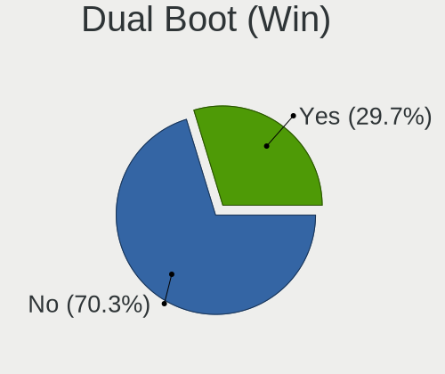
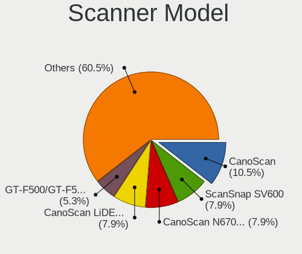
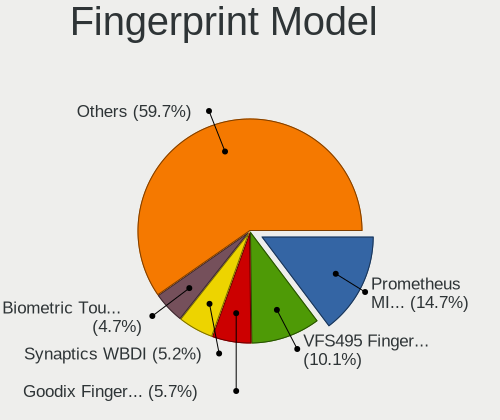

Linux in Austria - Tested Hardware & Statistics
-----------------------------------------------

A project to collect tested hardware configurations for Linux in Austria.

Anyone can contribute to this report by the [hw-probe](https://github.com/linuxhw/hw-probe) tool:

    sudo -E hw-probe -all -upload

Please contribute! Especially if your hardware is rare.

This is a report for all computer types. See also reports for [desktops](/Location/Austria/Desktop/README.md) and [notebooks](/Location/Austria/Notebook/README.md).

Contents
--------

* [ Test Cases ](#test-cases)

* [ System ](#system)
  - [ OS                       ](#os)
  - [ OS Family                ](#os-family)
  - [ Kernel                   ](#kernel)
  - [ Kernel Family            ](#kernel-family)
  - [ Kernel Major Ver.        ](#kernel-major-ver)
  - [ Arch                     ](#arch)
  - [ DE                       ](#de)
  - [ Display Server           ](#display-server)
  - [ Display Manager          ](#display-manager)
  - [ OS Lang                  ](#os-lang)
  - [ Boot Mode                ](#boot-mode)
  - [ Filesystem               ](#filesystem)
  - [ Part. scheme             ](#part-scheme)
  - [ Dual Boot with Linux/BSD ](#dual-boot-with-linuxbsd)
  - [ Dual Boot (Win)          ](#dual-boot-win)

* [ Board ](#board)
  - [ Vendor                   ](#vendor)
  - [ Model                    ](#model)
  - [ Model Family             ](#model-family)
  - [ MFG Year                 ](#mfg-year)
  - [ Form Factor              ](#form-factor)
  - [ Secure Boot              ](#secure-boot)
  - [ Coreboot                 ](#coreboot)
  - [ RAM Size                 ](#ram-size)
  - [ RAM Used                 ](#ram-used)
  - [ Total Drives             ](#total-drives)
  - [ Has CD-ROM               ](#has-cd-rom)
  - [ Has Ethernet             ](#has-ethernet)
  - [ Has WiFi                 ](#has-wifi)
  - [ Has Bluetooth            ](#has-bluetooth)

* [ Location ](#location)
  - [ Country                  ](#country)
  - [ City                     ](#city)

* [ Drives ](#drives)
  - [ Drive Vendor             ](#drive-vendor)
  - [ Drive Model              ](#drive-model)
  - [ HDD Vendor               ](#hdd-vendor)
  - [ SSD Vendor               ](#ssd-vendor)
  - [ Drive Kind               ](#drive-kind)
  - [ Drive Connector          ](#drive-connector)
  - [ Drive Size               ](#drive-size)
  - [ Space Total              ](#space-total)
  - [ Space Used               ](#space-used)
  - [ Malfunc. Drives          ](#malfunc-drives)
  - [ Malfunc. Drive Vendor    ](#malfunc-drive-vendor)
  - [ Malfunc. HDD Vendor      ](#malfunc-hdd-vendor)
  - [ Malfunc. Drive Kind      ](#malfunc-drive-kind)
  - [ Failed Drives            ](#failed-drives)
  - [ Failed Drive Vendor      ](#failed-drive-vendor)
  - [ Drive Status             ](#drive-status)

* [ Storage controller ](#storage-controller)
  - [ Storage Vendor           ](#storage-vendor)
  - [ Storage Model            ](#storage-model)
  - [ Storage Kind             ](#storage-kind)

* [ Processor ](#processor)
  - [ CPU Vendor               ](#cpu-vendor)
  - [ CPU Model                ](#cpu-model)
  - [ CPU Model Family         ](#cpu-model-family)
  - [ CPU Cores                ](#cpu-cores)
  - [ CPU Sockets              ](#cpu-sockets)
  - [ CPU Threads              ](#cpu-threads)
  - [ CPU Op-Modes             ](#cpu-op-modes)
  - [ CPU Microcode            ](#cpu-microcode)
  - [ CPU Microarch            ](#cpu-microarch)

* [ Graphics ](#graphics)
  - [ GPU Vendor               ](#gpu-vendor)
  - [ GPU Model                ](#gpu-model)
  - [ GPU Combo                ](#gpu-combo)
  - [ GPU Driver               ](#gpu-driver)
  - [ GPU Memory               ](#gpu-memory)

* [ Monitor ](#monitor)
  - [ Monitor Vendor           ](#monitor-vendor)
  - [ Monitor Model            ](#monitor-model)
  - [ Monitor Resolution       ](#monitor-resolution)
  - [ Monitor Diagonal         ](#monitor-diagonal)
  - [ Monitor Width            ](#monitor-width)
  - [ Aspect Ratio             ](#aspect-ratio)
  - [ Monitor Area             ](#monitor-area)
  - [ Pixel Density            ](#pixel-density)
  - [ Multiple Monitors        ](#multiple-monitors)

* [ Network ](#network)
  - [ Net Controller Vendor    ](#net-controller-vendor)
  - [ Net Controller Model     ](#net-controller-model)
  - [ Wireless Vendor          ](#wireless-vendor)
  - [ Wireless Model           ](#wireless-model)
  - [ Ethernet Vendor          ](#ethernet-vendor)
  - [ Ethernet Model           ](#ethernet-model)
  - [ Net Controller Kind      ](#net-controller-kind)
  - [ Used Controller          ](#used-controller)
  - [ NICs                     ](#nics)
  - [ IPv6                     ](#ipv6)

* [ Bluetooth ](#bluetooth)
  - [ Bluetooth Vendor         ](#bluetooth-vendor)
  - [ Bluetooth Model          ](#bluetooth-model)

* [ Sound ](#sound)
  - [ Sound Vendor             ](#sound-vendor)
  - [ Sound Model              ](#sound-model)

* [ Memory ](#memory)
  - [ Memory Vendor            ](#memory-vendor)
  - [ Memory Model             ](#memory-model)
  - [ Memory Kind              ](#memory-kind)
  - [ Memory Form Factor       ](#memory-form-factor)
  - [ Memory Size              ](#memory-size)
  - [ Memory Speed             ](#memory-speed)

* [ Printers & scanners ](#printers--scanners)
  - [ Printer Vendor           ](#printer-vendor)
  - [ Printer Model            ](#printer-model)
  - [ Scanner Vendor           ](#scanner-vendor)
  - [ Scanner Model            ](#scanner-model)

* [ Camera ](#camera)
  - [ Camera Vendor            ](#camera-vendor)
  - [ Camera Model             ](#camera-model)

* [ Security ](#security)
  - [ Fingerprint Vendor       ](#fingerprint-vendor)
  - [ Fingerprint Model        ](#fingerprint-model)
  - [ Chipcard Vendor          ](#chipcard-vendor)
  - [ Chipcard Model           ](#chipcard-model)

* [ Unsupported ](#unsupported)
  - [ Unsupported Devices      ](#unsupported-devices)
  - [ Unsupported Device Types ](#unsupported-device-types)

Test Cases
----------

Total: 2405

| Vendor        | Model                       | Form-Factor | Probe                                                      | Date         |
|---------------|-----------------------------|-------------|------------------------------------------------------------|--------------|
| Lenovo        | MIIX 520-12IKB 20M3         | Tablet      | [6ff1d34454](https://linux-hardware.org/?probe=6ff1d34454) | Feb 28, 2023 |
| ASRock        | G41M-S                      | Desktop     | [8802d04f08](https://linux-hardware.org/?probe=8802d04f08) | Feb 27, 2023 |
| HP            | 3397                        | Desktop     | [8081d24eb1](https://linux-hardware.org/?probe=8081d24eb1) | Feb 27, 2023 |
| Apple         | MacBookAir4,2               | Notebook    | [a9605bf85e](https://linux-hardware.org/?probe=a9605bf85e) | Feb 27, 2023 |
| MSI           | B150M PRO-VDH               | Desktop     | [e538527e6c](https://linux-hardware.org/?probe=e538527e6c) | Feb 26, 2023 |
| MSI           | PRO Z690-A DDR4             | Desktop     | [3ab842532b](https://linux-hardware.org/?probe=3ab842532b) | Feb 26, 2023 |
| ASUSTek       | ROG CROSSHAIR X670E EXTR... | Desktop     | [659ff1672e](https://linux-hardware.org/?probe=659ff1672e) | Feb 26, 2023 |
| Dell          | Latitude E7250              | Notebook    | [db6ac786ef](https://linux-hardware.org/?probe=db6ac786ef) | Feb 26, 2023 |
| Valve         | Jupiter                     | Notebook    | [c8006c3bd5](https://linux-hardware.org/?probe=c8006c3bd5) | Feb 26, 2023 |
| MSI           | MAG B550 TOMAHAWK           | Desktop     | [2943aa6cd7](https://linux-hardware.org/?probe=2943aa6cd7) | Feb 25, 2023 |
| ASRock        | H81M-HDS                    | Desktop     | [d4a6916e4f](https://linux-hardware.org/?probe=d4a6916e4f) | Feb 24, 2023 |
| Toshiba       | Satellite C70D-B            | Notebook    | [0c69e8ef9b](https://linux-hardware.org/?probe=0c69e8ef9b) | Feb 23, 2023 |
| Toshiba       | Satellite C70D-B            | Notebook    | [bcae8ff254](https://linux-hardware.org/?probe=bcae8ff254) | Feb 23, 2023 |
| Gigabyte      | H610M S2H DDR4              | Desktop     | [e44618f1c3](https://linux-hardware.org/?probe=e44618f1c3) | Feb 23, 2023 |
| Apple         | MacBookPro11,5              | Notebook    | [49007433d0](https://linux-hardware.org/?probe=49007433d0) | Feb 23, 2023 |
| Apple         | MacBookPro11,5              | Notebook    | [e67cca4a6c](https://linux-hardware.org/?probe=e67cca4a6c) | Feb 23, 2023 |
| ASUSTek       | TUF Gaming B550M-PLUS       | Desktop     | [09c45a0b09](https://linux-hardware.org/?probe=09c45a0b09) | Feb 21, 2023 |
| ASUSTek       | TUF Gaming B550M-PLUS       | Desktop     | [f5a22b7bb9](https://linux-hardware.org/?probe=f5a22b7bb9) | Feb 21, 2023 |
| MSI           | MPG X570 GAMING EDGE WIF... | Desktop     | [d5f5531b82](https://linux-hardware.org/?probe=d5f5531b82) | Feb 20, 2023 |
| Unknown       | Unknown                     | Notebook    | [1f89daceb8](https://linux-hardware.org/?probe=1f89daceb8) | Feb 20, 2023 |
| HP            | Spectre x360 Convertible... | Convertible | [72b8072c9a](https://linux-hardware.org/?probe=72b8072c9a) | Feb 20, 2023 |
| MSI           | MPG X570 GAMING EDGE WIF... | Desktop     | [1263eaf1f9](https://linux-hardware.org/?probe=1263eaf1f9) | Feb 19, 2023 |
| Lenovo        | ThinkPad W510 4391W3V       | Notebook    | [f4065623e5](https://linux-hardware.org/?probe=f4065623e5) | Feb 18, 2023 |
| Chuwi         | HeroBook Pro                | Notebook    | [f49ba07c1e](https://linux-hardware.org/?probe=f49ba07c1e) | Feb 18, 2023 |
| ASUSTek       | PRIME Z270-K                | Desktop     | [5ecce23878](https://linux-hardware.org/?probe=5ecce23878) | Feb 18, 2023 |
| Medion        | E7220                       | Notebook    | [289b7dc6aa](https://linux-hardware.org/?probe=289b7dc6aa) | Feb 17, 2023 |
| MSI           | A78M-E35                    | Desktop     | [30c75db366](https://linux-hardware.org/?probe=30c75db366) | Feb 16, 2023 |
| Gigabyte      | GB-BSi7A-6500               | Notebook    | [9c461d33db](https://linux-hardware.org/?probe=9c461d33db) | Feb 16, 2023 |
| Medion        | E7220                       | Notebook    | [dd9de8bf69](https://linux-hardware.org/?probe=dd9de8bf69) | Feb 15, 2023 |
| Lenovo        | ThinkPad P1 Gen 4i 20Y3S... | Notebook    | [580215c6bb](https://linux-hardware.org/?probe=580215c6bb) | Feb 15, 2023 |
| ASUSTek       | ROG STRIX B550-F GAMING     | Notebook    | [ca4349a929](https://linux-hardware.org/?probe=ca4349a929) | Feb 15, 2023 |
| ASUSTek       | H110M-A                     | Desktop     | [d2d359be39](https://linux-hardware.org/?probe=d2d359be39) | Feb 14, 2023 |
| Apple         | MacBook5,2                  | Notebook    | [72b8d495ff](https://linux-hardware.org/?probe=72b8d495ff) | Feb 13, 2023 |
| Acer          | Aspire 7740                 | Notebook    | [caeb61e835](https://linux-hardware.org/?probe=caeb61e835) | Feb 12, 2023 |
| Apple         | MacBookPro11,5              | Notebook    | [78e7a0ae85](https://linux-hardware.org/?probe=78e7a0ae85) | Feb 12, 2023 |
| Unknown       | Unknown                     | Desktop     | [f2f95aef80](https://linux-hardware.org/?probe=f2f95aef80) | Feb 12, 2023 |
| Acer          | Aspire A515-54G             | Notebook    | [632c139c4b](https://linux-hardware.org/?probe=632c139c4b) | Feb 12, 2023 |
| ASUSTek       | P8H77-I                     | Desktop     | [74013e0688](https://linux-hardware.org/?probe=74013e0688) | Feb 11, 2023 |
| ASUSTek       | ASUS EXPERTBOOK B2502FBA... | Convertible | [dd34aed5d9](https://linux-hardware.org/?probe=dd34aed5d9) | Feb 11, 2023 |
| Apple         | MacBookPro5,4               | Notebook    | [b7e924b0cd](https://linux-hardware.org/?probe=b7e924b0cd) | Feb 11, 2023 |
| Lenovo        | ThinkPad T450 20BUS1110E    | Notebook    | [d08c46c46d](https://linux-hardware.org/?probe=d08c46c46d) | Feb 10, 2023 |
| ASUSTek       | VivoBook_ASUSLaptop X521... | Notebook    | [3f4b71a601](https://linux-hardware.org/?probe=3f4b71a601) | Feb 09, 2023 |
| ASUSTek       | B85M-G                      | Desktop     | [7f27fb0a83](https://linux-hardware.org/?probe=7f27fb0a83) | Feb 09, 2023 |
| ASUSTek       | SABERTOOTH 990FX R2.0       | Desktop     | [82173d3b08](https://linux-hardware.org/?probe=82173d3b08) | Feb 09, 2023 |
| ASUSTek       | PRIME B450M-A II            | Desktop     | [10cf328828](https://linux-hardware.org/?probe=10cf328828) | Feb 06, 2023 |
| ASUSTek       | P8P67 WS REVOLUTION         | Desktop     | [c0190f8f57](https://linux-hardware.org/?probe=c0190f8f57) | Feb 06, 2023 |
| MSI           | GF63 Thin 11UC              | Notebook    | [a57b142e05](https://linux-hardware.org/?probe=a57b142e05) | Feb 06, 2023 |
| Lenovo        | ThinkPad L15 Gen 1 20U70... | Notebook    | [7ca566f68b](https://linux-hardware.org/?probe=7ca566f68b) | Feb 05, 2023 |
| Dell          | Inspiron 7586               | Convertible | [732b3c8fb1](https://linux-hardware.org/?probe=732b3c8fb1) | Feb 05, 2023 |
| Apple         | MacBookPro11,5              | Notebook    | [3407774ba7](https://linux-hardware.org/?probe=3407774ba7) | Feb 05, 2023 |
| HP            | 0A98h                       | Desktop     | [1d3ae20ff5](https://linux-hardware.org/?probe=1d3ae20ff5) | Feb 04, 2023 |
| Dell          | MXG061                      | Notebook    | [40883298a9](https://linux-hardware.org/?probe=40883298a9) | Feb 04, 2023 |
| Dell          | 0D28YY A03                  | Desktop     | [ae7eeb7487](https://linux-hardware.org/?probe=ae7eeb7487) | Feb 04, 2023 |
| Dell          | 0D28YY A03                  | Desktop     | [0fe32fbdc2](https://linux-hardware.org/?probe=0fe32fbdc2) | Feb 04, 2023 |
| ASUSTek       | PN50-E1                     | Mini pc     | [063a4bb843](https://linux-hardware.org/?probe=063a4bb843) | Feb 03, 2023 |
| HP            | 8906 SMVB                   | Desktop     | [82845bb849](https://linux-hardware.org/?probe=82845bb849) | Feb 02, 2023 |
| MSI           | GF63 Thin 11UC              | Notebook    | [b34b3228d3](https://linux-hardware.org/?probe=b34b3228d3) | Feb 01, 2023 |
| ASUSTek       | F2A85-V                     | Desktop     | [c68678a1a5](https://linux-hardware.org/?probe=c68678a1a5) | Jan 31, 2023 |
| Acer          | Aspire A515-54G             | Notebook    | [a57a68e42f](https://linux-hardware.org/?probe=a57a68e42f) | Jan 31, 2023 |
| ASUSTek       | ROG Zephyrus G14 GA402RK... | Notebook    | [0d500d9d33](https://linux-hardware.org/?probe=0d500d9d33) | Jan 31, 2023 |
| Dell          | Latitude 5480               | Notebook    | [8b43efc7ea](https://linux-hardware.org/?probe=8b43efc7ea) | Jan 31, 2023 |
| MSI           | B450 TOMAHAWK MAX           | Desktop     | [f2a2476d45](https://linux-hardware.org/?probe=f2a2476d45) | Jan 31, 2023 |
| Lenovo        | ThinkPad W510 4391W3V       | Notebook    | [78d987fedf](https://linux-hardware.org/?probe=78d987fedf) | Jan 30, 2023 |
| Lenovo        | ThinkPad W510 4391W3V       | Notebook    | [a178301183](https://linux-hardware.org/?probe=a178301183) | Jan 30, 2023 |
| Fujitsu       | D3183-A1 S26361-D3183-A1    | Desktop     | [bfb86ee660](https://linux-hardware.org/?probe=bfb86ee660) | Jan 29, 2023 |
| ASUSTek       | G750JX                      | Notebook    | [d868c23c4b](https://linux-hardware.org/?probe=d868c23c4b) | Jan 29, 2023 |
| HP            | OMEN by Laptop 16-c0xxx     | Notebook    | [32d5472e21](https://linux-hardware.org/?probe=32d5472e21) | Jan 29, 2023 |
| ASUSTek       | F2A85-V                     | Desktop     | [d528677cfd](https://linux-hardware.org/?probe=d528677cfd) | Jan 28, 2023 |
| HP            | 1495                        | Desktop     | [8c1f7b5fbd](https://linux-hardware.org/?probe=8c1f7b5fbd) | Jan 27, 2023 |
| Lenovo        | ThinkPad T14 Gen 1 20S1S... | Notebook    | [c5168e6b33](https://linux-hardware.org/?probe=c5168e6b33) | Jan 27, 2023 |
| Dell          | XPS 15 7590                 | Notebook    | [4ecf66ddd9](https://linux-hardware.org/?probe=4ecf66ddd9) | Jan 27, 2023 |
| HP            | OMEN by Laptop 16-c0xxx     | Notebook    | [4024f7c3bd](https://linux-hardware.org/?probe=4024f7c3bd) | Jan 26, 2023 |
| Gigabyte      | GA-990FXA-UD3               | Desktop     | [6e5884ec0c](https://linux-hardware.org/?probe=6e5884ec0c) | Jan 26, 2023 |
| HP            | EliteBook 855 G8 Noteboo... | Notebook    | [ea142e4848](https://linux-hardware.org/?probe=ea142e4848) | Jan 25, 2023 |
| TUXEDO        | Unknown                     | Notebook    | [5973888b27](https://linux-hardware.org/?probe=5973888b27) | Jan 24, 2023 |
| Lenovo        | ThinkPad X1 Carbon 3rd 2... | Notebook    | [be73748546](https://linux-hardware.org/?probe=be73748546) | Jan 24, 2023 |
| Lenovo        | ThinkPad X1 Carbon 3rd 2... | Notebook    | [7595deef91](https://linux-hardware.org/?probe=7595deef91) | Jan 24, 2023 |
| MSI           | B450-A PRO                  | Desktop     | [e9c7c42a8b](https://linux-hardware.org/?probe=e9c7c42a8b) | Jan 22, 2023 |
| Gigabyte      | Z77-D3H                     | Desktop     | [9035a00600](https://linux-hardware.org/?probe=9035a00600) | Jan 22, 2023 |
| Toshiba       | Satellite Pro C660          | Notebook    | [f1c0237cc0](https://linux-hardware.org/?probe=f1c0237cc0) | Jan 22, 2023 |
| Foxconn       | NETBOX NT-425/525 Ver       | Desktop     | [dfb8c476f9](https://linux-hardware.org/?probe=dfb8c476f9) | Jan 21, 2023 |
| Lenovo        | ThinkPad X1 Yoga 3rd 20L... | Convertible | [2b5b2da951](https://linux-hardware.org/?probe=2b5b2da951) | Jan 20, 2023 |
| Lenovo        | ThinkPad X230 2333AZ2       | Notebook    | [d9d0138294](https://linux-hardware.org/?probe=d9d0138294) | Jan 19, 2023 |
| ASUSTek       | A6U                         | Notebook    | [58c040d67c](https://linux-hardware.org/?probe=58c040d67c) | Jan 19, 2023 |
| ASUSTek       | A6U                         | Notebook    | [9156e1c9cd](https://linux-hardware.org/?probe=9156e1c9cd) | Jan 19, 2023 |
| ASUSTek       | VivoBook_ASUSLaptop X515... | Notebook    | [eddf4927eb](https://linux-hardware.org/?probe=eddf4927eb) | Jan 19, 2023 |
| MSI           | VR630                       | Notebook    | [943c1d68fa](https://linux-hardware.org/?probe=943c1d68fa) | Jan 19, 2023 |
| Lenovo        | ThinkPad X1 Yoga 3rd 20L... | Convertible | [a5cbba39d7](https://linux-hardware.org/?probe=a5cbba39d7) | Jan 19, 2023 |
| Dell          | 0WR7PY A01                  | Desktop     | [4197c5f3d3](https://linux-hardware.org/?probe=4197c5f3d3) | Jan 19, 2023 |
| ASUSTek       | K53TA                       | Notebook    | [a56a3691e9](https://linux-hardware.org/?probe=a56a3691e9) | Jan 18, 2023 |
| HP            | 8643 SMVB                   | Desktop     | [c99128e783](https://linux-hardware.org/?probe=c99128e783) | Jan 16, 2023 |
| Lenovo        | ThinkPad W510 43892AG       | Notebook    | [b68853abf6](https://linux-hardware.org/?probe=b68853abf6) | Jan 16, 2023 |
| Lenovo        | IdeaPad 5 14ALC05 82LM      | Notebook    | [a159136180](https://linux-hardware.org/?probe=a159136180) | Jan 16, 2023 |
| HP            | Stream Laptop 11-ak0xxx     | Notebook    | [6f3b4fc131](https://linux-hardware.org/?probe=6f3b4fc131) | Jan 16, 2023 |
| HP            | Stream Laptop 11-ak0xxx     | Notebook    | [b33bedc4c2](https://linux-hardware.org/?probe=b33bedc4c2) | Jan 15, 2023 |
| Lenovo        | IdeaPad 3 17ITL6 82H9       | Notebook    | [80f9124e5a](https://linux-hardware.org/?probe=80f9124e5a) | Jan 14, 2023 |
| HP            | 8643 SMVB                   | Desktop     | [81d232a246](https://linux-hardware.org/?probe=81d232a246) | Jan 14, 2023 |
| MSI           | B450 GAMING PLUS MAX        | Desktop     | [ba09b2045b](https://linux-hardware.org/?probe=ba09b2045b) | Jan 13, 2023 |
| TUXEDO        | Unknown                     | Notebook    | [5721ffbc43](https://linux-hardware.org/?probe=5721ffbc43) | Jan 13, 2023 |
| ASUSTek       | TUF Gaming B550-PLUS        | Desktop     | [c3a30838c3](https://linux-hardware.org/?probe=c3a30838c3) | Jan 13, 2023 |
| HP            | EliteBook 850 G8 Noteboo... | Notebook    | [64c403ce6d](https://linux-hardware.org/?probe=64c403ce6d) | Jan 13, 2023 |
| HP            | Stream Laptop 11-ak0xxx     | Notebook    | [806da9b386](https://linux-hardware.org/?probe=806da9b386) | Jan 12, 2023 |
| HP            | Stream Laptop 11-ak0xxx     | Notebook    | [29e6fcfd32](https://linux-hardware.org/?probe=29e6fcfd32) | Jan 12, 2023 |
| Dell          | Latitude E5550              | Notebook    | [0b14eb18d9](https://linux-hardware.org/?probe=0b14eb18d9) | Jan 12, 2023 |
| Medion        | E6222                       | Notebook    | [e3b3da28fa](https://linux-hardware.org/?probe=e3b3da28fa) | Jan 11, 2023 |
| ASUSTek       | PRIME B450-PLUS             | Desktop     | [e608d09ac5](https://linux-hardware.org/?probe=e608d09ac5) | Jan 11, 2023 |
| Dell          | Latitude E5550              | Notebook    | [5e76d378f9](https://linux-hardware.org/?probe=5e76d378f9) | Jan 11, 2023 |
| ASUSTek       | F2A85-V                     | Desktop     | [0ddddc438d](https://linux-hardware.org/?probe=0ddddc438d) | Jan 11, 2023 |
| HP            | 8906 SMVB                   | Desktop     | [7d56f2f733](https://linux-hardware.org/?probe=7d56f2f733) | Jan 11, 2023 |
| Dell          | Latitude E7440              | Notebook    | [bfdc9dfc63](https://linux-hardware.org/?probe=bfdc9dfc63) | Jan 11, 2023 |
| ASUSTek       | Z170-A                      | Desktop     | [0f0b38970a](https://linux-hardware.org/?probe=0f0b38970a) | Jan 11, 2023 |
| ASUSTek       | M5A97 EVO R2.0              | Desktop     | [b2d69bd762](https://linux-hardware.org/?probe=b2d69bd762) | Jan 11, 2023 |
| Dell          | XPS 13 9380                 | Notebook    | [d8ab62070c](https://linux-hardware.org/?probe=d8ab62070c) | Jan 11, 2023 |
| Intel         | NUC8BEB J72688-307          | Mini pc     | [3e54ca06f5](https://linux-hardware.org/?probe=3e54ca06f5) | Jan 10, 2023 |
| ASUSTek       | M5A97 EVO R2.0              | Desktop     | [fbde9a1dba](https://linux-hardware.org/?probe=fbde9a1dba) | Jan 10, 2023 |
| HP            | OMEN by Laptop              | Notebook    | [a365222a35](https://linux-hardware.org/?probe=a365222a35) | Jan 09, 2023 |
| MSI           | GS63VR 7RF                  | Notebook    | [95aadb3cc4](https://linux-hardware.org/?probe=95aadb3cc4) | Jan 09, 2023 |
| Sony          | SVE1512H1EB                 | Notebook    | [723e8bfbe6](https://linux-hardware.org/?probe=723e8bfbe6) | Jan 09, 2023 |
| Dell          | XPS 15 9510                 | Notebook    | [297380c89a](https://linux-hardware.org/?probe=297380c89a) | Jan 09, 2023 |
| Gigabyte      | X570 I AORUS PRO WIFI       | Desktop     | [919b259ea2](https://linux-hardware.org/?probe=919b259ea2) | Jan 09, 2023 |
| Acer          | Iconia W700                 | Notebook    | [bcfec36896](https://linux-hardware.org/?probe=bcfec36896) | Jan 09, 2023 |
| ASUSTek       | H110M-A                     | Desktop     | [d67718b4e8](https://linux-hardware.org/?probe=d67718b4e8) | Jan 08, 2023 |
| Google        | Kled                        | Notebook    | [3cb98a4497](https://linux-hardware.org/?probe=3cb98a4497) | Jan 07, 2023 |
| Lenovo        | ThinkPad X220 4290KJ6       | Notebook    | [8296e61afd](https://linux-hardware.org/?probe=8296e61afd) | Jan 05, 2023 |
| Sony          | VPCEH2D0E                   | Notebook    | [78367f11f5](https://linux-hardware.org/?probe=78367f11f5) | Jan 04, 2023 |
| Gigabyte      | Z690 UD AX                  | Desktop     | [e6ee0cd764](https://linux-hardware.org/?probe=e6ee0cd764) | Jan 04, 2023 |
| ASUSTek       | K93SM                       | Notebook    | [c0fb78e9a3](https://linux-hardware.org/?probe=c0fb78e9a3) | Jan 03, 2023 |
| Lenovo        | 310B SDK0J40697 WIN 3305... | Desktop     | [b1771ee07c](https://linux-hardware.org/?probe=b1771ee07c) | Jan 03, 2023 |
| ASUSTek       | TUF Gaming B550-PLUS        | Desktop     | [a35156e0c3](https://linux-hardware.org/?probe=a35156e0c3) | Jan 02, 2023 |
| ASUSTek       | P7P55D-E                    | Desktop     | [8f4f98da64](https://linux-hardware.org/?probe=8f4f98da64) | Jan 02, 2023 |
| ASUSTek       | PRIME B350M-E               | Desktop     | [f39e3e8350](https://linux-hardware.org/?probe=f39e3e8350) | Jan 02, 2023 |
| Dell          | Latitude 7430               | Notebook    | [ad796336f7](https://linux-hardware.org/?probe=ad796336f7) | Jan 01, 2023 |
| Lenovo        | ThinkPad X270 20K60018GE    | Notebook    | [a92939c1f5](https://linux-hardware.org/?probe=a92939c1f5) | Jan 01, 2023 |
| Lenovo        | ThinkPad X390 20Q00051GE    | Notebook    | [5b3d1b750d](https://linux-hardware.org/?probe=5b3d1b750d) | Dec 31, 2022 |
| Lenovo        | ThinkPad X390 20Q00051GE    | Notebook    | [775096be09](https://linux-hardware.org/?probe=775096be09) | Dec 31, 2022 |
| Chuwi         | HeroBook Pro                | Notebook    | [cdc31b8338](https://linux-hardware.org/?probe=cdc31b8338) | Dec 30, 2022 |
| Gigabyte      | B550M AORUS PRO-P           | Desktop     | [de6ea0ae2e](https://linux-hardware.org/?probe=de6ea0ae2e) | Dec 30, 2022 |
| HP            | Pavilion Gaming Laptop 1... | Notebook    | [c28fb2edb2](https://linux-hardware.org/?probe=c28fb2edb2) | Dec 30, 2022 |
| ASUSTek       | P7P55D-E                    | Desktop     | [f725a0095a](https://linux-hardware.org/?probe=f725a0095a) | Dec 30, 2022 |
| Supermicro    | H8SCM                       | Server      | [9ee42dcf6f](https://linux-hardware.org/?probe=9ee42dcf6f) | Dec 29, 2022 |
| Intel         | NUC10i7FNB K61360-306       | Mini pc     | [6e3a112190](https://linux-hardware.org/?probe=6e3a112190) | Dec 28, 2022 |
| Gigabyte      | Z590 AORUS PRO AX           | Desktop     | [d680b8dd2a](https://linux-hardware.org/?probe=d680b8dd2a) | Dec 28, 2022 |
| ASUSTek       | ROG STRIX B550-E GAMING     | Desktop     | [e8dce940d8](https://linux-hardware.org/?probe=e8dce940d8) | Dec 26, 2022 |
| Medion        | X782X/X783X                 | Notebook    | [a8befc040f](https://linux-hardware.org/?probe=a8befc040f) | Dec 26, 2022 |
| Matrox Ele... | 4GPMOBIL 7449-03-0          | Desktop     | [c02a37a124](https://linux-hardware.org/?probe=c02a37a124) | Dec 26, 2022 |
| ASUSTek       | P7P55D-E                    | Desktop     | [a6be229477](https://linux-hardware.org/?probe=a6be229477) | Dec 24, 2022 |
| ASUSTek       | PRIME B450-PLUS             | Desktop     | [e3e2773bde](https://linux-hardware.org/?probe=e3e2773bde) | Dec 24, 2022 |
| Notebook      | P64_HJ,HK1                  | Notebook    | [26a548a6f3](https://linux-hardware.org/?probe=26a548a6f3) | Dec 23, 2022 |
| Fujitsu       | LIFEBOOK AH544              | Notebook    | [431eac7d11](https://linux-hardware.org/?probe=431eac7d11) | Dec 22, 2022 |
| Lenovo        | ThinkPad T470s 20HF005QM... | Notebook    | [b934598049](https://linux-hardware.org/?probe=b934598049) | Dec 22, 2022 |
| Lenovo        | ThinkPad T490 20N20048GE    | Notebook    | [629a725afa](https://linux-hardware.org/?probe=629a725afa) | Dec 21, 2022 |
| HP            | 8906 SMVB                   | Desktop     | [aeb826326b](https://linux-hardware.org/?probe=aeb826326b) | Dec 20, 2022 |
| Acer          | Aspire A715-72G             | Notebook    | [8e15fef839](https://linux-hardware.org/?probe=8e15fef839) | Dec 19, 2022 |
| MSI           | GE63 Raider RGB 8RF         | Notebook    | [a85193c482](https://linux-hardware.org/?probe=a85193c482) | Dec 19, 2022 |
| Dell          | 0T7D40 A01                  | Desktop     | [74207a9fec](https://linux-hardware.org/?probe=74207a9fec) | Dec 19, 2022 |
| Google        | Cyan                        | Notebook    | [fff3502929](https://linux-hardware.org/?probe=fff3502929) | Dec 19, 2022 |
| Acer          | Nitro AN515-42              | Notebook    | [88d7491a00](https://linux-hardware.org/?probe=88d7491a00) | Dec 19, 2022 |
| AXDIA Inte... | myBook PRO14 SE V2          | Notebook    | [14b79d7a8b](https://linux-hardware.org/?probe=14b79d7a8b) | Dec 18, 2022 |
| Lenovo        | ThinkPad A485 20MVS0LG00    | Notebook    | [86c9426d80](https://linux-hardware.org/?probe=86c9426d80) | Dec 18, 2022 |
| Lenovo        | ThinkPad A485 20MVS0LG00    | Notebook    | [05fcf7302f](https://linux-hardware.org/?probe=05fcf7302f) | Dec 18, 2022 |
| ASUSTek       | ROG CROSSHAIR VIII FORMU... | Desktop     | [fa03fe621a](https://linux-hardware.org/?probe=fa03fe621a) | Dec 17, 2022 |
| ASUSTek       | ROG CROSSHAIR VIII FORMU... | Desktop     | [8480834751](https://linux-hardware.org/?probe=8480834751) | Dec 17, 2022 |
| Lenovo        | ThinkPad A485 20MVS0LG00    | Notebook    | [12b3654541](https://linux-hardware.org/?probe=12b3654541) | Dec 15, 2022 |
| Gigabyte      | B550M DS3H                  | Desktop     | [ffe85423d8](https://linux-hardware.org/?probe=ffe85423d8) | Dec 15, 2022 |
| HP            | EliteBook 850 G2            | Notebook    | [d0d30cd96f](https://linux-hardware.org/?probe=d0d30cd96f) | Dec 14, 2022 |
| Acer          | Swift SF314-59              | Notebook    | [943bcd1d12](https://linux-hardware.org/?probe=943bcd1d12) | Dec 14, 2022 |
| ASRock        | X670E PG Lightning          | Desktop     | [08e4e03d36](https://linux-hardware.org/?probe=08e4e03d36) | Dec 13, 2022 |
| ASRock        | X670E PG Lightning          | Desktop     | [3a6a347ff9](https://linux-hardware.org/?probe=3a6a347ff9) | Dec 13, 2022 |
| ASUSTek       | ROG CROSSHAIR VII HERO      | Desktop     | [9b02acceb3](https://linux-hardware.org/?probe=9b02acceb3) | Dec 12, 2022 |
| Fujitsu       | D3417-B1 S26361-D3417-B1    | Desktop     | [fd77b80943](https://linux-hardware.org/?probe=fd77b80943) | Dec 12, 2022 |
| Lenovo        | ThinkBook 14s Yoga ITL 2... | Convertible | [37267c6b3f](https://linux-hardware.org/?probe=37267c6b3f) | Dec 12, 2022 |
| Lenovo        | ThinkPad T14 Gen 1 20UDS... | Notebook    | [b518609312](https://linux-hardware.org/?probe=b518609312) | Dec 12, 2022 |
| Lenovo        | ThinkPad T14 Gen 1 20UDS... | Notebook    | [f815a2e4a3](https://linux-hardware.org/?probe=f815a2e4a3) | Dec 12, 2022 |
| MSI           | GE63 Raider RGB 8RF         | Notebook    | [b311865418](https://linux-hardware.org/?probe=b311865418) | Dec 12, 2022 |
| HUAWEI        | RLEF-XX                     | Notebook    | [e0b1d50b7c](https://linux-hardware.org/?probe=e0b1d50b7c) | Dec 11, 2022 |
| Gigabyte      | B550M DS3H                  | Desktop     | [cc2d9043d9](https://linux-hardware.org/?probe=cc2d9043d9) | Dec 11, 2022 |
| Lenovo        | ThinkPad T470s 20HF005QM... | Notebook    | [32ce05790e](https://linux-hardware.org/?probe=32ce05790e) | Dec 11, 2022 |
| Gigabyte      | B550M DS3H                  | Desktop     | [13434876df](https://linux-hardware.org/?probe=13434876df) | Dec 11, 2022 |
| Medion        | H81H3-EM2 H81EM2W08.309     | Desktop     | [f6341e7afb](https://linux-hardware.org/?probe=f6341e7afb) | Dec 10, 2022 |
| Lenovo        | ThinkPad P14s Gen 3 21AK... | Notebook    | [50e5b72a10](https://linux-hardware.org/?probe=50e5b72a10) | Dec 10, 2022 |
| Gigabyte      | B450 AORUS ELITE            | Desktop     | [8f38dcc9d4](https://linux-hardware.org/?probe=8f38dcc9d4) | Dec 10, 2022 |
| Gigabyte      | AB350M-Gaming 3-CF          | Desktop     | [7ae8aecc25](https://linux-hardware.org/?probe=7ae8aecc25) | Dec 08, 2022 |
| Lenovo        | ThinkPad L14 Gen 2a 20X6... | Notebook    | [b7171256c0](https://linux-hardware.org/?probe=b7171256c0) | Dec 07, 2022 |
| Lenovo        | ThinkStation S20 4157DT6    | Desktop     | [7c45cf5115](https://linux-hardware.org/?probe=7c45cf5115) | Dec 07, 2022 |
| Packard Be... | EasyNote TS11HR             | Notebook    | [cd166beede](https://linux-hardware.org/?probe=cd166beede) | Dec 06, 2022 |
| Lenovo        | G700 20251                  | Notebook    | [8d5d04f931](https://linux-hardware.org/?probe=8d5d04f931) | Dec 05, 2022 |
| Lenovo        | G700 20251                  | Notebook    | [4e8f04ce8f](https://linux-hardware.org/?probe=4e8f04ce8f) | Dec 05, 2022 |
| ASUSTek       | ROG CROSSHAIR VIII FORMU... | Desktop     | [2b34016cad](https://linux-hardware.org/?probe=2b34016cad) | Dec 04, 2022 |
| Acer          | Aspire A514-53              | Notebook    | [f0c20f1a0a](https://linux-hardware.org/?probe=f0c20f1a0a) | Dec 04, 2022 |
| ASUSTek       | P8H67-M PRO                 | Desktop     | [05131558b5](https://linux-hardware.org/?probe=05131558b5) | Dec 03, 2022 |
| ASUSTek       | P8H67-M PRO                 | Desktop     | [9fcc18738b](https://linux-hardware.org/?probe=9fcc18738b) | Dec 03, 2022 |
| ASUSTek       | X580VD                      | Notebook    | [027cd08fb1](https://linux-hardware.org/?probe=027cd08fb1) | Dec 03, 2022 |
| Toshiba       | Satellite C50-A-1HF         | Notebook    | [74902de02b](https://linux-hardware.org/?probe=74902de02b) | Dec 02, 2022 |
| ASUSTek       | ROG CROSSHAIR VIII FORMU... | Desktop     | [790ae8be94](https://linux-hardware.org/?probe=790ae8be94) | Dec 02, 2022 |
| ASUSTek       | VivoBook_ASUS Laptop X50... | Notebook    | [4f36906529](https://linux-hardware.org/?probe=4f36906529) | Dec 02, 2022 |
| ASRock        | H110M-DVS R3.0              | Desktop     | [373dac5bbb](https://linux-hardware.org/?probe=373dac5bbb) | Dec 02, 2022 |
| Intel         | NUC10i5FNB K61361-303       | Mini pc     | [d9bba42204](https://linux-hardware.org/?probe=d9bba42204) | Dec 02, 2022 |
| Apple         | MacBookPro14,1              | Notebook    | [eb13a8db03](https://linux-hardware.org/?probe=eb13a8db03) | Dec 02, 2022 |
| Acer          | Aspire A514-53              | Notebook    | [07ff06f360](https://linux-hardware.org/?probe=07ff06f360) | Dec 02, 2022 |
| ASUSTek       | H110M-A                     | Desktop     | [d7694493c0](https://linux-hardware.org/?probe=d7694493c0) | Dec 02, 2022 |
| ASRock        | H110M-DVS R3.0              | Desktop     | [01dfdc071e](https://linux-hardware.org/?probe=01dfdc071e) | Dec 01, 2022 |
| Medion        | H81H3-EM2 H81EM2W08.309     | Desktop     | [9aa4880856](https://linux-hardware.org/?probe=9aa4880856) | Dec 01, 2022 |
| Lenovo        | SHARKBAY NOK                | Desktop     | [e03c6b53ed](https://linux-hardware.org/?probe=e03c6b53ed) | Dec 01, 2022 |
| Medion        | H81H3-EM2 H81EM2W08.309     | Desktop     | [c1f5a1f413](https://linux-hardware.org/?probe=c1f5a1f413) | Dec 01, 2022 |
| HP            | Stream Laptop 11-ak0xxx     | Notebook    | [d2c04dd7cd](https://linux-hardware.org/?probe=d2c04dd7cd) | Dec 01, 2022 |
| W271ELQ       | Unknown                     | Notebook    | [ae170d1e81](https://linux-hardware.org/?probe=ae170d1e81) | Dec 01, 2022 |
| Gigabyte      | Z97X-SLI-CF                 | Desktop     | [ae01075720](https://linux-hardware.org/?probe=ae01075720) | Nov 28, 2022 |
| Lenovo        | ThinkBook 15 G3 ACL 21A4    | Notebook    | [ceb78dbe4e](https://linux-hardware.org/?probe=ceb78dbe4e) | Nov 28, 2022 |
| Lenovo        | ThinkPad T520 4243F53       | Notebook    | [8f9e96442a](https://linux-hardware.org/?probe=8f9e96442a) | Nov 27, 2022 |
| ASUSTek       | Z170 PRO GAMING             | Desktop     | [ee234d62ec](https://linux-hardware.org/?probe=ee234d62ec) | Nov 27, 2022 |
| Acer          | Aspire E5-571G              | Notebook    | [7d6eeaf95c](https://linux-hardware.org/?probe=7d6eeaf95c) | Nov 26, 2022 |
| Dell          | Latitude 3520               | Notebook    | [896180c55d](https://linux-hardware.org/?probe=896180c55d) | Nov 25, 2022 |
| Lenovo        | V15 G2 ALC 82KD             | Notebook    | [6646978243](https://linux-hardware.org/?probe=6646978243) | Nov 23, 2022 |
| Lenovo        | V15 G2 ALC 82KD             | Notebook    | [ddcb37ea55](https://linux-hardware.org/?probe=ddcb37ea55) | Nov 23, 2022 |
| Gigabyte      | Z270-HD3P-CF                | Desktop     | [6d3657ecde](https://linux-hardware.org/?probe=6d3657ecde) | Nov 23, 2022 |
| Dell          | Precision 5560              | Notebook    | [f20218fb35](https://linux-hardware.org/?probe=f20218fb35) | Nov 23, 2022 |
| MSI           | PRO Z690-A DDR4             | Desktop     | [fc53a66047](https://linux-hardware.org/?probe=fc53a66047) | Nov 22, 2022 |
| TUXEDO        | N7x0WU                      | Notebook    | [614f59ceaf](https://linux-hardware.org/?probe=614f59ceaf) | Nov 22, 2022 |
| Gigabyte      | Z590 UD AC                  | Desktop     | [4fc70b9ddc](https://linux-hardware.org/?probe=4fc70b9ddc) | Nov 21, 2022 |
| Lenovo        | ThinkPad L15 Gen 2a 20X7... | Notebook    | [dc848e747b](https://linux-hardware.org/?probe=dc848e747b) | Nov 21, 2022 |
| Microsoft     | Surface Laptop              | Tablet      | [b6697363ea](https://linux-hardware.org/?probe=b6697363ea) | Nov 20, 2022 |
| MSI           | B450 TOMAHAWK               | Desktop     | [8c271e833d](https://linux-hardware.org/?probe=8c271e833d) | Nov 20, 2022 |
| ASUSTek       | Zenbook UM6702RA_RM6702R... | Notebook    | [4ea8f7dbb0](https://linux-hardware.org/?probe=4ea8f7dbb0) | Nov 19, 2022 |
| Valve         | Jupiter                     | Notebook    | [5932954a14](https://linux-hardware.org/?probe=5932954a14) | Nov 19, 2022 |
| Acer          | FMP55                       | Desktop     | [f35d63ca8b](https://linux-hardware.org/?probe=f35d63ca8b) | Nov 18, 2022 |
| ASUSTek       | VivoBook_ASUSLaptop X515... | Notebook    | [93ad560f52](https://linux-hardware.org/?probe=93ad560f52) | Nov 17, 2022 |
| Gigabyte      | B450 AORUS ELITE            | Desktop     | [478fa166bd](https://linux-hardware.org/?probe=478fa166bd) | Nov 17, 2022 |
| ASUSTek       | ROG STRIX B550-F GAMING     | Desktop     | [c8c74ea1ec](https://linux-hardware.org/?probe=c8c74ea1ec) | Nov 15, 2022 |
| Dell          | Latitude E6220              | Notebook    | [b1270460e6](https://linux-hardware.org/?probe=b1270460e6) | Nov 15, 2022 |
| Lenovo        | ThinkBook 15 G2 ITL 20VE    | Notebook    | [d6b19cfd9d](https://linux-hardware.org/?probe=d6b19cfd9d) | Nov 15, 2022 |
| HP            | EliteBook 850 G1            | Notebook    | [a83e2b1a92](https://linux-hardware.org/?probe=a83e2b1a92) | Nov 13, 2022 |
| Fujitsu       | D3062-A1 S26361-D3062-A1    | Desktop     | [d4240ae5c7](https://linux-hardware.org/?probe=d4240ae5c7) | Nov 12, 2022 |
| Lenovo        | ThinkPad S1 Yoga 20CD003... | Notebook    | [4406929fb6](https://linux-hardware.org/?probe=4406929fb6) | Nov 11, 2022 |
| Apple         | MacBookPro9,2               | Notebook    | [695b0b0356](https://linux-hardware.org/?probe=695b0b0356) | Nov 11, 2022 |
| Lenovo        | ThinkPad T14s Gen 3 21BS... | Notebook    | [24c5edc9f9](https://linux-hardware.org/?probe=24c5edc9f9) | Nov 10, 2022 |
| MSI           | X470 GAMING PLUS MAX        | Desktop     | [9c6a00b034](https://linux-hardware.org/?probe=9c6a00b034) | Nov 09, 2022 |
| ASUSTek       | VM40B                       | Desktop     | [5736f2e2ae](https://linux-hardware.org/?probe=5736f2e2ae) | Nov 08, 2022 |
| HP            | 8906 SMVB                   | Desktop     | [2670a536f0](https://linux-hardware.org/?probe=2670a536f0) | Nov 08, 2022 |
| Medion        | MS-7797                     | Desktop     | [41ba0c8fdc](https://linux-hardware.org/?probe=41ba0c8fdc) | Nov 08, 2022 |
| ASUSTek       | X55A                        | Notebook    | [6391006e3d](https://linux-hardware.org/?probe=6391006e3d) | Nov 07, 2022 |
| ASUSTek       | X55A                        | Notebook    | [ae4277aa87](https://linux-hardware.org/?probe=ae4277aa87) | Nov 07, 2022 |
| ASUSTek       | TUF Gaming X570-PLUS        | Desktop     | [1a0fbb4d0d](https://linux-hardware.org/?probe=1a0fbb4d0d) | Nov 06, 2022 |
| Lenovo        | ThinkPad P1 Gen 3 20THCT... | Notebook    | [4c47d0ef97](https://linux-hardware.org/?probe=4c47d0ef97) | Nov 05, 2022 |
| Olimex        | A20-Olinuxino Micro         | Soc         | [82674b87bb](https://linux-hardware.org/?probe=82674b87bb) | Nov 03, 2022 |
| Gigabyte      | Z390 AORUS ELITE-CF         | Desktop     | [7007ab7df6](https://linux-hardware.org/?probe=7007ab7df6) | Nov 03, 2022 |
| ASUSTek       | VivoBook_ASUSLaptop X515... | Notebook    | [18b0671002](https://linux-hardware.org/?probe=18b0671002) | Nov 03, 2022 |
| HP            | EliteBook 8460p             | Notebook    | [565ad502cc](https://linux-hardware.org/?probe=565ad502cc) | Nov 02, 2022 |
| HP            | ProLiant DL380p Gen8        | Server      | [9d0e85aed7](https://linux-hardware.org/?probe=9d0e85aed7) | Nov 01, 2022 |
| HP            | ZBook 15 G2                 | Notebook    | [05eeb9e341](https://linux-hardware.org/?probe=05eeb9e341) | Nov 01, 2022 |
| ASUSTek       | K54L                        | Notebook    | [200f6044c2](https://linux-hardware.org/?probe=200f6044c2) | Oct 31, 2022 |
| Adlinktech    | SB-MLC                      | Notebook    | [203d95e012](https://linux-hardware.org/?probe=203d95e012) | Oct 31, 2022 |
| Dell          | Latitude E6400              | Notebook    | [8f2639b285](https://linux-hardware.org/?probe=8f2639b285) | Oct 31, 2022 |
| Lenovo        | ThinkPad T510 4384WKU       | Notebook    | [86fee6e260](https://linux-hardware.org/?probe=86fee6e260) | Oct 30, 2022 |
| Dell          | Studio 1737                 | Notebook    | [97f398804e](https://linux-hardware.org/?probe=97f398804e) | Oct 29, 2022 |
| Dell          | 0NW6H5 A00                  | Desktop     | [d768cd4c66](https://linux-hardware.org/?probe=d768cd4c66) | Oct 29, 2022 |
| HP            | EliteBook 820 G4            | Notebook    | [c41402e832](https://linux-hardware.org/?probe=c41402e832) | Oct 29, 2022 |
| Lenovo        | IdeaPad 500-15ACZ 80K4      | Notebook    | [c079764998](https://linux-hardware.org/?probe=c079764998) | Oct 28, 2022 |
| Lenovo        | IdeaPad 500-15ACZ 80K4      | Notebook    | [5ef9b4213f](https://linux-hardware.org/?probe=5ef9b4213f) | Oct 28, 2022 |
| Raspberry ... | Raspberry Pi                | Soc         | [c9cd061f05](https://linux-hardware.org/?probe=c9cd061f05) | Oct 28, 2022 |
| Lenovo        | ThinkPad T14 Gen 1 20UD0... | Notebook    | [2f6e4235f7](https://linux-hardware.org/?probe=2f6e4235f7) | Oct 28, 2022 |
| ASUSTek       | UX303LAB                    | Notebook    | [5748274da1](https://linux-hardware.org/?probe=5748274da1) | Oct 27, 2022 |
| Dell          | Precision 7530              | Notebook    | [daee9e9524](https://linux-hardware.org/?probe=daee9e9524) | Oct 26, 2022 |
| Lenovo        | ThinkPad W510 4391W3V       | Notebook    | [a943d9879c](https://linux-hardware.org/?probe=a943d9879c) | Oct 26, 2022 |
| ASUSTek       | Z87-A                       | Desktop     | [0b4711df41](https://linux-hardware.org/?probe=0b4711df41) | Oct 26, 2022 |
| ASUSTek       | UX303LAB                    | Notebook    | [622aa11277](https://linux-hardware.org/?probe=622aa11277) | Oct 26, 2022 |
| MSI           | H81M-P33                    | Desktop     | [b0f36ae0c5](https://linux-hardware.org/?probe=b0f36ae0c5) | Oct 25, 2022 |
| Lenovo        | ThinkPad P1 20MD000NGE      | Notebook    | [561f09ba0f](https://linux-hardware.org/?probe=561f09ba0f) | Oct 25, 2022 |
| ASUSTek       | P5QL-E                      | Desktop     | [41810c587a](https://linux-hardware.org/?probe=41810c587a) | Oct 24, 2022 |
| MSI           | Z68MA-G45                   | Desktop     | [3f398756eb](https://linux-hardware.org/?probe=3f398756eb) | Oct 23, 2022 |
| MSI           | Z68MA-G45                   | Desktop     | [d96627943d](https://linux-hardware.org/?probe=d96627943d) | Oct 23, 2022 |
| Lenovo        | ThinkPad T410s 2912AJ7      | Notebook    | [efb2913d22](https://linux-hardware.org/?probe=efb2913d22) | Oct 23, 2022 |
| MSI           | MPG X570 GAMING PLUS        | Desktop     | [e59cef718b](https://linux-hardware.org/?probe=e59cef718b) | Oct 23, 2022 |
| ASUSTek       | M5A99X EVO R2.0             | Desktop     | [5b61c1c241](https://linux-hardware.org/?probe=5b61c1c241) | Oct 23, 2022 |
| ASUSTek       | A88X-PLUS                   | Desktop     | [7435d326b7](https://linux-hardware.org/?probe=7435d326b7) | Oct 23, 2022 |
| Unknown       | Unknown                     | Desktop     | [dcb8b694a7](https://linux-hardware.org/?probe=dcb8b694a7) | Oct 23, 2022 |
| Gigabyte      | H87-HD3                     | Desktop     | [bdd6e6d3a5](https://linux-hardware.org/?probe=bdd6e6d3a5) | Oct 23, 2022 |
| Lenovo        | ThinkPad Edge S430 33643... | Notebook    | [a73e4a9246](https://linux-hardware.org/?probe=a73e4a9246) | Oct 23, 2022 |
| Valve         | Jupiter                     | Notebook    | [b05efe341f](https://linux-hardware.org/?probe=b05efe341f) | Oct 22, 2022 |
| Lenovo        | ThinkPad L580 20LW0010GE    | Notebook    | [99da3e6f09](https://linux-hardware.org/?probe=99da3e6f09) | Oct 22, 2022 |
| ASRock        | B450M Pro4-F                | Desktop     | [eb651764eb](https://linux-hardware.org/?probe=eb651764eb) | Oct 22, 2022 |
| Lenovo        | Yoga C940-14IIL 81Q9        | Convertible | [80032ce2ea](https://linux-hardware.org/?probe=80032ce2ea) | Oct 22, 2022 |
| MSI           | H81M-P33                    | Desktop     | [efbd4959b8](https://linux-hardware.org/?probe=efbd4959b8) | Oct 21, 2022 |
| Dell          | XPS 13 9343                 | Notebook    | [1ce3fc664e](https://linux-hardware.org/?probe=1ce3fc664e) | Oct 20, 2022 |
| ASUSTek       | VivoBook_ASUSLaptop X515... | Notebook    | [06328b7f7c](https://linux-hardware.org/?probe=06328b7f7c) | Oct 20, 2022 |
| ASUSTek       | VivoBook_ASUSLaptop X515... | Notebook    | [7d35a56915](https://linux-hardware.org/?probe=7d35a56915) | Oct 20, 2022 |
| ASUSTek       | P9X79                       | Desktop     | [285e78cfbe](https://linux-hardware.org/?probe=285e78cfbe) | Oct 19, 2022 |
| Dell          | Latitude 5520               | Notebook    | [fc014585a8](https://linux-hardware.org/?probe=fc014585a8) | Oct 19, 2022 |
| Dell          | Latitude 5520               | Notebook    | [3589f77c74](https://linux-hardware.org/?probe=3589f77c74) | Oct 19, 2022 |
| Lenovo        | ThinkPad T15g Gen 1 20US... | Notebook    | [ec42bc932e](https://linux-hardware.org/?probe=ec42bc932e) | Oct 18, 2022 |
| Dell          | Precision 5510              | Notebook    | [d56d0aceaf](https://linux-hardware.org/?probe=d56d0aceaf) | Oct 18, 2022 |
| Lenovo        | ThinkPad T410s 2912AJ7      | Notebook    | [8c97c331b9](https://linux-hardware.org/?probe=8c97c331b9) | Oct 18, 2022 |
| HP            | Pavilion Gaming Laptop 1... | Notebook    | [76f9929a9c](https://linux-hardware.org/?probe=76f9929a9c) | Oct 17, 2022 |
| Dell          | Latitude 3520               | Notebook    | [f556b42181](https://linux-hardware.org/?probe=f556b42181) | Oct 16, 2022 |
| ASUSTek       | X580VD                      | Notebook    | [59ecc7da84](https://linux-hardware.org/?probe=59ecc7da84) | Oct 15, 2022 |
| Lenovo        | ThinkPad T14s Gen 3 21BS... | Notebook    | [766f4b2d1f](https://linux-hardware.org/?probe=766f4b2d1f) | Oct 14, 2022 |
| Lenovo        | ThinkPad T14s Gen 3 21BS... | Notebook    | [bf46cd0c9e](https://linux-hardware.org/?probe=bf46cd0c9e) | Oct 14, 2022 |
| Lenovo        | V15 G2 ALC 82KD             | Notebook    | [bc23ce28e0](https://linux-hardware.org/?probe=bc23ce28e0) | Oct 14, 2022 |
| ASUSTek       | PRIME H410M-A               | Desktop     | [8dc5e6f530](https://linux-hardware.org/?probe=8dc5e6f530) | Oct 14, 2022 |
| Dell          | Inspiron 3505               | Notebook    | [04147466b3](https://linux-hardware.org/?probe=04147466b3) | Oct 13, 2022 |
| ASUSTek       | PRIME H410M-A               | Desktop     | [dc990d0395](https://linux-hardware.org/?probe=dc990d0395) | Oct 12, 2022 |
| Dell          | Latitude E6440              | Notebook    | [3b13c28e46](https://linux-hardware.org/?probe=3b13c28e46) | Oct 12, 2022 |
| HP            | Spectre x360 Convertible    | Convertible | [073deeb58c](https://linux-hardware.org/?probe=073deeb58c) | Oct 11, 2022 |
| Dell          | Latitude E6540              | Notebook    | [d1b0bd16b5](https://linux-hardware.org/?probe=d1b0bd16b5) | Oct 11, 2022 |
| HUAWEI        | MACH-WX9                    | Notebook    | [da36ee9925](https://linux-hardware.org/?probe=da36ee9925) | Oct 11, 2022 |
| ASUSTek       | PRIME H410I-PLUS            | Desktop     | [10709dd95e](https://linux-hardware.org/?probe=10709dd95e) | Oct 10, 2022 |
| Lenovo        | V15 G2 ALC 82KD             | Notebook    | [e860301211](https://linux-hardware.org/?probe=e860301211) | Oct 09, 2022 |
| Valve         | Jupiter                     | Notebook    | [eb5a512250](https://linux-hardware.org/?probe=eb5a512250) | Oct 09, 2022 |
| Dell          | 0MN1TX A01                  | Desktop     | [a9faf44fe8](https://linux-hardware.org/?probe=a9faf44fe8) | Oct 07, 2022 |
| MSI           | Modern 14 B11M              | Notebook    | [e0391b5084](https://linux-hardware.org/?probe=e0391b5084) | Oct 05, 2022 |
| HP            | ProBook 450 G3              | Notebook    | [16b58b369a](https://linux-hardware.org/?probe=16b58b369a) | Oct 05, 2022 |
| Fujitsu       | D3062-A1 S26361-D3062-A1    | Desktop     | [3915f19817](https://linux-hardware.org/?probe=3915f19817) | Oct 03, 2022 |
| Lenovo        | IdeaPad 3 17IML05 81WC      | Notebook    | [e722d17a52](https://linux-hardware.org/?probe=e722d17a52) | Oct 01, 2022 |
| HP            | EliteBook 850 G1            | Notebook    | [9667dac801](https://linux-hardware.org/?probe=9667dac801) | Sep 30, 2022 |
| Lenovo        | ThinkBook 13s G2 ITL 20V... | Notebook    | [e829c9c0c6](https://linux-hardware.org/?probe=e829c9c0c6) | Sep 30, 2022 |
| Lenovo        | ThinkBook 15p Gen 2 21B1    | Notebook    | [16f1ddb076](https://linux-hardware.org/?probe=16f1ddb076) | Sep 30, 2022 |
| Unknown       | 775VM8                      | Desktop     | [114c84d76c](https://linux-hardware.org/?probe=114c84d76c) | Sep 30, 2022 |
| Unknown       | 775VM8                      | Desktop     | [903649eae9](https://linux-hardware.org/?probe=903649eae9) | Sep 30, 2022 |
| MSI           | H110 PC MATE                | Desktop     | [ac97c636a5](https://linux-hardware.org/?probe=ac97c636a5) | Sep 30, 2022 |
| Notebook      | NJ50_70CU                   | Notebook    | [4914d3ffe1](https://linux-hardware.org/?probe=4914d3ffe1) | Sep 29, 2022 |
| Biostar       | A10N-8800E                  | Desktop     | [d27bf09dc8](https://linux-hardware.org/?probe=d27bf09dc8) | Sep 27, 2022 |
| Medion        | MS-7728                     | Desktop     | [82da4b643b](https://linux-hardware.org/?probe=82da4b643b) | Sep 27, 2022 |
| Gigabyte      | 990FXA-UD5                  | Desktop     | [89303afdb5](https://linux-hardware.org/?probe=89303afdb5) | Sep 26, 2022 |
| Lenovo        | V15 G2 ALC 82KD             | Notebook    | [3c0a494baa](https://linux-hardware.org/?probe=3c0a494baa) | Sep 26, 2022 |
| Dell          | Latitude E6400              | Notebook    | [c1190109d0](https://linux-hardware.org/?probe=c1190109d0) | Sep 26, 2022 |
| Dell          | XPS 17 9700                 | Notebook    | [76166adede](https://linux-hardware.org/?probe=76166adede) | Sep 26, 2022 |
| MSI           | MAG B460 TOMAHAWK           | Desktop     | [a213c6d22a](https://linux-hardware.org/?probe=a213c6d22a) | Sep 26, 2022 |
| AMI           | Intel                       | Notebook    | [56de8f8b8a](https://linux-hardware.org/?probe=56de8f8b8a) | Sep 25, 2022 |
| AMI           | Intel                       | Notebook    | [330585dcd8](https://linux-hardware.org/?probe=330585dcd8) | Sep 25, 2022 |
| MSI           | MPG X570 GAMING PLUS        | Desktop     | [0047e2de0e](https://linux-hardware.org/?probe=0047e2de0e) | Sep 24, 2022 |
| Acer          | Aspire E5-771G              | Notebook    | [39dc43058e](https://linux-hardware.org/?probe=39dc43058e) | Sep 23, 2022 |
| MSI           | H110 PC MATE                | Desktop     | [006830e521](https://linux-hardware.org/?probe=006830e521) | Sep 23, 2022 |
| HP            | Compaq 15                   | Notebook    | [345fe48777](https://linux-hardware.org/?probe=345fe48777) | Sep 22, 2022 |
| Dell          | Latitude E6510              | Notebook    | [fa644f90c4](https://linux-hardware.org/?probe=fa644f90c4) | Sep 22, 2022 |
| ASUSTek       | WS C422 PRO_SE              | Desktop     | [e278a4ab5e](https://linux-hardware.org/?probe=e278a4ab5e) | Sep 21, 2022 |
| HP            | Pavilion 17                 | Notebook    | [0f7eec1f7a](https://linux-hardware.org/?probe=0f7eec1f7a) | Sep 21, 2022 |
| HP            | 1998                        | Desktop     | [5148539ae1](https://linux-hardware.org/?probe=5148539ae1) | Sep 21, 2022 |
| ASUSTek       | UX303LAB                    | Notebook    | [2165b4b046](https://linux-hardware.org/?probe=2165b4b046) | Sep 20, 2022 |
| HP            | EliteBook 840 G3            | Notebook    | [233ba928b8](https://linux-hardware.org/?probe=233ba928b8) | Sep 20, 2022 |
| ASUSTek       | ROG STRIX B550-F GAMING     | Desktop     | [256ff04106](https://linux-hardware.org/?probe=256ff04106) | Sep 20, 2022 |
| Lenovo        | ThinkPad E14 Gen 3 20YDS... | Notebook    | [7561f24877](https://linux-hardware.org/?probe=7561f24877) | Sep 20, 2022 |
| Dell          | XPS 13 9380                 | Notebook    | [0c6c042af0](https://linux-hardware.org/?probe=0c6c042af0) | Sep 20, 2022 |
| Lenovo        | MAHOBAY Win8 STD MM DPK ... | Desktop     | [4d5fc6b39f](https://linux-hardware.org/?probe=4d5fc6b39f) | Sep 20, 2022 |
| Samsung       | R530/R730                   | Notebook    | [0d4e13e70f](https://linux-hardware.org/?probe=0d4e13e70f) | Sep 19, 2022 |
| Dell          | 02M8NY A01                  | Desktop     | [498286eb91](https://linux-hardware.org/?probe=498286eb91) | Sep 19, 2022 |
| HP            | ProBook 470 G4              | Notebook    | [c11b354c39](https://linux-hardware.org/?probe=c11b354c39) | Sep 18, 2022 |
| Dell          | 0T7D40 A01                  | Desktop     | [9eba047248](https://linux-hardware.org/?probe=9eba047248) | Sep 18, 2022 |
| Lenovo        | ThinkBook 15 G3 ACL 21A4    | Notebook    | [004d0a2b9d](https://linux-hardware.org/?probe=004d0a2b9d) | Sep 17, 2022 |
| MSI           | MPG X570 GAMING PLUS        | Desktop     | [980e4272fb](https://linux-hardware.org/?probe=980e4272fb) | Sep 17, 2022 |
| Intel         | DH67BL AAG10189-209         | Desktop     | [3507c0cdb7](https://linux-hardware.org/?probe=3507c0cdb7) | Sep 14, 2022 |
| ASUSTek       | PRIME B450-PLUS             | Desktop     | [3c37d36ba8](https://linux-hardware.org/?probe=3c37d36ba8) | Sep 13, 2022 |
| ASUSTek       | PRIME B550-PLUS             | Desktop     | [321432c752](https://linux-hardware.org/?probe=321432c752) | Sep 12, 2022 |
| Lenovo        | ThinkPad W510 4391W3V       | Notebook    | [cae551826b](https://linux-hardware.org/?probe=cae551826b) | Sep 10, 2022 |
| Valve         | Jupiter                     | Notebook    | [49694d92f6](https://linux-hardware.org/?probe=49694d92f6) | Sep 09, 2022 |
| HP            | ProBook 450 G0              | Notebook    | [07dfc865cf](https://linux-hardware.org/?probe=07dfc865cf) | Sep 08, 2022 |
| ASUSTek       | H170M-PLUS                  | Desktop     | [df80ca89ee](https://linux-hardware.org/?probe=df80ca89ee) | Sep 08, 2022 |
| Lenovo        | ThinkPad T16 Gen 1 21BVC... | Notebook    | [044bee5e0c](https://linux-hardware.org/?probe=044bee5e0c) | Sep 07, 2022 |
| Dell          | XPS 13 9310 2-in-1          | Convertible | [b5270dfd32](https://linux-hardware.org/?probe=b5270dfd32) | Sep 07, 2022 |
| TUXEDO        | InfinityBook S 15/17 Gen... | Notebook    | [e1a78657ba](https://linux-hardware.org/?probe=e1a78657ba) | Sep 07, 2022 |
| Acer          | Aspire S3                   | Notebook    | [cb62300974](https://linux-hardware.org/?probe=cb62300974) | Sep 07, 2022 |
| HP            | EliteBook 8460p             | Notebook    | [12abaecf7e](https://linux-hardware.org/?probe=12abaecf7e) | Sep 05, 2022 |
| Acer          | Aspire A517-52G             | Notebook    | [c1709e40b7](https://linux-hardware.org/?probe=c1709e40b7) | Sep 05, 2022 |
| TrekStor      | Notebook Slim S130          | Notebook    | [abd3c1ccf8](https://linux-hardware.org/?probe=abd3c1ccf8) | Sep 05, 2022 |
| Unknown       | Unknown                     | Desktop     | [e2115bf207](https://linux-hardware.org/?probe=e2115bf207) | Sep 05, 2022 |
| Lenovo        | ThinkPad T500 2241WH7       | Notebook    | [1e14648d27](https://linux-hardware.org/?probe=1e14648d27) | Sep 04, 2022 |
| Gigabyte      | B550 AORUS PRO V2           | Desktop     | [106bdf4d1b](https://linux-hardware.org/?probe=106bdf4d1b) | Sep 04, 2022 |
| ASUSTek       | H81M-E                      | Desktop     | [ebceb9b949](https://linux-hardware.org/?probe=ebceb9b949) | Sep 04, 2022 |
| ASUSTek       | H81M-E                      | Desktop     | [d7c48b7007](https://linux-hardware.org/?probe=d7c48b7007) | Sep 04, 2022 |
| Samsung       | 950QDB                      | Convertible | [ec7cdfdff7](https://linux-hardware.org/?probe=ec7cdfdff7) | Sep 04, 2022 |
| ASUSTek       | Maximus VIII RANGER         | Desktop     | [b298d162b1](https://linux-hardware.org/?probe=b298d162b1) | Sep 04, 2022 |
| ASUSTek       | H61M-A/USB3                 | Desktop     | [7801ef775b](https://linux-hardware.org/?probe=7801ef775b) | Sep 03, 2022 |
| BESSTAR Te... | X400                        | Notebook    | [8eb69c0ad6](https://linux-hardware.org/?probe=8eb69c0ad6) | Sep 03, 2022 |
| TUXEDO        | InfinityBook S 15/17 Gen... | Notebook    | [1ce3a883a0](https://linux-hardware.org/?probe=1ce3a883a0) | Sep 03, 2022 |
| Lenovo        | V15 G2 ALC 82KD             | Notebook    | [6109fc3fa8](https://linux-hardware.org/?probe=6109fc3fa8) | Sep 02, 2022 |
| Lenovo        | V15 G2 ALC 82KD             | Notebook    | [9f98c80601](https://linux-hardware.org/?probe=9f98c80601) | Sep 02, 2022 |
| Dell          | XPS 13 9305                 | Notebook    | [1746053c5b](https://linux-hardware.org/?probe=1746053c5b) | Sep 01, 2022 |
| Panasonic     | CF-191HACHFG                | Notebook    | [c1f0177dcb](https://linux-hardware.org/?probe=c1f0177dcb) | Sep 01, 2022 |
| Gigabyte      | B450 AORUS PRO-CF           | Desktop     | [37695eb7e5](https://linux-hardware.org/?probe=37695eb7e5) | Aug 31, 2022 |
| Dell          | 0T7D40 A01                  | Desktop     | [0968e0629e](https://linux-hardware.org/?probe=0968e0629e) | Aug 31, 2022 |
| Gigabyte      | B450 AORUS ELITE            | Desktop     | [f07bd2b99b](https://linux-hardware.org/?probe=f07bd2b99b) | Aug 28, 2022 |
| BESSTAR Te... | X400                        | Notebook    | [ab70086ae7](https://linux-hardware.org/?probe=ab70086ae7) | Aug 27, 2022 |
| Dell          | XPS 15 9575                 | Convertible | [e18118bf63](https://linux-hardware.org/?probe=e18118bf63) | Aug 27, 2022 |
| Foxconn       | A6VMX 0A                    | Desktop     | [f31fcbf60d](https://linux-hardware.org/?probe=f31fcbf60d) | Aug 26, 2022 |
| Fujitsu       | LIFEBOOK E752               | Notebook    | [adf76251c5](https://linux-hardware.org/?probe=adf76251c5) | Aug 26, 2022 |
| Fujitsu       | LIFEBOOK E752               | Notebook    | [7c7a83f951](https://linux-hardware.org/?probe=7c7a83f951) | Aug 26, 2022 |
| Lenovo        | ThinkBook 13s G2 ITL 20V... | Notebook    | [cf7da7df12](https://linux-hardware.org/?probe=cf7da7df12) | Aug 26, 2022 |
| Lenovo        | ThinkBook 13s G2 ITL 20V... | Notebook    | [76db86107b](https://linux-hardware.org/?probe=76db86107b) | Aug 26, 2022 |
| HUAWEI        | KLVL-WXX9                   | Notebook    | [fcfd89bb32](https://linux-hardware.org/?probe=fcfd89bb32) | Aug 25, 2022 |
| ASUSTek       | X580VD                      | Notebook    | [c579b49e4c](https://linux-hardware.org/?probe=c579b49e4c) | Aug 25, 2022 |
| Lenovo        | ThinkPad X1 Yoga Gen 5 2... | Convertible | [57727c2af7](https://linux-hardware.org/?probe=57727c2af7) | Aug 23, 2022 |
| Acer          | Predator G3-710             | Desktop     | [7a58c9348e](https://linux-hardware.org/?probe=7a58c9348e) | Aug 22, 2022 |
| MSI           | 2A9C                        | Desktop     | [4f15bcded6](https://linux-hardware.org/?probe=4f15bcded6) | Aug 22, 2022 |
| Dell          | 0T10XW A01                  | Desktop     | [30ebde5edc](https://linux-hardware.org/?probe=30ebde5edc) | Aug 21, 2022 |
| HP            | 250 G7 Notebook PC          | Notebook    | [ced2388c29](https://linux-hardware.org/?probe=ced2388c29) | Aug 21, 2022 |
| HP            | ENVY x360 Convertible 13... | Convertible | [e4869235d8](https://linux-hardware.org/?probe=e4869235d8) | Aug 20, 2022 |
| ASUSTek       | Maximus IX HERO             | Desktop     | [782466213a](https://linux-hardware.org/?probe=782466213a) | Aug 19, 2022 |
| MSI           | 760GM-P23                   | Desktop     | [42245b8fc8](https://linux-hardware.org/?probe=42245b8fc8) | Aug 18, 2022 |
| ASUSTek       | PRIME Z390-A                | Desktop     | [859884934f](https://linux-hardware.org/?probe=859884934f) | Aug 17, 2022 |
| Shuttle       | DS437                       | Notebook    | [21e0ca6a77](https://linux-hardware.org/?probe=21e0ca6a77) | Aug 17, 2022 |
| HP            | ENVY x360 Convertible 13... | Convertible | [9b0baef94d](https://linux-hardware.org/?probe=9b0baef94d) | Aug 17, 2022 |
| HP            | 250 G7 Notebook PC          | Notebook    | [8ea659cd8c](https://linux-hardware.org/?probe=8ea659cd8c) | Aug 17, 2022 |
| TrekStor      | Notebook Slim S130          | Notebook    | [2b5689655d](https://linux-hardware.org/?probe=2b5689655d) | Aug 16, 2022 |
| TrekStor      | Notebook Slim S130          | Notebook    | [baf685c170](https://linux-hardware.org/?probe=baf685c170) | Aug 16, 2022 |
| ASUSTek       | F2A85-V                     | Desktop     | [cc26af3a41](https://linux-hardware.org/?probe=cc26af3a41) | Aug 16, 2022 |
| VALE          | Notebook Classic C170       | Notebook    | [e1563aa775](https://linux-hardware.org/?probe=e1563aa775) | Aug 15, 2022 |
| Apple         | MacBookPro15,1              | Notebook    | [ce03a2383e](https://linux-hardware.org/?probe=ce03a2383e) | Aug 15, 2022 |
| Apple         | MacBookPro15,1              | Notebook    | [cb10c34587](https://linux-hardware.org/?probe=cb10c34587) | Aug 15, 2022 |
| ASUSTek       | TUF Gaming X570-PLUS        | Desktop     | [76e185a2e5](https://linux-hardware.org/?probe=76e185a2e5) | Aug 15, 2022 |
| Acer          | Spin SP314-54N              | Convertible | [24b804043b](https://linux-hardware.org/?probe=24b804043b) | Aug 14, 2022 |
| Lenovo        | ThinkPad T440p 20AWS1C00... | Notebook    | [dbbae31450](https://linux-hardware.org/?probe=dbbae31450) | Aug 13, 2022 |
| ASUSTek       | VivoBook_ASUSLaptop X515... | Notebook    | [fb405688fe](https://linux-hardware.org/?probe=fb405688fe) | Aug 13, 2022 |
| ASUSTek       | VivoBook_ASUSLaptop X515... | Notebook    | [62a1acd85d](https://linux-hardware.org/?probe=62a1acd85d) | Aug 13, 2022 |
| Lenovo        | ThinkPad T430s 2356A89      | Notebook    | [4a52da1c38](https://linux-hardware.org/?probe=4a52da1c38) | Aug 13, 2022 |
| Lenovo        | ThinkPad T430s 2356A89      | Notebook    | [f71b1992c9](https://linux-hardware.org/?probe=f71b1992c9) | Aug 13, 2022 |
| BESSTAR Te... | X400                        | Notebook    | [e8424e153d](https://linux-hardware.org/?probe=e8424e153d) | Aug 12, 2022 |
| MSI           | B450M PRO-VDH MAX           | Desktop     | [059e0786bf](https://linux-hardware.org/?probe=059e0786bf) | Aug 11, 2022 |
| MSI           | MS-77311                    | Desktop     | [86b4d71bc0](https://linux-hardware.org/?probe=86b4d71bc0) | Aug 11, 2022 |
| HP            | EliteBook 840 G8 Noteboo... | Notebook    | [0f33fa05f5](https://linux-hardware.org/?probe=0f33fa05f5) | Aug 10, 2022 |
| AMI           | Intel                       | Notebook    | [8d8db9dc8b](https://linux-hardware.org/?probe=8d8db9dc8b) | Aug 09, 2022 |
| AMI           | Intel                       | Notebook    | [0958b0a578](https://linux-hardware.org/?probe=0958b0a578) | Aug 09, 2022 |
| ASUSTek       | N56VZ                       | Notebook    | [3ee621b609](https://linux-hardware.org/?probe=3ee621b609) | Aug 07, 2022 |
| Lenovo        | ThinkPad T460s 20FAS6JY0... | Notebook    | [7d85d4f00b](https://linux-hardware.org/?probe=7d85d4f00b) | Aug 06, 2022 |
| HP            | 3031h                       | Desktop     | [2409514846](https://linux-hardware.org/?probe=2409514846) | Aug 06, 2022 |
| Dell          | Latitude E5550              | Notebook    | [c1d9204443](https://linux-hardware.org/?probe=c1d9204443) | Aug 06, 2022 |
| MSI           | 2A9C                        | Desktop     | [e279622ca6](https://linux-hardware.org/?probe=e279622ca6) | Aug 06, 2022 |
| Lenovo        | ThinkPad E15 Gen 4 21EES... | Notebook    | [91998a6bfe](https://linux-hardware.org/?probe=91998a6bfe) | Aug 06, 2022 |
| ASUSTek       | VivoBook_ASUSLaptop X515... | Notebook    | [d19309cb56](https://linux-hardware.org/?probe=d19309cb56) | Aug 06, 2022 |
| Fujitsu Si... | MS-7504VP-PV                | Desktop     | [03f6cbc20a](https://linux-hardware.org/?probe=03f6cbc20a) | Aug 05, 2022 |
| HP            | 8054                        | Desktop     | [888466c84e](https://linux-hardware.org/?probe=888466c84e) | Aug 04, 2022 |
| Lenovo        | ThinkPad E14 Gen 4 21ECS... | Notebook    | [8f934de8ef](https://linux-hardware.org/?probe=8f934de8ef) | Aug 03, 2022 |
| Dell          | Latitude E6430              | Notebook    | [82abc4b330](https://linux-hardware.org/?probe=82abc4b330) | Aug 03, 2022 |
| Gigabyte      | Z390 AORUS ELITE-CF         | Desktop     | [8251f56856](https://linux-hardware.org/?probe=8251f56856) | Aug 03, 2022 |
| Gigabyte      | Z390 AORUS ELITE-CF         | Desktop     | [06c0366665](https://linux-hardware.org/?probe=06c0366665) | Aug 03, 2022 |
| HP            | EliteBook x360 1030 G2      | Convertible | [a43bd517bb](https://linux-hardware.org/?probe=a43bd517bb) | Aug 02, 2022 |
| Sony          | VGN-FW51ZF_H                | Notebook    | [f42e9458c7](https://linux-hardware.org/?probe=f42e9458c7) | Jul 31, 2022 |
| ASUSTek       | P9X79                       | Desktop     | [4a518ab792](https://linux-hardware.org/?probe=4a518ab792) | Jul 31, 2022 |
| Acer          | RS880M05                    | Desktop     | [0a5ede14e3](https://linux-hardware.org/?probe=0a5ede14e3) | Jul 30, 2022 |
| Toshiba       | Satellite L70-B             | Notebook    | [bee2cdca79](https://linux-hardware.org/?probe=bee2cdca79) | Jul 29, 2022 |
| Gigabyte      | B450 AORUS ELITE            | Desktop     | [31b2d82a52](https://linux-hardware.org/?probe=31b2d82a52) | Jul 29, 2022 |
| HP            | 0AA0h                       | Desktop     | [5d21c69a99](https://linux-hardware.org/?probe=5d21c69a99) | Jul 29, 2022 |
| ASUSTek       | B85M-G                      | Desktop     | [5d5fd15071](https://linux-hardware.org/?probe=5d5fd15071) | Jul 28, 2022 |
| MSI           | B350 TOMAHAWK               | Desktop     | [1d04421fd5](https://linux-hardware.org/?probe=1d04421fd5) | Jul 27, 2022 |
| Dell          | 08WKV3 A00                  | Desktop     | [fe23b6e49a](https://linux-hardware.org/?probe=fe23b6e49a) | Jul 27, 2022 |
| HP            | ZBook 17 G5                 | Notebook    | [c1ab099582](https://linux-hardware.org/?probe=c1ab099582) | Jul 27, 2022 |
| HP            | ZBook 17 G5                 | Notebook    | [b690b57222](https://linux-hardware.org/?probe=b690b57222) | Jul 27, 2022 |
| HP            | ZBook 17 G5                 | Notebook    | [af6e67c798](https://linux-hardware.org/?probe=af6e67c798) | Jul 27, 2022 |
| MSI           | X79A-GD45 Plus              | Desktop     | [5496428dac](https://linux-hardware.org/?probe=5496428dac) | Jul 27, 2022 |
| ASUSTek       | M5A78L-M PLUS/USB3          | Desktop     | [611f1d79e3](https://linux-hardware.org/?probe=611f1d79e3) | Jul 26, 2022 |
| Acer          | Aspire 3810T                | Notebook    | [92f9c99b5e](https://linux-hardware.org/?probe=92f9c99b5e) | Jul 26, 2022 |
| Intel         | NUC5i5RYB H40999-503        | Mini pc     | [f2f3a8788e](https://linux-hardware.org/?probe=f2f3a8788e) | Jul 23, 2022 |
| ASUSTek       | P5QPL-AM                    | Desktop     | [79113b8782](https://linux-hardware.org/?probe=79113b8782) | Jul 23, 2022 |
| ASUSTek       | X556UQK                     | Notebook    | [3e6c333747](https://linux-hardware.org/?probe=3e6c333747) | Jul 22, 2022 |
| Shuttle       | FH67H                       | Desktop     | [fe77bc1ab0](https://linux-hardware.org/?probe=fe77bc1ab0) | Jul 22, 2022 |
| Lenovo        | ThinkPad 13 2nd Gen 20J2... | Notebook    | [f611683c8a](https://linux-hardware.org/?probe=f611683c8a) | Jul 22, 2022 |
| Lenovo        | ThinkPad E495 20NE000BGE    | Notebook    | [bad36e8ab5](https://linux-hardware.org/?probe=bad36e8ab5) | Jul 19, 2022 |
| Lenovo        | ThinkPad T440 20B7S1QQ1P    | Notebook    | [b8220c7bb8](https://linux-hardware.org/?probe=b8220c7bb8) | Jul 18, 2022 |
| HP            | ProBook 450 G4              | Notebook    | [b2e75a35a2](https://linux-hardware.org/?probe=b2e75a35a2) | Jul 17, 2022 |
| ASUSTek       | UX31E                       | Notebook    | [b3059e0094](https://linux-hardware.org/?probe=b3059e0094) | Jul 17, 2022 |
| Lenovo        | ThinkPad T440 20B7S1QQ1P    | Notebook    | [01fae3a07c](https://linux-hardware.org/?probe=01fae3a07c) | Jul 15, 2022 |
| MSI           | H77MA-G43                   | Desktop     | [4cb547564b](https://linux-hardware.org/?probe=4cb547564b) | Jul 13, 2022 |
| MSI           | MAG B550 TOMAHAWK           | Desktop     | [05b0102f01](https://linux-hardware.org/?probe=05b0102f01) | Jul 11, 2022 |
| Gigabyte      | X470 AORUS ULTRA GAMING-... | Desktop     | [bb0bb0b58f](https://linux-hardware.org/?probe=bb0bb0b58f) | Jul 07, 2022 |
| Lenovo        | Yoga Slim 7 14ITL05 82A3    | Notebook    | [3b7528beab](https://linux-hardware.org/?probe=3b7528beab) | Jul 07, 2022 |
| ASUSTek       | PRIME Z390-A                | Desktop     | [0e7b73b341](https://linux-hardware.org/?probe=0e7b73b341) | Jul 06, 2022 |
| Lenovo        | ThinkPad X1 Carbon Gen 1... | Notebook    | [6606cb7d46](https://linux-hardware.org/?probe=6606cb7d46) | Jul 06, 2022 |
| Sony          | VPCEH2J1E                   | Notebook    | [e51b908744](https://linux-hardware.org/?probe=e51b908744) | Jul 06, 2022 |
| HP            | ZBook Firefly 15.6 inch ... | Notebook    | [454fed051a](https://linux-hardware.org/?probe=454fed051a) | Jul 06, 2022 |
| ASUSTek       | PRIME B550M-A               | Desktop     | [a5e8e3a046](https://linux-hardware.org/?probe=a5e8e3a046) | Jul 05, 2022 |
| Gigabyte      | X570 AORUS ELITE            | Desktop     | [9fd928b97f](https://linux-hardware.org/?probe=9fd928b97f) | Jul 03, 2022 |
| ASUSTek       | VivoBook_ASUSLaptop TP42... | Convertible | [949457a05f](https://linux-hardware.org/?probe=949457a05f) | Jul 03, 2022 |
| AXDIA Inte... | WINPAD 12                   | Notebook    | [c263197569](https://linux-hardware.org/?probe=c263197569) | Jul 02, 2022 |
| Dell          | 0T7D40 A01                  | Desktop     | [42b1694c97](https://linux-hardware.org/?probe=42b1694c97) | Jul 01, 2022 |
| Lenovo        | ThinkBook 15 G3 ACL 21A4    | Notebook    | [ccb50bd0f4](https://linux-hardware.org/?probe=ccb50bd0f4) | Jun 30, 2022 |
| Raspberry ... | Raspberry Pi 3 Model B R... | Soc         | [d400a91be1](https://linux-hardware.org/?probe=d400a91be1) | Jun 28, 2022 |
| ASRock        | Z490 Pro4                   | Desktop     | [f84c8a756c](https://linux-hardware.org/?probe=f84c8a756c) | Jun 25, 2022 |
| MSI           | MAG Z690 TORPEDO            | Desktop     | [44700880cf](https://linux-hardware.org/?probe=44700880cf) | Jun 24, 2022 |
| MSI           | MAG Z690 TORPEDO            | Desktop     | [517a155f9b](https://linux-hardware.org/?probe=517a155f9b) | Jun 24, 2022 |
| HP            | 8906 SMVB                   | Desktop     | [a10adc5a33](https://linux-hardware.org/?probe=a10adc5a33) | Jun 24, 2022 |
| Clevo         | Modified by dsanke          | Notebook    | [b88e7a22fe](https://linux-hardware.org/?probe=b88e7a22fe) | Jun 22, 2022 |
| Acer          | Aspire A315-53              | Notebook    | [e18983e0d8](https://linux-hardware.org/?probe=e18983e0d8) | Jun 22, 2022 |
| Acer          | Aspire A315-53              | Notebook    | [d59ef2842d](https://linux-hardware.org/?probe=d59ef2842d) | Jun 21, 2022 |
| ASRock        | Z370 Extreme4               | Desktop     | [c971857c53](https://linux-hardware.org/?probe=c971857c53) | Jun 20, 2022 |
| Razer         | Blade 15 Advanced Model ... | Notebook    | [de5d975c12](https://linux-hardware.org/?probe=de5d975c12) | Jun 20, 2022 |
| Lenovo        | ThinkPad X1 Carbon Gen 1... | Notebook    | [bfc7b65dee](https://linux-hardware.org/?probe=bfc7b65dee) | Jun 18, 2022 |
| Lenovo        | ThinkPad X1 Carbon Gen 1... | Notebook    | [eb60cda77f](https://linux-hardware.org/?probe=eb60cda77f) | Jun 18, 2022 |
| HP            | EliteBook 8460p             | Notebook    | [e19c095325](https://linux-hardware.org/?probe=e19c095325) | Jun 18, 2022 |
| MSI           | 970A-G43                    | Desktop     | [9514e1e2ef](https://linux-hardware.org/?probe=9514e1e2ef) | Jun 16, 2022 |
| AZW           | U59                         | Desktop     | [5a661910dc](https://linux-hardware.org/?probe=5a661910dc) | Jun 16, 2022 |
| Acer          | Aspire A515-44G             | Notebook    | [f07dc47259](https://linux-hardware.org/?probe=f07dc47259) | Jun 16, 2022 |
| MSI           | H510M PRO                   | Desktop     | [b75b035492](https://linux-hardware.org/?probe=b75b035492) | Jun 14, 2022 |
| HP            | 8906 SMVB                   | Desktop     | [772043704c](https://linux-hardware.org/?probe=772043704c) | Jun 13, 2022 |
| HP            | 8906 SMVB                   | Desktop     | [7cc9d90361](https://linux-hardware.org/?probe=7cc9d90361) | Jun 12, 2022 |
| Lenovo        | ThinkPad X1 Carbon 7th 2... | Notebook    | [6db07f5434](https://linux-hardware.org/?probe=6db07f5434) | Jun 11, 2022 |
| Lenovo        | ThinkPad L14 Gen 1 20U50... | Notebook    | [c637722355](https://linux-hardware.org/?probe=c637722355) | Jun 11, 2022 |
| Valve         | Jupiter                     | Notebook    | [2353bf0f9d](https://linux-hardware.org/?probe=2353bf0f9d) | Jun 11, 2022 |
| Lenovo        | ThinkPad X220 4291IR6       | Notebook    | [958f8bb25b](https://linux-hardware.org/?probe=958f8bb25b) | Jun 09, 2022 |
| HP            | ProBook 450 G6              | Notebook    | [898eff4fae](https://linux-hardware.org/?probe=898eff4fae) | Jun 09, 2022 |
| MSI           | B350 GAMING PRO CARBON      | Desktop     | [2f1acce421](https://linux-hardware.org/?probe=2f1acce421) | Jun 08, 2022 |
| HP            | Spectre x360 Convertible... | Convertible | [37e02e84a5](https://linux-hardware.org/?probe=37e02e84a5) | Jun 07, 2022 |
| ASRock        | B365M Pro4-F                | Desktop     | [90b2505b78](https://linux-hardware.org/?probe=90b2505b78) | Jun 07, 2022 |
| HP            | EliteBook 845 G7 Noteboo... | Notebook    | [b2f7663fc9](https://linux-hardware.org/?probe=b2f7663fc9) | Jun 07, 2022 |
| HP            | EliteBook 845 G7 Noteboo... | Notebook    | [39bb0fa0c5](https://linux-hardware.org/?probe=39bb0fa0c5) | Jun 07, 2022 |
| Dell          | Inspiron 14 5410 2-in-1     | Notebook    | [5ad950659b](https://linux-hardware.org/?probe=5ad950659b) | Jun 06, 2022 |
| ASRock        | B365M Pro4-F                | Desktop     | [722cfa9375](https://linux-hardware.org/?probe=722cfa9375) | Jun 06, 2022 |
| Lenovo        | ThinkBook 15 G3 ACL 21A4    | Notebook    | [24da0cf09c](https://linux-hardware.org/?probe=24da0cf09c) | Jun 06, 2022 |
| MSI           | B450M PRO-VDH MAX           | Desktop     | [2aeb22bc4b](https://linux-hardware.org/?probe=2aeb22bc4b) | Jun 06, 2022 |
| ASUSTek       | H87-PRO                     | Desktop     | [fd496870e4](https://linux-hardware.org/?probe=fd496870e4) | Jun 06, 2022 |
| ASUSTek       | TUF Gaming Z590-PLUS WIF... | Desktop     | [eccf357f9f](https://linux-hardware.org/?probe=eccf357f9f) | Jun 03, 2022 |
| Acer          | Swift SFX14-41G             | Notebook    | [38fb3963cd](https://linux-hardware.org/?probe=38fb3963cd) | Jun 01, 2022 |
| Acer          | Swift SFX14-41G             | Notebook    | [6f5f1c9373](https://linux-hardware.org/?probe=6f5f1c9373) | Jun 01, 2022 |
| ASUSTek       | PRIME B550-PLUS             | Desktop     | [156b265da0](https://linux-hardware.org/?probe=156b265da0) | Jun 01, 2022 |
| Gigabyte      | 970A-UD3                    | Desktop     | [c56522071c](https://linux-hardware.org/?probe=c56522071c) | Jun 01, 2022 |
| Dell          | Latitude 5520               | Notebook    | [03622600a8](https://linux-hardware.org/?probe=03622600a8) | May 30, 2022 |
| MSI           | MEG X570 UNIFY              | Desktop     | [b86f47e828](https://linux-hardware.org/?probe=b86f47e828) | May 29, 2022 |
| Dell          | Latitude E6410              | Notebook    | [72345f9352](https://linux-hardware.org/?probe=72345f9352) | May 28, 2022 |
| HP            | ProBook 470 G4              | Notebook    | [6049c10c3c](https://linux-hardware.org/?probe=6049c10c3c) | May 28, 2022 |
| HP            | 158B                        | Desktop     | [a74e9da8aa](https://linux-hardware.org/?probe=a74e9da8aa) | May 28, 2022 |
| HP            | 304Bh                       | Desktop     | [eaf30cead9](https://linux-hardware.org/?probe=eaf30cead9) | May 27, 2022 |
| System76      | Lemur Pro                   | Notebook    | [dcfd3abdd6](https://linux-hardware.org/?probe=dcfd3abdd6) | May 26, 2022 |
| ASUSTek       | ROG STRIX B550-I GAMING     | Desktop     | [d6bd3ae553](https://linux-hardware.org/?probe=d6bd3ae553) | May 26, 2022 |
| Valve         | Jupiter                     | Notebook    | [643322d821](https://linux-hardware.org/?probe=643322d821) | May 26, 2022 |
| ASUSTek       | M5A97 EVO R2.0              | Desktop     | [257b7363bd](https://linux-hardware.org/?probe=257b7363bd) | May 24, 2022 |
| ASUSTek       | M5A97 EVO R2.0              | Desktop     | [666b9afd8f](https://linux-hardware.org/?probe=666b9afd8f) | May 24, 2022 |
| Lenovo        | ThinkPad T480s 20L8S1RS0... | Notebook    | [174f6e2270](https://linux-hardware.org/?probe=174f6e2270) | May 23, 2022 |
| Gigabyte      | Z68MA-D2H-B3                | Desktop     | [e4fa1610cb](https://linux-hardware.org/?probe=e4fa1610cb) | May 22, 2022 |
| ASUSTek       | F2A85-V                     | Desktop     | [4d990d8f08](https://linux-hardware.org/?probe=4d990d8f08) | May 21, 2022 |
| ASUSTek       | H61M-A/USB3                 | Desktop     | [4d5f3d8c33](https://linux-hardware.org/?probe=4d5f3d8c33) | May 21, 2022 |
| ASUSTek       | SABERTOOTH 990FX R2.0       | Desktop     | [886a958a28](https://linux-hardware.org/?probe=886a958a28) | May 20, 2022 |
| Dell          | Latitude E6410              | Notebook    | [39be06dd23](https://linux-hardware.org/?probe=39be06dd23) | May 19, 2022 |
| Acer          | Extensa 2509                | Notebook    | [46df59d8b3](https://linux-hardware.org/?probe=46df59d8b3) | May 19, 2022 |
| Gigabyte      | B550 GAMING X V2            | Desktop     | [371eb0d1b7](https://linux-hardware.org/?probe=371eb0d1b7) | May 19, 2022 |
| Gigabyte      | Z68XP-UD3                   | Desktop     | [063aeed1a1](https://linux-hardware.org/?probe=063aeed1a1) | May 19, 2022 |
| Acer          | Aspire A515-51G             | Notebook    | [9a945a6cf5](https://linux-hardware.org/?probe=9a945a6cf5) | May 17, 2022 |
| Intel         | NUC10i5FNB K61361-306       | Mini pc     | [c118c850c6](https://linux-hardware.org/?probe=c118c850c6) | May 15, 2022 |
| MSI           | MPG X570 GAMING PRO CARB... | Desktop     | [cea36d8ad8](https://linux-hardware.org/?probe=cea36d8ad8) | May 15, 2022 |
| Apple         | MacBookPro5,4               | Notebook    | [5b7383f9cb](https://linux-hardware.org/?probe=5b7383f9cb) | May 15, 2022 |
| ASUSTek       | ROG Strix G733QS_G733QS     | Notebook    | [b28d047360](https://linux-hardware.org/?probe=b28d047360) | May 14, 2022 |
| ASUSTek       | ROG Strix G733QS_G733QS     | Notebook    | [36ccfac84d](https://linux-hardware.org/?probe=36ccfac84d) | May 14, 2022 |
| Gigabyte      | B450M S2H                   | Desktop     | [1185abcaaa](https://linux-hardware.org/?probe=1185abcaaa) | May 14, 2022 |
| ASRock        | N68C-S UCC                  | Desktop     | [369f214ed2](https://linux-hardware.org/?probe=369f214ed2) | May 13, 2022 |
| ASUSTek       | PRIME B450-PLUS             | Desktop     | [6003e5a67f](https://linux-hardware.org/?probe=6003e5a67f) | May 13, 2022 |
| ASUSTek       | PRIME B450-PLUS             | Desktop     | [f7d09ea6c5](https://linux-hardware.org/?probe=f7d09ea6c5) | May 13, 2022 |
| Valve         | Jupiter                     | Notebook    | [9cf4d23a81](https://linux-hardware.org/?probe=9cf4d23a81) | May 13, 2022 |
| ASRock        | B365M Pro4-F                | Desktop     | [75587e5d3e](https://linux-hardware.org/?probe=75587e5d3e) | May 12, 2022 |
| Lenovo        | ThinkPad T14s Gen 1 20T1... | Notebook    | [d3d6871bf7](https://linux-hardware.org/?probe=d3d6871bf7) | May 12, 2022 |
| MSI           | MPG B550 GAMING EDGE WIF... | Desktop     | [91404c39c7](https://linux-hardware.org/?probe=91404c39c7) | May 12, 2022 |
| Dell          | Latitude 5520               | Notebook    | [927a4b0ed0](https://linux-hardware.org/?probe=927a4b0ed0) | May 12, 2022 |
| Lenovo        | ThinkBook 14-IML 20RV       | Notebook    | [17dda821a0](https://linux-hardware.org/?probe=17dda821a0) | May 11, 2022 |
| ASUSTek       | Z87-A                       | Desktop     | [62ffc7ab1a](https://linux-hardware.org/?probe=62ffc7ab1a) | May 11, 2022 |
| Apple         | MacBook1,1                  | Notebook    | [399e291a66](https://linux-hardware.org/?probe=399e291a66) | May 09, 2022 |
| Dell          | XPS 13 9310                 | Notebook    | [d95a50c16a](https://linux-hardware.org/?probe=d95a50c16a) | May 09, 2022 |
| Dell          | 0T7D40 A01                  | Desktop     | [36b253f8bc](https://linux-hardware.org/?probe=36b253f8bc) | May 09, 2022 |
| Dell          | Latitude E6430              | Notebook    | [a6b570e125](https://linux-hardware.org/?probe=a6b570e125) | May 08, 2022 |
| HP            | 255 G8 Notebook PC          | Notebook    | [ee92f88374](https://linux-hardware.org/?probe=ee92f88374) | May 07, 2022 |
| ASUSTek       | ROG ZENITH EXTREME          | Desktop     | [5f90cb38d2](https://linux-hardware.org/?probe=5f90cb38d2) | May 07, 2022 |
| Lenovo        | ThinkPad T14 Gen 2a 20XL... | Notebook    | [8fda480b12](https://linux-hardware.org/?probe=8fda480b12) | May 06, 2022 |
| Lenovo        | ThinkPad T450s 20BWS1U60... | Notebook    | [ffafca2b97](https://linux-hardware.org/?probe=ffafca2b97) | May 06, 2022 |
| ASRock        | B450 Steel Legend           | Desktop     | [d2a6709c96](https://linux-hardware.org/?probe=d2a6709c96) | May 06, 2022 |
| Gigabyte      | B550 AORUS PRO V2           | Desktop     | [feaa2cb9fb](https://linux-hardware.org/?probe=feaa2cb9fb) | May 06, 2022 |
| HP            | ZBook 17 G5                 | Notebook    | [5190bc7cf3](https://linux-hardware.org/?probe=5190bc7cf3) | May 06, 2022 |
| Toshiba       | Satellite C70D-B            | Notebook    | [0bc5a5fb9f](https://linux-hardware.org/?probe=0bc5a5fb9f) | May 05, 2022 |
| BESSTAR Te... | GB1B                        | Mini pc     | [9a83464a3b](https://linux-hardware.org/?probe=9a83464a3b) | May 04, 2022 |
| ASUSTek       | ROG STRIX B550-A GAMING     | Desktop     | [935eb1722b](https://linux-hardware.org/?probe=935eb1722b) | May 02, 2022 |
| ASUSTek       | ROG STRIX B350-F GAMING     | Desktop     | [925447d7e9](https://linux-hardware.org/?probe=925447d7e9) | May 01, 2022 |
| ASUSTek       | ROG STRIX B350-F GAMING     | Desktop     | [b1e331055f](https://linux-hardware.org/?probe=b1e331055f) | May 01, 2022 |
| Lenovo        | Legion 5 15ACH6H 82JU       | Notebook    | [5838cd4268](https://linux-hardware.org/?probe=5838cd4268) | Apr 30, 2022 |
| Sony          | VPCEH2J1E                   | Notebook    | [86f6b8c750](https://linux-hardware.org/?probe=86f6b8c750) | Apr 30, 2022 |
| Lenovo        | ThinkPad P14s Gen 2a 21A... | Notebook    | [9f5c24d3e8](https://linux-hardware.org/?probe=9f5c24d3e8) | Apr 29, 2022 |
| Lenovo        | ThinkPad P14s Gen 2a 21A... | Notebook    | [da73d0b77d](https://linux-hardware.org/?probe=da73d0b77d) | Apr 29, 2022 |
| MSI           | B550M PRO-VDH WIFI          | Desktop     | [b923126955](https://linux-hardware.org/?probe=b923126955) | Apr 27, 2022 |
| Lenovo        | ThinkPad T14s Gen 1 20UJ... | Notebook    | [2b7f66b701](https://linux-hardware.org/?probe=2b7f66b701) | Apr 26, 2022 |
| Fujitsu       | LIFEBOOK E751               | Notebook    | [ace84bb1e5](https://linux-hardware.org/?probe=ace84bb1e5) | Apr 25, 2022 |
| Lenovo        | Yoga C940-14IIL 81Q9        | Convertible | [bf7a7381a8](https://linux-hardware.org/?probe=bf7a7381a8) | Apr 24, 2022 |
| ASRock        | H110 Pro BTC+               | Desktop     | [1251ef669d](https://linux-hardware.org/?probe=1251ef669d) | Apr 24, 2022 |
| ASUSTek       | M4A89GTD-PRO/USB3           | Desktop     | [dbb48b83bf](https://linux-hardware.org/?probe=dbb48b83bf) | Apr 24, 2022 |
| ASUSTek       | M4A78-E                     | Desktop     | [e4779f4dc8](https://linux-hardware.org/?probe=e4779f4dc8) | Apr 23, 2022 |
| Lenovo        | ThinkBook 16p Gen 2 20YM    | Notebook    | [a8038d3972](https://linux-hardware.org/?probe=a8038d3972) | Apr 22, 2022 |
| HP            | ProBook 450 G4              | Notebook    | [77a6f92da0](https://linux-hardware.org/?probe=77a6f92da0) | Apr 22, 2022 |
| Lenovo        | Yoga 9 14ITL5 82BG          | Convertible | [208e83a199](https://linux-hardware.org/?probe=208e83a199) | Apr 22, 2022 |
| HP            | 250 G7 Notebook PC          | Notebook    | [e7f7e1188e](https://linux-hardware.org/?probe=e7f7e1188e) | Apr 21, 2022 |
| ASRock        | X470 Taichi Ultimate        | Desktop     | [d10be6941f](https://linux-hardware.org/?probe=d10be6941f) | Apr 20, 2022 |
| HUAWEI        | NBLK-WAX9X                  | Notebook    | [bbc4928d39](https://linux-hardware.org/?probe=bbc4928d39) | Apr 19, 2022 |
| ASRock        | Z490 Pro4                   | Desktop     | [67071d11a1](https://linux-hardware.org/?probe=67071d11a1) | Apr 18, 2022 |
| Apple         | MacBookPro9,2               | Notebook    | [812afb255a](https://linux-hardware.org/?probe=812afb255a) | Apr 18, 2022 |
| Gigabyte      | B450 AORUS ELITE            | Desktop     | [e269a6b9b8](https://linux-hardware.org/?probe=e269a6b9b8) | Apr 18, 2022 |
| Lenovo        | ThinkPad E14 Gen 3 20YDS... | Notebook    | [b228a9bf01](https://linux-hardware.org/?probe=b228a9bf01) | Apr 15, 2022 |
| Notebook      | NJ50_70CU                   | Notebook    | [1ec86958b8](https://linux-hardware.org/?probe=1ec86958b8) | Apr 15, 2022 |
| ASUSTek       | P7P55D LE                   | Desktop     | [381477f3e6](https://linux-hardware.org/?probe=381477f3e6) | Apr 15, 2022 |
| Fujitsu       | D3434-S2 S26361-D3434-S2    | Desktop     | [7ff488cc8d](https://linux-hardware.org/?probe=7ff488cc8d) | Apr 14, 2022 |
| Lenovo        | ThinkPad Yoga 370 20JH00... | Convertible | [51ba8cd105](https://linux-hardware.org/?probe=51ba8cd105) | Apr 14, 2022 |
| Lenovo        | ThinkPad X220 Tablet 429... | Notebook    | [c68c62f98c](https://linux-hardware.org/?probe=c68c62f98c) | Apr 14, 2022 |
| MSI           | MPG X570 GAMING EDGE WIF... | Desktop     | [cf0c239670](https://linux-hardware.org/?probe=cf0c239670) | Apr 13, 2022 |
| ASUSTek       | ROG STRIX B450-F GAMING     | Desktop     | [9af096ef7f](https://linux-hardware.org/?probe=9af096ef7f) | Apr 13, 2022 |
| ASUSTek       | PRIME X370-A                | Desktop     | [cb3eb74403](https://linux-hardware.org/?probe=cb3eb74403) | Apr 13, 2022 |
| ASUSTek       | P9X79                       | Desktop     | [b7a035ea6b](https://linux-hardware.org/?probe=b7a035ea6b) | Apr 13, 2022 |
| ASUSTek       | ROG STRIX B550-I GAMING     | Desktop     | [f75dc153d0](https://linux-hardware.org/?probe=f75dc153d0) | Apr 13, 2022 |
| Medion        | X6816                       | Notebook    | [41350ad402](https://linux-hardware.org/?probe=41350ad402) | Apr 12, 2022 |
| ASUSTek       | 1000H                       | Notebook    | [ac82d62350](https://linux-hardware.org/?probe=ac82d62350) | Apr 12, 2022 |
| ASUSTek       | 1000H                       | Notebook    | [60a1fc5c39](https://linux-hardware.org/?probe=60a1fc5c39) | Apr 12, 2022 |
| ASUSTek       | M5A97 EVO R2.0              | Desktop     | [3930b32e77](https://linux-hardware.org/?probe=3930b32e77) | Apr 12, 2022 |
| ASUSTek       | M5A97 EVO R2.0              | Desktop     | [1e302e1cce](https://linux-hardware.org/?probe=1e302e1cce) | Apr 12, 2022 |
| TUXEDO        | P65xHP                      | Notebook    | [a29da5ce79](https://linux-hardware.org/?probe=a29da5ce79) | Apr 11, 2022 |
| Medion        | MS-7707                     | Desktop     | [fb95ae3a92](https://linux-hardware.org/?probe=fb95ae3a92) | Apr 09, 2022 |
| Acer          | Aspire A114-31              | Notebook    | [8779ba2891](https://linux-hardware.org/?probe=8779ba2891) | Apr 09, 2022 |
| Acer          | Aspire A114-31              | Notebook    | [298acab48c](https://linux-hardware.org/?probe=298acab48c) | Apr 08, 2022 |
| Lenovo        | ThinkPad T470 W10DG 20JN... | Notebook    | [0b5e11625d](https://linux-hardware.org/?probe=0b5e11625d) | Apr 08, 2022 |
| Lenovo        | 314F SDK0T08861 WIN 3305... | Desktop     | [fa2e3ae8ee](https://linux-hardware.org/?probe=fa2e3ae8ee) | Apr 08, 2022 |
| Lenovo        | ThinkPad T470 W10DG 20JN... | Notebook    | [fed3e90b10](https://linux-hardware.org/?probe=fed3e90b10) | Apr 08, 2022 |
| Lenovo        | ThinkPad L13 Yoga 20R500... | Convertible | [79304f2f1b](https://linux-hardware.org/?probe=79304f2f1b) | Apr 06, 2022 |
| HP            | Pavilion dv6                | Notebook    | [b69de03677](https://linux-hardware.org/?probe=b69de03677) | Apr 06, 2022 |
| HP            | Pavilion dv6                | Notebook    | [9e8312e9c1](https://linux-hardware.org/?probe=9e8312e9c1) | Apr 06, 2022 |
| Dell          | XPS 13 9305                 | Notebook    | [0e254bc578](https://linux-hardware.org/?probe=0e254bc578) | Apr 05, 2022 |
| Medion        | E7216                       | Notebook    | [58f12f9e91](https://linux-hardware.org/?probe=58f12f9e91) | Apr 05, 2022 |
| ECS           | CMLU-MINI                   | Desktop     | [742c0da37b](https://linux-hardware.org/?probe=742c0da37b) | Apr 05, 2022 |
| ASUSTek       | VivoBook_ASUSLaptop X712... | Notebook    | [edf4c472c3](https://linux-hardware.org/?probe=edf4c472c3) | Apr 05, 2022 |
| Gigabyte      | B75M-D3V                    | Desktop     | [16d1981053](https://linux-hardware.org/?probe=16d1981053) | Apr 04, 2022 |
| ASUSTek       | VivoBook_ASUSLaptop X712... | Notebook    | [35e0c67fed](https://linux-hardware.org/?probe=35e0c67fed) | Apr 03, 2022 |
| Acer          | TravelMate 7730             | Notebook    | [c0c1bedcec](https://linux-hardware.org/?probe=c0c1bedcec) | Apr 03, 2022 |
| Lenovo        | ThinkPad X250 20CLS2B000    | Notebook    | [869407eb01](https://linux-hardware.org/?probe=869407eb01) | Apr 03, 2022 |
| MSI           | MEG X570 UNIFY              | Desktop     | [0c57600526](https://linux-hardware.org/?probe=0c57600526) | Apr 03, 2022 |
| HP            | EliteBook 840 G8 Noteboo... | Notebook    | [26082e6921](https://linux-hardware.org/?probe=26082e6921) | Apr 02, 2022 |
| HP            | EliteBook 840 G8 Noteboo... | Notebook    | [0f191252cb](https://linux-hardware.org/?probe=0f191252cb) | Apr 02, 2022 |
| MSI           | Bravo 17 A4DDR              | Notebook    | [590d188f5d](https://linux-hardware.org/?probe=590d188f5d) | Apr 01, 2022 |
| ASUSTek       | ROG STRIX B550-XE GAMING... | Desktop     | [a9cf0523c2](https://linux-hardware.org/?probe=a9cf0523c2) | Mar 31, 2022 |
| VALE          | Notebook Slim S132          | Notebook    | [138a4f1d68](https://linux-hardware.org/?probe=138a4f1d68) | Mar 31, 2022 |
| Acer          | TravelMate 7730             | Notebook    | [6cabffccbe](https://linux-hardware.org/?probe=6cabffccbe) | Mar 30, 2022 |
| TUXEDO        | N7x0WU                      | Notebook    | [cf4f31fe3c](https://linux-hardware.org/?probe=cf4f31fe3c) | Mar 30, 2022 |
| Notebook      | NJ50_70CU                   | Notebook    | [ba5b62756b](https://linux-hardware.org/?probe=ba5b62756b) | Mar 29, 2022 |
| MSI           | MAG B660 TOMAHAWK WIFI D... | Desktop     | [99acee5d56](https://linux-hardware.org/?probe=99acee5d56) | Mar 29, 2022 |
| Lenovo        | 30BC SDK0J40705 WIN 3425... | Desktop     | [85a3c0a47e](https://linux-hardware.org/?probe=85a3c0a47e) | Mar 29, 2022 |
| Supermicro    | X11DPG-QTA                  | Server      | [dcbb3d117a](https://linux-hardware.org/?probe=dcbb3d117a) | Mar 29, 2022 |
| Acer          | Aspire XC-885 V:1.1         | Desktop     | [8696148b4a](https://linux-hardware.org/?probe=8696148b4a) | Mar 29, 2022 |
| Microsoft     | Surface Pro 4               | Tablet      | [a63052c272](https://linux-hardware.org/?probe=a63052c272) | Mar 29, 2022 |
| Lenovo        | 30BC SDK0J40705 WIN 3425... | Desktop     | [973087697b](https://linux-hardware.org/?probe=973087697b) | Mar 28, 2022 |
| Supermicro    | X11DPG-QTA                  | Server      | [ac15801ad7](https://linux-hardware.org/?probe=ac15801ad7) | Mar 28, 2022 |
| Sony          | VPCEH2J1E                   | Notebook    | [23d5b99aca](https://linux-hardware.org/?probe=23d5b99aca) | Mar 27, 2022 |
| Acer          | Nitro AN515-45              | Notebook    | [c6fa89e81f](https://linux-hardware.org/?probe=c6fa89e81f) | Mar 26, 2022 |
| HUAWEI        | NBLB-WAX9N                  | Notebook    | [76b97dcfe7](https://linux-hardware.org/?probe=76b97dcfe7) | Mar 25, 2022 |
| HUAWEI        | NBLB-WAX9N                  | Notebook    | [ec3089df82](https://linux-hardware.org/?probe=ec3089df82) | Mar 25, 2022 |
| Medion        | E6220                       | Notebook    | [e739ef27a1](https://linux-hardware.org/?probe=e739ef27a1) | Mar 24, 2022 |
| ASUSTek       | X540SAA                     | Notebook    | [988b4570ed](https://linux-hardware.org/?probe=988b4570ed) | Mar 24, 2022 |
| HP            | 250 G7 Notebook PC          | Notebook    | [552f06718c](https://linux-hardware.org/?probe=552f06718c) | Mar 23, 2022 |
| HP            | Pavilion dv7                | Notebook    | [64d5f14244](https://linux-hardware.org/?probe=64d5f14244) | Mar 22, 2022 |
| HP            | Pavilion dv7                | Notebook    | [e2bfdae482](https://linux-hardware.org/?probe=e2bfdae482) | Mar 22, 2022 |
| Intel         | NUC9VXQNB K47179-402        | Mini pc     | [835e767bde](https://linux-hardware.org/?probe=835e767bde) | Mar 22, 2022 |
| MSI           | Modern 14 B10MW             | Notebook    | [e8bbca6adf](https://linux-hardware.org/?probe=e8bbca6adf) | Mar 21, 2022 |
| Intel         | NUC9VXQNB K47179-402        | Mini pc     | [2cd178853b](https://linux-hardware.org/?probe=2cd178853b) | Mar 21, 2022 |
| Fujitsu Si... | AMILO Pro Edition V3545     | Notebook    | [be2c23f4a5](https://linux-hardware.org/?probe=be2c23f4a5) | Mar 21, 2022 |
| HUAWEI        | KPL-W0X                     | Notebook    | [fbe7d7c6b0](https://linux-hardware.org/?probe=fbe7d7c6b0) | Mar 21, 2022 |
| Medion        | E14410                      | Notebook    | [800f98d1ef](https://linux-hardware.org/?probe=800f98d1ef) | Mar 21, 2022 |
| ASUSTek       | M3A32-MVP DELUXE            | Desktop     | [1bfef458ea](https://linux-hardware.org/?probe=1bfef458ea) | Mar 20, 2022 |
| Sony          | VPCEH2J1E                   | Notebook    | [ae54fc4033](https://linux-hardware.org/?probe=ae54fc4033) | Mar 19, 2022 |
| ASUSTek       | X201EP                      | Notebook    | [864fc80ac3](https://linux-hardware.org/?probe=864fc80ac3) | Mar 17, 2022 |
| ASUSTek       | TUF Gaming B550-PLUS        | Desktop     | [d2b4181439](https://linux-hardware.org/?probe=d2b4181439) | Mar 16, 2022 |
| MSI           | Alpha 15 B5EEK              | Notebook    | [f4c72eaa35](https://linux-hardware.org/?probe=f4c72eaa35) | Mar 15, 2022 |
| Dell          | 0T7D40 A01                  | Desktop     | [192926e183](https://linux-hardware.org/?probe=192926e183) | Mar 14, 2022 |
| Acer          | Predator PO3-600 V:1.1      | Desktop     | [fc992250ca](https://linux-hardware.org/?probe=fc992250ca) | Mar 13, 2022 |
| Apple         | Mac-F2218FC8                | All in one  | [9eb7577acd](https://linux-hardware.org/?probe=9eb7577acd) | Mar 12, 2022 |
| MSI           | Alpha 15 B5EEK              | Notebook    | [8859888f0c](https://linux-hardware.org/?probe=8859888f0c) | Mar 12, 2022 |
| ASRock        | Z87M Extreme4               | Desktop     | [dba57ee1b3](https://linux-hardware.org/?probe=dba57ee1b3) | Mar 12, 2022 |
| Dell          | Inspiron MM061              | Notebook    | [1aa06e7b53](https://linux-hardware.org/?probe=1aa06e7b53) | Mar 12, 2022 |
| Lenovo        | ThinkPad E14 Gen 3 20Y70... | Notebook    | [e2eacd6969](https://linux-hardware.org/?probe=e2eacd6969) | Mar 12, 2022 |
| Lenovo        | ThinkPad E15 20RES12P00     | Notebook    | [200b3a0b69](https://linux-hardware.org/?probe=200b3a0b69) | Mar 12, 2022 |
| MSI           | H81M-P33                    | Desktop     | [0f103bcb15](https://linux-hardware.org/?probe=0f103bcb15) | Mar 12, 2022 |
| ASUSTek       | UX303LAB                    | Notebook    | [f3d0e8fbea](https://linux-hardware.org/?probe=f3d0e8fbea) | Mar 11, 2022 |
| MSI           | H81M-P33                    | Desktop     | [304738db66](https://linux-hardware.org/?probe=304738db66) | Mar 11, 2022 |
| ASRock        | B450M Pro4                  | Desktop     | [12459fc7ea](https://linux-hardware.org/?probe=12459fc7ea) | Mar 11, 2022 |
| Lenovo        | ThinkBook 16p Gen 2 20YM    | Notebook    | [adf7b6c95e](https://linux-hardware.org/?probe=adf7b6c95e) | Mar 10, 2022 |
| Lenovo        | MIIX 320-10ICR 80XF         | Tablet      | [4758b6520c](https://linux-hardware.org/?probe=4758b6520c) | Mar 10, 2022 |
| ASUSTek       | UX305FA                     | Notebook    | [f1641a436c](https://linux-hardware.org/?probe=f1641a436c) | Mar 09, 2022 |
| Dell          | Vostro 5471                 | Notebook    | [6e46455791](https://linux-hardware.org/?probe=6e46455791) | Mar 09, 2022 |
| Sony          | VPCEH2J1E                   | Notebook    | [713f08757a](https://linux-hardware.org/?probe=713f08757a) | Mar 09, 2022 |
| Lenovo        | MIIX 320-10ICR 80XF         | Tablet      | [1949849d7e](https://linux-hardware.org/?probe=1949849d7e) | Mar 09, 2022 |
| Lenovo        | Yoga C940-14IIL 81Q9        | Convertible | [d6d94816fc](https://linux-hardware.org/?probe=d6d94816fc) | Mar 08, 2022 |
| HP            | EliteBook 850 G1            | Notebook    | [b2aeea55e5](https://linux-hardware.org/?probe=b2aeea55e5) | Mar 07, 2022 |
| Hardkernel    | Odroid XU4                  | Soc         | [8e3573295d](https://linux-hardware.org/?probe=8e3573295d) | Mar 07, 2022 |
| Hardkernel    | Odroid XU4                  | Soc         | [d57f5c8ce3](https://linux-hardware.org/?probe=d57f5c8ce3) | Mar 07, 2022 |
| ASUSTek       | PRIME X299-DELUXE II        | Desktop     | [5183569327](https://linux-hardware.org/?probe=5183569327) | Mar 06, 2022 |
| Lenovo        | Yoga 7 14ITL5 82BH          | Convertible | [0f5c637f94](https://linux-hardware.org/?probe=0f5c637f94) | Mar 06, 2022 |
| IP3 Tech      | GB3B                        | Mini pc     | [b78185d870](https://linux-hardware.org/?probe=b78185d870) | Mar 06, 2022 |
| Lenovo        | ThinkPad E580 20KS001RGE    | Notebook    | [4ccce94591](https://linux-hardware.org/?probe=4ccce94591) | Mar 03, 2022 |
| HP            | Pavilion g6                 | Notebook    | [e9b1f4c1ec](https://linux-hardware.org/?probe=e9b1f4c1ec) | Mar 03, 2022 |
| HP            | Pavilion g6                 | Notebook    | [f378d8a1df](https://linux-hardware.org/?probe=f378d8a1df) | Mar 03, 2022 |
| Lenovo        | ThinkPad X1 Extreme 2nd ... | Notebook    | [359368d345](https://linux-hardware.org/?probe=359368d345) | Feb 26, 2022 |
| Toshiba       | Satellite L775-166          | Notebook    | [f0ad0a4da5](https://linux-hardware.org/?probe=f0ad0a4da5) | Feb 26, 2022 |
| BESSTAR Te... | UM200 V1.0                  | Desktop     | [bae5f3ad77](https://linux-hardware.org/?probe=bae5f3ad77) | Feb 26, 2022 |
| HP            | Laptop 17-by0xxx            | Notebook    | [745fa98d2e](https://linux-hardware.org/?probe=745fa98d2e) | Feb 26, 2022 |
| ASUSTek       | ROG Strix G513QY_G513QY     | Notebook    | [16281a52e8](https://linux-hardware.org/?probe=16281a52e8) | Feb 26, 2022 |
| Toshiba       | Satellite P500              | Notebook    | [980cb1d4af](https://linux-hardware.org/?probe=980cb1d4af) | Feb 25, 2022 |
| Lenovo        | ThinkPad L14 Gen 1 20U10... | Notebook    | [6bf461797c](https://linux-hardware.org/?probe=6bf461797c) | Feb 25, 2022 |
| HP            | ZBook 15 G3                 | Notebook    | [7b9e3082bf](https://linux-hardware.org/?probe=7b9e3082bf) | Feb 25, 2022 |
| ASUSTek       | P9X79                       | Desktop     | [cd0609e2cc](https://linux-hardware.org/?probe=cd0609e2cc) | Feb 25, 2022 |
| ASUSTek       | P9X79                       | Desktop     | [f576f08ecb](https://linux-hardware.org/?probe=f576f08ecb) | Feb 24, 2022 |
| MSI           | H81M-P33                    | Desktop     | [64955f775b](https://linux-hardware.org/?probe=64955f775b) | Feb 24, 2022 |
| HP            | EliteBook 820 G1            | Notebook    | [916b00f114](https://linux-hardware.org/?probe=916b00f114) | Feb 24, 2022 |
| Lenovo        | IdeaPad S206 2638           | Notebook    | [84772cc34d](https://linux-hardware.org/?probe=84772cc34d) | Feb 23, 2022 |
| Medion        | B250H4-EM                   | Desktop     | [851288ccf7](https://linux-hardware.org/?probe=851288ccf7) | Feb 22, 2022 |
| HP            | EliteBook 6930p             | Notebook    | [82000c3346](https://linux-hardware.org/?probe=82000c3346) | Feb 22, 2022 |
| Dell          | 0C4Y3R A00                  | Server      | [3b0d723e31](https://linux-hardware.org/?probe=3b0d723e31) | Feb 21, 2022 |
| Lenovo        | ThinkPad T410 2522W6G       | Notebook    | [d2b007cb44](https://linux-hardware.org/?probe=d2b007cb44) | Feb 20, 2022 |
| HP            | ENVY x360 Convertible 15... | Convertible | [ad584de4c3](https://linux-hardware.org/?probe=ad584de4c3) | Feb 20, 2022 |
| Acer          | Aspire A517-51              | Notebook    | [997108b078](https://linux-hardware.org/?probe=997108b078) | Feb 19, 2022 |
| MSI           | MAG B550 TOMAHAWK           | Desktop     | [803b4d504c](https://linux-hardware.org/?probe=803b4d504c) | Feb 19, 2022 |
| HP            | 8906 SMVB                   | Desktop     | [ae83ee4d22](https://linux-hardware.org/?probe=ae83ee4d22) | Feb 19, 2022 |
| Acer          | Aspire E1-572G              | Notebook    | [c75a02af0d](https://linux-hardware.org/?probe=c75a02af0d) | Feb 18, 2022 |
| HP            | Pavilion x360 Convertibl... | Convertible | [84e32bec2d](https://linux-hardware.org/?probe=84e32bec2d) | Feb 18, 2022 |
| HP            | EliteBook 840 G1            | Notebook    | [3047069a4f](https://linux-hardware.org/?probe=3047069a4f) | Feb 17, 2022 |
| ASRock        | X299 Taichi XE              | Desktop     | [04a1425dca](https://linux-hardware.org/?probe=04a1425dca) | Feb 17, 2022 |
| ASRock        | X299 Taichi XE              | Desktop     | [45b82f5330](https://linux-hardware.org/?probe=45b82f5330) | Feb 17, 2022 |
| Lenovo        | IdeaPad 330S-15IKB 81F5     | Notebook    | [934591472d](https://linux-hardware.org/?probe=934591472d) | Feb 16, 2022 |
| MSI           | Z270 GAMING PRO             | Desktop     | [6c6a916a0b](https://linux-hardware.org/?probe=6c6a916a0b) | Feb 15, 2022 |
| Dell          | XPS 15 9550                 | Notebook    | [701eeea0ed](https://linux-hardware.org/?probe=701eeea0ed) | Feb 14, 2022 |
| Lenovo        | ThinkPad P15 Gen 1 20SUS... | Notebook    | [32022a8232](https://linux-hardware.org/?probe=32022a8232) | Feb 14, 2022 |
| Supermicro    | X11DPG-QTA                  | Server      | [2cdac4454d](https://linux-hardware.org/?probe=2cdac4454d) | Feb 14, 2022 |
| Lenovo        | ThinkPad P15 Gen 1 20SUS... | Notebook    | [372c231b58](https://linux-hardware.org/?probe=372c231b58) | Feb 14, 2022 |
| Acer          | Swift SF114-34              | Notebook    | [31d020671e](https://linux-hardware.org/?probe=31d020671e) | Feb 13, 2022 |
| ASUSTek       | ROG STRIX Z590-A GAMING ... | Desktop     | [4ff66e932f](https://linux-hardware.org/?probe=4ff66e932f) | Feb 13, 2022 |
| HP            | 3397                        | Desktop     | [8ea2c45260](https://linux-hardware.org/?probe=8ea2c45260) | Feb 13, 2022 |
| Lenovo        | ThinkPad X230T 34382AG      | Notebook    | [bec561800f](https://linux-hardware.org/?probe=bec561800f) | Feb 13, 2022 |
| Lenovo        | ThinkCentre A58 7515M6G     | Desktop     | [7b86a1d792](https://linux-hardware.org/?probe=7b86a1d792) | Feb 12, 2022 |
| HP            | 3397                        | Desktop     | [f92e367657](https://linux-hardware.org/?probe=f92e367657) | Feb 12, 2022 |
| ASUSTek       | PRIME X299-DELUXE II        | Desktop     | [b229af38f0](https://linux-hardware.org/?probe=b229af38f0) | Feb 12, 2022 |
| HP            | ProBook 4730s               | Notebook    | [2a3ff15659](https://linux-hardware.org/?probe=2a3ff15659) | Feb 12, 2022 |
| Biostar       | A10N-8800E                  | Desktop     | [8231d95ddc](https://linux-hardware.org/?probe=8231d95ddc) | Feb 12, 2022 |
| Intel         | DH67GD AAG10206-202         | Desktop     | [56c802164a](https://linux-hardware.org/?probe=56c802164a) | Feb 11, 2022 |
| HP            | Compaq 15                   | Notebook    | [78b2f3bfa6](https://linux-hardware.org/?probe=78b2f3bfa6) | Feb 11, 2022 |
| HP            | 1494                        | Desktop     | [93502b8c70](https://linux-hardware.org/?probe=93502b8c70) | Feb 11, 2022 |
| MSI           | B550-A PRO                  | Desktop     | [577fc1abce](https://linux-hardware.org/?probe=577fc1abce) | Feb 11, 2022 |
| ASUSTek       | TUF B365M-PLUS GAMING       | Desktop     | [529666b867](https://linux-hardware.org/?probe=529666b867) | Feb 10, 2022 |
| ASRock        | H81M-HDS                    | Desktop     | [5f2ada50f9](https://linux-hardware.org/?probe=5f2ada50f9) | Feb 10, 2022 |
| ASRock        | 970 Pro3 R2.0               | Desktop     | [c83ca2e528](https://linux-hardware.org/?probe=c83ca2e528) | Feb 10, 2022 |
| HP            | 8906 SMVB                   | Desktop     | [646a1296e0](https://linux-hardware.org/?probe=646a1296e0) | Feb 10, 2022 |
| ASUSTek       | SABERTOOTH Z77              | Desktop     | [4706a4f369](https://linux-hardware.org/?probe=4706a4f369) | Feb 10, 2022 |
| Lenovo        | 30BC SDK0J40705 WIN 3425... | Desktop     | [c945332cad](https://linux-hardware.org/?probe=c945332cad) | Feb 10, 2022 |
| Lenovo        | 30BC SDK0J40705 WIN 3425... | Desktop     | [eb3836e9d0](https://linux-hardware.org/?probe=eb3836e9d0) | Feb 10, 2022 |
| Supermicro    | X11DPG-QTA                  | Server      | [75694b38b0](https://linux-hardware.org/?probe=75694b38b0) | Feb 10, 2022 |
| Acer          | Aspire A315-54              | Notebook    | [d4e5b617c7](https://linux-hardware.org/?probe=d4e5b617c7) | Feb 10, 2022 |
| ASUSTek       | PRIME X570-PRO              | Desktop     | [88181832a0](https://linux-hardware.org/?probe=88181832a0) | Feb 09, 2022 |
| ASUSTek       | PRIME X570-PRO              | Desktop     | [9ff4906aa1](https://linux-hardware.org/?probe=9ff4906aa1) | Feb 09, 2022 |
| Fujitsu       | LIFEBOOK E559               | Notebook    | [66696218c1](https://linux-hardware.org/?probe=66696218c1) | Feb 09, 2022 |
| ASUSTek       | H97-PLUS                    | Desktop     | [435e9532a8](https://linux-hardware.org/?probe=435e9532a8) | Feb 09, 2022 |
| HP            | 8906 SMVB                   | Desktop     | [454f14e47d](https://linux-hardware.org/?probe=454f14e47d) | Feb 09, 2022 |
| Fujitsu       | LIFEBOOK S751               | Notebook    | [42d5c28f38](https://linux-hardware.org/?probe=42d5c28f38) | Feb 09, 2022 |
| Medion        | P6402 MD60800               | Notebook    | [a749ba246d](https://linux-hardware.org/?probe=a749ba246d) | Feb 08, 2022 |
| ASUSTek       | TUF Gaming Z690-PLUS WIF... | Desktop     | [ab81e91207](https://linux-hardware.org/?probe=ab81e91207) | Feb 08, 2022 |
| HP            | ProBook 450 G2              | Notebook    | [57c513ecbc](https://linux-hardware.org/?probe=57c513ecbc) | Feb 08, 2022 |
| Acer          | Predator G9-792             | Notebook    | [8404f2e6d1](https://linux-hardware.org/?probe=8404f2e6d1) | Feb 08, 2022 |
| HP            | EliteBook 840 G3            | Notebook    | [82d892f3e5](https://linux-hardware.org/?probe=82d892f3e5) | Feb 07, 2022 |
| Dell          | 0GY6Y8 A01                  | Desktop     | [8b8eda08e4](https://linux-hardware.org/?probe=8b8eda08e4) | Feb 07, 2022 |
| Dell          | 042P49 A00                  | Desktop     | [9f98143f82](https://linux-hardware.org/?probe=9f98143f82) | Feb 07, 2022 |
| TUXEDO        | Stellaris Intel Gen3 (TG... | Notebook    | [8337edfc91](https://linux-hardware.org/?probe=8337edfc91) | Feb 07, 2022 |
| Acer          | TravelMate 5720             | Notebook    | [9db7cd9351](https://linux-hardware.org/?probe=9db7cd9351) | Feb 06, 2022 |
| Chuwi         | HeroBook Pro                | Notebook    | [9f5da53181](https://linux-hardware.org/?probe=9f5da53181) | Feb 06, 2022 |
| Acer          | Aspire V5-573PG             | Notebook    | [0edb115ff8](https://linux-hardware.org/?probe=0edb115ff8) | Feb 05, 2022 |
| Acer          | Aspire V5-573PG             | Notebook    | [68595aad84](https://linux-hardware.org/?probe=68595aad84) | Feb 05, 2022 |
| Acer          | Swift SF314-54              | Notebook    | [d11fb8c7b6](https://linux-hardware.org/?probe=d11fb8c7b6) | Feb 04, 2022 |
| Acer          | Aspire A114-31              | Notebook    | [caa9365785](https://linux-hardware.org/?probe=caa9365785) | Feb 04, 2022 |
| Sony          | VPCEH2J1E                   | Notebook    | [f5ed0cbaa4](https://linux-hardware.org/?probe=f5ed0cbaa4) | Feb 04, 2022 |
| Lenovo        | ThinkPad E15 Gen 3 20YG0... | Notebook    | [5a1723f28e](https://linux-hardware.org/?probe=5a1723f28e) | Feb 04, 2022 |
| Lenovo        | ThinkPad E15 Gen 3 20YG0... | Notebook    | [7db46606ab](https://linux-hardware.org/?probe=7db46606ab) | Feb 04, 2022 |
| HP            | ZBook Firefly 15 inch G8... | Notebook    | [376503f06d](https://linux-hardware.org/?probe=376503f06d) | Feb 03, 2022 |
| HP            | ProBook 4310s               | Notebook    | [6d2a66aa1e](https://linux-hardware.org/?probe=6d2a66aa1e) | Feb 02, 2022 |
| Lenovo        | ThinkPad X280 20KF001GGE    | Notebook    | [f076061f22](https://linux-hardware.org/?probe=f076061f22) | Feb 02, 2022 |
| Acer          | Aspire E1-572G              | Notebook    | [3deec16346](https://linux-hardware.org/?probe=3deec16346) | Feb 02, 2022 |
| ZOTAC         | ZBOXNANO-CI520NANO/CI540... | Mini pc     | [ee91c21eb4](https://linux-hardware.org/?probe=ee91c21eb4) | Feb 01, 2022 |
| TrekStor      | Primetab T13B               | Tablet      | [172fc399f5](https://linux-hardware.org/?probe=172fc399f5) | Feb 01, 2022 |
| Acer          | Aspire E1-571G              | Notebook    | [440bc30637](https://linux-hardware.org/?probe=440bc30637) | Jan 31, 2022 |
| Acer          | Aspire E1-571G              | Notebook    | [dd2d541140](https://linux-hardware.org/?probe=dd2d541140) | Jan 31, 2022 |
| ASUSTek       | Z87-A                       | Desktop     | [b48601a549](https://linux-hardware.org/?probe=b48601a549) | Jan 31, 2022 |
| ASUSTek       | Z87-A                       | Desktop     | [b62cc09b63](https://linux-hardware.org/?probe=b62cc09b63) | Jan 30, 2022 |
| Dell          | XPS M1530                   | Notebook    | [4b402569cc](https://linux-hardware.org/?probe=4b402569cc) | Jan 29, 2022 |
| ASRock        | 970 Extreme4                | Desktop     | [f024dd97a0](https://linux-hardware.org/?probe=f024dd97a0) | Jan 29, 2022 |
| Acer          | Predator G9-792             | Notebook    | [863bce4abe](https://linux-hardware.org/?probe=863bce4abe) | Jan 28, 2022 |
| Apple         | MacBookPro9,2               | Notebook    | [d112bf0361](https://linux-hardware.org/?probe=d112bf0361) | Jan 27, 2022 |
| ASUSTek       | P8H77-M PRO                 | Desktop     | [16d9024680](https://linux-hardware.org/?probe=16d9024680) | Jan 26, 2022 |
| HP            | 8906 SMVB                   | Desktop     | [132c3acbb1](https://linux-hardware.org/?probe=132c3acbb1) | Jan 26, 2022 |
| Microsoft     | Surface Go                  | Tablet      | [124dcb4c34](https://linux-hardware.org/?probe=124dcb4c34) | Jan 26, 2022 |
| Microsoft     | Surface Go                  | Tablet      | [804f9dbb94](https://linux-hardware.org/?probe=804f9dbb94) | Jan 26, 2022 |
| Gigabyte      | B550 AORUS PRO V2           | Desktop     | [dfe4dda46b](https://linux-hardware.org/?probe=dfe4dda46b) | Jan 26, 2022 |
| Dell          | Precision 5510              | Notebook    | [511eeac9a0](https://linux-hardware.org/?probe=511eeac9a0) | Jan 25, 2022 |
| Lenovo        | IdeaPad 5 15ARE05 81YQ      | Notebook    | [4d5edb2eb3](https://linux-hardware.org/?probe=4d5edb2eb3) | Jan 25, 2022 |
| Lenovo        | ThinkPad T495 20NJS0KB00    | Notebook    | [e92c44b58a](https://linux-hardware.org/?probe=e92c44b58a) | Jan 24, 2022 |
| Dell          | Inspiron 1720               | Notebook    | [0b6d89660a](https://linux-hardware.org/?probe=0b6d89660a) | Jan 24, 2022 |
| Lenovo        | MIIX 320-10ICR 80XF         | Tablet      | [94fe829346](https://linux-hardware.org/?probe=94fe829346) | Jan 24, 2022 |
| Lenovo        | Yoga 500-15IBD 80N6         | Notebook    | [46a5cef815](https://linux-hardware.org/?probe=46a5cef815) | Jan 23, 2022 |
| MSI           | B450M MORTAR MAX            | Desktop     | [619b081f40](https://linux-hardware.org/?probe=619b081f40) | Jan 23, 2022 |
| Lenovo        | ThinkPad T560 20FJS2PN00    | Notebook    | [e9f3d5c785](https://linux-hardware.org/?probe=e9f3d5c785) | Jan 23, 2022 |
| Apple         | MacBookPro9,2               | Notebook    | [a5a4652304](https://linux-hardware.org/?probe=a5a4652304) | Jan 23, 2022 |
| MSI           | MPG Z390 GAMING PLUS        | Desktop     | [635e361ebb](https://linux-hardware.org/?probe=635e361ebb) | Jan 22, 2022 |
| Razer         | Blade Stealth 13 Late 20... | Notebook    | [e19ee364b0](https://linux-hardware.org/?probe=e19ee364b0) | Jan 21, 2022 |
| HP            | 1998                        | Desktop     | [422b7b3f1c](https://linux-hardware.org/?probe=422b7b3f1c) | Jan 21, 2022 |
| HP            | ProBook 650 G8 Notebook ... | Notebook    | [a0399b1c6b](https://linux-hardware.org/?probe=a0399b1c6b) | Jan 21, 2022 |
| Lenovo        | ThinkPad T14 Gen 1 20UES... | Notebook    | [0410ba28b0](https://linux-hardware.org/?probe=0410ba28b0) | Jan 20, 2022 |
| Lenovo        | ThinkPad T14 Gen 1 20UES... | Notebook    | [24c10d9f2d](https://linux-hardware.org/?probe=24c10d9f2d) | Jan 20, 2022 |
| Supermicro    | X11SAE                      | Server      | [79e6eafc82](https://linux-hardware.org/?probe=79e6eafc82) | Jan 20, 2022 |
| Acer          | Nitro AN515-44              | Notebook    | [f45a7eb0bb](https://linux-hardware.org/?probe=f45a7eb0bb) | Jan 20, 2022 |
| ASUSTek       | ROG CROSSHAIR VIII HERO     | Desktop     | [0aab49a3e3](https://linux-hardware.org/?probe=0aab49a3e3) | Jan 20, 2022 |
| Acer          | Swift SF114-34              | Notebook    | [7ea8fc4686](https://linux-hardware.org/?probe=7ea8fc4686) | Jan 19, 2022 |
| Lenovo        | ThinkPad X1 Carbon 5th 2... | Notebook    | [5ba89b6e26](https://linux-hardware.org/?probe=5ba89b6e26) | Jan 18, 2022 |
| ASUSTek       | ROG Strix G513QY_G513QY     | Notebook    | [fca800793f](https://linux-hardware.org/?probe=fca800793f) | Jan 18, 2022 |
| Lenovo        | ThinkPad T560 20FJS2PN00    | Notebook    | [11340212f2](https://linux-hardware.org/?probe=11340212f2) | Jan 18, 2022 |
| Acer          | Aspire ES1-531              | Notebook    | [d089029f6c](https://linux-hardware.org/?probe=d089029f6c) | Jan 18, 2022 |
| Dell          | XPS 15 9570                 | Notebook    | [b8d4a9ee87](https://linux-hardware.org/?probe=b8d4a9ee87) | Jan 17, 2022 |
| HP            | 8906 SMVB                   | Desktop     | [566e943f08](https://linux-hardware.org/?probe=566e943f08) | Jan 16, 2022 |
| Lenovo        | ThinkPad X230 2325WR3       | Notebook    | [decbecce89](https://linux-hardware.org/?probe=decbecce89) | Jan 16, 2022 |
| Lenovo        | Yoga Slim 7 14IIL05 82A1    | Notebook    | [dd69f44bab](https://linux-hardware.org/?probe=dd69f44bab) | Jan 15, 2022 |
| ASUSTek       | ROG STRIX B550-I GAMING     | Desktop     | [6438d5a5af](https://linux-hardware.org/?probe=6438d5a5af) | Jan 15, 2022 |
| ASUSTek       | K52JT                       | Notebook    | [8545fedf93](https://linux-hardware.org/?probe=8545fedf93) | Jan 14, 2022 |
| Lenovo        | Yoga 7 14ITL5 82BH          | Convertible | [9404914df6](https://linux-hardware.org/?probe=9404914df6) | Jan 13, 2022 |
| Medion        | CRAWLER E10                 | Notebook    | [d658e7cd88](https://linux-hardware.org/?probe=d658e7cd88) | Jan 13, 2022 |
| HP            | 8906 SMVB                   | Desktop     | [118b411a8c](https://linux-hardware.org/?probe=118b411a8c) | Jan 12, 2022 |
| ASUSTek       | Maximus VII FORMULA         | Desktop     | [960bd82b34](https://linux-hardware.org/?probe=960bd82b34) | Jan 11, 2022 |
| MSI           | B360M PRO-VDH               | Desktop     | [bd136c19e0](https://linux-hardware.org/?probe=bd136c19e0) | Jan 10, 2022 |
| ASUSTek       | H81M-PLUS                   | Desktop     | [67ab65d5f0](https://linux-hardware.org/?probe=67ab65d5f0) | Jan 10, 2022 |
| HP            | EliteBook 1030 G1           | Notebook    | [73839f5dd5](https://linux-hardware.org/?probe=73839f5dd5) | Jan 09, 2022 |
| Lenovo        | Yoga Slim 7 14ARE05 82A2    | Notebook    | [f212038b15](https://linux-hardware.org/?probe=f212038b15) | Jan 09, 2022 |
| HP            | Compaq 8510p                | Notebook    | [94c5350957](https://linux-hardware.org/?probe=94c5350957) | Jan 09, 2022 |
| ASUSTek       | K52JT                       | Notebook    | [c5d880e138](https://linux-hardware.org/?probe=c5d880e138) | Jan 09, 2022 |
| Lenovo        | ThinkPad L14 Gen 1 20U50... | Notebook    | [dc436bb38c](https://linux-hardware.org/?probe=dc436bb38c) | Jan 08, 2022 |
| HP            | Laptop 15-db1xxx            | Notebook    | [28db094e56](https://linux-hardware.org/?probe=28db094e56) | Jan 08, 2022 |
| Lenovo        | IdeaPad 3 17ARE05 81W5      | Notebook    | [2dbdfe4883](https://linux-hardware.org/?probe=2dbdfe4883) | Jan 08, 2022 |
| Dell          | Vostro 5370                 | Notebook    | [0d027d4b84](https://linux-hardware.org/?probe=0d027d4b84) | Jan 07, 2022 |
| Dell          | Precision 5510              | Notebook    | [7a763a42bb](https://linux-hardware.org/?probe=7a763a42bb) | Jan 07, 2022 |
| ASUSTek       | F2A85-V PRO                 | Desktop     | [9333fdb2cc](https://linux-hardware.org/?probe=9333fdb2cc) | Jan 06, 2022 |
| ASUSTek       | P8B-M Series                | Server      | [8a2fb874fe](https://linux-hardware.org/?probe=8a2fb874fe) | Jan 06, 2022 |
| HP            | Laptop 17-ak0xx             | Notebook    | [fee6068743](https://linux-hardware.org/?probe=fee6068743) | Jan 05, 2022 |
| Dell          | Latitude E6520              | Notebook    | [f9c32b0bee](https://linux-hardware.org/?probe=f9c32b0bee) | Jan 05, 2022 |
| Dell          | Latitude E7440              | Notebook    | [c8811522dd](https://linux-hardware.org/?probe=c8811522dd) | Jan 05, 2022 |
| Dell          | Latitude E5550              | Notebook    | [8956b15ec8](https://linux-hardware.org/?probe=8956b15ec8) | Jan 04, 2022 |
| Intel         | NUC8BEB J72688-307          | Mini pc     | [a5ce28f08f](https://linux-hardware.org/?probe=a5ce28f08f) | Jan 04, 2022 |
| Intel         | NUC10i7FNB K61360-306       | Mini pc     | [2befa53304](https://linux-hardware.org/?probe=2befa53304) | Jan 04, 2022 |
| ASRock        | Z77 Pro4-M                  | Desktop     | [c3ddad9a30](https://linux-hardware.org/?probe=c3ddad9a30) | Jan 03, 2022 |
| HP            | EliteBook 8540p             | Notebook    | [a321b2cfd9](https://linux-hardware.org/?probe=a321b2cfd9) | Jan 03, 2022 |
| HP            | EliteBook 8540p             | Notebook    | [6130b11204](https://linux-hardware.org/?probe=6130b11204) | Jan 03, 2022 |
| ASUSTek       | E202SA                      | Notebook    | [d721e131f4](https://linux-hardware.org/?probe=d721e131f4) | Jan 02, 2022 |
| TUXEDO        | P65_67HSHP                  | Notebook    | [4d448637c0](https://linux-hardware.org/?probe=4d448637c0) | Jan 02, 2022 |
| ASUSTek       | N50Vn                       | Notebook    | [8fadb8c7af](https://linux-hardware.org/?probe=8fadb8c7af) | Jan 01, 2022 |
| Lenovo        | ThinkPad T440s 20ARS05V0... | Notebook    | [7c496e685d](https://linux-hardware.org/?probe=7c496e685d) | Dec 31, 2021 |
| ASRock        | X370 Killer SLI             | Desktop     | [7c10b6f7ae](https://linux-hardware.org/?probe=7c10b6f7ae) | Dec 30, 2021 |
| Unknown       | Unknown                     | Desktop     | [cbe80d8c24](https://linux-hardware.org/?probe=cbe80d8c24) | Dec 30, 2021 |
| Dell          | 051FJ8 A02                  | Desktop     | [8cc53ce548](https://linux-hardware.org/?probe=8cc53ce548) | Dec 30, 2021 |
| ASUSTek       | ROG Zephyrus G14 GA401IV... | Notebook    | [5095c47f07](https://linux-hardware.org/?probe=5095c47f07) | Dec 29, 2021 |
| Apple         | Mac-F4238CC8 PVT            | All in one  | [829dc5243a](https://linux-hardware.org/?probe=829dc5243a) | Dec 28, 2021 |
| Apple         | Mac-F4238CC8 PVT            | All in one  | [5d91acd13d](https://linux-hardware.org/?probe=5d91acd13d) | Dec 27, 2021 |
| Intel         | NUC11PABi5 K90634-304       | Mini pc     | [59a5f5e5c1](https://linux-hardware.org/?probe=59a5f5e5c1) | Dec 27, 2021 |
| Lenovo        | ThinkPad P14s Gen 1 20S4... | Notebook    | [1724d0d357](https://linux-hardware.org/?probe=1724d0d357) | Dec 26, 2021 |
| HP            | ProBook 470 G1              | Notebook    | [0e99096fe2](https://linux-hardware.org/?probe=0e99096fe2) | Dec 26, 2021 |
| Dell          | Inspiron 3505               | Notebook    | [fe87929ac5](https://linux-hardware.org/?probe=fe87929ac5) | Dec 26, 2021 |
| Intel         | NUC11PABi5 K90634-304       | Mini pc     | [536788561f](https://linux-hardware.org/?probe=536788561f) | Dec 26, 2021 |
| ASUSTek       | ROG Strix G513QY_G513QY     | Notebook    | [cb2ae92d82](https://linux-hardware.org/?probe=cb2ae92d82) | Dec 25, 2021 |
| Gigabyte      | Z170N-WIFI-CF               | Desktop     | [9bcfc1e034](https://linux-hardware.org/?probe=9bcfc1e034) | Dec 23, 2021 |
| ASUSTek       | VivoBook 15_ASUS Laptop ... | Notebook    | [492fc37142](https://linux-hardware.org/?probe=492fc37142) | Dec 22, 2021 |
| ASUSTek       | PN41                        | Mini pc     | [26a7b7f737](https://linux-hardware.org/?probe=26a7b7f737) | Dec 22, 2021 |
| HP            | EliteBook 840 G8 Noteboo... | Notebook    | [d7f3d69923](https://linux-hardware.org/?probe=d7f3d69923) | Dec 21, 2021 |
| HP            | EliteBook 8460p             | Notebook    | [59ec7afd71](https://linux-hardware.org/?probe=59ec7afd71) | Dec 20, 2021 |
| ASUSTek       | GL702ZC                     | Notebook    | [ff27d21705](https://linux-hardware.org/?probe=ff27d21705) | Dec 20, 2021 |
| MSI           | MAG B550 TOMAHAWK           | Desktop     | [6653477f61](https://linux-hardware.org/?probe=6653477f61) | Dec 18, 2021 |
| MSI           | X470 GAMING PLUS MAX        | Desktop     | [b3d411a4d7](https://linux-hardware.org/?probe=b3d411a4d7) | Dec 18, 2021 |
| Gigabyte      | GA-870A-UD3                 | Desktop     | [c4b9060346](https://linux-hardware.org/?probe=c4b9060346) | Dec 18, 2021 |
| Lenovo        | ThinkPad P14s Gen 2a 21A... | Notebook    | [a8713c0bd9](https://linux-hardware.org/?probe=a8713c0bd9) | Dec 18, 2021 |
| ASUSTek       | M4A77                       | Desktop     | [4231ac26aa](https://linux-hardware.org/?probe=4231ac26aa) | Dec 17, 2021 |
| ZOTAC         | ZBOX-CI323NANO              | Mini pc     | [175dda01f6](https://linux-hardware.org/?probe=175dda01f6) | Dec 15, 2021 |
| MSI           | Modern 14 B10MW             | Notebook    | [1771ceeb4e](https://linux-hardware.org/?probe=1771ceeb4e) | Dec 14, 2021 |
| ASUSTek       | ROG STRIX X570-E GAMING     | Desktop     | [9fce8b9430](https://linux-hardware.org/?probe=9fce8b9430) | Dec 12, 2021 |
| MSI           | MAG B550 TOMAHAWK           | Desktop     | [bd4a0c5d2f](https://linux-hardware.org/?probe=bd4a0c5d2f) | Dec 12, 2021 |
| Dell          | XPS 17 9700                 | Notebook    | [eef9ef9d60](https://linux-hardware.org/?probe=eef9ef9d60) | Dec 12, 2021 |
| Lenovo        | IdeaPad Y510P 20217         | Notebook    | [c33bc12a7a](https://linux-hardware.org/?probe=c33bc12a7a) | Dec 11, 2021 |
| Dell          | XPS 17 9700                 | Notebook    | [d5ec843ea7](https://linux-hardware.org/?probe=d5ec843ea7) | Dec 11, 2021 |
| Toshiba       | Satellite L500              | Notebook    | [aaab078915](https://linux-hardware.org/?probe=aaab078915) | Dec 11, 2021 |
| Lenovo        | IdeaPad 500-15ACZ 80K4      | Notebook    | [ec9930ae99](https://linux-hardware.org/?probe=ec9930ae99) | Dec 11, 2021 |
| HP            | ZBook Firefly 15 inch G8... | Notebook    | [f2bfaaf185](https://linux-hardware.org/?probe=f2bfaaf185) | Dec 11, 2021 |
| Hardkernel    | ODROID-C4                   | Soc         | [3bd9548bab](https://linux-hardware.org/?probe=3bd9548bab) | Dec 10, 2021 |
| ASUSTek       | STRIX Z270F GAMING          | Desktop     | [89dd614f98](https://linux-hardware.org/?probe=89dd614f98) | Dec 09, 2021 |
| Dell          | XPS M1530                   | Notebook    | [ad4bfb0cbd](https://linux-hardware.org/?probe=ad4bfb0cbd) | Dec 08, 2021 |
| HP            | Pavilion dv6                | Notebook    | [9dd21ffaf4](https://linux-hardware.org/?probe=9dd21ffaf4) | Dec 08, 2021 |
| Acer          | Aspire XC-605               | Desktop     | [770f6167f6](https://linux-hardware.org/?probe=770f6167f6) | Dec 08, 2021 |
| MSI           | X470 GAMING PLUS MAX        | Desktop     | [01b9229bd4](https://linux-hardware.org/?probe=01b9229bd4) | Dec 08, 2021 |
| Medion        | P7624                       | Notebook    | [05d0f23734](https://linux-hardware.org/?probe=05d0f23734) | Dec 08, 2021 |
| Unknown       | Unknown                     | Notebook    | [9e9e0598b6](https://linux-hardware.org/?probe=9e9e0598b6) | Dec 07, 2021 |
| HP            | ProBook 650 G8 Notebook ... | Notebook    | [600faccbe5](https://linux-hardware.org/?probe=600faccbe5) | Dec 07, 2021 |
| Intel         | NUC7i5BNB J31144-310        | Mini pc     | [06a415755c](https://linux-hardware.org/?probe=06a415755c) | Dec 06, 2021 |
| MSI           | X570-A PRO                  | Desktop     | [d2704f29ec](https://linux-hardware.org/?probe=d2704f29ec) | Dec 06, 2021 |
| ASUSTek       | P9X79-E WS                  | Desktop     | [b65be23e52](https://linux-hardware.org/?probe=b65be23e52) | Dec 06, 2021 |
| Khadas        | VIM3                        | Soc         | [a1512911df](https://linux-hardware.org/?probe=a1512911df) | Dec 06, 2021 |
| ASUSTek       | T100HAN                     | Notebook    | [9ad6409a34](https://linux-hardware.org/?probe=9ad6409a34) | Dec 06, 2021 |
| Dell          | Vostro 5471                 | Notebook    | [0d989a4f1f](https://linux-hardware.org/?probe=0d989a4f1f) | Dec 05, 2021 |
| ASRockRack    | C3558D4I-4L                 | Desktop     | [d563eb82ae](https://linux-hardware.org/?probe=d563eb82ae) | Dec 04, 2021 |
| Lenovo        | ThinkPad L14 Gen 1 20U50... | Notebook    | [c91db7e021](https://linux-hardware.org/?probe=c91db7e021) | Dec 04, 2021 |
| Sony          | SVF1532Z1EB                 | Notebook    | [d65626b69d](https://linux-hardware.org/?probe=d65626b69d) | Dec 04, 2021 |
| Lenovo        | ThinkPad W520 42844LG       | Notebook    | [cd254ead05](https://linux-hardware.org/?probe=cd254ead05) | Dec 04, 2021 |
| Gigabyte      | Z270P-D3-CF                 | Desktop     | [ca35105e1a](https://linux-hardware.org/?probe=ca35105e1a) | Dec 04, 2021 |
| HP            | 21D0                        | Desktop     | [50548c11b7](https://linux-hardware.org/?probe=50548c11b7) | Dec 04, 2021 |
| HP            | ProBook 470 G1              | Notebook    | [4359617795](https://linux-hardware.org/?probe=4359617795) | Dec 03, 2021 |
| Lenovo        | ThinkPad Edge E330 33549... | Notebook    | [d8c1e34c94](https://linux-hardware.org/?probe=d8c1e34c94) | Dec 02, 2021 |
| HP            | ProBook 650 G8 Notebook ... | Notebook    | [6204315459](https://linux-hardware.org/?probe=6204315459) | Dec 02, 2021 |
| HP            | Pavilion dv6                | Notebook    | [640e1f0491](https://linux-hardware.org/?probe=640e1f0491) | Dec 01, 2021 |
| Lenovo        | MAHOBAY                     | Desktop     | [e6f6525ecd](https://linux-hardware.org/?probe=e6f6525ecd) | Dec 01, 2021 |
| Lenovo        | IdeaPad 500-15ACZ 80K4      | Notebook    | [d77b252a78](https://linux-hardware.org/?probe=d77b252a78) | Dec 01, 2021 |
| Acer          | Swift SF314-42              | Notebook    | [c77012b538](https://linux-hardware.org/?probe=c77012b538) | Nov 30, 2021 |
| ASUSTek       | ROG STRIX B450-F GAMING     | Desktop     | [a1669a775b](https://linux-hardware.org/?probe=a1669a775b) | Nov 30, 2021 |
| ASUSTek       | ROG STRIX B450-F GAMING     | Desktop     | [0d42fdd2bf](https://linux-hardware.org/?probe=0d42fdd2bf) | Nov 30, 2021 |
| HP            | 625                         | Notebook    | [75b1dd3ee1](https://linux-hardware.org/?probe=75b1dd3ee1) | Nov 29, 2021 |
| Medion        | MS-7748                     | Desktop     | [bb473ca5d8](https://linux-hardware.org/?probe=bb473ca5d8) | Nov 29, 2021 |
| ASUSTek       | TUF Gaming B550-PLUS        | Desktop     | [f6ab5c54f6](https://linux-hardware.org/?probe=f6ab5c54f6) | Nov 27, 2021 |
| Lenovo        | ThinkPad P1 Gen 2 20QT00... | Notebook    | [b9c1906f2b](https://linux-hardware.org/?probe=b9c1906f2b) | Nov 26, 2021 |
| Khadas        | VIM3                        | Soc         | [0a4e689e9c](https://linux-hardware.org/?probe=0a4e689e9c) | Nov 25, 2021 |
| Medion        | P15648                      | Notebook    | [1328e63002](https://linux-hardware.org/?probe=1328e63002) | Nov 25, 2021 |
| Dell          | 0T7D40 A01                  | Desktop     | [065636c444](https://linux-hardware.org/?probe=065636c444) | Nov 25, 2021 |
| MSI           | A78M-E35                    | Desktop     | [999bbc1197](https://linux-hardware.org/?probe=999bbc1197) | Nov 24, 2021 |
| Lenovo        | IdeaPad 5 15IIL05 81YK      | Notebook    | [5632c40eac](https://linux-hardware.org/?probe=5632c40eac) | Nov 24, 2021 |
| Acer          | Revo 70                     | Desktop     | [f5cdb95334](https://linux-hardware.org/?probe=f5cdb95334) | Nov 24, 2021 |
| Acer          | Revo 70                     | Desktop     | [4c99b6ac71](https://linux-hardware.org/?probe=4c99b6ac71) | Nov 24, 2021 |
| HP            | Pavilion g7                 | Notebook    | [c8b8a8bed7](https://linux-hardware.org/?probe=c8b8a8bed7) | Nov 24, 2021 |
| ASRock        | X570 Pro4                   | Desktop     | [1cce90a2eb](https://linux-hardware.org/?probe=1cce90a2eb) | Nov 23, 2021 |
| HP            | Pavilion g7                 | Notebook    | [fab49120f0](https://linux-hardware.org/?probe=fab49120f0) | Nov 23, 2021 |
| HP            | ProBook 455 G8 Notebook ... | Notebook    | [56cd58b089](https://linux-hardware.org/?probe=56cd58b089) | Nov 23, 2021 |
| TrekStor      | Primetab T13B               | Tablet      | [59de544e38](https://linux-hardware.org/?probe=59de544e38) | Nov 23, 2021 |
| TrekStor      | Primetab T13B               | Tablet      | [19b9435dff](https://linux-hardware.org/?probe=19b9435dff) | Nov 23, 2021 |
| ASUSTek       | X751SA                      | Notebook    | [d19fd8c59f](https://linux-hardware.org/?probe=d19fd8c59f) | Nov 22, 2021 |
| MSI           | GF72 7RE                    | Notebook    | [8e48a382b9](https://linux-hardware.org/?probe=8e48a382b9) | Nov 21, 2021 |
| HP            | ENVY x360 Convertible 15... | Convertible | [f865c0e9f8](https://linux-hardware.org/?probe=f865c0e9f8) | Nov 20, 2021 |
| HP            | ENVY 15                     | Notebook    | [f4752615c9](https://linux-hardware.org/?probe=f4752615c9) | Nov 19, 2021 |
| Lenovo        | ThinkPad T15 Gen 1 20S6S... | Notebook    | [73b9b15b14](https://linux-hardware.org/?probe=73b9b15b14) | Nov 19, 2021 |
| HP            | 0AECh D                     | Desktop     | [c81bcc92ca](https://linux-hardware.org/?probe=c81bcc92ca) | Nov 19, 2021 |
| HP            | ENVY x360 Convertible 15... | Convertible | [b4975d2237](https://linux-hardware.org/?probe=b4975d2237) | Nov 19, 2021 |
| Lenovo        | ThinkPad P50 20EQS15P00     | Notebook    | [4c9b03387c](https://linux-hardware.org/?probe=4c9b03387c) | Nov 18, 2021 |
| HP            | ProLiant DL360p Gen8        | Server      | [7052b7628f](https://linux-hardware.org/?probe=7052b7628f) | Nov 18, 2021 |
| HP            | ProLiant MicroServer Gen... | Desktop     | [0178a25382](https://linux-hardware.org/?probe=0178a25382) | Nov 18, 2021 |
| HP            | EliteBook 840 G3            | Notebook    | [9e8fd0520d](https://linux-hardware.org/?probe=9e8fd0520d) | Nov 18, 2021 |
| Lenovo        | Yoga Slim 7 14ARE05 82A2    | Notebook    | [915853adf6](https://linux-hardware.org/?probe=915853adf6) | Nov 18, 2021 |
| ASUSTek       | P7P55D EVO                  | Desktop     | [f453f8d58d](https://linux-hardware.org/?probe=f453f8d58d) | Nov 18, 2021 |
| HP            | Laptop 15-db1xxx            | Notebook    | [cd32f937e9](https://linux-hardware.org/?probe=cd32f937e9) | Nov 17, 2021 |
| Acer          | Aspire 7750G                | Notebook    | [79eb5a8344](https://linux-hardware.org/?probe=79eb5a8344) | Nov 16, 2021 |
| Dell          | Vostro 5471                 | Notebook    | [348b6bc909](https://linux-hardware.org/?probe=348b6bc909) | Nov 16, 2021 |
| Lenovo        | ThinkPad P1 Gen 2 20QT00... | Notebook    | [1976dd6a72](https://linux-hardware.org/?probe=1976dd6a72) | Nov 14, 2021 |
| ASUSTek       | Z170-P                      | Desktop     | [1e333032a4](https://linux-hardware.org/?probe=1e333032a4) | Nov 14, 2021 |
| Lenovo        | ThinkPad P1 Gen 2 20QT00... | Notebook    | [039fb54354](https://linux-hardware.org/?probe=039fb54354) | Nov 12, 2021 |
| HP            | Laptop 15-db1xxx            | Notebook    | [c34d10b1c8](https://linux-hardware.org/?probe=c34d10b1c8) | Nov 12, 2021 |
| ASRock        | P67 Pro3                    | Desktop     | [17c9af356a](https://linux-hardware.org/?probe=17c9af356a) | Nov 08, 2021 |
| ASUSTek       | Z170-P                      | Desktop     | [37f9ff3c0b](https://linux-hardware.org/?probe=37f9ff3c0b) | Nov 07, 2021 |
| Sony          | VPCEH2J1E                   | Notebook    | [02a4a3ea01](https://linux-hardware.org/?probe=02a4a3ea01) | Nov 06, 2021 |
| ASUSTek       | ROG Strix G513QY_G513QY     | Notebook    | [f0d8cb68f0](https://linux-hardware.org/?probe=f0d8cb68f0) | Nov 06, 2021 |
| HP            | EliteBook 850 G7 Noteboo... | Notebook    | [f4273d4dc1](https://linux-hardware.org/?probe=f4273d4dc1) | Nov 06, 2021 |
| HP            | EliteBook 850 G7 Noteboo... | Notebook    | [86f7bd9873](https://linux-hardware.org/?probe=86f7bd9873) | Nov 06, 2021 |
| Lenovo        | Yoga 9 14ITL5 82BG          | Convertible | [32aedc2d5b](https://linux-hardware.org/?probe=32aedc2d5b) | Nov 05, 2021 |
| Lenovo        | G500s 20245                 | Notebook    | [e16940fe24](https://linux-hardware.org/?probe=e16940fe24) | Nov 05, 2021 |
| MSI           | MAG Z490 TOMAHAWK           | Desktop     | [5cea4f8e91](https://linux-hardware.org/?probe=5cea4f8e91) | Nov 04, 2021 |
| HP            | ENVY x360 Convertible 15... | Convertible | [6f7e1ba1c1](https://linux-hardware.org/?probe=6f7e1ba1c1) | Nov 04, 2021 |
| Medion        | E6220                       | Notebook    | [45d5f5ec30](https://linux-hardware.org/?probe=45d5f5ec30) | Nov 04, 2021 |
| Dell          | 0Y2MRG A00                  | Desktop     | [80cfec46fc](https://linux-hardware.org/?probe=80cfec46fc) | Nov 03, 2021 |
| ASUSTek       | TUF Z390-PLUS GAMING        | Desktop     | [4877535f8b](https://linux-hardware.org/?probe=4877535f8b) | Nov 03, 2021 |
| ASRock        | A320M-HDV R4.0              | Desktop     | [267a4603eb](https://linux-hardware.org/?probe=267a4603eb) | Nov 02, 2021 |
| ASUSTek       | X580VD                      | Notebook    | [2970522382](https://linux-hardware.org/?probe=2970522382) | Nov 01, 2021 |
| Apple         | Mac-F2218FC8                | All in one  | [692df23ac8](https://linux-hardware.org/?probe=692df23ac8) | Nov 01, 2021 |
| ASUSTek       | TUF Gaming B550-PLUS        | Desktop     | [500411363b](https://linux-hardware.org/?probe=500411363b) | Nov 01, 2021 |
| Panasonic     | FZG1-3                      | Notebook    | [8a52b831d7](https://linux-hardware.org/?probe=8a52b831d7) | Oct 31, 2021 |
| Lenovo        | ThinkPad T14s Gen 2i 20W... | Notebook    | [ba228b1ed7](https://linux-hardware.org/?probe=ba228b1ed7) | Oct 31, 2021 |
| TrekStor      | Primetab T13B               | Tablet      | [6121781d85](https://linux-hardware.org/?probe=6121781d85) | Oct 30, 2021 |
| Medion        | Akoya S4220 MD99660         | Notebook    | [fd406382b2](https://linux-hardware.org/?probe=fd406382b2) | Oct 30, 2021 |
| Lenovo        | IdeaPad 5 15IIL05 81YK      | Notebook    | [0c865ddf24](https://linux-hardware.org/?probe=0c865ddf24) | Oct 30, 2021 |
| Dell          | Latitude 5490               | Notebook    | [4efdbaeea5](https://linux-hardware.org/?probe=4efdbaeea5) | Oct 30, 2021 |
| Gigabyte      | P55M-UD2                    | Desktop     | [b14c0e8dd2](https://linux-hardware.org/?probe=b14c0e8dd2) | Oct 29, 2021 |
| MSI           | A78M-E35                    | Desktop     | [69da26c946](https://linux-hardware.org/?probe=69da26c946) | Oct 29, 2021 |
| ASUSTek       | SABERTOOTH X79              | Desktop     | [2b361b1035](https://linux-hardware.org/?probe=2b361b1035) | Oct 28, 2021 |
| ASUSTek       | M11BB                       | Desktop     | [c049f2b753](https://linux-hardware.org/?probe=c049f2b753) | Oct 28, 2021 |
| Acer          | Aspire A317-33              | Notebook    | [ad0f3b8799](https://linux-hardware.org/?probe=ad0f3b8799) | Oct 24, 2021 |
| Acer          | TravelMate P253             | Notebook    | [d74c10f41f](https://linux-hardware.org/?probe=d74c10f41f) | Oct 24, 2021 |
| Medion        | E7216                       | Notebook    | [f4c7def4b7](https://linux-hardware.org/?probe=f4c7def4b7) | Oct 24, 2021 |
| Acer          | FIH57                       | Desktop     | [719b6ffbe5](https://linux-hardware.org/?probe=719b6ffbe5) | Oct 24, 2021 |
| Medion        | P7624                       | Notebook    | [efc2ccc6a2](https://linux-hardware.org/?probe=efc2ccc6a2) | Oct 24, 2021 |
| Lenovo        | Yoga 9 14ITL5 82BG          | Convertible | [0e913d2884](https://linux-hardware.org/?probe=0e913d2884) | Oct 23, 2021 |
| HP            | ProBook 430 G5              | Notebook    | [6954277377](https://linux-hardware.org/?probe=6954277377) | Oct 23, 2021 |
| MSI           | Modern 14 B10MW             | Notebook    | [ae43e74753](https://linux-hardware.org/?probe=ae43e74753) | Oct 21, 2021 |
| HP            | ENVY x360 Convertible 15... | Convertible | [5b605bad97](https://linux-hardware.org/?probe=5b605bad97) | Oct 20, 2021 |
| HP            | ENVY x360 Convertible 15... | Convertible | [b054e02856](https://linux-hardware.org/?probe=b054e02856) | Oct 20, 2021 |
| ASUSTek       | PRIME J4005I-C              | Desktop     | [2c5d786879](https://linux-hardware.org/?probe=2c5d786879) | Oct 20, 2021 |
| Lenovo        | ThinkPad T440s 20AQS0090... | Notebook    | [415cc7fe56](https://linux-hardware.org/?probe=415cc7fe56) | Oct 18, 2021 |
| HP            | Pavilion dv6                | Notebook    | [0392f507d0](https://linux-hardware.org/?probe=0392f507d0) | Oct 18, 2021 |
| Intel         | D54250WYK H13922-303        | Desktop     | [21b715e26a](https://linux-hardware.org/?probe=21b715e26a) | Oct 17, 2021 |
| Intel         | NUC6CAYB J23203-409         | Mini pc     | [b1c4af0594](https://linux-hardware.org/?probe=b1c4af0594) | Oct 17, 2021 |
| Apple         | Mac-35C5E08120C7EEAF Mac... | Mini pc     | [ae1729d840](https://linux-hardware.org/?probe=ae1729d840) | Oct 15, 2021 |
| HP            | Laptop 14s-fq1xxx           | Notebook    | [61d5829888](https://linux-hardware.org/?probe=61d5829888) | Oct 14, 2021 |
| HP            | Laptop 14s-fq1xxx           | Notebook    | [c42ff576c7](https://linux-hardware.org/?probe=c42ff576c7) | Oct 14, 2021 |
| Acer          | Aspire A515-51G             | Notebook    | [7555392d34](https://linux-hardware.org/?probe=7555392d34) | Oct 14, 2021 |
| Teclast       | F5                          | Convertible | [e4fb415516](https://linux-hardware.org/?probe=e4fb415516) | Oct 13, 2021 |
| Medion        | P15648                      | Notebook    | [5ea319450e](https://linux-hardware.org/?probe=5ea319450e) | Oct 13, 2021 |
| Gigabyte      | H61MA-D2V                   | Desktop     | [3968e39b0b](https://linux-hardware.org/?probe=3968e39b0b) | Oct 12, 2021 |
| HP            | Laptop 14s-fq1xxx           | Notebook    | [1e047e7a9a](https://linux-hardware.org/?probe=1e047e7a9a) | Oct 12, 2021 |
| ASUSTek       | N61Jv                       | Notebook    | [0e300bafe8](https://linux-hardware.org/?probe=0e300bafe8) | Oct 12, 2021 |
| theobroma-... | puma_rk3399                 | Soc         | [16d3c3d359](https://linux-hardware.org/?probe=16d3c3d359) | Oct 11, 2021 |
| theobroma-... | puma_rk3399                 | Soc         | [64aa8d06f4](https://linux-hardware.org/?probe=64aa8d06f4) | Oct 11, 2021 |
| ASUSTek       | PRIME A320I-K               | Desktop     | [eee2a960f5](https://linux-hardware.org/?probe=eee2a960f5) | Oct 11, 2021 |
| Gigabyte      | B450 I AORUS PRO WIFI-CF    | Desktop     | [4054b4ec35](https://linux-hardware.org/?probe=4054b4ec35) | Oct 11, 2021 |
| Lenovo        | ThinkPad T14s Gen 1 20UH... | Notebook    | [037a558c7d](https://linux-hardware.org/?probe=037a558c7d) | Oct 11, 2021 |
| HP            | 8906 SMVB                   | Desktop     | [8fca5ef20e](https://linux-hardware.org/?probe=8fca5ef20e) | Oct 11, 2021 |
| ASUSTek       | ROG STRIX B450-F GAMING     | Desktop     | [971cdf3ab8](https://linux-hardware.org/?probe=971cdf3ab8) | Oct 11, 2021 |
| Gigabyte      | B450 AORUS ELITE            | Desktop     | [d01c751c63](https://linux-hardware.org/?probe=d01c751c63) | Oct 11, 2021 |
| Lenovo        | ThinkPad P14s Gen 1 20S4... | Notebook    | [1984f59bbe](https://linux-hardware.org/?probe=1984f59bbe) | Oct 10, 2021 |
| MSI           | MPG B550I GAMING EDGE WI... | Desktop     | [719e7db7f5](https://linux-hardware.org/?probe=719e7db7f5) | Oct 09, 2021 |
| Gigabyte      | X570 AORUS PRO              | Desktop     | [d3c72411ee](https://linux-hardware.org/?probe=d3c72411ee) | Oct 09, 2021 |
| TUXEDO        | Polaris 15 AMD Gen1         | Notebook    | [a631c78255](https://linux-hardware.org/?probe=a631c78255) | Oct 09, 2021 |
| Lenovo        | IdeaPad 500-15ACZ 80K4      | Notebook    | [b6715f92f7](https://linux-hardware.org/?probe=b6715f92f7) | Oct 08, 2021 |

...

See full list of test cases in the file [Test_Cases.md](</Location/Austria/All/Test_Cases.md>).

System
------

OS
--

Installed operating systems

| Name                         | Computers | Percent |
|------------------------------|-----------|---------|
| Ubuntu 20.04                 | 258       | 14.57%  |
| Ubuntu 18.04                 | 125       | 7.06%   |
| Ubuntu 22.04                 | 80        | 4.52%   |
| OpenMandriva 4.3             | 53        | 2.99%   |
| Arch                         | 46        | 2.6%    |
| Linux Mint 20.2              | 43        | 2.43%   |
| Arch Rolling                 | 43        | 2.43%   |
| Debian 11                    | 41        | 2.32%   |
| OpenMandriva 4.2             | 40        | 2.26%   |
| Fedora 35                    | 34        | 1.92%   |
| Manjaro                      | 31        | 1.75%   |
| Ubuntu 21.04                 | 27        | 1.52%   |
| Linux Mint 20.1              | 26        | 1.47%   |
| Linux Mint 19.3              | 26        | 1.47%   |
| Zorin 16                     | 25        | 1.41%   |
| Fedora 37                    | 25        | 1.41%   |
| Ubuntu 20.10                 | 23        | 1.3%    |
| BlackPanther 18.1            | 23        | 1.3%    |
| Fedora 33                    | 22        | 1.24%   |
| Linux Mint 20                | 20        | 1.13%   |
| Fedora 32                    | 20        | 1.13%   |
| Pop!_OS 22.04                | 19        | 1.07%   |
| KDE neon 20.04               | 19        | 1.07%   |
| Ubuntu 19.10                 | 18        | 1.02%   |
| Fedora 34                    | 18        | 1.02%   |
| Xubuntu 20.04                | 17        | 0.96%   |
| Ubuntu 21.10                 | 17        | 0.96%   |
| Pop!_OS 20.10                | 17        | 0.96%   |
| Linux Mint 20.3              | 17        | 0.96%   |
| Fedora 36                    | 15        | 0.85%   |
| Pop!_OS 20.04                | 14        | 0.79%   |
| openSUSE Tumbleweed-XXXXXXXX | 14        | 0.79%   |
| ROSA R10                     | 13        | 0.73%   |
| Linux Mint 21.1              | 13        | 0.73%   |
| Linux Mint 21                | 13        | 0.73%   |
| EndeavourOS Rolling          | 13        | 0.73%   |
| Debian 10                    | 13        | 0.73%   |
| Zorin 15                     | 12        | 0.68%   |
| Ubuntu 19.04                 | 12        | 0.68%   |
| Pop!_OS 21.04                | 12        | 0.68%   |

OS Family
---------

OS without a version

| Name          | Computers | Percent |
|---------------|-----------|---------|
| Ubuntu        | 574       | 34.19%  |
| Linux Mint    | 164       | 9.77%   |
| Fedora        | 123       | 7.33%   |
| OpenMandriva  | 120       | 7.15%   |
| Manjaro       | 90        | 5.36%   |
| Arch          | 84        | 5%      |
| Debian        | 74        | 4.41%   |
| Pop!_OS       | 64        | 3.81%   |
| Zorin         | 37        | 2.2%    |
| ROSA          | 36        | 2.14%   |
| Kubuntu       | 30        | 1.79%   |
| Xubuntu       | 27        | 1.61%   |
| KDE neon      | 26        | 1.55%   |
| openSUSE      | 24        | 1.43%   |
| BlackPanther  | 23        | 1.37%   |
| Elementary    | 19        | 1.13%   |
| EndeavourOS   | 13        | 0.77%   |
| Ubuntu MATE   | 12        | 0.71%   |
| Gentoo        | 12        | 0.71%   |
| ArcoLinux     | 12        | 0.71%   |
| Endless       | 11        | 0.66%   |
| Ubuntu Budgie | 8         | 0.48%   |
| Ubuntu Unity  | 7         | 0.42%   |
| MX            | 7         | 0.42%   |
| LMDE          | 7         | 0.42%   |
| SteamOS       | 6         | 0.36%   |
| Clear Linux   | 6         | 0.36%   |
| Nobara        | 5         | 0.3%    |
| Lubuntu       | 5         | 0.3%    |
| Ubuntu Studio | 4         | 0.24%   |
| Raspbian      | 4         | 0.24%   |
| Parrot        | 4         | 0.24%   |
| NixOS         | 4         | 0.24%   |
| Kali          | 4         | 0.24%   |
| Deepin        | 3         | 0.18%   |
| CachyOS       | 3         | 0.18%   |
| UbuntuDDE     | 2         | 0.12%   |
| RHEL          | 2         | 0.12%   |
| Reborn OS     | 2         | 0.12%   |
| Garuda Linux  | 2         | 0.12%   |

Kernel
------

Version of the Linux kernel

| Version                  | Computers | Percent |
|--------------------------|-----------|---------|
| 5.16.7-desktop-1omv4003  | 53        | 2.72%   |
| 5.10.14-desktop-1omv4002 | 39        | 2%      |
| 5.4.0-42-generic         | 29        | 1.49%   |
| 5.4.0-58-generic         | 21        | 1.08%   |
| 5.4.0-52-generic         | 18        | 0.92%   |
| 5.15.0-56-generic        | 18        | 0.92%   |
| 5.15.0-52-generic        | 18        | 0.92%   |
| 5.13.0-39-generic        | 17        | 0.87%   |
| 4.18.16-desktop-1bP      | 17        | 0.87%   |
| 5.3.0-46-generic         | 16        | 0.82%   |
| 5.15.0-58-generic        | 15        | 0.77%   |
| 5.4.0-91-generic         | 14        | 0.72%   |
| 5.15.0-43-generic        | 14        | 0.72%   |
| 5.4.0-48-generic         | 13        | 0.67%   |
| 5.4.0-26-generic         | 13        | 0.67%   |
| 5.13.0-27-generic        | 13        | 0.67%   |
| 5.4.0-33-generic         | 12        | 0.62%   |
| 5.4.0-28-generic         | 12        | 0.62%   |
| 5.13.0-28-generic        | 12        | 0.62%   |
| 5.11.0-37-generic        | 12        | 0.62%   |
| 5.4.0-74-generic         | 11        | 0.57%   |
| 5.4.0-29-generic         | 11        | 0.57%   |
| 5.3.0-26-generic         | 11        | 0.57%   |
| 5.8.0-7630-generic       | 10        | 0.51%   |
| 5.15.0-47-generic        | 10        | 0.51%   |
| 5.11.0-27-generic        | 10        | 0.51%   |
| 5.11.0-25-generic        | 10        | 0.51%   |
| 6.1.1-desktop-1omv2290   | 9         | 0.46%   |
| 5.4.0-80-generic         | 9         | 0.46%   |
| 5.4.0-72-generic         | 9         | 0.46%   |
| 5.3.0-42-generic         | 9         | 0.46%   |
| 5.15.0-46-generic        | 9         | 0.46%   |
| 5.13.0-35-generic        | 9         | 0.46%   |
| 5.13.0-30-generic        | 9         | 0.46%   |
| 5.11.0-40-generic        | 9         | 0.46%   |
| 5.11.0-34-generic        | 9         | 0.46%   |
| 5.10.0-8-amd64           | 9         | 0.46%   |
| 5.8.0-43-generic         | 8         | 0.41%   |
| 5.8.0-41-generic         | 8         | 0.41%   |
| 5.6.14-desktop-2bP       | 8         | 0.41%   |

Kernel Family
-------------

Linux kernel without a distro release

| Version | Computers | Percent |
|---------|-----------|---------|
| 5.4.0   | 305       | 16.57%  |
| 5.15.0  | 139       | 7.55%   |
| 5.13.0  | 109       | 5.92%   |
| 5.11.0  | 102       | 5.54%   |
| 4.15.0  | 102       | 5.54%   |
| 5.8.0   | 94        | 5.11%   |
| 5.3.0   | 66        | 3.59%   |
| 5.16.7  | 55        | 2.99%   |
| 5.10.0  | 45        | 2.44%   |
| 5.10.14 | 41        | 2.23%   |
| 5.0.0   | 34        | 1.85%   |
| 4.18.0  | 32        | 1.74%   |
| 5.19.0  | 23        | 1.25%   |
| 4.19.0  | 21        | 1.14%   |
| 4.18.16 | 17        | 0.92%   |
| 5.17.5  | 11        | 0.6%    |
| 6.1.1   | 10        | 0.54%   |
| 5.12.4  | 9         | 0.49%   |
| 5.9.11  | 8         | 0.43%   |
| 5.6.14  | 8         | 0.43%   |
| 4.9.60  | 8         | 0.43%   |
| 4.4.0   | 8         | 0.43%   |
| 6.0.7   | 7         | 0.38%   |
| 5.9.16  | 7         | 0.38%   |
| 5.15.12 | 7         | 0.38%   |
| 6.0.12  | 6         | 0.33%   |
| 5.3.18  | 6         | 0.33%   |
| 5.19.7  | 6         | 0.33%   |
| 5.19.2  | 6         | 0.33%   |
| 5.16.0  | 6         | 0.33%   |
| 5.14.9  | 6         | 0.33%   |
| 5.13.19 | 6         | 0.33%   |
| 6.1.7   | 5         | 0.27%   |
| 6.1.4   | 5         | 0.27%   |
| 5.8.14  | 5         | 0.27%   |
| 5.17.15 | 5         | 0.27%   |
| 5.17.1  | 5         | 0.27%   |
| 5.16.18 | 5         | 0.27%   |
| 5.11.12 | 5         | 0.27%   |
| 6.1.9   | 4         | 0.22%   |

Kernel Major Ver.
-----------------

Linux kernel major version

| Version | Computers | Percent |
|---------|-----------|---------|
| 5.4     | 340       | 18.75%  |
| 5.15    | 191       | 10.54%  |
| 5.13    | 131       | 7.23%   |
| 5.10    | 126       | 6.95%   |
| 5.8     | 124       | 6.84%   |
| 5.11    | 123       | 6.78%   |
| 4.15    | 102       | 5.63%   |
| 5.16    | 83        | 4.58%   |
| 5.3     | 79        | 4.36%   |
| 4.18    | 51        | 2.81%   |
| 5.19    | 48        | 2.65%   |
| 6.0     | 47        | 2.59%   |
| 5.17    | 37        | 2.04%   |
| 6.1     | 35        | 1.93%   |
| 5.0     | 35        | 1.93%   |
| 5.9     | 33        | 1.82%   |
| 5.6     | 29        | 1.6%    |
| 4.19    | 29        | 1.6%    |
| 5.12    | 28        | 1.54%   |
| 5.18    | 26        | 1.43%   |
| 5.7     | 25        | 1.38%   |
| 5.14    | 22        | 1.21%   |
| 4.9     | 21        | 1.16%   |
| 5.5     | 11        | 0.61%   |
| 4.4     | 9         | 0.5%    |
| 4.17    | 4         | 0.22%   |
| 4.12    | 4         | 0.22%   |
| 4.1     | 4         | 0.22%   |
| 5.2     | 3         | 0.17%   |
| 4.10    | 3         | 0.17%   |
| 5.1     | 2         | 0.11%   |
| 4.13    | 2         | 0.11%   |
| 3.10    | 2         | 0.11%   |
| 4.8     | 1         | 0.06%   |
| 4.6     | 1         | 0.06%   |
| 4.20    | 1         | 0.06%   |
| 4.14    | 1         | 0.06%   |

Arch
----

OS architecture (x86_64, i586, etc.)

| Name    | Computers | Percent |
|---------|-----------|---------|
| x86_64  | 1598      | 97.8%   |
| i686    | 19        | 1.16%   |
| aarch64 | 11        | 0.67%   |
| armv7l  | 6         | 0.37%   |

DE
--

Desktop Environment

| Name             | Computers | Percent |
|------------------|-----------|---------|
| GNOME            | 718       | 42.33%  |
| KDE5             | 299       | 17.63%  |
| Unknown          | 211       | 12.44%  |
| X-Cinnamon       | 129       | 7.61%   |
| XFCE             | 121       | 7.13%   |
| MATE             | 47        | 2.77%   |
| KDE              | 37        | 2.18%   |
| Cinnamon         | 22        | 1.3%    |
| Pantheon         | 19        | 1.12%   |
| KDE4             | 19        | 1.12%   |
| Budgie           | 12        | 0.71%   |
| i3               | 11        | 0.65%   |
| LXQt             | 10        | 0.59%   |
| Unity            | 7         | 0.41%   |
| LXDE             | 6         | 0.35%   |
| Deepin           | 6         | 0.35%   |
| awesome          | 6         | 0.35%   |
| GNOME Flashback  | 3         | 0.18%   |
| xmonad           | 2         | 0.12%   |
| sway             | 2         | 0.12%   |
| lightdm-xsession | 2         | 0.12%   |
| qtile            | 1         | 0.06%   |
| openbox          | 1         | 0.06%   |
| leftwm           | 1         | 0.06%   |
| GNOME Classic    | 1         | 0.06%   |
| fluxbox          | 1         | 0.06%   |
| DWM              | 1         | 0.06%   |
| Bspwm            | 1         | 0.06%   |

Display Server
--------------

X11 or Wayland

| Name    | Computers | Percent |
|---------|-----------|---------|
| X11     | 1305      | 77.63%  |
| Wayland | 226       | 13.44%  |
| Unknown | 116       | 6.9%    |
| Tty     | 34        | 2.02%   |

Display Manager
---------------

SDDM, LightDM, etc.

| Name    | Computers | Percent |
|---------|-----------|---------|
| Unknown | 790       | 46.53%  |
| SDDM    | 277       | 16.31%  |
| GDM     | 199       | 11.72%  |
| GDM3    | 179       | 10.54%  |
| LightDM | 174       | 10.25%  |
| TDM     | 50        | 2.94%   |
| KDM     | 20        | 1.18%   |
| SLiM    | 5         | 0.29%   |
| XDM     | 2         | 0.12%   |
| MDM     | 1         | 0.06%   |
| LXDM    | 1         | 0.06%   |

OS Lang
-------

Language

| Lang       | Computers | Percent |
|------------|-----------|---------|
| de_AT      | 612       | 36.43%  |
| en_US      | 472       | 28.1%   |
| de_DE      | 240       | 14.29%  |
| Unknown    | 210       | 12.5%   |
| en_GB      | 55        | 3.27%   |
| C          | 21        | 1.25%   |
| en_IE      | 11        | 0.65%   |
| pl_PL      | 8         | 0.48%   |
| ru_RU      | 5         | 0.3%    |
| it_IT      | 5         | 0.3%    |
| es_ES      | 5         | 0.3%    |
| en_AT      | 5         | 0.3%    |
| POSIX      | 4         | 0.24%   |
| de_CH      | 4         | 0.24%   |
| tr_TR      | 3         | 0.18%   |
| uk_UA      | 2         | 0.12%   |
| hu_HU      | 2         | 0.12%   |
| en_DE      | 2         | 0.12%   |
| de_AT.UTF8 | 2         | 0.12%   |
| ro_RO      | 1         | 0.06%   |
| pt_BR      | 1         | 0.06%   |
| nl_BE      | 1         | 0.06%   |
| hr_HR      | 1         | 0.06%   |
| fa_IR      | 1         | 0.06%   |
| en_US.UTF8 | 1         | 0.06%   |
| en         | 1         | 0.06%   |
| de_LI      | 1         | 0.06%   |
| da_DK      | 1         | 0.06%   |
| cs_CZ      | 1         | 0.06%   |
| C.UTF8     | 1         | 0.06%   |
| bg_BG      | 1         | 0.06%   |

Boot Mode
---------

EFI or BIOS

| Mode | Computers | Percent |
|------|-----------|---------|
| EFI  | 863       | 51.58%  |
| BIOS | 810       | 48.42%  |

Filesystem
----------

Type of filesystem

| Type    | Computers | Percent |
|---------|-----------|---------|
| Ext4    | 1256      | 75.71%  |
| Overlay | 155       | 9.34%   |
| Btrfs   | 146       | 8.8%    |
| Unknown | 61        | 3.68%   |
| Xfs     | 15        | 0.9%    |
| Zfs     | 13        | 0.78%   |
| Ext2    | 4         | 0.24%   |
| Tmpfs   | 2         | 0.12%   |
| F2fs    | 2         | 0.12%   |
| Ext3    | 2         | 0.12%   |
| XXXXXXX | 1         | 0.06%   |
| Nfs     | 1         | 0.06%   |
| Aufs    | 1         | 0.06%   |

Part. scheme
------------

Scheme of partitioning

| Type    | Computers | Percent |
|---------|-----------|---------|
| Unknown | 854       | 51.17%  |
| GPT     | 640       | 38.35%  |
| MBR     | 175       | 10.49%  |

Dual Boot with Linux/BSD
------------------------

Hosting more than one Linux/BSD

| Dual boot | Computers | Percent |
|-----------|-----------|---------|
| No        | 1388      | 83.31%  |
| Yes       | 278       | 16.69%  |

Dual Boot (Win)
---------------

Hosting Linux and Windows

| Dual boot | Computers | Percent |
|-----------|-----------|---------|
| No        | 1137      | 68.41%  |
| Yes       | 525       | 31.59%  |

Board
-----

Vendor
------

Motherboard manufacturer

| Name                    | Computers | Percent |
|-------------------------|-----------|---------|
| ASUSTek Computer        | 294       | 18%     |
| Lenovo                  | 290       | 17.76%  |
| Hewlett-Packard         | 226       | 13.84%  |
| Dell                    | 126       | 7.72%   |
| MSI                     | 116       | 7.1%    |
| Acer                    | 96        | 5.88%   |
| Gigabyte Technology     | 83        | 5.08%   |
| ASRock                  | 72        | 4.41%   |
| Medion                  | 46        | 2.82%   |
| Apple                   | 33        | 2.02%   |
| Toshiba                 | 23        | 1.41%   |
| Intel                   | 22        | 1.35%   |
| Sony                    | 18        | 1.1%    |
| Fujitsu                 | 18        | 1.1%    |
| TUXEDO                  | 16        | 0.98%   |
| Unknown                 | 14        | 0.86%   |
| Raspberry Pi Foundation | 11        | 0.67%   |
| TrekStor                | 7         | 0.43%   |
| Samsung Electronics     | 7         | 0.43%   |
| HUAWEI                  | 7         | 0.43%   |
| Biostar                 | 7         | 0.43%   |
| Fujitsu Siemens         | 6         | 0.37%   |
| Valve                   | 5         | 0.31%   |
| Shuttle                 | 5         | 0.31%   |
| Microsoft               | 5         | 0.31%   |
| Foxconn                 | 5         | 0.31%   |
| ZOTAC                   | 4         | 0.24%   |
| Supermicro              | 4         | 0.24%   |
| Notebook                | 4         | 0.24%   |
| Wortmann AG             | 3         | 0.18%   |
| Razer                   | 3         | 0.18%   |
| Clevo                   | 3         | 0.18%   |
| BESSTAR Tech            | 3         | 0.18%   |
| AMI                     | 3         | 0.18%   |
| VALE                    | 2         | 0.12%   |
| Timi                    | 2         | 0.12%   |
| theobroma-systems       | 2         | 0.12%   |
| Teclast                 | 2         | 0.12%   |
| System76                | 2         | 0.12%   |
| Sapphire                | 2         | 0.12%   |

Model
-----

Motherboard model

| Name                               | Computers | Percent |
|------------------------------------|-----------|---------|
| ASUS All Series                    | 26        | 1.59%   |
| Unknown                            | 19        | 1.16%   |
| MSI MS-7C37                        | 12        | 0.73%   |
| Apple MacBookPro15,1               | 8         | 0.49%   |
| MSI MS-7B86                        | 7         | 0.43%   |
| MSI MS-7B79                        | 7         | 0.43%   |
| HP EliteBook 840 G3                | 6         | 0.37%   |
| ASRock Z87 Killer                  | 6         | 0.37%   |
| Valve Jupiter                      | 5         | 0.31%   |
| MSI MS-7C91                        | 5         | 0.31%   |
| Lenovo IdeaPad 5 15ARE05 81YQ      | 5         | 0.31%   |
| HP Pavilion dv6                    | 5         | 0.31%   |
| HP EliteBook 8570p                 | 5         | 0.31%   |
| ASUS ROG STRIX B550-F GAMING       | 5         | 0.31%   |
| ASUS ROG STRIX B450-F GAMING       | 5         | 0.31%   |
| ASUS PRIME B450-PLUS               | 5         | 0.31%   |
| Toshiba Satellite C70D-B           | 4         | 0.24%   |
| RPi Raspberry Pi 4 Model B Rev 1.1 | 4         | 0.24%   |
| RPi Raspberry Pi                   | 4         | 0.24%   |
| HP EliteBook 8460p                 | 4         | 0.24%   |
| HP EliteBook 840 G6                | 4         | 0.24%   |
| Dell XPS 15 9570                   | 4         | 0.24%   |
| Dell Latitude 5520                 | 4         | 0.24%   |
| ASUS UX303LAB                      | 4         | 0.24%   |
| ASUS TUF Gaming B550-PLUS          | 4         | 0.24%   |
| ASUS ROG STRIX B550-I GAMING       | 4         | 0.24%   |
| TrekStor Notebook Slim S130        | 3         | 0.18%   |
| MSI MS-7C02                        | 3         | 0.18%   |
| MSI MS-7971                        | 3         | 0.18%   |
| MSI MS-7817                        | 3         | 0.18%   |
| MSI MS-7721                        | 3         | 0.18%   |
| Medion P15648                      | 3         | 0.18%   |
| Medion MS-7800                     | 3         | 0.18%   |
| Medion MS-7707                     | 3         | 0.18%   |
| Lenovo Yoga Slim 7 14ARE05 82A2    | 3         | 0.18%   |
| Lenovo Yoga C940-14IIL 81Q9        | 3         | 0.18%   |
| Lenovo ThinkPad E470 20H2S00700    | 3         | 0.18%   |
| Lenovo MIIX 320-10ICR 80XF         | 3         | 0.18%   |
| Intel NUC6CAYH                     | 3         | 0.18%   |
| HP ZBook 17 G5                     | 3         | 0.18%   |

Model Family
------------

Motherboard model prefix

| Name               | Computers | Percent |
|--------------------|-----------|---------|
| Lenovo ThinkPad    | 175       | 10.72%  |
| HP EliteBook       | 62        | 3.8%    |
| Acer Aspire        | 56        | 3.43%   |
| Dell Latitude      | 43        | 2.63%   |
| ASUS PRIME         | 33        | 2.02%   |
| ASUS ROG           | 32        | 1.96%   |
| Dell XPS           | 30        | 1.84%   |
| HP Pavilion        | 29        | 1.78%   |
| Lenovo IdeaPad     | 27        | 1.65%   |
| HP ProBook         | 26        | 1.59%   |
| ASUS All           | 26        | 1.59%   |
| Toshiba Satellite  | 21        | 1.29%   |
| HP Compaq          | 21        | 1.29%   |
| Unknown            | 19        | 1.16%   |
| Lenovo Yoga        | 18        | 1.1%    |
| Lenovo ThinkCentre | 17        | 1.04%   |
| Dell Inspiron      | 16        | 0.98%   |
| ASUS TUF           | 16        | 0.98%   |
| Dell OptiPlex      | 14        | 0.86%   |
| MSI MS-7C37        | 12        | 0.73%   |
| Dell Precision     | 12        | 0.73%   |
| ASUS VivoBook      | 12        | 0.73%   |
| RPi Raspberry      | 11        | 0.67%   |
| Lenovo ThinkBook   | 11        | 0.67%   |
| HP ENVY            | 11        | 0.67%   |
| HP ZBook           | 10        | 0.61%   |
| Fujitsu LIFEBOOK   | 10        | 0.61%   |
| HP Laptop          | 9         | 0.55%   |
| Acer TravelMate    | 9         | 0.55%   |
| Acer Swift         | 9         | 0.55%   |
| Gigabyte X570      | 8         | 0.49%   |
| Apple MacBookPro15 | 8         | 0.49%   |
| MSI MS-7B86        | 7         | 0.43%   |
| MSI MS-7B79        | 7         | 0.43%   |
| ASUS SABERTOOTH    | 7         | 0.43%   |
| ASRock Z87         | 7         | 0.43%   |
| Acer Nitro         | 7         | 0.43%   |
| HP Spectre         | 6         | 0.37%   |
| ASUS ZenBook       | 6         | 0.37%   |
| Valve Jupiter      | 5         | 0.31%   |

MFG Year
--------

Motherboard manufacture year

| Year    | Computers | Percent |
|---------|-----------|---------|
| 2020    | 193       | 11.82%  |
| 2019    | 163       | 9.98%   |
| 2018    | 161       | 9.86%   |
| 2012    | 141       | 8.63%   |
| 2011    | 125       | 7.65%   |
| 2013    | 114       | 6.98%   |
| 2021    | 104       | 6.37%   |
| 2017    | 100       | 6.12%   |
| 2015    | 98        | 6%      |
| 2014    | 90        | 5.51%   |
| 2016    | 88        | 5.39%   |
| 2010    | 61        | 3.74%   |
| 2009    | 59        | 3.61%   |
| 2008    | 49        | 3%      |
| 2007    | 33        | 2.02%   |
| 2022    | 28        | 1.71%   |
| 2006    | 12        | 0.73%   |
| Unknown | 11        | 0.67%   |
| 2005    | 3         | 0.18%   |

Form Factor
-----------

Physical design of the computer

| Name           | Computers | Percent |
|----------------|-----------|---------|
| Notebook       | 870       | 53.28%  |
| Desktop        | 639       | 39.13%  |
| Convertible    | 48        | 2.94%   |
| Mini pc        | 28        | 1.71%   |
| System on chip | 17        | 1.04%   |
| Server         | 14        | 0.86%   |
| Tablet         | 13        | 0.8%    |
| All in one     | 4         | 0.24%   |

Secure Boot
-----------

Enabled or disabled

| State    | Computers | Percent |
|----------|-----------|---------|
| Disabled | 1510      | 91.57%  |
| Enabled  | 139       | 8.43%   |

Coreboot
--------

Have coreboot on board

| Used | Computers | Percent |
|------|-----------|---------|
| No   | 1629      | 99.76%  |
| Yes  | 4         | 0.24%   |

RAM Size
--------

Total RAM memory

| Size in GB      | Computers | Percent |
|-----------------|-----------|---------|
| 16.01-24.0      | 374       | 22.67%  |
| 4.01-8.0        | 340       | 20.61%  |
| 8.01-16.0       | 313       | 18.97%  |
| 3.01-4.0        | 250       | 15.15%  |
| 32.01-64.0      | 213       | 12.91%  |
| 64.01-256.0     | 48        | 2.91%   |
| 1.01-2.0        | 46        | 2.79%   |
| 24.01-32.0      | 36        | 2.18%   |
| 2.01-3.0        | 12        | 0.73%   |
| 0.51-1.0        | 12        | 0.73%   |
| More than 256.0 | 5         | 0.3%    |
| Unknown         | 1         | 0.06%   |

RAM Used
--------

Used RAM memory

| Used GB    | Computers | Percent |
|------------|-----------|---------|
| 1.01-2.0   | 644       | 35.76%  |
| 2.01-3.0   | 430       | 23.88%  |
| 4.01-8.0   | 261       | 14.49%  |
| 3.01-4.0   | 216       | 11.99%  |
| 0.51-1.0   | 106       | 5.89%   |
| 8.01-16.0  | 95        | 5.27%   |
| 16.01-24.0 | 18        | 1%      |
| 0.01-0.5   | 18        | 1%      |
| 32.01-64.0 | 6         | 0.33%   |
| 24.01-32.0 | 6         | 0.33%   |
| Unknown    | 1         | 0.06%   |

Total Drives
------------

Number of drives on board

| Drives | Computers | Percent |
|--------|-----------|---------|
| 1      | 967       | 57.39%  |
| 2      | 401       | 23.8%   |
| 3      | 154       | 9.14%   |
| 4      | 77        | 4.57%   |
| 5      | 30        | 1.78%   |
| 6      | 19        | 1.13%   |
| 9      | 10        | 0.59%   |
| 0      | 9         | 0.53%   |
| 7      | 7         | 0.42%   |
| 11     | 3         | 0.18%   |
| 10     | 3         | 0.18%   |
| 18     | 2         | 0.12%   |
| 8      | 2         | 0.12%   |
| 12     | 1         | 0.06%   |

Has CD-ROM
----------

Has CD-ROM on board

| Presented | Computers | Percent |
|-----------|-----------|---------|
| No        | 982       | 59.81%  |
| Yes       | 660       | 40.19%  |

Has Ethernet
------------

Has Ethernet on board

| Presented | Computers | Percent |
|-----------|-----------|---------|
| Yes       | 1426      | 87.06%  |
| No        | 212       | 12.94%  |

Has WiFi
--------

Has WiFi module

| Presented | Computers | Percent |
|-----------|-----------|---------|
| Yes       | 1217      | 74.21%  |
| No        | 423       | 25.79%  |

Has Bluetooth
-------------

Has Bluetooth module

| Presented | Computers | Percent |
|-----------|-----------|---------|
| Yes       | 947       | 57.74%  |
| No        | 693       | 42.26%  |

Location
--------

Country
-------

Geographic location (country)

| Country | Computers | Percent |
|---------|-----------|---------|
| Austria | 1633      | 100%    |

City
----

Geographic location (city)

| City             | Computers | Percent |
|------------------|-----------|---------|
| Vienna           | 933       | 54.56%  |
| Graz             | 95        | 5.56%   |
| Innsbruck        | 50        | 2.92%   |
| Linz             | 49        | 2.87%   |
| Salzburg         | 43        | 2.51%   |
| Bad Hall         | 31        | 1.81%   |
| Klagenfurt       | 20        | 1.17%   |
| Wels             | 16        | 0.94%   |
| Sankt Plten    | 16        | 0.94%   |
| Dornbirn         | 15        | 0.88%   |
| Wiener Neustadt  | 10        | 0.58%   |
| Wrgl           | 8         | 0.47%   |
| Villach          | 8         | 0.47%   |
| Perg             | 8         | 0.47%   |
| Leonding         | 8         | 0.47%   |
| Steyr            | 7         | 0.41%   |
| Korneuburg       | 7         | 0.41%   |
| Bregenz          | 6         | 0.35%   |
| Traunkirchen     | 5         | 0.29%   |
| Mautern          | 5         | 0.29%   |
| Feldkirch        | 5         | 0.29%   |
| Baden bei Wien   | 5         | 0.29%   |
| Zell am See      | 4         | 0.23%   |
| Voecklabruck     | 4         | 0.23%   |
| Umhausen         | 4         | 0.23%   |
| Seiersberg       | 4         | 0.23%   |
| Schwechat        | 4         | 0.23%   |
| Ried im Innkreis | 4         | 0.23%   |
| Perchtoldsdorf   | 4         | 0.23%   |
| Klosterneuburg   | 4         | 0.23%   |
| Gaenserndorf     | 4         | 0.23%   |
| Brunn am Gebirge | 4         | 0.23%   |
| Traun            | 3         | 0.18%   |
| Sommerein        | 3         | 0.18%   |
| Mauthausen       | 3         | 0.18%   |
| Horn             | 3         | 0.18%   |
| Hard             | 3         | 0.18%   |
| Hallein          | 3         | 0.18%   |
| Hall in Tirol    | 3         | 0.18%   |
| Eisenstadt       | 3         | 0.18%   |

Drives
------

Drive Vendor
------------

Hard drive vendors

| Vendor                      | Computers | Drives | Percent |
|-----------------------------|-----------|--------|---------|
| Samsung Electronics         | 560       | 855    | 22.69%  |
| Seagate                     | 292       | 432    | 11.83%  |
| WDC                         | 287       | 446    | 11.63%  |
| SanDisk                     | 229       | 313    | 9.28%   |
| Toshiba                     | 158       | 255    | 6.4%    |
| Kingston                    | 111       | 133    | 4.5%    |
| Crucial                     | 105       | 165    | 4.25%   |
| Unknown                     | 99        | 144    | 4.01%   |
| Intel                       | 67        | 82     | 2.71%   |
| Hitachi                     | 56        | 61     | 2.27%   |
| SK hynix                    | 55        | 73     | 2.23%   |
| Intenso                     | 43        | 50     | 1.74%   |
| Micron Technology           | 39        | 47     | 1.58%   |
| HGST                        | 38        | 59     | 1.54%   |
| Transcend                   | 28        | 33     | 1.13%   |
| Phison                      | 19        | 26     | 0.77%   |
| A-DATA Technology           | 18        | 24     | 0.73%   |
| KIOXIA                      | 16        | 26     | 0.65%   |
| Apple                       | 16        | 27     | 0.65%   |
| OCZ                         | 14        | 24     | 0.57%   |
| China                       | 14        | 18     | 0.57%   |
| Micron/Crucial Technology   | 13        | 15     | 0.53%   |
| Corsair                     | 12        | 15     | 0.49%   |
| ASMT                        | 9         | 17     | 0.36%   |
| LITEONIT                    | 8         | 10     | 0.32%   |
| LITEON                      | 8         | 9      | 0.32%   |
| JMicron Technology          | 8         | 18     | 0.32%   |
| SABRENT                     | 7         | 8      | 0.28%   |
| Apacer                      | 6         | 9      | 0.24%   |
| Unknown                     | 6         | 9      | 0.24%   |
| Silicon Motion              | 5         | 6      | 0.2%    |
| Phison Electronics          | 5         | 6      | 0.2%    |
| Hewlett-Packard             | 5         | 11     | 0.2%    |
| GOODRAM                     | 5         | 5      | 0.2%    |
| Patriot                     | 4         | 5      | 0.16%   |
| Maxtor                      | 4         | 4      | 0.16%   |
| Kingston Technology Company | 4         | 4      | 0.16%   |
| INNOVATION IT               | 4         | 4      | 0.16%   |
| UMIS                        | 3         | 3      | 0.12%   |
| TrekStor                    | 3         | 5      | 0.12%   |

Drive Model
-----------

Hard drive models

| Model                                               | Computers | Percent |
|-----------------------------------------------------|-----------|---------|
| Samsung SSD 850 EVO 250GB                           | 30        | 1.08%   |
| Samsung SSD 850 EVO 500GB                           | 27        | 0.97%   |
| Samsung NVMe SSD Drive 512GB                        | 27        | 0.97%   |
| Samsung SSD 860 EVO 500GB                           | 26        | 0.94%   |
| Seagate Expansion 1TB                               | 21        | 0.76%   |
| Samsung SSD 840 EVO 250GB                           | 20        | 0.72%   |
| SanDisk SSD PLUS 240GB                              | 19        | 0.69%   |
| Samsung SSD 850 PRO 256GB                           | 19        | 0.69%   |
| Samsung NVMe SSD Drive 500GB                        | 18        | 0.65%   |
| Samsung NVMe SSD Drive 1TB                          | 18        | 0.65%   |
| Samsung SSD 860 EVO 250GB                           | 17        | 0.61%   |
| Samsung SSD 860 EVO 1TB                             | 17        | 0.61%   |
| Toshiba DT01ACA200 2TB                              | 16        | 0.58%   |
| Samsung SSD 970 EVO Plus 1TB                        | 16        | 0.58%   |
| Samsung NVMe SSD Controller SM981/PM981/PM983 250GB | 16        | 0.58%   |
| Crucial CT500MX500SSD1 500GB                        | 16        | 0.58%   |
| SanDisk SSD PLUS 1000GB                             | 15        | 0.54%   |
| Unknown MMC Card  64GB                              | 14        | 0.51%   |
| Crucial CT1000MX500SSD1 1TB                         | 14        | 0.51%   |
| Toshiba MQ01ABD100 1TB                              | 13        | 0.47%   |
| SanDisk NVMe SSD Drive 512GB                        | 13        | 0.47%   |
| Unknown MMC Card  32GB                              | 12        | 0.43%   |
| SanDisk NVMe SSD Drive 1TB                          | 12        | 0.43%   |
| Samsung SSD 980 PRO 1TB                             | 12        | 0.43%   |
| Samsung NVMe SSD Drive 1024GB                       | 12        | 0.43%   |
| Unknown SD/MMC/MS PRO 16GB                          | 11        | 0.4%    |
| Toshiba MQ04ABF100 1TB                              | 11        | 0.4%    |
| Seagate ST2000DM008-2FR102 2TB                      | 11        | 0.4%    |
| SanDisk SSD PLUS 480GB                              | 11        | 0.4%    |
| SanDisk SDSSDH3 1T00 1TB                            | 11        | 0.4%    |
| Kingston SA400S37120G 120GB SSD                     | 11        | 0.4%    |
| Crucial CT240BX500SSD1 240GB                        | 11        | 0.4%    |
| Toshiba HDWD110 1TB                                 | 10        | 0.36%   |
| Seagate ST1000LM024 HN-M101MBB 1TB                  | 10        | 0.36%   |
| SanDisk SDSSDA240G 240GB                            | 10        | 0.36%   |
| SanDisk Extreme SSD 500GB                           | 10        | 0.36%   |
| Samsung SSD 970 EVO Plus 500GB                      | 10        | 0.36%   |
| Samsung SSD 860 QVO 1TB                             | 10        | 0.36%   |
| Toshiba DT01ACA100 1TB                              | 9         | 0.32%   |
| Seagate ST500LT012-1DG142 500GB                     | 9         | 0.32%   |

HDD Vendor
----------

Hard disk drive vendors

| Vendor              | Computers | Drives | Percent |
|---------------------|-----------|--------|---------|
| Seagate             | 285       | 416    | 34.63%  |
| WDC                 | 228       | 359    | 27.7%   |
| Toshiba             | 113       | 174    | 13.73%  |
| Hitachi             | 56        | 61     | 6.8%    |
| Samsung Electronics | 51        | 72     | 6.2%    |
| HGST                | 38        | 59     | 4.62%   |
| Unknown             | 12        | 19     | 1.46%   |
| SABRENT             | 7         | 8      | 0.85%   |
| JMicron Technology  | 7         | 14     | 0.85%   |
| Intenso             | 5         | 5      | 0.61%   |
| Maxtor              | 4         | 4      | 0.49%   |
| USB                 | 2         | 2      | 0.24%   |
| Hewlett-Packard     | 2         | 9      | 0.24%   |
| Fujitsu             | 2         | 2      | 0.24%   |
| ASMT                | 2         | 8      | 0.24%   |
| WD MediaMax         | 1         | 1      | 0.12%   |
| TrueNAS             | 1         | 1      | 0.12%   |
| Synology            | 1         | 8      | 0.12%   |
| Magnetic Data       | 1         | 1      | 0.12%   |
| LaCie               | 1         | 1      | 0.12%   |
| IBM-ESXS            | 1         | 2      | 0.12%   |
| Ext Hard            | 1         | 1      | 0.12%   |
| ASMedia             | 1         | 1      | 0.12%   |
| Apple               | 1         | 1      | 0.12%   |

SSD Vendor
----------

Solid state drive vendors

| Vendor              | Computers | Drives | Percent |
|---------------------|-----------|--------|---------|
| Samsung Electronics | 306       | 432    | 31.74%  |
| SanDisk             | 176       | 243    | 18.26%  |
| Crucial             | 97        | 145    | 10.06%  |
| Kingston            | 84        | 94     | 8.71%   |
| Intenso             | 32        | 39     | 3.32%   |
| Intel               | 31        | 38     | 3.22%   |
| Transcend           | 25        | 28     | 2.59%   |
| Micron Technology   | 20        | 25     | 2.07%   |
| WDC                 | 19        | 23     | 1.97%   |
| SK hynix            | 18        | 28     | 1.87%   |
| OCZ                 | 14        | 24     | 1.45%   |
| China               | 14        | 18     | 1.45%   |
| A-DATA Technology   | 13        | 18     | 1.35%   |
| Toshiba             | 9         | 11     | 0.93%   |
| LITEONIT            | 8         | 10     | 0.83%   |
| LITEON              | 8         | 9      | 0.83%   |
| Corsair             | 8         | 8      | 0.83%   |
| Apple               | 7         | 7      | 0.73%   |
| GOODRAM             | 5         | 5      | 0.52%   |
| ASMT                | 5         | 5      | 0.52%   |
| Apacer              | 5         | 6      | 0.52%   |
| INNOVATION IT       | 4         | 4      | 0.41%   |
| Phison              | 3         | 4      | 0.31%   |
| Patriot             | 3         | 3      | 0.31%   |
| Verbatim            | 2         | 2      | 0.21%   |
| Unknown             | 2         | 3      | 0.21%   |
| TrekStor            | 2         | 4      | 0.21%   |
| Teclast             | 2         | 2      | 0.21%   |
| TCSUNBOW            | 2         | 2      | 0.21%   |
| SPCC                | 2         | 2      | 0.21%   |
| Seagate             | 2         | 3      | 0.21%   |
| Plextor             | 2         | 2      | 0.21%   |
| Netac               | 2         | 4      | 0.21%   |
| Leven               | 2         | 2      | 0.21%   |
| KingDian            | 2         | 2      | 0.21%   |
| Hewlett-Packard     | 2         | 2      | 0.21%   |
| Dogfish             | 2         | 2      | 0.21%   |
| BIWIN               | 2         | 2      | 0.21%   |
| WDC WDS2            | 1         | 1      | 0.1%    |
| ViperTeq            | 1         | 4      | 0.1%    |

Drive Kind
----------

HDD or SSD

| Kind    | Computers | Drives | Percent |
|---------|-----------|--------|---------|
| SSD     | 835       | 1289   | 37.89%  |
| HDD     | 674       | 1229   | 30.58%  |
| NVMe    | 574       | 846    | 26.04%  |
| MMC     | 85        | 122    | 3.86%   |
| Unknown | 36        | 82     | 1.63%   |

Drive Connector
---------------

SATA, SAS, NVMe, etc.

| Type | Computers | Drives | Percent |
|------|-----------|--------|---------|
| SATA | 1183      | 2383   | 60.3%   |
| NVMe | 574       | 846    | 29.26%  |
| SAS  | 120       | 217    | 6.12%   |
| MMC  | 85        | 122    | 4.33%   |

Drive Size
----------

Size of hard drive

| Size in TB | Computers | Drives | Percent |
|------------|-----------|--------|---------|
| 0.01-0.5   | 904       | 1441   | 56.29%  |
| 0.51-1.0   | 431       | 616    | 26.84%  |
| 1.01-2.0   | 136       | 210    | 8.47%   |
| 3.01-4.0   | 54        | 112    | 3.36%   |
| 4.01-10.0  | 39        | 60     | 2.43%   |
| 2.01-3.0   | 35        | 50     | 2.18%   |
| 10.01-20.0 | 7         | 29     | 0.44%   |

Space Total
-----------

Amount of disk space available on the file system

| Size in GB     | Computers | Percent |
|----------------|-----------|---------|
| 101-250        | 434       | 25.19%  |
| 251-500        | 315       | 18.28%  |
| 501-1000       | 263       | 15.26%  |
| 1-20           | 137       | 7.95%   |
| 1001-2000      | 130       | 7.54%   |
| 51-100         | 118       | 6.85%   |
| More than 3000 | 112       | 6.5%    |
| Unknown        | 86        | 4.99%   |
| 21-50          | 70        | 4.06%   |
| 2001-3000      | 58        | 3.37%   |

Space Used
----------

Amount of used disk space

| Used GB        | Computers | Percent |
|----------------|-----------|---------|
| 1-20           | 655       | 36.88%  |
| 21-50          | 280       | 15.77%  |
| 101-250        | 214       | 12.05%  |
| 51-100         | 162       | 9.12%   |
| 251-500        | 123       | 6.93%   |
| 501-1000       | 115       | 6.48%   |
| Unknown        | 86        | 4.84%   |
| 1001-2000      | 72        | 4.05%   |
| More than 3000 | 40        | 2.25%   |
| 2001-3000      | 29        | 1.63%   |

Malfunc. Drives
---------------

Drive models with a malfunction

| Model                                    | Computers | Drives | Percent |
|------------------------------------------|-----------|--------|---------|
| WDC WD10EADS-22M2B0 1TB                  | 7         | 7      | 4.83%   |
| SanDisk SD6SF1M128G1022I 128GB SSD       | 5         | 5      | 3.45%   |
| Seagate ST1000LM024 HN-M101MBB 1TB       | 4         | 4      | 2.76%   |
| Samsung Electronics HD103UJ 1TB          | 3         | 3      | 2.07%   |
| WDC WD30EFRX-68EUZN0 3TB                 | 2         | 2      | 1.38%   |
| Toshiba MQ01ABF050 500GB                 | 2         | 3      | 1.38%   |
| Seagate ST3500413AS 500GB                | 2         | 2      | 1.38%   |
| SanDisk SSD PLUS 480GB                   | 2         | 2      | 1.38%   |
| Samsung Electronics SSD 840 Series 120GB | 2         | 2      | 1.38%   |
| Samsung Electronics HM500JI 500GB        | 2         | 2      | 1.38%   |
| Samsung Electronics HD753LJ 752GB        | 2         | 2      | 1.38%   |
| Hitachi HTS547575A9E384 752GB            | 2         | 2      | 1.38%   |
| HGST HTS725050A7E630 500GB               | 2         | 10     | 1.38%   |
| HGST HTS721010A9E630 1TB                 | 2         | 3      | 1.38%   |
| WDC WD6400AACS-00G8B0 640GB              | 1         | 1      | 0.69%   |
| WDC WD5000LPLX-00ZNTT0 500GB             | 1         | 1      | 0.69%   |
| WDC WD5000AAKX-08U6AA0 500GB             | 1         | 1      | 0.69%   |
| WDC WD5000AAKS-60Z1A0 500GB              | 1         | 1      | 0.69%   |
| WDC WD5000AAKS-00UU3A0 500GB             | 1         | 1      | 0.69%   |
| WDC WD5000AADS-00M2B0 500GB              | 1         | 1      | 0.69%   |
| WDC WD3200BEVT-08A23T1 320GB             | 1         | 1      | 0.69%   |
| WDC WD20EZRZ-00Z5HB0 2TB                 | 1         | 1      | 0.69%   |
| WDC WD20EZRX-00D8PB0 2TB                 | 1         | 1      | 0.69%   |
| WDC WD20EFRX-68AX9N0 2TB                 | 1         | 10     | 0.69%   |
| WDC WD2003FYYS-02W0B1 2TB                | 1         | 1      | 0.69%   |
| WDC WD2002FYPS-02W3B0 2TB                | 1         | 1      | 0.69%   |
| WDC WD2000FYYZ-01UL1B1 2TB               | 1         | 1      | 0.69%   |
| WDC WD1600BEVT-22ZCT0 160GB              | 1         | 1      | 0.69%   |
| WDC WD10EZRX-00L4HB0 1TB                 | 1         | 1      | 0.69%   |
| WDC WD10EZEX-75M2NA0 1TB                 | 1         | 1      | 0.69%   |
| WDC WD10EACS-00D6B0 1TB                  | 1         | 2      | 0.69%   |
| WDC WD1002FAEX-00Y9A0 1TB                | 1         | 1      | 0.69%   |
| WDC WD1001FALS-40K1B0 1TB                | 1         | 1      | 0.69%   |
| TrekStor TREKSTORSSD128GB                | 1         | 1      | 0.69%   |
| Transcend TS240GSSD220S 240GB            | 1         | 1      | 0.69%   |
| Toshiba MQ02ABF050H 500GB                | 1         | 1      | 0.69%   |
| Toshiba MQ01ABD100M 1TB                  | 1         | 1      | 0.69%   |
| Toshiba MQ01ABD100 1TB                   | 1         | 1      | 0.69%   |
| Toshiba MK7559GSXP 752GB                 | 1         | 1      | 0.69%   |
| Toshiba MK6465GSXNW 640GB                | 1         | 1      | 0.69%   |

Malfunc. Drive Vendor
---------------------

Vendors of faulty drives

| Vendor              | Computers | Drives | Percent |
|---------------------|-----------|--------|---------|
| WDC                 | 27        | 38     | 19.57%  |
| Seagate             | 24        | 36     | 17.39%  |
| Samsung Electronics | 22        | 27     | 15.94%  |
| SanDisk             | 14        | 15     | 10.14%  |
| Toshiba             | 12        | 14     | 8.7%    |
| Hitachi             | 11        | 12     | 7.97%   |
| HGST                | 7         | 16     | 5.07%   |
| Intel               | 4         | 4      | 2.9%    |
| OCZ                 | 2         | 4      | 1.45%   |
| LITEONIT            | 2         | 3      | 1.45%   |
| Crucial             | 2         | 2      | 1.45%   |
| TrekStor            | 1         | 1      | 0.72%   |
| Transcend           | 1         | 1      | 0.72%   |
| SK hynix            | 1         | 7      | 0.72%   |
| Maxtor              | 1         | 1      | 0.72%   |
| LITEON              | 1         | 1      | 0.72%   |
| Kingston            | 1         | 1      | 0.72%   |
| Intenso             | 1         | 1      | 0.72%   |
| GOODRAM             | 1         | 1      | 0.72%   |
| Fujitsu             | 1         | 1      | 0.72%   |
| Corsair             | 1         | 1      | 0.72%   |
| A-DATA Technology   | 1         | 3      | 0.72%   |

Malfunc. HDD Vendor
-------------------

Vendors of faulty HDD drives

| Vendor              | Computers | Drives | Percent |
|---------------------|-----------|--------|---------|
| WDC                 | 27        | 38     | 29.03%  |
| Seagate             | 24        | 36     | 25.81%  |
| Toshiba             | 11        | 13     | 11.83%  |
| Samsung Electronics | 11        | 12     | 11.83%  |
| Hitachi             | 11        | 12     | 11.83%  |
| HGST                | 7         | 16     | 7.53%   |
| Maxtor              | 1         | 1      | 1.08%   |
| Fujitsu             | 1         | 1      | 1.08%   |

Malfunc. Drive Kind
-------------------

Kinds of faulty drives

| Kind | Computers | Drives | Percent |
|------|-----------|--------|---------|
| HDD  | 88        | 129    | 66.17%  |
| SSD  | 40        | 55     | 30.08%  |
| NVMe | 5         | 6      | 3.76%   |

Failed Drives
-------------

Failed drive models

| Model                        | Computers | Drives | Percent |
|------------------------------|-----------|--------|---------|
| WDC WD6400BEVT-22A0RT0 640GB | 1         | 1      | 100%    |

Failed Drive Vendor
-------------------

Failed drive vendors

| Vendor | Computers | Drives | Percent |
|--------|-----------|--------|---------|
| WDC    | 1         | 1      | 100%    |

Drive Status
------------

Number of failed and malfunc. drives

| Status   | Computers | Drives | Percent |
|----------|-----------|--------|---------|
| Detected | 996       | 1984   | 55.33%  |
| Works    | 679       | 1392   | 37.72%  |
| Malfunc  | 123       | 190    | 6.83%   |
| Failed   | 1         | 1      | 0.06%   |
| Limited  | 1         | 1      | 0.06%   |

Storage controller
------------------

Storage Vendor
--------------

Storage controller vendors

| Vendor                           | Computers | Percent |
|----------------------------------|-----------|---------|
| Intel                            | 1028      | 47.9%   |
| AMD                              | 340       | 15.84%  |
| Samsung Electronics              | 257       | 11.98%  |
| SanDisk                          | 97        | 4.52%   |
| ASMedia Technology               | 59        | 2.75%   |
| SK hynix                         | 39        | 1.82%   |
| Toshiba America Info Systems     | 38        | 1.77%   |
| Marvell Technology Group         | 37        | 1.72%   |
| Kingston Technology Company      | 32        | 1.49%   |
| JMicron Technology               | 31        | 1.44%   |
| Phison Electronics               | 30        | 1.4%    |
| Nvidia                           | 22        | 1.03%   |
| Micron/Crucial Technology        | 20        | 0.93%   |
| Micron Technology                | 20        | 0.93%   |
| KIOXIA                           | 15        | 0.7%    |
| LSI Logic / Symbios Logic        | 10        | 0.47%   |
| Broadcom / LSI                   | 10        | 0.47%   |
| Apple                            | 8         | 0.37%   |
| ADATA Technology                 | 8         | 0.37%   |
| Silicon Motion                   | 7         | 0.33%   |
| VIA Technologies                 | 6         | 0.28%   |
| Union Memory (Shenzhen)          | 6         | 0.28%   |
| Seagate Technology               | 5         | 0.23%   |
| Silicon Image                    | 3         | 0.14%   |
| Lenovo                           | 3         | 0.14%   |
| Solid State Storage Technology   | 2         | 0.09%   |
| OCZ Technology Group             | 2         | 0.09%   |
| Hewlett-Packard                  | 2         | 0.09%   |
| Adaptec                          | 2         | 0.09%   |
| Transcend                        | 1         | 0.05%   |
| Silicon Integrated Systems [SiS] | 1         | 0.05%   |
| Realtek Semiconductor            | 1         | 0.05%   |
| MAXIO Technology (Hangzhou)      | 1         | 0.05%   |
| Lite-On Technology               | 1         | 0.05%   |
| Lite-On IT Corp. / Plextor       | 1         | 0.05%   |
| Integrated Technology Express    | 1         | 0.05%   |

Storage Model
-------------

Storage controller models

| Model                                                                          | Computers | Percent |
|--------------------------------------------------------------------------------|-----------|---------|
| AMD FCH SATA Controller [AHCI mode]                                            | 223       | 9.12%   |
| Samsung NVMe SSD Controller SM981/PM981/PM983                                  | 143       | 5.85%   |
| Intel Sunrise Point-LP SATA Controller [AHCI mode]                             | 83        | 3.4%    |
| Intel 8 Series/C220 Series Chipset Family 6-port SATA Controller 1 [AHCI mode] | 79        | 3.23%   |
| Intel 7 Series Chipset Family 6-port SATA Controller [AHCI mode]               | 73        | 2.99%   |
| Intel 6 Series/C200 Series Chipset Family 6 port Mobile SATA AHCI Controller   | 69        | 2.82%   |
| AMD 400 Series Chipset SATA Controller                                         | 55        | 2.25%   |
| ASMedia ASM1062 Serial ATA Controller                                          | 54        | 2.21%   |
| Intel Q170/Q150/B150/H170/H110/Z170/CM236 Chipset SATA Controller [AHCI Mode]  | 51        | 2.09%   |
| Intel 82801 Mobile SATA Controller [RAID mode]                                 | 51        | 2.09%   |
| Samsung NVMe SSD Controller 980                                                | 45        | 1.84%   |
| AMD SB7x0/SB8x0/SB9x0 SATA Controller [AHCI mode]                              | 44        | 1.8%    |
| AMD SB7x0/SB8x0/SB9x0 IDE Controller                                           | 39        | 1.6%    |
| Intel 6 Series/C200 Series Chipset Family 6 port Desktop SATA AHCI Controller  | 38        | 1.55%   |
| Intel 8 Series SATA Controller 1 [AHCI mode]                                   | 36        | 1.47%   |
| AMD 500 Series Chipset SATA Controller                                         | 36        | 1.47%   |
| Samsung NVMe SSD Controller PM9A1/PM9A3/980PRO                                 | 34        | 1.39%   |
| SanDisk WD Black SN750 / PC SN730 NVMe SSD                                     | 33        | 1.35%   |
| Samsung NVMe SSD Controller SM961/PM961/SM963                                  | 33        | 1.35%   |
| Intel Volume Management Device NVMe RAID Controller                            | 31        | 1.27%   |
| Intel Wildcat Point-LP SATA Controller [AHCI Mode]                             | 30        | 1.23%   |
| Intel 82801IBM/IEM (ICH9M/ICH9M-E) 4 port SATA Controller [AHCI mode]          | 28        | 1.15%   |
| Intel 7 Series/C210 Series Chipset Family 6-port SATA Controller [AHCI mode]   | 28        | 1.15%   |
| Intel 200 Series PCH SATA controller [AHCI mode]                               | 26        | 1.06%   |
| SanDisk WD Blue SN550 NVMe SSD                                                 | 22        | 0.9%    |
| JMicron JMB363 SATA/IDE Controller                                             | 22        | 0.9%    |
| Intel SATA Controller [RAID mode]                                              | 22        | 0.9%    |
| Intel 5 Series/3400 Series Chipset 6 port SATA AHCI Controller                 | 21        | 0.86%   |
| Intel Cannon Lake PCH SATA AHCI Controller                                     | 20        | 0.82%   |
| Intel Cannon Lake Mobile PCH SATA AHCI Controller                              | 20        | 0.82%   |
| Micron Non-Volatile memory controller                                          | 19        | 0.78%   |
| Intel SSD 660P Series                                                          | 19        | 0.78%   |
| Intel Celeron/Pentium Silver Processor SATA Controller                         | 19        | 0.78%   |
| Intel Celeron N3350/Pentium N4200/Atom E3900 Series SATA AHCI Controller       | 19        | 0.78%   |
| Intel 82801HM/HEM (ICH8M/ICH8M-E) IDE Controller                               | 19        | 0.78%   |
| AMD SB7x0/SB8x0/SB9x0 SATA Controller [IDE mode]                               | 19        | 0.78%   |
| Intel HM170/QM170 Chipset SATA Controller [AHCI Mode]                          | 18        | 0.74%   |
| Intel Comet Lake SATA AHCI Controller                                          | 18        | 0.74%   |
| Intel 82801HM/HEM (ICH8M/ICH8M-E) SATA Controller [AHCI mode]                  | 18        | 0.74%   |
| Toshiba America Info Systems XG6 NVMe SSD Controller                           | 17        | 0.7%    |

Storage Kind
------------

Kind of storage controller (IDE, SATA, NVMe, SAS, ...)

| Kind | Computers | Percent |
|------|-----------|---------|
| SATA | 1202      | 56.83%  |
| NVMe | 579       | 27.38%  |
| IDE  | 190       | 8.98%   |
| RAID | 128       | 6.05%   |
| SAS  | 8         | 0.38%   |
| SCSI | 8         | 0.38%   |

Processor
---------

CPU Vendor
----------

Processor vendors

| Vendor | Computers | Percent |
|--------|-----------|---------|
| Intel  | 1190      | 72.87%  |
| AMD    | 426       | 26.09%  |
| ARM    | 17        | 1.04%   |

CPU Model
---------

Processor models

| Model                                       | Computers | Percent |
|---------------------------------------------|-----------|---------|
| Intel Core i7-8565U CPU @ 1.80GHz           | 25        | 1.53%   |
| Intel Core i5-8250U CPU @ 1.60GHz           | 21        | 1.29%   |
| Intel 11th Gen Core i7-1165G7 @ 2.80GHz     | 20        | 1.22%   |
| AMD Ryzen 7 3700X 8-Core Processor          | 17        | 1.04%   |
| Intel Core i7-8550U CPU @ 1.80GHz           | 16        | 0.98%   |
| Intel Core i7-10510U CPU @ 1.80GHz          | 16        | 0.98%   |
| Intel Core i5-7200U CPU @ 2.50GHz           | 16        | 0.98%   |
| Intel Core i5-10210U CPU @ 1.60GHz          | 16        | 0.98%   |
| Intel Core i5-3320M CPU @ 2.60GHz           | 14        | 0.86%   |
| Intel Core i7-1065G7 CPU @ 1.30GHz          | 13        | 0.8%    |
| Intel Core i5-6200U CPU @ 2.30GHz           | 13        | 0.8%    |
| AMD Ryzen 5 3600 6-Core Processor           | 13        | 0.8%    |
| Intel Core i7-6700K CPU @ 4.00GHz           | 12        | 0.73%   |
| Intel Core i5-2520M CPU @ 2.50GHz           | 12        | 0.73%   |
| Intel 11th Gen Core i5-1135G7 @ 2.40GHz     | 12        | 0.73%   |
| Intel Core i7-8850H CPU @ 2.60GHz           | 11        | 0.67%   |
| Intel Core i7-7500U CPU @ 2.70GHz           | 11        | 0.67%   |
| Intel Core i5-6300U CPU @ 2.40GHz           | 11        | 0.67%   |
| Intel Core i5-5200U CPU @ 2.20GHz           | 11        | 0.67%   |
| Intel Core i5-4210U CPU @ 1.70GHz           | 11        | 0.67%   |
| ARM Processor                               | 11        | 0.67%   |
| AMD Ryzen 7 PRO 4750U with Radeon Graphics  | 11        | 0.67%   |
| AMD FX-8350 Eight-Core Processor            | 11        | 0.67%   |
| Intel Core i7-8750H CPU @ 2.20GHz           | 10        | 0.61%   |
| Intel Core i7-7700HQ CPU @ 2.80GHz          | 10        | 0.61%   |
| Intel Core i5-4570 CPU @ 3.20GHz            | 10        | 0.61%   |
| AMD Ryzen 7 5800X 8-Core Processor          | 10        | 0.61%   |
| AMD Ryzen 7 4700U with Radeon Graphics      | 10        | 0.61%   |
| AMD Ryzen 5 2600 Six-Core Processor         | 10        | 0.61%   |
| Intel Core i7-3770 CPU @ 3.40GHz            | 9         | 0.55%   |
| Intel Core i7-2670QM CPU @ 2.20GHz          | 9         | 0.55%   |
| AMD Ryzen 5 4500U with Radeon Graphics      | 9         | 0.55%   |
| AMD Ryzen 5 3400G with Radeon Vega Graphics | 9         | 0.55%   |
| Intel Core i7-5600U CPU @ 2.60GHz           | 8         | 0.49%   |
| Intel Core i5-8265U CPU @ 1.60GHz           | 8         | 0.49%   |
| Intel Core i5-3230M CPU @ 2.60GHz           | 8         | 0.49%   |
| Intel Core i5-2400 CPU @ 3.10GHz            | 8         | 0.49%   |
| Intel Atom x5-Z8350 CPU @ 1.44GHz           | 8         | 0.49%   |
| Intel 11th Gen Core i7-1185G7 @ 3.00GHz     | 8         | 0.49%   |
| AMD Ryzen 7 4800H with Radeon Graphics      | 8         | 0.49%   |

CPU Model Family
----------------

Processor model prefix

| Model                   | Computers | Percent |
|-------------------------|-----------|---------|
| Intel Core i5           | 373       | 22.84%  |
| Intel Core i7           | 367       | 22.47%  |
| AMD Ryzen 7             | 99        | 6.06%   |
| AMD Ryzen 5             | 99        | 6.06%   |
| Other                   | 90        | 5.51%   |
| Intel Core i3           | 67        | 4.1%    |
| Intel Celeron           | 63        | 3.86%   |
| Intel Core 2 Duo        | 61        | 3.74%   |
| Intel Xeon              | 38        | 2.33%   |
| Intel Pentium           | 37        | 2.27%   |
| Intel Atom              | 30        | 1.84%   |
| AMD FX                  | 30        | 1.84%   |
| AMD Ryzen 9             | 28        | 1.71%   |
| AMD Ryzen 7 PRO         | 22        | 1.35%   |
| Intel Core i9           | 19        | 1.16%   |
| AMD Ryzen 3             | 17        | 1.04%   |
| AMD A8                  | 16        | 0.98%   |
| Intel Pentium Dual-Core | 14        | 0.86%   |
| AMD Phenom II X4        | 14        | 0.86%   |
| Intel Core 2 Quad       | 11        | 0.67%   |
| Intel Core 2            | 10        | 0.61%   |
| AMD A4                  | 10        | 0.61%   |
| AMD A10                 | 10        | 0.61%   |
| AMD Ryzen 5 PRO         | 7         | 0.43%   |
| AMD Phenom II X6        | 7         | 0.43%   |
| AMD A6                  | 7         | 0.43%   |
| Intel Pentium Silver    | 6         | 0.37%   |
| AMD E                   | 6         | 0.37%   |
| AMD Athlon II X4        | 6         | 0.37%   |
| AMD Athlon 64 X2        | 6         | 0.37%   |
| Intel Genuine           | 5         | 0.31%   |
| AMD E2                  | 5         | 0.31%   |
| AMD Athlon              | 5         | 0.31%   |
| ARM BCM                 | 4         | 0.24%   |
| AMD Ryzen Threadripper  | 4         | 0.24%   |
| AMD E1                  | 4         | 0.24%   |
| Intel Xeon Silver       | 3         | 0.18%   |
| Intel Pentium Dual      | 3         | 0.18%   |
| Intel Pentium 4         | 3         | 0.18%   |
| AMD Athlon II           | 3         | 0.18%   |

CPU Cores
---------

Number of processor cores

| Number  | Computers | Percent |
|---------|-----------|---------|
| 4       | 664       | 40.59%  |
| 2       | 559       | 34.17%  |
| 8       | 161       | 9.84%   |
| 6       | 161       | 9.84%   |
| 12      | 26        | 1.59%   |
| 16      | 19        | 1.16%   |
| 1       | 18        | 1.1%    |
| 10      | 6         | 0.37%   |
| 3       | 6         | 0.37%   |
| Unknown | 6         | 0.37%   |
| 14      | 4         | 0.24%   |
| 20      | 2         | 0.12%   |
| 64      | 1         | 0.06%   |
| 48      | 1         | 0.06%   |
| 40      | 1         | 0.06%   |
| 24      | 1         | 0.06%   |

CPU Sockets
-----------

Number of sockets

| Number  | Computers | Percent |
|---------|-----------|---------|
| 1       | 1615      | 98.84%  |
| 2       | 17        | 1.04%   |
| Unknown | 2         | 0.12%   |

CPU Threads
-----------

Threads per core (Hyper-Threading)

| Number  | Computers | Percent |
|---------|-----------|---------|
| 2       | 1131      | 69.05%  |
| 1       | 501       | 30.59%  |
| Unknown | 6         | 0.37%   |

CPU Op-Modes
------------

CPU Operation Modes (32-bit, 64-bit)

| Op mode        | Computers | Percent |
|----------------|-----------|---------|
| 32-bit, 64-bit | 1587      | 97.12%  |
| Unknown        | 37        | 2.26%   |
| 32-bit         | 9         | 0.55%   |
| 64-bit         | 1         | 0.06%   |

CPU Microcode
-------------

Microcode number

| Number     | Computers | Percent |
|------------|-----------|---------|
| Unknown    | 358       | 21.22%  |
| 0x206a7    | 100       | 5.93%   |
| 0x306a9    | 93        | 5.51%   |
| 0x306c3    | 74        | 4.39%   |
| 0x806ec    | 52        | 3.08%   |
| 0x1067a    | 44        | 2.61%   |
| 0x506e3    | 43        | 2.55%   |
| 0x806ea    | 41        | 2.43%   |
| 0x906ea    | 39        | 2.31%   |
| 0x806c1    | 38        | 2.25%   |
| 0x406e3    | 34        | 2.02%   |
| 0x306d4    | 34        | 2.02%   |
| 0x40651    | 30        | 1.78%   |
| 0x906e9    | 29        | 1.72%   |
| 0x806e9    | 28        | 1.66%   |
| 0x08701021 | 27        | 1.6%    |
| 0x0a50000c | 23        | 1.36%   |
| 0x08600106 | 19        | 1.13%   |
| 0x506c9    | 18        | 1.07%   |
| 0x06000852 | 16        | 0.95%   |
| 0x010000c8 | 16        | 0.95%   |
| 0x706e5    | 15        | 0.89%   |
| 0x08701013 | 15        | 0.89%   |
| 0x08108109 | 15        | 0.89%   |
| 0x106e5    | 14        | 0.83%   |
| 0x10676    | 14        | 0.83%   |
| 0x0800820d | 14        | 0.83%   |
| 0x406c4    | 13        | 0.77%   |
| 0x20655    | 13        | 0.77%   |
| 0x08600103 | 13        | 0.77%   |
| 0x08108102 | 13        | 0.77%   |
| 0x06001119 | 13        | 0.77%   |
| 0x706a8    | 12        | 0.71%   |
| 0x806eb    | 11        | 0.65%   |
| 0x406c3    | 11        | 0.65%   |
| 0x30678    | 11        | 0.65%   |
| 0x0a201016 | 11        | 0.65%   |
| 0xa0652    | 10        | 0.59%   |
| 0x906ed    | 10        | 0.59%   |
| 0x08608103 | 10        | 0.59%   |

CPU Microarch
-------------

Microarchitecture

| Name             | Computers | Percent |
|------------------|-----------|---------|
| KabyLake         | 269       | 16.46%  |
| Haswell          | 144       | 8.81%   |
| SandyBridge      | 127       | 7.77%   |
| IvyBridge        | 121       | 7.41%   |
| Zen 2            | 114       | 6.98%   |
| Skylake          | 106       | 6.49%   |
| Penryn           | 73        | 4.47%   |
| Zen 3            | 62        | 3.79%   |
| Zen+             | 56        | 3.43%   |
| Unknown          | 54        | 3.3%    |
| TigerLake        | 45        | 2.75%   |
| Broadwell        | 41        | 2.51%   |
| Silvermont       | 39        | 2.39%   |
| Piledriver       | 38        | 2.33%   |
| K10              | 36        | 2.2%    |
| Westmere         | 34        | 2.08%   |
| Zen              | 31        | 1.9%    |
| Core             | 30        | 1.84%   |
| CometLake        | 27        | 1.65%   |
| IceLake          | 26        | 1.59%   |
| Nehalem          | 22        | 1.35%   |
| Goldmont plus    | 20        | 1.22%   |
| Goldmont         | 20        | 1.22%   |
| Excavator        | 14        | 0.86%   |
| Bonnell          | 12        | 0.73%   |
| Bobcat           | 12        | 0.73%   |
| Alderlake Hybrid | 11        | 0.67%   |
| K8 Hammer        | 10        | 0.61%   |
| Puma             | 9         | 0.55%   |
| K10 Llano        | 6         | 0.37%   |
| Steamroller      | 5         | 0.31%   |
| Jaguar           | 5         | 0.31%   |
| NetBurst         | 4         | 0.24%   |
| Bulldozer        | 4         | 0.24%   |
| Tremont          | 3         | 0.18%   |
| P6               | 3         | 0.18%   |
| K8 & K10 hybrid  | 1         | 0.06%   |

Graphics
--------

GPU Vendor
----------

Vendors of graphics cards

| Vendor                           | Computers | Percent |
|----------------------------------|-----------|---------|
| Intel                            | 845       | 44.78%  |
| Nvidia                           | 544       | 28.83%  |
| AMD                              | 479       | 25.38%  |
| Matrox Electronics Systems       | 9         | 0.48%   |
| ASPEED Technology                | 7         | 0.37%   |
| ATI Technologies                 | 2         | 0.11%   |
| Silicon Integrated Systems [SiS] | 1         | 0.05%   |

GPU Model
---------

Graphics card models

| Model                                                                                    | Computers | Percent |
|------------------------------------------------------------------------------------------|-----------|---------|
| Intel 2nd Generation Core Processor Family Integrated Graphics Controller                | 83        | 4.29%   |
| Intel 3rd Gen Core processor Graphics Controller                                         | 70        | 3.62%   |
| AMD Renoir                                                                               | 56        | 2.9%    |
| Intel UHD Graphics 620                                                                   | 43        | 2.22%   |
| Intel TigerLake-LP GT2 [Iris Xe Graphics]                                                | 42        | 2.17%   |
| Intel Haswell-ULT Integrated Graphics Controller                                         | 37        | 1.91%   |
| Intel CometLake-U GT2 [UHD Graphics]                                                     | 37        | 1.91%   |
| Intel Skylake GT2 [HD Graphics 520]                                                      | 35        | 1.81%   |
| Intel HD Graphics 620                                                                    | 35        | 1.81%   |
| Intel WhiskeyLake-U GT2 [UHD Graphics 620]                                               | 34        | 1.76%   |
| Intel HD Graphics 5500                                                                   | 32        | 1.66%   |
| AMD Picasso/Raven 2 [Radeon Vega Series / Radeon Vega Mobile Series]                     | 32        | 1.66%   |
| AMD Cezanne [Radeon Vega Series / Radeon Vega Mobile Series]                             | 31        | 1.6%    |
| AMD Ellesmere [Radeon RX 470/480/570/570X/580/580X/590]                                  | 30        | 1.55%   |
| Intel Xeon E3-1200 v3/4th Gen Core Processor Integrated Graphics Controller              | 28        | 1.45%   |
| Intel Atom/Celeron/Pentium Processor x5-E8000/J3xxx/N3xxx Integrated Graphics Controller | 26        | 1.35%   |
| Intel CoffeeLake-H GT2 [UHD Graphics 630]                                                | 25        | 1.29%   |
| Intel HD Graphics 530                                                                    | 23        | 1.19%   |
| Intel HD Graphics 630                                                                    | 20        | 1.03%   |
| Intel Core Processor Integrated Graphics Controller                                      | 19        | 0.98%   |
| Intel 4th Gen Core Processor Integrated Graphics Controller                              | 19        | 0.98%   |
| Intel Mobile 4 Series Chipset Integrated Graphics Controller                             | 18        | 0.93%   |
| Intel GeminiLake [UHD Graphics 600]                                                      | 18        | 0.93%   |
| Nvidia GP108M [GeForce MX250]                                                            | 15        | 0.78%   |
| Nvidia GP108 [GeForce GT 1030]                                                           | 15        | 0.78%   |
| Nvidia GP107 [GeForce GTX 1050 Ti]                                                       | 15        | 0.78%   |
| AMD Raven Ridge [Radeon Vega Series / Radeon Vega Mobile Series]                         | 15        | 0.78%   |
| Nvidia GK208B [GeForce GT 710]                                                           | 14        | 0.72%   |
| Intel Xeon E3-1200 v2/3rd Gen Core processor Graphics Controller                         | 14        | 0.72%   |
| Intel HD Graphics 500                                                                    | 14        | 0.72%   |
| AMD Lucienne                                                                             | 14        | 0.72%   |
| Nvidia GP106 [GeForce GTX 1060 6GB]                                                      | 13        | 0.67%   |
| Intel Iris Plus Graphics G7                                                              | 13        | 0.67%   |
| Intel Atom Processor Z36xxx/Z37xxx Series Graphics & Display                             | 13        | 0.67%   |
| AMD Baffin [Radeon RX 460/560D / Pro 450/455/460/555/555X/560/560X]                      | 13        | 0.67%   |
| Intel CoffeeLake-S GT2 [UHD Graphics 630]                                                | 12        | 0.62%   |
| Nvidia GP104 [GeForce GTX 1070]                                                          | 11        | 0.57%   |
| Nvidia GT218 [GeForce 210]                                                               | 10        | 0.52%   |
| Nvidia GP107M [GeForce GTX 1050 Ti Mobile]                                               | 10        | 0.52%   |
| Nvidia GM206 [GeForce GTX 960]                                                           | 10        | 0.52%   |

GPU Combo
---------

Combinations of graphics cards

| Name                    | Computers | Percent |
|-------------------------|-----------|---------|
| 1 x Intel               | 608       | 36.94%  |
| 1 x AMD                 | 392       | 23.82%  |
| 1 x Nvidia              | 338       | 20.53%  |
| Intel + Nvidia          | 178       | 10.81%  |
| Intel + AMD             | 42        | 2.55%   |
| 2 x AMD                 | 27        | 1.64%   |
| AMD + Nvidia            | 21        | 1.28%   |
| Other                   | 18        | 1.09%   |
| 1 x Matrox              | 8         | 0.49%   |
| 1 x ASPEED              | 5         | 0.3%    |
| 2 x Nvidia              | 4         | 0.24%   |
| Nvidia + ASPEED         | 3         | 0.18%   |
| 2 x Nvidia + 1 x Matrox | 1         | 0.06%   |
| 1 x SiS                 | 1         | 0.06%   |

GPU Driver
----------

Free vs proprietary

| Driver      | Computers | Percent |
|-------------|-----------|---------|
| Free        | 1319      | 79.6%   |
| Proprietary | 275       | 16.6%   |
| Unknown     | 63        | 3.8%    |

GPU Memory
----------

Total video memory

| Size in GB | Computers | Percent |
|------------|-----------|---------|
| Unknown    | 869       | 51.94%  |
| 1.01-2.0   | 212       | 12.67%  |
| 0.01-0.5   | 178       | 10.64%  |
| 0.51-1.0   | 126       | 7.53%   |
| 3.01-4.0   | 125       | 7.47%   |
| 7.01-8.0   | 86        | 5.14%   |
| 5.01-6.0   | 40        | 2.39%   |
| 8.01-16.0  | 21        | 1.26%   |
| 2.01-3.0   | 11        | 0.66%   |
| 16.01-24.0 | 4         | 0.24%   |
| 4.01-5.0   | 1         | 0.06%   |

Monitor
-------

Monitor Vendor
--------------

Monitor vendors

| Vendor                  | Computers | Percent |
|-------------------------|-----------|---------|
| Samsung Electronics     | 269       | 14.56%  |
| AU Optronics            | 221       | 11.97%  |
| LG Display              | 162       | 8.77%   |
| Chimei Innolux          | 122       | 6.61%   |
| BOE                     | 112       | 6.06%   |
| Dell                    | 88        | 4.76%   |
| BenQ                    | 85        | 4.6%    |
| Goldstar                | 64        | 3.47%   |
| Acer                    | 63        | 3.41%   |
| Hewlett-Packard         | 62        | 3.36%   |
| AOC                     | 51        | 2.76%   |
| Philips                 | 45        | 2.44%   |
| Lenovo                  | 44        | 2.38%   |
| Iiyama                  | 43        | 2.33%   |
| Sharp                   | 37        | 2%      |
| Apple                   | 35        | 1.89%   |
| Ancor Communications    | 32        | 1.73%   |
| Eizo                    | 29        | 1.57%   |
| Medion                  | 21        | 1.14%   |
| Chi Mei Optoelectronics | 19        | 1.03%   |
| Gericom                 | 17        | 0.92%   |
| Fujitsu Siemens         | 15        | 0.81%   |
| ViewSonic               | 12        | 0.65%   |
| NEC Computers           | 12        | 0.65%   |
| PANDA                   | 11        | 0.6%    |
| InfoVision              | 11        | 0.6%    |
| Sony                    | 10        | 0.54%   |
| Unknown                 | 9         | 0.49%   |
| Toshiba                 | 8         | 0.43%   |
| HannStar                | 8         | 0.43%   |
| ASUSTek Computer        | 8         | 0.43%   |
| LG Philips              | 7         | 0.38%   |
| CSO                     | 6         | 0.32%   |
| Vestel Elektronik       | 5         | 0.27%   |
| LG Electronics          | 5         | 0.27%   |
| Idek Iiyama             | 5         | 0.27%   |
| GRM                     | 5         | 0.27%   |
| CPT                     | 5         | 0.27%   |
| Panasonic               | 4         | 0.22%   |
| TMX                     | 3         | 0.16%   |

Monitor Model
-------------

Monitor models

| Model                                                                | Computers | Percent |
|----------------------------------------------------------------------|-----------|---------|
| Chimei Innolux LCD Monitor CMN14D4 1920x1080 309x173mm 13.9-inch     | 11        | 0.57%   |
| LG Display LCD Monitor LGD046D 1920x1080 309x174mm 14.0-inch         | 8         | 0.41%   |
| LG Display LCD Monitor LGD02D8 1366x768 277x156mm 12.5-inch          | 8         | 0.41%   |
| AU Optronics LCD Monitor AUO38ED 1920x1080 344x193mm 15.5-inch       | 8         | 0.41%   |
| Apple Color LCD APPA040 2880x1800 331x207mm 15.4-inch                | 8         | 0.41%   |
| Acer B193 ACR001D 1280x1024 376x301mm 19.0-inch                      | 8         | 0.41%   |
| NEC Computers EA243WM NEC6864 1920x1200 519x324mm 24.1-inch          | 7         | 0.36%   |
| LG Display LCD Monitor LGD046F 1920x1080 344x194mm 15.5-inch         | 7         | 0.36%   |
| BenQ GL2450H BNQ78A7 1920x1080 531x298mm 24.0-inch                   | 7         | 0.36%   |
| AU Optronics LCD Monitor AUO573D 1920x1080 309x174mm 14.0-inch       | 7         | 0.36%   |
| Lenovo LCD Monitor LEN40B1 1600x900 344x194mm 15.5-inch              | 6         | 0.31%   |
| Gericom Q24 QMX2421 1920x1080 521x293mm 23.5-inch                    | 6         | 0.31%   |
| Chimei Innolux LCD Monitor CMN15E8 1920x1080 344x193mm 15.5-inch     | 6         | 0.31%   |
| Chimei Innolux LCD Monitor CMN151E 1920x1080 344x193mm 15.5-inch     | 6         | 0.31%   |
| AU Optronics LCD Monitor AUO683D 1920x1080 309x174mm 14.0-inch       | 6         | 0.31%   |
| Vestel Elektronik 42 FHD_LCD-TV VES3700 1920x540                     | 5         | 0.26%   |
| Samsung Electronics U28E590 SAM0C4D 3840x2160 607x345mm 27.5-inch    | 5         | 0.26%   |
| Samsung Electronics U28E590 SAM0C4C 3840x2160 608x345mm 27.5-inch    | 5         | 0.26%   |
| Samsung Electronics S34J55x SAM0F70 3440x1440 797x333mm 34.0-inch    | 5         | 0.26%   |
| Samsung Electronics C32F391 SAM0D35 1920x1080 698x393mm 31.5-inch    | 5         | 0.26%   |
| LG Display LCD Monitor LGD05E5 1920x1080 344x194mm 15.5-inch         | 5         | 0.26%   |
| LG Display LCD Monitor LGD0521 1920x1080 309x174mm 14.0-inch         | 5         | 0.26%   |
| GRM GM2600 GRM5BC6 1920x1200 550x344mm 25.5-inch                     | 5         | 0.26%   |
| Dell U2412M DELA07A 1920x1200 518x324mm 24.1-inch                    | 5         | 0.26%   |
| Chimei Innolux LCD Monitor CMN15E7 1920x1080 344x193mm 15.5-inch     | 5         | 0.26%   |
| Chimei Innolux LCD Monitor CMN14C9 1920x1080 309x173mm 13.9-inch     | 5         | 0.26%   |
| BOE LCD Monitor BOE084E 1920x1080 382x215mm 17.3-inch                | 5         | 0.26%   |
| AU Optronics LCD Monitor AUO2036 2560x1440 309x174mm 14.0-inch       | 5         | 0.26%   |
| AU Optronics LCD Monitor AUO123D 1920x1080 309x173mm 13.9-inch       | 5         | 0.26%   |
| AU Optronics LCD Monitor AUO106C 1366x768 277x156mm 12.5-inch        | 5         | 0.26%   |
| AOC 24B2W1G5 AOC2402 1920x1080 527x296mm 23.8-inch                   | 5         | 0.26%   |
| Ancor Communications VS248 ACI2498 1920x1080 531x299mm 24.0-inch     | 5         | 0.26%   |
| Samsung Electronics U28E570 SAM0D6F 3840x2160 607x345mm 27.5-inch    | 4         | 0.21%   |
| Samsung Electronics LCD Monitor SEC5441 1366x768 293x165mm 13.2-inch | 4         | 0.21%   |
| Samsung Electronics C27F390 SAM0D32 1920x1080 598x336mm 27.0-inch    | 4         | 0.21%   |
| Samsung Electronics C24F390 SAM0D2C 1920x1080 521x293mm 23.5-inch    | 4         | 0.21%   |
| LG Display LCD Monitor LGD0396 1600x900 382x215mm 17.3-inch          | 4         | 0.21%   |
| LG Display LCD Monitor LGD02DC 1366x768 344x194mm 15.5-inch          | 4         | 0.21%   |
| Lenovo LCD Monitor LEN40BA 1920x1080 344x194mm 15.5-inch             | 4         | 0.21%   |
| Iiyama PLX2783H IVM6611 1920x1080 598x336mm 27.0-inch                | 4         | 0.21%   |

Monitor Resolution
------------------

Monitor screen resolution

| Resolution         | Computers | Percent |
|--------------------|-----------|---------|
| 1920x1080 (FHD)    | 808       | 45.7%   |
| 1366x768 (WXGA)    | 181       | 10.24%  |
| 3840x2160 (4K)     | 147       | 8.31%   |
| 2560x1440 (QHD)    | 112       | 6.33%   |
| 1600x900 (HD+)     | 81        | 4.58%   |
| 1680x1050 (WSXGA+) | 72        | 4.07%   |
| 1920x1200 (WUXGA)  | 69        | 3.9%    |
| 1280x1024 (SXGA)   | 61        | 3.45%   |
| 1280x800 (WXGA)    | 37        | 2.09%   |
| 1440x900 (WXGA+)   | 27        | 1.53%   |
| 3440x1440          | 26        | 1.47%   |
| Unknown            | 21        | 1.19%   |
| 3840x1080          | 12        | 0.68%   |
| 2560x1600          | 12        | 0.68%   |
| 2560x1080          | 12        | 0.68%   |
| 2880x1800          | 11        | 0.62%   |
| 1920x540           | 10        | 0.57%   |
| 3840x2400          | 8         | 0.45%   |
| 1024x600           | 6         | 0.34%   |
| 800x1280           | 5         | 0.28%   |
| 3200x1800 (QHD+)   | 4         | 0.23%   |
| 2048x1152          | 4         | 0.23%   |
| 1600x1200          | 4         | 0.23%   |
| 2160x1200          | 3         | 0.17%   |
| 1024x768 (XGA)     | 3         | 0.17%   |
| 5760x2160          | 2         | 0.11%   |
| 5760x1080          | 2         | 0.11%   |
| 5120x1440          | 2         | 0.11%   |
| 4480x1440          | 2         | 0.11%   |
| 3456x2160          | 2         | 0.11%   |
| 3360x1050          | 2         | 0.11%   |
| 2288x1287          | 2         | 0.11%   |
| 2160x1440          | 2         | 0.11%   |
| 1360x768           | 2         | 0.11%   |
| 3840x2560          | 1         | 0.06%   |
| 3840x1200          | 1         | 0.06%   |
| 3600x1080          | 1         | 0.06%   |
| 3520x1080          | 1         | 0.06%   |
| 3200x1080          | 1         | 0.06%   |
| 3000x2000          | 1         | 0.06%   |

Monitor Diagonal
----------------

Diagonal size in inches

| Inches  | Computers | Percent |
|---------|-----------|---------|
| 15      | 368       | 19.93%  |
| 27      | 178       | 9.64%   |
| 24      | 176       | 9.53%   |
| 13      | 157       | 8.5%    |
| 14      | 140       | 7.58%   |
| 23      | 122       | 6.61%   |
| 17      | 118       | 6.39%   |
| Unknown | 100       | 5.42%   |
| 21      | 62        | 3.36%   |
| 19      | 55        | 2.98%   |
| 22      | 50        | 2.71%   |
| 31      | 48        | 2.6%    |
| 12      | 39        | 2.11%   |
| 34      | 32        | 1.73%   |
| 25      | 27        | 1.46%   |
| 20      | 18        | 0.98%   |
| 11      | 18        | 0.98%   |
| 84      | 16        | 0.87%   |
| 54      | 12        | 0.65%   |
| 18      | 12        | 0.65%   |
| 16      | 11        | 0.6%    |
| 40      | 10        | 0.54%   |
| 28      | 10        | 0.54%   |
| 10      | 10        | 0.54%   |
| 32      | 9         | 0.49%   |
| 65      | 6         | 0.33%   |
| 72      | 5         | 0.27%   |
| 48      | 5         | 0.27%   |
| 33      | 4         | 0.22%   |
| 42      | 3         | 0.16%   |
| 29      | 3         | 0.16%   |
| 75      | 2         | 0.11%   |
| 52      | 2         | 0.11%   |
| 49      | 2         | 0.11%   |
| 47      | 2         | 0.11%   |
| 39      | 2         | 0.11%   |
| 35      | 2         | 0.11%   |
| 26      | 2         | 0.11%   |
| 142     | 1         | 0.05%   |
| 61      | 1         | 0.05%   |

Monitor Width
-------------

Physical width

| Width in mm    | Computers | Percent |
|----------------|-----------|---------|
| 301-350        | 592       | 32.76%  |
| 501-600        | 429       | 23.74%  |
| 351-400        | 171       | 9.46%   |
| 201-300        | 151       | 8.36%   |
| 401-500        | 146       | 8.08%   |
| Unknown        | 100       | 5.53%   |
| 601-700        | 97        | 5.37%   |
| 701-800        | 45        | 2.49%   |
| 1001-1500      | 32        | 1.77%   |
| 1501-2000      | 23        | 1.27%   |
| 801-900        | 14        | 0.77%   |
| 901-1000       | 5         | 0.28%   |
| More than 2000 | 1         | 0.06%   |
| 1-100          | 1         | 0.06%   |

Aspect Ratio
------------

Proportional relationship between the width and the height

| Ratio   | Computers | Percent |
|---------|-----------|---------|
| 16/9    | 1206      | 72.43%  |
| 16/10   | 248       | 14.89%  |
| Unknown | 73        | 4.38%   |
| 5/4     | 62        | 3.72%   |
| 21/9    | 34        | 2.04%   |
| 3/2     | 13        | 0.78%   |
| 32/9    | 10        | 0.6%    |
| 4/3     | 7         | 0.42%   |
| 0.62    | 5         | 0.3%    |
| 6/5     | 3         | 0.18%   |
| 1.00    | 1         | 0.06%   |
| 0.80    | 1         | 0.06%   |
| 0.67    | 1         | 0.06%   |
| 0.56    | 1         | 0.06%   |

Monitor Area
------------

Area in inch

| Area in inch | Computers | Percent |
|----------------|-----------|---------|
| 101-110        | 367       | 20.08%  |
| 201-250        | 302       | 16.52%  |
| 81-90          | 225       | 12.31%  |
| 301-350        | 179       | 9.79%   |
| 351-500        | 105       | 5.74%   |
| 151-200        | 101       | 5.53%   |
| 251-300        | 100       | 5.47%   |
| Unknown        | 100       | 5.47%   |
| 121-130        | 93        | 5.09%   |
| 71-80          | 72        | 3.94%   |
| More than 1000 | 47        | 2.57%   |
| 61-70          | 38        | 2.08%   |
| 501-1000       | 26        | 1.42%   |
| 141-150        | 20        | 1.09%   |
| 51-60          | 18        | 0.98%   |
| 131-140        | 14        | 0.77%   |
| 41-50          | 10        | 0.55%   |
| 111-120        | 8         | 0.44%   |
| 91-100         | 2         | 0.11%   |
| 1-40           | 1         | 0.05%   |

Pixel Density
-------------

Pixels per inch

| Density       | Computers | Percent |
|---------------|-----------|---------|
| 51-100        | 606       | 34.43%  |
| 121-160       | 512       | 29.09%  |
| 101-120       | 358       | 20.34%  |
| 161-240       | 112       | 6.36%   |
| Unknown       | 100       | 5.68%   |
| More than 240 | 41        | 2.33%   |
| 1-50          | 31        | 1.76%   |

Multiple Monitors
-----------------

Total monitors connected

| Total | Computers | Percent |
|-------|-----------|---------|
| 1     | 1276      | 76.32%  |
| 2     | 278       | 16.63%  |
| 0     | 67        | 4.01%   |
| 3     | 46        | 2.75%   |
| 4     | 5         | 0.3%    |

Network
-------

Net Controller Vendor
---------------------

Controller vendors

| Vendor                            | Computers | Percent |
|-----------------------------------|-----------|---------|
| Intel                             | 908       | 37.02%  |
| Realtek Semiconductor             | 798       | 32.53%  |
| Qualcomm Atheros                  | 222       | 9.05%   |
| Broadcom                          | 105       | 4.28%   |
| Ralink Technology                 | 25        | 1.02%   |
| Ralink                            | 25        | 1.02%   |
| Marvell Technology Group          | 25        | 1.02%   |
| Broadcom Limited                  | 22        | 0.9%    |
| TP-Link                           | 20        | 0.82%   |
| Nvidia                            | 18        | 0.73%   |
| Ericsson Business Mobile Networks | 16        | 0.65%   |
| Sierra Wireless                   | 15        | 0.61%   |
| Dell                              | 15        | 0.61%   |
| NetGear                           | 14        | 0.57%   |
| MediaTek                          | 14        | 0.57%   |
| Lenovo                            | 12        | 0.49%   |
| IMC Networks                      | 12        | 0.49%   |
| Edimax Technology                 | 12        | 0.49%   |
| ASUSTek Computer                  | 12        | 0.49%   |
| Microsoft                         | 11        | 0.45%   |
| Huawei Technologies               | 11        | 0.45%   |
| Hewlett-Packard                   | 10        | 0.41%   |
| Fibocom                           | 10        | 0.41%   |
| DisplayLink                       | 10        | 0.41%   |
| ASIX Electronics                  | 10        | 0.41%   |
| Samsung Electronics               | 9         | 0.37%   |
| D-Link System                     | 8         | 0.33%   |
| Aquantia                          | 8         | 0.33%   |
| Qualcomm Atheros Communications   | 7         | 0.29%   |
| Qualcomm                          | 5         | 0.2%    |
| Google                            | 5         | 0.2%    |
| D-Link                            | 5         | 0.2%    |
| OnePlus Technology (Shenzhen)     | 4         | 0.16%   |
| JMicron Technology                | 4         | 0.16%   |
| ZyXEL Communications              | 3         | 0.12%   |
| Xiaomi                            | 3         | 0.12%   |
| VIA Technologies                  | 3         | 0.12%   |
| Microchip Technology              | 3         | 0.12%   |
| Sitecom Europe                    | 2         | 0.08%   |
| Motorola PCS                      | 2         | 0.08%   |

Net Controller Model
--------------------

Controller models

| Model                                                             | Computers | Percent |
|-------------------------------------------------------------------|-----------|---------|
| Realtek RTL8111/8168/8411 PCI Express Gigabit Ethernet Controller | 578       | 19.66%  |
| Intel Wi-Fi 6 AX200                                               | 108       | 3.67%   |
| Intel 82579LM Gigabit Network Connection (Lewisville)             | 78        | 2.65%   |
| Intel Wireless 8265 / 8275                                        | 63        | 2.14%   |
| Realtek RTL810xE PCI Express Fast Ethernet controller             | 55        | 1.87%   |
| Realtek RTL8153 Gigabit Ethernet Adapter                          | 50        | 1.7%    |
| Intel I211 Gigabit Network Connection                             | 49        | 1.67%   |
| Intel Wireless 7265                                               | 41        | 1.39%   |
| Intel Ethernet Connection (2) I219-V                              | 36        | 1.22%   |
| Intel Centrino Advanced-N 6205 [Taylor Peak]                      | 36        | 1.22%   |
| Realtek RTL8125 2.5GbE Controller                                 | 35        | 1.19%   |
| Intel Wireless 8260                                               | 35        | 1.19%   |
| Intel Wi-Fi 6 AX201                                               | 34        | 1.16%   |
| Qualcomm Atheros AR9285 Wireless Network Adapter (PCI-Express)    | 33        | 1.12%   |
| Realtek RTL8821CE 802.11ac PCIe Wireless Network Adapter          | 29        | 0.99%   |
| Intel Ethernet Controller I225-V                                  | 28        | 0.95%   |
| Qualcomm Atheros QCA9377 802.11ac Wireless Network Adapter        | 27        | 0.92%   |
| Qualcomm Atheros QCA6174 802.11ac Wireless Network Adapter        | 27        | 0.92%   |
| Intel Wireless 7260                                               | 27        | 0.92%   |
| Intel Comet Lake PCH-LP CNVi WiFi                                 | 27        | 0.92%   |
| Realtek RTL8822CE 802.11ac PCIe Wireless Network Adapter          | 26        | 0.88%   |
| Intel Wireless 3165                                               | 26        | 0.88%   |
| Intel Cannon Point-LP CNVi [Wireless-AC]                          | 25        | 0.85%   |
| Qualcomm Atheros AR9485 Wireless Network Adapter                  | 24        | 0.82%   |
| Intel Wireless-AC 9260                                            | 23        | 0.78%   |
| Intel Ethernet Connection (6) I219-V                              | 22        | 0.75%   |
| Intel Ethernet Connection I217-LM                                 | 21        | 0.71%   |
| Intel Centrino Ultimate-N 6300                                    | 21        | 0.71%   |
| Intel Dual Band Wireless-AC 3168NGW [Stone Peak]                  | 20        | 0.68%   |
| Intel Cannon Lake PCH CNVi WiFi                                   | 20        | 0.68%   |
| Intel 82579V Gigabit Network Connection                           | 20        | 0.68%   |
| Intel Ethernet Connection (4) I219-V                              | 19        | 0.65%   |
| Intel Ethernet Connection (7) I219-V                              | 18        | 0.61%   |
| Qualcomm Atheros QCA9565 / AR9565 Wireless Network Adapter        | 16        | 0.54%   |
| Intel Ice Lake-LP PCH CNVi WiFi                                   | 16        | 0.54%   |
| Intel Ethernet Connection I219-LM                                 | 16        | 0.54%   |
| Intel Ethernet Connection (3) I218-LM                             | 15        | 0.51%   |
| Qualcomm Atheros Killer E220x Gigabit Ethernet Controller         | 14        | 0.48%   |
| Qualcomm Atheros AR8151 v2.0 Gigabit Ethernet                     | 14        | 0.48%   |
| Intel WiFi Link 5100                                              | 14        | 0.48%   |

Wireless Vendor
---------------

Wireless vendors

| Vendor                                | Computers | Percent |
|---------------------------------------|-----------|---------|
| Intel                                 | 674       | 51.02%  |
| Realtek Semiconductor                 | 185       | 14%     |
| Qualcomm Atheros                      | 159       | 12.04%  |
| Broadcom                              | 74        | 5.6%    |
| Ralink Technology                     | 25        | 1.89%   |
| Ralink                                | 25        | 1.89%   |
| TP-Link                               | 20        | 1.51%   |
| Sierra Wireless                       | 15        | 1.14%   |
| NetGear                               | 13        | 0.98%   |
| MediaTek                              | 12        | 0.91%   |
| IMC Networks                          | 12        | 0.91%   |
| Edimax Technology                     | 12        | 0.91%   |
| ASUSTek Computer                      | 12        | 0.91%   |
| Microsoft                             | 11        | 0.83%   |
| Broadcom Limited                      | 11        | 0.83%   |
| Fibocom                               | 10        | 0.76%   |
| Dell                                  | 9         | 0.68%   |
| Qualcomm Atheros Communications       | 7         | 0.53%   |
| D-Link System                         | 7         | 0.53%   |
| Qualcomm                              | 4         | 0.3%    |
| Ericsson Business Mobile Networks     | 4         | 0.3%    |
| ZyXEL Communications                  | 3         | 0.23%   |
| D-Link                                | 3         | 0.23%   |
| Sitecom Europe                        | 2         | 0.15%   |
| Marvell Technology Group              | 2         | 0.15%   |
| 802.11g Adapter [Linksys WUSB54GC v3] | 2         | 0.15%   |
| ZyDAS                                 | 1         | 0.08%   |
| Wilocity                              | 1         | 0.08%   |
| Philips (or NXP)                      | 1         | 0.08%   |
| Linksys                               | 1         | 0.08%   |
| Hewlett-Packard                       | 1         | 0.08%   |
| BUFFALO                               | 1         | 0.08%   |
| Belkin Components                     | 1         | 0.08%   |
| AVM                                   | 1         | 0.08%   |

Wireless Model
--------------

Wireless models

| Model                                                          | Computers | Percent |
|----------------------------------------------------------------|-----------|---------|
| Intel Wi-Fi 6 AX200                                            | 108       | 8.13%   |
| Intel Wireless 8265 / 8275                                     | 63        | 4.74%   |
| Intel Wireless 7265                                            | 41        | 3.09%   |
| Intel Centrino Advanced-N 6205 [Taylor Peak]                   | 36        | 2.71%   |
| Intel Wireless 8260                                            | 35        | 2.64%   |
| Intel Wi-Fi 6 AX201                                            | 34        | 2.56%   |
| Qualcomm Atheros AR9285 Wireless Network Adapter (PCI-Express) | 33        | 2.48%   |
| Realtek RTL8821CE 802.11ac PCIe Wireless Network Adapter       | 29        | 2.18%   |
| Qualcomm Atheros QCA9377 802.11ac Wireless Network Adapter     | 27        | 2.03%   |
| Qualcomm Atheros QCA6174 802.11ac Wireless Network Adapter     | 27        | 2.03%   |
| Intel Wireless 7260                                            | 27        | 2.03%   |
| Intel Comet Lake PCH-LP CNVi WiFi                              | 27        | 2.03%   |
| Realtek RTL8822CE 802.11ac PCIe Wireless Network Adapter       | 26        | 1.96%   |
| Intel Wireless 3165                                            | 26        | 1.96%   |
| Intel Cannon Point-LP CNVi [Wireless-AC]                       | 25        | 1.88%   |
| Qualcomm Atheros AR9485 Wireless Network Adapter               | 24        | 1.81%   |
| Intel Wireless-AC 9260                                         | 23        | 1.73%   |
| Intel Centrino Ultimate-N 6300                                 | 21        | 1.58%   |
| Intel Dual Band Wireless-AC 3168NGW [Stone Peak]               | 20        | 1.51%   |
| Intel Cannon Lake PCH CNVi WiFi                                | 20        | 1.51%   |
| Qualcomm Atheros QCA9565 / AR9565 Wireless Network Adapter     | 16        | 1.2%    |
| Intel Ice Lake-LP PCH CNVi WiFi                                | 16        | 1.2%    |
| Intel WiFi Link 5100                                           | 14        | 1.05%   |
| Intel Wi-Fi 6 AX210/AX211/AX411 160MHz                         | 14        | 1.05%   |
| Broadcom BCM43142 802.11b/g/n                                  | 13        | 0.98%   |
| Realtek RTL88x2bu [AC1200 Techkey]                             | 12        | 0.9%    |
| Intel PRO/Wireless 3945ABG [Golan] Network Connection          | 12        | 0.9%    |
| Realtek RTL8822BE 802.11a/b/g/n/ac WiFi adapter                | 11        | 0.83%   |
| Realtek RTL8723BE PCIe Wireless Network Adapter                | 11        | 0.83%   |
| Intel Wireless 3160                                            | 11        | 0.83%   |
| Intel Centrino Wireless-N 2230                                 | 11        | 0.83%   |
| Broadcom BCM4313 802.11bgn Wireless Network Adapter            | 11        | 0.83%   |
| Intel Comet Lake PCH CNVi WiFi                                 | 10        | 0.75%   |
| Edimax EW-7811Un 802.11n Wireless Adapter [Realtek RTL8188CUS] | 10        | 0.75%   |
| Realtek RTL8852AE 802.11ax PCIe Wireless Network Adapter       | 9         | 0.68%   |
| Microsoft Xbox 360 Wireless Adapter                            | 9         | 0.68%   |
| Intel Centrino Advanced-N 6235                                 | 9         | 0.68%   |
| IMC Networks Mediao 802.11n WLAN [Realtek RTL8191SU]           | 9         | 0.68%   |
| Realtek RTL8192CE PCIe Wireless Network Adapter                | 8         | 0.6%    |
| Realtek RTL8188CUS 802.11n WLAN Adapter                        | 8         | 0.6%    |

Ethernet Vendor
---------------

Ethernet vendors

| Vendor                        | Computers | Percent |
|-------------------------------|-----------|---------|
| Realtek Semiconductor         | 725       | 47.51%  |
| Intel                         | 524       | 34.34%  |
| Qualcomm Atheros              | 88        | 5.77%   |
| Broadcom                      | 43        | 2.82%   |
| Marvell Technology Group      | 23        | 1.51%   |
| Nvidia                        | 18        | 1.18%   |
| Lenovo                        | 11        | 0.72%   |
| Broadcom Limited              | 11        | 0.72%   |
| DisplayLink                   | 10        | 0.66%   |
| ASIX Electronics              | 10        | 0.66%   |
| Samsung Electronics           | 9         | 0.59%   |
| Aquantia                      | 8         | 0.52%   |
| Google                        | 5         | 0.33%   |
| OnePlus Technology (Shenzhen) | 4         | 0.26%   |
| JMicron Technology            | 4         | 0.26%   |
| Huawei Technologies           | 4         | 0.26%   |
| Xiaomi                        | 3         | 0.2%    |
| VIA Technologies              | 3         | 0.2%    |
| Motorola PCS                  | 2         | 0.13%   |
| MediaTek                      | 2         | 0.13%   |
| Hewlett-Packard               | 2         | 0.13%   |
| Dell                          | 2         | 0.13%   |
| D-Link                        | 2         | 0.13%   |
| Apple                         | 2         | 0.13%   |
| ZTE WCDMA Technologies MSM    | 1         | 0.07%   |
| Research In Motion            | 1         | 0.07%   |
| Qualcomm                      | 1         | 0.07%   |
| NetGear                       | 1         | 0.07%   |
| Microchip Technology          | 1         | 0.07%   |
| Mellanox Technologies         | 1         | 0.07%   |
| Linksys                       | 1         | 0.07%   |
| IBM                           | 1         | 0.07%   |
| D-Link System                 | 1         | 0.07%   |
| Cypress Semiconductor         | 1         | 0.07%   |
| Attansic Technology           | 1         | 0.07%   |

Ethernet Model
--------------

Ethernet models

| Model                                                             | Computers | Percent |
|-------------------------------------------------------------------|-----------|---------|
| Realtek RTL8111/8168/8411 PCI Express Gigabit Ethernet Controller | 578       | 36.89%  |
| Intel 82579LM Gigabit Network Connection (Lewisville)             | 78        | 4.98%   |
| Realtek RTL810xE PCI Express Fast Ethernet controller             | 55        | 3.51%   |
| Realtek RTL8153 Gigabit Ethernet Adapter                          | 50        | 3.19%   |
| Intel I211 Gigabit Network Connection                             | 49        | 3.13%   |
| Intel Ethernet Connection (2) I219-V                              | 36        | 2.3%    |
| Realtek RTL8125 2.5GbE Controller                                 | 35        | 2.23%   |
| Intel Ethernet Controller I225-V                                  | 28        | 1.79%   |
| Intel Ethernet Connection (6) I219-V                              | 22        | 1.4%    |
| Intel Ethernet Connection I217-LM                                 | 21        | 1.34%   |
| Intel 82579V Gigabit Network Connection                           | 20        | 1.28%   |
| Intel Ethernet Connection (4) I219-V                              | 19        | 1.21%   |
| Intel Ethernet Connection (7) I219-V                              | 18        | 1.15%   |
| Intel Ethernet Connection I219-LM                                 | 16        | 1.02%   |
| Intel Ethernet Connection (3) I218-LM                             | 15        | 0.96%   |
| Qualcomm Atheros Killer E220x Gigabit Ethernet Controller         | 14        | 0.89%   |
| Qualcomm Atheros AR8151 v2.0 Gigabit Ethernet                     | 14        | 0.89%   |
| Intel I210 Gigabit Network Connection                             | 14        | 0.89%   |
| Intel Ethernet Connection I218-LM                                 | 14        | 0.89%   |
| Intel Ethernet Connection (2) I219-LM                             | 14        | 0.89%   |
| Intel 82577LM Gigabit Network Connection                          | 13        | 0.83%   |
| Intel Ethernet Connection I217-V                                  | 12        | 0.77%   |
| Intel Ethernet Connection (7) I219-LM                             | 12        | 0.77%   |
| Intel 82574L Gigabit Network Connection                           | 12        | 0.77%   |
| Intel 82567LM Gigabit Network Connection                          | 12        | 0.77%   |
| Intel Ethernet Connection (10) I219-V                             | 11        | 0.7%    |
| Qualcomm Atheros AR8161 Gigabit Ethernet                          | 10        | 0.64%   |
| Intel Ethernet Connection (4) I219-LM                             | 9         | 0.57%   |
| Intel Ethernet Connection (2) I218-V                              | 9         | 0.57%   |
| Qualcomm Atheros QCA8171 Gigabit Ethernet                         | 8         | 0.51%   |
| Qualcomm Atheros AR8131 Gigabit Ethernet                          | 8         | 0.51%   |
| Qualcomm Atheros AR8121/AR8113/AR8114 Gigabit or Fast Ethernet    | 8         | 0.51%   |
| Intel Ethernet Connection I219-V                                  | 8         | 0.51%   |
| Qualcomm Atheros Killer E2500 Gigabit Ethernet Controller         | 7         | 0.45%   |
| Nvidia MCP79 Ethernet                                             | 7         | 0.45%   |
| Samsung Galaxy series, misc. (tethering mode)                     | 6         | 0.38%   |
| Realtek RTL8152 Fast Ethernet Adapter                             | 6         | 0.38%   |
| Qualcomm Atheros QCA8172 Fast Ethernet                            | 6         | 0.38%   |
| Lenovo USB-C Dock Ethernet                                        | 6         | 0.38%   |
| Intel I350 Gigabit Network Connection                             | 6         | 0.38%   |

Net Controller Kind
-------------------

Ethernet, WiFi or modem

| Kind     | Computers | Percent |
|----------|-----------|---------|
| Ethernet | 1424      | 53.07%  |
| WiFi     | 1216      | 45.32%  |
| Modem    | 41        | 1.53%   |
| Unknown  | 2         | 0.07%   |

Used Controller
---------------

Currently used network controller

| Kind     | Computers | Percent |
|----------|-----------|---------|
| WiFi     | 921       | 54.82%  |
| Ethernet | 759       | 45.18%  |

NICs
----

Total network controllers on board

| Total | Computers | Percent |
|-------|-----------|---------|
| 2     | 855       | 52.26%  |
| 1     | 677       | 41.38%  |
| 3     | 54        | 3.3%    |
| 0     | 34        | 2.08%   |
| 4     | 8         | 0.49%   |
| 5     | 3         | 0.18%   |
| 12    | 2         | 0.12%   |
| 6     | 2         | 0.12%   |
| 13    | 1         | 0.06%   |

IPv6
----

IPv6 vs IPv4

| Used | Computers | Percent |
|------|-----------|---------|
| No   | 1459      | 88.1%   |
| Yes  | 197       | 11.9%   |

Bluetooth
---------

Bluetooth Vendor
----------------

Controller vendors

| Vendor                          | Computers | Percent |
|---------------------------------|-----------|---------|
| Intel                           | 521       | 54.27%  |
| Realtek Semiconductor           | 88        | 9.17%   |
| Qualcomm Atheros Communications | 58        | 6.04%   |
| Cambridge Silicon Radio         | 57        | 5.94%   |
| Broadcom                        | 48        | 5%      |
| IMC Networks                    | 30        | 3.13%   |
| Lite-On Technology              | 27        | 2.81%   |
| Apple                           | 26        | 2.71%   |
| Foxconn / Hon Hai               | 20        | 2.08%   |
| ASUSTek Computer                | 16        | 1.67%   |
| Hewlett-Packard                 | 13        | 1.35%   |
| Dell                            | 13        | 1.35%   |
| Toshiba                         | 8         | 0.83%   |
| Foxconn International           | 5         | 0.52%   |
| Ralink                          | 4         | 0.42%   |
| Marvell Semiconductor           | 4         | 0.42%   |
| Belkin Components               | 4         | 0.42%   |
| HTC (High Tech Computer)        | 3         | 0.31%   |
| TP-Link                         | 2         | 0.21%   |
| Realtek                         | 2         | 0.21%   |
| MediaTek                        | 2         | 0.21%   |
| D-Link System                   | 2         | 0.21%   |
| Alps Electric                   | 2         | 0.21%   |
| USI                             | 1         | 0.1%    |
| Micro Star International        | 1         | 0.1%    |
| Logitech                        | 1         | 0.1%    |
| i.Tech Dynamic Limited          | 1         | 0.1%    |
| Edimax Technology               | 1         | 0.1%    |

Bluetooth Model
---------------

Controller models

| Model                                               | Computers | Percent |
|-----------------------------------------------------|-----------|---------|
| Intel Bluetooth wireless interface                  | 191       | 19.9%   |
| Intel AX200 Bluetooth                               | 106       | 11.04%  |
| Intel AX201 Bluetooth                               | 87        | 9.06%   |
| Realtek Bluetooth Radio                             | 65        | 6.77%   |
| Cambridge Silicon Radio Bluetooth Dongle (HCI mode) | 57        | 5.94%   |
| Intel Bluetooth 9460/9560 Jefferson Peak (JfP)      | 53        | 5.52%   |
| Intel Wireless-AC 9260 Bluetooth Adapter            | 21        | 2.19%   |
| Qualcomm Atheros AR3011 Bluetooth                   | 20        | 2.08%   |
| Intel Wireless-AC 3168 Bluetooth                    | 19        | 1.98%   |
| Intel Centrino Bluetooth Wireless Transceiver       | 19        | 1.98%   |
| Realtek  Bluetooth 4.2 Adapter                      | 17        | 1.77%   |
| Qualcomm Atheros QCA61x4 Bluetooth 4.0              | 16        | 1.67%   |
| IMC Networks Bluetooth Radio                        | 13        | 1.35%   |
| Qualcomm Atheros  Bluetooth Device                  | 12        | 1.25%   |
| Intel AX210 Bluetooth                               | 12        | 1.25%   |
| Broadcom BCM2045B (BDC-2.1)                         | 12        | 1.25%   |
| Lite-On Qualcomm Atheros QCA9377 Bluetooth          | 11        | 1.15%   |
| Apple Bluetooth Host Controller                     | 10        | 1.04%   |
| Intel Centrino Advanced-N 6230 Bluetooth adapter    | 9         | 0.94%   |
| HP Broadcom 2070 Bluetooth Combo                    | 9         | 0.94%   |
| Foxconn / Hon Hai Bluetooth Device                  | 9         | 0.94%   |
| IMC Networks Bluetooth Device                       | 8         | 0.83%   |
| Broadcom BCM20702 Bluetooth 4.0 [ThinkPad]          | 8         | 0.83%   |
| Apple Bluetooth USB Host Controller                 | 8         | 0.83%   |
| Qualcomm Atheros AR3012 Bluetooth 4.0               | 6         | 0.63%   |
| Lite-On Bluetooth Device                            | 6         | 0.63%   |
| IMC Networks Wireless_Device                        | 5         | 0.52%   |
| Foxconn International BCM43142A0 Bluetooth module   | 5         | 0.52%   |
| Dell BCM20702A0 Bluetooth Module                    | 5         | 0.52%   |
| Broadcom BCM20702A0 Bluetooth 4.0                   | 5         | 0.52%   |
| ASUS Broadcom BCM20702A0 Bluetooth                  | 5         | 0.52%   |
| Ralink RT3290 Bluetooth                             | 4         | 0.42%   |
| Lite-On Wireless_Device                             | 4         | 0.42%   |
| Lite-On Atheros AR3012 Bluetooth                    | 4         | 0.42%   |
| Intel Bluetooth Device                              | 4         | 0.42%   |
| HP Bluetooth 2.0 Interface [Broadcom BCM2045]       | 4         | 0.42%   |
| Broadcom HP Portable SoftSailing                    | 4         | 0.42%   |
| Broadcom BCM2045 Bluetooth                          | 4         | 0.42%   |
| Apple Built-in Bluetooth 2.0+EDR HCI                | 4         | 0.42%   |
| Apple Bluetooth HCI                                 | 4         | 0.42%   |

Sound
-----

Sound Vendor
------------

Sound card vendors

| Vendor                                       | Computers | Percent |
|----------------------------------------------|-----------|---------|
| Intel                                        | 1127      | 48.24%  |
| AMD                                          | 519       | 22.22%  |
| Nvidia                                       | 395       | 16.91%  |
| C-Media Electronics                          | 55        | 2.35%   |
| Logitech                                     | 25        | 1.07%   |
| GN Netcom                                    | 15        | 0.64%   |
| Creative Labs                                | 13        | 0.56%   |
| Texas Instruments                            | 10        | 0.43%   |
| Realtek Semiconductor                        | 9         | 0.39%   |
| Lenovo                                       | 9         | 0.39%   |
| Apple                                        | 9         | 0.39%   |
| Hewlett-Packard                              | 8         | 0.34%   |
| SteelSeries ApS                              | 7         | 0.3%    |
| Razer USA                                    | 7         | 0.3%    |
| JMTek                                        | 7         | 0.3%    |
| Kingston Technology                          | 6         | 0.26%   |
| Focusrite-Novation                           | 6         | 0.26%   |
| Sony                                         | 5         | 0.21%   |
| RODE Microphones                             | 5         | 0.21%   |
| Plantronics                                  | 5         | 0.21%   |
| Creative Technology                          | 5         | 0.21%   |
| Corsair                                      | 5         | 0.21%   |
| Bose                                         | 4         | 0.17%   |
| ASUSTek Computer                             | 4         | 0.17%   |
| GYROCOM C&C                                  | 3         | 0.13%   |
| Generalplus Technology                       | 3         | 0.13%   |
| DSEA A/S                                     | 3         | 0.13%   |
| ZOOM                                         | 2         | 0.09%   |
| Yamaha                                       | 2         | 0.09%   |
| XMOS                                         | 2         | 0.09%   |
| Thomann                                      | 2         | 0.09%   |
| Sennheiser Communications                    | 2         | 0.09%   |
| SAVITECH                                     | 2         | 0.09%   |
| Project                                      | 2         | 0.09%   |
| Microdia                                     | 2         | 0.09%   |
| Micro Star International                     | 2         | 0.09%   |
| M-Audio                                      | 2         | 0.09%   |
| AudioQuest                                   | 2         | 0.09%   |
| Asahi Kasei Microsystems                     | 2         | 0.09%   |
| Zoran Co. Personal Media Division (Nogatech) | 1         | 0.04%   |

Sound Model
-----------

Sound card models

| Model                                                                      | Computers | Percent |
|----------------------------------------------------------------------------|-----------|---------|
| AMD Family 17h/19h HD Audio Controller                                     | 159       | 5.73%   |
| Intel Sunrise Point-LP HD Audio                                            | 125       | 4.5%    |
| Intel 7 Series/C216 Chipset Family High Definition Audio Controller        | 117       | 4.21%   |
| Intel 6 Series/C200 Series Chipset Family High Definition Audio Controller | 112       | 4.03%   |
| AMD Renoir Radeon High Definition Audio Controller                         | 95        | 3.42%   |
| Intel 8 Series/C220 Series Chipset High Definition Audio Controller        | 82        | 2.95%   |
| AMD Starship/Matisse HD Audio Controller                                   | 77        | 2.77%   |
| AMD SBx00 Azalia (Intel HDA)                                               | 69        | 2.49%   |
| Intel 100 Series/C230 Series Chipset Family HD Audio Controller            | 58        | 2.09%   |
| Intel Cannon Lake PCH cAVS                                                 | 57        | 2.05%   |
| Intel Xeon E3-1200 v3/4th Gen Core Processor HD Audio Controller           | 49        | 1.77%   |
| AMD Raven/Raven2/Fenghuang HDMI/DP Audio Controller                        | 46        | 1.66%   |
| Intel Tiger Lake-LP Smart Sound Technology Audio Controller                | 45        | 1.62%   |
| Intel 82801I (ICH9 Family) HD Audio Controller                             | 45        | 1.62%   |
| AMD FCH Azalia Controller                                                  | 43        | 1.55%   |
| Intel Haswell-ULT HD Audio Controller                                      | 39        | 1.4%    |
| Intel 8 Series HD Audio Controller                                         | 39        | 1.4%    |
| Intel 5 Series/3400 Series Chipset High Definition Audio                   | 39        | 1.4%    |
| Intel Comet Lake PCH-LP cAVS                                               | 38        | 1.37%   |
| Intel Broadwell-U Audio Controller                                         | 38        | 1.37%   |
| Intel Cannon Point-LP High Definition Audio Controller                     | 37        | 1.33%   |
| AMD Family 17h (Models 00h-0fh) HD Audio Controller                        | 37        | 1.33%   |
| Intel Wildcat Point-LP High Definition Audio Controller                    | 36        | 1.3%    |
| Nvidia GP107GL High Definition Audio Controller                            | 31        | 1.12%   |
| AMD Ellesmere HDMI Audio [Radeon RX 470/480 / 570/580/590]                 | 30        | 1.08%   |
| Intel NM10/ICH7 Family High Definition Audio Controller                    | 29        | 1.04%   |
| Intel 200 Series PCH HD Audio                                              | 29        | 1.04%   |
| Nvidia GP104 High Definition Audio Controller                              | 27        | 0.97%   |
| Intel 82801H (ICH8 Family) HD Audio Controller                             | 23        | 0.83%   |
| AMD Oland/Hainan/Cape Verde/Pitcairn HDMI Audio [Radeon HD 7000 Series]    | 23        | 0.83%   |
| Nvidia TU106 High Definition Audio Controller                              | 22        | 0.79%   |
| Nvidia GP106 High Definition Audio Controller                              | 22        | 0.79%   |
| AMD Navi 21/23 HDMI/DP Audio Controller                                    | 21        | 0.76%   |
| AMD Kabini HDMI/DP Audio                                                   | 21        | 0.76%   |
| Nvidia GM204 High Definition Audio Controller                              | 20        | 0.72%   |
| Nvidia GK208 HDMI/DP Audio Controller                                      | 20        | 0.72%   |
| Intel Celeron/Pentium Silver Processor High Definition Audio               | 20        | 0.72%   |
| AMD Baffin HDMI/DP Audio [Radeon RX 550 640SP / RX 560/560X]               | 20        | 0.72%   |
| Intel Ice Lake-LP Smart Sound Technology Audio Controller                  | 19        | 0.68%   |
| Intel Celeron N3350/Pentium N4200/Atom E3900 Series Audio Cluster          | 19        | 0.68%   |

Memory
------

Memory Vendor
-------------

Memory module vendors

| Vendor                | Computers | Percent |
|-----------------------|-----------|---------|
| Samsung Electronics   | 221       | 21.07%  |
| SK hynix              | 169       | 16.11%  |
| Kingston              | 130       | 12.39%  |
| Micron Technology     | 109       | 10.39%  |
| Corsair               | 98        | 9.34%   |
| Crucial               | 95        | 9.06%   |
| Unknown               | 83        | 7.91%   |
| G.Skill               | 60        | 5.72%   |
| Ramaxel Technology    | 13        | 1.24%   |
| Elpida                | 13        | 1.24%   |
| Unknown (ABCD)        | 11        | 1.05%   |
| A-DATA Technology     | 7         | 0.67%   |
| Nanya Technology      | 6         | 0.57%   |
| Silicon Power         | 3         | 0.29%   |
| GOODRAM               | 3         | 0.29%   |
| Avant                 | 3         | 0.29%   |
| Unknown               | 3         | 0.29%   |
| Transcend             | 2         | 0.19%   |
| Toshiba               | 2         | 0.19%   |
| Team                  | 2         | 0.19%   |
| JOY-IT                | 2         | 0.19%   |
| Hewlett-Packard       | 2         | 0.19%   |
| Vaseky                | 1         | 0.1%    |
| Unifosa               | 1         | 0.1%    |
| TakeMS                | 1         | 0.1%    |
| Smart                 | 1         | 0.1%    |
| Qimonda               | 1         | 0.1%    |
| PNY                   | 1         | 0.1%    |
| Mushkin               | 1         | 0.1%    |
| Kingmax Semiconductor | 1         | 0.1%    |
| Hitachi               | 1         | 0.1%    |
| CSX                   | 1         | 0.1%    |
| ASint Technology      | 1         | 0.1%    |
| 51010818AB6A1D42      | 1         | 0.1%    |

Memory Model
------------

Memory module models

| Model                                                            | Computers | Percent |
|------------------------------------------------------------------|-----------|---------|
| SK hynix RAM HMA81GS6AFR8N-UH 8GB SODIMM DDR4 2667MT/s           | 17        | 1.52%   |
| Corsair RAM CMK16GX4M2B3200C16 8GB DIMM DDR4 3600MT/s            | 13        | 1.16%   |
| Crucial RAM BLS8G3D1609DS1S00. 8GB DIMM DDR3 1600MT/s            | 12        | 1.07%   |
| G.Skill RAM F4-3000C16-8GISB 8GB DIMM DDR4 3200MT/s              | 10        | 0.89%   |
| Samsung RAM M471B5173DB0-YK0 4GB SODIMM DDR3 1600MT/s            | 9         | 0.81%   |
| Samsung RAM M471A1G44AB0-CWE 8GB SODIMM DDR4 3200MT/s            | 9         | 0.81%   |
| Micron RAM 4ATS2G64HZ-3G2B1 16GB SODIMM DDR4 3200MT/s            | 9         | 0.81%   |
| Unknown (ABCD) RAM 123456789012345678 2GB SODIMM LPDDR4 2400MT/s | 8         | 0.72%   |
| SK hynix RAM HMT451S6BFR8A-PB 4GB SODIMM DDR3 1600MT/s           | 7         | 0.63%   |
| SK hynix RAM HMAA2GS6CJR8N-XN 16GB SODIMM DDR4 3200MT/s          | 7         | 0.63%   |
| Samsung RAM M471A5244CB0-CTD 4GB SODIMM DDR4 3266MT/s            | 7         | 0.63%   |
| Samsung RAM M471A2K43CB1-CTD 16GB SODIMM DDR4 8400MT/s           | 7         | 0.63%   |
| Samsung RAM M471A2G44AM0-CWE 16GB SODIMM DDR4 3200MT/s           | 7         | 0.63%   |
| SK hynix RAM HMT41GS6BFR8A-PB 8GB SODIMM DDR3 1600MT/s           | 6         | 0.54%   |
| Samsung RAM M471B5273DH0-CH9 4GB SODIMM DDR3 1334MT/s            | 6         | 0.54%   |
| Samsung RAM M471B1G73QH0-YK0 8GB SODIMM DDR3 1867MT/s            | 6         | 0.54%   |
| Samsung RAM M471A2K43DB1-CWE 16GB SODIMM DDR4 3200MT/s           | 6         | 0.54%   |
| Samsung RAM M471A2G43AB2-CWE 16GB SODIMM DDR4 3200MT/s           | 6         | 0.54%   |
| Samsung RAM M471A1K43DB1-CWE 8GB SODIMM DDR4 3200MT/s            | 6         | 0.54%   |
| Samsung RAM M471A1G44AB0-CWE 8GB Row Of Chips DDR4 3200MT/s      | 6         | 0.54%   |
| Corsair RAM CMK16GX4M2B3000C15 8GB DIMM DDR4 3200MT/s            | 6         | 0.54%   |
| SK hynix RAM HMT351S6CFR8C-PB 4GB SODIMM DDR3 1600MT/s           | 5         | 0.45%   |
| Samsung RAM M471B5773CHS-CH9 2GB SODIMM DDR3 4199MT/s            | 5         | 0.45%   |
| Samsung RAM M471B5273CH0-CH9 4GB SODIMM DDR3 1334MT/s            | 5         | 0.45%   |
| Samsung RAM M471B5173QH0-YK0 4GB SODIMM DDR3 1600MT/s            | 5         | 0.45%   |
| Samsung RAM M471A4G43MB1-CTD 32GB SODIMM DDR4 2667MT/s           | 5         | 0.45%   |
| Samsung RAM M471A1K43CB1-CRC 8GB SODIMM DDR4 2667MT/s            | 5         | 0.45%   |
| Micron RAM 8JTF51264AZ-1G6E1 4GB DIMM DDR3 1600MT/s              | 5         | 0.45%   |
| Micron RAM 4ATS1G64HZ-2G6E1 8GB SODIMM DDR4 2667MT/s             | 5         | 0.45%   |
| Micron RAM 16KTF51264HZ-1G6M1 4GB SODIMM DDR3 1600MT/s           | 5         | 0.45%   |
| Kingston RAM KHX1600C9D3/4GX 4GB DIMM DDR3 1600MT/s              | 5         | 0.45%   |
| Corsair RAM CMK32GX4M2D3600C18 16GB DIMM DDR4 3800MT/s           | 5         | 0.45%   |
| SK hynix RAM HMT451S6AFR8A-PB 4GB SODIMM DDR3 1600MT/s           | 4         | 0.36%   |
| SK hynix RAM HMT351S6BFR8C-H9 4GB SODIMM DDR3 1333MT/s           | 4         | 0.36%   |
| SK hynix RAM HMAA1GS6CJR6N-XN 8GB SODIMM DDR4 3200MT/s           | 4         | 0.36%   |
| SK hynix RAM HMA81GS6JJR8N-VK 8GB SODIMM DDR4 2667MT/s           | 4         | 0.36%   |
| SK hynix RAM HMA81GS6DJR8N-XN 8GB SODIMM DDR4 3200MT/s           | 4         | 0.36%   |
| Samsung RAM M471B5273DH0-CK0 4GB SODIMM DDR3 1600MT/s            | 4         | 0.36%   |
| Samsung RAM M471A2K43DB1-CTD 16GB SODIMM DDR4 2667MT/s           | 4         | 0.36%   |
| Samsung RAM M471A1K43DB1-CTD 8GB SODIMM DDR4 2667MT/s            | 4         | 0.36%   |

Memory Kind
-----------

Memory module kinds

| Kind    | Computers | Percent |
|---------|-----------|---------|
| DDR4    | 459       | 50.66%  |
| DDR3    | 306       | 33.77%  |
| LPDDR4  | 39        | 4.3%    |
| DDR2    | 36        | 3.97%   |
| SDRAM   | 22        | 2.43%   |
| LPDDR3  | 22        | 2.43%   |
| Unknown | 13        | 1.43%   |
| LPDDR5  | 4         | 0.44%   |
| DDR     | 3         | 0.33%   |
| DDR5    | 2         | 0.22%   |

Memory Form Factor
------------------

Physical design of the memory module

| Name         | Computers | Percent |
|--------------|-----------|---------|
| SODIMM       | 487       | 53.87%  |
| DIMM         | 339       | 37.5%   |
| Row Of Chips | 70        | 7.74%   |
| Chip         | 7         | 0.77%   |
| FB-DIMM      | 1         | 0.11%   |

Memory Size
-----------

Memory module size

| Size  | Computers | Percent |
|-------|-----------|---------|
| 8192  | 408       | 41.46%  |
| 4096  | 239       | 24.29%  |
| 16384 | 182       | 18.5%   |
| 2048  | 102       | 10.37%  |
| 32768 | 26        | 2.64%   |
| 1024  | 20        | 2.03%   |
| 512   | 4         | 0.41%   |
| 65536 | 1         | 0.1%    |
| 256   | 1         | 0.1%    |
| 16    | 1         | 0.1%    |

Memory Speed
------------

Memory module speed

| Speed   | Computers | Percent |
|---------|-----------|---------|
| 1600    | 203       | 20.86%  |
| 3200    | 156       | 16.03%  |
| 2667    | 129       | 13.26%  |
| 2400    | 84        | 8.63%   |
| 1333    | 60        | 6.17%   |
| 2133    | 50        | 5.14%   |
| 3600    | 29        | 2.98%   |
| 1334    | 24        | 2.47%   |
| 667     | 22        | 2.26%   |
| 4267    | 18        | 1.85%   |
| 1867    | 18        | 1.85%   |
| 3000    | 15        | 1.54%   |
| Unknown | 11        | 1.13%   |
| 1067    | 10        | 1.03%   |
| 3733    | 9         | 0.92%   |
| 3266    | 9         | 0.92%   |
| 800     | 9         | 0.92%   |
| 3800    | 8         | 0.82%   |
| 8400    | 7         | 0.72%   |
| 4199    | 7         | 0.72%   |
| 3466    | 7         | 0.72%   |
| 3400    | 7         | 0.72%   |
| 2933    | 7         | 0.72%   |
| 2666    | 7         | 0.72%   |
| 3866    | 6         | 0.62%   |
| 1066    | 6         | 0.62%   |
| 2048    | 5         | 0.51%   |
| 1866    | 5         | 0.51%   |
| 6400    | 4         | 0.41%   |
| 4800    | 4         | 0.41%   |
| 4266    | 4         | 0.41%   |
| 3534    | 3         | 0.31%   |
| 2800    | 3         | 0.31%   |
| 533     | 3         | 0.31%   |
| 3666    | 2         | 0.21%   |
| 3066    | 2         | 0.21%   |
| 2465    | 2         | 0.21%   |
| 1800    | 2         | 0.21%   |
| 400     | 2         | 0.21%   |
| 333     | 2         | 0.21%   |

Printers & scanners
-------------------

Printer Vendor
--------------

Printer device vendors

| Vendor                | Computers | Percent |
|-----------------------|-----------|---------|
| Hewlett-Packard       | 14        | 30.43%  |
| Canon                 | 11        | 23.91%  |
| Brother Industries    | 9         | 19.57%  |
| Seiko Epson           | 4         | 8.7%    |
| Samsung Electronics   | 3         | 6.52%   |
| Ricoh                 | 1         | 2.17%   |
| QinHeng Electronics   | 1         | 2.17%   |
| Prolific Technology   | 1         | 2.17%   |
| Oki Data              | 1         | 2.17%   |
| Lexmark International | 1         | 2.17%   |

Printer Model
-------------

Printer device models

| Model                                                      | Computers | Percent |
|------------------------------------------------------------|-----------|---------|
| HP Deskjet 3520 series                                     | 3         | 6.52%   |
| Seiko Epson WF-2530 Series                                 | 2         | 4.35%   |
| Samsung C48x Series                                        | 2         | 4.35%   |
| Brother Printer                                            | 2         | 4.35%   |
| Brother HL-3040CN series                                   | 2         | 4.35%   |
| Seiko Epson XP-230 Series                                  | 1         | 2.17%   |
| Seiko Epson ET-4750 [WorkForce ET-4750 EcoTank All-in-One] | 1         | 2.17%   |
| Samsung SCX-4300 Series                                    | 1         | 2.17%   |
| Ricoh SP 212SUw                                            | 1         | 2.17%   |
| QinHeng CH340S                                             | 1         | 2.17%   |
| Prolific PL2305 Parallel Port                              | 1         | 2.17%   |
| Oki Data USB Device                                        | 1         | 2.17%   |
| Lexmark International CS417dn                              | 1         | 2.17%   |
| HP OfficeJet Pro 7720 series                               | 1         | 2.17%   |
| HP LaserJet 1320                                           | 1         | 2.17%   |
| HP LaserJet 1200                                           | 1         | 2.17%   |
| HP LaserJet 1022                                           | 1         | 2.17%   |
| HP ENVY Pro 6400 series                                    | 1         | 2.17%   |
| HP ENVY 5000 series                                        | 1         | 2.17%   |
| HP ENVY 4520 series                                        | 1         | 2.17%   |
| HP DeskJet 940c                                            | 1         | 2.17%   |
| HP DeskJet 2700 series                                     | 1         | 2.17%   |
| HP DeskJet 2620 All-in-One Printer                         | 1         | 2.17%   |
| HP Deskjet 2050 J510                                       | 1         | 2.17%   |
| Canon TS5100 series                                        | 1         | 2.17%   |
| Canon PIXMA MX320 series                                   | 1         | 2.17%   |
| Canon PIXMA MG2500 Series                                  | 1         | 2.17%   |
| Canon PIXMA iX6850 Printer                                 | 1         | 2.17%   |
| Canon MG2100 series                                        | 1         | 2.17%   |
| Canon MF5650 (FAX)                                         | 1         | 2.17%   |
| Canon LBP2900                                              | 1         | 2.17%   |
| Canon LaserShot LBP-1120 Printer                           | 1         | 2.17%   |
| Canon L100/L150/L170                                       | 1         | 2.17%   |
| Canon iP7200 series                                        | 1         | 2.17%   |
| Canon CanoScan LiDE 300                                    | 1         | 2.17%   |
| Brother MFC-L2710DW series                                 | 1         | 2.17%   |
| Brother MFC-L2710DN series                                 | 1         | 2.17%   |
| Brother MFC-9142CDN                                        | 1         | 2.17%   |
| Brother DCP-J140W                                          | 1         | 2.17%   |
| Brother DCP-1510                                           | 1         | 2.17%   |

Scanner Vendor
--------------

Scanner device vendors

| Vendor          | Computers | Percent |
|-----------------|-----------|---------|
| Canon           | 21        | 75%     |
| Seiko Epson     | 3         | 10.71%  |
| Fujitsu         | 3         | 10.71%  |
| Hewlett-Packard | 1         | 3.57%   |

Scanner Model
-------------

Scanner device models

| Model                                                    | Computers | Percent |
|----------------------------------------------------------|-----------|---------|
| Canon CanoScan                                           | 4         | 14.29%  |
| Fujitsu ScanSnap SV600                                   | 3         | 10.71%  |
| Canon CanoScan LiDE 110                                  | 3         | 10.71%  |
| Seiko Epson GT-F500/GT-F550 [Perfection 2480/2580 PHOTO] | 2         | 7.14%   |
| Canon CanoScan N670U/N676U/LiDE 20                       | 2         | 7.14%   |
| Canon CanoScan N1240U/LiDE 30                            | 2         | 7.14%   |
| Canon CanoScan LiDE 50/LiDE 35/LiDE 40                   | 2         | 7.14%   |
| Canon CanoScan LiDE 220                                  | 2         | 7.14%   |
| Canon CanoScan LiDE 100                                  | 2         | 7.14%   |
| Seiko Epson GT-7200U [Perfection 1250/1250 PHOTO]        | 1         | 3.57%   |
| HP ScanJet 4850C/4890C                                   | 1         | 3.57%   |
| Canon CanoScan N650U/N656U                               | 1         | 3.57%   |
| Canon CanoScan LiDE 60                                   | 1         | 3.57%   |
| Canon CanoScan LiDE 210                                  | 1         | 3.57%   |
| Canon CanoScan FB630U                                    | 1         | 3.57%   |

Camera
------

Camera Vendor
-------------

Camera device vendors

| Vendor                                 | Computers | Percent |
|----------------------------------------|-----------|---------|
| Chicony Electronics                    | 246       | 26.31%  |
| IMC Networks                           | 85        | 9.09%   |
| Acer                                   | 77        | 8.24%   |
| Microdia                               | 64        | 6.84%   |
| Logitech                               | 55        | 5.88%   |
| Realtek Semiconductor                  | 51        | 5.45%   |
| Sunplus Innovation Technology          | 49        | 5.24%   |
| Quanta                                 | 43        | 4.6%    |
| Lite-On Technology                     | 32        | 3.42%   |
| Suyin                                  | 29        | 3.1%    |
| Cheng Uei Precision Industry (Foxlink) | 29        | 3.1%    |
| Apple                                  | 27        | 2.89%   |
| Syntek                                 | 17        | 1.82%   |
| Microsoft                              | 14        | 1.5%    |
| Alcor Micro                            | 11        | 1.18%   |
| Samsung Electronics                    | 10        | 1.07%   |
| Luxvisions Innotech Limited            | 10        | 1.07%   |
| Ricoh                                  | 7         | 0.75%   |
| Lenovo                                 | 7         | 0.75%   |
| Z-Star Microelectronics                | 5         | 0.53%   |
| Primax Electronics                     | 5         | 0.53%   |
| Bison Electronics                      | 5         | 0.53%   |
| OmniVision Technologies                | 4         | 0.43%   |
| ARC International                      | 4         | 0.43%   |
| SJ-180517-N                            | 3         | 0.32%   |
| Silicon Motion                         | 3         | 0.32%   |
| KYE Systems (Mouse Systems)            | 3         | 0.32%   |
| icSpring                               | 3         | 0.32%   |
| Fujitsu                                | 3         | 0.32%   |
| Unknown                                | 2         | 0.21%   |
| SunplusIT                              | 2         | 0.21%   |
| Sony                                   | 2         | 0.21%   |
| Sonix Technology                       | 2         | 0.21%   |
| SHENZHEN EMEET TECHNOLOGY              | 2         | 0.21%   |
| Jieli Technology                       | 2         | 0.21%   |
| Generalplus Technology                 | 2         | 0.21%   |
| GEMBIRD                                | 2         | 0.21%   |
| DigiTech                               | 2         | 0.21%   |
| Valve Software                         | 1         | 0.11%   |
| Tobii Technology AB                    | 1         | 0.11%   |

Camera Model
------------

Camera device models

| Model                                    | Computers | Percent |
|------------------------------------------|-----------|---------|
| Chicony Integrated Camera                | 63        | 6.68%   |
| IMC Networks Integrated Camera           | 43        | 4.56%   |
| Microdia Integrated_Webcam_HD            | 28        | 2.97%   |
| Acer Integrated Camera                   | 28        | 2.97%   |
| Chicony HD WebCam                        | 20        | 2.12%   |
| Chicony HP HD Camera                     | 18        | 1.91%   |
| Quanta HD User Facing                    | 15        | 1.59%   |
| Sunplus Integrated_Webcam_HD             | 12        | 1.27%   |
| Realtek Integrated_Webcam_HD             | 12        | 1.27%   |
| IMC Networks USB2.0 HD UVC WebCam        | 12        | 1.27%   |
| Lite-On Integrated Camera                | 11        | 1.17%   |
| IMC Networks USB2.0 VGA UVC WebCam       | 11        | 1.17%   |
| Chicony TOSHIBA Web Camera - HD          | 11        | 1.17%   |
| Samsung Galaxy A5 (MTP)                  | 10        | 1.06%   |
| Quanta HP HD Camera                      | 10        | 1.06%   |
| Logitech Webcam C270                     | 10        | 1.06%   |
| Realtek USB2.0 HD UVC WebCam             | 9         | 0.95%   |
| Logitech HD Pro Webcam C920              | 9         | 0.95%   |
| Lite-On HP HD Camera                     | 9         | 0.95%   |
| Chicony HP HD Webcam                     | 9         | 0.95%   |
| Chicony VGA WebCam                       | 8         | 0.85%   |
| Chicony USB2.0 HD UVC WebCam             | 8         | 0.85%   |
| Apple iPhone 5/5C/5S/6/SE                | 8         | 0.85%   |
| Apple Built-in iSight                    | 8         | 0.85%   |
| Syntek Integrated Camera                 | 7         | 0.74%   |
| Chicony Lenovo Integrated Camera (0.3MP) | 7         | 0.74%   |
| Chicony Integrated HP HD Webcam          | 7         | 0.74%   |
| Chicony HP Truevision HD camera          | 7         | 0.74%   |
| Acer Lenovo EasyCamera                   | 7         | 0.74%   |
| Microsoft LifeCam HD-3000                | 6         | 0.64%   |
| Microdia Webcam Vitade AF                | 6         | 0.64%   |
| Lenovo Integrated Webcam [R5U877]        | 6         | 0.64%   |
| Chicony USB 2.0 Camera                   | 6         | 0.64%   |
| Chicony Integrated Camera (1280x720@30)  | 6         | 0.64%   |
| Chicony HD User Facing                   | 6         | 0.64%   |
| Chicony FJ Camera                        | 6         | 0.64%   |
| Acer SunplusIT Integrated Camera         | 6         | 0.64%   |
| Acer HD Webcam                           | 6         | 0.64%   |
| Acer BisonCam, NB Pro                    | 6         | 0.64%   |
| Syntek Lenovo EasyCamera                 | 5         | 0.53%   |

Security
--------

Fingerprint Vendor
------------------

Fingerprint sensor vendors

| Vendor                     | Computers | Percent |
|----------------------------|-----------|---------|
| Synaptics                  | 99        | 37.22%  |
| Validity Sensors           | 97        | 36.47%  |
| Shenzhen Goodix Technology | 27        | 10.15%  |
| Upek                       | 16        | 6.02%   |
| AuthenTec                  | 13        | 4.89%   |
| LighTuning Technology      | 6         | 2.26%   |
| Elan Microelectronics      | 6         | 2.26%   |
| STMicroelectronics         | 1         | 0.38%   |
| Focal-systems.Corp         | 1         | 0.38%   |

Fingerprint Model
-----------------

Fingerprint sensor models

| Model                                                                      | Computers | Percent |
|----------------------------------------------------------------------------|-----------|---------|
| Synaptics Prometheus MIS Touch Fingerprint Reader                          | 45        | 16.85%  |
| Validity Sensors VFS495 Fingerprint Reader                                 | 28        | 10.49%  |
| Unknown                                                                    | 21        | 7.87%   |
| Shenzhen Goodix  FingerPrint Device                                        | 17        | 6.37%   |
| Upek Biometric Touchchip/Touchstrip Fingerprint Sensor                     | 16        | 5.99%   |
| Validity Sensors Synaptics WBDI                                            | 13        | 4.87%   |
| Validity Sensors VFS471 Fingerprint Reader                                 | 10        | 3.75%   |
| Validity Sensors VFS5011 Fingerprint Reader                                | 9         | 3.37%   |
| Synaptics  VFS7552 Touch Fingerprint Sensor with PurePrint                 | 9         | 3.37%   |
| Validity Sensors VFS 5011 fingerprint sensor                               | 7         | 2.62%   |
| Synaptics Metallica MIS Touch Fingerprint Reader                           | 7         | 2.62%   |
| Validity Sensors VFS7500 Touch Fingerprint Sensor                          | 6         | 2.25%   |
| Validity Sensors VFS491                                                    | 6         | 2.25%   |
| Synaptics  FS7604 Touch Fingerprint Sensor with PurePrint                  | 6         | 2.25%   |
| Validity Sensors Fingerprint scanner                                       | 5         | 1.87%   |
| Synaptics Metallica MOH Touch Fingerprint Reader                           | 5         | 1.87%   |
| Shenzhen Goodix Fingerprint Reader                                         | 5         | 1.87%   |
| Shenzhen Goodix FingerPrint                                                | 5         | 1.87%   |
| AuthenTec AES2810                                                          | 5         | 1.87%   |
| Validity Sensors Synaptics VFS7552 Touch Fingerprint Sensor with PurePrint | 4         | 1.5%    |
| Elan ELAN:Fingerprint                                                      | 4         | 1.5%    |
| Synaptics WBDI Device                                                      | 3         | 1.12%   |
| Synaptics  WBDI Fingerprint Reader - USB 052                               | 3         | 1.12%   |
| LighTuning ES603 Swipe Fingerprint Sensor                                  | 3         | 1.12%   |
| AuthenTec Fingerprint Sensor                                               | 3         | 1.12%   |
| AuthenTec AES2501 Fingerprint Sensor                                       | 3         | 1.12%   |
| Validity Sensors VFS451 Fingerprint Reader                                 | 2         | 0.75%   |
| Validity Sensors VFS Fingerprint sensor                                    | 2         | 0.75%   |
| Validity Sensors Synaptics VFS7552 Touch Fingerprint Sensor                | 2         | 0.75%   |
| Validity Sensors Swipe Fingerprint Sensor                                  | 2         | 0.75%   |
| LighTuning EgisTec Touch Fingerprint Sensor                                | 2         | 0.75%   |
| Elan fingerprint sensor [FeinTech FPS00200]                                | 2         | 0.75%   |
| Validity Sensors VFS301 Fingerprint Reader                                 | 1         | 0.37%   |
| Synaptics  WBDI                                                            | 1         | 0.37%   |
| STMicroelectronics Fingerprint Reader                                      | 1         | 0.37%   |
| LighTuning Fingerprint Reader                                              | 1         | 0.37%   |
| Focal-systems.Corp FT9201Fingerprint.                                      | 1         | 0.37%   |
| AuthenTec AES1660 Fingerprint Sensor                                       | 1         | 0.37%   |
| AuthenTec AES1600                                                          | 1         | 0.37%   |

Chipcard Vendor
---------------

Chipcard module vendors

| Vendor                | Computers | Percent |
|-----------------------|-----------|---------|
| Alcor Micro           | 63        | 49.61%  |
| Broadcom              | 34        | 26.77%  |
| Lenovo                | 11        | 8.66%   |
| Upek                  | 9         | 7.09%   |
| O2 Micro              | 4         | 3.15%   |
| Realtek Semiconductor | 2         | 1.57%   |
| Cherry                | 2         | 1.57%   |
| SCM Microsystems      | 1         | 0.79%   |
| Advanced Card Systems | 1         | 0.79%   |

Chipcard Model
--------------

Chipcard module models

| Model                                                                        | Computers | Percent |
|------------------------------------------------------------------------------|-----------|---------|
| Alcor Micro AU9540 Smartcard Reader                                          | 62        | 48.82%  |
| Broadcom BCM5880 Secure Applications Processor                               | 14        | 11.02%  |
| Lenovo Integrated Smart Card Reader                                          | 10        | 7.87%   |
| Broadcom BCM5880 Secure Applications Processor with fingerprint swipe sensor | 10        | 7.87%   |
| Upek TouchChip Fingerprint Coprocessor (WBF advanced mode)                   | 9         | 7.09%   |
| Broadcom 5880                                                                | 5         | 3.94%   |
| Broadcom 58200                                                               | 5         | 3.94%   |
| O2 Micro OZ776 CCID Smartcard Reader                                         | 3         | 2.36%   |
| Realtek Semiconductor Smart Card Reader Interface                            | 2         | 1.57%   |
| SCM Microsystems SCR3340 - ExpressCard54 Smart Card Reader                   | 1         | 0.79%   |
| O2 Micro Oz776 SmartCard Reader                                              | 1         | 0.79%   |
| Lenovo Smartcard Keyboard                                                    | 1         | 0.79%   |
| Cherry SmartTerminal XX44                                                    | 1         | 0.79%   |
| Cherry Smart Terminal XX44                                                   | 1         | 0.79%   |
| Alcor Micro Watchdata W 1981                                                 | 1         | 0.79%   |
| Advanced Card Systems ACR122U                                                | 1         | 0.79%   |

Unsupported
-----------

Unsupported Devices
-------------------

Total unsupported devices on board

| Total | Computers | Percent |
|-------|-----------|---------|
| 0     | 1118      | 66.63%  |
| 1     | 421       | 25.09%  |
| 2     | 99        | 5.9%    |
| 3     | 24        | 1.43%   |
| 4     | 8         | 0.48%   |
| 5     | 4         | 0.24%   |
| 8     | 2         | 0.12%   |
| 6     | 2         | 0.12%   |

Unsupported Device Types
------------------------

Types of unsupported devices

| Type                     | Computers | Percent |
|--------------------------|-----------|---------|
| Fingerprint reader       | 260       | 36.26%  |
| Graphics card            | 112       | 15.62%  |
| Chipcard                 | 99        | 13.81%  |
| Net/wireless             | 83        | 11.58%  |
| Multimedia controller    | 31        | 4.32%   |
| Communication controller | 26        | 3.63%   |
| Unassigned class         | 19        | 2.65%   |
| Sound                    | 17        | 2.37%   |
| Bluetooth                | 17        | 2.37%   |
| Camera                   | 15        | 2.09%   |
| Net/ethernet             | 8         | 1.12%   |
| Card reader              | 8         | 1.12%   |
| Storage                  | 5         | 0.7%    |
| Modem                    | 5         | 0.7%    |
| Network                  | 3         | 0.42%   |
| Tv card                  | 2         | 0.28%   |
| Flash memory             | 2         | 0.28%   |
| Storage/raid             | 1         | 0.14%   |
| Storage/nvme             | 1         | 0.14%   |
| Storage/ide              | 1         | 0.14%   |
| Storage/ata              | 1         | 0.14%   |
| Firewire controller      | 1         | 0.14%   |

