Linux in Bangladesh - Tested Hardware & Statistics
--------------------------------------------------

A project to collect tested hardware configurations for Linux in Bangladesh.

Anyone can contribute to this report by the [hw-probe](https://github.com/linuxhw/hw-probe) tool:

    sudo -E hw-probe -all -upload

Please contribute! Especially if your hardware is rare.

This is a report for all computer types. See also reports for [desktops](/Location/Bangladesh/Desktop/README.md) and [notebooks](/Location/Bangladesh/Notebook/README.md).

Contents
--------

* [ Test Cases ](#test-cases)

* [ System ](#system)
  - [ OS                       ](#os)
  - [ OS Family                ](#os-family)
  - [ Kernel                   ](#kernel)
  - [ Kernel Family            ](#kernel-family)
  - [ Kernel Major Ver.        ](#kernel-major-ver)
  - [ Arch                     ](#arch)
  - [ DE                       ](#de)
  - [ Display Server           ](#display-server)
  - [ Display Manager          ](#display-manager)
  - [ OS Lang                  ](#os-lang)
  - [ Boot Mode                ](#boot-mode)
  - [ Filesystem               ](#filesystem)
  - [ Part. scheme             ](#part-scheme)
  - [ Dual Boot with Linux/BSD ](#dual-boot-with-linuxbsd)
  - [ Dual Boot (Win)          ](#dual-boot-win)

* [ Board ](#board)
  - [ Vendor                   ](#vendor)
  - [ Model                    ](#model)
  - [ Model Family             ](#model-family)
  - [ MFG Year                 ](#mfg-year)
  - [ Form Factor              ](#form-factor)
  - [ Secure Boot              ](#secure-boot)
  - [ Coreboot                 ](#coreboot)
  - [ RAM Size                 ](#ram-size)
  - [ RAM Used                 ](#ram-used)
  - [ Total Drives             ](#total-drives)
  - [ Has CD-ROM               ](#has-cd-rom)
  - [ Has Ethernet             ](#has-ethernet)
  - [ Has WiFi                 ](#has-wifi)
  - [ Has Bluetooth            ](#has-bluetooth)

* [ Location ](#location)
  - [ Country                  ](#country)
  - [ City                     ](#city)

* [ Drives ](#drives)
  - [ Drive Vendor             ](#drive-vendor)
  - [ Drive Model              ](#drive-model)
  - [ HDD Vendor               ](#hdd-vendor)
  - [ SSD Vendor               ](#ssd-vendor)
  - [ Drive Kind               ](#drive-kind)
  - [ Drive Connector          ](#drive-connector)
  - [ Drive Size               ](#drive-size)
  - [ Space Total              ](#space-total)
  - [ Space Used               ](#space-used)
  - [ Malfunc. Drives          ](#malfunc-drives)
  - [ Malfunc. Drive Vendor    ](#malfunc-drive-vendor)
  - [ Malfunc. HDD Vendor      ](#malfunc-hdd-vendor)
  - [ Malfunc. Drive Kind      ](#malfunc-drive-kind)
  - [ Failed Drives            ](#failed-drives)
  - [ Failed Drive Vendor      ](#failed-drive-vendor)
  - [ Drive Status             ](#drive-status)

* [ Storage controller ](#storage-controller)
  - [ Storage Vendor           ](#storage-vendor)
  - [ Storage Model            ](#storage-model)
  - [ Storage Kind             ](#storage-kind)

* [ Processor ](#processor)
  - [ CPU Vendor               ](#cpu-vendor)
  - [ CPU Model                ](#cpu-model)
  - [ CPU Model Family         ](#cpu-model-family)
  - [ CPU Cores                ](#cpu-cores)
  - [ CPU Sockets              ](#cpu-sockets)
  - [ CPU Threads              ](#cpu-threads)
  - [ CPU Op-Modes             ](#cpu-op-modes)
  - [ CPU Microcode            ](#cpu-microcode)
  - [ CPU Microarch            ](#cpu-microarch)

* [ Graphics ](#graphics)
  - [ GPU Vendor               ](#gpu-vendor)
  - [ GPU Model                ](#gpu-model)
  - [ GPU Combo                ](#gpu-combo)
  - [ GPU Driver               ](#gpu-driver)
  - [ GPU Memory               ](#gpu-memory)

* [ Monitor ](#monitor)
  - [ Monitor Vendor           ](#monitor-vendor)
  - [ Monitor Model            ](#monitor-model)
  - [ Monitor Resolution       ](#monitor-resolution)
  - [ Monitor Diagonal         ](#monitor-diagonal)
  - [ Monitor Width            ](#monitor-width)
  - [ Aspect Ratio             ](#aspect-ratio)
  - [ Monitor Area             ](#monitor-area)
  - [ Pixel Density            ](#pixel-density)
  - [ Multiple Monitors        ](#multiple-monitors)

* [ Network ](#network)
  - [ Net Controller Vendor    ](#net-controller-vendor)
  - [ Net Controller Model     ](#net-controller-model)
  - [ Wireless Vendor          ](#wireless-vendor)
  - [ Wireless Model           ](#wireless-model)
  - [ Ethernet Vendor          ](#ethernet-vendor)
  - [ Ethernet Model           ](#ethernet-model)
  - [ Net Controller Kind      ](#net-controller-kind)
  - [ Used Controller          ](#used-controller)
  - [ NICs                     ](#nics)
  - [ IPv6                     ](#ipv6)

* [ Bluetooth ](#bluetooth)
  - [ Bluetooth Vendor         ](#bluetooth-vendor)
  - [ Bluetooth Model          ](#bluetooth-model)

* [ Sound ](#sound)
  - [ Sound Vendor             ](#sound-vendor)
  - [ Sound Model              ](#sound-model)

* [ Memory ](#memory)
  - [ Memory Vendor            ](#memory-vendor)
  - [ Memory Model             ](#memory-model)
  - [ Memory Kind              ](#memory-kind)
  - [ Memory Form Factor       ](#memory-form-factor)
  - [ Memory Size              ](#memory-size)
  - [ Memory Speed             ](#memory-speed)

* [ Printers & scanners ](#printers--scanners)
  - [ Printer Vendor           ](#printer-vendor)
  - [ Printer Model            ](#printer-model)
  - [ Scanner Vendor           ](#scanner-vendor)
  - [ Scanner Model            ](#scanner-model)

* [ Camera ](#camera)
  - [ Camera Vendor            ](#camera-vendor)
  - [ Camera Model             ](#camera-model)

* [ Security ](#security)
  - [ Fingerprint Vendor       ](#fingerprint-vendor)
  - [ Fingerprint Model        ](#fingerprint-model)
  - [ Chipcard Vendor          ](#chipcard-vendor)
  - [ Chipcard Model           ](#chipcard-model)

* [ Unsupported ](#unsupported)
  - [ Unsupported Devices      ](#unsupported-devices)
  - [ Unsupported Device Types ](#unsupported-device-types)

Test Cases
----------

Total: 442

| Vendor        | Model                       | Form-Factor | Probe                                                      | Date         |
|---------------|-----------------------------|-------------|------------------------------------------------------------|--------------|
| Dell          | Vostro 3500                 | Notebook    | [2ec62f31c9](https://linux-hardware.org/?probe=2ec62f31c9) | Aug 12, 2023 |
| Gigabyte      | H510M S2H                   | Desktop     | [72eb04ca17](https://linux-hardware.org/?probe=72eb04ca17) | Aug 08, 2023 |
| MSI           | Modern 15 A5M               | Notebook    | [a4a6f81455](https://linux-hardware.org/?probe=a4a6f81455) | Aug 05, 2023 |
| MSI           | Modern 15 A5M               | Notebook    | [ef010c9d51](https://linux-hardware.org/?probe=ef010c9d51) | Aug 05, 2023 |
| HP            | Laptop 14s-dq2xxx           | Notebook    | [8aad3290a7](https://linux-hardware.org/?probe=8aad3290a7) | Aug 03, 2023 |
| MSI           | G41M-P33 Combo              | Desktop     | [3f15239dd2](https://linux-hardware.org/?probe=3f15239dd2) | Jul 16, 2023 |
| HUAWEI        | RLEF-XX                     | Notebook    | [23793e7d9c](https://linux-hardware.org/?probe=23793e7d9c) | Jul 14, 2023 |
| HUAWEI        | RLEF-XX                     | Notebook    | [8974860f56](https://linux-hardware.org/?probe=8974860f56) | Jul 12, 2023 |
| MSI           | G41M-P33 Combo              | Desktop     | [cc4f862316](https://linux-hardware.org/?probe=cc4f862316) | Jul 11, 2023 |
| HP            | Notebook                    | Notebook    | [9487146a2f](https://linux-hardware.org/?probe=9487146a2f) | Jun 09, 2023 |
| Dell          | Vostro 3500                 | Notebook    | [c64ff76dba](https://linux-hardware.org/?probe=c64ff76dba) | Jun 09, 2023 |
| Gigabyte      | H61M-S2PV                   | Desktop     | [a34c3550be](https://linux-hardware.org/?probe=a34c3550be) | Jun 06, 2023 |
| Lenovo        | IdeaPad 3 15IIL05 81WE      | Notebook    | [4808ee44b5](https://linux-hardware.org/?probe=4808ee44b5) | Jun 04, 2023 |
| ASRock        | H470M-HDV                   | Desktop     | [abf4b3f5d2](https://linux-hardware.org/?probe=abf4b3f5d2) | Jun 02, 2023 |
| ASRock        | H470M-HDV                   | Desktop     | [4092d4fe1b](https://linux-hardware.org/?probe=4092d4fe1b) | Jun 02, 2023 |
| ASRock        | H470M-HDV                   | Desktop     | [f73c3032af](https://linux-hardware.org/?probe=f73c3032af) | May 30, 2023 |
| ASRock        | H470M-HDV                   | Desktop     | [12fe930fb2](https://linux-hardware.org/?probe=12fe930fb2) | May 30, 2023 |
| Acer          | Aspire F5-573G              | Notebook    | [f8ec1083ad](https://linux-hardware.org/?probe=f8ec1083ad) | May 26, 2023 |
| Acer          | Aspire F5-573G              | Notebook    | [eb636c0b30](https://linux-hardware.org/?probe=eb636c0b30) | May 26, 2023 |
| HP            | ProBook 4540s               | Notebook    | [2a2712560e](https://linux-hardware.org/?probe=2a2712560e) | May 17, 2023 |
| Lenovo        | IdeaPad 3 14ITL6 82H7       | Notebook    | [38482c1a10](https://linux-hardware.org/?probe=38482c1a10) | May 15, 2023 |
| Lenovo        | S20-30 20421                | Notebook    | [cc4f992884](https://linux-hardware.org/?probe=cc4f992884) | May 12, 2023 |
| ASRock        | H470M-HDV                   | Desktop     | [36257aa0a2](https://linux-hardware.org/?probe=36257aa0a2) | May 11, 2023 |
| ASUSTek       | X556UQK                     | Notebook    | [12d23bdebb](https://linux-hardware.org/?probe=12d23bdebb) | May 11, 2023 |
| Lenovo        | IdeaPad 3 14ITL6 82H7       | Notebook    | [6fc095ce39](https://linux-hardware.org/?probe=6fc095ce39) | May 04, 2023 |
| HUAWEI        | RLEF-XX                     | Notebook    | [b97932d8f1](https://linux-hardware.org/?probe=b97932d8f1) | May 03, 2023 |
| Lenovo        | IdeaPad 3 14ITL6 82H7       | Notebook    | [c4841e9b59](https://linux-hardware.org/?probe=c4841e9b59) | May 02, 2023 |
| HP            | ProBook 450 G7              | Notebook    | [a1c1008bf1](https://linux-hardware.org/?probe=a1c1008bf1) | Apr 29, 2023 |
| Dell          | Inspiron 15 3520            | Notebook    | [f767bfff00](https://linux-hardware.org/?probe=f767bfff00) | Apr 29, 2023 |
| Toshiba       | Satellite C660              | Notebook    | [ce4700304c](https://linux-hardware.org/?probe=ce4700304c) | Apr 26, 2023 |
| Lenovo        | S20-30 20421                | Notebook    | [b9846b05e7](https://linux-hardware.org/?probe=b9846b05e7) | Apr 22, 2023 |
| Unknown       | Unknown                     | Desktop     | [c27abc2880](https://linux-hardware.org/?probe=c27abc2880) | Apr 17, 2023 |
| HUAWEI        | RLEF-XX                     | Notebook    | [802d7b7c3f](https://linux-hardware.org/?probe=802d7b7c3f) | Apr 07, 2023 |
| HUAWEI        | RLEF-XX                     | Notebook    | [874157891b](https://linux-hardware.org/?probe=874157891b) | Apr 06, 2023 |
| Lenovo        | ThinkPad X220 4290CTO       | Notebook    | [5dd9277838](https://linux-hardware.org/?probe=5dd9277838) | Apr 04, 2023 |
| Lenovo        | ThinkPad T470s 20HGS23V0... | Notebook    | [6af08c4bfe](https://linux-hardware.org/?probe=6af08c4bfe) | Mar 30, 2023 |
| Lenovo        | ThinkPad T470s 20HGS23V0... | Notebook    | [6f0d3fd82b](https://linux-hardware.org/?probe=6f0d3fd82b) | Mar 30, 2023 |
| HUAWEI        | RLEF-XX                     | Notebook    | [b860e76ead](https://linux-hardware.org/?probe=b860e76ead) | Mar 26, 2023 |
| MSI           | Modern 14 B10MW             | Notebook    | [2940ea3b40](https://linux-hardware.org/?probe=2940ea3b40) | Mar 21, 2023 |
| Acer          | Aspire F5-573G              | Notebook    | [ec2390af74](https://linux-hardware.org/?probe=ec2390af74) | Mar 21, 2023 |
| Acer          | Aspire F5-573G              | Notebook    | [e3e0efa236](https://linux-hardware.org/?probe=e3e0efa236) | Mar 20, 2023 |
| Lenovo        | LEGION5PRO-16ACH6H 82JQ     | Notebook    | [4f3cbedf85](https://linux-hardware.org/?probe=4f3cbedf85) | Mar 20, 2023 |
| ASUSTek       | VivoBook_ASUSLaptop X530... | Notebook    | [a0cf486df2](https://linux-hardware.org/?probe=a0cf486df2) | Mar 19, 2023 |
| MSI           | Modern 15 A5M               | Notebook    | [7d708fea96](https://linux-hardware.org/?probe=7d708fea96) | Mar 06, 2023 |
| Raspberry ... | Raspberry Pi 4 Model B R... | Soc         | [418b5dd7ff](https://linux-hardware.org/?probe=418b5dd7ff) | Feb 27, 2023 |
| Dell          | Inspiron N4010              | Notebook    | [612418b6e7](https://linux-hardware.org/?probe=612418b6e7) | Feb 25, 2023 |
| MSI           | B450M-A PRO MAX             | Desktop     | [47db699ed6](https://linux-hardware.org/?probe=47db699ed6) | Feb 18, 2023 |
| MSI           | A320M-A PRO MAX             | Desktop     | [c1e5226b6e](https://linux-hardware.org/?probe=c1e5226b6e) | Feb 18, 2023 |
| Lenovo        | IdeaPad 330-15AST 81D6      | Notebook    | [6cda8724a4](https://linux-hardware.org/?probe=6cda8724a4) | Feb 14, 2023 |
| Toshiba       | Satellite Pro L510          | Notebook    | [c8dc3a76e5](https://linux-hardware.org/?probe=c8dc3a76e5) | Feb 06, 2023 |
| Acer          | Aspire 4736Z                | Notebook    | [a2ab102eeb](https://linux-hardware.org/?probe=a2ab102eeb) | Feb 04, 2023 |
| ASUSTek       | VivoBook_ASUSLaptop X415... | Notebook    | [ddb7f53b34](https://linux-hardware.org/?probe=ddb7f53b34) | Feb 03, 2023 |
| Lenovo        | ThinkPad X230 2324A82       | Notebook    | [2793159580](https://linux-hardware.org/?probe=2793159580) | Feb 03, 2023 |
| Intel         | NUC11PABi5 K90634-305       | Mini pc     | [63143e2bf5](https://linux-hardware.org/?probe=63143e2bf5) | Feb 01, 2023 |
| ASUSTek       | TUF Gaming Z690-PLUS D4     | Desktop     | [d6d4c6c38c](https://linux-hardware.org/?probe=d6d4c6c38c) | Jan 31, 2023 |
| Gigabyte      | B250M-HD3-CF                | Desktop     | [f8630776ca](https://linux-hardware.org/?probe=f8630776ca) | Jan 29, 2023 |
| ASUSTek       | VivoBook_ASUSLaptop X415... | Notebook    | [af63cfc79a](https://linux-hardware.org/?probe=af63cfc79a) | Jan 25, 2023 |
| ASUSTek       | VivoBook_ASUSLaptop X415... | Notebook    | [f0d73c960e](https://linux-hardware.org/?probe=f0d73c960e) | Jan 25, 2023 |
| Acer          | Nitro AN515-57              | Notebook    | [cf6bdca9c4](https://linux-hardware.org/?probe=cf6bdca9c4) | Jan 23, 2023 |
| Dell          | Vostro 1014                 | Notebook    | [f7ff3312f2](https://linux-hardware.org/?probe=f7ff3312f2) | Jan 21, 2023 |
| Dell          | Vostro 1014                 | Notebook    | [724939f0cf](https://linux-hardware.org/?probe=724939f0cf) | Jan 21, 2023 |
| MSI           | Modern 14 B10MW             | Notebook    | [c3f150a8f4](https://linux-hardware.org/?probe=c3f150a8f4) | Jan 18, 2023 |
| MSI           | Modern 14 B10MW             | Notebook    | [d2ac110bfb](https://linux-hardware.org/?probe=d2ac110bfb) | Jan 18, 2023 |
| MSI           | Modern 14 B10MW             | Notebook    | [ad5c9e7f6a](https://linux-hardware.org/?probe=ad5c9e7f6a) | Jan 18, 2023 |
| HP            | Notebook                    | Notebook    | [fbdf174a63](https://linux-hardware.org/?probe=fbdf174a63) | Jan 16, 2023 |
| Dell          | Latitude 5300               | Notebook    | [8149377926](https://linux-hardware.org/?probe=8149377926) | Jan 15, 2023 |
| Gigabyte      | H81M-S2PV                   | Desktop     | [bddd00febc](https://linux-hardware.org/?probe=bddd00febc) | Jan 15, 2023 |
| Lenovo        | IdeaPad 110-15ACL 80TJ      | Notebook    | [e5773ce5f8](https://linux-hardware.org/?probe=e5773ce5f8) | Jan 11, 2023 |
| Acer          | Nitro AN515-57              | Notebook    | [53043b7d75](https://linux-hardware.org/?probe=53043b7d75) | Jan 10, 2023 |
| Gigabyte      | B360 AORUS GAMING 3-CF      | Desktop     | [3566221932](https://linux-hardware.org/?probe=3566221932) | Jan 06, 2023 |
| ASUSTek       | P453UA                      | Notebook    | [0bf89f0f8f](https://linux-hardware.org/?probe=0bf89f0f8f) | Dec 28, 2022 |
| ASUSTek       | VivoBook_ASUSLaptop X421... | Notebook    | [3a505870ba](https://linux-hardware.org/?probe=3a505870ba) | Dec 22, 2022 |
| Intel         | NUC11PABi5 K90634-305       | Mini pc     | [7c8e3bbb6a](https://linux-hardware.org/?probe=7c8e3bbb6a) | Dec 21, 2022 |
| HP            | 15                          | Notebook    | [cce5eb4078](https://linux-hardware.org/?probe=cce5eb4078) | Dec 19, 2022 |
| Dell          | Inspiron 3442               | Notebook    | [4b44d6e506](https://linux-hardware.org/?probe=4b44d6e506) | Dec 12, 2022 |
| Foxconn       | H55MXV-LE                   | Desktop     | [931837aeec](https://linux-hardware.org/?probe=931837aeec) | Dec 12, 2022 |
| Acer          | Aspire E5-471               | Notebook    | [3e9c2f0201](https://linux-hardware.org/?probe=3e9c2f0201) | Dec 02, 2022 |
| HP            | ProBook 450 G7 HP NOTEBO... | Notebook    | [2fe5c76c3c](https://linux-hardware.org/?probe=2fe5c76c3c) | Dec 02, 2022 |
| ASUSTek       | TUF Gaming Z690-PLUS D4     | Desktop     | [da83c13da3](https://linux-hardware.org/?probe=da83c13da3) | Nov 30, 2022 |
| ASUSTek       | TUF Gaming Z690-PLUS D4     | Desktop     | [459c2ba743](https://linux-hardware.org/?probe=459c2ba743) | Nov 30, 2022 |
| ASUSTek       | VivoBook_ASUSLaptop X515... | Notebook    | [9836f71cb7](https://linux-hardware.org/?probe=9836f71cb7) | Nov 24, 2022 |
| Lenovo        | G40-70 20369                | Notebook    | [aafdfb20ff](https://linux-hardware.org/?probe=aafdfb20ff) | Nov 24, 2022 |
| ASUSTek       | VivoBook_ASUSLaptop X515... | Notebook    | [9b9a13f34f](https://linux-hardware.org/?probe=9b9a13f34f) | Nov 24, 2022 |
| Lenovo        | IdeaPad 5 Pro 14ACN6 82L... | Notebook    | [4efc557c1b](https://linux-hardware.org/?probe=4efc557c1b) | Nov 24, 2022 |
| HP            | 15                          | Notebook    | [ab7c1e3bfd](https://linux-hardware.org/?probe=ab7c1e3bfd) | Nov 21, 2022 |
| Dell          | G7 7700                     | Notebook    | [2440bebe2c](https://linux-hardware.org/?probe=2440bebe2c) | Nov 15, 2022 |
| Acer          | TravelMate P214-53          | Notebook    | [2c342fa72f](https://linux-hardware.org/?probe=2c342fa72f) | Nov 14, 2022 |
| Acer          | Nitro AN515-57              | Notebook    | [b5080a1102](https://linux-hardware.org/?probe=b5080a1102) | Nov 10, 2022 |
| ASUSTek       | ASUS TUF Gaming F15 FX50... | Notebook    | [104fb805bd](https://linux-hardware.org/?probe=104fb805bd) | Nov 09, 2022 |
| HP            | ProBook 440 G8 Notebook ... | Notebook    | [1918990398](https://linux-hardware.org/?probe=1918990398) | Nov 07, 2022 |
| HP            | ProBook 440 G8 Notebook ... | Notebook    | [a26a719002](https://linux-hardware.org/?probe=a26a719002) | Nov 05, 2022 |
| Dell          | Latitude E7240              | Notebook    | [2548bcefe0](https://linux-hardware.org/?probe=2548bcefe0) | Nov 04, 2022 |
| HP            | Compaq 8000 Elite CMT PC    | Desktop     | [fbe835b8ef](https://linux-hardware.org/?probe=fbe835b8ef) | Oct 31, 2022 |
| ASUSTek       | VivoBook_ASUSLaptop X530... | Notebook    | [e1a32857ba](https://linux-hardware.org/?probe=e1a32857ba) | Oct 19, 2022 |
| ASUSTek       | VivoBook_ASUSLaptop X530... | Notebook    | [9357d641ef](https://linux-hardware.org/?probe=9357d641ef) | Oct 18, 2022 |
| HP            | ENVY x360 Convertible 15... | Convertible | [068a780cce](https://linux-hardware.org/?probe=068a780cce) | Oct 17, 2022 |
| Gigabyte      | H410M S2H V3                | Desktop     | [d4c5e9f853](https://linux-hardware.org/?probe=d4c5e9f853) | Oct 16, 2022 |
| HP            | Compaq 8000 Elite CMT PC    | Desktop     | [5dd9f2cda4](https://linux-hardware.org/?probe=5dd9f2cda4) | Oct 09, 2022 |
| Fujitsu       | LIFEBOOK LH531              | Notebook    | [21a68d8c0e](https://linux-hardware.org/?probe=21a68d8c0e) | Oct 08, 2022 |
| Lenovo        | IdeaPad 3 15ADA05 81W1      | Notebook    | [ee4c1a5f66](https://linux-hardware.org/?probe=ee4c1a5f66) | Oct 03, 2022 |
| Biostar       | G41D3C                      | Desktop     | [97ee103719](https://linux-hardware.org/?probe=97ee103719) | Sep 30, 2022 |
| HP            | ENVY x360 Convertible 15... | Convertible | [8f28254d53](https://linux-hardware.org/?probe=8f28254d53) | Sep 20, 2022 |
| Dell          | Inspiron 14-3467            | Notebook    | [e92b56817a](https://linux-hardware.org/?probe=e92b56817a) | Sep 14, 2022 |
| Biostar       | G41D3C                      | Desktop     | [280212d494](https://linux-hardware.org/?probe=280212d494) | Sep 13, 2022 |
| Biostar       | G41D3C                      | Desktop     | [6d15a54350](https://linux-hardware.org/?probe=6d15a54350) | Sep 13, 2022 |
| Biostar       | G41D3C                      | Desktop     | [09d42cd406](https://linux-hardware.org/?probe=09d42cd406) | Sep 13, 2022 |
| Biostar       | G41D3C                      | Desktop     | [c45809d681](https://linux-hardware.org/?probe=c45809d681) | Sep 13, 2022 |
| ASRock        | X570 Phantom Gaming 4       | Desktop     | [4fbc7a765f](https://linux-hardware.org/?probe=4fbc7a765f) | Sep 12, 2022 |
| HP            | ENVY x360 Convertible 15... | Convertible | [aa1cd85ea9](https://linux-hardware.org/?probe=aa1cd85ea9) | Sep 09, 2022 |
| HP            | ENVY x360 Convertible 15... | Convertible | [d4e798ff22](https://linux-hardware.org/?probe=d4e798ff22) | Sep 07, 2022 |
| Toshiba       | Satellite L645              | Notebook    | [642a6f7602](https://linux-hardware.org/?probe=642a6f7602) | Sep 03, 2022 |
| Lenovo        | IdeaPad 3 15ITL6 82H8       | Notebook    | [5ad5d3809b](https://linux-hardware.org/?probe=5ad5d3809b) | Sep 01, 2022 |
| HP            | ENVY x360 Convertible 15... | Convertible | [1d04855f84](https://linux-hardware.org/?probe=1d04855f84) | Aug 29, 2022 |
| HP            | ENVY x360 Convertible 15... | Convertible | [7439a7400d](https://linux-hardware.org/?probe=7439a7400d) | Aug 27, 2022 |
| ASUSTek       | X556UQK                     | Notebook    | [262ff7d08a](https://linux-hardware.org/?probe=262ff7d08a) | Aug 27, 2022 |
| HP            | Pavilion x360 m3 Convert... | Convertible | [bde621edc4](https://linux-hardware.org/?probe=bde621edc4) | Aug 17, 2022 |
| Gigabyte      | B550M S2H                   | Desktop     | [e04617befa](https://linux-hardware.org/?probe=e04617befa) | Aug 17, 2022 |
| Gigabyte      | B550M S2H                   | Desktop     | [db7b7b3126](https://linux-hardware.org/?probe=db7b7b3126) | Aug 15, 2022 |
| ASUSTek       | GL552VW                     | Notebook    | [ae85f68d58](https://linux-hardware.org/?probe=ae85f68d58) | Aug 15, 2022 |
| Acer          | Aspire M5-581T              | Notebook    | [7efdb0e467](https://linux-hardware.org/?probe=7efdb0e467) | Aug 14, 2022 |
| Lenovo        | IdeaPad 5 Pro 14ACN6 82L... | Notebook    | [97f75c2be0](https://linux-hardware.org/?probe=97f75c2be0) | Aug 13, 2022 |
| Dell          | XPS 13 9380                 | Notebook    | [534c1142c2](https://linux-hardware.org/?probe=534c1142c2) | Aug 10, 2022 |
| Dell          | XPS 13 9380                 | Notebook    | [0724d34f68](https://linux-hardware.org/?probe=0724d34f68) | Aug 10, 2022 |
| Acer          | TravelMate P214-53          | Notebook    | [41f0d0b264](https://linux-hardware.org/?probe=41f0d0b264) | Aug 02, 2022 |
| MSI           | Modern 15 A5M               | Notebook    | [c6643cb779](https://linux-hardware.org/?probe=c6643cb779) | Jul 28, 2022 |
| HP            | EliteBook 840 G1            | Notebook    | [2dc0ffa0d1](https://linux-hardware.org/?probe=2dc0ffa0d1) | Jul 26, 2022 |
| Acer          | Nitro AN515-43              | Notebook    | [4e33f5e902](https://linux-hardware.org/?probe=4e33f5e902) | Jul 19, 2022 |
| HP            | 14                          | Notebook    | [816a62dde0](https://linux-hardware.org/?probe=816a62dde0) | Jul 07, 2022 |
| Timi          | Mi NoteBook Pro             | Notebook    | [046a18dc14](https://linux-hardware.org/?probe=046a18dc14) | Jul 03, 2022 |
| MSI           | A320M-A PRO MAX             | Desktop     | [9a35c1249b](https://linux-hardware.org/?probe=9a35c1249b) | Jun 30, 2022 |
| MSI           | A320M-A PRO MAX             | Desktop     | [c8f0217b26](https://linux-hardware.org/?probe=c8f0217b26) | Jun 29, 2022 |
| MSI           | A320M-A PRO MAX             | Desktop     | [d3af5b938a](https://linux-hardware.org/?probe=d3af5b938a) | Jun 29, 2022 |
| Gigabyte      | B360M HD3                   | Desktop     | [b35e9f3e5c](https://linux-hardware.org/?probe=b35e9f3e5c) | Jun 28, 2022 |
| ASUSTek       | X507UB                      | Notebook    | [0ba0fc4089](https://linux-hardware.org/?probe=0ba0fc4089) | Jun 28, 2022 |
| Gigabyte      | B75M-D3V                    | Desktop     | [4b202c1285](https://linux-hardware.org/?probe=4b202c1285) | Jun 22, 2022 |
| MSI           | H61M-P31/W8                 | Desktop     | [7b8cc6556b](https://linux-hardware.org/?probe=7b8cc6556b) | Jun 12, 2022 |
| Acer          | Aspire E5-573               | Notebook    | [dce8b618f8](https://linux-hardware.org/?probe=dce8b618f8) | May 22, 2022 |
| MSI           | B450M-A PRO MAX             | Desktop     | [758bdaefe9](https://linux-hardware.org/?probe=758bdaefe9) | May 21, 2022 |
| HP            | ProBook 440 G8 Notebook ... | Notebook    | [99283be07b](https://linux-hardware.org/?probe=99283be07b) | May 20, 2022 |
| ASUSTek       | VivoBook 14_ASUS Laptop ... | Notebook    | [b85af00b16](https://linux-hardware.org/?probe=b85af00b16) | May 18, 2022 |
| Dell          | Latitude 5580               | Notebook    | [18cefe0718](https://linux-hardware.org/?probe=18cefe0718) | May 17, 2022 |
| Dell          | Inspiron 5505               | Notebook    | [c1353ba170](https://linux-hardware.org/?probe=c1353ba170) | May 15, 2022 |
| Dell          | Inspiron 5567               | Notebook    | [f09183023d](https://linux-hardware.org/?probe=f09183023d) | May 10, 2022 |
| HP            | Elite x2 1012 G2            | Tablet      | [71e0ef1fc9](https://linux-hardware.org/?probe=71e0ef1fc9) | May 07, 2022 |
| HP            | 240 G3                      | Notebook    | [7062083e69](https://linux-hardware.org/?probe=7062083e69) | May 06, 2022 |
| Raspberry ... | Raspberry Pi 4 Model B R... | Soc         | [3055b0e95f](https://linux-hardware.org/?probe=3055b0e95f) | May 05, 2022 |
| HP            | EliteBook 840 G3            | Notebook    | [88f6586c4b](https://linux-hardware.org/?probe=88f6586c4b) | May 02, 2022 |
| Lenovo        | IdeaPad 5 Pro 14ACN6 82L... | Notebook    | [ab11d6ac2f](https://linux-hardware.org/?probe=ab11d6ac2f) | Apr 28, 2022 |
| Unknown       | Unknown                     | Desktop     | [c6577346b8](https://linux-hardware.org/?probe=c6577346b8) | Apr 11, 2022 |
| Gigabyte      | B450M DS3H-CF               | Desktop     | [6e993bc145](https://linux-hardware.org/?probe=6e993bc145) | Apr 10, 2022 |
| Unknown       | Unknown                     | Desktop     | [73abf1d6fd](https://linux-hardware.org/?probe=73abf1d6fd) | Apr 08, 2022 |
| Lenovo        | Legion 5 15ARH05H 82B1      | Notebook    | [19623aa8b6](https://linux-hardware.org/?probe=19623aa8b6) | Apr 07, 2022 |
| Lenovo        | Legion 5 15ARH05H 82B1      | Notebook    | [287aa3ba8e](https://linux-hardware.org/?probe=287aa3ba8e) | Apr 07, 2022 |
| Unknown       | Unknown                     | Desktop     | [14a3433a91](https://linux-hardware.org/?probe=14a3433a91) | Apr 03, 2022 |
| HP            | ZHAN 66 Pro A 14 G4 Note... | Notebook    | [8199781e64](https://linux-hardware.org/?probe=8199781e64) | Mar 28, 2022 |
| ASUSTek       | TUF B450M-PLUS GAMING       | Desktop     | [33d1544ea1](https://linux-hardware.org/?probe=33d1544ea1) | Mar 24, 2022 |
| Unknown       | Unknown                     | Desktop     | [52ce856be5](https://linux-hardware.org/?probe=52ce856be5) | Mar 24, 2022 |
| Unknown       | Unknown                     | Desktop     | [1dd07eeee0](https://linux-hardware.org/?probe=1dd07eeee0) | Mar 24, 2022 |
| Lenovo        | IdeaPad 5 Pro 14ACN6 82L... | Notebook    | [321d0c1b4a](https://linux-hardware.org/?probe=321d0c1b4a) | Mar 23, 2022 |
| Lenovo        | IdeaPad 110-15IBR 80T7      | Notebook    | [5db5bac582](https://linux-hardware.org/?probe=5db5bac582) | Mar 20, 2022 |
| Unknown       | Unknown                     | Desktop     | [cb949f34eb](https://linux-hardware.org/?probe=cb949f34eb) | Mar 20, 2022 |
| Lenovo        | IdeaPad 5 Pro 14ACN6 82L... | Notebook    | [da23c76a90](https://linux-hardware.org/?probe=da23c76a90) | Mar 19, 2022 |
| Unknown       | Unknown                     | Desktop     | [fd9e66788c](https://linux-hardware.org/?probe=fd9e66788c) | Mar 17, 2022 |
| MSI           | B450M MORTAR MAX            | Desktop     | [e141c99bf2](https://linux-hardware.org/?probe=e141c99bf2) | Mar 09, 2022 |
| HP            | ProBook 450 G4              | Notebook    | [87d97b3c00](https://linux-hardware.org/?probe=87d97b3c00) | Mar 05, 2022 |
| MSI           | FM2-A55M-E33                | Desktop     | [d7a873bf3d](https://linux-hardware.org/?probe=d7a873bf3d) | Feb 27, 2022 |
| Acer          | TravelMate P214-53          | Notebook    | [87f30f494f](https://linux-hardware.org/?probe=87f30f494f) | Feb 19, 2022 |
| ASUSTek       | VivoBook 15_ASUS Laptop ... | Notebook    | [62c028a881](https://linux-hardware.org/?probe=62c028a881) | Feb 16, 2022 |
| Biostar       | H55 HD                      | Desktop     | [b0d5843b6e](https://linux-hardware.org/?probe=b0d5843b6e) | Feb 13, 2022 |
| HP            | Compaq 8000 Elite CMT PC    | Desktop     | [42647bc4b3](https://linux-hardware.org/?probe=42647bc4b3) | Feb 12, 2022 |
| HP            | 339A                        | Desktop     | [6f8e63bfb0](https://linux-hardware.org/?probe=6f8e63bfb0) | Feb 11, 2022 |
| ASUSTek       | TUF Gaming Z690-PLUS WIF... | Desktop     | [0c13bfa27b](https://linux-hardware.org/?probe=0c13bfa27b) | Feb 10, 2022 |
| ASUSTek       | EX-A320M-GAMING             | Desktop     | [8e73dc39ab](https://linux-hardware.org/?probe=8e73dc39ab) | Feb 09, 2022 |
| ASRock        | B450 Gaming K4              | Desktop     | [42e37d6172](https://linux-hardware.org/?probe=42e37d6172) | Feb 07, 2022 |
| Biostar       | H55 HD                      | Desktop     | [e08da3e685](https://linux-hardware.org/?probe=e08da3e685) | Feb 03, 2022 |
| ASUSTek       | TUF B450M-PLUS GAMING       | Desktop     | [47c47a0121](https://linux-hardware.org/?probe=47c47a0121) | Feb 02, 2022 |
| HP            | ProBook 440 G6              | Notebook    | [d7431ab69e](https://linux-hardware.org/?probe=d7431ab69e) | Jan 31, 2022 |
| Dell          | XPS 13 9360                 | Notebook    | [76d17811e3](https://linux-hardware.org/?probe=76d17811e3) | Jan 31, 2022 |
| Unknown       | Unknown                     | Desktop     | [caca9680a9](https://linux-hardware.org/?probe=caca9680a9) | Jan 25, 2022 |
| Lenovo        | ThinkPad X230 2324A82       | Notebook    | [be92c29259](https://linux-hardware.org/?probe=be92c29259) | Jan 23, 2022 |
| ASUSTek       | VivoBook_ASUSLaptop X509... | Notebook    | [1e89749691](https://linux-hardware.org/?probe=1e89749691) | Jan 22, 2022 |
| MSI           | FM2-A55M-E33                | Desktop     | [ac35b74090](https://linux-hardware.org/?probe=ac35b74090) | Jan 21, 2022 |
| ASUSTek       | VivoBook_ASUSLaptop X531... | Notebook    | [88f62c8333](https://linux-hardware.org/?probe=88f62c8333) | Jan 15, 2022 |
| HP            | ProBook 450 G4              | Notebook    | [38a7870ece](https://linux-hardware.org/?probe=38a7870ece) | Jan 13, 2022 |
| Dell          | Inspiron N5110              | Notebook    | [2fb0411785](https://linux-hardware.org/?probe=2fb0411785) | Jan 08, 2022 |
| ASUSTek       | VivoBook_ASUSLaptop X412... | Notebook    | [0d69dca8f3](https://linux-hardware.org/?probe=0d69dca8f3) | Jan 04, 2022 |
| Gigabyte      | H81M-S                      | Desktop     | [692274162f](https://linux-hardware.org/?probe=692274162f) | Jan 04, 2022 |
| MSI           | B450M-A PRO MAX             | Desktop     | [e6a4a21d5c](https://linux-hardware.org/?probe=e6a4a21d5c) | Jan 02, 2022 |
| HP            | Laptop 14s-dq2xxx           | Notebook    | [8e8da56e93](https://linux-hardware.org/?probe=8e8da56e93) | Jan 01, 2022 |
| OEM           | Unknown                     | Desktop     | [6adc4b5659](https://linux-hardware.org/?probe=6adc4b5659) | Jan 01, 2022 |
| MSI           | MAG B550 TORPEDO            | Desktop     | [b674024789](https://linux-hardware.org/?probe=b674024789) | Dec 30, 2021 |
| MSI           | B460M-A PRO                 | Desktop     | [209e15690e](https://linux-hardware.org/?probe=209e15690e) | Dec 29, 2021 |
| HP            | ProBook 450 G8 Notebook ... | Notebook    | [00696e3398](https://linux-hardware.org/?probe=00696e3398) | Dec 28, 2021 |
| MSI           | FM2-A55M-E33                | Desktop     | [7280895518](https://linux-hardware.org/?probe=7280895518) | Dec 27, 2021 |
| Unknown       | Unknown                     | Desktop     | [56d5bb8659](https://linux-hardware.org/?probe=56d5bb8659) | Dec 22, 2021 |
| ASUSTek       | VivoBook_ASUSLaptop X531... | Notebook    | [d347eea0b2](https://linux-hardware.org/?probe=d347eea0b2) | Dec 19, 2021 |
| ASUSTek       | TUF Gaming FX505DT_FX505... | Notebook    | [5cf5b44fc8](https://linux-hardware.org/?probe=5cf5b44fc8) | Dec 13, 2021 |
| MSI           | FM2-A55M-E33                | Desktop     | [6ab6a89db8](https://linux-hardware.org/?probe=6ab6a89db8) | Dec 12, 2021 |
| Gigabyte      | B550 AORUS ELITE            | Desktop     | [3cd505591d](https://linux-hardware.org/?probe=3cd505591d) | Dec 11, 2021 |
| Dell          | Inspiron 5468               | Notebook    | [ff0b877d5a](https://linux-hardware.org/?probe=ff0b877d5a) | Dec 08, 2021 |
| Dell          | Latitude 7480               | Notebook    | [480ad981d9](https://linux-hardware.org/?probe=480ad981d9) | Dec 07, 2021 |
| HP            | ProBook 450 G4              | Notebook    | [42edbb20ce](https://linux-hardware.org/?probe=42edbb20ce) | Dec 04, 2021 |
| ASRock        | H110M-HDV R3.0              | Desktop     | [e155882ffa](https://linux-hardware.org/?probe=e155882ffa) | Dec 02, 2021 |
| HP            | EliteBook 8460p             | Notebook    | [07bcad31f5](https://linux-hardware.org/?probe=07bcad31f5) | Dec 02, 2021 |
| ASUSTek       | UX430UQ                     | Notebook    | [cf0cd5c862](https://linux-hardware.org/?probe=cf0cd5c862) | Dec 01, 2021 |
| ASUSTek       | UX430UQ                     | Notebook    | [5cd208a361](https://linux-hardware.org/?probe=5cd208a361) | Dec 01, 2021 |
| ASUSTek       | P453UJ                      | Notebook    | [056cba6efd](https://linux-hardware.org/?probe=056cba6efd) | Nov 28, 2021 |
| HP            | Pavilion Notebook           | Notebook    | [aa0a0e67b3](https://linux-hardware.org/?probe=aa0a0e67b3) | Nov 26, 2021 |
| HP            | Pavilion Notebook           | Notebook    | [9bffff74e0](https://linux-hardware.org/?probe=9bffff74e0) | Nov 26, 2021 |
| Gigabyte      | H61M-S2PV                   | Desktop     | [09b0e5058d](https://linux-hardware.org/?probe=09b0e5058d) | Nov 23, 2021 |
| ASUSTek       | VivoBook 14_ASUS Laptop ... | Notebook    | [623b2b0ba9](https://linux-hardware.org/?probe=623b2b0ba9) | Nov 19, 2021 |
| HP            | Elite x2 1012 G2            | Tablet      | [47d816d00f](https://linux-hardware.org/?probe=47d816d00f) | Nov 12, 2021 |
| MSI           | 990FXA-GD65                 | Desktop     | [6d2cade66c](https://linux-hardware.org/?probe=6d2cade66c) | Nov 11, 2021 |
| MSI           | B450M-A PRO MAX             | Desktop     | [efd1c194ac](https://linux-hardware.org/?probe=efd1c194ac) | Nov 11, 2021 |
| MSI           | B450M-A PRO MAX             | Desktop     | [0802656d19](https://linux-hardware.org/?probe=0802656d19) | Nov 11, 2021 |
| MSI           | B450M MORTAR MAX            | Desktop     | [312e04d7f9](https://linux-hardware.org/?probe=312e04d7f9) | Nov 09, 2021 |
| ASUSTek       | VivoBook 15_ASUS Laptop ... | Notebook    | [f1f7ca30e5](https://linux-hardware.org/?probe=f1f7ca30e5) | Nov 05, 2021 |
| ASUSTek       | X442UAR                     | Notebook    | [0db140fa3d](https://linux-hardware.org/?probe=0db140fa3d) | Nov 03, 2021 |
| OEM           | Intel H81                   | Desktop     | [a4e298caf1](https://linux-hardware.org/?probe=a4e298caf1) | Nov 02, 2021 |
| OEM           | Intel H81                   | Desktop     | [50758cfaf3](https://linux-hardware.org/?probe=50758cfaf3) | Oct 26, 2021 |
| OEM           | Intel H81                   | Desktop     | [e997f638bc](https://linux-hardware.org/?probe=e997f638bc) | Oct 26, 2021 |
| Intel         | DG31PR AAD97573-302         | Desktop     | [356632b328](https://linux-hardware.org/?probe=356632b328) | Oct 19, 2021 |
| HP            | ProBook 450 G5              | Notebook    | [d377aa2b23](https://linux-hardware.org/?probe=d377aa2b23) | Oct 17, 2021 |
| HP            | ProBook 450 G5              | Notebook    | [7447071c00](https://linux-hardware.org/?probe=7447071c00) | Oct 16, 2021 |
| MSI           | Boston                      | Desktop     | [77d385bc09](https://linux-hardware.org/?probe=77d385bc09) | Oct 13, 2021 |
| MSI           | Boston                      | Desktop     | [14528f628a](https://linux-hardware.org/?probe=14528f628a) | Oct 13, 2021 |
| HP            | ProBook 450 G5              | Notebook    | [0bf0387391](https://linux-hardware.org/?probe=0bf0387391) | Oct 07, 2021 |
| Acer          | Aspire V5-471               | Notebook    | [6a5bc4355e](https://linux-hardware.org/?probe=6a5bc4355e) | Oct 05, 2021 |
| Acer          | Aspire V5-471               | Notebook    | [4b9f0ceb64](https://linux-hardware.org/?probe=4b9f0ceb64) | Oct 05, 2021 |
| ASUSTek       | VivoBook S15 X510UF         | Notebook    | [883e0dec71](https://linux-hardware.org/?probe=883e0dec71) | Sep 19, 2021 |
| Dell          | Latitude E7250              | Notebook    | [275b9204f5](https://linux-hardware.org/?probe=275b9204f5) | Sep 13, 2021 |
| Gigabyte      | H81M-S                      | Desktop     | [8109d84e42](https://linux-hardware.org/?probe=8109d84e42) | Sep 12, 2021 |
| Lenovo        | ThinkPad T430s 2356GPU      | Notebook    | [6a9842e166](https://linux-hardware.org/?probe=6a9842e166) | Sep 06, 2021 |
| ASUSTek       | PRIME H370-PLUS             | Desktop     | [752964e357](https://linux-hardware.org/?probe=752964e357) | Sep 05, 2021 |
| ASUSTek       | X456UQ                      | Notebook    | [6ce8e44ad3](https://linux-hardware.org/?probe=6ce8e44ad3) | Sep 02, 2021 |
| ASUSTek       | TUF B450M-PLUS GAMING       | Desktop     | [7a654e5473](https://linux-hardware.org/?probe=7a654e5473) | Aug 28, 2021 |
| Acer          | Aspire 4349                 | Notebook    | [527e511232](https://linux-hardware.org/?probe=527e511232) | Aug 27, 2021 |
| Gigabyte      | B250M-Gaming5-CF            | Desktop     | [c34514576a](https://linux-hardware.org/?probe=c34514576a) | Aug 17, 2021 |
| Intel         | DG31PR AAD97573-302         | Desktop     | [460fc8dfd4](https://linux-hardware.org/?probe=460fc8dfd4) | Aug 08, 2021 |
| HP            | Pavilion Laptop 15-cc1xx    | Notebook    | [48853e253b](https://linux-hardware.org/?probe=48853e253b) | Aug 04, 2021 |
| HP            | EliteBook 840 G3            | Notebook    | [c672738a0e](https://linux-hardware.org/?probe=c672738a0e) | Aug 04, 2021 |
| ASUSTek       | VivoBook S15 X530UA         | Notebook    | [c22e4ce5b4](https://linux-hardware.org/?probe=c22e4ce5b4) | Jul 29, 2021 |
| HP            | 250 G7 Notebook PC          | Notebook    | [ab8a90e145](https://linux-hardware.org/?probe=ab8a90e145) | Jul 25, 2021 |
| Unknown       | Unknown                     | Notebook    | [1f6b072c8e](https://linux-hardware.org/?probe=1f6b072c8e) | Jul 24, 2021 |
| ASUSTek       | TUF Gaming FX505DT_FX505... | Notebook    | [dd58ecd9c7](https://linux-hardware.org/?probe=dd58ecd9c7) | Jul 23, 2021 |
| ASUSTek       | X550JK                      | Notebook    | [ebd01f2605](https://linux-hardware.org/?probe=ebd01f2605) | Jul 22, 2021 |
| Unknown       | Unknown                     | Desktop     | [c6dea4c88d](https://linux-hardware.org/?probe=c6dea4c88d) | Jul 19, 2021 |
| Biostar       | TZ68K+                      | Desktop     | [52ef8197ad](https://linux-hardware.org/?probe=52ef8197ad) | Jul 13, 2021 |
| Dell          | Inspiron 3442               | Notebook    | [3b153ae2f9](https://linux-hardware.org/?probe=3b153ae2f9) | Jun 24, 2021 |
| Dell          | Inspiron 3442               | Notebook    | [988fc9a599](https://linux-hardware.org/?probe=988fc9a599) | Jun 24, 2021 |
| HP            | 15                          | Notebook    | [4f6c5d8c89](https://linux-hardware.org/?probe=4f6c5d8c89) | Jun 22, 2021 |
| HP            | Laptop 14-ck0xxx            | Notebook    | [406cb898f1](https://linux-hardware.org/?probe=406cb898f1) | Jun 17, 2021 |
| Apple         | MacBookPro8,1               | Notebook    | [2a633bc008](https://linux-hardware.org/?probe=2a633bc008) | Jun 14, 2021 |
| Apple         | MacBookPro8,1               | Notebook    | [e3bb48a049](https://linux-hardware.org/?probe=e3bb48a049) | Jun 14, 2021 |
| MSI           | A320M-A PRO MAX             | Desktop     | [1927d0abfe](https://linux-hardware.org/?probe=1927d0abfe) | Jun 13, 2021 |
| ASUSTek       | P5G41C-M LX                 | Desktop     | [23e735bb8f](https://linux-hardware.org/?probe=23e735bb8f) | Jun 08, 2021 |
| Dell          | 0VHWTR A02                  | Desktop     | [ec7174828a](https://linux-hardware.org/?probe=ec7174828a) | Jun 04, 2021 |
| ASUSTek       | UX310UAK                    | Notebook    | [4a79148721](https://linux-hardware.org/?probe=4a79148721) | Jun 03, 2021 |
| HP            | Laptop 14-ck0xxx            | Notebook    | [6b5f1170f9](https://linux-hardware.org/?probe=6b5f1170f9) | Jun 02, 2021 |
| HP            | Laptop 14-ck0xxx            | Notebook    | [e2389864db](https://linux-hardware.org/?probe=e2389864db) | Jun 02, 2021 |
| HP            | ENVY TS 14 Sleekbook        | Notebook    | [f52091e51e](https://linux-hardware.org/?probe=f52091e51e) | May 31, 2021 |
| ASUSTek       | TUF B450M-PLUS GAMING       | Desktop     | [0226c84811](https://linux-hardware.org/?probe=0226c84811) | May 25, 2021 |
| ASUSTek       | TUF B450M-PLUS GAMING       | Desktop     | [b2c4e6f3a5](https://linux-hardware.org/?probe=b2c4e6f3a5) | May 25, 2021 |
| HP            | 15 Notebook PC              | Notebook    | [b34d6d63d9](https://linux-hardware.org/?probe=b34d6d63d9) | May 22, 2021 |
| MSI           | B85M GAMING                 | Desktop     | [4d2529b647](https://linux-hardware.org/?probe=4d2529b647) | May 22, 2021 |
| Lenovo        | ThinkPad T430s 2356GPU      | Notebook    | [8f1510061b](https://linux-hardware.org/?probe=8f1510061b) | May 18, 2021 |
| Lenovo        | ThinkPad T430s 2356GPU      | Notebook    | [e78b76fcf3](https://linux-hardware.org/?probe=e78b76fcf3) | May 18, 2021 |
| Intel         | DG41RQ AAE54511-203         | Desktop     | [aba051d387](https://linux-hardware.org/?probe=aba051d387) | May 15, 2021 |
| MSI           | X470 GAMING PLUS MAX        | Desktop     | [fa9f8b7f7e](https://linux-hardware.org/?probe=fa9f8b7f7e) | May 10, 2021 |
| MSI           | X470 GAMING PLUS MAX        | Desktop     | [db1a234412](https://linux-hardware.org/?probe=db1a234412) | May 10, 2021 |
| ASUSTek       | VivoBook_ASUSLaptop X412... | Notebook    | [b7e4895fd8](https://linux-hardware.org/?probe=b7e4895fd8) | May 07, 2021 |
| ASUSTek       | VivoBook_ASUSLaptop X530... | Notebook    | [1254eab2b7](https://linux-hardware.org/?probe=1254eab2b7) | May 04, 2021 |
| HP            | 15                          | Notebook    | [fd4d562cd2](https://linux-hardware.org/?probe=fd4d562cd2) | May 04, 2021 |
| MSI           | Summit B14 A11MOT           | Notebook    | [9bdd91f198](https://linux-hardware.org/?probe=9bdd91f198) | May 02, 2021 |
| HP            | ProBook 440 G7              | Notebook    | [dbcbb68258](https://linux-hardware.org/?probe=dbcbb68258) | Apr 26, 2021 |
| Unknown       | Unknown                     | Desktop     | [b2600d2372](https://linux-hardware.org/?probe=b2600d2372) | Apr 11, 2021 |
| ASUSTek       | VivoBook_ASUSLaptop X509... | Notebook    | [367455807e](https://linux-hardware.org/?probe=367455807e) | Mar 23, 2021 |
| ASUSTek       | VivoBook_ASUSLaptop X509... | Notebook    | [1de185d0da](https://linux-hardware.org/?probe=1de185d0da) | Mar 22, 2021 |
| Dell          | Latitude E4300              | Notebook    | [2ccfcf6a1b](https://linux-hardware.org/?probe=2ccfcf6a1b) | Mar 22, 2021 |
| HP            | 15                          | Notebook    | [860412bddc](https://linux-hardware.org/?probe=860412bddc) | Mar 20, 2021 |
| HP            | 15                          | Notebook    | [62447250f9](https://linux-hardware.org/?probe=62447250f9) | Mar 17, 2021 |
| ASUSTek       | H110M-CS                    | Desktop     | [ac52c3630c](https://linux-hardware.org/?probe=ac52c3630c) | Mar 12, 2021 |
| Lenovo        | ThinkPad E490 20N9S1XE00    | Notebook    | [4ee1271923](https://linux-hardware.org/?probe=4ee1271923) | Mar 11, 2021 |
| ASUSTek       | VivoBook_ASUSLaptop X570... | Notebook    | [6343267ab7](https://linux-hardware.org/?probe=6343267ab7) | Mar 10, 2021 |
| ASUSTek       | VivoBook_ASUSLaptop X570... | Notebook    | [47123299d4](https://linux-hardware.org/?probe=47123299d4) | Mar 09, 2021 |
| HP            | ProBook 450 G4              | Notebook    | [a8091a8c28](https://linux-hardware.org/?probe=a8091a8c28) | Mar 07, 2021 |
| ASUSTek       | VivoBook_ASUSLaptop X509... | Notebook    | [8f8fe2c911](https://linux-hardware.org/?probe=8f8fe2c911) | Mar 06, 2021 |
| ASUSTek       | X411UNV                     | Notebook    | [009f3bb5e5](https://linux-hardware.org/?probe=009f3bb5e5) | Feb 27, 2021 |
| HP            | 15                          | Notebook    | [e74fa488e9](https://linux-hardware.org/?probe=e74fa488e9) | Feb 27, 2021 |
| Apple         | MacBookPro8,1               | Notebook    | [89174dda21](https://linux-hardware.org/?probe=89174dda21) | Feb 27, 2021 |
| ASUSTek       | ZenBook UX461FA_UX461FA     | Convertible | [8efc8caada](https://linux-hardware.org/?probe=8efc8caada) | Feb 27, 2021 |
| HP            | EliteBook 8470p             | Notebook    | [b414109f66](https://linux-hardware.org/?probe=b414109f66) | Feb 07, 2021 |
| HP            | EliteBook 8470p             | Notebook    | [08a1160725](https://linux-hardware.org/?probe=08a1160725) | Feb 07, 2021 |
| HP            | Notebook                    | Notebook    | [df39c8aaf8](https://linux-hardware.org/?probe=df39c8aaf8) | Feb 02, 2021 |
| ASUSTek       | X45C                        | Notebook    | [349beec2d5](https://linux-hardware.org/?probe=349beec2d5) | Jan 27, 2021 |
| ASRock        | B450M-HDV R4.0              | Desktop     | [474d61d1a7](https://linux-hardware.org/?probe=474d61d1a7) | Jan 27, 2021 |
| HP            | ProBook 450 G2              | Notebook    | [c9e8f99464](https://linux-hardware.org/?probe=c9e8f99464) | Jan 21, 2021 |
| Lenovo        | ThinkPad T450 20BUS2021M    | Notebook    | [60929bb3d1](https://linux-hardware.org/?probe=60929bb3d1) | Jan 21, 2021 |
| Gigabyte      | B365M HD3                   | Desktop     | [32878b3dae](https://linux-hardware.org/?probe=32878b3dae) | Jan 20, 2021 |
| Gigabyte      | B365M HD3                   | Desktop     | [03b73f8223](https://linux-hardware.org/?probe=03b73f8223) | Jan 20, 2021 |
| HP            | Notebook                    | Notebook    | [d14d8fe5db](https://linux-hardware.org/?probe=d14d8fe5db) | Jan 19, 2021 |
| Gigabyte      | B365M D3H-CF                | Desktop     | [0bfbe639fc](https://linux-hardware.org/?probe=0bfbe639fc) | Jan 18, 2021 |
| Gigabyte      | B365M D3H-CF                | Desktop     | [e053ef39b6](https://linux-hardware.org/?probe=e053ef39b6) | Jan 17, 2021 |
| ASUSTek       | VivoBook_ASUSLaptop X530... | Notebook    | [5ee0809420](https://linux-hardware.org/?probe=5ee0809420) | Jan 16, 2021 |
| Gigabyte      | B365M D3H-CF                | Desktop     | [4c2ddc3c14](https://linux-hardware.org/?probe=4c2ddc3c14) | Jan 10, 2021 |
| HP            | 15                          | Notebook    | [1b3597829c](https://linux-hardware.org/?probe=1b3597829c) | Jan 05, 2021 |
| HP            | ProBook 450 G4              | Notebook    | [150aed5937](https://linux-hardware.org/?probe=150aed5937) | Dec 28, 2020 |
| Acer          | Aspire A315-21              | Notebook    | [f3aaccf16d](https://linux-hardware.org/?probe=f3aaccf16d) | Dec 19, 2020 |
| HP            | ProBook 450 G2              | Notebook    | [eff007611b](https://linux-hardware.org/?probe=eff007611b) | Dec 16, 2020 |
| Acer          | Aspire A315-21              | Notebook    | [1eec63b277](https://linux-hardware.org/?probe=1eec63b277) | Dec 13, 2020 |
| ASUSTek       | VivoBook_ASUSLaptop X512... | Notebook    | [da59a1c5a8](https://linux-hardware.org/?probe=da59a1c5a8) | Dec 07, 2020 |
| MSI           | GS63 7RD                    | Notebook    | [51929f5d16](https://linux-hardware.org/?probe=51929f5d16) | Dec 05, 2020 |
| Gigabyte      | B85M-HD3                    | Desktop     | [983f59c8ba](https://linux-hardware.org/?probe=983f59c8ba) | Nov 17, 2020 |
| HP            | ProBook 450 G2              | Notebook    | [4d0297d500](https://linux-hardware.org/?probe=4d0297d500) | Nov 15, 2020 |
| HP            | ProBook 450 G2              | Notebook    | [2898db77af](https://linux-hardware.org/?probe=2898db77af) | Nov 14, 2020 |
| Acer          | Nitro AN515-43              | Notebook    | [399693b152](https://linux-hardware.org/?probe=399693b152) | Nov 04, 2020 |
| HP            | 15                          | Notebook    | [751dbba280](https://linux-hardware.org/?probe=751dbba280) | Nov 04, 2020 |
| Unknown       | Unknown                     | Desktop     | [49351fb74d](https://linux-hardware.org/?probe=49351fb74d) | Nov 03, 2020 |
| Unknown       | Unknown                     | Desktop     | [a5450c668e](https://linux-hardware.org/?probe=a5450c668e) | Oct 30, 2020 |
| ASRock        | AB350 Pro4                  | Desktop     | [7e48c5dac7](https://linux-hardware.org/?probe=7e48c5dac7) | Oct 30, 2020 |
| Lenovo        | IdeaPad 320-15IKB 80XL      | Notebook    | [20da8831d7](https://linux-hardware.org/?probe=20da8831d7) | Oct 29, 2020 |
| ASUSTek       | H81M-K                      | Desktop     | [6abbe0be7c](https://linux-hardware.org/?probe=6abbe0be7c) | Oct 29, 2020 |
| Notebook      | DCL C483                    | Notebook    | [ed2bb10c86](https://linux-hardware.org/?probe=ed2bb10c86) | Oct 29, 2020 |
| ASUSTek       | H110M-CS                    | Desktop     | [4bc7a25c4b](https://linux-hardware.org/?probe=4bc7a25c4b) | Oct 29, 2020 |
| ASUSTek       | H81M-K                      | Desktop     | [7a6ee90819](https://linux-hardware.org/?probe=7a6ee90819) | Oct 29, 2020 |
| HP            | ENVY Sleekbook 4            | Notebook    | [b2377a6388](https://linux-hardware.org/?probe=b2377a6388) | Oct 29, 2020 |
| Dell          | Inspiron 3521               | Notebook    | [c85f72911e](https://linux-hardware.org/?probe=c85f72911e) | Oct 29, 2020 |
| Acer          | Aspire E5-576               | Notebook    | [1f7d96b34a](https://linux-hardware.org/?probe=1f7d96b34a) | Oct 27, 2020 |
| ASRock        | B450 Gaming K4              | Desktop     | [76e61701fa](https://linux-hardware.org/?probe=76e61701fa) | Oct 24, 2020 |
| ASUSTek       | P453UA                      | Notebook    | [a376addbeb](https://linux-hardware.org/?probe=a376addbeb) | Oct 21, 2020 |
| Acer          | Aspire E5-575               | Notebook    | [218b3ce742](https://linux-hardware.org/?probe=218b3ce742) | Oct 12, 2020 |
| Acer          | Nitro AN515-43              | Notebook    | [da1765fe36](https://linux-hardware.org/?probe=da1765fe36) | Oct 11, 2020 |
| ASRock        | H110M-HDV R3.0              | Desktop     | [a9c53146fc](https://linux-hardware.org/?probe=a9c53146fc) | Oct 10, 2020 |
| Acer          | Aspire A515-51G             | Notebook    | [be8091856c](https://linux-hardware.org/?probe=be8091856c) | Oct 09, 2020 |
| Acer          | Nitro AN515-43              | Notebook    | [a6f1865423](https://linux-hardware.org/?probe=a6f1865423) | Oct 07, 2020 |
| ASUSTek       | X510UQ                      | Notebook    | [75933321b6](https://linux-hardware.org/?probe=75933321b6) | Oct 02, 2020 |
| Acer          | Aspire 4752                 | Notebook    | [ae7fe5907d](https://linux-hardware.org/?probe=ae7fe5907d) | Sep 27, 2020 |
| ASUSTek       | X555LF                      | Notebook    | [ed0ef70a05](https://linux-hardware.org/?probe=ed0ef70a05) | Sep 19, 2020 |
| Gigabyte      | GA-E350N                    | Desktop     | [871d27c2e8](https://linux-hardware.org/?probe=871d27c2e8) | Sep 18, 2020 |
| Gigabyte      | GA-E350N                    | Desktop     | [3f442c236c](https://linux-hardware.org/?probe=3f442c236c) | Sep 18, 2020 |
| HP            | ProBook 440 G5              | Notebook    | [d7b1ce1a01](https://linux-hardware.org/?probe=d7b1ce1a01) | Sep 15, 2020 |
| Notebook      | N2x0LU                      | Notebook    | [86354a1c26](https://linux-hardware.org/?probe=86354a1c26) | Sep 14, 2020 |
| ASUSTek       | X510UQ                      | Notebook    | [e289d19d20](https://linux-hardware.org/?probe=e289d19d20) | Sep 14, 2020 |
| ASRock        | Z77 Pro3                    | Desktop     | [8d6db6e2d3](https://linux-hardware.org/?probe=8d6db6e2d3) | Sep 09, 2020 |
| ASUSTek       | X555LF                      | Notebook    | [22629ba9b2](https://linux-hardware.org/?probe=22629ba9b2) | Sep 07, 2020 |
| Lenovo        | ThinkPad E490 20N9S1XE00    | Notebook    | [43ddcf3c95](https://linux-hardware.org/?probe=43ddcf3c95) | Sep 06, 2020 |
| Unknown       | Unknown                     | Phone       | [d4a5776865](https://linux-hardware.org/?probe=d4a5776865) | Sep 02, 2020 |
| ASUSTek       | VivoBook_ASUSLaptop X530... | Notebook    | [38548d7877](https://linux-hardware.org/?probe=38548d7877) | Sep 01, 2020 |
| Acer          | Aspire A315-21              | Notebook    | [3edf866f94](https://linux-hardware.org/?probe=3edf866f94) | Aug 22, 2020 |
| Acer          | Aspire E5-576               | Notebook    | [3a9beeb9f4](https://linux-hardware.org/?probe=3a9beeb9f4) | Aug 16, 2020 |
| HP            | ProBook 450 G4              | Notebook    | [3c3b21f81b](https://linux-hardware.org/?probe=3c3b21f81b) | Aug 15, 2020 |
| HP            | 14                          | Notebook    | [b7289075c1](https://linux-hardware.org/?probe=b7289075c1) | Aug 08, 2020 |
| SYS           | H310CH5-TI2                 | Desktop     | [fb33742784](https://linux-hardware.org/?probe=fb33742784) | Aug 06, 2020 |
| HP            | EliteBook 850 G2            | Notebook    | [1c81c3c24d](https://linux-hardware.org/?probe=1c81c3c24d) | Jul 30, 2020 |
| Acer          | Aspire E5-473               | Notebook    | [27a9cd08a6](https://linux-hardware.org/?probe=27a9cd08a6) | Jul 26, 2020 |
| Gigabyte      | B250M-HD3-CF                | Desktop     | [f1ef1518c4](https://linux-hardware.org/?probe=f1ef1518c4) | Jul 25, 2020 |
| Gigabyte      | B250M-HD3-CF                | Desktop     | [bf80f266b6](https://linux-hardware.org/?probe=bf80f266b6) | Jul 25, 2020 |
| Acer          | Aspire E5-473               | Notebook    | [9c3656a710](https://linux-hardware.org/?probe=9c3656a710) | Jul 24, 2020 |
| Samsung       | 300E5EV/300E4EV/270E5EV/... | Notebook    | [3c50b289eb](https://linux-hardware.org/?probe=3c50b289eb) | Jul 21, 2020 |
| Samsung       | 300E5EV/300E4EV/270E5EV/... | Notebook    | [e800855127](https://linux-hardware.org/?probe=e800855127) | Jul 21, 2020 |
| Dell          | Latitude E7470              | Notebook    | [74e59971a2](https://linux-hardware.org/?probe=74e59971a2) | Jul 09, 2020 |
| ASUSTek       | X200CA                      | Notebook    | [eb79a1863c](https://linux-hardware.org/?probe=eb79a1863c) | Jul 08, 2020 |
| ASUSTek       | X200CA                      | Notebook    | [374493e07f](https://linux-hardware.org/?probe=374493e07f) | Jul 08, 2020 |
| HP            | EliteBook 2570p             | Notebook    | [04f260c99a](https://linux-hardware.org/?probe=04f260c99a) | Jul 06, 2020 |
| HP            | EliteBook 2570p             | Notebook    | [aa5a987949](https://linux-hardware.org/?probe=aa5a987949) | Jul 06, 2020 |
| Acer          | Aspire A315-21              | Notebook    | [e8be3d4a45](https://linux-hardware.org/?probe=e8be3d4a45) | Jul 02, 2020 |
| Gigabyte      | B150M-D3H-CF                | Desktop     | [d59cf3e39f](https://linux-hardware.org/?probe=d59cf3e39f) | Jun 21, 2020 |
| Lenovo        | IdeaPad 310-14ISK 80SL      | Notebook    | [bedb334316](https://linux-hardware.org/?probe=bedb334316) | Jun 11, 2020 |
| Gigabyte      | B75MS                       | Desktop     | [116d7e4473](https://linux-hardware.org/?probe=116d7e4473) | Jun 06, 2020 |
| Acer          | Aspire A315-21              | Notebook    | [0690307575](https://linux-hardware.org/?probe=0690307575) | Jun 06, 2020 |
| Acer          | Aspire A315-21              | Notebook    | [2d68573dcb](https://linux-hardware.org/?probe=2d68573dcb) | Jun 04, 2020 |
| ASRock        | B450 Gaming K4              | Desktop     | [24ebee7f8d](https://linux-hardware.org/?probe=24ebee7f8d) | Jun 03, 2020 |
| HP            | ProBook 450 G4              | Notebook    | [e10a133997](https://linux-hardware.org/?probe=e10a133997) | Jun 02, 2020 |
| HP            | ProBook 450 G4              | Notebook    | [7b57cf3668](https://linux-hardware.org/?probe=7b57cf3668) | May 30, 2020 |
| ASUSTek       | H61M-A                      | Desktop     | [821df8e348](https://linux-hardware.org/?probe=821df8e348) | May 25, 2020 |
| ASUSTek       | H61M-A                      | Desktop     | [6118e39327](https://linux-hardware.org/?probe=6118e39327) | May 25, 2020 |
| HP            | Notebook                    | Notebook    | [024a28eb0b](https://linux-hardware.org/?probe=024a28eb0b) | May 23, 2020 |
| Dell          | Latitude E7450              | Notebook    | [f3e9ca7a40](https://linux-hardware.org/?probe=f3e9ca7a40) | May 21, 2020 |
| Lenovo        | ThinkPad E470 20H1A029SG    | Notebook    | [6afaed7f7f](https://linux-hardware.org/?probe=6afaed7f7f) | May 21, 2020 |
| Dell          | Latitude E7450              | Notebook    | [e6818ffd7d](https://linux-hardware.org/?probe=e6818ffd7d) | May 21, 2020 |
| Notebook      | W9x0LU                      | Notebook    | [c7455fcb18](https://linux-hardware.org/?probe=c7455fcb18) | May 17, 2020 |
| Lenovo        | V330-14IKB 81B0             | Notebook    | [5d81beb457](https://linux-hardware.org/?probe=5d81beb457) | May 17, 2020 |
| ASUSTek       | X510UNR                     | Notebook    | [7b1a18ebf9](https://linux-hardware.org/?probe=7b1a18ebf9) | May 09, 2020 |
| ASUSTek       | X556URK                     | Notebook    | [63c6b5a357](https://linux-hardware.org/?probe=63c6b5a357) | May 08, 2020 |
| Foxconn       | 17A0                        | Desktop     | [167cb26122](https://linux-hardware.org/?probe=167cb26122) | May 03, 2020 |
| Notebook      | N750BU                      | Notebook    | [e3f870729f](https://linux-hardware.org/?probe=e3f870729f) | Apr 23, 2020 |
| ASUSTek       | H81M-K                      | Desktop     | [de6fa960ad](https://linux-hardware.org/?probe=de6fa960ad) | Apr 23, 2020 |
| I-Life Dig... | ZED_AIR_PLUS                | Convertible | [b1a911e13e](https://linux-hardware.org/?probe=b1a911e13e) | Mar 27, 2020 |
| MSI           | H61M-P31/W8                 | Desktop     | [26d8323c91](https://linux-hardware.org/?probe=26d8323c91) | Mar 25, 2020 |
| MSI           | H310M PRO-M2 PLUS           | Desktop     | [baa90e0762](https://linux-hardware.org/?probe=baa90e0762) | Mar 22, 2020 |
| Gigabyte      | X299 AORUS Gaming 3 Pro-... | Desktop     | [34ced022e3](https://linux-hardware.org/?probe=34ced022e3) | Feb 29, 2020 |
| HP            | Mini 210-4000               | Notebook    | [61c0ab33d8](https://linux-hardware.org/?probe=61c0ab33d8) | Feb 28, 2020 |
| HP            | ProBook 450 G4              | Notebook    | [729f8e494d](https://linux-hardware.org/?probe=729f8e494d) | Feb 14, 2020 |
| Dell          | Inspiron 13-5378            | Notebook    | [357823f120](https://linux-hardware.org/?probe=357823f120) | Feb 03, 2020 |
| HP            | ProBook 450 G4              | Notebook    | [e9a4da7f1c](https://linux-hardware.org/?probe=e9a4da7f1c) | Jan 31, 2020 |
| ASUSTek       | VivoBook_ASUSLaptop X531... | Notebook    | [4fad937155](https://linux-hardware.org/?probe=4fad937155) | Jan 10, 2020 |
| Lenovo        | ThinkPad L380 20M6S22500    | Notebook    | [15c43def70](https://linux-hardware.org/?probe=15c43def70) | Jan 09, 2020 |
| Dell          | Inspiron 5559               | Notebook    | [9d4e0d1911](https://linux-hardware.org/?probe=9d4e0d1911) | Jan 07, 2020 |
| ASUSTek       | VivoBook_ASUSLaptop X530... | Notebook    | [2d0bca85ea](https://linux-hardware.org/?probe=2d0bca85ea) | Dec 29, 2019 |
| Gigabyte      | B85M-D3H                    | Desktop     | [753205d5df](https://linux-hardware.org/?probe=753205d5df) | Dec 27, 2019 |
| HP            | ProBook 450 G4              | Notebook    | [d85b25cd22](https://linux-hardware.org/?probe=d85b25cd22) | Dec 24, 2019 |
| ASUSTek       | ZenBook UX533FD_UX533FD     | Notebook    | [30c00cb837](https://linux-hardware.org/?probe=30c00cb837) | Dec 14, 2019 |
| ASUSTek       | ZenBook UX533FD_UX533FD     | Notebook    | [e004d9f500](https://linux-hardware.org/?probe=e004d9f500) | Dec 14, 2019 |
| ASUSTek       | E202SA                      | Notebook    | [e052cf247b](https://linux-hardware.org/?probe=e052cf247b) | Nov 23, 2019 |
| HP            | ProBook 450 G4              | Notebook    | [44d09b2105](https://linux-hardware.org/?probe=44d09b2105) | Nov 19, 2019 |
| HP            | ProBook 450 G4              | Notebook    | [3fc910f23c](https://linux-hardware.org/?probe=3fc910f23c) | Nov 19, 2019 |
| Acer          | Aspire E5-571G              | Notebook    | [afc9fdb4b3](https://linux-hardware.org/?probe=afc9fdb4b3) | Nov 14, 2019 |
| Acer          | Aspire E5-571G              | Notebook    | [7914862967](https://linux-hardware.org/?probe=7914862967) | Nov 14, 2019 |
| MSI           | PH67A-C43                   | Desktop     | [b472118c5a](https://linux-hardware.org/?probe=b472118c5a) | Oct 29, 2019 |
| Gigabyte      | G41M-ES2L                   | Desktop     | [73a0de63c0](https://linux-hardware.org/?probe=73a0de63c0) | Sep 27, 2019 |
| Gigabyte      | G41M-ES2L                   | Desktop     | [4299e1c036](https://linux-hardware.org/?probe=4299e1c036) | Sep 27, 2019 |
| HP            | ProBook 450 G1              | Notebook    | [671ea53b31](https://linux-hardware.org/?probe=671ea53b31) | Sep 22, 2019 |
| HP            | ProBook 450 G1              | Notebook    | [53b4bf1914](https://linux-hardware.org/?probe=53b4bf1914) | Sep 22, 2019 |
| ASUSTek       | X441UA                      | Notebook    | [6022620aee](https://linux-hardware.org/?probe=6022620aee) | Sep 17, 2019 |
| ASUSTek       | X441UA                      | Notebook    | [d0632368ab](https://linux-hardware.org/?probe=d0632368ab) | Sep 04, 2019 |
| Intel         | DG41RQ AAE54511-203         | Desktop     | [ede7f2c199](https://linux-hardware.org/?probe=ede7f2c199) | Aug 30, 2019 |
| Gigabyte      | G41M-ES2L                   | Desktop     | [e3c13fc2d8](https://linux-hardware.org/?probe=e3c13fc2d8) | Aug 20, 2019 |
| Gigabyte      | G41M-ES2L                   | Desktop     | [d0d6cd20b1](https://linux-hardware.org/?probe=d0d6cd20b1) | Jul 26, 2019 |
| Intel         | DG41RQ AAE54511-203         | Desktop     | [f9b65f1415](https://linux-hardware.org/?probe=f9b65f1415) | Jul 14, 2019 |
| Gigabyte      | G41M-ES2L                   | Desktop     | [a6f5bc1b0f](https://linux-hardware.org/?probe=a6f5bc1b0f) | Jul 13, 2019 |
| HP            | Notebook                    | Notebook    | [2ce0b2ff35](https://linux-hardware.org/?probe=2ce0b2ff35) | Jul 04, 2019 |
| Lenovo        | IdeaPad 320-15IKB 81BG      | Notebook    | [298e510c05](https://linux-hardware.org/?probe=298e510c05) | Jun 22, 2019 |
| Lenovo        | ThinkPad X230 2324F51       | Notebook    | [9291e8f5f3](https://linux-hardware.org/?probe=9291e8f5f3) | Jun 22, 2019 |
| Lenovo        | IdeaPad 330-15IKB 81DE      | Notebook    | [70fecd4e42](https://linux-hardware.org/?probe=70fecd4e42) | Jun 04, 2019 |
| Acer          | Aspire A515-51              | Notebook    | [ee5c9fcc02](https://linux-hardware.org/?probe=ee5c9fcc02) | Jun 04, 2019 |
| Acer          | Aspire A515-51              | Notebook    | [424ee39d57](https://linux-hardware.org/?probe=424ee39d57) | Jun 04, 2019 |
| Intel         | DG41RQ AAE54511-203         | Desktop     | [37a334e523](https://linux-hardware.org/?probe=37a334e523) | Jun 02, 2019 |
| Intel         | DG41RQ AAE54511-203         | Desktop     | [cb301afe49](https://linux-hardware.org/?probe=cb301afe49) | Jun 02, 2019 |
| Lenovo        | S10-3                       | Notebook    | [09f132c2fa](https://linux-hardware.org/?probe=09f132c2fa) | May 27, 2019 |
| ASUSTek       | H110M-K                     | Desktop     | [24c1251a9a](https://linux-hardware.org/?probe=24c1251a9a) | May 09, 2019 |
| ASUSTek       | H110M-K                     | Desktop     | [0f42a3ea73](https://linux-hardware.org/?probe=0f42a3ea73) | May 09, 2019 |
| Daffodil C... | DCL S4                      | Notebook    | [291cd2445c](https://linux-hardware.org/?probe=291cd2445c) | May 08, 2019 |
| HP            | ProBook 4540s               | Notebook    | [a8b0fbe3a8](https://linux-hardware.org/?probe=a8b0fbe3a8) | Apr 22, 2019 |
| Foxconn       | G31MV/G31MV-K FAB           | Desktop     | [83303ad448](https://linux-hardware.org/?probe=83303ad448) | Apr 07, 2019 |
| Intel         | Unknown                     | Desktop     | [6abdeb3169](https://linux-hardware.org/?probe=6abdeb3169) | Mar 10, 2019 |
| Intel         | Unknown                     | Desktop     | [d27842b77f](https://linux-hardware.org/?probe=d27842b77f) | Mar 10, 2019 |
| Intel         | Unknown                     | Desktop     | [1c484063a6](https://linux-hardware.org/?probe=1c484063a6) | Mar 09, 2019 |
| ASUSTek       | X510UQ                      | Notebook    | [74e81c78ab](https://linux-hardware.org/?probe=74e81c78ab) | Feb 16, 2019 |
| ASUSTek       | X510UQ                      | Notebook    | [50fc8650ad](https://linux-hardware.org/?probe=50fc8650ad) | Feb 16, 2019 |
| MSI           | P55A-G55                    | Desktop     | [8bc6ce2174](https://linux-hardware.org/?probe=8bc6ce2174) | Dec 08, 2018 |
| MSI           | P55A-G55                    | Desktop     | [24654f4990](https://linux-hardware.org/?probe=24654f4990) | Dec 07, 2018 |
| Gigabyte      | P55-USB3                    | Desktop     | [3cf949c024](https://linux-hardware.org/?probe=3cf949c024) | Jul 21, 2017 |

System
------

OS
--

Installed operating systems

| Name                         | Computers | Percent |
|------------------------------|-----------|---------|
| Ubuntu 20.04                 | 47        | 14.64%  |
| Ubuntu 22.04                 | 14        | 4.36%   |
| ArcoLinux Rolling            | 12        | 3.74%   |
| Arch                         | 12        | 3.74%   |
| Ubuntu 18.04                 | 11        | 3.43%   |
| Manjaro                      | 10        | 3.12%   |
| Ubuntu 19.10                 | 8         | 2.49%   |
| Arch Rolling                 | 8         | 2.49%   |
| Zorin 16                     | 7         | 2.18%   |
| Pop!_OS 22.04                | 7         | 2.18%   |
| KDE neon 20.04               | 7         | 2.18%   |
| Debian 11                    | 6         | 1.87%   |
| OpenMandriva 4.2             | 5         | 1.56%   |
| Fedora 33                    | 5         | 1.56%   |
| EndeavourOS Rolling          | 5         | 1.56%   |
| Zorin 15                     | 4         | 1.25%   |
| Ubuntu 22.10                 | 4         | 1.25%   |
| Manjaro 20.0.1               | 4         | 1.25%   |
| Linux Mint 20.2              | 4         | 1.25%   |
| Fedora 38                    | 4         | 1.25%   |
| Fedora 37                    | 4         | 1.25%   |
| Ubuntu 19.04                 | 3         | 0.93%   |
| Pop!_OS 21.10                | 3         | 0.93%   |
| Pop!_OS 21.04                | 3         | 0.93%   |
| openSUSE Tumbleweed-XXXXXXXX | 3         | 0.93%   |
| OpenMandriva 4.3             | 3         | 0.93%   |
| Manjaro 20.1.2               | 3         | 0.93%   |
| Linux Mint 21                | 3         | 0.93%   |
| Linux Mint 20.1              | 3         | 0.93%   |
| Linux Mint 20                | 3         | 0.93%   |
| Kubuntu 20.04                | 3         | 0.93%   |
| KDE neon 22.04               | 3         | 0.93%   |
| Ubuntu 21.04                 | 2         | 0.62%   |
| Ubuntu 20.10                 | 2         | 0.62%   |
| Ubuntu 18.10                 | 2         | 0.62%   |
| Pop!_OS 20.10                | 2         | 0.62%   |
| Parrot 5.1                   | 2         | 0.62%   |
| OpenMandriva 4.90            | 2         | 0.62%   |
| MX 21                        | 2         | 0.62%   |
| Manjaro 21.2.6               | 2         | 0.62%   |

OS Family
---------

OS without a version

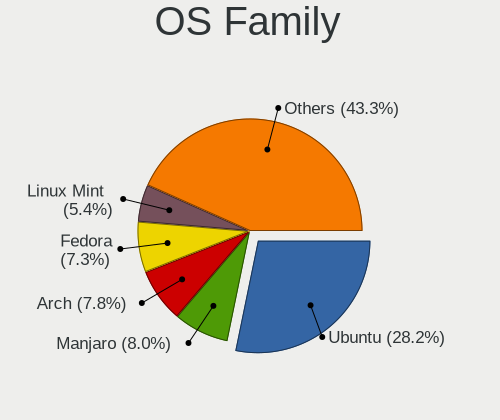

| Name         | Computers | Percent |
|--------------|-----------|---------|
| Ubuntu       | 93        | 31.31%  |
| Manjaro      | 28        | 9.43%   |
| Arch         | 19        | 6.4%    |
| Linux Mint   | 17        | 5.72%   |
| Fedora       | 17        | 5.72%   |
| Pop!_OS      | 14        | 4.71%   |
| ArcoLinux    | 12        | 4.04%   |
| Zorin        | 11        | 3.7%    |
| OpenMandriva | 10        | 3.37%   |
| KDE neon     | 10        | 3.37%   |
| Debian       | 9         | 3.03%   |
| Kubuntu      | 8         | 2.69%   |
| Endless      | 6         | 2.02%   |
| EndeavourOS  | 6         | 2.02%   |
| Parrot       | 5         | 1.68%   |
| Kali         | 5         | 1.68%   |
| openSUSE     | 3         | 1.01%   |
| MX           | 2         | 0.67%   |
| LMDE         | 2         | 0.67%   |
| Deepin       | 2         | 0.67%   |
| CentOS       | 2         | 0.67%   |
| BlackPanther | 2         | 0.67%   |
| Artix        | 2         | 0.67%   |
| Void Linux   | 1         | 0.34%   |
| Ubuntu Unity | 1         | 0.34%   |
| Ubuntu MATE  | 1         | 0.34%   |
| ROSA         | 1         | 0.34%   |
| Pragma       | 1         | 0.34%   |
| Lubuntu      | 1         | 0.34%   |
| Gentoo       | 1         | 0.34%   |
| Garuda Linux | 1         | 0.34%   |
| Elementary   | 1         | 0.34%   |
| Devuan       | 1         | 0.34%   |
| Clear Linux  | 1         | 0.34%   |
| Android      | 1         | 0.34%   |

Kernel
------

Version of the Linux kernel

| Version                  | Computers | Percent |
|--------------------------|-----------|---------|
| 5.4.0-42-generic         | 8         | 2.29%   |
| 5.4.0-52-generic         | 6         | 1.71%   |
| 5.10.14-desktop-1omv4002 | 5         | 1.43%   |
| 5.13.0-28-generic        | 4         | 1.14%   |
| 5.9.16-1-MANJARO         | 3         | 0.86%   |
| 5.8.0-55-generic         | 3         | 0.86%   |
| 5.8.0-41-generic         | 3         | 0.86%   |
| 5.6.11-1-MANJARO         | 3         | 0.86%   |
| 5.4.0-53-generic         | 3         | 0.86%   |
| 5.4.0-40-generic         | 3         | 0.86%   |
| 5.4.0-29-generic         | 3         | 0.86%   |
| 5.16.7-desktop-1omv4003  | 3         | 0.86%   |
| 5.15.0-57-generic        | 3         | 0.86%   |
| 5.15.0-56-generic        | 3         | 0.86%   |
| 5.15.0-48-generic        | 3         | 0.86%   |
| 5.11.0-37-generic        | 3         | 0.86%   |
| 5.11.0-16-generic        | 3         | 0.86%   |
| 6.2.9-300.fc38.x86_64    | 2         | 0.57%   |
| 6.1.12-arch1-1           | 2         | 0.57%   |
| 6.0.9-zen1-1-zen         | 2         | 0.57%   |
| 6.0.0-kali6-amd64        | 2         | 0.57%   |
| 5.8.16-2-MANJARO         | 2         | 0.57%   |
| 5.8.0-50-generic         | 2         | 0.57%   |
| 5.8.0-44-generic         | 2         | 0.57%   |
| 5.8.0-38-generic         | 2         | 0.57%   |
| 5.8.0-14-generic         | 2         | 0.57%   |
| 5.7.19-2-MANJARO         | 2         | 0.57%   |
| 5.4.8-arch1-1            | 2         | 0.57%   |
| 5.4.0-90-generic         | 2         | 0.57%   |
| 5.4.0-73-generic         | 2         | 0.57%   |
| 5.4.0-47-generic         | 2         | 0.57%   |
| 5.4.0-26-generic         | 2         | 0.57%   |
| 5.4.0-19-generic         | 2         | 0.57%   |
| 5.3.0-40-generic         | 2         | 0.57%   |
| 5.3.0-24-generic         | 2         | 0.57%   |
| 5.3.0-23-generic         | 2         | 0.57%   |
| 5.3.0-18-generic         | 2         | 0.57%   |
| 5.19.0-kali2-amd64       | 2         | 0.57%   |
| 5.19.0-76051900-generic  | 2         | 0.57%   |
| 5.19.0-41-generic        | 2         | 0.57%   |

Kernel Family
-------------

Linux kernel without a distro release

| Version | Computers | Percent |
|---------|-----------|---------|
| 5.4.0   | 40        | 12.05%  |
| 5.15.0  | 25        | 7.53%   |
| 5.11.0  | 19        | 5.72%   |
| 5.8.0   | 18        | 5.42%   |
| 5.13.0  | 17        | 5.12%   |
| 5.3.0   | 13        | 3.92%   |
| 5.19.0  | 12        | 3.61%   |
| 5.10.0  | 10        | 3.01%   |
| 5.0.0   | 7         | 2.11%   |
| 4.18.0  | 7         | 2.11%   |
| 4.15.0  | 7         | 2.11%   |
| 6.0.0   | 6         | 1.81%   |
| 5.10.14 | 5         | 1.51%   |
| 5.9.16  | 4         | 1.2%    |
| 5.8.16  | 4         | 1.2%    |
| 4.19.0  | 4         | 1.2%    |
| 6.1.8   | 3         | 0.9%    |
| 6.0.12  | 3         | 0.9%    |
| 5.6.11  | 3         | 0.9%    |
| 5.18.12 | 3         | 0.9%    |
| 5.16.7  | 3         | 0.9%    |
| 6.2.9   | 2         | 0.6%    |
| 6.2.7   | 2         | 0.6%    |
| 6.1.12  | 2         | 0.6%    |
| 6.0.9   | 2         | 0.6%    |
| 5.7.19  | 2         | 0.6%    |
| 5.4.8   | 2         | 0.6%    |
| 5.17.0  | 2         | 0.6%    |
| 5.16.15 | 2         | 0.6%    |
| 5.16.11 | 2         | 0.6%    |
| 5.15.7  | 2         | 0.6%    |
| 5.15.5  | 2         | 0.6%    |
| 5.15.13 | 2         | 0.6%    |
| 5.11.6  | 2         | 0.6%    |
| 5.10.52 | 2         | 0.6%    |
| 6.4.7   | 1         | 0.3%    |
| 6.4.3   | 1         | 0.3%    |
| 6.4.0   | 1         | 0.3%    |
| 6.3.3   | 1         | 0.3%    |
| 6.3.2   | 1         | 0.3%    |

Kernel Major Ver.
-----------------

Linux kernel major version

| Version | Computers | Percent |
|---------|-----------|---------|
| 5.4     | 47        | 14.6%   |
| 5.15    | 42        | 13.04%  |
| 5.8     | 25        | 7.76%   |
| 5.11    | 24        | 7.45%   |
| 5.10    | 23        | 7.14%   |
| 5.13    | 19        | 5.9%    |
| 5.19    | 14        | 4.35%   |
| 6.0     | 13        | 4.04%   |
| 5.3     | 13        | 4.04%   |
| 5.16    | 13        | 4.04%   |
| 6.2     | 9         | 2.8%    |
| 6.1     | 9         | 2.8%    |
| 4.18    | 8         | 2.48%   |
| 5.18    | 7         | 2.17%   |
| 5.0     | 7         | 2.17%   |
| 4.15    | 7         | 2.17%   |
| 5.9     | 5         | 1.55%   |
| 5.7     | 5         | 1.55%   |
| 5.6     | 5         | 1.55%   |
| 5.17    | 5         | 1.55%   |
| 4.19    | 5         | 1.55%   |
| 6.4     | 3         | 0.93%   |
| 6.3     | 3         | 0.93%   |
| 5.14    | 3         | 0.93%   |
| 5.12    | 2         | 0.62%   |
| 5.1     | 2         | 0.62%   |
| 4.9     | 1         | 0.31%   |
| 4.4     | 1         | 0.31%   |
| 4.13    | 1         | 0.31%   |
| 3.18    | 1         | 0.31%   |

Arch
----

OS architecture (x86_64, i586, etc.)

| Name    | Computers | Percent |
|---------|-----------|---------|
| x86_64  | 275       | 97.52%  |
| i686    | 4         | 1.42%   |
| aarch64 | 3         | 1.06%   |

DE
--

Desktop Environment

| Name            | Computers | Percent |
|-----------------|-----------|---------|
| GNOME           | 137       | 46.28%  |
| KDE5            | 63        | 21.28%  |
| Unknown         | 30        | 10.14%  |
| XFCE            | 20        | 6.76%   |
| X-Cinnamon      | 17        | 5.74%   |
| MATE            | 6         | 2.03%   |
| awesome         | 5         | 1.69%   |
| KDE             | 4         | 1.35%   |
| i3-with-shmlog  | 2         | 0.68%   |
| Deepin          | 2         | 0.68%   |
| Unity           | 1         | 0.34%   |
| Pantheon        | 1         | 0.34%   |
| openbox         | 1         | 0.34%   |
| LXQt            | 1         | 0.34%   |
| LXDE            | 1         | 0.34%   |
| i3              | 1         | 0.34%   |
| GNOME Flashback | 1         | 0.34%   |
| DWM             | 1         | 0.34%   |
| Cinnamon        | 1         | 0.34%   |
| bspwm           | 1         | 0.34%   |

Display Server
--------------

X11 or Wayland

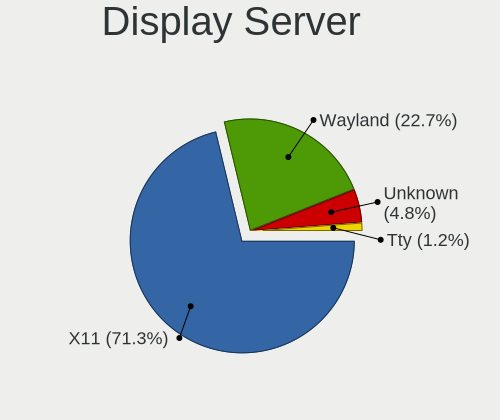

| Name    | Computers | Percent |
|---------|-----------|---------|
| X11     | 235       | 78.86%  |
| Wayland | 42        | 14.09%  |
| Unknown | 17        | 5.7%    |
| Tty     | 4         | 1.34%   |

Display Manager
---------------

SDDM, LightDM, etc.

| Name    | Computers | Percent |
|---------|-----------|---------|
| Unknown | 144       | 48.16%  |
| SDDM    | 46        | 15.38%  |
| GDM     | 42        | 14.05%  |
| LightDM | 29        | 9.7%    |
| GDM3    | 29        | 9.7%    |
| TDM     | 9         | 3.01%   |

OS Lang
-------

Language

| Lang    | Computers | Percent |
|---------|-----------|---------|
| en_US   | 235       | 81.88%  |
| Unknown | 30        | 10.45%  |
| en_GB   | 10        | 3.48%   |
| C       | 7         | 2.44%   |
| en_IE   | 1         | 0.35%   |
| en_EN   | 1         | 0.35%   |
| en_CA   | 1         | 0.35%   |
| en_AG   | 1         | 0.35%   |
| Default | 1         | 0.35%   |

Boot Mode
---------

EFI or BIOS

| Mode | Computers | Percent |
|------|-----------|---------|
| EFI  | 153       | 51.69%  |
| BIOS | 143       | 48.31%  |

Filesystem
----------

Type of filesystem

| Type    | Computers | Percent |
|---------|-----------|---------|
| Ext4    | 228       | 78.35%  |
| Btrfs   | 27        | 9.28%   |
| Overlay | 26        | 8.93%   |
| Unknown | 5         | 1.72%   |
| Xfs     | 3         | 1.03%   |
| Zfs     | 1         | 0.34%   |
| Tmpfs   | 1         | 0.34%   |

Part. scheme
------------

Scheme of partitioning

| Type    | Computers | Percent |
|---------|-----------|---------|
| Unknown | 154       | 51.85%  |
| GPT     | 113       | 38.05%  |
| MBR     | 30        | 10.1%   |

Dual Boot with Linux/BSD
------------------------

Hosting more than one Linux/BSD

| Dual boot | Computers | Percent |
|-----------|-----------|---------|
| No        | 243       | 83.79%  |
| Yes       | 47        | 16.21%  |

Dual Boot (Win)
---------------

Hosting Linux and Windows

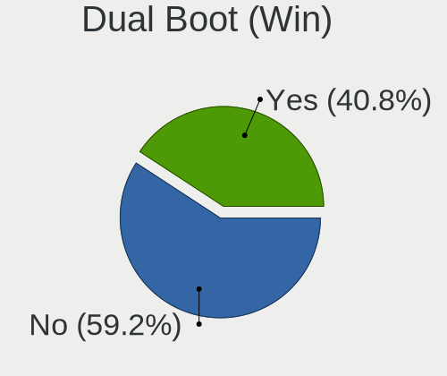

| Dual boot | Computers | Percent |
|-----------|-----------|---------|
| No        | 166       | 56.85%  |
| Yes       | 126       | 43.15%  |

Board
-----

Vendor
------

Motherboard manufacturer

| Name                        | Computers | Percent |
|-----------------------------|-----------|---------|
| ASUSTek Computer            | 60        | 21.28%  |
| Hewlett-Packard             | 50        | 17.73%  |
| MSI                         | 29        | 10.28%  |
| Lenovo                      | 27        | 9.57%   |
| Dell                        | 26        | 9.22%   |
| Gigabyte Technology         | 25        | 8.87%   |
| Acer                        | 19        | 6.74%   |
| Unknown                     | 8         | 2.84%   |
| ASRock                      | 7         | 2.48%   |
| Intel                       | 5         | 1.77%   |
| Notebook                    | 4         | 1.42%   |
| Toshiba                     | 3         | 1.06%   |
| OEM                         | 3         | 1.06%   |
| Foxconn                     | 3         | 1.06%   |
| Biostar                     | 3         | 1.06%   |
| Raspberry Pi Foundation     | 2         | 0.71%   |
| Timi                        | 1         | 0.35%   |
| SYS                         | 1         | 0.35%   |
| Samsung Electronics         | 1         | 0.35%   |
| I-Life Digital Technologies | 1         | 0.35%   |
| HUAWEI                      | 1         | 0.35%   |
| Fujitsu                     | 1         | 0.35%   |
| Daffodil Computers          | 1         | 0.35%   |
| Apple                       | 1         | 0.35%   |

Model
-----

Motherboard model

| Name                                                  | Computers | Percent |
|-------------------------------------------------------|-----------|---------|
| Unknown                                               | 10        | 3.55%   |
| MSI MS-7C52                                           | 6         | 2.13%   |
| HP ProBook 450 G4                                     | 5         | 1.77%   |
| HP Notebook                                           | 4         | 1.42%   |
| MSI Modern 15 A5M                                     | 3         | 1.06%   |
| ASUS VivoBook_ASUSLaptop X530FN_S530FN                | 3         | 1.06%   |
| ASUS All Series                                       | 3         | 1.06%   |
| OEM Intel H81                                         | 2         | 0.71%   |
| MSI MS-7B89                                           | 2         | 0.71%   |
| MSI MS-7788                                           | 2         | 0.71%   |
| MSI MS-7668                                           | 2         | 0.71%   |
| MSI Modern 14 B10MW                                   | 2         | 0.71%   |
| Intel DG41RQ AAE54511-203                             | 2         | 0.71%   |
| HP ProBook 4540s                                      | 2         | 0.71%   |
| HP ProBook 450 G2                                     | 2         | 0.71%   |
| HP ProBook 440 G8 Notebook PC                         | 2         | 0.71%   |
| HP EliteBook 840 G3                                   | 2         | 0.71%   |
| HP 15                                                 | 2         | 0.71%   |
| HP 14                                                 | 2         | 0.71%   |
| Gigabyte H61M-S2PV                                    | 2         | 0.71%   |
| Gigabyte B250M-HD3                                    | 2         | 0.71%   |
| Dell Inspiron 3442                                    | 2         | 0.71%   |
| ASUS X556UQK                                          | 2         | 0.71%   |
| ASUS X510UQ                                           | 2         | 0.71%   |
| ASUS VivoBook_ASUSLaptop X531FL_S531FL                | 2         | 0.71%   |
| ASUS VivoBook_ASUSLaptop X530FA_S530FA                | 2         | 0.71%   |
| ASUS VivoBook_ASUSLaptop X509JA_X509JA                | 2         | 0.71%   |
| ASUS VivoBook 14_ASUS Laptop X407UA                   | 2         | 0.71%   |
| ASUS P453UA                                           | 2         | 0.71%   |
| Acer Nitro AN515-43                                   | 2         | 0.71%   |
| Toshiba Satellite Pro L510                            | 1         | 0.35%   |
| Toshiba Satellite L645                                | 1         | 0.35%   |
| Toshiba Satellite C660                                | 1         | 0.35%   |
| Timi Mi NoteBook Pro                                  | 1         | 0.35%   |
| SYS H310CH5-TI2                                       | 1         | 0.35%   |
| Samsung 300E5EV/300E4EV/270E5EV/270E4EV/2470EV/2470EE | 1         | 0.35%   |
| RPi Raspberry Pi 4 Model B Rev 1.5                    | 1         | 0.35%   |
| RPi Raspberry Pi 4 Model B Rev 1.2                    | 1         | 0.35%   |
| Notebook W9x0LU                                       | 1         | 0.35%   |
| Notebook N750BU                                       | 1         | 0.35%   |

Model Family
------------

Motherboard model prefix

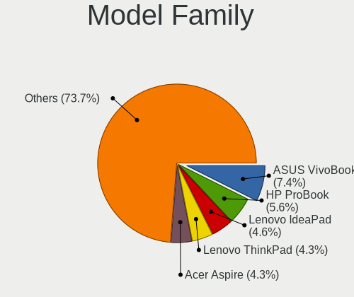

| Name               | Computers | Percent |
|--------------------|-----------|---------|
| ASUS VivoBook      | 22        | 7.8%    |
| HP ProBook         | 19        | 6.74%   |
| Acer Aspire        | 15        | 5.32%   |
| Lenovo IdeaPad     | 12        | 4.26%   |
| Dell Inspiron      | 12        | 4.26%   |
| Unknown            | 10        | 3.55%   |
| Lenovo ThinkPad    | 9         | 3.19%   |
| Dell Latitude      | 8         | 2.84%   |
| HP EliteBook       | 7         | 2.48%   |
| MSI MS-7C52        | 6         | 2.13%   |
| MSI Modern         | 5         | 1.77%   |
| HP Notebook        | 4         | 1.42%   |
| ASUS TUF           | 4         | 1.42%   |
| Toshiba Satellite  | 3         | 1.06%   |
| HP Pavilion        | 3         | 1.06%   |
| HP ENVY            | 3         | 1.06%   |
| HP 15              | 3         | 1.06%   |
| ASUS All           | 3         | 1.06%   |
| Acer Nitro         | 3         | 1.06%   |
| RPi Raspberry      | 2         | 0.71%   |
| OEM Intel          | 2         | 0.71%   |
| MSI MS-7B89        | 2         | 0.71%   |
| MSI MS-7788        | 2         | 0.71%   |
| MSI MS-7668        | 2         | 0.71%   |
| Intel DG41RQ       | 2         | 0.71%   |
| HP Laptop          | 2         | 0.71%   |
| HP Compaq          | 2         | 0.71%   |
| HP 14              | 2         | 0.71%   |
| Gigabyte H61M-S2PV | 2         | 0.71%   |
| Gigabyte B250M-HD3 | 2         | 0.71%   |
| Dell XPS           | 2         | 0.71%   |
| Dell Vostro        | 2         | 0.71%   |
| ASUS ZenBook       | 2         | 0.71%   |
| ASUS X556UQK       | 2         | 0.71%   |
| ASUS X510UQ        | 2         | 0.71%   |
| ASUS P453UA        | 2         | 0.71%   |
| Timi Mi            | 1         | 0.35%   |
| SYS H310CH5-TI2    | 1         | 0.35%   |
| Samsung 300E5EV    | 1         | 0.35%   |
| Notebook W9x0LU    | 1         | 0.35%   |

MFG Year
--------

Motherboard manufacture year

| Year    | Computers | Percent |
|---------|-----------|---------|
| 2016    | 34        | 12.06%  |
| 2019    | 33        | 11.7%   |
| 2018    | 31        | 10.99%  |
| 2017    | 27        | 9.57%   |
| 2021    | 22        | 7.8%    |
| 2012    | 22        | 7.8%    |
| 2015    | 20        | 7.09%   |
| 2020    | 19        | 6.74%   |
| 2014    | 17        | 6.03%   |
| 2013    | 17        | 6.03%   |
| 2011    | 12        | 4.26%   |
| 2010    | 12        | 4.26%   |
| 2009    | 7         | 2.48%   |
| 2022    | 3         | 1.06%   |
| 2008    | 3         | 1.06%   |
| Unknown | 3         | 1.06%   |

Form Factor
-----------

Physical design of the computer

| Name           | Computers | Percent |
|----------------|-----------|---------|
| Notebook       | 184       | 65.25%  |
| Desktop        | 89        | 31.56%  |
| Convertible    | 4         | 1.42%   |
| System on chip | 2         | 0.71%   |
| Phone          | 1         | 0.35%   |
| Tablet         | 1         | 0.35%   |
| Mini pc        | 1         | 0.35%   |

Secure Boot
-----------

Enabled or disabled

| State    | Computers | Percent |
|----------|-----------|---------|
| Disabled | 262       | 90.97%  |
| Enabled  | 26        | 9.03%   |

Coreboot
--------

Have coreboot on board

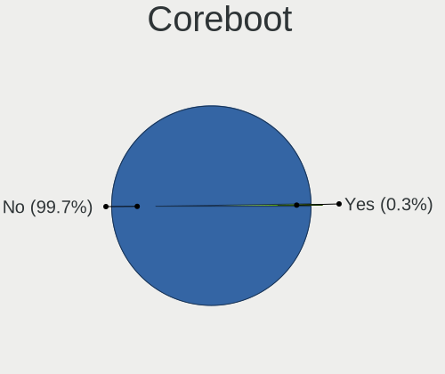

| Used | Computers | Percent |
|------|-----------|---------|
| No   | 282       | 100%    |

RAM Size
--------

Total RAM memory

| Size in GB | Computers | Percent |
|------------|-----------|---------|
| 4.01-8.0   | 105       | 36.46%  |
| 3.01-4.0   | 70        | 24.31%  |
| 8.01-16.0  | 54        | 18.75%  |
| 16.01-24.0 | 35        | 12.15%  |
| 1.01-2.0   | 14        | 4.86%   |
| 32.01-64.0 | 6         | 2.08%   |
| 2.01-3.0   | 3         | 1.04%   |
| 0.51-1.0   | 1         | 0.35%   |

RAM Used
--------

Used RAM memory

| Used GB    | Computers | Percent |
|------------|-----------|---------|
| 1.01-2.0   | 113       | 35.42%  |
| 2.01-3.0   | 102       | 31.97%  |
| 3.01-4.0   | 48        | 15.05%  |
| 4.01-8.0   | 34        | 10.66%  |
| 0.51-1.0   | 13        | 4.08%   |
| 8.01-16.0  | 4         | 1.25%   |
| 0.01-0.5   | 4         | 1.25%   |
| 16.01-24.0 | 1         | 0.31%   |

Total Drives
------------

Number of drives on board

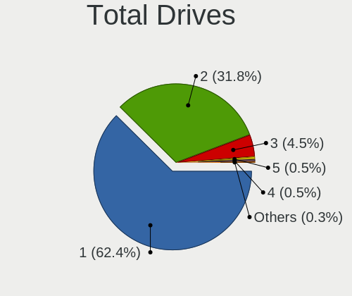

| Drives | Computers | Percent |
|--------|-----------|---------|
| 1      | 179       | 62.15%  |
| 2      | 93        | 32.29%  |
| 3      | 13        | 4.51%   |
| 5      | 1         | 0.35%   |
| 4      | 1         | 0.35%   |
| 0      | 1         | 0.35%   |

Has CD-ROM
----------

Has CD-ROM on board

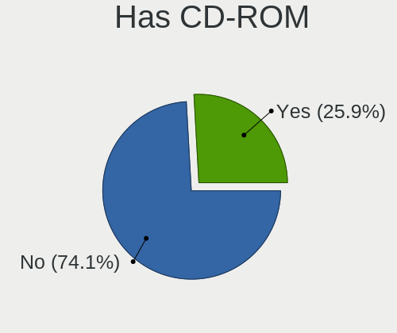

| Presented | Computers | Percent |
|-----------|-----------|---------|
| No        | 200       | 70.18%  |
| Yes       | 85        | 29.82%  |

Has Ethernet
------------

Has Ethernet on board

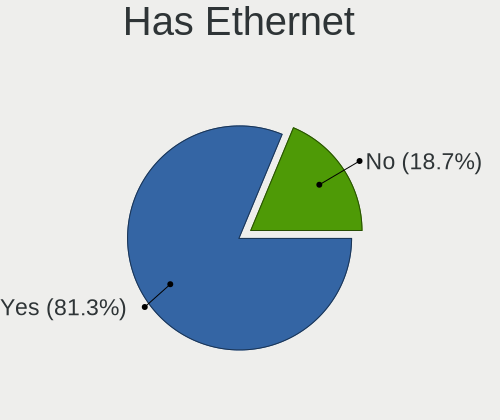

| Presented | Computers | Percent |
|-----------|-----------|---------|
| Yes       | 231       | 81.34%  |
| No        | 53        | 18.66%  |

Has WiFi
--------

Has WiFi module

| Presented | Computers | Percent |
|-----------|-----------|---------|
| Yes       | 221       | 77.27%  |
| No        | 65        | 22.73%  |

Has Bluetooth
-------------

Has Bluetooth module

| Presented | Computers | Percent |
|-----------|-----------|---------|
| Yes       | 174       | 60.42%  |
| No        | 114       | 39.58%  |

Location
--------

Country
-------

Geographic location (country)

| Country    | Computers | Percent |
|------------|-----------|---------|
| Bangladesh | 282       | 100%    |

City
----

Geographic location (city)

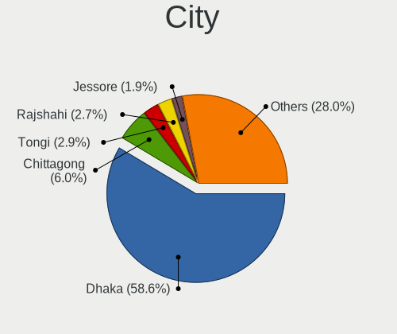

| City              | Computers | Percent |
|-------------------|-----------|---------|
| Dhaka             | 180       | 60.4%   |
| Chittagong        | 18        | 6.04%   |
| Rajshahi          | 9         | 3.02%   |
| Tongi             | 8         | 2.68%   |
| Jessore           | 8         | 2.68%   |
| Narayanganj       | 6         | 2.01%   |
| Khulna            | 5         | 1.68%   |
| Comilla           | 5         | 1.68%   |
| Mirpur            | 4         | 1.34%   |
| Azimpur           | 4         | 1.34%   |
| Wari              | 3         | 1.01%   |
| Sylhet            | 3         | 1.01%   |
| Pabna             | 3         | 1.01%   |
| Sherpur           | 2         | 0.67%   |
| Savar Upazila     | 2         | 0.67%   |
| Nilphamari        | 2         | 0.67%   |
| Feni              | 2         | 0.67%   |
| Bogra             | 2         | 0.67%   |
| Uttara            | 1         | 0.34%   |
| Tejgaon           | 1         | 0.34%   |
| Srimangal         | 1         | 0.34%   |
| Sirajganj         | 1         | 0.34%   |
| Senbag            | 1         | 0.34%   |
| Rangpur City      | 1         | 0.34%   |
| Pirganj           | 1         | 0.34%   |
| Patnitala         | 1         | 0.34%   |
| Paltan            | 1         | 0.34%   |
| Pabna Sadar       | 1         | 0.34%   |
| Nryanganj | 1         | 0.34%   |
| Natore            | 1         | 0.34%   |
| Narsingdi         | 1         | 0.34%   |
| Narail            | 1         | 0.34%   |
| Nalitabari        | 1         | 0.34%   |
| Ngarpur         | 1         | 0.34%   |
| Mymensingh        | 1         | 0.34%   |
| Lkshm     | 1         | 0.34%   |
| Khilgaon          | 1         | 0.34%   |
| Jamalpur          | 1         | 0.34%   |
| Hurua             | 1         | 0.34%   |
| Habiganj          | 1         | 0.34%   |

Drives
------

Drive Vendor
------------

Hard drive vendors

| Vendor                         | Computers | Drives | Percent |
|--------------------------------|-----------|--------|---------|
| WDC                            | 73        | 101    | 18.77%  |
| Seagate                        | 66        | 83     | 16.97%  |
| Toshiba                        | 55        | 69     | 14.14%  |
| Samsung Electronics            | 32        | 47     | 8.23%   |
| Transcend                      | 22        | 23     | 5.66%   |
| Hitachi                        | 15        | 20     | 3.86%   |
| HGST                           | 12        | 12     | 3.08%   |
| SanDisk                        | 10        | 10     | 2.57%   |
| Intel                          | 10        | 12     | 2.57%   |
| A-DATA Technology              | 9         | 10     | 2.31%   |
| Silicon Motion                 | 7         | 16     | 1.8%    |
| Kingston                       | 7         | 9      | 1.8%    |
| Micron Technology              | 6         | 6      | 1.54%   |
| Teutons                        | 5         | 9      | 1.29%   |
| Corsair                        | 5         | 7      | 1.29%   |
| Unknown                        | 4         | 5      | 1.03%   |
| Hewlett-Packard                | 4         | 4      | 1.03%   |
| SK hynix                       | 3         | 3      | 0.77%   |
| Phison                         | 3         | 3      | 0.77%   |
| Apacer                         | 3         | 4      | 0.77%   |
| TwinMOS                        | 2         | 2      | 0.51%   |
| Team                           | 2         | 2      | 0.51%   |
| Ramsta                         | 2         | 2      | 0.51%   |
| PNY                            | 2         | 2      | 0.51%   |
| Phison Electronics             | 2         | 3      | 0.51%   |
| KingSpec                       | 2         | 2      | 0.51%   |
| HS-SSD-E100                    | 2         | 3      | 0.51%   |
| Gigabyte Technology            | 2         | 3      | 0.51%   |
| Crucial                        | 2         | 3      | 0.51%   |
| China                          | 2         | 2      | 0.51%   |
| WDC WDS4                       | 1         | 1      | 0.26%   |
| WALTON                         | 1         | 2      | 0.26%   |
| Solid State Storage Technology | 1         | 1      | 0.26%   |
| Shenzhen Longsys Electronics   | 1         | 1      | 0.26%   |
| Realtek                        | 1         | 1      | 0.26%   |
| Patriot                        | 1         | 1      | 0.26%   |
| OCZ                            | 1         | 1      | 0.26%   |
| MAXIO Technology (Hangzhou)    | 1         | 1      | 0.26%   |
| Lexar                          | 1         | 2      | 0.26%   |
| KIOXIA                         | 1         | 1      | 0.26%   |

Drive Model
-----------

Hard drive models

| Model                                               | Computers | Percent |
|-----------------------------------------------------|-----------|---------|
| Seagate ST1000LM035-1RK172 1TB                      | 19        | 4.69%   |
| Toshiba MQ04ABF100 1TB                              | 15        | 3.7%    |
| Toshiba DT01ACA100 1TB                              | 10        | 2.47%   |
| WDC WDS120G2G0A-00JH30 120GB SSD                    | 8         | 1.98%   |
| Seagate ST1000DM010-2EP102 1TB                      | 8         | 1.98%   |
| Seagate ST500DM002-1BD142 500GB                     | 7         | 1.73%   |
| Toshiba HDWD110 1TB                                 | 6         | 1.48%   |
| Seagate ST1000LM024 HN-M101MBB 1TB                  | 6         | 1.48%   |
| WDC WDS240G2G0A-00JH30 240GB SSD                    | 5         | 1.23%   |
| WDC WD10JPVX-60JC3T0 1TB                            | 5         | 1.23%   |
| Seagate ST500LT012-1DG142 500GB                     | 5         | 1.23%   |
| A-DATA SU650 240GB SSD                              | 5         | 1.23%   |
| WDC WD10SPZX-60Z10T0 1TB                            | 4         | 0.99%   |
| Transcend TS256GSSD230S 256GB                       | 4         | 0.99%   |
| Toshiba MQ01ABD100 1TB                              | 4         | 0.99%   |
| SanDisk NVMe SSD Drive 512GB                        | 4         | 0.99%   |
| Samsung NVMe SSD Controller SM981/PM981/PM983 500GB | 4         | 0.99%   |
| Intel NVMe SSD Drive 512GB                          | 4         | 0.99%   |
| HGST HTS541010A9E680 1TB                            | 4         | 0.99%   |
| WDC WDS240G2G0B-00EPW0 240GB SSD                    | 3         | 0.74%   |
| WDC WD5000AAKX-001CA0 500GB                         | 3         | 0.74%   |
| WDC WD20EZRZ-00Z5HB0 2TB                            | 3         | 0.74%   |
| WDC WD10JPVX-60JC3T1 1TB                            | 3         | 0.74%   |
| WDC WD10EZEX-60WN4A0 1TB                            | 3         | 0.74%   |
| Transcend TS128GSSD370S 128GB                       | 3         | 0.74%   |
| Transcend TS120GMTS420S 120GB SSD                   | 3         | 0.74%   |
| Toshiba DT01ACA200 2TB                              | 3         | 0.74%   |
| Silicon Motion SM2262/SM2262EN SSD Controller 512GB | 3         | 0.74%   |
| Seagate ST500LT012-9WS142 500GB                     | 3         | 0.74%   |
| Seagate ST1000LM049-2GH172 1TB                      | 3         | 0.74%   |
| Samsung HD502HJ 500GB                               | 3         | 0.74%   |
| Intel SSD 660P Series 1024GB                        | 3         | 0.74%   |
| HGST HTS545050A7E680 500GB                          | 3         | 0.74%   |
| Corsair Force MP510 240GB                           | 3         | 0.74%   |
| WDC WD40PURX-64N96Y0 4TB                            | 2         | 0.49%   |
| WDC WD10SPZX-24Z10T0 1TB                            | 2         | 0.49%   |
| WDC WD10JPVX-75JC3T0 1TB                            | 2         | 0.49%   |
| WDC WD10EZEX-22MFCA0 1TB                            | 2         | 0.49%   |
| WDC WD10EZEX-00BN5A0 1TB                            | 2         | 0.49%   |
| WDC WD SSD 120GB                                    | 2         | 0.49%   |

HDD Vendor
----------

Hard disk drive vendors

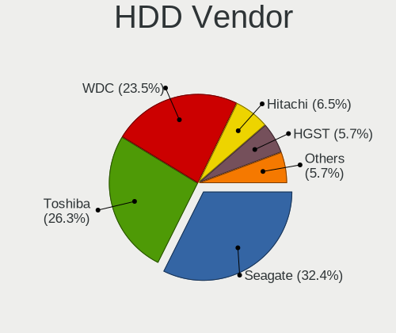

| Vendor              | Computers | Drives | Percent |
|---------------------|-----------|--------|---------|
| Seagate             | 66        | 83     | 32.67%  |
| Toshiba             | 48        | 61     | 23.76%  |
| WDC                 | 47        | 63     | 23.27%  |
| Hitachi             | 15        | 20     | 7.43%   |
| Samsung Electronics | 13        | 21     | 6.44%   |
| HGST                | 12        | 12     | 5.94%   |
| ASMT                | 1         | 1      | 0.5%    |

SSD Vendor
----------

Solid state drive vendors

| Vendor              | Computers | Drives | Percent |
|---------------------|-----------|--------|---------|
| WDC                 | 22        | 27     | 19.47%  |
| Transcend           | 20        | 21     | 17.7%   |
| Samsung Electronics | 9         | 12     | 7.96%   |
| A-DATA Technology   | 9         | 10     | 7.96%   |
| Teutons             | 5         | 9      | 4.42%   |
| SanDisk             | 5         | 5      | 4.42%   |
| Micron Technology   | 5         | 5      | 4.42%   |
| Hewlett-Packard     | 4         | 4      | 3.54%   |
| Toshiba             | 3         | 4      | 2.65%   |
| Apacer              | 3         | 4      | 2.65%   |
| TwinMOS             | 2         | 2      | 1.77%   |
| Ramsta              | 2         | 2      | 1.77%   |
| PNY                 | 2         | 2      | 1.77%   |
| KingSpec            | 2         | 2      | 1.77%   |
| HS-SSD-E100         | 2         | 2      | 1.77%   |
| Gigabyte Technology | 2         | 3      | 1.77%   |
| Crucial             | 2         | 3      | 1.77%   |
| Corsair             | 2         | 3      | 1.77%   |
| China               | 2         | 2      | 1.77%   |
| WDC WDS4            | 1         | 1      | 0.88%   |
| WALTON              | 1         | 2      | 0.88%   |
| Team                | 1         | 1      | 0.88%   |
| SK hynix            | 1         | 1      | 0.88%   |
| Patriot             | 1         | 1      | 0.88%   |
| OCZ                 | 1         | 1      | 0.88%   |
| Kingston            | 1         | 1      | 0.88%   |
| Intel               | 1         | 1      | 0.88%   |
| GeIL                | 1         | 1      | 0.88%   |
| GAMER               | 1         | 1      | 0.88%   |

Drive Kind
----------

HDD or SSD

| Kind    | Computers | Drives | Percent |
|---------|-----------|--------|---------|
| HDD     | 192       | 261    | 51.34%  |
| SSD     | 110       | 133    | 29.41%  |
| NVMe    | 62        | 92     | 16.58%  |
| Unknown | 7         | 7      | 1.87%   |
| MMC     | 3         | 4      | 0.8%    |

Drive Connector
---------------

SATA, SAS, NVMe, etc.

| Type | Computers | Drives | Percent |
|------|-----------|--------|---------|
| SATA | 239       | 397    | 77.35%  |
| NVMe | 62        | 91     | 20.06%  |
| SAS  | 5         | 5      | 1.62%   |
| MMC  | 3         | 4      | 0.97%   |

Drive Size
----------

Size of hard drive

| Size in TB | Computers | Drives | Percent |
|------------|-----------|--------|---------|
| 0.01-0.5   | 157       | 218    | 53.95%  |
| 0.51-1.0   | 117       | 153    | 40.21%  |
| 1.01-2.0   | 12        | 14     | 4.12%   |
| 3.01-4.0   | 2         | 3      | 0.69%   |
| 4.01-10.0  | 2         | 2      | 0.69%   |
| 2.01-3.0   | 1         | 4      | 0.34%   |

Space Total
-----------

Amount of disk space available on the file system

| Size in GB     | Computers | Percent |
|----------------|-----------|---------|
| 101-250        | 89        | 29.18%  |
| 251-500        | 65        | 21.31%  |
| 501-1000       | 58        | 19.02%  |
| 1001-2000      | 26        | 8.52%   |
| 51-100         | 26        | 8.52%   |
| 21-50          | 17        | 5.57%   |
| 1-20           | 14        | 4.59%   |
| More than 3000 | 5         | 1.64%   |
| Unknown        | 5         | 1.64%   |

Space Used
----------

Amount of used disk space

| Used GB        | Computers | Percent |
|----------------|-----------|---------|
| 1-20           | 108       | 34.5%   |
| 21-50          | 63        | 20.13%  |
| 101-250        | 50        | 15.97%  |
| 51-100         | 49        | 15.65%  |
| 251-500        | 19        | 6.07%   |
| 501-1000       | 13        | 4.15%   |
| Unknown        | 5         | 1.6%    |
| 1001-2000      | 4         | 1.28%   |
| More than 3000 | 2         | 0.64%   |

Malfunc. Drives
---------------

Drive models with a malfunction

| Model                                               | Computers | Drives | Percent |
|-----------------------------------------------------|-----------|--------|---------|
| Toshiba MQ01ABD100 1TB                              | 2         | 4      | 4.76%   |
| Toshiba DT01ACA100 1TB                              | 2         | 2      | 4.76%   |
| Seagate ST500DM002-1BD142 500GB                     | 2         | 2      | 4.76%   |
| HGST HTS545050A7E680 500GB                          | 2         | 2      | 4.76%   |
| HGST HTS541010A9E680 1TB                            | 2         | 2      | 4.76%   |
| WDC WD5000LPCX-22VHAT0 500GB                        | 1         | 1      | 2.38%   |
| WDC WD5000BPVT-22HXZT3 500GB                        | 1         | 1      | 2.38%   |
| WDC WD5000AAKX-001CA0 500GB                         | 1         | 1      | 2.38%   |
| WDC WD10SPZX-24Z10T0 1TB                            | 1         | 1      | 2.38%   |
| WDC WD10JPVX-60JC3T0 1TB                            | 1         | 2      | 2.38%   |
| WDC WD10JPVT-00MS8T0 1TB                            | 1         | 1      | 2.38%   |
| WDC WD10EZEX-60WN4A0 1TB                            | 1         | 1      | 2.38%   |
| WDC WD10EZEX-22MFCA0 1TB                            | 1         | 1      | 2.38%   |
| WDC WD10EZEX-00BN5A0 1TB                            | 1         | 1      | 2.38%   |
| Toshiba MQ01ABD050 500GB                            | 1         | 1      | 2.38%   |
| Toshiba HDWD110 1TB                                 | 1         | 1      | 2.38%   |
| Toshiba DT01ACA200 2TB                              | 1         | 1      | 2.38%   |
| SK hynix HFS256G3AMNB-2200A 256GB SSD               | 1         | 1      | 2.38%   |
| Silicon Motion SM2262/SM2262EN SSD Controller 512GB | 1         | 1      | 2.38%   |
| Seagate ST9500325AS 500GB                           | 1         | 1      | 2.38%   |
| Seagate ST500LT012-9WS142 500GB                     | 1         | 1      | 2.38%   |
| Seagate ST500LT012-1DG142 500GB                     | 1         | 1      | 2.38%   |
| Seagate ST3500418AS 500GB                           | 1         | 1      | 2.38%   |
| Seagate ST320LT012-9WS14C 320GB                     | 1         | 1      | 2.38%   |
| Seagate ST2000LM003 HN-M201RAD 2TB                  | 1         | 1      | 2.38%   |
| Seagate ST1000LM024 HN-M101MBB 1TB                  | 1         | 1      | 2.38%   |
| Samsung Electronics HM160HI 160GB                   | 1         | 1      | 2.38%   |
| Samsung Electronics HD161HJ 160GB                   | 1         | 2      | 2.38%   |
| Micron Technology 1100_MTFDDAV256TBN 256GB SSD      | 1         | 1      | 2.38%   |
| Intel SSDSCKKW240H6 240GB                           | 1         | 1      | 2.38%   |
| HS-SSD-E100 SSD 128G                                | 1         | 1      | 2.38%   |
| Hitachi HTS545025B9A300 250GB                       | 1         | 1      | 2.38%   |
| Hitachi HDT725050VLA380 500GB                       | 1         | 1      | 2.38%   |
| Hitachi HDT721032SLA360 320GB                       | 1         | 2      | 2.38%   |
| HGST HTS545050A7E380 500GB                          | 1         | 1      | 2.38%   |
| Hewlett-Packard SSD S600 240GB                      | 1         | 1      | 2.38%   |
| A-DATA Technology SU650 240GB SSD                   | 1         | 2      | 2.38%   |

Malfunc. Drive Vendor
---------------------

Vendors of faulty drives

| Vendor              | Computers | Drives | Percent |
|---------------------|-----------|--------|---------|
| WDC                 | 9         | 10     | 21.43%  |
| Seagate             | 9         | 9      | 21.43%  |
| Toshiba             | 7         | 9      | 16.67%  |
| HGST                | 5         | 5      | 11.9%   |
| Hitachi             | 3         | 4      | 7.14%   |
| Samsung Electronics | 2         | 3      | 4.76%   |
| SK hynix            | 1         | 1      | 2.38%   |
| Silicon Motion      | 1         | 1      | 2.38%   |
| Micron Technology   | 1         | 1      | 2.38%   |
| Intel               | 1         | 1      | 2.38%   |
| HS-SSD-E100         | 1         | 1      | 2.38%   |
| Hewlett-Packard     | 1         | 1      | 2.38%   |
| A-DATA Technology   | 1         | 2      | 2.38%   |

Malfunc. HDD Vendor
-------------------

Vendors of faulty HDD drives

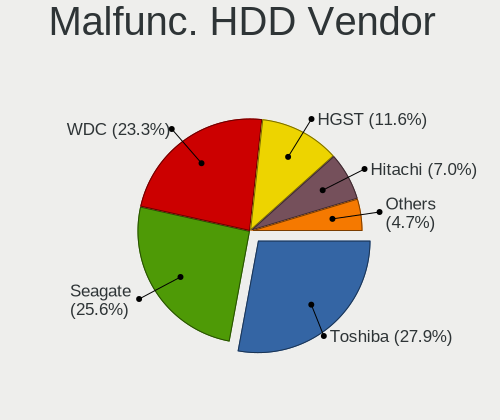

| Vendor              | Computers | Drives | Percent |
|---------------------|-----------|--------|---------|
| WDC                 | 9         | 10     | 25.71%  |
| Seagate             | 9         | 9      | 25.71%  |
| Toshiba             | 7         | 9      | 20%     |
| HGST                | 5         | 5      | 14.29%  |
| Hitachi             | 3         | 4      | 8.57%   |
| Samsung Electronics | 2         | 3      | 5.71%   |

Malfunc. Drive Kind
-------------------

Kinds of faulty drives

| Kind | Computers | Drives | Percent |
|------|-----------|--------|---------|
| HDD  | 34        | 40     | 82.93%  |
| SSD  | 6         | 7      | 14.63%  |
| NVMe | 1         | 1      | 2.44%   |

Failed Drives
-------------

Failed drive models

| Model                  | Computers | Drives | Percent |
|------------------------|-----------|--------|---------|
| Toshiba DT01ACA200 2TB | 1         | 1      | 100%    |

Failed Drive Vendor
-------------------

Failed drive vendors

| Vendor  | Computers | Drives | Percent |
|---------|-----------|--------|---------|
| Toshiba | 1         | 1      | 100%    |

Drive Status
------------

Number of failed and malfunc. drives

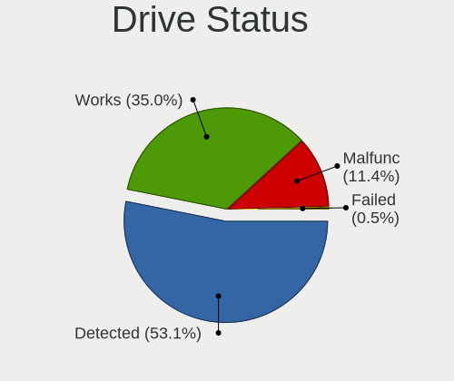

| Status   | Computers | Drives | Percent |
|----------|-----------|--------|---------|
| Detected | 166       | 274    | 52.87%  |
| Works    | 106       | 174    | 33.76%  |
| Malfunc  | 41        | 48     | 13.06%  |
| Failed   | 1         | 1      | 0.32%   |

Storage controller
------------------

Storage Vendor
--------------

Storage controller vendors

| Vendor                         | Computers | Percent |
|--------------------------------|-----------|---------|
| Intel                          | 230       | 69.91%  |
| AMD                            | 35        | 10.64%  |
| SanDisk                        | 11        | 3.34%   |
| Samsung Electronics            | 11        | 3.34%   |
| Phison Electronics             | 8         | 2.43%   |
| Silicon Motion                 | 7         | 2.13%   |
| Kingston Technology Company    | 6         | 1.82%   |
| Shenzhen Longsys Electronics   | 3         | 0.91%   |
| Marvell Technology Group       | 3         | 0.91%   |
| KIOXIA                         | 3         | 0.91%   |
| Toshiba America Info Systems   | 2         | 0.61%   |
| SK hynix                       | 2         | 0.61%   |
| ASMedia Technology             | 2         | 0.61%   |
| VIA Technologies               | 1         | 0.3%    |
| Transcend                      | 1         | 0.3%    |
| Solid State Storage Technology | 1         | 0.3%    |
| Micron Technology              | 1         | 0.3%    |
| MAXIO Technology (Hangzhou)    | 1         | 0.3%    |
| Biwin Storage Technology       | 1         | 0.3%    |

Storage Model
-------------

Storage controller models

| Model                                                                                   | Computers | Percent |
|-----------------------------------------------------------------------------------------|-----------|---------|
| Intel Sunrise Point-LP SATA Controller [AHCI mode]                                      | 55        | 14.29%  |
| AMD FCH SATA Controller [AHCI mode]                                                     | 27        | 7.01%   |
| Intel 82801 Mobile SATA Controller [RAID mode]                                          | 14        | 3.64%   |
| Intel 8 Series/C220 Series Chipset Family 6-port SATA Controller 1 [AHCI mode]          | 13        | 3.38%   |
| Intel Volume Management Device NVMe RAID Controller                                     | 12        | 3.12%   |
| Intel NM10/ICH7 Family SATA Controller [IDE mode]                                       | 12        | 3.12%   |
| Intel 7 Series Chipset Family 6-port SATA Controller [AHCI mode]                        | 12        | 3.12%   |
| Intel 8 Series SATA Controller 1 [AHCI mode]                                            | 11        | 2.86%   |
| Intel Wildcat Point-LP SATA Controller [AHCI Mode]                                      | 10        | 2.6%    |
| Intel Cannon Point-LP SATA Controller [AHCI Mode]                                       | 10        | 2.6%    |
| Intel 82801G (ICH7 Family) IDE Controller                                               | 10        | 2.6%    |
| AMD 400 Series Chipset SATA Controller                                                  | 10        | 2.6%    |
| Intel 6 Series/C200 Series Chipset Family Desktop SATA Controller (IDE mode, ports 4-5) | 8         | 2.08%   |
| Intel 6 Series/C200 Series Chipset Family Desktop SATA Controller (IDE mode, ports 0-3) | 8         | 2.08%   |
| Intel SSD 660P Series                                                                   | 7         | 1.82%   |
| Intel 200 Series PCH SATA controller [AHCI mode]                                        | 7         | 1.82%   |
| Samsung NVMe SSD Controller SM981/PM981/PM983                                           | 6         | 1.56%   |
| Intel Tiger Lake-LP SATA Controller                                                     | 6         | 1.56%   |
| Intel 6 Series/C200 Series Chipset Family 6 port Mobile SATA AHCI Controller            | 6         | 1.56%   |
| Intel Atom/Celeron/Pentium Processor x5-E8000/J3xxx/N3xxx Series SATA Controller        | 5         | 1.3%    |
| Intel 5 Series/3400 Series Chipset 4 port SATA IDE Controller                           | 5         | 1.3%    |
| Intel 5 Series/3400 Series Chipset 2 port SATA IDE Controller                           | 5         | 1.3%    |
| SanDisk WD Blue SN550 NVMe SSD                                                          | 4         | 1.04%   |
| SanDisk WD Blue SN500 / PC SN520 NVMe SSD                                               | 4         | 1.04%   |
| Phison PS5013 E13 NVMe Controller                                                       | 4         | 1.04%   |
| Phison E12 NVMe Controller                                                              | 4         | 1.04%   |
| Kingston Company OM8PCP Design-In PCIe 3 NVMe SSD (DRAM-less)                           | 4         | 1.04%   |
| Intel Q170/Q150/B150/H170/H110/Z170/CM236 Chipset SATA Controller [AHCI Mode]           | 4         | 1.04%   |
| Intel Comet Lake SATA AHCI Controller                                                   | 4         | 1.04%   |
| Intel 82801IBM/IEM (ICH9M/ICH9M-E) 4 port SATA Controller [AHCI mode]                   | 4         | 1.04%   |
| Intel 7 Series/C210 Series Chipset Family 6-port SATA Controller [AHCI mode]            | 4         | 1.04%   |
| AMD FCH SATA Controller D                                                               | 4         | 1.04%   |
| Silicon Motion SM2263EN/SM2263XT (DRAM-less) NVMe SSD Controllers                       | 3         | 0.78%   |
| Silicon Motion SM2262/SM2262EN SSD Controller                                           | 3         | 0.78%   |
| KIOXIA NVMe SSD Controller BG4 (DRAM-less)                                              | 3         | 0.78%   |
| Intel SATA Controller [RAID mode]                                                       | 3         | 0.78%   |
| Intel 6 Series/C200 Series Chipset Family 6 port Desktop SATA AHCI Controller           | 3         | 0.78%   |
| AMD 500 Series Chipset SATA Controller                                                  | 3         | 0.78%   |
| Shenzhen Longsys Lexar NM620 NVME SSD (DRAM-less)                                       | 2         | 0.52%   |
| Samsung NVMe SSD Controller PM9A1/PM9A3/980PRO                                          | 2         | 0.52%   |

Storage Kind
------------

Kind of storage controller (IDE, SATA, NVMe, SAS, ...)

| Kind | Computers | Percent |
|------|-----------|---------|
| SATA | 210       | 62.69%  |
| NVMe | 63        | 18.81%  |
| IDE  | 32        | 9.55%   |
| RAID | 30        | 8.96%   |

Processor
---------

CPU Vendor
----------

Processor vendors

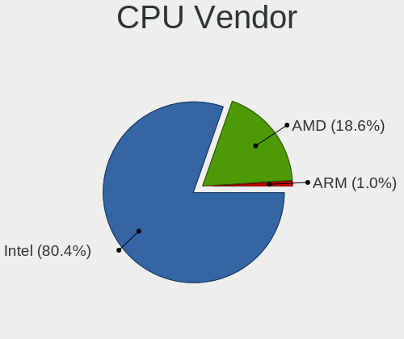

| Vendor | Computers | Percent |
|--------|-----------|---------|
| Intel  | 239       | 84.75%  |
| AMD    | 40        | 14.18%  |
| ARM    | 3         | 1.06%   |

CPU Model
---------

Processor models

| Model                                         | Computers | Percent |
|-----------------------------------------------|-----------|---------|
| Intel Core i5-7200U CPU @ 2.50GHz             | 13        | 4.59%   |
| Intel 11th Gen Core i5-1135G7 @ 2.40GHz       | 11        | 3.89%   |
| Intel Core i5-8265U CPU @ 1.60GHz             | 9         | 3.18%   |
| Intel Core i3-7100U CPU @ 2.40GHz             | 8         | 2.83%   |
| Intel Core i5-8250U CPU @ 1.60GHz             | 6         | 2.12%   |
| Intel Core i5-6200U CPU @ 2.30GHz             | 6         | 2.12%   |
| Intel Core i7-8550U CPU @ 1.80GHz             | 5         | 1.77%   |
| Intel Core i5-3320M CPU @ 2.60GHz             | 5         | 1.77%   |
| Intel Core i7-8565U CPU @ 1.80GHz             | 4         | 1.41%   |
| Intel Core i5-7300U CPU @ 2.60GHz             | 4         | 1.41%   |
| Intel Core i5-6300U CPU @ 2.40GHz             | 4         | 1.41%   |
| Intel Core i5-5300U CPU @ 2.30GHz             | 4         | 1.41%   |
| Intel Core i5-4590 CPU @ 3.30GHz              | 4         | 1.41%   |
| Intel Core i5-4210U CPU @ 1.70GHz             | 4         | 1.41%   |
| Intel Core i5-3470 CPU @ 3.20GHz              | 4         | 1.41%   |
| Intel Core i3-8130U CPU @ 2.20GHz             | 4         | 1.41%   |
| Intel Core i3-6006U CPU @ 2.00GHz             | 4         | 1.41%   |
| Intel Core i3-4005U CPU @ 1.70GHz             | 4         | 1.41%   |
| Intel Core i3-1005G1 CPU @ 1.20GHz            | 4         | 1.41%   |
| AMD Ryzen 5 3400G with Radeon Vega Graphics   | 4         | 1.41%   |
| AMD Ryzen 3 3200G with Radeon Vega Graphics   | 4         | 1.41%   |
| Intel Pentium CPU N3710 @ 1.60GHz             | 3         | 1.06%   |
| Intel Pentium CPU G630 @ 2.70GHz              | 3         | 1.06%   |
| Intel Core i7-7500U CPU @ 2.70GHz             | 3         | 1.06%   |
| Intel Core i5-7500 CPU @ 3.40GHz              | 3         | 1.06%   |
| Intel Core i5-5200U CPU @ 2.20GHz             | 3         | 1.06%   |
| Intel Core i5-10210U CPU @ 1.60GHz            | 3         | 1.06%   |
| Intel Core i3-5005U CPU @ 2.00GHz             | 3         | 1.06%   |
| AMD Ryzen 5 5600G with Radeon Graphics        | 3         | 1.06%   |
| AMD Ryzen 5 5500U with Radeon Graphics        | 3         | 1.06%   |
| AMD Ryzen 5 3600 6-Core Processor             | 3         | 1.06%   |
| AMD Ryzen 5 3550H with Radeon Vega Mobile Gfx | 3         | 1.06%   |
| Intel Xeon CPU X3440 @ 2.53GHz                | 2         | 0.71%   |
| Intel Pentium Dual-Core CPU E5400 @ 2.70GHz   | 2         | 0.71%   |
| Intel Pentium CPU G3260 @ 3.30GHz             | 2         | 0.71%   |
| Intel Core i5-9400 CPU @ 2.90GHz              | 2         | 0.71%   |
| Intel Core i5-3210M CPU @ 2.50GHz             | 2         | 0.71%   |
| Intel Core i5-2520M CPU @ 2.50GHz             | 2         | 0.71%   |
| Intel Core i5-10400 CPU @ 2.90GHz             | 2         | 0.71%   |
| Intel Core i5 CPU M 480 @ 2.67GHz             | 2         | 0.71%   |

CPU Model Family
----------------

Processor model prefix

| Model                   | Computers | Percent |
|-------------------------|-----------|---------|
| Intel Core i5           | 101       | 35.82%  |
| Intel Core i3           | 57        | 20.21%  |
| Other                   | 21        | 7.45%   |
| AMD Ryzen 5             | 21        | 7.45%   |
| Intel Core i7           | 19        | 6.74%   |
| Intel Pentium           | 13        | 4.61%   |
| Intel Core 2 Duo        | 9         | 3.19%   |
| Intel Celeron           | 7         | 2.48%   |
| AMD Ryzen 7             | 6         | 2.13%   |
| AMD Ryzen 3             | 6         | 2.13%   |
| Intel Pentium Dual-Core | 5         | 1.77%   |
| Intel Xeon              | 3         | 1.06%   |
| Intel Core 2 Quad       | 2         | 0.71%   |
| Intel Atom              | 2         | 0.71%   |
| AMD A8                  | 2         | 0.71%   |
| Intel Pentium Gold      | 1         | 0.35%   |
| Intel Celeron Dual-Core | 1         | 0.35%   |
| ARM AArch64             | 1         | 0.35%   |
| AMD Ryzen 9             | 1         | 0.35%   |
| AMD FX                  | 1         | 0.35%   |
| AMD E2                  | 1         | 0.35%   |
| AMD E                   | 1         | 0.35%   |
| AMD A4                  | 1         | 0.35%   |

CPU Cores
---------

Number of processor cores

| Number  | Computers | Percent |
|---------|-----------|---------|
| 2       | 157       | 55.48%  |
| 4       | 91        | 32.16%  |
| 6       | 22        | 7.77%   |
| 8       | 7         | 2.47%   |
| 10      | 2         | 0.71%   |
| 1       | 2         | 0.71%   |
| 12      | 1         | 0.35%   |
| Unknown | 1         | 0.35%   |

CPU Sockets
-----------

Number of sockets

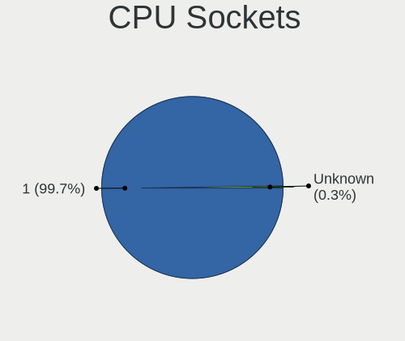

| Number  | Computers | Percent |
|---------|-----------|---------|
| 1       | 281       | 99.65%  |
| Unknown | 1         | 0.35%   |

CPU Threads
-----------

Threads per core (Hyper-Threading)

| Number  | Computers | Percent |
|---------|-----------|---------|
| 2       | 208       | 73.5%   |
| 1       | 74        | 26.15%  |
| Unknown | 1         | 0.35%   |

CPU Op-Modes
------------

CPU Operation Modes (32-bit, 64-bit)

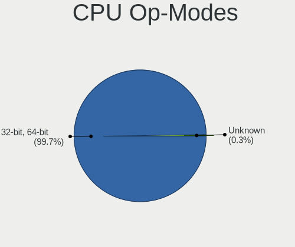

| Op mode        | Computers | Percent |
|----------------|-----------|---------|
| 32-bit, 64-bit | 281       | 99.65%  |
| Unknown        | 1         | 0.35%   |

CPU Microcode
-------------

Microcode number

| Number     | Computers | Percent |
|------------|-----------|---------|
| Unknown    | 83        | 27.85%  |
| 0x806e9    | 24        | 8.05%   |
| 0x806ea    | 15        | 5.03%   |
| 0x306a9    | 15        | 5.03%   |
| 0x206a7    | 13        | 4.36%   |
| 0x406e3    | 12        | 4.03%   |
| 0x40651    | 10        | 3.36%   |
| 0x806c1    | 9         | 3.02%   |
| 0x306d4    | 9         | 3.02%   |
| 0x306c3    | 9         | 3.02%   |
| 0x1067a    | 9         | 3.02%   |
| 0x08108109 | 8         | 2.68%   |
| 0x806ec    | 7         | 2.35%   |
| 0x806eb    | 7         | 2.35%   |
| 0x906e9    | 6         | 2.01%   |
| 0x706e5    | 5         | 1.68%   |
| 0x406c4    | 4         | 1.34%   |
| 0x08701021 | 4         | 1.34%   |
| 0x506e3    | 3         | 1.01%   |
| 0x20655    | 3         | 1.01%   |
| 0x106e5    | 3         | 1.01%   |
| 0x10676    | 3         | 1.01%   |
| 0x0a50000c | 3         | 1.01%   |
| 0x08108102 | 3         | 1.01%   |
| 0xa0652    | 2         | 0.67%   |
| 0x906eb    | 2         | 0.67%   |
| 0x906ea    | 2         | 0.67%   |
| 0x90672    | 2         | 0.67%   |
| 0x6fb      | 2         | 0.67%   |
| 0x20652    | 2         | 0.67%   |
| 0x08608103 | 2         | 0.67%   |
| 0x0810100b | 2         | 0.67%   |
| 0x906a3    | 1         | 0.34%   |
| 0x806d1    | 1         | 0.34%   |
| 0x506c9    | 1         | 0.34%   |
| 0x50654    | 1         | 0.34%   |
| 0x406c3    | 1         | 0.34%   |
| 0x30678    | 1         | 0.34%   |
| 0x30661    | 1         | 0.34%   |
| 0x106ca    | 1         | 0.34%   |

CPU Microarch
-------------

Microarchitecture

| Name             | Computers | Percent |
|------------------|-----------|---------|
| KabyLake         | 79        | 27.92%  |
| Haswell          | 25        | 8.83%   |
| Skylake          | 20        | 7.07%   |
| IvyBridge        | 20        | 7.07%   |
| SandyBridge      | 17        | 6.01%   |
| Zen+             | 14        | 4.95%   |
| TigerLake        | 14        | 4.95%   |
| Penryn           | 14        | 4.95%   |
| Broadwell        | 12        | 4.24%   |
| Zen 2            | 8         | 2.83%   |
| Silvermont       | 7         | 2.47%   |
| Zen 3            | 6         | 2.12%   |
| IceLake          | 6         | 2.12%   |
| CometLake        | 6         | 2.12%   |
| Unknown          | 6         | 2.12%   |
| Westmere         | 5         | 1.77%   |
| Core             | 5         | 1.77%   |
| Alderlake Hybrid | 4         | 1.41%   |
| Zen              | 3         | 1.06%   |
| Nehalem          | 3         | 1.06%   |
| Piledriver       | 2         | 0.71%   |
| Excavator        | 2         | 0.71%   |
| Bonnell          | 2         | 0.71%   |
| Puma             | 1         | 0.35%   |
| Goldmont         | 1         | 0.35%   |
| Bobcat           | 1         | 0.35%   |

Graphics
--------

GPU Vendor
----------

Vendors of graphics cards

| Vendor | Computers | Percent |
|--------|-----------|---------|
| Intel  | 222       | 66.67%  |
| Nvidia | 64        | 19.22%  |
| AMD    | 47        | 14.11%  |

GPU Model
---------

Graphics card models

| Model                                                                                    | Computers | Percent |
|------------------------------------------------------------------------------------------|-----------|---------|
| Intel HD Graphics 620                                                                    | 31        | 9.17%   |
| Intel Skylake GT2 [HD Graphics 520]                                                      | 16        | 4.73%   |
| Intel WhiskeyLake-U GT2 [UHD Graphics 620]                                               | 15        | 4.44%   |
| Intel UHD Graphics 620                                                                   | 15        | 4.44%   |
| Intel 2nd Generation Core Processor Family Integrated Graphics Controller                | 15        | 4.44%   |
| Intel TigerLake-LP GT2 [Iris Xe Graphics]                                                | 13        | 3.85%   |
| AMD Picasso/Raven 2 [Radeon Vega Series / Radeon Vega Mobile Series]                     | 13        | 3.85%   |
| Intel Haswell-ULT Integrated Graphics Controller                                         | 12        | 3.55%   |
| Intel HD Graphics 5500                                                                   | 11        | 3.25%   |
| Intel 3rd Gen Core processor Graphics Controller                                         | 11        | 3.25%   |
| Intel 4 Series Chipset Integrated Graphics Controller                                    | 8         | 2.37%   |
| Intel Xeon E3-1200 v3/4th Gen Core Processor Integrated Graphics Controller              | 7         | 2.07%   |
| Intel Xeon E3-1200 v2/3rd Gen Core processor Graphics Controller                         | 7         | 2.07%   |
| Nvidia GM108M [GeForce 940MX]                                                            | 6         | 1.78%   |
| Intel HD Graphics 630                                                                    | 6         | 1.78%   |
| Intel CoffeeLake-S GT2 [UHD Graphics 630]                                                | 6         | 1.78%   |
| AMD Cezanne [Radeon Vega Series / Radeon Vega Mobile Series]                             | 6         | 1.78%   |
| Nvidia GP108M [GeForce MX150]                                                            | 5         | 1.48%   |
| Intel Iris Plus Graphics G1 (Ice Lake)                                                   | 5         | 1.48%   |
| Intel Core Processor Integrated Graphics Controller                                      | 5         | 1.48%   |
| Intel CometLake-U GT2 [UHD Graphics]                                                     | 5         | 1.48%   |
| Intel Atom/Celeron/Pentium Processor x5-E8000/J3xxx/N3xxx Integrated Graphics Controller | 5         | 1.48%   |
| Nvidia GP108M [GeForce MX250]                                                            | 4         | 1.18%   |
| Nvidia GP107M [GeForce GTX 1050 Mobile]                                                  | 4         | 1.18%   |
| Intel Mobile 4 Series Chipset Integrated Graphics Controller                             | 4         | 1.18%   |
| Intel 82G33/G31 Express Integrated Graphics Controller                                   | 4         | 1.18%   |
| AMD Ellesmere [Radeon RX 470/480/570/570X/580/580X/590]                                  | 4         | 1.18%   |
| Nvidia GM108M [GeForce MX130]                                                            | 3         | 0.89%   |
| Intel CometLake-S GT2 [UHD Graphics 630]                                                 | 3         | 0.89%   |
| AMD Lucienne                                                                             | 3         | 0.89%   |
| AMD Baffin [Radeon RX 460/560D / Pro 450/455/460/555/555X/560/560X]                      | 3         | 0.89%   |
| Nvidia TU117M [GeForce GTX 1650 Mobile / Max-Q]                                          | 2         | 0.59%   |
| Nvidia TU116 [GeForce GTX 1650 SUPER]                                                    | 2         | 0.59%   |
| Nvidia GT215 [GeForce GT 240]                                                            | 2         | 0.59%   |
| Nvidia GM108M [GeForce 930MX]                                                            | 2         | 0.59%   |
| Nvidia GK208B [GeForce GT 710]                                                           | 2         | 0.59%   |
| Nvidia GF117M [GeForce 610M/710M/810M/820M / GT 620M/625M/630M/720M]                     | 2         | 0.59%   |
| Intel CometLake-H GT2 [UHD Graphics]                                                     | 2         | 0.59%   |
| Intel Atom Processor Z36xxx/Z37xxx Series Graphics & Display                             | 2         | 0.59%   |
| Intel 4th Generation Core Processor Family Integrated Graphics Controller                | 2         | 0.59%   |

GPU Combo
---------

Combinations of graphics cards

| Name           | Computers | Percent |
|----------------|-----------|---------|
| 1 x Intel      | 176       | 61.75%  |
| Intel + Nvidia | 38        | 13.33%  |
| 1 x AMD        | 33        | 11.58%  |
| 1 x Nvidia     | 21        | 7.37%   |
| Intel + AMD    | 5         | 1.75%   |
| AMD + Nvidia   | 5         | 1.75%   |
| 2 x AMD        | 4         | 1.4%    |
| Other          | 3         | 1.05%   |

GPU Driver
----------

Free vs proprietary

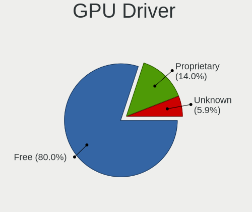

| Driver      | Computers | Percent |
|-------------|-----------|---------|
| Free        | 242       | 82.88%  |
| Proprietary | 39        | 13.36%  |
| Unknown     | 11        | 3.77%   |

GPU Memory
----------

Total video memory

| Size in GB | Computers | Percent |
|------------|-----------|---------|
| Unknown    | 213       | 73.7%   |
| 1.01-2.0   | 35        | 12.11%  |
| 3.01-4.0   | 16        | 5.54%   |
| 0.01-0.5   | 10        | 3.46%   |
| 0.51-1.0   | 8         | 2.77%   |
| 7.01-8.0   | 5         | 1.73%   |
| 5.01-6.0   | 2         | 0.69%   |

Monitor
-------

Monitor Vendor
--------------

Monitor vendors

| Vendor                  | Computers | Percent |
|-------------------------|-----------|---------|
| BOE                     | 51        | 17.71%  |
| AU Optronics            | 46        | 15.97%  |
| Chimei Innolux          | 36        | 12.5%   |
| LG Display              | 34        | 11.81%  |
| Samsung Electronics     | 29        | 10.07%  |
| Dell                    | 22        | 7.64%   |
| Goldstar                | 16        | 5.56%   |
| Hewlett-Packard         | 15        | 5.21%   |
| PANDA                   | 5         | 1.74%   |
| ViewSonic               | 4         | 1.39%   |
| Philips                 | 3         | 1.04%   |
| Chi Mei Optoelectronics | 3         | 1.04%   |
| ASUSTek Computer        | 3         | 1.04%   |
| Ancor Communications    | 3         | 1.04%   |
| Sony                    | 2         | 0.69%   |
| MSI                     | 2         | 0.69%   |
| ___                     | 1         | 0.35%   |
| UTV                     | 1         | 0.35%   |
| Unknown                 | 1         | 0.35%   |
| Sharp                   | 1         | 0.35%   |
| QXS                     | 1         | 0.35%   |
| LLL                     | 1         | 0.35%   |
| LG Electronics          | 1         | 0.35%   |
| HUYINIUDA               | 1         | 0.35%   |
| HUAWEI                  | 1         | 0.35%   |
| FSR                     | 1         | 0.35%   |
| CND                     | 1         | 0.35%   |
| CHR                     | 1         | 0.35%   |
| Apple                   | 1         | 0.35%   |
| AOC                     | 1         | 0.35%   |

Monitor Model
-------------

Monitor models

| Model                                                                    | Computers | Percent |
|--------------------------------------------------------------------------|-----------|---------|
| Chimei Innolux LCD Monitor CMN15F5 1920x1080 344x193mm 15.5-inch         | 9         | 3.03%   |
| Goldstar FULL HD GSM5B55 1920x1080 480x270mm 21.7-inch                   | 7         | 2.36%   |
| Samsung Electronics S19F350 SAM0D46 1366x768 410x230mm 18.5-inch         | 5         | 1.68%   |
| Hewlett-Packard 22fw HPN3541 1920x1080 476x268mm 21.5-inch               | 5         | 1.68%   |
| AU Optronics LCD Monitor AUO38ED 1920x1080 344x193mm 15.5-inch           | 5         | 1.68%   |
| Dell SE2219H DELF10F 1920x1080 480x270mm 21.7-inch                       | 4         | 1.35%   |
| LG Display LCD Monitor LGD0563 1920x1080 340x190mm 15.3-inch             | 3         | 1.01%   |
| Hewlett-Packard V194 HWP3346 1366x768 410x230mm 18.5-inch                | 3         | 1.01%   |
| Dell S2240L DELD054 1920x1080 476x267mm 21.5-inch                        | 3         | 1.01%   |
| Dell E1916HV DELF06C 1366x768 409x230mm 18.5-inch                        | 3         | 1.01%   |
| BOE LCD Monitor BOE06BA 1920x1080 344x193mm 15.5-inch                    | 3         | 1.01%   |
| BOE LCD Monitor BOE0697 1366x768 309x173mm 13.9-inch                     | 3         | 1.01%   |
| BOE LCD Monitor BOE0696 1366x768 309x173mm 13.9-inch                     | 3         | 1.01%   |
| AU Optronics LCD Monitor AUO2E8D 1920x1080 344x194mm 15.5-inch           | 3         | 1.01%   |
| AU Optronics LCD Monitor AUO21ED 1920x1080 344x194mm 15.5-inch           | 3         | 1.01%   |
| Samsung Electronics SyncMaster SAM0472 1440x900 367x229mm 17.0-inch      | 2         | 0.67%   |
| Samsung Electronics S22R35x SAM103A 1920x1080 476x268mm 21.5-inch        | 2         | 0.67%   |
| LG Display LCD Monitor LGD05F2 1920x1080 344x194mm 15.5-inch             | 2         | 0.67%   |
| LG Display LCD Monitor LGD0573 1920x1080 344x194mm 15.5-inch             | 2         | 0.67%   |
| LG Display LCD Monitor LGD0504 1366x768 344x194mm 15.5-inch              | 2         | 0.67%   |
| LG Display LCD Monitor LGD04C0 1366x768 309x174mm 14.0-inch              | 2         | 0.67%   |
| LG Display LCD Monitor LGD046F 1920x1080 344x194mm 15.5-inch             | 2         | 0.67%   |
| LG Display LCD Monitor LGD0466 1366x768 309x174mm 14.0-inch              | 2         | 0.67%   |
| LG Display LCD Monitor LGD02F8 1366x768 309x174mm 14.0-inch              | 2         | 0.67%   |
| Hewlett-Packard v185w HWP2820 1366x768 410x230mm 18.5-inch               | 2         | 0.67%   |
| Hewlett-Packard 22fw HPN3542 1920x1080 476x267mm 21.5-inch               | 2         | 0.67%   |
| Goldstar IPS FULLHD GSM5AB6 1920x1080 480x270mm 21.7-inch                | 2         | 0.67%   |
| Dell S2218H DELD0B8 1920x1080 476x268mm 21.5-inch                        | 2         | 0.67%   |
| Dell D1918H DEL2005 1366x768 410x230mm 18.5-inch                         | 2         | 0.67%   |
| Chimei Innolux LCD Monitor CMN15DC 1366x768 344x193mm 15.5-inch          | 2         | 0.67%   |
| Chimei Innolux LCD Monitor CMN15DB 1366x768 344x193mm 15.5-inch          | 2         | 0.67%   |
| Chimei Innolux LCD Monitor CMN14D2 1920x1080 309x173mm 13.9-inch         | 2         | 0.67%   |
| Chimei Innolux LCD Monitor CMN14A1 1366x768 309x174mm 14.0-inch          | 2         | 0.67%   |
| Chimei Innolux LCD Monitor CMN1490 1366x768 309x173mm 13.9-inch          | 2         | 0.67%   |
| Chi Mei Optoelectronics LCD Monitor CMO15A1 1366x768 344x193mm 15.5-inch | 2         | 0.67%   |
| BOE LCD Monitor BOE07B4 1366x768 344x194mm 15.5-inch                     | 2         | 0.67%   |
| BOE LCD Monitor BOE06A5 1366x768 344x194mm 15.5-inch                     | 2         | 0.67%   |
| BOE LCD Monitor BOE06A4 1366x768 344x194mm 15.5-inch                     | 2         | 0.67%   |
| BOE LCD Monitor BOE0698 1366x768 309x173mm 13.9-inch                     | 2         | 0.67%   |
| BOE LCD Monitor BOE0672 1366x768 344x194mm 15.5-inch                     | 2         | 0.67%   |

Monitor Resolution
------------------

Monitor screen resolution

| Resolution        | Computers | Percent |
|-------------------|-----------|---------|
| 1366x768 (WXGA)   | 119       | 42.96%  |
| 1920x1080 (FHD)   | 117       | 42.24%  |
| 3840x2160 (4K)    | 9         | 3.25%   |
| 1440x900 (WXGA+)  | 6         | 2.17%   |
| 1600x900 (HD+)    | 5         | 1.81%   |
| 1280x1024 (SXGA)  | 3         | 1.08%   |
| 2560x1600         | 2         | 0.72%   |
| 1920x1200 (WUXGA) | 2         | 0.72%   |
| 1280x800 (WXGA)   | 2         | 0.72%   |
| 1024x600          | 2         | 0.72%   |
| Unknown           | 2         | 0.72%   |
| 3440x1440         | 1         | 0.36%   |
| 3360x1080         | 1         | 0.36%   |
| 2736x1824         | 1         | 0.36%   |
| 2726x768          | 1         | 0.36%   |
| 2560x1440 (QHD)   | 1         | 0.36%   |
| 2240x1400         | 1         | 0.36%   |
| 1360x768          | 1         | 0.36%   |
| 1024x768 (XGA)    | 1         | 0.36%   |

Monitor Diagonal
----------------

Diagonal size in inches

| Inches  | Computers | Percent |
|---------|-----------|---------|
| 15      | 89        | 30.8%   |
| 13      | 46        | 15.92%  |
| 21      | 39        | 13.49%  |
| 14      | 37        | 12.8%   |
| 18      | 27        | 9.34%   |
| 23      | 8         | 2.77%   |
| 12      | 7         | 2.42%   |
| Unknown | 6         | 2.08%   |
| 17      | 5         | 1.73%   |
| 24      | 4         | 1.38%   |
| 19      | 4         | 1.38%   |
| 16      | 4         | 1.38%   |
| 11      | 3         | 1.04%   |
| 72      | 2         | 0.69%   |
| 10      | 2         | 0.69%   |
| 84      | 1         | 0.35%   |
| 39      | 1         | 0.35%   |
| 34      | 1         | 0.35%   |
| 27      | 1         | 0.35%   |
| 26      | 1         | 0.35%   |
| 20      | 1         | 0.35%   |

Monitor Width
-------------

Physical width

| Width in mm | Computers | Percent |
|-------------|-----------|---------|
| 301-350     | 162       | 56.84%  |
| 401-500     | 73        | 25.61%  |
| 201-300     | 24        | 8.42%   |
| 501-600     | 9         | 3.16%   |
| 351-400     | 6         | 2.11%   |
| Unknown     | 6         | 2.11%   |
| 1501-2000   | 3         | 1.05%   |
| 801-900     | 1         | 0.35%   |
| 701-800     | 1         | 0.35%   |

Aspect Ratio
------------

Proportional relationship between the width and the height

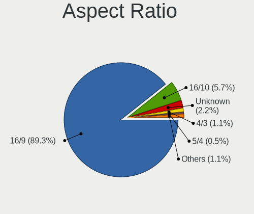

| Ratio   | Computers | Percent |
|---------|-----------|---------|
| 16/9    | 238       | 90.15%  |
| 16/10   | 14        | 5.3%    |
| Unknown | 5         | 1.89%   |
| 4/3     | 4         | 1.52%   |
| 5/4     | 1         | 0.38%   |
| 3/2     | 1         | 0.38%   |
| 21/9    | 1         | 0.38%   |

Monitor Area
------------

Area in inch

| Area in inch | Computers | Percent |
|----------------|-----------|---------|
| 101-110        | 89        | 30.9%   |
| 81-90          | 72        | 25%     |
| 201-250        | 38        | 13.19%  |
| 141-150        | 28        | 9.72%   |
| 151-200        | 15        | 5.21%   |
| 71-80          | 9         | 3.13%   |
| 61-70          | 7         | 2.43%   |
| Unknown        | 6         | 2.08%   |
| 131-140        | 4         | 1.39%   |
| 111-120        | 4         | 1.39%   |
| More than 1000 | 3         | 1.04%   |
| 51-60          | 3         | 1.04%   |
| 251-300        | 3         | 1.04%   |
| 41-50          | 2         | 0.69%   |
| 351-500        | 1         | 0.35%   |
| 301-350        | 1         | 0.35%   |
| 121-130        | 1         | 0.35%   |
| 501-1000       | 1         | 0.35%   |
| 91-100         | 1         | 0.35%   |

Pixel Density
-------------

Pixels per inch

| Density       | Computers | Percent |
|---------------|-----------|---------|
| 101-120       | 126       | 44.68%  |
| 121-160       | 85        | 30.14%  |
| 51-100        | 54        | 19.15%  |
| 161-240       | 7         | 2.48%   |
| Unknown       | 6         | 2.13%   |
| More than 240 | 2         | 0.71%   |
| 1-50          | 2         | 0.71%   |

Multiple Monitors
-----------------

Total monitors connected

| Total | Computers | Percent |
|-------|-----------|---------|
| 1     | 245       | 85.07%  |
| 2     | 30        | 10.42%  |
| 0     | 11        | 3.82%   |
| 3     | 2         | 0.69%   |

Network
-------

Net Controller Vendor
---------------------

Controller vendors

| Vendor                            | Computers | Percent |
|-----------------------------------|-----------|---------|
| Realtek Semiconductor             | 198       | 47.14%  |
| Intel                             | 104       | 24.76%  |
| Qualcomm Atheros                  | 55        | 13.1%   |
| Ralink Technology                 | 15        | 3.57%   |
| Xiaomi                            | 10        | 2.38%   |
| TP-Link                           | 8         | 1.9%    |
| Broadcom                          | 7         | 1.67%   |
| MediaTek                          | 6         | 1.43%   |
| Ralink                            | 2         | 0.48%   |
| Qualcomm                          | 2         | 0.48%   |
| HMD Global                        | 2         | 0.48%   |
| D-Link                            | 2         | 0.48%   |
| ASIX Electronics                  | 2         | 0.48%   |
| Sundance Technology Inc / IC Plus | 1         | 0.24%   |
| Samsung Electronics               | 1         | 0.24%   |
| OPPO Electronics                  | 1         | 0.24%   |
| NetGear                           | 1         | 0.24%   |
| Dell                              | 1         | 0.24%   |
| Arduino SA                        | 1         | 0.24%   |
| AboCom Systems                    | 1         | 0.24%   |

Net Controller Model
--------------------

Controller models

| Model                                                             | Computers | Percent |
|-------------------------------------------------------------------|-----------|---------|
| Realtek RTL8111/8168/8411 PCI Express Gigabit Ethernet Controller | 135       | 28.3%   |
| Realtek RTL810xE PCI Express Fast Ethernet controller             | 41        | 8.6%    |
| Qualcomm Atheros QCA9377 802.11ac Wireless Network Adapter        | 22        | 4.61%   |
| Intel Wireless 8265 / 8275                                        | 16        | 3.35%   |
| Ralink MT7601U Wireless Adapter                                   | 13        | 2.73%   |
| Intel Wi-Fi 6 AX201                                               | 13        | 2.73%   |
| Intel Dual Band Wireless-AC 3168NGW [Stone Peak]                  | 13        | 2.73%   |
| Qualcomm Atheros QCA9565 / AR9565 Wireless Network Adapter        | 12        | 2.52%   |
| Realtek RTL8723BE PCIe Wireless Network Adapter                   | 9         | 1.89%   |
| Realtek RTL8822BE 802.11a/b/g/n/ac WiFi adapter                   | 8         | 1.68%   |
| Intel Wireless 3165                                               | 8         | 1.68%   |
| Intel 82579LM Gigabit Network Connection (Lewisville)             | 8         | 1.68%   |
| Qualcomm Atheros QCA6174 802.11ac Wireless Network Adapter        | 7         | 1.47%   |
| Xiaomi Mi/Redmi series (RNDIS)                                    | 5         | 1.05%   |
| Realtek RTL8821CE 802.11ac PCIe Wireless Network Adapter          | 5         | 1.05%   |
| Intel Wireless 8260                                               | 5         | 1.05%   |
| Intel Ethernet Connection (2) I219-V                              | 5         | 1.05%   |
| TP-Link TL-WN823N v2/v3 [Realtek RTL8192EU]                       | 4         | 0.84%   |
| Qualcomm Atheros AR9485 Wireless Network Adapter                  | 4         | 0.84%   |
| Intel Wireless 7265                                               | 4         | 0.84%   |
| Intel Ethernet Connection (3) I218-LM                             | 4         | 0.84%   |
| Intel Centrino Advanced-N 6205 [Taylor Peak]                      | 4         | 0.84%   |
| Xiaomi MediaTek MT7601U [MI WiFi]                                 | 3         | 0.63%   |
| Realtek RTL8822CE 802.11ac PCIe Wireless Network Adapter          | 3         | 0.63%   |
| Realtek RTL8192CU 802.11n WLAN Adapter                            | 3         | 0.63%   |
| Realtek RTL8188FTV 802.11b/g/n 1T1R 2.4G WLAN Adapter             | 3         | 0.63%   |
| Realtek RTL-8100/8101L/8139 PCI Fast Ethernet Adapter             | 3         | 0.63%   |
| Qualcomm Atheros AR9285 Wireless Network Adapter (PCI-Express)    | 3         | 0.63%   |
| MediaTek MT7921K (RZ608) Wi-Fi 6E 80MHz                           | 3         | 0.63%   |
| Intel Wireless 7260                                               | 3         | 0.63%   |
| Intel Wireless 3160                                               | 3         | 0.63%   |
| Intel Ice Lake-LP PCH CNVi WiFi                                   | 3         | 0.63%   |
| Intel Ethernet Controller I225-V                                  | 3         | 0.63%   |
| Intel Ethernet Connection I219-LM                                 | 3         | 0.63%   |
| Intel Ethernet Connection (4) I219-LM                             | 3         | 0.63%   |
| Intel Dual Band Wireless-AC 3165 Plus Bluetooth                   | 3         | 0.63%   |
| Intel Comet Lake PCH-LP CNVi WiFi                                 | 3         | 0.63%   |
| Broadcom BCM43142 802.11b/g/n                                     | 3         | 0.63%   |
| Xiaomi Mi/Redmi series (RNDIS + ADB)                              | 2         | 0.42%   |
| TP-Link AC600 wireless Realtek RTL8811AU [Archer T2U Nano]        | 2         | 0.42%   |

Wireless Vendor
---------------

Wireless vendors

| Vendor                | Computers | Percent |
|-----------------------|-----------|---------|
| Intel                 | 92        | 40%     |
| Qualcomm Atheros      | 52        | 22.61%  |
| Realtek Semiconductor | 44        | 19.13%  |
| Ralink Technology     | 15        | 6.52%   |
| TP-Link               | 7         | 3.04%   |
| MediaTek              | 5         | 2.17%   |
| Broadcom              | 5         | 2.17%   |
| Xiaomi                | 3         | 1.3%    |
| Ralink                | 2         | 0.87%   |
| D-Link                | 2         | 0.87%   |
| NetGear               | 1         | 0.43%   |
| Dell                  | 1         | 0.43%   |
| AboCom Systems        | 1         | 0.43%   |

Wireless Model
--------------

Wireless models

| Model                                                          | Computers | Percent |
|----------------------------------------------------------------|-----------|---------|
| Qualcomm Atheros QCA9377 802.11ac Wireless Network Adapter     | 22        | 9.57%   |
| Intel Wireless 8265 / 8275                                     | 16        | 6.96%   |
| Ralink MT7601U Wireless Adapter                                | 13        | 5.65%   |
| Intel Wi-Fi 6 AX201                                            | 13        | 5.65%   |
| Intel Dual Band Wireless-AC 3168NGW [Stone Peak]               | 13        | 5.65%   |
| Qualcomm Atheros QCA9565 / AR9565 Wireless Network Adapter     | 12        | 5.22%   |
| Realtek RTL8723BE PCIe Wireless Network Adapter                | 9         | 3.91%   |
| Realtek RTL8822BE 802.11a/b/g/n/ac WiFi adapter                | 8         | 3.48%   |
| Intel Wireless 3165                                            | 8         | 3.48%   |
| Qualcomm Atheros QCA6174 802.11ac Wireless Network Adapter     | 7         | 3.04%   |
| Realtek RTL8821CE 802.11ac PCIe Wireless Network Adapter       | 5         | 2.17%   |
| Intel Wireless 8260                                            | 5         | 2.17%   |
| TP-Link TL-WN823N v2/v3 [Realtek RTL8192EU]                    | 4         | 1.74%   |
| Qualcomm Atheros AR9485 Wireless Network Adapter               | 4         | 1.74%   |
| Intel Wireless 7265                                            | 4         | 1.74%   |
| Intel Centrino Advanced-N 6205 [Taylor Peak]                   | 4         | 1.74%   |
| Xiaomi MediaTek MT7601U [MI WiFi]                              | 3         | 1.3%    |
| Realtek RTL8822CE 802.11ac PCIe Wireless Network Adapter       | 3         | 1.3%    |
| Realtek RTL8192CU 802.11n WLAN Adapter                         | 3         | 1.3%    |
| Realtek RTL8188FTV 802.11b/g/n 1T1R 2.4G WLAN Adapter          | 3         | 1.3%    |
| Qualcomm Atheros AR9285 Wireless Network Adapter (PCI-Express) | 3         | 1.3%    |
| MediaTek MT7921K (RZ608) Wi-Fi 6E 80MHz                        | 3         | 1.3%    |
| Intel Wireless 7260                                            | 3         | 1.3%    |
| Intel Wireless 3160                                            | 3         | 1.3%    |
| Intel Ice Lake-LP PCH CNVi WiFi                                | 3         | 1.3%    |
| Intel Dual Band Wireless-AC 3165 Plus Bluetooth                | 3         | 1.3%    |
| Intel Comet Lake PCH-LP CNVi WiFi                              | 3         | 1.3%    |
| Broadcom BCM43142 802.11b/g/n                                  | 3         | 1.3%    |
| TP-Link AC600 wireless Realtek RTL8811AU [Archer T2U Nano]     | 2         | 0.87%   |
| Realtek RTL8188GU 802.11n WLAN Adapter (After Modeswitch)      | 2         | 0.87%   |
| Realtek RTL8188EE Wireless Network Adapter                     | 2         | 0.87%   |
| Qualcomm Atheros AR9462 Wireless Network Adapter               | 2         | 0.87%   |
| MediaTek MT7921 802.11ax PCI Express Wireless Network Adapter  | 2         | 0.87%   |
| Intel Wi-Fi 6 AX200                                            | 2         | 0.87%   |
| Intel Centrino Ultimate-N 6300                                 | 2         | 0.87%   |
| Intel Cannon Point-LP CNVi [Wireless-AC]                       | 2         | 0.87%   |
| Intel Alder Lake-P PCH CNVi WiFi                               | 2         | 0.87%   |
| TP-Link Archer T4U ver.3                                       | 1         | 0.43%   |
| Realtek RTL8852AE 802.11ax PCIe Wireless Network Adapter       | 1         | 0.43%   |
| Realtek RTL8821AE 802.11ac PCIe Wireless Network Adapter       | 1         | 0.43%   |

Ethernet Vendor
---------------

Ethernet vendors

| Vendor                            | Computers | Percent |
|-----------------------------------|-----------|---------|
| Realtek Semiconductor             | 183       | 75.31%  |
| Intel                             | 32        | 13.17%  |
| Xiaomi                            | 7         | 2.88%   |
| Qualcomm Atheros                  | 7         | 2.88%   |
| Broadcom                          | 3         | 1.23%   |
| Qualcomm                          | 2         | 0.82%   |
| HMD Global                        | 2         | 0.82%   |
| ASIX Electronics                  | 2         | 0.82%   |
| TP-Link                           | 1         | 0.41%   |
| Sundance Technology Inc / IC Plus | 1         | 0.41%   |
| Samsung Electronics               | 1         | 0.41%   |
| OPPO Electronics                  | 1         | 0.41%   |
| MediaTek                          | 1         | 0.41%   |

Ethernet Model
--------------

Ethernet models

| Model                                                             | Computers | Percent |
|-------------------------------------------------------------------|-----------|---------|
| Realtek RTL8111/8168/8411 PCI Express Gigabit Ethernet Controller | 135       | 54.88%  |
| Realtek RTL810xE PCI Express Fast Ethernet controller             | 41        | 16.67%  |
| Intel 82579LM Gigabit Network Connection (Lewisville)             | 8         | 3.25%   |
| Xiaomi Mi/Redmi series (RNDIS)                                    | 5         | 2.03%   |
| Intel Ethernet Connection (2) I219-V                              | 5         | 2.03%   |
| Intel Ethernet Connection (3) I218-LM                             | 4         | 1.63%   |
| Realtek RTL-8100/8101L/8139 PCI Fast Ethernet Adapter             | 3         | 1.22%   |
| Intel Ethernet Controller I225-V                                  | 3         | 1.22%   |
| Intel Ethernet Connection I219-LM                                 | 3         | 1.22%   |
| Intel Ethernet Connection (4) I219-LM                             | 3         | 1.22%   |
| Xiaomi Mi/Redmi series (RNDIS + ADB)                              | 2         | 0.81%   |
| Realtek RTL8153 Gigabit Ethernet Adapter                          | 2         | 0.81%   |
| Realtek RTL8125 2.5GbE Controller                                 | 2         | 0.81%   |
| Qualcomm Redmi Note 8                                             | 2         | 0.81%   |
| Qualcomm Atheros AR8152 v2.0 Fast Ethernet                        | 2         | 0.81%   |
| Qualcomm Atheros AR8152 v1.1 Fast Ethernet                        | 2         | 0.81%   |
| Intel Ethernet Connection I218-LM                                 | 2         | 0.81%   |
| HMD Global Nokia7.2                                               | 2         | 0.81%   |
| ASIX AX88179 Gigabit Ethernet                                     | 2         | 0.81%   |
| TP-Link UE300 10/100/1000 LAN (ethernet mode) [Realtek RTL8153]   | 1         | 0.41%   |
| Sundance Inc / IC Plus IP1000 Family Gigabit Ethernet             | 1         | 0.41%   |
| Samsung Galaxy series, misc. (tethering mode)                     | 1         | 0.41%   |
| Realtek RTL8169 PCI Gigabit Ethernet Controller                   | 1         | 0.41%   |
| Realtek Killer E2600 Gigabit Ethernet Controller                  | 1         | 0.41%   |
| Realtek Killer E2500 Gigabit Ethernet Controller                  | 1         | 0.41%   |
| Qualcomm Atheros QCA8172 Fast Ethernet                            | 1         | 0.41%   |
| Qualcomm Atheros Killer E2500 Gigabit Ethernet Controller         | 1         | 0.41%   |
| Qualcomm Atheros AR8131 Gigabit Ethernet                          | 1         | 0.41%   |
| OPPO SM6375-QRD _SN:F4A23F05                                      | 1         | 0.41%   |
| MediaTek Titan pocket                                             | 1         | 0.41%   |
| Intel Ethernet Connection (7) I219-V                              | 1         | 0.41%   |
| Intel Ethernet Connection (6) I219-LM                             | 1         | 0.41%   |
| Intel 82567LM-3 Gigabit Network Connection                        | 1         | 0.41%   |
| Intel 82567LM Gigabit Network Connection                          | 1         | 0.41%   |
| Broadcom NetXtreme BCM57765 Gigabit Ethernet PCIe                 | 1         | 0.41%   |
| Broadcom NetLink BCM57785 Gigabit Ethernet PCIe                   | 1         | 0.41%   |
| Broadcom NetLink BCM57780 Gigabit Ethernet PCIe                   | 1         | 0.41%   |

Net Controller Kind
-------------------

Ethernet, WiFi or modem

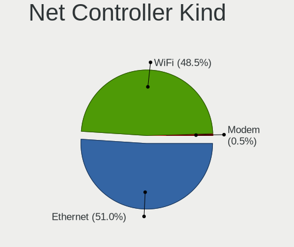

| Kind     | Computers | Percent |
|----------|-----------|---------|
| Ethernet | 230       | 51%     |
| WiFi     | 220       | 48.78%  |
| Modem    | 1         | 0.22%   |

Used Controller
---------------

Currently used network controller

| Kind     | Computers | Percent |
|----------|-----------|---------|
| WiFi     | 179       | 63.48%  |
| Ethernet | 103       | 36.52%  |

NICs
----

Total network controllers on board

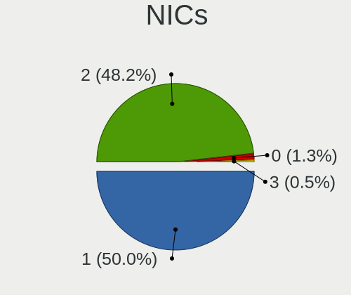

| Total | Computers | Percent |
|-------|-----------|---------|
| 1     | 140       | 49.65%  |
| 2     | 137       | 48.58%  |
| 0     | 5         | 1.77%   |

IPv6
----

IPv6 vs IPv4

| Used | Computers | Percent |
|------|-----------|---------|
| No   | 280       | 99.29%  |
| Yes  | 2         | 0.71%   |

Bluetooth
---------

Bluetooth Vendor
----------------

Controller vendors

| Vendor                          | Computers | Percent |
|---------------------------------|-----------|---------|
| Intel                           | 77        | 43.75%  |
| IMC Networks                    | 24        | 13.64%  |
| Realtek Semiconductor           | 18        | 10.23%  |
| Qualcomm Atheros Communications | 14        | 7.95%   |
| Cambridge Silicon Radio         | 13        | 7.39%   |
| Lite-On Technology              | 11        | 6.25%   |
| Broadcom                        | 7         | 3.98%   |
| Foxconn / Hon Hai               | 4         | 2.27%   |
| MediaTek                        | 2         | 1.14%   |
| Toshiba                         | 1         | 0.57%   |
| Ralink                          | 1         | 0.57%   |
| Hewlett-Packard                 | 1         | 0.57%   |
| Foxconn International           | 1         | 0.57%   |
| Dell                            | 1         | 0.57%   |
| Unknown                         | 1         | 0.57%   |

Bluetooth Model
---------------

Controller models

| Model                                               | Computers | Percent |
|-----------------------------------------------------|-----------|---------|
| Intel Bluetooth wireless interface                  | 39        | 22.16%  |
| Intel AX201 Bluetooth                               | 15        | 8.52%   |
| IMC Networks Bluetooth Device                       | 14        | 7.95%   |
| Cambridge Silicon Radio Bluetooth Dongle (HCI mode) | 13        | 7.39%   |
| Realtek Bluetooth Radio                             | 12        | 6.82%   |
| Intel Wireless-AC 3168 Bluetooth                    | 11        | 6.25%   |
| Intel Bluetooth 9460/9560 Jefferson Peak (JfP)      | 9         | 5.11%   |
| Qualcomm Atheros  Bluetooth Device                  | 8         | 4.55%   |
| IMC Networks Bluetooth Radio                        | 8         | 4.55%   |
| Lite-On Qualcomm Atheros QCA9377 Bluetooth          | 7         | 3.98%   |
| Realtek  Bluetooth 4.2 Adapter                      | 3         | 1.7%    |
| Lite-On Bluetooth Device                            | 3         | 1.7%    |
| Realtek RTL8822BE Bluetooth 4.2 Adapter             | 2         | 1.14%   |
| Qualcomm Atheros AR9462 Bluetooth                   | 2         | 1.14%   |
| MediaTek Wireless_Device                            | 2         | 1.14%   |
| Intel AX200 Bluetooth                               | 2         | 1.14%   |
| Foxconn / Hon Hai Bluetooth Device                  | 2         | 1.14%   |
| Broadcom HP Portable SoftSailing                    | 2         | 1.14%   |
| Broadcom BCM20702 Bluetooth 4.0 [ThinkPad]          | 2         | 1.14%   |
| Toshiba Bluetooth Radio                             | 1         | 0.57%   |
| Realtek RTL8821A Bluetooth                          | 1         | 0.57%   |
| Ralink RT3290 Bluetooth                             | 1         | 0.57%   |
| Qualcomm Atheros QCA61x4 Bluetooth 4.0              | 1         | 0.57%   |
| Qualcomm Atheros AR3012 Bluetooth 4.0               | 1         | 0.57%   |
| Qualcomm Atheros AR3012 Bluetooth                   | 1         | 0.57%   |
| Qualcomm Atheros AR3011 Bluetooth                   | 1         | 0.57%   |
| Lite-On Atheros AR3012 Bluetooth                    | 1         | 0.57%   |
| Intel Centrino Advanced-N 6230 Bluetooth adapter    | 1         | 0.57%   |
| IMC Networks Wireless_Device                        | 1         | 0.57%   |
| IMC Networks Atheros AR3012 Bluetooth 4.0 Adapter   | 1         | 0.57%   |
| HP Broadcom 2070 Bluetooth Combo                    | 1         | 0.57%   |
| Foxconn International BCM43142A0 Bluetooth module   | 1         | 0.57%   |
| Foxconn / Hon Hai MediaTek Bluetooth Adapter        | 1         | 0.57%   |
| Foxconn / Hon Hai Bluetooth USB Host Controller     | 1         | 0.57%   |
| Dell Wireless 360 Bluetooth                         | 1         | 0.57%   |
| Broadcom BCM43142A0 Bluetooth 4.0                   | 1         | 0.57%   |
| Broadcom BCM43142 Bluetooth 4.0                     | 1         | 0.57%   |
| Broadcom BCM20702A0 Bluetooth 4.0                   | 1         | 0.57%   |
| Unknown                                             | 1         | 0.57%   |

Sound
-----

Sound Vendor
------------

Sound card vendors

| Vendor                 | Computers | Percent |
|------------------------|-----------|---------|
| Intel                  | 238       | 72.34%  |
| AMD                    | 48        | 14.59%  |
| Nvidia                 | 29        | 8.81%   |
| Generalplus Technology | 7         | 2.13%   |
| Logitech               | 2         | 0.61%   |
| C-Media Electronics    | 2         | 0.61%   |
| JMTek                  | 1         | 0.3%    |
| iCreate Technologies   | 1         | 0.3%    |
| Creative Labs          | 1         | 0.3%    |

Sound Model
-----------

Sound card models

| Model                                                                                             | Computers | Percent |
|---------------------------------------------------------------------------------------------------|-----------|---------|
| Intel Sunrise Point-LP HD Audio                                                                   | 62        | 15.7%   |
| AMD Family 17h/19h HD Audio Controller                                                            | 27        | 6.84%   |
| Intel 7 Series/C216 Chipset Family High Definition Audio Controller                               | 18        | 4.56%   |
| Intel 6 Series/C200 Series Chipset Family High Definition Audio Controller                        | 18        | 4.56%   |
| Intel Cannon Point-LP High Definition Audio Controller                                            | 15        | 3.8%    |
| Intel Tiger Lake-LP Smart Sound Technology Audio Controller                                       | 14        | 3.54%   |
| AMD Raven/Raven2/Fenghuang HDMI/DP Audio Controller                                               | 14        | 3.54%   |
| Intel 8 Series/C220 Series Chipset High Definition Audio Controller                               | 13        | 3.29%   |
| Intel Wildcat Point-LP High Definition Audio Controller                                           | 12        | 3.04%   |
| Intel NM10/ICH7 Family High Definition Audio Controller                                           | 12        | 3.04%   |
| Intel Haswell-ULT HD Audio Controller                                                             | 12        | 3.04%   |
| Intel Broadwell-U Audio Controller                                                                | 12        | 3.04%   |
| Intel 8 Series HD Audio Controller                                                                | 12        | 3.04%   |
| Intel Xeon E3-1200 v3/4th Gen Core Processor HD Audio Controller                                  | 9         | 2.28%   |
| AMD Renoir Radeon High Definition Audio Controller                                                | 9         | 2.28%   |
| Intel 5 Series/3400 Series Chipset High Definition Audio                                          | 8         | 2.03%   |
| Intel 200 Series PCH HD Audio                                                                     | 8         | 2.03%   |
| Generalplus Technology USB Audio Device                                                           | 7         | 1.77%   |
| AMD Starship/Matisse HD Audio Controller                                                          | 6         | 1.52%   |
| Intel Ice Lake-LP Smart Sound Technology Audio Controller                                         | 5         | 1.27%   |
| Intel Comet Lake PCH-LP cAVS                                                                      | 5         | 1.27%   |
| Intel Atom/Celeron/Pentium Processor x5-E8000/J3xxx/N3xxx Series High Definition Audio Controller | 5         | 1.27%   |
| Intel 82801I (ICH9 Family) HD Audio Controller                                                    | 5         | 1.27%   |
| Intel 100 Series/C230 Series Chipset Family HD Audio Controller                                   | 5         | 1.27%   |
| Nvidia TU116 High Definition Audio Controller                                                     | 4         | 1.01%   |
| Nvidia TU107 GeForce GTX 1650 High Definition Audio Controller                                    | 4         | 1.01%   |
| AMD Ellesmere HDMI Audio [Radeon RX 470/480 / 570/580/590]                                        | 4         | 1.01%   |
| Nvidia High Definition Audio Controller                                                           | 3         | 0.76%   |
| Nvidia GM107 High Definition Audio Controller [GeForce 940MX]                                     | 3         | 0.76%   |
| Nvidia GK208 HDMI/DP Audio Controller                                                             | 3         | 0.76%   |
| Intel USB PnP Sound Device                                                                        | 3         | 0.76%   |
| Intel Comet Lake PCH cAVS                                                                         | 3         | 0.76%   |
| Intel Cannon Lake PCH cAVS                                                                        | 3         | 0.76%   |
| Intel Smart Sound Technology (SST) Audio Controller                                               | 2         | 0.51%   |
| Intel Atom Processor Z36xxx/Z37xxx Series High Definition Audio Controller                        | 2         | 0.51%   |
| Intel Alder Lake-S HD Audio Controller                                                            | 2         | 0.51%   |
| Intel Alder Lake PCH-P High Definition Audio Controller                                           | 2         | 0.51%   |
| AMD SBx00 Azalia (Intel HDA)                                                                      | 2         | 0.51%   |
| AMD Oland/Hainan/Cape Verde/Pitcairn HDMI Audio [Radeon HD 7000 Series]                           | 2         | 0.51%   |
| AMD High Definition Audio Controller                                                              | 2         | 0.51%   |

Memory
------

Memory Vendor
-------------

Memory module vendors

| Vendor              | Computers | Percent |
|---------------------|-----------|---------|
| Samsung Electronics | 41        | 22.4%   |
| SK hynix            | 35        | 19.13%  |
| Micron Technology   | 21        | 11.48%  |
| G.Skill             | 11        | 6.01%   |
| Unknown             | 10        | 5.46%   |
| A-DATA Technology   | 10        | 5.46%   |
| Kingston            | 9         | 4.92%   |
| Transcend           | 7         | 3.83%   |
| Team                | 7         | 3.83%   |
| Corsair             | 7         | 3.83%   |
| Ramaxel Technology  | 4         | 2.19%   |
| Nanya Technology    | 3         | 1.64%   |
| Crucial             | 3         | 1.64%   |
| SemsoTai            | 2         | 1.09%   |
| Unknown (C509)      | 1         | 0.55%   |
| Unknown (768A)      | 1         | 0.55%   |
| TwinMOS             | 1         | 0.55%   |
| Toshiba             | 1         | 0.55%   |
| Ramos Technology    | 1         | 0.55%   |
| Qumo                | 1         | 0.55%   |
| Patriot             | 1         | 0.55%   |
| Hewlett-Packard     | 1         | 0.55%   |
| GeIL                | 1         | 0.55%   |
| Elpida              | 1         | 0.55%   |
| ASint Technology    | 1         | 0.55%   |
| Apacer              | 1         | 0.55%   |
| Unknown             | 1         | 0.55%   |

Memory Model
------------

Memory module models

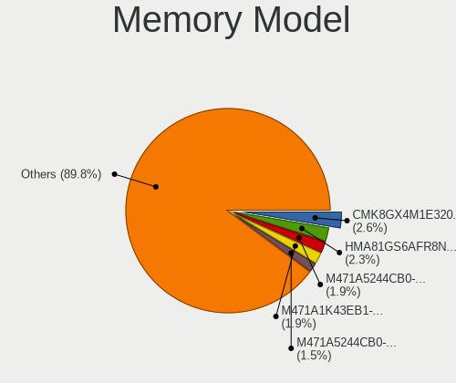

| Model                                                     | Computers | Percent |
|-----------------------------------------------------------|-----------|---------|
| SK hynix RAM HMA81GS6AFR8N-UH 8GB SODIMM DDR4 2667MT/s    | 6         | 3.16%   |
| Samsung RAM M471A5244CB0-CRC 4GB SODIMM DDR4 2667MT/s     | 5         | 2.63%   |
| SK hynix RAM HMA851S6AFR6N-UH 4096MB SODIMM DDR4 2667MT/s | 4         | 2.11%   |
| SK hynix RAM HMT351S6EFR8A-PB 4GB SODIMM DDR3 1600MT/s    | 3         | 1.58%   |
| SK hynix RAM HMAA1GS6CJR6N-XN 8GB SODIMM DDR4 3200MT/s    | 3         | 1.58%   |
| SK hynix RAM HMA41GS6AFR8N-TF 8GB SODIMM DDR4 2667MT/s    | 3         | 1.58%   |
| Samsung RAM M471B5173EB0-YK0 4GB SODIMM DDR3 1600MT/s     | 3         | 1.58%   |
| Samsung RAM M471A5244BB0-CRC 4GB SODIMM DDR4 2667MT/s     | 3         | 1.58%   |
| Corsair RAM CMK8GX4M1E3200C16 8GB DIMM DDR4 3200MT/s      | 3         | 1.58%   |
| Team RAM TEAMGROUP-UD4-3200 8GB DIMM DDR4 3800MT/s        | 2         | 1.05%   |
| SK hynix RAM HMT451S6BFR8A-PB 4GB SODIMM DDR3 1600MT/s    | 2         | 1.05%   |
| SK hynix RAM HMT351S6CFR8C-PB 4GB SODIMM DDR3 1600MT/s    | 2         | 1.05%   |
| SK hynix RAM HMA81GS6JJR8N-VK 8GB SODIMM DDR4 2667MT/s    | 2         | 1.05%   |
| Samsung RAM M471B5173QH0-YK0 4096MB SODIMM DDR3 1600MT/s  | 2         | 1.05%   |
| Samsung RAM M471B5173DB0-YK0 4GB SODIMM DDR3 1600MT/s     | 2         | 1.05%   |
| Samsung RAM M471A5244CB0-CWE 4GB SODIMM DDR4 3200MT/s     | 2         | 1.05%   |
| Samsung RAM M471A5244CB0-CTD 4GB SODIMM DDR4 3266MT/s     | 2         | 1.05%   |
| Samsung RAM M471A2G43AB2-CWE 16GB SODIMM DDR4 3200MT/s    | 2         | 1.05%   |
| Samsung RAM M471A1K44BM0-CRC 8192MB SODIMM DDR4 2400MT/s  | 2         | 1.05%   |
| Samsung RAM M471A1K43EB1-CWE 8GB SODIMM DDR4 3200MT/s     | 2         | 1.05%   |
| Samsung RAM M471A1K43CB1-CRC 8GB SODIMM DDR4 2667MT/s     | 2         | 1.05%   |
| Micron RAM 8ATF1G64HZ-3G2J1 8GB SODIMM DDR4 3200MT/s      | 2         | 1.05%   |
| Micron RAM 4ATS1G64HZ-2G6E1 8GB SODIMM DDR4 2667MT/s      | 2         | 1.05%   |
| Micron RAM 4ATF51264HZ-3G2J1 4GB SODIMM DDR4 3200MT/s     | 2         | 1.05%   |
| Micron RAM 4ATF51264HZ-2G3B1 4GB SODIMM DDR4 2400MT/s     | 2         | 1.05%   |
| Micron RAM 16KTF51264HZ-1G6M1 4GB SODIMM DDR3 1600MT/s    | 2         | 1.05%   |
| Corsair RAM CMK8GX4M1A2400C16 8GB DIMM DDR4 2800MT/s      | 2         | 1.05%   |
| Unknown RAM Module 8GB DIMM DDR4 3200MT/s                 | 1         | 0.53%   |
| Unknown RAM Module 8192MB SODIMM DDR3 1600MT/s            | 1         | 0.53%   |
| Unknown RAM Module 4GB SODIMM DDR4 2667MT/s               | 1         | 0.53%   |
| Unknown RAM Module 4GB SODIMM DDR3 1067MT/s               | 1         | 0.53%   |
| Unknown RAM Module 4096MB SODIMM DDR3 1600MT/s            | 1         | 0.53%   |
| Unknown RAM Module 4096MB DIMM 1333MT/s                   | 1         | 0.53%   |
| Unknown RAM Module 4096MB DIMM 1066MT/s                   | 1         | 0.53%   |
| Unknown RAM Module 2GB Row Of Chips LPDDR4 4267MT/s       | 1         | 0.53%   |
| Unknown RAM Module 2GB DIMM SDRAM 1066MT/s                | 1         | 0.53%   |
| Unknown RAM Module 2GB DIMM DDR2 800MT/s                  | 1         | 0.53%   |
| Unknown RAM Module 2048MB Row Of Chips LPDDR4 4267MT/s    | 1         | 0.53%   |
| Unknown RAM Module 2048MB DIMM 1333MT/s                   | 1         | 0.53%   |
| Unknown RAM Module 2048MB DIMM 1066MT/s                   | 1         | 0.53%   |

Memory Kind
-----------

Memory module kinds

| Kind    | Computers | Percent |
|---------|-----------|---------|
| DDR4    | 89        | 62.68%  |
| DDR3    | 38        | 26.76%  |
| LPDDR4  | 5         | 3.52%   |
| LPDDR3  | 4         | 2.82%   |
| SDRAM   | 2         | 1.41%   |
| DDR2    | 2         | 1.41%   |
| Unknown | 2         | 1.41%   |

Memory Form Factor
------------------

Physical design of the memory module

| Name         | Computers | Percent |
|--------------|-----------|---------|
| SODIMM       | 98        | 70.5%   |
| DIMM         | 34        | 24.46%  |
| Row Of Chips | 7         | 5.04%   |

Memory Size
-----------

Memory module size

| Size  | Computers | Percent |
|-------|-----------|---------|
| 8192  | 67        | 41.61%  |
| 4096  | 58        | 36.02%  |
| 16384 | 16        | 9.94%   |
| 2048  | 15        | 9.32%   |
| 32768 | 4         | 2.48%   |
| 1024  | 1         | 0.62%   |

Memory Speed
------------

Memory module speed

| Speed | Computers | Percent |
|-------|-----------|---------|
| 2667  | 36        | 22.93%  |
| 3200  | 28        | 17.83%  |
| 1600  | 26        | 16.56%  |
| 2400  | 18        | 11.46%  |
| 2133  | 11        | 7.01%   |
| 1333  | 8         | 5.1%    |
| 1067  | 4         | 2.55%   |
| 2800  | 3         | 1.91%   |
| 1867  | 3         | 1.91%   |
| 1334  | 3         | 1.91%   |
| 1066  | 3         | 1.91%   |
| 3800  | 2         | 1.27%   |
| 3266  | 2         | 1.27%   |
| 8400  | 1         | 0.64%   |
| 4267  | 1         | 0.64%   |
| 4199  | 1         | 0.64%   |
| 3666  | 1         | 0.64%   |
| 3333  | 1         | 0.64%   |
| 3151  | 1         | 0.64%   |
| 2933  | 1         | 0.64%   |
| 2134  | 1         | 0.64%   |
| 2000  | 1         | 0.64%   |
| 800   | 1         | 0.64%   |

Printers & scanners
-------------------

Printer Vendor
--------------

Printer device vendors

| Vendor      | Computers | Percent |
|-------------|-----------|---------|
| Seiko Epson | 2         | 66.67%  |
| Pantum      | 1         | 33.33%  |

Printer Model
-------------

Printer device models

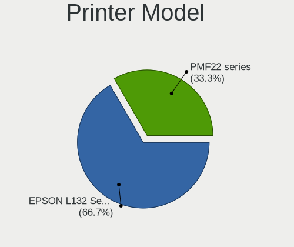

| Model                   | Computers | Percent |
|-------------------------|-----------|---------|
| Seiko Epson L132 Series | 2         | 66.67%  |
| Pantum PMF22 series     | 1         | 33.33%  |

Scanner Vendor
--------------

Scanner device vendors

Zero info for selected period =(

Scanner Model
-------------

Scanner device models

Zero info for selected period =(

Camera
------

Camera Vendor
-------------

Camera device vendors

| Vendor                                 | Computers | Percent |
|----------------------------------------|-----------|---------|
| Chicony Electronics                    | 39        | 21.31%  |
| IMC Networks                           | 33        | 18.03%  |
| Cheng Uei Precision Industry (Foxlink) | 16        | 8.74%   |
| Realtek Semiconductor                  | 13        | 7.1%    |
| Sunplus Innovation Technology          | 11        | 6.01%   |
| Quanta                                 | 11        | 6.01%   |
| Microdia                               | 11        | 6.01%   |
| Bison Electronics                      | 9         | 4.92%   |
| Lite-On Technology                     | 7         | 3.83%   |
| Suyin                                  | 5         | 2.73%   |
| Luxvisions Innotech Limited            | 5         | 2.73%   |
| Acer                                   | 3         | 1.64%   |
| Z-Star Microelectronics                | 2         | 1.09%   |
| Syntek                                 | 2         | 1.09%   |
| Sonix Technology                       | 2         | 1.09%   |
| Silicon Motion                         | 2         | 1.09%   |
| Primax Electronics                     | 2         | 1.09%   |
| Logitech                               | 2         | 1.09%   |
| ANYKA                                  | 2         | 1.09%   |
| Alcor Micro                            | 2         | 1.09%   |
| WCM_USB                                | 1         | 0.55%   |
| SiGma Micro                            | 1         | 0.55%   |
| Importek                               | 1         | 0.55%   |
| Apple                                  | 1         | 0.55%   |

Camera Model
------------

Camera device models

| Model                                                   | Computers | Percent |
|---------------------------------------------------------|-----------|---------|
| IMC Networks USB2.0 HD UVC WebCam                       | 11        | 6.01%   |
| Chicony USB2.0 VGA UVC WebCam                           | 11        | 6.01%   |
| IMC Networks USB2.0 VGA UVC WebCam                      | 9         | 4.92%   |
| Microdia Integrated_Webcam_HD                           | 5         | 2.73%   |
| IMC Networks VGA UVC WebCam                             | 5         | 2.73%   |
| Chicony HD WebCam                                       | 5         | 2.73%   |
| Luxvisions Innotech Limited HP HD Camera                | 4         | 2.19%   |
| Lite-On HP HD Camera                                    | 4         | 2.19%   |
| IMC Networks Integrated Camera                          | 4         | 2.19%   |
| Suyin Integrated_Webcam_HD                              | 3         | 1.64%   |
| Realtek Integrated_Webcam_HD                            | 3         | 1.64%   |
| Quanta HD Webcam                                        | 3         | 1.64%   |
| IMC Networks USB2.0 HD IR UVC WebCam                    | 3         | 1.64%   |
| Chicony EasyCamera                                      | 3         | 1.64%   |
| Cheng Uei Precision Industry (Foxlink) Webcam           | 3         | 1.64%   |
| Cheng Uei Precision Industry (Foxlink) HP TrueVision HD | 3         | 1.64%   |
| Cheng Uei Precision Industry (Foxlink) HP HD Camera     | 3         | 1.64%   |
| Bison HD Webcam                                         | 3         | 1.64%   |
| Z-Star Vega USB 2.0 Camera.                             | 2         | 1.09%   |
| Suyin HP Truevision HD                                  | 2         | 1.09%   |
| Sunplus Laptop Integrated Webcam HD                     | 2         | 1.09%   |
| Sunplus Integrated_Webcam_HD                            | 2         | 1.09%   |
| Realtek USB2.0 VGA UVC WebCam                           | 2         | 1.09%   |
| Quanta HP HD Camera                                     | 2         | 1.09%   |
| Quanta HD User Facing                                   | 2         | 1.09%   |
| Primax HP HD Webcam [Fixed]                             | 2         | 1.09%   |
| Microdia HP Integrated Webcam                           | 2         | 1.09%   |
| Logitech Webcam C270                                    | 2         | 1.09%   |
| Lite-On Integrated Camera                               | 2         | 1.09%   |
| Chicony USB2.0 Camera                                   | 2         | 1.09%   |
| Chicony Integrated Camera                               | 2         | 1.09%   |
| Chicony HP Truevision HD camera                         | 2         | 1.09%   |
| Chicony HP HD Webcam                                    | 2         | 1.09%   |
| Chicony HP HD Camera                                    | 2         | 1.09%   |
| Cheng Uei Precision Industry (Foxlink) HP Webcam        | 2         | 1.09%   |
| Cheng Uei Precision Industry (Foxlink) HP HD Webcam     | 2         | 1.09%   |
| Bison Lenovo EasyCamera                                 | 2         | 1.09%   |
| Bison Integrated Camera                                 | 2         | 1.09%   |
| Bison EasyCamera                                        | 2         | 1.09%   |
| ANYKA V380 FHD Camera                                   | 2         | 1.09%   |

Security
--------

Fingerprint Vendor
------------------

Fingerprint sensor vendors

| Vendor                     | Computers | Percent |
|----------------------------|-----------|---------|
| Validity Sensors           | 27        | 79.41%  |
| Synaptics                  | 3         | 8.82%   |
| Elan Microelectronics      | 2         | 5.88%   |
| Upek                       | 1         | 2.94%   |
| Shenzhen Goodix Technology | 1         | 2.94%   |

Fingerprint Model
-----------------

Fingerprint sensor models

| Model                                                                      | Computers | Percent |
|----------------------------------------------------------------------------|-----------|---------|
| Validity Sensors VFS495 Fingerprint Reader                                 | 14        | 41.18%  |
| Validity Sensors VFS491                                                    | 4         | 11.76%  |
| Validity Sensors VFS Fingerprint sensor                                    | 3         | 8.82%   |
| Synaptics Metallica MOH Touch Fingerprint Reader                           | 2         | 5.88%   |
| Elan ELAN:Fingerprint                                                      | 2         | 5.88%   |
| Validity Sensors VFS7552 Touch Fingerprint Sensor                          | 1         | 2.94%   |
| Validity Sensors VFS5011 Fingerprint Reader                                | 1         | 2.94%   |
| Validity Sensors VFS471 Fingerprint Reader                                 | 1         | 2.94%   |
| Validity Sensors VFS 5011 fingerprint sensor                               | 1         | 2.94%   |
| Validity Sensors Synaptics VFS7552 Touch Fingerprint Sensor with PurePrint | 1         | 2.94%   |
| Validity Sensors Synaptics VFS7552 Touch Fingerprint Sensor                | 1         | 2.94%   |
| Upek Biometric Touchchip/Touchstrip Fingerprint Sensor                     | 1         | 2.94%   |
| Synaptics  WBDI                                                            | 1         | 2.94%   |
| Shenzhen Goodix  FingerPrint Device                                        | 1         | 2.94%   |

Chipcard Vendor
---------------

Chipcard module vendors

| Vendor   | Computers | Percent |
|----------|-----------|---------|
| Broadcom | 6         | 100%    |

Chipcard Model
--------------

Chipcard module models

| Model                                                                        | Computers | Percent |
|------------------------------------------------------------------------------|-----------|---------|
| Broadcom BCM5880 Secure Applications Processor with fingerprint swipe sensor | 2         | 33.33%  |
| Broadcom 5880                                                                | 2         | 33.33%  |
| Broadcom BCM5880 Secure Applications Processor                               | 1         | 16.67%  |
| Broadcom 58200                                                               | 1         | 16.67%  |

Unsupported
-----------

Unsupported Devices
-------------------

Total unsupported devices on board

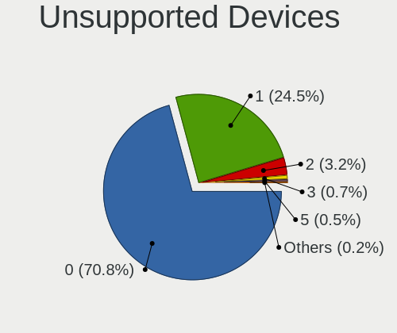

| Total | Computers | Percent |
|-------|-----------|---------|
| 0     | 211       | 71.28%  |
| 1     | 75        | 25.34%  |
| 2     | 7         | 2.36%   |
| 3     | 2         | 0.68%   |
| 5     | 1         | 0.34%   |

Unsupported Device Types
------------------------

Types of unsupported devices

| Type                     | Computers | Percent |
|--------------------------|-----------|---------|
| Fingerprint reader       | 34        | 35.79%  |
| Graphics card            | 27        | 28.42%  |
| Net/wireless             | 13        | 13.68%  |
| Chipcard                 | 6         | 6.32%   |
| Camera                   | 6         | 6.32%   |
| Communication controller | 3         | 3.16%   |
| Multimedia controller    | 2         | 2.11%   |
| Bluetooth                | 2         | 2.11%   |
| Sound                    | 1         | 1.05%   |
| Card reader              | 1         | 1.05%   |

