Linux in Bangladesh - Tested Hardware & Statistics
--------------------------------------------------

A project to collect tested hardware configurations for Linux in Bangladesh.

Anyone can contribute to this report by the [hw-probe](https://github.com/linuxhw/hw-probe) tool:

    sudo -E hw-probe -all -upload

Please contribute! Especially if your hardware is rare.

This is a report for all computer types. See also reports for [desktops](/Location/Bangladesh/Desktop/README.md) and [notebooks](/Location/Bangladesh/Notebook/README.md).

Contents
--------

* [ Test Cases ](#test-cases)

* [ System ](#system)
  - [ OS                       ](#os)
  - [ OS Family                ](#os-family)
  - [ Kernel                   ](#kernel)
  - [ Kernel Family            ](#kernel-family)
  - [ Kernel Major Ver.        ](#kernel-major-ver)
  - [ Arch                     ](#arch)
  - [ DE                       ](#de)
  - [ Display Server           ](#display-server)
  - [ Display Manager          ](#display-manager)
  - [ OS Lang                  ](#os-lang)
  - [ Boot Mode                ](#boot-mode)
  - [ Filesystem               ](#filesystem)
  - [ Part. scheme             ](#part-scheme)
  - [ Dual Boot with Linux/BSD ](#dual-boot-with-linuxbsd)
  - [ Dual Boot (Win)          ](#dual-boot-win)

* [ Board ](#board)
  - [ Vendor                   ](#vendor)
  - [ Model                    ](#model)
  - [ Model Family             ](#model-family)
  - [ MFG Year                 ](#mfg-year)
  - [ Form Factor              ](#form-factor)
  - [ Secure Boot              ](#secure-boot)
  - [ Coreboot                 ](#coreboot)
  - [ RAM Size                 ](#ram-size)
  - [ RAM Used                 ](#ram-used)
  - [ Total Drives             ](#total-drives)
  - [ Has CD-ROM               ](#has-cd-rom)
  - [ Has Ethernet             ](#has-ethernet)
  - [ Has WiFi                 ](#has-wifi)
  - [ Has Bluetooth            ](#has-bluetooth)

* [ Location ](#location)
  - [ Country                  ](#country)
  - [ City                     ](#city)

* [ Drives ](#drives)
  - [ Drive Vendor             ](#drive-vendor)
  - [ Drive Model              ](#drive-model)
  - [ HDD Vendor               ](#hdd-vendor)
  - [ SSD Vendor               ](#ssd-vendor)
  - [ Drive Kind               ](#drive-kind)
  - [ Drive Connector          ](#drive-connector)
  - [ Drive Size               ](#drive-size)
  - [ Space Total              ](#space-total)
  - [ Space Used               ](#space-used)
  - [ Malfunc. Drives          ](#malfunc-drives)
  - [ Malfunc. Drive Vendor    ](#malfunc-drive-vendor)
  - [ Malfunc. HDD Vendor      ](#malfunc-hdd-vendor)
  - [ Malfunc. Drive Kind      ](#malfunc-drive-kind)
  - [ Failed Drives            ](#failed-drives)
  - [ Failed Drive Vendor      ](#failed-drive-vendor)
  - [ Drive Status             ](#drive-status)

* [ Storage controller ](#storage-controller)
  - [ Storage Vendor           ](#storage-vendor)
  - [ Storage Model            ](#storage-model)
  - [ Storage Kind             ](#storage-kind)

* [ Processor ](#processor)
  - [ CPU Vendor               ](#cpu-vendor)
  - [ CPU Model                ](#cpu-model)
  - [ CPU Model Family         ](#cpu-model-family)
  - [ CPU Cores                ](#cpu-cores)
  - [ CPU Sockets              ](#cpu-sockets)
  - [ CPU Threads              ](#cpu-threads)
  - [ CPU Op-Modes             ](#cpu-op-modes)
  - [ CPU Microcode            ](#cpu-microcode)
  - [ CPU Microarch            ](#cpu-microarch)

* [ Graphics ](#graphics)
  - [ GPU Vendor               ](#gpu-vendor)
  - [ GPU Model                ](#gpu-model)
  - [ GPU Combo                ](#gpu-combo)
  - [ GPU Driver               ](#gpu-driver)
  - [ GPU Memory               ](#gpu-memory)

* [ Monitor ](#monitor)
  - [ Monitor Vendor           ](#monitor-vendor)
  - [ Monitor Model            ](#monitor-model)
  - [ Monitor Resolution       ](#monitor-resolution)
  - [ Monitor Diagonal         ](#monitor-diagonal)
  - [ Monitor Width            ](#monitor-width)
  - [ Aspect Ratio             ](#aspect-ratio)
  - [ Monitor Area             ](#monitor-area)
  - [ Pixel Density            ](#pixel-density)
  - [ Multiple Monitors        ](#multiple-monitors)

* [ Network ](#network)
  - [ Net Controller Vendor    ](#net-controller-vendor)
  - [ Net Controller Model     ](#net-controller-model)
  - [ Wireless Vendor          ](#wireless-vendor)
  - [ Wireless Model           ](#wireless-model)
  - [ Ethernet Vendor          ](#ethernet-vendor)
  - [ Ethernet Model           ](#ethernet-model)
  - [ Net Controller Kind      ](#net-controller-kind)
  - [ Used Controller          ](#used-controller)
  - [ NICs                     ](#nics)
  - [ IPv6                     ](#ipv6)

* [ Bluetooth ](#bluetooth)
  - [ Bluetooth Vendor         ](#bluetooth-vendor)
  - [ Bluetooth Model          ](#bluetooth-model)

* [ Sound ](#sound)
  - [ Sound Vendor             ](#sound-vendor)
  - [ Sound Model              ](#sound-model)

* [ Memory ](#memory)
  - [ Memory Vendor            ](#memory-vendor)
  - [ Memory Model             ](#memory-model)
  - [ Memory Kind              ](#memory-kind)
  - [ Memory Form Factor       ](#memory-form-factor)
  - [ Memory Size              ](#memory-size)
  - [ Memory Speed             ](#memory-speed)

* [ Printers & scanners ](#printers--scanners)
  - [ Printer Vendor           ](#printer-vendor)
  - [ Printer Model            ](#printer-model)
  - [ Scanner Vendor           ](#scanner-vendor)
  - [ Scanner Model            ](#scanner-model)

* [ Camera ](#camera)
  - [ Camera Vendor            ](#camera-vendor)
  - [ Camera Model             ](#camera-model)

* [ Security ](#security)
  - [ Fingerprint Vendor       ](#fingerprint-vendor)
  - [ Fingerprint Model        ](#fingerprint-model)
  - [ Chipcard Vendor          ](#chipcard-vendor)
  - [ Chipcard Model           ](#chipcard-model)

* [ Unsupported ](#unsupported)
  - [ Unsupported Devices      ](#unsupported-devices)
  - [ Unsupported Device Types ](#unsupported-device-types)

Test Cases
----------

Total: 348

| Vendor        | Model                       | Form-Factor | Probe                                                      | Date         |
|---------------|-----------------------------|-------------|------------------------------------------------------------|--------------|
| Biostar       | G41D3C                      | Desktop     | [97ee103719](https://linux-hardware.org/?probe=97ee103719) | Sep 30, 2022 |
| HP            | ENVY x360 Convertible 15... | Convertible | [8f28254d53](https://linux-hardware.org/?probe=8f28254d53) | Sep 20, 2022 |
| HP            | ENVY x360 Convertible 15... | Convertible | [b81f368588](https://linux-hardware.org/?probe=b81f368588) | Sep 17, 2022 |
| HP            | ENVY x360 Convertible 15... | Convertible | [58e31993e4](https://linux-hardware.org/?probe=58e31993e4) | Sep 17, 2022 |
| Dell          | Inspiron 14-3467            | Notebook    | [e92b56817a](https://linux-hardware.org/?probe=e92b56817a) | Sep 14, 2022 |
| Biostar       | G41D3C                      | Desktop     | [280212d494](https://linux-hardware.org/?probe=280212d494) | Sep 13, 2022 |
| Biostar       | G41D3C                      | Desktop     | [6d15a54350](https://linux-hardware.org/?probe=6d15a54350) | Sep 13, 2022 |
| Biostar       | G41D3C                      | Desktop     | [09d42cd406](https://linux-hardware.org/?probe=09d42cd406) | Sep 13, 2022 |
| Biostar       | G41D3C                      | Desktop     | [c45809d681](https://linux-hardware.org/?probe=c45809d681) | Sep 13, 2022 |
| ASRock        | X570 Phantom Gaming 4       | Desktop     | [4fbc7a765f](https://linux-hardware.org/?probe=4fbc7a765f) | Sep 12, 2022 |
| HP            | ENVY x360 Convertible 15... | Convertible | [8f0e669975](https://linux-hardware.org/?probe=8f0e669975) | Sep 10, 2022 |
| HP            | ENVY x360 Convertible 15... | Convertible | [aa1cd85ea9](https://linux-hardware.org/?probe=aa1cd85ea9) | Sep 09, 2022 |
| HP            | ENVY x360 Convertible 15... | Convertible | [d4e798ff22](https://linux-hardware.org/?probe=d4e798ff22) | Sep 07, 2022 |
| Toshiba       | Satellite L645              | Notebook    | [642a6f7602](https://linux-hardware.org/?probe=642a6f7602) | Sep 03, 2022 |
| Lenovo        | IdeaPad 3 15ITL6 82H8       | Notebook    | [5ad5d3809b](https://linux-hardware.org/?probe=5ad5d3809b) | Sep 01, 2022 |
| HP            | ENVY x360 Convertible 15... | Convertible | [1d04855f84](https://linux-hardware.org/?probe=1d04855f84) | Aug 29, 2022 |
| HP            | ENVY x360 Convertible 15... | Convertible | [7439a7400d](https://linux-hardware.org/?probe=7439a7400d) | Aug 27, 2022 |
| ASUSTek       | X556UQK                     | Notebook    | [262ff7d08a](https://linux-hardware.org/?probe=262ff7d08a) | Aug 27, 2022 |
| HP            | Pavilion x360 m3 Convert... | Convertible | [bde621edc4](https://linux-hardware.org/?probe=bde621edc4) | Aug 17, 2022 |
| Gigabyte      | B550M S2H                   | Desktop     | [e04617befa](https://linux-hardware.org/?probe=e04617befa) | Aug 17, 2022 |
| Gigabyte      | B550M S2H                   | Desktop     | [db7b7b3126](https://linux-hardware.org/?probe=db7b7b3126) | Aug 15, 2022 |
| ASUSTek       | GL552VW                     | Notebook    | [ae85f68d58](https://linux-hardware.org/?probe=ae85f68d58) | Aug 15, 2022 |
| Acer          | Aspire M5-581T              | Notebook    | [7efdb0e467](https://linux-hardware.org/?probe=7efdb0e467) | Aug 14, 2022 |
| Lenovo        | IdeaPad 5 Pro 14ACN6 82L... | Notebook    | [97f75c2be0](https://linux-hardware.org/?probe=97f75c2be0) | Aug 13, 2022 |
| Dell          | XPS 13 9380                 | Notebook    | [534c1142c2](https://linux-hardware.org/?probe=534c1142c2) | Aug 10, 2022 |
| Dell          | XPS 13 9380                 | Notebook    | [0724d34f68](https://linux-hardware.org/?probe=0724d34f68) | Aug 10, 2022 |
| Acer          | TravelMate P214-53          | Notebook    | [41f0d0b264](https://linux-hardware.org/?probe=41f0d0b264) | Aug 02, 2022 |
| MSI           | Modern 15 A5M               | Notebook    | [c6643cb779](https://linux-hardware.org/?probe=c6643cb779) | Jul 28, 2022 |
| HP            | EliteBook 840 G1            | Notebook    | [2dc0ffa0d1](https://linux-hardware.org/?probe=2dc0ffa0d1) | Jul 26, 2022 |
| Acer          | Nitro AN515-43              | Notebook    | [4e33f5e902](https://linux-hardware.org/?probe=4e33f5e902) | Jul 19, 2022 |
| HP            | 14                          | Notebook    | [816a62dde0](https://linux-hardware.org/?probe=816a62dde0) | Jul 07, 2022 |
| Timi          | Mi NoteBook Pro             | Notebook    | [046a18dc14](https://linux-hardware.org/?probe=046a18dc14) | Jul 03, 2022 |
| MSI           | A320M-A PRO MAX             | Desktop     | [9a35c1249b](https://linux-hardware.org/?probe=9a35c1249b) | Jun 30, 2022 |
| MSI           | A320M-A PRO MAX             | Desktop     | [c8f0217b26](https://linux-hardware.org/?probe=c8f0217b26) | Jun 29, 2022 |
| MSI           | A320M-A PRO MAX             | Desktop     | [0cafb4009d](https://linux-hardware.org/?probe=0cafb4009d) | Jun 29, 2022 |
| MSI           | A320M-A PRO MAX             | Desktop     | [68d1c799f2](https://linux-hardware.org/?probe=68d1c799f2) | Jun 29, 2022 |
| MSI           | A320M-A PRO MAX             | Desktop     | [d3af5b938a](https://linux-hardware.org/?probe=d3af5b938a) | Jun 29, 2022 |
| Gigabyte      | B360M HD3                   | Desktop     | [b35e9f3e5c](https://linux-hardware.org/?probe=b35e9f3e5c) | Jun 28, 2022 |
| ASUSTek       | X507UB                      | Notebook    | [0ba0fc4089](https://linux-hardware.org/?probe=0ba0fc4089) | Jun 28, 2022 |
| Gigabyte      | B75M-D3V                    | Desktop     | [4b202c1285](https://linux-hardware.org/?probe=4b202c1285) | Jun 22, 2022 |
| MSI           | H61M-P31/W8                 | Desktop     | [7b8cc6556b](https://linux-hardware.org/?probe=7b8cc6556b) | Jun 12, 2022 |
| Acer          | Aspire E5-573               | Notebook    | [dce8b618f8](https://linux-hardware.org/?probe=dce8b618f8) | May 22, 2022 |
| MSI           | B450M-A PRO MAX             | Desktop     | [758bdaefe9](https://linux-hardware.org/?probe=758bdaefe9) | May 21, 2022 |
| HP            | ProBook 440 G8 Notebook ... | Notebook    | [99283be07b](https://linux-hardware.org/?probe=99283be07b) | May 20, 2022 |
| ASUSTek       | VivoBook 14_ASUS Laptop ... | Notebook    | [b85af00b16](https://linux-hardware.org/?probe=b85af00b16) | May 18, 2022 |
| Dell          | Latitude 5580               | Notebook    | [18cefe0718](https://linux-hardware.org/?probe=18cefe0718) | May 17, 2022 |
| Dell          | Inspiron 5505               | Notebook    | [c1353ba170](https://linux-hardware.org/?probe=c1353ba170) | May 15, 2022 |
| Dell          | Inspiron 5567               | Notebook    | [f09183023d](https://linux-hardware.org/?probe=f09183023d) | May 10, 2022 |
| HP            | Elite x2 1012 G2            | Tablet      | [71e0ef1fc9](https://linux-hardware.org/?probe=71e0ef1fc9) | May 07, 2022 |
| HP            | 240 G3                      | Notebook    | [7062083e69](https://linux-hardware.org/?probe=7062083e69) | May 06, 2022 |
| Raspberry ... | Raspberry Pi 4 Model B R... | Soc         | [3055b0e95f](https://linux-hardware.org/?probe=3055b0e95f) | May 05, 2022 |
| HP            | EliteBook 840 G3            | Notebook    | [88f6586c4b](https://linux-hardware.org/?probe=88f6586c4b) | May 02, 2022 |
| Lenovo        | IdeaPad 5 Pro 14ACN6 82L... | Notebook    | [ab11d6ac2f](https://linux-hardware.org/?probe=ab11d6ac2f) | Apr 28, 2022 |
| Unknown       | Unknown                     | Desktop     | [c6577346b8](https://linux-hardware.org/?probe=c6577346b8) | Apr 11, 2022 |
| Gigabyte      | B450M DS3H-CF               | Desktop     | [6e993bc145](https://linux-hardware.org/?probe=6e993bc145) | Apr 10, 2022 |
| Unknown       | Unknown                     | Desktop     | [73abf1d6fd](https://linux-hardware.org/?probe=73abf1d6fd) | Apr 08, 2022 |
| Lenovo        | Legion 5 15ARH05H 82B1      | Notebook    | [19623aa8b6](https://linux-hardware.org/?probe=19623aa8b6) | Apr 07, 2022 |
| Lenovo        | Legion 5 15ARH05H 82B1      | Notebook    | [287aa3ba8e](https://linux-hardware.org/?probe=287aa3ba8e) | Apr 07, 2022 |
| Unknown       | Unknown                     | Desktop     | [14a3433a91](https://linux-hardware.org/?probe=14a3433a91) | Apr 03, 2022 |
| HP            | ZHAN 66 Pro A 14 G4 Note... | Notebook    | [8199781e64](https://linux-hardware.org/?probe=8199781e64) | Mar 28, 2022 |
| ASUSTek       | TUF B450M-PLUS GAMING       | Desktop     | [33d1544ea1](https://linux-hardware.org/?probe=33d1544ea1) | Mar 24, 2022 |
| Unknown       | Unknown                     | Desktop     | [52ce856be5](https://linux-hardware.org/?probe=52ce856be5) | Mar 24, 2022 |
| Unknown       | Unknown                     | Desktop     | [1dd07eeee0](https://linux-hardware.org/?probe=1dd07eeee0) | Mar 24, 2022 |
| Lenovo        | IdeaPad 5 Pro 14ACN6 82L... | Notebook    | [321d0c1b4a](https://linux-hardware.org/?probe=321d0c1b4a) | Mar 23, 2022 |
| Lenovo        | IdeaPad 110-15IBR 80T7      | Notebook    | [5db5bac582](https://linux-hardware.org/?probe=5db5bac582) | Mar 20, 2022 |
| Unknown       | Unknown                     | Desktop     | [cb949f34eb](https://linux-hardware.org/?probe=cb949f34eb) | Mar 20, 2022 |
| Lenovo        | IdeaPad 5 Pro 14ACN6 82L... | Notebook    | [da23c76a90](https://linux-hardware.org/?probe=da23c76a90) | Mar 19, 2022 |
| Acer          | TravelMate P214-53          | Notebook    | [a3ad6439b8](https://linux-hardware.org/?probe=a3ad6439b8) | Mar 17, 2022 |
| Unknown       | Unknown                     | Desktop     | [fd9e66788c](https://linux-hardware.org/?probe=fd9e66788c) | Mar 17, 2022 |
| MSI           | B450M MORTAR MAX            | Desktop     | [e141c99bf2](https://linux-hardware.org/?probe=e141c99bf2) | Mar 09, 2022 |
| HP            | ProBook 450 G4              | Notebook    | [87d97b3c00](https://linux-hardware.org/?probe=87d97b3c00) | Mar 05, 2022 |
| MSI           | FM2-A55M-E33                | Desktop     | [d7a873bf3d](https://linux-hardware.org/?probe=d7a873bf3d) | Feb 27, 2022 |
| Acer          | TravelMate P214-53          | Notebook    | [87f30f494f](https://linux-hardware.org/?probe=87f30f494f) | Feb 19, 2022 |
| ASUSTek       | VivoBook 15_ASUS Laptop ... | Notebook    | [62c028a881](https://linux-hardware.org/?probe=62c028a881) | Feb 16, 2022 |
| Biostar       | H55 HD                      | Desktop     | [b0d5843b6e](https://linux-hardware.org/?probe=b0d5843b6e) | Feb 13, 2022 |
| HP            | Compaq 8000 Elite CMT PC    | Desktop     | [42647bc4b3](https://linux-hardware.org/?probe=42647bc4b3) | Feb 12, 2022 |
| HP            | 339A                        | Desktop     | [6f8e63bfb0](https://linux-hardware.org/?probe=6f8e63bfb0) | Feb 11, 2022 |
| ASUSTek       | TUF Gaming Z690-PLUS WIF... | Desktop     | [0c13bfa27b](https://linux-hardware.org/?probe=0c13bfa27b) | Feb 10, 2022 |
| ASUSTek       | EX-A320M-GAMING             | Desktop     | [8e73dc39ab](https://linux-hardware.org/?probe=8e73dc39ab) | Feb 09, 2022 |
| ASRock        | B450 Gaming K4              | Desktop     | [42e37d6172](https://linux-hardware.org/?probe=42e37d6172) | Feb 07, 2022 |
| Biostar       | H55 HD                      | Desktop     | [e08da3e685](https://linux-hardware.org/?probe=e08da3e685) | Feb 03, 2022 |
| ASUSTek       | TUF B450M-PLUS GAMING       | Desktop     | [47c47a0121](https://linux-hardware.org/?probe=47c47a0121) | Feb 02, 2022 |
| HP            | ProBook 440 G6              | Notebook    | [d7431ab69e](https://linux-hardware.org/?probe=d7431ab69e) | Jan 31, 2022 |
| Dell          | XPS 13 9360                 | Notebook    | [76d17811e3](https://linux-hardware.org/?probe=76d17811e3) | Jan 31, 2022 |
| Unknown       | Unknown                     | Desktop     | [caca9680a9](https://linux-hardware.org/?probe=caca9680a9) | Jan 25, 2022 |
| Lenovo        | ThinkPad X230 2324A82       | Notebook    | [be92c29259](https://linux-hardware.org/?probe=be92c29259) | Jan 23, 2022 |
| ASUSTek       | VivoBook_ASUSLaptop X509... | Notebook    | [1e89749691](https://linux-hardware.org/?probe=1e89749691) | Jan 22, 2022 |
| MSI           | FM2-A55M-E33                | Desktop     | [ac35b74090](https://linux-hardware.org/?probe=ac35b74090) | Jan 21, 2022 |
| ASUSTek       | VivoBook_ASUSLaptop X531... | Notebook    | [88f62c8333](https://linux-hardware.org/?probe=88f62c8333) | Jan 15, 2022 |
| HP            | ProBook 450 G4              | Notebook    | [38a7870ece](https://linux-hardware.org/?probe=38a7870ece) | Jan 13, 2022 |
| Dell          | Inspiron N5110              | Notebook    | [2fb0411785](https://linux-hardware.org/?probe=2fb0411785) | Jan 08, 2022 |
| ASUSTek       | VivoBook_ASUSLaptop X412... | Notebook    | [0d69dca8f3](https://linux-hardware.org/?probe=0d69dca8f3) | Jan 04, 2022 |
| Gigabyte      | H81M-S                      | Desktop     | [692274162f](https://linux-hardware.org/?probe=692274162f) | Jan 04, 2022 |
| MSI           | B450M-A PRO MAX             | Desktop     | [e6a4a21d5c](https://linux-hardware.org/?probe=e6a4a21d5c) | Jan 02, 2022 |
| HP            | Laptop 14s-dq2xxx           | Notebook    | [8e8da56e93](https://linux-hardware.org/?probe=8e8da56e93) | Jan 01, 2022 |
| OEM           | Unknown                     | Desktop     | [6adc4b5659](https://linux-hardware.org/?probe=6adc4b5659) | Jan 01, 2022 |
| MSI           | MAG B550 TORPEDO            | Desktop     | [b674024789](https://linux-hardware.org/?probe=b674024789) | Dec 30, 2021 |
| MSI           | B460M-A PRO                 | Desktop     | [209e15690e](https://linux-hardware.org/?probe=209e15690e) | Dec 29, 2021 |
| HP            | ProBook 450 G8 Notebook ... | Notebook    | [00696e3398](https://linux-hardware.org/?probe=00696e3398) | Dec 28, 2021 |
| MSI           | FM2-A55M-E33                | Desktop     | [7280895518](https://linux-hardware.org/?probe=7280895518) | Dec 27, 2021 |
| Unknown       | Unknown                     | Desktop     | [56d5bb8659](https://linux-hardware.org/?probe=56d5bb8659) | Dec 22, 2021 |
| ASUSTek       | VivoBook_ASUSLaptop X531... | Notebook    | [d347eea0b2](https://linux-hardware.org/?probe=d347eea0b2) | Dec 19, 2021 |
| ASUSTek       | TUF Gaming FX505DT_FX505... | Notebook    | [5cf5b44fc8](https://linux-hardware.org/?probe=5cf5b44fc8) | Dec 13, 2021 |
| MSI           | FM2-A55M-E33                | Desktop     | [6ab6a89db8](https://linux-hardware.org/?probe=6ab6a89db8) | Dec 12, 2021 |
| Gigabyte      | B550 AORUS ELITE            | Desktop     | [3cd505591d](https://linux-hardware.org/?probe=3cd505591d) | Dec 11, 2021 |
| Dell          | Inspiron 5468               | Notebook    | [ff0b877d5a](https://linux-hardware.org/?probe=ff0b877d5a) | Dec 08, 2021 |
| Dell          | Latitude 7480               | Notebook    | [480ad981d9](https://linux-hardware.org/?probe=480ad981d9) | Dec 07, 2021 |
| HP            | ProBook 450 G4              | Notebook    | [42edbb20ce](https://linux-hardware.org/?probe=42edbb20ce) | Dec 04, 2021 |
| ASRock        | H110M-HDV R3.0              | Desktop     | [e155882ffa](https://linux-hardware.org/?probe=e155882ffa) | Dec 02, 2021 |
| HP            | EliteBook 8460p             | Notebook    | [07bcad31f5](https://linux-hardware.org/?probe=07bcad31f5) | Dec 02, 2021 |
| ASUSTek       | UX430UQ                     | Notebook    | [cf0cd5c862](https://linux-hardware.org/?probe=cf0cd5c862) | Dec 01, 2021 |
| ASUSTek       | UX430UQ                     | Notebook    | [5cd208a361](https://linux-hardware.org/?probe=5cd208a361) | Dec 01, 2021 |
| ASUSTek       | P453UJ                      | Notebook    | [056cba6efd](https://linux-hardware.org/?probe=056cba6efd) | Nov 28, 2021 |
| HP            | Pavilion Notebook           | Notebook    | [aa0a0e67b3](https://linux-hardware.org/?probe=aa0a0e67b3) | Nov 26, 2021 |
| HP            | Pavilion Notebook           | Notebook    | [9bffff74e0](https://linux-hardware.org/?probe=9bffff74e0) | Nov 26, 2021 |
| Gigabyte      | H61M-S2PV                   | Desktop     | [09b0e5058d](https://linux-hardware.org/?probe=09b0e5058d) | Nov 23, 2021 |
| ASUSTek       | VivoBook 14_ASUS Laptop ... | Notebook    | [623b2b0ba9](https://linux-hardware.org/?probe=623b2b0ba9) | Nov 19, 2021 |
| HP            | Elite x2 1012 G2            | Tablet      | [47d816d00f](https://linux-hardware.org/?probe=47d816d00f) | Nov 12, 2021 |
| MSI           | 990FXA-GD65                 | Desktop     | [6d2cade66c](https://linux-hardware.org/?probe=6d2cade66c) | Nov 11, 2021 |
| MSI           | B450M-A PRO MAX             | Desktop     | [efd1c194ac](https://linux-hardware.org/?probe=efd1c194ac) | Nov 11, 2021 |
| MSI           | B450M-A PRO MAX             | Desktop     | [0802656d19](https://linux-hardware.org/?probe=0802656d19) | Nov 11, 2021 |
| MSI           | B450M MORTAR MAX            | Desktop     | [312e04d7f9](https://linux-hardware.org/?probe=312e04d7f9) | Nov 09, 2021 |
| ASUSTek       | VivoBook 15_ASUS Laptop ... | Notebook    | [f1f7ca30e5](https://linux-hardware.org/?probe=f1f7ca30e5) | Nov 05, 2021 |
| ASUSTek       | X442UAR                     | Notebook    | [0db140fa3d](https://linux-hardware.org/?probe=0db140fa3d) | Nov 03, 2021 |
| OEM           | Intel H81                   | Desktop     | [a4e298caf1](https://linux-hardware.org/?probe=a4e298caf1) | Nov 02, 2021 |
| OEM           | Intel H81                   | Desktop     | [50758cfaf3](https://linux-hardware.org/?probe=50758cfaf3) | Oct 26, 2021 |
| OEM           | Intel H81                   | Desktop     | [e997f638bc](https://linux-hardware.org/?probe=e997f638bc) | Oct 26, 2021 |
| Intel         | DG31PR AAD97573-302         | Desktop     | [356632b328](https://linux-hardware.org/?probe=356632b328) | Oct 19, 2021 |
| HP            | ProBook 450 G5              | Notebook    | [d377aa2b23](https://linux-hardware.org/?probe=d377aa2b23) | Oct 17, 2021 |
| HP            | ProBook 450 G5              | Notebook    | [7447071c00](https://linux-hardware.org/?probe=7447071c00) | Oct 16, 2021 |
| MSI           | Boston                      | Desktop     | [77d385bc09](https://linux-hardware.org/?probe=77d385bc09) | Oct 13, 2021 |
| MSI           | Boston                      | Desktop     | [14528f628a](https://linux-hardware.org/?probe=14528f628a) | Oct 13, 2021 |
| HP            | ProBook 450 G5              | Notebook    | [0bf0387391](https://linux-hardware.org/?probe=0bf0387391) | Oct 07, 2021 |
| Acer          | Aspire V5-471               | Notebook    | [6a5bc4355e](https://linux-hardware.org/?probe=6a5bc4355e) | Oct 05, 2021 |
| Acer          | Aspire V5-471               | Notebook    | [4b9f0ceb64](https://linux-hardware.org/?probe=4b9f0ceb64) | Oct 05, 2021 |
| ASUSTek       | VivoBook S15 X510UF         | Notebook    | [883e0dec71](https://linux-hardware.org/?probe=883e0dec71) | Sep 19, 2021 |
| Dell          | Latitude E7250              | Notebook    | [275b9204f5](https://linux-hardware.org/?probe=275b9204f5) | Sep 13, 2021 |
| Gigabyte      | H81M-S                      | Desktop     | [8109d84e42](https://linux-hardware.org/?probe=8109d84e42) | Sep 12, 2021 |
| Lenovo        | ThinkPad T430s 2356GPU      | Notebook    | [6a9842e166](https://linux-hardware.org/?probe=6a9842e166) | Sep 06, 2021 |
| ASUSTek       | PRIME H370-PLUS             | Desktop     | [752964e357](https://linux-hardware.org/?probe=752964e357) | Sep 05, 2021 |
| ASUSTek       | X456UQ                      | Notebook    | [6ce8e44ad3](https://linux-hardware.org/?probe=6ce8e44ad3) | Sep 02, 2021 |
| ASUSTek       | TUF B450M-PLUS GAMING       | Desktop     | [7a654e5473](https://linux-hardware.org/?probe=7a654e5473) | Aug 28, 2021 |
| Acer          | Aspire 4349                 | Notebook    | [527e511232](https://linux-hardware.org/?probe=527e511232) | Aug 27, 2021 |
| Gigabyte      | B250M-Gaming5-CF            | Desktop     | [c34514576a](https://linux-hardware.org/?probe=c34514576a) | Aug 17, 2021 |
| Intel         | DG31PR AAD97573-302         | Desktop     | [460fc8dfd4](https://linux-hardware.org/?probe=460fc8dfd4) | Aug 08, 2021 |
| HP            | Pavilion Laptop 15-cc1xx    | Notebook    | [48853e253b](https://linux-hardware.org/?probe=48853e253b) | Aug 04, 2021 |
| HP            | EliteBook 840 G3            | Notebook    | [c672738a0e](https://linux-hardware.org/?probe=c672738a0e) | Aug 04, 2021 |
| ASUSTek       | VivoBook S15 X530UA         | Notebook    | [c22e4ce5b4](https://linux-hardware.org/?probe=c22e4ce5b4) | Jul 29, 2021 |
| HP            | 250 G7 Notebook PC          | Notebook    | [ab8a90e145](https://linux-hardware.org/?probe=ab8a90e145) | Jul 25, 2021 |
| Unknown       | Unknown                     | Notebook    | [1f6b072c8e](https://linux-hardware.org/?probe=1f6b072c8e) | Jul 24, 2021 |
| ASUSTek       | TUF Gaming FX505DT_FX505... | Notebook    | [dd58ecd9c7](https://linux-hardware.org/?probe=dd58ecd9c7) | Jul 23, 2021 |
| ASUSTek       | X550JK                      | Notebook    | [ebd01f2605](https://linux-hardware.org/?probe=ebd01f2605) | Jul 22, 2021 |
| Unknown       | Unknown                     | Desktop     | [c6dea4c88d](https://linux-hardware.org/?probe=c6dea4c88d) | Jul 19, 2021 |
| Biostar       | TZ68K+                      | Desktop     | [52ef8197ad](https://linux-hardware.org/?probe=52ef8197ad) | Jul 13, 2021 |
| Dell          | Inspiron 3442               | Notebook    | [3b153ae2f9](https://linux-hardware.org/?probe=3b153ae2f9) | Jun 24, 2021 |
| Dell          | Inspiron 3442               | Notebook    | [988fc9a599](https://linux-hardware.org/?probe=988fc9a599) | Jun 24, 2021 |
| HP            | 15                          | Notebook    | [4f6c5d8c89](https://linux-hardware.org/?probe=4f6c5d8c89) | Jun 22, 2021 |
| HP            | Laptop 14-ck0xxx            | Notebook    | [406cb898f1](https://linux-hardware.org/?probe=406cb898f1) | Jun 17, 2021 |
| Apple         | MacBookPro8,1               | Notebook    | [2a633bc008](https://linux-hardware.org/?probe=2a633bc008) | Jun 14, 2021 |
| Apple         | MacBookPro8,1               | Notebook    | [e3bb48a049](https://linux-hardware.org/?probe=e3bb48a049) | Jun 14, 2021 |
| MSI           | A320M-A PRO MAX             | Desktop     | [1927d0abfe](https://linux-hardware.org/?probe=1927d0abfe) | Jun 13, 2021 |
| ASUSTek       | P5G41C-M LX                 | Desktop     | [23e735bb8f](https://linux-hardware.org/?probe=23e735bb8f) | Jun 08, 2021 |
| Dell          | 0VHWTR A02                  | Desktop     | [ec7174828a](https://linux-hardware.org/?probe=ec7174828a) | Jun 04, 2021 |
| ASUSTek       | UX310UAK                    | Notebook    | [4a79148721](https://linux-hardware.org/?probe=4a79148721) | Jun 03, 2021 |
| HP            | Laptop 14-ck0xxx            | Notebook    | [6b5f1170f9](https://linux-hardware.org/?probe=6b5f1170f9) | Jun 02, 2021 |
| HP            | Laptop 14-ck0xxx            | Notebook    | [e2389864db](https://linux-hardware.org/?probe=e2389864db) | Jun 02, 2021 |
| HP            | ENVY TS 14 Sleekbook        | Notebook    | [f52091e51e](https://linux-hardware.org/?probe=f52091e51e) | May 31, 2021 |
| ASUSTek       | TUF B450M-PLUS GAMING       | Desktop     | [0226c84811](https://linux-hardware.org/?probe=0226c84811) | May 25, 2021 |
| ASUSTek       | TUF B450M-PLUS GAMING       | Desktop     | [b2c4e6f3a5](https://linux-hardware.org/?probe=b2c4e6f3a5) | May 25, 2021 |
| HP            | 15 Notebook PC              | Notebook    | [b34d6d63d9](https://linux-hardware.org/?probe=b34d6d63d9) | May 22, 2021 |
| MSI           | B85M GAMING                 | Desktop     | [4d2529b647](https://linux-hardware.org/?probe=4d2529b647) | May 22, 2021 |
| Lenovo        | ThinkPad T430s 2356GPU      | Notebook    | [8f1510061b](https://linux-hardware.org/?probe=8f1510061b) | May 18, 2021 |
| Lenovo        | ThinkPad T430s 2356GPU      | Notebook    | [e78b76fcf3](https://linux-hardware.org/?probe=e78b76fcf3) | May 18, 2021 |
| Intel         | DG41RQ AAE54511-203         | Desktop     | [aba051d387](https://linux-hardware.org/?probe=aba051d387) | May 15, 2021 |
| MSI           | X470 GAMING PLUS MAX        | Desktop     | [fa9f8b7f7e](https://linux-hardware.org/?probe=fa9f8b7f7e) | May 10, 2021 |
| MSI           | X470 GAMING PLUS MAX        | Desktop     | [db1a234412](https://linux-hardware.org/?probe=db1a234412) | May 10, 2021 |
| ASUSTek       | VivoBook_ASUSLaptop X412... | Notebook    | [b7e4895fd8](https://linux-hardware.org/?probe=b7e4895fd8) | May 07, 2021 |
| ASUSTek       | VivoBook_ASUSLaptop X530... | Notebook    | [1254eab2b7](https://linux-hardware.org/?probe=1254eab2b7) | May 04, 2021 |
| HP            | 15                          | Notebook    | [fd4d562cd2](https://linux-hardware.org/?probe=fd4d562cd2) | May 04, 2021 |
| MSI           | Summit B14 A11MOT           | Notebook    | [9bdd91f198](https://linux-hardware.org/?probe=9bdd91f198) | May 02, 2021 |
| HP            | ProBook 440 G7              | Notebook    | [dbcbb68258](https://linux-hardware.org/?probe=dbcbb68258) | Apr 26, 2021 |
| Unknown       | Unknown                     | Desktop     | [b2600d2372](https://linux-hardware.org/?probe=b2600d2372) | Apr 11, 2021 |
| ASUSTek       | VivoBook_ASUSLaptop X509... | Notebook    | [367455807e](https://linux-hardware.org/?probe=367455807e) | Mar 23, 2021 |
| ASUSTek       | VivoBook_ASUSLaptop X509... | Notebook    | [1de185d0da](https://linux-hardware.org/?probe=1de185d0da) | Mar 22, 2021 |
| Dell          | Latitude E4300              | Notebook    | [2ccfcf6a1b](https://linux-hardware.org/?probe=2ccfcf6a1b) | Mar 22, 2021 |
| HP            | 15                          | Notebook    | [860412bddc](https://linux-hardware.org/?probe=860412bddc) | Mar 20, 2021 |
| HP            | 15                          | Notebook    | [62447250f9](https://linux-hardware.org/?probe=62447250f9) | Mar 17, 2021 |
| ASUSTek       | H110M-CS                    | Desktop     | [ac52c3630c](https://linux-hardware.org/?probe=ac52c3630c) | Mar 12, 2021 |
| Lenovo        | ThinkPad E490 20N9S1XE00    | Notebook    | [4ee1271923](https://linux-hardware.org/?probe=4ee1271923) | Mar 11, 2021 |
| ASUSTek       | VivoBook_ASUSLaptop X570... | Notebook    | [6343267ab7](https://linux-hardware.org/?probe=6343267ab7) | Mar 10, 2021 |
| ASUSTek       | VivoBook_ASUSLaptop X570... | Notebook    | [47123299d4](https://linux-hardware.org/?probe=47123299d4) | Mar 09, 2021 |
| HP            | ProBook 450 G4              | Notebook    | [a8091a8c28](https://linux-hardware.org/?probe=a8091a8c28) | Mar 07, 2021 |
| ASUSTek       | VivoBook_ASUSLaptop X509... | Notebook    | [8f8fe2c911](https://linux-hardware.org/?probe=8f8fe2c911) | Mar 06, 2021 |
| ASUSTek       | X411UNV                     | Notebook    | [009f3bb5e5](https://linux-hardware.org/?probe=009f3bb5e5) | Feb 27, 2021 |
| HP            | 15                          | Notebook    | [e74fa488e9](https://linux-hardware.org/?probe=e74fa488e9) | Feb 27, 2021 |
| Apple         | MacBookPro8,1               | Notebook    | [89174dda21](https://linux-hardware.org/?probe=89174dda21) | Feb 27, 2021 |
| ASUSTek       | ZenBook UX461FA_UX461FA     | Convertible | [8efc8caada](https://linux-hardware.org/?probe=8efc8caada) | Feb 27, 2021 |
| HP            | EliteBook 8470p             | Notebook    | [b414109f66](https://linux-hardware.org/?probe=b414109f66) | Feb 07, 2021 |
| HP            | EliteBook 8470p             | Notebook    | [08a1160725](https://linux-hardware.org/?probe=08a1160725) | Feb 07, 2021 |
| HP            | Notebook                    | Notebook    | [df39c8aaf8](https://linux-hardware.org/?probe=df39c8aaf8) | Feb 02, 2021 |
| ASUSTek       | X45C                        | Notebook    | [349beec2d5](https://linux-hardware.org/?probe=349beec2d5) | Jan 27, 2021 |
| ASRock        | B450M-HDV R4.0              | Desktop     | [474d61d1a7](https://linux-hardware.org/?probe=474d61d1a7) | Jan 27, 2021 |
| HP            | ProBook 450 G2              | Notebook    | [c9e8f99464](https://linux-hardware.org/?probe=c9e8f99464) | Jan 21, 2021 |
| Lenovo        | ThinkPad T450 20BUS2021M    | Notebook    | [60929bb3d1](https://linux-hardware.org/?probe=60929bb3d1) | Jan 21, 2021 |
| Gigabyte      | B365M HD3                   | Desktop     | [32878b3dae](https://linux-hardware.org/?probe=32878b3dae) | Jan 20, 2021 |
| Gigabyte      | B365M HD3                   | Desktop     | [03b73f8223](https://linux-hardware.org/?probe=03b73f8223) | Jan 20, 2021 |
| HP            | Notebook                    | Notebook    | [d14d8fe5db](https://linux-hardware.org/?probe=d14d8fe5db) | Jan 19, 2021 |
| Gigabyte      | B365M D3H-CF                | Desktop     | [0bfbe639fc](https://linux-hardware.org/?probe=0bfbe639fc) | Jan 18, 2021 |
| Gigabyte      | B365M D3H-CF                | Desktop     | [e053ef39b6](https://linux-hardware.org/?probe=e053ef39b6) | Jan 17, 2021 |
| ASUSTek       | VivoBook_ASUSLaptop X530... | Notebook    | [5ee0809420](https://linux-hardware.org/?probe=5ee0809420) | Jan 16, 2021 |
| Gigabyte      | B365M D3H-CF                | Desktop     | [4c2ddc3c14](https://linux-hardware.org/?probe=4c2ddc3c14) | Jan 10, 2021 |
| HP            | 15                          | Notebook    | [1b3597829c](https://linux-hardware.org/?probe=1b3597829c) | Jan 05, 2021 |
| HP            | ProBook 450 G4              | Notebook    | [150aed5937](https://linux-hardware.org/?probe=150aed5937) | Dec 28, 2020 |
| Acer          | Aspire A315-21              | Notebook    | [f3aaccf16d](https://linux-hardware.org/?probe=f3aaccf16d) | Dec 19, 2020 |
| HP            | ProBook 450 G2              | Notebook    | [eff007611b](https://linux-hardware.org/?probe=eff007611b) | Dec 16, 2020 |
| Acer          | Aspire A315-21              | Notebook    | [1eec63b277](https://linux-hardware.org/?probe=1eec63b277) | Dec 13, 2020 |
| ASUSTek       | VivoBook_ASUSLaptop X512... | Notebook    | [da59a1c5a8](https://linux-hardware.org/?probe=da59a1c5a8) | Dec 07, 2020 |
| MSI           | GS63 7RD                    | Notebook    | [51929f5d16](https://linux-hardware.org/?probe=51929f5d16) | Dec 05, 2020 |
| Gigabyte      | B85M-HD3                    | Desktop     | [983f59c8ba](https://linux-hardware.org/?probe=983f59c8ba) | Nov 17, 2020 |
| HP            | ProBook 450 G2              | Notebook    | [4d0297d500](https://linux-hardware.org/?probe=4d0297d500) | Nov 15, 2020 |
| HP            | ProBook 450 G2              | Notebook    | [2898db77af](https://linux-hardware.org/?probe=2898db77af) | Nov 14, 2020 |
| Acer          | Nitro AN515-43              | Notebook    | [399693b152](https://linux-hardware.org/?probe=399693b152) | Nov 04, 2020 |
| HP            | 15                          | Notebook    | [751dbba280](https://linux-hardware.org/?probe=751dbba280) | Nov 04, 2020 |
| Unknown       | Unknown                     | Desktop     | [49351fb74d](https://linux-hardware.org/?probe=49351fb74d) | Nov 03, 2020 |
| Unknown       | Unknown                     | Desktop     | [a5450c668e](https://linux-hardware.org/?probe=a5450c668e) | Oct 30, 2020 |
| ASRock        | AB350 Pro4                  | Desktop     | [7e48c5dac7](https://linux-hardware.org/?probe=7e48c5dac7) | Oct 30, 2020 |
| Lenovo        | IdeaPad 320-15IKB 80XL      | Notebook    | [20da8831d7](https://linux-hardware.org/?probe=20da8831d7) | Oct 29, 2020 |
| ASUSTek       | H81M-K                      | Desktop     | [6abbe0be7c](https://linux-hardware.org/?probe=6abbe0be7c) | Oct 29, 2020 |
| Notebook      | DCL C483                    | Notebook    | [ed2bb10c86](https://linux-hardware.org/?probe=ed2bb10c86) | Oct 29, 2020 |
| ASUSTek       | H110M-CS                    | Desktop     | [4bc7a25c4b](https://linux-hardware.org/?probe=4bc7a25c4b) | Oct 29, 2020 |
| ASUSTek       | H81M-K                      | Desktop     | [7a6ee90819](https://linux-hardware.org/?probe=7a6ee90819) | Oct 29, 2020 |
| HP            | ENVY Sleekbook 4            | Notebook    | [b2377a6388](https://linux-hardware.org/?probe=b2377a6388) | Oct 29, 2020 |
| Dell          | Inspiron 3521               | Notebook    | [c85f72911e](https://linux-hardware.org/?probe=c85f72911e) | Oct 29, 2020 |
| Acer          | Aspire E5-576               | Notebook    | [1f7d96b34a](https://linux-hardware.org/?probe=1f7d96b34a) | Oct 27, 2020 |
| ASRock        | B450 Gaming K4              | Desktop     | [76e61701fa](https://linux-hardware.org/?probe=76e61701fa) | Oct 24, 2020 |
| ASUSTek       | P453UA                      | Notebook    | [a376addbeb](https://linux-hardware.org/?probe=a376addbeb) | Oct 21, 2020 |
| Acer          | Aspire E5-575               | Notebook    | [218b3ce742](https://linux-hardware.org/?probe=218b3ce742) | Oct 12, 2020 |
| Acer          | Nitro AN515-43              | Notebook    | [da1765fe36](https://linux-hardware.org/?probe=da1765fe36) | Oct 11, 2020 |
| ASRock        | H110M-HDV R3.0              | Desktop     | [a9c53146fc](https://linux-hardware.org/?probe=a9c53146fc) | Oct 10, 2020 |
| Acer          | Aspire A515-51G             | Notebook    | [be8091856c](https://linux-hardware.org/?probe=be8091856c) | Oct 09, 2020 |
| Acer          | Nitro AN515-43              | Notebook    | [a6f1865423](https://linux-hardware.org/?probe=a6f1865423) | Oct 07, 2020 |
| ASUSTek       | X510UQ                      | Notebook    | [75933321b6](https://linux-hardware.org/?probe=75933321b6) | Oct 02, 2020 |
| Acer          | Aspire 4752                 | Notebook    | [ae7fe5907d](https://linux-hardware.org/?probe=ae7fe5907d) | Sep 27, 2020 |
| ASUSTek       | X555LF                      | Notebook    | [ed0ef70a05](https://linux-hardware.org/?probe=ed0ef70a05) | Sep 19, 2020 |
| Gigabyte      | GA-E350N                    | Desktop     | [871d27c2e8](https://linux-hardware.org/?probe=871d27c2e8) | Sep 18, 2020 |
| Gigabyte      | GA-E350N                    | Desktop     | [3f442c236c](https://linux-hardware.org/?probe=3f442c236c) | Sep 18, 2020 |
| HP            | ProBook 440 G5              | Notebook    | [d7b1ce1a01](https://linux-hardware.org/?probe=d7b1ce1a01) | Sep 15, 2020 |
| Notebook      | N2x0LU                      | Notebook    | [86354a1c26](https://linux-hardware.org/?probe=86354a1c26) | Sep 14, 2020 |
| ASUSTek       | X510UQ                      | Notebook    | [e289d19d20](https://linux-hardware.org/?probe=e289d19d20) | Sep 14, 2020 |
| ASRock        | Z77 Pro3                    | Desktop     | [8d6db6e2d3](https://linux-hardware.org/?probe=8d6db6e2d3) | Sep 09, 2020 |
| ASUSTek       | X555LF                      | Notebook    | [22629ba9b2](https://linux-hardware.org/?probe=22629ba9b2) | Sep 07, 2020 |
| Lenovo        | ThinkPad E490 20N9S1XE00    | Notebook    | [43ddcf3c95](https://linux-hardware.org/?probe=43ddcf3c95) | Sep 06, 2020 |
| Unknown       | Unknown                     | Phone       | [d4a5776865](https://linux-hardware.org/?probe=d4a5776865) | Sep 02, 2020 |
| ASUSTek       | VivoBook_ASUSLaptop X530... | Notebook    | [38548d7877](https://linux-hardware.org/?probe=38548d7877) | Sep 01, 2020 |
| Acer          | Aspire A315-21              | Notebook    | [3edf866f94](https://linux-hardware.org/?probe=3edf866f94) | Aug 22, 2020 |
| Acer          | Aspire E5-576               | Notebook    | [3a9beeb9f4](https://linux-hardware.org/?probe=3a9beeb9f4) | Aug 16, 2020 |
| HP            | ProBook 450 G4              | Notebook    | [3c3b21f81b](https://linux-hardware.org/?probe=3c3b21f81b) | Aug 15, 2020 |
| HP            | 14                          | Notebook    | [b7289075c1](https://linux-hardware.org/?probe=b7289075c1) | Aug 08, 2020 |
| SYS           | H310CH5-TI2                 | Desktop     | [fb33742784](https://linux-hardware.org/?probe=fb33742784) | Aug 06, 2020 |
| HP            | EliteBook 850 G2            | Notebook    | [1c81c3c24d](https://linux-hardware.org/?probe=1c81c3c24d) | Jul 30, 2020 |
| Acer          | Aspire E5-473               | Notebook    | [27a9cd08a6](https://linux-hardware.org/?probe=27a9cd08a6) | Jul 26, 2020 |
| Gigabyte      | B250M-HD3-CF                | Desktop     | [f1ef1518c4](https://linux-hardware.org/?probe=f1ef1518c4) | Jul 25, 2020 |
| Gigabyte      | B250M-HD3-CF                | Desktop     | [bf80f266b6](https://linux-hardware.org/?probe=bf80f266b6) | Jul 25, 2020 |
| Acer          | Aspire E5-473               | Notebook    | [9c3656a710](https://linux-hardware.org/?probe=9c3656a710) | Jul 24, 2020 |
| Samsung       | 300E5EV/300E4EV/270E5EV/... | Notebook    | [3c50b289eb](https://linux-hardware.org/?probe=3c50b289eb) | Jul 21, 2020 |
| Samsung       | 300E5EV/300E4EV/270E5EV/... | Notebook    | [e800855127](https://linux-hardware.org/?probe=e800855127) | Jul 21, 2020 |
| Dell          | Latitude E7470              | Notebook    | [74e59971a2](https://linux-hardware.org/?probe=74e59971a2) | Jul 09, 2020 |
| ASUSTek       | X200CA                      | Notebook    | [eb79a1863c](https://linux-hardware.org/?probe=eb79a1863c) | Jul 08, 2020 |
| ASUSTek       | X200CA                      | Notebook    | [374493e07f](https://linux-hardware.org/?probe=374493e07f) | Jul 08, 2020 |
| HP            | EliteBook 2570p             | Notebook    | [04f260c99a](https://linux-hardware.org/?probe=04f260c99a) | Jul 06, 2020 |
| HP            | EliteBook 2570p             | Notebook    | [aa5a987949](https://linux-hardware.org/?probe=aa5a987949) | Jul 06, 2020 |
| Acer          | Aspire A315-21              | Notebook    | [e8be3d4a45](https://linux-hardware.org/?probe=e8be3d4a45) | Jul 02, 2020 |
| Gigabyte      | B150M-D3H-CF                | Desktop     | [d59cf3e39f](https://linux-hardware.org/?probe=d59cf3e39f) | Jun 21, 2020 |
| Lenovo        | IdeaPad 310-14ISK 80SL      | Notebook    | [bedb334316](https://linux-hardware.org/?probe=bedb334316) | Jun 11, 2020 |
| Gigabyte      | B75MS                       | Desktop     | [116d7e4473](https://linux-hardware.org/?probe=116d7e4473) | Jun 06, 2020 |
| Acer          | Aspire A315-21              | Notebook    | [0690307575](https://linux-hardware.org/?probe=0690307575) | Jun 06, 2020 |
| Acer          | Aspire A315-21              | Notebook    | [2d68573dcb](https://linux-hardware.org/?probe=2d68573dcb) | Jun 04, 2020 |
| ASRock        | B450 Gaming K4              | Desktop     | [24ebee7f8d](https://linux-hardware.org/?probe=24ebee7f8d) | Jun 03, 2020 |
| HP            | ProBook 450 G4              | Notebook    | [e10a133997](https://linux-hardware.org/?probe=e10a133997) | Jun 02, 2020 |
| HP            | ProBook 450 G4              | Notebook    | [7b57cf3668](https://linux-hardware.org/?probe=7b57cf3668) | May 30, 2020 |
| ASUSTek       | H61M-A                      | Desktop     | [821df8e348](https://linux-hardware.org/?probe=821df8e348) | May 25, 2020 |
| ASUSTek       | H61M-A                      | Desktop     | [6118e39327](https://linux-hardware.org/?probe=6118e39327) | May 25, 2020 |
| HP            | Notebook                    | Notebook    | [024a28eb0b](https://linux-hardware.org/?probe=024a28eb0b) | May 23, 2020 |
| Dell          | Latitude E7450              | Notebook    | [f3e9ca7a40](https://linux-hardware.org/?probe=f3e9ca7a40) | May 21, 2020 |
| Lenovo        | ThinkPad E470 20H1A029SG    | Notebook    | [6afaed7f7f](https://linux-hardware.org/?probe=6afaed7f7f) | May 21, 2020 |
| Dell          | Latitude E7450              | Notebook    | [e6818ffd7d](https://linux-hardware.org/?probe=e6818ffd7d) | May 21, 2020 |
| Notebook      | W9x0LU                      | Notebook    | [c7455fcb18](https://linux-hardware.org/?probe=c7455fcb18) | May 17, 2020 |
| Lenovo        | V330-14IKB 81B0             | Notebook    | [5d81beb457](https://linux-hardware.org/?probe=5d81beb457) | May 17, 2020 |
| ASUSTek       | X510UNR                     | Notebook    | [7b1a18ebf9](https://linux-hardware.org/?probe=7b1a18ebf9) | May 09, 2020 |
| ASUSTek       | X556URK                     | Notebook    | [63c6b5a357](https://linux-hardware.org/?probe=63c6b5a357) | May 08, 2020 |
| Foxconn       | 17A0                        | Desktop     | [167cb26122](https://linux-hardware.org/?probe=167cb26122) | May 03, 2020 |
| Notebook      | N750BU                      | Notebook    | [e3f870729f](https://linux-hardware.org/?probe=e3f870729f) | Apr 23, 2020 |
| ASUSTek       | H81M-K                      | Desktop     | [de6fa960ad](https://linux-hardware.org/?probe=de6fa960ad) | Apr 23, 2020 |
| I-Life Dig... | ZED_AIR_PLUS                | Convertible | [b1a911e13e](https://linux-hardware.org/?probe=b1a911e13e) | Mar 27, 2020 |
| MSI           | H61M-P31/W8                 | Desktop     | [26d8323c91](https://linux-hardware.org/?probe=26d8323c91) | Mar 25, 2020 |
| MSI           | H310M PRO-M2 PLUS           | Desktop     | [baa90e0762](https://linux-hardware.org/?probe=baa90e0762) | Mar 22, 2020 |
| Gigabyte      | X299 AORUS Gaming 3 Pro-... | Desktop     | [34ced022e3](https://linux-hardware.org/?probe=34ced022e3) | Feb 29, 2020 |
| HP            | Mini 210-4000               | Notebook    | [61c0ab33d8](https://linux-hardware.org/?probe=61c0ab33d8) | Feb 28, 2020 |
| HP            | ProBook 450 G4              | Notebook    | [729f8e494d](https://linux-hardware.org/?probe=729f8e494d) | Feb 14, 2020 |
| Dell          | Inspiron 13-5378            | Notebook    | [357823f120](https://linux-hardware.org/?probe=357823f120) | Feb 03, 2020 |
| HP            | ProBook 450 G4              | Notebook    | [e9a4da7f1c](https://linux-hardware.org/?probe=e9a4da7f1c) | Jan 31, 2020 |
| ASUSTek       | VivoBook_ASUSLaptop X531... | Notebook    | [4fad937155](https://linux-hardware.org/?probe=4fad937155) | Jan 10, 2020 |
| Lenovo        | ThinkPad L380 20M6S22500    | Notebook    | [15c43def70](https://linux-hardware.org/?probe=15c43def70) | Jan 09, 2020 |
| Dell          | Inspiron 5559               | Notebook    | [9d4e0d1911](https://linux-hardware.org/?probe=9d4e0d1911) | Jan 07, 2020 |
| ASUSTek       | VivoBook_ASUSLaptop X530... | Notebook    | [2d0bca85ea](https://linux-hardware.org/?probe=2d0bca85ea) | Dec 29, 2019 |
| Gigabyte      | B85M-D3H                    | Desktop     | [753205d5df](https://linux-hardware.org/?probe=753205d5df) | Dec 27, 2019 |
| HP            | ProBook 450 G4              | Notebook    | [d85b25cd22](https://linux-hardware.org/?probe=d85b25cd22) | Dec 24, 2019 |
| ASUSTek       | ZenBook UX533FD_UX533FD     | Notebook    | [30c00cb837](https://linux-hardware.org/?probe=30c00cb837) | Dec 14, 2019 |
| ASUSTek       | ZenBook UX533FD_UX533FD     | Notebook    | [e004d9f500](https://linux-hardware.org/?probe=e004d9f500) | Dec 14, 2019 |
| ASUSTek       | E202SA                      | Notebook    | [e052cf247b](https://linux-hardware.org/?probe=e052cf247b) | Nov 23, 2019 |
| HP            | ProBook 450 G4              | Notebook    | [44d09b2105](https://linux-hardware.org/?probe=44d09b2105) | Nov 19, 2019 |
| HP            | ProBook 450 G4              | Notebook    | [3fc910f23c](https://linux-hardware.org/?probe=3fc910f23c) | Nov 19, 2019 |
| Acer          | Aspire E5-571G              | Notebook    | [afc9fdb4b3](https://linux-hardware.org/?probe=afc9fdb4b3) | Nov 14, 2019 |
| Acer          | Aspire E5-571G              | Notebook    | [7914862967](https://linux-hardware.org/?probe=7914862967) | Nov 14, 2019 |
| MSI           | PH67A-C43                   | Desktop     | [b472118c5a](https://linux-hardware.org/?probe=b472118c5a) | Oct 29, 2019 |
| Gigabyte      | G41M-ES2L                   | Desktop     | [73a0de63c0](https://linux-hardware.org/?probe=73a0de63c0) | Sep 27, 2019 |
| Gigabyte      | G41M-ES2L                   | Desktop     | [4299e1c036](https://linux-hardware.org/?probe=4299e1c036) | Sep 27, 2019 |
| HP            | ProBook 450 G1              | Notebook    | [671ea53b31](https://linux-hardware.org/?probe=671ea53b31) | Sep 22, 2019 |
| HP            | ProBook 450 G1              | Notebook    | [53b4bf1914](https://linux-hardware.org/?probe=53b4bf1914) | Sep 22, 2019 |
| ASUSTek       | X441UA                      | Notebook    | [6022620aee](https://linux-hardware.org/?probe=6022620aee) | Sep 17, 2019 |
| ASUSTek       | X441UA                      | Notebook    | [d0632368ab](https://linux-hardware.org/?probe=d0632368ab) | Sep 04, 2019 |
| Intel         | DG41RQ AAE54511-203         | Desktop     | [ede7f2c199](https://linux-hardware.org/?probe=ede7f2c199) | Aug 30, 2019 |
| Gigabyte      | G41M-ES2L                   | Desktop     | [e3c13fc2d8](https://linux-hardware.org/?probe=e3c13fc2d8) | Aug 20, 2019 |
| Gigabyte      | G41M-ES2L                   | Desktop     | [d0d6cd20b1](https://linux-hardware.org/?probe=d0d6cd20b1) | Jul 26, 2019 |
| Intel         | DG41RQ AAE54511-203         | Desktop     | [f9b65f1415](https://linux-hardware.org/?probe=f9b65f1415) | Jul 14, 2019 |
| Gigabyte      | G41M-ES2L                   | Desktop     | [a6f5bc1b0f](https://linux-hardware.org/?probe=a6f5bc1b0f) | Jul 13, 2019 |
| HP            | Notebook                    | Notebook    | [2ce0b2ff35](https://linux-hardware.org/?probe=2ce0b2ff35) | Jul 04, 2019 |
| Lenovo        | IdeaPad 320-15IKB 81BG      | Notebook    | [298e510c05](https://linux-hardware.org/?probe=298e510c05) | Jun 22, 2019 |
| Lenovo        | ThinkPad X230 2324F51       | Notebook    | [9291e8f5f3](https://linux-hardware.org/?probe=9291e8f5f3) | Jun 22, 2019 |
| Lenovo        | IdeaPad 330-15IKB 81DE      | Notebook    | [70fecd4e42](https://linux-hardware.org/?probe=70fecd4e42) | Jun 04, 2019 |
| Acer          | Aspire A515-51              | Notebook    | [ee5c9fcc02](https://linux-hardware.org/?probe=ee5c9fcc02) | Jun 04, 2019 |
| Acer          | Aspire A515-51              | Notebook    | [424ee39d57](https://linux-hardware.org/?probe=424ee39d57) | Jun 04, 2019 |
| Intel         | DG41RQ AAE54511-203         | Desktop     | [37a334e523](https://linux-hardware.org/?probe=37a334e523) | Jun 02, 2019 |
| Intel         | DG41RQ AAE54511-203         | Desktop     | [cb301afe49](https://linux-hardware.org/?probe=cb301afe49) | Jun 02, 2019 |
| Lenovo        | S10-3                       | Notebook    | [09f132c2fa](https://linux-hardware.org/?probe=09f132c2fa) | May 27, 2019 |
| ASUSTek       | H110M-K                     | Desktop     | [24c1251a9a](https://linux-hardware.org/?probe=24c1251a9a) | May 09, 2019 |
| ASUSTek       | H110M-K                     | Desktop     | [0f42a3ea73](https://linux-hardware.org/?probe=0f42a3ea73) | May 09, 2019 |
| Daffodil C... | DCL S4                      | Notebook    | [291cd2445c](https://linux-hardware.org/?probe=291cd2445c) | May 08, 2019 |
| HP            | ProBook 4540s               | Notebook    | [a8b0fbe3a8](https://linux-hardware.org/?probe=a8b0fbe3a8) | Apr 22, 2019 |
| Foxconn       | G31MV/G31MV-K FAB           | Desktop     | [83303ad448](https://linux-hardware.org/?probe=83303ad448) | Apr 07, 2019 |
| Intel         | Unknown                     | Desktop     | [6abdeb3169](https://linux-hardware.org/?probe=6abdeb3169) | Mar 10, 2019 |
| Intel         | Unknown                     | Desktop     | [d27842b77f](https://linux-hardware.org/?probe=d27842b77f) | Mar 10, 2019 |
| Intel         | Unknown                     | Desktop     | [1c484063a6](https://linux-hardware.org/?probe=1c484063a6) | Mar 09, 2019 |
| ASUSTek       | X510UQ                      | Notebook    | [74e81c78ab](https://linux-hardware.org/?probe=74e81c78ab) | Feb 16, 2019 |
| ASUSTek       | X510UQ                      | Notebook    | [50fc8650ad](https://linux-hardware.org/?probe=50fc8650ad) | Feb 16, 2019 |
| MSI           | P55A-G55                    | Desktop     | [8bc6ce2174](https://linux-hardware.org/?probe=8bc6ce2174) | Dec 08, 2018 |
| MSI           | P55A-G55                    | Desktop     | [24654f4990](https://linux-hardware.org/?probe=24654f4990) | Dec 07, 2018 |
| Gigabyte      | P55-USB3                    | Desktop     | [3cf949c024](https://linux-hardware.org/?probe=3cf949c024) | Jul 21, 2017 |

System
------

OS
--

Installed operating systems

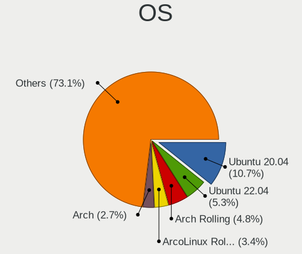

| Name              | Computers | Percent |
|-------------------|-----------|---------|
| Ubuntu 20.04      | 46        | 18.47%  |
| Arch              | 12        | 4.82%   |
| Ubuntu 18.04      | 11        | 4.42%   |
| ArcoLinux Rolling | 9         | 3.61%   |
| Ubuntu 19.10      | 8         | 3.21%   |
| Manjaro           | 8         | 3.21%   |
| KDE neon 20.04    | 7         | 2.81%   |
| OpenMandriva 4.2  | 5         | 2.01%   |
| Fedora 33         | 5         | 2.01%   |
| Debian 11         | 5         | 2.01%   |
| Zorin 16          | 4         | 1.61%   |
| Zorin 15          | 4         | 1.61%   |
| Ubuntu 22.04      | 4         | 1.61%   |
| Manjaro 20.0.1    | 4         | 1.61%   |
| Linux Mint 20.2   | 4         | 1.61%   |
| Ubuntu 19.04      | 3         | 1.2%    |
| Pop!_OS 22.04     | 3         | 1.2%    |
| Pop!_OS 21.10     | 3         | 1.2%    |
| Pop!_OS 21.04     | 3         | 1.2%    |
| Manjaro 20.1.2    | 3         | 1.2%    |
| Linux Mint 20.1   | 3         | 1.2%    |
| Linux Mint 20     | 3         | 1.2%    |
| Kubuntu 20.04     | 3         | 1.2%    |
| Arch Rolling      | 3         | 1.2%    |
| Ubuntu 21.04      | 2         | 0.8%    |
| Ubuntu 20.10      | 2         | 0.8%    |
| Ubuntu 18.10      | 2         | 0.8%    |
| Pop!_OS 20.10     | 2         | 0.8%    |
| OpenMandriva 4.90 | 2         | 0.8%    |
| OpenMandriva 4.3  | 2         | 0.8%    |
| Manjaro 21.2.6    | 2         | 0.8%    |
| Manjaro 21.0.3    | 2         | 0.8%    |
| Manjaro 18.0.4    | 2         | 0.8%    |
| LMDE 4            | 2         | 0.8%    |
| Linux Mint 20.3   | 2         | 0.8%    |
| Fedora 36         | 2         | 0.8%    |
| Fedora 34         | 2         | 0.8%    |
| Fedora 32         | 2         | 0.8%    |
| CentOS 8          | 2         | 0.8%    |
| BlackPanther 18.1 | 2         | 0.8%    |

OS Family
---------

OS without a version

| Name         | Computers | Percent |
|--------------|-----------|---------|
| Ubuntu       | 79        | 34.2%   |
| Manjaro      | 27        | 11.69%  |
| Arch         | 15        | 6.49%   |
| Linux Mint   | 14        | 6.06%   |
| Pop!_OS      | 10        | 4.33%   |
| Fedora       | 10        | 4.33%   |
| OpenMandriva | 9         | 3.9%    |
| ArcoLinux    | 9         | 3.9%    |
| Zorin        | 8         | 3.46%   |
| Kubuntu      | 7         | 3.03%   |
| KDE neon     | 7         | 3.03%   |
| Debian       | 6         | 2.6%    |
| Endless      | 5         | 2.16%   |
| Parrot       | 3         | 1.3%    |
| LMDE         | 2         | 0.87%   |
| EndeavourOS  | 2         | 0.87%   |
| Deepin       | 2         | 0.87%   |
| CentOS       | 2         | 0.87%   |
| BlackPanther | 2         | 0.87%   |
| Void Linux   | 1         | 0.43%   |
| Ubuntu Unity | 1         | 0.43%   |
| Ubuntu MATE  | 1         | 0.43%   |
| ROSA         | 1         | 0.43%   |
| Pragma       | 1         | 0.43%   |
| openSUSE     | 1         | 0.43%   |
| Kali         | 1         | 0.43%   |
| Gentoo       | 1         | 0.43%   |
| Elementary   | 1         | 0.43%   |
| Clear Linux  | 1         | 0.43%   |
| Artix        | 1         | 0.43%   |
| Android      | 1         | 0.43%   |

Kernel
------

Version of the Linux kernel

| Version                  | Computers | Percent |
|--------------------------|-----------|---------|
| 5.4.0-42-generic         | 8         | 2.93%   |
| 5.4.0-52-generic         | 6         | 2.2%    |
| 5.10.14-desktop-1omv4002 | 5         | 1.83%   |
| 5.13.0-28-generic        | 4         | 1.47%   |
| 5.9.16-1-MANJARO         | 3         | 1.1%    |
| 5.8.0-55-generic         | 3         | 1.1%    |
| 5.8.0-41-generic         | 3         | 1.1%    |
| 5.6.11-1-MANJARO         | 3         | 1.1%    |
| 5.4.0-53-generic         | 3         | 1.1%    |
| 5.4.0-40-generic         | 3         | 1.1%    |
| 5.4.0-29-generic         | 3         | 1.1%    |
| 5.11.0-37-generic        | 3         | 1.1%    |
| 5.11.0-16-generic        | 3         | 1.1%    |
| 5.8.16-2-MANJARO         | 2         | 0.73%   |
| 5.8.0-50-generic         | 2         | 0.73%   |
| 5.8.0-44-generic         | 2         | 0.73%   |
| 5.8.0-38-generic         | 2         | 0.73%   |
| 5.8.0-14-generic         | 2         | 0.73%   |
| 5.7.19-2-MANJARO         | 2         | 0.73%   |
| 5.4.8-arch1-1            | 2         | 0.73%   |
| 5.4.0-90-generic         | 2         | 0.73%   |
| 5.4.0-73-generic         | 2         | 0.73%   |
| 5.4.0-47-generic         | 2         | 0.73%   |
| 5.4.0-26-generic         | 2         | 0.73%   |
| 5.4.0-19-generic         | 2         | 0.73%   |
| 5.3.0-40-generic         | 2         | 0.73%   |
| 5.3.0-24-generic         | 2         | 0.73%   |
| 5.3.0-23-generic         | 2         | 0.73%   |
| 5.3.0-18-generic         | 2         | 0.73%   |
| 5.19.0-76051900-generic  | 2         | 0.73%   |
| 5.18.12-desktop-3omv4090 | 2         | 0.73%   |
| 5.16.7-desktop-1omv4003  | 2         | 0.73%   |
| 5.15.0-46-generic        | 2         | 0.73%   |
| 5.13.0-51-generic        | 2         | 0.73%   |
| 5.13.0-35-generic        | 2         | 0.73%   |
| 5.11.0-40-generic        | 2         | 0.73%   |
| 5.11.0-27-generic        | 2         | 0.73%   |
| 5.10.52-1-lts            | 2         | 0.73%   |
| 5.10.0-8-amd64           | 2         | 0.73%   |
| 5.10.0-10-amd64          | 2         | 0.73%   |

Kernel Family
-------------

Linux kernel without a distro release

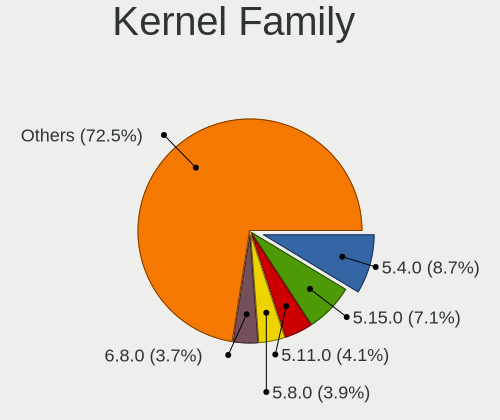

| Version | Computers | Percent |
|---------|-----------|---------|
| 5.4.0   | 40        | 15.5%   |
| 5.8.0   | 18        | 6.98%   |
| 5.11.0  | 18        | 6.98%   |
| 5.13.0  | 17        | 6.59%   |
| 5.3.0   | 13        | 5.04%   |
| 5.15.0  | 8         | 3.1%    |
| 5.10.0  | 7         | 2.71%   |
| 5.0.0   | 7         | 2.71%   |
| 4.18.0  | 7         | 2.71%   |
| 4.15.0  | 7         | 2.71%   |
| 5.10.14 | 5         | 1.94%   |
| 5.9.16  | 4         | 1.55%   |
| 5.8.16  | 4         | 1.55%   |
| 4.19.0  | 4         | 1.55%   |
| 5.6.11  | 3         | 1.16%   |
| 5.18.12 | 3         | 1.16%   |
| 5.7.19  | 2         | 0.78%   |
| 5.4.8   | 2         | 0.78%   |
| 5.19.0  | 2         | 0.78%   |
| 5.16.7  | 2         | 0.78%   |
| 5.16.15 | 2         | 0.78%   |
| 5.16.11 | 2         | 0.78%   |
| 5.15.7  | 2         | 0.78%   |
| 5.15.5  | 2         | 0.78%   |
| 5.15.13 | 2         | 0.78%   |
| 5.11.6  | 2         | 0.78%   |
| 5.10.52 | 2         | 0.78%   |
| 6.0.0   | 1         | 0.39%   |
| 5.9.11  | 1         | 0.39%   |
| 5.8.6   | 1         | 0.39%   |
| 5.8.4   | 1         | 0.39%   |
| 5.8.12  | 1         | 0.39%   |
| 5.7.17  | 1         | 0.39%   |
| 5.7.15  | 1         | 0.39%   |
| 5.7.0   | 1         | 0.39%   |
| 5.6.15  | 1         | 0.39%   |
| 5.6.14  | 1         | 0.39%   |
| 5.4.81  | 1         | 0.39%   |
| 5.4.70  | 1         | 0.39%   |
| 5.4.68  | 1         | 0.39%   |

Kernel Major Ver.
-----------------

Linux kernel major version

| Version | Computers | Percent |
|---------|-----------|---------|
| 5.4     | 47        | 18.8%   |
| 5.8     | 25        | 10%     |
| 5.15    | 25        | 10%     |
| 5.11    | 23        | 9.2%    |
| 5.13    | 19        | 7.6%    |
| 5.10    | 19        | 7.6%    |
| 5.3     | 13        | 5.2%    |
| 5.16    | 11        | 4.4%    |
| 4.18    | 8         | 3.2%    |
| 5.18    | 7         | 2.8%    |
| 5.0     | 7         | 2.8%    |
| 4.15    | 7         | 2.8%    |
| 5.9     | 5         | 2%      |
| 5.7     | 5         | 2%      |
| 5.6     | 5         | 2%      |
| 4.19    | 5         | 2%      |
| 5.17    | 4         | 1.6%    |
| 5.19    | 3         | 1.2%    |
| 5.14    | 3         | 1.2%    |
| 5.12    | 2         | 0.8%    |
| 5.1     | 2         | 0.8%    |
| 6.0     | 1         | 0.4%    |
| 4.9     | 1         | 0.4%    |
| 4.4     | 1         | 0.4%    |
| 4.13    | 1         | 0.4%    |
| 3.18    | 1         | 0.4%    |

Arch
----

OS architecture (x86_64, i586, etc.)

| Name    | Computers | Percent |
|---------|-----------|---------|
| x86_64  | 216       | 97.3%   |
| i686    | 4         | 1.8%    |
| aarch64 | 2         | 0.9%    |

DE
--

Desktop Environment

| Name            | Computers | Percent |
|-----------------|-----------|---------|
| GNOME           | 110       | 47.21%  |
| KDE5            | 48        | 20.6%   |
| Unknown         | 29        | 12.45%  |
| X-Cinnamon      | 14        | 6.01%   |
| XFCE            | 8         | 3.43%   |
| awesome         | 5         | 2.15%   |
| MATE            | 4         | 1.72%   |
| KDE             | 4         | 1.72%   |
| i3-with-shmlog  | 2         | 0.86%   |
| Deepin          | 2         | 0.86%   |
| Unity           | 1         | 0.43%   |
| Pantheon        | 1         | 0.43%   |
| i3              | 1         | 0.43%   |
| GNOME Flashback | 1         | 0.43%   |
| DWM             | 1         | 0.43%   |
| Cinnamon        | 1         | 0.43%   |
| bspwm           | 1         | 0.43%   |

Display Server
--------------

X11 or Wayland

| Name    | Computers | Percent |
|---------|-----------|---------|
| X11     | 189       | 81.82%  |
| Wayland | 24        | 10.39%  |
| Unknown | 16        | 6.93%   |
| Tty     | 2         | 0.87%   |

Display Manager
---------------

SDDM, LightDM, etc.

| Name    | Computers | Percent |
|---------|-----------|---------|
| Unknown | 122       | 52.59%  |
| GDM     | 38        | 16.38%  |
| SDDM    | 34        | 14.66%  |
| LightDM | 15        | 6.47%   |
| GDM3    | 14        | 6.03%   |
| TDM     | 9         | 3.88%   |

OS Lang
-------

Language

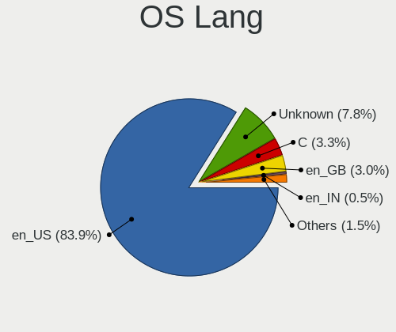

| Lang    | Computers | Percent |
|---------|-----------|---------|
| en_US   | 183       | 80.97%  |
| Unknown | 28        | 12.39%  |
| en_GB   | 7         | 3.1%    |
| C       | 5         | 2.21%   |
| en_IE   | 1         | 0.44%   |
| en_CA   | 1         | 0.44%   |
| en_AG   | 1         | 0.44%   |

Boot Mode
---------

EFI or BIOS

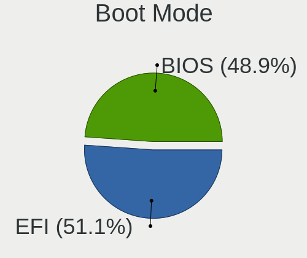

| Mode | Computers | Percent |
|------|-----------|---------|
| EFI  | 118       | 51.08%  |
| BIOS | 113       | 48.92%  |

Filesystem
----------

Type of filesystem

| Type    | Computers | Percent |
|---------|-----------|---------|
| Ext4    | 182       | 79.82%  |
| Overlay | 21        | 9.21%   |
| Btrfs   | 16        | 7.02%   |
| Unknown | 5         | 2.19%   |
| Xfs     | 3         | 1.32%   |
| Zfs     | 1         | 0.44%   |

Part. scheme
------------

Scheme of partitioning

| Type    | Computers | Percent |
|---------|-----------|---------|
| Unknown | 134       | 58.01%  |
| GPT     | 78        | 33.77%  |
| MBR     | 19        | 8.23%   |

Dual Boot with Linux/BSD
------------------------

Hosting more than one Linux/BSD

| Dual boot | Computers | Percent |
|-----------|-----------|---------|
| No        | 188       | 82.46%  |
| Yes       | 40        | 17.54%  |

Dual Boot (Win)
---------------

Hosting Linux and Windows

| Dual boot | Computers | Percent |
|-----------|-----------|---------|
| No        | 127       | 55.46%  |
| Yes       | 102       | 44.54%  |

Board
-----

Vendor
------

Motherboard manufacturer

| Name                        | Computers | Percent |
|-----------------------------|-----------|---------|
| ASUSTek Computer            | 51        | 22.97%  |
| Hewlett-Packard             | 43        | 19.37%  |
| MSI                         | 22        | 9.91%   |
| Gigabyte Technology         | 19        | 8.56%   |
| Dell                        | 18        | 8.11%   |
| Lenovo                      | 17        | 7.66%   |
| Acer                        | 15        | 6.76%   |
| Unknown                     | 7         | 3.15%   |
| ASRock                      | 6         | 2.7%    |
| Notebook                    | 4         | 1.8%    |
| Intel                       | 4         | 1.8%    |
| OEM                         | 3         | 1.35%   |
| Biostar                     | 3         | 1.35%   |
| Foxconn                     | 2         | 0.9%    |
| Toshiba                     | 1         | 0.45%   |
| Timi                        | 1         | 0.45%   |
| SYS                         | 1         | 0.45%   |
| Samsung Electronics         | 1         | 0.45%   |
| Raspberry Pi Foundation     | 1         | 0.45%   |
| I-Life Digital Technologies | 1         | 0.45%   |
| Daffodil Computers          | 1         | 0.45%   |
| Apple                       | 1         | 0.45%   |

Model
-----

Motherboard model

| Name                                                  | Computers | Percent |
|-------------------------------------------------------|-----------|---------|
| Unknown                                               | 9         | 4.05%   |
| HP ProBook 450 G4                                     | 5         | 2.25%   |
| MSI MS-7C52                                           | 4         | 1.8%    |
| ASUS All Series                                       | 3         | 1.35%   |
| OEM Intel H81                                         | 2         | 0.9%    |
| MSI MS-7B89                                           | 2         | 0.9%    |
| MSI MS-7788                                           | 2         | 0.9%    |
| MSI MS-7668                                           | 2         | 0.9%    |
| Intel DG41RQ AAE54511-203                             | 2         | 0.9%    |
| HP ProBook 450 G2                                     | 2         | 0.9%    |
| HP Notebook                                           | 2         | 0.9%    |
| HP EliteBook 840 G3                                   | 2         | 0.9%    |
| HP 14                                                 | 2         | 0.9%    |
| ASUS X510UQ                                           | 2         | 0.9%    |
| ASUS VivoBook_ASUSLaptop X531FL_S531FL                | 2         | 0.9%    |
| ASUS VivoBook_ASUSLaptop X530FA_S530FA                | 2         | 0.9%    |
| ASUS VivoBook_ASUSLaptop X509JA_X509JA                | 2         | 0.9%    |
| ASUS VivoBook 14_ASUS Laptop X407UA                   | 2         | 0.9%    |
| Acer Nitro AN515-43                                   | 2         | 0.9%    |
| Toshiba Satellite L645                                | 1         | 0.45%   |
| Timi Mi NoteBook Pro                                  | 1         | 0.45%   |
| SYS H310CH5-TI2                                       | 1         | 0.45%   |
| Samsung 300E5EV/300E4EV/270E5EV/270E4EV/2470EV/2470EE | 1         | 0.45%   |
| RPi Raspberry Pi 4 Model B Rev 1.2                    | 1         | 0.45%   |
| Notebook W9x0LU                                       | 1         | 0.45%   |
| Notebook N750BU                                       | 1         | 0.45%   |
| Notebook N2x0LU                                       | 1         | 0.45%   |
| Notebook DCL C483                                     | 1         | 0.45%   |
| MSI Summit B14 A11MOT                                 | 1         | 0.45%   |
| MSI MS-7C91                                           | 1         | 0.45%   |
| MSI MS-7C88                                           | 1         | 0.45%   |
| MSI MS-7C08                                           | 1         | 0.45%   |
| MSI MS-7B79                                           | 1         | 0.45%   |
| MSI MS-7823                                           | 1         | 0.45%   |
| MSI MS-7721                                           | 1         | 0.45%   |
| MSI MS-7673                                           | 1         | 0.45%   |
| MSI MS-7640                                           | 1         | 0.45%   |
| MSI Modern 15 A5M                                     | 1         | 0.45%   |
| MSI KY722AA-AB4 CQ3012L                               | 1         | 0.45%   |
| MSI GS63 7RD                                          | 1         | 0.45%   |

Model Family
------------

Motherboard model prefix

| Name              | Computers | Percent |
|-------------------|-----------|---------|
| ASUS VivoBook     | 17        | 7.66%   |
| HP ProBook        | 15        | 6.76%   |
| Acer Aspire       | 12        | 5.41%   |
| Dell Inspiron     | 9         | 4.05%   |
| Unknown           | 9         | 4.05%   |
| Lenovo ThinkPad   | 7         | 3.15%   |
| Lenovo IdeaPad    | 7         | 3.15%   |
| HP EliteBook      | 7         | 3.15%   |
| Dell Latitude     | 6         | 2.7%    |
| MSI MS-7C52       | 4         | 1.8%    |
| HP Pavilion       | 3         | 1.35%   |
| HP ENVY           | 3         | 1.35%   |
| ASUS TUF          | 3         | 1.35%   |
| ASUS All          | 3         | 1.35%   |
| OEM Intel         | 2         | 0.9%    |
| MSI MS-7B89       | 2         | 0.9%    |
| MSI MS-7788       | 2         | 0.9%    |
| MSI MS-7668       | 2         | 0.9%    |
| Intel DG41RQ      | 2         | 0.9%    |
| HP Notebook       | 2         | 0.9%    |
| HP Laptop         | 2         | 0.9%    |
| HP Compaq         | 2         | 0.9%    |
| HP 15             | 2         | 0.9%    |
| HP 14             | 2         | 0.9%    |
| Dell XPS          | 2         | 0.9%    |
| ASUS ZenBook      | 2         | 0.9%    |
| ASUS X510UQ       | 2         | 0.9%    |
| Acer Nitro        | 2         | 0.9%    |
| Toshiba Satellite | 1         | 0.45%   |
| Timi Mi           | 1         | 0.45%   |
| SYS H310CH5-TI2   | 1         | 0.45%   |
| Samsung 300E5EV   | 1         | 0.45%   |
| RPi Raspberry     | 1         | 0.45%   |
| Notebook W9x0LU   | 1         | 0.45%   |
| Notebook N750BU   | 1         | 0.45%   |
| Notebook N2x0LU   | 1         | 0.45%   |
| Notebook DCL      | 1         | 0.45%   |
| MSI Summit        | 1         | 0.45%   |
| MSI MS-7C91       | 1         | 0.45%   |
| MSI MS-7C88       | 1         | 0.45%   |

MFG Year
--------

Motherboard manufacture year

| Year    | Computers | Percent |
|---------|-----------|---------|
| 2019    | 29        | 13.06%  |
| 2016    | 29        | 13.06%  |
| 2018    | 27        | 12.16%  |
| 2017    | 26        | 11.71%  |
| 2012    | 21        | 9.46%   |
| 2015    | 19        | 8.56%   |
| 2013    | 14        | 6.31%   |
| 2014    | 12        | 5.41%   |
| 2021    | 10        | 4.5%    |
| 2020    | 10        | 4.5%    |
| 2011    | 8         | 3.6%    |
| 2010    | 8         | 3.6%    |
| 2009    | 4         | 1.8%    |
| 2008    | 3         | 1.35%   |
| Unknown | 2         | 0.9%    |

Form Factor
-----------

Physical design of the computer

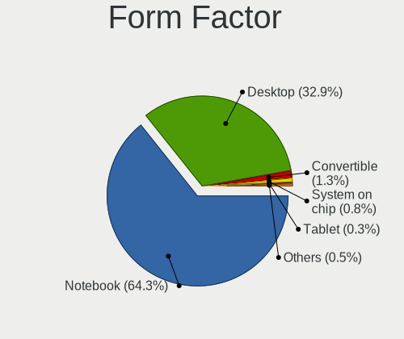

| Name           | Computers | Percent |
|----------------|-----------|---------|
| Notebook       | 139       | 62.61%  |
| Desktop        | 76        | 34.23%  |
| Convertible    | 4         | 1.8%    |
| Phone          | 1         | 0.45%   |
| System on chip | 1         | 0.45%   |
| Tablet         | 1         | 0.45%   |

Secure Boot
-----------

Enabled or disabled

| State    | Computers | Percent |
|----------|-----------|---------|
| Disabled | 209       | 92.89%  |
| Enabled  | 16        | 7.11%   |

Coreboot
--------

Have coreboot on board

| Used | Computers | Percent |
|------|-----------|---------|
| No   | 222       | 100%    |

RAM Size
--------

Total RAM memory

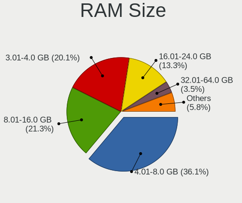

| Size in GB | Computers | Percent |
|------------|-----------|---------|
| 4.01-8.0   | 81        | 35.53%  |
| 3.01-4.0   | 62        | 27.19%  |
| 8.01-16.0  | 38        | 16.67%  |
| 16.01-24.0 | 29        | 12.72%  |
| 1.01-2.0   | 12        | 5.26%   |
| 32.01-64.0 | 4         | 1.75%   |
| 2.01-3.0   | 1         | 0.44%   |
| 0.51-1.0   | 1         | 0.44%   |

RAM Used
--------

Used RAM memory

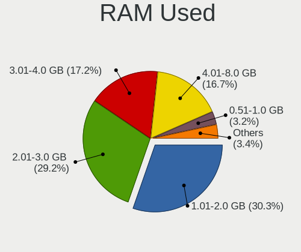

| Used GB    | Computers | Percent |
|------------|-----------|---------|
| 1.01-2.0   | 91        | 36.55%  |
| 2.01-3.0   | 82        | 32.93%  |
| 3.01-4.0   | 33        | 13.25%  |
| 4.01-8.0   | 23        | 9.24%   |
| 0.51-1.0   | 12        | 4.82%   |
| 8.01-16.0  | 4         | 1.61%   |
| 0.01-0.5   | 3         | 1.2%    |
| 16.01-24.0 | 1         | 0.4%    |

Total Drives
------------

Number of drives on board

| Drives | Computers | Percent |
|--------|-----------|---------|
| 1      | 142       | 62.83%  |
| 2      | 71        | 31.42%  |
| 3      | 11        | 4.87%   |
| 5      | 1         | 0.44%   |
| 4      | 1         | 0.44%   |

Has CD-ROM
----------

Has CD-ROM on board

| Presented | Computers | Percent |
|-----------|-----------|---------|
| No        | 153       | 68%     |
| Yes       | 72        | 32%     |

Has Ethernet
------------

Has Ethernet on board

| Presented | Computers | Percent |
|-----------|-----------|---------|
| Yes       | 184       | 82.51%  |
| No        | 39        | 17.49%  |

Has WiFi
--------

Has WiFi module

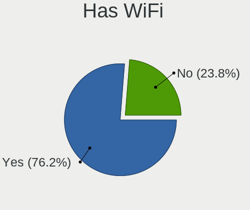

| Presented | Computers | Percent |
|-----------|-----------|---------|
| Yes       | 170       | 75.22%  |
| No        | 56        | 24.78%  |

Has Bluetooth
-------------

Has Bluetooth module

| Presented | Computers | Percent |
|-----------|-----------|---------|
| Yes       | 134       | 59.56%  |
| No        | 91        | 40.44%  |

Location
--------

Country
-------

Geographic location (country)

| Country    | Computers | Percent |
|------------|-----------|---------|
| Bangladesh | 222       | 100%    |

City
----

Geographic location (city)

| City              | Computers | Percent |
|-------------------|-----------|---------|
| Dhaka             | 141       | 60.26%  |
| Chittagong        | 16        | 6.84%   |
| Rajshahi          | 8         | 3.42%   |
| Jessore           | 8         | 3.42%   |
| Tongi             | 6         | 2.56%   |
| Comilla           | 5         | 2.14%   |
| Pabna             | 3         | 1.28%   |
| Narayanganj       | 3         | 1.28%   |
| Mirpur            | 3         | 1.28%   |
| Azimpur           | 3         | 1.28%   |
| Wari              | 2         | 0.85%   |
| Sherpur           | 2         | 0.85%   |
| Nilphamari        | 2         | 0.85%   |
| Khulna            | 2         | 0.85%   |
| Feni              | 2         | 0.85%   |
| Bogra             | 2         | 0.85%   |
| Uttara            | 1         | 0.43%   |
| Sylhet            | 1         | 0.43%   |
| Savar Upazila     | 1         | 0.43%   |
| Rangpur City      | 1         | 0.43%   |
| Pirganj           | 1         | 0.43%   |
| Patnitala         | 1         | 0.43%   |
| Paltan            | 1         | 0.43%   |
| Pabna Sadar       | 1         | 0.43%   |
| Nryanganj | 1         | 0.43%   |
| Natore            | 1         | 0.43%   |
| Narsingdi         | 1         | 0.43%   |
| Nalitabari        | 1         | 0.43%   |
| Ngarpur         | 1         | 0.43%   |
| Mymensingh        | 1         | 0.43%   |
| Lkshm     | 1         | 0.43%   |
| Jamalpur          | 1         | 0.43%   |
| Hurua             | 1         | 0.43%   |
| Gulshan           | 1         | 0.43%   |
| Faridpur          | 1         | 0.43%   |
| Dinajpur          | 1         | 0.43%   |
| Dewangonj         | 1         | 0.43%   |
| Chhatak           | 1         | 0.43%   |
| Chhagalnaiya      | 1         | 0.43%   |
| Brahmanbaria      | 1         | 0.43%   |

Drives
------

Drive Vendor
------------

Hard drive vendors

| Vendor                       | Computers | Drives | Percent |
|------------------------------|-----------|--------|---------|
| WDC                          | 61        | 86     | 19.87%  |
| Seagate                      | 53        | 67     | 17.26%  |
| Toshiba                      | 49        | 61     | 15.96%  |
| Samsung Electronics          | 22        | 34     | 7.17%   |
| Transcend                    | 19        | 20     | 6.19%   |
| Hitachi                      | 11        | 14     | 3.58%   |
| HGST                         | 10        | 10     | 3.26%   |
| SanDisk                      | 9         | 9      | 2.93%   |
| A-DATA Technology            | 7         | 8      | 2.28%   |
| Intel                        | 6         | 7      | 1.95%   |
| Micron Technology            | 5         | 5      | 1.63%   |
| Teutons                      | 4         | 8      | 1.3%    |
| Kingston                     | 4         | 5      | 1.3%    |
| Corsair                      | 4         | 6      | 1.3%    |
| SK hynix                     | 3         | 3      | 0.98%   |
| Silicon Motion               | 3         | 8      | 0.98%   |
| Phison                       | 3         | 3      | 0.98%   |
| Hewlett-Packard              | 3         | 3      | 0.98%   |
| Unknown                      | 2         | 3      | 0.65%   |
| TwinMOS                      | 2         | 2      | 0.65%   |
| Ramsta                       | 2         | 2      | 0.65%   |
| PNY                          | 2         | 2      | 0.65%   |
| KingSpec                     | 2         | 2      | 0.65%   |
| HS-SSD-E100                  | 2         | 3      | 0.65%   |
| China                        | 2         | 2      | 0.65%   |
| Unknown                      | 2         | 3      | 0.65%   |
| WDC WDS4                     | 1         | 1      | 0.33%   |
| Team                         | 1         | 1      | 0.33%   |
| Shenzhen Longsys Electronics | 1         | 1      | 0.33%   |
| Phison Electronics           | 1         | 1      | 0.33%   |
| Patriot                      | 1         | 1      | 0.33%   |
| OCZ                          | 1         | 1      | 0.33%   |
| Lexar                        | 1         | 2      | 0.33%   |
| KIOXIA                       | 1         | 1      | 0.33%   |
| Kingsand                     | 1         | 1      | 0.33%   |
| KingFast                     | 1         | 1      | 0.33%   |
| Gigabyte Technology          | 1         | 2      | 0.33%   |
| Crucial                      | 1         | 2      | 0.33%   |
| Colorful                     | 1         | 1      | 0.33%   |
| BIWIN                        | 1         | 1      | 0.33%   |

Drive Model
-----------

Hard drive models

| Model                                | Computers | Percent |
|--------------------------------------|-----------|---------|
| Seagate ST1000LM035-1RK172 1TB       | 16        | 5.03%   |
| Toshiba MQ04ABF100 1TB               | 14        | 4.4%    |
| Toshiba DT01ACA100 1TB               | 9         | 2.83%   |
| Seagate ST500DM002-1BD142 500GB      | 7         | 2.2%    |
| WDC WDS120G2G0A-00JH30 120GB SSD     | 6         | 1.89%   |
| Seagate ST1000DM010-2EP102 1TB       | 6         | 1.89%   |
| WDC WDS240G2G0A-00JH30 240GB SSD     | 5         | 1.57%   |
| WDC WD10JPVX-60JC3T0 1TB             | 5         | 1.57%   |
| Toshiba HDWD110 1TB                  | 5         | 1.57%   |
| Seagate ST1000LM024 HN-M101MBB 1TB   | 5         | 1.57%   |
| Toshiba MQ01ABD100 1TB               | 4         | 1.26%   |
| SanDisk NVMe SSD Drive 512GB         | 4         | 1.26%   |
| Intel NVMe SSD Drive 512GB           | 4         | 1.26%   |
| A-DATA SU650 240GB SSD               | 4         | 1.26%   |
| WDC WDS240G2G0B-00EPW0 240GB SSD     | 3         | 0.94%   |
| WDC WD20EZRZ-00Z5HB0 2TB             | 3         | 0.94%   |
| WDC WD10JPVX-60JC3T1 1TB             | 3         | 0.94%   |
| WDC WD10EZEX-60WN4A0 1TB             | 3         | 0.94%   |
| Transcend TS256GSSD230S 256GB        | 3         | 0.94%   |
| Transcend TS128GSSD370S 128GB        | 3         | 0.94%   |
| Transcend TS120GMTS420S 120GB SSD    | 3         | 0.94%   |
| Toshiba DT01ACA200 2TB               | 3         | 0.94%   |
| Seagate ST500LT012-9WS142 500GB      | 3         | 0.94%   |
| Seagate ST1000LM049-2GH172 1TB       | 3         | 0.94%   |
| Samsung HD502HJ 500GB                | 3         | 0.94%   |
| HGST HTS541010A9E680 1TB             | 3         | 0.94%   |
| Corsair Force MP510 240GB            | 3         | 0.94%   |
| WDC WD5000AAKX-001CA0 500GB          | 2         | 0.63%   |
| WDC WD40PURX-64N96Y0 4TB             | 2         | 0.63%   |
| WDC WD10SPZX-60Z10T0 1TB             | 2         | 0.63%   |
| WDC WD10SPZX-24Z10T0 1TB             | 2         | 0.63%   |
| WDC WD10JPVX-75JC3T0 1TB             | 2         | 0.63%   |
| WDC WD10EZEX-22MFCA0 1TB             | 2         | 0.63%   |
| WDC WD10EZEX-00BN5A0 1TB             | 2         | 0.63%   |
| WDC WD SSD 120GB                     | 2         | 0.63%   |
| WDC PC SN520 SDAPNUW-256G-1002 256GB | 2         | 0.63%   |
| Transcend TS240GSSD220S 240GB        | 2         | 0.63%   |
| Transcend TS240GMTS820S 240GB SSD    | 2         | 0.63%   |
| Transcend TS120GSSD220S 120GB        | 2         | 0.63%   |
| Toshiba THNSNK128GVN8 128GB SSD      | 2         | 0.63%   |

HDD Vendor
----------

Hard disk drive vendors

| Vendor              | Computers | Drives | Percent |
|---------------------|-----------|--------|---------|
| Seagate             | 53        | 67     | 30.99%  |
| Toshiba             | 44        | 55     | 25.73%  |
| WDC                 | 41        | 57     | 23.98%  |
| Samsung Electronics | 12        | 20     | 7.02%   |
| Hitachi             | 11        | 14     | 6.43%   |
| HGST                | 10        | 10     | 5.85%   |

SSD Vendor
----------

Solid state drive vendors

| Vendor              | Computers | Drives | Percent |
|---------------------|-----------|--------|---------|
| WDC                 | 19        | 23     | 20.21%  |
| Transcend           | 18        | 19     | 19.15%  |
| A-DATA Technology   | 7         | 8      | 7.45%   |
| Samsung Electronics | 6         | 8      | 6.38%   |
| SanDisk             | 5         | 5      | 5.32%   |
| Micron Technology   | 5         | 5      | 5.32%   |
| Teutons             | 4         | 8      | 4.26%   |
| Toshiba             | 3         | 4      | 3.19%   |
| Hewlett-Packard     | 3         | 3      | 3.19%   |
| TwinMOS             | 2         | 2      | 2.13%   |
| Ramsta              | 2         | 2      | 2.13%   |
| PNY                 | 2         | 2      | 2.13%   |
| KingSpec            | 2         | 2      | 2.13%   |
| HS-SSD-E100         | 2         | 2      | 2.13%   |
| China               | 2         | 2      | 2.13%   |
| WDC WDS4            | 1         | 1      | 1.06%   |
| Team                | 1         | 1      | 1.06%   |
| SK hynix            | 1         | 1      | 1.06%   |
| Patriot             | 1         | 1      | 1.06%   |
| OCZ                 | 1         | 1      | 1.06%   |
| Kingston            | 1         | 1      | 1.06%   |
| Intel               | 1         | 1      | 1.06%   |
| Gigabyte Technology | 1         | 2      | 1.06%   |
| Crucial             | 1         | 2      | 1.06%   |
| Corsair             | 1         | 2      | 1.06%   |
| Apacer              | 1         | 1      | 1.06%   |
| Unknown             | 1         | 2      | 1.06%   |

Drive Kind
----------

HDD or SSD

| Kind    | Computers | Drives | Percent |
|---------|-----------|--------|---------|
| HDD     | 163       | 223    | 54.7%   |
| SSD     | 91        | 111    | 30.54%  |
| NVMe    | 37        | 52     | 12.42%  |
| Unknown | 5         | 5      | 1.68%   |
| MMC     | 2         | 3      | 0.67%   |

Drive Connector
---------------

SATA, SAS, NVMe, etc.

| Type | Computers | Drives | Percent |
|------|-----------|--------|---------|
| SATA | 198       | 338    | 83.19%  |
| NVMe | 37        | 52     | 15.55%  |
| MMC  | 2         | 3      | 0.84%   |
| SAS  | 1         | 1      | 0.42%   |

Drive Size
----------

Size of hard drive

| Size in TB | Computers | Drives | Percent |
|------------|-----------|--------|---------|
| 0.01-0.5   | 131       | 183    | 53.47%  |
| 0.51-1.0   | 101       | 134    | 41.22%  |
| 1.01-2.0   | 9         | 9      | 3.67%   |
| 3.01-4.0   | 2         | 3      | 0.82%   |
| 2.01-3.0   | 1         | 4      | 0.41%   |
| 4.01-10.0  | 1         | 1      | 0.41%   |

Space Total
-----------

Amount of disk space available on the file system

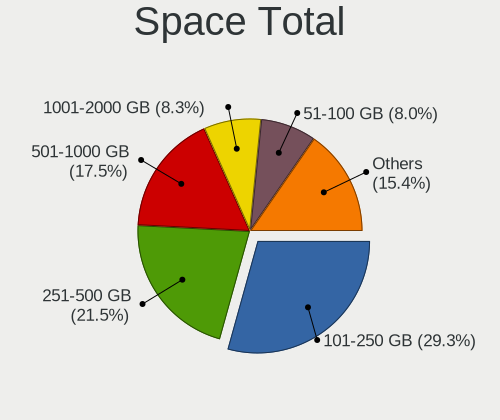

| Size in GB     | Computers | Percent |
|----------------|-----------|---------|
| 101-250        | 69        | 28.99%  |
| 251-500        | 49        | 20.59%  |
| 501-1000       | 47        | 19.75%  |
| 1001-2000      | 24        | 10.08%  |
| 51-100         | 21        | 8.82%   |
| 21-50          | 12        | 5.04%   |
| 1-20           | 10        | 4.2%    |
| Unknown        | 4         | 1.68%   |
| More than 3000 | 2         | 0.84%   |

Space Used
----------

Amount of used disk space

| Used GB        | Computers | Percent |
|----------------|-----------|---------|
| 1-20           | 89        | 36.33%  |
| 21-50          | 51        | 20.82%  |
| 101-250        | 38        | 15.51%  |
| 51-100         | 34        | 13.88%  |
| 251-500        | 14        | 5.71%   |
| 501-1000       | 10        | 4.08%   |
| 1001-2000      | 4         | 1.63%   |
| Unknown        | 4         | 1.63%   |
| More than 3000 | 1         | 0.41%   |

Malfunc. Drives
---------------

Drive models with a malfunction

| Model                                          | Computers | Drives | Percent |
|------------------------------------------------|-----------|--------|---------|
| Toshiba MQ01ABD100 1TB                         | 2         | 4      | 6.06%   |
| Seagate ST500DM002-1BD142 500GB                | 2         | 2      | 6.06%   |
| HGST HTS541010A9E680 1TB                       | 2         | 2      | 6.06%   |
| WDC WD5000LPCX-22VHAT0 500GB                   | 1         | 1      | 3.03%   |
| WDC WD5000BPVT-22HXZT3 500GB                   | 1         | 1      | 3.03%   |
| WDC WD10SPZX-24Z10T0 1TB                       | 1         | 1      | 3.03%   |
| WDC WD10JPVX-60JC3T0 1TB                       | 1         | 2      | 3.03%   |
| WDC WD10JPVT-00MS8T0 1TB                       | 1         | 1      | 3.03%   |
| WDC WD10EZEX-60WN4A0 1TB                       | 1         | 1      | 3.03%   |
| WDC WD10EZEX-22MFCA0 1TB                       | 1         | 1      | 3.03%   |
| WDC WD10EZEX-00BN5A0 1TB                       | 1         | 1      | 3.03%   |
| Toshiba MQ01ABD050 500GB                       | 1         | 1      | 3.03%   |
| Toshiba HDWD110 1TB                            | 1         | 1      | 3.03%   |
| Toshiba DT01ACA200 2TB                         | 1         | 1      | 3.03%   |
| Toshiba DT01ACA100 1TB                         | 1         | 1      | 3.03%   |
| SK hynix HFS256G3AMNB-2200A 256GB SSD          | 1         | 1      | 3.03%   |
| Seagate ST9500325AS 500GB                      | 1         | 1      | 3.03%   |
| Seagate ST500LT012-9WS142 500GB                | 1         | 1      | 3.03%   |
| Seagate ST3500418AS 500GB                      | 1         | 1      | 3.03%   |
| Seagate ST1000LM024 HN-M101MBB 1TB             | 1         | 1      | 3.03%   |
| Samsung Electronics HM160HI 160GB              | 1         | 1      | 3.03%   |
| Samsung Electronics HD161HJ 160GB              | 1         | 2      | 3.03%   |
| Micron Technology 1100_MTFDDAV256TBN 256GB SSD | 1         | 1      | 3.03%   |
| Intel SSDSCKKW240H6 240GB                      | 1         | 1      | 3.03%   |
| HS-SSD-E100 SSD 128G                           | 1         | 1      | 3.03%   |
| Hitachi HDT725050VLA380 500GB                  | 1         | 1      | 3.03%   |
| HGST HTS545050A7E680 500GB                     | 1         | 1      | 3.03%   |
| HGST HTS545050A7E380 500GB                     | 1         | 1      | 3.03%   |
| Hewlett-Packard SSD S600 240GB                 | 1         | 1      | 3.03%   |
| A-DATA Technology SU650 240GB SSD              | 1         | 2      | 3.03%   |

Malfunc. Drive Vendor
---------------------

Vendors of faulty drives

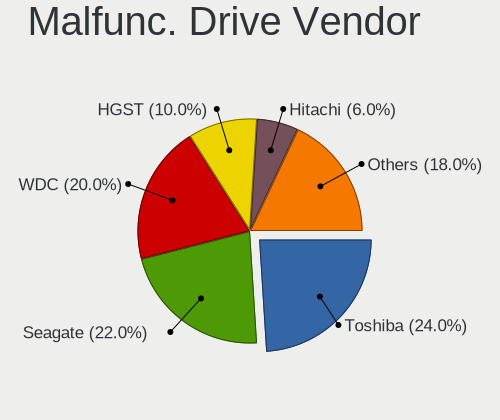

| Vendor              | Computers | Drives | Percent |
|---------------------|-----------|--------|---------|
| WDC                 | 8         | 9      | 24.24%  |
| Toshiba             | 6         | 8      | 18.18%  |
| Seagate             | 6         | 6      | 18.18%  |
| HGST                | 4         | 4      | 12.12%  |
| Samsung Electronics | 2         | 3      | 6.06%   |
| SK hynix            | 1         | 1      | 3.03%   |
| Micron Technology   | 1         | 1      | 3.03%   |
| Intel               | 1         | 1      | 3.03%   |
| HS-SSD-E100         | 1         | 1      | 3.03%   |
| Hitachi             | 1         | 1      | 3.03%   |
| Hewlett-Packard     | 1         | 1      | 3.03%   |
| A-DATA Technology   | 1         | 2      | 3.03%   |

Malfunc. HDD Vendor
-------------------

Vendors of faulty HDD drives

| Vendor              | Computers | Drives | Percent |
|---------------------|-----------|--------|---------|
| WDC                 | 8         | 9      | 29.63%  |
| Toshiba             | 6         | 8      | 22.22%  |
| Seagate             | 6         | 6      | 22.22%  |
| HGST                | 4         | 4      | 14.81%  |
| Samsung Electronics | 2         | 3      | 7.41%   |
| Hitachi             | 1         | 1      | 3.7%    |

Malfunc. Drive Kind
-------------------

Kinds of faulty drives

| Kind | Computers | Drives | Percent |
|------|-----------|--------|---------|
| HDD  | 26        | 31     | 81.25%  |
| SSD  | 6         | 7      | 18.75%  |

Failed Drives
-------------

Failed drive models

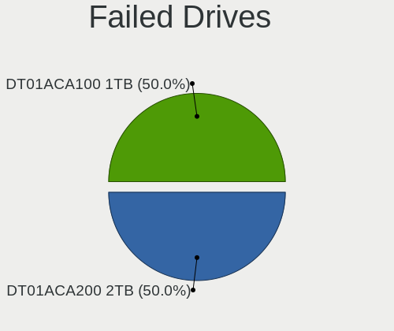

| Model                  | Computers | Drives | Percent |
|------------------------|-----------|--------|---------|
| Toshiba DT01ACA200 2TB | 1         | 1      | 100%    |

Failed Drive Vendor
-------------------

Failed drive vendors

| Vendor  | Computers | Drives | Percent |
|---------|-----------|--------|---------|
| Toshiba | 1         | 1      | 100%    |

Drive Status
------------

Number of failed and malfunc. drives

| Status   | Computers | Drives | Percent |
|----------|-----------|--------|---------|
| Detected | 137       | 225    | 55.24%  |
| Works    | 78        | 130    | 31.45%  |
| Malfunc  | 32        | 38     | 12.9%   |
| Failed   | 1         | 1      | 0.4%    |

Storage controller
------------------

Storage Vendor
--------------

Storage controller vendors

| Vendor                       | Computers | Percent |
|------------------------------|-----------|---------|
| Intel                        | 184       | 72.44%  |
| AMD                          | 29        | 11.42%  |
| SanDisk                      | 8         | 3.15%   |
| Phison Electronics           | 7         | 2.76%   |
| Samsung Electronics          | 5         | 1.97%   |
| Silicon Motion               | 3         | 1.18%   |
| Marvell Technology Group     | 3         | 1.18%   |
| Kingston Technology Company  | 3         | 1.18%   |
| Toshiba America Info Systems | 2         | 0.79%   |
| SK hynix                     | 2         | 0.79%   |
| Shenzhen Longsys Electronics | 2         | 0.79%   |
| ASMedia Technology           | 2         | 0.79%   |
| VIA Technologies             | 1         | 0.39%   |
| Transcend                    | 1         | 0.39%   |
| KIOXIA                       | 1         | 0.39%   |
| Biwin Storage Technology     | 1         | 0.39%   |

Storage Model
-------------

Storage controller models

| Model                                                                                   | Computers | Percent |
|-----------------------------------------------------------------------------------------|-----------|---------|
| Intel Sunrise Point-LP SATA Controller [AHCI mode]                                      | 51        | 17.17%  |
| AMD FCH SATA Controller [AHCI mode]                                                     | 21        | 7.07%   |
| Intel 82801 Mobile SATA Controller [RAID mode]                                          | 13        | 4.38%   |
| Intel 8 Series/C220 Series Chipset Family 6-port SATA Controller 1 [AHCI mode]          | 12        | 4.04%   |
| Intel NM10/ICH7 Family SATA Controller [IDE mode]                                       | 11        | 3.7%    |
| Intel 7 Series Chipset Family 6-port SATA Controller [AHCI mode]                        | 11        | 3.7%    |
| Intel Wildcat Point-LP SATA Controller [AHCI Mode]                                      | 9         | 3.03%   |
| Intel 82801G (ICH7 Family) IDE Controller                                               | 9         | 3.03%   |
| AMD 400 Series Chipset SATA Controller                                                  | 9         | 3.03%   |
| Intel Cannon Point-LP SATA Controller [AHCI Mode]                                       | 8         | 2.69%   |
| Intel 6 Series/C200 Series Chipset Family Desktop SATA Controller (IDE mode, ports 4-5) | 7         | 2.36%   |
| Intel 6 Series/C200 Series Chipset Family Desktop SATA Controller (IDE mode, ports 0-3) | 7         | 2.36%   |
| Intel Volume Management Device NVMe RAID Controller                                     | 6         | 2.02%   |
| Intel 8 Series SATA Controller 1 [AHCI mode]                                            | 6         | 2.02%   |
| Intel 200 Series PCH SATA controller [AHCI mode]                                        | 6         | 2.02%   |
| Intel Atom/Celeron/Pentium Processor x5-E8000/J3xxx/N3xxx Series SATA Controller        | 5         | 1.68%   |
| SanDisk WD Blue SN500 / PC SN520 NVMe SSD                                               | 4         | 1.35%   |
| Phison E12 NVMe Controller                                                              | 4         | 1.35%   |
| Intel SSD 660P Series                                                                   | 4         | 1.35%   |
| Intel Q170/Q150/B150/H170/H110/Z170/CM236 Chipset SATA Controller [AHCI Mode]           | 4         | 1.35%   |
| Intel 7 Series/C210 Series Chipset Family 6-port SATA Controller [AHCI mode]            | 4         | 1.35%   |
| Intel 6 Series/C200 Series Chipset Family 6 port Mobile SATA AHCI Controller            | 4         | 1.35%   |
| Intel 5 Series/3400 Series Chipset 4 port SATA IDE Controller                           | 4         | 1.35%   |
| Intel 5 Series/3400 Series Chipset 2 port SATA IDE Controller                           | 4         | 1.35%   |
| SanDisk WD Blue SN550 NVMe SSD                                                          | 3         | 1.01%   |
| Samsung NVMe SSD Controller SM981/PM981/PM983                                           | 3         | 1.01%   |
| Phison PS5013 E13 NVMe Controller                                                       | 3         | 1.01%   |
| AMD FCH SATA Controller D                                                               | 3         | 1.01%   |
| AMD 500 Series Chipset SATA Controller                                                  | 3         | 1.01%   |
| Silicon Motion SM2263EN/SM2263XT SSD Controller                                         | 2         | 0.67%   |
| Marvell Group 88SE91A3 SATA-600 Controller                                              | 2         | 0.67%   |
| Marvell Group 88SE912x IDE Controller                                                   | 2         | 0.67%   |
| Kingston Company Company Non-Volatile memory controller                                 | 2         | 0.67%   |
| Intel Tiger Lake-LP SATA Controller                                                     | 2         | 0.67%   |
| Intel SATA Controller [RAID mode]                                                       | 2         | 0.67%   |
| Intel NM10/ICH7 Family SATA Controller [AHCI mode]                                      | 2         | 0.67%   |
| Intel HM170/QM170 Chipset SATA Controller [AHCI Mode]                                   | 2         | 0.67%   |
| Intel 6 Series/C200 Series Chipset Family 6 port Desktop SATA AHCI Controller           | 2         | 0.67%   |
| ASMedia ASM1062 Serial ATA Controller                                                   | 2         | 0.67%   |
| AMD SB7x0/SB8x0/SB9x0 SATA Controller [IDE mode]                                        | 2         | 0.67%   |

Storage Kind
------------

Kind of storage controller (IDE, SATA, NVMe, SAS, ...)

| Kind | Computers | Percent |
|------|-----------|---------|
| SATA | 167       | 65.75%  |
| NVMe | 38        | 14.96%  |
| IDE  | 28        | 11.02%  |
| RAID | 21        | 8.27%   |

Processor
---------

CPU Vendor
----------

Processor vendors

| Vendor | Computers | Percent |
|--------|-----------|---------|
| Intel  | 188       | 84.68%  |
| AMD    | 32        | 14.41%  |
| ARM    | 2         | 0.9%    |

CPU Model
---------

Processor models

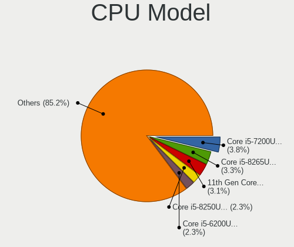

| Model                                         | Computers | Percent |
|-----------------------------------------------|-----------|---------|
| Intel Core i5-7200U CPU @ 2.50GHz             | 11        | 4.93%   |
| Intel Core i5-8265U CPU @ 1.60GHz             | 7         | 3.14%   |
| Intel Core i3-7100U CPU @ 2.40GHz             | 7         | 3.14%   |
| Intel Core i5-8250U CPU @ 1.60GHz             | 6         | 2.69%   |
| Intel Core i5-6200U CPU @ 2.30GHz             | 6         | 2.69%   |
| Intel 11th Gen Core i5-1135G7 @ 2.40GHz       | 6         | 2.69%   |
| Intel Core i7-8550U CPU @ 1.80GHz             | 5         | 2.24%   |
| Intel Core i5-3320M CPU @ 2.60GHz             | 5         | 2.24%   |
| Intel Core i7-8565U CPU @ 1.80GHz             | 4         | 1.79%   |
| Intel Core i5-6300U CPU @ 2.40GHz             | 4         | 1.79%   |
| Intel Core i5-5300U CPU @ 2.30GHz             | 4         | 1.79%   |
| Intel Core i5-4590 CPU @ 3.30GHz              | 4         | 1.79%   |
| Intel Core i5-3470 CPU @ 3.20GHz              | 4         | 1.79%   |
| Intel Core i3-8130U CPU @ 2.20GHz             | 4         | 1.79%   |
| Intel Core i3-6006U CPU @ 2.00GHz             | 4         | 1.79%   |
| Intel Pentium CPU N3710 @ 1.60GHz             | 3         | 1.35%   |
| Intel Core i7-7500U CPU @ 2.70GHz             | 3         | 1.35%   |
| Intel Core i5-7300U CPU @ 2.60GHz             | 3         | 1.35%   |
| Intel Core i5-5200U CPU @ 2.20GHz             | 3         | 1.35%   |
| AMD Ryzen 5 5600G with Radeon Graphics        | 3         | 1.35%   |
| AMD Ryzen 5 3600 6-Core Processor             | 3         | 1.35%   |
| AMD Ryzen 5 3550H with Radeon Vega Mobile Gfx | 3         | 1.35%   |
| AMD Ryzen 5 3400G with Radeon Vega Graphics   | 3         | 1.35%   |
| AMD Ryzen 3 3200G with Radeon Vega Graphics   | 3         | 1.35%   |
| Intel Xeon CPU X3440 @ 2.53GHz                | 2         | 0.9%    |
| Intel Pentium Dual-Core CPU E5400 @ 2.70GHz   | 2         | 0.9%    |
| Intel Pentium CPU G630 @ 2.70GHz              | 2         | 0.9%    |
| Intel Pentium CPU G3260 @ 3.30GHz             | 2         | 0.9%    |
| Intel Core i5-9400 CPU @ 2.90GHz              | 2         | 0.9%    |
| Intel Core i5-7500 CPU @ 3.40GHz              | 2         | 0.9%    |
| Intel Core i5-4210U CPU @ 1.70GHz             | 2         | 0.9%    |
| Intel Core i3-7130U CPU @ 2.70GHz             | 2         | 0.9%    |
| Intel Core i3-5005U CPU @ 2.00GHz             | 2         | 0.9%    |
| Intel Core i3-4005U CPU @ 1.70GHz             | 2         | 0.9%    |
| Intel Core i3-2350M CPU @ 2.30GHz             | 2         | 0.9%    |
| Intel Core i3-1005G1 CPU @ 1.20GHz            | 2         | 0.9%    |
| Intel Core 2 Duo CPU E7500 @ 2.93GHz          | 2         | 0.9%    |
| Intel Core 2 Duo CPU E7200 @ 2.53GHz          | 2         | 0.9%    |
| AMD Ryzen 7 5800U with Radeon Graphics        | 2         | 0.9%    |
| Intel Xeon CPU E31220 @ 3.10GHz               | 1         | 0.45%   |

CPU Model Family
----------------

Processor model prefix

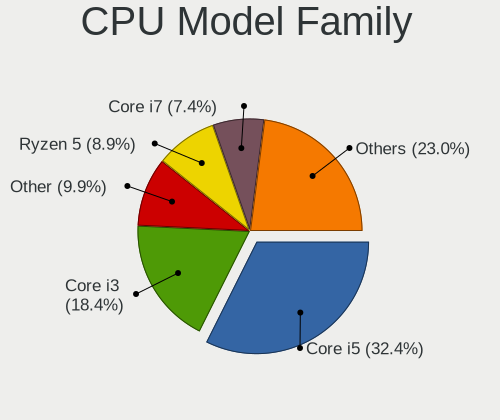

| Model                   | Computers | Percent |
|-------------------------|-----------|---------|
| Intel Core i5           | 85        | 38.29%  |
| Intel Core i3           | 43        | 19.37%  |
| AMD Ryzen 5             | 18        | 8.11%   |
| Intel Core i7           | 16        | 7.21%   |
| Intel Pentium           | 12        | 5.41%   |
| Other                   | 10        | 4.5%    |
| Intel Core 2 Duo        | 7         | 3.15%   |
| Intel Celeron           | 6         | 2.7%    |
| AMD Ryzen 7             | 5         | 2.25%   |
| Intel Pentium Dual-Core | 4         | 1.8%    |
| AMD Ryzen 3             | 4         | 1.8%    |
| Intel Xeon              | 3         | 1.35%   |
| Intel Atom              | 2         | 0.9%    |
| Intel Core 2 Quad       | 1         | 0.45%   |
| ARM AArch64             | 1         | 0.45%   |
| AMD Ryzen 9             | 1         | 0.45%   |
| AMD FX                  | 1         | 0.45%   |
| AMD E2                  | 1         | 0.45%   |
| AMD E                   | 1         | 0.45%   |
| AMD A8                  | 1         | 0.45%   |

CPU Cores
---------

Number of processor cores

| Number  | Computers | Percent |
|---------|-----------|---------|
| 2       | 126       | 56.5%   |
| 4       | 72        | 32.29%  |
| 6       | 15        | 6.73%   |
| 8       | 5         | 2.24%   |
| 1       | 2         | 0.9%    |
| 12      | 1         | 0.45%   |
| 10      | 1         | 0.45%   |
| Unknown | 1         | 0.45%   |

CPU Sockets
-----------

Number of sockets

| Number  | Computers | Percent |
|---------|-----------|---------|
| 1       | 221       | 99.55%  |
| Unknown | 1         | 0.45%   |

CPU Threads
-----------

Threads per core (Hyper-Threading)

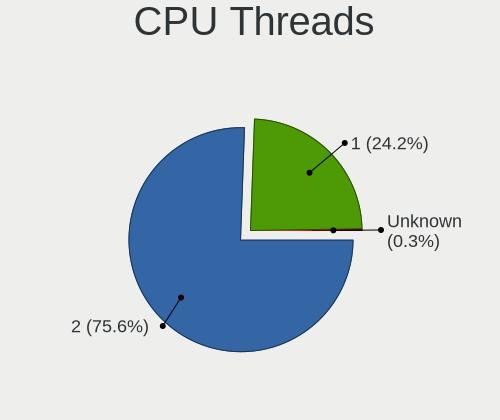

| Number  | Computers | Percent |
|---------|-----------|---------|
| 2       | 160       | 72.07%  |
| 1       | 61        | 27.48%  |
| Unknown | 1         | 0.45%   |

CPU Op-Modes
------------

CPU Operation Modes (32-bit, 64-bit)

| Op mode        | Computers | Percent |
|----------------|-----------|---------|
| 32-bit, 64-bit | 221       | 99.55%  |
| Unknown        | 1         | 0.45%   |

CPU Microcode
-------------

Microcode number

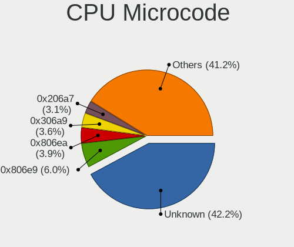

| Number     | Computers | Percent |
|------------|-----------|---------|
| Unknown    | 49        | 21.12%  |
| 0x806e9    | 23        | 9.91%   |
| 0x806ea    | 15        | 6.47%   |
| 0x306a9    | 15        | 6.47%   |
| 0x406e3    | 12        | 5.17%   |
| 0x206a7    | 10        | 4.31%   |
| 0x306d4    | 9         | 3.88%   |
| 0x306c3    | 9         | 3.88%   |
| 0x40651    | 7         | 3.02%   |
| 0x806eb    | 6         | 2.59%   |
| 0x1067a    | 6         | 2.59%   |
| 0x08108109 | 6         | 2.59%   |
| 0x906e9    | 5         | 2.16%   |
| 0x806ec    | 5         | 2.16%   |
| 0x806c1    | 5         | 2.16%   |
| 0x406c4    | 4         | 1.72%   |
| 0x08701021 | 4         | 1.72%   |
| 0x706e5    | 3         | 1.29%   |
| 0x506e3    | 3         | 1.29%   |
| 0x106e5    | 3         | 1.29%   |
| 0x10676    | 3         | 1.29%   |
| 0x08108102 | 3         | 1.29%   |
| 0x906eb    | 2         | 0.86%   |
| 0x906ea    | 2         | 0.86%   |
| 0x6fb      | 2         | 0.86%   |
| 0x20652    | 2         | 0.86%   |
| 0x0a50000c | 2         | 0.86%   |
| 0x0810100b | 2         | 0.86%   |
| 0x90672    | 1         | 0.43%   |
| 0x506c9    | 1         | 0.43%   |
| 0x50654    | 1         | 0.43%   |
| 0x406c3    | 1         | 0.43%   |
| 0x30678    | 1         | 0.43%   |
| 0x30661    | 1         | 0.43%   |
| 0x20655    | 1         | 0.43%   |
| 0x106ca    | 1         | 0.43%   |
| 0x10661    | 1         | 0.43%   |
| 0x08701013 | 1         | 0.43%   |
| 0x08600104 | 1         | 0.43%   |
| 0x08001137 | 1         | 0.43%   |

CPU Microarch
-------------

Microarchitecture

| Name             | Computers | Percent |
|------------------|-----------|---------|
| KabyLake         | 66        | 29.6%   |
| Skylake          | 19        | 8.52%   |
| IvyBridge        | 19        | 8.52%   |
| Haswell          | 19        | 8.52%   |
| SandyBridge      | 13        | 5.83%   |
| Zen+             | 11        | 4.93%   |
| Broadwell        | 11        | 4.93%   |
| Penryn           | 10        | 4.48%   |
| Zen 2            | 8         | 3.59%   |
| TigerLake        | 8         | 3.59%   |
| Silvermont       | 6         | 2.69%   |
| Zen 3            | 5         | 2.24%   |
| Core             | 4         | 1.79%   |
| Zen              | 3         | 1.35%   |
| Westmere         | 3         | 1.35%   |
| Nehalem          | 3         | 1.35%   |
| IceLake          | 3         | 1.35%   |
| Unknown          | 3         | 1.35%   |
| Piledriver       | 2         | 0.9%    |
| Bonnell          | 2         | 0.9%    |
| Goldmont         | 1         | 0.45%   |
| Excavator        | 1         | 0.45%   |
| CometLake        | 1         | 0.45%   |
| Bobcat           | 1         | 0.45%   |
| Alderlake Hybrid | 1         | 0.45%   |

Graphics
--------

GPU Vendor
----------

Vendors of graphics cards

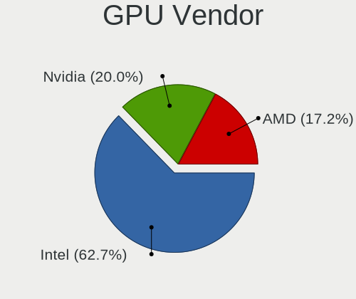

| Vendor | Computers | Percent |
|--------|-----------|---------|
| Intel  | 174       | 65.91%  |
| Nvidia | 52        | 19.7%   |
| AMD    | 38        | 14.39%  |

GPU Model
---------

Graphics card models

| Model                                                                                    | Computers | Percent |
|------------------------------------------------------------------------------------------|-----------|---------|
| Intel HD Graphics 620                                                                    | 27        | 10.07%  |
| Intel UHD Graphics 620                                                                   | 15        | 5.6%    |
| Intel Skylake GT2 [HD Graphics 520]                                                      | 15        | 5.6%    |
| Intel WhiskeyLake-U GT2 [UHD Graphics 620]                                               | 12        | 4.48%   |
| Intel 2nd Generation Core Processor Family Integrated Graphics Controller                | 11        | 4.1%    |
| AMD Picasso/Raven 2 [Radeon Vega Series / Radeon Vega Mobile Series]                     | 11        | 4.1%    |
| Intel HD Graphics 5500                                                                   | 10        | 3.73%   |
| Intel 3rd Gen Core processor Graphics Controller                                         | 10        | 3.73%   |
| Intel Xeon E3-1200 v3/4th Gen Core Processor Integrated Graphics Controller              | 7         | 2.61%   |
| Intel Xeon E3-1200 v2/3rd Gen Core processor Graphics Controller                         | 7         | 2.61%   |
| Intel TigerLake-LP GT2 [Iris Xe Graphics]                                                | 7         | 2.61%   |
| Intel Haswell-ULT Integrated Graphics Controller                                         | 7         | 2.61%   |
| Intel 4 Series Chipset Integrated Graphics Controller                                    | 7         | 2.61%   |
| Nvidia GM108M [GeForce 940MX]                                                            | 5         | 1.87%   |
| Intel HD Graphics 630                                                                    | 5         | 1.87%   |
| Intel CoffeeLake-S GT2 [UHD Graphics 630]                                                | 5         | 1.87%   |
| Intel Atom/Celeron/Pentium Processor x5-E8000/J3xxx/N3xxx Integrated Graphics Controller | 5         | 1.87%   |
| AMD Cezanne                                                                              | 5         | 1.87%   |
| Nvidia GP108M [GeForce MX250]                                                            | 4         | 1.49%   |
| Nvidia GP107M [GeForce GTX 1050 Mobile]                                                  | 4         | 1.49%   |
| Intel 82G33/G31 Express Integrated Graphics Controller                                   | 4         | 1.49%   |
| AMD Ellesmere [Radeon RX 470/480/570/570X/580/580X/590]                                  | 4         | 1.49%   |
| Nvidia GP108M [GeForce MX150]                                                            | 3         | 1.12%   |
| Nvidia GM108M [GeForce MX130]                                                            | 3         | 1.12%   |
| Intel Iris Plus Graphics G1 (Ice Lake)                                                   | 3         | 1.12%   |
| Intel Core Processor Integrated Graphics Controller                                      | 3         | 1.12%   |
| AMD Baffin [Radeon RX 460/560D / Pro 450/455/460/555/555X/560/560X]                      | 3         | 1.12%   |
| Nvidia TU116 [GeForce GTX 1650 SUPER]                                                    | 2         | 0.75%   |
| Nvidia GT215 [GeForce GT 240]                                                            | 2         | 0.75%   |
| Nvidia GM108M [GeForce 930MX]                                                            | 2         | 0.75%   |
| Nvidia GK208B [GeForce GT 710]                                                           | 2         | 0.75%   |
| Intel 4th Gen Core Processor Integrated Graphics Controller                              | 2         | 0.75%   |
| AMD Renoir                                                                               | 2         | 0.75%   |
| AMD Raven Ridge [Radeon Vega Series / Radeon Vega Mobile Series]                         | 2         | 0.75%   |
| AMD Oland PRO [Radeon R7 240/340 / Radeon 520]                                           | 2         | 0.75%   |
| Nvidia TU117M [GeForce MX450]                                                            | 1         | 0.37%   |
| Nvidia TU117M [GeForce GTX 1650 Mobile / Max-Q]                                          | 1         | 0.37%   |
| Nvidia TU116M [GeForce GTX 1660 Ti Mobile]                                               | 1         | 0.37%   |
| Nvidia TU116 [GeForce GTX 1660 SUPER]                                                    | 1         | 0.37%   |
| Nvidia TU106 [GeForce RTX 2060 Rev. A]                                                   | 1         | 0.37%   |

GPU Combo
---------

Combinations of graphics cards

| Name           | Computers | Percent |
|----------------|-----------|---------|
| 1 x Intel      | 136       | 60.71%  |
| Intel + Nvidia | 30        | 13.39%  |
| 1 x AMD        | 26        | 11.61%  |
| 1 x Nvidia     | 18        | 8.04%   |
| Intel + AMD    | 5         | 2.23%   |
| AMD + Nvidia   | 4         | 1.79%   |
| 2 x AMD        | 3         | 1.34%   |
| Other          | 2         | 0.89%   |

GPU Driver
----------

Free vs proprietary

| Driver      | Computers | Percent |
|-------------|-----------|---------|
| Free        | 188       | 82.82%  |
| Proprietary | 30        | 13.22%  |
| Unknown     | 9         | 3.96%   |

GPU Memory
----------

Total video memory

| Size in GB | Computers | Percent |
|------------|-----------|---------|
| Unknown    | 164       | 71.93%  |
| 1.01-2.0   | 32        | 14.04%  |
| 3.01-4.0   | 13        | 5.7%    |
| 0.51-1.0   | 8         | 3.51%   |
| 0.01-0.5   | 7         | 3.07%   |
| 7.01-8.0   | 2         | 0.88%   |
| 5.01-6.0   | 2         | 0.88%   |

Monitor
-------

Monitor Vendor
--------------

Monitor vendors

| Vendor                  | Computers | Percent |
|-------------------------|-----------|---------|
| BOE                     | 38        | 16.59%  |
| AU Optronics            | 36        | 15.72%  |
| Chimei Innolux          | 33        | 14.41%  |
| LG Display              | 27        | 11.79%  |
| Samsung Electronics     | 23        | 10.04%  |
| Dell                    | 19        | 8.3%    |
| Hewlett-Packard         | 12        | 5.24%   |
| Goldstar                | 12        | 5.24%   |
| ViewSonic               | 4         | 1.75%   |
| Philips                 | 3         | 1.31%   |
| ASUSTek Computer        | 3         | 1.31%   |
| Ancor Communications    | 3         | 1.31%   |
| MSI                     | 2         | 0.87%   |
| Chi Mei Optoelectronics | 2         | 0.87%   |
| ___                     | 1         | 0.44%   |
| UTV                     | 1         | 0.44%   |
| Unknown                 | 1         | 0.44%   |
| Sony                    | 1         | 0.44%   |
| Sharp                   | 1         | 0.44%   |
| QXS                     | 1         | 0.44%   |
| PANDA                   | 1         | 0.44%   |
| FSR                     | 1         | 0.44%   |
| CND                     | 1         | 0.44%   |
| CHR                     | 1         | 0.44%   |
| Apple                   | 1         | 0.44%   |
| AOC                     | 1         | 0.44%   |

Monitor Model
-------------

Monitor models

| Model                                                               | Computers | Percent |
|---------------------------------------------------------------------|-----------|---------|
| Chimei Innolux LCD Monitor CMN15F5 1920x1080 344x193mm 15.5-inch    | 8         | 3.42%   |
| Goldstar FULL HD GSM5B55 1920x1080 480x270mm 21.7-inch              | 6         | 2.56%   |
| Samsung Electronics S19F350 SAM0D46 1366x768 410x230mm 18.5-inch    | 4         | 1.71%   |
| AU Optronics LCD Monitor AUO38ED 1920x1080 344x193mm 15.5-inch      | 4         | 1.71%   |
| LG Display LCD Monitor LGD0563 1920x1080 344x194mm 15.5-inch        | 3         | 1.28%   |
| Hewlett-Packard V194 HWP3346 1366x768 410x230mm 18.5-inch           | 3         | 1.28%   |
| Hewlett-Packard 22f HPN3541 1920x1080 476x268mm 21.5-inch           | 3         | 1.28%   |
| Dell SE2219H DELF10F 1920x1080 480x270mm 21.7-inch                  | 3         | 1.28%   |
| Dell S2240L DELD054 1920x1080 476x267mm 21.5-inch                   | 3         | 1.28%   |
| BOE LCD Monitor BOE06BA 1920x1080 344x193mm 15.5-inch               | 3         | 1.28%   |
| BOE LCD Monitor BOE0696 1366x768 309x173mm 13.9-inch                | 3         | 1.28%   |
| AU Optronics LCD Monitor AUO61ED 1920x1080 344x194mm 15.5-inch      | 3         | 1.28%   |
| Samsung Electronics SyncMaster SAM0472 1440x900 367x229mm 17.0-inch | 2         | 0.85%   |
| Samsung Electronics S22R35x SAM103A 1920x1080 476x268mm 21.5-inch   | 2         | 0.85%   |
| LG Display LCD Monitor LGD0573 1920x1080 344x194mm 15.5-inch        | 2         | 0.85%   |
| LG Display LCD Monitor LGD0504 1366x768 344x194mm 15.5-inch         | 2         | 0.85%   |
| LG Display LCD Monitor LGD046F 1920x1080 345x194mm 15.6-inch        | 2         | 0.85%   |
| LG Display LCD Monitor LGD0466 1366x768 309x174mm 14.0-inch         | 2         | 0.85%   |
| LG Display LCD Monitor LGD02F8 1366x768 309x174mm 14.0-inch         | 2         | 0.85%   |
| Hewlett-Packard v185w HWP2820 1366x768 410x230mm 18.5-inch          | 2         | 0.85%   |
| Goldstar IPS FULLHD GSM5AB6 1920x1080 480x270mm 21.7-inch           | 2         | 0.85%   |
| Dell E1916HV DELF06C 1366x768 409x230mm 18.5-inch                   | 2         | 0.85%   |
| Dell D1918H DEL2005 1366x768 410x230mm 18.5-inch                    | 2         | 0.85%   |
| Chimei Innolux LCD Monitor CMN15DC 1366x768 344x193mm 15.5-inch     | 2         | 0.85%   |
| Chimei Innolux LCD Monitor CMN15DB 1366x768 344x193mm 15.5-inch     | 2         | 0.85%   |
| Chimei Innolux LCD Monitor CMN14D2 1920x1080 309x173mm 13.9-inch    | 2         | 0.85%   |
| Chimei Innolux LCD Monitor CMN14A1 1366x768 309x174mm 14.0-inch     | 2         | 0.85%   |
| Chimei Innolux LCD Monitor CMN1490 1366x768 309x173mm 13.9-inch     | 2         | 0.85%   |
| BOE LCD Monitor BOE06A5 1366x768 344x194mm 15.5-inch                | 2         | 0.85%   |
| BOE LCD Monitor BOE0698 1366x768 309x173mm 13.9-inch                | 2         | 0.85%   |
| BOE LCD Monitor BOE0697 1366x768 309x173mm 13.9-inch                | 2         | 0.85%   |
| AU Optronics LCD Monitor AUO21ED 1920x1080 344x193mm 15.5-inch      | 2         | 0.85%   |
| AU Optronics LCD Monitor AUO123D 1920x1080 309x173mm 13.9-inch      | 2         | 0.85%   |
| AU Optronics LCD Monitor AUO10EC 1366x768 344x193mm 15.5-inch       | 2         | 0.85%   |
| ___ AAA ___1062 1440x900 410x260mm 19.1-inch                        | 1         | 0.43%   |
| ViewSonic VX2276 Series VSC2F32 1920x1080 476x268mm 21.5-inch       | 1         | 0.43%   |
| ViewSonic VX1951m VSCD627 1600x900 410x260mm 19.1-inch              | 1         | 0.43%   |
| ViewSonic VA2259 Series VSC5E32 1920x1080 476x268mm 21.5-inch       | 1         | 0.43%   |
| ViewSonic LCD Monitor VSC692F 1920x1080 480x270mm 21.7-inch         | 1         | 0.43%   |
| UTV MONITOR UTV0030 1920x1080 580x330mm 26.3-inch                   | 1         | 0.43%   |

Monitor Resolution
------------------

Monitor screen resolution

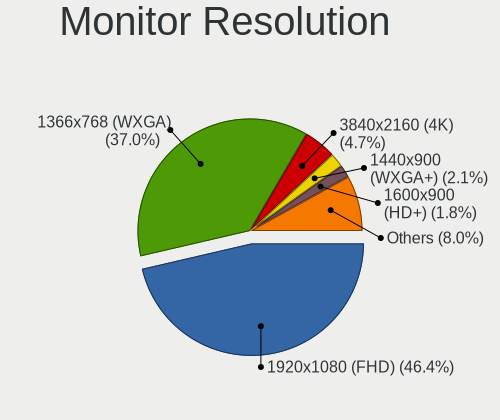

| Resolution        | Computers | Percent |
|-------------------|-----------|---------|
| 1366x768 (WXGA)   | 93        | 42.86%  |
| 1920x1080 (FHD)   | 90        | 41.47%  |
| 3840x2160 (4K)    | 8         | 3.69%   |
| 1440x900 (WXGA+)  | 6         | 2.76%   |
| 1600x900 (HD+)    | 5         | 2.3%    |
| 1280x800 (WXGA)   | 2         | 0.92%   |
| 1280x1024 (SXGA)  | 2         | 0.92%   |
| 1024x600          | 2         | 0.92%   |
| 3440x1440         | 1         | 0.46%   |
| 3360x1080         | 1         | 0.46%   |
| 2736x1824         | 1         | 0.46%   |
| 2560x1600         | 1         | 0.46%   |
| 2560x1440 (QHD)   | 1         | 0.46%   |
| 2240x1400         | 1         | 0.46%   |
| 1920x1200 (WUXGA) | 1         | 0.46%   |
| 1024x768 (XGA)    | 1         | 0.46%   |
| Unknown           | 1         | 0.46%   |

Monitor Diagonal
----------------

Diagonal size in inches

| Inches  | Computers | Percent |
|---------|-----------|---------|
| 15      | 70        | 30.57%  |
| 13      | 40        | 17.47%  |
| 21      | 32        | 13.97%  |
| 14      | 28        | 12.23%  |
| 18      | 23        | 10.04%  |
| 23      | 7         | 3.06%   |
| 12      | 5         | 2.18%   |
| 19      | 4         | 1.75%   |
| 17      | 4         | 1.75%   |
| Unknown | 3         | 1.31%   |
| 24      | 2         | 0.87%   |
| 11      | 2         | 0.87%   |
| 10      | 2         | 0.87%   |
| 84      | 1         | 0.44%   |
| 72      | 1         | 0.44%   |
| 34      | 1         | 0.44%   |
| 27      | 1         | 0.44%   |
| 26      | 1         | 0.44%   |
| 20      | 1         | 0.44%   |
| 16      | 1         | 0.44%   |

Monitor Width
-------------

Physical width

| Width in mm | Computers | Percent |
|-------------|-----------|---------|
| 301-350     | 128       | 56.39%  |
| 401-500     | 62        | 27.31%  |
| 201-300     | 20        | 8.81%   |
| 501-600     | 8         | 3.52%   |
| 351-400     | 3         | 1.32%   |
| Unknown     | 3         | 1.32%   |
| 1501-2000   | 2         | 0.88%   |
| 701-800     | 1         | 0.44%   |

Aspect Ratio
------------

Proportional relationship between the width and the height

| Ratio   | Computers | Percent |
|---------|-----------|---------|
| 16/9    | 187       | 89.47%  |
| 16/10   | 12        | 5.74%   |
| 4/3     | 4         | 1.91%   |
| Unknown | 3         | 1.44%   |
| 5/4     | 1         | 0.48%   |
| 3/2     | 1         | 0.48%   |
| 21/9    | 1         | 0.48%   |

Monitor Area
------------

Area in inch

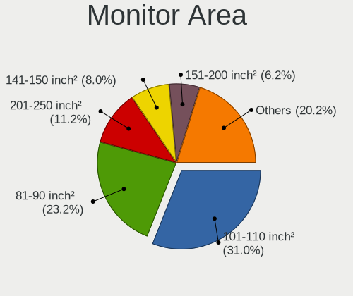

| Area in inch | Computers | Percent |
|----------------|-----------|---------|
| 101-110        | 70        | 30.7%   |
| 81-90          | 59        | 25.88%  |
| 201-250        | 29        | 12.72%  |
| 141-150        | 24        | 10.53%  |
| 151-200        | 14        | 6.14%   |
| 71-80          | 8         | 3.51%   |
| 61-70          | 5         | 2.19%   |
| 131-140        | 4         | 1.75%   |
| 251-300        | 3         | 1.32%   |
| Unknown        | 3         | 1.32%   |
| More than 1000 | 2         | 0.88%   |
| 51-60          | 2         | 0.88%   |
| 41-50          | 2         | 0.88%   |
| 351-500        | 1         | 0.44%   |
| 301-350        | 1         | 0.44%   |
| 111-120        | 1         | 0.44%   |

Pixel Density
-------------

Pixels per inch

| Density       | Computers | Percent |
|---------------|-----------|---------|
| 101-120       | 104       | 46.43%  |
| 121-160       | 64        | 28.57%  |
| 51-100        | 44        | 19.64%  |
| 161-240       | 6         | 2.68%   |
| Unknown       | 3         | 1.34%   |
| More than 240 | 2         | 0.89%   |
| 1-50          | 1         | 0.45%   |

Multiple Monitors
-----------------

Total monitors connected

| Total | Computers | Percent |
|-------|-----------|---------|
| 1     | 192       | 84.96%  |
| 2     | 23        | 10.18%  |
| 0     | 9         | 3.98%   |
| 3     | 2         | 0.88%   |

Network
-------

Net Controller Vendor
---------------------

Controller vendors

| Vendor                            | Computers | Percent |
|-----------------------------------|-----------|---------|
| Realtek Semiconductor             | 160       | 48.48%  |
| Intel                             | 81        | 24.55%  |
| Qualcomm Atheros                  | 42        | 12.73%  |
| Ralink Technology                 | 12        | 3.64%   |
| Xiaomi                            | 7         | 2.12%   |
| TP-Link                           | 7         | 2.12%   |
| Broadcom                          | 5         | 1.52%   |
| MediaTek                          | 3         | 0.91%   |
| Ralink                            | 2         | 0.61%   |
| Qualcomm                          | 2         | 0.61%   |
| Sundance Technology Inc / IC Plus | 1         | 0.3%    |
| Samsung Electronics               | 1         | 0.3%    |
| NetGear                           | 1         | 0.3%    |
| HMD Global                        | 1         | 0.3%    |
| Dell                              | 1         | 0.3%    |
| D-Link                            | 1         | 0.3%    |
| ASIX Electronics                  | 1         | 0.3%    |
| Arduino SA                        | 1         | 0.3%    |
| AboCom Systems                    | 1         | 0.3%    |

Net Controller Model
--------------------

Controller models

| Model                                                             | Computers | Percent |
|-------------------------------------------------------------------|-----------|---------|
| Realtek RTL8111/8168/8411 PCI Express Gigabit Ethernet Controller | 113       | 30.29%  |
| Realtek RTL810xE PCI Express Fast Ethernet controller             | 30        | 8.04%   |
| Qualcomm Atheros QCA9377 802.11ac Wireless Network Adapter        | 17        | 4.56%   |
| Intel Wireless 8265 / 8275                                        | 14        | 3.75%   |
| Intel Dual Band Wireless-AC 3168NGW [Stone Peak]                  | 12        | 3.22%   |
| Ralink MT7601U Wireless Adapter                                   | 10        | 2.68%   |
| Qualcomm Atheros QCA9565 / AR9565 Wireless Network Adapter        | 10        | 2.68%   |
| Intel Wireless 3165                                               | 8         | 2.14%   |
| Intel Wi-Fi 6 AX201                                               | 8         | 2.14%   |
| Realtek RTL8822BE 802.11a/b/g/n/ac WiFi adapter                   | 7         | 1.88%   |
| Realtek RTL8723BE PCIe Wireless Network Adapter                   | 7         | 1.88%   |
| Intel 82579LM Gigabit Network Connection (Lewisville)             | 7         | 1.88%   |
| Qualcomm Atheros QCA6174 802.11ac Wireless Network Adapter        | 5         | 1.34%   |
| Intel Wireless 8260                                               | 5         | 1.34%   |
| Intel Ethernet Connection (2) I219-V                              | 5         | 1.34%   |
| Qualcomm Atheros AR9485 Wireless Network Adapter                  | 4         | 1.07%   |
| Intel Wireless 7265                                               | 4         | 1.07%   |
| Intel Ethernet Connection (3) I218-LM                             | 4         | 1.07%   |
| Intel Centrino Advanced-N 6205 [Taylor Peak]                      | 4         | 1.07%   |
| Xiaomi Mi/Redmi series (RNDIS)                                    | 3         | 0.8%    |
| Xiaomi MediaTek MT7601U [MI WiFi]                                 | 3         | 0.8%    |
| TP-Link TL-WN823N v2/v3 [Realtek RTL8192EU]                       | 3         | 0.8%    |
| Realtek RTL8821CE 802.11ac PCIe Wireless Network Adapter          | 3         | 0.8%    |
| Realtek RTL8192CU 802.11n WLAN Adapter                            | 3         | 0.8%    |
| Realtek RTL8188FTV 802.11b/g/n 1T1R 2.4G WLAN Adapter             | 3         | 0.8%    |
| Intel Ethernet Connection I219-LM                                 | 3         | 0.8%    |
| Intel Dual Band Wireless-AC 3165 Plus Bluetooth                   | 3         | 0.8%    |
| TP-Link AC600 wireless Realtek RTL8811AU [Archer T2U Nano]        | 2         | 0.54%   |
| Realtek RTL8822CE 802.11ac PCIe Wireless Network Adapter          | 2         | 0.54%   |
| Realtek RTL8188GU 802.11n WLAN Adapter (After Modeswitch)         | 2         | 0.54%   |
| Realtek RTL8188EE Wireless Network Adapter                        | 2         | 0.54%   |
| Realtek RTL8153 Gigabit Ethernet Adapter                          | 2         | 0.54%   |
| Realtek RTL8125 2.5GbE Controller                                 | 2         | 0.54%   |
| Realtek RTL-8100/8101L/8139 PCI Fast Ethernet Adapter             | 2         | 0.54%   |
| Qualcomm Mobile Router                                            | 2         | 0.54%   |
| Qualcomm Atheros AR9462 Wireless Network Adapter                  | 2         | 0.54%   |
| Qualcomm Atheros AR8152 v2.0 Fast Ethernet                        | 2         | 0.54%   |
| Intel Wireless 7260                                               | 2         | 0.54%   |
| Intel Wireless 3160                                               | 2         | 0.54%   |
| Intel Wi-Fi 6 AX200                                               | 2         | 0.54%   |

Wireless Vendor
---------------

Wireless vendors

| Vendor                | Computers | Percent |
|-----------------------|-----------|---------|
| Intel                 | 72        | 40.68%  |
| Qualcomm Atheros      | 40        | 22.6%   |
| Realtek Semiconductor | 33        | 18.64%  |
| Ralink Technology     | 12        | 6.78%   |
| TP-Link               | 6         | 3.39%   |
| Xiaomi                | 3         | 1.69%   |
| Broadcom              | 3         | 1.69%   |
| Ralink                | 2         | 1.13%   |
| MediaTek              | 2         | 1.13%   |
| NetGear               | 1         | 0.56%   |
| Dell                  | 1         | 0.56%   |
| D-Link                | 1         | 0.56%   |
| AboCom Systems        | 1         | 0.56%   |

Wireless Model
--------------

Wireless models

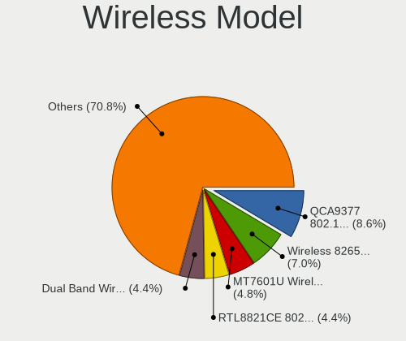

| Model                                                          | Computers | Percent |
|----------------------------------------------------------------|-----------|---------|
| Qualcomm Atheros QCA9377 802.11ac Wireless Network Adapter     | 17        | 9.6%    |
| Intel Wireless 8265 / 8275                                     | 14        | 7.91%   |
| Intel Dual Band Wireless-AC 3168NGW [Stone Peak]               | 12        | 6.78%   |
| Ralink MT7601U Wireless Adapter                                | 10        | 5.65%   |
| Qualcomm Atheros QCA9565 / AR9565 Wireless Network Adapter     | 10        | 5.65%   |
| Intel Wireless 3165                                            | 8         | 4.52%   |
| Intel Wi-Fi 6 AX201                                            | 8         | 4.52%   |
| Realtek RTL8822BE 802.11a/b/g/n/ac WiFi adapter                | 7         | 3.95%   |
| Realtek RTL8723BE PCIe Wireless Network Adapter                | 7         | 3.95%   |
| Qualcomm Atheros QCA6174 802.11ac Wireless Network Adapter     | 5         | 2.82%   |
| Intel Wireless 8260                                            | 5         | 2.82%   |
| Qualcomm Atheros AR9485 Wireless Network Adapter               | 4         | 2.26%   |
| Intel Wireless 7265                                            | 4         | 2.26%   |
| Intel Centrino Advanced-N 6205 [Taylor Peak]                   | 4         | 2.26%   |
| Xiaomi MediaTek MT7601U [MI WiFi]                              | 3         | 1.69%   |
| TP-Link TL-WN823N v2/v3 [Realtek RTL8192EU]                    | 3         | 1.69%   |
| Realtek RTL8821CE 802.11ac PCIe Wireless Network Adapter       | 3         | 1.69%   |
| Realtek RTL8192CU 802.11n WLAN Adapter                         | 3         | 1.69%   |
| Realtek RTL8188FTV 802.11b/g/n 1T1R 2.4G WLAN Adapter          | 3         | 1.69%   |
| Intel Dual Band Wireless-AC 3165 Plus Bluetooth                | 3         | 1.69%   |
| TP-Link AC600 wireless Realtek RTL8811AU [Archer T2U Nano]     | 2         | 1.13%   |
| Realtek RTL8822CE 802.11ac PCIe Wireless Network Adapter       | 2         | 1.13%   |
| Realtek RTL8188GU 802.11n WLAN Adapter (After Modeswitch)      | 2         | 1.13%   |
| Realtek RTL8188EE Wireless Network Adapter                     | 2         | 1.13%   |
| Qualcomm Atheros AR9462 Wireless Network Adapter               | 2         | 1.13%   |
| Intel Wireless 7260                                            | 2         | 1.13%   |
| Intel Wireless 3160                                            | 2         | 1.13%   |
| Intel Wi-Fi 6 AX200                                            | 2         | 1.13%   |
| Intel Ice Lake-LP PCH CNVi WiFi                                | 2         | 1.13%   |
| Intel Cannon Point-LP CNVi [Wireless-AC]                       | 2         | 1.13%   |
| TP-Link Archer T4U ver.3                                       | 1         | 0.56%   |
| Realtek RTL8821AE 802.11ac PCIe Wireless Network Adapter       | 1         | 0.56%   |
| Realtek RTL8723BU 802.11b/g/n WLAN Adapter                     | 1         | 0.56%   |
| Realtek RTL8191SU 802.11n WLAN Adapter                         | 1         | 0.56%   |
| Realtek RTL8187 Wireless Adapter                               | 1         | 0.56%   |
| Ralink RT5370 Wireless Adapter                                 | 1         | 0.56%   |
| Ralink RT2501/RT2573 Wireless Adapter                          | 1         | 0.56%   |
| Ralink RT5392 PCIe Wireless Network Adapter                    | 1         | 0.56%   |
| Ralink RT3290 Wireless 802.11n 1T/1R PCIe                      | 1         | 0.56%   |
| Qualcomm Atheros AR9287 Wireless Network Adapter (PCI-Express) | 1         | 0.56%   |

Ethernet Vendor
---------------

Ethernet vendors

| Vendor                            | Computers | Percent |
|-----------------------------------|-----------|---------|
| Realtek Semiconductor             | 148       | 76.68%  |
| Intel                             | 25        | 12.95%  |
| Qualcomm Atheros                  | 5         | 2.59%   |
| Xiaomi                            | 4         | 2.07%   |
| Broadcom                          | 3         | 1.55%   |
| Qualcomm                          | 2         | 1.04%   |
| TP-Link                           | 1         | 0.52%   |
| Sundance Technology Inc / IC Plus | 1         | 0.52%   |
| Samsung Electronics               | 1         | 0.52%   |
| MediaTek                          | 1         | 0.52%   |
| HMD Global                        | 1         | 0.52%   |
| ASIX Electronics                  | 1         | 0.52%   |

Ethernet Model
--------------

Ethernet models

| Model                                                             | Computers | Percent |
|-------------------------------------------------------------------|-----------|---------|
| Realtek RTL8111/8168/8411 PCI Express Gigabit Ethernet Controller | 113       | 57.95%  |
| Realtek RTL810xE PCI Express Fast Ethernet controller             | 30        | 15.38%  |
| Intel 82579LM Gigabit Network Connection (Lewisville)             | 7         | 3.59%   |
| Intel Ethernet Connection (2) I219-V                              | 5         | 2.56%   |
| Intel Ethernet Connection (3) I218-LM                             | 4         | 2.05%   |
| Xiaomi Mi/Redmi series (RNDIS)                                    | 3         | 1.54%   |
| Intel Ethernet Connection I219-LM                                 | 3         | 1.54%   |
| Realtek RTL8153 Gigabit Ethernet Adapter                          | 2         | 1.03%   |
| Realtek RTL8125 2.5GbE Controller                                 | 2         | 1.03%   |
| Realtek RTL-8100/8101L/8139 PCI Fast Ethernet Adapter             | 2         | 1.03%   |
| Qualcomm Mobile Router                                            | 2         | 1.03%   |
| Qualcomm Atheros AR8152 v2.0 Fast Ethernet                        | 2         | 1.03%   |
| Intel Ethernet Connection (4) I219-LM                             | 2         | 1.03%   |
| Xiaomi Mi/Redmi series (RNDIS + ADB)                              | 1         | 0.51%   |
| TP-Link UE300 10/100/1000 LAN (ethernet mode) [Realtek RTL8153]   | 1         | 0.51%   |
| Sundance Inc / IC Plus IP1000 Family Gigabit Ethernet             | 1         | 0.51%   |
| Samsung Galaxy series, misc. (tethering mode)                     | 1         | 0.51%   |
| Realtek RTL8169 PCI Gigabit Ethernet Controller                   | 1         | 0.51%   |
| Qualcomm Atheros QCA8172 Fast Ethernet                            | 1         | 0.51%   |
| Qualcomm Atheros Killer E2500 Gigabit Ethernet Controller         | 1         | 0.51%   |
| Qualcomm Atheros AR8152 v1.1 Fast Ethernet                        | 1         | 0.51%   |
| MediaTek Nokia 5.1 Plus                                           | 1         | 0.51%   |
| Intel Ethernet Controller I225-V                                  | 1         | 0.51%   |
| Intel Ethernet Connection I218-LM                                 | 1         | 0.51%   |
| Intel 82567LM-3 Gigabit Network Connection                        | 1         | 0.51%   |
| Intel 82567LM Gigabit Network Connection                          | 1         | 0.51%   |
| HMD Global SDM439-QRD _SN:AD4F5FBB                                | 1         | 0.51%   |
| Broadcom NetXtreme BCM57765 Gigabit Ethernet PCIe                 | 1         | 0.51%   |
| Broadcom NetLink BCM57785 Gigabit Ethernet PCIe                   | 1         | 0.51%   |
| Broadcom NetLink BCM57780 Gigabit Ethernet PCIe                   | 1         | 0.51%   |
| ASIX AX88179 Gigabit Ethernet                                     | 1         | 0.51%   |

Net Controller Kind
-------------------

Ethernet, WiFi or modem

| Kind     | Computers | Percent |
|----------|-----------|---------|
| Ethernet | 184       | 51.98%  |
| WiFi     | 169       | 47.74%  |
| Modem    | 1         | 0.28%   |

Used Controller
---------------

Currently used network controller

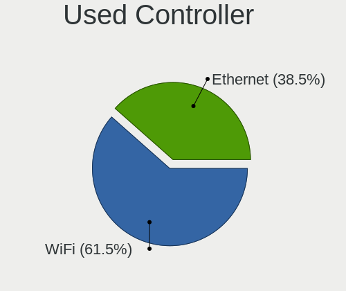

| Kind     | Computers | Percent |
|----------|-----------|---------|
| WiFi     | 141       | 63.23%  |
| Ethernet | 82        | 36.77%  |

NICs
----

Total network controllers on board

| Total | Computers | Percent |
|-------|-----------|---------|
| 1     | 113       | 50.9%   |
| 2     | 105       | 47.3%   |
| 0     | 4         | 1.8%    |

IPv6
----

IPv6 vs IPv4

| Used | Computers | Percent |
|------|-----------|---------|
| No   | 221       | 99.55%  |
| Yes  | 1         | 0.45%   |

Bluetooth
---------

Bluetooth Vendor
----------------

Controller vendors

| Vendor                          | Computers | Percent |
|---------------------------------|-----------|---------|
| Intel                           | 59        | 43.7%   |
| IMC Networks                    | 19        | 14.07%  |
| Realtek Semiconductor           | 13        | 9.63%   |
| Qualcomm Atheros Communications | 10        | 7.41%   |
| Lite-On Technology              | 10        | 7.41%   |
| Cambridge Silicon Radio         | 10        | 7.41%   |
| Broadcom                        | 6         | 4.44%   |
| Foxconn / Hon Hai               | 4         | 2.96%   |
| Toshiba                         | 1         | 0.74%   |
| Ralink                          | 1         | 0.74%   |
| Hewlett-Packard                 | 1         | 0.74%   |
| Unknown                         | 1         | 0.74%   |

Bluetooth Model
---------------

Controller models

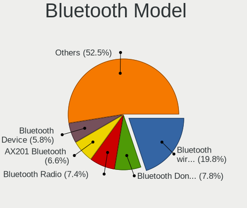

| Model                                               | Computers | Percent |
|-----------------------------------------------------|-----------|---------|
| Intel Bluetooth wireless interface                  | 35        | 25.93%  |
| IMC Networks Bluetooth Device                       | 12        | 8.89%   |
| Intel Wireless-AC 3168 Bluetooth                    | 10        | 7.41%   |
| Cambridge Silicon Radio Bluetooth Dongle (HCI mode) | 10        | 7.41%   |
| Realtek Bluetooth Radio                             | 8         | 5.93%   |
| Lite-On Qualcomm Atheros QCA9377 Bluetooth          | 6         | 4.44%   |
| Intel AX201 Bluetooth                               | 6         | 4.44%   |
| IMC Networks Bluetooth Radio                        | 6         | 4.44%   |
| Qualcomm Atheros  Bluetooth Device                  | 5         | 3.7%    |
| Intel Bluetooth 9460/9560 Jefferson Peak (JfP)      | 5         | 3.7%    |
| Realtek  Bluetooth 4.2 Adapter                      | 3         | 2.22%   |
| Lite-On Bluetooth Device                            | 3         | 2.22%   |
| Realtek RTL8822BE Bluetooth 4.2 Adapter             | 2         | 1.48%   |
| Qualcomm Atheros AR9462 Bluetooth                   | 2         | 1.48%   |
| Intel AX200 Bluetooth                               | 2         | 1.48%   |
| Foxconn / Hon Hai Bluetooth Device                  | 2         | 1.48%   |
| Broadcom HP Portable SoftSailing                    | 2         | 1.48%   |
| Broadcom BCM20702 Bluetooth 4.0 [ThinkPad]          | 2         | 1.48%   |
| Toshiba Bluetooth Radio                             | 1         | 0.74%   |
| Ralink RT3290 Bluetooth                             | 1         | 0.74%   |
| Qualcomm Atheros QCA61x4 Bluetooth 4.0              | 1         | 0.74%   |
| Qualcomm Atheros AR3012 Bluetooth 4.0               | 1         | 0.74%   |
| Qualcomm Atheros AR3012 Bluetooth                   | 1         | 0.74%   |
| Lite-On Atheros AR3012 Bluetooth                    | 1         | 0.74%   |
| Intel Centrino Advanced-N 6230 Bluetooth adapter    | 1         | 0.74%   |
| IMC Networks Atheros AR3012 Bluetooth 4.0 Adapter   | 1         | 0.74%   |
| HP Broadcom 2070 Bluetooth Combo                    | 1         | 0.74%   |
| Foxconn / Hon Hai Wireless_Device                   | 1         | 0.74%   |
| Foxconn / Hon Hai Bluetooth USB Host Controller     | 1         | 0.74%   |
| Broadcom BCM43142A0 Bluetooth 4.0                   | 1         | 0.74%   |
| Broadcom BCM20702A0 Bluetooth 4.0                   | 1         | 0.74%   |
| Unknown                                             | 1         | 0.74%   |

Sound
-----

Sound Vendor
------------

Sound card vendors

| Vendor                 | Computers | Percent |
|------------------------|-----------|---------|
| Intel                  | 186       | 71.54%  |
| AMD                    | 39        | 15%     |
| Nvidia                 | 22        | 8.46%   |
| Generalplus Technology | 7         | 2.69%   |
| C-Media Electronics    | 2         | 0.77%   |
| Logitech               | 1         | 0.38%   |
| JMTek                  | 1         | 0.38%   |
| iCreate Technologies   | 1         | 0.38%   |
| Creative Labs          | 1         | 0.38%   |

Sound Model
-----------

Sound card models

| Model                                                                                             | Computers | Percent |
|---------------------------------------------------------------------------------------------------|-----------|---------|
| Intel Sunrise Point-LP HD Audio                                                                   | 57        | 18.21%  |
| AMD Family 17h/19h HD Audio Controller                                                            | 21        | 6.71%   |
| Intel 7 Series/C216 Chipset Family High Definition Audio Controller                               | 17        | 5.43%   |
| Intel 6 Series/C200 Series Chipset Family High Definition Audio Controller                        | 14        | 4.47%   |
| Intel Cannon Point-LP High Definition Audio Controller                                            | 12        | 3.83%   |
| Intel 8 Series/C220 Series Chipset High Definition Audio Controller                               | 12        | 3.83%   |
| AMD Raven/Raven2/Fenghuang HDMI/DP Audio Controller                                               | 12        | 3.83%   |
| Intel Wildcat Point-LP High Definition Audio Controller                                           | 11        | 3.51%   |
| Intel NM10/ICH7 Family High Definition Audio Controller                                           | 11        | 3.51%   |
| Intel Broadwell-U Audio Controller                                                                | 11        | 3.51%   |
| Intel Xeon E3-1200 v3/4th Gen Core Processor HD Audio Controller                                  | 8         | 2.56%   |
| Intel Tiger Lake-LP Smart Sound Technology Audio Controller                                       | 8         | 2.56%   |
| Intel Haswell-ULT HD Audio Controller                                                             | 7         | 2.24%   |
| Intel 8 Series HD Audio Controller                                                                | 7         | 2.24%   |
| Intel 200 Series PCH HD Audio                                                                     | 7         | 2.24%   |
| Generalplus Technology Usb Audio Device                                                           | 7         | 2.24%   |
| AMD Renoir Radeon High Definition Audio Controller                                                | 7         | 2.24%   |
| Intel 5 Series/3400 Series Chipset High Definition Audio                                          | 6         | 1.92%   |
| AMD Starship/Matisse HD Audio Controller                                                          | 6         | 1.92%   |
| Intel Atom/Celeron/Pentium Processor x5-E8000/J3xxx/N3xxx Series High Definition Audio Controller | 5         | 1.6%    |
| Intel 100 Series/C230 Series Chipset Family HD Audio Controller                                   | 5         | 1.6%    |
| Nvidia TU116 High Definition Audio Controller                                                     | 4         | 1.28%   |
| AMD Ellesmere HDMI Audio [Radeon RX 470/480 / 570/580/590]                                        | 4         | 1.28%   |
| Nvidia High Definition Audio Controller                                                           | 3         | 0.96%   |
| Nvidia GK208 HDMI/DP Audio Controller                                                             | 3         | 0.96%   |
| Intel USB PnP Sound Device                                                                        | 3         | 0.96%   |
| Intel Ice Lake-LP Smart Sound Technology Audio Controller                                         | 3         | 0.96%   |
| Nvidia GM107 High Definition Audio Controller [GeForce 940MX]                                     | 2         | 0.64%   |
| Intel Cannon Lake PCH cAVS                                                                        | 2         | 0.64%   |
| AMD SBx00 Azalia (Intel HDA)                                                                      | 2         | 0.64%   |
| AMD Oland/Hainan/Cape Verde/Pitcairn HDMI Audio [Radeon HD 7000 Series]                           | 2         | 0.64%   |
| Nvidia TU107 GeForce GTX 1650 High Definition Audio Controller                                    | 1         | 0.32%   |
| Nvidia TU106 High Definition Audio Controller                                                     | 1         | 0.32%   |
| Nvidia GT216 HDMI Audio Controller                                                                | 1         | 0.32%   |
| Nvidia GP108 High Definition Audio Controller                                                     | 1         | 0.32%   |
| Nvidia GP107GL High Definition Audio Controller                                                   | 1         | 0.32%   |
| Nvidia GP106 High Definition Audio Controller                                                     | 1         | 0.32%   |
| Nvidia GM204 High Definition Audio Controller                                                     | 1         | 0.32%   |
| Nvidia GF119 HDMI Audio Controller                                                                | 1         | 0.32%   |
| Nvidia GF116 High Definition Audio Controller                                                     | 1         | 0.32%   |

Memory
------

Memory Vendor
-------------

Memory module vendors

| Vendor              | Computers | Percent |
|---------------------|-----------|---------|
| Samsung Electronics | 32        | 23.36%  |
| SK hynix            | 26        | 18.98%  |
| Micron Technology   | 14        | 10.22%  |
| Kingston            | 8         | 5.84%   |
| G.Skill             | 8         | 5.84%   |
| Unknown             | 7         | 5.11%   |
| A-DATA Technology   | 7         | 5.11%   |
| Transcend           | 6         | 4.38%   |
| Team                | 6         | 4.38%   |
| Corsair             | 6         | 4.38%   |
| Ramaxel Technology  | 4         | 2.92%   |
| SemsoTai            | 2         | 1.46%   |
| Nanya Technology    | 2         | 1.46%   |
| Unknown (C509)      | 1         | 0.73%   |
| Unknown (768A)      | 1         | 0.73%   |
| TwinMOS             | 1         | 0.73%   |
| Ramos Technology    | 1         | 0.73%   |
| Qumo                | 1         | 0.73%   |
| GeIL                | 1         | 0.73%   |
| Elpida              | 1         | 0.73%   |
| Crucial             | 1         | 0.73%   |
| Unknown             | 1         | 0.73%   |

Memory Model
------------

Memory module models

| Model                                                     | Computers | Percent |
|-----------------------------------------------------------|-----------|---------|
| SK hynix RAM HMA81GS6AFR8N-UH 8192MB SODIMM DDR4 2667MT/s | 4         | 2.82%   |
| Samsung RAM M471A5244CB0-CRC 4GB SODIMM DDR4 2667MT/s     | 4         | 2.82%   |
| SK hynix RAM HMT351S6EFR8A-PB 4GB SODIMM DDR3 1600MT/s    | 3         | 2.11%   |
| SK hynix RAM HMA851S6AFR6N-UH 4GB SODIMM DDR4 2667MT/s    | 3         | 2.11%   |
| SK hynix RAM HMA41GS6AFR8N-TF 8GB SODIMM DDR4 2667MT/s    | 3         | 2.11%   |
| Samsung RAM M471B5173EB0-YK0 4GB SODIMM DDR3 1600MT/s     | 3         | 2.11%   |
| Team RAM TEAMGROUP-UD4-3200 8GB DIMM DDR4 3200MT/s        | 2         | 1.41%   |
| SK hynix RAM HMT451S6BFR8A-PB 4096MB SODIMM DDR3 1600MT/s | 2         | 1.41%   |
| SK hynix RAM HMT351S6CFR8C-PB 4GB SODIMM DDR3 1600MT/s    | 2         | 1.41%   |
| Samsung RAM M471B5173QH0-YK0 4GB SODIMM DDR3 1600MT/s     | 2         | 1.41%   |
| Samsung RAM M471B5173DB0-YK0 4GB SODIMM DDR3 1600MT/s     | 2         | 1.41%   |
| Samsung RAM M471A5244CB0-CTD 4GB SODIMM DDR4 3266MT/s     | 2         | 1.41%   |
| Samsung RAM M471A5244BB0-CRC 4GB SODIMM DDR4 2667MT/s     | 2         | 1.41%   |
| Samsung RAM M471A1K44BM0-CRC 8GB SODIMM DDR4 2400MT/s     | 2         | 1.41%   |
| Samsung RAM M471A1K43CB1-CRC 8GB SODIMM DDR4 2667MT/s     | 2         | 1.41%   |
| Micron RAM 4ATS1G64HZ-2G6E1 8192MB SODIMM DDR4 2667MT/s   | 2         | 1.41%   |
| Micron RAM 4ATF51264HZ-2G3B1 4GB SODIMM DDR4 2400MT/s     | 2         | 1.41%   |
| Corsair RAM CMK8GX4M1E3200C16 8GB DIMM DDR4 3200MT/s      | 2         | 1.41%   |
| Corsair RAM CMK8GX4M1A2400C16 8GB DIMM DDR4 2800MT/s      | 2         | 1.41%   |
| Unknown RAM Module 8GB DIMM DDR4 3200MT/s                 | 1         | 0.7%    |
| Unknown RAM Module 8192MB SODIMM DDR3 1600MT/s            | 1         | 0.7%    |
| Unknown RAM Module 4GB SODIMM DDR3 1067MT/s               | 1         | 0.7%    |
| Unknown RAM Module 4096MB SODIMM DDR3 1600MT/s            | 1         | 0.7%    |
| Unknown RAM Module 4096MB DIMM 1333MT/s                   | 1         | 0.7%    |
| Unknown RAM Module 4096MB DIMM 1066MT/s                   | 1         | 0.7%    |
| Unknown RAM Module 2GB DIMM DDR2 800MT/s                  | 1         | 0.7%    |
| Unknown RAM Module 2048MB DIMM 1333MT/s                   | 1         | 0.7%    |
| Unknown RAM Module 2048MB DIMM 1066MT/s                   | 1         | 0.7%    |
| Unknown (C509) RAM Module 4GB SODIMM DDR4 2400MT/s        | 1         | 0.7%    |
| Unknown (768A) RAM Module 8192MB SODIMM DDR4 3200MT/s     | 1         | 0.7%    |
| TwinMOS RAM 9DEPBMZ8-TATP 2048MB DIMM DDR3 1333MT/s       | 1         | 0.7%    |
| Transcend RAM TX2133KLN-8GK 4096MB DIMM DDR3 2000MT/s     | 1         | 0.7%    |
| Transcend RAM JM3200HSB-8G 8GB SODIMM DDR4 3200MT/s       | 1         | 0.7%    |
| Transcend RAM JM2666HSG-8G 8GB SODIMM DDR4 2667MT/s       | 1         | 0.7%    |
| Transcend RAM JM2400HSB-8G 8GB SODIMM DDR4 2400MT/s       | 1         | 0.7%    |
| Transcend RAM JM1600KLN-4GK 2GB DIMM DDR3 1600MT/s        | 1         | 0.7%    |
| Transcend RAM JM1600KLN-4G 4096MB DIMM DDR3 1600MT/s      | 1         | 0.7%    |
| Team RAM TEAMGROUP-UD4-2666 16384MB DIMM DDR4 2667MT/s    | 1         | 0.7%    |
| Team RAM TEAMGROUP-SD4-3200 16GB SODIMM DDR4 3200MT/s     | 1         | 0.7%    |
| Team RAM TEAMGROUP-SD4-2400 16384MB SODIMM DDR4 8400MT/s  | 1         | 0.7%    |

Memory Kind
-----------

Memory module kinds

| Kind    | Computers | Percent |
|---------|-----------|---------|
| DDR4    | 66        | 62.26%  |
| DDR3    | 30        | 28.3%   |
| LPDDR3  | 4         | 3.77%   |
| LPDDR4  | 3         | 2.83%   |
| Unknown | 2         | 1.89%   |
| DDR2    | 1         | 0.94%   |

Memory Form Factor
------------------

Physical design of the memory module

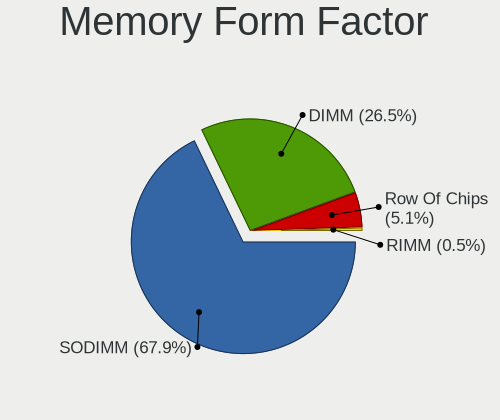

| Name         | Computers | Percent |
|--------------|-----------|---------|
| SODIMM       | 71        | 68.27%  |
| DIMM         | 28        | 26.92%  |
| Row Of Chips | 5         | 4.81%   |

Memory Size
-----------

Memory module size

| Size  | Computers | Percent |
|-------|-----------|---------|
| 4096  | 52        | 43.33%  |
| 8192  | 45        | 37.5%   |
| 16384 | 11        | 9.17%   |
| 2048  | 9         | 7.5%    |
| 32768 | 3         | 2.5%    |

Memory Speed
------------

Memory module speed

| Speed | Computers | Percent |
|-------|-----------|---------|
| 2667  | 29        | 24.58%  |
| 1600  | 23        | 19.49%  |
| 2400  | 16        | 13.56%  |
| 3200  | 15        | 12.71%  |
| 2133  | 11        | 9.32%   |
| 1333  | 5         | 4.24%   |
| 2800  | 3         | 2.54%   |
| 1867  | 3         | 2.54%   |
| 3266  | 2         | 1.69%   |
| 1334  | 2         | 1.69%   |
| 1067  | 2         | 1.69%   |
| 8400  | 1         | 0.85%   |
| 3333  | 1         | 0.85%   |
| 3151  | 1         | 0.85%   |
| 3000  | 1         | 0.85%   |
| 2000  | 1         | 0.85%   |
| 1066  | 1         | 0.85%   |
| 800   | 1         | 0.85%   |

Printers & scanners
-------------------

Printer Vendor
--------------

Printer device vendors

| Vendor      | Computers | Percent |
|-------------|-----------|---------|
| Seiko Epson | 2         | 100%    |

Printer Model
-------------

Printer device models

| Model                   | Computers | Percent |
|-------------------------|-----------|---------|
| Seiko Epson L132 Series | 2         | 100%    |

Scanner Vendor
--------------

Scanner device vendors

Zero info for selected period =(

Scanner Model
-------------

Scanner device models

Zero info for selected period =(

Camera
------

Camera Vendor
-------------

Camera device vendors

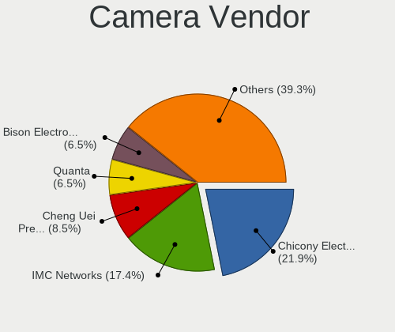

| Vendor                                 | Computers | Percent |
|----------------------------------------|-----------|---------|
| Chicony Electronics                    | 30        | 20.69%  |
| IMC Networks                           | 27        | 18.62%  |
| Cheng Uei Precision Industry (Foxlink) | 15        | 10.34%  |
| Realtek Semiconductor                  | 13        | 8.97%   |
| Sunplus Innovation Technology          | 10        | 6.9%    |
| Quanta                                 | 9         | 6.21%   |
| Acer                                   | 7         | 4.83%   |
| Lite-On Technology                     | 6         | 4.14%   |
| Microdia                               | 5         | 3.45%   |
| Suyin                                  | 4         | 2.76%   |
| Luxvisions Innotech Limited            | 4         | 2.76%   |
| Z-Star Microelectronics                | 2         | 1.38%   |
| Silicon Motion                         | 2         | 1.38%   |
| Primax Electronics                     | 2         | 1.38%   |
| Logitech                               | 2         | 1.38%   |
| Alcor Micro                            | 2         | 1.38%   |
| WCM_USB                                | 1         | 0.69%   |
| Syntek                                 | 1         | 0.69%   |
| SiGma Micro                            | 1         | 0.69%   |
| Apple                                  | 1         | 0.69%   |
| ANYKA                                  | 1         | 0.69%   |

Camera Model
------------

Camera device models

| Model                                                   | Computers | Percent |
|---------------------------------------------------------|-----------|---------|
| IMC Networks USB2.0 HD UVC WebCam                       | 9         | 6.21%   |
| Chicony USB2.0 VGA UVC WebCam                           | 9         | 6.21%   |
| IMC Networks USB2.0 VGA UVC WebCam                      | 7         | 4.83%   |
| IMC Networks VGA UVC WebCam                             | 5         | 3.45%   |
| Realtek Integrated_Webcam_HD                            | 3         | 2.07%   |
| Quanta HD Webcam                                        | 3         | 2.07%   |
| Luxvisions Innotech Limited HP HD Camera                | 3         | 2.07%   |
| Lite-On HP HD Camera                                    | 3         | 2.07%   |
| IMC Networks USB2.0 HD IR UVC WebCam                    | 3         | 2.07%   |
| IMC Networks Integrated Camera                          | 3         | 2.07%   |
| Chicony HD WebCam                                       | 3         | 2.07%   |
| Chicony EasyCamera                                      | 3         | 2.07%   |
| Cheng Uei Precision Industry (Foxlink) Webcam           | 3         | 2.07%   |
| Cheng Uei Precision Industry (Foxlink) HP HD Camera     | 3         | 2.07%   |
| Acer HD Webcam                                          | 3         | 2.07%   |
| Z-Star A4 TECH USB2.0 PC Camera J                       | 2         | 1.38%   |
| Suyin Integrated_Webcam_HD                              | 2         | 1.38%   |
| Suyin HP Truevision HD                                  | 2         | 1.38%   |
| Sunplus Laptop Integrated Webcam HD                     | 2         | 1.38%   |
| Realtek USB2.0 VGA UVC WebCam                           | 2         | 1.38%   |
| Realtek USB2.0 HD UVC WebCam                            | 2         | 1.38%   |
| Realtek USB Camera                                      | 2         | 1.38%   |
| Quanta HD User Facing                                   | 2         | 1.38%   |
| Primax HP HD Webcam [Fixed]                             | 2         | 1.38%   |
| Microdia Integrated_Webcam_HD                           | 2         | 1.38%   |
| Logitech Webcam C270                                    | 2         | 1.38%   |
| Lite-On Integrated Camera                               | 2         | 1.38%   |
| Chicony USB2.0 Camera                                   | 2         | 1.38%   |
| Chicony Integrated Camera                               | 2         | 1.38%   |
| Chicony HP HD Webcam                                    | 2         | 1.38%   |
| Chicony HP HD Camera                                    | 2         | 1.38%   |
| Cheng Uei Precision Industry (Foxlink) HP Webcam        | 2         | 1.38%   |
| Cheng Uei Precision Industry (Foxlink) HP Truevision HD | 2         | 1.38%   |
| Cheng Uei Precision Industry (Foxlink) HP HD Webcam     | 2         | 1.38%   |
| WCM_USB WEB CAM                                         | 1         | 0.69%   |
| Syntek Integrated Camera                                | 1         | 0.69%   |
| Sunplus XiaoMi USB 2.0 Webcam                           | 1         | 0.69%   |
| Sunplus Integrated_Webcam_HD                            | 1         | 0.69%   |
| Sunplus Integrated Webcam                               | 1         | 0.69%   |
| Sunplus HP Wide Vision HD                               | 1         | 0.69%   |

Security
--------

Fingerprint Vendor
------------------

Fingerprint sensor vendors

| Vendor                     | Computers | Percent |
|----------------------------|-----------|---------|
| Validity Sensors           | 25        | 80.65%  |
| Synaptics                  | 3         | 9.68%   |
| Elan Microelectronics      | 2         | 6.45%   |
| Shenzhen Goodix Technology | 1         | 3.23%   |

Fingerprint Model
-----------------

Fingerprint sensor models

| Model                                                                      | Computers | Percent |
|----------------------------------------------------------------------------|-----------|---------|
| Validity Sensors VFS495 Fingerprint Reader                                 | 14        | 45.16%  |
| Validity Sensors VFS491                                                    | 3         | 9.68%   |
| Validity Sensors VFS Fingerprint sensor                                    | 2         | 6.45%   |
| Synaptics Metallica MOH Touch Fingerprint Reader                           | 2         | 6.45%   |
| Elan ELAN:Fingerprint                                                      | 2         | 6.45%   |
| Validity Sensors VFS7552 Touch Fingerprint Sensor                          | 1         | 3.23%   |
| Validity Sensors VFS5011 Fingerprint Reader                                | 1         | 3.23%   |
| Validity Sensors VFS471 Fingerprint Reader                                 | 1         | 3.23%   |
| Validity Sensors VFS 5011 fingerprint sensor                               | 1         | 3.23%   |
| Validity Sensors Synaptics VFS7552 Touch Fingerprint Sensor with PurePrint | 1         | 3.23%   |
| Validity Sensors Synaptics VFS7552 Touch Fingerprint Sensor                | 1         | 3.23%   |
| Synaptics  WBDI                                                            | 1         | 3.23%   |
| Shenzhen Goodix  FingerPrint Device                                        | 1         | 3.23%   |

Chipcard Vendor
---------------

Chipcard module vendors

| Vendor   | Computers | Percent |
|----------|-----------|---------|
| Broadcom | 5         | 100%    |

Chipcard Model
--------------

Chipcard module models

| Model                                                                        | Computers | Percent |
|------------------------------------------------------------------------------|-----------|---------|
| Broadcom BCM5880 Secure Applications Processor with fingerprint swipe sensor | 2         | 40%     |
| Broadcom 5880                                                                | 2         | 40%     |
| Broadcom BCM5880 Secure Applications Processor                               | 1         | 20%     |

Unsupported
-----------

Unsupported Devices
-------------------

Total unsupported devices on board

| Total | Computers | Percent |
|-------|-----------|---------|
| 0     | 161       | 70%     |
| 1     | 62        | 26.96%  |
| 2     | 5         | 2.17%   |
| 3     | 2         | 0.87%   |

Unsupported Device Types
------------------------

Types of unsupported devices

| Type                     | Computers | Percent |
|--------------------------|-----------|---------|
| Fingerprint reader       | 31        | 42.47%  |
| Graphics card            | 18        | 24.66%  |
| Net/wireless             | 10        | 13.7%   |
| Chipcard                 | 5         | 6.85%   |
| Camera                   | 4         | 5.48%   |
| Multimedia controller    | 2         | 2.74%   |
| Communication controller | 1         | 1.37%   |
| Card reader              | 1         | 1.37%   |
| Bluetooth                | 1         | 1.37%   |

