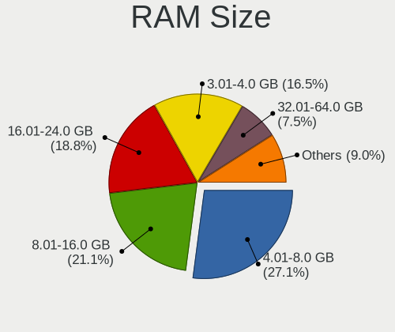
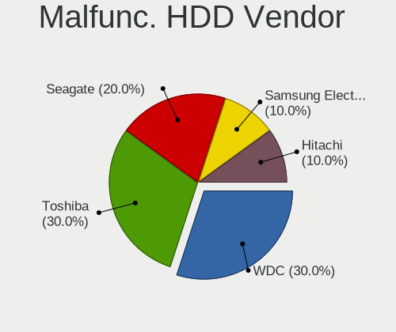
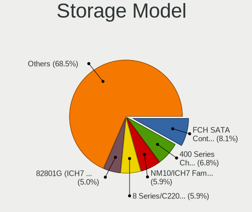
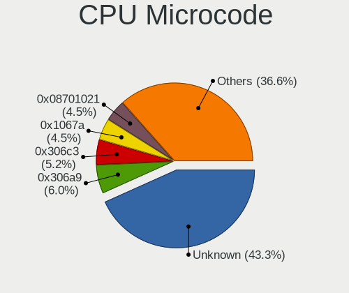
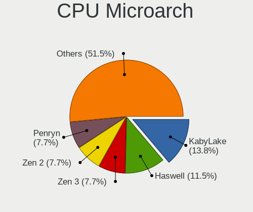
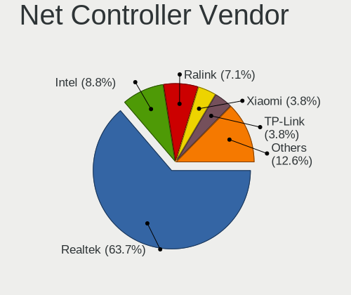
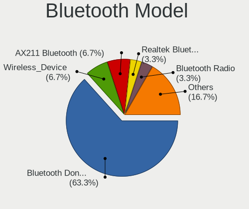
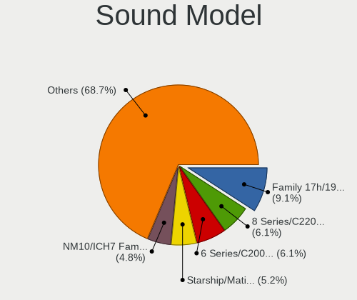
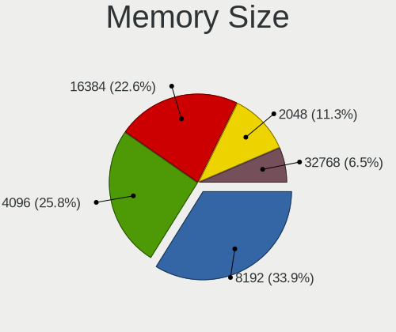
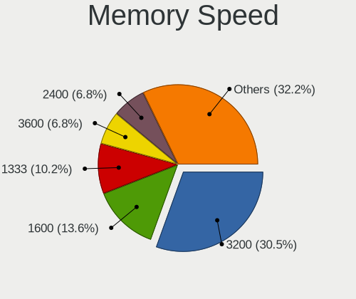

Linux in Bangladesh - Tested Hardware & Statistics (Desktops)
-------------------------------------------------------------

A project to collect tested hardware configurations for Linux in Bangladesh.

Anyone can contribute to this report by the [hw-probe](https://github.com/linuxhw/hw-probe) tool:

    sudo -E hw-probe -all -upload

Please contribute! Especially if your hardware is rare.

Contents
--------

* [ Test Cases ](#test-cases)

* [ System ](#system)
  - [ OS                       ](#os)
  - [ OS Family                ](#os-family)
  - [ Kernel                   ](#kernel)
  - [ Kernel Family            ](#kernel-family)
  - [ Kernel Major Ver.        ](#kernel-major-ver)
  - [ Arch                     ](#arch)
  - [ DE                       ](#de)
  - [ Display Server           ](#display-server)
  - [ Display Manager          ](#display-manager)
  - [ OS Lang                  ](#os-lang)
  - [ Boot Mode                ](#boot-mode)
  - [ Filesystem               ](#filesystem)
  - [ Part. scheme             ](#part-scheme)
  - [ Dual Boot with Linux/BSD ](#dual-boot-with-linuxbsd)
  - [ Dual Boot (Win)          ](#dual-boot-win)

* [ Board ](#board)
  - [ Vendor                   ](#vendor)
  - [ Model                    ](#model)
  - [ Model Family             ](#model-family)
  - [ MFG Year                 ](#mfg-year)
  - [ Form Factor              ](#form-factor)
  - [ Secure Boot              ](#secure-boot)
  - [ Coreboot                 ](#coreboot)
  - [ RAM Size                 ](#ram-size)
  - [ RAM Used                 ](#ram-used)
  - [ Total Drives             ](#total-drives)
  - [ Has CD-ROM               ](#has-cd-rom)
  - [ Has Ethernet             ](#has-ethernet)
  - [ Has WiFi                 ](#has-wifi)
  - [ Has Bluetooth            ](#has-bluetooth)

* [ Location ](#location)
  - [ Country                  ](#country)
  - [ City                     ](#city)

* [ Drives ](#drives)
  - [ Drive Vendor             ](#drive-vendor)
  - [ Drive Model              ](#drive-model)
  - [ HDD Vendor               ](#hdd-vendor)
  - [ SSD Vendor               ](#ssd-vendor)
  - [ Drive Kind               ](#drive-kind)
  - [ Drive Connector          ](#drive-connector)
  - [ Drive Size               ](#drive-size)
  - [ Space Total              ](#space-total)
  - [ Space Used               ](#space-used)
  - [ Malfunc. Drives          ](#malfunc-drives)
  - [ Malfunc. Drive Vendor    ](#malfunc-drive-vendor)
  - [ Malfunc. HDD Vendor      ](#malfunc-hdd-vendor)
  - [ Malfunc. Drive Kind      ](#malfunc-drive-kind)
  - [ Failed Drives            ](#failed-drives)
  - [ Failed Drive Vendor      ](#failed-drive-vendor)
  - [ Drive Status             ](#drive-status)

* [ Storage controller ](#storage-controller)
  - [ Storage Vendor           ](#storage-vendor)
  - [ Storage Model            ](#storage-model)
  - [ Storage Kind             ](#storage-kind)

* [ Processor ](#processor)
  - [ CPU Vendor               ](#cpu-vendor)
  - [ CPU Model                ](#cpu-model)
  - [ CPU Model Family         ](#cpu-model-family)
  - [ CPU Cores                ](#cpu-cores)
  - [ CPU Sockets              ](#cpu-sockets)
  - [ CPU Threads              ](#cpu-threads)
  - [ CPU Op-Modes             ](#cpu-op-modes)
  - [ CPU Microcode            ](#cpu-microcode)
  - [ CPU Microarch            ](#cpu-microarch)

* [ Graphics ](#graphics)
  - [ GPU Vendor               ](#gpu-vendor)
  - [ GPU Model                ](#gpu-model)
  - [ GPU Combo                ](#gpu-combo)
  - [ GPU Driver               ](#gpu-driver)
  - [ GPU Memory               ](#gpu-memory)

* [ Monitor ](#monitor)
  - [ Monitor Vendor           ](#monitor-vendor)
  - [ Monitor Model            ](#monitor-model)
  - [ Monitor Resolution       ](#monitor-resolution)
  - [ Monitor Diagonal         ](#monitor-diagonal)
  - [ Monitor Width            ](#monitor-width)
  - [ Aspect Ratio             ](#aspect-ratio)
  - [ Monitor Area             ](#monitor-area)
  - [ Pixel Density            ](#pixel-density)
  - [ Multiple Monitors        ](#multiple-monitors)

* [ Network ](#network)
  - [ Net Controller Vendor    ](#net-controller-vendor)
  - [ Net Controller Model     ](#net-controller-model)
  - [ Wireless Vendor          ](#wireless-vendor)
  - [ Wireless Model           ](#wireless-model)
  - [ Ethernet Vendor          ](#ethernet-vendor)
  - [ Ethernet Model           ](#ethernet-model)
  - [ Net Controller Kind      ](#net-controller-kind)
  - [ Used Controller          ](#used-controller)
  - [ NICs                     ](#nics)
  - [ IPv6                     ](#ipv6)

* [ Bluetooth ](#bluetooth)
  - [ Bluetooth Vendor         ](#bluetooth-vendor)
  - [ Bluetooth Model          ](#bluetooth-model)

* [ Sound ](#sound)
  - [ Sound Vendor             ](#sound-vendor)
  - [ Sound Model              ](#sound-model)

* [ Memory ](#memory)
  - [ Memory Vendor            ](#memory-vendor)
  - [ Memory Model             ](#memory-model)
  - [ Memory Kind              ](#memory-kind)
  - [ Memory Form Factor       ](#memory-form-factor)
  - [ Memory Size              ](#memory-size)
  - [ Memory Speed             ](#memory-speed)

* [ Printers & scanners ](#printers--scanners)
  - [ Printer Vendor           ](#printer-vendor)
  - [ Printer Model            ](#printer-model)
  - [ Scanner Vendor           ](#scanner-vendor)
  - [ Scanner Model            ](#scanner-model)

* [ Camera ](#camera)
  - [ Camera Vendor            ](#camera-vendor)
  - [ Camera Model             ](#camera-model)

* [ Security ](#security)
  - [ Fingerprint Vendor       ](#fingerprint-vendor)
  - [ Fingerprint Model        ](#fingerprint-model)
  - [ Chipcard Vendor          ](#chipcard-vendor)
  - [ Chipcard Model           ](#chipcard-model)

* [ Unsupported ](#unsupported)
  - [ Unsupported Devices      ](#unsupported-devices)
  - [ Unsupported Device Types ](#unsupported-device-types)

Test Cases
----------

Total: 132

| Vendor   | Model                       | Probe                                                      | Date         |
|----------|-----------------------------|------------------------------------------------------------|--------------|
| Foxconn  | H55MXV-LE                   | [931837aeec](https://linux-hardware.org/?probe=931837aeec) | Dec 12, 2022 |
| ASUSTek  | TUF Gaming Z690-PLUS D4     | [da83c13da3](https://linux-hardware.org/?probe=da83c13da3) | Nov 30, 2022 |
| ASUSTek  | TUF Gaming Z690-PLUS D4     | [459c2ba743](https://linux-hardware.org/?probe=459c2ba743) | Nov 30, 2022 |
| HP       | Compaq 8000 Elite CMT PC    | [fbe835b8ef](https://linux-hardware.org/?probe=fbe835b8ef) | Oct 31, 2022 |
| Gigabyte | H410M S2H V3                | [d4c5e9f853](https://linux-hardware.org/?probe=d4c5e9f853) | Oct 16, 2022 |
| HP       | Compaq 8000 Elite CMT PC    | [5dd9f2cda4](https://linux-hardware.org/?probe=5dd9f2cda4) | Oct 09, 2022 |
| Biostar  | G41D3C                      | [97ee103719](https://linux-hardware.org/?probe=97ee103719) | Sep 30, 2022 |
| Biostar  | G41D3C                      | [280212d494](https://linux-hardware.org/?probe=280212d494) | Sep 13, 2022 |
| Biostar  | G41D3C                      | [6d15a54350](https://linux-hardware.org/?probe=6d15a54350) | Sep 13, 2022 |
| Biostar  | G41D3C                      | [09d42cd406](https://linux-hardware.org/?probe=09d42cd406) | Sep 13, 2022 |
| Biostar  | G41D3C                      | [c45809d681](https://linux-hardware.org/?probe=c45809d681) | Sep 13, 2022 |
| ASRock   | X570 Phantom Gaming 4       | [4fbc7a765f](https://linux-hardware.org/?probe=4fbc7a765f) | Sep 12, 2022 |
| Gigabyte | B550M S2H                   | [e04617befa](https://linux-hardware.org/?probe=e04617befa) | Aug 17, 2022 |
| Gigabyte | B550M S2H                   | [db7b7b3126](https://linux-hardware.org/?probe=db7b7b3126) | Aug 15, 2022 |
| MSI      | A320M-A PRO MAX             | [9a35c1249b](https://linux-hardware.org/?probe=9a35c1249b) | Jun 30, 2022 |
| MSI      | A320M-A PRO MAX             | [c8f0217b26](https://linux-hardware.org/?probe=c8f0217b26) | Jun 29, 2022 |
| MSI      | A320M-A PRO MAX             | [d3af5b938a](https://linux-hardware.org/?probe=d3af5b938a) | Jun 29, 2022 |
| Gigabyte | B360M HD3                   | [b35e9f3e5c](https://linux-hardware.org/?probe=b35e9f3e5c) | Jun 28, 2022 |
| Gigabyte | B75M-D3V                    | [4b202c1285](https://linux-hardware.org/?probe=4b202c1285) | Jun 22, 2022 |
| MSI      | H61M-P31/W8                 | [7b8cc6556b](https://linux-hardware.org/?probe=7b8cc6556b) | Jun 12, 2022 |
| MSI      | B450M-A PRO MAX             | [758bdaefe9](https://linux-hardware.org/?probe=758bdaefe9) | May 21, 2022 |
| Unknown  | Unknown                     | [c6577346b8](https://linux-hardware.org/?probe=c6577346b8) | Apr 11, 2022 |
| Gigabyte | B450M DS3H-CF               | [6e993bc145](https://linux-hardware.org/?probe=6e993bc145) | Apr 10, 2022 |
| Unknown  | Unknown                     | [73abf1d6fd](https://linux-hardware.org/?probe=73abf1d6fd) | Apr 08, 2022 |
| Unknown  | Unknown                     | [14a3433a91](https://linux-hardware.org/?probe=14a3433a91) | Apr 03, 2022 |
| ASUSTek  | TUF B450M-PLUS GAMING       | [33d1544ea1](https://linux-hardware.org/?probe=33d1544ea1) | Mar 24, 2022 |
| Unknown  | Unknown                     | [52ce856be5](https://linux-hardware.org/?probe=52ce856be5) | Mar 24, 2022 |
| Unknown  | Unknown                     | [1dd07eeee0](https://linux-hardware.org/?probe=1dd07eeee0) | Mar 24, 2022 |
| Unknown  | Unknown                     | [cb949f34eb](https://linux-hardware.org/?probe=cb949f34eb) | Mar 20, 2022 |
| Unknown  | Unknown                     | [fd9e66788c](https://linux-hardware.org/?probe=fd9e66788c) | Mar 17, 2022 |
| MSI      | B450M MORTAR MAX            | [e141c99bf2](https://linux-hardware.org/?probe=e141c99bf2) | Mar 09, 2022 |
| MSI      | FM2-A55M-E33                | [d7a873bf3d](https://linux-hardware.org/?probe=d7a873bf3d) | Feb 27, 2022 |
| Biostar  | H55 HD                      | [b0d5843b6e](https://linux-hardware.org/?probe=b0d5843b6e) | Feb 13, 2022 |
| HP       | Compaq 8000 Elite CMT PC    | [42647bc4b3](https://linux-hardware.org/?probe=42647bc4b3) | Feb 12, 2022 |
| HP       | 339A                        | [6f8e63bfb0](https://linux-hardware.org/?probe=6f8e63bfb0) | Feb 11, 2022 |
| ASUSTek  | TUF Gaming Z690-PLUS WIF... | [0c13bfa27b](https://linux-hardware.org/?probe=0c13bfa27b) | Feb 10, 2022 |
| ASUSTek  | EX-A320M-GAMING             | [8e73dc39ab](https://linux-hardware.org/?probe=8e73dc39ab) | Feb 09, 2022 |
| ASRock   | B450 Gaming K4              | [42e37d6172](https://linux-hardware.org/?probe=42e37d6172) | Feb 07, 2022 |
| Biostar  | H55 HD                      | [e08da3e685](https://linux-hardware.org/?probe=e08da3e685) | Feb 03, 2022 |
| ASUSTek  | TUF B450M-PLUS GAMING       | [47c47a0121](https://linux-hardware.org/?probe=47c47a0121) | Feb 02, 2022 |
| Unknown  | Unknown                     | [caca9680a9](https://linux-hardware.org/?probe=caca9680a9) | Jan 25, 2022 |
| MSI      | FM2-A55M-E33                | [ac35b74090](https://linux-hardware.org/?probe=ac35b74090) | Jan 21, 2022 |
| Gigabyte | H81M-S                      | [692274162f](https://linux-hardware.org/?probe=692274162f) | Jan 04, 2022 |
| MSI      | B450M-A PRO MAX             | [e6a4a21d5c](https://linux-hardware.org/?probe=e6a4a21d5c) | Jan 02, 2022 |
| OEM      | Unknown                     | [6adc4b5659](https://linux-hardware.org/?probe=6adc4b5659) | Jan 01, 2022 |
| MSI      | MAG B550 TORPEDO            | [b674024789](https://linux-hardware.org/?probe=b674024789) | Dec 30, 2021 |
| MSI      | B460M-A PRO                 | [209e15690e](https://linux-hardware.org/?probe=209e15690e) | Dec 29, 2021 |
| MSI      | FM2-A55M-E33                | [7280895518](https://linux-hardware.org/?probe=7280895518) | Dec 27, 2021 |
| Unknown  | Unknown                     | [56d5bb8659](https://linux-hardware.org/?probe=56d5bb8659) | Dec 22, 2021 |
| MSI      | FM2-A55M-E33                | [6ab6a89db8](https://linux-hardware.org/?probe=6ab6a89db8) | Dec 12, 2021 |
| Gigabyte | B550 AORUS ELITE            | [3cd505591d](https://linux-hardware.org/?probe=3cd505591d) | Dec 11, 2021 |
| ASRock   | H110M-HDV R3.0              | [e155882ffa](https://linux-hardware.org/?probe=e155882ffa) | Dec 02, 2021 |
| Gigabyte | H61M-S2PV                   | [09b0e5058d](https://linux-hardware.org/?probe=09b0e5058d) | Nov 23, 2021 |
| MSI      | 990FXA-GD65                 | [6d2cade66c](https://linux-hardware.org/?probe=6d2cade66c) | Nov 11, 2021 |
| MSI      | B450M-A PRO MAX             | [efd1c194ac](https://linux-hardware.org/?probe=efd1c194ac) | Nov 11, 2021 |
| MSI      | B450M-A PRO MAX             | [0802656d19](https://linux-hardware.org/?probe=0802656d19) | Nov 11, 2021 |
| MSI      | B450M MORTAR MAX            | [312e04d7f9](https://linux-hardware.org/?probe=312e04d7f9) | Nov 09, 2021 |
| OEM      | Intel H81                   | [a4e298caf1](https://linux-hardware.org/?probe=a4e298caf1) | Nov 02, 2021 |
| OEM      | Intel H81                   | [50758cfaf3](https://linux-hardware.org/?probe=50758cfaf3) | Oct 26, 2021 |
| OEM      | Intel H81                   | [e997f638bc](https://linux-hardware.org/?probe=e997f638bc) | Oct 26, 2021 |
| Intel    | DG31PR AAD97573-302         | [356632b328](https://linux-hardware.org/?probe=356632b328) | Oct 19, 2021 |
| MSI      | Boston                      | [77d385bc09](https://linux-hardware.org/?probe=77d385bc09) | Oct 13, 2021 |
| MSI      | Boston                      | [14528f628a](https://linux-hardware.org/?probe=14528f628a) | Oct 13, 2021 |
| Gigabyte | H81M-S                      | [8109d84e42](https://linux-hardware.org/?probe=8109d84e42) | Sep 12, 2021 |
| ASUSTek  | PRIME H370-PLUS             | [752964e357](https://linux-hardware.org/?probe=752964e357) | Sep 05, 2021 |
| ASUSTek  | TUF B450M-PLUS GAMING       | [7a654e5473](https://linux-hardware.org/?probe=7a654e5473) | Aug 28, 2021 |
| Gigabyte | B250M-Gaming5-CF            | [c34514576a](https://linux-hardware.org/?probe=c34514576a) | Aug 17, 2021 |
| Intel    | DG31PR AAD97573-302         | [460fc8dfd4](https://linux-hardware.org/?probe=460fc8dfd4) | Aug 08, 2021 |
| Unknown  | Unknown                     | [c6dea4c88d](https://linux-hardware.org/?probe=c6dea4c88d) | Jul 19, 2021 |
| Biostar  | TZ68K+                      | [52ef8197ad](https://linux-hardware.org/?probe=52ef8197ad) | Jul 13, 2021 |
| MSI      | A320M-A PRO MAX             | [1927d0abfe](https://linux-hardware.org/?probe=1927d0abfe) | Jun 13, 2021 |
| ASUSTek  | P5G41C-M LX                 | [23e735bb8f](https://linux-hardware.org/?probe=23e735bb8f) | Jun 08, 2021 |
| Dell     | 0VHWTR A02                  | [ec7174828a](https://linux-hardware.org/?probe=ec7174828a) | Jun 04, 2021 |
| ASUSTek  | TUF B450M-PLUS GAMING       | [0226c84811](https://linux-hardware.org/?probe=0226c84811) | May 25, 2021 |
| ASUSTek  | TUF B450M-PLUS GAMING       | [b2c4e6f3a5](https://linux-hardware.org/?probe=b2c4e6f3a5) | May 25, 2021 |
| MSI      | B85M GAMING                 | [4d2529b647](https://linux-hardware.org/?probe=4d2529b647) | May 22, 2021 |
| Intel    | DG41RQ AAE54511-203         | [aba051d387](https://linux-hardware.org/?probe=aba051d387) | May 15, 2021 |
| MSI      | X470 GAMING PLUS MAX        | [fa9f8b7f7e](https://linux-hardware.org/?probe=fa9f8b7f7e) | May 10, 2021 |
| MSI      | X470 GAMING PLUS MAX        | [db1a234412](https://linux-hardware.org/?probe=db1a234412) | May 10, 2021 |
| Unknown  | Unknown                     | [b2600d2372](https://linux-hardware.org/?probe=b2600d2372) | Apr 11, 2021 |
| ASUSTek  | H110M-CS                    | [ac52c3630c](https://linux-hardware.org/?probe=ac52c3630c) | Mar 12, 2021 |
| ASRock   | B450M-HDV R4.0              | [474d61d1a7](https://linux-hardware.org/?probe=474d61d1a7) | Jan 27, 2021 |
| Gigabyte | B365M HD3                   | [32878b3dae](https://linux-hardware.org/?probe=32878b3dae) | Jan 20, 2021 |
| Gigabyte | B365M HD3                   | [03b73f8223](https://linux-hardware.org/?probe=03b73f8223) | Jan 20, 2021 |
| Gigabyte | B365M D3H-CF                | [0bfbe639fc](https://linux-hardware.org/?probe=0bfbe639fc) | Jan 18, 2021 |
| Gigabyte | B365M D3H-CF                | [e053ef39b6](https://linux-hardware.org/?probe=e053ef39b6) | Jan 17, 2021 |
| Gigabyte | B365M D3H-CF                | [4c2ddc3c14](https://linux-hardware.org/?probe=4c2ddc3c14) | Jan 10, 2021 |
| Gigabyte | B85M-HD3                    | [983f59c8ba](https://linux-hardware.org/?probe=983f59c8ba) | Nov 17, 2020 |
| Unknown  | Unknown                     | [49351fb74d](https://linux-hardware.org/?probe=49351fb74d) | Nov 03, 2020 |
| Unknown  | Unknown                     | [a5450c668e](https://linux-hardware.org/?probe=a5450c668e) | Oct 30, 2020 |
| ASRock   | AB350 Pro4                  | [7e48c5dac7](https://linux-hardware.org/?probe=7e48c5dac7) | Oct 30, 2020 |
| ASUSTek  | H81M-K                      | [6abbe0be7c](https://linux-hardware.org/?probe=6abbe0be7c) | Oct 29, 2020 |
| ASUSTek  | H110M-CS                    | [4bc7a25c4b](https://linux-hardware.org/?probe=4bc7a25c4b) | Oct 29, 2020 |
| ASUSTek  | H81M-K                      | [7a6ee90819](https://linux-hardware.org/?probe=7a6ee90819) | Oct 29, 2020 |
| ASRock   | B450 Gaming K4              | [76e61701fa](https://linux-hardware.org/?probe=76e61701fa) | Oct 24, 2020 |
| ASRock   | H110M-HDV R3.0              | [a9c53146fc](https://linux-hardware.org/?probe=a9c53146fc) | Oct 10, 2020 |
| Gigabyte | GA-E350N                    | [871d27c2e8](https://linux-hardware.org/?probe=871d27c2e8) | Sep 18, 2020 |
| Gigabyte | GA-E350N                    | [3f442c236c](https://linux-hardware.org/?probe=3f442c236c) | Sep 18, 2020 |
| ASRock   | Z77 Pro3                    | [8d6db6e2d3](https://linux-hardware.org/?probe=8d6db6e2d3) | Sep 09, 2020 |
| SYS      | H310CH5-TI2                 | [fb33742784](https://linux-hardware.org/?probe=fb33742784) | Aug 06, 2020 |
| Gigabyte | B250M-HD3-CF                | [f1ef1518c4](https://linux-hardware.org/?probe=f1ef1518c4) | Jul 25, 2020 |
| Gigabyte | B250M-HD3-CF                | [bf80f266b6](https://linux-hardware.org/?probe=bf80f266b6) | Jul 25, 2020 |
| Gigabyte | B150M-D3H-CF                | [d59cf3e39f](https://linux-hardware.org/?probe=d59cf3e39f) | Jun 21, 2020 |
| Gigabyte | B75MS                       | [116d7e4473](https://linux-hardware.org/?probe=116d7e4473) | Jun 06, 2020 |
| ASRock   | B450 Gaming K4              | [24ebee7f8d](https://linux-hardware.org/?probe=24ebee7f8d) | Jun 03, 2020 |
| ASUSTek  | H61M-A                      | [821df8e348](https://linux-hardware.org/?probe=821df8e348) | May 25, 2020 |
| ASUSTek  | H61M-A                      | [6118e39327](https://linux-hardware.org/?probe=6118e39327) | May 25, 2020 |
| Foxconn  | 17A0                        | [167cb26122](https://linux-hardware.org/?probe=167cb26122) | May 03, 2020 |
| ASUSTek  | H81M-K                      | [de6fa960ad](https://linux-hardware.org/?probe=de6fa960ad) | Apr 23, 2020 |
| MSI      | H61M-P31/W8                 | [26d8323c91](https://linux-hardware.org/?probe=26d8323c91) | Mar 25, 2020 |
| MSI      | H310M PRO-M2 PLUS           | [baa90e0762](https://linux-hardware.org/?probe=baa90e0762) | Mar 22, 2020 |
| Gigabyte | X299 AORUS Gaming 3 Pro-... | [34ced022e3](https://linux-hardware.org/?probe=34ced022e3) | Feb 29, 2020 |
| Gigabyte | B85M-D3H                    | [753205d5df](https://linux-hardware.org/?probe=753205d5df) | Dec 27, 2019 |
| MSI      | PH67A-C43                   | [b472118c5a](https://linux-hardware.org/?probe=b472118c5a) | Oct 29, 2019 |
| Gigabyte | G41M-ES2L                   | [73a0de63c0](https://linux-hardware.org/?probe=73a0de63c0) | Sep 27, 2019 |
| Gigabyte | G41M-ES2L                   | [4299e1c036](https://linux-hardware.org/?probe=4299e1c036) | Sep 27, 2019 |
| Intel    | DG41RQ AAE54511-203         | [ede7f2c199](https://linux-hardware.org/?probe=ede7f2c199) | Aug 30, 2019 |
| Gigabyte | G41M-ES2L                   | [e3c13fc2d8](https://linux-hardware.org/?probe=e3c13fc2d8) | Aug 20, 2019 |
| Gigabyte | G41M-ES2L                   | [d0d6cd20b1](https://linux-hardware.org/?probe=d0d6cd20b1) | Jul 26, 2019 |
| Intel    | DG41RQ AAE54511-203         | [f9b65f1415](https://linux-hardware.org/?probe=f9b65f1415) | Jul 14, 2019 |
| Gigabyte | G41M-ES2L                   | [a6f5bc1b0f](https://linux-hardware.org/?probe=a6f5bc1b0f) | Jul 13, 2019 |
| Intel    | DG41RQ AAE54511-203         | [37a334e523](https://linux-hardware.org/?probe=37a334e523) | Jun 02, 2019 |
| Intel    | DG41RQ AAE54511-203         | [cb301afe49](https://linux-hardware.org/?probe=cb301afe49) | Jun 02, 2019 |
| ASUSTek  | H110M-K                     | [24c1251a9a](https://linux-hardware.org/?probe=24c1251a9a) | May 09, 2019 |
| ASUSTek  | H110M-K                     | [0f42a3ea73](https://linux-hardware.org/?probe=0f42a3ea73) | May 09, 2019 |
| Foxconn  | G31MV/G31MV-K FAB           | [83303ad448](https://linux-hardware.org/?probe=83303ad448) | Apr 07, 2019 |
| Intel    | Unknown                     | [6abdeb3169](https://linux-hardware.org/?probe=6abdeb3169) | Mar 10, 2019 |
| Intel    | Unknown                     | [d27842b77f](https://linux-hardware.org/?probe=d27842b77f) | Mar 10, 2019 |
| Intel    | Unknown                     | [1c484063a6](https://linux-hardware.org/?probe=1c484063a6) | Mar 09, 2019 |
| MSI      | P55A-G55                    | [8bc6ce2174](https://linux-hardware.org/?probe=8bc6ce2174) | Dec 08, 2018 |
| MSI      | P55A-G55                    | [24654f4990](https://linux-hardware.org/?probe=24654f4990) | Dec 07, 2018 |
| Gigabyte | P55-USB3                    | [3cf949c024](https://linux-hardware.org/?probe=3cf949c024) | Jul 21, 2017 |

System
------

OS
--

Installed operating systems

| Name               | Desktops | Percent |
|--------------------|----------|---------|
| Ubuntu 20.04       | 11       | 12.09%  |
| Ubuntu 18.04       | 7        | 7.69%   |
| Ubuntu 19.10       | 4        | 4.4%    |
| Manjaro            | 4        | 4.4%    |
| Zorin 16           | 3        | 3.3%    |
| Linux Mint 20.2    | 3        | 3.3%    |
| Debian 11          | 3        | 3.3%    |
| Arch               | 3        | 3.3%    |
| Pop!_OS 21.04      | 2        | 2.2%    |
| OpenMandriva 4.3   | 2        | 2.2%    |
| OpenMandriva 4.2   | 2        | 2.2%    |
| Manjaro 20.1.2     | 2        | 2.2%    |
| KDE neon 20.04     | 2        | 2.2%    |
| ArcoLinux Rolling  | 2        | 2.2%    |
| Zorin 15           | 1        | 1.1%    |
| Void Linux Rolling | 1        | 1.1%    |
| Void Linux         | 1        | 1.1%    |
| Ubuntu MATE 18.04  | 1        | 1.1%    |
| Ubuntu 22.10       | 1        | 1.1%    |
| Ubuntu 22.04       | 1        | 1.1%    |
| Ubuntu 21.04       | 1        | 1.1%    |
| Ubuntu 20.10       | 1        | 1.1%    |
| Ubuntu 19.04       | 1        | 1.1%    |
| Ubuntu 17.10       | 1        | 1.1%    |
| Ubuntu 16.04       | 1        | 1.1%    |
| ROSA R9            | 1        | 1.1%    |
| Pragma             | 1        | 1.1%    |
| Pop!_OS 22.04      | 1        | 1.1%    |
| Pop!_OS 21.10      | 1        | 1.1%    |
| Pop!_OS 20.10      | 1        | 1.1%    |
| Pop!_OS 20.04      | 1        | 1.1%    |
| Manjaro 21.2.5     | 1        | 1.1%    |
| Manjaro 21.1.0     | 1        | 1.1%    |
| Manjaro 21.0.3     | 1        | 1.1%    |
| Manjaro 20.1       | 1        | 1.1%    |
| Manjaro 20.0.1     | 1        | 1.1%    |
| LMDE 4             | 1        | 1.1%    |
| Linux Mint 20.3    | 1        | 1.1%    |
| Linux Mint 20.1    | 1        | 1.1%    |
| Linux Mint 20      | 1        | 1.1%    |

OS Family
---------

OS without a version

| Name         | Desktops | Percent |
|--------------|----------|---------|
| Ubuntu       | 28       | 33.33%  |
| Manjaro      | 9        | 10.71%  |
| Linux Mint   | 6        | 7.14%   |
| Zorin        | 4        | 4.76%   |
| Pop!_OS      | 4        | 4.76%   |
| OpenMandriva | 4        | 4.76%   |
| Fedora       | 4        | 4.76%   |
| Kubuntu      | 3        | 3.57%   |
| Debian       | 3        | 3.57%   |
| Arch         | 3        | 3.57%   |
| KDE neon     | 2        | 2.38%   |
| ArcoLinux    | 2        | 2.38%   |
| Void Linux   | 1        | 1.19%   |
| Ubuntu MATE  | 1        | 1.19%   |
| ROSA         | 1        | 1.19%   |
| Pragma       | 1        | 1.19%   |
| LMDE         | 1        | 1.19%   |
| Kali         | 1        | 1.19%   |
| Gentoo       | 1        | 1.19%   |
| Endless      | 1        | 1.19%   |
| Elementary   | 1        | 1.19%   |
| Deepin       | 1        | 1.19%   |
| CentOS       | 1        | 1.19%   |
| BlackPanther | 1        | 1.19%   |

Kernel
------

Version of the Linux kernel

| Version                                             | Desktops | Percent |
|-----------------------------------------------------|----------|---------|
| 5.4.0-52-generic                                    | 3        | 3.03%   |
| 5.8.16-2-MANJARO                                    | 2        | 2.02%   |
| 5.8.0-55-generic                                    | 2        | 2.02%   |
| 5.4.0-90-generic                                    | 2        | 2.02%   |
| 5.3.0-18-generic                                    | 2        | 2.02%   |
| 5.16.7-desktop-1omv4003                             | 2        | 2.02%   |
| 5.13.0-51-generic                                   | 2        | 2.02%   |
| 5.13.0-28-generic                                   | 2        | 2.02%   |
| 5.11.0-37-generic                                   | 2        | 2.02%   |
| 5.11.0-16-generic                                   | 2        | 2.02%   |
| 5.10.14-desktop-1omv4002                            | 2        | 2.02%   |
| 4.15.0-42-generic                                   | 2        | 2.02%   |
| 6.0.10-300.fc37.x86_64                              | 1        | 1.01%   |
| 6.0.0-Phaco-g8f10ff49057f                           | 1        | 1.01%   |
| 5.9.16-1-MANJARO                                    | 1        | 1.01%   |
| 5.8.6-1-MANJARO                                     | 1        | 1.01%   |
| 5.8.16-300.fc33.x86_64                              | 1        | 1.01%   |
| 5.8.0-41-generic                                    | 1        | 1.01%   |
| 5.8.0-38-generic                                    | 1        | 1.01%   |
| 5.7.17-200.fc32.x86_64                              | 1        | 1.01%   |
| 5.7.15-ck                                           | 1        | 1.01%   |
| 5.6.15-1-MANJARO                                    | 1        | 1.01%   |
| 5.6.14-desktop-2bP                                  | 1        | 1.01%   |
| 5.6.11-1-MANJARO                                    | 1        | 1.01%   |
| 5.4.70-amd64-desktop                                | 1        | 1.01%   |
| 5.4.0-91-generic                                    | 1        | 1.01%   |
| 5.4.0-81-generic                                    | 1        | 1.01%   |
| 5.4.0-73-generic                                    | 1        | 1.01%   |
| 5.4.0-53-generic                                    | 1        | 1.01%   |
| 5.4.0-47-generic                                    | 1        | 1.01%   |
| 5.4.0-42-generic                                    | 1        | 1.01%   |
| 5.4.0-26-generic                                    | 1        | 1.01%   |
| 5.3.0-62-generic                                    | 1        | 1.01%   |
| 5.3.0-59-generic                                    | 1        | 1.01%   |
| 5.3.0-53-generic                                    | 1        | 1.01%   |
| 5.3.0-42-generic                                    | 1        | 1.01%   |
| 5.3.0-40-generic                                    | 1        | 1.01%   |
| 5.19.0-76051900-generic                             | 1        | 1.01%   |
| 5.19.0-21-generic                                   | 1        | 1.01%   |
| 5.17.0-0.rc0.20220112gitdaadb3bd0e8d.63.fc36.x86_64 | 1        | 1.01%   |

Kernel Family
-------------

Linux kernel without a distro release

| Version | Desktops | Percent |
|---------|----------|---------|
| 5.4.0   | 12       | 12.9%   |
| 5.13.0  | 8        | 8.6%    |
| 5.3.0   | 7        | 7.53%   |
| 5.11.0  | 7        | 7.53%   |
| 5.8.0   | 4        | 4.3%    |
| 5.8.16  | 3        | 3.23%   |
| 5.15.0  | 3        | 3.23%   |
| 5.10.0  | 3        | 3.23%   |
| 5.0.0   | 3        | 3.23%   |
| 4.15.0  | 3        | 3.23%   |
| 5.19.0  | 2        | 2.15%   |
| 5.16.7  | 2        | 2.15%   |
| 5.16.11 | 2        | 2.15%   |
| 5.15.7  | 2        | 2.15%   |
| 5.10.14 | 2        | 2.15%   |
| 4.18.0  | 2        | 2.15%   |
| 6.0.10  | 1        | 1.08%   |
| 6.0.0   | 1        | 1.08%   |
| 5.9.16  | 1        | 1.08%   |
| 5.8.6   | 1        | 1.08%   |
| 5.7.17  | 1        | 1.08%   |
| 5.7.15  | 1        | 1.08%   |
| 5.6.15  | 1        | 1.08%   |
| 5.6.14  | 1        | 1.08%   |
| 5.6.11  | 1        | 1.08%   |
| 5.4.70  | 1        | 1.08%   |
| 5.17.0  | 1        | 1.08%   |
| 5.16.14 | 1        | 1.08%   |
| 5.16.13 | 1        | 1.08%   |
| 5.16.1  | 1        | 1.08%   |
| 5.15.60 | 1        | 1.08%   |
| 5.15.41 | 1        | 1.08%   |
| 5.15.21 | 1        | 1.08%   |
| 5.15.15 | 1        | 1.08%   |
| 5.15.13 | 1        | 1.08%   |
| 5.14.0  | 1        | 1.08%   |
| 5.13.19 | 1        | 1.08%   |
| 5.11.6  | 1        | 1.08%   |
| 5.11.16 | 1        | 1.08%   |
| 5.10.49 | 1        | 1.08%   |

Kernel Major Ver.
-----------------

Linux kernel major version

| Version | Desktops | Percent |
|---------|----------|---------|
| 5.4     | 13       | 14.13%  |
| 5.15    | 10       | 10.87%  |
| 5.13    | 9        | 9.78%   |
| 5.11    | 9        | 9.78%   |
| 5.8     | 8        | 8.7%    |
| 5.3     | 7        | 7.61%   |
| 5.16    | 6        | 6.52%   |
| 5.10    | 6        | 6.52%   |
| 5.6     | 3        | 3.26%   |
| 5.0     | 3        | 3.26%   |
| 4.15    | 3        | 3.26%   |
| 6.0     | 2        | 2.17%   |
| 5.7     | 2        | 2.17%   |
| 5.19    | 2        | 2.17%   |
| 4.18    | 2        | 2.17%   |
| 5.9     | 1        | 1.09%   |
| 5.17    | 1        | 1.09%   |
| 5.14    | 1        | 1.09%   |
| 4.9     | 1        | 1.09%   |
| 4.4     | 1        | 1.09%   |
| 4.19    | 1        | 1.09%   |
| 4.13    | 1        | 1.09%   |

Arch
----

OS architecture (x86_64, i586, etc.)

| Name   | Desktops | Percent |
|--------|----------|---------|
| x86_64 | 77       | 97.47%  |
| i686   | 2        | 2.53%   |

DE
--

Desktop Environment

| Name            | Desktops | Percent |
|-----------------|----------|---------|
| GNOME           | 36       | 42.86%  |
| KDE5            | 18       | 21.43%  |
| Unknown         | 10       | 11.9%   |
| X-Cinnamon      | 7        | 8.33%   |
| XFCE            | 4        | 4.76%   |
| KDE             | 2        | 2.38%   |
| awesome         | 2        | 2.38%   |
| Pantheon        | 1        | 1.19%   |
| MATE            | 1        | 1.19%   |
| GNOME Flashback | 1        | 1.19%   |
| Deepin          | 1        | 1.19%   |
| Cinnamon        | 1        | 1.19%   |

Display Server
--------------

X11 or Wayland

| Name    | Desktops | Percent |
|---------|----------|---------|
| X11     | 71       | 85.54%  |
| Wayland | 6        | 7.23%   |
| Unknown | 5        | 6.02%   |
| Tty     | 1        | 1.2%    |

Display Manager
---------------

SDDM, LightDM, etc.

| Name    | Desktops | Percent |
|---------|----------|---------|
| Unknown | 47       | 56.63%  |
| GDM     | 12       | 14.46%  |
| SDDM    | 11       | 13.25%  |
| LightDM | 5        | 6.02%   |
| GDM3    | 5        | 6.02%   |
| TDM     | 3        | 3.61%   |

OS Lang
-------

Language

| Lang    | Desktops | Percent |
|---------|----------|---------|
| en_US   | 65       | 80.25%  |
| Unknown | 12       | 14.81%  |
| en_GB   | 3        | 3.7%    |
| C       | 1        | 1.23%   |

Boot Mode
---------

EFI or BIOS

| Mode | Desktops | Percent |
|------|----------|---------|
| BIOS | 46       | 54.12%  |
| EFI  | 39       | 45.88%  |

Filesystem
----------

Type of filesystem

| Type    | Desktops | Percent |
|---------|----------|---------|
| Ext4    | 66       | 79.52%  |
| Overlay | 8        | 9.64%   |
| Btrfs   | 5        | 6.02%   |
| Xfs     | 2        | 2.41%   |
| Zfs     | 1        | 1.2%    |
| Unknown | 1        | 1.2%    |

Part. scheme
------------

Scheme of partitioning

| Type    | Desktops | Percent |
|---------|----------|---------|
| Unknown | 49       | 58.33%  |
| GPT     | 30       | 35.71%  |
| MBR     | 5        | 5.95%   |

Dual Boot with Linux/BSD
------------------------

Hosting more than one Linux/BSD

| Dual boot | Desktops | Percent |
|-----------|----------|---------|
| No        | 62       | 74.7%   |
| Yes       | 21       | 25.3%   |

Dual Boot (Win)
---------------

Hosting Linux and Windows

| Dual boot | Desktops | Percent |
|-----------|----------|---------|
| No        | 46       | 54.76%  |
| Yes       | 38       | 45.24%  |

Board
-----

Vendor
------

Motherboard manufacturer

| Name                | Desktops | Percent |
|---------------------|----------|---------|
| Gigabyte Technology | 20       | 25.32%  |
| MSI                 | 19       | 24.05%  |
| ASUSTek Computer    | 12       | 15.19%  |
| ASRock              | 6        | 7.59%   |
| Unknown             | 5        | 6.33%   |
| Intel               | 4        | 5.06%   |
| OEM                 | 3        | 3.8%    |
| Foxconn             | 3        | 3.8%    |
| Biostar             | 3        | 3.8%    |
| Hewlett-Packard     | 2        | 2.53%   |
| SYS                 | 1        | 1.27%   |
| Dell                | 1        | 1.27%   |

Model
-----

Motherboard model

| Name                             | Desktops | Percent |
|----------------------------------|----------|---------|
| Unknown                          | 7        | 8.86%   |
| MSI MS-7C52                      | 4        | 5.06%   |
| ASUS All Series                  | 3        | 3.8%    |
| OEM Intel H81                    | 2        | 2.53%   |
| MSI MS-7B89                      | 2        | 2.53%   |
| MSI MS-7788                      | 2        | 2.53%   |
| MSI MS-7668                      | 2        | 2.53%   |
| Intel DG41RQ AAE54511-203        | 2        | 2.53%   |
| SYS H310CH5-TI2                  | 1        | 1.27%   |
| MSI MS-7C91                      | 1        | 1.27%   |
| MSI MS-7C88                      | 1        | 1.27%   |
| MSI MS-7C08                      | 1        | 1.27%   |
| MSI MS-7B79                      | 1        | 1.27%   |
| MSI MS-7823                      | 1        | 1.27%   |
| MSI MS-7721                      | 1        | 1.27%   |
| MSI MS-7673                      | 1        | 1.27%   |
| MSI MS-7640                      | 1        | 1.27%   |
| MSI KY722AA-AB4 CQ3012L          | 1        | 1.27%   |
| Intel DG31PR AAD97573-302        | 1        | 1.27%   |
| HP Compaq Pro 6300 SFF           | 1        | 1.27%   |
| HP Compaq 8000 Elite CMT PC      | 1        | 1.27%   |
| Gigabyte X299 AORUS Gaming 3 Pro | 1        | 1.27%   |
| Gigabyte P55-USB3                | 1        | 1.27%   |
| Gigabyte H81M-S                  | 1        | 1.27%   |
| Gigabyte H61M-S2PV               | 1        | 1.27%   |
| Gigabyte H410M S2H V3            | 1        | 1.27%   |
| Gigabyte GA-E350N                | 1        | 1.27%   |
| Gigabyte G41M-ES2L               | 1        | 1.27%   |
| Gigabyte B85M-HD3                | 1        | 1.27%   |
| Gigabyte B85M-D3H                | 1        | 1.27%   |
| Gigabyte B75MS                   | 1        | 1.27%   |
| Gigabyte B75M-D3V                | 1        | 1.27%   |
| Gigabyte B550M S2H               | 1        | 1.27%   |
| Gigabyte B550 AORUS ELITE        | 1        | 1.27%   |
| Gigabyte B450M DS3H              | 1        | 1.27%   |
| Gigabyte B365MHD3                | 1        | 1.27%   |
| Gigabyte B365M D3H               | 1        | 1.27%   |
| Gigabyte B360M-HD3               | 1        | 1.27%   |
| Gigabyte B250M-HD3               | 1        | 1.27%   |
| Gigabyte B250M-Gaming5           | 1        | 1.27%   |

Model Family
------------

Motherboard model prefix

| Name                   | Desktops | Percent |
|------------------------|----------|---------|
| Unknown                | 7        | 8.86%   |
| MSI MS-7C52            | 4        | 5.06%   |
| ASUS TUF               | 3        | 3.8%    |
| ASUS All               | 3        | 3.8%    |
| OEM Intel              | 2        | 2.53%   |
| MSI MS-7B89            | 2        | 2.53%   |
| MSI MS-7788            | 2        | 2.53%   |
| MSI MS-7668            | 2        | 2.53%   |
| Intel DG41RQ           | 2        | 2.53%   |
| HP Compaq              | 2        | 2.53%   |
| SYS H310CH5-TI2        | 1        | 1.27%   |
| MSI MS-7C91            | 1        | 1.27%   |
| MSI MS-7C88            | 1        | 1.27%   |
| MSI MS-7C08            | 1        | 1.27%   |
| MSI MS-7B79            | 1        | 1.27%   |
| MSI MS-7823            | 1        | 1.27%   |
| MSI MS-7721            | 1        | 1.27%   |
| MSI MS-7673            | 1        | 1.27%   |
| MSI MS-7640            | 1        | 1.27%   |
| MSI KY722AA-AB4        | 1        | 1.27%   |
| Intel DG31PR           | 1        | 1.27%   |
| Gigabyte X299          | 1        | 1.27%   |
| Gigabyte P55-USB3      | 1        | 1.27%   |
| Gigabyte H81M-S        | 1        | 1.27%   |
| Gigabyte H61M-S2PV     | 1        | 1.27%   |
| Gigabyte H410M         | 1        | 1.27%   |
| Gigabyte GA-E350N      | 1        | 1.27%   |
| Gigabyte G41M-ES2L     | 1        | 1.27%   |
| Gigabyte B85M-HD3      | 1        | 1.27%   |
| Gigabyte B85M-D3H      | 1        | 1.27%   |
| Gigabyte B75MS         | 1        | 1.27%   |
| Gigabyte B75M-D3V      | 1        | 1.27%   |
| Gigabyte B550M         | 1        | 1.27%   |
| Gigabyte B550          | 1        | 1.27%   |
| Gigabyte B450M         | 1        | 1.27%   |
| Gigabyte B365MHD3      | 1        | 1.27%   |
| Gigabyte B365M         | 1        | 1.27%   |
| Gigabyte B360M-HD3     | 1        | 1.27%   |
| Gigabyte B250M-HD3     | 1        | 1.27%   |
| Gigabyte B250M-Gaming5 | 1        | 1.27%   |

MFG Year
--------

Motherboard manufacture year

| Year | Desktops | Percent |
|------|----------|---------|
| 2019 | 12       | 15.19%  |
| 2018 | 9        | 11.39%  |
| 2012 | 9        | 11.39%  |
| 2013 | 7        | 8.86%   |
| 2010 | 7        | 8.86%   |
| 2020 | 5        | 6.33%   |
| 2017 | 5        | 6.33%   |
| 2016 | 5        | 6.33%   |
| 2015 | 5        | 6.33%   |
| 2009 | 4        | 5.06%   |
| 2021 | 3        | 3.8%    |
| 2014 | 3        | 3.8%    |
| 2011 | 3        | 3.8%    |
| 2008 | 2        | 2.53%   |

Form Factor
-----------

Physical design of the computer

| Name    | Desktops | Percent |
|---------|----------|---------|
| Desktop | 79       | 100%    |

Secure Boot
-----------

Enabled or disabled

| State    | Desktops | Percent |
|----------|----------|---------|
| Disabled | 76       | 96.2%   |
| Enabled  | 3        | 3.8%    |

Coreboot
--------

Have coreboot on board

| Used | Desktops | Percent |
|------|----------|---------|
| No   | 79       | 100%    |

RAM Size
--------

Total RAM memory

| Size in GB | Desktops | Percent |
|------------|----------|---------|
| 4.01-8.0   | 22       | 26.83%  |
| 3.01-4.0   | 18       | 21.95%  |
| 8.01-16.0  | 15       | 18.29%  |
| 16.01-24.0 | 14       | 17.07%  |
| 1.01-2.0   | 6        | 7.32%   |
| 32.01-64.0 | 5        | 6.1%    |
| 2.01-3.0   | 1        | 1.22%   |
| 0.51-1.0   | 1        | 1.22%   |

RAM Used
--------

Used RAM memory

| Used GB    | Desktops | Percent |
|------------|----------|---------|
| 1.01-2.0   | 37       | 41.57%  |
| 2.01-3.0   | 29       | 32.58%  |
| 4.01-8.0   | 11       | 12.36%  |
| 3.01-4.0   | 4        | 4.49%   |
| 0.51-1.0   | 4        | 4.49%   |
| 8.01-16.0  | 2        | 2.25%   |
| 16.01-24.0 | 1        | 1.12%   |
| 0.01-0.5   | 1        | 1.12%   |

Total Drives
------------

Number of drives on board

| Drives | Desktops | Percent |
|--------|----------|---------|
| 1      | 40       | 49.38%  |
| 2      | 29       | 35.8%   |
| 3      | 10       | 12.35%  |
| 5      | 1        | 1.23%   |
| 4      | 1        | 1.23%   |

Has CD-ROM
----------

Has CD-ROM on board

| Presented | Desktops | Percent |
|-----------|----------|---------|
| No        | 56       | 69.14%  |
| Yes       | 25       | 30.86%  |

Has Ethernet
------------

Has Ethernet on board

| Presented | Desktops | Percent |
|-----------|----------|---------|
| Yes       | 78       | 98.73%  |
| No        | 1        | 1.27%   |

Has WiFi
--------

Has WiFi module

| Presented | Desktops | Percent |
|-----------|----------|---------|
| No        | 53       | 63.86%  |
| Yes       | 30       | 36.14%  |

Has Bluetooth
-------------

Has Bluetooth module

| Presented | Desktops | Percent |
|-----------|----------|---------|
| No        | 70       | 86.42%  |
| Yes       | 11       | 13.58%  |

Location
--------

Country
-------

Geographic location (country)

| Country    | Desktops | Percent |
|------------|----------|---------|
| Bangladesh | 79       | 100%    |

City
----

Geographic location (city)

| City         | Desktops | Percent |
|--------------|----------|---------|
| Dhaka        | 53       | 62.35%  |
| Chittagong   | 5        | 5.88%   |
| Tongi        | 2        | 2.35%   |
| Pabna        | 2        | 2.35%   |
| Jessore      | 2        | 2.35%   |
| Feni         | 2        | 2.35%   |
| Comilla      | 2        | 2.35%   |
| Wari         | 1        | 1.18%   |
| Uttara       | 1        | 1.18%   |
| Senbag       | 1        | 1.18%   |
| Rajshahi     | 1        | 1.18%   |
| Patnitala    | 1        | 1.18%   |
| Paltan       | 1        | 1.18%   |
| Nilphamari   | 1        | 1.18%   |
| Narsingdi    | 1        | 1.18%   |
| Narayanganj  | 1        | 1.18%   |
| Nāgarpur    | 1        | 1.18%   |
| Mymensingh   | 1        | 1.18%   |
| Mirpur       | 1        | 1.18%   |
| Hurua        | 1        | 1.18%   |
| Dinajpur     | 1        | 1.18%   |
| Chhatak      | 1        | 1.18%   |
| Brahmanbaria | 1        | 1.18%   |
| Bogra        | 1        | 1.18%   |

Drives
------

Drive Vendor
------------

Hard drive vendors

| Vendor              | Desktops | Drives | Percent |
|---------------------|----------|--------|---------|
| WDC                 | 25       | 37     | 20.16%  |
| Toshiba             | 20       | 23     | 16.13%  |
| Seagate             | 19       | 23     | 15.32%  |
| Samsung Electronics | 18       | 26     | 14.52%  |
| Transcend           | 9        | 9      | 7.26%   |
| Hitachi             | 7        | 9      | 5.65%   |
| Silicon Motion      | 3        | 7      | 2.42%   |
| A-DATA Technology   | 3        | 4      | 2.42%   |
| TwinMOS             | 2        | 2      | 1.61%   |
| Teutons             | 2        | 6      | 1.61%   |
| Phison              | 2        | 2      | 1.61%   |
| Hewlett-Packard     | 2        | 2      | 1.61%   |
| Team                | 1        | 1      | 0.81%   |
| PNY                 | 1        | 1      | 0.81%   |
| Phison Electronics  | 1        | 1      | 0.81%   |
| Patriot             | 1        | 1      | 0.81%   |
| OCZ                 | 1        | 1      | 0.81%   |
| KingFast            | 1        | 1      | 0.81%   |
| Intel               | 1        | 1      | 0.81%   |
| HS-SSD-E100         | 1        | 2      | 0.81%   |
| HGST                | 1        | 1      | 0.81%   |
| Gigabyte Technology | 1        | 2      | 0.81%   |
| Corsair             | 1        | 1      | 0.81%   |
| China               | 1        | 1      | 0.81%   |

Drive Model
-----------

Hard drive models

| Model                                                  | Desktops | Percent |
|--------------------------------------------------------|----------|---------|
| Toshiba DT01ACA100 1TB                                 | 9        | 6.72%   |
| Seagate ST500DM002-1BD142 500GB                        | 7        | 5.22%   |
| Seagate ST1000DM010-2EP102 1TB                         | 7        | 5.22%   |
| Toshiba HDWD110 1TB                                    | 6        | 4.48%   |
| WDC WDS240G2G0A-00JH30 240GB SSD                       | 4        | 2.99%   |
| WDC WDS120G2G0A-00JH30 120GB SSD                       | 3        | 2.24%   |
| WDC WD20EZRZ-00Z5HB0 2TB                               | 3        | 2.24%   |
| WDC WD10EZEX-60WN4A0 1TB                               | 3        | 2.24%   |
| Toshiba DT01ACA200 2TB                                 | 3        | 2.24%   |
| Samsung HD502HJ 500GB                                  | 3        | 2.24%   |
| WDC WD5000AAKX-001CA0 500GB                            | 2        | 1.49%   |
| WDC WD40PURX-64N96Y0 4TB                               | 2        | 1.49%   |
| WDC WD10EZEX-22MFCA0 1TB                               | 2        | 1.49%   |
| WDC WD10EZEX-00BN5A0 1TB                               | 2        | 1.49%   |
| Transcend TS256GSSD230S 256GB                          | 2        | 1.49%   |
| Transcend TS128GSSD370S 128GB                          | 2        | 1.49%   |
| Silicon Motion SM2263EN/SM2263XT SSD Controller 1024GB | 2        | 1.49%   |
| Samsung SSD 980 PRO 500GB                              | 2        | 1.49%   |
| Samsung SP2504C 250GB                                  | 2        | 1.49%   |
| Hitachi HDT721032SLA360 320GB                          | 2        | 1.49%   |
| Hitachi HDS721050CLA362 500GB                          | 2        | 1.49%   |
| HP SSD S700 250GB                                      | 2        | 1.49%   |
| A-DATA SU650 240GB SSD                                 | 2        | 1.49%   |
| WDC WDS240GS2G0A-00JH30 240GB SSD                      | 1        | 0.75%   |
| WDC WDS240G2G0A 240GB SSD                              | 1        | 0.75%   |
| WDC WDS120G2G0B-00EPWP 120GB SSD                       | 1        | 0.75%   |
| WDC WD40EFRX-68WT0N0 4TB                               | 1        | 0.75%   |
| WDC WD3200AAJS-00L7A0 320GB                            | 1        | 0.75%   |
| WDC WD30PURX-64P6ZY0 3TB                               | 1        | 0.75%   |
| WDC WD10JPVX-60JC3T1 1TB                               | 1        | 0.75%   |
| WDC WD10JPVT-00MS8T0 1TB                               | 1        | 0.75%   |
| WDC WD10EZEX-22M                                       | 1        | 0.75%   |
| WDC WD10EZEX-08WN4A0 1TB                               | 1        | 0.75%   |
| WDC WD1002F9YZ-09H1JL0 1TB                             | 1        | 0.75%   |
| WDC WD SSD 120GB                                       | 1        | 0.75%   |
| TwinMOS TWSSD240WT200 240GB                            | 1        | 0.75%   |
| TwinMOS SSD SATA2.5 -120GB                             | 1        | 0.75%   |
| Transcend TS256GSSD370S 256GB                          | 1        | 0.75%   |
| Transcend TS240GSSD220S 240GB                          | 1        | 0.75%   |
| Transcend TS240GMTS420S 240GB SSD                      | 1        | 0.75%   |

HDD Vendor
----------

Hard disk drive vendors

| Vendor              | Desktops | Drives | Percent |
|---------------------|----------|--------|---------|
| Toshiba             | 19       | 22     | 25%     |
| Seagate             | 19       | 23     | 25%     |
| WDC                 | 18       | 25     | 23.68%  |
| Samsung Electronics | 12       | 20     | 15.79%  |
| Hitachi             | 7        | 9      | 9.21%   |
| HGST                | 1        | 1      | 1.32%   |

SSD Vendor
----------

Solid state drive vendors

| Vendor              | Desktops | Drives | Percent |
|---------------------|----------|--------|---------|
| WDC                 | 10       | 12     | 26.32%  |
| Transcend           | 8        | 8      | 21.05%  |
| Samsung Electronics | 3        | 3      | 7.89%   |
| A-DATA Technology   | 3        | 4      | 7.89%   |
| TwinMOS             | 2        | 2      | 5.26%   |
| Teutons             | 2        | 6      | 5.26%   |
| Hewlett-Packard     | 2        | 2      | 5.26%   |
| Toshiba             | 1        | 1      | 2.63%   |
| Team                | 1        | 1      | 2.63%   |
| PNY                 | 1        | 1      | 2.63%   |
| Patriot             | 1        | 1      | 2.63%   |
| OCZ                 | 1        | 1      | 2.63%   |
| HS-SSD-E100         | 1        | 1      | 2.63%   |
| Gigabyte Technology | 1        | 2      | 2.63%   |
| China               | 1        | 1      | 2.63%   |

Drive Kind
----------

HDD or SSD

| Kind    | Desktops | Drives | Percent |
|---------|----------|--------|---------|
| HDD     | 67       | 100    | 56.3%   |
| SSD     | 38       | 46     | 31.93%  |
| NVMe    | 12       | 16     | 10.08%  |
| Unknown | 2        | 2      | 1.68%   |

Drive Connector
---------------

SATA, SAS, NVMe, etc.

| Type | Desktops | Drives | Percent |
|------|----------|--------|---------|
| SATA | 75       | 148    | 86.21%  |
| NVMe | 12       | 16     | 13.79%  |

Drive Size
----------

Size of hard drive

| Size in TB | Desktops | Drives | Percent |
|------------|----------|--------|---------|
| 0.01-0.5   | 57       | 88     | 55.88%  |
| 0.51-1.0   | 34       | 43     | 33.33%  |
| 1.01-2.0   | 7        | 7      | 6.86%   |
| 3.01-4.0   | 2        | 3      | 1.96%   |
| 2.01-3.0   | 1        | 4      | 0.98%   |
| 4.01-10.0  | 1        | 1      | 0.98%   |

Space Total
-----------

Amount of disk space available on the file system

| Size in GB     | Desktops | Percent |
|----------------|----------|---------|
| 101-250        | 31       | 35.23%  |
| 501-1000       | 16       | 18.18%  |
| 251-500        | 11       | 12.5%   |
| 1001-2000      | 10       | 11.36%  |
| 51-100         | 7        | 7.95%   |
| 21-50          | 6        | 6.82%   |
| 1-20           | 4        | 4.55%   |
| More than 3000 | 2        | 2.27%   |
| Unknown        | 1        | 1.14%   |

Space Used
----------

Amount of used disk space

| Used GB        | Desktops | Percent |
|----------------|----------|---------|
| 1-20           | 33       | 37.93%  |
| 21-50          | 20       | 22.99%  |
| 101-250        | 10       | 11.49%  |
| 51-100         | 10       | 11.49%  |
| 251-500        | 5        | 5.75%   |
| 501-1000       | 5        | 5.75%   |
| 1001-2000      | 2        | 2.3%    |
| More than 3000 | 1        | 1.15%   |
| Unknown        | 1        | 1.15%   |

Malfunc. Drives
---------------

Drive models with a malfunction

| Model                             | Desktops | Drives | Percent |
|-----------------------------------|----------|--------|---------|
| Seagate ST500DM002-1BD142 500GB   | 2        | 2      | 12.5%   |
| WDC WD10JPVT-00MS8T0 1TB          | 1        | 1      | 6.25%   |
| WDC WD10EZEX-60WN4A0 1TB          | 1        | 1      | 6.25%   |
| WDC WD10EZEX-22MFCA0 1TB          | 1        | 1      | 6.25%   |
| WDC WD10EZEX-00BN5A0 1TB          | 1        | 1      | 6.25%   |
| Toshiba HDWD110 1TB               | 1        | 1      | 6.25%   |
| Toshiba DT01ACA200 2TB            | 1        | 1      | 6.25%   |
| Toshiba DT01ACA100 1TB            | 1        | 1      | 6.25%   |
| Seagate ST3500418AS 500GB         | 1        | 1      | 6.25%   |
| Samsung Electronics HM160HI 160GB | 1        | 1      | 6.25%   |
| Samsung Electronics HD161HJ 160GB | 1        | 2      | 6.25%   |
| HS-SSD-E100 SSD 128G              | 1        | 1      | 6.25%   |
| Hitachi HDT725050VLA380 500GB     | 1        | 1      | 6.25%   |
| Hitachi HDT721032SLA360 320GB     | 1        | 1      | 6.25%   |
| A-DATA Technology SU650 240GB SSD | 1        | 2      | 6.25%   |

Malfunc. Drive Vendor
---------------------

Vendors of faulty drives

| Vendor              | Desktops | Drives | Percent |
|---------------------|----------|--------|---------|
| WDC                 | 4        | 4      | 25%     |
| Toshiba             | 3        | 3      | 18.75%  |
| Seagate             | 3        | 3      | 18.75%  |
| Samsung Electronics | 2        | 3      | 12.5%   |
| Hitachi             | 2        | 2      | 12.5%   |
| HS-SSD-E100         | 1        | 1      | 6.25%   |
| A-DATA Technology   | 1        | 2      | 6.25%   |

Malfunc. HDD Vendor
-------------------

Vendors of faulty HDD drives

| Vendor              | Desktops | Drives | Percent |
|---------------------|----------|--------|---------|
| WDC                 | 4        | 4      | 28.57%  |
| Toshiba             | 3        | 3      | 21.43%  |
| Seagate             | 3        | 3      | 21.43%  |
| Samsung Electronics | 2        | 3      | 14.29%  |
| Hitachi             | 2        | 2      | 14.29%  |

Malfunc. Drive Kind
-------------------

Kinds of faulty drives

| Kind | Desktops | Drives | Percent |
|------|----------|--------|---------|
| HDD  | 13       | 15     | 86.67%  |
| SSD  | 2        | 3      | 13.33%  |

Failed Drives
-------------

Failed drive models

| Model                  | Desktops | Drives | Percent |
|------------------------|----------|--------|---------|
| Toshiba DT01ACA200 2TB | 1        | 1      | 100%    |

Failed Drive Vendor
-------------------

Failed drive vendors

| Vendor  | Desktops | Drives | Percent |
|---------|----------|--------|---------|
| Toshiba | 1        | 1      | 100%    |

Drive Status
------------

Number of failed and malfunc. drives

| Status   | Desktops | Drives | Percent |
|----------|----------|--------|---------|
| Detected | 50       | 92     | 53.19%  |
| Works    | 28       | 53     | 29.79%  |
| Malfunc  | 15       | 18     | 15.96%  |
| Failed   | 1        | 1      | 1.06%   |

Storage controller
------------------

Storage Vendor
--------------

Storage controller vendors

| Vendor                   | Desktops | Percent |
|--------------------------|----------|---------|
| Intel                    | 60       | 61.22%  |
| AMD                      | 20       | 20.41%  |
| Samsung Electronics      | 4        | 4.08%   |
| Phison Electronics       | 4        | 4.08%   |
| Silicon Motion           | 3        | 3.06%   |
| Marvell Technology Group | 3        | 3.06%   |
| ASMedia Technology       | 2        | 2.04%   |
| VIA Technologies         | 1        | 1.02%   |
| Transcend                | 1        | 1.02%   |

Storage Model
-------------

Storage controller models

| Model                                                                                   | Desktops | Percent |
|-----------------------------------------------------------------------------------------|----------|---------|
| AMD FCH SATA Controller [AHCI mode]                                                     | 12       | 8.82%   |
| Intel NM10/ICH7 Family SATA Controller [IDE mode]                                       | 11       | 8.09%   |
| Intel 8 Series/C220 Series Chipset Family 6-port SATA Controller 1 [AHCI mode]          | 10       | 7.35%   |
| Intel 82801G (ICH7 Family) IDE Controller                                               | 9        | 6.62%   |
| AMD 400 Series Chipset SATA Controller                                                  | 9        | 6.62%   |
| Intel 6 Series/C200 Series Chipset Family Desktop SATA Controller (IDE mode, ports 4-5) | 7        | 5.15%   |
| Intel 6 Series/C200 Series Chipset Family Desktop SATA Controller (IDE mode, ports 0-3) | 7        | 5.15%   |
| Intel 200 Series PCH SATA controller [AHCI mode]                                        | 6        | 4.41%   |
| Intel 5 Series/3400 Series Chipset 4 port SATA IDE Controller                           | 5        | 3.68%   |
| Intel 5 Series/3400 Series Chipset 2 port SATA IDE Controller                           | 5        | 3.68%   |
| Intel Q170/Q150/B150/H170/H110/Z170/CM236 Chipset SATA Controller [AHCI Mode]           | 4        | 2.94%   |
| Intel 7 Series/C210 Series Chipset Family 6-port SATA Controller [AHCI mode]            | 4        | 2.94%   |
| Silicon Motion SM2263EN/SM2263XT SSD Controller                                         | 3        | 2.21%   |
| AMD FCH SATA Controller D                                                               | 3        | 2.21%   |
| AMD 500 Series Chipset SATA Controller                                                  | 3        | 2.21%   |
| Samsung NVMe SSD Controller SM981/PM981/PM983                                           | 2        | 1.47%   |
| Samsung NVMe SSD Controller PM9A1/PM9A3/980PRO                                          | 2        | 1.47%   |
| Phison PS5013 E13 NVMe Controller                                                       | 2        | 1.47%   |
| Phison E12 NVMe Controller                                                              | 2        | 1.47%   |
| Marvell Group 88SE91A3 SATA-600 Controller                                              | 2        | 1.47%   |
| Marvell Group 88SE912x IDE Controller                                                   | 2        | 1.47%   |
| Intel Volume Management Device NVMe RAID Controller                                     | 2        | 1.47%   |
| Intel SATA Controller [RAID mode]                                                       | 2        | 1.47%   |
| Intel Alder Lake-S PCH SATA Controller [AHCI Mode]                                      | 2        | 1.47%   |
| Intel 6 Series/C200 Series Chipset Family 6 port Desktop SATA AHCI Controller           | 2        | 1.47%   |
| ASMedia ASM1062 Serial ATA Controller                                                   | 2        | 1.47%   |
| AMD SB7x0/SB8x0/SB9x0 SATA Controller [IDE mode]                                        | 2        | 1.47%   |
| AMD SB7x0/SB8x0/SB9x0 IDE Controller                                                    | 2        | 1.47%   |
| VIA VT6415 PATA IDE Host Controller                                                     | 1        | 0.74%   |
| Transcend Non-Volatile memory controller                                                | 1        | 0.74%   |
| Marvell Group 88SE9230 PCIe 2.0 x2 4-port SATA 6 Gb/s RAID Controller                   | 1        | 0.74%   |
| Intel SSD 660P Series                                                                   | 1        | 0.74%   |
| Intel Cannon Lake PCH SATA AHCI Controller                                              | 1        | 0.74%   |
| Intel 82801JD/DO (ICH10 Family) SATA AHCI Controller                                    | 1        | 0.74%   |
| Intel 7 Series/C210 Series Chipset Family 4-port SATA Controller [IDE mode]             | 1        | 0.74%   |
| Intel 7 Series/C210 Series Chipset Family 2-port SATA Controller [IDE mode]             | 1        | 0.74%   |
| Intel 500 Series Chipset Family SATA AHCI Controller                                    | 1        | 0.74%   |
| Intel 5 Series/3400 Series Chipset 6 port SATA AHCI Controller                          | 1        | 0.74%   |
| Intel 400 Series Chipset Family SATA AHCI Controller                                    | 1        | 0.74%   |
| AMD 300 Series Chipset SATA Controller                                                  | 1        | 0.74%   |

Storage Kind
------------

Kind of storage controller (IDE, SATA, NVMe, SAS, ...)

| Kind | Desktops | Percent |
|------|----------|---------|
| SATA | 53       | 55.21%  |
| IDE  | 26       | 27.08%  |
| NVMe | 13       | 13.54%  |
| RAID | 4        | 4.17%   |

Processor
---------

CPU Vendor
----------

Processor vendors

| Vendor | Desktops | Percent |
|--------|----------|---------|
| Intel  | 59       | 74.68%  |
| AMD    | 20       | 25.32%  |

CPU Model
---------

Processor models

| Model                                       | Desktops | Percent |
|---------------------------------------------|----------|---------|
| Intel Core i5-4590 CPU @ 3.30GHz            | 4        | 5%      |
| Intel Core i5-3470 CPU @ 3.20GHz            | 4        | 5%      |
| AMD Ryzen 5 5600G with Radeon Graphics      | 3        | 3.75%   |
| AMD Ryzen 5 3600 6-Core Processor           | 3        | 3.75%   |
| AMD Ryzen 5 3400G with Radeon Vega Graphics | 3        | 3.75%   |
| AMD Ryzen 3 3200G with Radeon Vega Graphics | 3        | 3.75%   |
| Intel Xeon CPU X3440 @ 2.53GHz              | 2        | 2.5%    |
| Intel Pentium Dual-Core CPU E5400 @ 2.70GHz | 2        | 2.5%    |
| Intel Pentium CPU G630 @ 2.70GHz            | 2        | 2.5%    |
| Intel Pentium CPU G3260 @ 3.30GHz           | 2        | 2.5%    |
| Intel Core i5-9400 CPU @ 2.90GHz            | 2        | 2.5%    |
| Intel Core i5-7500 CPU @ 3.40GHz            | 2        | 2.5%    |
| Intel Core 2 Duo CPU E7500 @ 2.93GHz        | 2        | 2.5%    |
| Intel Core 2 Duo CPU E7200 @ 2.53GHz        | 2        | 2.5%    |
| Intel 12th Gen Core i5-12600K               | 2        | 2.5%    |
| Intel Xeon CPU E31220 @ 3.10GHz             | 1        | 1.25%   |
| Intel Pentium Dual-Core CPU E6600 @ 3.06GHz | 1        | 1.25%   |
| Intel Pentium Dual-Core CPU E5300 @ 2.60GHz | 1        | 1.25%   |
| Intel Pentium CPU G620 @ 2.60GHz            | 1        | 1.25%   |
| Intel Pentium CPU G3240 @ 3.10GHz           | 1        | 1.25%   |
| Intel Pentium CPU G2020 @ 2.90GHz           | 1        | 1.25%   |
| Intel Core i7-7800X CPU @ 3.50GHz           | 1        | 1.25%   |
| Intel Core i7-3770 CPU @ 3.40GHz            | 1        | 1.25%   |
| Intel Core i5-8600K CPU @ 3.60GHz           | 1        | 1.25%   |
| Intel Core i5-8400 CPU @ 2.80GHz            | 1        | 1.25%   |
| Intel Core i5-7400 CPU @ 3.00GHz            | 1        | 1.25%   |
| Intel Core i5-6500 CPU @ 3.20GHz            | 1        | 1.25%   |
| Intel Core i5-4570 CPU @ 3.20GHz            | 1        | 1.25%   |
| Intel Core i5-3550 CPU @ 3.30GHz            | 1        | 1.25%   |
| Intel Core i5-10400 CPU @ 2.90GHz           | 1        | 1.25%   |
| Intel Core i5 CPU 750 @ 2.67GHz             | 1        | 1.25%   |
| Intel Core i5 CPU 650 @ 3.20GHz             | 1        | 1.25%   |
| Intel Core i3-9100 CPU @ 3.60GHz            | 1        | 1.25%   |
| Intel Core i3-8100 CPU @ 3.60GHz            | 1        | 1.25%   |
| Intel Core i3-7100 CPU @ 3.90GHz            | 1        | 1.25%   |
| Intel Core i3-6100 CPU @ 3.70GHz            | 1        | 1.25%   |
| Intel Core i3-4160 CPU @ 3.60GHz            | 1        | 1.25%   |
| Intel Core i3-4150 CPU @ 3.50GHz            | 1        | 1.25%   |
| Intel Core i3-3240 CPU @ 3.40GHz            | 1        | 1.25%   |
| Intel Core i3-3220 CPU @ 3.30GHz            | 1        | 1.25%   |

CPU Model Family
----------------

Processor model prefix

| Model                   | Desktops | Percent |
|-------------------------|----------|---------|
| Intel Core i5           | 21       | 26.58%  |
| Intel Core i3           | 12       | 15.19%  |
| AMD Ryzen 5             | 12       | 15.19%  |
| Intel Pentium           | 7        | 8.86%   |
| Intel Core 2 Duo        | 6        | 7.59%   |
| Intel Pentium Dual-Core | 4        | 5.06%   |
| Intel Xeon              | 3        | 3.8%    |
| AMD Ryzen 3             | 3        | 3.8%    |
| Other                   | 2        | 2.53%   |
| Intel Core i7           | 2        | 2.53%   |
| Intel Core 2 Quad       | 1        | 1.27%   |
| Intel Celeron           | 1        | 1.27%   |
| AMD Ryzen 9             | 1        | 1.27%   |
| AMD Ryzen 7             | 1        | 1.27%   |
| AMD FX                  | 1        | 1.27%   |
| AMD E                   | 1        | 1.27%   |
| AMD A8                  | 1        | 1.27%   |

CPU Cores
---------

Number of processor cores

| Number | Desktops | Percent |
|--------|----------|---------|
| 4      | 32       | 40%     |
| 2      | 29       | 36.25%  |
| 6      | 14       | 17.5%   |
| 10     | 2        | 2.5%    |
| 12     | 1        | 1.25%   |
| 8      | 1        | 1.25%   |
| 1      | 1        | 1.25%   |

CPU Sockets
-----------

Number of sockets

| Number | Desktops | Percent |
|--------|----------|---------|
| 1      | 79       | 100%    |

CPU Threads
-----------

Threads per core (Hyper-Threading)

| Number | Desktops | Percent |
|--------|----------|---------|
| 1      | 47       | 59.49%  |
| 2      | 32       | 40.51%  |

CPU Op-Modes
------------

CPU Operation Modes (32-bit, 64-bit)

| Op mode        | Desktops | Percent |
|----------------|----------|---------|
| 32-bit, 64-bit | 79       | 100%    |

CPU Microcode
-------------

Microcode number

| Number     | Desktops | Percent |
|------------|----------|---------|
| Unknown    | 19       | 22.89%  |
| 0x306a9    | 8        | 9.64%   |
| 0x306c3    | 7        | 8.43%   |
| 0x1067a    | 6        | 7.23%   |
| 0x08108109 | 5        | 6.02%   |
| 0x906e9    | 4        | 4.82%   |
| 0x206a7    | 4        | 4.82%   |
| 0x08701021 | 4        | 4.82%   |
| 0x106e5    | 3        | 3.61%   |
| 0x906eb    | 2        | 2.41%   |
| 0x906ea    | 2        | 2.41%   |
| 0x90672    | 2        | 2.41%   |
| 0x6fb      | 2        | 2.41%   |
| 0x506e3    | 2        | 2.41%   |
| 0x20652    | 2        | 2.41%   |
| 0x10676    | 2        | 2.41%   |
| 0x50654    | 1        | 1.2%    |
| 0x20655    | 1        | 1.2%    |
| 0x10661    | 1        | 1.2%    |
| 0x0a50000c | 1        | 1.2%    |
| 0x08701013 | 1        | 1.2%    |
| 0x0810100b | 1        | 1.2%    |
| 0x08001137 | 1        | 1.2%    |
| 0x06001119 | 1        | 1.2%    |
| 0x05000029 | 1        | 1.2%    |

CPU Microarch
-------------

Microarchitecture

| Name             | Desktops | Percent |
|------------------|----------|---------|
| KabyLake         | 10       | 12.5%   |
| Haswell          | 10       | 12.5%   |
| Penryn           | 9        | 11.25%  |
| IvyBridge        | 9        | 11.25%  |
| Zen+             | 6        | 7.5%    |
| Zen 2            | 6        | 7.5%    |
| SandyBridge      | 5        | 6.25%   |
| Core             | 4        | 5%      |
| Zen 3            | 3        | 3.75%   |
| Westmere         | 3        | 3.75%   |
| Skylake          | 3        | 3.75%   |
| Nehalem          | 3        | 3.75%   |
| Zen              | 2        | 2.5%    |
| Piledriver       | 2        | 2.5%    |
| CometLake        | 2        | 2.5%    |
| Alderlake Hybrid | 2        | 2.5%    |
| Bobcat           | 1        | 1.25%   |

Graphics
--------

GPU Vendor
----------

Vendors of graphics cards

| Vendor | Desktops | Percent |
|--------|----------|---------|
| Intel  | 44       | 51.76%  |
| AMD    | 23       | 27.06%  |
| Nvidia | 18       | 21.18%  |

GPU Model
---------

Graphics card models

| Model                                                                       | Desktops | Percent |
|-----------------------------------------------------------------------------|----------|---------|
| Intel Xeon E3-1200 v3/4th Gen Core Processor Integrated Graphics Controller | 7        | 8.05%   |
| Intel Xeon E3-1200 v2/3rd Gen Core processor Graphics Controller            | 7        | 8.05%   |
| Intel 4 Series Chipset Integrated Graphics Controller                       | 7        | 8.05%   |
| AMD Picasso/Raven 2 [Radeon Vega Series / Radeon Vega Mobile Series]        | 6        | 6.9%    |
| Intel CoffeeLake-S GT2 [UHD Graphics 630]                                   | 5        | 5.75%   |
| Intel HD Graphics 630                                                       | 4        | 4.6%    |
| Intel 82G33/G31 Express Integrated Graphics Controller                      | 4        | 4.6%    |
| AMD Ellesmere [Radeon RX 470/480/570/570X/580/580X/590]                     | 4        | 4.6%    |
| Intel Core Processor Integrated Graphics Controller                         | 3        | 3.45%   |
| Intel 2nd Generation Core Processor Family Integrated Graphics Controller   | 3        | 3.45%   |
| AMD Cezanne [Radeon Vega Series / Radeon Vega Mobile Series]                | 3        | 3.45%   |
| Nvidia TU116 [GeForce GTX 1650 SUPER]                                       | 2        | 2.3%    |
| Nvidia GT215 [GeForce GT 240]                                               | 2        | 2.3%    |
| Nvidia GK208B [GeForce GT 710]                                              | 2        | 2.3%    |
| Intel CometLake-S GT2 [UHD Graphics 630]                                    | 2        | 2.3%    |
| AMD Oland PRO [Radeon R7 240/340 / Radeon 520]                              | 2        | 2.3%    |
| Nvidia TU116 [GeForce GTX 1660 SUPER]                                       | 1        | 1.15%   |
| Nvidia TU106 [GeForce RTX 2060 Rev. A]                                      | 1        | 1.15%   |
| Nvidia GT218 [GeForce 210]                                                  | 1        | 1.15%   |
| Nvidia GT216 [GeForce GT 220]                                               | 1        | 1.15%   |
| Nvidia GP108 [GeForce GT 1030]                                              | 1        | 1.15%   |
| Nvidia GP107 [GeForce GTX 1050 Ti]                                          | 1        | 1.15%   |
| Nvidia GP106 [GeForce GTX 1060 6GB]                                         | 1        | 1.15%   |
| Nvidia GM204 [GeForce GTX 970]                                              | 1        | 1.15%   |
| Nvidia GM107 [GeForce GTX 750]                                              | 1        | 1.15%   |
| Nvidia GM107 [GeForce GTX 750 Ti]                                           | 1        | 1.15%   |
| Nvidia GF119 [GeForce GT 610]                                               | 1        | 1.15%   |
| Nvidia GF116 [GeForce GTX 550 Ti]                                           | 1        | 1.15%   |
| Intel AlderLake-S GT1                                                       | 1        | 1.15%   |
| Intel 4th Generation Core Processor Family Integrated Graphics Controller   | 1        | 1.15%   |
| AMD Wrestler [Radeon HD 6310]                                               | 1        | 1.15%   |
| AMD Turks PRO [Radeon HD 6570/7570/8550 / R5 230]                           | 1        | 1.15%   |
| AMD Richland [Radeon HD 8570D]                                              | 1        | 1.15%   |
| AMD Raven Ridge [Radeon Vega Series / Radeon Vega Mobile Series]            | 1        | 1.15%   |
| AMD Navi 23 [Radeon RX 6600/6600 XT/6600M]                                  | 1        | 1.15%   |
| AMD Navi 14 [Radeon RX 5500/5500M / Pro 5500M]                              | 1        | 1.15%   |
| AMD EG PARK PRO/XT                                                          | 1        | 1.15%   |
| AMD Caicos [Radeon HD 6450/7450/8450 / R5 230 OEM]                          | 1        | 1.15%   |
| AMD Baffin [Radeon RX 550 640SP / RX 560/560X]                              | 1        | 1.15%   |
| AMD Baffin [Radeon RX 460/560D / Pro 450/455/460/555/555X/560/560X]         | 1        | 1.15%   |

GPU Combo
---------

Combinations of graphics cards

| Name        | Desktops | Percent |
|-------------|----------|---------|
| 1 x Intel   | 40       | 49.38%  |
| 1 x AMD     | 21       | 25.93%  |
| 1 x Nvidia  | 18       | 22.22%  |
| 2 x AMD     | 1        | 1.23%   |
| Intel + AMD | 1        | 1.23%   |

GPU Driver
----------

Free vs proprietary

| Driver      | Desktops | Percent |
|-------------|----------|---------|
| Free        | 65       | 79.27%  |
| Proprietary | 13       | 15.85%  |
| Unknown     | 4        | 4.88%   |

GPU Memory
----------

Total video memory

| Size in GB | Desktops | Percent |
|------------|----------|---------|
| Unknown    | 47       | 57.32%  |
| 1.01-2.0   | 13       | 15.85%  |
| 3.01-4.0   | 7        | 8.54%   |
| 0.51-1.0   | 7        | 8.54%   |
| 0.01-0.5   | 4        | 4.88%   |
| 7.01-8.0   | 3        | 3.66%   |
| 5.01-6.0   | 1        | 1.22%   |

Monitor
-------

Monitor Vendor
--------------

Monitor vendors

| Vendor               | Desktops | Percent |
|----------------------|----------|---------|
| Samsung Electronics  | 14       | 20.59%  |
| Dell                 | 14       | 20.59%  |
| Hewlett-Packard      | 10       | 14.71%  |
| Goldstar             | 9        | 13.24%  |
| ViewSonic            | 3        | 4.41%   |
| Philips              | 3        | 4.41%   |
| ASUSTek Computer     | 2        | 2.94%   |
| Ancor Communications | 2        | 2.94%   |
| ___                  | 1        | 1.47%   |
| UTV                  | 1        | 1.47%   |
| Unknown              | 1        | 1.47%   |
| Sony                 | 1        | 1.47%   |
| QXS                  | 1        | 1.47%   |
| MSI                  | 1        | 1.47%   |
| LLL                  | 1        | 1.47%   |
| HUYINIUDA            | 1        | 1.47%   |
| FSR                  | 1        | 1.47%   |
| CND                  | 1        | 1.47%   |
| CHR                  | 1        | 1.47%   |

Monitor Model
-------------

Monitor models

| Model                                                                | Desktops | Percent |
|----------------------------------------------------------------------|----------|---------|
| Goldstar FULL HD GSM5B55 1920x1080 480x270mm 21.7-inch               | 5        | 6.67%   |
| Samsung Electronics S19F350 SAM0D46 1366x768 410x230mm 18.5-inch     | 3        | 4%      |
| Hewlett-Packard 22fw HPN3541 1920x1080 476x268mm 21.5-inch           | 3        | 4%      |
| Dell SE2219H DELF10F 1920x1080 476x268mm 21.5-inch                   | 3        | 4%      |
| Samsung Electronics SyncMaster SAM0472 1440x900 367x229mm 17.0-inch  | 2        | 2.67%   |
| Samsung Electronics S22R35x SAM103A 1920x1080 480x270mm 21.7-inch    | 2        | 2.67%   |
| Hewlett-Packard V194 HWP3346 1366x768 410x230mm 18.5-inch            | 2        | 2.67%   |
| Hewlett-Packard v185w HWP2820 1366x768 410x230mm 18.5-inch           | 2        | 2.67%   |
| Goldstar IPS FULLHD GSM5AB6 1920x1080 480x270mm 21.7-inch            | 2        | 2.67%   |
| Dell S2240L DELD054 1920x1080 476x267mm 21.5-inch                    | 2        | 2.67%   |
| Dell S2218H DELD0B8 1920x1080 480x270mm 21.7-inch                    | 2        | 2.67%   |
| Dell E1916HV DELF06C 1366x768 409x230mm 18.5-inch                    | 2        | 2.67%   |
| Dell D1918H DEL2005 1366x768 410x230mm 18.5-inch                     | 2        | 2.67%   |
| ___ AAA ___1062 1440x900 410x260mm 19.1-inch                         | 1        | 1.33%   |
| ViewSonic VX2276 Series VSC2F32 1920x1080 476x268mm 21.5-inch        | 1        | 1.33%   |
| ViewSonic VX2263 Series VSC692F 1920x1080 476x268mm 21.5-inch        | 1        | 1.33%   |
| ViewSonic VX1951m VSCD627 1600x900 410x260mm 19.1-inch               | 1        | 1.33%   |
| UTV MONITOR UTV0030 1920x1080 580x330mm 26.3-inch                    | 1        | 1.33%   |
| Unknown AAA 1062 1440x900 341x256mm 16.8-inch                        | 1        | 1.33%   |
| Sony TV SNYAB03 1920x1080                                            | 1        | 1.33%   |
| Samsung Electronics SyncMaster SAM0116 1024x768 267x200mm 13.1-inch  | 1        | 1.33%   |
| Samsung Electronics SyncMaster SAM0107 1280x1024 312x234mm 15.4-inch | 1        | 1.33%   |
| Samsung Electronics SMS16A100 SAM0880 1366x768 344x194mm 15.5-inch   | 1        | 1.33%   |
| Samsung Electronics S22F350 SAM0D1B 1920x1080 477x268mm 21.5-inch    | 1        | 1.33%   |
| Samsung Electronics S22E390 SAM0C18 1920x1080 477x268mm 21.5-inch    | 1        | 1.33%   |
| Samsung Electronics S22E390 SAM0C17 1920x1080 477x268mm 21.5-inch    | 1        | 1.33%   |
| Samsung Electronics S19B150 SAM0980 1366x768 410x230mm 18.5-inch     | 1        | 1.33%   |
| Samsung Electronics LF22T35 SAM707B 1920x1080 480x270mm 21.7-inch    | 1        | 1.33%   |
| Samsung Electronics LCD Monitor SyncMaster                           | 1        | 1.33%   |
| Samsung Electronics LCD Monitor S22R35x 1920x1080                    | 1        | 1.33%   |
| QXS QUHMINEI185 QXS1850 1366x768 410x230mm 18.5-inch                 | 1        | 1.33%   |
| Philips PHL 226E9Q PHLC17D 1920x1080 480x270mm 21.7-inch             | 1        | 1.33%   |
| Philips 224EL PHLC054 1920x1080 476x268mm 21.5-inch                  | 1        | 1.33%   |
| Philips 196VL PHLC07F 1366x768 409x230mm 18.5-inch                   | 1        | 1.33%   |
| MSI Optix G241VC MSI1462 1920x1080 521x294mm 23.6-inch               | 1        | 1.33%   |
| LLL LCD LLL0001 1280x1024 320x206mm 15.0-inch                        | 1        | 1.33%   |
| HUYINIUDA HUY HUY1700 1280x1024 360x207mm 16.3-inch                  | 1        | 1.33%   |
| Hewlett-Packard LV1561w HWP2837 1366x768 344x194mm 15.5-inch         | 1        | 1.33%   |
| Hewlett-Packard E24 G4 HPN3689 1920x1080 527x296mm 23.8-inch         | 1        | 1.33%   |
| Hewlett-Packard E233 HPN345F 1920x1080 510x290mm 23.1-inch           | 1        | 1.33%   |

Monitor Resolution
------------------

Monitor screen resolution

| Resolution       | Desktops | Percent |
|------------------|----------|---------|
| 1920x1080 (FHD)  | 29       | 43.94%  |
| 1366x768 (WXGA)  | 18       | 27.27%  |
| 3840x2160 (4K)   | 6        | 9.09%   |
| 1440x900 (WXGA+) | 6        | 9.09%   |
| 1280x1024 (SXGA) | 2        | 3.03%   |
| 3440x1440        | 1        | 1.52%   |
| 3360x1080        | 1        | 1.52%   |
| 1600x900 (HD+)   | 1        | 1.52%   |
| 1024x768 (XGA)   | 1        | 1.52%   |
| Unknown          | 1        | 1.52%   |

Monitor Diagonal
----------------

Diagonal size in inches

| Inches  | Desktops | Percent |
|---------|----------|---------|
| 21      | 26       | 37.14%  |
| 18      | 16       | 22.86%  |
| 23      | 6        | 8.57%   |
| 19      | 3        | 4.29%   |
| 17      | 3        | 4.29%   |
| 15      | 3        | 4.29%   |
| Unknown | 3        | 4.29%   |
| 16      | 2        | 2.86%   |
| 84      | 1        | 1.43%   |
| 72      | 1        | 1.43%   |
| 39      | 1        | 1.43%   |
| 34      | 1        | 1.43%   |
| 24      | 1        | 1.43%   |
| 20      | 1        | 1.43%   |
| 14      | 1        | 1.43%   |
| 13      | 1        | 1.43%   |

Monitor Width
-------------

Physical width

| Width in mm | Desktops | Percent |
|-------------|----------|---------|
| 401-500     | 47       | 69.12%  |
| 501-600     | 4        | 5.88%   |
| 351-400     | 4        | 5.88%   |
| 301-350     | 4        | 5.88%   |
| Unknown     | 3        | 4.41%   |
| 201-300     | 2        | 2.94%   |
| 1501-2000   | 2        | 2.94%   |
| 801-900     | 1        | 1.47%   |
| 701-800     | 1        | 1.47%   |

Aspect Ratio
------------

Proportional relationship between the width and the height

| Ratio   | Desktops | Percent |
|---------|----------|---------|
| 16/9    | 52       | 77.61%  |
| 16/10   | 7        | 10.45%  |
| 4/3     | 4        | 5.97%   |
| Unknown | 3        | 4.48%   |
| 21/9    | 1        | 1.49%   |

Monitor Area
------------

Area in inch²

| Area in inch² | Desktops | Percent |
|----------------|----------|---------|
| 201-250        | 26       | 36.62%  |
| 141-150        | 16       | 22.54%  |
| 151-200        | 11       | 15.49%  |
| 131-140        | 4        | 5.63%   |
| 101-110        | 3        | 4.23%   |
| Unknown        | 3        | 4.23%   |
| More than 1000 | 2        | 2.82%   |
| 111-120        | 2        | 2.82%   |
| 81-90          | 1        | 1.41%   |
| 351-500        | 1        | 1.41%   |
| 251-300        | 1        | 1.41%   |
| 501-1000       | 1        | 1.41%   |

Pixel Density
-------------

Pixels per inch

| Density | Desktops | Percent |
|---------|----------|---------|
| 101-120 | 33       | 47.14%  |
| 51-100  | 33       | 47.14%  |
| Unknown | 3        | 4.29%   |
| 1-50    | 1        | 1.43%   |

Multiple Monitors
-----------------

Total monitors connected

| Total | Desktops | Percent |
|-------|----------|---------|
| 1     | 69       | 85.19%  |
| 2     | 6        | 7.41%   |
| 0     | 5        | 6.17%   |
| 3     | 1        | 1.23%   |

Network
-------

Net Controller Vendor
---------------------

Controller vendors

| Vendor                            | Desktops | Percent |
|-----------------------------------|----------|---------|
| Realtek Semiconductor             | 68       | 60.71%  |
| Intel                             | 10       | 8.93%   |
| Ralink Technology                 | 9        | 8.04%   |
| Xiaomi                            | 7        | 6.25%   |
| TP-Link                           | 7        | 6.25%   |
| Qualcomm                          | 2        | 1.79%   |
| D-Link                            | 2        | 1.79%   |
| Sundance Technology Inc / IC Plus | 1        | 0.89%   |
| Ralink                            | 1        | 0.89%   |
| Qualcomm Atheros                  | 1        | 0.89%   |
| NetGear                           | 1        | 0.89%   |
| MediaTek                          | 1        | 0.89%   |
| HMD Global                        | 1        | 0.89%   |
| AboCom Systems                    | 1        | 0.89%   |

Net Controller Model
--------------------

Controller models

| Model                                                                      | Desktops | Percent |
|----------------------------------------------------------------------------|----------|---------|
| Realtek RTL8111/8168/8411 PCI Express Gigabit Ethernet Controller          | 54       | 44.63%  |
| Realtek RTL810xE PCI Express Fast Ethernet controller                      | 10       | 8.26%   |
| Ralink MT7601U Wireless Adapter                                            | 7        | 5.79%   |
| Intel Ethernet Connection (2) I219-V                                       | 5        | 4.13%   |
| Xiaomi Mi/Redmi series (RNDIS)                                             | 3        | 2.48%   |
| Xiaomi MediaTek MT7601U [MI WiFi]                                          | 3        | 2.48%   |
| TP-Link TL-WN823N v2/v3 [Realtek RTL8192EU]                                | 3        | 2.48%   |
| TP-Link AC600 wireless Realtek RTL8811AU [Archer T2U Nano]                 | 2        | 1.65%   |
| Realtek RTL8192CU 802.11n WLAN Adapter                                     | 2        | 1.65%   |
| Realtek RTL8188GU 802.11n WLAN Adapter (After Modeswitch)                  | 2        | 1.65%   |
| Realtek RTL8188FTV 802.11b/g/n 1T1R 2.4G WLAN Adapter                      | 2        | 1.65%   |
| Realtek RTL8125 2.5GbE Controller                                          | 2        | 1.65%   |
| Realtek RTL-8100/8101L/8139 PCI Fast Ethernet Adapter                      | 2        | 1.65%   |
| Qualcomm MegaFon M150-4                                                    | 2        | 1.65%   |
| Intel Ethernet Controller I225-V                                           | 2        | 1.65%   |
| Xiaomi Mi/Redmi series (RNDIS + ADB)                                       | 1        | 0.83%   |
| TP-Link UE300 10/100/1000 LAN (ethernet mode) [Realtek RTL8153]            | 1        | 0.83%   |
| TP-Link Archer T4U ver.3                                                   | 1        | 0.83%   |
| Sundance Inc / IC Plus IP1000 Family Gigabit Ethernet                      | 1        | 0.83%   |
| Realtek RTL8191SU 802.11n WLAN Adapter                                     | 1        | 0.83%   |
| Realtek RTL8169 PCI Gigabit Ethernet Controller                            | 1        | 0.83%   |
| Ralink RT5370 Wireless Adapter                                             | 1        | 0.83%   |
| Ralink RT2501/RT2573 Wireless Adapter                                      | 1        | 0.83%   |
| Ralink RT5392 PCIe Wireless Network Adapter                                | 1        | 0.83%   |
| Qualcomm Atheros AR8152 v2.0 Fast Ethernet                                 | 1        | 0.83%   |
| NetGear WG111v2 54 Mbps Wireless [RealTek RTL8187L]                        | 1        | 0.83%   |
| MediaTek Infinix NOTE 11                                                   | 1        | 0.83%   |
| Intel Wireless 3165                                                        | 1        | 0.83%   |
| Intel Alder Lake-S PCH CNVi WiFi                                           | 1        | 0.83%   |
| Intel 82579LM Gigabit Network Connection (Lewisville)                      | 1        | 0.83%   |
| Intel 82567LM-3 Gigabit Network Connection                                 | 1        | 0.83%   |
| HMD Global Nokia6.2                                                        | 1        | 0.83%   |
| D-Link DWA-171                                                             | 1        | 0.83%   |
| D-Link 802.11 n WLAN                                                       | 1        | 0.83%   |
| AboCom Systems AboCom Systems Inc [WN2001 Prolink Wireless-N Nano Adapter] | 1        | 0.83%   |

Wireless Vendor
---------------

Wireless vendors

| Vendor                | Desktops | Percent |
|-----------------------|----------|---------|
| Ralink Technology     | 9        | 28.13%  |
| Realtek Semiconductor | 7        | 21.88%  |
| TP-Link               | 6        | 18.75%  |
| Xiaomi                | 3        | 9.38%   |
| Intel                 | 2        | 6.25%   |
| D-Link                | 2        | 6.25%   |
| Ralink                | 1        | 3.13%   |
| NetGear               | 1        | 3.13%   |
| AboCom Systems        | 1        | 3.13%   |

Wireless Model
--------------

Wireless models

| Model                                                                      | Desktops | Percent |
|----------------------------------------------------------------------------|----------|---------|
| Ralink MT7601U Wireless Adapter                                            | 7        | 21.88%  |
| Xiaomi MediaTek MT7601U [MI WiFi]                                          | 3        | 9.38%   |
| TP-Link TL-WN823N v2/v3 [Realtek RTL8192EU]                                | 3        | 9.38%   |
| TP-Link AC600 wireless Realtek RTL8811AU [Archer T2U Nano]                 | 2        | 6.25%   |
| Realtek RTL8192CU 802.11n WLAN Adapter                                     | 2        | 6.25%   |
| Realtek RTL8188GU 802.11n WLAN Adapter (After Modeswitch)                  | 2        | 6.25%   |
| Realtek RTL8188FTV 802.11b/g/n 1T1R 2.4G WLAN Adapter                      | 2        | 6.25%   |
| TP-Link Archer T4U ver.3                                                   | 1        | 3.13%   |
| Realtek RTL8191SU 802.11n WLAN Adapter                                     | 1        | 3.13%   |
| Ralink RT5370 Wireless Adapter                                             | 1        | 3.13%   |
| Ralink RT2501/RT2573 Wireless Adapter                                      | 1        | 3.13%   |
| Ralink RT5392 PCIe Wireless Network Adapter                                | 1        | 3.13%   |
| NetGear WG111v2 54 Mbps Wireless [RealTek RTL8187L]                        | 1        | 3.13%   |
| Intel Wireless 3165                                                        | 1        | 3.13%   |
| Intel Alder Lake-S PCH CNVi WiFi                                           | 1        | 3.13%   |
| D-Link DWA-171                                                             | 1        | 3.13%   |
| D-Link 802.11 n WLAN                                                       | 1        | 3.13%   |
| AboCom Systems AboCom Systems Inc [WN2001 Prolink Wireless-N Nano Adapter] | 1        | 3.13%   |

Ethernet Vendor
---------------

Ethernet vendors

| Vendor                            | Desktops | Percent |
|-----------------------------------|----------|---------|
| Realtek Semiconductor             | 67       | 77.01%  |
| Intel                             | 9        | 10.34%  |
| Xiaomi                            | 4        | 4.6%    |
| Qualcomm                          | 2        | 2.3%    |
| TP-Link                           | 1        | 1.15%   |
| Sundance Technology Inc / IC Plus | 1        | 1.15%   |
| Qualcomm Atheros                  | 1        | 1.15%   |
| MediaTek                          | 1        | 1.15%   |
| HMD Global                        | 1        | 1.15%   |

Ethernet Model
--------------

Ethernet models

| Model                                                             | Desktops | Percent |
|-------------------------------------------------------------------|----------|---------|
| Realtek RTL8111/8168/8411 PCI Express Gigabit Ethernet Controller | 54       | 60.67%  |
| Realtek RTL810xE PCI Express Fast Ethernet controller             | 10       | 11.24%  |
| Intel Ethernet Connection (2) I219-V                              | 5        | 5.62%   |
| Xiaomi Mi/Redmi series (RNDIS)                                    | 3        | 3.37%   |
| Realtek RTL8125 2.5GbE Controller                                 | 2        | 2.25%   |
| Realtek RTL-8100/8101L/8139 PCI Fast Ethernet Adapter             | 2        | 2.25%   |
| Qualcomm MegaFon M150-4                                           | 2        | 2.25%   |
| Intel Ethernet Controller I225-V                                  | 2        | 2.25%   |
| Xiaomi Mi/Redmi series (RNDIS + ADB)                              | 1        | 1.12%   |
| TP-Link UE300 10/100/1000 LAN (ethernet mode) [Realtek RTL8153]   | 1        | 1.12%   |
| Sundance Inc / IC Plus IP1000 Family Gigabit Ethernet             | 1        | 1.12%   |
| Realtek RTL8169 PCI Gigabit Ethernet Controller                   | 1        | 1.12%   |
| Qualcomm Atheros AR8152 v2.0 Fast Ethernet                        | 1        | 1.12%   |
| MediaTek Infinix NOTE 11                                          | 1        | 1.12%   |
| Intel 82579LM Gigabit Network Connection (Lewisville)             | 1        | 1.12%   |
| Intel 82567LM-3 Gigabit Network Connection                        | 1        | 1.12%   |
| HMD Global Nokia6.2                                               | 1        | 1.12%   |

Net Controller Kind
-------------------

Ethernet, WiFi or modem

| Kind     | Desktops | Percent |
|----------|----------|---------|
| Ethernet | 78       | 72.9%   |
| WiFi     | 29       | 27.1%   |

Used Controller
---------------

Currently used network controller

| Kind     | Desktops | Percent |
|----------|----------|---------|
| Ethernet | 65       | 82.28%  |
| WiFi     | 14       | 17.72%  |

NICs
----

Total network controllers on board

| Total | Desktops | Percent |
|-------|----------|---------|
| 1     | 71       | 89.87%  |
| 2     | 6        | 7.59%   |
| 0     | 2        | 2.53%   |

IPv6
----

IPv6 vs IPv4

| Used | Desktops | Percent |
|------|----------|---------|
| No   | 78       | 98.73%  |
| Yes  | 1        | 1.27%   |

Bluetooth
---------

Bluetooth Vendor
----------------

Controller vendors

| Vendor                  | Desktops | Percent |
|-------------------------|----------|---------|
| Cambridge Silicon Radio | 10       | 83.33%  |
| Intel                   | 1        | 8.33%   |
| Unknown                 | 1        | 8.33%   |

Bluetooth Model
---------------

Controller models

| Model                                               | Desktops | Percent |
|-----------------------------------------------------|----------|---------|
| Cambridge Silicon Radio Bluetooth Dongle (HCI mode) | 10       | 83.33%  |
| Intel Bluetooth wireless interface                  | 1        | 8.33%   |
| Unknown                                             | 1        | 8.33%   |

Sound
-----

Sound Vendor
------------

Sound card vendors

| Vendor                 | Desktops | Percent |
|------------------------|----------|---------|
| Intel                  | 59       | 50.43%  |
| AMD                    | 28       | 23.93%  |
| Nvidia                 | 18       | 15.38%  |
| Generalplus Technology | 6        | 5.13%   |
| C-Media Electronics    | 2        | 1.71%   |
| Logitech               | 1        | 0.85%   |
| JMTek                  | 1        | 0.85%   |
| iCreate Technologies   | 1        | 0.85%   |
| Creative Labs          | 1        | 0.85%   |

Sound Model
-----------

Sound card models

| Model                                                                                           | Desktops | Percent |
|-------------------------------------------------------------------------------------------------|----------|---------|
| Intel 8 Series/C220 Series Chipset High Definition Audio Controller                             | 10       | 7.19%   |
| AMD Family 17h/19h HD Audio Controller                                                          | 10       | 7.19%   |
| Intel NM10/ICH7 Family High Definition Audio Controller                                         | 9        | 6.47%   |
| Intel 6 Series/C200 Series Chipset Family High Definition Audio Controller                      | 9        | 6.47%   |
| Intel 200 Series PCH HD Audio                                                                   | 7        | 5.04%   |
| AMD Raven/Raven2/Fenghuang HDMI/DP Audio Controller                                             | 7        | 5.04%   |
| Intel Xeon E3-1200 v3/4th Gen Core Processor HD Audio Controller                                | 6        | 4.32%   |
| Intel 5 Series/3400 Series Chipset High Definition Audio                                        | 6        | 4.32%   |
| Generalplus Technology USB Audio Device                                                         | 6        | 4.32%   |
| AMD Starship/Matisse HD Audio Controller                                                        | 6        | 4.32%   |
| Intel 7 Series/C216 Chipset Family High Definition Audio Controller                             | 5        | 3.6%    |
| Intel 100 Series/C230 Series Chipset Family HD Audio Controller                                 | 4        | 2.88%   |
| AMD Ellesmere HDMI Audio [Radeon RX 470/480 / 570/580/590]                                      | 4        | 2.88%   |
| Nvidia TU116 High Definition Audio Controller                                                   | 3        | 2.16%   |
| Nvidia High Definition Audio Controller                                                         | 3        | 2.16%   |
| AMD Renoir Radeon High Definition Audio Controller                                              | 3        | 2.16%   |
| Nvidia GM107 High Definition Audio Controller [GeForce 940MX]                                   | 2        | 1.44%   |
| Nvidia GK208 HDMI/DP Audio Controller                                                           | 2        | 1.44%   |
| Intel USB PnP Sound Device                                                                      | 2        | 1.44%   |
| Intel Cannon Lake PCH cAVS                                                                      | 2        | 1.44%   |
| Intel Alder Lake-S HD Audio Controller                                                          | 2        | 1.44%   |
| AMD SBx00 Azalia (Intel HDA)                                                                    | 2        | 1.44%   |
| AMD Oland/Hainan/Cape Verde/Pitcairn HDMI Audio [Radeon HD 7000 Series]                         | 2        | 1.44%   |
| Nvidia TU106 High Definition Audio Controller                                                   | 1        | 0.72%   |
| Nvidia GT216 HDMI Audio Controller                                                              | 1        | 0.72%   |
| Nvidia GP108 High Definition Audio Controller                                                   | 1        | 0.72%   |
| Nvidia GP107GL High Definition Audio Controller                                                 | 1        | 0.72%   |
| Nvidia GP106 High Definition Audio Controller                                                   | 1        | 0.72%   |
| Nvidia GM204 High Definition Audio Controller                                                   | 1        | 0.72%   |
| Nvidia GF119 HDMI Audio Controller                                                              | 1        | 0.72%   |
| Nvidia GF116 High Definition Audio Controller                                                   | 1        | 0.72%   |
| Logitech Headset H390                                                                           | 1        | 0.72%   |
| JMTek USB PnP Audio Device                                                                      | 1        | 0.72%   |
| Intel Comet Lake PCH-V cAVS                                                                     | 1        | 0.72%   |
| Intel Audio device                                                                              | 1        | 0.72%   |
| Intel 82801JD/DO (ICH10 Family) HD Audio Controller                                             | 1        | 0.72%   |
| iCreate Technologies ASUS BE/C6 webcam series                                                   | 1        | 0.72%   |
| Creative Labs CA0132 Sound Core3D [Sound Blaster Recon3D / Z-Series / Sound BlasterX AE-5 Plus] | 1        | 0.72%   |
| C-Media Electronics USB Audio Device                                                            | 1        | 0.72%   |
| C-Media Electronics CM108 Audio Controller                                                      | 1        | 0.72%   |

Memory
------

Memory Vendor
-------------

Memory module vendors

| Vendor             | Desktops | Percent |
|--------------------|----------|---------|
| Corsair            | 6        | 17.65%  |
| G.Skill            | 5        | 14.71%  |
| Unknown            | 4        | 11.76%  |
| Team               | 4        | 11.76%  |
| Transcend          | 3        | 8.82%   |
| Kingston           | 3        | 8.82%   |
| SemsoTai           | 2        | 5.88%   |
| Ramaxel Technology | 2        | 5.88%   |
| TwinMOS            | 1        | 2.94%   |
| Ramos Technology   | 1        | 2.94%   |
| Qumo               | 1        | 2.94%   |
| GeIL               | 1        | 2.94%   |
| A-DATA Technology  | 1        | 2.94%   |

Memory Model
------------

Memory module models

| Model                                                     | Desktops | Percent |
|-----------------------------------------------------------|----------|---------|
| Team RAM TEAMGROUP-UD4-3200 16GB DIMM DDR4 3800MT/s       | 2        | 5.26%   |
| Corsair RAM CMK8GX4M1E3200C16 8GB DIMM DDR4 3200MT/s      | 2        | 5.26%   |
| Corsair RAM CMK8GX4M1A2400C16 8GB DIMM DDR4 2800MT/s      | 2        | 5.26%   |
| Unknown RAM Module 8GB DIMM DDR4 3200MT/s                 | 1        | 2.63%   |
| Unknown RAM Module 4096MB DIMM 1333MT/s                   | 1        | 2.63%   |
| Unknown RAM Module 4096MB DIMM 1066MT/s                   | 1        | 2.63%   |
| Unknown RAM Module 2GB DIMM DDR2 800MT/s                  | 1        | 2.63%   |
| Unknown RAM Module 2048MB DIMM 1333MT/s                   | 1        | 2.63%   |
| Unknown RAM Module 2048MB DIMM 1066MT/s                   | 1        | 2.63%   |
| TwinMOS RAM 9DEPBMZ8-TATP 2048MB DIMM DDR3 1333MT/s       | 1        | 2.63%   |
| Transcend RAM TX2133KLN-8GK 4096MB DIMM DDR3 2000MT/s     | 1        | 2.63%   |
| Transcend RAM JM1600KLN-4GK 2GB DIMM DDR3 1600MT/s        | 1        | 2.63%   |
| Transcend RAM JM1600KLN-4G 4096MB DIMM DDR3 1600MT/s      | 1        | 2.63%   |
| Team RAM TEAMGROUP-UD4-2666 8GB DIMM DDR4 2667MT/s        | 1        | 2.63%   |
| Team RAM Elite-1600 2GB DIMM DDR3 1600MT/s                | 1        | 2.63%   |
| SemsoTai RAM Module 4GB DIMM DDR4 2400MT/s                | 1        | 2.63%   |
| SemsoTai RAM Module 4GB DIMM DDR3 1600MT/s                | 1        | 2.63%   |
| SemsoTai RAM Module 4096MB DIMM DDR4 2400MT/s             | 1        | 2.63%   |
| Ramos RAM EWB4GB681PAE-16IC 4GB DIMM DDR3 1600MT/s        | 1        | 2.63%   |
| Ramaxel RAM RMR5040ED58E9W1600 4GB DIMM DDR3 1600MT/s     | 1        | 2.63%   |
| Ramaxel RAM RMR5030ME68F9F1600 4GB DIMM DDR3 1600MT/s     | 1        | 2.63%   |
| Qumo RAM Module 8192MB DIMM DDR4 2400MT/s                 | 1        | 2.63%   |
| Kingston RAM KHX2400C15D4/4G 4GB DIMM DDR4 3151MT/s       | 1        | 2.63%   |
| Kingston RAM CL16-18-18 D4-3200 8192MB DIMM DDR4 3200MT/s | 1        | 2.63%   |
| Kingston RAM 9905403-011.A02LF 2GB DIMM DDR3 1333MT/s     | 1        | 2.63%   |
| GeIL RAM CL11-11-11 D3-1600 8GB DIMM DDR3 1600MT/s        | 1        | 2.63%   |
| G.Skill RAM F4-3600C18-16GTZN 16GB DIMM DDR4 3666MT/s     | 1        | 2.63%   |
| G.Skill RAM F4-3200C16-4GTZB 4GB DIMM DDR4 2800MT/s       | 1        | 2.63%   |
| G.Skill RAM F4-3200C16-16GTZR 16GB DIMM DDR4 3333MT/s     | 1        | 2.63%   |
| G.Skill RAM F4-3000C15-16GVR 16GB DIMM DDR4 3200MT/s      | 1        | 2.63%   |
| G.Skill RAM F4-2400C15-8GVR 8GB DIMM DDR4 3200MT/s        | 1        | 2.63%   |
| Corsair RAM CMX4GX3M1A1600C11 4GB DIMM DDR3 1600MT/s      | 1        | 2.63%   |
| Corsair RAM CM4X8GD3200C16K2E 8GB DIMM DDR4 3200MT/s      | 1        | 2.63%   |
| Corsair RAM CM4X8GC3200C16K2E 8GB DIMM DDR4 3200MT/s      | 1        | 2.63%   |
| A-DATA RAM Module 8192MB DIMM DDR3 1333MT/s               | 1        | 2.63%   |

Memory Kind
-----------

Memory module kinds

| Kind    | Desktops | Percent |
|---------|----------|---------|
| DDR4    | 16       | 55.17%  |
| DDR3    | 10       | 34.48%  |
| Unknown | 2        | 6.9%    |
| DDR2    | 1        | 3.45%   |

Memory Form Factor
------------------

Physical design of the memory module

| Name | Desktops | Percent |
|------|----------|---------|
| DIMM | 29       | 100%    |

Memory Size
-----------

Memory module size

| Size  | Desktops | Percent |
|-------|----------|---------|
| 4096  | 12       | 35.29%  |
| 8192  | 10       | 29.41%  |
| 16384 | 5        | 14.71%  |
| 2048  | 5        | 14.71%  |
| 32768 | 2        | 5.88%   |

Memory Speed
------------

Memory module speed

| Speed | Desktops | Percent |
|-------|----------|---------|
| 3200  | 8        | 23.53%  |
| 1600  | 7        | 20.59%  |
| 1333  | 4        | 11.76%  |
| 2800  | 3        | 8.82%   |
| 3800  | 2        | 5.88%   |
| 2400  | 2        | 5.88%   |
| 3666  | 1        | 2.94%   |
| 3333  | 1        | 2.94%   |
| 3151  | 1        | 2.94%   |
| 2667  | 1        | 2.94%   |
| 2000  | 1        | 2.94%   |
| 1867  | 1        | 2.94%   |
| 1066  | 1        | 2.94%   |
| 800   | 1        | 2.94%   |

Printers & scanners
-------------------

Printer Vendor
--------------

Printer device vendors

| Vendor      | Desktops | Percent |
|-------------|----------|---------|
| Seiko Epson | 1        | 100%    |

Printer Model
-------------

Printer device models

| Model                   | Desktops | Percent |
|-------------------------|----------|---------|
| Seiko Epson L132 Series | 1        | 100%    |

Scanner Vendor
--------------

Scanner device vendors

Zero info for selected period =(

Scanner Model
-------------

Scanner device models

Zero info for selected period =(

Camera
------

Camera Vendor
-------------

Camera device vendors

| Vendor                  | Desktops | Percent |
|-------------------------|----------|---------|
| Z-Star Microelectronics | 2        | 22.22%  |
| Logitech                | 2        | 22.22%  |
| WCM_USB                 | 1        | 11.11%  |
| SiGma Micro             | 1        | 11.11%  |
| Realtek Semiconductor   | 1        | 11.11%  |
| ANYKA                   | 1        | 11.11%  |
| Alcor Micro             | 1        | 11.11%  |

Camera Model
------------

Camera device models

| Model                             | Desktops | Percent |
|-----------------------------------|----------|---------|
| Z-Star A4 TECH USB2.0 PC Camera J | 2        | 22.22%  |
| Logitech Webcam C270              | 2        | 22.22%  |
| WCM_USB WEB CAM                   | 1        | 11.11%  |
| SiGma Micro WebCam SiGma Micro    | 1        | 11.11%  |
| Realtek Integrated_Webcam_FHD     | 1        | 11.11%  |
| ANYKA V380 FHD Camera             | 1        | 11.11%  |
| Alcor Micro USB 2.0 Camera        | 1        | 11.11%  |

Security
--------

Fingerprint Vendor
------------------

Fingerprint sensor vendors

Zero info for selected period =(

Fingerprint Model
-----------------

Fingerprint sensor models

Zero info for selected period =(

Chipcard Vendor
---------------

Chipcard module vendors

Zero info for selected period =(

Chipcard Model
--------------

Chipcard module models

Zero info for selected period =(

Unsupported
-----------

Unsupported Devices
-------------------

Total unsupported devices on board

| Total | Desktops | Percent |
|-------|----------|---------|
| 0     | 66       | 80.49%  |
| 1     | 15       | 18.29%  |
| 3     | 1        | 1.22%   |

Unsupported Device Types
------------------------

Types of unsupported devices

| Type                     | Desktops | Percent |
|--------------------------|----------|---------|
| Net/wireless             | 8        | 50%     |
| Graphics card            | 6        | 37.5%   |
| Communication controller | 1        | 6.25%   |
| Camera                   | 1        | 6.25%   |

