Linux in Bangladesh - Tested Hardware & Statistics (Notebooks)
--------------------------------------------------------------

A project to collect tested hardware configurations for Linux in Bangladesh.

Anyone can contribute to this report by the [hw-probe](https://github.com/linuxhw/hw-probe) tool:

    sudo -E hw-probe -all -upload

Please contribute! Especially if your hardware is rare.

Contents
--------

* [ Test Cases ](#test-cases)

* [ System ](#system)
  - [ OS                       ](#os)
  - [ OS Family                ](#os-family)
  - [ Kernel                   ](#kernel)
  - [ Kernel Family            ](#kernel-family)
  - [ Kernel Major Ver.        ](#kernel-major-ver)
  - [ Arch                     ](#arch)
  - [ DE                       ](#de)
  - [ Display Server           ](#display-server)
  - [ Display Manager          ](#display-manager)
  - [ OS Lang                  ](#os-lang)
  - [ Boot Mode                ](#boot-mode)
  - [ Filesystem               ](#filesystem)
  - [ Part. scheme             ](#part-scheme)
  - [ Dual Boot with Linux/BSD ](#dual-boot-with-linuxbsd)
  - [ Dual Boot (Win)          ](#dual-boot-win)

* [ Board ](#board)
  - [ Vendor                   ](#vendor)
  - [ Model                    ](#model)
  - [ Model Family             ](#model-family)
  - [ MFG Year                 ](#mfg-year)
  - [ Form Factor              ](#form-factor)
  - [ Secure Boot              ](#secure-boot)
  - [ Coreboot                 ](#coreboot)
  - [ RAM Size                 ](#ram-size)
  - [ RAM Used                 ](#ram-used)
  - [ Total Drives             ](#total-drives)
  - [ Has CD-ROM               ](#has-cd-rom)
  - [ Has Ethernet             ](#has-ethernet)
  - [ Has WiFi                 ](#has-wifi)
  - [ Has Bluetooth            ](#has-bluetooth)

* [ Location ](#location)
  - [ Country                  ](#country)
  - [ City                     ](#city)

* [ Drives ](#drives)
  - [ Drive Vendor             ](#drive-vendor)
  - [ Drive Model              ](#drive-model)
  - [ HDD Vendor               ](#hdd-vendor)
  - [ SSD Vendor               ](#ssd-vendor)
  - [ Drive Kind               ](#drive-kind)
  - [ Drive Connector          ](#drive-connector)
  - [ Drive Size               ](#drive-size)
  - [ Space Total              ](#space-total)
  - [ Space Used               ](#space-used)
  - [ Malfunc. Drives          ](#malfunc-drives)
  - [ Malfunc. Drive Vendor    ](#malfunc-drive-vendor)
  - [ Malfunc. HDD Vendor      ](#malfunc-hdd-vendor)
  - [ Malfunc. Drive Kind      ](#malfunc-drive-kind)
  - [ Failed Drives            ](#failed-drives)
  - [ Failed Drive Vendor      ](#failed-drive-vendor)
  - [ Drive Status             ](#drive-status)

* [ Storage controller ](#storage-controller)
  - [ Storage Vendor           ](#storage-vendor)
  - [ Storage Model            ](#storage-model)
  - [ Storage Kind             ](#storage-kind)

* [ Processor ](#processor)
  - [ CPU Vendor               ](#cpu-vendor)
  - [ CPU Model                ](#cpu-model)
  - [ CPU Model Family         ](#cpu-model-family)
  - [ CPU Cores                ](#cpu-cores)
  - [ CPU Sockets              ](#cpu-sockets)
  - [ CPU Threads              ](#cpu-threads)
  - [ CPU Op-Modes             ](#cpu-op-modes)
  - [ CPU Microcode            ](#cpu-microcode)
  - [ CPU Microarch            ](#cpu-microarch)

* [ Graphics ](#graphics)
  - [ GPU Vendor               ](#gpu-vendor)
  - [ GPU Model                ](#gpu-model)
  - [ GPU Combo                ](#gpu-combo)
  - [ GPU Driver               ](#gpu-driver)
  - [ GPU Memory               ](#gpu-memory)

* [ Monitor ](#monitor)
  - [ Monitor Vendor           ](#monitor-vendor)
  - [ Monitor Model            ](#monitor-model)
  - [ Monitor Resolution       ](#monitor-resolution)
  - [ Monitor Diagonal         ](#monitor-diagonal)
  - [ Monitor Width            ](#monitor-width)
  - [ Aspect Ratio             ](#aspect-ratio)
  - [ Monitor Area             ](#monitor-area)
  - [ Pixel Density            ](#pixel-density)
  - [ Multiple Monitors        ](#multiple-monitors)

* [ Network ](#network)
  - [ Net Controller Vendor    ](#net-controller-vendor)
  - [ Net Controller Model     ](#net-controller-model)
  - [ Wireless Vendor          ](#wireless-vendor)
  - [ Wireless Model           ](#wireless-model)
  - [ Ethernet Vendor          ](#ethernet-vendor)
  - [ Ethernet Model           ](#ethernet-model)
  - [ Net Controller Kind      ](#net-controller-kind)
  - [ Used Controller          ](#used-controller)
  - [ NICs                     ](#nics)
  - [ IPv6                     ](#ipv6)

* [ Bluetooth ](#bluetooth)
  - [ Bluetooth Vendor         ](#bluetooth-vendor)
  - [ Bluetooth Model          ](#bluetooth-model)

* [ Sound ](#sound)
  - [ Sound Vendor             ](#sound-vendor)
  - [ Sound Model              ](#sound-model)

* [ Memory ](#memory)
  - [ Memory Vendor            ](#memory-vendor)
  - [ Memory Model             ](#memory-model)
  - [ Memory Kind              ](#memory-kind)
  - [ Memory Form Factor       ](#memory-form-factor)
  - [ Memory Size              ](#memory-size)
  - [ Memory Speed             ](#memory-speed)

* [ Printers & scanners ](#printers--scanners)
  - [ Printer Vendor           ](#printer-vendor)
  - [ Printer Model            ](#printer-model)
  - [ Scanner Vendor           ](#scanner-vendor)
  - [ Scanner Model            ](#scanner-model)

* [ Camera ](#camera)
  - [ Camera Vendor            ](#camera-vendor)
  - [ Camera Model             ](#camera-model)

* [ Security ](#security)
  - [ Fingerprint Vendor       ](#fingerprint-vendor)
  - [ Fingerprint Model        ](#fingerprint-model)
  - [ Chipcard Vendor          ](#chipcard-vendor)
  - [ Chipcard Model           ](#chipcard-model)

* [ Unsupported ](#unsupported)
  - [ Unsupported Devices      ](#unsupported-devices)
  - [ Unsupported Device Types ](#unsupported-device-types)

Test Cases
----------

Total: 244

| Vendor        | Model                       | Probe                                                      | Date         |
|---------------|-----------------------------|------------------------------------------------------------|--------------|
| Dell          | Inspiron N4010              | [612418b6e7](https://linux-hardware.org/?probe=612418b6e7) | Feb 25, 2023 |
| Lenovo        | IdeaPad 330-15AST 81D6      | [6cda8724a4](https://linux-hardware.org/?probe=6cda8724a4) | Feb 14, 2023 |
| Toshiba       | Satellite Pro L510          | [c8dc3a76e5](https://linux-hardware.org/?probe=c8dc3a76e5) | Feb 06, 2023 |
| Acer          | Aspire 4736Z                | [a2ab102eeb](https://linux-hardware.org/?probe=a2ab102eeb) | Feb 04, 2023 |
| ASUSTek       | VivoBook_ASUSLaptop X415... | [ddb7f53b34](https://linux-hardware.org/?probe=ddb7f53b34) | Feb 03, 2023 |
| Lenovo        | ThinkPad X230 2324A82       | [2793159580](https://linux-hardware.org/?probe=2793159580) | Feb 03, 2023 |
| ASUSTek       | VivoBook_ASUSLaptop X415... | [af63cfc79a](https://linux-hardware.org/?probe=af63cfc79a) | Jan 25, 2023 |
| ASUSTek       | VivoBook_ASUSLaptop X415... | [f0d73c960e](https://linux-hardware.org/?probe=f0d73c960e) | Jan 25, 2023 |
| Acer          | Nitro AN515-57              | [cf6bdca9c4](https://linux-hardware.org/?probe=cf6bdca9c4) | Jan 23, 2023 |
| Dell          | Vostro 1014                 | [f7ff3312f2](https://linux-hardware.org/?probe=f7ff3312f2) | Jan 21, 2023 |
| Dell          | Vostro 1014                 | [724939f0cf](https://linux-hardware.org/?probe=724939f0cf) | Jan 21, 2023 |
| MSI           | Modern 14 B10MW             | [c3f150a8f4](https://linux-hardware.org/?probe=c3f150a8f4) | Jan 18, 2023 |
| MSI           | Modern 14 B10MW             | [d2ac110bfb](https://linux-hardware.org/?probe=d2ac110bfb) | Jan 18, 2023 |
| MSI           | Modern 14 B10MW             | [ad5c9e7f6a](https://linux-hardware.org/?probe=ad5c9e7f6a) | Jan 18, 2023 |
| HP            | Notebook                    | [fbdf174a63](https://linux-hardware.org/?probe=fbdf174a63) | Jan 16, 2023 |
| Dell          | Latitude 5300               | [8149377926](https://linux-hardware.org/?probe=8149377926) | Jan 15, 2023 |
| Lenovo        | IdeaPad 110-15ACL 80TJ      | [e5773ce5f8](https://linux-hardware.org/?probe=e5773ce5f8) | Jan 11, 2023 |
| Acer          | Nitro AN515-57              | [53043b7d75](https://linux-hardware.org/?probe=53043b7d75) | Jan 10, 2023 |
| ASUSTek       | P453UA                      | [0bf89f0f8f](https://linux-hardware.org/?probe=0bf89f0f8f) | Dec 28, 2022 |
| ASUSTek       | VivoBook_ASUSLaptop X421... | [3a505870ba](https://linux-hardware.org/?probe=3a505870ba) | Dec 22, 2022 |
| HP            | 15                          | [cce5eb4078](https://linux-hardware.org/?probe=cce5eb4078) | Dec 19, 2022 |
| Dell          | Inspiron 3442               | [4b44d6e506](https://linux-hardware.org/?probe=4b44d6e506) | Dec 12, 2022 |
| Acer          | Aspire E5-471               | [3e9c2f0201](https://linux-hardware.org/?probe=3e9c2f0201) | Dec 02, 2022 |
| HP            | ProBook 450 G7 HP NOTEBO... | [2fe5c76c3c](https://linux-hardware.org/?probe=2fe5c76c3c) | Dec 02, 2022 |
| ASUSTek       | VivoBook_ASUSLaptop X515... | [9836f71cb7](https://linux-hardware.org/?probe=9836f71cb7) | Nov 24, 2022 |
| Lenovo        | G40-70 20369                | [aafdfb20ff](https://linux-hardware.org/?probe=aafdfb20ff) | Nov 24, 2022 |
| ASUSTek       | VivoBook_ASUSLaptop X515... | [9b9a13f34f](https://linux-hardware.org/?probe=9b9a13f34f) | Nov 24, 2022 |
| Lenovo        | IdeaPad 5 Pro 14ACN6 82L... | [4efc557c1b](https://linux-hardware.org/?probe=4efc557c1b) | Nov 24, 2022 |
| HP            | 15                          | [ab7c1e3bfd](https://linux-hardware.org/?probe=ab7c1e3bfd) | Nov 21, 2022 |
| Dell          | G7 7700                     | [2440bebe2c](https://linux-hardware.org/?probe=2440bebe2c) | Nov 15, 2022 |
| Acer          | TravelMate P214-53          | [2c342fa72f](https://linux-hardware.org/?probe=2c342fa72f) | Nov 14, 2022 |
| Acer          | Nitro AN515-57              | [b5080a1102](https://linux-hardware.org/?probe=b5080a1102) | Nov 10, 2022 |
| ASUSTek       | ASUS TUF Gaming F15 FX50... | [104fb805bd](https://linux-hardware.org/?probe=104fb805bd) | Nov 09, 2022 |
| HP            | ProBook 440 G8 Notebook ... | [1918990398](https://linux-hardware.org/?probe=1918990398) | Nov 07, 2022 |
| HP            | ProBook 440 G8 Notebook ... | [a26a719002](https://linux-hardware.org/?probe=a26a719002) | Nov 05, 2022 |
| Dell          | Latitude E7240              | [2548bcefe0](https://linux-hardware.org/?probe=2548bcefe0) | Nov 04, 2022 |
| ASUSTek       | VivoBook_ASUSLaptop X530... | [e1a32857ba](https://linux-hardware.org/?probe=e1a32857ba) | Oct 19, 2022 |
| ASUSTek       | VivoBook_ASUSLaptop X530... | [9357d641ef](https://linux-hardware.org/?probe=9357d641ef) | Oct 18, 2022 |
| Fujitsu       | LIFEBOOK LH531              | [21a68d8c0e](https://linux-hardware.org/?probe=21a68d8c0e) | Oct 08, 2022 |
| Lenovo        | IdeaPad 3 15ADA05 81W1      | [ee4c1a5f66](https://linux-hardware.org/?probe=ee4c1a5f66) | Oct 03, 2022 |
| Dell          | Inspiron 14-3467            | [e92b56817a](https://linux-hardware.org/?probe=e92b56817a) | Sep 14, 2022 |
| Toshiba       | Satellite L645              | [642a6f7602](https://linux-hardware.org/?probe=642a6f7602) | Sep 03, 2022 |
| Lenovo        | IdeaPad 3 15ITL6 82H8       | [5ad5d3809b](https://linux-hardware.org/?probe=5ad5d3809b) | Sep 01, 2022 |
| ASUSTek       | X556UQK                     | [262ff7d08a](https://linux-hardware.org/?probe=262ff7d08a) | Aug 27, 2022 |
| ASUSTek       | GL552VW                     | [ae85f68d58](https://linux-hardware.org/?probe=ae85f68d58) | Aug 15, 2022 |
| Acer          | Aspire M5-581T              | [7efdb0e467](https://linux-hardware.org/?probe=7efdb0e467) | Aug 14, 2022 |
| Lenovo        | IdeaPad 5 Pro 14ACN6 82L... | [97f75c2be0](https://linux-hardware.org/?probe=97f75c2be0) | Aug 13, 2022 |
| Dell          | XPS 13 9380                 | [534c1142c2](https://linux-hardware.org/?probe=534c1142c2) | Aug 10, 2022 |
| Dell          | XPS 13 9380                 | [0724d34f68](https://linux-hardware.org/?probe=0724d34f68) | Aug 10, 2022 |
| Acer          | TravelMate P214-53          | [41f0d0b264](https://linux-hardware.org/?probe=41f0d0b264) | Aug 02, 2022 |
| MSI           | Modern 15 A5M               | [c6643cb779](https://linux-hardware.org/?probe=c6643cb779) | Jul 28, 2022 |
| HP            | EliteBook 840 G1            | [2dc0ffa0d1](https://linux-hardware.org/?probe=2dc0ffa0d1) | Jul 26, 2022 |
| Acer          | Nitro AN515-43              | [4e33f5e902](https://linux-hardware.org/?probe=4e33f5e902) | Jul 19, 2022 |
| HP            | 14                          | [816a62dde0](https://linux-hardware.org/?probe=816a62dde0) | Jul 07, 2022 |
| Timi          | Mi NoteBook Pro             | [046a18dc14](https://linux-hardware.org/?probe=046a18dc14) | Jul 03, 2022 |
| ASUSTek       | X507UB                      | [0ba0fc4089](https://linux-hardware.org/?probe=0ba0fc4089) | Jun 28, 2022 |
| Acer          | Aspire E5-573               | [dce8b618f8](https://linux-hardware.org/?probe=dce8b618f8) | May 22, 2022 |
| HP            | ProBook 440 G8 Notebook ... | [99283be07b](https://linux-hardware.org/?probe=99283be07b) | May 20, 2022 |
| ASUSTek       | VivoBook 14_ASUS Laptop ... | [b85af00b16](https://linux-hardware.org/?probe=b85af00b16) | May 18, 2022 |
| Dell          | Latitude 5580               | [18cefe0718](https://linux-hardware.org/?probe=18cefe0718) | May 17, 2022 |
| Dell          | Inspiron 5505               | [c1353ba170](https://linux-hardware.org/?probe=c1353ba170) | May 15, 2022 |
| Dell          | Inspiron 5567               | [f09183023d](https://linux-hardware.org/?probe=f09183023d) | May 10, 2022 |
| HP            | 240 G3                      | [7062083e69](https://linux-hardware.org/?probe=7062083e69) | May 06, 2022 |
| HP            | EliteBook 840 G3            | [88f6586c4b](https://linux-hardware.org/?probe=88f6586c4b) | May 02, 2022 |
| Lenovo        | IdeaPad 5 Pro 14ACN6 82L... | [ab11d6ac2f](https://linux-hardware.org/?probe=ab11d6ac2f) | Apr 28, 2022 |
| Lenovo        | Legion 5 15ARH05H 82B1      | [19623aa8b6](https://linux-hardware.org/?probe=19623aa8b6) | Apr 07, 2022 |
| Lenovo        | Legion 5 15ARH05H 82B1      | [287aa3ba8e](https://linux-hardware.org/?probe=287aa3ba8e) | Apr 07, 2022 |
| HP            | ZHAN 66 Pro A 14 G4 Note... | [8199781e64](https://linux-hardware.org/?probe=8199781e64) | Mar 28, 2022 |
| Lenovo        | IdeaPad 5 Pro 14ACN6 82L... | [321d0c1b4a](https://linux-hardware.org/?probe=321d0c1b4a) | Mar 23, 2022 |
| Lenovo        | IdeaPad 110-15IBR 80T7      | [5db5bac582](https://linux-hardware.org/?probe=5db5bac582) | Mar 20, 2022 |
| Lenovo        | IdeaPad 5 Pro 14ACN6 82L... | [da23c76a90](https://linux-hardware.org/?probe=da23c76a90) | Mar 19, 2022 |
| HP            | ProBook 450 G4              | [87d97b3c00](https://linux-hardware.org/?probe=87d97b3c00) | Mar 05, 2022 |
| Acer          | TravelMate P214-53          | [87f30f494f](https://linux-hardware.org/?probe=87f30f494f) | Feb 19, 2022 |
| ASUSTek       | VivoBook 15_ASUS Laptop ... | [62c028a881](https://linux-hardware.org/?probe=62c028a881) | Feb 16, 2022 |
| HP            | ProBook 440 G6              | [d7431ab69e](https://linux-hardware.org/?probe=d7431ab69e) | Jan 31, 2022 |
| Dell          | XPS 13 9360                 | [76d17811e3](https://linux-hardware.org/?probe=76d17811e3) | Jan 31, 2022 |
| Lenovo        | ThinkPad X230 2324A82       | [be92c29259](https://linux-hardware.org/?probe=be92c29259) | Jan 23, 2022 |
| ASUSTek       | VivoBook_ASUSLaptop X509... | [1e89749691](https://linux-hardware.org/?probe=1e89749691) | Jan 22, 2022 |
| ASUSTek       | VivoBook_ASUSLaptop X531... | [88f62c8333](https://linux-hardware.org/?probe=88f62c8333) | Jan 15, 2022 |
| HP            | ProBook 450 G4              | [38a7870ece](https://linux-hardware.org/?probe=38a7870ece) | Jan 13, 2022 |
| Dell          | Inspiron N5110              | [2fb0411785](https://linux-hardware.org/?probe=2fb0411785) | Jan 08, 2022 |
| ASUSTek       | VivoBook_ASUSLaptop X412... | [0d69dca8f3](https://linux-hardware.org/?probe=0d69dca8f3) | Jan 04, 2022 |
| HP            | Laptop 14s-dq2xxx           | [8e8da56e93](https://linux-hardware.org/?probe=8e8da56e93) | Jan 01, 2022 |
| HP            | ProBook 450 G8 Notebook ... | [00696e3398](https://linux-hardware.org/?probe=00696e3398) | Dec 28, 2021 |
| ASUSTek       | VivoBook_ASUSLaptop X531... | [d347eea0b2](https://linux-hardware.org/?probe=d347eea0b2) | Dec 19, 2021 |
| ASUSTek       | TUF Gaming FX505DT_FX505... | [5cf5b44fc8](https://linux-hardware.org/?probe=5cf5b44fc8) | Dec 13, 2021 |
| Dell          | Inspiron 5468               | [ff0b877d5a](https://linux-hardware.org/?probe=ff0b877d5a) | Dec 08, 2021 |
| Dell          | Latitude 7480               | [480ad981d9](https://linux-hardware.org/?probe=480ad981d9) | Dec 07, 2021 |
| HP            | ProBook 450 G4              | [42edbb20ce](https://linux-hardware.org/?probe=42edbb20ce) | Dec 04, 2021 |
| HP            | EliteBook 8460p             | [07bcad31f5](https://linux-hardware.org/?probe=07bcad31f5) | Dec 02, 2021 |
| ASUSTek       | UX430UQ                     | [cf0cd5c862](https://linux-hardware.org/?probe=cf0cd5c862) | Dec 01, 2021 |
| ASUSTek       | UX430UQ                     | [5cd208a361](https://linux-hardware.org/?probe=5cd208a361) | Dec 01, 2021 |
| ASUSTek       | P453UJ                      | [056cba6efd](https://linux-hardware.org/?probe=056cba6efd) | Nov 28, 2021 |
| HP            | Pavilion Notebook           | [aa0a0e67b3](https://linux-hardware.org/?probe=aa0a0e67b3) | Nov 26, 2021 |
| HP            | Pavilion Notebook           | [9bffff74e0](https://linux-hardware.org/?probe=9bffff74e0) | Nov 26, 2021 |
| ASUSTek       | VivoBook 14_ASUS Laptop ... | [623b2b0ba9](https://linux-hardware.org/?probe=623b2b0ba9) | Nov 19, 2021 |
| ASUSTek       | VivoBook 15_ASUS Laptop ... | [f1f7ca30e5](https://linux-hardware.org/?probe=f1f7ca30e5) | Nov 05, 2021 |
| ASUSTek       | X442UAR                     | [0db140fa3d](https://linux-hardware.org/?probe=0db140fa3d) | Nov 03, 2021 |
| HP            | ProBook 450 G5              | [d377aa2b23](https://linux-hardware.org/?probe=d377aa2b23) | Oct 17, 2021 |
| HP            | ProBook 450 G5              | [7447071c00](https://linux-hardware.org/?probe=7447071c00) | Oct 16, 2021 |
| HP            | ProBook 450 G5              | [0bf0387391](https://linux-hardware.org/?probe=0bf0387391) | Oct 07, 2021 |
| Acer          | Aspire V5-471               | [6a5bc4355e](https://linux-hardware.org/?probe=6a5bc4355e) | Oct 05, 2021 |
| Acer          | Aspire V5-471               | [4b9f0ceb64](https://linux-hardware.org/?probe=4b9f0ceb64) | Oct 05, 2021 |
| ASUSTek       | VivoBook S15 X510UF         | [883e0dec71](https://linux-hardware.org/?probe=883e0dec71) | Sep 19, 2021 |
| Dell          | Latitude E7250              | [275b9204f5](https://linux-hardware.org/?probe=275b9204f5) | Sep 13, 2021 |
| Lenovo        | ThinkPad T430s 2356GPU      | [6a9842e166](https://linux-hardware.org/?probe=6a9842e166) | Sep 06, 2021 |
| ASUSTek       | X456UQ                      | [6ce8e44ad3](https://linux-hardware.org/?probe=6ce8e44ad3) | Sep 02, 2021 |
| Acer          | Aspire 4349                 | [527e511232](https://linux-hardware.org/?probe=527e511232) | Aug 27, 2021 |
| HP            | Pavilion Laptop 15-cc1xx    | [48853e253b](https://linux-hardware.org/?probe=48853e253b) | Aug 04, 2021 |
| HP            | EliteBook 840 G3            | [c672738a0e](https://linux-hardware.org/?probe=c672738a0e) | Aug 04, 2021 |
| ASUSTek       | VivoBook S15 X530UA         | [c22e4ce5b4](https://linux-hardware.org/?probe=c22e4ce5b4) | Jul 29, 2021 |
| HP            | 250 G7 Notebook PC          | [ab8a90e145](https://linux-hardware.org/?probe=ab8a90e145) | Jul 25, 2021 |
| Unknown       | Unknown                     | [1f6b072c8e](https://linux-hardware.org/?probe=1f6b072c8e) | Jul 24, 2021 |
| ASUSTek       | TUF Gaming FX505DT_FX505... | [dd58ecd9c7](https://linux-hardware.org/?probe=dd58ecd9c7) | Jul 23, 2021 |
| ASUSTek       | X550JK                      | [ebd01f2605](https://linux-hardware.org/?probe=ebd01f2605) | Jul 22, 2021 |
| Dell          | Inspiron 3442               | [3b153ae2f9](https://linux-hardware.org/?probe=3b153ae2f9) | Jun 24, 2021 |
| Dell          | Inspiron 3442               | [988fc9a599](https://linux-hardware.org/?probe=988fc9a599) | Jun 24, 2021 |
| HP            | 15                          | [4f6c5d8c89](https://linux-hardware.org/?probe=4f6c5d8c89) | Jun 22, 2021 |
| HP            | Laptop 14-ck0xxx            | [406cb898f1](https://linux-hardware.org/?probe=406cb898f1) | Jun 17, 2021 |
| Apple         | MacBookPro8,1               | [2a633bc008](https://linux-hardware.org/?probe=2a633bc008) | Jun 14, 2021 |
| Apple         | MacBookPro8,1               | [e3bb48a049](https://linux-hardware.org/?probe=e3bb48a049) | Jun 14, 2021 |
| ASUSTek       | UX310UAK                    | [4a79148721](https://linux-hardware.org/?probe=4a79148721) | Jun 03, 2021 |
| HP            | Laptop 14-ck0xxx            | [6b5f1170f9](https://linux-hardware.org/?probe=6b5f1170f9) | Jun 02, 2021 |
| HP            | Laptop 14-ck0xxx            | [e2389864db](https://linux-hardware.org/?probe=e2389864db) | Jun 02, 2021 |
| HP            | ENVY TS 14 Sleekbook        | [f52091e51e](https://linux-hardware.org/?probe=f52091e51e) | May 31, 2021 |
| HP            | 15 Notebook PC              | [b34d6d63d9](https://linux-hardware.org/?probe=b34d6d63d9) | May 22, 2021 |
| Lenovo        | ThinkPad T430s 2356GPU      | [8f1510061b](https://linux-hardware.org/?probe=8f1510061b) | May 18, 2021 |
| Lenovo        | ThinkPad T430s 2356GPU      | [e78b76fcf3](https://linux-hardware.org/?probe=e78b76fcf3) | May 18, 2021 |
| ASUSTek       | VivoBook_ASUSLaptop X412... | [b7e4895fd8](https://linux-hardware.org/?probe=b7e4895fd8) | May 07, 2021 |
| ASUSTek       | VivoBook_ASUSLaptop X530... | [1254eab2b7](https://linux-hardware.org/?probe=1254eab2b7) | May 04, 2021 |
| HP            | 15                          | [fd4d562cd2](https://linux-hardware.org/?probe=fd4d562cd2) | May 04, 2021 |
| MSI           | Summit B14 A11MOT           | [9bdd91f198](https://linux-hardware.org/?probe=9bdd91f198) | May 02, 2021 |
| HP            | ProBook 440 G7              | [dbcbb68258](https://linux-hardware.org/?probe=dbcbb68258) | Apr 26, 2021 |
| ASUSTek       | VivoBook_ASUSLaptop X509... | [367455807e](https://linux-hardware.org/?probe=367455807e) | Mar 23, 2021 |
| ASUSTek       | VivoBook_ASUSLaptop X509... | [1de185d0da](https://linux-hardware.org/?probe=1de185d0da) | Mar 22, 2021 |
| Dell          | Latitude E4300              | [2ccfcf6a1b](https://linux-hardware.org/?probe=2ccfcf6a1b) | Mar 22, 2021 |
| HP            | 15                          | [860412bddc](https://linux-hardware.org/?probe=860412bddc) | Mar 20, 2021 |
| HP            | 15                          | [62447250f9](https://linux-hardware.org/?probe=62447250f9) | Mar 17, 2021 |
| Lenovo        | ThinkPad E490 20N9S1XE00    | [4ee1271923](https://linux-hardware.org/?probe=4ee1271923) | Mar 11, 2021 |
| ASUSTek       | VivoBook_ASUSLaptop X570... | [6343267ab7](https://linux-hardware.org/?probe=6343267ab7) | Mar 10, 2021 |
| ASUSTek       | VivoBook_ASUSLaptop X570... | [47123299d4](https://linux-hardware.org/?probe=47123299d4) | Mar 09, 2021 |
| HP            | ProBook 450 G4              | [a8091a8c28](https://linux-hardware.org/?probe=a8091a8c28) | Mar 07, 2021 |
| ASUSTek       | VivoBook_ASUSLaptop X509... | [8f8fe2c911](https://linux-hardware.org/?probe=8f8fe2c911) | Mar 06, 2021 |
| ASUSTek       | X411UNV                     | [009f3bb5e5](https://linux-hardware.org/?probe=009f3bb5e5) | Feb 27, 2021 |
| HP            | 15                          | [e74fa488e9](https://linux-hardware.org/?probe=e74fa488e9) | Feb 27, 2021 |
| Apple         | MacBookPro8,1               | [89174dda21](https://linux-hardware.org/?probe=89174dda21) | Feb 27, 2021 |
| HP            | EliteBook 8470p             | [b414109f66](https://linux-hardware.org/?probe=b414109f66) | Feb 07, 2021 |
| HP            | EliteBook 8470p             | [08a1160725](https://linux-hardware.org/?probe=08a1160725) | Feb 07, 2021 |
| HP            | Notebook                    | [df39c8aaf8](https://linux-hardware.org/?probe=df39c8aaf8) | Feb 02, 2021 |
| ASUSTek       | X45C                        | [349beec2d5](https://linux-hardware.org/?probe=349beec2d5) | Jan 27, 2021 |
| HP            | ProBook 450 G2              | [c9e8f99464](https://linux-hardware.org/?probe=c9e8f99464) | Jan 21, 2021 |
| Lenovo        | ThinkPad T450 20BUS2021M    | [60929bb3d1](https://linux-hardware.org/?probe=60929bb3d1) | Jan 21, 2021 |
| HP            | Notebook                    | [d14d8fe5db](https://linux-hardware.org/?probe=d14d8fe5db) | Jan 19, 2021 |
| ASUSTek       | VivoBook_ASUSLaptop X530... | [5ee0809420](https://linux-hardware.org/?probe=5ee0809420) | Jan 16, 2021 |
| HP            | 15                          | [1b3597829c](https://linux-hardware.org/?probe=1b3597829c) | Jan 05, 2021 |
| HP            | ProBook 450 G4              | [150aed5937](https://linux-hardware.org/?probe=150aed5937) | Dec 28, 2020 |
| Acer          | Aspire A315-21              | [f3aaccf16d](https://linux-hardware.org/?probe=f3aaccf16d) | Dec 19, 2020 |
| HP            | ProBook 450 G2              | [eff007611b](https://linux-hardware.org/?probe=eff007611b) | Dec 16, 2020 |
| Acer          | Aspire A315-21              | [1eec63b277](https://linux-hardware.org/?probe=1eec63b277) | Dec 13, 2020 |
| ASUSTek       | VivoBook_ASUSLaptop X512... | [da59a1c5a8](https://linux-hardware.org/?probe=da59a1c5a8) | Dec 07, 2020 |
| MSI           | GS63 7RD                    | [51929f5d16](https://linux-hardware.org/?probe=51929f5d16) | Dec 05, 2020 |
| HP            | ProBook 450 G2              | [4d0297d500](https://linux-hardware.org/?probe=4d0297d500) | Nov 15, 2020 |
| HP            | ProBook 450 G2              | [2898db77af](https://linux-hardware.org/?probe=2898db77af) | Nov 14, 2020 |
| Acer          | Nitro AN515-43              | [399693b152](https://linux-hardware.org/?probe=399693b152) | Nov 04, 2020 |
| HP            | 15                          | [751dbba280](https://linux-hardware.org/?probe=751dbba280) | Nov 04, 2020 |
| Lenovo        | IdeaPad 320-15IKB 80XL      | [20da8831d7](https://linux-hardware.org/?probe=20da8831d7) | Oct 29, 2020 |
| Notebook      | DCL C483                    | [ed2bb10c86](https://linux-hardware.org/?probe=ed2bb10c86) | Oct 29, 2020 |
| HP            | ENVY Sleekbook 4            | [b2377a6388](https://linux-hardware.org/?probe=b2377a6388) | Oct 29, 2020 |
| Dell          | Inspiron 3521               | [c85f72911e](https://linux-hardware.org/?probe=c85f72911e) | Oct 29, 2020 |
| Acer          | Aspire E5-576               | [1f7d96b34a](https://linux-hardware.org/?probe=1f7d96b34a) | Oct 27, 2020 |
| ASUSTek       | P453UA                      | [a376addbeb](https://linux-hardware.org/?probe=a376addbeb) | Oct 21, 2020 |
| Acer          | Aspire E5-575               | [218b3ce742](https://linux-hardware.org/?probe=218b3ce742) | Oct 12, 2020 |
| Acer          | Nitro AN515-43              | [da1765fe36](https://linux-hardware.org/?probe=da1765fe36) | Oct 11, 2020 |
| Acer          | Aspire A515-51G             | [be8091856c](https://linux-hardware.org/?probe=be8091856c) | Oct 09, 2020 |
| Acer          | Nitro AN515-43              | [a6f1865423](https://linux-hardware.org/?probe=a6f1865423) | Oct 07, 2020 |
| ASUSTek       | X510UQ                      | [75933321b6](https://linux-hardware.org/?probe=75933321b6) | Oct 02, 2020 |
| Acer          | Aspire 4752                 | [ae7fe5907d](https://linux-hardware.org/?probe=ae7fe5907d) | Sep 27, 2020 |
| ASUSTek       | X555LF                      | [ed0ef70a05](https://linux-hardware.org/?probe=ed0ef70a05) | Sep 19, 2020 |
| HP            | ProBook 440 G5              | [d7b1ce1a01](https://linux-hardware.org/?probe=d7b1ce1a01) | Sep 15, 2020 |
| Notebook      | N2x0LU                      | [86354a1c26](https://linux-hardware.org/?probe=86354a1c26) | Sep 14, 2020 |
| ASUSTek       | X510UQ                      | [e289d19d20](https://linux-hardware.org/?probe=e289d19d20) | Sep 14, 2020 |
| ASUSTek       | X555LF                      | [22629ba9b2](https://linux-hardware.org/?probe=22629ba9b2) | Sep 07, 2020 |
| Lenovo        | ThinkPad E490 20N9S1XE00    | [43ddcf3c95](https://linux-hardware.org/?probe=43ddcf3c95) | Sep 06, 2020 |
| ASUSTek       | VivoBook_ASUSLaptop X530... | [38548d7877](https://linux-hardware.org/?probe=38548d7877) | Sep 01, 2020 |
| Acer          | Aspire A315-21              | [3edf866f94](https://linux-hardware.org/?probe=3edf866f94) | Aug 22, 2020 |
| Acer          | Aspire E5-576               | [3a9beeb9f4](https://linux-hardware.org/?probe=3a9beeb9f4) | Aug 16, 2020 |
| HP            | ProBook 450 G4              | [3c3b21f81b](https://linux-hardware.org/?probe=3c3b21f81b) | Aug 15, 2020 |
| HP            | 14                          | [b7289075c1](https://linux-hardware.org/?probe=b7289075c1) | Aug 08, 2020 |
| HP            | EliteBook 850 G2            | [1c81c3c24d](https://linux-hardware.org/?probe=1c81c3c24d) | Jul 30, 2020 |
| Acer          | Aspire E5-473               | [27a9cd08a6](https://linux-hardware.org/?probe=27a9cd08a6) | Jul 26, 2020 |
| Acer          | Aspire E5-473               | [9c3656a710](https://linux-hardware.org/?probe=9c3656a710) | Jul 24, 2020 |
| Samsung       | 300E5EV/300E4EV/270E5EV/... | [3c50b289eb](https://linux-hardware.org/?probe=3c50b289eb) | Jul 21, 2020 |
| Samsung       | 300E5EV/300E4EV/270E5EV/... | [e800855127](https://linux-hardware.org/?probe=e800855127) | Jul 21, 2020 |
| Dell          | Latitude E7470              | [74e59971a2](https://linux-hardware.org/?probe=74e59971a2) | Jul 09, 2020 |
| ASUSTek       | X200CA                      | [eb79a1863c](https://linux-hardware.org/?probe=eb79a1863c) | Jul 08, 2020 |
| ASUSTek       | X200CA                      | [374493e07f](https://linux-hardware.org/?probe=374493e07f) | Jul 08, 2020 |
| HP            | EliteBook 2570p             | [04f260c99a](https://linux-hardware.org/?probe=04f260c99a) | Jul 06, 2020 |
| HP            | EliteBook 2570p             | [aa5a987949](https://linux-hardware.org/?probe=aa5a987949) | Jul 06, 2020 |
| Acer          | Aspire A315-21              | [e8be3d4a45](https://linux-hardware.org/?probe=e8be3d4a45) | Jul 02, 2020 |
| Lenovo        | IdeaPad 310-14ISK 80SL      | [bedb334316](https://linux-hardware.org/?probe=bedb334316) | Jun 11, 2020 |
| Acer          | Aspire A315-21              | [0690307575](https://linux-hardware.org/?probe=0690307575) | Jun 06, 2020 |
| Acer          | Aspire A315-21              | [2d68573dcb](https://linux-hardware.org/?probe=2d68573dcb) | Jun 04, 2020 |
| HP            | ProBook 450 G4              | [e10a133997](https://linux-hardware.org/?probe=e10a133997) | Jun 02, 2020 |
| HP            | ProBook 450 G4              | [7b57cf3668](https://linux-hardware.org/?probe=7b57cf3668) | May 30, 2020 |
| HP            | Notebook                    | [024a28eb0b](https://linux-hardware.org/?probe=024a28eb0b) | May 23, 2020 |
| Dell          | Latitude E7450              | [f3e9ca7a40](https://linux-hardware.org/?probe=f3e9ca7a40) | May 21, 2020 |
| Lenovo        | ThinkPad E470 20H1A029SG    | [6afaed7f7f](https://linux-hardware.org/?probe=6afaed7f7f) | May 21, 2020 |
| Dell          | Latitude E7450              | [e6818ffd7d](https://linux-hardware.org/?probe=e6818ffd7d) | May 21, 2020 |
| Notebook      | W9x0LU                      | [c7455fcb18](https://linux-hardware.org/?probe=c7455fcb18) | May 17, 2020 |
| Lenovo        | V330-14IKB 81B0             | [5d81beb457](https://linux-hardware.org/?probe=5d81beb457) | May 17, 2020 |
| ASUSTek       | X510UNR                     | [7b1a18ebf9](https://linux-hardware.org/?probe=7b1a18ebf9) | May 09, 2020 |
| ASUSTek       | X556URK                     | [63c6b5a357](https://linux-hardware.org/?probe=63c6b5a357) | May 08, 2020 |
| Notebook      | N750BU                      | [e3f870729f](https://linux-hardware.org/?probe=e3f870729f) | Apr 23, 2020 |
| HP            | Mini 210-4000               | [61c0ab33d8](https://linux-hardware.org/?probe=61c0ab33d8) | Feb 28, 2020 |
| HP            | ProBook 450 G4              | [729f8e494d](https://linux-hardware.org/?probe=729f8e494d) | Feb 14, 2020 |
| Dell          | Inspiron 13-5378            | [357823f120](https://linux-hardware.org/?probe=357823f120) | Feb 03, 2020 |
| HP            | ProBook 450 G4              | [e9a4da7f1c](https://linux-hardware.org/?probe=e9a4da7f1c) | Jan 31, 2020 |
| ASUSTek       | VivoBook_ASUSLaptop X531... | [4fad937155](https://linux-hardware.org/?probe=4fad937155) | Jan 10, 2020 |
| Lenovo        | ThinkPad L380 20M6S22500    | [15c43def70](https://linux-hardware.org/?probe=15c43def70) | Jan 09, 2020 |
| Dell          | Inspiron 5559               | [9d4e0d1911](https://linux-hardware.org/?probe=9d4e0d1911) | Jan 07, 2020 |
| ASUSTek       | VivoBook_ASUSLaptop X530... | [2d0bca85ea](https://linux-hardware.org/?probe=2d0bca85ea) | Dec 29, 2019 |
| HP            | ProBook 450 G4              | [d85b25cd22](https://linux-hardware.org/?probe=d85b25cd22) | Dec 24, 2019 |
| ASUSTek       | ZenBook UX533FD_UX533FD     | [30c00cb837](https://linux-hardware.org/?probe=30c00cb837) | Dec 14, 2019 |
| ASUSTek       | ZenBook UX533FD_UX533FD     | [e004d9f500](https://linux-hardware.org/?probe=e004d9f500) | Dec 14, 2019 |
| ASUSTek       | E202SA                      | [e052cf247b](https://linux-hardware.org/?probe=e052cf247b) | Nov 23, 2019 |
| HP            | ProBook 450 G4              | [44d09b2105](https://linux-hardware.org/?probe=44d09b2105) | Nov 19, 2019 |
| HP            | ProBook 450 G4              | [3fc910f23c](https://linux-hardware.org/?probe=3fc910f23c) | Nov 19, 2019 |
| Acer          | Aspire E5-571G              | [afc9fdb4b3](https://linux-hardware.org/?probe=afc9fdb4b3) | Nov 14, 2019 |
| Acer          | Aspire E5-571G              | [7914862967](https://linux-hardware.org/?probe=7914862967) | Nov 14, 2019 |
| HP            | ProBook 450 G1              | [671ea53b31](https://linux-hardware.org/?probe=671ea53b31) | Sep 22, 2019 |
| HP            | ProBook 450 G1              | [53b4bf1914](https://linux-hardware.org/?probe=53b4bf1914) | Sep 22, 2019 |
| ASUSTek       | X441UA                      | [6022620aee](https://linux-hardware.org/?probe=6022620aee) | Sep 17, 2019 |
| ASUSTek       | X441UA                      | [d0632368ab](https://linux-hardware.org/?probe=d0632368ab) | Sep 04, 2019 |
| HP            | Notebook                    | [2ce0b2ff35](https://linux-hardware.org/?probe=2ce0b2ff35) | Jul 04, 2019 |
| Lenovo        | IdeaPad 320-15IKB 81BG      | [298e510c05](https://linux-hardware.org/?probe=298e510c05) | Jun 22, 2019 |
| Lenovo        | ThinkPad X230 2324F51       | [9291e8f5f3](https://linux-hardware.org/?probe=9291e8f5f3) | Jun 22, 2019 |
| Lenovo        | IdeaPad 330-15IKB 81DE      | [70fecd4e42](https://linux-hardware.org/?probe=70fecd4e42) | Jun 04, 2019 |
| Acer          | Aspire A515-51              | [ee5c9fcc02](https://linux-hardware.org/?probe=ee5c9fcc02) | Jun 04, 2019 |
| Acer          | Aspire A515-51              | [424ee39d57](https://linux-hardware.org/?probe=424ee39d57) | Jun 04, 2019 |
| Lenovo        | S10-3                       | [09f132c2fa](https://linux-hardware.org/?probe=09f132c2fa) | May 27, 2019 |
| Daffodil C... | DCL S4                      | [291cd2445c](https://linux-hardware.org/?probe=291cd2445c) | May 08, 2019 |
| HP            | ProBook 4540s               | [a8b0fbe3a8](https://linux-hardware.org/?probe=a8b0fbe3a8) | Apr 22, 2019 |
| ASUSTek       | X510UQ                      | [74e81c78ab](https://linux-hardware.org/?probe=74e81c78ab) | Feb 16, 2019 |
| ASUSTek       | X510UQ                      | [50fc8650ad](https://linux-hardware.org/?probe=50fc8650ad) | Feb 16, 2019 |

System
------

OS
--

Installed operating systems

| Name                         | Notebooks | Percent |
|------------------------------|-----------|---------|
| Ubuntu 20.04                 | 35        | 19.13%  |
| Arch                         | 9         | 4.92%   |
| ArcoLinux Rolling            | 8         | 4.37%   |
| Ubuntu 22.04                 | 6         | 3.28%   |
| Pop!_OS 22.04                | 5         | 2.73%   |
| Manjaro                      | 5         | 2.73%   |
| KDE neon 20.04               | 5         | 2.73%   |
| Arch Rolling                 | 5         | 2.73%   |
| Ubuntu 19.10                 | 4         | 2.19%   |
| Ubuntu 18.04                 | 4         | 2.19%   |
| Fedora 33                    | 4         | 2.19%   |
| Zorin 16                     | 3         | 1.64%   |
| OpenMandriva 4.2             | 3         | 1.64%   |
| Manjaro 20.0.1               | 3         | 1.64%   |
| EndeavourOS Rolling          | 3         | 1.64%   |
| Debian 11                    | 3         | 1.64%   |
| Zorin 15                     | 2         | 1.09%   |
| Ubuntu 19.04                 | 2         | 1.09%   |
| Ubuntu 18.10                 | 2         | 1.09%   |
| Pop!_OS 21.10                | 2         | 1.09%   |
| openSUSE Tumbleweed-XXXXXXXX | 2         | 1.09%   |
| OpenMandriva 4.90            | 2         | 1.09%   |
| MX 21                        | 2         | 1.09%   |
| Manjaro 21.2.6               | 2         | 1.09%   |
| Manjaro 18.0.4               | 2         | 1.09%   |
| Linux Mint 20.1              | 2         | 1.09%   |
| Linux Mint 20                | 2         | 1.09%   |
| Kubuntu 20.04                | 2         | 1.09%   |
| Kali 2022.4                  | 2         | 1.09%   |
| Kali 2022.3                  | 2         | 1.09%   |
| Fedora 34                    | 2         | 1.09%   |
| Ubuntu Unity 16.04           | 1         | 0.55%   |
| Ubuntu 22.10                 | 1         | 0.55%   |
| Ubuntu 21.04                 | 1         | 0.55%   |
| Ubuntu 20.10                 | 1         | 0.55%   |
| Pop!_OS 21.04                | 1         | 0.55%   |
| Pop!_OS 20.10                | 1         | 0.55%   |
| Parrot 5.1                   | 1         | 0.55%   |
| Parrot 4.5                   | 1         | 0.55%   |
| Parrot 4.11                  | 1         | 0.55%   |

OS Family
---------

OS without a version

| Name         | Notebooks | Percent |
|--------------|-----------|---------|
| Ubuntu       | 55        | 32.54%  |
| Manjaro      | 17        | 10.06%  |
| Arch         | 13        | 7.69%   |
| Pop!_OS      | 9         | 5.33%   |
| Linux Mint   | 8         | 4.73%   |
| Fedora       | 8         | 4.73%   |
| ArcoLinux    | 8         | 4.73%   |
| KDE neon     | 6         | 3.55%   |
| Zorin        | 5         | 2.96%   |
| OpenMandriva | 5         | 2.96%   |
| Kubuntu      | 5         | 2.96%   |
| Endless      | 5         | 2.96%   |
| EndeavourOS  | 4         | 2.37%   |
| Debian       | 4         | 2.37%   |
| Parrot       | 3         | 1.78%   |
| Kali         | 3         | 1.78%   |
| openSUSE     | 2         | 1.18%   |
| MX           | 2         | 1.18%   |
| Ubuntu Unity | 1         | 0.59%   |
| LMDE         | 1         | 0.59%   |
| Deepin       | 1         | 0.59%   |
| Clear Linux  | 1         | 0.59%   |
| CentOS       | 1         | 0.59%   |
| BlackPanther | 1         | 0.59%   |
| Artix        | 1         | 0.59%   |

Kernel
------

Version of the Linux kernel

| Version                  | Notebooks | Percent |
|--------------------------|-----------|---------|
| 5.4.0-42-generic         | 7         | 3.5%    |
| 5.4.0-52-generic         | 3         | 1.5%    |
| 5.4.0-40-generic         | 3         | 1.5%    |
| 5.4.0-29-generic         | 3         | 1.5%    |
| 5.10.14-desktop-1omv4002 | 3         | 1.5%    |
| 6.0.9-zen1-1-zen         | 2         | 1%      |
| 6.0.0-kali6-amd64        | 2         | 1%      |
| 5.9.16-1-MANJARO         | 2         | 1%      |
| 5.8.0-50-generic         | 2         | 1%      |
| 5.8.0-41-generic         | 2         | 1%      |
| 5.8.0-14-generic         | 2         | 1%      |
| 5.7.19-2-MANJARO         | 2         | 1%      |
| 5.6.11-1-MANJARO         | 2         | 1%      |
| 5.4.8-arch1-1            | 2         | 1%      |
| 5.4.0-53-generic         | 2         | 1%      |
| 5.4.0-19-generic         | 2         | 1%      |
| 5.3.0-24-generic         | 2         | 1%      |
| 5.3.0-23-generic         | 2         | 1%      |
| 5.19.0-kali2-amd64       | 2         | 1%      |
| 5.19.0-29-generic        | 2         | 1%      |
| 5.18.12-desktop-3omv4090 | 2         | 1%      |
| 5.15.0-53-generic        | 2         | 1%      |
| 5.15.0-48-generic        | 2         | 1%      |
| 5.15.0-46-generic        | 2         | 1%      |
| 5.13.0-28-generic        | 2         | 1%      |
| 5.11.0-40-generic        | 2         | 1%      |
| 5.11.0-27-generic        | 2         | 1%      |
| 5.10.52-1-lts            | 2         | 1%      |
| 5.10.0-13-amd64          | 2         | 1%      |
| 6.1.9-arch1-1            | 1         | 0.5%    |
| 6.1.7-200.fc37.x86_64    | 1         | 0.5%    |
| 6.1.12-arch1-1           | 1         | 0.5%    |
| 6.0.6-76060006-generic   | 1         | 0.5%    |
| 6.0.2-76060002-generic   | 1         | 0.5%    |
| 6.0.12-zen1-1-zen        | 1         | 0.5%    |
| 6.0.12-76060006-generic  | 1         | 0.5%    |
| 6.0.12-1-default         | 1         | 0.5%    |
| 6.0.0-6mx-amd64          | 1         | 0.5%    |
| 6.0.0-2parrot1-amd64     | 1         | 0.5%    |
| 5.9.16-200.fc33.x86_64   | 1         | 0.5%    |

Kernel Family
-------------

Linux kernel without a distro release

| Version | Notebooks | Percent |
|---------|-----------|---------|
| 5.4.0   | 28        | 14.66%  |
| 5.8.0   | 13        | 6.81%   |
| 5.15.0  | 12        | 6.28%   |
| 5.11.0  | 12        | 6.28%   |
| 5.13.0  | 8         | 4.19%   |
| 5.3.0   | 6         | 3.14%   |
| 5.10.0  | 6         | 3.14%   |
| 5.19.0  | 5         | 2.62%   |
| 6.0.0   | 4         | 2.09%   |
| 5.0.0   | 4         | 2.09%   |
| 4.18.0  | 4         | 2.09%   |
| 4.15.0  | 4         | 2.09%   |
| 6.0.12  | 3         | 1.57%   |
| 5.9.16  | 3         | 1.57%   |
| 5.18.12 | 3         | 1.57%   |
| 5.10.14 | 3         | 1.57%   |
| 4.19.0  | 3         | 1.57%   |
| 6.0.9   | 2         | 1.05%   |
| 5.7.19  | 2         | 1.05%   |
| 5.6.11  | 2         | 1.05%   |
| 5.4.8   | 2         | 1.05%   |
| 5.16.15 | 2         | 1.05%   |
| 5.15.5  | 2         | 1.05%   |
| 5.10.52 | 2         | 1.05%   |
| 6.1.9   | 1         | 0.52%   |
| 6.1.7   | 1         | 0.52%   |
| 6.1.12  | 1         | 0.52%   |
| 6.0.6   | 1         | 0.52%   |
| 6.0.2   | 1         | 0.52%   |
| 5.9.11  | 1         | 0.52%   |
| 5.8.4   | 1         | 0.52%   |
| 5.8.16  | 1         | 0.52%   |
| 5.8.12  | 1         | 0.52%   |
| 5.7.0   | 1         | 0.52%   |
| 5.4.81  | 1         | 0.52%   |
| 5.4.68  | 1         | 0.52%   |
| 5.4.64  | 1         | 0.52%   |
| 5.4.40  | 1         | 0.52%   |
| 5.4.15  | 1         | 0.52%   |
| 5.19.9  | 1         | 0.52%   |

Kernel Major Ver.
-----------------

Linux kernel major version

| Version | Notebooks | Percent |
|---------|-----------|---------|
| 5.4     | 34        | 18.68%  |
| 5.15    | 21        | 11.54%  |
| 5.8     | 16        | 8.79%   |
| 5.11    | 15        | 8.24%   |
| 5.10    | 15        | 8.24%   |
| 6.0     | 10        | 5.49%   |
| 5.13    | 9         | 4.95%   |
| 5.19    | 7         | 3.85%   |
| 5.3     | 6         | 3.3%    |
| 5.18    | 6         | 3.3%    |
| 5.16    | 5         | 2.75%   |
| 4.18    | 5         | 2.75%   |
| 5.9     | 4         | 2.2%    |
| 5.0     | 4         | 2.2%    |
| 4.19    | 4         | 2.2%    |
| 4.15    | 4         | 2.2%    |
| 6.1     | 3         | 1.65%   |
| 5.7     | 3         | 1.65%   |
| 5.17    | 3         | 1.65%   |
| 5.6     | 2         | 1.1%    |
| 5.14    | 2         | 1.1%    |
| 5.12    | 2         | 1.1%    |
| 5.1     | 2         | 1.1%    |

Arch
----

OS architecture (x86_64, i586, etc.)

| Name   | Notebooks | Percent |
|--------|-----------|---------|
| x86_64 | 163       | 98.79%  |
| i686   | 2         | 1.21%   |

DE
--

Desktop Environment

| Name           | Notebooks | Percent |
|----------------|-----------|---------|
| GNOME          | 86        | 50%     |
| KDE5           | 35        | 20.35%  |
| Unknown        | 18        | 10.47%  |
| XFCE           | 10        | 5.81%   |
| X-Cinnamon     | 7         | 4.07%   |
| MATE           | 3         | 1.74%   |
| awesome        | 3         | 1.74%   |
| KDE            | 2         | 1.16%   |
| i3-with-shmlog | 2         | 1.16%   |
| Unity          | 1         | 0.58%   |
| LXDE           | 1         | 0.58%   |
| i3             | 1         | 0.58%   |
| DWM            | 1         | 0.58%   |
| Deepin         | 1         | 0.58%   |
| bspwm          | 1         | 0.58%   |

Display Server
--------------

X11 or Wayland

| Name    | Notebooks | Percent |
|---------|-----------|---------|
| X11     | 137       | 79.19%  |
| Wayland | 24        | 13.87%  |
| Unknown | 10        | 5.78%   |
| Tty     | 2         | 1.16%   |

Display Manager
---------------

SDDM, LightDM, etc.

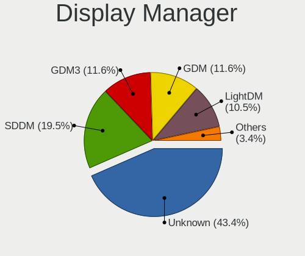

| Name    | Notebooks | Percent |
|---------|-----------|---------|
| Unknown | 83        | 48.26%  |
| GDM     | 27        | 15.7%   |
| SDDM    | 26        | 15.12%  |
| LightDM | 15        | 8.72%   |
| GDM3    | 15        | 8.72%   |
| TDM     | 6         | 3.49%   |

OS Lang
-------

Language

| Lang    | Notebooks | Percent |
|---------|-----------|---------|
| en_US   | 137       | 82.04%  |
| Unknown | 16        | 9.58%   |
| en_GB   | 5         | 2.99%   |
| C       | 4         | 2.4%    |
| en_IE   | 1         | 0.6%    |
| en_EN   | 1         | 0.6%    |
| en_CA   | 1         | 0.6%    |
| en_AG   | 1         | 0.6%    |
| Default | 1         | 0.6%    |

Boot Mode
---------

EFI or BIOS

| Mode | Notebooks | Percent |
|------|-----------|---------|
| EFI  | 86        | 50.89%  |
| BIOS | 83        | 49.11%  |

Filesystem
----------

Type of filesystem

| Type    | Notebooks | Percent |
|---------|-----------|---------|
| Ext4    | 135       | 80.84%  |
| Btrfs   | 15        | 8.98%   |
| Overlay | 13        | 7.78%   |
| Unknown | 3         | 1.8%    |
| Xfs     | 1         | 0.6%    |

Part. scheme
------------

Scheme of partitioning

| Type    | Notebooks | Percent |
|---------|-----------|---------|
| Unknown | 91        | 53.53%  |
| GPT     | 61        | 35.88%  |
| MBR     | 18        | 10.59%  |

Dual Boot with Linux/BSD
------------------------

Hosting more than one Linux/BSD

| Dual boot | Notebooks | Percent |
|-----------|-----------|---------|
| No        | 145       | 86.83%  |
| Yes       | 22        | 13.17%  |

Dual Boot (Win)
---------------

Hosting Linux and Windows

| Dual boot | Notebooks | Percent |
|-----------|-----------|---------|
| No        | 96        | 57.49%  |
| Yes       | 71        | 42.51%  |

Board
-----

Vendor
------

Motherboard manufacturer

| Name                | Notebooks | Percent |
|---------------------|-----------|---------|
| ASUSTek Computer    | 45        | 27.27%  |
| Hewlett-Packard     | 42        | 25.45%  |
| Dell                | 23        | 13.94%  |
| Lenovo              | 21        | 12.73%  |
| Acer                | 18        | 10.91%  |
| Notebook            | 4         | 2.42%   |
| MSI                 | 4         | 2.42%   |
| Toshiba             | 2         | 1.21%   |
| Timi                | 1         | 0.61%   |
| Samsung Electronics | 1         | 0.61%   |
| Fujitsu             | 1         | 0.61%   |
| Daffodil Computers  | 1         | 0.61%   |
| Apple               | 1         | 0.61%   |
| Unknown             | 1         | 0.61%   |

Model
-----

Motherboard model

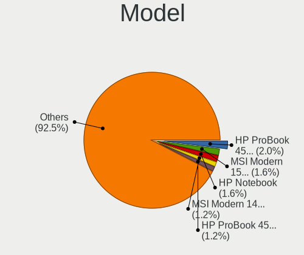

| Name                                                  | Notebooks | Percent |
|-------------------------------------------------------|-----------|---------|
| HP ProBook 450 G4                                     | 5         | 3.03%   |
| HP Notebook                                           | 3         | 1.82%   |
| HP ProBook 450 G2                                     | 2         | 1.21%   |
| HP ProBook 440 G8 Notebook PC                         | 2         | 1.21%   |
| HP EliteBook 840 G3                                   | 2         | 1.21%   |
| HP 15                                                 | 2         | 1.21%   |
| HP 14                                                 | 2         | 1.21%   |
| Dell Inspiron 3442                                    | 2         | 1.21%   |
| ASUS X510UQ                                           | 2         | 1.21%   |
| ASUS VivoBook_ASUSLaptop X531FL_S531FL                | 2         | 1.21%   |
| ASUS VivoBook_ASUSLaptop X530FN_S530FN                | 2         | 1.21%   |
| ASUS VivoBook_ASUSLaptop X530FA_S530FA                | 2         | 1.21%   |
| ASUS VivoBook_ASUSLaptop X509JA_X509JA                | 2         | 1.21%   |
| ASUS VivoBook 14_ASUS Laptop X407UA                   | 2         | 1.21%   |
| ASUS P453UA                                           | 2         | 1.21%   |
| Acer Nitro AN515-43                                   | 2         | 1.21%   |
| Toshiba Satellite Pro L510                            | 1         | 0.61%   |
| Toshiba Satellite L645                                | 1         | 0.61%   |
| Timi Mi NoteBook Pro                                  | 1         | 0.61%   |
| Samsung 300E5EV/300E4EV/270E5EV/270E4EV/2470EV/2470EE | 1         | 0.61%   |
| Notebook W9x0LU                                       | 1         | 0.61%   |
| Notebook N750BU                                       | 1         | 0.61%   |
| Notebook N2x0LU                                       | 1         | 0.61%   |
| Notebook DCL C483                                     | 1         | 0.61%   |
| MSI Summit B14 A11MOT                                 | 1         | 0.61%   |
| MSI Modern 15 A5M                                     | 1         | 0.61%   |
| MSI Modern 14 B10MW                                   | 1         | 0.61%   |
| MSI GS63 7RD                                          | 1         | 0.61%   |
| Lenovo V330-14IKB 81B0                                | 1         | 0.61%   |
| Lenovo ThinkPad X230 2324F51                          | 1         | 0.61%   |
| Lenovo ThinkPad X230 2324A82                          | 1         | 0.61%   |
| Lenovo ThinkPad T450 20BUS2021M                       | 1         | 0.61%   |
| Lenovo ThinkPad T430s 2356GPU                         | 1         | 0.61%   |
| Lenovo ThinkPad L380 20M6S22500                       | 1         | 0.61%   |
| Lenovo ThinkPad E490 20N9S1XE00                       | 1         | 0.61%   |
| Lenovo ThinkPad E470 20H1A029SG                       | 1         | 0.61%   |
| Lenovo S10-3                                          | 1         | 0.61%   |
| Lenovo Legion 5 15ARH05H 82B1                         | 1         | 0.61%   |
| Lenovo IdeaPad 5 Pro 14ACN6 82L7                      | 1         | 0.61%   |
| Lenovo IdeaPad 330-15IKB 81DE                         | 1         | 0.61%   |

Model Family
------------

Motherboard model prefix

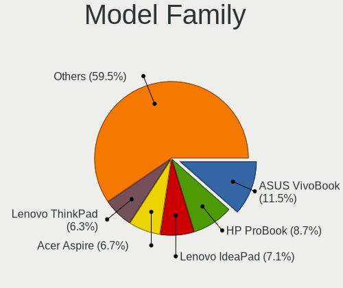

| Name                   | Notebooks | Percent |
|------------------------|-----------|---------|
| ASUS VivoBook          | 21        | 12.73%  |
| HP ProBook             | 17        | 10.3%   |
| Acer Aspire            | 14        | 8.48%   |
| Dell Inspiron          | 11        | 6.67%   |
| Lenovo IdeaPad         | 10        | 6.06%   |
| Dell Latitude          | 8         | 4.85%   |
| Lenovo ThinkPad        | 7         | 4.24%   |
| HP EliteBook           | 7         | 4.24%   |
| HP Notebook            | 3         | 1.82%   |
| HP 15                  | 3         | 1.82%   |
| Acer Nitro             | 3         | 1.82%   |
| Toshiba Satellite      | 2         | 1.21%   |
| MSI Modern             | 2         | 1.21%   |
| HP Pavilion            | 2         | 1.21%   |
| HP Laptop              | 2         | 1.21%   |
| HP ENVY                | 2         | 1.21%   |
| HP 14                  | 2         | 1.21%   |
| Dell XPS               | 2         | 1.21%   |
| ASUS X510UQ            | 2         | 1.21%   |
| ASUS P453UA            | 2         | 1.21%   |
| Timi Mi                | 1         | 0.61%   |
| Samsung 300E5EV        | 1         | 0.61%   |
| Notebook W9x0LU        | 1         | 0.61%   |
| Notebook N750BU        | 1         | 0.61%   |
| Notebook N2x0LU        | 1         | 0.61%   |
| Notebook DCL           | 1         | 0.61%   |
| MSI Summit             | 1         | 0.61%   |
| MSI GS63               | 1         | 0.61%   |
| Lenovo V330-14IKB      | 1         | 0.61%   |
| Lenovo S10-3           | 1         | 0.61%   |
| Lenovo Legion          | 1         | 0.61%   |
| Lenovo G40-70          | 1         | 0.61%   |
| HP ZHAN                | 1         | 0.61%   |
| HP Mini                | 1         | 0.61%   |
| HP 250                 | 1         | 0.61%   |
| HP 240                 | 1         | 0.61%   |
| Fujitsu LIFEBOOK       | 1         | 0.61%   |
| Dell Vostro            | 1         | 0.61%   |
| Dell G7                | 1         | 0.61%   |
| Daffodil Computers DCL | 1         | 0.61%   |

MFG Year
--------

Motherboard manufacture year

| Year | Notebooks | Percent |
|------|-----------|---------|
| 2016 | 25        | 15.15%  |
| 2017 | 21        | 12.73%  |
| 2018 | 19        | 11.52%  |
| 2019 | 16        | 9.7%    |
| 2015 | 15        | 9.09%   |
| 2021 | 13        | 7.88%   |
| 2014 | 12        | 7.27%   |
| 2012 | 11        | 6.67%   |
| 2020 | 9         | 5.45%   |
| 2013 | 9         | 5.45%   |
| 2011 | 7         | 4.24%   |
| 2010 | 3         | 1.82%   |
| 2009 | 3         | 1.82%   |
| 2022 | 1         | 0.61%   |
| 2008 | 1         | 0.61%   |

Form Factor
-----------

Physical design of the computer

| Name     | Notebooks | Percent |
|----------|-----------|---------|
| Notebook | 165       | 100%    |

Secure Boot
-----------

Enabled or disabled

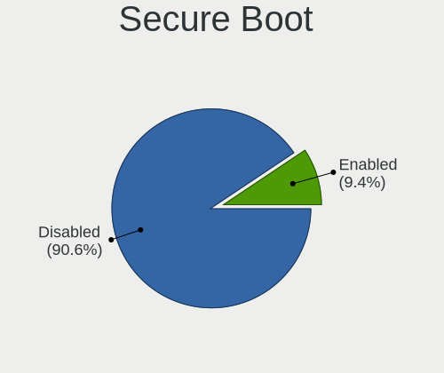

| State    | Notebooks | Percent |
|----------|-----------|---------|
| Disabled | 151       | 89.88%  |
| Enabled  | 17        | 10.12%  |

Coreboot
--------

Have coreboot on board

| Used | Notebooks | Percent |
|------|-----------|---------|
| No   | 165       | 100%    |

RAM Size
--------

Total RAM memory

| Size in GB | Notebooks | Percent |
|------------|-----------|---------|
| 4.01-8.0   | 66        | 39.29%  |
| 3.01-4.0   | 49        | 29.17%  |
| 8.01-16.0  | 30        | 17.86%  |
| 16.01-24.0 | 15        | 8.93%   |
| 1.01-2.0   | 5         | 2.98%   |
| 2.01-3.0   | 2         | 1.19%   |
| 32.01-64.0 | 1         | 0.6%    |

RAM Used
--------

Used RAM memory

| Used GB   | Notebooks | Percent |
|-----------|-----------|---------|
| 1.01-2.0  | 64        | 34.78%  |
| 2.01-3.0  | 59        | 32.07%  |
| 3.01-4.0  | 34        | 18.48%  |
| 4.01-8.0  | 15        | 8.15%   |
| 0.51-1.0  | 9         | 4.89%   |
| 8.01-16.0 | 2         | 1.09%   |
| 0.01-0.5  | 1         | 0.54%   |

Total Drives
------------

Number of drives on board

| Drives | Notebooks | Percent |
|--------|-----------|---------|
| 1      | 114       | 68.26%  |
| 2      | 51        | 30.54%  |
| 3      | 2         | 1.2%    |

Has CD-ROM
----------

Has CD-ROM on board

| Presented | Notebooks | Percent |
|-----------|-----------|---------|
| No        | 109       | 65.66%  |
| Yes       | 57        | 34.34%  |

Has Ethernet
------------

Has Ethernet on board

| Presented | Notebooks | Percent |
|-----------|-----------|---------|
| Yes       | 128       | 77.11%  |
| No        | 38        | 22.89%  |

Has WiFi
--------

Has WiFi module

| Presented | Notebooks | Percent |
|-----------|-----------|---------|
| Yes       | 162       | 97.59%  |
| No        | 4         | 2.41%   |

Has Bluetooth
-------------

Has Bluetooth module

| Presented | Notebooks | Percent |
|-----------|-----------|---------|
| Yes       | 139       | 83.73%  |
| No        | 27        | 16.27%  |

Location
--------

Country
-------

Geographic location (country)

| Country    | Notebooks | Percent |
|------------|-----------|---------|
| Bangladesh | 165       | 100%    |

City
----

Geographic location (city)

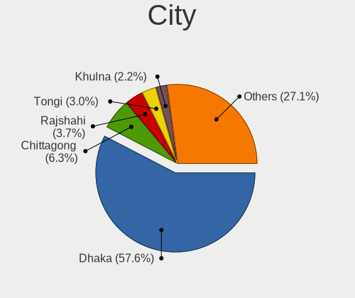

| City              | Notebooks | Percent |
|-------------------|-----------|---------|
| Dhaka             | 101       | 58.05%  |
| Chittagong        | 11        | 6.32%   |
| Rajshahi          | 8         | 4.6%    |
| Jessore           | 6         | 3.45%   |
| Tongi             | 5         | 2.87%   |
| Khulna            | 5         | 2.87%   |
| Comilla           | 3         | 1.72%   |
| Wari              | 2         | 1.15%   |
| Sherpur           | 2         | 1.15%   |
| Savar Upazila     | 2         | 1.15%   |
| Narayanganj       | 2         | 1.15%   |
| Mirpur            | 2         | 1.15%   |
| Bogra             | 2         | 1.15%   |
| Azimpur           | 2         | 1.15%   |
| Sylhet            | 1         | 0.57%   |
| Srimangal         | 1         | 0.57%   |
| Sirajganj         | 1         | 0.57%   |
| Rangpur City      | 1         | 0.57%   |
| Pirganj           | 1         | 0.57%   |
| Pabna Sadar       | 1         | 0.57%   |
| Pabna             | 1         | 0.57%   |
| Nryanganj | 1         | 0.57%   |
| Nilphamari        | 1         | 0.57%   |
| Natore            | 1         | 0.57%   |
| Narail            | 1         | 0.57%   |
| Nalitabari        | 1         | 0.57%   |
| Nalchiti          | 1         | 0.57%   |
| Lkshm     | 1         | 0.57%   |
| Khilgaon          | 1         | 0.57%   |
| Jamalpur          | 1         | 0.57%   |
| Gulshan           | 1         | 0.57%   |
| Fatullah          | 1         | 0.57%   |
| Faridpur          | 1         | 0.57%   |
| Dewangonj         | 1         | 0.57%   |
| Belkuchi          | 1         | 0.57%   |

Drives
------

Drive Vendor
------------

Hard drive vendors

| Vendor                         | Notebooks | Drives | Percent |
|--------------------------------|-----------|--------|---------|
| WDC                            | 40        | 54     | 18.78%  |
| Seagate                        | 40        | 51     | 18.78%  |
| Toshiba                        | 32        | 41     | 15.02%  |
| HGST                           | 11        | 11     | 5.16%   |
| Transcend                      | 10        | 11     | 4.69%   |
| Intel                          | 9         | 11     | 4.23%   |
| SanDisk                        | 8         | 8      | 3.76%   |
| Samsung Electronics            | 7         | 12     | 3.29%   |
| Hitachi                        | 7         | 8      | 3.29%   |
| Micron Technology              | 6         | 6      | 2.82%   |
| Kingston                       | 5         | 7      | 2.35%   |
| A-DATA Technology              | 4         | 4      | 1.88%   |
| SK hynix                       | 3         | 3      | 1.41%   |
| Corsair                        | 3         | 5      | 1.41%   |
| Ramsta                         | 2         | 2      | 0.94%   |
| KingSpec                       | 2         | 2      | 0.94%   |
| Apacer                         | 2         | 3      | 0.94%   |
| WDC WDS4                       | 1         | 1      | 0.47%   |
| WALTON                         | 1         | 2      | 0.47%   |
| Teutons                        | 1         | 1      | 0.47%   |
| Solid State Storage Technology | 1         | 1      | 0.47%   |
| Silicon Motion                 | 1         | 3      | 0.47%   |
| Shenzhen Longsys Electronics   | 1         | 1      | 0.47%   |
| Realtek                        | 1         | 1      | 0.47%   |
| PNY                            | 1         | 1      | 0.47%   |
| Phison                         | 1         | 1      | 0.47%   |
| Lexar                          | 1         | 2      | 0.47%   |
| KIOXIA                         | 1         | 1      | 0.47%   |
| Kingsand                       | 1         | 1      | 0.47%   |
| HS-SSD-E100                    | 1         | 1      | 0.47%   |
| Hewlett-Packard                | 1         | 1      | 0.47%   |
| Gigabyte Technology            | 1         | 1      | 0.47%   |
| GeIL                           | 1         | 1      | 0.47%   |
| Crucial                        | 1         | 2      | 0.47%   |
| Colorful                       | 1         | 1      | 0.47%   |
| China                          | 1         | 1      | 0.47%   |
| BIWIN                          | 1         | 1      | 0.47%   |
| ASMT                           | 1         | 1      | 0.47%   |
| Unknown                        | 1         | 1      | 0.47%   |

Drive Model
-----------

Hard drive models

| Model                                | Notebooks | Percent |
|--------------------------------------|-----------|---------|
| Seagate ST1000LM035-1RK172 1TB       | 17        | 7.8%    |
| Toshiba MQ04ABF100 1TB               | 15        | 6.88%   |
| Seagate ST1000LM024 HN-M101MBB 1TB   | 6         | 2.75%   |
| WDC WD10JPVX-60JC3T0 1TB             | 5         | 2.29%   |
| Seagate ST500LT012-1DG142 500GB      | 5         | 2.29%   |
| WDC WDS120G2G0A-00JH30 120GB SSD     | 4         | 1.83%   |
| Toshiba MQ01ABD100 1TB               | 4         | 1.83%   |
| HGST HTS541010A9E680 1TB             | 4         | 1.83%   |
| WDC WDS240G2G0B-00EPW0 240GB SSD     | 3         | 1.38%   |
| WDC WD10SPZX-60Z10T0 1TB             | 3         | 1.38%   |
| Transcend TS120GMTS420S 120GB SSD    | 3         | 1.38%   |
| Seagate ST500LT012-9WS142 500GB      | 3         | 1.38%   |
| Seagate ST1000LM049-2GH172 1TB       | 3         | 1.38%   |
| SanDisk NVMe SSD Drive 512GB         | 3         | 1.38%   |
| Intel SSD 660P Series 1024GB         | 3         | 1.38%   |
| Intel NVMe SSD Drive 512GB           | 3         | 1.38%   |
| HGST HTS545050A7E680 500GB           | 3         | 1.38%   |
| WDC WD10SPZX-24Z10T0 1TB             | 2         | 0.92%   |
| WDC WD10JPVX-75JC3T0 1TB             | 2         | 0.92%   |
| WDC WD10JPVX-60JC3T1 1TB             | 2         | 0.92%   |
| WDC PC SN520 SDAPNUW-256G-1002 256GB | 2         | 0.92%   |
| Transcend TS240GMTS820S 240GB SSD    | 2         | 0.92%   |
| Toshiba THNSNK128GVN8 128GB SSD      | 2         | 0.92%   |
| Toshiba MQ01ACF050 500GB             | 2         | 0.92%   |
| Seagate ST9500325AS 500GB            | 2         | 0.92%   |
| Samsung SSD 860 EVO 500GB            | 2         | 0.92%   |
| Ramsta SSD R800 120GB                | 2         | 0.92%   |
| Micron 1100_MTFDDAV256TBN 256GB SSD  | 2         | 0.92%   |
| Hitachi HTS547550A9E384 500GB        | 2         | 0.92%   |
| HGST HTS541010B7E610 1TB             | 2         | 0.92%   |
| Corsair Force MP510 240GB            | 2         | 0.92%   |
| A-DATA SU650 240GB SSD               | 2         | 0.92%   |
| WDC WDS4 80G2G0B-00EPW0 480GB SSD    | 1         | 0.46%   |
| WDC WDS240G2G0A-00JH30 240GB SSD     | 1         | 0.46%   |
| WDC WDS120G2G0B-00EPW0 120GB SSD     | 1         | 0.46%   |
| WDC WDS120G2G0A-00 120GB SSD         | 1         | 0.46%   |
| WDC WD5000LPVX-75V0TT0 500GB         | 1         | 0.46%   |
| WDC WD5000LPVX-22V0TT0 500GB         | 1         | 0.46%   |
| WDC WD5000LPCX-22VHAT0 500GB         | 1         | 0.46%   |
| WDC WD5000BPVT-22HXZT3 500GB         | 1         | 0.46%   |

HDD Vendor
----------

Hard disk drive vendors

| Vendor  | Notebooks | Drives | Percent |
|---------|-----------|--------|---------|
| Seagate | 40        | 51     | 36.04%  |
| Toshiba | 27        | 35     | 24.32%  |
| WDC     | 26        | 35     | 23.42%  |
| HGST    | 11        | 11     | 9.91%   |
| Hitachi | 7         | 8      | 6.31%   |

SSD Vendor
----------

Solid state drive vendors

| Vendor              | Notebooks | Drives | Percent |
|---------------------|-----------|--------|---------|
| WDC                 | 11        | 14     | 17.46%  |
| Transcend           | 10        | 11     | 15.87%  |
| SanDisk             | 5         | 5      | 7.94%   |
| Samsung Electronics | 5         | 7      | 7.94%   |
| Micron Technology   | 5         | 5      | 7.94%   |
| A-DATA Technology   | 4         | 4      | 6.35%   |
| Toshiba             | 2         | 3      | 3.17%   |
| Ramsta              | 2         | 2      | 3.17%   |
| KingSpec            | 2         | 2      | 3.17%   |
| Apacer              | 2         | 3      | 3.17%   |
| WDC WDS4            | 1         | 1      | 1.59%   |
| WALTON              | 1         | 2      | 1.59%   |
| Teutons             | 1         | 1      | 1.59%   |
| SK hynix            | 1         | 1      | 1.59%   |
| PNY                 | 1         | 1      | 1.59%   |
| Kingston            | 1         | 1      | 1.59%   |
| Intel               | 1         | 1      | 1.59%   |
| HS-SSD-E100         | 1         | 1      | 1.59%   |
| Hewlett-Packard     | 1         | 1      | 1.59%   |
| Gigabyte Technology | 1         | 1      | 1.59%   |
| GeIL                | 1         | 1      | 1.59%   |
| Crucial             | 1         | 2      | 1.59%   |
| Corsair             | 1         | 2      | 1.59%   |
| China               | 1         | 1      | 1.59%   |
| ASMT                | 1         | 1      | 1.59%   |

Drive Kind
----------

HDD or SSD

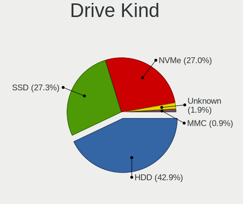

| Kind    | Notebooks | Drives | Percent |
|---------|-----------|--------|---------|
| HDD     | 111       | 140    | 53.11%  |
| SSD     | 60        | 74     | 28.71%  |
| NVMe    | 34        | 48     | 16.27%  |
| Unknown | 4         | 4      | 1.91%   |

Drive Connector
---------------

SATA, SAS, NVMe, etc.

| Type | Notebooks | Drives | Percent |
|------|-----------|--------|---------|
| SATA | 141       | 216    | 79.21%  |
| NVMe | 34        | 47     | 19.1%   |
| SAS  | 3         | 3      | 1.69%   |

Drive Size
----------

Size of hard drive

| Size in TB | Notebooks | Drives | Percent |
|------------|-----------|--------|---------|
| 0.01-0.5   | 85        | 111    | 51.83%  |
| 0.51-1.0   | 78        | 102    | 47.56%  |
| 1.01-2.0   | 1         | 1      | 0.61%   |

Space Total
-----------

Amount of disk space available on the file system

| Size in GB     | Notebooks | Percent |
|----------------|-----------|---------|
| 101-250        | 48        | 27.59%  |
| 251-500        | 42        | 24.14%  |
| 501-1000       | 36        | 20.69%  |
| 51-100         | 15        | 8.62%   |
| 1001-2000      | 13        | 7.47%   |
| 1-20           | 9         | 5.17%   |
| 21-50          | 7         | 4.02%   |
| Unknown        | 3         | 1.72%   |
| More than 3000 | 1         | 0.57%   |

Space Used
----------

Amount of used disk space

| Used GB   | Notebooks | Percent |
|-----------|-----------|---------|
| 1-20      | 62        | 34.25%  |
| 21-50     | 32        | 17.68%  |
| 101-250   | 32        | 17.68%  |
| 51-100    | 31        | 17.13%  |
| 251-500   | 11        | 6.08%   |
| 501-1000  | 8         | 4.42%   |
| Unknown   | 3         | 1.66%   |
| 1001-2000 | 2         | 1.1%    |

Malfunc. Drives
---------------

Drive models with a malfunction

| Model                                          | Notebooks | Drives | Percent |
|------------------------------------------------|-----------|--------|---------|
| Toshiba MQ01ABD100 1TB                         | 2         | 4      | 9.52%   |
| HGST HTS545050A7E680 500GB                     | 2         | 2      | 9.52%   |
| HGST HTS541010A9E680 1TB                       | 2         | 2      | 9.52%   |
| WDC WD5000LPCX-22VHAT0 500GB                   | 1         | 1      | 4.76%   |
| WDC WD5000BPVT-22HXZT3 500GB                   | 1         | 1      | 4.76%   |
| WDC WD10SPZX-24Z10T0 1TB                       | 1         | 1      | 4.76%   |
| WDC WD10JPVX-60JC3T0 1TB                       | 1         | 2      | 4.76%   |
| Toshiba MQ01ABD050 500GB                       | 1         | 1      | 4.76%   |
| SK hynix HFS256G3AMNB-2200A 256GB SSD          | 1         | 1      | 4.76%   |
| Seagate ST9500325AS 500GB                      | 1         | 1      | 4.76%   |
| Seagate ST500LT012-9WS142 500GB                | 1         | 1      | 4.76%   |
| Seagate ST500LT012-1DG142 500GB                | 1         | 1      | 4.76%   |
| Seagate ST1000LM024 HN-M101MBB 1TB             | 1         | 1      | 4.76%   |
| Micron Technology 1100_MTFDDAV256TBN 256GB SSD | 1         | 1      | 4.76%   |
| Intel SSDSCKKW240H6 240GB                      | 1         | 1      | 4.76%   |
| Hitachi HTS545025B9A300 250GB                  | 1         | 1      | 4.76%   |
| HGST HTS545050A7E380 500GB                     | 1         | 1      | 4.76%   |
| Hewlett-Packard SSD S600 240GB                 | 1         | 1      | 4.76%   |

Malfunc. Drive Vendor
---------------------

Vendors of faulty drives

| Vendor            | Notebooks | Drives | Percent |
|-------------------|-----------|--------|---------|
| HGST              | 5         | 5      | 23.81%  |
| WDC               | 4         | 5      | 19.05%  |
| Seagate           | 4         | 4      | 19.05%  |
| Toshiba           | 3         | 5      | 14.29%  |
| SK hynix          | 1         | 1      | 4.76%   |
| Micron Technology | 1         | 1      | 4.76%   |
| Intel             | 1         | 1      | 4.76%   |
| Hitachi           | 1         | 1      | 4.76%   |
| Hewlett-Packard   | 1         | 1      | 4.76%   |

Malfunc. HDD Vendor
-------------------

Vendors of faulty HDD drives

| Vendor  | Notebooks | Drives | Percent |
|---------|-----------|--------|---------|
| HGST    | 5         | 5      | 29.41%  |
| WDC     | 4         | 5      | 23.53%  |
| Seagate | 4         | 4      | 23.53%  |
| Toshiba | 3         | 5      | 17.65%  |
| Hitachi | 1         | 1      | 5.88%   |

Malfunc. Drive Kind
-------------------

Kinds of faulty drives

| Kind | Notebooks | Drives | Percent |
|------|-----------|--------|---------|
| HDD  | 17        | 20     | 80.95%  |
| SSD  | 4         | 4      | 19.05%  |

Failed Drives
-------------

Failed drive models

Zero info for selected period =(

Failed Drive Vendor
-------------------

Failed drive vendors

Zero info for selected period =(

Drive Status
------------

Number of failed and malfunc. drives

| Status   | Notebooks | Drives | Percent |
|----------|-----------|--------|---------|
| Detected | 98        | 153    | 55.37%  |
| Works    | 58        | 89     | 32.77%  |
| Malfunc  | 21        | 24     | 11.86%  |

Storage controller
------------------

Storage Vendor
--------------

Storage controller vendors

| Vendor                         | Notebooks | Percent |
|--------------------------------|-----------|---------|
| Intel                          | 144       | 78.26%  |
| AMD                            | 12        | 6.52%   |
| SanDisk                        | 7         | 3.8%    |
| Kingston Technology Company    | 4         | 2.17%   |
| Phison Electronics             | 3         | 1.63%   |
| Toshiba America Info Systems   | 2         | 1.09%   |
| SK hynix                       | 2         | 1.09%   |
| Shenzhen Longsys Electronics   | 2         | 1.09%   |
| Samsung Electronics            | 2         | 1.09%   |
| KIOXIA                         | 2         | 1.09%   |
| Solid State Storage Technology | 1         | 0.54%   |
| Silicon Motion                 | 1         | 0.54%   |
| Micron Technology              | 1         | 0.54%   |
| Biwin Storage Technology       | 1         | 0.54%   |

Storage Model
-------------

Storage controller models

| Model                                                                            | Notebooks | Percent |
|----------------------------------------------------------------------------------|-----------|---------|
| Intel Sunrise Point-LP SATA Controller [AHCI mode]                               | 50        | 25.51%  |
| Intel 82801 Mobile SATA Controller [RAID mode]                                   | 14        | 7.14%   |
| AMD FCH SATA Controller [AHCI mode]                                              | 12        | 6.12%   |
| Intel 8 Series SATA Controller 1 [AHCI mode]                                     | 11        | 5.61%   |
| Intel 7 Series Chipset Family 6-port SATA Controller [AHCI mode]                 | 11        | 5.61%   |
| Intel Wildcat Point-LP SATA Controller [AHCI Mode]                               | 10        | 5.1%    |
| Intel Cannon Point-LP SATA Controller [AHCI Mode]                                | 9         | 4.59%   |
| Intel Volume Management Device NVMe RAID Controller                              | 7         | 3.57%   |
| Intel SSD 660P Series                                                            | 6         | 3.06%   |
| Intel Atom/Celeron/Pentium Processor x5-E8000/J3xxx/N3xxx Series SATA Controller | 5         | 2.55%   |
| Intel 6 Series/C200 Series Chipset Family 6 port Mobile SATA AHCI Controller     | 5         | 2.55%   |
| SanDisk WD Blue SN550 NVMe SSD                                                   | 3         | 1.53%   |
| SanDisk WD Blue SN500 / PC SN520 NVMe SSD                                        | 3         | 1.53%   |
| Intel Tiger Lake-LP SATA Controller                                              | 3         | 1.53%   |
| Intel 82801IBM/IEM (ICH9M/ICH9M-E) 4 port SATA Controller [AHCI mode]            | 3         | 1.53%   |
| Phison E12 NVMe Controller                                                       | 2         | 1.02%   |
| KIOXIA NVMe SSD Controller BG4                                                   | 2         | 1.02%   |
| Kingston Company Company Non-Volatile memory controller                          | 2         | 1.02%   |
| Intel Non-Volatile memory controller                                             | 2         | 1.02%   |
| Intel NM10/ICH7 Family SATA Controller [AHCI mode]                               | 2         | 1.02%   |
| Intel HM170/QM170 Chipset SATA Controller [AHCI Mode]                            | 2         | 1.02%   |
| Intel Comet Lake SATA AHCI Controller                                            | 2         | 1.02%   |
| Intel 8 Series/C220 Series Chipset Family 6-port SATA Controller 1 [AHCI mode]   | 2         | 1.02%   |
| Toshiba America Info Systems XG5 NVMe SSD Controller                             | 1         | 0.51%   |
| Toshiba America Info Systems XG4 NVMe SSD Controller                             | 1         | 0.51%   |
| Solid State Storage Non-Volatile memory controller                               | 1         | 0.51%   |
| SK hynix Non-Volatile memory controller                                          | 1         | 0.51%   |
| SK hynix BC511                                                                   | 1         | 0.51%   |
| Silicon Motion SM2262/SM2262EN SSD Controller                                    | 1         | 0.51%   |
| Shenzhen Longsys Non-Volatile memory controller                                  | 1         | 0.51%   |
| Shenzhen Longsys Electronics Non-Volatile memory controller                      | 1         | 0.51%   |
| SanDisk WD Black 2018/SN750 / PC SN720 NVMe SSD                                  | 1         | 0.51%   |
| Samsung NVMe SSD Controller SM981/PM981/PM983                                    | 1         | 0.51%   |
| Samsung NVMe SSD Controller 980                                                  | 1         | 0.51%   |
| Phison PS5013 E13 NVMe Controller                                                | 1         | 0.51%   |
| Micron Non-Volatile memory controller                                            | 1         | 0.51%   |
| Kingston Company U-SNS8154P3 NVMe SSD                                            | 1         | 0.51%   |
| Kingston Company OM3PDP3 NVMe SSD                                                | 1         | 0.51%   |
| Intel Mobile 4 Series Chipset PT IDER Controller                                 | 1         | 0.51%   |
| Intel Comet Lake PCH-H RAID                                                      | 1         | 0.51%   |

Storage Kind
------------

Kind of storage controller (IDE, SATA, NVMe, SAS, ...)

| Kind | Notebooks | Percent |
|------|-----------|---------|
| SATA | 132       | 68.75%  |
| NVMe | 34        | 17.71%  |
| RAID | 22        | 11.46%  |
| IDE  | 4         | 2.08%   |

Processor
---------

CPU Vendor
----------

Processor vendors

| Vendor | Notebooks | Percent |
|--------|-----------|---------|
| Intel  | 150       | 90.91%  |
| AMD    | 15        | 9.09%   |

CPU Model
---------

Processor models

| Model                                         | Notebooks | Percent |
|-----------------------------------------------|-----------|---------|
| Intel Core i5-7200U CPU @ 2.50GHz             | 11        | 6.67%   |
| Intel Core i5-8265U CPU @ 1.60GHz             | 7         | 4.24%   |
| Intel Core i3-7100U CPU @ 2.40GHz             | 7         | 4.24%   |
| Intel 11th Gen Core i5-1135G7 @ 2.40GHz       | 7         | 4.24%   |
| Intel Core i5-8250U CPU @ 1.60GHz             | 6         | 3.64%   |
| Intel Core i5-6200U CPU @ 2.30GHz             | 6         | 3.64%   |
| Intel Core i7-8550U CPU @ 1.80GHz             | 5         | 3.03%   |
| Intel Core i5-3320M CPU @ 2.60GHz             | 5         | 3.03%   |
| Intel Core i7-8565U CPU @ 1.80GHz             | 4         | 2.42%   |
| Intel Core i5-6300U CPU @ 2.40GHz             | 4         | 2.42%   |
| Intel Core i5-5300U CPU @ 2.30GHz             | 4         | 2.42%   |
| Intel Core i5-4210U CPU @ 1.70GHz             | 4         | 2.42%   |
| Intel Core i3-8130U CPU @ 2.20GHz             | 4         | 2.42%   |
| Intel Core i3-6006U CPU @ 2.00GHz             | 4         | 2.42%   |
| Intel Core i3-4005U CPU @ 1.70GHz             | 4         | 2.42%   |
| Intel Pentium CPU N3710 @ 1.60GHz             | 3         | 1.82%   |
| Intel Core i7-7500U CPU @ 2.70GHz             | 3         | 1.82%   |
| Intel Core i5-5200U CPU @ 2.20GHz             | 3         | 1.82%   |
| Intel Core i3-5005U CPU @ 2.00GHz             | 3         | 1.82%   |
| Intel Core i3-1005G1 CPU @ 1.20GHz            | 3         | 1.82%   |
| AMD Ryzen 5 3550H with Radeon Vega Mobile Gfx | 3         | 1.82%   |
| Intel Core i5-7300U CPU @ 2.60GHz             | 2         | 1.21%   |
| Intel Core i5-10210U CPU @ 1.60GHz            | 2         | 1.21%   |
| Intel Core i5 CPU M 480 @ 2.67GHz             | 2         | 1.21%   |
| Intel Core i3-7130U CPU @ 2.70GHz             | 2         | 1.21%   |
| Intel Core i3-4030U CPU @ 1.90GHz             | 2         | 1.21%   |
| Intel Core i3-2350M CPU @ 2.30GHz             | 2         | 1.21%   |
| Intel Core 2 Duo CPU T6570 @ 2.10GHz          | 2         | 1.21%   |
| AMD Ryzen 7 5800U with Radeon Graphics        | 2         | 1.21%   |
| Intel Pentium Dual-Core CPU T4400 @ 2.20GHz   | 1         | 0.61%   |
| Intel Pentium CPU 3825U @ 1.90GHz             | 1         | 0.61%   |
| Intel Pentium CPU 2117U @ 1.80GHz             | 1         | 0.61%   |
| Intel Core i7-8665U CPU @ 1.90GHz             | 1         | 0.61%   |
| Intel Core i7-7700HQ CPU @ 2.80GHz            | 1         | 0.61%   |
| Intel Core i7-2620M CPU @ 2.70GHz             | 1         | 0.61%   |
| Intel Core i7-10750H CPU @ 2.60GHz            | 1         | 0.61%   |
| Intel Core i5-6300HQ CPU @ 2.30GHz            | 1         | 0.61%   |
| Intel Core i5-4300U CPU @ 1.90GHz             | 1         | 0.61%   |
| Intel Core i5-4200U CPU @ 1.60GHz             | 1         | 0.61%   |
| Intel Core i5-4200M CPU @ 2.50GHz             | 1         | 0.61%   |

CPU Model Family
----------------

Processor model prefix

| Model                   | Notebooks | Percent |
|-------------------------|-----------|---------|
| Intel Core i5           | 69        | 41.82%  |
| Intel Core i3           | 39        | 23.64%  |
| Intel Core i7           | 16        | 9.7%    |
| Other                   | 11        | 6.67%   |
| AMD Ryzen 5             | 6         | 3.64%   |
| Intel Pentium           | 5         | 3.03%   |
| Intel Celeron           | 4         | 2.42%   |
| AMD Ryzen 7             | 4         | 2.42%   |
| Intel Core 2 Duo        | 3         | 1.82%   |
| Intel Atom              | 2         | 1.21%   |
| AMD Ryzen 3             | 2         | 1.21%   |
| Intel Pentium Dual-Core | 1         | 0.61%   |
| AMD E2                  | 1         | 0.61%   |
| AMD A8                  | 1         | 0.61%   |
| AMD A4                  | 1         | 0.61%   |

CPU Cores
---------

Number of processor cores

| Number | Notebooks | Percent |
|--------|-----------|---------|
| 2      | 110       | 66.67%  |
| 4      | 47        | 28.48%  |
| 8      | 4         | 2.42%   |
| 6      | 3         | 1.82%   |
| 1      | 1         | 0.61%   |

CPU Sockets
-----------

Number of sockets

| Number | Notebooks | Percent |
|--------|-----------|---------|
| 1      | 165       | 100%    |

CPU Threads
-----------

Threads per core (Hyper-Threading)

| Number | Notebooks | Percent |
|--------|-----------|---------|
| 2      | 148       | 89.7%   |
| 1      | 17        | 10.3%   |

CPU Op-Modes
------------

CPU Operation Modes (32-bit, 64-bit)

| Op mode        | Notebooks | Percent |
|----------------|-----------|---------|
| 32-bit, 64-bit | 164       | 99.39%  |
| Unknown        | 1         | 0.61%   |

CPU Microcode
-------------

Microcode number

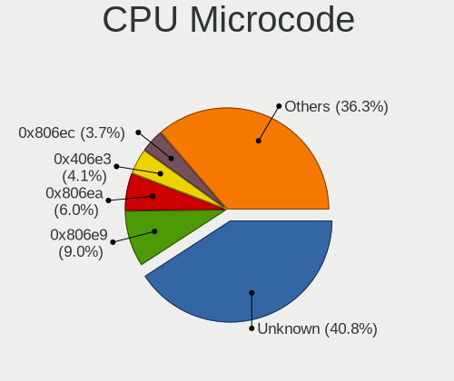

| Number     | Notebooks | Percent |
|------------|-----------|---------|
| Unknown    | 39        | 22.67%  |
| 0x806e9    | 22        | 12.79%  |
| 0x806ea    | 15        | 8.72%   |
| 0x406e3    | 11        | 6.4%    |
| 0x40651    | 10        | 5.81%   |
| 0x306d4    | 9         | 5.23%   |
| 0x806ec    | 7         | 4.07%   |
| 0x306a9    | 7         | 4.07%   |
| 0x206a7    | 7         | 4.07%   |
| 0x806eb    | 6         | 3.49%   |
| 0x806c1    | 6         | 3.49%   |
| 0x706e5    | 4         | 2.33%   |
| 0x406c4    | 4         | 2.33%   |
| 0x08108102 | 3         | 1.74%   |
| 0xa0652    | 2         | 1.16%   |
| 0x306c3    | 2         | 1.16%   |
| 0x20655    | 2         | 1.16%   |
| 0x1067a    | 2         | 1.16%   |
| 0x08108109 | 2         | 1.16%   |
| 0x906e9    | 1         | 0.58%   |
| 0x806d1    | 1         | 0.58%   |
| 0x506e3    | 1         | 0.58%   |
| 0x406c3    | 1         | 0.58%   |
| 0x30678    | 1         | 0.58%   |
| 0x30661    | 1         | 0.58%   |
| 0x106ca    | 1         | 0.58%   |
| 0x10676    | 1         | 0.58%   |
| 0x0a50000c | 1         | 0.58%   |
| 0x08600104 | 1         | 0.58%   |
| 0x0810100b | 1         | 0.58%   |
| 0x06006705 | 1         | 0.58%   |

CPU Microarch
-------------

Microarchitecture

| Name        | Notebooks | Percent |
|-------------|-----------|---------|
| KabyLake    | 58        | 35.15%  |
| Skylake     | 16        | 9.7%    |
| Haswell     | 14        | 8.48%   |
| Broadwell   | 12        | 7.27%   |
| TigerLake   | 10        | 6.06%   |
| IvyBridge   | 10        | 6.06%   |
| SandyBridge | 9         | 5.45%   |
| Zen+        | 6         | 3.64%   |
| Silvermont  | 6         | 3.64%   |
| IceLake     | 5         | 3.03%   |
| Penryn      | 4         | 2.42%   |
| Zen 3       | 2         | 1.21%   |
| Zen 2       | 2         | 1.21%   |
| Westmere    | 2         | 1.21%   |
| Excavator   | 2         | 1.21%   |
| CometLake   | 2         | 1.21%   |
| Bonnell     | 2         | 1.21%   |
| Zen         | 1         | 0.61%   |
| Puma        | 1         | 0.61%   |
| Unknown     | 1         | 0.61%   |

Graphics
--------

GPU Vendor
----------

Vendors of graphics cards

| Vendor | Notebooks | Percent |
|--------|-----------|---------|
| Intel  | 149       | 71.63%  |
| Nvidia | 39        | 18.75%  |
| AMD    | 20        | 9.62%   |

GPU Model
---------

Graphics card models

| Model                                                                                    | Notebooks | Percent |
|------------------------------------------------------------------------------------------|-----------|---------|
| Intel HD Graphics 620                                                                    | 26        | 12.32%  |
| Intel UHD Graphics 620                                                                   | 15        | 7.11%   |
| Intel Skylake GT2 [HD Graphics 520]                                                      | 15        | 7.11%   |
| Intel WhiskeyLake-U GT2 [UHD Graphics 620]                                               | 13        | 6.16%   |
| Intel Haswell-ULT Integrated Graphics Controller                                         | 12        | 5.69%   |
| Intel HD Graphics 5500                                                                   | 11        | 5.21%   |
| Intel 3rd Gen Core processor Graphics Controller                                         | 10        | 4.74%   |
| Intel TigerLake-LP GT2 [Iris Xe Graphics]                                                | 9         | 4.27%   |
| Intel 2nd Generation Core Processor Family Integrated Graphics Controller                | 9         | 4.27%   |
| AMD Picasso/Raven 2 [Radeon Vega Series / Radeon Vega Mobile Series]                     | 6         | 2.84%   |
| Nvidia GM108M [GeForce 940MX]                                                            | 5         | 2.37%   |
| Intel Atom/Celeron/Pentium Processor x5-E8000/J3xxx/N3xxx Integrated Graphics Controller | 5         | 2.37%   |
| Nvidia GP108M [GeForce MX250]                                                            | 4         | 1.9%    |
| Nvidia GP108M [GeForce MX150]                                                            | 4         | 1.9%    |
| Nvidia GP107M [GeForce GTX 1050 Mobile]                                                  | 4         | 1.9%    |
| Intel Iris Plus Graphics G1 (Ice Lake)                                                   | 4         | 1.9%    |
| Nvidia GM108M [GeForce MX130]                                                            | 3         | 1.42%   |
| Intel Mobile 4 Series Chipset Integrated Graphics Controller                             | 3         | 1.42%   |
| Intel CometLake-U GT2 [UHD Graphics]                                                     | 3         | 1.42%   |
| Nvidia TU117M [GeForce GTX 1650 Mobile / Max-Q]                                          | 2         | 0.95%   |
| Nvidia GM108M [GeForce 930MX]                                                            | 2         | 0.95%   |
| Nvidia GF117M [GeForce 610M/710M/810M/820M / GT 620M/625M/630M/720M]                     | 2         | 0.95%   |
| Intel Core Processor Integrated Graphics Controller                                      | 2         | 0.95%   |
| Intel CometLake-H GT2 [UHD Graphics]                                                     | 2         | 0.95%   |
| Intel 4th Gen Core Processor Integrated Graphics Controller                              | 2         | 0.95%   |
| AMD Sun XT [Radeon HD 8670A/8670M/8690M / R5 M330 / M430 / Radeon 520 Mobile]            | 2         | 0.95%   |
| AMD Stoney [Radeon R2/R3/R4/R5 Graphics]                                                 | 2         | 0.95%   |
| AMD Renoir                                                                               | 2         | 0.95%   |
| AMD Cezanne [Radeon Vega Series / Radeon Vega Mobile Series]                             | 2         | 0.95%   |
| AMD Baffin [Radeon RX 460/560D / Pro 450/455/460/555/555X/560/560X]                      | 2         | 0.95%   |
| Nvidia TU117M [GeForce MX450]                                                            | 1         | 0.47%   |
| Nvidia TU117M                                                                            | 1         | 0.47%   |
| Nvidia TU116M [GeForce GTX 1660 Ti Mobile]                                               | 1         | 0.47%   |
| Nvidia TU104M [GeForce RTX 2070 SUPER Mobile / Max-Q]                                    | 1         | 0.47%   |
| Nvidia GP107M [GeForce MX350]                                                            | 1         | 0.47%   |
| Nvidia GM108M [GeForce MX110]                                                            | 1         | 0.47%   |
| Nvidia GM108M [GeForce 930M]                                                             | 1         | 0.47%   |
| Nvidia GM108M [GeForce 920MX]                                                            | 1         | 0.47%   |
| Nvidia GM107M [GeForce GTX 960M]                                                         | 1         | 0.47%   |
| Nvidia GM107M [GeForce GTX 850M]                                                         | 1         | 0.47%   |

GPU Combo
---------

Combinations of graphics cards

| Name           | Notebooks | Percent |
|----------------|-----------|---------|
| 1 x Intel      | 110       | 66.67%  |
| Intel + Nvidia | 35        | 21.21%  |
| 1 x AMD        | 9         | 5.45%   |
| Intel + AMD    | 4         | 2.42%   |
| AMD + Nvidia   | 4         | 2.42%   |
| 2 x AMD        | 3         | 1.82%   |

GPU Driver
----------

Free vs proprietary

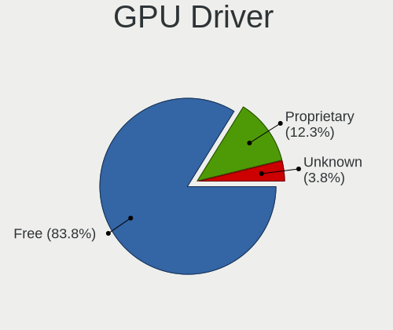

| Driver      | Notebooks | Percent |
|-------------|-----------|---------|
| Free        | 147       | 86.47%  |
| Proprietary | 21        | 12.35%  |
| Unknown     | 2         | 1.18%   |

GPU Memory
----------

Total video memory

| Size in GB | Notebooks | Percent |
|------------|-----------|---------|
| Unknown    | 135       | 79.88%  |
| 1.01-2.0   | 20        | 11.83%  |
| 3.01-4.0   | 7         | 4.14%   |
| 0.01-0.5   | 4         | 2.37%   |
| 7.01-8.0   | 1         | 0.59%   |
| 5.01-6.0   | 1         | 0.59%   |
| 0.51-1.0   | 1         | 0.59%   |

Monitor
-------

Monitor Vendor
--------------

Monitor vendors

| Vendor                  | Notebooks | Percent |
|-------------------------|-----------|---------|
| BOE                     | 45        | 24.19%  |
| AU Optronics            | 42        | 22.58%  |
| Chimei Innolux          | 34        | 18.28%  |
| LG Display              | 29        | 15.59%  |
| Samsung Electronics     | 11        | 5.91%   |
| Dell                    | 5         | 2.69%   |
| PANDA                   | 4         | 2.15%   |
| Goldstar                | 4         | 2.15%   |
| Hewlett-Packard         | 3         | 1.61%   |
| Chi Mei Optoelectronics | 2         | 1.08%   |
| ViewSonic               | 1         | 0.54%   |
| Sharp                   | 1         | 0.54%   |
| MSI                     | 1         | 0.54%   |
| ASUSTek Computer        | 1         | 0.54%   |
| Apple                   | 1         | 0.54%   |
| AOC                     | 1         | 0.54%   |
| Ancor Communications    | 1         | 0.54%   |

Monitor Model
-------------

Monitor models

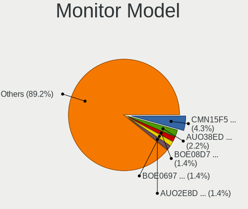

| Model                                                                 | Notebooks | Percent |
|-----------------------------------------------------------------------|-----------|---------|
| Chimei Innolux LCD Monitor CMN15F5 1920x1080 344x193mm 15.5-inch      | 9         | 4.84%   |
| AU Optronics LCD Monitor AUO61ED 1920x1080 344x193mm 15.5-inch        | 4         | 2.15%   |
| AU Optronics LCD Monitor AUO38ED 1920x1080 344x193mm 15.5-inch        | 4         | 2.15%   |
| LG Display LCD Monitor LGD0563 1920x1080 344x194mm 15.5-inch          | 3         | 1.61%   |
| BOE LCD Monitor BOE06BA 1920x1080 344x193mm 15.5-inch                 | 3         | 1.61%   |
| BOE LCD Monitor BOE0697 1366x768 309x173mm 13.9-inch                  | 3         | 1.61%   |
| BOE LCD Monitor BOE0696 1366x768 309x173mm 13.9-inch                  | 3         | 1.61%   |
| LG Display LCD Monitor LGD0573 1920x1080 344x194mm 15.5-inch          | 2         | 1.08%   |
| LG Display LCD Monitor LGD0504 1366x768 344x194mm 15.5-inch           | 2         | 1.08%   |
| LG Display LCD Monitor LGD04C0 1366x768 309x174mm 14.0-inch           | 2         | 1.08%   |
| LG Display LCD Monitor LGD046F 1920x1080 344x194mm 15.5-inch          | 2         | 1.08%   |
| LG Display LCD Monitor LGD0466 1366x768 309x174mm 14.0-inch           | 2         | 1.08%   |
| LG Display LCD Monitor LGD02F8 1366x768 309x174mm 14.0-inch           | 2         | 1.08%   |
| Goldstar FULL HD GSM5B55 1920x1080 480x270mm 21.7-inch                | 2         | 1.08%   |
| Chimei Innolux LCD Monitor CMN15DC 1366x768 344x193mm 15.5-inch       | 2         | 1.08%   |
| Chimei Innolux LCD Monitor CMN15DB 1366x768 344x193mm 15.5-inch       | 2         | 1.08%   |
| Chimei Innolux LCD Monitor CMN14A1 1366x768 309x174mm 14.0-inch       | 2         | 1.08%   |
| Chimei Innolux LCD Monitor CMN1490 1366x768 309x173mm 13.9-inch       | 2         | 1.08%   |
| BOE LCD Monitor BOE07B4 1366x768 344x194mm 15.5-inch                  | 2         | 1.08%   |
| BOE LCD Monitor BOE06A5 1366x768 344x194mm 15.5-inch                  | 2         | 1.08%   |
| BOE LCD Monitor BOE06A4 1366x768 344x194mm 15.5-inch                  | 2         | 1.08%   |
| BOE LCD Monitor BOE0698 1366x768 309x173mm 13.9-inch                  | 2         | 1.08%   |
| AU Optronics LCD Monitor AUO403D 1920x1080 309x173mm 13.9-inch        | 2         | 1.08%   |
| AU Optronics LCD Monitor AUO21ED 1920x1080 344x193mm 15.5-inch        | 2         | 1.08%   |
| AU Optronics LCD Monitor AUO123D 1920x1080 309x173mm 13.9-inch        | 2         | 1.08%   |
| AU Optronics LCD Monitor AUO10EC 1366x768 344x193mm 15.5-inch         | 2         | 1.08%   |
| ViewSonic VA2259 Series VSC5E32 1920x1080 476x268mm 21.5-inch         | 1         | 0.54%   |
| Sharp LCD Monitor SHP1449 1920x1080 294x165mm 13.3-inch               | 1         | 0.54%   |
| Samsung Electronics SyncMaster SAM043E 1600x1200 520x320mm 24.0-inch  | 1         | 0.54%   |
| Samsung Electronics S22B300 SAM08AC 1920x1080 477x268mm 21.5-inch     | 1         | 0.54%   |
| Samsung Electronics S19F350 SAM0D46 1366x768 410x230mm 18.5-inch      | 1         | 0.54%   |
| Samsung Electronics S19C300 SAM0A12 1366x768 410x230mm 18.5-inch      | 1         | 0.54%   |
| Samsung Electronics LCD Monitor SEC5441 1366x768 293x165mm 13.2-inch  | 1         | 0.54%   |
| Samsung Electronics LCD Monitor SEC4149 1366x768 292x174mm 13.4-inch  | 1         | 0.54%   |
| Samsung Electronics LCD Monitor SEC3050 1366x768 309x174mm 14.0-inch  | 1         | 0.54%   |
| Samsung Electronics LCD Monitor SEC3047 1366x768 277x156mm 12.5-inch  | 1         | 0.54%   |
| Samsung Electronics LCD Monitor SDC4C48 1920x1080 344x194mm 15.5-inch | 1         | 0.54%   |
| Samsung Electronics LCD Monitor SDC484E 1600x900 309x174mm 14.0-inch  | 1         | 0.54%   |
| Samsung Electronics LCD Monitor SDC4751 1366x768 344x194mm 15.5-inch  | 1         | 0.54%   |
| PANDA LCD Monitor NCP004D 1920x1080 344x194mm 15.5-inch               | 1         | 0.54%   |

Monitor Resolution
------------------

Monitor screen resolution

| Resolution        | Notebooks | Percent |
|-------------------|-----------|---------|
| 1366x768 (WXGA)   | 89        | 50.57%  |
| 1920x1080 (FHD)   | 71        | 40.34%  |
| 1600x900 (HD+)    | 4         | 2.27%   |
| 3840x2160 (4K)    | 3         | 1.7%    |
| 1280x800 (WXGA)   | 2         | 1.14%   |
| 1024x600          | 2         | 1.14%   |
| 2560x1600         | 1         | 0.57%   |
| 2560x1440 (QHD)   | 1         | 0.57%   |
| 2240x1400         | 1         | 0.57%   |
| 1920x1200 (WUXGA) | 1         | 0.57%   |
| 1280x1024 (SXGA)  | 1         | 0.57%   |

Monitor Diagonal
----------------

Diagonal size in inches

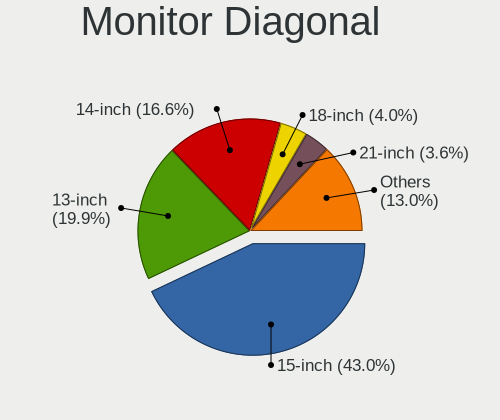

| Inches | Notebooks | Percent |
|--------|-----------|---------|
| 15     | 78        | 42.16%  |
| 13     | 42        | 22.7%   |
| 14     | 33        | 17.84%  |
| 21     | 8         | 4.32%   |
| 18     | 7         | 3.78%   |
| 12     | 5         | 2.7%    |
| 23     | 2         | 1.08%   |
| 17     | 2         | 1.08%   |
| 11     | 2         | 1.08%   |
| 10     | 2         | 1.08%   |
| 27     | 1         | 0.54%   |
| 26     | 1         | 0.54%   |
| 24     | 1         | 0.54%   |
| 19     | 1         | 0.54%   |

Monitor Width
-------------

Physical width

| Width in mm | Notebooks | Percent |
|-------------|-----------|---------|
| 301-350     | 143       | 77.72%  |
| 201-300     | 18        | 9.78%   |
| 401-500     | 17        | 9.24%   |
| 501-600     | 4         | 2.17%   |
| 351-400     | 2         | 1.09%   |

Aspect Ratio
------------

Proportional relationship between the width and the height

| Ratio | Notebooks | Percent |
|-------|-----------|---------|
| 16/9  | 160       | 96.39%  |
| 16/10 | 5         | 3.01%   |
| 5/4   | 1         | 0.6%    |

Monitor Area
------------

Area in inch

| Area in inch | Notebooks | Percent |
|----------------|-----------|---------|
| 101-110        | 78        | 42.39%  |
| 81-90          | 66        | 35.87%  |
| 71-80          | 8         | 4.35%   |
| 141-150        | 8         | 4.35%   |
| 201-250        | 7         | 3.8%    |
| 61-70          | 5         | 2.72%   |
| 151-200        | 3         | 1.63%   |
| 51-60          | 2         | 1.09%   |
| 41-50          | 2         | 1.09%   |
| 251-300        | 2         | 1.09%   |
| 301-350        | 1         | 0.54%   |
| 121-130        | 1         | 0.54%   |
| 91-100         | 1         | 0.54%   |

Pixel Density
-------------

Pixels per inch

| Density       | Notebooks | Percent |
|---------------|-----------|---------|
| 101-120       | 85        | 47.49%  |
| 121-160       | 73        | 40.78%  |
| 51-100        | 14        | 7.82%   |
| 161-240       | 6         | 3.35%   |
| More than 240 | 1         | 0.56%   |

Multiple Monitors
-----------------

Total monitors connected

| Total | Notebooks | Percent |
|-------|-----------|---------|
| 1     | 146       | 87.43%  |
| 2     | 19        | 11.38%  |
| 3     | 1         | 0.6%    |
| 0     | 1         | 0.6%    |

Network
-------

Net Controller Vendor
---------------------

Controller vendors

| Vendor                | Notebooks | Percent |
|-----------------------|-----------|---------|
| Realtek Semiconductor | 110       | 42.31%  |
| Intel                 | 80        | 30.77%  |
| Qualcomm Atheros      | 50        | 19.23%  |
| Broadcom              | 6         | 2.31%   |
| Ralink Technology     | 3         | 1.15%   |
| MediaTek              | 3         | 1.15%   |
| Xiaomi                | 2         | 0.77%   |
| TP-Link               | 1         | 0.38%   |
| Samsung Electronics   | 1         | 0.38%   |
| Ralink                | 1         | 0.38%   |
| Dell                  | 1         | 0.38%   |
| ASIX Electronics      | 1         | 0.38%   |
| Arduino SA            | 1         | 0.38%   |

Net Controller Model
--------------------

Controller models

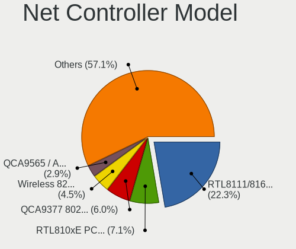

| Model                                                             | Notebooks | Percent |
|-------------------------------------------------------------------|-----------|---------|
| Realtek RTL8111/8168/8411 PCI Express Gigabit Ethernet Controller | 68        | 22.74%  |
| Realtek RTL810xE PCI Express Fast Ethernet controller             | 26        | 8.7%    |
| Qualcomm Atheros QCA9377 802.11ac Wireless Network Adapter        | 19        | 6.35%   |
| Intel Wireless 8265 / 8275                                        | 14        | 4.68%   |
| Intel Dual Band Wireless-AC 3168NGW [Stone Peak]                  | 12        | 4.01%   |
| Qualcomm Atheros QCA9565 / AR9565 Wireless Network Adapter        | 11        | 3.68%   |
| Intel Wi-Fi 6 AX201                                               | 10        | 3.34%   |
| Realtek RTL8723BE PCIe Wireless Network Adapter                   | 9         | 3.01%   |
| Realtek RTL8822BE 802.11a/b/g/n/ac WiFi adapter                   | 7         | 2.34%   |
| Qualcomm Atheros QCA6174 802.11ac Wireless Network Adapter        | 7         | 2.34%   |
| Intel Wireless 3165                                               | 6         | 2.01%   |
| Intel 82579LM Gigabit Network Connection (Lewisville)             | 6         | 2.01%   |
| Realtek RTL8821CE 802.11ac PCIe Wireless Network Adapter          | 5         | 1.67%   |
| Intel Wireless 8260                                               | 5         | 1.67%   |
| Qualcomm Atheros AR9485 Wireless Network Adapter                  | 4         | 1.34%   |
| Intel Wireless 7265                                               | 4         | 1.34%   |
| Intel Ethernet Connection (3) I218-LM                             | 4         | 1.34%   |
| Intel Centrino Advanced-N 6205 [Taylor Peak]                      | 4         | 1.34%   |
| Ralink MT7601U Wireless Adapter                                   | 3         | 1%      |
| Qualcomm Atheros AR9285 Wireless Network Adapter (PCI-Express)    | 3         | 1%      |
| Intel Wireless 7260                                               | 3         | 1%      |
| Intel Wireless 3160                                               | 3         | 1%      |
| Intel Ethernet Connection I219-LM                                 | 3         | 1%      |
| Intel Dual Band Wireless-AC 3165 Plus Bluetooth                   | 3         | 1%      |
| Realtek RTL8822CE 802.11ac PCIe Wireless Network Adapter          | 2         | 0.67%   |
| Realtek RTL8188EE Wireless Network Adapter                        | 2         | 0.67%   |
| Realtek RTL8153 Gigabit Ethernet Adapter                          | 2         | 0.67%   |
| Qualcomm Atheros AR9462 Wireless Network Adapter                  | 2         | 0.67%   |
| Qualcomm Atheros AR8152 v1.1 Fast Ethernet                        | 2         | 0.67%   |
| MediaTek MT7921 802.11ax PCI Express Wireless Network Adapter     | 2         | 0.67%   |
| Intel Wi-Fi 6 AX200                                               | 2         | 0.67%   |
| Intel Ice Lake-LP PCH CNVi WiFi                                   | 2         | 0.67%   |
| Intel Ethernet Connection I218-LM                                 | 2         | 0.67%   |
| Intel Ethernet Connection (4) I219-LM                             | 2         | 0.67%   |
| Intel Comet Lake PCH-LP CNVi WiFi                                 | 2         | 0.67%   |
| Broadcom BCM43142 802.11b/g/n                                     | 2         | 0.67%   |
| Xiaomi Mi/Redmi series (RNDIS)                                    | 1         | 0.33%   |
| Xiaomi Mi/Redmi series (RNDIS + ADB)                              | 1         | 0.33%   |
| TP-Link TL-WN823N v2/v3 [Realtek RTL8192EU]                       | 1         | 0.33%   |
| Samsung Galaxy series, misc. (tethering mode)                     | 1         | 0.33%   |

Wireless Vendor
---------------

Wireless vendors

| Vendor                | Notebooks | Percent |
|-----------------------|-----------|---------|
| Intel                 | 77        | 46.11%  |
| Qualcomm Atheros      | 48        | 28.74%  |
| Realtek Semiconductor | 30        | 17.96%  |
| Broadcom              | 4         | 2.4%    |
| Ralink Technology     | 3         | 1.8%    |
| MediaTek              | 2         | 1.2%    |
| TP-Link               | 1         | 0.6%    |
| Ralink                | 1         | 0.6%    |
| Dell                  | 1         | 0.6%    |

Wireless Model
--------------

Wireless models

| Model                                                          | Notebooks | Percent |
|----------------------------------------------------------------|-----------|---------|
| Qualcomm Atheros QCA9377 802.11ac Wireless Network Adapter     | 19        | 11.38%  |
| Intel Wireless 8265 / 8275                                     | 14        | 8.38%   |
| Intel Dual Band Wireless-AC 3168NGW [Stone Peak]               | 12        | 7.19%   |
| Qualcomm Atheros QCA9565 / AR9565 Wireless Network Adapter     | 11        | 6.59%   |
| Intel Wi-Fi 6 AX201                                            | 10        | 5.99%   |
| Realtek RTL8723BE PCIe Wireless Network Adapter                | 9         | 5.39%   |
| Realtek RTL8822BE 802.11a/b/g/n/ac WiFi adapter                | 7         | 4.19%   |
| Qualcomm Atheros QCA6174 802.11ac Wireless Network Adapter     | 7         | 4.19%   |
| Intel Wireless 3165                                            | 6         | 3.59%   |
| Realtek RTL8821CE 802.11ac PCIe Wireless Network Adapter       | 5         | 2.99%   |
| Intel Wireless 8260                                            | 5         | 2.99%   |
| Qualcomm Atheros AR9485 Wireless Network Adapter               | 4         | 2.4%    |
| Intel Wireless 7265                                            | 4         | 2.4%    |
| Intel Centrino Advanced-N 6205 [Taylor Peak]                   | 4         | 2.4%    |
| Ralink MT7601U Wireless Adapter                                | 3         | 1.8%    |
| Qualcomm Atheros AR9285 Wireless Network Adapter (PCI-Express) | 3         | 1.8%    |
| Intel Wireless 7260                                            | 3         | 1.8%    |
| Intel Wireless 3160                                            | 3         | 1.8%    |
| Intel Dual Band Wireless-AC 3165 Plus Bluetooth                | 3         | 1.8%    |
| Realtek RTL8822CE 802.11ac PCIe Wireless Network Adapter       | 2         | 1.2%    |
| Realtek RTL8188EE Wireless Network Adapter                     | 2         | 1.2%    |
| Qualcomm Atheros AR9462 Wireless Network Adapter               | 2         | 1.2%    |
| Intel Wi-Fi 6 AX200                                            | 2         | 1.2%    |
| Intel Ice Lake-LP PCH CNVi WiFi                                | 2         | 1.2%    |
| Intel Comet Lake PCH-LP CNVi WiFi                              | 2         | 1.2%    |
| Broadcom BCM43142 802.11b/g/n                                  | 2         | 1.2%    |
| TP-Link TL-WN823N v2/v3 [Realtek RTL8192EU]                    | 1         | 0.6%    |
| Realtek RTL8821AE 802.11ac PCIe Wireless Network Adapter       | 1         | 0.6%    |
| Realtek RTL8192CU 802.11n WLAN Adapter                         | 1         | 0.6%    |
| Realtek RTL8191SEvB Wireless LAN Controller                    | 1         | 0.6%    |
| Realtek RTL8188FTV 802.11b/g/n 1T1R 2.4G WLAN Adapter          | 1         | 0.6%    |
| Realtek RTL8187 Wireless Adapter                               | 1         | 0.6%    |
| Ralink RT3290 Wireless 802.11n 1T/1R PCIe                      | 1         | 0.6%    |
| Qualcomm Atheros AR928X Wireless Network Adapter (PCI-Express) | 1         | 0.6%    |
| Qualcomm Atheros AR9287 Wireless Network Adapter (PCI-Express) | 1         | 0.6%    |
| MediaTek MT7921K (RZ608) Wi-Fi 6E 80MHz                        | 1         | 0.6%    |
| MediaTek MT7921 802.11ax PCI Express Wireless Network Adapter  | 1         | 0.6%    |
| Intel Ultimate N WiFi Link 5300                                | 1         | 0.6%    |
| Intel Tiger Lake PCH CNVi WiFi                                 | 1         | 0.6%    |
| Intel Comet Lake PCH CNVi WiFi                                 | 1         | 0.6%    |

Ethernet Vendor
---------------

Ethernet vendors

| Vendor                | Notebooks | Percent |
|-----------------------|-----------|---------|
| Realtek Semiconductor | 98        | 74.81%  |
| Intel                 | 19        | 14.5%   |
| Qualcomm Atheros      | 6         | 4.58%   |
| Broadcom              | 3         | 2.29%   |
| Xiaomi                | 2         | 1.53%   |
| Samsung Electronics   | 1         | 0.76%   |
| MediaTek              | 1         | 0.76%   |
| ASIX Electronics      | 1         | 0.76%   |

Ethernet Model
--------------

Ethernet models

| Model                                                             | Notebooks | Percent |
|-------------------------------------------------------------------|-----------|---------|
| Realtek RTL8111/8168/8411 PCI Express Gigabit Ethernet Controller | 68        | 51.91%  |
| Realtek RTL810xE PCI Express Fast Ethernet controller             | 26        | 19.85%  |
| Intel 82579LM Gigabit Network Connection (Lewisville)             | 6         | 4.58%   |
| Intel Ethernet Connection (3) I218-LM                             | 4         | 3.05%   |
| Intel Ethernet Connection I219-LM                                 | 3         | 2.29%   |
| Realtek RTL8153 Gigabit Ethernet Adapter                          | 2         | 1.53%   |
| Qualcomm Atheros AR8152 v1.1 Fast Ethernet                        | 2         | 1.53%   |
| Intel Ethernet Connection I218-LM                                 | 2         | 1.53%   |
| Intel Ethernet Connection (4) I219-LM                             | 2         | 1.53%   |
| Xiaomi Mi/Redmi series (RNDIS)                                    | 1         | 0.76%   |
| Xiaomi Mi/Redmi series (RNDIS + ADB)                              | 1         | 0.76%   |
| Samsung Galaxy series, misc. (tethering mode)                     | 1         | 0.76%   |
| Realtek Killer E2600 Gigabit Ethernet Controller                  | 1         | 0.76%   |
| Realtek Killer E2500 Gigabit Ethernet Controller                  | 1         | 0.76%   |
| Qualcomm Atheros QCA8172 Fast Ethernet                            | 1         | 0.76%   |
| Qualcomm Atheros Killer E2500 Gigabit Ethernet Controller         | 1         | 0.76%   |
| Qualcomm Atheros AR8152 v2.0 Fast Ethernet                        | 1         | 0.76%   |
| Qualcomm Atheros AR8131 Gigabit Ethernet                          | 1         | 0.76%   |
| MediaTek MT7921 802.11ax PCI Express Wireless Network Adapter     | 1         | 0.76%   |
| Intel Ethernet Connection (6) I219-LM                             | 1         | 0.76%   |
| Intel 82567LM Gigabit Network Connection                          | 1         | 0.76%   |
| Broadcom NetXtreme BCM57765 Gigabit Ethernet PCIe                 | 1         | 0.76%   |
| Broadcom NetLink BCM57785 Gigabit Ethernet PCIe                   | 1         | 0.76%   |
| Broadcom NetLink BCM57780 Gigabit Ethernet PCIe                   | 1         | 0.76%   |
| ASIX AX88179 Gigabit Ethernet                                     | 1         | 0.76%   |

Net Controller Kind
-------------------

Ethernet, WiFi or modem

| Kind     | Notebooks | Percent |
|----------|-----------|---------|
| WiFi     | 162       | 55.67%  |
| Ethernet | 128       | 43.99%  |
| Modem    | 1         | 0.34%   |

Used Controller
---------------

Currently used network controller

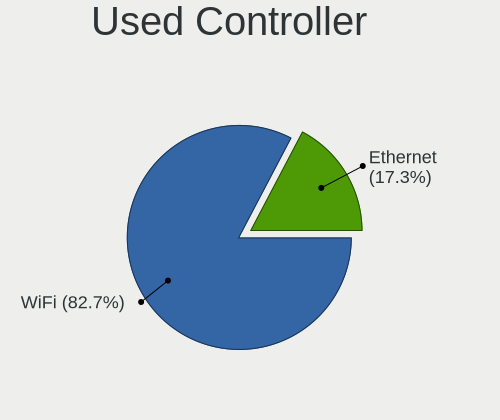

| Kind     | Notebooks | Percent |
|----------|-----------|---------|
| WiFi     | 144       | 85.21%  |
| Ethernet | 25        | 14.79%  |

NICs
----

Total network controllers on board

| Total | Notebooks | Percent |
|-------|-----------|---------|
| 2     | 119       | 72.12%  |
| 1     | 46        | 27.88%  |

IPv6
----

IPv6 vs IPv4

| Used | Notebooks | Percent |
|------|-----------|---------|
| No   | 165       | 100%    |

Bluetooth
---------

Bluetooth Vendor
----------------

Controller vendors

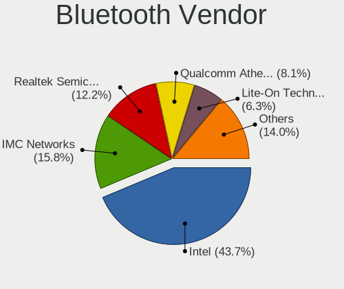

| Vendor                          | Notebooks | Percent |
|---------------------------------|-----------|---------|
| Intel                           | 64        | 45.71%  |
| IMC Networks                    | 21        | 15%     |
| Realtek Semiconductor           | 16        | 11.43%  |
| Qualcomm Atheros Communications | 13        | 9.29%   |
| Lite-On Technology              | 10        | 7.14%   |
| Broadcom                        | 7         | 5%      |
| Foxconn / Hon Hai               | 4         | 2.86%   |
| Toshiba                         | 1         | 0.71%   |
| Ralink                          | 1         | 0.71%   |
| Hewlett-Packard                 | 1         | 0.71%   |
| Dell                            | 1         | 0.71%   |
| Cambridge Silicon Radio         | 1         | 0.71%   |

Bluetooth Model
---------------

Controller models

| Model                                               | Notebooks | Percent |
|-----------------------------------------------------|-----------|---------|
| Intel Bluetooth wireless interface                  | 35        | 25%     |
| IMC Networks Bluetooth Device                       | 12        | 8.57%   |
| Realtek Bluetooth Radio                             | 10        | 7.14%   |
| Intel Wireless-AC 3168 Bluetooth                    | 10        | 7.14%   |
| Intel AX201 Bluetooth                               | 10        | 7.14%   |
| Qualcomm Atheros  Bluetooth Device                  | 7         | 5%      |
| IMC Networks Bluetooth Radio                        | 7         | 5%      |
| Lite-On Qualcomm Atheros QCA9377 Bluetooth          | 6         | 4.29%   |
| Intel Bluetooth 9460/9560 Jefferson Peak (JfP)      | 6         | 4.29%   |
| Realtek  Bluetooth 4.2 Adapter                      | 3         | 2.14%   |
| Lite-On Bluetooth Device                            | 3         | 2.14%   |
| Realtek RTL8822BE Bluetooth 4.2 Adapter             | 2         | 1.43%   |
| Qualcomm Atheros AR9462 Bluetooth                   | 2         | 1.43%   |
| Intel AX200 Bluetooth                               | 2         | 1.43%   |
| Foxconn / Hon Hai Bluetooth Device                  | 2         | 1.43%   |
| Broadcom HP Portable SoftSailing                    | 2         | 1.43%   |
| Broadcom BCM20702 Bluetooth 4.0 [ThinkPad]          | 2         | 1.43%   |
| Toshiba Bluetooth Radio                             | 1         | 0.71%   |
| Realtek RTL8821A Bluetooth                          | 1         | 0.71%   |
| Ralink RT3290 Bluetooth                             | 1         | 0.71%   |
| Qualcomm Atheros QCA61x4 Bluetooth 4.0              | 1         | 0.71%   |
| Qualcomm Atheros AR3012 Bluetooth 4.0               | 1         | 0.71%   |
| Qualcomm Atheros AR3012 Bluetooth                   | 1         | 0.71%   |
| Qualcomm Atheros AR3011 Bluetooth                   | 1         | 0.71%   |
| Lite-On Atheros AR3012 Bluetooth                    | 1         | 0.71%   |
| Intel Centrino Advanced-N 6230 Bluetooth adapter    | 1         | 0.71%   |
| IMC Networks Wireless_Device                        | 1         | 0.71%   |
| IMC Networks Atheros AR3012 Bluetooth 4.0 Adapter   | 1         | 0.71%   |
| HP Broadcom 2070 Bluetooth Combo                    | 1         | 0.71%   |
| Foxconn / Hon Hai Wireless_Device                   | 1         | 0.71%   |
| Foxconn / Hon Hai Bluetooth USB Host Controller     | 1         | 0.71%   |
| Dell Wireless 360 Bluetooth                         | 1         | 0.71%   |
| Cambridge Silicon Radio Bluetooth Dongle (HCI mode) | 1         | 0.71%   |
| Broadcom BCM43142A0 Bluetooth 4.0                   | 1         | 0.71%   |
| Broadcom BCM43142 Bluetooth 4.0                     | 1         | 0.71%   |
| Broadcom BCM20702A0 Bluetooth 4.0                   | 1         | 0.71%   |

Sound
-----

Sound Vendor
------------

Sound card vendors

| Vendor                 | Notebooks | Percent |
|------------------------|-----------|---------|
| Intel                  | 149       | 86.63%  |
| AMD                    | 15        | 8.72%   |
| Nvidia                 | 7         | 4.07%   |
| Generalplus Technology | 1         | 0.58%   |

Sound Model
-----------

Sound card models

| Model                                                                                             | Notebooks | Percent |
|---------------------------------------------------------------------------------------------------|-----------|---------|
| Intel Sunrise Point-LP HD Audio                                                                   | 56        | 26.42%  |
| Intel Cannon Point-LP High Definition Audio Controller                                            | 13        | 6.13%   |
| Intel Wildcat Point-LP High Definition Audio Controller                                           | 12        | 5.66%   |
| Intel Haswell-ULT HD Audio Controller                                                             | 12        | 5.66%   |
| Intel Broadwell-U Audio Controller                                                                | 12        | 5.66%   |
| Intel 8 Series HD Audio Controller                                                                | 12        | 5.66%   |
| Intel 7 Series/C216 Chipset Family High Definition Audio Controller                               | 12        | 5.66%   |
| AMD Family 17h/19h HD Audio Controller                                                            | 12        | 5.66%   |
| Intel Tiger Lake-LP Smart Sound Technology Audio Controller                                       | 10        | 4.72%   |
| Intel 6 Series/C200 Series Chipset Family High Definition Audio Controller                        | 6         | 2.83%   |
| AMD Raven/Raven2/Fenghuang HDMI/DP Audio Controller                                               | 6         | 2.83%   |
| Intel Atom/Celeron/Pentium Processor x5-E8000/J3xxx/N3xxx Series High Definition Audio Controller | 5         | 2.36%   |
| Intel Ice Lake-LP Smart Sound Technology Audio Controller                                         | 4         | 1.89%   |
| Intel 82801I (ICH9 Family) HD Audio Controller                                                    | 4         | 1.89%   |
| AMD Renoir Radeon High Definition Audio Controller                                                | 4         | 1.89%   |
| Nvidia TU107 GeForce GTX 1650 High Definition Audio Controller                                    | 3         | 1.42%   |
| Intel Comet Lake PCH-LP cAVS                                                                      | 3         | 1.42%   |
| Intel Xeon E3-1200 v3/4th Gen Core Processor HD Audio Controller                                  | 2         | 0.94%   |
| Intel NM10/ICH7 Family High Definition Audio Controller                                           | 2         | 0.94%   |
| Intel Comet Lake PCH cAVS                                                                         | 2         | 0.94%   |
| Intel 8 Series/C220 Series Chipset High Definition Audio Controller                               | 2         | 0.94%   |
| Intel 5 Series/3400 Series Chipset High Definition Audio                                          | 2         | 0.94%   |
| AMD High Definition Audio Controller                                                              | 2         | 0.94%   |
| AMD Family 15h (Models 60h-6fh) Audio Controller                                                  | 2         | 0.94%   |
| Nvidia TU116 High Definition Audio Controller                                                     | 1         | 0.47%   |
| Nvidia TU104 HD Audio Controller                                                                  | 1         | 0.47%   |
| Nvidia GK208 HDMI/DP Audio Controller                                                             | 1         | 0.47%   |
| Nvidia GF108 High Definition Audio Controller                                                     | 1         | 0.47%   |
| Intel USB PnP Sound Device                                                                        | 1         | 0.47%   |
| Intel Tiger Lake-H HD Audio Controller                                                            | 1         | 0.47%   |
| Intel CM238 HD Audio Controller                                                                   | 1         | 0.47%   |
| Intel Atom Processor Z36xxx/Z37xxx Series High Definition Audio Controller                        | 1         | 0.47%   |
| Intel 100 Series/C230 Series Chipset Family HD Audio Controller                                   | 1         | 0.47%   |
| Generalplus Technology USB Audio Device                                                           | 1         | 0.47%   |
| AMD Kabini HDMI/DP Audio                                                                          | 1         | 0.47%   |
| AMD FCH Azalia Controller                                                                         | 1         | 0.47%   |

Memory
------

Memory Vendor
-------------

Memory module vendors

| Vendor              | Notebooks | Percent |
|---------------------|-----------|---------|
| Samsung Electronics | 35        | 29.91%  |
| SK hynix            | 29        | 24.79%  |
| Micron Technology   | 16        | 13.68%  |
| Kingston            | 6         | 5.13%   |
| A-DATA Technology   | 6         | 5.13%   |
| Transcend           | 4         | 3.42%   |
| G.Skill             | 4         | 3.42%   |
| Unknown             | 3         | 2.56%   |
| Team                | 2         | 1.71%   |
| Ramaxel Technology  | 2         | 1.71%   |
| Nanya Technology    | 2         | 1.71%   |
| Unknown (C509)      | 1         | 0.85%   |
| Unknown (768A)      | 1         | 0.85%   |
| Hewlett-Packard     | 1         | 0.85%   |
| Elpida              | 1         | 0.85%   |
| Crucial             | 1         | 0.85%   |
| ASint Technology    | 1         | 0.85%   |
| Apacer              | 1         | 0.85%   |
| Unknown             | 1         | 0.85%   |

Memory Model
------------

Memory module models

| Model                                                            | Notebooks | Percent |
|------------------------------------------------------------------|-----------|---------|
| SK hynix RAM HMA81GS6AFR8N-UH 8GB SODIMM DDR4 2667MT/s           | 5         | 4.27%   |
| Samsung RAM M471A5244CB0-CRC 4GB SODIMM DDR4 2667MT/s            | 4         | 3.42%   |
| SK hynix RAM HMT351S6EFR8A-PB 4GB SODIMM DDR3 1600MT/s           | 3         | 2.56%   |
| SK hynix RAM HMA851S6AFR6N-UH 4GB SODIMM DDR4 2667MT/s           | 3         | 2.56%   |
| SK hynix RAM HMA41GS6AFR8N-TF 8GB SODIMM DDR4 2667MT/s           | 3         | 2.56%   |
| Samsung RAM M471B5173EB0-YK0 4GB SODIMM DDR3 1600MT/s            | 3         | 2.56%   |
| SK hynix RAM HMT451S6BFR8A-PB 4GB SODIMM DDR3 1600MT/s           | 2         | 1.71%   |
| SK hynix RAM HMT351S6CFR8C-PB 4GB SODIMM DDR3 1600MT/s           | 2         | 1.71%   |
| SK hynix RAM HMA81GS6JJR8N-VK 8GB SODIMM DDR4 2667MT/s           | 2         | 1.71%   |
| Samsung RAM M471B5173QH0-YK0 4GB SODIMM DDR3 1600MT/s            | 2         | 1.71%   |
| Samsung RAM M471B5173DB0-YK0 4GB SODIMM DDR3 1600MT/s            | 2         | 1.71%   |
| Samsung RAM M471A5244CB0-CTD 4GB SODIMM DDR4 3266MT/s            | 2         | 1.71%   |
| Samsung RAM M471A2G43AB2-CWE 16GB SODIMM DDR4 3200MT/s           | 2         | 1.71%   |
| Samsung RAM M471A1K44BM0-CRC 8GB SODIMM DDR4 2400MT/s            | 2         | 1.71%   |
| Samsung RAM M471A1K43CB1-CRC 8GB SODIMM DDR4 2667MT/s            | 2         | 1.71%   |
| Micron RAM 8ATF1G64HZ-3G2J1 8GB SODIMM DDR4 3200MT/s             | 2         | 1.71%   |
| Micron RAM 4ATS1G64HZ-2G6E1 8GB SODIMM DDR4 2667MT/s             | 2         | 1.71%   |
| Micron RAM 4ATF51264HZ-3G2J1 4GB SODIMM DDR4 3200MT/s            | 2         | 1.71%   |
| Micron RAM 4ATF51264HZ-2G3B1 4096MB SODIMM DDR4 2400MT/s         | 2         | 1.71%   |
| Micron RAM 16KTF51264HZ-1G6M1 4GB SODIMM DDR3 1600MT/s           | 2         | 1.71%   |
| Unknown RAM Module 8192MB SODIMM DDR3 1600MT/s                   | 1         | 0.85%   |
| Unknown RAM Module 4GB SODIMM DDR3 1067MT/s                      | 1         | 0.85%   |
| Unknown RAM Module 4096MB SODIMM DDR3 1600MT/s                   | 1         | 0.85%   |
| Unknown (C509) RAM Module 4GB SODIMM DDR4 2400MT/s               | 1         | 0.85%   |
| Unknown (768A) RAM Module 8192MB SODIMM DDR4 3200MT/s            | 1         | 0.85%   |
| Transcend RAM JM3200HSB-8G 8GB SODIMM DDR4 3200MT/s              | 1         | 0.85%   |
| Transcend RAM JM2666HSG-8G 8GB SODIMM DDR4 2667MT/s              | 1         | 0.85%   |
| Transcend RAM JM2400HSB-8G 8GB SODIMM DDR4 2400MT/s              | 1         | 0.85%   |
| Transcend RAM JM1333KSN-4G 4GB SODIMM DDR3 1334MT/s              | 1         | 0.85%   |
| Team RAM TEAMGROUP-SD4-3200 16GB SODIMM DDR4 3200MT/s            | 1         | 0.85%   |
| Team RAM TEAMGROUP-SD4-2400 8GB SODIMM DDR4 8400MT/s             | 1         | 0.85%   |
| SK hynix RAM Module 8192MB SODIMM DDR4 2400MT/s                  | 1         | 0.85%   |
| SK hynix RAM Module 4096MB SODIMM DDR4 2133MT/s                  | 1         | 0.85%   |
| SK hynix RAM HMT451S6AFR8A-PB 4GB SODIMM DDR3 1600MT/s           | 1         | 0.85%   |
| SK hynix RAM HMT425S6AFR6A-PB 2GB SODIMM DDR3 1600MT/s           | 1         | 0.85%   |
| SK hynix RAM HMT325S6EFR8A-PB 2GB SODIMM DDR3 1600MT/s           | 1         | 0.85%   |
| SK hynix RAM HMAA1GS6CJR6N-XN 8192MB SODIMM DDR4 3200MT/s        | 1         | 0.85%   |
| SK hynix RAM HMA851S6DJR6N-XN 4GB SODIMM DDR4 3200MT/s           | 1         | 0.85%   |
| SK hynix RAM HMA81GS6CJR8N-VK 8GB SODIMM DDR4 2667MT/s           | 1         | 0.85%   |
| SK hynix RAM H9CCNNNBJTMLAR-NUD 4GB Row Of Chips LPDDR3 1867MT/s | 1         | 0.85%   |

Memory Kind
-----------

Memory module kinds

| Kind   | Notebooks | Percent |
|--------|-----------|---------|
| DDR4   | 56        | 64.37%  |
| DDR3   | 25        | 28.74%  |
| LPDDR4 | 3         | 3.45%   |
| LPDDR3 | 2         | 2.3%    |
| SDRAM  | 1         | 1.15%   |

Memory Form Factor
------------------

Physical design of the memory module

| Name         | Notebooks | Percent |
|--------------|-----------|---------|
| SODIMM       | 81        | 96.43%  |
| Row Of Chips | 3         | 3.57%   |

Memory Size
-----------

Memory module size

| Size  | Notebooks | Percent |
|-------|-----------|---------|
| 4096  | 42        | 43.3%   |
| 8192  | 40        | 41.24%  |
| 16384 | 7         | 7.22%   |
| 2048  | 6         | 6.19%   |
| 32768 | 1         | 1.03%   |
| 1024  | 1         | 1.03%   |

Memory Speed
------------

Memory module speed

| Speed | Notebooks | Percent |
|-------|-----------|---------|
| 2667  | 28        | 29.47%  |
| 1600  | 19        | 20%     |
| 2400  | 13        | 13.68%  |
| 3200  | 12        | 12.63%  |
| 2133  | 10        | 10.53%  |
| 1067  | 4         | 4.21%   |
| 1334  | 3         | 3.16%   |
| 3266  | 2         | 2.11%   |
| 8400  | 1         | 1.05%   |
| 4199  | 1         | 1.05%   |
| 1867  | 1         | 1.05%   |
| 1333  | 1         | 1.05%   |

Printers & scanners
-------------------

Printer Vendor
--------------

Printer device vendors

| Vendor      | Notebooks | Percent |
|-------------|-----------|---------|
| Seiko Epson | 1         | 50%     |
| Pantum      | 1         | 50%     |

Printer Model
-------------

Printer device models

| Model                   | Notebooks | Percent |
|-------------------------|-----------|---------|
| Seiko Epson L132 Series | 1         | 50%     |
| Pantum PMF22 series     | 1         | 50%     |

Scanner Vendor
--------------

Scanner device vendors

Zero info for selected period =(

Scanner Model
-------------

Scanner device models

Zero info for selected period =(

Camera
------

Camera Vendor
-------------

Camera device vendors

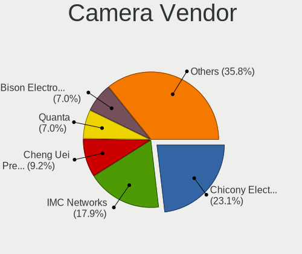

| Vendor                                 | Notebooks | Percent |
|----------------------------------------|-----------|---------|
| Chicony Electronics                    | 36        | 23.23%  |
| IMC Networks                           | 29        | 18.71%  |
| Cheng Uei Precision Industry (Foxlink) | 15        | 9.68%   |
| Realtek Semiconductor                  | 12        | 7.74%   |
| Quanta                                 | 10        | 6.45%   |
| Sunplus Innovation Technology          | 9         | 5.81%   |
| Microdia                               | 9         | 5.81%   |
| Acer                                   | 8         | 5.16%   |
| Lite-On Technology                     | 7         | 4.52%   |
| Suyin                                  | 5         | 3.23%   |
| Luxvisions Innotech Limited            | 4         | 2.58%   |
| Syntek                                 | 2         | 1.29%   |
| Silicon Motion                         | 2         | 1.29%   |
| Primax Electronics                     | 2         | 1.29%   |
| Sonix Technology                       | 1         | 0.65%   |
| Importek                               | 1         | 0.65%   |
| DLEQNA19IFK6G2                         | 1         | 0.65%   |
| Bison Electronics                      | 1         | 0.65%   |
| Apple                                  | 1         | 0.65%   |

Camera Model
------------

Camera device models

| Model                                                   | Notebooks | Percent |
|---------------------------------------------------------|-----------|---------|
| Chicony USB2.0 VGA UVC WebCam                           | 10        | 6.45%   |
| IMC Networks USB2.0 VGA UVC WebCam                      | 9         | 5.81%   |
| IMC Networks USB2.0 HD UVC WebCam                       | 9         | 5.81%   |
| IMC Networks VGA UVC WebCam                             | 5         | 3.23%   |
| Microdia Integrated_Webcam_HD                           | 4         | 2.58%   |
| Luxvisions Innotech Limited HP HD Camera                | 4         | 2.58%   |
| Lite-On HP HD Camera                                    | 4         | 2.58%   |
| Chicony HD WebCam                                       | 4         | 2.58%   |
| Suyin Integrated_Webcam_HD                              | 3         | 1.94%   |
| Realtek Integrated_Webcam_HD                            | 3         | 1.94%   |
| Quanta HD Webcam                                        | 3         | 1.94%   |
| IMC Networks USB2.0 HD IR UVC WebCam                    | 3         | 1.94%   |
| IMC Networks Integrated Camera                          | 3         | 1.94%   |
| Chicony EasyCamera                                      | 3         | 1.94%   |
| Cheng Uei Precision Industry (Foxlink) Webcam           | 3         | 1.94%   |
| Cheng Uei Precision Industry (Foxlink) HP HD Camera     | 3         | 1.94%   |
| Acer HD Webcam                                          | 3         | 1.94%   |
| Suyin HP Truevision HD                                  | 2         | 1.29%   |
| Sunplus Laptop Integrated Webcam HD                     | 2         | 1.29%   |
| Realtek USB2.0 VGA UVC WebCam                           | 2         | 1.29%   |
| Realtek USB2.0 HD UVC WebCam                            | 2         | 1.29%   |
| Quanta HD User Facing                                   | 2         | 1.29%   |
| Primax HP HD Webcam [Fixed]                             | 2         | 1.29%   |
| Lite-On Integrated Camera                               | 2         | 1.29%   |
| Chicony USB2.0 Camera                                   | 2         | 1.29%   |
| Chicony Integrated Camera                               | 2         | 1.29%   |
| Chicony HP Truevision HD camera                         | 2         | 1.29%   |
| Chicony HP HD Webcam                                    | 2         | 1.29%   |
| Chicony HP HD Camera                                    | 2         | 1.29%   |
| Cheng Uei Precision Industry (Foxlink) HP Webcam        | 2         | 1.29%   |
| Cheng Uei Precision Industry (Foxlink) HP Truevision HD | 2         | 1.29%   |
| Cheng Uei Precision Industry (Foxlink) HP HD Webcam     | 2         | 1.29%   |
| Acer Lenovo EasyCamera                                  | 2         | 1.29%   |
| Acer EasyCamera                                         | 2         | 1.29%   |
| Syntek Integrated Camera                                | 1         | 0.65%   |
| Syntek EasyCamera                                       | 1         | 0.65%   |
| Sunplus XiaoMi USB 2.0 Webcam                           | 1         | 0.65%   |
| Sunplus Integrated_Webcam_HD                            | 1         | 0.65%   |
| Sunplus Integrated Webcam                               | 1         | 0.65%   |
| Sunplus HP HD Webcam [Fixed]                            | 1         | 0.65%   |

Security
--------

Fingerprint Vendor
------------------

Fingerprint sensor vendors

| Vendor                     | Notebooks | Percent |
|----------------------------|-----------|---------|
| Validity Sensors           | 25        | 80.65%  |
| Synaptics                  | 3         | 9.68%   |
| Elan Microelectronics      | 2         | 6.45%   |
| Shenzhen Goodix Technology | 1         | 3.23%   |

Fingerprint Model
-----------------

Fingerprint sensor models

| Model                                                                      | Notebooks | Percent |
|----------------------------------------------------------------------------|-----------|---------|
| Validity Sensors VFS495 Fingerprint Reader                                 | 14        | 45.16%  |
| Validity Sensors VFS491                                                    | 3         | 9.68%   |
| Validity Sensors VFS Fingerprint sensor                                    | 3         | 9.68%   |
| Synaptics Metallica MOH Touch Fingerprint Reader                           | 2         | 6.45%   |
| Elan ELAN:Fingerprint                                                      | 2         | 6.45%   |
| Validity Sensors VFS7552 Touch Fingerprint Sensor                          | 1         | 3.23%   |
| Validity Sensors VFS5011 Fingerprint Reader                                | 1         | 3.23%   |
| Validity Sensors VFS471 Fingerprint Reader                                 | 1         | 3.23%   |
| Validity Sensors VFS 5011 fingerprint sensor                               | 1         | 3.23%   |
| Validity Sensors Synaptics VFS7552 Touch Fingerprint Sensor with PurePrint | 1         | 3.23%   |
| Synaptics  WBDI                                                            | 1         | 3.23%   |
| Shenzhen Goodix  FingerPrint Device                                        | 1         | 3.23%   |

Chipcard Vendor
---------------

Chipcard module vendors

| Vendor   | Notebooks | Percent |
|----------|-----------|---------|
| Broadcom | 6         | 100%    |

Chipcard Model
--------------

Chipcard module models

| Model                                                                        | Notebooks | Percent |
|------------------------------------------------------------------------------|-----------|---------|
| Broadcom BCM5880 Secure Applications Processor with fingerprint swipe sensor | 2         | 33.33%  |
| Broadcom 5880                                                                | 2         | 33.33%  |
| Broadcom BCM5880 Secure Applications Processor                               | 1         | 16.67%  |
| Broadcom 58200                                                               | 1         | 16.67%  |

Unsupported
-----------

Unsupported Devices
-------------------

Total unsupported devices on board

| Total | Notebooks | Percent |
|-------|-----------|---------|
| 0     | 113       | 65.7%   |
| 1     | 52        | 30.23%  |
| 2     | 6         | 3.49%   |
| 3     | 1         | 0.58%   |

Unsupported Device Types
------------------------

Types of unsupported devices

| Type                  | Notebooks | Percent |
|-----------------------|-----------|---------|
| Fingerprint reader    | 31        | 49.21%  |
| Graphics card         | 16        | 25.4%   |
| Chipcard              | 6         | 9.52%   |
| Net/wireless          | 3         | 4.76%   |
| Camera                | 3         | 4.76%   |
| Multimedia controller | 2         | 3.17%   |
| Card reader           | 1         | 1.59%   |
| Bluetooth             | 1         | 1.59%   |

