Linux in Belarus - Tested Hardware & Statistics
-----------------------------------------------

A project to collect tested hardware configurations for Linux in Belarus.

Anyone can contribute to this report by the [hw-probe](https://github.com/linuxhw/hw-probe) tool:

    sudo -E hw-probe -all -upload

Please contribute! Especially if your hardware is rare.

This is a report for all computer types. See also reports for [desktops](/Location/Belarus/Desktop/README.md) and [notebooks](/Location/Belarus/Notebook/README.md).

Contents
--------

* [ Test Cases ](#test-cases)

* [ System ](#system)
  - [ OS                       ](#os)
  - [ OS Family                ](#os-family)
  - [ Kernel                   ](#kernel)
  - [ Kernel Family            ](#kernel-family)
  - [ Kernel Major Ver.        ](#kernel-major-ver)
  - [ Arch                     ](#arch)
  - [ DE                       ](#de)
  - [ Display Server           ](#display-server)
  - [ Display Manager          ](#display-manager)
  - [ OS Lang                  ](#os-lang)
  - [ Boot Mode                ](#boot-mode)
  - [ Filesystem               ](#filesystem)
  - [ Part. scheme             ](#part-scheme)
  - [ Dual Boot with Linux/BSD ](#dual-boot-with-linuxbsd)
  - [ Dual Boot (Win)          ](#dual-boot-win)

* [ Board ](#board)
  - [ Vendor                   ](#vendor)
  - [ Model                    ](#model)
  - [ Model Family             ](#model-family)
  - [ MFG Year                 ](#mfg-year)
  - [ Form Factor              ](#form-factor)
  - [ Secure Boot              ](#secure-boot)
  - [ Coreboot                 ](#coreboot)
  - [ RAM Size                 ](#ram-size)
  - [ RAM Used                 ](#ram-used)
  - [ Total Drives             ](#total-drives)
  - [ Has CD-ROM               ](#has-cd-rom)
  - [ Has Ethernet             ](#has-ethernet)
  - [ Has WiFi                 ](#has-wifi)
  - [ Has Bluetooth            ](#has-bluetooth)

* [ Location ](#location)
  - [ Country                  ](#country)
  - [ City                     ](#city)

* [ Drives ](#drives)
  - [ Drive Vendor             ](#drive-vendor)
  - [ Drive Model              ](#drive-model)
  - [ HDD Vendor               ](#hdd-vendor)
  - [ SSD Vendor               ](#ssd-vendor)
  - [ Drive Kind               ](#drive-kind)
  - [ Drive Connector          ](#drive-connector)
  - [ Drive Size               ](#drive-size)
  - [ Space Total              ](#space-total)
  - [ Space Used               ](#space-used)
  - [ Malfunc. Drives          ](#malfunc-drives)
  - [ Malfunc. Drive Vendor    ](#malfunc-drive-vendor)
  - [ Malfunc. HDD Vendor      ](#malfunc-hdd-vendor)
  - [ Malfunc. Drive Kind      ](#malfunc-drive-kind)
  - [ Failed Drives            ](#failed-drives)
  - [ Failed Drive Vendor      ](#failed-drive-vendor)
  - [ Drive Status             ](#drive-status)

* [ Storage controller ](#storage-controller)
  - [ Storage Vendor           ](#storage-vendor)
  - [ Storage Model            ](#storage-model)
  - [ Storage Kind             ](#storage-kind)

* [ Processor ](#processor)
  - [ CPU Vendor               ](#cpu-vendor)
  - [ CPU Model                ](#cpu-model)
  - [ CPU Model Family         ](#cpu-model-family)
  - [ CPU Cores                ](#cpu-cores)
  - [ CPU Sockets              ](#cpu-sockets)
  - [ CPU Threads              ](#cpu-threads)
  - [ CPU Op-Modes             ](#cpu-op-modes)
  - [ CPU Microcode            ](#cpu-microcode)
  - [ CPU Microarch            ](#cpu-microarch)

* [ Graphics ](#graphics)
  - [ GPU Vendor               ](#gpu-vendor)
  - [ GPU Model                ](#gpu-model)
  - [ GPU Combo                ](#gpu-combo)
  - [ GPU Driver               ](#gpu-driver)
  - [ GPU Memory               ](#gpu-memory)

* [ Monitor ](#monitor)
  - [ Monitor Vendor           ](#monitor-vendor)
  - [ Monitor Model            ](#monitor-model)
  - [ Monitor Resolution       ](#monitor-resolution)
  - [ Monitor Diagonal         ](#monitor-diagonal)
  - [ Monitor Width            ](#monitor-width)
  - [ Aspect Ratio             ](#aspect-ratio)
  - [ Monitor Area             ](#monitor-area)
  - [ Pixel Density            ](#pixel-density)
  - [ Multiple Monitors        ](#multiple-monitors)

* [ Network ](#network)
  - [ Net Controller Vendor    ](#net-controller-vendor)
  - [ Net Controller Model     ](#net-controller-model)
  - [ Wireless Vendor          ](#wireless-vendor)
  - [ Wireless Model           ](#wireless-model)
  - [ Ethernet Vendor          ](#ethernet-vendor)
  - [ Ethernet Model           ](#ethernet-model)
  - [ Net Controller Kind      ](#net-controller-kind)
  - [ Used Controller          ](#used-controller)
  - [ NICs                     ](#nics)
  - [ IPv6                     ](#ipv6)

* [ Bluetooth ](#bluetooth)
  - [ Bluetooth Vendor         ](#bluetooth-vendor)
  - [ Bluetooth Model          ](#bluetooth-model)

* [ Sound ](#sound)
  - [ Sound Vendor             ](#sound-vendor)
  - [ Sound Model              ](#sound-model)

* [ Memory ](#memory)
  - [ Memory Vendor            ](#memory-vendor)
  - [ Memory Model             ](#memory-model)
  - [ Memory Kind              ](#memory-kind)
  - [ Memory Form Factor       ](#memory-form-factor)
  - [ Memory Size              ](#memory-size)
  - [ Memory Speed             ](#memory-speed)

* [ Printers & scanners ](#printers--scanners)
  - [ Printer Vendor           ](#printer-vendor)
  - [ Printer Model            ](#printer-model)
  - [ Scanner Vendor           ](#scanner-vendor)
  - [ Scanner Model            ](#scanner-model)

* [ Camera ](#camera)
  - [ Camera Vendor            ](#camera-vendor)
  - [ Camera Model             ](#camera-model)

* [ Security ](#security)
  - [ Fingerprint Vendor       ](#fingerprint-vendor)
  - [ Fingerprint Model        ](#fingerprint-model)
  - [ Chipcard Vendor          ](#chipcard-vendor)
  - [ Chipcard Model           ](#chipcard-model)

* [ Unsupported ](#unsupported)
  - [ Unsupported Devices      ](#unsupported-devices)
  - [ Unsupported Device Types ](#unsupported-device-types)

Test Cases
----------

Total: 2254

| Vendor        | Model                       | Form-Factor | Probe                                                      | Date         |
|---------------|-----------------------------|-------------|------------------------------------------------------------|--------------|
| Gigabyte      | GAMING A16 3VH              | Notebook    | [edd64ded98](https://linux-hardware.org/?probe=edd64ded98) | Jan 01, 2026 |
| Lenovo        | SHARKBAY SDK0E50510 WIN     | Desktop     | [131893b445](https://linux-hardware.org/?probe=131893b445) | Dec 31, 2025 |
| Gigabyte      | GA-970A-D3                  | Desktop     | [b831eb7a27](https://linux-hardware.org/?probe=b831eb7a27) | Dec 29, 2025 |
| HP            | ProBook 450 15.6 inch G9... | Notebook    | [2a1db5cd53](https://linux-hardware.org/?probe=2a1db5cd53) | Dec 24, 2025 |
| MSI           | Modern 15 A5M               | Notebook    | [4e49258835](https://linux-hardware.org/?probe=4e49258835) | Dec 24, 2025 |
| Timi          | Xiaomi Book Pro 16 2022     | Notebook    | [e7b0ef22b6](https://linux-hardware.org/?probe=e7b0ef22b6) | Dec 22, 2025 |
| Lenovo        | IdeaPad Slim 5 14IAH8 83... | Notebook    | [9da0129a5c](https://linux-hardware.org/?probe=9da0129a5c) | Dec 21, 2025 |
| MSI           | B450M PRO-VDH V2            | Desktop     | [3452944fa4](https://linux-hardware.org/?probe=3452944fa4) | Dec 21, 2025 |
| Gigabyte      | Z170-D3H-CF                 | Desktop     | [77f2a91bc5](https://linux-hardware.org/?probe=77f2a91bc5) | Dec 20, 2025 |
| Lenovo        | G570 20079                  | Notebook    | [17d52291c0](https://linux-hardware.org/?probe=17d52291c0) | Dec 18, 2025 |
| HP            | Laptop 15s-eq2xxx           | Notebook    | [6e8915dfbc](https://linux-hardware.org/?probe=6e8915dfbc) | Dec 18, 2025 |
| HP            | Pavilion Laptop 15-eh1xx... | Notebook    | [f121c369e7](https://linux-hardware.org/?probe=f121c369e7) | Dec 16, 2025 |
| Lenovo        | ThinkBook 14 2-in-1 G4 I... | Convertible | [0143bbf52a](https://linux-hardware.org/?probe=0143bbf52a) | Dec 15, 2025 |
| Lenovo        | ThinkBook 14 2-in-1 G4 I... | Convertible | [e8641aaaca](https://linux-hardware.org/?probe=e8641aaaca) | Dec 15, 2025 |
| Gigabyte      | H370 HD3-CF                 | Desktop     | [4e2a2b9203](https://linux-hardware.org/?probe=4e2a2b9203) | Dec 14, 2025 |
| Intel         | NUC8BEB J72692-308          | Mini pc     | [fce6e98d0f](https://linux-hardware.org/?probe=fce6e98d0f) | Dec 14, 2025 |
| HP            | ZBook Fury 15 G7 Mobile ... | Notebook    | [a9f7b118a6](https://linux-hardware.org/?probe=a9f7b118a6) | Dec 13, 2025 |
| ASRock        | B760M-HDV/M.2 D4            | Desktop     | [c2ba8228e2](https://linux-hardware.org/?probe=c2ba8228e2) | Dec 11, 2025 |
| Lenovo        | B590 20206                  | Notebook    | [b32d9d3915](https://linux-hardware.org/?probe=b32d9d3915) | Dec 08, 2025 |
| Acer          | Aspire A315-56              | Notebook    | [613e1dfb9e](https://linux-hardware.org/?probe=613e1dfb9e) | Dec 08, 2025 |
| Gigabyte      | EP45-DS3L                   | Desktop     | [765871d1b7](https://linux-hardware.org/?probe=765871d1b7) | Dec 06, 2025 |
| xunlong       | Orange Pi 3B                | Soc         | [658626d70c](https://linux-hardware.org/?probe=658626d70c) | Dec 06, 2025 |
| Lenovo        | B590 20206                  | Notebook    | [a1855c6b69](https://linux-hardware.org/?probe=a1855c6b69) | Dec 02, 2025 |
| Lenovo        | Yoga 6 13ABR8 83B2          | Convertible | [6f8eeb3a00](https://linux-hardware.org/?probe=6f8eeb3a00) | Nov 30, 2025 |
| Gigabyte      | B650E AORUS ELITE X AX I... | Desktop     | [c5d52c0629](https://linux-hardware.org/?probe=c5d52c0629) | Nov 27, 2025 |
| Gigabyte      | EP45-DS3L                   | Desktop     | [8933b78d4b](https://linux-hardware.org/?probe=8933b78d4b) | Nov 26, 2025 |
| ASRock        | X570 Pro4                   | Desktop     | [704e149a1c](https://linux-hardware.org/?probe=704e149a1c) | Nov 26, 2025 |
| HONOR         | BRN-GXXXA                   | Notebook    | [49c8b82ad5](https://linux-hardware.org/?probe=49c8b82ad5) | Nov 26, 2025 |
| ASUSTek       | VivoBook_ASUSLaptop M160... | Notebook    | [0196ad282c](https://linux-hardware.org/?probe=0196ad282c) | Nov 26, 2025 |
| ASUSTek       | ROG Strix G513QY_G513QY     | Notebook    | [413375cd44](https://linux-hardware.org/?probe=413375cd44) | Nov 26, 2025 |
| MAXSUN        | MS-Challenger B650M         | Desktop     | [3b1b805830](https://linux-hardware.org/?probe=3b1b805830) | Nov 24, 2025 |
| ASUSTek       | N55SL                       | Notebook    | [21e70455f0](https://linux-hardware.org/?probe=21e70455f0) | Nov 23, 2025 |
| MAXSUN        | MS-Challenger B650M         | Desktop     | [7cb9d9ceb6](https://linux-hardware.org/?probe=7cb9d9ceb6) | Nov 22, 2025 |
| Eluktronic... | Prometheus XVII             | Notebook    | [d3e470d730](https://linux-hardware.org/?probe=d3e470d730) | Nov 21, 2025 |
| Eluktronic... | Prometheus XVII             | Notebook    | [e77c099645](https://linux-hardware.org/?probe=e77c099645) | Nov 20, 2025 |
| ASUSTek       | P5QL/EPU                    | Desktop     | [4b04d369b0](https://linux-hardware.org/?probe=4b04d369b0) | Nov 20, 2025 |
| Lenovo        | YB1-X91L                    | Tablet      | [1e8f522d2f](https://linux-hardware.org/?probe=1e8f522d2f) | Nov 15, 2025 |
| retsamarre... | 000-F4424Pro-FBA006-2000    | Desktop     | [8dfae40f51](https://linux-hardware.org/?probe=8dfae40f51) | Nov 14, 2025 |
| Unknown       | Unknown                     | Desktop     | [fe3dd90732](https://linux-hardware.org/?probe=fe3dd90732) | Nov 12, 2025 |
| HP            | 15                          | Notebook    | [8a5a151f1a](https://linux-hardware.org/?probe=8a5a151f1a) | Nov 10, 2025 |
| HASEE Comp... | N960Kx                      | Notebook    | [7c9064324d](https://linux-hardware.org/?probe=7c9064324d) | Nov 10, 2025 |
| MSI           | GP70 2PE                    | Notebook    | [7566556b9a](https://linux-hardware.org/?probe=7566556b9a) | Nov 07, 2025 |
| HP            | Laptop 15s-eq2xxx           | Notebook    | [2fb26adae4](https://linux-hardware.org/?probe=2fb26adae4) | Nov 04, 2025 |
| ASRock        | B650M-HDV/M.2               | Desktop     | [9717e1ed5b](https://linux-hardware.org/?probe=9717e1ed5b) | Nov 02, 2025 |
| Gigabyte      | B650E AORUS ELITE X AX I... | Desktop     | [64a72b7969](https://linux-hardware.org/?probe=64a72b7969) | Nov 02, 2025 |
| HP            | EliteBook 855 G8 Noteboo... | Notebook    | [a4f67d136e](https://linux-hardware.org/?probe=a4f67d136e) | Oct 31, 2025 |
| HONOR         | BRI-XX                      | Notebook    | [98cb3661f6](https://linux-hardware.org/?probe=98cb3661f6) | Oct 28, 2025 |
| ASUSTek       | P5QL/EPU                    | Desktop     | [12b1617d50](https://linux-hardware.org/?probe=12b1617d50) | Oct 27, 2025 |
| Eluktronic... | Prometheus XVII             | Notebook    | [4d69a3c301](https://linux-hardware.org/?probe=4d69a3c301) | Oct 27, 2025 |
| Lenovo        | ThinkPad Edge 0197A11       | Notebook    | [625ee5d2b7](https://linux-hardware.org/?probe=625ee5d2b7) | Oct 26, 2025 |
| MSI           | GP70 2PE                    | Notebook    | [a8bc2357ec](https://linux-hardware.org/?probe=a8bc2357ec) | Oct 24, 2025 |
| ASUSTek       | TUF B450M-PLUS GAMING       | Desktop     | [af22a48c1f](https://linux-hardware.org/?probe=af22a48c1f) | Oct 22, 2025 |
| ASUSTek       | P5QL/EPU                    | Desktop     | [9aa41bf0e9](https://linux-hardware.org/?probe=9aa41bf0e9) | Oct 21, 2025 |
| Acer          | Aspire A315-44P             | Notebook    | [56ae26452e](https://linux-hardware.org/?probe=56ae26452e) | Oct 19, 2025 |
| ASRock        | X870E Nova WiFi             | Desktop     | [49b378e10d](https://linux-hardware.org/?probe=49b378e10d) | Oct 19, 2025 |
| Maibenben     | Perfectum Series            | Notebook    | [6ba2b62232](https://linux-hardware.org/?probe=6ba2b62232) | Oct 17, 2025 |
| ASUSTek       | PRIME H410M-R               | Desktop     | [92c7a57a65](https://linux-hardware.org/?probe=92c7a57a65) | Oct 16, 2025 |
| Lenovo        | IdeaPad Gaming 3 16ARH7 ... | Notebook    | [d7f52b8da0](https://linux-hardware.org/?probe=d7f52b8da0) | Oct 16, 2025 |
| ASUSTek       | ROG Strix G513QY_G513QY     | Notebook    | [b31b577b75](https://linux-hardware.org/?probe=b31b577b75) | Oct 13, 2025 |
| HONOR         | BMH-WDX9                    | Notebook    | [637d27e7de](https://linux-hardware.org/?probe=637d27e7de) | Oct 12, 2025 |
| ASUSTek       | N56VZ                       | Notebook    | [e755f044be](https://linux-hardware.org/?probe=e755f044be) | Oct 11, 2025 |
| ASUSTek       | P5QL/EPU                    | Desktop     | [37c28e8aa9](https://linux-hardware.org/?probe=37c28e8aa9) | Oct 10, 2025 |
| ASUSTek       | ASUS Vivobook S 16 M5606... | Notebook    | [f47c4bcfd6](https://linux-hardware.org/?probe=f47c4bcfd6) | Oct 06, 2025 |
| Lenovo        | ThinkPad E480 20KN001QRT    | Notebook    | [87f9724612](https://linux-hardware.org/?probe=87f9724612) | Oct 02, 2025 |
| Acer          | AO722                       | Notebook    | [f644cebe25](https://linux-hardware.org/?probe=f644cebe25) | Oct 02, 2025 |
| Gigabyte      | B85M-D3V-A                  | Desktop     | [0b83417a91](https://linux-hardware.org/?probe=0b83417a91) | Oct 01, 2025 |
| Lenovo        | G505 20240                  | Notebook    | [f36a15c9f0](https://linux-hardware.org/?probe=f36a15c9f0) | Sep 30, 2025 |
| HONOR         | FRI-HXX                     | Notebook    | [8f3f481b49](https://linux-hardware.org/?probe=8f3f481b49) | Sep 28, 2025 |
| HP            | Pavilion Laptop 15-eh1xx... | Notebook    | [811cff1bd8](https://linux-hardware.org/?probe=811cff1bd8) | Sep 27, 2025 |
| ASUSTek       | ROG Strix G513QY_G513QY     | Notebook    | [32b0946cac](https://linux-hardware.org/?probe=32b0946cac) | Sep 25, 2025 |
| HP            | EliteBook 840 G5            | Notebook    | [6441522bbd](https://linux-hardware.org/?probe=6441522bbd) | Sep 20, 2025 |
| ASUSTek       | PRIME H410M-A               | Desktop     | [68208e88ce](https://linux-hardware.org/?probe=68208e88ce) | Sep 20, 2025 |
| HP            | Pavilion Laptop 15-eh1xx... | Notebook    | [37147e088e](https://linux-hardware.org/?probe=37147e088e) | Sep 19, 2025 |
| Toshiba       | Satellite C850-C5K          | Notebook    | [823011a05e](https://linux-hardware.org/?probe=823011a05e) | Sep 18, 2025 |
| Gigabyte      | B365 HD3                    | Desktop     | [8f0f38267e](https://linux-hardware.org/?probe=8f0f38267e) | Sep 12, 2025 |
| HP            | Laptop 15s-eq2xxx           | Notebook    | [b8f2edaa9c](https://linux-hardware.org/?probe=b8f2edaa9c) | Sep 11, 2025 |
| ASUSTek       | VivoBook_ASUSLaptop M160... | Notebook    | [944885122d](https://linux-hardware.org/?probe=944885122d) | Sep 10, 2025 |
| ASUSTek       | VivoBook_ASUSLaptop M160... | Notebook    | [eb32e11c9e](https://linux-hardware.org/?probe=eb32e11c9e) | Sep 10, 2025 |
| HP            | ProBook 645 G4              | Notebook    | [6e15b8dd91](https://linux-hardware.org/?probe=6e15b8dd91) | Sep 07, 2025 |
| xunlong       | Orange Pi 3B                | Soc         | [d837f2e6c1](https://linux-hardware.org/?probe=d837f2e6c1) | Sep 07, 2025 |
| HP            | Notebook                    | Notebook    | [5fb22011dd](https://linux-hardware.org/?probe=5fb22011dd) | Sep 04, 2025 |
| HP            | Victus by Gaming Laptop ... | Notebook    | [dc4fc671c6](https://linux-hardware.org/?probe=dc4fc671c6) | Sep 03, 2025 |
| HP            | Pavilion Laptop 15-eh1xx... | Notebook    | [018b4ef1cb](https://linux-hardware.org/?probe=018b4ef1cb) | Sep 02, 2025 |
| HP            | ProBook 4545s               | Notebook    | [46bcb0f6bd](https://linux-hardware.org/?probe=46bcb0f6bd) | Sep 02, 2025 |
| Gigabyte      | G41M-ES2L                   | Desktop     | [f16d27cbc0](https://linux-hardware.org/?probe=f16d27cbc0) | Aug 30, 2025 |
| HONOR         | BMH-WDX9                    | Notebook    | [9bdf195339](https://linux-hardware.org/?probe=9bdf195339) | Aug 25, 2025 |
| Supermicro    | X8DTL                       | Server      | [21bdb3f71d](https://linux-hardware.org/?probe=21bdb3f71d) | Aug 25, 2025 |
| HP            | 86E9 A                      | Desktop     | [8b0959cde8](https://linux-hardware.org/?probe=8b0959cde8) | Aug 23, 2025 |
| HP            | 250 G1                      | Notebook    | [1565b9f846](https://linux-hardware.org/?probe=1565b9f846) | Aug 23, 2025 |
| HP            | Laptop 15s-eq2xxx           | Notebook    | [5b30dae246](https://linux-hardware.org/?probe=5b30dae246) | Aug 18, 2025 |
| HONOR         | BRN-GXXXA                   | Notebook    | [19b38cde98](https://linux-hardware.org/?probe=19b38cde98) | Aug 11, 2025 |
| Framework     | Laptop 13 (AMD Ryzen 704... | Notebook    | [6faad1e9c8](https://linux-hardware.org/?probe=6faad1e9c8) | Aug 08, 2025 |
| HP            | Pavilion Laptop 15-eh1xx... | Notebook    | [3e8b9d2d2f](https://linux-hardware.org/?probe=3e8b9d2d2f) | Aug 07, 2025 |
| HP            | Laptop 15s-eq2xxx           | Notebook    | [37588bd71b](https://linux-hardware.org/?probe=37588bd71b) | Aug 07, 2025 |
| Samsung       | Galaxy A5U (EUR)            | Soc         | [0c6bdf1702](https://linux-hardware.org/?probe=0c6bdf1702) | Aug 05, 2025 |
| MSI           | G41M-P26                    | Desktop     | [214cd077d5](https://linux-hardware.org/?probe=214cd077d5) | Aug 04, 2025 |
| ASRock        | B450M-HDV R4.0              | Desktop     | [3e741fa20d](https://linux-hardware.org/?probe=3e741fa20d) | Jul 31, 2025 |
| ASUSTek       | ROG Strix G513QY_G513QY     | Notebook    | [7a7bdd8ac7](https://linux-hardware.org/?probe=7a7bdd8ac7) | Jul 30, 2025 |
| Lenovo        | Legion 7 16IRX9 83FD        | Notebook    | [15e653cc8d](https://linux-hardware.org/?probe=15e653cc8d) | Jul 29, 2025 |
| HP            | Laptop 15s-eq2xxx           | Notebook    | [9bdd15a35c](https://linux-hardware.org/?probe=9bdd15a35c) | Jul 26, 2025 |
| Dell          | Latitude E7450              | Notebook    | [b684213cf4](https://linux-hardware.org/?probe=b684213cf4) | Jul 22, 2025 |
| Framework     | Laptop 13 (AMD Ryzen 704... | Notebook    | [d1b0e23752](https://linux-hardware.org/?probe=d1b0e23752) | Jul 20, 2025 |
| ASUSTek       | ASUS TUF Gaming F15 FX50... | Notebook    | [1145e63ab8](https://linux-hardware.org/?probe=1145e63ab8) | Jul 20, 2025 |
| Timi          | Redmi Book Pro 15 2022      | Notebook    | [e9675ea639](https://linux-hardware.org/?probe=e9675ea639) | Jul 20, 2025 |
| Biostar       | B450MH                      | Desktop     | [782454e4ac](https://linux-hardware.org/?probe=782454e4ac) | Jul 17, 2025 |
| Kllisre       | X79 V1.2                    | Desktop     | [ac238cfdce](https://linux-hardware.org/?probe=ac238cfdce) | Jul 14, 2025 |
| Intel         | E5-A99 V1.2                 | Desktop     | [912528af99](https://linux-hardware.org/?probe=912528af99) | Jul 13, 2025 |
| Samsung       | R519/R719                   | Notebook    | [e9486aae9d](https://linux-hardware.org/?probe=e9486aae9d) | Jul 12, 2025 |
| Acer          | Aspire V5-552               | Notebook    | [20a6b5e6af](https://linux-hardware.org/?probe=20a6b5e6af) | Jul 12, 2025 |
| Lenovo        | IdeaPad Gaming 3 15ARH7 ... | Notebook    | [96723c7b16](https://linux-hardware.org/?probe=96723c7b16) | Jul 11, 2025 |
| Gigabyte      | B550 AORUS ELITE V2         | Desktop     | [5d4094de05](https://linux-hardware.org/?probe=5d4094de05) | Jul 04, 2025 |
| Gigabyte      | B550 AORUS ELITE V2         | Desktop     | [443fffe80b](https://linux-hardware.org/?probe=443fffe80b) | Jul 04, 2025 |
| ASUSTek       | VivoBook_ASUSLaptop X515... | Notebook    | [53be68b38f](https://linux-hardware.org/?probe=53be68b38f) | Jul 03, 2025 |
| HP            | Laptop 15s-eq2xxx           | Notebook    | [ee4b040d24](https://linux-hardware.org/?probe=ee4b040d24) | Jul 03, 2025 |
| Gigabyte      | EP45-DS3L                   | Desktop     | [21ba024960](https://linux-hardware.org/?probe=21ba024960) | Jul 03, 2025 |
| HONOR         | BRN-GXXXA                   | Notebook    | [ce9d03c575](https://linux-hardware.org/?probe=ce9d03c575) | Jun 24, 2025 |
| HP            | Pavilion Laptop 15-eg0xx... | Notebook    | [886997a346](https://linux-hardware.org/?probe=886997a346) | Jun 23, 2025 |
| HUAWEI        | NBM-WXX9                    | Notebook    | [c257d7afcc](https://linux-hardware.org/?probe=c257d7afcc) | Jun 23, 2025 |
| Lenovo        | ThinkPad P14s Gen 5 AMD ... | Notebook    | [6eefc5edaf](https://linux-hardware.org/?probe=6eefc5edaf) | Jun 21, 2025 |
| ASUSTek       | X550CC                      | Notebook    | [36c92b83a3](https://linux-hardware.org/?probe=36c92b83a3) | Jun 21, 2025 |
| Lenovo        | ThinkPad P14s Gen 5 AMD ... | Notebook    | [b4b956d372](https://linux-hardware.org/?probe=b4b956d372) | Jun 20, 2025 |
| MSI           | GF63 Thin 11UC              | Notebook    | [558a08d969](https://linux-hardware.org/?probe=558a08d969) | Jun 19, 2025 |
| HP            | Pavilion Laptop 15-eh1xx... | Notebook    | [e47630738d](https://linux-hardware.org/?probe=e47630738d) | Jun 16, 2025 |
| ASUSTek       | ROG Ally RC71L_RC71L        | Tablet      | [a5734c1647](https://linux-hardware.org/?probe=a5734c1647) | Jun 13, 2025 |
| Lenovo        | ThinkPad Edge 0197A11       | Notebook    | [ba884db701](https://linux-hardware.org/?probe=ba884db701) | Jun 12, 2025 |
| Acer          | Aspire A715-42G             | Notebook    | [7cb8690fae](https://linux-hardware.org/?probe=7cb8690fae) | Jun 12, 2025 |
| Gigabyte      | EP45-DS3L                   | Desktop     | [c0815cc18d](https://linux-hardware.org/?probe=c0815cc18d) | Jun 12, 2025 |
| HP            | Laptop 15s-eq2xxx           | Notebook    | [7f77de7b0a](https://linux-hardware.org/?probe=7f77de7b0a) | Jun 12, 2025 |
| ASUSTek       | ROG Strix G513RM_G513RM     | Notebook    | [7cbced9c1e](https://linux-hardware.org/?probe=7cbced9c1e) | Jun 09, 2025 |
| Lenovo        | IdeaPad Slim 5 14IAH8 83... | Notebook    | [b0e80f2d70](https://linux-hardware.org/?probe=b0e80f2d70) | Jun 08, 2025 |
| THUNDEROBO... | 911S                        | Notebook    | [1cbda26e5e](https://linux-hardware.org/?probe=1cbda26e5e) | Jun 07, 2025 |
| ASUSTek       | ROG Ally RC71L_RC71L        | Tablet      | [f52aef4f74](https://linux-hardware.org/?probe=f52aef4f74) | Jun 03, 2025 |
| ASUSTek       | Zenbook UM3402YAR_UM3402... | Notebook    | [bb7c3a27f6](https://linux-hardware.org/?probe=bb7c3a27f6) | Jun 02, 2025 |
| ASUSTek       | TUF Gaming FX505DT_FX505... | Notebook    | [98cf36acf7](https://linux-hardware.org/?probe=98cf36acf7) | Jun 02, 2025 |
| Gigabyte      | B560M DS3H                  | Desktop     | [3b5c180106](https://linux-hardware.org/?probe=3b5c180106) | Jun 01, 2025 |
| Gigabyte      | B85-HD3                     | Desktop     | [45b0e39cb6](https://linux-hardware.org/?probe=45b0e39cb6) | Jun 01, 2025 |
| AFOX          | I610M4                      | Desktop     | [a7d3f24dd2](https://linux-hardware.org/?probe=a7d3f24dd2) | Jun 01, 2025 |
| MSI           | 760GM-P33                   | Desktop     | [d829b54f20](https://linux-hardware.org/?probe=d829b54f20) | May 30, 2025 |
| Acer          | Nitro AN517-52              | Notebook    | [7b3c22e14d](https://linux-hardware.org/?probe=7b3c22e14d) | May 30, 2025 |
| HP            | Pavilion Laptop 15-eh1xx... | Notebook    | [02f9435353](https://linux-hardware.org/?probe=02f9435353) | May 28, 2025 |
| ASRock        | 960GM-VGS3 FX               | Desktop     | [b0374aba53](https://linux-hardware.org/?probe=b0374aba53) | May 27, 2025 |
| Lenovo        | LOQ 15IAX9 83GS             | Notebook    | [74d6bc9971](https://linux-hardware.org/?probe=74d6bc9971) | May 22, 2025 |
| ASRock        | B560 Pro4                   | Desktop     | [67ab7815f8](https://linux-hardware.org/?probe=67ab7815f8) | May 22, 2025 |
| Valve         | Jupiter                     | Notebook    | [d4ca03869f](https://linux-hardware.org/?probe=d4ca03869f) | May 21, 2025 |
| ASRock        | Z87 Pro3                    | Desktop     | [dbc6708b92](https://linux-hardware.org/?probe=dbc6708b92) | May 20, 2025 |
| Lenovo        | Yoga 6 13ABR8 83B2          | Convertible | [b663f374bb](https://linux-hardware.org/?probe=b663f374bb) | May 19, 2025 |
| Acer          | Nitro AN16-41               | Notebook    | [4f9a2f88bb](https://linux-hardware.org/?probe=4f9a2f88bb) | May 18, 2025 |
| Lenovo        | Z50-70 20354                | Notebook    | [47e5235d0c](https://linux-hardware.org/?probe=47e5235d0c) | May 18, 2025 |
| ASUSTek       | PRIME H410M-A               | Desktop     | [688609f797](https://linux-hardware.org/?probe=688609f797) | May 17, 2025 |
| ASUSTek       | ROG Ally RC71L_RC71L        | Tablet      | [ff46886bbf](https://linux-hardware.org/?probe=ff46886bbf) | May 16, 2025 |
| MSI           | GP70 2PE                    | Notebook    | [c21d21ddf7](https://linux-hardware.org/?probe=c21d21ddf7) | May 15, 2025 |
| MSI           | GP70 2PE                    | Notebook    | [374fad168f](https://linux-hardware.org/?probe=374fad168f) | May 14, 2025 |
| MSI           | MAG B550 TOMAHAWK           | Desktop     | [1f8781a56e](https://linux-hardware.org/?probe=1f8781a56e) | May 12, 2025 |
| Lenovo        | ThinkPad A285 20MXS07200    | Notebook    | [4a364e3b39](https://linux-hardware.org/?probe=4a364e3b39) | May 12, 2025 |
| MSI           | MAG B550 TOMAHAWK           | Desktop     | [0ea0fac266](https://linux-hardware.org/?probe=0ea0fac266) | May 11, 2025 |
| HP            | Pavilion Laptop 15-eh1xx... | Notebook    | [7499feb73a](https://linux-hardware.org/?probe=7499feb73a) | May 06, 2025 |
| ASRock        | B360M Pro4                  | Desktop     | [11cb510adf](https://linux-hardware.org/?probe=11cb510adf) | May 04, 2025 |
| MSI           | GP63 Leopard 8RE            | Notebook    | [650b1043a5](https://linux-hardware.org/?probe=650b1043a5) | May 04, 2025 |
| HP            | Laptop 15s-eq2xxx           | Notebook    | [f5a419cdd7](https://linux-hardware.org/?probe=f5a419cdd7) | May 01, 2025 |
| Gigabyte      | B550M AORUS ELITE           | Desktop     | [9c56e30478](https://linux-hardware.org/?probe=9c56e30478) | Apr 29, 2025 |
| HP            | Pavilion Laptop 15-eh1xx... | Notebook    | [b972fcb8b3](https://linux-hardware.org/?probe=b972fcb8b3) | Apr 29, 2025 |
| Lenovo        | G50-30 80G0                 | Notebook    | [7e79146d61](https://linux-hardware.org/?probe=7e79146d61) | Apr 27, 2025 |
| Timi          | Redmi Book Pro 15 2022      | Notebook    | [88c9452594](https://linux-hardware.org/?probe=88c9452594) | Apr 26, 2025 |
| ASUSTek       | ROG Ally RC71L_RC71L        | Tablet      | [1e75f0fb2d](https://linux-hardware.org/?probe=1e75f0fb2d) | Apr 25, 2025 |
| Lenovo        | B590 20208                  | Notebook    | [b662d80af6](https://linux-hardware.org/?probe=b662d80af6) | Apr 23, 2025 |
| Gigabyte      | EP45-DS3L                   | Desktop     | [0602a748f6](https://linux-hardware.org/?probe=0602a748f6) | Apr 22, 2025 |
| HP            | Laptop 15s-eq2xxx           | Notebook    | [a137177d5a](https://linux-hardware.org/?probe=a137177d5a) | Apr 22, 2025 |
| ASUSTek       | ROG Ally RC71L_RC71L        | Tablet      | [3b6f9b707a](https://linux-hardware.org/?probe=3b6f9b707a) | Apr 22, 2025 |
| HP            | Compaq 610                  | Notebook    | [431ccd1b39](https://linux-hardware.org/?probe=431ccd1b39) | Apr 22, 2025 |
| ASUSTek       | ROG Ally RC71L_RC71L        | Tablet      | [673d929972](https://linux-hardware.org/?probe=673d929972) | Apr 21, 2025 |
| HONOR         | BMH-WDX9                    | Notebook    | [9a7ed7007e](https://linux-hardware.org/?probe=9a7ed7007e) | Apr 17, 2025 |
| HONOR         | BMH-WDX9                    | Notebook    | [60261c6c85](https://linux-hardware.org/?probe=60261c6c85) | Apr 17, 2025 |
| ASUSTek       | M5A78L-M PLUS/USB3          | Desktop     | [ff31aa152a](https://linux-hardware.org/?probe=ff31aa152a) | Apr 16, 2025 |
| Gigabyte      | EP45-DS3L                   | Desktop     | [45b1b48495](https://linux-hardware.org/?probe=45b1b48495) | Apr 15, 2025 |
| Acer          | Aspire A15-41M              | Notebook    | [cd6185b682](https://linux-hardware.org/?probe=cd6185b682) | Apr 15, 2025 |
| Acer          | Aspire A15-41M              | Notebook    | [45a306d6d6](https://linux-hardware.org/?probe=45a306d6d6) | Apr 15, 2025 |
| Maibenben     | MaiBook X series            | Notebook    | [e60234aa28](https://linux-hardware.org/?probe=e60234aa28) | Apr 14, 2025 |
| HP            | EliteBook 8570p             | Notebook    | [cd0c54e5a0](https://linux-hardware.org/?probe=cd0c54e5a0) | Apr 14, 2025 |
| ASRock        | A320M-HDV                   | Desktop     | [e77693824a](https://linux-hardware.org/?probe=e77693824a) | Apr 13, 2025 |
| HP            | ProBook 430 G2              | Notebook    | [9c5c567173](https://linux-hardware.org/?probe=9c5c567173) | Apr 13, 2025 |
| Kllisre       | X79 V1.2                    | Desktop     | [8dead564b3](https://linux-hardware.org/?probe=8dead564b3) | Apr 11, 2025 |
| MSI           | Katana 17 B12UDXK           | Notebook    | [b0445614b9](https://linux-hardware.org/?probe=b0445614b9) | Apr 11, 2025 |
| HP            | 198E                        | Desktop     | [8724f703d5](https://linux-hardware.org/?probe=8724f703d5) | Apr 10, 2025 |
| ASRock        | 990FX Extreme3              | Desktop     | [8427e4584c](https://linux-hardware.org/?probe=8427e4584c) | Apr 07, 2025 |
| HP            | Pavilion Laptop 15-eh1xx... | Notebook    | [ed4f99acf4](https://linux-hardware.org/?probe=ed4f99acf4) | Apr 06, 2025 |
| OEM           | X79-Turbo                   | Desktop     | [10454cd61f](https://linux-hardware.org/?probe=10454cd61f) | Apr 06, 2025 |
| HONOR         | BMH-WCX9                    | Notebook    | [7d0fee7de6](https://linux-hardware.org/?probe=7d0fee7de6) | Apr 01, 2025 |
| HP            | Laptop 15s-eq2xxx           | Notebook    | [b92ba72c91](https://linux-hardware.org/?probe=b92ba72c91) | Mar 31, 2025 |
| MSI           | PRO Z790-A MAX WIFI         | Desktop     | [e9692e9a76](https://linux-hardware.org/?probe=e9692e9a76) | Mar 31, 2025 |
| Apple         | MacBookPro9,2               | Notebook    | [d093da5451](https://linux-hardware.org/?probe=d093da5451) | Mar 29, 2025 |
| HP            | Laptop 15s-eq2xxx           | Notebook    | [8f8aae0310](https://linux-hardware.org/?probe=8f8aae0310) | Mar 29, 2025 |
| OEM           | X79-Turbo                   | Desktop     | [20b1c83073](https://linux-hardware.org/?probe=20b1c83073) | Mar 29, 2025 |
| HONOR         | BRN-GXXXA                   | Notebook    | [74775fd40e](https://linux-hardware.org/?probe=74775fd40e) | Mar 26, 2025 |
| eMachines     | Rhine V1.45                 | Notebook    | [aa9cf09cd5](https://linux-hardware.org/?probe=aa9cf09cd5) | Mar 26, 2025 |
| Gigabyte      | EP45-DS3L                   | Desktop     | [2fdd5b7a26](https://linux-hardware.org/?probe=2fdd5b7a26) | Mar 25, 2025 |
| MSI           | Z370-A PRO                  | Desktop     | [fd05f1143e](https://linux-hardware.org/?probe=fd05f1143e) | Mar 21, 2025 |
| Sony          | SVF1521L1RB                 | Notebook    | [e548def061](https://linux-hardware.org/?probe=e548def061) | Mar 21, 2025 |
| Lenovo        | SHARKBAY SDK0E50510 WIN     | Desktop     | [b32e088dcb](https://linux-hardware.org/?probe=b32e088dcb) | Mar 18, 2025 |
| OEM           | X79-Turbo                   | Desktop     | [10ed52540f](https://linux-hardware.org/?probe=10ed52540f) | Mar 16, 2025 |
| ASUSTek       | ASUS TUF Gaming A16 FA61... | Notebook    | [3411e2011d](https://linux-hardware.org/?probe=3411e2011d) | Mar 15, 2025 |
| ASUSTek       | ASUS TUF Gaming A16 FA61... | Notebook    | [586c22efad](https://linux-hardware.org/?probe=586c22efad) | Mar 15, 2025 |
| ASUSTek       | PRIME A520M-E               | Desktop     | [442daa5638](https://linux-hardware.org/?probe=442daa5638) | Mar 14, 2025 |
| Gigabyte      | B560M H                     | Desktop     | [a7957acc67](https://linux-hardware.org/?probe=a7957acc67) | Mar 13, 2025 |
| HP            | ProBook 6570b               | Notebook    | [a1515e4db9](https://linux-hardware.org/?probe=a1515e4db9) | Mar 11, 2025 |
| GMKtec        | M5 PLUS                     | Mini pc     | [5d83d6de66](https://linux-hardware.org/?probe=5d83d6de66) | Mar 10, 2025 |
| Unknown       | Unknown                     | Notebook    | [e06e1f97f4](https://linux-hardware.org/?probe=e06e1f97f4) | Mar 10, 2025 |
| OEM           | X79-Turbo                   | Desktop     | [e38e146134](https://linux-hardware.org/?probe=e38e146134) | Mar 09, 2025 |
| HP            | Pavilion Laptop 15-eh1xx... | Notebook    | [c53182a1e2](https://linux-hardware.org/?probe=c53182a1e2) | Mar 09, 2025 |
| Samsung       | NC210/NC110                 | Notebook    | [d3efd1dcfc](https://linux-hardware.org/?probe=d3efd1dcfc) | Mar 07, 2025 |
| Lenovo        | G580 20157                  | Notebook    | [159fc90a60](https://linux-hardware.org/?probe=159fc90a60) | Mar 06, 2025 |
| ASUSTek       | PRIME A320M-R               | Desktop     | [e6b0677475](https://linux-hardware.org/?probe=e6b0677475) | Mar 04, 2025 |
| ASUSTek       | G551JM                      | Notebook    | [e7a6148567](https://linux-hardware.org/?probe=e7a6148567) | Mar 02, 2025 |
| MSI           | Modern 14 B11MOU            | Notebook    | [221827b28a](https://linux-hardware.org/?probe=221827b28a) | Mar 01, 2025 |
| OEM           | X79-Turbo                   | Desktop     | [7d6daaa489](https://linux-hardware.org/?probe=7d6daaa489) | Feb 26, 2025 |
| HP            | EliteBook 850 G6            | Notebook    | [286b699235](https://linux-hardware.org/?probe=286b699235) | Feb 25, 2025 |
| Infinix       | Y3 Max                      | Notebook    | [de45d526a5](https://linux-hardware.org/?probe=de45d526a5) | Feb 16, 2025 |
| ASRock        | B450M-HDV R4.0              | Desktop     | [e070a3edb9](https://linux-hardware.org/?probe=e070a3edb9) | Feb 15, 2025 |
| Apple         | MacBookPro14,1              | Notebook    | [b9494e9df8](https://linux-hardware.org/?probe=b9494e9df8) | Feb 14, 2025 |
| HP            | EliteBook 850 G6            | Notebook    | [6888463ddc](https://linux-hardware.org/?probe=6888463ddc) | Feb 13, 2025 |
| ASRock        | 970M Pro3                   | Desktop     | [12312b1bdd](https://linux-hardware.org/?probe=12312b1bdd) | Feb 11, 2025 |
| HP            | 198E                        | Desktop     | [a950d44186](https://linux-hardware.org/?probe=a950d44186) | Feb 10, 2025 |
| HP            | Pavilion Laptop 15-eh1xx... | Notebook    | [88714b3491](https://linux-hardware.org/?probe=88714b3491) | Feb 07, 2025 |
| MSI           | Bravo 17 C7VE               | Notebook    | [4dbec9e823](https://linux-hardware.org/?probe=4dbec9e823) | Feb 06, 2025 |
| HP            | ProBook 430 G2              | Notebook    | [adca9526bd](https://linux-hardware.org/?probe=adca9526bd) | Feb 04, 2025 |
| Acer          | Aspire E1-571G              | Notebook    | [4f022a59ba](https://linux-hardware.org/?probe=4f022a59ba) | Feb 03, 2025 |
| MSI           | GP63 Leopard 8RE            | Notebook    | [7a717344bd](https://linux-hardware.org/?probe=7a717344bd) | Feb 03, 2025 |
| HP            | Laptop 15s-eq2xxx           | Notebook    | [bff6df76cb](https://linux-hardware.org/?probe=bff6df76cb) | Feb 02, 2025 |
| HUAWEI        | NBD-WXX9                    | Notebook    | [a56afcda65](https://linux-hardware.org/?probe=a56afcda65) | Jan 28, 2025 |
| ASUSTek       | E502NA                      | Notebook    | [328a211f3a](https://linux-hardware.org/?probe=328a211f3a) | Jan 22, 2025 |
| ASUSTek       | ASUS EXPERTBOOK B1502CVA... | Notebook    | [34ca0b1c24](https://linux-hardware.org/?probe=34ca0b1c24) | Jan 22, 2025 |
| HP            | Laptop 15s-eq2xxx           | Notebook    | [9b64116f15](https://linux-hardware.org/?probe=9b64116f15) | Jan 21, 2025 |
| Lenovo        | Z70-80 80FG                 | Notebook    | [60a28b09ad](https://linux-hardware.org/?probe=60a28b09ad) | Jan 20, 2025 |
| ASUSTek       | P5QL                        | Desktop     | [82cdd14650](https://linux-hardware.org/?probe=82cdd14650) | Jan 12, 2025 |
| xunlong       | Orange Pi 3B                | Soc         | [c5abade17f](https://linux-hardware.org/?probe=c5abade17f) | Jan 09, 2025 |
| Gigabyte      | GA-970A-D3                  | Desktop     | [281d7eb611](https://linux-hardware.org/?probe=281d7eb611) | Jan 08, 2025 |
| Unknown       | Unknown                     | Notebook    | [7db28a2fae](https://linux-hardware.org/?probe=7db28a2fae) | Jan 07, 2025 |
| HP            | Pavilion Laptop 15-eh1xx... | Notebook    | [20d2d9d7ca](https://linux-hardware.org/?probe=20d2d9d7ca) | Jan 07, 2025 |
| HP            | Pavilion Laptop 15-eh1xx... | Notebook    | [c6252ac077](https://linux-hardware.org/?probe=c6252ac077) | Jan 07, 2025 |
| ASUSTek       | P5B-VM                      | Desktop     | [3ab840e997](https://linux-hardware.org/?probe=3ab840e997) | Jan 06, 2025 |
| ASRock        | 960GM-VGS3 FX               | Desktop     | [e4da7ca430](https://linux-hardware.org/?probe=e4da7ca430) | Jan 05, 2025 |
| Biostar       | A320MH                      | Desktop     | [a6f434cc49](https://linux-hardware.org/?probe=a6f434cc49) | Jan 04, 2025 |
| HP            | Pavilion Laptop 15-eh1xx... | Notebook    | [24988d9cd8](https://linux-hardware.org/?probe=24988d9cd8) | Jan 04, 2025 |
| HP            | Compaq 610                  | Notebook    | [794f66ac7e](https://linux-hardware.org/?probe=794f66ac7e) | Jan 03, 2025 |
| HP            | Compaq 610                  | Notebook    | [9e050e5a86](https://linux-hardware.org/?probe=9e050e5a86) | Jan 03, 2025 |
| Xiaomi        | Mi A2 Lite                  | Soc         | [c43c4ec4d3](https://linux-hardware.org/?probe=c43c4ec4d3) | Dec 27, 2024 |
| Gigabyte      | H87-HD3                     | Desktop     | [0d4b3ad560](https://linux-hardware.org/?probe=0d4b3ad560) | Dec 27, 2024 |
| HP            | Pavilion Laptop 15-eh1xx... | Notebook    | [8c51d26687](https://linux-hardware.org/?probe=8c51d26687) | Dec 27, 2024 |
| ASUSTek       | Vivobook Go E1504FA_E150... | Notebook    | [421416a69e](https://linux-hardware.org/?probe=421416a69e) | Dec 25, 2024 |
| MSI           | B450 TOMAHAWK               | Desktop     | [d999df797b](https://linux-hardware.org/?probe=d999df797b) | Dec 25, 2024 |
| Lenovo        | IdeaPad S340-15IWL 81N8     | Notebook    | [c57720c15f](https://linux-hardware.org/?probe=c57720c15f) | Dec 23, 2024 |
| Lenovo        | IdeaPad U330 Touch 20268    | Notebook    | [480ee6fe0c](https://linux-hardware.org/?probe=480ee6fe0c) | Dec 22, 2024 |
| HONOR         | BRN-GXXXA                   | Notebook    | [807540b5a6](https://linux-hardware.org/?probe=807540b5a6) | Dec 21, 2024 |
| Lenovo        | B50-30 20382                | Notebook    | [4ccf2f7c9a](https://linux-hardware.org/?probe=4ccf2f7c9a) | Dec 17, 2024 |
| Gigabyte      | H61M-DS2                    | Desktop     | [ed02a12fef](https://linux-hardware.org/?probe=ed02a12fef) | Dec 17, 2024 |
| ASRock        | B75 Pro3                    | Desktop     | [f470c0e8ba](https://linux-hardware.org/?probe=f470c0e8ba) | Dec 16, 2024 |
| Dell          | 0PGMR1 A00                  | All in one  | [274dc30d2c](https://linux-hardware.org/?probe=274dc30d2c) | Dec 14, 2024 |
| Unknown       | Unknown                     | Notebook    | [7b1d93f1d8](https://linux-hardware.org/?probe=7b1d93f1d8) | Dec 14, 2024 |
| ASUSTek       | ASUS Vivobook S 16 M5606... | Notebook    | [7babd755f8](https://linux-hardware.org/?probe=7babd755f8) | Dec 14, 2024 |
| HP            | Pavilion Laptop 15-eh1xx... | Notebook    | [991cc2d32a](https://linux-hardware.org/?probe=991cc2d32a) | Dec 13, 2024 |
| Gigabyte      | 945P-S3                     | Desktop     | [47cce301db](https://linux-hardware.org/?probe=47cce301db) | Dec 12, 2024 |
| Valve         | Galileo                     | Notebook    | [43f1ef2e9b](https://linux-hardware.org/?probe=43f1ef2e9b) | Dec 09, 2024 |
| HP            | 635                         | Notebook    | [edbc6c91c9](https://linux-hardware.org/?probe=edbc6c91c9) | Dec 08, 2024 |
| HP            | 635                         | Notebook    | [d6320333bd](https://linux-hardware.org/?probe=d6320333bd) | Dec 08, 2024 |
| HP            | Laptop 15s-eq2xxx           | Notebook    | [d5bfbc4908](https://linux-hardware.org/?probe=d5bfbc4908) | Dec 08, 2024 |
| Biostar       | B450MH                      | Desktop     | [ecf1f7fc9e](https://linux-hardware.org/?probe=ecf1f7fc9e) | Nov 28, 2024 |
| Biostar       | B450MH                      | Desktop     | [b6de2bc533](https://linux-hardware.org/?probe=b6de2bc533) | Nov 25, 2024 |
| ASUSTek       | ROG STRIX B450-F GAMING     | Desktop     | [05ba4aef25](https://linux-hardware.org/?probe=05ba4aef25) | Nov 25, 2024 |
| HP            | ZBook Fury 15 G7 Mobile ... | Notebook    | [6ff921cfe0](https://linux-hardware.org/?probe=6ff921cfe0) | Nov 23, 2024 |
| ASUSTek       | P8H61/USB3                  | Desktop     | [6d27d6c54c](https://linux-hardware.org/?probe=6d27d6c54c) | Nov 22, 2024 |
| ASUSTek       | P8H61/USB3                  | Desktop     | [90ebd3b804](https://linux-hardware.org/?probe=90ebd3b804) | Nov 22, 2024 |
| ASUSTek       | P8H61/USB3                  | Desktop     | [645136fe14](https://linux-hardware.org/?probe=645136fe14) | Nov 22, 2024 |
| MSI           | 760GM-P21                   | Desktop     | [7c2250da16](https://linux-hardware.org/?probe=7c2250da16) | Nov 21, 2024 |
| Lenovo        | IdeaPad S340-14API 81NB     | Notebook    | [fe0101038e](https://linux-hardware.org/?probe=fe0101038e) | Nov 21, 2024 |
| Acer          | Nitro AN16-41               | Notebook    | [951075dc66](https://linux-hardware.org/?probe=951075dc66) | Nov 20, 2024 |
| HONOR         | BRN-GXXXA                   | Notebook    | [225ca8921e](https://linux-hardware.org/?probe=225ca8921e) | Nov 20, 2024 |
| ASUSTek       | G551JM                      | Notebook    | [9a3ec47e80](https://linux-hardware.org/?probe=9a3ec47e80) | Nov 18, 2024 |
| Gigabyte      | B85M-D3V-A                  | Desktop     | [ef74bd73ca](https://linux-hardware.org/?probe=ef74bd73ca) | Nov 18, 2024 |
| HP            | ProBook 455 G7              | Notebook    | [44aae5e204](https://linux-hardware.org/?probe=44aae5e204) | Nov 17, 2024 |
| MSI           | MS-B0A41                    | Desktop     | [5d444abac4](https://linux-hardware.org/?probe=5d444abac4) | Nov 17, 2024 |
| Lenovo        | Legion Slim 5 16IRH8 82Y... | Notebook    | [315c87d17e](https://linux-hardware.org/?probe=315c87d17e) | Nov 15, 2024 |
| SYS           | H310CH5-TI2                 | Desktop     | [8d26063a45](https://linux-hardware.org/?probe=8d26063a45) | Nov 13, 2024 |
| ASUSTek       | Vivobook Go E1504FA_E150... | Notebook    | [9444901be4](https://linux-hardware.org/?probe=9444901be4) | Nov 12, 2024 |
| Samsung       | N100SP                      | Notebook    | [b00ed819df](https://linux-hardware.org/?probe=b00ed819df) | Nov 09, 2024 |
| Lenovo        | IdeaPad Gaming 3 15IHU6 ... | Notebook    | [64c612c343](https://linux-hardware.org/?probe=64c612c343) | Nov 08, 2024 |
| ASUSTek       | X502CA                      | Notebook    | [c3f5b58d2d](https://linux-hardware.org/?probe=c3f5b58d2d) | Nov 07, 2024 |
| Gigabyte      | H110M-H-CF                  | Desktop     | [f9621cdfb7](https://linux-hardware.org/?probe=f9621cdfb7) | Nov 06, 2024 |
| Intel         | 600 Series Chipset          | All in one  | [6d7771e4f6](https://linux-hardware.org/?probe=6d7771e4f6) | Nov 04, 2024 |
| Gigabyte      | EP45-DS3L                   | Desktop     | [133d4cc06b](https://linux-hardware.org/?probe=133d4cc06b) | Nov 02, 2024 |
| Gigabyte      | Z170-D3H-CF                 | Desktop     | [aa9d2deca0](https://linux-hardware.org/?probe=aa9d2deca0) | Nov 01, 2024 |
| HONOR         | BMH-WDX9                    | Notebook    | [c500bafec7](https://linux-hardware.org/?probe=c500bafec7) | Nov 01, 2024 |
| HP            | Pavilion Laptop 15-eh1xx... | Notebook    | [f08aabcfa6](https://linux-hardware.org/?probe=f08aabcfa6) | Oct 30, 2024 |
| Lenovo        | Legion Slim 5 16IRH8 82Y... | Notebook    | [eb4dd2b1af](https://linux-hardware.org/?probe=eb4dd2b1af) | Oct 29, 2024 |
| ASRock        | B75 Pro3-M                  | Desktop     | [cfd685d227](https://linux-hardware.org/?probe=cfd685d227) | Oct 26, 2024 |
| Lenovo        | IdeaPad Y700-15ISK 80NV     | Notebook    | [b6cd810793](https://linux-hardware.org/?probe=b6cd810793) | Oct 26, 2024 |
| Acer          | Aspire A515-57              | Notebook    | [080619fd06](https://linux-hardware.org/?probe=080619fd06) | Oct 23, 2024 |
| Unknown       | Unknown                     | Notebook    | [2a37270718](https://linux-hardware.org/?probe=2a37270718) | Oct 23, 2024 |
| Unknown       | Unknown                     | Notebook    | [6dee0548b7](https://linux-hardware.org/?probe=6dee0548b7) | Oct 23, 2024 |
| HONOR         | BRN-GXXXA                   | Notebook    | [c8f365af9e](https://linux-hardware.org/?probe=c8f365af9e) | Oct 23, 2024 |
| Lenovo        | ThinkPad T60 1951PRG        | Notebook    | [089028ad63](https://linux-hardware.org/?probe=089028ad63) | Oct 23, 2024 |
| Gigabyte      | GA-890GPA-UD3H              | Desktop     | [a6feae9021](https://linux-hardware.org/?probe=a6feae9021) | Oct 19, 2024 |
| XIAOMI        | Redmi G Pro 2024            | Notebook    | [d147a798ae](https://linux-hardware.org/?probe=d147a798ae) | Oct 19, 2024 |
| ASUSTek       | P5KPL-AM IN/ROEM/SI         | Desktop     | [01ec398b73](https://linux-hardware.org/?probe=01ec398b73) | Oct 18, 2024 |
| HP            | Laptop 15s-eq2xxx           | Notebook    | [5a1fe5a14c](https://linux-hardware.org/?probe=5a1fe5a14c) | Oct 18, 2024 |
| Intel         | NUC7i7BNB J31145-309        | Mini pc     | [23c459c9f0](https://linux-hardware.org/?probe=23c459c9f0) | Oct 16, 2024 |
| OEM           | X79G                        | Desktop     | [eff532dd89](https://linux-hardware.org/?probe=eff532dd89) | Oct 16, 2024 |
| Lenovo        | ThinkPad T60 1951PRG        | Notebook    | [365127d13e](https://linux-hardware.org/?probe=365127d13e) | Oct 16, 2024 |
| Lenovo        | B590 20208                  | Notebook    | [166b59a578](https://linux-hardware.org/?probe=166b59a578) | Oct 15, 2024 |
| HP            | Pavilion Laptop 15-eh1xx... | Notebook    | [d2a7008bf5](https://linux-hardware.org/?probe=d2a7008bf5) | Oct 14, 2024 |
| ASUSTek       | PRIME H410M-E               | Desktop     | [4e5f665d8f](https://linux-hardware.org/?probe=4e5f665d8f) | Oct 13, 2024 |
| HP            | Pavilion Laptop 15-eh1xx... | Notebook    | [f9f7df5d1c](https://linux-hardware.org/?probe=f9f7df5d1c) | Oct 11, 2024 |
| ASUSTek       | Zenbook UM3402YAR_UM3402... | Notebook    | [26f0747dd8](https://linux-hardware.org/?probe=26f0747dd8) | Oct 04, 2024 |
| ASUSTek       | Zenbook UX6404VI_UX6404V... | Notebook    | [a205518bed](https://linux-hardware.org/?probe=a205518bed) | Oct 04, 2024 |
| Lenovo        | Yoga 6 13ABR8 83B2          | Convertible | [65e2cb6b20](https://linux-hardware.org/?probe=65e2cb6b20) | Sep 30, 2024 |
| ASUSTek       | P8H61/USB3                  | Desktop     | [9abaa26cf8](https://linux-hardware.org/?probe=9abaa26cf8) | Sep 29, 2024 |
| Lenovo        | G580 20150                  | Notebook    | [a5db1c0652](https://linux-hardware.org/?probe=a5db1c0652) | Sep 27, 2024 |
| Lenovo        | G580 20150                  | Notebook    | [9f8c1e9038](https://linux-hardware.org/?probe=9f8c1e9038) | Sep 27, 2024 |
| Lenovo        | ThinkPad E16 Gen 1 21JN0... | Notebook    | [2d0c60bf4e](https://linux-hardware.org/?probe=2d0c60bf4e) | Sep 27, 2024 |
| XIAOMI        | Redmi Book Pro 16 2024      | Notebook    | [6a52ea0ebd](https://linux-hardware.org/?probe=6a52ea0ebd) | Sep 25, 2024 |
| Gigabyte      | B85M-D3V-A                  | Desktop     | [62d6c200d1](https://linux-hardware.org/?probe=62d6c200d1) | Sep 23, 2024 |
| Gigabyte      | Z490M                       | Desktop     | [f58771ba9f](https://linux-hardware.org/?probe=f58771ba9f) | Sep 20, 2024 |
| ASUSTek       | K75VJ                       | Notebook    | [0d79ca1d3e](https://linux-hardware.org/?probe=0d79ca1d3e) | Sep 19, 2024 |
| HP            | Pavilion Laptop 15-eh1xx... | Notebook    | [6e8490c300](https://linux-hardware.org/?probe=6e8490c300) | Sep 19, 2024 |
| Lenovo        | Legion 5 15ACH6H 82JU       | Notebook    | [bbd5f8540d](https://linux-hardware.org/?probe=bbd5f8540d) | Sep 17, 2024 |
| Gigabyte      | 970A-DS3P                   | Desktop     | [d95875adcb](https://linux-hardware.org/?probe=d95875adcb) | Sep 16, 2024 |
| MSI           | Cyborg 15 A12VF             | Notebook    | [bca588f976](https://linux-hardware.org/?probe=bca588f976) | Sep 16, 2024 |
| Gigabyte      | B85M-D3V-A                  | Desktop     | [b5e40eff86](https://linux-hardware.org/?probe=b5e40eff86) | Sep 16, 2024 |
| HP            | Laptop 15s-eq2xxx           | Notebook    | [0b51bb9bd2](https://linux-hardware.org/?probe=0b51bb9bd2) | Sep 14, 2024 |
| Lenovo        | ThinkBook 16 G6 IRL 21KH    | Notebook    | [59d0bd0a62](https://linux-hardware.org/?probe=59d0bd0a62) | Sep 13, 2024 |
| ASUSTek       | P8H77-V                     | Desktop     | [ff26cf431a](https://linux-hardware.org/?probe=ff26cf431a) | Sep 12, 2024 |
| Gigabyte      | 970A-DS3P                   | Desktop     | [4026e18342](https://linux-hardware.org/?probe=4026e18342) | Sep 11, 2024 |
| Lenovo        | Z50-75 80EC                 | Notebook    | [379289ebbf](https://linux-hardware.org/?probe=379289ebbf) | Sep 09, 2024 |
| ASRock        | N68-S                       | Desktop     | [0655a7709d](https://linux-hardware.org/?probe=0655a7709d) | Sep 08, 2024 |
| HP            | Laptop 15s-eq2xxx           | Notebook    | [099a44d5c4](https://linux-hardware.org/?probe=099a44d5c4) | Sep 08, 2024 |
| HP            | Pavilion Laptop 15-eh1xx... | Notebook    | [0232ff85b0](https://linux-hardware.org/?probe=0232ff85b0) | Sep 02, 2024 |
| ASRock        | B550M-HDV                   | Desktop     | [4b92cc3c63](https://linux-hardware.org/?probe=4b92cc3c63) | Sep 01, 2024 |
| HP            | ProBook 450 G1              | Notebook    | [ed328c0f34](https://linux-hardware.org/?probe=ed328c0f34) | Aug 30, 2024 |
| Google        | Eve                         | Convertible | [c7569290e0](https://linux-hardware.org/?probe=c7569290e0) | Aug 28, 2024 |
| Techvision    | TVI7309X B0                 | Desktop     | [093d90b1d5](https://linux-hardware.org/?probe=093d90b1d5) | Aug 24, 2024 |
| ASUSTek       | TUF Gaming B550M-PLUS       | Desktop     | [b4dc6d4025](https://linux-hardware.org/?probe=b4dc6d4025) | Aug 24, 2024 |
| Dell          | System XPS L702X            | Notebook    | [d60b03b0d1](https://linux-hardware.org/?probe=d60b03b0d1) | Aug 23, 2024 |
| HONOR         | BRN-GXXXA                   | Notebook    | [009ca8504c](https://linux-hardware.org/?probe=009ca8504c) | Aug 23, 2024 |
| HONOR         | BRN-GXXXA                   | Notebook    | [6efcf8828e](https://linux-hardware.org/?probe=6efcf8828e) | Aug 22, 2024 |
| ASUSTek       | P8H67                       | Desktop     | [54e766f338](https://linux-hardware.org/?probe=54e766f338) | Aug 21, 2024 |
| HP            | Laptop 15s-eq2xxx           | Notebook    | [cd3c86e29e](https://linux-hardware.org/?probe=cd3c86e29e) | Aug 19, 2024 |
| Lenovo        | ThinkPad X390 Yoga 20NQS... | Convertible | [98717af6ba](https://linux-hardware.org/?probe=98717af6ba) | Aug 17, 2024 |
| Lenovo        | ThinkPad X390 Yoga 20NQS... | Convertible | [3ad0429ccd](https://linux-hardware.org/?probe=3ad0429ccd) | Aug 17, 2024 |
| Gigabyte      | B360M H                     | Desktop     | [fafa37b23d](https://linux-hardware.org/?probe=fafa37b23d) | Aug 16, 2024 |
| Unknown       | Unknown                     | Notebook    | [12c94139b3](https://linux-hardware.org/?probe=12c94139b3) | Aug 15, 2024 |
| HP            | Pavilion Laptop 15-eh1xx... | Notebook    | [9a670dddb0](https://linux-hardware.org/?probe=9a670dddb0) | Aug 15, 2024 |
| Gigabyte      | EP45-DS3L                   | Desktop     | [d8da63d7d2](https://linux-hardware.org/?probe=d8da63d7d2) | Aug 13, 2024 |
| Unknown       | Unknown                     | Desktop     | [912389ef25](https://linux-hardware.org/?probe=912389ef25) | Aug 13, 2024 |
| HP            | Laptop 15s-eq2xxx           | Notebook    | [33ad33fe63](https://linux-hardware.org/?probe=33ad33fe63) | Aug 12, 2024 |
| ASUSTek       | VivoBook_ASUSLaptop M160... | Notebook    | [bfc7fb420a](https://linux-hardware.org/?probe=bfc7fb420a) | Aug 09, 2024 |
| ASRock        | B365 Pro4                   | Desktop     | [b4d1c67ec8](https://linux-hardware.org/?probe=b4d1c67ec8) | Aug 08, 2024 |
| Biostar       | B450MH                      | Desktop     | [743837e02f](https://linux-hardware.org/?probe=743837e02f) | Aug 08, 2024 |
| ASUSTek       | ROG Strix G513RC_G513RC     | Notebook    | [af1581b6de](https://linux-hardware.org/?probe=af1581b6de) | Aug 08, 2024 |
| ASUSTek       | K72F                        | Notebook    | [49b3023981](https://linux-hardware.org/?probe=49b3023981) | Aug 04, 2024 |
| Gigabyte      | EP45-DS3L                   | Desktop     | [e48819d1c3](https://linux-hardware.org/?probe=e48819d1c3) | Aug 02, 2024 |
| HP            | Pavilion Laptop 15-eh1xx... | Notebook    | [4bdee79709](https://linux-hardware.org/?probe=4bdee79709) | Aug 01, 2024 |
| Acer          | Aspire A315-41G             | Notebook    | [0f89433c33](https://linux-hardware.org/?probe=0f89433c33) | Jul 31, 2024 |
| Unknown       | Unknown                     | Soc         | [93741bf083](https://linux-hardware.org/?probe=93741bf083) | Jul 30, 2024 |
| ASUSTek       | X751LD                      | Notebook    | [2214cc62b5](https://linux-hardware.org/?probe=2214cc62b5) | Jul 29, 2024 |
| HP            | ProBook 6570b               | Notebook    | [de1d8f4d47](https://linux-hardware.org/?probe=de1d8f4d47) | Jul 29, 2024 |
| ASUSTek       | PRIME H410M-R               | Desktop     | [d16a09f4b0](https://linux-hardware.org/?probe=d16a09f4b0) | Jul 25, 2024 |
| Gigabyte      | Z490M                       | Desktop     | [9c57fd52d1](https://linux-hardware.org/?probe=9c57fd52d1) | Jul 25, 2024 |
| Dell          | Inspiron 3542               | Notebook    | [4ac934318c](https://linux-hardware.org/?probe=4ac934318c) | Jul 24, 2024 |
| HP            | Pavilion Laptop 15-eh1xx... | Notebook    | [417f787589](https://linux-hardware.org/?probe=417f787589) | Jul 23, 2024 |
| Gigabyte      | H110M-H-CF                  | Desktop     | [eac05e9202](https://linux-hardware.org/?probe=eac05e9202) | Jul 21, 2024 |
| ASUSTek       | G551JM                      | Notebook    | [2e110167ca](https://linux-hardware.org/?probe=2e110167ca) | Jul 20, 2024 |
| MSI           | 760GM-P33                   | Desktop     | [7180781cbd](https://linux-hardware.org/?probe=7180781cbd) | Jul 14, 2024 |
| Lenovo        | YB1-X91L                    | Tablet      | [94a88e48bc](https://linux-hardware.org/?probe=94a88e48bc) | Jul 10, 2024 |
| Acer          | Aspire A515-57              | Notebook    | [1b9c516078](https://linux-hardware.org/?probe=1b9c516078) | Jul 09, 2024 |
| MSI           | MS-7507                     | Desktop     | [aa3d0a38c5](https://linux-hardware.org/?probe=aa3d0a38c5) | Jul 07, 2024 |
| HP            | EliteBook 850 G6            | Notebook    | [dad6e3a225](https://linux-hardware.org/?probe=dad6e3a225) | Jul 05, 2024 |
| ASUSTek       | P5B-VM SE                   | Desktop     | [516a348cbb](https://linux-hardware.org/?probe=516a348cbb) | Jul 04, 2024 |
| Gigabyte      | B85M-D3V-A                  | Desktop     | [d325016ee3](https://linux-hardware.org/?probe=d325016ee3) | Jul 01, 2024 |
| Acer          | Aspire V5-531G              | Notebook    | [f0e61bf14e](https://linux-hardware.org/?probe=f0e61bf14e) | Jun 29, 2024 |
| HP            | Pavilion Laptop 15-eh1xx... | Notebook    | [40a0b93e79](https://linux-hardware.org/?probe=40a0b93e79) | Jun 25, 2024 |
| Lenovo        | ThinkPad T60 1951PRG        | Notebook    | [9ce879085a](https://linux-hardware.org/?probe=9ce879085a) | Jun 22, 2024 |
| Acer          | Aspire 5520                 | Notebook    | [38b0efce2b](https://linux-hardware.org/?probe=38b0efce2b) | Jun 19, 2024 |
| Lenovo        | ThinkBook 16 G6+ AHP 21L... | Notebook    | [dda20727cf](https://linux-hardware.org/?probe=dda20727cf) | Jun 17, 2024 |
| ASUSTek       | PRIME H410M-R               | Desktop     | [e63692d53f](https://linux-hardware.org/?probe=e63692d53f) | Jun 07, 2024 |
| Lenovo        | ThinkPad T530 239233G       | Notebook    | [345c49abb2](https://linux-hardware.org/?probe=345c49abb2) | Jun 07, 2024 |
| HP            | EliteBook 850 G6            | Notebook    | [bd85e0e901](https://linux-hardware.org/?probe=bd85e0e901) | Jun 06, 2024 |
| Lenovo        | Y520-15IKBN 80WK            | Notebook    | [fd1189140e](https://linux-hardware.org/?probe=fd1189140e) | Jun 03, 2024 |
| Gigabyte      | EP45-DS3L                   | Desktop     | [8d83957016](https://linux-hardware.org/?probe=8d83957016) | Jun 02, 2024 |
| HP            | Laptop 15s-eq2xxx           | Notebook    | [2b03d3678f](https://linux-hardware.org/?probe=2b03d3678f) | Jun 02, 2024 |
| HP            | Pavilion 15                 | Notebook    | [5c070443f1](https://linux-hardware.org/?probe=5c070443f1) | Jun 01, 2024 |
| Lenovo        | IdeaPad S340-14API 81NB     | Notebook    | [e06294aab3](https://linux-hardware.org/?probe=e06294aab3) | May 31, 2024 |
| Apple         | MacBookPro11,1              | Notebook    | [272b938149](https://linux-hardware.org/?probe=272b938149) | May 29, 2024 |
| F-Plus Mob... | FLAPTOP r                   | Notebook    | [4a254dd2f6](https://linux-hardware.org/?probe=4a254dd2f6) | May 27, 2024 |
| ASUSTek       | GL503VD                     | Notebook    | [e62da11819](https://linux-hardware.org/?probe=e62da11819) | May 25, 2024 |
| MSI           | MPG B650I EDGE WIFI         | Desktop     | [a8ec581725](https://linux-hardware.org/?probe=a8ec581725) | May 25, 2024 |
| HP            | Pavilion Laptop 15-eh1xx... | Notebook    | [bf4058990a](https://linux-hardware.org/?probe=bf4058990a) | May 23, 2024 |
| Gigabyte      | B85M-D3V-A                  | Desktop     | [82693ffe8f](https://linux-hardware.org/?probe=82693ffe8f) | May 21, 2024 |
| HUAWEI        | HLYL-WXX9                   | Notebook    | [479cc864f1](https://linux-hardware.org/?probe=479cc864f1) | May 20, 2024 |
| Gigabyte      | EP45-DS3L                   | Desktop     | [e458694e12](https://linux-hardware.org/?probe=e458694e12) | May 15, 2024 |
| HP            | Laptop 15s-eq2xxx           | Notebook    | [7e80ab6e85](https://linux-hardware.org/?probe=7e80ab6e85) | May 14, 2024 |
| Gigabyte      | GA-MA770-US3                | Desktop     | [b1fc8c6d40](https://linux-hardware.org/?probe=b1fc8c6d40) | May 14, 2024 |
| HP            | OMEN by Laptop 15-dc1xxx    | Notebook    | [79a7d16e29](https://linux-hardware.org/?probe=79a7d16e29) | May 12, 2024 |
| Gigabyte      | EP45-DS3L                   | Desktop     | [7cd20b2530](https://linux-hardware.org/?probe=7cd20b2530) | May 08, 2024 |
| HP            | Laptop 15s-eq2xxx           | Notebook    | [32e408088d](https://linux-hardware.org/?probe=32e408088d) | May 07, 2024 |
| ASUSTek       | M5A97 R2.0                  | Desktop     | [6e17fb9c95](https://linux-hardware.org/?probe=6e17fb9c95) | May 02, 2024 |
| Lenovo        | ThinkPad X395 20NMS0D900    | Notebook    | [47098170bb](https://linux-hardware.org/?probe=47098170bb) | May 01, 2024 |
| ASUSTek       | P5B-VM SE                   | Desktop     | [b3631ed021](https://linux-hardware.org/?probe=b3631ed021) | Apr 29, 2024 |
| HP            | ProBook 4535s               | Notebook    | [34910d04e7](https://linux-hardware.org/?probe=34910d04e7) | Apr 28, 2024 |
| ASUSTek       | M5A97 R2.0                  | Desktop     | [3dcaa02108](https://linux-hardware.org/?probe=3dcaa02108) | Apr 28, 2024 |
| Lenovo        | ThinkPad E14 20RA001HRT     | Notebook    | [714f84cadb](https://linux-hardware.org/?probe=714f84cadb) | Apr 26, 2024 |
| Gigabyte      | Z270-Gaming K3              | Desktop     | [e21d70e37d](https://linux-hardware.org/?probe=e21d70e37d) | Apr 26, 2024 |
| HP            | Pavilion Laptop 15-eh1xx... | Notebook    | [8c81adc916](https://linux-hardware.org/?probe=8c81adc916) | Apr 26, 2024 |
| ASUSTek       | VivoBook_ASUSLaptop X150... | Notebook    | [bc0e0ae6b8](https://linux-hardware.org/?probe=bc0e0ae6b8) | Apr 25, 2024 |
| ASUSTek       | VivoBook_ASUSLaptop X150... | Notebook    | [10a878e186](https://linux-hardware.org/?probe=10a878e186) | Apr 25, 2024 |
| Lenovo        | XiaoXinPro 16 AHP9 83D5     | Notebook    | [bec1c58cef](https://linux-hardware.org/?probe=bec1c58cef) | Apr 25, 2024 |
| Gigabyte      | Z170-D3H-CF                 | Desktop     | [d96419f8cf](https://linux-hardware.org/?probe=d96419f8cf) | Apr 23, 2024 |
| TECNO         | MEGABOOK T1                 | Notebook    | [01fc56cf5b](https://linux-hardware.org/?probe=01fc56cf5b) | Apr 22, 2024 |
| Lenovo        | Legion R7000P APH8 82Y9     | Notebook    | [a3f2909959](https://linux-hardware.org/?probe=a3f2909959) | Apr 22, 2024 |
| ASRock        | B85M-ITX                    | Desktop     | [c868a15a8f](https://linux-hardware.org/?probe=c868a15a8f) | Apr 20, 2024 |
| Lenovo        | Yoga 6 13ABR8 83B2          | Convertible | [31da76530e](https://linux-hardware.org/?probe=31da76530e) | Apr 13, 2024 |
| HP            | Pavilion Gaming Laptop 1... | Notebook    | [9a0c435db3](https://linux-hardware.org/?probe=9a0c435db3) | Apr 12, 2024 |
| HP            | Laptop 15s-eq2xxx           | Notebook    | [f73b16ab18](https://linux-hardware.org/?probe=f73b16ab18) | Apr 11, 2024 |
| ASUSTek       | K55VM                       | Notebook    | [9293006922](https://linux-hardware.org/?probe=9293006922) | Apr 09, 2024 |
| HP            | Pavilion Laptop 15-eh1xx... | Notebook    | [2500fb4398](https://linux-hardware.org/?probe=2500fb4398) | Apr 09, 2024 |
| Toshiba       | Satellite C850-C5K          | Notebook    | [81be04c868](https://linux-hardware.org/?probe=81be04c868) | Apr 09, 2024 |
| HP            | Pavilion Laptop 15-eh1xx... | Notebook    | [eadddcdc8e](https://linux-hardware.org/?probe=eadddcdc8e) | Apr 06, 2024 |
| ASUSTek       | K55VM                       | Notebook    | [dff985be75](https://linux-hardware.org/?probe=dff985be75) | Apr 05, 2024 |
| HP            | Laptop 15s-eq2xxx           | Notebook    | [871311fcdc](https://linux-hardware.org/?probe=871311fcdc) | Apr 03, 2024 |
| ASUSTek       | P5B-VM SE                   | Desktop     | [9e6d967077](https://linux-hardware.org/?probe=9e6d967077) | Apr 03, 2024 |
| Gigabyte      | Z170-D3H-CF                 | Desktop     | [74e2ba96da](https://linux-hardware.org/?probe=74e2ba96da) | Apr 02, 2024 |
| ASUSTek       | ASUS EXPERTBOOK B5402CVA... | Notebook    | [6d0d8895f9](https://linux-hardware.org/?probe=6d0d8895f9) | Apr 02, 2024 |
| ASUSTek       | ASUS Zenbook 14 UX3405MA... | Notebook    | [a42873dcf9](https://linux-hardware.org/?probe=a42873dcf9) | Apr 01, 2024 |
| MSI           | PRO Z690-A DDR4             | Desktop     | [48dfdf4137](https://linux-hardware.org/?probe=48dfdf4137) | Apr 01, 2024 |
| MSI           | PRO Z690-A DDR4             | Desktop     | [d209d00332](https://linux-hardware.org/?probe=d209d00332) | Apr 01, 2024 |
| Lenovo        | ThinkBook 15 G2 ITL 20VE    | Notebook    | [953610ee17](https://linux-hardware.org/?probe=953610ee17) | Mar 28, 2024 |
| ASUSTek       | X553MA                      | Notebook    | [5d1d7ed87a](https://linux-hardware.org/?probe=5d1d7ed87a) | Mar 28, 2024 |
| XIAOMI        | Redmi Book Pro 15 2023      | Notebook    | [90ff22d8c1](https://linux-hardware.org/?probe=90ff22d8c1) | Mar 25, 2024 |
| ASUSTek       | PRIME H510M-K               | Desktop     | [6bb15775d7](https://linux-hardware.org/?probe=6bb15775d7) | Mar 24, 2024 |
| Gigabyte      | B550 AORUS PRO V2           | Desktop     | [11f7843550](https://linux-hardware.org/?probe=11f7843550) | Mar 23, 2024 |
| HONOR         | BMH-WDX9                    | Notebook    | [4445879c66](https://linux-hardware.org/?probe=4445879c66) | Mar 21, 2024 |
| ASUSTek       | Zenbook UM3402YAR_UM3402... | Notebook    | [90a25e637e](https://linux-hardware.org/?probe=90a25e637e) | Mar 21, 2024 |
| HONOR         | BMH-WDX9                    | Notebook    | [01284be05a](https://linux-hardware.org/?probe=01284be05a) | Mar 20, 2024 |
| Gigabyte      | B550 AORUS PRO V2           | Desktop     | [9d76e364c6](https://linux-hardware.org/?probe=9d76e364c6) | Mar 20, 2024 |
| ASRock        | B550M-HDV                   | Desktop     | [8adaf6e6b2](https://linux-hardware.org/?probe=8adaf6e6b2) | Mar 17, 2024 |
| MSI           | B450-A PRO                  | Desktop     | [de6730ef57](https://linux-hardware.org/?probe=de6730ef57) | Mar 13, 2024 |
| HP            | 650                         | Notebook    | [8968085c5a](https://linux-hardware.org/?probe=8968085c5a) | Mar 13, 2024 |
| ASUSTek       | Z170 PRO GAMING             | Desktop     | [6bea275119](https://linux-hardware.org/?probe=6bea275119) | Mar 12, 2024 |
| HP            | Laptop 17-ak0xx             | Notebook    | [a5d4f19046](https://linux-hardware.org/?probe=a5d4f19046) | Mar 12, 2024 |
| ASUSTek       | TUF Gaming X570-PRO         | Desktop     | [86024c45ed](https://linux-hardware.org/?probe=86024c45ed) | Mar 12, 2024 |
| ASUSTek       | TUF Gaming X570-PRO         | Desktop     | [a65a82b4d4](https://linux-hardware.org/?probe=a65a82b4d4) | Mar 12, 2024 |
| HP            | ProBook 650 G2              | Notebook    | [c99a1426a1](https://linux-hardware.org/?probe=c99a1426a1) | Mar 07, 2024 |
| ASUSTek       | TUF B450M-PLUS GAMING       | Desktop     | [bab57077f5](https://linux-hardware.org/?probe=bab57077f5) | Mar 06, 2024 |
| ASUSTek       | Z170 PRO GAMING             | Desktop     | [544a3548cc](https://linux-hardware.org/?probe=544a3548cc) | Mar 05, 2024 |
| Intel         | B760 E1.0G                  | Desktop     | [3908f7bec6](https://linux-hardware.org/?probe=3908f7bec6) | Mar 04, 2024 |
| Lenovo        | IdeaPad L3 15IML05 81Y3     | Notebook    | [cda628788e](https://linux-hardware.org/?probe=cda628788e) | Mar 01, 2024 |
| Lenovo        | IdeaPad L3 15IML05 81Y3     | Notebook    | [08024a8cef](https://linux-hardware.org/?probe=08024a8cef) | Mar 01, 2024 |
| HP            | Pavilion Power Laptop 15... | Notebook    | [43919c6c44](https://linux-hardware.org/?probe=43919c6c44) | Feb 29, 2024 |
| Lenovo        | IdeaPad 520-15IKB 81BF      | Notebook    | [19c9cc81e5](https://linux-hardware.org/?probe=19c9cc81e5) | Feb 26, 2024 |
| HP            | Laptop 15s-eq2xxx           | Notebook    | [0fa9131028](https://linux-hardware.org/?probe=0fa9131028) | Feb 26, 2024 |
| HP            | Pavilion Laptop 15-eh1xx... | Notebook    | [367494d4cf](https://linux-hardware.org/?probe=367494d4cf) | Feb 24, 2024 |
| Sony          | SVF1521L1RB                 | Notebook    | [4b0e081c62](https://linux-hardware.org/?probe=4b0e081c62) | Feb 23, 2024 |
| ASUSTek       | VivoBook_ASUSLaptop M760... | Notebook    | [3514879254](https://linux-hardware.org/?probe=3514879254) | Feb 22, 2024 |
| ASUSTek       | VivoBook_ASUSLaptop M760... | Notebook    | [37b9530a2a](https://linux-hardware.org/?probe=37b9530a2a) | Feb 22, 2024 |
| ASUSTek       | ROG Strix G513RM_G513RM     | Notebook    | [4aa25676bc](https://linux-hardware.org/?probe=4aa25676bc) | Feb 22, 2024 |
| HONOR         | NBR-WAX9                    | Notebook    | [6fa625a010](https://linux-hardware.org/?probe=6fa625a010) | Feb 21, 2024 |
| ASRock        | K10N78D                     | Desktop     | [31060d37cf](https://linux-hardware.org/?probe=31060d37cf) | Feb 18, 2024 |
| Lenovo        | G50-30 80G0                 | Notebook    | [16a4080794](https://linux-hardware.org/?probe=16a4080794) | Feb 17, 2024 |
| ASUSTek       | ROG Zephyrus G14 GA401IU... | Notebook    | [cdd51cbb3d](https://linux-hardware.org/?probe=cdd51cbb3d) | Feb 16, 2024 |
| Lenovo        | IdeaPad L340-15IWL 81LG     | Notebook    | [c98ffdb659](https://linux-hardware.org/?probe=c98ffdb659) | Feb 16, 2024 |
| HP            | Pavilion Gaming Laptop 1... | Notebook    | [2f303b1ad2](https://linux-hardware.org/?probe=2f303b1ad2) | Feb 15, 2024 |
| AMD           | A88DA                       | Desktop     | [89ca695711](https://linux-hardware.org/?probe=89ca695711) | Feb 14, 2024 |
| HP            | Pavilion Laptop 15-eh1xx... | Notebook    | [2d39984c89](https://linux-hardware.org/?probe=2d39984c89) | Feb 14, 2024 |
| MSI           | Katana GF66 11UD            | Notebook    | [2adf0be9f1](https://linux-hardware.org/?probe=2adf0be9f1) | Feb 12, 2024 |
| MSI           | Katana GF66 11UD            | Notebook    | [062c0b91a4](https://linux-hardware.org/?probe=062c0b91a4) | Feb 12, 2024 |
| ASUSTek       | VivoBook 15 ASUS Laptop ... | Notebook    | [9b3e403b41](https://linux-hardware.org/?probe=9b3e403b41) | Feb 11, 2024 |
| ASRock        | N68-GS                      | Desktop     | [06f147ad72](https://linux-hardware.org/?probe=06f147ad72) | Feb 09, 2024 |
| ASRock        | H61M-HVGS                   | Desktop     | [dc3bd18c15](https://linux-hardware.org/?probe=dc3bd18c15) | Feb 09, 2024 |
| HP            | Laptop 15s-eq2xxx           | Notebook    | [1e1676f874](https://linux-hardware.org/?probe=1e1676f874) | Feb 09, 2024 |
| Gigabyte      | B85M-D3V-A                  | Desktop     | [f4251d37e2](https://linux-hardware.org/?probe=f4251d37e2) | Feb 09, 2024 |
| Lenovo        | ThinkPad E16 Gen 1 21JN0... | Notebook    | [20aea10762](https://linux-hardware.org/?probe=20aea10762) | Feb 08, 2024 |
| HONOR         | HYM-WXX                     | Notebook    | [35503217de](https://linux-hardware.org/?probe=35503217de) | Feb 05, 2024 |
| HP            | Pavilion Laptop 15-eh1xx... | Notebook    | [d731c8db9a](https://linux-hardware.org/?probe=d731c8db9a) | Feb 04, 2024 |
| Xiaomi        | Mi A2 Lite                  | Soc         | [a13944d5f3](https://linux-hardware.org/?probe=a13944d5f3) | Feb 04, 2024 |
| ASRock        | 970M Pro3                   | Desktop     | [cf54a4b360](https://linux-hardware.org/?probe=cf54a4b360) | Feb 02, 2024 |
| Timi          | Redmi Book Pro 15 2022      | Notebook    | [fddf157b5f](https://linux-hardware.org/?probe=fddf157b5f) | Feb 01, 2024 |
| HUAWEI        | BOD-WXX9                    | Notebook    | [d1a7f0cddb](https://linux-hardware.org/?probe=d1a7f0cddb) | Jan 31, 2024 |
| Gigabyte      | X570 AORUS ULTRA            | Desktop     | [c823432a5a](https://linux-hardware.org/?probe=c823432a5a) | Jan 30, 2024 |
| MSI           | MAG B650 TOMAHAWK WIFI      | Desktop     | [c2ff3b6e2f](https://linux-hardware.org/?probe=c2ff3b6e2f) | Jan 30, 2024 |
| ASUSTek       | VivoBook_ASUSLaptop M350... | Notebook    | [bc89935fa2](https://linux-hardware.org/?probe=bc89935fa2) | Jan 29, 2024 |
| Apple         | MacBookPro15,1              | Notebook    | [12fb54aa81](https://linux-hardware.org/?probe=12fb54aa81) | Jan 29, 2024 |
| ASUSTek       | VivoBook_ASUSLaptop M350... | Notebook    | [e78406b431](https://linux-hardware.org/?probe=e78406b431) | Jan 28, 2024 |
| Unknown       | Unknown                     | Notebook    | [5c676b44c6](https://linux-hardware.org/?probe=5c676b44c6) | Jan 27, 2024 |
| Unknown       | Unknown                     | Notebook    | [52522836b8](https://linux-hardware.org/?probe=52522836b8) | Jan 27, 2024 |
| HP            | Pavilion Laptop 15-eh1xx... | Notebook    | [7423289dfa](https://linux-hardware.org/?probe=7423289dfa) | Jan 26, 2024 |
| Lenovo        | Yoga 6 13ABR8 83B2          | Convertible | [d83af4e1b0](https://linux-hardware.org/?probe=d83af4e1b0) | Jan 26, 2024 |
| ASUSTek       | PRIME B350-PLUS             | Desktop     | [c9df4c296f](https://linux-hardware.org/?probe=c9df4c296f) | Jan 26, 2024 |
| ASUSTek       | ASUS EXPERTBOOK B1500CBA... | Notebook    | [a0b0aa335e](https://linux-hardware.org/?probe=a0b0aa335e) | Jan 25, 2024 |
| ASUSTek       | ASUS EXPERTBOOK B1500CBA... | Notebook    | [2add8788ab](https://linux-hardware.org/?probe=2add8788ab) | Jan 25, 2024 |
| MSI           | B450 TOMAHAWK MAX II        | Desktop     | [6c409399d4](https://linux-hardware.org/?probe=6c409399d4) | Jan 25, 2024 |
| Toshiba       | Satellite C850-C5K          | Notebook    | [11b9b2c55a](https://linux-hardware.org/?probe=11b9b2c55a) | Jan 22, 2024 |
| Gigabyte      | B450 GAMING X               | Desktop     | [28be98f6c6](https://linux-hardware.org/?probe=28be98f6c6) | Jan 21, 2024 |
| HONOR         | BMH-WDX9                    | Notebook    | [cc5193ad6b](https://linux-hardware.org/?probe=cc5193ad6b) | Jan 20, 2024 |
| HONOR         | BMH-WDX9                    | Notebook    | [a244cafad7](https://linux-hardware.org/?probe=a244cafad7) | Jan 20, 2024 |
| Lenovo        | IdeaPad S340-15IWL 81N8     | Notebook    | [f3ba35a8ef](https://linux-hardware.org/?probe=f3ba35a8ef) | Jan 19, 2024 |
| Biostar       | A320MH                      | Desktop     | [9213e79212](https://linux-hardware.org/?probe=9213e79212) | Jan 19, 2024 |
| ASUSTek       | X541UJ                      | Notebook    | [106a1e0cd4](https://linux-hardware.org/?probe=106a1e0cd4) | Jan 17, 2024 |
| Acer          | Extensa 215-55              | Notebook    | [395b2c99b5](https://linux-hardware.org/?probe=395b2c99b5) | Jan 17, 2024 |
| HONOR         | BMH-WDX9                    | Notebook    | [e793aff68b](https://linux-hardware.org/?probe=e793aff68b) | Jan 16, 2024 |
| Unknown       | X99                         | Desktop     | [7106b28d5f](https://linux-hardware.org/?probe=7106b28d5f) | Jan 16, 2024 |
| Unknown       | X99                         | Desktop     | [c4818c1229](https://linux-hardware.org/?probe=c4818c1229) | Jan 16, 2024 |
| Lenovo        | Yoga 6 13ABR8 83B2          | Convertible | [80798361e5](https://linux-hardware.org/?probe=80798361e5) | Jan 12, 2024 |
| MSI           | B450 TOMAHAWK MAX II        | Desktop     | [9e8a81f355](https://linux-hardware.org/?probe=9e8a81f355) | Jan 10, 2024 |
| HP            | Laptop 15s-eq2xxx           | Notebook    | [376c519812](https://linux-hardware.org/?probe=376c519812) | Jan 09, 2024 |
| ASUSTek       | VivoBook_ASUSLaptop M340... | Notebook    | [13523b8324](https://linux-hardware.org/?probe=13523b8324) | Jan 07, 2024 |
| Toshiba       | Satellite C850-C5K          | Notebook    | [55c4519a60](https://linux-hardware.org/?probe=55c4519a60) | Jan 05, 2024 |
| HP            | Pavilion Laptop 15-eh1xx... | Notebook    | [8ade7f9a3b](https://linux-hardware.org/?probe=8ade7f9a3b) | Jan 04, 2024 |
| Apple         | MacBookPro8,2               | Notebook    | [34fcef3266](https://linux-hardware.org/?probe=34fcef3266) | Dec 31, 2023 |
| HP            | ProBook 6460b               | Notebook    | [45038d4599](https://linux-hardware.org/?probe=45038d4599) | Dec 30, 2023 |
| HP            | Victus by Gaming Laptop ... | Notebook    | [d82dad2793](https://linux-hardware.org/?probe=d82dad2793) | Dec 29, 2023 |
| HP            | Pavilion Laptop 15-eh1xx... | Notebook    | [a4d9a001ff](https://linux-hardware.org/?probe=a4d9a001ff) | Dec 29, 2023 |
| Apple         | MacBookPro8,2               | Notebook    | [a353ad122c](https://linux-hardware.org/?probe=a353ad122c) | Dec 28, 2023 |
| HP            | ProBook 6460b               | Notebook    | [4a6a6b9b9d](https://linux-hardware.org/?probe=4a6a6b9b9d) | Dec 26, 2023 |
| HP            | Pavilion Gaming Laptop 1... | Notebook    | [ef5699b685](https://linux-hardware.org/?probe=ef5699b685) | Dec 24, 2023 |
| Dell          | System XPS L702X            | Notebook    | [d69355a342](https://linux-hardware.org/?probe=d69355a342) | Dec 23, 2023 |
| Dell          | 0KWVT8 A03                  | Desktop     | [82a8bc3c6e](https://linux-hardware.org/?probe=82a8bc3c6e) | Dec 21, 2023 |
| ASUSTek       | X541UJ                      | Notebook    | [4aeb75b734](https://linux-hardware.org/?probe=4aeb75b734) | Dec 17, 2023 |
| HP            | Pavilion Laptop 15-eh1xx... | Notebook    | [b212e62ef7](https://linux-hardware.org/?probe=b212e62ef7) | Dec 17, 2023 |
| Lenovo        | Legion 5 15ARH05 82B5       | Notebook    | [812cd1effd](https://linux-hardware.org/?probe=812cd1effd) | Dec 16, 2023 |
| HP            | Pavilion Laptop 15-eh1xx... | Notebook    | [314b3b98d7](https://linux-hardware.org/?probe=314b3b98d7) | Dec 16, 2023 |
| MSI           | B450 TOMAHAWK MAX II        | Desktop     | [8fc6a74916](https://linux-hardware.org/?probe=8fc6a74916) | Dec 15, 2023 |
| ASRock        | 970M Pro3                   | Desktop     | [885e6000e2](https://linux-hardware.org/?probe=885e6000e2) | Dec 12, 2023 |
| ASUSTek       | X550VB                      | Notebook    | [cfc8172838](https://linux-hardware.org/?probe=cfc8172838) | Dec 11, 2023 |
| HP            | ProBook 4535s               | Notebook    | [9005c587a8](https://linux-hardware.org/?probe=9005c587a8) | Dec 10, 2023 |
| HP            | ZBook Fury 15 G7 Mobile ... | Notebook    | [d31e9bc5eb](https://linux-hardware.org/?probe=d31e9bc5eb) | Dec 10, 2023 |
| HONOR         | HYM-WXX                     | Notebook    | [b008f53987](https://linux-hardware.org/?probe=b008f53987) | Dec 08, 2023 |
| Lenovo        | ThinkBook 14 G3 ACL 21A2    | Notebook    | [f87c61387d](https://linux-hardware.org/?probe=f87c61387d) | Dec 06, 2023 |
| Gigabyte      | A320M-H-CF                  | Desktop     | [4d14243cb9](https://linux-hardware.org/?probe=4d14243cb9) | Dec 05, 2023 |
| ASUSTek       | X550VC                      | Notebook    | [376ffad1f1](https://linux-hardware.org/?probe=376ffad1f1) | Dec 04, 2023 |
| Lenovo        | ThinkPad T480s 20L7001SM... | Notebook    | [da99e083aa](https://linux-hardware.org/?probe=da99e083aa) | Dec 02, 2023 |
| HP            | Laptop 15s-eq2xxx           | Notebook    | [deba3c2073](https://linux-hardware.org/?probe=deba3c2073) | Nov 30, 2023 |
| Dell          | 0PGMR1 A00                  | All in one  | [aaca525c1a](https://linux-hardware.org/?probe=aaca525c1a) | Nov 28, 2023 |
| HP            | Laptop 15s-eq2xxx           | Notebook    | [184a3ca616](https://linux-hardware.org/?probe=184a3ca616) | Nov 28, 2023 |
| MSI           | H61M-P31/W8                 | Desktop     | [b74cd41faf](https://linux-hardware.org/?probe=b74cd41faf) | Nov 26, 2023 |
| Gigabyte      | B550M S2H                   | Desktop     | [7084bb6ef8](https://linux-hardware.org/?probe=7084bb6ef8) | Nov 26, 2023 |
| HP            | ProBook 6460b               | Notebook    | [d489496b9f](https://linux-hardware.org/?probe=d489496b9f) | Nov 26, 2023 |
| Biostar       | H61MLV2                     | Desktop     | [1e2b4c3878](https://linux-hardware.org/?probe=1e2b4c3878) | Nov 26, 2023 |
| Unknown       | Unknown                     | Notebook    | [2b84a63677](https://linux-hardware.org/?probe=2b84a63677) | Nov 26, 2023 |
| HP            | ProBook 450 15.6 inch G9... | Notebook    | [1bb4c56d2b](https://linux-hardware.org/?probe=1bb4c56d2b) | Nov 24, 2023 |
| HP            | ProBook 6460b               | Notebook    | [0d13c42c84](https://linux-hardware.org/?probe=0d13c42c84) | Nov 21, 2023 |
| Valve         | Jupiter                     | Notebook    | [93c68a0d33](https://linux-hardware.org/?probe=93c68a0d33) | Nov 20, 2023 |
| Lenovo        | ThinkPad E15 Gen 4 21E60... | Notebook    | [743037d313](https://linux-hardware.org/?probe=743037d313) | Nov 18, 2023 |
| ASUSTek       | ASUS TUF Gaming F17 FX70... | Notebook    | [cd775f0d29](https://linux-hardware.org/?probe=cd775f0d29) | Nov 18, 2023 |
| Gigabyte      | P85-D3                      | Desktop     | [a6742c43a4](https://linux-hardware.org/?probe=a6742c43a4) | Nov 16, 2023 |
| HP            | Laptop 15s-eq2xxx           | Notebook    | [6461e4f7af](https://linux-hardware.org/?probe=6461e4f7af) | Nov 16, 2023 |
| HP            | ProBook 6460b               | Notebook    | [b0795caa4c](https://linux-hardware.org/?probe=b0795caa4c) | Nov 15, 2023 |
| HP            | ProBook 6570b               | Notebook    | [06cd45bab5](https://linux-hardware.org/?probe=06cd45bab5) | Nov 15, 2023 |
| ASUSTek       | PRIME H410M-E               | Desktop     | [1cffd5036c](https://linux-hardware.org/?probe=1cffd5036c) | Nov 14, 2023 |
| HP            | Pavilion Laptop 15-eg0xx... | Notebook    | [4d8ebb0232](https://linux-hardware.org/?probe=4d8ebb0232) | Nov 13, 2023 |
| HONOR         | NBR-WAX9                    | Notebook    | [c648b2a80e](https://linux-hardware.org/?probe=c648b2a80e) | Nov 13, 2023 |
| Gigabyte      | Z170-D3H-CF                 | Desktop     | [c34342b820](https://linux-hardware.org/?probe=c34342b820) | Nov 10, 2023 |
| Chuwi         | GemiBook                    | Notebook    | [5fb8105768](https://linux-hardware.org/?probe=5fb8105768) | Nov 10, 2023 |
| Gigabyte      | H110M-H-CF                  | Desktop     | [d0570de821](https://linux-hardware.org/?probe=d0570de821) | Nov 06, 2023 |
| Gigabyte      | H110M-H-CF                  | Desktop     | [29f3c0c25f](https://linux-hardware.org/?probe=29f3c0c25f) | Nov 06, 2023 |
| HP            | Laptop 15s-eq2xxx           | Notebook    | [685b1b18eb](https://linux-hardware.org/?probe=685b1b18eb) | Nov 01, 2023 |
| Khadas        | VIM3                        | Soc         | [701bf2eba1](https://linux-hardware.org/?probe=701bf2eba1) | Oct 31, 2023 |
| Gigabyte      | B85M-D3V-A                  | Desktop     | [c35ab1031d](https://linux-hardware.org/?probe=c35ab1031d) | Oct 30, 2023 |
| HP            | Pavilion Laptop 15-eh1xx... | Notebook    | [856d9c4a75](https://linux-hardware.org/?probe=856d9c4a75) | Oct 28, 2023 |
| HP            | Pavilion Laptop 15-eh1xx... | Notebook    | [265d52a042](https://linux-hardware.org/?probe=265d52a042) | Oct 28, 2023 |
| Lenovo        | IdeaPad 520-15IKB 81BF      | Notebook    | [ee5373bbe1](https://linux-hardware.org/?probe=ee5373bbe1) | Oct 28, 2023 |
| Gigabyte      | B550 AORUS PRO V2           | Desktop     | [e8432e79c8](https://linux-hardware.org/?probe=e8432e79c8) | Oct 26, 2023 |
| Haier         | U1520SD                     | Notebook    | [3de6c48f15](https://linux-hardware.org/?probe=3de6c48f15) | Oct 26, 2023 |
| Haier         | U1520SD                     | Notebook    | [25229c3d32](https://linux-hardware.org/?probe=25229c3d32) | Oct 25, 2023 |
| Gigabyte      | AERO 17 XE5                 | Notebook    | [47d1cb500e](https://linux-hardware.org/?probe=47d1cb500e) | Oct 25, 2023 |
| ASUSTek       | Zenbook UX3402ZA            | Notebook    | [f321493adb](https://linux-hardware.org/?probe=f321493adb) | Oct 25, 2023 |
| Gigabyte      | EP45-DS3L                   | Desktop     | [a3a2c0b74b](https://linux-hardware.org/?probe=a3a2c0b74b) | Oct 25, 2023 |
| Timi          | TM1701                      | Notebook    | [13801c83a2](https://linux-hardware.org/?probe=13801c83a2) | Oct 25, 2023 |
| HP            | Pavilion Laptop 15-eh1xx... | Notebook    | [bd850cfed3](https://linux-hardware.org/?probe=bd850cfed3) | Oct 24, 2023 |
| Dell          | Latitude D830               | Notebook    | [53cbc541d2](https://linux-hardware.org/?probe=53cbc541d2) | Oct 20, 2023 |
| Lenovo        | IdeaPad 330S-15IKB GTX10... | Notebook    | [36c49585ba](https://linux-hardware.org/?probe=36c49585ba) | Oct 20, 2023 |
| Lenovo        | IdeaPad 5 14ITL05 82FE      | Notebook    | [b11aafb048](https://linux-hardware.org/?probe=b11aafb048) | Oct 20, 2023 |
| Gigabyte      | Z270-Gaming K3              | Desktop     | [6827d26220](https://linux-hardware.org/?probe=6827d26220) | Oct 17, 2023 |
| Gigabyte      | Z170-D3H-CF                 | Desktop     | [70c2d315e0](https://linux-hardware.org/?probe=70c2d315e0) | Oct 16, 2023 |
| HP            | Pavilion Laptop 15-eh1xx... | Notebook    | [cf096a11b6](https://linux-hardware.org/?probe=cf096a11b6) | Oct 12, 2023 |
| HP            | Victus by Laptop 16-e0xx... | Notebook    | [908a750a93](https://linux-hardware.org/?probe=908a750a93) | Oct 10, 2023 |
| HP            | Victus by Laptop 16-e0xx... | Notebook    | [10b2d6465f](https://linux-hardware.org/?probe=10b2d6465f) | Oct 10, 2023 |
| HP            | ProBook 450 G7              | Notebook    | [01bfe733f2](https://linux-hardware.org/?probe=01bfe733f2) | Oct 10, 2023 |
| HP            | 650                         | Notebook    | [1339361633](https://linux-hardware.org/?probe=1339361633) | Oct 09, 2023 |
| Lenovo        | IdeaPad 3 15IML05 81WB      | Notebook    | [c237b78f41](https://linux-hardware.org/?probe=c237b78f41) | Oct 08, 2023 |
| HP            | Pavilion Laptop 15-eh1xx... | Notebook    | [76449d7977](https://linux-hardware.org/?probe=76449d7977) | Oct 06, 2023 |
| Gigabyte      | B85M-D3V-A                  | Desktop     | [1a20748a43](https://linux-hardware.org/?probe=1a20748a43) | Oct 06, 2023 |
| HP            | EliteBook 1050 G1           | Notebook    | [d5d3dd5136](https://linux-hardware.org/?probe=d5d3dd5136) | Oct 05, 2023 |
| Biostar       | H510MHP                     | Desktop     | [f562c8f7d7](https://linux-hardware.org/?probe=f562c8f7d7) | Oct 05, 2023 |
| HP            | Pavilion Laptop 15-eh1xx... | Notebook    | [46e4809bfe](https://linux-hardware.org/?probe=46e4809bfe) | Oct 04, 2023 |
| ASRock        | B365 Pro4                   | Desktop     | [8e9fff1e35](https://linux-hardware.org/?probe=8e9fff1e35) | Oct 04, 2023 |
| ASUSTek       | ASUS TUF Gaming A15 FA50... | Notebook    | [db7fa034a7](https://linux-hardware.org/?probe=db7fa034a7) | Oct 03, 2023 |
| HP            | 650                         | Notebook    | [f652e189f9](https://linux-hardware.org/?probe=f652e189f9) | Oct 03, 2023 |
| MSI           | 760GM-P33                   | Desktop     | [5967be8309](https://linux-hardware.org/?probe=5967be8309) | Oct 03, 2023 |
| HP            | Compaq 610                  | Notebook    | [9570db13af](https://linux-hardware.org/?probe=9570db13af) | Oct 01, 2023 |
| HP            | Pavilion Laptop 15-eh1xx... | Notebook    | [55b44bb456](https://linux-hardware.org/?probe=55b44bb456) | Sep 29, 2023 |
| ASUSTek       | M4A88TD-V EVO/USB3          | Desktop     | [4375a551e1](https://linux-hardware.org/?probe=4375a551e1) | Sep 25, 2023 |
| Google        | Eve                         | Convertible | [b3c890ec7a](https://linux-hardware.org/?probe=b3c890ec7a) | Sep 24, 2023 |
| Gigabyte      | EP45-DS3L                   | Desktop     | [57d5f67adf](https://linux-hardware.org/?probe=57d5f67adf) | Sep 24, 2023 |
| HP            | Laptop 15s-eq2xxx           | Notebook    | [72940bf53e](https://linux-hardware.org/?probe=72940bf53e) | Sep 24, 2023 |
| Google        | Eve                         | Convertible | [eccabb6bc2](https://linux-hardware.org/?probe=eccabb6bc2) | Sep 24, 2023 |
| Olimex        | A20-OLinuXino-LIME2         | Soc         | [b2c0e79757](https://linux-hardware.org/?probe=b2c0e79757) | Sep 22, 2023 |
| MSI           | 760GM-P33                   | Desktop     | [6dfb722e45](https://linux-hardware.org/?probe=6dfb722e45) | Sep 22, 2023 |
| Gigabyte      | Z170-D3H-CF                 | Desktop     | [2e715ca7b2](https://linux-hardware.org/?probe=2e715ca7b2) | Sep 22, 2023 |
| Gigabyte      | Z270-Gaming K3              | Desktop     | [63bebc9690](https://linux-hardware.org/?probe=63bebc9690) | Sep 20, 2023 |
| ASUSTek       | K72Dr                       | Notebook    | [46edd6eb72](https://linux-hardware.org/?probe=46edd6eb72) | Sep 15, 2023 |
| ASUSTek       | X502CA                      | Notebook    | [8d0117a5f3](https://linux-hardware.org/?probe=8d0117a5f3) | Sep 13, 2023 |
| Gigabyte      | Z170-D3H-CF                 | Desktop     | [418eee8ea7](https://linux-hardware.org/?probe=418eee8ea7) | Sep 13, 2023 |
| MSI           | G31TM-P21                   | Desktop     | [cdeced49b1](https://linux-hardware.org/?probe=cdeced49b1) | Sep 12, 2023 |
| Lenovo        | Z70-80 80FG                 | Notebook    | [f588051436](https://linux-hardware.org/?probe=f588051436) | Sep 11, 2023 |
| MSI           | Stealth GS77 12UGS          | Notebook    | [c83c0f03aa](https://linux-hardware.org/?probe=c83c0f03aa) | Sep 11, 2023 |
| Dell          | Latitude 3410               | Notebook    | [8717619604](https://linux-hardware.org/?probe=8717619604) | Sep 11, 2023 |
| ECS           | A960M-M3                    | Desktop     | [70ee5683a4](https://linux-hardware.org/?probe=70ee5683a4) | Sep 11, 2023 |
| Dell          | Latitude 3410               | Notebook    | [c1c98adb51](https://linux-hardware.org/?probe=c1c98adb51) | Sep 10, 2023 |
| HP            | ProBook 470 G3              | Notebook    | [f096164a16](https://linux-hardware.org/?probe=f096164a16) | Sep 08, 2023 |
| HP            | Victus by Laptop 16-e0xx... | Notebook    | [855f5edce0](https://linux-hardware.org/?probe=855f5edce0) | Sep 08, 2023 |
| ASUSTek       | P8H61/USB3                  | Desktop     | [ecf1a70c5d](https://linux-hardware.org/?probe=ecf1a70c5d) | Sep 08, 2023 |
| ASRock        | H510M-HDV/M.2               | Desktop     | [63dae39236](https://linux-hardware.org/?probe=63dae39236) | Sep 08, 2023 |
| ASRock        | H510M-HDV/M.2               | Desktop     | [3fb594ab96](https://linux-hardware.org/?probe=3fb594ab96) | Sep 07, 2023 |
| Acer          | Aspire V5-531               | Notebook    | [f2df6b2c70](https://linux-hardware.org/?probe=f2df6b2c70) | Sep 07, 2023 |
| Acer          | Aspire V5-531               | Notebook    | [e39cb4e3e6](https://linux-hardware.org/?probe=e39cb4e3e6) | Sep 07, 2023 |
| Acer          | Aspire V5-531               | Notebook    | [63fd300645](https://linux-hardware.org/?probe=63fd300645) | Sep 07, 2023 |
| Dell          | Inspiron 3542               | Notebook    | [1756563167](https://linux-hardware.org/?probe=1756563167) | Sep 06, 2023 |
| Lenovo        | V110-15IAP 80TG             | Notebook    | [783815f79f](https://linux-hardware.org/?probe=783815f79f) | Sep 06, 2023 |
| ASUSTek       | X502CA                      | Notebook    | [d630819b59](https://linux-hardware.org/?probe=d630819b59) | Sep 05, 2023 |
| Gigabyte      | P55M-UD4                    | Desktop     | [d04a4aef90](https://linux-hardware.org/?probe=d04a4aef90) | Sep 03, 2023 |
| HP            | Pavilion Laptop 15-eh1xx... | Notebook    | [e04761c470](https://linux-hardware.org/?probe=e04761c470) | Sep 03, 2023 |
| ASUSTek       | PRIME H410M-R               | Desktop     | [d714ef63c2](https://linux-hardware.org/?probe=d714ef63c2) | Sep 03, 2023 |
| ASRock        | H570 Steel Legend           | Desktop     | [192d8ebfa3](https://linux-hardware.org/?probe=192d8ebfa3) | Sep 02, 2023 |
| HP            | ProBook 470 G3              | Notebook    | [f6996b2905](https://linux-hardware.org/?probe=f6996b2905) | Sep 02, 2023 |
| ASUSTek       | ROG Strix G513IC_G513IC     | Notebook    | [3080550241](https://linux-hardware.org/?probe=3080550241) | Sep 01, 2023 |
| ASUSTek       | VivoBook_ASUSLaptop X160... | Notebook    | [4e753f77c7](https://linux-hardware.org/?probe=4e753f77c7) | Sep 01, 2023 |
| ASUSTek       | X502CA                      | Notebook    | [04492867e2](https://linux-hardware.org/?probe=04492867e2) | Aug 31, 2023 |
| Intel         | NUC8BEB J72692-308          | Mini pc     | [e3eb4b9ef5](https://linux-hardware.org/?probe=e3eb4b9ef5) | Aug 31, 2023 |
| ASUSTek       | PRIME H510M-K               | Desktop     | [f8906dfb9c](https://linux-hardware.org/?probe=f8906dfb9c) | Aug 28, 2023 |
| ASRock        | B450M-HDV                   | Desktop     | [8ed8031a41](https://linux-hardware.org/?probe=8ed8031a41) | Aug 28, 2023 |
| ASRock        | B450M-HDV                   | Desktop     | [3d2effa8c5](https://linux-hardware.org/?probe=3d2effa8c5) | Aug 27, 2023 |
| Gigabyte      | EP45-DS3L                   | Desktop     | [c326205a9b](https://linux-hardware.org/?probe=c326205a9b) | Aug 27, 2023 |
| HP            | Laptop 15s-eq2xxx           | Notebook    | [864a9d9f37](https://linux-hardware.org/?probe=864a9d9f37) | Aug 27, 2023 |
| ASUSTek       | PRIME H410M-A               | Desktop     | [1538d66b38](https://linux-hardware.org/?probe=1538d66b38) | Aug 25, 2023 |
| ASUSTek       | VivoBook_ASUSLaptop X409... | Notebook    | [1a9c135840](https://linux-hardware.org/?probe=1a9c135840) | Aug 24, 2023 |
| ASUSTek       | P8H61/USB3                  | Desktop     | [149cb27e46](https://linux-hardware.org/?probe=149cb27e46) | Aug 18, 2023 |
| HP            | Pavilion Laptop 15-eh1xx... | Notebook    | [dd9b3b469e](https://linux-hardware.org/?probe=dd9b3b469e) | Aug 15, 2023 |
| MSI           | 760GM-P33                   | Desktop     | [878209b83a](https://linux-hardware.org/?probe=878209b83a) | Aug 13, 2023 |
| HUAWEI        | HLYL-WXX9                   | Notebook    | [41831db130](https://linux-hardware.org/?probe=41831db130) | Aug 13, 2023 |
| HONOR         | HYM-WXX                     | Notebook    | [6f5e2be121](https://linux-hardware.org/?probe=6f5e2be121) | Aug 08, 2023 |
| HUAWEI        | KPRC-WX0                    | Notebook    | [f84c568d4b](https://linux-hardware.org/?probe=f84c568d4b) | Aug 07, 2023 |
| HP            | ProBook 450 G5              | Notebook    | [0482630783](https://linux-hardware.org/?probe=0482630783) | Aug 05, 2023 |
| Lenovo        | Yoga 7 14ARB7 82QF          | Convertible | [2a54f1c8ce](https://linux-hardware.org/?probe=2a54f1c8ce) | Aug 04, 2023 |
| Samsung       | 305E4Z/305E5Z/305E7Z        | Notebook    | [a9232da3e4](https://linux-hardware.org/?probe=a9232da3e4) | Jul 31, 2023 |
| HP            | Pavilion Laptop 15-eh1xx... | Notebook    | [095890a440](https://linux-hardware.org/?probe=095890a440) | Jul 31, 2023 |
| ASUSTek       | GL503VD                     | Notebook    | [4c3516813b](https://linux-hardware.org/?probe=4c3516813b) | Jul 28, 2023 |
| ASUSTek       | X550CC                      | Notebook    | [792e9db762](https://linux-hardware.org/?probe=792e9db762) | Jul 27, 2023 |
| HUAWEI        | BOHB-WAX9                   | Notebook    | [44647ce47e](https://linux-hardware.org/?probe=44647ce47e) | Jul 26, 2023 |
| Gigabyte      | GA-M56S-S3                  | Desktop     | [cf57b5785a](https://linux-hardware.org/?probe=cf57b5785a) | Jul 26, 2023 |
| HP            | Pavilion Gaming Laptop 1... | Notebook    | [ca354dd42d](https://linux-hardware.org/?probe=ca354dd42d) | Jul 23, 2023 |
| HP            | ProBook 4545s               | Notebook    | [cf43675118](https://linux-hardware.org/?probe=cf43675118) | Jul 20, 2023 |
| Unknown       | Unknown                     | Notebook    | [7e6c1d1018](https://linux-hardware.org/?probe=7e6c1d1018) | Jul 19, 2023 |
| ASUSTek       | VivoBook 15_ASUS Laptop ... | Notebook    | [a646f5d0fb](https://linux-hardware.org/?probe=a646f5d0fb) | Jul 19, 2023 |
| HP            | Pavilion Notebook           | Notebook    | [6623b71de2](https://linux-hardware.org/?probe=6623b71de2) | Jul 19, 2023 |
| Lenovo        | IdeaPad 3 15IML05 81WB      | Notebook    | [ab43e6b8ef](https://linux-hardware.org/?probe=ab43e6b8ef) | Jul 16, 2023 |
| Lenovo        | IdeaPad 3 15IML05 81WB      | Notebook    | [6b52cef555](https://linux-hardware.org/?probe=6b52cef555) | Jul 16, 2023 |
| HP            | 255 G8 Notebook PC          | Notebook    | [584f2a2ac4](https://linux-hardware.org/?probe=584f2a2ac4) | Jul 13, 2023 |
| MSI           | G31TM-P21                   | Desktop     | [6456f7b16f](https://linux-hardware.org/?probe=6456f7b16f) | Jul 13, 2023 |
| HP            | Pavilion Gaming Laptop 1... | Notebook    | [e9e376fb10](https://linux-hardware.org/?probe=e9e376fb10) | Jul 09, 2023 |
| HP            | Pavilion Laptop 15-eh1xx... | Notebook    | [33a8b4ab02](https://linux-hardware.org/?probe=33a8b4ab02) | Jul 08, 2023 |
| Valve         | Jupiter                     | Notebook    | [dfb0bd07f1](https://linux-hardware.org/?probe=dfb0bd07f1) | Jul 05, 2023 |
| Lenovo        | IdeaPad 3 17ALC6 82KV       | Notebook    | [d33df8d1a0](https://linux-hardware.org/?probe=d33df8d1a0) | Jul 03, 2023 |
| ASUSTek       | ROG STRIX Z490-G GAMING     | Desktop     | [5b11b41272](https://linux-hardware.org/?probe=5b11b41272) | Jul 02, 2023 |
| HP            | Pavilion Laptop 15-eh1xx... | Notebook    | [1e4c2cf905](https://linux-hardware.org/?probe=1e4c2cf905) | Jun 30, 2023 |
| HP            | Pavilion Notebook           | Notebook    | [a33602b335](https://linux-hardware.org/?probe=a33602b335) | Jun 29, 2023 |
| HP            | EliteBook 840 G1            | Notebook    | [37239831de](https://linux-hardware.org/?probe=37239831de) | Jun 24, 2023 |
| HP            | Laptop 15s-eq2xxx           | Notebook    | [b4c9b0d1f7](https://linux-hardware.org/?probe=b4c9b0d1f7) | Jun 24, 2023 |
| ASRock        | B450 Pro4                   | Desktop     | [a5f281a10e](https://linux-hardware.org/?probe=a5f281a10e) | Jun 23, 2023 |
| HP            | 255 G1                      | Notebook    | [f09174c096](https://linux-hardware.org/?probe=f09174c096) | Jun 21, 2023 |
| Lenovo        | IdeaPad 5 Pro 14ACN6 82L... | Notebook    | [e26b3e6d58](https://linux-hardware.org/?probe=e26b3e6d58) | Jun 21, 2023 |
| Lenovo        | IdeaPad 5 Pro 14ACN6 82L... | Notebook    | [0b6bb0a043](https://linux-hardware.org/?probe=0b6bb0a043) | Jun 21, 2023 |
| HP            | Pavilion Laptop 15-eh1xx... | Notebook    | [948225d98e](https://linux-hardware.org/?probe=948225d98e) | Jun 18, 2023 |
| Lenovo        | IdeaPad 5 Pro 14ACN6 82L... | Notebook    | [50626f77d7](https://linux-hardware.org/?probe=50626f77d7) | Jun 18, 2023 |
| ASUSTek       | X551CAP                     | Notebook    | [9066d9bad2](https://linux-hardware.org/?probe=9066d9bad2) | Jun 17, 2023 |
| Sony          | SVF1521L1RB                 | Notebook    | [b0dfbb64d0](https://linux-hardware.org/?probe=b0dfbb64d0) | Jun 17, 2023 |
| Gigabyte      | GA-MA770-US3                | Desktop     | [c7460aff4f](https://linux-hardware.org/?probe=c7460aff4f) | Jun 16, 2023 |
| Dell          | Inspiron 15-3573            | Notebook    | [129574e8dc](https://linux-hardware.org/?probe=129574e8dc) | Jun 14, 2023 |
| HP            | 255 G1                      | Notebook    | [a8c4597ccd](https://linux-hardware.org/?probe=a8c4597ccd) | Jun 14, 2023 |
| HP            | Pavilion Laptop 15-eh1xx... | Notebook    | [f578df0eb9](https://linux-hardware.org/?probe=f578df0eb9) | Jun 13, 2023 |
| Gigabyte      | GA-MA770-US3                | Desktop     | [704cc1c02b](https://linux-hardware.org/?probe=704cc1c02b) | Jun 10, 2023 |
| HP            | Pavilion Laptop 15-eh1xx... | Notebook    | [c8ca6e8787](https://linux-hardware.org/?probe=c8ca6e8787) | Jun 05, 2023 |
| HP            | Pavilion Laptop 15-eh1xx... | Notebook    | [320e5bee32](https://linux-hardware.org/?probe=320e5bee32) | Jun 04, 2023 |
| ASUSTek       | P8H61/USB3                  | Desktop     | [d93dbf6db3](https://linux-hardware.org/?probe=d93dbf6db3) | Jun 01, 2023 |
| ASUSTek       | P8H61/USB3                  | Desktop     | [16c7ca187a](https://linux-hardware.org/?probe=16c7ca187a) | Jun 01, 2023 |
| HP            | Pavilion Laptop 15-eh1xx... | Notebook    | [1e23f3e627](https://linux-hardware.org/?probe=1e23f3e627) | May 28, 2023 |
| HP            | Pavilion Gaming Laptop 1... | Notebook    | [960ddf4eaf](https://linux-hardware.org/?probe=960ddf4eaf) | May 28, 2023 |
| Toshiba       | Satellite C850-C5K          | Notebook    | [481789fa1e](https://linux-hardware.org/?probe=481789fa1e) | May 28, 2023 |
| ASUSTek       | ROG Strix G513QY_G513QY     | Notebook    | [5162ff793e](https://linux-hardware.org/?probe=5162ff793e) | May 27, 2023 |
| ASUSTek       | ROG Strix G513QY_G513QY     | Notebook    | [8962578738](https://linux-hardware.org/?probe=8962578738) | May 26, 2023 |
| HP            | 255 G8 Notebook PC          | Notebook    | [eb644c96f3](https://linux-hardware.org/?probe=eb644c96f3) | May 23, 2023 |
| HP            | Pavilion Laptop 15-eh1xx... | Notebook    | [5762961675](https://linux-hardware.org/?probe=5762961675) | May 23, 2023 |
| HP            | Pavilion Laptop 15-eh1xx... | Notebook    | [85f2338e54](https://linux-hardware.org/?probe=85f2338e54) | May 22, 2023 |
| ASUSTek       | ROG STRIX B660-F GAMING ... | Desktop     | [94c7ddea69](https://linux-hardware.org/?probe=94c7ddea69) | May 21, 2023 |
| ASRock        | H61M-HVGS                   | Desktop     | [653f6e9a8e](https://linux-hardware.org/?probe=653f6e9a8e) | May 20, 2023 |
| Gigabyte      | B550M S2H                   | Desktop     | [04dac52364](https://linux-hardware.org/?probe=04dac52364) | May 19, 2023 |
| HP            | Pavilion Laptop 15-eh1xx... | Notebook    | [c795e3e6ac](https://linux-hardware.org/?probe=c795e3e6ac) | May 18, 2023 |
| HP            | Laptop 15s-eq2xxx           | Notebook    | [b3eaf738e4](https://linux-hardware.org/?probe=b3eaf738e4) | May 18, 2023 |
| MSI           | GE72 7RE                    | Notebook    | [15a31e188f](https://linux-hardware.org/?probe=15a31e188f) | May 18, 2023 |
| Gigabyte      | Z270-Gaming K3              | Desktop     | [058907d9d3](https://linux-hardware.org/?probe=058907d9d3) | May 18, 2023 |
| HP            | ENVY x360 Convertible 15... | Convertible | [6e519b78e9](https://linux-hardware.org/?probe=6e519b78e9) | May 17, 2023 |
| Intel         | SHARKBAY                    | Desktop     | [03b576ccc8](https://linux-hardware.org/?probe=03b576ccc8) | May 16, 2023 |
| Gigabyte      | B450M S2H                   | Desktop     | [5a28a0c505](https://linux-hardware.org/?probe=5a28a0c505) | May 15, 2023 |
| HP            | Pavilion Laptop 15-eh1xx... | Notebook    | [3de097b441](https://linux-hardware.org/?probe=3de097b441) | May 12, 2023 |
| ASUSTek       | ASUS TUF Gaming F17 FX70... | Notebook    | [9201edcfb8](https://linux-hardware.org/?probe=9201edcfb8) | May 12, 2023 |
| ASUSTek       | P5B-VM SE                   | Desktop     | [bd1c748eed](https://linux-hardware.org/?probe=bd1c748eed) | May 12, 2023 |
| HP            | Laptop 15s-eq2xxx           | Notebook    | [32b3c782ff](https://linux-hardware.org/?probe=32b3c782ff) | May 11, 2023 |
| Dell          | 0Y958C A00                  | Desktop     | [fb1b987ad5](https://linux-hardware.org/?probe=fb1b987ad5) | May 10, 2023 |
| Gigabyte      | GA-MA770-US3                | Desktop     | [169b0a5bc0](https://linux-hardware.org/?probe=169b0a5bc0) | May 07, 2023 |
| HP            | Laptop 15s-eq2xxx           | Notebook    | [fe4b074a5c](https://linux-hardware.org/?probe=fe4b074a5c) | May 06, 2023 |
| HP            | Pavilion Laptop 15-eh1xx... | Notebook    | [e0357a19f3](https://linux-hardware.org/?probe=e0357a19f3) | May 05, 2023 |
| Acer          | Swift SF114-32              | Notebook    | [19a489c33e](https://linux-hardware.org/?probe=19a489c33e) | May 03, 2023 |
| Gigabyte      | B75M-D2V                    | Desktop     | [5a21b5acb8](https://linux-hardware.org/?probe=5a21b5acb8) | May 02, 2023 |
| HP            | Pavilion Laptop 15-eh1xx... | Notebook    | [fcd7a6a42b](https://linux-hardware.org/?probe=fcd7a6a42b) | Apr 30, 2023 |
| HP            | Pavilion Laptop 15-eh1xx... | Notebook    | [c36b7b72de](https://linux-hardware.org/?probe=c36b7b72de) | Apr 29, 2023 |
| HP            | Compaq Presario CQ70        | Notebook    | [b4055572ee](https://linux-hardware.org/?probe=b4055572ee) | Apr 28, 2023 |
| ASUSTek       | K53BR                       | Notebook    | [27a8681404](https://linux-hardware.org/?probe=27a8681404) | Apr 28, 2023 |
| ASRock        | H510M-HDV/M.2               | Desktop     | [c11c9964fa](https://linux-hardware.org/?probe=c11c9964fa) | Apr 27, 2023 |
| HP            | ProBook x360 435 G8 Note... | Convertible | [8bca3fa04b](https://linux-hardware.org/?probe=8bca3fa04b) | Apr 25, 2023 |
| HP            | Laptop 15s-eq2xxx           | Notebook    | [699adff825](https://linux-hardware.org/?probe=699adff825) | Apr 24, 2023 |
| Samsung       | R59P/R60P/R61P              | Notebook    | [59ad89854c](https://linux-hardware.org/?probe=59ad89854c) | Apr 22, 2023 |
| ASUSTek       | VivoBook_ASUSLaptop X150... | Notebook    | [ce5e9aad85](https://linux-hardware.org/?probe=ce5e9aad85) | Apr 22, 2023 |
| HP            | Laptop 15s-eq2xxx           | Notebook    | [94bd5fe556](https://linux-hardware.org/?probe=94bd5fe556) | Apr 21, 2023 |
| HP            | Pavilion Laptop 15-eh1xx... | Notebook    | [05321d1ddd](https://linux-hardware.org/?probe=05321d1ddd) | Apr 20, 2023 |
| Lenovo        | IdeaPad Y700-15ISK 80NV     | Notebook    | [50c44b15eb](https://linux-hardware.org/?probe=50c44b15eb) | Apr 20, 2023 |
| Lenovo        | IdeaPad Y700-15ISK 80NV     | Notebook    | [9cb44b75f5](https://linux-hardware.org/?probe=9cb44b75f5) | Apr 20, 2023 |
| HP            | Laptop 15s-eq2xxx           | Notebook    | [9f5fa03bfd](https://linux-hardware.org/?probe=9f5fa03bfd) | Apr 19, 2023 |
| Lenovo        | G780 20138                  | Notebook    | [32360109fa](https://linux-hardware.org/?probe=32360109fa) | Apr 19, 2023 |
| Samsung       | NC210/NC110                 | Notebook    | [f87a34e474](https://linux-hardware.org/?probe=f87a34e474) | Apr 19, 2023 |
| Gigabyte      | B85M-D3V-A                  | Desktop     | [84dbb8ae74](https://linux-hardware.org/?probe=84dbb8ae74) | Apr 19, 2023 |
| Samsung       | NC210/NC110                 | Notebook    | [9cacd6f238](https://linux-hardware.org/?probe=9cacd6f238) | Apr 19, 2023 |
| TECNO         | MEGABOOK T1                 | Notebook    | [733d7d5584](https://linux-hardware.org/?probe=733d7d5584) | Apr 18, 2023 |
| ASUSTek       | X75VCP                      | Notebook    | [a02f8565dd](https://linux-hardware.org/?probe=a02f8565dd) | Apr 14, 2023 |
| ASUSTek       | X75VCP                      | Notebook    | [5ecb1bb650](https://linux-hardware.org/?probe=5ecb1bb650) | Apr 13, 2023 |
| HP            | Pavilion Laptop 15-eh1xx... | Notebook    | [60f7db51fa](https://linux-hardware.org/?probe=60f7db51fa) | Apr 13, 2023 |
| HP            | Pavilion Laptop 15-eh1xx... | Notebook    | [e9708d65e9](https://linux-hardware.org/?probe=e9708d65e9) | Apr 13, 2023 |
| Fujitsu       | LIFEBOOK U745               | Notebook    | [82bfc450e9](https://linux-hardware.org/?probe=82bfc450e9) | Apr 12, 2023 |
| Dell          | Inspiron 15-3552            | Notebook    | [5c23d1d7f7](https://linux-hardware.org/?probe=5c23d1d7f7) | Apr 08, 2023 |
| HP            | Laptop 17-cp0xxx            | Notebook    | [be2a3d30f2](https://linux-hardware.org/?probe=be2a3d30f2) | Apr 08, 2023 |
| ASRock        | N68C-GS4 FX                 | Desktop     | [71c25d2dce](https://linux-hardware.org/?probe=71c25d2dce) | Apr 07, 2023 |
| MSI           | X79A-GD45 Plus              | Desktop     | [ca3f0771ce](https://linux-hardware.org/?probe=ca3f0771ce) | Apr 05, 2023 |
| ASUSTek       | P5G41T-M LX2/GB/LPT         | Desktop     | [24ac3864d2](https://linux-hardware.org/?probe=24ac3864d2) | Apr 04, 2023 |
| Gigabyte      | B85M-D3V-A                  | Desktop     | [1789a17694](https://linux-hardware.org/?probe=1789a17694) | Apr 03, 2023 |
| Gigabyte      | B360M H                     | Desktop     | [cc5feeb3eb](https://linux-hardware.org/?probe=cc5feeb3eb) | Apr 03, 2023 |
| Biostar       | B365MHC                     | Desktop     | [95107f0e65](https://linux-hardware.org/?probe=95107f0e65) | Apr 02, 2023 |
| Apple         | MacBookAir4,2               | Notebook    | [6dafdf20a5](https://linux-hardware.org/?probe=6dafdf20a5) | Apr 02, 2023 |
| ASRock        | H81M-VG4 R2.0               | Desktop     | [f811a203a0](https://linux-hardware.org/?probe=f811a203a0) | Apr 02, 2023 |
| Gigabyte      | Z170-D3H-CF                 | Desktop     | [f278e6aad0](https://linux-hardware.org/?probe=f278e6aad0) | Apr 01, 2023 |
| HP            | Pavilion Laptop 15-eh1xx... | Notebook    | [b56e2a41ed](https://linux-hardware.org/?probe=b56e2a41ed) | Mar 31, 2023 |
| Lenovo        | IdeaPad 100-15IBY 80MJ      | Notebook    | [3399c2f210](https://linux-hardware.org/?probe=3399c2f210) | Mar 31, 2023 |
| Toshiba       | Satellite C850-C5K          | Notebook    | [8fc7451def](https://linux-hardware.org/?probe=8fc7451def) | Mar 30, 2023 |
| Lenovo        | IdeaPad 520-15IKB 81BF      | Notebook    | [51f6d77f50](https://linux-hardware.org/?probe=51f6d77f50) | Mar 30, 2023 |
| Gigabyte      | GA-A75-UD4H                 | Desktop     | [e5433e75fb](https://linux-hardware.org/?probe=e5433e75fb) | Mar 29, 2023 |
| Gigabyte      | B85M-D3V-A                  | Desktop     | [06ad8e8099](https://linux-hardware.org/?probe=06ad8e8099) | Mar 29, 2023 |
| EPoX Compu... | nForce3 DDR: 8KDA7I Seri... | Desktop     | [38e3c2378c](https://linux-hardware.org/?probe=38e3c2378c) | Mar 29, 2023 |
| Dell          | System XPS L702X            | Notebook    | [2c8aed8334](https://linux-hardware.org/?probe=2c8aed8334) | Mar 29, 2023 |
| Lenovo        | IdeaPad 100-15IBY 80MJ      | Notebook    | [77e01c9b12](https://linux-hardware.org/?probe=77e01c9b12) | Mar 29, 2023 |
| HP            | Notebook                    | Notebook    | [f18d14ac70](https://linux-hardware.org/?probe=f18d14ac70) | Mar 28, 2023 |
| HP            | 250 G1                      | Notebook    | [a19b3136b7](https://linux-hardware.org/?probe=a19b3136b7) | Mar 26, 2023 |
| Lenovo        | 3000 G530 4151/200          | Notebook    | [4c0751aa89](https://linux-hardware.org/?probe=4c0751aa89) | Mar 26, 2023 |
| HP            | Pavilion dv7                | Notebook    | [6ae381093b](https://linux-hardware.org/?probe=6ae381093b) | Mar 26, 2023 |
| MSI           | X79A-GD45 Plus              | Desktop     | [0a5446e862](https://linux-hardware.org/?probe=0a5446e862) | Mar 26, 2023 |
| Getac         | B300-H                      | Notebook    | [28a9b0b0c7](https://linux-hardware.org/?probe=28a9b0b0c7) | Mar 25, 2023 |
| HP            | ProBook 450 G5              | Notebook    | [c4b7067187](https://linux-hardware.org/?probe=c4b7067187) | Mar 24, 2023 |
| Iskratel, ... | IN6011AX                    | Desktop     | [037350830e](https://linux-hardware.org/?probe=037350830e) | Mar 23, 2023 |
| ASRock        | H61M-HVGS                   | Desktop     | [8023b22765](https://linux-hardware.org/?probe=8023b22765) | Mar 23, 2023 |
| HP            | Laptop 15s-eq2xxx           | Notebook    | [ea18262536](https://linux-hardware.org/?probe=ea18262536) | Mar 22, 2023 |
| ASRock        | H61M-HVGS                   | Desktop     | [5e9cf8fb44](https://linux-hardware.org/?probe=5e9cf8fb44) | Mar 22, 2023 |
| Gigabyte      | Z390 AORUS PRO-CF           | Desktop     | [7d8950b25b](https://linux-hardware.org/?probe=7d8950b25b) | Mar 21, 2023 |
| Gigabyte      | Z390 AORUS PRO-CF           | Desktop     | [c58012d73d](https://linux-hardware.org/?probe=c58012d73d) | Mar 21, 2023 |
| HP            | Pavilion dv6                | Notebook    | [43940eb778](https://linux-hardware.org/?probe=43940eb778) | Mar 20, 2023 |
| HP            | Pavilion dv7                | Notebook    | [d42628a0e9](https://linux-hardware.org/?probe=d42628a0e9) | Mar 19, 2023 |
| HP            | 250 G7 Notebook PC          | Notebook    | [5033dda127](https://linux-hardware.org/?probe=5033dda127) | Mar 19, 2023 |
| ASUSTek       | X555LB                      | Notebook    | [a00be2eabe](https://linux-hardware.org/?probe=a00be2eabe) | Mar 17, 2023 |
| HP            | Pavilion dv6                | Notebook    | [b5746d500d](https://linux-hardware.org/?probe=b5746d500d) | Mar 13, 2023 |
| Sony          | VPCEB3S1R                   | Notebook    | [0e89d9279d](https://linux-hardware.org/?probe=0e89d9279d) | Mar 12, 2023 |
| Sony          | VPCEB3S1R                   | Notebook    | [8541575b10](https://linux-hardware.org/?probe=8541575b10) | Mar 12, 2023 |
| Intel         | JSL MRD                     | Desktop     | [28832d0a36](https://linux-hardware.org/?probe=28832d0a36) | Mar 11, 2023 |
| Lenovo        | G50-70 20351                | Notebook    | [249f986099](https://linux-hardware.org/?probe=249f986099) | Mar 09, 2023 |
| HP            | Compaq 610                  | Notebook    | [3f5ffc0582](https://linux-hardware.org/?probe=3f5ffc0582) | Mar 08, 2023 |
| HP            | Pavilion Laptop 15-eh1xx... | Notebook    | [48dc89b146](https://linux-hardware.org/?probe=48dc89b146) | Mar 07, 2023 |
| HP            | ProBook 450 G2              | Notebook    | [546d7b3f27](https://linux-hardware.org/?probe=546d7b3f27) | Mar 07, 2023 |
| Gigabyte      | Z170-D3H-CF                 | Desktop     | [3fb642aac7](https://linux-hardware.org/?probe=3fb642aac7) | Mar 06, 2023 |
| Acer          | Aspire 5739G                | Notebook    | [efd6fd1985](https://linux-hardware.org/?probe=efd6fd1985) | Mar 06, 2023 |
| HP            | Pavilion Laptop 15-eh1xx... | Notebook    | [e682158c7f](https://linux-hardware.org/?probe=e682158c7f) | Mar 06, 2023 |
| Gigabyte      | B450M S2H V2                | Desktop     | [a2242be67c](https://linux-hardware.org/?probe=a2242be67c) | Mar 05, 2023 |
| Dell          | Vostro 3500                 | Notebook    | [268e27cc20](https://linux-hardware.org/?probe=268e27cc20) | Mar 04, 2023 |
| Notebook      | NS5x_NS7xPU                 | Notebook    | [55ca2f6ac5](https://linux-hardware.org/?probe=55ca2f6ac5) | Mar 03, 2023 |
| Lenovo        | G550 20023                  | Notebook    | [e8325b5ff1](https://linux-hardware.org/?probe=e8325b5ff1) | Mar 03, 2023 |
| ASUSTek       | PRIME H410M-E               | Desktop     | [9cd0a2ea25](https://linux-hardware.org/?probe=9cd0a2ea25) | Mar 01, 2023 |
| ASUSTek       | UX31A                       | Notebook    | [56654a2659](https://linux-hardware.org/?probe=56654a2659) | Feb 27, 2023 |
| ASRock        | H61M-DGS R2.0               | Desktop     | [630c0e41b1](https://linux-hardware.org/?probe=630c0e41b1) | Feb 25, 2023 |
| Toshiba       | Satellite L300              | Notebook    | [c1b163bee0](https://linux-hardware.org/?probe=c1b163bee0) | Feb 25, 2023 |
| Toshiba       | Satellite L300              | Notebook    | [76e5b62eec](https://linux-hardware.org/?probe=76e5b62eec) | Feb 25, 2023 |
| HP            | Pavilion Gaming Laptop 1... | Notebook    | [c85bd630f0](https://linux-hardware.org/?probe=c85bd630f0) | Feb 25, 2023 |
| HP            | 250 G8 Notebook PC          | Notebook    | [08d9bfbb41](https://linux-hardware.org/?probe=08d9bfbb41) | Feb 24, 2023 |
| Samsung       | RV413/RV513                 | Notebook    | [5b524ddbb0](https://linux-hardware.org/?probe=5b524ddbb0) | Feb 23, 2023 |
| HP            | Pavilion Laptop 14-ec0xx... | Notebook    | [bb2bef71e0](https://linux-hardware.org/?probe=bb2bef71e0) | Feb 23, 2023 |
| Dell          | Inspiron N5110              | Notebook    | [9b00bf7704](https://linux-hardware.org/?probe=9b00bf7704) | Feb 22, 2023 |
| HP            | Pavilion Laptop 15-eh1xx... | Notebook    | [dc6a6f7872](https://linux-hardware.org/?probe=dc6a6f7872) | Feb 21, 2023 |
| HP            | Laptop 15s-eq2xxx           | Notebook    | [788044d53c](https://linux-hardware.org/?probe=788044d53c) | Feb 20, 2023 |
| HP            | Pavilion Laptop 14-ec0xx... | Notebook    | [d8abf7361b](https://linux-hardware.org/?probe=d8abf7361b) | Feb 20, 2023 |
| Partner       | S1-J1900                    | Desktop     | [0dd4327553](https://linux-hardware.org/?probe=0dd4327553) | Feb 19, 2023 |
| ASUSTek       | VivoBook 15_ASUS Laptop ... | Notebook    | [faa600d8e5](https://linux-hardware.org/?probe=faa600d8e5) | Feb 19, 2023 |
| HP            | Pavilion Laptop 15-eh1xx... | Notebook    | [dfa8cae135](https://linux-hardware.org/?probe=dfa8cae135) | Feb 17, 2023 |
| ASUSTek       | X540YA                      | Notebook    | [3faff8d320](https://linux-hardware.org/?probe=3faff8d320) | Feb 17, 2023 |
| ASUSTek       | P5GD1 PRO                   | Desktop     | [043021ca86](https://linux-hardware.org/?probe=043021ca86) | Feb 15, 2023 |
| Samsung       | 530U3BI/530U4BI/530U4BH     | Notebook    | [44e18a0f72](https://linux-hardware.org/?probe=44e18a0f72) | Feb 15, 2023 |
| HP            | Laptop 15s-eq2xxx           | Notebook    | [92a9452070](https://linux-hardware.org/?probe=92a9452070) | Feb 15, 2023 |
| HP            | Pavilion Laptop 15-eh1xx... | Notebook    | [6569b3d50d](https://linux-hardware.org/?probe=6569b3d50d) | Feb 14, 2023 |
| ASUSTek       | X550CL                      | Notebook    | [0da8e9ac4c](https://linux-hardware.org/?probe=0da8e9ac4c) | Feb 14, 2023 |
| Intel         | NUC7i3BNB J22859-316        | Mini pc     | [fc5fbe9d48](https://linux-hardware.org/?probe=fc5fbe9d48) | Feb 13, 2023 |
| HP            | Pavilion Laptop 15-eh1xx... | Notebook    | [59c1fdfad6](https://linux-hardware.org/?probe=59c1fdfad6) | Feb 12, 2023 |
| HP            | Compaq Presario CQ70        | Notebook    | [5644272d9e](https://linux-hardware.org/?probe=5644272d9e) | Feb 09, 2023 |
| HP            | Pavilion Laptop 15-eh1xx... | Notebook    | [1746b40d04](https://linux-hardware.org/?probe=1746b40d04) | Feb 09, 2023 |
| Acer          | Aspire E5-572G              | Notebook    | [f44e9ce856](https://linux-hardware.org/?probe=f44e9ce856) | Feb 08, 2023 |
| HP            | Pavilion Laptop 15-eh1xx... | Notebook    | [87b269febc](https://linux-hardware.org/?probe=87b269febc) | Feb 08, 2023 |
| Lenovo        | Legion 5 Pro 16ITH6H 82J... | Notebook    | [a1549a7701](https://linux-hardware.org/?probe=a1549a7701) | Feb 07, 2023 |
| HP            | Pavilion Laptop 15-eh1xx... | Notebook    | [c3909421c3](https://linux-hardware.org/?probe=c3909421c3) | Feb 07, 2023 |
| HP            | Pavilion Laptop 15-eh1xx... | Notebook    | [f3ec6a2ed1](https://linux-hardware.org/?probe=f3ec6a2ed1) | Feb 06, 2023 |
| HP            | Pavilion Laptop 15-eh1xx... | Notebook    | [4de96841bf](https://linux-hardware.org/?probe=4de96841bf) | Feb 03, 2023 |
| HP            | Pavilion Laptop 15-eh1xx... | Notebook    | [9dcc7bb41d](https://linux-hardware.org/?probe=9dcc7bb41d) | Feb 03, 2023 |
| Intel         | SKYBAY                      | Desktop     | [7f8e95e496](https://linux-hardware.org/?probe=7f8e95e496) | Feb 02, 2023 |
| Intel         | SKYBAY                      | Desktop     | [a75cb78ad9](https://linux-hardware.org/?probe=a75cb78ad9) | Feb 02, 2023 |
| MSI           | MAG B550 TOMAHAWK           | Desktop     | [142f5fcb2d](https://linux-hardware.org/?probe=142f5fcb2d) | Feb 01, 2023 |
| ASUSTek       | Z170M-E D3                  | Desktop     | [2b466d1b19](https://linux-hardware.org/?probe=2b466d1b19) | Jan 29, 2023 |
| Dell          | Inspiron 3581               | Notebook    | [8c8db10ac2](https://linux-hardware.org/?probe=8c8db10ac2) | Jan 28, 2023 |
| HP            | Pavilion Laptop 15-eh1xx... | Notebook    | [6f94175d8c](https://linux-hardware.org/?probe=6f94175d8c) | Jan 28, 2023 |
| Apple         | MacBookPro8,2               | Notebook    | [add8440e16](https://linux-hardware.org/?probe=add8440e16) | Jan 27, 2023 |
| HP            | Pavilion Laptop 15-eh1xx... | Notebook    | [f4e06ff0b2](https://linux-hardware.org/?probe=f4e06ff0b2) | Jan 25, 2023 |
| HP            | Pavilion Laptop 15-eh1xx... | Notebook    | [bf21a44322](https://linux-hardware.org/?probe=bf21a44322) | Jan 23, 2023 |
| Samsung       | N148P/N208P/N218P/NB28P     | Notebook    | [f665dc3839](https://linux-hardware.org/?probe=f665dc3839) | Jan 23, 2023 |
| HP            | OMEN by Laptop 15-dc0xxx    | Notebook    | [023f1e3cdc](https://linux-hardware.org/?probe=023f1e3cdc) | Jan 23, 2023 |
| Gigabyte      | Z170-D3H-CF                 | Desktop     | [04d36be1ec](https://linux-hardware.org/?probe=04d36be1ec) | Jan 20, 2023 |
| HP            | Pavilion Laptop 15-eh1xx... | Notebook    | [6f91cb09e7](https://linux-hardware.org/?probe=6f91cb09e7) | Jan 18, 2023 |
| HP            | Pavilion Laptop 15-eh1xx... | Notebook    | [b6e4100bc6](https://linux-hardware.org/?probe=b6e4100bc6) | Jan 17, 2023 |
| Gigabyte      | Z170-D3H-CF                 | Desktop     | [d0a00b398c](https://linux-hardware.org/?probe=d0a00b398c) | Jan 16, 2023 |
| Acer          | Aspire A515-56              | Notebook    | [3f24b17bd8](https://linux-hardware.org/?probe=3f24b17bd8) | Jan 16, 2023 |
| Lenovo        | ThinkPad T440s 20AQ0069G... | Notebook    | [cb2e9f2623](https://linux-hardware.org/?probe=cb2e9f2623) | Jan 16, 2023 |
| ASUSTek       | UX305CA                     | Notebook    | [b831308d6c](https://linux-hardware.org/?probe=b831308d6c) | Jan 16, 2023 |
| Dell          | Inspiron 15-3552            | Notebook    | [6fc2ac2b48](https://linux-hardware.org/?probe=6fc2ac2b48) | Jan 14, 2023 |
| HP            | Pavilion Laptop 15-eh1xx... | Notebook    | [d10834c7df](https://linux-hardware.org/?probe=d10834c7df) | Jan 14, 2023 |
| Lenovo        | IdeaPad Gaming 3 16IAH7 ... | Notebook    | [7c116ff037](https://linux-hardware.org/?probe=7c116ff037) | Jan 13, 2023 |
| Lenovo        | IdeaPad Gaming 3 16IAH7 ... | Notebook    | [4606ff1dab](https://linux-hardware.org/?probe=4606ff1dab) | Jan 11, 2023 |
| HP            | Pavilion Laptop 15-eh1xx... | Notebook    | [fdb726b276](https://linux-hardware.org/?probe=fdb726b276) | Jan 11, 2023 |
| MSI           | Modern 15 A5M               | Notebook    | [18654d5f58](https://linux-hardware.org/?probe=18654d5f58) | Jan 10, 2023 |
| HP            | Pavilion Laptop 15-eh1xx... | Notebook    | [9f368d248b](https://linux-hardware.org/?probe=9f368d248b) | Jan 10, 2023 |
| Gigabyte      | 990XA-UD3                   | Desktop     | [43e346516e](https://linux-hardware.org/?probe=43e346516e) | Jan 09, 2023 |
| Gigabyte      | B85M-D3V-A                  | Desktop     | [d30caadc06](https://linux-hardware.org/?probe=d30caadc06) | Jan 09, 2023 |
| HP            | Pavilion Laptop 15-eh1xx... | Notebook    | [325952460c](https://linux-hardware.org/?probe=325952460c) | Jan 08, 2023 |
| Dell          | Inspiron 7577               | Notebook    | [da3dc83a74](https://linux-hardware.org/?probe=da3dc83a74) | Jan 07, 2023 |
| HP            | Pavilion Laptop 15-eh1xx... | Notebook    | [ac63fca6cb](https://linux-hardware.org/?probe=ac63fca6cb) | Jan 07, 2023 |
| Acer          | Aspire A515-56              | Notebook    | [fc7a1958c4](https://linux-hardware.org/?probe=fc7a1958c4) | Jan 07, 2023 |
| Gigabyte      | 990XA-UD3                   | Desktop     | [d23fb14f2e](https://linux-hardware.org/?probe=d23fb14f2e) | Jan 07, 2023 |
| HP            | Laptop 15s-eq2xxx           | Notebook    | [684653e302](https://linux-hardware.org/?probe=684653e302) | Jan 06, 2023 |
| MSI           | MS-7519                     | Desktop     | [3239304aa0](https://linux-hardware.org/?probe=3239304aa0) | Jan 03, 2023 |
| ASRock        | B450M Pro4                  | Desktop     | [7b9bc5bc99](https://linux-hardware.org/?probe=7b9bc5bc99) | Jan 02, 2023 |
| Unknown       | Intel X79                   | Desktop     | [f26c05e261](https://linux-hardware.org/?probe=f26c05e261) | Dec 31, 2022 |
| ASUSTek       | PRIME B450M-K               | Desktop     | [cc1d0776d5](https://linux-hardware.org/?probe=cc1d0776d5) | Dec 30, 2022 |
| ASUSTek       | ASUS TUF Gaming A15 FA50... | Notebook    | [614187020c](https://linux-hardware.org/?probe=614187020c) | Dec 29, 2022 |
| ASUSTek       | PRIME H310M-R R2.0          | Desktop     | [6f0f984312](https://linux-hardware.org/?probe=6f0f984312) | Dec 29, 2022 |
| HUAWEI        | BOD-WXX9                    | Notebook    | [d196b92cff](https://linux-hardware.org/?probe=d196b92cff) | Dec 27, 2022 |
| ASRock        | Brazos                      | Desktop     | [f5183b395b](https://linux-hardware.org/?probe=f5183b395b) | Dec 27, 2022 |
| ASUSTek       | VivoBook_ASUSLaptop X509... | Notebook    | [beb602dcf6](https://linux-hardware.org/?probe=beb602dcf6) | Dec 23, 2022 |
| Toshiba       | Satellite C850-C5K          | Notebook    | [a67d24c9f9](https://linux-hardware.org/?probe=a67d24c9f9) | Dec 23, 2022 |
| LTD Delovo... | EVE 14 C414 ES4060EW        | Notebook    | [9f1751d2e5](https://linux-hardware.org/?probe=9f1751d2e5) | Dec 22, 2022 |
| Pegatron      | A17                         | Notebook    | [f40a055eac](https://linux-hardware.org/?probe=f40a055eac) | Dec 21, 2022 |
| ASUSTek       | ROG Zephyrus M16 GU603HE... | Notebook    | [bdb2887598](https://linux-hardware.org/?probe=bdb2887598) | Dec 20, 2022 |
| ASRock        | X570 Pro4                   | Desktop     | [09fc64653e](https://linux-hardware.org/?probe=09fc64653e) | Dec 17, 2022 |
| Intel         | SHARKBAY                    | Desktop     | [0d07341d58](https://linux-hardware.org/?probe=0d07341d58) | Dec 15, 2022 |
| Gigabyte      | GA-M56S-S3                  | Desktop     | [077f863ca3](https://linux-hardware.org/?probe=077f863ca3) | Dec 15, 2022 |
| HP            | ProBook 445 G7              | Notebook    | [b34265fdbe](https://linux-hardware.org/?probe=b34265fdbe) | Dec 14, 2022 |
| Lenovo        | G500 20236                  | Notebook    | [becb2e6bbc](https://linux-hardware.org/?probe=becb2e6bbc) | Dec 12, 2022 |
| Biostar       | A520MH                      | Desktop     | [e1eff55b96](https://linux-hardware.org/?probe=e1eff55b96) | Dec 12, 2022 |
| HP            | ProBook x360 435 G8 Note... | Convertible | [a096df53ed](https://linux-hardware.org/?probe=a096df53ed) | Dec 12, 2022 |
| Biostar       | A520MH                      | Desktop     | [2c6278e478](https://linux-hardware.org/?probe=2c6278e478) | Dec 11, 2022 |
| ASUSTek       | Z9PA-D8 Series              | Server      | [fcd4a2d840](https://linux-hardware.org/?probe=fcd4a2d840) | Dec 11, 2022 |
| Gigabyte      | M61SME-S2                   | Desktop     | [e2932e425c](https://linux-hardware.org/?probe=e2932e425c) | Dec 11, 2022 |
| Lenovo        | IdeaPad 3 15IIL05 81WE      | Notebook    | [b463c25c4d](https://linux-hardware.org/?probe=b463c25c4d) | Dec 11, 2022 |
| Lenovo        | IdeaPad 3 15IIL05 81WE      | Notebook    | [1c80b48ea0](https://linux-hardware.org/?probe=1c80b48ea0) | Dec 11, 2022 |
| Gigabyte      | B550M AORUS PRO-P           | Desktop     | [ad6dc99c8a](https://linux-hardware.org/?probe=ad6dc99c8a) | Dec 10, 2022 |
| ASUSTek       | P8Z77-V LE PLUS             | Desktop     | [eafc4dffd4](https://linux-hardware.org/?probe=eafc4dffd4) | Dec 07, 2022 |
| HP            | 550                         | Notebook    | [1090513329](https://linux-hardware.org/?probe=1090513329) | Dec 06, 2022 |
| Lenovo        | IdeaPad 330-15IGM 81D1      | Notebook    | [1a1f2b375d](https://linux-hardware.org/?probe=1a1f2b375d) | Dec 05, 2022 |
| Gigabyte      | Z170-D3H-CF                 | Desktop     | [d6829bfb6d](https://linux-hardware.org/?probe=d6829bfb6d) | Dec 04, 2022 |
| Dell          | Inspiron 5570               | Notebook    | [c2ee22631f](https://linux-hardware.org/?probe=c2ee22631f) | Dec 03, 2022 |
| HP            | Pavilion g6                 | Notebook    | [c3f0c49c7c](https://linux-hardware.org/?probe=c3f0c49c7c) | Dec 02, 2022 |
| HP            | Pavilion g6                 | Notebook    | [cb93839085](https://linux-hardware.org/?probe=cb93839085) | Dec 01, 2022 |
| HP            | ProBook 450 G8 Notebook ... | Notebook    | [2de79b83d5](https://linux-hardware.org/?probe=2de79b83d5) | Nov 28, 2022 |
| ASUSTek       | K70AB                       | Notebook    | [8b7e3c4b9e](https://linux-hardware.org/?probe=8b7e3c4b9e) | Nov 26, 2022 |
| Dell          | Inspiron 3501               | Notebook    | [1c7b4c3780](https://linux-hardware.org/?probe=1c7b4c3780) | Nov 21, 2022 |
| HASEE Comp... | V1x0PNPx                    | Notebook    | [e75868724e](https://linux-hardware.org/?probe=e75868724e) | Nov 19, 2022 |
| Lenovo        | G580 20150                  | Notebook    | [3f043b96c0](https://linux-hardware.org/?probe=3f043b96c0) | Nov 19, 2022 |
| Acer          | Aspire 5740                 | Notebook    | [450ca9f243](https://linux-hardware.org/?probe=450ca9f243) | Nov 19, 2022 |
| Acer          | Aspire ES1-331              | Notebook    | [32e06647dd](https://linux-hardware.org/?probe=32e06647dd) | Nov 19, 2022 |
| Timi          | Xiaomi Book Pro 16 2022     | Notebook    | [08db92bff6](https://linux-hardware.org/?probe=08db92bff6) | Nov 17, 2022 |
| Acer          | Aspire A315-21              | Notebook    | [288b53c471](https://linux-hardware.org/?probe=288b53c471) | Nov 16, 2022 |
| Acer          | Aspire A315-21              | Notebook    | [23ec67e81b](https://linux-hardware.org/?probe=23ec67e81b) | Nov 16, 2022 |
| HP            | Laptop 15s-eq2xxx           | Notebook    | [b64a32327f](https://linux-hardware.org/?probe=b64a32327f) | Nov 11, 2022 |
| ASUSTek       | UX31A                       | Notebook    | [e9bc780ce8](https://linux-hardware.org/?probe=e9bc780ce8) | Nov 09, 2022 |
| Lenovo        | IdeaPad 5 14ARE05 81YM      | Notebook    | [423a8f624c](https://linux-hardware.org/?probe=423a8f624c) | Nov 08, 2022 |
| Gigabyte      | B85M-D3V-A                  | Desktop     | [f236aa0a8b](https://linux-hardware.org/?probe=f236aa0a8b) | Nov 08, 2022 |
| Lenovo        | ThinkBook 15 G2 ITL 20VE    | Notebook    | [09c253d548](https://linux-hardware.org/?probe=09c253d548) | Nov 07, 2022 |
| Chuwi         | GemiBook                    | Notebook    | [9d1fda5ecb](https://linux-hardware.org/?probe=9d1fda5ecb) | Nov 06, 2022 |
| Dell          | Inspiron 7577               | Notebook    | [3f80a8a4c4](https://linux-hardware.org/?probe=3f80a8a4c4) | Nov 06, 2022 |
| HP            | Laptop 15s-eq2xxx           | Notebook    | [3cb1f34e2a](https://linux-hardware.org/?probe=3cb1f34e2a) | Nov 04, 2022 |
| ASUSTek       | K501LB                      | Notebook    | [e28cd8cfbf](https://linux-hardware.org/?probe=e28cd8cfbf) | Nov 03, 2022 |
| Unknown       | Unknown                     | Notebook    | [77bdbb310f](https://linux-hardware.org/?probe=77bdbb310f) | Oct 31, 2022 |
| Gigabyte      | B85M-D3V-A                  | Desktop     | [4b5140c9f3](https://linux-hardware.org/?probe=4b5140c9f3) | Oct 31, 2022 |
| HP            | Laptop 15s-eq2xxx           | Notebook    | [3f69e984d1](https://linux-hardware.org/?probe=3f69e984d1) | Oct 30, 2022 |
| ASUSTek       | K501LB                      | Notebook    | [25003181f1](https://linux-hardware.org/?probe=25003181f1) | Oct 27, 2022 |
| ASUSTek       | K501LB                      | Notebook    | [2481764903](https://linux-hardware.org/?probe=2481764903) | Oct 27, 2022 |
| HP            | Compaq 610                  | Notebook    | [5adc7e0aba](https://linux-hardware.org/?probe=5adc7e0aba) | Oct 26, 2022 |
| HP            | Compaq 610                  | Notebook    | [9a584886fe](https://linux-hardware.org/?probe=9a584886fe) | Oct 23, 2022 |
| Dell          | Inspiron 7577               | Notebook    | [46b9d8c126](https://linux-hardware.org/?probe=46b9d8c126) | Oct 19, 2022 |
| Acer          | Aspire E1-531               | Notebook    | [527c4e0728](https://linux-hardware.org/?probe=527c4e0728) | Oct 17, 2022 |
| Dell          | Inspiron 7577               | Notebook    | [8b1714d48d](https://linux-hardware.org/?probe=8b1714d48d) | Oct 17, 2022 |
| Acer          | Aspire E1-531               | Notebook    | [834248c556](https://linux-hardware.org/?probe=834248c556) | Oct 16, 2022 |
| Gigabyte      | Z68XP-UD3                   | Desktop     | [b36220c65b](https://linux-hardware.org/?probe=b36220c65b) | Oct 13, 2022 |
| ASUSTek       | X751LD                      | Notebook    | [230969c119](https://linux-hardware.org/?probe=230969c119) | Oct 12, 2022 |
| Gigabyte      | X570 AORUS PRO              | Desktop     | [6e83c73646](https://linux-hardware.org/?probe=6e83c73646) | Oct 11, 2022 |
| Gigabyte      | Z170-D3H-CF                 | Desktop     | [14b0f43bd5](https://linux-hardware.org/?probe=14b0f43bd5) | Oct 11, 2022 |
| HP            | Victus by Laptop 16-e0xx... | Notebook    | [d6e11d36a8](https://linux-hardware.org/?probe=d6e11d36a8) | Oct 10, 2022 |
| ASUSTek       | T101MT                      | Notebook    | [d0fc7c3dae](https://linux-hardware.org/?probe=d0fc7c3dae) | Oct 04, 2022 |
| Lenovo        | ThinkPad E14 20RA001HRT     | Notebook    | [1427143cf0](https://linux-hardware.org/?probe=1427143cf0) | Oct 03, 2022 |
| Gigabyte      | B85M-D3V-A                  | Desktop     | [99df624686](https://linux-hardware.org/?probe=99df624686) | Oct 03, 2022 |
| HP            | Victus by Laptop 16-e0xx... | Notebook    | [4a8d27ad0f](https://linux-hardware.org/?probe=4a8d27ad0f) | Oct 01, 2022 |
| Lenovo        | IdeaPad Gaming 3 15ARH05... | Notebook    | [dfea1c9f70](https://linux-hardware.org/?probe=dfea1c9f70) | Sep 29, 2022 |
| Gigabyte      | A320M-H-CF                  | Desktop     | [25e3064dd2](https://linux-hardware.org/?probe=25e3064dd2) | Sep 29, 2022 |
| HP            | ProBook 450 G2              | Notebook    | [2935c5bedd](https://linux-hardware.org/?probe=2935c5bedd) | Sep 27, 2022 |
| Gigabyte      | Z170-D3H-CF                 | Desktop     | [254a78c371](https://linux-hardware.org/?probe=254a78c371) | Sep 26, 2022 |
| HP            | Pavilion dv4000 (PX306UA... | Notebook    | [372160583e](https://linux-hardware.org/?probe=372160583e) | Sep 22, 2022 |
| ASUSTek       | ROG Strix G512LV_G512LV     | Notebook    | [a861ca9999](https://linux-hardware.org/?probe=a861ca9999) | Sep 19, 2022 |
| Gigabyte      | B85M-D3V-A                  | Desktop     | [8f6b96ba44](https://linux-hardware.org/?probe=8f6b96ba44) | Sep 19, 2022 |
| Lenovo        | B580 20144                  | Notebook    | [093692b5ab](https://linux-hardware.org/?probe=093692b5ab) | Sep 19, 2022 |
| Apple         | MacBookPro16,1              | Notebook    | [467d4c60c0](https://linux-hardware.org/?probe=467d4c60c0) | Sep 16, 2022 |
| ASUSTek       | X550MD                      | Notebook    | [69cce160a1](https://linux-hardware.org/?probe=69cce160a1) | Sep 16, 2022 |
| Gigabyte      | B85M-D3V-A                  | Desktop     | [a856637b19](https://linux-hardware.org/?probe=a856637b19) | Sep 15, 2022 |
| Gigabyte      | EP45-DS3L                   | Desktop     | [cb17ac9b4e](https://linux-hardware.org/?probe=cb17ac9b4e) | Sep 05, 2022 |
| Gigabyte      | GA-M56S-S3                  | Desktop     | [8b8ba6c7f9](https://linux-hardware.org/?probe=8b8ba6c7f9) | Sep 05, 2022 |
| Toshiba       | Satellite C850-C5K          | Notebook    | [51dbca1f4d](https://linux-hardware.org/?probe=51dbca1f4d) | Sep 03, 2022 |
| HP            | Laptop 15s-eq2xxx           | Notebook    | [d927e47d1f](https://linux-hardware.org/?probe=d927e47d1f) | Aug 30, 2022 |
| Acer          | Aspire E1-571G              | Notebook    | [414795a69b](https://linux-hardware.org/?probe=414795a69b) | Aug 29, 2022 |
| Gigabyte      | Z170-D3H-CF                 | Desktop     | [d9d75bc1f0](https://linux-hardware.org/?probe=d9d75bc1f0) | Aug 29, 2022 |
| Gigabyte      | M61SME-S2                   | Desktop     | [2ee74a388d](https://linux-hardware.org/?probe=2ee74a388d) | Aug 25, 2022 |
| HP            | Compaq 610                  | Notebook    | [538b6ae6f8](https://linux-hardware.org/?probe=538b6ae6f8) | Aug 24, 2022 |
| HP            | Laptop 15s-eq2xxx           | Notebook    | [efc85efba2](https://linux-hardware.org/?probe=efc85efba2) | Aug 23, 2022 |
| ASRock        | N68-VGS3 FX                 | Desktop     | [1d2367ccf7](https://linux-hardware.org/?probe=1d2367ccf7) | Aug 23, 2022 |
| Dell          | XPS 13 9370                 | Notebook    | [79d380d4af](https://linux-hardware.org/?probe=79d380d4af) | Aug 21, 2022 |
| Acer          | Aspire 7750ZG               | Notebook    | [e0d514dd08](https://linux-hardware.org/?probe=e0d514dd08) | Aug 21, 2022 |
| Lenovo        | Z710 20250                  | Notebook    | [8c7e567f41](https://linux-hardware.org/?probe=8c7e567f41) | Aug 21, 2022 |
| Acer          | Aspire E1-531               | Notebook    | [1292b2297f](https://linux-hardware.org/?probe=1292b2297f) | Aug 21, 2022 |
| HP            | Compaq 610                  | Notebook    | [2b90520f8f](https://linux-hardware.org/?probe=2b90520f8f) | Aug 18, 2022 |
| ASUSTek       | VivoBook 15_ASUS Laptop ... | Notebook    | [3f685da542](https://linux-hardware.org/?probe=3f685da542) | Aug 17, 2022 |
| Intel         | NUC8BEB J72692-308          | Mini pc     | [3decfcd64a](https://linux-hardware.org/?probe=3decfcd64a) | Aug 14, 2022 |
| Huanan        | X99-BD4 V1.33               | Desktop     | [a250b39eec](https://linux-hardware.org/?probe=a250b39eec) | Aug 13, 2022 |
| ASUSTek       | VivoBook 15_ASUS Laptop ... | Notebook    | [f41308ccdc](https://linux-hardware.org/?probe=f41308ccdc) | Aug 12, 2022 |
| Gigabyte      | Z270-Gaming K3              | Desktop     | [b73567b27b](https://linux-hardware.org/?probe=b73567b27b) | Aug 09, 2022 |
| Sony          | SVF1521L1RW                 | Notebook    | [c5f143f93d](https://linux-hardware.org/?probe=c5f143f93d) | Aug 09, 2022 |
| MSI           | Katana GF76 11UC            | Notebook    | [4b4e4d693e](https://linux-hardware.org/?probe=4b4e4d693e) | Aug 06, 2022 |
| Lenovo        | ThinkPad T14 Gen 1 20S1S... | Notebook    | [4caa777a81](https://linux-hardware.org/?probe=4caa777a81) | Aug 04, 2022 |
| ASUSTek       | X541UV                      | Notebook    | [feb8312a2c](https://linux-hardware.org/?probe=feb8312a2c) | Aug 04, 2022 |
| HONOR         | NBR-WAX9                    | Notebook    | [e9fcbc7798](https://linux-hardware.org/?probe=e9fcbc7798) | Aug 01, 2022 |
| HP            | Laptop 15s-eq2xxx           | Notebook    | [fc1b36d062](https://linux-hardware.org/?probe=fc1b36d062) | Jul 31, 2022 |
| HP            | Victus by Laptop 16-e0xx... | Notebook    | [97f6892c6c](https://linux-hardware.org/?probe=97f6892c6c) | Jul 30, 2022 |
| Dell          | Vostro 3500                 | Notebook    | [c8562d4bac](https://linux-hardware.org/?probe=c8562d4bac) | Jul 27, 2022 |
| Intel         | NUC8BEB J72692-308          | Mini pc     | [e899f43a3f](https://linux-hardware.org/?probe=e899f43a3f) | Jul 27, 2022 |
| HP            | Laptop 15s-eq2xxx           | Notebook    | [90b6fd9754](https://linux-hardware.org/?probe=90b6fd9754) | Jul 27, 2022 |
| HP            | Laptop 15s-eq2xxx           | Notebook    | [1af666a847](https://linux-hardware.org/?probe=1af666a847) | Jul 27, 2022 |
| Dell          | Vostro 3500                 | Notebook    | [4e757278be](https://linux-hardware.org/?probe=4e757278be) | Jul 24, 2022 |
| Gigabyte      | Z390 UD                     | Desktop     | [1ee2492f24](https://linux-hardware.org/?probe=1ee2492f24) | Jul 23, 2022 |
| Gigabyte      | X570 AORUS ULTRA            | Desktop     | [2d2a17094e](https://linux-hardware.org/?probe=2d2a17094e) | Jul 23, 2022 |
| HP            | Laptop 15s-eq2xxx           | Notebook    | [5670dc3033](https://linux-hardware.org/?probe=5670dc3033) | Jul 22, 2022 |
| ASUSTek       | TUF B450-PRO GAMING         | Desktop     | [7142849ed0](https://linux-hardware.org/?probe=7142849ed0) | Jul 17, 2022 |
| Fujitsu       | AMILO Pi 3560               | Notebook    | [aed2d10046](https://linux-hardware.org/?probe=aed2d10046) | Jul 15, 2022 |
| Lenovo        | ThinkPad T480 20L6S0EK00    | Notebook    | [dd43fd4b04](https://linux-hardware.org/?probe=dd43fd4b04) | Jul 15, 2022 |
| Lenovo        | ThinkPad T480 20L6S0EK00    | Notebook    | [9ca58ddce1](https://linux-hardware.org/?probe=9ca58ddce1) | Jul 15, 2022 |
| MSI           | B450 GAMING PLUS MAX        | Desktop     | [e5638d3552](https://linux-hardware.org/?probe=e5638d3552) | Jul 15, 2022 |
| HP            | Pavilion Laptop 15-eg0xx... | Notebook    | [c81bc160f7](https://linux-hardware.org/?probe=c81bc160f7) | Jul 13, 2022 |
| ASRock        | B550M-HDV                   | Desktop     | [3f20ad2267](https://linux-hardware.org/?probe=3f20ad2267) | Jul 11, 2022 |
| ASRock        | B550M-HDV                   | Desktop     | [b7adccb849](https://linux-hardware.org/?probe=b7adccb849) | Jul 09, 2022 |
| Samsung       | 535U3C                      | Notebook    | [80b2b79e75](https://linux-hardware.org/?probe=80b2b79e75) | Jul 09, 2022 |
| Lenovo        | IdeaPad S340-14API 81NB     | Notebook    | [15a618f993](https://linux-hardware.org/?probe=15a618f993) | Jul 08, 2022 |
| ASUSTek       | K501LB                      | Notebook    | [2ef855cc9c](https://linux-hardware.org/?probe=2ef855cc9c) | Jul 07, 2022 |
| HP            | Compaq 610                  | Notebook    | [62287cff21](https://linux-hardware.org/?probe=62287cff21) | Jul 06, 2022 |
| Gigabyte      | Z68AP-D3                    | Desktop     | [26cbd669e4](https://linux-hardware.org/?probe=26cbd669e4) | Jul 05, 2022 |
| HONOR         | NBR-WAX9                    | Notebook    | [2fb330049e](https://linux-hardware.org/?probe=2fb330049e) | Jul 04, 2022 |
| ASRock        | H61M-HVGS                   | Desktop     | [2b31833bfe](https://linux-hardware.org/?probe=2b31833bfe) | Jul 02, 2022 |
| Lenovo        | ThinkPad T14 Gen 1 20S00... | Notebook    | [06d4d79742](https://linux-hardware.org/?probe=06d4d79742) | Jul 01, 2022 |
| Biostar       | TA790GX 128M                | Desktop     | [c7021e0b8c](https://linux-hardware.org/?probe=c7021e0b8c) | Jul 01, 2022 |
| HP            | Laptop 15s-eq2xxx           | Notebook    | [5acbf09f01](https://linux-hardware.org/?probe=5acbf09f01) | Jun 29, 2022 |
| Prestigio     | Multipad Visconte V         | Notebook    | [fd38a70070](https://linux-hardware.org/?probe=fd38a70070) | Jun 29, 2022 |
| HONOR         | NBR-WAX9                    | Notebook    | [8cb88942e3](https://linux-hardware.org/?probe=8cb88942e3) | Jun 28, 2022 |
| Gigabyte      | B85M-D3V-A                  | Desktop     | [3417dd6a9a](https://linux-hardware.org/?probe=3417dd6a9a) | Jun 28, 2022 |
| Acer          | Aspire V3-571G              | Notebook    | [e52ad13385](https://linux-hardware.org/?probe=e52ad13385) | Jun 25, 2022 |

...

See full list of test cases in the file [Test_Cases.md](</Location/Belarus/All/Test_Cases.md>).

System
------

OS
--

Installed operating systems

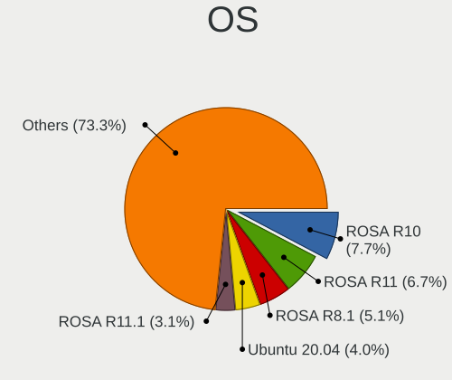

| Name                         | Computers | Percent |
|------------------------------|-----------|---------|
| ROSA R10                     | 123       | 7.72%   |
| ROSA R11                     | 107       | 6.71%   |
| ROSA R8.1                    | 81        | 5.08%   |
| Ubuntu 20.04                 | 64        | 4.02%   |
| ROSA R11.1                   | 50        | 3.14%   |
| ROSA R9                      | 49        | 3.07%   |
| Arch Rolling                 | 44        | 2.76%   |
| Ubuntu 22.04                 | 43        | 2.7%    |
| Ubuntu 18.04                 | 40        | 2.51%   |
| ROSA R8                      | 38        | 2.38%   |
| ROSA 12.4                    | 32        | 2.01%   |
| ROSA 12.2                    | 31        | 1.94%   |
| OpenMandriva 4.2             | 24        | 1.51%   |
| Manjaro                      | 24        | 1.51%   |
| Debian 12                    | 23        | 1.44%   |
| Fedora 38                    | 22        | 1.38%   |
| ROSA 12.5.1                  | 21        | 1.32%   |
| ROSA 12.3                    | 21        | 1.32%   |
| Ubuntu 24.04                 | 20        | 1.25%   |
| ROSA 13.0                    | 17        | 1.07%   |
| Fedora 40                    | 17        | 1.07%   |
| Fedora 39                    | 17        | 1.07%   |
| Debian 11                    | 17        | 1.07%   |
| Fedora 36                    | 15        | 0.94%   |
| openSUSE Tumbleweed-XXXXXXXX | 14        | 0.88%   |
| OpenMandriva 4.3             | 13        | 0.82%   |
| Linux Mint 19.3              | 13        | 0.82%   |
| OpenMandriva 25.90           | 12        | 0.75%   |
| Linux Mint 20.3              | 12        | 0.75%   |
| KDE neon 20.04               | 12        | 0.75%   |
| Fedora 42                    | 12        | 0.75%   |
| Fedora 41                    | 12        | 0.75%   |
| Fedora 35                    | 12        | 0.75%   |
| Linux Mint 21.1              | 11        | 0.69%   |
| Arch                         | 11        | 0.69%   |
| Fedora 34                    | 10        | 0.63%   |
| OpenMandriva 23.03           | 9         | 0.56%   |
| Kubuntu 20.04                | 9         | 0.56%   |
| Fedora 43                    | 9         | 0.56%   |
| Fedora 37                    | 9         | 0.56%   |

OS Family
---------

OS without a version

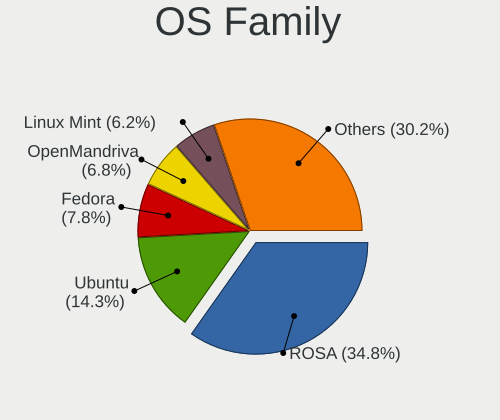

| Name         | Computers | Percent |
|--------------|-----------|---------|
| ROSA         | 479       | 34.79%  |
| Ubuntu       | 197       | 14.31%  |
| Fedora       | 107       | 7.77%   |
| OpenMandriva | 93        | 6.75%   |
| Linux Mint   | 85        | 6.17%   |
| Manjaro      | 57        | 4.14%   |
| Arch         | 54        | 3.92%   |
| Debian       | 53        | 3.85%   |
| Endless      | 38        | 2.76%   |
| Kubuntu      | 19        | 1.38%   |
| KDE neon     | 19        | 1.38%   |
| openSUSE     | 17        | 1.23%   |
| Xubuntu      | 15        | 1.09%   |
| Gentoo       | 13        | 0.94%   |
| Pop!_OS      | 11        | 0.8%    |
| Elementary   | 9         | 0.65%   |
| ALT Linux    | 9         | 0.65%   |
| LMDE         | 8         | 0.58%   |
| Kali         | 7         | 0.51%   |
| Zorin        | 6         | 0.44%   |
| Bazzite      | 6         | 0.44%   |
| SteamOS      | 5         | 0.36%   |
| EndeavourOS  | 5         | 0.36%   |
| ArcoLinux    | 5         | 0.36%   |
| PostmarketOS | 4         | 0.29%   |
| MX           | 4         | 0.29%   |
| Lubuntu      | 4         | 0.29%   |
| Void Linux   | 3         | 0.22%   |
| Ubuntu MATE  | 3         | 0.22%   |
| Nobara       | 3         | 0.22%   |
| NixOS        | 3         | 0.22%   |
| Clear Linux  | 3         | 0.22%   |
| CentOS       | 3         | 0.22%   |
| CachyOS      | 3         | 0.22%   |
| BlackPanther | 3         | 0.22%   |
| Ubuntu Unity | 2         | 0.15%   |
| Devuan       | 2         | 0.15%   |
| Deepin       | 2         | 0.15%   |
| Artix        | 2         | 0.15%   |
| Archcraft    | 2         | 0.15%   |

Kernel
------

Version of the Linux kernel

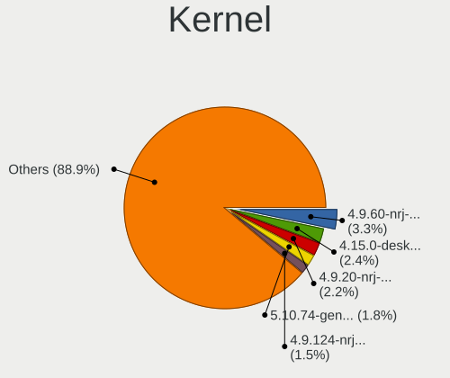

| Version                             | Computers | Percent |
|-------------------------------------|-----------|---------|
| 4.9.60-nrj-desktop-1rosa-x86_64     | 59        | 3.26%   |
| 4.15.0-desktop-45.1rosa-x86_64      | 43        | 2.38%   |
| 4.9.20-nrj-desktop-1rosa-x86_64     | 39        | 2.15%   |
| 5.10.74-generic-2rosa2021.1-x86_64  | 33        | 1.82%   |
| 4.9.124-nrj-desktop-1rosa-x86_64    | 27        | 1.49%   |
| 5.10.14-desktop-1omv4002            | 23        | 1.27%   |
| 4.1.34-nrj-desktop-2rosa-x86_64     | 20        | 1.1%    |
| 4.9.155-nrj-desktop-1rosa-x86_64    | 19        | 1.05%   |
| 4.9.76-nrj-desktop-1rosa-x86_64     | 18        | 0.99%   |
| 6.14.2-desktop-3omv2590             | 17        | 0.94%   |
| 5.4.83-generic-2rosa-x86_64         | 16        | 0.88%   |
| 4.1.38-nrj-desktop-2rosa-x86_64     | 16        | 0.88%   |
| 4.15.0-desktop-45.1rosa-i586        | 15        | 0.83%   |
| 6.1.20-generic-2rosa2021.1-x86_64   | 14        | 0.77%   |
| 5.4.0-42-generic                    | 13        | 0.72%   |
| 4.9.9-nrj-desktop-1rosa-x86_64      | 13        | 0.72%   |
| 5.16.7-desktop-1omv4003             | 12        | 0.66%   |
| 4.15.0-desktop-68.5rosa-x86_64      | 12        | 0.66%   |
| 5.15.75-generic-1rosa2021.1-x86_64  | 11        | 0.61%   |
| 5.15.0-56-generic                   | 11        | 0.61%   |
| 4.9.60-nrj-desktop-1rosa-i586       | 11        | 0.61%   |
| 6.6.47-generic-1rosa2021.1-x86_64   | 10        | 0.55%   |
| 4.9.41-nrj-desktop-1rosa-x86_64     | 10        | 0.55%   |
| 4.9.20-nrj-desktop-1rosa-i586       | 10        | 0.55%   |
| 4.9.9-nrj-desktop-1rosa-i586        | 9         | 0.5%    |
| 5.4.32-generic-2rosa-x86_64         | 8         | 0.44%   |
| 4.15.0-desktop-47.2rosa-x86_64      | 8         | 0.44%   |
| 4.15.0-desktop-122.124.1rosa-x86_64 | 8         | 0.44%   |
| 6.4.11-desktop-1omv2390             | 7         | 0.39%   |
| 6.2.6-desktop-1omv2390              | 7         | 0.39%   |
| 6.1.58-generic-1rosa2021.1-x86_64   | 7         | 0.39%   |
| 5.15.79-generic-1rosa2021.1-x86_64  | 7         | 0.39%   |
| 4.9.95-nrj-desktop-2rosa-x86_64     | 7         | 0.39%   |
| 4.9.155-nrj-laptop-1rosa-x86_64     | 7         | 0.39%   |
| 4.15.0-desktop-60.7rosa-x86_64      | 7         | 0.39%   |
| 6.6.2-desktop-1omv2390              | 6         | 0.33%   |
| 6.2.0-26-generic                    | 6         | 0.33%   |
| 5.9.16-1-MANJARO                    | 6         | 0.33%   |
| 5.8.0-14-generic                    | 6         | 0.33%   |
| 4.9.124-nrj-desktop-1rosa-i586      | 6         | 0.33%   |

Kernel Family
-------------

Linux kernel without a distro release

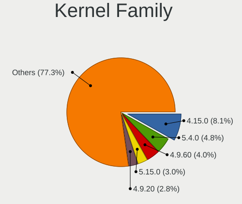

| Version | Computers | Percent |
|---------|-----------|---------|
| 4.15.0  | 142       | 8.13%   |
| 5.4.0   | 83        | 4.75%   |
| 4.9.60  | 70        | 4.01%   |
| 5.15.0  | 53        | 3.03%   |
| 4.9.20  | 49        | 2.8%    |
| 5.10.74 | 33        | 1.89%   |
| 4.9.124 | 33        | 1.89%   |
| 5.8.0   | 31        | 1.77%   |
| 5.10.0  | 27        | 1.55%   |
| 4.9.155 | 27        | 1.55%   |
| 4.1.38  | 27        | 1.55%   |
| 4.1.34  | 26        | 1.49%   |
| 5.11.0  | 25        | 1.43%   |
| 6.8.0   | 24        | 1.37%   |
| 6.5.0   | 23        | 1.32%   |
| 6.1.0   | 23        | 1.32%   |
| 5.10.14 | 23        | 1.32%   |
| 5.0.0   | 23        | 1.32%   |
| 6.14.2  | 22        | 1.26%   |
| 4.9.9   | 22        | 1.26%   |
| 4.9.76  | 22        | 1.26%   |
| 5.13.0  | 21        | 1.2%    |
| 5.4.83  | 20        | 1.14%   |
| 5.3.0   | 20        | 1.14%   |
| 5.19.0  | 20        | 1.14%   |
| 6.2.0   | 19        | 1.09%   |
| 6.14.0  | 15        | 0.86%   |
| 6.1.20  | 14        | 0.8%    |
| 4.9.41  | 14        | 0.8%    |
| 4.18.0  | 13        | 0.74%   |
| 5.16.7  | 12        | 0.69%   |
| 5.15.75 | 12        | 0.69%   |
| 6.11.0  | 11        | 0.63%   |
| 6.6.47  | 10        | 0.57%   |
| 5.4.32  | 9         | 0.52%   |
| 4.19.0  | 9         | 0.52%   |
| 4.13.0  | 9         | 0.52%   |
| 6.6.2   | 8         | 0.46%   |
| 6.4.11  | 8         | 0.46%   |
| 5.9.16  | 8         | 0.46%   |

Kernel Major Ver.
-----------------

Linux kernel major version

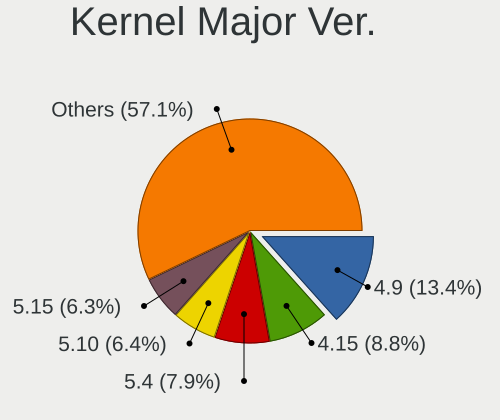

| Version | Computers | Percent |
|---------|-----------|---------|
| 4.9     | 216       | 13.38%  |
| 4.15    | 142       | 8.8%    |
| 5.4     | 128       | 7.93%   |
| 5.10    | 104       | 6.44%   |
| 5.15    | 102       | 6.32%   |
| 6.1     | 67        | 4.15%   |
| 4.1     | 56        | 3.47%   |
| 6.6     | 49        | 3.04%   |
| 6.14    | 47        | 2.91%   |
| 6.12    | 47        | 2.91%   |
| 6.2     | 42        | 2.6%    |
| 6.5     | 40        | 2.48%   |
| 5.8     | 39        | 2.42%   |
| 6.8     | 38        | 2.35%   |
| 5.11    | 35        | 2.17%   |
| 5.19    | 30        | 1.86%   |
| 5.13    | 30        | 1.86%   |
| 5.3     | 29        | 1.8%    |
| 6.11    | 27        | 1.67%   |
| 6.17    | 26        | 1.61%   |
| 5.0     | 24        | 1.49%   |
| 6.4     | 21        | 1.3%    |
| 5.9     | 19        | 1.18%   |
| 5.16    | 19        | 1.18%   |
| 6.7     | 18        | 1.12%   |
| 6.10    | 17        | 1.05%   |
| 4.18    | 16        | 0.99%   |
| 6.0     | 15        | 0.93%   |
| 4.19    | 15        | 0.93%   |
| 5.18    | 14        | 0.87%   |
| 5.14    | 13        | 0.81%   |
| 6.9     | 12        | 0.74%   |
| 6.15    | 11        | 0.68%   |
| 5.6     | 11        | 0.68%   |
| 6.13    | 10        | 0.62%   |
| 5.17    | 10        | 0.62%   |
| 6.3     | 9         | 0.56%   |
| 4.13    | 9         | 0.56%   |
| 6.16    | 8         | 0.5%    |
| 5.12    | 8         | 0.5%    |

Arch
----

OS architecture (x86_64, i586, etc.)

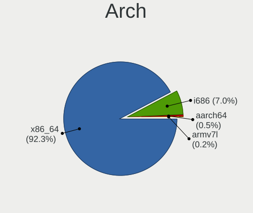

| Name    | Computers | Percent |
|---------|-----------|---------|
| x86_64  | 1210      | 92.3%   |
| i686    | 92        | 7.02%   |
| aarch64 | 7         | 0.53%   |
| armv7l  | 2         | 0.15%   |

DE
--

Desktop Environment

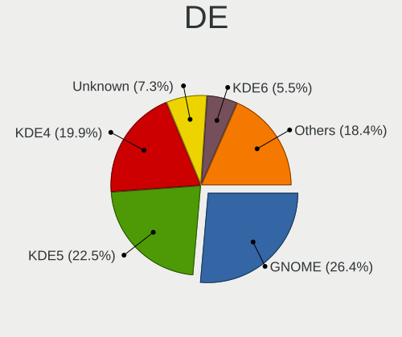

| Name            | Computers | Percent |
|-----------------|-----------|---------|
| GNOME           | 378       | 26.38%  |
| KDE5            | 322       | 22.47%  |
| KDE4            | 285       | 19.89%  |
| Unknown         | 105       | 7.33%   |
| KDE6            | 79        | 5.51%   |
| XFCE            | 70        | 4.88%   |
| X-Cinnamon      | 60        | 4.19%   |
| LXQt            | 37        | 2.58%   |
| MATE            | 21        | 1.47%   |
| KDE             | 20        | 1.4%    |
| Cinnamon        | 12        | 0.84%   |
| Pantheon        | 8         | 0.56%   |
| LXDE            | 6         | 0.42%   |
| Hyprland        | 6         | 0.42%   |
| Phosh:GNOME     | 3         | 0.21%   |
| Unity           | 2         | 0.14%   |
| i3              | 2         | 0.14%   |
| Deepin          | 2         | 0.14%   |
| Budgie          | 2         | 0.14%   |
| bspwm           | 2         | 0.14%   |
| Trinity         | 1         | 0.07%   |
| sway            | 1         | 0.07%   |
| Openbox         | 1         | 0.07%   |
| none+xmonad     | 1         | 0.07%   |
| GNOME Flashback | 1         | 0.07%   |
| GNOME Classic   | 1         | 0.07%   |
| fluxbox         | 1         | 0.07%   |
| Endless:GNOME   | 1         | 0.07%   |
| DDE             | 1         | 0.07%   |
| COSMIC          | 1         | 0.07%   |
| chadwm          | 1         | 0.07%   |

Display Server
--------------

X11 or Wayland

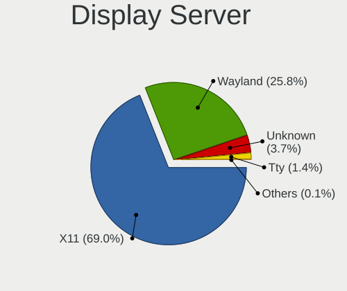

| Name        | Computers | Percent |
|-------------|-----------|---------|
| X11         | 940       | 69.02%  |
| Wayland     | 351       | 25.77%  |
| Unknown     | 50        | 3.67%   |
| Tty         | 19        | 1.4%    |
| Web         | 1         | 0.07%   |
| Unspecified | 1         | 0.07%   |

Display Manager
---------------

SDDM, LightDM, etc.

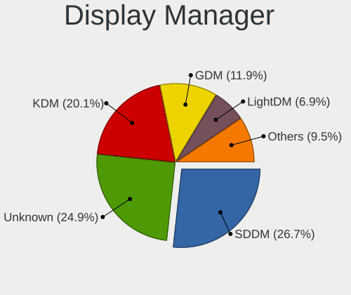

| Name               | Computers | Percent |
|--------------------|-----------|---------|
| SDDM               | 376       | 26.72%  |
| Unknown            | 351       | 24.95%  |
| KDM                | 283       | 20.11%  |
| GDM                | 167       | 11.87%  |
| LightDM            | 97        | 6.89%   |
| GDM3               | 96        | 6.82%   |
| TDM                | 29        | 2.06%   |
| MDM                | 2         | 0.14%   |
| GREETD             | 2         | 0.14%   |
| TINYDM-RUN-SESSION | 1         | 0.07%   |
| SLiM               | 1         | 0.07%   |
| LEMURS             | 1         | 0.07%   |
| COSMIC-GREETER     | 1         | 0.07%   |

OS Lang
-------

Language

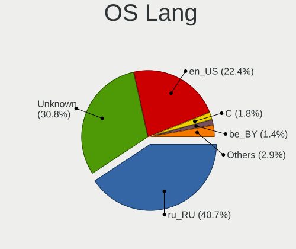

| Lang        | Computers | Percent |
|-------------|-----------|---------|
| ru_RU       | 554       | 40.74%  |
| Unknown     | 419       | 30.81%  |
| en_US       | 305       | 22.43%  |
| C           | 24        | 1.76%   |
| be_BY       | 19        | 1.4%    |
| en_GB       | 13        | 0.96%   |
| ru_RU.UTF_8 | 6         | 0.44%   |
| ru_UA       | 4         | 0.29%   |
| ru_BY       | 4         | 0.29%   |
| fr_FR       | 2         | 0.15%   |
| cv_RU       | 2         | 0.15%   |
| zh_TW       | 1         | 0.07%   |
| zh_CN       | 1         | 0.07%   |
| pl_PL       | 1         | 0.07%   |
| en_US.UTS-8 | 1         | 0.07%   |
| en_IN       | 1         | 0.07%   |
| en_CA       | 1         | 0.07%   |
| C.utf-8     | 1         | 0.07%   |
| be_BY@latin | 1         | 0.07%   |

Boot Mode
---------

EFI or BIOS

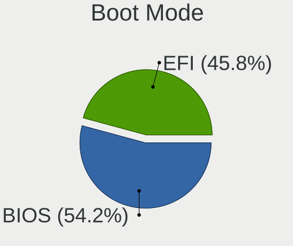

| Mode | Computers | Percent |
|------|-----------|---------|
| BIOS | 728       | 54.21%  |
| EFI  | 615       | 45.79%  |

Filesystem
----------

Type of filesystem

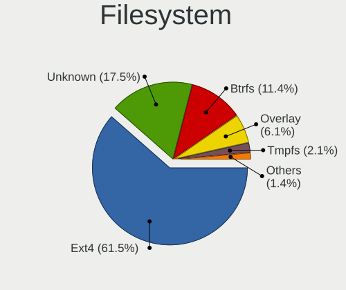

| Type    | Computers | Percent |
|---------|-----------|---------|
| Ext4    | 856       | 61.49%  |
| Unknown | 244       | 17.53%  |
| Btrfs   | 158       | 11.35%  |
| Overlay | 85        | 6.11%   |
| Tmpfs   | 29        | 2.08%   |
| Xfs     | 7         | 0.5%    |
| F2fs    | 4         | 0.29%   |
| Ext3    | 4         | 0.29%   |
| Zfs     | 2         | 0.14%   |
| Ext2    | 2         | 0.14%   |
| SAMSUNG | 1         | 0.07%   |

Part. scheme
------------

Scheme of partitioning

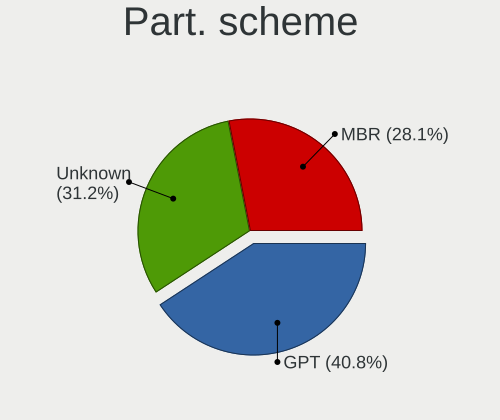

| Type    | Computers | Percent |
|---------|-----------|---------|
| GPT     | 565       | 40.76%  |
| Unknown | 432       | 31.17%  |
| MBR     | 389       | 28.07%  |

Dual Boot with Linux/BSD
------------------------

Hosting more than one Linux/BSD

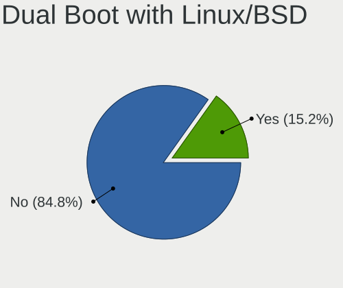

| Dual boot | Computers | Percent |
|-----------|-----------|---------|
| No        | 1148      | 84.85%  |
| Yes       | 205       | 15.15%  |

Dual Boot (Win)
---------------

Hosting Linux and Windows

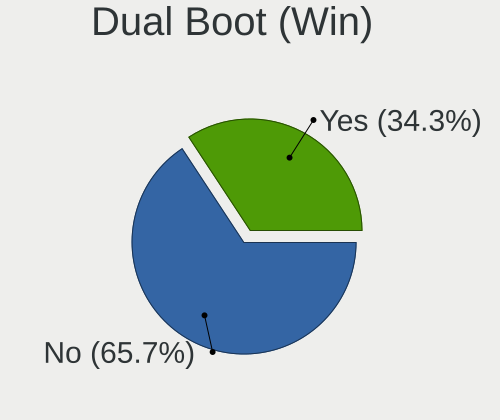

| Dual boot | Computers | Percent |
|-----------|-----------|---------|
| No        | 900       | 65.74%  |
| Yes       | 469       | 34.26%  |

Board
-----

Vendor
------

Motherboard manufacturer

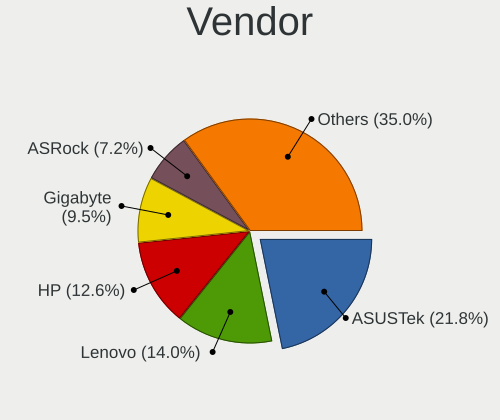

| Name                | Computers | Percent |
|---------------------|-----------|---------|
| ASUSTek Computer    | 283       | 21.82%  |
| Lenovo              | 181       | 13.96%  |
| Hewlett-Packard     | 163       | 12.57%  |
| Gigabyte Technology | 123       | 9.48%   |
| ASRock              | 93        | 7.17%   |
| Acer                | 92        | 7.09%   |
| MSI                 | 76        | 5.86%   |
| Dell                | 51        | 3.93%   |
| Samsung Electronics | 40        | 3.08%   |
| Intel               | 17        | 1.31%   |
| Biostar             | 17        | 1.31%   |
| Timi                | 13        | 1%      |
| HONOR               | 13        | 1%      |
| Unknown             | 11        | 0.85%   |
| Toshiba             | 10        | 0.77%   |
| Apple               | 10        | 0.77%   |
| HUAWEI              | 8         | 0.62%   |
| Sony                | 7         | 0.54%   |
| XIAOMI              | 5         | 0.39%   |
| Prestigio           | 5         | 0.39%   |
| Packard Bell        | 5         | 0.39%   |
| Valve               | 4         | 0.31%   |
| Fujitsu             | 4         | 0.31%   |
| ECS                 | 4         | 0.31%   |
| Fujitsu Siemens     | 3         | 0.23%   |
| xunlong             | 2         | 0.15%   |
| TECNO               | 2         | 0.15%   |
| Supermicro          | 2         | 0.15%   |
| OEM                 | 2         | 0.15%   |
| Nvidia              | 2         | 0.15%   |
| Maibenben           | 2         | 0.15%   |
| HASEE Computer      | 2         | 0.15%   |
| EPoX Computer       | 2         | 0.15%   |
| eMachines           | 2         | 0.15%   |
| Chuwi               | 2         | 0.15%   |
| BenQ                | 2         | 0.15%   |
| ZOTAC               | 1         | 0.08%   |
| ViewSonic           | 1         | 0.08%   |
| VIA Technologies    | 1         | 0.08%   |
| THUNDEROBOT         | 1         | 0.08%   |

Model
-----

Motherboard model

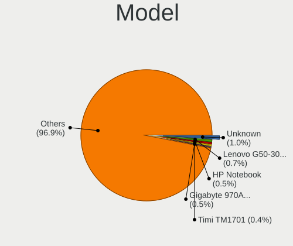

| Name                                    | Computers | Percent |
|-----------------------------------------|-----------|---------|
| Unknown                                 | 13        | 1%      |
| Lenovo G50-30 80G0                      | 9         | 0.69%   |
| HP Notebook                             | 7         | 0.54%   |
| Gigabyte 970A-DS3P                      | 6         | 0.46%   |
| Timi TM1701                             | 5         | 0.39%   |
| HP Laptop 15s-eq2xxx                    | 5         | 0.39%   |
| ASRock N68C-GS FX                       | 5         | 0.39%   |
| Acer Extensa 5220                       | 5         | 0.39%   |
| Acer Aspire E1-571G                     | 5         | 0.39%   |
| Samsung RV413/RV513                     | 4         | 0.31%   |
| MSI MS-7369                             | 4         | 0.31%   |
| Lenovo IdeaPad 320-15IAP 80XR           | 4         | 0.31%   |
| Lenovo G570 20079                       | 4         | 0.31%   |
| Lenovo B590 20206                       | 4         | 0.31%   |
| HONOR NBR-WAX9                          | 4         | 0.31%   |
| HP ProBook 455 G1                       | 4         | 0.31%   |
| HP ProBook 450 G5                       | 4         | 0.31%   |
| HP Pavilion g6                          | 4         | 0.31%   |
| HP Pavilion 15                          | 4         | 0.31%   |
| ASUS X540NV                             | 4         | 0.31%   |
| ASUS ROG Ally RC71L_RC71L               | 4         | 0.31%   |
| ASUS P8H77-V                            | 4         | 0.31%   |
| ASUS All Series                         | 4         | 0.31%   |
| ASRock N68-VS3 UCC                      | 4         | 0.31%   |
| Valve Jupiter                           | 3         | 0.23%   |
| MSI MS-7592                             | 3         | 0.23%   |
| MSI MS-7309                             | 3         | 0.23%   |
| Lenovo Z50-70 20354                     | 3         | 0.23%   |
| Lenovo IdeaPad Z570 HuronRiver Platform | 3         | 0.23%   |
| Lenovo IdeaPad S340-15IWL 81N8          | 3         | 0.23%   |
| Lenovo IdeaPad 520-15IKB 81BF           | 3         | 0.23%   |
| Lenovo IdeaPad 3 15IML05 81WB           | 3         | 0.23%   |
| Lenovo IdeaPad 100-15IBY 80MJ           | 3         | 0.23%   |
| Lenovo G580 20157                       | 3         | 0.23%   |
| Lenovo G580 20150                       | 3         | 0.23%   |
| Lenovo G500 20236                       | 3         | 0.23%   |
| Lenovo B50-30 20382                     | 3         | 0.23%   |
| HP Victus by Laptop 16-e0xxx            | 3         | 0.23%   |
| HP ProBook 6570b                        | 3         | 0.23%   |
| HP ProBook 4545s                        | 3         | 0.23%   |

Model Family
------------

Motherboard model prefix

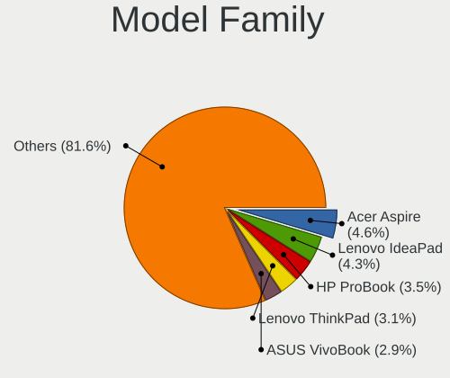

| Name               | Computers | Percent |
|--------------------|-----------|---------|
| Acer Aspire        | 60        | 4.63%   |
| Lenovo IdeaPad     | 56        | 4.32%   |
| HP ProBook         | 46        | 3.55%   |
| Lenovo ThinkPad    | 40        | 3.08%   |
| ASUS VivoBook      | 37        | 2.85%   |
| HP Pavilion        | 32        | 2.47%   |
| Dell Inspiron      | 29        | 2.24%   |
| ASUS ROG           | 19        | 1.46%   |
| HP Laptop          | 14        | 1.08%   |
| ASUS PRIME         | 14        | 1.08%   |
| ASUS ASUS          | 14        | 1.08%   |
| Acer Extensa       | 14        | 1.08%   |
| Unknown            | 13        | 1%      |
| HP EliteBook       | 12        | 0.93%   |
| ASUS ZenBook       | 12        | 0.93%   |
| Lenovo Legion      | 9         | 0.69%   |
| Lenovo G50-30      | 9         | 0.69%   |
| ASUS TUF           | 9         | 0.69%   |
| Toshiba Satellite  | 8         | 0.62%   |
| HP Compaq          | 8         | 0.62%   |
| Lenovo ThinkBook   | 7         | 0.54%   |
| HP Notebook        | 7         | 0.54%   |
| Gigabyte B450M     | 7         | 0.54%   |
| Lenovo G580        | 6         | 0.46%   |
| HP 250             | 6         | 0.46%   |
| Gigabyte 970A-DS3P | 6         | 0.46%   |
| Acer Nitro         | 6         | 0.46%   |
| Timi TM1701        | 5         | 0.39%   |
| Lenovo B590        | 5         | 0.39%   |
| Dell XPS           | 5         | 0.39%   |
| Dell Vostro        | 5         | 0.39%   |
| Dell Latitude      | 5         | 0.39%   |
| ASUS P8H77-V       | 5         | 0.39%   |
| ASRock N68C-GS     | 5         | 0.39%   |
| ASRock N68-VS3     | 5         | 0.39%   |
| Samsung RV413      | 4         | 0.31%   |
| MSI MS-7369        | 4         | 0.31%   |
| Lenovo Yoga        | 4         | 0.31%   |
| Lenovo G570        | 4         | 0.31%   |
| HONOR NBR-WAX9     | 4         | 0.31%   |

MFG Year
--------

Motherboard manufacture year

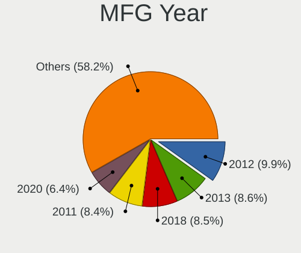

| Year    | Computers | Percent |
|---------|-----------|---------|
| 2012    | 128       | 9.87%   |
| 2013    | 112       | 8.64%   |
| 2018    | 110       | 8.48%   |
| 2011    | 109       | 8.4%    |
| 2020    | 83        | 6.4%    |
| 2017    | 79        | 6.09%   |
| 2021    | 73        | 5.63%   |
| 2010    | 68        | 5.24%   |
| 2014    | 67        | 5.17%   |
| 2019    | 63        | 4.86%   |
| 2009    | 63        | 4.86%   |
| 2022    | 58        | 4.47%   |
| 2007    | 52        | 4.01%   |
| 2015    | 49        | 3.78%   |
| 2008    | 47        | 3.62%   |
| 2023    | 38        | 2.93%   |
| 2016    | 38        | 2.93%   |
| 2006    | 22        | 1.7%    |
| 2024    | 20        | 1.54%   |
| 2005    | 7         | 0.54%   |
| Unknown | 7         | 0.54%   |
| 2025    | 3         | 0.23%   |
| 2003    | 1         | 0.08%   |

Form Factor
-----------

Physical design of the computer

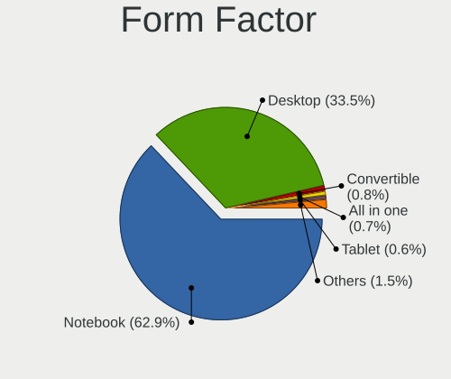

| Name           | Computers | Percent |
|----------------|-----------|---------|
| Notebook       | 816       | 62.91%  |
| Desktop        | 434       | 33.46%  |
| Convertible    | 11        | 0.85%   |
| All in one     | 9         | 0.69%   |
| System on chip | 8         | 0.62%   |
| Tablet         | 8         | 0.62%   |
| Mini pc        | 6         | 0.46%   |
| Server         | 4         | 0.31%   |
| Phone          | 1         | 0.08%   |

Secure Boot
-----------

Enabled or disabled

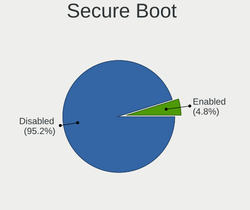

| State    | Computers | Percent |
|----------|-----------|---------|
| Disabled | 1242      | 95.17%  |
| Enabled  | 63        | 4.83%   |

Coreboot
--------

Have coreboot on board

| Used | Computers | Percent |
|------|-----------|---------|
| No   | 1296      | 99.92%  |
| Yes  | 1         | 0.08%   |

RAM Size
--------

Total RAM memory

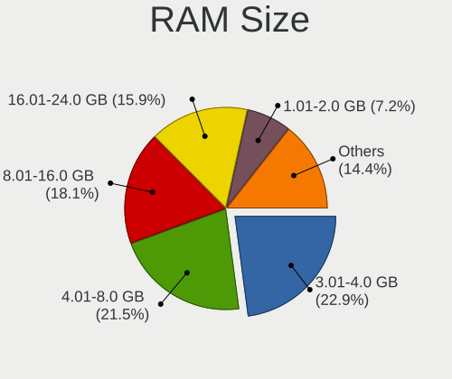

| Size in GB  | Computers | Percent |
|-------------|-----------|---------|
| 3.01-4.0    | 307       | 22.91%  |
| 4.01-8.0    | 288       | 21.49%  |
| 8.01-16.0   | 243       | 18.13%  |
| 16.01-24.0  | 213       | 15.9%   |
| 1.01-2.0    | 96        | 7.16%   |
| 32.01-64.0  | 94        | 7.01%   |
| 2.01-3.0    | 47        | 3.51%   |
| 0.51-1.0    | 22        | 1.64%   |
| 24.01-32.0  | 19        | 1.42%   |
| 64.01-256.0 | 10        | 0.75%   |
| 0.01-0.5    | 1         | 0.07%   |

RAM Used
--------

Used RAM memory

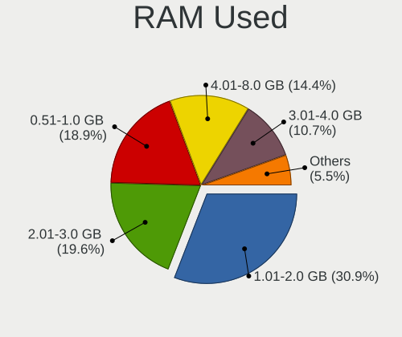

| Used GB    | Computers | Percent |
|------------|-----------|---------|
| 1.01-2.0   | 467       | 30.89%  |
| 2.01-3.0   | 296       | 19.58%  |
| 0.51-1.0   | 286       | 18.92%  |
| 4.01-8.0   | 218       | 14.42%  |
| 3.01-4.0   | 162       | 10.71%  |
| 8.01-16.0  | 47        | 3.11%   |
| 0.01-0.5   | 26        | 1.72%   |
| 16.01-24.0 | 6         | 0.4%    |
| 24.01-32.0 | 2         | 0.13%   |
| 32.01-64.0 | 1         | 0.07%   |
| Unknown    | 1         | 0.07%   |

Total Drives
------------

Number of drives on board

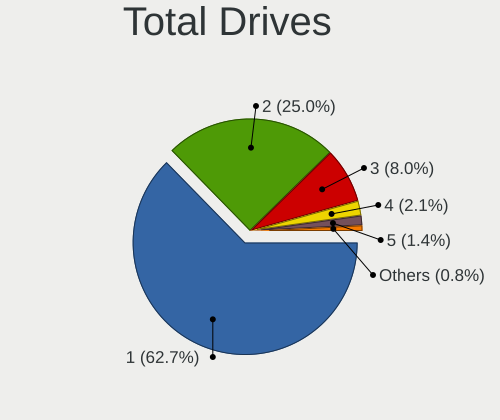

| Drives | Computers | Percent |
|--------|-----------|---------|
| 1      | 850       | 62.68%  |
| 2      | 339       | 25%     |
| 3      | 108       | 7.96%   |
| 4      | 29        | 2.14%   |
| 5      | 19        | 1.4%    |
| 0      | 6         | 0.44%   |
| 9      | 2         | 0.15%   |
| 6      | 2         | 0.15%   |
| 8      | 1         | 0.07%   |

Has CD-ROM
----------

Has CD-ROM on board

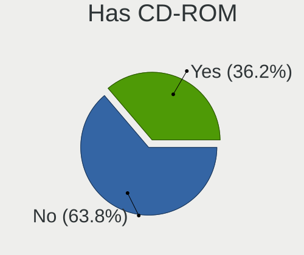

| Presented | Computers | Percent |
|-----------|-----------|---------|
| No        | 838       | 63.77%  |
| Yes       | 476       | 36.23%  |

Has Ethernet
------------

Has Ethernet on board

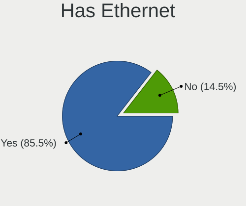

| Presented | Computers | Percent |
|-----------|-----------|---------|
| Yes       | 1110      | 85.52%  |
| No        | 188       | 14.48%  |

Has WiFi
--------

Has WiFi module

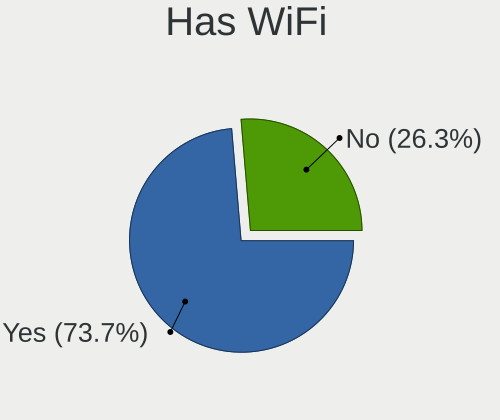

| Presented | Computers | Percent |
|-----------|-----------|---------|
| Yes       | 962       | 73.66%  |
| No        | 344       | 26.34%  |

Has Bluetooth
-------------

Has Bluetooth module

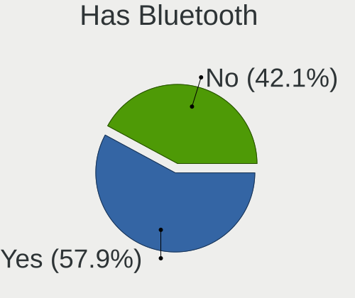

| Presented | Computers | Percent |
|-----------|-----------|---------|
| Yes       | 764       | 57.88%  |
| No        | 556       | 42.12%  |

Location
--------

Country
-------

Geographic location (country)

| Country | Computers | Percent |
|---------|-----------|---------|
| Belarus | 1297      | 100%    |

City
----

Geographic location (city)

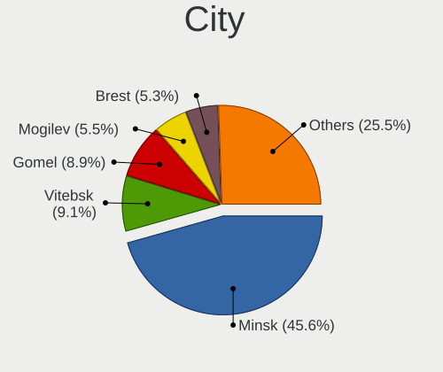

| City         | Computers | Percent |
|--------------|-----------|---------|
| Minsk        | 652       | 45.63%  |
| Vitebsk      | 130       | 9.1%    |
| Gomel        | 127       | 8.89%   |
| Mogilev      | 79        | 5.53%   |
| Brest        | 76        | 5.32%   |
| Hrodna       | 75        | 5.25%   |
| Babruysk     | 26        | 1.82%   |
| Orsha        | 19        | 1.33%   |
| Polatsk      | 18        | 1.26%   |
| Borisov      | 16        | 1.12%   |
| Mazyr        | 15        | 1.05%   |
| Baranovichi  | 12        | 0.84%   |
| Lida         | 10        | 0.7%    |
| Zhodzina     | 9         | 0.63%   |
| Navapolatsk  | 8         | 0.56%   |
| Zhlobin      | 7         | 0.49%   |
| Slutsk       | 7         | 0.49%   |
| Pinsk        | 7         | 0.49%   |
| Bogushevichi | 7         | 0.49%   |
| Drahichyn    | 6         | 0.42%   |
| Vawkavysk    | 5         | 0.35%   |
| Salihorsk    | 5         | 0.35%   |
| Klyetsk      | 5         | 0.35%   |
| Ivatsevichy  | 5         | 0.35%   |
| Smalyavichy  | 4         | 0.28%   |
| Pastavy      | 4         | 0.28%   |
| Navahrudak   | 4         | 0.28%   |
| Syanno       | 3         | 0.21%   |
| Slonim       | 3         | 0.21%   |
| Rahachow     | 3         | 0.21%   |
| Krupki       | 3         | 0.21%   |
| Ivanava      | 3         | 0.21%   |
| Fedorovka    | 3         | 0.21%   |
| Fanipol      | 3         | 0.21%   |
| Dubovka      | 3         | 0.21%   |
| Baran'       | 3         | 0.21%   |
| Aleksandrovo | 3         | 0.21%   |
| Svyetlahorsk | 2         | 0.14%   |
| Snitovo      | 2         | 0.14%   |
| Rechytsa     | 2         | 0.14%   |

Drives
------

Drive Vendor
------------

Hard drive vendors

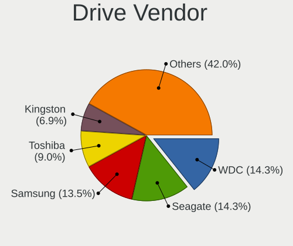

| Vendor                      | Computers | Drives | Percent |
|-----------------------------|-----------|--------|---------|
| WDC                         | 269       | 442    | 14.3%   |
| Seagate                     | 269       | 437    | 14.3%   |
| Samsung Electronics         | 253       | 373    | 13.45%  |
| Toshiba                     | 170       | 284    | 9.04%   |
| Kingston                    | 130       | 187    | 6.91%   |
| Hitachi                     | 100       | 139    | 5.32%   |
| HGST                        | 60        | 101    | 3.19%   |
| SK hynix                    | 49        | 58     | 2.6%    |
| SanDisk                     | 47        | 62     | 2.5%    |
| Intel                       | 45        | 109    | 2.39%   |
| Crucial                     | 41        | 52     | 2.18%   |
| Unknown                     | 37        | 48     | 1.97%   |
| Micron Technology           | 37        | 45     | 1.97%   |
| Patriot                     | 25        | 35     | 1.33%   |
| Netac                       | 24        | 35     | 1.28%   |
| Gigabyte Technology         | 19        | 24     | 1.01%   |
| KingSpec                    | 17        | 31     | 0.9%    |
| KIOXIA                      | 15        | 56     | 0.8%    |
| OCZ                         | 14        | 18     | 0.74%   |
| A-DATA Technology           | 14        | 17     | 0.74%   |
| China                       | 13        | 16     | 0.69%   |
| APACER                      | 13        | 16     | 0.69%   |
| SPCC                        | 12        | 18     | 0.64%   |
| Phison Electronics          | 12        | 18     | 0.64%   |
| Fujitsu                     | 12        | 19     | 0.64%   |
| Silicon Motion              | 11        | 12     | 0.58%   |
| GOODRAM                     | 11        | 12     | 0.58%   |
| Transcend                   | 10        | 12     | 0.53%   |
| Kingston Technology Company | 10        | 10     | 0.53%   |
| Plextor                     | 6         | 7      | 0.32%   |
| MAXIO Technology (Hangzhou) | 6         | 14     | 0.32%   |
| ADATA Technology            | 6         | 8      | 0.32%   |
| Realtek Semiconductor       | 5         | 6      | 0.27%   |
| Maxtor                      | 5         | 5      | 0.27%   |
| JMicron Technology          | 5         | 5      | 0.27%   |
| Apple                       | 5         | 5      | 0.27%   |
| XrayDisk                    | 4         | 4      | 0.21%   |
| LITEONIT                    | 4         | 4      | 0.21%   |
| KingDian                    | 4         | 6      | 0.21%   |
| XPG                         | 3         | 3      | 0.16%   |

Drive Model
-----------

Hard drive models

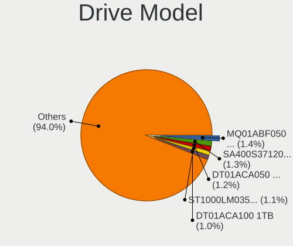

| Model                                             | Computers | Percent |
|---------------------------------------------------|-----------|---------|
| Toshiba MQ01ABF050 500GB                          | 28        | 1.38%   |
| Kingston SA400S37120G 120GB SSD                   | 27        | 1.33%   |
| Toshiba DT01ACA050 500GB                          | 24        | 1.18%   |
| Seagate ST1000LM035-1RK172 1TB                    | 22        | 1.08%   |
| Toshiba DT01ACA100 1TB                            | 21        | 1.03%   |
| Seagate ST500LT012-1DG142 500GB                   | 21        | 1.03%   |
| Samsung SSD 860 EVO 500GB                         | 20        | 0.98%   |
| Samsung SSD 860 EVO 250GB                         | 19        | 0.93%   |
| Samsung NVMe SSD Controller SM981/PM981/PM983 1TB | 19        | 0.93%   |
| Seagate ST1000LM024 HN-M101MBB 1TB                | 17        | 0.84%   |
| Kingston SA400S37240G 240GB SSD                   | 17        | 0.84%   |
| Toshiba DT01ACA200 2TB                            | 14        | 0.69%   |
| HGST HTS545050A7E680 500GB                        | 13        | 0.64%   |
| Samsung SSD 850 EVO 250GB                         | 11        | 0.54%   |
| Crucial CT120BX500SSD1 120GB                      | 11        | 0.54%   |
| Toshiba MQ01ABD100 1TB                            | 10        | 0.49%   |
| Seagate ST9320325AS 320GB                         | 10        | 0.49%   |
| Seagate ST500DM002-1BD142 500GB                   | 10        | 0.49%   |
| Intel SSDPEKNU512GZ 512GB                         | 10        | 0.49%   |
| WDC WD10JPVX-22JC3T0 1TB                          | 9         | 0.44%   |
| Toshiba MQ04ABF100 1TB                            | 9         | 0.44%   |
| Seagate ST2000DM008-2FR102 2TB                    | 9         | 0.44%   |
| Samsung NVMe SSD Drive 256GB                      | 9         | 0.44%   |
| Hitachi HTS543232A7A384 320GB                     | 9         | 0.44%   |
| HGST HTS721010A9E630 1TB                          | 9         | 0.44%   |
| Toshiba MQ01ABD032 320GB                          | 8         | 0.39%   |
| Toshiba HDWD110 1TB                               | 8         | 0.39%   |
| SK hynix NVMe SSD Drive 512GB                     | 8         | 0.39%   |
| Kingston SUV400S37120G 120GB SSD                  | 8         | 0.39%   |
| Gigabyte GP-GSTFS31120GNTD 120GB SSD              | 8         | 0.39%   |
| Crucial CT240BX500SSD1 240GB                      | 8         | 0.39%   |
| WDC WD10EZRZ-00HTKB0 1TB                          | 7         | 0.34%   |
| Seagate ST9500325AS 500GB                         | 7         | 0.34%   |
| Seagate ST1000DM010-2EP102 1TB                    | 7         | 0.34%   |
| Hitachi HTS545050B9A300 500GB                     | 7         | 0.34%   |
| HGST HTS541010A9E680 1TB                          | 7         | 0.34%   |
| Unknown MMC Card  32GB                            | 6         | 0.29%   |
| Toshiba MQ01ABD075 752GB                          | 6         | 0.29%   |
| Seagate ST9250315AS 250GB                         | 6         | 0.29%   |
| Samsung SSD 850 EVO 500GB                         | 6         | 0.29%   |

HDD Vendor
----------

Hard disk drive vendors

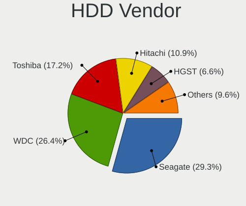

| Vendor              | Computers | Drives | Percent |
|---------------------|-----------|--------|---------|
| Seagate             | 268       | 435    | 29.29%  |
| WDC                 | 242       | 377    | 26.45%  |
| Toshiba             | 157       | 263    | 17.16%  |
| Hitachi             | 100       | 139    | 10.93%  |
| HGST                | 60        | 101    | 6.56%   |
| Samsung Electronics | 53        | 81     | 5.79%   |
| Fujitsu             | 12        | 19     | 1.31%   |
| Maxtor              | 5         | 5      | 0.55%   |
| JMicron Technology  | 5         | 5      | 0.55%   |
| External            | 3         | 4      | 0.33%   |
| WD MediaMax         | 2         | 2      | 0.22%   |
| TO Exter            | 2         | 3      | 0.22%   |
| Apple               | 2         | 2      | 0.22%   |
| USB3.0              | 1         | 1      | 0.11%   |
| Unknown             | 1         | 1      | 0.11%   |
| SINTECHI            | 1         | 1      | 0.11%   |
| SAGE                | 1         | 1      | 0.11%   |

SSD Vendor
----------

Solid state drive vendors

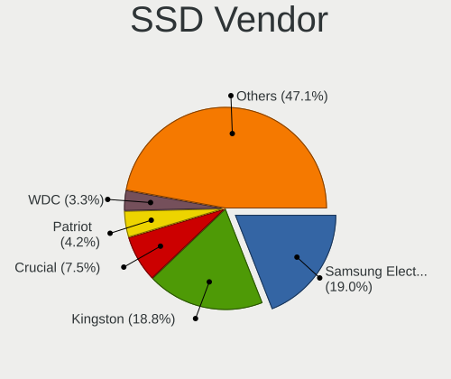

| Vendor              | Computers | Drives | Percent |
|---------------------|-----------|--------|---------|
| Samsung Electronics | 99        | 143    | 19.04%  |
| Kingston            | 98        | 140    | 18.85%  |
| Crucial             | 39        | 50     | 7.5%    |
| Patriot             | 22        | 32     | 4.23%   |
| WDC                 | 17        | 44     | 3.27%   |
| SanDisk             | 17        | 27     | 3.27%   |
| Netac               | 17        | 24     | 3.27%   |
| KingSpec            | 17        | 31     | 3.27%   |
| OCZ                 | 14        | 18     | 2.69%   |
| Gigabyte Technology | 14        | 19     | 2.69%   |
| Intel               | 13        | 15     | 2.5%    |
| China               | 13        | 16     | 2.5%    |
| Apacer              | 13        | 16     | 2.5%    |
| SPCC                | 11        | 17     | 2.12%   |
| Transcend           | 10        | 12     | 1.92%   |
| GOODRAM             | 10        | 11     | 1.92%   |
| A-DATA Technology   | 10        | 12     | 1.92%   |
| SK hynix            | 9         | 12     | 1.73%   |
| Plextor             | 6         | 7      | 1.15%   |
| XrayDisk            | 4         | 4      | 0.77%   |
| Toshiba             | 4         | 4      | 0.77%   |
| LITEONIT            | 4         | 4      | 0.77%   |
| KingDian            | 4         | 6      | 0.77%   |
| Unknown             | 3         | 3      | 0.58%   |
| Team                | 3         | 3      | 0.58%   |
| Smartbuy            | 3         | 4      | 0.58%   |
| AGI                 | 3         | 6      | 0.58%   |
| Acer                | 3         | 6      | 0.58%   |
| Seagate             | 2         | 2      | 0.38%   |
| PNY                 | 2         | 7      | 0.38%   |
| Micron Technology   | 2         | 2      | 0.38%   |
| Lexar               | 2         | 2      | 0.38%   |
| Kimtigo             | 2         | 2      | 0.38%   |
| Dahua               | 2         | 6      | 0.38%   |
| Corsair             | 2         | 8      | 0.38%   |
| Azerty              | 2         | 2      | 0.38%   |
| AMD                 | 2         | 2      | 0.38%   |
| Unknown             | 2         | 2      | 0.38%   |
| Zheino              | 1         | 2      | 0.19%   |
| Union Memory        | 1         | 1      | 0.19%   |

Drive Kind
----------

HDD or SSD

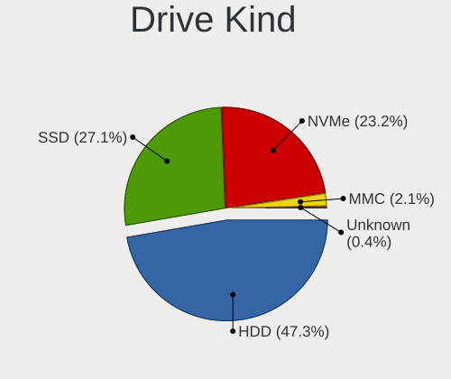

| Kind    | Computers | Drives | Percent |
|---------|-----------|--------|---------|
| HDD     | 797       | 1440   | 47.27%  |
| SSD     | 457       | 749    | 27.11%  |
| NVMe    | 391       | 646    | 23.19%  |
| MMC     | 35        | 48     | 2.08%   |
| Unknown | 6         | 6      | 0.36%   |

Drive Connector
---------------

SATA, SAS, NVMe, etc.

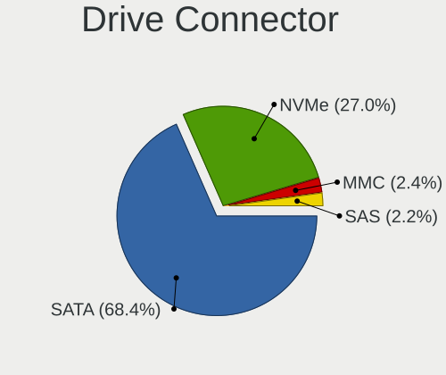

| Type | Computers | Drives | Percent |
|------|-----------|--------|---------|
| SATA | 992       | 2157   | 68.41%  |
| NVMe | 391       | 642    | 26.97%  |
| MMC  | 35        | 48     | 2.41%   |
| SAS  | 32        | 42     | 2.21%   |

Drive Size
----------

Size of hard drive

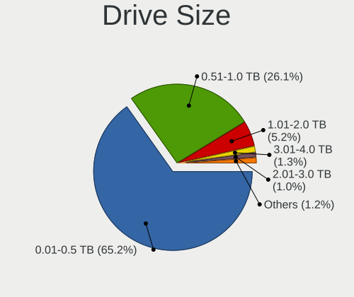

| Size in TB | Computers | Drives | Percent |
|------------|-----------|--------|---------|
| 0.01-0.5   | 813       | 1423   | 65.2%   |
| 0.51-1.0   | 325       | 534    | 26.06%  |
| 1.01-2.0   | 65        | 149    | 5.21%   |
| 3.01-4.0   | 16        | 22     | 1.28%   |
| 2.01-3.0   | 13        | 25     | 1.04%   |
| 4.01-10.0  | 10        | 30     | 0.8%    |
| 10.01-20.0 | 4         | 5      | 0.32%   |
| 20.01-50.0 | 1         | 1      | 0.08%   |

Space Total
-----------

Amount of disk space available on the file system

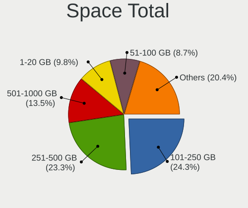

| Size in GB     | Computers | Percent |
|----------------|-----------|---------|
| 101-250        | 355       | 24.28%  |
| 251-500        | 341       | 23.32%  |
| 501-1000       | 197       | 13.47%  |
| 1-20           | 144       | 9.85%   |
| 51-100         | 127       | 8.69%   |
| 1001-2000      | 107       | 7.32%   |
| 21-50          | 82        | 5.61%   |
| More than 3000 | 46        | 3.15%   |
| Unknown        | 38        | 2.6%    |
| 2001-3000      | 25        | 1.71%   |

Space Used
----------

Amount of used disk space

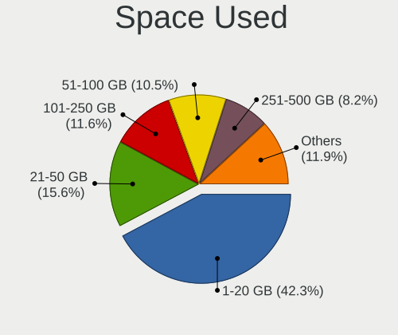

| Used GB        | Computers | Percent |
|----------------|-----------|---------|
| 1-20           | 634       | 42.27%  |
| 21-50          | 234       | 15.6%   |
| 101-250        | 174       | 11.6%   |
| 51-100         | 157       | 10.47%  |
| 251-500        | 123       | 8.2%    |
| 501-1000       | 78        | 5.2%    |
| Unknown        | 38        | 2.53%   |
| 1001-2000      | 37        | 2.47%   |
| More than 3000 | 14        | 0.93%   |
| 2001-3000      | 10        | 0.67%   |
| 0              | 1         | 0.07%   |

Malfunc. Drives
---------------

Drive models with a malfunction

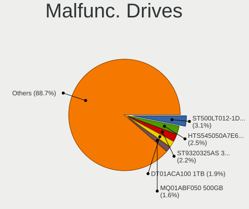

| Model                              | Computers | Drives | Percent |
|------------------------------------|-----------|--------|---------|
| Seagate ST500LT012-1DG142 500GB    | 10        | 12     | 3.14%   |
| HGST HTS545050A7E680 500GB         | 8         | 10     | 2.52%   |
| Seagate ST9320325AS 320GB          | 7         | 8      | 2.2%    |
| Toshiba DT01ACA100 1TB             | 6         | 7      | 1.89%   |
| Toshiba MQ01ABF050 500GB           | 5         | 6      | 1.57%   |
| Seagate ST9500325AS 500GB          | 5         | 7      | 1.57%   |
| Seagate ST9250315AS 250GB          | 4         | 4      | 1.26%   |
| Seagate ST500LT012-9WS142 500GB    | 4         | 4      | 1.26%   |
| Seagate ST500DM002-1BD142 500GB    | 4         | 11     | 1.26%   |
| Seagate ST1000LM024 HN-M101MBB 1TB | 4         | 5      | 1.26%   |
| Hitachi HTS545050B9A300 500GB      | 4         | 5      | 1.26%   |
| Hitachi HDS721010CLA330 1TB        | 4         | 7      | 1.26%   |
| Hitachi HDP725050GLA360 500GB      | 4         | 8      | 1.26%   |
| HGST HTS545050A7E380 500GB         | 4         | 5      | 1.26%   |
| WDC WD20EARS-00MVWB0 2TB           | 3         | 6      | 0.94%   |
| WDC WD10JPVX-22JC3T0 1TB           | 3         | 3      | 0.94%   |
| Toshiba MQ01ABD032 320GB           | 3         | 3      | 0.94%   |
| Toshiba DT01ACA200 2TB             | 3         | 5      | 0.94%   |
| Seagate ST9500420AS 500GB          | 3         | 3      | 0.94%   |
| Samsung Electronics HD160JJ 160GB  | 3         | 3      | 0.94%   |
| Hitachi HTS547575A9E384 752GB      | 3         | 3      | 0.94%   |
| Hitachi HTS545032B9A300 320GB      | 3         | 3      | 0.94%   |
| Hitachi HTS543232A7A384 320GB      | 3         | 4      | 0.94%   |
| WDC WD5000AAKS-00A7B0 500GB        | 2         | 2      | 0.63%   |
| WDC WD3200BPVT-35ZEST0 320GB       | 2         | 6      | 0.63%   |
| WDC WD3200BEKT-60F3T1 320GB        | 2         | 2      | 0.63%   |
| WDC WD30EFRX-68EUZN0 3TB           | 2         | 3      | 0.63%   |
| Toshiba MK3259GSXP 320GB           | 2         | 3      | 0.63%   |
| Toshiba DT01ACA050 500GB           | 2         | 3      | 0.63%   |
| Seagate STM3500418AS 500GB         | 2         | 2      | 0.63%   |
| Seagate ST9120822AS 120GB          | 2         | 3      | 0.63%   |
| Seagate ST3500320AS 500GB          | 2         | 3      | 0.63%   |
| Seagate ST340016A 40GB             | 2         | 3      | 0.63%   |
| Seagate ST3250820AS 250GB          | 2         | 2      | 0.63%   |
| Seagate ST3160812A 160GB           | 2         | 4      | 0.63%   |
| Seagate ST2000DM001-1CH164 2TB     | 2         | 2      | 0.63%   |
| Samsung Electronics SP0802N 80GB   | 2         | 2      | 0.63%   |
| Samsung Electronics HD161HJ 160GB  | 2         | 3      | 0.63%   |
| Samsung Electronics HD103SJ 1TB    | 2         | 2      | 0.63%   |
| OCZ VERTEX460A 120GB SSD           | 2         | 4      | 0.63%   |

Malfunc. Drive Vendor
---------------------

Vendors of faulty drives

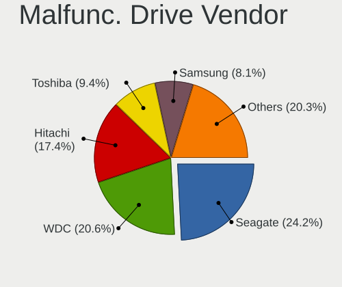

| Vendor                      | Computers | Drives | Percent |
|-----------------------------|-----------|--------|---------|
| Seagate                     | 75        | 100    | 24.19%  |
| WDC                         | 64        | 82     | 20.65%  |
| Hitachi                     | 54        | 72     | 17.42%  |
| Toshiba                     | 29        | 41     | 9.35%   |
| Samsung Electronics         | 25        | 36     | 8.06%   |
| HGST                        | 17        | 20     | 5.48%   |
| Kingston                    | 7         | 7      | 2.26%   |
| OCZ                         | 6         | 9      | 1.94%   |
| Fujitsu                     | 6         | 8      | 1.94%   |
| Crucial                     | 4         | 6      | 1.29%   |
| SK hynix                    | 3         | 4      | 0.97%   |
| Maxtor                      | 3         | 3      | 0.97%   |
| WD MediaMax                 | 2         | 2      | 0.65%   |
| SanDisk                     | 1         | 1      | 0.32%   |
| Realtek Semiconductor       | 1         | 1      | 0.32%   |
| PNY                         | 1         | 4      | 0.32%   |
| OCZ-VERTEX3                 | 1         | 3      | 0.32%   |
| Netac                       | 1         | 1      | 0.32%   |
| Micron Technology           | 1         | 1      | 0.32%   |
| MAXIO Technology (Hangzhou) | 1         | 2      | 0.32%   |
| LITEONIT                    | 1         | 1      | 0.32%   |
| KingSpec                    | 1         | 6      | 0.32%   |
| Intel                       | 1         | 1      | 0.32%   |
| Corsair                     | 1         | 4      | 0.32%   |
| China                       | 1         | 1      | 0.32%   |
| Apacer                      | 1         | 1      | 0.32%   |
| A-DATA Technology           | 1         | 1      | 0.32%   |
| Unknown                     | 1         | 1      | 0.32%   |

Malfunc. HDD Vendor
-------------------

Vendors of faulty HDD drives

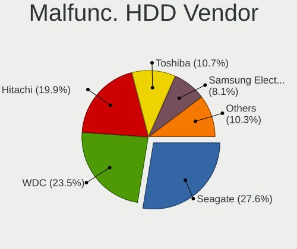

| Vendor              | Computers | Drives | Percent |
|---------------------|-----------|--------|---------|
| Seagate             | 75        | 100    | 27.57%  |
| WDC                 | 64        | 82     | 23.53%  |
| Hitachi             | 54        | 72     | 19.85%  |
| Toshiba             | 29        | 41     | 10.66%  |
| Samsung Electronics | 22        | 32     | 8.09%   |
| HGST                | 17        | 20     | 6.25%   |
| Fujitsu             | 6         | 8      | 2.21%   |
| Maxtor              | 3         | 3      | 1.1%    |
| WD MediaMax         | 2         | 2      | 0.74%   |

Malfunc. Drive Kind
-------------------

Kinds of faulty drives

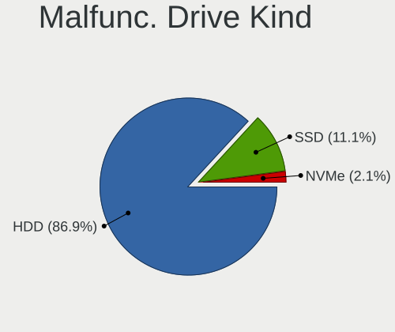

| Kind | Computers | Drives | Percent |
|------|-----------|--------|---------|
| HDD  | 251       | 360    | 86.85%  |
| SSD  | 32        | 51     | 11.07%  |
| NVMe | 6         | 8      | 2.08%   |

Failed Drives
-------------

Failed drive models

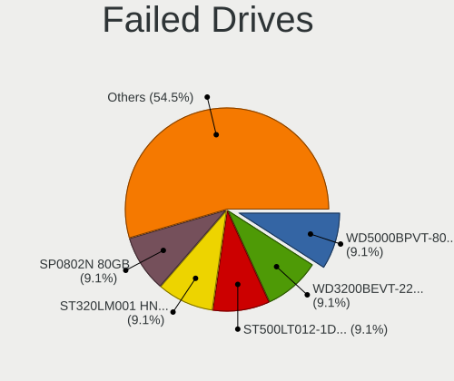

| Model                                                         | Computers | Drives | Percent |
|---------------------------------------------------------------|-----------|--------|---------|
| WDC WD5000BPVT-80HXZT3 500GB                                  | 1         | 1      | 9.09%   |
| WDC WD3200BEVT-22ZCT0 320GB                                   | 1         | 1      | 9.09%   |
| Seagate ST500LT012-1DG142 500GB                               | 1         | 1      | 9.09%   |
| Seagate ST320LM001 HN-M320MBB 320GB                           | 1         | 1      | 9.09%   |
| Samsung Electronics SP0802N 80GB                              | 1         | 1      | 9.09%   |
| Samsung Electronics NVMe SSD Controller 980 (DRAM-less) 256GB | 1         | 1      | 9.09%   |
| Samsung Electronics HM500JI 500GB                             | 1         | 1      | 9.09%   |
| Samsung Electronics HD252HJ 250GB                             | 1         | 1      | 9.09%   |
| Maxtor STM380211AS 80GB                                       | 1         | 1      | 9.09%   |
| Hitachi HTS545050A7E380 500GB                                 | 1         | 1      | 9.09%   |
| HGST HTS545050B7E660 500GB                                    | 1         | 1      | 9.09%   |

Failed Drive Vendor
-------------------

Failed drive vendors

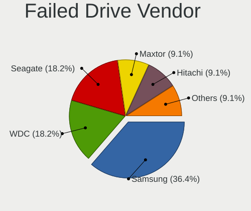

| Vendor              | Computers | Drives | Percent |
|---------------------|-----------|--------|---------|
| Samsung Electronics | 4         | 4      | 36.36%  |
| WDC                 | 2         | 2      | 18.18%  |
| Seagate             | 2         | 2      | 18.18%  |
| Maxtor              | 1         | 1      | 9.09%   |
| Hitachi             | 1         | 1      | 9.09%   |
| HGST                | 1         | 1      | 9.09%   |

Drive Status
------------

Number of failed and malfunc. drives

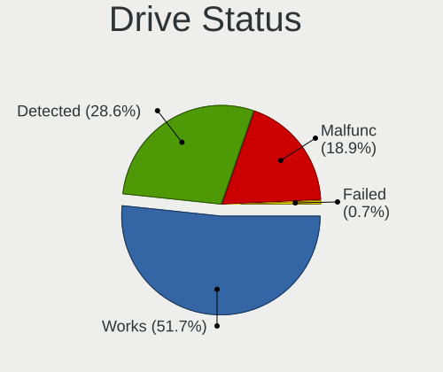

| Status   | Computers | Drives | Percent |
|----------|-----------|--------|---------|
| Works    | 772       | 1644   | 51.67%  |
| Detected | 428       | 815    | 28.65%  |
| Malfunc  | 283       | 419    | 18.94%  |
| Failed   | 11        | 11     | 0.74%   |

Storage controller
------------------

Storage Vendor
--------------

Storage controller vendors

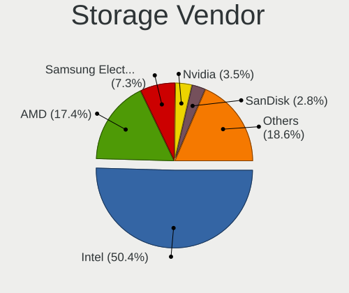

| Vendor                                  | Computers | Percent |
|-----------------------------------------|-----------|---------|
| Intel                                   | 802       | 50.44%  |
| AMD                                     | 277       | 17.42%  |
| Samsung Electronics                     | 116       | 7.3%    |
| Nvidia                                  | 55        | 3.46%   |
| SanDisk                                 | 45        | 2.83%   |
| Kingston Technology Company             | 41        | 2.58%   |
| SK hynix                                | 39        | 2.45%   |
| Micron Technology                       | 36        | 2.26%   |
| Phison Electronics                      | 22        | 1.38%   |
| JMicron Technology                      | 22        | 1.38%   |
| KIOXIA                                  | 15        | 0.94%   |
| ASMedia Technology                      | 15        | 0.94%   |
| Silicon Motion                          | 14        | 0.88%   |
| Toshiba America Info Systems            | 12        | 0.75%   |
| Marvell Technology Group                | 11        | 0.69%   |
| Realtek Semiconductor                   | 8         | 0.5%    |
| Netac Technology                        | 8         | 0.5%    |
| ADATA Technology                        | 8         | 0.5%    |
| VIA Technologies                        | 7         | 0.44%   |
| MAXIO Technology (Hangzhou)             | 7         | 0.44%   |
| Silicon Integrated Systems [SiS]        | 4         | 0.25%   |
| Yangtze Memory Technologies             | 3         | 0.19%   |
| Shenzhen Longsys Electronics            | 3         | 0.19%   |
| Lenovo                                  | 3         | 0.19%   |
| Broadcom / LSI                          | 3         | 0.19%   |
| Solid State Storage Technology          | 2         | 0.13%   |
| Shenzhen Unionmemory Information System | 2         | 0.13%   |
| Apple                                   | 2         | 0.13%   |
| Synopsys                                | 1         | 0.06%   |
| Solidigm                                | 1         | 0.06%   |
| Silicon Image                           | 1         | 0.06%   |
| O2 Micro                                | 1         | 0.06%   |
| Micron/Crucial Technology               | 1         | 0.06%   |
| Integrated Technology Express           | 1         | 0.06%   |
| Hosin Global Electronics                | 1         | 0.06%   |
| Biwin Storage Technology                | 1         | 0.06%   |

Storage Model
-------------

Storage controller models

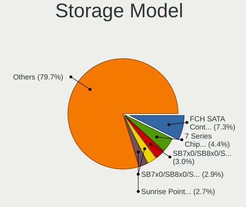

| Model                                                                                   | Computers | Percent |
|-----------------------------------------------------------------------------------------|-----------|---------|
| AMD FCH SATA Controller [AHCI mode]                                                     | 139       | 7.34%   |
| Intel 7 Series Chipset Family 6-port SATA Controller [AHCI mode]                        | 84        | 4.44%   |
| AMD SB7x0/SB8x0/SB9x0 IDE Controller                                                    | 56        | 2.96%   |
| AMD SB7x0/SB8x0/SB9x0 SATA Controller [AHCI mode]                                       | 54        | 2.85%   |
| Intel Sunrise Point-LP SATA Controller [AHCI mode]                                      | 51        | 2.69%   |
| Samsung NVMe SSD Controller SM981/PM981/PM983                                           | 48        | 2.54%   |
| Intel 8 Series/C220 Series Chipset Family 6-port SATA Controller 1 [AHCI mode]          | 45        | 2.38%   |
| AMD SB7x0/SB8x0/SB9x0 SATA Controller [IDE mode]                                        | 41        | 2.17%   |
| Intel 6 Series/C200 Series Chipset Family 6 port Mobile SATA AHCI Controller            | 37        | 1.95%   |
| Nvidia MCP61 SATA Controller                                                            | 35        | 1.85%   |
| Nvidia MCP61 IDE                                                                        | 35        | 1.85%   |
| Intel Volume Management Device NVMe RAID Controller                                     | 34        | 1.8%    |
| Intel 82801IBM/IEM (ICH9M/ICH9M-E) 4 port SATA Controller [AHCI mode]                   | 34        | 1.8%    |
| Samsung NVMe SSD Controller 980 (DRAM-less)                                             | 33        | 1.74%   |
| Intel NM10/ICH7 Family SATA Controller [IDE mode]                                       | 31        | 1.64%   |
| AMD 400 Series Chipset SATA Controller                                                  | 31        | 1.64%   |
| Intel 8 Series SATA Controller 1 [AHCI mode]                                            | 28        | 1.48%   |
| Intel Atom Processor E3800 Series SATA AHCI Controller                                  | 24        | 1.27%   |
| Intel NM10/ICH7 Family SATA Controller [AHCI mode]                                      | 23        | 1.22%   |
| Intel 82801HM/HEM (ICH8M/ICH8M-E) IDE Controller                                        | 22        | 1.16%   |
| Intel 82801G (ICH7 Family) IDE Controller                                               | 22        | 1.16%   |
| Intel Cannon Lake Mobile PCH SATA AHCI Controller                                       | 20        | 1.06%   |
| Intel Comet Lake SATA AHCI Controller                                                   | 18        | 0.95%   |
| Intel Celeron/Pentium Silver Processor SATA Controller                                  | 18        | 0.95%   |
| Samsung NVMe SSD Controller SM961/PM961/SM963                                           | 16        | 0.85%   |
| Intel Wildcat Point-LP SATA Controller [AHCI Mode]                                      | 16        | 0.85%   |
| Intel SSD 670p Series [Keystone Harbor]                                                 | 16        | 0.85%   |
| Intel Q170/Q150/B150/H170/H110/Z170/CM236 Chipset SATA Controller [AHCI Mode]           | 16        | 0.85%   |
| Intel Celeron N3350/Pentium N4200/Atom E3900 Series SATA AHCI Controller                | 16        | 0.85%   |
| Intel 6 Series/C200 Series Chipset Family 6 port Desktop SATA AHCI Controller           | 16        | 0.85%   |
| Intel 200 Series PCH SATA controller [AHCI mode]                                        | 16        | 0.85%   |
| Intel Tiger Lake-LP SATA Controller                                                     | 15        | 0.79%   |
| Intel 82801HM/HEM (ICH8M/ICH8M-E) SATA Controller [AHCI mode]                           | 15        | 0.79%   |
| Intel 82801 Mobile SATA Controller [RAID mode]                                          | 15        | 0.79%   |
| Intel 7 Series/C210 Series Chipset Family 6-port SATA Controller [AHCI mode]            | 15        | 0.79%   |
| Silicon Motion SM2263EN/SM2263XT (DRAM-less) NVMe SSD Controllers                       | 14        | 0.74%   |
| Intel SSD 660P Series                                                                   | 14        | 0.74%   |
| Intel 6 Series/C200 Series Chipset Family Desktop SATA Controller (IDE mode, ports 4-5) | 14        | 0.74%   |
| Intel 6 Series/C200 Series Chipset Family Desktop SATA Controller (IDE mode, ports 0-3) | 14        | 0.74%   |
| ASMedia ASM1061/ASM1062 Serial ATA Controller                                           | 14        | 0.74%   |

Storage Kind
------------

Kind of storage controller (IDE, SATA, NVMe, SAS, ...)

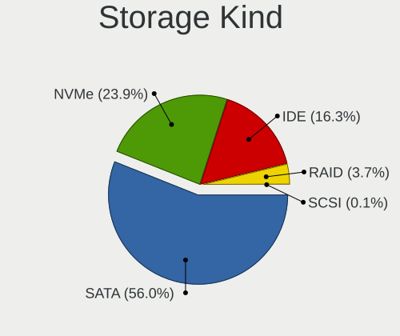

| Kind | Computers | Percent |
|------|-----------|---------|
| SATA | 919       | 56.04%  |
| NVMe | 392       | 23.9%   |
| IDE  | 267       | 16.28%  |
| RAID | 61        | 3.72%   |
| SCSI | 1         | 0.06%   |

Processor
---------

CPU Vendor
----------

Processor vendors

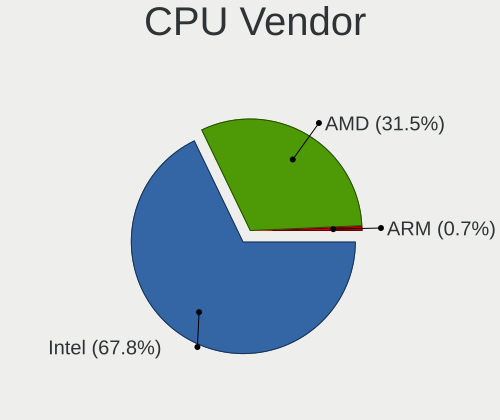

| Vendor | Computers | Percent |
|--------|-----------|---------|
| Intel  | 880       | 67.85%  |
| AMD    | 408       | 31.46%  |
| ARM    | 9         | 0.69%   |

CPU Model
---------

Processor models

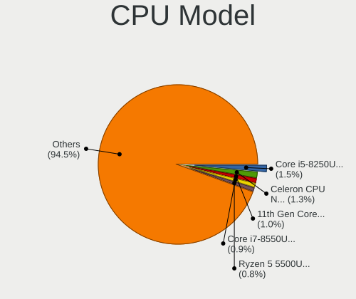

| Model                                         | Computers | Percent |
|-----------------------------------------------|-----------|---------|
| Intel Core i5-8250U CPU @ 1.60GHz             | 19        | 1.46%   |
| Intel Celeron CPU N2840 @ 2.16GHz             | 17        | 1.3%    |
| Intel 11th Gen Core i5-1135G7 @ 2.40GHz       | 13        | 1%      |
| Intel Core i7-8550U CPU @ 1.80GHz             | 12        | 0.92%   |
| AMD Ryzen 5 5500U with Radeon Graphics        | 11        | 0.84%   |
| Intel Core i7-7700HQ CPU @ 2.80GHz            | 10        | 0.77%   |
| AMD E-450 APU with Radeon HD Graphics         | 10        | 0.77%   |
| Intel Core i5-3230M CPU @ 2.60GHz             | 9         | 0.69%   |
| Intel Core i3-3110M CPU @ 2.40GHz             | 9         | 0.69%   |
| AMD Ryzen 5 4600H with Radeon Graphics        | 9         | 0.69%   |
| AMD Ryzen 5 3600 6-Core Processor             | 9         | 0.69%   |
| Intel Core i7-8750H CPU @ 2.20GHz             | 8         | 0.61%   |
| Intel Core i7-8565U CPU @ 1.80GHz             | 8         | 0.61%   |
| Intel Core i5-6200U CPU @ 2.30GHz             | 8         | 0.61%   |
| Intel Core i5-5200U CPU @ 2.20GHz             | 8         | 0.61%   |
| Intel Core i3-6006U CPU @ 2.00GHz             | 8         | 0.61%   |
| Intel 12th Gen Core i5-12450H                 | 8         | 0.61%   |
| Intel Core i5-7200U CPU @ 2.50GHz             | 7         | 0.54%   |
| Intel Core i5-4210U CPU @ 1.70GHz             | 7         | 0.54%   |
| Intel Core i5-2450M CPU @ 2.50GHz             | 7         | 0.54%   |
| Intel Core i5-10210U CPU @ 1.60GHz            | 7         | 0.54%   |
| Intel Core 2 Duo CPU E8400 @ 3.00GHz          | 7         | 0.54%   |
| Intel Celeron N4000 CPU @ 1.10GHz             | 7         | 0.54%   |
| Intel Atom CPU N455 @ 1.66GHz                 | 7         | 0.54%   |
| Intel 11th Gen Core i7-1165G7 @ 2.80GHz       | 7         | 0.54%   |
| ARM Processor                                 | 7         | 0.54%   |
| AMD Ryzen 5 3500U with Radeon Vega Mobile Gfx | 7         | 0.54%   |
| AMD A4-4300M APU with Radeon HD Graphics      | 7         | 0.54%   |
| Intel Pentium Dual-Core CPU T4400 @ 2.20GHz   | 6         | 0.46%   |
| Intel Pentium CPU N4200 @ 1.10GHz             | 6         | 0.46%   |
| Intel Pentium CPU B960 @ 2.20GHz              | 6         | 0.46%   |
| Intel Core i3-1005G1 CPU @ 1.20GHz            | 6         | 0.46%   |
| Intel Celeron CPU N3350 @ 1.10GHz             | 6         | 0.46%   |
| Intel Celeron CPU B820 @ 1.70GHz              | 6         | 0.46%   |
| AMD Ryzen 7 5700U with Radeon Graphics        | 6         | 0.46%   |
| AMD Ryzen 7 2700 Eight-Core Processor         | 6         | 0.46%   |
| AMD Ryzen 5 2600 Six-Core Processor           | 6         | 0.46%   |
| AMD Ryzen 3 2200G with Radeon Vega Graphics   | 6         | 0.46%   |
| AMD Athlon II X2 245 Processor                | 6         | 0.46%   |
| AMD Athlon II X2 240 Processor                | 6         | 0.46%   |

CPU Model Family
----------------

Processor model prefix

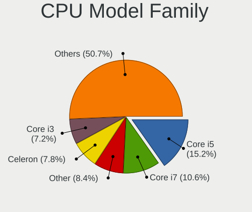

| Model                   | Computers | Percent |
|-------------------------|-----------|---------|
| Intel Core i5           | 198       | 15.21%  |
| Intel Core i7           | 138       | 10.6%   |
| Other                   | 110       | 8.45%   |
| Intel Celeron           | 102       | 7.83%   |
| Intel Core i3           | 94        | 7.22%   |
| AMD Ryzen 5             | 87        | 6.68%   |
| Intel Pentium           | 69        | 5.3%    |
| AMD Ryzen 7             | 56        | 4.3%    |
| Intel Core 2 Duo        | 52        | 3.99%   |
| Intel Atom              | 40        | 3.07%   |
| AMD FX                  | 27        | 2.07%   |
| AMD Athlon 64 X2        | 25        | 1.92%   |
| AMD Athlon II X2        | 24        | 1.84%   |
| Intel Xeon              | 20        | 1.54%   |
| AMD Ryzen 3             | 20        | 1.54%   |
| Intel Pentium Dual-Core | 18        | 1.38%   |
| AMD A4                  | 15        | 1.15%   |
| AMD A6                  | 14        | 1.08%   |
| AMD E                   | 13        | 1%      |
| AMD Phenom II X4        | 11        | 0.84%   |
| AMD Athlon II X3        | 11        | 0.84%   |
| AMD A10                 | 10        | 0.77%   |
| AMD E1                  | 9         | 0.69%   |
| AMD A8                  | 9         | 0.69%   |
| Intel Pentium Dual      | 8         | 0.61%   |
| Intel Pentium Silver    | 7         | 0.54%   |
| Intel Genuine           | 7         | 0.54%   |
| Intel Core i9           | 7         | 0.54%   |
| AMD Ryzen 9             | 7         | 0.54%   |
| AMD Athlon              | 7         | 0.54%   |
| Intel Pentium 4         | 5         | 0.38%   |
| Intel Celeron Dual-Core | 5         | 0.38%   |
| AMD Athlon X4           | 5         | 0.38%   |
| AMD Athlon II X4        | 5         | 0.38%   |
| AMD Athlon II           | 5         | 0.38%   |
| Intel Core 2 Quad       | 4         | 0.31%   |
| Intel Core 2            | 4         | 0.31%   |
| AMD Turion II           | 4         | 0.31%   |
| AMD E2                  | 4         | 0.31%   |
| Intel Core 2 Solo       | 3         | 0.23%   |

CPU Cores
---------

Number of processor cores

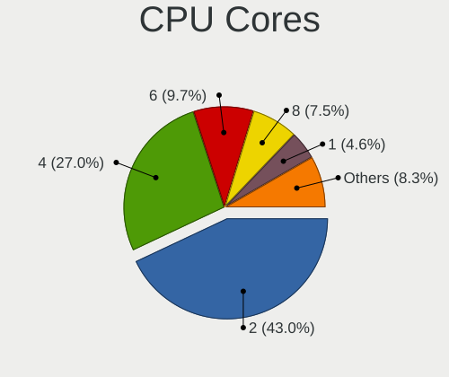

| Number  | Computers | Percent |
|---------|-----------|---------|
| 2       | 565       | 43%     |
| 4       | 355       | 27.02%  |
| 6       | 127       | 9.67%   |
| 8       | 98        | 7.46%   |
| 1       | 60        | 4.57%   |
| Unknown | 40        | 3.04%   |
| 3       | 20        | 1.52%   |
| 10      | 18        | 1.37%   |
| 12      | 16        | 1.22%   |
| 14      | 9         | 0.68%   |
| 20      | 2         | 0.15%   |
| 16      | 2         | 0.15%   |
| 24      | 1         | 0.08%   |
| 5       | 1         | 0.08%   |

CPU Sockets
-----------

Number of sockets

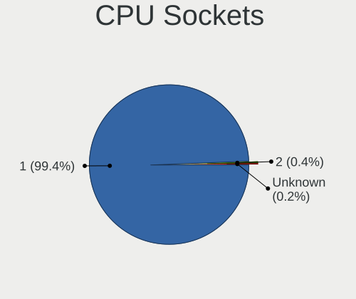

| Number  | Computers | Percent |
|---------|-----------|---------|
| 1       | 1289      | 99.38%  |
| 2       | 5         | 0.39%   |
| Unknown | 3         | 0.23%   |

CPU Threads
-----------

Threads per core (Hyper-Threading)

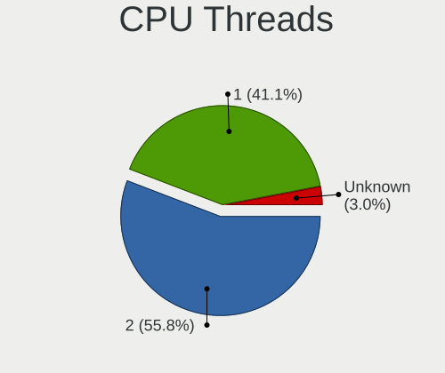

| Number  | Computers | Percent |
|---------|-----------|---------|
| 2       | 736       | 55.84%  |
| 1       | 542       | 41.12%  |
| Unknown | 40        | 3.03%   |

CPU Op-Modes
------------

CPU Operation Modes (32-bit, 64-bit)

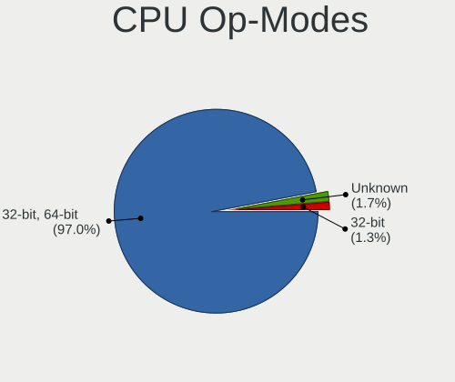

| Op mode        | Computers | Percent |
|----------------|-----------|---------|
| 32-bit, 64-bit | 1260      | 97%     |
| Unknown        | 22        | 1.69%   |
| 32-bit         | 17        | 1.31%   |

CPU Microcode
-------------

Microcode number

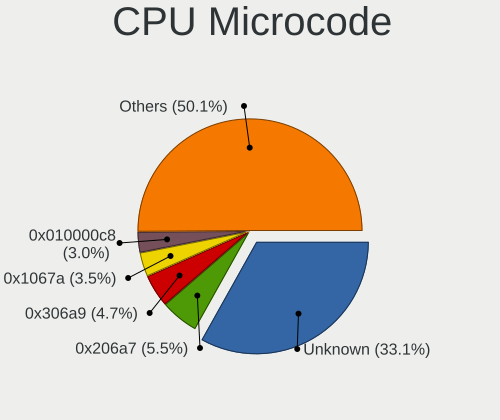

| Number     | Computers | Percent |
|------------|-----------|---------|
| Unknown    | 454       | 33.11%  |
| 0x206a7    | 76        | 5.54%   |
| 0x306a9    | 65        | 4.74%   |
| 0x1067a    | 48        | 3.5%    |
| 0x010000c8 | 41        | 2.99%   |
| 0x306c3    | 39        | 2.84%   |
| 0x806ea    | 28        | 2.04%   |
| 0x806c1    | 24        | 1.75%   |
| 0x30678    | 23        | 1.68%   |
| 0x906ea    | 22        | 1.6%    |
| 0x40651    | 19        | 1.39%   |
| 0x06001119 | 19        | 1.39%   |
| 0x806ec    | 18        | 1.31%   |
| 0x106ca    | 17        | 1.24%   |
| 0x6fd      | 16        | 1.17%   |
| 0x406e3    | 16        | 1.17%   |
| 0x906e9    | 14        | 1.02%   |
| 0x05000119 | 14        | 1.02%   |
| 0x010000c7 | 13        | 0.95%   |
| 0x506e3    | 12        | 0.88%   |
| 0x506c9    | 12        | 0.88%   |
| 0x306d4    | 12        | 0.88%   |
| 0x0a50000c | 12        | 0.88%   |
| 0x806e9    | 11        | 0.8%    |
| 0x706a1    | 10        | 0.73%   |
| 0x10676    | 10        | 0.73%   |
| 0x08608103 | 10        | 0.73%   |
| 0x08108102 | 10        | 0.73%   |
| 0x06000852 | 10        | 0.73%   |
| 0x10661    | 9         | 0.66%   |
| 0x0800820d | 9         | 0.66%   |
| 0x406c4    | 8         | 0.58%   |
| 0x20652    | 8         | 0.58%   |
| 0x106c2    | 8         | 0.58%   |
| 0x08600106 | 8         | 0.58%   |
| 0x08600104 | 8         | 0.58%   |
| 0x03000027 | 8         | 0.58%   |
| 0x706e5    | 7         | 0.51%   |
| 0x6fb      | 7         | 0.51%   |
| 0x406c3    | 7         | 0.51%   |

CPU Microarch
-------------

Microarchitecture

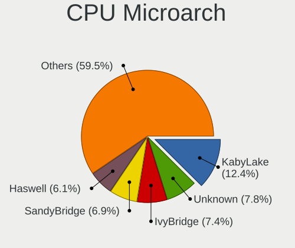

| Name              | Computers | Percent |
|-------------------|-----------|---------|
| KabyLake          | 162       | 12.43%  |
| Unknown           | 101       | 7.75%   |
| IvyBridge         | 96        | 7.37%   |
| SandyBridge       | 90        | 6.91%   |
| Haswell           | 79        | 6.06%   |
| Penryn            | 73        | 5.6%    |
| K10               | 73        | 5.6%    |
| Core              | 48        | 3.68%   |
| Piledriver        | 46        | 3.53%   |
| Silvermont        | 44        | 3.38%   |
| Zen 3             | 37        | 2.84%   |
| Skylake           | 37        | 2.84%   |
| Zen+              | 33        | 2.53%   |
| Zen 2             | 33        | 2.53%   |
| TigerLake         | 33        | 2.53%   |
| K8 Hammer         | 33        | 2.53%   |
| Bonnell           | 32        | 2.46%   |
| Alderlake Hybrid  | 29        | 2.23%   |
| Zen               | 26        | 2%      |
| IceLake           | 21        | 1.61%   |
| Broadwell         | 19        | 1.46%   |
| Bobcat            | 19        | 1.46%   |
| Westmere          | 18        | 1.38%   |
| Goldmont plus     | 18        | 1.38%   |
| Goldmont          | 16        | 1.23%   |
| CometLake         | 16        | 1.23%   |
| K10 Llano         | 11        | 0.84%   |
| Excavator         | 10        | 0.77%   |
| NetBurst          | 7         | 0.54%   |
| Jaguar            | 7         | 0.54%   |
| Puma              | 6         | 0.46%   |
| Nehalem           | 6         | 0.46%   |
| Bulldozer         | 6         | 0.46%   |
| P6                | 5         | 0.38%   |
| Tremont           | 4         | 0.31%   |
| Steamroller       | 4         | 0.31%   |
| Meteorlake Hybrid | 2         | 0.15%   |
| Gracemont         | 2         | 0.15%   |
| K8 & K10 hybrid   | 1         | 0.08%   |

Graphics
--------

GPU Vendor
----------

Vendors of graphics cards

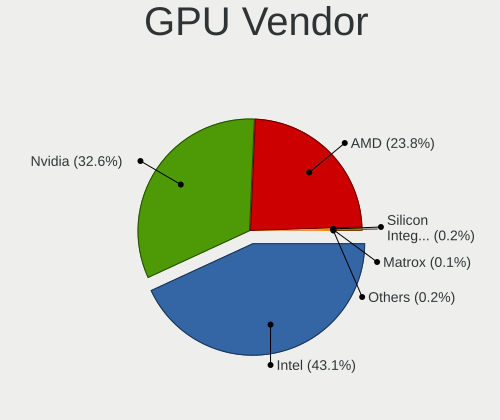

| Vendor                           | Computers | Percent |
|----------------------------------|-----------|---------|
| Intel                            | 690       | 43.13%  |
| Nvidia                           | 521       | 32.56%  |
| AMD                              | 381       | 23.81%  |
| Silicon Integrated Systems [SiS] | 3         | 0.19%   |
| Matrox Electronics Systems       | 2         | 0.13%   |
| ASPEED Technology                | 2         | 0.13%   |
| ATI Technologies                 | 1         | 0.06%   |

GPU Model
---------

Graphics card models

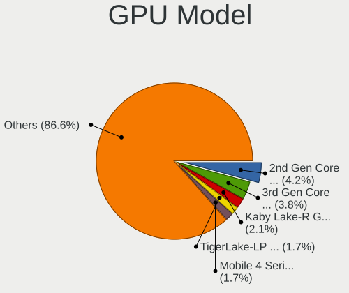

| Model                                                                                    | Computers | Percent |
|------------------------------------------------------------------------------------------|-----------|---------|
| Intel 2nd Generation Core Processor Family Integrated Graphics Controller                | 71        | 4.24%   |
| Intel 3rd Gen Core processor Graphics Controller                                         | 63        | 3.76%   |
| Intel Kaby Lake-R GT2 [UHD Graphics 620]                                                 | 35        | 2.09%   |
| Intel TigerLake-LP GT2 [Iris Xe Graphics]                                                | 28        | 1.67%   |
| Intel Mobile 4 Series Chipset Integrated Graphics Controller                             | 28        | 1.67%   |
| Intel Haswell-ULT Integrated Graphics Controller                                         | 28        | 1.67%   |
| Intel Atom Processor Z36xxx/Z37xxx Series Graphics & Display                             | 28        | 1.67%   |
| AMD Renoir [Radeon Vega Series / Radeon Vega Mobile Series]                              | 22        | 1.31%   |
| AMD Lucienne                                                                             | 21        | 1.25%   |
| Nvidia GF117M [GeForce 610M/710M/810M/820M / GT 620M/625M/630M/720M]                     | 20        | 1.19%   |
| Intel Skylake-U GT2 [HD Graphics 520]                                                    | 20        | 1.19%   |
| Intel CoffeeLake-H GT2 [UHD Graphics 630]                                                | 19        | 1.14%   |
| AMD Raven Ridge [Radeon Vega Series / Radeon Vega Mobile Series]                         | 19        | 1.14%   |
| Intel CometLake-U GT2 [UHD Graphics]                                                     | 18        | 1.08%   |
| AMD Picasso/Raven 2 [Radeon Vega Series / Radeon Vega Mobile Series]                     | 18        | 1.08%   |
| Intel WhiskeyLake-U GT2 [UHD Graphics 620]                                               | 17        | 1.02%   |
| AMD Cezanne [Radeon Vega Series / Radeon Vega Mobile Series]                             | 17        | 1.02%   |
| Intel Broadwell-U GT2 [HD Graphics 5500]                                                 | 16        | 0.96%   |
| Intel Atom/Celeron/Pentium Processor x5-E8000/J3xxx/N3xxx Integrated Graphics Controller | 16        | 0.96%   |
| Intel Atom Processor D4xx/D5xx/N4xx/N5xx Integrated Graphics Controller                  | 16        | 0.96%   |
| Intel Xeon E3-1200 v3/4th Gen Core Processor Integrated Graphics Controller              | 15        | 0.9%    |
| Intel Mobile GM965/GL960 Integrated Graphics Controller (secondary)                      | 15        | 0.9%    |
| Intel Mobile GM965/GL960 Integrated Graphics Controller (primary)                        | 15        | 0.9%    |
| Intel 4th Gen Core Processor Integrated Graphics Controller                              | 15        | 0.9%    |
| Nvidia GP107M [GeForce GTX 1050 Mobile]                                                  | 14        | 0.84%   |
| Intel CoffeeLake-S GT2 [UHD Graphics 630]                                                | 14        | 0.84%   |
| Nvidia GP108M [GeForce MX150]                                                            | 13        | 0.78%   |
| Nvidia G92 [GeForce 9800 GT]                                                             | 13        | 0.78%   |
| AMD Seymour [Radeon HD 6400M/7400M Series]                                               | 13        | 0.78%   |
| AMD Rembrandt [Radeon 680M]                                                              | 13        | 0.78%   |
| Intel Kaby Lake-H GT2 [HD Graphics 630]                                                  | 12        | 0.72%   |
| Intel GeminiLake [UHD Graphics 600]                                                      | 12        | 0.72%   |
| AMD Sun XT [Radeon HD 8670A/8670M/8690M / R5 M330 / M430 / Radeon 520 Mobile]            | 12        | 0.72%   |
| AMD Phoenix1                                                                             | 12        | 0.72%   |
| AMD Ellesmere [Radeon RX 470/480/570/570X/580/580X/590]                                  | 12        | 0.72%   |
| Nvidia TU117M [GeForce GTX 1650 Mobile / Max-Q]                                          | 11        | 0.66%   |
| Nvidia GM108M [GeForce 840M]                                                             | 11        | 0.66%   |
| Nvidia GA107M [GeForce RTX 3050 Mobile]                                                  | 11        | 0.66%   |
| Intel Kaby Lake-U GT2 [HD Graphics 620]                                                  | 11        | 0.66%   |
| Nvidia GM107 [GeForce GTX 750 Ti]                                                        | 10        | 0.6%    |

GPU Combo
---------

Combinations of graphics cards

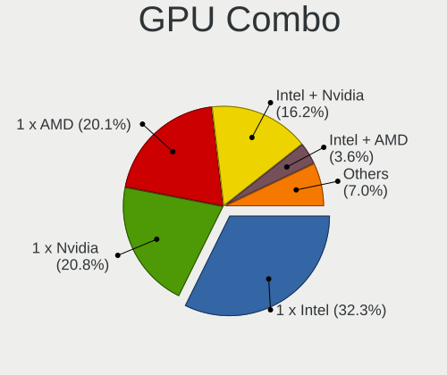

| Name            | Computers | Percent |
|-----------------|-----------|---------|
| 1 x Intel       | 422       | 32.31%  |
| 1 x Nvidia      | 271       | 20.75%  |
| 1 x AMD         | 262       | 20.06%  |
| Intel + Nvidia  | 212       | 16.23%  |
| Intel + AMD     | 47        | 3.6%    |
| 2 x AMD         | 38        | 2.91%   |
| AMD + Nvidia    | 34        | 2.6%    |
| Other           | 9         | 0.69%   |
| 2 x Intel       | 3         | 0.23%   |
| 1 x SiS         | 3         | 0.23%   |
| 1 x Matrox      | 2         | 0.15%   |
| 2 x Nvidia      | 1         | 0.08%   |
| Nvidia + ASPEED | 1         | 0.08%   |
| 1 x ASPEED      | 1         | 0.08%   |

GPU Driver
----------

Free vs proprietary

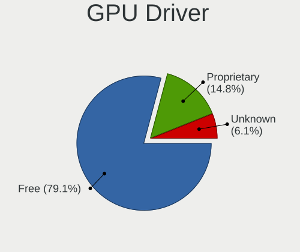

| Driver      | Computers | Percent |
|-------------|-----------|---------|
| Free        | 1058      | 79.13%  |
| Proprietary | 198       | 14.81%  |
| Unknown     | 81        | 6.06%   |

GPU Memory
----------

Total video memory

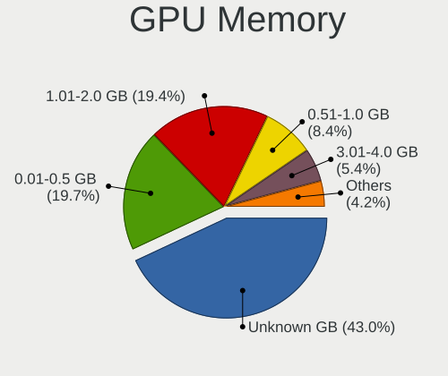

| Size in GB | Computers | Percent |
|------------|-----------|---------|
| Unknown    | 587       | 43.04%  |
| 0.01-0.5   | 269       | 19.72%  |
| 1.01-2.0   | 264       | 19.35%  |
| 0.51-1.0   | 114       | 8.36%   |
| 3.01-4.0   | 73        | 5.35%   |
| 7.01-8.0   | 25        | 1.83%   |
| 5.01-6.0   | 18        | 1.32%   |
| 8.01-16.0  | 7         | 0.51%   |
| 2.01-3.0   | 5         | 0.37%   |
| 4.01-5.0   | 1         | 0.07%   |
| 16.01-24.0 | 1         | 0.07%   |

Monitor
-------

Monitor Vendor
--------------

Monitor vendors

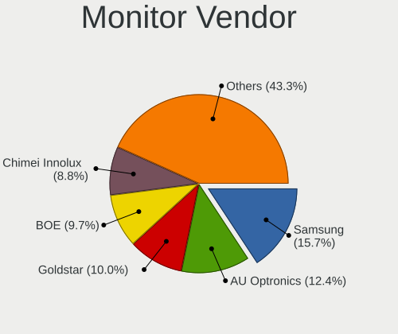

| Vendor                  | Computers | Percent |
|-------------------------|-----------|---------|
| Samsung Electronics     | 215       | 15.74%  |
| AU Optronics            | 170       | 12.45%  |
| Goldstar                | 137       | 10.03%  |
| BOE                     | 133       | 9.74%   |
| Chimei Innolux          | 120       | 8.78%   |
| LG Display              | 107       | 7.83%   |
| Chi Mei Optoelectronics | 55        | 4.03%   |
| Philips                 | 53        | 3.88%   |
| Dell                    | 44        | 3.22%   |
| AOC                     | 37        | 2.71%   |
| BenQ                    | 35        | 2.56%   |
| PANDA                   | 22        | 1.61%   |
| ViewSonic               | 20        | 1.46%   |
| Lenovo                  | 17        | 1.24%   |
| Hewlett-Packard         | 16        | 1.17%   |
| Acer                    | 16        | 1.17%   |
| Unknown                 | 11        | 0.81%   |
| Apple                   | 11        | 0.81%   |
| LG Philips              | 10        | 0.73%   |
| Ancor Communications    | 10        | 0.73%   |
| NEC Computers           | 9         | 0.66%   |
| HannStar                | 9         | 0.66%   |
| CPT                     | 9         | 0.66%   |
| TMX                     | 8         | 0.59%   |
| Sony                    | 7         | 0.51%   |
| Sharp                   | 7         | 0.51%   |
| Iiyama                  | 7         | 0.51%   |
| LG Electronics          | 6         | 0.44%   |
| CSOT                    | 5         | 0.37%   |
| Valve                   | 4         | 0.29%   |
| Gigabyte Technology     | 4         | 0.29%   |
| CSO                     | 4         | 0.29%   |
| XYK                     | 3         | 0.22%   |
| ASUSTek Computer        | 3         | 0.22%   |
| VIE                     | 2         | 0.15%   |
| RGT                     | 2         | 0.15%   |
| Plain Tree Systems      | 2         | 0.15%   |
| Mi                      | 2         | 0.15%   |
| LGD                     | 2         | 0.15%   |
| InnoLux Display         | 2         | 0.15%   |

Monitor Model
-------------

Monitor models

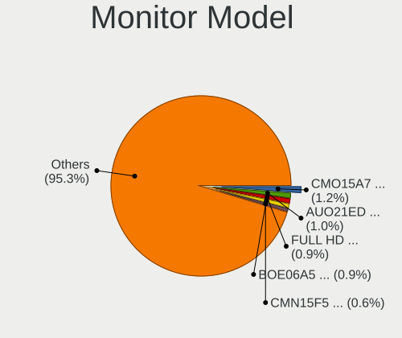

| Model                                                                    | Computers | Percent |
|--------------------------------------------------------------------------|-----------|---------|
| Chi Mei Optoelectronics LCD Monitor CMO15A7 1366x768 344x193mm 15.5-inch | 17        | 1.22%   |
| AU Optronics LCD Monitor AUO21ED 1920x1080 344x193mm 15.5-inch           | 14        | 1%      |
| Goldstar FULL HD GSM5B55 1920x1080 480x270mm 21.7-inch                   | 13        | 0.93%   |
| BOE LCD Monitor BOE06A5 1366x768 344x194mm 15.5-inch                     | 12        | 0.86%   |
| Chimei Innolux LCD Monitor CMN15F5 1920x1080 344x193mm 15.5-inch         | 9         | 0.64%   |
| AU Optronics LCD Monitor AUO22EC 1366x768 344x193mm 15.5-inch            | 9         | 0.64%   |
| Goldstar L192WS GSM4B32 1440x900 410x256mm 19.0-inch                     | 8         | 0.57%   |
| Unknown LCD Monitor FFFF 2288x1287 2550x2550mm 142.0-inch                | 7         | 0.5%    |
| Samsung Electronics LCD Monitor SEC3245 1366x768 340x190mm 15.3-inch     | 7         | 0.5%    |
| LG Display LCD Monitor LGD02DC 1366x768 344x194mm 15.5-inch              | 7         | 0.5%    |
| Chimei Innolux LCD Monitor CMN15E7 1920x1080 344x193mm 15.5-inch         | 7         | 0.5%    |
| Chi Mei Optoelectronics LCD Monitor CMO1592 1366x768 344x193mm 15.5-inch | 7         | 0.5%    |
| BOE LCD Monitor BOE069C 1920x1080 344x193mm 15.5-inch                    | 7         | 0.5%    |
| AU Optronics LCD Monitor AUO46EC 1366x768 344x193mm 15.5-inch            | 7         | 0.5%    |
| AU Optronics LCD Monitor AUO21EC 1366x768 344x193mm 15.5-inch            | 7         | 0.5%    |
| AOC 24G2W1G3 AOC2402 1920x1080 527x296mm 23.8-inch                       | 7         | 0.5%    |
| Samsung Electronics LCD Monitor SDC4852 1366x768 344x194mm 15.5-inch     | 6         | 0.43%   |
| LG Display LCD Monitor LGD0395 1366x768 344x194mm 15.5-inch              | 6         | 0.43%   |
| HannStar LCD Monitor HSD03E9 1024x600 220x129mm 10.0-inch                | 6         | 0.43%   |
| Chimei Innolux LCD Monitor CMN15DB 1366x768 344x193mm 15.5-inch          | 6         | 0.43%   |
| Chimei Innolux LCD Monitor CMN15D5 1920x1080 344x193mm 15.5-inch         | 6         | 0.43%   |
| Chimei Innolux LCD Monitor CMN1521 1920x1080 344x193mm 15.5-inch         | 6         | 0.43%   |
| Chimei Innolux LCD Monitor CMN14D4 1920x1080 309x173mm 13.9-inch         | 6         | 0.43%   |
| Chi Mei Optoelectronics LCD Monitor CMO15A3 1366x768 344x193mm 15.5-inch | 6         | 0.43%   |
| AU Optronics LCD Monitor AUO8174 1280x800 331x207mm 15.4-inch            | 6         | 0.43%   |
| AU Optronics LCD Monitor AUO71EC 1366x768 344x193mm 15.5-inch            | 6         | 0.43%   |
| Samsung Electronics S24F350 SAM0D20 1920x1080 521x293mm 23.5-inch        | 5         | 0.36%   |
| Samsung Electronics LCD Monitor SEC3945 1280x800 331x207mm 15.4-inch     | 5         | 0.36%   |
| PANDA LCD Monitor NCP004D 1920x1080 344x194mm 15.5-inch                  | 5         | 0.36%   |
| Goldstar MP59G GSM5B34 1920x1080 480x270mm 21.7-inch                     | 5         | 0.36%   |
| Goldstar L1919S GSM4AF2 1280x1024 380x300mm 19.1-inch                    | 5         | 0.36%   |
| Dell U2412M DELA07A 1920x1200 518x324mm 24.1-inch                        | 5         | 0.36%   |
| BOE LCD Monitor BOE0747 1920x1080 344x194mm 15.5-inch                    | 5         | 0.36%   |
| AU Optronics LCD Monitor AUO47EC 1366x768 344x193mm 15.5-inch            | 5         | 0.36%   |
| AU Optronics LCD Monitor AUO38ED 1920x1080 344x193mm 15.5-inch           | 5         | 0.36%   |
| AU Optronics LCD Monitor AUO26EC 1366x768 344x193mm 15.5-inch            | 5         | 0.36%   |
| TMX TL070FVXS01-0 TMX0002 1920x1080 160x100mm 7.4-inch                   | 4         | 0.29%   |
| Samsung Electronics SyncMaster SAM0589 1920x1080 521x293mm 23.5-inch     | 4         | 0.29%   |
| Samsung Electronics SyncMaster SAM01E1 1280x1024 376x301mm 19.0-inch     | 4         | 0.29%   |
| Samsung Electronics SyncMaster SAM01B7 1280x1024 340x270mm 17.1-inch     | 4         | 0.29%   |

Monitor Resolution
------------------

Monitor screen resolution

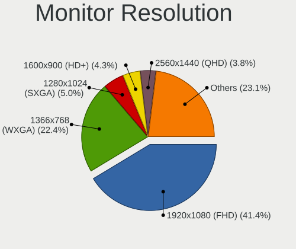

| Resolution         | Computers | Percent |
|--------------------|-----------|---------|
| 1920x1080 (FHD)    | 549       | 41.37%  |
| 1366x768 (WXGA)    | 297       | 22.38%  |
| 1280x1024 (SXGA)   | 67        | 5.05%   |
| 1600x900 (HD+)     | 57        | 4.3%    |
| 2560x1440 (QHD)    | 51        | 3.84%   |
| 3840x2160 (4K)     | 50        | 3.77%   |
| 1440x900 (WXGA+)   | 37        | 2.79%   |
| 1680x1050 (WSXGA+) | 34        | 2.56%   |
| 1280x800 (WXGA)    | 30        | 2.26%   |
| 1920x1200 (WUXGA)  | 27        | 2.03%   |
| 1024x600           | 21        | 1.58%   |
| 2560x1600          | 16        | 1.21%   |
| 2560x1080          | 14        | 1.06%   |
| 2880x1800          | 10        | 0.75%   |
| 2288x1287          | 7         | 0.53%   |
| 3200x2000          | 6         | 0.45%   |
| 1360x768           | 6         | 0.45%   |
| 3440x1440          | 5         | 0.38%   |
| 1024x768 (XGA)     | 5         | 0.38%   |
| 800x1280           | 4         | 0.3%    |
| Unknown            | 4         | 0.3%    |
| 3840x2400          | 3         | 0.23%   |
| 1600x1200          | 3         | 0.23%   |
| 3072x1920          | 2         | 0.15%   |
| 2880x1620          | 2         | 0.15%   |
| 2240x1400          | 2         | 0.15%   |
| 2160x1440          | 2         | 0.15%   |
| 1280x960           | 2         | 0.15%   |
| 1152x864           | 2         | 0.15%   |
| 4480x1200          | 1         | 0.08%   |
| 3840x1080          | 1         | 0.08%   |
| 3200x1080          | 1         | 0.08%   |
| 2880x1920          | 1         | 0.08%   |
| 2736x1824          | 1         | 0.08%   |
| 2400x1600          | 1         | 0.08%   |
| 2048x1536          | 1         | 0.08%   |
| 2048x1152          | 1         | 0.08%   |
| 1920x540           | 1         | 0.08%   |
| 1920x1440          | 1         | 0.08%   |
| 1680x945           | 1         | 0.08%   |

Monitor Diagonal
----------------

Diagonal size in inches

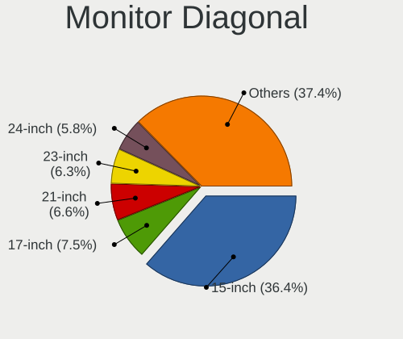

| Inches  | Computers | Percent |
|---------|-----------|---------|
| 15      | 499       | 36.42%  |
| 17      | 103       | 7.52%   |
| 21      | 90        | 6.57%   |
| 23      | 86        | 6.28%   |
| 24      | 80        | 5.84%   |
| 13      | 73        | 5.33%   |
| 19      | 63        | 4.6%    |
| 14      | 58        | 4.23%   |
| 27      | 50        | 3.65%   |
| 16      | 41        | 2.99%   |
| 31      | 32        | 2.34%   |
| Unknown | 28        | 2.04%   |
| 18      | 27        | 1.97%   |
| 22      | 22        | 1.61%   |
| 10      | 20        | 1.46%   |
| 20      | 18        | 1.31%   |
| 34      | 14        | 1.02%   |
| 7       | 8         | 0.58%   |
| 142     | 7         | 0.51%   |
| 54      | 7         | 0.51%   |
| 12      | 7         | 0.51%   |
| 11      | 7         | 0.51%   |
| 72      | 5         | 0.36%   |
| 40      | 5         | 0.36%   |
| 46      | 4         | 0.29%   |
| 63      | 3         | 0.22%   |
| 84      | 2         | 0.15%   |
| 52      | 2         | 0.15%   |
| 32      | 2         | 0.15%   |
| 8       | 2         | 0.15%   |
| 75      | 1         | 0.07%   |
| 42      | 1         | 0.07%   |
| 26      | 1         | 0.07%   |
| 25      | 1         | 0.07%   |
| 9       | 1         | 0.07%   |

Monitor Width
-------------

Physical width

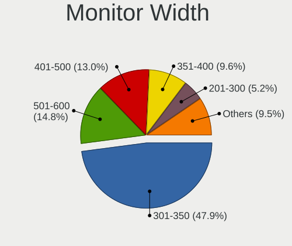

| Width in mm    | Computers | Percent |
|----------------|-----------|---------|
| 301-350        | 647       | 47.93%  |
| 501-600        | 200       | 14.81%  |
| 401-500        | 176       | 13.04%  |
| 351-400        | 129       | 9.56%   |
| 201-300        | 70        | 5.19%   |
| 601-700        | 36        | 2.67%   |
| Unknown        | 28        | 2.07%   |
| 701-800        | 16        | 1.19%   |
| 1001-1500      | 16        | 1.19%   |
| 1501-2000      | 8         | 0.59%   |
| More than 2000 | 7         | 0.52%   |
| 101-200        | 7         | 0.52%   |
| 801-900        | 5         | 0.37%   |
| 1-100          | 4         | 0.3%    |
| 901-1000       | 1         | 0.07%   |

Aspect Ratio
------------

Proportional relationship between the width and the height

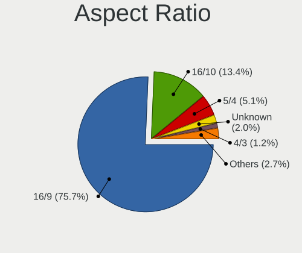

| Ratio   | Computers | Percent |
|---------|-----------|---------|
| 16/9    | 967       | 75.67%  |
| 16/10   | 171       | 13.38%  |
| 5/4     | 65        | 5.09%   |
| Unknown | 26        | 2.03%   |
| 4/3     | 15        | 1.17%   |
| 21/9    | 14        | 1.1%    |
| 3/2     | 8         | 0.63%   |
| 1.00    | 7         | 0.55%   |
| 0.67    | 3         | 0.23%   |
| 0.62    | 2         | 0.16%   |

Monitor Area
------------

Area in inch²

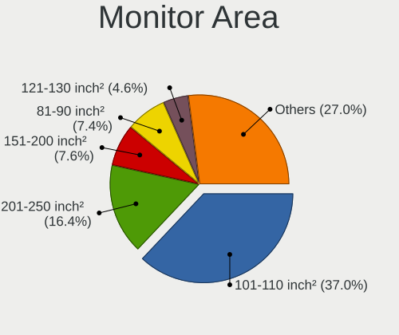

| Area in inch² | Computers | Percent |
|----------------|-----------|---------|
| 101-110        | 503       | 37.04%  |
| 201-250        | 223       | 16.42%  |
| 151-200        | 103       | 7.58%   |
| 81-90          | 100       | 7.36%   |
| 121-130        | 62        | 4.57%   |
| 301-350        | 51        | 3.76%   |
| 141-150        | 50        | 3.68%   |
| 351-500        | 48        | 3.53%   |
| 111-120        | 34        | 2.5%    |
| 71-80          | 29        | 2.14%   |
| Unknown        | 28        | 2.06%   |
| More than 1000 | 27        | 1.99%   |
| 251-300        | 27        | 1.99%   |
| 41-50          | 21        | 1.55%   |
| 131-140        | 15        | 1.1%    |
| 1-40           | 10        | 0.74%   |
| 501-1000       | 10        | 0.74%   |
| 61-70          | 7         | 0.52%   |
| 51-60          | 7         | 0.52%   |
| 91-100         | 3         | 0.22%   |

Pixel Density
-------------

Pixels per inch

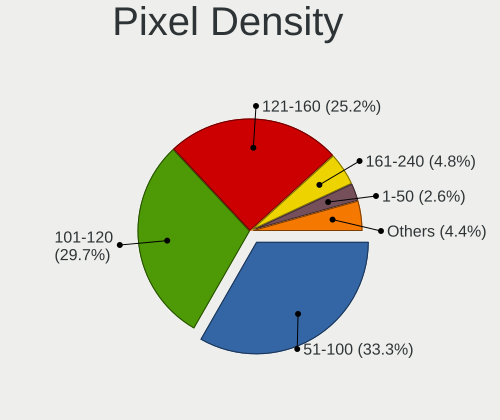

| Density       | Computers | Percent |
|---------------|-----------|---------|
| 51-100        | 442       | 33.28%  |
| 101-120       | 395       | 29.74%  |
| 121-160       | 335       | 25.23%  |
| 161-240       | 64        | 4.82%   |
| 1-50          | 34        | 2.56%   |
| More than 240 | 30        | 2.26%   |
| Unknown       | 28        | 2.11%   |

Multiple Monitors
-----------------

Total monitors connected

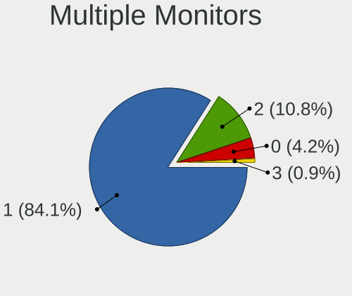

| Total | Computers | Percent |
|-------|-----------|---------|
| 1     | 1113      | 84.06%  |
| 2     | 143       | 10.8%   |
| 0     | 56        | 4.23%   |
| 3     | 12        | 0.91%   |

Network
-------

Net Controller Vendor
---------------------

Controller vendors

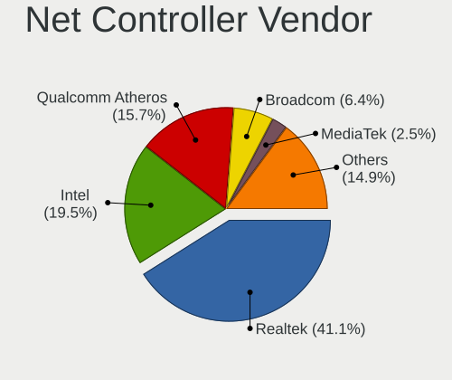

| Vendor                                 | Computers | Percent |
|----------------------------------------|-----------|---------|
| Realtek Semiconductor                  | 794       | 41.05%  |
| Intel                                  | 377       | 19.49%  |
| Qualcomm Atheros                       | 303       | 15.67%  |
| Broadcom                               | 124       | 6.41%   |
| MediaTek                               | 48        | 2.48%   |
| Nvidia                                 | 42        | 2.17%   |
| Marvell Technology Group               | 34        | 1.76%   |
| Ralink                                 | 28        | 1.45%   |
| TP-Link                                | 27        | 1.4%    |
| Ralink Technology                      | 24        | 1.24%   |
| Broadcom Limited                       | 21        | 1.09%   |
| D-Link                                 | 11        | 0.57%   |
| Qualcomm                               | 10        | 0.52%   |
| Xiaomi                                 | 9         | 0.47%   |
| Huawei Technologies                    | 9         | 0.47%   |
| VIA Technologies                       | 5         | 0.26%   |
| Shenzhen Goodix Technology             | 5         | 0.26%   |
| Hewlett-Packard                        | 5         | 0.26%   |
| Qualcomm Atheros Communications        | 4         | 0.21%   |
| JMicron Technology                     | 4         | 0.21%   |
| D-Link System                          | 4         | 0.21%   |
| Sundance Technology Inc / IC Plus      | 3         | 0.16%   |
| Sierra Wireless                        | 3         | 0.16%   |
| Samsung Electronics                    | 3         | 0.16%   |
| Fibocom                                | 3         | 0.16%   |
| Attansic Technology                    | 3         | 0.16%   |
| ASIX Electronics                       | 3         | 0.16%   |
| ZTE WCDMA Technologies MSM             | 2         | 0.1%    |
| Silicon Integrated Systems [SiS]       | 2         | 0.1%    |
| Mercucys                               | 2         | 0.1%    |
| IMC Networks                           | 2         | 0.1%    |
| Aquantia                               | 2         | 0.1%    |
| Texas Instruments                      | 1         | 0.05%   |
| STMicroelectronics                     | 1         | 0.05%   |
| Sony Ericsson Mobile Communications AB | 1         | 0.05%   |
| Qualcomm Technologies                  | 1         | 0.05%   |
| QinHeng Electronics                    | 1         | 0.05%   |
| Philips (or NXP)                       | 1         | 0.05%   |
| OPPO Electronics                       | 1         | 0.05%   |
| OnePlus Technology (Shenzhen)          | 1         | 0.05%   |

Net Controller Model
--------------------

Controller models

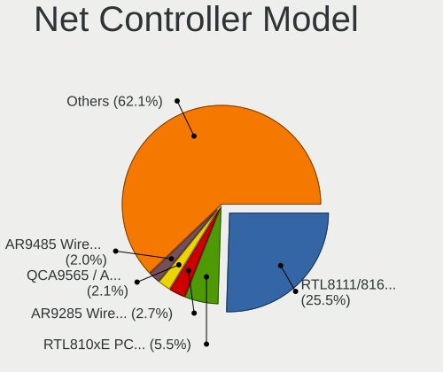

| Model                                                                   | Computers | Percent |
|-------------------------------------------------------------------------|-----------|---------|
| Realtek RTL8111/8168/8211/8411 PCI Express Gigabit Ethernet Controller  | 563       | 25.5%   |
| Realtek RTL810xE PCI Express Fast Ethernet controller                   | 122       | 5.53%   |
| Qualcomm Atheros AR9285 Wireless Network Adapter (PCI-Express)          | 60        | 2.72%   |
| Qualcomm Atheros QCA9565 / AR9565 Wireless Network Adapter              | 47        | 2.13%   |
| Qualcomm Atheros AR9485 Wireless Network Adapter                        | 44        | 1.99%   |
| Intel Wireless 8265 / 8275                                              | 44        | 1.99%   |
| Realtek RTL8723BE PCIe Wireless Network Adapter                         | 35        | 1.59%   |
| Broadcom BCM4313 802.11bgn Wireless Network Adapter                     | 35        | 1.59%   |
| Nvidia MCP61 Ethernet                                                   | 28        | 1.27%   |
| Realtek RTL8822CE 802.11ac PCIe Wireless Network Adapter                | 27        | 1.22%   |
| Realtek RTL8821CE 802.11ac PCIe Wireless Network Adapter                | 26        | 1.18%   |
| Qualcomm Atheros QCA9377 802.11ac Wireless Network Adapter              | 26        | 1.18%   |
| Intel Wi-Fi 6 AX200                                                     | 25        | 1.13%   |
| Broadcom BCM43142 802.11b/g/n                                           | 25        | 1.13%   |
| Intel Wi-Fi 6 AX201                                                     | 24        | 1.09%   |
| Realtek RTL8125 2.5GbE Controller                                       | 23        | 1.04%   |
| Intel Wireless 7265                                                     | 20        | 0.91%   |
| MediaTek MT7921 802.11ax PCIe Wireless Network Adapter [Filogic 330]    | 19        | 0.86%   |
| Ralink MT7601U Wireless Adapter                                         | 18        | 0.82%   |
| Ralink RT3290 Wireless 802.11n 1T/1R PCIe                               | 18        | 0.82%   |
| Intel Comet Lake PCH-LP CNVi WiFi                                       | 18        | 0.82%   |
| MediaTek MT7922 802.11ax PCI Express Wireless Network Adapter           | 17        | 0.77%   |
| Intel Alder Lake-P PCH CNVi WiFi                                        | 17        | 0.77%   |
| Qualcomm Atheros AR242x / AR542x Wireless Network Adapter (PCI-Express) | 16        | 0.72%   |
| Qualcomm Atheros AR8151 v2.0 Gigabit Ethernet                           | 15        | 0.68%   |
| Intel Cannon Lake PCH CNVi WiFi                                         | 15        | 0.68%   |
| Qualcomm Atheros AR8131 Gigabit Ethernet                                | 14        | 0.63%   |
| Realtek RTL8153 Gigabit Ethernet Adapter                                | 13        | 0.59%   |
| Intel Cannon Point-LP CNVi [Wireless-AC]                                | 13        | 0.59%   |
| Broadcom NetLink BCM57785 Gigabit Ethernet PCIe                         | 13        | 0.59%   |
| Realtek RTL8188EUS 802.11n Wireless Network Adapter                     | 12        | 0.54%   |
| Qualcomm Atheros QCA8171 Gigabit Ethernet                               | 12        | 0.54%   |
| Qualcomm Atheros AR9287 Wireless Network Adapter (PCI-Express)          | 12        | 0.54%   |
| Intel Wireless 7260                                                     | 12        | 0.54%   |
| Realtek RTL-8100/8101L/8139 PCI Fast Ethernet Adapter                   | 11        | 0.5%    |
| Qualcomm Atheros QCA6174 802.11ac Wireless Network Adapter              | 11        | 0.5%    |
| Intel I211 Gigabit Network Connection                                   | 11        | 0.5%    |
| Realtek RTL8822BE 802.11a/b/g/n/ac WiFi adapter                         | 10        | 0.45%   |
| Intel Ethernet Connection (2) I219-V                                    | 10        | 0.45%   |
| Qualcomm Atheros AR9462 Wireless Network Adapter                        | 9         | 0.41%   |

Wireless Vendor
---------------

Wireless vendors

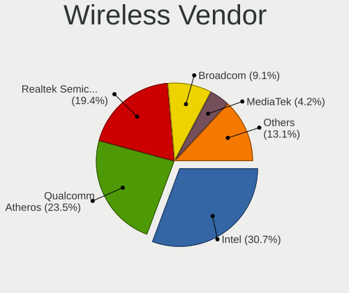

| Vendor                          | Computers | Percent |
|---------------------------------|-----------|---------|
| Intel                           | 309       | 30.69%  |
| Qualcomm Atheros                | 237       | 23.54%  |
| Realtek Semiconductor           | 195       | 19.36%  |
| Broadcom                        | 92        | 9.14%   |
| MediaTek                        | 42        | 4.17%   |
| Ralink                          | 28        | 2.78%   |
| TP-Link                         | 24        | 2.38%   |
| Ralink Technology               | 24        | 2.38%   |
| Broadcom Limited                | 14        | 1.39%   |
| D-Link                          | 11        | 1.09%   |
| Qualcomm                        | 8         | 0.79%   |
| Qualcomm Atheros Communications | 4         | 0.4%    |
| Sierra Wireless                 | 3         | 0.3%    |
| Hewlett-Packard                 | 3         | 0.3%    |
| Fibocom                         | 3         | 0.3%    |
| Mercucys                        | 2         | 0.2%    |
| IMC Networks                    | 2         | 0.2%    |
| Texas Instruments               | 1         | 0.1%    |
| Philips (or NXP)                | 1         | 0.1%    |
| Microsoft                       | 1         | 0.1%    |
| Marvell Technology Group        | 1         | 0.1%    |
| D-Link System                   | 1         | 0.1%    |
| Unknown                         | 1         | 0.1%    |

Wireless Model
--------------

Wireless models

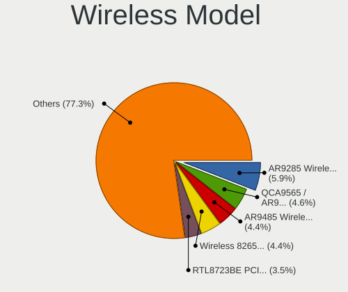

| Model                                                                   | Computers | Percent |
|-------------------------------------------------------------------------|-----------|---------|
| Qualcomm Atheros AR9285 Wireless Network Adapter (PCI-Express)          | 60        | 5.93%   |
| Qualcomm Atheros QCA9565 / AR9565 Wireless Network Adapter              | 47        | 4.65%   |
| Qualcomm Atheros AR9485 Wireless Network Adapter                        | 44        | 4.35%   |
| Intel Wireless 8265 / 8275                                              | 44        | 4.35%   |
| Realtek RTL8723BE PCIe Wireless Network Adapter                         | 35        | 3.46%   |
| Broadcom BCM4313 802.11bgn Wireless Network Adapter                     | 35        | 3.46%   |
| Realtek RTL8822CE 802.11ac PCIe Wireless Network Adapter                | 27        | 2.67%   |
| Realtek RTL8821CE 802.11ac PCIe Wireless Network Adapter                | 26        | 2.57%   |
| Qualcomm Atheros QCA9377 802.11ac Wireless Network Adapter              | 26        | 2.57%   |
| Intel Wi-Fi 6 AX200                                                     | 25        | 2.47%   |
| Broadcom BCM43142 802.11b/g/n                                           | 25        | 2.47%   |
| Intel Wi-Fi 6 AX201                                                     | 24        | 2.37%   |
| Intel Wireless 7265                                                     | 20        | 1.98%   |
| MediaTek MT7921 802.11ax PCIe Wireless Network Adapter [Filogic 330]    | 19        | 1.88%   |
| Ralink MT7601U Wireless Adapter                                         | 18        | 1.78%   |
| Ralink RT3290 Wireless 802.11n 1T/1R PCIe                               | 18        | 1.78%   |
| Intel Comet Lake PCH-LP CNVi WiFi                                       | 18        | 1.78%   |
| Qualcomm Atheros AR242x / AR542x Wireless Network Adapter (PCI-Express) | 16        | 1.58%   |
| Intel Cannon Lake PCH CNVi WiFi                                         | 15        | 1.48%   |
| MediaTek MT7922 802.11ax PCI Express Wireless Network Adapter           | 13        | 1.29%   |
| Intel Cannon Point-LP CNVi [Wireless-AC]                                | 13        | 1.29%   |
| Realtek RTL8188EUS 802.11n Wireless Network Adapter                     | 12        | 1.19%   |
| Qualcomm Atheros AR9287 Wireless Network Adapter (PCI-Express)          | 12        | 1.19%   |
| Intel Wireless 7260                                                     | 12        | 1.19%   |
| Qualcomm Atheros QCA6174 802.11ac Wireless Network Adapter              | 11        | 1.09%   |
| Realtek RTL8822BE 802.11a/b/g/n/ac WiFi adapter                         | 10        | 0.99%   |
| Qualcomm Atheros AR9462 Wireless Network Adapter                        | 9         | 0.89%   |
| Intel Wireless 8260                                                     | 9         | 0.89%   |
| Intel Wireless 3165                                                     | 9         | 0.89%   |
| Intel WiFi Link 5100                                                    | 9         | 0.89%   |
| Realtek RTL8852BE PCIe 802.11ax Wireless Network Controller             | 8         | 0.79%   |
| Realtek RTL8821AE 802.11ac PCIe Wireless Network Adapter                | 8         | 0.79%   |
| Intel Raptor Lake PCH CNVi WiFi                                         | 8         | 0.79%   |
| Intel Alder Lake-P PCH CNVi WiFi                                        | 8         | 0.79%   |
| Realtek 802.11ac NIC                                                    | 7         | 0.69%   |
| Qualcomm QCNFA765 Wireless Network Adapter                              | 7         | 0.69%   |
| Qualcomm Atheros AR928X Wireless Network Adapter (PCI-Express)          | 7         | 0.69%   |
| Intel PRO/Wireless 4965 AG or AGN [Kedron] Network Connection           | 7         | 0.69%   |
| Realtek RTL8723DE Wireless Network Adapter                              | 6         | 0.59%   |
| Intel Wi-Fi 6E(802.11ax) AX210/AX1675* 2x2 [Typhoon Peak]               | 6         | 0.59%   |

Ethernet Vendor
---------------

Ethernet vendors

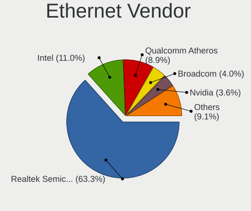

| Vendor                                 | Computers | Percent |
|----------------------------------------|-----------|---------|
| Realtek Semiconductor                  | 736       | 63.34%  |
| Intel                                  | 128       | 11.02%  |
| Qualcomm Atheros                       | 103       | 8.86%   |
| Broadcom                               | 47        | 4.04%   |
| Nvidia                                 | 42        | 3.61%   |
| Marvell Technology Group               | 33        | 2.84%   |
| Xiaomi                                 | 9         | 0.77%   |
| Broadcom Limited                       | 7         | 0.6%    |
| MediaTek                               | 6         | 0.52%   |
| Huawei Technologies                    | 6         | 0.52%   |
| VIA Technologies                       | 5         | 0.43%   |
| JMicron Technology                     | 4         | 0.34%   |
| TP-Link                                | 3         | 0.26%   |
| Sundance Technology Inc / IC Plus      | 3         | 0.26%   |
| Samsung Electronics                    | 3         | 0.26%   |
| D-Link System                          | 3         | 0.26%   |
| Attansic Technology                    | 3         | 0.26%   |
| ASIX Electronics                       | 3         | 0.26%   |
| Silicon Integrated Systems [SiS]       | 2         | 0.17%   |
| Qualcomm                               | 2         | 0.17%   |
| Aquantia                               | 2         | 0.17%   |
| ZTE WCDMA Technologies MSM             | 1         | 0.09%   |
| Sony Ericsson Mobile Communications AB | 1         | 0.09%   |
| Qualcomm Technologies                  | 1         | 0.09%   |
| OPPO Electronics                       | 1         | 0.09%   |
| OnePlus Technology (Shenzhen)          | 1         | 0.09%   |
| Motorola PCS                           | 1         | 0.09%   |
| Lenovo                                 | 1         | 0.09%   |
| HTC (High Tech Computer)               | 1         | 0.09%   |
| HMD Global                             | 1         | 0.09%   |
| Google                                 | 1         | 0.09%   |
| Davicom Semiconductor                  | 1         | 0.09%   |
| Apple                                  | 1         | 0.09%   |

Ethernet Model
--------------

Ethernet models

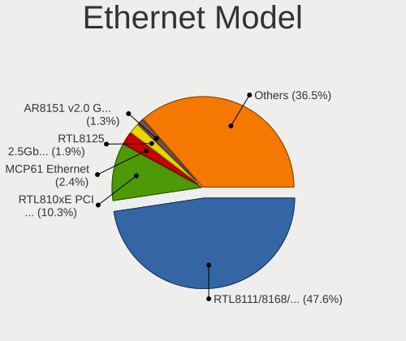

| Model                                                                          | Computers | Percent |
|--------------------------------------------------------------------------------|-----------|---------|
| Realtek RTL8111/8168/8211/8411 PCI Express Gigabit Ethernet Controller         | 563       | 47.63%  |
| Realtek RTL810xE PCI Express Fast Ethernet controller                          | 122       | 10.32%  |
| Nvidia MCP61 Ethernet                                                          | 28        | 2.37%   |
| Realtek RTL8125 2.5GbE Controller                                              | 23        | 1.95%   |
| Qualcomm Atheros AR8151 v2.0 Gigabit Ethernet                                  | 15        | 1.27%   |
| Qualcomm Atheros AR8131 Gigabit Ethernet                                       | 14        | 1.18%   |
| Realtek RTL8153 Gigabit Ethernet Adapter                                       | 13        | 1.1%    |
| Broadcom NetLink BCM57785 Gigabit Ethernet PCIe                                | 13        | 1.1%    |
| Qualcomm Atheros QCA8171 Gigabit Ethernet                                      | 12        | 1.02%   |
| Realtek RTL-8100/8101L/8139 PCI Fast Ethernet Adapter                          | 11        | 0.93%   |
| Intel I211 Gigabit Network Connection                                          | 11        | 0.93%   |
| Intel Ethernet Connection (2) I219-V                                           | 10        | 0.85%   |
| Qualcomm Atheros AR8162 Fast Ethernet                                          | 9         | 0.76%   |
| Qualcomm Atheros AR8161 Gigabit Ethernet                                       | 9         | 0.76%   |
| Qualcomm Atheros AR8132 Fast Ethernet                                          | 9         | 0.76%   |
| Intel Alder Lake-P PCH CNVi WiFi                                               | 9         | 0.76%   |
| Xiaomi Mi/Redmi series (RNDIS)                                                 | 8         | 0.68%   |
| Intel 82579V Gigabit Network Connection                                        | 8         | 0.68%   |
| Intel Ethernet Connection (4) I219-V                                           | 7         | 0.59%   |
| Intel 82579LM Gigabit Network Connection (Lewisville)                          | 7         | 0.59%   |
| Broadcom NetLink BCM5787M Gigabit Ethernet PCI Express                         | 7         | 0.59%   |
| Qualcomm Atheros AR8152 v2.0 Fast Ethernet                                     | 6         | 0.51%   |
| Qualcomm Atheros AR8121/AR8113/AR8114 Gigabit or Fast Ethernet                 | 6         | 0.51%   |
| Marvell Group 88E8055 PCI-E Gigabit Ethernet Controller                        | 6         | 0.51%   |
| Intel Ethernet Connection (7) I219-V                                           | 6         | 0.51%   |
| Broadcom NetXtreme BCM57786 Gigabit Ethernet PCIe                              | 6         | 0.51%   |
| Qualcomm Atheros QCA8172 Fast Ethernet                                         | 5         | 0.42%   |
| Qualcomm Atheros Attansic L1 Gigabit Ethernet                                  | 5         | 0.42%   |
| Marvell Group 88E8040 PCI-E Fast Ethernet Controller                           | 5         | 0.42%   |
| Intel Ethernet Controller I225-V                                               | 5         | 0.42%   |
| Intel Ethernet Connection (6) I219-V                                           | 5         | 0.42%   |
| Intel Ethernet Connection (23) I219-V                                          | 5         | 0.42%   |
| Intel Ethernet Connection (14) I219-V                                          | 5         | 0.42%   |
| Huawei FOA-LX9                                                                 | 5         | 0.42%   |
| Broadcom NetXtreme BCM57765 Gigabit Ethernet PCIe                              | 5         | 0.42%   |
| VIA VT6105/VT6106S [Rhine-III]                                                 | 4         | 0.34%   |
| Nvidia MCP65 Ethernet                                                          | 4         | 0.34%   |
| MediaTek MT7922 802.11ax PCI Express Wireless Network Adapter                  | 4         | 0.34%   |
| Marvell Group Yukon Optima 88E8059 [PCIe Gigabit Ethernet Controller with AVB] | 4         | 0.34%   |
| Marvell Group 88E8042 PCI-E Fast Ethernet Controller                           | 4         | 0.34%   |

Net Controller Kind
-------------------

Ethernet, WiFi or modem

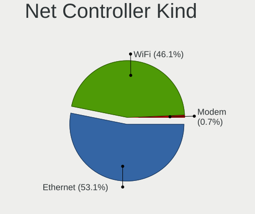

| Kind     | Computers | Percent |
|----------|-----------|---------|
| Ethernet | 1108      | 53.14%  |
| WiFi     | 962       | 46.14%  |
| Modem    | 15        | 0.72%   |

Used Controller
---------------

Currently used network controller

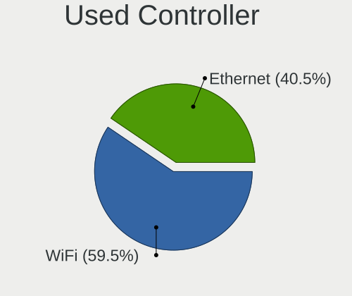

| Kind     | Computers | Percent |
|----------|-----------|---------|
| WiFi     | 803       | 59.48%  |
| Ethernet | 547       | 40.52%  |

NICs
----

Total network controllers on board

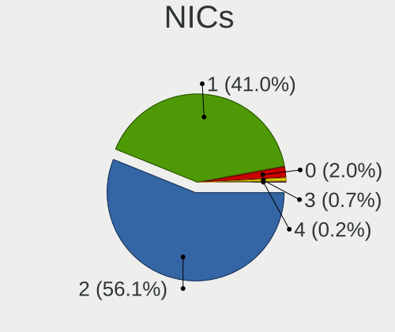

| Total | Computers | Percent |
|-------|-----------|---------|
| 2     | 730       | 56.11%  |
| 1     | 533       | 40.97%  |
| 0     | 26        | 2%      |
| 3     | 9         | 0.69%   |
| 4     | 3         | 0.23%   |

IPv6
----

IPv6 vs IPv4

| Used | Computers | Percent |
|------|-----------|---------|
| No   | 1276      | 97.78%  |
| Yes  | 29        | 2.22%   |

Bluetooth
---------

Bluetooth Vendor
----------------

Controller vendors

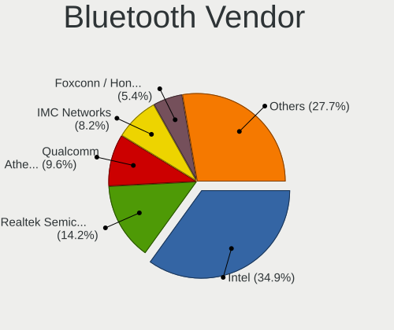

| Vendor                          | Computers | Percent |
|---------------------------------|-----------|---------|
| Intel                           | 270       | 34.93%  |
| Realtek Semiconductor           | 110       | 14.23%  |
| Qualcomm Atheros Communications | 74        | 9.57%   |
| IMC Networks                    | 63        | 8.15%   |
| Foxconn / Hon Hai               | 42        | 5.43%   |
| Broadcom                        | 39        | 5.05%   |
| Cambridge Silicon Radio         | 34        | 4.4%    |
| Lite-On Technology              | 32        | 4.14%   |
| Ralink                          | 18        | 2.33%   |
| ASUSTek Computer                | 17        | 2.2%    |
| Foxconn International           | 13        | 1.68%   |
| MediaTek                        | 10        | 1.29%   |
| Hewlett-Packard                 | 9         | 1.16%   |
| Toshiba                         | 7         | 0.91%   |
| Apple                           | 7         | 0.91%   |
| Realtek                         | 4         | 0.52%   |
| Ralink Technology               | 3         | 0.39%   |
| Dell                            | 3         | 0.39%   |
| USI                             | 2         | 0.26%   |
| TP-Link                         | 2         | 0.26%   |
| Taiyo Yuden                     | 2         | 0.26%   |
| Qcom                            | 2         | 0.26%   |
| Opticis                         | 2         | 0.26%   |
| Integrated System Solution      | 2         | 0.26%   |
| Micro Star International        | 1         | 0.13%   |
| Marvell Semiconductor           | 1         | 0.13%   |
| Chicony Electronics             | 1         | 0.13%   |
| Alps Electric                   | 1         | 0.13%   |
| Actions                         | 1         | 0.13%   |
| Unknown                         | 1         | 0.13%   |

Bluetooth Model
---------------

Controller models

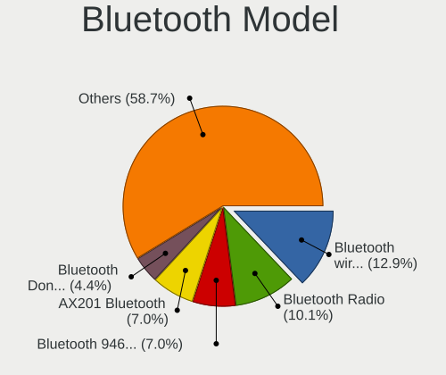

| Model                                               | Computers | Percent |
|-----------------------------------------------------|-----------|---------|
| Intel Bluetooth wireless interface                  | 100       | 12.9%   |
| Realtek Bluetooth Radio                             | 78        | 10.06%  |
| Intel Bluetooth 9460/9560 Jefferson Peak (JfP)      | 54        | 6.97%   |
| Intel AX201 Bluetooth                               | 54        | 6.97%   |
| Cambridge Silicon Radio Bluetooth Dongle (HCI mode) | 34        | 4.39%   |
| Intel AX200 Bluetooth                               | 24        | 3.1%    |
| Qualcomm Atheros AR3012 Bluetooth 4.0               | 23        | 2.97%   |
| Qualcomm Atheros  Bluetooth Device                  | 22        | 2.84%   |
| IMC Networks Wireless_Device                        | 20        | 2.58%   |
| Ralink RT3290 Bluetooth                             | 18        | 2.32%   |
| IMC Networks Bluetooth Radio                        | 18        | 2.32%   |
| Qualcomm Atheros AR3011 Bluetooth                   | 17        | 2.19%   |
| Realtek  Bluetooth 4.2 Adapter                      | 15        | 1.94%   |
| Foxconn / Hon Hai Bluetooth Device                  | 15        | 1.94%   |
| Foxconn International BCM43142A0 Bluetooth module   | 13        | 1.68%   |
| Intel Bluetooth Device                              | 12        | 1.55%   |
| Lite-On Bluetooth Device                            | 11        | 1.42%   |
| IMC Networks Atheros AR3012 Bluetooth 4.0 Adapter   | 10        | 1.29%   |
| MediaTek Wireless_Device                            | 9         | 1.16%   |
| IMC Networks Bluetooth Device                       | 9         | 1.16%   |
| Foxconn / Hon Hai Wireless_Device                   | 9         | 1.16%   |
| Intel Centrino Bluetooth Wireless Transceiver       | 8         | 1.03%   |
| Broadcom BCM2070 Bluetooth Device                   | 8         | 1.03%   |
| Broadcom BCM2070 Bluetooth 2.1 + EDR                | 8         | 1.03%   |
| Realtek RTL8723B Bluetooth                          | 7         | 0.9%    |
| Lite-On Qualcomm Atheros QCA9377 Bluetooth          | 7         | 0.9%    |
| Lite-On Atheros AR3012 Bluetooth                    | 7         | 0.9%    |
| Intel Centrino Advanced-N 6230 Bluetooth adapter    | 7         | 0.9%    |
| Qualcomm Atheros Bluetooth                          | 6         | 0.77%   |
| Intel AX210 Bluetooth                               | 5         | 0.65%   |
| HP Broadcom 2070 Bluetooth Combo                    | 5         | 0.65%   |
| Foxconn / Hon Hai MediaTek Bluetooth Adapter        | 5         | 0.65%   |
| Realtek RTL8821A Bluetooth                          | 4         | 0.52%   |
| Realtek Bluetooth Radio                             | 4         | 0.52%   |
| Intel Wireless-AC 3168 Bluetooth                    | 4         | 0.52%   |
| HP Bluetooth 2.0 Interface [Broadcom BCM2045]       | 4         | 0.52%   |
| Broadcom HP Portable SoftSailing                    | 4         | 0.52%   |
| Broadcom BCM2045 Bluetooth                          | 4         | 0.52%   |
| ASUS BT-270 Bluetooth Adapter                       | 4         | 0.52%   |
| ASUS Broadcom BCM20702A0 Bluetooth                  | 4         | 0.52%   |

Sound
-----

Sound Vendor
------------

Sound card vendors

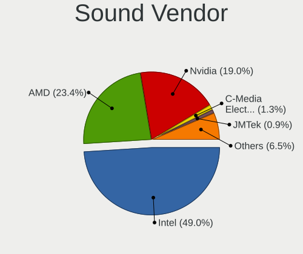

| Vendor                                       | Computers | Percent |
|----------------------------------------------|-----------|---------|
| Intel                                        | 857       | 49%     |
| AMD                                          | 409       | 23.38%  |
| Nvidia                                       | 333       | 19.04%  |
| C-Media Electronics                          | 22        | 1.26%   |
| JMTek                                        | 15        | 0.86%   |
| Logitech                                     | 13        | 0.74%   |
| Creative Labs                                | 12        | 0.69%   |
| Texas Instruments                            | 8         | 0.46%   |
| Generalplus Technology                       | 6         | 0.34%   |
| Silicon Integrated Systems [SiS]             | 4         | 0.23%   |
| Kingston Technology                          | 4         | 0.23%   |
| GN Netcom                                    | 4         | 0.23%   |
| SteelSeries ApS                              | 3         | 0.17%   |
| Micro Star International                     | 3         | 0.17%   |
| Conexant Systems                             | 3         | 0.17%   |
| ASUSTek Computer                             | 3         | 0.17%   |
| Tenx Technology                              | 2         | 0.11%   |
| Synaptics                                    | 2         | 0.11%   |
| Razer USA                                    | 2         | 0.11%   |
| M-Audio                                      | 2         | 0.11%   |
| GYROCOM C&C                                  | 2         | 0.11%   |
| Focusrite-Novation                           | 2         | 0.11%   |
| ESS Technology                               | 2         | 0.11%   |
| Creative Technology                          | 2         | 0.11%   |
| Apple                                        | 2         | 0.11%   |
| Unknown                                      | 2         | 0.11%   |
| Zoran Co. Personal Media Division (Nogatech) | 1         | 0.06%   |
| Yealink Network Technology                   | 1         | 0.06%   |
| Yamaha                                       | 1         | 0.06%   |
| VirTouch                                     | 1         | 0.06%   |
| VIA Technologies                             | 1         | 0.06%   |
| Unknown                                      | 1         | 0.06%   |
| Thesycon Systemsoftware & Consulting         | 1         | 0.06%   |
| Sony                                         | 1         | 0.06%   |
| Samson Technologies                          | 1         | 0.06%   |
| Roland                                       | 1         | 0.06%   |
| ROCCAT                                       | 1         | 0.06%   |
| Realtek Semiconductor                        | 1         | 0.06%   |
| Plantronics                                  | 1         | 0.06%   |
| Pixart Imaging                               | 1         | 0.06%   |

Sound Model
-----------

Sound card models

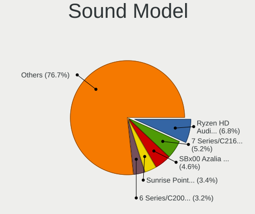

| Model                                                                      | Computers | Percent |
|----------------------------------------------------------------------------|-----------|---------|
| AMD Ryzen HD Audio Controller                                              | 143       | 6.81%   |
| Intel 7 Series/C216 Chipset Family High Definition Audio Controller        | 110       | 5.24%   |
| AMD SBx00 Azalia (Intel HDA)                                               | 97        | 4.62%   |
| Intel Sunrise Point-LP HD Audio                                            | 72        | 3.43%   |
| Intel 6 Series/C200 Series Chipset Family High Definition Audio Controller | 68        | 3.24%   |
| Intel NM10/ICH7 Family High Definition Audio Controller                    | 60        | 2.86%   |
| AMD Renoir/Cezanne HDMI/DP Audio Controller                                | 60        | 2.86%   |
| AMD FCH Azalia Controller                                                  | 58        | 2.76%   |
| Intel 8 Series/C220 Series Chipset High Definition Audio Controller        | 46        | 2.19%   |
| Intel 82801I (ICH9 Family) HD Audio Controller                             | 44        | 2.09%   |
| Intel Cannon Lake PCH cAVS                                                 | 36        | 1.71%   |
| AMD Raven/Raven2/Fenghuang HDMI/DP Audio Controller                        | 36        | 1.71%   |
| AMD Radeon High Definition Audio Controller                                | 36        | 1.71%   |
| Nvidia MCP61 High Definition Audio                                         | 34        | 1.62%   |
| Intel 82801H (ICH8 Family) HD Audio Controller                             | 34        | 1.62%   |
| Intel Tiger Lake-LP Smart Sound Technology Audio Controller                | 33        | 1.57%   |
| Intel Xeon E3-1200 v3/4th Gen Core Processor HD Audio Controller           | 29        | 1.38%   |
| Intel Haswell-ULT HD Audio Controller                                      | 29        | 1.38%   |
| Intel 8 Series HD Audio Controller                                         | 29        | 1.38%   |
| Nvidia GF108 High Definition Audio Controller                              | 28        | 1.33%   |
| Intel Alder Lake PCH-P High Definition Audio Controller                    | 28        | 1.33%   |
| Intel Atom Processor Z36xxx/Z37xxx Series High Definition Audio Controller | 26        | 1.24%   |
| Nvidia GP107GL High Definition Audio Controller                            | 22        | 1.05%   |
| Intel 5 Series/3400 Series Chipset High Definition Audio                   | 22        | 1.05%   |
| Intel 100 Series/C230 Series Chipset Family HD Audio Controller            | 21        | 1%      |
| AMD Trinity HDMI Audio Controller                                          | 21        | 1%      |
| Intel Comet Lake PCH-LP cAVS                                               | 20        | 0.95%   |
| AMD Starship/Matisse HD Audio Controller                                   | 20        | 0.95%   |
| Nvidia TU107 GeForce GTX 1650 High Definition Audio Controller             | 19        | 0.9%    |
| Intel Cannon Point-LP High Definition Audio Controller                     | 19        | 0.9%    |
| AMD Family 17h (Models 00h-0fh) HD Audio Controller                        | 19        | 0.9%    |
| Nvidia High Definition Audio Controller                                    | 18        | 0.86%   |
| Nvidia GK208 HDMI/DP Audio Controller                                      | 18        | 0.86%   |
| Nvidia GA106 High Definition Audio Controller                              | 18        | 0.86%   |
| Intel Celeron/Pentium Silver Processor High Definition Audio               | 18        | 0.86%   |
| Intel Wildcat Point-LP High Definition Audio Controller                    | 17        | 0.81%   |
| Intel Broadwell-U Audio Controller                                         | 17        | 0.81%   |
| Intel Celeron N3350/Pentium N4200/Atom E3900 Series Audio Cluster          | 16        | 0.76%   |
| Intel 200 Series PCH HD Audio                                              | 16        | 0.76%   |
| AMD Kabini HDMI/DP Audio                                                   | 16        | 0.76%   |

Memory
------

Memory Vendor
-------------

Memory module vendors

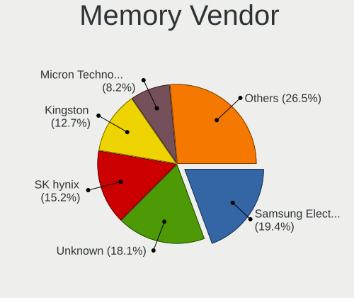

| Vendor                | Computers | Percent |
|-----------------------|-----------|---------|
| Samsung Electronics   | 223       | 19.36%  |
| Unknown               | 209       | 18.14%  |
| SK hynix              | 175       | 15.19%  |
| Kingston              | 146       | 12.67%  |
| Micron Technology     | 94        | 8.16%   |
| Crucial               | 74        | 6.42%   |
| Elpida                | 27        | 2.34%   |
| Ramaxel Technology    | 22        | 1.91%   |
| Patriot               | 20        | 1.74%   |
| G.Skill               | 17        | 1.48%   |
| Nanya Technology      | 16        | 1.39%   |
| A-DATA Technology     | 16        | 1.39%   |
| Corsair               | 11        | 0.95%   |
| Transcend             | 10        | 0.87%   |
| Unknown               | 9         | 0.78%   |
| Silicon Power         | 8         | 0.69%   |
| ASint Technology      | 8         | 0.69%   |
| Goodram               | 7         | 0.61%   |
| Team                  | 6         | 0.52%   |
| GeIL                  | 6         | 0.52%   |
| Apacer                | 5         | 0.43%   |
| 48spaces              | 5         | 0.43%   |
| Unknown (ABCD)        | 3         | 0.26%   |
| Unknown (89F7)        | 3         | 0.26%   |
| SHARETRONIC           | 3         | 0.26%   |
| Netac                 | 3         | 0.26%   |
| Kingmax               | 3         | 0.26%   |
| AMD                   | 3         | 0.26%   |
| TakeMS                | 2         | 0.17%   |
| Qumo                  | 2         | 0.17%   |
| Qimonda               | 2         | 0.17%   |
| Kllisre               | 2         | 0.17%   |
| Golden Empire         | 2         | 0.17%   |
| Wilk Elektronik       | 1         | 0.09%   |
| Wilk                  | 1         | 0.09%   |
| Unknown (0x0E9D)      | 1         | 0.09%   |
| PNY                   | 1         | 0.09%   |
| Lexar Co Limited      | 1         | 0.09%   |
| KingSpec              | 1         | 0.09%   |
| Kingmax Semiconductor | 1         | 0.09%   |

Memory Model
------------

Memory module models

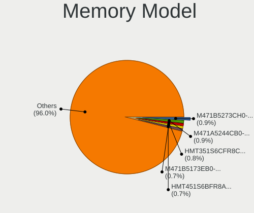

| Model                                                                     | Computers | Percent |
|---------------------------------------------------------------------------|-----------|---------|
| Samsung RAM M471B5273CH0-CH9 4GB SODIMM DDR3 1334MT/s                     | 11        | 0.87%   |
| Samsung RAM M471A5244CB0-CTD 4GB SODIMM DDR4 3266MT/s                     | 11        | 0.87%   |
| SK hynix RAM HMT351S6CFR8C-PB 4GB SODIMM DDR3 1600MT/s                    | 10        | 0.79%   |
| SK hynix RAM HMT451S6BFR8A-PB 4GB SODIMM DDR3 1600MT/s                    | 9         | 0.71%   |
| Samsung RAM M471B5173EB0-YK0 4GB SODIMM DDR3 1600MT/s                     | 9         | 0.71%   |
| Unknown                                                                   | 9         | 0.71%   |
| Samsung RAM M471B5773CHS-CH9 2GB SODIMM DDR3 4199MT/s                     | 8         | 0.63%   |
| Samsung RAM M471B5173DB0-YK0 4GB SODIMM DDR3 1600MT/s                     | 8         | 0.63%   |
| Samsung RAM M471A1K43EB1-CWE 8GB SODIMM DDR4 3200MT/s                     | 8         | 0.63%   |
| Unknown RAM Module 2048MB DIMM 800MT/s                                    | 7         | 0.56%   |
| Samsung RAM M471A5244CB0-CWE 4GB SODIMM DDR4 3200MT/s                     | 7         | 0.56%   |
| Samsung RAM M471A5244CB0-CRC 4GB SODIMM DDR4 2667MT/s                     | 7         | 0.56%   |
| Unknown RAM Module 4096MB DIMM 1333MT/s                                   | 6         | 0.48%   |
| Unknown RAM Module 2GB SODIMM DDR2 667MT/s                                | 6         | 0.48%   |
| Unknown RAM Module 2GB DIMM 800MT/s                                       | 6         | 0.48%   |
| Unknown RAM Module 2048MB SODIMM DDR2 667MT/s                             | 6         | 0.48%   |
| Unknown RAM Module 2048MB DIMM SDRAM                                      | 6         | 0.48%   |
| Unknown RAM Module 1024MB DIMM SDRAM                                      | 6         | 0.48%   |
| SK hynix RAM HMT425S6AFR6A-PB 2GB SODIMM DDR3 3200MT/s                    | 6         | 0.48%   |
| SK hynix RAM HMT351S6CFR8A-PB 4GB SODIMM DDR3 1600MT/s                    | 6         | 0.48%   |
| Samsung RAM M471B5173QH0-YK0 4GB SODIMM DDR3 1600MT/s                     | 6         | 0.48%   |
| Micron RAM 4ATF51264HZ-3G2J1 4GB SODIMM DDR4 3200MT/s                     | 6         | 0.48%   |
| Kingston RAM ACR16D3LS1NGG/4G 4GB SODIMM DDR3 1600MT/s                    | 6         | 0.48%   |
| Unknown RAM Module 2048MB DIMM DDR2                                       | 5         | 0.4%    |
| Unknown RAM Module 1024MB SODIMM DDR2 667MT/s                             | 5         | 0.4%    |
| SK hynix RAM HMT351S6CFR8C-PB 4096MB SODIMM DDR3 1600MT/s                 | 5         | 0.4%    |
| SK hynix RAM HMT325S6CFR8C-PB 2GB SODIMM DDR3 1600MT/s                    | 5         | 0.4%    |
| SK hynix RAM HMAA1GS6CJR6N-XN 8GB SODIMM DDR4 3200MT/s                    | 5         | 0.4%    |
| SK hynix RAM HMA81GS6CJR8N-VK 8GB SODIMM DDR4 2667MT/s                    | 5         | 0.4%    |
| Samsung RAM M471B5273DH0-CK0 4GB SODIMM DDR3 2400MT/s                     | 5         | 0.4%    |
| Samsung RAM M471B5273DH0-CH9 4GB SODIMM DDR3 1600MT/s                     | 5         | 0.4%    |
| Samsung RAM M4 70T5663EH3-CF7 2GB SODIMM DDR 975MT/s                      | 5         | 0.4%    |
| 48spaces RAM 012345678901234567890123456789012345 2GB SODIMM DDR2 667MT/s | 5         | 0.4%    |
| Unknown RAM Module 4GB DIMM 1600MT/s                                      | 4         | 0.32%   |
| Unknown RAM Module 4096MB DIMM DDR3 1600MT/s                              | 4         | 0.32%   |
| Unknown RAM Module 2048MB SODIMM DDR2 800MT/s                             | 4         | 0.32%   |
| Unknown RAM Module 2048MB SODIMM DDR2                                     | 4         | 0.32%   |
| Unknown RAM Module 2048MB DIMM 400MT/s                                    | 4         | 0.32%   |
| Unknown RAM Module 1024MB DIMM DDR2                                       | 4         | 0.32%   |
| Unknown RAM Module 1024MB DIMM 667MT/s                                    | 4         | 0.32%   |

Memory Kind
-----------

Memory module kinds

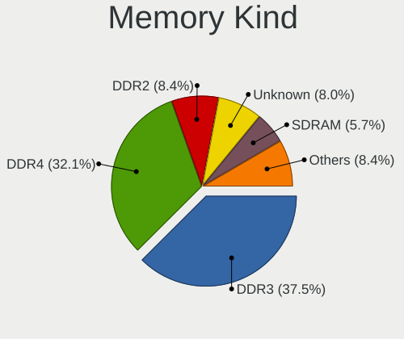

| Kind    | Computers | Percent |
|---------|-----------|---------|
| DDR3    | 371       | 37.51%  |
| DDR4    | 317       | 32.05%  |
| DDR2    | 83        | 8.39%   |
| Unknown | 79        | 7.99%   |
| SDRAM   | 56        | 5.66%   |
| DDR5    | 32        | 3.24%   |
| LPDDR4  | 19        | 1.92%   |
| LPDDR5  | 16        | 1.62%   |
| DDR     | 9         | 0.91%   |
| DRAM    | 4         | 0.4%    |
| LPDDR3  | 3         | 0.3%    |

Memory Form Factor
------------------

Physical design of the memory module

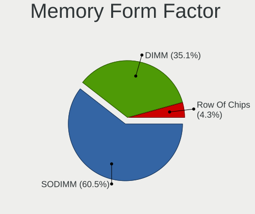

| Name         | Computers | Percent |
|--------------|-----------|---------|
| SODIMM       | 589       | 60.53%  |
| DIMM         | 342       | 35.15%  |
| Row Of Chips | 42        | 4.32%   |

Memory Size
-----------

Memory module size

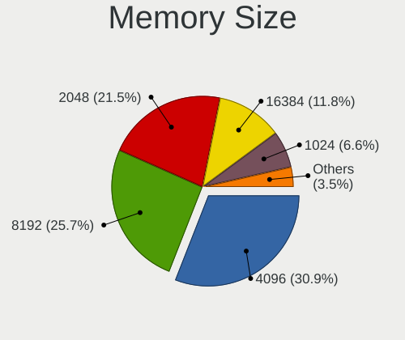

| Size  | Computers | Percent |
|-------|-----------|---------|
| 4096  | 349       | 30.94%  |
| 8192  | 290       | 25.71%  |
| 2048  | 242       | 21.45%  |
| 16384 | 133       | 11.79%  |
| 1024  | 74        | 6.56%   |
| 32768 | 22        | 1.95%   |
| 512   | 14        | 1.24%   |
| 256   | 2         | 0.18%   |
| 49152 | 1         | 0.09%   |
| 16    | 1         | 0.09%   |

Memory Speed
------------

Memory module speed

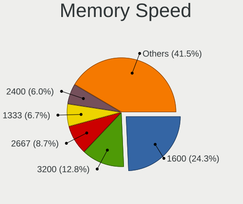

| Speed   | Computers | Percent |
|---------|-----------|---------|
| 1600    | 262       | 24.28%  |
| 3200    | 138       | 12.79%  |
| 2667    | 94        | 8.71%   |
| 1333    | 72        | 6.67%   |
| 2400    | 65        | 6.02%   |
| 800     | 49        | 4.54%   |
| Unknown | 48        | 4.45%   |
| 667     | 47        | 4.36%   |
| 1334    | 36        | 3.34%   |
| 2133    | 21        | 1.95%   |
| 4800    | 17        | 1.58%   |
| 4199    | 16        | 1.48%   |
| 3600    | 16        | 1.48%   |
| 1066    | 15        | 1.39%   |
| 533     | 14        | 1.3%    |
| 6400    | 12        | 1.11%   |
| 1067    | 12        | 1.11%   |
| 400     | 12        | 1.11%   |
| 5600    | 11        | 1.02%   |
| 3266    | 11        | 1.02%   |
| 1866    | 11        | 1.02%   |
| 1867    | 10        | 0.93%   |
| 2048    | 9         | 0.83%   |
| 3466    | 8         | 0.74%   |
| 3733    | 7         | 0.65%   |
| 333     | 7         | 0.65%   |
| 4267    | 6         | 0.56%   |
| 2666    | 4         | 0.37%   |
| 7500    | 3         | 0.28%   |
| 4266    | 3         | 0.28%   |
| 3800    | 3         | 0.28%   |
| 3400    | 3         | 0.28%   |
| 1639    | 3         | 0.28%   |
| 49926   | 2         | 0.19%   |
| 8533    | 2         | 0.19%   |
| 8400    | 2         | 0.19%   |
| 6000    | 2         | 0.19%   |
| 3000    | 2         | 0.19%   |
| 1800    | 2         | 0.19%   |
| 266     | 2         | 0.19%   |

Printers & scanners
-------------------

Printer Vendor
--------------

Printer device vendors

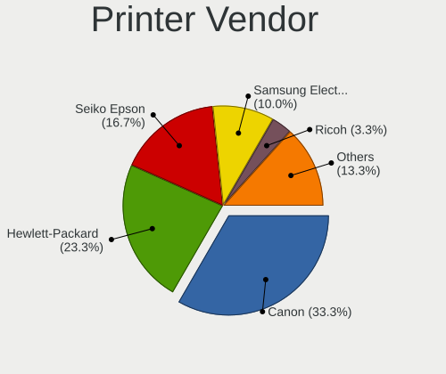

| Vendor                | Computers | Percent |
|-----------------------|-----------|---------|
| Canon                 | 10        | 33.33%  |
| Hewlett-Packard       | 7         | 23.33%  |
| Seiko Epson           | 5         | 16.67%  |
| Samsung Electronics   | 3         | 10%     |
| Ricoh                 | 1         | 3.33%   |
| QinHeng Electronics   | 1         | 3.33%   |
| Pantum                | 1         | 3.33%   |
| Lexmark International | 1         | 3.33%   |
| Kyocera               | 1         | 3.33%   |

Printer Model
-------------

Printer device models

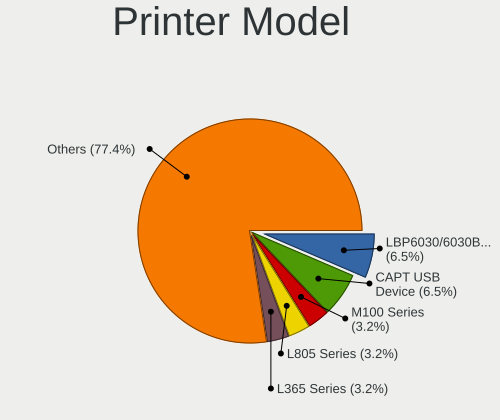

| Model                             | Computers | Percent |
|-----------------------------------|-----------|---------|
| Canon LBP6030/6030B/6018L         | 2         | 6.45%   |
| Canon CAPT USB Device             | 2         | 6.45%   |
| Seiko Epson M100 Series           | 1         | 3.23%   |
| Seiko Epson L805 Series           | 1         | 3.23%   |
| Seiko Epson L365 Series           | 1         | 3.23%   |
| Seiko Epson L1250 Series          | 1         | 3.23%   |
| Seiko Epson EPSON L220 Series     | 1         | 3.23%   |
| Samsung SCX-4300 Series           | 1         | 3.23%   |
| Samsung SCX-4200 series           | 1         | 3.23%   |
| Samsung Laser Printer             | 1         | 3.23%   |
| Ricoh RICOH SP 211SU              | 1         | 3.23%   |
| QinHeng CH340S                    | 1         | 3.23%   |
| Pantum M6500W-series              | 1         | 3.23%   |
| Lexmark International Z35 Printer | 1         | 3.23%   |
| Kyocera FS-1125MFP                | 1         | 3.23%   |
| HP LaserJet P2055 series          | 1         | 3.23%   |
| HP LaserJet P1006                 | 1         | 3.23%   |
| HP LaserJet P1005                 | 1         | 3.23%   |
| HP LaserJet 1300                  | 1         | 3.23%   |
| HP LaserJet 1010                  | 1         | 3.23%   |
| HP DeskJet F2100 Printer series   | 1         | 3.23%   |
| HP DeskJet 840c                   | 1         | 3.23%   |
| Canon MF4410                      | 1         | 3.23%   |
| Canon MF4010 series               | 1         | 3.23%   |
| Canon MF3010                      | 1         | 3.23%   |
| Canon LiDE 400                    | 1         | 3.23%   |
| Canon LBP7010C/7018C              | 1         | 3.23%   |
| Canon LBP2900                     | 1         | 3.23%   |
| Canon G1000 series                | 1         | 3.23%   |

Scanner Vendor
--------------

Scanner device vendors

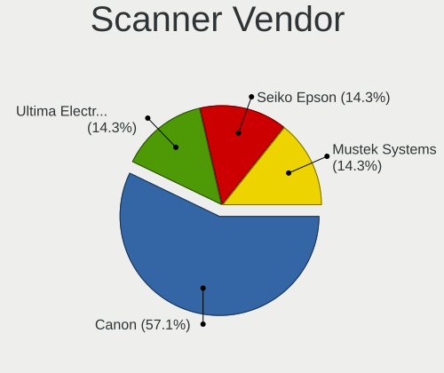

| Vendor             | Computers | Percent |
|--------------------|-----------|---------|
| Canon              | 4         | 57.14%  |
| Ultima Electronics | 1         | 14.29%  |
| Seiko Epson        | 1         | 14.29%  |
| Mustek Systems     | 1         | 14.29%  |

Scanner Model
-------------

Scanner device models

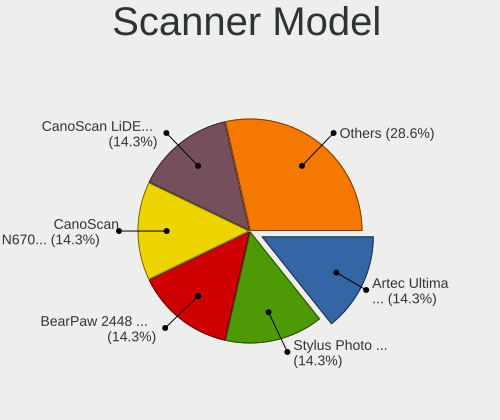

| Model                                                                                 | Computers | Percent |
|---------------------------------------------------------------------------------------|-----------|---------|
| Ultima Artec Ultima 2000 (GT6801 based)/Lifetec LT9385/ScanMagic 1200 UB Plus Scanner | 1         | 14.29%  |
| Seiko Epson Stylus Photo RX500/510                                                    | 1         | 14.29%  |
| Mustek Systems BearPaw 2448 TA Pro                                                    | 1         | 14.29%  |
| Canon CanoScan N670U/N676U/LiDE 20                                                    | 1         | 14.29%  |
| Canon CanoScan LiDE 600F                                                              | 1         | 14.29%  |
| Canon CanoScan LiDE 60                                                                | 1         | 14.29%  |
| Canon CanoScan LIDE 25                                                                | 1         | 14.29%  |

Camera
------

Camera Vendor
-------------

Camera device vendors

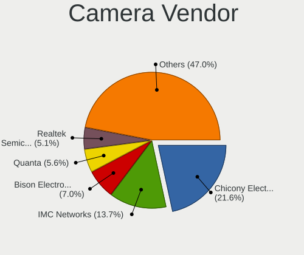

| Vendor                                 | Computers | Percent |
|----------------------------------------|-----------|---------|
| Chicony Electronics                    | 185       | 21.61%  |
| IMC Networks                           | 117       | 13.67%  |
| Bison Electronics                      | 60        | 7.01%   |
| Quanta                                 | 48        | 5.61%   |
| Realtek Semiconductor                  | 44        | 5.14%   |
| Logitech                               | 41        | 4.79%   |
| Sunplus Innovation Technology          | 38        | 4.44%   |
| Suyin                                  | 33        | 3.86%   |
| Cheng Uei Precision Industry (Foxlink) | 31        | 3.62%   |
| Syntek                                 | 30        | 3.5%    |
| Microdia                               | 30        | 3.5%    |
| Z-Star Microelectronics                | 26        | 3.04%   |
| Silicon Motion                         | 24        | 2.8%    |
| Lite-On Technology                     | 23        | 2.69%   |
| Luxvisions Innotech Limited            | 15        | 1.75%   |
| Alcor Micro                            | 13        | 1.52%   |
| Apple                                  | 12        | 1.4%    |
| Sonix Technology                       | 11        | 1.29%   |
| SunplusIT                              | 6         | 0.7%    |
| Samsung Electronics                    | 4         | 0.47%   |
| Primax Electronics                     | 4         | 0.47%   |
| Microsoft                              | 4         | 0.47%   |
| Cubeternet                             | 4         | 0.47%   |
| Shinetech                              | 3         | 0.35%   |
| ShineOptics                            | 3         | 0.35%   |
| Razer USA                              | 3         | 0.35%   |
| lihappe8                               | 3         | 0.35%   |
| Lenovo                                 | 3         | 0.35%   |
| Importek                               | 3         | 0.35%   |
| DigiTech                               | 3         | 0.35%   |
| Aveo Technology                        | 3         | 0.35%   |
| Arkmicro Technologies                  | 3         | 0.35%   |
| Shine-optics                           | 2         | 0.23%   |
| Ricoh                                  | 2         | 0.23%   |
| Intel                                  | 2         | 0.23%   |
| BillionPixels                          | 2         | 0.23%   |
| Acer                                   | 2         | 0.23%   |
| YGTek                                  | 1         | 0.12%   |
| Y Media                                | 1         | 0.12%   |
| Pixart Imaging                         | 1         | 0.12%   |

Camera Model
------------

Camera device models

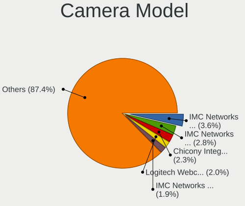

| Model                                                                      | Computers | Percent |
|----------------------------------------------------------------------------|-----------|---------|
| IMC Networks USB2.0 VGA UVC WebCam                                         | 31        | 3.61%   |
| IMC Networks USB2.0 HD UVC WebCam                                          | 24        | 2.8%    |
| Chicony Integrated Camera                                                  | 20        | 2.33%   |
| Logitech Webcam C270                                                       | 17        | 1.98%   |
| IMC Networks Integrated Camera                                             | 16        | 1.86%   |
| Bison Lenovo EasyCamera                                                    | 15        | 1.75%   |
| Syntek Integrated Camera                                                   | 14        | 1.63%   |
| Chicony USB2.0 VGA UVC WebCam                                              | 14        | 1.63%   |
| Chicony HD Webcam                                                          | 14        | 1.63%   |
| Bison Lenovo Integrated Webcam                                             | 14        | 1.63%   |
| Chicony Lenovo EasyCamera                                                  | 13        | 1.52%   |
| Realtek Integrated_Webcam_HD                                               | 12        | 1.4%    |
| Sunplus HD WebCam                                                          | 11        | 1.28%   |
| IMC Networks USB2.0 UVC HD Webcam                                          | 9         | 1.05%   |
| Quanta HP HD Camera                                                        | 8         | 0.93%   |
| Chicony HP HD Camera                                                       | 8         | 0.93%   |
| Bison Integrated Camera                                                    | 8         | 0.93%   |
| Syntek Lenovo EasyCamera                                                   | 7         | 0.82%   |
| Syntek EasyCamera                                                          | 7         | 0.82%   |
| Sunplus Integrated_Webcam_HD                                               | 7         | 0.82%   |
| Quanta HD Webcam                                                           | 7         | 0.82%   |
| Microdia Camera                                                            | 7         | 0.82%   |
| Lite-On Integrated Camera                                                  | 7         | 0.82%   |
| IMC Networks Integrated Webcam                                             | 7         | 0.82%   |
| IMC Networks HD Camera                                                     | 7         | 0.82%   |
| Chicony USB2.0 HD UVC WebCam                                               | 7         | 0.82%   |
| Chicony EasyCamera                                                         | 7         | 0.82%   |
| Sonix USB2.0 HD UVC WebCam                                                 | 6         | 0.7%    |
| Silicon Motion WebCam SC-0311139N                                          | 6         | 0.7%    |
| Quanta HP TrueVision HD Camera                                             | 6         | 0.7%    |
| Microdia Integrated_Webcam_HD                                              | 6         | 0.7%    |
| Logitech Webcam C310                                                       | 6         | 0.7%    |
| IMC Networks UVC VGA Webcam                                                | 6         | 0.7%    |
| Chicony Integrated HP HD Webcam                                            | 6         | 0.7%    |
| Chicony HP Truevision HD camera                                            | 6         | 0.7%    |
| Cheng Uei Precision Industry (Foxlink) HP Wide Vision HD Integrated Webcam | 6         | 0.7%    |
| Bison HD Webcam                                                            | 6         | 0.7%    |
| Alcor Micro USB 2.0 Camera                                                 | 6         | 0.7%    |
| Z-Star Venus USB2.0 Camera                                                 | 5         | 0.58%   |
| Z-Star A4 TECH USB 2.0 Camera J                                            | 5         | 0.58%   |

Security
--------

Fingerprint Vendor
------------------

Fingerprint sensor vendors

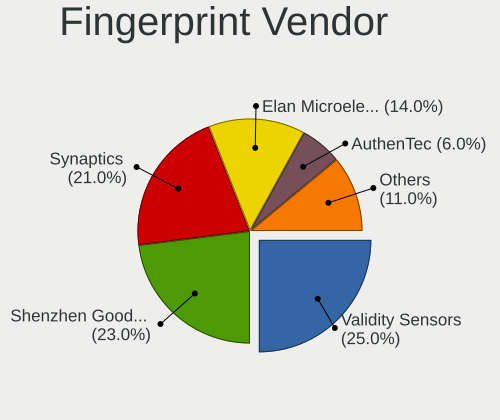

| Vendor                             | Computers | Percent |
|------------------------------------|-----------|---------|
| Validity Sensors                   | 25        | 25%     |
| Shenzhen Goodix Technology         | 23        | 23%     |
| Synaptics                          | 21        | 21%     |
| Elan Microelectronics              | 14        | 14%     |
| AuthenTec                          | 6         | 6%      |
| STMicroelectronics                 | 3         | 3%      |
| Realtek USB2.0 Finger Print Bridge | 3         | 3%      |
| Upek                               | 2         | 2%      |
| LighTuning Technology              | 2         | 2%      |
| Focal-systems.Corp                 | 1         | 1%      |

Fingerprint Model
-----------------

Fingerprint sensor models

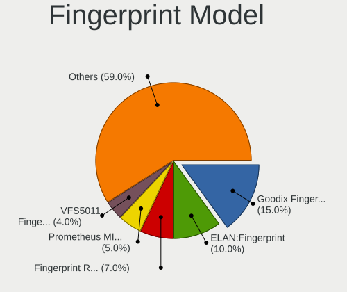

| Model                                                                      | Computers | Percent |
|----------------------------------------------------------------------------|-----------|---------|
| Shenzhen Goodix  FingerPrint Device                                        | 15        | 15%     |
| Elan ELAN:Fingerprint                                                      | 10        | 10%     |
| Shenzhen Goodix Fingerprint Reader                                         | 7         | 7%      |
| Synaptics Prometheus MIS Touch Fingerprint Reader                          | 5         | 5%      |
| Validity Sensors VFS5011 Fingerprint Reader                                | 4         | 4%      |
| Validity Sensors VFS495 Fingerprint Reader                                 | 4         | 4%      |
| Elan ELAN:ARM-M4                                                           | 4         | 4%      |
| Validity Sensors VFS491                                                    | 3         | 3%      |
| Validity Sensors Fingerprint scanner                                       | 3         | 3%      |
| Synaptics Metallica MIS Touch Fingerprint Reader                           | 3         | 3%      |
| Synaptics FS7604 Touch Fingerprint Sensor with PurePrint                   | 3         | 3%      |
| STMicroelectronics Fingerprint Reader                                      | 3         | 3%      |
| Realtek USB2.0 Finger Print Bridge FocalTech Fingerprint Device            | 3         | 3%      |
| Validity Sensors VFS101 Fingerprint Reader                                 | 2         | 2%      |
| Validity Sensors Synaptics WBDI                                            | 2         | 2%      |
| Validity Sensors Synaptics VFS7552 Touch Fingerprint Sensor with PurePrint | 2         | 2%      |
| Upek Biometric Touchchip/Touchstrip Fingerprint Sensor                     | 2         | 2%      |
| Synaptics WBDI Fingerprint Reader USB 086                                  | 2         | 2%      |
| Synaptics  WBDI                                                            | 2         | 2%      |
| Synaptics  FS7604 Touch Fingerprint Sensor with PurePrint                  | 2         | 2%      |
| Synaptics Fingerprint reader [HP G6]                                       | 2         | 2%      |
| AuthenTec AES2501 Fingerprint Sensor                                       | 2         | 2%      |
| Validity Sensors VFS7500 Touch Fingerprint Sensor                          | 1         | 1%      |
| Validity Sensors VFS471 Fingerprint Reader                                 | 1         | 1%      |
| Validity Sensors VFS301 Fingerprint Reader                                 | 1         | 1%      |
| Validity Sensors VFS 5011 fingerprint sensor                               | 1         | 1%      |
| Validity Sensors Swipe Fingerprint Sensor                                  | 1         | 1%      |
| Synaptics UWP WBDI                                                         | 1         | 1%      |
| Synaptics Metallica MOH Touch Fingerprint Reader                           | 1         | 1%      |
| Shenzhen Goodix FingerPrint                                                | 1         | 1%      |
| LighTuning ES603 Swipe Fingerprint Sensor                                  | 1         | 1%      |
| LighTuning EgisTec Touch Fingerprint Sensor                                | 1         | 1%      |
| Focal-systems.Corp FT9201Fingerprint.                                      | 1         | 1%      |
| AuthenTec Fingerprint Sensor                                               | 1         | 1%      |
| AuthenTec AES2810                                                          | 1         | 1%      |
| AuthenTec AES2550 Fingerprint Sensor                                       | 1         | 1%      |
| AuthenTec AES1600                                                          | 1         | 1%      |

Chipcard Vendor
---------------

Chipcard module vendors

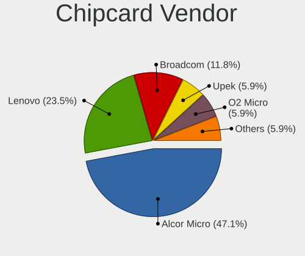

| Vendor                | Computers | Percent |
|-----------------------|-----------|---------|
| Alcor Micro           | 10        | 47.62%  |
| Lenovo                | 5         | 23.81%  |
| Upek                  | 2         | 9.52%   |
| Broadcom              | 2         | 9.52%   |
| O2 Micro              | 1         | 4.76%   |
| Advanced Card Systems | 1         | 4.76%   |

Chipcard Model
--------------

Chipcard module models

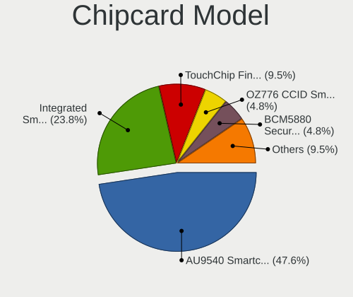

| Model                                                                        | Computers | Percent |
|------------------------------------------------------------------------------|-----------|---------|
| Alcor Micro AU9540 Smartcard Reader                                          | 10        | 47.62%  |
| Lenovo Integrated Smart Card Reader                                          | 5         | 23.81%  |
| Upek TouchChip Fingerprint Coprocessor (WBF advanced mode)                   | 2         | 9.52%   |
| O2 Micro OZ776 CCID Smartcard Reader                                         | 1         | 4.76%   |
| Broadcom BCM5880 Secure Applications Processor with fingerprint swipe sensor | 1         | 4.76%   |
| Broadcom BCM58200 ControlVault 3 (FingerPrint sensor + Contacted SmartCard)  | 1         | 4.76%   |
| Advanced Card Systems ACR39U                                                 | 1         | 4.76%   |

Unsupported
-----------

Unsupported Devices
-------------------

Total unsupported devices on board

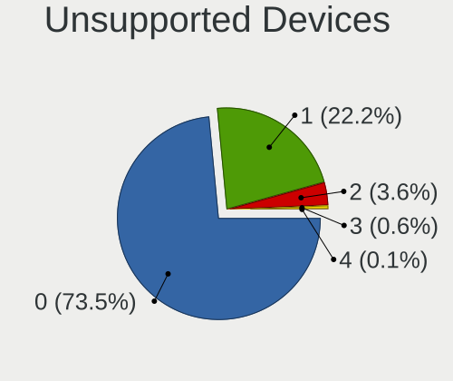

| Total | Computers | Percent |
|-------|-----------|---------|
| 0     | 987       | 73.49%  |
| 1     | 298       | 22.19%  |
| 2     | 49        | 3.65%   |
| 3     | 8         | 0.6%    |
| 4     | 1         | 0.07%   |

Unsupported Device Types
------------------------

Types of unsupported devices

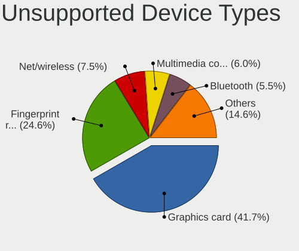

| Type                     | Computers | Percent |
|--------------------------|-----------|---------|
| Graphics card            | 166       | 41.71%  |
| Fingerprint reader       | 98        | 24.62%  |
| Net/wireless             | 30        | 7.54%   |
| Multimedia controller    | 24        | 6.03%   |
| Bluetooth                | 22        | 5.53%   |
| Chipcard                 | 16        | 4.02%   |
| Communication controller | 15        | 3.77%   |
| Camera                   | 14        | 3.52%   |
| Storage                  | 4         | 1.01%   |
| Sound                    | 3         | 0.75%   |
| Card reader              | 2         | 0.5%    |
| Unassigned class         | 1         | 0.25%   |
| Net/ethernet             | 1         | 0.25%   |
| Modem                    | 1         | 0.25%   |
| Flash memory             | 1         | 0.25%   |

