Linux in Belarus - Tested Hardware & Statistics (Desktops)
----------------------------------------------------------

A project to collect tested hardware configurations for Linux in Belarus.

Anyone can contribute to this report by the [hw-probe](https://github.com/linuxhw/hw-probe) tool:

    sudo -E hw-probe -all -upload

Please contribute! Especially if your hardware is rare.

Contents
--------

* [ Test Cases ](#test-cases)

* [ System ](#system)
  - [ OS                       ](#os)
  - [ OS Family                ](#os-family)
  - [ Kernel                   ](#kernel)
  - [ Kernel Family            ](#kernel-family)
  - [ Kernel Major Ver.        ](#kernel-major-ver)
  - [ Arch                     ](#arch)
  - [ DE                       ](#de)
  - [ Display Server           ](#display-server)
  - [ Display Manager          ](#display-manager)
  - [ OS Lang                  ](#os-lang)
  - [ Boot Mode                ](#boot-mode)
  - [ Filesystem               ](#filesystem)
  - [ Part. scheme             ](#part-scheme)
  - [ Dual Boot with Linux/BSD ](#dual-boot-with-linuxbsd)
  - [ Dual Boot (Win)          ](#dual-boot-win)

* [ Board ](#board)
  - [ Vendor                   ](#vendor)
  - [ Model                    ](#model)
  - [ Model Family             ](#model-family)
  - [ MFG Year                 ](#mfg-year)
  - [ Form Factor              ](#form-factor)
  - [ Secure Boot              ](#secure-boot)
  - [ Coreboot                 ](#coreboot)
  - [ RAM Size                 ](#ram-size)
  - [ RAM Used                 ](#ram-used)
  - [ Total Drives             ](#total-drives)
  - [ Has CD-ROM               ](#has-cd-rom)
  - [ Has Ethernet             ](#has-ethernet)
  - [ Has WiFi                 ](#has-wifi)
  - [ Has Bluetooth            ](#has-bluetooth)

* [ Location ](#location)
  - [ Country                  ](#country)
  - [ City                     ](#city)

* [ Drives ](#drives)
  - [ Drive Vendor             ](#drive-vendor)
  - [ Drive Model              ](#drive-model)
  - [ HDD Vendor               ](#hdd-vendor)
  - [ SSD Vendor               ](#ssd-vendor)
  - [ Drive Kind               ](#drive-kind)
  - [ Drive Connector          ](#drive-connector)
  - [ Drive Size               ](#drive-size)
  - [ Space Total              ](#space-total)
  - [ Space Used               ](#space-used)
  - [ Malfunc. Drives          ](#malfunc-drives)
  - [ Malfunc. Drive Vendor    ](#malfunc-drive-vendor)
  - [ Malfunc. HDD Vendor      ](#malfunc-hdd-vendor)
  - [ Malfunc. Drive Kind      ](#malfunc-drive-kind)
  - [ Failed Drives            ](#failed-drives)
  - [ Failed Drive Vendor      ](#failed-drive-vendor)
  - [ Drive Status             ](#drive-status)

* [ Storage controller ](#storage-controller)
  - [ Storage Vendor           ](#storage-vendor)
  - [ Storage Model            ](#storage-model)
  - [ Storage Kind             ](#storage-kind)

* [ Processor ](#processor)
  - [ CPU Vendor               ](#cpu-vendor)
  - [ CPU Model                ](#cpu-model)
  - [ CPU Model Family         ](#cpu-model-family)
  - [ CPU Cores                ](#cpu-cores)
  - [ CPU Sockets              ](#cpu-sockets)
  - [ CPU Threads              ](#cpu-threads)
  - [ CPU Op-Modes             ](#cpu-op-modes)
  - [ CPU Microcode            ](#cpu-microcode)
  - [ CPU Microarch            ](#cpu-microarch)

* [ Graphics ](#graphics)
  - [ GPU Vendor               ](#gpu-vendor)
  - [ GPU Model                ](#gpu-model)
  - [ GPU Combo                ](#gpu-combo)
  - [ GPU Driver               ](#gpu-driver)
  - [ GPU Memory               ](#gpu-memory)

* [ Monitor ](#monitor)
  - [ Monitor Vendor           ](#monitor-vendor)
  - [ Monitor Model            ](#monitor-model)
  - [ Monitor Resolution       ](#monitor-resolution)
  - [ Monitor Diagonal         ](#monitor-diagonal)
  - [ Monitor Width            ](#monitor-width)
  - [ Aspect Ratio             ](#aspect-ratio)
  - [ Monitor Area             ](#monitor-area)
  - [ Pixel Density            ](#pixel-density)
  - [ Multiple Monitors        ](#multiple-monitors)

* [ Network ](#network)
  - [ Net Controller Vendor    ](#net-controller-vendor)
  - [ Net Controller Model     ](#net-controller-model)
  - [ Wireless Vendor          ](#wireless-vendor)
  - [ Wireless Model           ](#wireless-model)
  - [ Ethernet Vendor          ](#ethernet-vendor)
  - [ Ethernet Model           ](#ethernet-model)
  - [ Net Controller Kind      ](#net-controller-kind)
  - [ Used Controller          ](#used-controller)
  - [ NICs                     ](#nics)
  - [ IPv6                     ](#ipv6)

* [ Bluetooth ](#bluetooth)
  - [ Bluetooth Vendor         ](#bluetooth-vendor)
  - [ Bluetooth Model          ](#bluetooth-model)

* [ Sound ](#sound)
  - [ Sound Vendor             ](#sound-vendor)
  - [ Sound Model              ](#sound-model)

* [ Memory ](#memory)
  - [ Memory Vendor            ](#memory-vendor)
  - [ Memory Model             ](#memory-model)
  - [ Memory Kind              ](#memory-kind)
  - [ Memory Form Factor       ](#memory-form-factor)
  - [ Memory Size              ](#memory-size)
  - [ Memory Speed             ](#memory-speed)

* [ Printers & scanners ](#printers--scanners)
  - [ Printer Vendor           ](#printer-vendor)
  - [ Printer Model            ](#printer-model)
  - [ Scanner Vendor           ](#scanner-vendor)
  - [ Scanner Model            ](#scanner-model)

* [ Camera ](#camera)
  - [ Camera Vendor            ](#camera-vendor)
  - [ Camera Model             ](#camera-model)

* [ Security ](#security)
  - [ Fingerprint Vendor       ](#fingerprint-vendor)
  - [ Fingerprint Model        ](#fingerprint-model)
  - [ Chipcard Vendor          ](#chipcard-vendor)
  - [ Chipcard Model           ](#chipcard-model)

* [ Unsupported ](#unsupported)
  - [ Unsupported Devices      ](#unsupported-devices)
  - [ Unsupported Device Types ](#unsupported-device-types)

Test Cases
----------

Total: 633

| Vendor        | Model                       | Probe                                                      | Date         |
|---------------|-----------------------------|------------------------------------------------------------|--------------|
| Gigabyte      | EP45-DS3L                   | [7cd20b2530](https://linux-hardware.org/?probe=7cd20b2530) | May 08, 2024 |
| ASUSTek       | M5A97 R2.0                  | [6e17fb9c95](https://linux-hardware.org/?probe=6e17fb9c95) | May 02, 2024 |
| ASUSTek       | P5B-VM SE                   | [b3631ed021](https://linux-hardware.org/?probe=b3631ed021) | Apr 29, 2024 |
| ASUSTek       | M5A97 R2.0                  | [3dcaa02108](https://linux-hardware.org/?probe=3dcaa02108) | Apr 28, 2024 |
| Gigabyte      | Z270-Gaming K3              | [e21d70e37d](https://linux-hardware.org/?probe=e21d70e37d) | Apr 26, 2024 |
| Gigabyte      | Z170-D3H-CF                 | [d96419f8cf](https://linux-hardware.org/?probe=d96419f8cf) | Apr 23, 2024 |
| ASRock        | B85M-ITX                    | [c868a15a8f](https://linux-hardware.org/?probe=c868a15a8f) | Apr 20, 2024 |
| ASUSTek       | P5B-VM SE                   | [9e6d967077](https://linux-hardware.org/?probe=9e6d967077) | Apr 03, 2024 |
| Gigabyte      | Z170-D3H-CF                 | [74e2ba96da](https://linux-hardware.org/?probe=74e2ba96da) | Apr 02, 2024 |
| MSI           | PRO Z690-A DDR4             | [48dfdf4137](https://linux-hardware.org/?probe=48dfdf4137) | Apr 01, 2024 |
| MSI           | PRO Z690-A DDR4             | [d209d00332](https://linux-hardware.org/?probe=d209d00332) | Apr 01, 2024 |
| ASUSTek       | PRIME H510M-K               | [6bb15775d7](https://linux-hardware.org/?probe=6bb15775d7) | Mar 24, 2024 |
| Gigabyte      | B550 AORUS PRO V2           | [11f7843550](https://linux-hardware.org/?probe=11f7843550) | Mar 23, 2024 |
| Gigabyte      | B550 AORUS PRO V2           | [9d76e364c6](https://linux-hardware.org/?probe=9d76e364c6) | Mar 20, 2024 |
| ASRock        | B550M-HDV                   | [8adaf6e6b2](https://linux-hardware.org/?probe=8adaf6e6b2) | Mar 17, 2024 |
| MSI           | B450-A PRO                  | [de6730ef57](https://linux-hardware.org/?probe=de6730ef57) | Mar 13, 2024 |
| ASUSTek       | Z170 PRO GAMING             | [6bea275119](https://linux-hardware.org/?probe=6bea275119) | Mar 12, 2024 |
| ASUSTek       | TUF Gaming X570-PRO         | [86024c45ed](https://linux-hardware.org/?probe=86024c45ed) | Mar 12, 2024 |
| ASUSTek       | TUF Gaming X570-PRO         | [a65a82b4d4](https://linux-hardware.org/?probe=a65a82b4d4) | Mar 12, 2024 |
| ASUSTek       | TUF B450M-PLUS GAMING       | [bab57077f5](https://linux-hardware.org/?probe=bab57077f5) | Mar 06, 2024 |
| ASUSTek       | Z170 PRO GAMING             | [544a3548cc](https://linux-hardware.org/?probe=544a3548cc) | Mar 05, 2024 |
| Intel         | B760 E1.0G                  | [3908f7bec6](https://linux-hardware.org/?probe=3908f7bec6) | Mar 04, 2024 |
| ASRock        | K10N78D                     | [31060d37cf](https://linux-hardware.org/?probe=31060d37cf) | Feb 18, 2024 |
| AMD           | A88DA                       | [89ca695711](https://linux-hardware.org/?probe=89ca695711) | Feb 14, 2024 |
| ASRock        | N68-GS                      | [06f147ad72](https://linux-hardware.org/?probe=06f147ad72) | Feb 09, 2024 |
| ASRock        | H61M-HVGS                   | [dc3bd18c15](https://linux-hardware.org/?probe=dc3bd18c15) | Feb 09, 2024 |
| Gigabyte      | B85M-D3V-A                  | [f4251d37e2](https://linux-hardware.org/?probe=f4251d37e2) | Feb 09, 2024 |
| ASRock        | 970M Pro3                   | [cf54a4b360](https://linux-hardware.org/?probe=cf54a4b360) | Feb 02, 2024 |
| Gigabyte      | X570 AORUS ULTRA            | [c823432a5a](https://linux-hardware.org/?probe=c823432a5a) | Jan 30, 2024 |
| MSI           | MAG B650 TOMAHAWK WIFI      | [c2ff3b6e2f](https://linux-hardware.org/?probe=c2ff3b6e2f) | Jan 30, 2024 |
| ASUSTek       | PRIME B350-PLUS             | [c9df4c296f](https://linux-hardware.org/?probe=c9df4c296f) | Jan 26, 2024 |
| MSI           | B450 TOMAHAWK MAX II        | [6c409399d4](https://linux-hardware.org/?probe=6c409399d4) | Jan 25, 2024 |
| Gigabyte      | B450 GAMING X               | [28be98f6c6](https://linux-hardware.org/?probe=28be98f6c6) | Jan 21, 2024 |
| Biostar       | A320MH                      | [9213e79212](https://linux-hardware.org/?probe=9213e79212) | Jan 19, 2024 |
| Unknown       | X99                         | [7106b28d5f](https://linux-hardware.org/?probe=7106b28d5f) | Jan 16, 2024 |
| Unknown       | X99                         | [c4818c1229](https://linux-hardware.org/?probe=c4818c1229) | Jan 16, 2024 |
| MSI           | B450 TOMAHAWK MAX II        | [9e8a81f355](https://linux-hardware.org/?probe=9e8a81f355) | Jan 10, 2024 |
| Dell          | 0KWVT8 A03                  | [82a8bc3c6e](https://linux-hardware.org/?probe=82a8bc3c6e) | Dec 21, 2023 |
| MSI           | B450 TOMAHAWK MAX II        | [8fc6a74916](https://linux-hardware.org/?probe=8fc6a74916) | Dec 15, 2023 |
| ASRock        | 970M Pro3                   | [885e6000e2](https://linux-hardware.org/?probe=885e6000e2) | Dec 12, 2023 |
| Gigabyte      | A320M-H-CF                  | [4d14243cb9](https://linux-hardware.org/?probe=4d14243cb9) | Dec 05, 2023 |
| MSI           | H61M-P31/W8                 | [b74cd41faf](https://linux-hardware.org/?probe=b74cd41faf) | Nov 26, 2023 |
| Gigabyte      | B550M S2H                   | [7084bb6ef8](https://linux-hardware.org/?probe=7084bb6ef8) | Nov 26, 2023 |
| Biostar       | H61MLV2                     | [1e2b4c3878](https://linux-hardware.org/?probe=1e2b4c3878) | Nov 26, 2023 |
| Gigabyte      | P85-D3                      | [a6742c43a4](https://linux-hardware.org/?probe=a6742c43a4) | Nov 16, 2023 |
| ASUSTek       | PRIME H410M-E               | [1cffd5036c](https://linux-hardware.org/?probe=1cffd5036c) | Nov 14, 2023 |
| Gigabyte      | Z170-D3H-CF                 | [c34342b820](https://linux-hardware.org/?probe=c34342b820) | Nov 10, 2023 |
| Gigabyte      | H110M-H-CF                  | [d0570de821](https://linux-hardware.org/?probe=d0570de821) | Nov 06, 2023 |
| Gigabyte      | H110M-H-CF                  | [29f3c0c25f](https://linux-hardware.org/?probe=29f3c0c25f) | Nov 06, 2023 |
| Gigabyte      | B85M-D3V-A                  | [c35ab1031d](https://linux-hardware.org/?probe=c35ab1031d) | Oct 30, 2023 |
| Gigabyte      | B550 AORUS PRO V2           | [e8432e79c8](https://linux-hardware.org/?probe=e8432e79c8) | Oct 26, 2023 |
| Gigabyte      | EP45-DS3L                   | [a3a2c0b74b](https://linux-hardware.org/?probe=a3a2c0b74b) | Oct 25, 2023 |
| Gigabyte      | Z270-Gaming K3              | [6827d26220](https://linux-hardware.org/?probe=6827d26220) | Oct 17, 2023 |
| Gigabyte      | Z170-D3H-CF                 | [70c2d315e0](https://linux-hardware.org/?probe=70c2d315e0) | Oct 16, 2023 |
| Gigabyte      | B85M-D3V-A                  | [1a20748a43](https://linux-hardware.org/?probe=1a20748a43) | Oct 06, 2023 |
| Biostar       | H510MHP                     | [f562c8f7d7](https://linux-hardware.org/?probe=f562c8f7d7) | Oct 05, 2023 |
| ASRock        | B365 Pro4                   | [8e9fff1e35](https://linux-hardware.org/?probe=8e9fff1e35) | Oct 04, 2023 |
| MSI           | 760GM-P33                   | [5967be8309](https://linux-hardware.org/?probe=5967be8309) | Oct 03, 2023 |
| ASUSTek       | M4A88TD-V EVO/USB3          | [4375a551e1](https://linux-hardware.org/?probe=4375a551e1) | Sep 25, 2023 |
| Gigabyte      | EP45-DS3L                   | [57d5f67adf](https://linux-hardware.org/?probe=57d5f67adf) | Sep 24, 2023 |
| MSI           | 760GM-P33                   | [6dfb722e45](https://linux-hardware.org/?probe=6dfb722e45) | Sep 22, 2023 |
| Gigabyte      | Z170-D3H-CF                 | [2e715ca7b2](https://linux-hardware.org/?probe=2e715ca7b2) | Sep 22, 2023 |
| Gigabyte      | Z270-Gaming K3              | [63bebc9690](https://linux-hardware.org/?probe=63bebc9690) | Sep 20, 2023 |
| Gigabyte      | Z170-D3H-CF                 | [418eee8ea7](https://linux-hardware.org/?probe=418eee8ea7) | Sep 13, 2023 |
| MSI           | G31TM-P21                   | [cdeced49b1](https://linux-hardware.org/?probe=cdeced49b1) | Sep 12, 2023 |
| ECS           | A960M-M3                    | [70ee5683a4](https://linux-hardware.org/?probe=70ee5683a4) | Sep 11, 2023 |
| ASUSTek       | P8H61/USB3                  | [ecf1a70c5d](https://linux-hardware.org/?probe=ecf1a70c5d) | Sep 08, 2023 |
| ASRock        | H510M-HDV/M.2               | [63dae39236](https://linux-hardware.org/?probe=63dae39236) | Sep 08, 2023 |
| ASRock        | H510M-HDV/M.2               | [3fb594ab96](https://linux-hardware.org/?probe=3fb594ab96) | Sep 07, 2023 |
| Gigabyte      | P55M-UD4                    | [d04a4aef90](https://linux-hardware.org/?probe=d04a4aef90) | Sep 03, 2023 |
| ASUSTek       | PRIME H410M-R               | [d714ef63c2](https://linux-hardware.org/?probe=d714ef63c2) | Sep 03, 2023 |
| ASRock        | H570 Steel Legend           | [192d8ebfa3](https://linux-hardware.org/?probe=192d8ebfa3) | Sep 02, 2023 |
| ASUSTek       | PRIME H510M-K               | [f8906dfb9c](https://linux-hardware.org/?probe=f8906dfb9c) | Aug 28, 2023 |
| ASRock        | B450M-HDV                   | [8ed8031a41](https://linux-hardware.org/?probe=8ed8031a41) | Aug 28, 2023 |
| ASRock        | B450M-HDV                   | [3d2effa8c5](https://linux-hardware.org/?probe=3d2effa8c5) | Aug 27, 2023 |
| Gigabyte      | EP45-DS3L                   | [c326205a9b](https://linux-hardware.org/?probe=c326205a9b) | Aug 27, 2023 |
| ASUSTek       | PRIME H410M-A               | [1538d66b38](https://linux-hardware.org/?probe=1538d66b38) | Aug 25, 2023 |
| ASUSTek       | P8H61/USB3                  | [149cb27e46](https://linux-hardware.org/?probe=149cb27e46) | Aug 18, 2023 |
| MSI           | 760GM-P33                   | [878209b83a](https://linux-hardware.org/?probe=878209b83a) | Aug 13, 2023 |
| Gigabyte      | GA-M56S-S3                  | [cf57b5785a](https://linux-hardware.org/?probe=cf57b5785a) | Jul 26, 2023 |
| MSI           | G31TM-P21                   | [6456f7b16f](https://linux-hardware.org/?probe=6456f7b16f) | Jul 13, 2023 |
| ASUSTek       | ROG STRIX Z490-G GAMING     | [5b11b41272](https://linux-hardware.org/?probe=5b11b41272) | Jul 02, 2023 |
| ASRock        | B450 Pro4                   | [a5f281a10e](https://linux-hardware.org/?probe=a5f281a10e) | Jun 23, 2023 |
| Gigabyte      | GA-MA770-US3                | [c7460aff4f](https://linux-hardware.org/?probe=c7460aff4f) | Jun 16, 2023 |
| Gigabyte      | GA-MA770-US3                | [704cc1c02b](https://linux-hardware.org/?probe=704cc1c02b) | Jun 10, 2023 |
| ASUSTek       | P8H61/USB3                  | [d93dbf6db3](https://linux-hardware.org/?probe=d93dbf6db3) | Jun 01, 2023 |
| ASUSTek       | P8H61/USB3                  | [16c7ca187a](https://linux-hardware.org/?probe=16c7ca187a) | Jun 01, 2023 |
| ASUSTek       | ROG STRIX B660-F GAMING ... | [94c7ddea69](https://linux-hardware.org/?probe=94c7ddea69) | May 21, 2023 |
| ASRock        | H61M-HVGS                   | [653f6e9a8e](https://linux-hardware.org/?probe=653f6e9a8e) | May 20, 2023 |
| Gigabyte      | B550M S2H                   | [04dac52364](https://linux-hardware.org/?probe=04dac52364) | May 19, 2023 |
| Gigabyte      | Z270-Gaming K3              | [058907d9d3](https://linux-hardware.org/?probe=058907d9d3) | May 18, 2023 |
| Intel         | SHARKBAY                    | [03b576ccc8](https://linux-hardware.org/?probe=03b576ccc8) | May 16, 2023 |
| Gigabyte      | B450M S2H                   | [5a28a0c505](https://linux-hardware.org/?probe=5a28a0c505) | May 15, 2023 |
| ASUSTek       | P5B-VM SE                   | [bd1c748eed](https://linux-hardware.org/?probe=bd1c748eed) | May 12, 2023 |
| Dell          | 0Y958C A00                  | [fb1b987ad5](https://linux-hardware.org/?probe=fb1b987ad5) | May 10, 2023 |
| Gigabyte      | GA-MA770-US3                | [169b0a5bc0](https://linux-hardware.org/?probe=169b0a5bc0) | May 07, 2023 |
| Gigabyte      | B75M-D2V                    | [5a21b5acb8](https://linux-hardware.org/?probe=5a21b5acb8) | May 02, 2023 |
| ASRock        | H510M-HDV/M.2               | [c11c9964fa](https://linux-hardware.org/?probe=c11c9964fa) | Apr 27, 2023 |
| Gigabyte      | B85M-D3V-A                  | [84dbb8ae74](https://linux-hardware.org/?probe=84dbb8ae74) | Apr 19, 2023 |
| ASRock        | N68C-GS4 FX                 | [71c25d2dce](https://linux-hardware.org/?probe=71c25d2dce) | Apr 07, 2023 |
| MSI           | X79A-GD45 Plus              | [ca3f0771ce](https://linux-hardware.org/?probe=ca3f0771ce) | Apr 05, 2023 |
| ASUSTek       | P5G41T-M LX2/GB/LPT         | [24ac3864d2](https://linux-hardware.org/?probe=24ac3864d2) | Apr 04, 2023 |
| Gigabyte      | B85M-D3V-A                  | [1789a17694](https://linux-hardware.org/?probe=1789a17694) | Apr 03, 2023 |
| Gigabyte      | B360M H                     | [cc5feeb3eb](https://linux-hardware.org/?probe=cc5feeb3eb) | Apr 03, 2023 |
| Biostar       | B365MHC                     | [95107f0e65](https://linux-hardware.org/?probe=95107f0e65) | Apr 02, 2023 |
| ASRock        | H81M-VG4 R2.0               | [f811a203a0](https://linux-hardware.org/?probe=f811a203a0) | Apr 02, 2023 |
| Gigabyte      | Z170-D3H-CF                 | [f278e6aad0](https://linux-hardware.org/?probe=f278e6aad0) | Apr 01, 2023 |
| Gigabyte      | GA-A75-UD4H                 | [e5433e75fb](https://linux-hardware.org/?probe=e5433e75fb) | Mar 29, 2023 |
| Gigabyte      | B85M-D3V-A                  | [06ad8e8099](https://linux-hardware.org/?probe=06ad8e8099) | Mar 29, 2023 |
| EPoX Compu... | nForce3 DDR: 8KDA7I Seri... | [38e3c2378c](https://linux-hardware.org/?probe=38e3c2378c) | Mar 29, 2023 |
| MSI           | X79A-GD45 Plus              | [0a5446e862](https://linux-hardware.org/?probe=0a5446e862) | Mar 26, 2023 |
| Iskratel, ... | IN6011AX                    | [037350830e](https://linux-hardware.org/?probe=037350830e) | Mar 23, 2023 |
| ASRock        | H61M-HVGS                   | [8023b22765](https://linux-hardware.org/?probe=8023b22765) | Mar 23, 2023 |
| ASRock        | H61M-HVGS                   | [5e9cf8fb44](https://linux-hardware.org/?probe=5e9cf8fb44) | Mar 22, 2023 |
| Gigabyte      | Z390 AORUS PRO-CF           | [7d8950b25b](https://linux-hardware.org/?probe=7d8950b25b) | Mar 21, 2023 |
| Gigabyte      | Z390 AORUS PRO-CF           | [c58012d73d](https://linux-hardware.org/?probe=c58012d73d) | Mar 21, 2023 |
| Intel         | JSL MRD                     | [28832d0a36](https://linux-hardware.org/?probe=28832d0a36) | Mar 11, 2023 |
| Gigabyte      | Z170-D3H-CF                 | [3fb642aac7](https://linux-hardware.org/?probe=3fb642aac7) | Mar 06, 2023 |
| Gigabyte      | B450M S2H V2                | [a2242be67c](https://linux-hardware.org/?probe=a2242be67c) | Mar 05, 2023 |
| ASUSTek       | PRIME H410M-E               | [9cd0a2ea25](https://linux-hardware.org/?probe=9cd0a2ea25) | Mar 01, 2023 |
| ASRock        | H61M-DGS R2.0               | [630c0e41b1](https://linux-hardware.org/?probe=630c0e41b1) | Feb 25, 2023 |
| Partner       | S1-J1900                    | [0dd4327553](https://linux-hardware.org/?probe=0dd4327553) | Feb 19, 2023 |
| ASUSTek       | P5GD1 PRO                   | [043021ca86](https://linux-hardware.org/?probe=043021ca86) | Feb 15, 2023 |
| Intel         | SKYBAY                      | [7f8e95e496](https://linux-hardware.org/?probe=7f8e95e496) | Feb 02, 2023 |
| Intel         | SKYBAY                      | [a75cb78ad9](https://linux-hardware.org/?probe=a75cb78ad9) | Feb 02, 2023 |
| MSI           | MAG B550 TOMAHAWK           | [142f5fcb2d](https://linux-hardware.org/?probe=142f5fcb2d) | Feb 01, 2023 |
| ASUSTek       | Z170M-E D3                  | [2b466d1b19](https://linux-hardware.org/?probe=2b466d1b19) | Jan 29, 2023 |
| Gigabyte      | Z170-D3H-CF                 | [04d36be1ec](https://linux-hardware.org/?probe=04d36be1ec) | Jan 20, 2023 |
| Gigabyte      | Z170-D3H-CF                 | [d0a00b398c](https://linux-hardware.org/?probe=d0a00b398c) | Jan 16, 2023 |
| Gigabyte      | 990XA-UD3                   | [43e346516e](https://linux-hardware.org/?probe=43e346516e) | Jan 09, 2023 |
| Gigabyte      | B85M-D3V-A                  | [d30caadc06](https://linux-hardware.org/?probe=d30caadc06) | Jan 09, 2023 |
| Gigabyte      | 990XA-UD3                   | [d23fb14f2e](https://linux-hardware.org/?probe=d23fb14f2e) | Jan 07, 2023 |
| MSI           | MS-7519                     | [3239304aa0](https://linux-hardware.org/?probe=3239304aa0) | Jan 03, 2023 |
| ASRock        | B450M Pro4                  | [7b9bc5bc99](https://linux-hardware.org/?probe=7b9bc5bc99) | Jan 02, 2023 |
| Unknown       | Intel X79                   | [f26c05e261](https://linux-hardware.org/?probe=f26c05e261) | Dec 31, 2022 |
| ASUSTek       | PRIME B450M-K               | [cc1d0776d5](https://linux-hardware.org/?probe=cc1d0776d5) | Dec 30, 2022 |
| ASUSTek       | PRIME H310M-R R2.0          | [6f0f984312](https://linux-hardware.org/?probe=6f0f984312) | Dec 29, 2022 |
| ASRock        | Brazos                      | [f5183b395b](https://linux-hardware.org/?probe=f5183b395b) | Dec 27, 2022 |
| ASRock        | X570 Pro4                   | [09fc64653e](https://linux-hardware.org/?probe=09fc64653e) | Dec 17, 2022 |
| Intel         | SHARKBAY                    | [0d07341d58](https://linux-hardware.org/?probe=0d07341d58) | Dec 15, 2022 |
| Gigabyte      | GA-M56S-S3                  | [077f863ca3](https://linux-hardware.org/?probe=077f863ca3) | Dec 15, 2022 |
| Biostar       | A520MH                      | [e1eff55b96](https://linux-hardware.org/?probe=e1eff55b96) | Dec 12, 2022 |
| Biostar       | A520MH                      | [2c6278e478](https://linux-hardware.org/?probe=2c6278e478) | Dec 11, 2022 |
| Gigabyte      | M61SME-S2                   | [e2932e425c](https://linux-hardware.org/?probe=e2932e425c) | Dec 11, 2022 |
| Gigabyte      | B550M AORUS PRO-P           | [ad6dc99c8a](https://linux-hardware.org/?probe=ad6dc99c8a) | Dec 10, 2022 |
| ASUSTek       | P8Z77-V LE PLUS             | [eafc4dffd4](https://linux-hardware.org/?probe=eafc4dffd4) | Dec 07, 2022 |
| Gigabyte      | Z170-D3H-CF                 | [d6829bfb6d](https://linux-hardware.org/?probe=d6829bfb6d) | Dec 04, 2022 |
| Gigabyte      | B85M-D3V-A                  | [f236aa0a8b](https://linux-hardware.org/?probe=f236aa0a8b) | Nov 08, 2022 |
| Gigabyte      | B85M-D3V-A                  | [4b5140c9f3](https://linux-hardware.org/?probe=4b5140c9f3) | Oct 31, 2022 |
| Gigabyte      | Z68XP-UD3                   | [b36220c65b](https://linux-hardware.org/?probe=b36220c65b) | Oct 13, 2022 |
| Gigabyte      | X570 AORUS PRO              | [6e83c73646](https://linux-hardware.org/?probe=6e83c73646) | Oct 11, 2022 |
| Gigabyte      | Z170-D3H-CF                 | [14b0f43bd5](https://linux-hardware.org/?probe=14b0f43bd5) | Oct 11, 2022 |
| Gigabyte      | B85M-D3V-A                  | [99df624686](https://linux-hardware.org/?probe=99df624686) | Oct 03, 2022 |
| Gigabyte      | A320M-H-CF                  | [25e3064dd2](https://linux-hardware.org/?probe=25e3064dd2) | Sep 29, 2022 |
| Gigabyte      | Z170-D3H-CF                 | [254a78c371](https://linux-hardware.org/?probe=254a78c371) | Sep 26, 2022 |
| Gigabyte      | B85M-D3V-A                  | [8f6b96ba44](https://linux-hardware.org/?probe=8f6b96ba44) | Sep 19, 2022 |
| Gigabyte      | B85M-D3V-A                  | [a856637b19](https://linux-hardware.org/?probe=a856637b19) | Sep 15, 2022 |
| Gigabyte      | EP45-DS3L                   | [cb17ac9b4e](https://linux-hardware.org/?probe=cb17ac9b4e) | Sep 05, 2022 |
| Gigabyte      | GA-M56S-S3                  | [8b8ba6c7f9](https://linux-hardware.org/?probe=8b8ba6c7f9) | Sep 05, 2022 |
| Gigabyte      | Z170-D3H-CF                 | [d9d75bc1f0](https://linux-hardware.org/?probe=d9d75bc1f0) | Aug 29, 2022 |
| Gigabyte      | M61SME-S2                   | [2ee74a388d](https://linux-hardware.org/?probe=2ee74a388d) | Aug 25, 2022 |
| ASRock        | N68-VGS3 FX                 | [1d2367ccf7](https://linux-hardware.org/?probe=1d2367ccf7) | Aug 23, 2022 |
| Huanan        | X99-BD4 V1.33               | [a250b39eec](https://linux-hardware.org/?probe=a250b39eec) | Aug 13, 2022 |
| Gigabyte      | Z270-Gaming K3              | [b73567b27b](https://linux-hardware.org/?probe=b73567b27b) | Aug 09, 2022 |
| Gigabyte      | Z390 UD                     | [1ee2492f24](https://linux-hardware.org/?probe=1ee2492f24) | Jul 23, 2022 |
| Gigabyte      | X570 AORUS ULTRA            | [2d2a17094e](https://linux-hardware.org/?probe=2d2a17094e) | Jul 23, 2022 |
| ASUSTek       | TUF B450-PRO GAMING         | [7142849ed0](https://linux-hardware.org/?probe=7142849ed0) | Jul 17, 2022 |
| MSI           | B450 GAMING PLUS MAX        | [e5638d3552](https://linux-hardware.org/?probe=e5638d3552) | Jul 15, 2022 |
| ASRock        | B550M-HDV                   | [3f20ad2267](https://linux-hardware.org/?probe=3f20ad2267) | Jul 11, 2022 |
| ASRock        | B550M-HDV                   | [b7adccb849](https://linux-hardware.org/?probe=b7adccb849) | Jul 09, 2022 |
| Gigabyte      | Z68AP-D3                    | [26cbd669e4](https://linux-hardware.org/?probe=26cbd669e4) | Jul 05, 2022 |
| ASRock        | H61M-HVGS                   | [2b31833bfe](https://linux-hardware.org/?probe=2b31833bfe) | Jul 02, 2022 |
| Biostar       | TA790GX 128M                | [c7021e0b8c](https://linux-hardware.org/?probe=c7021e0b8c) | Jul 01, 2022 |
| Gigabyte      | B85M-D3V-A                  | [3417dd6a9a](https://linux-hardware.org/?probe=3417dd6a9a) | Jun 28, 2022 |
| Gigabyte      | B450M S2H                   | [6dd752fab5](https://linux-hardware.org/?probe=6dd752fab5) | Jun 23, 2022 |
| Gigabyte      | Z170-D3H-CF                 | [701de0d7ad](https://linux-hardware.org/?probe=701de0d7ad) | Jun 15, 2022 |
| ASUSTek       | PRIME A520M-E               | [d381bbec9f](https://linux-hardware.org/?probe=d381bbec9f) | Jun 15, 2022 |
| Gigabyte      | B85M-D3V-A                  | [88d5e21b42](https://linux-hardware.org/?probe=88d5e21b42) | Jun 01, 2022 |
| ASRock        | B450 Gaming K4              | [af256d7649](https://linux-hardware.org/?probe=af256d7649) | May 24, 2022 |
| ECS           | IC780M-A2                   | [135f0a4328](https://linux-hardware.org/?probe=135f0a4328) | May 21, 2022 |
| MSI           | MS-7309                     | [9093ca0773](https://linux-hardware.org/?probe=9093ca0773) | May 20, 2022 |
| Gigabyte      | Z170-D3H-CF                 | [ec4bd74f0b](https://linux-hardware.org/?probe=ec4bd74f0b) | May 13, 2022 |
| Gigabyte      | B85M-D3V-A                  | [46481247b1](https://linux-hardware.org/?probe=46481247b1) | May 12, 2022 |
| Gigabyte      | Z87P-D3                     | [2a916e3eb5](https://linux-hardware.org/?probe=2a916e3eb5) | May 09, 2022 |
| Gigabyte      | Z170-D3H-CF                 | [fbe61c70ff](https://linux-hardware.org/?probe=fbe61c70ff) | May 09, 2022 |
| Gigabyte      | EP45-DS3L                   | [76e67361ea](https://linux-hardware.org/?probe=76e67361ea) | May 08, 2022 |
| ASRock        | N68-GS4 FX                  | [8926d96550](https://linux-hardware.org/?probe=8926d96550) | May 07, 2022 |
| ASUSTek       | ROG Maximus XI CODE         | [8cca49b0ee](https://linux-hardware.org/?probe=8cca49b0ee) | Apr 25, 2022 |
| Gigabyte      | Z270P-D3-CF                 | [155e5c0ef5](https://linux-hardware.org/?probe=155e5c0ef5) | Apr 14, 2022 |
| Gigabyte      | B75M-D2V                    | [07de6c8eb6](https://linux-hardware.org/?probe=07de6c8eb6) | Apr 12, 2022 |
| ASUSTek       | P8H61-M LE                  | [6273f8eefb](https://linux-hardware.org/?probe=6273f8eefb) | Apr 12, 2022 |
| ASRock        | B450M Pro4-F                | [1dff7e3c31](https://linux-hardware.org/?probe=1dff7e3c31) | Apr 11, 2022 |
| ASRock        | N68-VGS3 FX                 | [292cc244de](https://linux-hardware.org/?probe=292cc244de) | Apr 11, 2022 |
| Gigabyte      | Z170-D3H-CF                 | [8a1cecc21c](https://linux-hardware.org/?probe=8a1cecc21c) | Apr 11, 2022 |
| ASRock        | B560M Steel Legend          | [90a9483531](https://linux-hardware.org/?probe=90a9483531) | Apr 10, 2022 |
| Gigabyte      | Z87P-D3                     | [9ea9a7e8ef](https://linux-hardware.org/?probe=9ea9a7e8ef) | Apr 09, 2022 |
| Gigabyte      | Z270-Gaming K3              | [50780eda28](https://linux-hardware.org/?probe=50780eda28) | Mar 30, 2022 |
| Gigabyte      | EP45-DS3L                   | [c7d6879a86](https://linux-hardware.org/?probe=c7d6879a86) | Mar 26, 2022 |
| Gigabyte      | B85M-D3V-A                  | [b7679b78be](https://linux-hardware.org/?probe=b7679b78be) | Mar 25, 2022 |
| Gigabyte      | B85M-D3V-A                  | [49853bb240](https://linux-hardware.org/?probe=49853bb240) | Mar 25, 2022 |
| Gigabyte      | B450M S2H V2                | [a8e8d6dd5e](https://linux-hardware.org/?probe=a8e8d6dd5e) | Mar 22, 2022 |
| ASUSTek       | PRIME H310M-R R2.0          | [378bbcd029](https://linux-hardware.org/?probe=378bbcd029) | Mar 22, 2022 |
| ASUSTek       | PRIME H310M-R R2.0          | [6ede510a1b](https://linux-hardware.org/?probe=6ede510a1b) | Mar 22, 2022 |
| ASRock        | FM2A55M-VG3                 | [96683b7f45](https://linux-hardware.org/?probe=96683b7f45) | Mar 12, 2022 |
| ASUSTek       | M5A78L-M LX3                | [517ef58b87](https://linux-hardware.org/?probe=517ef58b87) | Mar 11, 2022 |
| ASUSTek       | M5A78L-M LX3                | [55ce4f1460](https://linux-hardware.org/?probe=55ce4f1460) | Mar 11, 2022 |
| ASUSTek       | P8H61-M LE                  | [a6fc7b9f12](https://linux-hardware.org/?probe=a6fc7b9f12) | Mar 10, 2022 |
| Intel         | D945GCLF2 AAE46416-101      | [800bc08dbd](https://linux-hardware.org/?probe=800bc08dbd) | Mar 09, 2022 |
| Gigabyte      | EP45-DS3L                   | [da3962a1da](https://linux-hardware.org/?probe=da3962a1da) | Mar 03, 2022 |
| ASRock        | N68C-GS FX                  | [bdba90c583](https://linux-hardware.org/?probe=bdba90c583) | Mar 03, 2022 |
| Gigabyte      | Z170-D3H-CF                 | [d2e96e523e](https://linux-hardware.org/?probe=d2e96e523e) | Mar 03, 2022 |
| Gigabyte      | Z170-D3H-CF                 | [7ce556e43a](https://linux-hardware.org/?probe=7ce556e43a) | Feb 26, 2022 |
| ASRock        | N68-VS3 UCC                 | [39389b9ddf](https://linux-hardware.org/?probe=39389b9ddf) | Feb 26, 2022 |
| Gigabyte      | Z170-D3H-CF                 | [34e4b434b4](https://linux-hardware.org/?probe=34e4b434b4) | Feb 20, 2022 |
| ASRock        | N68-VGS3 FX                 | [601f46e5a4](https://linux-hardware.org/?probe=601f46e5a4) | Feb 09, 2022 |
| Gigabyte      | EP45-DS3L                   | [7966e303e6](https://linux-hardware.org/?probe=7966e303e6) | Feb 07, 2022 |
| Gigabyte      | B450 AORUS PRO-CF           | [a32dfea06a](https://linux-hardware.org/?probe=a32dfea06a) | Feb 07, 2022 |
| ASRock        | B560M Steel Legend          | [e2a7b380d8](https://linux-hardware.org/?probe=e2a7b380d8) | Feb 06, 2022 |
| Gigabyte      | Z170-D3H-CF                 | [d7796dd19f](https://linux-hardware.org/?probe=d7796dd19f) | Feb 05, 2022 |
| Gigabyte      | M61SME-S2                   | [ce0fa6ccd3](https://linux-hardware.org/?probe=ce0fa6ccd3) | Feb 03, 2022 |
| MSI           | B150M PRO-VH                | [583a1313c8](https://linux-hardware.org/?probe=583a1313c8) | Feb 01, 2022 |
| ASUSTek       | M2A74-AM SE                 | [1a2d6520d3](https://linux-hardware.org/?probe=1a2d6520d3) | Jan 29, 2022 |
| MSI           | H87M-E35                    | [0cfdd2b772](https://linux-hardware.org/?probe=0cfdd2b772) | Jan 28, 2022 |
| Kllisre       | X79 V1.2                    | [84bd3ccecf](https://linux-hardware.org/?probe=84bd3ccecf) | Jan 21, 2022 |
| MSI           | B150M PRO-VH                | [de22d479a4](https://linux-hardware.org/?probe=de22d479a4) | Jan 20, 2022 |
| Gigabyte      | F2A68HM-DS2                 | [291a3e234b](https://linux-hardware.org/?probe=291a3e234b) | Jan 14, 2022 |
| Kllisre       | X79 V1.2                    | [239547a419](https://linux-hardware.org/?probe=239547a419) | Jan 09, 2022 |
| ASRock        | N68-VS3 UCC                 | [0ea3f1d6fa](https://linux-hardware.org/?probe=0ea3f1d6fa) | Jan 08, 2022 |
| ASRock        | AB350M Pro4                 | [2886b84cc0](https://linux-hardware.org/?probe=2886b84cc0) | Jan 04, 2022 |
| Gigabyte      | EP45-DS3L                   | [5d9026b1c0](https://linux-hardware.org/?probe=5d9026b1c0) | Jan 01, 2022 |
| MSI           | MS-7922                     | [d0837f687b](https://linux-hardware.org/?probe=d0837f687b) | Dec 27, 2021 |
| Gigabyte      | M61SME-S2                   | [be9f6cac13](https://linux-hardware.org/?probe=be9f6cac13) | Dec 20, 2021 |
| MSI           | A320M PRO-VD PLUS           | [7f0853c09e](https://linux-hardware.org/?probe=7f0853c09e) | Dec 19, 2021 |
| Gigabyte      | Z170-D3H-CF                 | [3616fc5b0e](https://linux-hardware.org/?probe=3616fc5b0e) | Dec 12, 2021 |
| Gigabyte      | B450M S2H                   | [a2e037ba0e](https://linux-hardware.org/?probe=a2e037ba0e) | Dec 09, 2021 |
| ASUSTek       | PRIME A320M-K               | [f9ada169fd](https://linux-hardware.org/?probe=f9ada169fd) | Dec 09, 2021 |
| ASUSTek       | PRIME A320M-K               | [7d39826b60](https://linux-hardware.org/?probe=7d39826b60) | Dec 09, 2021 |
| Gigabyte      | B85M-D3V-A                  | [7304efa5d7](https://linux-hardware.org/?probe=7304efa5d7) | Dec 01, 2021 |
| ASUSTek       | P5B-VM SE                   | [0162ece16f](https://linux-hardware.org/?probe=0162ece16f) | Nov 25, 2021 |
| Gigabyte      | B450M DS3H-CF               | [b9e2d78f66](https://linux-hardware.org/?probe=b9e2d78f66) | Nov 23, 2021 |
| ASUSTek       | Z170 PRO GAMING             | [039315b907](https://linux-hardware.org/?probe=039315b907) | Nov 10, 2021 |
| Gigabyte      | EP45-DS3L                   | [3533adc65b](https://linux-hardware.org/?probe=3533adc65b) | Nov 07, 2021 |
| ASRock        | B365 Pro4                   | [5010ca9e9a](https://linux-hardware.org/?probe=5010ca9e9a) | Nov 06, 2021 |
| Gigabyte      | EP45-DS3L                   | [0233ae7054](https://linux-hardware.org/?probe=0233ae7054) | Oct 31, 2021 |
| ASRock        | N68C-S UCC                  | [0f23350175](https://linux-hardware.org/?probe=0f23350175) | Oct 27, 2021 |
| ASRock        | B365 Pro4                   | [8061e7314a](https://linux-hardware.org/?probe=8061e7314a) | Oct 23, 2021 |
| ASRock        | J3455B-ITX                  | [9fd17a6579](https://linux-hardware.org/?probe=9fd17a6579) | Oct 09, 2021 |
| ASRock        | J3455B-ITX                  | [9b4b3c9f77](https://linux-hardware.org/?probe=9b4b3c9f77) | Oct 09, 2021 |
| Gigabyte      | Z87P-D3                     | [b99c6d022e](https://linux-hardware.org/?probe=b99c6d022e) | Oct 05, 2021 |
| Gigabyte      | P67A-D3-B3                  | [0d6bbd5c75](https://linux-hardware.org/?probe=0d6bbd5c75) | Oct 05, 2021 |
| Intel         | H61M-S1                     | [ba0b4c102b](https://linux-hardware.org/?probe=ba0b4c102b) | Sep 30, 2021 |
| Gigabyte      | Z170-D3H-CF                 | [b6f5c877d4](https://linux-hardware.org/?probe=b6f5c877d4) | Sep 29, 2021 |
| Gigabyte      | EP45-DS3L                   | [e8c44e9282](https://linux-hardware.org/?probe=e8c44e9282) | Sep 26, 2021 |
| ASRock        | N68C-GS FX                  | [bea6762fb6](https://linux-hardware.org/?probe=bea6762fb6) | Sep 26, 2021 |
| Gigabyte      | Z87P-D3                     | [80b6244981](https://linux-hardware.org/?probe=80b6244981) | Sep 21, 2021 |
| ASRock        | B365 Pro4                   | [bc0974da01](https://linux-hardware.org/?probe=bc0974da01) | Sep 19, 2021 |
| ASUSTek       | TUF B450-PRO GAMING         | [f8bb575441](https://linux-hardware.org/?probe=f8bb575441) | Sep 16, 2021 |
| Gigabyte      | B85M-D3V-A                  | [04e9d9ef11](https://linux-hardware.org/?probe=04e9d9ef11) | Sep 10, 2021 |
| Gigabyte      | B250M-DS3H-CF               | [07db84c018](https://linux-hardware.org/?probe=07db84c018) | Sep 07, 2021 |
| Biostar       | A960D+V3                    | [f65660cdbe](https://linux-hardware.org/?probe=f65660cdbe) | Aug 26, 2021 |
| Gigabyte      | B85M-D3V-A                  | [89dcb140f5](https://linux-hardware.org/?probe=89dcb140f5) | Aug 26, 2021 |
| Intel         | H61M-S1                     | [46407e3bfe](https://linux-hardware.org/?probe=46407e3bfe) | Aug 24, 2021 |
| Gigabyte      | Z170-D3H-CF                 | [7928c7e6e6](https://linux-hardware.org/?probe=7928c7e6e6) | Aug 23, 2021 |
| Gigabyte      | B450M DS3H-CF               | [240d31631f](https://linux-hardware.org/?probe=240d31631f) | Aug 19, 2021 |
| Biostar       | Hi-Fi A75S3                 | [f75bdb68fa](https://linux-hardware.org/?probe=f75bdb68fa) | Aug 14, 2021 |
| Acer          | Veriton N4660G              | [7ee989172f](https://linux-hardware.org/?probe=7ee989172f) | Aug 13, 2021 |
| ASRock        | B550M-ITX/ac                | [9b490356cb](https://linux-hardware.org/?probe=9b490356cb) | Aug 11, 2021 |
| ASUSTek       | M5A78L-M LX3                | [11621d5877](https://linux-hardware.org/?probe=11621d5877) | Aug 07, 2021 |
| Gigabyte      | Z170-D3H-CF                 | [6e05bc86aa](https://linux-hardware.org/?probe=6e05bc86aa) | Aug 06, 2021 |
| Gigabyte      | H87-HD3                     | [92c5d52e50](https://linux-hardware.org/?probe=92c5d52e50) | Jul 27, 2021 |
| MSI           | H110M PRO-D                 | [960c966e4b](https://linux-hardware.org/?probe=960c966e4b) | Jul 24, 2021 |
| Gigabyte      | H57M-USB3                   | [642d577f96](https://linux-hardware.org/?probe=642d577f96) | Jul 24, 2021 |
| ASRock        | B365 Pro4                   | [af87c52a43](https://linux-hardware.org/?probe=af87c52a43) | Jul 20, 2021 |
| MSI           | MS-7369                     | [caf783ce91](https://linux-hardware.org/?probe=caf783ce91) | Jul 10, 2021 |
| ASRock        | B550M-ITX/ac                | [cda1d2d081](https://linux-hardware.org/?probe=cda1d2d081) | Jul 09, 2021 |
| Intel         | H61M-S1                     | [10ef09acce](https://linux-hardware.org/?probe=10ef09acce) | Jun 28, 2021 |
| ASUSTek       | A68HM-K                     | [b34ddd69c9](https://linux-hardware.org/?probe=b34ddd69c9) | Jun 21, 2021 |
| ASUSTek       | Z170I PRO GAMING            | [7fe08a233a](https://linux-hardware.org/?probe=7fe08a233a) | Jun 20, 2021 |
| Intel         | SHARKBAY                    | [f6436bedb8](https://linux-hardware.org/?probe=f6436bedb8) | Jun 16, 2021 |
| Gigabyte      | EP45-DS3L                   | [a1f4d070a3](https://linux-hardware.org/?probe=a1f4d070a3) | Jun 14, 2021 |
| Gigabyte      | G31M-ES2L                   | [0c5e09b00c](https://linux-hardware.org/?probe=0c5e09b00c) | Jun 14, 2021 |
| MSI           | MS-7369                     | [9852368309](https://linux-hardware.org/?probe=9852368309) | Jun 13, 2021 |
| Gigabyte      | Z170-D3H-CF                 | [c2803c157e](https://linux-hardware.org/?probe=c2803c157e) | Jun 13, 2021 |
| Gigabyte      | B85M-D3V-A                  | [4405336208](https://linux-hardware.org/?probe=4405336208) | Jun 01, 2021 |
| ASRock        | N68-VS3 UCC                 | [85eaf93d23](https://linux-hardware.org/?probe=85eaf93d23) | May 18, 2021 |
| ASRock        | N68-VS3 UCC                 | [b4015edbbe](https://linux-hardware.org/?probe=b4015edbbe) | May 12, 2021 |
| ECS           | Livermore8                  | [fba5a0dbb7](https://linux-hardware.org/?probe=fba5a0dbb7) | May 12, 2021 |
| ASRock        | N68-VS3 FX                  | [3eefcf4b58](https://linux-hardware.org/?probe=3eefcf4b58) | May 11, 2021 |
| Biostar       | H81MLC                      | [d8da680e51](https://linux-hardware.org/?probe=d8da680e51) | May 08, 2021 |
| ASUSTek       | P5KPL-AM SE                 | [ec9321bd41](https://linux-hardware.org/?probe=ec9321bd41) | May 08, 2021 |
| Dell          | 0CRH6C A02                  | [69cbbfec14](https://linux-hardware.org/?probe=69cbbfec14) | Apr 30, 2021 |
| Intel         | H61M-S1                     | [36129cbfda](https://linux-hardware.org/?probe=36129cbfda) | Apr 25, 2021 |
| ASUSTek       | PRIME B360M-A               | [309d8603b2](https://linux-hardware.org/?probe=309d8603b2) | Apr 15, 2021 |
| ASUSTek       | PRIME B360M-A               | [d945be0db8](https://linux-hardware.org/?probe=d945be0db8) | Apr 15, 2021 |
| ASUSTek       | P5Q-EM                      | [d6c3e7cb89](https://linux-hardware.org/?probe=d6c3e7cb89) | Apr 15, 2021 |
| Gigabyte      | Z170-D3H-CF                 | [099a3d1264](https://linux-hardware.org/?probe=099a3d1264) | Apr 15, 2021 |
| HP            | 304Ah                       | [66228ce4df](https://linux-hardware.org/?probe=66228ce4df) | Apr 09, 2021 |
| HP            | 304Ah                       | [5d8e8d559a](https://linux-hardware.org/?probe=5d8e8d559a) | Apr 09, 2021 |
| ASRock        | B450M Pro4                  | [1dc07212db](https://linux-hardware.org/?probe=1dc07212db) | Mar 28, 2021 |
| Gigabyte      | GA-770T-D3L                 | [eeeb3a5b5d](https://linux-hardware.org/?probe=eeeb3a5b5d) | Mar 27, 2021 |
| ASUSTek       | M4A785TD-M EVO              | [35964432d7](https://linux-hardware.org/?probe=35964432d7) | Mar 26, 2021 |
| ASUSTek       | P8H77-V LE                  | [973d60c63e](https://linux-hardware.org/?probe=973d60c63e) | Mar 24, 2021 |
| Gigabyte      | G31M-ES2L                   | [d2e63cfaa6](https://linux-hardware.org/?probe=d2e63cfaa6) | Mar 22, 2021 |
| ASUSTek       | P5B                         | [a24c9c6d6a](https://linux-hardware.org/?probe=a24c9c6d6a) | Mar 22, 2021 |
| Gigabyte      | P55A-UD3                    | [c947af2b99](https://linux-hardware.org/?probe=c947af2b99) | Mar 21, 2021 |
| ASRock        | Z390 Taichi Ultimate        | [3e2336037f](https://linux-hardware.org/?probe=3e2336037f) | Mar 20, 2021 |
| ASUSTek       | M5A97 PRO                   | [3c9720e16b](https://linux-hardware.org/?probe=3c9720e16b) | Mar 18, 2021 |
| Gigabyte      | A320M-S2H V2-CF             | [e688898ed8](https://linux-hardware.org/?probe=e688898ed8) | Mar 17, 2021 |
| ASUSTek       | P5Q-E                       | [8e8d411ccb](https://linux-hardware.org/?probe=8e8d411ccb) | Mar 17, 2021 |
| Gigabyte      | H87-HD3                     | [658c4e0d17](https://linux-hardware.org/?probe=658c4e0d17) | Mar 17, 2021 |
| Gigabyte      | Z270-Gaming K3              | [1b6cfd046e](https://linux-hardware.org/?probe=1b6cfd046e) | Mar 17, 2021 |
| ASRock        | 990FX Extreme4              | [d1536bcdfa](https://linux-hardware.org/?probe=d1536bcdfa) | Mar 17, 2021 |
| Gigabyte      | Z170-D3H-CF                 | [72f398fcff](https://linux-hardware.org/?probe=72f398fcff) | Mar 11, 2021 |
| MSI           | MS-7250                     | [bd7bbadaad](https://linux-hardware.org/?probe=bd7bbadaad) | Feb 23, 2021 |
| Gigabyte      | 970A-UD3P                   | [77748ba0e4](https://linux-hardware.org/?probe=77748ba0e4) | Feb 22, 2021 |
| ASRock        | N68C-GS FX                  | [8d2b36f7c1](https://linux-hardware.org/?probe=8d2b36f7c1) | Feb 20, 2021 |
| ASUSTek       | M2N-MX SE Plus              | [80cea1a03a](https://linux-hardware.org/?probe=80cea1a03a) | Feb 19, 2021 |
| Gigabyte      | G41M-Combo                  | [c500f1eff8](https://linux-hardware.org/?probe=c500f1eff8) | Feb 14, 2021 |
| Gigabyte      | H77-DS3H                    | [76e29e229d](https://linux-hardware.org/?probe=76e29e229d) | Feb 13, 2021 |
| MSI           | Z370 KRAIT GAMING           | [6262cc3afd](https://linux-hardware.org/?probe=6262cc3afd) | Feb 13, 2021 |
| ASUSTek       | TUF Gaming B550-PLUS        | [6969353956](https://linux-hardware.org/?probe=6969353956) | Feb 13, 2021 |
| ASUSTek       | P8H77-V                     | [bbc60c2820](https://linux-hardware.org/?probe=bbc60c2820) | Feb 13, 2021 |
| Gigabyte      | H77-DS3H                    | [02fd7c81f6](https://linux-hardware.org/?probe=02fd7c81f6) | Feb 11, 2021 |
| Gigabyte      | G41M-Combo                  | [d9218caa35](https://linux-hardware.org/?probe=d9218caa35) | Feb 05, 2021 |
| Gigabyte      | G41M-Combo                  | [f4611ac89e](https://linux-hardware.org/?probe=f4611ac89e) | Feb 04, 2021 |
| Gigabyte      | G41M-Combo                  | [6f78493e97](https://linux-hardware.org/?probe=6f78493e97) | Jan 29, 2021 |
| MSI           | 760GM-P33                   | [f7dbe6391b](https://linux-hardware.org/?probe=f7dbe6391b) | Jan 21, 2021 |
| Gigabyte      | B450M DS3H-CF               | [14022d5350](https://linux-hardware.org/?probe=14022d5350) | Jan 20, 2021 |
| ASUSTek       | P5Q-E                       | [7c04f61d39](https://linux-hardware.org/?probe=7c04f61d39) | Jan 04, 2021 |
| MSI           | 760GM-P33                   | [9af10be990](https://linux-hardware.org/?probe=9af10be990) | Jan 03, 2021 |
| Gigabyte      | GA-MA770T-UD3               | [1b0941ddec](https://linux-hardware.org/?probe=1b0941ddec) | Dec 26, 2020 |
| VIA Techno... | P4M266A-8235                | [c560d2aa9b](https://linux-hardware.org/?probe=c560d2aa9b) | Dec 23, 2020 |
| VIA Techno... | P4M266A-8235                | [8286c6ca5c](https://linux-hardware.org/?probe=8286c6ca5c) | Dec 23, 2020 |
| Gigabyte      | P35-S3G                     | [be95d225fe](https://linux-hardware.org/?probe=be95d225fe) | Dec 22, 2020 |
| Gigabyte      | GA-MA770-DS3                | [cf0c42c323](https://linux-hardware.org/?probe=cf0c42c323) | Dec 18, 2020 |
| Gigabyte      | GA-MA770-DS3                | [43c86b0f1e](https://linux-hardware.org/?probe=43c86b0f1e) | Dec 18, 2020 |
| ASUSTek       | Z170I PRO GAMING            | [5e1b23e45c](https://linux-hardware.org/?probe=5e1b23e45c) | Dec 14, 2020 |
| Gigabyte      | H81M-S2H                    | [c6b4560c3e](https://linux-hardware.org/?probe=c6b4560c3e) | Dec 07, 2020 |
| ASUSTek       | P5K WS                      | [89a2e1b515](https://linux-hardware.org/?probe=89a2e1b515) | Nov 28, 2020 |
| Gigabyte      | H81M-S2H                    | [05314304a4](https://linux-hardware.org/?probe=05314304a4) | Nov 19, 2020 |
| ASUSTek       | V200IB                      | [910d5a3bfd](https://linux-hardware.org/?probe=910d5a3bfd) | Nov 19, 2020 |
| ASUSTek       | CROSSHAIR VI HERO           | [6abee99a84](https://linux-hardware.org/?probe=6abee99a84) | Nov 18, 2020 |
| Gigabyte      | H81M-S2H                    | [72f585d3fd](https://linux-hardware.org/?probe=72f585d3fd) | Nov 18, 2020 |
| Gigabyte      | GA-M56S-S3                  | [f8de57d305](https://linux-hardware.org/?probe=f8de57d305) | Nov 16, 2020 |
| Gigabyte      | 945GZM-S2                   | [4eefad2a8b](https://linux-hardware.org/?probe=4eefad2a8b) | Nov 13, 2020 |
| ASRock        | 970 Pro3 R2.0               | [df41815a21](https://linux-hardware.org/?probe=df41815a21) | Nov 06, 2020 |
| ASRock        | Z370M Pro4                  | [85e45a95e0](https://linux-hardware.org/?probe=85e45a95e0) | Nov 04, 2020 |
| MSI           | 760GM-P33                   | [c611e5bbe5](https://linux-hardware.org/?probe=c611e5bbe5) | Oct 26, 2020 |
| Gigabyte      | 970A-DS3P                   | [7ae3293c6d](https://linux-hardware.org/?probe=7ae3293c6d) | Oct 26, 2020 |
| ASUSTek       | H81M-E                      | [e149fb7dc2](https://linux-hardware.org/?probe=e149fb7dc2) | Oct 23, 2020 |
| Gigabyte      | Z390 D                      | [1610651aa5](https://linux-hardware.org/?probe=1610651aa5) | Oct 21, 2020 |
| ASUSTek       | ROG STRIX Z370-E GAMING     | [2fa1f3048b](https://linux-hardware.org/?probe=2fa1f3048b) | Oct 13, 2020 |
| Gigabyte      | Z68XP-UD3                   | [ee0649427b](https://linux-hardware.org/?probe=ee0649427b) | Oct 12, 2020 |
| MSI           | MS-7250                     | [c4ef765de1](https://linux-hardware.org/?probe=c4ef765de1) | Oct 10, 2020 |
| ASUSTek       | H61M-K                      | [f813fe20d2](https://linux-hardware.org/?probe=f813fe20d2) | Oct 04, 2020 |
| ASRock        | 970 Pro3                    | [c4459c622c](https://linux-hardware.org/?probe=c4459c622c) | Sep 27, 2020 |
| ASRock        | H81 Pro BTC R2.0            | [271a7bcbeb](https://linux-hardware.org/?probe=271a7bcbeb) | Sep 19, 2020 |
| ASUSTek       | P5KPL-C                     | [6812da21fd](https://linux-hardware.org/?probe=6812da21fd) | Sep 15, 2020 |
| HP            | 304Ah                       | [5acd57b9db](https://linux-hardware.org/?probe=5acd57b9db) | Sep 15, 2020 |
| ASUSTek       | P9X79                       | [52a401fb4d](https://linux-hardware.org/?probe=52a401fb4d) | Sep 08, 2020 |
| ASRock        | FM2A75M-DGS                 | [a827ce3df1](https://linux-hardware.org/?probe=a827ce3df1) | Sep 02, 2020 |
| ASRock        | H61M-HVS                    | [4052b1ff8b](https://linux-hardware.org/?probe=4052b1ff8b) | Aug 25, 2020 |
| ASRock        | 990FX Extreme4              | [9d89158c0c](https://linux-hardware.org/?probe=9d89158c0c) | Aug 19, 2020 |
| ASUSTek       | P9X79                       | [16796af2c3](https://linux-hardware.org/?probe=16796af2c3) | Aug 06, 2020 |
| ASUSTek       | P8H61 R2.0                  | [b9790bef81](https://linux-hardware.org/?probe=b9790bef81) | Aug 02, 2020 |
| ASRock        | Z77 Extreme4-M              | [8d5ce15006](https://linux-hardware.org/?probe=8d5ce15006) | Jul 29, 2020 |
| ASUSTek       | P9X79                       | [b5e0ef963b](https://linux-hardware.org/?probe=b5e0ef963b) | Jul 26, 2020 |
| ASUSTek       | P9X79                       | [def2e542ec](https://linux-hardware.org/?probe=def2e542ec) | Jul 25, 2020 |
| ASUSTek       | P8H77-V                     | [ad01a90f9c](https://linux-hardware.org/?probe=ad01a90f9c) | Jul 23, 2020 |
| Gigabyte      | 970A-DS3P                   | [791afa1495](https://linux-hardware.org/?probe=791afa1495) | Jul 16, 2020 |
| ASUSTek       | H170 PRO GAMING             | [220af5d9fe](https://linux-hardware.org/?probe=220af5d9fe) | Jul 15, 2020 |
| ASUSTek       | TUF B450-PRO GAMING         | [986a151279](https://linux-hardware.org/?probe=986a151279) | Jul 09, 2020 |
| ASUSTek       | TUF B450-PRO GAMING         | [322ef5e555](https://linux-hardware.org/?probe=322ef5e555) | Jul 06, 2020 |
| ASRock        | 960GC-GS FX                 | [0e0fe8368c](https://linux-hardware.org/?probe=0e0fe8368c) | Jun 30, 2020 |
| ASRock        | N68C-GS FX                  | [b439507f1a](https://linux-hardware.org/?probe=b439507f1a) | Jun 25, 2020 |
| ASRock        | N68C-GS FX                  | [4d3573e05d](https://linux-hardware.org/?probe=4d3573e05d) | Jun 18, 2020 |
| ASRock        | N68C-GS FX                  | [31fcf823d4](https://linux-hardware.org/?probe=31fcf823d4) | Jun 18, 2020 |
| ASRock        | N68C-GS4 FX                 | [53eafad041](https://linux-hardware.org/?probe=53eafad041) | Jun 02, 2020 |
| ASRock        | P43D1600Twins-1394          | [9eb0959f24](https://linux-hardware.org/?probe=9eb0959f24) | May 25, 2020 |
| ASRock        | H81M-VG4 R2.0               | [ed7fe704dd](https://linux-hardware.org/?probe=ed7fe704dd) | May 25, 2020 |
| ASUSTek       | PRIME B450-PLUS             | [670301a3f3](https://linux-hardware.org/?probe=670301a3f3) | May 25, 2020 |
| ASRock        | FM2A68M-DG3+                | [f27378d43f](https://linux-hardware.org/?probe=f27378d43f) | May 25, 2020 |
| Gigabyte      | P55M-UD4                    | [cb5f5644c1](https://linux-hardware.org/?probe=cb5f5644c1) | May 21, 2020 |
| ASRock        | Z77 Extreme3                | [46d7fb23b0](https://linux-hardware.org/?probe=46d7fb23b0) | May 21, 2020 |
| Gigabyte      | X570 AORUS PRO WIFI         | [9b3d9029ea](https://linux-hardware.org/?probe=9b3d9029ea) | May 03, 2020 |
| ASUSTek       | P7P55D-E LX                 | [828fc9a788](https://linux-hardware.org/?probe=828fc9a788) | Apr 26, 2020 |
| MSI           | MS-7250                     | [9aafa9594b](https://linux-hardware.org/?probe=9aafa9594b) | Apr 18, 2020 |
| MSI           | MS-7507                     | [f33b052aed](https://linux-hardware.org/?probe=f33b052aed) | Apr 14, 2020 |
| Gigabyte      | D525TUD                     | [16b44a22f0](https://linux-hardware.org/?probe=16b44a22f0) | Apr 13, 2020 |
| ASUSTek       | P7H55D-M PRO                | [b0522c8711](https://linux-hardware.org/?probe=b0522c8711) | Mar 19, 2020 |
| Gigabyte      | GA-970A-DS3                 | [a451b0d94d](https://linux-hardware.org/?probe=a451b0d94d) | Mar 07, 2020 |
| Gigabyte      | GA-780T-D3L                 | [18f5afd1ed](https://linux-hardware.org/?probe=18f5afd1ed) | Feb 28, 2020 |
| ASRock        | 960GC-GS FX                 | [88acae56fa](https://linux-hardware.org/?probe=88acae56fa) | Feb 28, 2020 |
| ASRock        | H110M-HDV R3.0              | [fe39ad1f52](https://linux-hardware.org/?probe=fe39ad1f52) | Feb 13, 2020 |
| ASUSTek       | M5A97 PRO                   | [38709aec79](https://linux-hardware.org/?probe=38709aec79) | Jan 25, 2020 |
| ASUSTek       | ROG STRIX X370-F GAMING     | [659e0d3a62](https://linux-hardware.org/?probe=659e0d3a62) | Jan 24, 2020 |
| ASUSTek       | P8H61-M LX3                 | [1c4e4c5a2d](https://linux-hardware.org/?probe=1c4e4c5a2d) | Jan 24, 2020 |
| ASRock        | H310CM-HDV                  | [3e955a15c1](https://linux-hardware.org/?probe=3e955a15c1) | Jan 22, 2020 |
| ASRock        | H310CM-HDV                  | [adc392749f](https://linux-hardware.org/?probe=adc392749f) | Jan 22, 2020 |
| ASRock        | Z77 Extreme4-M              | [14e729f5aa](https://linux-hardware.org/?probe=14e729f5aa) | Jan 13, 2020 |
| Gigabyte      | 970A-DS3P                   | [87e363c1ed](https://linux-hardware.org/?probe=87e363c1ed) | Jan 10, 2020 |
| Biostar       | NF520-A2 TE                 | [cd41d93f63](https://linux-hardware.org/?probe=cd41d93f63) | Jan 06, 2020 |
| Gigabyte      | H67MA-USB3-B3               | [a3ff07d84b](https://linux-hardware.org/?probe=a3ff07d84b) | Jan 04, 2020 |
| Acer          | Veriton N4660G              | [9afe548805](https://linux-hardware.org/?probe=9afe548805) | Dec 29, 2019 |
| ASRock        | Z390 Phantom Gaming SLI     | [02221c3f6b](https://linux-hardware.org/?probe=02221c3f6b) | Dec 19, 2019 |
| ASRock        | Z390 Phantom Gaming SLI     | [60a1413416](https://linux-hardware.org/?probe=60a1413416) | Dec 19, 2019 |
| Gigabyte      | H310M S2H x.x               | [2575da9f64](https://linux-hardware.org/?probe=2575da9f64) | Dec 18, 2019 |
| ASRock        | B450M-HDV R4.0              | [3d3f27a3f9](https://linux-hardware.org/?probe=3d3f27a3f9) | Dec 04, 2019 |
| ASRock        | B450M-HDV R4.0              | [559d304205](https://linux-hardware.org/?probe=559d304205) | Dec 04, 2019 |
| ASRock        | 960GM-VGS3 FX               | [08835d6477](https://linux-hardware.org/?probe=08835d6477) | Dec 03, 2019 |
| ASRock        | G31M-S                      | [674951f8cf](https://linux-hardware.org/?probe=674951f8cf) | Dec 03, 2019 |
| MSI           | 760GM-P33                   | [b14d738927](https://linux-hardware.org/?probe=b14d738927) | Dec 02, 2019 |
| Gigabyte      | Z390 AORUS PRO-CF           | [15a59f41a1](https://linux-hardware.org/?probe=15a59f41a1) | Nov 27, 2019 |
| Gigabyte      | H81M-S2H                    | [a7b57eaddf](https://linux-hardware.org/?probe=a7b57eaddf) | Nov 27, 2019 |
| Gigabyte      | H81M-S2H                    | [bcb59e4acf](https://linux-hardware.org/?probe=bcb59e4acf) | Nov 27, 2019 |
| Gigabyte      | H81M-S2H                    | [67a75ff7c4](https://linux-hardware.org/?probe=67a75ff7c4) | Nov 26, 2019 |
| ASUSTek       | V200IB                      | [61357ecaed](https://linux-hardware.org/?probe=61357ecaed) | Nov 26, 2019 |
| ASRock        | H61M-VG4                    | [787fad97da](https://linux-hardware.org/?probe=787fad97da) | Nov 26, 2019 |
| Gigabyte      | B450M S2H                   | [1fc5f15d9a](https://linux-hardware.org/?probe=1fc5f15d9a) | Nov 23, 2019 |
| Gigabyte      | B450M S2H                   | [4de9a6fdb0](https://linux-hardware.org/?probe=4de9a6fdb0) | Nov 23, 2019 |
| ASRock        | G31M-S                      | [9a60dcb468](https://linux-hardware.org/?probe=9a60dcb468) | Nov 22, 2019 |
| ASUSTek       | M2N-X                       | [69669b5bdd](https://linux-hardware.org/?probe=69669b5bdd) | Nov 18, 2019 |
| ASRock        | G31M-S                      | [26c06abca8](https://linux-hardware.org/?probe=26c06abca8) | Nov 11, 2019 |
| MSI           | Z77A-G41                    | [213b4c47a0](https://linux-hardware.org/?probe=213b4c47a0) | Nov 04, 2019 |
| Gigabyte      | F2A88X-D3H                  | [a1b106dc08](https://linux-hardware.org/?probe=a1b106dc08) | Nov 04, 2019 |
| Gigabyte      | GA-MA770T-UD3               | [c43d48a7e8](https://linux-hardware.org/?probe=c43d48a7e8) | Oct 31, 2019 |
| ASRock        | H61M-HVGS                   | [04ed30a83f](https://linux-hardware.org/?probe=04ed30a83f) | Oct 30, 2019 |
| ASRock        | G31M-S                      | [e78c58b8f7](https://linux-hardware.org/?probe=e78c58b8f7) | Oct 30, 2019 |
| Gigabyte      | GA-MA770T-UD3               | [9f3722cd19](https://linux-hardware.org/?probe=9f3722cd19) | Oct 27, 2019 |
| Gigabyte      | GA-880GM-UD2H               | [a5ccfe7480](https://linux-hardware.org/?probe=a5ccfe7480) | Oct 23, 2019 |
| Gigabyte      | GA-MA74GM-S2H               | [c9b3479419](https://linux-hardware.org/?probe=c9b3479419) | Oct 05, 2019 |
| ASRock        | H97 Anniversary             | [f9f19da3b0](https://linux-hardware.org/?probe=f9f19da3b0) | Sep 29, 2019 |
| ASRock        | H97 Anniversary             | [48920360b7](https://linux-hardware.org/?probe=48920360b7) | Sep 29, 2019 |
| ASUSTek       | PRIME A320M-K               | [ab7f8a4bba](https://linux-hardware.org/?probe=ab7f8a4bba) | Sep 25, 2019 |
| Gigabyte      | C847N                       | [dd58b111d2](https://linux-hardware.org/?probe=dd58b111d2) | Sep 20, 2019 |
| ASRock        | H61M-HVGS                   | [8fba013175](https://linux-hardware.org/?probe=8fba013175) | Sep 15, 2019 |
| Gigabyte      | 970A-DS3P                   | [65edd09a48](https://linux-hardware.org/?probe=65edd09a48) | Sep 02, 2019 |
| ASRock        | N68C-GS FX                  | [df9e40504c](https://linux-hardware.org/?probe=df9e40504c) | Sep 02, 2019 |
| ASRock        | N68C-GS FX                  | [df615d6ccf](https://linux-hardware.org/?probe=df615d6ccf) | Aug 29, 2019 |
| MSI           | 0A90                        | [64c0075cf9](https://linux-hardware.org/?probe=64c0075cf9) | Aug 18, 2019 |
| ASRock        | H61M-HVGS                   | [48c5aab4be](https://linux-hardware.org/?probe=48c5aab4be) | Aug 17, 2019 |
| Gigabyte      | 970A-DS3P                   | [ce436327da](https://linux-hardware.org/?probe=ce436327da) | Aug 16, 2019 |
| Gigabyte      | 945PL-S3                    | [f235798c9e](https://linux-hardware.org/?probe=f235798c9e) | Aug 09, 2019 |
| Intel         | SKYBAY                      | [cdcd16d077](https://linux-hardware.org/?probe=cdcd16d077) | Aug 09, 2019 |
| Gigabyte      | H81M-S2H                    | [98c28c0cba](https://linux-hardware.org/?probe=98c28c0cba) | Aug 08, 2019 |
| Gigabyte      | 970A-DS3P                   | [5fe6d47df5](https://linux-hardware.org/?probe=5fe6d47df5) | Aug 05, 2019 |
| HP            | 0A54h                       | [ff6685ad25](https://linux-hardware.org/?probe=ff6685ad25) | Aug 02, 2019 |
| ASUSTek       | P8H67-M PRO                 | [66a5ea0be5](https://linux-hardware.org/?probe=66a5ea0be5) | Jul 26, 2019 |
| ASRock        | ConRoeXFire-eSATA2          | [34021fd6bd](https://linux-hardware.org/?probe=34021fd6bd) | Jul 25, 2019 |
| ASRock        | H310M-HDV                   | [39c0fbe126](https://linux-hardware.org/?probe=39c0fbe126) | Jul 25, 2019 |
| ASUSTek       | PRIME A320M-K               | [03b0e6294f](https://linux-hardware.org/?probe=03b0e6294f) | Jul 19, 2019 |
| ASUSTek       | B150M-A                     | [b724162662](https://linux-hardware.org/?probe=b724162662) | Jul 10, 2019 |
| Gigabyte      | H310M S2H x.x               | [0c91aab0ff](https://linux-hardware.org/?probe=0c91aab0ff) | Jun 27, 2019 |
| Gigabyte      | Z68A-D3H-B3                 | [b147e4676b](https://linux-hardware.org/?probe=b147e4676b) | Jun 25, 2019 |
| ASRock        | 960GC-GS FX                 | [7c80bf6fda](https://linux-hardware.org/?probe=7c80bf6fda) | Jun 20, 2019 |
| MSI           | MS-7250                     | [005023ee9d](https://linux-hardware.org/?probe=005023ee9d) | Jun 19, 2019 |
| MSI           | MS-7250                     | [cd4ecc0b42](https://linux-hardware.org/?probe=cd4ecc0b42) | Jun 19, 2019 |
| Gigabyte      | 945PL-S3                    | [7b106b9427](https://linux-hardware.org/?probe=7b106b9427) | Jun 17, 2019 |
| Gigabyte      | P55M-UD4                    | [98980d3cde](https://linux-hardware.org/?probe=98980d3cde) | Jun 17, 2019 |
| Biostar       | A780L3L                     | [2de6892c13](https://linux-hardware.org/?probe=2de6892c13) | Jun 15, 2019 |
| MSI           | A320M PRO-VH PLUS           | [a3afa44f01](https://linux-hardware.org/?probe=a3afa44f01) | Jun 11, 2019 |
| Gigabyte      | F2A88X-D3H                  | [13b9b4e6e9](https://linux-hardware.org/?probe=13b9b4e6e9) | Jun 09, 2019 |
| Gigabyte      | GA-MA74GM-S2H               | [9c885eb562](https://linux-hardware.org/?probe=9c885eb562) | May 25, 2019 |
| ASRock        | N68C-GS FX                  | [becfb6b881](https://linux-hardware.org/?probe=becfb6b881) | May 14, 2019 |
| Jetway        | TI41M                       | [5c923195ab](https://linux-hardware.org/?probe=5c923195ab) | May 12, 2019 |
| Lenovo        | 3000                        | [de702ed343](https://linux-hardware.org/?probe=de702ed343) | May 10, 2019 |
| ASRock        | N68C-GS4 FX                 | [988dbccf88](https://linux-hardware.org/?probe=988dbccf88) | May 09, 2019 |
| ASUSTek       | WS X299 PRO                 | [b31f25bbb7](https://linux-hardware.org/?probe=b31f25bbb7) | May 07, 2019 |
| MSI           | Z97 GAMING 5                | [fd97593820](https://linux-hardware.org/?probe=fd97593820) | May 01, 2019 |
| Gigabyte      | PH67A-D3-B3                 | [d90cc4cbe3](https://linux-hardware.org/?probe=d90cc4cbe3) | Apr 27, 2019 |
| Lenovo        | 3000                        | [08b71be3a2](https://linux-hardware.org/?probe=08b71be3a2) | Apr 26, 2019 |
| MSI           | Z97 GAMING 5                | [f7e37a8a8d](https://linux-hardware.org/?probe=f7e37a8a8d) | Apr 23, 2019 |
| Gigabyte      | P35-DS3L                    | [626c138c66](https://linux-hardware.org/?probe=626c138c66) | Apr 22, 2019 |
| Gigabyte      | Z68P-DS3                    | [4a9dc9c551](https://linux-hardware.org/?probe=4a9dc9c551) | Apr 21, 2019 |
| Biostar       | TA75A+                      | [5bd842f25a](https://linux-hardware.org/?probe=5bd842f25a) | Apr 06, 2019 |
| Gigabyte      | 970A-DS3                    | [8ad8dd2388](https://linux-hardware.org/?probe=8ad8dd2388) | Apr 02, 2019 |
| Gigabyte      | M4HM87P-00                  | [831597ffda](https://linux-hardware.org/?probe=831597ffda) | Mar 31, 2019 |
| MSI           | H87M-E35                    | [a4408c4eea](https://linux-hardware.org/?probe=a4408c4eea) | Mar 29, 2019 |
| ASRock        | Z87 Pro4                    | [0fdbdd7257](https://linux-hardware.org/?probe=0fdbdd7257) | Mar 28, 2019 |
| ASUSTek       | M2N-SLI DELUXE              | [18af0d2322](https://linux-hardware.org/?probe=18af0d2322) | Mar 26, 2019 |
| Gigabyte      | GA-MA74GM-S2H               | [29d403e18d](https://linux-hardware.org/?probe=29d403e18d) | Mar 15, 2019 |
| MSI           | MS-7369                     | [5824a23fe2](https://linux-hardware.org/?probe=5824a23fe2) | Mar 08, 2019 |
| ASRock        | 960GM-GS3 FX                | [48438c8714](https://linux-hardware.org/?probe=48438c8714) | Feb 14, 2019 |
| Gigabyte      | 970A-DS3P                   | [4c611c79d7](https://linux-hardware.org/?probe=4c611c79d7) | Feb 13, 2019 |
| Gigabyte      | 970A-DS3P                   | [cbe60f7c7a](https://linux-hardware.org/?probe=cbe60f7c7a) | Feb 13, 2019 |
| Biostar       | MCP6P3                      | [68bd47f661](https://linux-hardware.org/?probe=68bd47f661) | Feb 03, 2019 |
| MSI           | Z97-G43                     | [186dbb4515](https://linux-hardware.org/?probe=186dbb4515) | Feb 03, 2019 |
| Gigabyte      | 970A-DS3P                   | [f41b882a8e](https://linux-hardware.org/?probe=f41b882a8e) | Jan 19, 2019 |
| ASRock        | G31M-S                      | [e8737c8ac8](https://linux-hardware.org/?probe=e8737c8ac8) | Jan 17, 2019 |
| Gigabyte      | P67A-D3-B3                  | [e9c51ee187](https://linux-hardware.org/?probe=e9c51ee187) | Jan 13, 2019 |
| Biostar       | MCP6P3                      | [b324f9754a](https://linux-hardware.org/?probe=b324f9754a) | Jan 10, 2019 |
| MSI           | Z77A-G45 GAMING             | [a0f7438599](https://linux-hardware.org/?probe=a0f7438599) | Jan 01, 2019 |
| ASRock        | Z77 Extreme4-M              | [c65b222ea1](https://linux-hardware.org/?probe=c65b222ea1) | Dec 25, 2018 |
| MSI           | MS-7309                     | [a77abcc8cf](https://linux-hardware.org/?probe=a77abcc8cf) | Dec 22, 2018 |
| MSI           | Z77A-G45 GAMING             | [c0dd7b7123](https://linux-hardware.org/?probe=c0dd7b7123) | Dec 01, 2018 |
| Gigabyte      | GA-780T-D3L                 | [da78c40bba](https://linux-hardware.org/?probe=da78c40bba) | Nov 30, 2018 |
| Gigabyte      | GA-780T-D3L                 | [b41b61d2c4](https://linux-hardware.org/?probe=b41b61d2c4) | Nov 29, 2018 |
| Gigabyte      | GA-780T-D3L                 | [14a756e743](https://linux-hardware.org/?probe=14a756e743) | Nov 29, 2018 |
| ASUSTek       | P5K PRO                     | [a92cebea4d](https://linux-hardware.org/?probe=a92cebea4d) | Nov 28, 2018 |
| Intel         | SKYBAY                      | [00c8a206a0](https://linux-hardware.org/?probe=00c8a206a0) | Oct 19, 2018 |
| Gigabyte      | M61PME-S2                   | [c1bd028326](https://linux-hardware.org/?probe=c1bd028326) | Oct 17, 2018 |
| Gigabyte      | GA-880GM-UD2H               | [94ac1919d7](https://linux-hardware.org/?probe=94ac1919d7) | Sep 22, 2018 |
| ASRock        | H81M-DGS R2.0               | [392729da7e](https://linux-hardware.org/?probe=392729da7e) | Sep 21, 2018 |
| ASUSTek       | A68HM-K                     | [b1808c2eb4](https://linux-hardware.org/?probe=b1808c2eb4) | Sep 18, 2018 |
| ASRock        | N68-S3 UCC                  | [e2a67e2574](https://linux-hardware.org/?probe=e2a67e2574) | Sep 09, 2018 |
| Gigabyte      | GA-MA74GM-S2H               | [9e22b8f4c0](https://linux-hardware.org/?probe=9e22b8f4c0) | Sep 06, 2018 |
| ASUSTek       | P5B SE                      | [46ab71b84f](https://linux-hardware.org/?probe=46ab71b84f) | Sep 04, 2018 |
| Nvidia        | NF-MCP61                    | [92a93942ed](https://linux-hardware.org/?probe=92a93942ed) | Aug 27, 2018 |
| MSI           | MS-7922                     | [77fd2cc323](https://linux-hardware.org/?probe=77fd2cc323) | Aug 23, 2018 |
| ZOTAC         | NM10                        | [e9be5383cf](https://linux-hardware.org/?probe=e9be5383cf) | Aug 22, 2018 |
| Gigabyte      | GA-78LMT-USB3 x.x           | [ac4484fb91](https://linux-hardware.org/?probe=ac4484fb91) | Aug 06, 2018 |
| ASRock        | N68C-S UCC                  | [b3239b74e2](https://linux-hardware.org/?probe=b3239b74e2) | Aug 06, 2018 |
| ASRock        | AB350 Gaming-ITX/ac         | [f0bef09470](https://linux-hardware.org/?probe=f0bef09470) | Jul 13, 2018 |
| Gigabyte      | 970A-DS3                    | [a8cb099c5a](https://linux-hardware.org/?probe=a8cb099c5a) | Jul 06, 2018 |
| MSI           | MS-7309                     | [85c343f098](https://linux-hardware.org/?probe=85c343f098) | Jun 20, 2018 |
| Gigabyte      | 970A-DS3P                   | [1558d7c30e](https://linux-hardware.org/?probe=1558d7c30e) | Jun 10, 2018 |
| ASRock        | N68C-GS FX                  | [a742697557](https://linux-hardware.org/?probe=a742697557) | May 28, 2018 |
| Gigabyte      | 970A-DS3P                   | [493526b0cd](https://linux-hardware.org/?probe=493526b0cd) | May 27, 2018 |
| ASRock        | N68C-GS FX                  | [6ba14be353](https://linux-hardware.org/?probe=6ba14be353) | May 18, 2018 |
| ASUSTek       | P5P800-MX                   | [f1ce220fd5](https://linux-hardware.org/?probe=f1ce220fd5) | May 15, 2018 |
| ASUSTek       | P5P800-MX                   | [060a56de61](https://linux-hardware.org/?probe=060a56de61) | May 15, 2018 |
| ASRock        | A780LM-S                    | [5b53dd6dd0](https://linux-hardware.org/?probe=5b53dd6dd0) | May 05, 2018 |
| Nvidia        | NF-MCP61                    | [65c435fd00](https://linux-hardware.org/?probe=65c435fd00) | Apr 29, 2018 |
| ASRock        | G31M-VS2                    | [37efe4e43f](https://linux-hardware.org/?probe=37efe4e43f) | Apr 28, 2018 |
| Gigabyte      | H110M-S2-CF                 | [f3c9a3eb76](https://linux-hardware.org/?probe=f3c9a3eb76) | Apr 24, 2018 |
| ASUSTek       | P8Z77-V PRO                 | [dff9b15427](https://linux-hardware.org/?probe=dff9b15427) | Apr 22, 2018 |
| MSI           | MS-7309 10                  | [71b8fc0632](https://linux-hardware.org/?probe=71b8fc0632) | Apr 16, 2018 |
| MSI           | MS-7309 10                  | [7b960f4558](https://linux-hardware.org/?probe=7b960f4558) | Apr 16, 2018 |
| ASUSTek       | VM60                        | [c123099e37](https://linux-hardware.org/?probe=c123099e37) | Apr 15, 2018 |
| ASUSTek       | VM60                        | [bd1d814d83](https://linux-hardware.org/?probe=bd1d814d83) | Apr 15, 2018 |
| ASRock        | A780LM-S                    | [aa1be7d4e9](https://linux-hardware.org/?probe=aa1be7d4e9) | Mar 25, 2018 |
| ASUSTek       | P8Z77-V LX2                 | [27e9317f47](https://linux-hardware.org/?probe=27e9317f47) | Mar 22, 2018 |
| Gigabyte      | GA-780T-D3L                 | [7190c0818e](https://linux-hardware.org/?probe=7190c0818e) | Mar 18, 2018 |
| Gigabyte      | GA-A75-D3H                  | [235900b4b2](https://linux-hardware.org/?probe=235900b4b2) | Mar 17, 2018 |
| Gigabyte      | P31-DS3L                    | [c1417adcb7](https://linux-hardware.org/?probe=c1417adcb7) | Feb 26, 2018 |
| Gigabyte      | B85M-HD3                    | [3202c90e49](https://linux-hardware.org/?probe=3202c90e49) | Feb 25, 2018 |
| ASUSTek       | P5B SE                      | [cda181fdbf](https://linux-hardware.org/?probe=cda181fdbf) | Feb 17, 2018 |
| ASRock        | N68-VS3 UCC                 | [ebdd218c0a](https://linux-hardware.org/?probe=ebdd218c0a) | Feb 17, 2018 |
| ASUSTek       | M2N-MX                      | [586a8fc1a0](https://linux-hardware.org/?probe=586a8fc1a0) | Feb 16, 2018 |
| Gigabyte      | GA-780T-D3L                 | [72636405d7](https://linux-hardware.org/?probe=72636405d7) | Feb 11, 2018 |
| ASUSTek       | P5B                         | [64a6603145](https://linux-hardware.org/?probe=64a6603145) | Feb 11, 2018 |
| ASUSTek       | A88XM-A                     | [3694e448ee](https://linux-hardware.org/?probe=3694e448ee) | Feb 09, 2018 |
| ASUSTek       | P5K PRO                     | [fb241733d7](https://linux-hardware.org/?probe=fb241733d7) | Feb 08, 2018 |
| ASUSTek       | P5W DH Deluxe               | [e4820de986](https://linux-hardware.org/?probe=e4820de986) | Feb 08, 2018 |
| MSI           | MS-7250                     | [00cf2d12a7](https://linux-hardware.org/?probe=00cf2d12a7) | Jan 29, 2018 |
| MSI           | MS-7250                     | [e7ad29832b](https://linux-hardware.org/?probe=e7ad29832b) | Jan 29, 2018 |
| MSI           | MS-7369                     | [67881bd907](https://linux-hardware.org/?probe=67881bd907) | Jan 27, 2018 |
| ASUSTek       | P4S800-MX SE                | [fa04955b88](https://linux-hardware.org/?probe=fa04955b88) | Jan 22, 2018 |
| ASRock        | FM2A55 Pro+                 | [5eeb1370c2](https://linux-hardware.org/?probe=5eeb1370c2) | Jan 17, 2018 |
| ASRock        | N68-VS3 UCC                 | [3880e14ae9](https://linux-hardware.org/?probe=3880e14ae9) | Jan 16, 2018 |
| Gigabyte      | M4HM87P-00                  | [518ffe426a](https://linux-hardware.org/?probe=518ffe426a) | Dec 31, 2017 |
| ASRock        | G31M-S                      | [6bf5a923b3](https://linux-hardware.org/?probe=6bf5a923b3) | Dec 20, 2017 |
| ASRock        | G31M-S                      | [57cbfce000](https://linux-hardware.org/?probe=57cbfce000) | Dec 20, 2017 |
| ASUSTek       | M2N-E                       | [7a7af75075](https://linux-hardware.org/?probe=7a7af75075) | Dec 19, 2017 |
| ASUSTek       | CROSSHAIR V FORMULA-Z       | [855c603767](https://linux-hardware.org/?probe=855c603767) | Dec 17, 2017 |
| ASRock        | N68C-GS FX                  | [c88c80e415](https://linux-hardware.org/?probe=c88c80e415) | Dec 14, 2017 |
| ASRock        | Z97M Pro4                   | [beedba2b85](https://linux-hardware.org/?probe=beedba2b85) | Dec 13, 2017 |
| ASUSTek       | P4S800-MX SE                | [c34c626f63](https://linux-hardware.org/?probe=c34c626f63) | Dec 13, 2017 |
| Gigabyte      | H61M-USB3-B3                | [3547011cc9](https://linux-hardware.org/?probe=3547011cc9) | Dec 07, 2017 |
| Gigabyte      | GA-MA770-DS3                | [3aac9757b6](https://linux-hardware.org/?probe=3aac9757b6) | Dec 03, 2017 |
| MSI           | K9A2GM V3                   | [b340e7a1b4](https://linux-hardware.org/?probe=b340e7a1b4) | Nov 29, 2017 |
| ASRock        | Z77 Extreme4-M              | [9a96bd84af](https://linux-hardware.org/?probe=9a96bd84af) | Nov 28, 2017 |
| Gigabyte      | 945PL-S3                    | [28a334bdb8](https://linux-hardware.org/?probe=28a334bdb8) | Nov 21, 2017 |
| Gigabyte      | 945PL-S3                    | [82f58ad883](https://linux-hardware.org/?probe=82f58ad883) | Nov 16, 2017 |
| Gigabyte      | H81M-S2H                    | [eb798e5e53](https://linux-hardware.org/?probe=eb798e5e53) | Nov 15, 2017 |
| Biostar       | N520D-A2                    | [b130eb7077](https://linux-hardware.org/?probe=b130eb7077) | Nov 11, 2017 |
| ASUSTek       | M2N-VM DVI                  | [85f6c5411f](https://linux-hardware.org/?probe=85f6c5411f) | Nov 08, 2017 |
| ASUSTek       | M2N-VM DVI                  | [09112fec20](https://linux-hardware.org/?probe=09112fec20) | Nov 02, 2017 |
| ASUSTek       | SABERTOOTH Z77              | [fa20a27efd](https://linux-hardware.org/?probe=fa20a27efd) | Oct 17, 2017 |
| ASRock        | Z77 Extreme4-M              | [66a51f97dc](https://linux-hardware.org/?probe=66a51f97dc) | Oct 15, 2017 |
| ASUSTek       | M2N-VM DVI                  | [89e0964dc9](https://linux-hardware.org/?probe=89e0964dc9) | Oct 14, 2017 |
| Gigabyte      | GA-A75-D3H                  | [6d696fe86b](https://linux-hardware.org/?probe=6d696fe86b) | Sep 20, 2017 |
| MSI           | MS-7369                     | [70b368bd84](https://linux-hardware.org/?probe=70b368bd84) | Sep 12, 2017 |
| Gigabyte      | EP45-UD3R                   | [e9e5ce8e71](https://linux-hardware.org/?probe=e9e5ce8e71) | Sep 10, 2017 |
| ASRock        | A75M-HVS                    | [9500615990](https://linux-hardware.org/?probe=9500615990) | Sep 06, 2017 |
| Gigabyte      | H81M-S2H                    | [29cbcdc9d8](https://linux-hardware.org/?probe=29cbcdc9d8) | Sep 05, 2017 |
| ASRock        | H61M-VG3                    | [c9d4e962d5](https://linux-hardware.org/?probe=c9d4e962d5) | Aug 29, 2017 |
| Gigabyte      | 945PL-S3                    | [1d54471054](https://linux-hardware.org/?probe=1d54471054) | Aug 18, 2017 |
| ASRock        | H61M-VG4                    | [7eb620e199](https://linux-hardware.org/?probe=7eb620e199) | Aug 18, 2017 |
| Gigabyte      | H81M-S2H                    | [76e8046e3a](https://linux-hardware.org/?probe=76e8046e3a) | Aug 17, 2017 |
| MSI           | G41M-P28                    | [60a8e2650b](https://linux-hardware.org/?probe=60a8e2650b) | Aug 16, 2017 |
| MSI           | MS-7369                     | [5b8fc5f2a5](https://linux-hardware.org/?probe=5b8fc5f2a5) | Aug 16, 2017 |
| Gigabyte      | H81M-S2H                    | [4021bd50a2](https://linux-hardware.org/?probe=4021bd50a2) | Aug 14, 2017 |
| Gigabyte      | GA-78LMT-S2                 | [835629a8a7](https://linux-hardware.org/?probe=835629a8a7) | Aug 02, 2017 |
| MSI           | 880GMS-E35                  | [fb3a9b38ae](https://linux-hardware.org/?probe=fb3a9b38ae) | Jul 25, 2017 |
| Gigabyte      | 945PL-S3                    | [28f8ab3aa3](https://linux-hardware.org/?probe=28f8ab3aa3) | Jul 25, 2017 |
| Gigabyte      | G31M-S2L                    | [c40f9d969e](https://linux-hardware.org/?probe=c40f9d969e) | Jul 23, 2017 |
| Gigabyte      | G31M-S2L                    | [bb1624ea3a](https://linux-hardware.org/?probe=bb1624ea3a) | Jul 21, 2017 |
| ASUSTek       | M2N-E                       | [535b9a0e13](https://linux-hardware.org/?probe=535b9a0e13) | Jul 03, 2017 |
| ASUSTek       | H81M-K                      | [4081269972](https://linux-hardware.org/?probe=4081269972) | Jun 21, 2017 |
| Foxconn       | G41MXP/G41MXP-V             | [6ca14da0fa](https://linux-hardware.org/?probe=6ca14da0fa) | Jun 13, 2017 |
| ASUSTek       | B85M-G                      | [019ca7700b](https://linux-hardware.org/?probe=019ca7700b) | Jun 11, 2017 |
| ASUSTek       | A88XM-A                     | [d8164c7f9b](https://linux-hardware.org/?probe=d8164c7f9b) | Jun 11, 2017 |
| ASRock        | Z87 Pro4                    | [97b7d095b4](https://linux-hardware.org/?probe=97b7d095b4) | Jun 02, 2017 |
| ASUSTek       | F1A55-M LE R2.0             | [e8697ba8fa](https://linux-hardware.org/?probe=e8697ba8fa) | Jun 01, 2017 |
| ASUSTek       | A88XM-A                     | [eea79c39d3](https://linux-hardware.org/?probe=eea79c39d3) | May 24, 2017 |
| Gigabyte      | M68M-S2P                    | [8713e6047d](https://linux-hardware.org/?probe=8713e6047d) | May 20, 2017 |
| ASUSTek       | P8H77-V                     | [17efba7efa](https://linux-hardware.org/?probe=17efba7efa) | May 15, 2017 |
| MSI           | MS-7235                     | [d02a8f3ba9](https://linux-hardware.org/?probe=d02a8f3ba9) | May 14, 2017 |
| MSI           | MS-7235                     | [4960ca8e5b](https://linux-hardware.org/?probe=4960ca8e5b) | May 14, 2017 |
| ASRock        | H81M-VG4 R3.0               | [04edba406f](https://linux-hardware.org/?probe=04edba406f) | May 03, 2017 |
| MSI           | MS-7507                     | [949758a7bb](https://linux-hardware.org/?probe=949758a7bb) | May 02, 2017 |
| MSI           | MS-7507                     | [2ceaf8753e](https://linux-hardware.org/?probe=2ceaf8753e) | Apr 26, 2017 |
| Gigabyte      | GA-A75-D3H                  | [8b50649a40](https://linux-hardware.org/?probe=8b50649a40) | Apr 22, 2017 |
| Biostar       | TZ77B                       | [6933983fab](https://linux-hardware.org/?probe=6933983fab) | Apr 14, 2017 |
| ASUSTek       | M5A78L-M/USB3               | [a85e718859](https://linux-hardware.org/?probe=a85e718859) | Apr 11, 2017 |
| Gigabyte      | GA-A75-D3H                  | [3b7982d37e](https://linux-hardware.org/?probe=3b7982d37e) | Apr 08, 2017 |
| MSI           | 870-C45                     | [425f287926](https://linux-hardware.org/?probe=425f287926) | Apr 04, 2017 |
| ASRock        | Z77 Extreme4-M              | [b0529aa0d7](https://linux-hardware.org/?probe=b0529aa0d7) | Mar 28, 2017 |
| MSI           | MS-7369                     | [34d1480ef5](https://linux-hardware.org/?probe=34d1480ef5) | Mar 26, 2017 |
| ASUSTek       | H81M-K                      | [8f8055f6cd](https://linux-hardware.org/?probe=8f8055f6cd) | Mar 22, 2017 |
| MSI           | 0A90                        | [34768ffe2a](https://linux-hardware.org/?probe=34768ffe2a) | Mar 19, 2017 |
| ASUSTek       | P8H77-M LE                  | [e67693985e](https://linux-hardware.org/?probe=e67693985e) | Mar 19, 2017 |
| Gigabyte      | M68M-S2P                    | [e924c4feaf](https://linux-hardware.org/?probe=e924c4feaf) | Mar 10, 2017 |
| ASUSTek       | B85-PLUS                    | [50d7b843c4](https://linux-hardware.org/?probe=50d7b843c4) | Feb 22, 2017 |
| ASUSTek       | B85-PLUS                    | [349264c475](https://linux-hardware.org/?probe=349264c475) | Feb 22, 2017 |
| Gigabyte      | GA-78LMT-S2P                | [1e85560547](https://linux-hardware.org/?probe=1e85560547) | Feb 22, 2017 |
| ASUSTek       | M5A97 R2.0                  | [eccb2a2c63](https://linux-hardware.org/?probe=eccb2a2c63) | Feb 14, 2017 |
| MSI           | MS-7250                     | [0950917e81](https://linux-hardware.org/?probe=0950917e81) | Jan 20, 2017 |
| ASUSTek       | SABERTOOTH 990FX R2.0       | [37e989c6f3](https://linux-hardware.org/?probe=37e989c6f3) | Jan 18, 2017 |
| ECS           | GeForce7050M-M              | [2322d5cb22](https://linux-hardware.org/?probe=2322d5cb22) | Jan 17, 2017 |
| MSI           | G41M-P26                    | [2c92dfc348](https://linux-hardware.org/?probe=2c92dfc348) | Jan 05, 2017 |
| Gigabyte      | GA-MA74GM-S2                | [b73f9cc351](https://linux-hardware.org/?probe=b73f9cc351) | Dec 21, 2016 |
| ECS           | GeForce7050M-M              | [ea41b9c6cf](https://linux-hardware.org/?probe=ea41b9c6cf) | Dec 21, 2016 |
| EPoX Compu... | i915P DDR + DDR2: 5EDAI     | [bb2baf4caa](https://linux-hardware.org/?probe=bb2baf4caa) | Dec 11, 2016 |
| Gigabyte      | GA-MA74GM-S2H               | [5201188f4f](https://linux-hardware.org/?probe=5201188f4f) | Dec 09, 2016 |
| Gigabyte      | M68M-S2P                    | [a39dfe883b](https://linux-hardware.org/?probe=a39dfe883b) | Dec 05, 2016 |
| MSI           | Z77A-G45 GAMING             | [ef3b22aa83](https://linux-hardware.org/?probe=ef3b22aa83) | Nov 28, 2016 |
| Gigabyte      | Z87-HD3                     | [7e7a86540c](https://linux-hardware.org/?probe=7e7a86540c) | Nov 13, 2016 |
| ASUSTek       | P8P67                       | [5a00910b95](https://linux-hardware.org/?probe=5a00910b95) | Nov 09, 2016 |
| ASUSTek       | P5W DH Deluxe               | [f8433b752a](https://linux-hardware.org/?probe=f8433b752a) | Nov 03, 2016 |
| Nvidia        | NF-MCP61                    | [5c7c6bc310](https://linux-hardware.org/?probe=5c7c6bc310) | Nov 02, 2016 |
| MSI           | 760GM-P33                   | [05c4ad2044](https://linux-hardware.org/?probe=05c4ad2044) | Oct 28, 2016 |

...

See full list of test cases in the file [Test_Cases.md](</Location/Belarus/Desktop/Test_Cases.md>).

System
------

OS
--

Installed operating systems

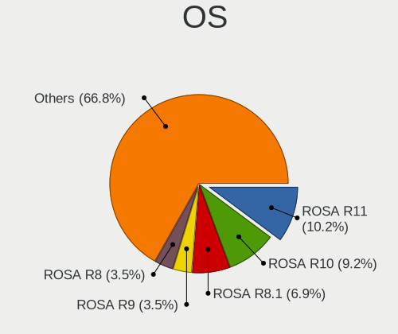

| Name               | Desktops | Percent |
|--------------------|----------|---------|
| ROSA R11           | 49       | 10.91%  |
| ROSA R10           | 45       | 10.02%  |
| ROSA R8.1          | 34       | 7.57%   |
| ROSA R9            | 17       | 3.79%   |
| ROSA R8            | 17       | 3.79%   |
| ROSA R11.1         | 17       | 3.79%   |
| ROSA 12.4          | 15       | 3.34%   |
| Ubuntu 18.04       | 13       | 2.9%    |
| OpenMandriva 4.2   | 12       | 2.67%   |
| ROSA 12.2          | 11       | 2.45%   |
| Ubuntu 22.04       | 10       | 2.23%   |
| Fedora 38          | 10       | 2.23%   |
| Ubuntu 20.04       | 8        | 1.78%   |
| Manjaro            | 7        | 1.56%   |
| Linux Mint 20.3    | 7        | 1.56%   |
| Debian 11          | 7        | 1.56%   |
| ROSA 12.3          | 6        | 1.34%   |
| OpenMandriva 4.3   | 6        | 1.34%   |
| Linux Mint 19.3    | 6        | 1.34%   |
| OpenMandriva 23.03 | 5        | 1.11%   |
| Linux Mint 21.1    | 5        | 1.11%   |
| KDE neon 20.04     | 5        | 1.11%   |
| Fedora 31          | 5        | 1.11%   |
| OpenMandriva 23.08 | 4        | 0.89%   |
| Fedora 39          | 4        | 0.89%   |
| Fedora 36          | 4        | 0.89%   |
| Fedora 35          | 4        | 0.89%   |
| Fedora 34          | 4        | 0.89%   |
| Debian 10          | 4        | 0.89%   |
| Arch Rolling       | 4        | 0.89%   |
| Linux Mint 21.2    | 3        | 0.67%   |
| Linux Mint 20.1    | 3        | 0.67%   |
| Linux Mint 19.1    | 3        | 0.67%   |
| Linux Mint 18.3    | 3        | 0.67%   |
| Kubuntu 20.04      | 3        | 0.67%   |
| Fedora 40          | 3        | 0.67%   |
| Fedora 37          | 3        | 0.67%   |
| Fedora 33          | 3        | 0.67%   |
| Zorin 16           | 2        | 0.45%   |
| Xubuntu 22.04      | 2        | 0.45%   |

OS Family
---------

OS without a version

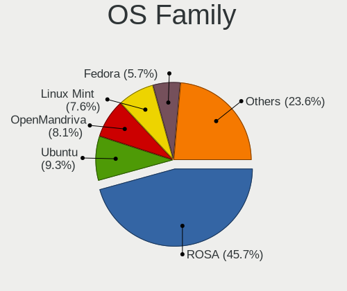

| Name         | Desktops | Percent |
|--------------|----------|---------|
| ROSA         | 184      | 47.3%   |
| Ubuntu       | 36       | 9.25%   |
| OpenMandriva | 30       | 7.71%   |
| Linux Mint   | 30       | 7.71%   |
| Fedora       | 22       | 5.66%   |
| Debian       | 16       | 4.11%   |
| Manjaro      | 14       | 3.6%    |
| KDE neon     | 7        | 1.8%    |
| Kubuntu      | 5        | 1.29%   |
| Gentoo       | 5        | 1.29%   |
| Arch         | 5        | 1.29%   |
| Xubuntu      | 3        | 0.77%   |
| Pop!_OS      | 3        | 0.77%   |
| openSUSE     | 3        | 0.77%   |
| ArcoLinux    | 3        | 0.77%   |
| ALT Linux    | 3        | 0.77%   |
| Zorin        | 2        | 0.51%   |
| Elementary   | 2        | 0.51%   |
| CentOS       | 2        | 0.51%   |
| BlackPanther | 2        | 0.51%   |
| Xero         | 1        | 0.26%   |
| Ubuntu Unity | 1        | 0.26%   |
| Ubuntu MATE  | 1        | 0.26%   |
| RHEL         | 1        | 0.26%   |
| Mageia       | 1        | 0.26%   |
| Lubuntu      | 1        | 0.26%   |
| LMDE         | 1        | 0.26%   |
| Kali         | 1        | 0.26%   |
| Endless      | 1        | 0.26%   |
| EndeavourOS  | 1        | 0.26%   |
| Artix        | 1        | 0.26%   |
| Alpine       | 1        | 0.26%   |

Kernel
------

Version of the Linux kernel

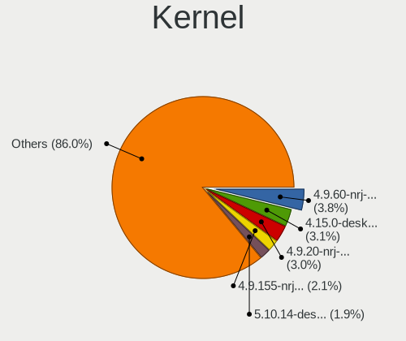

| Version                            | Desktops | Percent |
|------------------------------------|----------|---------|
| 4.9.60-nrj-desktop-1rosa-x86_64    | 22       | 4.18%   |
| 4.9.20-nrj-desktop-1rosa-x86_64    | 17       | 3.23%   |
| 4.15.0-desktop-45.1rosa-x86_64     | 17       | 3.23%   |
| 4.9.155-nrj-desktop-1rosa-x86_64   | 12       | 2.28%   |
| 5.10.14-desktop-1omv4002           | 11       | 2.09%   |
| 5.10.74-generic-2rosa2021.1-x86_64 | 10       | 1.9%    |
| 4.9.76-nrj-desktop-1rosa-x86_64    | 9        | 1.71%   |
| 4.1.34-nrj-desktop-2rosa-x86_64    | 8        | 1.52%   |
| 6.1.20-generic-2rosa2021.1-x86_64  | 7        | 1.33%   |
| 4.15.0-desktop-45.1rosa-i586       | 7        | 1.33%   |
| 4.1.38-nrj-desktop-2rosa-x86_64    | 7        | 1.33%   |
| 5.4.83-generic-2rosa-x86_64        | 6        | 1.14%   |
| 5.16.7-desktop-1omv4003            | 6        | 1.14%   |
| 5.15.0-56-generic                  | 6        | 1.14%   |
| 4.9.41-nrj-desktop-1rosa-x86_64    | 6        | 1.14%   |
| 4.9.124-nrj-desktop-1rosa-x86_64   | 6        | 1.14%   |
| 4.9.9-nrj-desktop-1rosa-x86_64     | 5        | 0.95%   |
| 4.9.60-nrj-desktop-1rosa-i586      | 5        | 0.95%   |
| 4.15.0-desktop-47.2rosa-x86_64     | 5        | 0.95%   |
| 6.4.11-desktop-1omv2390            | 4        | 0.76%   |
| 6.2.6-desktop-1omv2390             | 4        | 0.76%   |
| 5.15.75-generic-1rosa2021.1-x86_64 | 4        | 0.76%   |
| 4.9.111-nrj-desktop-2rosa-x86_64   | 4        | 0.76%   |
| 4.15.0-desktop-60.7rosa-x86_64     | 4        | 0.76%   |
| 4.1.38-nrj-desktop-2rosa-i586      | 4        | 0.76%   |
| 4.1.34-nrj-desktop-2rosa-i586      | 4        | 0.76%   |
| 5.19.0-38-generic                  | 3        | 0.57%   |
| 5.16.5-200.fc35.x86_64             | 3        | 0.57%   |
| 4.9.95-nrj-desktop-2rosa-x86_64    | 3        | 0.57%   |
| 4.9.76-nrj-desktop-1rosa-i586      | 3        | 0.57%   |
| 4.9.34-nrj-desktop-1rosa-x86_64    | 3        | 0.57%   |
| 4.15.0-desktop-94.1rosa-x86_64     | 3        | 0.57%   |
| 4.15.0-desktop-68.5rosa-x86_64     | 3        | 0.57%   |
| 4.15.0-desktop-54.1rosa-x86_64     | 3        | 0.57%   |
| 6.5.0-15-generic                   | 2        | 0.38%   |
| 6.4.15-200.fc38.x86_64             | 2        | 0.38%   |
| 6.2.9-300.fc38.x86_64              | 2        | 0.38%   |
| 6.1.38-generic-1rosa2021.1-x86_64  | 2        | 0.38%   |
| 5.8.0-48-generic                   | 2        | 0.38%   |
| 5.8.0-45-generic                   | 2        | 0.38%   |

Kernel Family
-------------

Linux kernel without a distro release

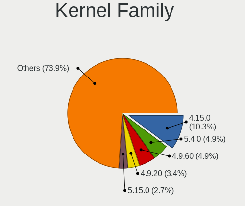

| Version | Desktops | Percent |
|---------|----------|---------|
| 4.15.0  | 56       | 10.96%  |
| 5.4.0   | 27       | 5.28%   |
| 4.9.60  | 27       | 5.28%   |
| 4.9.20  | 19       | 3.72%   |
| 5.15.0  | 14       | 2.74%   |
| 4.1.38  | 14       | 2.74%   |
| 4.9.155 | 13       | 2.54%   |
| 4.9.76  | 12       | 2.35%   |
| 4.1.34  | 12       | 2.35%   |
| 5.10.14 | 11       | 2.15%   |
| 5.10.74 | 10       | 1.96%   |
| 5.10.0  | 10       | 1.96%   |
| 5.8.0   | 9        | 1.76%   |
| 5.4.83  | 8        | 1.57%   |
| 6.1.20  | 7        | 1.37%   |
| 4.9.9   | 7        | 1.37%   |
| 4.9.41  | 7        | 1.37%   |
| 4.9.124 | 7        | 1.37%   |
| 5.16.7  | 6        | 1.17%   |
| 5.0.0   | 6        | 1.17%   |
| 6.5.0   | 5        | 0.98%   |
| 5.19.0  | 5        | 0.98%   |
| 5.13.0  | 5        | 0.98%   |
| 5.11.0  | 5        | 0.98%   |
| 4.18.0  | 5        | 0.98%   |
| 6.4.11  | 4        | 0.78%   |
| 6.2.6   | 4        | 0.78%   |
| 6.1.0   | 4        | 0.78%   |
| 5.15.75 | 4        | 0.78%   |
| 4.9.34  | 4        | 0.78%   |
| 4.9.111 | 4        | 0.78%   |
| 4.19.0  | 4        | 0.78%   |
| 6.5.5   | 3        | 0.59%   |
| 6.2.0   | 3        | 0.59%   |
| 5.3.0   | 3        | 0.59%   |
| 5.16.5  | 3        | 0.59%   |
| 4.9.95  | 3        | 0.59%   |
| 6.7.7   | 2        | 0.39%   |
| 6.6.0   | 2        | 0.39%   |
| 6.4.15  | 2        | 0.39%   |

Kernel Major Ver.
-----------------

Linux kernel major version

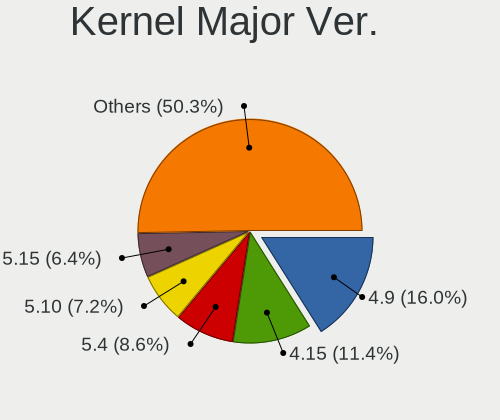

| Version | Desktops | Percent |
|---------|----------|---------|
| 4.9     | 80       | 17.47%  |
| 4.15    | 56       | 12.23%  |
| 5.4     | 43       | 9.39%   |
| 5.10    | 34       | 7.42%   |
| 5.15    | 31       | 6.77%   |
| 4.1     | 26       | 5.68%   |
| 6.1     | 16       | 3.49%   |
| 6.2     | 14       | 3.06%   |
| 6.5     | 12       | 2.62%   |
| 5.8     | 12       | 2.62%   |
| 5.16    | 9        | 1.97%   |
| 6.4     | 8        | 1.75%   |
| 5.3     | 8        | 1.75%   |
| 5.19    | 8        | 1.75%   |
| 5.13    | 8        | 1.75%   |
| 5.11    | 8        | 1.75%   |
| 6.7     | 7        | 1.53%   |
| 6.6     | 7        | 1.53%   |
| 5.0     | 7        | 1.53%   |
| 4.19    | 7        | 1.53%   |
| 4.18    | 7        | 1.53%   |
| 5.6     | 5        | 1.09%   |
| 5.17    | 5        | 1.09%   |
| 5.12    | 5        | 1.09%   |
| 5.9     | 4        | 0.87%   |
| 5.14    | 4        | 0.87%   |
| 6.0     | 3        | 0.66%   |
| 5.7     | 3        | 0.66%   |
| 5.18    | 3        | 0.66%   |
| 4.8     | 3        | 0.66%   |
| 4.4     | 3        | 0.66%   |
| 6.8     | 2        | 0.44%   |
| 6.3     | 2        | 0.44%   |
| 5.5     | 2        | 0.44%   |
| 4.14    | 2        | 0.44%   |
| 4.20    | 1        | 0.22%   |
| 4.17    | 1        | 0.22%   |
| 4.13    | 1        | 0.22%   |
| 4.12    | 1        | 0.22%   |

Arch
----

OS architecture (x86_64, i586, etc.)

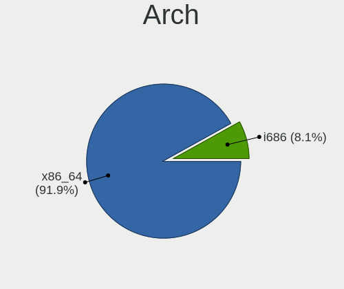

| Name   | Desktops | Percent |
|--------|----------|---------|
| x86_64 | 338      | 91.35%  |
| i686   | 32       | 8.65%   |

DE
--

Desktop Environment

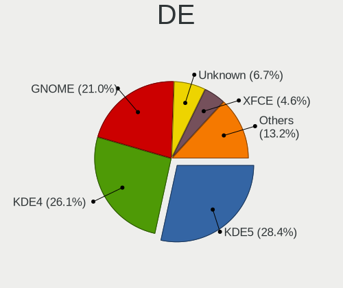

| Name            | Desktops | Percent |
|-----------------|----------|---------|
| KDE5            | 116      | 28.93%  |
| KDE4            | 113      | 28.18%  |
| GNOME           | 84       | 20.95%  |
| Unknown         | 23       | 5.74%   |
| X-Cinnamon      | 19       | 4.74%   |
| XFCE            | 17       | 4.24%   |
| MATE            | 8        | 2%      |
| LXQt            | 7        | 1.75%   |
| KDE             | 3        | 0.75%   |
| Pantheon        | 2        | 0.5%    |
| Unity           | 1        | 0.25%   |
| Trinity         | 1        | 0.25%   |
| Openbox         | 1        | 0.25%   |
| LXDE            | 1        | 0.25%   |
| KDE6            | 1        | 0.25%   |
| GNOME Flashback | 1        | 0.25%   |
| Deepin          | 1        | 0.25%   |
| Cinnamon        | 1        | 0.25%   |
| bspwm           | 1        | 0.25%   |

Display Server
--------------

X11 or Wayland

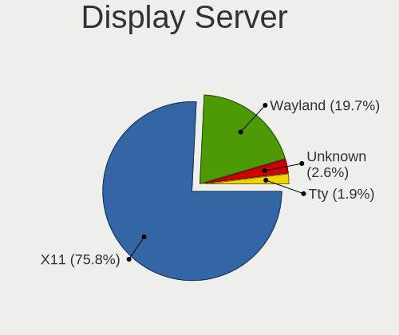

| Name    | Desktops | Percent |
|---------|----------|---------|
| X11     | 305      | 79.02%  |
| Wayland | 66       | 17.1%   |
| Unknown | 9        | 2.33%   |
| Tty     | 6        | 1.55%   |

Display Manager
---------------

SDDM, LightDM, etc.

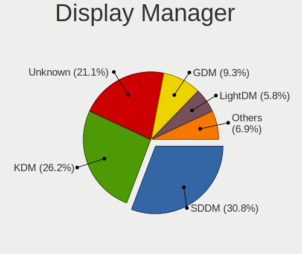

| Name    | Desktops | Percent |
|---------|----------|---------|
| SDDM    | 122      | 30.42%  |
| KDM     | 113      | 28.18%  |
| Unknown | 80       | 19.95%  |
| GDM     | 37       | 9.23%   |
| LightDM | 20       | 4.99%   |
| GDM3    | 15       | 3.74%   |
| TDM     | 12       | 2.99%   |
| MDM     | 2        | 0.5%    |

OS Lang
-------

Language

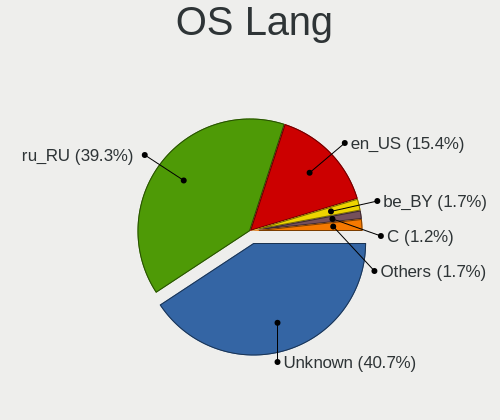

| Lang        | Desktops | Percent |
|-------------|----------|---------|
| Unknown     | 166      | 43.34%  |
| ru_RU       | 143      | 37.34%  |
| en_US       | 57       | 14.88%  |
| be_BY       | 7        | 1.83%   |
| en_GB       | 4        | 1.04%   |
| C           | 3        | 0.78%   |
| ru_RU.UTF_8 | 1        | 0.26%   |
| ru_BY       | 1        | 0.26%   |
| en_CA       | 1        | 0.26%   |

Boot Mode
---------

EFI or BIOS

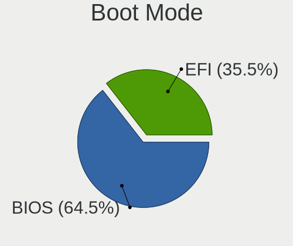

| Mode | Desktops | Percent |
|------|----------|---------|
| BIOS | 244      | 64.21%  |
| EFI  | 136      | 35.79%  |

Filesystem
----------

Type of filesystem

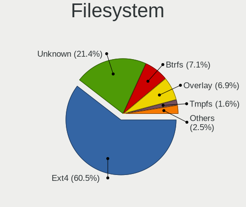

| Type    | Desktops | Percent |
|---------|----------|---------|
| Ext4    | 245      | 60.49%  |
| Unknown | 93       | 22.96%  |
| Btrfs   | 26       | 6.42%   |
| Overlay | 25       | 6.17%   |
| Tmpfs   | 6        | 1.48%   |
| Xfs     | 4        | 0.99%   |
| Ext2    | 2        | 0.49%   |
| Zfs     | 1        | 0.25%   |
| SAMSUNG | 1        | 0.25%   |
| F2fs    | 1        | 0.25%   |
| Ext3    | 1        | 0.25%   |

Part. scheme
------------

Scheme of partitioning

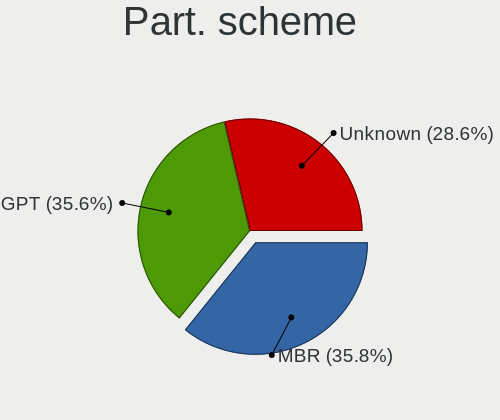

| Type    | Desktops | Percent |
|---------|----------|---------|
| MBR     | 148      | 36.63%  |
| GPT     | 140      | 34.65%  |
| Unknown | 116      | 28.71%  |

Dual Boot with Linux/BSD
------------------------

Hosting more than one Linux/BSD

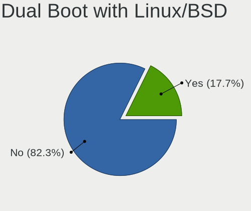

| Dual boot | Desktops | Percent |
|-----------|----------|---------|
| No        | 321      | 83.38%  |
| Yes       | 64       | 16.62%  |

Dual Boot (Win)
---------------

Hosting Linux and Windows

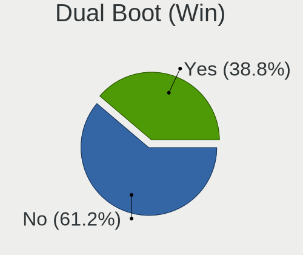

| Dual boot | Desktops | Percent |
|-----------|----------|---------|
| No        | 242      | 61.89%  |
| Yes       | 149      | 38.11%  |

Board
-----

Vendor
------

Motherboard manufacturer

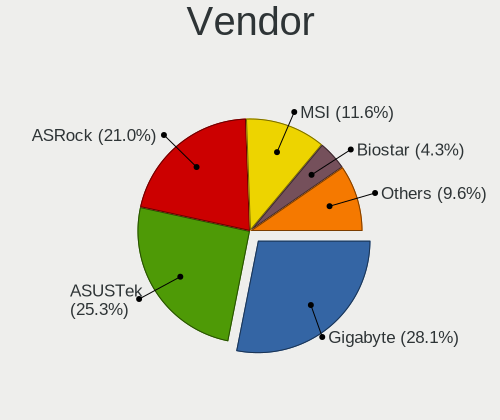

| Name                | Desktops | Percent |
|---------------------|----------|---------|
| Gigabyte Technology | 104      | 28.26%  |
| ASUSTek Computer    | 95       | 25.82%  |
| ASRock              | 79       | 21.47%  |
| MSI                 | 41       | 11.14%  |
| Biostar             | 15       | 4.08%   |
| Intel               | 7        | 1.9%    |
| ECS                 | 4        | 1.09%   |
| Dell                | 3        | 0.82%   |
| Nvidia              | 2        | 0.54%   |
| Lenovo              | 2        | 0.54%   |
| Hewlett-Packard     | 2        | 0.54%   |
| EPoX Computer       | 2        | 0.54%   |
| Unknown             | 2        | 0.54%   |
| ZOTAC               | 1        | 0.27%   |
| VIA Technologies    | 1        | 0.27%   |
| Partner             | 1        | 0.27%   |
| Kllisre             | 1        | 0.27%   |
| Jetway              | 1        | 0.27%   |
| Iskratel, Kranj     | 1        | 0.27%   |
| Huanan              | 1        | 0.27%   |
| Foxconn             | 1        | 0.27%   |
| AMD                 | 1        | 0.27%   |
| Acer                | 1        | 0.27%   |

Model
-----

Motherboard model

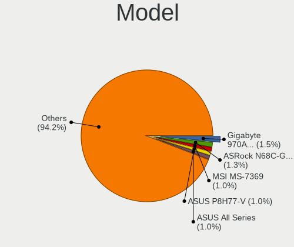

| Name                     | Desktops | Percent |
|--------------------------|----------|---------|
| ASRock N68C-GS FX        | 5        | 1.36%   |
| MSI MS-7369              | 4        | 1.09%   |
| Gigabyte 970A-DS3P       | 4        | 1.09%   |
| ASUS All Series          | 4        | 1.09%   |
| ASRock N68-VS3 UCC       | 4        | 1.09%   |
| MSI MS-7309              | 3        | 0.82%   |
| Gigabyte M61SME-S2       | 3        | 0.82%   |
| Gigabyte H81M-S2H        | 3        | 0.82%   |
| Gigabyte GA-MA74GM-S2H   | 3        | 0.82%   |
| Gigabyte GA-780T-D3L     | 3        | 0.82%   |
| Gigabyte B450M S2H       | 3        | 0.82%   |
| Gigabyte B450M DS3H      | 3        | 0.82%   |
| ASUS TUF B450-PRO GAMING | 3        | 0.82%   |
| ASUS P8H77-V             | 3        | 0.82%   |
| ASRock N68C-GS4 FX       | 3        | 0.82%   |
| ASRock N68-VGS3 FX       | 3        | 0.82%   |
| Nvidia NF-MCP61          | 2        | 0.54%   |
| MSI MS-7B86              | 2        | 0.54%   |
| MSI MS-7996              | 2        | 0.54%   |
| MSI MS-7846              | 2        | 0.54%   |
| MSI MS-7623              | 2        | 0.54%   |
| MSI MS-7592              | 2        | 0.54%   |
| MSI MS-7250              | 2        | 0.54%   |
| Lenovo 3000              | 2        | 0.54%   |
| Intel SKYBAY             | 2        | 0.54%   |
| Gigabyte Z68XP-UD3       | 2        | 0.54%   |
| Gigabyte Z390 AORUS PRO  | 2        | 0.54%   |
| Gigabyte P67A-D3-B3      | 2        | 0.54%   |
| Gigabyte M56S-S3         | 2        | 0.54%   |
| Gigabyte GA-MA770-DS3    | 2        | 0.54%   |
| Gigabyte B550M S2H       | 2        | 0.54%   |
| Gigabyte A320M-H         | 2        | 0.54%   |
| Gigabyte 945PL-S3        | 2        | 0.54%   |
| ASUS Z170I PRO GAMING    | 2        | 0.54%   |
| ASUS Z170 PRO GAMING     | 2        | 0.54%   |
| ASUS PRIME H310M-R R2.0  | 2        | 0.54%   |
| ASUS PRIME A320M-K       | 2        | 0.54%   |
| ASUS P5B-VM SE           | 2        | 0.54%   |
| ASUS P5B                 | 2        | 0.54%   |
| ASUS M5A97 R2.0          | 2        | 0.54%   |

Model Family
------------

Motherboard model prefix

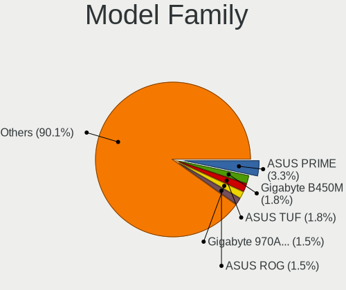

| Name                   | Desktops | Percent |
|------------------------|----------|---------|
| ASUS PRIME             | 13       | 3.53%   |
| Gigabyte B450M         | 7        | 1.9%    |
| ASUS TUF               | 6        | 1.63%   |
| ASUS ROG               | 5        | 1.36%   |
| ASRock N68C-GS         | 5        | 1.36%   |
| ASRock N68-VS3         | 5        | 1.36%   |
| MSI MS-7369            | 4        | 1.09%   |
| Gigabyte Z390          | 4        | 1.09%   |
| Gigabyte 970A-DS3P     | 4        | 1.09%   |
| ASUS P8H77-V           | 4        | 1.09%   |
| ASUS M5A97             | 4        | 1.09%   |
| ASUS All               | 4        | 1.09%   |
| MSI MS-7309            | 3        | 0.82%   |
| Gigabyte X570          | 3        | 0.82%   |
| Gigabyte M61SME-S2     | 3        | 0.82%   |
| Gigabyte H81M-S2H      | 3        | 0.82%   |
| Gigabyte GA-MA74GM-S2H | 3        | 0.82%   |
| Gigabyte GA-780T-D3L   | 3        | 0.82%   |
| Gigabyte B550M         | 3        | 0.82%   |
| ASUS P8Z77-V           | 3        | 0.82%   |
| ASUS P5B               | 3        | 0.82%   |
| ASRock N68C-GS4        | 3        | 0.82%   |
| ASRock N68-VGS3        | 3        | 0.82%   |
| ASRock B450M           | 3        | 0.82%   |
| Nvidia NF-MCP61        | 2        | 0.54%   |
| MSI MS-7B86            | 2        | 0.54%   |
| MSI MS-7996            | 2        | 0.54%   |
| MSI MS-7846            | 2        | 0.54%   |
| MSI MS-7623            | 2        | 0.54%   |
| MSI MS-7592            | 2        | 0.54%   |
| MSI MS-7250            | 2        | 0.54%   |
| Lenovo 3000            | 2        | 0.54%   |
| Intel SKYBAY           | 2        | 0.54%   |
| HP Compaq              | 2        | 0.54%   |
| Gigabyte Z68XP-UD3     | 2        | 0.54%   |
| Gigabyte P67A-D3-B3    | 2        | 0.54%   |
| Gigabyte M56S-S3       | 2        | 0.54%   |
| Gigabyte GA-MA770-DS3  | 2        | 0.54%   |
| Gigabyte B450          | 2        | 0.54%   |
| Gigabyte A320M-H       | 2        | 0.54%   |

MFG Year
--------

Motherboard manufacture year

| Year | Desktops | Percent |
|------|----------|---------|
| 2012 | 44       | 11.96%  |
| 2018 | 42       | 11.41%  |
| 2013 | 38       | 10.33%  |
| 2011 | 37       | 10.05%  |
| 2007 | 29       | 7.88%   |
| 2010 | 24       | 6.52%   |
| 2014 | 19       | 5.16%   |
| 2008 | 19       | 5.16%   |
| 2009 | 18       | 4.89%   |
| 2006 | 16       | 4.35%   |
| 2020 | 15       | 4.08%   |
| 2017 | 13       | 3.53%   |
| 2015 | 13       | 3.53%   |
| 2019 | 12       | 3.26%   |
| 2021 | 10       | 2.72%   |
| 2016 | 8        | 2.17%   |
| 2005 | 5        | 1.36%   |
| 2022 | 4        | 1.09%   |
| 2023 | 1        | 0.27%   |
| 2003 | 1        | 0.27%   |

Form Factor
-----------

Physical design of the computer

| Name    | Desktops | Percent |
|---------|----------|---------|
| Desktop | 368      | 100%    |

Secure Boot
-----------

Enabled or disabled

| State    | Desktops | Percent |
|----------|----------|---------|
| Disabled | 367      | 99.46%  |
| Enabled  | 2        | 0.54%   |

Coreboot
--------

Have coreboot on board

| Used | Desktops | Percent |
|------|----------|---------|
| No   | 368      | 100%    |

RAM Size
--------

Total RAM memory

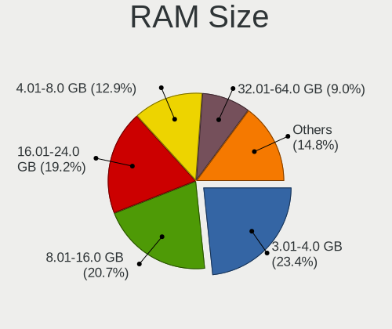

| Size in GB  | Desktops | Percent |
|-------------|----------|---------|
| 3.01-4.0    | 90       | 23.56%  |
| 8.01-16.0   | 83       | 21.73%  |
| 16.01-24.0  | 69       | 18.06%  |
| 4.01-8.0    | 50       | 13.09%  |
| 32.01-64.0  | 31       | 8.12%   |
| 1.01-2.0    | 23       | 6.02%   |
| 2.01-3.0    | 19       | 4.97%   |
| 0.51-1.0    | 6        | 1.57%   |
| 24.01-32.0  | 5        | 1.31%   |
| 64.01-256.0 | 5        | 1.31%   |
| 0.01-0.5    | 1        | 0.26%   |

RAM Used
--------

Used RAM memory

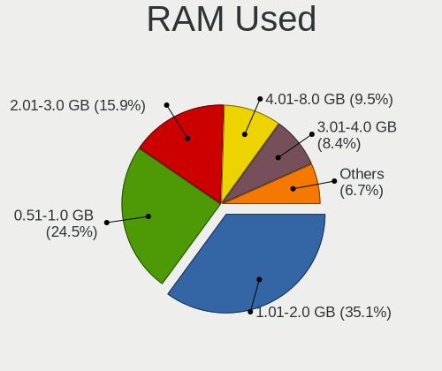

| Used GB    | Desktops | Percent |
|------------|----------|---------|
| 1.01-2.0   | 158      | 36.41%  |
| 0.51-1.0   | 110      | 25.35%  |
| 2.01-3.0   | 67       | 15.44%  |
| 4.01-8.0   | 39       | 8.99%   |
| 3.01-4.0   | 32       | 7.37%   |
| 8.01-16.0  | 12       | 2.76%   |
| 0.01-0.5   | 10       | 2.3%    |
| 16.01-24.0 | 4        | 0.92%   |
| 32.01-64.0 | 1        | 0.23%   |
| 24.01-32.0 | 1        | 0.23%   |

Total Drives
------------

Number of drives on board

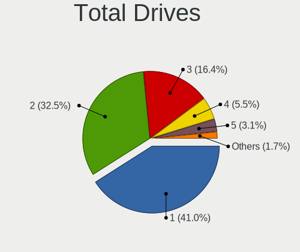

| Drives | Desktops | Percent |
|--------|----------|---------|
| 1      | 160      | 40.61%  |
| 2      | 127      | 32.23%  |
| 3      | 68       | 17.26%  |
| 4      | 21       | 5.33%   |
| 5      | 11       | 2.79%   |
| 0      | 3        | 0.76%   |
| 9      | 2        | 0.51%   |
| 8      | 1        | 0.25%   |
| 6      | 1        | 0.25%   |

Has CD-ROM
----------

Has CD-ROM on board

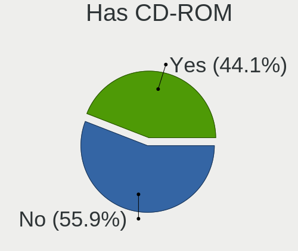

| Presented | Desktops | Percent |
|-----------|----------|---------|
| No        | 202      | 54.3%   |
| Yes       | 170      | 45.7%   |

Has Ethernet
------------

Has Ethernet on board

| Presented | Desktops | Percent |
|-----------|----------|---------|
| Yes       | 364      | 98.91%  |
| No        | 4        | 1.09%   |

Has WiFi
--------

Has WiFi module

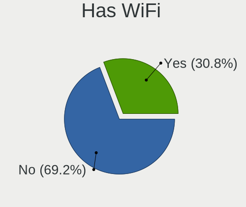

| Presented | Desktops | Percent |
|-----------|----------|---------|
| No        | 264      | 70.4%   |
| Yes       | 111      | 29.6%   |

Has Bluetooth
-------------

Has Bluetooth module

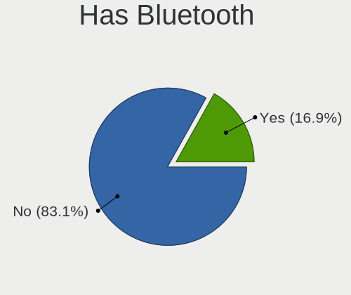

| Presented | Desktops | Percent |
|-----------|----------|---------|
| No        | 315      | 84%     |
| Yes       | 60       | 16%     |

Location
--------

Country
-------

Geographic location (country)

| Country | Desktops | Percent |
|---------|----------|---------|
| Belarus | 368      | 100%    |

City
----

Geographic location (city)

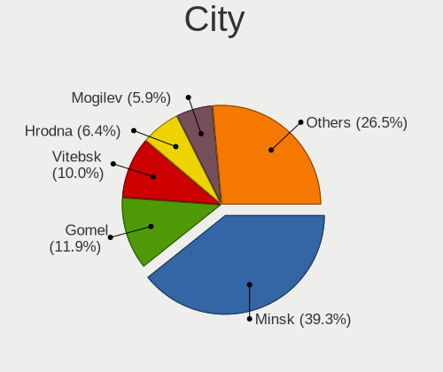

| City           | Desktops | Percent |
|----------------|----------|---------|
| Minsk          | 164      | 40.2%   |
| Gomel          | 47       | 11.52%  |
| Vitebsk        | 43       | 10.54%  |
| Hrodna         | 25       | 6.13%   |
| Brest          | 24       | 5.88%   |
| Mogilev        | 23       | 5.64%   |
| Polatsk        | 7        | 1.72%   |
| Baranovichi    | 6        | 1.47%   |
| Slutsk         | 5        | 1.23%   |
| Vawkavysk      | 4        | 0.98%   |
| Babruysk       | 4        | 0.98%   |
| Lida           | 3        | 0.74%   |
| Zhlobin        | 2        | 0.49%   |
| Syanno         | 2        | 0.49%   |
| Svyetlahorsk   | 2        | 0.49%   |
| Slonim         | 2        | 0.49%   |
| Rechytsa       | 2        | 0.49%   |
| Rahachow       | 2        | 0.49%   |
| Pinsk          | 2        | 0.49%   |
| Ogorodniki     | 2        | 0.49%   |
| Navapolatsk    | 2        | 0.49%   |
| Mazyr          | 2        | 0.49%   |
| Masty          | 2        | 0.49%   |
| Klyetsk        | 2        | 0.49%   |
| Dubovka        | 2        | 0.49%   |
| Bogushevichi   | 2        | 0.49%   |
| Zhabinka       | 1        | 0.25%   |
| Valeryanovo | 1        | 0.25%   |
| Stolin         | 1        | 0.25%   |
| Snitovo        | 1        | 0.25%   |
| Smalyavichy    | 1        | 0.25%   |
| Skoki          | 1        | 0.25%   |
| Pruzhany       | 1        | 0.25%   |
| Osipovichi     | 1        | 0.25%   |
| Orsha          | 1        | 0.25%   |
| Olekhnoviche   | 1        | 0.25%   |
| Navahrudak     | 1        | 0.25%   |
| Murava         | 1        | 0.25%   |
| Magistral'naya | 1        | 0.25%   |
| Lyepyel'       | 1        | 0.25%   |

Drives
------

Drive Vendor
------------

Hard drive vendors

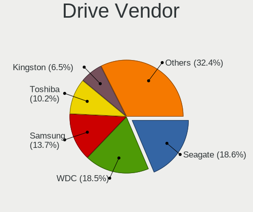

| Vendor                      | Desktops | Drives | Percent |
|-----------------------------|----------|--------|---------|
| WDC                         | 124      | 227    | 18.93%  |
| Seagate                     | 124      | 223    | 18.93%  |
| Samsung Electronics         | 92       | 155    | 14.05%  |
| Toshiba                     | 69       | 134    | 10.53%  |
| Kingston                    | 43       | 66     | 6.56%   |
| Hitachi                     | 42       | 64     | 6.41%   |
| Crucial                     | 16       | 19     | 2.44%   |
| Patriot                     | 13       | 19     | 1.98%   |
| OCZ                         | 10       | 12     | 1.53%   |
| Intel                       | 9        | 10     | 1.37%   |
| HGST                        | 8        | 30     | 1.22%   |
| China                       | 8        | 9      | 1.22%   |
| Apacer                      | 8        | 9      | 1.22%   |
| Gigabyte Technology         | 7        | 7      | 1.07%   |
| SPCC                        | 6        | 10     | 0.92%   |
| A-DATA Technology           | 6        | 7      | 0.92%   |
| Sandisk                     | 5        | 6      | 0.76%   |
| KingSpec                    | 5        | 7      | 0.76%   |
| GOODRAM                     | 5        | 6      | 0.76%   |
| Silicon Motion              | 4        | 5      | 0.61%   |
| Plextor                     | 4        | 5      | 0.61%   |
| Maxtor                      | 4        | 4      | 0.61%   |
| Unknown                     | 3        | 3      | 0.46%   |
| Netac                       | 3        | 3      | 0.46%   |
| XPG                         | 2        | 2      | 0.31%   |
| WD MediaMax                 | 2        | 2      | 0.31%   |
| Kllisre                     | 2        | 3      | 0.31%   |
| Kingston Technology Company | 2        | 2      | 0.31%   |
| JMicron Technology          | 2        | 2      | 0.31%   |
| Fujitsu                     | 2        | 2      | 0.31%   |
| External                    | 2        | 2      | 0.31%   |
| AMD                         | 2        | 2      | 0.31%   |
| XrayDisk                    | 1        | 1      | 0.15%   |
| USB3.0                      | 1        | 1      | 0.15%   |
| Transcend                   | 1        | 1      | 0.15%   |
| Team                        | 1        | 1      | 0.15%   |
| Synopsys                    | 1        | 1      | 0.15%   |
| Smartbuy                    | 1        | 2      | 0.15%   |
| SINTECHI                    | 1        | 1      | 0.15%   |
| Phison                      | 1        | 1      | 0.15%   |

Drive Model
-----------

Hard drive models

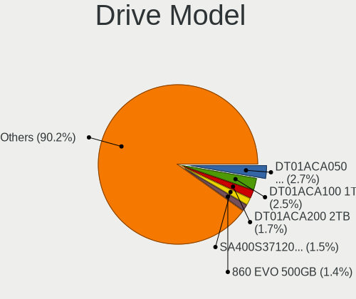

| Model                                             | Desktops | Percent |
|---------------------------------------------------|----------|---------|
| Toshiba DT01ACA050 500GB                          | 22       | 2.93%   |
| Toshiba DT01ACA100 1TB                            | 20       | 2.66%   |
| Toshiba DT01ACA200 2TB                            | 12       | 1.6%    |
| Samsung SSD 860 EVO 500GB                         | 11       | 1.46%   |
| Kingston SA400S37120G 120GB SSD                   | 11       | 1.46%   |
| Seagate ST500DM002-1BD142 500GB                   | 10       | 1.33%   |
| Samsung SSD 860 EVO 250GB                         | 9        | 1.2%    |
| Seagate ST2000DM008-2FR102 2TB                    | 8        | 1.06%   |
| WDC WD10EZRZ-00HTKB0 1TB                          | 7        | 0.93%   |
| Toshiba HDWD110 1TB                               | 7        | 0.93%   |
| Kingston SA400S37240G 240GB SSD                   | 6        | 0.8%    |
| Hitachi HDS721010CLA330 1TB                       | 6        | 0.8%    |
| Toshiba DT01ACA300 3TB                            | 5        | 0.66%   |
| Seagate ST1000DM003-1CH162 1TB                    | 5        | 0.66%   |
| Samsung HD160JJ 160GB                             | 5        | 0.66%   |
| OCZ VERTEX4 128GB SSD                             | 5        | 0.66%   |
| Hitachi HDS721050CLA360 500GB                     | 5        | 0.66%   |
| Hitachi HDP725050GLA360 500GB                     | 5        | 0.66%   |
| WDC WD5000AZRX-00A8LB0 500GB                      | 4        | 0.53%   |
| WDC WD5000AAKX-001CA0 500GB                       | 4        | 0.53%   |
| WDC WD20EZRX-00D8PB0 2TB                          | 4        | 0.53%   |
| WDC WD20EARS-00MVWB0 2TB                          | 4        | 0.53%   |
| Seagate ST380817AS 80GB                           | 4        | 0.53%   |
| Seagate ST3500413AS 500GB                         | 4        | 0.53%   |
| Seagate ST3160815AS 160GB                         | 4        | 0.53%   |
| Seagate ST1000DM010-2EP102 1TB                    | 4        | 0.53%   |
| Seagate ST1000DM003-1ER162 1TB                    | 4        | 0.53%   |
| Samsung SSD 850 EVO 250GB                         | 4        | 0.53%   |
| Samsung SP0802N 80GB                              | 4        | 0.53%   |
| Samsung NVMe SSD Drive 500GB                      | 4        | 0.53%   |
| Samsung NVMe SSD Controller SM981/PM981/PM983 1TB | 4        | 0.53%   |
| Patriot Burst 240GB SSD                           | 4        | 0.53%   |
| Patriot Burst 120GB SSD                           | 4        | 0.53%   |
| Kingston SUV400S37120G 120GB SSD                  | 4        | 0.53%   |
| Gigabyte GP-GSTFS31120GNTD 120GB SSD              | 4        | 0.53%   |
| WDC WD5000AADS-00M2B0 500GB                       | 3        | 0.4%    |
| WDC WD1003FZEX-00MK2A0 1TB                        | 3        | 0.4%    |
| Seagate ST500DM005 HD502HJ 500GB                  | 3        | 0.4%    |
| Seagate ST380011A 80GB                            | 3        | 0.4%    |
| Seagate ST340016A 40GB                            | 3        | 0.4%    |

HDD Vendor
----------

Hard disk drive vendors

| Vendor              | Desktops | Drives | Percent |
|---------------------|----------|--------|---------|
| Seagate             | 124      | 222    | 29.95%  |
| WDC                 | 120      | 192    | 28.99%  |
| Toshiba             | 69       | 133    | 16.67%  |
| Hitachi             | 42       | 64     | 10.14%  |
| Samsung Electronics | 39       | 54     | 9.42%   |
| HGST                | 8        | 30     | 1.93%   |
| Maxtor              | 4        | 4      | 0.97%   |
| WD MediaMax         | 2        | 2      | 0.48%   |
| JMicron Technology  | 2        | 2      | 0.48%   |
| Fujitsu             | 2        | 2      | 0.48%   |
| SINTECHI            | 1        | 1      | 0.24%   |
| External            | 1        | 1      | 0.24%   |

SSD Vendor
----------

Solid state drive vendors

| Vendor              | Desktops | Drives | Percent |
|---------------------|----------|--------|---------|
| Samsung Electronics | 40       | 67     | 20.2%   |
| Kingston            | 34       | 53     | 17.17%  |
| Crucial             | 14       | 17     | 7.07%   |
| WDC                 | 11       | 35     | 5.56%   |
| Patriot             | 11       | 17     | 5.56%   |
| OCZ                 | 10       | 12     | 5.05%   |
| China               | 8        | 9      | 4.04%   |
| Apacer              | 8        | 9      | 4.04%   |
| Intel               | 7        | 8      | 3.54%   |
| SPCC                | 5        | 9      | 2.53%   |
| KingSpec            | 5        | 7      | 2.53%   |
| Plextor             | 4        | 5      | 2.02%   |
| GOODRAM             | 4        | 5      | 2.02%   |
| Gigabyte Technology | 4        | 4      | 2.02%   |
| A-DATA Technology   | 4        | 5      | 2.02%   |
| Unknown             | 3        | 3      | 1.52%   |
| SanDisk             | 3        | 4      | 1.52%   |
| XrayDisk            | 1        | 1      | 0.51%   |
| USB3.0              | 1        | 1      | 0.51%   |
| Transcend           | 1        | 1      | 0.51%   |
| Toshiba             | 1        | 1      | 0.51%   |
| Team                | 1        | 1      | 0.51%   |
| Smartbuy            | 1        | 2      | 0.51%   |
| Seagate             | 1        | 1      | 0.51%   |
| OCZ-VERTEX3         | 1        | 3      | 0.51%   |
| Netac               | 1        | 1      | 0.51%   |
| Micron Technology   | 1        | 1      | 0.51%   |
| M500                | 1        | 1      | 0.51%   |
| KingDian            | 1        | 1      | 0.51%   |
| Kimtigo             | 1        | 1      | 0.51%   |
| Hoodisk             | 1        | 1      | 0.51%   |
| Hewlett-Packard     | 1        | 1      | 0.51%   |
| External            | 1        | 1      | 0.51%   |
| ExeGate             | 1        | 1      | 0.51%   |
| Dahua               | 1        | 2      | 0.51%   |
| Corsair             | 1        | 5      | 0.51%   |
| AMD                 | 1        | 1      | 0.51%   |
| AGI                 | 1        | 2      | 0.51%   |
| Acer                | 1        | 2      | 0.51%   |
| 2.5"                | 1        | 4      | 0.51%   |

Drive Kind
----------

HDD or SSD

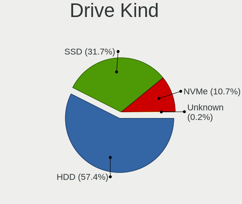

| Kind | Desktops | Drives | Percent |
|------|----------|--------|---------|
| HDD  | 321      | 707    | 58.47%  |
| SSD  | 171      | 305    | 31.15%  |
| NVMe | 57       | 79     | 10.38%  |

Drive Connector
---------------

SATA, SAS, NVMe, etc.

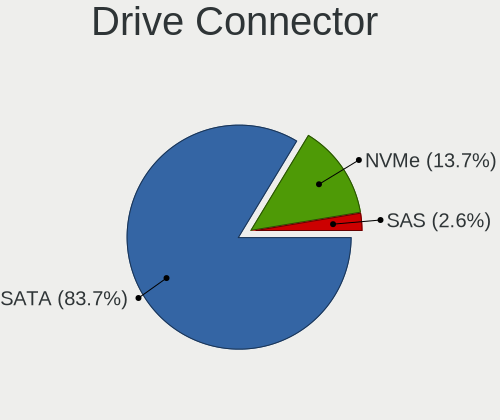

| Type | Desktops | Drives | Percent |
|------|----------|--------|---------|
| SATA | 359      | 1000   | 84.07%  |
| NVMe | 57       | 79     | 13.35%  |
| SAS  | 11       | 12     | 2.58%   |

Drive Size
----------

Size of hard drive

| Size in TB | Desktops | Drives | Percent |
|------------|----------|--------|---------|
| 0.01-0.5   | 303      | 611    | 59.41%  |
| 0.51-1.0   | 127      | 229    | 24.9%   |
| 1.01-2.0   | 47       | 104    | 9.22%   |
| 3.01-4.0   | 11       | 15     | 2.16%   |
| 2.01-3.0   | 11       | 23     | 2.16%   |
| 4.01-10.0  | 7        | 25     | 1.37%   |
| 10.01-20.0 | 4        | 5      | 0.78%   |

Space Total
-----------

Amount of disk space available on the file system

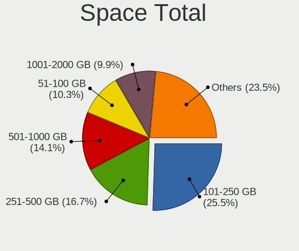

| Size in GB     | Desktops | Percent |
|----------------|----------|---------|
| 101-250        | 106      | 25.18%  |
| 251-500        | 74       | 17.58%  |
| 501-1000       | 59       | 14.01%  |
| 51-100         | 44       | 10.45%  |
| 1001-2000      | 41       | 9.74%   |
| 1-20           | 40       | 9.5%    |
| More than 3000 | 21       | 4.99%   |
| 21-50          | 19       | 4.51%   |
| 2001-3000      | 12       | 2.85%   |
| Unknown        | 5        | 1.19%   |

Space Used
----------

Amount of used disk space

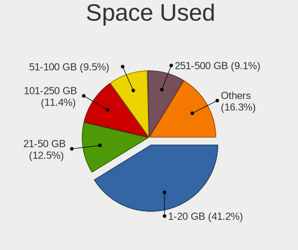

| Used GB        | Desktops | Percent |
|----------------|----------|---------|
| 1-20           | 181      | 41.32%  |
| 101-250        | 53       | 12.1%   |
| 21-50          | 51       | 11.64%  |
| 51-100         | 44       | 10.05%  |
| 251-500        | 38       | 8.68%   |
| 501-1000       | 34       | 7.76%   |
| 1001-2000      | 13       | 2.97%   |
| 2001-3000      | 10       | 2.28%   |
| More than 3000 | 9        | 2.05%   |
| Unknown        | 5        | 1.14%   |

Malfunc. Drives
---------------

Drive models with a malfunction

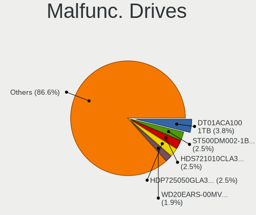

| Model                             | Desktops | Drives | Percent |
|-----------------------------------|----------|--------|---------|
| Toshiba DT01ACA100 1TB            | 6        | 7      | 3.87%   |
| Seagate ST500DM002-1BD142 500GB   | 4        | 11     | 2.58%   |
| Hitachi HDS721010CLA330 1TB       | 4        | 5      | 2.58%   |
| Hitachi HDP725050GLA360 500GB     | 4        | 8      | 2.58%   |
| WDC WD20EARS-00MVWB0 2TB          | 3        | 6      | 1.94%   |
| Toshiba DT01ACA200 2TB            | 3        | 5      | 1.94%   |
| Samsung Electronics HD160JJ 160GB | 3        | 3      | 1.94%   |
| WDC WD5000AAKS-00A7B0 500GB       | 2        | 2      | 1.29%   |
| WDC WD30EFRX-68EUZN0 3TB          | 2        | 3      | 1.29%   |
| Seagate STM3500418AS 500GB        | 2        | 2      | 1.29%   |
| Seagate ST9500325AS 500GB         | 2        | 3      | 1.29%   |
| Seagate ST3500320AS 500GB         | 2        | 3      | 1.29%   |
| Seagate ST340016A 40GB            | 2        | 3      | 1.29%   |
| Seagate ST3250820AS 250GB         | 2        | 2      | 1.29%   |
| Seagate ST3160812A 160GB          | 2        | 4      | 1.29%   |
| Seagate ST2000DM001-1CH164 2TB    | 2        | 2      | 1.29%   |
| Samsung Electronics SP0802N 80GB  | 2        | 2      | 1.29%   |
| Samsung Electronics HD161HJ 160GB | 2        | 3      | 1.29%   |
| Samsung Electronics HD103SJ 1TB   | 2        | 2      | 1.29%   |
| OCZ VERTEX460A 120GB SSD          | 2        | 3      | 1.29%   |
| OCZ VERTEX4 128GB SSD             | 2        | 2      | 1.29%   |
| Hitachi HDS721010DLE630 1TB       | 2        | 2      | 1.29%   |
| Fujitsu MHZ2160BH G2 160GB        | 2        | 2      | 1.29%   |
| WDC WD800BB-56JKC0 80GB           | 1        | 1      | 0.65%   |
| WDC WD6000HLHX-01JJPV0 600GB      | 1        | 1      | 0.65%   |
| WDC WD5000BEVT-22A0RT0 500GB      | 1        | 2      | 0.65%   |
| WDC WD5000AAKX-083CA1 500GB       | 1        | 1      | 0.65%   |
| WDC WD5000AAKX-00U6AA0 500GB      | 1        | 1      | 0.65%   |
| WDC WD5000AAKX-001CA0 500GB       | 1        | 1      | 0.65%   |
| WDC WD5000AAKS-08WWPA0 500GB      | 1        | 1      | 0.65%   |
| WDC WD5000AAKS-00UU3A0 500GB      | 1        | 1      | 0.65%   |
| WDC WD5000AAKB-00H8A0 500GB       | 1        | 1      | 0.65%   |
| WDC WD5000AADS-56S9B0 499GB       | 1        | 1      | 0.65%   |
| WDC WD400EB-00CPF0 40GB           | 1        | 1      | 0.65%   |
| WDC WD4003FZEX-00Z4SA0 4TB        | 1        | 1      | 0.65%   |
| WDC WD3200BEVT-22A23T0 320GB      | 1        | 2      | 0.65%   |
| WDC WD3200BEKT-60F3T1 320GB       | 1        | 1      | 0.65%   |
| WDC WD3200AVVS-63L2B0 320GB       | 1        | 1      | 0.65%   |
| WDC WD3200AAKS-00SBA0 320GB       | 1        | 1      | 0.65%   |
| WDC WD3200AAJS-00L7A0 320GB       | 1        | 1      | 0.65%   |

Malfunc. Drive Vendor
---------------------

Vendors of faulty drives

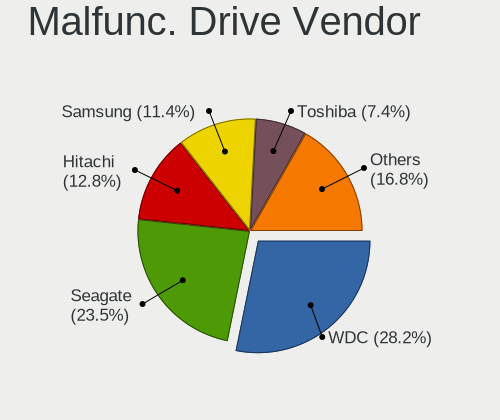

| Vendor              | Desktops | Drives | Percent |
|---------------------|----------|--------|---------|
| WDC                 | 42       | 53     | 28.57%  |
| Seagate             | 35       | 54     | 23.81%  |
| Hitachi             | 19       | 28     | 12.93%  |
| Samsung Electronics | 17       | 20     | 11.56%  |
| Toshiba             | 11       | 15     | 7.48%   |
| OCZ                 | 4        | 5      | 2.72%   |
| Kingston            | 4        | 4      | 2.72%   |
| WD MediaMax         | 2        | 2      | 1.36%   |
| Maxtor              | 2        | 2      | 1.36%   |
| HGST                | 2        | 3      | 1.36%   |
| Fujitsu             | 2        | 2      | 1.36%   |
| Crucial             | 2        | 2      | 1.36%   |
| OCZ-VERTEX3         | 1        | 3      | 0.68%   |
| Intel               | 1        | 1      | 0.68%   |
| Corsair             | 1        | 4      | 0.68%   |
| Apacer              | 1        | 1      | 0.68%   |
| A-DATA Technology   | 1        | 1      | 0.68%   |

Malfunc. HDD Vendor
-------------------

Vendors of faulty HDD drives

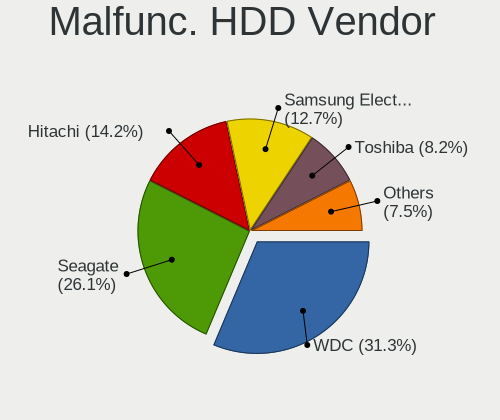

| Vendor              | Desktops | Drives | Percent |
|---------------------|----------|--------|---------|
| WDC                 | 42       | 53     | 31.82%  |
| Seagate             | 35       | 54     | 26.52%  |
| Hitachi             | 19       | 28     | 14.39%  |
| Samsung Electronics | 17       | 20     | 12.88%  |
| Toshiba             | 11       | 15     | 8.33%   |
| WD MediaMax         | 2        | 2      | 1.52%   |
| Maxtor              | 2        | 2      | 1.52%   |
| HGST                | 2        | 3      | 1.52%   |
| Fujitsu             | 2        | 2      | 1.52%   |

Malfunc. Drive Kind
-------------------

Kinds of faulty drives

| Kind | Desktops | Drives | Percent |
|------|----------|--------|---------|
| HDD  | 113      | 179    | 88.28%  |
| SSD  | 14       | 20     | 10.94%  |
| NVMe | 1        | 1      | 0.78%   |

Failed Drives
-------------

Failed drive models

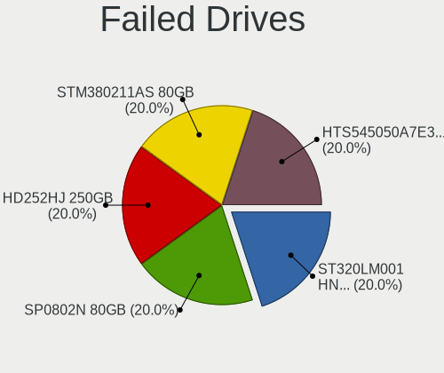

| Model                               | Desktops | Drives | Percent |
|-------------------------------------|----------|--------|---------|
| Seagate ST320LM001 HN-M320MBB 320GB | 1        | 1      | 20%     |
| Samsung Electronics SP0802N 80GB    | 1        | 1      | 20%     |
| Samsung Electronics HD252HJ 250GB   | 1        | 1      | 20%     |
| Maxtor STM380211AS 80GB             | 1        | 1      | 20%     |
| Hitachi HTS545050A7E380 500GB       | 1        | 1      | 20%     |

Failed Drive Vendor
-------------------

Failed drive vendors

| Vendor              | Desktops | Drives | Percent |
|---------------------|----------|--------|---------|
| Samsung Electronics | 2        | 2      | 40%     |
| Seagate             | 1        | 1      | 20%     |
| Maxtor              | 1        | 1      | 20%     |
| Hitachi             | 1        | 1      | 20%     |

Drive Status
------------

Number of failed and malfunc. drives

| Status   | Desktops | Drives | Percent |
|----------|----------|--------|---------|
| Works    | 237      | 626    | 50.97%  |
| Malfunc  | 126      | 200    | 27.1%   |
| Detected | 97       | 260    | 20.86%  |
| Failed   | 5        | 5      | 1.08%   |

Storage controller
------------------

Storage Vendor
--------------

Storage controller vendors

| Vendor                           | Desktops | Percent |
|----------------------------------|----------|---------|
| Intel                            | 190      | 40.25%  |
| AMD                              | 126      | 26.69%  |
| Nvidia                           | 51       | 10.81%  |
| Samsung Electronics              | 21       | 4.45%   |
| JMicron Technology               | 19       | 4.03%   |
| Marvell Technology Group         | 11       | 2.33%   |
| Kingston Technology Company      | 11       | 2.33%   |
| ASMedia Technology               | 10       | 2.12%   |
| Silicon Motion                   | 8        | 1.69%   |
| Phison Electronics               | 6        | 1.27%   |
| VIA Technologies                 | 5        | 1.06%   |
| Realtek Semiconductor            | 3        | 0.64%   |
| SanDisk                          | 2        | 0.42%   |
| Netac Technology                 | 2        | 0.42%   |
| Synopsys                         | 1        | 0.21%   |
| Silicon Integrated Systems [SiS] | 1        | 0.21%   |
| Micron/Crucial Technology        | 1        | 0.21%   |
| Micron Technology                | 1        | 0.21%   |
| MAXIO Technology (Hangzhou)      | 1        | 0.21%   |
| Integrated Technology Express    | 1        | 0.21%   |
| ADATA Technology                 | 1        | 0.21%   |

Storage Model
-------------

Storage controller models

| Model                                                                                   | Desktops | Percent |
|-----------------------------------------------------------------------------------------|----------|---------|
| AMD FCH SATA Controller [AHCI mode]                                                     | 48       | 7.24%   |
| AMD SB7x0/SB8x0/SB9x0 IDE Controller                                                    | 43       | 6.49%   |
| Nvidia MCP61 SATA Controller                                                            | 34       | 5.13%   |
| Nvidia MCP61 IDE                                                                        | 34       | 5.13%   |
| AMD SB7x0/SB8x0/SB9x0 SATA Controller [IDE mode]                                        | 32       | 4.83%   |
| Intel 8 Series/C220 Series Chipset Family 6-port SATA Controller 1 [AHCI mode]          | 25       | 3.77%   |
| AMD 400 Series Chipset SATA Controller                                                  | 25       | 3.77%   |
| Intel NM10/ICH7 Family SATA Controller [IDE mode]                                       | 24       | 3.62%   |
| AMD SB7x0/SB8x0/SB9x0 SATA Controller [AHCI mode]                                       | 22       | 3.32%   |
| Intel Q170/Q150/B150/H170/H110/Z170/CM236 Chipset SATA Controller [AHCI Mode]           | 15       | 2.26%   |
| Intel 82801G (ICH7 Family) IDE Controller                                               | 15       | 2.26%   |
| Samsung NVMe SSD Controller SM981/PM981/PM983                                           | 13       | 1.96%   |
| Intel 7 Series/C210 Series Chipset Family 6-port SATA Controller [AHCI mode]            | 13       | 1.96%   |
| Intel 6 Series/C200 Series Chipset Family 6 port Desktop SATA AHCI Controller           | 13       | 1.96%   |
| Intel 6 Series/C200 Series Chipset Family Desktop SATA Controller (IDE mode, ports 4-5) | 12       | 1.81%   |
| Intel 6 Series/C200 Series Chipset Family Desktop SATA Controller (IDE mode, ports 0-3) | 12       | 1.81%   |
| Intel 200 Series PCH SATA controller [AHCI mode]                                        | 12       | 1.81%   |
| AMD FCH IDE Controller                                                                  | 12       | 1.81%   |
| JMicron JMB368 IDE controller                                                           | 10       | 1.51%   |
| Intel Cannon Lake PCH SATA AHCI Controller                                              | 10       | 1.51%   |
| AMD 500 Series Chipset SATA Controller                                                  | 10       | 1.51%   |
| ASMedia ASM1061/ASM1062 Serial ATA Controller                                           | 9        | 1.36%   |
| Silicon Motion SM2263EN/SM2263XT (DRAM-less) NVMe SSD Controllers                       | 8        | 1.21%   |
| Nvidia MCP65 IDE                                                                        | 8        | 1.21%   |
| JMicron JMB363 SATA/IDE Controller                                                      | 7        | 1.06%   |
| AMD FCH SATA Controller D                                                               | 7        | 1.06%   |
| Nvidia MCP65 SATA Controller                                                            | 6        | 0.9%    |
| Intel 82801H (ICH8 Family) 4 port SATA Controller [IDE mode]                            | 6        | 0.9%    |
| Kingston Company A2000 NVMe SSD SM2263EN                                                | 5        | 0.75%   |
| Intel 9 Series Chipset Family SATA Controller [AHCI Mode]                               | 5        | 0.75%   |
| Intel 82801JI (ICH10 Family) 4 port SATA IDE Controller #1                              | 5        | 0.75%   |
| Intel 82801JI (ICH10 Family) 2 port SATA IDE Controller #2                              | 5        | 0.75%   |
| Intel 82801HR/HO/HH (ICH8R/DO/DH) 2 port SATA Controller [IDE mode]                     | 5        | 0.75%   |
| Intel 500 Series Chipset Family SATA AHCI Controller                                    | 5        | 0.75%   |
| Intel 5 Series/3400 Series Chipset 6 port SATA AHCI Controller                          | 5        | 0.75%   |
| AMD FCH SATA Controller [IDE mode]                                                      | 5        | 0.75%   |
| VIA VT6415 PATA IDE Host Controller                                                     | 4        | 0.6%    |
| Intel SATA Controller [RAID mode]                                                       | 4        | 0.6%    |
| Intel NM10/ICH7 Family SATA Controller [AHCI mode]                                      | 4        | 0.6%    |
| Intel 82801I (ICH9 Family) 2 port SATA Controller [IDE mode]                            | 4        | 0.6%    |

Storage Kind
------------

Kind of storage controller (IDE, SATA, NVMe, SAS, ...)

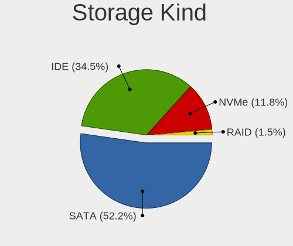

| Kind | Desktops | Percent |
|------|----------|---------|
| SATA | 258      | 52.23%  |
| IDE  | 173      | 35.02%  |
| NVMe | 57       | 11.54%  |
| RAID | 6        | 1.21%   |

Processor
---------

CPU Vendor
----------

Processor vendors

| Vendor | Desktops | Percent |
|--------|----------|---------|
| Intel  | 192      | 52.17%  |
| AMD    | 176      | 47.83%  |

CPU Model
---------

Processor models

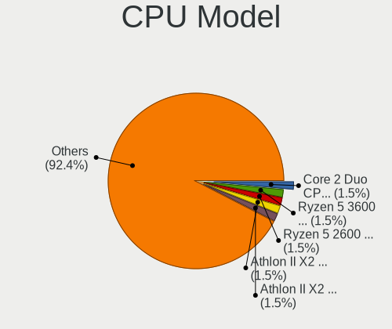

| Model                                       | Desktops | Percent |
|---------------------------------------------|----------|---------|
| AMD Ryzen 5 3600 6-Core Processor           | 6        | 1.63%   |
| AMD Ryzen 5 2600 Six-Core Processor         | 6        | 1.63%   |
| AMD Athlon II X2 245 Processor              | 6        | 1.63%   |
| AMD Athlon II X2 240 Processor              | 6        | 1.63%   |
| AMD Athlon 64 X2 Dual Core Processor 5600+  | 6        | 1.63%   |
| Intel Core 2 Duo CPU E8400 @ 3.00GHz        | 5        | 1.36%   |
| AMD Ryzen 7 2700 Eight-Core Processor       | 5        | 1.36%   |
| AMD Ryzen 3 2200G with Radeon Vega Graphics | 5        | 1.36%   |
| Intel Core i7-3770 CPU @ 3.40GHz            | 4        | 1.08%   |
| Intel Core i5-8400 CPU @ 2.80GHz            | 4        | 1.08%   |
| Intel Core i5-4570 CPU @ 3.20GHz            | 4        | 1.08%   |
| Intel Core 2 Duo CPU E8500 @ 3.16GHz        | 4        | 1.08%   |
| AMD Ryzen 5 5600X 6-Core Processor          | 4        | 1.08%   |
| AMD Ryzen 5 5600G with Radeon Graphics      | 4        | 1.08%   |
| AMD FX-4300 Quad-Core Processor             | 4        | 1.08%   |
| AMD Athlon II X2 215 Processor              | 4        | 1.08%   |
| AMD Athlon 64 X2 Dual Core Processor 5000+  | 4        | 1.08%   |
| Intel Core i5-4460 CPU @ 3.20GHz            | 3        | 0.81%   |
| Intel Core i5-3570 CPU @ 3.40GHz            | 3        | 0.81%   |
| Intel Core i5-3470 CPU @ 3.20GHz            | 3        | 0.81%   |
| Intel Core i5-3330 CPU @ 3.00GHz            | 3        | 0.81%   |
| Intel Core i5-2400 CPU @ 3.10GHz            | 3        | 0.81%   |
| Intel Celeron CPU G1840 @ 2.80GHz           | 3        | 0.81%   |
| AMD FX-8350 Eight-Core Processor            | 3        | 0.81%   |
| AMD FX-6300 Six-Core Processor              | 3        | 0.81%   |
| AMD Athlon II X3 450 Processor              | 3        | 0.81%   |
| AMD Athlon II X2 250 Processor              | 3        | 0.81%   |
| Intel Xeon CPU E5430 @ 2.66GHz              | 2        | 0.54%   |
| Intel Pentium Dual-Core CPU E6800 @ 3.33GHz | 2        | 0.54%   |
| Intel Pentium Dual CPU E2180 @ 2.00GHz      | 2        | 0.54%   |
| Intel Pentium CPU G620 @ 2.60GHz            | 2        | 0.54%   |
| Intel Pentium CPU G4560 @ 3.50GHz           | 2        | 0.54%   |
| Intel Pentium CPU G3260 @ 3.30GHz           | 2        | 0.54%   |
| Intel Pentium 4 CPU 3.20GHz                 | 2        | 0.54%   |
| Intel Pentium 4 CPU 2.80GHz                 | 2        | 0.54%   |
| Intel Core i7-9700K CPU @ 3.60GHz           | 2        | 0.54%   |
| Intel Core i7-8700K CPU @ 3.70GHz           | 2        | 0.54%   |
| Intel Core i7-7700K CPU @ 4.20GHz           | 2        | 0.54%   |
| Intel Core i5-9600K CPU @ 3.70GHz           | 2        | 0.54%   |
| Intel Core i5-9400F CPU @ 2.90GHz           | 2        | 0.54%   |

CPU Model Family
----------------

Processor model prefix

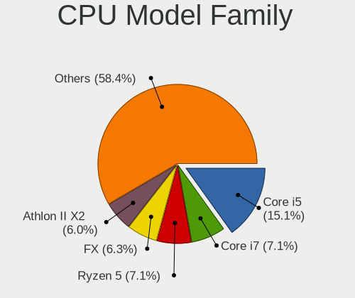

| Model                   | Desktops | Percent |
|-------------------------|----------|---------|
| Intel Core i5           | 55       | 14.91%  |
| Intel Core i7           | 26       | 7.05%   |
| AMD Ryzen 5             | 25       | 6.78%   |
| AMD Athlon II X2        | 24       | 6.5%    |
| AMD Athlon 64 X2        | 24       | 6.5%    |
| AMD FX                  | 22       | 5.96%   |
| Intel Celeron           | 19       | 5.15%   |
| Intel Pentium           | 17       | 4.61%   |
| Intel Core i3           | 14       | 3.79%   |
| Intel Core 2 Duo        | 13       | 3.52%   |
| AMD Ryzen 7             | 13       | 3.52%   |
| Intel Xeon              | 12       | 3.25%   |
| AMD Ryzen 3             | 10       | 2.71%   |
| AMD Athlon II X3        | 10       | 2.71%   |
| AMD Phenom II X4        | 9        | 2.44%   |
| Other                   | 6        | 1.63%   |
| Intel Atom              | 6        | 1.63%   |
| Intel Pentium Dual-Core | 5        | 1.36%   |
| Intel Pentium 4         | 5        | 1.36%   |
| AMD Athlon X4           | 5        | 1.36%   |
| AMD Athlon II X4        | 4        | 1.08%   |
| AMD A8                  | 4        | 1.08%   |
| Intel Pentium Dual      | 3        | 0.81%   |
| Intel Core i9           | 3        | 0.81%   |
| Intel Core 2 Quad       | 3        | 0.81%   |
| Intel Core 2            | 3        | 0.81%   |
| AMD Athlon 64           | 3        | 0.81%   |
| AMD Athlon              | 3        | 0.81%   |
| AMD A6                  | 3        | 0.81%   |
| AMD A10                 | 3        | 0.81%   |
| Intel Genuine           | 2        | 0.54%   |
| AMD Sempron             | 2        | 0.54%   |
| AMD A4                  | 2        | 0.54%   |
| Intel Pentium Gold      | 1        | 0.27%   |
| Intel Core 2 Extreme    | 1        | 0.27%   |
| AMD Ryzen 9             | 1        | 0.27%   |
| AMD Ryzen 3 PRO         | 1        | 0.27%   |
| AMD Phenom II X6        | 1        | 0.27%   |
| AMD Phenom II X3        | 1        | 0.27%   |
| AMD Phenom II X2        | 1        | 0.27%   |

CPU Cores
---------

Number of processor cores

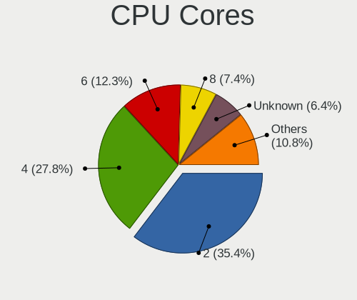

| Number  | Desktops | Percent |
|---------|----------|---------|
| 2       | 140      | 36.84%  |
| 4       | 103      | 27.11%  |
| 6       | 45       | 11.84%  |
| 8       | 26       | 6.84%   |
| Unknown | 26       | 6.84%   |
| 3       | 17       | 4.47%   |
| 1       | 17       | 4.47%   |
| 12      | 3        | 0.79%   |
| 10      | 2        | 0.53%   |
| 14      | 1        | 0.26%   |

CPU Sockets
-----------

Number of sockets

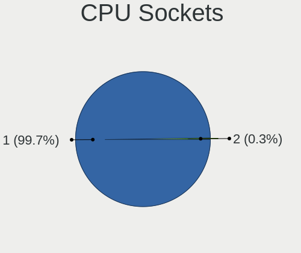

| Number | Desktops | Percent |
|--------|----------|---------|
| 1      | 367      | 99.73%  |
| 2      | 1        | 0.27%   |

CPU Threads
-----------

Threads per core (Hyper-Threading)

| Number  | Desktops | Percent |
|---------|----------|---------|
| 1       | 213      | 56.05%  |
| 2       | 141      | 37.11%  |
| Unknown | 26       | 6.84%   |

CPU Op-Modes
------------

CPU Operation Modes (32-bit, 64-bit)

| Op mode        | Desktops | Percent |
|----------------|----------|---------|
| 32-bit, 64-bit | 364      | 98.38%  |
| Unknown        | 4        | 1.08%   |
| 32-bit         | 2        | 0.54%   |

CPU Microcode
-------------

Microcode number

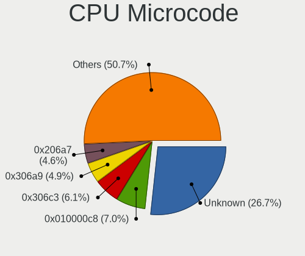

| Number     | Desktops | Percent |
|------------|----------|---------|
| Unknown    | 86       | 22.57%  |
| 0x010000c8 | 27       | 7.09%   |
| 0x306c3    | 25       | 6.56%   |
| 0x306a9    | 20       | 5.25%   |
| 0x206a7    | 19       | 4.99%   |
| 0x1067a    | 17       | 4.46%   |
| 0x010000c7 | 13       | 3.41%   |
| 0x06000852 | 10       | 2.62%   |
| 0x0800820d | 9        | 2.36%   |
| 0x06001119 | 9        | 2.36%   |
| 0x506e3    | 8        | 2.1%    |
| 0x906ea    | 7        | 1.84%   |
| 0x08101016 | 7        | 1.84%   |
| 0x906e9    | 6        | 1.57%   |
| 0x0600084f | 6        | 1.57%   |
| 0xa0653    | 5        | 1.31%   |
| 0x10676    | 5        | 1.31%   |
| 0x010000db | 5        | 1.31%   |
| 0x6fd      | 4        | 1.05%   |
| 0x03000027 | 4        | 1.05%   |
| 0x906ed    | 3        | 0.79%   |
| 0x106e5    | 3        | 0.79%   |
| 0x106ca    | 3        | 0.79%   |
| 0x10661    | 3        | 0.79%   |
| 0x0a20120a | 3        | 0.79%   |
| 0x08701021 | 3        | 0.79%   |
| 0x08001137 | 3        | 0.79%   |
| 0x06003106 | 3        | 0.79%   |
| 0x01000086 | 3        | 0.79%   |
| 0xf49      | 2        | 0.52%   |
| 0x6fb      | 2        | 0.52%   |
| 0x6f6      | 2        | 0.52%   |
| 0x206d7    | 2        | 0.52%   |
| 0x20655    | 2        | 0.52%   |
| 0x106c2    | 2        | 0.52%   |
| 0x0a50000d | 2        | 0.52%   |
| 0x0a50000c | 2        | 0.52%   |
| 0x0a201016 | 2        | 0.52%   |
| 0x0a201009 | 2        | 0.52%   |
| 0x08701013 | 2        | 0.52%   |

CPU Microarch
-------------

Microarchitecture

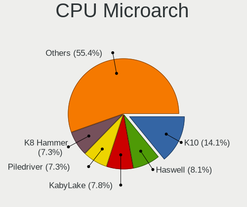

| Name             | Desktops | Percent |
|------------------|----------|---------|
| K10              | 53       | 14.32%  |
| Haswell          | 32       | 8.65%   |
| KabyLake         | 29       | 7.84%   |
| K8 Hammer        | 29       | 7.84%   |
| Piledriver       | 27       | 7.3%    |
| IvyBridge        | 24       | 6.49%   |
| SandyBridge      | 23       | 6.22%   |
| Penryn           | 23       | 6.22%   |
| Zen+             | 15       | 4.05%   |
| Zen              | 15       | 4.05%   |
| Core             | 15       | 4.05%   |
| Zen 3            | 13       | 3.51%   |
| Skylake          | 10       | 2.7%    |
| Zen 2            | 8        | 2.16%   |
| NetBurst         | 7        | 1.89%   |
| CometLake        | 7        | 1.89%   |
| Bonnell          | 6        | 1.62%   |
| K10 Llano        | 5        | 1.35%   |
| Unknown          | 5        | 1.35%   |
| Westmere         | 4        | 1.08%   |
| Bulldozer        | 4        | 1.08%   |
| Steamroller      | 3        | 0.81%   |
| Nehalem          | 3        | 0.81%   |
| Silvermont       | 2        | 0.54%   |
| Icelake          | 2        | 0.54%   |
| Excavator        | 2        | 0.54%   |
| Tremont          | 1        | 0.27%   |
| Goldmont         | 1        | 0.27%   |
| Bobcat           | 1        | 0.27%   |
| Alderlake Hybrid | 1        | 0.27%   |

Graphics
--------

GPU Vendor
----------

Vendors of graphics cards

| Vendor           | Desktops | Percent |
|------------------|----------|---------|
| Nvidia           | 216      | 55.38%  |
| AMD              | 95       | 24.36%  |
| Intel            | 78       | 20%     |
| ATI Technologies | 1        | 0.26%   |

GPU Model
---------

Graphics card models

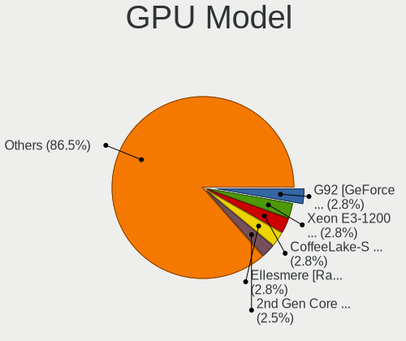

| Model                                                                       | Desktops | Percent |
|-----------------------------------------------------------------------------|----------|---------|
| Intel Xeon E3-1200 v3/4th Gen Core Processor Integrated Graphics Controller | 12       | 2.96%   |
| Nvidia G92 [GeForce 9800 GT]                                                | 11       | 2.71%   |
| AMD Ellesmere [Radeon RX 470/480/570/570X/580/580X/590]                     | 11       | 2.71%   |
| Nvidia GM107 [GeForce GTX 750 Ti]                                           | 10       | 2.46%   |
| Intel CoffeeLake-S GT2 [UHD Graphics 630]                                   | 10       | 2.46%   |
| Intel 2nd Generation Core Processor Family Integrated Graphics Controller   | 10       | 2.46%   |
| AMD Raven Ridge [Radeon Vega Series / Radeon Vega Mobile Series]            | 9        | 2.22%   |
| Nvidia G94 [GeForce 9600 GT]                                                | 8        | 1.97%   |
| Nvidia GT218 [GeForce 210]                                                  | 7        | 1.72%   |
| Nvidia GP108 [GeForce GT 1030]                                              | 7        | 1.72%   |
| Nvidia GP106 [GeForce GTX 1060 6GB]                                         | 7        | 1.72%   |
| Nvidia G96C [GeForce 9500 GT]                                               | 7        | 1.72%   |
| Nvidia G92 [GeForce GTS 250]                                                | 6        | 1.48%   |
| Nvidia G84 [GeForce 8600 GT]                                                | 6        | 1.48%   |
| Nvidia GP107 [GeForce GTX 1050 Ti]                                          | 5        | 1.23%   |
| Nvidia GK208B [GeForce GT 710]                                              | 5        | 1.23%   |
| Nvidia GK107 [GeForce GTX 650]                                              | 5        | 1.23%   |
| Nvidia GF116 [GeForce GTX 550 Ti]                                           | 5        | 1.23%   |
| Nvidia GF108 [GeForce GT 630]                                               | 5        | 1.23%   |
| Nvidia GF106 [GeForce GTS 450]                                              | 5        | 1.23%   |
| Nvidia C61 [GeForce 7025 / nForce 630a]                                     | 5        | 1.23%   |
| Intel 4 Series Chipset Integrated Graphics Controller                       | 5        | 1.23%   |
| AMD RS780L [Radeon 3000]                                                    | 5        | 1.23%   |
| Nvidia GP102 [GeForce GTX 1080 Ti]                                          | 4        | 0.99%   |
| Nvidia GK208 [GeForce GT 630 Rev. 2]                                        | 4        | 0.99%   |
| Nvidia GK106 [GeForce GTX 660]                                              | 4        | 0.99%   |
| Nvidia GK106 [GeForce GTX 650 Ti]                                           | 4        | 0.99%   |
| Intel 82945G/GZ Integrated Graphics Controller                              | 4        | 0.99%   |
| AMD Cape Verde PRO [Radeon HD 7750/8740 / R7 250E]                          | 4        | 0.99%   |
| Nvidia TU117 [GeForce GTX 1650]                                             | 3        | 0.74%   |
| Nvidia GT215 [GeForce GT 240]                                               | 3        | 0.74%   |
| Nvidia GP104 [GeForce GTX 1070]                                             | 3        | 0.74%   |
| Nvidia GM206 [GeForce GTX 950]                                              | 3        | 0.74%   |
| Nvidia GK104 [GeForce GTX 760]                                              | 3        | 0.74%   |
| Nvidia GF116 [GeForce GTS 450 Rev. 2]                                       | 3        | 0.74%   |
| Nvidia GF108 [GeForce GT 440]                                               | 3        | 0.74%   |
| Nvidia GF108 [GeForce GT 430]                                               | 3        | 0.74%   |
| Nvidia C61 [GeForce 6150SE nForce 430]                                      | 3        | 0.74%   |
| Intel IvyBridge GT2 [HD Graphics 4000]                                      | 3        | 0.74%   |
| Intel HD Graphics 630                                                       | 3        | 0.74%   |

GPU Combo
---------

Combinations of graphics cards

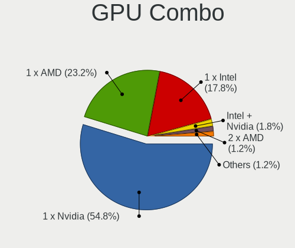

| Name           | Desktops | Percent |
|----------------|----------|---------|
| 1 x Nvidia     | 206      | 55.38%  |
| 1 x AMD        | 88       | 23.66%  |
| 1 x Intel      | 63       | 16.94%  |
| Intel + Nvidia | 7        | 1.88%   |
| 2 x AMD        | 5        | 1.34%   |
| 2 x Nvidia     | 1        | 0.27%   |
| Intel + AMD    | 1        | 0.27%   |
| AMD + Nvidia   | 1        | 0.27%   |

GPU Driver
----------

Free vs proprietary

| Driver      | Desktops | Percent |
|-------------|----------|---------|
| Free        | 265      | 67.95%  |
| Proprietary | 102      | 26.15%  |
| Unknown     | 23       | 5.9%    |

GPU Memory
----------

Total video memory

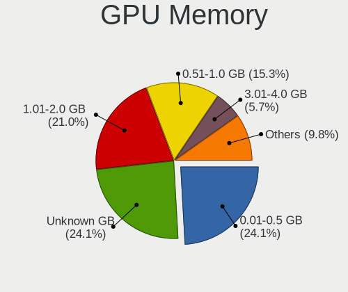

| Size in GB | Desktops | Percent |
|------------|----------|---------|
| 0.01-0.5   | 99       | 25.45%  |
| Unknown    | 86       | 22.11%  |
| 1.01-2.0   | 85       | 21.85%  |
| 0.51-1.0   | 61       | 15.68%  |
| 3.01-4.0   | 20       | 5.14%   |
| 7.01-8.0   | 19       | 4.88%   |
| 5.01-6.0   | 10       | 2.57%   |
| 2.01-3.0   | 4        | 1.03%   |
| 8.01-16.0  | 4        | 1.03%   |
| 4.01-5.0   | 1        | 0.26%   |

Monitor
-------

Monitor Vendor
--------------

Monitor vendors

| Vendor               | Desktops | Percent |
|----------------------|----------|---------|
| Samsung Electronics  | 90       | 23.56%  |
| Goldstar             | 90       | 23.56%  |
| Philips              | 38       | 9.95%   |
| BenQ                 | 26       | 6.81%   |
| AOC                  | 26       | 6.81%   |
| Dell                 | 22       | 5.76%   |
| ViewSonic            | 16       | 4.19%   |
| Acer                 | 13       | 3.4%    |
| Ancor Communications | 9        | 2.36%   |
| NEC Computers        | 7        | 1.83%   |
| Hewlett-Packard      | 6        | 1.57%   |
| Unknown              | 5        | 1.31%   |
| LG Electronics       | 5        | 1.31%   |
| Iiyama               | 4        | 1.05%   |
| XYK                  | 3        | 0.79%   |
| Gigabyte Technology  | 3        | 0.79%   |
| Plain Tree Systems   | 2        | 0.52%   |
| ASUSTek Computer     | 2        | 0.52%   |
| Toshiba              | 1        | 0.26%   |
| Sony                 | 1        | 0.26%   |
| SKK                  | 1        | 0.26%   |
| RGT                  | 1        | 0.26%   |
| Packard Bell         | 1        | 0.26%   |
| MStar                | 1        | 0.26%   |
| Mi                   | 1        | 0.26%   |
| JRY                  | 1        | 0.26%   |
| IBM                  | 1        | 0.26%   |
| HJW                  | 1        | 0.26%   |
| HannStar             | 1        | 0.26%   |
| Eizo                 | 1        | 0.26%   |
| BBK                  | 1        | 0.26%   |
| Apple                | 1        | 0.26%   |
| Aosiman              | 1        | 0.26%   |

Monitor Model
-------------

Monitor models

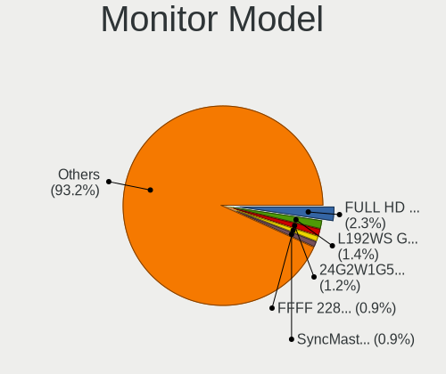

| Model                                                                 | Desktops | Percent |
|-----------------------------------------------------------------------|----------|---------|
| Goldstar FULL HD GSM5B55 1920x1080 480x270mm 21.7-inch                | 7        | 1.76%   |
| Goldstar L192WS GSM4B32 1440x900 410x256mm 19.0-inch                  | 6        | 1.51%   |
| Samsung Electronics SyncMaster SAM01B7 1280x1024 340x270mm 17.1-inch  | 4        | 1.01%   |
| Goldstar MP59G GSM5B34 1920x1080 480x270mm 21.7-inch                  | 4        | 1.01%   |
| Goldstar L1919S GSM4AF2 1280x1024 376x301mm 19.0-inch                 | 4        | 1.01%   |
| AOC 24B2W1 AOC2402 1920x1080 527x296mm 23.8-inch                      | 4        | 1.01%   |
| XYK DVI XYK2360 1920x1080 477x268mm 21.5-inch                         | 3        | 0.76%   |
| Unknown LCD Monitor FFFF 2288x1287 2550x2550mm 142.0-inch             | 3        | 0.76%   |
| Samsung Electronics SyncMaster SAM01E1 1280x1024 376x301mm 19.0-inch  | 3        | 0.76%   |
| Samsung Electronics S24F350 SAM0D20 1920x1080 521x293mm 23.5-inch     | 3        | 0.76%   |
| Samsung Electronics LCD Monitor SAM0902 1920x1080 890x500mm 40.2-inch | 3        | 0.76%   |
| Goldstar W1942 GSM4B6F 1440x900 408x255mm 18.9-inch                   | 3        | 0.76%   |
| Goldstar ULTRAWIDE GSM59F1 2560x1080 673x284mm 28.8-inch              | 3        | 0.76%   |
| Goldstar L1953S GSM4B3E 1280x1024 338x270mm 17.0-inch                 | 3        | 0.76%   |
| Goldstar IPS FULLHD GSM5AB6 1920x1080 480x270mm 21.7-inch             | 3        | 0.76%   |
| Dell U2412M DELA07A 1920x1200 518x324mm 24.1-inch                     | 3        | 0.76%   |
| BenQ G2220HD BNQ7820 1920x1080 480x270mm 21.7-inch                    | 3        | 0.76%   |
| Samsung Electronics T24D390 SAM0B6E 1920x1080 521x293mm 23.5-inch     | 2        | 0.5%    |
| Samsung Electronics SyncMaster SAM0589 1920x1080 521x293mm 23.5-inch  | 2        | 0.5%    |
| Samsung Electronics SyncMaster SAM03E5 1680x1050 474x296mm 22.0-inch  | 2        | 0.5%    |
| Samsung Electronics SyncMaster SAM03D2 1680x1050 474x296mm 22.0-inch  | 2        | 0.5%    |
| Samsung Electronics SyncMaster SAM03D0 1440x900 410x257mm 19.1-inch   | 2        | 0.5%    |
| Samsung Electronics SyncMaster SAM022B 1280x1024 338x270mm 17.0-inch  | 2        | 0.5%    |
| Samsung Electronics SyncMaster SAM011E 1280x1024 338x270mm 17.0-inch  | 2        | 0.5%    |
| Samsung Electronics SyncMaster SAM010B 1280x1024 338x270mm 17.0-inch  | 2        | 0.5%    |
| Samsung Electronics S22B350 SAM08D3 1920x1080 477x268mm 21.5-inch     | 2        | 0.5%    |
| Samsung Electronics LCD Monitor SAM07BF 1920x1080 886x498mm 40.0-inch | 2        | 0.5%    |
| Samsung Electronics C27F390 SAM0D32 1920x1080 598x336mm 27.0-inch     | 2        | 0.5%    |
| Samsung Electronics C24F390 SAM0D2C 1920x1080 521x293mm 23.5-inch     | 2        | 0.5%    |
| Philips PHL 284E5 PHLC0DE 1920x1080 621x341mm 27.9-inch               | 2        | 0.5%    |
| Philips PHL 246E7 PHLC107 1920x1080 521x293mm 23.5-inch               | 2        | 0.5%    |
| Philips 220SW PHL086F 1680x1050 474x296mm 22.0-inch                   | 2        | 0.5%    |
| Philips 19S PHL0878 1280x1024 376x301mm 19.0-inch                     | 2        | 0.5%    |
| Philips 191EL PHLC050 1366x768 410x230mm 18.5-inch                    | 2        | 0.5%    |
| NEC Computers LCD2090UXi NEC66B0 1600x1200 408x306mm 20.1-inch        | 2        | 0.5%    |
| Goldstar W2442 GSM56D9 1920x1080 531x299mm 24.0-inch                  | 2        | 0.5%    |
| Goldstar ULTRAWIDE GSM76FA 2560x1080 531x298mm 24.0-inch              | 2        | 0.5%    |
| Goldstar L1918S GSM4B31 1280x1024 376x301mm 19.0-inch                 | 2        | 0.5%    |
| Goldstar IPS FULLHD GSM5AB8 1920x1080 480x270mm 21.7-inch             | 2        | 0.5%    |
| Goldstar IPS FULLHD GSM5AB7 1920x1080 480x270mm 21.7-inch             | 2        | 0.5%    |

Monitor Resolution
------------------

Monitor screen resolution

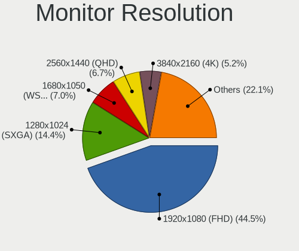

| Resolution         | Desktops | Percent |
|--------------------|----------|---------|
| 1920x1080 (FHD)    | 167      | 44.53%  |
| 1280x1024 (SXGA)   | 57       | 15.2%   |
| 1680x1050 (WSXGA+) | 27       | 7.2%    |
| 2560x1440 (QHD)    | 26       | 6.93%   |
| 1440x900 (WXGA+)   | 20       | 5.33%   |
| 3840x2160 (4K)     | 18       | 4.8%    |
| 1366x768 (WXGA)    | 15       | 4%      |
| 2560x1080          | 9        | 2.4%    |
| 1600x900 (HD+)     | 9        | 2.4%    |
| 1920x1200 (WUXGA)  | 4        | 1.07%   |
| 1024x768 (XGA)     | 4        | 1.07%   |
| 3440x1440          | 3        | 0.8%    |
| 2288x1287          | 3        | 0.8%    |
| 1360x768           | 3        | 0.8%    |
| 1600x1200          | 2        | 0.53%   |
| 1152x864           | 2        | 0.53%   |
| 4480x1200          | 1        | 0.27%   |
| 1920x540           | 1        | 0.27%   |
| 1920x1440          | 1        | 0.27%   |
| 1400x1050          | 1        | 0.27%   |
| 1280x960           | 1        | 0.27%   |
| Unknown            | 1        | 0.27%   |

Monitor Diagonal
----------------

Diagonal size in inches

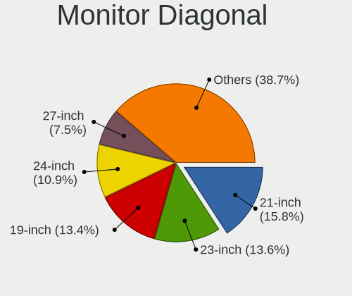

| Inches  | Desktops | Percent |
|---------|----------|---------|
| 21      | 69       | 17.97%  |
| 23      | 54       | 14.06%  |
| 19      | 53       | 13.8%   |
| 24      | 39       | 10.16%  |
| 27      | 30       | 7.81%   |
| 17      | 24       | 6.25%   |
| 18      | 18       | 4.69%   |
| Unknown | 18       | 4.69%   |
| 22      | 17       | 4.43%   |
| 20      | 13       | 3.39%   |
| 34      | 11       | 2.86%   |
| 31      | 10       | 2.6%    |
| 15      | 6        | 1.56%   |
| 40      | 5        | 1.3%    |
| 142     | 3        | 0.78%   |
| 54      | 3        | 0.78%   |
| 84      | 2        | 0.52%   |
| 46      | 2        | 0.52%   |
| 16      | 2        | 0.52%   |
| 72      | 1        | 0.26%   |
| 55      | 1        | 0.26%   |
| 52      | 1        | 0.26%   |
| 42      | 1        | 0.26%   |
| 13      | 1        | 0.26%   |

Monitor Width
-------------

Physical width

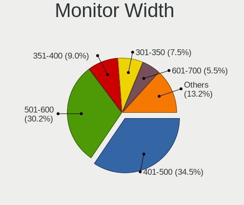

| Width in mm    | Desktops | Percent |
|----------------|----------|---------|
| 401-500        | 135      | 36.1%   |
| 501-600        | 113      | 30.21%  |
| 351-400        | 35       | 9.36%   |
| 301-350        | 30       | 8.02%   |
| Unknown        | 18       | 4.81%   |
| 601-700        | 12       | 3.21%   |
| 701-800        | 11       | 2.94%   |
| 1001-1500      | 7        | 1.87%   |
| 801-900        | 5        | 1.34%   |
| More than 2000 | 3        | 0.8%    |
| 1501-2000      | 3        | 0.8%    |
| 201-300        | 1        | 0.27%   |
| 901-1000       | 1        | 0.27%   |

Aspect Ratio
------------

Proportional relationship between the width and the height

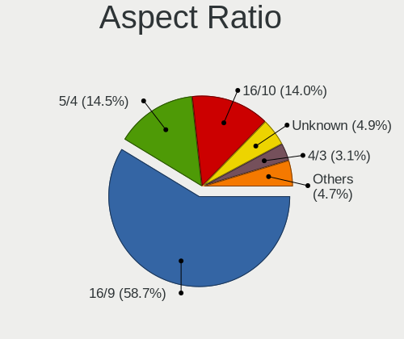

| Ratio   | Desktops | Percent |
|---------|----------|---------|
| 16/9    | 207      | 57.82%  |
| 5/4     | 55       | 15.36%  |
| 16/10   | 50       | 13.97%  |
| Unknown | 17       | 4.75%   |
| 4/3     | 12       | 3.35%   |
| 21/9    | 11       | 3.07%   |
| 3/2     | 3        | 0.84%   |
| 1.00    | 3        | 0.84%   |

Monitor Area
------------

Area in inch

| Area in inch | Desktops | Percent |
|----------------|----------|---------|
| 201-250        | 148      | 39.57%  |
| 151-200        | 79       | 21.12%  |
| 141-150        | 39       | 10.43%  |
| 301-350        | 30       | 8.02%   |
| 351-500        | 21       | 5.61%   |
| Unknown        | 18       | 4.81%   |
| More than 1000 | 11       | 2.94%   |
| 251-300        | 11       | 2.94%   |
| 501-1000       | 8        | 2.14%   |
| 101-110        | 4        | 1.07%   |
| 111-120        | 3        | 0.8%    |
| 121-130        | 1        | 0.27%   |
| 91-100         | 1        | 0.27%   |

Pixel Density
-------------

Pixels per inch

| Density | Desktops | Percent |
|---------|----------|---------|
| 51-100  | 240      | 66.48%  |
| 101-120 | 80       | 22.16%  |
| Unknown | 18       | 4.99%   |
| 1-50    | 13       | 3.6%    |
| 121-160 | 7        | 1.94%   |
| 161-240 | 3        | 0.83%   |

Multiple Monitors
-----------------

Total monitors connected

| Total | Desktops | Percent |
|-------|----------|---------|
| 1     | 307      | 81.87%  |
| 2     | 45       | 12%     |
| 0     | 21       | 5.6%    |
| 3     | 2        | 0.53%   |

Network
-------

Net Controller Vendor
---------------------

Controller vendors

| Vendor                                 | Desktops | Percent |
|----------------------------------------|----------|---------|
| Realtek Semiconductor                  | 253      | 53.04%  |
| Intel                                  | 49       | 10.27%  |
| Qualcomm Atheros                       | 42       | 8.81%   |
| Nvidia                                 | 39       | 8.18%   |
| Ralink Technology                      | 20       | 4.19%   |
| TP-Link                                | 17       | 3.56%   |
| D-Link                                 | 7        | 1.47%   |
| Marvell Technology Group               | 6        | 1.26%   |
| VIA Technologies                       | 5        | 1.05%   |
| Qualcomm Atheros Communications        | 4        | 0.84%   |
| Huawei Technologies                    | 4        | 0.84%   |
| D-Link System                          | 4        | 0.84%   |
| Broadcom                               | 4        | 0.84%   |
| Xiaomi                                 | 3        | 0.63%   |
| Sundance Technology Inc / IC Plus      | 3        | 0.63%   |
| Ralink                                 | 2        | 0.42%   |
| IMC Networks                           | 2        | 0.42%   |
| ZTE WCDMA Technologies MSM             | 1        | 0.21%   |
| Texas Instruments                      | 1        | 0.21%   |
| STMicroelectronics                     | 1        | 0.21%   |
| Sony Ericsson Mobile Communications AB | 1        | 0.21%   |
| Silicon Integrated Systems [SiS]       | 1        | 0.21%   |
| Motorola PCS                           | 1        | 0.21%   |
| Microsoft                              | 1        | 0.21%   |
| MediaTek                               | 1        | 0.21%   |
| HTC (High Tech Computer)               | 1        | 0.21%   |
| HMD Global                             | 1        | 0.21%   |
| Davicom Semiconductor                  | 1        | 0.21%   |
| Broadcom Limited                       | 1        | 0.21%   |
| Aquantia                               | 1        | 0.21%   |

Net Controller Model
--------------------

Controller models

| Model                                                                      | Desktops | Percent |
|----------------------------------------------------------------------------|----------|---------|
| Realtek RTL8111/8168/8211/8411 PCI Express Gigabit Ethernet Controller     | 216      | 41.78%  |
| Nvidia MCP61 Ethernet                                                      | 27       | 5.22%   |
| Ralink MT7601U Wireless Adapter                                            | 16       | 3.09%   |
| Realtek RTL810xE PCI Express Fast Ethernet controller                      | 12       | 2.32%   |
| Realtek RTL-8100/8101L/8139 PCI Fast Ethernet Adapter                      | 10       | 1.93%   |
| Intel Ethernet Connection (2) I219-V                                       | 10       | 1.93%   |
| Realtek RTL8125 2.5GbE Controller                                          | 9        | 1.74%   |
| Intel I211 Gigabit Network Connection                                      | 9        | 1.74%   |
| Qualcomm Atheros AR9287 Wireless Network Adapter (PCI-Express)             | 7        | 1.35%   |
| Realtek RTL8188EUS 802.11n Wireless Network Adapter                        | 6        | 1.16%   |
| Qualcomm Atheros QCA8171 Gigabit Ethernet                                  | 6        | 1.16%   |
| VIA VT6105/VT6106S [Rhine-III]                                             | 4        | 0.77%   |
| TP-Link Archer T2U PLUS [RTL8821AU]                                        | 4        | 0.77%   |
| Ralink RT5370 Wireless Adapter                                             | 4        | 0.77%   |
| Qualcomm Atheros Attansic L1 Gigabit Ethernet                              | 4        | 0.77%   |
| Qualcomm Atheros AR8131 Gigabit Ethernet                                   | 4        | 0.77%   |
| Nvidia MCP65 Ethernet                                                      | 4        | 0.77%   |
| Intel Wi-Fi 6 AX200                                                        | 4        | 0.77%   |
| Intel Ethernet Controller I225-V                                           | 4        | 0.77%   |
| Intel Ethernet Connection (7) I219-V                                       | 4        | 0.77%   |
| Intel 82579V Gigabit Network Connection                                    | 4        | 0.77%   |
| Xiaomi Mi/Redmi series (RNDIS)                                             | 3        | 0.58%   |
| TP-Link TL-WN822N Version 4 RTL8192EU                                      | 3        | 0.58%   |
| Sundance Inc / IC Plus IC Plus IP100A Integrated 10/100 Ethernet MAC + PHY | 3        | 0.58%   |
| Realtek RTL8821AE 802.11ac PCIe Wireless Network Adapter                   | 3        | 0.58%   |
| Realtek RTL8812AE 802.11ac PCIe Wireless Network Adapter                   | 3        | 0.58%   |
| Realtek RTL-8110SC/8169SC Gigabit Ethernet                                 | 3        | 0.58%   |
| Realtek 802.11ac NIC                                                       | 3        | 0.58%   |
| Qualcomm Atheros QCA6174 802.11ac Wireless Network Adapter                 | 3        | 0.58%   |
| Qualcomm Atheros AR9271 802.11n                                            | 3        | 0.58%   |
| Qualcomm Atheros AR8161 Gigabit Ethernet                                   | 3        | 0.58%   |
| Qualcomm Atheros AR8151 v2.0 Gigabit Ethernet                              | 3        | 0.58%   |
| Nvidia MCP55 Ethernet                                                      | 3        | 0.58%   |
| Marvell Group 88E8056 PCI-E Gigabit Ethernet Controller                    | 3        | 0.58%   |
| Intel Ethernet Connection (14) I219-V                                      | 3        | 0.58%   |
| Huawei VTR-L09                                                             | 3        | 0.58%   |
| D-Link System DGE-528T Gigabit Ethernet Adapter                            | 3        | 0.58%   |
| D-Link DWA-140 RangeBooster N Adapter(rev.B3) [Ralink RT5372]              | 3        | 0.58%   |
| TP-Link TL-WN722N v2/v3 [Realtek RTL8188EUS]                               | 2        | 0.39%   |
| TP-Link Archer T4U v2 [Realtek RTL8812AU]                                  | 2        | 0.39%   |

Wireless Vendor
---------------

Wireless vendors

| Vendor                          | Desktops | Percent |
|---------------------------------|----------|---------|
| Realtek Semiconductor           | 29       | 24.79%  |
| Ralink Technology               | 20       | 17.09%  |
| TP-Link                         | 17       | 14.53%  |
| Qualcomm Atheros                | 16       | 13.68%  |
| Intel                           | 14       | 11.97%  |
| D-Link                          | 7        | 5.98%   |
| Qualcomm Atheros Communications | 4        | 3.42%   |
| Ralink                          | 2        | 1.71%   |
| IMC Networks                    | 2        | 1.71%   |
| Texas Instruments               | 1        | 0.85%   |
| Microsoft                       | 1        | 0.85%   |
| MediaTek                        | 1        | 0.85%   |
| D-Link System                   | 1        | 0.85%   |
| Broadcom Limited                | 1        | 0.85%   |
| Broadcom                        | 1        | 0.85%   |

Wireless Model
--------------

Wireless models

| Model                                                                                | Desktops | Percent |
|--------------------------------------------------------------------------------------|----------|---------|
| Ralink MT7601U Wireless Adapter                                                      | 16       | 13.56%  |
| Qualcomm Atheros AR9287 Wireless Network Adapter (PCI-Express)                       | 7        | 5.93%   |
| Realtek RTL8188EUS 802.11n Wireless Network Adapter                                  | 6        | 5.08%   |
| TP-Link Archer T2U PLUS [RTL8821AU]                                                  | 4        | 3.39%   |
| Ralink RT5370 Wireless Adapter                                                       | 4        | 3.39%   |
| Intel Wi-Fi 6 AX200                                                                  | 4        | 3.39%   |
| TP-Link TL-WN822N Version 4 RTL8192EU                                                | 3        | 2.54%   |
| Realtek RTL8821AE 802.11ac PCIe Wireless Network Adapter                             | 3        | 2.54%   |
| Realtek RTL8812AE 802.11ac PCIe Wireless Network Adapter                             | 3        | 2.54%   |
| Realtek 802.11ac NIC                                                                 | 3        | 2.54%   |
| Qualcomm Atheros QCA6174 802.11ac Wireless Network Adapter                           | 3        | 2.54%   |
| Qualcomm Atheros AR9271 802.11n                                                      | 3        | 2.54%   |
| D-Link DWA-140 RangeBooster N Adapter(rev.B3) [Ralink RT5372]                        | 3        | 2.54%   |
| TP-Link TL-WN722N v2/v3 [Realtek RTL8188EUS]                                         | 2        | 1.69%   |
| TP-Link Archer T4U v2 [Realtek RTL8812AU]                                            | 2        | 1.69%   |
| TP-Link Archer T3U [Realtek RTL8812BU]                                               | 2        | 1.69%   |
| TP-Link 802.11n NIC                                                                  | 2        | 1.69%   |
| Realtek RTL8192CU 802.11n WLAN Adapter                                               | 2        | 1.69%   |
| Realtek RTL8188CE 802.11b/g/n WiFi Adapter                                           | 2        | 1.69%   |
| Realtek RTL-8185 IEEE 802.11a/b/g Wireless LAN Controller                            | 2        | 1.69%   |
| Qualcomm Atheros AR9485 Wireless Network Adapter                                     | 2        | 1.69%   |
| Qualcomm Atheros AR93xx Wireless Network Adapter                                     | 2        | 1.69%   |
| Intel Dual Band Wireless-AC 3168NGW [Stone Peak]                                     | 2        | 1.69%   |
| IMC Networks RTL8191S WLAN Adapter                                                   | 2        | 1.69%   |
| D-Link DWA-131 Wireless N Nano Adapter (Rev. E1) [Realtek RTL8192EU]                 | 2        | 1.69%   |
| TP-Link TL-WN821N v5/v6 [RTL8192EU]                                                  | 1        | 0.85%   |
| TP-Link Archer T4UH v2 [Realtek RTL8812AU]                                           | 1        | 0.85%   |
| Texas Instruments ACX 111 54Mbps Wireless Interface                                  | 1        | 0.85%   |
| Realtek RTL8822BE 802.11a/b/g/n/ac WiFi adapter                                      | 1        | 0.85%   |
| Realtek RTL8821CE 802.11ac PCIe Wireless Network Adapter                             | 1        | 0.85%   |
| Realtek RTL8812AU 802.11a/b/g/n/ac 2T2R DB WLAN Adapter                              | 1        | 0.85%   |
| Realtek RTL8723BE PCIe Wireless Network Adapter                                      | 1        | 0.85%   |
| Realtek RTL8192EE PCIe Wireless Network Adapter                                      | 1        | 0.85%   |
| Realtek RTL8192CE PCIe Wireless Network Adapter                                      | 1        | 0.85%   |
| Realtek RTL8188FTV 802.11b/g/n 1T1R 2.4G WLAN Adapter                                | 1        | 0.85%   |
| Realtek RTL8188EE Wireless Network Adapter                                           | 1        | 0.85%   |
| Realtek RTL8187 Wireless Adapter                                                     | 1        | 0.85%   |
| Ralink RT3060 Wireless 802.11n 1T/1R                                                 | 1        | 0.85%   |
| Ralink RT2790 Wireless 802.11n 1T/2R PCIe                                            | 1        | 0.85%   |
| Qualcomm Atheros TP-Link TL-WN821N v3 / TL-WN822N v2 802.11n [Atheros AR7010+AR9287] | 1        | 0.85%   |

Ethernet Vendor
---------------

Ethernet vendors

| Vendor                                 | Desktops | Percent |
|----------------------------------------|----------|---------|
| Realtek Semiconductor                  | 246      | 63.24%  |
| Intel                                  | 43       | 11.05%  |
| Nvidia                                 | 39       | 10.03%  |
| Qualcomm Atheros                       | 27       | 6.94%   |
| Marvell Technology Group               | 6        | 1.54%   |
| VIA Technologies                       | 5        | 1.29%   |
| Xiaomi                                 | 3        | 0.77%   |
| Sundance Technology Inc / IC Plus      | 3        | 0.77%   |
| Huawei Technologies                    | 3        | 0.77%   |
| D-Link System                          | 3        | 0.77%   |
| Broadcom                               | 3        | 0.77%   |
| ZTE WCDMA Technologies MSM             | 1        | 0.26%   |
| Sony Ericsson Mobile Communications AB | 1        | 0.26%   |
| Silicon Integrated Systems [SiS]       | 1        | 0.26%   |
| Motorola PCS                           | 1        | 0.26%   |
| HTC (High Tech Computer)               | 1        | 0.26%   |
| HMD Global                             | 1        | 0.26%   |
| Davicom Semiconductor                  | 1        | 0.26%   |
| Aquantia                               | 1        | 0.26%   |

Ethernet Model
--------------

Ethernet models

| Model                                                                      | Desktops | Percent |
|----------------------------------------------------------------------------|----------|---------|
| Realtek RTL8111/8168/8211/8411 PCI Express Gigabit Ethernet Controller     | 216      | 54.41%  |
| Nvidia MCP61 Ethernet                                                      | 27       | 6.8%    |
| Realtek RTL810xE PCI Express Fast Ethernet controller                      | 12       | 3.02%   |
| Realtek RTL-8100/8101L/8139 PCI Fast Ethernet Adapter                      | 10       | 2.52%   |
| Intel Ethernet Connection (2) I219-V                                       | 10       | 2.52%   |
| Realtek RTL8125 2.5GbE Controller                                          | 9        | 2.27%   |
| Intel I211 Gigabit Network Connection                                      | 9        | 2.27%   |
| Qualcomm Atheros QCA8171 Gigabit Ethernet                                  | 6        | 1.51%   |
| VIA VT6105/VT6106S [Rhine-III]                                             | 4        | 1.01%   |
| Qualcomm Atheros Attansic L1 Gigabit Ethernet                              | 4        | 1.01%   |
| Qualcomm Atheros AR8131 Gigabit Ethernet                                   | 4        | 1.01%   |
| Nvidia MCP65 Ethernet                                                      | 4        | 1.01%   |
| Intel Ethernet Controller I225-V                                           | 4        | 1.01%   |
| Intel Ethernet Connection (7) I219-V                                       | 4        | 1.01%   |
| Intel 82579V Gigabit Network Connection                                    | 4        | 1.01%   |
| Xiaomi Mi/Redmi series (RNDIS)                                             | 3        | 0.76%   |
| Sundance Inc / IC Plus IC Plus IP100A Integrated 10/100 Ethernet MAC + PHY | 3        | 0.76%   |
| Realtek RTL-8110SC/8169SC Gigabit Ethernet                                 | 3        | 0.76%   |
| Qualcomm Atheros AR8161 Gigabit Ethernet                                   | 3        | 0.76%   |
| Qualcomm Atheros AR8151 v2.0 Gigabit Ethernet                              | 3        | 0.76%   |
| Nvidia MCP55 Ethernet                                                      | 3        | 0.76%   |
| Marvell Group 88E8056 PCI-E Gigabit Ethernet Controller                    | 3        | 0.76%   |
| Intel Ethernet Connection (14) I219-V                                      | 3        | 0.76%   |
| Huawei VTR-L09                                                             | 3        | 0.76%   |
| D-Link System DGE-528T Gigabit Ethernet Adapter                            | 3        | 0.76%   |
| Qualcomm Atheros Killer E220x Gigabit Ethernet Controller                  | 2        | 0.5%    |
| Nvidia MCP67 Ethernet                                                      | 2        | 0.5%    |
| Marvell Group 88E8053 PCI-E Gigabit Ethernet Controller                    | 2        | 0.5%    |
| Broadcom NetLink BCM57781 Gigabit Ethernet PCIe                            | 2        | 0.5%    |
| ZTE WCDMA MSM Spreadtrum Phone                                             | 1        | 0.25%   |
| VIA VT6102/VT6103 [Rhine-II]                                               | 1        | 0.25%   |
| Sony Ericsson Mobile AB Android                                            | 1        | 0.25%   |
| Silicon Integrated Systems [SiS] SiS900 PCI Fast Ethernet                  | 1        | 0.25%   |
| Realtek RTL8169 PCI Gigabit Ethernet Controller                            | 1        | 0.25%   |
| Realtek RTL8153 Gigabit Ethernet Adapter                                   | 1        | 0.25%   |
| Qualcomm Atheros Killer E2500 Gigabit Ethernet Controller                  | 1        | 0.25%   |
| Qualcomm Atheros AR8152 v2.0 Fast Ethernet                                 | 1        | 0.25%   |
| Qualcomm Atheros AR8151 v1.0 Gigabit Ethernet                              | 1        | 0.25%   |
| Qualcomm Atheros AR8132 Fast Ethernet                                      | 1        | 0.25%   |
| Qualcomm Atheros AR8121/AR8113/AR8114 Gigabit or Fast Ethernet             | 1        | 0.25%   |

Net Controller Kind
-------------------

Ethernet, WiFi or modem

| Kind     | Desktops | Percent |
|----------|----------|---------|
| Ethernet | 364      | 76.31%  |
| WiFi     | 111      | 23.27%  |
| Modem    | 2        | 0.42%   |

Used Controller
---------------

Currently used network controller

| Kind     | Desktops | Percent |
|----------|----------|---------|
| Ethernet | 305      | 81.12%  |
| WiFi     | 71       | 18.88%  |

NICs
----

Total network controllers on board

| Total | Desktops | Percent |
|-------|----------|---------|
| 1     | 290      | 78.38%  |
| 2     | 72       | 19.46%  |
| 3     | 5        | 1.35%   |
| 0     | 3        | 0.81%   |

IPv6
----

IPv6 vs IPv4

| Used | Desktops | Percent |
|------|----------|---------|
| No   | 367      | 99.19%  |
| Yes  | 3        | 0.81%   |

Bluetooth
---------

Bluetooth Vendor
----------------

Controller vendors

| Vendor                     | Desktops | Percent |
|----------------------------|----------|---------|
| Cambridge Silicon Radio    | 27       | 44.26%  |
| Intel                      | 11       | 18.03%  |
| ASUSTek Computer           | 6        | 9.84%   |
| Realtek Semiconductor      | 5        | 8.2%    |
| IMC Networks               | 3        | 4.92%   |
| Integrated System Solution | 2        | 3.28%   |
| Broadcom                   | 2        | 3.28%   |
| TP-Link                    | 1        | 1.64%   |
| MediaTek                   | 1        | 1.64%   |
| Lite-On Technology         | 1        | 1.64%   |
| Actions                    | 1        | 1.64%   |
| Unknown                    | 1        | 1.64%   |

Bluetooth Model
---------------

Controller models

| Model                                               | Desktops | Percent |
|-----------------------------------------------------|----------|---------|
| Cambridge Silicon Radio Bluetooth Dongle (HCI mode) | 27       | 44.26%  |
| Realtek Bluetooth Radio                             | 5        | 8.2%    |
| Intel Bluetooth wireless interface                  | 3        | 4.92%   |
| Intel AX200 Bluetooth                               | 3        | 4.92%   |
| Intel Wireless-AC 3168 Bluetooth                    | 2        | 3.28%   |
| Integrated System Solution Bluetooth Device         | 2        | 3.28%   |
| IMC Networks Bluetooth Radio                        | 2        | 3.28%   |
| ASUS Qualcomm Bluetooth 4.1                         | 2        | 3.28%   |
| ASUS Broadcom BCM20702A0 Bluetooth                  | 2        | 3.28%   |
| ASUS Bluetooth Radio                                | 2        | 3.28%   |
| TP-Link UB500 Adapter                               | 1        | 1.64%   |
| MediaTek Wireless_Device                            | 1        | 1.64%   |
| Lite-On Bluetooth Device                            | 1        | 1.64%   |
| Intel Bluetooth Device                              | 1        | 1.64%   |
| Intel Bluetooth 9460/9560 Jefferson Peak (JfP)      | 1        | 1.64%   |
| Intel AX201 Bluetooth                               | 1        | 1.64%   |
| IMC Networks Atheros AR3012 Bluetooth 4.0 Adapter   | 1        | 1.64%   |
| Broadcom Bluetooth 2.0+eDR dongle                   | 1        | 1.64%   |
| Broadcom BCM2035B3 Bluetooth Adapter                | 1        | 1.64%   |
| Actions general adapter                             | 1        | 1.64%   |
| Unknown                                             | 1        | 1.64%   |

Sound
-----

Sound Vendor
------------

Sound card vendors

| Vendor                           | Desktops | Percent |
|----------------------------------|----------|---------|
| Nvidia                           | 193      | 31.59%  |
| Intel                            | 185      | 30.28%  |
| AMD                              | 153      | 25.04%  |
| C-Media Electronics              | 14       | 2.29%   |
| Creative Labs                    | 10       | 1.64%   |
| Texas Instruments                | 7        | 1.15%   |
| Logitech                         | 6        | 0.98%   |
| JMTek                            | 6        | 0.98%   |
| SteelSeries ApS                  | 2        | 0.33%   |
| M-Audio                          | 2        | 0.33%   |
| Generalplus Technology           | 2        | 0.33%   |
| Yealink Network Technology       | 1        | 0.16%   |
| Yamaha                           | 1        | 0.16%   |
| VIA Technologies                 | 1        | 0.16%   |
| Tenx Technology                  | 1        | 0.16%   |
| Synaptics                        | 1        | 0.16%   |
| Silicon Integrated Systems [SiS] | 1        | 0.16%   |
| ROCCAT                           | 1        | 0.16%   |
| Realtek Semiconductor            | 1        | 0.16%   |
| Razer USA                        | 1        | 0.16%   |
| Plantronics                      | 1        | 0.16%   |
| Pixart Imaging                   | 1        | 0.16%   |
| NXP Semiconductors               | 1        | 0.16%   |
| Nordic Semiconductor ASA         | 1        | 0.16%   |
| Micro Star International         | 1        | 0.16%   |
| Kingston Technology              | 1        | 0.16%   |
| JBL                              | 1        | 0.16%   |
| iCreate Technologies             | 1        | 0.16%   |
| Huawei Technologies              | 1        | 0.16%   |
| GYROCOM C&C                      | 1        | 0.16%   |
| GN Netcom                        | 1        | 0.16%   |
| FIFINE Microphones               | 1        | 0.16%   |
| ESS Technology                   | 1        | 0.16%   |
| Edifier Technology               | 1        | 0.16%   |
| Creative Technology              | 1        | 0.16%   |
| Conexant Systems                 | 1        | 0.16%   |
| BR25                             | 1        | 0.16%   |
| BEHRINGER International          | 1        | 0.16%   |
| ATI Technologies                 | 1        | 0.16%   |
| ASUSTek Computer                 | 1        | 0.16%   |

Sound Model
-----------

Sound card models

| Model                                                                      | Desktops | Percent |
|----------------------------------------------------------------------------|----------|---------|
| AMD SBx00 Azalia (Intel HDA)                                               | 53       | 7.57%   |
| Nvidia MCP61 High Definition Audio                                         | 33       | 4.71%   |
| Intel 8 Series/C220 Series Chipset High Definition Audio Controller        | 26       | 3.71%   |
| Intel NM10/ICH7 Family High Definition Audio Controller                    | 25       | 3.57%   |
| Intel 6 Series/C200 Series Chipset Family High Definition Audio Controller | 25       | 3.57%   |
| Intel 7 Series/C216 Chipset Family High Definition Audio Controller        | 18       | 2.57%   |
| AMD FCH Azalia Controller                                                  | 18       | 2.57%   |
| AMD Family 17h/19h HD Audio Controller                                     | 18       | 2.57%   |
| AMD Family 17h (Models 00h-0fh) HD Audio Controller                        | 17       | 2.43%   |
| Nvidia GF108 High Definition Audio Controller                              | 15       | 2.14%   |
| Intel 100 Series/C230 Series Chipset Family HD Audio Controller            | 15       | 2.14%   |
| AMD Oland/Hainan/Cape Verde/Pitcairn HDMI Audio [Radeon HD 7000 Series]    | 14       | 2%      |
| Nvidia High Definition Audio Controller                                    | 13       | 1.86%   |
| AMD Starship/Matisse HD Audio Controller                                   | 13       | 1.86%   |
| Nvidia GK208 HDMI/DP Audio Controller                                      | 12       | 1.71%   |
| Intel 200 Series PCH HD Audio                                              | 12       | 1.71%   |
| Intel Xeon E3-1200 v3/4th Gen Core Processor HD Audio Controller           | 11       | 1.57%   |
| Intel Cannon Lake PCH cAVS                                                 | 11       | 1.57%   |
| AMD Raven/Raven2/Fenghuang HDMI/DP Audio Controller                        | 11       | 1.57%   |
| AMD Ellesmere HDMI Audio [Radeon RX 470/480 / 570/580/590]                 | 11       | 1.57%   |
| Nvidia GM107 High Definition Audio Controller [GeForce 940MX]              | 10       | 1.43%   |
| Nvidia GP106 High Definition Audio Controller                              | 9        | 1.29%   |
| Nvidia GK107 HDMI Audio Controller                                         | 9        | 1.29%   |
| Nvidia GK106 HDMI Audio Controller                                         | 9        | 1.29%   |
| Nvidia MCP65 High Definition Audio                                         | 8        | 1.14%   |
| Nvidia GF116 High Definition Audio Controller                              | 8        | 1.14%   |
| Nvidia GP108 High Definition Audio Controller                              | 7        | 1%      |
| Nvidia GP107GL High Definition Audio Controller                            | 7        | 1%      |
| Intel 82801JI (ICH10 Family) HD Audio Controller                           | 7        | 1%      |
| Intel 82801H (ICH8 Family) HD Audio Controller                             | 7        | 1%      |
| Nvidia TU116 High Definition Audio Controller                              | 6        | 0.86%   |
| Nvidia GM206 High Definition Audio Controller                              | 6        | 0.86%   |
| Nvidia GK104 HDMI Audio Controller                                         | 6        | 0.86%   |
| Intel 5 Series/3400 Series Chipset High Definition Audio                   | 6        | 0.86%   |
| AMD Renoir Radeon High Definition Audio Controller                         | 6        | 0.86%   |
| Nvidia GP104 High Definition Audio Controller                              | 5        | 0.71%   |
| Nvidia GF106 High Definition Audio Controller                              | 5        | 0.71%   |
| Intel 9 Series Chipset Family HD Audio Controller                          | 5        | 0.71%   |
| C-Media Electronics USB Audio Device                                       | 5        | 0.71%   |
| AMD Trinity HDMI Audio Controller                                          | 5        | 0.71%   |

Memory
------

Memory Vendor
-------------

Memory module vendors

| Vendor              | Desktops | Percent |
|---------------------|----------|---------|
| Unknown             | 131      | 38.3%   |
| Kingston            | 55       | 16.08%  |
| Crucial             | 33       | 9.65%   |
| SK hynix            | 18       | 5.26%   |
| G.Skill             | 16       | 4.68%   |
| Samsung Electronics | 15       | 4.39%   |
| Patriot             | 14       | 4.09%   |
| Micron Technology   | 11       | 3.22%   |
| GOODRAM             | 7        | 2.05%   |
| Corsair             | 7        | 2.05%   |
| Silicon Power       | 6        | 1.75%   |
| GeIL                | 4        | 1.17%   |
| Team                | 3        | 0.88%   |
| A-DATA Technology   | 3        | 0.88%   |
| Unknown             | 3        | 0.88%   |
| Transcend           | 2        | 0.58%   |
| TakeMS              | 2        | 0.58%   |
| Nanya Technology    | 2        | 0.58%   |
| Elpida              | 2        | 0.58%   |
| Apacer              | 2        | 0.58%   |
| Wilk Elektronik     | 1        | 0.29%   |
| Qumo                | 1        | 0.29%   |
| Kllisre             | 1        | 0.29%   |
| Kingmax             | 1        | 0.29%   |
| ASint Technology    | 1        | 0.29%   |
| AMD                 | 1        | 0.29%   |

Memory Model
------------

Memory module models

| Model                                                  | Desktops | Percent |
|--------------------------------------------------------|----------|---------|
| Unknown RAM Module 2048MB DIMM 800MT/s                 | 7        | 1.8%    |
| Unknown RAM Module 4096MB DIMM 1333MT/s                | 6        | 1.55%   |
| Unknown RAM Module 1024MB DIMM SDRAM                   | 6        | 1.55%   |
| Unknown RAM Module 2GB DIMM 800MT/s                    | 5        | 1.29%   |
| Unknown RAM Module 2048MB DIMM SDRAM                   | 5        | 1.29%   |
| Unknown RAM Module 2048MB DIMM DDR2                    | 5        | 1.29%   |
| Unknown RAM Module 4GB DIMM 1600MT/s                   | 4        | 1.03%   |
| Unknown RAM Module 4096MB DIMM DDR3 1600MT/s           | 4        | 1.03%   |
| Unknown RAM Module 2048MB DIMM 400MT/s                 | 4        | 1.03%   |
| Unknown RAM Module 1024MB DIMM DDR2                    | 4        | 1.03%   |
| Unknown RAM Module 1024MB DIMM 667MT/s                 | 4        | 1.03%   |
| Kingston RAM KHX3200C16D4/16GX 16GB DIMM DDR4 3600MT/s | 4        | 1.03%   |
| Unknown RAM Module 4096MB DIMM 1600MT/s                | 3        | 0.77%   |
| Unknown RAM Module 4096MB DIMM 1066MT/s                | 3        | 0.77%   |
| Unknown RAM Module 2048MB DIMM DDR2 333MT/s            | 3        | 0.77%   |
| Unknown RAM Module 2048MB DIMM DDR 800MT/s             | 3        | 0.77%   |
| Unknown RAM Module 2048MB DIMM 1333MT/s                | 3        | 0.77%   |
| Unknown RAM Module 1024MB DIMM 800MT/s                 | 3        | 0.77%   |
| Unknown RAM Module 1024MB DIMM                         | 3        | 0.77%   |
| Patriot RAM 3200 C16 Series 8GB DIMM DDR4 3600MT/s     | 3        | 0.77%   |
| Kingston RAM KHX2666C16/8G 8GB DIMM DDR4 3466MT/s      | 3        | 0.77%   |
| Kingston RAM KHX1600C9D3/4GX 4GB DIMM DDR3 1600MT/s    | 3        | 0.77%   |
| Kingston RAM 99U5595-003.A00LF 2GB DIMM DDR3 1600MT/s  | 3        | 0.77%   |
| G.Skill RAM F4-2666C19-8GIS 8192MB DIMM DDR4 3200MT/s  | 3        | 0.77%   |
| Crucial RAM CT51264BA160BJ.M8F 4GB DIMM DDR3 1600MT/s  | 3        | 0.77%   |
| Unknown                                                | 3        | 0.77%   |
| Unknown RAM Module 8GB DIMM 1600MT/s                   | 2        | 0.52%   |
| Unknown RAM Module 8192MB DIMM 1333MT/s                | 2        | 0.52%   |
| Unknown RAM Module 512MB DIMM SDRAM                    | 2        | 0.52%   |
| Unknown RAM Module 512MB DIMM DDR2 667MT/s             | 2        | 0.52%   |
| Unknown RAM Module 4096MB DIMM DDR 1333MT/s            | 2        | 0.52%   |
| Unknown RAM Module 4096MB DIMM 800MT/s                 | 2        | 0.52%   |
| Unknown RAM Module 4096MB DIMM 400MT/s                 | 2        | 0.52%   |
| Unknown RAM Module 2GB DIMM SDRAM                      | 2        | 0.52%   |
| Unknown RAM Module 2GB DIMM DDR2 800MT/s               | 2        | 0.52%   |
| Unknown RAM Module 2048MB DIMM SDRAM 800MT/s           | 2        | 0.52%   |
| Unknown RAM Module 2048MB DIMM SDRAM 533MT/s           | 2        | 0.52%   |
| Unknown RAM Module 2048MB DIMM DDR2 800MT/s            | 2        | 0.52%   |
| Unknown RAM Module 2048MB DIMM DDR2 667MT/s            | 2        | 0.52%   |
| Unknown RAM Module 2048MB DIMM DDR2 533MT/s            | 2        | 0.52%   |

Memory Kind
-----------

Memory module kinds

| Kind    | Desktops | Percent |
|---------|----------|---------|
| DDR3    | 99       | 31.94%  |
| DDR4    | 76       | 24.52%  |
| Unknown | 66       | 21.29%  |
| DDR2    | 38       | 12.26%  |
| SDRAM   | 24       | 7.74%   |
| DDR     | 6        | 1.94%   |
| DDR5    | 1        | 0.32%   |

Memory Form Factor
------------------

Physical design of the memory module

| Name   | Desktops | Percent |
|--------|----------|---------|
| DIMM   | 295      | 97.04%  |
| SODIMM | 9        | 2.96%   |

Memory Size
-----------

Memory module size

| Size  | Desktops | Percent |
|-------|----------|---------|
| 4096  | 99       | 28.13%  |
| 2048  | 97       | 27.56%  |
| 8192  | 73       | 20.74%  |
| 1024  | 37       | 10.51%  |
| 16384 | 27       | 7.67%   |
| 512   | 9        | 2.56%   |
| 32768 | 7        | 1.99%   |
| 256   | 2        | 0.57%   |
| 16    | 1        | 0.28%   |

Memory Speed
------------

Memory module speed

| Speed   | Desktops | Percent |
|---------|----------|---------|
| 1600    | 68       | 20.36%  |
| 1333    | 35       | 10.48%  |
| 800     | 33       | 9.88%   |
| Unknown | 27       | 8.08%   |
| 2400    | 23       | 6.89%   |
| 3200    | 17       | 5.09%   |
| 667     | 17       | 5.09%   |
| 3600    | 13       | 3.89%   |
| 400     | 11       | 3.29%   |
| 1066    | 10       | 2.99%   |
| 533     | 9        | 2.69%   |
| 2133    | 8        | 2.4%    |
| 3466    | 6        | 1.8%    |
| 2667    | 6        | 1.8%    |
| 1866    | 5        | 1.5%    |
| 333     | 5        | 1.5%    |
| 3733    | 4        | 1.2%    |
| 1867    | 4        | 1.2%    |
| 3400    | 3        | 0.9%    |
| 49926   | 2        | 0.6%    |
| 3800    | 2        | 0.6%    |
| 2933    | 2        | 0.6%    |
| 2666    | 2        | 0.6%    |
| 1800    | 2        | 0.6%    |
| 1067    | 2        | 0.6%    |
| 266     | 2        | 0.6%    |
| 6000    | 1        | 0.3%    |
| 3866    | 1        | 0.3%    |
| 3533    | 1        | 0.3%    |
| 3007    | 1        | 0.3%    |
| 3000    | 1        | 0.3%    |
| 2733    | 1        | 0.3%    |
| 2187    | 1        | 0.3%    |
| 2134    | 1        | 0.3%    |
| 2048    | 1        | 0.3%    |
| 1648    | 1        | 0.3%    |
| 1639    | 1        | 0.3%    |
| 792     | 1        | 0.3%    |
| 666     | 1        | 0.3%    |
| 200     | 1        | 0.3%    |

Printers & scanners
-------------------

Printer Vendor
--------------

Printer device vendors

| Vendor                | Desktops | Percent |
|-----------------------|----------|---------|
| Canon                 | 6        | 33.33%  |
| Hewlett-Packard       | 5        | 27.78%  |
| Seiko Epson           | 4        | 22.22%  |
| Samsung Electronics   | 1        | 5.56%   |
| QinHeng Electronics   | 1        | 5.56%   |
| Lexmark International | 1        | 5.56%   |

Printer Model
-------------

Printer device models

| Model                             | Desktops | Percent |
|-----------------------------------|----------|---------|
| Canon LBP6030w/6018w              | 2        | 10.53%  |
| Seiko Epson M100 Series           | 1        | 5.26%   |
| Seiko Epson L805 Series           | 1        | 5.26%   |
| Seiko Epson L360 Series           | 1        | 5.26%   |
| Seiko Epson ET-1810 Series        | 1        | 5.26%   |
| Samsung SCX-4200 series           | 1        | 5.26%   |
| QinHeng CH340S                    | 1        | 5.26%   |
| Lexmark International Z35 Printer | 1        | 5.26%   |
| HP LaserJet P2055 series          | 1        | 5.26%   |
| HP LaserJet P1006                 | 1        | 5.26%   |
| HP LaserJet P1005                 | 1        | 5.26%   |
| HP LaserJet 1300                  | 1        | 5.26%   |
| HP DeskJet 840c                   | 1        | 5.26%   |
| Canon MF4410                      | 1        | 5.26%   |
| Canon MF4010 series               | 1        | 5.26%   |
| Canon MF3010                      | 1        | 5.26%   |
| Canon G1000 series                | 1        | 5.26%   |
| Canon CAPT USB Device             | 1        | 5.26%   |

Scanner Vendor
--------------

Scanner device vendors

| Vendor             | Desktops | Percent |
|--------------------|----------|---------|
| Canon              | 4        | 66.67%  |
| Ultima Electronics | 1        | 16.67%  |
| Seiko Epson        | 1        | 16.67%  |

Scanner Model
-------------

Scanner device models

| Model                                                                                 | Desktops | Percent |
|---------------------------------------------------------------------------------------|----------|---------|
| Ultima Artec Ultima 2000 (GT6801 based)/Lifetec LT9385/ScanMagic 1200 UB Plus Scanner | 1        | 16.67%  |
| Seiko Epson Stylus Photo RX500/510                                                    | 1        | 16.67%  |
| Canon CanoScan N670U/N676U/LiDE 20                                                    | 1        | 16.67%  |
| Canon CanoScan LiDE 600F                                                              | 1        | 16.67%  |
| Canon CanoScan LiDE 60                                                                | 1        | 16.67%  |
| Canon CanoScan LIDE 25                                                                | 1        | 16.67%  |

Camera
------

Camera Vendor
-------------

Camera device vendors

| Vendor                      | Desktops | Percent |
|-----------------------------|----------|---------|
| Logitech                    | 31       | 38.75%  |
| Z-Star Microelectronics     | 12       | 15%     |
| Microdia                    | 9        | 11.25%  |
| Realtek Semiconductor       | 4        | 5%      |
| Microsoft                   | 3        | 3.75%   |
| lihappe8                    | 3        | 3.75%   |
| Cubeternet                  | 3        | 3.75%   |
| Aveo Technology             | 3        | 3.75%   |
| YGTek                       | 1        | 1.25%   |
| Silicon Motion              | 1        | 1.25%   |
| Samsung Electronics         | 1        | 1.25%   |
| Razer USA                   | 1        | 1.25%   |
| Nokia Mobile Phones         | 1        | 1.25%   |
| KYE Systems (Mouse Systems) | 1        | 1.25%   |
| IMC Networks                | 1        | 1.25%   |
| GEMBIRD                     | 1        | 1.25%   |
| Fly                         | 1        | 1.25%   |
| eMPIA Technology            | 1        | 1.25%   |
| Arkmicro Technologies       | 1        | 1.25%   |
| Alcor Micro                 | 1        | 1.25%   |

Camera Model
------------

Camera device models

| Model                                              | Desktops | Percent |
|----------------------------------------------------|----------|---------|
| Logitech Webcam C270                               | 15       | 18.75%  |
| Z-Star A4 TECH USB2.0 PC Camera J                  | 5        | 6.25%   |
| Microdia Camera                                    | 5        | 6.25%   |
| Logitech Webcam C310                               | 5        | 6.25%   |
| Z-Star Venus USB2.0 Camera                         | 4        | 5%      |
| Microdia USB 2.0 Camera                            | 3        | 3.75%   |
| Logitech Webcam C210                               | 3        | 3.75%   |
| lihappe8 USB 2.0 Camera                            | 3        | 3.75%   |
| Z-Star Vimicro USB Camera (Altair)                 | 2        | 2.5%    |
| Realtek FULL HD 1080P Webcam                       | 2        | 2.5%    |
| Logitech HD Pro Webcam C920                        | 2        | 2.5%    |
| Cubeternet USB2.0 Camera                           | 2        | 2.5%    |
| Aveo USB2.0 Camera                                 | 2        | 2.5%    |
| Z-Star A4 TECH HD PC Camera                        | 1        | 1.25%   |
| YGTek Webcam                                       | 1        | 1.25%   |
| Silicon Motion Silicon Motion Camera               | 1        | 1.25%   |
| Samsung Galaxy series, misc. (MTP mode)            | 1        | 1.25%   |
| Realtek USB Camera                                 | 1        | 1.25%   |
| Realtek Integrated_Webcam_HD                       | 1        | 1.25%   |
| Razer USA Gaming Webcam [Kiyo]                     | 1        | 1.25%   |
| Nokia Mobile Phones Lumia 620/920                  | 1        | 1.25%   |
| Microsoft LifeCam Studio                           | 1        | 1.25%   |
| Microsoft LifeCam NX-6000                          | 1        | 1.25%   |
| Microsoft LifeCam Cinema                           | 1        | 1.25%   |
| Microdia Integrated Camera                         | 1        | 1.25%   |
| Logitech Webcam C200                               | 1        | 1.25%   |
| Logitech Webcam C170                               | 1        | 1.25%   |
| Logitech Webcam C110                               | 1        | 1.25%   |
| Logitech Quickcam 3000 For Business                | 1        | 1.25%   |
| Logitech HD Webcam C510                            | 1        | 1.25%   |
| Logitech BRIO Ultra HD Webcam                      | 1        | 1.25%   |
| KYE Systems (Mouse Systems) Genius iSlim 2000AF V2 | 1        | 1.25%   |
| IMC Networks USB2.0 UVC HD Webcam                  | 1        | 1.25%   |
| GEMBIRD USB2.0 PC CAMERA                           | 1        | 1.25%   |
| Fly Life Jet                                       | 1        | 1.25%   |
| eMPIA YW MS2300D                                   | 1        | 1.25%   |
| Cubeternet GL-UPC822 UVC WebCam                    | 1        | 1.25%   |
| Aveo Camera                                        | 1        | 1.25%   |
| Arkmicro USB2.0 PC CAMERA                          | 1        | 1.25%   |
| Alcor Micro USB 2.0 PC cam                         | 1        | 1.25%   |

Security
--------

Fingerprint Vendor
------------------

Fingerprint sensor vendors

Zero info for selected period =(

Fingerprint Model
-----------------

Fingerprint sensor models

Zero info for selected period =(

Chipcard Vendor
---------------

Chipcard module vendors

Zero info for selected period =(

Chipcard Model
--------------

Chipcard module models

Zero info for selected period =(

Unsupported
-----------

Unsupported Devices
-------------------

Total unsupported devices on board

| Total | Desktops | Percent |
|-------|----------|---------|
| 0     | 332      | 87.37%  |
| 1     | 47       | 12.37%  |
| 3     | 1        | 0.26%   |

Unsupported Device Types
------------------------

Types of unsupported devices

| Type                     | Desktops | Percent |
|--------------------------|----------|---------|
| Graphics card            | 30       | 61.22%  |
| Net/wireless             | 6        | 12.24%  |
| Communication controller | 5        | 10.2%   |
| Multimedia controller    | 3        | 6.12%   |
| Sound                    | 2        | 4.08%   |
| Camera                   | 2        | 4.08%   |
| Bluetooth                | 1        | 2.04%   |

