Linux in Belarus - Tested Hardware & Statistics (Notebooks)
-----------------------------------------------------------

A project to collect tested hardware configurations for Linux in Belarus.

Anyone can contribute to this report by the [hw-probe](https://github.com/linuxhw/hw-probe) tool:

    sudo -E hw-probe -all -upload

Please contribute! Especially if your hardware is rare.

Contents
--------

* [ Test Cases ](#test-cases)

* [ System ](#system)
  - [ OS                       ](#os)
  - [ OS Family                ](#os-family)
  - [ Kernel                   ](#kernel)
  - [ Kernel Family            ](#kernel-family)
  - [ Kernel Major Ver.        ](#kernel-major-ver)
  - [ Arch                     ](#arch)
  - [ DE                       ](#de)
  - [ Display Server           ](#display-server)
  - [ Display Manager          ](#display-manager)
  - [ OS Lang                  ](#os-lang)
  - [ Boot Mode                ](#boot-mode)
  - [ Filesystem               ](#filesystem)
  - [ Part. scheme             ](#part-scheme)
  - [ Dual Boot with Linux/BSD ](#dual-boot-with-linuxbsd)
  - [ Dual Boot (Win)          ](#dual-boot-win)

* [ Board ](#board)
  - [ Vendor                   ](#vendor)
  - [ Model                    ](#model)
  - [ Model Family             ](#model-family)
  - [ MFG Year                 ](#mfg-year)
  - [ Form Factor              ](#form-factor)
  - [ Secure Boot              ](#secure-boot)
  - [ Coreboot                 ](#coreboot)
  - [ RAM Size                 ](#ram-size)
  - [ RAM Used                 ](#ram-used)
  - [ Total Drives             ](#total-drives)
  - [ Has CD-ROM               ](#has-cd-rom)
  - [ Has Ethernet             ](#has-ethernet)
  - [ Has WiFi                 ](#has-wifi)
  - [ Has Bluetooth            ](#has-bluetooth)

* [ Location ](#location)
  - [ Country                  ](#country)
  - [ City                     ](#city)

* [ Drives ](#drives)
  - [ Drive Vendor             ](#drive-vendor)
  - [ Drive Model              ](#drive-model)
  - [ HDD Vendor               ](#hdd-vendor)
  - [ SSD Vendor               ](#ssd-vendor)
  - [ Drive Kind               ](#drive-kind)
  - [ Drive Connector          ](#drive-connector)
  - [ Drive Size               ](#drive-size)
  - [ Space Total              ](#space-total)
  - [ Space Used               ](#space-used)
  - [ Malfunc. Drives          ](#malfunc-drives)
  - [ Malfunc. Drive Vendor    ](#malfunc-drive-vendor)
  - [ Malfunc. HDD Vendor      ](#malfunc-hdd-vendor)
  - [ Malfunc. Drive Kind      ](#malfunc-drive-kind)
  - [ Failed Drives            ](#failed-drives)
  - [ Failed Drive Vendor      ](#failed-drive-vendor)
  - [ Drive Status             ](#drive-status)

* [ Storage controller ](#storage-controller)
  - [ Storage Vendor           ](#storage-vendor)
  - [ Storage Model            ](#storage-model)
  - [ Storage Kind             ](#storage-kind)

* [ Processor ](#processor)
  - [ CPU Vendor               ](#cpu-vendor)
  - [ CPU Model                ](#cpu-model)
  - [ CPU Model Family         ](#cpu-model-family)
  - [ CPU Cores                ](#cpu-cores)
  - [ CPU Sockets              ](#cpu-sockets)
  - [ CPU Threads              ](#cpu-threads)
  - [ CPU Op-Modes             ](#cpu-op-modes)
  - [ CPU Microcode            ](#cpu-microcode)
  - [ CPU Microarch            ](#cpu-microarch)

* [ Graphics ](#graphics)
  - [ GPU Vendor               ](#gpu-vendor)
  - [ GPU Model                ](#gpu-model)
  - [ GPU Combo                ](#gpu-combo)
  - [ GPU Driver               ](#gpu-driver)
  - [ GPU Memory               ](#gpu-memory)

* [ Monitor ](#monitor)
  - [ Monitor Vendor           ](#monitor-vendor)
  - [ Monitor Model            ](#monitor-model)
  - [ Monitor Resolution       ](#monitor-resolution)
  - [ Monitor Diagonal         ](#monitor-diagonal)
  - [ Monitor Width            ](#monitor-width)
  - [ Aspect Ratio             ](#aspect-ratio)
  - [ Monitor Area             ](#monitor-area)
  - [ Pixel Density            ](#pixel-density)
  - [ Multiple Monitors        ](#multiple-monitors)

* [ Network ](#network)
  - [ Net Controller Vendor    ](#net-controller-vendor)
  - [ Net Controller Model     ](#net-controller-model)
  - [ Wireless Vendor          ](#wireless-vendor)
  - [ Wireless Model           ](#wireless-model)
  - [ Ethernet Vendor          ](#ethernet-vendor)
  - [ Ethernet Model           ](#ethernet-model)
  - [ Net Controller Kind      ](#net-controller-kind)
  - [ Used Controller          ](#used-controller)
  - [ NICs                     ](#nics)
  - [ IPv6                     ](#ipv6)

* [ Bluetooth ](#bluetooth)
  - [ Bluetooth Vendor         ](#bluetooth-vendor)
  - [ Bluetooth Model          ](#bluetooth-model)

* [ Sound ](#sound)
  - [ Sound Vendor             ](#sound-vendor)
  - [ Sound Model              ](#sound-model)

* [ Memory ](#memory)
  - [ Memory Vendor            ](#memory-vendor)
  - [ Memory Model             ](#memory-model)
  - [ Memory Kind              ](#memory-kind)
  - [ Memory Form Factor       ](#memory-form-factor)
  - [ Memory Size              ](#memory-size)
  - [ Memory Speed             ](#memory-speed)

* [ Printers & scanners ](#printers--scanners)
  - [ Printer Vendor           ](#printer-vendor)
  - [ Printer Model            ](#printer-model)
  - [ Scanner Vendor           ](#scanner-vendor)
  - [ Scanner Model            ](#scanner-model)

* [ Camera ](#camera)
  - [ Camera Vendor            ](#camera-vendor)
  - [ Camera Model             ](#camera-model)

* [ Security ](#security)
  - [ Fingerprint Vendor       ](#fingerprint-vendor)
  - [ Fingerprint Model        ](#fingerprint-model)
  - [ Chipcard Vendor          ](#chipcard-vendor)
  - [ Chipcard Model           ](#chipcard-model)

* [ Unsupported ](#unsupported)
  - [ Unsupported Devices      ](#unsupported-devices)
  - [ Unsupported Device Types ](#unsupported-device-types)

Test Cases
----------

Total: 747

| Vendor        | Model                       | Probe                                                      | Date         |
|---------------|-----------------------------|------------------------------------------------------------|--------------|
| ASUSTek       | ROG Strix G513QY_G513QY     | [50927f5cae](https://linux-hardware.org/?probe=50927f5cae) | May 30, 2022 |
| Lenovo        | ThinkPad T14 Gen 1 20S1S... | [1be8c71a37](https://linux-hardware.org/?probe=1be8c71a37) | May 30, 2022 |
| Lenovo        | ThinkPad T14 Gen 1 20S1S... | [2669150033](https://linux-hardware.org/?probe=2669150033) | May 29, 2022 |
| ASUSTek       | ROG Strix G513QY_G513QY     | [ee508ca972](https://linux-hardware.org/?probe=ee508ca972) | May 28, 2022 |
| Lenovo        | ThinkPad T14 Gen 1 20S1S... | [77989d3d20](https://linux-hardware.org/?probe=77989d3d20) | May 28, 2022 |
| Lenovo        | IdeaPad Z580                | [4b1c87e746](https://linux-hardware.org/?probe=4b1c87e746) | May 26, 2022 |
| HP            | Mini 110-4100               | [c09a467c25](https://linux-hardware.org/?probe=c09a467c25) | May 24, 2022 |
| HP            | Pavilion 17                 | [d2dbdbd444](https://linux-hardware.org/?probe=d2dbdbd444) | May 22, 2022 |
| HP            | Laptop 15s-eq2xxx           | [9e7bf270db](https://linux-hardware.org/?probe=9e7bf270db) | May 17, 2022 |
| Samsung       | 355V4C/356V4C/3445VC/354... | [934bd75010](https://linux-hardware.org/?probe=934bd75010) | May 16, 2022 |
| ASUSTek       | M51Sr                       | [ebcb6315c9](https://linux-hardware.org/?probe=ebcb6315c9) | May 16, 2022 |
| Samsung       | 355V4C/356V4C/3445VC/354... | [a53ce6039b](https://linux-hardware.org/?probe=a53ce6039b) | May 12, 2022 |
| ASUSTek       | ZenBook UX433FA_UX433FA     | [edefb39601](https://linux-hardware.org/?probe=edefb39601) | May 08, 2022 |
| Lenovo        | IdeaPad L340-15API 81LW     | [7c8dbdcffc](https://linux-hardware.org/?probe=7c8dbdcffc) | May 05, 2022 |
| HP            | Laptop 15s-eq2xxx           | [8fbc520a1b](https://linux-hardware.org/?probe=8fbc520a1b) | May 03, 2022 |
| Lenovo        | G710 20252                  | [9390db3498](https://linux-hardware.org/?probe=9390db3498) | May 01, 2022 |
| Lenovo        | G50-30 80G0                 | [7fb6e94bab](https://linux-hardware.org/?probe=7fb6e94bab) | Apr 27, 2022 |
| Sony          | SVF1521L1RB                 | [ff5ff260a0](https://linux-hardware.org/?probe=ff5ff260a0) | Apr 26, 2022 |
| HP            | Laptop 15s-eq2xxx           | [18a941a40d](https://linux-hardware.org/?probe=18a941a40d) | Apr 19, 2022 |
| Sony          | SVF1521L1RB                 | [1bfd1d7042](https://linux-hardware.org/?probe=1bfd1d7042) | Apr 18, 2022 |
| Sony          | SVF1521L1RB                 | [e2034a7617](https://linux-hardware.org/?probe=e2034a7617) | Apr 17, 2022 |
| HP            | Notebook                    | [966668f0c0](https://linux-hardware.org/?probe=966668f0c0) | Apr 17, 2022 |
| Sony          | SVF1521L1RB                 | [ab464ae6a9](https://linux-hardware.org/?probe=ab464ae6a9) | Apr 15, 2022 |
| Acer          | Aspire 5739G                | [46b7178535](https://linux-hardware.org/?probe=46b7178535) | Apr 14, 2022 |
| Lenovo        | IdeaPad Gaming 3 15ARH05... | [6099079c27](https://linux-hardware.org/?probe=6099079c27) | Apr 09, 2022 |
| Acer          | Aspire A315-56              | [a096b22b37](https://linux-hardware.org/?probe=a096b22b37) | Apr 09, 2022 |
| Dell          | Inspiron N5110              | [993ad2218a](https://linux-hardware.org/?probe=993ad2218a) | Apr 07, 2022 |
| Acer          | Swift SF314-59              | [bcbdedc21a](https://linux-hardware.org/?probe=bcbdedc21a) | Apr 07, 2022 |
| ASUSTek       | X541NC                      | [a7af7e79fd](https://linux-hardware.org/?probe=a7af7e79fd) | Apr 06, 2022 |
| Acer          | Swift SF314-59              | [6d2f9e0fce](https://linux-hardware.org/?probe=6d2f9e0fce) | Apr 05, 2022 |
| HP            | ProBook 455 G1              | [2b9c6b4b05](https://linux-hardware.org/?probe=2b9c6b4b05) | Apr 02, 2022 |
| Lenovo        | Legion Y530-15ICH 81FV      | [29b8b7110c](https://linux-hardware.org/?probe=29b8b7110c) | Apr 01, 2022 |
| ASUSTek       | VivoBook_ASUSLaptop X513... | [2d741207c5](https://linux-hardware.org/?probe=2d741207c5) | Mar 30, 2022 |
| Lenovo        | Yoga Slim 7 14ARE05 82A2    | [026a52c3bf](https://linux-hardware.org/?probe=026a52c3bf) | Mar 27, 2022 |
| Lenovo        | IdeaPad 3 15ALC6 82KU       | [803a20d0cb](https://linux-hardware.org/?probe=803a20d0cb) | Mar 25, 2022 |
| HP            | Pavilion dv3500             | [ef7133f14a](https://linux-hardware.org/?probe=ef7133f14a) | Mar 25, 2022 |
| HP            | Pavilion dv3500             | [06883f214a](https://linux-hardware.org/?probe=06883f214a) | Mar 25, 2022 |
| HP            | ProBook 455 G1              | [9e554de092](https://linux-hardware.org/?probe=9e554de092) | Mar 24, 2022 |
| Fujitsu Si... | ESPRIMO Mobile V5505        | [db687b8693](https://linux-hardware.org/?probe=db687b8693) | Mar 21, 2022 |
| ASUSTek       | VivoBook_ASUSLaptop X415... | [770f279722](https://linux-hardware.org/?probe=770f279722) | Mar 13, 2022 |
| Dell          | XPS 13 9305                 | [69fd2b147f](https://linux-hardware.org/?probe=69fd2b147f) | Mar 11, 2022 |
| Toshiba       | Satellite C650              | [73d930be97](https://linux-hardware.org/?probe=73d930be97) | Mar 10, 2022 |
| HP            | Mini 110-4100               | [2c1bf1951f](https://linux-hardware.org/?probe=2c1bf1951f) | Mar 07, 2022 |
| HP            | Laptop 15s-eq2xxx           | [aebf1eb00c](https://linux-hardware.org/?probe=aebf1eb00c) | Mar 07, 2022 |
| Acer          | Swift SF114-34              | [18486d2474](https://linux-hardware.org/?probe=18486d2474) | Mar 06, 2022 |
| MSI           | Katana GF76 11UC            | [949d0886a1](https://linux-hardware.org/?probe=949d0886a1) | Mar 06, 2022 |
| MSI           | Katana GF76 11UC            | [f5241bc829](https://linux-hardware.org/?probe=f5241bc829) | Mar 05, 2022 |
| HP            | 635                         | [0d571de480](https://linux-hardware.org/?probe=0d571de480) | Mar 03, 2022 |
| MSI           | Katana GF76 11UC            | [880490eb1e](https://linux-hardware.org/?probe=880490eb1e) | Mar 01, 2022 |
| MSI           | Katana GF76 11UC            | [79cc0b97a4](https://linux-hardware.org/?probe=79cc0b97a4) | Feb 28, 2022 |
| MSI           | Katana GF76 11UC            | [74bc866ab2](https://linux-hardware.org/?probe=74bc866ab2) | Feb 27, 2022 |
| ASUSTek       | ZenBook UX434IQ_UM433IQ     | [013e049a4d](https://linux-hardware.org/?probe=013e049a4d) | Feb 24, 2022 |
| ASUSTek       | ZenBook UX434IQ_UM433IQ     | [885239a137](https://linux-hardware.org/?probe=885239a137) | Feb 24, 2022 |
| Sony          | VPCF119FX                   | [1e8448b824](https://linux-hardware.org/?probe=1e8448b824) | Feb 15, 2022 |
| ASUSTek       | K50C                        | [01079b722b](https://linux-hardware.org/?probe=01079b722b) | Feb 11, 2022 |
| ASUSTek       | K50C                        | [8bb8c751f8](https://linux-hardware.org/?probe=8bb8c751f8) | Feb 11, 2022 |
| Lenovo        | V580c 20160                 | [8b9e72e0ed](https://linux-hardware.org/?probe=8b9e72e0ed) | Feb 03, 2022 |
| HUAWEI        | HLYL-WXX9                   | [0bcf18e1fc](https://linux-hardware.org/?probe=0bcf18e1fc) | Feb 01, 2022 |
| HP            | Compaq 8710w (GC124EA#AC... | [b21e187792](https://linux-hardware.org/?probe=b21e187792) | Jan 29, 2022 |
| HP            | Presario CQ57               | [6a8428a112](https://linux-hardware.org/?probe=6a8428a112) | Jan 27, 2022 |
| HUAWEI        | HLYL-WXX9                   | [abed2f64a1](https://linux-hardware.org/?probe=abed2f64a1) | Jan 26, 2022 |
| Acer          | Aspire F5-572G              | [7dbefa64bc](https://linux-hardware.org/?probe=7dbefa64bc) | Jan 23, 2022 |
| Lenovo        | ThinkPad X1 Carbon 7th 2... | [e00760f649](https://linux-hardware.org/?probe=e00760f649) | Jan 21, 2022 |
| Quanta        | TW8/SW8/DW8 TBD             | [8b2f4ffccd](https://linux-hardware.org/?probe=8b2f4ffccd) | Jan 16, 2022 |
| ASUSTek       | X550CA                      | [8f9c010abb](https://linux-hardware.org/?probe=8f9c010abb) | Jan 10, 2022 |
| Dell          | G7 7700                     | [f02bcbdcfe](https://linux-hardware.org/?probe=f02bcbdcfe) | Jan 06, 2022 |
| HP            | Laptop 15s-eq2xxx           | [527c2f975b](https://linux-hardware.org/?probe=527c2f975b) | Jan 05, 2022 |
| MSI           | GF63 Thin 9SCSR             | [21f2a5e1b9](https://linux-hardware.org/?probe=21f2a5e1b9) | Jan 05, 2022 |
| Timi          | TM1613                      | [6761bd1e12](https://linux-hardware.org/?probe=6761bd1e12) | Jan 04, 2022 |
| MSI           | GT75 Titan 8RG              | [77e24243cf](https://linux-hardware.org/?probe=77e24243cf) | Jan 02, 2022 |
| HP            | Laptop 15s-eq2xxx           | [3bfe8cb49e](https://linux-hardware.org/?probe=3bfe8cb49e) | Jan 01, 2022 |
| Lenovo        | V580c 20160                 | [9f9fe096db](https://linux-hardware.org/?probe=9f9fe096db) | Dec 30, 2021 |
| Lenovo        | ThinkPad E15 20RD003KRT     | [62e3c3073b](https://linux-hardware.org/?probe=62e3c3073b) | Dec 26, 2021 |
| HP            | Victus by Laptop 16-e0xx... | [29b9cc77f1](https://linux-hardware.org/?probe=29b9cc77f1) | Dec 21, 2021 |
| ASUSTek       | X540UA                      | [4d399918f0](https://linux-hardware.org/?probe=4d399918f0) | Dec 20, 2021 |
| HONOR         | BMH-WCX9                    | [46395a1450](https://linux-hardware.org/?probe=46395a1450) | Dec 19, 2021 |
| ASUSTek       | VivoBook_ASUSLaptop X415... | [0642db16f6](https://linux-hardware.org/?probe=0642db16f6) | Dec 19, 2021 |
| MSI           | GL63 9SC                    | [ed637c5d15](https://linux-hardware.org/?probe=ed637c5d15) | Dec 16, 2021 |
| Fujitsu       | LIFEBOOK NH532              | [84be255271](https://linux-hardware.org/?probe=84be255271) | Dec 15, 2021 |
| HP            | ProBook 450 G4              | [0573beab82](https://linux-hardware.org/?probe=0573beab82) | Dec 15, 2021 |
| BenQ          | Joybook R56                 | [e05d04b5ec](https://linux-hardware.org/?probe=e05d04b5ec) | Dec 13, 2021 |
| Quanta        | TW8/SW8/DW8 TBD             | [43f645de28](https://linux-hardware.org/?probe=43f645de28) | Dec 11, 2021 |
| ASUSTek       | ZenBook UX325EA_UX325EA     | [610d56a10a](https://linux-hardware.org/?probe=610d56a10a) | Dec 08, 2021 |
| HP            | Pavilion TS 11              | [3c415780c5](https://linux-hardware.org/?probe=3c415780c5) | Dec 06, 2021 |
| LG Electro... | R510                        | [13f4496897](https://linux-hardware.org/?probe=13f4496897) | Nov 28, 2021 |
| ASUSTek       | 1000HE                      | [5923c0d7e3](https://linux-hardware.org/?probe=5923c0d7e3) | Nov 25, 2021 |
| ASUSTek       | VivoBook_ASUSLaptop X513... | [c420169ce7](https://linux-hardware.org/?probe=c420169ce7) | Nov 25, 2021 |
| Lenovo        | ThinkPad T470p 20J7S06Q0... | [6eca4a1be2](https://linux-hardware.org/?probe=6eca4a1be2) | Nov 22, 2021 |
| Lenovo        | ThinkPad T470p 20J7S06Q0... | [6c92c6ecbb](https://linux-hardware.org/?probe=6c92c6ecbb) | Nov 22, 2021 |
| Lenovo        | IdeaPad 3 17IIL05 81WF      | [f13b0fb2b9](https://linux-hardware.org/?probe=f13b0fb2b9) | Nov 22, 2021 |
| HP            | Victus by Laptop 16-e0xx... | [53e26c9677](https://linux-hardware.org/?probe=53e26c9677) | Nov 22, 2021 |
| HP            | EliteBook 850 G6            | [488cdb831c](https://linux-hardware.org/?probe=488cdb831c) | Nov 19, 2021 |
| ASUSTek       | VivoBook_ASUSLaptop X513... | [1784f93056](https://linux-hardware.org/?probe=1784f93056) | Nov 18, 2021 |
| HP            | Laptop 15s-eq2xxx           | [ec73e73572](https://linux-hardware.org/?probe=ec73e73572) | Nov 16, 2021 |
| Lenovo        | IdeaPad 3 17IIL05 81WF      | [ea6139e86c](https://linux-hardware.org/?probe=ea6139e86c) | Nov 15, 2021 |
| Lenovo        | IdeaPad 3 17IIL05 81WF      | [90e882710c](https://linux-hardware.org/?probe=90e882710c) | Nov 15, 2021 |
| Lenovo        | ThinkPad E495 20NE001MRT    | [688e4047ce](https://linux-hardware.org/?probe=688e4047ce) | Nov 11, 2021 |
| ASUSTek       | UX31A                       | [696ee320dd](https://linux-hardware.org/?probe=696ee320dd) | Nov 11, 2021 |
| Acer          | Aspire 5750G                | [e290db920f](https://linux-hardware.org/?probe=e290db920f) | Nov 08, 2021 |
| HP            | ProBook 455 G1              | [44a11d66ac](https://linux-hardware.org/?probe=44a11d66ac) | Nov 06, 2021 |
| Samsung       | R59P/R60P/R61P              | [c04f0fcb02](https://linux-hardware.org/?probe=c04f0fcb02) | Nov 06, 2021 |
| HP            | Laptop 15s-eq2xxx           | [04d4fca603](https://linux-hardware.org/?probe=04d4fca603) | Nov 04, 2021 |
| HP            | Laptop 15s-eq2xxx           | [2ba5ae42bb](https://linux-hardware.org/?probe=2ba5ae42bb) | Oct 31, 2021 |
| HP            | Pavilion Laptop 15-eg0xx... | [a56c0a6b4d](https://linux-hardware.org/?probe=a56c0a6b4d) | Oct 26, 2021 |
| Samsung       | R508                        | [89842bec44](https://linux-hardware.org/?probe=89842bec44) | Oct 25, 2021 |
| HP            | Notebook                    | [1963a09646](https://linux-hardware.org/?probe=1963a09646) | Oct 24, 2021 |
| HP            | Laptop 15s-eq2xxx           | [4bc3faf49f](https://linux-hardware.org/?probe=4bc3faf49f) | Oct 24, 2021 |
| ASUSTek       | K53BR                       | [af980dc491](https://linux-hardware.org/?probe=af980dc491) | Oct 21, 2021 |
| Lenovo        | ThinkPad T490 20N2000KRT    | [55daad7a3a](https://linux-hardware.org/?probe=55daad7a3a) | Oct 17, 2021 |
| Lenovo        | S10-3                       | [1f4f861804](https://linux-hardware.org/?probe=1f4f861804) | Oct 17, 2021 |
| Lenovo        | S10-3                       | [acb07e4c72](https://linux-hardware.org/?probe=acb07e4c72) | Oct 16, 2021 |
| Lenovo        | ThinkPad X1 Carbon 6th 2... | [f874da9f03](https://linux-hardware.org/?probe=f874da9f03) | Oct 12, 2021 |
| Acer          | Aspire A515-44G             | [264badf289](https://linux-hardware.org/?probe=264badf289) | Oct 01, 2021 |
| HP            | Pavilion dv4000 (PX306UA... | [fdc2b74a29](https://linux-hardware.org/?probe=fdc2b74a29) | Oct 01, 2021 |
| Lenovo        | ThinkPad T480s 20L8SB9Y0... | [75356ac5ee](https://linux-hardware.org/?probe=75356ac5ee) | Oct 01, 2021 |
| ASUSTek       | ASUS TUF Dash F15 FX516P... | [e5838666c2](https://linux-hardware.org/?probe=e5838666c2) | Oct 01, 2021 |
| ASUSTek       | ASUS TUF Dash F15 FX516P... | [b69288527f](https://linux-hardware.org/?probe=b69288527f) | Oct 01, 2021 |
| HP            | Laptop 15s-eq2xxx           | [49a6459ecf](https://linux-hardware.org/?probe=49a6459ecf) | Sep 23, 2021 |
| HONOR         | HLYL-WXX9                   | [f21200b164](https://linux-hardware.org/?probe=f21200b164) | Sep 23, 2021 |
| HP            | OMEN by Laptop 15-dc1xxx    | [d80cdfb094](https://linux-hardware.org/?probe=d80cdfb094) | Sep 19, 2021 |
| ASUSTek       | ASUS TUF Gaming F15 FX50... | [9cf1061bcb](https://linux-hardware.org/?probe=9cf1061bcb) | Sep 19, 2021 |
| HP            | Laptop 15s-eq2xxx           | [84678f812f](https://linux-hardware.org/?probe=84678f812f) | Sep 18, 2021 |
| Fujitsu Si... | ESPRIMO Mobile V5505        | [a64387b07d](https://linux-hardware.org/?probe=a64387b07d) | Sep 15, 2021 |
| ASUSTek       | K50IJ                       | [01cd639b37](https://linux-hardware.org/?probe=01cd639b37) | Sep 11, 2021 |
| HP            | ProBook 4515s               | [f421481ba4](https://linux-hardware.org/?probe=f421481ba4) | Sep 09, 2021 |
| HP            | ProBook 4515s               | [308aea486b](https://linux-hardware.org/?probe=308aea486b) | Sep 09, 2021 |
| ASUSTek       | G71V                        | [7904b934a4](https://linux-hardware.org/?probe=7904b934a4) | Sep 09, 2021 |
| Samsung       | 305E4Z/305E5Z/305E7Z        | [248b63572e](https://linux-hardware.org/?probe=248b63572e) | Sep 08, 2021 |
| Samsung       | R508                        | [9e358e751b](https://linux-hardware.org/?probe=9e358e751b) | Sep 06, 2021 |
| HP            | Compaq 610                  | [a8792baad7](https://linux-hardware.org/?probe=a8792baad7) | Sep 03, 2021 |
| Fujitsu Si... | ESPRIMO Mobile V5505        | [11fce4275a](https://linux-hardware.org/?probe=11fce4275a) | Sep 01, 2021 |
| ASUSTek       | K53BR                       | [989a6f27be](https://linux-hardware.org/?probe=989a6f27be) | Aug 29, 2021 |
| Acer          | Extensa 2511G               | [d74e3d1835](https://linux-hardware.org/?probe=d74e3d1835) | Aug 22, 2021 |
| Lenovo        | Legion 5 15ARH05 82B5       | [6bcc5abfa7](https://linux-hardware.org/?probe=6bcc5abfa7) | Aug 18, 2021 |
| HP            | EliteBook 840 G8 Noteboo... | [735e9cba22](https://linux-hardware.org/?probe=735e9cba22) | Aug 18, 2021 |
| Samsung       | R59P/R60P/R61P              | [21914d4123](https://linux-hardware.org/?probe=21914d4123) | Aug 11, 2021 |
| HP            | ProBook 470 G0              | [52a8d13536](https://linux-hardware.org/?probe=52a8d13536) | Aug 08, 2021 |
| ASUSTek       | ROG Zephyrus G14 GA401IV... | [b3dfe4bfe4](https://linux-hardware.org/?probe=b3dfe4bfe4) | Aug 07, 2021 |
| Lenovo        | ThinkPad E495 20NE001MRT    | [8648635717](https://linux-hardware.org/?probe=8648635717) | Aug 07, 2021 |
| Lenovo        | ThinkPad E495 20NE001MRT    | [dec7f65882](https://linux-hardware.org/?probe=dec7f65882) | Aug 06, 2021 |
| MSI           | GF63 Thin 9SCSR             | [0fac51313a](https://linux-hardware.org/?probe=0fac51313a) | Aug 06, 2021 |
| Lenovo        | Z50-70 20354                | [94d76843e6](https://linux-hardware.org/?probe=94d76843e6) | Aug 03, 2021 |
| Lenovo        | ThinkPad P50 20EQS33800     | [2e1468bf31](https://linux-hardware.org/?probe=2e1468bf31) | Aug 02, 2021 |
| HP            | ProBook 450 G2              | [dbba9b9771](https://linux-hardware.org/?probe=dbba9b9771) | Jul 30, 2021 |
| HP            | ProBook 450 G2              | [6d45e5794a](https://linux-hardware.org/?probe=6d45e5794a) | Jul 29, 2021 |
| HP            | ProBook 450 G8 Notebook ... | [c90b5a2e7d](https://linux-hardware.org/?probe=c90b5a2e7d) | Jul 28, 2021 |
| HP            | Laptop 17-by0xxx            | [0cb6fde0ef](https://linux-hardware.org/?probe=0cb6fde0ef) | Jul 27, 2021 |
| Prestigio     | PSB141C03                   | [60fe58fa1b](https://linux-hardware.org/?probe=60fe58fa1b) | Jul 27, 2021 |
| Lenovo        | ThinkPad E14 20RA001HRT     | [f7175e6651](https://linux-hardware.org/?probe=f7175e6651) | Jul 26, 2021 |
| HP            | ProBook 470 G3              | [cb1b02b979](https://linux-hardware.org/?probe=cb1b02b979) | Jul 26, 2021 |
| HP            | Laptop 15s-eq2xxx           | [3006193ccc](https://linux-hardware.org/?probe=3006193ccc) | Jul 22, 2021 |
| HP            | Laptop 15-bs0xx             | [ab8b0d224b](https://linux-hardware.org/?probe=ab8b0d224b) | Jul 16, 2021 |
| Acer          | Nitro AN515-54              | [30dd6fa596](https://linux-hardware.org/?probe=30dd6fa596) | Jul 14, 2021 |
| Acer          | Nitro AN515-52              | [ce3b5ecb17](https://linux-hardware.org/?probe=ce3b5ecb17) | Jul 13, 2021 |
| Lenovo        | Legion 5 15ARH05 82B5       | [a9b1ac4bdb](https://linux-hardware.org/?probe=a9b1ac4bdb) | Jul 07, 2021 |
| Dell          | XPS 15 9500                 | [7e2f0e6a10](https://linux-hardware.org/?probe=7e2f0e6a10) | Jul 06, 2021 |
| Sony          | SVE1512N1RW                 | [9cfa353121](https://linux-hardware.org/?probe=9cfa353121) | Jul 05, 2021 |
| Samsung       | RV415/RV515/E3415           | [09ee8c08c7](https://linux-hardware.org/?probe=09ee8c08c7) | Jul 05, 2021 |
| HP            | EliteBook 840 G2            | [e807bd56bc](https://linux-hardware.org/?probe=e807bd56bc) | Jul 04, 2021 |
| HP            | Laptop 15s-eq2xxx           | [8dd431f915](https://linux-hardware.org/?probe=8dd431f915) | Jul 03, 2021 |
| Samsung       | RV413/RV513                 | [f6aab08062](https://linux-hardware.org/?probe=f6aab08062) | Jun 26, 2021 |
| Samsung       | RV411/RV511/E3511/S3511     | [48f732d759](https://linux-hardware.org/?probe=48f732d759) | Jun 23, 2021 |
| Lenovo        | ThinkPad X230 2325AZ8       | [b5ea5009bf](https://linux-hardware.org/?probe=b5ea5009bf) | Jun 18, 2021 |
| Acer          | Aspire E5-572G              | [073ee459eb](https://linux-hardware.org/?probe=073ee459eb) | Jun 16, 2021 |
| Lenovo        | Legion Y540-17IRH 81Q4      | [ec0c189e56](https://linux-hardware.org/?probe=ec0c189e56) | Jun 15, 2021 |
| Lenovo        | IdeaPad L340-17IRH Gamin... | [8380ef5fcb](https://linux-hardware.org/?probe=8380ef5fcb) | Jun 11, 2021 |
| Acer          | Aspire A515-51G             | [301f84c1e8](https://linux-hardware.org/?probe=301f84c1e8) | Jun 09, 2021 |
| HP            | Pavilion 15                 | [8c0f52c64d](https://linux-hardware.org/?probe=8c0f52c64d) | Jun 08, 2021 |
| HP            | Laptop 15-bs0xx             | [5e75af2ba4](https://linux-hardware.org/?probe=5e75af2ba4) | May 31, 2021 |
| Samsung       | RV411/RV511/E3511/S3511     | [8bdfad6e5a](https://linux-hardware.org/?probe=8bdfad6e5a) | May 27, 2021 |
| HP            | Laptop 15-bs0xx             | [8e85b5f3cf](https://linux-hardware.org/?probe=8e85b5f3cf) | May 26, 2021 |
| HP            | Laptop 15-bs0xx             | [8ffe17b548](https://linux-hardware.org/?probe=8ffe17b548) | May 24, 2021 |
| ASUSTek       | X541UJ                      | [22f4d0228f](https://linux-hardware.org/?probe=22f4d0228f) | May 16, 2021 |
| Timi          | TM1703                      | [a8c47ad7f6](https://linux-hardware.org/?probe=a8c47ad7f6) | May 15, 2021 |
| Lenovo        | Z710 20250                  | [f3d7663214](https://linux-hardware.org/?probe=f3d7663214) | May 11, 2021 |
| Lenovo        | ThinkPad X1 Carbon 7th 2... | [06af60abdc](https://linux-hardware.org/?probe=06af60abdc) | May 09, 2021 |
| Lenovo        | ThinkPad X1 Carbon 7th 2... | [b71c62e752](https://linux-hardware.org/?probe=b71c62e752) | May 09, 2021 |
| Lenovo        | Z50-70 20354                | [06558373ef](https://linux-hardware.org/?probe=06558373ef) | May 07, 2021 |
| Lenovo        | ThinkPad E14 20RA001HRT     | [46872b4b26](https://linux-hardware.org/?probe=46872b4b26) | May 02, 2021 |
| HP            | ProBook 4525s               | [809516ad9a](https://linux-hardware.org/?probe=809516ad9a) | May 01, 2021 |
| Acer          | Aspire A315-21              | [fb5b8d0021](https://linux-hardware.org/?probe=fb5b8d0021) | Apr 29, 2021 |
| Acer          | Aspire A315-21              | [7ec9efef18](https://linux-hardware.org/?probe=7ec9efef18) | Apr 29, 2021 |
| Fujitsu Si... | ESPRIMO Mobile V5505        | [3f2270faad](https://linux-hardware.org/?probe=3f2270faad) | Apr 26, 2021 |
| Lenovo        | ThinkPad X1 Carbon 7th 2... | [644dd10952](https://linux-hardware.org/?probe=644dd10952) | Apr 22, 2021 |
| HP            | ProBook 450 G7              | [1832412dab](https://linux-hardware.org/?probe=1832412dab) | Apr 22, 2021 |
| ASUSTek       | VivoBook_ASUSLaptop X512... | [b60d916c33](https://linux-hardware.org/?probe=b60d916c33) | Apr 19, 2021 |
| Lenovo        | G580 20157                  | [1e11286470](https://linux-hardware.org/?probe=1e11286470) | Apr 15, 2021 |
| HP            | ProBook 445 G6              | [520083c016](https://linux-hardware.org/?probe=520083c016) | Apr 14, 2021 |
| ASUSTek       | X541NA                      | [15bd22b48d](https://linux-hardware.org/?probe=15bd22b48d) | Apr 11, 2021 |
| Lenovo        | ThinkPad X1 Carbon 7th 2... | [8de936a2ca](https://linux-hardware.org/?probe=8de936a2ca) | Apr 07, 2021 |
| Lenovo        | IdeaPad 320-15IKB 80XL      | [ebd6174247](https://linux-hardware.org/?probe=ebd6174247) | Apr 06, 2021 |
| Lenovo        | ThinkPad X1 Carbon 7th 2... | [0362943e9e](https://linux-hardware.org/?probe=0362943e9e) | Apr 02, 2021 |
| Lenovo        | ThinkPad X230 23252QG       | [a3e8c4ecb4](https://linux-hardware.org/?probe=a3e8c4ecb4) | Mar 31, 2021 |
| Lenovo        | IdeaPad 320-15IKB 81BG      | [3228126df8](https://linux-hardware.org/?probe=3228126df8) | Mar 29, 2021 |
| Lenovo        | ThinkPad T420 4236GH6       | [102d74838a](https://linux-hardware.org/?probe=102d74838a) | Mar 25, 2021 |
| HP            | ProBook 4525s               | [e4df2fd0b0](https://linux-hardware.org/?probe=e4df2fd0b0) | Mar 24, 2021 |
| Lenovo        | Legion 5 15ARH05 82B5       | [02a403c967](https://linux-hardware.org/?probe=02a403c967) | Mar 24, 2021 |
| Lenovo        | ThinkPad T61 7661ZM5        | [3157cd3bfe](https://linux-hardware.org/?probe=3157cd3bfe) | Mar 23, 2021 |
| Lenovo        | ThinkPad T61 7661ZM5        | [97df6a4a9a](https://linux-hardware.org/?probe=97df6a4a9a) | Mar 23, 2021 |
| ASUSTek       | UX31A                       | [c6506a0289](https://linux-hardware.org/?probe=c6506a0289) | Mar 21, 2021 |
| Lenovo        | B50-30 20382                | [18d693f712](https://linux-hardware.org/?probe=18d693f712) | Mar 21, 2021 |
| ASUSTek       | N752VX                      | [48cb617015](https://linux-hardware.org/?probe=48cb617015) | Mar 20, 2021 |
| Acer          | Aspire 5551G                | [1002c3efd0](https://linux-hardware.org/?probe=1002c3efd0) | Mar 19, 2021 |
| Acer          | Aspire E5-572G              | [c63de512e5](https://linux-hardware.org/?probe=c63de512e5) | Mar 18, 2021 |
| HP            | 250 G1                      | [7b14b4e7e5](https://linux-hardware.org/?probe=7b14b4e7e5) | Mar 18, 2021 |
| HP            | ProBook 4525s               | [f9830feb98](https://linux-hardware.org/?probe=f9830feb98) | Mar 17, 2021 |
| Lenovo        | IdeaPad 320-17AST 80XW      | [d2dde464de](https://linux-hardware.org/?probe=d2dde464de) | Mar 17, 2021 |
| Lenovo        | ThinkPad E14 Gen 2 20T60... | [12eebe7515](https://linux-hardware.org/?probe=12eebe7515) | Mar 17, 2021 |
| Prestigio     | PSB141C03                   | [82f601055a](https://linux-hardware.org/?probe=82f601055a) | Mar 17, 2021 |
| Acer          | Aspire E5-572G              | [863c6c5d68](https://linux-hardware.org/?probe=863c6c5d68) | Mar 17, 2021 |
| Lenovo        | B50-30 20382                | [51bf91aae7](https://linux-hardware.org/?probe=51bf91aae7) | Mar 14, 2021 |
| HP            | Mini 210-4000               | [9301f9c8ef](https://linux-hardware.org/?probe=9301f9c8ef) | Mar 12, 2021 |
| HP            | EliteBook 840 G7 Noteboo... | [83f50b266f](https://linux-hardware.org/?probe=83f50b266f) | Mar 11, 2021 |
| HP            | EliteBook 840 G7 Noteboo... | [ed293423f3](https://linux-hardware.org/?probe=ed293423f3) | Mar 11, 2021 |
| HP            | ProBook 4525s               | [912c2f075f](https://linux-hardware.org/?probe=912c2f075f) | Mar 09, 2021 |
| ASUSTek       | X550CC                      | [f63d1b8f0b](https://linux-hardware.org/?probe=f63d1b8f0b) | Mar 07, 2021 |
| Lenovo        | ThinkPad X1 Carbon 7th 2... | [28a8889148](https://linux-hardware.org/?probe=28a8889148) | Mar 04, 2021 |
| Lenovo        | ThinkPad X1 Carbon 7th 2... | [1df473b11e](https://linux-hardware.org/?probe=1df473b11e) | Mar 03, 2021 |
| Dell          | System XPS L702X            | [1cce147fd2](https://linux-hardware.org/?probe=1cce147fd2) | Feb 26, 2021 |
| Lenovo        | IdeaPad 100-15IBY 80MJ      | [902d3d474e](https://linux-hardware.org/?probe=902d3d474e) | Feb 25, 2021 |
| Lenovo        | ThinkBook 13s G2 ITL 20V... | [390003cc95](https://linux-hardware.org/?probe=390003cc95) | Feb 24, 2021 |
| ASUSTek       | K50C                        | [e6cc5c82bf](https://linux-hardware.org/?probe=e6cc5c82bf) | Feb 21, 2021 |
| Lenovo        | ThinkPad S1 Yoga 20CD00A... | [0f4f85b4c1](https://linux-hardware.org/?probe=0f4f85b4c1) | Feb 19, 2021 |
| Packard Be... | EasyNote TM86               | [f548aa653a](https://linux-hardware.org/?probe=f548aa653a) | Feb 18, 2021 |
| Acer          | Extensa 5230                | [b128a06266](https://linux-hardware.org/?probe=b128a06266) | Feb 17, 2021 |
| Lenovo        | IdeaPad S145-15AST 81N3     | [1a52fb16f9](https://linux-hardware.org/?probe=1a52fb16f9) | Feb 16, 2021 |
| Dell          | Inspiron 5748               | [8bb7ec1035](https://linux-hardware.org/?probe=8bb7ec1035) | Feb 15, 2021 |
| ASUSTek       | ZenBook UX434DA_UM433DA     | [c5877ecd52](https://linux-hardware.org/?probe=c5877ecd52) | Feb 14, 2021 |
| ASUSTek       | X540NV                      | [3a64cfa43e](https://linux-hardware.org/?probe=3a64cfa43e) | Feb 13, 2021 |
| HP            | Mini 210-4000               | [966136f01f](https://linux-hardware.org/?probe=966136f01f) | Feb 13, 2021 |
| ASUSTek       | X540NV                      | [2e31ed1ec6](https://linux-hardware.org/?probe=2e31ed1ec6) | Feb 13, 2021 |
| Lenovo        | IdeaPad 330-15ARR 81D2      | [8f8fd2975a](https://linux-hardware.org/?probe=8f8fd2975a) | Feb 13, 2021 |
| Unknown       | Unknown                     | [440af1645f](https://linux-hardware.org/?probe=440af1645f) | Feb 13, 2021 |
| Acer          | Extensa 7630EZ              | [9a0378eb4d](https://linux-hardware.org/?probe=9a0378eb4d) | Feb 11, 2021 |
| Acer          | TravelMate 5760             | [bbd0961627](https://linux-hardware.org/?probe=bbd0961627) | Feb 10, 2021 |
| Lenovo        | B50-30 20382                | [6487d4bd7c](https://linux-hardware.org/?probe=6487d4bd7c) | Feb 09, 2021 |
| Lenovo        | Legion 5 15ARH05 82B5       | [8c35b025b2](https://linux-hardware.org/?probe=8c35b025b2) | Feb 08, 2021 |
| HP            | Laptop 15-dw2xxx            | [cbd3e60242](https://linux-hardware.org/?probe=cbd3e60242) | Feb 07, 2021 |
| HP            | 635                         | [e83d58e706](https://linux-hardware.org/?probe=e83d58e706) | Feb 03, 2021 |
| Acer          | Aspire 5551G                | [811535132b](https://linux-hardware.org/?probe=811535132b) | Feb 02, 2021 |
| Acer          | Aspire A315-21              | [e86c3d781d](https://linux-hardware.org/?probe=e86c3d781d) | Jan 31, 2021 |
| Lenovo        | ThinkPad T410 2537V28       | [126c75190e](https://linux-hardware.org/?probe=126c75190e) | Jan 22, 2021 |
| Lenovo        | G580 20157                  | [e04d0e066e](https://linux-hardware.org/?probe=e04d0e066e) | Jan 22, 2021 |
| HP            | 255 G2                      | [3ebc0a9b9b](https://linux-hardware.org/?probe=3ebc0a9b9b) | Jan 21, 2021 |
| Lenovo        | G50-30 80G0                 | [48644938e9](https://linux-hardware.org/?probe=48644938e9) | Jan 17, 2021 |
| Lenovo        | IdeaPad S145-15IIL 81W8     | [b3bfbdace0](https://linux-hardware.org/?probe=b3bfbdace0) | Jan 10, 2021 |
| ASUSTek       | N550JK                      | [f12a646f8b](https://linux-hardware.org/?probe=f12a646f8b) | Jan 09, 2021 |
| Acer          | Extensa 2511G               | [ca3628282a](https://linux-hardware.org/?probe=ca3628282a) | Jan 06, 2021 |
| HP            | Mini 5102                   | [76f0b2193f](https://linux-hardware.org/?probe=76f0b2193f) | Jan 06, 2021 |
| HP            | Laptop 15-db1xxx            | [76f271acf1](https://linux-hardware.org/?probe=76f271acf1) | Jan 04, 2021 |
| ASUSTek       | TUF Gaming FX504GD_FX80G... | [b005d0780d](https://linux-hardware.org/?probe=b005d0780d) | Jan 04, 2021 |
| Samsung       | SR58P                       | [efbf027f96](https://linux-hardware.org/?probe=efbf027f96) | Jan 03, 2021 |
| Lenovo        | ThinkPad T14s Gen 1 20T0... | [f49ba1df9c](https://linux-hardware.org/?probe=f49ba1df9c) | Jan 01, 2021 |
| Lenovo        | ThinkPad T14s Gen 1 20T0... | [997fd6a726](https://linux-hardware.org/?probe=997fd6a726) | Dec 30, 2020 |
| ASUSTek       | Strix GL703GM_GL703GM       | [8eb79a3a10](https://linux-hardware.org/?probe=8eb79a3a10) | Dec 29, 2020 |
| Lenovo        | G580 20157                  | [f4ae75d77c](https://linux-hardware.org/?probe=f4ae75d77c) | Dec 16, 2020 |
| Dell          | Inspiron 5748               | [091c74353b](https://linux-hardware.org/?probe=091c74353b) | Dec 16, 2020 |
| Lenovo        | B5400 20278                 | [56ea17c80b](https://linux-hardware.org/?probe=56ea17c80b) | Dec 15, 2020 |
| Lenovo        | G580 20157                  | [b987e4cc7c](https://linux-hardware.org/?probe=b987e4cc7c) | Dec 11, 2020 |
| Lenovo        | G580 20157                  | [f6e40ea1a0](https://linux-hardware.org/?probe=f6e40ea1a0) | Dec 11, 2020 |
| Samsung       | R530/R730                   | [eaf1fed190](https://linux-hardware.org/?probe=eaf1fed190) | Dec 11, 2020 |
| Lenovo        | G50-30 80G0                 | [d0d9126db4](https://linux-hardware.org/?probe=d0d9126db4) | Dec 08, 2020 |
| Prestigio     | PSB141C03                   | [4087902d18](https://linux-hardware.org/?probe=4087902d18) | Dec 07, 2020 |
| Lenovo        | G50-30 80G0                 | [a566f76ca4](https://linux-hardware.org/?probe=a566f76ca4) | Dec 07, 2020 |
| Acer          | Aspire E1-532               | [27a4e636f6](https://linux-hardware.org/?probe=27a4e636f6) | Dec 02, 2020 |
| ASUSTek       | Strix GL703GM_GL703GM       | [54886a9cc0](https://linux-hardware.org/?probe=54886a9cc0) | Nov 29, 2020 |
| Dell          | Inspiron 15 7000 Gaming     | [91ff5fdd53](https://linux-hardware.org/?probe=91ff5fdd53) | Nov 28, 2020 |
| ASUSTek       | K52N                        | [94f1b7362b](https://linux-hardware.org/?probe=94f1b7362b) | Nov 25, 2020 |
| Acer          | Aspire E1-530               | [e343493113](https://linux-hardware.org/?probe=e343493113) | Nov 25, 2020 |
| Lenovo        | ThinkPad T470 20HD005QRT    | [b265ff82a7](https://linux-hardware.org/?probe=b265ff82a7) | Nov 21, 2020 |
| Lenovo        | ThinkPad E15 20RD0014RT     | [81de71766f](https://linux-hardware.org/?probe=81de71766f) | Nov 21, 2020 |
| Prestigio     | PSB141C02                   | [08aa1ee2ff](https://linux-hardware.org/?probe=08aa1ee2ff) | Nov 20, 2020 |
| ASUSTek       | X541UAK                     | [bada67f585](https://linux-hardware.org/?probe=bada67f585) | Nov 20, 2020 |
| Lenovo        | G50-30 80G0                 | [9687208571](https://linux-hardware.org/?probe=9687208571) | Nov 19, 2020 |
| ASUSTek       | X541UAK                     | [c914110be9](https://linux-hardware.org/?probe=c914110be9) | Nov 19, 2020 |
| Acer          | Aspire E1-532G              | [dd90b2f3e2](https://linux-hardware.org/?probe=dd90b2f3e2) | Nov 18, 2020 |
| Samsung       | R508                        | [937a0199e0](https://linux-hardware.org/?probe=937a0199e0) | Nov 16, 2020 |
| ASUSTek       | K52N                        | [a96cd62a24](https://linux-hardware.org/?probe=a96cd62a24) | Nov 14, 2020 |
| HP            | EliteBook 850 G5            | [225c61e941](https://linux-hardware.org/?probe=225c61e941) | Nov 13, 2020 |
| Dell          | Inspiron 5521               | [1080310f19](https://linux-hardware.org/?probe=1080310f19) | Nov 11, 2020 |
| Intel         | SharkBay Platform           | [21647cb222](https://linux-hardware.org/?probe=21647cb222) | Nov 09, 2020 |
| Unknown       | Unknown                     | [091af6961a](https://linux-hardware.org/?probe=091af6961a) | Nov 08, 2020 |
| ASUSTek       | ZenBook UX431DA_UM431DA     | [5da1ec78a0](https://linux-hardware.org/?probe=5da1ec78a0) | Nov 07, 2020 |
| Lenovo        | ThinkPad T61 7663BL3        | [412e6eca38](https://linux-hardware.org/?probe=412e6eca38) | Nov 05, 2020 |
| Lenovo        | ThinkPad T61 7663BL3        | [6fb42db6e5](https://linux-hardware.org/?probe=6fb42db6e5) | Nov 05, 2020 |
| Intel         | SharkBay Platform           | [dcd49fdf3b](https://linux-hardware.org/?probe=dcd49fdf3b) | Nov 04, 2020 |
| Samsung       | R508                        | [7915a99545](https://linux-hardware.org/?probe=7915a99545) | Nov 03, 2020 |
| Lenovo        | ThinkPad E14 20RA001HRT     | [45666ff7af](https://linux-hardware.org/?probe=45666ff7af) | Nov 01, 2020 |
| HP            | Pavilion Gaming Laptop 1... | [830c1ed47a](https://linux-hardware.org/?probe=830c1ed47a) | Nov 01, 2020 |
| Lenovo        | ThinkPad E14 20RA001HRT     | [f5328a95d5](https://linux-hardware.org/?probe=f5328a95d5) | Oct 31, 2020 |
| Dell          | Inspiron 15 5501            | [557aca340e](https://linux-hardware.org/?probe=557aca340e) | Oct 27, 2020 |
| Timi          | TM1701                      | [36446e6594](https://linux-hardware.org/?probe=36446e6594) | Oct 26, 2020 |
| Dell          | Inspiron 15 5501            | [92fa11d82d](https://linux-hardware.org/?probe=92fa11d82d) | Oct 25, 2020 |
| Dell          | Inspiron 15 5501            | [6a18afe215](https://linux-hardware.org/?probe=6a18afe215) | Oct 25, 2020 |
| ASUSTek       | ZenBook UX431DA_UM431DA     | [b0e3f9ed28](https://linux-hardware.org/?probe=b0e3f9ed28) | Oct 21, 2020 |
| ASUSTek       | ZenBook UX431DA_UM431DA     | [f21f5a008c](https://linux-hardware.org/?probe=f21f5a008c) | Oct 21, 2020 |
| HP            | 250 G2                      | [164b391add](https://linux-hardware.org/?probe=164b391add) | Oct 20, 2020 |
| Dell          | Inspiron 7577               | [50cb6d53ef](https://linux-hardware.org/?probe=50cb6d53ef) | Oct 18, 2020 |
| Dell          | Inspiron 7577               | [0e1b75fc55](https://linux-hardware.org/?probe=0e1b75fc55) | Oct 18, 2020 |
| Acer          | Unknown                     | [5dc51268a1](https://linux-hardware.org/?probe=5dc51268a1) | Oct 17, 2020 |
| Prestigio     | PSB141C03                   | [eb6b709b25](https://linux-hardware.org/?probe=eb6b709b25) | Oct 12, 2020 |
| Lenovo        | ThinkPad T400 7417CTO       | [41f5d8bbb1](https://linux-hardware.org/?probe=41f5d8bbb1) | Oct 12, 2020 |
| Lenovo        | V145-15AST 81MT             | [479a1ad655](https://linux-hardware.org/?probe=479a1ad655) | Oct 11, 2020 |
| HP            | Laptop 15-bs0xx             | [eefad2dd0f](https://linux-hardware.org/?probe=eefad2dd0f) | Oct 10, 2020 |
| Lenovo        | IdeaPad Y550 20017          | [1d6ca8e5fc](https://linux-hardware.org/?probe=1d6ca8e5fc) | Oct 09, 2020 |
| HP            | Laptop 15-bs0xx             | [b0244dd7f4](https://linux-hardware.org/?probe=b0244dd7f4) | Oct 08, 2020 |
| Dell          | G5 5587                     | [7ec299e574](https://linux-hardware.org/?probe=7ec299e574) | Oct 03, 2020 |
| Acer          | Aspire A515-51G             | [4308201e9f](https://linux-hardware.org/?probe=4308201e9f) | Sep 28, 2020 |
| Samsung       | R518                        | [c4db2214cd](https://linux-hardware.org/?probe=c4db2214cd) | Sep 27, 2020 |
| Timi          | TM1709                      | [9d4bd50d80](https://linux-hardware.org/?probe=9d4bd50d80) | Sep 25, 2020 |
| HP            | 250 G2                      | [0721c128e6](https://linux-hardware.org/?probe=0721c128e6) | Sep 22, 2020 |
| Lenovo        | IdeaPad 3 15IML05 81WB      | [586f647e41](https://linux-hardware.org/?probe=586f647e41) | Sep 13, 2020 |
| Lenovo        | Legion 5 15ARH05 82B5       | [41ed89087e](https://linux-hardware.org/?probe=41ed89087e) | Aug 31, 2020 |
| Lenovo        | Legion 5 15ARH05 82B5       | [ed88384ae9](https://linux-hardware.org/?probe=ed88384ae9) | Aug 31, 2020 |
| MSI           | PS42 Modern 8RA             | [ab71a04043](https://linux-hardware.org/?probe=ab71a04043) | Aug 29, 2020 |
| HP            | Laptop 15-bs0xx             | [22adb53a27](https://linux-hardware.org/?probe=22adb53a27) | Aug 29, 2020 |
| Dell          | Precision 7540              | [8e97d27134](https://linux-hardware.org/?probe=8e97d27134) | Aug 27, 2020 |
| ASUSTek       | U36SG                       | [103ce98981](https://linux-hardware.org/?probe=103ce98981) | Aug 27, 2020 |
| HP            | ENVY Laptop 13-aq0xxx       | [aaae1d3e78](https://linux-hardware.org/?probe=aaae1d3e78) | Aug 24, 2020 |
| Dell          | Vostro 5490                 | [873e3c07c7](https://linux-hardware.org/?probe=873e3c07c7) | Aug 24, 2020 |
| HP            | Laptop 15-bs0xx             | [a7b737f065](https://linux-hardware.org/?probe=a7b737f065) | Aug 23, 2020 |
| HP            | Laptop 15-bs0xx             | [494bb32560](https://linux-hardware.org/?probe=494bb32560) | Aug 23, 2020 |
| Samsung       | 300E4C/300E5C/300E7C        | [9c05eb6ed3](https://linux-hardware.org/?probe=9c05eb6ed3) | Aug 20, 2020 |
| ASUSTek       | ZenBook UX431DA_UM431DA     | [42cfca7021](https://linux-hardware.org/?probe=42cfca7021) | Aug 14, 2020 |
| Acer          | Aspire 4810T                | [5ff79d2a64](https://linux-hardware.org/?probe=5ff79d2a64) | Aug 09, 2020 |
| Acer          | Aspire V3-571G              | [6ca9ef29fc](https://linux-hardware.org/?probe=6ca9ef29fc) | Aug 02, 2020 |
| HP            | 250 G6 Notebook PC          | [9b0eb8f018](https://linux-hardware.org/?probe=9b0eb8f018) | Aug 01, 2020 |
| Timi          | TM1701                      | [71882c9121](https://linux-hardware.org/?probe=71882c9121) | Jul 31, 2020 |
| Lenovo        | IdeaPad L340-17IRH Gamin... | [d38b29e9f6](https://linux-hardware.org/?probe=d38b29e9f6) | Jul 29, 2020 |
| Timi          | TM1701                      | [024ed71324](https://linux-hardware.org/?probe=024ed71324) | Jul 22, 2020 |
| Acer          | Aspire E1-731               | [e055f89ff6](https://linux-hardware.org/?probe=e055f89ff6) | Jul 15, 2020 |
| HP            | ProBook 450 G5              | [acd59fc735](https://linux-hardware.org/?probe=acd59fc735) | Jul 15, 2020 |
| HP            | ProBook 440 G5              | [744a29218a](https://linux-hardware.org/?probe=744a29218a) | Jul 09, 2020 |
| HP            | ProBook 445 G6              | [e82b679ba1](https://linux-hardware.org/?probe=e82b679ba1) | Jul 05, 2020 |
| eMachines     | eME728                      | [3f409bf927](https://linux-hardware.org/?probe=3f409bf927) | Jul 05, 2020 |
| ASUSTek       | X705UQR                     | [caebcd4a78](https://linux-hardware.org/?probe=caebcd4a78) | Jul 03, 2020 |
| Samsung       | RV411/RV511/E3511/S3511     | [a6dcbcadc4](https://linux-hardware.org/?probe=a6dcbcadc4) | Jun 30, 2020 |
| Samsung       | RV411/RV511/E3511/S3511     | [df5777de6d](https://linux-hardware.org/?probe=df5777de6d) | Jun 29, 2020 |
| LG Electro... | R510                        | [51967b227c](https://linux-hardware.org/?probe=51967b227c) | Jun 29, 2020 |
| Lenovo        | IdeaPad 320-15IAP 80XR      | [566a257192](https://linux-hardware.org/?probe=566a257192) | Jun 07, 2020 |
| Dell          | Inspiron 3521               | [59c6b9d06f](https://linux-hardware.org/?probe=59c6b9d06f) | Jun 06, 2020 |
| ASUSTek       | X540NV                      | [f1a595ed8a](https://linux-hardware.org/?probe=f1a595ed8a) | Jun 05, 2020 |
| ASUSTek       | X541UJ                      | [4116c24ad8](https://linux-hardware.org/?probe=4116c24ad8) | Jun 03, 2020 |
| HP            | ProBook 4740s               | [bac1c80c34](https://linux-hardware.org/?probe=bac1c80c34) | Jun 02, 2020 |
| Lenovo        | IdeaPad S340-15IWL 81N8     | [b73508569c](https://linux-hardware.org/?probe=b73508569c) | May 30, 2020 |
| Lenovo        | IdeaPad S340-15IWL 81N8     | [178a726d73](https://linux-hardware.org/?probe=178a726d73) | May 28, 2020 |
| Lenovo        | IdeaPad S340-15IWL 81N8     | [dbfbd4b70e](https://linux-hardware.org/?probe=dbfbd4b70e) | May 28, 2020 |
| ASUSTek       | S551LB                      | [4aed54f228](https://linux-hardware.org/?probe=4aed54f228) | May 28, 2020 |
| HP            | 255 G2                      | [3d4e8b4672](https://linux-hardware.org/?probe=3d4e8b4672) | May 27, 2020 |
| Acer          | Aspire VN7-592G             | [aa51c338b2](https://linux-hardware.org/?probe=aa51c338b2) | May 26, 2020 |
| HP            | Notebook                    | [672d0acfa1](https://linux-hardware.org/?probe=672d0acfa1) | May 26, 2020 |
| HP            | Notebook                    | [1fa50923d3](https://linux-hardware.org/?probe=1fa50923d3) | May 26, 2020 |
| Acer          | AOA150                      | [4879ee6a95](https://linux-hardware.org/?probe=4879ee6a95) | May 24, 2020 |
| Prestigio     | Multipad Visconte V         | [d3f3e2e2b4](https://linux-hardware.org/?probe=d3f3e2e2b4) | May 14, 2020 |
| ASUSTek       | VivoBook 15_ASUS Laptop ... | [e82eb79af2](https://linux-hardware.org/?probe=e82eb79af2) | May 11, 2020 |
| ASUSTek       | VivoBook 15_ASUS Laptop ... | [06d027143f](https://linux-hardware.org/?probe=06d027143f) | May 11, 2020 |
| HP            | ProBook 450 G6              | [ff446033f4](https://linux-hardware.org/?probe=ff446033f4) | May 07, 2020 |
| HP            | ProBook 450 G6              | [fbdced7593](https://linux-hardware.org/?probe=fbdced7593) | Apr 30, 2020 |
| Timi          | TM1613                      | [5f55af6b8d](https://linux-hardware.org/?probe=5f55af6b8d) | Apr 27, 2020 |
| ASUSTek       | N551JM                      | [cd375242d3](https://linux-hardware.org/?probe=cd375242d3) | Apr 15, 2020 |
| Acer          | Aspire A315-42G             | [e050431a72](https://linux-hardware.org/?probe=e050431a72) | Apr 09, 2020 |
| Acer          | Aspire A315-42G             | [13a642b394](https://linux-hardware.org/?probe=13a642b394) | Apr 09, 2020 |
| HP            | ProBook 4710s               | [56f533f0f5](https://linux-hardware.org/?probe=56f533f0f5) | Apr 07, 2020 |
| HP            | Notebook                    | [d32a1f4247](https://linux-hardware.org/?probe=d32a1f4247) | Mar 30, 2020 |
| Acer          | Aspire 4810T                | [b7d82235f8](https://linux-hardware.org/?probe=b7d82235f8) | Mar 22, 2020 |
| Acer          | TravelMate P259-M           | [596bd79c7a](https://linux-hardware.org/?probe=596bd79c7a) | Mar 22, 2020 |
| Lenovo        | ThinkPad T61 7661WPF        | [ce22405483](https://linux-hardware.org/?probe=ce22405483) | Mar 19, 2020 |
| ASUSTek       | K52N                        | [a1fea085d9](https://linux-hardware.org/?probe=a1fea085d9) | Mar 19, 2020 |
| ASUSTek       | VivoBook 15_ASUS Laptop ... | [0e0fa6f7e5](https://linux-hardware.org/?probe=0e0fa6f7e5) | Mar 17, 2020 |
| ASUSTek       | VivoBook 15_ASUS Laptop ... | [0c7024795f](https://linux-hardware.org/?probe=0c7024795f) | Mar 17, 2020 |
| ASUSTek       | VivoBook 15_ASUS Laptop ... | [526830e223](https://linux-hardware.org/?probe=526830e223) | Mar 17, 2020 |
| ASUSTek       | X540NV                      | [e37fc99e67](https://linux-hardware.org/?probe=e37fc99e67) | Mar 11, 2020 |
| Lenovo        | G500 20236                  | [efbd3772bc](https://linux-hardware.org/?probe=efbd3772bc) | Mar 09, 2020 |
| ASUSTek       | X540NV                      | [123e49a129](https://linux-hardware.org/?probe=123e49a129) | Mar 07, 2020 |
| Dell          | Inspiron 3576               | [2938ca5aec](https://linux-hardware.org/?probe=2938ca5aec) | Mar 03, 2020 |
| Lenovo        | IdeaPad 320-15IAP 80XR      | [7c909cb955](https://linux-hardware.org/?probe=7c909cb955) | Mar 01, 2020 |
| Acer          | Extensa 5220                | [3ac52b68ad](https://linux-hardware.org/?probe=3ac52b68ad) | Mar 01, 2020 |
| Dell          | Inspiron 3576               | [c0fb2f48aa](https://linux-hardware.org/?probe=c0fb2f48aa) | Feb 29, 2020 |
| ASUSTek       | X705UQR                     | [a5cca23283](https://linux-hardware.org/?probe=a5cca23283) | Feb 29, 2020 |
| Packard Be... | DOT S                       | [cd2b5a2715](https://linux-hardware.org/?probe=cd2b5a2715) | Feb 28, 2020 |
| Packard Be... | DOT S                       | [8db7395b33](https://linux-hardware.org/?probe=8db7395b33) | Feb 27, 2020 |
| ASUSTek       | K53SV                       | [9192ccbb93](https://linux-hardware.org/?probe=9192ccbb93) | Feb 26, 2020 |
| Timi          | TM1701                      | [4185035b5f](https://linux-hardware.org/?probe=4185035b5f) | Feb 26, 2020 |
| Lenovo        | IdeaPad Z570 HuronRiver ... | [619c9af84e](https://linux-hardware.org/?probe=619c9af84e) | Feb 25, 2020 |
| HP            | Pavilion g6                 | [4e0759261c](https://linux-hardware.org/?probe=4e0759261c) | Feb 24, 2020 |
| ASUSTek       | VivoBook_ASUS Laptop X50... | [8e0229807b](https://linux-hardware.org/?probe=8e0229807b) | Feb 24, 2020 |
| Acer          | Aspire V3-571G              | [dda987c8c9](https://linux-hardware.org/?probe=dda987c8c9) | Feb 24, 2020 |
| Acer          | Aspire E1-571G              | [9951bcb215](https://linux-hardware.org/?probe=9951bcb215) | Feb 23, 2020 |
| Packard Be... | DOT S                       | [ef2c3a6924](https://linux-hardware.org/?probe=ef2c3a6924) | Feb 19, 2020 |
| ASUSTek       | VivoBook 15_ASUS Laptop ... | [3f3185269f](https://linux-hardware.org/?probe=3f3185269f) | Feb 18, 2020 |
| ASUSTek       | K70AE                       | [1c9b37e0bf](https://linux-hardware.org/?probe=1c9b37e0bf) | Feb 12, 2020 |
| Acer          | Aspire V3-571G              | [8d3edd49c5](https://linux-hardware.org/?probe=8d3edd49c5) | Feb 11, 2020 |
| Dell          | System XPS L702X            | [17383a48fc](https://linux-hardware.org/?probe=17383a48fc) | Feb 06, 2020 |
| Lenovo        | ThinkPad T470 20HD005QRT    | [1864afd83f](https://linux-hardware.org/?probe=1864afd83f) | Feb 03, 2020 |
| ASUSTek       | X705UQR                     | [8b15a6370b](https://linux-hardware.org/?probe=8b15a6370b) | Feb 01, 2020 |
| Acer          | Aspire V5-561G              | [a646ea611f](https://linux-hardware.org/?probe=a646ea611f) | Jan 29, 2020 |
| Samsung       | 305E4Z/305E5Z/305E7Z        | [cd7471d773](https://linux-hardware.org/?probe=cd7471d773) | Jan 25, 2020 |
| Dell          | XPS 15 9570                 | [c97d5c5a5e](https://linux-hardware.org/?probe=c97d5c5a5e) | Jan 24, 2020 |
| Lenovo        | IdeaPad L340-15API 81LW     | [485f1149df](https://linux-hardware.org/?probe=485f1149df) | Jan 20, 2020 |
| ASUSTek       | X705UQR                     | [87c3bdc009](https://linux-hardware.org/?probe=87c3bdc009) | Jan 19, 2020 |
| ASUSTek       | X705UQR                     | [bc34d4d0e9](https://linux-hardware.org/?probe=bc34d4d0e9) | Jan 19, 2020 |
| ASUSTek       | UL30A                       | [f9f8ddf425](https://linux-hardware.org/?probe=f9f8ddf425) | Jan 14, 2020 |
| ASUSTek       | X540SA                      | [22047ce8bb](https://linux-hardware.org/?probe=22047ce8bb) | Jan 11, 2020 |
| HP            | Unknown                     | [7845d03a39](https://linux-hardware.org/?probe=7845d03a39) | Jan 11, 2020 |
| HP            | ProBook 455 G1              | [08dcbaa82a](https://linux-hardware.org/?probe=08dcbaa82a) | Jan 02, 2020 |
| HP            | ProBook 4530s               | [48ca791cd2](https://linux-hardware.org/?probe=48ca791cd2) | Jan 02, 2020 |
| Samsung       | R519/R719                   | [1a0ac991d0](https://linux-hardware.org/?probe=1a0ac991d0) | Jan 01, 2020 |
| ASUSTek       | K53Z                        | [51da8ec92c](https://linux-hardware.org/?probe=51da8ec92c) | Jan 01, 2020 |
| Lenovo        | Y720-15IKB 80VR             | [54845cd095](https://linux-hardware.org/?probe=54845cd095) | Dec 29, 2019 |
| ASUSTek       | VivoBook_ASUSLaptop X570... | [e96c98384b](https://linux-hardware.org/?probe=e96c98384b) | Dec 28, 2019 |
| ASUSTek       | VivoBook_ASUSLaptop X570... | [9f38052441](https://linux-hardware.org/?probe=9f38052441) | Dec 28, 2019 |
| Toshiba       | Satellite L850D-BJS         | [c77563a5fb](https://linux-hardware.org/?probe=c77563a5fb) | Dec 23, 2019 |
| Lenovo        | IdeaPad L340-15API 81LW     | [57160cc915](https://linux-hardware.org/?probe=57160cc915) | Dec 16, 2019 |
| Samsung       | R508                        | [f2d52e0253](https://linux-hardware.org/?probe=f2d52e0253) | Dec 12, 2019 |
| ASUSTek       | X540NV                      | [e1396088af](https://linux-hardware.org/?probe=e1396088af) | Dec 11, 2019 |
| ASUSTek       | X540NV                      | [0649347201](https://linux-hardware.org/?probe=0649347201) | Dec 11, 2019 |
| Lenovo        | G50-30 80G0                 | [c6838b1dba](https://linux-hardware.org/?probe=c6838b1dba) | Dec 11, 2019 |
| Packard Be... | DOT S                       | [5bd4609615](https://linux-hardware.org/?probe=5bd4609615) | Dec 09, 2019 |
| HP            | Pavilion 17                 | [e5c53c61e8](https://linux-hardware.org/?probe=e5c53c61e8) | Dec 08, 2019 |
| Lenovo        | ThinkPad SL510 2875RS2      | [4b5548d0bb](https://linux-hardware.org/?probe=4b5548d0bb) | Dec 05, 2019 |
| Dell          | G3 3579                     | [c4fe97cca2](https://linux-hardware.org/?probe=c4fe97cca2) | Dec 04, 2019 |
| Dell          | G3 3579                     | [ada421696a](https://linux-hardware.org/?probe=ada421696a) | Dec 04, 2019 |
| HP            | Pavilion 15                 | [03188ddfb3](https://linux-hardware.org/?probe=03188ddfb3) | Dec 03, 2019 |
| Dell          | Inspiron 5559               | [5a4aaf46f2](https://linux-hardware.org/?probe=5a4aaf46f2) | Dec 02, 2019 |
| HP            | ProBook 450 G5              | [9441c13ce5](https://linux-hardware.org/?probe=9441c13ce5) | Dec 02, 2019 |
| MSI           | GP72 7RDX                   | [445ae9719a](https://linux-hardware.org/?probe=445ae9719a) | Dec 02, 2019 |
| Dell          | Latitude E5450              | [9d71909e26](https://linux-hardware.org/?probe=9d71909e26) | Dec 02, 2019 |
| Lenovo        | G50-30 80G0                 | [320dde739d](https://linux-hardware.org/?probe=320dde739d) | Nov 27, 2019 |
| Acer          | Aspire E1-530               | [47bc99ddc7](https://linux-hardware.org/?probe=47bc99ddc7) | Nov 27, 2019 |
| Acer          | Aspire E1-532               | [ecb10a3db1](https://linux-hardware.org/?probe=ecb10a3db1) | Nov 27, 2019 |
| Lenovo        | G50-30 80G0                 | [3baee5b588](https://linux-hardware.org/?probe=3baee5b588) | Nov 26, 2019 |
| Acer          | Aspire E1-530               | [e6b4056c8c](https://linux-hardware.org/?probe=e6b4056c8c) | Nov 26, 2019 |
| Toshiba       | SATEGO X200                 | [087c0e291d](https://linux-hardware.org/?probe=087c0e291d) | Nov 25, 2019 |
| Packard Be... | EasyNote TK36               | [b85f41a113](https://linux-hardware.org/?probe=b85f41a113) | Nov 24, 2019 |
| Packard Be... | EasyNote TK36               | [5ded5e4dc0](https://linux-hardware.org/?probe=5ded5e4dc0) | Nov 24, 2019 |
| Packard Be... | EasyNote TK36               | [b0e6d88437](https://linux-hardware.org/?probe=b0e6d88437) | Nov 23, 2019 |
| Packard Be... | EasyNote TK36               | [f86cacb590](https://linux-hardware.org/?probe=f86cacb590) | Nov 23, 2019 |
| Lenovo        | S20-30 20421                | [969154a207](https://linux-hardware.org/?probe=969154a207) | Nov 21, 2019 |
| Lenovo        | S20-30 20421                | [d2625b22e1](https://linux-hardware.org/?probe=d2625b22e1) | Nov 19, 2019 |
| HP            | Pavilion 15                 | [ae59f09d06](https://linux-hardware.org/?probe=ae59f09d06) | Nov 19, 2019 |
| Lenovo        | ThinkPad T470 20HD005QRT    | [403acf7be3](https://linux-hardware.org/?probe=403acf7be3) | Nov 16, 2019 |
| ASUSTek       | X541UAK                     | [a765714f02](https://linux-hardware.org/?probe=a765714f02) | Nov 07, 2019 |
| ASUSTek       | VivoBook 15_ASUS Laptop ... | [292caf76d2](https://linux-hardware.org/?probe=292caf76d2) | Nov 01, 2019 |
| Samsung       | RV408/RV508                 | [e4e8ab57d3](https://linux-hardware.org/?probe=e4e8ab57d3) | Oct 31, 2019 |
| Lenovo        | B50-30 20382                | [c21f8427bb](https://linux-hardware.org/?probe=c21f8427bb) | Oct 31, 2019 |
| BenQ          | JoyBook A53                 | [244ee24b1d](https://linux-hardware.org/?probe=244ee24b1d) | Oct 30, 2019 |
| Dream Mach... | N8xEJEK                     | [7d9991c02f](https://linux-hardware.org/?probe=7d9991c02f) | Oct 30, 2019 |
| MSI           | PS63 Modern 8M              | [3442120f57](https://linux-hardware.org/?probe=3442120f57) | Oct 29, 2019 |
| Samsung       | R528/R728                   | [72819f11a2](https://linux-hardware.org/?probe=72819f11a2) | Oct 26, 2019 |
| ASUSTek       | N550JV                      | [091b2a9dda](https://linux-hardware.org/?probe=091b2a9dda) | Oct 22, 2019 |
| Acer          | Aspire 4810T                | [f177f662c9](https://linux-hardware.org/?probe=f177f662c9) | Oct 21, 2019 |
| HP            | Laptop 15-bw0xx             | [3eade14c1a](https://linux-hardware.org/?probe=3eade14c1a) | Oct 18, 2019 |
| Fujitsu Si... | LIFEBOOK E8410              | [4a653fdd06](https://linux-hardware.org/?probe=4a653fdd06) | Oct 12, 2019 |
| Samsung       | 350V5C/351V5C/3540VC/344... | [d0e6b3a935](https://linux-hardware.org/?probe=d0e6b3a935) | Oct 08, 2019 |
| HP            | Laptop 15-bs0xx             | [5b817a0d34](https://linux-hardware.org/?probe=5b817a0d34) | Oct 06, 2019 |
| ASUSTek       | 1101HA                      | [61837b2a0e](https://linux-hardware.org/?probe=61837b2a0e) | Sep 27, 2019 |
| Dell          | Inspiron 13-5378            | [37c0832ec3](https://linux-hardware.org/?probe=37c0832ec3) | Sep 20, 2019 |
| ASUSTek       | 1101HA                      | [8ad347373c](https://linux-hardware.org/?probe=8ad347373c) | Sep 15, 2019 |
| ASUSTek       | X541UAK                     | [a8ec17e19a](https://linux-hardware.org/?probe=a8ec17e19a) | Sep 13, 2019 |
| Dell          | Vostro 5581                 | [137d404b4f](https://linux-hardware.org/?probe=137d404b4f) | Sep 04, 2019 |
| Samsung       | R528/R728                   | [9a81ee014c](https://linux-hardware.org/?probe=9a81ee014c) | Aug 31, 2019 |
| ASUSTek       | K501UX                      | [5e0c250961](https://linux-hardware.org/?probe=5e0c250961) | Aug 22, 2019 |
| Dell          | Vostro 5581                 | [6d17449b1e](https://linux-hardware.org/?probe=6d17449b1e) | Aug 19, 2019 |
| Dell          | Vostro 5581                 | [e890c77b5d](https://linux-hardware.org/?probe=e890c77b5d) | Aug 18, 2019 |
| Lenovo        | ThinkPad SL510 2875RS2      | [85f5a138a1](https://linux-hardware.org/?probe=85f5a138a1) | Aug 16, 2019 |
| Lenovo        | G50-30 80G0                 | [03e68e8b7c](https://linux-hardware.org/?probe=03e68e8b7c) | Aug 14, 2019 |
| Samsung       | R580/R590                   | [ef8583eaed](https://linux-hardware.org/?probe=ef8583eaed) | Aug 09, 2019 |
| HP            | Pavilion 17                 | [24e7df16f9](https://linux-hardware.org/?probe=24e7df16f9) | Aug 03, 2019 |
| ASUSTek       | 1011PX                      | [5b135fd648](https://linux-hardware.org/?probe=5b135fd648) | Aug 01, 2019 |
| Lenovo        | IdeaPad 330-15IKB 81DE      | [47bfe0724a](https://linux-hardware.org/?probe=47bfe0724a) | Jul 30, 2019 |
| ASUSTek       | K54HR                       | [5e03bd6730](https://linux-hardware.org/?probe=5e03bd6730) | Jul 29, 2019 |
| Acer          | Extensa 2510G               | [1c77d7a584](https://linux-hardware.org/?probe=1c77d7a584) | Jul 27, 2019 |
| Acer          | Nitro AN515-31              | [c1f4538adb](https://linux-hardware.org/?probe=c1f4538adb) | Jul 24, 2019 |
| Lenovo        | G570 20079                  | [a7618091fb](https://linux-hardware.org/?probe=a7618091fb) | Jul 23, 2019 |
| Acer          | Extensa 2508                | [a1d2e02773](https://linux-hardware.org/?probe=a1d2e02773) | Jul 22, 2019 |
| ASUSTek       | X540SA                      | [9964879fbe](https://linux-hardware.org/?probe=9964879fbe) | Jul 21, 2019 |
| ASUSTek       | VivoBook 15_ASUS Laptop ... | [a385ff1671](https://linux-hardware.org/?probe=a385ff1671) | Jul 20, 2019 |
| ASUSTek       | VivoBook 15_ASUS Laptop ... | [1a41f9e428](https://linux-hardware.org/?probe=1a41f9e428) | Jul 20, 2019 |
| MSI           | MS-N014                     | [a6b6d22f92](https://linux-hardware.org/?probe=a6b6d22f92) | Jul 18, 2019 |
| ASUSTek       | VivoBook 15_ASUS Laptop ... | [00eecf27f3](https://linux-hardware.org/?probe=00eecf27f3) | Jul 16, 2019 |
| Lenovo        | IdeaPad 330-15IKB 81DE      | [6b13d225c0](https://linux-hardware.org/?probe=6b13d225c0) | Jul 09, 2019 |
| Acer          | Aspire E1-771               | [4a1964118d](https://linux-hardware.org/?probe=4a1964118d) | Jul 04, 2019 |
| Acer          | Aspire V3-772G              | [6cc64da5c5](https://linux-hardware.org/?probe=6cc64da5c5) | Jun 20, 2019 |
| Lenovo        | B570e HuronRiver Platfor... | [678d443649](https://linux-hardware.org/?probe=678d443649) | Jun 14, 2019 |
| Lenovo        | IdeaPad Z570 HuronRiver ... | [f72a609702](https://linux-hardware.org/?probe=f72a609702) | Jun 13, 2019 |
| Lenovo        | B570e HuronRiver Platfor... | [b74e6f3a71](https://linux-hardware.org/?probe=b74e6f3a71) | Jun 08, 2019 |
| HP            | ENVY 17                     | [9f9eeecefa](https://linux-hardware.org/?probe=9f9eeecefa) | Jun 05, 2019 |
| Acer          | Aspire 4810T                | [0b3243adb4](https://linux-hardware.org/?probe=0b3243adb4) | May 29, 2019 |
| Acer          | Aspire 5349                 | [8e79cddbda](https://linux-hardware.org/?probe=8e79cddbda) | May 23, 2019 |
| Lenovo        | IdeaPad Z510 20287          | [8358a6f5f5](https://linux-hardware.org/?probe=8358a6f5f5) | May 22, 2019 |
| ASUSTek       | X551MA                      | [ef445a792b](https://linux-hardware.org/?probe=ef445a792b) | May 20, 2019 |
| ASUSTek       | X551MA                      | [5ad90522ec](https://linux-hardware.org/?probe=5ad90522ec) | May 20, 2019 |
| Lenovo        | IdeaPad 320-15IAP 80XR      | [ba1f9829de](https://linux-hardware.org/?probe=ba1f9829de) | May 19, 2019 |
| ASUSTek       | X751SA                      | [412366312b](https://linux-hardware.org/?probe=412366312b) | May 18, 2019 |
| Dell          | Inspiron 7577               | [ae6c3a51b8](https://linux-hardware.org/?probe=ae6c3a51b8) | May 17, 2019 |
| ASUSTek       | X751SA                      | [bb1fd1c382](https://linux-hardware.org/?probe=bb1fd1c382) | May 17, 2019 |
| ASUSTek       | X751SA                      | [130b715a25](https://linux-hardware.org/?probe=130b715a25) | May 17, 2019 |
| Samsung       | RV413/RV513                 | [539459e889](https://linux-hardware.org/?probe=539459e889) | May 16, 2019 |
| Samsung       | RV413/RV513                 | [c6e6520b11](https://linux-hardware.org/?probe=c6e6520b11) | May 16, 2019 |
| ASUSTek       | UL30A                       | [6dac8a4d6f](https://linux-hardware.org/?probe=6dac8a4d6f) | May 13, 2019 |
| HP            | ProBook 455 G1              | [185cf26f05](https://linux-hardware.org/?probe=185cf26f05) | May 09, 2019 |
| ASUSTek       | X510UA                      | [f6c30b2027](https://linux-hardware.org/?probe=f6c30b2027) | May 05, 2019 |
| Acer          | Nitro AN515-31              | [7a2df83bd4](https://linux-hardware.org/?probe=7a2df83bd4) | Apr 20, 2019 |
| ASUSTek       | VivoBook_ASUSLaptop X570... | [67a4e2a8a4](https://linux-hardware.org/?probe=67a4e2a8a4) | Apr 18, 2019 |
| Acer          | Nitro AN515-31              | [7ffaa2afa6](https://linux-hardware.org/?probe=7ffaa2afa6) | Apr 16, 2019 |
| ASUSTek       | UL30A                       | [46271f4c83](https://linux-hardware.org/?probe=46271f4c83) | Apr 07, 2019 |
| ASUSTek       | UX550VD                     | [c440ebc340](https://linux-hardware.org/?probe=c440ebc340) | Apr 04, 2019 |
| ASUSTek       | UL30A                       | [059a9e0d5f](https://linux-hardware.org/?probe=059a9e0d5f) | Apr 02, 2019 |
| HP            | Notebook                    | [b09be0c6da](https://linux-hardware.org/?probe=b09be0c6da) | Mar 31, 2019 |
| Lenovo        | B590 20206                  | [c0039b9d80](https://linux-hardware.org/?probe=c0039b9d80) | Mar 27, 2019 |
| Lenovo        | G50-30 80G0                 | [f801da09f7](https://linux-hardware.org/?probe=f801da09f7) | Mar 26, 2019 |
| Lenovo        | IdeaPad Z565 20066          | [6e6d9742ed](https://linux-hardware.org/?probe=6e6d9742ed) | Mar 23, 2019 |
| ASUSTek       | K50IP                       | [16e798fc6d](https://linux-hardware.org/?probe=16e798fc6d) | Mar 22, 2019 |
| HP            | Laptop 15-bs0xx             | [61650808a4](https://linux-hardware.org/?probe=61650808a4) | Mar 16, 2019 |
| ASUSTek       | X541NA                      | [339f40edee](https://linux-hardware.org/?probe=339f40edee) | Mar 16, 2019 |
| ASUSTek       | X541NA                      | [deef5c1776](https://linux-hardware.org/?probe=deef5c1776) | Mar 16, 2019 |
| Lenovo        | G700 20251                  | [31a2a66abd](https://linux-hardware.org/?probe=31a2a66abd) | Mar 15, 2019 |
| Lenovo        | G570 20079                  | [dddc5b738c](https://linux-hardware.org/?probe=dddc5b738c) | Mar 12, 2019 |
| HP            | 635                         | [c510246cec](https://linux-hardware.org/?probe=c510246cec) | Mar 09, 2019 |
| Samsung       | 355V4C/356V4C/3445VC/354... | [bf7d967cac](https://linux-hardware.org/?probe=bf7d967cac) | Mar 05, 2019 |
| ASUSTek       | VivoBook 17_ASUS Laptop ... | [42c1b17429](https://linux-hardware.org/?probe=42c1b17429) | Feb 28, 2019 |
| ASUSTek       | N73JF                       | [ac3cf92791](https://linux-hardware.org/?probe=ac3cf92791) | Feb 24, 2019 |
| ASUSTek       | N73JF                       | [74010f75ff](https://linux-hardware.org/?probe=74010f75ff) | Feb 24, 2019 |
| Acer          | Aspire 3810TZ               | [1af1fd4358](https://linux-hardware.org/?probe=1af1fd4358) | Feb 08, 2019 |
| Dell          | Inspiron 5558               | [74b5e8085f](https://linux-hardware.org/?probe=74b5e8085f) | Feb 06, 2019 |
| HP            | EliteBook 840 G3            | [9246996d88](https://linux-hardware.org/?probe=9246996d88) | Feb 04, 2019 |
| Acer          | Aspire V3-571G              | [5c2493db94](https://linux-hardware.org/?probe=5c2493db94) | Feb 03, 2019 |
| ASUSTek       | E402NA                      | [84151cf35d](https://linux-hardware.org/?probe=84151cf35d) | Jan 30, 2019 |
| Samsung       | R519/R719                   | [c2367f286b](https://linux-hardware.org/?probe=c2367f286b) | Jan 26, 2019 |
| ASUSTek       | X540NV                      | [fd26f0c83a](https://linux-hardware.org/?probe=fd26f0c83a) | Jan 22, 2019 |
| HP            | G62                         | [63c41b239d](https://linux-hardware.org/?probe=63c41b239d) | Jan 21, 2019 |
| HP            | Laptop 15-rb0xx             | [e4399cedcf](https://linux-hardware.org/?probe=e4399cedcf) | Jan 10, 2019 |
| HP            | Laptop 15-rb0xx             | [c4ca5d85f2](https://linux-hardware.org/?probe=c4ca5d85f2) | Jan 10, 2019 |
| ASUSTek       | T101MT                      | [742c2cd59e](https://linux-hardware.org/?probe=742c2cd59e) | Jan 10, 2019 |
| HP            | Compaq Mini 110c-1100       | [f1a0693718](https://linux-hardware.org/?probe=f1a0693718) | Jan 09, 2019 |
| HP            | Notebook                    | [93451d1d63](https://linux-hardware.org/?probe=93451d1d63) | Dec 31, 2018 |
| ASUSTek       | VivoBook 15_ASUS Laptop ... | [441e47c023](https://linux-hardware.org/?probe=441e47c023) | Dec 30, 2018 |
| ASUSTek       | VivoBook 15_ASUS Laptop ... | [5d942bb34d](https://linux-hardware.org/?probe=5d942bb34d) | Dec 30, 2018 |
| Samsung       | RV408/RV508                 | [f67c14e4d6](https://linux-hardware.org/?probe=f67c14e4d6) | Dec 27, 2018 |
| Samsung       | R508                        | [c9ea0249f2](https://linux-hardware.org/?probe=c9ea0249f2) | Dec 24, 2018 |
| Acer          | AOD257                      | [d6763cd3ef](https://linux-hardware.org/?probe=d6763cd3ef) | Dec 23, 2018 |
| Samsung       | RV413/RV513                 | [d069cd58a8](https://linux-hardware.org/?probe=d069cd58a8) | Dec 20, 2018 |
| Acer          | Extensa 7630EZ              | [ff4bc33ec4](https://linux-hardware.org/?probe=ff4bc33ec4) | Dec 18, 2018 |
| ASUSTek       | M51Sr                       | [c91fc1e6b1](https://linux-hardware.org/?probe=c91fc1e6b1) | Dec 15, 2018 |
| Acer          | TravelMate 5760             | [fd0de5be57](https://linux-hardware.org/?probe=fd0de5be57) | Dec 14, 2018 |
| Acer          | Aspire ES1-523              | [b586596a6a](https://linux-hardware.org/?probe=b586596a6a) | Dec 10, 2018 |
| Lenovo        | Z50-70 20354                | [5d8804f368](https://linux-hardware.org/?probe=5d8804f368) | Dec 07, 2018 |
| Acer          | TravelMate 8481T            | [af2aaf56d9](https://linux-hardware.org/?probe=af2aaf56d9) | Dec 07, 2018 |
| ASUSTek       | N76VJ                       | [2fa5ed1dfc](https://linux-hardware.org/?probe=2fa5ed1dfc) | Nov 30, 2018 |
| Toshiba       | Satellite L300              | [8585fa81bc](https://linux-hardware.org/?probe=8585fa81bc) | Nov 29, 2018 |
| HP            | ProBook 4515s               | [1842a1b183](https://linux-hardware.org/?probe=1842a1b183) | Nov 29, 2018 |
| Lenovo        | B590 20206                  | [020331dd95](https://linux-hardware.org/?probe=020331dd95) | Nov 29, 2018 |
| Lenovo        | B590 20206                  | [9cb3062067](https://linux-hardware.org/?probe=9cb3062067) | Nov 29, 2018 |
| ASUSTek       | X510UNR                     | [8cc859859e](https://linux-hardware.org/?probe=8cc859859e) | Nov 28, 2018 |
| Acer          | Aspire 5750ZG               | [d138e04435](https://linux-hardware.org/?probe=d138e04435) | Nov 27, 2018 |
| Acer          | Aspire 5750ZG               | [516c88099e](https://linux-hardware.org/?probe=516c88099e) | Nov 23, 2018 |
| Lenovo        | B590 20206                  | [0cd011a796](https://linux-hardware.org/?probe=0cd011a796) | Nov 14, 2018 |
| Dell          | Inspiron M5010              | [2457e3698d](https://linux-hardware.org/?probe=2457e3698d) | Nov 05, 2018 |
| Packard Be... | EasyNote TE11HC             | [a196f24690](https://linux-hardware.org/?probe=a196f24690) | Nov 01, 2018 |
| Toshiba       | Satellite A215              | [8bf0975fb2](https://linux-hardware.org/?probe=8bf0975fb2) | Oct 31, 2018 |
| Lenovo        | G700 20251                  | [e8d909b0fa](https://linux-hardware.org/?probe=e8d909b0fa) | Oct 27, 2018 |
| Lenovo        | IdeaPad 320-15IAP 80XR      | [fddef6b216](https://linux-hardware.org/?probe=fddef6b216) | Oct 25, 2018 |
| ASUSTek       | VivoBook 15_ASUS Laptop ... | [2d1c5d19bf](https://linux-hardware.org/?probe=2d1c5d19bf) | Oct 25, 2018 |
| ASUSTek       | U32VJ                       | [a1d3315657](https://linux-hardware.org/?probe=a1d3315657) | Oct 24, 2018 |
| ASUSTek       | VivoBook 15_ASUS Laptop ... | [0a670684fa](https://linux-hardware.org/?probe=0a670684fa) | Oct 24, 2018 |
| Lenovo        | G700 20251                  | [c556cef805](https://linux-hardware.org/?probe=c556cef805) | Oct 19, 2018 |
| Acer          | Aspire ES1-520              | [7734a8cc4b](https://linux-hardware.org/?probe=7734a8cc4b) | Oct 19, 2018 |
| Toshiba       | Satellite L650              | [3c94da7bb6](https://linux-hardware.org/?probe=3c94da7bb6) | Oct 17, 2018 |
| Samsung       | RV413/RV513                 | [6045dbdc70](https://linux-hardware.org/?probe=6045dbdc70) | Oct 14, 2018 |
| Lenovo        | V580c 20160                 | [9322372044](https://linux-hardware.org/?probe=9322372044) | Oct 05, 2018 |
| ASUSTek       | X55A                        | [5137394ef1](https://linux-hardware.org/?probe=5137394ef1) | Oct 04, 2018 |
| HP            | Pavilion dv6                | [b4469a7aa8](https://linux-hardware.org/?probe=b4469a7aa8) | Oct 02, 2018 |
| ASUSTek       | K42Jr                       | [4f4c1ec561](https://linux-hardware.org/?probe=4f4c1ec561) | Sep 19, 2018 |
| Samsung       | RV413/RV513                 | [074d9a8a6c](https://linux-hardware.org/?probe=074d9a8a6c) | Sep 15, 2018 |
| HP            | ProBook 450 G1              | [a451edb119](https://linux-hardware.org/?probe=a451edb119) | Sep 15, 2018 |
| ASUSTek       | K54L                        | [5db2420e7b](https://linux-hardware.org/?probe=5db2420e7b) | Sep 15, 2018 |
| Samsung       | RV408/RV508                 | [0fcb4ce699](https://linux-hardware.org/?probe=0fcb4ce699) | Sep 06, 2018 |
| Acer          | Extensa 5620                | [59004a5a4d](https://linux-hardware.org/?probe=59004a5a4d) | Aug 28, 2018 |
| HP            | Presario CQ57               | [983b775183](https://linux-hardware.org/?probe=983b775183) | Aug 18, 2018 |
| Acer          | Extensa 5220                | [953f048aa5](https://linux-hardware.org/?probe=953f048aa5) | Aug 12, 2018 |
| Samsung       | N100SP                      | [ef7b7f37ee](https://linux-hardware.org/?probe=ef7b7f37ee) | Aug 07, 2018 |
| Lenovo        | G50-30 80G0                 | [b64c5d0ebc](https://linux-hardware.org/?probe=b64c5d0ebc) | Jul 24, 2018 |
| Acer          | Aspire E1-571G              | [86481cccd4](https://linux-hardware.org/?probe=86481cccd4) | Jul 22, 2018 |
| HP            | ProBook 455 G1              | [ca9f342b1a](https://linux-hardware.org/?probe=ca9f342b1a) | Jul 19, 2018 |
| Lenovo        | IdeaPad 520-15IKB 81BF      | [3fb448c842](https://linux-hardware.org/?probe=3fb448c842) | Jul 18, 2018 |
| HP            | Laptop 15-bs0xx             | [069c204d22](https://linux-hardware.org/?probe=069c204d22) | Jul 09, 2018 |
| Lenovo        | G700 20251                  | [8f57f46f49](https://linux-hardware.org/?probe=8f57f46f49) | Jun 26, 2018 |
| HP            | ProBook 4530s               | [993712a06c](https://linux-hardware.org/?probe=993712a06c) | Jun 21, 2018 |
| Samsung       | 300V3A/300V4A/300V5A/200... | [2ce150a93d](https://linux-hardware.org/?probe=2ce150a93d) | Jun 20, 2018 |
| Samsung       | N100SP                      | [b9449f3937](https://linux-hardware.org/?probe=b9449f3937) | Jun 03, 2018 |
| ASUSTek       | X502CA                      | [2867d3e608](https://linux-hardware.org/?probe=2867d3e608) | Jun 03, 2018 |
| ASUSTek       | X502CA                      | [c0ca1e77e7](https://linux-hardware.org/?probe=c0ca1e77e7) | Jun 02, 2018 |
| Samsung       | 300E4A/300E5A/300E7A/343... | [c49afc2dd2](https://linux-hardware.org/?probe=c49afc2dd2) | May 28, 2018 |
| Acer          | Aspire E1-571G              | [d850e72e1e](https://linux-hardware.org/?probe=d850e72e1e) | May 16, 2018 |
| Sony          | VGN-FW235J                  | [9320f505e2](https://linux-hardware.org/?probe=9320f505e2) | May 15, 2018 |
| Lenovo        | G50-30 80G0                 | [3a38db14d4](https://linux-hardware.org/?probe=3a38db14d4) | May 11, 2018 |
| ASUSTek       | K53E                        | [e590bb8d6f](https://linux-hardware.org/?probe=e590bb8d6f) | Apr 23, 2018 |
| Samsung       | 3570R/370R/470R/450R/510... | [d5a992e215](https://linux-hardware.org/?probe=d5a992e215) | Apr 20, 2018 |
| Acer          | Aspire 3810TZ               | [a02d089fef](https://linux-hardware.org/?probe=a02d089fef) | Apr 19, 2018 |
| Lenovo        | G50-80 80E5                 | [fbd53229e1](https://linux-hardware.org/?probe=fbd53229e1) | Apr 17, 2018 |
| Lenovo        | IdeaPad Z570 HuronRiver ... | [c44fded5bf](https://linux-hardware.org/?probe=c44fded5bf) | Apr 12, 2018 |
| Lenovo        | G50-30 80G0                 | [e0a99c9020](https://linux-hardware.org/?probe=e0a99c9020) | Apr 11, 2018 |
| ASUSTek       | 1005PX                      | [3bd5d73da2](https://linux-hardware.org/?probe=3bd5d73da2) | Apr 09, 2018 |
| Lenovo        | G505 20240                  | [94360ae24c](https://linux-hardware.org/?probe=94360ae24c) | Apr 07, 2018 |
| ASUSTek       | X551MA                      | [a941a24e7c](https://linux-hardware.org/?probe=a941a24e7c) | Mar 29, 2018 |
| HP            | ProBook 4540s               | [c79bd3efcd](https://linux-hardware.org/?probe=c79bd3efcd) | Mar 28, 2018 |
| Acer          | Aspire ES1-523              | [d3f9785c45](https://linux-hardware.org/?probe=d3f9785c45) | Mar 25, 2018 |
| Dell          | Inspiron 1521               | [ceed13b4fc](https://linux-hardware.org/?probe=ceed13b4fc) | Mar 15, 2018 |
| Toshiba       | Satellite L650              | [15735e6616](https://linux-hardware.org/?probe=15735e6616) | Mar 08, 2018 |
| Dell          | Latitude E6410              | [c714bf47fb](https://linux-hardware.org/?probe=c714bf47fb) | Mar 08, 2018 |
| Apple         | MacBookPro9,2               | [93a5831bf0](https://linux-hardware.org/?probe=93a5831bf0) | Mar 07, 2018 |
| Toshiba       | PLCSF                       | [b2185404aa](https://linux-hardware.org/?probe=b2185404aa) | Mar 07, 2018 |
| ASUSTek       | UL30A                       | [921f5d069e](https://linux-hardware.org/?probe=921f5d069e) | Mar 04, 2018 |
| ASUSTek       | UL30A                       | [0baf4ccbe8](https://linux-hardware.org/?probe=0baf4ccbe8) | Mar 04, 2018 |
| ASUSTek       | K50IJ                       | [4ab4ba786a](https://linux-hardware.org/?probe=4ab4ba786a) | Mar 03, 2018 |
| Sony          | VGN-FW235J                  | [8b36bcb7f3](https://linux-hardware.org/?probe=8b36bcb7f3) | Feb 26, 2018 |
| ASUSTek       | X540LJ                      | [1e9c4a36ab](https://linux-hardware.org/?probe=1e9c4a36ab) | Feb 20, 2018 |
| HP            | 655                         | [7d65695404](https://linux-hardware.org/?probe=7d65695404) | Feb 13, 2018 |
| Fujitsu Si... | LIFEBOOK S6410              | [0ce4f9b4f0](https://linux-hardware.org/?probe=0ce4f9b4f0) | Feb 09, 2018 |
| MSI           | CR500                       | [34f7962c46](https://linux-hardware.org/?probe=34f7962c46) | Feb 06, 2018 |
| Acer          | Aspire E1-532G              | [fafd8a85b2](https://linux-hardware.org/?probe=fafd8a85b2) | Feb 01, 2018 |
| Lenovo        | IdeaPad Z570 HuronRiver ... | [7fd5e7b200](https://linux-hardware.org/?probe=7fd5e7b200) | Jan 28, 2018 |
| Intel         | Pine Trail - M Revision ... | [65eaa7c7b0](https://linux-hardware.org/?probe=65eaa7c7b0) | Jan 26, 2018 |
| HP            | 625                         | [249a8b5fdd](https://linux-hardware.org/?probe=249a8b5fdd) | Jan 20, 2018 |
| Packard Be... | EasyNote TE11HC             | [213e2f388c](https://linux-hardware.org/?probe=213e2f388c) | Jan 20, 2018 |
| HP            | 655                         | [0b1492a552](https://linux-hardware.org/?probe=0b1492a552) | Jan 19, 2018 |
| Samsung       | 300V3A/300V4A/300V5A/200... | [4bd68b7165](https://linux-hardware.org/?probe=4bd68b7165) | Jan 18, 2018 |
| HP            | ProBook 4545s               | [7d82dfba11](https://linux-hardware.org/?probe=7d82dfba11) | Jan 18, 2018 |
| Dell          | Inspiron 5547               | [fab8b9e9b9](https://linux-hardware.org/?probe=fab8b9e9b9) | Jan 18, 2018 |
| Dell          | Inspiron 5547               | [c01a939820](https://linux-hardware.org/?probe=c01a939820) | Jan 17, 2018 |
| Acer          | Aspire V5-123               | [bcd1391d57](https://linux-hardware.org/?probe=bcd1391d57) | Jan 16, 2018 |
| Intel         | Calistoga & ICH7M Chipse... | [f57558ef8e](https://linux-hardware.org/?probe=f57558ef8e) | Jan 15, 2018 |
| Intel         | Calistoga & ICH7M Chipse... | [400fef0f85](https://linux-hardware.org/?probe=400fef0f85) | Jan 14, 2018 |
| Intel         | Calistoga & ICH7M Chipse... | [c8b498a8d0](https://linux-hardware.org/?probe=c8b498a8d0) | Jan 14, 2018 |
| HP            | Pavilion dv6                | [3fbd1376b7](https://linux-hardware.org/?probe=3fbd1376b7) | Jan 09, 2018 |
| Samsung       | RV413/RV513                 | [7ca80b846a](https://linux-hardware.org/?probe=7ca80b846a) | Jan 07, 2018 |
| HP            | Pavilion dv6                | [0810aed827](https://linux-hardware.org/?probe=0810aed827) | Jan 07, 2018 |
| HP            | 655                         | [dde30fdece](https://linux-hardware.org/?probe=dde30fdece) | Jan 06, 2018 |
| HP            | 655                         | [00bccddf88](https://linux-hardware.org/?probe=00bccddf88) | Jan 06, 2018 |
| ASUSTek       | 1015PW                      | [b3bc5400d4](https://linux-hardware.org/?probe=b3bc5400d4) | Jan 06, 2018 |
| HP            | Pavilion dv6                | [f8e6613c03](https://linux-hardware.org/?probe=f8e6613c03) | Jan 06, 2018 |
| Lenovo        | B50-30 20382                | [6804eb0dbd](https://linux-hardware.org/?probe=6804eb0dbd) | Jan 06, 2018 |
| HP            | ProBook 4545s               | [331866b4c7](https://linux-hardware.org/?probe=331866b4c7) | Jan 03, 2018 |
| HP            | ProBook 4545s               | [10c7a2f540](https://linux-hardware.org/?probe=10c7a2f540) | Dec 30, 2017 |
| Dell          | Inspiron 1011               | [c66fdb41dd](https://linux-hardware.org/?probe=c66fdb41dd) | Dec 29, 2017 |
| Dell          | Inspiron 1011               | [4fbadfa275](https://linux-hardware.org/?probe=4fbadfa275) | Dec 29, 2017 |
| Lenovo        | G570 20079                  | [bdd7629c53](https://linux-hardware.org/?probe=bdd7629c53) | Dec 26, 2017 |
| HP            | Presario CQ56               | [55af7d7fe8](https://linux-hardware.org/?probe=55af7d7fe8) | Dec 24, 2017 |
| Samsung       | 730U3E/740U3E               | [7012ff7276](https://linux-hardware.org/?probe=7012ff7276) | Dec 22, 2017 |
| Lenovo        | G505 20240                  | [7d9cdbcb00](https://linux-hardware.org/?probe=7d9cdbcb00) | Dec 16, 2017 |
| Acer          | Aspire E1-731               | [784a423bb4](https://linux-hardware.org/?probe=784a423bb4) | Dec 06, 2017 |
| Acer          | Aspire 5715Z                | [4a8d94b93c](https://linux-hardware.org/?probe=4a8d94b93c) | Dec 03, 2017 |
| Lenovo        | G580 20157                  | [1e8e60ca9b](https://linux-hardware.org/?probe=1e8e60ca9b) | Nov 30, 2017 |
| Acer          | Aspire E1-530               | [4c35840f32](https://linux-hardware.org/?probe=4c35840f32) | Nov 30, 2017 |
| Lenovo        | G580 20157                  | [f1fe4f2dcf](https://linux-hardware.org/?probe=f1fe4f2dcf) | Nov 29, 2017 |
| Lenovo        | G50-30 80G0                 | [46cc147da2](https://linux-hardware.org/?probe=46cc147da2) | Nov 23, 2017 |
| Acer          | Aspire E1-530               | [928cb28dfb](https://linux-hardware.org/?probe=928cb28dfb) | Nov 23, 2017 |
| Lenovo        | ThinkPad SL510 2875RS2      | [bac0b17fd2](https://linux-hardware.org/?probe=bac0b17fd2) | Nov 16, 2017 |
| Lenovo        | G50-30 80G0                 | [d0d8e703c3](https://linux-hardware.org/?probe=d0d8e703c3) | Nov 14, 2017 |
| Dell          | Vostro A860                 | [2af75a3d92](https://linux-hardware.org/?probe=2af75a3d92) | Nov 07, 2017 |
| Acer          | TravelMate 5760             | [9c0d8f5802](https://linux-hardware.org/?probe=9c0d8f5802) | Nov 06, 2017 |
| Samsung       | 300V3A/300V4A/300V5A/200... | [c7d2faa40e](https://linux-hardware.org/?probe=c7d2faa40e) | Nov 04, 2017 |
| Samsung       | 300V3A/300V4A/300V5A/200... | [a9540b0804](https://linux-hardware.org/?probe=a9540b0804) | Nov 03, 2017 |
| MSI           | U90/U100                    | [2c8b8dc1fb](https://linux-hardware.org/?probe=2c8b8dc1fb) | Oct 30, 2017 |
| Samsung       | R508                        | [cd09147d1a](https://linux-hardware.org/?probe=cd09147d1a) | Oct 26, 2017 |
| HP            | Pavilion g6                 | [ad6ea79e40](https://linux-hardware.org/?probe=ad6ea79e40) | Oct 15, 2017 |
| ASUSTek       | X553MA                      | [566133cd83](https://linux-hardware.org/?probe=566133cd83) | Sep 24, 2017 |
| Acer          | TravelMate 5760             | [6ee2556405](https://linux-hardware.org/?probe=6ee2556405) | Sep 16, 2017 |
| Acer          | Extensa 5220                | [5abac2fefd](https://linux-hardware.org/?probe=5abac2fefd) | Sep 14, 2017 |
| ASUSTek       | X540LJ                      | [f2e803d3b4](https://linux-hardware.org/?probe=f2e803d3b4) | Sep 07, 2017 |
| Dell          | Inspiron M5110              | [47d26c92c9](https://linux-hardware.org/?probe=47d26c92c9) | Sep 01, 2017 |
| HP            | ProBook 455 G1              | [065581e1a2](https://linux-hardware.org/?probe=065581e1a2) | Aug 31, 2017 |
| ASUSTek       | X550CC                      | [9417e4c182](https://linux-hardware.org/?probe=9417e4c182) | Aug 23, 2017 |
| ASUSTek       | A6J                         | [f680730915](https://linux-hardware.org/?probe=f680730915) | Aug 14, 2017 |
| Lenovo        | IdeaPad 100-15IBY 80MJ      | [eb120c5904](https://linux-hardware.org/?probe=eb120c5904) | Aug 07, 2017 |
| ASUSTek       | X550MJ                      | [62be56c501](https://linux-hardware.org/?probe=62be56c501) | Jul 31, 2017 |
| HP            | ProBook 455 G1              | [bd1f5d775f](https://linux-hardware.org/?probe=bd1f5d775f) | Jul 29, 2017 |
| Lenovo        | B590 20206                  | [06b36668b9](https://linux-hardware.org/?probe=06b36668b9) | Jul 18, 2017 |
| ASUSTek       | N55SL                       | [fe8018c4c4](https://linux-hardware.org/?probe=fe8018c4c4) | Jul 15, 2017 |
| Acer          | TravelMate 5760             | [d04461240c](https://linux-hardware.org/?probe=d04461240c) | Jul 08, 2017 |
| HP            | Presario CQ56               | [de976cca7a](https://linux-hardware.org/?probe=de976cca7a) | Jul 08, 2017 |
| ASUSTek       | A6J                         | [e417c347d8](https://linux-hardware.org/?probe=e417c347d8) | Jul 04, 2017 |
| ASUSTek       | A6J                         | [cd68b9194b](https://linux-hardware.org/?probe=cd68b9194b) | Jul 03, 2017 |
| ASUSTek       | A6J                         | [e591d8bdd0](https://linux-hardware.org/?probe=e591d8bdd0) | Jul 03, 2017 |
| Lenovo        | G50-30 80G0                 | [83327d6299](https://linux-hardware.org/?probe=83327d6299) | Jul 03, 2017 |
| ASUSTek       | A6J                         | [ef5284d65a](https://linux-hardware.org/?probe=ef5284d65a) | Jul 03, 2017 |
| MSI           | CR650                       | [bb97b32449](https://linux-hardware.org/?probe=bb97b32449) | Jul 03, 2017 |
| ASUSTek       | A6J                         | [4cb6f17eb2](https://linux-hardware.org/?probe=4cb6f17eb2) | Jul 01, 2017 |
| ASUSTek       | 1011PX                      | [b4698e905d](https://linux-hardware.org/?probe=b4698e905d) | Jun 29, 2017 |
| Dell          | System XPS L702X            | [791ca50070](https://linux-hardware.org/?probe=791ca50070) | Jun 14, 2017 |
| IBM           | ThinkPad X41 2525FAG        | [671ec7621b](https://linux-hardware.org/?probe=671ec7621b) | Jun 13, 2017 |
| ASUSTek       | N55SL                       | [ae2875f46b](https://linux-hardware.org/?probe=ae2875f46b) | Jun 12, 2017 |
| Lenovo        | G50-30 80G0                 | [58235630a7](https://linux-hardware.org/?probe=58235630a7) | Jun 11, 2017 |
| HP            | Pavilion g6                 | [897e37b204](https://linux-hardware.org/?probe=897e37b204) | Jun 10, 2017 |
| Toshiba       | Satellite L50-A-K3S         | [6c7996782a](https://linux-hardware.org/?probe=6c7996782a) | Jun 01, 2017 |
| IBM           | ThinkPad X41 2525FAG        | [b69e0c7e24](https://linux-hardware.org/?probe=b69e0c7e24) | May 27, 2017 |
| Lenovo        | G500 20236                  | [8fc07a6f38](https://linux-hardware.org/?probe=8fc07a6f38) | May 26, 2017 |
| HP            | ProBook 6570b               | [a5fcc33bca](https://linux-hardware.org/?probe=a5fcc33bca) | May 23, 2017 |
| Acer          | Extensa 5220                | [986f64cc82](https://linux-hardware.org/?probe=986f64cc82) | May 22, 2017 |
| Acer          | Extensa 5220                | [94ac9a45f4](https://linux-hardware.org/?probe=94ac9a45f4) | May 22, 2017 |
| Acer          | Extensa 5230                | [5d9b4a011a](https://linux-hardware.org/?probe=5d9b4a011a) | May 19, 2017 |
| HP            | ProBook 455 G1              | [d986e13cd8](https://linux-hardware.org/?probe=d986e13cd8) | May 17, 2017 |
| Dell          | Inspiron 14-3452            | [f2e5a3b622](https://linux-hardware.org/?probe=f2e5a3b622) | May 12, 2017 |
| Acer          | TravelMate 2490             | [b26e098033](https://linux-hardware.org/?probe=b26e098033) | May 11, 2017 |
| Samsung       | 300E4Z/300E5Z/300E7Z        | [050ee437d3](https://linux-hardware.org/?probe=050ee437d3) | May 07, 2017 |
| Samsung       | 300E4A/300E5A/300E7A/343... | [6f7f681b65](https://linux-hardware.org/?probe=6f7f681b65) | Apr 29, 2017 |
| HP            | Pavilion dv7                | [2db47d03ca](https://linux-hardware.org/?probe=2db47d03ca) | Apr 27, 2017 |
| Acer          | Aspire 7552                 | [e54de6ed57](https://linux-hardware.org/?probe=e54de6ed57) | Apr 19, 2017 |
| ASUSTek       | K53U                        | [8250fd2ed0](https://linux-hardware.org/?probe=8250fd2ed0) | Apr 11, 2017 |
| Samsung       | R710                        | [7694ff8186](https://linux-hardware.org/?probe=7694ff8186) | Apr 09, 2017 |
| Acer          | Aspire E1-531               | [abadda8c39](https://linux-hardware.org/?probe=abadda8c39) | Apr 09, 2017 |
| ViewSonic     | ViewBook                    | [510f3cfb16](https://linux-hardware.org/?probe=510f3cfb16) | Apr 09, 2017 |
| Samsung       | R508                        | [0cf5690d55](https://linux-hardware.org/?probe=0cf5690d55) | Mar 26, 2017 |
| Lenovo        | G580 20150                  | [5fc4eab41d](https://linux-hardware.org/?probe=5fc4eab41d) | Mar 26, 2017 |
| HP            | Pavilion g7                 | [2c52ae0e3d](https://linux-hardware.org/?probe=2c52ae0e3d) | Mar 12, 2017 |
| ASUSTek       | X101CH                      | [c29cb19972](https://linux-hardware.org/?probe=c29cb19972) | Mar 12, 2017 |
| HP            | ProBook 4530s               | [b0cd8c5a7b](https://linux-hardware.org/?probe=b0cd8c5a7b) | Mar 05, 2017 |
| Lenovo        | G580 20157                  | [05b88b336c](https://linux-hardware.org/?probe=05b88b336c) | Mar 04, 2017 |
| HP            | Pavilion 15                 | [9371b21011](https://linux-hardware.org/?probe=9371b21011) | Feb 26, 2017 |
| Lenovo        | G570 20079                  | [ba04639760](https://linux-hardware.org/?probe=ba04639760) | Feb 18, 2017 |
| Lenovo        | G570 20079                  | [a399e00c28](https://linux-hardware.org/?probe=a399e00c28) | Feb 16, 2017 |
| Acer          | Aspire E1-531               | [57b6913eb0](https://linux-hardware.org/?probe=57b6913eb0) | Feb 16, 2017 |
| HP            | ProBook 4530s               | [f5e02506e2](https://linux-hardware.org/?probe=f5e02506e2) | Feb 15, 2017 |
| Lenovo        | G580 20150                  | [33ead87e53](https://linux-hardware.org/?probe=33ead87e53) | Feb 14, 2017 |
| Samsung       | 730U3E/740U3E               | [74ba47c62b](https://linux-hardware.org/?probe=74ba47c62b) | Feb 14, 2017 |
| DNS           | W9x0LU                      | [3f2e919f1f](https://linux-hardware.org/?probe=3f2e919f1f) | Feb 11, 2017 |
| Lenovo        | ThinkPad L420 7854RP1       | [f0510e8901](https://linux-hardware.org/?probe=f0510e8901) | Feb 08, 2017 |
| Acer          | Aspire 5551G                | [63ee188b0a](https://linux-hardware.org/?probe=63ee188b0a) | Feb 06, 2017 |
| Acer          | Aspire 4810T                | [e114bc3f93](https://linux-hardware.org/?probe=e114bc3f93) | Feb 06, 2017 |
| HP            | Mini 5102                   | [0d1332f164](https://linux-hardware.org/?probe=0d1332f164) | Feb 03, 2017 |
| Samsung       | 355V4C/356V4C/3445VC/354... | [67f7100c09](https://linux-hardware.org/?probe=67f7100c09) | Jan 31, 2017 |
| ASUSTek       | K52Dr                       | [b34ce135d6](https://linux-hardware.org/?probe=b34ce135d6) | Jan 22, 2017 |
| Samsung       | RF510/RF410/RF710           | [2dd2f77057](https://linux-hardware.org/?probe=2dd2f77057) | Jan 21, 2017 |
| Acer          | TravelMate 5760             | [961b65d4ed](https://linux-hardware.org/?probe=961b65d4ed) | Jan 19, 2017 |
| Dell          | System XPS L702X            | [a1c104a5ee](https://linux-hardware.org/?probe=a1c104a5ee) | Jan 19, 2017 |
| Samsung       | RF510/RF410/RF710           | [b21fc55767](https://linux-hardware.org/?probe=b21fc55767) | Jan 09, 2017 |
| ASUSTek       | X751LN                      | [e5a04c21f6](https://linux-hardware.org/?probe=e5a04c21f6) | Jan 09, 2017 |
| Dell          | System XPS L702X            | [46163e82b9](https://linux-hardware.org/?probe=46163e82b9) | Jan 01, 2017 |
| Samsung       | 730U3E/740U3E               | [c322226444](https://linux-hardware.org/?probe=c322226444) | Dec 29, 2016 |
| Toshiba       | Satellite P500              | [3308602af5](https://linux-hardware.org/?probe=3308602af5) | Dec 25, 2016 |
| HP            | Mini 5102                   | [241bbbc5d3](https://linux-hardware.org/?probe=241bbbc5d3) | Nov 22, 2016 |
| ASUSTek       | K56CA                       | [17622d480a](https://linux-hardware.org/?probe=17622d480a) | Nov 18, 2016 |
| ASUSTek       | K56CA                       | [c465d23083](https://linux-hardware.org/?probe=c465d23083) | Nov 18, 2016 |
| Gateway       | MT3705                      | [7b425074da](https://linux-hardware.org/?probe=7b425074da) | Nov 17, 2016 |
| MSI           | MS-N014                     | [d9d05c3d89](https://linux-hardware.org/?probe=d9d05c3d89) | Nov 13, 2016 |
| Acer          | Aspire V5-531G              | [cbda54c9f4](https://linux-hardware.org/?probe=cbda54c9f4) | Nov 07, 2016 |
| HP            | Presario CQ57               | [de1cbe1e61](https://linux-hardware.org/?probe=de1cbe1e61) | Nov 06, 2016 |

System
------

OS
--

Installed operating systems

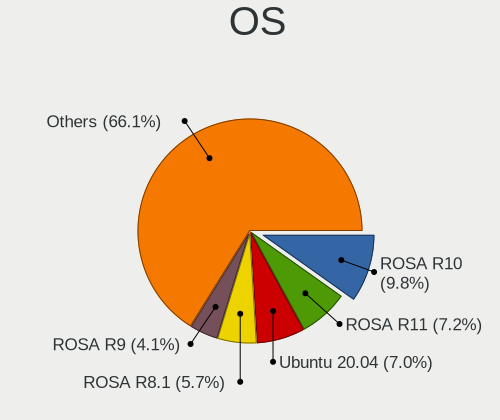

| Name                         | Notebooks | Percent |
|------------------------------|-----------|---------|
| ROSA R10                     | 76        | 13.69%  |
| ROSA R11                     | 56        | 10.09%  |
| Ubuntu 20.04                 | 45        | 8.11%   |
| ROSA R8.1                    | 44        | 7.93%   |
| ROSA R9                      | 32        | 5.77%   |
| Ubuntu 18.04                 | 25        | 4.5%    |
| ROSA R11.1                   | 24        | 4.32%   |
| ROSA R8                      | 20        | 3.6%    |
| OpenMandriva 4.2             | 11        | 1.98%   |
| Arch                         | 10        | 1.8%    |
| ROSA 12.2                    | 9         | 1.62%   |
| Manjaro                      | 9         | 1.62%   |
| Linux Mint 19.3              | 7         | 1.26%   |
| Fedora 35                    | 7         | 1.26%   |
| Kubuntu 20.04                | 6         | 1.08%   |
| Fedora 34                    | 6         | 1.08%   |
| Debian 11                    | 6         | 1.08%   |
| Manjaro 20.2.1               | 5         | 0.9%    |
| Linux Mint 20                | 5         | 0.9%    |
| Linux Mint 19                | 5         | 0.9%    |
| Arch Rolling                 | 5         | 0.9%    |
| openSUSE Tumbleweed-XXXXXXXX | 4         | 0.72%   |
| Manjaro 20.0.3               | 4         | 0.72%   |
| KDE neon 20.04               | 4         | 0.72%   |
| Xubuntu 20.04                | 3         | 0.54%   |
| Ubuntu 21.04                 | 3         | 0.54%   |
| Ubuntu 20.10                 | 3         | 0.54%   |
| Ubuntu 19.04                 | 3         | 0.54%   |
| ROSA 12.1                    | 3         | 0.54%   |
| Linux Mint 20.3              | 3         | 0.54%   |
| Endless 3.7.7                | 3         | 0.54%   |
| Endless 3.5.8                | 3         | 0.54%   |
| Endless 3.3.19               | 3         | 0.54%   |
| Xubuntu 18.04                | 2         | 0.36%   |
| Ubuntu 19.10                 | 2         | 0.36%   |
| Manjaro 21.1.0               | 2         | 0.36%   |
| Manjaro 21.0                 | 2         | 0.36%   |
| LMDE 4                       | 2         | 0.36%   |
| Linux Mint 19.2              | 2         | 0.36%   |
| Linux Mint 19.1              | 2         | 0.36%   |
| Gentoo 2.8                   | 2         | 0.36%   |
| Gentoo 2.7                   | 2         | 0.36%   |
| Fedora 33                    | 2         | 0.36%   |
| Fedora 32                    | 2         | 0.36%   |
| Endless 3.9.4                | 2         | 0.36%   |
| Endless 3.9.3-nexthw1        | 2         | 0.36%   |
| Endless 3.9.2                | 2         | 0.36%   |
| Endless 3.8.1                | 2         | 0.36%   |
| Endless 3.4.4-nexthw1        | 2         | 0.36%   |
| Endless 3.3.11               | 2         | 0.36%   |
| Elementary 6.1               | 2         | 0.36%   |
| Debian Testing               | 2         | 0.36%   |
| Debian 10                    | 2         | 0.36%   |
| Zorin 16                     | 1         | 0.18%   |
| Ubuntu MATE 20.04            | 1         | 0.18%   |
| Ubuntu MATE 16.04            | 1         | 0.18%   |
| Ubuntu Core 16               | 1         | 0.18%   |
| Ubuntu 21.10                 | 1         | 0.18%   |
| Ubuntu 17.10                 | 1         | 0.18%   |
| Solus 4.1                    | 1         | 0.18%   |

OS Family
---------

OS without a version

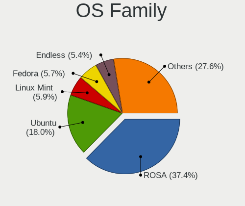

| Name             | Notebooks | Percent |
|------------------|-----------|---------|
| ROSA             | 218       | 44.67%  |
| Ubuntu           | 82        | 16.8%   |
| Endless          | 35        | 7.17%   |
| Linux Mint       | 27        | 5.53%   |
| Manjaro          | 24        | 4.92%   |
| Fedora           | 16        | 3.28%   |
| Arch             | 14        | 2.87%   |
| OpenMandriva     | 13        | 2.66%   |
| Debian           | 10        | 2.05%   |
| Kubuntu          | 9         | 1.84%   |
| Xubuntu          | 5         | 1.02%   |
| KDE neon         | 5         | 1.02%   |
| openSUSE         | 4         | 0.82%   |
| Gentoo           | 4         | 0.82%   |
| Ubuntu MATE      | 2         | 0.41%   |
| Pop!_OS          | 2         | 0.41%   |
| MX               | 2         | 0.41%   |
| LMDE             | 2         | 0.41%   |
| Elementary       | 2         | 0.41%   |
| Zorin            | 1         | 0.2%    |
| Solus            | 1         | 0.2%    |
| Q4OS             | 1         | 0.2%    |
| Peppermint       | 1         | 0.2%    |
| Parrot           | 1         | 0.2%    |
| org.kde.Platform | 1         | 0.2%    |
| Lubuntu          | 1         | 0.2%    |
| Devuan           | 1         | 0.2%    |
| Deepin           | 1         | 0.2%    |
| Clear Linux      | 1         | 0.2%    |
| CentOS           | 1         | 0.2%    |
| ALT Linux        | 1         | 0.2%    |

Kernel
------

Version of the Linux kernel

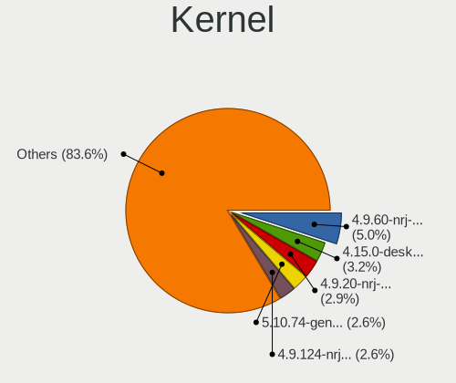

| Version                             | Notebooks | Percent |
|-------------------------------------|-----------|---------|
| 4.9.60-nrj-desktop-1rosa-x86_64     | 38        | 6.34%   |
| 4.15.0-desktop-45.1rosa-x86_64      | 24        | 4.01%   |
| 4.9.20-nrj-desktop-1rosa-x86_64     | 22        | 3.67%   |
| 4.9.124-nrj-desktop-1rosa-x86_64    | 20        | 3.34%   |
| 4.1.34-nrj-desktop-2rosa-x86_64     | 12        | 2%      |
| 5.4.0-42-generic                    | 11        | 1.84%   |
| 5.10.74-generic-2rosa2021.1-x86_64  | 11        | 1.84%   |
| 5.10.14-desktop-1omv4002            | 11        | 1.84%   |
| 4.9.76-nrj-desktop-1rosa-x86_64     | 9         | 1.5%    |
| 4.15.0-desktop-68.5rosa-x86_64      | 9         | 1.5%    |
| 4.9.9-nrj-desktop-1rosa-x86_64      | 8         | 1.34%   |
| 4.9.20-nrj-desktop-1rosa-i586       | 8         | 1.34%   |
| 4.15.0-desktop-45.1rosa-i586        | 8         | 1.34%   |
| 4.1.38-nrj-desktop-2rosa-x86_64     | 8         | 1.34%   |
| 5.4.83-generic-2rosa-x86_64         | 7         | 1.17%   |
| 4.9.155-nrj-laptop-1rosa-x86_64     | 7         | 1.17%   |
| 5.9.16-1-MANJARO                    | 6         | 1%      |
| 4.9.9-nrj-desktop-1rosa-i586        | 6         | 1%      |
| 4.9.60-nrj-desktop-1rosa-i586       | 6         | 1%      |
| 4.9.155-nrj-desktop-1rosa-x86_64    | 6         | 1%      |
| 5.8.0-14-generic                    | 5         | 0.83%   |
| 5.3.0-28-generic                    | 5         | 0.83%   |
| 4.9.124-nrj-desktop-1rosa-i586      | 5         | 0.83%   |
| 4.15.0-desktop-122.124.1rosa-x86_64 | 5         | 0.83%   |
| 4.13.0-32-generic                   | 5         | 0.83%   |
| 5.4.32-generic-2rosa-x86_64         | 4         | 0.67%   |
| 5.4.0-26-generic                    | 4         | 0.67%   |
| 4.9.41-nrj-desktop-1rosa-x86_64     | 4         | 0.67%   |
| 5.8.0-50-generic                    | 3         | 0.5%    |
| 5.8.0-43-generic                    | 3         | 0.5%    |
| 5.4.0-58-generic                    | 3         | 0.5%    |
| 5.4.0-48-generic                    | 3         | 0.5%    |
| 5.4.0-40-generic                    | 3         | 0.5%    |
| 5.4.0-19-generic                    | 3         | 0.5%    |
| 5.3.0-40-generic                    | 3         | 0.5%    |
| 5.11.0-43-generic                   | 3         | 0.5%    |
| 5.11.0-35-generic                   | 3         | 0.5%    |
| 5.0.0-37-generic                    | 3         | 0.5%    |
| 5.0.0-25-generic                    | 3         | 0.5%    |
| 4.9.95-nrj-desktop-2rosa-x86_64     | 3         | 0.5%    |
| 4.9.87-nrj-desktop-2rosa-x86_64     | 3         | 0.5%    |
| 4.9.41-nrj-desktop-1rosa-i586       | 3         | 0.5%    |
| 4.19.0-17-amd64                     | 3         | 0.5%    |
| 4.18.0-15-generic                   | 3         | 0.5%    |
| 4.15.0-desktop-60.7rosa-x86_64      | 3         | 0.5%    |
| 4.15.0-desktop-47.2rosa-x86_64      | 3         | 0.5%    |
| 5.9.0-1-amd64                       | 2         | 0.33%   |
| 5.8.0-44-generic                    | 2         | 0.33%   |
| 5.4.83-generic-2rosa-i586           | 2         | 0.33%   |
| 5.4.0-96-generic                    | 2         | 0.33%   |
| 5.4.0-72-generic                    | 2         | 0.33%   |
| 5.4.0-65-generic                    | 2         | 0.33%   |
| 5.4.0-54-generic                    | 2         | 0.33%   |
| 5.4.0-51-generic                    | 2         | 0.33%   |
| 5.4.0-104-generic                   | 2         | 0.33%   |
| 5.3.0-46-generic                    | 2         | 0.33%   |
| 5.3.0-23-generic                    | 2         | 0.33%   |
| 5.15.28-1-MANJARO                   | 2         | 0.33%   |
| 5.14.15-300.fc35.x86_64             | 2         | 0.33%   |
| 5.13.11-1-MANJARO                   | 2         | 0.33%   |

Kernel Family
-------------

Linux kernel without a distro release

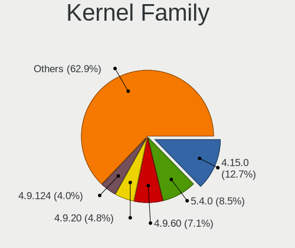

| Version | Notebooks | Percent |
|---------|-----------|---------|
| 4.15.0  | 79        | 13.62%  |
| 5.4.0   | 52        | 8.97%   |
| 4.9.60  | 44        | 7.59%   |
| 4.9.20  | 30        | 5.17%   |
| 4.9.124 | 25        | 4.31%   |
| 5.8.0   | 20        | 3.45%   |
| 5.11.0  | 19        | 3.28%   |
| 5.3.0   | 16        | 2.76%   |
| 5.0.0   | 16        | 2.76%   |
| 4.9.9   | 14        | 2.41%   |
| 4.1.34  | 14        | 2.41%   |
| 4.9.155 | 13        | 2.24%   |
| 4.1.38  | 12        | 2.07%   |
| 5.10.74 | 11        | 1.9%    |
| 5.10.14 | 11        | 1.9%    |
| 4.9.76  | 10        | 1.72%   |
| 5.4.83  | 9         | 1.55%   |
| 5.10.0  | 9         | 1.55%   |
| 4.18.0  | 8         | 1.38%   |
| 5.9.16  | 7         | 1.21%   |
| 5.13.0  | 7         | 1.21%   |
| 4.9.41  | 7         | 1.21%   |
| 4.13.0  | 6         | 1.03%   |
| 5.4.32  | 5         | 0.86%   |
| 4.19.0  | 5         | 0.86%   |
| 4.9.95  | 4         | 0.69%   |
| 4.9.87  | 4         | 0.69%   |
| 4.8.17  | 3         | 0.52%   |
| 4.1.25  | 3         | 0.52%   |
| 5.9.0   | 2         | 0.34%   |
| 5.8.11  | 2         | 0.34%   |
| 5.6.0   | 2         | 0.34%   |
| 5.17.9  | 2         | 0.34%   |
| 5.15.5  | 2         | 0.34%   |
| 5.15.32 | 2         | 0.34%   |
| 5.15.28 | 2         | 0.34%   |
| 5.14.15 | 2         | 0.34%   |
| 5.14.0  | 2         | 0.34%   |
| 5.13.11 | 2         | 0.34%   |
| 5.11.8  | 2         | 0.34%   |
| 5.11.12 | 2         | 0.34%   |
| 5.10.23 | 2         | 0.34%   |
| 4.9.14  | 2         | 0.34%   |
| 4.9.111 | 2         | 0.34%   |
| 4.17.0  | 2         | 0.34%   |
| 4.16.0  | 2         | 0.34%   |
| 4.10.0  | 2         | 0.34%   |
| 5.9.9   | 1         | 0.17%   |
| 5.9.8   | 1         | 0.17%   |
| 5.9.4   | 1         | 0.17%   |
| 5.9.3   | 1         | 0.17%   |
| 5.9.14  | 1         | 0.17%   |
| 5.9.11  | 1         | 0.17%   |
| 5.8.18  | 1         | 0.17%   |
| 5.8.13  | 1         | 0.17%   |
| 5.7.9   | 1         | 0.17%   |
| 5.7.0   | 1         | 0.17%   |
| 5.6.4   | 1         | 0.17%   |
| 5.6.19  | 1         | 0.17%   |
| 5.6.15  | 1         | 0.17%   |

Kernel Major Ver.
-----------------

Linux kernel major version

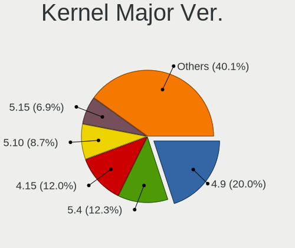

| Version | Notebooks | Percent |
|---------|-----------|---------|
| 4.9     | 131       | 23.95%  |
| 4.15    | 79        | 14.44%  |
| 5.4     | 75        | 13.71%  |
| 5.10    | 41        | 7.5%    |
| 4.1     | 29        | 5.3%    |
| 5.11    | 26        | 4.75%   |
| 5.8     | 24        | 4.39%   |
| 5.3     | 19        | 3.47%   |
| 5.0     | 16        | 2.93%   |
| 5.9     | 15        | 2.74%   |
| 5.15    | 13        | 2.38%   |
| 5.13    | 13        | 2.38%   |
| 4.19    | 8         | 1.46%   |
| 4.18    | 8         | 1.46%   |
| 5.6     | 6         | 1.1%    |
| 5.14    | 6         | 1.1%    |
| 4.13    | 6         | 1.1%    |
| 5.17    | 5         | 0.91%   |
| 4.8     | 5         | 0.91%   |
| 5.16    | 3         | 0.55%   |
| 5.12    | 3         | 0.55%   |
| 4.16    | 3         | 0.55%   |
| 4.14    | 3         | 0.55%   |
| 5.7     | 2         | 0.37%   |
| 5.5     | 2         | 0.37%   |
| 4.17    | 2         | 0.37%   |
| 4.10    | 2         | 0.37%   |
| 5.1     | 1         | 0.18%   |
| 4.4     | 1         | 0.18%   |

Arch
----

OS architecture (x86_64, i586, etc.)

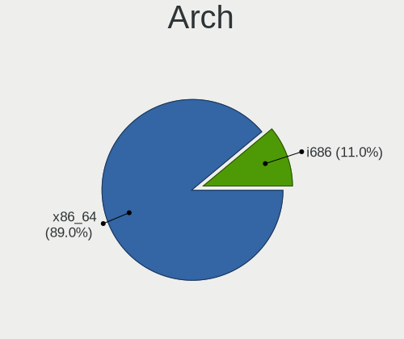

| Name   | Notebooks | Percent |
|--------|-----------|---------|
| x86_64 | 429       | 88.45%  |
| i686   | 56        | 11.55%  |

DE
--

Desktop Environment

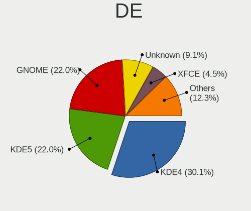

| Name       | Notebooks | Percent |
|------------|-----------|---------|
| KDE4       | 158       | 30.68%  |
| KDE5       | 111       | 21.55%  |
| GNOME      | 111       | 21.55%  |
| Unknown    | 48        | 9.32%   |
| XFCE       | 24        | 4.66%   |
| X-Cinnamon | 12        | 2.33%   |
| LXQt       | 12        | 2.33%   |
| KDE        | 12        | 2.33%   |
| MATE       | 10        | 1.94%   |
| Cinnamon   | 8         | 1.55%   |
| LXDE       | 3         | 0.58%   |
| Pantheon   | 2         | 0.39%   |
| i3         | 2         | 0.39%   |
| Deepin     | 1         | 0.19%   |
| Budgie     | 1         | 0.19%   |

Display Server
--------------

X11 or Wayland

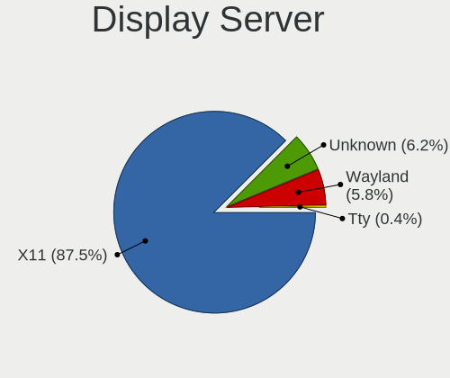

| Name    | Notebooks | Percent |
|---------|-----------|---------|
| X11     | 422       | 86.65%  |
| Wayland | 33        | 6.78%   |
| Unknown | 30        | 6.16%   |
| Tty     | 2         | 0.41%   |

Display Manager
---------------

SDDM, LightDM, etc.

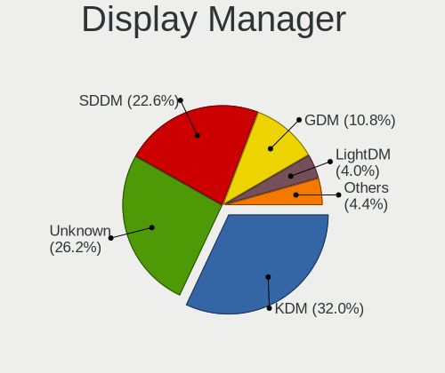

| Name    | Notebooks | Percent |
|---------|-----------|---------|
| KDM     | 160       | 31.68%  |
| Unknown | 131       | 25.94%  |
| SDDM    | 117       | 23.17%  |
| GDM     | 55        | 10.89%  |
| LightDM | 19        | 3.76%   |
| TDM     | 17        | 3.37%   |
| GDM3    | 5         | 0.99%   |
| SLiM    | 1         | 0.2%    |

OS Lang
-------

Language

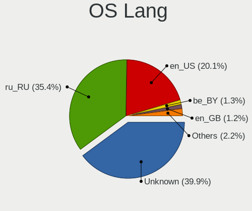

| Lang        | Notebooks | Percent |
|-------------|-----------|---------|
| Unknown     | 240       | 48.29%  |
| ru_RU       | 144       | 28.97%  |
| en_US       | 91        | 18.31%  |
| en_GB       | 6         | 1.21%   |
| be_BY       | 5         | 1.01%   |
| ru_RU.UTF_8 | 4         | 0.8%    |
| C           | 3         | 0.6%    |
| ru_UA       | 2         | 0.4%    |
| cv_RU       | 2         | 0.4%    |

Boot Mode
---------

EFI or BIOS

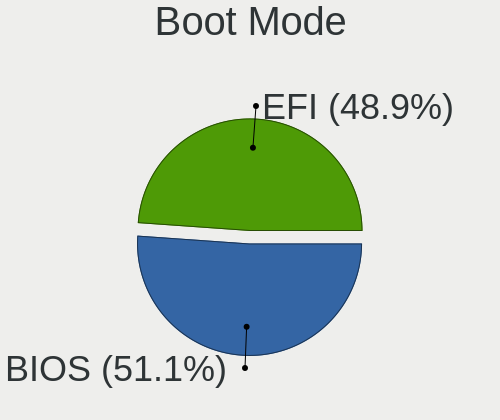

| Mode | Notebooks | Percent |
|------|-----------|---------|
| BIOS | 275       | 56.47%  |
| EFI  | 212       | 43.53%  |

Filesystem
----------

Type of filesystem

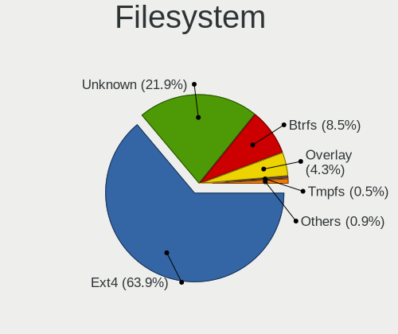

| Type    | Notebooks | Percent |
|---------|-----------|---------|
| Ext4    | 312       | 62.03%  |
| Unknown | 142       | 28.23%  |
| Btrfs   | 30        | 5.96%   |
| Overlay | 14        | 2.78%   |
| Xfs     | 2         | 0.4%    |
| Ext3    | 2         | 0.4%    |
| F2fs    | 1         | 0.2%    |

Part. scheme
------------

Scheme of partitioning

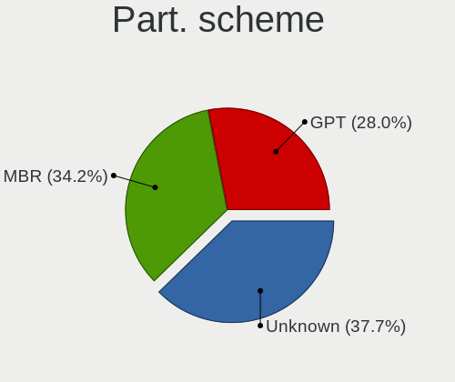

| Type    | Notebooks | Percent |
|---------|-----------|---------|
| Unknown | 190       | 37.77%  |
| MBR     | 174       | 34.59%  |
| GPT     | 139       | 27.63%  |

Dual Boot with Linux/BSD
------------------------

Hosting more than one Linux/BSD

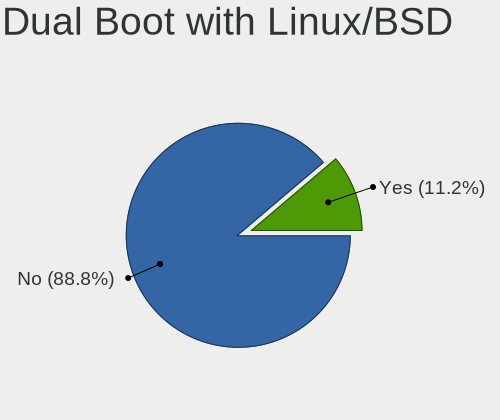

| Dual boot | Notebooks | Percent |
|-----------|-----------|---------|
| No        | 430       | 87.93%  |
| Yes       | 59        | 12.07%  |

Dual Boot (Win)
---------------

Hosting Linux and Windows

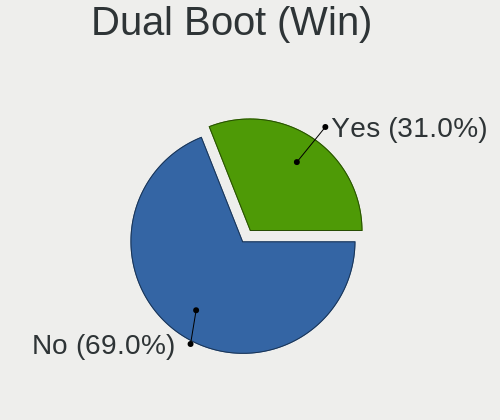

| Dual boot | Notebooks | Percent |
|-----------|-----------|---------|
| No        | 347       | 69.54%  |
| Yes       | 152       | 30.46%  |

Board
-----

Vendor
------

Motherboard manufacturer

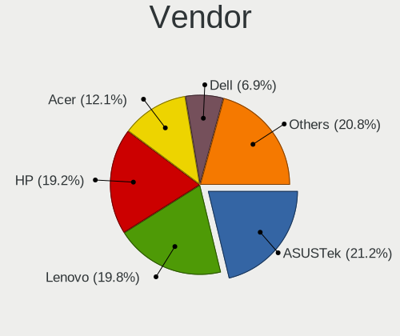

| Name                | Notebooks | Percent |
|---------------------|-----------|---------|
| ASUSTek Computer    | 103       | 21.64%  |
| Lenovo              | 97        | 20.38%  |
| Hewlett-Packard     | 87        | 18.28%  |
| Acer                | 64        | 13.45%  |
| Samsung Electronics | 31        | 6.51%   |
| Dell                | 31        | 6.51%   |
| MSI                 | 13        | 2.73%   |
| Toshiba             | 9         | 1.89%   |
| Timi                | 8         | 1.68%   |
| Sony                | 4         | 0.84%   |
| Packard Bell        | 4         | 0.84%   |
| Prestigio           | 3         | 0.63%   |
| Intel               | 3         | 0.63%   |
| Fujitsu Siemens     | 3         | 0.63%   |
| HONOR               | 2         | 0.42%   |
| BenQ                | 2         | 0.42%   |
| ViewSonic           | 1         | 0.21%   |
| Quanta              | 1         | 0.21%   |
| LG Electronics      | 1         | 0.21%   |
| IBM                 | 1         | 0.21%   |
| HUAWEI              | 1         | 0.21%   |
| Gateway             | 1         | 0.21%   |
| Fujitsu             | 1         | 0.21%   |
| eMachines           | 1         | 0.21%   |
| Dream Machines      | 1         | 0.21%   |
| DNS                 | 1         | 0.21%   |
| Apple               | 1         | 0.21%   |
| Unknown             | 1         | 0.21%   |

Model
-----

Motherboard model

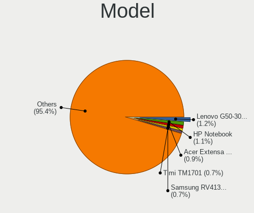

| Name                                       | Notebooks | Percent |
|--------------------------------------------|-----------|---------|
| Lenovo G50-30 80G0                         | 7         | 1.47%   |
| HP Notebook                                | 5         | 1.05%   |
| Timi TM1701                                | 4         | 0.84%   |
| Lenovo IdeaPad 320-15IAP 80XR              | 4         | 0.84%   |
| HP ProBook 455 G1                          | 4         | 0.84%   |
| ASUS X540NV                                | 4         | 0.84%   |
| Acer Extensa 5220                          | 4         | 0.84%   |
| Samsung RV413/RV513                        | 3         | 0.63%   |
| Lenovo IdeaPad Z570 HuronRiver Platform    | 3         | 0.63%   |
| Lenovo G570 20079                          | 3         | 0.63%   |
| Lenovo B590 20206                          | 3         | 0.63%   |
| Lenovo B50-30 20382                        | 3         | 0.63%   |
| HP Pavilion g6                             | 3         | 0.63%   |
| HP Pavilion 15                             | 3         | 0.63%   |
| HP 635                                     | 3         | 0.63%   |
| ASUS ZenBook UX431DA_UM431DA               | 3         | 0.63%   |
| ASUS X541UAK                               | 3         | 0.63%   |
| Acer Aspire E1-571G                        | 3         | 0.63%   |
| Acer Aspire 4810T                          | 3         | 0.63%   |
| Unknown                                    | 3         | 0.63%   |
| Timi TM1613                                | 2         | 0.42%   |
| Samsung R528/R728                          | 2         | 0.42%   |
| Samsung R508                               | 2         | 0.42%   |
| Samsung 355V4C/356V4C/3445VC/3545VC        | 2         | 0.42%   |
| Samsung 305E4Z/305E5Z/305E7Z               | 2         | 0.42%   |
| Samsung 300E4A/300E5A/300E7A/3430EA/3530EA | 2         | 0.42%   |
| MSI MS-N014                                | 2         | 0.42%   |
| MSI GF63 Thin 9SCSR                        | 2         | 0.42%   |
| Lenovo Z50-70 20354                        | 2         | 0.42%   |
| Lenovo V580c 20160                         | 2         | 0.42%   |
| Lenovo Legion 5 15ARH05 82B5               | 2         | 0.42%   |
| Lenovo IdeaPad L340-17IRH Gaming 81LL      | 2         | 0.42%   |
| Lenovo IdeaPad L340-15API 81LW             | 2         | 0.42%   |
| Lenovo IdeaPad 100-15IBY 80MJ              | 2         | 0.42%   |
| Lenovo G580 20157                          | 2         | 0.42%   |
| Lenovo G500 20236                          | 2         | 0.42%   |
| HP ProBook 4530s                           | 2         | 0.42%   |
| HP ProBook 450 G6                          | 2         | 0.42%   |
| HP ProBook 450 G5                          | 2         | 0.42%   |
| HP ProBook 445 G6                          | 2         | 0.42%   |
| HP Presario CQ57                           | 2         | 0.42%   |
| HP Pavilion dv6                            | 2         | 0.42%   |
| HP Pavilion 17                             | 2         | 0.42%   |
| HP Laptop 15-bs0xx                         | 2         | 0.42%   |
| Dell Inspiron 7577                         | 2         | 0.42%   |
| ASUS X551MA                                | 2         | 0.42%   |
| ASUS X550CC                                | 2         | 0.42%   |
| ASUS X541NA                                | 2         | 0.42%   |
| ASUS X540LJ                                | 2         | 0.42%   |
| ASUS VivoBook_ASUSLaptop X570ZD_X570ZD     | 2         | 0.42%   |
| ASUS VivoBook_ASUSLaptop X415EA_X415EA     | 2         | 0.42%   |
| ASUS VivoBook 15_ASUS Laptop X540UBR       | 2         | 0.42%   |
| ASUS VivoBook 15_ASUS Laptop X540UB        | 2         | 0.42%   |
| ASUS UL30A                                 | 2         | 0.42%   |
| ASUS K50IJ                                 | 2         | 0.42%   |
| ASUS K50C                                  | 2         | 0.42%   |
| ASUS 1011PX                                | 2         | 0.42%   |
| Acer Extensa 5230                          | 2         | 0.42%   |
| Acer Extensa 2511G                         | 2         | 0.42%   |
| Acer Aspire V3-571G                        | 2         | 0.42%   |

Model Family
------------

Motherboard model prefix

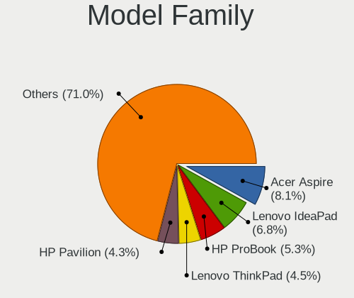

| Name                     | Notebooks | Percent |
|--------------------------|-----------|---------|
| Acer Aspire              | 40        | 8.4%    |
| Lenovo IdeaPad           | 30        | 6.3%    |
| HP ProBook               | 27        | 5.67%   |
| Lenovo ThinkPad          | 25        | 5.25%   |
| Dell Inspiron            | 18        | 3.78%   |
| HP Pavilion              | 17        | 3.57%   |
| ASUS VivoBook            | 17        | 3.57%   |
| Acer Extensa             | 12        | 2.52%   |
| HP Laptop                | 8         | 1.68%   |
| Toshiba Satellite        | 7         | 1.47%   |
| Lenovo G50-30            | 7         | 1.47%   |
| ASUS ZenBook             | 7         | 1.47%   |
| HP EliteBook             | 6         | 1.26%   |
| HP Notebook              | 5         | 1.05%   |
| Timi TM1701              | 4         | 0.84%   |
| Lenovo Legion            | 4         | 0.84%   |
| ASUS X540NV              | 4         | 0.84%   |
| Acer TravelMate          | 4         | 0.84%   |
| Samsung RV413            | 3         | 0.63%   |
| Packard Bell EasyNote    | 3         | 0.63%   |
| Lenovo G580              | 3         | 0.63%   |
| Lenovo G570              | 3         | 0.63%   |
| Lenovo B590              | 3         | 0.63%   |
| Lenovo B50-30            | 3         | 0.63%   |
| HP Presario              | 3         | 0.63%   |
| HP Mini                  | 3         | 0.63%   |
| HP Compaq                | 3         | 0.63%   |
| HP 635                   | 3         | 0.63%   |
| HP 250                   | 3         | 0.63%   |
| Dell XPS                 | 3         | 0.63%   |
| Dell Vostro              | 3         | 0.63%   |
| ASUS X541UAK             | 3         | 0.63%   |
| Acer Nitro               | 3         | 0.63%   |
| Unknown                  | 3         | 0.63%   |
| Timi TM1613              | 2         | 0.42%   |
| Samsung R528             | 2         | 0.42%   |
| Samsung R508             | 2         | 0.42%   |
| Samsung 355V4C           | 2         | 0.42%   |
| Samsung 305E4Z           | 2         | 0.42%   |
| Samsung 300E4A           | 2         | 0.42%   |
| MSI MS-N014              | 2         | 0.42%   |
| MSI GF63                 | 2         | 0.42%   |
| Lenovo Z50-70            | 2         | 0.42%   |
| Lenovo V580c             | 2         | 0.42%   |
| Lenovo G500              | 2         | 0.42%   |
| HP ENVY                  | 2         | 0.42%   |
| Fujitsu Siemens LIFEBOOK | 2         | 0.42%   |
| Dell Latitude            | 2         | 0.42%   |
| BenQ JoyBook             | 2         | 0.42%   |
| ASUS X551MA              | 2         | 0.42%   |
| ASUS X550CC              | 2         | 0.42%   |
| ASUS X541NA              | 2         | 0.42%   |
| ASUS X540LJ              | 2         | 0.42%   |
| ASUS UL30A               | 2         | 0.42%   |
| ASUS ROG                 | 2         | 0.42%   |
| ASUS K50IJ               | 2         | 0.42%   |
| ASUS K50C                | 2         | 0.42%   |
| ASUS ASUS                | 2         | 0.42%   |
| ASUS 1011PX              | 2         | 0.42%   |
| Acer Swift               | 2         | 0.42%   |

MFG Year
--------

Motherboard manufacture year

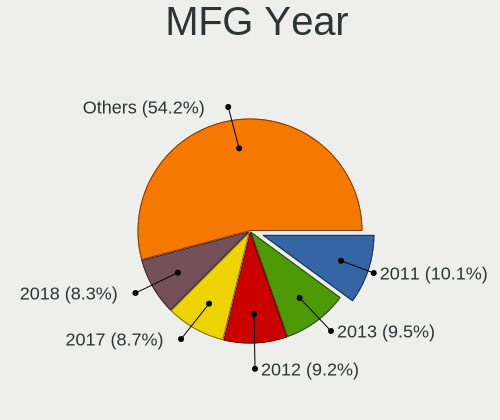

| Year | Notebooks | Percent |
|------|-----------|---------|
| 2011 | 53        | 11.13%  |
| 2013 | 49        | 10.29%  |
| 2017 | 46        | 9.66%   |
| 2012 | 42        | 8.82%   |
| 2018 | 37        | 7.77%   |
| 2019 | 35        | 7.35%   |
| 2010 | 34        | 7.14%   |
| 2009 | 31        | 6.51%   |
| 2020 | 29        | 6.09%   |
| 2014 | 27        | 5.67%   |
| 2015 | 23        | 4.83%   |
| 2007 | 19        | 3.99%   |
| 2008 | 18        | 3.78%   |
| 2016 | 15        | 3.15%   |
| 2021 | 13        | 2.73%   |
| 2006 | 3         | 0.63%   |
| 2005 | 2         | 0.42%   |

Form Factor
-----------

Physical design of the computer

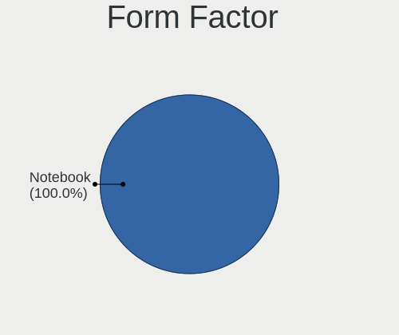

| Name     | Notebooks | Percent |
|----------|-----------|---------|
| Notebook | 476       | 100%    |

Secure Boot
-----------

Enabled or disabled

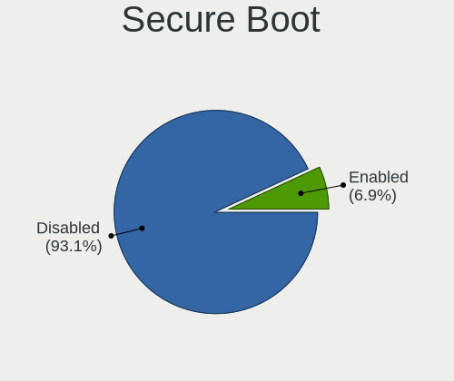

| State    | Notebooks | Percent |
|----------|-----------|---------|
| Disabled | 444       | 93.08%  |
| Enabled  | 33        | 6.92%   |

Coreboot
--------

Have coreboot on board

| Used | Notebooks | Percent |
|------|-----------|---------|
| No   | 476       | 100%    |

RAM Size
--------

Total RAM memory

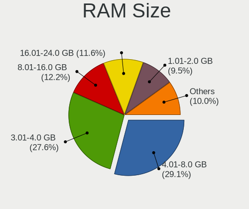

| Size in GB | Notebooks | Percent |
|------------|-----------|---------|
| 3.01-4.0   | 151       | 30.88%  |
| 4.01-8.0   | 141       | 28.83%  |
| 1.01-2.0   | 52        | 10.63%  |
| 8.01-16.0  | 49        | 10.02%  |
| 16.01-24.0 | 46        | 9.41%   |
| 2.01-3.0   | 20        | 4.09%   |
| 32.01-64.0 | 16        | 3.27%   |
| 0.51-1.0   | 13        | 2.66%   |
| 24.01-32.0 | 1         | 0.2%    |

RAM Used
--------

Used RAM memory

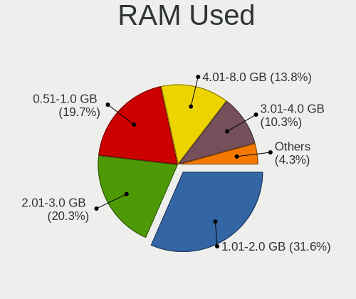

| Used GB    | Notebooks | Percent |
|------------|-----------|---------|
| 1.01-2.0   | 191       | 34.79%  |
| 0.51-1.0   | 136       | 24.77%  |
| 2.01-3.0   | 105       | 19.13%  |
| 4.01-8.0   | 54        | 9.84%   |
| 3.01-4.0   | 41        | 7.47%   |
| 0.01-0.5   | 11        | 2%      |
| 8.01-16.0  | 9         | 1.64%   |
| 24.01-32.0 | 1         | 0.18%   |
| 16.01-24.0 | 1         | 0.18%   |

Total Drives
------------

Number of drives on board

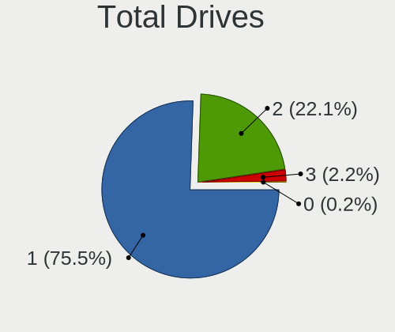

| Drives | Notebooks | Percent |
|--------|-----------|---------|
| 1      | 369       | 75.46%  |
| 2      | 108       | 22.09%  |
| 3      | 11        | 2.25%   |
| 0      | 1         | 0.2%    |

Has CD-ROM
----------

Has CD-ROM on board

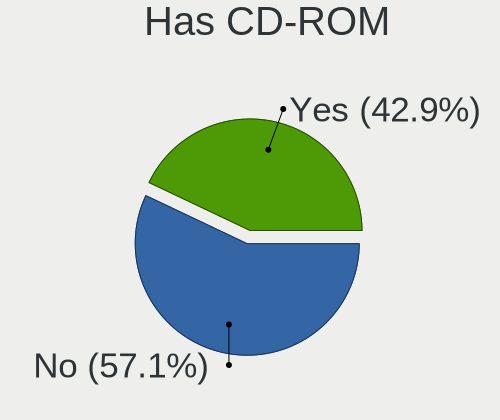

| Presented | Notebooks | Percent |
|-----------|-----------|---------|
| No        | 274       | 56.73%  |
| Yes       | 209       | 43.27%  |

Has Ethernet
------------

Has Ethernet on board

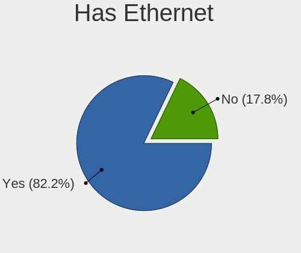

| Presented | Notebooks | Percent |
|-----------|-----------|---------|
| Yes       | 409       | 85.74%  |
| No        | 68        | 14.26%  |

Has WiFi
--------

Has WiFi module

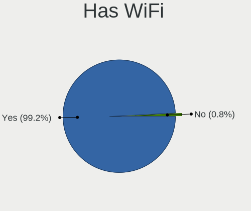

| Presented | Notebooks | Percent |
|-----------|-----------|---------|
| Yes       | 471       | 98.95%  |
| No        | 5         | 1.05%   |

Has Bluetooth
-------------

Has Bluetooth module

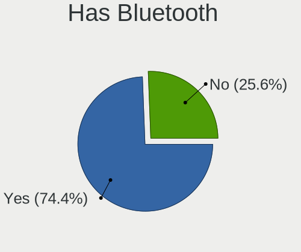

| Presented | Notebooks | Percent |
|-----------|-----------|---------|
| Yes       | 357       | 74.22%  |
| No        | 124       | 25.78%  |

Location
--------

Country
-------

Geographic location (country)

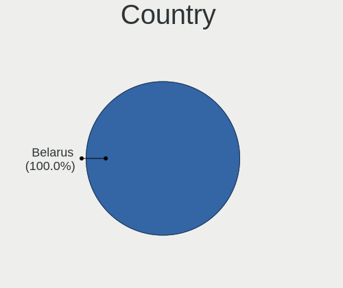

| Country | Notebooks | Percent |
|---------|-----------|---------|
| Belarus | 476       | 100%    |

City
----

Geographic location (city)

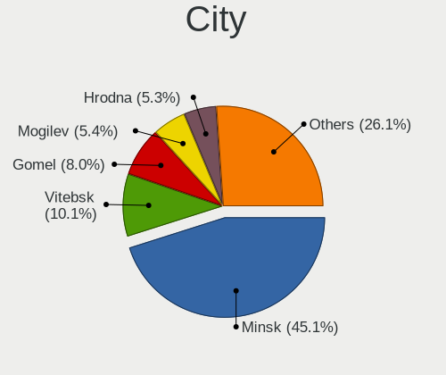

| City         | Notebooks | Percent |
|--------------|-----------|---------|
| Minsk        | 238       | 44.91%  |
| Vitebsk      | 54        | 10.19%  |
| Gomel        | 41        | 7.74%   |
| Mogilev      | 29        | 5.47%   |
| Hrodna       | 29        | 5.47%   |
| Brest        | 24        | 4.53%   |
| Orsha        | 15        | 2.83%   |
| Babruysk     | 13        | 2.45%   |
| Borisov      | 9         | 1.7%    |
| Polatsk      | 7         | 1.32%   |
| Lida         | 6         | 1.13%   |
| Zhodzina     | 4         | 0.75%   |
| Zhlobin      | 4         | 0.75%   |
| Bogushevichi | 4         | 0.75%   |
| Mazyr        | 3         | 0.57%   |
| Aleksandrovo | 3         | 0.57%   |
| Smalyavichy  | 2         | 0.38%   |
| Slutsk       | 2         | 0.38%   |
| Salihorsk    | 2         | 0.38%   |
| Pinsk        | 2         | 0.38%   |
| Maladzyechna | 2         | 0.38%   |
| Loshnitsa    | 2         | 0.38%   |
| Krupki       | 2         | 0.38%   |
| Kolodishchi  | 2         | 0.38%   |
| Klyetsk      | 2         | 0.38%   |
| Fedorovka    | 2         | 0.38%   |
| Baran'       | 2         | 0.38%   |
| Zaslawye     | 1         | 0.19%   |
| Vilyeyka     | 1         | 0.19%   |
| Vawkavysk    | 1         | 0.19%   |
| Syanno       | 1         | 0.19%   |
| Snitovo      | 1         | 0.19%   |
| Slonim       | 1         | 0.19%   |
| Shklow       | 1         | 0.19%   |
| Rakov        | 1         | 0.19%   |
| Rahachow     | 1         | 0.19%   |
| Pyetrykaw    | 1         | 0.19%   |
| Pruzhany     | 1         | 0.19%   |
| Pastavy      | 1         | 0.19%   |
| Navapolatsk  | 1         | 0.19%   |
| Myadzyel     | 1         | 0.19%   |
| Klimavichy   | 1         | 0.19%   |
| Kirawsk      | 1         | 0.19%   |
| Khatsyezhyna | 1         | 0.19%   |
| Gonchary     | 1         | 0.19%   |
| Germanovo    | 1         | 0.19%   |
| Drahichyn    | 1         | 0.19%   |
| Dokshytsy    | 1         | 0.19%   |
| Byshanka     | 1         | 0.19%   |
| Blagodat'    | 1         | 0.19%   |
| Baranovichi  | 1         | 0.19%   |
| Asipovichy   | 1         | 0.19%   |

Drives
------

Drive Vendor
------------

Hard drive vendors

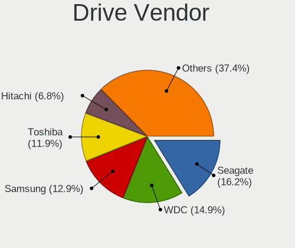

| Vendor              | Notebooks | Drives | Percent |
|---------------------|-----------|--------|---------|
| Seagate             | 97        | 128    | 16.58%  |
| WDC                 | 84        | 119    | 14.36%  |
| Samsung Electronics | 75        | 99     | 12.82%  |
| Toshiba             | 70        | 86     | 11.97%  |
| Hitachi             | 41        | 48     | 7.01%   |
| Kingston            | 39        | 42     | 6.67%   |
| HGST                | 34        | 41     | 5.81%   |
| SK Hynix            | 27        | 30     | 4.62%   |
| Sandisk             | 18        | 23     | 3.08%   |
| Unknown             | 13        | 17     | 2.22%   |
| Intel               | 12        | 20     | 2.05%   |
| Crucial             | 11        | 15     | 1.88%   |
| Fujitsu             | 10        | 15     | 1.71%   |
| Micron Technology   | 7         | 11     | 1.2%    |
| KingSpec            | 5         | 11     | 0.85%   |
| Patriot             | 4         | 4      | 0.68%   |
| GOODRAM             | 4         | 4      | 0.68%   |
| A-DATA Technology   | 4         | 4      | 0.68%   |
| Gigabyte Technology | 3         | 4      | 0.51%   |
| Transcend           | 2         | 2      | 0.34%   |
| SPCC                | 2         | 4      | 0.34%   |
| Smartbuy            | 2         | 2      | 0.34%   |
| OCZ                 | 2         | 2      | 0.34%   |
| LITEONIT            | 2         | 2      | 0.34%   |
| KIOXIA              | 2         | 9      | 0.34%   |
| Zheino              | 1         | 2      | 0.17%   |
| Union Memory        | 1         | 1      | 0.17%   |
| Team                | 1         | 1      | 0.17%   |
| PNY                 | 1         | 4      | 0.17%   |
| PLEXTOR             | 1         | 1      | 0.17%   |
| OSCOO               | 1         | 1      | 0.17%   |
| OCZ-VERTEX          | 1         | 1      | 0.17%   |
| Lenovo              | 1         | 3      | 0.17%   |
| KingDian            | 1         | 3      | 0.17%   |
| HUAWEI              | 1         | 1      | 0.17%   |
| Corsair             | 1         | 3      | 0.17%   |
| China               | 1         | 2      | 0.17%   |
| ASMT                | 1         | 1      | 0.17%   |
| Apple               | 1         | 1      | 0.17%   |
| AMD                 | 1         | 1      | 0.17%   |

Drive Model
-----------

Hard drive models

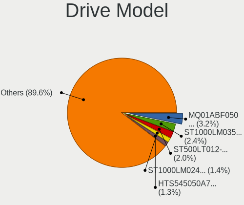

| Model                                | Notebooks | Percent |
|--------------------------------------|-----------|---------|
| Toshiba MQ01ABF050 500GB             | 22        | 3.68%   |
| Seagate ST500LT012-1DG142 500GB      | 16        | 2.68%   |
| Seagate ST1000LM035-1RK172 1TB       | 15        | 2.51%   |
| Seagate ST1000LM024 HN-M101MBB 1TB   | 12        | 2.01%   |
| Seagate ST9320325AS 320GB            | 10        | 1.67%   |
| Samsung SSD 860 EVO 250GB            | 9         | 1.51%   |
| HGST HTS545050A7E680 500GB           | 9         | 1.51%   |
| Toshiba MQ04ABF100 1TB               | 8         | 1.34%   |
| SK Hynix NVMe SSD Drive 512GB        | 8         | 1.34%   |
| Samsung NVMe SSD Drive 256GB         | 8         | 1.34%   |
| WDC WD10JPVX-22JC3T0 1TB             | 7         | 1.17%   |
| Kingston SA400S37120G 120GB SSD      | 7         | 1.17%   |
| Toshiba MQ01ABD100 1TB               | 6         | 1%      |
| Toshiba MQ01ABD075 752GB             | 6         | 1%      |
| Toshiba MQ01ABD032 320GB             | 6         | 1%      |
| Seagate ST9250315AS 250GB            | 6         | 1%      |
| Hitachi HTS545050B9A300 500GB        | 6         | 1%      |
| HGST HTS541010A9E680 1TB             | 6         | 1%      |
| Crucial CT120BX500SSD1 120GB         | 6         | 1%      |
| Seagate ST9500325AS 500GB            | 5         | 0.84%   |
| Hitachi HTS547575A9E384 752GB        | 5         | 0.84%   |
| Hitachi HTS543232A7A384 320GB        | 5         | 0.84%   |
| HGST HTS541010B7E610 1TB             | 5         | 0.84%   |
| Seagate ST750LM022 HN-M750MBB 752GB  | 4         | 0.67%   |
| Seagate ST500LT012-9WS142 500GB      | 4         | 0.67%   |
| Sandisk NVMe SSD Drive 256GB         | 4         | 0.67%   |
| Samsung SSD 860 EVO 500GB            | 4         | 0.67%   |
| Samsung NVMe SSD Drive 512GB         | 4         | 0.67%   |
| Samsung HM500JI 500GB                | 4         | 0.67%   |
| Hitachi HTS547550A9E384 500GB        | 4         | 0.67%   |
| WDC WD5000LPVX-60V0TT0 500GB         | 3         | 0.5%    |
| WDC WD5000LPVX-22V0TT0 500GB         | 3         | 0.5%    |
| WDC WD5000BPVT-24HXZT3 500GB         | 3         | 0.5%    |
| SK Hynix NVMe SSD Drive 256GB        | 3         | 0.5%    |
| Seagate ST9500420AS 500GB            | 3         | 0.5%    |
| Samsung SSD 850 EVO 500GB            | 3         | 0.5%    |
| Samsung SSD 850 EVO 250GB            | 3         | 0.5%    |
| Samsung MZVLB256HBHQ-000L2 256GB     | 3         | 0.5%    |
| Samsung MZALQ256HAJD-000L1 256GB     | 3         | 0.5%    |
| Kingston SUV400S37120G 120GB SSD     | 3         | 0.5%    |
| Kingston SA400S37240G 240GB SSD      | 3         | 0.5%    |
| KingSpec KSD-SA25.7-016MJ 16GB SSD   | 3         | 0.5%    |
| HGST HTS721010A9E630 1TB             | 3         | 0.5%    |
| HGST HTS545050B7E660 500GB           | 3         | 0.5%    |
| HGST HTS541075A9E680 752GB           | 3         | 0.5%    |
| WDC WD7500BPVX-22JC3T0 752GB         | 2         | 0.33%   |
| WDC WD5000LPCX-24VHAT0 500GB         | 2         | 0.33%   |
| WDC WD5000LPCX-21VHAT0 500GB         | 2         | 0.33%   |
| WDC WD3200BPVT-35ZEST0 320GB         | 2         | 0.33%   |
| WDC WD3200BEVT-80A0RT0 320GB         | 2         | 0.33%   |
| WDC WD2500BEVT-22A23T0 250GB         | 2         | 0.33%   |
| WDC WD1600BEVT-60ZCT1 160GB          | 2         | 0.33%   |
| WDC WD1600BEVT-22ZCT0 160GB          | 2         | 0.33%   |
| WDC WD10SPZX-75Z10T2 1TB             | 2         | 0.33%   |
| WDC WD10SPZX-24Z10T0 1TB             | 2         | 0.33%   |
| WDC WD10JPVX-60JC3T0 1TB             | 2         | 0.33%   |
| WDC PC SN520 SDAPNUW-128G-1014 128GB | 2         | 0.33%   |
| Toshiba MK5059GSXP 500GB             | 2         | 0.33%   |
| Toshiba MK3265GSX 320GB              | 2         | 0.33%   |
| Toshiba MK3259GSXP 320GB             | 2         | 0.33%   |

HDD Vendor
----------

Hard disk drive vendors

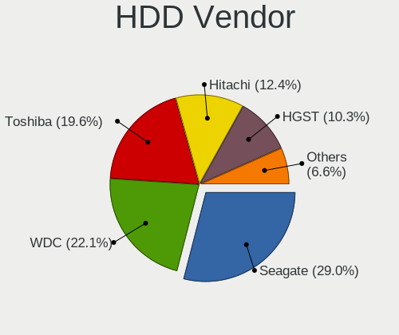

| Vendor              | Notebooks | Drives | Percent |
|---------------------|-----------|--------|---------|
| Seagate             | 96        | 127    | 29%     |
| WDC                 | 73        | 107    | 22.05%  |
| Toshiba             | 65        | 80     | 19.64%  |
| Hitachi             | 41        | 48     | 12.39%  |
| HGST                | 34        | 41     | 10.27%  |
| Samsung Electronics | 11        | 23     | 3.32%   |
| Fujitsu             | 10        | 15     | 3.02%   |
| Apple               | 1         | 1      | 0.3%    |

SSD Vendor
----------

Solid state drive vendors

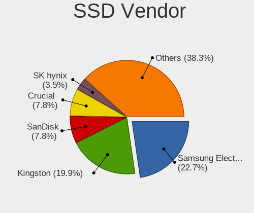

| Vendor              | Notebooks | Drives | Percent |
|---------------------|-----------|--------|---------|
| Samsung Electronics | 31        | 37     | 22.79%  |
| Kingston            | 27        | 29     | 19.85%  |
| SanDisk             | 11        | 16     | 8.09%   |
| Crucial             | 11        | 15     | 8.09%   |
| SK Hynix            | 5         | 5      | 3.68%   |
| KingSpec            | 5         | 11     | 3.68%   |
| WDC                 | 4         | 4      | 2.94%   |
| Patriot             | 4         | 4      | 2.94%   |
| GOODRAM             | 4         | 4      | 2.94%   |
| Toshiba             | 3         | 3      | 2.21%   |
| Intel               | 3         | 3      | 2.21%   |
| Gigabyte Technology | 3         | 4      | 2.21%   |
| A-DATA Technology   | 3         | 3      | 2.21%   |
| Transcend           | 2         | 2      | 1.47%   |
| SPCC                | 2         | 4      | 1.47%   |
| Smartbuy            | 2         | 2      | 1.47%   |
| OCZ                 | 2         | 2      | 1.47%   |
| LITEONIT            | 2         | 2      | 1.47%   |
| Zheino              | 1         | 2      | 0.74%   |
| Union Memory        | 1         | 1      | 0.74%   |
| Team                | 1         | 1      | 0.74%   |
| Seagate             | 1         | 1      | 0.74%   |
| PNY                 | 1         | 4      | 0.74%   |
| PLEXTOR             | 1         | 1      | 0.74%   |
| OSCOO               | 1         | 1      | 0.74%   |
| OCZ-VERTEX          | 1         | 1      | 0.74%   |
| KingDian            | 1         | 3      | 0.74%   |
| Corsair             | 1         | 3      | 0.74%   |
| China               | 1         | 2      | 0.74%   |
| AMD                 | 1         | 1      | 0.74%   |

Drive Kind
----------

HDD or SSD

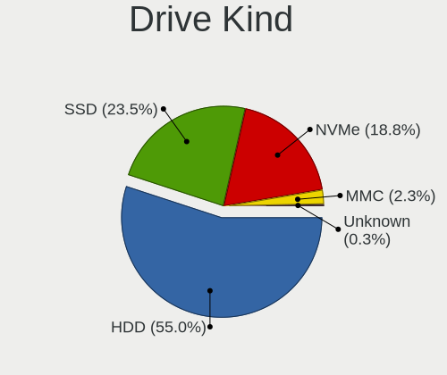

| Kind    | Notebooks | Drives | Percent |
|---------|-----------|--------|---------|
| HDD     | 323       | 442    | 56.57%  |
| SSD     | 131       | 171    | 22.94%  |
| NVMe    | 102       | 135    | 17.86%  |
| MMC     | 13        | 18     | 2.28%   |
| Unknown | 2         | 2      | 0.35%   |

Drive Connector
---------------

SATA, SAS, NVMe, etc.

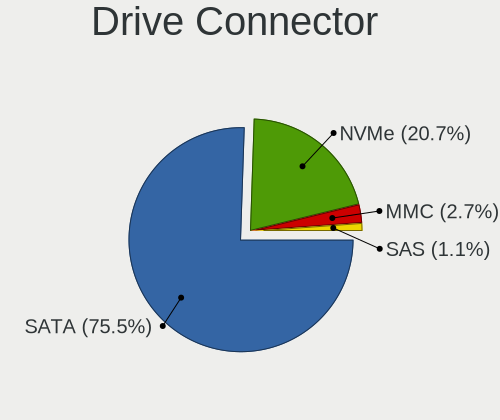

| Type | Notebooks | Drives | Percent |
|------|-----------|--------|---------|
| SATA | 389       | 607    | 76.27%  |
| NVMe | 102       | 135    | 20%     |
| MMC  | 13        | 18     | 2.55%   |
| SAS  | 6         | 8      | 1.18%   |

Drive Size
----------

Size of hard drive

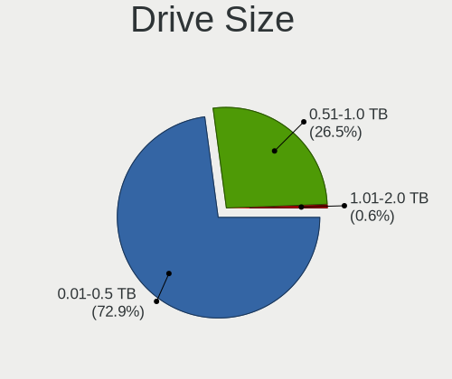

| Size in TB | Notebooks | Drives | Percent |
|------------|-----------|--------|---------|
| 0.01-0.5   | 311       | 461    | 73.7%   |
| 0.51-1.0   | 109       | 150    | 25.83%  |
| 3.01-4.0   | 1         | 1      | 0.24%   |
| 1.01-2.0   | 1         | 1      | 0.24%   |

Space Total
-----------

Amount of disk space available on the file system

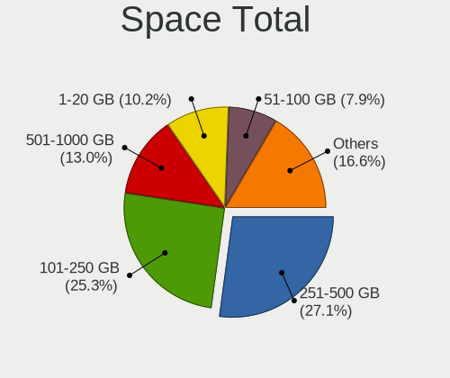

| Size in GB     | Notebooks | Percent |
|----------------|-----------|---------|
| 251-500        | 153       | 29.31%  |
| 101-250        | 132       | 25.29%  |
| 501-1000       | 67        | 12.84%  |
| 1-20           | 56        | 10.73%  |
| 51-100         | 38        | 7.28%   |
| 21-50          | 37        | 7.09%   |
| 1001-2000      | 24        | 4.6%    |
| Unknown        | 10        | 1.92%   |
| 2001-3000      | 4         | 0.77%   |
| More than 3000 | 1         | 0.19%   |

Space Used
----------

Amount of used disk space

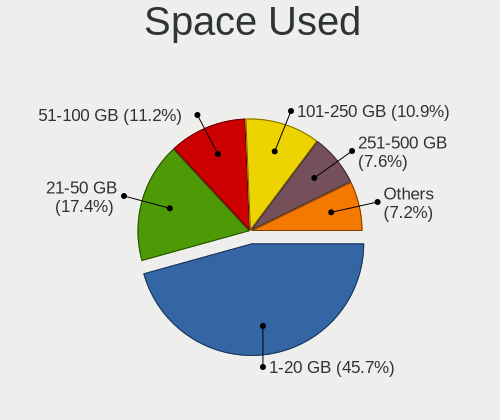

| Used GB   | Notebooks | Percent |
|-----------|-----------|---------|
| 1-20      | 239       | 45.79%  |
| 21-50     | 91        | 17.43%  |
| 51-100    | 59        | 11.3%   |
| 101-250   | 55        | 10.54%  |
| 251-500   | 41        | 7.85%   |
| 501-1000  | 18        | 3.45%   |
| Unknown   | 10        | 1.92%   |
| 1001-2000 | 8         | 1.53%   |
| 0         | 1         | 0.19%   |

Malfunc. Drives
---------------

Drive models with a malfunction

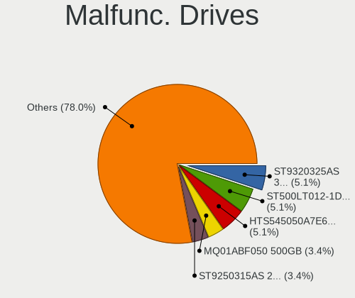

| Model                                           | Notebooks | Drives | Percent |
|-------------------------------------------------|-----------|--------|---------|
| Seagate ST9320325AS 320GB                       | 6         | 6      | 5.26%   |
| Seagate ST500LT012-1DG142 500GB                 | 6         | 7      | 5.26%   |
| HGST HTS545050A7E680 500GB                      | 5         | 6      | 4.39%   |
| Seagate ST9250315AS 250GB                       | 4         | 4      | 3.51%   |
| Hitachi HTS545050B9A300 500GB                   | 4         | 5      | 3.51%   |
| Toshiba MQ01ABF050 500GB                        | 3         | 4      | 2.63%   |
| Toshiba MQ01ABD032 320GB                        | 3         | 3      | 2.63%   |
| Seagate ST9500420AS 500GB                       | 3         | 3      | 2.63%   |
| Seagate ST9500325AS 500GB                       | 3         | 4      | 2.63%   |
| Seagate ST500LT012-9WS142 500GB                 | 3         | 3      | 2.63%   |
| Seagate ST1000LM024 HN-M101MBB 1TB              | 3         | 4      | 2.63%   |
| WDC WD3200BPVT-35ZEST0 320GB                    | 2         | 6      | 1.75%   |
| WDC WD10JPVX-22JC3T0 1TB                        | 2         | 2      | 1.75%   |
| Toshiba MK3259GSXP 320GB                        | 2         | 3      | 1.75%   |
| Hitachi HTS722010K9SA00 100GB                   | 2         | 2      | 1.75%   |
| Hitachi HTS547575A9E384 752GB                   | 2         | 2      | 1.75%   |
| Hitachi HTS545025B9A300 250GB                   | 2         | 2      | 1.75%   |
| WDC WD5000LPVX-60V0TT0 500GB                    | 1         | 2      | 0.88%   |
| WDC WD5000LPLX-60ZNTT1 500GB                    | 1         | 1      | 0.88%   |
| WDC WD5000BPVT-24HXZT3 500GB                    | 1         | 1      | 0.88%   |
| WDC WD5000BEVT-75A0RT0 500GB                    | 1         | 1      | 0.88%   |
| WDC WD3200BEVT-80A0RT0 320GB                    | 1         | 2      | 0.88%   |
| WDC WD3200BEVT-22A0RT0 320GB                    | 1         | 1      | 0.88%   |
| WDC WD3200BEKT-75PVMT1 320GB                    | 1         | 1      | 0.88%   |
| WDC WD3200BEKT-60F3T1 320GB                     | 1         | 1      | 0.88%   |
| WDC WD2500BEVT-35A23T0 250GB                    | 1         | 1      | 0.88%   |
| WDC WD2500BEVT-22A23T0 250GB                    | 1         | 1      | 0.88%   |
| WDC WD2500BEVT-00A23T0 250GB                    | 1         | 1      | 0.88%   |
| WDC WD2500BEKT-60A25T1 250GB                    | 1         | 1      | 0.88%   |
| WDC WD10JPVX-60JC3T0 1TB                        | 1         | 1      | 0.88%   |
| WDC WD10JPVT-08A1YT2 1TB                        | 1         | 1      | 0.88%   |
| Toshiba MK6476GSX 640GB                         | 1         | 1      | 0.88%   |
| Toshiba MK5065GSX 500GB                         | 1         | 1      | 0.88%   |
| Toshiba MK5055GSX 500GB                         | 1         | 1      | 0.88%   |
| Toshiba MK3265GSX 320GB                         | 1         | 2      | 0.88%   |
| Toshiba MK2035GSS 200GB                         | 1         | 1      | 0.88%   |
| SK Hynix HFS256G39TND-N210A 256GB SSD           | 1         | 1      | 0.88%   |
| Seagate ST9160827AS 160GB                       | 1         | 1      | 0.88%   |
| Seagate ST9160821AS 160GB                       | 1         | 1      | 0.88%   |
| Seagate ST9120822AS 120GB                       | 1         | 1      | 0.88%   |
| Seagate ST750LM022 HN-M750MBB 752GB             | 1         | 1      | 0.88%   |
| Seagate ST320LT020-9YG142 320GB                 | 1         | 1      | 0.88%   |
| SanDisk SD8SN8U-256G-1006 256GB SSD             | 1         | 1      | 0.88%   |
| Samsung Electronics HM500JI 500GB               | 1         | 1      | 0.88%   |
| Samsung Electronics HM321HI 320GB               | 1         | 2      | 0.88%   |
| Samsung Electronics HM160HI 160GB               | 1         | 7      | 0.88%   |
| PNY SSD2SC240G1LC709B121-443 240GB              | 1         | 3      | 0.88%   |
| OCZ VERTEX450 128GB SSD                         | 1         | 1      | 0.88%   |
| Micron Technology MTFDHBA256TCK-1AS1AABHA 256GB | 1         | 1      | 0.88%   |
| LITEONIT LMT-128M3M 128GB SSD                   | 1         | 1      | 0.88%   |
| Kingston SUV500480G 480GB SSD                   | 1         | 1      | 0.88%   |
| Kingston SH103S3240G 240GB SSD                  | 1         | 1      | 0.88%   |
| KingSpec KSD-SA25.7-016MJ 16GB SSD              | 1         | 6      | 0.88%   |
| Hitachi HTS727575A9E364 752GB                   | 1         | 1      | 0.88%   |
| Hitachi HTS725032A9A364 320GB                   | 1         | 1      | 0.88%   |
| Hitachi HTS725016A9A364 160GB                   | 1         | 1      | 0.88%   |
| Hitachi HTS722012K9SA00 120GB                   | 1         | 1      | 0.88%   |
| Hitachi HTS547550A9E384 500GB                   | 1         | 1      | 0.88%   |
| Hitachi HTS545050A7E380 500GB                   | 1         | 1      | 0.88%   |
| Hitachi HTS545032B9A300 320GB                   | 1         | 1      | 0.88%   |

Malfunc. Drive Vendor
---------------------

Vendors of faulty drives

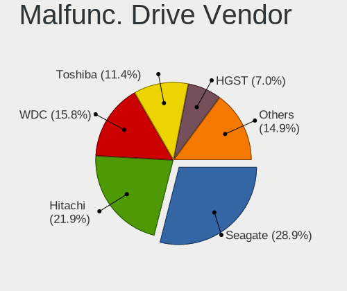

| Vendor              | Notebooks | Drives | Percent |
|---------------------|-----------|--------|---------|
| Seagate             | 33        | 36     | 28.95%  |
| Hitachi             | 25        | 29     | 21.93%  |
| WDC                 | 18        | 24     | 15.79%  |
| Toshiba             | 13        | 16     | 11.4%   |
| HGST                | 8         | 9      | 7.02%   |
| Fujitsu             | 4         | 5      | 3.51%   |
| Samsung Electronics | 3         | 10     | 2.63%   |
| Kingston            | 2         | 2      | 1.75%   |
| SK Hynix            | 1         | 1      | 0.88%   |
| SanDisk             | 1         | 1      | 0.88%   |
| PNY                 | 1         | 3      | 0.88%   |
| OCZ                 | 1         | 1      | 0.88%   |
| Micron Technology   | 1         | 1      | 0.88%   |
| LITEONIT            | 1         | 1      | 0.88%   |
| KingSpec            | 1         | 6      | 0.88%   |
| Crucial             | 1         | 1      | 0.88%   |

Malfunc. HDD Vendor
-------------------

Vendors of faulty HDD drives

| Vendor              | Notebooks | Drives | Percent |
|---------------------|-----------|--------|---------|
| Seagate             | 33        | 36     | 31.73%  |
| Hitachi             | 25        | 29     | 24.04%  |
| WDC                 | 18        | 24     | 17.31%  |
| Toshiba             | 13        | 16     | 12.5%   |
| HGST                | 8         | 9      | 7.69%   |
| Fujitsu             | 4         | 5      | 3.85%   |
| Samsung Electronics | 3         | 10     | 2.88%   |

Malfunc. Drive Kind
-------------------

Kinds of faulty drives

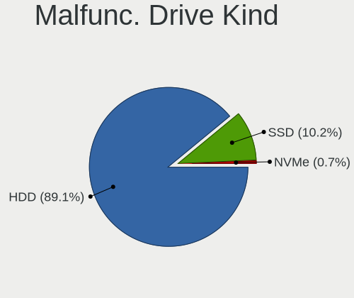

| Kind | Notebooks | Drives | Percent |
|------|-----------|--------|---------|
| HDD  | 103       | 129    | 91.15%  |
| SSD  | 9         | 16     | 7.96%   |
| NVMe | 1         | 1      | 0.88%   |

Failed Drives
-------------

Failed drive models

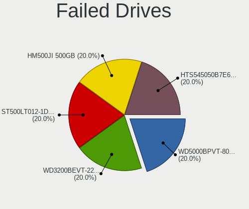

| Model                             | Notebooks | Drives | Percent |
|-----------------------------------|-----------|--------|---------|
| WDC WD5000BPVT-80HXZT3 500GB      | 1         | 1      | 25%     |
| WDC WD3200BEVT-22ZCT0 320GB       | 1         | 1      | 25%     |
| Seagate ST500LT012-1DG142 500GB   | 1         | 1      | 25%     |
| Samsung Electronics HM500JI 500GB | 1         | 1      | 25%     |

Failed Drive Vendor
-------------------

Failed drive vendors

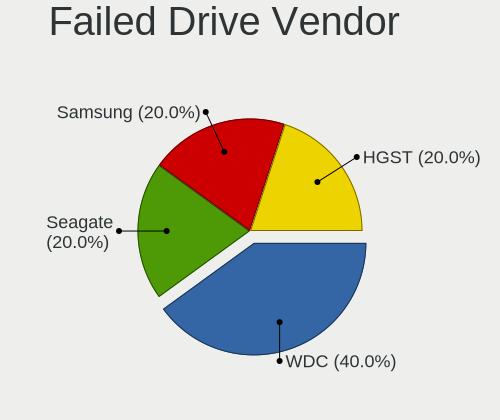

| Vendor              | Notebooks | Drives | Percent |
|---------------------|-----------|--------|---------|
| WDC                 | 2         | 2      | 50%     |
| Seagate             | 1         | 1      | 25%     |
| Samsung Electronics | 1         | 1      | 25%     |

Drive Status
------------

Number of failed and malfunc. drives

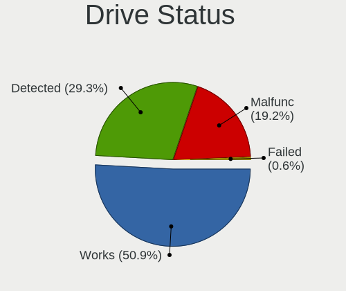

| Status   | Notebooks | Drives | Percent |
|----------|-----------|--------|---------|
| Works    | 263       | 408    | 50.29%  |
| Detected | 144       | 210    | 27.53%  |
| Malfunc  | 112       | 146    | 21.41%  |
| Failed   | 4         | 4      | 0.76%   |

Storage controller
------------------

Storage Vendor
--------------

Storage controller vendors

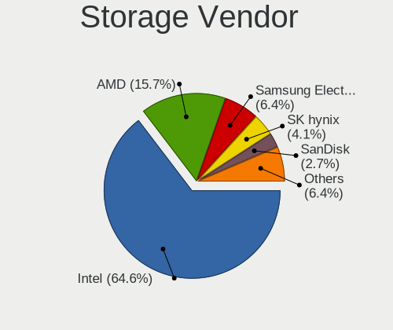

| Vendor                           | Notebooks | Percent |
|----------------------------------|-----------|---------|
| Intel                            | 353       | 64.65%  |
| AMD                              | 87        | 15.93%  |
| Samsung Electronics              | 35        | 6.41%   |
| SK Hynix                         | 22        | 4.03%   |
| Sandisk                          | 14        | 2.56%   |
| Kingston Technology Company      | 12        | 2.2%    |
| Micron Technology                | 7         | 1.28%   |
| Toshiba America Info Systems     | 4         | 0.73%   |
| Silicon Integrated Systems [SiS] | 3         | 0.55%   |
| Nvidia                           | 2         | 0.37%   |
| KIOXIA                           | 2         | 0.37%   |
| JMicron Technology               | 2         | 0.37%   |
| Silicon Image                    | 1         | 0.18%   |
| Lenovo                           | 1         | 0.18%   |
| ADATA Technology                 | 1         | 0.18%   |

Storage Model
-------------

Storage controller models

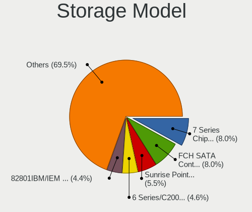

| Model                                                                                  | Notebooks | Percent |
|----------------------------------------------------------------------------------------|-----------|---------|
| AMD FCH SATA Controller [AHCI mode]                                                    | 53        | 8.88%   |
| Intel 7 Series Chipset Family 6-port SATA Controller [AHCI mode]                       | 48        | 8.04%   |
| Intel Sunrise Point-LP SATA Controller [AHCI mode]                                     | 37        | 6.2%    |
| Intel 82801IBM/IEM (ICH9M/ICH9M-E) 4 port SATA Controller [AHCI mode]                  | 28        | 4.69%   |
| Intel 6 Series/C200 Series Chipset Family 6 port Mobile SATA AHCI Controller           | 26        | 4.36%   |
| AMD SB7x0/SB8x0/SB9x0 SATA Controller [AHCI mode]                                      | 25        | 4.19%   |
| Intel Atom Processor E3800 Series SATA AHCI Controller                                 | 18        | 3.02%   |
| Intel Cannon Lake Mobile PCH SATA AHCI Controller                                      | 17        | 2.85%   |
| Intel 82801HM/HEM (ICH8M/ICH8M-E) IDE Controller                                       | 17        | 2.85%   |
| Intel 8 Series SATA Controller 1 [AHCI mode]                                           | 16        | 2.68%   |
| Samsung NVMe SSD Controller SM981/PM981/PM983                                          | 15        | 2.51%   |
| Intel NM10/ICH7 Family SATA Controller [AHCI mode]                                     | 15        | 2.51%   |
| Intel Celeron N3350/Pentium N4200/Atom E3900 Series SATA AHCI Controller               | 13        | 2.18%   |
| Intel Volume Management Device NVMe RAID Controller                                    | 12        | 2.01%   |
| Intel 82801HM/HEM (ICH8M/ICH8M-E) SATA Controller [AHCI mode]                          | 12        | 2.01%   |
| Intel 8 Series/C220 Series Chipset Family 6-port SATA Controller 1 [AHCI mode]         | 11        | 1.84%   |
| Samsung NVMe SSD Controller SM961/PM961/SM963                                          | 10        | 1.68%   |
| Intel Wildcat Point-LP SATA Controller [AHCI Mode]                                     | 10        | 1.68%   |
| SK Hynix BC501 NVMe Solid State Drive                                                  | 9         | 1.51%   |
| Samsung NVMe SSD Controller 980                                                        | 9         | 1.51%   |
| Intel 5 Series/3400 Series Chipset 4 port SATA AHCI Controller                         | 9         | 1.51%   |
| Intel 82801HM/HEM (ICH8M/ICH8M-E) SATA Controller [IDE mode]                           | 8         | 1.34%   |
| Sandisk WD Blue SN550 NVMe SSD                                                         | 7         | 1.17%   |
| Micron Non-Volatile memory controller                                                  | 7         | 1.17%   |
| Intel HM170/QM170 Chipset SATA Controller [AHCI Mode]                                  | 7         | 1.17%   |
| Intel Atom/Celeron/Pentium Processor x5-E8000/J3xxx/N3xxx Series SATA Controller       | 7         | 1.17%   |
| SK Hynix BC511                                                                         | 6         | 1.01%   |
| Intel SSD 660P Series                                                                  | 6         | 1.01%   |
| Intel Comet Lake SATA AHCI Controller                                                  | 6         | 1.01%   |
| Intel 82801GBM/GHM (ICH7-M Family) SATA Controller [IDE mode]                          | 6         | 1.01%   |
| AMD SB7x0/SB8x0/SB9x0 IDE Controller                                                   | 6         | 1.01%   |
| Kingston Company U-SNS8154P3 NVMe SSD                                                  | 5         | 0.84%   |
| Kingston Company Company Non-Volatile memory controller                                | 5         | 0.84%   |
| Intel Celeron/Pentium Silver Processor SATA Controller                                 | 5         | 0.84%   |
| Intel Cannon Point-LP SATA Controller [AHCI Mode]                                      | 5         | 0.84%   |
| Intel 82801IBM/IEM (ICH9M/ICH9M-E) 2 port SATA Controller [IDE mode]                   | 5         | 0.84%   |
| Intel 7 Series Chipset Family 4-port SATA Controller [IDE mode]                        | 5         | 0.84%   |
| Intel 7 Series Chipset Family 2-port SATA Controller [IDE mode]                        | 5         | 0.84%   |
| Intel Tiger Lake-LP SATA Controller [AHCI mode]                                        | 4         | 0.67%   |
| Intel 82801 Mobile SATA Controller [RAID mode]                                         | 4         | 0.67%   |
| AMD SB600 Non-Raid-5 SATA                                                              | 4         | 0.67%   |
| AMD SB600 IDE                                                                          | 4         | 0.67%   |
| SK Hynix PC401 NVMe Solid State Drive 256GB                                            | 3         | 0.5%    |
| SK Hynix Non-Volatile memory controller                                                | 3         | 0.5%    |
| Silicon Integrated Systems [SiS] SATA Controller / IDE mode                            | 3         | 0.5%    |
| Silicon Integrated Systems [SiS] 5513 IDE Controller                                   | 3         | 0.5%    |
| Sandisk WD Blue SN500 / PC SN520 NVMe SSD                                              | 3         | 0.5%    |
| Intel Ice Lake-LP SATA Controller [AHCI mode]                                          | 3         | 0.5%    |
| Intel 5 Series/3400 Series Chipset 6 port SATA AHCI Controller                         | 3         | 0.5%    |
| AMD FCH SATA Controller [IDE mode]                                                     | 3         | 0.5%    |
| Toshiba America Info Systems BG3 NVMe SSD Controller                                   | 2         | 0.34%   |
| Sandisk WD Black SN750 / PC SN730 NVMe SSD                                             | 2         | 0.34%   |
| Nvidia MCP79 AHCI Controller                                                           | 2         | 0.34%   |
| KIOXIA Non-Volatile memory controller                                                  | 2         | 0.34%   |
| Kingston Company OM3PDP3 NVMe SSD                                                      | 2         | 0.34%   |
| JMicron JMB360 AHCI Controller                                                         | 2         | 0.34%   |
| Intel NM10/ICH7 Family SATA Controller [IDE mode]                                      | 2         | 0.34%   |
| Intel 6 Series/C200 Series Chipset Family Mobile SATA Controller (IDE mode, ports 4-5) | 2         | 0.34%   |
| Intel 6 Series/C200 Series Chipset Family Mobile SATA Controller (IDE mode, ports 0-3) | 2         | 0.34%   |
| AMD SB7x0/SB8x0/SB9x0 SATA Controller [IDE mode]                                       | 2         | 0.34%   |

Storage Kind
------------

Kind of storage controller (IDE, SATA, NVMe, SAS, ...)

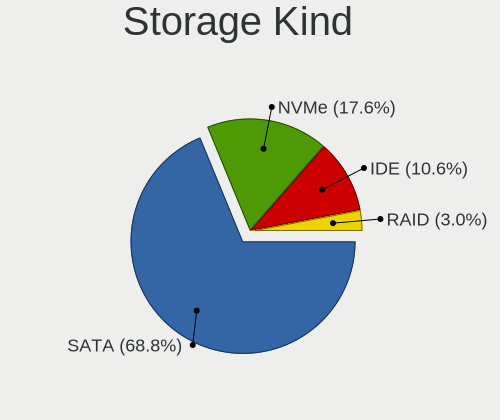

| Kind | Notebooks | Percent |
|------|-----------|---------|
| SATA | 393       | 68.59%  |
| NVMe | 103       | 17.98%  |
| IDE  | 60        | 10.47%  |
| RAID | 17        | 2.97%   |

Processor
---------

CPU Vendor
----------

Processor vendors

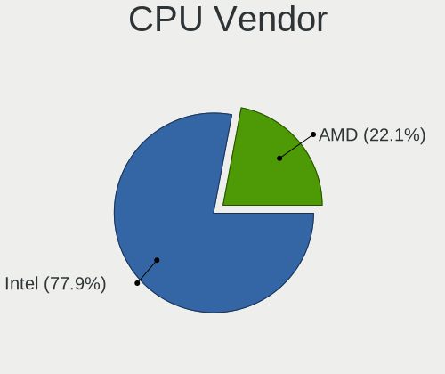

| Vendor | Notebooks | Percent |
|--------|-----------|---------|
| Intel  | 382       | 80.25%  |
| AMD    | 94        | 19.75%  |

CPU Model
---------

Processor models

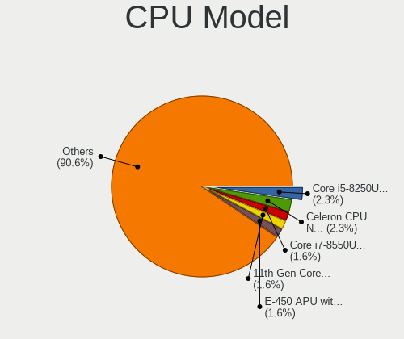

| Model                                         | Notebooks | Percent |
|-----------------------------------------------|-----------|---------|
| Intel Celeron CPU N2840 @ 2.16GHz             | 13        | 2.71%   |
| Intel Core i5-8250U CPU @ 1.60GHz             | 12        | 2.5%    |
| AMD E-450 APU with Radeon HD Graphics         | 9         | 1.88%   |
| Intel Core i7-8565U CPU @ 1.80GHz             | 7         | 1.46%   |
| Intel Core i7-8550U CPU @ 1.80GHz             | 7         | 1.46%   |
| Intel Core i3-6006U CPU @ 2.00GHz             | 7         | 1.46%   |
| Intel Core i3-3110M CPU @ 2.40GHz             | 7         | 1.46%   |
| Intel Pentium Dual-Core CPU T4400 @ 2.20GHz   | 6         | 1.25%   |
| Intel Core i7-7700HQ CPU @ 2.80GHz            | 6         | 1.25%   |
| Intel Core i5-6200U CPU @ 2.30GHz             | 6         | 1.25%   |
| Intel Core i5-2450M CPU @ 2.50GHz             | 6         | 1.25%   |
| AMD Ryzen 5 4600H with Radeon Graphics        | 6         | 1.25%   |
| Intel Pentium CPU N4200 @ 1.10GHz             | 5         | 1.04%   |
| Intel Core i7-8750H CPU @ 2.20GHz             | 5         | 1.04%   |
| Intel Core i5-9300H CPU @ 2.40GHz             | 5         | 1.04%   |
| Intel Core i5-7200U CPU @ 2.50GHz             | 5         | 1.04%   |
| Intel Core i5-5200U CPU @ 2.20GHz             | 5         | 1.04%   |
| Intel Celeron CPU N3350 @ 1.10GHz             | 5         | 1.04%   |
| Intel Atom CPU N455 @ 1.66GHz                 | 5         | 1.04%   |
| Intel 11th Gen Core i5-1135G7 @ 2.40GHz       | 5         | 1.04%   |
| AMD Ryzen 5 3500U with Radeon Vega Mobile Gfx | 5         | 1.04%   |
| AMD Ryzen 5 2500U with Radeon Vega Mobile Gfx | 5         | 1.04%   |
| AMD A4-4300M APU with Radeon HD Graphics      | 5         | 1.04%   |
| Intel Pentium CPU B960 @ 2.20GHz              | 4         | 0.83%   |
| Intel Core i5-4210U CPU @ 1.70GHz             | 4         | 0.83%   |
| Intel Core i5-3230M CPU @ 2.60GHz             | 4         | 0.83%   |
| Intel Core i5-3210M CPU @ 2.50GHz             | 4         | 0.83%   |
| Intel Core i5-10210U CPU @ 1.60GHz            | 4         | 0.83%   |
| Intel Core i3-3120M CPU @ 2.50GHz             | 4         | 0.83%   |
| Intel Celeron CPU B800 @ 1.50GHz              | 4         | 0.83%   |
| Intel Atom CPU N570 @ 1.66GHz                 | 4         | 0.83%   |
| Intel Atom CPU N270 @ 1.60GHz                 | 4         | 0.83%   |
| Intel Pentium Dual-Core CPU T4500 @ 2.30GHz   | 3         | 0.63%   |
| Intel Pentium Dual CPU T3200 @ 2.00GHz        | 3         | 0.63%   |
| Intel Pentium CPU N3700 @ 1.60GHz             | 3         | 0.63%   |
| Intel Pentium CPU 2117U @ 1.80GHz             | 3         | 0.63%   |
| Intel Pentium CPU 2020M @ 2.40GHz             | 3         | 0.63%   |
| Intel Core i7-9750H CPU @ 2.60GHz             | 3         | 0.63%   |
| Intel Core i7-2670QM CPU @ 2.20GHz            | 3         | 0.63%   |
| Intel Core i7-10510U CPU @ 1.80GHz            | 3         | 0.63%   |
| Intel Core i5-8300H CPU @ 2.30GHz             | 3         | 0.63%   |
| Intel Core i5-4200M CPU @ 2.50GHz             | 3         | 0.63%   |
| Intel Core i3-3217U CPU @ 1.80GHz             | 3         | 0.63%   |
| Intel Core i3-2370M CPU @ 2.40GHz             | 3         | 0.63%   |
| Intel Core i3-2350M CPU @ 2.30GHz             | 3         | 0.63%   |
| Intel Core i3-2330M CPU @ 2.20GHz             | 3         | 0.63%   |
| Intel Core 2 Solo CPU U3500 @ 1.40GHz         | 3         | 0.63%   |
| Intel Core 2 Duo CPU T7500 @ 2.20GHz          | 3         | 0.63%   |
| Intel Core 2 Duo CPU T7300 @ 2.00GHz          | 3         | 0.63%   |
| Intel Core 2 Duo CPU T7250 @ 2.00GHz          | 3         | 0.63%   |
| Intel Celeron N4000 CPU @ 1.10GHz             | 3         | 0.63%   |
| Intel Celeron CPU N3450 @ 1.10GHz             | 3         | 0.63%   |
| Intel Celeron CPU B820 @ 1.70GHz              | 3         | 0.63%   |
| Intel Celeron CPU 1005M @ 1.90GHz             | 3         | 0.63%   |
| Intel Atom CPU N2600 @ 1.60GHz                | 3         | 0.63%   |
| Intel 11th Gen Core i7-1165G7 @ 2.80GHz       | 3         | 0.63%   |
| AMD Ryzen 5 4500U with Radeon Graphics        | 3         | 0.63%   |
| AMD E1-2100 APU with Radeon HD Graphics       | 3         | 0.63%   |
| AMD A10-4600M APU with Radeon HD Graphics     | 3         | 0.63%   |
| Intel Pentium Silver N5000 CPU @ 1.10GHz      | 2         | 0.42%   |

CPU Model Family
----------------

Processor model prefix

| Model                                | Notebooks | Percent |
|--------------------------------------|-----------|---------|
| Intel Core i5                        | 82        | 17.12%  |
| Intel Core i7                        | 62        | 12.94%  |
| Intel Celeron                        | 52        | 10.86%  |
| Intel Core i3                        | 49        | 10.23%  |
| Intel Pentium                        | 36        | 7.52%   |
| Intel Core 2 Duo                     | 29        | 6.05%   |
| Intel Atom                           | 25        | 5.22%   |
| AMD Ryzen 5                          | 20        | 4.18%   |
| Other                                | 15        | 3.13%   |
| AMD E                                | 12        | 2.51%   |
| AMD A4                               | 10        | 2.09%   |
| Intel Pentium Dual-Core              | 9         | 1.88%   |
| AMD A6                               | 7         | 1.46%   |
| AMD E1                               | 6         | 1.25%   |
| Intel Pentium Dual                   | 5         | 1.04%   |
| Intel Genuine                        | 5         | 1.04%   |
| AMD Turion II                        | 4         | 0.84%   |
| AMD Ryzen 3                          | 4         | 0.84%   |
| AMD Athlon II                        | 4         | 0.84%   |
| AMD A8                               | 4         | 0.84%   |
| AMD A10                              | 4         | 0.84%   |
| Intel Pentium Silver                 | 3         | 0.63%   |
| Intel Core 2 Solo                    | 3         | 0.63%   |
| Intel Celeron Dual-Core              | 3         | 0.63%   |
| AMD Ryzen 7                          | 3         | 0.63%   |
| AMD Phenom II                        | 3         | 0.63%   |
| AMD E2                               | 3         | 0.63%   |
| Intel Pentium M                      | 2         | 0.42%   |
| Intel Core i9                        | 2         | 0.42%   |
| AMD Turion 64 X2 Mobile              | 2         | 0.42%   |
| AMD Ryzen 9                          | 2         | 0.42%   |
| AMD Athlon                           | 2         | 0.42%   |
| Intel Core Duo                       | 1         | 0.21%   |
| Intel Celeron M                      | 1         | 0.21%   |
| AMD V140                             | 1         | 0.21%   |
| AMD Turion II Ultra Dual-Core Mobile | 1         | 0.21%   |
| AMD Turion II Dual-Core              | 1         | 0.21%   |
| AMD Ryzen 7 PRO                      | 1         | 0.21%   |
| AMD Athlon II Dual-Core              | 1         | 0.21%   |

CPU Cores
---------

Number of processor cores

| Number  | Notebooks | Percent |
|---------|-----------|---------|
| 2       | 281       | 58.54%  |
| 4       | 130       | 27.08%  |
| 1       | 33        | 6.88%   |
| 6       | 23        | 4.79%   |
| Unknown | 9         | 1.88%   |
| 8       | 4         | 0.83%   |

CPU Sockets
-----------

Number of sockets

| Number | Notebooks | Percent |
|--------|-----------|---------|
| 1      | 476       | 100%    |

CPU Threads
-----------

Threads per core (Hyper-Threading)

| Number  | Notebooks | Percent |
|---------|-----------|---------|
| 2       | 268       | 55.72%  |
| 1       | 204       | 42.41%  |
| Unknown | 9         | 1.87%   |

CPU Op-Modes
------------

CPU Operation Modes (32-bit, 64-bit)

| Op mode        | Notebooks | Percent |
|----------------|-----------|---------|
| 32-bit, 64-bit | 446       | 93.7%   |
| 32-bit         | 15        | 3.15%   |
| Unknown        | 15        | 3.15%   |

CPU Microcode
-------------

Microcode number

| Number     | Notebooks | Percent |
|------------|-----------|---------|
| Unknown    | 46        | 9.43%   |
| 0x206a7    | 40        | 8.2%    |
| 0x306a9    | 36        | 7.38%   |
| 0x1067a    | 26        | 5.33%   |
| 0x806ea    | 21        | 4.3%    |
| 0x30678    | 17        | 3.48%   |
| 0x806ec    | 15        | 3.07%   |
| 0x906ea    | 13        | 2.66%   |
| 0x05000119 | 13        | 2.66%   |
| 0x6fd      | 12        | 2.46%   |
| 0x406e3    | 12        | 2.46%   |
| 0x40651    | 12        | 2.46%   |
| 0x106ca    | 12        | 2.46%   |
| 0x806c1    | 11        | 2.25%   |
| 0x506c9    | 11        | 2.25%   |
| 0x306c3    | 11        | 2.25%   |
| 0x010000c8 | 11        | 2.25%   |
| 0x306d4    | 10        | 2.05%   |
| 0x806e9    | 9         | 1.84%   |
| 0x08108102 | 8         | 1.64%   |
| 0x06001119 | 8         | 1.64%   |
| 0x20652    | 6         | 1.23%   |
| 0x106c2    | 6         | 1.23%   |
| 0x10661    | 6         | 1.23%   |
| 0x0700010f | 6         | 1.23%   |
| 0x906e9    | 5         | 1.02%   |
| 0x30661    | 5         | 1.02%   |
| 0x06006705 | 5         | 1.02%   |
| 0x806eb    | 4         | 0.82%   |
| 0x706e5    | 4         | 0.82%   |
| 0x706a1    | 4         | 0.82%   |
| 0x6fb      | 4         | 0.82%   |
| 0x406c4    | 4         | 0.82%   |
| 0x20655    | 4         | 0.82%   |
| 0x10676    | 4         | 0.82%   |
| 0x08600104 | 4         | 0.82%   |
| 0x0810100b | 4         | 0.82%   |
| 0x07030105 | 4         | 0.82%   |
| 0x03000027 | 4         | 0.82%   |
| 0x906ed    | 3         | 0.61%   |
| 0x6fa      | 3         | 0.61%   |
| 0x506e3    | 3         | 0.61%   |
| 0x406c3    | 3         | 0.61%   |
| 0x30673    | 3         | 0.61%   |
| 0x106e5    | 3         | 0.61%   |
| 0x08600103 | 3         | 0.61%   |
| 0x0600111f | 3         | 0.61%   |
| 0x806d1    | 2         | 0.41%   |
| 0x6ec      | 2         | 0.41%   |
| 0x6e8      | 2         | 0.41%   |
| 0x6d8      | 2         | 0.41%   |
| 0x0a50000c | 2         | 0.41%   |
| 0x08608103 | 2         | 0.41%   |
| 0x08600106 | 2         | 0.41%   |
| 0x01000098 | 2         | 0.41%   |
| 0xa0652    | 1         | 0.2%    |
| 0x906c0    | 1         | 0.2%    |
| 0x08608102 | 1         | 0.2%    |
| 0x08108109 | 1         | 0.2%    |
| 0x08101007 | 1         | 0.2%    |

CPU Microarch
-------------

Microarchitecture

| Name          | Notebooks | Percent |
|---------------|-----------|---------|
| KabyLake      | 77        | 16.08%  |
| SandyBridge   | 41        | 8.56%   |
| IvyBridge     | 41        | 8.56%   |
| Penryn        | 35        | 7.31%   |
| Silvermont    | 28        | 5.85%   |
| Haswell       | 27        | 5.64%   |
| Core          | 26        | 5.43%   |
| Bonnell       | 22        | 4.59%   |
| Skylake       | 17        | 3.55%   |
| K10           | 15        | 3.13%   |
| Bobcat        | 14        | 2.92%   |
| Goldmont      | 13        | 2.71%   |
| TigerLake     | 12        | 2.51%   |
| Zen 2         | 11        | 2.3%    |
| Zen+          | 10        | 2.09%   |
| Westmere      | 10        | 2.09%   |
| Piledriver    | 10        | 2.09%   |
| Broadwell     | 10        | 2.09%   |
| Icelake       | 7         | 1.46%   |
| Zen           | 6         | 1.25%   |
| Jaguar        | 6         | 1.25%   |
| Excavator     | 6         | 1.25%   |
| Unknown       | 6         | 1.25%   |
| Puma          | 5         | 1.04%   |
| P6            | 5         | 1.04%   |
| Goldmont plus | 5         | 1.04%   |
| K10 Llano     | 4         | 0.84%   |
| Nehalem       | 3         | 0.63%   |
| Zen 3         | 2         | 0.42%   |
| K8 Hammer     | 2         | 0.42%   |
| CometLake     | 2         | 0.42%   |
| Tremont       | 1         | 0.21%   |

Graphics
--------

GPU Vendor
----------

Vendors of graphics cards

| Vendor                           | Notebooks | Percent |
|----------------------------------|-----------|---------|
| Intel                            | 343       | 53.43%  |
| Nvidia                           | 153       | 23.83%  |
| AMD                              | 143       | 22.27%  |
| Silicon Integrated Systems [SiS] | 3         | 0.47%   |

GPU Model
---------

Graphics card models

| Model                                                                                    | Notebooks | Percent |
|------------------------------------------------------------------------------------------|-----------|---------|
| Intel 3rd Gen Core processor Graphics Controller                                         | 40        | 5.83%   |
| Intel 2nd Generation Core Processor Family Integrated Graphics Controller                | 38        | 5.54%   |
| Intel Mobile 4 Series Chipset Integrated Graphics Controller                             | 24        | 3.5%    |
| Intel UHD Graphics 620                                                                   | 23        | 3.35%   |
| Intel Atom Processor Z36xxx/Z37xxx Series Graphics & Display                             | 20        | 2.92%   |
| Intel Haswell-ULT Integrated Graphics Controller                                         | 16        | 2.33%   |
| Intel CoffeeLake-H GT2 [UHD Graphics 630]                                                | 15        | 2.19%   |
| Intel Skylake GT2 [HD Graphics 520]                                                      | 14        | 2.04%   |
| Intel Mobile GM965/GL960 Integrated Graphics Controller (secondary)                      | 13        | 1.9%    |
| Intel Mobile GM965/GL960 Integrated Graphics Controller (primary)                        | 13        | 1.9%    |
| Intel Atom Processor D4xx/D5xx/N4xx/N5xx Integrated Graphics Controller                  | 12        | 1.75%   |
| Intel WhiskeyLake-U GT2 [UHD Graphics 620]                                               | 11        | 1.6%    |
| Intel 4th Gen Core Processor Integrated Graphics Controller                              | 11        | 1.6%    |
| AMD Renoir                                                                               | 11        | 1.6%    |
| Nvidia GP108M [GeForce MX150]                                                            | 10        | 1.46%   |
| Nvidia GF117M [GeForce 610M/710M/810M/820M / GT 620M/625M/630M/720M]                     | 10        | 1.46%   |
| Intel TigerLake-LP GT2 [Iris Xe Graphics]                                                | 10        | 1.46%   |
| AMD Picasso/Raven 2 [Radeon Vega Series / Radeon Vega Mobile Series]                     | 10        | 1.46%   |
| Intel HD Graphics 5500                                                                   | 9         | 1.31%   |
| Intel CometLake-U GT2 [UHD Graphics]                                                     | 9         | 1.31%   |
| AMD Sun XT [Radeon HD 8670A/8670M/8690M / R5 M330 / M430 / Radeon 520 Mobile]            | 9         | 1.31%   |
| AMD Seymour [Radeon HD 6400M/7400M Series]                                               | 9         | 1.31%   |
| Intel HD Graphics 620                                                                    | 8         | 1.17%   |
| Intel HD Graphics 500                                                                    | 8         | 1.17%   |
| Intel Atom/Celeron/Pentium Processor x5-E8000/J3xxx/N3xxx Integrated Graphics Controller | 8         | 1.17%   |
| AMD Wrestler [Radeon HD 6320]                                                            | 8         | 1.17%   |
| AMD Mars [Radeon HD 8670A/8670M/8750M / R7 M370]                                         | 8         | 1.17%   |
| Nvidia GP107M [GeForce GTX 1050 Ti Mobile]                                               | 7         | 1.02%   |
| Nvidia GP107M [GeForce GTX 1050 Mobile]                                                  | 7         | 1.02%   |
| Nvidia GM108M [GeForce 840M]                                                             | 7         | 1.02%   |
| Intel HD Graphics 630                                                                    | 7         | 1.02%   |
| AMD RS880M [Mobility Radeon HD 4225/4250]                                                | 7         | 1.02%   |
| Nvidia GM108M [GeForce MX110]                                                            | 6         | 0.87%   |
| Intel Mobile 945GM/GMS/GME, 943/940GML Express Integrated Graphics Controller            | 6         | 0.87%   |
| AMD Thames [Radeon HD 7500M/7600M Series]                                                | 6         | 0.87%   |
| AMD Stoney [Radeon R2/R3/R4/R5 Graphics]                                                 | 6         | 0.87%   |
| AMD Raven Ridge [Radeon Vega Series / Radeon Vega Mobile Series]                         | 6         | 0.87%   |
| AMD Park [Mobility Radeon HD 5430/5450/5470]                                             | 6         | 0.87%   |
| Nvidia GM108M [GeForce 940MX]                                                            | 5         | 0.73%   |
| Nvidia GM108M [GeForce 920MX]                                                            | 5         | 0.73%   |
| Nvidia GK208M [GeForce GT 740M]                                                          | 5         | 0.73%   |
| Nvidia GK208BM [GeForce 920M]                                                            | 5         | 0.73%   |
| Nvidia GF108M [GeForce GT 620M/630M/635M/640M LE]                                        | 5         | 0.73%   |
| Intel Mobile 945GSE Express Integrated Graphics Controller                               | 5         | 0.73%   |
| Intel Core Processor Integrated Graphics Controller                                      | 5         | 0.73%   |
| Intel Celeron N3350/Pentium N4200/Atom E3900 Series Integrated Graphics Controller       | 5         | 0.73%   |
| Intel Atom Processor D2xxx/N2xxx Integrated Graphics Controller                          | 5         | 0.73%   |
| AMD Trinity 2 [Radeon HD 7420G]                                                          | 5         | 0.73%   |
| AMD Topaz XT [Radeon R7 M260/M265 / M340/M360 / M440/M445 / 530/535 / 620/625 Mobile]    | 5         | 0.73%   |
| AMD Thames [Radeon HD 7550M/7570M/7650M]                                                 | 5         | 0.73%   |
| Nvidia TU117M [GeForce GTX 1650 Ti Mobile]                                               | 4         | 0.58%   |
| Intel Iris Plus Graphics G1 (Ice Lake)                                                   | 4         | 0.58%   |
| AMD RV710/M92 [Mobility Radeon HD 4330/4350/4550]                                        | 4         | 0.58%   |
| AMD Lexa [Radeon 540X/550X/630 / RX 640 / E9171 MCM]                                     | 4         | 0.58%   |
| Silicon Integrated Systems [SiS] 771/671 PCIE VGA Display Adapter                        | 3         | 0.44%   |
| Nvidia TU117M [GeForce GTX 1650 Mobile / Max-Q]                                          | 3         | 0.44%   |
| Nvidia TU117M                                                                            | 3         | 0.44%   |
| Nvidia GP108M [GeForce MX330]                                                            | 3         | 0.44%   |
| Nvidia GM108M [GeForce 940M]                                                             | 3         | 0.44%   |
| Nvidia GF119M [GeForce GT 520MX]                                                         | 3         | 0.44%   |

GPU Combo
---------

Combinations of graphics cards

| Name           | Notebooks | Percent |
|----------------|-----------|---------|
| 1 x Intel      | 185       | 38.87%  |
| Intel + Nvidia | 120       | 25.21%  |
| 1 x AMD        | 75        | 15.76%  |
| Intel + AMD    | 38        | 7.98%   |
| 1 x Nvidia     | 25        | 5.25%   |
| 2 x AMD        | 22        | 4.62%   |
| AMD + Nvidia   | 8         | 1.68%   |
| 1 x SiS        | 3         | 0.63%   |

GPU Driver
----------

Free vs proprietary

| Driver      | Notebooks | Percent |
|-------------|-----------|---------|
| Free        | 407       | 84.27%  |
| Proprietary | 58        | 12.01%  |
| Unknown     | 18        | 3.73%   |

GPU Memory
----------

Total video memory

| Size in GB | Notebooks | Percent |
|------------|-----------|---------|
| Unknown    | 173       | 35.16%  |
| 1.01-2.0   | 138       | 28.05%  |
| 0.01-0.5   | 105       | 21.34%  |
| 3.01-4.0   | 35        | 7.11%   |
| 0.51-1.0   | 34        | 6.91%   |
| 5.01-6.0   | 4         | 0.81%   |
| 7.01-8.0   | 1         | 0.2%    |
| 2.01-3.0   | 1         | 0.2%    |
| 8.01-16.0  | 1         | 0.2%    |

Monitor
-------

Monitor Vendor
--------------

Monitor vendors

| Vendor                  | Notebooks | Percent |
|-------------------------|-----------|---------|
| AU Optronics            | 117       | 22.99%  |
| LG Display              | 67        | 13.16%  |
| Samsung Electronics     | 65        | 12.77%  |
| Chimei Innolux          | 61        | 11.98%  |
| BOE                     | 59        | 11.59%  |
| Chi Mei Optoelectronics | 41        | 8.06%   |
| PANDA                   | 11        | 2.16%   |
| Goldstar                | 11        | 2.16%   |
| Dell                    | 11        | 2.16%   |
| CPT                     | 9         | 1.77%   |
| Lenovo                  | 8         | 1.57%   |
| HannStar                | 8         | 1.57%   |
| LG Philips              | 6         | 1.18%   |
| Sharp                   | 5         | 0.98%   |
| Philips                 | 5         | 0.98%   |
| Sony                    | 4         | 0.79%   |
| BenQ                    | 3         | 0.59%   |
| ViewSonic               | 2         | 0.39%   |
| LGD                     | 2         | 0.39%   |
| Iiyama                  | 2         | 0.39%   |
| Apple                   | 2         | 0.39%   |
| Unknown                 | 1         | 0.2%    |
| Seiko/Epson             | 1         | 0.2%    |
| Quanta Display          | 1         | 0.2%    |
| PCL                     | 1         | 0.2%    |
| MiTAC                   | 1         | 0.2%    |
| Lenovo Group Limited    | 1         | 0.2%    |
| KDC                     | 1         | 0.2%    |
| ITE                     | 1         | 0.2%    |
| InnoLux Display         | 1         | 0.2%    |
| Hewlett-Packard         | 1         | 0.2%    |

Monitor Model
-------------

Monitor models

| Model                                                                    | Notebooks | Percent |
|--------------------------------------------------------------------------|-----------|---------|
| Chi Mei Optoelectronics LCD Monitor CMO15A7 1366x768 344x193mm 15.5-inch | 13        | 2.54%   |
| BOE LCD Monitor BOE06A5 1366x768 344x194mm 15.5-inch                     | 10        | 1.96%   |
| AU Optronics LCD Monitor AUO21ED 1920x1080 344x194mm 15.5-inch           | 9         | 1.76%   |
| AU Optronics LCD Monitor AUO22EC 1366x768 344x193mm 15.5-inch            | 7         | 1.37%   |
| Samsung Electronics LCD Monitor SEC3245 1280x800 331x207mm 15.4-inch     | 6         | 1.17%   |
| HannStar LCD Monitor HSD03E9 1024x600 220x129mm 10.0-inch                | 6         | 1.17%   |
| BOE LCD Monitor BOE069C 1920x1080 344x193mm 15.5-inch                    | 6         | 1.17%   |
| AU Optronics LCD Monitor AUO61ED 1920x1080 344x194mm 15.5-inch           | 6         | 1.17%   |
| AU Optronics LCD Monitor AUO46EC 1366x768 344x193mm 15.5-inch            | 6         | 1.17%   |
| AU Optronics LCD Monitor AUO21EC 1366x768 344x193mm 15.5-inch            | 6         | 1.17%   |
| Samsung Electronics LCD Monitor SDC4852 1366x768 344x194mm 15.5-inch     | 5         | 0.98%   |
| LG Display LCD Monitor LGD02DC 1366x768 344x194mm 15.5-inch              | 5         | 0.98%   |
| Chimei Innolux LCD Monitor CMN15D5 1920x1080 344x193mm 15.5-inch         | 5         | 0.98%   |
| Chi Mei Optoelectronics LCD Monitor CMO15A3 1366x768 344x193mm 15.5-inch | 5         | 0.98%   |
| Chi Mei Optoelectronics LCD Monitor CMO1592 1366x768 344x193mm 15.5-inch | 5         | 0.98%   |
| AU Optronics LCD Monitor AUO8174 1280x800 331x207mm 15.4-inch            | 5         | 0.98%   |
| AU Optronics LCD Monitor AUO47EC 1366x768 344x193mm 15.5-inch            | 5         | 0.98%   |
| Samsung Electronics LCD Monitor SEC3945 1280x800 331x207mm 15.4-inch     | 4         | 0.78%   |
| Chimei Innolux LCD Monitor CMN15F5 1920x1080 344x193mm 15.5-inch         | 4         | 0.78%   |
| Chimei Innolux LCD Monitor CMN15BC 1366x768 344x193mm 15.5-inch          | 4         | 0.78%   |
| BOE LCD Monitor BOE0747 1920x1080 344x194mm 15.5-inch                    | 4         | 0.78%   |
| AU Optronics LCD Monitor AUO71EC 1366x768 344x193mm 15.5-inch            | 4         | 0.78%   |
| AU Optronics LCD Monitor AUO26EC 1366x768 344x193mm 15.5-inch            | 4         | 0.78%   |
| Sharp LCD Monitor SHP1447 1920x1080 294x165mm 13.3-inch                  | 3         | 0.59%   |
| Samsung Electronics LCD Monitor SEC4251 1366x768 344x194mm 15.5-inch     | 3         | 0.59%   |
| Samsung Electronics LCD Monitor SEC324A 1366x768 344x194mm 15.5-inch     | 3         | 0.59%   |
| Samsung Electronics LCD Monitor SEC3152 1366x768 344x194mm 15.5-inch     | 3         | 0.59%   |
| PANDA LCD Monitor NCP0035 1920x1080 309x174mm 14.0-inch                  | 3         | 0.59%   |
| LG Display LCD Monitor LGD0395 1366x768 344x194mm 15.5-inch              | 3         | 0.59%   |
| LG Display LCD Monitor LGD02F1 1366x768 344x194mm 15.5-inch              | 3         | 0.59%   |
| Lenovo LCD Monitor LEN40B0 1366x768 345x194mm 15.6-inch                  | 3         | 0.59%   |
| Chimei Innolux LCD Monitor CMN1728 1600x900 382x215mm 17.3-inch          | 3         | 0.59%   |
| Chimei Innolux LCD Monitor CMN15DB 1366x768 344x193mm 15.5-inch          | 3         | 0.59%   |
| Chimei Innolux LCD Monitor CMN15BE 1366x768 344x193mm 15.5-inch          | 3         | 0.59%   |
| Chimei Innolux LCD Monitor CMN14D4 1920x1080 309x173mm 13.9-inch         | 3         | 0.59%   |
| Chi Mei Optoelectronics LCD Monitor CMO1680 1366x768 344x193mm 15.5-inch | 3         | 0.59%   |
| BOE LCD Monitor BOE0675 1366x768 344x194mm 15.5-inch                     | 3         | 0.59%   |
| AU Optronics LCD Monitor AUO38ED 1920x1080 344x193mm 15.5-inch           | 3         | 0.59%   |
| AU Optronics LCD Monitor AUO31D2 1024x600 223x125mm 10.1-inch            | 3         | 0.59%   |
| AU Optronics LCD Monitor AUO23EC 1366x768 344x193mm 15.5-inch            | 3         | 0.59%   |
| Samsung Electronics LCD Monitor SEC5541 1366x768 344x193mm 15.5-inch     | 2         | 0.39%   |
| Samsung Electronics LCD Monitor SEC544B 1600x900 310x174mm 14.0-inch     | 2         | 0.39%   |
| Samsung Electronics LCD Monitor SEC5441 1366x768 309x174mm 14.0-inch     | 2         | 0.39%   |
| Samsung Electronics LCD Monitor SEC4252 1366x768 344x194mm 15.5-inch     | 2         | 0.39%   |
| Samsung Electronics LCD Monitor SEC4141 1366x768 344x193mm 15.5-inch     | 2         | 0.39%   |
| Samsung Electronics LCD Monitor SEC3651 1366x768 344x194mm 15.5-inch     | 2         | 0.39%   |
| Samsung Electronics LCD Monitor SDC4752 1366x768 344x194mm 15.5-inch     | 2         | 0.39%   |
| Samsung Electronics LCD Monitor SDC324C 1920x1080 344x194mm 15.5-inch    | 2         | 0.39%   |
| LG Display LP156WH2-TLQ1 LGD021B 1366x768 344x194mm 15.5-inch            | 2         | 0.39%   |
| LG Display LCD Monitor LGD05E5 1920x1080 344x194mm 15.5-inch             | 2         | 0.39%   |
| LG Display LCD Monitor LGD05B9 1920x1080 380x210mm 17.1-inch             | 2         | 0.39%   |
| LG Display LCD Monitor LGD0590 1920x1080 344x194mm 15.5-inch             | 2         | 0.39%   |
| LG Display LCD Monitor LGD053F 1920x1080 340x190mm 15.3-inch             | 2         | 0.39%   |
| LG Display LCD Monitor LGD04E8 1920x1080 382x215mm 17.3-inch             | 2         | 0.39%   |
| LG Display LCD Monitor LGD0468 1366x768 344x194mm 15.5-inch              | 2         | 0.39%   |
| LG Display LCD Monitor LGD038E 1366x768 344x194mm 15.5-inch              | 2         | 0.39%   |
| LG Display LCD Monitor LGD033A 1366x768 344x194mm 15.5-inch              | 2         | 0.39%   |
| LG Display LCD Monitor LGD02AC 1366x768 344x194mm 15.5-inch              | 2         | 0.39%   |
| Lenovo LCD Monitor LEN4036 1440x900 304x190mm 14.1-inch                  | 2         | 0.39%   |
| Lenovo LCD Monitor LEN4033 1440x900 303x190mm 14.1-inch                  | 2         | 0.39%   |

Monitor Resolution
------------------

Monitor screen resolution

| Resolution         | Notebooks | Percent |
|--------------------|-----------|---------|
| 1366x768 (WXGA)    | 206       | 41.62%  |
| 1920x1080 (FHD)    | 163       | 32.93%  |
| 1600x900 (HD+)     | 35        | 7.07%   |
| 1280x800 (WXGA)    | 25        | 5.05%   |
| 1024x600           | 20        | 4.04%   |
| 3840x2160 (4K)     | 15        | 3.03%   |
| 1440x900 (WXGA+)   | 8         | 1.62%   |
| 2560x1440 (QHD)    | 4         | 0.81%   |
| 1280x1024 (SXGA)   | 4         | 0.81%   |
| 1920x1200 (WUXGA)  | 3         | 0.61%   |
| 1360x768           | 2         | 0.4%    |
| 3840x2400          | 1         | 0.2%    |
| 3840x1080          | 1         | 0.2%    |
| 2560x1600          | 1         | 0.2%    |
| 2560x1080          | 1         | 0.2%    |
| 2288x1287          | 1         | 0.2%    |
| 2048x1536          | 1         | 0.2%    |
| 1680x945           | 1         | 0.2%    |
| 1680x1050 (WSXGA+) | 1         | 0.2%    |
| 1024x768 (XGA)     | 1         | 0.2%    |
| Unknown            | 1         | 0.2%    |

Monitor Diagonal
----------------

Diagonal size in inches

| Inches  | Notebooks | Percent |
|---------|-----------|---------|
| 15      | 307       | 60.43%  |
| 17      | 49        | 9.65%   |
| 13      | 33        | 6.5%    |
| 14      | 32        | 6.3%    |
| 10      | 20        | 3.94%   |
| 23      | 11        | 2.17%   |
| 24      | 10        | 1.97%   |
| 21      | 7         | 1.38%   |
| Unknown | 7         | 1.38%   |
| 27      | 5         | 0.98%   |
| 11      | 5         | 0.98%   |
| 72      | 3         | 0.59%   |
| 18      | 3         | 0.59%   |
| 16      | 3         | 0.59%   |
| 12      | 3         | 0.59%   |
| 31      | 2         | 0.39%   |
| 142     | 1         | 0.2%    |
| 52      | 1         | 0.2%    |
| 40      | 1         | 0.2%    |
| 34      | 1         | 0.2%    |
| 20      | 1         | 0.2%    |
| 19      | 1         | 0.2%    |
| 9       | 1         | 0.2%    |
| 8       | 1         | 0.2%    |

Monitor Width
-------------

Physical width

| Width in mm    | Notebooks | Percent |
|----------------|-----------|---------|
| 301-350        | 354       | 70.1%   |
| 351-400        | 53        | 10.5%   |
| 201-300        | 45        | 8.91%   |
| 501-600        | 24        | 4.75%   |
| 401-500        | 10        | 1.98%   |
| Unknown        | 7         | 1.39%   |
| 601-700        | 3         | 0.59%   |
| 1501-2000      | 3         | 0.59%   |
| 101-200        | 2         | 0.4%    |
| More than 2000 | 1         | 0.2%    |
| 801-900        | 1         | 0.2%    |
| 701-800        | 1         | 0.2%    |
| 1001-1500      | 1         | 0.2%    |

Aspect Ratio
------------

Proportional relationship between the width and the height

| Ratio   | Notebooks | Percent |
|---------|-----------|---------|
| 16/9    | 423       | 88.68%  |
| 16/10   | 40        | 8.39%   |
| Unknown | 6         | 1.26%   |
| 5/4     | 4         | 0.84%   |
| 4/3     | 2         | 0.42%   |
| 21/9    | 1         | 0.21%   |
| 1.00    | 1         | 0.21%   |

Monitor Area
------------

Area in inch²

| Area in inch² | Notebooks | Percent |
|----------------|-----------|---------|
| 101-110        | 310       | 61.02%  |
| 81-90          | 49        | 9.65%   |
| 121-130        | 36        | 7.09%   |
| 201-250        | 22        | 4.33%   |
| 41-50          | 21        | 4.13%   |
| 71-80          | 16        | 3.15%   |
| 131-140        | 10        | 1.97%   |
| Unknown        | 7         | 1.38%   |
| 141-150        | 6         | 1.18%   |
| More than 1000 | 5         | 0.98%   |
| 51-60          | 5         | 0.98%   |
| 301-350        | 5         | 0.98%   |
| 251-300        | 5         | 0.98%   |
| 61-70          | 3         | 0.59%   |
| 351-500        | 3         | 0.59%   |
| 151-200        | 3         | 0.59%   |
| 1-40           | 1         | 0.2%    |
| 501-1000       | 1         | 0.2%    |

Pixel Density
-------------

Pixels per inch

| Density       | Notebooks | Percent |
|---------------|-----------|---------|
| 101-120       | 218       | 43.43%  |
| 121-160       | 156       | 31.08%  |
| 51-100        | 93        | 18.53%  |
| 161-240       | 13        | 2.59%   |
| More than 240 | 8         | 1.59%   |
| 1-50          | 7         | 1.39%   |
| Unknown       | 7         | 1.39%   |

Multiple Monitors
-----------------

Total monitors connected

| Total | Notebooks | Percent |
|-------|-----------|---------|
| 1     | 429       | 89.19%  |
| 2     | 41        | 8.52%   |
| 0     | 9         | 1.87%   |
| 3     | 2         | 0.42%   |

Network
-------

Net Controller Vendor
---------------------

Controller vendors

| Vendor                           | Notebooks | Percent |
|----------------------------------|-----------|---------|
| Realtek Semiconductor            | 273       | 34.78%  |
| Qualcomm Atheros                 | 188       | 23.95%  |
| Intel                            | 155       | 19.75%  |
| Broadcom                         | 85        | 10.83%  |
| Marvell Technology Group         | 23        | 2.93%   |
| Ralink                           | 15        | 1.91%   |
| Broadcom Limited                 | 13        | 1.66%   |
| JMicron Technology               | 4         | 0.51%   |
| TP-Link                          | 3         | 0.38%   |
| Ralink Technology                | 3         | 0.38%   |
| Huawei Technologies              | 3         | 0.38%   |
| Attansic Technology              | 3         | 0.38%   |
| Sierra Wireless                  | 2         | 0.25%   |
| MEDIATEK                         | 2         | 0.25%   |
| Hewlett-Packard                  | 2         | 0.25%   |
| Fibocom                          | 2         | 0.25%   |
| ZTE WCDMA Technologies MSM       | 1         | 0.13%   |
| Xiaomi                           | 1         | 0.13%   |
| Silicon Integrated Systems [SiS] | 1         | 0.13%   |
| Samsung Electronics              | 1         | 0.13%   |
| Qualcomm                         | 1         | 0.13%   |
| Nvidia                           | 1         | 0.13%   |
| Lenovo                           | 1         | 0.13%   |
| D-Link                           | 1         | 0.13%   |
| Aquantia                         | 1         | 0.13%   |

Net Controller Model
--------------------

Controller models

| Model                                                                          | Notebooks | Percent |
|--------------------------------------------------------------------------------|-----------|---------|
| Realtek RTL8111/8168/8411 PCI Express Gigabit Ethernet Controller              | 171       | 18.75%  |
| Realtek RTL810xE PCI Express Fast Ethernet controller                          | 82        | 8.99%   |
| Qualcomm Atheros AR9285 Wireless Network Adapter (PCI-Express)                 | 47        | 5.15%   |
| Qualcomm Atheros QCA9565 / AR9565 Wireless Network Adapter                     | 37        | 4.06%   |
| Qualcomm Atheros AR9485 Wireless Network Adapter                               | 31        | 3.4%    |
| Intel Wireless 8265 / 8275                                                     | 31        | 3.4%    |
| Broadcom BCM4313 802.11bgn Wireless Network Adapter                            | 29        | 3.18%   |
| Realtek RTL8723BE PCIe Wireless Network Adapter                                | 21        | 2.3%    |
| Broadcom BCM43142 802.11b/g/n                                                  | 18        | 1.97%   |
| Qualcomm Atheros QCA9377 802.11ac Wireless Network Adapter                     | 14        | 1.54%   |
| Realtek RTL8821CE 802.11ac PCIe Wireless Network Adapter                       | 12        | 1.32%   |
| Qualcomm Atheros AR242x / AR542x Wireless Network Adapter (PCI-Express)        | 12        | 1.32%   |
| Intel Wi-Fi 6 AX200                                                            | 11        | 1.21%   |
| Intel Cannon Lake PCH CNVi WiFi                                                | 11        | 1.21%   |
| Ralink RT3290 Wireless 802.11n 1T/1R PCIe                                      | 10        | 1.1%    |
| Intel Wi-Fi 6 AX201                                                            | 10        | 1.1%    |
| Qualcomm Atheros AR8151 v2.0 Gigabit Ethernet                                  | 9         | 0.99%   |
| Realtek RTL8822CE 802.11ac PCIe Wireless Network Adapter                       | 8         | 0.88%   |
| Qualcomm Atheros AR8131 Gigabit Ethernet                                       | 8         | 0.88%   |
| Intel Comet Lake PCH-LP CNVi WiFi                                              | 8         | 0.88%   |
| Broadcom NetLink BCM57785 Gigabit Ethernet PCIe                                | 8         | 0.88%   |
| Qualcomm Atheros AR8132 Fast Ethernet                                          | 7         | 0.77%   |
| Intel Wireless 7260                                                            | 7         | 0.77%   |
| Intel PRO/Wireless 4965 AG or AGN [Kedron] Network Connection                  | 7         | 0.77%   |
| Intel Cannon Point-LP CNVi [Wireless-AC]                                       | 7         | 0.77%   |
| Realtek RTL8822BE 802.11a/b/g/n/ac WiFi adapter                                | 6         | 0.66%   |
| Realtek RTL8188EUS 802.11n Wireless Network Adapter                            | 6         | 0.66%   |
| Qualcomm Atheros AR928X Wireless Network Adapter (PCI-Express)                 | 6         | 0.66%   |
| Marvell Group 88E8055 PCI-E Gigabit Ethernet Controller                        | 6         | 0.66%   |
| Intel Wireless 7265                                                            | 6         | 0.66%   |
| Broadcom NetXtreme BCM57786 Gigabit Ethernet PCIe                              | 6         | 0.66%   |
| Realtek RTL8723DE Wireless Network Adapter                                     | 5         | 0.55%   |
| Qualcomm Atheros QCA6174 802.11ac Wireless Network Adapter                     | 5         | 0.55%   |
| Qualcomm Atheros AR9462 Wireless Network Adapter                               | 5         | 0.55%   |
| Qualcomm Atheros AR9287 Wireless Network Adapter (PCI-Express)                 | 5         | 0.55%   |
| Qualcomm Atheros AR8162 Fast Ethernet                                          | 5         | 0.55%   |
| Intel Wireless 8260                                                            | 5         | 0.55%   |
| Intel WiFi Link 5100                                                           | 5         | 0.55%   |
| Broadcom NetLink BCM5787M Gigabit Ethernet PCI Express                         | 5         | 0.55%   |
| Realtek RTL8821AE 802.11ac PCIe Wireless Network Adapter                       | 4         | 0.44%   |
| Realtek RTL8188EE Wireless Network Adapter                                     | 4         | 0.44%   |
| Qualcomm Atheros QCA8171 Gigabit Ethernet                                      | 4         | 0.44%   |
| Qualcomm Atheros AR8121/AR8113/AR8114 Gigabit or Fast Ethernet                 | 4         | 0.44%   |
| Marvell Group 88E8040 PCI-E Fast Ethernet Controller                           | 4         | 0.44%   |
| Intel Centrino Wireless-N 130                                                  | 4         | 0.44%   |
| Intel 82566MM Gigabit Network Connection                                       | 4         | 0.44%   |
| Broadcom Limited NetLink BCM57780 Gigabit Ethernet PCIe                        | 4         | 0.44%   |
| Broadcom BCM4312 802.11b/g LP-PHY                                              | 4         | 0.44%   |
| Realtek RTL8188CE 802.11b/g/n WiFi Adapter                                     | 3         | 0.33%   |
| Ralink RT3090 Wireless 802.11n 1T/1R PCIe                                      | 3         | 0.33%   |
| Qualcomm Atheros QCA8172 Fast Ethernet                                         | 3         | 0.33%   |
| Qualcomm Atheros AR8161 Gigabit Ethernet                                       | 3         | 0.33%   |
| Qualcomm Atheros AR8152 v2.0 Fast Ethernet                                     | 3         | 0.33%   |
| Marvell Group Yukon Optima 88E8059 [PCIe Gigabit Ethernet Controller with AVB] | 3         | 0.33%   |
| Marvell Group 88E8039 PCI-E Fast Ethernet Controller                           | 3         | 0.33%   |
| JMicron JMC250 PCI Express Gigabit Ethernet Controller                         | 3         | 0.33%   |
| Intel Wireless 3165                                                            | 3         | 0.33%   |
| Intel Dual Band Wireless-AC 3165 Plus Bluetooth                                | 3         | 0.33%   |
| Intel Centrino Wireless-N 2230                                                 | 3         | 0.33%   |
| Intel Centrino Advanced-N 6235                                                 | 3         | 0.33%   |

Wireless Vendor
---------------

Wireless vendors

| Vendor                | Notebooks | Percent |
|-----------------------|-----------|---------|
| Qualcomm Atheros      | 162       | 33.06%  |
| Intel                 | 153       | 31.22%  |
| Realtek Semiconductor | 79        | 16.12%  |
| Broadcom              | 62        | 12.65%  |
| Ralink                | 15        | 3.06%   |
| Broadcom Limited      | 7         | 1.43%   |
| Ralink Technology     | 3         | 0.61%   |
| Sierra Wireless       | 2         | 0.41%   |
| MEDIATEK              | 2         | 0.41%   |
| TP-Link               | 1         | 0.2%    |
| Qualcomm              | 1         | 0.2%    |
| Hewlett-Packard       | 1         | 0.2%    |
| Fibocom               | 1         | 0.2%    |
| D-Link                | 1         | 0.2%    |

Wireless Model
--------------

Wireless models

| Model                                                                   | Notebooks | Percent |
|-------------------------------------------------------------------------|-----------|---------|
| Qualcomm Atheros AR9285 Wireless Network Adapter (PCI-Express)          | 47        | 9.55%   |
| Qualcomm Atheros QCA9565 / AR9565 Wireless Network Adapter              | 37        | 7.52%   |
| Qualcomm Atheros AR9485 Wireless Network Adapter                        | 31        | 6.3%    |
| Intel Wireless 8265 / 8275                                              | 31        | 6.3%    |
| Broadcom BCM4313 802.11bgn Wireless Network Adapter                     | 29        | 5.89%   |
| Realtek RTL8723BE PCIe Wireless Network Adapter                         | 21        | 4.27%   |
| Broadcom BCM43142 802.11b/g/n                                           | 18        | 3.66%   |
| Qualcomm Atheros QCA9377 802.11ac Wireless Network Adapter              | 14        | 2.85%   |
| Realtek RTL8821CE 802.11ac PCIe Wireless Network Adapter                | 12        | 2.44%   |
| Qualcomm Atheros AR242x / AR542x Wireless Network Adapter (PCI-Express) | 12        | 2.44%   |
| Intel Wi-Fi 6 AX200                                                     | 11        | 2.24%   |
| Intel Cannon Lake PCH CNVi WiFi                                         | 11        | 2.24%   |
| Ralink RT3290 Wireless 802.11n 1T/1R PCIe                               | 10        | 2.03%   |
| Intel Wi-Fi 6 AX201                                                     | 10        | 2.03%   |
| Realtek RTL8822CE 802.11ac PCIe Wireless Network Adapter                | 8         | 1.63%   |
| Intel Comet Lake PCH-LP CNVi WiFi                                       | 8         | 1.63%   |
| Intel Wireless 7260                                                     | 7         | 1.42%   |
| Intel PRO/Wireless 4965 AG or AGN [Kedron] Network Connection           | 7         | 1.42%   |
| Intel Cannon Point-LP CNVi [Wireless-AC]                                | 7         | 1.42%   |
| Realtek RTL8822BE 802.11a/b/g/n/ac WiFi adapter                         | 6         | 1.22%   |
| Realtek RTL8188EUS 802.11n Wireless Network Adapter                     | 6         | 1.22%   |
| Qualcomm Atheros AR928X Wireless Network Adapter (PCI-Express)          | 6         | 1.22%   |
| Intel Wireless 7265                                                     | 6         | 1.22%   |
| Realtek RTL8723DE Wireless Network Adapter                              | 5         | 1.02%   |
| Qualcomm Atheros QCA6174 802.11ac Wireless Network Adapter              | 5         | 1.02%   |
| Qualcomm Atheros AR9462 Wireless Network Adapter                        | 5         | 1.02%   |
| Qualcomm Atheros AR9287 Wireless Network Adapter (PCI-Express)          | 5         | 1.02%   |
| Intel Wireless 8260                                                     | 5         | 1.02%   |
| Intel WiFi Link 5100                                                    | 5         | 1.02%   |
| Realtek RTL8821AE 802.11ac PCIe Wireless Network Adapter                | 4         | 0.81%   |
| Realtek RTL8188EE Wireless Network Adapter                              | 4         | 0.81%   |
| Intel Centrino Wireless-N 130                                           | 4         | 0.81%   |
| Broadcom BCM4312 802.11b/g LP-PHY                                       | 4         | 0.81%   |
| Realtek RTL8188CE 802.11b/g/n WiFi Adapter                              | 3         | 0.61%   |
| Ralink RT3090 Wireless 802.11n 1T/1R PCIe                               | 3         | 0.61%   |
| Intel Wireless 3165                                                     | 3         | 0.61%   |
| Intel Dual Band Wireless-AC 3165 Plus Bluetooth                         | 3         | 0.61%   |
| Intel Centrino Wireless-N 2230                                          | 3         | 0.61%   |
| Intel Centrino Advanced-N 6235                                          | 3         | 0.61%   |
| Intel Centrino Advanced-N 6205 [Taylor Peak]                            | 3         | 0.61%   |
| Broadcom Limited BCM4313 802.11bgn Wireless Network Adapter             | 3         | 0.61%   |
| Broadcom BCM4311 802.11b/g WLAN                                         | 3         | 0.61%   |
| Realtek RTL8191SEvB Wireless LAN Controller                             | 2         | 0.41%   |
| Realtek RTL8187B Wireless Adapter                                       | 2         | 0.41%   |
| Realtek RTL8187B Wireless 802.11g 54Mbps Network Adapter                | 2         | 0.41%   |
| Ralink RT2870/RT3070 Wireless Adapter                                   | 2         | 0.41%   |
| Intel Wireless 3160                                                     | 2         | 0.41%   |
| Intel Tiger Lake PCH CNVi WiFi                                          | 2         | 0.41%   |
| Intel PRO/Wireless 3945ABG [Golan] Network Connection                   | 2         | 0.41%   |
| Intel Ice Lake-LP PCH CNVi WiFi                                         | 2         | 0.41%   |
| Broadcom Limited BCM4312 802.11b/g LP-PHY                               | 2         | 0.41%   |
| Broadcom Limited BCM4311 802.11a/b/g                                    | 2         | 0.41%   |
| Broadcom BCM43228 802.11a/b/g/n                                         | 2         | 0.41%   |
| Broadcom BCM43225 802.11b/g/n                                           | 2         | 0.41%   |
| TP-Link TL-WN722N v2/v3 [Realtek RTL8188EUS]                            | 1         | 0.2%    |
| Sierra Wireless MC7700                                                  | 1         | 0.2%    |
| Sierra Wireless EM7455                                                  | 1         | 0.2%    |
| Realtek RTL8852AE 802.11ax PCIe Wireless Network Adapter                | 1         | 0.2%    |
| Realtek RTL8723BU 802.11b/g/n WLAN Adapter                              | 1         | 0.2%    |
| Realtek RTL8723AE PCIe Wireless Network Adapter                         | 1         | 0.2%    |

Ethernet Vendor
---------------

Ethernet vendors

| Vendor                           | Notebooks | Percent |
|----------------------------------|-----------|---------|
| Realtek Semiconductor            | 258       | 62.47%  |
| Qualcomm Atheros                 | 53        | 12.83%  |
| Broadcom                         | 29        | 7.02%   |
| Intel                            | 27        | 6.54%   |
| Marvell Technology Group         | 23        | 5.57%   |
| Broadcom Limited                 | 6         | 1.45%   |
| JMicron Technology               | 4         | 0.97%   |
| Attansic Technology              | 3         | 0.73%   |
| TP-Link                          | 2         | 0.48%   |
| ZTE WCDMA Technologies MSM       | 1         | 0.24%   |
| Xiaomi                           | 1         | 0.24%   |
| Silicon Integrated Systems [SiS] | 1         | 0.24%   |
| Samsung Electronics              | 1         | 0.24%   |
| Nvidia                           | 1         | 0.24%   |
| Lenovo                           | 1         | 0.24%   |
| Huawei Technologies              | 1         | 0.24%   |
| Aquantia                         | 1         | 0.24%   |

Ethernet Model
--------------

Ethernet models

| Model                                                                          | Notebooks | Percent |
|--------------------------------------------------------------------------------|-----------|---------|
| Realtek RTL8111/8168/8411 PCI Express Gigabit Ethernet Controller              | 171       | 41.2%   |
| Realtek RTL810xE PCI Express Fast Ethernet controller                          | 82        | 19.76%  |
| Qualcomm Atheros AR8151 v2.0 Gigabit Ethernet                                  | 9         | 2.17%   |
| Qualcomm Atheros AR8131 Gigabit Ethernet                                       | 8         | 1.93%   |
| Broadcom NetLink BCM57785 Gigabit Ethernet PCIe                                | 8         | 1.93%   |
| Qualcomm Atheros AR8132 Fast Ethernet                                          | 7         | 1.69%   |
| Marvell Group 88E8055 PCI-E Gigabit Ethernet Controller                        | 6         | 1.45%   |
| Broadcom NetXtreme BCM57786 Gigabit Ethernet PCIe                              | 6         | 1.45%   |
| Qualcomm Atheros AR8162 Fast Ethernet                                          | 5         | 1.2%    |
| Broadcom NetLink BCM5787M Gigabit Ethernet PCI Express                         | 5         | 1.2%    |
| Qualcomm Atheros QCA8171 Gigabit Ethernet                                      | 4         | 0.96%   |
| Qualcomm Atheros AR8121/AR8113/AR8114 Gigabit or Fast Ethernet                 | 4         | 0.96%   |
| Marvell Group 88E8040 PCI-E Fast Ethernet Controller                           | 4         | 0.96%   |
| Intel 82566MM Gigabit Network Connection                                       | 4         | 0.96%   |
| Broadcom Limited NetLink BCM57780 Gigabit Ethernet PCIe                        | 4         | 0.96%   |
| Qualcomm Atheros QCA8172 Fast Ethernet                                         | 3         | 0.72%   |
| Qualcomm Atheros AR8161 Gigabit Ethernet                                       | 3         | 0.72%   |
| Qualcomm Atheros AR8152 v2.0 Fast Ethernet                                     | 3         | 0.72%   |
| Marvell Group Yukon Optima 88E8059 [PCIe Gigabit Ethernet Controller with AVB] | 3         | 0.72%   |
| Marvell Group 88E8039 PCI-E Fast Ethernet Controller                           | 3         | 0.72%   |
| JMicron JMC250 PCI Express Gigabit Ethernet Controller                         | 3         | 0.72%   |
| Intel 82579LM Gigabit Network Connection (Lewisville)                          | 3         | 0.72%   |
| Broadcom NetXtreme BCM5764M Gigabit Ethernet PCIe                              | 3         | 0.72%   |
| Attansic AR8152 v2.0 Fast Ethernet                                             | 3         | 0.72%   |
| Realtek RTL8153 Gigabit Ethernet Adapter                                       | 2         | 0.48%   |
| Realtek Killer E2500 Gigabit Ethernet Controller                               | 2         | 0.48%   |
| Qualcomm Atheros Killer E2400 Gigabit Ethernet Controller                      | 2         | 0.48%   |
| Qualcomm Atheros AR8152 v1.1 Fast Ethernet                                     | 2         | 0.48%   |
| Marvell Group 88E8072 PCI-E Gigabit Ethernet Controller                        | 2         | 0.48%   |
| Marvell Group 88E8057 PCI-E Gigabit Ethernet Controller                        | 2         | 0.48%   |
| Marvell Group 88E8042 PCI-E Fast Ethernet Controller                           | 2         | 0.48%   |
| Intel WiMAX Connection 2400m                                                   | 2         | 0.48%   |
| Intel Ethernet Connection (6) I219-V                                           | 2         | 0.48%   |
| Intel Ethernet Connection (4) I219-V                                           | 2         | 0.48%   |
| Intel Ethernet Connection (4) I219-LM                                          | 2         | 0.48%   |
| Intel Ethernet Connection (3) I218-LM                                          | 2         | 0.48%   |
| Intel 82577LM Gigabit Network Connection                                       | 2         | 0.48%   |
| Broadcom NetLink BCM57780 Gigabit Ethernet PCIe                                | 2         | 0.48%   |
| ZTE WCDMA MSM ZTE MSM                                                          | 1         | 0.24%   |
| Xiaomi Mi/Redmi series (RNDIS)                                                 | 1         | 0.24%   |
| TP-Link USB 10/100/1000 LAN                                                    | 1         | 0.24%   |
| TP-Link USB 10/100 LAN                                                         | 1         | 0.24%   |
| Silicon Integrated Systems [SiS] 191 Gigabit Ethernet Adapter                  | 1         | 0.24%   |
| Samsung Galaxy series, misc. (tethering mode)                                  | 1         | 0.24%   |
| Realtek RTL8152 Fast Ethernet Adapter                                          | 1         | 0.24%   |
| Realtek RTL-8100/8101L/8139 PCI Fast Ethernet Adapter                          | 1         | 0.24%   |
| Qualcomm Atheros Killer E2500 Gigabit Ethernet Controller                      | 1         | 0.24%   |
| Qualcomm Atheros Attansic L1 Gigabit Ethernet                                  | 1         | 0.24%   |
| Qualcomm Atheros AR8151 v1.0 Gigabit Ethernet                                  | 1         | 0.24%   |
| Nvidia MCP79 Ethernet                                                          | 1         | 0.24%   |
| Marvell Group 88E8038 PCI-E Fast Ethernet Controller                           | 1         | 0.24%   |
| Lenovo Lenovo                                                                  | 1         | 0.24%   |
| JMicron JMC260 PCI Express Fast Ethernet Controller                            | 1         | 0.24%   |
| Intel Ethernet Connection I219-LM                                              | 1         | 0.24%   |
| Intel Ethernet Connection (7) I219-LM                                          | 1         | 0.24%   |
| Intel Ethernet Connection (5) I219-V                                           | 1         | 0.24%   |
| Intel Ethernet Connection (2) I219-LM                                          | 1         | 0.24%   |
| Intel Ethernet Connection (10) I219-V                                          | 1         | 0.24%   |
| Intel Ethernet Connection (10) I219-LM                                         | 1         | 0.24%   |
| Intel 82579V Gigabit Network Connection                                        | 1         | 0.24%   |

Net Controller Kind
-------------------

Ethernet, WiFi or modem

| Kind     | Notebooks | Percent |
|----------|-----------|---------|
| WiFi     | 471       | 53.34%  |
| Ethernet | 407       | 46.09%  |
| Modem    | 3         | 0.34%   |
| Unknown  | 2         | 0.23%   |

Used Controller
---------------

Currently used network controller

| Kind     | Notebooks | Percent |
|----------|-----------|---------|
| WiFi     | 416       | 81.09%  |
| Ethernet | 97        | 18.91%  |

NICs
----

Total network controllers on board

| Total | Notebooks | Percent |
|-------|-----------|---------|
| 2     | 394       | 82.77%  |
| 1     | 77        | 16.18%  |
| 0     | 4         | 0.84%   |
| 3     | 1         | 0.21%   |

IPv6
----

IPv6 vs IPv4

| Used | Notebooks | Percent |
|------|-----------|---------|
| No   | 470       | 98.33%  |
| Yes  | 8         | 1.67%   |

Bluetooth
---------

Bluetooth Vendor
----------------

Controller vendors

| Vendor                          | Notebooks | Percent |
|---------------------------------|-----------|---------|
| Intel                           | 120       | 33.15%  |
| Realtek Semiconductor           | 52        | 14.36%  |
| Qualcomm Atheros Communications | 47        | 12.98%  |
| Broadcom                        | 28        | 7.73%   |
| Lite-On Technology              | 23        | 6.35%   |
| IMC Networks                    | 22        | 6.08%   |
| Foxconn / Hon Hai               | 15        | 4.14%   |
| Ralink                          | 10        | 2.76%   |
| Foxconn International           | 10        | 2.76%   |
| ASUSTek Computer                | 9         | 2.49%   |
| Hewlett-Packard                 | 6         | 1.66%   |
| Toshiba                         | 5         | 1.38%   |
| Taiyo Yuden                     | 2         | 0.55%   |
| Ralink Technology               | 2         | 0.55%   |
| Qcom                            | 2         | 0.55%   |
| Dell                            | 2         | 0.55%   |
| USI                             | 1         | 0.28%   |
| Realtek                         | 1         | 0.28%   |
| Micro Star International        | 1         | 0.28%   |
| MediaTek                        | 1         | 0.28%   |
| Cambridge Silicon Radio         | 1         | 0.28%   |
| Apple                           | 1         | 0.28%   |
| Alps Electric                   | 1         | 0.28%   |

Bluetooth Model
---------------

Controller models

| Model                                                                               | Notebooks | Percent |
|-------------------------------------------------------------------------------------|-----------|---------|
| Intel Bluetooth wireless interface                                                  | 55        | 15.19%  |
| Realtek Bluetooth Radio                                                             | 33        | 9.12%   |
| Intel Bluetooth 9460/9560 Jefferson Peak (JfP)                                      | 24        | 6.63%   |
| Intel AX201 Bluetooth                                                               | 18        | 4.97%   |
| Qualcomm Atheros AR3012 Bluetooth 4.0                                               | 16        | 4.42%   |
| Qualcomm Atheros AR3011 Bluetooth                                                   | 13        | 3.59%   |
| Intel AX200 Bluetooth                                                               | 11        | 3.04%   |
| Ralink RT3290 Bluetooth                                                             | 10        | 2.76%   |
| Qualcomm Atheros  Bluetooth Device                                                  | 10        | 2.76%   |
| Foxconn International BCM43142A0 Bluetooth module                                   | 10        | 2.76%   |
| Realtek  Bluetooth 4.2 Adapter                                                      | 9         | 2.49%   |
| Lite-On Bluetooth Device                                                            | 8         | 2.21%   |
| IMC Networks Bluetooth Device                                                       | 8         | 2.21%   |
| Foxconn / Hon Hai Bluetooth Device                                                  | 8         | 2.21%   |
| Broadcom BCM2070 Bluetooth 2.1 + EDR                                                | 7         | 1.93%   |
| Qualcomm Atheros Bluetooth                                                          | 6         | 1.66%   |
| Lite-On Qualcomm Atheros QCA9377 Bluetooth                                          | 6         | 1.66%   |
| Lite-On Atheros AR3012 Bluetooth                                                    | 6         | 1.66%   |
| Broadcom BCM2070 Bluetooth Device                                                   | 6         | 1.66%   |
| Realtek RTL8723B Bluetooth                                                          | 5         | 1.38%   |
| Intel Centrino Bluetooth Wireless Transceiver                                       | 5         | 1.38%   |
| Intel Centrino Advanced-N 6230 Bluetooth adapter                                    | 5         | 1.38%   |
| Realtek 802.11ac WLAN Adapter                                                       | 4         | 1.1%    |
| IMC Networks Bluetooth Radio                                                        | 4         | 1.1%    |
| IMC Networks Atheros AR3012 Bluetooth 4.0 Adapter                                   | 4         | 1.1%    |
| Broadcom BCM2045 Bluetooth                                                          | 4         | 1.1%    |
| IMC Networks Bluetooth USB Host Controller                                          | 3         | 0.83%   |
| HP Broadcom 2070 Bluetooth Combo                                                    | 3         | 0.83%   |
| HP Bluetooth 2.0 Interface [Broadcom BCM2045]                                       | 3         | 0.83%   |
| Broadcom BCM2045B (BDC-2) [Bluetooth Controller]                                    | 3         | 0.83%   |
| ASUS BT-270 Bluetooth Adapter                                                       | 3         | 0.83%   |
| ASUS BT-253 Bluetooth Adapter                                                       | 3         | 0.83%   |
| Toshiba Integrated Bluetooth HCI                                                    | 2         | 0.55%   |
| Taiyo Yuden Bluetooth Device (V2.0+EDR)                                             | 2         | 0.55%   |
| Ralink Motorola BC4 Bluetooth 3.0+HS Adapter                                        | 2         | 0.55%   |
| Qualcomm Atheros QCA61x4 Bluetooth 4.0                                              | 2         | 0.55%   |
| Qcom Broadcom Bluetooth USB                                                         | 2         | 0.55%   |
| Lite-On Broadcom BCM43142A0 Bluetooth Device                                        | 2         | 0.55%   |
| Foxconn / Hon Hai Bluetooth USB Host Controller                                     | 2         | 0.55%   |
| Foxconn / Hon Hai BCM20702A0                                                        | 2         | 0.55%   |
| Broadcom HP Portable Valentine                                                      | 2         | 0.55%   |
| USI Bluetooth Module BCM92070                                                       | 1         | 0.28%   |
| Toshiba RT Bluetooth Radio                                                          | 1         | 0.28%   |
| Toshiba Bluetooth Device                                                            | 1         | 0.28%   |
| Toshiba Askey Bluetooth Module                                                      | 1         | 0.28%   |
| Realtek RTL8822BE Bluetooth 4.2 Adapter                                             | 1         | 0.28%   |
| Realtek Bluetooth Radio                                                             | 1         | 0.28%   |
| Micro Star International Bluetooth EDR Device                                       | 1         | 0.28%   |
| MediaTek BT                                                                         | 1         | 0.28%   |
| Lite-On BCM43142A0                                                                  | 1         | 0.28%   |
| Intel Wireless-AC 9260 Bluetooth Adapter                                            | 1         | 0.28%   |
| Intel Wireless-AC 3168 Bluetooth                                                    | 1         | 0.28%   |
| IMC Networks Wireless_Device                                                        | 1         | 0.28%   |
| IMC Networks Bluetooth module                                                       | 1         | 0.28%   |
| IMC Networks Asus Integrated Bluetooth module [AR3011]                              | 1         | 0.28%   |
| Foxconn / Hon Hai Foxconn T77H114 BCM2070 [Single-Chip Bluetooth 2.1 + EDR Adapter] | 1         | 0.28%   |
| Foxconn / Hon Hai Broadcom Bluetooth 2.1 Device                                     | 1         | 0.28%   |
| Foxconn / Hon Hai BCM43142A0                                                        | 1         | 0.28%   |
| Dell Wireless 360 Bluetooth                                                         | 1         | 0.28%   |
| Dell BCM2046 Bluetooth Device                                                       | 1         | 0.28%   |

Sound
-----

Sound Vendor
------------

Sound card vendors

| Vendor                           | Notebooks | Percent |
|----------------------------------|-----------|---------|
| Intel                            | 372       | 69.79%  |
| AMD                              | 105       | 19.7%   |
| Nvidia                           | 40        | 7.5%    |
| Silicon Integrated Systems [SiS] | 3         | 0.56%   |
| C-Media Electronics              | 3         | 0.56%   |
| Logitech                         | 2         | 0.38%   |
| Generalplus Technology           | 2         | 0.38%   |
| JMTek                            | 1         | 0.19%   |
| GYROCOM C&C                      | 1         | 0.19%   |
| GN Netcom                        | 1         | 0.19%   |
| ESS Technology                   | 1         | 0.19%   |
| Creative Labs                    | 1         | 0.19%   |
| Conexant Systems                 | 1         | 0.19%   |

Sound Model
-----------

Sound card models

| Model                                                                                             | Notebooks | Percent |
|---------------------------------------------------------------------------------------------------|-----------|---------|
| Intel 7 Series/C216 Chipset Family High Definition Audio Controller                               | 53        | 8.07%   |
| Intel Sunrise Point-LP HD Audio                                                                   | 46        | 7%      |
| Intel 82801I (ICH9 Family) HD Audio Controller                                                    | 33        | 5.02%   |
| AMD Family 17h/19h HD Audio Controller                                                            | 32        | 4.87%   |
| AMD SBx00 Azalia (Intel HDA)                                                                      | 31        | 4.72%   |
| Intel 6 Series/C200 Series Chipset Family High Definition Audio Controller                        | 28        | 4.26%   |
| AMD FCH Azalia Controller                                                                         | 27        | 4.11%   |
| Intel NM10/ICH7 Family High Definition Audio Controller                                           | 25        | 3.81%   |
| Intel 82801H (ICH8 Family) HD Audio Controller                                                    | 20        | 3.04%   |
| Intel Atom Processor Z36xxx/Z37xxx Series High Definition Audio Controller                        | 19        | 2.89%   |
| Intel Cannon Lake PCH cAVS                                                                        | 18        | 2.74%   |
| Intel Haswell-ULT HD Audio Controller                                                             | 16        | 2.44%   |
| Intel 8 Series HD Audio Controller                                                                | 16        | 2.44%   |
| AMD Raven/Raven2/Fenghuang HDMI/DP Audio Controller                                               | 16        | 2.44%   |
| Intel Celeron N3350/Pentium N4200/Atom E3900 Series Audio Cluster                                 | 13        | 1.98%   |
| Intel 5 Series/3400 Series Chipset High Definition Audio                                          | 13        | 1.98%   |
| Intel Tiger Lake-LP Smart Sound Technology Audio Controller                                       | 12        | 1.83%   |
| Intel Xeon E3-1200 v3/4th Gen Core Processor HD Audio Controller                                  | 11        | 1.67%   |
| Intel Cannon Point-LP High Definition Audio Controller                                            | 11        | 1.67%   |
| Intel 8 Series/C220 Series Chipset High Definition Audio Controller                               | 11        | 1.67%   |
| AMD Wrestler HDMI Audio                                                                           | 11        | 1.67%   |
| AMD Renoir Radeon High Definition Audio Controller                                                | 11        | 1.67%   |
| AMD Kabini HDMI/DP Audio                                                                          | 11        | 1.67%   |
| Intel Wildcat Point-LP High Definition Audio Controller                                           | 10        | 1.52%   |
| Intel Broadwell-U Audio Controller                                                                | 10        | 1.52%   |
| AMD Trinity HDMI Audio Controller                                                                 | 10        | 1.52%   |
| Intel Comet Lake PCH-LP cAVS                                                                      | 9         | 1.37%   |
| Intel CM238 HD Audio Controller                                                                   | 7         | 1.07%   |
| Intel Atom/Celeron/Pentium Processor x5-E8000/J3xxx/N3xxx Series High Definition Audio Controller | 7         | 1.07%   |
| AMD RS880 HDMI Audio [Radeon HD 4200 Series]                                                      | 7         | 1.07%   |
| Nvidia TU107 GeForce GTX 1650 High Definition Audio Controller                                    | 6         | 0.91%   |
| Nvidia GP107GL High Definition Audio Controller                                                   | 6         | 0.91%   |
| AMD RV710/730 HDMI Audio [Radeon HD 4000 series]                                                  | 6         | 0.91%   |
| AMD High Definition Audio Controller                                                              | 6         | 0.91%   |
| AMD Family 15h (Models 60h-6fh) Audio Controller                                                  | 6         | 0.91%   |
| Nvidia High Definition Audio Controller                                                           | 5         | 0.76%   |
| Intel Ice Lake-LP Smart Sound Technology Audio Controller                                         | 5         | 0.76%   |
| Intel Celeron/Pentium Silver Processor High Definition Audio                                      | 5         | 0.76%   |
| AMD Cedar HDMI Audio [Radeon HD 5400/6300/7300 Series]                                            | 5         | 0.76%   |
| Nvidia GT216 HDMI Audio Controller                                                                | 4         | 0.61%   |
| AMD BeaverCreek HDMI Audio [Radeon HD 6500D and 6400G-6600G series]                               | 4         | 0.61%   |
| Silicon Integrated Systems [SiS] Azalia Audio Controller                                          | 3         | 0.46%   |
| Nvidia GF108 High Definition Audio Controller                                                     | 3         | 0.46%   |
| Nvidia Audio device                                                                               | 3         | 0.46%   |
| Intel 100 Series/C230 Series Chipset Family HD Audio Controller                                   | 3         | 0.46%   |
| Nvidia TU116 High Definition Audio Controller                                                     | 2         | 0.3%    |
| Nvidia TU106 High Definition Audio Controller                                                     | 2         | 0.3%    |
| Nvidia MCP79 High Definition Audio                                                                | 2         | 0.3%    |
| Nvidia GP106 High Definition Audio Controller                                                     | 2         | 0.3%    |
| Intel Tiger Lake-H HD Audio Controller                                                            | 2         | 0.3%    |
| Intel Comet Lake PCH cAVS                                                                         | 2         | 0.3%    |
| Intel 82801FB/FBM/FR/FW/FRW (ICH6 Family) AC'97 Audio Controller                                  | 2         | 0.3%    |
| Generalplus Technology Usb Audio Device                                                           | 2         | 0.3%    |
| AMD Turks HDMI Audio [Radeon HD 6500/6600 / 6700M Series]                                         | 2         | 0.3%    |
| AMD Redwood HDMI Audio [Radeon HD 5000 Series]                                                    | 2         | 0.3%    |
| AMD Caicos HDMI Audio [Radeon HD 6450 / 7450/8450/8490 OEM / R5 230/235/235X OEM]                 | 2         | 0.3%    |
| Nvidia stereo controller                                                                          | 1         | 0.15%   |
| Nvidia GP104 High Definition Audio Controller                                                     | 1         | 0.15%   |
| Nvidia GM107 High Definition Audio Controller [GeForce 940MX]                                     | 1         | 0.15%   |
| Nvidia GK208 HDMI/DP Audio Controller                                                             | 1         | 0.15%   |

Memory
------

Memory Vendor
-------------

Memory module vendors

| Vendor                | Notebooks | Percent |
|-----------------------|-----------|---------|
| Samsung Electronics   | 111       | 25.87%  |
| SK Hynix              | 78        | 18.18%  |
| Kingston              | 56        | 13.05%  |
| Unknown               | 54        | 12.59%  |
| Micron Technology     | 33        | 7.69%   |
| Elpida                | 17        | 3.96%   |
| Ramaxel Technology    | 16        | 3.73%   |
| Crucial               | 16        | 3.73%   |
| Nanya Technology      | 13        | 3.03%   |
| A-DATA Technology     | 10        | 2.33%   |
| ASint Technology      | 6         | 1.4%    |
| Corsair               | 4         | 0.93%   |
| Transcend             | 2         | 0.47%   |
| Team                  | 2         | 0.47%   |
| Apacer                | 2         | 0.47%   |
| 48spaces              | 2         | 0.47%   |
| Unknown (ABCD)        | 1         | 0.23%   |
| Silicon Power         | 1         | 0.23%   |
| SHARETRONIC           | 1         | 0.23%   |
| PNY                   | 1         | 0.23%   |
| Kingmax Semiconductor | 1         | 0.23%   |
| Kingmax               | 1         | 0.23%   |
| Goldkey               | 1         | 0.23%   |

Memory Model
------------

Memory module models

| Model                                                     | Notebooks | Percent |
|-----------------------------------------------------------|-----------|---------|
| SK Hynix RAM HMT351S6CFR8C-PB 4GB SODIMM DDR3 1600MT/s    | 11        | 2.35%   |
| Samsung RAM M471B5273CH0-CH9 4GB SODIMM DDR3 1334MT/s     | 9         | 1.92%   |
| Samsung RAM M471B5173EB0-YK0 4GB SODIMM DDR3 1600MT/s     | 7         | 1.5%    |
| Unknown RAM Module 2048MB SODIMM DDR2 667MT/s             | 6         | 1.28%   |
| Samsung RAM M471B5773CHS-CH9 2GB SODIMM DDR3 4199MT/s     | 6         | 1.28%   |
| Samsung RAM M471B5173DB0-YK0 4GB SODIMM DDR3 1600MT/s     | 6         | 1.28%   |
| Kingston RAM ACR16D3LS1NGG/4G 4GB SODIMM DDR3 1600MT/s    | 6         | 1.28%   |
| Unknown RAM Module 1024MB SODIMM DDR2 667MT/s             | 5         | 1.07%   |
| SK Hynix RAM HMT451S6BFR8A-PB 4GB SODIMM DDR3 1600MT/s    | 5         | 1.07%   |
| Samsung RAM M471A5244CB0-CTD 4GB SODIMM DDR4 3266MT/s     | 5         | 1.07%   |
| Samsung RAM Module 16384MB SODIMM DDR4 2667MT/s           | 4         | 0.85%   |
| Samsung RAM M471B5273DH0-CK0 4096MB SODIMM DDR3 1600MT/s  | 4         | 0.85%   |
| Samsung RAM M471B5273DH0-CH9 4GB SODIMM DDR3 1334MT/s     | 4         | 0.85%   |
| Samsung RAM M471A5244CB0-CRC 4GB SODIMM DDR4 2667MT/s     | 4         | 0.85%   |
| Samsung RAM M471A1K43BB1-CRC 8GB SODIMM DDR4 2667MT/s     | 4         | 0.85%   |
| Samsung RAM M4 70T5663EH3-CF7 2GB SODIMM DDR2 975MT/s     | 4         | 0.85%   |
| Ramaxel RAM RMT3170EB68F9W1600 4GB SODIMM DDR3 1600MT/s   | 4         | 0.85%   |
| Nanya RAM NT4GC64B8HG0NS-CG 4GB SODIMM DDR3 1334MT/s      | 4         | 0.85%   |
| Kingston RAM 99U5469-070.A00LF 4GB SODIMM DDR3 1600MT/s   | 4         | 0.85%   |
| Unknown RAM Module 2GB SODIMM DDR2 667MT/s                | 3         | 0.64%   |
| Unknown RAM Module 2048MB SODIMM DDR2 800MT/s             | 3         | 0.64%   |
| Unknown RAM Module 2048MB SODIMM DDR2                     | 3         | 0.64%   |
| SK Hynix RAM HMT425S6AFR6A-PB 2GB SODIMM DDR3 1600MT/s    | 3         | 0.64%   |
| SK Hynix RAM HMT351S6CFR8A-PB 4GB SODIMM DDR3 1600MT/s    | 3         | 0.64%   |
| SK Hynix RAM HMT325S6BFR8C-H9 2048MB SODIMM DDR3 1333MT/s | 3         | 0.64%   |
| SK Hynix RAM HMA851S6JJR6N-VK 4GB SODIMM DDR4 2667MT/s    | 3         | 0.64%   |
| SK Hynix RAM HMA81GS6CJR8N-VK 8192MB SODIMM DDR4 2667MT/s | 3         | 0.64%   |
| Samsung RAM Module 8192MB SODIMM DDR4 2400MT/s            | 3         | 0.64%   |
| Samsung RAM M471B5773DH0-CK0 2GB SODIMM DDR3 1600MT/s     | 3         | 0.64%   |
| Samsung RAM M471B5273CM0-CH9 4GB SODIMM DDR3 1334MT/s     | 3         | 0.64%   |
| Samsung RAM M471B5173BH0-CK0 4096MB SODIMM DDR3 1600MT/s  | 3         | 0.64%   |
| Ramaxel RAM RMT3170ME68F9F1600 4GB SODIMM DDR3 1600MT/s   | 3         | 0.64%   |
| Nanya RAM NT4GC64B8HB0NS-CG 4GB SODIMM DDR3 1334MT/s      | 3         | 0.64%   |
| Micron RAM 8KTF51264HZ-1G9P2 4GB SODIMM DDR3 1867MT/s     | 3         | 0.64%   |
| Kingston RAM KHX2666C15S4/16G 16GB SODIMM DDR4 2667MT/s   | 3         | 0.64%   |
| Kingston RAM 99U5428-018.A00LF 8GB SODIMM DDR3 1600MT/s   | 3         | 0.64%   |
| Unknown RAM Module 4GB SODIMM DDR3                        | 2         | 0.43%   |
| Unknown RAM Module 4096MB SODIMM DDR3                     | 2         | 0.43%   |
| Unknown RAM Module 4096MB SODIMM 800MT/s                  | 2         | 0.43%   |
| Unknown RAM Module 2048MB SODIMM DRAM                     | 2         | 0.43%   |
| Unknown RAM Module 2048MB SODIMM DDR3 1333MT/s            | 2         | 0.43%   |
| Unknown RAM Module 2048MB SODIMM 800MT/s                  | 2         | 0.43%   |
| Unknown RAM Module 2048MB SODIMM 667MT/s                  | 2         | 0.43%   |
| Unknown RAM Module 1024MB SODIMM DRAM                     | 2         | 0.43%   |
| Unknown RAM Module 1024MB SODIMM DDR2                     | 2         | 0.43%   |
| Unknown RAM Module 1024MB SODIMM 667MT/s                  | 2         | 0.43%   |
| Team RAM TEAMGROUP-SD3-1600 4GB SODIMM DDR3 1600MT/s      | 2         | 0.43%   |
| SK Hynix RAM HMT451S6BMR8C-H9 4096MB SODIMM DDR3 1333MT/s | 2         | 0.43%   |
| SK Hynix RAM HMT451S6AFR8A-PB 4GB SODIMM DDR3 1600MT/s    | 2         | 0.43%   |
| SK Hynix RAM HMT351S6BFR8C-H9 4GB SODIMM DDR3 1333MT/s    | 2         | 0.43%   |
| SK Hynix RAM HMT325S6CFR8C-PB 2GB SODIMM DDR3 1600MT/s    | 2         | 0.43%   |
| SK Hynix RAM HMT325S6CFR8C-PB 2048MB SODIMM DDR3 1600MT/s | 2         | 0.43%   |
| SK Hynix RAM HMA851S6AFR6N-UH 4GB SODIMM DDR4 2667MT/s    | 2         | 0.43%   |
| Samsung RAM Module 1024MB SODIMM DDR2 533MT/s             | 2         | 0.43%   |
| Samsung RAM M471B5673FH0-CH9 2GB SODIMM DDR3 1334MT/s     | 2         | 0.43%   |
| Samsung RAM M471B5673FH0-CF8 2048MB SODIMM DDR3 1067MT/s  | 2         | 0.43%   |
| Samsung RAM M471B5273CH0-CK0 4GB SODIMM DDR3 1600MT/s     | 2         | 0.43%   |
| Samsung RAM M471B5273CH0-CF8 4096MB SODIMM DDR3 1067MT/s  | 2         | 0.43%   |
| Samsung RAM M471B5173QH0-YK0 4GB SODIMM DDR3 1600MT/s     | 2         | 0.43%   |
| Samsung RAM M471B1G73QH0-YK0 8192MB SODIMM DDR3 1600MT/s  | 2         | 0.43%   |

Memory Kind
-----------

Memory module kinds

| Kind    | Notebooks | Percent |
|---------|-----------|---------|
| DDR3    | 185       | 52.11%  |
| DDR4    | 86        | 24.23%  |
| DDR2    | 35        | 9.86%   |
| SDRAM   | 22        | 6.2%    |
| LPDDR4  | 10        | 2.82%   |
| Unknown | 9         | 2.54%   |
| DRAM    | 4         | 1.13%   |
| DDR     | 3         | 0.85%   |
| LPDDR3  | 1         | 0.28%   |

Memory Form Factor
------------------

Physical design of the memory module

| Name         | Notebooks | Percent |
|--------------|-----------|---------|
| SODIMM       | 337       | 96.56%  |
| Row Of Chips | 11        | 3.15%   |
| DIMM         | 1         | 0.29%   |

Memory Size
-----------

Memory module size

| Size  | Notebooks | Percent |
|-------|-----------|---------|
| 4096  | 173       | 42.2%   |
| 2048  | 110       | 26.83%  |
| 8192  | 61        | 14.88%  |
| 16384 | 32        | 7.8%    |
| 1024  | 29        | 7.07%   |
| 512   | 5         | 1.22%   |

Memory Speed
------------

Memory module speed

| Speed   | Notebooks | Percent |
|---------|-----------|---------|
| 1600    | 121       | 31.19%  |
| 2667    | 52        | 13.4%   |
| 1334    | 39        | 10.05%  |
| 1333    | 24        | 6.19%   |
| 667     | 23        | 5.93%   |
| 3200    | 20        | 5.15%   |
| 2400    | 17        | 4.38%   |
| Unknown | 17        | 4.38%   |
| 4199    | 12        | 3.09%   |
| 800     | 12        | 3.09%   |
| 1067    | 11        | 2.84%   |
| 2133    | 7         | 1.8%    |
| 2048    | 6         | 1.55%   |
| 3266    | 5         | 1.29%   |
| 4267    | 4         | 1.03%   |
| 1867    | 4         | 1.03%   |
| 533     | 4         | 1.03%   |
| 1066    | 3         | 0.77%   |
| 4266    | 2         | 0.52%   |
| 333     | 2         | 0.52%   |
| 65535   | 1         | 0.26%   |
| 1639    | 1         | 0.26%   |
| 400     | 1         | 0.26%   |

Printers & scanners
-------------------

Printer Vendor
--------------

Printer device vendors

| Vendor              | Notebooks | Percent |
|---------------------|-----------|---------|
| Samsung Electronics | 2         | 50%     |
| Seiko Epson         | 1         | 25%     |
| Ricoh               | 1         | 25%     |

Printer Model
-------------

Printer device models

| Model                   | Notebooks | Percent |
|-------------------------|-----------|---------|
| Seiko Epson L365 Series | 1         | 25%     |
| Samsung SCX-4300 Series | 1         | 25%     |
| Samsung Laser Printer   | 1         | 25%     |
| Ricoh SP 212SUw         | 1         | 25%     |

Scanner Vendor
--------------

Scanner device vendors

Zero info for selected period =(

Scanner Model
-------------

Scanner device models

Zero info for selected period =(

Camera
------

Camera Vendor
-------------

Camera device vendors

| Vendor                                 | Notebooks | Percent |
|----------------------------------------|-----------|---------|
| Chicony Electronics                    | 106       | 24.48%  |
| IMC Networks                           | 72        | 16.63%  |
| Acer                                   | 33        | 7.62%   |
| Suyin                                  | 27        | 6.24%   |
| Quanta                                 | 25        | 5.77%   |
| Realtek Semiconductor                  | 23        | 5.31%   |
| Sunplus Innovation Technology          | 21        | 4.85%   |
| Syntek                                 | 20        | 4.62%   |
| Silicon Motion                         | 17        | 3.93%   |
| Cheng Uei Precision Industry (Foxlink) | 17        | 3.93%   |
| Lite-On Technology                     | 14        | 3.23%   |
| Z-Star Microelectronics                | 10        | 2.31%   |
| Microdia                               | 9         | 2.08%   |
| Alcor Micro                            | 9         | 2.08%   |
| Apple                                  | 5         | 1.15%   |
| Luxvisions Innotech Limited            | 3         | 0.69%   |
| Logitech                               | 3         | 0.69%   |
| Lenovo                                 | 3         | 0.69%   |
| Importek                               | 3         | 0.69%   |
| DigiTech                               | 3         | 0.69%   |
| Samsung Electronics                    | 2         | 0.46%   |
| Ricoh                                  | 2         | 0.46%   |
| Primax Electronics                     | 2         | 0.46%   |
| Sonix Technology                       | 1         | 0.23%   |
| Pixart Imaging                         | 1         | 0.23%   |
| Arkmicro Technologies                  | 1         | 0.23%   |
| ALi                                    | 1         | 0.23%   |

Camera Model
------------

Camera device models

| Model                                                        | Notebooks | Percent |
|--------------------------------------------------------------|-----------|---------|
| IMC Networks USB2.0 VGA UVC WebCam                           | 26        | 5.99%   |
| Acer Lenovo EasyCamera                                       | 15        | 3.46%   |
| Chicony Integrated Camera                                    | 12        | 2.76%   |
| Chicony HD WebCam                                            | 9         | 2.07%   |
| Sunplus HD WebCam                                            | 8         | 1.84%   |
| IMC Networks USB2.0 HD UVC WebCam                            | 8         | 1.84%   |
| IMC Networks Integrated Camera                               | 8         | 1.84%   |
| Chicony Lenovo EasyCamera                                    | 8         | 1.84%   |
| Syntek Integrated Camera                                     | 7         | 1.61%   |
| Syntek EasyCamera                                            | 7         | 1.61%   |
| Realtek Integrated_Webcam_HD                                 | 7         | 1.61%   |
| Chicony USB2.0 VGA UVC WebCam                                | 6         | 1.38%   |
| Quanta HD Webcam                                             | 5         | 1.15%   |
| Lite-On HP HD Camera                                         | 5         | 1.15%   |
| IMC Networks UVC VGA Webcam                                  | 5         | 1.15%   |
| IMC Networks USB2.0 UVC HD Webcam                            | 5         | 1.15%   |
| IMC Networks Integrated Webcam                               | 5         | 1.15%   |
| Acer Lenovo Integrated Webcam                                | 5         | 1.15%   |
| Syntek Lenovo EasyCamera                                     | 4         | 0.92%   |
| Suyin HP Truevision HD                                       | 4         | 0.92%   |
| Suyin HD Video WebCam                                        | 4         | 0.92%   |
| Silicon Motion WebCam SC-03FFL11939N                         | 4         | 0.92%   |
| Silicon Motion WebCam SC-0311139N                            | 4         | 0.92%   |
| Lite-On Integrated Camera                                    | 4         | 0.92%   |
| Chicony HD WebCam (Acer)                                     | 4         | 0.92%   |
| Chicony EasyCamera                                           | 4         | 0.92%   |
| Cheng Uei Precision Industry (Foxlink) XiaoMi USB 2.0 Webcam | 4         | 0.92%   |
| Z-Star WebCam SC-03FFL11739P                                 | 3         | 0.69%   |
| Suyin HP TrueVision HD Integrated Webcam                     | 3         | 0.69%   |
| Suyin 1.3M WebCam (notebook emachines E730, Acer sub-brand)  | 3         | 0.69%   |
| Silicon Motion WebCam SC-13HDL11939N                         | 3         | 0.69%   |
| Quanta HP HD Camera                                          | 3         | 0.69%   |
| Quanta HD User Facing                                        | 3         | 0.69%   |
| Microdia Integrated_Webcam_HD                                | 3         | 0.69%   |
| Lite-On HP HD Webcam                                         | 3         | 0.69%   |
| IMC Networks USB2.0 HD IR UVC WebCam                         | 3         | 0.69%   |
| DigiTech USB 2.0 PC Camera                                   | 3         | 0.69%   |
| Chicony XiaoMi USB 2.0 Webcam                                | 3         | 0.69%   |
| Chicony VGA WebCam                                           | 3         | 0.69%   |
| Chicony USB2.0 HD UVC WebCam                                 | 3         | 0.69%   |
| Chicony USB2.0 0.3M UVC WebCam                               | 3         | 0.69%   |
| Chicony HP Webcam                                            | 3         | 0.69%   |
| Chicony HP Truevision HD camera                              | 3         | 0.69%   |
| Chicony HP TrueVision HD                                     | 3         | 0.69%   |
| Chicony HP HD Camera                                         | 3         | 0.69%   |
| Chicony CNFA078                                              | 3         | 0.69%   |
| Chicony CNF8243 Webcam                                       | 3         | 0.69%   |
| Chicony 1.3M Webcam                                          | 3         | 0.69%   |
| Cheng Uei Precision Industry (Foxlink) HP HD Webcam          | 3         | 0.69%   |
| Alcor Micro HP Webcam-101                                    | 3         | 0.69%   |
| Z-Star Vega USB 2.0 Camera                                   | 2         | 0.46%   |
| Z-Star Namuga 1.3M Webcam                                    | 2         | 0.46%   |
| Suyin WebCam                                                 | 2         | 0.46%   |
| Suyin Integrated_Webcam_HD                                   | 2         | 0.46%   |
| Suyin 1.3M HD WebCam                                         | 2         | 0.46%   |
| Sunplus Laptop Integrated Webcam HD                          | 2         | 0.46%   |
| Sunplus Integrated_Webcam_HD                                 | 2         | 0.46%   |
| Sunplus HP HD Webcam [Fixed]                                 | 2         | 0.46%   |
| Sunplus Asus Webcam                                          | 2         | 0.46%   |
| Silicon Motion WebCam SCB-0385N                              | 2         | 0.46%   |

Security
--------

Fingerprint Vendor
------------------

Fingerprint sensor vendors

| Vendor                     | Notebooks | Percent |
|----------------------------|-----------|---------|
| Validity Sensors           | 17        | 30.91%  |
| Synaptics                  | 10        | 18.18%  |
| Elan Microelectronics      | 9         | 16.36%  |
| Shenzhen Goodix Technology | 8         | 14.55%  |
| AuthenTec                  | 5         | 9.09%   |
| STMicroelectronics         | 3         | 5.45%   |
| Upek                       | 2         | 3.64%   |
| LighTuning Technology      | 1         | 1.82%   |

Fingerprint Model
-----------------

Fingerprint sensor models

| Model                                                                      | Notebooks | Percent |
|----------------------------------------------------------------------------|-----------|---------|
| Elan ELAN:Fingerprint                                                      | 9         | 16.36%  |
| Validity Sensors VFS5011 Fingerprint Reader                                | 4         | 7.27%   |
| Shenzhen Goodix  Fingerprint Device                                        | 4         | 7.27%   |
| Validity Sensors VFS495 Fingerprint Reader                                 | 3         | 5.45%   |
| Synaptics Prometheus MIS Touch Fingerprint Reader                          | 3         | 5.45%   |
| STMicroelectronics Fingerprint Reader                                      | 3         | 5.45%   |
| Shenzhen Goodix Fingerprint Reader                                         | 3         | 5.45%   |
| Unknown                                                                    | 3         | 5.45%   |
| Validity Sensors Synaptics WBDI                                            | 2         | 3.64%   |
| Validity Sensors Fingerprint scanner                                       | 2         | 3.64%   |
| Upek Biometric Touchchip/Touchstrip Fingerprint Sensor                     | 2         | 3.64%   |
| Synaptics  VFS7552 Touch Fingerprint Sensor with PurePrint                 | 2         | 3.64%   |
| Synaptics Metallica MIS Touch Fingerprint Reader                           | 2         | 3.64%   |
| AuthenTec AES2501 Fingerprint Sensor                                       | 2         | 3.64%   |
| Validity Sensors VFS7500 Touch Fingerprint Sensor                          | 1         | 1.82%   |
| Validity Sensors VFS491                                                    | 1         | 1.82%   |
| Validity Sensors VFS301 Fingerprint Reader                                 | 1         | 1.82%   |
| Validity Sensors VFS101 Fingerprint Reader                                 | 1         | 1.82%   |
| Validity Sensors Synaptics VFS7552 Touch Fingerprint Sensor with PurePrint | 1         | 1.82%   |
| Validity Sensors Swipe Fingerprint Sensor                                  | 1         | 1.82%   |
| Shenzhen Goodix FingerPrint                                                | 1         | 1.82%   |
| LighTuning ES603 Swipe Fingerprint Sensor                                  | 1         | 1.82%   |
| AuthenTec Fingerprint Sensor                                               | 1         | 1.82%   |
| AuthenTec AES2810                                                          | 1         | 1.82%   |
| AuthenTec AES1600                                                          | 1         | 1.82%   |

Chipcard Vendor
---------------

Chipcard module vendors

| Vendor      | Notebooks | Percent |
|-------------|-----------|---------|
| Alcor Micro | 5         | 41.67%  |
| Lenovo      | 4         | 33.33%  |
| Broadcom    | 2         | 16.67%  |
| Upek        | 1         | 8.33%   |

Chipcard Model
--------------

Chipcard module models

| Model                                                                        | Notebooks | Percent |
|------------------------------------------------------------------------------|-----------|---------|
| Alcor Micro AU9540 Smartcard Reader                                          | 5         | 41.67%  |
| Lenovo Integrated Smart Card Reader                                          | 4         | 33.33%  |
| Upek TouchChip Fingerprint Coprocessor (WBF advanced mode)                   | 1         | 8.33%   |
| Broadcom BCM5880 Secure Applications Processor with fingerprint swipe sensor | 1         | 8.33%   |
| Broadcom 58200                                                               | 1         | 8.33%   |

Unsupported
-----------

Unsupported Devices
-------------------

Total unsupported devices on board

| Total | Notebooks | Percent |
|-------|-----------|---------|
| 0     | 342       | 70.66%  |
| 1     | 113       | 23.35%  |
| 2     | 25        | 5.17%   |
| 3     | 3         | 0.62%   |
| 4     | 1         | 0.21%   |

Unsupported Device Types
------------------------

Types of unsupported devices

| Type                     | Notebooks | Percent |
|--------------------------|-----------|---------|
| Graphics card            | 54        | 32.93%  |
| Fingerprint reader       | 53        | 32.32%  |
| Net/wireless             | 10        | 6.1%    |
| Chipcard                 | 10        | 6.1%    |
| Bluetooth                | 10        | 6.1%    |
| Multimedia controller    | 8         | 4.88%   |
| Communication controller | 6         | 3.66%   |
| Storage                  | 4         | 2.44%   |
| Camera                   | 4         | 2.44%   |
| Sound                    | 1         | 0.61%   |
| Net/ethernet             | 1         | 0.61%   |
| Modem                    | 1         | 0.61%   |
| Flash memory             | 1         | 0.61%   |
| Card reader              | 1         | 0.61%   |

