Linux in Belarus - Tested Hardware & Statistics (Notebooks)
-----------------------------------------------------------

A project to collect tested hardware configurations for Linux in Belarus.

Anyone can contribute to this report by the [hw-probe](https://github.com/linuxhw/hw-probe) tool:

    sudo -E hw-probe -all -upload

Please contribute! Especially if your hardware is rare.

Contents
--------

* [ Test Cases ](#test-cases)

* [ System ](#system)
  - [ OS                       ](#os)
  - [ OS Family                ](#os-family)
  - [ Kernel                   ](#kernel)
  - [ Kernel Family            ](#kernel-family)
  - [ Kernel Major Ver.        ](#kernel-major-ver)
  - [ Arch                     ](#arch)
  - [ DE                       ](#de)
  - [ Display Server           ](#display-server)
  - [ Display Manager          ](#display-manager)
  - [ OS Lang                  ](#os-lang)
  - [ Boot Mode                ](#boot-mode)
  - [ Filesystem               ](#filesystem)
  - [ Part. scheme             ](#part-scheme)
  - [ Dual Boot with Linux/BSD ](#dual-boot-with-linuxbsd)
  - [ Dual Boot (Win)          ](#dual-boot-win)

* [ Board ](#board)
  - [ Vendor                   ](#vendor)
  - [ Model                    ](#model)
  - [ Model Family             ](#model-family)
  - [ MFG Year                 ](#mfg-year)
  - [ Form Factor              ](#form-factor)
  - [ Secure Boot              ](#secure-boot)
  - [ Coreboot                 ](#coreboot)
  - [ RAM Size                 ](#ram-size)
  - [ RAM Used                 ](#ram-used)
  - [ Total Drives             ](#total-drives)
  - [ Has CD-ROM               ](#has-cd-rom)
  - [ Has Ethernet             ](#has-ethernet)
  - [ Has WiFi                 ](#has-wifi)
  - [ Has Bluetooth            ](#has-bluetooth)

* [ Location ](#location)
  - [ Country                  ](#country)
  - [ City                     ](#city)

* [ Drives ](#drives)
  - [ Drive Vendor             ](#drive-vendor)
  - [ Drive Model              ](#drive-model)
  - [ HDD Vendor               ](#hdd-vendor)
  - [ SSD Vendor               ](#ssd-vendor)
  - [ Drive Kind               ](#drive-kind)
  - [ Drive Connector          ](#drive-connector)
  - [ Drive Size               ](#drive-size)
  - [ Space Total              ](#space-total)
  - [ Space Used               ](#space-used)
  - [ Malfunc. Drives          ](#malfunc-drives)
  - [ Malfunc. Drive Vendor    ](#malfunc-drive-vendor)
  - [ Malfunc. HDD Vendor      ](#malfunc-hdd-vendor)
  - [ Malfunc. Drive Kind      ](#malfunc-drive-kind)
  - [ Failed Drives            ](#failed-drives)
  - [ Failed Drive Vendor      ](#failed-drive-vendor)
  - [ Drive Status             ](#drive-status)

* [ Storage controller ](#storage-controller)
  - [ Storage Vendor           ](#storage-vendor)
  - [ Storage Model            ](#storage-model)
  - [ Storage Kind             ](#storage-kind)

* [ Processor ](#processor)
  - [ CPU Vendor               ](#cpu-vendor)
  - [ CPU Model                ](#cpu-model)
  - [ CPU Model Family         ](#cpu-model-family)
  - [ CPU Cores                ](#cpu-cores)
  - [ CPU Sockets              ](#cpu-sockets)
  - [ CPU Threads              ](#cpu-threads)
  - [ CPU Op-Modes             ](#cpu-op-modes)
  - [ CPU Microcode            ](#cpu-microcode)
  - [ CPU Microarch            ](#cpu-microarch)

* [ Graphics ](#graphics)
  - [ GPU Vendor               ](#gpu-vendor)
  - [ GPU Model                ](#gpu-model)
  - [ GPU Combo                ](#gpu-combo)
  - [ GPU Driver               ](#gpu-driver)
  - [ GPU Memory               ](#gpu-memory)

* [ Monitor ](#monitor)
  - [ Monitor Vendor           ](#monitor-vendor)
  - [ Monitor Model            ](#monitor-model)
  - [ Monitor Resolution       ](#monitor-resolution)
  - [ Monitor Diagonal         ](#monitor-diagonal)
  - [ Monitor Width            ](#monitor-width)
  - [ Aspect Ratio             ](#aspect-ratio)
  - [ Monitor Area             ](#monitor-area)
  - [ Pixel Density            ](#pixel-density)
  - [ Multiple Monitors        ](#multiple-monitors)

* [ Network ](#network)
  - [ Net Controller Vendor    ](#net-controller-vendor)
  - [ Net Controller Model     ](#net-controller-model)
  - [ Wireless Vendor          ](#wireless-vendor)
  - [ Wireless Model           ](#wireless-model)
  - [ Ethernet Vendor          ](#ethernet-vendor)
  - [ Ethernet Model           ](#ethernet-model)
  - [ Net Controller Kind      ](#net-controller-kind)
  - [ Used Controller          ](#used-controller)
  - [ NICs                     ](#nics)
  - [ IPv6                     ](#ipv6)

* [ Bluetooth ](#bluetooth)
  - [ Bluetooth Vendor         ](#bluetooth-vendor)
  - [ Bluetooth Model          ](#bluetooth-model)

* [ Sound ](#sound)
  - [ Sound Vendor             ](#sound-vendor)
  - [ Sound Model              ](#sound-model)

* [ Memory ](#memory)
  - [ Memory Vendor            ](#memory-vendor)
  - [ Memory Model             ](#memory-model)
  - [ Memory Kind              ](#memory-kind)
  - [ Memory Form Factor       ](#memory-form-factor)
  - [ Memory Size              ](#memory-size)
  - [ Memory Speed             ](#memory-speed)

* [ Printers & scanners ](#printers--scanners)
  - [ Printer Vendor           ](#printer-vendor)
  - [ Printer Model            ](#printer-model)
  - [ Scanner Vendor           ](#scanner-vendor)
  - [ Scanner Model            ](#scanner-model)

* [ Camera ](#camera)
  - [ Camera Vendor            ](#camera-vendor)
  - [ Camera Model             ](#camera-model)

* [ Security ](#security)
  - [ Fingerprint Vendor       ](#fingerprint-vendor)
  - [ Fingerprint Model        ](#fingerprint-model)
  - [ Chipcard Vendor          ](#chipcard-vendor)
  - [ Chipcard Model           ](#chipcard-model)

* [ Unsupported ](#unsupported)
  - [ Unsupported Devices      ](#unsupported-devices)
  - [ Unsupported Device Types ](#unsupported-device-types)

Test Cases
----------

Total: 1412

| Vendor        | Model                       | Probe                                                      | Date         |
|---------------|-----------------------------|------------------------------------------------------------|--------------|
| Gigabyte      | GAMING A16 3VH              | [edd64ded98](https://linux-hardware.org/?probe=edd64ded98) | Jan 01, 2026 |
| HP            | ProBook 450 15.6 inch G9... | [2a1db5cd53](https://linux-hardware.org/?probe=2a1db5cd53) | Dec 24, 2025 |
| MSI           | Modern 15 A5M               | [4e49258835](https://linux-hardware.org/?probe=4e49258835) | Dec 24, 2025 |
| Timi          | Xiaomi Book Pro 16 2022     | [e7b0ef22b6](https://linux-hardware.org/?probe=e7b0ef22b6) | Dec 22, 2025 |
| Lenovo        | IdeaPad Slim 5 14IAH8 83... | [9da0129a5c](https://linux-hardware.org/?probe=9da0129a5c) | Dec 21, 2025 |
| Lenovo        | G570 20079                  | [17d52291c0](https://linux-hardware.org/?probe=17d52291c0) | Dec 18, 2025 |
| HP            | Laptop 15s-eq2xxx           | [6e8915dfbc](https://linux-hardware.org/?probe=6e8915dfbc) | Dec 18, 2025 |
| HP            | Pavilion Laptop 15-eh1xx... | [f121c369e7](https://linux-hardware.org/?probe=f121c369e7) | Dec 16, 2025 |
| HP            | ZBook Fury 15 G7 Mobile ... | [a9f7b118a6](https://linux-hardware.org/?probe=a9f7b118a6) | Dec 13, 2025 |
| Lenovo        | B590 20206                  | [b32d9d3915](https://linux-hardware.org/?probe=b32d9d3915) | Dec 08, 2025 |
| Acer          | Aspire A315-56              | [613e1dfb9e](https://linux-hardware.org/?probe=613e1dfb9e) | Dec 08, 2025 |
| Lenovo        | B590 20206                  | [a1855c6b69](https://linux-hardware.org/?probe=a1855c6b69) | Dec 02, 2025 |
| HONOR         | BRN-GXXXA                   | [49c8b82ad5](https://linux-hardware.org/?probe=49c8b82ad5) | Nov 26, 2025 |
| ASUSTek       | VivoBook_ASUSLaptop M160... | [0196ad282c](https://linux-hardware.org/?probe=0196ad282c) | Nov 26, 2025 |
| ASUSTek       | ROG Strix G513QY_G513QY     | [413375cd44](https://linux-hardware.org/?probe=413375cd44) | Nov 26, 2025 |
| ASUSTek       | N55SL                       | [21e70455f0](https://linux-hardware.org/?probe=21e70455f0) | Nov 23, 2025 |
| Eluktronic... | Prometheus XVII             | [d3e470d730](https://linux-hardware.org/?probe=d3e470d730) | Nov 21, 2025 |
| Eluktronic... | Prometheus XVII             | [e77c099645](https://linux-hardware.org/?probe=e77c099645) | Nov 20, 2025 |
| HP            | 15                          | [8a5a151f1a](https://linux-hardware.org/?probe=8a5a151f1a) | Nov 10, 2025 |
| HASEE Comp... | N960Kx                      | [7c9064324d](https://linux-hardware.org/?probe=7c9064324d) | Nov 10, 2025 |
| MSI           | GP70 2PE                    | [7566556b9a](https://linux-hardware.org/?probe=7566556b9a) | Nov 07, 2025 |
| HP            | Laptop 15s-eq2xxx           | [2fb26adae4](https://linux-hardware.org/?probe=2fb26adae4) | Nov 04, 2025 |
| HP            | EliteBook 855 G8 Noteboo... | [a4f67d136e](https://linux-hardware.org/?probe=a4f67d136e) | Oct 31, 2025 |
| HONOR         | BRI-XX                      | [98cb3661f6](https://linux-hardware.org/?probe=98cb3661f6) | Oct 28, 2025 |
| Eluktronic... | Prometheus XVII             | [4d69a3c301](https://linux-hardware.org/?probe=4d69a3c301) | Oct 27, 2025 |
| Lenovo        | ThinkPad Edge 0197A11       | [625ee5d2b7](https://linux-hardware.org/?probe=625ee5d2b7) | Oct 26, 2025 |
| MSI           | GP70 2PE                    | [a8bc2357ec](https://linux-hardware.org/?probe=a8bc2357ec) | Oct 24, 2025 |
| Acer          | Aspire A315-44P             | [56ae26452e](https://linux-hardware.org/?probe=56ae26452e) | Oct 19, 2025 |
| Maibenben     | Perfectum Series            | [6ba2b62232](https://linux-hardware.org/?probe=6ba2b62232) | Oct 17, 2025 |
| Lenovo        | IdeaPad Gaming 3 16ARH7 ... | [d7f52b8da0](https://linux-hardware.org/?probe=d7f52b8da0) | Oct 16, 2025 |
| ASUSTek       | ROG Strix G513QY_G513QY     | [b31b577b75](https://linux-hardware.org/?probe=b31b577b75) | Oct 13, 2025 |
| HONOR         | BMH-WDX9                    | [637d27e7de](https://linux-hardware.org/?probe=637d27e7de) | Oct 12, 2025 |
| ASUSTek       | N56VZ                       | [e755f044be](https://linux-hardware.org/?probe=e755f044be) | Oct 11, 2025 |
| ASUSTek       | ASUS Vivobook S 16 M5606... | [f47c4bcfd6](https://linux-hardware.org/?probe=f47c4bcfd6) | Oct 06, 2025 |
| Lenovo        | ThinkPad E480 20KN001QRT    | [87f9724612](https://linux-hardware.org/?probe=87f9724612) | Oct 02, 2025 |
| Acer          | AO722                       | [f644cebe25](https://linux-hardware.org/?probe=f644cebe25) | Oct 02, 2025 |
| Lenovo        | G505 20240                  | [f36a15c9f0](https://linux-hardware.org/?probe=f36a15c9f0) | Sep 30, 2025 |
| HONOR         | FRI-HXX                     | [8f3f481b49](https://linux-hardware.org/?probe=8f3f481b49) | Sep 28, 2025 |
| HP            | Pavilion Laptop 15-eh1xx... | [811cff1bd8](https://linux-hardware.org/?probe=811cff1bd8) | Sep 27, 2025 |
| ASUSTek       | ROG Strix G513QY_G513QY     | [32b0946cac](https://linux-hardware.org/?probe=32b0946cac) | Sep 25, 2025 |
| HP            | EliteBook 840 G5            | [6441522bbd](https://linux-hardware.org/?probe=6441522bbd) | Sep 20, 2025 |
| HP            | Pavilion Laptop 15-eh1xx... | [37147e088e](https://linux-hardware.org/?probe=37147e088e) | Sep 19, 2025 |
| Toshiba       | Satellite C850-C5K          | [823011a05e](https://linux-hardware.org/?probe=823011a05e) | Sep 18, 2025 |
| HP            | Laptop 15s-eq2xxx           | [b8f2edaa9c](https://linux-hardware.org/?probe=b8f2edaa9c) | Sep 11, 2025 |
| ASUSTek       | VivoBook_ASUSLaptop M160... | [944885122d](https://linux-hardware.org/?probe=944885122d) | Sep 10, 2025 |
| ASUSTek       | VivoBook_ASUSLaptop M160... | [eb32e11c9e](https://linux-hardware.org/?probe=eb32e11c9e) | Sep 10, 2025 |
| HP            | ProBook 645 G4              | [6e15b8dd91](https://linux-hardware.org/?probe=6e15b8dd91) | Sep 07, 2025 |
| HP            | Notebook                    | [5fb22011dd](https://linux-hardware.org/?probe=5fb22011dd) | Sep 04, 2025 |
| HP            | Victus by Gaming Laptop ... | [dc4fc671c6](https://linux-hardware.org/?probe=dc4fc671c6) | Sep 03, 2025 |
| HP            | Pavilion Laptop 15-eh1xx... | [018b4ef1cb](https://linux-hardware.org/?probe=018b4ef1cb) | Sep 02, 2025 |
| HP            | ProBook 4545s               | [46bcb0f6bd](https://linux-hardware.org/?probe=46bcb0f6bd) | Sep 02, 2025 |
| HONOR         | BMH-WDX9                    | [9bdf195339](https://linux-hardware.org/?probe=9bdf195339) | Aug 25, 2025 |
| HP            | 250 G1                      | [1565b9f846](https://linux-hardware.org/?probe=1565b9f846) | Aug 23, 2025 |
| HP            | Laptop 15s-eq2xxx           | [5b30dae246](https://linux-hardware.org/?probe=5b30dae246) | Aug 18, 2025 |
| HONOR         | BRN-GXXXA                   | [19b38cde98](https://linux-hardware.org/?probe=19b38cde98) | Aug 11, 2025 |
| Framework     | Laptop 13 (AMD Ryzen 704... | [6faad1e9c8](https://linux-hardware.org/?probe=6faad1e9c8) | Aug 08, 2025 |
| HP            | Pavilion Laptop 15-eh1xx... | [3e8b9d2d2f](https://linux-hardware.org/?probe=3e8b9d2d2f) | Aug 07, 2025 |
| HP            | Laptop 15s-eq2xxx           | [37588bd71b](https://linux-hardware.org/?probe=37588bd71b) | Aug 07, 2025 |
| ASUSTek       | ROG Strix G513QY_G513QY     | [7a7bdd8ac7](https://linux-hardware.org/?probe=7a7bdd8ac7) | Jul 30, 2025 |
| Lenovo        | Legion 7 16IRX9 83FD        | [15e653cc8d](https://linux-hardware.org/?probe=15e653cc8d) | Jul 29, 2025 |
| HP            | Laptop 15s-eq2xxx           | [9bdd15a35c](https://linux-hardware.org/?probe=9bdd15a35c) | Jul 26, 2025 |
| Dell          | Latitude E7450              | [b684213cf4](https://linux-hardware.org/?probe=b684213cf4) | Jul 22, 2025 |
| Framework     | Laptop 13 (AMD Ryzen 704... | [d1b0e23752](https://linux-hardware.org/?probe=d1b0e23752) | Jul 20, 2025 |
| ASUSTek       | ASUS TUF Gaming F15 FX50... | [1145e63ab8](https://linux-hardware.org/?probe=1145e63ab8) | Jul 20, 2025 |
| Timi          | Redmi Book Pro 15 2022      | [e9675ea639](https://linux-hardware.org/?probe=e9675ea639) | Jul 20, 2025 |
| Samsung       | R519/R719                   | [e9486aae9d](https://linux-hardware.org/?probe=e9486aae9d) | Jul 12, 2025 |
| Acer          | Aspire V5-552               | [20a6b5e6af](https://linux-hardware.org/?probe=20a6b5e6af) | Jul 12, 2025 |
| Lenovo        | IdeaPad Gaming 3 15ARH7 ... | [96723c7b16](https://linux-hardware.org/?probe=96723c7b16) | Jul 11, 2025 |
| ASUSTek       | VivoBook_ASUSLaptop X515... | [53be68b38f](https://linux-hardware.org/?probe=53be68b38f) | Jul 03, 2025 |
| HP            | Laptop 15s-eq2xxx           | [ee4b040d24](https://linux-hardware.org/?probe=ee4b040d24) | Jul 03, 2025 |
| HONOR         | BRN-GXXXA                   | [ce9d03c575](https://linux-hardware.org/?probe=ce9d03c575) | Jun 24, 2025 |
| HP            | Pavilion Laptop 15-eg0xx... | [886997a346](https://linux-hardware.org/?probe=886997a346) | Jun 23, 2025 |
| HUAWEI        | NBM-WXX9                    | [c257d7afcc](https://linux-hardware.org/?probe=c257d7afcc) | Jun 23, 2025 |
| Lenovo        | ThinkPad P14s Gen 5 AMD ... | [6eefc5edaf](https://linux-hardware.org/?probe=6eefc5edaf) | Jun 21, 2025 |
| ASUSTek       | X550CC                      | [36c92b83a3](https://linux-hardware.org/?probe=36c92b83a3) | Jun 21, 2025 |
| Lenovo        | ThinkPad P14s Gen 5 AMD ... | [b4b956d372](https://linux-hardware.org/?probe=b4b956d372) | Jun 20, 2025 |
| MSI           | GF63 Thin 11UC              | [558a08d969](https://linux-hardware.org/?probe=558a08d969) | Jun 19, 2025 |
| HP            | Pavilion Laptop 15-eh1xx... | [e47630738d](https://linux-hardware.org/?probe=e47630738d) | Jun 16, 2025 |
| Lenovo        | ThinkPad Edge 0197A11       | [ba884db701](https://linux-hardware.org/?probe=ba884db701) | Jun 12, 2025 |
| Acer          | Aspire A715-42G             | [7cb8690fae](https://linux-hardware.org/?probe=7cb8690fae) | Jun 12, 2025 |
| HP            | Laptop 15s-eq2xxx           | [7f77de7b0a](https://linux-hardware.org/?probe=7f77de7b0a) | Jun 12, 2025 |
| ASUSTek       | ROG Strix G513RM_G513RM     | [7cbced9c1e](https://linux-hardware.org/?probe=7cbced9c1e) | Jun 09, 2025 |
| Lenovo        | IdeaPad Slim 5 14IAH8 83... | [b0e80f2d70](https://linux-hardware.org/?probe=b0e80f2d70) | Jun 08, 2025 |
| THUNDEROBO... | 911S                        | [1cbda26e5e](https://linux-hardware.org/?probe=1cbda26e5e) | Jun 07, 2025 |
| ASUSTek       | Zenbook UM3402YAR_UM3402... | [bb7c3a27f6](https://linux-hardware.org/?probe=bb7c3a27f6) | Jun 02, 2025 |
| ASUSTek       | TUF Gaming FX505DT_FX505... | [98cf36acf7](https://linux-hardware.org/?probe=98cf36acf7) | Jun 02, 2025 |
| Acer          | Nitro AN517-52              | [7b3c22e14d](https://linux-hardware.org/?probe=7b3c22e14d) | May 30, 2025 |
| HP            | Pavilion Laptop 15-eh1xx... | [02f9435353](https://linux-hardware.org/?probe=02f9435353) | May 28, 2025 |
| Lenovo        | LOQ 15IAX9 83GS             | [74d6bc9971](https://linux-hardware.org/?probe=74d6bc9971) | May 22, 2025 |
| Valve         | Jupiter                     | [d4ca03869f](https://linux-hardware.org/?probe=d4ca03869f) | May 21, 2025 |
| Acer          | Nitro AN16-41               | [4f9a2f88bb](https://linux-hardware.org/?probe=4f9a2f88bb) | May 18, 2025 |
| Lenovo        | Z50-70 20354                | [47e5235d0c](https://linux-hardware.org/?probe=47e5235d0c) | May 18, 2025 |
| MSI           | GP70 2PE                    | [c21d21ddf7](https://linux-hardware.org/?probe=c21d21ddf7) | May 15, 2025 |
| MSI           | GP70 2PE                    | [374fad168f](https://linux-hardware.org/?probe=374fad168f) | May 14, 2025 |
| Lenovo        | ThinkPad A285 20MXS07200    | [4a364e3b39](https://linux-hardware.org/?probe=4a364e3b39) | May 12, 2025 |
| HP            | Pavilion Laptop 15-eh1xx... | [7499feb73a](https://linux-hardware.org/?probe=7499feb73a) | May 06, 2025 |
| MSI           | GP63 Leopard 8RE            | [650b1043a5](https://linux-hardware.org/?probe=650b1043a5) | May 04, 2025 |
| HP            | Laptop 15s-eq2xxx           | [f5a419cdd7](https://linux-hardware.org/?probe=f5a419cdd7) | May 01, 2025 |
| HP            | Pavilion Laptop 15-eh1xx... | [b972fcb8b3](https://linux-hardware.org/?probe=b972fcb8b3) | Apr 29, 2025 |
| Lenovo        | G50-30 80G0                 | [7e79146d61](https://linux-hardware.org/?probe=7e79146d61) | Apr 27, 2025 |
| Timi          | Redmi Book Pro 15 2022      | [88c9452594](https://linux-hardware.org/?probe=88c9452594) | Apr 26, 2025 |
| Lenovo        | B590 20208                  | [b662d80af6](https://linux-hardware.org/?probe=b662d80af6) | Apr 23, 2025 |
| HP            | Laptop 15s-eq2xxx           | [a137177d5a](https://linux-hardware.org/?probe=a137177d5a) | Apr 22, 2025 |
| HP            | Compaq 610                  | [431ccd1b39](https://linux-hardware.org/?probe=431ccd1b39) | Apr 22, 2025 |
| HONOR         | BMH-WDX9                    | [9a7ed7007e](https://linux-hardware.org/?probe=9a7ed7007e) | Apr 17, 2025 |
| HONOR         | BMH-WDX9                    | [60261c6c85](https://linux-hardware.org/?probe=60261c6c85) | Apr 17, 2025 |
| Acer          | Aspire A15-41M              | [cd6185b682](https://linux-hardware.org/?probe=cd6185b682) | Apr 15, 2025 |
| Acer          | Aspire A15-41M              | [45a306d6d6](https://linux-hardware.org/?probe=45a306d6d6) | Apr 15, 2025 |
| Maibenben     | MaiBook X series            | [e60234aa28](https://linux-hardware.org/?probe=e60234aa28) | Apr 14, 2025 |
| HP            | EliteBook 8570p             | [cd0c54e5a0](https://linux-hardware.org/?probe=cd0c54e5a0) | Apr 14, 2025 |
| HP            | ProBook 430 G2              | [9c5c567173](https://linux-hardware.org/?probe=9c5c567173) | Apr 13, 2025 |
| MSI           | Katana 17 B12UDXK           | [b0445614b9](https://linux-hardware.org/?probe=b0445614b9) | Apr 11, 2025 |
| HP            | Pavilion Laptop 15-eh1xx... | [ed4f99acf4](https://linux-hardware.org/?probe=ed4f99acf4) | Apr 06, 2025 |
| HONOR         | BMH-WCX9                    | [7d0fee7de6](https://linux-hardware.org/?probe=7d0fee7de6) | Apr 01, 2025 |
| HP            | Laptop 15s-eq2xxx           | [b92ba72c91](https://linux-hardware.org/?probe=b92ba72c91) | Mar 31, 2025 |
| Apple         | MacBookPro9,2               | [d093da5451](https://linux-hardware.org/?probe=d093da5451) | Mar 29, 2025 |
| HP            | Laptop 15s-eq2xxx           | [8f8aae0310](https://linux-hardware.org/?probe=8f8aae0310) | Mar 29, 2025 |
| HONOR         | BRN-GXXXA                   | [74775fd40e](https://linux-hardware.org/?probe=74775fd40e) | Mar 26, 2025 |
| eMachines     | Rhine V1.45                 | [aa9cf09cd5](https://linux-hardware.org/?probe=aa9cf09cd5) | Mar 26, 2025 |
| Sony          | SVF1521L1RB                 | [e548def061](https://linux-hardware.org/?probe=e548def061) | Mar 21, 2025 |
| ASUSTek       | ASUS TUF Gaming A16 FA61... | [3411e2011d](https://linux-hardware.org/?probe=3411e2011d) | Mar 15, 2025 |
| ASUSTek       | ASUS TUF Gaming A16 FA61... | [586c22efad](https://linux-hardware.org/?probe=586c22efad) | Mar 15, 2025 |
| HP            | ProBook 6570b               | [a1515e4db9](https://linux-hardware.org/?probe=a1515e4db9) | Mar 11, 2025 |
| Unknown       | Unknown                     | [e06e1f97f4](https://linux-hardware.org/?probe=e06e1f97f4) | Mar 10, 2025 |
| HP            | Pavilion Laptop 15-eh1xx... | [c53182a1e2](https://linux-hardware.org/?probe=c53182a1e2) | Mar 09, 2025 |
| Samsung       | NC210/NC110                 | [d3efd1dcfc](https://linux-hardware.org/?probe=d3efd1dcfc) | Mar 07, 2025 |
| Lenovo        | G580 20157                  | [159fc90a60](https://linux-hardware.org/?probe=159fc90a60) | Mar 06, 2025 |
| ASUSTek       | G551JM                      | [e7a6148567](https://linux-hardware.org/?probe=e7a6148567) | Mar 02, 2025 |
| MSI           | Modern 14 B11MOU            | [221827b28a](https://linux-hardware.org/?probe=221827b28a) | Mar 01, 2025 |
| HP            | EliteBook 850 G6            | [286b699235](https://linux-hardware.org/?probe=286b699235) | Feb 25, 2025 |
| Infinix       | Y3 Max                      | [de45d526a5](https://linux-hardware.org/?probe=de45d526a5) | Feb 16, 2025 |
| Apple         | MacBookPro14,1              | [b9494e9df8](https://linux-hardware.org/?probe=b9494e9df8) | Feb 14, 2025 |
| HP            | EliteBook 850 G6            | [6888463ddc](https://linux-hardware.org/?probe=6888463ddc) | Feb 13, 2025 |
| HP            | Pavilion Laptop 15-eh1xx... | [88714b3491](https://linux-hardware.org/?probe=88714b3491) | Feb 07, 2025 |
| MSI           | Bravo 17 C7VE               | [4dbec9e823](https://linux-hardware.org/?probe=4dbec9e823) | Feb 06, 2025 |
| HP            | ProBook 430 G2              | [adca9526bd](https://linux-hardware.org/?probe=adca9526bd) | Feb 04, 2025 |
| Acer          | Aspire E1-571G              | [4f022a59ba](https://linux-hardware.org/?probe=4f022a59ba) | Feb 03, 2025 |
| MSI           | GP63 Leopard 8RE            | [7a717344bd](https://linux-hardware.org/?probe=7a717344bd) | Feb 03, 2025 |
| HP            | Laptop 15s-eq2xxx           | [bff6df76cb](https://linux-hardware.org/?probe=bff6df76cb) | Feb 02, 2025 |
| HUAWEI        | NBD-WXX9                    | [a56afcda65](https://linux-hardware.org/?probe=a56afcda65) | Jan 28, 2025 |
| ASUSTek       | E502NA                      | [328a211f3a](https://linux-hardware.org/?probe=328a211f3a) | Jan 22, 2025 |
| ASUSTek       | ASUS EXPERTBOOK B1502CVA... | [34ca0b1c24](https://linux-hardware.org/?probe=34ca0b1c24) | Jan 22, 2025 |
| HP            | Laptop 15s-eq2xxx           | [9b64116f15](https://linux-hardware.org/?probe=9b64116f15) | Jan 21, 2025 |
| Lenovo        | Z70-80 80FG                 | [60a28b09ad](https://linux-hardware.org/?probe=60a28b09ad) | Jan 20, 2025 |
| Unknown       | Unknown                     | [7db28a2fae](https://linux-hardware.org/?probe=7db28a2fae) | Jan 07, 2025 |
| HP            | Pavilion Laptop 15-eh1xx... | [20d2d9d7ca](https://linux-hardware.org/?probe=20d2d9d7ca) | Jan 07, 2025 |
| HP            | Pavilion Laptop 15-eh1xx... | [c6252ac077](https://linux-hardware.org/?probe=c6252ac077) | Jan 07, 2025 |
| HP            | Pavilion Laptop 15-eh1xx... | [24988d9cd8](https://linux-hardware.org/?probe=24988d9cd8) | Jan 04, 2025 |
| HP            | Compaq 610                  | [794f66ac7e](https://linux-hardware.org/?probe=794f66ac7e) | Jan 03, 2025 |
| HP            | Compaq 610                  | [9e050e5a86](https://linux-hardware.org/?probe=9e050e5a86) | Jan 03, 2025 |
| HP            | Pavilion Laptop 15-eh1xx... | [8c51d26687](https://linux-hardware.org/?probe=8c51d26687) | Dec 27, 2024 |
| ASUSTek       | Vivobook Go E1504FA_E150... | [421416a69e](https://linux-hardware.org/?probe=421416a69e) | Dec 25, 2024 |
| Lenovo        | IdeaPad S340-15IWL 81N8     | [c57720c15f](https://linux-hardware.org/?probe=c57720c15f) | Dec 23, 2024 |
| Lenovo        | IdeaPad U330 Touch 20268    | [480ee6fe0c](https://linux-hardware.org/?probe=480ee6fe0c) | Dec 22, 2024 |
| HONOR         | BRN-GXXXA                   | [807540b5a6](https://linux-hardware.org/?probe=807540b5a6) | Dec 21, 2024 |
| Lenovo        | B50-30 20382                | [4ccf2f7c9a](https://linux-hardware.org/?probe=4ccf2f7c9a) | Dec 17, 2024 |
| Unknown       | Unknown                     | [7b1d93f1d8](https://linux-hardware.org/?probe=7b1d93f1d8) | Dec 14, 2024 |
| ASUSTek       | ASUS Vivobook S 16 M5606... | [7babd755f8](https://linux-hardware.org/?probe=7babd755f8) | Dec 14, 2024 |
| HP            | Pavilion Laptop 15-eh1xx... | [991cc2d32a](https://linux-hardware.org/?probe=991cc2d32a) | Dec 13, 2024 |
| Valve         | Galileo                     | [43f1ef2e9b](https://linux-hardware.org/?probe=43f1ef2e9b) | Dec 09, 2024 |
| HP            | 635                         | [edbc6c91c9](https://linux-hardware.org/?probe=edbc6c91c9) | Dec 08, 2024 |
| HP            | 635                         | [d6320333bd](https://linux-hardware.org/?probe=d6320333bd) | Dec 08, 2024 |
| HP            | Laptop 15s-eq2xxx           | [d5bfbc4908](https://linux-hardware.org/?probe=d5bfbc4908) | Dec 08, 2024 |
| HP            | ZBook Fury 15 G7 Mobile ... | [6ff921cfe0](https://linux-hardware.org/?probe=6ff921cfe0) | Nov 23, 2024 |
| Lenovo        | IdeaPad S340-14API 81NB     | [fe0101038e](https://linux-hardware.org/?probe=fe0101038e) | Nov 21, 2024 |
| Acer          | Nitro AN16-41               | [951075dc66](https://linux-hardware.org/?probe=951075dc66) | Nov 20, 2024 |
| HONOR         | BRN-GXXXA                   | [225ca8921e](https://linux-hardware.org/?probe=225ca8921e) | Nov 20, 2024 |
| ASUSTek       | G551JM                      | [9a3ec47e80](https://linux-hardware.org/?probe=9a3ec47e80) | Nov 18, 2024 |
| HP            | ProBook 455 G7              | [44aae5e204](https://linux-hardware.org/?probe=44aae5e204) | Nov 17, 2024 |
| Lenovo        | Legion Slim 5 16IRH8 82Y... | [315c87d17e](https://linux-hardware.org/?probe=315c87d17e) | Nov 15, 2024 |
| ASUSTek       | Vivobook Go E1504FA_E150... | [9444901be4](https://linux-hardware.org/?probe=9444901be4) | Nov 12, 2024 |
| Samsung       | N100SP                      | [b00ed819df](https://linux-hardware.org/?probe=b00ed819df) | Nov 09, 2024 |
| Lenovo        | IdeaPad Gaming 3 15IHU6 ... | [64c612c343](https://linux-hardware.org/?probe=64c612c343) | Nov 08, 2024 |
| ASUSTek       | X502CA                      | [c3f5b58d2d](https://linux-hardware.org/?probe=c3f5b58d2d) | Nov 07, 2024 |
| HONOR         | BMH-WDX9                    | [c500bafec7](https://linux-hardware.org/?probe=c500bafec7) | Nov 01, 2024 |
| HP            | Pavilion Laptop 15-eh1xx... | [f08aabcfa6](https://linux-hardware.org/?probe=f08aabcfa6) | Oct 30, 2024 |
| Lenovo        | Legion Slim 5 16IRH8 82Y... | [eb4dd2b1af](https://linux-hardware.org/?probe=eb4dd2b1af) | Oct 29, 2024 |
| Lenovo        | IdeaPad Y700-15ISK 80NV     | [b6cd810793](https://linux-hardware.org/?probe=b6cd810793) | Oct 26, 2024 |
| Acer          | Aspire A515-57              | [080619fd06](https://linux-hardware.org/?probe=080619fd06) | Oct 23, 2024 |
| Unknown       | Unknown                     | [2a37270718](https://linux-hardware.org/?probe=2a37270718) | Oct 23, 2024 |
| Unknown       | Unknown                     | [6dee0548b7](https://linux-hardware.org/?probe=6dee0548b7) | Oct 23, 2024 |
| HONOR         | BRN-GXXXA                   | [c8f365af9e](https://linux-hardware.org/?probe=c8f365af9e) | Oct 23, 2024 |
| Lenovo        | ThinkPad T60 1951PRG        | [089028ad63](https://linux-hardware.org/?probe=089028ad63) | Oct 23, 2024 |
| XIAOMI        | Redmi G Pro 2024            | [d147a798ae](https://linux-hardware.org/?probe=d147a798ae) | Oct 19, 2024 |
| HP            | Laptop 15s-eq2xxx           | [5a1fe5a14c](https://linux-hardware.org/?probe=5a1fe5a14c) | Oct 18, 2024 |
| Lenovo        | ThinkPad T60 1951PRG        | [365127d13e](https://linux-hardware.org/?probe=365127d13e) | Oct 16, 2024 |
| Lenovo        | B590 20208                  | [166b59a578](https://linux-hardware.org/?probe=166b59a578) | Oct 15, 2024 |
| HP            | Pavilion Laptop 15-eh1xx... | [d2a7008bf5](https://linux-hardware.org/?probe=d2a7008bf5) | Oct 14, 2024 |
| HP            | Pavilion Laptop 15-eh1xx... | [f9f7df5d1c](https://linux-hardware.org/?probe=f9f7df5d1c) | Oct 11, 2024 |
| ASUSTek       | Zenbook UM3402YAR_UM3402... | [26f0747dd8](https://linux-hardware.org/?probe=26f0747dd8) | Oct 04, 2024 |
| ASUSTek       | Zenbook UX6404VI_UX6404V... | [a205518bed](https://linux-hardware.org/?probe=a205518bed) | Oct 04, 2024 |
| Lenovo        | G580 20150                  | [a5db1c0652](https://linux-hardware.org/?probe=a5db1c0652) | Sep 27, 2024 |
| Lenovo        | G580 20150                  | [9f8c1e9038](https://linux-hardware.org/?probe=9f8c1e9038) | Sep 27, 2024 |
| Lenovo        | ThinkPad E16 Gen 1 21JN0... | [2d0c60bf4e](https://linux-hardware.org/?probe=2d0c60bf4e) | Sep 27, 2024 |
| XIAOMI        | Redmi Book Pro 16 2024      | [6a52ea0ebd](https://linux-hardware.org/?probe=6a52ea0ebd) | Sep 25, 2024 |
| ASUSTek       | K75VJ                       | [0d79ca1d3e](https://linux-hardware.org/?probe=0d79ca1d3e) | Sep 19, 2024 |
| HP            | Pavilion Laptop 15-eh1xx... | [6e8490c300](https://linux-hardware.org/?probe=6e8490c300) | Sep 19, 2024 |
| Lenovo        | Legion 5 15ACH6H 82JU       | [bbd5f8540d](https://linux-hardware.org/?probe=bbd5f8540d) | Sep 17, 2024 |
| MSI           | Cyborg 15 A12VF             | [bca588f976](https://linux-hardware.org/?probe=bca588f976) | Sep 16, 2024 |
| HP            | Laptop 15s-eq2xxx           | [0b51bb9bd2](https://linux-hardware.org/?probe=0b51bb9bd2) | Sep 14, 2024 |
| Lenovo        | ThinkBook 16 G6 IRL 21KH    | [59d0bd0a62](https://linux-hardware.org/?probe=59d0bd0a62) | Sep 13, 2024 |
| Lenovo        | Z50-75 80EC                 | [379289ebbf](https://linux-hardware.org/?probe=379289ebbf) | Sep 09, 2024 |
| HP            | Laptop 15s-eq2xxx           | [099a44d5c4](https://linux-hardware.org/?probe=099a44d5c4) | Sep 08, 2024 |
| HP            | Pavilion Laptop 15-eh1xx... | [0232ff85b0](https://linux-hardware.org/?probe=0232ff85b0) | Sep 02, 2024 |
| HP            | ProBook 450 G1              | [ed328c0f34](https://linux-hardware.org/?probe=ed328c0f34) | Aug 30, 2024 |
| Dell          | System XPS L702X            | [d60b03b0d1](https://linux-hardware.org/?probe=d60b03b0d1) | Aug 23, 2024 |
| HONOR         | BRN-GXXXA                   | [009ca8504c](https://linux-hardware.org/?probe=009ca8504c) | Aug 23, 2024 |
| HONOR         | BRN-GXXXA                   | [6efcf8828e](https://linux-hardware.org/?probe=6efcf8828e) | Aug 22, 2024 |
| HP            | Laptop 15s-eq2xxx           | [cd3c86e29e](https://linux-hardware.org/?probe=cd3c86e29e) | Aug 19, 2024 |
| Unknown       | Unknown                     | [12c94139b3](https://linux-hardware.org/?probe=12c94139b3) | Aug 15, 2024 |
| HP            | Pavilion Laptop 15-eh1xx... | [9a670dddb0](https://linux-hardware.org/?probe=9a670dddb0) | Aug 15, 2024 |
| HP            | Laptop 15s-eq2xxx           | [33ad33fe63](https://linux-hardware.org/?probe=33ad33fe63) | Aug 12, 2024 |
| ASUSTek       | VivoBook_ASUSLaptop M160... | [bfc7fb420a](https://linux-hardware.org/?probe=bfc7fb420a) | Aug 09, 2024 |
| ASUSTek       | ROG Strix G513RC_G513RC     | [af1581b6de](https://linux-hardware.org/?probe=af1581b6de) | Aug 08, 2024 |
| ASUSTek       | K72F                        | [49b3023981](https://linux-hardware.org/?probe=49b3023981) | Aug 04, 2024 |
| HP            | Pavilion Laptop 15-eh1xx... | [4bdee79709](https://linux-hardware.org/?probe=4bdee79709) | Aug 01, 2024 |
| Acer          | Aspire A315-41G             | [0f89433c33](https://linux-hardware.org/?probe=0f89433c33) | Jul 31, 2024 |
| ASUSTek       | X751LD                      | [2214cc62b5](https://linux-hardware.org/?probe=2214cc62b5) | Jul 29, 2024 |
| HP            | ProBook 6570b               | [de1d8f4d47](https://linux-hardware.org/?probe=de1d8f4d47) | Jul 29, 2024 |
| Dell          | Inspiron 3542               | [4ac934318c](https://linux-hardware.org/?probe=4ac934318c) | Jul 24, 2024 |
| HP            | Pavilion Laptop 15-eh1xx... | [417f787589](https://linux-hardware.org/?probe=417f787589) | Jul 23, 2024 |
| ASUSTek       | G551JM                      | [2e110167ca](https://linux-hardware.org/?probe=2e110167ca) | Jul 20, 2024 |
| Acer          | Aspire A515-57              | [1b9c516078](https://linux-hardware.org/?probe=1b9c516078) | Jul 09, 2024 |
| HP            | EliteBook 850 G6            | [dad6e3a225](https://linux-hardware.org/?probe=dad6e3a225) | Jul 05, 2024 |
| Acer          | Aspire V5-531G              | [f0e61bf14e](https://linux-hardware.org/?probe=f0e61bf14e) | Jun 29, 2024 |
| HP            | Pavilion Laptop 15-eh1xx... | [40a0b93e79](https://linux-hardware.org/?probe=40a0b93e79) | Jun 25, 2024 |
| Lenovo        | ThinkPad T60 1951PRG        | [9ce879085a](https://linux-hardware.org/?probe=9ce879085a) | Jun 22, 2024 |
| Acer          | Aspire 5520                 | [38b0efce2b](https://linux-hardware.org/?probe=38b0efce2b) | Jun 19, 2024 |
| Lenovo        | ThinkBook 16 G6+ AHP 21L... | [dda20727cf](https://linux-hardware.org/?probe=dda20727cf) | Jun 17, 2024 |
| Lenovo        | ThinkPad T530 239233G       | [345c49abb2](https://linux-hardware.org/?probe=345c49abb2) | Jun 07, 2024 |
| HP            | EliteBook 850 G6            | [bd85e0e901](https://linux-hardware.org/?probe=bd85e0e901) | Jun 06, 2024 |
| Lenovo        | Y520-15IKBN 80WK            | [fd1189140e](https://linux-hardware.org/?probe=fd1189140e) | Jun 03, 2024 |
| HP            | Laptop 15s-eq2xxx           | [2b03d3678f](https://linux-hardware.org/?probe=2b03d3678f) | Jun 02, 2024 |
| HP            | Pavilion 15                 | [5c070443f1](https://linux-hardware.org/?probe=5c070443f1) | Jun 01, 2024 |
| Lenovo        | IdeaPad S340-14API 81NB     | [e06294aab3](https://linux-hardware.org/?probe=e06294aab3) | May 31, 2024 |
| Apple         | MacBookPro11,1              | [272b938149](https://linux-hardware.org/?probe=272b938149) | May 29, 2024 |
| F-Plus Mob... | FLAPTOP r                   | [4a254dd2f6](https://linux-hardware.org/?probe=4a254dd2f6) | May 27, 2024 |
| ASUSTek       | GL503VD                     | [e62da11819](https://linux-hardware.org/?probe=e62da11819) | May 25, 2024 |
| HP            | Pavilion Laptop 15-eh1xx... | [bf4058990a](https://linux-hardware.org/?probe=bf4058990a) | May 23, 2024 |
| HUAWEI        | HLYL-WXX9                   | [479cc864f1](https://linux-hardware.org/?probe=479cc864f1) | May 20, 2024 |
| HP            | Laptop 15s-eq2xxx           | [7e80ab6e85](https://linux-hardware.org/?probe=7e80ab6e85) | May 14, 2024 |
| HP            | OMEN by Laptop 15-dc1xxx    | [79a7d16e29](https://linux-hardware.org/?probe=79a7d16e29) | May 12, 2024 |
| HP            | Laptop 15s-eq2xxx           | [32e408088d](https://linux-hardware.org/?probe=32e408088d) | May 07, 2024 |
| Lenovo        | ThinkPad X395 20NMS0D900    | [47098170bb](https://linux-hardware.org/?probe=47098170bb) | May 01, 2024 |
| HP            | ProBook 4535s               | [34910d04e7](https://linux-hardware.org/?probe=34910d04e7) | Apr 28, 2024 |
| Lenovo        | ThinkPad E14 20RA001HRT     | [714f84cadb](https://linux-hardware.org/?probe=714f84cadb) | Apr 26, 2024 |
| HP            | Pavilion Laptop 15-eh1xx... | [8c81adc916](https://linux-hardware.org/?probe=8c81adc916) | Apr 26, 2024 |
| ASUSTek       | VivoBook_ASUSLaptop X150... | [bc0e0ae6b8](https://linux-hardware.org/?probe=bc0e0ae6b8) | Apr 25, 2024 |
| ASUSTek       | VivoBook_ASUSLaptop X150... | [10a878e186](https://linux-hardware.org/?probe=10a878e186) | Apr 25, 2024 |
| Lenovo        | XiaoXinPro 16 AHP9 83D5     | [bec1c58cef](https://linux-hardware.org/?probe=bec1c58cef) | Apr 25, 2024 |
| TECNO         | MEGABOOK T1                 | [01fc56cf5b](https://linux-hardware.org/?probe=01fc56cf5b) | Apr 22, 2024 |
| Lenovo        | Legion R7000P APH8 82Y9     | [a3f2909959](https://linux-hardware.org/?probe=a3f2909959) | Apr 22, 2024 |
| HP            | Pavilion Gaming Laptop 1... | [9a0c435db3](https://linux-hardware.org/?probe=9a0c435db3) | Apr 12, 2024 |
| HP            | Laptop 15s-eq2xxx           | [f73b16ab18](https://linux-hardware.org/?probe=f73b16ab18) | Apr 11, 2024 |
| ASUSTek       | K55VM                       | [9293006922](https://linux-hardware.org/?probe=9293006922) | Apr 09, 2024 |
| HP            | Pavilion Laptop 15-eh1xx... | [2500fb4398](https://linux-hardware.org/?probe=2500fb4398) | Apr 09, 2024 |
| Toshiba       | Satellite C850-C5K          | [81be04c868](https://linux-hardware.org/?probe=81be04c868) | Apr 09, 2024 |
| HP            | Pavilion Laptop 15-eh1xx... | [eadddcdc8e](https://linux-hardware.org/?probe=eadddcdc8e) | Apr 06, 2024 |
| ASUSTek       | K55VM                       | [dff985be75](https://linux-hardware.org/?probe=dff985be75) | Apr 05, 2024 |
| HP            | Laptop 15s-eq2xxx           | [871311fcdc](https://linux-hardware.org/?probe=871311fcdc) | Apr 03, 2024 |
| ASUSTek       | ASUS EXPERTBOOK B5402CVA... | [6d0d8895f9](https://linux-hardware.org/?probe=6d0d8895f9) | Apr 02, 2024 |
| ASUSTek       | ASUS Zenbook 14 UX3405MA... | [a42873dcf9](https://linux-hardware.org/?probe=a42873dcf9) | Apr 01, 2024 |
| Lenovo        | ThinkBook 15 G2 ITL 20VE    | [953610ee17](https://linux-hardware.org/?probe=953610ee17) | Mar 28, 2024 |
| ASUSTek       | X553MA                      | [5d1d7ed87a](https://linux-hardware.org/?probe=5d1d7ed87a) | Mar 28, 2024 |
| XIAOMI        | Redmi Book Pro 15 2023      | [90ff22d8c1](https://linux-hardware.org/?probe=90ff22d8c1) | Mar 25, 2024 |
| HONOR         | BMH-WDX9                    | [4445879c66](https://linux-hardware.org/?probe=4445879c66) | Mar 21, 2024 |
| ASUSTek       | Zenbook UM3402YAR_UM3402... | [90a25e637e](https://linux-hardware.org/?probe=90a25e637e) | Mar 21, 2024 |
| HONOR         | BMH-WDX9                    | [01284be05a](https://linux-hardware.org/?probe=01284be05a) | Mar 20, 2024 |
| HP            | 650                         | [8968085c5a](https://linux-hardware.org/?probe=8968085c5a) | Mar 13, 2024 |
| HP            | Laptop 17-ak0xx             | [a5d4f19046](https://linux-hardware.org/?probe=a5d4f19046) | Mar 12, 2024 |
| HP            | ProBook 650 G2              | [c99a1426a1](https://linux-hardware.org/?probe=c99a1426a1) | Mar 07, 2024 |
| Lenovo        | IdeaPad L3 15IML05 81Y3     | [cda628788e](https://linux-hardware.org/?probe=cda628788e) | Mar 01, 2024 |
| Lenovo        | IdeaPad L3 15IML05 81Y3     | [08024a8cef](https://linux-hardware.org/?probe=08024a8cef) | Mar 01, 2024 |
| HP            | Pavilion Power Laptop 15... | [43919c6c44](https://linux-hardware.org/?probe=43919c6c44) | Feb 29, 2024 |
| Lenovo        | IdeaPad 520-15IKB 81BF      | [19c9cc81e5](https://linux-hardware.org/?probe=19c9cc81e5) | Feb 26, 2024 |
| HP            | Laptop 15s-eq2xxx           | [0fa9131028](https://linux-hardware.org/?probe=0fa9131028) | Feb 26, 2024 |
| HP            | Pavilion Laptop 15-eh1xx... | [367494d4cf](https://linux-hardware.org/?probe=367494d4cf) | Feb 24, 2024 |
| Sony          | SVF1521L1RB                 | [4b0e081c62](https://linux-hardware.org/?probe=4b0e081c62) | Feb 23, 2024 |
| ASUSTek       | VivoBook_ASUSLaptop M760... | [3514879254](https://linux-hardware.org/?probe=3514879254) | Feb 22, 2024 |
| ASUSTek       | VivoBook_ASUSLaptop M760... | [37b9530a2a](https://linux-hardware.org/?probe=37b9530a2a) | Feb 22, 2024 |
| ASUSTek       | ROG Strix G513RM_G513RM     | [4aa25676bc](https://linux-hardware.org/?probe=4aa25676bc) | Feb 22, 2024 |
| HONOR         | NBR-WAX9                    | [6fa625a010](https://linux-hardware.org/?probe=6fa625a010) | Feb 21, 2024 |
| Lenovo        | G50-30 80G0                 | [16a4080794](https://linux-hardware.org/?probe=16a4080794) | Feb 17, 2024 |
| ASUSTek       | ROG Zephyrus G14 GA401IU... | [cdd51cbb3d](https://linux-hardware.org/?probe=cdd51cbb3d) | Feb 16, 2024 |
| Lenovo        | IdeaPad L340-15IWL 81LG     | [c98ffdb659](https://linux-hardware.org/?probe=c98ffdb659) | Feb 16, 2024 |
| HP            | Pavilion Gaming Laptop 1... | [2f303b1ad2](https://linux-hardware.org/?probe=2f303b1ad2) | Feb 15, 2024 |
| HP            | Pavilion Laptop 15-eh1xx... | [2d39984c89](https://linux-hardware.org/?probe=2d39984c89) | Feb 14, 2024 |
| MSI           | Katana GF66 11UD            | [2adf0be9f1](https://linux-hardware.org/?probe=2adf0be9f1) | Feb 12, 2024 |
| MSI           | Katana GF66 11UD            | [062c0b91a4](https://linux-hardware.org/?probe=062c0b91a4) | Feb 12, 2024 |
| ASUSTek       | VivoBook 15 ASUS Laptop ... | [9b3e403b41](https://linux-hardware.org/?probe=9b3e403b41) | Feb 11, 2024 |
| HP            | Laptop 15s-eq2xxx           | [1e1676f874](https://linux-hardware.org/?probe=1e1676f874) | Feb 09, 2024 |
| Lenovo        | ThinkPad E16 Gen 1 21JN0... | [20aea10762](https://linux-hardware.org/?probe=20aea10762) | Feb 08, 2024 |
| HONOR         | HYM-WXX                     | [35503217de](https://linux-hardware.org/?probe=35503217de) | Feb 05, 2024 |
| HP            | Pavilion Laptop 15-eh1xx... | [d731c8db9a](https://linux-hardware.org/?probe=d731c8db9a) | Feb 04, 2024 |
| Timi          | Redmi Book Pro 15 2022      | [fddf157b5f](https://linux-hardware.org/?probe=fddf157b5f) | Feb 01, 2024 |
| HUAWEI        | BOD-WXX9                    | [d1a7f0cddb](https://linux-hardware.org/?probe=d1a7f0cddb) | Jan 31, 2024 |
| ASUSTek       | VivoBook_ASUSLaptop M350... | [bc89935fa2](https://linux-hardware.org/?probe=bc89935fa2) | Jan 29, 2024 |
| Apple         | MacBookPro15,1              | [12fb54aa81](https://linux-hardware.org/?probe=12fb54aa81) | Jan 29, 2024 |
| ASUSTek       | VivoBook_ASUSLaptop M350... | [e78406b431](https://linux-hardware.org/?probe=e78406b431) | Jan 28, 2024 |
| Unknown       | Unknown                     | [5c676b44c6](https://linux-hardware.org/?probe=5c676b44c6) | Jan 27, 2024 |
| Unknown       | Unknown                     | [52522836b8](https://linux-hardware.org/?probe=52522836b8) | Jan 27, 2024 |
| HP            | Pavilion Laptop 15-eh1xx... | [7423289dfa](https://linux-hardware.org/?probe=7423289dfa) | Jan 26, 2024 |
| ASUSTek       | ASUS EXPERTBOOK B1500CBA... | [a0b0aa335e](https://linux-hardware.org/?probe=a0b0aa335e) | Jan 25, 2024 |
| ASUSTek       | ASUS EXPERTBOOK B1500CBA... | [2add8788ab](https://linux-hardware.org/?probe=2add8788ab) | Jan 25, 2024 |
| Toshiba       | Satellite C850-C5K          | [11b9b2c55a](https://linux-hardware.org/?probe=11b9b2c55a) | Jan 22, 2024 |
| HONOR         | BMH-WDX9                    | [cc5193ad6b](https://linux-hardware.org/?probe=cc5193ad6b) | Jan 20, 2024 |
| HONOR         | BMH-WDX9                    | [a244cafad7](https://linux-hardware.org/?probe=a244cafad7) | Jan 20, 2024 |
| Lenovo        | IdeaPad S340-15IWL 81N8     | [f3ba35a8ef](https://linux-hardware.org/?probe=f3ba35a8ef) | Jan 19, 2024 |
| ASUSTek       | X541UJ                      | [106a1e0cd4](https://linux-hardware.org/?probe=106a1e0cd4) | Jan 17, 2024 |
| Acer          | Extensa 215-55              | [395b2c99b5](https://linux-hardware.org/?probe=395b2c99b5) | Jan 17, 2024 |
| HONOR         | BMH-WDX9                    | [e793aff68b](https://linux-hardware.org/?probe=e793aff68b) | Jan 16, 2024 |
| HP            | Laptop 15s-eq2xxx           | [376c519812](https://linux-hardware.org/?probe=376c519812) | Jan 09, 2024 |
| ASUSTek       | VivoBook_ASUSLaptop M340... | [13523b8324](https://linux-hardware.org/?probe=13523b8324) | Jan 07, 2024 |
| Toshiba       | Satellite C850-C5K          | [55c4519a60](https://linux-hardware.org/?probe=55c4519a60) | Jan 05, 2024 |
| HP            | Pavilion Laptop 15-eh1xx... | [8ade7f9a3b](https://linux-hardware.org/?probe=8ade7f9a3b) | Jan 04, 2024 |
| Apple         | MacBookPro8,2               | [34fcef3266](https://linux-hardware.org/?probe=34fcef3266) | Dec 31, 2023 |
| HP            | ProBook 6460b               | [45038d4599](https://linux-hardware.org/?probe=45038d4599) | Dec 30, 2023 |
| HP            | Victus by Gaming Laptop ... | [d82dad2793](https://linux-hardware.org/?probe=d82dad2793) | Dec 29, 2023 |
| HP            | Pavilion Laptop 15-eh1xx... | [a4d9a001ff](https://linux-hardware.org/?probe=a4d9a001ff) | Dec 29, 2023 |
| Apple         | MacBookPro8,2               | [a353ad122c](https://linux-hardware.org/?probe=a353ad122c) | Dec 28, 2023 |
| HP            | ProBook 6460b               | [4a6a6b9b9d](https://linux-hardware.org/?probe=4a6a6b9b9d) | Dec 26, 2023 |
| HP            | Pavilion Gaming Laptop 1... | [ef5699b685](https://linux-hardware.org/?probe=ef5699b685) | Dec 24, 2023 |
| Dell          | System XPS L702X            | [d69355a342](https://linux-hardware.org/?probe=d69355a342) | Dec 23, 2023 |
| ASUSTek       | X541UJ                      | [4aeb75b734](https://linux-hardware.org/?probe=4aeb75b734) | Dec 17, 2023 |
| HP            | Pavilion Laptop 15-eh1xx... | [b212e62ef7](https://linux-hardware.org/?probe=b212e62ef7) | Dec 17, 2023 |
| Lenovo        | Legion 5 15ARH05 82B5       | [812cd1effd](https://linux-hardware.org/?probe=812cd1effd) | Dec 16, 2023 |
| HP            | Pavilion Laptop 15-eh1xx... | [314b3b98d7](https://linux-hardware.org/?probe=314b3b98d7) | Dec 16, 2023 |
| ASUSTek       | X550VB                      | [cfc8172838](https://linux-hardware.org/?probe=cfc8172838) | Dec 11, 2023 |
| HP            | ProBook 4535s               | [9005c587a8](https://linux-hardware.org/?probe=9005c587a8) | Dec 10, 2023 |
| HP            | ZBook Fury 15 G7 Mobile ... | [d31e9bc5eb](https://linux-hardware.org/?probe=d31e9bc5eb) | Dec 10, 2023 |
| HONOR         | HYM-WXX                     | [b008f53987](https://linux-hardware.org/?probe=b008f53987) | Dec 08, 2023 |
| Lenovo        | ThinkBook 14 G3 ACL 21A2    | [f87c61387d](https://linux-hardware.org/?probe=f87c61387d) | Dec 06, 2023 |
| ASUSTek       | X550VC                      | [376ffad1f1](https://linux-hardware.org/?probe=376ffad1f1) | Dec 04, 2023 |
| Lenovo        | ThinkPad T480s 20L7001SM... | [da99e083aa](https://linux-hardware.org/?probe=da99e083aa) | Dec 02, 2023 |
| HP            | Laptop 15s-eq2xxx           | [deba3c2073](https://linux-hardware.org/?probe=deba3c2073) | Nov 30, 2023 |
| HP            | Laptop 15s-eq2xxx           | [184a3ca616](https://linux-hardware.org/?probe=184a3ca616) | Nov 28, 2023 |
| HP            | ProBook 6460b               | [d489496b9f](https://linux-hardware.org/?probe=d489496b9f) | Nov 26, 2023 |
| Unknown       | Unknown                     | [2b84a63677](https://linux-hardware.org/?probe=2b84a63677) | Nov 26, 2023 |
| HP            | ProBook 450 15.6 inch G9... | [1bb4c56d2b](https://linux-hardware.org/?probe=1bb4c56d2b) | Nov 24, 2023 |
| HP            | ProBook 6460b               | [0d13c42c84](https://linux-hardware.org/?probe=0d13c42c84) | Nov 21, 2023 |
| Valve         | Jupiter                     | [93c68a0d33](https://linux-hardware.org/?probe=93c68a0d33) | Nov 20, 2023 |
| Lenovo        | ThinkPad E15 Gen 4 21E60... | [743037d313](https://linux-hardware.org/?probe=743037d313) | Nov 18, 2023 |
| ASUSTek       | ASUS TUF Gaming F17 FX70... | [cd775f0d29](https://linux-hardware.org/?probe=cd775f0d29) | Nov 18, 2023 |
| HP            | Laptop 15s-eq2xxx           | [6461e4f7af](https://linux-hardware.org/?probe=6461e4f7af) | Nov 16, 2023 |
| HP            | ProBook 6460b               | [b0795caa4c](https://linux-hardware.org/?probe=b0795caa4c) | Nov 15, 2023 |
| HP            | ProBook 6570b               | [06cd45bab5](https://linux-hardware.org/?probe=06cd45bab5) | Nov 15, 2023 |
| HP            | Pavilion Laptop 15-eg0xx... | [4d8ebb0232](https://linux-hardware.org/?probe=4d8ebb0232) | Nov 13, 2023 |
| HONOR         | NBR-WAX9                    | [c648b2a80e](https://linux-hardware.org/?probe=c648b2a80e) | Nov 13, 2023 |
| Chuwi         | GemiBook                    | [5fb8105768](https://linux-hardware.org/?probe=5fb8105768) | Nov 10, 2023 |
| HP            | Laptop 15s-eq2xxx           | [685b1b18eb](https://linux-hardware.org/?probe=685b1b18eb) | Nov 01, 2023 |
| HP            | Pavilion Laptop 15-eh1xx... | [856d9c4a75](https://linux-hardware.org/?probe=856d9c4a75) | Oct 28, 2023 |
| HP            | Pavilion Laptop 15-eh1xx... | [265d52a042](https://linux-hardware.org/?probe=265d52a042) | Oct 28, 2023 |
| Lenovo        | IdeaPad 520-15IKB 81BF      | [ee5373bbe1](https://linux-hardware.org/?probe=ee5373bbe1) | Oct 28, 2023 |
| Haier         | U1520SD                     | [3de6c48f15](https://linux-hardware.org/?probe=3de6c48f15) | Oct 26, 2023 |
| Haier         | U1520SD                     | [25229c3d32](https://linux-hardware.org/?probe=25229c3d32) | Oct 25, 2023 |
| Gigabyte      | AERO 17 XE5                 | [47d1cb500e](https://linux-hardware.org/?probe=47d1cb500e) | Oct 25, 2023 |
| ASUSTek       | Zenbook UX3402ZA            | [f321493adb](https://linux-hardware.org/?probe=f321493adb) | Oct 25, 2023 |
| Timi          | TM1701                      | [13801c83a2](https://linux-hardware.org/?probe=13801c83a2) | Oct 25, 2023 |
| HP            | Pavilion Laptop 15-eh1xx... | [bd850cfed3](https://linux-hardware.org/?probe=bd850cfed3) | Oct 24, 2023 |
| Dell          | Latitude D830               | [53cbc541d2](https://linux-hardware.org/?probe=53cbc541d2) | Oct 20, 2023 |
| Lenovo        | IdeaPad 330S-15IKB GTX10... | [36c49585ba](https://linux-hardware.org/?probe=36c49585ba) | Oct 20, 2023 |
| Lenovo        | IdeaPad 5 14ITL05 82FE      | [b11aafb048](https://linux-hardware.org/?probe=b11aafb048) | Oct 20, 2023 |
| HP            | Pavilion Laptop 15-eh1xx... | [cf096a11b6](https://linux-hardware.org/?probe=cf096a11b6) | Oct 12, 2023 |
| HP            | Victus by Laptop 16-e0xx... | [908a750a93](https://linux-hardware.org/?probe=908a750a93) | Oct 10, 2023 |
| HP            | Victus by Laptop 16-e0xx... | [10b2d6465f](https://linux-hardware.org/?probe=10b2d6465f) | Oct 10, 2023 |
| HP            | ProBook 450 G7              | [01bfe733f2](https://linux-hardware.org/?probe=01bfe733f2) | Oct 10, 2023 |
| HP            | 650                         | [1339361633](https://linux-hardware.org/?probe=1339361633) | Oct 09, 2023 |
| Lenovo        | IdeaPad 3 15IML05 81WB      | [c237b78f41](https://linux-hardware.org/?probe=c237b78f41) | Oct 08, 2023 |
| HP            | Pavilion Laptop 15-eh1xx... | [76449d7977](https://linux-hardware.org/?probe=76449d7977) | Oct 06, 2023 |
| HP            | EliteBook 1050 G1           | [d5d3dd5136](https://linux-hardware.org/?probe=d5d3dd5136) | Oct 05, 2023 |
| HP            | Pavilion Laptop 15-eh1xx... | [46e4809bfe](https://linux-hardware.org/?probe=46e4809bfe) | Oct 04, 2023 |
| ASUSTek       | ASUS TUF Gaming A15 FA50... | [db7fa034a7](https://linux-hardware.org/?probe=db7fa034a7) | Oct 03, 2023 |
| HP            | 650                         | [f652e189f9](https://linux-hardware.org/?probe=f652e189f9) | Oct 03, 2023 |
| HP            | Compaq 610                  | [9570db13af](https://linux-hardware.org/?probe=9570db13af) | Oct 01, 2023 |
| HP            | Pavilion Laptop 15-eh1xx... | [55b44bb456](https://linux-hardware.org/?probe=55b44bb456) | Sep 29, 2023 |
| HP            | Laptop 15s-eq2xxx           | [72940bf53e](https://linux-hardware.org/?probe=72940bf53e) | Sep 24, 2023 |
| ASUSTek       | K72Dr                       | [46edd6eb72](https://linux-hardware.org/?probe=46edd6eb72) | Sep 15, 2023 |
| ASUSTek       | X502CA                      | [8d0117a5f3](https://linux-hardware.org/?probe=8d0117a5f3) | Sep 13, 2023 |
| Lenovo        | Z70-80 80FG                 | [f588051436](https://linux-hardware.org/?probe=f588051436) | Sep 11, 2023 |
| MSI           | Stealth GS77 12UGS          | [c83c0f03aa](https://linux-hardware.org/?probe=c83c0f03aa) | Sep 11, 2023 |
| Dell          | Latitude 3410               | [8717619604](https://linux-hardware.org/?probe=8717619604) | Sep 11, 2023 |
| Dell          | Latitude 3410               | [c1c98adb51](https://linux-hardware.org/?probe=c1c98adb51) | Sep 10, 2023 |
| HP            | ProBook 470 G3              | [f096164a16](https://linux-hardware.org/?probe=f096164a16) | Sep 08, 2023 |
| HP            | Victus by Laptop 16-e0xx... | [855f5edce0](https://linux-hardware.org/?probe=855f5edce0) | Sep 08, 2023 |
| Acer          | Aspire V5-531               | [f2df6b2c70](https://linux-hardware.org/?probe=f2df6b2c70) | Sep 07, 2023 |
| Acer          | Aspire V5-531               | [e39cb4e3e6](https://linux-hardware.org/?probe=e39cb4e3e6) | Sep 07, 2023 |
| Acer          | Aspire V5-531               | [63fd300645](https://linux-hardware.org/?probe=63fd300645) | Sep 07, 2023 |
| Dell          | Inspiron 3542               | [1756563167](https://linux-hardware.org/?probe=1756563167) | Sep 06, 2023 |
| Lenovo        | V110-15IAP 80TG             | [783815f79f](https://linux-hardware.org/?probe=783815f79f) | Sep 06, 2023 |
| ASUSTek       | X502CA                      | [d630819b59](https://linux-hardware.org/?probe=d630819b59) | Sep 05, 2023 |
| HP            | Pavilion Laptop 15-eh1xx... | [e04761c470](https://linux-hardware.org/?probe=e04761c470) | Sep 03, 2023 |
| HP            | ProBook 470 G3              | [f6996b2905](https://linux-hardware.org/?probe=f6996b2905) | Sep 02, 2023 |
| ASUSTek       | ROG Strix G513IC_G513IC     | [3080550241](https://linux-hardware.org/?probe=3080550241) | Sep 01, 2023 |
| ASUSTek       | VivoBook_ASUSLaptop X160... | [4e753f77c7](https://linux-hardware.org/?probe=4e753f77c7) | Sep 01, 2023 |
| ASUSTek       | X502CA                      | [04492867e2](https://linux-hardware.org/?probe=04492867e2) | Aug 31, 2023 |
| HP            | Laptop 15s-eq2xxx           | [864a9d9f37](https://linux-hardware.org/?probe=864a9d9f37) | Aug 27, 2023 |
| ASUSTek       | VivoBook_ASUSLaptop X409... | [1a9c135840](https://linux-hardware.org/?probe=1a9c135840) | Aug 24, 2023 |
| HP            | Pavilion Laptop 15-eh1xx... | [dd9b3b469e](https://linux-hardware.org/?probe=dd9b3b469e) | Aug 15, 2023 |
| HUAWEI        | HLYL-WXX9                   | [41831db130](https://linux-hardware.org/?probe=41831db130) | Aug 13, 2023 |
| HONOR         | HYM-WXX                     | [6f5e2be121](https://linux-hardware.org/?probe=6f5e2be121) | Aug 08, 2023 |
| HUAWEI        | KPRC-WX0                    | [f84c568d4b](https://linux-hardware.org/?probe=f84c568d4b) | Aug 07, 2023 |
| HP            | ProBook 450 G5              | [0482630783](https://linux-hardware.org/?probe=0482630783) | Aug 05, 2023 |
| Samsung       | 305E4Z/305E5Z/305E7Z        | [a9232da3e4](https://linux-hardware.org/?probe=a9232da3e4) | Jul 31, 2023 |
| HP            | Pavilion Laptop 15-eh1xx... | [095890a440](https://linux-hardware.org/?probe=095890a440) | Jul 31, 2023 |
| ASUSTek       | GL503VD                     | [4c3516813b](https://linux-hardware.org/?probe=4c3516813b) | Jul 28, 2023 |
| ASUSTek       | X550CC                      | [792e9db762](https://linux-hardware.org/?probe=792e9db762) | Jul 27, 2023 |
| HUAWEI        | BOHB-WAX9                   | [44647ce47e](https://linux-hardware.org/?probe=44647ce47e) | Jul 26, 2023 |
| HP            | Pavilion Gaming Laptop 1... | [ca354dd42d](https://linux-hardware.org/?probe=ca354dd42d) | Jul 23, 2023 |
| HP            | ProBook 4545s               | [cf43675118](https://linux-hardware.org/?probe=cf43675118) | Jul 20, 2023 |
| Unknown       | Unknown                     | [7e6c1d1018](https://linux-hardware.org/?probe=7e6c1d1018) | Jul 19, 2023 |
| ASUSTek       | VivoBook 15_ASUS Laptop ... | [a646f5d0fb](https://linux-hardware.org/?probe=a646f5d0fb) | Jul 19, 2023 |
| HP            | Pavilion Notebook           | [6623b71de2](https://linux-hardware.org/?probe=6623b71de2) | Jul 19, 2023 |
| Lenovo        | IdeaPad 3 15IML05 81WB      | [ab43e6b8ef](https://linux-hardware.org/?probe=ab43e6b8ef) | Jul 16, 2023 |
| Lenovo        | IdeaPad 3 15IML05 81WB      | [6b52cef555](https://linux-hardware.org/?probe=6b52cef555) | Jul 16, 2023 |
| HP            | 255 G8 Notebook PC          | [584f2a2ac4](https://linux-hardware.org/?probe=584f2a2ac4) | Jul 13, 2023 |
| HP            | Pavilion Gaming Laptop 1... | [e9e376fb10](https://linux-hardware.org/?probe=e9e376fb10) | Jul 09, 2023 |
| HP            | Pavilion Laptop 15-eh1xx... | [33a8b4ab02](https://linux-hardware.org/?probe=33a8b4ab02) | Jul 08, 2023 |
| Valve         | Jupiter                     | [dfb0bd07f1](https://linux-hardware.org/?probe=dfb0bd07f1) | Jul 05, 2023 |
| Lenovo        | IdeaPad 3 17ALC6 82KV       | [d33df8d1a0](https://linux-hardware.org/?probe=d33df8d1a0) | Jul 03, 2023 |
| HP            | Pavilion Laptop 15-eh1xx... | [1e4c2cf905](https://linux-hardware.org/?probe=1e4c2cf905) | Jun 30, 2023 |
| HP            | Pavilion Notebook           | [a33602b335](https://linux-hardware.org/?probe=a33602b335) | Jun 29, 2023 |
| HP            | EliteBook 840 G1            | [37239831de](https://linux-hardware.org/?probe=37239831de) | Jun 24, 2023 |
| HP            | Laptop 15s-eq2xxx           | [b4c9b0d1f7](https://linux-hardware.org/?probe=b4c9b0d1f7) | Jun 24, 2023 |
| HP            | 255 G1                      | [f09174c096](https://linux-hardware.org/?probe=f09174c096) | Jun 21, 2023 |
| Lenovo        | IdeaPad 5 Pro 14ACN6 82L... | [e26b3e6d58](https://linux-hardware.org/?probe=e26b3e6d58) | Jun 21, 2023 |
| Lenovo        | IdeaPad 5 Pro 14ACN6 82L... | [0b6bb0a043](https://linux-hardware.org/?probe=0b6bb0a043) | Jun 21, 2023 |
| HP            | Pavilion Laptop 15-eh1xx... | [948225d98e](https://linux-hardware.org/?probe=948225d98e) | Jun 18, 2023 |
| Lenovo        | IdeaPad 5 Pro 14ACN6 82L... | [50626f77d7](https://linux-hardware.org/?probe=50626f77d7) | Jun 18, 2023 |
| ASUSTek       | X551CAP                     | [9066d9bad2](https://linux-hardware.org/?probe=9066d9bad2) | Jun 17, 2023 |
| Sony          | SVF1521L1RB                 | [b0dfbb64d0](https://linux-hardware.org/?probe=b0dfbb64d0) | Jun 17, 2023 |
| Dell          | Inspiron 15-3573            | [129574e8dc](https://linux-hardware.org/?probe=129574e8dc) | Jun 14, 2023 |
| HP            | 255 G1                      | [a8c4597ccd](https://linux-hardware.org/?probe=a8c4597ccd) | Jun 14, 2023 |
| HP            | Pavilion Laptop 15-eh1xx... | [f578df0eb9](https://linux-hardware.org/?probe=f578df0eb9) | Jun 13, 2023 |
| HP            | Pavilion Laptop 15-eh1xx... | [c8ca6e8787](https://linux-hardware.org/?probe=c8ca6e8787) | Jun 05, 2023 |
| HP            | Pavilion Laptop 15-eh1xx... | [320e5bee32](https://linux-hardware.org/?probe=320e5bee32) | Jun 04, 2023 |
| HP            | Pavilion Laptop 15-eh1xx... | [1e23f3e627](https://linux-hardware.org/?probe=1e23f3e627) | May 28, 2023 |
| HP            | Pavilion Gaming Laptop 1... | [960ddf4eaf](https://linux-hardware.org/?probe=960ddf4eaf) | May 28, 2023 |
| Toshiba       | Satellite C850-C5K          | [481789fa1e](https://linux-hardware.org/?probe=481789fa1e) | May 28, 2023 |
| ASUSTek       | ROG Strix G513QY_G513QY     | [5162ff793e](https://linux-hardware.org/?probe=5162ff793e) | May 27, 2023 |
| ASUSTek       | ROG Strix G513QY_G513QY     | [8962578738](https://linux-hardware.org/?probe=8962578738) | May 26, 2023 |
| HP            | 255 G8 Notebook PC          | [eb644c96f3](https://linux-hardware.org/?probe=eb644c96f3) | May 23, 2023 |
| HP            | Pavilion Laptop 15-eh1xx... | [5762961675](https://linux-hardware.org/?probe=5762961675) | May 23, 2023 |
| HP            | Pavilion Laptop 15-eh1xx... | [85f2338e54](https://linux-hardware.org/?probe=85f2338e54) | May 22, 2023 |
| HP            | Pavilion Laptop 15-eh1xx... | [c795e3e6ac](https://linux-hardware.org/?probe=c795e3e6ac) | May 18, 2023 |
| HP            | Laptop 15s-eq2xxx           | [b3eaf738e4](https://linux-hardware.org/?probe=b3eaf738e4) | May 18, 2023 |
| MSI           | GE72 7RE                    | [15a31e188f](https://linux-hardware.org/?probe=15a31e188f) | May 18, 2023 |
| HP            | Pavilion Laptop 15-eh1xx... | [3de097b441](https://linux-hardware.org/?probe=3de097b441) | May 12, 2023 |
| ASUSTek       | ASUS TUF Gaming F17 FX70... | [9201edcfb8](https://linux-hardware.org/?probe=9201edcfb8) | May 12, 2023 |
| HP            | Laptop 15s-eq2xxx           | [32b3c782ff](https://linux-hardware.org/?probe=32b3c782ff) | May 11, 2023 |
| HP            | Laptop 15s-eq2xxx           | [fe4b074a5c](https://linux-hardware.org/?probe=fe4b074a5c) | May 06, 2023 |
| HP            | Pavilion Laptop 15-eh1xx... | [e0357a19f3](https://linux-hardware.org/?probe=e0357a19f3) | May 05, 2023 |
| Acer          | Swift SF114-32              | [19a489c33e](https://linux-hardware.org/?probe=19a489c33e) | May 03, 2023 |
| HP            | Pavilion Laptop 15-eh1xx... | [fcd7a6a42b](https://linux-hardware.org/?probe=fcd7a6a42b) | Apr 30, 2023 |
| HP            | Pavilion Laptop 15-eh1xx... | [c36b7b72de](https://linux-hardware.org/?probe=c36b7b72de) | Apr 29, 2023 |
| HP            | Compaq Presario CQ70        | [b4055572ee](https://linux-hardware.org/?probe=b4055572ee) | Apr 28, 2023 |
| ASUSTek       | K53BR                       | [27a8681404](https://linux-hardware.org/?probe=27a8681404) | Apr 28, 2023 |
| HP            | Laptop 15s-eq2xxx           | [699adff825](https://linux-hardware.org/?probe=699adff825) | Apr 24, 2023 |
| Samsung       | R59P/R60P/R61P              | [59ad89854c](https://linux-hardware.org/?probe=59ad89854c) | Apr 22, 2023 |
| ASUSTek       | VivoBook_ASUSLaptop X150... | [ce5e9aad85](https://linux-hardware.org/?probe=ce5e9aad85) | Apr 22, 2023 |
| HP            | Laptop 15s-eq2xxx           | [94bd5fe556](https://linux-hardware.org/?probe=94bd5fe556) | Apr 21, 2023 |
| HP            | Pavilion Laptop 15-eh1xx... | [05321d1ddd](https://linux-hardware.org/?probe=05321d1ddd) | Apr 20, 2023 |
| Lenovo        | IdeaPad Y700-15ISK 80NV     | [50c44b15eb](https://linux-hardware.org/?probe=50c44b15eb) | Apr 20, 2023 |
| Lenovo        | IdeaPad Y700-15ISK 80NV     | [9cb44b75f5](https://linux-hardware.org/?probe=9cb44b75f5) | Apr 20, 2023 |
| HP            | Laptop 15s-eq2xxx           | [9f5fa03bfd](https://linux-hardware.org/?probe=9f5fa03bfd) | Apr 19, 2023 |
| Lenovo        | G780 20138                  | [32360109fa](https://linux-hardware.org/?probe=32360109fa) | Apr 19, 2023 |
| Samsung       | NC210/NC110                 | [f87a34e474](https://linux-hardware.org/?probe=f87a34e474) | Apr 19, 2023 |
| Samsung       | NC210/NC110                 | [9cacd6f238](https://linux-hardware.org/?probe=9cacd6f238) | Apr 19, 2023 |
| TECNO         | MEGABOOK T1                 | [733d7d5584](https://linux-hardware.org/?probe=733d7d5584) | Apr 18, 2023 |
| ASUSTek       | X75VCP                      | [a02f8565dd](https://linux-hardware.org/?probe=a02f8565dd) | Apr 14, 2023 |
| ASUSTek       | X75VCP                      | [5ecb1bb650](https://linux-hardware.org/?probe=5ecb1bb650) | Apr 13, 2023 |
| HP            | Pavilion Laptop 15-eh1xx... | [60f7db51fa](https://linux-hardware.org/?probe=60f7db51fa) | Apr 13, 2023 |
| HP            | Pavilion Laptop 15-eh1xx... | [e9708d65e9](https://linux-hardware.org/?probe=e9708d65e9) | Apr 13, 2023 |
| Fujitsu       | LIFEBOOK U745               | [82bfc450e9](https://linux-hardware.org/?probe=82bfc450e9) | Apr 12, 2023 |
| Dell          | Inspiron 15-3552            | [5c23d1d7f7](https://linux-hardware.org/?probe=5c23d1d7f7) | Apr 08, 2023 |
| HP            | Laptop 17-cp0xxx            | [be2a3d30f2](https://linux-hardware.org/?probe=be2a3d30f2) | Apr 08, 2023 |
| Apple         | MacBookAir4,2               | [6dafdf20a5](https://linux-hardware.org/?probe=6dafdf20a5) | Apr 02, 2023 |
| HP            | Pavilion Laptop 15-eh1xx... | [b56e2a41ed](https://linux-hardware.org/?probe=b56e2a41ed) | Mar 31, 2023 |
| Lenovo        | IdeaPad 100-15IBY 80MJ      | [3399c2f210](https://linux-hardware.org/?probe=3399c2f210) | Mar 31, 2023 |
| Toshiba       | Satellite C850-C5K          | [8fc7451def](https://linux-hardware.org/?probe=8fc7451def) | Mar 30, 2023 |
| Lenovo        | IdeaPad 520-15IKB 81BF      | [51f6d77f50](https://linux-hardware.org/?probe=51f6d77f50) | Mar 30, 2023 |
| Dell          | System XPS L702X            | [2c8aed8334](https://linux-hardware.org/?probe=2c8aed8334) | Mar 29, 2023 |
| Lenovo        | IdeaPad 100-15IBY 80MJ      | [77e01c9b12](https://linux-hardware.org/?probe=77e01c9b12) | Mar 29, 2023 |
| HP            | Notebook                    | [f18d14ac70](https://linux-hardware.org/?probe=f18d14ac70) | Mar 28, 2023 |
| HP            | 250 G1                      | [a19b3136b7](https://linux-hardware.org/?probe=a19b3136b7) | Mar 26, 2023 |
| Lenovo        | 3000 G530 4151/200          | [4c0751aa89](https://linux-hardware.org/?probe=4c0751aa89) | Mar 26, 2023 |
| HP            | Pavilion dv7                | [6ae381093b](https://linux-hardware.org/?probe=6ae381093b) | Mar 26, 2023 |
| Getac         | B300-H                      | [28a9b0b0c7](https://linux-hardware.org/?probe=28a9b0b0c7) | Mar 25, 2023 |
| HP            | ProBook 450 G5              | [c4b7067187](https://linux-hardware.org/?probe=c4b7067187) | Mar 24, 2023 |
| HP            | Laptop 15s-eq2xxx           | [ea18262536](https://linux-hardware.org/?probe=ea18262536) | Mar 22, 2023 |
| HP            | Pavilion dv6                | [43940eb778](https://linux-hardware.org/?probe=43940eb778) | Mar 20, 2023 |
| HP            | Pavilion dv7                | [d42628a0e9](https://linux-hardware.org/?probe=d42628a0e9) | Mar 19, 2023 |
| HP            | 250 G7 Notebook PC          | [5033dda127](https://linux-hardware.org/?probe=5033dda127) | Mar 19, 2023 |
| ASUSTek       | X555LB                      | [a00be2eabe](https://linux-hardware.org/?probe=a00be2eabe) | Mar 17, 2023 |
| HP            | Pavilion dv6                | [b5746d500d](https://linux-hardware.org/?probe=b5746d500d) | Mar 13, 2023 |
| Sony          | VPCEB3S1R                   | [0e89d9279d](https://linux-hardware.org/?probe=0e89d9279d) | Mar 12, 2023 |
| Sony          | VPCEB3S1R                   | [8541575b10](https://linux-hardware.org/?probe=8541575b10) | Mar 12, 2023 |
| Lenovo        | G50-70 20351                | [249f986099](https://linux-hardware.org/?probe=249f986099) | Mar 09, 2023 |
| HP            | Compaq 610                  | [3f5ffc0582](https://linux-hardware.org/?probe=3f5ffc0582) | Mar 08, 2023 |
| HP            | Pavilion Laptop 15-eh1xx... | [48dc89b146](https://linux-hardware.org/?probe=48dc89b146) | Mar 07, 2023 |
| HP            | ProBook 450 G2              | [546d7b3f27](https://linux-hardware.org/?probe=546d7b3f27) | Mar 07, 2023 |
| Acer          | Aspire 5739G                | [efd6fd1985](https://linux-hardware.org/?probe=efd6fd1985) | Mar 06, 2023 |
| HP            | Pavilion Laptop 15-eh1xx... | [e682158c7f](https://linux-hardware.org/?probe=e682158c7f) | Mar 06, 2023 |
| Dell          | Vostro 3500                 | [268e27cc20](https://linux-hardware.org/?probe=268e27cc20) | Mar 04, 2023 |
| Notebook      | NS5x_NS7xPU                 | [55ca2f6ac5](https://linux-hardware.org/?probe=55ca2f6ac5) | Mar 03, 2023 |
| Lenovo        | G550 20023                  | [e8325b5ff1](https://linux-hardware.org/?probe=e8325b5ff1) | Mar 03, 2023 |
| ASUSTek       | UX31A                       | [56654a2659](https://linux-hardware.org/?probe=56654a2659) | Feb 27, 2023 |
| Toshiba       | Satellite L300              | [c1b163bee0](https://linux-hardware.org/?probe=c1b163bee0) | Feb 25, 2023 |
| Toshiba       | Satellite L300              | [76e5b62eec](https://linux-hardware.org/?probe=76e5b62eec) | Feb 25, 2023 |
| HP            | Pavilion Gaming Laptop 1... | [c85bd630f0](https://linux-hardware.org/?probe=c85bd630f0) | Feb 25, 2023 |
| HP            | 250 G8 Notebook PC          | [08d9bfbb41](https://linux-hardware.org/?probe=08d9bfbb41) | Feb 24, 2023 |
| Samsung       | RV413/RV513                 | [5b524ddbb0](https://linux-hardware.org/?probe=5b524ddbb0) | Feb 23, 2023 |
| HP            | Pavilion Laptop 14-ec0xx... | [bb2bef71e0](https://linux-hardware.org/?probe=bb2bef71e0) | Feb 23, 2023 |
| Dell          | Inspiron N5110              | [9b00bf7704](https://linux-hardware.org/?probe=9b00bf7704) | Feb 22, 2023 |
| HP            | Pavilion Laptop 15-eh1xx... | [dc6a6f7872](https://linux-hardware.org/?probe=dc6a6f7872) | Feb 21, 2023 |
| HP            | Laptop 15s-eq2xxx           | [788044d53c](https://linux-hardware.org/?probe=788044d53c) | Feb 20, 2023 |
| HP            | Pavilion Laptop 14-ec0xx... | [d8abf7361b](https://linux-hardware.org/?probe=d8abf7361b) | Feb 20, 2023 |
| ASUSTek       | VivoBook 15_ASUS Laptop ... | [faa600d8e5](https://linux-hardware.org/?probe=faa600d8e5) | Feb 19, 2023 |
| HP            | Pavilion Laptop 15-eh1xx... | [dfa8cae135](https://linux-hardware.org/?probe=dfa8cae135) | Feb 17, 2023 |
| ASUSTek       | X540YA                      | [3faff8d320](https://linux-hardware.org/?probe=3faff8d320) | Feb 17, 2023 |
| Samsung       | 530U3BI/530U4BI/530U4BH     | [44e18a0f72](https://linux-hardware.org/?probe=44e18a0f72) | Feb 15, 2023 |
| HP            | Laptop 15s-eq2xxx           | [92a9452070](https://linux-hardware.org/?probe=92a9452070) | Feb 15, 2023 |
| HP            | Pavilion Laptop 15-eh1xx... | [6569b3d50d](https://linux-hardware.org/?probe=6569b3d50d) | Feb 14, 2023 |
| ASUSTek       | X550CL                      | [0da8e9ac4c](https://linux-hardware.org/?probe=0da8e9ac4c) | Feb 14, 2023 |
| HP            | Pavilion Laptop 15-eh1xx... | [59c1fdfad6](https://linux-hardware.org/?probe=59c1fdfad6) | Feb 12, 2023 |
| HP            | Compaq Presario CQ70        | [5644272d9e](https://linux-hardware.org/?probe=5644272d9e) | Feb 09, 2023 |
| HP            | Pavilion Laptop 15-eh1xx... | [1746b40d04](https://linux-hardware.org/?probe=1746b40d04) | Feb 09, 2023 |
| Acer          | Aspire E5-572G              | [f44e9ce856](https://linux-hardware.org/?probe=f44e9ce856) | Feb 08, 2023 |
| HP            | Pavilion Laptop 15-eh1xx... | [87b269febc](https://linux-hardware.org/?probe=87b269febc) | Feb 08, 2023 |
| Lenovo        | Legion 5 Pro 16ITH6H 82J... | [a1549a7701](https://linux-hardware.org/?probe=a1549a7701) | Feb 07, 2023 |
| HP            | Pavilion Laptop 15-eh1xx... | [c3909421c3](https://linux-hardware.org/?probe=c3909421c3) | Feb 07, 2023 |
| HP            | Pavilion Laptop 15-eh1xx... | [f3ec6a2ed1](https://linux-hardware.org/?probe=f3ec6a2ed1) | Feb 06, 2023 |
| HP            | Pavilion Laptop 15-eh1xx... | [4de96841bf](https://linux-hardware.org/?probe=4de96841bf) | Feb 03, 2023 |
| HP            | Pavilion Laptop 15-eh1xx... | [9dcc7bb41d](https://linux-hardware.org/?probe=9dcc7bb41d) | Feb 03, 2023 |
| Dell          | Inspiron 3581               | [8c8db10ac2](https://linux-hardware.org/?probe=8c8db10ac2) | Jan 28, 2023 |
| HP            | Pavilion Laptop 15-eh1xx... | [6f94175d8c](https://linux-hardware.org/?probe=6f94175d8c) | Jan 28, 2023 |
| Apple         | MacBookPro8,2               | [add8440e16](https://linux-hardware.org/?probe=add8440e16) | Jan 27, 2023 |
| HP            | Pavilion Laptop 15-eh1xx... | [f4e06ff0b2](https://linux-hardware.org/?probe=f4e06ff0b2) | Jan 25, 2023 |
| HP            | Pavilion Laptop 15-eh1xx... | [bf21a44322](https://linux-hardware.org/?probe=bf21a44322) | Jan 23, 2023 |
| Samsung       | N148P/N208P/N218P/NB28P     | [f665dc3839](https://linux-hardware.org/?probe=f665dc3839) | Jan 23, 2023 |
| HP            | OMEN by Laptop 15-dc0xxx    | [023f1e3cdc](https://linux-hardware.org/?probe=023f1e3cdc) | Jan 23, 2023 |
| HP            | Pavilion Laptop 15-eh1xx... | [6f91cb09e7](https://linux-hardware.org/?probe=6f91cb09e7) | Jan 18, 2023 |
| HP            | Pavilion Laptop 15-eh1xx... | [b6e4100bc6](https://linux-hardware.org/?probe=b6e4100bc6) | Jan 17, 2023 |
| Acer          | Aspire A515-56              | [3f24b17bd8](https://linux-hardware.org/?probe=3f24b17bd8) | Jan 16, 2023 |
| Lenovo        | ThinkPad T440s 20AQ0069G... | [cb2e9f2623](https://linux-hardware.org/?probe=cb2e9f2623) | Jan 16, 2023 |
| ASUSTek       | UX305CA                     | [b831308d6c](https://linux-hardware.org/?probe=b831308d6c) | Jan 16, 2023 |
| Dell          | Inspiron 15-3552            | [6fc2ac2b48](https://linux-hardware.org/?probe=6fc2ac2b48) | Jan 14, 2023 |
| HP            | Pavilion Laptop 15-eh1xx... | [d10834c7df](https://linux-hardware.org/?probe=d10834c7df) | Jan 14, 2023 |
| Lenovo        | IdeaPad Gaming 3 16IAH7 ... | [7c116ff037](https://linux-hardware.org/?probe=7c116ff037) | Jan 13, 2023 |
| Lenovo        | IdeaPad Gaming 3 16IAH7 ... | [4606ff1dab](https://linux-hardware.org/?probe=4606ff1dab) | Jan 11, 2023 |
| HP            | Pavilion Laptop 15-eh1xx... | [fdb726b276](https://linux-hardware.org/?probe=fdb726b276) | Jan 11, 2023 |
| MSI           | Modern 15 A5M               | [18654d5f58](https://linux-hardware.org/?probe=18654d5f58) | Jan 10, 2023 |
| HP            | Pavilion Laptop 15-eh1xx... | [9f368d248b](https://linux-hardware.org/?probe=9f368d248b) | Jan 10, 2023 |
| HP            | Pavilion Laptop 15-eh1xx... | [325952460c](https://linux-hardware.org/?probe=325952460c) | Jan 08, 2023 |
| Dell          | Inspiron 7577               | [da3dc83a74](https://linux-hardware.org/?probe=da3dc83a74) | Jan 07, 2023 |
| HP            | Pavilion Laptop 15-eh1xx... | [ac63fca6cb](https://linux-hardware.org/?probe=ac63fca6cb) | Jan 07, 2023 |
| Acer          | Aspire A515-56              | [fc7a1958c4](https://linux-hardware.org/?probe=fc7a1958c4) | Jan 07, 2023 |
| HP            | Laptop 15s-eq2xxx           | [684653e302](https://linux-hardware.org/?probe=684653e302) | Jan 06, 2023 |
| ASUSTek       | ASUS TUF Gaming A15 FA50... | [614187020c](https://linux-hardware.org/?probe=614187020c) | Dec 29, 2022 |
| HUAWEI        | BOD-WXX9                    | [d196b92cff](https://linux-hardware.org/?probe=d196b92cff) | Dec 27, 2022 |
| ASUSTek       | VivoBook_ASUSLaptop X509... | [beb602dcf6](https://linux-hardware.org/?probe=beb602dcf6) | Dec 23, 2022 |
| Toshiba       | Satellite C850-C5K          | [a67d24c9f9](https://linux-hardware.org/?probe=a67d24c9f9) | Dec 23, 2022 |
| LTD Delovo... | EVE 14 C414 ES4060EW        | [9f1751d2e5](https://linux-hardware.org/?probe=9f1751d2e5) | Dec 22, 2022 |
| Pegatron      | A17                         | [f40a055eac](https://linux-hardware.org/?probe=f40a055eac) | Dec 21, 2022 |
| ASUSTek       | ROG Zephyrus M16 GU603HE... | [bdb2887598](https://linux-hardware.org/?probe=bdb2887598) | Dec 20, 2022 |
| HP            | ProBook 445 G7              | [b34265fdbe](https://linux-hardware.org/?probe=b34265fdbe) | Dec 14, 2022 |
| Lenovo        | G500 20236                  | [becb2e6bbc](https://linux-hardware.org/?probe=becb2e6bbc) | Dec 12, 2022 |
| Lenovo        | IdeaPad 3 15IIL05 81WE      | [b463c25c4d](https://linux-hardware.org/?probe=b463c25c4d) | Dec 11, 2022 |
| Lenovo        | IdeaPad 3 15IIL05 81WE      | [1c80b48ea0](https://linux-hardware.org/?probe=1c80b48ea0) | Dec 11, 2022 |
| HP            | 550                         | [1090513329](https://linux-hardware.org/?probe=1090513329) | Dec 06, 2022 |
| Lenovo        | IdeaPad 330-15IGM 81D1      | [1a1f2b375d](https://linux-hardware.org/?probe=1a1f2b375d) | Dec 05, 2022 |
| Dell          | Inspiron 5570               | [c2ee22631f](https://linux-hardware.org/?probe=c2ee22631f) | Dec 03, 2022 |
| HP            | Pavilion g6                 | [c3f0c49c7c](https://linux-hardware.org/?probe=c3f0c49c7c) | Dec 02, 2022 |
| HP            | Pavilion g6                 | [cb93839085](https://linux-hardware.org/?probe=cb93839085) | Dec 01, 2022 |
| HP            | ProBook 450 G8 Notebook ... | [2de79b83d5](https://linux-hardware.org/?probe=2de79b83d5) | Nov 28, 2022 |
| ASUSTek       | K70AB                       | [8b7e3c4b9e](https://linux-hardware.org/?probe=8b7e3c4b9e) | Nov 26, 2022 |
| Dell          | Inspiron 3501               | [1c7b4c3780](https://linux-hardware.org/?probe=1c7b4c3780) | Nov 21, 2022 |
| HASEE Comp... | V1x0PNPx                    | [e75868724e](https://linux-hardware.org/?probe=e75868724e) | Nov 19, 2022 |
| Lenovo        | G580 20150                  | [3f043b96c0](https://linux-hardware.org/?probe=3f043b96c0) | Nov 19, 2022 |
| Acer          | Aspire 5740                 | [450ca9f243](https://linux-hardware.org/?probe=450ca9f243) | Nov 19, 2022 |
| Acer          | Aspire ES1-331              | [32e06647dd](https://linux-hardware.org/?probe=32e06647dd) | Nov 19, 2022 |
| Timi          | Xiaomi Book Pro 16 2022     | [08db92bff6](https://linux-hardware.org/?probe=08db92bff6) | Nov 17, 2022 |
| Acer          | Aspire A315-21              | [288b53c471](https://linux-hardware.org/?probe=288b53c471) | Nov 16, 2022 |
| Acer          | Aspire A315-21              | [23ec67e81b](https://linux-hardware.org/?probe=23ec67e81b) | Nov 16, 2022 |
| HP            | Laptop 15s-eq2xxx           | [b64a32327f](https://linux-hardware.org/?probe=b64a32327f) | Nov 11, 2022 |
| ASUSTek       | UX31A                       | [e9bc780ce8](https://linux-hardware.org/?probe=e9bc780ce8) | Nov 09, 2022 |
| Lenovo        | IdeaPad 5 14ARE05 81YM      | [423a8f624c](https://linux-hardware.org/?probe=423a8f624c) | Nov 08, 2022 |
| Lenovo        | ThinkBook 15 G2 ITL 20VE    | [09c253d548](https://linux-hardware.org/?probe=09c253d548) | Nov 07, 2022 |
| Chuwi         | GemiBook                    | [9d1fda5ecb](https://linux-hardware.org/?probe=9d1fda5ecb) | Nov 06, 2022 |
| Dell          | Inspiron 7577               | [3f80a8a4c4](https://linux-hardware.org/?probe=3f80a8a4c4) | Nov 06, 2022 |
| HP            | Laptop 15s-eq2xxx           | [3cb1f34e2a](https://linux-hardware.org/?probe=3cb1f34e2a) | Nov 04, 2022 |
| ASUSTek       | K501LB                      | [e28cd8cfbf](https://linux-hardware.org/?probe=e28cd8cfbf) | Nov 03, 2022 |
| Unknown       | Unknown                     | [77bdbb310f](https://linux-hardware.org/?probe=77bdbb310f) | Oct 31, 2022 |
| HP            | Laptop 15s-eq2xxx           | [3f69e984d1](https://linux-hardware.org/?probe=3f69e984d1) | Oct 30, 2022 |
| ASUSTek       | K501LB                      | [25003181f1](https://linux-hardware.org/?probe=25003181f1) | Oct 27, 2022 |
| ASUSTek       | K501LB                      | [2481764903](https://linux-hardware.org/?probe=2481764903) | Oct 27, 2022 |
| HP            | Compaq 610                  | [5adc7e0aba](https://linux-hardware.org/?probe=5adc7e0aba) | Oct 26, 2022 |
| HP            | Compaq 610                  | [9a584886fe](https://linux-hardware.org/?probe=9a584886fe) | Oct 23, 2022 |
| Dell          | Inspiron 7577               | [46b9d8c126](https://linux-hardware.org/?probe=46b9d8c126) | Oct 19, 2022 |
| Acer          | Aspire E1-531               | [527c4e0728](https://linux-hardware.org/?probe=527c4e0728) | Oct 17, 2022 |
| Dell          | Inspiron 7577               | [8b1714d48d](https://linux-hardware.org/?probe=8b1714d48d) | Oct 17, 2022 |
| Acer          | Aspire E1-531               | [834248c556](https://linux-hardware.org/?probe=834248c556) | Oct 16, 2022 |
| ASUSTek       | X751LD                      | [230969c119](https://linux-hardware.org/?probe=230969c119) | Oct 12, 2022 |
| HP            | Victus by Laptop 16-e0xx... | [d6e11d36a8](https://linux-hardware.org/?probe=d6e11d36a8) | Oct 10, 2022 |
| ASUSTek       | T101MT                      | [d0fc7c3dae](https://linux-hardware.org/?probe=d0fc7c3dae) | Oct 04, 2022 |
| Lenovo        | ThinkPad E14 20RA001HRT     | [1427143cf0](https://linux-hardware.org/?probe=1427143cf0) | Oct 03, 2022 |
| HP            | Victus by Laptop 16-e0xx... | [4a8d27ad0f](https://linux-hardware.org/?probe=4a8d27ad0f) | Oct 01, 2022 |
| Lenovo        | IdeaPad Gaming 3 15ARH05... | [dfea1c9f70](https://linux-hardware.org/?probe=dfea1c9f70) | Sep 29, 2022 |
| HP            | ProBook 450 G2              | [2935c5bedd](https://linux-hardware.org/?probe=2935c5bedd) | Sep 27, 2022 |
| HP            | Pavilion dv4000 (PX306UA... | [372160583e](https://linux-hardware.org/?probe=372160583e) | Sep 22, 2022 |
| ASUSTek       | ROG Strix G512LV_G512LV     | [a861ca9999](https://linux-hardware.org/?probe=a861ca9999) | Sep 19, 2022 |
| Lenovo        | B580 20144                  | [093692b5ab](https://linux-hardware.org/?probe=093692b5ab) | Sep 19, 2022 |
| Apple         | MacBookPro16,1              | [467d4c60c0](https://linux-hardware.org/?probe=467d4c60c0) | Sep 16, 2022 |
| ASUSTek       | X550MD                      | [69cce160a1](https://linux-hardware.org/?probe=69cce160a1) | Sep 16, 2022 |
| Toshiba       | Satellite C850-C5K          | [51dbca1f4d](https://linux-hardware.org/?probe=51dbca1f4d) | Sep 03, 2022 |
| HP            | Laptop 15s-eq2xxx           | [d927e47d1f](https://linux-hardware.org/?probe=d927e47d1f) | Aug 30, 2022 |
| Acer          | Aspire E1-571G              | [414795a69b](https://linux-hardware.org/?probe=414795a69b) | Aug 29, 2022 |
| HP            | Compaq 610                  | [538b6ae6f8](https://linux-hardware.org/?probe=538b6ae6f8) | Aug 24, 2022 |
| HP            | Laptop 15s-eq2xxx           | [efc85efba2](https://linux-hardware.org/?probe=efc85efba2) | Aug 23, 2022 |
| Dell          | XPS 13 9370                 | [79d380d4af](https://linux-hardware.org/?probe=79d380d4af) | Aug 21, 2022 |
| Acer          | Aspire 7750ZG               | [e0d514dd08](https://linux-hardware.org/?probe=e0d514dd08) | Aug 21, 2022 |
| Lenovo        | Z710 20250                  | [8c7e567f41](https://linux-hardware.org/?probe=8c7e567f41) | Aug 21, 2022 |
| Acer          | Aspire E1-531               | [1292b2297f](https://linux-hardware.org/?probe=1292b2297f) | Aug 21, 2022 |
| HP            | Compaq 610                  | [2b90520f8f](https://linux-hardware.org/?probe=2b90520f8f) | Aug 18, 2022 |
| ASUSTek       | VivoBook 15_ASUS Laptop ... | [3f685da542](https://linux-hardware.org/?probe=3f685da542) | Aug 17, 2022 |
| ASUSTek       | VivoBook 15_ASUS Laptop ... | [f41308ccdc](https://linux-hardware.org/?probe=f41308ccdc) | Aug 12, 2022 |
| Sony          | SVF1521L1RW                 | [c5f143f93d](https://linux-hardware.org/?probe=c5f143f93d) | Aug 09, 2022 |
| MSI           | Katana GF76 11UC            | [4b4e4d693e](https://linux-hardware.org/?probe=4b4e4d693e) | Aug 06, 2022 |
| Lenovo        | ThinkPad T14 Gen 1 20S1S... | [4caa777a81](https://linux-hardware.org/?probe=4caa777a81) | Aug 04, 2022 |
| ASUSTek       | X541UV                      | [feb8312a2c](https://linux-hardware.org/?probe=feb8312a2c) | Aug 04, 2022 |
| HONOR         | NBR-WAX9                    | [e9fcbc7798](https://linux-hardware.org/?probe=e9fcbc7798) | Aug 01, 2022 |
| HP            | Laptop 15s-eq2xxx           | [fc1b36d062](https://linux-hardware.org/?probe=fc1b36d062) | Jul 31, 2022 |
| HP            | Victus by Laptop 16-e0xx... | [97f6892c6c](https://linux-hardware.org/?probe=97f6892c6c) | Jul 30, 2022 |
| Dell          | Vostro 3500                 | [c8562d4bac](https://linux-hardware.org/?probe=c8562d4bac) | Jul 27, 2022 |
| HP            | Laptop 15s-eq2xxx           | [90b6fd9754](https://linux-hardware.org/?probe=90b6fd9754) | Jul 27, 2022 |
| HP            | Laptop 15s-eq2xxx           | [1af666a847](https://linux-hardware.org/?probe=1af666a847) | Jul 27, 2022 |
| Dell          | Vostro 3500                 | [4e757278be](https://linux-hardware.org/?probe=4e757278be) | Jul 24, 2022 |
| HP            | Laptop 15s-eq2xxx           | [5670dc3033](https://linux-hardware.org/?probe=5670dc3033) | Jul 22, 2022 |
| Fujitsu       | AMILO Pi 3560               | [aed2d10046](https://linux-hardware.org/?probe=aed2d10046) | Jul 15, 2022 |
| Lenovo        | ThinkPad T480 20L6S0EK00    | [dd43fd4b04](https://linux-hardware.org/?probe=dd43fd4b04) | Jul 15, 2022 |
| Lenovo        | ThinkPad T480 20L6S0EK00    | [9ca58ddce1](https://linux-hardware.org/?probe=9ca58ddce1) | Jul 15, 2022 |
| HP            | Pavilion Laptop 15-eg0xx... | [c81bc160f7](https://linux-hardware.org/?probe=c81bc160f7) | Jul 13, 2022 |
| Samsung       | 535U3C                      | [80b2b79e75](https://linux-hardware.org/?probe=80b2b79e75) | Jul 09, 2022 |
| Lenovo        | IdeaPad S340-14API 81NB     | [15a618f993](https://linux-hardware.org/?probe=15a618f993) | Jul 08, 2022 |
| ASUSTek       | K501LB                      | [2ef855cc9c](https://linux-hardware.org/?probe=2ef855cc9c) | Jul 07, 2022 |
| HP            | Compaq 610                  | [62287cff21](https://linux-hardware.org/?probe=62287cff21) | Jul 06, 2022 |
| HONOR         | NBR-WAX9                    | [2fb330049e](https://linux-hardware.org/?probe=2fb330049e) | Jul 04, 2022 |
| Lenovo        | ThinkPad T14 Gen 1 20S00... | [06d4d79742](https://linux-hardware.org/?probe=06d4d79742) | Jul 01, 2022 |
| HP            | Laptop 15s-eq2xxx           | [5acbf09f01](https://linux-hardware.org/?probe=5acbf09f01) | Jun 29, 2022 |
| Prestigio     | Multipad Visconte V         | [fd38a70070](https://linux-hardware.org/?probe=fd38a70070) | Jun 29, 2022 |
| HONOR         | NBR-WAX9                    | [8cb88942e3](https://linux-hardware.org/?probe=8cb88942e3) | Jun 28, 2022 |
| Acer          | Aspire V3-571G              | [e52ad13385](https://linux-hardware.org/?probe=e52ad13385) | Jun 25, 2022 |
| Getac         | B300-H                      | [ff8382e269](https://linux-hardware.org/?probe=ff8382e269) | Jun 24, 2022 |
| ASUSTek       | ZenBook UX325EA_UX325EA     | [0647ff3774](https://linux-hardware.org/?probe=0647ff3774) | Jun 24, 2022 |
| Getac         | B300-H                      | [d0b0703736](https://linux-hardware.org/?probe=d0b0703736) | Jun 23, 2022 |
| Fujitsu       | LIFEBOOK U745               | [0fffb61902](https://linux-hardware.org/?probe=0fffb61902) | Jun 22, 2022 |
| HP            | Notebook                    | [76d300309e](https://linux-hardware.org/?probe=76d300309e) | Jun 21, 2022 |
| ASUSTek       | ROG Strix G513QY_G513QY     | [17b77e3069](https://linux-hardware.org/?probe=17b77e3069) | Jun 17, 2022 |
| Acer          | Extensa 5220                | [dd0d362582](https://linux-hardware.org/?probe=dd0d362582) | Jun 15, 2022 |
| ASUSTek       | VivoBook_ASUSLaptop X740... | [8e7a43f724](https://linux-hardware.org/?probe=8e7a43f724) | Jun 13, 2022 |
| HP            | ZBook Fury 15.6 inch G8 ... | [fd45495f2a](https://linux-hardware.org/?probe=fd45495f2a) | Jun 12, 2022 |
| HP            | Notebook                    | [5c18b71eb1](https://linux-hardware.org/?probe=5c18b71eb1) | Jun 10, 2022 |
| Sony          | SVE1713Y1RB                 | [4a1bc35dda](https://linux-hardware.org/?probe=4a1bc35dda) | Jun 09, 2022 |
| Acer          | Aspire A315-56              | [595e4c8656](https://linux-hardware.org/?probe=595e4c8656) | Jun 09, 2022 |
| Acer          | Aspire A315-56              | [0ee020dd5a](https://linux-hardware.org/?probe=0ee020dd5a) | Jun 09, 2022 |
| Acer          | Swift SF314-59              | [e057e3b6d8](https://linux-hardware.org/?probe=e057e3b6d8) | Jun 07, 2022 |
| HP            | Mini 110-4100               | [62932d62d5](https://linux-hardware.org/?probe=62932d62d5) | Jun 07, 2022 |
| Lenovo        | ThinkPad T14 Gen 1 20S1S... | [0c1909c43b](https://linux-hardware.org/?probe=0c1909c43b) | Jun 03, 2022 |
| HP            | Laptop 15s-eq2xxx           | [3aa4194ab3](https://linux-hardware.org/?probe=3aa4194ab3) | Jun 02, 2022 |
| ASUSTek       | ROG Strix G513QY_G513QY     | [50927f5cae](https://linux-hardware.org/?probe=50927f5cae) | May 30, 2022 |
| ASUSTek       | ROG Strix G513QY_G513QY     | [ee508ca972](https://linux-hardware.org/?probe=ee508ca972) | May 28, 2022 |
| Lenovo        | ThinkPad T14 Gen 1 20S1S... | [77989d3d20](https://linux-hardware.org/?probe=77989d3d20) | May 28, 2022 |
| Lenovo        | IdeaPad Z580                | [4b1c87e746](https://linux-hardware.org/?probe=4b1c87e746) | May 26, 2022 |
| HP            | Pavilion 17                 | [d2dbdbd444](https://linux-hardware.org/?probe=d2dbdbd444) | May 22, 2022 |
| HP            | Laptop 15s-eq2xxx           | [9e7bf270db](https://linux-hardware.org/?probe=9e7bf270db) | May 17, 2022 |
| Samsung       | 355V4C/356V4C/3445VC/354... | [934bd75010](https://linux-hardware.org/?probe=934bd75010) | May 16, 2022 |
| ASUSTek       | M51Sr                       | [ebcb6315c9](https://linux-hardware.org/?probe=ebcb6315c9) | May 16, 2022 |
| Samsung       | 355V4C/356V4C/3445VC/354... | [a53ce6039b](https://linux-hardware.org/?probe=a53ce6039b) | May 12, 2022 |
| ASUSTek       | ZenBook UX433FA_UX433FA     | [edefb39601](https://linux-hardware.org/?probe=edefb39601) | May 08, 2022 |
| Lenovo        | IdeaPad L340-15API 81LW     | [7c8dbdcffc](https://linux-hardware.org/?probe=7c8dbdcffc) | May 05, 2022 |
| HP            | Laptop 15s-eq2xxx           | [8fbc520a1b](https://linux-hardware.org/?probe=8fbc520a1b) | May 03, 2022 |
| Lenovo        | G710 20252                  | [9390db3498](https://linux-hardware.org/?probe=9390db3498) | May 01, 2022 |
| Lenovo        | G50-30 80G0                 | [7fb6e94bab](https://linux-hardware.org/?probe=7fb6e94bab) | Apr 27, 2022 |
| Sony          | SVF1521L1RB                 | [ff5ff260a0](https://linux-hardware.org/?probe=ff5ff260a0) | Apr 26, 2022 |
| HP            | Laptop 15s-eq2xxx           | [18a941a40d](https://linux-hardware.org/?probe=18a941a40d) | Apr 19, 2022 |
| Sony          | SVF1521L1RB                 | [1bfd1d7042](https://linux-hardware.org/?probe=1bfd1d7042) | Apr 18, 2022 |
| Sony          | SVF1521L1RB                 | [e2034a7617](https://linux-hardware.org/?probe=e2034a7617) | Apr 17, 2022 |
| HP            | Notebook                    | [966668f0c0](https://linux-hardware.org/?probe=966668f0c0) | Apr 17, 2022 |
| Sony          | SVF1521L1RB                 | [ab464ae6a9](https://linux-hardware.org/?probe=ab464ae6a9) | Apr 15, 2022 |
| Acer          | Aspire 5739G                | [46b7178535](https://linux-hardware.org/?probe=46b7178535) | Apr 14, 2022 |
| Lenovo        | IdeaPad Gaming 3 15ARH05... | [6099079c27](https://linux-hardware.org/?probe=6099079c27) | Apr 09, 2022 |
| Acer          | Aspire A315-56              | [a096b22b37](https://linux-hardware.org/?probe=a096b22b37) | Apr 09, 2022 |
| Dell          | Inspiron N5110              | [993ad2218a](https://linux-hardware.org/?probe=993ad2218a) | Apr 07, 2022 |
| Acer          | Swift SF314-59              | [bcbdedc21a](https://linux-hardware.org/?probe=bcbdedc21a) | Apr 07, 2022 |
| ASUSTek       | X541NC                      | [a7af7e79fd](https://linux-hardware.org/?probe=a7af7e79fd) | Apr 06, 2022 |
| Acer          | Swift SF314-59              | [6d2f9e0fce](https://linux-hardware.org/?probe=6d2f9e0fce) | Apr 05, 2022 |
| HP            | ProBook 455 G1              | [2b9c6b4b05](https://linux-hardware.org/?probe=2b9c6b4b05) | Apr 02, 2022 |
| Lenovo        | Legion Y530-15ICH 81FV      | [29b8b7110c](https://linux-hardware.org/?probe=29b8b7110c) | Apr 01, 2022 |
| ASUSTek       | VivoBook_ASUSLaptop X513... | [2d741207c5](https://linux-hardware.org/?probe=2d741207c5) | Mar 30, 2022 |
| Lenovo        | Yoga Slim 7 14ARE05 82A2    | [026a52c3bf](https://linux-hardware.org/?probe=026a52c3bf) | Mar 27, 2022 |
| Lenovo        | IdeaPad 3 15ALC6 82KU       | [803a20d0cb](https://linux-hardware.org/?probe=803a20d0cb) | Mar 25, 2022 |
| HP            | Pavilion dv3500             | [ef7133f14a](https://linux-hardware.org/?probe=ef7133f14a) | Mar 25, 2022 |
| HP            | Pavilion dv3500             | [06883f214a](https://linux-hardware.org/?probe=06883f214a) | Mar 25, 2022 |
| HP            | ProBook 455 G1              | [9e554de092](https://linux-hardware.org/?probe=9e554de092) | Mar 24, 2022 |
| Fujitsu Si... | ESPRIMO Mobile V5505        | [db687b8693](https://linux-hardware.org/?probe=db687b8693) | Mar 21, 2022 |
| ASUSTek       | VivoBook_ASUSLaptop X415... | [770f279722](https://linux-hardware.org/?probe=770f279722) | Mar 13, 2022 |
| Dell          | XPS 13 9305                 | [69fd2b147f](https://linux-hardware.org/?probe=69fd2b147f) | Mar 11, 2022 |
| Toshiba       | Satellite C650              | [73d930be97](https://linux-hardware.org/?probe=73d930be97) | Mar 10, 2022 |
| HP            | Mini 110-4100               | [2c1bf1951f](https://linux-hardware.org/?probe=2c1bf1951f) | Mar 07, 2022 |
| HP            | Laptop 15s-eq2xxx           | [aebf1eb00c](https://linux-hardware.org/?probe=aebf1eb00c) | Mar 07, 2022 |
| Acer          | Swift SF114-34              | [18486d2474](https://linux-hardware.org/?probe=18486d2474) | Mar 06, 2022 |
| MSI           | Katana GF76 11UC            | [949d0886a1](https://linux-hardware.org/?probe=949d0886a1) | Mar 06, 2022 |
| MSI           | Katana GF76 11UC            | [f5241bc829](https://linux-hardware.org/?probe=f5241bc829) | Mar 05, 2022 |
| HP            | 635                         | [0d571de480](https://linux-hardware.org/?probe=0d571de480) | Mar 03, 2022 |
| MSI           | Katana GF76 11UC            | [880490eb1e](https://linux-hardware.org/?probe=880490eb1e) | Mar 01, 2022 |
| MSI           | Katana GF76 11UC            | [79cc0b97a4](https://linux-hardware.org/?probe=79cc0b97a4) | Feb 28, 2022 |
| MSI           | Katana GF76 11UC            | [74bc866ab2](https://linux-hardware.org/?probe=74bc866ab2) | Feb 27, 2022 |
| ASUSTek       | ZenBook UX434IQ_UM433IQ     | [013e049a4d](https://linux-hardware.org/?probe=013e049a4d) | Feb 24, 2022 |
| ASUSTek       | ZenBook UX434IQ_UM433IQ     | [885239a137](https://linux-hardware.org/?probe=885239a137) | Feb 24, 2022 |
| Sony          | VPCF119FX                   | [1e8448b824](https://linux-hardware.org/?probe=1e8448b824) | Feb 15, 2022 |
| ASUSTek       | K50C                        | [01079b722b](https://linux-hardware.org/?probe=01079b722b) | Feb 11, 2022 |
| ASUSTek       | K50C                        | [8bb8c751f8](https://linux-hardware.org/?probe=8bb8c751f8) | Feb 11, 2022 |
| Lenovo        | V580c 20160                 | [8b9e72e0ed](https://linux-hardware.org/?probe=8b9e72e0ed) | Feb 03, 2022 |
| HUAWEI        | HLYL-WXX9                   | [0bcf18e1fc](https://linux-hardware.org/?probe=0bcf18e1fc) | Feb 01, 2022 |
| HP            | Compaq 8710w (GC124EA#AC... | [b21e187792](https://linux-hardware.org/?probe=b21e187792) | Jan 29, 2022 |
| HP            | Presario CQ57               | [6a8428a112](https://linux-hardware.org/?probe=6a8428a112) | Jan 27, 2022 |
| HUAWEI        | HLYL-WXX9                   | [abed2f64a1](https://linux-hardware.org/?probe=abed2f64a1) | Jan 26, 2022 |
| Acer          | Aspire F5-572G              | [7dbefa64bc](https://linux-hardware.org/?probe=7dbefa64bc) | Jan 23, 2022 |
| Lenovo        | ThinkPad X1 Carbon 7th 2... | [e00760f649](https://linux-hardware.org/?probe=e00760f649) | Jan 21, 2022 |
| Quanta        | TW8/SW8/DW8 TBD             | [8b2f4ffccd](https://linux-hardware.org/?probe=8b2f4ffccd) | Jan 16, 2022 |
| ASUSTek       | X550CA                      | [8f9c010abb](https://linux-hardware.org/?probe=8f9c010abb) | Jan 10, 2022 |
| Dell          | G7 7700                     | [f02bcbdcfe](https://linux-hardware.org/?probe=f02bcbdcfe) | Jan 06, 2022 |
| HP            | Laptop 15s-eq2xxx           | [527c2f975b](https://linux-hardware.org/?probe=527c2f975b) | Jan 05, 2022 |
| MSI           | GF63 Thin 9SCSR             | [21f2a5e1b9](https://linux-hardware.org/?probe=21f2a5e1b9) | Jan 05, 2022 |
| Timi          | TM1613                      | [6761bd1e12](https://linux-hardware.org/?probe=6761bd1e12) | Jan 04, 2022 |
| MSI           | GT75 Titan 8RG              | [77e24243cf](https://linux-hardware.org/?probe=77e24243cf) | Jan 02, 2022 |
| HP            | Laptop 15s-eq2xxx           | [3bfe8cb49e](https://linux-hardware.org/?probe=3bfe8cb49e) | Jan 01, 2022 |
| Lenovo        | V580c 20160                 | [9f9fe096db](https://linux-hardware.org/?probe=9f9fe096db) | Dec 30, 2021 |
| Lenovo        | ThinkPad E15 20RD003KRT     | [62e3c3073b](https://linux-hardware.org/?probe=62e3c3073b) | Dec 26, 2021 |
| HP            | Victus by Laptop 16-e0xx... | [29b9cc77f1](https://linux-hardware.org/?probe=29b9cc77f1) | Dec 21, 2021 |
| ASUSTek       | X540UA                      | [4d399918f0](https://linux-hardware.org/?probe=4d399918f0) | Dec 20, 2021 |
| HONOR         | BMH-WCX9                    | [46395a1450](https://linux-hardware.org/?probe=46395a1450) | Dec 19, 2021 |
| ASUSTek       | VivoBook_ASUSLaptop X415... | [0642db16f6](https://linux-hardware.org/?probe=0642db16f6) | Dec 19, 2021 |
| MSI           | GL63 9SC                    | [ed637c5d15](https://linux-hardware.org/?probe=ed637c5d15) | Dec 16, 2021 |
| Fujitsu       | LIFEBOOK NH532              | [84be255271](https://linux-hardware.org/?probe=84be255271) | Dec 15, 2021 |
| HP            | ProBook 450 G4              | [0573beab82](https://linux-hardware.org/?probe=0573beab82) | Dec 15, 2021 |
| BenQ          | Joybook R56                 | [e05d04b5ec](https://linux-hardware.org/?probe=e05d04b5ec) | Dec 13, 2021 |
| Quanta        | TW8/SW8/DW8 TBD             | [43f645de28](https://linux-hardware.org/?probe=43f645de28) | Dec 11, 2021 |
| ASUSTek       | ZenBook UX325EA_UX325EA     | [610d56a10a](https://linux-hardware.org/?probe=610d56a10a) | Dec 08, 2021 |
| HP            | Pavilion TS 11              | [3c415780c5](https://linux-hardware.org/?probe=3c415780c5) | Dec 06, 2021 |
| LG Electro... | R510                        | [13f4496897](https://linux-hardware.org/?probe=13f4496897) | Nov 28, 2021 |
| ASUSTek       | 1000HE                      | [5923c0d7e3](https://linux-hardware.org/?probe=5923c0d7e3) | Nov 25, 2021 |
| ASUSTek       | VivoBook_ASUSLaptop X513... | [c420169ce7](https://linux-hardware.org/?probe=c420169ce7) | Nov 25, 2021 |
| Lenovo        | ThinkPad T470p 20J7S06Q0... | [6eca4a1be2](https://linux-hardware.org/?probe=6eca4a1be2) | Nov 22, 2021 |
| Lenovo        | ThinkPad T470p 20J7S06Q0... | [6c92c6ecbb](https://linux-hardware.org/?probe=6c92c6ecbb) | Nov 22, 2021 |
| Lenovo        | IdeaPad 3 17IIL05 81WF      | [f13b0fb2b9](https://linux-hardware.org/?probe=f13b0fb2b9) | Nov 22, 2021 |
| HP            | Victus by Laptop 16-e0xx... | [53e26c9677](https://linux-hardware.org/?probe=53e26c9677) | Nov 22, 2021 |
| HP            | EliteBook 850 G6            | [488cdb831c](https://linux-hardware.org/?probe=488cdb831c) | Nov 19, 2021 |
| ASUSTek       | VivoBook_ASUSLaptop X513... | [1784f93056](https://linux-hardware.org/?probe=1784f93056) | Nov 18, 2021 |
| HP            | Laptop 15s-eq2xxx           | [ec73e73572](https://linux-hardware.org/?probe=ec73e73572) | Nov 16, 2021 |
| Lenovo        | IdeaPad 3 17IIL05 81WF      | [ea6139e86c](https://linux-hardware.org/?probe=ea6139e86c) | Nov 15, 2021 |
| Lenovo        | IdeaPad 3 17IIL05 81WF      | [90e882710c](https://linux-hardware.org/?probe=90e882710c) | Nov 15, 2021 |
| Lenovo        | ThinkPad E495 20NE001MRT    | [688e4047ce](https://linux-hardware.org/?probe=688e4047ce) | Nov 11, 2021 |
| ASUSTek       | UX31A                       | [696ee320dd](https://linux-hardware.org/?probe=696ee320dd) | Nov 11, 2021 |
| Acer          | Aspire 5750G                | [e290db920f](https://linux-hardware.org/?probe=e290db920f) | Nov 08, 2021 |
| HP            | ProBook 455 G1              | [44a11d66ac](https://linux-hardware.org/?probe=44a11d66ac) | Nov 06, 2021 |
| Samsung       | R59P/R60P/R61P              | [c04f0fcb02](https://linux-hardware.org/?probe=c04f0fcb02) | Nov 06, 2021 |
| HP            | Laptop 15s-eq2xxx           | [04d4fca603](https://linux-hardware.org/?probe=04d4fca603) | Nov 04, 2021 |
| HP            | Laptop 15s-eq2xxx           | [2ba5ae42bb](https://linux-hardware.org/?probe=2ba5ae42bb) | Oct 31, 2021 |
| HP            | Pavilion Laptop 15-eg0xx... | [a56c0a6b4d](https://linux-hardware.org/?probe=a56c0a6b4d) | Oct 26, 2021 |
| Samsung       | R508                        | [89842bec44](https://linux-hardware.org/?probe=89842bec44) | Oct 25, 2021 |
| HP            | Notebook                    | [1963a09646](https://linux-hardware.org/?probe=1963a09646) | Oct 24, 2021 |
| HP            | Laptop 15s-eq2xxx           | [4bc3faf49f](https://linux-hardware.org/?probe=4bc3faf49f) | Oct 24, 2021 |
| ASUSTek       | K53BR                       | [af980dc491](https://linux-hardware.org/?probe=af980dc491) | Oct 21, 2021 |
| Lenovo        | ThinkPad T490 20N2000KRT    | [55daad7a3a](https://linux-hardware.org/?probe=55daad7a3a) | Oct 17, 2021 |
| Lenovo        | S10-3                       | [1f4f861804](https://linux-hardware.org/?probe=1f4f861804) | Oct 17, 2021 |
| Lenovo        | S10-3                       | [acb07e4c72](https://linux-hardware.org/?probe=acb07e4c72) | Oct 16, 2021 |
| Lenovo        | ThinkPad X1 Carbon 6th 2... | [f874da9f03](https://linux-hardware.org/?probe=f874da9f03) | Oct 12, 2021 |
| Acer          | Aspire A515-44G             | [264badf289](https://linux-hardware.org/?probe=264badf289) | Oct 01, 2021 |
| HP            | Pavilion dv4000 (PX306UA... | [fdc2b74a29](https://linux-hardware.org/?probe=fdc2b74a29) | Oct 01, 2021 |
| Lenovo        | ThinkPad T480s 20L8SB9Y0... | [75356ac5ee](https://linux-hardware.org/?probe=75356ac5ee) | Oct 01, 2021 |
| ASUSTek       | ASUS TUF Dash F15 FX516P... | [e5838666c2](https://linux-hardware.org/?probe=e5838666c2) | Oct 01, 2021 |
| ASUSTek       | ASUS TUF Dash F15 FX516P... | [b69288527f](https://linux-hardware.org/?probe=b69288527f) | Oct 01, 2021 |
| HP            | Laptop 15s-eq2xxx           | [49a6459ecf](https://linux-hardware.org/?probe=49a6459ecf) | Sep 23, 2021 |
| HONOR         | HLYL-WXX9                   | [f21200b164](https://linux-hardware.org/?probe=f21200b164) | Sep 23, 2021 |
| HP            | OMEN by Laptop 15-dc1xxx    | [d80cdfb094](https://linux-hardware.org/?probe=d80cdfb094) | Sep 19, 2021 |
| ASUSTek       | ASUS TUF Gaming F15 FX50... | [9cf1061bcb](https://linux-hardware.org/?probe=9cf1061bcb) | Sep 19, 2021 |
| HP            | Laptop 15s-eq2xxx           | [84678f812f](https://linux-hardware.org/?probe=84678f812f) | Sep 18, 2021 |
| Fujitsu Si... | ESPRIMO Mobile V5505        | [a64387b07d](https://linux-hardware.org/?probe=a64387b07d) | Sep 15, 2021 |
| ASUSTek       | K50IJ                       | [01cd639b37](https://linux-hardware.org/?probe=01cd639b37) | Sep 11, 2021 |
| HP            | ProBook 4515s               | [f421481ba4](https://linux-hardware.org/?probe=f421481ba4) | Sep 09, 2021 |
| HP            | ProBook 4515s               | [308aea486b](https://linux-hardware.org/?probe=308aea486b) | Sep 09, 2021 |
| ASUSTek       | G71V                        | [7904b934a4](https://linux-hardware.org/?probe=7904b934a4) | Sep 09, 2021 |
| Samsung       | 305E4Z/305E5Z/305E7Z        | [248b63572e](https://linux-hardware.org/?probe=248b63572e) | Sep 08, 2021 |
| Samsung       | R508                        | [9e358e751b](https://linux-hardware.org/?probe=9e358e751b) | Sep 06, 2021 |
| HP            | Compaq 610                  | [a8792baad7](https://linux-hardware.org/?probe=a8792baad7) | Sep 03, 2021 |
| Fujitsu Si... | ESPRIMO Mobile V5505        | [11fce4275a](https://linux-hardware.org/?probe=11fce4275a) | Sep 01, 2021 |
| ASUSTek       | K53BR                       | [989a6f27be](https://linux-hardware.org/?probe=989a6f27be) | Aug 29, 2021 |
| Acer          | Extensa 2511G               | [d74e3d1835](https://linux-hardware.org/?probe=d74e3d1835) | Aug 22, 2021 |
| Lenovo        | Legion 5 15ARH05 82B5       | [6bcc5abfa7](https://linux-hardware.org/?probe=6bcc5abfa7) | Aug 18, 2021 |
| HP            | EliteBook 840 G8 Noteboo... | [735e9cba22](https://linux-hardware.org/?probe=735e9cba22) | Aug 18, 2021 |
| Samsung       | R59P/R60P/R61P              | [21914d4123](https://linux-hardware.org/?probe=21914d4123) | Aug 11, 2021 |
| HP            | ProBook 470 G0              | [52a8d13536](https://linux-hardware.org/?probe=52a8d13536) | Aug 08, 2021 |
| ASUSTek       | ROG Zephyrus G14 GA401IV... | [b3dfe4bfe4](https://linux-hardware.org/?probe=b3dfe4bfe4) | Aug 07, 2021 |
| Lenovo        | ThinkPad E495 20NE001MRT    | [8648635717](https://linux-hardware.org/?probe=8648635717) | Aug 07, 2021 |
| Lenovo        | ThinkPad E495 20NE001MRT    | [dec7f65882](https://linux-hardware.org/?probe=dec7f65882) | Aug 06, 2021 |
| MSI           | GF63 Thin 9SCSR             | [0fac51313a](https://linux-hardware.org/?probe=0fac51313a) | Aug 06, 2021 |
| Lenovo        | Z50-70 20354                | [94d76843e6](https://linux-hardware.org/?probe=94d76843e6) | Aug 03, 2021 |
| Lenovo        | ThinkPad P50 20EQS33800     | [2e1468bf31](https://linux-hardware.org/?probe=2e1468bf31) | Aug 02, 2021 |
| HP            | ProBook 450 G2              | [dbba9b9771](https://linux-hardware.org/?probe=dbba9b9771) | Jul 30, 2021 |
| HP            | ProBook 450 G2              | [6d45e5794a](https://linux-hardware.org/?probe=6d45e5794a) | Jul 29, 2021 |
| HP            | ProBook 450 G8 Notebook ... | [c90b5a2e7d](https://linux-hardware.org/?probe=c90b5a2e7d) | Jul 28, 2021 |
| HP            | Laptop 17-by0xxx            | [0cb6fde0ef](https://linux-hardware.org/?probe=0cb6fde0ef) | Jul 27, 2021 |
| Prestigio     | PSB141C03                   | [60fe58fa1b](https://linux-hardware.org/?probe=60fe58fa1b) | Jul 27, 2021 |
| Lenovo        | ThinkPad E14 20RA001HRT     | [f7175e6651](https://linux-hardware.org/?probe=f7175e6651) | Jul 26, 2021 |
| HP            | ProBook 470 G3              | [cb1b02b979](https://linux-hardware.org/?probe=cb1b02b979) | Jul 26, 2021 |
| HP            | Laptop 15s-eq2xxx           | [3006193ccc](https://linux-hardware.org/?probe=3006193ccc) | Jul 22, 2021 |
| HP            | Laptop 15-bs0xx             | [ab8b0d224b](https://linux-hardware.org/?probe=ab8b0d224b) | Jul 16, 2021 |
| Acer          | Nitro AN515-54              | [30dd6fa596](https://linux-hardware.org/?probe=30dd6fa596) | Jul 14, 2021 |
| Acer          | Nitro AN515-52              | [ce3b5ecb17](https://linux-hardware.org/?probe=ce3b5ecb17) | Jul 13, 2021 |
| Lenovo        | Legion 5 15ARH05 82B5       | [a9b1ac4bdb](https://linux-hardware.org/?probe=a9b1ac4bdb) | Jul 07, 2021 |
| Dell          | XPS 15 9500                 | [7e2f0e6a10](https://linux-hardware.org/?probe=7e2f0e6a10) | Jul 06, 2021 |
| Sony          | SVE1512N1RW                 | [9cfa353121](https://linux-hardware.org/?probe=9cfa353121) | Jul 05, 2021 |
| Samsung       | RV415/RV515/E3415           | [09ee8c08c7](https://linux-hardware.org/?probe=09ee8c08c7) | Jul 05, 2021 |
| HP            | EliteBook 840 G2            | [e807bd56bc](https://linux-hardware.org/?probe=e807bd56bc) | Jul 04, 2021 |
| HP            | Laptop 15s-eq2xxx           | [8dd431f915](https://linux-hardware.org/?probe=8dd431f915) | Jul 03, 2021 |
| Samsung       | RV413/RV513                 | [f6aab08062](https://linux-hardware.org/?probe=f6aab08062) | Jun 26, 2021 |
| Samsung       | RV411/RV511/E3511/S3511     | [48f732d759](https://linux-hardware.org/?probe=48f732d759) | Jun 23, 2021 |
| Lenovo        | ThinkPad X230 2325AZ8       | [b5ea5009bf](https://linux-hardware.org/?probe=b5ea5009bf) | Jun 18, 2021 |
| Acer          | Aspire E5-572G              | [073ee459eb](https://linux-hardware.org/?probe=073ee459eb) | Jun 16, 2021 |
| Lenovo        | Legion Y540-17IRH 81Q4      | [ec0c189e56](https://linux-hardware.org/?probe=ec0c189e56) | Jun 15, 2021 |
| Lenovo        | IdeaPad L340-17IRH Gamin... | [8380ef5fcb](https://linux-hardware.org/?probe=8380ef5fcb) | Jun 11, 2021 |
| Acer          | Aspire A515-51G             | [301f84c1e8](https://linux-hardware.org/?probe=301f84c1e8) | Jun 09, 2021 |
| HP            | Pavilion 15                 | [8c0f52c64d](https://linux-hardware.org/?probe=8c0f52c64d) | Jun 08, 2021 |
| HP            | Laptop 15-bs0xx             | [5e75af2ba4](https://linux-hardware.org/?probe=5e75af2ba4) | May 31, 2021 |
| Samsung       | RV411/RV511/E3511/S3511     | [8bdfad6e5a](https://linux-hardware.org/?probe=8bdfad6e5a) | May 27, 2021 |
| HP            | Laptop 15-bs0xx             | [8e85b5f3cf](https://linux-hardware.org/?probe=8e85b5f3cf) | May 26, 2021 |
| HP            | Laptop 15-bs0xx             | [8ffe17b548](https://linux-hardware.org/?probe=8ffe17b548) | May 24, 2021 |
| ASUSTek       | X541UJ                      | [22f4d0228f](https://linux-hardware.org/?probe=22f4d0228f) | May 16, 2021 |
| Timi          | TM1703                      | [a8c47ad7f6](https://linux-hardware.org/?probe=a8c47ad7f6) | May 15, 2021 |
| Lenovo        | Z710 20250                  | [f3d7663214](https://linux-hardware.org/?probe=f3d7663214) | May 11, 2021 |
| Lenovo        | ThinkPad X1 Carbon 7th 2... | [06af60abdc](https://linux-hardware.org/?probe=06af60abdc) | May 09, 2021 |
| Lenovo        | ThinkPad X1 Carbon 7th 2... | [b71c62e752](https://linux-hardware.org/?probe=b71c62e752) | May 09, 2021 |
| Lenovo        | Z50-70 20354                | [06558373ef](https://linux-hardware.org/?probe=06558373ef) | May 07, 2021 |
| Lenovo        | ThinkPad E14 20RA001HRT     | [46872b4b26](https://linux-hardware.org/?probe=46872b4b26) | May 02, 2021 |
| HP            | ProBook 4525s               | [809516ad9a](https://linux-hardware.org/?probe=809516ad9a) | May 01, 2021 |
| Acer          | Aspire A315-21              | [fb5b8d0021](https://linux-hardware.org/?probe=fb5b8d0021) | Apr 29, 2021 |
| Acer          | Aspire A315-21              | [7ec9efef18](https://linux-hardware.org/?probe=7ec9efef18) | Apr 29, 2021 |
| Fujitsu Si... | ESPRIMO Mobile V5505        | [3f2270faad](https://linux-hardware.org/?probe=3f2270faad) | Apr 26, 2021 |
| Lenovo        | ThinkPad X1 Carbon 7th 2... | [644dd10952](https://linux-hardware.org/?probe=644dd10952) | Apr 22, 2021 |
| HP            | ProBook 450 G7              | [1832412dab](https://linux-hardware.org/?probe=1832412dab) | Apr 22, 2021 |
| ASUSTek       | VivoBook_ASUSLaptop X512... | [b60d916c33](https://linux-hardware.org/?probe=b60d916c33) | Apr 19, 2021 |
| Lenovo        | G580 20157                  | [1e11286470](https://linux-hardware.org/?probe=1e11286470) | Apr 15, 2021 |
| HP            | ProBook 445 G6              | [520083c016](https://linux-hardware.org/?probe=520083c016) | Apr 14, 2021 |
| ASUSTek       | X541NA                      | [15bd22b48d](https://linux-hardware.org/?probe=15bd22b48d) | Apr 11, 2021 |
| Lenovo        | ThinkPad X1 Carbon 7th 2... | [8de936a2ca](https://linux-hardware.org/?probe=8de936a2ca) | Apr 07, 2021 |
| Lenovo        | IdeaPad 320-15IKB 80XL      | [ebd6174247](https://linux-hardware.org/?probe=ebd6174247) | Apr 06, 2021 |
| Lenovo        | ThinkPad X1 Carbon 7th 2... | [0362943e9e](https://linux-hardware.org/?probe=0362943e9e) | Apr 02, 2021 |
| Lenovo        | ThinkPad X230 23252QG       | [a3e8c4ecb4](https://linux-hardware.org/?probe=a3e8c4ecb4) | Mar 31, 2021 |
| Lenovo        | IdeaPad 320-15IKB 81BG      | [3228126df8](https://linux-hardware.org/?probe=3228126df8) | Mar 29, 2021 |
| Lenovo        | ThinkPad T420 4236GH6       | [102d74838a](https://linux-hardware.org/?probe=102d74838a) | Mar 25, 2021 |
| HP            | ProBook 4525s               | [e4df2fd0b0](https://linux-hardware.org/?probe=e4df2fd0b0) | Mar 24, 2021 |
| Lenovo        | Legion 5 15ARH05 82B5       | [02a403c967](https://linux-hardware.org/?probe=02a403c967) | Mar 24, 2021 |
| Lenovo        | ThinkPad T61 7661ZM5        | [3157cd3bfe](https://linux-hardware.org/?probe=3157cd3bfe) | Mar 23, 2021 |
| Lenovo        | ThinkPad T61 7661ZM5        | [97df6a4a9a](https://linux-hardware.org/?probe=97df6a4a9a) | Mar 23, 2021 |
| ASUSTek       | UX31A                       | [c6506a0289](https://linux-hardware.org/?probe=c6506a0289) | Mar 21, 2021 |
| Lenovo        | B50-30 20382                | [18d693f712](https://linux-hardware.org/?probe=18d693f712) | Mar 21, 2021 |
| ASUSTek       | N752VX                      | [48cb617015](https://linux-hardware.org/?probe=48cb617015) | Mar 20, 2021 |
| Acer          | Aspire 5551G                | [1002c3efd0](https://linux-hardware.org/?probe=1002c3efd0) | Mar 19, 2021 |
| Acer          | Aspire E5-572G              | [c63de512e5](https://linux-hardware.org/?probe=c63de512e5) | Mar 18, 2021 |
| HP            | 250 G1                      | [7b14b4e7e5](https://linux-hardware.org/?probe=7b14b4e7e5) | Mar 18, 2021 |
| HP            | ProBook 4525s               | [f9830feb98](https://linux-hardware.org/?probe=f9830feb98) | Mar 17, 2021 |
| Lenovo        | IdeaPad 320-17AST 80XW      | [d2dde464de](https://linux-hardware.org/?probe=d2dde464de) | Mar 17, 2021 |
| Lenovo        | ThinkPad E14 Gen 2 20T60... | [12eebe7515](https://linux-hardware.org/?probe=12eebe7515) | Mar 17, 2021 |
| Prestigio     | PSB141C03                   | [82f601055a](https://linux-hardware.org/?probe=82f601055a) | Mar 17, 2021 |
| Acer          | Aspire E5-572G              | [863c6c5d68](https://linux-hardware.org/?probe=863c6c5d68) | Mar 17, 2021 |
| Lenovo        | B50-30 20382                | [51bf91aae7](https://linux-hardware.org/?probe=51bf91aae7) | Mar 14, 2021 |
| HP            | Mini 210-4000               | [9301f9c8ef](https://linux-hardware.org/?probe=9301f9c8ef) | Mar 12, 2021 |
| HP            | EliteBook 840 G7 Noteboo... | [83f50b266f](https://linux-hardware.org/?probe=83f50b266f) | Mar 11, 2021 |
| HP            | EliteBook 840 G7 Noteboo... | [ed293423f3](https://linux-hardware.org/?probe=ed293423f3) | Mar 11, 2021 |
| HP            | ProBook 4525s               | [912c2f075f](https://linux-hardware.org/?probe=912c2f075f) | Mar 09, 2021 |
| ASUSTek       | X550CC                      | [f63d1b8f0b](https://linux-hardware.org/?probe=f63d1b8f0b) | Mar 07, 2021 |
| Lenovo        | ThinkPad X1 Carbon 7th 2... | [28a8889148](https://linux-hardware.org/?probe=28a8889148) | Mar 04, 2021 |
| Lenovo        | ThinkPad X1 Carbon 7th 2... | [1df473b11e](https://linux-hardware.org/?probe=1df473b11e) | Mar 03, 2021 |
| Dell          | System XPS L702X            | [1cce147fd2](https://linux-hardware.org/?probe=1cce147fd2) | Feb 26, 2021 |
| Lenovo        | IdeaPad 100-15IBY 80MJ      | [902d3d474e](https://linux-hardware.org/?probe=902d3d474e) | Feb 25, 2021 |
| Lenovo        | ThinkBook 13s G2 ITL 20V... | [390003cc95](https://linux-hardware.org/?probe=390003cc95) | Feb 24, 2021 |
| ASUSTek       | K50C                        | [e6cc5c82bf](https://linux-hardware.org/?probe=e6cc5c82bf) | Feb 21, 2021 |
| Lenovo        | ThinkPad S1 Yoga 20CD00A... | [0f4f85b4c1](https://linux-hardware.org/?probe=0f4f85b4c1) | Feb 19, 2021 |
| Packard Be... | EasyNote TM86               | [f548aa653a](https://linux-hardware.org/?probe=f548aa653a) | Feb 18, 2021 |
| Acer          | Extensa 5230                | [b128a06266](https://linux-hardware.org/?probe=b128a06266) | Feb 17, 2021 |
| Lenovo        | IdeaPad S145-15AST 81N3     | [1a52fb16f9](https://linux-hardware.org/?probe=1a52fb16f9) | Feb 16, 2021 |
| Dell          | Inspiron 5748               | [8bb7ec1035](https://linux-hardware.org/?probe=8bb7ec1035) | Feb 15, 2021 |
| ASUSTek       | ZenBook UX434DA_UM433DA     | [c5877ecd52](https://linux-hardware.org/?probe=c5877ecd52) | Feb 14, 2021 |
| ASUSTek       | X540NV                      | [3a64cfa43e](https://linux-hardware.org/?probe=3a64cfa43e) | Feb 13, 2021 |
| HP            | Mini 210-4000               | [966136f01f](https://linux-hardware.org/?probe=966136f01f) | Feb 13, 2021 |
| ASUSTek       | X540NV                      | [2e31ed1ec6](https://linux-hardware.org/?probe=2e31ed1ec6) | Feb 13, 2021 |
| Lenovo        | IdeaPad 330-15ARR 81D2      | [8f8fd2975a](https://linux-hardware.org/?probe=8f8fd2975a) | Feb 13, 2021 |
| Unknown       | Unknown                     | [440af1645f](https://linux-hardware.org/?probe=440af1645f) | Feb 13, 2021 |
| Acer          | Extensa 7630EZ              | [9a0378eb4d](https://linux-hardware.org/?probe=9a0378eb4d) | Feb 11, 2021 |
| Acer          | TravelMate 5760             | [bbd0961627](https://linux-hardware.org/?probe=bbd0961627) | Feb 10, 2021 |
| Lenovo        | B50-30 20382                | [6487d4bd7c](https://linux-hardware.org/?probe=6487d4bd7c) | Feb 09, 2021 |
| Lenovo        | Legion 5 15ARH05 82B5       | [8c35b025b2](https://linux-hardware.org/?probe=8c35b025b2) | Feb 08, 2021 |
| HP            | Laptop 15-dw2xxx            | [cbd3e60242](https://linux-hardware.org/?probe=cbd3e60242) | Feb 07, 2021 |
| HP            | 635                         | [e83d58e706](https://linux-hardware.org/?probe=e83d58e706) | Feb 03, 2021 |
| Acer          | Aspire 5551G                | [811535132b](https://linux-hardware.org/?probe=811535132b) | Feb 02, 2021 |
| Acer          | Aspire A315-21              | [e86c3d781d](https://linux-hardware.org/?probe=e86c3d781d) | Jan 31, 2021 |
| Lenovo        | ThinkPad T410 2537V28       | [126c75190e](https://linux-hardware.org/?probe=126c75190e) | Jan 22, 2021 |
| Lenovo        | G580 20157                  | [e04d0e066e](https://linux-hardware.org/?probe=e04d0e066e) | Jan 22, 2021 |
| HP            | 255 G2                      | [3ebc0a9b9b](https://linux-hardware.org/?probe=3ebc0a9b9b) | Jan 21, 2021 |
| Lenovo        | G50-30 80G0                 | [48644938e9](https://linux-hardware.org/?probe=48644938e9) | Jan 17, 2021 |
| Lenovo        | IdeaPad S145-15IIL 81W8     | [b3bfbdace0](https://linux-hardware.org/?probe=b3bfbdace0) | Jan 10, 2021 |
| ASUSTek       | N550JK                      | [f12a646f8b](https://linux-hardware.org/?probe=f12a646f8b) | Jan 09, 2021 |
| Acer          | Extensa 2511G               | [ca3628282a](https://linux-hardware.org/?probe=ca3628282a) | Jan 06, 2021 |
| HP            | Mini 5102                   | [76f0b2193f](https://linux-hardware.org/?probe=76f0b2193f) | Jan 06, 2021 |
| HP            | Laptop 15-db1xxx            | [76f271acf1](https://linux-hardware.org/?probe=76f271acf1) | Jan 04, 2021 |
| ASUSTek       | TUF Gaming FX504GD_FX80G... | [b005d0780d](https://linux-hardware.org/?probe=b005d0780d) | Jan 04, 2021 |
| Samsung       | SR58P                       | [efbf027f96](https://linux-hardware.org/?probe=efbf027f96) | Jan 03, 2021 |
| Lenovo        | ThinkPad T14s Gen 1 20T0... | [f49ba1df9c](https://linux-hardware.org/?probe=f49ba1df9c) | Jan 01, 2021 |
| Lenovo        | ThinkPad T14s Gen 1 20T0... | [997fd6a726](https://linux-hardware.org/?probe=997fd6a726) | Dec 30, 2020 |
| ASUSTek       | Strix GL703GM_GL703GM       | [8eb79a3a10](https://linux-hardware.org/?probe=8eb79a3a10) | Dec 29, 2020 |
| Lenovo        | G580 20157                  | [f4ae75d77c](https://linux-hardware.org/?probe=f4ae75d77c) | Dec 16, 2020 |
| Dell          | Inspiron 5748               | [091c74353b](https://linux-hardware.org/?probe=091c74353b) | Dec 16, 2020 |
| Lenovo        | B5400 20278                 | [56ea17c80b](https://linux-hardware.org/?probe=56ea17c80b) | Dec 15, 2020 |
| Lenovo        | G580 20157                  | [b987e4cc7c](https://linux-hardware.org/?probe=b987e4cc7c) | Dec 11, 2020 |
| Lenovo        | G580 20157                  | [f6e40ea1a0](https://linux-hardware.org/?probe=f6e40ea1a0) | Dec 11, 2020 |
| Samsung       | R530/R730                   | [eaf1fed190](https://linux-hardware.org/?probe=eaf1fed190) | Dec 11, 2020 |
| Lenovo        | G50-30 80G0                 | [d0d9126db4](https://linux-hardware.org/?probe=d0d9126db4) | Dec 08, 2020 |
| Prestigio     | PSB141C03                   | [4087902d18](https://linux-hardware.org/?probe=4087902d18) | Dec 07, 2020 |
| Lenovo        | G50-30 80G0                 | [a566f76ca4](https://linux-hardware.org/?probe=a566f76ca4) | Dec 07, 2020 |
| Acer          | Aspire E1-532               | [27a4e636f6](https://linux-hardware.org/?probe=27a4e636f6) | Dec 02, 2020 |
| ASUSTek       | Strix GL703GM_GL703GM       | [54886a9cc0](https://linux-hardware.org/?probe=54886a9cc0) | Nov 29, 2020 |
| Dell          | Inspiron 15 7000 Gaming     | [91ff5fdd53](https://linux-hardware.org/?probe=91ff5fdd53) | Nov 28, 2020 |
| ASUSTek       | K52N                        | [94f1b7362b](https://linux-hardware.org/?probe=94f1b7362b) | Nov 25, 2020 |
| Acer          | Aspire E1-530               | [e343493113](https://linux-hardware.org/?probe=e343493113) | Nov 25, 2020 |
| Lenovo        | ThinkPad T470 20HD005QRT    | [b265ff82a7](https://linux-hardware.org/?probe=b265ff82a7) | Nov 21, 2020 |
| Lenovo        | ThinkPad E15 20RD0014RT     | [81de71766f](https://linux-hardware.org/?probe=81de71766f) | Nov 21, 2020 |
| Prestigio     | PSB141C02                   | [08aa1ee2ff](https://linux-hardware.org/?probe=08aa1ee2ff) | Nov 20, 2020 |
| ASUSTek       | X541UAK                     | [bada67f585](https://linux-hardware.org/?probe=bada67f585) | Nov 20, 2020 |
| Lenovo        | G50-30 80G0                 | [9687208571](https://linux-hardware.org/?probe=9687208571) | Nov 19, 2020 |
| ASUSTek       | X541UAK                     | [c914110be9](https://linux-hardware.org/?probe=c914110be9) | Nov 19, 2020 |
| Acer          | Aspire E1-532G              | [dd90b2f3e2](https://linux-hardware.org/?probe=dd90b2f3e2) | Nov 18, 2020 |
| Samsung       | R508                        | [937a0199e0](https://linux-hardware.org/?probe=937a0199e0) | Nov 16, 2020 |
| ASUSTek       | K52N                        | [a96cd62a24](https://linux-hardware.org/?probe=a96cd62a24) | Nov 14, 2020 |
| HP            | EliteBook 850 G5            | [225c61e941](https://linux-hardware.org/?probe=225c61e941) | Nov 13, 2020 |
| Dell          | Inspiron 5521               | [1080310f19](https://linux-hardware.org/?probe=1080310f19) | Nov 11, 2020 |
| Intel         | SharkBay Platform           | [21647cb222](https://linux-hardware.org/?probe=21647cb222) | Nov 09, 2020 |
| Unknown       | Unknown                     | [091af6961a](https://linux-hardware.org/?probe=091af6961a) | Nov 08, 2020 |
| ASUSTek       | ZenBook UX431DA_UM431DA     | [5da1ec78a0](https://linux-hardware.org/?probe=5da1ec78a0) | Nov 07, 2020 |
| Lenovo        | ThinkPad T61 7663BL3        | [412e6eca38](https://linux-hardware.org/?probe=412e6eca38) | Nov 05, 2020 |
| Lenovo        | ThinkPad T61 7663BL3        | [6fb42db6e5](https://linux-hardware.org/?probe=6fb42db6e5) | Nov 05, 2020 |
| Intel         | SharkBay Platform           | [dcd49fdf3b](https://linux-hardware.org/?probe=dcd49fdf3b) | Nov 04, 2020 |
| Samsung       | R508                        | [7915a99545](https://linux-hardware.org/?probe=7915a99545) | Nov 03, 2020 |
| Lenovo        | ThinkPad E14 20RA001HRT     | [45666ff7af](https://linux-hardware.org/?probe=45666ff7af) | Nov 01, 2020 |
| HP            | Pavilion Gaming Laptop 1... | [830c1ed47a](https://linux-hardware.org/?probe=830c1ed47a) | Nov 01, 2020 |
| Lenovo        | ThinkPad E14 20RA001HRT     | [f5328a95d5](https://linux-hardware.org/?probe=f5328a95d5) | Oct 31, 2020 |
| Dell          | Inspiron 15 5501            | [557aca340e](https://linux-hardware.org/?probe=557aca340e) | Oct 27, 2020 |
| Timi          | TM1701                      | [36446e6594](https://linux-hardware.org/?probe=36446e6594) | Oct 26, 2020 |
| Dell          | Inspiron 15 5501            | [92fa11d82d](https://linux-hardware.org/?probe=92fa11d82d) | Oct 25, 2020 |
| Dell          | Inspiron 15 5501            | [6a18afe215](https://linux-hardware.org/?probe=6a18afe215) | Oct 25, 2020 |
| ASUSTek       | ZenBook UX431DA_UM431DA     | [b0e3f9ed28](https://linux-hardware.org/?probe=b0e3f9ed28) | Oct 21, 2020 |
| ASUSTek       | ZenBook UX431DA_UM431DA     | [f21f5a008c](https://linux-hardware.org/?probe=f21f5a008c) | Oct 21, 2020 |
| HP            | 250 G2                      | [164b391add](https://linux-hardware.org/?probe=164b391add) | Oct 20, 2020 |
| Dell          | Inspiron 7577               | [50cb6d53ef](https://linux-hardware.org/?probe=50cb6d53ef) | Oct 18, 2020 |
| Dell          | Inspiron 7577               | [0e1b75fc55](https://linux-hardware.org/?probe=0e1b75fc55) | Oct 18, 2020 |
| Acer          | Unknown                     | [5dc51268a1](https://linux-hardware.org/?probe=5dc51268a1) | Oct 17, 2020 |
| Prestigio     | PSB141C03                   | [eb6b709b25](https://linux-hardware.org/?probe=eb6b709b25) | Oct 12, 2020 |
| Lenovo        | ThinkPad T400 7417CTO       | [41f5d8bbb1](https://linux-hardware.org/?probe=41f5d8bbb1) | Oct 12, 2020 |
| Lenovo        | V145-15AST 81MT             | [479a1ad655](https://linux-hardware.org/?probe=479a1ad655) | Oct 11, 2020 |
| HP            | Laptop 15-bs0xx             | [eefad2dd0f](https://linux-hardware.org/?probe=eefad2dd0f) | Oct 10, 2020 |
| Lenovo        | IdeaPad Y550 20017          | [1d6ca8e5fc](https://linux-hardware.org/?probe=1d6ca8e5fc) | Oct 09, 2020 |
| HP            | Laptop 15-bs0xx             | [b0244dd7f4](https://linux-hardware.org/?probe=b0244dd7f4) | Oct 08, 2020 |
| Dell          | G5 5587                     | [7ec299e574](https://linux-hardware.org/?probe=7ec299e574) | Oct 03, 2020 |
| Acer          | Aspire A515-51G             | [4308201e9f](https://linux-hardware.org/?probe=4308201e9f) | Sep 28, 2020 |
| Samsung       | R518                        | [c4db2214cd](https://linux-hardware.org/?probe=c4db2214cd) | Sep 27, 2020 |
| Timi          | TM1709                      | [9d4bd50d80](https://linux-hardware.org/?probe=9d4bd50d80) | Sep 25, 2020 |
| HP            | 250 G2                      | [0721c128e6](https://linux-hardware.org/?probe=0721c128e6) | Sep 22, 2020 |
| Lenovo        | IdeaPad 3 15IML05 81WB      | [586f647e41](https://linux-hardware.org/?probe=586f647e41) | Sep 13, 2020 |
| Lenovo        | Legion 5 15ARH05 82B5       | [41ed89087e](https://linux-hardware.org/?probe=41ed89087e) | Aug 31, 2020 |
| Lenovo        | Legion 5 15ARH05 82B5       | [ed88384ae9](https://linux-hardware.org/?probe=ed88384ae9) | Aug 31, 2020 |
| MSI           | PS42 Modern 8RA             | [ab71a04043](https://linux-hardware.org/?probe=ab71a04043) | Aug 29, 2020 |
| HP            | Laptop 15-bs0xx             | [22adb53a27](https://linux-hardware.org/?probe=22adb53a27) | Aug 29, 2020 |
| Dell          | Precision 7540              | [8e97d27134](https://linux-hardware.org/?probe=8e97d27134) | Aug 27, 2020 |
| ASUSTek       | U36SG                       | [103ce98981](https://linux-hardware.org/?probe=103ce98981) | Aug 27, 2020 |
| HP            | ENVY Laptop 13-aq0xxx       | [aaae1d3e78](https://linux-hardware.org/?probe=aaae1d3e78) | Aug 24, 2020 |
| Dell          | Vostro 5490                 | [873e3c07c7](https://linux-hardware.org/?probe=873e3c07c7) | Aug 24, 2020 |
| HP            | Laptop 15-bs0xx             | [a7b737f065](https://linux-hardware.org/?probe=a7b737f065) | Aug 23, 2020 |
| HP            | Laptop 15-bs0xx             | [494bb32560](https://linux-hardware.org/?probe=494bb32560) | Aug 23, 2020 |
| Samsung       | 300E4C/300E5C/300E7C        | [9c05eb6ed3](https://linux-hardware.org/?probe=9c05eb6ed3) | Aug 20, 2020 |
| ASUSTek       | ZenBook UX431DA_UM431DA     | [42cfca7021](https://linux-hardware.org/?probe=42cfca7021) | Aug 14, 2020 |
| Acer          | Aspire 4810T                | [5ff79d2a64](https://linux-hardware.org/?probe=5ff79d2a64) | Aug 09, 2020 |
| Acer          | Aspire V3-571G              | [6ca9ef29fc](https://linux-hardware.org/?probe=6ca9ef29fc) | Aug 02, 2020 |
| HP            | 250 G6 Notebook PC          | [9b0eb8f018](https://linux-hardware.org/?probe=9b0eb8f018) | Aug 01, 2020 |
| Timi          | TM1701                      | [71882c9121](https://linux-hardware.org/?probe=71882c9121) | Jul 31, 2020 |
| Lenovo        | IdeaPad L340-17IRH Gamin... | [d38b29e9f6](https://linux-hardware.org/?probe=d38b29e9f6) | Jul 29, 2020 |
| Timi          | TM1701                      | [024ed71324](https://linux-hardware.org/?probe=024ed71324) | Jul 22, 2020 |
| Acer          | Aspire E1-731               | [e055f89ff6](https://linux-hardware.org/?probe=e055f89ff6) | Jul 15, 2020 |
| HP            | ProBook 450 G5              | [acd59fc735](https://linux-hardware.org/?probe=acd59fc735) | Jul 15, 2020 |
| HP            | ProBook 440 G5              | [744a29218a](https://linux-hardware.org/?probe=744a29218a) | Jul 09, 2020 |
| HP            | ProBook 445 G6              | [e82b679ba1](https://linux-hardware.org/?probe=e82b679ba1) | Jul 05, 2020 |
| eMachines     | eME728                      | [3f409bf927](https://linux-hardware.org/?probe=3f409bf927) | Jul 05, 2020 |
| ASUSTek       | X705UQR                     | [caebcd4a78](https://linux-hardware.org/?probe=caebcd4a78) | Jul 03, 2020 |

...

See full list of test cases in the file [Test_Cases.md](</Location/Belarus/Notebook/Test_Cases.md>).

System
------

OS
--

Installed operating systems

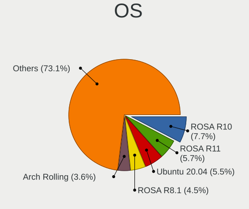

| Name                         | Notebooks | Percent |
|------------------------------|-----------|---------|
| ROSA R10                     | 76        | 7.69%   |
| ROSA R11                     | 56        | 5.67%   |
| Ubuntu 20.04                 | 54        | 5.47%   |
| ROSA R8.1                    | 44        | 4.45%   |
| Arch Rolling                 | 36        | 3.64%   |
| Ubuntu 22.04                 | 32        | 3.24%   |
| ROSA R9                      | 32        | 3.24%   |
| ROSA R11.1                   | 30        | 3.04%   |
| Ubuntu 18.04                 | 27        | 2.73%   |
| ROSA R8                      | 20        | 2.02%   |
| ROSA 12.2                    | 19        | 1.92%   |
| ROSA 12.4                    | 16        | 1.62%   |
| ROSA 12.3                    | 14        | 1.42%   |
| Ubuntu 24.04                 | 13        | 1.32%   |
| Manjaro                      | 13        | 1.32%   |
| Debian 12                    | 13        | 1.32%   |
| OpenMandriva 4.2             | 12        | 1.21%   |
| Fedora 39                    | 12        | 1.21%   |
| Fedora 38                    | 11        | 1.11%   |
| ROSA 12.5.1                  | 10        | 1.01%   |
| Fedora 36                    | 10        | 1.01%   |
| Arch                         | 10        | 1.01%   |
| openSUSE Tumbleweed-XXXXXXXX | 9         | 0.91%   |
| Fedora 42                    | 9         | 0.91%   |
| Debian 11                    | 9         | 0.91%   |
| ROSA 13.0                    | 8         | 0.81%   |
| OpenMandriva 4.3             | 7         | 0.71%   |
| Linux Mint 19.3              | 7         | 0.71%   |
| KDE neon 20.04               | 7         | 0.71%   |
| Fedora 40                    | 7         | 0.71%   |
| Fedora 35                    | 7         | 0.71%   |
| OpenMandriva 25.90           | 6         | 0.61%   |
| Linux Mint 21.1              | 6         | 0.61%   |
| Kubuntu 20.04                | 6         | 0.61%   |
| Fedora 37                    | 6         | 0.61%   |
| Fedora 34                    | 6         | 0.61%   |
| Ubuntu 23.04                 | 5         | 0.51%   |
| Ubuntu 22.10                 | 5         | 0.51%   |
| Pop!_OS 22.04                | 5         | 0.51%   |
| Manjaro 20.2.1               | 5         | 0.51%   |

OS Family
---------

OS without a version

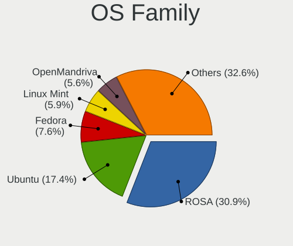

| Name          | Notebooks | Percent |
|---------------|-----------|---------|
| ROSA          | 267       | 30.94%  |
| Ubuntu        | 150       | 17.38%  |
| Fedora        | 66        | 7.65%   |
| Linux Mint    | 51        | 5.91%   |
| OpenMandriva  | 48        | 5.56%   |
| Arch          | 45        | 5.21%   |
| Manjaro       | 39        | 4.52%   |
| Endless       | 36        | 4.17%   |
| Debian        | 26        | 3.01%   |
| Kubuntu       | 14        | 1.62%   |
| Xubuntu       | 12        | 1.39%   |
| openSUSE      | 11        | 1.27%   |
| KDE neon      | 11        | 1.27%   |
| Pop!_OS       | 7         | 0.81%   |
| LMDE          | 7         | 0.81%   |
| Gentoo        | 7         | 0.81%   |
| Kali          | 6         | 0.7%    |
| Elementary    | 6         | 0.7%    |
| ALT Linux     | 6         | 0.7%    |
| SteamOS       | 4         | 0.46%   |
| Zorin         | 3         | 0.35%   |
| Void Linux    | 3         | 0.35%   |
| Nobara        | 3         | 0.35%   |
| MX            | 3         | 0.35%   |
| Lubuntu       | 3         | 0.35%   |
| Ubuntu MATE   | 2         | 0.23%   |
| NixOS         | 2         | 0.23%   |
| EndeavourOS   | 2         | 0.23%   |
| Devuan        | 2         | 0.23%   |
| Deepin        | 2         | 0.23%   |
| Clear Linux   | 2         | 0.23%   |
| CachyOS       | 2         | 0.23%   |
| Bazzite       | 2         | 0.23%   |
| Ubuntu Unity  | 1         | 0.12%   |
| Ubuntu Budgie | 1         | 0.12%   |
| Trisquel      | 1         | 0.12%   |
| Solus         | 1         | 0.12%   |
| Q4OS          | 1         | 0.12%   |
| Peppermint    | 1         | 0.12%   |
| Parrot        | 1         | 0.12%   |

Kernel
------

Version of the Linux kernel

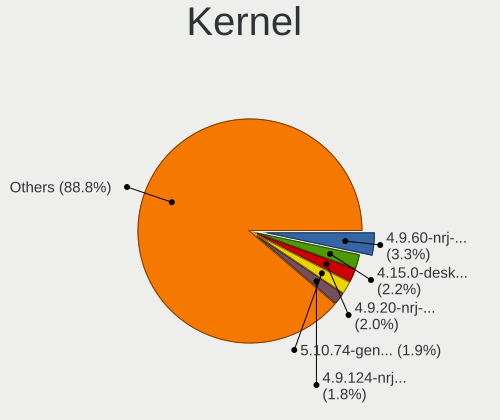

| Version                             | Notebooks | Percent |
|-------------------------------------|-----------|---------|
| 4.9.60-nrj-desktop-1rosa-x86_64     | 37        | 3.35%   |
| 4.15.0-desktop-45.1rosa-x86_64      | 24        | 2.17%   |
| 4.9.20-nrj-desktop-1rosa-x86_64     | 22        | 1.99%   |
| 5.10.74-generic-2rosa2021.1-x86_64  | 21        | 1.9%    |
| 4.9.124-nrj-desktop-1rosa-x86_64    | 20        | 1.81%   |
| 5.10.14-desktop-1omv4002            | 12        | 1.09%   |
| 4.1.34-nrj-desktop-2rosa-x86_64     | 12        | 1.09%   |
| 6.14.2-desktop-3omv2590             | 11        | 1%      |
| 5.4.0-42-generic                    | 11        | 1%      |
| 5.4.83-generic-2rosa-x86_64         | 9         | 0.81%   |
| 4.9.76-nrj-desktop-1rosa-x86_64     | 9         | 0.81%   |
| 4.15.0-desktop-68.5rosa-x86_64      | 9         | 0.81%   |
| 4.9.9-nrj-desktop-1rosa-x86_64      | 8         | 0.72%   |
| 4.9.20-nrj-desktop-1rosa-i586       | 8         | 0.72%   |
| 4.15.0-desktop-45.1rosa-i586        | 8         | 0.72%   |
| 4.1.38-nrj-desktop-2rosa-x86_64     | 8         | 0.72%   |
| 6.1.20-generic-2rosa2021.1-x86_64   | 7         | 0.63%   |
| 5.15.75-generic-1rosa2021.1-x86_64  | 7         | 0.63%   |
| 4.9.155-nrj-laptop-1rosa-x86_64     | 7         | 0.63%   |
| 6.1.58-generic-1rosa2021.1-x86_64   | 6         | 0.54%   |
| 5.9.16-1-MANJARO                    | 6         | 0.54%   |
| 5.4.32-generic-2rosa-x86_64         | 6         | 0.54%   |
| 5.16.7-desktop-1omv4003             | 6         | 0.54%   |
| 4.9.9-nrj-desktop-1rosa-i586        | 6         | 0.54%   |
| 4.9.60-nrj-desktop-1rosa-i586       | 6         | 0.54%   |
| 4.9.155-nrj-desktop-1rosa-x86_64    | 6         | 0.54%   |
| 4.15.0-desktop-122.124.1rosa-x86_64 | 6         | 0.54%   |
| 5.8.0-14-generic                    | 5         | 0.45%   |
| 5.3.0-28-generic                    | 5         | 0.45%   |
| 5.15.0-56-generic                   | 5         | 0.45%   |
| 4.9.124-nrj-desktop-1rosa-i586      | 5         | 0.45%   |
| 4.13.0-32-generic                   | 5         | 0.45%   |
| 6.6.47-generic-1rosa2021.1-x86_64   | 4         | 0.36%   |
| 6.2.0-26-generic                    | 4         | 0.36%   |
| 6.12.13-generic-4rosa13-x86_64      | 4         | 0.36%   |
| 5.4.0-26-generic                    | 4         | 0.36%   |
| 5.15.79-generic-1rosa2021.1-x86_64  | 4         | 0.36%   |
| 5.15.0-58-generic                   | 4         | 0.36%   |
| 5.15.0-43-generic                   | 4         | 0.36%   |
| 5.11.0-35-generic                   | 4         | 0.36%   |

Kernel Family
-------------

Linux kernel without a distro release

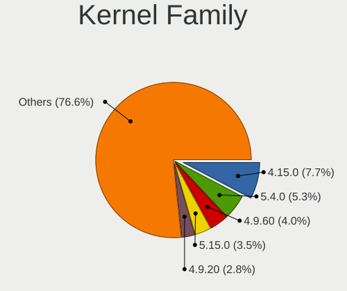

| Version | Notebooks | Percent |
|---------|-----------|---------|
| 4.15.0  | 82        | 7.72%   |
| 5.4.0   | 56        | 5.27%   |
| 4.9.60  | 43        | 4.05%   |
| 5.15.0  | 37        | 3.48%   |
| 4.9.20  | 30        | 2.82%   |
| 4.9.124 | 25        | 2.35%   |
| 5.10.74 | 21        | 1.98%   |
| 5.8.0   | 20        | 1.88%   |
| 5.11.0  | 20        | 1.88%   |
| 6.5.0   | 17        | 1.6%    |
| 5.0.0   | 17        | 1.6%    |
| 6.8.0   | 16        | 1.51%   |
| 5.3.0   | 16        | 1.51%   |
| 5.10.0  | 16        | 1.51%   |
| 6.2.0   | 15        | 1.41%   |
| 5.13.0  | 15        | 1.41%   |
| 6.14.2  | 14        | 1.32%   |
| 6.1.0   | 14        | 1.32%   |
| 4.9.9   | 14        | 1.32%   |
| 4.1.34  | 14        | 1.32%   |
| 5.19.0  | 13        | 1.22%   |
| 4.9.155 | 13        | 1.22%   |
| 5.10.14 | 12        | 1.13%   |
| 4.1.38  | 12        | 1.13%   |
| 6.14.0  | 11        | 1.04%   |
| 5.4.83  | 11        | 1.04%   |
| 4.9.76  | 10        | 0.94%   |
| 6.11.0  | 9         | 0.85%   |
| 5.15.75 | 8         | 0.75%   |
| 4.18.0  | 8         | 0.75%   |
| 6.1.20  | 7         | 0.66%   |
| 5.9.16  | 7         | 0.66%   |
| 5.4.32  | 7         | 0.66%   |
| 4.9.41  | 7         | 0.66%   |
| 6.1.58  | 6         | 0.56%   |
| 5.16.7  | 6         | 0.56%   |
| 4.13.0  | 6         | 0.56%   |
| 6.6.2   | 5         | 0.47%   |
| 6.14.6  | 5         | 0.47%   |
| 4.9.95  | 5         | 0.47%   |

Kernel Major Ver.
-----------------

Linux kernel major version

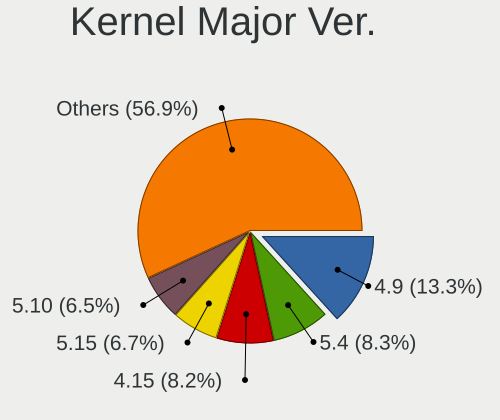

| Version | Notebooks | Percent |
|---------|-----------|---------|
| 4.9     | 132       | 13.27%  |
| 5.4     | 83        | 8.34%   |
| 4.15    | 82        | 8.24%   |
| 5.15    | 67        | 6.73%   |
| 5.10    | 65        | 6.53%   |
| 6.1     | 43        | 4.32%   |
| 6.14    | 31        | 3.12%   |
| 6.6     | 30        | 3.02%   |
| 4.1     | 29        | 2.91%   |
| 6.5     | 27        | 2.71%   |
| 6.2     | 27        | 2.71%   |
| 6.12    | 27        | 2.71%   |
| 5.11    | 27        | 2.71%   |
| 6.8     | 25        | 2.51%   |
| 5.8     | 24        | 2.41%   |
| 5.13    | 21        | 2.11%   |
| 5.19    | 20        | 2.01%   |
| 5.3     | 19        | 1.91%   |
| 6.11    | 17        | 1.71%   |
| 5.0     | 17        | 1.71%   |
| 5.9     | 15        | 1.51%   |
| 6.0     | 12        | 1.21%   |
| 6.4     | 11        | 1.11%   |
| 6.17    | 11        | 1.11%   |
| 6.10    | 11        | 1.11%   |
| 6.7     | 10        | 1.01%   |
| 5.18    | 10        | 1.01%   |
| 5.16    | 10        | 1.01%   |
| 6.15    | 8         | 0.8%    |
| 5.14    | 8         | 0.8%    |
| 4.19    | 8         | 0.8%    |
| 4.18    | 8         | 0.8%    |
| 6.3     | 7         | 0.7%    |
| 5.6     | 6         | 0.6%    |
| 4.13    | 6         | 0.6%    |
| 6.9     | 5         | 0.5%    |
| 6.16    | 5         | 0.5%    |
| 5.17    | 5         | 0.5%    |
| 4.8     | 4         | 0.4%    |
| 5.12    | 3         | 0.3%    |

Arch
----

OS architecture (x86_64, i586, etc.)

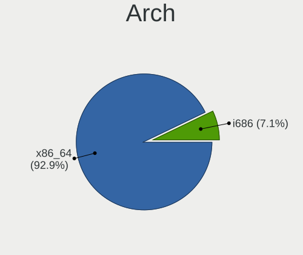

| Name   | Notebooks | Percent |
|--------|-----------|---------|
| x86_64 | 769       | 92.87%  |
| i686   | 59        | 7.13%   |

DE
--

Desktop Environment

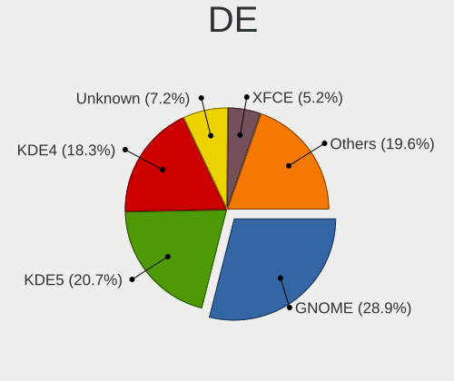

| Name          | Notebooks | Percent |
|---------------|-----------|---------|
| GNOME         | 261       | 28.94%  |
| KDE5          | 187       | 20.73%  |
| KDE4          | 165       | 18.29%  |
| Unknown       | 65        | 7.21%   |
| XFCE          | 47        | 5.21%   |
| KDE6          | 45        | 4.99%   |
| X-Cinnamon    | 38        | 4.21%   |
| LXQt          | 27        | 2.99%   |
| KDE           | 16        | 1.77%   |
| MATE          | 13        | 1.44%   |
| Cinnamon      | 10        | 1.11%   |
| Pantheon      | 6         | 0.67%   |
| LXDE          | 5         | 0.55%   |
| Hyprland      | 4         | 0.44%   |
| i3            | 2         | 0.22%   |
| Budgie        | 2         | 0.22%   |
| Unity         | 1         | 0.11%   |
| sway          | 1         | 0.11%   |
| none+xmonad   | 1         | 0.11%   |
| fluxbox       | 1         | 0.11%   |
| Endless:GNOME | 1         | 0.11%   |
| Deepin        | 1         | 0.11%   |
| DDE           | 1         | 0.11%   |
| COSMIC        | 1         | 0.11%   |
| bspwm         | 1         | 0.11%   |

Display Server
--------------

X11 or Wayland

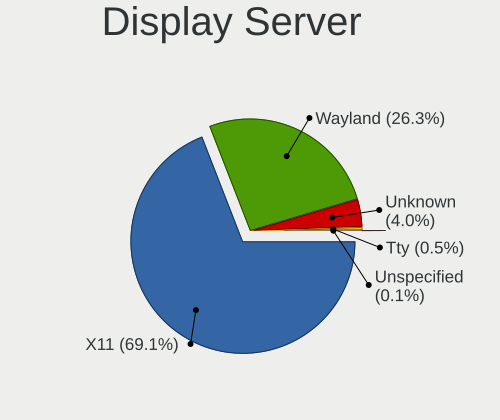

| Name        | Notebooks | Percent |
|-------------|-----------|---------|
| X11         | 588       | 69.1%   |
| Wayland     | 224       | 26.32%  |
| Unknown     | 34        | 4%      |
| Tty         | 4         | 0.47%   |
| Unspecified | 1         | 0.12%   |

Display Manager
---------------

SDDM, LightDM, etc.

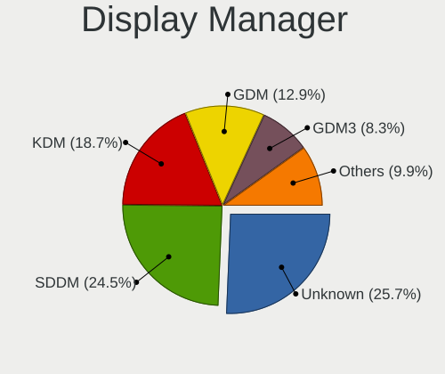

| Name           | Notebooks | Percent |
|----------------|-----------|---------|
| Unknown        | 226       | 25.65%  |
| SDDM           | 216       | 24.52%  |
| KDM            | 165       | 18.73%  |
| GDM            | 114       | 12.94%  |
| GDM3           | 73        | 8.29%   |
| LightDM        | 67        | 7.6%    |
| TDM            | 17        | 1.93%   |
| SLiM           | 1         | 0.11%   |
| GREETD         | 1         | 0.11%   |
| COSMIC-GREETER | 1         | 0.11%   |

OS Lang
-------

Language

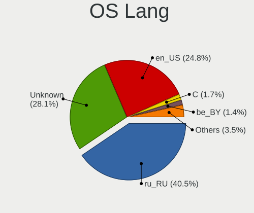

| Lang        | Notebooks | Percent |
|-------------|-----------|---------|
| ru_RU       | 348       | 40.51%  |
| Unknown     | 241       | 28.06%  |
| en_US       | 213       | 24.8%   |
| C           | 15        | 1.75%   |
| be_BY       | 12        | 1.4%    |
| en_GB       | 9         | 1.05%   |
| ru_UA       | 4         | 0.47%   |
| ru_RU.UTF_8 | 4         | 0.47%   |
| ru_BY       | 3         | 0.35%   |
| cv_RU       | 2         | 0.23%   |
| zh_TW       | 1         | 0.12%   |
| zh_CN       | 1         | 0.12%   |
| pl_PL       | 1         | 0.12%   |
| fr_FR       | 1         | 0.12%   |
| en_US.UTS-8 | 1         | 0.12%   |
| en_IN       | 1         | 0.12%   |
| C.utf-8     | 1         | 0.12%   |
| be_BY@latin | 1         | 0.12%   |

Boot Mode
---------

EFI or BIOS

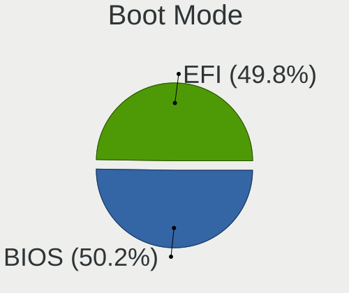

| Mode | Notebooks | Percent |
|------|-----------|---------|
| BIOS | 423       | 50.24%  |
| EFI  | 419       | 49.76%  |

Filesystem
----------

Type of filesystem

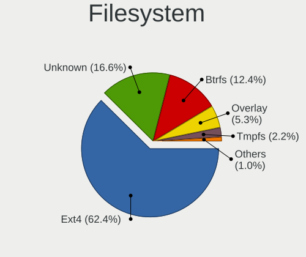

| Type    | Notebooks | Percent |
|---------|-----------|---------|
| Ext4    | 538       | 62.41%  |
| Unknown | 143       | 16.59%  |
| Btrfs   | 107       | 12.41%  |
| Overlay | 46        | 5.34%   |
| Tmpfs   | 19        | 2.2%    |
| Xfs     | 3         | 0.35%   |
| Ext3    | 3         | 0.35%   |
| F2fs    | 2         | 0.23%   |
| Zfs     | 1         | 0.12%   |

Part. scheme
------------

Scheme of partitioning

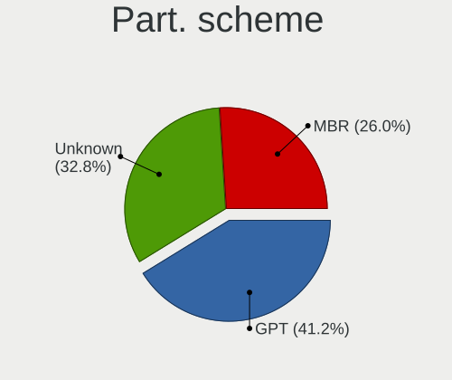

| Type    | Notebooks | Percent |
|---------|-----------|---------|
| GPT     | 355       | 41.23%  |
| Unknown | 282       | 32.75%  |
| MBR     | 224       | 26.02%  |

Dual Boot with Linux/BSD
------------------------

Hosting more than one Linux/BSD

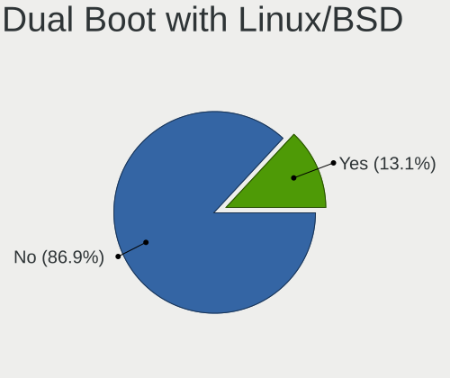

| Dual boot | Notebooks | Percent |
|-----------|-----------|---------|
| No        | 737       | 86.91%  |
| Yes       | 111       | 13.09%  |

Dual Boot (Win)
---------------

Hosting Linux and Windows

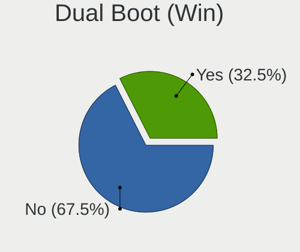

| Dual boot | Notebooks | Percent |
|-----------|-----------|---------|
| No        | 578       | 67.52%  |
| Yes       | 278       | 32.48%  |

Board
-----

Vendor
------

Motherboard manufacturer

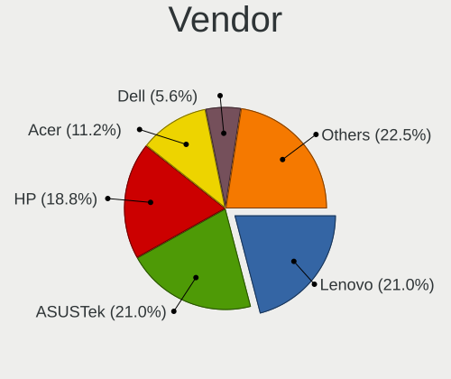

| Name                | Notebooks | Percent |
|---------------------|-----------|---------|
| Lenovo              | 171       | 20.96%  |
| ASUSTek Computer    | 171       | 20.96%  |
| Hewlett-Packard     | 153       | 18.75%  |
| Acer                | 91        | 11.15%  |
| Dell                | 46        | 5.64%   |
| Samsung Electronics | 39        | 4.78%   |
| MSI                 | 25        | 3.06%   |
| Timi                | 13        | 1.59%   |
| HONOR               | 13        | 1.59%   |
| Toshiba             | 10        | 1.23%   |
| Apple               | 9         | 1.1%    |
| HUAWEI              | 8         | 0.98%   |
| Sony                | 7         | 0.86%   |
| Unknown             | 5         | 0.61%   |
| Valve               | 4         | 0.49%   |
| Prestigio           | 4         | 0.49%   |
| Packard Bell        | 4         | 0.49%   |
| XIAOMI              | 3         | 0.37%   |
| Intel               | 3         | 0.37%   |
| Fujitsu Siemens     | 3         | 0.37%   |
| Fujitsu             | 3         | 0.37%   |
| TECNO               | 2         | 0.25%   |
| Maibenben           | 2         | 0.25%   |
| HASEE Computer      | 2         | 0.25%   |
| Gigabyte Technology | 2         | 0.25%   |
| eMachines           | 2         | 0.25%   |
| Chuwi               | 2         | 0.25%   |
| BenQ                | 2         | 0.25%   |
| ViewSonic           | 1         | 0.12%   |
| THUNDEROBOT         | 1         | 0.12%   |
| Quanta              | 1         | 0.12%   |
| Pegatron            | 1         | 0.12%   |
| Notebook            | 1         | 0.12%   |
| LTD Delovoy Office  | 1         | 0.12%   |
| LG Electronics      | 1         | 0.12%   |
| Infinix             | 1         | 0.12%   |
| IBM                 | 1         | 0.12%   |
| Haier               | 1         | 0.12%   |
| Getac               | 1         | 0.12%   |
| Gateway             | 1         | 0.12%   |

Model
-----

Motherboard model

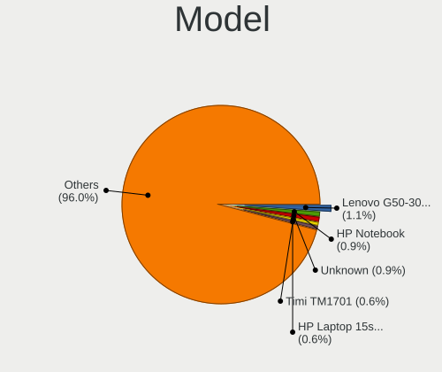

| Name                                    | Notebooks | Percent |
|-----------------------------------------|-----------|---------|
| Lenovo G50-30 80G0                      | 9         | 1.1%    |
| HP Notebook                             | 7         | 0.86%   |
| Unknown                                 | 7         | 0.86%   |
| Timi TM1701                             | 5         | 0.61%   |
| HP Laptop 15s-eq2xxx                    | 5         | 0.61%   |
| Acer Extensa 5220                       | 5         | 0.61%   |
| Acer Aspire E1-571G                     | 5         | 0.61%   |
| Samsung RV413/RV513                     | 4         | 0.49%   |
| Lenovo IdeaPad 320-15IAP 80XR           | 4         | 0.49%   |
| Lenovo G570 20079                       | 4         | 0.49%   |
| Lenovo B590 20206                       | 4         | 0.49%   |
| HONOR NBR-WAX9                          | 4         | 0.49%   |
| HP ProBook 455 G1                       | 4         | 0.49%   |
| HP ProBook 450 G5                       | 4         | 0.49%   |
| HP Pavilion g6                          | 4         | 0.49%   |
| HP Pavilion 15                          | 4         | 0.49%   |
| ASUS X540NV                             | 4         | 0.49%   |
| Valve Jupiter                           | 3         | 0.37%   |
| Lenovo Z50-70 20354                     | 3         | 0.37%   |
| Lenovo IdeaPad Z570 HuronRiver Platform | 3         | 0.37%   |
| Lenovo IdeaPad S340-15IWL 81N8          | 3         | 0.37%   |
| Lenovo IdeaPad 520-15IKB 81BF           | 3         | 0.37%   |
| Lenovo IdeaPad 3 15IML05 81WB           | 3         | 0.37%   |
| Lenovo IdeaPad 100-15IBY 80MJ           | 3         | 0.37%   |
| Lenovo G580 20157                       | 3         | 0.37%   |
| Lenovo G580 20150                       | 3         | 0.37%   |
| Lenovo G500 20236                       | 3         | 0.37%   |
| Lenovo B50-30 20382                     | 3         | 0.37%   |
| HP Victus by Laptop 16-e0xxx            | 3         | 0.37%   |
| HP ProBook 6570b                        | 3         | 0.37%   |
| HP ProBook 4545s                        | 3         | 0.37%   |
| HP Pavilion dv6                         | 3         | 0.37%   |
| HP Compaq 610                           | 3         | 0.37%   |
| HP 635                                  | 3         | 0.37%   |
| Dell Inspiron 7577                      | 3         | 0.37%   |
| ASUS ZenBook UX431DA_UM431DA            | 3         | 0.37%   |
| ASUS X550CC                             | 3         | 0.37%   |
| ASUS X541UAK                            | 3         | 0.37%   |
| Acer Aspire V3-571G                     | 3         | 0.37%   |
| Acer Aspire E1-531                      | 3         | 0.37%   |

Model Family
------------

Motherboard model prefix

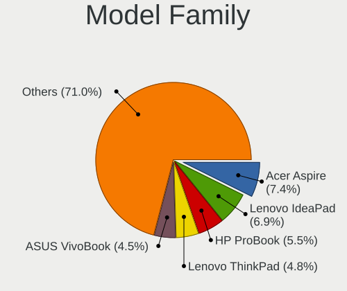

| Name                  | Notebooks | Percent |
|-----------------------|-----------|---------|
| Acer Aspire           | 60        | 7.35%   |
| Lenovo IdeaPad        | 56        | 6.86%   |
| HP ProBook            | 45        | 5.51%   |
| Lenovo ThinkPad       | 39        | 4.78%   |
| ASUS VivoBook         | 37        | 4.53%   |
| HP Pavilion           | 31        | 3.8%    |
| Dell Inspiron         | 27        | 3.31%   |
| HP Laptop             | 14        | 1.72%   |
| Acer Extensa          | 14        | 1.72%   |
| ASUS ASUS             | 13        | 1.59%   |
| HP EliteBook          | 12        | 1.47%   |
| ASUS ZenBook          | 12        | 1.47%   |
| Lenovo Legion         | 9         | 1.1%    |
| Lenovo G50-30         | 9         | 1.1%    |
| ASUS ROG              | 9         | 1.1%    |
| Toshiba Satellite     | 8         | 0.98%   |
| HP Notebook           | 7         | 0.86%   |
| Unknown               | 7         | 0.86%   |
| Lenovo ThinkBook      | 6         | 0.74%   |
| Lenovo G580           | 6         | 0.74%   |
| HP Compaq             | 6         | 0.74%   |
| HP 250                | 6         | 0.74%   |
| Acer Nitro            | 6         | 0.74%   |
| Timi TM1701           | 5         | 0.61%   |
| Lenovo B590           | 5         | 0.61%   |
| Dell Vostro           | 5         | 0.61%   |
| Dell Latitude         | 5         | 0.61%   |
| Samsung RV413         | 4         | 0.49%   |
| Lenovo G570           | 4         | 0.49%   |
| HONOR NBR-WAX9        | 4         | 0.49%   |
| HP Victus             | 4         | 0.49%   |
| HP 255                | 4         | 0.49%   |
| Dell XPS              | 4         | 0.49%   |
| ASUS X540NV           | 4         | 0.49%   |
| Acer TravelMate       | 4         | 0.49%   |
| XIAOMI Redmi          | 3         | 0.37%   |
| Valve Jupiter         | 3         | 0.37%   |
| Packard Bell EasyNote | 3         | 0.37%   |
| MSI Modern            | 3         | 0.37%   |
| MSI Katana            | 3         | 0.37%   |

MFG Year
--------

Motherboard manufacture year

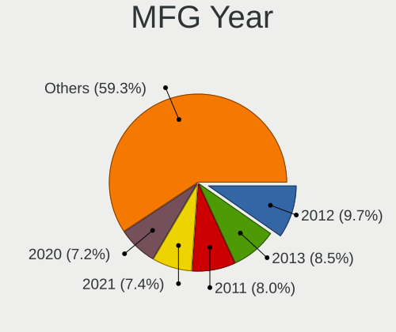

| Year | Notebooks | Percent |
|------|-----------|---------|
| 2012 | 79        | 9.68%   |
| 2013 | 69        | 8.46%   |
| 2011 | 65        | 7.97%   |
| 2021 | 60        | 7.35%   |
| 2020 | 59        | 7.23%   |
| 2017 | 59        | 7.23%   |
| 2018 | 58        | 7.11%   |
| 2019 | 45        | 5.51%   |
| 2014 | 43        | 5.27%   |
| 2022 | 42        | 5.15%   |
| 2010 | 41        | 5.02%   |
| 2009 | 39        | 4.78%   |
| 2015 | 33        | 4.04%   |
| 2023 | 28        | 3.43%   |
| 2008 | 27        | 3.31%   |
| 2016 | 26        | 3.19%   |
| 2007 | 22        | 2.7%    |
| 2024 | 12        | 1.47%   |
| 2006 | 4         | 0.49%   |
| 2025 | 3         | 0.37%   |
| 2005 | 2         | 0.25%   |

Form Factor
-----------

Physical design of the computer

| Name     | Notebooks | Percent |
|----------|-----------|---------|
| Notebook | 816       | 100%    |

Secure Boot
-----------

Enabled or disabled

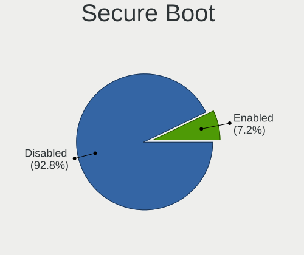

| State    | Notebooks | Percent |
|----------|-----------|---------|
| Disabled | 763       | 92.82%  |
| Enabled  | 59        | 7.18%   |

Coreboot
--------

Have coreboot on board

| Used | Notebooks | Percent |
|------|-----------|---------|
| No   | 816       | 100%    |

RAM Size
--------

Total RAM memory

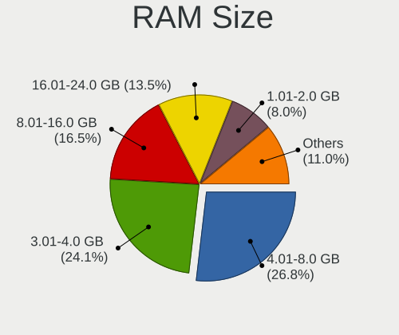

| Size in GB  | Notebooks | Percent |
|-------------|-----------|---------|
| 4.01-8.0    | 226       | 26.84%  |
| 3.01-4.0    | 203       | 24.11%  |
| 8.01-16.0   | 139       | 16.51%  |
| 16.01-24.0  | 114       | 13.54%  |
| 1.01-2.0    | 67        | 7.96%   |
| 32.01-64.0  | 43        | 5.11%   |
| 2.01-3.0    | 24        | 2.85%   |
| 0.51-1.0    | 14        | 1.66%   |
| 24.01-32.0  | 10        | 1.19%   |
| 64.01-256.0 | 2         | 0.24%   |

RAM Used
--------

Used RAM memory

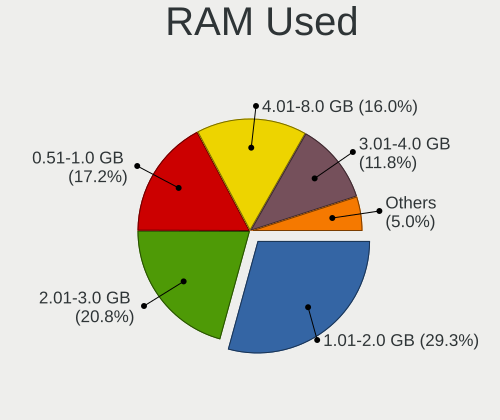

| Used GB    | Notebooks | Percent |
|------------|-----------|---------|
| 1.01-2.0   | 276       | 29.27%  |
| 2.01-3.0   | 196       | 20.78%  |
| 0.51-1.0   | 162       | 17.18%  |
| 4.01-8.0   | 151       | 16.01%  |
| 3.01-4.0   | 111       | 11.77%  |
| 8.01-16.0  | 31        | 3.29%   |
| 0.01-0.5   | 13        | 1.38%   |
| 16.01-24.0 | 2         | 0.21%   |
| 24.01-32.0 | 1         | 0.11%   |

Total Drives
------------

Number of drives on board

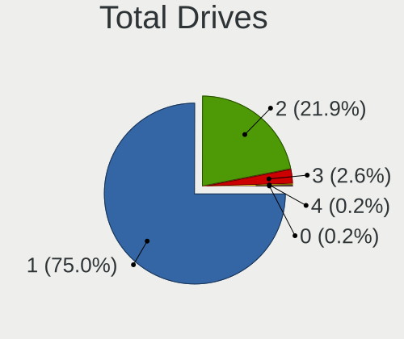

| Drives | Notebooks | Percent |
|--------|-----------|---------|
| 1      | 631       | 75.03%  |
| 2      | 184       | 21.88%  |
| 3      | 22        | 2.62%   |
| 4      | 2         | 0.24%   |
| 0      | 2         | 0.24%   |

Has CD-ROM
----------

Has CD-ROM on board

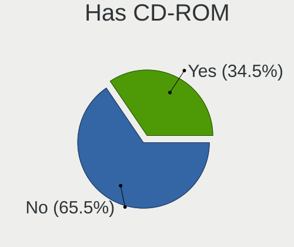

| Presented | Notebooks | Percent |
|-----------|-----------|---------|
| No        | 543       | 65.5%   |
| Yes       | 286       | 34.5%   |

Has Ethernet
------------

Has Ethernet on board

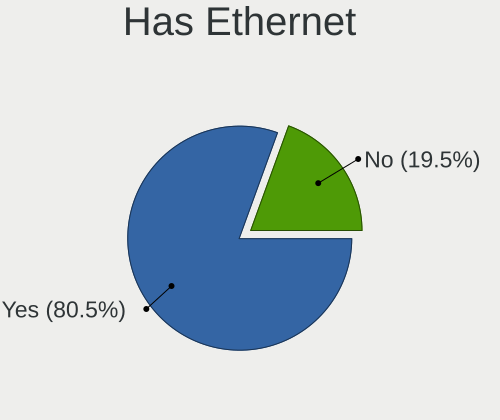

| Presented | Notebooks | Percent |
|-----------|-----------|---------|
| Yes       | 658       | 80.54%  |
| No        | 159       | 19.46%  |

Has WiFi
--------

Has WiFi module

| Presented | Notebooks | Percent |
|-----------|-----------|---------|
| Yes       | 797       | 97.67%  |
| No        | 19        | 2.33%   |

Has Bluetooth
-------------

Has Bluetooth module

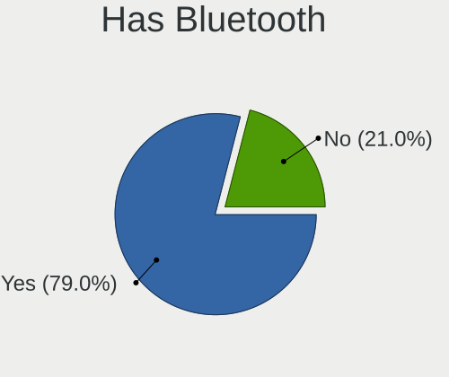

| Presented | Notebooks | Percent |
|-----------|-----------|---------|
| Yes       | 655       | 79.01%  |
| No        | 174       | 20.99%  |

Location
--------

Country
-------

Geographic location (country)

| Country | Notebooks | Percent |
|---------|-----------|---------|
| Belarus | 816       | 100%    |

City
----

Geographic location (city)

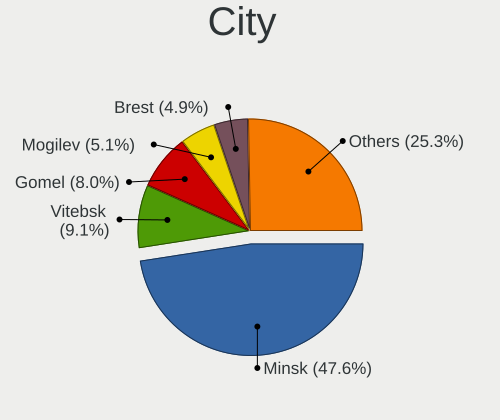

| City         | Notebooks | Percent |
|--------------|-----------|---------|
| Minsk        | 427       | 47.55%  |
| Vitebsk      | 82        | 9.13%   |
| Gomel        | 72        | 8.02%   |
| Mogilev      | 46        | 5.12%   |
| Brest        | 44        | 4.9%    |
| Hrodna       | 42        | 4.68%   |
| Babruysk     | 21        | 2.34%   |
| Orsha        | 18        | 2%      |
| Borisov      | 16        | 1.78%   |
| Polatsk      | 11        | 1.22%   |
| Zhodzina     | 9         | 1%      |
| Mazyr        | 9         | 1%      |
| Lida         | 7         | 0.78%   |
| Zhlobin      | 5         | 0.56%   |
| Salihorsk    | 5         | 0.56%   |
| Drahichyn    | 5         | 0.56%   |
| Bogushevichi | 4         | 0.45%   |
| Baranovichi  | 4         | 0.45%   |
| Pinsk        | 3         | 0.33%   |
| Navapolatsk  | 3         | 0.33%   |
| Krupki       | 3         | 0.33%   |
| Klyetsk      | 3         | 0.33%   |
| Ivatsevichy  | 3         | 0.33%   |
| Baran'       | 3         | 0.33%   |
| Aleksandrovo | 3         | 0.33%   |
| Smalyavichy  | 2         | 0.22%   |
| Slutsk       | 2         | 0.22%   |
| Pastavy      | 2         | 0.22%   |
| Navahrudak   | 2         | 0.22%   |
| Maladzyechna | 2         | 0.22%   |
| Loshnitsa    | 2         | 0.22%   |
| Kolodishchi  | 2         | 0.22%   |
| Ivanava      | 2         | 0.22%   |
| Fedorovka    | 2         | 0.22%   |
| Borovlyany   | 2         | 0.22%   |
| Zaslawye     | 1         | 0.11%   |
| Voranava     | 1         | 0.11%   |
| Vilyeyka     | 1         | 0.11%   |
| Vawkavysk    | 1         | 0.11%   |
| Syenitsa     | 1         | 0.11%   |

Drives
------

Drive Vendor
------------

Hard drive vendors

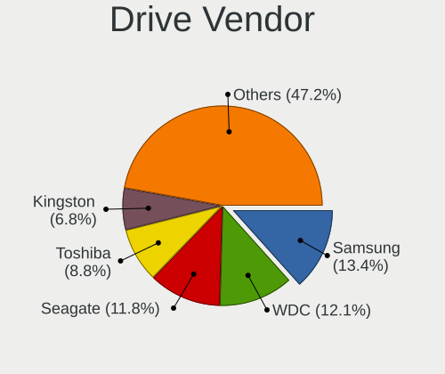

| Vendor                      | Notebooks | Drives | Percent |
|-----------------------------|-----------|--------|---------|
| Samsung Electronics         | 136       | 179    | 13.36%  |
| WDC                         | 123       | 173    | 12.08%  |
| Seagate                     | 120       | 162    | 11.79%  |
| Toshiba                     | 90        | 117    | 8.84%   |
| Kingston                    | 69        | 92     | 6.78%   |
| Hitachi                     | 54        | 64     | 5.3%    |
| HGST                        | 50        | 66     | 4.91%   |
| SK hynix                    | 46        | 54     | 4.52%   |
| Sandisk                     | 39        | 50     | 3.83%   |
| Intel                       | 34        | 96     | 3.34%   |
| Micron Technology           | 33        | 41     | 3.24%   |
| Unknown                     | 23        | 29     | 2.26%   |
| Crucial                     | 19        | 27     | 1.87%   |
| KIOXIA                      | 14        | 55     | 1.38%   |
| Netac                       | 10        | 14     | 0.98%   |
| KingSpec                    | 10        | 18     | 0.98%   |
| Fujitsu                     | 10        | 17     | 0.98%   |
| Phison Electronics          | 9         | 13     | 0.88%   |
| Patriot                     | 9         | 12     | 0.88%   |
| Gigabyte Technology         | 8         | 10     | 0.79%   |
| Transcend                   | 7         | 9      | 0.69%   |
| A-DATA Technology           | 7         | 8      | 0.69%   |
| SPCC                        | 6         | 8      | 0.59%   |
| Kingston Technology Company | 5         | 5      | 0.49%   |
| GOODRAM                     | 4         | 4      | 0.39%   |
| China                       | 4         | 6      | 0.39%   |
| Apple                       | 4         | 4      | 0.39%   |
| XrayDisk                    | 3         | 3      | 0.29%   |
| Silicon Motion              | 3         | 3      | 0.29%   |
| OCZ                         | 3         | 4      | 0.29%   |
| MAXIO Technology (Hangzhou) | 3         | 9      | 0.29%   |
| LITEONIT                    | 3         | 3      | 0.29%   |
| Lenovo                      | 3         | 6      | 0.29%   |
| KingDian                    | 3         | 5      | 0.29%   |
| JMicron Technology          | 3         | 3      | 0.29%   |
| Yangtze Memory Technologies | 2         | 9      | 0.2%    |
| Union Memory (Shenzhen)     | 2         | 2      | 0.2%    |
| TO Exter                    | 2         | 3      | 0.2%    |
| Smartbuy                    | 2         | 2      | 0.2%    |
| Realtek Semiconductor       | 2         | 3      | 0.2%    |

Drive Model
-----------

Hard drive models

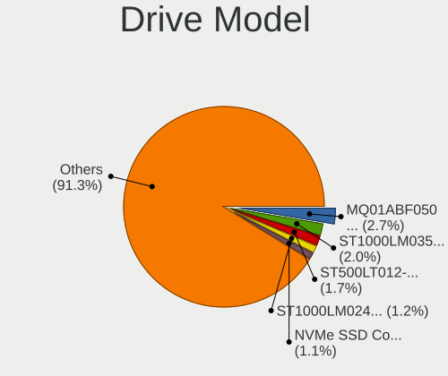

| Model                                             | Notebooks | Percent |
|---------------------------------------------------|-----------|---------|
| Toshiba MQ01ABF050 500GB                          | 28        | 2.66%   |
| Seagate ST1000LM035-1RK172 1TB                    | 21        | 1.99%   |
| Seagate ST500LT012-1DG142 500GB                   | 18        | 1.71%   |
| Seagate ST1000LM024 HN-M101MBB 1TB                | 13        | 1.23%   |
| Samsung NVMe SSD Controller SM981/PM981/PM983 1TB | 12        | 1.14%   |
| Kingston SA400S37120G 120GB SSD                   | 12        | 1.14%   |
| HGST HTS545050A7E680 500GB                        | 12        | 1.14%   |
| Seagate ST9320325AS 320GB                         | 10        | 0.95%   |
| Samsung SSD 860 EVO 250GB                         | 10        | 0.95%   |
| Intel SSDPEKNU512GZ 512GB                         | 10        | 0.95%   |
| Toshiba MQ04ABF100 1TB                            | 9         | 0.85%   |
| Kingston SA400S37240G 240GB SSD                   | 9         | 0.85%   |
| WDC WD10JPVX-22JC3T0 1TB                          | 8         | 0.76%   |
| SK hynix NVMe SSD Drive 512GB                     | 8         | 0.76%   |
| Samsung SSD 860 EVO 500GB                         | 8         | 0.76%   |
| Samsung NVMe SSD Drive 256GB                      | 8         | 0.76%   |
| HGST HTS721010A9E630 1TB                          | 8         | 0.76%   |
| Crucial CT120BX500SSD1 120GB                      | 8         | 0.76%   |
| Toshiba MQ01ABD100 1TB                            | 7         | 0.66%   |
| Toshiba MQ01ABD032 320GB                          | 7         | 0.66%   |
| Hitachi HTS545050B9A300 500GB                     | 7         | 0.66%   |
| HGST HTS541010A9E680 1TB                          | 7         | 0.66%   |
| Toshiba MQ01ABD075 752GB                          | 6         | 0.57%   |
| Seagate ST9250315AS 250GB                         | 6         | 0.57%   |
| Samsung SSD 850 EVO 250GB                         | 6         | 0.57%   |
| Hitachi HTS547575A9E384 752GB                     | 6         | 0.57%   |
| Hitachi HTS545032B9A300 320GB                     | 6         | 0.57%   |
| Hitachi HTS543232A7A384 320GB                     | 6         | 0.57%   |
| HGST HTS541010B7E610 1TB                          | 6         | 0.57%   |
| WDC WD5000LPCX-24VHAT0 500GB                      | 5         | 0.47%   |
| Seagate ST9500325AS 500GB                         | 5         | 0.47%   |
| Seagate ST750LM022 HN-M750MBB 752GB               | 5         | 0.47%   |
| Samsung MZVLQ512HALU-000H1 512GB                  | 5         | 0.47%   |
| KIOXIA KBG40ZNV512G 512GB                         | 5         | 0.47%   |
| Intel SSDPEKNW512G8H 512GB                        | 5         | 0.47%   |
| HGST HTS545050A7E380 500GB                        | 5         | 0.47%   |
| SK hynix NVMe SSD Drive 256GB                     | 4         | 0.38%   |
| SK hynix HFM512GD3JX013N 512GB                    | 4         | 0.38%   |
| Seagate ST500LT012-9WS142 500GB                   | 4         | 0.38%   |
| SanDisk NVMe SSD Drive 256GB                      | 4         | 0.38%   |

HDD Vendor
----------

Hard disk drive vendors

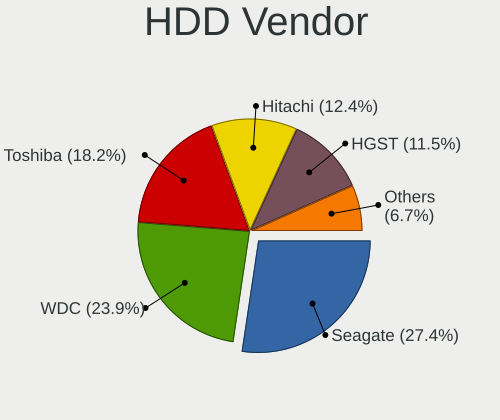

| Vendor              | Notebooks | Drives | Percent |
|---------------------|-----------|--------|---------|
| Seagate             | 119       | 161    | 27.36%  |
| WDC                 | 104       | 151    | 23.91%  |
| Toshiba             | 79        | 99     | 18.16%  |
| Hitachi             | 54        | 64     | 12.41%  |
| HGST                | 50        | 66     | 11.49%  |
| Samsung Electronics | 11        | 24     | 2.53%   |
| Fujitsu             | 10        | 17     | 2.3%    |
| JMicron Technology  | 3         | 3      | 0.69%   |
| TO Exter            | 2         | 3      | 0.46%   |
| SAGE                | 1         | 1      | 0.23%   |
| External            | 1         | 2      | 0.23%   |
| Apple               | 1         | 1      | 0.23%   |

SSD Vendor
----------

Solid state drive vendors

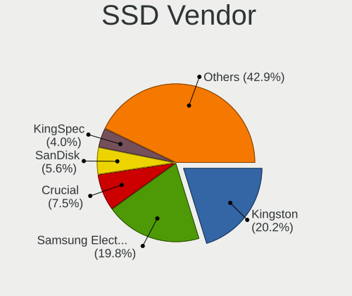

| Vendor              | Notebooks | Drives | Percent |
|---------------------|-----------|--------|---------|
| Kingston            | 51        | 65     | 20.24%  |
| Samsung Electronics | 50        | 59     | 19.84%  |
| Crucial             | 19        | 27     | 7.54%   |
| SanDisk             | 14        | 22     | 5.56%   |
| KingSpec            | 10        | 18     | 3.97%   |
| Patriot             | 9         | 12     | 3.57%   |
| SK hynix            | 8         | 11     | 3.17%   |
| Netac               | 8         | 11     | 3.17%   |
| Transcend           | 7         | 9      | 2.78%   |
| Gigabyte Technology | 7         | 9      | 2.78%   |
| SPCC                | 6         | 8      | 2.38%   |
| A-DATA Technology   | 6         | 7      | 2.38%   |
| WDC                 | 4         | 4      | 1.59%   |
| Intel               | 4         | 4      | 1.59%   |
| GOODRAM             | 4         | 4      | 1.59%   |
| China               | 4         | 6      | 1.59%   |
| XrayDisk            | 3         | 3      | 1.19%   |
| Toshiba             | 3         | 3      | 1.19%   |
| OCZ                 | 3         | 4      | 1.19%   |
| LITEONIT            | 3         | 3      | 1.19%   |
| KingDian            | 3         | 5      | 1.19%   |
| Smartbuy            | 2         | 2      | 0.79%   |
| Plextor             | 2         | 2      | 0.79%   |
| Lexar               | 2         | 2      | 0.79%   |
| Zheino              | 1         | 2      | 0.4%    |
| Union Memory        | 1         | 1      | 0.4%    |
| Team                | 1         | 1      | 0.4%    |
| T-FORCE             | 1         | 1      | 0.4%    |
| SemsoTai            | 1         | 1      | 0.4%    |
| Seagate             | 1         | 1      | 0.4%    |
| PNY                 | 1         | 5      | 0.4%    |
| OSCOO               | 1         | 1      | 0.4%    |
| OCZ-VERTEX          | 1         | 1      | 0.4%    |
| Micron Technology   | 1         | 1      | 0.4%    |
| MicroFrom           | 1         | 1      | 0.4%    |
| LT                  | 1         | 1      | 0.4%    |
| IM3D                | 1         | 1      | 0.4%    |
| Corsair             | 1         | 3      | 0.4%    |
| Azerty              | 1         | 1      | 0.4%    |
| Apple               | 1         | 1      | 0.4%    |

Drive Kind
----------

HDD or SSD

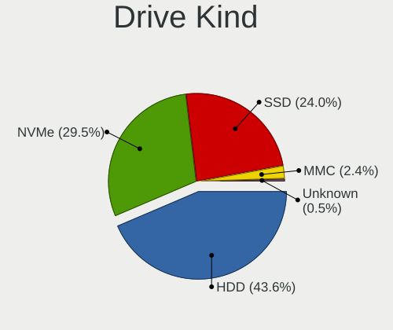

| Kind    | Notebooks | Drives | Percent |
|---------|-----------|--------|---------|
| HDD     | 421       | 592    | 43.58%  |
| NVMe    | 285       | 485    | 29.5%   |
| SSD     | 232       | 327    | 24.02%  |
| MMC     | 23        | 30     | 2.38%   |
| Unknown | 5         | 5      | 0.52%   |

Drive Connector
---------------

SATA, SAS, NVMe, etc.

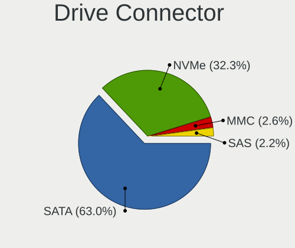

| Type | Notebooks | Drives | Percent |
|------|-----------|--------|---------|
| SATA | 556       | 902    | 62.97%  |
| NVMe | 285       | 481    | 32.28%  |
| MMC  | 23        | 30     | 2.6%    |
| SAS  | 19        | 26     | 2.15%   |

Drive Size
----------

Size of hard drive

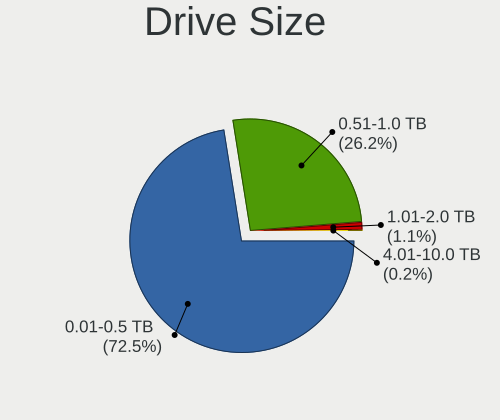

| Size in TB | Notebooks | Drives | Percent |
|------------|-----------|--------|---------|
| 0.01-0.5   | 448       | 675    | 72.49%  |
| 0.51-1.0   | 162       | 235    | 26.21%  |
| 1.01-2.0   | 7         | 8      | 1.13%   |
| 4.01-10.0  | 1         | 1      | 0.16%   |

Space Total
-----------

Amount of disk space available on the file system

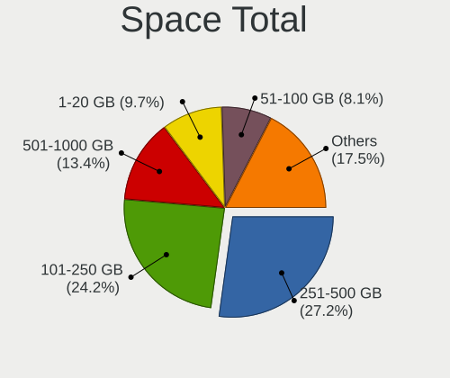

| Size in GB     | Notebooks | Percent |
|----------------|-----------|---------|
| 251-500        | 246       | 27.18%  |
| 101-250        | 219       | 24.2%   |
| 501-1000       | 121       | 13.37%  |
| 1-20           | 88        | 9.72%   |
| 51-100         | 73        | 8.07%   |
| 21-50          | 58        | 6.41%   |
| 1001-2000      | 52        | 5.75%   |
| Unknown        | 28        | 3.09%   |
| More than 3000 | 10        | 1.1%    |
| 2001-3000      | 10        | 1.1%    |

Space Used
----------

Amount of used disk space

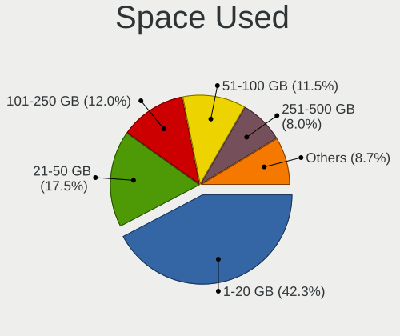

| Used GB        | Notebooks | Percent |
|----------------|-----------|---------|
| 1-20           | 391       | 42.32%  |
| 21-50          | 162       | 17.53%  |
| 101-250        | 111       | 12.01%  |
| 51-100         | 106       | 11.47%  |
| 251-500        | 74        | 8.01%   |
| 501-1000       | 33        | 3.57%   |
| Unknown        | 28        | 3.03%   |
| 1001-2000      | 16        | 1.73%   |
| More than 3000 | 2         | 0.22%   |
| 0              | 1         | 0.11%   |

Malfunc. Drives
---------------

Drive models with a malfunction

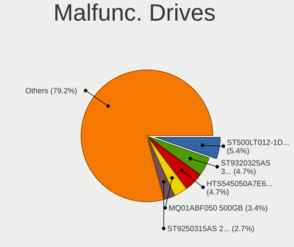

| Model                              | Notebooks | Drives | Percent |
|------------------------------------|-----------|--------|---------|
| Seagate ST500LT012-1DG142 500GB    | 8         | 10     | 5.37%   |
| Seagate ST9320325AS 320GB          | 7         | 8      | 4.7%    |
| HGST HTS545050A7E680 500GB         | 7         | 8      | 4.7%    |
| Toshiba MQ01ABF050 500GB           | 5         | 6      | 3.36%   |
| Seagate ST9250315AS 250GB          | 4         | 4      | 2.68%   |
| Hitachi HTS545050B9A300 500GB      | 4         | 5      | 2.68%   |
| Toshiba MQ01ABD032 320GB           | 3         | 3      | 2.01%   |
| Seagate ST9500420AS 500GB          | 3         | 3      | 2.01%   |
| Seagate ST9500325AS 500GB          | 3         | 4      | 2.01%   |
| Seagate ST500LT012-9WS142 500GB    | 3         | 3      | 2.01%   |
| Seagate ST1000LM024 HN-M101MBB 1TB | 3         | 4      | 2.01%   |
| Hitachi HTS547575A9E384 752GB      | 3         | 3      | 2.01%   |
| Hitachi HTS545032B9A300 320GB      | 3         | 3      | 2.01%   |
| HGST HTS545050A7E380 500GB         | 3         | 3      | 2.01%   |
| WDC WD3200BPVT-35ZEST0 320GB       | 2         | 6      | 1.34%   |
| WDC WD10JPVX-22JC3T0 1TB           | 2         | 2      | 1.34%   |
| Toshiba MK3259GSXP 320GB           | 2         | 3      | 1.34%   |
| Hitachi HTS722010K9SA00 100GB      | 2         | 2      | 1.34%   |
| Hitachi HTS545050A7E380 500GB      | 2         | 2      | 1.34%   |
| Hitachi HTS545025B9A300 250GB      | 2         | 2      | 1.34%   |
| Hitachi HTS543232A7A384 320GB      | 2         | 3      | 1.34%   |
| WDC WD5000LPVX-60V0TT0 500GB       | 1         | 2      | 0.67%   |
| WDC WD5000LPLX-60ZNTT1 500GB       | 1         | 1      | 0.67%   |
| WDC WD5000BPVT-24HXZT3 500GB       | 1         | 1      | 0.67%   |
| WDC WD5000BEVT-75A0RT0 500GB       | 1         | 1      | 0.67%   |
| WDC WD3200BEVT-80A0RT0 320GB       | 1         | 2      | 0.67%   |
| WDC WD3200BEVT-60A23T0 320GB       | 1         | 1      | 0.67%   |
| WDC WD3200BEVT-22A0RT0 320GB       | 1         | 1      | 0.67%   |
| WDC WD3200BEKT-75PVMT1 320GB       | 1         | 1      | 0.67%   |
| WDC WD3200BEKT-60F3T1 320GB        | 1         | 1      | 0.67%   |
| WDC WD2500BEVT-35A23T0 250GB       | 1         | 1      | 0.67%   |
| WDC WD2500BEVT-24A23T0 250GB       | 1         | 1      | 0.67%   |
| WDC WD2500BEVT-22A23T0 250GB       | 1         | 1      | 0.67%   |
| WDC WD2500BEVT-00A23T0 250GB       | 1         | 1      | 0.67%   |
| WDC WD2500BEKT-60A25T1 250GB       | 1         | 1      | 0.67%   |
| WDC WD10JPVX-60JC3T0 1TB           | 1         | 1      | 0.67%   |
| WDC WD10JPVT-08A1YT2 1TB           | 1         | 1      | 0.67%   |
| Toshiba MQ01ABF032 320GB           | 1         | 3      | 0.67%   |
| Toshiba MK6476GSX 640GB            | 1         | 1      | 0.67%   |
| Toshiba MK5065GSX 500GB            | 1         | 1      | 0.67%   |

Malfunc. Drive Vendor
---------------------

Vendors of faulty drives

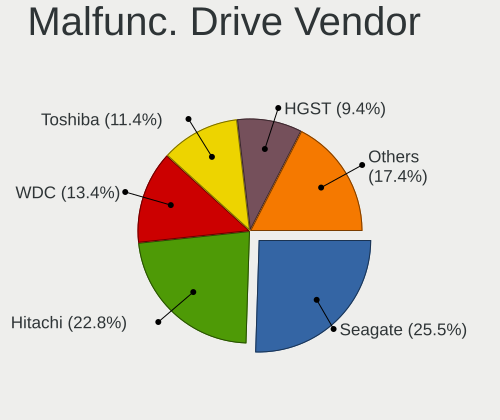

| Vendor              | Notebooks | Drives | Percent |
|---------------------|-----------|--------|---------|
| Seagate             | 38        | 43     | 25.5%   |
| Hitachi             | 34        | 39     | 22.82%  |
| WDC                 | 20        | 26     | 13.42%  |
| Toshiba             | 17        | 24     | 11.41%  |
| HGST                | 14        | 15     | 9.4%    |
| Samsung Electronics | 6         | 14     | 4.03%   |
| Fujitsu             | 4         | 6      | 2.68%   |
| Kingston            | 3         | 3      | 2.01%   |
| SK hynix            | 2         | 3      | 1.34%   |
| OCZ                 | 2         | 3      | 1.34%   |
| Crucial             | 2         | 4      | 1.34%   |
| SanDisk             | 1         | 1      | 0.67%   |
| PNY                 | 1         | 4      | 0.67%   |
| Micron Technology   | 1         | 1      | 0.67%   |
| LITEONIT            | 1         | 1      | 0.67%   |
| KingSpec            | 1         | 6      | 0.67%   |
| China               | 1         | 1      | 0.67%   |
| Unknown             | 1         | 1      | 0.67%   |

Malfunc. HDD Vendor
-------------------

Vendors of faulty HDD drives

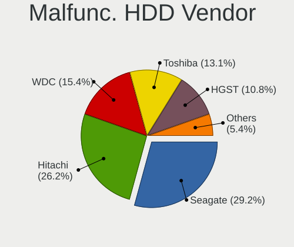

| Vendor              | Notebooks | Drives | Percent |
|---------------------|-----------|--------|---------|
| Seagate             | 38        | 43     | 29.23%  |
| Hitachi             | 34        | 39     | 26.15%  |
| WDC                 | 20        | 26     | 15.38%  |
| Toshiba             | 17        | 24     | 13.08%  |
| HGST                | 14        | 15     | 10.77%  |
| Fujitsu             | 4         | 6      | 3.08%   |
| Samsung Electronics | 3         | 10     | 2.31%   |

Malfunc. Drive Kind
-------------------

Kinds of faulty drives

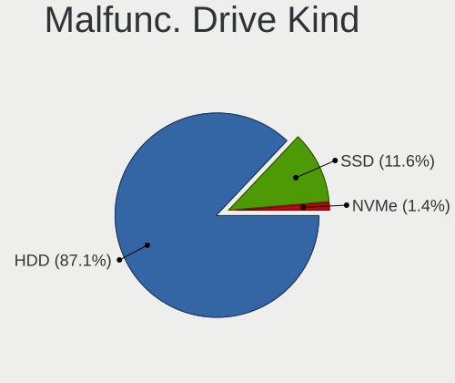

| Kind | Notebooks | Drives | Percent |
|------|-----------|--------|---------|
| HDD  | 128       | 163    | 87.07%  |
| SSD  | 17        | 29     | 11.56%  |
| NVMe | 2         | 3      | 1.36%   |

Failed Drives
-------------

Failed drive models

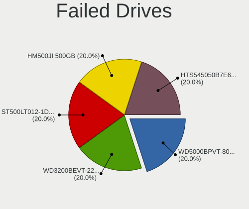

| Model                             | Notebooks | Drives | Percent |
|-----------------------------------|-----------|--------|---------|
| WDC WD5000BPVT-80HXZT3 500GB      | 1         | 1      | 20%     |
| WDC WD3200BEVT-22ZCT0 320GB       | 1         | 1      | 20%     |
| Seagate ST500LT012-1DG142 500GB   | 1         | 1      | 20%     |
| Samsung Electronics HM500JI 500GB | 1         | 1      | 20%     |
| HGST HTS545050B7E660 500GB        | 1         | 1      | 20%     |

Failed Drive Vendor
-------------------

Failed drive vendors

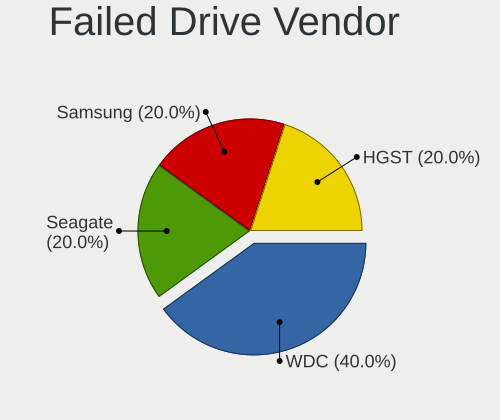

| Vendor              | Notebooks | Drives | Percent |
|---------------------|-----------|--------|---------|
| WDC                 | 2         | 2      | 40%     |
| Seagate             | 1         | 1      | 20%     |
| Samsung Electronics | 1         | 1      | 20%     |
| HGST                | 1         | 1      | 20%     |

Drive Status
------------

Number of failed and malfunc. drives

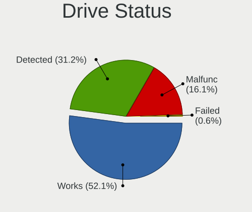

| Status   | Notebooks | Drives | Percent |
|----------|-----------|--------|---------|
| Works    | 469       | 794    | 52.11%  |
| Detected | 281       | 445    | 31.22%  |
| Malfunc  | 145       | 195    | 16.11%  |
| Failed   | 5         | 5      | 0.56%   |

Storage controller
------------------

Storage Vendor
--------------

Storage controller vendors

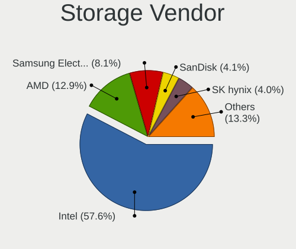

| Vendor                                  | Notebooks | Percent |
|-----------------------------------------|-----------|---------|
| Intel                                   | 553       | 57.6%   |
| AMD                                     | 124       | 12.92%  |
| Samsung Electronics                     | 78        | 8.13%   |
| SanDisk                                 | 39        | 4.06%   |
| SK hynix                                | 38        | 3.96%   |
| Micron Technology                       | 32        | 3.33%   |
| Kingston Technology Company             | 22        | 2.29%   |
| KIOXIA                                  | 14        | 1.46%   |
| Phison Electronics                      | 12        | 1.25%   |
| Toshiba America Info Systems            | 10        | 1.04%   |
| Yangtze Memory Technologies             | 3         | 0.31%   |
| Silicon Motion                          | 3         | 0.31%   |
| Silicon Integrated Systems [SiS]        | 3         | 0.31%   |
| Shenzhen Longsys Electronics            | 3         | 0.31%   |
| Nvidia                                  | 3         | 0.31%   |
| MAXIO Technology (Hangzhou)             | 3         | 0.31%   |
| Lenovo                                  | 3         | 0.31%   |
| Solid State Storage Technology          | 2         | 0.21%   |
| Shenzhen Unionmemory Information System | 2         | 0.21%   |
| Realtek Semiconductor                   | 2         | 0.21%   |
| Netac Technology                        | 2         | 0.21%   |
| JMicron Technology                      | 2         | 0.21%   |
| Apple                                   | 2         | 0.21%   |
| Solidigm                                | 1         | 0.1%    |
| Silicon Image                           | 1         | 0.1%    |
| O2 Micro                                | 1         | 0.1%    |
| Biwin Storage Technology                | 1         | 0.1%    |
| ADATA Technology                        | 1         | 0.1%    |

Storage Model
-------------

Storage controller models

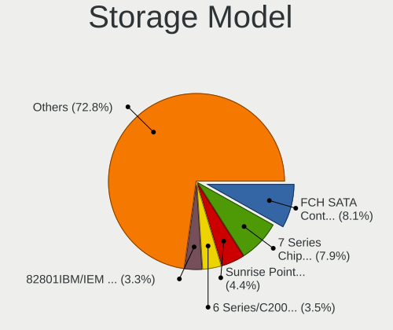

| Model                                                                            | Notebooks | Percent |
|----------------------------------------------------------------------------------|-----------|---------|
| AMD FCH SATA Controller [AHCI mode]                                              | 85        | 8.14%   |
| Intel 7 Series Chipset Family 6-port SATA Controller [AHCI mode]                 | 82        | 7.85%   |
| Intel Sunrise Point-LP SATA Controller [AHCI mode]                               | 46        | 4.41%   |
| Intel 6 Series/C200 Series Chipset Family 6 port Mobile SATA AHCI Controller     | 37        | 3.54%   |
| Intel 82801IBM/IEM (ICH9M/ICH9M-E) 4 port SATA Controller [AHCI mode]            | 34        | 3.26%   |
| Intel Volume Management Device NVMe RAID Controller                              | 31        | 2.97%   |
| Samsung NVMe SSD Controller SM981/PM981/PM983                                    | 30        | 2.87%   |
| Intel 8 Series SATA Controller 1 [AHCI mode]                                     | 27        | 2.59%   |
| AMD SB7x0/SB8x0/SB9x0 SATA Controller [AHCI mode]                                | 27        | 2.59%   |
| Samsung NVMe SSD Controller 980 (DRAM-less)                                      | 25        | 2.39%   |
| Intel Atom Processor E3800 Series SATA AHCI Controller                           | 23        | 2.2%    |
| Intel 82801HM/HEM (ICH8M/ICH8M-E) IDE Controller                                 | 22        | 2.11%   |
| Intel Cannon Lake Mobile PCH SATA AHCI Controller                                | 20        | 1.92%   |
| Intel NM10/ICH7 Family SATA Controller [AHCI mode]                               | 19        | 1.82%   |
| Intel Wildcat Point-LP SATA Controller [AHCI Mode]                               | 16        | 1.53%   |
| Intel SSD 670p Series [Keystone Harbor]                                          | 16        | 1.53%   |
| Intel Comet Lake SATA AHCI Controller                                            | 16        | 1.53%   |
| Intel Celeron/Pentium Silver Processor SATA Controller                           | 16        | 1.53%   |
| Intel Celeron N3350/Pentium N4200/Atom E3900 Series SATA AHCI Controller         | 15        | 1.44%   |
| Intel 82801HM/HEM (ICH8M/ICH8M-E) SATA Controller [AHCI mode]                    | 15        | 1.44%   |
| Intel 82801 Mobile SATA Controller [RAID mode]                                   | 15        | 1.44%   |
| Samsung NVMe SSD Controller SM961/PM961/SM963                                    | 14        | 1.34%   |
| Intel Tiger Lake-LP SATA Controller                                              | 14        | 1.34%   |
| Intel 8 Series/C220 Series Chipset Family 6-port SATA Controller 1 [AHCI mode]   | 14        | 1.34%   |
| Intel SSD 660P Series                                                            | 12        | 1.15%   |
| Intel HM170/QM170 Chipset SATA Controller [AHCI Mode]                            | 12        | 1.15%   |
| Intel 5 Series/3400 Series Chipset 4 port SATA AHCI Controller                   | 12        | 1.15%   |
| Intel 82801HM/HEM (ICH8M/ICH8M-E) SATA Controller [IDE mode]                     | 11        | 1.05%   |
| SK hynix BC501 NVMe Solid State Drive                                            | 10        | 0.96%   |
| SanDisk WD SN560/SN740/SN770/SN5000 NVMe SSD                                     | 10        | 0.96%   |
| SanDisk Ultra 3D / WD PC SN530, IX SN530, Blue SN550 NVMe SSD (DRAM-less)        | 9         | 0.86%   |
| KIOXIA NVMe SSD Controller BG4 (DRAM-less)                                       | 9         | 0.86%   |
| Intel Atom/Celeron/Pentium Processor x5-E8000/J3xxx/N3xxx Series SATA Controller | 9         | 0.86%   |
| SK hynix Gold P31/BC711/PC711 NVMe Solid State Drive                             | 8         | 0.77%   |
| SK hynix BC511 NVMe SSD                                                          | 8         | 0.77%   |
| Micron 2450 NVMe SSD [HendrixV] (DRAM-less)                                      | 8         | 0.77%   |
| Intel Cannon Point-LP SATA Controller [AHCI Mode]                                | 8         | 0.77%   |
| Intel 7 Series Chipset Family 4-port SATA Controller [IDE mode]                  | 8         | 0.77%   |
| Intel 7 Series Chipset Family 2-port SATA Controller [IDE mode]                  | 8         | 0.77%   |
| AMD SB7x0/SB8x0/SB9x0 IDE Controller                                             | 7         | 0.67%   |

Storage Kind
------------

Kind of storage controller (IDE, SATA, NVMe, SAS, ...)

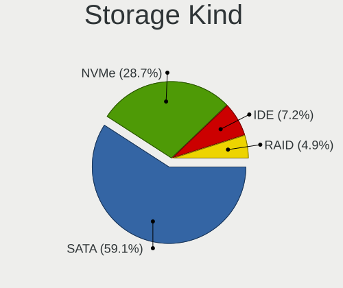

| Kind | Notebooks | Percent |
|------|-----------|---------|
| SATA | 589       | 59.14%  |
| NVMe | 286       | 28.71%  |
| IDE  | 72        | 7.23%   |
| RAID | 49        | 4.92%   |

Processor
---------

CPU Vendor
----------

Processor vendors

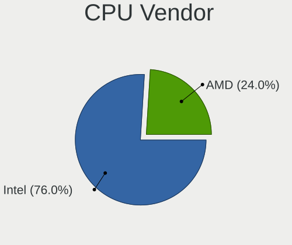

| Vendor | Notebooks | Percent |
|--------|-----------|---------|
| Intel  | 620       | 75.98%  |
| AMD    | 196       | 24.02%  |

CPU Model
---------

Processor models

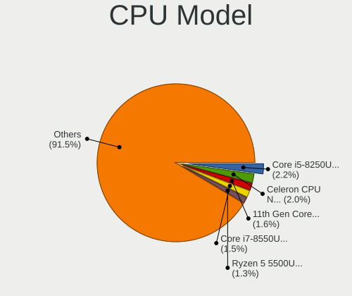

| Model                                         | Notebooks | Percent |
|-----------------------------------------------|-----------|---------|
| Intel Core i5-8250U CPU @ 1.60GHz             | 18        | 2.2%    |
| Intel Celeron CPU N2840 @ 2.16GHz             | 16        | 1.95%   |
| Intel 11th Gen Core i5-1135G7 @ 2.40GHz       | 13        | 1.59%   |
| Intel Core i7-8550U CPU @ 1.80GHz             | 12        | 1.46%   |
| AMD Ryzen 5 5500U with Radeon Graphics        | 11        | 1.34%   |
| Intel Core i7-7700HQ CPU @ 2.80GHz            | 10        | 1.22%   |
| AMD E-450 APU with Radeon HD Graphics         | 10        | 1.22%   |
| Intel Core i5-3230M CPU @ 2.60GHz             | 9         | 1.1%    |
| Intel Core i3-3110M CPU @ 2.40GHz             | 9         | 1.1%    |
| AMD Ryzen 5 4600H with Radeon Graphics        | 9         | 1.1%    |
| Intel Core i7-8750H CPU @ 2.20GHz             | 8         | 0.98%   |
| Intel Core i5-6200U CPU @ 2.30GHz             | 8         | 0.98%   |
| Intel Core i5-5200U CPU @ 2.20GHz             | 8         | 0.98%   |
| Intel Core i3-6006U CPU @ 2.00GHz             | 8         | 0.98%   |
| Intel 12th Gen Core i5-12450H                 | 8         | 0.98%   |
| Intel Core i7-8565U CPU @ 1.80GHz             | 7         | 0.85%   |
| Intel Core i5-4210U CPU @ 1.70GHz             | 7         | 0.85%   |
| Intel Core i5-2450M CPU @ 2.50GHz             | 7         | 0.85%   |
| Intel Core i5-10210U CPU @ 1.60GHz            | 7         | 0.85%   |
| Intel Celeron N4000 CPU @ 1.10GHz             | 7         | 0.85%   |
| Intel Atom CPU N455 @ 1.66GHz                 | 7         | 0.85%   |
| AMD Ryzen 5 3500U with Radeon Vega Mobile Gfx | 7         | 0.85%   |
| AMD A4-4300M APU with Radeon HD Graphics      | 7         | 0.85%   |
| Intel Pentium Dual-Core CPU T4400 @ 2.20GHz   | 6         | 0.73%   |
| Intel Pentium CPU N4200 @ 1.10GHz             | 6         | 0.73%   |
| Intel Pentium CPU B960 @ 2.20GHz              | 6         | 0.73%   |
| Intel Core i5-7200U CPU @ 2.50GHz             | 6         | 0.73%   |
| Intel Core i3-1005G1 CPU @ 1.20GHz            | 6         | 0.73%   |
| Intel Celeron CPU N3350 @ 1.10GHz             | 6         | 0.73%   |
| Intel Celeron CPU B820 @ 1.70GHz              | 6         | 0.73%   |
| AMD Ryzen 7 5700U with Radeon Graphics        | 6         | 0.73%   |
| Intel Pentium Silver N5000 CPU @ 1.10GHz      | 5         | 0.61%   |
| Intel Core i7-10750H CPU @ 2.60GHz            | 5         | 0.61%   |
| Intel Core i5-9300H CPU @ 2.40GHz             | 5         | 0.61%   |
| Intel Core i5-8300H CPU @ 2.30GHz             | 5         | 0.61%   |
| Intel Core i5-3210M CPU @ 2.50GHz             | 5         | 0.61%   |
| Intel Core i3-3217U CPU @ 1.80GHz             | 5         | 0.61%   |
| Intel Core i3-3120M CPU @ 2.50GHz             | 5         | 0.61%   |
| Intel Core i3-10110U CPU @ 2.10GHz            | 5         | 0.61%   |
| Intel 11th Gen Core i7-1165G7 @ 2.80GHz       | 5         | 0.61%   |

CPU Model Family
----------------

Processor model prefix

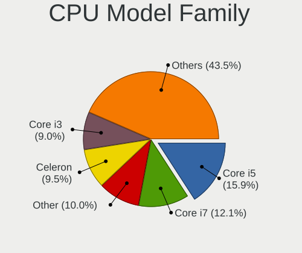

| Model                   | Notebooks | Percent |
|-------------------------|-----------|---------|
| Intel Core i5           | 130       | 15.87%  |
| Intel Core i7           | 99        | 12.09%  |
| Other                   | 82        | 10.01%  |
| Intel Celeron           | 78        | 9.52%   |
| Intel Core i3           | 74        | 9.04%   |
| Intel Pentium           | 52        | 6.35%   |
| AMD Ryzen 5             | 50        | 6.11%   |
| AMD Ryzen 7             | 36        | 4.4%    |
| Intel Core 2 Duo        | 35        | 4.27%   |
| Intel Atom              | 30        | 3.66%   |
| AMD E                   | 13        | 1.59%   |
| AMD A4                  | 13        | 1.59%   |
| Intel Pentium Dual-Core | 11        | 1.34%   |
| AMD A6                  | 11        | 1.34%   |
| AMD Ryzen 3             | 9         | 1.1%    |
| AMD E1                  | 8         | 0.98%   |
| AMD A10                 | 7         | 0.85%   |
| Intel Pentium Silver    | 6         | 0.73%   |
| Intel Pentium Dual      | 5         | 0.61%   |
| Intel Genuine           | 5         | 0.61%   |
| Intel Celeron Dual-Core | 5         | 0.61%   |
| AMD Athlon II           | 5         | 0.61%   |
| AMD A8                  | 5         | 0.61%   |
| Intel Core i9           | 4         | 0.49%   |
| AMD Turion II           | 4         | 0.49%   |
| AMD Ryzen 9             | 4         | 0.49%   |
| AMD Athlon              | 4         | 0.49%   |
| Intel Core 2 Solo       | 3         | 0.37%   |
| AMD Ryzen 7 PRO         | 3         | 0.37%   |
| AMD Phenom II           | 3         | 0.37%   |
| AMD E2                  | 3         | 0.37%   |
| Intel Pentium M         | 2         | 0.24%   |
| Intel Core              | 2         | 0.24%   |
| AMD Turion 64 X2 Mobile | 2         | 0.24%   |
| AMD Ryzen 5 PRO         | 2         | 0.24%   |
| Intel Core m3           | 1         | 0.12%   |
| Intel Core Duo          | 1         | 0.12%   |
| Intel Core 2            | 1         | 0.12%   |
| Intel Celeron M         | 1         | 0.12%   |
| AMD V140                | 1         | 0.12%   |

CPU Cores
---------

Number of processor cores

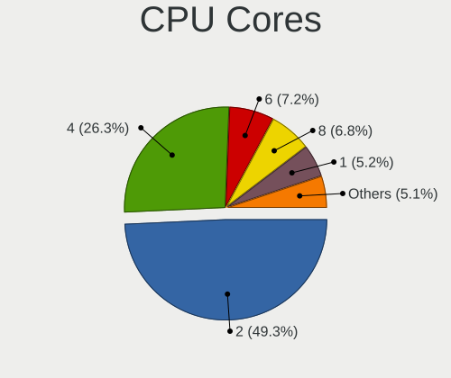

| Number  | Notebooks | Percent |
|---------|-----------|---------|
| 2       | 404       | 49.27%  |
| 4       | 216       | 26.34%  |
| 6       | 59        | 7.2%    |
| 8       | 56        | 6.83%   |
| 1       | 43        | 5.24%   |
| 10      | 13        | 1.59%   |
| 12      | 9         | 1.1%    |
| Unknown | 9         | 1.1%    |
| 14      | 7         | 0.85%   |
| 24      | 1         | 0.12%   |
| 20      | 1         | 0.12%   |
| 16      | 1         | 0.12%   |
| 5       | 1         | 0.12%   |

CPU Sockets
-----------

Number of sockets

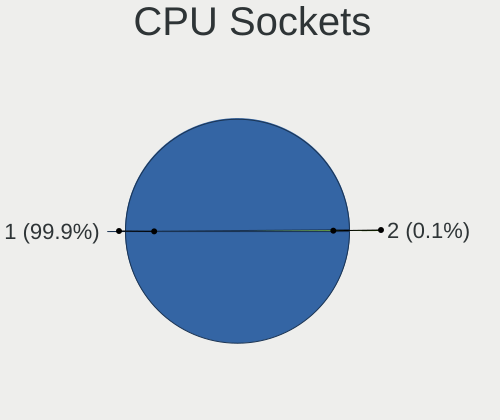

| Number | Notebooks | Percent |
|--------|-----------|---------|
| 1      | 815       | 99.88%  |
| 2      | 1         | 0.12%   |

CPU Threads
-----------

Threads per core (Hyper-Threading)

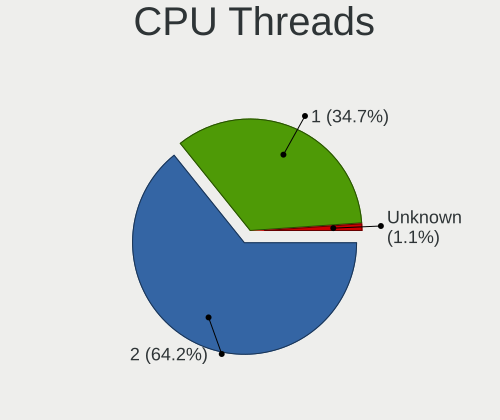

| Number  | Notebooks | Percent |
|---------|-----------|---------|
| 2       | 528       | 64.23%  |
| 1       | 285       | 34.67%  |
| Unknown | 9         | 1.09%   |

CPU Op-Modes
------------

CPU Operation Modes (32-bit, 64-bit)

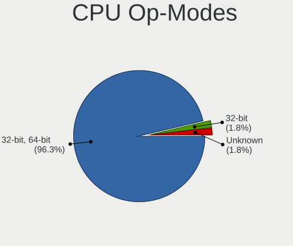

| Op mode        | Notebooks | Percent |
|----------------|-----------|---------|
| 32-bit, 64-bit | 786       | 96.32%  |
| 32-bit         | 15        | 1.84%   |
| Unknown        | 15        | 1.84%   |

CPU Microcode
-------------

Microcode number

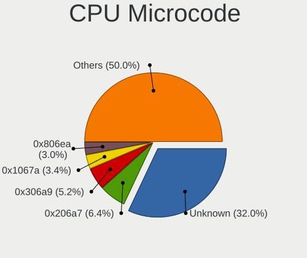

| Number     | Notebooks | Percent |
|------------|-----------|---------|
| Unknown    | 276       | 32.02%  |
| 0x206a7    | 55        | 6.38%   |
| 0x306a9    | 45        | 5.22%   |
| 0x1067a    | 29        | 3.36%   |
| 0x806ea    | 26        | 3.02%   |
| 0x806c1    | 22        | 2.55%   |
| 0x30678    | 21        | 2.44%   |
| 0x806ec    | 18        | 2.09%   |
| 0x40651    | 18        | 2.09%   |
| 0x906ea    | 14        | 1.62%   |
| 0x406e3    | 14        | 1.62%   |
| 0x106ca    | 14        | 1.62%   |
| 0x05000119 | 13        | 1.51%   |
| 0x6fd      | 12        | 1.39%   |
| 0x306d4    | 12        | 1.39%   |
| 0x306c3    | 12        | 1.39%   |
| 0x010000c8 | 12        | 1.39%   |
| 0x506c9    | 11        | 1.28%   |
| 0x08608103 | 10        | 1.16%   |
| 0x08108102 | 10        | 1.16%   |
| 0x06001119 | 10        | 1.16%   |
| 0x806e9    | 9         | 1.04%   |
| 0x706a1    | 9         | 1.04%   |
| 0x0a50000c | 9         | 1.04%   |
| 0x906e9    | 8         | 0.93%   |
| 0x08600104 | 8         | 0.93%   |
| 0x706e5    | 7         | 0.81%   |
| 0x20652    | 7         | 0.81%   |
| 0x08600106 | 7         | 0.81%   |
| 0x906a3    | 6         | 0.7%    |
| 0x30661    | 6         | 0.7%    |
| 0x106c2    | 6         | 0.7%    |
| 0x10661    | 6         | 0.7%    |
| 0x0700010f | 6         | 0.7%    |
| 0x6fb      | 5         | 0.58%   |
| 0x406c4    | 5         | 0.58%   |
| 0x20655    | 5         | 0.58%   |
| 0x10676    | 5         | 0.58%   |
| 0x07030105 | 5         | 0.58%   |
| 0x06006705 | 5         | 0.58%   |

CPU Microarch
-------------

Microarchitecture

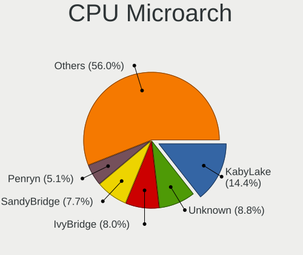

| Name              | Notebooks | Percent |
|-------------------|-----------|---------|
| KabyLake          | 118       | 14.39%  |
| Unknown           | 72        | 8.78%   |
| IvyBridge         | 66        | 8.05%   |
| SandyBridge       | 63        | 7.68%   |
| Penryn            | 42        | 5.12%   |
| Haswell           | 42        | 5.12%   |
| Silvermont        | 36        | 4.39%   |
| Core              | 32        | 3.9%    |
| TigerLake         | 31        | 3.78%   |
| Bonnell           | 26        | 3.17%   |
| Alderlake Hybrid  | 26        | 3.17%   |
| Skylake           | 25        | 3.05%   |
| Zen 2             | 21        | 2.56%   |
| Broadwell         | 17        | 2.07%   |
| Bobcat            | 17        | 2.07%   |
| Zen+              | 16        | 1.95%   |
| Zen 3             | 16        | 1.95%   |
| Piledriver        | 16        | 1.95%   |
| K10               | 16        | 1.95%   |
| IceLake           | 16        | 1.95%   |
| Goldmont plus     | 16        | 1.95%   |
| Goldmont          | 15        | 1.83%   |
| Westmere          | 13        | 1.59%   |
| Zen               | 9         | 1.1%    |
| Excavator         | 8         | 0.98%   |
| CometLake         | 8         | 0.98%   |
| Jaguar            | 7         | 0.85%   |
| Puma              | 6         | 0.73%   |
| K10 Llano         | 6         | 0.73%   |
| P6                | 5         | 0.61%   |
| K8 Hammer         | 4         | 0.49%   |
| Nehalem           | 3         | 0.37%   |
| Tremont           | 2         | 0.24%   |
| Meteorlake Hybrid | 2         | 0.24%   |
| Steamroller       | 1         | 0.12%   |
| K8 & K10 hybrid   | 1         | 0.12%   |

Graphics
--------

GPU Vendor
----------

Vendors of graphics cards

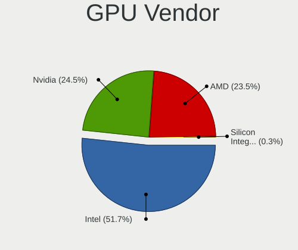

| Vendor                           | Notebooks | Percent |
|----------------------------------|-----------|---------|
| Intel                            | 567       | 51.69%  |
| Nvidia                           | 269       | 24.52%  |
| AMD                              | 258       | 23.52%  |
| Silicon Integrated Systems [SiS] | 3         | 0.27%   |

GPU Model
---------

Graphics card models

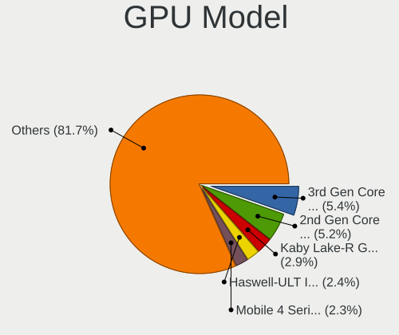

| Model                                                                                    | Notebooks | Percent |
|------------------------------------------------------------------------------------------|-----------|---------|
| Intel 3rd Gen Core processor Graphics Controller                                         | 62        | 5.38%   |
| Intel 2nd Generation Core Processor Family Integrated Graphics Controller                | 60        | 5.2%    |
| Intel Kaby Lake-R GT2 [UHD Graphics 620]                                                 | 34        | 2.95%   |
| Intel Haswell-ULT Integrated Graphics Controller                                         | 28        | 2.43%   |
| Intel Mobile 4 Series Chipset Integrated Graphics Controller                             | 27        | 2.34%   |
| Intel TigerLake-LP GT2 [Iris Xe Graphics]                                                | 26        | 2.25%   |
| Intel Atom Processor Z36xxx/Z37xxx Series Graphics & Display                             | 26        | 2.25%   |
| AMD Renoir [Radeon Vega Series / Radeon Vega Mobile Series]                              | 21        | 1.82%   |
| AMD Lucienne                                                                             | 21        | 1.82%   |
| Nvidia GF117M [GeForce 610M/710M/810M/820M / GT 620M/625M/630M/720M]                     | 20        | 1.73%   |
| Intel CoffeeLake-H GT2 [UHD Graphics 630]                                                | 19        | 1.65%   |
| Intel Skylake-U GT2 [HD Graphics 520]                                                    | 18        | 1.56%   |
| Intel CometLake-U GT2 [UHD Graphics]                                                     | 18        | 1.56%   |
| Intel Broadwell-U GT2 [HD Graphics 5500]                                                 | 16        | 1.39%   |
| AMD Picasso/Raven 2 [Radeon Vega Series / Radeon Vega Mobile Series]                     | 16        | 1.39%   |
| Intel WhiskeyLake-U GT2 [UHD Graphics 620]                                               | 15        | 1.3%    |
| Intel Mobile GM965/GL960 Integrated Graphics Controller (secondary)                      | 15        | 1.3%    |
| Intel Mobile GM965/GL960 Integrated Graphics Controller (primary)                        | 15        | 1.3%    |
| Intel Atom Processor D4xx/D5xx/N4xx/N5xx Integrated Graphics Controller                  | 15        | 1.3%    |
| Nvidia GP107M [GeForce GTX 1050 Mobile]                                                  | 14        | 1.21%   |
| Intel 4th Gen Core Processor Integrated Graphics Controller                              | 14        | 1.21%   |
| Nvidia GP108M [GeForce MX150]                                                            | 13        | 1.13%   |
| AMD Seymour [Radeon HD 6400M/7400M Series]                                               | 13        | 1.13%   |
| AMD Cezanne [Radeon Vega Series / Radeon Vega Mobile Series]                             | 13        | 1.13%   |
| Intel Kaby Lake-H GT2 [HD Graphics 630]                                                  | 12        | 1.04%   |
| AMD Rembrandt [Radeon 680M]                                                              | 12        | 1.04%   |
| Nvidia TU117M [GeForce GTX 1650 Mobile / Max-Q]                                          | 11        | 0.95%   |
| Nvidia GM108M [GeForce 840M]                                                             | 11        | 0.95%   |
| Nvidia GA107M [GeForce RTX 3050 Mobile]                                                  | 11        | 0.95%   |
| Intel GeminiLake [UHD Graphics 600]                                                      | 11        | 0.95%   |
| AMD Sun XT [Radeon HD 8670A/8670M/8690M / R5 M330 / M430 / Radeon 520 Mobile]            | 11        | 0.95%   |
| Nvidia GA106M [GeForce RTX 3060 Mobile / Max-Q]                                          | 10        | 0.87%   |
| Intel Iris Plus Graphics G1 (Ice Lake)                                                   | 10        | 0.87%   |
| Intel Atom/Celeron/Pentium Processor x5-E8000/J3xxx/N3xxx Integrated Graphics Controller | 10        | 0.87%   |
| Intel Alder Lake-P GT1 [UHD Graphics]                                                    | 10        | 0.87%   |
| AMD Topaz XT [Radeon R7 M260/M265 / M340/M360 / M440/M445 / 530/535 / 620/625 Mobile]    | 10        | 0.87%   |
| Nvidia GP107M [GeForce GTX 1050 Ti Mobile]                                               | 9         | 0.78%   |
| Intel Kaby Lake-U GT2 [HD Graphics 620]                                                  | 9         | 0.78%   |
| Intel Apollo Lake GT1 [HD Graphics 500]                                                  | 9         | 0.78%   |
| AMD Wrestler [Radeon HD 6320]                                                            | 9         | 0.78%   |

GPU Combo
---------

Combinations of graphics cards

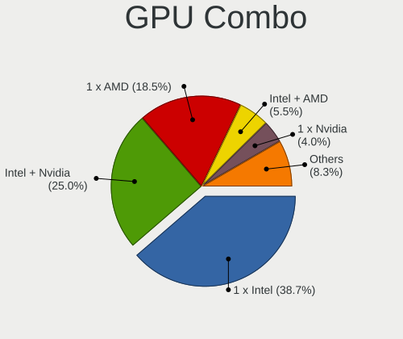

| Name           | Notebooks | Percent |
|----------------|-----------|---------|
| 1 x Intel      | 316       | 38.68%  |
| Intel + Nvidia | 204       | 24.97%  |
| 1 x AMD        | 151       | 18.48%  |
| Intel + AMD    | 45        | 5.51%   |
| 1 x Nvidia     | 33        | 4.04%   |
| 2 x AMD        | 31        | 3.79%   |
| AMD + Nvidia   | 31        | 3.79%   |
| 2 x Intel      | 3         | 0.37%   |
| 1 x SiS        | 3         | 0.37%   |

GPU Driver
----------

Free vs proprietary

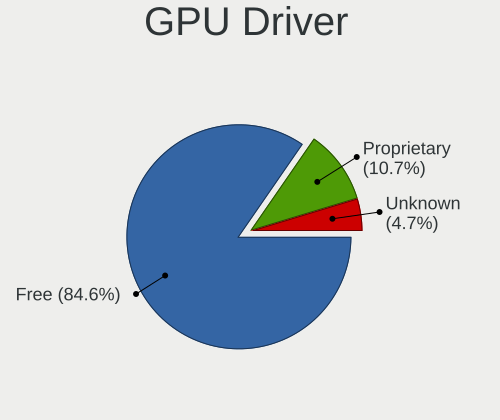

| Driver      | Notebooks | Percent |
|-------------|-----------|---------|
| Free        | 704       | 84.62%  |
| Proprietary | 89        | 10.7%   |
| Unknown     | 39        | 4.69%   |

GPU Memory
----------

Total video memory

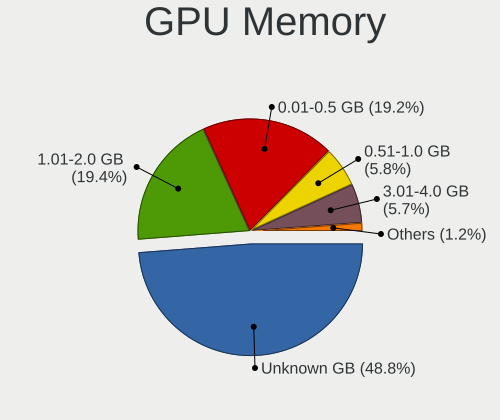

| Size in GB | Notebooks | Percent |
|------------|-----------|---------|
| Unknown    | 414       | 48.76%  |
| 1.01-2.0   | 165       | 19.43%  |
| 0.01-0.5   | 163       | 19.2%   |
| 0.51-1.0   | 49        | 5.77%   |
| 3.01-4.0   | 48        | 5.65%   |
| 5.01-6.0   | 7         | 0.82%   |
| 7.01-8.0   | 1         | 0.12%   |
| 2.01-3.0   | 1         | 0.12%   |
| 8.01-16.0  | 1         | 0.12%   |

Monitor
-------

Monitor Vendor
--------------

Monitor vendors

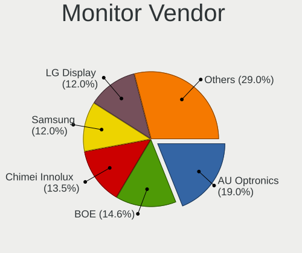

| Vendor                  | Notebooks | Percent |
|-------------------------|-----------|---------|
| AU Optronics            | 168       | 18.96%  |
| BOE                     | 129       | 14.56%  |
| Chimei Innolux          | 120       | 13.54%  |
| Samsung Electronics     | 106       | 11.96%  |
| LG Display              | 106       | 11.96%  |
| Chi Mei Optoelectronics | 55        | 6.21%   |
| Goldstar                | 28        | 3.16%   |
| PANDA                   | 22        | 2.48%   |
| Dell                    | 18        | 2.03%   |
| Lenovo                  | 13        | 1.47%   |
| LG Philips              | 10        | 1.13%   |
| Apple                   | 10        | 1.13%   |
| Philips                 | 9         | 1.02%   |
| CPT                     | 9         | 1.02%   |
| HannStar                | 8         | 0.9%    |
| Sony                    | 6         | 0.68%   |
| Sharp                   | 6         | 0.68%   |
| Hewlett-Packard         | 6         | 0.68%   |
| Unknown                 | 5         | 0.56%   |
| BenQ                    | 5         | 0.56%   |
| Valve                   | 4         | 0.45%   |
| TMX                     | 4         | 0.45%   |
| CSOT                    | 4         | 0.45%   |
| CSO                     | 4         | 0.45%   |
| Iiyama                  | 3         | 0.34%   |
| AOC                     | 3         | 0.34%   |
| ViewSonic               | 2         | 0.23%   |
| LGD                     | 2         | 0.23%   |
| InnoLux Display         | 2         | 0.23%   |
| ___                     | 1         | 0.11%   |
| VIE                     | 1         | 0.11%   |
| TMA                     | 1         | 0.11%   |
| ThundeRobot             | 1         | 0.11%   |
| Seiko/Epson             | 1         | 0.11%   |
| RGT                     | 1         | 0.11%   |
| Quanta Display          | 1         | 0.11%   |
| PCL                     | 1         | 0.11%   |
| NEC Computers           | 1         | 0.11%   |
| MiTAC                   | 1         | 0.11%   |
| Mi                      | 1         | 0.11%   |

Monitor Model
-------------

Monitor models

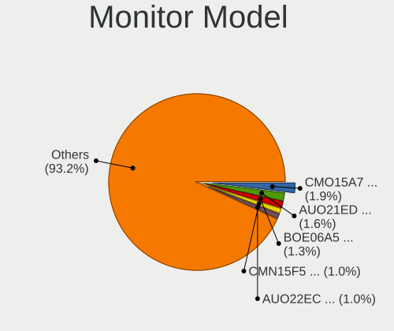

| Model                                                                    | Notebooks | Percent |
|--------------------------------------------------------------------------|-----------|---------|
| Chi Mei Optoelectronics LCD Monitor CMO15A7 1366x768 344x193mm 15.5-inch | 17        | 1.9%    |
| AU Optronics LCD Monitor AUO21ED 1920x1080 344x193mm 15.5-inch           | 14        | 1.57%   |
| BOE LCD Monitor BOE06A5 1366x768 344x194mm 15.5-inch                     | 12        | 1.34%   |
| Chimei Innolux LCD Monitor CMN15F5 1920x1080 344x193mm 15.5-inch         | 9         | 1.01%   |
| AU Optronics LCD Monitor AUO22EC 1366x768 344x193mm 15.5-inch            | 9         | 1.01%   |
| Samsung Electronics LCD Monitor SEC3245 1366x768 340x190mm 15.3-inch     | 7         | 0.78%   |
| LG Display LCD Monitor LGD02DC 1366x768 344x194mm 15.5-inch              | 7         | 0.78%   |
| Chimei Innolux LCD Monitor CMN15E7 1920x1080 344x193mm 15.5-inch         | 7         | 0.78%   |
| Chi Mei Optoelectronics LCD Monitor CMO1592 1366x768 344x193mm 15.5-inch | 7         | 0.78%   |
| BOE LCD Monitor BOE069C 1920x1080 344x193mm 15.5-inch                    | 7         | 0.78%   |
| AU Optronics LCD Monitor AUO46EC 1366x768 344x193mm 15.5-inch            | 7         | 0.78%   |
| AU Optronics LCD Monitor AUO21EC 1366x768 344x193mm 15.5-inch            | 7         | 0.78%   |
| Samsung Electronics LCD Monitor SDC4852 1366x768 344x194mm 15.5-inch     | 6         | 0.67%   |
| LG Display LCD Monitor LGD0395 1366x768 344x194mm 15.5-inch              | 6         | 0.67%   |
| HannStar LCD Monitor HSD03E9 1024x600 220x129mm 10.0-inch                | 6         | 0.67%   |
| Chimei Innolux LCD Monitor CMN15DB 1366x768 344x193mm 15.5-inch          | 6         | 0.67%   |
| Chimei Innolux LCD Monitor CMN15D5 1920x1080 344x193mm 15.5-inch         | 6         | 0.67%   |
| Chimei Innolux LCD Monitor CMN1521 1920x1080 344x193mm 15.5-inch         | 6         | 0.67%   |
| Chimei Innolux LCD Monitor CMN14D4 1920x1080 309x173mm 13.9-inch         | 6         | 0.67%   |
| Chi Mei Optoelectronics LCD Monitor CMO15A3 1366x768 344x193mm 15.5-inch | 6         | 0.67%   |
| AU Optronics LCD Monitor AUO8174 1280x800 331x207mm 15.4-inch            | 6         | 0.67%   |
| AU Optronics LCD Monitor AUO71EC 1366x768 344x193mm 15.5-inch            | 6         | 0.67%   |
| Samsung Electronics LCD Monitor SEC3945 1280x800 331x207mm 15.4-inch     | 5         | 0.56%   |
| PANDA LCD Monitor NCP004D 1920x1080 344x194mm 15.5-inch                  | 5         | 0.56%   |
| BOE LCD Monitor BOE0747 1920x1080 344x194mm 15.5-inch                    | 5         | 0.56%   |
| AU Optronics LCD Monitor AUO47EC 1366x768 344x193mm 15.5-inch            | 5         | 0.56%   |
| AU Optronics LCD Monitor AUO38ED 1920x1080 344x193mm 15.5-inch           | 5         | 0.56%   |
| AU Optronics LCD Monitor AUO26EC 1366x768 344x193mm 15.5-inch            | 5         | 0.56%   |
| Samsung Electronics LCD Monitor SDC4752 1366x768 344x194mm 15.5-inch     | 4         | 0.45%   |
| LG Display LCD Monitor LGD033A 1366x768 344x194mm 15.5-inch              | 4         | 0.45%   |
| LG Display LCD Monitor LGD02F1 1366x768 344x194mm 15.5-inch              | 4         | 0.45%   |
| Chimei Innolux LCD Monitor CMN1728 1600x900 382x215mm 17.3-inch          | 4         | 0.45%   |
| Chimei Innolux LCD Monitor CMN15E8 1920x1080 344x193mm 15.5-inch         | 4         | 0.45%   |
| Chimei Innolux LCD Monitor CMN15BC 1366x768 344x193mm 15.5-inch          | 4         | 0.45%   |
| BOE LCD Monitor BOE0877 1920x1080 309x173mm 13.9-inch                    | 4         | 0.45%   |
| BOE LCD Monitor BOE0872 1920x1080 344x194mm 15.5-inch                    | 4         | 0.45%   |
| AU Optronics LCD Monitor AUO61ED 1920x1080 344x194mm 15.5-inch           | 4         | 0.45%   |
| AU Optronics LCD Monitor AUO20EC 1366x768 344x193mm 15.5-inch            | 4         | 0.45%   |
| Valve ANX7530 U VLV3001 800x1280 100x150mm 7.1-inch                      | 3         | 0.34%   |
| Unknown LCD Monitor FFFF 2288x1287 2550x2550mm 142.0-inch                | 3         | 0.34%   |

Monitor Resolution
------------------

Monitor screen resolution

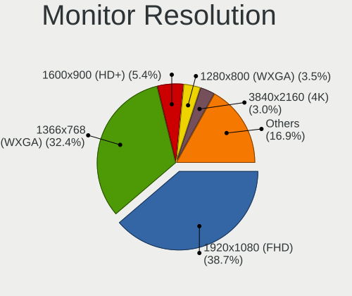

| Resolution         | Notebooks | Percent |
|--------------------|-----------|---------|
| 1920x1080 (FHD)    | 332       | 38.74%  |
| 1366x768 (WXGA)    | 278       | 32.44%  |
| 1600x900 (HD+)     | 46        | 5.37%   |
| 1280x800 (WXGA)    | 30        | 3.5%    |
| 3840x2160 (4K)     | 26        | 3.03%   |
| 1024x600           | 21        | 2.45%   |
| 1920x1200 (WUXGA)  | 19        | 2.22%   |
| 2560x1440 (QHD)    | 17        | 1.98%   |
| 2560x1600          | 16        | 1.87%   |
| 1440x900 (WXGA+)   | 15        | 1.75%   |
| 2880x1800          | 9         | 1.05%   |
| 3200x2000          | 6         | 0.7%    |
| 1680x1050 (WSXGA+) | 6         | 0.7%    |
| 800x1280           | 4         | 0.47%   |
| 1280x1024 (SXGA)   | 4         | 0.47%   |
| 3840x2400          | 3         | 0.35%   |
| 2288x1287          | 3         | 0.35%   |
| 3072x1920          | 2         | 0.23%   |
| 2880x1620          | 2         | 0.23%   |
| 2560x1080          | 2         | 0.23%   |
| 2240x1400          | 2         | 0.23%   |
| 2160x1440          | 2         | 0.23%   |
| 1360x768           | 2         | 0.23%   |
| 3840x1080          | 1         | 0.12%   |
| 3440x1440          | 1         | 0.12%   |
| 2880x1920          | 1         | 0.12%   |
| 2048x1536          | 1         | 0.12%   |
| 2048x1152          | 1         | 0.12%   |
| 1680x945           | 1         | 0.12%   |
| 1600x1200          | 1         | 0.12%   |
| 1280x960           | 1         | 0.12%   |
| 1024x768 (XGA)     | 1         | 0.12%   |
| Unknown            | 1         | 0.12%   |

Monitor Diagonal
----------------

Diagonal size in inches

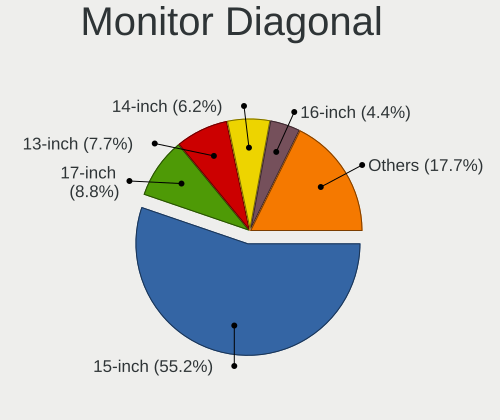

| Inches  | Notebooks | Percent |
|---------|-----------|---------|
| 15      | 490       | 55.24%  |
| 17      | 78        | 8.79%   |
| 13      | 68        | 7.67%   |
| 14      | 55        | 6.2%    |
| 16      | 39        | 4.4%    |
| 24      | 23        | 2.59%   |
| 10      | 20        | 2.25%   |
| 21      | 17        | 1.92%   |
| 23      | 16        | 1.8%    |
| 27      | 15        | 1.69%   |
| 31      | 9         | 1.01%   |
| Unknown | 8         | 0.9%    |
| 11      | 6         | 0.68%   |
| 12      | 5         | 0.56%   |
| 72      | 4         | 0.45%   |
| 18      | 4         | 0.45%   |
| 7       | 4         | 0.45%   |
| 142     | 3         | 0.34%   |
| 34      | 3         | 0.34%   |
| 22      | 3         | 0.34%   |
| 20      | 3         | 0.34%   |
| 19      | 3         | 0.34%   |
| 40      | 2         | 0.23%   |
| 32      | 2         | 0.23%   |
| 8       | 2         | 0.23%   |
| 54      | 1         | 0.11%   |
| 52      | 1         | 0.11%   |
| 26      | 1         | 0.11%   |
| 25      | 1         | 0.11%   |
| 9       | 1         | 0.11%   |

Monitor Width
-------------

Physical width

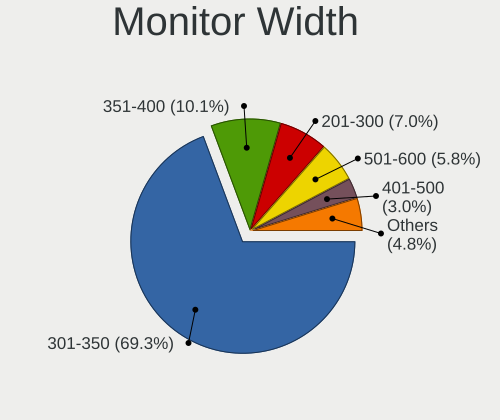

| Width in mm    | Notebooks | Percent |
|----------------|-----------|---------|
| 301-350        | 610       | 69.32%  |
| 351-400        | 89        | 10.11%  |
| 201-300        | 62        | 7.05%   |
| 501-600        | 51        | 5.8%    |
| 401-500        | 26        | 2.95%   |
| 601-700        | 11        | 1.25%   |
| Unknown        | 8         | 0.91%   |
| 701-800        | 5         | 0.57%   |
| 1501-2000      | 4         | 0.45%   |
| 1-100          | 4         | 0.45%   |
| More than 2000 | 3         | 0.34%   |
| 101-200        | 3         | 0.34%   |
| 801-900        | 2         | 0.23%   |
| 1001-1500      | 2         | 0.23%   |

Aspect Ratio
------------

Proportional relationship between the width and the height

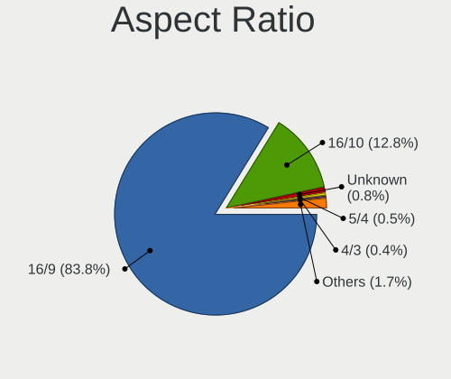

| Ratio   | Notebooks | Percent |
|---------|-----------|---------|
| 16/9    | 693       | 83.8%   |
| 16/10   | 106       | 12.82%  |
| Unknown | 7         | 0.85%   |
| 5/4     | 4         | 0.48%   |
| 4/3     | 3         | 0.36%   |
| 3/2     | 3         | 0.36%   |
| 21/9    | 3         | 0.36%   |
| 1.00    | 3         | 0.36%   |
| 0.67    | 3         | 0.36%   |
| 0.62    | 2         | 0.24%   |

Monitor Area
------------

Area in inch²

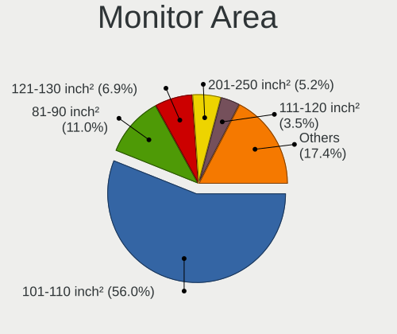

| Area in inch² | Notebooks | Percent |
|----------------|-----------|---------|
| 101-110        | 496       | 56.05%  |
| 81-90          | 97        | 10.96%  |
| 121-130        | 61        | 6.89%   |
| 201-250        | 46        | 5.2%    |
| 111-120        | 31        | 3.5%    |
| 71-80          | 25        | 2.82%   |
| 41-50          | 21        | 2.37%   |
| 301-350        | 16        | 1.81%   |
| 131-140        | 15        | 1.69%   |
| 351-500        | 14        | 1.58%   |
| 151-200        | 10        | 1.13%   |
| More than 1000 | 9         | 1.02%   |
| 251-300        | 9         | 1.02%   |
| Unknown        | 8         | 0.9%    |
| 51-60          | 6         | 0.68%   |
| 1-40           | 6         | 0.68%   |
| 141-150        | 6         | 0.68%   |
| 61-70          | 5         | 0.56%   |
| 501-1000       | 2         | 0.23%   |
| 91-100         | 2         | 0.23%   |

Pixel Density
-------------

Pixels per inch

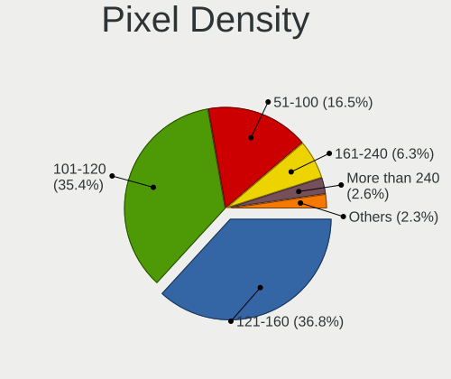

| Density       | Notebooks | Percent |
|---------------|-----------|---------|
| 121-160       | 321       | 36.81%  |
| 101-120       | 309       | 35.44%  |
| 51-100        | 144       | 16.51%  |
| 161-240       | 55        | 6.31%   |
| More than 240 | 23        | 2.64%   |
| 1-50          | 12        | 1.38%   |
| Unknown       | 8         | 0.92%   |

Multiple Monitors
-----------------

Total monitors connected

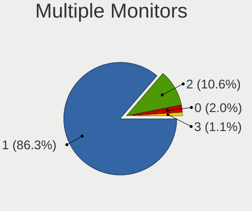

| Total | Notebooks | Percent |
|-------|-----------|---------|
| 1     | 717       | 86.28%  |
| 2     | 88        | 10.59%  |
| 0     | 17        | 2.05%   |
| 3     | 9         | 1.08%   |

Network
-------

Net Controller Vendor
---------------------

Controller vendors

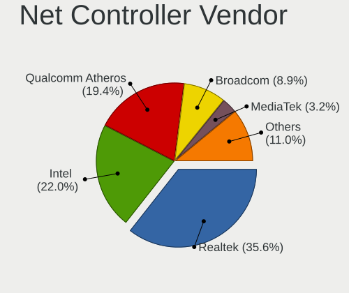

| Vendor                            | Notebooks | Percent |
|-----------------------------------|-----------|---------|
| Realtek Semiconductor             | 470       | 35.61%  |
| Intel                             | 290       | 21.97%  |
| Qualcomm Atheros                  | 256       | 19.39%  |
| Broadcom                          | 117       | 8.86%   |
| MediaTek                          | 42        | 3.18%   |
| Marvell Technology Group          | 27        | 2.05%   |
| Ralink                            | 26        | 1.97%   |
| Broadcom Limited                  | 18        | 1.36%   |
| Qualcomm                          | 10        | 0.76%   |
| Xiaomi                            | 6         | 0.45%   |
| TP-Link                           | 6         | 0.45%   |
| Shenzhen Goodix Technology        | 5         | 0.38%   |
| Huawei Technologies               | 5         | 0.38%   |
| Hewlett-Packard                   | 5         | 0.38%   |
| Ralink Technology                 | 4         | 0.3%    |
| JMicron Technology                | 4         | 0.3%    |
| Sierra Wireless                   | 3         | 0.23%   |
| Fibocom                           | 3         | 0.23%   |
| Attansic Technology               | 3         | 0.23%   |
| Samsung Electronics               | 2         | 0.15%   |
| Nvidia                            | 2         | 0.15%   |
| Mercucys                          | 2         | 0.15%   |
| ASIX Electronics                  | 2         | 0.15%   |
| ZTE WCDMA Technologies MSM        | 1         | 0.08%   |
| Silicon Integrated Systems [SiS]  | 1         | 0.08%   |
| Philips (or NXP)                  | 1         | 0.08%   |
| OPPO Electronics                  | 1         | 0.08%   |
| OnePlus Technology (Shenzhen)     | 1         | 0.08%   |
| Lenovo                            | 1         | 0.08%   |
| Google                            | 1         | 0.08%   |
| Ericsson Business Mobile Networks | 1         | 0.08%   |
| D-Link                            | 1         | 0.08%   |
| Aquantia                          | 1         | 0.08%   |
| Apple                             | 1         | 0.08%   |
| Unknown                           | 1         | 0.08%   |

Net Controller Model
--------------------

Controller models

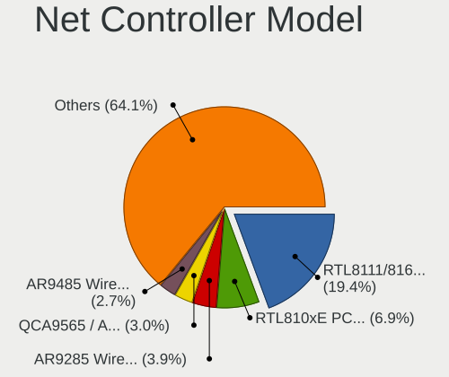

| Model                                                                   | Notebooks | Percent |
|-------------------------------------------------------------------------|-----------|---------|
| Realtek RTL8111/8168/8211/8411 PCI Express Gigabit Ethernet Controller  | 297       | 19.37%  |
| Realtek RTL810xE PCI Express Fast Ethernet controller                   | 106       | 6.91%   |
| Qualcomm Atheros AR9285 Wireless Network Adapter (PCI-Express)          | 60        | 3.91%   |
| Qualcomm Atheros QCA9565 / AR9565 Wireless Network Adapter              | 46        | 3%      |
| Qualcomm Atheros AR9485 Wireless Network Adapter                        | 42        | 2.74%   |
| Intel Wireless 8265 / 8275                                              | 42        | 2.74%   |
| Broadcom BCM4313 802.11bgn Wireless Network Adapter                     | 35        | 2.28%   |
| Realtek RTL8723BE PCIe Wireless Network Adapter                         | 33        | 2.15%   |
| Realtek RTL8822CE 802.11ac PCIe Wireless Network Adapter                | 27        | 1.76%   |
| Qualcomm Atheros QCA9377 802.11ac Wireless Network Adapter              | 26        | 1.7%    |
| Broadcom BCM43142 802.11b/g/n                                           | 24        | 1.57%   |
| Realtek RTL8821CE 802.11ac PCIe Wireless Network Adapter                | 22        | 1.44%   |
| Intel Wi-Fi 6 AX201                                                     | 22        | 1.44%   |
| Intel Wi-Fi 6 AX200                                                     | 19        | 1.24%   |
| Ralink RT3290 Wireless 802.11n 1T/1R PCIe                               | 18        | 1.17%   |
| MediaTek MT7921 802.11ax PCIe Wireless Network Adapter [Filogic 330]    | 18        | 1.17%   |
| Intel Comet Lake PCH-LP CNVi WiFi                                       | 18        | 1.17%   |
| Intel Alder Lake-P PCH CNVi WiFi                                        | 17        | 1.11%   |
| Qualcomm Atheros AR242x / AR542x Wireless Network Adapter (PCI-Express) | 16        | 1.04%   |
| Intel Cannon Lake PCH CNVi WiFi                                         | 14        | 0.91%   |
| MediaTek MT7922 802.11ax PCI Express Wireless Network Adapter           | 13        | 0.85%   |
| Intel Wireless 7265                                                     | 13        | 0.85%   |
| Broadcom NetLink BCM57785 Gigabit Ethernet PCIe                         | 13        | 0.85%   |
| Realtek RTL8153 Gigabit Ethernet Adapter                                | 11        | 0.72%   |
| Qualcomm Atheros AR8151 v2.0 Gigabit Ethernet                           | 11        | 0.72%   |
| Intel Wireless 7260                                                     | 11        | 0.72%   |
| Intel Cannon Point-LP CNVi [Wireless-AC]                                | 11        | 0.72%   |
| Qualcomm Atheros AR8131 Gigabit Ethernet                                | 10        | 0.65%   |
| Realtek RTL8822BE 802.11a/b/g/n/ac WiFi adapter                         | 9         | 0.59%   |
| Qualcomm Atheros AR9462 Wireless Network Adapter                        | 9         | 0.59%   |
| Qualcomm Atheros AR8162 Fast Ethernet                                   | 9         | 0.59%   |
| Qualcomm Atheros QCA6174 802.11ac Wireless Network Adapter              | 8         | 0.52%   |
| Intel WiFi Link 5100                                                    | 8         | 0.52%   |
| Intel Raptor Lake PCH CNVi WiFi                                         | 8         | 0.52%   |
| Realtek RTL8852BE PCIe 802.11ax Wireless Network Controller             | 7         | 0.46%   |
| Qualcomm QCNFA765 Wireless Network Adapter                              | 7         | 0.46%   |
| Qualcomm Atheros AR928X Wireless Network Adapter (PCI-Express)          | 7         | 0.46%   |
| Qualcomm Atheros AR8132 Fast Ethernet                                   | 7         | 0.46%   |
| Intel Wireless 8260                                                     | 7         | 0.46%   |
| Intel Wireless 3165                                                     | 7         | 0.46%   |

Wireless Vendor
---------------

Wireless vendors

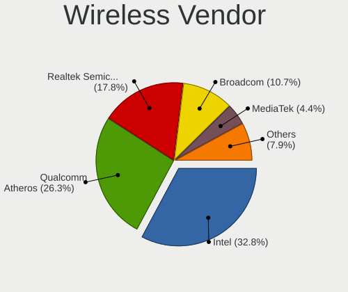

| Vendor                | Notebooks | Percent |
|-----------------------|-----------|---------|
| Intel                 | 273       | 32.81%  |
| Qualcomm Atheros      | 219       | 26.32%  |
| Realtek Semiconductor | 148       | 17.79%  |
| Broadcom              | 89        | 10.7%   |
| MediaTek              | 37        | 4.45%   |
| Ralink                | 26        | 3.13%   |
| Broadcom Limited      | 11        | 1.32%   |
| Qualcomm              | 8         | 0.96%   |
| Ralink Technology     | 4         | 0.48%   |
| TP-Link               | 3         | 0.36%   |
| Sierra Wireless       | 3         | 0.36%   |
| Hewlett-Packard       | 3         | 0.36%   |
| Fibocom               | 3         | 0.36%   |
| Mercucys              | 2         | 0.24%   |
| Philips (or NXP)      | 1         | 0.12%   |
| D-Link                | 1         | 0.12%   |
| Unknown               | 1         | 0.12%   |

Wireless Model
--------------

Wireless models

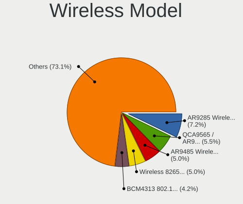

| Model                                                                   | Notebooks | Percent |
|-------------------------------------------------------------------------|-----------|---------|
| Qualcomm Atheros AR9285 Wireless Network Adapter (PCI-Express)          | 60        | 7.19%   |
| Qualcomm Atheros QCA9565 / AR9565 Wireless Network Adapter              | 46        | 5.51%   |
| Qualcomm Atheros AR9485 Wireless Network Adapter                        | 42        | 5.03%   |
| Intel Wireless 8265 / 8275                                              | 42        | 5.03%   |
| Broadcom BCM4313 802.11bgn Wireless Network Adapter                     | 35        | 4.19%   |
| Realtek RTL8723BE PCIe Wireless Network Adapter                         | 33        | 3.95%   |
| Realtek RTL8822CE 802.11ac PCIe Wireless Network Adapter                | 27        | 3.23%   |
| Qualcomm Atheros QCA9377 802.11ac Wireless Network Adapter              | 26        | 3.11%   |
| Broadcom BCM43142 802.11b/g/n                                           | 24        | 2.87%   |
| Realtek RTL8821CE 802.11ac PCIe Wireless Network Adapter                | 22        | 2.63%   |
| Intel Wi-Fi 6 AX201                                                     | 22        | 2.63%   |
| Intel Wi-Fi 6 AX200                                                     | 19        | 2.28%   |
| Ralink RT3290 Wireless 802.11n 1T/1R PCIe                               | 18        | 2.16%   |
| MediaTek MT7921 802.11ax PCIe Wireless Network Adapter [Filogic 330]    | 18        | 2.16%   |
| Intel Comet Lake PCH-LP CNVi WiFi                                       | 18        | 2.16%   |
| Qualcomm Atheros AR242x / AR542x Wireless Network Adapter (PCI-Express) | 16        | 1.92%   |
| Intel Cannon Lake PCH CNVi WiFi                                         | 14        | 1.68%   |
| Intel Wireless 7265                                                     | 13        | 1.56%   |
| Intel Wireless 7260                                                     | 11        | 1.32%   |
| Intel Cannon Point-LP CNVi [Wireless-AC]                                | 11        | 1.32%   |
| Realtek RTL8822BE 802.11a/b/g/n/ac WiFi adapter                         | 9         | 1.08%   |
| Qualcomm Atheros AR9462 Wireless Network Adapter                        | 9         | 1.08%   |
| MediaTek MT7922 802.11ax PCI Express Wireless Network Adapter           | 9         | 1.08%   |
| Qualcomm Atheros QCA6174 802.11ac Wireless Network Adapter              | 8         | 0.96%   |
| Intel WiFi Link 5100                                                    | 8         | 0.96%   |
| Intel Raptor Lake PCH CNVi WiFi                                         | 8         | 0.96%   |
| Intel Alder Lake-P PCH CNVi WiFi                                        | 8         | 0.96%   |
| Realtek RTL8852BE PCIe 802.11ax Wireless Network Controller             | 7         | 0.84%   |
| Qualcomm QCNFA765 Wireless Network Adapter                              | 7         | 0.84%   |
| Qualcomm Atheros AR928X Wireless Network Adapter (PCI-Express)          | 7         | 0.84%   |
| Intel Wireless 8260                                                     | 7         | 0.84%   |
| Intel Wireless 3165                                                     | 7         | 0.84%   |
| Intel PRO/Wireless 4965 AG or AGN [Kedron] Network Connection           | 7         | 0.84%   |
| Realtek RTL8723DE Wireless Network Adapter                              | 6         | 0.72%   |
| Realtek RTL8188EUS 802.11n Wireless Network Adapter                     | 6         | 0.72%   |
| Intel Tiger Lake PCH CNVi WiFi                                          | 6         | 0.72%   |
| Intel Ice Lake-LP PCH CNVi WiFi                                         | 6         | 0.72%   |
| Intel Comet Lake PCH CNVi WiFi                                          | 6         | 0.72%   |
| Intel Centrino Wireless-N 2230                                          | 6         | 0.72%   |
| Broadcom BCM4312 802.11b/g LP-PHY                                       | 6         | 0.72%   |

Ethernet Vendor
---------------

Ethernet vendors

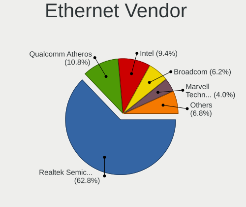

| Vendor                           | Notebooks | Percent |
|----------------------------------|-----------|---------|
| Realtek Semiconductor            | 426       | 62.83%  |
| Qualcomm Atheros                 | 73        | 10.77%  |
| Intel                            | 64        | 9.44%   |
| Broadcom                         | 42        | 6.19%   |
| Marvell Technology Group         | 27        | 3.98%   |
| Broadcom Limited                 | 7         | 1.03%   |
| Xiaomi                           | 6         | 0.88%   |
| MediaTek                         | 5         | 0.74%   |
| JMicron Technology               | 4         | 0.59%   |
| TP-Link                          | 3         | 0.44%   |
| Huawei Technologies              | 3         | 0.44%   |
| Attansic Technology              | 3         | 0.44%   |
| Samsung Electronics              | 2         | 0.29%   |
| Qualcomm                         | 2         | 0.29%   |
| Nvidia                           | 2         | 0.29%   |
| ASIX Electronics                 | 2         | 0.29%   |
| Silicon Integrated Systems [SiS] | 1         | 0.15%   |
| OPPO Electronics                 | 1         | 0.15%   |
| OnePlus Technology (Shenzhen)    | 1         | 0.15%   |
| Lenovo                           | 1         | 0.15%   |
| Google                           | 1         | 0.15%   |
| Aquantia                         | 1         | 0.15%   |
| Apple                            | 1         | 0.15%   |

Ethernet Model
--------------

Ethernet models

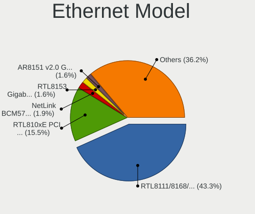

| Model                                                                          | Notebooks | Percent |
|--------------------------------------------------------------------------------|-----------|---------|
| Realtek RTL8111/8168/8211/8411 PCI Express Gigabit Ethernet Controller         | 297       | 43.29%  |
| Realtek RTL810xE PCI Express Fast Ethernet controller                          | 106       | 15.45%  |
| Broadcom NetLink BCM57785 Gigabit Ethernet PCIe                                | 13        | 1.9%    |
| Realtek RTL8153 Gigabit Ethernet Adapter                                       | 11        | 1.6%    |
| Qualcomm Atheros AR8151 v2.0 Gigabit Ethernet                                  | 11        | 1.6%    |
| Qualcomm Atheros AR8131 Gigabit Ethernet                                       | 10        | 1.46%   |
| Qualcomm Atheros AR8162 Fast Ethernet                                          | 9         | 1.31%   |
| Intel Alder Lake-P PCH CNVi WiFi                                               | 9         | 1.31%   |
| Qualcomm Atheros AR8132 Fast Ethernet                                          | 7         | 1.02%   |
| Broadcom NetLink BCM5787M Gigabit Ethernet PCI Express                         | 7         | 1.02%   |
| Realtek RTL8125 2.5GbE Controller                                              | 6         | 0.87%   |
| Qualcomm Atheros QCA8171 Gigabit Ethernet                                      | 6         | 0.87%   |
| Marvell Group 88E8055 PCI-E Gigabit Ethernet Controller                        | 6         | 0.87%   |
| Intel 82579LM Gigabit Network Connection (Lewisville)                          | 6         | 0.87%   |
| Broadcom NetXtreme BCM57786 Gigabit Ethernet PCIe                              | 6         | 0.87%   |
| Xiaomi Mi/Redmi series (RNDIS)                                                 | 5         | 0.73%   |
| Qualcomm Atheros QCA8172 Fast Ethernet                                         | 5         | 0.73%   |
| Qualcomm Atheros AR8161 Gigabit Ethernet                                       | 5         | 0.73%   |
| Qualcomm Atheros AR8152 v2.0 Fast Ethernet                                     | 5         | 0.73%   |
| Qualcomm Atheros AR8121/AR8113/AR8114 Gigabit or Fast Ethernet                 | 5         | 0.73%   |
| Marvell Group 88E8040 PCI-E Fast Ethernet Controller                           | 5         | 0.73%   |
| Intel Ethernet Connection (4) I219-V                                           | 5         | 0.73%   |
| Intel Ethernet Connection (23) I219-V                                          | 5         | 0.73%   |
| MediaTek MT7922 802.11ax PCI Express Wireless Network Adapter                  | 4         | 0.58%   |
| Marvell Group Yukon Optima 88E8059 [PCIe Gigabit Ethernet Controller with AVB] | 4         | 0.58%   |
| Marvell Group 88E8042 PCI-E Fast Ethernet Controller                           | 4         | 0.58%   |
| Intel Ethernet Connection (3) I218-LM                                          | 4         | 0.58%   |
| Intel Ethernet Connection (10) I219-V                                          | 4         | 0.58%   |
| Intel 82579V Gigabit Network Connection                                        | 4         | 0.58%   |
| Intel 82566MM Gigabit Network Connection                                       | 4         | 0.58%   |
| Broadcom NetXtreme BCM57765 Gigabit Ethernet PCIe                              | 4         | 0.58%   |
| Broadcom Limited NetLink BCM57780 Gigabit Ethernet PCIe                        | 4         | 0.58%   |
| Realtek Killer E2600 GbE Controller                                            | 3         | 0.44%   |
| Qualcomm Atheros Killer E2400 Gigabit Ethernet Controller                      | 3         | 0.44%   |
| Marvell Group 88E8039 PCI-E Fast Ethernet Controller                           | 3         | 0.44%   |
| JMicron JMC250 PCI Express Gigabit Ethernet Controller                         | 3         | 0.44%   |
| Intel Ethernet Connection (6) I219-V                                           | 3         | 0.44%   |
| Intel Ethernet Connection (16) I219-V                                          | 3         | 0.44%   |
| Broadcom NetXtreme BCM5764M Gigabit Ethernet PCIe                              | 3         | 0.44%   |
| Broadcom NetLink BCM5906M Fast Ethernet PCI Express                            | 3         | 0.44%   |

Net Controller Kind
-------------------

Ethernet, WiFi or modem

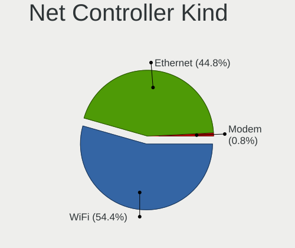

| Kind     | Notebooks | Percent |
|----------|-----------|---------|
| WiFi     | 797       | 54.4%   |
| Ethernet | 656       | 44.78%  |
| Modem    | 12        | 0.82%   |

Used Controller
---------------

Currently used network controller

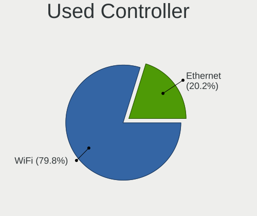

| Kind     | Notebooks | Percent |
|----------|-----------|---------|
| WiFi     | 695       | 79.79%  |
| Ethernet | 176       | 20.21%  |

NICs
----

Total network controllers on board

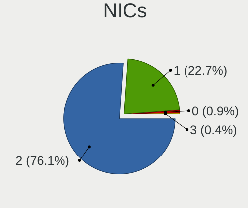

| Total | Notebooks | Percent |
|-------|-----------|---------|
| 2     | 621       | 76.1%   |
| 1     | 185       | 22.67%  |
| 0     | 7         | 0.86%   |
| 3     | 3         | 0.37%   |

IPv6
----

IPv6 vs IPv4

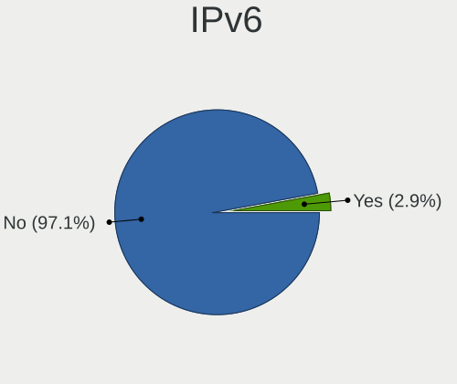

| Used | Notebooks | Percent |
|------|-----------|---------|
| No   | 798       | 97.08%  |
| Yes  | 24        | 2.92%   |

Bluetooth
---------

Bluetooth Vendor
----------------

Controller vendors

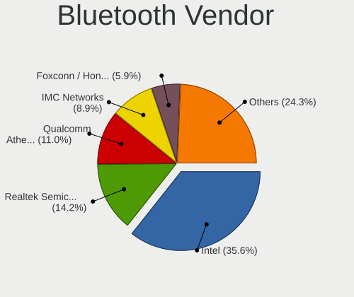

| Vendor                          | Notebooks | Percent |
|---------------------------------|-----------|---------|
| Intel                           | 236       | 35.65%  |
| Realtek Semiconductor           | 94        | 14.2%   |
| Qualcomm Atheros Communications | 73        | 11.03%  |
| IMC Networks                    | 59        | 8.91%   |
| Foxconn / Hon Hai               | 39        | 5.89%   |
| Broadcom                        | 36        | 5.44%   |
| Lite-On Technology              | 31        | 4.68%   |
| Ralink                          | 18        | 2.72%   |
| Foxconn International           | 13        | 1.96%   |
| ASUSTek Computer                | 10        | 1.51%   |
| Hewlett-Packard                 | 9         | 1.36%   |
| Toshiba                         | 7         | 1.06%   |
| MediaTek                        | 7         | 1.06%   |
| Apple                           | 6         | 0.91%   |
| Realtek                         | 4         | 0.6%    |
| Ralink Technology               | 3         | 0.45%   |
| Dell                            | 3         | 0.45%   |
| Cambridge Silicon Radio         | 3         | 0.45%   |
| USI                             | 2         | 0.3%    |
| Taiyo Yuden                     | 2         | 0.3%    |
| Qcom                            | 2         | 0.3%    |
| Opticis                         | 2         | 0.3%    |
| Micro Star International        | 1         | 0.15%   |
| Chicony Electronics             | 1         | 0.15%   |
| Alps Electric                   | 1         | 0.15%   |

Bluetooth Model
---------------

Controller models

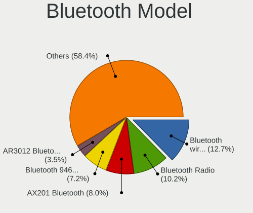

| Model                                             | Notebooks | Percent |
|---------------------------------------------------|-----------|---------|
| Intel Bluetooth wireless interface                | 84        | 12.65%  |
| Realtek Bluetooth Radio                           | 68        | 10.24%  |
| Intel AX201 Bluetooth                             | 53        | 7.98%   |
| Intel Bluetooth 9460/9560 Jefferson Peak (JfP)    | 48        | 7.23%   |
| Qualcomm Atheros AR3012 Bluetooth 4.0             | 23        | 3.46%   |
| Qualcomm Atheros  Bluetooth Device                | 22        | 3.31%   |
| IMC Networks Wireless_Device                      | 20        | 3.01%   |
| Intel AX200 Bluetooth                             | 19        | 2.86%   |
| Ralink RT3290 Bluetooth                           | 18        | 2.71%   |
| Qualcomm Atheros AR3011 Bluetooth                 | 17        | 2.56%   |
| IMC Networks Bluetooth Radio                      | 15        | 2.26%   |
| Foxconn / Hon Hai Bluetooth Device                | 14        | 2.11%   |
| Realtek  Bluetooth 4.2 Adapter                    | 13        | 1.96%   |
| Foxconn International BCM43142A0 Bluetooth module | 13        | 1.96%   |
| Intel Bluetooth Device                            | 11        | 1.66%   |
| Lite-On Bluetooth Device                          | 10        | 1.51%   |
| IMC Networks Bluetooth Device                     | 9         | 1.36%   |
| IMC Networks Atheros AR3012 Bluetooth 4.0 Adapter | 9         | 1.36%   |
| Intel Centrino Bluetooth Wireless Transceiver     | 8         | 1.2%    |
| Foxconn / Hon Hai Wireless_Device                 | 8         | 1.2%    |
| Broadcom BCM2070 Bluetooth Device                 | 8         | 1.2%    |
| Broadcom BCM2070 Bluetooth 2.1 + EDR              | 8         | 1.2%    |
| Realtek RTL8723B Bluetooth                        | 7         | 1.05%   |
| Lite-On Qualcomm Atheros QCA9377 Bluetooth        | 7         | 1.05%   |
| Lite-On Atheros AR3012 Bluetooth                  | 7         | 1.05%   |
| Intel Centrino Advanced-N 6230 Bluetooth adapter  | 7         | 1.05%   |
| Qualcomm Atheros Bluetooth                        | 6         | 0.9%    |
| MediaTek Wireless_Device                          | 6         | 0.9%    |
| HP Broadcom 2070 Bluetooth Combo                  | 5         | 0.75%   |
| Realtek RTL8821A Bluetooth                        | 4         | 0.6%    |
| Realtek Bluetooth Radio                           | 4         | 0.6%    |
| HP Bluetooth 2.0 Interface [Broadcom BCM2045]     | 4         | 0.6%    |
| Foxconn / Hon Hai MediaTek Bluetooth Adapter      | 4         | 0.6%    |
| Broadcom HP Portable SoftSailing                  | 4         | 0.6%    |
| Broadcom BCM2045 Bluetooth                        | 4         | 0.6%    |
| ASUS BT-270 Bluetooth Adapter                     | 4         | 0.6%    |
| Toshiba RT Bluetooth Radio                        | 3         | 0.45%   |
| Qualcomm Atheros QCA61x4 Bluetooth 4.0            | 3         | 0.45%   |
| Lite-On Broadcom BCM43142A0 Bluetooth Device      | 3         | 0.45%   |
| Intel AX210 Bluetooth                             | 3         | 0.45%   |

Sound
-----

Sound Vendor
------------

Sound card vendors

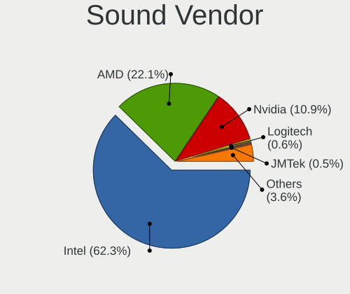

| Vendor                           | Notebooks | Percent |
|----------------------------------|-----------|---------|
| Intel                            | 607       | 62.32%  |
| AMD                              | 215       | 22.07%  |
| Nvidia                           | 106       | 10.88%  |
| Logitech                         | 6         | 0.62%   |
| JMTek                            | 5         | 0.51%   |
| C-Media Electronics              | 5         | 0.51%   |
| Silicon Integrated Systems [SiS] | 3         | 0.31%   |
| Generalplus Technology           | 3         | 0.31%   |
| Kingston Technology              | 2         | 0.21%   |
| GN Netcom                        | 2         | 0.21%   |
| Conexant Systems                 | 2         | 0.21%   |
| ASUSTek Computer                 | 2         | 0.21%   |
| Apple                            | 2         | 0.21%   |
| Unknown                          | 1         | 0.1%    |
| Texas Instruments                | 1         | 0.1%    |
| Tenx Technology                  | 1         | 0.1%    |
| Samson Technologies              | 1         | 0.1%    |
| Roland                           | 1         | 0.1%    |
| Razer USA                        | 1         | 0.1%    |
| Lenovo                           | 1         | 0.1%    |
| Hewlett-Packard                  | 1         | 0.1%    |
| GYROCOM C&C                      | 1         | 0.1%    |
| Focusrite-Novation               | 1         | 0.1%    |
| ESS Technology                   | 1         | 0.1%    |
| Creative Technology              | 1         | 0.1%    |
| Creative Labs                    | 1         | 0.1%    |
| Unknown                          | 1         | 0.1%    |

Sound Model
-----------

Sound card models

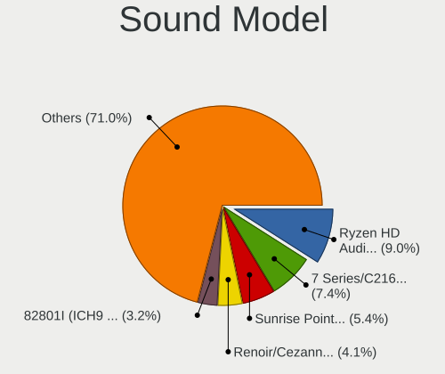

| Model                                                                                             | Notebooks | Percent |
|---------------------------------------------------------------------------------------------------|-----------|---------|
| AMD Ryzen HD Audio Controller                                                                     | 109       | 9.02%   |
| Intel 7 Series/C216 Chipset Family High Definition Audio Controller                               | 89        | 7.36%   |
| Intel Sunrise Point-LP HD Audio                                                                   | 65        | 5.38%   |
| AMD Renoir/Cezanne HDMI/DP Audio Controller                                                       | 49        | 4.05%   |
| Intel 82801I (ICH9 Family) HD Audio Controller                                                    | 39        | 3.23%   |
| Intel 6 Series/C200 Series Chipset Family High Definition Audio Controller                        | 39        | 3.23%   |
| AMD FCH Azalia Controller                                                                         | 39        | 3.23%   |
| AMD SBx00 Azalia (Intel HDA)                                                                      | 36        | 2.98%   |
| Intel Tiger Lake-LP Smart Sound Technology Audio Controller                                       | 31        | 2.56%   |
| Intel NM10/ICH7 Family High Definition Audio Controller                                           | 30        | 2.48%   |
| Intel Haswell-ULT HD Audio Controller                                                             | 28        | 2.32%   |
| Intel 8 Series HD Audio Controller                                                                | 28        | 2.32%   |
| AMD Radeon High Definition Audio Controller                                                       | 27        | 2.23%   |
| Intel Alder Lake PCH-P High Definition Audio Controller                                           | 26        | 2.15%   |
| Intel 82801H (ICH8 Family) HD Audio Controller                                                    | 26        | 2.15%   |
| Intel Atom Processor Z36xxx/Z37xxx Series High Definition Audio Controller                        | 24        | 1.99%   |
| AMD Raven/Raven2/Fenghuang HDMI/DP Audio Controller                                               | 24        | 1.99%   |
| Intel Cannon Lake PCH cAVS                                                                        | 22        | 1.82%   |
| Intel Comet Lake PCH-LP cAVS                                                                      | 20        | 1.65%   |
| Intel Wildcat Point-LP High Definition Audio Controller                                           | 17        | 1.41%   |
| Intel Broadwell-U Audio Controller                                                                | 17        | 1.41%   |
| Intel Celeron/Pentium Silver Processor High Definition Audio                                      | 16        | 1.32%   |
| Intel Cannon Point-LP High Definition Audio Controller                                            | 16        | 1.32%   |
| Intel 5 Series/3400 Series Chipset High Definition Audio                                          | 16        | 1.32%   |
| AMD Trinity HDMI Audio Controller                                                                 | 16        | 1.32%   |
| Intel Celeron N3350/Pentium N4200/Atom E3900 Series Audio Cluster                                 | 15        | 1.24%   |
| AMD Kabini HDMI/DP Audio                                                                          | 15        | 1.24%   |
| Nvidia TU107 GeForce GTX 1650 High Definition Audio Controller                                    | 14        | 1.16%   |
| Intel Xeon E3-1200 v3/4th Gen Core Processor HD Audio Controller                                  | 14        | 1.16%   |
| Intel 8 Series/C220 Series Chipset High Definition Audio Controller                               | 14        | 1.16%   |
| AMD Wrestler HDMI Audio                                                                           | 14        | 1.16%   |
| Nvidia GF108 High Definition Audio Controller                                                     | 12        | 0.99%   |
| Intel CM238 HD Audio Controller                                                                   | 12        | 0.99%   |
| Nvidia GP107GL High Definition Audio Controller                                                   | 11        | 0.91%   |
| Nvidia GA107 High Definition Audio Controller                                                     | 11        | 0.91%   |
| Intel Ice Lake-LP Smart Sound Technology Audio Controller                                         | 11        | 0.91%   |
| Nvidia GA106 High Definition Audio Controller                                                     | 10        | 0.83%   |
| Nvidia AD107 High Definition Audio Controller                                                     | 9         | 0.74%   |
| Intel Raptor Lake-P/U/H cAVS                                                                      | 9         | 0.74%   |
| Intel Atom/Celeron/Pentium Processor x5-E8000/J3xxx/N3xxx Series High Definition Audio Controller | 9         | 0.74%   |

Memory
------

Memory Vendor
-------------

Memory module vendors

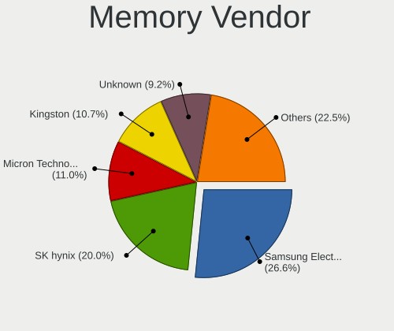

| Vendor                | Notebooks | Percent |
|-----------------------|-----------|---------|
| Samsung Electronics   | 193       | 26.58%  |
| SK hynix              | 145       | 19.97%  |
| Micron Technology     | 80        | 11.02%  |
| Kingston              | 78        | 10.74%  |
| Unknown               | 67        | 9.23%   |
| Crucial               | 32        | 4.41%   |
| Elpida                | 24        | 3.31%   |
| Ramaxel Technology    | 22        | 3.03%   |
| Nanya Technology      | 14        | 1.93%   |
| A-DATA Technology     | 13        | 1.79%   |
| Transcend             | 7         | 0.96%   |
| ASint Technology      | 7         | 0.96%   |
| 48spaces              | 5         | 0.69%   |
| Corsair               | 4         | 0.55%   |
| Unknown (ABCD)        | 3         | 0.41%   |
| SHARETRONIC           | 3         | 0.41%   |
| Patriot               | 3         | 0.41%   |
| Unknown               | 3         | 0.41%   |
| Team                  | 2         | 0.28%   |
| Silicon Power         | 2         | 0.28%   |
| Qimonda               | 2         | 0.28%   |
| GeIL                  | 2         | 0.28%   |
| Apacer                | 2         | 0.28%   |
| Wilk                  | 1         | 0.14%   |
| Unknown (89F7)        | 1         | 0.14%   |
| Qumo                  | 1         | 0.14%   |
| PNY                   | 1         | 0.14%   |
| Netac                 | 1         | 0.14%   |
| Kllisre               | 1         | 0.14%   |
| KingSpec              | 1         | 0.14%   |
| Kingmax Semiconductor | 1         | 0.14%   |
| Kingmax               | 1         | 0.14%   |
| Goldkey               | 1         | 0.14%   |
| G.Skill               | 1         | 0.14%   |
| ChangXin Memory       | 1         | 0.14%   |
| AMD                   | 1         | 0.14%   |

Memory Model
------------

Memory module models

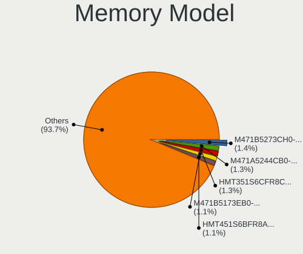

| Model                                                                     | Notebooks | Percent |
|---------------------------------------------------------------------------|-----------|---------|
| Samsung RAM M471B5273CH0-CH9 4GB SODIMM DDR3 1334MT/s                     | 11        | 1.4%    |
| SK hynix RAM HMT351S6CFR8C-PB 4GB SODIMM DDR3 1600MT/s                    | 10        | 1.28%   |
| Samsung RAM M471A5244CB0-CTD 4GB SODIMM DDR4 3266MT/s                     | 10        | 1.28%   |
| SK hynix RAM HMT451S6BFR8A-PB 4GB SODIMM DDR3 1600MT/s                    | 9         | 1.15%   |
| Samsung RAM M471B5173EB0-YK0 4GB SODIMM DDR3 1600MT/s                     | 9         | 1.15%   |
| Samsung RAM M471B5773CHS-CH9 2GB SODIMM DDR3 4199MT/s                     | 8         | 1.02%   |
| Samsung RAM M471B5173DB0-YK0 4GB SODIMM DDR3 1600MT/s                     | 8         | 1.02%   |
| Samsung RAM M471A1K43EB1-CWE 8GB SODIMM DDR4 3200MT/s                     | 8         | 1.02%   |
| Samsung RAM M471A5244CB0-CWE 4GB SODIMM DDR4 3200MT/s                     | 7         | 0.89%   |
| Samsung RAM M471A5244CB0-CRC 4GB SODIMM DDR4 2667MT/s                     | 7         | 0.89%   |
| Unknown RAM Module 2GB SODIMM DDR2 667MT/s                                | 6         | 0.77%   |
| Unknown RAM Module 2048MB SODIMM DDR2 667MT/s                             | 6         | 0.77%   |
| SK hynix RAM HMT425S6AFR6A-PB 2GB SODIMM DDR3 3200MT/s                    | 6         | 0.77%   |
| SK hynix RAM HMT351S6CFR8A-PB 4GB SODIMM DDR3 1600MT/s                    | 6         | 0.77%   |
| Micron RAM 4ATF51264HZ-3G2J1 4GB SODIMM DDR4 3200MT/s                     | 6         | 0.77%   |
| Kingston RAM ACR16D3LS1NGG/4G 4GB SODIMM DDR3 1600MT/s                    | 6         | 0.77%   |
| Unknown RAM Module 1024MB SODIMM DDR2 667MT/s                             | 5         | 0.64%   |
| SK hynix RAM HMT351S6CFR8C-PB 4096MB SODIMM DDR3 1600MT/s                 | 5         | 0.64%   |
| SK hynix RAM HMT325S6CFR8C-PB 2GB SODIMM DDR3 1600MT/s                    | 5         | 0.64%   |
| SK hynix RAM HMAA1GS6CJR6N-XN 8GB SODIMM DDR4 3200MT/s                    | 5         | 0.64%   |
| Samsung RAM M471B5273DH0-CK0 4GB SODIMM DDR3 2400MT/s                     | 5         | 0.64%   |
| Samsung RAM M471B5273DH0-CH9 4GB SODIMM DDR3 1600MT/s                     | 5         | 0.64%   |
| Samsung RAM M471B5173QH0-YK0 4GB SODIMM DDR3 1600MT/s                     | 5         | 0.64%   |
| Samsung RAM M4 70T5663EH3-CF7 2GB SODIMM DDR 975MT/s                      | 5         | 0.64%   |
| 48spaces RAM 012345678901234567890123456789012345 2GB SODIMM DDR2 667MT/s | 5         | 0.64%   |
| Unknown RAM Module 2048MB SODIMM DDR2                                     | 4         | 0.51%   |
| SK hynix RAM HMT325S6BFR8C-H9 2GB SODIMM DDR3 1333MT/s                    | 4         | 0.51%   |
| SK hynix RAM HMA851S6JJR6N-VK 4GB SODIMM DDR4 2667MT/s                    | 4         | 0.51%   |
| SK hynix RAM HMA81GS6DJR8N-XN 8GB SODIMM DDR4 3200MT/s                    | 4         | 0.51%   |
| SK hynix RAM HMA81GS6CJR8N-VK 8GB SODIMM DDR4 2667MT/s                    | 4         | 0.51%   |
| Samsung RAM Module 16384MB SODIMM DDR4 2667MT/s                           | 4         | 0.51%   |
| Samsung RAM M471A5143SB1-CRC 4GB SODIMM DDR4 2400MT/s                     | 4         | 0.51%   |
| Samsung RAM M471A1K43BB1-CRC 8GB SODIMM DDR4 2667MT/s                     | 4         | 0.51%   |
| Samsung RAM M425R2GA3BB0-CQKOL 16GB SODIMM DDR5 4800MT/s                  | 4         | 0.51%   |
| Samsung RAM K3LKBKB@BM-MGCP 2GB Row Of Chips LPDDR5 6400MT/s              | 4         | 0.51%   |
| Ramaxel RAM RMT3170ME68F9F1600 4GB SODIMM DDR3 1600MT/s                   | 4         | 0.51%   |
| Ramaxel RAM RMT3170EB68F9W1600 4GB SODIMM DDR3 1600MT/s                   | 4         | 0.51%   |
| Nanya RAM NT4GC64B8HG0NS-CG 4GB SODIMM DDR3 1600MT/s                      | 4         | 0.51%   |
| Nanya RAM NT4GC64B8HB0NS-CG 4GB SODIMM DDR3 1334MT/s                      | 4         | 0.51%   |
| Micron RAM MTC4C10163S1SC48BA1 8GB SODIMM DDR5 4800MT/s                   | 4         | 0.51%   |

Memory Kind
-----------

Memory module kinds

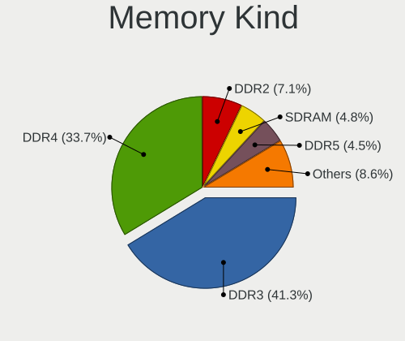

| Kind    | Notebooks | Percent |
|---------|-----------|---------|
| DDR3    | 249       | 41.29%  |
| DDR4    | 203       | 33.67%  |
| DDR2    | 43        | 7.13%   |
| SDRAM   | 29        | 4.81%   |
| DDR5    | 27        | 4.48%   |
| LPDDR4  | 18        | 2.99%   |
| LPDDR5  | 15        | 2.49%   |
| Unknown | 9         | 1.49%   |
| DRAM    | 4         | 0.66%   |
| LPDDR3  | 3         | 0.5%    |
| DDR     | 3         | 0.5%    |

Memory Form Factor
------------------

Physical design of the memory module

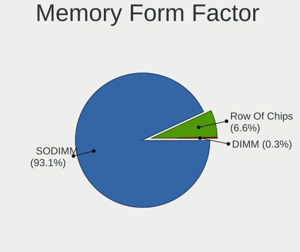

| Name         | Notebooks | Percent |
|--------------|-----------|---------|
| SODIMM       | 553       | 93.1%   |
| Row Of Chips | 39        | 6.57%   |
| DIMM         | 2         | 0.34%   |

Memory Size
-----------

Memory module size

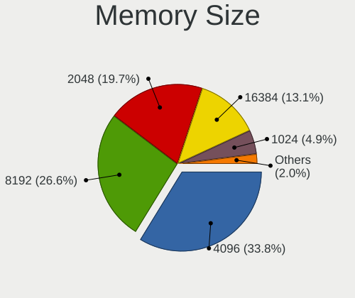

| Size  | Notebooks | Percent |
|-------|-----------|---------|
| 4096  | 235       | 33.76%  |
| 8192  | 185       | 26.58%  |
| 2048  | 137       | 19.68%  |
| 16384 | 91        | 13.07%  |
| 1024  | 34        | 4.89%   |
| 32768 | 9         | 1.29%   |
| 512   | 5         | 0.72%   |

Memory Speed
------------

Memory module speed

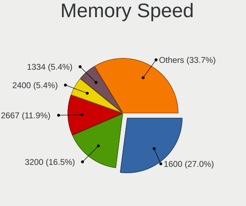

| Speed   | Notebooks | Percent |
|---------|-----------|---------|
| 1600    | 179       | 27.04%  |
| 3200    | 109       | 16.47%  |
| 2667    | 79        | 11.93%  |
| 2400    | 36        | 5.44%   |
| 1334    | 36        | 5.44%   |
| 1333    | 30        | 4.53%   |
| 667     | 29        | 4.38%   |
| Unknown | 20        | 3.02%   |
| 4800    | 16        | 2.42%   |
| 4199    | 16        | 2.42%   |
| 800     | 13        | 1.96%   |
| 5600    | 11        | 1.66%   |
| 2133    | 11        | 1.66%   |
| 6400    | 10        | 1.51%   |
| 3266    | 10        | 1.51%   |
| 1067    | 10        | 1.51%   |
| 2048    | 8         | 1.21%   |
| 4267    | 6         | 0.91%   |
| 1867    | 6         | 0.91%   |
| 533     | 5         | 0.76%   |
| 1066    | 4         | 0.6%    |
| 7500    | 3         | 0.45%   |
| 8533    | 2         | 0.3%    |
| 8400    | 2         | 0.3%    |
| 4266    | 2         | 0.3%    |
| 1639    | 2         | 0.3%    |
| 333     | 2         | 0.3%    |
| 65535   | 1         | 0.15%   |
| 3733    | 1         | 0.15%   |
| 1866    | 1         | 0.15%   |
| 975     | 1         | 0.15%   |
| 400     | 1         | 0.15%   |

Printers & scanners
-------------------

Printer Vendor
--------------

Printer device vendors

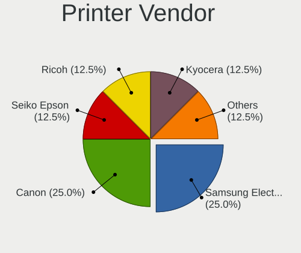

| Vendor              | Notebooks | Percent |
|---------------------|-----------|---------|
| Samsung Electronics | 2         | 25%     |
| Canon               | 2         | 25%     |
| Seiko Epson         | 1         | 12.5%   |
| Ricoh               | 1         | 12.5%   |
| Kyocera             | 1         | 12.5%   |
| Hewlett-Packard     | 1         | 12.5%   |

Printer Model
-------------

Printer device models

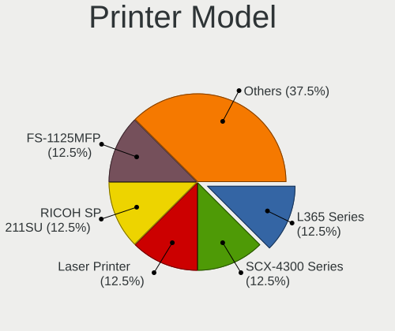

| Model                   | Notebooks | Percent |
|-------------------------|-----------|---------|
| Seiko Epson L365 Series | 1         | 12.5%   |
| Samsung SCX-4300 Series | 1         | 12.5%   |
| Samsung Laser Printer   | 1         | 12.5%   |
| Ricoh RICOH SP 211SU    | 1         | 12.5%   |
| Kyocera FS-1125MFP      | 1         | 12.5%   |
| HP LaserJet 1010        | 1         | 12.5%   |
| Canon LBP7010C/7018C    | 1         | 12.5%   |
| Canon CAPT USB Device   | 1         | 12.5%   |

Scanner Vendor
--------------

Scanner device vendors

Zero info for selected period =(

Scanner Model
-------------

Scanner device models

Zero info for selected period =(

Camera
------

Camera Vendor
-------------

Camera device vendors

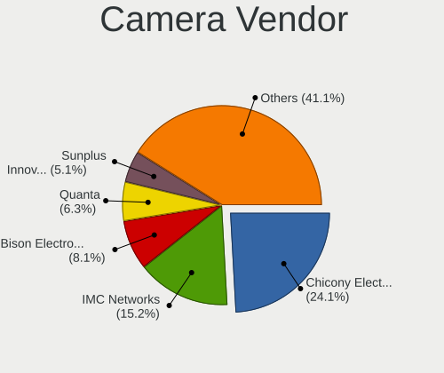

| Vendor                                 | Notebooks | Percent |
|----------------------------------------|-----------|---------|
| Chicony Electronics                    | 179       | 24.12%  |
| IMC Networks                           | 113       | 15.23%  |
| Bison Electronics                      | 60        | 8.09%   |
| Quanta                                 | 47        | 6.33%   |
| Sunplus Innovation Technology          | 38        | 5.12%   |
| Realtek Semiconductor                  | 37        | 4.99%   |
| Suyin                                  | 33        | 4.45%   |
| Syntek                                 | 30        | 4.04%   |
| Cheng Uei Precision Industry (Foxlink) | 29        | 3.91%   |
| Silicon Motion                         | 23        | 3.1%    |
| Lite-On Technology                     | 23        | 3.1%    |
| Microdia                               | 18        | 2.43%   |
| Luxvisions Innotech Limited            | 13        | 1.75%   |
| Z-Star Microelectronics                | 12        | 1.62%   |
| Apple                                  | 12        | 1.62%   |
| Sonix Technology                       | 11        | 1.48%   |
| Alcor Micro                            | 10        | 1.35%   |
| SunplusIT                              | 6         | 0.81%   |
| Logitech                               | 6         | 0.81%   |
| Primax Electronics                     | 4         | 0.54%   |
| Shinetech                              | 3         | 0.4%    |
| ShineOptics                            | 3         | 0.4%    |
| Samsung Electronics                    | 3         | 0.4%    |
| Lenovo                                 | 3         | 0.4%    |
| Importek                               | 3         | 0.4%    |
| DigiTech                               | 3         | 0.4%    |
| Shine-optics                           | 2         | 0.27%   |
| Ricoh                                  | 2         | 0.27%   |
| Intel                                  | 2         | 0.27%   |
| BillionPixels                          | 2         | 0.27%   |
| Acer                                   | 2         | 0.27%   |
| Y Media                                | 1         | 0.13%   |
| Razer USA                              | 1         | 0.13%   |
| Pixart Imaging                         | 1         | 0.13%   |
| Linux Foundation                       | 1         | 0.13%   |
| kingcome                               | 1         | 0.13%   |
| Goodong                                | 1         | 0.13%   |
| Genesys Logic                          | 1         | 0.13%   |
| Framework                              | 1         | 0.13%   |
| Arkmicro Technologies                  | 1         | 0.13%   |

Camera Model
------------

Camera device models

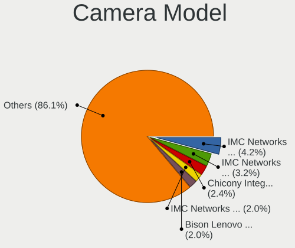

| Model                                                                      | Notebooks | Percent |
|----------------------------------------------------------------------------|-----------|---------|
| IMC Networks USB2.0 VGA UVC WebCam                                         | 31        | 4.17%   |
| IMC Networks USB2.0 HD UVC WebCam                                          | 24        | 3.23%   |
| Chicony Integrated Camera                                                  | 18        | 2.42%   |
| IMC Networks Integrated Camera                                             | 15        | 2.02%   |
| Bison Lenovo EasyCamera                                                    | 15        | 2.02%   |
| Syntek Integrated Camera                                                   | 14        | 1.88%   |
| Chicony USB2.0 VGA UVC WebCam                                              | 14        | 1.88%   |
| Chicony HD Webcam                                                          | 14        | 1.88%   |
| Bison Lenovo Integrated Webcam                                             | 14        | 1.88%   |
| Chicony Lenovo EasyCamera                                                  | 13        | 1.75%   |
| Sunplus HD WebCam                                                          | 11        | 1.48%   |
| Realtek Integrated_Webcam_HD                                               | 11        | 1.48%   |
| Quanta HP HD Camera                                                        | 8         | 1.08%   |
| Bison Integrated Camera                                                    | 8         | 1.08%   |
| Syntek Lenovo EasyCamera                                                   | 7         | 0.94%   |
| Syntek EasyCamera                                                          | 7         | 0.94%   |
| Sunplus Integrated_Webcam_HD                                               | 7         | 0.94%   |
| Quanta HD Webcam                                                           | 7         | 0.94%   |
| Lite-On Integrated Camera                                                  | 7         | 0.94%   |
| IMC Networks USB2.0 UVC HD Webcam                                          | 7         | 0.94%   |
| IMC Networks Integrated Webcam                                             | 7         | 0.94%   |
| IMC Networks HD Camera                                                     | 7         | 0.94%   |
| Chicony USB2.0 HD UVC WebCam                                               | 7         | 0.94%   |
| Chicony HP HD Camera                                                       | 7         | 0.94%   |
| Chicony EasyCamera                                                         | 7         | 0.94%   |
| Sonix USB2.0 HD UVC WebCam                                                 | 6         | 0.81%   |
| Silicon Motion WebCam SC-0311139N                                          | 6         | 0.81%   |
| Quanta HP TrueVision HD Camera                                             | 6         | 0.81%   |
| Microdia Integrated_Webcam_HD                                              | 6         | 0.81%   |
| IMC Networks UVC VGA Webcam                                                | 6         | 0.81%   |
| Chicony Integrated HP HD Webcam                                            | 6         | 0.81%   |
| Cheng Uei Precision Industry (Foxlink) HP Wide Vision HD Integrated Webcam | 6         | 0.81%   |
| Bison HD Webcam                                                            | 6         | 0.81%   |
| Suyin HP TrueVision HD                                                     | 5         | 0.67%   |
| Quanta ov9734_techfront_camera                                             | 5         | 0.67%   |
| Luxvisions Innotech Limited Integrated Camera                              | 5         | 0.67%   |
| Lite-On HP HD Camera                                                       | 5         | 0.67%   |
| Chicony HP Truevision HD camera                                            | 5         | 0.67%   |
| Chicony HP Truevision HD                                                   | 5         | 0.67%   |
| Chicony CNF8243 Webcam                                                     | 5         | 0.67%   |

Security
--------

Fingerprint Vendor
------------------

Fingerprint sensor vendors

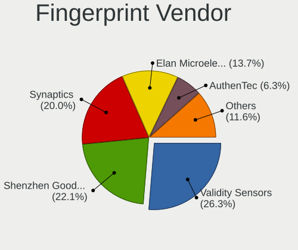

| Vendor                             | Notebooks | Percent |
|------------------------------------|-----------|---------|
| Validity Sensors                   | 25        | 26.32%  |
| Shenzhen Goodix Technology         | 21        | 22.11%  |
| Synaptics                          | 19        | 20%     |
| Elan Microelectronics              | 13        | 13.68%  |
| AuthenTec                          | 6         | 6.32%   |
| STMicroelectronics                 | 3         | 3.16%   |
| Realtek USB2.0 Finger Print Bridge | 3         | 3.16%   |
| Upek                               | 2         | 2.11%   |
| LighTuning Technology              | 2         | 2.11%   |
| Focal-systems.Corp                 | 1         | 1.05%   |

Fingerprint Model
-----------------

Fingerprint sensor models

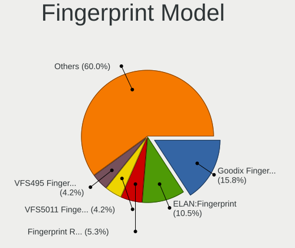

| Model                                                                      | Notebooks | Percent |
|----------------------------------------------------------------------------|-----------|---------|
| Shenzhen Goodix  FingerPrint Device                                        | 15        | 15.79%  |
| Elan ELAN:Fingerprint                                                      | 10        | 10.53%  |
| Shenzhen Goodix Fingerprint Reader                                         | 5         | 5.26%   |
| Validity Sensors VFS5011 Fingerprint Reader                                | 4         | 4.21%   |
| Validity Sensors VFS495 Fingerprint Reader                                 | 4         | 4.21%   |
| Synaptics Prometheus MIS Touch Fingerprint Reader                          | 4         | 4.21%   |
| Validity Sensors VFS491                                                    | 3         | 3.16%   |
| Validity Sensors Fingerprint scanner                                       | 3         | 3.16%   |
| Synaptics Metallica MIS Touch Fingerprint Reader                           | 3         | 3.16%   |
| STMicroelectronics Fingerprint Reader                                      | 3         | 3.16%   |
| Realtek USB2.0 Finger Print Bridge FocalTech Fingerprint Device            | 3         | 3.16%   |
| Elan ELAN:ARM-M4                                                           | 3         | 3.16%   |
| Validity Sensors VFS101 Fingerprint Reader                                 | 2         | 2.11%   |
| Validity Sensors Synaptics WBDI                                            | 2         | 2.11%   |
| Validity Sensors Synaptics VFS7552 Touch Fingerprint Sensor with PurePrint | 2         | 2.11%   |
| Upek Biometric Touchchip/Touchstrip Fingerprint Sensor                     | 2         | 2.11%   |
| Synaptics WBDI Fingerprint Reader USB 086                                  | 2         | 2.11%   |
| Synaptics  WBDI                                                            | 2         | 2.11%   |
| Synaptics  FS7604 Touch Fingerprint Sensor with PurePrint                  | 2         | 2.11%   |
| Synaptics FS7604 Touch Fingerprint Sensor with PurePrint                   | 2         | 2.11%   |
| Synaptics Fingerprint reader [HP G6]                                       | 2         | 2.11%   |
| AuthenTec AES2501 Fingerprint Sensor                                       | 2         | 2.11%   |
| Validity Sensors VFS7500 Touch Fingerprint Sensor                          | 1         | 1.05%   |
| Validity Sensors VFS471 Fingerprint Reader                                 | 1         | 1.05%   |
| Validity Sensors VFS301 Fingerprint Reader                                 | 1         | 1.05%   |
| Validity Sensors VFS 5011 fingerprint sensor                               | 1         | 1.05%   |
| Validity Sensors Swipe Fingerprint Sensor                                  | 1         | 1.05%   |
| Synaptics UWP WBDI                                                         | 1         | 1.05%   |
| Synaptics Metallica MOH Touch Fingerprint Reader                           | 1         | 1.05%   |
| Shenzhen Goodix FingerPrint                                                | 1         | 1.05%   |
| LighTuning ES603 Swipe Fingerprint Sensor                                  | 1         | 1.05%   |
| LighTuning EgisTec Touch Fingerprint Sensor                                | 1         | 1.05%   |
| Focal-systems.Corp FT9201Fingerprint.                                      | 1         | 1.05%   |
| AuthenTec Fingerprint Sensor                                               | 1         | 1.05%   |
| AuthenTec AES2810                                                          | 1         | 1.05%   |
| AuthenTec AES2550 Fingerprint Sensor                                       | 1         | 1.05%   |
| AuthenTec AES1600                                                          | 1         | 1.05%   |

Chipcard Vendor
---------------

Chipcard module vendors

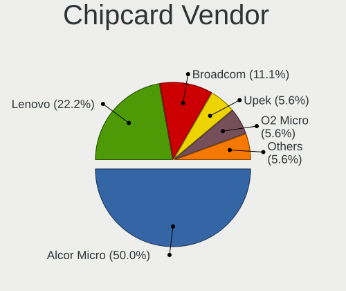

| Vendor                | Notebooks | Percent |
|-----------------------|-----------|---------|
| Alcor Micro           | 9         | 45%     |
| Lenovo                | 5         | 25%     |
| Upek                  | 2         | 10%     |
| Broadcom              | 2         | 10%     |
| O2 Micro              | 1         | 5%      |
| Advanced Card Systems | 1         | 5%      |

Chipcard Model
--------------

Chipcard module models

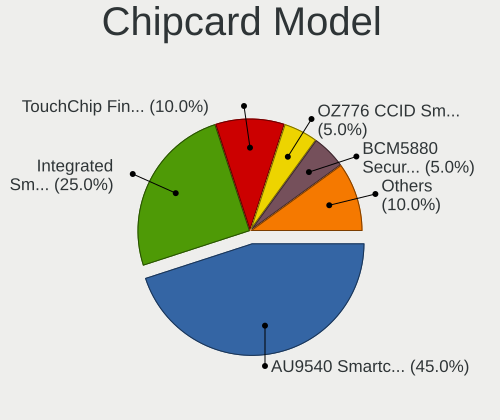

| Model                                                                        | Notebooks | Percent |
|------------------------------------------------------------------------------|-----------|---------|
| Alcor Micro AU9540 Smartcard Reader                                          | 9         | 45%     |
| Lenovo Integrated Smart Card Reader                                          | 5         | 25%     |
| Upek TouchChip Fingerprint Coprocessor (WBF advanced mode)                   | 2         | 10%     |
| O2 Micro OZ776 CCID Smartcard Reader                                         | 1         | 5%      |
| Broadcom BCM5880 Secure Applications Processor with fingerprint swipe sensor | 1         | 5%      |
| Broadcom BCM58200 ControlVault 3 (FingerPrint sensor + Contacted SmartCard)  | 1         | 5%      |
| Advanced Card Systems ACR39U                                                 | 1         | 5%      |

Unsupported
-----------

Unsupported Devices
-------------------

Total unsupported devices on board

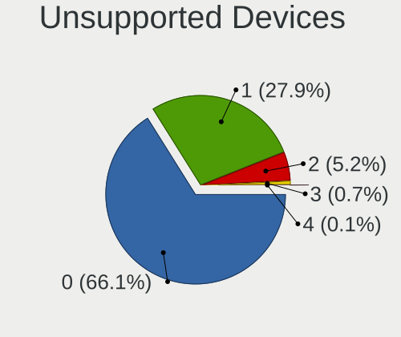

| Total | Notebooks | Percent |
|-------|-----------|---------|
| 0     | 559       | 66.08%  |
| 1     | 236       | 27.9%   |
| 2     | 44        | 5.2%    |
| 3     | 6         | 0.71%   |
| 4     | 1         | 0.12%   |

Unsupported Device Types
------------------------

Types of unsupported devices

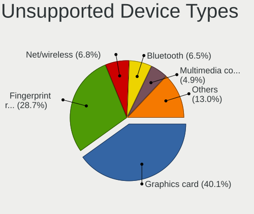

| Type                     | Notebooks | Percent |
|--------------------------|-----------|---------|
| Graphics card            | 130       | 40.12%  |
| Fingerprint reader       | 93        | 28.7%   |
| Net/wireless             | 22        | 6.79%   |
| Bluetooth                | 21        | 6.48%   |
| Multimedia controller    | 16        | 4.94%   |
| Chipcard                 | 15        | 4.63%   |
| Camera                   | 11        | 3.4%    |
| Communication controller | 6         | 1.85%   |
| Storage                  | 4         | 1.23%   |
| Card reader              | 2         | 0.62%   |
| Sound                    | 1         | 0.31%   |
| Net/ethernet             | 1         | 0.31%   |
| Modem                    | 1         | 0.31%   |
| Flash memory             | 1         | 0.31%   |

