Linux in Belarus - Tested Hardware & Statistics
-----------------------------------------------

A project to collect tested hardware configurations for Linux in Belarus.

Anyone can contribute to this report by the [hw-probe](https://github.com/linuxhw/hw-probe) tool:

    sudo -E hw-probe -all -upload

Please contribute! Especially if your hardware is rare.

This is a report for all computer types. See also reports for [desktops](/Location/Belarus/Desktop/README.md) and [notebooks](/Location/Belarus/Notebook/README.md).

Contents
--------

* [ Test Cases ](#test-cases)

* [ System ](#system)
  - [ OS                       ](#os)
  - [ OS Family                ](#os-family)
  - [ Kernel                   ](#kernel)
  - [ Kernel Family            ](#kernel-family)
  - [ Kernel Major Ver.        ](#kernel-major-ver)
  - [ Arch                     ](#arch)
  - [ DE                       ](#de)
  - [ Display Server           ](#display-server)
  - [ Display Manager          ](#display-manager)
  - [ OS Lang                  ](#os-lang)
  - [ Boot Mode                ](#boot-mode)
  - [ Filesystem               ](#filesystem)
  - [ Part. scheme             ](#part-scheme)
  - [ Dual Boot with Linux/BSD ](#dual-boot-with-linuxbsd)
  - [ Dual Boot (Win)          ](#dual-boot-win)

* [ Board ](#board)
  - [ Vendor                   ](#vendor)
  - [ Model                    ](#model)
  - [ Model Family             ](#model-family)
  - [ MFG Year                 ](#mfg-year)
  - [ Form Factor              ](#form-factor)
  - [ Secure Boot              ](#secure-boot)
  - [ Coreboot                 ](#coreboot)
  - [ RAM Size                 ](#ram-size)
  - [ RAM Used                 ](#ram-used)
  - [ Total Drives             ](#total-drives)
  - [ Has CD-ROM               ](#has-cd-rom)
  - [ Has Ethernet             ](#has-ethernet)
  - [ Has WiFi                 ](#has-wifi)
  - [ Has Bluetooth            ](#has-bluetooth)

* [ Location ](#location)
  - [ Country                  ](#country)
  - [ City                     ](#city)

* [ Drives ](#drives)
  - [ Drive Vendor             ](#drive-vendor)
  - [ Drive Model              ](#drive-model)
  - [ HDD Vendor               ](#hdd-vendor)
  - [ SSD Vendor               ](#ssd-vendor)
  - [ Drive Kind               ](#drive-kind)
  - [ Drive Connector          ](#drive-connector)
  - [ Drive Size               ](#drive-size)
  - [ Space Total              ](#space-total)
  - [ Space Used               ](#space-used)
  - [ Malfunc. Drives          ](#malfunc-drives)
  - [ Malfunc. Drive Vendor    ](#malfunc-drive-vendor)
  - [ Malfunc. HDD Vendor      ](#malfunc-hdd-vendor)
  - [ Malfunc. Drive Kind      ](#malfunc-drive-kind)
  - [ Failed Drives            ](#failed-drives)
  - [ Failed Drive Vendor      ](#failed-drive-vendor)
  - [ Drive Status             ](#drive-status)

* [ Storage controller ](#storage-controller)
  - [ Storage Vendor           ](#storage-vendor)
  - [ Storage Model            ](#storage-model)
  - [ Storage Kind             ](#storage-kind)

* [ Processor ](#processor)
  - [ CPU Vendor               ](#cpu-vendor)
  - [ CPU Model                ](#cpu-model)
  - [ CPU Model Family         ](#cpu-model-family)
  - [ CPU Cores                ](#cpu-cores)
  - [ CPU Sockets              ](#cpu-sockets)
  - [ CPU Threads              ](#cpu-threads)
  - [ CPU Op-Modes             ](#cpu-op-modes)
  - [ CPU Microcode            ](#cpu-microcode)
  - [ CPU Microarch            ](#cpu-microarch)

* [ Graphics ](#graphics)
  - [ GPU Vendor               ](#gpu-vendor)
  - [ GPU Model                ](#gpu-model)
  - [ GPU Combo                ](#gpu-combo)
  - [ GPU Driver               ](#gpu-driver)
  - [ GPU Memory               ](#gpu-memory)

* [ Monitor ](#monitor)
  - [ Monitor Vendor           ](#monitor-vendor)
  - [ Monitor Model            ](#monitor-model)
  - [ Monitor Resolution       ](#monitor-resolution)
  - [ Monitor Diagonal         ](#monitor-diagonal)
  - [ Monitor Width            ](#monitor-width)
  - [ Aspect Ratio             ](#aspect-ratio)
  - [ Monitor Area             ](#monitor-area)
  - [ Pixel Density            ](#pixel-density)
  - [ Multiple Monitors        ](#multiple-monitors)

* [ Network ](#network)
  - [ Net Controller Vendor    ](#net-controller-vendor)
  - [ Net Controller Model     ](#net-controller-model)
  - [ Wireless Vendor          ](#wireless-vendor)
  - [ Wireless Model           ](#wireless-model)
  - [ Ethernet Vendor          ](#ethernet-vendor)
  - [ Ethernet Model           ](#ethernet-model)
  - [ Net Controller Kind      ](#net-controller-kind)
  - [ Used Controller          ](#used-controller)
  - [ NICs                     ](#nics)
  - [ IPv6                     ](#ipv6)

* [ Bluetooth ](#bluetooth)
  - [ Bluetooth Vendor         ](#bluetooth-vendor)
  - [ Bluetooth Model          ](#bluetooth-model)

* [ Sound ](#sound)
  - [ Sound Vendor             ](#sound-vendor)
  - [ Sound Model              ](#sound-model)

* [ Memory ](#memory)
  - [ Memory Vendor            ](#memory-vendor)
  - [ Memory Model             ](#memory-model)
  - [ Memory Kind              ](#memory-kind)
  - [ Memory Form Factor       ](#memory-form-factor)
  - [ Memory Size              ](#memory-size)
  - [ Memory Speed             ](#memory-speed)

* [ Printers & scanners ](#printers--scanners)
  - [ Printer Vendor           ](#printer-vendor)
  - [ Printer Model            ](#printer-model)
  - [ Scanner Vendor           ](#scanner-vendor)
  - [ Scanner Model            ](#scanner-model)

* [ Camera ](#camera)
  - [ Camera Vendor            ](#camera-vendor)
  - [ Camera Model             ](#camera-model)

* [ Security ](#security)
  - [ Fingerprint Vendor       ](#fingerprint-vendor)
  - [ Fingerprint Model        ](#fingerprint-model)
  - [ Chipcard Vendor          ](#chipcard-vendor)
  - [ Chipcard Model           ](#chipcard-model)

* [ Unsupported ](#unsupported)
  - [ Unsupported Devices      ](#unsupported-devices)
  - [ Unsupported Device Types ](#unsupported-device-types)

Test Cases
----------

Total: 1391

| Vendor        | Model                       | Form-Factor | Probe                                                      | Date         |
|---------------|-----------------------------|-------------|------------------------------------------------------------|--------------|
| Unknown       | Intel X79                   | Desktop     | [f26c05e261](https://linux-hardware.org/?probe=f26c05e261) | Dec 31, 2022 |
| ASUSTek       | PRIME B450M-K               | Desktop     | [cc1d0776d5](https://linux-hardware.org/?probe=cc1d0776d5) | Dec 30, 2022 |
| ASUSTek       | ASUS TUF Gaming A15 FA50... | Notebook    | [614187020c](https://linux-hardware.org/?probe=614187020c) | Dec 29, 2022 |
| ASUSTek       | PRIME H310M-R R2.0          | Desktop     | [6f0f984312](https://linux-hardware.org/?probe=6f0f984312) | Dec 29, 2022 |
| HUAWEI        | BOD-WXX9                    | Notebook    | [d196b92cff](https://linux-hardware.org/?probe=d196b92cff) | Dec 27, 2022 |
| ASRock        | Brazos                      | Desktop     | [f5183b395b](https://linux-hardware.org/?probe=f5183b395b) | Dec 27, 2022 |
| ASUSTek       | VivoBook_ASUSLaptop X509... | Notebook    | [beb602dcf6](https://linux-hardware.org/?probe=beb602dcf6) | Dec 23, 2022 |
| Toshiba       | Satellite C850-C5K          | Notebook    | [a67d24c9f9](https://linux-hardware.org/?probe=a67d24c9f9) | Dec 23, 2022 |
| LTD Delovo... | EVE 14 C414 ES4060EW        | Notebook    | [9f1751d2e5](https://linux-hardware.org/?probe=9f1751d2e5) | Dec 22, 2022 |
| Pegatron      | A17                         | Notebook    | [f40a055eac](https://linux-hardware.org/?probe=f40a055eac) | Dec 21, 2022 |
| ASUSTek       | ROG Zephyrus M16 GU603HE... | Notebook    | [bdb2887598](https://linux-hardware.org/?probe=bdb2887598) | Dec 20, 2022 |
| ASRock        | X570 Pro4                   | Desktop     | [09fc64653e](https://linux-hardware.org/?probe=09fc64653e) | Dec 17, 2022 |
| Intel         | SHARKBAY                    | Desktop     | [0d07341d58](https://linux-hardware.org/?probe=0d07341d58) | Dec 15, 2022 |
| Gigabyte      | GA-M56S-S3                  | Desktop     | [077f863ca3](https://linux-hardware.org/?probe=077f863ca3) | Dec 15, 2022 |
| HP            | ProBook 445 G7              | Notebook    | [b34265fdbe](https://linux-hardware.org/?probe=b34265fdbe) | Dec 14, 2022 |
| Lenovo        | G500 20236                  | Notebook    | [becb2e6bbc](https://linux-hardware.org/?probe=becb2e6bbc) | Dec 12, 2022 |
| Biostar       | A520MH                      | Desktop     | [e1eff55b96](https://linux-hardware.org/?probe=e1eff55b96) | Dec 12, 2022 |
| HP            | ProBook x360 435 G8 Note... | Convertible | [a096df53ed](https://linux-hardware.org/?probe=a096df53ed) | Dec 12, 2022 |
| Biostar       | A520MH                      | Desktop     | [2c6278e478](https://linux-hardware.org/?probe=2c6278e478) | Dec 11, 2022 |
| ASUSTek       | Z9PA-D8 Series              | Server      | [fcd4a2d840](https://linux-hardware.org/?probe=fcd4a2d840) | Dec 11, 2022 |
| Gigabyte      | M61SME-S2                   | Desktop     | [e2932e425c](https://linux-hardware.org/?probe=e2932e425c) | Dec 11, 2022 |
| Lenovo        | IdeaPad 3 15IIL05 81WE      | Notebook    | [b463c25c4d](https://linux-hardware.org/?probe=b463c25c4d) | Dec 11, 2022 |
| Lenovo        | IdeaPad 3 15IIL05 81WE      | Notebook    | [1c80b48ea0](https://linux-hardware.org/?probe=1c80b48ea0) | Dec 11, 2022 |
| Gigabyte      | B550M AORUS PRO-P           | Desktop     | [ad6dc99c8a](https://linux-hardware.org/?probe=ad6dc99c8a) | Dec 10, 2022 |
| ASUSTek       | P8Z77-V LE PLUS             | Desktop     | [eafc4dffd4](https://linux-hardware.org/?probe=eafc4dffd4) | Dec 07, 2022 |
| HP            | 550                         | Notebook    | [1090513329](https://linux-hardware.org/?probe=1090513329) | Dec 06, 2022 |
| Lenovo        | IdeaPad 330-15IGM 81D1      | Notebook    | [1a1f2b375d](https://linux-hardware.org/?probe=1a1f2b375d) | Dec 05, 2022 |
| Gigabyte      | Z170-D3H-CF                 | Desktop     | [d6829bfb6d](https://linux-hardware.org/?probe=d6829bfb6d) | Dec 04, 2022 |
| Dell          | Inspiron 5570               | Notebook    | [c2ee22631f](https://linux-hardware.org/?probe=c2ee22631f) | Dec 03, 2022 |
| HP            | Pavilion g6                 | Notebook    | [c3f0c49c7c](https://linux-hardware.org/?probe=c3f0c49c7c) | Dec 02, 2022 |
| HP            | Pavilion g6                 | Notebook    | [cb93839085](https://linux-hardware.org/?probe=cb93839085) | Dec 01, 2022 |
| HP            | ProBook 450 G8 Notebook ... | Notebook    | [2de79b83d5](https://linux-hardware.org/?probe=2de79b83d5) | Nov 28, 2022 |
| ASUSTek       | K70AB                       | Notebook    | [8b7e3c4b9e](https://linux-hardware.org/?probe=8b7e3c4b9e) | Nov 26, 2022 |
| Dell          | Inspiron 3501               | Notebook    | [1c7b4c3780](https://linux-hardware.org/?probe=1c7b4c3780) | Nov 21, 2022 |
| HASEE Comp... | V1x0PNPx                    | Notebook    | [e75868724e](https://linux-hardware.org/?probe=e75868724e) | Nov 19, 2022 |
| Lenovo        | G580 20150                  | Notebook    | [3f043b96c0](https://linux-hardware.org/?probe=3f043b96c0) | Nov 19, 2022 |
| Acer          | Aspire 5740                 | Notebook    | [450ca9f243](https://linux-hardware.org/?probe=450ca9f243) | Nov 19, 2022 |
| Acer          | Aspire ES1-331              | Notebook    | [32e06647dd](https://linux-hardware.org/?probe=32e06647dd) | Nov 19, 2022 |
| Timi          | Xiaomi Book Pro 16 2022     | Notebook    | [08db92bff6](https://linux-hardware.org/?probe=08db92bff6) | Nov 17, 2022 |
| Acer          | Aspire A315-21              | Notebook    | [288b53c471](https://linux-hardware.org/?probe=288b53c471) | Nov 16, 2022 |
| Acer          | Aspire A315-21              | Notebook    | [23ec67e81b](https://linux-hardware.org/?probe=23ec67e81b) | Nov 16, 2022 |
| HP            | Laptop 15s-eq2xxx           | Notebook    | [b64a32327f](https://linux-hardware.org/?probe=b64a32327f) | Nov 11, 2022 |
| ASUSTek       | UX31A                       | Notebook    | [e9bc780ce8](https://linux-hardware.org/?probe=e9bc780ce8) | Nov 09, 2022 |
| Lenovo        | IdeaPad 5 14ARE05 81YM      | Notebook    | [423a8f624c](https://linux-hardware.org/?probe=423a8f624c) | Nov 08, 2022 |
| Gigabyte      | B85M-D3V-A                  | Desktop     | [f236aa0a8b](https://linux-hardware.org/?probe=f236aa0a8b) | Nov 08, 2022 |
| Lenovo        | ThinkBook 15 G2 ITL 20VE    | Notebook    | [09c253d548](https://linux-hardware.org/?probe=09c253d548) | Nov 07, 2022 |
| Chuwi         | GemiBook                    | Notebook    | [9d1fda5ecb](https://linux-hardware.org/?probe=9d1fda5ecb) | Nov 06, 2022 |
| Dell          | Inspiron 7577               | Notebook    | [3f80a8a4c4](https://linux-hardware.org/?probe=3f80a8a4c4) | Nov 06, 2022 |
| HP            | Laptop 15s-eq2xxx           | Notebook    | [3cb1f34e2a](https://linux-hardware.org/?probe=3cb1f34e2a) | Nov 04, 2022 |
| ASUSTek       | K501LB                      | Notebook    | [e28cd8cfbf](https://linux-hardware.org/?probe=e28cd8cfbf) | Nov 03, 2022 |
| Unknown       | Unknown                     | Notebook    | [77bdbb310f](https://linux-hardware.org/?probe=77bdbb310f) | Oct 31, 2022 |
| Gigabyte      | B85M-D3V-A                  | Desktop     | [4b5140c9f3](https://linux-hardware.org/?probe=4b5140c9f3) | Oct 31, 2022 |
| HP            | Laptop 15s-eq2xxx           | Notebook    | [3f69e984d1](https://linux-hardware.org/?probe=3f69e984d1) | Oct 30, 2022 |
| ASUSTek       | K501LB                      | Notebook    | [25003181f1](https://linux-hardware.org/?probe=25003181f1) | Oct 27, 2022 |
| ASUSTek       | K501LB                      | Notebook    | [2481764903](https://linux-hardware.org/?probe=2481764903) | Oct 27, 2022 |
| HP            | Compaq 610                  | Notebook    | [5adc7e0aba](https://linux-hardware.org/?probe=5adc7e0aba) | Oct 26, 2022 |
| HP            | Compaq 610                  | Notebook    | [9a584886fe](https://linux-hardware.org/?probe=9a584886fe) | Oct 23, 2022 |
| Dell          | Inspiron 7577               | Notebook    | [46b9d8c126](https://linux-hardware.org/?probe=46b9d8c126) | Oct 19, 2022 |
| Acer          | Aspire E1-531               | Notebook    | [527c4e0728](https://linux-hardware.org/?probe=527c4e0728) | Oct 17, 2022 |
| Dell          | Inspiron 7577               | Notebook    | [8b1714d48d](https://linux-hardware.org/?probe=8b1714d48d) | Oct 17, 2022 |
| Acer          | Aspire E1-531               | Notebook    | [834248c556](https://linux-hardware.org/?probe=834248c556) | Oct 16, 2022 |
| Gigabyte      | Z68XP-UD3                   | Desktop     | [b36220c65b](https://linux-hardware.org/?probe=b36220c65b) | Oct 13, 2022 |
| ASUSTek       | X751LD                      | Notebook    | [230969c119](https://linux-hardware.org/?probe=230969c119) | Oct 12, 2022 |
| Gigabyte      | X570 AORUS PRO              | Desktop     | [6e83c73646](https://linux-hardware.org/?probe=6e83c73646) | Oct 11, 2022 |
| Gigabyte      | Z170-D3H-CF                 | Desktop     | [14b0f43bd5](https://linux-hardware.org/?probe=14b0f43bd5) | Oct 11, 2022 |
| HP            | Victus by Laptop 16-e0xx... | Notebook    | [d6e11d36a8](https://linux-hardware.org/?probe=d6e11d36a8) | Oct 10, 2022 |
| ASUSTek       | T101MT                      | Notebook    | [d0fc7c3dae](https://linux-hardware.org/?probe=d0fc7c3dae) | Oct 04, 2022 |
| Lenovo        | ThinkPad E14 20RA001HRT     | Notebook    | [1427143cf0](https://linux-hardware.org/?probe=1427143cf0) | Oct 03, 2022 |
| Gigabyte      | B85M-D3V-A                  | Desktop     | [99df624686](https://linux-hardware.org/?probe=99df624686) | Oct 03, 2022 |
| HP            | Victus by Laptop 16-e0xx... | Notebook    | [4a8d27ad0f](https://linux-hardware.org/?probe=4a8d27ad0f) | Oct 01, 2022 |
| Lenovo        | IdeaPad Gaming 3 15ARH05... | Notebook    | [dfea1c9f70](https://linux-hardware.org/?probe=dfea1c9f70) | Sep 29, 2022 |
| Gigabyte      | A320M-H-CF                  | Desktop     | [25e3064dd2](https://linux-hardware.org/?probe=25e3064dd2) | Sep 29, 2022 |
| HP            | ProBook 450 G2              | Notebook    | [2935c5bedd](https://linux-hardware.org/?probe=2935c5bedd) | Sep 27, 2022 |
| Gigabyte      | Z170-D3H-CF                 | Desktop     | [254a78c371](https://linux-hardware.org/?probe=254a78c371) | Sep 26, 2022 |
| HP            | Pavilion dv4000 (PX306UA... | Notebook    | [372160583e](https://linux-hardware.org/?probe=372160583e) | Sep 22, 2022 |
| ASUSTek       | ROG Strix G512LV_G512LV     | Notebook    | [a861ca9999](https://linux-hardware.org/?probe=a861ca9999) | Sep 19, 2022 |
| Gigabyte      | B85M-D3V-A                  | Desktop     | [8f6b96ba44](https://linux-hardware.org/?probe=8f6b96ba44) | Sep 19, 2022 |
| Lenovo        | B580 20144                  | Notebook    | [093692b5ab](https://linux-hardware.org/?probe=093692b5ab) | Sep 19, 2022 |
| Apple         | MacBookPro16,1              | Notebook    | [467d4c60c0](https://linux-hardware.org/?probe=467d4c60c0) | Sep 16, 2022 |
| ASUSTek       | X550MD                      | Notebook    | [69cce160a1](https://linux-hardware.org/?probe=69cce160a1) | Sep 16, 2022 |
| Gigabyte      | B85M-D3V-A                  | Desktop     | [a856637b19](https://linux-hardware.org/?probe=a856637b19) | Sep 15, 2022 |
| Gigabyte      | EP45-DS3L                   | Desktop     | [cb17ac9b4e](https://linux-hardware.org/?probe=cb17ac9b4e) | Sep 05, 2022 |
| Gigabyte      | GA-M56S-S3                  | Desktop     | [8b8ba6c7f9](https://linux-hardware.org/?probe=8b8ba6c7f9) | Sep 05, 2022 |
| Toshiba       | Satellite C850-C5K          | Notebook    | [51dbca1f4d](https://linux-hardware.org/?probe=51dbca1f4d) | Sep 03, 2022 |
| HP            | Laptop 15s-eq2xxx           | Notebook    | [d927e47d1f](https://linux-hardware.org/?probe=d927e47d1f) | Aug 30, 2022 |
| Acer          | Aspire E1-571G              | Notebook    | [414795a69b](https://linux-hardware.org/?probe=414795a69b) | Aug 29, 2022 |
| Gigabyte      | Z170-D3H-CF                 | Desktop     | [d9d75bc1f0](https://linux-hardware.org/?probe=d9d75bc1f0) | Aug 29, 2022 |
| Gigabyte      | M61SME-S2                   | Desktop     | [2ee74a388d](https://linux-hardware.org/?probe=2ee74a388d) | Aug 25, 2022 |
| HP            | Compaq 610                  | Notebook    | [538b6ae6f8](https://linux-hardware.org/?probe=538b6ae6f8) | Aug 24, 2022 |
| HP            | Laptop 15s-eq2xxx           | Notebook    | [efc85efba2](https://linux-hardware.org/?probe=efc85efba2) | Aug 23, 2022 |
| ASRock        | N68-VGS3 FX                 | Desktop     | [1d2367ccf7](https://linux-hardware.org/?probe=1d2367ccf7) | Aug 23, 2022 |
| Dell          | XPS 13 9370                 | Notebook    | [79d380d4af](https://linux-hardware.org/?probe=79d380d4af) | Aug 21, 2022 |
| Acer          | Aspire 7750ZG               | Notebook    | [e0d514dd08](https://linux-hardware.org/?probe=e0d514dd08) | Aug 21, 2022 |
| Lenovo        | Z710 20250                  | Notebook    | [8c7e567f41](https://linux-hardware.org/?probe=8c7e567f41) | Aug 21, 2022 |
| Acer          | Aspire E1-531               | Notebook    | [1292b2297f](https://linux-hardware.org/?probe=1292b2297f) | Aug 21, 2022 |
| HP            | Compaq 610                  | Notebook    | [2b90520f8f](https://linux-hardware.org/?probe=2b90520f8f) | Aug 18, 2022 |
| ASUSTek       | VivoBook 15_ASUS Laptop ... | Notebook    | [3f685da542](https://linux-hardware.org/?probe=3f685da542) | Aug 17, 2022 |
| Intel         | NUC8BEB J72692-308          | Mini pc     | [3decfcd64a](https://linux-hardware.org/?probe=3decfcd64a) | Aug 14, 2022 |
| Huanan        | X99-BD4 V1.33               | Desktop     | [a250b39eec](https://linux-hardware.org/?probe=a250b39eec) | Aug 13, 2022 |
| ASUSTek       | VivoBook 15_ASUS Laptop ... | Notebook    | [f41308ccdc](https://linux-hardware.org/?probe=f41308ccdc) | Aug 12, 2022 |
| Gigabyte      | Z270-Gaming K3              | Desktop     | [b73567b27b](https://linux-hardware.org/?probe=b73567b27b) | Aug 09, 2022 |
| Sony          | SVF1521L1RW                 | Notebook    | [c5f143f93d](https://linux-hardware.org/?probe=c5f143f93d) | Aug 09, 2022 |
| MSI           | Katana GF76 11UC            | Notebook    | [4b4e4d693e](https://linux-hardware.org/?probe=4b4e4d693e) | Aug 06, 2022 |
| Lenovo        | ThinkPad T14 Gen 1 20S1S... | Notebook    | [4caa777a81](https://linux-hardware.org/?probe=4caa777a81) | Aug 04, 2022 |
| ASUSTek       | X541UV                      | Notebook    | [feb8312a2c](https://linux-hardware.org/?probe=feb8312a2c) | Aug 04, 2022 |
| HONOR         | NBR-WAX9                    | Notebook    | [e9fcbc7798](https://linux-hardware.org/?probe=e9fcbc7798) | Aug 01, 2022 |
| HP            | Laptop 15s-eq2xxx           | Notebook    | [fc1b36d062](https://linux-hardware.org/?probe=fc1b36d062) | Jul 31, 2022 |
| HP            | Victus by Laptop 16-e0xx... | Notebook    | [97f6892c6c](https://linux-hardware.org/?probe=97f6892c6c) | Jul 30, 2022 |
| Dell          | Vostro 3500                 | Notebook    | [c8562d4bac](https://linux-hardware.org/?probe=c8562d4bac) | Jul 27, 2022 |
| Intel         | NUC8BEB J72692-308          | Mini pc     | [e899f43a3f](https://linux-hardware.org/?probe=e899f43a3f) | Jul 27, 2022 |
| HP            | Laptop 15s-eq2xxx           | Notebook    | [90b6fd9754](https://linux-hardware.org/?probe=90b6fd9754) | Jul 27, 2022 |
| HP            | Laptop 15s-eq2xxx           | Notebook    | [1af666a847](https://linux-hardware.org/?probe=1af666a847) | Jul 27, 2022 |
| Dell          | Vostro 3500                 | Notebook    | [4e757278be](https://linux-hardware.org/?probe=4e757278be) | Jul 24, 2022 |
| Gigabyte      | Z390 UD                     | Desktop     | [1ee2492f24](https://linux-hardware.org/?probe=1ee2492f24) | Jul 23, 2022 |
| Gigabyte      | X570 AORUS ULTRA            | Desktop     | [2d2a17094e](https://linux-hardware.org/?probe=2d2a17094e) | Jul 23, 2022 |
| HP            | Laptop 15s-eq2xxx           | Notebook    | [5670dc3033](https://linux-hardware.org/?probe=5670dc3033) | Jul 22, 2022 |
| ASUSTek       | TUF B450-PRO GAMING         | Desktop     | [7142849ed0](https://linux-hardware.org/?probe=7142849ed0) | Jul 17, 2022 |
| Fujitsu       | AMILO Pi 3560               | Notebook    | [aed2d10046](https://linux-hardware.org/?probe=aed2d10046) | Jul 15, 2022 |
| Lenovo        | ThinkPad T480 20L6S0EK00    | Notebook    | [dd43fd4b04](https://linux-hardware.org/?probe=dd43fd4b04) | Jul 15, 2022 |
| Lenovo        | ThinkPad T480 20L6S0EK00    | Notebook    | [9ca58ddce1](https://linux-hardware.org/?probe=9ca58ddce1) | Jul 15, 2022 |
| MSI           | B450 GAMING PLUS MAX        | Desktop     | [e5638d3552](https://linux-hardware.org/?probe=e5638d3552) | Jul 15, 2022 |
| HP            | Pavilion Laptop 15-eg0xx... | Notebook    | [c81bc160f7](https://linux-hardware.org/?probe=c81bc160f7) | Jul 13, 2022 |
| ASRock        | B550M-HDV                   | Desktop     | [3f20ad2267](https://linux-hardware.org/?probe=3f20ad2267) | Jul 11, 2022 |
| ASRock        | B550M-HDV                   | Desktop     | [b7adccb849](https://linux-hardware.org/?probe=b7adccb849) | Jul 09, 2022 |
| Samsung       | 535U3C                      | Notebook    | [80b2b79e75](https://linux-hardware.org/?probe=80b2b79e75) | Jul 09, 2022 |
| Lenovo        | IdeaPad S340-14API 81NB     | Notebook    | [15a618f993](https://linux-hardware.org/?probe=15a618f993) | Jul 08, 2022 |
| ASUSTek       | K501LB                      | Notebook    | [2ef855cc9c](https://linux-hardware.org/?probe=2ef855cc9c) | Jul 07, 2022 |
| HP            | Compaq 610                  | Notebook    | [62287cff21](https://linux-hardware.org/?probe=62287cff21) | Jul 06, 2022 |
| Gigabyte      | Z68AP-D3                    | Desktop     | [26cbd669e4](https://linux-hardware.org/?probe=26cbd669e4) | Jul 05, 2022 |
| HONOR         | NBR-WAX9                    | Notebook    | [2fb330049e](https://linux-hardware.org/?probe=2fb330049e) | Jul 04, 2022 |
| ASRock        | H61M-HVGS                   | Desktop     | [2b31833bfe](https://linux-hardware.org/?probe=2b31833bfe) | Jul 02, 2022 |
| Lenovo        | ThinkPad T14 Gen 1 20S00... | Notebook    | [06d4d79742](https://linux-hardware.org/?probe=06d4d79742) | Jul 01, 2022 |
| Biostar       | TA790GX 128M                | Desktop     | [c7021e0b8c](https://linux-hardware.org/?probe=c7021e0b8c) | Jul 01, 2022 |
| HP            | Laptop 15s-eq2xxx           | Notebook    | [5acbf09f01](https://linux-hardware.org/?probe=5acbf09f01) | Jun 29, 2022 |
| Prestigio     | Multipad Visconte V         | Notebook    | [fd38a70070](https://linux-hardware.org/?probe=fd38a70070) | Jun 29, 2022 |
| HONOR         | NBR-WAX9                    | Notebook    | [8cb88942e3](https://linux-hardware.org/?probe=8cb88942e3) | Jun 28, 2022 |
| Gigabyte      | B85M-D3V-A                  | Desktop     | [3417dd6a9a](https://linux-hardware.org/?probe=3417dd6a9a) | Jun 28, 2022 |
| Acer          | Aspire V3-571G              | Notebook    | [e52ad13385](https://linux-hardware.org/?probe=e52ad13385) | Jun 25, 2022 |
| NCS-Tech      | B300                        | Notebook    | [ff8382e269](https://linux-hardware.org/?probe=ff8382e269) | Jun 24, 2022 |
| ASUSTek       | ZenBook UX325EA_UX325EA     | Notebook    | [0647ff3774](https://linux-hardware.org/?probe=0647ff3774) | Jun 24, 2022 |
| NCS-Tech      | B300                        | Notebook    | [d0b0703736](https://linux-hardware.org/?probe=d0b0703736) | Jun 23, 2022 |
| Gigabyte      | B450M S2H                   | Desktop     | [6dd752fab5](https://linux-hardware.org/?probe=6dd752fab5) | Jun 23, 2022 |
| Dell          | 0PGMR1 A00                  | All in one  | [bf057e65d8](https://linux-hardware.org/?probe=bf057e65d8) | Jun 22, 2022 |
| Fujitsu       | LIFEBOOK U745               | Notebook    | [0fffb61902](https://linux-hardware.org/?probe=0fffb61902) | Jun 22, 2022 |
| HP            | Notebook                    | Notebook    | [76d300309e](https://linux-hardware.org/?probe=76d300309e) | Jun 21, 2022 |
| ASUSTek       | ROG Strix G513QY_G513QY     | Notebook    | [17b77e3069](https://linux-hardware.org/?probe=17b77e3069) | Jun 17, 2022 |
| Acer          | Extensa 5220                | Notebook    | [dd0d362582](https://linux-hardware.org/?probe=dd0d362582) | Jun 15, 2022 |
| Gigabyte      | Z170-D3H-CF                 | Desktop     | [701de0d7ad](https://linux-hardware.org/?probe=701de0d7ad) | Jun 15, 2022 |
| ASUSTek       | PRIME A520M-E               | Desktop     | [d381bbec9f](https://linux-hardware.org/?probe=d381bbec9f) | Jun 15, 2022 |
| ASUSTek       | VivoBook_ASUSLaptop X740... | Notebook    | [8e7a43f724](https://linux-hardware.org/?probe=8e7a43f724) | Jun 13, 2022 |
| HP            | ZBook Fury 15.6 inch G8 ... | Notebook    | [fd45495f2a](https://linux-hardware.org/?probe=fd45495f2a) | Jun 12, 2022 |
| HP            | Notebook                    | Notebook    | [5c18b71eb1](https://linux-hardware.org/?probe=5c18b71eb1) | Jun 10, 2022 |
| Sony          | SVE1713Y1RB                 | Notebook    | [4a1bc35dda](https://linux-hardware.org/?probe=4a1bc35dda) | Jun 09, 2022 |
| Acer          | Aspire A315-56              | Notebook    | [595e4c8656](https://linux-hardware.org/?probe=595e4c8656) | Jun 09, 2022 |
| Acer          | Aspire A315-56              | Notebook    | [0ee020dd5a](https://linux-hardware.org/?probe=0ee020dd5a) | Jun 09, 2022 |
| Acer          | Swift SF314-59              | Notebook    | [e057e3b6d8](https://linux-hardware.org/?probe=e057e3b6d8) | Jun 07, 2022 |
| HP            | Mini 110-4100               | Notebook    | [62932d62d5](https://linux-hardware.org/?probe=62932d62d5) | Jun 07, 2022 |
| Lenovo        | ThinkPad T14 Gen 1 20S1S... | Notebook    | [0c1909c43b](https://linux-hardware.org/?probe=0c1909c43b) | Jun 03, 2022 |
| HP            | Laptop 15s-eq2xxx           | Notebook    | [3aa4194ab3](https://linux-hardware.org/?probe=3aa4194ab3) | Jun 02, 2022 |
| Gigabyte      | B85M-D3V-A                  | Desktop     | [88d5e21b42](https://linux-hardware.org/?probe=88d5e21b42) | Jun 01, 2022 |
| ASUSTek       | ROG Strix G513QY_G513QY     | Notebook    | [50927f5cae](https://linux-hardware.org/?probe=50927f5cae) | May 30, 2022 |
| ASUSTek       | ROG Strix G513QY_G513QY     | Notebook    | [ee508ca972](https://linux-hardware.org/?probe=ee508ca972) | May 28, 2022 |
| Lenovo        | ThinkPad T14 Gen 1 20S1S... | Notebook    | [77989d3d20](https://linux-hardware.org/?probe=77989d3d20) | May 28, 2022 |
| Lenovo        | IdeaPad Z580                | Notebook    | [4b1c87e746](https://linux-hardware.org/?probe=4b1c87e746) | May 26, 2022 |
| Microsoft     | Surface Pro 4               | Tablet      | [dd317d92a3](https://linux-hardware.org/?probe=dd317d92a3) | May 25, 2022 |
| ASRock        | B450 Gaming K4              | Desktop     | [af256d7649](https://linux-hardware.org/?probe=af256d7649) | May 24, 2022 |
| HP            | Pavilion 17                 | Notebook    | [d2dbdbd444](https://linux-hardware.org/?probe=d2dbdbd444) | May 22, 2022 |
| ECS           | IC780M-A2                   | Desktop     | [135f0a4328](https://linux-hardware.org/?probe=135f0a4328) | May 21, 2022 |
| MSI           | MS-7309                     | Desktop     | [9093ca0773](https://linux-hardware.org/?probe=9093ca0773) | May 20, 2022 |
| HP            | Laptop 15s-eq2xxx           | Notebook    | [9e7bf270db](https://linux-hardware.org/?probe=9e7bf270db) | May 17, 2022 |
| Samsung       | 355V4C/356V4C/3445VC/354... | Notebook    | [934bd75010](https://linux-hardware.org/?probe=934bd75010) | May 16, 2022 |
| ASUSTek       | M51Sr                       | Notebook    | [ebcb6315c9](https://linux-hardware.org/?probe=ebcb6315c9) | May 16, 2022 |
| Gigabyte      | Z170-D3H-CF                 | Desktop     | [ec4bd74f0b](https://linux-hardware.org/?probe=ec4bd74f0b) | May 13, 2022 |
| Samsung       | 355V4C/356V4C/3445VC/354... | Notebook    | [a53ce6039b](https://linux-hardware.org/?probe=a53ce6039b) | May 12, 2022 |
| Gigabyte      | B85M-D3V-A                  | Desktop     | [46481247b1](https://linux-hardware.org/?probe=46481247b1) | May 12, 2022 |
| Gigabyte      | Z87P-D3                     | Desktop     | [2a916e3eb5](https://linux-hardware.org/?probe=2a916e3eb5) | May 09, 2022 |
| Gigabyte      | Z170-D3H-CF                 | Desktop     | [fbe61c70ff](https://linux-hardware.org/?probe=fbe61c70ff) | May 09, 2022 |
| ASUSTek       | ZenBook UX433FA_UX433FA     | Notebook    | [edefb39601](https://linux-hardware.org/?probe=edefb39601) | May 08, 2022 |
| Gigabyte      | EP45-DS3L                   | Desktop     | [76e67361ea](https://linux-hardware.org/?probe=76e67361ea) | May 08, 2022 |
| ASRock        | N68-GS4 FX                  | Desktop     | [8926d96550](https://linux-hardware.org/?probe=8926d96550) | May 07, 2022 |
| Lenovo        | IdeaPad L340-15API 81LW     | Notebook    | [7c8dbdcffc](https://linux-hardware.org/?probe=7c8dbdcffc) | May 05, 2022 |
| HP            | Laptop 15s-eq2xxx           | Notebook    | [8fbc520a1b](https://linux-hardware.org/?probe=8fbc520a1b) | May 03, 2022 |
| Lenovo        | G710 20252                  | Notebook    | [9390db3498](https://linux-hardware.org/?probe=9390db3498) | May 01, 2022 |
| Lenovo        | G50-30 80G0                 | Notebook    | [7fb6e94bab](https://linux-hardware.org/?probe=7fb6e94bab) | Apr 27, 2022 |
| Sony          | SVF1521L1RB                 | Notebook    | [ff5ff260a0](https://linux-hardware.org/?probe=ff5ff260a0) | Apr 26, 2022 |
| ASUSTek       | ROG Maximus XI CODE         | Desktop     | [8cca49b0ee](https://linux-hardware.org/?probe=8cca49b0ee) | Apr 25, 2022 |
| HP            | Laptop 15s-eq2xxx           | Notebook    | [18a941a40d](https://linux-hardware.org/?probe=18a941a40d) | Apr 19, 2022 |
| Sony          | SVF1521L1RB                 | Notebook    | [1bfd1d7042](https://linux-hardware.org/?probe=1bfd1d7042) | Apr 18, 2022 |
| Sony          | SVF1521L1RB                 | Notebook    | [e2034a7617](https://linux-hardware.org/?probe=e2034a7617) | Apr 17, 2022 |
| HP            | Notebook                    | Notebook    | [966668f0c0](https://linux-hardware.org/?probe=966668f0c0) | Apr 17, 2022 |
| Sony          | SVF1521L1RB                 | Notebook    | [ab464ae6a9](https://linux-hardware.org/?probe=ab464ae6a9) | Apr 15, 2022 |
| Acer          | Aspire 5739G                | Notebook    | [46b7178535](https://linux-hardware.org/?probe=46b7178535) | Apr 14, 2022 |
| Gigabyte      | Z270P-D3-CF                 | Desktop     | [155e5c0ef5](https://linux-hardware.org/?probe=155e5c0ef5) | Apr 14, 2022 |
| Gigabyte      | B75M-D2V                    | Desktop     | [07de6c8eb6](https://linux-hardware.org/?probe=07de6c8eb6) | Apr 12, 2022 |
| ASUSTek       | P8H61-M LE                  | Desktop     | [6273f8eefb](https://linux-hardware.org/?probe=6273f8eefb) | Apr 12, 2022 |
| ASRock        | B450M Pro4-F                | Desktop     | [1dff7e3c31](https://linux-hardware.org/?probe=1dff7e3c31) | Apr 11, 2022 |
| ASRock        | N68-VGS3 FX                 | Desktop     | [292cc244de](https://linux-hardware.org/?probe=292cc244de) | Apr 11, 2022 |
| Gigabyte      | Z170-D3H-CF                 | Desktop     | [8a1cecc21c](https://linux-hardware.org/?probe=8a1cecc21c) | Apr 11, 2022 |
| ASRock        | B560M Steel Legend          | Desktop     | [90a9483531](https://linux-hardware.org/?probe=90a9483531) | Apr 10, 2022 |
| Lenovo        | IdeaPad Gaming 3 15ARH05... | Notebook    | [6099079c27](https://linux-hardware.org/?probe=6099079c27) | Apr 09, 2022 |
| Gigabyte      | Z87P-D3                     | Desktop     | [9ea9a7e8ef](https://linux-hardware.org/?probe=9ea9a7e8ef) | Apr 09, 2022 |
| Acer          | Aspire A315-56              | Notebook    | [a096b22b37](https://linux-hardware.org/?probe=a096b22b37) | Apr 09, 2022 |
| Dell          | Inspiron N5110              | Notebook    | [993ad2218a](https://linux-hardware.org/?probe=993ad2218a) | Apr 07, 2022 |
| Acer          | Swift SF314-59              | Notebook    | [bcbdedc21a](https://linux-hardware.org/?probe=bcbdedc21a) | Apr 07, 2022 |
| ASUSTek       | X541NC                      | Notebook    | [a7af7e79fd](https://linux-hardware.org/?probe=a7af7e79fd) | Apr 06, 2022 |
| Acer          | Swift SF314-59              | Notebook    | [6d2f9e0fce](https://linux-hardware.org/?probe=6d2f9e0fce) | Apr 05, 2022 |
| HP            | ProBook 455 G1              | Notebook    | [2b9c6b4b05](https://linux-hardware.org/?probe=2b9c6b4b05) | Apr 02, 2022 |
| Lenovo        | Legion Y530-15ICH 81FV      | Notebook    | [29b8b7110c](https://linux-hardware.org/?probe=29b8b7110c) | Apr 01, 2022 |
| ASUSTek       | VivoBook_ASUSLaptop X513... | Notebook    | [2d741207c5](https://linux-hardware.org/?probe=2d741207c5) | Mar 30, 2022 |
| Gigabyte      | Z270-Gaming K3              | Desktop     | [50780eda28](https://linux-hardware.org/?probe=50780eda28) | Mar 30, 2022 |
| Lenovo        | Yoga Slim 7 14ARE05 82A2    | Notebook    | [026a52c3bf](https://linux-hardware.org/?probe=026a52c3bf) | Mar 27, 2022 |
| Gigabyte      | EP45-DS3L                   | Desktop     | [c7d6879a86](https://linux-hardware.org/?probe=c7d6879a86) | Mar 26, 2022 |
| Lenovo        | IdeaPad 3 15ALC6 82KU       | Notebook    | [803a20d0cb](https://linux-hardware.org/?probe=803a20d0cb) | Mar 25, 2022 |
| HP            | Pavilion dv3500             | Notebook    | [ef7133f14a](https://linux-hardware.org/?probe=ef7133f14a) | Mar 25, 2022 |
| Gigabyte      | B85M-D3V-A                  | Desktop     | [b7679b78be](https://linux-hardware.org/?probe=b7679b78be) | Mar 25, 2022 |
| Gigabyte      | B85M-D3V-A                  | Desktop     | [49853bb240](https://linux-hardware.org/?probe=49853bb240) | Mar 25, 2022 |
| HP            | Pavilion dv3500             | Notebook    | [06883f214a](https://linux-hardware.org/?probe=06883f214a) | Mar 25, 2022 |
| HP            | ProBook 455 G1              | Notebook    | [9e554de092](https://linux-hardware.org/?probe=9e554de092) | Mar 24, 2022 |
| Gigabyte      | B450M S2H V2                | Desktop     | [a8e8d6dd5e](https://linux-hardware.org/?probe=a8e8d6dd5e) | Mar 22, 2022 |
| ASUSTek       | PRIME H310M-R R2.0          | Desktop     | [378bbcd029](https://linux-hardware.org/?probe=378bbcd029) | Mar 22, 2022 |
| ASUSTek       | PRIME H310M-R R2.0          | Desktop     | [6ede510a1b](https://linux-hardware.org/?probe=6ede510a1b) | Mar 22, 2022 |
| Fujitsu Si... | ESPRIMO Mobile V5505        | Notebook    | [db687b8693](https://linux-hardware.org/?probe=db687b8693) | Mar 21, 2022 |
| ASUSTek       | VivoBook_ASUSLaptop X415... | Notebook    | [770f279722](https://linux-hardware.org/?probe=770f279722) | Mar 13, 2022 |
| ASRock        | FM2A55M-VG3                 | Desktop     | [96683b7f45](https://linux-hardware.org/?probe=96683b7f45) | Mar 12, 2022 |
| ASUSTek       | M5A78L-M LX3                | Desktop     | [517ef58b87](https://linux-hardware.org/?probe=517ef58b87) | Mar 11, 2022 |
| Dell          | XPS 13 9305                 | Notebook    | [69fd2b147f](https://linux-hardware.org/?probe=69fd2b147f) | Mar 11, 2022 |
| ASUSTek       | M5A78L-M LX3                | Desktop     | [55ce4f1460](https://linux-hardware.org/?probe=55ce4f1460) | Mar 11, 2022 |
| Toshiba       | Satellite C650              | Notebook    | [73d930be97](https://linux-hardware.org/?probe=73d930be97) | Mar 10, 2022 |
| ASUSTek       | P8H61-M LE                  | Desktop     | [a6fc7b9f12](https://linux-hardware.org/?probe=a6fc7b9f12) | Mar 10, 2022 |
| Intel         | D945GCLF2 AAE46416-101      | Desktop     | [800bc08dbd](https://linux-hardware.org/?probe=800bc08dbd) | Mar 09, 2022 |
| HP            | Mini 110-4100               | Notebook    | [2c1bf1951f](https://linux-hardware.org/?probe=2c1bf1951f) | Mar 07, 2022 |
| HP            | Laptop 15s-eq2xxx           | Notebook    | [aebf1eb00c](https://linux-hardware.org/?probe=aebf1eb00c) | Mar 07, 2022 |
| Acer          | Swift SF114-34              | Notebook    | [18486d2474](https://linux-hardware.org/?probe=18486d2474) | Mar 06, 2022 |
| MSI           | Katana GF76 11UC            | Notebook    | [949d0886a1](https://linux-hardware.org/?probe=949d0886a1) | Mar 06, 2022 |
| MSI           | Katana GF76 11UC            | Notebook    | [f5241bc829](https://linux-hardware.org/?probe=f5241bc829) | Mar 05, 2022 |
| Gigabyte      | EP45-DS3L                   | Desktop     | [da3962a1da](https://linux-hardware.org/?probe=da3962a1da) | Mar 03, 2022 |
| HP            | 635                         | Notebook    | [0d571de480](https://linux-hardware.org/?probe=0d571de480) | Mar 03, 2022 |
| ASRock        | N68C-GS FX                  | Desktop     | [bdba90c583](https://linux-hardware.org/?probe=bdba90c583) | Mar 03, 2022 |
| Gigabyte      | Z170-D3H-CF                 | Desktop     | [d2e96e523e](https://linux-hardware.org/?probe=d2e96e523e) | Mar 03, 2022 |
| MSI           | Katana GF76 11UC            | Notebook    | [880490eb1e](https://linux-hardware.org/?probe=880490eb1e) | Mar 01, 2022 |
| MSI           | Katana GF76 11UC            | Notebook    | [79cc0b97a4](https://linux-hardware.org/?probe=79cc0b97a4) | Feb 28, 2022 |
| MSI           | Katana GF76 11UC            | Notebook    | [74bc866ab2](https://linux-hardware.org/?probe=74bc866ab2) | Feb 27, 2022 |
| Gigabyte      | Z170-D3H-CF                 | Desktop     | [7ce556e43a](https://linux-hardware.org/?probe=7ce556e43a) | Feb 26, 2022 |
| ASRock        | N68-VS3 UCC                 | Desktop     | [39389b9ddf](https://linux-hardware.org/?probe=39389b9ddf) | Feb 26, 2022 |
| ASUSTek       | ZenBook UX434IQ_UM433IQ     | Notebook    | [013e049a4d](https://linux-hardware.org/?probe=013e049a4d) | Feb 24, 2022 |
| ASUSTek       | ZenBook UX434IQ_UM433IQ     | Notebook    | [885239a137](https://linux-hardware.org/?probe=885239a137) | Feb 24, 2022 |
| Gigabyte      | Z170-D3H-CF                 | Desktop     | [34e4b434b4](https://linux-hardware.org/?probe=34e4b434b4) | Feb 20, 2022 |
| Sony          | VPCF119FX                   | Notebook    | [1e8448b824](https://linux-hardware.org/?probe=1e8448b824) | Feb 15, 2022 |
| ASUSTek       | K50C                        | Notebook    | [01079b722b](https://linux-hardware.org/?probe=01079b722b) | Feb 11, 2022 |
| ASUSTek       | K50C                        | Notebook    | [8bb8c751f8](https://linux-hardware.org/?probe=8bb8c751f8) | Feb 11, 2022 |
| ASRock        | N68-VGS3 FX                 | Desktop     | [601f46e5a4](https://linux-hardware.org/?probe=601f46e5a4) | Feb 09, 2022 |
| Gigabyte      | EP45-DS3L                   | Desktop     | [7966e303e6](https://linux-hardware.org/?probe=7966e303e6) | Feb 07, 2022 |
| Gigabyte      | B450 AORUS PRO-CF           | Desktop     | [a32dfea06a](https://linux-hardware.org/?probe=a32dfea06a) | Feb 07, 2022 |
| ASRock        | B560M Steel Legend          | Desktop     | [e2a7b380d8](https://linux-hardware.org/?probe=e2a7b380d8) | Feb 06, 2022 |
| Gigabyte      | Z170-D3H-CF                 | Desktop     | [d7796dd19f](https://linux-hardware.org/?probe=d7796dd19f) | Feb 05, 2022 |
| Lenovo        | V580c 20160                 | Notebook    | [8b9e72e0ed](https://linux-hardware.org/?probe=8b9e72e0ed) | Feb 03, 2022 |
| Gigabyte      | M61SME-S2                   | Desktop     | [ce0fa6ccd3](https://linux-hardware.org/?probe=ce0fa6ccd3) | Feb 03, 2022 |
| MSI           | B150M PRO-VH                | Desktop     | [583a1313c8](https://linux-hardware.org/?probe=583a1313c8) | Feb 01, 2022 |
| HUAWEI        | HLYL-WXX9                   | Notebook    | [0bcf18e1fc](https://linux-hardware.org/?probe=0bcf18e1fc) | Feb 01, 2022 |
| HP            | Compaq 8710w (GC124EA#AC... | Notebook    | [b21e187792](https://linux-hardware.org/?probe=b21e187792) | Jan 29, 2022 |
| Lenovo        | Yoga 730-13IWL 81JR         | Convertible | [ed633ddd09](https://linux-hardware.org/?probe=ed633ddd09) | Jan 29, 2022 |
| Lenovo        | Yoga 730-13IWL 81JR         | Convertible | [607ade73d0](https://linux-hardware.org/?probe=607ade73d0) | Jan 29, 2022 |
| ASUSTek       | M2A74-AM SE                 | Desktop     | [1a2d6520d3](https://linux-hardware.org/?probe=1a2d6520d3) | Jan 29, 2022 |
| MSI           | H87M-E35                    | Desktop     | [0cfdd2b772](https://linux-hardware.org/?probe=0cfdd2b772) | Jan 28, 2022 |
| HP            | Presario CQ57               | Notebook    | [6a8428a112](https://linux-hardware.org/?probe=6a8428a112) | Jan 27, 2022 |
| HUAWEI        | HLYL-WXX9                   | Notebook    | [abed2f64a1](https://linux-hardware.org/?probe=abed2f64a1) | Jan 26, 2022 |
| Acer          | Aspire F5-572G              | Notebook    | [7dbefa64bc](https://linux-hardware.org/?probe=7dbefa64bc) | Jan 23, 2022 |
| Kllisre       | X79 V1.2                    | Desktop     | [84bd3ccecf](https://linux-hardware.org/?probe=84bd3ccecf) | Jan 21, 2022 |
| Lenovo        | ThinkPad X1 Carbon 7th 2... | Notebook    | [e00760f649](https://linux-hardware.org/?probe=e00760f649) | Jan 21, 2022 |
| MSI           | B150M PRO-VH                | Desktop     | [de22d479a4](https://linux-hardware.org/?probe=de22d479a4) | Jan 20, 2022 |
| Quanta        | TW8/SW8/DW8 TBD             | Notebook    | [8b2f4ffccd](https://linux-hardware.org/?probe=8b2f4ffccd) | Jan 16, 2022 |
| Gigabyte      | F2A68HM-DS2                 | Desktop     | [291a3e234b](https://linux-hardware.org/?probe=291a3e234b) | Jan 14, 2022 |
| ASUSTek       | X550CA                      | Notebook    | [8f9c010abb](https://linux-hardware.org/?probe=8f9c010abb) | Jan 10, 2022 |
| Kllisre       | X79 V1.2                    | Desktop     | [239547a419](https://linux-hardware.org/?probe=239547a419) | Jan 09, 2022 |
| ASRock        | N68-VS3 UCC                 | Desktop     | [0ea3f1d6fa](https://linux-hardware.org/?probe=0ea3f1d6fa) | Jan 08, 2022 |
| Dell          | G7 7700                     | Notebook    | [f02bcbdcfe](https://linux-hardware.org/?probe=f02bcbdcfe) | Jan 06, 2022 |
| HP            | Laptop 15s-eq2xxx           | Notebook    | [527c2f975b](https://linux-hardware.org/?probe=527c2f975b) | Jan 05, 2022 |
| MSI           | GF63 Thin 9SCSR             | Notebook    | [21f2a5e1b9](https://linux-hardware.org/?probe=21f2a5e1b9) | Jan 05, 2022 |
| ASRock        | AB350M Pro4                 | Desktop     | [2886b84cc0](https://linux-hardware.org/?probe=2886b84cc0) | Jan 04, 2022 |
| Timi          | TM1613                      | Notebook    | [6761bd1e12](https://linux-hardware.org/?probe=6761bd1e12) | Jan 04, 2022 |
| MSI           | GT75 Titan 8RG              | Notebook    | [77e24243cf](https://linux-hardware.org/?probe=77e24243cf) | Jan 02, 2022 |
| Gigabyte      | EP45-DS3L                   | Desktop     | [5d9026b1c0](https://linux-hardware.org/?probe=5d9026b1c0) | Jan 01, 2022 |
| HP            | Laptop 15s-eq2xxx           | Notebook    | [3bfe8cb49e](https://linux-hardware.org/?probe=3bfe8cb49e) | Jan 01, 2022 |
| Lenovo        | V580c 20160                 | Notebook    | [9f9fe096db](https://linux-hardware.org/?probe=9f9fe096db) | Dec 30, 2021 |
| MSI           | MS-7922                     | Desktop     | [d0837f687b](https://linux-hardware.org/?probe=d0837f687b) | Dec 27, 2021 |
| Lenovo        | ThinkPad E15 20RD003KRT     | Notebook    | [62e3c3073b](https://linux-hardware.org/?probe=62e3c3073b) | Dec 26, 2021 |
| HP            | Victus by Laptop 16-e0xx... | Notebook    | [29b9cc77f1](https://linux-hardware.org/?probe=29b9cc77f1) | Dec 21, 2021 |
| Gigabyte      | M61SME-S2                   | Desktop     | [be9f6cac13](https://linux-hardware.org/?probe=be9f6cac13) | Dec 20, 2021 |
| ASUSTek       | X540UA                      | Notebook    | [4d399918f0](https://linux-hardware.org/?probe=4d399918f0) | Dec 20, 2021 |
| HONOR         | BMH-WCX9                    | Notebook    | [46395a1450](https://linux-hardware.org/?probe=46395a1450) | Dec 19, 2021 |
| MSI           | A320M PRO-VD PLUS           | Desktop     | [7f0853c09e](https://linux-hardware.org/?probe=7f0853c09e) | Dec 19, 2021 |
| ASUSTek       | VivoBook_ASUSLaptop X415... | Notebook    | [0642db16f6](https://linux-hardware.org/?probe=0642db16f6) | Dec 19, 2021 |
| MSI           | GL63 9SC                    | Notebook    | [ed637c5d15](https://linux-hardware.org/?probe=ed637c5d15) | Dec 16, 2021 |
| Fujitsu       | LIFEBOOK NH532              | Notebook    | [84be255271](https://linux-hardware.org/?probe=84be255271) | Dec 15, 2021 |
| HP            | ProBook 450 G4              | Notebook    | [0573beab82](https://linux-hardware.org/?probe=0573beab82) | Dec 15, 2021 |
| BenQ          | Joybook R56                 | Notebook    | [e05d04b5ec](https://linux-hardware.org/?probe=e05d04b5ec) | Dec 13, 2021 |
| Gigabyte      | Z170-D3H-CF                 | Desktop     | [3616fc5b0e](https://linux-hardware.org/?probe=3616fc5b0e) | Dec 12, 2021 |
| Quanta        | TW8/SW8/DW8 TBD             | Notebook    | [43f645de28](https://linux-hardware.org/?probe=43f645de28) | Dec 11, 2021 |
| Gigabyte      | B450M S2H                   | Desktop     | [a2e037ba0e](https://linux-hardware.org/?probe=a2e037ba0e) | Dec 09, 2021 |
| ASUSTek       | PRIME A320M-K               | Desktop     | [f9ada169fd](https://linux-hardware.org/?probe=f9ada169fd) | Dec 09, 2021 |
| ASUSTek       | PRIME A320M-K               | Desktop     | [7d39826b60](https://linux-hardware.org/?probe=7d39826b60) | Dec 09, 2021 |
| ASUSTek       | ZenBook UX325EA_UX325EA     | Notebook    | [610d56a10a](https://linux-hardware.org/?probe=610d56a10a) | Dec 08, 2021 |
| HP            | Pavilion TS 11              | Notebook    | [3c415780c5](https://linux-hardware.org/?probe=3c415780c5) | Dec 06, 2021 |
| Gigabyte      | B85M-D3V-A                  | Desktop     | [7304efa5d7](https://linux-hardware.org/?probe=7304efa5d7) | Dec 01, 2021 |
| LG Electro... | R510                        | Notebook    | [13f4496897](https://linux-hardware.org/?probe=13f4496897) | Nov 28, 2021 |
| Dell          | 0PGMR1 A00                  | All in one  | [00c297540d](https://linux-hardware.org/?probe=00c297540d) | Nov 27, 2021 |
| ASUSTek       | P5B-VM SE                   | Desktop     | [0162ece16f](https://linux-hardware.org/?probe=0162ece16f) | Nov 25, 2021 |
| ASUSTek       | 1000HE                      | Notebook    | [5923c0d7e3](https://linux-hardware.org/?probe=5923c0d7e3) | Nov 25, 2021 |
| ASUSTek       | VivoBook_ASUSLaptop X513... | Notebook    | [c420169ce7](https://linux-hardware.org/?probe=c420169ce7) | Nov 25, 2021 |
| Gigabyte      | B450M DS3H-CF               | Desktop     | [b9e2d78f66](https://linux-hardware.org/?probe=b9e2d78f66) | Nov 23, 2021 |
| Lenovo        | ThinkPad T470p 20J7S06Q0... | Notebook    | [6eca4a1be2](https://linux-hardware.org/?probe=6eca4a1be2) | Nov 22, 2021 |
| Lenovo        | ThinkPad T470p 20J7S06Q0... | Notebook    | [6c92c6ecbb](https://linux-hardware.org/?probe=6c92c6ecbb) | Nov 22, 2021 |
| Lenovo        | IdeaPad 3 17IIL05 81WF      | Notebook    | [f13b0fb2b9](https://linux-hardware.org/?probe=f13b0fb2b9) | Nov 22, 2021 |
| HP            | Victus by Laptop 16-e0xx... | Notebook    | [53e26c9677](https://linux-hardware.org/?probe=53e26c9677) | Nov 22, 2021 |
| HP            | EliteBook 850 G6            | Notebook    | [488cdb831c](https://linux-hardware.org/?probe=488cdb831c) | Nov 19, 2021 |
| ASUSTek       | VivoBook_ASUSLaptop X513... | Notebook    | [1784f93056](https://linux-hardware.org/?probe=1784f93056) | Nov 18, 2021 |
| HP            | Laptop 15s-eq2xxx           | Notebook    | [ec73e73572](https://linux-hardware.org/?probe=ec73e73572) | Nov 16, 2021 |
| Fujitsu       | D3034-A1 S26361-D3034-A1... | Server      | [8cf8f98a53](https://linux-hardware.org/?probe=8cf8f98a53) | Nov 15, 2021 |
| Lenovo        | IdeaPad 3 17IIL05 81WF      | Notebook    | [ea6139e86c](https://linux-hardware.org/?probe=ea6139e86c) | Nov 15, 2021 |
| Lenovo        | IdeaPad 3 17IIL05 81WF      | Notebook    | [90e882710c](https://linux-hardware.org/?probe=90e882710c) | Nov 15, 2021 |
| Lenovo        | ThinkPad E495 20NE001MRT    | Notebook    | [688e4047ce](https://linux-hardware.org/?probe=688e4047ce) | Nov 11, 2021 |
| ASUSTek       | UX31A                       | Notebook    | [696ee320dd](https://linux-hardware.org/?probe=696ee320dd) | Nov 11, 2021 |
| ASUSTek       | Z170 PRO GAMING             | Desktop     | [039315b907](https://linux-hardware.org/?probe=039315b907) | Nov 10, 2021 |
| Acer          | Aspire 5750G                | Notebook    | [e290db920f](https://linux-hardware.org/?probe=e290db920f) | Nov 08, 2021 |
| Gigabyte      | EP45-DS3L                   | Desktop     | [3533adc65b](https://linux-hardware.org/?probe=3533adc65b) | Nov 07, 2021 |
| HP            | ProBook 455 G1              | Notebook    | [44a11d66ac](https://linux-hardware.org/?probe=44a11d66ac) | Nov 06, 2021 |
| Samsung       | R59P/R60P/R61P              | Notebook    | [c04f0fcb02](https://linux-hardware.org/?probe=c04f0fcb02) | Nov 06, 2021 |
| ASRock        | B365 Pro4                   | Desktop     | [5010ca9e9a](https://linux-hardware.org/?probe=5010ca9e9a) | Nov 06, 2021 |
| HP            | Laptop 15s-eq2xxx           | Notebook    | [04d4fca603](https://linux-hardware.org/?probe=04d4fca603) | Nov 04, 2021 |
| ASUSTek       | V241EA                      | All in one  | [ffb4ed2207](https://linux-hardware.org/?probe=ffb4ed2207) | Nov 02, 2021 |
| Gigabyte      | EP45-DS3L                   | Desktop     | [0233ae7054](https://linux-hardware.org/?probe=0233ae7054) | Oct 31, 2021 |
| HP            | Laptop 15s-eq2xxx           | Notebook    | [2ba5ae42bb](https://linux-hardware.org/?probe=2ba5ae42bb) | Oct 31, 2021 |
| Dell          | 0PGMR1 A00                  | All in one  | [04c5f1689d](https://linux-hardware.org/?probe=04c5f1689d) | Oct 27, 2021 |
| ASRock        | N68C-S UCC                  | Desktop     | [0f23350175](https://linux-hardware.org/?probe=0f23350175) | Oct 27, 2021 |
| HP            | Pavilion Laptop 15-eg0xx... | Notebook    | [a56c0a6b4d](https://linux-hardware.org/?probe=a56c0a6b4d) | Oct 26, 2021 |
| Samsung       | R508                        | Notebook    | [89842bec44](https://linux-hardware.org/?probe=89842bec44) | Oct 25, 2021 |
| HP            | Notebook                    | Notebook    | [1963a09646](https://linux-hardware.org/?probe=1963a09646) | Oct 24, 2021 |
| HP            | Laptop 15s-eq2xxx           | Notebook    | [4bc3faf49f](https://linux-hardware.org/?probe=4bc3faf49f) | Oct 24, 2021 |
| ASRock        | B365 Pro4                   | Desktop     | [8061e7314a](https://linux-hardware.org/?probe=8061e7314a) | Oct 23, 2021 |
| HP            | 86F0 11000                  | All in one  | [75738404ae](https://linux-hardware.org/?probe=75738404ae) | Oct 21, 2021 |
| ASUSTek       | K53BR                       | Notebook    | [af980dc491](https://linux-hardware.org/?probe=af980dc491) | Oct 21, 2021 |
| Lenovo        | ThinkPad T490 20N2000KRT    | Notebook    | [55daad7a3a](https://linux-hardware.org/?probe=55daad7a3a) | Oct 17, 2021 |
| Lenovo        | S10-3                       | Notebook    | [1f4f861804](https://linux-hardware.org/?probe=1f4f861804) | Oct 17, 2021 |
| Lenovo        | S10-3                       | Notebook    | [acb07e4c72](https://linux-hardware.org/?probe=acb07e4c72) | Oct 16, 2021 |
| Lenovo        | ThinkPad X1 Carbon 6th 2... | Notebook    | [f874da9f03](https://linux-hardware.org/?probe=f874da9f03) | Oct 12, 2021 |
| ASRock        | J3455B-ITX                  | Desktop     | [9fd17a6579](https://linux-hardware.org/?probe=9fd17a6579) | Oct 09, 2021 |
| ASRock        | J3455B-ITX                  | Desktop     | [9b4b3c9f77](https://linux-hardware.org/?probe=9b4b3c9f77) | Oct 09, 2021 |
| Gigabyte      | Z87P-D3                     | Desktop     | [b99c6d022e](https://linux-hardware.org/?probe=b99c6d022e) | Oct 05, 2021 |
| Gigabyte      | P67A-D3-B3                  | Desktop     | [0d6bbd5c75](https://linux-hardware.org/?probe=0d6bbd5c75) | Oct 05, 2021 |
| Acer          | Aspire A515-44G             | Notebook    | [264badf289](https://linux-hardware.org/?probe=264badf289) | Oct 01, 2021 |
| HP            | Pavilion dv4000 (PX306UA... | Notebook    | [fdc2b74a29](https://linux-hardware.org/?probe=fdc2b74a29) | Oct 01, 2021 |
| Lenovo        | ThinkPad T480s 20L8SB9Y0... | Notebook    | [75356ac5ee](https://linux-hardware.org/?probe=75356ac5ee) | Oct 01, 2021 |
| ASUSTek       | ASUS TUF Dash F15 FX516P... | Notebook    | [e5838666c2](https://linux-hardware.org/?probe=e5838666c2) | Oct 01, 2021 |
| ASUSTek       | ASUS TUF Dash F15 FX516P... | Notebook    | [b69288527f](https://linux-hardware.org/?probe=b69288527f) | Oct 01, 2021 |
| Intel         | H61M-S1                     | Desktop     | [ba0b4c102b](https://linux-hardware.org/?probe=ba0b4c102b) | Sep 30, 2021 |
| Gigabyte      | Z170-D3H-CF                 | Desktop     | [b6f5c877d4](https://linux-hardware.org/?probe=b6f5c877d4) | Sep 29, 2021 |
| HP            | 86F0 11000                  | All in one  | [d94d1dcab2](https://linux-hardware.org/?probe=d94d1dcab2) | Sep 29, 2021 |
| Gigabyte      | EP45-DS3L                   | Desktop     | [e8c44e9282](https://linux-hardware.org/?probe=e8c44e9282) | Sep 26, 2021 |
| ASRock        | N68C-GS FX                  | Desktop     | [bea6762fb6](https://linux-hardware.org/?probe=bea6762fb6) | Sep 26, 2021 |
| HP            | Laptop 15s-eq2xxx           | Notebook    | [49a6459ecf](https://linux-hardware.org/?probe=49a6459ecf) | Sep 23, 2021 |
| HONOR         | HLYL-WXX9                   | Notebook    | [f21200b164](https://linux-hardware.org/?probe=f21200b164) | Sep 23, 2021 |
| Gigabyte      | Z87P-D3                     | Desktop     | [80b6244981](https://linux-hardware.org/?probe=80b6244981) | Sep 21, 2021 |
| ASRock        | B365 Pro4                   | Desktop     | [bc0974da01](https://linux-hardware.org/?probe=bc0974da01) | Sep 19, 2021 |
| HP            | OMEN by Laptop 15-dc1xxx    | Notebook    | [d80cdfb094](https://linux-hardware.org/?probe=d80cdfb094) | Sep 19, 2021 |
| ASUSTek       | ASUS TUF Gaming F15 FX50... | Notebook    | [9cf1061bcb](https://linux-hardware.org/?probe=9cf1061bcb) | Sep 19, 2021 |
| HP            | Laptop 15s-eq2xxx           | Notebook    | [84678f812f](https://linux-hardware.org/?probe=84678f812f) | Sep 18, 2021 |
| ASUSTek       | TUF B450-PRO GAMING         | Desktop     | [f8bb575441](https://linux-hardware.org/?probe=f8bb575441) | Sep 16, 2021 |
| Fujitsu Si... | ESPRIMO Mobile V5505        | Notebook    | [a64387b07d](https://linux-hardware.org/?probe=a64387b07d) | Sep 15, 2021 |
| ASUSTek       | K50IJ                       | Notebook    | [01cd639b37](https://linux-hardware.org/?probe=01cd639b37) | Sep 11, 2021 |
| Gigabyte      | B85M-D3V-A                  | Desktop     | [04e9d9ef11](https://linux-hardware.org/?probe=04e9d9ef11) | Sep 10, 2021 |
| HP            | ProBook 4515s               | Notebook    | [f421481ba4](https://linux-hardware.org/?probe=f421481ba4) | Sep 09, 2021 |
| HP            | ProBook 4515s               | Notebook    | [308aea486b](https://linux-hardware.org/?probe=308aea486b) | Sep 09, 2021 |
| ASUSTek       | G71V                        | Notebook    | [7904b934a4](https://linux-hardware.org/?probe=7904b934a4) | Sep 09, 2021 |
| Samsung       | 305E4Z/305E5Z/305E7Z        | Notebook    | [248b63572e](https://linux-hardware.org/?probe=248b63572e) | Sep 08, 2021 |
| Gigabyte      | B250M-DS3H-CF               | Desktop     | [07db84c018](https://linux-hardware.org/?probe=07db84c018) | Sep 07, 2021 |
| Samsung       | R508                        | Notebook    | [9e358e751b](https://linux-hardware.org/?probe=9e358e751b) | Sep 06, 2021 |
| HP            | Compaq 610                  | Notebook    | [a8792baad7](https://linux-hardware.org/?probe=a8792baad7) | Sep 03, 2021 |
| Fujitsu Si... | ESPRIMO Mobile V5505        | Notebook    | [11fce4275a](https://linux-hardware.org/?probe=11fce4275a) | Sep 01, 2021 |
| ASUSTek       | K53BR                       | Notebook    | [989a6f27be](https://linux-hardware.org/?probe=989a6f27be) | Aug 29, 2021 |
| Biostar       | A960D+V3                    | Desktop     | [f65660cdbe](https://linux-hardware.org/?probe=f65660cdbe) | Aug 26, 2021 |
| Gigabyte      | B85M-D3V-A                  | Desktop     | [89dcb140f5](https://linux-hardware.org/?probe=89dcb140f5) | Aug 26, 2021 |
| Intel         | H61M-S1                     | Desktop     | [46407e3bfe](https://linux-hardware.org/?probe=46407e3bfe) | Aug 24, 2021 |
| Gigabyte      | Z170-D3H-CF                 | Desktop     | [7928c7e6e6](https://linux-hardware.org/?probe=7928c7e6e6) | Aug 23, 2021 |
| Acer          | Extensa 2511G               | Notebook    | [d74e3d1835](https://linux-hardware.org/?probe=d74e3d1835) | Aug 22, 2021 |
| Gigabyte      | B450M DS3H-CF               | Desktop     | [240d31631f](https://linux-hardware.org/?probe=240d31631f) | Aug 19, 2021 |
| Lenovo        | Legion 5 15ARH05 82B5       | Notebook    | [6bcc5abfa7](https://linux-hardware.org/?probe=6bcc5abfa7) | Aug 18, 2021 |
| HP            | EliteBook 840 G8 Noteboo... | Notebook    | [735e9cba22](https://linux-hardware.org/?probe=735e9cba22) | Aug 18, 2021 |
| Biostar       | Hi-Fi A75S3                 | Desktop     | [f75bdb68fa](https://linux-hardware.org/?probe=f75bdb68fa) | Aug 14, 2021 |
| Acer          | Veriton N4660G              | Desktop     | [7ee989172f](https://linux-hardware.org/?probe=7ee989172f) | Aug 13, 2021 |
| ASRock        | B550M-ITX/ac                | Desktop     | [9b490356cb](https://linux-hardware.org/?probe=9b490356cb) | Aug 11, 2021 |
| Samsung       | R59P/R60P/R61P              | Notebook    | [21914d4123](https://linux-hardware.org/?probe=21914d4123) | Aug 11, 2021 |
| HP            | ProBook 470 G0              | Notebook    | [52a8d13536](https://linux-hardware.org/?probe=52a8d13536) | Aug 08, 2021 |
| ASUSTek       | ROG Zephyrus G14 GA401IV... | Notebook    | [b3dfe4bfe4](https://linux-hardware.org/?probe=b3dfe4bfe4) | Aug 07, 2021 |
| ASUSTek       | M5A78L-M LX3                | Desktop     | [11621d5877](https://linux-hardware.org/?probe=11621d5877) | Aug 07, 2021 |
| Lenovo        | ThinkPad E495 20NE001MRT    | Notebook    | [8648635717](https://linux-hardware.org/?probe=8648635717) | Aug 07, 2021 |
| Lenovo        | ThinkPad E495 20NE001MRT    | Notebook    | [dec7f65882](https://linux-hardware.org/?probe=dec7f65882) | Aug 06, 2021 |
| Gigabyte      | Z170-D3H-CF                 | Desktop     | [6e05bc86aa](https://linux-hardware.org/?probe=6e05bc86aa) | Aug 06, 2021 |
| MSI           | GF63 Thin 9SCSR             | Notebook    | [0fac51313a](https://linux-hardware.org/?probe=0fac51313a) | Aug 06, 2021 |
| Lenovo        | Z50-70 20354                | Notebook    | [94d76843e6](https://linux-hardware.org/?probe=94d76843e6) | Aug 03, 2021 |
| Lenovo        | ThinkPad P50 20EQS33800     | Notebook    | [2e1468bf31](https://linux-hardware.org/?probe=2e1468bf31) | Aug 02, 2021 |
| HP            | ProBook 450 G2              | Notebook    | [dbba9b9771](https://linux-hardware.org/?probe=dbba9b9771) | Jul 30, 2021 |
| HP            | ProBook 450 G2              | Notebook    | [6d45e5794a](https://linux-hardware.org/?probe=6d45e5794a) | Jul 29, 2021 |
| HP            | ProBook 450 G8 Notebook ... | Notebook    | [c90b5a2e7d](https://linux-hardware.org/?probe=c90b5a2e7d) | Jul 28, 2021 |
| HP            | Laptop 17-by0xxx            | Notebook    | [0cb6fde0ef](https://linux-hardware.org/?probe=0cb6fde0ef) | Jul 27, 2021 |
| Prestigio     | PSB141C03                   | Notebook    | [60fe58fa1b](https://linux-hardware.org/?probe=60fe58fa1b) | Jul 27, 2021 |
| Gigabyte      | H87-HD3                     | Desktop     | [92c5d52e50](https://linux-hardware.org/?probe=92c5d52e50) | Jul 27, 2021 |
| Lenovo        | ThinkPad E14 20RA001HRT     | Notebook    | [f7175e6651](https://linux-hardware.org/?probe=f7175e6651) | Jul 26, 2021 |
| HP            | ProBook 470 G3              | Notebook    | [cb1b02b979](https://linux-hardware.org/?probe=cb1b02b979) | Jul 26, 2021 |
| MSI           | H110M PRO-D                 | Desktop     | [960c966e4b](https://linux-hardware.org/?probe=960c966e4b) | Jul 24, 2021 |
| Gigabyte      | H57M-USB3                   | Desktop     | [642d577f96](https://linux-hardware.org/?probe=642d577f96) | Jul 24, 2021 |
| HP            | Laptop 15s-eq2xxx           | Notebook    | [3006193ccc](https://linux-hardware.org/?probe=3006193ccc) | Jul 22, 2021 |
| ASRock        | B365 Pro4                   | Desktop     | [af87c52a43](https://linux-hardware.org/?probe=af87c52a43) | Jul 20, 2021 |
| HP            | Laptop 15-bs0xx             | Notebook    | [ab8b0d224b](https://linux-hardware.org/?probe=ab8b0d224b) | Jul 16, 2021 |
| Acer          | Nitro AN515-54              | Notebook    | [30dd6fa596](https://linux-hardware.org/?probe=30dd6fa596) | Jul 14, 2021 |
| Acer          | Nitro AN515-52              | Notebook    | [ce3b5ecb17](https://linux-hardware.org/?probe=ce3b5ecb17) | Jul 13, 2021 |
| MSI           | MS-7369                     | Desktop     | [caf783ce91](https://linux-hardware.org/?probe=caf783ce91) | Jul 10, 2021 |
| ASRock        | B550M-ITX/ac                | Desktop     | [cda1d2d081](https://linux-hardware.org/?probe=cda1d2d081) | Jul 09, 2021 |
| Lenovo        | Legion 5 15ARH05 82B5       | Notebook    | [a9b1ac4bdb](https://linux-hardware.org/?probe=a9b1ac4bdb) | Jul 07, 2021 |
| Dell          | XPS 15 9500                 | Notebook    | [7e2f0e6a10](https://linux-hardware.org/?probe=7e2f0e6a10) | Jul 06, 2021 |
| Sony          | SVE1512N1RW                 | Notebook    | [9cfa353121](https://linux-hardware.org/?probe=9cfa353121) | Jul 05, 2021 |
| Samsung       | RV415/RV515/E3415           | Notebook    | [09ee8c08c7](https://linux-hardware.org/?probe=09ee8c08c7) | Jul 05, 2021 |
| HP            | EliteBook 840 G2            | Notebook    | [e807bd56bc](https://linux-hardware.org/?probe=e807bd56bc) | Jul 04, 2021 |
| HP            | Laptop 15s-eq2xxx           | Notebook    | [8dd431f915](https://linux-hardware.org/?probe=8dd431f915) | Jul 03, 2021 |
| HP            | Pavilion x360 Convertibl... | Convertible | [a0792e787d](https://linux-hardware.org/?probe=a0792e787d) | Jun 30, 2021 |
| HP            | Pavilion x360 Convertibl... | Convertible | [945132609d](https://linux-hardware.org/?probe=945132609d) | Jun 30, 2021 |
| Intel         | H61M-S1                     | Desktop     | [10ef09acce](https://linux-hardware.org/?probe=10ef09acce) | Jun 28, 2021 |
| Samsung       | RV413/RV513                 | Notebook    | [f6aab08062](https://linux-hardware.org/?probe=f6aab08062) | Jun 26, 2021 |
| Samsung       | RV411/RV511/E3511/S3511     | Notebook    | [48f732d759](https://linux-hardware.org/?probe=48f732d759) | Jun 23, 2021 |
| ASUSTek       | A68HM-K                     | Desktop     | [b34ddd69c9](https://linux-hardware.org/?probe=b34ddd69c9) | Jun 21, 2021 |
| ASUSTek       | Z170I PRO GAMING            | Desktop     | [7fe08a233a](https://linux-hardware.org/?probe=7fe08a233a) | Jun 20, 2021 |
| Lenovo        | ThinkPad X230 2325AZ8       | Notebook    | [b5ea5009bf](https://linux-hardware.org/?probe=b5ea5009bf) | Jun 18, 2021 |
| Acer          | Aspire E5-572G              | Notebook    | [073ee459eb](https://linux-hardware.org/?probe=073ee459eb) | Jun 16, 2021 |
| Intel         | SHARKBAY                    | Desktop     | [f6436bedb8](https://linux-hardware.org/?probe=f6436bedb8) | Jun 16, 2021 |
| Lenovo        | Legion Y540-17IRH 81Q4      | Notebook    | [ec0c189e56](https://linux-hardware.org/?probe=ec0c189e56) | Jun 15, 2021 |
| Gigabyte      | EP45-DS3L                   | Desktop     | [a1f4d070a3](https://linux-hardware.org/?probe=a1f4d070a3) | Jun 14, 2021 |
| Gigabyte      | G31M-ES2L                   | Desktop     | [0c5e09b00c](https://linux-hardware.org/?probe=0c5e09b00c) | Jun 14, 2021 |
| MSI           | MS-7369                     | Desktop     | [9852368309](https://linux-hardware.org/?probe=9852368309) | Jun 13, 2021 |
| Gigabyte      | Z170-D3H-CF                 | Desktop     | [c2803c157e](https://linux-hardware.org/?probe=c2803c157e) | Jun 13, 2021 |
| Lenovo        | IdeaPad L340-17IRH Gamin... | Notebook    | [8380ef5fcb](https://linux-hardware.org/?probe=8380ef5fcb) | Jun 11, 2021 |
| Acer          | Aspire A515-51G             | Notebook    | [301f84c1e8](https://linux-hardware.org/?probe=301f84c1e8) | Jun 09, 2021 |
| HP            | Pavilion 15                 | Notebook    | [8c0f52c64d](https://linux-hardware.org/?probe=8c0f52c64d) | Jun 08, 2021 |
| Gigabyte      | B85M-D3V-A                  | Desktop     | [4405336208](https://linux-hardware.org/?probe=4405336208) | Jun 01, 2021 |
| HP            | Laptop 15-bs0xx             | Notebook    | [5e75af2ba4](https://linux-hardware.org/?probe=5e75af2ba4) | May 31, 2021 |
| Samsung       | RV411/RV511/E3511/S3511     | Notebook    | [8bdfad6e5a](https://linux-hardware.org/?probe=8bdfad6e5a) | May 27, 2021 |
| HP            | Laptop 15-bs0xx             | Notebook    | [8e85b5f3cf](https://linux-hardware.org/?probe=8e85b5f3cf) | May 26, 2021 |
| HP            | Laptop 15-bs0xx             | Notebook    | [8ffe17b548](https://linux-hardware.org/?probe=8ffe17b548) | May 24, 2021 |
| ASRock        | N68-VS3 UCC                 | Desktop     | [85eaf93d23](https://linux-hardware.org/?probe=85eaf93d23) | May 18, 2021 |
| ASUSTek       | X541UJ                      | Notebook    | [22f4d0228f](https://linux-hardware.org/?probe=22f4d0228f) | May 16, 2021 |
| Timi          | TM1703                      | Notebook    | [a8c47ad7f6](https://linux-hardware.org/?probe=a8c47ad7f6) | May 15, 2021 |
| ASRock        | N68-VS3 UCC                 | Desktop     | [b4015edbbe](https://linux-hardware.org/?probe=b4015edbbe) | May 12, 2021 |
| ECS           | Livermore8                  | Desktop     | [fba5a0dbb7](https://linux-hardware.org/?probe=fba5a0dbb7) | May 12, 2021 |
| ASRock        | N68-VS3 FX                  | Desktop     | [3eefcf4b58](https://linux-hardware.org/?probe=3eefcf4b58) | May 11, 2021 |
| Lenovo        | Z710 20250                  | Notebook    | [f3d7663214](https://linux-hardware.org/?probe=f3d7663214) | May 11, 2021 |
| Lenovo        | ThinkPad X1 Carbon 7th 2... | Notebook    | [06af60abdc](https://linux-hardware.org/?probe=06af60abdc) | May 09, 2021 |
| Lenovo        | ThinkPad X1 Carbon 7th 2... | Notebook    | [b71c62e752](https://linux-hardware.org/?probe=b71c62e752) | May 09, 2021 |
| Biostar       | H81MLC                      | Desktop     | [d8da680e51](https://linux-hardware.org/?probe=d8da680e51) | May 08, 2021 |
| ASUSTek       | P5KPL-AM SE                 | Desktop     | [ec9321bd41](https://linux-hardware.org/?probe=ec9321bd41) | May 08, 2021 |
| Lenovo        | Z50-70 20354                | Notebook    | [06558373ef](https://linux-hardware.org/?probe=06558373ef) | May 07, 2021 |
| Lenovo        | ThinkPad E14 20RA001HRT     | Notebook    | [46872b4b26](https://linux-hardware.org/?probe=46872b4b26) | May 02, 2021 |
| HP            | ProBook 4525s               | Notebook    | [809516ad9a](https://linux-hardware.org/?probe=809516ad9a) | May 01, 2021 |
| Dell          | 0CRH6C A02                  | Desktop     | [69cbbfec14](https://linux-hardware.org/?probe=69cbbfec14) | Apr 30, 2021 |
| Acer          | Aspire A315-21              | Notebook    | [fb5b8d0021](https://linux-hardware.org/?probe=fb5b8d0021) | Apr 29, 2021 |
| Acer          | Aspire A315-21              | Notebook    | [7ec9efef18](https://linux-hardware.org/?probe=7ec9efef18) | Apr 29, 2021 |
| Fujitsu Si... | ESPRIMO Mobile V5505        | Notebook    | [3f2270faad](https://linux-hardware.org/?probe=3f2270faad) | Apr 26, 2021 |
| Intel         | H61M-S1                     | Desktop     | [36129cbfda](https://linux-hardware.org/?probe=36129cbfda) | Apr 25, 2021 |
| Lenovo        | ThinkPad X1 Carbon 7th 2... | Notebook    | [644dd10952](https://linux-hardware.org/?probe=644dd10952) | Apr 22, 2021 |
| HP            | ProBook 450 G7              | Notebook    | [1832412dab](https://linux-hardware.org/?probe=1832412dab) | Apr 22, 2021 |
| ASUSTek       | VivoBook_ASUSLaptop X512... | Notebook    | [b60d916c33](https://linux-hardware.org/?probe=b60d916c33) | Apr 19, 2021 |
| ASUSTek       | PRIME B360M-A               | Desktop     | [309d8603b2](https://linux-hardware.org/?probe=309d8603b2) | Apr 15, 2021 |
| ASUSTek       | PRIME B360M-A               | Desktop     | [d945be0db8](https://linux-hardware.org/?probe=d945be0db8) | Apr 15, 2021 |
| ASUSTek       | P5Q-EM                      | Desktop     | [d6c3e7cb89](https://linux-hardware.org/?probe=d6c3e7cb89) | Apr 15, 2021 |
| Lenovo        | G580 20157                  | Notebook    | [1e11286470](https://linux-hardware.org/?probe=1e11286470) | Apr 15, 2021 |
| Gigabyte      | Z170-D3H-CF                 | Desktop     | [099a3d1264](https://linux-hardware.org/?probe=099a3d1264) | Apr 15, 2021 |
| HP            | ProBook 445 G6              | Notebook    | [520083c016](https://linux-hardware.org/?probe=520083c016) | Apr 14, 2021 |
| ASUSTek       | X541NA                      | Notebook    | [15bd22b48d](https://linux-hardware.org/?probe=15bd22b48d) | Apr 11, 2021 |
| HP            | 304Ah                       | Desktop     | [66228ce4df](https://linux-hardware.org/?probe=66228ce4df) | Apr 09, 2021 |
| HP            | 304Ah                       | Desktop     | [5d8e8d559a](https://linux-hardware.org/?probe=5d8e8d559a) | Apr 09, 2021 |
| Lenovo        | ThinkPad X1 Carbon 7th 2... | Notebook    | [8de936a2ca](https://linux-hardware.org/?probe=8de936a2ca) | Apr 07, 2021 |
| Lenovo        | IdeaPad 320-15IKB 80XL      | Notebook    | [ebd6174247](https://linux-hardware.org/?probe=ebd6174247) | Apr 06, 2021 |
| Lenovo        | ThinkPad X1 Carbon 7th 2... | Notebook    | [0362943e9e](https://linux-hardware.org/?probe=0362943e9e) | Apr 02, 2021 |
| Lenovo        | ThinkPad X230 23252QG       | Notebook    | [a3e8c4ecb4](https://linux-hardware.org/?probe=a3e8c4ecb4) | Mar 31, 2021 |
| Lenovo        | IdeaPad 320-15IKB 81BG      | Notebook    | [3228126df8](https://linux-hardware.org/?probe=3228126df8) | Mar 29, 2021 |
| ASRock        | B450M Pro4                  | Desktop     | [1dc07212db](https://linux-hardware.org/?probe=1dc07212db) | Mar 28, 2021 |
| Gigabyte      | GA-770T-D3L                 | Desktop     | [eeeb3a5b5d](https://linux-hardware.org/?probe=eeeb3a5b5d) | Mar 27, 2021 |
| ASUSTek       | M4A785TD-M EVO              | Desktop     | [35964432d7](https://linux-hardware.org/?probe=35964432d7) | Mar 26, 2021 |
| Lenovo        | ThinkPad T420 4236GH6       | Notebook    | [102d74838a](https://linux-hardware.org/?probe=102d74838a) | Mar 25, 2021 |
| ASUSTek       | P8H77-V LE                  | Desktop     | [973d60c63e](https://linux-hardware.org/?probe=973d60c63e) | Mar 24, 2021 |
| HP            | ProBook 4525s               | Notebook    | [e4df2fd0b0](https://linux-hardware.org/?probe=e4df2fd0b0) | Mar 24, 2021 |
| Lenovo        | Legion 5 15ARH05 82B5       | Notebook    | [02a403c967](https://linux-hardware.org/?probe=02a403c967) | Mar 24, 2021 |
| Lenovo        | ThinkPad T61 7661ZM5        | Notebook    | [3157cd3bfe](https://linux-hardware.org/?probe=3157cd3bfe) | Mar 23, 2021 |
| Lenovo        | ThinkPad T61 7661ZM5        | Notebook    | [97df6a4a9a](https://linux-hardware.org/?probe=97df6a4a9a) | Mar 23, 2021 |
| Gigabyte      | G31M-ES2L                   | Desktop     | [d2e63cfaa6](https://linux-hardware.org/?probe=d2e63cfaa6) | Mar 22, 2021 |
| Dell          | 0P4T42 A01                  | All in one  | [2f14bf6c71](https://linux-hardware.org/?probe=2f14bf6c71) | Mar 22, 2021 |
| ASUSTek       | P5B                         | Desktop     | [a24c9c6d6a](https://linux-hardware.org/?probe=a24c9c6d6a) | Mar 22, 2021 |
| Gigabyte      | P55A-UD3                    | Desktop     | [c947af2b99](https://linux-hardware.org/?probe=c947af2b99) | Mar 21, 2021 |
| ASUSTek       | UX31A                       | Notebook    | [c6506a0289](https://linux-hardware.org/?probe=c6506a0289) | Mar 21, 2021 |
| Lenovo        | B50-30 20382                | Notebook    | [18d693f712](https://linux-hardware.org/?probe=18d693f712) | Mar 21, 2021 |
| ASUSTek       | N752VX                      | Notebook    | [48cb617015](https://linux-hardware.org/?probe=48cb617015) | Mar 20, 2021 |
| ASRock        | Z390 Taichi Ultimate        | Desktop     | [3e2336037f](https://linux-hardware.org/?probe=3e2336037f) | Mar 20, 2021 |
| Acer          | Aspire 5551G                | Notebook    | [1002c3efd0](https://linux-hardware.org/?probe=1002c3efd0) | Mar 19, 2021 |
| ASUSTek       | M5A97 PRO                   | Desktop     | [3c9720e16b](https://linux-hardware.org/?probe=3c9720e16b) | Mar 18, 2021 |
| Acer          | Aspire E5-572G              | Notebook    | [c63de512e5](https://linux-hardware.org/?probe=c63de512e5) | Mar 18, 2021 |
| HP            | 250 G1                      | Notebook    | [7b14b4e7e5](https://linux-hardware.org/?probe=7b14b4e7e5) | Mar 18, 2021 |
| HP            | ProBook 4525s               | Notebook    | [f9830feb98](https://linux-hardware.org/?probe=f9830feb98) | Mar 17, 2021 |
| Lenovo        | IdeaPad 320-17AST 80XW      | Notebook    | [d2dde464de](https://linux-hardware.org/?probe=d2dde464de) | Mar 17, 2021 |
| Lenovo        | ThinkPad E14 Gen 2 20T60... | Notebook    | [12eebe7515](https://linux-hardware.org/?probe=12eebe7515) | Mar 17, 2021 |
| Gigabyte      | A320M-S2H V2-CF             | Desktop     | [e688898ed8](https://linux-hardware.org/?probe=e688898ed8) | Mar 17, 2021 |
| ASUSTek       | P5Q-E                       | Desktop     | [8e8d411ccb](https://linux-hardware.org/?probe=8e8d411ccb) | Mar 17, 2021 |
| Gigabyte      | H87-HD3                     | Desktop     | [658c4e0d17](https://linux-hardware.org/?probe=658c4e0d17) | Mar 17, 2021 |
| Gigabyte      | Z270-Gaming K3              | Desktop     | [1b6cfd046e](https://linux-hardware.org/?probe=1b6cfd046e) | Mar 17, 2021 |
| Prestigio     | PSB141C03                   | Notebook    | [82f601055a](https://linux-hardware.org/?probe=82f601055a) | Mar 17, 2021 |
| ASRock        | 990FX Extreme4              | Desktop     | [d1536bcdfa](https://linux-hardware.org/?probe=d1536bcdfa) | Mar 17, 2021 |
| Acer          | Aspire E5-572G              | Notebook    | [863c6c5d68](https://linux-hardware.org/?probe=863c6c5d68) | Mar 17, 2021 |
| Lenovo        | B50-30 20382                | Notebook    | [51bf91aae7](https://linux-hardware.org/?probe=51bf91aae7) | Mar 14, 2021 |
| HP            | Mini 210-4000               | Notebook    | [9301f9c8ef](https://linux-hardware.org/?probe=9301f9c8ef) | Mar 12, 2021 |
| Gigabyte      | Z170-D3H-CF                 | Desktop     | [72f398fcff](https://linux-hardware.org/?probe=72f398fcff) | Mar 11, 2021 |
| HP            | EliteBook 840 G7 Noteboo... | Notebook    | [83f50b266f](https://linux-hardware.org/?probe=83f50b266f) | Mar 11, 2021 |
| HP            | EliteBook 840 G7 Noteboo... | Notebook    | [ed293423f3](https://linux-hardware.org/?probe=ed293423f3) | Mar 11, 2021 |
| HP            | ProBook 4525s               | Notebook    | [912c2f075f](https://linux-hardware.org/?probe=912c2f075f) | Mar 09, 2021 |
| ASUSTek       | X550CC                      | Notebook    | [f63d1b8f0b](https://linux-hardware.org/?probe=f63d1b8f0b) | Mar 07, 2021 |
| Lenovo        | ThinkPad X1 Carbon 7th 2... | Notebook    | [28a8889148](https://linux-hardware.org/?probe=28a8889148) | Mar 04, 2021 |
| Lenovo        | ThinkPad X1 Carbon 7th 2... | Notebook    | [1df473b11e](https://linux-hardware.org/?probe=1df473b11e) | Mar 03, 2021 |
| Dell          | System XPS L702X            | Notebook    | [1cce147fd2](https://linux-hardware.org/?probe=1cce147fd2) | Feb 26, 2021 |
| Lenovo        | IdeaPad 100-15IBY 80MJ      | Notebook    | [902d3d474e](https://linux-hardware.org/?probe=902d3d474e) | Feb 25, 2021 |
| Lenovo        | ThinkBook 13s G2 ITL 20V... | Notebook    | [390003cc95](https://linux-hardware.org/?probe=390003cc95) | Feb 24, 2021 |
| MSI           | MS-7250                     | Desktop     | [bd7bbadaad](https://linux-hardware.org/?probe=bd7bbadaad) | Feb 23, 2021 |
| Gigabyte      | 970A-UD3P                   | Desktop     | [77748ba0e4](https://linux-hardware.org/?probe=77748ba0e4) | Feb 22, 2021 |
| ASUSTek       | K50C                        | Notebook    | [e6cc5c82bf](https://linux-hardware.org/?probe=e6cc5c82bf) | Feb 21, 2021 |
| ASRock        | N68C-GS FX                  | Desktop     | [8d2b36f7c1](https://linux-hardware.org/?probe=8d2b36f7c1) | Feb 20, 2021 |
| ASUSTek       | M2N-MX SE Plus              | Desktop     | [80cea1a03a](https://linux-hardware.org/?probe=80cea1a03a) | Feb 19, 2021 |
| Lenovo        | ThinkPad S1 Yoga 20CD00A... | Notebook    | [0f4f85b4c1](https://linux-hardware.org/?probe=0f4f85b4c1) | Feb 19, 2021 |
| Packard Be... | EasyNote TM86               | Notebook    | [f548aa653a](https://linux-hardware.org/?probe=f548aa653a) | Feb 18, 2021 |
| Acer          | Extensa 5230                | Notebook    | [b128a06266](https://linux-hardware.org/?probe=b128a06266) | Feb 17, 2021 |
| Lenovo        | IdeaPad S145-15AST 81N3     | Notebook    | [1a52fb16f9](https://linux-hardware.org/?probe=1a52fb16f9) | Feb 16, 2021 |
| Dell          | Inspiron 5748               | Notebook    | [8bb7ec1035](https://linux-hardware.org/?probe=8bb7ec1035) | Feb 15, 2021 |
| ASUSTek       | ZenBook UX434DA_UM433DA     | Notebook    | [c5877ecd52](https://linux-hardware.org/?probe=c5877ecd52) | Feb 14, 2021 |
| Gigabyte      | G41M-Combo                  | Desktop     | [c500f1eff8](https://linux-hardware.org/?probe=c500f1eff8) | Feb 14, 2021 |
| Gigabyte      | H77-DS3H                    | Desktop     | [76e29e229d](https://linux-hardware.org/?probe=76e29e229d) | Feb 13, 2021 |
| MSI           | Z370 KRAIT GAMING           | Desktop     | [6262cc3afd](https://linux-hardware.org/?probe=6262cc3afd) | Feb 13, 2021 |
| ASUSTek       | TUF Gaming B550-PLUS        | Desktop     | [6969353956](https://linux-hardware.org/?probe=6969353956) | Feb 13, 2021 |
| ASUSTek       | X540NV                      | Notebook    | [3a64cfa43e](https://linux-hardware.org/?probe=3a64cfa43e) | Feb 13, 2021 |
| HP            | Mini 210-4000               | Notebook    | [966136f01f](https://linux-hardware.org/?probe=966136f01f) | Feb 13, 2021 |
| ASUSTek       | X540NV                      | Notebook    | [2e31ed1ec6](https://linux-hardware.org/?probe=2e31ed1ec6) | Feb 13, 2021 |
| ASUSTek       | P8H77-V                     | Desktop     | [bbc60c2820](https://linux-hardware.org/?probe=bbc60c2820) | Feb 13, 2021 |
| Lenovo        | IdeaPad 330-15ARR 81D2      | Notebook    | [8f8fd2975a](https://linux-hardware.org/?probe=8f8fd2975a) | Feb 13, 2021 |
| Unknown       | Unknown                     | Notebook    | [440af1645f](https://linux-hardware.org/?probe=440af1645f) | Feb 13, 2021 |
| Gigabyte      | H77-DS3H                    | Desktop     | [02fd7c81f6](https://linux-hardware.org/?probe=02fd7c81f6) | Feb 11, 2021 |
| Acer          | Extensa 7630EZ              | Notebook    | [9a0378eb4d](https://linux-hardware.org/?probe=9a0378eb4d) | Feb 11, 2021 |
| Acer          | TravelMate 5760             | Notebook    | [bbd0961627](https://linux-hardware.org/?probe=bbd0961627) | Feb 10, 2021 |
| Lenovo        | B50-30 20382                | Notebook    | [6487d4bd7c](https://linux-hardware.org/?probe=6487d4bd7c) | Feb 09, 2021 |
| Lenovo        | Legion 5 15ARH05 82B5       | Notebook    | [8c35b025b2](https://linux-hardware.org/?probe=8c35b025b2) | Feb 08, 2021 |
| HP            | Laptop 15-dw2xxx            | Notebook    | [cbd3e60242](https://linux-hardware.org/?probe=cbd3e60242) | Feb 07, 2021 |
| Gigabyte      | G41M-Combo                  | Desktop     | [d9218caa35](https://linux-hardware.org/?probe=d9218caa35) | Feb 05, 2021 |
| Gigabyte      | G41M-Combo                  | Desktop     | [f4611ac89e](https://linux-hardware.org/?probe=f4611ac89e) | Feb 04, 2021 |
| HP            | 635                         | Notebook    | [e83d58e706](https://linux-hardware.org/?probe=e83d58e706) | Feb 03, 2021 |
| Acer          | Aspire 5551G                | Notebook    | [811535132b](https://linux-hardware.org/?probe=811535132b) | Feb 02, 2021 |
| Acer          | Aspire A315-21              | Notebook    | [e86c3d781d](https://linux-hardware.org/?probe=e86c3d781d) | Jan 31, 2021 |
| Gigabyte      | G41M-Combo                  | Desktop     | [6f78493e97](https://linux-hardware.org/?probe=6f78493e97) | Jan 29, 2021 |
| Lenovo        | ThinkPad T410 2537V28       | Notebook    | [126c75190e](https://linux-hardware.org/?probe=126c75190e) | Jan 22, 2021 |
| Lenovo        | G580 20157                  | Notebook    | [e04d0e066e](https://linux-hardware.org/?probe=e04d0e066e) | Jan 22, 2021 |
| HP            | 255 G2                      | Notebook    | [3ebc0a9b9b](https://linux-hardware.org/?probe=3ebc0a9b9b) | Jan 21, 2021 |
| MSI           | 760GM-P33                   | Desktop     | [f7dbe6391b](https://linux-hardware.org/?probe=f7dbe6391b) | Jan 21, 2021 |
| Gigabyte      | B450M DS3H-CF               | Desktop     | [14022d5350](https://linux-hardware.org/?probe=14022d5350) | Jan 20, 2021 |
| Lenovo        | G50-30 80G0                 | Notebook    | [48644938e9](https://linux-hardware.org/?probe=48644938e9) | Jan 17, 2021 |
| Lenovo        | IdeaPad S145-15IIL 81W8     | Notebook    | [b3bfbdace0](https://linux-hardware.org/?probe=b3bfbdace0) | Jan 10, 2021 |
| ASUSTek       | N550JK                      | Notebook    | [f12a646f8b](https://linux-hardware.org/?probe=f12a646f8b) | Jan 09, 2021 |
| Acer          | Extensa 2511G               | Notebook    | [ca3628282a](https://linux-hardware.org/?probe=ca3628282a) | Jan 06, 2021 |
| HP            | Mini 5102                   | Notebook    | [76f0b2193f](https://linux-hardware.org/?probe=76f0b2193f) | Jan 06, 2021 |
| HP            | Laptop 15-db1xxx            | Notebook    | [76f271acf1](https://linux-hardware.org/?probe=76f271acf1) | Jan 04, 2021 |
| ASUSTek       | TUF Gaming FX504GD_FX80G... | Notebook    | [b005d0780d](https://linux-hardware.org/?probe=b005d0780d) | Jan 04, 2021 |
| ASUSTek       | P5Q-E                       | Desktop     | [7c04f61d39](https://linux-hardware.org/?probe=7c04f61d39) | Jan 04, 2021 |
| Samsung       | SR58P                       | Notebook    | [efbf027f96](https://linux-hardware.org/?probe=efbf027f96) | Jan 03, 2021 |
| MSI           | 760GM-P33                   | Desktop     | [9af10be990](https://linux-hardware.org/?probe=9af10be990) | Jan 03, 2021 |
| Lenovo        | ThinkPad T14s Gen 1 20T0... | Notebook    | [f49ba1df9c](https://linux-hardware.org/?probe=f49ba1df9c) | Jan 01, 2021 |
| Lenovo        | ThinkPad T14s Gen 1 20T0... | Notebook    | [997fd6a726](https://linux-hardware.org/?probe=997fd6a726) | Dec 30, 2020 |
| ASUSTek       | Strix GL703GM_GL703GM       | Notebook    | [8eb79a3a10](https://linux-hardware.org/?probe=8eb79a3a10) | Dec 29, 2020 |
| Gigabyte      | GA-MA770T-UD3               | Desktop     | [1b0941ddec](https://linux-hardware.org/?probe=1b0941ddec) | Dec 26, 2020 |
| VIA Techno... | P4M266A-8235                | Desktop     | [c560d2aa9b](https://linux-hardware.org/?probe=c560d2aa9b) | Dec 23, 2020 |
| VIA Techno... | P4M266A-8235                | Desktop     | [8286c6ca5c](https://linux-hardware.org/?probe=8286c6ca5c) | Dec 23, 2020 |
| Gigabyte      | P35-S3G                     | Desktop     | [be95d225fe](https://linux-hardware.org/?probe=be95d225fe) | Dec 22, 2020 |
| Gigabyte      | GA-MA770-DS3                | Desktop     | [cf0c42c323](https://linux-hardware.org/?probe=cf0c42c323) | Dec 18, 2020 |
| HP            | 81BA                        | All in one  | [00a2be4ed1](https://linux-hardware.org/?probe=00a2be4ed1) | Dec 18, 2020 |
| Gigabyte      | GA-MA770-DS3                | Desktop     | [43c86b0f1e](https://linux-hardware.org/?probe=43c86b0f1e) | Dec 18, 2020 |
| HP            | 81BA                        | All in one  | [1c8a356387](https://linux-hardware.org/?probe=1c8a356387) | Dec 17, 2020 |
| Lenovo        | G580 20157                  | Notebook    | [f4ae75d77c](https://linux-hardware.org/?probe=f4ae75d77c) | Dec 16, 2020 |
| Dell          | Inspiron 5748               | Notebook    | [091c74353b](https://linux-hardware.org/?probe=091c74353b) | Dec 16, 2020 |
| Lenovo        | B5400 20278                 | Notebook    | [56ea17c80b](https://linux-hardware.org/?probe=56ea17c80b) | Dec 15, 2020 |
| ASUSTek       | Z170I PRO GAMING            | Desktop     | [5e1b23e45c](https://linux-hardware.org/?probe=5e1b23e45c) | Dec 14, 2020 |
| Lenovo        | G580 20157                  | Notebook    | [b987e4cc7c](https://linux-hardware.org/?probe=b987e4cc7c) | Dec 11, 2020 |
| Lenovo        | G580 20157                  | Notebook    | [f6e40ea1a0](https://linux-hardware.org/?probe=f6e40ea1a0) | Dec 11, 2020 |
| Samsung       | R530/R730                   | Notebook    | [eaf1fed190](https://linux-hardware.org/?probe=eaf1fed190) | Dec 11, 2020 |
| Lenovo        | G50-30 80G0                 | Notebook    | [d0d9126db4](https://linux-hardware.org/?probe=d0d9126db4) | Dec 08, 2020 |
| Gigabyte      | H81M-S2H                    | Desktop     | [c6b4560c3e](https://linux-hardware.org/?probe=c6b4560c3e) | Dec 07, 2020 |
| Prestigio     | PSB141C03                   | Notebook    | [4087902d18](https://linux-hardware.org/?probe=4087902d18) | Dec 07, 2020 |
| Lenovo        | G50-30 80G0                 | Notebook    | [a566f76ca4](https://linux-hardware.org/?probe=a566f76ca4) | Dec 07, 2020 |
| Acer          | Aspire E1-532               | Notebook    | [27a4e636f6](https://linux-hardware.org/?probe=27a4e636f6) | Dec 02, 2020 |
| ASUSTek       | Strix GL703GM_GL703GM       | Notebook    | [54886a9cc0](https://linux-hardware.org/?probe=54886a9cc0) | Nov 29, 2020 |
| Dell          | Inspiron 15 7000 Gaming     | Notebook    | [91ff5fdd53](https://linux-hardware.org/?probe=91ff5fdd53) | Nov 28, 2020 |
| ASUSTek       | P5K WS                      | Desktop     | [89a2e1b515](https://linux-hardware.org/?probe=89a2e1b515) | Nov 28, 2020 |
| ASUSTek       | K52N                        | Notebook    | [94f1b7362b](https://linux-hardware.org/?probe=94f1b7362b) | Nov 25, 2020 |
| Acer          | Aspire E1-530               | Notebook    | [e343493113](https://linux-hardware.org/?probe=e343493113) | Nov 25, 2020 |
| Lenovo        | ThinkPad T470 20HD005QRT    | Notebook    | [b265ff82a7](https://linux-hardware.org/?probe=b265ff82a7) | Nov 21, 2020 |
| Lenovo        | ThinkPad E15 20RD0014RT     | Notebook    | [81de71766f](https://linux-hardware.org/?probe=81de71766f) | Nov 21, 2020 |
| Prestigio     | PSB141C02                   | Notebook    | [08aa1ee2ff](https://linux-hardware.org/?probe=08aa1ee2ff) | Nov 20, 2020 |
| ASUSTek       | X541UAK                     | Notebook    | [bada67f585](https://linux-hardware.org/?probe=bada67f585) | Nov 20, 2020 |
| Gigabyte      | H81M-S2H                    | Desktop     | [05314304a4](https://linux-hardware.org/?probe=05314304a4) | Nov 19, 2020 |
| ASUSTek       | V200IB                      | Desktop     | [910d5a3bfd](https://linux-hardware.org/?probe=910d5a3bfd) | Nov 19, 2020 |
| Lenovo        | G50-30 80G0                 | Notebook    | [9687208571](https://linux-hardware.org/?probe=9687208571) | Nov 19, 2020 |
| ASUSTek       | X541UAK                     | Notebook    | [c914110be9](https://linux-hardware.org/?probe=c914110be9) | Nov 19, 2020 |
| Acer          | Aspire E1-532G              | Notebook    | [dd90b2f3e2](https://linux-hardware.org/?probe=dd90b2f3e2) | Nov 18, 2020 |
| ASUSTek       | CROSSHAIR VI HERO           | Desktop     | [6abee99a84](https://linux-hardware.org/?probe=6abee99a84) | Nov 18, 2020 |
| Gigabyte      | H81M-S2H                    | Desktop     | [72f585d3fd](https://linux-hardware.org/?probe=72f585d3fd) | Nov 18, 2020 |
| ASUSTek       | V200IB                      | All in one  | [e20ac63341](https://linux-hardware.org/?probe=e20ac63341) | Nov 18, 2020 |
| Gigabyte      | GA-M56S-S3                  | Desktop     | [f8de57d305](https://linux-hardware.org/?probe=f8de57d305) | Nov 16, 2020 |
| Samsung       | R508                        | Notebook    | [937a0199e0](https://linux-hardware.org/?probe=937a0199e0) | Nov 16, 2020 |
| ASUSTek       | K52N                        | Notebook    | [a96cd62a24](https://linux-hardware.org/?probe=a96cd62a24) | Nov 14, 2020 |
| HP            | EliteBook 850 G5            | Notebook    | [225c61e941](https://linux-hardware.org/?probe=225c61e941) | Nov 13, 2020 |
| Gigabyte      | 945GZM-S2                   | Desktop     | [4eefad2a8b](https://linux-hardware.org/?probe=4eefad2a8b) | Nov 13, 2020 |
| Dell          | Inspiron 5521               | Notebook    | [1080310f19](https://linux-hardware.org/?probe=1080310f19) | Nov 11, 2020 |
| Intel         | SharkBay Platform           | Notebook    | [21647cb222](https://linux-hardware.org/?probe=21647cb222) | Nov 09, 2020 |
| Unknown       | Unknown                     | Notebook    | [091af6961a](https://linux-hardware.org/?probe=091af6961a) | Nov 08, 2020 |
| ASUSTek       | ZenBook UX431DA_UM431DA     | Notebook    | [5da1ec78a0](https://linux-hardware.org/?probe=5da1ec78a0) | Nov 07, 2020 |
| ASRock        | 970 Pro3 R2.0               | Desktop     | [df41815a21](https://linux-hardware.org/?probe=df41815a21) | Nov 06, 2020 |
| Lenovo        | ThinkPad T61 7663BL3        | Notebook    | [412e6eca38](https://linux-hardware.org/?probe=412e6eca38) | Nov 05, 2020 |
| Lenovo        | ThinkPad T61 7663BL3        | Notebook    | [6fb42db6e5](https://linux-hardware.org/?probe=6fb42db6e5) | Nov 05, 2020 |
| ASRock        | Z370M Pro4                  | Desktop     | [85e45a95e0](https://linux-hardware.org/?probe=85e45a95e0) | Nov 04, 2020 |
| Intel         | SharkBay Platform           | Notebook    | [dcd49fdf3b](https://linux-hardware.org/?probe=dcd49fdf3b) | Nov 04, 2020 |
| Samsung       | R508                        | Notebook    | [7915a99545](https://linux-hardware.org/?probe=7915a99545) | Nov 03, 2020 |
| Lenovo        | ThinkPad E14 20RA001HRT     | Notebook    | [45666ff7af](https://linux-hardware.org/?probe=45666ff7af) | Nov 01, 2020 |
| HP            | Pavilion Gaming Laptop 1... | Notebook    | [830c1ed47a](https://linux-hardware.org/?probe=830c1ed47a) | Nov 01, 2020 |
| Lenovo        | ThinkPad E14 20RA001HRT     | Notebook    | [f5328a95d5](https://linux-hardware.org/?probe=f5328a95d5) | Oct 31, 2020 |
| Dell          | Inspiron 15 5501            | Notebook    | [557aca340e](https://linux-hardware.org/?probe=557aca340e) | Oct 27, 2020 |
| Olimex        | A20-OLinuXino-LIME2         | Soc         | [5a543f3e3e](https://linux-hardware.org/?probe=5a543f3e3e) | Oct 26, 2020 |
| MSI           | 760GM-P33                   | Desktop     | [c611e5bbe5](https://linux-hardware.org/?probe=c611e5bbe5) | Oct 26, 2020 |
| Gigabyte      | 970A-DS3P                   | Desktop     | [7ae3293c6d](https://linux-hardware.org/?probe=7ae3293c6d) | Oct 26, 2020 |
| Timi          | TM1701                      | Notebook    | [36446e6594](https://linux-hardware.org/?probe=36446e6594) | Oct 26, 2020 |
| Dell          | Inspiron 15 5501            | Notebook    | [92fa11d82d](https://linux-hardware.org/?probe=92fa11d82d) | Oct 25, 2020 |
| Dell          | Inspiron 15 5501            | Notebook    | [6a18afe215](https://linux-hardware.org/?probe=6a18afe215) | Oct 25, 2020 |
| ASUSTek       | H81M-E                      | Desktop     | [e149fb7dc2](https://linux-hardware.org/?probe=e149fb7dc2) | Oct 23, 2020 |
| ASUSTek       | ZenBook UX431DA_UM431DA     | Notebook    | [b0e3f9ed28](https://linux-hardware.org/?probe=b0e3f9ed28) | Oct 21, 2020 |
| ASUSTek       | ZenBook UX431DA_UM431DA     | Notebook    | [f21f5a008c](https://linux-hardware.org/?probe=f21f5a008c) | Oct 21, 2020 |
| Gigabyte      | Z390 D                      | Desktop     | [1610651aa5](https://linux-hardware.org/?probe=1610651aa5) | Oct 21, 2020 |
| HP            | 250 G2                      | Notebook    | [164b391add](https://linux-hardware.org/?probe=164b391add) | Oct 20, 2020 |
| Dell          | Inspiron 7577               | Notebook    | [50cb6d53ef](https://linux-hardware.org/?probe=50cb6d53ef) | Oct 18, 2020 |
| Dell          | Inspiron 7577               | Notebook    | [0e1b75fc55](https://linux-hardware.org/?probe=0e1b75fc55) | Oct 18, 2020 |
| Acer          | Unknown                     | Notebook    | [5dc51268a1](https://linux-hardware.org/?probe=5dc51268a1) | Oct 17, 2020 |
| ASUSTek       | ROG STRIX Z370-E GAMING     | Desktop     | [2fa1f3048b](https://linux-hardware.org/?probe=2fa1f3048b) | Oct 13, 2020 |
| Gigabyte      | Z68XP-UD3                   | Desktop     | [ee0649427b](https://linux-hardware.org/?probe=ee0649427b) | Oct 12, 2020 |
| Prestigio     | PSB141C03                   | Notebook    | [eb6b709b25](https://linux-hardware.org/?probe=eb6b709b25) | Oct 12, 2020 |
| Lenovo        | ThinkPad T400 7417CTO       | Notebook    | [41f5d8bbb1](https://linux-hardware.org/?probe=41f5d8bbb1) | Oct 12, 2020 |
| Lenovo        | V145-15AST 81MT             | Notebook    | [479a1ad655](https://linux-hardware.org/?probe=479a1ad655) | Oct 11, 2020 |
| MSI           | MS-7250                     | Desktop     | [c4ef765de1](https://linux-hardware.org/?probe=c4ef765de1) | Oct 10, 2020 |
| HP            | Laptop 15-bs0xx             | Notebook    | [eefad2dd0f](https://linux-hardware.org/?probe=eefad2dd0f) | Oct 10, 2020 |
| Lenovo        | IdeaPad Y550 20017          | Notebook    | [1d6ca8e5fc](https://linux-hardware.org/?probe=1d6ca8e5fc) | Oct 09, 2020 |
| HP            | Laptop 15-bs0xx             | Notebook    | [b0244dd7f4](https://linux-hardware.org/?probe=b0244dd7f4) | Oct 08, 2020 |
| ASUSTek       | H61M-K                      | Desktop     | [f813fe20d2](https://linux-hardware.org/?probe=f813fe20d2) | Oct 04, 2020 |
| Dell          | G5 5587                     | Notebook    | [7ec299e574](https://linux-hardware.org/?probe=7ec299e574) | Oct 03, 2020 |
| Acer          | Aspire A515-51G             | Notebook    | [4308201e9f](https://linux-hardware.org/?probe=4308201e9f) | Sep 28, 2020 |
| ASRock        | 970 Pro3                    | Desktop     | [c4459c622c](https://linux-hardware.org/?probe=c4459c622c) | Sep 27, 2020 |
| Samsung       | R518                        | Notebook    | [c4db2214cd](https://linux-hardware.org/?probe=c4db2214cd) | Sep 27, 2020 |
| Timi          | TM1709                      | Notebook    | [9d4bd50d80](https://linux-hardware.org/?probe=9d4bd50d80) | Sep 25, 2020 |
| HP            | 250 G2                      | Notebook    | [0721c128e6](https://linux-hardware.org/?probe=0721c128e6) | Sep 22, 2020 |
| ASRock        | H81 Pro BTC R2.0            | Desktop     | [271a7bcbeb](https://linux-hardware.org/?probe=271a7bcbeb) | Sep 19, 2020 |
| ASUSTek       | P5KPL-C                     | Desktop     | [6812da21fd](https://linux-hardware.org/?probe=6812da21fd) | Sep 15, 2020 |
| HP            | 304Ah                       | Desktop     | [5acd57b9db](https://linux-hardware.org/?probe=5acd57b9db) | Sep 15, 2020 |
| Lenovo        | IdeaPad 3 15IML05 81WB      | Notebook    | [586f647e41](https://linux-hardware.org/?probe=586f647e41) | Sep 13, 2020 |
| ASUSTek       | P9X79                       | Desktop     | [52a401fb4d](https://linux-hardware.org/?probe=52a401fb4d) | Sep 08, 2020 |
| ASRock        | FM2A75M-DGS                 | Desktop     | [a827ce3df1](https://linux-hardware.org/?probe=a827ce3df1) | Sep 02, 2020 |
| Lenovo        | Legion 5 15ARH05 82B5       | Notebook    | [41ed89087e](https://linux-hardware.org/?probe=41ed89087e) | Aug 31, 2020 |
| Lenovo        | Legion 5 15ARH05 82B5       | Notebook    | [ed88384ae9](https://linux-hardware.org/?probe=ed88384ae9) | Aug 31, 2020 |
| MSI           | PS42 Modern 8RA             | Notebook    | [ab71a04043](https://linux-hardware.org/?probe=ab71a04043) | Aug 29, 2020 |
| HP            | Laptop 15-bs0xx             | Notebook    | [22adb53a27](https://linux-hardware.org/?probe=22adb53a27) | Aug 29, 2020 |
| Dell          | Precision 7540              | Notebook    | [8e97d27134](https://linux-hardware.org/?probe=8e97d27134) | Aug 27, 2020 |
| ASUSTek       | U36SG                       | Notebook    | [103ce98981](https://linux-hardware.org/?probe=103ce98981) | Aug 27, 2020 |
| ASRock        | H61M-HVS                    | Desktop     | [4052b1ff8b](https://linux-hardware.org/?probe=4052b1ff8b) | Aug 25, 2020 |
| HP            | ENVY Laptop 13-aq0xxx       | Notebook    | [aaae1d3e78](https://linux-hardware.org/?probe=aaae1d3e78) | Aug 24, 2020 |
| Dell          | Vostro 5490                 | Notebook    | [873e3c07c7](https://linux-hardware.org/?probe=873e3c07c7) | Aug 24, 2020 |
| HP            | Laptop 15-bs0xx             | Notebook    | [a7b737f065](https://linux-hardware.org/?probe=a7b737f065) | Aug 23, 2020 |
| HP            | Laptop 15-bs0xx             | Notebook    | [494bb32560](https://linux-hardware.org/?probe=494bb32560) | Aug 23, 2020 |
| Samsung       | 300E4C/300E5C/300E7C        | Notebook    | [9c05eb6ed3](https://linux-hardware.org/?probe=9c05eb6ed3) | Aug 20, 2020 |
| ASRock        | 990FX Extreme4              | Desktop     | [9d89158c0c](https://linux-hardware.org/?probe=9d89158c0c) | Aug 19, 2020 |
| ASUSTek       | ZenBook UX431DA_UM431DA     | Notebook    | [42cfca7021](https://linux-hardware.org/?probe=42cfca7021) | Aug 14, 2020 |
| Acer          | Aspire 4810T                | Notebook    | [5ff79d2a64](https://linux-hardware.org/?probe=5ff79d2a64) | Aug 09, 2020 |
| ASUSTek       | P9X79                       | Desktop     | [16796af2c3](https://linux-hardware.org/?probe=16796af2c3) | Aug 06, 2020 |
| Acer          | Aspire V3-571G              | Notebook    | [6ca9ef29fc](https://linux-hardware.org/?probe=6ca9ef29fc) | Aug 02, 2020 |
| ASUSTek       | P8H61 R2.0                  | Desktop     | [b9790bef81](https://linux-hardware.org/?probe=b9790bef81) | Aug 02, 2020 |
| HP            | 250 G6 Notebook PC          | Notebook    | [9b0eb8f018](https://linux-hardware.org/?probe=9b0eb8f018) | Aug 01, 2020 |
| Timi          | TM1701                      | Notebook    | [71882c9121](https://linux-hardware.org/?probe=71882c9121) | Jul 31, 2020 |
| Lenovo        | IdeaPad L340-17IRH Gamin... | Notebook    | [d38b29e9f6](https://linux-hardware.org/?probe=d38b29e9f6) | Jul 29, 2020 |
| ASRock        | Z77 Extreme4-M              | Desktop     | [8d5ce15006](https://linux-hardware.org/?probe=8d5ce15006) | Jul 29, 2020 |
| ASUSTek       | P9X79                       | Desktop     | [b5e0ef963b](https://linux-hardware.org/?probe=b5e0ef963b) | Jul 26, 2020 |
| ASUSTek       | P9X79                       | Desktop     | [def2e542ec](https://linux-hardware.org/?probe=def2e542ec) | Jul 25, 2020 |
| ASUSTek       | P8H77-V                     | Desktop     | [ad01a90f9c](https://linux-hardware.org/?probe=ad01a90f9c) | Jul 23, 2020 |
| Timi          | TM1701                      | Notebook    | [024ed71324](https://linux-hardware.org/?probe=024ed71324) | Jul 22, 2020 |
| Gigabyte      | 970A-DS3P                   | Desktop     | [791afa1495](https://linux-hardware.org/?probe=791afa1495) | Jul 16, 2020 |
| ASUSTek       | H170 PRO GAMING             | Desktop     | [220af5d9fe](https://linux-hardware.org/?probe=220af5d9fe) | Jul 15, 2020 |
| Acer          | Aspire E1-731               | Notebook    | [e055f89ff6](https://linux-hardware.org/?probe=e055f89ff6) | Jul 15, 2020 |
| HP            | ProBook 450 G5              | Notebook    | [acd59fc735](https://linux-hardware.org/?probe=acd59fc735) | Jul 15, 2020 |
| HP            | ProBook 440 G5              | Notebook    | [744a29218a](https://linux-hardware.org/?probe=744a29218a) | Jul 09, 2020 |
| ASUSTek       | TUF B450-PRO GAMING         | Desktop     | [986a151279](https://linux-hardware.org/?probe=986a151279) | Jul 09, 2020 |
| ASUSTek       | TUF B450-PRO GAMING         | Desktop     | [322ef5e555](https://linux-hardware.org/?probe=322ef5e555) | Jul 06, 2020 |
| HP            | ProBook 445 G6              | Notebook    | [e82b679ba1](https://linux-hardware.org/?probe=e82b679ba1) | Jul 05, 2020 |
| eMachines     | eME728                      | Notebook    | [3f409bf927](https://linux-hardware.org/?probe=3f409bf927) | Jul 05, 2020 |
| ASUSTek       | X705UQR                     | Notebook    | [caebcd4a78](https://linux-hardware.org/?probe=caebcd4a78) | Jul 03, 2020 |
| Intel         | Braswell Platform           | Tablet      | [009bee9446](https://linux-hardware.org/?probe=009bee9446) | Jul 01, 2020 |
| Intel         | Braswell Platform           | Tablet      | [00c847073c](https://linux-hardware.org/?probe=00c847073c) | Jul 01, 2020 |
| Samsung       | RV411/RV511/E3511/S3511     | Notebook    | [a6dcbcadc4](https://linux-hardware.org/?probe=a6dcbcadc4) | Jun 30, 2020 |
| ASRock        | 960GC-GS FX                 | Desktop     | [0e0fe8368c](https://linux-hardware.org/?probe=0e0fe8368c) | Jun 30, 2020 |
| HP            | Stream x360 Convertible ... | Convertible | [95bded4004](https://linux-hardware.org/?probe=95bded4004) | Jun 29, 2020 |
| Samsung       | RV411/RV511/E3511/S3511     | Notebook    | [df5777de6d](https://linux-hardware.org/?probe=df5777de6d) | Jun 29, 2020 |
| LG Electro... | R510                        | Notebook    | [51967b227c](https://linux-hardware.org/?probe=51967b227c) | Jun 29, 2020 |
| ASRock        | N68C-GS FX                  | Desktop     | [b439507f1a](https://linux-hardware.org/?probe=b439507f1a) | Jun 25, 2020 |
| ASRock        | N68C-GS FX                  | Desktop     | [4d3573e05d](https://linux-hardware.org/?probe=4d3573e05d) | Jun 18, 2020 |
| ASRock        | N68C-GS FX                  | Desktop     | [31fcf823d4](https://linux-hardware.org/?probe=31fcf823d4) | Jun 18, 2020 |
| Lenovo        | IdeaPad 320-15IAP 80XR      | Notebook    | [566a257192](https://linux-hardware.org/?probe=566a257192) | Jun 07, 2020 |
| Dell          | Inspiron 3521               | Notebook    | [59c6b9d06f](https://linux-hardware.org/?probe=59c6b9d06f) | Jun 06, 2020 |
| ASUSTek       | X540NV                      | Notebook    | [f1a595ed8a](https://linux-hardware.org/?probe=f1a595ed8a) | Jun 05, 2020 |
| ASUSTek       | X541UJ                      | Notebook    | [4116c24ad8](https://linux-hardware.org/?probe=4116c24ad8) | Jun 03, 2020 |
| ASRock        | N68C-GS4 FX                 | Desktop     | [53eafad041](https://linux-hardware.org/?probe=53eafad041) | Jun 02, 2020 |
| HP            | ProBook 4740s               | Notebook    | [bac1c80c34](https://linux-hardware.org/?probe=bac1c80c34) | Jun 02, 2020 |
| Lenovo        | IdeaPad S340-15IWL 81N8     | Notebook    | [b73508569c](https://linux-hardware.org/?probe=b73508569c) | May 30, 2020 |
| Lenovo        | IdeaPad S340-15IWL 81N8     | Notebook    | [178a726d73](https://linux-hardware.org/?probe=178a726d73) | May 28, 2020 |
| Lenovo        | IdeaPad S340-15IWL 81N8     | Notebook    | [dbfbd4b70e](https://linux-hardware.org/?probe=dbfbd4b70e) | May 28, 2020 |
| ASUSTek       | S551LB                      | Notebook    | [4aed54f228](https://linux-hardware.org/?probe=4aed54f228) | May 28, 2020 |
| HP            | 255 G2                      | Notebook    | [3d4e8b4672](https://linux-hardware.org/?probe=3d4e8b4672) | May 27, 2020 |
| Acer          | Aspire VN7-592G             | Notebook    | [aa51c338b2](https://linux-hardware.org/?probe=aa51c338b2) | May 26, 2020 |
| HP            | Notebook                    | Notebook    | [672d0acfa1](https://linux-hardware.org/?probe=672d0acfa1) | May 26, 2020 |
| HP            | Notebook                    | Notebook    | [1fa50923d3](https://linux-hardware.org/?probe=1fa50923d3) | May 26, 2020 |
| ASRock        | P43D1600Twins-1394          | Desktop     | [9eb0959f24](https://linux-hardware.org/?probe=9eb0959f24) | May 25, 2020 |
| ASRock        | H81M-VG4 R2.0               | Desktop     | [ed7fe704dd](https://linux-hardware.org/?probe=ed7fe704dd) | May 25, 2020 |
| ASUSTek       | PRIME B450-PLUS             | Desktop     | [670301a3f3](https://linux-hardware.org/?probe=670301a3f3) | May 25, 2020 |
| ASRock        | FM2A68M-DG3+                | Desktop     | [f27378d43f](https://linux-hardware.org/?probe=f27378d43f) | May 25, 2020 |
| Acer          | AOA150                      | Notebook    | [4879ee6a95](https://linux-hardware.org/?probe=4879ee6a95) | May 24, 2020 |
| Gigabyte      | P55M-UD4                    | Desktop     | [cb5f5644c1](https://linux-hardware.org/?probe=cb5f5644c1) | May 21, 2020 |
| ASRock        | Z77 Extreme3                | Desktop     | [46d7fb23b0](https://linux-hardware.org/?probe=46d7fb23b0) | May 21, 2020 |
| Digma         | CITI 1804 CS1069EW          | Tablet      | [ea033fde6a](https://linux-hardware.org/?probe=ea033fde6a) | May 15, 2020 |
| Prestigio     | Multipad Visconte V         | Notebook    | [d3f3e2e2b4](https://linux-hardware.org/?probe=d3f3e2e2b4) | May 14, 2020 |
| ASUSTek       | VivoBook 15_ASUS Laptop ... | Notebook    | [e82eb79af2](https://linux-hardware.org/?probe=e82eb79af2) | May 11, 2020 |
| ASUSTek       | VivoBook 15_ASUS Laptop ... | Notebook    | [06d027143f](https://linux-hardware.org/?probe=06d027143f) | May 11, 2020 |
| HP            | ProBook 450 G6              | Notebook    | [ff446033f4](https://linux-hardware.org/?probe=ff446033f4) | May 07, 2020 |
| Gigabyte      | X570 AORUS PRO WIFI         | Desktop     | [9b3d9029ea](https://linux-hardware.org/?probe=9b3d9029ea) | May 03, 2020 |
| HP            | ProBook 450 G6              | Notebook    | [fbdced7593](https://linux-hardware.org/?probe=fbdced7593) | Apr 30, 2020 |
| Timi          | TM1613                      | Notebook    | [5f55af6b8d](https://linux-hardware.org/?probe=5f55af6b8d) | Apr 27, 2020 |
| ASUSTek       | P7P55D-E LX                 | Desktop     | [828fc9a788](https://linux-hardware.org/?probe=828fc9a788) | Apr 26, 2020 |
| MSI           | MS-7250                     | Desktop     | [9aafa9594b](https://linux-hardware.org/?probe=9aafa9594b) | Apr 18, 2020 |
| ASUSTek       | N551JM                      | Notebook    | [cd375242d3](https://linux-hardware.org/?probe=cd375242d3) | Apr 15, 2020 |
| MSI           | MS-7507                     | Desktop     | [f33b052aed](https://linux-hardware.org/?probe=f33b052aed) | Apr 14, 2020 |
| Gigabyte      | D525TUD                     | Desktop     | [16b44a22f0](https://linux-hardware.org/?probe=16b44a22f0) | Apr 13, 2020 |
| Acer          | Aspire A315-42G             | Notebook    | [e050431a72](https://linux-hardware.org/?probe=e050431a72) | Apr 09, 2020 |
| Acer          | Aspire A315-42G             | Notebook    | [13a642b394](https://linux-hardware.org/?probe=13a642b394) | Apr 09, 2020 |
| HP            | ProBook 4710s               | Notebook    | [56f533f0f5](https://linux-hardware.org/?probe=56f533f0f5) | Apr 07, 2020 |
| HP            | Notebook                    | Notebook    | [d32a1f4247](https://linux-hardware.org/?probe=d32a1f4247) | Mar 30, 2020 |
| Acer          | Aspire 4810T                | Notebook    | [b7d82235f8](https://linux-hardware.org/?probe=b7d82235f8) | Mar 22, 2020 |
| Acer          | TravelMate P259-M           | Notebook    | [596bd79c7a](https://linux-hardware.org/?probe=596bd79c7a) | Mar 22, 2020 |
| ASUSTek       | P7H55D-M PRO                | Desktop     | [b0522c8711](https://linux-hardware.org/?probe=b0522c8711) | Mar 19, 2020 |
| Lenovo        | ThinkPad T61 7661WPF        | Notebook    | [ce22405483](https://linux-hardware.org/?probe=ce22405483) | Mar 19, 2020 |
| ASUSTek       | K52N                        | Notebook    | [a1fea085d9](https://linux-hardware.org/?probe=a1fea085d9) | Mar 19, 2020 |
| ASUSTek       | VivoBook 15_ASUS Laptop ... | Notebook    | [0e0fa6f7e5](https://linux-hardware.org/?probe=0e0fa6f7e5) | Mar 17, 2020 |
| ASUSTek       | VivoBook 15_ASUS Laptop ... | Notebook    | [0c7024795f](https://linux-hardware.org/?probe=0c7024795f) | Mar 17, 2020 |
| ASUSTek       | VivoBook 15_ASUS Laptop ... | Notebook    | [526830e223](https://linux-hardware.org/?probe=526830e223) | Mar 17, 2020 |
| ASUSTek       | X540NV                      | Notebook    | [e37fc99e67](https://linux-hardware.org/?probe=e37fc99e67) | Mar 11, 2020 |
| Lenovo        | G500 20236                  | Notebook    | [efbd3772bc](https://linux-hardware.org/?probe=efbd3772bc) | Mar 09, 2020 |
| ASUSTek       | X540NV                      | Notebook    | [123e49a129](https://linux-hardware.org/?probe=123e49a129) | Mar 07, 2020 |
| Gigabyte      | GA-970A-DS3                 | Desktop     | [a451b0d94d](https://linux-hardware.org/?probe=a451b0d94d) | Mar 07, 2020 |
| Dell          | Inspiron 3576               | Notebook    | [2938ca5aec](https://linux-hardware.org/?probe=2938ca5aec) | Mar 03, 2020 |
| Lenovo        | IdeaPad 320-15IAP 80XR      | Notebook    | [7c909cb955](https://linux-hardware.org/?probe=7c909cb955) | Mar 01, 2020 |
| Acer          | Extensa 5220                | Notebook    | [3ac52b68ad](https://linux-hardware.org/?probe=3ac52b68ad) | Mar 01, 2020 |
| Dell          | Inspiron 3576               | Notebook    | [c0fb2f48aa](https://linux-hardware.org/?probe=c0fb2f48aa) | Feb 29, 2020 |
| ASUSTek       | X705UQR                     | Notebook    | [a5cca23283](https://linux-hardware.org/?probe=a5cca23283) | Feb 29, 2020 |
| Gigabyte      | GA-780T-D3L                 | Desktop     | [18f5afd1ed](https://linux-hardware.org/?probe=18f5afd1ed) | Feb 28, 2020 |
| ASRock        | 960GC-GS FX                 | Desktop     | [88acae56fa](https://linux-hardware.org/?probe=88acae56fa) | Feb 28, 2020 |
| Packard Be... | DOT S                       | Notebook    | [cd2b5a2715](https://linux-hardware.org/?probe=cd2b5a2715) | Feb 28, 2020 |
| Packard Be... | DOT S                       | Notebook    | [8db7395b33](https://linux-hardware.org/?probe=8db7395b33) | Feb 27, 2020 |
| ASUSTek       | K53SV                       | Notebook    | [9192ccbb93](https://linux-hardware.org/?probe=9192ccbb93) | Feb 26, 2020 |
| Timi          | TM1701                      | Notebook    | [4185035b5f](https://linux-hardware.org/?probe=4185035b5f) | Feb 26, 2020 |
| Lenovo        | IdeaPad Z570 HuronRiver ... | Notebook    | [619c9af84e](https://linux-hardware.org/?probe=619c9af84e) | Feb 25, 2020 |
| HP            | Pavilion g6                 | Notebook    | [4e0759261c](https://linux-hardware.org/?probe=4e0759261c) | Feb 24, 2020 |
| ASUSTek       | VivoBook_ASUS Laptop X50... | Notebook    | [8e0229807b](https://linux-hardware.org/?probe=8e0229807b) | Feb 24, 2020 |
| Acer          | Aspire V3-571G              | Notebook    | [dda987c8c9](https://linux-hardware.org/?probe=dda987c8c9) | Feb 24, 2020 |
| Acer          | Aspire E1-571G              | Notebook    | [9951bcb215](https://linux-hardware.org/?probe=9951bcb215) | Feb 23, 2020 |
| Packard Be... | DOT S                       | Notebook    | [ef2c3a6924](https://linux-hardware.org/?probe=ef2c3a6924) | Feb 19, 2020 |
| ASUSTek       | VivoBook 15_ASUS Laptop ... | Notebook    | [3f3185269f](https://linux-hardware.org/?probe=3f3185269f) | Feb 18, 2020 |
| ASRock        | H110M-HDV R3.0              | Desktop     | [fe39ad1f52](https://linux-hardware.org/?probe=fe39ad1f52) | Feb 13, 2020 |
| ASUSTek       | K70AE                       | Notebook    | [1c9b37e0bf](https://linux-hardware.org/?probe=1c9b37e0bf) | Feb 12, 2020 |
| Acer          | Aspire V3-571G              | Notebook    | [8d3edd49c5](https://linux-hardware.org/?probe=8d3edd49c5) | Feb 11, 2020 |
| Dell          | System XPS L702X            | Notebook    | [17383a48fc](https://linux-hardware.org/?probe=17383a48fc) | Feb 06, 2020 |
| Lenovo        | ThinkPad T470 20HD005QRT    | Notebook    | [1864afd83f](https://linux-hardware.org/?probe=1864afd83f) | Feb 03, 2020 |
| ASUSTek       | X705UQR                     | Notebook    | [8b15a6370b](https://linux-hardware.org/?probe=8b15a6370b) | Feb 01, 2020 |
| Acer          | Aspire V5-561G              | Notebook    | [a646ea611f](https://linux-hardware.org/?probe=a646ea611f) | Jan 29, 2020 |
| Samsung       | 305E4Z/305E5Z/305E7Z        | Notebook    | [cd7471d773](https://linux-hardware.org/?probe=cd7471d773) | Jan 25, 2020 |
| ASUSTek       | M5A97 PRO                   | Desktop     | [38709aec79](https://linux-hardware.org/?probe=38709aec79) | Jan 25, 2020 |
| Dell          | XPS 15 9570                 | Notebook    | [c97d5c5a5e](https://linux-hardware.org/?probe=c97d5c5a5e) | Jan 24, 2020 |
| ASUSTek       | ROG STRIX X370-F GAMING     | Desktop     | [659e0d3a62](https://linux-hardware.org/?probe=659e0d3a62) | Jan 24, 2020 |
| ASUSTek       | P8H61-M LX3                 | Desktop     | [1c4e4c5a2d](https://linux-hardware.org/?probe=1c4e4c5a2d) | Jan 24, 2020 |
| ASRock        | H310CM-HDV                  | Desktop     | [3e955a15c1](https://linux-hardware.org/?probe=3e955a15c1) | Jan 22, 2020 |
| ASRock        | H310CM-HDV                  | Desktop     | [adc392749f](https://linux-hardware.org/?probe=adc392749f) | Jan 22, 2020 |
| Lenovo        | IdeaPad L340-15API 81LW     | Notebook    | [485f1149df](https://linux-hardware.org/?probe=485f1149df) | Jan 20, 2020 |
| ASUSTek       | X705UQR                     | Notebook    | [87c3bdc009](https://linux-hardware.org/?probe=87c3bdc009) | Jan 19, 2020 |
| ASUSTek       | X705UQR                     | Notebook    | [bc34d4d0e9](https://linux-hardware.org/?probe=bc34d4d0e9) | Jan 19, 2020 |
| ASUSTek       | UL30A                       | Notebook    | [f9f8ddf425](https://linux-hardware.org/?probe=f9f8ddf425) | Jan 14, 2020 |
| ASRock        | Z77 Extreme4-M              | Desktop     | [14e729f5aa](https://linux-hardware.org/?probe=14e729f5aa) | Jan 13, 2020 |
| ASUSTek       | X540SA                      | Notebook    | [22047ce8bb](https://linux-hardware.org/?probe=22047ce8bb) | Jan 11, 2020 |
| HP            | Unknown                     | Notebook    | [7845d03a39](https://linux-hardware.org/?probe=7845d03a39) | Jan 11, 2020 |
| Gigabyte      | 970A-DS3P                   | Desktop     | [87e363c1ed](https://linux-hardware.org/?probe=87e363c1ed) | Jan 10, 2020 |
| Biostar       | NF520-A2 TE                 | Desktop     | [cd41d93f63](https://linux-hardware.org/?probe=cd41d93f63) | Jan 06, 2020 |
| Gigabyte      | H67MA-USB3-B3               | Desktop     | [a3ff07d84b](https://linux-hardware.org/?probe=a3ff07d84b) | Jan 04, 2020 |
| HP            | ProBook 455 G1              | Notebook    | [08dcbaa82a](https://linux-hardware.org/?probe=08dcbaa82a) | Jan 02, 2020 |
| HP            | ProBook 4530s               | Notebook    | [48ca791cd2](https://linux-hardware.org/?probe=48ca791cd2) | Jan 02, 2020 |
| Samsung       | R519/R719                   | Notebook    | [1a0ac991d0](https://linux-hardware.org/?probe=1a0ac991d0) | Jan 01, 2020 |
| ASUSTek       | K53Z                        | Notebook    | [51da8ec92c](https://linux-hardware.org/?probe=51da8ec92c) | Jan 01, 2020 |
| Unknown       | Unknown                     | Phone       | [fb11f725d3](https://linux-hardware.org/?probe=fb11f725d3) | Dec 31, 2019 |
| Lenovo        | Y720-15IKB 80VR             | Notebook    | [54845cd095](https://linux-hardware.org/?probe=54845cd095) | Dec 29, 2019 |
| Acer          | Veriton N4660G              | Desktop     | [9afe548805](https://linux-hardware.org/?probe=9afe548805) | Dec 29, 2019 |
| ASUSTek       | VivoBook_ASUSLaptop X570... | Notebook    | [e96c98384b](https://linux-hardware.org/?probe=e96c98384b) | Dec 28, 2019 |
| ASUSTek       | VivoBook_ASUSLaptop X570... | Notebook    | [9f38052441](https://linux-hardware.org/?probe=9f38052441) | Dec 28, 2019 |
| Toshiba       | Satellite L850D-BJS         | Notebook    | [c77563a5fb](https://linux-hardware.org/?probe=c77563a5fb) | Dec 23, 2019 |
| ASRock        | Z390 Phantom Gaming SLI     | Desktop     | [02221c3f6b](https://linux-hardware.org/?probe=02221c3f6b) | Dec 19, 2019 |
| ASRock        | Z390 Phantom Gaming SLI     | Desktop     | [60a1413416](https://linux-hardware.org/?probe=60a1413416) | Dec 19, 2019 |
| Gigabyte      | H310M S2H x.x               | Desktop     | [2575da9f64](https://linux-hardware.org/?probe=2575da9f64) | Dec 18, 2019 |
| Lenovo        | IdeaPad L340-15API 81LW     | Notebook    | [57160cc915](https://linux-hardware.org/?probe=57160cc915) | Dec 16, 2019 |
| Samsung       | R508                        | Notebook    | [f2d52e0253](https://linux-hardware.org/?probe=f2d52e0253) | Dec 12, 2019 |
| ASUSTek       | X540NV                      | Notebook    | [e1396088af](https://linux-hardware.org/?probe=e1396088af) | Dec 11, 2019 |
| ASUSTek       | X540NV                      | Notebook    | [0649347201](https://linux-hardware.org/?probe=0649347201) | Dec 11, 2019 |
| Lenovo        | G50-30 80G0                 | Notebook    | [c6838b1dba](https://linux-hardware.org/?probe=c6838b1dba) | Dec 11, 2019 |
| Packard Be... | DOT S                       | Notebook    | [5bd4609615](https://linux-hardware.org/?probe=5bd4609615) | Dec 09, 2019 |
| HP            | Pavilion 17                 | Notebook    | [e5c53c61e8](https://linux-hardware.org/?probe=e5c53c61e8) | Dec 08, 2019 |
| Lenovo        | ThinkPad SL510 2875RS2      | Notebook    | [4b5548d0bb](https://linux-hardware.org/?probe=4b5548d0bb) | Dec 05, 2019 |
| ASRock        | B450M-HDV R4.0              | Desktop     | [3d3f27a3f9](https://linux-hardware.org/?probe=3d3f27a3f9) | Dec 04, 2019 |
| ASRock        | B450M-HDV R4.0              | Desktop     | [559d304205](https://linux-hardware.org/?probe=559d304205) | Dec 04, 2019 |
| Dell          | G3 3579                     | Notebook    | [c4fe97cca2](https://linux-hardware.org/?probe=c4fe97cca2) | Dec 04, 2019 |
| Dell          | G3 3579                     | Notebook    | [ada421696a](https://linux-hardware.org/?probe=ada421696a) | Dec 04, 2019 |
| HP            | Pavilion 15                 | Notebook    | [03188ddfb3](https://linux-hardware.org/?probe=03188ddfb3) | Dec 03, 2019 |
| ASRock        | 960GM-VGS3 FX               | Desktop     | [08835d6477](https://linux-hardware.org/?probe=08835d6477) | Dec 03, 2019 |
| ASRock        | G31M-S                      | Desktop     | [674951f8cf](https://linux-hardware.org/?probe=674951f8cf) | Dec 03, 2019 |
| MSI           | 760GM-P33                   | Desktop     | [b14d738927](https://linux-hardware.org/?probe=b14d738927) | Dec 02, 2019 |
| Dell          | Inspiron 5559               | Notebook    | [5a4aaf46f2](https://linux-hardware.org/?probe=5a4aaf46f2) | Dec 02, 2019 |
| HP            | ProBook 450 G5              | Notebook    | [9441c13ce5](https://linux-hardware.org/?probe=9441c13ce5) | Dec 02, 2019 |
| MSI           | GP72 7RDX                   | Notebook    | [445ae9719a](https://linux-hardware.org/?probe=445ae9719a) | Dec 02, 2019 |
| Dell          | Latitude E5450              | Notebook    | [9d71909e26](https://linux-hardware.org/?probe=9d71909e26) | Dec 02, 2019 |
| Gigabyte      | Z390 AORUS PRO-CF           | Desktop     | [15a59f41a1](https://linux-hardware.org/?probe=15a59f41a1) | Nov 27, 2019 |
| Lenovo        | G50-30 80G0                 | Notebook    | [320dde739d](https://linux-hardware.org/?probe=320dde739d) | Nov 27, 2019 |
| Acer          | Aspire E1-530               | Notebook    | [47bc99ddc7](https://linux-hardware.org/?probe=47bc99ddc7) | Nov 27, 2019 |
| Lenovo        | Remore CRB No DPK           | All in one  | [cd624c7ba5](https://linux-hardware.org/?probe=cd624c7ba5) | Nov 27, 2019 |
| Acer          | Aspire E1-532               | Notebook    | [ecb10a3db1](https://linux-hardware.org/?probe=ecb10a3db1) | Nov 27, 2019 |
| Gigabyte      | H81M-S2H                    | Desktop     | [a7b57eaddf](https://linux-hardware.org/?probe=a7b57eaddf) | Nov 27, 2019 |
| Gigabyte      | H81M-S2H                    | Desktop     | [bcb59e4acf](https://linux-hardware.org/?probe=bcb59e4acf) | Nov 27, 2019 |
| Gigabyte      | H81M-S2H                    | Desktop     | [67a75ff7c4](https://linux-hardware.org/?probe=67a75ff7c4) | Nov 26, 2019 |
| ASUSTek       | V200IB                      | All in one  | [da374c3c83](https://linux-hardware.org/?probe=da374c3c83) | Nov 26, 2019 |
| ASUSTek       | V200IB                      | Desktop     | [61357ecaed](https://linux-hardware.org/?probe=61357ecaed) | Nov 26, 2019 |
| Lenovo        | G50-30 80G0                 | Notebook    | [3baee5b588](https://linux-hardware.org/?probe=3baee5b588) | Nov 26, 2019 |
| Acer          | Aspire E1-530               | Notebook    | [e6b4056c8c](https://linux-hardware.org/?probe=e6b4056c8c) | Nov 26, 2019 |
| ASRock        | H61M-VG4                    | Desktop     | [787fad97da](https://linux-hardware.org/?probe=787fad97da) | Nov 26, 2019 |
| Toshiba       | SATEGO X200                 | Notebook    | [087c0e291d](https://linux-hardware.org/?probe=087c0e291d) | Nov 25, 2019 |
| Packard Be... | EasyNote TK36               | Notebook    | [b85f41a113](https://linux-hardware.org/?probe=b85f41a113) | Nov 24, 2019 |
| Packard Be... | EasyNote TK36               | Notebook    | [5ded5e4dc0](https://linux-hardware.org/?probe=5ded5e4dc0) | Nov 24, 2019 |
| Packard Be... | EasyNote TK36               | Notebook    | [b0e6d88437](https://linux-hardware.org/?probe=b0e6d88437) | Nov 23, 2019 |
| Packard Be... | EasyNote TK36               | Notebook    | [f86cacb590](https://linux-hardware.org/?probe=f86cacb590) | Nov 23, 2019 |
| Gigabyte      | B450M S2H                   | Desktop     | [1fc5f15d9a](https://linux-hardware.org/?probe=1fc5f15d9a) | Nov 23, 2019 |
| Gigabyte      | B450M S2H                   | Desktop     | [4de9a6fdb0](https://linux-hardware.org/?probe=4de9a6fdb0) | Nov 23, 2019 |
| ASRock        | G31M-S                      | Desktop     | [9a60dcb468](https://linux-hardware.org/?probe=9a60dcb468) | Nov 22, 2019 |
| Lenovo        | S20-30 20421                | Notebook    | [969154a207](https://linux-hardware.org/?probe=969154a207) | Nov 21, 2019 |
| Lenovo        | S20-30 20421                | Notebook    | [d2625b22e1](https://linux-hardware.org/?probe=d2625b22e1) | Nov 19, 2019 |
| HP            | Pavilion 15                 | Notebook    | [ae59f09d06](https://linux-hardware.org/?probe=ae59f09d06) | Nov 19, 2019 |
| ASUSTek       | M2N-X                       | Desktop     | [69669b5bdd](https://linux-hardware.org/?probe=69669b5bdd) | Nov 18, 2019 |
| Lenovo        | ThinkPad T470 20HD005QRT    | Notebook    | [403acf7be3](https://linux-hardware.org/?probe=403acf7be3) | Nov 16, 2019 |
| ASRock        | G31M-S                      | Desktop     | [26c06abca8](https://linux-hardware.org/?probe=26c06abca8) | Nov 11, 2019 |
| ASUSTek       | X541UAK                     | Notebook    | [a765714f02](https://linux-hardware.org/?probe=a765714f02) | Nov 07, 2019 |
| MSI           | Z77A-G41                    | Desktop     | [213b4c47a0](https://linux-hardware.org/?probe=213b4c47a0) | Nov 04, 2019 |
| Gigabyte      | F2A88X-D3H                  | Desktop     | [a1b106dc08](https://linux-hardware.org/?probe=a1b106dc08) | Nov 04, 2019 |
| ASUSTek       | VivoBook 15_ASUS Laptop ... | Notebook    | [292caf76d2](https://linux-hardware.org/?probe=292caf76d2) | Nov 01, 2019 |
| Gigabyte      | GA-MA770T-UD3               | Desktop     | [c43d48a7e8](https://linux-hardware.org/?probe=c43d48a7e8) | Oct 31, 2019 |
| Samsung       | RV408/RV508                 | Notebook    | [e4e8ab57d3](https://linux-hardware.org/?probe=e4e8ab57d3) | Oct 31, 2019 |
| Lenovo        | B50-30 20382                | Notebook    | [c21f8427bb](https://linux-hardware.org/?probe=c21f8427bb) | Oct 31, 2019 |
| BenQ          | JoyBook A53                 | Notebook    | [244ee24b1d](https://linux-hardware.org/?probe=244ee24b1d) | Oct 30, 2019 |
| Dream Mach... | N8xEJEK                     | Notebook    | [7d9991c02f](https://linux-hardware.org/?probe=7d9991c02f) | Oct 30, 2019 |
| ASRock        | H61M-HVGS                   | Desktop     | [04ed30a83f](https://linux-hardware.org/?probe=04ed30a83f) | Oct 30, 2019 |
| ASRock        | G31M-S                      | Desktop     | [e78c58b8f7](https://linux-hardware.org/?probe=e78c58b8f7) | Oct 30, 2019 |
| MSI           | PS63 Modern 8M              | Notebook    | [3442120f57](https://linux-hardware.org/?probe=3442120f57) | Oct 29, 2019 |
| Gigabyte      | GA-MA770T-UD3               | Desktop     | [9f3722cd19](https://linux-hardware.org/?probe=9f3722cd19) | Oct 27, 2019 |
| Samsung       | R528/R728                   | Notebook    | [72819f11a2](https://linux-hardware.org/?probe=72819f11a2) | Oct 26, 2019 |
| Gigabyte      | GA-880GM-UD2H               | Desktop     | [a5ccfe7480](https://linux-hardware.org/?probe=a5ccfe7480) | Oct 23, 2019 |
| ASUSTek       | N550JV                      | Notebook    | [091b2a9dda](https://linux-hardware.org/?probe=091b2a9dda) | Oct 22, 2019 |
| Acer          | Aspire 4810T                | Notebook    | [f177f662c9](https://linux-hardware.org/?probe=f177f662c9) | Oct 21, 2019 |
| HP            | Laptop 15-bw0xx             | Notebook    | [3eade14c1a](https://linux-hardware.org/?probe=3eade14c1a) | Oct 18, 2019 |
| Fujitsu Si... | LIFEBOOK E8410              | Notebook    | [4a653fdd06](https://linux-hardware.org/?probe=4a653fdd06) | Oct 12, 2019 |
| Samsung       | 350V5C/351V5C/3540VC/344... | Notebook    | [d0e6b3a935](https://linux-hardware.org/?probe=d0e6b3a935) | Oct 08, 2019 |
| Supermicro    | X10DRiB                     | Server      | [0f42b6c827](https://linux-hardware.org/?probe=0f42b6c827) | Oct 08, 2019 |
| HP            | Laptop 15-bs0xx             | Notebook    | [5b817a0d34](https://linux-hardware.org/?probe=5b817a0d34) | Oct 06, 2019 |
| Gigabyte      | GA-MA74GM-S2H               | Desktop     | [c9b3479419](https://linux-hardware.org/?probe=c9b3479419) | Oct 05, 2019 |
| ASRock        | H97 Anniversary             | Desktop     | [f9f19da3b0](https://linux-hardware.org/?probe=f9f19da3b0) | Sep 29, 2019 |
| ASRock        | H97 Anniversary             | Desktop     | [48920360b7](https://linux-hardware.org/?probe=48920360b7) | Sep 29, 2019 |
| ASUSTek       | 1101HA                      | Notebook    | [61837b2a0e](https://linux-hardware.org/?probe=61837b2a0e) | Sep 27, 2019 |
| ASUSTek       | PRIME A320M-K               | Desktop     | [ab7f8a4bba](https://linux-hardware.org/?probe=ab7f8a4bba) | Sep 25, 2019 |
| Dell          | Inspiron 13-5378            | Notebook    | [37c0832ec3](https://linux-hardware.org/?probe=37c0832ec3) | Sep 20, 2019 |
| Gigabyte      | C847N                       | Desktop     | [dd58b111d2](https://linux-hardware.org/?probe=dd58b111d2) | Sep 20, 2019 |
| Intel         | NUC7JYB J67967-404          | Mini pc     | [4c465e5a03](https://linux-hardware.org/?probe=4c465e5a03) | Sep 19, 2019 |
| ASRock        | H61M-HVGS                   | Desktop     | [8fba013175](https://linux-hardware.org/?probe=8fba013175) | Sep 15, 2019 |
| ASUSTek       | 1101HA                      | Notebook    | [8ad347373c](https://linux-hardware.org/?probe=8ad347373c) | Sep 15, 2019 |
| ASUSTek       | X541UAK                     | Notebook    | [a8ec17e19a](https://linux-hardware.org/?probe=a8ec17e19a) | Sep 13, 2019 |
| Dell          | Vostro 5581                 | Notebook    | [137d404b4f](https://linux-hardware.org/?probe=137d404b4f) | Sep 04, 2019 |
| Gigabyte      | 970A-DS3P                   | Desktop     | [65edd09a48](https://linux-hardware.org/?probe=65edd09a48) | Sep 02, 2019 |
| Packard Be... | ONETWO M3700                | All in one  | [19fbb5d44c](https://linux-hardware.org/?probe=19fbb5d44c) | Sep 02, 2019 |
| ASRock        | N68C-GS FX                  | Desktop     | [df9e40504c](https://linux-hardware.org/?probe=df9e40504c) | Sep 02, 2019 |
| Samsung       | R528/R728                   | Notebook    | [9a81ee014c](https://linux-hardware.org/?probe=9a81ee014c) | Aug 31, 2019 |
| ASRock        | N68C-GS FX                  | Desktop     | [df615d6ccf](https://linux-hardware.org/?probe=df615d6ccf) | Aug 29, 2019 |
| ASUSTek       | K501UX                      | Notebook    | [5e0c250961](https://linux-hardware.org/?probe=5e0c250961) | Aug 22, 2019 |
| Dell          | Vostro 5581                 | Notebook    | [6d17449b1e](https://linux-hardware.org/?probe=6d17449b1e) | Aug 19, 2019 |
| Dell          | Vostro 5581                 | Notebook    | [e890c77b5d](https://linux-hardware.org/?probe=e890c77b5d) | Aug 18, 2019 |
| MSI           | 0A90                        | Desktop     | [64c0075cf9](https://linux-hardware.org/?probe=64c0075cf9) | Aug 18, 2019 |
| ASRock        | H61M-HVGS                   | Desktop     | [48c5aab4be](https://linux-hardware.org/?probe=48c5aab4be) | Aug 17, 2019 |
| Lenovo        | ThinkPad SL510 2875RS2      | Notebook    | [85f5a138a1](https://linux-hardware.org/?probe=85f5a138a1) | Aug 16, 2019 |
| Gigabyte      | 970A-DS3P                   | Desktop     | [ce436327da](https://linux-hardware.org/?probe=ce436327da) | Aug 16, 2019 |
| Lenovo        | G50-30 80G0                 | Notebook    | [03e68e8b7c](https://linux-hardware.org/?probe=03e68e8b7c) | Aug 14, 2019 |
| Gigabyte      | 945PL-S3                    | Desktop     | [f235798c9e](https://linux-hardware.org/?probe=f235798c9e) | Aug 09, 2019 |
| Intel         | SKYBAY                      | Desktop     | [cdcd16d077](https://linux-hardware.org/?probe=cdcd16d077) | Aug 09, 2019 |
| Samsung       | R580/R590                   | Notebook    | [ef8583eaed](https://linux-hardware.org/?probe=ef8583eaed) | Aug 09, 2019 |
| Gigabyte      | H81M-S2H                    | Desktop     | [98c28c0cba](https://linux-hardware.org/?probe=98c28c0cba) | Aug 08, 2019 |
| Gigabyte      | 970A-DS3P                   | Desktop     | [5fe6d47df5](https://linux-hardware.org/?probe=5fe6d47df5) | Aug 05, 2019 |
| Packard Be... | ONETWO M3700                | All in one  | [dc0da982f7](https://linux-hardware.org/?probe=dc0da982f7) | Aug 03, 2019 |
| HP            | Pavilion 17                 | Notebook    | [24e7df16f9](https://linux-hardware.org/?probe=24e7df16f9) | Aug 03, 2019 |
| HP            | 0A54h                       | Desktop     | [ff6685ad25](https://linux-hardware.org/?probe=ff6685ad25) | Aug 02, 2019 |
| ASUSTek       | 1011PX                      | Notebook    | [5b135fd648](https://linux-hardware.org/?probe=5b135fd648) | Aug 01, 2019 |
| Lenovo        | IdeaPad 330-15IKB 81DE      | Notebook    | [47bfe0724a](https://linux-hardware.org/?probe=47bfe0724a) | Jul 30, 2019 |
| ASUSTek       | K54HR                       | Notebook    | [5e03bd6730](https://linux-hardware.org/?probe=5e03bd6730) | Jul 29, 2019 |
| Acer          | Extensa 2510G               | Notebook    | [1c77d7a584](https://linux-hardware.org/?probe=1c77d7a584) | Jul 27, 2019 |
| ASUSTek       | P8H67-M PRO                 | Desktop     | [66a5ea0be5](https://linux-hardware.org/?probe=66a5ea0be5) | Jul 26, 2019 |
| ASRock        | ConRoeXFire-eSATA2          | Desktop     | [34021fd6bd](https://linux-hardware.org/?probe=34021fd6bd) | Jul 25, 2019 |
| ASRock        | H310M-HDV                   | Desktop     | [39c0fbe126](https://linux-hardware.org/?probe=39c0fbe126) | Jul 25, 2019 |
| Acer          | Nitro AN515-31              | Notebook    | [c1f4538adb](https://linux-hardware.org/?probe=c1f4538adb) | Jul 24, 2019 |
| Lenovo        | G570 20079                  | Notebook    | [a7618091fb](https://linux-hardware.org/?probe=a7618091fb) | Jul 23, 2019 |
| Acer          | Extensa 2508                | Notebook    | [a1d2e02773](https://linux-hardware.org/?probe=a1d2e02773) | Jul 22, 2019 |
| ASUSTek       | X540SA                      | Notebook    | [9964879fbe](https://linux-hardware.org/?probe=9964879fbe) | Jul 21, 2019 |
| ASUSTek       | VivoBook 15_ASUS Laptop ... | Notebook    | [a385ff1671](https://linux-hardware.org/?probe=a385ff1671) | Jul 20, 2019 |
| ASUSTek       | VivoBook 15_ASUS Laptop ... | Notebook    | [1a41f9e428](https://linux-hardware.org/?probe=1a41f9e428) | Jul 20, 2019 |
| ASUSTek       | PRIME A320M-K               | Desktop     | [03b0e6294f](https://linux-hardware.org/?probe=03b0e6294f) | Jul 19, 2019 |
| MSI           | MS-N014                     | Notebook    | [a6b6d22f92](https://linux-hardware.org/?probe=a6b6d22f92) | Jul 18, 2019 |
| ASUSTek       | VivoBook 15_ASUS Laptop ... | Notebook    | [00eecf27f3](https://linux-hardware.org/?probe=00eecf27f3) | Jul 16, 2019 |
| ASUSTek       | B150M-A                     | Desktop     | [b724162662](https://linux-hardware.org/?probe=b724162662) | Jul 10, 2019 |
| Lenovo        | IdeaPad 330-15IKB 81DE      | Notebook    | [6b13d225c0](https://linux-hardware.org/?probe=6b13d225c0) | Jul 09, 2019 |
| Acer          | Aspire E1-771               | Notebook    | [4a1964118d](https://linux-hardware.org/?probe=4a1964118d) | Jul 04, 2019 |
| Gigabyte      | H310M S2H x.x               | Desktop     | [0c91aab0ff](https://linux-hardware.org/?probe=0c91aab0ff) | Jun 27, 2019 |
| Gigabyte      | Z68A-D3H-B3                 | Desktop     | [b147e4676b](https://linux-hardware.org/?probe=b147e4676b) | Jun 25, 2019 |
| ASRock        | 960GC-GS FX                 | Desktop     | [7c80bf6fda](https://linux-hardware.org/?probe=7c80bf6fda) | Jun 20, 2019 |
| Acer          | Aspire V3-772G              | Notebook    | [6cc64da5c5](https://linux-hardware.org/?probe=6cc64da5c5) | Jun 20, 2019 |
| MSI           | MS-7250                     | Desktop     | [005023ee9d](https://linux-hardware.org/?probe=005023ee9d) | Jun 19, 2019 |
| MSI           | MS-7250                     | Desktop     | [cd4ecc0b42](https://linux-hardware.org/?probe=cd4ecc0b42) | Jun 19, 2019 |
| Gigabyte      | 945PL-S3                    | Desktop     | [7b106b9427](https://linux-hardware.org/?probe=7b106b9427) | Jun 17, 2019 |
| Gigabyte      | P55M-UD4                    | Desktop     | [98980d3cde](https://linux-hardware.org/?probe=98980d3cde) | Jun 17, 2019 |
| Biostar       | A780L3L                     | Desktop     | [2de6892c13](https://linux-hardware.org/?probe=2de6892c13) | Jun 15, 2019 |
| Lenovo        | B570e HuronRiver Platfor... | Notebook    | [678d443649](https://linux-hardware.org/?probe=678d443649) | Jun 14, 2019 |
| Lenovo        | IdeaPad Z570 HuronRiver ... | Notebook    | [f72a609702](https://linux-hardware.org/?probe=f72a609702) | Jun 13, 2019 |
| MSI           | A320M PRO-VH PLUS           | Desktop     | [a3afa44f01](https://linux-hardware.org/?probe=a3afa44f01) | Jun 11, 2019 |
| Gigabyte      | F2A88X-D3H                  | Desktop     | [13b9b4e6e9](https://linux-hardware.org/?probe=13b9b4e6e9) | Jun 09, 2019 |
| Lenovo        | B570e HuronRiver Platfor... | Notebook    | [b74e6f3a71](https://linux-hardware.org/?probe=b74e6f3a71) | Jun 08, 2019 |
| HP            | ENVY 17                     | Notebook    | [9f9eeecefa](https://linux-hardware.org/?probe=9f9eeecefa) | Jun 05, 2019 |
| Acer          | Aspire 4810T                | Notebook    | [0b3243adb4](https://linux-hardware.org/?probe=0b3243adb4) | May 29, 2019 |
| Gigabyte      | GA-MA74GM-S2H               | Desktop     | [9c885eb562](https://linux-hardware.org/?probe=9c885eb562) | May 25, 2019 |
| Acer          | Aspire 5349                 | Notebook    | [8e79cddbda](https://linux-hardware.org/?probe=8e79cddbda) | May 23, 2019 |
| Lenovo        | IdeaPad Z510 20287          | Notebook    | [8358a6f5f5](https://linux-hardware.org/?probe=8358a6f5f5) | May 22, 2019 |
| ASUSTek       | X551MA                      | Notebook    | [ef445a792b](https://linux-hardware.org/?probe=ef445a792b) | May 20, 2019 |
| ASUSTek       | X551MA                      | Notebook    | [5ad90522ec](https://linux-hardware.org/?probe=5ad90522ec) | May 20, 2019 |
| Lenovo        | IdeaPad 320-15IAP 80XR      | Notebook    | [ba1f9829de](https://linux-hardware.org/?probe=ba1f9829de) | May 19, 2019 |
| ASUSTek       | X751SA                      | Notebook    | [412366312b](https://linux-hardware.org/?probe=412366312b) | May 18, 2019 |
| Dell          | Inspiron 7577               | Notebook    | [ae6c3a51b8](https://linux-hardware.org/?probe=ae6c3a51b8) | May 17, 2019 |
| ASUSTek       | X751SA                      | Notebook    | [bb1fd1c382](https://linux-hardware.org/?probe=bb1fd1c382) | May 17, 2019 |
| ASUSTek       | X751SA                      | Notebook    | [130b715a25](https://linux-hardware.org/?probe=130b715a25) | May 17, 2019 |
| Samsung       | RV413/RV513                 | Notebook    | [539459e889](https://linux-hardware.org/?probe=539459e889) | May 16, 2019 |
| Samsung       | RV413/RV513                 | Notebook    | [c6e6520b11](https://linux-hardware.org/?probe=c6e6520b11) | May 16, 2019 |
| ASRock        | N68C-GS FX                  | Desktop     | [becfb6b881](https://linux-hardware.org/?probe=becfb6b881) | May 14, 2019 |
| ASUSTek       | UL30A                       | Notebook    | [6dac8a4d6f](https://linux-hardware.org/?probe=6dac8a4d6f) | May 13, 2019 |
| Jetway        | TI41M                       | Desktop     | [5c923195ab](https://linux-hardware.org/?probe=5c923195ab) | May 12, 2019 |
| Lenovo        | 3000                        | Desktop     | [de702ed343](https://linux-hardware.org/?probe=de702ed343) | May 10, 2019 |
| HP            | ProBook 455 G1              | Notebook    | [185cf26f05](https://linux-hardware.org/?probe=185cf26f05) | May 09, 2019 |
| ASRock        | N68C-GS4 FX                 | Desktop     | [988dbccf88](https://linux-hardware.org/?probe=988dbccf88) | May 09, 2019 |
| ASUSTek       | WS X299 PRO                 | Desktop     | [b31f25bbb7](https://linux-hardware.org/?probe=b31f25bbb7) | May 07, 2019 |
| ASUSTek       | X510UA                      | Notebook    | [f6c30b2027](https://linux-hardware.org/?probe=f6c30b2027) | May 05, 2019 |
| MSI           | Z97 GAMING 5                | Desktop     | [fd97593820](https://linux-hardware.org/?probe=fd97593820) | May 01, 2019 |
| Gigabyte      | PH67A-D3-B3                 | Desktop     | [d90cc4cbe3](https://linux-hardware.org/?probe=d90cc4cbe3) | Apr 27, 2019 |
| Lenovo        | 3000                        | Desktop     | [08b71be3a2](https://linux-hardware.org/?probe=08b71be3a2) | Apr 26, 2019 |
| MSI           | Z97 GAMING 5                | Desktop     | [f7e37a8a8d](https://linux-hardware.org/?probe=f7e37a8a8d) | Apr 23, 2019 |
| Gigabyte      | P35-DS3L                    | Desktop     | [626c138c66](https://linux-hardware.org/?probe=626c138c66) | Apr 22, 2019 |
| Gigabyte      | Z68P-DS3                    | Desktop     | [4a9dc9c551](https://linux-hardware.org/?probe=4a9dc9c551) | Apr 21, 2019 |
| Acer          | Nitro AN515-31              | Notebook    | [7a2df83bd4](https://linux-hardware.org/?probe=7a2df83bd4) | Apr 20, 2019 |
| ASUSTek       | VivoBook_ASUSLaptop X570... | Notebook    | [67a4e2a8a4](https://linux-hardware.org/?probe=67a4e2a8a4) | Apr 18, 2019 |
| Acer          | Nitro AN515-31              | Notebook    | [7ffaa2afa6](https://linux-hardware.org/?probe=7ffaa2afa6) | Apr 16, 2019 |
| ASUSTek       | UL30A                       | Notebook    | [46271f4c83](https://linux-hardware.org/?probe=46271f4c83) | Apr 07, 2019 |
| Biostar       | TA75A+                      | Desktop     | [5bd842f25a](https://linux-hardware.org/?probe=5bd842f25a) | Apr 06, 2019 |
| ASUSTek       | UX550VD                     | Notebook    | [c440ebc340](https://linux-hardware.org/?probe=c440ebc340) | Apr 04, 2019 |
| ASUSTek       | UL30A                       | Notebook    | [059a9e0d5f](https://linux-hardware.org/?probe=059a9e0d5f) | Apr 02, 2019 |
| Gigabyte      | 970A-DS3                    | Desktop     | [8ad8dd2388](https://linux-hardware.org/?probe=8ad8dd2388) | Apr 02, 2019 |
| HP            | Notebook                    | Notebook    | [b09be0c6da](https://linux-hardware.org/?probe=b09be0c6da) | Mar 31, 2019 |
| Gigabyte      | M4HM87P-00                  | Desktop     | [831597ffda](https://linux-hardware.org/?probe=831597ffda) | Mar 31, 2019 |
| MSI           | H87M-E35                    | Desktop     | [a4408c4eea](https://linux-hardware.org/?probe=a4408c4eea) | Mar 29, 2019 |
| ASRock        | Z87 Pro4                    | Desktop     | [0fdbdd7257](https://linux-hardware.org/?probe=0fdbdd7257) | Mar 28, 2019 |
| Lenovo        | B590 20206                  | Notebook    | [c0039b9d80](https://linux-hardware.org/?probe=c0039b9d80) | Mar 27, 2019 |
| Lenovo        | G50-30 80G0                 | Notebook    | [f801da09f7](https://linux-hardware.org/?probe=f801da09f7) | Mar 26, 2019 |
| ASUSTek       | M2N-SLI DELUXE              | Desktop     | [18af0d2322](https://linux-hardware.org/?probe=18af0d2322) | Mar 26, 2019 |
| Lenovo        | IdeaPad Z565 20066          | Notebook    | [6e6d9742ed](https://linux-hardware.org/?probe=6e6d9742ed) | Mar 23, 2019 |
| ASUSTek       | K50IP                       | Notebook    | [16e798fc6d](https://linux-hardware.org/?probe=16e798fc6d) | Mar 22, 2019 |
| HP            | Laptop 15-bs0xx             | Notebook    | [61650808a4](https://linux-hardware.org/?probe=61650808a4) | Mar 16, 2019 |
| ASUSTek       | X541NA                      | Notebook    | [339f40edee](https://linux-hardware.org/?probe=339f40edee) | Mar 16, 2019 |

...

See full list of test cases in the file [Test_Cases.md](</Location/Belarus/All/Test_Cases.md>).

System
------

OS
--

Installed operating systems

| Name                         | Computers | Percent |
|------------------------------|-----------|---------|
| ROSA R10                     | 123       | 12.18%  |
| ROSA R11                     | 106       | 10.5%   |
| ROSA R8.1                    | 81        | 8.02%   |
| Ubuntu 20.04                 | 61        | 6.04%   |
| ROSA R9                      | 49        | 4.85%   |
| ROSA R11.1                   | 46        | 4.55%   |
| Ubuntu 18.04                 | 38        | 3.76%   |
| ROSA R8                      | 37        | 3.66%   |
| ROSA 12.2                    | 31        | 3.07%   |
| OpenMandriva 4.2             | 24        | 2.38%   |
| Manjaro                      | 17        | 1.68%   |
| Fedora 36                    | 15        | 1.49%   |
| Linux Mint 19.3              | 13        | 1.29%   |
| Linux Mint 20.3              | 12        | 1.19%   |
| KDE neon 20.04               | 12        | 1.19%   |
| Fedora 35                    | 12        | 1.19%   |
| Debian 11                    | 11        | 1.09%   |
| Arch                         | 11        | 1.09%   |
| OpenMandriva 4.3             | 10        | 0.99%   |
| Fedora 34                    | 10        | 0.99%   |
| Kubuntu 20.04                | 9         | 0.89%   |
| ROSA 12.3                    | 8         | 0.79%   |
| Arch Rolling                 | 8         | 0.79%   |
| openSUSE Tumbleweed-XXXXXXXX | 7         | 0.69%   |
| Ubuntu 22.04                 | 6         | 0.59%   |
| Fedora 32                    | 6         | 0.59%   |
| Fedora 31                    | 6         | 0.59%   |
| Xubuntu 20.04                | 5         | 0.5%    |
| Ubuntu 21.04                 | 5         | 0.5%    |
| Manjaro 20.2.1               | 5         | 0.5%    |
| Linux Mint 20                | 5         | 0.5%    |
| Linux Mint 19.1              | 5         | 0.5%    |
| Linux Mint 19                | 5         | 0.5%    |
| Fedora 33                    | 5         | 0.5%    |
| Debian 10                    | 5         | 0.5%    |
| Zorin 16                     | 4         | 0.4%    |
| Ubuntu 20.10                 | 4         | 0.4%    |
| ROSA 12.1                    | 4         | 0.4%    |
| Manjaro 20.0.3               | 4         | 0.4%    |
| Linux Mint 20.1              | 4         | 0.4%    |

OS Family
---------

OS without a version

| Name             | Computers | Percent |
|------------------|-----------|---------|
| ROSA             | 411       | 45.92%  |
| Ubuntu           | 122       | 13.63%  |
| Linux Mint       | 55        | 6.15%   |
| Fedora           | 41        | 4.58%   |
| Manjaro          | 40        | 4.47%   |
| Endless          | 38        | 4.25%   |
| OpenMandriva     | 37        | 4.13%   |
| Debian           | 21        | 2.35%   |
| Arch             | 18        | 2.01%   |
| Kubuntu          | 15        | 1.68%   |
| KDE neon         | 14        | 1.56%   |
| Gentoo           | 10        | 1.12%   |
| Xubuntu          | 9         | 1.01%   |
| openSUSE         | 8         | 0.89%   |
| Elementary       | 6         | 0.67%   |
| Pop!_OS          | 5         | 0.56%   |
| LMDE             | 5         | 0.56%   |
| Zorin            | 4         | 0.45%   |
| Lubuntu          | 4         | 0.45%   |
| Ubuntu MATE      | 3         | 0.34%   |
| Kali             | 3         | 0.34%   |
| Clear Linux      | 3         | 0.34%   |
| BlackPanther     | 3         | 0.34%   |
| MX               | 2         | 0.22%   |
| CentOS           | 2         | 0.22%   |
| ArcoLinux        | 2         | 0.22%   |
| ALT Linux        | 2         | 0.22%   |
| Ubuntu Unity     | 1         | 0.11%   |
| Ubuntu Budgie    | 1         | 0.11%   |
| Solus            | 1         | 0.11%   |
| RHEL             | 1         | 0.11%   |
| Q4OS             | 1         | 0.11%   |
| Peppermint       | 1         | 0.11%   |
| Parrot           | 1         | 0.11%   |
| org.kde.Platform | 1         | 0.11%   |
| Mageia           | 1         | 0.11%   |
| Devuan           | 1         | 0.11%   |
| Deepin           | 1         | 0.11%   |
| Android          | 1         | 0.11%   |

Kernel
------

Version of the Linux kernel

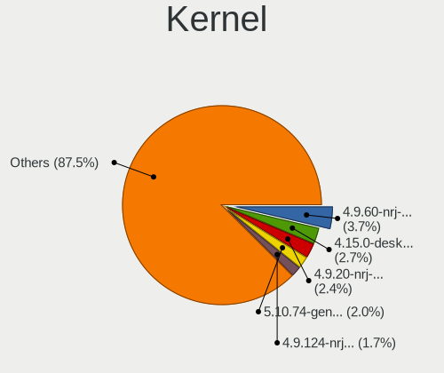

| Version                             | Computers | Percent |
|-------------------------------------|-----------|---------|
| 4.9.60-nrj-desktop-1rosa-x86_64     | 60        | 5.3%    |
| 4.15.0-desktop-45.1rosa-x86_64      | 42        | 3.71%   |
| 4.9.20-nrj-desktop-1rosa-x86_64     | 39        | 3.44%   |
| 5.10.74-generic-2rosa2021.1-x86_64  | 31        | 2.74%   |
| 4.9.124-nrj-desktop-1rosa-x86_64    | 27        | 2.38%   |
| 5.10.14-desktop-1omv4002            | 23        | 2.03%   |
| 4.1.34-nrj-desktop-2rosa-x86_64     | 20        | 1.77%   |
| 4.9.155-nrj-desktop-1rosa-x86_64    | 19        | 1.68%   |
| 4.9.76-nrj-desktop-1rosa-x86_64     | 18        | 1.59%   |
| 4.1.38-nrj-desktop-2rosa-x86_64     | 16        | 1.41%   |
| 5.4.83-generic-2rosa-x86_64         | 15        | 1.32%   |
| 4.15.0-desktop-45.1rosa-i586        | 15        | 1.32%   |
| 5.4.0-42-generic                    | 13        | 1.15%   |
| 4.9.9-nrj-desktop-1rosa-x86_64      | 13        | 1.15%   |
| 4.15.0-desktop-68.5rosa-x86_64      | 12        | 1.06%   |
| 4.9.60-nrj-desktop-1rosa-i586       | 11        | 0.97%   |
| 5.16.7-desktop-1omv4003             | 10        | 0.88%   |
| 4.9.41-nrj-desktop-1rosa-x86_64     | 10        | 0.88%   |
| 4.9.20-nrj-desktop-1rosa-i586       | 10        | 0.88%   |
| 5.15.0-56-generic                   | 9         | 0.79%   |
| 4.9.9-nrj-desktop-1rosa-i586        | 9         | 0.79%   |
| 4.15.0-desktop-47.2rosa-x86_64      | 8         | 0.71%   |
| 5.4.32-generic-2rosa-x86_64         | 7         | 0.62%   |
| 4.9.155-nrj-laptop-1rosa-x86_64     | 7         | 0.62%   |
| 4.15.0-desktop-60.7rosa-x86_64      | 7         | 0.62%   |
| 4.15.0-desktop-122.124.1rosa-x86_64 | 7         | 0.62%   |
| 5.9.16-1-MANJARO                    | 6         | 0.53%   |
| 5.8.0-14-generic                    | 6         | 0.53%   |
| 4.9.95-nrj-desktop-2rosa-x86_64     | 6         | 0.53%   |
| 4.9.124-nrj-desktop-1rosa-i586      | 6         | 0.53%   |
| 4.9.111-nrj-desktop-2rosa-x86_64    | 6         | 0.53%   |
| 5.4.0-58-generic                    | 5         | 0.44%   |
| 5.4.0-48-generic                    | 5         | 0.44%   |
| 5.3.0-28-generic                    | 5         | 0.44%   |
| 5.15.75-generic-1rosa2021.1-x86_64  | 5         | 0.44%   |
| 5.0.0-37-generic                    | 5         | 0.44%   |
| 4.9.87-nrj-desktop-2rosa-x86_64     | 5         | 0.44%   |
| 4.15.0-desktop-94.1rosa-x86_64      | 5         | 0.44%   |
| 4.15.0-desktop-54.1rosa-x86_64      | 5         | 0.44%   |
| 4.13.0-32-generic                   | 5         | 0.44%   |

Kernel Family
-------------

Linux kernel without a distro release

| Version | Computers | Percent |
|---------|-----------|---------|
| 4.15.0  | 138       | 12.52%  |
| 5.4.0   | 81        | 7.35%   |
| 4.9.60  | 71        | 6.44%   |
| 4.9.20  | 49        | 4.45%   |
| 4.9.124 | 33        | 2.99%   |
| 5.8.0   | 31        | 2.81%   |
| 5.10.74 | 31        | 2.81%   |
| 4.9.155 | 27        | 2.45%   |
| 4.1.38  | 27        | 2.45%   |
| 5.11.0  | 25        | 2.27%   |
| 4.1.34  | 25        | 2.27%   |
| 5.15.0  | 24        | 2.18%   |
| 5.10.14 | 23        | 2.09%   |
| 5.0.0   | 22        | 2%      |
| 4.9.9   | 22        | 2%      |
| 4.9.76  | 22        | 2%      |
| 5.3.0   | 20        | 1.81%   |
| 5.13.0  | 20        | 1.81%   |
| 5.4.83  | 19        | 1.72%   |
| 5.10.0  | 19        | 1.72%   |
| 4.9.41  | 14        | 1.27%   |
| 4.18.0  | 13        | 1.18%   |
| 5.16.7  | 10        | 0.91%   |
| 4.19.0  | 9         | 0.82%   |
| 4.13.0  | 9         | 0.82%   |
| 5.9.16  | 8         | 0.73%   |
| 5.4.32  | 8         | 0.73%   |
| 4.9.95  | 7         | 0.64%   |
| 4.9.87  | 6         | 0.54%   |
| 4.9.111 | 6         | 0.54%   |
| 5.15.75 | 5         | 0.45%   |
| 5.19.0  | 4         | 0.36%   |
| 5.14.0  | 4         | 0.36%   |
| 4.9.34  | 4         | 0.36%   |
| 4.8.17  | 4         | 0.36%   |
| 5.9.11  | 3         | 0.27%   |
| 5.6.14  | 3         | 0.27%   |
| 5.3.12  | 3         | 0.27%   |
| 5.17.5  | 3         | 0.27%   |
| 5.16.5  | 3         | 0.27%   |

Kernel Major Ver.
-----------------

Linux kernel major version

| Version | Computers | Percent |
|---------|-----------|---------|
| 4.9     | 214       | 21.02%  |
| 4.15    | 138       | 13.56%  |
| 5.4     | 124       | 12.18%  |
| 5.10    | 87        | 8.55%   |
| 4.1     | 55        | 5.4%    |
| 5.15    | 53        | 5.21%   |
| 5.8     | 39        | 3.83%   |
| 5.11    | 35        | 3.44%   |
| 5.3     | 29        | 2.85%   |
| 5.13    | 29        | 2.85%   |
| 5.0     | 23        | 2.26%   |
| 5.9     | 19        | 1.87%   |
| 5.16    | 16        | 1.57%   |
| 4.18    | 16        | 1.57%   |
| 5.18    | 14        | 1.38%   |
| 4.19    | 14        | 1.38%   |
| 5.19    | 13        | 1.28%   |
| 6.0     | 12        | 1.18%   |
| 5.14    | 12        | 1.18%   |
| 5.6     | 11        | 1.08%   |
| 5.17    | 9         | 0.88%   |
| 4.13    | 9         | 0.88%   |
| 5.12    | 8         | 0.79%   |
| 4.8     | 8         | 0.79%   |
| 5.7     | 5         | 0.49%   |
| 4.4     | 5         | 0.49%   |
| 4.14    | 5         | 0.49%   |
| 5.5     | 4         | 0.39%   |
| 4.17    | 3         | 0.29%   |
| 4.16    | 3         | 0.29%   |
| 4.10    | 2         | 0.2%    |
| 5.1     | 1         | 0.1%    |
| 4.20    | 1         | 0.1%    |
| 4.12    | 1         | 0.1%    |
| 3.4     | 1         | 0.1%    |

Arch
----

OS architecture (x86_64, i586, etc.)

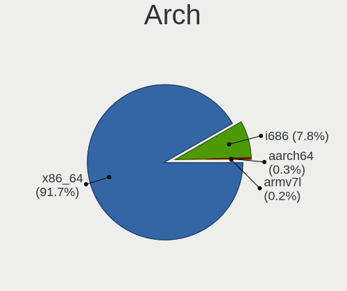

| Name   | Computers | Percent |
|--------|-----------|---------|
| x86_64 | 790       | 89.77%  |
| i686   | 88        | 10%     |
| armv7l | 2         | 0.23%   |

DE
--

Desktop Environment

| Name       | Computers | Percent |
|------------|-----------|---------|
| KDE4       | 277       | 29.66%  |
| KDE5       | 230       | 24.63%  |
| GNOME      | 202       | 21.63%  |
| Unknown    | 75        | 8.03%   |
| XFCE       | 42        | 4.5%    |
| X-Cinnamon | 30        | 3.21%   |
| LXQt       | 18        | 1.93%   |
| MATE       | 17        | 1.82%   |
| KDE        | 15        | 1.61%   |
| Cinnamon   | 11        | 1.18%   |
| Pantheon   | 5         | 0.54%   |
| LXDE       | 3         | 0.32%   |
| i3         | 2         | 0.21%   |
| Deepin     | 2         | 0.21%   |
| Unity      | 1         | 0.11%   |
| Trinity    | 1         | 0.11%   |
| Openbox    | 1         | 0.11%   |
| Budgie     | 1         | 0.11%   |
| bspwm      | 1         | 0.11%   |

Display Server
--------------

X11 or Wayland

| Name    | Computers | Percent |
|---------|-----------|---------|
| X11     | 753       | 84.51%  |
| Wayland | 88        | 9.88%   |
| Unknown | 39        | 4.38%   |
| Tty     | 11        | 1.23%   |

Display Manager
---------------

SDDM, LightDM, etc.

| Name    | Computers | Percent |
|---------|-----------|---------|
| KDM     | 279       | 30.16%  |
| SDDM    | 239       | 25.84%  |
| Unknown | 216       | 23.35%  |
| GDM     | 100       | 10.81%  |
| LightDM | 38        | 4.11%   |
| TDM     | 29        | 3.14%   |
| GDM3    | 21        | 2.27%   |
| MDM     | 2         | 0.22%   |
| SLiM    | 1         | 0.11%   |

OS Lang
-------

Language

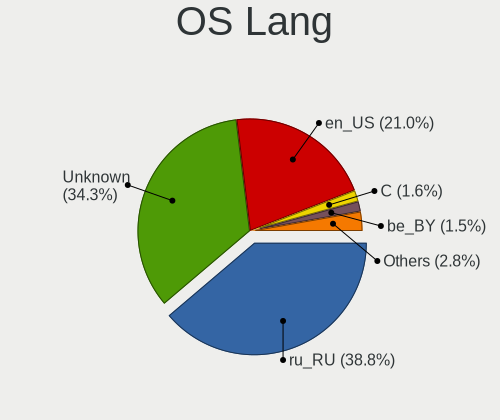

| Lang        | Computers | Percent |
|-------------|-----------|---------|
| Unknown     | 416       | 46.02%  |
| ru_RU       | 298       | 32.96%  |
| en_US       | 152       | 16.81%  |
| be_BY       | 11        | 1.22%   |
| en_GB       | 10        | 1.11%   |
| ru_RU.UTF_8 | 6         | 0.66%   |
| C           | 5         | 0.55%   |
| ru_UA       | 2         | 0.22%   |
| cv_RU       | 2         | 0.22%   |
| ru_BY       | 1         | 0.11%   |
| en_CA       | 1         | 0.11%   |

Boot Mode
---------

EFI or BIOS

| Mode | Computers | Percent |
|------|-----------|---------|
| BIOS | 527       | 59.28%  |
| EFI  | 362       | 40.72%  |

Filesystem
----------

Type of filesystem

| Type    | Computers | Percent |
|---------|-----------|---------|
| Ext4    | 577       | 62.18%  |
| Unknown | 242       | 26.08%  |
| Btrfs   | 56        | 6.03%   |
| Overlay | 37        | 3.99%   |
| Xfs     | 5         | 0.54%   |
| Ext3    | 4         | 0.43%   |
| F2fs    | 2         | 0.22%   |
| Ext2    | 2         | 0.22%   |
| Zfs     | 1         | 0.11%   |
| Tmpfs   | 1         | 0.11%   |
| SAMSUNG | 1         | 0.11%   |

Part. scheme
------------

Scheme of partitioning

| Type    | Computers | Percent |
|---------|-----------|---------|
| MBR     | 330       | 35.6%   |
| Unknown | 318       | 34.3%   |
| GPT     | 279       | 30.1%   |

Dual Boot with Linux/BSD
------------------------

Hosting more than one Linux/BSD

| Dual boot | Computers | Percent |
|-----------|-----------|---------|
| No        | 778       | 86.64%  |
| Yes       | 120       | 13.36%  |

Dual Boot (Win)
---------------

Hosting Linux and Windows

| Dual boot | Computers | Percent |
|-----------|-----------|---------|
| No        | 609       | 66.63%  |
| Yes       | 305       | 33.37%  |

Board
-----

Vendor
------

Motherboard manufacturer

| Name                | Computers | Percent |
|---------------------|-----------|---------|
| ASUSTek Computer    | 197       | 22.7%   |
| Lenovo              | 112       | 12.9%   |
| Hewlett-Packard     | 102       | 11.75%  |
| Gigabyte Technology | 92        | 10.6%   |
| Acer                | 74        | 8.53%   |
| ASRock              | 68        | 7.83%   |
| MSI                 | 45        | 5.18%   |
| Dell                | 39        | 4.49%   |
| Samsung Electronics | 32        | 3.69%   |
| Biostar             | 11        | 1.27%   |
| Toshiba             | 10        | 1.15%   |
| Intel               | 10        | 1.15%   |
| Timi                | 9         | 1.04%   |
| Sony                | 6         | 0.69%   |
| Prestigio           | 5         | 0.58%   |
| Packard Bell        | 5         | 0.58%   |
| HONOR               | 4         | 0.46%   |
| Fujitsu             | 4         | 0.46%   |
| Unknown             | 4         | 0.46%   |
| Fujitsu Siemens     | 3         | 0.35%   |
| ECS                 | 3         | 0.35%   |
| Apple               | 3         | 0.35%   |
| Nvidia              | 2         | 0.23%   |
| HUAWEI              | 2         | 0.23%   |
| BenQ                | 2         | 0.23%   |
| ZOTAC               | 1         | 0.12%   |
| ViewSonic           | 1         | 0.12%   |
| VIA Technologies    | 1         | 0.12%   |
| Supermicro          | 1         | 0.12%   |
| Quanta              | 1         | 0.12%   |
| Pegatron            | 1         | 0.12%   |
| Olimex              | 1         | 0.12%   |
| NCS-Tech            | 1         | 0.12%   |
| Microsoft           | 1         | 0.12%   |
| LTD Delovoy Office  | 1         | 0.12%   |
| LG Electronics      | 1         | 0.12%   |
| Kllisre             | 1         | 0.12%   |
| Jetway              | 1         | 0.12%   |
| IBM                 | 1         | 0.12%   |
| Huanan              | 1         | 0.12%   |

Model
-----

Motherboard model

| Name                                    | Computers | Percent |
|-----------------------------------------|-----------|---------|
| Lenovo G50-30 80G0                      | 7         | 0.81%   |
| HP Notebook                             | 6         | 0.69%   |
| Unknown                                 | 6         | 0.69%   |
| ASRock N68C-GS FX                       | 5         | 0.58%   |
| Acer Extensa 5220                       | 5         | 0.58%   |
| Timi TM1701                             | 4         | 0.46%   |
| MSI MS-7369                             | 4         | 0.46%   |
| Lenovo IdeaPad 320-15IAP 80XR           | 4         | 0.46%   |
| HP ProBook 455 G1                       | 4         | 0.46%   |
| HP Pavilion g6                          | 4         | 0.46%   |
| Gigabyte 970A-DS3P                      | 4         | 0.46%   |
| ASUS X540NV                             | 4         | 0.46%   |
| ASUS All Series                         | 4         | 0.46%   |
| ASRock N68-VS3 UCC                      | 4         | 0.46%   |
| Acer Aspire E1-571G                     | 4         | 0.46%   |
| Samsung RV413/RV513                     | 3         | 0.35%   |
| MSI MS-7309                             | 3         | 0.35%   |
| Lenovo IdeaPad Z570 HuronRiver Platform | 3         | 0.35%   |
| Lenovo G570 20079                       | 3         | 0.35%   |
| Lenovo G500 20236                       | 3         | 0.35%   |
| Lenovo B590 20206                       | 3         | 0.35%   |
| Lenovo B50-30 20382                     | 3         | 0.35%   |
| HP Pavilion 15                          | 3         | 0.35%   |
| HP 635                                  | 3         | 0.35%   |
| Gigabyte M61SME-S2                      | 3         | 0.35%   |
| Gigabyte H81M-S2H                       | 3         | 0.35%   |
| Gigabyte GA-MA74GM-S2H                  | 3         | 0.35%   |
| Gigabyte GA-780T-D3L                    | 3         | 0.35%   |
| Gigabyte B450M S2H                      | 3         | 0.35%   |
| Gigabyte B450M DS3H                     | 3         | 0.35%   |
| Dell Inspiron 7577                      | 3         | 0.35%   |
| ASUS ZenBook UX431DA_UM431DA            | 3         | 0.35%   |
| ASUS X541UAK                            | 3         | 0.35%   |
| ASUS TUF B450-PRO GAMING                | 3         | 0.35%   |
| ASUS P8H77-V                            | 3         | 0.35%   |
| ASRock N68-VGS3 FX                      | 3         | 0.35%   |
| Acer Aspire V3-571G                     | 3         | 0.35%   |
| Acer Aspire E1-531                      | 3         | 0.35%   |
| Acer Aspire 4810T                       | 3         | 0.35%   |
| Timi TM1613                             | 2         | 0.23%   |

Model Family
------------

Motherboard model prefix

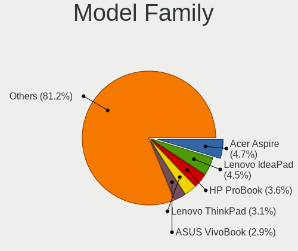

| Name                  | Computers | Percent |
|-----------------------|-----------|---------|
| Acer Aspire           | 48        | 5.53%   |
| Lenovo IdeaPad        | 34        | 3.92%   |
| HP ProBook            | 30        | 3.46%   |
| Lenovo ThinkPad       | 27        | 3.11%   |
| Dell Inspiron         | 23        | 2.65%   |
| ASUS VivoBook         | 21        | 2.42%   |
| HP Pavilion           | 20        | 2.3%    |
| Acer Extensa          | 13        | 1.5%    |
| Toshiba Satellite     | 8         | 0.92%   |
| HP Laptop             | 8         | 0.92%   |
| ASUS ZenBook          | 8         | 0.92%   |
| ASUS PRIME            | 8         | 0.92%   |
| Lenovo G50-30         | 7         | 0.81%   |
| Gigabyte B450M        | 7         | 0.81%   |
| ASUS ROG              | 7         | 0.81%   |
| HP Notebook           | 6         | 0.69%   |
| HP EliteBook          | 6         | 0.69%   |
| Unknown               | 6         | 0.69%   |
| HP Compaq             | 5         | 0.58%   |
| ASUS TUF              | 5         | 0.58%   |
| ASRock N68C-GS        | 5         | 0.58%   |
| ASRock N68-VS3        | 5         | 0.58%   |
| Timi TM1701           | 4         | 0.46%   |
| MSI MS-7369           | 4         | 0.46%   |
| Lenovo Legion         | 4         | 0.46%   |
| Lenovo G580           | 4         | 0.46%   |
| Gigabyte 970A-DS3P    | 4         | 0.46%   |
| Dell XPS              | 4         | 0.46%   |
| Dell Vostro           | 4         | 0.46%   |
| ASUS X540NV           | 4         | 0.46%   |
| ASUS P8H77-V          | 4         | 0.46%   |
| ASUS ASUS             | 4         | 0.46%   |
| ASUS All              | 4         | 0.46%   |
| Acer TravelMate       | 4         | 0.46%   |
| Samsung RV413         | 3         | 0.35%   |
| Packard Bell EasyNote | 3         | 0.35%   |
| MSI MS-7309           | 3         | 0.35%   |
| Lenovo G570           | 3         | 0.35%   |
| Lenovo G500           | 3         | 0.35%   |
| Lenovo B590           | 3         | 0.35%   |

MFG Year
--------

Motherboard manufacture year

| Year    | Computers | Percent |
|---------|-----------|---------|
| 2011    | 93        | 10.71%  |
| 2012    | 91        | 10.48%  |
| 2013    | 85        | 9.79%   |
| 2018    | 77        | 8.87%   |
| 2017    | 61        | 7.03%   |
| 2010    | 56        | 6.45%   |
| 2020    | 53        | 6.11%   |
| 2014    | 51        | 5.88%   |
| 2009    | 50        | 5.76%   |
| 2019    | 48        | 5.53%   |
| 2007    | 48        | 5.53%   |
| 2015    | 36        | 4.15%   |
| 2008    | 35        | 4.03%   |
| 2016    | 28        | 3.23%   |
| 2021    | 25        | 2.88%   |
| 2006    | 18        | 2.07%   |
| 2022    | 5         | 0.58%   |
| 2005    | 5         | 0.58%   |
| Unknown | 2         | 0.23%   |
| 2003    | 1         | 0.12%   |

Form Factor
-----------

Physical design of the computer

| Name           | Computers | Percent |
|----------------|-----------|---------|
| Notebook       | 540       | 62.21%  |
| Desktop        | 304       | 35.02%  |
| All in one     | 8         | 0.92%   |
| Convertible    | 5         | 0.58%   |
| Tablet         | 3         | 0.35%   |
| Mini pc        | 3         | 0.35%   |
| Server         | 3         | 0.35%   |
| Phone          | 1         | 0.12%   |
| System on chip | 1         | 0.12%   |

Secure Boot
-----------

Enabled or disabled

| State    | Computers | Percent |
|----------|-----------|---------|
| Disabled | 831       | 95.3%   |
| Enabled  | 41        | 4.7%    |

Coreboot
--------

Have coreboot on board

| Used | Computers | Percent |
|------|-----------|---------|
| No   | 868       | 100%    |

RAM Size
--------

Total RAM memory

| Size in GB  | Computers | Percent |
|-------------|-----------|---------|
| 3.01-4.0    | 256       | 28.76%  |
| 4.01-8.0    | 199       | 22.36%  |
| 8.01-16.0   | 134       | 15.06%  |
| 16.01-24.0  | 109       | 12.25%  |
| 1.01-2.0    | 81        | 9.1%    |
| 32.01-64.0  | 39        | 4.38%   |
| 2.01-3.0    | 39        | 4.38%   |
| 0.51-1.0    | 20        | 2.25%   |
| 24.01-32.0  | 6         | 0.67%   |
| 64.01-256.0 | 6         | 0.67%   |
| 0.01-0.5    | 1         | 0.11%   |

RAM Used
--------

Used RAM memory

| Used GB    | Computers | Percent |
|------------|-----------|---------|
| 1.01-2.0   | 358       | 35.59%  |
| 0.51-1.0   | 247       | 24.55%  |
| 2.01-3.0   | 171       | 17%     |
| 4.01-8.0   | 92        | 9.15%   |
| 3.01-4.0   | 84        | 8.35%   |
| 8.01-16.0  | 24        | 2.39%   |
| 0.01-0.5   | 22        | 2.19%   |
| 16.01-24.0 | 4         | 0.4%    |
| 24.01-32.0 | 2         | 0.2%    |
| 32.01-64.0 | 1         | 0.1%    |
| Unknown    | 1         | 0.1%    |

Total Drives
------------

Number of drives on board

| Drives | Computers | Percent |
|--------|-----------|---------|
| 1      | 578       | 64.01%  |
| 2      | 228       | 25.25%  |
| 3      | 65        | 7.2%    |
| 4      | 18        | 1.99%   |
| 5      | 7         | 0.78%   |
| 0      | 4         | 0.44%   |
| 9      | 2         | 0.22%   |
| 6      | 1         | 0.11%   |

Has CD-ROM
----------

Has CD-ROM on board

| Presented | Computers | Percent |
|-----------|-----------|---------|
| No        | 493       | 56.21%  |
| Yes       | 384       | 43.79%  |

Has Ethernet
------------

Has Ethernet on board

| Presented | Computers | Percent |
|-----------|-----------|---------|
| Yes       | 774       | 89.07%  |
| No        | 95        | 10.93%  |

Has WiFi
--------

Has WiFi module

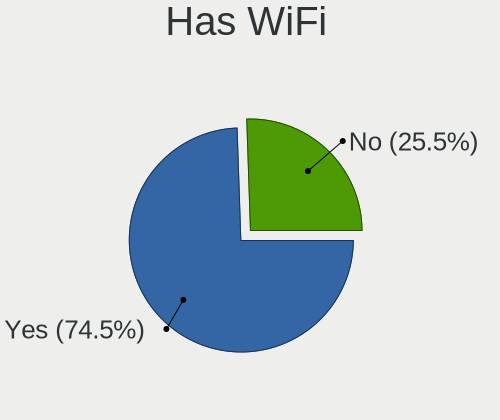

| Presented | Computers | Percent |
|-----------|-----------|---------|
| Yes       | 634       | 72.79%  |
| No        | 237       | 27.21%  |

Has Bluetooth
-------------

Has Bluetooth module

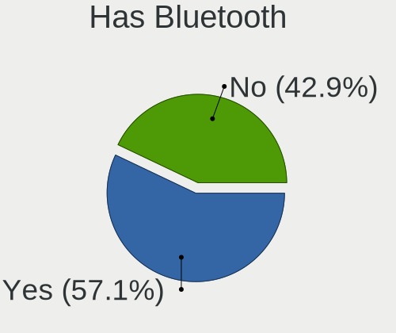

| Presented | Computers | Percent |
|-----------|-----------|---------|
| Yes       | 465       | 52.96%  |
| No        | 413       | 47.04%  |

Location
--------

Country
-------

Geographic location (country)

| Country | Computers | Percent |
|---------|-----------|---------|
| Belarus | 868       | 100%    |

City
----

Geographic location (city)

| City         | Computers | Percent |
|--------------|-----------|---------|
| Minsk        | 412       | 43.14%  |
| Vitebsk      | 98        | 10.26%  |
| Gomel        | 86        | 9.01%   |
| Hrodna       | 52        | 5.45%   |
| Mogilev      | 51        | 5.34%   |
| Brest        | 50        | 5.24%   |
| Orsha        | 17        | 1.78%   |
| Babruysk     | 16        | 1.68%   |
| Polatsk      | 15        | 1.57%   |
| Borisov      | 9         | 0.94%   |
| Lida         | 8         | 0.84%   |
| Baranovichi  | 8         | 0.84%   |
| Slutsk       | 7         | 0.73%   |
| Zhlobin      | 6         | 0.63%   |
| Mazyr        | 6         | 0.63%   |
| Bogushevichi | 6         | 0.63%   |
| Zhodzina     | 5         | 0.52%   |
| Vawkavysk    | 5         | 0.52%   |
| Klyetsk      | 5         | 0.52%   |
| Pinsk        | 4         | 0.42%   |
| Syanno       | 3         | 0.31%   |
| Smalyavichy  | 3         | 0.31%   |
| Slonim       | 3         | 0.31%   |
| Rahachow     | 3         | 0.31%   |
| Navapolatsk  | 3         | 0.31%   |
| Fedorovka    | 3         | 0.31%   |
| Dubovka      | 3         | 0.31%   |
| Byshanka     | 3         | 0.31%   |
| Baran'       | 3         | 0.31%   |
| Aleksandrovo | 3         | 0.31%   |
| Svyetlahorsk | 2         | 0.21%   |
| Snitovo      | 2         | 0.21%   |
| Salihorsk    | 2         | 0.21%   |
| Rechytsa     | 2         | 0.21%   |
| Pruzhany     | 2         | 0.21%   |
| Ogorodniki   | 2         | 0.21%   |
| Murava       | 2         | 0.21%   |
| Masty        | 2         | 0.21%   |
| Maladzyechna | 2         | 0.21%   |
| Lyepyel'     | 2         | 0.21%   |

Drives
------

Drive Vendor
------------

Hard drive vendors

| Vendor              | Computers | Drives | Percent |
|---------------------|-----------|--------|---------|
| WDC                 | 210       | 334    | 17.3%   |
| Seagate             | 205       | 318    | 16.89%  |
| Samsung Electronics | 163       | 233    | 13.43%  |
| Toshiba             | 128       | 197    | 10.54%  |
| Hitachi             | 83        | 109    | 6.84%   |
| Kingston            | 77        | 103    | 6.34%   |
| HGST                | 42        | 65     | 3.46%   |
| SK hynix            | 34        | 39     | 2.8%    |
| Crucial             | 27        | 35     | 2.22%   |
| Intel               | 26        | 36     | 2.14%   |
| Unknown             | 22        | 30     | 1.81%   |
| SanDisk             | 21        | 27     | 1.73%   |
| Patriot             | 14        | 17     | 1.15%   |
| Fujitsu             | 12        | 18     | 0.99%   |
| A-DATA Technology   | 11        | 12     | 0.91%   |
| OCZ                 | 10        | 11     | 0.82%   |
| Gigabyte Technology | 10        | 11     | 0.82%   |
| KingSpec            | 9         | 17     | 0.74%   |
| China               | 9         | 11     | 0.74%   |
| GOODRAM             | 8         | 8      | 0.66%   |
| Micron Technology   | 7         | 13     | 0.58%   |
| SPCC                | 6         | 11     | 0.49%   |
| Silicon Motion      | 5         | 6      | 0.41%   |
| Plextor             | 5         | 6      | 0.41%   |
| Apacer              | 5         | 6      | 0.41%   |
| Transcend           | 4         | 6      | 0.33%   |
| Netac               | 4         | 4      | 0.33%   |
| Maxtor              | 4         | 4      | 0.33%   |
| JMicron Technology  | 4         | 4      | 0.33%   |
| Smartbuy            | 3         | 3      | 0.25%   |
| KIOXIA              | 3         | 14     | 0.25%   |
| KingDian            | 3         | 5      | 0.25%   |
| XPG                 | 2         | 2      | 0.16%   |
| Team                | 2         | 2      | 0.16%   |
| Phison Electronics  | 2         | 2      | 0.16%   |
| LITEONIT            | 2         | 2      | 0.16%   |
| Lenovo              | 2         | 5      | 0.16%   |
| Kllisre             | 2         | 3      | 0.16%   |
| External            | 2         | 2      | 0.16%   |
| Corsair             | 2         | 6      | 0.16%   |

Drive Model
-----------

Hard drive models

| Model                                  | Computers | Percent |
|----------------------------------------|-----------|---------|
| Toshiba MQ01ABF050 500GB               | 24        | 1.83%   |
| Toshiba DT01ACA050 500GB               | 19        | 1.45%   |
| Seagate ST1000LM035-1RK172 1TB         | 17        | 1.29%   |
| Samsung SSD 860 EVO 250GB              | 17        | 1.29%   |
| Kingston SA400S37120G 120GB SSD        | 17        | 1.29%   |
| Seagate ST500LT012-1DG142 500GB        | 16        | 1.22%   |
| Toshiba DT01ACA100 1TB                 | 15        | 1.14%   |
| Seagate ST1000LM024 HN-M101MBB 1TB     | 14        | 1.07%   |
| Samsung SSD 860 EVO 500GB              | 13        | 0.99%   |
| Toshiba DT01ACA200 2TB                 | 10        | 0.76%   |
| Seagate ST9320325AS 320GB              | 10        | 0.76%   |
| HGST HTS545050A7E680 500GB             | 10        | 0.76%   |
| Crucial CT120BX500SSD1 120GB           | 10        | 0.76%   |
| Seagate ST500DM002-1BD142 500GB        | 9         | 0.68%   |
| Samsung SM963 2.5" NVMe PCIe SSD 256GB | 9         | 0.68%   |
| Kingston SA400S37240G 240GB SSD        | 9         | 0.68%   |
| Toshiba MQ04ABF100 1TB                 | 8         | 0.61%   |
| SK hynix NVMe SSD Drive 512GB          | 8         | 0.61%   |
| Samsung SSD 850 EVO 250GB              | 8         | 0.61%   |
| Hitachi HTS543232A7A384 320GB          | 8         | 0.61%   |
| WDC WD10JPVX-22JC3T0 1TB               | 7         | 0.53%   |
| Toshiba MQ01ABD100 1TB                 | 7         | 0.53%   |
| Toshiba MQ01ABD032 320GB               | 7         | 0.53%   |
| Kingston SUV400S37120G 120GB SSD       | 7         | 0.53%   |
| Toshiba MQ01ABD075 752GB               | 6         | 0.46%   |
| Seagate ST9500325AS 500GB              | 6         | 0.46%   |
| Seagate ST9250315AS 250GB              | 6         | 0.46%   |
| Patriot Burst 120GB SSD                | 6         | 0.46%   |
| OCZ VERTEX4 128GB SSD                  | 6         | 0.46%   |
| Hitachi HTS545050B9A300 500GB          | 6         | 0.46%   |
| HGST HTS541010A9E680 1TB               | 6         | 0.46%   |
| WDC WD10EZRZ-00HTKB0 1TB               | 5         | 0.38%   |
| Seagate ST500LT012-9WS142 500GB        | 5         | 0.38%   |
| Seagate ST1000DM003-1ER162 1TB         | 5         | 0.38%   |
| Samsung SSD 970 EVO Plus 500GB         | 5         | 0.38%   |
| Samsung SSD 850 EVO 500GB              | 5         | 0.38%   |
| Samsung HD160JJ/ 160GB                 | 5         | 0.38%   |
| Hitachi HTS547575A9E384 752GB          | 5         | 0.38%   |
| Hitachi HTS547550A9E384 500GB          | 5         | 0.38%   |
| Hitachi HDS721010CLA330 1TB            | 5         | 0.38%   |

HDD Vendor
----------

Hard disk drive vendors

| Vendor              | Computers | Drives | Percent |
|---------------------|-----------|--------|---------|
| Seagate             | 204       | 316    | 28.69%  |
| WDC                 | 192       | 293    | 27%     |
| Toshiba             | 121       | 186    | 17.02%  |
| Hitachi             | 83        | 109    | 11.67%  |
| Samsung Electronics | 46        | 72     | 6.47%   |
| HGST                | 42        | 65     | 5.91%   |
| Fujitsu             | 12        | 18     | 1.69%   |
| Maxtor              | 4         | 4      | 0.56%   |
| WD MediaMax         | 1         | 1      | 0.14%   |
| USB3.0              | 1         | 1      | 0.14%   |
| Unknown             | 1         | 1      | 0.14%   |
| SINTECHI            | 1         | 1      | 0.14%   |
| SAGE                | 1         | 1      | 0.14%   |
| External            | 1         | 1      | 0.14%   |
| Apple               | 1         | 1      | 0.14%   |

SSD Vendor
----------

Solid state drive vendors

| Vendor              | Computers | Drives | Percent |
|---------------------|-----------|--------|---------|
| Samsung Electronics | 69        | 95     | 21.97%  |
| Kingston            | 58        | 79     | 18.47%  |
| Crucial             | 26        | 34     | 8.28%   |
| SanDisk             | 13        | 19     | 4.14%   |
| Patriot             | 12        | 15     | 3.82%   |
| WDC                 | 11        | 27     | 3.5%    |
| OCZ                 | 10        | 11     | 3.18%   |
| Intel               | 10        | 10     | 3.18%   |
| KingSpec            | 9         | 17     | 2.87%   |
| China               | 9         | 11     | 2.87%   |
| Gigabyte Technology | 8         | 9      | 2.55%   |
| SK hynix            | 7         | 8      | 2.23%   |
| GOODRAM             | 7         | 7      | 2.23%   |
| A-DATA Technology   | 7         | 8      | 2.23%   |
| SPCC                | 6         | 11     | 1.91%   |
| Plextor             | 5         | 6      | 1.59%   |
| Apacer              | 5         | 6      | 1.59%   |
| Transcend           | 4         | 6      | 1.27%   |
| Netac               | 4         | 4      | 1.27%   |
| JMicron Technology  | 4         | 4      | 1.27%   |
| Unknown             | 3         | 3      | 0.96%   |
| Toshiba             | 3         | 3      | 0.96%   |
| Smartbuy            | 3         | 3      | 0.96%   |
| KingDian            | 3         | 5      | 0.96%   |
| Team                | 2         | 2      | 0.64%   |
| Seagate             | 2         | 2      | 0.64%   |
| LITEONIT            | 2         | 2      | 0.64%   |
| Corsair             | 2         | 6      | 0.64%   |
| Zheino              | 1         | 2      | 0.32%   |
| XrayDisk            | 1         | 1      | 0.32%   |
| Union Memory        | 1         | 1      | 0.32%   |
| PNY                 | 1         | 4      | 0.32%   |
| OSCOO               | 1         | 1      | 0.32%   |
| OCZ-VERTEX3         | 1         | 2      | 0.32%   |
| OCZ-VERTEX          | 1         | 1      | 0.32%   |
| MSS4FV-MP           | 1         | 1      | 0.32%   |
| AMD                 | 1         | 1      | 0.32%   |
| Acer                | 1         | 1      | 0.32%   |

Drive Kind
----------

HDD or SSD

| Kind    | Computers | Drives | Percent |
|---------|-----------|--------|---------|
| HDD     | 622       | 1070   | 56.14%  |
| SSD     | 291       | 428    | 26.26%  |
| NVMe    | 171       | 235    | 15.43%  |
| MMC     | 20        | 29     | 1.81%   |
| Unknown | 4         | 4      | 0.36%   |

Drive Connector
---------------

SATA, SAS, NVMe, etc.

| Type | Computers | Drives | Percent |
|------|-----------|--------|---------|
| SATA | 736       | 1483   | 77.97%  |
| NVMe | 171       | 234    | 18.11%  |
| MMC  | 20        | 29     | 2.12%   |
| SAS  | 17        | 20     | 1.8%    |

Drive Size
----------

Size of hard drive

| Size in TB | Computers | Drives | Percent |
|------------|-----------|--------|---------|
| 0.01-0.5   | 607       | 1022   | 67.52%  |
| 0.51-1.0   | 225       | 346    | 25.03%  |
| 1.01-2.0   | 38        | 80     | 4.23%   |
| 2.01-3.0   | 10        | 17     | 1.11%   |
| 3.01-4.0   | 9         | 11     | 1%      |
| 4.01-10.0  | 7         | 18     | 0.78%   |
| 10.01-20.0 | 3         | 4      | 0.33%   |

Space Total
-----------

Amount of disk space available on the file system

| Size in GB     | Computers | Percent |
|----------------|-----------|---------|
| 101-250        | 243       | 25.23%  |
| 251-500        | 238       | 24.71%  |
| 501-1000       | 126       | 13.08%  |
| 1-20           | 99        | 10.28%  |
| 51-100         | 82        | 8.52%   |
| 1001-2000      | 63        | 6.54%   |
| 21-50          | 62        | 6.44%   |
| More than 3000 | 20        | 2.08%   |
| Unknown        | 19        | 1.97%   |
| 2001-3000      | 11        | 1.14%   |

Space Used
----------

Amount of used disk space

| Used GB        | Computers | Percent |
|----------------|-----------|---------|
| 1-20           | 438       | 44.42%  |
| 21-50          | 145       | 14.71%  |
| 101-250        | 109       | 11.05%  |
| 51-100         | 109       | 11.05%  |
| 251-500        | 75        | 7.61%   |
| 501-1000       | 52        | 5.27%   |
| 1001-2000      | 20        | 2.03%   |
| Unknown        | 19        | 1.93%   |
| More than 3000 | 9         | 0.91%   |
| 2001-3000      | 9         | 0.91%   |
| 0              | 1         | 0.1%    |

Malfunc. Drives
---------------

Drive models with a malfunction

| Model                              | Computers | Drives | Percent |
|------------------------------------|-----------|--------|---------|
| Seagate ST9320325AS 320GB          | 6         | 7      | 2.36%   |
| Seagate ST500LT012-1DG142 500GB    | 6         | 7      | 2.36%   |
| HGST HTS545050A7E680 500GB         | 6         | 7      | 2.36%   |
| Toshiba MQ01ABF050 500GB           | 4         | 5      | 1.57%   |
| Toshiba DT01ACA100 1TB             | 4         | 5      | 1.57%   |
| Seagate ST9500325AS 500GB          | 4         | 5      | 1.57%   |
| Seagate ST9250315AS 250GB          | 4         | 4      | 1.57%   |
| Seagate ST500LT012-9WS142 500GB    | 4         | 4      | 1.57%   |
| Seagate ST1000LM024 HN-M101MBB 1TB | 4         | 5      | 1.57%   |
| Hitachi HTS545050B9A300 500GB      | 4         | 5      | 1.57%   |
| Hitachi HDP725050GLA360 500GB      | 4         | 8      | 1.57%   |
| WDC WD20EARS-00MVWB0 2TB           | 3         | 6      | 1.18%   |
| Toshiba MQ01ABD032 320GB           | 3         | 3      | 1.18%   |
| Toshiba DT01ACA200 2TB             | 3         | 5      | 1.18%   |
| Seagate ST9500420AS 500GB          | 3         | 3      | 1.18%   |
| Seagate ST500DM002-1BD142 500GB    | 3         | 10     | 1.18%   |
| Samsung Electronics HD160JJ/ 160GB | 3         | 3      | 1.18%   |
| WDC WD5000AAKS-00A7B0 500GB        | 2         | 2      | 0.79%   |
| WDC WD3200BPVT-35ZEST0 320GB       | 2         | 6      | 0.79%   |
| WDC WD30EFRX-68EUZN0 3TB           | 2         | 3      | 0.79%   |
| WDC WD10JPVX-22JC3T0 1TB           | 2         | 2      | 0.79%   |
| Toshiba MK3259GSXP 320GB           | 2         | 3      | 0.79%   |
| Seagate STM3500418AS 500GB         | 2         | 2      | 0.79%   |
| Seagate ST9120822AS 120GB          | 2         | 3      | 0.79%   |
| Seagate ST3500320AS 500GB          | 2         | 3      | 0.79%   |
| Seagate ST340016A 40GB             | 2         | 3      | 0.79%   |
| Seagate ST3250820AS 250GB          | 2         | 2      | 0.79%   |
| Seagate ST3160812A 160GB           | 2         | 4      | 0.79%   |
| Seagate ST2000DM001-1CH164 2TB     | 2         | 2      | 0.79%   |
| Samsung Electronics SP0802N 80GB   | 2         | 2      | 0.79%   |
| Samsung Electronics HD161HJ 160GB  | 2         | 3      | 0.79%   |
| Samsung Electronics HD103SJ 1TB    | 2         | 2      | 0.79%   |
| OCZ VERTEX4 128GB SSD              | 2         | 2      | 0.79%   |
| Hitachi HTS722010K9SA00 100GB      | 2         | 2      | 0.79%   |
| Hitachi HTS547575A9E384 752GB      | 2         | 2      | 0.79%   |
| Hitachi HTS547550A9E384 500GB      | 2         | 2      | 0.79%   |
| Hitachi HTS545025B9A300 250GB      | 2         | 2      | 0.79%   |
| Hitachi HTS543232A7A384 320GB      | 2         | 3      | 0.79%   |
| Hitachi HDS721010DLE630 1TB        | 2         | 2      | 0.79%   |
| Hitachi HDS721010CLA330 1TB        | 2         | 3      | 0.79%   |

Malfunc. Drive Vendor
---------------------

Vendors of faulty drives

| Vendor              | Computers | Drives | Percent |
|---------------------|-----------|--------|---------|
| Seagate             | 61        | 82     | 24.8%   |
| WDC                 | 58        | 75     | 23.58%  |
| Hitachi             | 42        | 55     | 17.07%  |
| Toshiba             | 23        | 30     | 9.35%   |
| Samsung Electronics | 20        | 30     | 8.13%   |
| HGST                | 9         | 10     | 3.66%   |
| Fujitsu             | 6         | 7      | 2.44%   |
| Kingston            | 5         | 5      | 2.03%   |
| OCZ                 | 4         | 4      | 1.63%   |
| Crucial             | 3         | 3      | 1.22%   |
| SK hynix            | 2         | 2      | 0.81%   |
| Maxtor              | 2         | 2      | 0.81%   |
| WD MediaMax         | 1         | 1      | 0.41%   |
| SanDisk             | 1         | 1      | 0.41%   |
| PNY                 | 1         | 3      | 0.41%   |
| OCZ-VERTEX3         | 1         | 2      | 0.41%   |
| Micron Technology   | 1         | 1      | 0.41%   |
| LITEONIT            | 1         | 1      | 0.41%   |
| KingSpec            | 1         | 6      | 0.41%   |
| Intel               | 1         | 1      | 0.41%   |
| Corsair             | 1         | 3      | 0.41%   |
| Apacer              | 1         | 1      | 0.41%   |
| A-DATA Technology   | 1         | 1      | 0.41%   |

Malfunc. HDD Vendor
-------------------

Vendors of faulty HDD drives

| Vendor              | Computers | Drives | Percent |
|---------------------|-----------|--------|---------|
| Seagate             | 61        | 82     | 27.48%  |
| WDC                 | 58        | 75     | 26.13%  |
| Hitachi             | 42        | 55     | 18.92%  |
| Toshiba             | 23        | 30     | 10.36%  |
| Samsung Electronics | 20        | 30     | 9.01%   |
| HGST                | 9         | 10     | 4.05%   |
| Fujitsu             | 6         | 7      | 2.7%    |
| Maxtor              | 2         | 2      | 0.9%    |
| WD MediaMax         | 1         | 1      | 0.45%   |

Malfunc. Drive Kind
-------------------

Kinds of faulty drives

| Kind | Computers | Drives | Percent |
|------|-----------|--------|---------|
| HDD  | 205       | 292    | 89.52%  |
| SSD  | 21        | 31     | 9.17%   |
| NVMe | 3         | 3      | 1.31%   |

Failed Drives
-------------

Failed drive models

| Model                             | Computers | Drives | Percent |
|-----------------------------------|-----------|--------|---------|
| WDC WD5000BPVT-80HXZT3 500GB      | 1         | 1      | 16.67%  |
| WDC WD3200BEVT-22ZCT0 320GB       | 1         | 1      | 16.67%  |
| Seagate ST500LT012-1DG142 500GB   | 1         | 1      | 16.67%  |
| Samsung Electronics HM500JI 500GB | 1         | 1      | 16.67%  |
| Maxtor STM380211AS 80GB           | 1         | 1      | 16.67%  |
| Hitachi HTS545050A7E380 500GB     | 1         | 1      | 16.67%  |

Failed Drive Vendor
-------------------

Failed drive vendors

| Vendor              | Computers | Drives | Percent |
|---------------------|-----------|--------|---------|
| WDC                 | 2         | 2      | 33.33%  |
| Seagate             | 1         | 1      | 16.67%  |
| Samsung Electronics | 1         | 1      | 16.67%  |
| Maxtor              | 1         | 1      | 16.67%  |
| Hitachi             | 1         | 1      | 16.67%  |

Drive Status
------------

Number of failed and malfunc. drives

| Status   | Computers | Drives | Percent |
|----------|-----------|--------|---------|
| Works    | 514       | 995    | 51.4%   |
| Detected | 254       | 439    | 25.4%   |
| Malfunc  | 226       | 326    | 22.6%   |
| Failed   | 6         | 6      | 0.6%    |

Storage controller
------------------

Storage Vendor
--------------

Storage controller vendors

| Vendor                           | Computers | Percent |
|----------------------------------|-----------|---------|
| Intel                            | 569       | 55.4%   |
| AMD                              | 197       | 19.18%  |
| Samsung Electronics              | 57        | 5.55%   |
| Nvidia                           | 48        | 4.67%   |
| SK hynix                         | 26        | 2.53%   |
| Kingston Technology Company      | 20        | 1.95%   |
| SanDisk                          | 19        | 1.85%   |
| JMicron Technology               | 19        | 1.85%   |
| Marvell Technology Group         | 11        | 1.07%   |
| Silicon Motion                   | 9         | 0.88%   |
| Micron Technology                | 8         | 0.78%   |
| ASMedia Technology               | 8         | 0.78%   |
| Phison Electronics               | 7         | 0.68%   |
| Toshiba America Info Systems     | 6         | 0.58%   |
| VIA Technologies                 | 4         | 0.39%   |
| Silicon Integrated Systems [SiS] | 4         | 0.39%   |
| Realtek Semiconductor            | 3         | 0.29%   |
| KIOXIA                           | 3         | 0.29%   |
| Lenovo                           | 2         | 0.19%   |
| ADATA Technology                 | 2         | 0.19%   |
| Synopsys                         | 1         | 0.1%    |
| Silicon Image                    | 1         | 0.1%    |
| Integrated Technology Express    | 1         | 0.1%    |
| Broadcom / LSI                   | 1         | 0.1%    |
| Apple                            | 1         | 0.1%    |

Storage Model
-------------

Storage controller models

| Model                                                                                   | Computers | Percent |
|-----------------------------------------------------------------------------------------|-----------|---------|
| AMD FCH SATA Controller [AHCI mode]                                                     | 98        | 7.8%    |
| Intel 7 Series Chipset Family 6-port SATA Controller [AHCI mode]                        | 59        | 4.7%    |
| AMD SB7x0/SB8x0/SB9x0 IDE Controller                                                    | 45        | 3.58%   |
| AMD SB7x0/SB8x0/SB9x0 SATA Controller [AHCI mode]                                       | 44        | 3.5%    |
| Intel Sunrise Point-LP SATA Controller [AHCI mode]                                      | 40        | 3.18%   |
| Intel 8 Series/C220 Series Chipset Family 6-port SATA Controller 1 [AHCI mode]          | 34        | 2.71%   |
| Nvidia MCP61 SATA Controller                                                            | 32        | 2.55%   |
| Nvidia MCP61 IDE                                                                        | 32        | 2.55%   |
| AMD SB7x0/SB8x0/SB9x0 SATA Controller [IDE mode]                                        | 32        | 2.55%   |
| Intel 82801IBM/IEM (ICH9M/ICH9M-E) 4 port SATA Controller [AHCI mode]                   | 29        | 2.31%   |
| Intel 6 Series/C200 Series Chipset Family 6 port Mobile SATA AHCI Controller            | 29        | 2.31%   |
| Samsung NVMe SSD Controller SM981/PM981/PM983                                           | 27        | 2.15%   |
| Intel NM10/ICH7 Family SATA Controller [IDE mode]                                       | 24        | 1.91%   |
| Intel Volume Management Device NVMe RAID Controller                                     | 20        | 1.59%   |
| Intel NM10/ICH7 Family SATA Controller [AHCI mode]                                      | 19        | 1.51%   |
| Intel Atom Processor E3800 Series SATA AHCI Controller                                  | 19        | 1.51%   |
| Intel 82801HM/HEM (ICH8M/ICH8M-E) IDE Controller                                        | 19        | 1.51%   |
| Intel 8 Series SATA Controller 1 [AHCI mode]                                            | 19        | 1.51%   |
| AMD 400 Series Chipset SATA Controller                                                  | 18        | 1.43%   |
| Intel Cannon Lake Mobile PCH SATA AHCI Controller                                       | 17        | 1.35%   |
| Samsung NVMe SSD Controller 980                                                         | 14        | 1.11%   |
| Intel Celeron N3350/Pentium N4200/Atom E3900 Series SATA AHCI Controller                | 14        | 1.11%   |
| Intel 82801HM/HEM (ICH8M/ICH8M-E) SATA Controller [AHCI mode]                           | 14        | 1.11%   |
| Intel 82801G (ICH7 Family) IDE Controller                                               | 14        | 1.11%   |
| Intel 7 Series/C210 Series Chipset Family 6-port SATA Controller [AHCI mode]            | 13        | 1.04%   |
| Samsung NVMe SSD Controller SM961/PM961/SM963                                           | 12        | 0.96%   |
| Intel Wildcat Point-LP SATA Controller [AHCI Mode]                                      | 12        | 0.96%   |
| Intel Q170/Q150/B150/H170/H110/Z170/CM236 Chipset SATA Controller [AHCI Mode]           | 12        | 0.96%   |
| Intel Celeron/Pentium Silver Processor SATA Controller                                  | 12        | 0.96%   |
| Intel 6 Series/C200 Series Chipset Family 6 port Desktop SATA AHCI Controller           | 12        | 0.96%   |
| AMD FCH IDE Controller                                                                  | 12        | 0.96%   |
| Intel SSD 660P Series                                                                   | 11        | 0.88%   |
| Intel Atom/Celeron/Pentium Processor x5-E8000/J3xxx/N3xxx Series SATA Controller        | 11        | 0.88%   |
| Intel 200 Series PCH SATA controller [AHCI mode]                                        | 11        | 0.88%   |
| Intel 6 Series/C200 Series Chipset Family Desktop SATA Controller (IDE mode, ports 4-5) | 10        | 0.8%    |
| Intel 6 Series/C200 Series Chipset Family Desktop SATA Controller (IDE mode, ports 0-3) | 10        | 0.8%    |
| Intel 5 Series/3400 Series Chipset 4 port SATA AHCI Controller                          | 10        | 0.8%    |
| SK hynix BC501 NVMe Solid State Drive                                                   | 9         | 0.72%   |
| Silicon Motion SM2263EN/SM2263XT SSD Controller                                         | 9         | 0.72%   |
| SanDisk WD Blue SN550 NVMe SSD                                                          | 9         | 0.72%   |

Storage Kind
------------

Kind of storage controller (IDE, SATA, NVMe, SAS, ...)

| Kind | Computers | Percent |
|------|-----------|---------|
| SATA | 654       | 60.39%  |
| IDE  | 223       | 20.59%  |
| NVMe | 172       | 15.88%  |
| RAID | 33        | 3.05%   |
| SCSI | 1         | 0.09%   |

Processor
---------

CPU Vendor
----------

Processor vendors

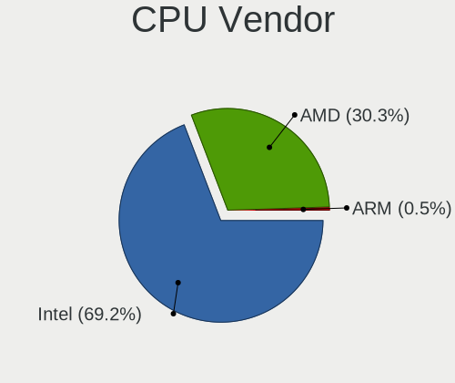

| Vendor | Computers | Percent |
|--------|-----------|---------|
| Intel  | 612       | 70.51%  |
| AMD    | 254       | 29.26%  |
| ARM    | 2         | 0.23%   |

CPU Model
---------

Processor models

| Model                                         | Computers | Percent |
|-----------------------------------------------|-----------|---------|
| Intel Celeron CPU N2840 @ 2.16GHz             | 14        | 1.6%    |
| Intel Core i5-8250U CPU @ 1.60GHz             | 12        | 1.37%   |
| Intel Core i7-8550U CPU @ 1.80GHz             | 9         | 1.03%   |
| Intel 11th Gen Core i5-1135G7 @ 2.40GHz       | 9         | 1.03%   |
| AMD E-450 APU with Radeon HD Graphics         | 9         | 1.03%   |
| Intel Core i7-8565U CPU @ 1.80GHz             | 8         | 0.92%   |
| Intel Core i3-6006U CPU @ 2.00GHz             | 8         | 0.92%   |
| Intel Core i7-7700HQ CPU @ 2.80GHz            | 7         | 0.8%    |
| Intel Core i5-6200U CPU @ 2.30GHz             | 7         | 0.8%    |
| Intel Core i3-3110M CPU @ 2.40GHz             | 7         | 0.8%    |
| Intel 11th Gen Core i7-1165G7 @ 2.80GHz       | 7         | 0.8%    |
| Intel Pentium Dual-Core CPU T4400 @ 2.20GHz   | 6         | 0.69%   |
| Intel Pentium CPU B960 @ 2.20GHz              | 6         | 0.69%   |
| Intel Core i5-7200U CPU @ 2.50GHz             | 6         | 0.69%   |
| Intel Core i5-5200U CPU @ 2.20GHz             | 6         | 0.69%   |
| Intel Core i5-2450M CPU @ 2.50GHz             | 6         | 0.69%   |
| AMD Ryzen 5 4600H with Radeon Graphics        | 6         | 0.69%   |
| AMD Ryzen 5 3500U with Radeon Vega Mobile Gfx | 6         | 0.69%   |
| AMD Athlon 64 X2 Dual Core Processor 5600+    | 6         | 0.69%   |
| Intel Pentium CPU N4200 @ 1.10GHz             | 5         | 0.57%   |
| Intel Pentium CPU N3700 @ 1.60GHz             | 5         | 0.57%   |
| Intel Core i7-8750H CPU @ 2.20GHz             | 5         | 0.57%   |
| Intel Core i5-9300H CPU @ 2.40GHz             | 5         | 0.57%   |
| Intel Core i3-1005G1 CPU @ 1.20GHz            | 5         | 0.57%   |
| Intel Celeron CPU N3350 @ 1.10GHz             | 5         | 0.57%   |
| Intel Atom CPU N455 @ 1.66GHz                 | 5         | 0.57%   |
| AMD Ryzen 5 2500U with Radeon Vega Mobile Gfx | 5         | 0.57%   |
| AMD Ryzen 3 2200G with Radeon Vega Graphics   | 5         | 0.57%   |
| AMD Athlon II X2 240 Processor                | 5         | 0.57%   |
| AMD A4-4300M APU with Radeon HD Graphics      | 5         | 0.57%   |
| Intel Pentium Silver N5000 CPU @ 1.10GHz      | 4         | 0.46%   |
| Intel Pentium Dual-Core CPU T4500 @ 2.30GHz   | 4         | 0.46%   |
| Intel Core i7-10510U CPU @ 1.80GHz            | 4         | 0.46%   |
| Intel Core i5-4570 CPU @ 3.20GHz              | 4         | 0.46%   |
| Intel Core i5-4210U CPU @ 1.70GHz             | 4         | 0.46%   |
| Intel Core i5-3230M CPU @ 2.60GHz             | 4         | 0.46%   |
| Intel Core i5-3210M CPU @ 2.50GHz             | 4         | 0.46%   |
| Intel Core i5-10210U CPU @ 1.60GHz            | 4         | 0.46%   |
| Intel Core i3-3217U CPU @ 1.80GHz             | 4         | 0.46%   |
| Intel Core i3-3120M CPU @ 2.50GHz             | 4         | 0.46%   |

CPU Model Family
----------------

Processor model prefix

| Model                   | Computers | Percent |
|-------------------------|-----------|---------|
| Intel Core i5           | 137       | 15.71%  |
| Intel Core i7           | 95        | 10.89%  |
| Intel Celeron           | 76        | 8.72%   |
| Intel Core i3           | 72        | 8.26%   |
| Intel Pentium           | 56        | 6.42%   |
| Intel Core 2 Duo        | 41        | 4.7%    |
| AMD Ryzen 5             | 41        | 4.7%    |
| Intel Atom              | 34        | 3.9%    |
| Other                   | 31        | 3.56%   |
| AMD Athlon 64 X2        | 24        | 2.75%   |
| AMD Athlon II X2        | 21        | 2.41%   |
| AMD FX                  | 19        | 2.18%   |
| Intel Pentium Dual-Core | 16        | 1.83%   |
| Intel Xeon              | 13        | 1.49%   |
| AMD Ryzen 7             | 13        | 1.49%   |
| AMD Ryzen 3             | 12        | 1.38%   |
| AMD E                   | 12        | 1.38%   |
| AMD A4                  | 12        | 1.38%   |
| AMD A6                  | 11        | 1.26%   |
| AMD Athlon II X3        | 10        | 1.15%   |
| Intel Pentium Dual      | 8         | 0.92%   |
| AMD A10                 | 8         | 0.92%   |
| AMD E1                  | 7         | 0.8%    |
| Intel Pentium Silver    | 6         | 0.69%   |
| Intel Core i9           | 6         | 0.69%   |
| AMD Phenom II X4        | 6         | 0.69%   |
| AMD Athlon              | 6         | 0.69%   |
| AMD A8                  | 6         | 0.69%   |
| Intel Genuine           | 5         | 0.57%   |
| AMD Athlon X4           | 5         | 0.57%   |
| Intel Pentium 4         | 4         | 0.46%   |
| AMD Turion II           | 4         | 0.46%   |
| AMD E2                  | 4         | 0.46%   |
| AMD Athlon II X4        | 4         | 0.46%   |
| AMD Athlon II           | 4         | 0.46%   |
| Intel Core 2 Solo       | 3         | 0.34%   |
| Intel Core 2            | 3         | 0.34%   |
| Intel Celeron Dual-Core | 3         | 0.34%   |
| AMD Ryzen 9             | 3         | 0.34%   |
| AMD Phenom II           | 3         | 0.34%   |

CPU Cores
---------

Number of processor cores

| Number  | Computers | Percent |
|---------|-----------|---------|
| 2       | 449       | 50.85%  |
| 4       | 245       | 27.75%  |
| 6       | 56        | 6.34%   |
| 1       | 49        | 5.55%   |
| Unknown | 35        | 3.96%   |
| 8       | 26        | 2.94%   |
| 3       | 16        | 1.81%   |
| 12      | 3         | 0.34%   |
| 10      | 3         | 0.34%   |
| 14      | 1         | 0.11%   |

CPU Sockets
-----------

Number of sockets

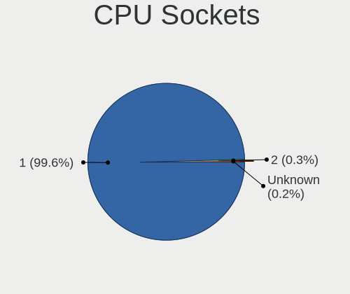

| Number | Computers | Percent |
|--------|-----------|---------|
| 1      | 866       | 99.77%  |
| 2      | 2         | 0.23%   |

CPU Threads
-----------

Threads per core (Hyper-Threading)

| Number  | Computers | Percent |
|---------|-----------|---------|
| 2       | 430       | 48.59%  |
| 1       | 420       | 47.46%  |
| Unknown | 35        | 3.95%   |

CPU Op-Modes
------------

CPU Operation Modes (32-bit, 64-bit)

| Op mode        | Computers | Percent |
|----------------|-----------|---------|
| 32-bit, 64-bit | 832       | 95.63%  |
| Unknown        | 21        | 2.41%   |
| 32-bit         | 17        | 1.95%   |

CPU Microcode
-------------

Microcode number

| Number     | Computers | Percent |
|------------|-----------|---------|
| Unknown    | 115       | 12.94%  |
| 0x206a7    | 68        | 7.65%   |
| 0x306a9    | 60        | 6.75%   |
| 0x1067a    | 42        | 4.72%   |
| 0x306c3    | 37        | 4.16%   |
| 0x010000c8 | 36        | 4.05%   |
| 0x806ea    | 23        | 2.59%   |
| 0x906ea    | 20        | 2.25%   |
| 0x806c1    | 20        | 2.25%   |
| 0x30678    | 20        | 2.25%   |
| 0x06001119 | 18        | 2.02%   |
| 0x806ec    | 17        | 1.91%   |
| 0x6fd      | 16        | 1.8%    |
| 0x106ca    | 15        | 1.69%   |
| 0x406e3    | 14        | 1.57%   |
| 0x40651    | 14        | 1.57%   |
| 0x05000119 | 14        | 1.57%   |
| 0x010000c7 | 13        | 1.46%   |
| 0x506c9    | 12        | 1.35%   |
| 0x306d4    | 12        | 1.35%   |
| 0x906e9    | 11        | 1.24%   |
| 0x506e3    | 11        | 1.24%   |
| 0x806e9    | 10        | 1.12%   |
| 0x10676    | 9         | 1.01%   |
| 0x10661    | 9         | 1.01%   |
| 0x08108102 | 9         | 1.01%   |
| 0x06000852 | 9         | 1.01%   |
| 0x706a1    | 8         | 0.9%    |
| 0x20652    | 8         | 0.9%    |
| 0x03000027 | 8         | 0.9%    |
| 0x6fb      | 7         | 0.79%   |
| 0x406c3    | 7         | 0.79%   |
| 0x106c2    | 7         | 0.79%   |
| 0x08101016 | 7         | 0.79%   |
| 0x706e5    | 6         | 0.67%   |
| 0x406c4    | 6         | 0.67%   |
| 0x20655    | 6         | 0.67%   |
| 0x106e5    | 6         | 0.67%   |
| 0x0a50000c | 6         | 0.67%   |
| 0x0800820d | 6         | 0.67%   |

CPU Microarch
-------------

Microarchitecture

| Name             | Computers | Percent |
|------------------|-----------|---------|
| KabyLake         | 109       | 12.49%  |
| SandyBridge      | 73        | 8.36%   |
| IvyBridge        | 67        | 7.67%   |
| K10              | 62        | 7.1%    |
| Haswell          | 59        | 6.76%   |
| Penryn           | 55        | 6.3%    |
| Core             | 43        | 4.93%   |
| Silvermont       | 37        | 4.24%   |
| Piledriver       | 35        | 4.01%   |
| Skylake          | 31        | 3.55%   |
| K8 Hammer        | 30        | 3.44%   |
| Bonnell          | 27        | 3.09%   |
| Zen+             | 22        | 2.52%   |
| TigerLake        | 21        | 2.41%   |
| Zen 2            | 20        | 2.29%   |
| Zen              | 20        | 2.29%   |
| Bobcat           | 16        | 1.83%   |
| Westmere         | 15        | 1.72%   |
| Goldmont         | 14        | 1.6%    |
| Broadwell        | 13        | 1.49%   |
| Icelake          | 12        | 1.37%   |
| Goldmont plus    | 12        | 1.37%   |
| Zen 3            | 11        | 1.26%   |
| Unknown          | 11        | 1.26%   |
| K10 Llano        | 8         | 0.92%   |
| Excavator        | 8         | 0.92%   |
| NetBurst         | 6         | 0.69%   |
| Nehalem          | 6         | 0.69%   |
| Jaguar           | 6         | 0.69%   |
| Puma             | 5         | 0.57%   |
| P6               | 5         | 0.57%   |
| Bulldozer        | 4         | 0.46%   |
| Steamroller      | 3         | 0.34%   |
| CometLake        | 3         | 0.34%   |
| Alderlake Hybrid | 2         | 0.23%   |
| Tremont          | 1         | 0.11%   |
| K8 & K10 hybrid  | 1         | 0.11%   |

Graphics
--------

GPU Vendor
----------

Vendors of graphics cards

| Vendor                           | Computers | Percent |
|----------------------------------|-----------|---------|
| Intel                            | 472       | 44.07%  |
| Nvidia                           | 357       | 33.33%  |
| AMD                              | 235       | 21.94%  |
| Silicon Integrated Systems [SiS] | 3         | 0.28%   |
| ASPEED Technology                | 2         | 0.19%   |
| Matrox Electronics Systems       | 1         | 0.09%   |
| ATI Technologies                 | 1         | 0.09%   |

GPU Model
---------

Graphics card models

| Model                                                                                    | Computers | Percent |
|------------------------------------------------------------------------------------------|-----------|---------|
| Intel 2nd Generation Core Processor Family Integrated Graphics Controller                | 55        | 4.86%   |
| Intel 3rd Gen Core processor Graphics Controller                                         | 45        | 3.98%   |
| Intel UHD Graphics 620                                                                   | 25        | 2.21%   |
| Intel Mobile 4 Series Chipset Integrated Graphics Controller                             | 25        | 2.21%   |
| Intel Atom Processor Z36xxx/Z37xxx Series Graphics & Display                             | 23        | 2.03%   |
| Intel TigerLake-LP GT2 [Iris Xe Graphics]                                                | 19        | 1.68%   |
| Intel Skylake GT2 [HD Graphics 520]                                                      | 18        | 1.59%   |
| Intel Haswell-ULT Integrated Graphics Controller                                         | 18        | 1.59%   |
| Intel CoffeeLake-H GT2 [UHD Graphics 630]                                                | 15        | 1.33%   |
| AMD Renoir                                                                               | 15        | 1.33%   |
| AMD Raven Ridge [Radeon Vega Series / Radeon Vega Mobile Series]                         | 15        | 1.33%   |
| Intel Mobile GM965/GL960 Integrated Graphics Controller (secondary)                      | 14        | 1.24%   |
| Intel Mobile GM965/GL960 Integrated Graphics Controller (primary)                        | 14        | 1.24%   |
| Intel Atom/Celeron/Pentium Processor x5-E8000/J3xxx/N3xxx Integrated Graphics Controller | 14        | 1.24%   |
| Intel Atom Processor D4xx/D5xx/N4xx/N5xx Integrated Graphics Controller                  | 13        | 1.15%   |
| Intel 4th Gen Core Processor Integrated Graphics Controller                              | 13        | 1.15%   |
| AMD Picasso/Raven 2 [Radeon Vega Series / Radeon Vega Mobile Series]                     | 13        | 1.15%   |
| Nvidia GF117M [GeForce 610M/710M/810M/820M / GT 620M/625M/630M/720M]                     | 12        | 1.06%   |
| Intel WhiskeyLake-U GT2 [UHD Graphics 620]                                               | 12        | 1.06%   |
| Intel CometLake-U GT2 [UHD Graphics]                                                     | 12        | 1.06%   |
| Intel HD Graphics 5500                                                                   | 11        | 0.97%   |
| Nvidia GP108M [GeForce MX150]                                                            | 10        | 0.88%   |
| Intel Xeon E3-1200 v3/4th Gen Core Processor Integrated Graphics Controller              | 10        | 0.88%   |
| Intel HD Graphics 620                                                                    | 10        | 0.88%   |
| AMD Sun XT [Radeon HD 8670A/8670M/8690M / R5 M330 / M430 / Radeon 520 Mobile]            | 10        | 0.88%   |
| Intel HD Graphics 630                                                                    | 9         | 0.8%    |
| Intel HD Graphics 500                                                                    | 9         | 0.8%    |
| Intel CoffeeLake-S GT2 [UHD Graphics 630]                                                | 9         | 0.8%    |
| AMD Seymour [Radeon HD 6400M/7400M Series]                                               | 9         | 0.8%    |
| Nvidia GM107 [GeForce GTX 750 Ti]                                                        | 8         | 0.71%   |
| Nvidia G92 [GeForce 9800 GT]                                                             | 8         | 0.71%   |
| AMD Wrestler [Radeon HD 6320]                                                            | 8         | 0.71%   |
| AMD Mars [Radeon HD 8670A/8670M/8750M / R7 M370]                                         | 8         | 0.71%   |
| Nvidia GT218 [GeForce 210]                                                               | 7         | 0.62%   |
| Nvidia GP107M [GeForce GTX 1050 Ti Mobile]                                               | 7         | 0.62%   |
| Nvidia GP107M [GeForce GTX 1050 Mobile]                                                  | 7         | 0.62%   |
| Nvidia GM108M [GeForce MX110]                                                            | 7         | 0.62%   |
| Nvidia GM108M [GeForce 920MX]                                                            | 7         | 0.62%   |
| Nvidia GM108M [GeForce 840M]                                                             | 7         | 0.62%   |
| Nvidia G96C [GeForce 9500 GT]                                                            | 7         | 0.62%   |

GPU Combo
---------

Combinations of graphics cards

| Name            | Computers | Percent |
|-----------------|-----------|---------|
| 1 x Intel       | 282       | 32.38%  |
| 1 x Nvidia      | 201       | 23.08%  |
| 1 x AMD         | 157       | 18.03%  |
| Intel + Nvidia  | 143       | 16.42%  |
| Intel + AMD     | 41        | 4.71%   |
| 2 x AMD         | 28        | 3.21%   |
| AMD + Nvidia    | 10        | 1.15%   |
| 1 x SiS         | 3         | 0.34%   |
| Other           | 2         | 0.23%   |
| 2 x Nvidia      | 1         | 0.11%   |
| Nvidia + ASPEED | 1         | 0.11%   |
| 1 x Matrox      | 1         | 0.11%   |
| 1 x ASPEED      | 1         | 0.11%   |

GPU Driver
----------

Free vs proprietary

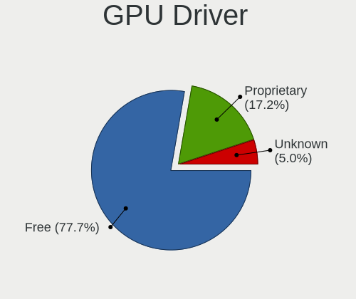

| Driver      | Computers | Percent |
|-------------|-----------|---------|
| Free        | 704       | 78.66%  |
| Proprietary | 150       | 16.76%  |
| Unknown     | 41        | 4.58%   |

GPU Memory
----------

Total video memory

| Size in GB | Computers | Percent |
|------------|-----------|---------|
| Unknown    | 297       | 32.93%  |
| 1.01-2.0   | 226       | 25.06%  |
| 0.01-0.5   | 199       | 22.06%  |
| 0.51-1.0   | 93        | 10.31%  |
| 3.01-4.0   | 55        | 6.1%    |
| 7.01-8.0   | 13        | 1.44%   |
| 5.01-6.0   | 12        | 1.33%   |
| 8.01-16.0  | 4         | 0.44%   |
| 2.01-3.0   | 2         | 0.22%   |
| 4.01-5.0   | 1         | 0.11%   |

Monitor
-------

Monitor Vendor
--------------

Monitor vendors

| Vendor                  | Computers | Percent |
|-------------------------|-----------|---------|
| Samsung Electronics     | 149       | 16.52%  |
| AU Optronics            | 122       | 13.53%  |
| Goldstar                | 87        | 9.65%   |
| LG Display              | 78        | 8.65%   |
| BOE                     | 76        | 8.43%   |
| Chimei Innolux          | 73        | 8.09%   |
| Chi Mei Optoelectronics | 46        | 5.1%    |
| Philips                 | 36        | 3.99%   |
| Dell                    | 36        | 3.99%   |
| BenQ                    | 28        | 3.1%    |
| AOC                     | 20        | 2.22%   |
| ViewSonic               | 13        | 1.44%   |
| PANDA                   | 13        | 1.44%   |
| Lenovo                  | 12        | 1.33%   |
| Hewlett-Packard         | 10        | 1.11%   |
| HannStar                | 9         | 1%      |
| CPT                     | 9         | 1%      |
| Acer                    | 9         | 1%      |
| NEC Computers           | 7         | 0.78%   |
| LG Philips              | 7         | 0.78%   |
| Ancor Communications    | 7         | 0.78%   |
| Sharp                   | 6         | 0.67%   |
| Iiyama                  | 6         | 0.67%   |
| Unknown                 | 5         | 0.55%   |
| Sony                    | 5         | 0.55%   |
| LG Electronics          | 4         | 0.44%   |
| Apple                   | 4         | 0.44%   |
| XYK                     | 3         | 0.33%   |
| ASUSTek Computer        | 3         | 0.33%   |
| Plain Tree Systems      | 2         | 0.22%   |
| LGD                     | 2         | 0.22%   |
| Toshiba                 | 1         | 0.11%   |
| SKK                     | 1         | 0.11%   |
| Seiko/Epson             | 1         | 0.11%   |
| Quanta Display          | 1         | 0.11%   |
| PCL                     | 1         | 0.11%   |
| Packard Bell            | 1         | 0.11%   |
| MStar                   | 1         | 0.11%   |
| MiTAC                   | 1         | 0.11%   |
| Lenovo Group Limited    | 1         | 0.11%   |

Monitor Model
-------------

Monitor models

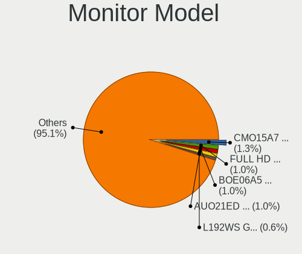

| Model                                                                    | Computers | Percent |
|--------------------------------------------------------------------------|-----------|---------|
| Chi Mei Optoelectronics LCD Monitor CMO15A7 1366x768 344x193mm 15.5-inch | 13        | 1.42%   |
| BOE LCD Monitor BOE06A5 1366x768 344x194mm 15.5-inch                     | 10        | 1.09%   |
| AU Optronics LCD Monitor AUO21ED 1920x1080 344x193mm 15.5-inch           | 9         | 0.98%   |
| Chi Mei Optoelectronics LCD Monitor CMO1592 1366x768 344x193mm 15.5-inch | 7         | 0.76%   |
| AU Optronics LCD Monitor AUO22EC 1366x768 344x193mm 15.5-inch            | 7         | 0.76%   |
| Samsung Electronics LCD Monitor SEC3245 1366x768 344x194mm 15.5-inch     | 6         | 0.66%   |
| LG Display LCD Monitor LGD02DC 1366x768 344x194mm 15.5-inch              | 6         | 0.66%   |
| HannStar HSD101PFW2 HSD03E9 1024x600 222x125mm 10.0-inch                 | 6         | 0.66%   |
| Chimei Innolux LCD Monitor CMN15F5 1920x1080 344x193mm 15.5-inch         | 6         | 0.66%   |
| Chimei Innolux LCD Monitor CMN15DB 1366x768 344x193mm 15.5-inch          | 6         | 0.66%   |
| BOE LCD Monitor BOE069C 1920x1080 344x193mm 15.5-inch                    | 6         | 0.66%   |
| AU Optronics LCD Monitor AUO61ED 1920x1080 344x194mm 15.5-inch           | 6         | 0.66%   |
| AU Optronics LCD Monitor AUO46EC 1366x768 344x193mm 15.5-inch            | 6         | 0.66%   |
| AU Optronics LCD Monitor AUO21EC 1366x768 344x193mm 15.5-inch            | 6         | 0.66%   |
| Samsung Electronics LCD Monitor SEC3945 1280x800 331x207mm 15.4-inch     | 5         | 0.55%   |
| Samsung Electronics LCD Monitor SDC4852 1366x768 340x190mm 15.3-inch     | 5         | 0.55%   |
| Goldstar L192WS GSM4B32 1440x900 410x256mm 19.0-inch                     | 5         | 0.55%   |
| Goldstar FULL HD GSM5B55 1920x1080 480x270mm 21.7-inch                   | 5         | 0.55%   |
| Chimei Innolux LCD Monitor CMN15D5 1920x1080 344x193mm 15.5-inch         | 5         | 0.55%   |
| Chi Mei Optoelectronics LCD Monitor CMO15A3 1366x768 344x193mm 15.5-inch | 5         | 0.55%   |
| AU Optronics LCD Monitor AUO8174 1280x800 331x207mm 15.4-inch            | 5         | 0.55%   |
| AU Optronics LCD Monitor AUO47EC 1366x768 344x193mm 15.5-inch            | 5         | 0.55%   |
| AU Optronics LCD Monitor AUO26EC 1366x768 344x193mm 15.5-inch            | 5         | 0.55%   |
| LG Display LCD Monitor LGD033A 1366x768 344x194mm 15.5-inch              | 4         | 0.44%   |
| Goldstar MP59G GSM5B34 1920x1080 480x270mm 21.7-inch                     | 4         | 0.44%   |
| Goldstar L1919S GSM4AF2 1280x1024 376x301mm 19.0-inch                    | 4         | 0.44%   |
| Dell U2412M DELA07A 1920x1200 518x324mm 24.1-inch                        | 4         | 0.44%   |
| Chimei Innolux LCD Monitor CMN1728 1600x900 382x215mm 17.3-inch          | 4         | 0.44%   |
| Chimei Innolux LCD Monitor CMN15BC 1366x768 344x193mm 15.5-inch          | 4         | 0.44%   |
| Chimei Innolux LCD Monitor CMN14D4 1920x1080 309x173mm 13.9-inch         | 4         | 0.44%   |
| BOE LCD Monitor BOE0747 1920x1080 344x194mm 15.5-inch                    | 4         | 0.44%   |
| AU Optronics LCD Monitor AUO71EC 1366x768 344x193mm 15.5-inch            | 4         | 0.44%   |
| AU Optronics LCD Monitor AUO38ED 1920x1080 344x193mm 15.5-inch           | 4         | 0.44%   |
| XYK Monitor XYK2360 1920x1080 477x268mm 21.5-inch                        | 3         | 0.33%   |
| Unknown LCD Monitor FFFF 2288x1287 2550x2550mm 142.0-inch                | 3         | 0.33%   |
| Sharp LCD Monitor SHP1447 1920x1080 294x165mm 13.3-inch                  | 3         | 0.33%   |
| Samsung Electronics SyncMaster SAM01B7 1280x1024 338x270mm 17.0-inch     | 3         | 0.33%   |
| Samsung Electronics LCD Monitor SEC4251 1366x768 344x194mm 15.5-inch     | 3         | 0.33%   |
| Samsung Electronics LCD Monitor SEC3651 1366x768 344x194mm 15.5-inch     | 3         | 0.33%   |
| Samsung Electronics LCD Monitor SEC324A 1366x768 344x194mm 15.5-inch     | 3         | 0.33%   |

Monitor Resolution
------------------

Monitor screen resolution

| Resolution         | Computers | Percent |
|--------------------|-----------|---------|
| 1920x1080 (FHD)    | 341       | 38.66%  |
| 1366x768 (WXGA)    | 239       | 27.1%   |
| 1280x1024 (SXGA)   | 58        | 6.58%   |
| 1600x900 (HD+)     | 44        | 4.99%   |
| 3840x2160 (4K)     | 30        | 3.4%    |
| 1440x900 (WXGA+)   | 27        | 3.06%   |
| 1280x800 (WXGA)    | 27        | 3.06%   |
| 1680x1050 (WSXGA+) | 24        | 2.72%   |
| 2560x1440 (QHD)    | 22        | 2.49%   |
| 1024x600           | 20        | 2.27%   |
| 2560x1080          | 9         | 1.02%   |
| 1920x1200 (WUXGA)  | 7         | 0.79%   |
| 1024x768 (XGA)     | 5         | 0.57%   |
| 1360x768           | 4         | 0.45%   |
| 2288x1287          | 3         | 0.34%   |
| 3840x2400          | 2         | 0.23%   |
| 3440x1440          | 2         | 0.23%   |
| 2560x1600          | 2         | 0.23%   |
| 1600x1200          | 2         | 0.23%   |
| 1152x864           | 2         | 0.23%   |
| Unknown            | 2         | 0.23%   |
| 4480x1200          | 1         | 0.11%   |
| 3840x1080          | 1         | 0.11%   |
| 3072x1920          | 1         | 0.11%   |
| 2880x1800          | 1         | 0.11%   |
| 2736x1824          | 1         | 0.11%   |
| 2160x1440          | 1         | 0.11%   |
| 2048x1536          | 1         | 0.11%   |
| 1920x540           | 1         | 0.11%   |
| 1680x945           | 1         | 0.11%   |
| 1400x1050          | 1         | 0.11%   |

Monitor Diagonal
----------------

Diagonal size in inches

| Inches  | Computers | Percent |
|---------|-----------|---------|
| 15      | 347       | 38.43%  |
| 17      | 74        | 8.19%   |
| 21      | 65        | 7.2%    |
| 23      | 58        | 6.42%   |
| 19      | 51        | 5.65%   |
| 13      | 44        | 4.87%   |
| 24      | 41        | 4.54%   |
| 14      | 40        | 4.43%   |
| 27      | 35        | 3.88%   |
| Unknown | 23        | 2.55%   |
| 18      | 20        | 2.21%   |
| 10      | 20        | 2.21%   |
| 22      | 15        | 1.66%   |
| 20      | 11        | 1.22%   |
| 34      | 10        | 1.11%   |
| 31      | 8         | 0.89%   |
| 16      | 7         | 0.78%   |
| 11      | 6         | 0.66%   |
| 72      | 4         | 0.44%   |
| 54      | 4         | 0.44%   |
| 12      | 4         | 0.44%   |
| 142     | 3         | 0.33%   |
| 40      | 3         | 0.33%   |
| 84      | 2         | 0.22%   |
| 52      | 2         | 0.22%   |
| 46      | 2         | 0.22%   |
| 55      | 1         | 0.11%   |
| 42      | 1         | 0.11%   |
| 9       | 1         | 0.11%   |
| 8       | 1         | 0.11%   |

Monitor Width
-------------

Physical width

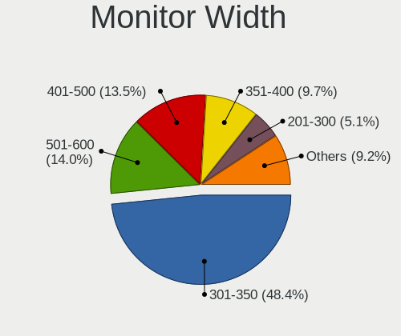

| Width in mm    | Computers | Percent |
|----------------|-----------|---------|
| 301-350        | 427       | 47.98%  |
| 401-500        | 126       | 14.16%  |
| 501-600        | 122       | 13.71%  |
| 351-400        | 92        | 10.34%  |
| 201-300        | 55        | 6.18%   |
| Unknown        | 23        | 2.58%   |
| 601-700        | 11        | 1.24%   |
| 701-800        | 10        | 1.12%   |
| 1001-1500      | 9         | 1.01%   |
| 1501-2000      | 6         | 0.67%   |
| More than 2000 | 3         | 0.34%   |
| 801-900        | 3         | 0.34%   |
| 101-200        | 2         | 0.22%   |
| 901-1000       | 1         | 0.11%   |

Aspect Ratio
------------

Proportional relationship between the width and the height

| Ratio   | Computers | Percent |
|---------|-----------|---------|
| 16/9    | 652       | 76.44%  |
| 16/10   | 93        | 10.9%   |
| 5/4     | 55        | 6.45%   |
| Unknown | 21        | 2.46%   |
| 4/3     | 13        | 1.52%   |
| 21/9    | 10        | 1.17%   |
| 3/2     | 5         | 0.59%   |
| 1.00    | 4         | 0.47%   |

Monitor Area
------------

Area in inch

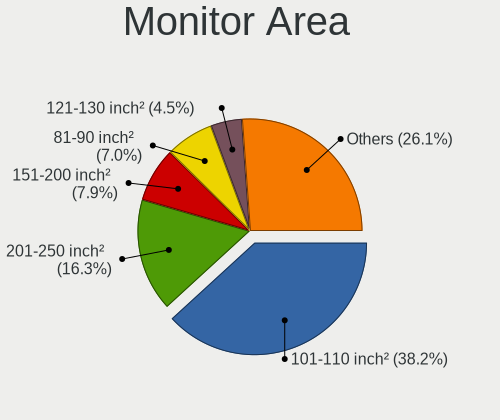

| Area in inch | Computers | Percent |
|----------------|-----------|---------|
| 101-110        | 350       | 38.98%  |
| 201-250        | 147       | 16.37%  |
| 151-200        | 78        | 8.69%   |
| 81-90          | 61        | 6.79%   |
| 141-150        | 40        | 4.45%   |
| 121-130        | 39        | 4.34%   |
| 301-350        | 35        | 3.9%    |
| Unknown        | 23        | 2.56%   |
| 71-80          | 21        | 2.34%   |
| 41-50          | 21        | 2.34%   |
| 351-500        | 18        | 2%      |
| More than 1000 | 16        | 1.78%   |
| 251-300        | 14        | 1.56%   |
| 131-140        | 12        | 1.34%   |
| 51-60          | 6         | 0.67%   |
| 501-1000       | 6         | 0.67%   |
| 111-120        | 5         | 0.56%   |
| 61-70          | 4         | 0.45%   |
| 1-40           | 1         | 0.11%   |
| 91-100         | 1         | 0.11%   |

Pixel Density
-------------

Pixels per inch

| Density       | Computers | Percent |
|---------------|-----------|---------|
| 51-100        | 310       | 35.23%  |
| 101-120       | 304       | 34.55%  |
| 121-160       | 188       | 21.36%  |
| Unknown       | 23        | 2.61%   |
| 161-240       | 22        | 2.5%    |
| 1-50          | 20        | 2.27%   |
| More than 240 | 13        | 1.48%   |

Multiple Monitors
-----------------

Total monitors connected

| Total | Computers | Percent |
|-------|-----------|---------|
| 1     | 765       | 87.33%  |
| 2     | 80        | 9.13%   |
| 0     | 28        | 3.2%    |
| 3     | 3         | 0.34%   |

Network
-------

Net Controller Vendor
---------------------

Controller vendors

| Vendor                                 | Computers | Percent |
|----------------------------------------|-----------|---------|
| Realtek Semiconductor                  | 525       | 40.51%  |
| Qualcomm Atheros                       | 243       | 18.75%  |
| Intel                                  | 223       | 17.21%  |
| Broadcom                               | 102       | 7.87%   |
| Nvidia                                 | 36        | 2.78%   |
| Marvell Technology Group               | 29        | 2.24%   |
| Ralink Technology                      | 19        | 1.47%   |
| Ralink                                 | 19        | 1.47%   |
| TP-Link                                | 16        | 1.23%   |
| Broadcom Limited                       | 16        | 1.23%   |
| Huawei Technologies                    | 7         | 0.54%   |
| VIA Technologies                       | 5         | 0.39%   |
| D-Link                                 | 5         | 0.39%   |
| MediaTek                               | 4         | 0.31%   |
| JMicron Technology                     | 4         | 0.31%   |
| D-Link System                          | 4         | 0.31%   |
| Xiaomi                                 | 3         | 0.23%   |
| Sundance Technology Inc / IC Plus      | 3         | 0.23%   |
| Sierra Wireless                        | 3         | 0.23%   |
| Attansic Technology                    | 3         | 0.23%   |
| Silicon Integrated Systems [SiS]       | 2         | 0.15%   |
| Qualcomm Atheros Communications        | 2         | 0.15%   |
| Qualcomm                               | 2         | 0.15%   |
| IMC Networks                           | 2         | 0.15%   |
| Hewlett-Packard                        | 2         | 0.15%   |
| Fibocom                                | 2         | 0.15%   |
| Aquantia                               | 2         | 0.15%   |
| ZTE WCDMA Technologies MSM             | 1         | 0.08%   |
| Texas Instruments                      | 1         | 0.08%   |
| STMicroelectronics                     | 1         | 0.08%   |
| Sony Ericsson Mobile Communications AB | 1         | 0.08%   |
| Samsung Electronics                    | 1         | 0.08%   |
| Motorola PCS                           | 1         | 0.08%   |
| Microsoft                              | 1         | 0.08%   |
| Lenovo                                 | 1         | 0.08%   |
| HTC (High Tech Computer)               | 1         | 0.08%   |
| HMD Global                             | 1         | 0.08%   |
| Davicom Semiconductor                  | 1         | 0.08%   |
| ASIX Electronics                       | 1         | 0.08%   |
| Apple                                  | 1         | 0.08%   |

Net Controller Model
--------------------

Controller models

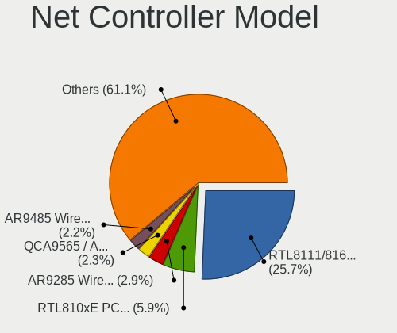

| Model                                                                   | Computers | Percent |
|-------------------------------------------------------------------------|-----------|---------|
| Realtek RTL8111/8168/8411 PCI Express Gigabit Ethernet Controller       | 375       | 25.32%  |
| Realtek RTL810xE PCI Express Fast Ethernet controller                   | 101       | 6.82%   |
| Qualcomm Atheros AR9285 Wireless Network Adapter (PCI-Express)          | 49        | 3.31%   |
| Qualcomm Atheros QCA9565 / AR9565 Wireless Network Adapter              | 39        | 2.63%   |
| Qualcomm Atheros AR9485 Wireless Network Adapter                        | 36        | 2.43%   |
| Intel Wireless 8265 / 8275                                              | 33        | 2.23%   |
| Broadcom BCM4313 802.11bgn Wireless Network Adapter                     | 30        | 2.03%   |
| Nvidia MCP61 Ethernet                                                   | 26        | 1.76%   |
| Realtek RTL8723BE PCIe Wireless Network Adapter                         | 25        | 1.69%   |
| Broadcom BCM43142 802.11b/g/n                                           | 21        | 1.42%   |
| Qualcomm Atheros QCA9377 802.11ac Wireless Network Adapter              | 18        | 1.22%   |
| Intel Wi-Fi 6 AX201                                                     | 17        | 1.15%   |
| Realtek RTL8821CE 802.11ac PCIe Wireless Network Adapter                | 16        | 1.08%   |
| Intel Wi-Fi 6 AX200                                                     | 15        | 1.01%   |
| Qualcomm Atheros AR8151 v2.0 Gigabit Ethernet                           | 14        | 0.95%   |
| Ralink MT7601U Wireless Adapter                                         | 13        | 0.88%   |
| Qualcomm Atheros AR242x / AR542x Wireless Network Adapter (PCI-Express) | 13        | 0.88%   |
| Realtek RTL8822CE 802.11ac PCIe Wireless Network Adapter                | 12        | 0.81%   |
| Ralink RT3290 Wireless 802.11n 1T/1R PCIe                               | 12        | 0.81%   |
| Qualcomm Atheros AR8131 Gigabit Ethernet                                | 12        | 0.81%   |
| Intel Cannon Lake PCH CNVi WiFi                                         | 12        | 0.81%   |
| Broadcom NetLink BCM57785 Gigabit Ethernet PCIe                         | 12        | 0.81%   |
| Qualcomm Atheros AR9287 Wireless Network Adapter (PCI-Express)          | 11        | 0.74%   |
| Intel Comet Lake PCH-LP CNVi WiFi                                       | 11        | 0.74%   |
| Realtek RTL8188EUS 802.11n Wireless Network Adapter                     | 9         | 0.61%   |
| Realtek RTL-8100/8101L/8139 PCI Fast Ethernet Adapter                   | 9         | 0.61%   |
| Qualcomm Atheros QCA8171 Gigabit Ethernet                               | 9         | 0.61%   |
| Qualcomm Atheros QCA6174 802.11ac Wireless Network Adapter              | 9         | 0.61%   |
| Intel I211 Gigabit Network Connection                                   | 9         | 0.61%   |
| Intel Ethernet Connection (2) I219-V                                    | 9         | 0.61%   |
| Realtek RTL8822BE 802.11a/b/g/n/ac WiFi adapter                         | 8         | 0.54%   |
| Realtek RTL8821AE 802.11ac PCIe Wireless Network Adapter                | 8         | 0.54%   |
| Qualcomm Atheros AR8132 Fast Ethernet                                   | 8         | 0.54%   |
| Intel Wireless 7260                                                     | 8         | 0.54%   |
| Intel Cannon Point-LP CNVi [Wireless-AC]                                | 8         | 0.54%   |
| Qualcomm Atheros AR9462 Wireless Network Adapter                        | 7         | 0.47%   |
| Qualcomm Atheros AR928X Wireless Network Adapter (PCI-Express)          | 7         | 0.47%   |
| Intel Wireless 7265                                                     | 7         | 0.47%   |
| Intel PRO/Wireless 4965 AG or AGN [Kedron] Network Connection           | 7         | 0.47%   |
| Qualcomm Atheros AR8162 Fast Ethernet                                   | 6         | 0.41%   |

Wireless Vendor
---------------

Wireless vendors

| Vendor                          | Computers | Percent |
|---------------------------------|-----------|---------|
| Qualcomm Atheros                | 193       | 29.2%   |
| Intel                           | 189       | 28.59%  |
| Realtek Semiconductor           | 121       | 18.31%  |
| Broadcom                        | 73        | 11.04%  |
| Ralink Technology               | 19        | 2.87%   |
| Ralink                          | 19        | 2.87%   |
| TP-Link                         | 14        | 2.12%   |
| Broadcom Limited                | 10        | 1.51%   |
| D-Link                          | 5         | 0.76%   |
| MediaTek                        | 4         | 0.61%   |
| Sierra Wireless                 | 3         | 0.45%   |
| Qualcomm Atheros Communications | 2         | 0.3%    |
| IMC Networks                    | 2         | 0.3%    |
| Texas Instruments               | 1         | 0.15%   |
| Qualcomm                        | 1         | 0.15%   |
| Microsoft                       | 1         | 0.15%   |
| Marvell Technology Group        | 1         | 0.15%   |
| Hewlett-Packard                 | 1         | 0.15%   |
| Fibocom                         | 1         | 0.15%   |
| D-Link System                   | 1         | 0.15%   |

Wireless Model
--------------

Wireless models

| Model                                                                   | Computers | Percent |
|-------------------------------------------------------------------------|-----------|---------|
| Qualcomm Atheros AR9285 Wireless Network Adapter (PCI-Express)          | 49        | 7.39%   |
| Qualcomm Atheros QCA9565 / AR9565 Wireless Network Adapter              | 39        | 5.88%   |
| Qualcomm Atheros AR9485 Wireless Network Adapter                        | 36        | 5.43%   |
| Intel Wireless 8265 / 8275                                              | 33        | 4.98%   |
| Broadcom BCM4313 802.11bgn Wireless Network Adapter                     | 30        | 4.52%   |
| Realtek RTL8723BE PCIe Wireless Network Adapter                         | 25        | 3.77%   |
| Broadcom BCM43142 802.11b/g/n                                           | 21        | 3.17%   |
| Qualcomm Atheros QCA9377 802.11ac Wireless Network Adapter              | 18        | 2.71%   |
| Intel Wi-Fi 6 AX201                                                     | 17        | 2.56%   |
| Realtek RTL8821CE 802.11ac PCIe Wireless Network Adapter                | 16        | 2.41%   |
| Intel Wi-Fi 6 AX200                                                     | 15        | 2.26%   |
| Ralink MT7601U Wireless Adapter                                         | 13        | 1.96%   |
| Qualcomm Atheros AR242x / AR542x Wireless Network Adapter (PCI-Express) | 13        | 1.96%   |
| Realtek RTL8822CE 802.11ac PCIe Wireless Network Adapter                | 12        | 1.81%   |
| Ralink RT3290 Wireless 802.11n 1T/1R PCIe                               | 12        | 1.81%   |
| Intel Cannon Lake PCH CNVi WiFi                                         | 12        | 1.81%   |
| Qualcomm Atheros AR9287 Wireless Network Adapter (PCI-Express)          | 11        | 1.66%   |
| Intel Comet Lake PCH-LP CNVi WiFi                                       | 11        | 1.66%   |
| Realtek RTL8188EUS 802.11n Wireless Network Adapter                     | 9         | 1.36%   |
| Qualcomm Atheros QCA6174 802.11ac Wireless Network Adapter              | 9         | 1.36%   |
| Realtek RTL8822BE 802.11a/b/g/n/ac WiFi adapter                         | 8         | 1.21%   |
| Realtek RTL8821AE 802.11ac PCIe Wireless Network Adapter                | 8         | 1.21%   |
| Intel Wireless 7260                                                     | 8         | 1.21%   |
| Intel Cannon Point-LP CNVi [Wireless-AC]                                | 8         | 1.21%   |
| Qualcomm Atheros AR9462 Wireless Network Adapter                        | 7         | 1.06%   |
| Qualcomm Atheros AR928X Wireless Network Adapter (PCI-Express)          | 7         | 1.06%   |
| Intel Wireless 7265                                                     | 7         | 1.06%   |
| Intel PRO/Wireless 4965 AG or AGN [Kedron] Network Connection           | 7         | 1.06%   |
| Intel Wireless 8260                                                     | 6         | 0.9%    |
| Intel WiFi Link 5100                                                    | 6         | 0.9%    |
| Realtek RTL8723DE Wireless Network Adapter                              | 5         | 0.75%   |
| Realtek RTL8188EE Wireless Network Adapter                              | 5         | 0.75%   |
| Realtek RTL8188CE 802.11b/g/n WiFi Adapter                              | 5         | 0.75%   |
| Intel Wireless 3165                                                     | 5         | 0.75%   |
| TP-Link 802.11n NIC                                                     | 4         | 0.6%    |
| Ralink RT5370 Wireless Adapter                                          | 4         | 0.6%    |
| Intel Centrino Wireless-N 130                                           | 4         | 0.6%    |
| Broadcom BCM4312 802.11b/g LP-PHY                                       | 4         | 0.6%    |
| Broadcom BCM4311 802.11b/g WLAN                                         | 4         | 0.6%    |
| Realtek RTL8852AE 802.11ax PCIe Wireless Network Adapter                | 3         | 0.45%   |

Ethernet Vendor
---------------

Ethernet vendors

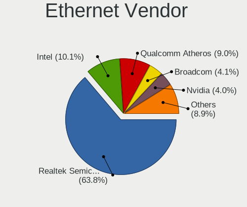

| Vendor                                 | Computers | Percent |
|----------------------------------------|-----------|---------|
| Realtek Semiconductor                  | 498       | 62.09%  |
| Qualcomm Atheros                       | 82        | 10.22%  |
| Intel                                  | 71        | 8.85%   |
| Broadcom                               | 39        | 4.86%   |
| Nvidia                                 | 36        | 4.49%   |
| Marvell Technology Group               | 28        | 3.49%   |
| Broadcom Limited                       | 6         | 0.75%   |
| VIA Technologies                       | 5         | 0.62%   |
| JMicron Technology                     | 4         | 0.5%    |
| Huawei Technologies                    | 4         | 0.5%    |
| Xiaomi                                 | 3         | 0.37%   |
| Sundance Technology Inc / IC Plus      | 3         | 0.37%   |
| D-Link System                          | 3         | 0.37%   |
| Attansic Technology                    | 3         | 0.37%   |
| TP-Link                                | 2         | 0.25%   |
| Silicon Integrated Systems [SiS]       | 2         | 0.25%   |
| Aquantia                               | 2         | 0.25%   |
| ZTE WCDMA Technologies MSM             | 1         | 0.12%   |
| Sony Ericsson Mobile Communications AB | 1         | 0.12%   |
| Samsung Electronics                    | 1         | 0.12%   |
| Qualcomm                               | 1         | 0.12%   |
| Motorola PCS                           | 1         | 0.12%   |
| Lenovo                                 | 1         | 0.12%   |
| HTC (High Tech Computer)               | 1         | 0.12%   |
| HMD Global                             | 1         | 0.12%   |
| Davicom Semiconductor                  | 1         | 0.12%   |
| ASIX Electronics                       | 1         | 0.12%   |
| Apple                                  | 1         | 0.12%   |

Ethernet Model
--------------

Ethernet models

| Model                                                                          | Computers | Percent |
|--------------------------------------------------------------------------------|-----------|---------|
| Realtek RTL8111/8168/8411 PCI Express Gigabit Ethernet Controller              | 375       | 46.24%  |
| Realtek RTL810xE PCI Express Fast Ethernet controller                          | 101       | 12.45%  |
| Nvidia MCP61 Ethernet                                                          | 26        | 3.21%   |
| Qualcomm Atheros AR8151 v2.0 Gigabit Ethernet                                  | 14        | 1.73%   |
| Qualcomm Atheros AR8131 Gigabit Ethernet                                       | 12        | 1.48%   |
| Broadcom NetLink BCM57785 Gigabit Ethernet PCIe                                | 12        | 1.48%   |
| Realtek RTL-8100/8101L/8139 PCI Fast Ethernet Adapter                          | 9         | 1.11%   |
| Qualcomm Atheros QCA8171 Gigabit Ethernet                                      | 9         | 1.11%   |
| Intel I211 Gigabit Network Connection                                          | 9         | 1.11%   |
| Intel Ethernet Connection (2) I219-V                                           | 9         | 1.11%   |
| Qualcomm Atheros AR8132 Fast Ethernet                                          | 8         | 0.99%   |
| Qualcomm Atheros AR8162 Fast Ethernet                                          | 6         | 0.74%   |
| Qualcomm Atheros AR8161 Gigabit Ethernet                                       | 6         | 0.74%   |
| Qualcomm Atheros AR8121/AR8113/AR8114 Gigabit or Fast Ethernet                 | 6         | 0.74%   |
| Marvell Group 88E8055 PCI-E Gigabit Ethernet Controller                        | 6         | 0.74%   |
| Broadcom NetXtreme BCM57786 Gigabit Ethernet PCIe                              | 6         | 0.74%   |
| Broadcom NetLink BCM5787M Gigabit Ethernet PCI Express                         | 6         | 0.74%   |
| Realtek RTL8153 Gigabit Ethernet Adapter                                       | 5         | 0.62%   |
| Intel 82579LM Gigabit Network Connection (Lewisville)                          | 5         | 0.62%   |
| VIA VT6105/VT6106S [Rhine-III]                                                 | 4         | 0.49%   |
| Realtek RTL8125 2.5GbE Controller                                              | 4         | 0.49%   |
| Qualcomm Atheros QCA8172 Fast Ethernet                                         | 4         | 0.49%   |
| Qualcomm Atheros Attansic L1 Gigabit Ethernet                                  | 4         | 0.49%   |
| Nvidia MCP65 Ethernet                                                          | 4         | 0.49%   |
| Marvell Group 88E8040 PCI-E Fast Ethernet Controller                           | 4         | 0.49%   |
| Intel 82579V Gigabit Network Connection                                        | 4         | 0.49%   |
| Intel 82566MM Gigabit Network Connection                                       | 4         | 0.49%   |
| Broadcom Limited NetLink BCM57780 Gigabit Ethernet PCIe                        | 4         | 0.49%   |
| Xiaomi Mi/Redmi series (RNDIS)                                                 | 3         | 0.37%   |
| Sundance Inc / IC Plus IC Plus IP100A Integrated 10/100 Ethernet MAC + PHY     | 3         | 0.37%   |
| Realtek RTL-8110SC/8169SC Gigabit Ethernet                                     | 3         | 0.37%   |
| Qualcomm Atheros AR8152 v2.0 Fast Ethernet                                     | 3         | 0.37%   |
| Nvidia MCP55 Ethernet                                                          | 3         | 0.37%   |
| Marvell Group Yukon Optima 88E8059 [PCIe Gigabit Ethernet Controller with AVB] | 3         | 0.37%   |
| Marvell Group 88E8056 PCI-E Gigabit Ethernet Controller                        | 3         | 0.37%   |
| Marvell Group 88E8039 PCI-E Fast Ethernet Controller                           | 3         | 0.37%   |
| JMicron JMC250 PCI Express Gigabit Ethernet Controller                         | 3         | 0.37%   |
| Intel Ethernet Connection (7) I219-V                                           | 3         | 0.37%   |
| Intel Ethernet Connection (6) I219-V                                           | 3         | 0.37%   |
| Intel Ethernet Connection (4) I219-V                                           | 3         | 0.37%   |

Net Controller Kind
-------------------

Ethernet, WiFi or modem

| Kind     | Computers | Percent |
|----------|-----------|---------|
| Ethernet | 772       | 54.64%  |
| WiFi     | 634       | 44.87%  |
| Modem    | 5         | 0.35%   |
| Unknown  | 2         | 0.14%   |

Used Controller
---------------

Currently used network controller

| Kind     | Computers | Percent |
|----------|-----------|---------|
| WiFi     | 536       | 58.84%  |
| Ethernet | 375       | 41.16%  |

NICs
----

Total network controllers on board

| Total | Computers | Percent |
|-------|-----------|---------|
| 2     | 510       | 58.62%  |
| 1     | 339       | 38.97%  |
| 0     | 13        | 1.49%   |
| 3     | 7         | 0.8%    |
| 4     | 1         | 0.11%   |

IPv6
----

IPv6 vs IPv4

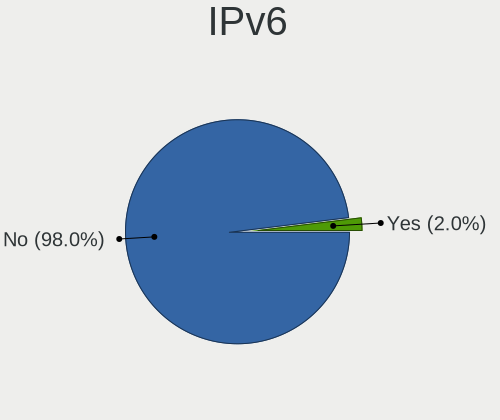

| Used | Computers | Percent |
|------|-----------|---------|
| No   | 860       | 98.51%  |
| Yes  | 13        | 1.49%   |

Bluetooth
---------

Bluetooth Vendor
----------------

Controller vendors

| Vendor                          | Computers | Percent |
|---------------------------------|-----------|---------|
| Intel                           | 152       | 32.2%   |
| Realtek Semiconductor           | 65        | 13.77%  |
| Qualcomm Atheros Communications | 55        | 11.65%  |
| IMC Networks                    | 33        | 6.99%   |
| Broadcom                        | 32        | 6.78%   |
| Lite-On Technology              | 25        | 5.3%    |
| Cambridge Silicon Radio         | 23        | 4.87%   |
| Foxconn / Hon Hai               | 20        | 4.24%   |
| ASUSTek Computer                | 14        | 2.97%   |
| Ralink                          | 12        | 2.54%   |
| Foxconn International           | 10        | 2.12%   |
| Toshiba                         | 6         | 1.27%   |
| Hewlett-Packard                 | 6         | 1.27%   |
| Taiyo Yuden                     | 2         | 0.42%   |
| Ralink Technology               | 2         | 0.42%   |
| Qcom                            | 2         | 0.42%   |
| Integrated System Solution      | 2         | 0.42%   |
| Dell                            | 2         | 0.42%   |
| Apple                           | 2         | 0.42%   |
| USI                             | 1         | 0.21%   |
| TP-Link                         | 1         | 0.21%   |
| Realtek                         | 1         | 0.21%   |
| Micro Star International        | 1         | 0.21%   |
| MediaTek                        | 1         | 0.21%   |
| Marvell Semiconductor           | 1         | 0.21%   |
| Alps Electric                   | 1         | 0.21%   |

Bluetooth Model
---------------

Controller models

| Model                                               | Computers | Percent |
|-----------------------------------------------------|-----------|---------|
| Intel Bluetooth wireless interface                  | 63        | 13.35%  |
| Realtek Bluetooth Radio                             | 46        | 9.75%   |
| Intel Bluetooth 9460/9560 Jefferson Peak (JfP)      | 33        | 6.99%   |
| Intel AX201 Bluetooth                               | 26        | 5.51%   |
| Cambridge Silicon Radio Bluetooth Dongle (HCI mode) | 23        | 4.87%   |
| Qualcomm Atheros AR3012 Bluetooth 4.0               | 18        | 3.81%   |
| Intel AX200 Bluetooth                               | 15        | 3.18%   |
| Qualcomm Atheros  Bluetooth Device                  | 14        | 2.97%   |
| Qualcomm Atheros AR3011 Bluetooth                   | 14        | 2.97%   |
| Ralink RT3290 Bluetooth                             | 12        | 2.54%   |
| IMC Networks Bluetooth Radio                        | 11        | 2.33%   |
| Realtek  Bluetooth 4.2 Adapter                      | 10        | 2.12%   |
| Foxconn International BCM43142A0 Bluetooth module   | 10        | 2.12%   |
| Lite-On Bluetooth Device                            | 9         | 1.91%   |
| Foxconn / Hon Hai Bluetooth Device                  | 9         | 1.91%   |
| IMC Networks Bluetooth Device                       | 8         | 1.69%   |
| Lite-On Atheros AR3012 Bluetooth                    | 7         | 1.48%   |
| Broadcom BCM2070 Bluetooth 2.1 + EDR                | 7         | 1.48%   |
| Qualcomm Atheros Bluetooth                          | 6         | 1.27%   |
| Lite-On Qualcomm Atheros QCA9377 Bluetooth          | 6         | 1.27%   |
| Broadcom BCM2070 Bluetooth Device                   | 6         | 1.27%   |
| Realtek RTL8723B Bluetooth                          | 5         | 1.06%   |
| Intel Centrino Bluetooth Wireless Transceiver       | 5         | 1.06%   |
| Intel Centrino Advanced-N 6230 Bluetooth adapter    | 5         | 1.06%   |
| IMC Networks Atheros AR3012 Bluetooth 4.0 Adapter   | 5         | 1.06%   |
| Realtek RTL8821A Bluetooth                          | 4         | 0.85%   |
| Broadcom BCM2045 Bluetooth                          | 4         | 0.85%   |
| Intel Wireless-AC 3168 Bluetooth                    | 3         | 0.64%   |
| IMC Networks Wireless_Device                        | 3         | 0.64%   |
| IMC Networks Bluetooth USB Host Controller          | 3         | 0.64%   |
| HP Broadcom 2070 Bluetooth Combo                    | 3         | 0.64%   |
| HP Bluetooth 2.0 Interface [Broadcom BCM2045]       | 3         | 0.64%   |
| Foxconn / Hon Hai BCM43142A0                        | 3         | 0.64%   |
| Foxconn / Hon Hai BCM20702A0                        | 3         | 0.64%   |
| Broadcom BCM2045B (BDC-2) [Bluetooth Controller]    | 3         | 0.64%   |
| ASUS BT-270 Bluetooth Adapter                       | 3         | 0.64%   |
| ASUS BT-253 Bluetooth Adapter                       | 3         | 0.64%   |
| Toshiba RT Bluetooth Radio                          | 2         | 0.42%   |
| Toshiba Integrated Bluetooth HCI                    | 2         | 0.42%   |
| Taiyo Yuden Bluetooth Device (V2.0+EDR)             | 2         | 0.42%   |

Sound
-----

Sound Vendor
------------

Sound card vendors

| Vendor                           | Computers | Percent |
|----------------------------------|-----------|---------|
| Intel                            | 590       | 52.58%  |
| AMD                              | 243       | 21.66%  |
| Nvidia                           | 212       | 18.89%  |
| C-Media Electronics              | 14        | 1.25%   |
| Creative Labs                    | 10        | 0.89%   |
| Logitech                         | 8         | 0.71%   |
| JMTek                            | 5         | 0.45%   |
| Texas Instruments                | 4         | 0.36%   |
| Silicon Integrated Systems [SiS] | 4         | 0.36%   |
| Generalplus Technology           | 3         | 0.27%   |
| Conexant Systems                 | 3         | 0.27%   |
| Tenx Technology                  | 2         | 0.18%   |
| SteelSeries ApS                  | 2         | 0.18%   |
| M-Audio                          | 2         | 0.18%   |
| GYROCOM C&C                      | 2         | 0.18%   |
| ESS Technology                   | 2         | 0.18%   |
| Yamaha                           | 1         | 0.09%   |
| VIA Technologies                 | 1         | 0.09%   |
| ROCCAT                           | 1         | 0.09%   |
| Realtek Semiconductor            | 1         | 0.09%   |
| Plantronics                      | 1         | 0.09%   |
| Pixart Imaging                   | 1         | 0.09%   |
| NXP Semiconductors               | 1         | 0.09%   |
| iCreate Technologies             | 1         | 0.09%   |
| Huawei Technologies              | 1         | 0.09%   |
| GN Netcom                        | 1         | 0.09%   |
| Edifier Technology               | 1         | 0.09%   |
| Creative Technology              | 1         | 0.09%   |
| BEHRINGER International          | 1         | 0.09%   |
| ATI Technologies                 | 1         | 0.09%   |
| Apple                            | 1         | 0.09%   |
| Unknown                          | 1         | 0.09%   |

Sound Model
-----------

Sound card models

| Model                                                                                             | Computers | Percent |
|---------------------------------------------------------------------------------------------------|-----------|---------|
| Intel 7 Series/C216 Chipset Family High Definition Audio Controller                               | 81        | 6.07%   |
| AMD SBx00 Azalia (Intel HDA)                                                                      | 79        | 5.92%   |
| Intel Sunrise Point-LP HD Audio                                                                   | 53        | 3.97%   |
| Intel 6 Series/C200 Series Chipset Family High Definition Audio Controller                        | 53        | 3.97%   |
| AMD Family 17h/19h HD Audio Controller                                                            | 53        | 3.97%   |
| Intel NM10/ICH7 Family High Definition Audio Controller                                           | 48        | 3.6%    |
| AMD FCH Azalia Controller                                                                         | 46        | 3.45%   |
| Intel 82801I (ICH9 Family) HD Audio Controller                                                    | 39        | 2.92%   |
| Intel 8 Series/C220 Series Chipset High Definition Audio Controller                               | 35        | 2.62%   |
| Nvidia MCP61 High Definition Audio                                                                | 31        | 2.32%   |
| Intel 82801H (ICH8 Family) HD Audio Controller                                                    | 28        | 2.1%    |
| AMD Raven/Raven2/Fenghuang HDMI/DP Audio Controller                                               | 28        | 2.1%    |
| Intel Cannon Lake PCH cAVS                                                                        | 27        | 2.02%   |
| Intel Xeon E3-1200 v3/4th Gen Core Processor HD Audio Controller                                  | 22        | 1.65%   |
| Intel Tiger Lake-LP Smart Sound Technology Audio Controller                                       | 21        | 1.57%   |
| Intel Atom Processor Z36xxx/Z37xxx Series High Definition Audio Controller                        | 21        | 1.57%   |
| Intel 5 Series/3400 Series Chipset High Definition Audio                                          | 20        | 1.5%    |
| AMD Renoir Radeon High Definition Audio Controller                                                | 20        | 1.5%    |
| Nvidia GF108 High Definition Audio Controller                                                     | 19        | 1.42%   |
| Intel Haswell-ULT HD Audio Controller                                                             | 19        | 1.42%   |
| Intel 8 Series HD Audio Controller                                                                | 19        | 1.42%   |
| Nvidia High Definition Audio Controller                                                           | 17        | 1.27%   |
| AMD Trinity HDMI Audio Controller                                                                 | 16        | 1.2%    |
| Nvidia GK208 HDMI/DP Audio Controller                                                             | 14        | 1.05%   |
| Intel Celeron N3350/Pentium N4200/Atom E3900 Series Audio Cluster                                 | 14        | 1.05%   |
| Intel 100 Series/C230 Series Chipset Family HD Audio Controller                                   | 14        | 1.05%   |
| Intel Cannon Point-LP High Definition Audio Controller                                            | 13        | 0.97%   |
| Nvidia GP107GL High Definition Audio Controller                                                   | 12        | 0.9%    |
| Intel Wildcat Point-LP High Definition Audio Controller                                           | 12        | 0.9%    |
| Intel Comet Lake PCH-LP cAVS                                                                      | 12        | 0.9%    |
| Intel Celeron/Pentium Silver Processor High Definition Audio                                      | 12        | 0.9%    |
| Intel Broadwell-U Audio Controller                                                                | 12        | 0.9%    |
| AMD Wrestler HDMI Audio                                                                           | 12        | 0.9%    |
| AMD Oland/Hainan/Cape Verde/Pitcairn HDMI Audio [Radeon HD 7000 Series]                           | 12        | 0.9%    |
| AMD Kabini HDMI/DP Audio                                                                          | 12        | 0.9%    |
| AMD Family 17h (Models 00h-0fh) HD Audio Controller                                               | 12        | 0.9%    |
| Intel Atom/Celeron/Pentium Processor x5-E8000/J3xxx/N3xxx Series High Definition Audio Controller | 11        | 0.82%   |
| Intel 200 Series PCH HD Audio                                                                     | 11        | 0.82%   |
| AMD RV710/730 HDMI Audio [Radeon HD 4000 series]                                                  | 11        | 0.82%   |
| Nvidia GM107 High Definition Audio Controller [GeForce 940MX]                                     | 10        | 0.75%   |

Memory
------

Memory Vendor
-------------

Memory module vendors

| Vendor                | Computers | Percent |
|-----------------------|-----------|---------|
| Unknown               | 177       | 22.55%  |
| Samsung Electronics   | 143       | 18.22%  |
| SK hynix              | 113       | 14.39%  |
| Kingston              | 106       | 13.5%   |
| Micron Technology     | 52        | 6.62%   |
| Crucial               | 48        | 6.11%   |
| Elpida                | 21        | 2.68%   |
| Ramaxel Technology    | 16        | 2.04%   |
| Nanya Technology      | 14        | 1.78%   |
| A-DATA Technology     | 13        | 1.66%   |
| Patriot               | 11        | 1.4%    |
| Corsair               | 11        | 1.4%    |
| Silicon Power         | 7         | 0.89%   |
| Goodram               | 7         | 0.89%   |
| G.Skill               | 7         | 0.89%   |
| ASint Technology      | 7         | 0.89%   |
| Transcend             | 5         | 0.64%   |
| Team                  | 3         | 0.38%   |
| GeIL                  | 3         | 0.38%   |
| Unknown (ABCD)        | 2         | 0.25%   |
| TakeMS                | 2         | 0.25%   |
| Qumo                  | 2         | 0.25%   |
| Kllisre               | 2         | 0.25%   |
| Kingmax               | 2         | 0.25%   |
| Apacer                | 2         | 0.25%   |
| 48spaces              | 2         | 0.25%   |
| Wilk Elektronik       | 1         | 0.13%   |
| SHARETRONIC           | 1         | 0.13%   |
| PNY                   | 1         | 0.13%   |
| Kingmax Semiconductor | 1         | 0.13%   |
| Goldkey               | 1         | 0.13%   |
| AMD                   | 1         | 0.13%   |
| Unknown               | 1         | 0.13%   |

Memory Model
------------

Memory module models

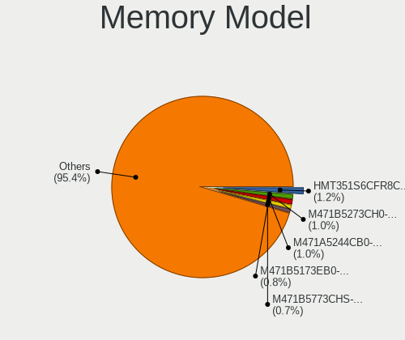

| Model                                                    | Computers | Percent |
|----------------------------------------------------------|-----------|---------|
| SK hynix RAM HMT351S6CFR8C-PB 4GB SODIMM DDR3 1600MT/s   | 11        | 1.28%   |
| Samsung RAM M471B5273CH0-CH9 4GB SODIMM DDR3 1334MT/s    | 9         | 1.04%   |
| SK hynix RAM HMT451S6BFR8A-PB 4GB SODIMM DDR3 1600MT/s   | 8         | 0.93%   |
| Samsung RAM M471B5173EB0-YK0 4GB SODIMM DDR3 1600MT/s    | 8         | 0.93%   |
| Unknown RAM Module 2048MB DIMM 800MT/s                   | 7         | 0.81%   |
| Samsung RAM M471A5244CB0-CTD 4GB SODIMM DDR4 3266MT/s    | 7         | 0.81%   |
| Unknown RAM Module 4096MB DIMM 1333MT/s                  | 6         | 0.7%    |
| Unknown RAM Module 2048MB SODIMM DDR2 667MT/s            | 6         | 0.7%    |
| Unknown RAM Module 1024MB DIMM SDRAM                     | 6         | 0.7%    |
| Samsung RAM M471B5773CHS-CH9 2GB SODIMM DDR3 4199MT/s    | 6         | 0.7%    |
| Samsung RAM M471B5173DB0-YK0 4GB SODIMM DDR3 1600MT/s    | 6         | 0.7%    |
| Kingston RAM ACR16D3LS1NGG/4G 4GB SODIMM DDR3 1600MT/s   | 6         | 0.7%    |
| Unknown RAM Module 2048MB DIMM SDRAM                     | 5         | 0.58%   |
| Unknown RAM Module 2048MB DIMM DDR2                      | 5         | 0.58%   |
| Unknown RAM Module 1024MB SODIMM DDR2 667MT/s            | 5         | 0.58%   |
| Unknown RAM Module 4096MB DIMM DDR3 1600MT/s             | 4         | 0.46%   |
| Unknown RAM Module 2GB SODIMM DDR2 667MT/s               | 4         | 0.46%   |
| Unknown RAM Module 2048MB SODIMM DDR2 800MT/s            | 4         | 0.46%   |
| Unknown RAM Module 2048MB DIMM 400MT/s                   | 4         | 0.46%   |
| Unknown RAM Module 1024MB DIMM DDR2                      | 4         | 0.46%   |
| Unknown RAM Module 1024MB DIMM 667MT/s                   | 4         | 0.46%   |
| SK hynix RAM HMT351S6CFR8A-PB 4GB SODIMM DDR3 1600MT/s   | 4         | 0.46%   |
| SK hynix RAM HMT325S6CFR8C-PB 2GB SODIMM DDR3 1600MT/s   | 4         | 0.46%   |
| SK hynix RAM HMT325S6BFR8C-H9 2GB SODIMM DDR3 1333MT/s   | 4         | 0.46%   |
| SK hynix RAM HMA851S6JJR6N-VK 4GB SODIMM DDR4 2667MT/s   | 4         | 0.46%   |
| Samsung RAM Module 16384MB SODIMM DDR4 2667MT/s          | 4         | 0.46%   |
| Samsung RAM M471B5273DH0-CK0 4GB SODIMM DDR3 1600MT/s    | 4         | 0.46%   |
| Samsung RAM M471B5273DH0-CH9 4096MB SODIMM DDR3 1334MT/s | 4         | 0.46%   |
| Samsung RAM M471B5173QH0-YK0 4GB SODIMM DDR3 1600MT/s    | 4         | 0.46%   |
| Samsung RAM M471A5244CB0-CRC 4GB SODIMM DDR4 2667MT/s    | 4         | 0.46%   |
| Samsung RAM M471A1K43BB1-CRC 8192MB SODIMM DDR4 2667MT/s | 4         | 0.46%   |
| Samsung RAM M4 70T5663EH3-CF7 2GB SODIMM DDR2 975MT/s    | 4         | 0.46%   |
| Ramaxel RAM RMT3170EB68F9W1600 4GB SODIMM DDR3 1600MT/s  | 4         | 0.46%   |
| Nanya RAM NT4GC64B8HG0NS-CG 4096MB SODIMM DDR3 1334MT/s  | 4         | 0.46%   |
| Micron RAM 4ATF51264HZ-3G2J1 4GB SODIMM DDR4 3200MT/s    | 4         | 0.46%   |
| Kingston RAM 99U5469-070.A00LF 4GB SODIMM DDR3 1600MT/s  | 4         | 0.46%   |
| Unknown RAM Module 4GB DIMM 1600MT/s                     | 3         | 0.35%   |
| Unknown RAM Module 4096MB DIMM 1600MT/s                  | 3         | 0.35%   |
| Unknown RAM Module 4096MB DIMM 1066MT/s                  | 3         | 0.35%   |
| Unknown RAM Module 2GB DIMM 800MT/s                      | 3         | 0.35%   |

Memory Kind
-----------

Memory module kinds

| Kind    | Computers | Percent |
|---------|-----------|---------|
| DDR3    | 295       | 43.45%  |
| DDR4    | 168       | 24.74%  |
| DDR2    | 72        | 10.6%   |
| Unknown | 72        | 10.6%   |
| SDRAM   | 43        | 6.33%   |
| LPDDR4  | 14        | 2.06%   |
| DDR     | 9         | 1.33%   |
| DRAM    | 4         | 0.59%   |
| LPDDR5  | 1         | 0.15%   |
| LPDDR3  | 1         | 0.15%   |

Memory Form Factor
------------------

Physical design of the memory module

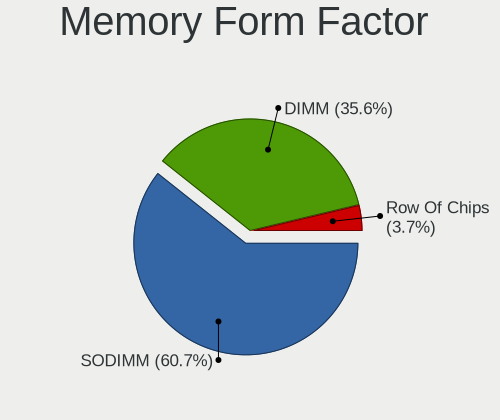

| Name         | Computers | Percent |
|--------------|-----------|---------|
| SODIMM       | 397       | 59.43%  |
| DIMM         | 255       | 38.17%  |
| Row Of Chips | 16        | 2.4%    |

Memory Size
-----------

Memory module size

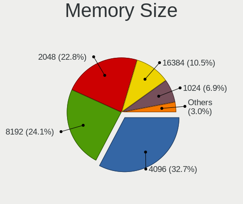

| Size  | Computers | Percent |
|-------|-----------|---------|
| 4096  | 281       | 36.4%   |
| 2048  | 205       | 26.55%  |
| 8192  | 141       | 18.26%  |
| 1024  | 64        | 8.29%   |
| 16384 | 61        | 7.9%    |
| 512   | 14        | 1.81%   |
| 32768 | 3         | 0.39%   |
| 256   | 2         | 0.26%   |
| 16    | 1         | 0.13%   |

Memory Speed
------------

Memory module speed

| Speed   | Computers | Percent |
|---------|-----------|---------|
| 1600    | 196       | 26.7%   |
| 1333    | 60        | 8.17%   |
| 2667    | 59        | 8.04%   |
| 3200    | 52        | 7.08%   |
| 2400    | 44        | 5.99%   |
| 800     | 43        | 5.86%   |
| 667     | 40        | 5.45%   |
| Unknown | 40        | 5.45%   |
| 1334    | 39        | 5.31%   |
| 2133    | 16        | 2.18%   |
| 1067    | 15        | 2.04%   |
| 4199    | 13        | 1.77%   |
| 1066    | 13        | 1.77%   |
| 533     | 12        | 1.63%   |
| 400     | 12        | 1.63%   |
| 3600    | 7         | 0.95%   |
| 3266    | 7         | 0.95%   |
| 1867    | 7         | 0.95%   |
| 3466    | 6         | 0.82%   |
| 2048    | 6         | 0.82%   |
| 1866    | 6         | 0.82%   |
| 333     | 6         | 0.82%   |
| 4267    | 5         | 0.68%   |
| 49926   | 2         | 0.27%   |
| 8400    | 2         | 0.27%   |
| 4266    | 2         | 0.27%   |
| 3733    | 2         | 0.27%   |
| 3400    | 2         | 0.27%   |
| 1800    | 2         | 0.27%   |
| 1639    | 2         | 0.27%   |
| 266     | 2         | 0.27%   |
| 65535   | 1         | 0.14%   |
| 6400    | 1         | 0.14%   |
| 3866    | 1         | 0.14%   |
| 3800    | 1         | 0.14%   |
| 3000    | 1         | 0.14%   |
| 2733    | 1         | 0.14%   |
| 2666    | 1         | 0.14%   |
| 2187    | 1         | 0.14%   |
| 2134    | 1         | 0.14%   |

Printers & scanners
-------------------

Printer Vendor
--------------

Printer device vendors

| Vendor                | Computers | Percent |
|-----------------------|-----------|---------|
| Canon                 | 6         | 27.27%  |
| Seiko Epson           | 5         | 22.73%  |
| Hewlett-Packard       | 5         | 22.73%  |
| Samsung Electronics   | 3         | 13.64%  |
| Ricoh                 | 1         | 4.55%   |
| QinHeng Electronics   | 1         | 4.55%   |
| Lexmark International | 1         | 4.55%   |

Printer Model
-------------

Printer device models

| Model                             | Computers | Percent |
|-----------------------------------|-----------|---------|
| Canon LBP6030w/6018w              | 2         | 8.7%    |
| Seiko Epson M100 Series           | 1         | 4.35%   |
| Seiko Epson L805 Series           | 1         | 4.35%   |
| Seiko Epson L365 Series           | 1         | 4.35%   |
| Seiko Epson L220 Series           | 1         | 4.35%   |
| Seiko Epson L1250 Series          | 1         | 4.35%   |
| Samsung SCX-4300 Series           | 1         | 4.35%   |
| Samsung SCX-4200 series           | 1         | 4.35%   |
| Samsung Laser Printer             | 1         | 4.35%   |
| Ricoh SP 212SUw                   | 1         | 4.35%   |
| QinHeng CH340S                    | 1         | 4.35%   |
| Lexmark International Z35 Printer | 1         | 4.35%   |
| HP LaserJet P2055 series          | 1         | 4.35%   |
| HP LaserJet P1006                 | 1         | 4.35%   |
| HP LaserJet P1005                 | 1         | 4.35%   |
| HP LaserJet 1300                  | 1         | 4.35%   |
| HP DeskJet 840c                   | 1         | 4.35%   |
| Canon MF4410                      | 1         | 4.35%   |
| Canon MF4010 series               | 1         | 4.35%   |
| Canon MF3010                      | 1         | 4.35%   |
| Canon LBP6020                     | 1         | 4.35%   |
| Canon G1000 series                | 1         | 4.35%   |

Scanner Vendor
--------------

Scanner device vendors

| Vendor             | Computers | Percent |
|--------------------|-----------|---------|
| Canon              | 4         | 66.67%  |
| Ultima Electronics | 1         | 16.67%  |
| Seiko Epson        | 1         | 16.67%  |

Scanner Model
-------------

Scanner device models

| Model                                                                                 | Computers | Percent |
|---------------------------------------------------------------------------------------|-----------|---------|
| Ultima Artec Ultima 2000 (GT6801 based)/Lifetec LT9385/ScanMagic 1200 UB Plus Scanner | 1         | 16.67%  |
| Seiko Epson Stylus Photo RX500/510                                                    | 1         | 16.67%  |
| Canon CanoScan N670U/N676U/LiDE 20                                                    | 1         | 16.67%  |
| Canon CanoScan LiDE 600F                                                              | 1         | 16.67%  |
| Canon CanoScan LiDE 60                                                                | 1         | 16.67%  |
| Canon CanoScan LIDE 25                                                                | 1         | 16.67%  |

Camera
------

Camera Vendor
-------------

Camera device vendors

| Vendor                                 | Computers | Percent |
|----------------------------------------|-----------|---------|
| Chicony Electronics                    | 126       | 21.84%  |
| IMC Networks                           | 85        | 14.73%  |
| Acer                                   | 38        | 6.59%   |
| Logitech                               | 34        | 5.89%   |
| Realtek Semiconductor                  | 33        | 5.72%   |
| Suyin                                  | 31        | 5.37%   |
| Quanta                                 | 30        | 5.2%    |
| Sunplus Innovation Technology          | 24        | 4.16%   |
| Z-Star Microelectronics                | 22        | 3.81%   |
| Cheng Uei Precision Industry (Foxlink) | 22        | 3.81%   |
| Syntek                                 | 21        | 3.64%   |
| Microdia                               | 20        | 3.47%   |
| Silicon Motion                         | 19        | 3.29%   |
| Lite-On Technology                     | 15        | 2.6%    |
| Alcor Micro                            | 10        | 1.73%   |
| Apple                                  | 6         | 1.04%   |
| Samsung Electronics                    | 4         | 0.69%   |
| Microsoft                              | 3         | 0.52%   |
| Luxvisions Innotech Limited            | 3         | 0.52%   |
| lihappe8                               | 3         | 0.52%   |
| Lenovo                                 | 3         | 0.52%   |
| Importek                               | 3         | 0.52%   |
| DigiTech                               | 3         | 0.52%   |
| Cubeternet                             | 3         | 0.52%   |
| Aveo Technology                        | 3         | 0.52%   |
| Ricoh                                  | 2         | 0.35%   |
| Primax Electronics                     | 2         | 0.35%   |
| Arkmicro Technologies                  | 2         | 0.35%   |
| Sonix Technology                       | 1         | 0.17%   |
| Pixart Imaging                         | 1         | 0.17%   |
| Nokia Mobile Phones                    | 1         | 0.17%   |
| KYE Systems (Mouse Systems)            | 1         | 0.17%   |
| GEMBIRD                                | 1         | 0.17%   |
| Fly                                    | 1         | 0.17%   |
| ALi                                    | 1         | 0.17%   |

Camera Model
------------

Camera device models

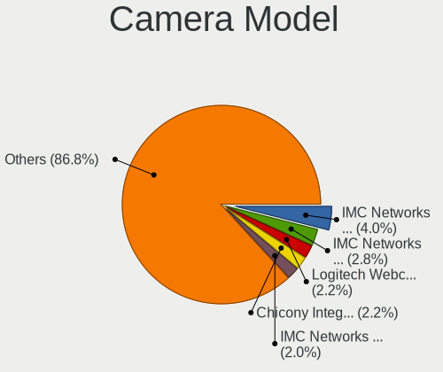

| Model                                                        | Computers | Percent |
|--------------------------------------------------------------|-----------|---------|
| IMC Networks USB2.0 VGA UVC WebCam                           | 28        | 4.84%   |
| Logitech Webcam C270                                         | 14        | 2.42%   |
| Chicony Integrated Camera                                    | 14        | 2.42%   |
| IMC Networks USB2.0 HD UVC WebCam                            | 12        | 2.07%   |
| Acer Lenovo Integrated Webcam                                | 12        | 2.07%   |
| Realtek Integrated_Webcam_HD                                 | 11        | 1.9%    |
| Chicony HD WebCam                                            | 11        | 1.9%    |
| Sunplus HD WebCam                                            | 10        | 1.73%   |
| IMC Networks Integrated Camera                               | 10        | 1.73%   |
| Chicony USB2.0 VGA UVC WebCam                                | 10        | 1.73%   |
| Acer Lenovo EasyCamera                                       | 10        | 1.73%   |
| Chicony Lenovo EasyCamera                                    | 9         | 1.55%   |
| Syntek Integrated Camera                                     | 8         | 1.38%   |
| Syntek EasyCamera                                            | 7         | 1.21%   |
| IMC Networks USB2.0 UVC HD Webcam                            | 7         | 1.21%   |
| Microdia Integrated_Webcam_HD                                | 6         | 1.04%   |
| Logitech Webcam C310                                         | 6         | 1.04%   |
| Suyin HP TrueVision HD                                       | 5         | 0.86%   |
| Quanta HP HD Camera                                          | 5         | 0.86%   |
| Quanta HD Webcam                                             | 5         | 0.86%   |
| Lite-On Integrated Camera                                    | 5         | 0.86%   |
| Lite-On HP HD Camera                                         | 5         | 0.86%   |
| IMC Networks UVC VGA Webcam                                  | 5         | 0.86%   |
| IMC Networks Integrated Webcam                               | 5         | 0.86%   |
| Chicony EasyCamera                                           | 5         | 0.86%   |
| Z-Star Venus USB2.0 Camera                                   | 4         | 0.69%   |
| Z-Star A4 TECH USB2.0 PC Camera J                            | 4         | 0.69%   |
| Syntek Lenovo EasyCamera                                     | 4         | 0.69%   |
| Suyin HD Video WebCam                                        | 4         | 0.69%   |
| Silicon Motion WebCam SC-03FFL11939N                         | 4         | 0.69%   |
| Silicon Motion WebCam SC-0311139N                            | 4         | 0.69%   |
| Realtek USB Camera                                           | 4         | 0.69%   |
| Microdia Camera                                              | 4         | 0.69%   |
| Chicony VGA Webcam                                           | 4         | 0.69%   |
| Chicony USB2.0 HD UVC WebCam                                 | 4         | 0.69%   |
| Chicony HP Truevision HD camera                              | 4         | 0.69%   |
| Chicony HP Truevision HD                                     | 4         | 0.69%   |
| Chicony HP HD Camera                                         | 4         | 0.69%   |
| Chicony HD WebCam (Acer)                                     | 4         | 0.69%   |
| Cheng Uei Precision Industry (Foxlink) XiaoMi USB 2.0 Webcam | 4         | 0.69%   |

Security
--------

Fingerprint Vendor
------------------

Fingerprint sensor vendors

| Vendor                     | Computers | Percent |
|----------------------------|-----------|---------|
| Validity Sensors           | 17        | 26.98%  |
| Synaptics                  | 14        | 22.22%  |
| Shenzhen Goodix Technology | 10        | 15.87%  |
| Elan Microelectronics      | 10        | 15.87%  |
| AuthenTec                  | 6         | 9.52%   |
| STMicroelectronics         | 3         | 4.76%   |
| Upek                       | 2         | 3.17%   |
| LighTuning Technology      | 1         | 1.59%   |

Fingerprint Model
-----------------

Fingerprint sensor models

| Model                                                                      | Computers | Percent |
|----------------------------------------------------------------------------|-----------|---------|
| Elan ELAN:Fingerprint                                                      | 9         | 14.29%  |
| Shenzhen Goodix  Fingerprint Device                                        | 5         | 7.94%   |
| Unknown                                                                    | 5         | 7.94%   |
| Validity Sensors VFS5011 Fingerprint Reader                                | 4         | 6.35%   |
| Synaptics Prometheus MIS Touch Fingerprint Reader                          | 4         | 6.35%   |
| Shenzhen Goodix Fingerprint Reader                                         | 4         | 6.35%   |
| Validity Sensors VFS495 Fingerprint Reader                                 | 3         | 4.76%   |
| Synaptics Metallica MIS Touch Fingerprint Reader                           | 3         | 4.76%   |
| STMicroelectronics Fingerprint Reader                                      | 3         | 4.76%   |
| Validity Sensors Synaptics WBDI                                            | 2         | 3.17%   |
| Validity Sensors Fingerprint scanner                                       | 2         | 3.17%   |
| Upek Biometric Touchchip/Touchstrip Fingerprint Sensor                     | 2         | 3.17%   |
| Synaptics  VFS7552 Touch Fingerprint Sensor with PurePrint                 | 2         | 3.17%   |
| AuthenTec AES2501 Fingerprint Sensor                                       | 2         | 3.17%   |
| Validity Sensors VFS7500 Touch Fingerprint Sensor                          | 1         | 1.59%   |
| Validity Sensors VFS491                                                    | 1         | 1.59%   |
| Validity Sensors VFS301 Fingerprint Reader                                 | 1         | 1.59%   |
| Validity Sensors VFS101 Fingerprint Reader                                 | 1         | 1.59%   |
| Validity Sensors Synaptics VFS7552 Touch Fingerprint Sensor with PurePrint | 1         | 1.59%   |
| Validity Sensors Swipe Fingerprint Sensor                                  | 1         | 1.59%   |
| Shenzhen Goodix FingerPrint                                                | 1         | 1.59%   |
| LighTuning ES603 Swipe Fingerprint Sensor                                  | 1         | 1.59%   |
| Elan ELAN:ARM-M4                                                           | 1         | 1.59%   |
| AuthenTec Fingerprint Sensor                                               | 1         | 1.59%   |
| AuthenTec AES2810                                                          | 1         | 1.59%   |
| AuthenTec AES2550 Fingerprint Sensor                                       | 1         | 1.59%   |
| AuthenTec AES1600                                                          | 1         | 1.59%   |

Chipcard Vendor
---------------

Chipcard module vendors

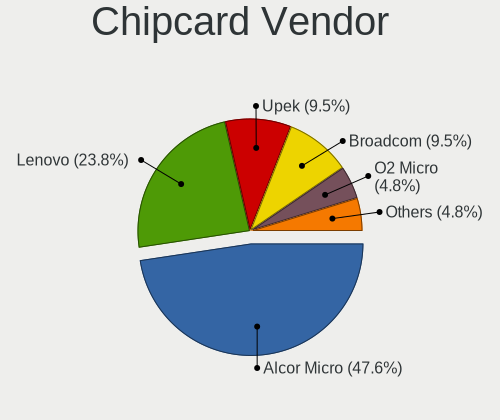

| Vendor      | Computers | Percent |
|-------------|-----------|---------|
| Alcor Micro | 6         | 46.15%  |
| Lenovo      | 4         | 30.77%  |
| Broadcom    | 2         | 15.38%  |
| Upek        | 1         | 7.69%   |

Chipcard Model
--------------

Chipcard module models

| Model                                                                        | Computers | Percent |
|------------------------------------------------------------------------------|-----------|---------|
| Alcor Micro AU9540 Smartcard Reader                                          | 6         | 46.15%  |
| Lenovo Integrated Smart Card Reader                                          | 4         | 30.77%  |
| Upek TouchChip Fingerprint Coprocessor (WBF advanced mode)                   | 1         | 7.69%   |
| Broadcom BCM5880 Secure Applications Processor with fingerprint swipe sensor | 1         | 7.69%   |
| Broadcom 58200                                                               | 1         | 7.69%   |

Unsupported
-----------

Unsupported Devices
-------------------

Total unsupported devices on board

| Total | Computers | Percent |
|-------|-----------|---------|
| 0     | 679       | 76.46%  |
| 1     | 174       | 19.59%  |
| 2     | 29        | 3.27%   |
| 3     | 5         | 0.56%   |
| 4     | 1         | 0.11%   |

Unsupported Device Types
------------------------

Types of unsupported devices

| Type                     | Computers | Percent |
|--------------------------|-----------|---------|
| Graphics card            | 92        | 38.82%  |
| Fingerprint reader       | 61        | 25.74%  |
| Net/wireless             | 18        | 7.59%   |
| Multimedia controller    | 12        | 5.06%   |
| Bluetooth                | 12        | 5.06%   |
| Communication controller | 11        | 4.64%   |
| Chipcard                 | 11        | 4.64%   |
| Camera                   | 8         | 3.38%   |
| Storage                  | 4         | 1.69%   |
| Sound                    | 3         | 1.27%   |
| Unassigned class         | 1         | 0.42%   |
| Net/ethernet             | 1         | 0.42%   |
| Modem                    | 1         | 0.42%   |
| Flash memory             | 1         | 0.42%   |
| Card reader              | 1         | 0.42%   |

