Linux in Belgium - Tested Hardware & Statistics
-----------------------------------------------

A project to collect tested hardware configurations for Linux in Belgium.

Anyone can contribute to this report by the [hw-probe](https://github.com/linuxhw/hw-probe) tool:

    sudo -E hw-probe -all -upload

Please contribute! Especially if your hardware is rare.

This is a report for all computer types. See also reports for [desktops](/Location/Belgium/Desktop/README.md) and [notebooks](/Location/Belgium/Notebook/README.md).

Contents
--------

* [ Test Cases ](#test-cases)

* [ System ](#system)
  - [ OS                       ](#os)
  - [ OS Family                ](#os-family)
  - [ Kernel                   ](#kernel)
  - [ Kernel Family            ](#kernel-family)
  - [ Kernel Major Ver.        ](#kernel-major-ver)
  - [ Arch                     ](#arch)
  - [ DE                       ](#de)
  - [ Display Server           ](#display-server)
  - [ Display Manager          ](#display-manager)
  - [ OS Lang                  ](#os-lang)
  - [ Boot Mode                ](#boot-mode)
  - [ Filesystem               ](#filesystem)
  - [ Part. scheme             ](#part-scheme)
  - [ Dual Boot with Linux/BSD ](#dual-boot-with-linuxbsd)
  - [ Dual Boot (Win)          ](#dual-boot-win)

* [ Board ](#board)
  - [ Vendor                   ](#vendor)
  - [ Model                    ](#model)
  - [ Model Family             ](#model-family)
  - [ MFG Year                 ](#mfg-year)
  - [ Form Factor              ](#form-factor)
  - [ Secure Boot              ](#secure-boot)
  - [ Coreboot                 ](#coreboot)
  - [ RAM Size                 ](#ram-size)
  - [ RAM Used                 ](#ram-used)
  - [ Total Drives             ](#total-drives)
  - [ Has CD-ROM               ](#has-cd-rom)
  - [ Has Ethernet             ](#has-ethernet)
  - [ Has WiFi                 ](#has-wifi)
  - [ Has Bluetooth            ](#has-bluetooth)

* [ Location ](#location)
  - [ Country                  ](#country)
  - [ City                     ](#city)

* [ Drives ](#drives)
  - [ Drive Vendor             ](#drive-vendor)
  - [ Drive Model              ](#drive-model)
  - [ HDD Vendor               ](#hdd-vendor)
  - [ SSD Vendor               ](#ssd-vendor)
  - [ Drive Kind               ](#drive-kind)
  - [ Drive Connector          ](#drive-connector)
  - [ Drive Size               ](#drive-size)
  - [ Space Total              ](#space-total)
  - [ Space Used               ](#space-used)
  - [ Malfunc. Drives          ](#malfunc-drives)
  - [ Malfunc. Drive Vendor    ](#malfunc-drive-vendor)
  - [ Malfunc. HDD Vendor      ](#malfunc-hdd-vendor)
  - [ Malfunc. Drive Kind      ](#malfunc-drive-kind)
  - [ Failed Drives            ](#failed-drives)
  - [ Failed Drive Vendor      ](#failed-drive-vendor)
  - [ Drive Status             ](#drive-status)

* [ Storage controller ](#storage-controller)
  - [ Storage Vendor           ](#storage-vendor)
  - [ Storage Model            ](#storage-model)
  - [ Storage Kind             ](#storage-kind)

* [ Processor ](#processor)
  - [ CPU Vendor               ](#cpu-vendor)
  - [ CPU Model                ](#cpu-model)
  - [ CPU Model Family         ](#cpu-model-family)
  - [ CPU Cores                ](#cpu-cores)
  - [ CPU Sockets              ](#cpu-sockets)
  - [ CPU Threads              ](#cpu-threads)
  - [ CPU Op-Modes             ](#cpu-op-modes)
  - [ CPU Microcode            ](#cpu-microcode)
  - [ CPU Microarch            ](#cpu-microarch)

* [ Graphics ](#graphics)
  - [ GPU Vendor               ](#gpu-vendor)
  - [ GPU Model                ](#gpu-model)
  - [ GPU Combo                ](#gpu-combo)
  - [ GPU Driver               ](#gpu-driver)
  - [ GPU Memory               ](#gpu-memory)

* [ Monitor ](#monitor)
  - [ Monitor Vendor           ](#monitor-vendor)
  - [ Monitor Model            ](#monitor-model)
  - [ Monitor Resolution       ](#monitor-resolution)
  - [ Monitor Diagonal         ](#monitor-diagonal)
  - [ Monitor Width            ](#monitor-width)
  - [ Aspect Ratio             ](#aspect-ratio)
  - [ Monitor Area             ](#monitor-area)
  - [ Pixel Density            ](#pixel-density)
  - [ Multiple Monitors        ](#multiple-monitors)

* [ Network ](#network)
  - [ Net Controller Vendor    ](#net-controller-vendor)
  - [ Net Controller Model     ](#net-controller-model)
  - [ Wireless Vendor          ](#wireless-vendor)
  - [ Wireless Model           ](#wireless-model)
  - [ Ethernet Vendor          ](#ethernet-vendor)
  - [ Ethernet Model           ](#ethernet-model)
  - [ Net Controller Kind      ](#net-controller-kind)
  - [ Used Controller          ](#used-controller)
  - [ NICs                     ](#nics)
  - [ IPv6                     ](#ipv6)

* [ Bluetooth ](#bluetooth)
  - [ Bluetooth Vendor         ](#bluetooth-vendor)
  - [ Bluetooth Model          ](#bluetooth-model)

* [ Sound ](#sound)
  - [ Sound Vendor             ](#sound-vendor)
  - [ Sound Model              ](#sound-model)

* [ Memory ](#memory)
  - [ Memory Vendor            ](#memory-vendor)
  - [ Memory Model             ](#memory-model)
  - [ Memory Kind              ](#memory-kind)
  - [ Memory Form Factor       ](#memory-form-factor)
  - [ Memory Size              ](#memory-size)
  - [ Memory Speed             ](#memory-speed)

* [ Printers & scanners ](#printers--scanners)
  - [ Printer Vendor           ](#printer-vendor)
  - [ Printer Model            ](#printer-model)
  - [ Scanner Vendor           ](#scanner-vendor)
  - [ Scanner Model            ](#scanner-model)

* [ Camera ](#camera)
  - [ Camera Vendor            ](#camera-vendor)
  - [ Camera Model             ](#camera-model)

* [ Security ](#security)
  - [ Fingerprint Vendor       ](#fingerprint-vendor)
  - [ Fingerprint Model        ](#fingerprint-model)
  - [ Chipcard Vendor          ](#chipcard-vendor)
  - [ Chipcard Model           ](#chipcard-model)

* [ Unsupported ](#unsupported)
  - [ Unsupported Devices      ](#unsupported-devices)
  - [ Unsupported Device Types ](#unsupported-device-types)

Test Cases
----------

Total: 4631

| Vendor        | Model                       | Form-Factor | Probe                                                      | Date         |
|---------------|-----------------------------|-------------|------------------------------------------------------------|--------------|
| ASRock        | AMD BC-250                  | Desktop     | [0842ee9518](https://linux-hardware.org/?probe=0842ee9518) | Jan 03, 2026 |
| ASUSTek       | P552LA                      | Notebook    | [63e3a831ce](https://linux-hardware.org/?probe=63e3a831ce) | Jan 03, 2026 |
| Lenovo        | ThinkPad 13 2nd Gen 20J2... | Notebook    | [17bae1fed1](https://linux-hardware.org/?probe=17bae1fed1) | Jan 03, 2026 |
| Lenovo        | ThinkPad 13 2nd Gen 20J2... | Notebook    | [fe9e88163a](https://linux-hardware.org/?probe=fe9e88163a) | Jan 03, 2026 |
| ASUSTek       | P552LA                      | Notebook    | [2c96c1460f](https://linux-hardware.org/?probe=2c96c1460f) | Jan 03, 2026 |
| MSI           | MAG Z390 TOMAHAWK           | Desktop     | [5f975adfc3](https://linux-hardware.org/?probe=5f975adfc3) | Jan 03, 2026 |
| ASUSTek       | NUC14MNB2 60AS00H0-MB8A0... | Mini pc     | [0c340b8a34](https://linux-hardware.org/?probe=0c340b8a34) | Dec 31, 2025 |
| ASRock        | 990FX Killer                | Desktop     | [992e82d628](https://linux-hardware.org/?probe=992e82d628) | Dec 31, 2025 |
| ASRock        | 990FX Killer                | Desktop     | [d27b76793d](https://linux-hardware.org/?probe=d27b76793d) | Dec 31, 2025 |
| Lenovo        | ThinkPad T470 20HES0QL00    | Notebook    | [5b0e1cd590](https://linux-hardware.org/?probe=5b0e1cd590) | Dec 31, 2025 |
| ASUSTek       | VivoBook_ASUSLaptop X415... | Notebook    | [332d910a45](https://linux-hardware.org/?probe=332d910a45) | Dec 30, 2025 |
| HP            | EliteBook 8 G1a 14 inch ... | Notebook    | [11a03d4d80](https://linux-hardware.org/?probe=11a03d4d80) | Dec 30, 2025 |
| ASUSTek       | PRIME B360-PLUS             | Desktop     | [60a56dbd2a](https://linux-hardware.org/?probe=60a56dbd2a) | Dec 30, 2025 |
| Dell          | Latitude E6410              | Notebook    | [e597155cc1](https://linux-hardware.org/?probe=e597155cc1) | Dec 30, 2025 |
| Dell          | Latitude E6410              | Notebook    | [c383aec759](https://linux-hardware.org/?probe=c383aec759) | Dec 30, 2025 |
| Gigabyte      | X870 AORUS ELITE WIFI7      | Desktop     | [6e610df56f](https://linux-hardware.org/?probe=6e610df56f) | Dec 28, 2025 |
| HP            | EliteBook 8 G1a 14 inch ... | Notebook    | [3713c79ca3](https://linux-hardware.org/?probe=3713c79ca3) | Dec 28, 2025 |
| Lenovo        | ThinkPad Yoga 370 20JJS0... | Convertible | [0d6b3107c6](https://linux-hardware.org/?probe=0d6b3107c6) | Dec 28, 2025 |
| Dell          | Latitude E7440              | Notebook    | [81c6ca33bb](https://linux-hardware.org/?probe=81c6ca33bb) | Dec 25, 2025 |
| Dell          | Latitude E7440              | Notebook    | [b0555f89da](https://linux-hardware.org/?probe=b0555f89da) | Dec 25, 2025 |
| GMKtec        | NucBoxG9                    | Other       | [ed326e3e00](https://linux-hardware.org/?probe=ed326e3e00) | Dec 23, 2025 |
| HP            | Pavilion 17                 | Notebook    | [3c02acd0d0](https://linux-hardware.org/?probe=3c02acd0d0) | Dec 23, 2025 |
| Acer          | WG43M                       | Desktop     | [37412d99fc](https://linux-hardware.org/?probe=37412d99fc) | Dec 23, 2025 |
| Acer          | WG43M                       | Desktop     | [f186e48545](https://linux-hardware.org/?probe=f186e48545) | Dec 23, 2025 |
| ASRock        | AMD BC-250                  | Desktop     | [b0c1128a45](https://linux-hardware.org/?probe=b0c1128a45) | Dec 22, 2025 |
| GEEKOM        | A7                          | Desktop     | [be7f489463](https://linux-hardware.org/?probe=be7f489463) | Dec 21, 2025 |
| Unknown       | Unknown                     | Mini pc     | [20249fdcf6](https://linux-hardware.org/?probe=20249fdcf6) | Dec 20, 2025 |
| Intel         | NUC8BEB J72692-304          | Mini pc     | [87d8d9a85a](https://linux-hardware.org/?probe=87d8d9a85a) | Dec 17, 2025 |
| Intel         | NUC8BEB J72692-304          | Mini pc     | [6e079d5121](https://linux-hardware.org/?probe=6e079d5121) | Dec 17, 2025 |
| ASUSTek       | ROG STRIX X870E-E GAMING... | Desktop     | [c85229efd0](https://linux-hardware.org/?probe=c85229efd0) | Dec 17, 2025 |
| HP            | Pavilion 17                 | Notebook    | [7fe6bf3c7f](https://linux-hardware.org/?probe=7fe6bf3c7f) | Dec 16, 2025 |
| Dell          | Latitude 3350               | Notebook    | [81b7901691](https://linux-hardware.org/?probe=81b7901691) | Dec 16, 2025 |
| ASUSTek       | ROG STRIX X870E-E GAMING... | Desktop     | [36f287a9b5](https://linux-hardware.org/?probe=36f287a9b5) | Dec 16, 2025 |
| Dell          | Latitude 7480               | Notebook    | [ff36d1a289](https://linux-hardware.org/?probe=ff36d1a289) | Dec 14, 2025 |
| LG Electro... | 17Z90TL-G.AU8BF             | Notebook    | [67792314e0](https://linux-hardware.org/?probe=67792314e0) | Dec 14, 2025 |
| ASUSTek       | Z9PA-U8 Series              | Server      | [bd67c0d3e5](https://linux-hardware.org/?probe=bd67c0d3e5) | Dec 13, 2025 |
| GMKtec        | V1.1                        | Mini pc     | [6af388aa52](https://linux-hardware.org/?probe=6af388aa52) | Dec 13, 2025 |
| HP            | Pavilion dv7                | Notebook    | [514e74de8d](https://linux-hardware.org/?probe=514e74de8d) | Dec 12, 2025 |
| ASUSTek       | ROG Strix G713PV_G713PV     | Notebook    | [2cd803c12b](https://linux-hardware.org/?probe=2cd803c12b) | Dec 10, 2025 |
| Intel         | DQ67SW AAG12527-310         | Desktop     | [32db532870](https://linux-hardware.org/?probe=32db532870) | Dec 10, 2025 |
| HP            | 8712                        | Desktop     | [0410e50cae](https://linux-hardware.org/?probe=0410e50cae) | Dec 09, 2025 |
| Intel         | DQ67SW AAG12527-310         | Desktop     | [9180926153](https://linux-hardware.org/?probe=9180926153) | Dec 09, 2025 |
| Apple         | MacBookPro12,1              | Notebook    | [f31e4b1bf6](https://linux-hardware.org/?probe=f31e4b1bf6) | Dec 07, 2025 |
| Dell          | 040DDP A01                  | Desktop     | [c02d0a1769](https://linux-hardware.org/?probe=c02d0a1769) | Dec 07, 2025 |
| Shenzhen M... | F7BAA                       | Desktop     | [702cdb149b](https://linux-hardware.org/?probe=702cdb149b) | Dec 07, 2025 |
| SLIMBOOK      | EVO14-A8                    | Notebook    | [0385d51334](https://linux-hardware.org/?probe=0385d51334) | Dec 07, 2025 |
| SLIMBOOK      | EVO14-A8                    | Notebook    | [9dc42d9da4](https://linux-hardware.org/?probe=9dc42d9da4) | Dec 07, 2025 |
| AZW           | EQ                          | Mini pc     | [bd7b855fe1](https://linux-hardware.org/?probe=bd7b855fe1) | Dec 06, 2025 |
| Gigabyte      | Z690 AORUS PRO              | Desktop     | [e08f087d03](https://linux-hardware.org/?probe=e08f087d03) | Dec 06, 2025 |
| ASUSTek       | P8Z77-V                     | Desktop     | [9d2365c48c](https://linux-hardware.org/?probe=9d2365c48c) | Dec 06, 2025 |
| ASUSTek       | P9X79 PRO                   | Desktop     | [fb25fe1df9](https://linux-hardware.org/?probe=fb25fe1df9) | Dec 06, 2025 |
| ASUSTek       | P8Z77-V                     | Desktop     | [2c47257162](https://linux-hardware.org/?probe=2c47257162) | Dec 06, 2025 |
| Medion        | H110H4-EM                   | Desktop     | [dd94d4a416](https://linux-hardware.org/?probe=dd94d4a416) | Dec 04, 2025 |
| Apple         | Mac-BE088AF8C5EB4FA2 iMa... | All in one  | [475e836191](https://linux-hardware.org/?probe=475e836191) | Dec 01, 2025 |
| Google        | Swanky                      | Notebook    | [0efb08651e](https://linux-hardware.org/?probe=0efb08651e) | Dec 01, 2025 |
| MSI           | X470 GAMING PRO CARBON      | Desktop     | [97efeb8ab6](https://linux-hardware.org/?probe=97efeb8ab6) | Dec 01, 2025 |
| Acer          | Aspire Z3-105               | All in one  | [700011e7ed](https://linux-hardware.org/?probe=700011e7ed) | Dec 01, 2025 |
| Acer          | Aspire Z3-105               | All in one  | [87fbee7667](https://linux-hardware.org/?probe=87fbee7667) | Nov 30, 2025 |
| PELADN        | WO4                         | Desktop     | [00941e9d60](https://linux-hardware.org/?probe=00941e9d60) | Nov 30, 2025 |
| PELADN        | WO4                         | Desktop     | [b8b383eba9](https://linux-hardware.org/?probe=b8b383eba9) | Nov 30, 2025 |
| ASUSTek       | K93SV                       | Notebook    | [b07fa52ff1](https://linux-hardware.org/?probe=b07fa52ff1) | Nov 30, 2025 |
| Medion        | E7424 MD60350               | Notebook    | [92e0a05fc7](https://linux-hardware.org/?probe=92e0a05fc7) | Nov 30, 2025 |
| MSI           | Thin GF63 12UDX             | Notebook    | [001fda8c6f](https://linux-hardware.org/?probe=001fda8c6f) | Nov 29, 2025 |
| PC Special... | NH5x_7xDPx                  | Notebook    | [25e4a4dea5](https://linux-hardware.org/?probe=25e4a4dea5) | Nov 29, 2025 |
| Raspberry ... | Raspberry Pi 5 Model B R... | Soc         | [2a2db6533f](https://linux-hardware.org/?probe=2a2db6533f) | Nov 29, 2025 |
| Gigabyte      | B550 GAMING X V2            | Desktop     | [b9c9062680](https://linux-hardware.org/?probe=b9c9062680) | Nov 29, 2025 |
| Lenovo        | Legion 5 15ARH05 82B5       | Notebook    | [a1cbe88e9f](https://linux-hardware.org/?probe=a1cbe88e9f) | Nov 28, 2025 |
| ASUSTek       | PRIME B365-PLUS             | Desktop     | [533dab3435](https://linux-hardware.org/?probe=533dab3435) | Nov 28, 2025 |
| ASUSTek       | PRIME B365-PLUS             | Desktop     | [cf4b2bdff0](https://linux-hardware.org/?probe=cf4b2bdff0) | Nov 28, 2025 |
| Standard      | Unknown                     | Notebook    | [93129aab96](https://linux-hardware.org/?probe=93129aab96) | Nov 27, 2025 |
| Lenovo        | Legion Slim 5 16ARP9 83E... | Notebook    | [4847a52d14](https://linux-hardware.org/?probe=4847a52d14) | Nov 26, 2025 |
| Unknown       | Unknown                     | Mini pc     | [5fab5fe00f](https://linux-hardware.org/?probe=5fab5fe00f) | Nov 24, 2025 |
| ASUSTek       | Vivobook Go E1504FA_E150... | Notebook    | [658e6e3fb3](https://linux-hardware.org/?probe=658e6e3fb3) | Nov 24, 2025 |
| Standard      | Unknown                     | Notebook    | [06d0c019ff](https://linux-hardware.org/?probe=06d0c019ff) | Nov 23, 2025 |
| HP            | Laptop 15s-fq3xxx           | Notebook    | [c3640110a7](https://linux-hardware.org/?probe=c3640110a7) | Nov 23, 2025 |
| HP            | Laptop 15s-fq3xxx           | Notebook    | [432285cc5b](https://linux-hardware.org/?probe=432285cc5b) | Nov 23, 2025 |
| ASUSTek       | P8Z77-V                     | Desktop     | [94d66e9d04](https://linux-hardware.org/?probe=94d66e9d04) | Nov 22, 2025 |
| ASUSTek       | P8Z77-V                     | Desktop     | [05aa16e740](https://linux-hardware.org/?probe=05aa16e740) | Nov 22, 2025 |
| ASUSTek       | Vivobook Go E1504FA_E150... | Notebook    | [f43b2ae2cc](https://linux-hardware.org/?probe=f43b2ae2cc) | Nov 21, 2025 |
| Apple         | Mac-63001698E7A34814 iMa... | All in one  | [5320f41695](https://linux-hardware.org/?probe=5320f41695) | Nov 21, 2025 |
| ASUSTek       | TUF Gaming A620M-PLUS WI... | Desktop     | [72198e2201](https://linux-hardware.org/?probe=72198e2201) | Nov 20, 2025 |
| ASUSTek       | TUF Gaming A620M-PLUS WI... | Desktop     | [975c31fa8c](https://linux-hardware.org/?probe=975c31fa8c) | Nov 20, 2025 |
| Acer          | Aspire VN7-791G             | Notebook    | [552bbf6d8b](https://linux-hardware.org/?probe=552bbf6d8b) | Nov 20, 2025 |
| HP            | ENVY Notebook 13-ab0XX      | Notebook    | [552927ede5](https://linux-hardware.org/?probe=552927ede5) | Nov 20, 2025 |
| Gigabyte      | X670 AORUS ELITE AX         | Desktop     | [278f988650](https://linux-hardware.org/?probe=278f988650) | Nov 19, 2025 |
| ASUSTek       | ROG STRIX B650E-F GAMING... | Desktop     | [8945eb3fa1](https://linux-hardware.org/?probe=8945eb3fa1) | Nov 18, 2025 |
| HP            | ProBook 6550b               | Notebook    | [7176581706](https://linux-hardware.org/?probe=7176581706) | Nov 18, 2025 |
| Lenovo        | ThinkPad T410 2537AF8       | Notebook    | [91feb2ac1a](https://linux-hardware.org/?probe=91feb2ac1a) | Nov 17, 2025 |
| Unknown       | Unknown                     | Desktop     | [330b6045ea](https://linux-hardware.org/?probe=330b6045ea) | Nov 16, 2025 |
| ASRock        | A320M-HDV R4.0              | Desktop     | [98b7f5d5a5](https://linux-hardware.org/?probe=98b7f5d5a5) | Nov 16, 2025 |
| ASUSTek       | N752VX                      | Notebook    | [2571e48103](https://linux-hardware.org/?probe=2571e48103) | Nov 15, 2025 |
| ASUSTek       | Vivobook Go E1504FA_E150... | Notebook    | [ea1adee43a](https://linux-hardware.org/?probe=ea1adee43a) | Nov 15, 2025 |
| ASUSTek       | Vivobook Go E1504FA_E150... | Notebook    | [b27cf5f053](https://linux-hardware.org/?probe=b27cf5f053) | Nov 15, 2025 |
| MSI           | MAG B550 TOMAHAWK           | Desktop     | [2e9cfc2f36](https://linux-hardware.org/?probe=2e9cfc2f36) | Nov 15, 2025 |
| HP            | 250 G3                      | Notebook    | [a9f70e8f92](https://linux-hardware.org/?probe=a9f70e8f92) | Nov 14, 2025 |
| HP            | Pavilion Gaming Laptop 1... | Notebook    | [f736f45307](https://linux-hardware.org/?probe=f736f45307) | Nov 14, 2025 |
| HP            | 83EF                        | Desktop     | [f1d1cb1f07](https://linux-hardware.org/?probe=f1d1cb1f07) | Nov 12, 2025 |
| Medion        | E7424 MD60350               | Notebook    | [c14844c4db](https://linux-hardware.org/?probe=c14844c4db) | Nov 12, 2025 |
| MSI           | Z370 PC PRO                 | Desktop     | [7cdba62051](https://linux-hardware.org/?probe=7cdba62051) | Nov 11, 2025 |
| ASUSTek       | ASUS TUF Gaming A15 FA50... | Notebook    | [9de97b6e4f](https://linux-hardware.org/?probe=9de97b6e4f) | Nov 11, 2025 |
| HP            | ProBook 450 G5              | Notebook    | [375ea69724](https://linux-hardware.org/?probe=375ea69724) | Nov 11, 2025 |
| Dell          | 0X37H9 A01                  | Desktop     | [4a386808b3](https://linux-hardware.org/?probe=4a386808b3) | Nov 10, 2025 |
| Intel         | A320M-I                     | Desktop     | [4d66863c39](https://linux-hardware.org/?probe=4d66863c39) | Nov 10, 2025 |
| MSI           | Thin GF63 12UC              | Notebook    | [52d5ed4246](https://linux-hardware.org/?probe=52d5ed4246) | Nov 09, 2025 |
| Packard Be... | EG43M                       | Desktop     | [41f0558358](https://linux-hardware.org/?probe=41f0558358) | Nov 07, 2025 |
| Lenovo        | Legion 5 17IMH05 82B3       | Notebook    | [bf8ed0bb87](https://linux-hardware.org/?probe=bf8ed0bb87) | Nov 07, 2025 |
| Dell          | Studio 1749                 | Notebook    | [c60df31b64](https://linux-hardware.org/?probe=c60df31b64) | Nov 07, 2025 |
| Dell          | Studio 1749                 | Notebook    | [4262733272](https://linux-hardware.org/?probe=4262733272) | Nov 07, 2025 |
| Lenovo        | ThinkPad P15s Gen 2i 20W... | Notebook    | [f744408113](https://linux-hardware.org/?probe=f744408113) | Nov 06, 2025 |
| Packard Be... | EG43M                       | Desktop     | [47dfb865a4](https://linux-hardware.org/?probe=47dfb865a4) | Nov 05, 2025 |
| Teclast       | F16Air (F2M2)               | Notebook    | [8264560e7a](https://linux-hardware.org/?probe=8264560e7a) | Nov 05, 2025 |
| MACHINIST     | X99 PR9                     | Desktop     | [1306dba6a7](https://linux-hardware.org/?probe=1306dba6a7) | Nov 05, 2025 |
| Raspberry ... | Raspberry Pi 5 Model B R... | Soc         | [8d28e1c229](https://linux-hardware.org/?probe=8d28e1c229) | Nov 05, 2025 |
| MSI           | MPG B550 GAMING PLUS        | Desktop     | [837c457a91](https://linux-hardware.org/?probe=837c457a91) | Nov 04, 2025 |
| ASRock        | A320M-HDV R4.0              | Desktop     | [d6f820e452](https://linux-hardware.org/?probe=d6f820e452) | Nov 03, 2025 |
| ASUSTek       | H97M-PLUS                   | Desktop     | [d713f326f0](https://linux-hardware.org/?probe=d713f326f0) | Nov 03, 2025 |
| HP            | Spectre x360 2-in-1 Lapt... | Convertible | [a62d241583](https://linux-hardware.org/?probe=a62d241583) | Nov 02, 2025 |
| Lenovo        | Yoga 530-14IKB 81EK         | Convertible | [cd6deb95f7](https://linux-hardware.org/?probe=cd6deb95f7) | Nov 02, 2025 |
| Raspberry ... | Raspberry Pi 5 Model B R... | Soc         | [307bace4a5](https://linux-hardware.org/?probe=307bace4a5) | Nov 02, 2025 |
| HP            | EliteBook 840 14 inch G9... | Notebook    | [22f9a10a43](https://linux-hardware.org/?probe=22f9a10a43) | Nov 02, 2025 |
| HP            | Pavilion g7                 | Notebook    | [788188133c](https://linux-hardware.org/?probe=788188133c) | Nov 01, 2025 |
| Lenovo        | ThinkPad T495 20NKS04M00    | Notebook    | [29ccab8a8e](https://linux-hardware.org/?probe=29ccab8a8e) | Nov 01, 2025 |
| Dell          | Inspiron 5737               | Notebook    | [652b46c8fe](https://linux-hardware.org/?probe=652b46c8fe) | Oct 30, 2025 |
| Dell          | Inspiron 5737               | Notebook    | [6939761bb8](https://linux-hardware.org/?probe=6939761bb8) | Oct 30, 2025 |
| HP            | Pavilion dv7                | Notebook    | [d15a848934](https://linux-hardware.org/?probe=d15a848934) | Oct 29, 2025 |
| ASUSTek       | K55A                        | Notebook    | [c9f29eb5a4](https://linux-hardware.org/?probe=c9f29eb5a4) | Oct 28, 2025 |
| ASUSTek       | ROG STRIX B550-F GAMING ... | Desktop     | [8dd56ad9f8](https://linux-hardware.org/?probe=8dd56ad9f8) | Oct 28, 2025 |
| ASRock        | X670E Taichi                | Desktop     | [33d6d16a57](https://linux-hardware.org/?probe=33d6d16a57) | Oct 27, 2025 |
| Lenovo        | ThinkPad P16s Gen 1 21BT... | Notebook    | [8daf360c61](https://linux-hardware.org/?probe=8daf360c61) | Oct 26, 2025 |
| Lenovo        | ThinkPad T495 20NKS0CX00    | Notebook    | [042f93ee4c](https://linux-hardware.org/?probe=042f93ee4c) | Oct 26, 2025 |
| Toshiba       | Satellite Pro P300          | Notebook    | [34b859b261](https://linux-hardware.org/?probe=34b859b261) | Oct 26, 2025 |
| Toshiba       | Satellite L70-A             | Notebook    | [d0ce5505d7](https://linux-hardware.org/?probe=d0ce5505d7) | Oct 25, 2025 |
| Toshiba       | Satellite L70-A             | Notebook    | [1bc189116c](https://linux-hardware.org/?probe=1bc189116c) | Oct 25, 2025 |
| Lenovo        | SDK0E50510 WIN              | Desktop     | [9f16f7bb01](https://linux-hardware.org/?probe=9f16f7bb01) | Oct 25, 2025 |
| ASUSTek       | TUF Gaming B550-PLUS        | Desktop     | [3053fb0bdd](https://linux-hardware.org/?probe=3053fb0bdd) | Oct 25, 2025 |
| ASUSTek       | K95VM                       | Notebook    | [c67c70524e](https://linux-hardware.org/?probe=c67c70524e) | Oct 24, 2025 |
| Dell          | Latitude E5440              | Notebook    | [d4e048de20](https://linux-hardware.org/?probe=d4e048de20) | Oct 24, 2025 |
| Apple         | Mac-27ADBB7B4CEE8E61 iMa... | All in one  | [6ae2af61c3](https://linux-hardware.org/?probe=6ae2af61c3) | Oct 23, 2025 |
| Apple         | Mac-27ADBB7B4CEE8E61 iMa... | All in one  | [6673b77f5c](https://linux-hardware.org/?probe=6673b77f5c) | Oct 23, 2025 |
| Elo Touch ... | CoffeeLake WPP5             | Desktop     | [0e7fb8913c](https://linux-hardware.org/?probe=0e7fb8913c) | Oct 22, 2025 |
| Medion        | E6227                       | Notebook    | [b62bdc496d](https://linux-hardware.org/?probe=b62bdc496d) | Oct 22, 2025 |
| Gigabyte      | B550 AORUS ELITE V2         | Desktop     | [68a6e9ed7d](https://linux-hardware.org/?probe=68a6e9ed7d) | Oct 21, 2025 |
| Dell          | Latitude 5290 2-in-1        | Tablet      | [fdbe7dd5d1](https://linux-hardware.org/?probe=fdbe7dd5d1) | Oct 21, 2025 |
| Unknown       | Unknown                     | Desktop     | [4c976ef808](https://linux-hardware.org/?probe=4c976ef808) | Oct 21, 2025 |
| MSI           | MAG B650 TOMAHAWK WIFI      | Desktop     | [34972e35a1](https://linux-hardware.org/?probe=34972e35a1) | Oct 19, 2025 |
| Lenovo        | IdeaPad 5 15IIL05 81YK      | Notebook    | [7a8a2b8d2b](https://linux-hardware.org/?probe=7a8a2b8d2b) | Oct 19, 2025 |
| Intel         | NUC10i3FNB K61362-305       | Mini pc     | [e58d36360e](https://linux-hardware.org/?probe=e58d36360e) | Oct 18, 2025 |
| ASRock        | X670E Taichi                | Desktop     | [faeec61f32](https://linux-hardware.org/?probe=faeec61f32) | Oct 17, 2025 |
| Dell          | 0PHYDR A00                  | Server      | [404774c18f](https://linux-hardware.org/?probe=404774c18f) | Oct 17, 2025 |
| HP            | Notebook                    | Notebook    | [beaeb7c0f3](https://linux-hardware.org/?probe=beaeb7c0f3) | Oct 16, 2025 |
| MSI           | Cyborg 15 A12VE             | Notebook    | [5b66fb2bac](https://linux-hardware.org/?probe=5b66fb2bac) | Oct 16, 2025 |
| Acer          | Aspire A515-51G             | Notebook    | [1b0f62d0dd](https://linux-hardware.org/?probe=1b0f62d0dd) | Oct 15, 2025 |
| HP            | ProBook 650 G4              | Notebook    | [f33264a68b](https://linux-hardware.org/?probe=f33264a68b) | Oct 15, 2025 |
| MSI           | H81M-P33                    | Desktop     | [c6a5f7702a](https://linux-hardware.org/?probe=c6a5f7702a) | Oct 15, 2025 |
| HP            | OMEN by Gaming Laptop 16... | Notebook    | [e358f90388](https://linux-hardware.org/?probe=e358f90388) | Oct 14, 2025 |
| ASUSTek       | Zenbook UX3404VC_UX3404V... | Notebook    | [62fe55ff2b](https://linux-hardware.org/?probe=62fe55ff2b) | Oct 13, 2025 |
| Packard Be... | EG43M                       | Desktop     | [cf580db9f9](https://linux-hardware.org/?probe=cf580db9f9) | Oct 13, 2025 |
| Sony          | VPCEA3S1E                   | Notebook    | [6941259da8](https://linux-hardware.org/?probe=6941259da8) | Oct 13, 2025 |
| Lenovo        | IdeaPadFlex 5 14ARE05 81... | Convertible | [0c1a3712e8](https://linux-hardware.org/?probe=0c1a3712e8) | Oct 13, 2025 |
| ASUSTek       | ROG STRIX B550-E GAMING     | Desktop     | [7519bda270](https://linux-hardware.org/?probe=7519bda270) | Oct 12, 2025 |
| Lenovo        | ThinkPad T460s 20F9S11E0... | Notebook    | [84947c3361](https://linux-hardware.org/?probe=84947c3361) | Oct 12, 2025 |
| ASUSTek       | TUF Gaming B650-PLUS WIF... | Desktop     | [a5e13d7bb7](https://linux-hardware.org/?probe=a5e13d7bb7) | Oct 11, 2025 |
| Gigabyte      | AERO 15XV8                  | Notebook    | [4422e3170a](https://linux-hardware.org/?probe=4422e3170a) | Oct 09, 2025 |
| ASUSTek       | B85M-G                      | Desktop     | [0670a71940](https://linux-hardware.org/?probe=0670a71940) | Oct 09, 2025 |
| Apple         | Mac-7BA5B2DFE22DDD8C Mac... | Mini pc     | [f18a1266ff](https://linux-hardware.org/?probe=f18a1266ff) | Oct 09, 2025 |
| Apple         | Mac-7BA5B2DFE22DDD8C Mac... | Mini pc     | [edfbefd2e2](https://linux-hardware.org/?probe=edfbefd2e2) | Oct 09, 2025 |
| Gigabyte      | B650 EAGLE                  | Desktop     | [f94a1e9b38](https://linux-hardware.org/?probe=f94a1e9b38) | Oct 09, 2025 |
| MSI           | MS-1736                     | Notebook    | [3d603a2aee](https://linux-hardware.org/?probe=3d603a2aee) | Oct 08, 2025 |
| HP            | Laptop 17-cn0xxx            | Notebook    | [102b21f302](https://linux-hardware.org/?probe=102b21f302) | Oct 08, 2025 |
| Dell          | Latitude 5520               | Notebook    | [ad04338b8b](https://linux-hardware.org/?probe=ad04338b8b) | Oct 08, 2025 |
| Dell          | Latitude 5520               | Notebook    | [89c0eb9c97](https://linux-hardware.org/?probe=89c0eb9c97) | Oct 08, 2025 |
| Unknown       | Unknown                     | Mini pc     | [d512e607b3](https://linux-hardware.org/?probe=d512e607b3) | Oct 07, 2025 |
| Unknown       | Unknown                     | Mini pc     | [d561ca3315](https://linux-hardware.org/?probe=d561ca3315) | Oct 07, 2025 |
| ASUSTek       | K55A                        | Notebook    | [672e157f4a](https://linux-hardware.org/?probe=672e157f4a) | Oct 06, 2025 |
| Dell          | Pro Max 14 MC14250          | Notebook    | [8c4cfa56e6](https://linux-hardware.org/?probe=8c4cfa56e6) | Oct 06, 2025 |
| Acer          | Aspire 5733Z                | Notebook    | [fc00767a9e](https://linux-hardware.org/?probe=fc00767a9e) | Oct 04, 2025 |
| Medion        | P7815                       | Notebook    | [36ababfd91](https://linux-hardware.org/?probe=36ababfd91) | Oct 03, 2025 |
| Lenovo        | IdeaPad 3 17ALC6 82KV       | Notebook    | [882d8a2dac](https://linux-hardware.org/?probe=882d8a2dac) | Oct 03, 2025 |
| ASUSTek       | UX303LNB                    | Notebook    | [90235c4b72](https://linux-hardware.org/?probe=90235c4b72) | Oct 02, 2025 |
| ASUSTek       | UX303LNB                    | Notebook    | [fda3ad4bb6](https://linux-hardware.org/?probe=fda3ad4bb6) | Oct 02, 2025 |
| Acer          | Aspire 5820T                | Notebook    | [98f26ac277](https://linux-hardware.org/?probe=98f26ac277) | Oct 01, 2025 |
| Dell          | Latitude 7420               | Notebook    | [c628053a2b](https://linux-hardware.org/?probe=c628053a2b) | Oct 01, 2025 |
| HP            | 859C                        | Desktop     | [44af9f9a3d](https://linux-hardware.org/?probe=44af9f9a3d) | Oct 01, 2025 |
| HP            | 8455                        | Desktop     | [65d42356d5](https://linux-hardware.org/?probe=65d42356d5) | Oct 01, 2025 |
| Acer          | Aspire A315-510P            | Notebook    | [7db42ad527](https://linux-hardware.org/?probe=7db42ad527) | Sep 30, 2025 |
| ASUSTek       | ROG STRIX B550-A GAMING     | Desktop     | [5eea17a71a](https://linux-hardware.org/?probe=5eea17a71a) | Sep 30, 2025 |
| Acer          | Aspire A315-510P            | Notebook    | [464f94ef76](https://linux-hardware.org/?probe=464f94ef76) | Sep 28, 2025 |
| Gigabyte      | Z170-HD3P-CF                | Desktop     | [d3740e4d28](https://linux-hardware.org/?probe=d3740e4d28) | Sep 27, 2025 |
| Apple         | MacBookPro14,1              | Notebook    | [7e8ae8d6b8](https://linux-hardware.org/?probe=7e8ae8d6b8) | Sep 27, 2025 |
| Acer          | Aspire 5820T                | Notebook    | [a2653db58b](https://linux-hardware.org/?probe=a2653db58b) | Sep 26, 2025 |
| MACHINST      | X99-K9 V5.1                 | Desktop     | [1dd6b48ebc](https://linux-hardware.org/?probe=1dd6b48ebc) | Sep 26, 2025 |
| Apple         | MacBookPro9,2               | Notebook    | [d7cd7387a5](https://linux-hardware.org/?probe=d7cd7387a5) | Sep 25, 2025 |
| Apple         | MacBookPro9,2               | Notebook    | [b317971aec](https://linux-hardware.org/?probe=b317971aec) | Sep 25, 2025 |
| ASUSTek       | Z87-A                       | Desktop     | [3ea8e65e34](https://linux-hardware.org/?probe=3ea8e65e34) | Sep 23, 2025 |
| ASUSTek       | B85M-G                      | Desktop     | [1e2ef255b9](https://linux-hardware.org/?probe=1e2ef255b9) | Sep 23, 2025 |
| HP            | Pavilion dv6                | Notebook    | [b5a872ca89](https://linux-hardware.org/?probe=b5a872ca89) | Sep 23, 2025 |
| Acer          | Aspire A315-510P            | Notebook    | [4b2096c490](https://linux-hardware.org/?probe=4b2096c490) | Sep 22, 2025 |
| Lenovo        | Legion 5 Pro 16ITH6H 82J... | Notebook    | [b285279126](https://linux-hardware.org/?probe=b285279126) | Sep 21, 2025 |
| Lenovo        | ThinkPad T470 20HD0001MB    | Notebook    | [8752dab17b](https://linux-hardware.org/?probe=8752dab17b) | Sep 21, 2025 |
| Dell          | Latitude 7420               | Notebook    | [c50010e28a](https://linux-hardware.org/?probe=c50010e28a) | Sep 20, 2025 |
| Emdoor        | AG958                       | Notebook    | [f456422e57](https://linux-hardware.org/?probe=f456422e57) | Sep 19, 2025 |
| Fujitsu       | D3501-A1 S26361-D3501-A1    | Desktop     | [b2ebfed823](https://linux-hardware.org/?probe=b2ebfed823) | Sep 18, 2025 |
| Lenovo        | ThinkPad T495 20NKS04M00    | Notebook    | [e9945d03bd](https://linux-hardware.org/?probe=e9945d03bd) | Sep 18, 2025 |
| TUXEDO        | Aura 15 Gen3                | Notebook    | [6bf262f056](https://linux-hardware.org/?probe=6bf262f056) | Sep 18, 2025 |
| Lenovo        | ThinkPad T16 Gen 1 21BV0... | Notebook    | [2857767874](https://linux-hardware.org/?probe=2857767874) | Sep 17, 2025 |
| MSI           | X870 GAMING PLUS WIFI       | Desktop     | [8c67fdd83b](https://linux-hardware.org/?probe=8c67fdd83b) | Sep 17, 2025 |
| Dell          | Latitude 7450               | Notebook    | [d4476d69f5](https://linux-hardware.org/?probe=d4476d69f5) | Sep 17, 2025 |
| AZW           | GTi                         | Desktop     | [c42393126b](https://linux-hardware.org/?probe=c42393126b) | Sep 16, 2025 |
| Lenovo        | ThinkPad T450 20AUQWER09    | Notebook    | [5658618c9d](https://linux-hardware.org/?probe=5658618c9d) | Sep 16, 2025 |
| Packard Be... | EG43M                       | Desktop     | [4ec1791d6a](https://linux-hardware.org/?probe=4ec1791d6a) | Sep 15, 2025 |
| HP            | ZBook Power 15.6 inch G9... | Notebook    | [7014d6dd33](https://linux-hardware.org/?probe=7014d6dd33) | Sep 15, 2025 |
| Lenovo        | ThinkPad X270 20HMS34B00    | Notebook    | [1c32e8ca4d](https://linux-hardware.org/?probe=1c32e8ca4d) | Sep 14, 2025 |
| ASUSTek       | ASUS TUF Gaming F17 FX70... | Notebook    | [08e6e3b84d](https://linux-hardware.org/?probe=08e6e3b84d) | Sep 14, 2025 |
| Dell          | Latitude 5430               | Notebook    | [362131299f](https://linux-hardware.org/?probe=362131299f) | Sep 14, 2025 |
| HP            | EliteBook 830 G6            | Notebook    | [b97a3c122f](https://linux-hardware.org/?probe=b97a3c122f) | Sep 12, 2025 |
| Acer          | Nitro AN515-55              | Notebook    | [901ad71503](https://linux-hardware.org/?probe=901ad71503) | Sep 12, 2025 |
| MSI           | GT76 Titan DT 10SGS         | Notebook    | [c3e5521f97](https://linux-hardware.org/?probe=c3e5521f97) | Sep 12, 2025 |
| Fujitsu       | D3501-A1 S26361-D3501-A1    | Desktop     | [1be357c279](https://linux-hardware.org/?probe=1be357c279) | Sep 11, 2025 |
| Acer          | Aspire A315-54K             | Notebook    | [06575f4cdc](https://linux-hardware.org/?probe=06575f4cdc) | Sep 11, 2025 |
| Acer          | Aspire A315-510P            | Notebook    | [1e13355ac3](https://linux-hardware.org/?probe=1e13355ac3) | Sep 09, 2025 |
| Medion        | H110H4-EM                   | Desktop     | [9736aa70f5](https://linux-hardware.org/?probe=9736aa70f5) | Sep 09, 2025 |
| MSI           | Z97 GAMING 5                | Desktop     | [64bcd11a7d](https://linux-hardware.org/?probe=64bcd11a7d) | Sep 08, 2025 |
| MSI           | Z97 GAMING 5                | Desktop     | [235f45fbf4](https://linux-hardware.org/?probe=235f45fbf4) | Sep 07, 2025 |
| Dynabook      | PORTEGE X50-G               | Notebook    | [6285c66805](https://linux-hardware.org/?probe=6285c66805) | Sep 06, 2025 |
| Dynabook      | PORTEGE X50-G               | Notebook    | [1a3012e2f4](https://linux-hardware.org/?probe=1a3012e2f4) | Sep 06, 2025 |
| HP            | Laptop 17-cn0xxx            | Notebook    | [a889e28095](https://linux-hardware.org/?probe=a889e28095) | Sep 06, 2025 |
| Dell          | Latitude E7440              | Notebook    | [145e6a7041](https://linux-hardware.org/?probe=145e6a7041) | Sep 05, 2025 |
| ASUSTek       | ASUS Vivobook S 16 S5606... | Notebook    | [9126a02ac7](https://linux-hardware.org/?probe=9126a02ac7) | Sep 04, 2025 |
| Unknown       | AX15                        | Notebook    | [d909d868bf](https://linux-hardware.org/?probe=d909d868bf) | Sep 04, 2025 |
| Fujitsu       | D3501-A1 S26361-D3501-A1    | Desktop     | [900d5d340d](https://linux-hardware.org/?probe=900d5d340d) | Sep 04, 2025 |
| ASRock        | H610M-HVS/M.2 R2.0          | Desktop     | [3b64b41036](https://linux-hardware.org/?probe=3b64b41036) | Sep 04, 2025 |
| Fujitsu       | D3501-A1 S26361-D3501-A1    | Desktop     | [22e5618df3](https://linux-hardware.org/?probe=22e5618df3) | Sep 03, 2025 |
| MSI           | P67A-G45                    | Desktop     | [6a6ede8125](https://linux-hardware.org/?probe=6a6ede8125) | Sep 03, 2025 |
| ASRock        | H610M-HVS/M.2 R2.0          | Desktop     | [4dd994009b](https://linux-hardware.org/?probe=4dd994009b) | Sep 03, 2025 |
| Acer          | Aspire A315-510P            | Notebook    | [76a05fad1e](https://linux-hardware.org/?probe=76a05fad1e) | Sep 03, 2025 |
| ASUSTek       | ROG STRIX B650E-F GAMING... | Desktop     | [f69a8160e7](https://linux-hardware.org/?probe=f69a8160e7) | Sep 03, 2025 |
| Gigabyte      | B550 GAMING X V2            | Desktop     | [0b0f9a749a](https://linux-hardware.org/?probe=0b0f9a749a) | Sep 02, 2025 |
| Lenovo        | 3743 SDK0T76463 WIN 3422... | Desktop     | [bd3d862684](https://linux-hardware.org/?probe=bd3d862684) | Sep 02, 2025 |
| ASUSTek       | X555LJ                      | Notebook    | [a488b7207d](https://linux-hardware.org/?probe=a488b7207d) | Sep 02, 2025 |
| Lenovo        | ThinkPad X1 Carbon 3rd 2... | Notebook    | [01439ecb7b](https://linux-hardware.org/?probe=01439ecb7b) | Sep 01, 2025 |
| ASUSTek       | Vivobook Go E1504FA_E150... | Notebook    | [059fb4f7bb](https://linux-hardware.org/?probe=059fb4f7bb) | Aug 31, 2025 |
| Dell          | Latitude E5540              | Notebook    | [a56ad1be5d](https://linux-hardware.org/?probe=a56ad1be5d) | Aug 31, 2025 |
| HP            | 2129                        | Desktop     | [dd7041bd4f](https://linux-hardware.org/?probe=dd7041bd4f) | Aug 31, 2025 |
| MSI           | B150M BAZOOKA               | Desktop     | [5ba21b2108](https://linux-hardware.org/?probe=5ba21b2108) | Aug 30, 2025 |
| Dell          | Latitude E6540              | Notebook    | [d50f6b2f95](https://linux-hardware.org/?probe=d50f6b2f95) | Aug 30, 2025 |
| Gigabyte      | X670 AORUS ELITE AX         | Desktop     | [7998d8f990](https://linux-hardware.org/?probe=7998d8f990) | Aug 30, 2025 |
| TUXEDO        | Aura 15 Gen2                | Notebook    | [146879b538](https://linux-hardware.org/?probe=146879b538) | Aug 29, 2025 |
| TUXEDO        | InfinityBook Pro AMD Gen... | Notebook    | [675a7b30fd](https://linux-hardware.org/?probe=675a7b30fd) | Aug 28, 2025 |
| ASUSTek       | ROG STRIX B550-F GAMING     | Desktop     | [53155a213b](https://linux-hardware.org/?probe=53155a213b) | Aug 28, 2025 |
| ASUSTek       | ROG STRIX B550-F GAMING     | Desktop     | [5629e5121b](https://linux-hardware.org/?probe=5629e5121b) | Aug 28, 2025 |
| AZW           | GTi                         | Desktop     | [5e53a9fac8](https://linux-hardware.org/?probe=5e53a9fac8) | Aug 28, 2025 |
| Gigabyte      | X670 AORUS ELITE AX         | Desktop     | [f40cf0fa59](https://linux-hardware.org/?probe=f40cf0fa59) | Aug 28, 2025 |
| HP            | EliteBook 840 G7 Noteboo... | Notebook    | [0b60abff41](https://linux-hardware.org/?probe=0b60abff41) | Aug 27, 2025 |
| Lenovo        | ThinkPad P15v Gen 1 20TQ... | Notebook    | [30790b2256](https://linux-hardware.org/?probe=30790b2256) | Aug 25, 2025 |
| Lenovo        | Yoga Slim 7 14ARE05 82A2    | Notebook    | [c48d322f50](https://linux-hardware.org/?probe=c48d322f50) | Aug 25, 2025 |
| Dell          | 03X6X0 A03                  | Server      | [5fc1b5b545](https://linux-hardware.org/?probe=5fc1b5b545) | Aug 25, 2025 |
| Apple         | MacBookPro12,1              | Notebook    | [270136431b](https://linux-hardware.org/?probe=270136431b) | Aug 24, 2025 |
| ASUSTek       | TUF Gaming B550-PLUS        | Desktop     | [00ffcce761](https://linux-hardware.org/?probe=00ffcce761) | Aug 23, 2025 |
| Framework     | Laptop 16 (AMD Ryzen 704... | Notebook    | [e22f6814c1](https://linux-hardware.org/?probe=e22f6814c1) | Aug 22, 2025 |
| Apple         | Mac-27AD2F918AE68F61 Mac... | Desktop     | [2e82b73b7d](https://linux-hardware.org/?probe=2e82b73b7d) | Aug 21, 2025 |
| ASUSTek       | PRIME B350M-A               | Desktop     | [7349980cf3](https://linux-hardware.org/?probe=7349980cf3) | Aug 19, 2025 |
| Lenovo        | IdeaPad Slim 5 16AHP9 83... | Notebook    | [24b56caf58](https://linux-hardware.org/?probe=24b56caf58) | Aug 18, 2025 |
| Acer          | Aspire A315-510P            | Notebook    | [4e9eb0ad48](https://linux-hardware.org/?probe=4e9eb0ad48) | Aug 18, 2025 |
| Dell          | Latitude E5520              | Notebook    | [b2846d86d7](https://linux-hardware.org/?probe=b2846d86d7) | Aug 17, 2025 |
| Dell          | Latitude E5440              | Notebook    | [2b07757e0c](https://linux-hardware.org/?probe=2b07757e0c) | Aug 17, 2025 |
| Dell          | Latitude E5520              | Notebook    | [b49e4b4373](https://linux-hardware.org/?probe=b49e4b4373) | Aug 16, 2025 |
| Dell          | Latitude 7420               | Notebook    | [c4174a164a](https://linux-hardware.org/?probe=c4174a164a) | Aug 15, 2025 |
| MSI           | Katana 17 B13VGK            | Notebook    | [bfadbff770](https://linux-hardware.org/?probe=bfadbff770) | Aug 15, 2025 |
| MSI           | X58 Pro-E                   | Desktop     | [e1745df637](https://linux-hardware.org/?probe=e1745df637) | Aug 14, 2025 |
| Gigabyte      | MMLP3AP-00                  | Notebook    | [8a2e3a01bc](https://linux-hardware.org/?probe=8a2e3a01bc) | Aug 14, 2025 |
| Gigabyte      | MMLP3AP-00                  | Notebook    | [455883b5e9](https://linux-hardware.org/?probe=455883b5e9) | Aug 14, 2025 |
| ASUSTek       | ROG STRIX B550-I GAMING     | Desktop     | [e54b72c85d](https://linux-hardware.org/?probe=e54b72c85d) | Aug 12, 2025 |
| Sony          | SVE1712W1EB                 | Notebook    | [bb825deace](https://linux-hardware.org/?probe=bb825deace) | Aug 11, 2025 |
| MSI           | PRO Z790-A MAX WIFI         | Desktop     | [b55f307744](https://linux-hardware.org/?probe=b55f307744) | Aug 11, 2025 |
| Lenovo        | ThinkPad L13 Gen 6 21RBC... | Notebook    | [fe42647cd6](https://linux-hardware.org/?probe=fe42647cd6) | Aug 10, 2025 |
| Lenovo        | ThinkPad L13 Gen 6 21RBC... | Notebook    | [34f3666169](https://linux-hardware.org/?probe=34f3666169) | Aug 09, 2025 |
| ASUSTek       | B85M-E                      | Desktop     | [a1e61f99bc](https://linux-hardware.org/?probe=a1e61f99bc) | Aug 09, 2025 |
| Gigabyte      | B650 AORUS ELITE AX V2      | Desktop     | [dbf55d508a](https://linux-hardware.org/?probe=dbf55d508a) | Aug 09, 2025 |
| Gigabyte      | B650 AORUS ELITE AX V2      | Desktop     | [2a0df3686c](https://linux-hardware.org/?probe=2a0df3686c) | Aug 09, 2025 |
| MSI           | MAG X870E TOMAHAWK WIFI     | Desktop     | [fa5146c4a9](https://linux-hardware.org/?probe=fa5146c4a9) | Aug 08, 2025 |
| ASRock        | FM2A68M-HD+                 | Desktop     | [764bbcca14](https://linux-hardware.org/?probe=764bbcca14) | Aug 07, 2025 |
| ASUSTek       | ROG STRIX B650E-E GAMING... | Desktop     | [0dd1b84b33](https://linux-hardware.org/?probe=0dd1b84b33) | Aug 07, 2025 |
| MSI           | X870 GAMING PLUS WIFI       | Desktop     | [60ad4511c8](https://linux-hardware.org/?probe=60ad4511c8) | Aug 06, 2025 |
| Gigabyte      | X570S AORUS ELITE AX        | Desktop     | [1dc8d65c08](https://linux-hardware.org/?probe=1dc8d65c08) | Aug 05, 2025 |
| Gigabyte      | X570S AORUS ELITE AX        | Desktop     | [84df0fb6cc](https://linux-hardware.org/?probe=84df0fb6cc) | Aug 05, 2025 |
| Lenovo        | IdeaPad 320-17IKB 81BJ      | Notebook    | [4f5011798a](https://linux-hardware.org/?probe=4f5011798a) | Aug 05, 2025 |
| MSI           | H87-G43 GAMING              | Desktop     | [64378f3067](https://linux-hardware.org/?probe=64378f3067) | Aug 05, 2025 |
| Lenovo        | ThinkPad T60 8744HDG        | Notebook    | [397feea269](https://linux-hardware.org/?probe=397feea269) | Aug 03, 2025 |
| Shenzhen M... | DRFXI                       | Desktop     | [5c6dec04be](https://linux-hardware.org/?probe=5c6dec04be) | Aug 03, 2025 |
| HP            | ZBook 15 G3                 | Notebook    | [a43bf9c0cb](https://linux-hardware.org/?probe=a43bf9c0cb) | Aug 02, 2025 |
| HP            | ZBook 15 G3                 | Notebook    | [b9ce07b972](https://linux-hardware.org/?probe=b9ce07b972) | Aug 02, 2025 |
| Dell          | Latitude 5440               | Notebook    | [9d867a1652](https://linux-hardware.org/?probe=9d867a1652) | Aug 02, 2025 |
| ASUSTek       | N76VB                       | Notebook    | [217072821d](https://linux-hardware.org/?probe=217072821d) | Aug 01, 2025 |
| ASUSTek       | ROG STRIX B550-F GAMING     | Desktop     | [c4da84b8f1](https://linux-hardware.org/?probe=c4da84b8f1) | Jul 31, 2025 |
| HP            | 843B                        | Desktop     | [843c080cd4](https://linux-hardware.org/?probe=843c080cd4) | Jul 31, 2025 |
| AZW           | SER V2.0                    | Mini pc     | [809fd7f111](https://linux-hardware.org/?probe=809fd7f111) | Jul 30, 2025 |
| Lenovo        | ThinkPad T480 20L50004MH    | Notebook    | [f44d24932f](https://linux-hardware.org/?probe=f44d24932f) | Jul 30, 2025 |
| Dell          | Latitude 5490               | Notebook    | [7c46d99091](https://linux-hardware.org/?probe=7c46d99091) | Jul 30, 2025 |
| Gigabyte      | X870 EAGLE WIFI7            | Desktop     | [44335b8804](https://linux-hardware.org/?probe=44335b8804) | Jul 30, 2025 |
| Dell          | Latitude E6440              | Notebook    | [c9e8a67066](https://linux-hardware.org/?probe=c9e8a67066) | Jul 27, 2025 |
| ASUSTek       | X510UA                      | Notebook    | [dbc11380ac](https://linux-hardware.org/?probe=dbc11380ac) | Jul 27, 2025 |
| Dell          | Inspiron 7720               | Notebook    | [f0b81caeff](https://linux-hardware.org/?probe=f0b81caeff) | Jul 27, 2025 |
| HP            | Pavilion Gaming Notebook    | Notebook    | [c551c60b97](https://linux-hardware.org/?probe=c551c60b97) | Jul 26, 2025 |
| Lenovo        | IdeaPad 320-17IKB 80XM      | Notebook    | [e1157766a2](https://linux-hardware.org/?probe=e1157766a2) | Jul 26, 2025 |
| Apple         | MacBookPro14,3              | Notebook    | [a1ec05f799](https://linux-hardware.org/?probe=a1ec05f799) | Jul 25, 2025 |
| Lenovo        | ThinkPad P53 20QQS01J0L     | Notebook    | [6fbb4c705b](https://linux-hardware.org/?probe=6fbb4c705b) | Jul 25, 2025 |
| MSI           | PRO Z690-A DDR4             | Desktop     | [dd167ad1e1](https://linux-hardware.org/?probe=dd167ad1e1) | Jul 23, 2025 |
| Dell          | Inspiron 15-3567            | Notebook    | [7d838cc6bc](https://linux-hardware.org/?probe=7d838cc6bc) | Jul 23, 2025 |
| Framework     | Laptop 13 (AMD Ryzen AI ... | Notebook    | [cc3237f47d](https://linux-hardware.org/?probe=cc3237f47d) | Jul 23, 2025 |
| Lenovo        | ThinkPad P53 20QQS01J0L     | Notebook    | [2c7b706b12](https://linux-hardware.org/?probe=2c7b706b12) | Jul 23, 2025 |
| Dell          | 0HD5W2 A01                  | Desktop     | [72eac0f69a](https://linux-hardware.org/?probe=72eac0f69a) | Jul 23, 2025 |
| ASUSTek       | ProArt X870E-CREATOR WIF... | Desktop     | [9d59682d72](https://linux-hardware.org/?probe=9d59682d72) | Jul 22, 2025 |
| Sony          | SVE1712W1EB                 | Notebook    | [032522ac8c](https://linux-hardware.org/?probe=032522ac8c) | Jul 22, 2025 |
| Unknown       | V1.0                        | Mini pc     | [8610743516](https://linux-hardware.org/?probe=8610743516) | Jul 21, 2025 |
| HP            | 18E4                        | Desktop     | [0dcdefc77d](https://linux-hardware.org/?probe=0dcdefc77d) | Jul 21, 2025 |
| Acer          | Aspire A315-54K             | Notebook    | [26e62f6331](https://linux-hardware.org/?probe=26e62f6331) | Jul 21, 2025 |
| MSI           | GS66 Stealth 10SE           | Notebook    | [418ff0dc18](https://linux-hardware.org/?probe=418ff0dc18) | Jul 21, 2025 |
| Acer          | Aspire C27-962              | All in one  | [2a7cb1a216](https://linux-hardware.org/?probe=2a7cb1a216) | Jul 21, 2025 |
| Dell          | 0HD5W2 A01                  | Desktop     | [0a3df62cef](https://linux-hardware.org/?probe=0a3df62cef) | Jul 21, 2025 |
| SKIKK         | Asgard 16 lll               | Notebook    | [22ab3eede4](https://linux-hardware.org/?probe=22ab3eede4) | Jul 20, 2025 |
| Dell          | 0HD5W2 A01                  | Desktop     | [0e46376004](https://linux-hardware.org/?probe=0e46376004) | Jul 19, 2025 |
| ASRock        | X670E Taichi                | Desktop     | [70397f2493](https://linux-hardware.org/?probe=70397f2493) | Jul 18, 2025 |
| Gigabyte      | EX58-UD3R                   | Desktop     | [1d61b44d90](https://linux-hardware.org/?probe=1d61b44d90) | Jul 17, 2025 |
| Intel         | H81                         | Desktop     | [b664c2e644](https://linux-hardware.org/?probe=b664c2e644) | Jul 16, 2025 |
| Intel         | H81                         | Desktop     | [189e94ea4e](https://linux-hardware.org/?probe=189e94ea4e) | Jul 16, 2025 |
| ASUSTek       | T102HA                      | Tablet      | [eadb0b365d](https://linux-hardware.org/?probe=eadb0b365d) | Jul 15, 2025 |
| ASUSTek       | T102HA                      | Tablet      | [30a38906ea](https://linux-hardware.org/?probe=30a38906ea) | Jul 15, 2025 |
| Dell          | Latitude 5400               | Notebook    | [f840971e9e](https://linux-hardware.org/?probe=f840971e9e) | Jul 15, 2025 |
| Medion        | P6670 MD99960               | Notebook    | [0c6ac4fb75](https://linux-hardware.org/?probe=0c6ac4fb75) | Jul 14, 2025 |
| ASRock        | B850M Riptide WiFi          | Desktop     | [6ab1335608](https://linux-hardware.org/?probe=6ab1335608) | Jul 13, 2025 |
| Dell          | 0HD5W2 A01                  | Desktop     | [327069513b](https://linux-hardware.org/?probe=327069513b) | Jul 11, 2025 |
| Acer          | Aspire A515-51G             | Notebook    | [ad4e3a43b4](https://linux-hardware.org/?probe=ad4e3a43b4) | Jul 08, 2025 |
| ASUSTek       | ProArt P16 H7606WI_H7606... | Notebook    | [63aed28924](https://linux-hardware.org/?probe=63aed28924) | Jul 08, 2025 |
| ASUSTek       | ProArt P16 H7606WI_H7606... | Notebook    | [ab4fc0c021](https://linux-hardware.org/?probe=ab4fc0c021) | Jul 08, 2025 |
| ASUSTek       | Z97-C                       | Desktop     | [e926a6f2da](https://linux-hardware.org/?probe=e926a6f2da) | Jul 07, 2025 |
| Fujitsu       | LIFEBOOK S938               | Notebook    | [759af85407](https://linux-hardware.org/?probe=759af85407) | Jul 05, 2025 |
| Lenovo        | ThinkPad X1 Carbon Gen 1... | Notebook    | [70129e8fc8](https://linux-hardware.org/?probe=70129e8fc8) | Jul 04, 2025 |
| Gigabyte      | H55M-D2H                    | Desktop     | [56201c6cff](https://linux-hardware.org/?probe=56201c6cff) | Jul 03, 2025 |
| Fujitsu       | D3501-A1 S26361-D3501-A1    | Desktop     | [3df759e5ab](https://linux-hardware.org/?probe=3df759e5ab) | Jul 03, 2025 |
| Unknown       | Unknown                     | Desktop     | [2b61a7a3b6](https://linux-hardware.org/?probe=2b61a7a3b6) | Jul 02, 2025 |
| ASUSTek       | Z97-C                       | Desktop     | [b9cd4c3775](https://linux-hardware.org/?probe=b9cd4c3775) | Jul 02, 2025 |
| ASUSTek       | ROG STRIX B550-A GAMING     | Desktop     | [04f2a9918d](https://linux-hardware.org/?probe=04f2a9918d) | Jul 02, 2025 |
| ASUSTek       | ROG STRIX B650E-F GAMING... | Desktop     | [5bd6b6b75a](https://linux-hardware.org/?probe=5bd6b6b75a) | Jul 01, 2025 |
| ASUSTek       | ROG STRIX B450-F GAMING     | Desktop     | [a2660777d6](https://linux-hardware.org/?probe=a2660777d6) | Jun 30, 2025 |
| ASUSTek       | ROG STRIX B450-F GAMING     | Desktop     | [c499fd78d3](https://linux-hardware.org/?probe=c499fd78d3) | Jun 30, 2025 |
| ASUSTek       | ROG STRIX B550-F GAMING     | Notebook    | [b16d336cd7](https://linux-hardware.org/?probe=b16d336cd7) | Jun 29, 2025 |
| Shenzhen D... | MP100                       | Desktop     | [f11670d018](https://linux-hardware.org/?probe=f11670d018) | Jun 29, 2025 |
| MSI           | B450 GAMING PLUS MAX        | Desktop     | [0d4bcdf8ca](https://linux-hardware.org/?probe=0d4bcdf8ca) | Jun 28, 2025 |
| Lenovo        | IdeaPadFlex 5 14ITL05 82... | Convertible | [7d575d4a96](https://linux-hardware.org/?probe=7d575d4a96) | Jun 28, 2025 |
| ASUSTek       | GL552VW                     | Notebook    | [b33677b749](https://linux-hardware.org/?probe=b33677b749) | Jun 28, 2025 |
| Shenzhen D... | MP100                       | Desktop     | [c40f155e3c](https://linux-hardware.org/?probe=c40f155e3c) | Jun 26, 2025 |
| Dell          | Latitude 7420               | Notebook    | [0c4406b658](https://linux-hardware.org/?probe=0c4406b658) | Jun 25, 2025 |
| Lenovo        | ThinkPad L540 20AUS3J600    | Notebook    | [4ecc622d95](https://linux-hardware.org/?probe=4ecc622d95) | Jun 25, 2025 |
| HP            | EliteBook 850 G5            | Notebook    | [adcbb60c45](https://linux-hardware.org/?probe=adcbb60c45) | Jun 25, 2025 |
| Gigabyte      | B550 GAMING X V2            | Desktop     | [dc4f99677f](https://linux-hardware.org/?probe=dc4f99677f) | Jun 23, 2025 |
| Lenovo        | ThinkPad E14 Gen 4 21EBC... | Notebook    | [4836d9916d](https://linux-hardware.org/?probe=4836d9916d) | Jun 22, 2025 |
| TUXEDO        | Gemini Gen2                 | Notebook    | [b01de5b9f8](https://linux-hardware.org/?probe=b01de5b9f8) | Jun 22, 2025 |
| HP            | Pavilion Plus Laptop 14-... | Notebook    | [3e66b84454](https://linux-hardware.org/?probe=3e66b84454) | Jun 21, 2025 |
| ASUSTek       | Z87-A                       | Desktop     | [e8c6dc53c4](https://linux-hardware.org/?probe=e8c6dc53c4) | Jun 20, 2025 |
| ASRock        | Z790 Pro RS                 | Desktop     | [8d3d8013c4](https://linux-hardware.org/?probe=8d3d8013c4) | Jun 19, 2025 |
| HP            | Pavilion dv7                | Notebook    | [a329424777](https://linux-hardware.org/?probe=a329424777) | Jun 19, 2025 |
| GIGAIPC       | QBip-N97A                   | Desktop     | [45067903db](https://linux-hardware.org/?probe=45067903db) | Jun 18, 2025 |
| AZW           | SER V1.0                    | Mini pc     | [8e7e46a303](https://linux-hardware.org/?probe=8e7e46a303) | Jun 17, 2025 |
| AZW           | SER V1.0                    | Mini pc     | [d4b8731f2c](https://linux-hardware.org/?probe=d4b8731f2c) | Jun 17, 2025 |
| Dell          | Latitude 7420               | Notebook    | [361cee2ea3](https://linux-hardware.org/?probe=361cee2ea3) | Jun 17, 2025 |
| Dell          | Latitude 7420               | Notebook    | [0e2d222a6a](https://linux-hardware.org/?probe=0e2d222a6a) | Jun 17, 2025 |
| Dell          | Inspiron 1545               | Notebook    | [4a4f5a7d3c](https://linux-hardware.org/?probe=4a4f5a7d3c) | Jun 16, 2025 |
| Dell          | Precision 7750              | Notebook    | [21b1d2c04a](https://linux-hardware.org/?probe=21b1d2c04a) | Jun 16, 2025 |
| Dell          | Inspiron 1545               | Notebook    | [8457cc7b14](https://linux-hardware.org/?probe=8457cc7b14) | Jun 16, 2025 |
| MSI           | MAG B550M MORTAR WIFI       | Desktop     | [b26c41f9dc](https://linux-hardware.org/?probe=b26c41f9dc) | Jun 15, 2025 |
| MSI           | MPG X670E CARBON WIFI       | Desktop     | [58955a6730](https://linux-hardware.org/?probe=58955a6730) | Jun 14, 2025 |
| MSI           | MAG B550 TOMAHAWK           | Desktop     | [b2c7cc6a93](https://linux-hardware.org/?probe=b2c7cc6a93) | Jun 12, 2025 |
| Dell          | 0WMJ54 A01                  | Desktop     | [fdb689c5fd](https://linux-hardware.org/?probe=fdb689c5fd) | Jun 11, 2025 |
| Dell          | 0HD5W2 A01                  | Desktop     | [9f3da2b16c](https://linux-hardware.org/?probe=9f3da2b16c) | Jun 11, 2025 |
| ASRock        | B850I Lightning WiFi        | Desktop     | [bfb26463b5](https://linux-hardware.org/?probe=bfb26463b5) | Jun 09, 2025 |
| Apple         | MacBookPro11,1              | Notebook    | [494750da45](https://linux-hardware.org/?probe=494750da45) | Jun 09, 2025 |
| ASUSTek       | H170M-PLUS                  | Desktop     | [0607f8a643](https://linux-hardware.org/?probe=0607f8a643) | Jun 09, 2025 |
| HP            | Notebook                    | Notebook    | [d1fbc3acd3](https://linux-hardware.org/?probe=d1fbc3acd3) | Jun 08, 2025 |
| ASRock        | X670E PG Lightning          | Desktop     | [db1ef63954](https://linux-hardware.org/?probe=db1ef63954) | Jun 08, 2025 |
| AZW           | EQ                          | Mini pc     | [7fe3f7aba8](https://linux-hardware.org/?probe=7fe3f7aba8) | Jun 08, 2025 |
| Apple         | MacBookPro9,2               | Notebook    | [38bba71055](https://linux-hardware.org/?probe=38bba71055) | Jun 07, 2025 |
| Dell          | 0M9KCM A02                  | Desktop     | [311fba5044](https://linux-hardware.org/?probe=311fba5044) | Jun 07, 2025 |
| Dell          | 0M9KCM A02                  | Desktop     | [0ad0755d97](https://linux-hardware.org/?probe=0ad0755d97) | Jun 07, 2025 |
| Lenovo        | ThinkPad X260 20F6007SMB    | Notebook    | [80fac19f6a](https://linux-hardware.org/?probe=80fac19f6a) | Jun 06, 2025 |
| Unknown       | HX90                        | Desktop     | [a9e6661435](https://linux-hardware.org/?probe=a9e6661435) | Jun 06, 2025 |
| Sony          | SVE1513C1EW                 | Notebook    | [cec5157189](https://linux-hardware.org/?probe=cec5157189) | Jun 05, 2025 |
| HP            | Pavilion dv6000 (RQ363EA... | Notebook    | [fc0d4f0b19](https://linux-hardware.org/?probe=fc0d4f0b19) | Jun 04, 2025 |
| Gigabyte      | X470 AORUS ULTRA GAMING-... | Desktop     | [0f88c24377](https://linux-hardware.org/?probe=0f88c24377) | Jun 04, 2025 |
| ASUSTek       | ASUS Zenbook 14 UX3405MA... | Notebook    | [3c1d02f0ea](https://linux-hardware.org/?probe=3c1d02f0ea) | Jun 03, 2025 |
| Pegatron      | 2AD5                        | Desktop     | [07cf3ccfa3](https://linux-hardware.org/?probe=07cf3ccfa3) | Jun 02, 2025 |
| ASUSTek       | ZenBook UX363JA_UX363JA     | Convertible | [dfd972d522](https://linux-hardware.org/?probe=dfd972d522) | Jun 02, 2025 |
| Dell          | Latitude 5290               | Notebook    | [3d75286451](https://linux-hardware.org/?probe=3d75286451) | Jun 01, 2025 |
| Fujitsu       | LIFEBOOK E736               | Notebook    | [9aa19091be](https://linux-hardware.org/?probe=9aa19091be) | Jun 01, 2025 |
| Apple         | MacBookPro8,1               | Notebook    | [878b631fbc](https://linux-hardware.org/?probe=878b631fbc) | Jun 01, 2025 |
| Apple         | MacBookPro8,1               | Notebook    | [f38be58a50](https://linux-hardware.org/?probe=f38be58a50) | May 31, 2025 |
| Lenovo        | 310B SDK0J40697 WIN 3305... | Mini pc     | [2e1800a313](https://linux-hardware.org/?probe=2e1800a313) | May 31, 2025 |
| Lenovo        | IdeaPad Slim 5 14ABR8 82... | Notebook    | [c3c76a5e6f](https://linux-hardware.org/?probe=c3c76a5e6f) | May 31, 2025 |
| Dell          | 0HD5W2 A01                  | Desktop     | [511b921881](https://linux-hardware.org/?probe=511b921881) | May 30, 2025 |
| HP            | ProBook 6570b               | Notebook    | [940ddafd22](https://linux-hardware.org/?probe=940ddafd22) | May 30, 2025 |
| Lenovo        | 3708 SDK0T76463 WIN 3422... | Desktop     | [b49bc2d28e](https://linux-hardware.org/?probe=b49bc2d28e) | May 30, 2025 |
| Medion        | B460H6-EM                   | Desktop     | [1524eb21f0](https://linux-hardware.org/?probe=1524eb21f0) | May 29, 2025 |
| Apple         | MacBookAir7,2               | Notebook    | [d3b6a0da5e](https://linux-hardware.org/?probe=d3b6a0da5e) | May 28, 2025 |
| Medion        | B460H6-EM                   | Desktop     | [2befcb7c48](https://linux-hardware.org/?probe=2befcb7c48) | May 28, 2025 |
| Lenovo        | Legion 5 15ARH05 82B5       | Notebook    | [9ebdc98e04](https://linux-hardware.org/?probe=9ebdc98e04) | May 27, 2025 |
| MSI           | MAG X570S TORPEDO MAX       | Desktop     | [e9cca9016c](https://linux-hardware.org/?probe=e9cca9016c) | May 25, 2025 |
| Gigabyte      | B650 EAGLE                  | Desktop     | [5c050daa64](https://linux-hardware.org/?probe=5c050daa64) | May 24, 2025 |
| Lenovo        | ThinkPad T480 20L6SDE805    | Notebook    | [4147cb391f](https://linux-hardware.org/?probe=4147cb391f) | May 23, 2025 |
| ASUSTek       | PRIME B760M-A WIFI D4       | Desktop     | [9f67585ccd](https://linux-hardware.org/?probe=9f67585ccd) | May 23, 2025 |
| Apple         | MacBookPro14,2              | Notebook    | [8bf77745af](https://linux-hardware.org/?probe=8bf77745af) | May 23, 2025 |
| MSI           | Z270 GAMING PRO CARBON      | Desktop     | [bb6d5f4a31](https://linux-hardware.org/?probe=bb6d5f4a31) | May 22, 2025 |
| Lenovo        | ThinkPad L460 20FVS01500    | Notebook    | [720fa744f5](https://linux-hardware.org/?probe=720fa744f5) | May 22, 2025 |
| MSI           | Z270 GAMING PRO CARBON      | Desktop     | [411bcb567c](https://linux-hardware.org/?probe=411bcb567c) | May 22, 2025 |
| Unknown       | MediaTek krane sku176       | Soc         | [c41bdd953a](https://linux-hardware.org/?probe=c41bdd953a) | May 22, 2025 |
| Apple         | Mac-031AEE4D24BFF0B1 Mac... | Mini pc     | [2726c953cf](https://linux-hardware.org/?probe=2726c953cf) | May 22, 2025 |
| Alienware     | x15 R2                      | Notebook    | [12f729e788](https://linux-hardware.org/?probe=12f729e788) | May 22, 2025 |
| HP            | 198E                        | Desktop     | [5411692c78](https://linux-hardware.org/?probe=5411692c78) | May 21, 2025 |
| HP            | Compaq 6730b (GW687AV)      | Notebook    | [840373cb5e](https://linux-hardware.org/?probe=840373cb5e) | May 21, 2025 |
| Gigabyte      | A520 AORUS ELITE            | Desktop     | [822c6aefea](https://linux-hardware.org/?probe=822c6aefea) | May 20, 2025 |
| ASUSTek       | P9X79 PRO                   | Desktop     | [c22640f721](https://linux-hardware.org/?probe=c22640f721) | May 20, 2025 |
| ASUSTek       | P9X79 PRO                   | Desktop     | [fbfef5ff6b](https://linux-hardware.org/?probe=fbfef5ff6b) | May 19, 2025 |
| ASUSTek       | PRIME Z490-A                | Desktop     | [5317c4b5ef](https://linux-hardware.org/?probe=5317c4b5ef) | May 19, 2025 |
| MSI           | X670E GAMING PLUS WIFI      | Desktop     | [30bf924e17](https://linux-hardware.org/?probe=30bf924e17) | May 18, 2025 |
| Medion        | H110H4-EM2                  | Desktop     | [9a3122a599](https://linux-hardware.org/?probe=9a3122a599) | May 18, 2025 |
| Medion        | H110H4-EM2                  | Desktop     | [25d6be972e](https://linux-hardware.org/?probe=25d6be972e) | May 18, 2025 |
| Lenovo        | ThinkPad X1 Yoga 2nd 20J... | Convertible | [cd6f5379f6](https://linux-hardware.org/?probe=cd6f5379f6) | May 18, 2025 |
| HP            | Pavilion dv7                | Notebook    | [90c8da4c22](https://linux-hardware.org/?probe=90c8da4c22) | May 17, 2025 |
| HP            | Spectre x360 2-in-1 Lapt... | Convertible | [4ac9dc480c](https://linux-hardware.org/?probe=4ac9dc480c) | May 17, 2025 |
| HP            | ProBook 650 G3              | Notebook    | [063bdc9c85](https://linux-hardware.org/?probe=063bdc9c85) | May 16, 2025 |
| HP            | Spectre x360 Convertible... | Convertible | [a26fac0aff](https://linux-hardware.org/?probe=a26fac0aff) | May 16, 2025 |
| HP            | Pavilion 15                 | Notebook    | [fd5d83e8ec](https://linux-hardware.org/?probe=fd5d83e8ec) | May 15, 2025 |
| Samsung       | R530/R730/P530              | Notebook    | [d673085045](https://linux-hardware.org/?probe=d673085045) | May 15, 2025 |
| HP            | Pavilion dv6                | Notebook    | [0d0a85907b](https://linux-hardware.org/?probe=0d0a85907b) | May 14, 2025 |
| Acer          | Aspire A315-31              | Notebook    | [e2b5ecedc5](https://linux-hardware.org/?probe=e2b5ecedc5) | May 14, 2025 |
| ASUSTek       | PRIME Z490-A                | Desktop     | [287fc346d2](https://linux-hardware.org/?probe=287fc346d2) | May 13, 2025 |
| HP            | Pavilion dv6                | Notebook    | [4d6beb4e1d](https://linux-hardware.org/?probe=4d6beb4e1d) | May 12, 2025 |
| HP            | Pavilion 17                 | Notebook    | [13364d610e](https://linux-hardware.org/?probe=13364d610e) | May 12, 2025 |
| Dell          | 0HD5W2 A01                  | Desktop     | [08fa0d2f64](https://linux-hardware.org/?probe=08fa0d2f64) | May 11, 2025 |
| HP            | Victus by Gaming Laptop ... | Notebook    | [9517249826](https://linux-hardware.org/?probe=9517249826) | May 10, 2025 |
| Toshiba       | Satellite C870D-10D         | Notebook    | [d5858eeed1](https://linux-hardware.org/?probe=d5858eeed1) | May 10, 2025 |
| Dell          | Vostro 3360                 | Notebook    | [62cb962cba](https://linux-hardware.org/?probe=62cb962cba) | May 10, 2025 |
| HP            | 18E7                        | Desktop     | [1a1f66016a](https://linux-hardware.org/?probe=1a1f66016a) | May 10, 2025 |
| Dell          | Latitude E7470              | Notebook    | [f9b9e3bd1f](https://linux-hardware.org/?probe=f9b9e3bd1f) | May 09, 2025 |
| Medion        | MS-7707                     | Desktop     | [91d6284622](https://linux-hardware.org/?probe=91d6284622) | May 09, 2025 |
| Dell          | Latitude 7310               | Notebook    | [5cfa928e38](https://linux-hardware.org/?probe=5cfa928e38) | May 07, 2025 |
| Dell          | Latitude 7310               | Notebook    | [a072f179f0](https://linux-hardware.org/?probe=a072f179f0) | May 06, 2025 |
| Acer          | Aspire 5742                 | Notebook    | [e6cf3b998f](https://linux-hardware.org/?probe=e6cf3b998f) | May 05, 2025 |
| HP            | Pavilion Plus Laptop 14-... | Notebook    | [214bd41aa0](https://linux-hardware.org/?probe=214bd41aa0) | May 05, 2025 |
| ASUSTek       | H81M-A                      | Desktop     | [e9e16e77ae](https://linux-hardware.org/?probe=e9e16e77ae) | May 05, 2025 |
| HP            | Laptop 15-fd0xxx            | Notebook    | [a240453097](https://linux-hardware.org/?probe=a240453097) | May 04, 2025 |
| Toshiba       | Satellite A300              | Notebook    | [fbc016a6c1](https://linux-hardware.org/?probe=fbc016a6c1) | May 04, 2025 |
| Toshiba       | Satellite A300              | Notebook    | [9b925ffdf3](https://linux-hardware.org/?probe=9b925ffdf3) | May 04, 2025 |
| HP            | ZBook Fury 15.6 inch G8 ... | Notebook    | [bdf09cd14f](https://linux-hardware.org/?probe=bdf09cd14f) | May 02, 2025 |
| MSI           | PRO X870-P WIFI             | Desktop     | [317c2da6a8](https://linux-hardware.org/?probe=317c2da6a8) | May 02, 2025 |
| HP            | 1587h                       | Desktop     | [b9e257ee84](https://linux-hardware.org/?probe=b9e257ee84) | May 02, 2025 |
| Lenovo        | ThinkPad X1 Yoga 1st 20F... | Convertible | [834a57c287](https://linux-hardware.org/?probe=834a57c287) | May 02, 2025 |
| HP            | 0B4Ch D                     | Desktop     | [2867854813](https://linux-hardware.org/?probe=2867854813) | May 01, 2025 |
| ASUSTek       | ZenBook UX363EA_UX363EA     | Convertible | [fbf2c6c023](https://linux-hardware.org/?probe=fbf2c6c023) | May 01, 2025 |
| Dell          | Precision 7750              | Notebook    | [5c448f63d9](https://linux-hardware.org/?probe=5c448f63d9) | May 01, 2025 |
| ASUSTek       | STRIX B250F GAMING          | Desktop     | [826ff55b75](https://linux-hardware.org/?probe=826ff55b75) | May 01, 2025 |
| Lenovo        | LOQ 15ARP9 83JC             | Notebook    | [41a71cbce4](https://linux-hardware.org/?probe=41a71cbce4) | Apr 30, 2025 |
| ASUSTek       | STRIX B250F GAMING          | Desktop     | [4174af2303](https://linux-hardware.org/?probe=4174af2303) | Apr 30, 2025 |
| MSI           | B450 GAMING PRO CARBON A... | Desktop     | [15a32d661d](https://linux-hardware.org/?probe=15a32d661d) | Apr 29, 2025 |
| Medion        | H81H3-EM2                   | Desktop     | [0c310265e7](https://linux-hardware.org/?probe=0c310265e7) | Apr 29, 2025 |
| Gigabyte      | H170-HD3-CF                 | Desktop     | [b890db0e30](https://linux-hardware.org/?probe=b890db0e30) | Apr 29, 2025 |
| HP            | EliteBook 840 G3            | Notebook    | [ca9296dacf](https://linux-hardware.org/?probe=ca9296dacf) | Apr 28, 2025 |
| HP            | ProBook 4730s               | Notebook    | [4e60e902e6](https://linux-hardware.org/?probe=4e60e902e6) | Apr 27, 2025 |
| HP            | ProBook 4730s               | Notebook    | [dc5add0e0b](https://linux-hardware.org/?probe=dc5add0e0b) | Apr 26, 2025 |
| Acer          | Aspire 7750                 | Notebook    | [855e141e24](https://linux-hardware.org/?probe=855e141e24) | Apr 26, 2025 |
| Acer          | Aspire 7750                 | Notebook    | [7290031e9e](https://linux-hardware.org/?probe=7290031e9e) | Apr 26, 2025 |
| ASUSTek       | PRIME Z390-P                | Desktop     | [774c2de9b8](https://linux-hardware.org/?probe=774c2de9b8) | Apr 26, 2025 |
| MSI           | Z390-A PRO                  | Desktop     | [dbf4c459e6](https://linux-hardware.org/?probe=dbf4c459e6) | Apr 26, 2025 |
| Unknown       | Unknown                     | Notebook    | [19b32327bb](https://linux-hardware.org/?probe=19b32327bb) | Apr 25, 2025 |
| Unknown       | Unknown                     | Notebook    | [49990b3b0a](https://linux-hardware.org/?probe=49990b3b0a) | Apr 25, 2025 |
| ASUSTek       | STRIX B250F GAMING          | Desktop     | [16910067c7](https://linux-hardware.org/?probe=16910067c7) | Apr 25, 2025 |
| ASUSTek       | STRIX B250F GAMING          | Desktop     | [985cf0a371](https://linux-hardware.org/?probe=985cf0a371) | Apr 25, 2025 |
| HUAWEI        | KLVC-WXX9                   | Notebook    | [cbd836de69](https://linux-hardware.org/?probe=cbd836de69) | Apr 25, 2025 |
| Gigabyte      | B450 AORUS ELITE            | Desktop     | [43f9d511ba](https://linux-hardware.org/?probe=43f9d511ba) | Apr 24, 2025 |
| Apple         | MacBookPro13,1              | Notebook    | [69c760c121](https://linux-hardware.org/?probe=69c760c121) | Apr 24, 2025 |
| Dell          | Latitude 5500               | Notebook    | [bb191ebe7b](https://linux-hardware.org/?probe=bb191ebe7b) | Apr 24, 2025 |
| Dell          | Latitude 5500               | Notebook    | [df9b81e681](https://linux-hardware.org/?probe=df9b81e681) | Apr 24, 2025 |
| MSI           | MAG B550 TOMAHAWK           | Desktop     | [a4c246ec26](https://linux-hardware.org/?probe=a4c246ec26) | Apr 24, 2025 |
| ASUSTek       | H97-PLUS                    | Desktop     | [ea34e9191b](https://linux-hardware.org/?probe=ea34e9191b) | Apr 24, 2025 |
| ASUSTek       | ROG STRIX B650E-I GAMING... | Desktop     | [53f85defe4](https://linux-hardware.org/?probe=53f85defe4) | Apr 23, 2025 |
| Dell          | Latitude E5440              | Notebook    | [c1d9272886](https://linux-hardware.org/?probe=c1d9272886) | Apr 23, 2025 |
| Dell          | Latitude E5440              | Notebook    | [521d6a3a57](https://linux-hardware.org/?probe=521d6a3a57) | Apr 23, 2025 |
| ASRock        | 880G Extreme3               | Desktop     | [2dabf325f3](https://linux-hardware.org/?probe=2dabf325f3) | Apr 23, 2025 |
| MSI           | MAG X870E TOMAHAWK WIFI     | Desktop     | [b3b24a5cc5](https://linux-hardware.org/?probe=b3b24a5cc5) | Apr 23, 2025 |
| ASUSTek       | PRIME X570-PRO              | Desktop     | [c7f78f136a](https://linux-hardware.org/?probe=c7f78f136a) | Apr 23, 2025 |
| HP            | 83F3                        | Desktop     | [254a1e3e87](https://linux-hardware.org/?probe=254a1e3e87) | Apr 23, 2025 |
| HP            | EliteBook x360 1040 G7 N... | Convertible | [1d25af9575](https://linux-hardware.org/?probe=1d25af9575) | Apr 22, 2025 |
| Dell          | Precision 3591              | Notebook    | [e324fab710](https://linux-hardware.org/?probe=e324fab710) | Apr 21, 2025 |
| Dell          | Studio 1747                 | Notebook    | [3df0a48efe](https://linux-hardware.org/?probe=3df0a48efe) | Apr 21, 2025 |
| Unknown       | Unknown                     | Desktop     | [08efe43279](https://linux-hardware.org/?probe=08efe43279) | Apr 21, 2025 |
| MSI           | Cyborg 15 A12VF             | Notebook    | [f6929790ff](https://linux-hardware.org/?probe=f6929790ff) | Apr 21, 2025 |
| Lenovo        | ThinkPad X1 Yoga 2nd 20J... | Convertible | [a4ae16d1fa](https://linux-hardware.org/?probe=a4ae16d1fa) | Apr 20, 2025 |
| Dell          | Latitude E6520              | Notebook    | [911590bd82](https://linux-hardware.org/?probe=911590bd82) | Apr 20, 2025 |
| Dell          | Latitude E6520              | Notebook    | [9a7b5f2016](https://linux-hardware.org/?probe=9a7b5f2016) | Apr 20, 2025 |
| ASUSTek       | VivoBook 15_ASUS Laptop ... | Notebook    | [64a826767f](https://linux-hardware.org/?probe=64a826767f) | Apr 19, 2025 |
| Acer          | Swift SF314-43              | Notebook    | [13d1b64684](https://linux-hardware.org/?probe=13d1b64684) | Apr 19, 2025 |
| Lenovo        | IdeaPad 320-17IKB 81BJ      | Notebook    | [c04b7a494d](https://linux-hardware.org/?probe=c04b7a494d) | Apr 19, 2025 |
| Sony          | SVE1712W1EB                 | Notebook    | [e5ec6e9688](https://linux-hardware.org/?probe=e5ec6e9688) | Apr 19, 2025 |
| Intel         | NUC5i5RYB H40999-502        | Mini pc     | [41ec781fe0](https://linux-hardware.org/?probe=41ec781fe0) | Apr 17, 2025 |
| ASUSTek       | UX430UAR                    | Notebook    | [e7e57e2bd4](https://linux-hardware.org/?probe=e7e57e2bd4) | Apr 17, 2025 |
| HP            | Compaq 8510w                | Notebook    | [ab2c5a4df4](https://linux-hardware.org/?probe=ab2c5a4df4) | Apr 16, 2025 |
| MSI           | MS-AE3111 10                | All in one  | [ef83963e8c](https://linux-hardware.org/?probe=ef83963e8c) | Apr 16, 2025 |
| Lenovo        | ThinkPad X1 Yoga 2nd 20J... | Convertible | [ef9ca754e0](https://linux-hardware.org/?probe=ef9ca754e0) | Apr 15, 2025 |
| Lenovo        | ThinkPad T590 20N4S0UA00    | Notebook    | [9f53a8829d](https://linux-hardware.org/?probe=9f53a8829d) | Apr 15, 2025 |
| Lenovo        | ThinkPad T590 20N4S0UA00    | Notebook    | [203fe038a9](https://linux-hardware.org/?probe=203fe038a9) | Apr 15, 2025 |
| Gigabyte      | B650 EAGLE                  | Desktop     | [200f780948](https://linux-hardware.org/?probe=200f780948) | Apr 14, 2025 |
| Acer          | Aspire A315-510P            | Notebook    | [77896fbb33](https://linux-hardware.org/?probe=77896fbb33) | Apr 14, 2025 |
| Lenovo        | 3716 SDK0J40709 WIN 3259... | Desktop     | [f459f6184e](https://linux-hardware.org/?probe=f459f6184e) | Apr 14, 2025 |
| Lenovo        | 3716 SDK0J40709 WIN 3259... | Desktop     | [96fc7f0725](https://linux-hardware.org/?probe=96fc7f0725) | Apr 13, 2025 |
| HP            | Pavilion dv7                | Notebook    | [bc8ee714aa](https://linux-hardware.org/?probe=bc8ee714aa) | Apr 13, 2025 |
| Gigabyte      | B450 AORUS ELITE            | Desktop     | [d0385e1091](https://linux-hardware.org/?probe=d0385e1091) | Apr 13, 2025 |
| Dell          | Latitude 5550               | Notebook    | [9a74ceff3d](https://linux-hardware.org/?probe=9a74ceff3d) | Apr 12, 2025 |
| AZW           | EQ                          | Mini pc     | [797ff137ed](https://linux-hardware.org/?probe=797ff137ed) | Apr 12, 2025 |
| Dell          | Latitude 5490               | Notebook    | [0d3e3d3de8](https://linux-hardware.org/?probe=0d3e3d3de8) | Apr 11, 2025 |
| Lenovo        | IdeaPad Gaming 3 16IAH7 ... | Notebook    | [6ec3275999](https://linux-hardware.org/?probe=6ec3275999) | Apr 10, 2025 |
| ASUSTek       | ROG Maximus Z690 FORMULA    | Desktop     | [3c8abc7227](https://linux-hardware.org/?probe=3c8abc7227) | Apr 10, 2025 |
| ASUSTek       | ROG Maximus Z690 FORMULA    | Desktop     | [f60f1f7f95](https://linux-hardware.org/?probe=f60f1f7f95) | Apr 10, 2025 |
| MSI           | Z790 GAMING PLUS WIFI       | Desktop     | [e6a8eed06a](https://linux-hardware.org/?probe=e6a8eed06a) | Apr 10, 2025 |
| PC Special... | Elimina Pro IV 16           | Notebook    | [2bd1444ee0](https://linux-hardware.org/?probe=2bd1444ee0) | Apr 10, 2025 |
| Lenovo        | ThinkPad X9-15 Gen 1 21Q... | Notebook    | [fbaec8c25d](https://linux-hardware.org/?probe=fbaec8c25d) | Apr 09, 2025 |
| Lenovo        | ThinkPad X9-15 Gen 1 21Q... | Notebook    | [9996917e9d](https://linux-hardware.org/?probe=9996917e9d) | Apr 09, 2025 |
| ASUSTek       | ZenBook UX363JA_UX363JA     | Convertible | [651c94a386](https://linux-hardware.org/?probe=651c94a386) | Apr 09, 2025 |
| MSI           | X58 Pro-E                   | Desktop     | [cc9ed55732](https://linux-hardware.org/?probe=cc9ed55732) | Apr 08, 2025 |
| Lenovo        | ThinkPad T14 Gen 3 21AHC... | Notebook    | [e044fe6e34](https://linux-hardware.org/?probe=e044fe6e34) | Apr 08, 2025 |
| HP            | 83F3                        | Desktop     | [1ed0ca2ace](https://linux-hardware.org/?probe=1ed0ca2ace) | Apr 07, 2025 |
| PC Special... | N14LM0                      | Notebook    | [5458e9d82d](https://linux-hardware.org/?probe=5458e9d82d) | Apr 07, 2025 |
| Lenovo        | IdeaPad Gaming 3 16IAH7 ... | Notebook    | [534d4959d5](https://linux-hardware.org/?probe=534d4959d5) | Apr 06, 2025 |
| Lenovo        | Legion 5 15IMH05H 81Y6      | Notebook    | [720a942fca](https://linux-hardware.org/?probe=720a942fca) | Apr 06, 2025 |
| Dell          | Latitude E5550              | Notebook    | [2f0c001219](https://linux-hardware.org/?probe=2f0c001219) | Apr 05, 2025 |
| ASUSTek       | PRIME X670-P                | Desktop     | [19d379b8c8](https://linux-hardware.org/?probe=19d379b8c8) | Apr 05, 2025 |
| ASRock        | B560 Pro4                   | Desktop     | [cd220f7b7b](https://linux-hardware.org/?probe=cd220f7b7b) | Apr 04, 2025 |
| ASRock        | B560 Pro4                   | Desktop     | [06797c55c3](https://linux-hardware.org/?probe=06797c55c3) | Apr 04, 2025 |
| ASUSTek       | PRIME Z490-A                | Desktop     | [5dd3148b4b](https://linux-hardware.org/?probe=5dd3148b4b) | Apr 03, 2025 |
| ASRock        | B560 Pro4                   | Desktop     | [85b4d1780b](https://linux-hardware.org/?probe=85b4d1780b) | Apr 03, 2025 |
| HP            | EliteBook 8470p             | Notebook    | [365e9ef4b3](https://linux-hardware.org/?probe=365e9ef4b3) | Apr 02, 2025 |
| HP            | EliteBook 8470p             | Notebook    | [de8aa1d394](https://linux-hardware.org/?probe=de8aa1d394) | Apr 02, 2025 |
| Lenovo        | IdeaPad Slim 5 16AHP9 83... | Notebook    | [3214721b43](https://linux-hardware.org/?probe=3214721b43) | Apr 01, 2025 |
| Acer          | Aspire A315-510P            | Notebook    | [47766c7bc2](https://linux-hardware.org/?probe=47766c7bc2) | Apr 01, 2025 |
| MSI           | X670E GAMING PLUS WIFI      | Desktop     | [43da379be8](https://linux-hardware.org/?probe=43da379be8) | Mar 31, 2025 |
| MSI           | X670E GAMING PLUS WIFI      | Desktop     | [f06b44f666](https://linux-hardware.org/?probe=f06b44f666) | Mar 31, 2025 |
| Dell          | Precision 5680              | Notebook    | [8c42feefdd](https://linux-hardware.org/?probe=8c42feefdd) | Mar 31, 2025 |
| Apple         | Mac-4B682C642B45593E iMa... | All in one  | [e939f334b7](https://linux-hardware.org/?probe=e939f334b7) | Mar 30, 2025 |
| Lenovo        | ThinkPad X390 20Q1S2SA00    | Notebook    | [654cf2f499](https://linux-hardware.org/?probe=654cf2f499) | Mar 30, 2025 |
| Apple         | MacBookAir8,1               | Notebook    | [88d8521e90](https://linux-hardware.org/?probe=88d8521e90) | Mar 29, 2025 |
| MSI           | H410M-A PRO                 | Desktop     | [202b42806f](https://linux-hardware.org/?probe=202b42806f) | Mar 29, 2025 |
| Unknown       | T100                        | Desktop     | [3e12c6da79](https://linux-hardware.org/?probe=3e12c6da79) | Mar 29, 2025 |
| Lenovo        | G50-80 80E5                 | Notebook    | [e223173b5e](https://linux-hardware.org/?probe=e223173b5e) | Mar 29, 2025 |
| Acer          | Aspire A315-54K             | Notebook    | [d30b44490b](https://linux-hardware.org/?probe=d30b44490b) | Mar 28, 2025 |
| ASUSTek       | ROG STRIX X570-E GAMING     | Desktop     | [06fe83b198](https://linux-hardware.org/?probe=06fe83b198) | Mar 27, 2025 |
| MSI           | Z790 GAMING PLUS WIFI       | Desktop     | [17acac8f0f](https://linux-hardware.org/?probe=17acac8f0f) | Mar 26, 2025 |
| ASUSTek       | TUF Gaming X570-PLUS        | Desktop     | [b645ecf20e](https://linux-hardware.org/?probe=b645ecf20e) | Mar 25, 2025 |
| ASUSTek       | PRIME X670-P WIFI           | Desktop     | [86ab391c32](https://linux-hardware.org/?probe=86ab391c32) | Mar 25, 2025 |
| ASRock        | B650I Lightning WiFi        | Desktop     | [42c6892e56](https://linux-hardware.org/?probe=42c6892e56) | Mar 25, 2025 |
| ASUSTek       | B85-PRO GAMER               | Desktop     | [92ea9700b1](https://linux-hardware.org/?probe=92ea9700b1) | Mar 25, 2025 |
| Gigabyte      | X570S AORUS ELITE AX        | Desktop     | [289b91cb86](https://linux-hardware.org/?probe=289b91cb86) | Mar 25, 2025 |
| Dell          | Latitude 5310 2-in-1        | Convertible | [6c73adb64a](https://linux-hardware.org/?probe=6c73adb64a) | Mar 25, 2025 |
| HP            | EliteBook x360 1040 G7 N... | Convertible | [c18343493c](https://linux-hardware.org/?probe=c18343493c) | Mar 24, 2025 |
| Packard Be... | EasyNote ENLG71BM           | Notebook    | [2e057fd06d](https://linux-hardware.org/?probe=2e057fd06d) | Mar 24, 2025 |
| Packard Be... | EasyNote ENLG71BM           | Notebook    | [08cb3a3d1f](https://linux-hardware.org/?probe=08cb3a3d1f) | Mar 24, 2025 |
| Fujitsu       | LIFEBOOK E556               | Notebook    | [27193c7eaf](https://linux-hardware.org/?probe=27193c7eaf) | Mar 23, 2025 |
| ASUSTek       | PRIME Z490-A                | Desktop     | [814fcf30d5](https://linux-hardware.org/?probe=814fcf30d5) | Mar 23, 2025 |
| HP            | Spectre x360 2-in-1 Lapt... | Convertible | [74c5976d61](https://linux-hardware.org/?probe=74c5976d61) | Mar 22, 2025 |
| Raspberry ... | Raspberry Pi 3 Model B P... | Soc         | [09d3ffb449](https://linux-hardware.org/?probe=09d3ffb449) | Mar 22, 2025 |
| Pegatron      | 2AB6                        | Desktop     | [dc3bf649f2](https://linux-hardware.org/?probe=dc3bf649f2) | Mar 21, 2025 |
| Acer          | Aspire A315-510P            | Notebook    | [0080f9a27f](https://linux-hardware.org/?probe=0080f9a27f) | Mar 21, 2025 |
| HP            | ProBook 4710s               | Notebook    | [fe15c024da](https://linux-hardware.org/?probe=fe15c024da) | Mar 21, 2025 |
| ASUSTek       | ROG Maximus Z790 HERO       | Desktop     | [1fc7de9a08](https://linux-hardware.org/?probe=1fc7de9a08) | Mar 21, 2025 |
| Dell          | 0JP3NX A01                  | Desktop     | [bc0dba045e](https://linux-hardware.org/?probe=bc0dba045e) | Mar 20, 2025 |
| Lenovo        | ThinkPad X1 Yoga 2nd 20J... | Convertible | [21589aa9c7](https://linux-hardware.org/?probe=21589aa9c7) | Mar 20, 2025 |
| TUXEDO        | Stellaris Slim 15 Intel ... | Notebook    | [f04a59beb1](https://linux-hardware.org/?probe=f04a59beb1) | Mar 20, 2025 |
| Acer          | Aspire A315-510P            | Notebook    | [dd7fa29eaa](https://linux-hardware.org/?probe=dd7fa29eaa) | Mar 19, 2025 |
| HP            | Laptop 15-fc0xxx            | Notebook    | [1a5212a54a](https://linux-hardware.org/?probe=1a5212a54a) | Mar 18, 2025 |
| Dell          | Latitude 5501               | Notebook    | [eb7ee63034](https://linux-hardware.org/?probe=eb7ee63034) | Mar 18, 2025 |
| Dell          | Latitude 5501               | Notebook    | [54e6c5de8a](https://linux-hardware.org/?probe=54e6c5de8a) | Mar 17, 2025 |
| ASUSTek       | ZenBook UX363JA_UX363JA     | Convertible | [e0cc719eb8](https://linux-hardware.org/?probe=e0cc719eb8) | Mar 17, 2025 |
| ASUSTek       | ZenBook UX363JA_UX363JA     | Convertible | [922b657235](https://linux-hardware.org/?probe=922b657235) | Mar 17, 2025 |
| MSI           | H310M PRO-VDH PLUS          | Desktop     | [628c3c90d3](https://linux-hardware.org/?probe=628c3c90d3) | Mar 17, 2025 |
| Apple         | MacBookPro8,2               | Notebook    | [711f451df6](https://linux-hardware.org/?probe=711f451df6) | Mar 17, 2025 |
| ASUSTek       | X550CL                      | Notebook    | [590883fe4b](https://linux-hardware.org/?probe=590883fe4b) | Mar 17, 2025 |
| HP            | ProBook 455 G8 Notebook ... | Notebook    | [d695cd724e](https://linux-hardware.org/?probe=d695cd724e) | Mar 17, 2025 |
| HP            | EliteBook 640 14 inch G1... | Notebook    | [597587d060](https://linux-hardware.org/?probe=597587d060) | Mar 16, 2025 |
| MSI           | B550 GAMING GEN3            | Desktop     | [4f2b9f3794](https://linux-hardware.org/?probe=4f2b9f3794) | Mar 16, 2025 |
| HP            | Laptop 15-fd0xxx            | Notebook    | [620eb217e8](https://linux-hardware.org/?probe=620eb217e8) | Mar 15, 2025 |
| Lenovo        | ThinkPad T460s 20F9S11E0... | Notebook    | [291d43229d](https://linux-hardware.org/?probe=291d43229d) | Mar 15, 2025 |
| ASUSTek       | X71SL                       | Notebook    | [6dc56c05b3](https://linux-hardware.org/?probe=6dc56c05b3) | Mar 14, 2025 |
| ASUSTek       | ROG STRIX X670E-I GAMING... | Desktop     | [31859279b7](https://linux-hardware.org/?probe=31859279b7) | Mar 14, 2025 |
| ASUSTek       | Z170-A                      | Desktop     | [729bfabf0b](https://linux-hardware.org/?probe=729bfabf0b) | Mar 14, 2025 |
| HP            | ProLiant ML350 Gen9         | Desktop     | [b152225f6e](https://linux-hardware.org/?probe=b152225f6e) | Mar 14, 2025 |
| Acer          | Aspire A515-52              | Notebook    | [90e00236a4](https://linux-hardware.org/?probe=90e00236a4) | Mar 13, 2025 |
| ASUSTek       | PRIME Z490-P                | Desktop     | [8fba37a3ca](https://linux-hardware.org/?probe=8fba37a3ca) | Mar 13, 2025 |
| ASUSTek       | UX490UAR                    | Notebook    | [680e4088b6](https://linux-hardware.org/?probe=680e4088b6) | Mar 12, 2025 |
| MSI           | Katana GF66 11UG            | Notebook    | [1b0430a482](https://linux-hardware.org/?probe=1b0430a482) | Mar 12, 2025 |
| HP            | ProBook 455 G8 Notebook ... | Notebook    | [9edde1f0e0](https://linux-hardware.org/?probe=9edde1f0e0) | Mar 12, 2025 |
| TUXEDO        | Aura 15 Gen3                | Notebook    | [35708800a2](https://linux-hardware.org/?probe=35708800a2) | Mar 10, 2025 |
| MSI           | Thin A15 B7VF               | Notebook    | [4148d703d7](https://linux-hardware.org/?probe=4148d703d7) | Mar 10, 2025 |
| ASUSTek       | P8P67 DELUXE                | Desktop     | [fa15ac9a7f](https://linux-hardware.org/?probe=fa15ac9a7f) | Mar 10, 2025 |
| MSI           | GX70 3BE                    | Notebook    | [0013860be8](https://linux-hardware.org/?probe=0013860be8) | Mar 09, 2025 |
| OrangePi      | 3 LTS                       | Soc         | [006d4838f9](https://linux-hardware.org/?probe=006d4838f9) | Mar 09, 2025 |
| ASUSTek       | Z170-P                      | Desktop     | [5d62a30ca0](https://linux-hardware.org/?probe=5d62a30ca0) | Mar 09, 2025 |
| Toshiba       | Satellite Pro A50-D         | Notebook    | [9637a232d4](https://linux-hardware.org/?probe=9637a232d4) | Mar 07, 2025 |
| Acer          | Swift SFG14-63              | Notebook    | [0113e7d0a8](https://linux-hardware.org/?probe=0113e7d0a8) | Mar 07, 2025 |
| Lenovo        | IdeaPad 320-15AST 80XV      | Notebook    | [4b7c50ffe9](https://linux-hardware.org/?probe=4b7c50ffe9) | Mar 05, 2025 |
| Apple         | Mac-4B682C642B45593E iMa... | All in one  | [11bab58fa8](https://linux-hardware.org/?probe=11bab58fa8) | Mar 05, 2025 |
| Dell          | Precision M4800             | Notebook    | [1e02f37b42](https://linux-hardware.org/?probe=1e02f37b42) | Mar 05, 2025 |
| Dell          | Latitude 5400               | Notebook    | [b56ea64d82](https://linux-hardware.org/?probe=b56ea64d82) | Mar 04, 2025 |
| Lenovo        | G50-80 80E5                 | Notebook    | [97c785dd34](https://linux-hardware.org/?probe=97c785dd34) | Mar 04, 2025 |
| Lenovo        | IdeaPad 330-15ARR 81D2      | Notebook    | [210f07ece2](https://linux-hardware.org/?probe=210f07ece2) | Mar 04, 2025 |
| Lenovo        | ThinkPad X1 Yoga 2nd 20J... | Convertible | [0b6f0f8e30](https://linux-hardware.org/?probe=0b6f0f8e30) | Mar 03, 2025 |
| Lenovo        | IdeaPad Slim 5 16AHP9 83... | Notebook    | [d736356dac](https://linux-hardware.org/?probe=d736356dac) | Mar 02, 2025 |
| Lenovo        | IdeaPad Slim 5 16AHP9 83... | Notebook    | [409f28efa3](https://linux-hardware.org/?probe=409f28efa3) | Mar 02, 2025 |
| ASUSTek       | VivoBook 15_ASUS Laptop ... | Notebook    | [0c5131b0cc](https://linux-hardware.org/?probe=0c5131b0cc) | Mar 02, 2025 |
| ASUSTek       | ASUS TUF Gaming A15 FA50... | Notebook    | [740cb174a2](https://linux-hardware.org/?probe=740cb174a2) | Mar 02, 2025 |
| Intel         | H61 V1.6B                   | Desktop     | [96e3896212](https://linux-hardware.org/?probe=96e3896212) | Mar 02, 2025 |
| Lenovo        | G50-80 80E5                 | Notebook    | [62e6391108](https://linux-hardware.org/?probe=62e6391108) | Mar 02, 2025 |
| Lenovo        | ThinkPad X260 20F5S6P801    | Notebook    | [838d09ccfe](https://linux-hardware.org/?probe=838d09ccfe) | Mar 01, 2025 |
| ASUSTek       | VivoBook 15_ASUS Laptop ... | Notebook    | [79f6a57ef0](https://linux-hardware.org/?probe=79f6a57ef0) | Feb 28, 2025 |
| Acer          | Aspire A315-59              | Notebook    | [16692314b2](https://linux-hardware.org/?probe=16692314b2) | Feb 28, 2025 |
| Lenovo        | IdeaPad 320-15AST 80XV      | Notebook    | [294e7af6a2](https://linux-hardware.org/?probe=294e7af6a2) | Feb 28, 2025 |
| ASUSTek       | ASUS TUF Gaming A15 FA50... | Notebook    | [9fa6da7509](https://linux-hardware.org/?probe=9fa6da7509) | Feb 28, 2025 |
| HP            | EliteBook 840 G5            | Notebook    | [18cee4b5b5](https://linux-hardware.org/?probe=18cee4b5b5) | Feb 28, 2025 |
| Gigabyte      | X470 AORUS ULTRA GAMING-... | Desktop     | [5d7684d8d3](https://linux-hardware.org/?probe=5d7684d8d3) | Feb 26, 2025 |
| Gigabyte      | B450 AORUS ELITE            | Desktop     | [991df84953](https://linux-hardware.org/?probe=991df84953) | Feb 26, 2025 |
| Clevo         | W55xEU                      | Notebook    | [b15f277403](https://linux-hardware.org/?probe=b15f277403) | Feb 26, 2025 |
| Apple         | MacBookPro14,3              | Notebook    | [a25ed2180a](https://linux-hardware.org/?probe=a25ed2180a) | Feb 26, 2025 |
| Dell          | Latitude 5300               | Notebook    | [3cb2c81c83](https://linux-hardware.org/?probe=3cb2c81c83) | Feb 24, 2025 |
| ASUSTek       | Vivobook Go E1504FA_E150... | Notebook    | [6be6408a1e](https://linux-hardware.org/?probe=6be6408a1e) | Feb 24, 2025 |
| Gigabyte      | A520M K V2                  | Desktop     | [89861d455b](https://linux-hardware.org/?probe=89861d455b) | Feb 24, 2025 |
| Gigabyte      | GA-78LMT-USB3 SEx           | Desktop     | [8edc2cd5dc](https://linux-hardware.org/?probe=8edc2cd5dc) | Feb 23, 2025 |
| HP            | ZBook 17 G2                 | Notebook    | [8785fc7d6e](https://linux-hardware.org/?probe=8785fc7d6e) | Feb 23, 2025 |
| Lenovo        | IdeaPadFlex 5 14ITL05 82... | Convertible | [e7993ce0da](https://linux-hardware.org/?probe=e7993ce0da) | Feb 22, 2025 |
| MSI           | B75MA-P45                   | Desktop     | [7474b49f5c](https://linux-hardware.org/?probe=7474b49f5c) | Feb 22, 2025 |
| HP            | ZBook Power 16 inch G11 ... | Notebook    | [ed2325e01c](https://linux-hardware.org/?probe=ed2325e01c) | Feb 19, 2025 |
| Lenovo        | Yoga 9 2-in-1 14IMH9 83A... | Convertible | [cc25f02e2c](https://linux-hardware.org/?probe=cc25f02e2c) | Feb 18, 2025 |
| Dell          | Latitude E6420              | Notebook    | [e486a83259](https://linux-hardware.org/?probe=e486a83259) | Feb 18, 2025 |
| MSI           | H310M PRO-VDH PLUS          | Desktop     | [a5666d476e](https://linux-hardware.org/?probe=a5666d476e) | Feb 17, 2025 |
| ASUSTek       | P5QL-E                      | Desktop     | [9e7b70dd61](https://linux-hardware.org/?probe=9e7b70dd61) | Feb 16, 2025 |
| Dell          | Latitude 5590               | Notebook    | [f077c6831d](https://linux-hardware.org/?probe=f077c6831d) | Feb 16, 2025 |
| ASUSTek       | P8Z77-V LE                  | Desktop     | [5bda524629](https://linux-hardware.org/?probe=5bda524629) | Feb 16, 2025 |
| ASUSTek       | PRIME Z490-A                | Desktop     | [5f2bff9f9a](https://linux-hardware.org/?probe=5f2bff9f9a) | Feb 16, 2025 |
| ASUSTek       | P8Z77-V LE                  | Desktop     | [178e6d2515](https://linux-hardware.org/?probe=178e6d2515) | Feb 16, 2025 |
| ASUSTek       | PRIME Z490-A                | Desktop     | [ae65d066ab](https://linux-hardware.org/?probe=ae65d066ab) | Feb 16, 2025 |
| Acer          | Aspire 7250                 | Notebook    | [b9820b703f](https://linux-hardware.org/?probe=b9820b703f) | Feb 15, 2025 |
| MSI           | MPG B550 GAMING PLUS        | Desktop     | [ec022b9325](https://linux-hardware.org/?probe=ec022b9325) | Feb 14, 2025 |
| HP            | Laptop 15s-eq2xxx           | Notebook    | [ec1e2ed13c](https://linux-hardware.org/?probe=ec1e2ed13c) | Feb 13, 2025 |
| HP            | Laptop 15s-eq2xxx           | Notebook    | [24de86f07f](https://linux-hardware.org/?probe=24de86f07f) | Feb 13, 2025 |
| Dell          | Latitude 5540               | Notebook    | [4eb87c9911](https://linux-hardware.org/?probe=4eb87c9911) | Feb 12, 2025 |
| ASUSTek       | TUF Gaming B650M-PLUS WI... | Desktop     | [6a0a691977](https://linux-hardware.org/?probe=6a0a691977) | Feb 12, 2025 |
| MSI           | B75MA-P45                   | Desktop     | [491c8852e9](https://linux-hardware.org/?probe=491c8852e9) | Feb 10, 2025 |
| Lenovo        | ThinkPad X1 Yoga Gen 7 2... | Convertible | [9b16eb2022](https://linux-hardware.org/?probe=9b16eb2022) | Feb 09, 2025 |
| Dell          | Latitude E7440              | Notebook    | [6dede4d893](https://linux-hardware.org/?probe=6dede4d893) | Feb 08, 2025 |
| Hardkernel    | ODROID-M1S                  | Soc         | [56890324aa](https://linux-hardware.org/?probe=56890324aa) | Feb 07, 2025 |
| Pegatron      | 2AD5                        | Desktop     | [4e9fdd23a9](https://linux-hardware.org/?probe=4e9fdd23a9) | Feb 06, 2025 |
| HP            | EliteBook 855 G8 Noteboo... | Notebook    | [7344d74095](https://linux-hardware.org/?probe=7344d74095) | Feb 06, 2025 |
| Lenovo        | ThinkPad T490 20N3S62R05    | Notebook    | [98aa2a5f55](https://linux-hardware.org/?probe=98aa2a5f55) | Feb 06, 2025 |
| Gigabyte      | Z590 AORUS PRO AX           | Desktop     | [a1e71f751d](https://linux-hardware.org/?probe=a1e71f751d) | Feb 05, 2025 |
| Dell          | Inspiron 5521               | Notebook    | [d4358c2c2c](https://linux-hardware.org/?probe=d4358c2c2c) | Feb 05, 2025 |
| MSI           | H310M PRO-VDH PLUS          | Desktop     | [fab77ce4e6](https://linux-hardware.org/?probe=fab77ce4e6) | Feb 05, 2025 |
| Lenovo        | ThinkPad T480 20L6S2KV3L    | Notebook    | [3955e35e23](https://linux-hardware.org/?probe=3955e35e23) | Feb 05, 2025 |
| HP            | EliteBook 855 G8 Noteboo... | Notebook    | [90bd227139](https://linux-hardware.org/?probe=90bd227139) | Feb 05, 2025 |
| Lenovo        | IdeaPad S540-15IWL GTX 8... | Notebook    | [d068a0e4ab](https://linux-hardware.org/?probe=d068a0e4ab) | Feb 05, 2025 |
| Dell          | Precision 5690              | Notebook    | [20d7235736](https://linux-hardware.org/?probe=20d7235736) | Feb 04, 2025 |
| Lenovo        | ThinkPad T16 Gen 3 21MNC... | Notebook    | [ce1f5f9702](https://linux-hardware.org/?probe=ce1f5f9702) | Feb 03, 2025 |
| Medion        | Akoya E6416                 | Notebook    | [279617783c](https://linux-hardware.org/?probe=279617783c) | Feb 03, 2025 |
| Lenovo        | ThinkPad T470 20HES0QL00    | Notebook    | [cc9a796436](https://linux-hardware.org/?probe=cc9a796436) | Feb 03, 2025 |
| HP            | 0AA8h                       | Desktop     | [1d59ae0683](https://linux-hardware.org/?probe=1d59ae0683) | Feb 02, 2025 |
| HP            | Pavilion g6                 | Notebook    | [73158eda10](https://linux-hardware.org/?probe=73158eda10) | Feb 02, 2025 |
| Gigabyte      | H87-HD3                     | Desktop     | [0435471fae](https://linux-hardware.org/?probe=0435471fae) | Feb 02, 2025 |
| Apple         | MacBookPro14,3              | Notebook    | [6d278a6552](https://linux-hardware.org/?probe=6d278a6552) | Feb 01, 2025 |
| Lenovo        | ThinkPad X1 Yoga 2nd 20J... | Convertible | [cadc80b29d](https://linux-hardware.org/?probe=cadc80b29d) | Feb 01, 2025 |
| Gigabyte      | H87-HD3                     | Desktop     | [5b710abe32](https://linux-hardware.org/?probe=5b710abe32) | Feb 01, 2025 |
| Gigabyte      | Z590 AORUS PRO AX           | Desktop     | [41255e03f9](https://linux-hardware.org/?probe=41255e03f9) | Jan 31, 2025 |
| Lenovo        | ThinkBook 16 G6 IRL 21KH    | Notebook    | [6ee62f05f0](https://linux-hardware.org/?probe=6ee62f05f0) | Jan 31, 2025 |
| Gigabyte      | H110M-S2H-CF                | Desktop     | [d1da065dba](https://linux-hardware.org/?probe=d1da065dba) | Jan 31, 2025 |
| Gigabyte      | B560M DS3H V2               | Desktop     | [cbdc9728ee](https://linux-hardware.org/?probe=cbdc9728ee) | Jan 31, 2025 |
| Gigabyte      | G1.Sniper Z97               | Desktop     | [c354b57d65](https://linux-hardware.org/?probe=c354b57d65) | Jan 30, 2025 |
| Dell          | 02N3WF A02                  | Desktop     | [20e08a7bc0](https://linux-hardware.org/?probe=20e08a7bc0) | Jan 30, 2025 |
| HP            | ZBook Fury 16 G11 Mobile... | Notebook    | [7e741ad53c](https://linux-hardware.org/?probe=7e741ad53c) | Jan 29, 2025 |
| Gigabyte      | B550 AORUS ELITE V2         | Desktop     | [c102fa68fa](https://linux-hardware.org/?probe=c102fa68fa) | Jan 28, 2025 |
| HP            | Laptop 15-fd1xxx            | Notebook    | [15597a3858](https://linux-hardware.org/?probe=15597a3858) | Jan 28, 2025 |
| ASUSTek       | S550CA                      | Notebook    | [fe7cd26056](https://linux-hardware.org/?probe=fe7cd26056) | Jan 28, 2025 |
| HP            | EliteBook 840 G6            | Notebook    | [1448ccae74](https://linux-hardware.org/?probe=1448ccae74) | Jan 28, 2025 |
| Lenovo        | IdeaPad 510-15ISK 80SR      | Notebook    | [629ca72586](https://linux-hardware.org/?probe=629ca72586) | Jan 27, 2025 |
| Medion        | WIM2210                     | Notebook    | [b5a672f019](https://linux-hardware.org/?probe=b5a672f019) | Jan 27, 2025 |
| HP            | 8169                        | Desktop     | [da6515b422](https://linux-hardware.org/?probe=da6515b422) | Jan 26, 2025 |
| ASUSTek       | F7E                         | Notebook    | [5f86ec722b](https://linux-hardware.org/?probe=5f86ec722b) | Jan 26, 2025 |
| Dell          | Latitude 7310               | Notebook    | [85ea0ee41d](https://linux-hardware.org/?probe=85ea0ee41d) | Jan 26, 2025 |
| Dell          | Latitude 7310               | Notebook    | [82db65dd0b](https://linux-hardware.org/?probe=82db65dd0b) | Jan 26, 2025 |
| ASRock        | Z77 Extreme4                | Desktop     | [c6a5731fce](https://linux-hardware.org/?probe=c6a5731fce) | Jan 25, 2025 |
| MSI           | PRO B760-P WIFI DDR4        | Desktop     | [da2e250635](https://linux-hardware.org/?probe=da2e250635) | Jan 24, 2025 |
| ASRock        | A520M-ITX/ac                | Desktop     | [a523300730](https://linux-hardware.org/?probe=a523300730) | Jan 24, 2025 |
| ASUSTek       | STRIX Z270H GAMING          | Desktop     | [06c8adb507](https://linux-hardware.org/?probe=06c8adb507) | Jan 24, 2025 |
| Lenovo        | ThinkPad T540p 20BF002EM... | Notebook    | [ac9faa2a32](https://linux-hardware.org/?probe=ac9faa2a32) | Jan 24, 2025 |
| MSI           | H310M PRO-VDH PLUS          | Desktop     | [ec8d7e33b1](https://linux-hardware.org/?probe=ec8d7e33b1) | Jan 23, 2025 |
| ASUSTek       | N752VX                      | Notebook    | [951399ac5b](https://linux-hardware.org/?probe=951399ac5b) | Jan 23, 2025 |
| Lenovo        | ThinkPad X13 Yoga Gen 2 ... | Convertible | [e0cba3f241](https://linux-hardware.org/?probe=e0cba3f241) | Jan 23, 2025 |
| Medion        | MS-7707                     | Desktop     | [9ec0d5c9f7](https://linux-hardware.org/?probe=9ec0d5c9f7) | Jan 23, 2025 |
| MSI           | MAG X870 TOMAHAWK WIFI      | Desktop     | [4f10aaeded](https://linux-hardware.org/?probe=4f10aaeded) | Jan 22, 2025 |
| Fujitsu       | LIFEBOOK A512               | Notebook    | [fdec13f426](https://linux-hardware.org/?probe=fdec13f426) | Jan 22, 2025 |
| Intel         | NUC13ANBi3 M89896-203       | Mini pc     | [8783d971fd](https://linux-hardware.org/?probe=8783d971fd) | Jan 21, 2025 |
| ASUSTek       | Vivobook Go E1504FA_E150... | Notebook    | [ac9794f980](https://linux-hardware.org/?probe=ac9794f980) | Jan 21, 2025 |
| Gigabyte      | B660M DS3H AX DDR4          | Desktop     | [3e152bc0a8](https://linux-hardware.org/?probe=3e152bc0a8) | Jan 21, 2025 |
| HP            | Compaq 15                   | Notebook    | [566ff68af0](https://linux-hardware.org/?probe=566ff68af0) | Jan 21, 2025 |
| Intel         | NUC5i5RYB H40999-502        | Mini pc     | [79f4ef628f](https://linux-hardware.org/?probe=79f4ef628f) | Jan 21, 2025 |
| Intel         | NUC5i5RYB H40999-502        | Mini pc     | [523688e739](https://linux-hardware.org/?probe=523688e739) | Jan 21, 2025 |
| Intel         | DQ67SW AAG12527-310         | Desktop     | [28e3797805](https://linux-hardware.org/?probe=28e3797805) | Jan 21, 2025 |
| ASUSTek       | ROG STRIX B550-F GAMING     | Desktop     | [c3514bc04e](https://linux-hardware.org/?probe=c3514bc04e) | Jan 20, 2025 |
| Lenovo        | ThinkPad T450 20BUS08702    | Notebook    | [dec4764cdc](https://linux-hardware.org/?probe=dec4764cdc) | Jan 19, 2025 |
| Unknown       | Unknown                     | Notebook    | [0b5db1dc22](https://linux-hardware.org/?probe=0b5db1dc22) | Jan 19, 2025 |
| Gigabyte      | B550 AORUS ELITE V2         | Desktop     | [2d0380e128](https://linux-hardware.org/?probe=2d0380e128) | Jan 19, 2025 |
| Acer          | Aspire A315-22              | Notebook    | [36a76a79db](https://linux-hardware.org/?probe=36a76a79db) | Jan 18, 2025 |
| ASRock        | B450M Pro4                  | Desktop     | [bcc4357291](https://linux-hardware.org/?probe=bcc4357291) | Jan 17, 2025 |
| Lenovo        | ThinkPad T520 4243CJ2       | Notebook    | [ee806dbf3b](https://linux-hardware.org/?probe=ee806dbf3b) | Jan 17, 2025 |
| ASUSTek       | P5E-VM SE                   | Desktop     | [62a75a9fb4](https://linux-hardware.org/?probe=62a75a9fb4) | Jan 17, 2025 |
| Lenovo        | ThinkPad T520 4243CJ2       | Notebook    | [13ed3fcdfd](https://linux-hardware.org/?probe=13ed3fcdfd) | Jan 16, 2025 |
| HP            | Notebook                    | Notebook    | [f011276919](https://linux-hardware.org/?probe=f011276919) | Jan 15, 2025 |
| ASUSTek       | ROG STRIX X870E-E GAMING... | Desktop     | [d560a7ef1b](https://linux-hardware.org/?probe=d560a7ef1b) | Jan 15, 2025 |
| ASUSTek       | STRIX Z270H GAMING          | Desktop     | [561bce1352](https://linux-hardware.org/?probe=561bce1352) | Jan 14, 2025 |
| Acer          | Aspire AV15-51              | Notebook    | [8159d0f76c](https://linux-hardware.org/?probe=8159d0f76c) | Jan 14, 2025 |
| ASUSTek       | P6T DELUXE                  | Desktop     | [cefaa75f82](https://linux-hardware.org/?probe=cefaa75f82) | Jan 14, 2025 |
| ASUSTek       | PRIME Z490-A                | Desktop     | [21f59a7753](https://linux-hardware.org/?probe=21f59a7753) | Jan 13, 2025 |
| Dell          | Latitude 5540               | Notebook    | [0fd63c0391](https://linux-hardware.org/?probe=0fd63c0391) | Jan 13, 2025 |
| MSI           | H270 GAMING M3              | Desktop     | [3d4e7c0cdd](https://linux-hardware.org/?probe=3d4e7c0cdd) | Jan 13, 2025 |
| HP            | Notebook                    | Notebook    | [3b15487100](https://linux-hardware.org/?probe=3b15487100) | Jan 12, 2025 |
| ASUSTek       | ROG STRIX X870E-E GAMING... | Desktop     | [2a8cfe8074](https://linux-hardware.org/?probe=2a8cfe8074) | Jan 12, 2025 |
| ASRock        | H510M-HDV/M.2 SE            | Desktop     | [88e8209da5](https://linux-hardware.org/?probe=88e8209da5) | Jan 12, 2025 |
| ASRock        | H510M-HDV/M.2 SE            | Desktop     | [2a49e701d9](https://linux-hardware.org/?probe=2a49e701d9) | Jan 12, 2025 |
| Intel         | DQ67SW AAG12527-310         | Desktop     | [709d8d899c](https://linux-hardware.org/?probe=709d8d899c) | Jan 11, 2025 |
| Dell          | Latitude 7390               | Notebook    | [63865d980b](https://linux-hardware.org/?probe=63865d980b) | Jan 11, 2025 |
| TUXEDO        | Aura 15 Gen3                | Notebook    | [131408b3f4](https://linux-hardware.org/?probe=131408b3f4) | Jan 10, 2025 |
| Framework     | Laptop 13 (AMD Ryzen 704... | Notebook    | [aeafc2cb03](https://linux-hardware.org/?probe=aeafc2cb03) | Jan 10, 2025 |
| Lenovo        | Yoga 530-14IKB 81EK         | Convertible | [85dbeffce2](https://linux-hardware.org/?probe=85dbeffce2) | Jan 09, 2025 |
| ASUSTek       | PRIME Z490-A                | Desktop     | [70826c83bc](https://linux-hardware.org/?probe=70826c83bc) | Jan 09, 2025 |
| ASUSTek       | ROG STRIX X570-E GAMING     | Desktop     | [c598e1204a](https://linux-hardware.org/?probe=c598e1204a) | Jan 08, 2025 |
| Acer          | Aspire TC-885 V:1.1         | Desktop     | [b8f0f63b57](https://linux-hardware.org/?probe=b8f0f63b57) | Jan 08, 2025 |
| Acer          | Swift SFG14-72              | Notebook    | [d07bf77aa4](https://linux-hardware.org/?probe=d07bf77aa4) | Jan 06, 2025 |
| HP            | Pavilion Notebook           | Notebook    | [eb8cc11cc5](https://linux-hardware.org/?probe=eb8cc11cc5) | Jan 05, 2025 |
| MSI           | Z77A-G45 Thunderbolt        | Desktop     | [63dfc9cc1f](https://linux-hardware.org/?probe=63dfc9cc1f) | Jan 04, 2025 |
| HP            | Pavilion Notebook           | Notebook    | [41e590e617](https://linux-hardware.org/?probe=41e590e617) | Jan 03, 2025 |
| ASUSTek       | ASUS Zenbook S 16 UM5606... | Notebook    | [d3d4e90cf3](https://linux-hardware.org/?probe=d3d4e90cf3) | Jan 03, 2025 |
| Gigabyte      | B550 AORUS ELITE V2         | Desktop     | [c841518658](https://linux-hardware.org/?probe=c841518658) | Jan 03, 2025 |
| ASUSTek       | Z87-A                       | Desktop     | [09a6966e22](https://linux-hardware.org/?probe=09a6966e22) | Jan 03, 2025 |
| ASUSTek       | Z87-A                       | Desktop     | [123503d16c](https://linux-hardware.org/?probe=123503d16c) | Jan 03, 2025 |
| Lenovo        | ThinkPad E570 20H50070FR    | Notebook    | [cad0007adb](https://linux-hardware.org/?probe=cad0007adb) | Jan 02, 2025 |
| HP            | 8619                        | Desktop     | [a916110ad9](https://linux-hardware.org/?probe=a916110ad9) | Jan 02, 2025 |
| HUAWEI        | BOD-WXX9                    | Notebook    | [a65202783f](https://linux-hardware.org/?probe=a65202783f) | Jan 02, 2025 |
| HP            | G72                         | Notebook    | [376d1a0575](https://linux-hardware.org/?probe=376d1a0575) | Jan 01, 2025 |
| Dell          | XPS 15 9575                 | Convertible | [0795b7d84f](https://linux-hardware.org/?probe=0795b7d84f) | Jan 01, 2025 |
| Lenovo        | ThinkPad E570 20H50070FR    | Notebook    | [5369e3db69](https://linux-hardware.org/?probe=5369e3db69) | Jan 01, 2025 |
| Medion        | E3224                       | Convertible | [9def2aed31](https://linux-hardware.org/?probe=9def2aed31) | Dec 31, 2024 |
| Lenovo        | Legion Pro 5 16IRX8 82WK    | Notebook    | [b86a475528](https://linux-hardware.org/?probe=b86a475528) | Dec 31, 2024 |
| Lenovo        | ThinkPad T500 2241WKY       | Notebook    | [7b16eb5229](https://linux-hardware.org/?probe=7b16eb5229) | Dec 30, 2024 |
| HP            | 0A98h                       | Desktop     | [68e6a9636c](https://linux-hardware.org/?probe=68e6a9636c) | Dec 30, 2024 |
| HP            | 0A98h                       | Desktop     | [c82ec6e6ac](https://linux-hardware.org/?probe=c82ec6e6ac) | Dec 30, 2024 |
| VALE          | Notebook Slim S132          | Notebook    | [3275a28486](https://linux-hardware.org/?probe=3275a28486) | Dec 30, 2024 |
| HP            | ZBook Power 15.6 inch G8... | Notebook    | [f521839f9a](https://linux-hardware.org/?probe=f521839f9a) | Dec 29, 2024 |
| Dell          | XPS 15 9570                 | Notebook    | [ec780ef825](https://linux-hardware.org/?probe=ec780ef825) | Dec 29, 2024 |
| AZW           | GK35                        | Desktop     | [ed7df72829](https://linux-hardware.org/?probe=ed7df72829) | Dec 29, 2024 |
| Lenovo        | ThinkPad X1 Carbon Gen 9... | Notebook    | [e08182adc8](https://linux-hardware.org/?probe=e08182adc8) | Dec 29, 2024 |
| ASUSTek       | Maximus VII RANGER          | Desktop     | [5a84bab0c3](https://linux-hardware.org/?probe=5a84bab0c3) | Dec 28, 2024 |
| ASUSTek       | Z170 PRO GAMING             | Desktop     | [4825814497](https://linux-hardware.org/?probe=4825814497) | Dec 28, 2024 |
| MSI           | FM2-A75IA-E53               | Desktop     | [4736ddfd8c](https://linux-hardware.org/?probe=4736ddfd8c) | Dec 28, 2024 |
| ASUSTek       | GL552VW                     | Notebook    | [dcb25941f6](https://linux-hardware.org/?probe=dcb25941f6) | Dec 27, 2024 |
| Medion        | ERAZER X7853 MD60603        | Notebook    | [9c5d2630f6](https://linux-hardware.org/?probe=9c5d2630f6) | Dec 27, 2024 |
| Lenovo        | G50-80 80E5                 | Notebook    | [fc91ff6b9f](https://linux-hardware.org/?probe=fc91ff6b9f) | Dec 27, 2024 |
| ASUSTek       | ASUS Zenbook S 16 UM5606... | Notebook    | [2b5056fe92](https://linux-hardware.org/?probe=2b5056fe92) | Dec 27, 2024 |
| ASUSTek       | ASUS Zenbook S 16 UM5606... | Notebook    | [bc55a24f5d](https://linux-hardware.org/?probe=bc55a24f5d) | Dec 27, 2024 |
| ASUSTek       | TUF X470-PLUS GAMING        | Desktop     | [5084350626](https://linux-hardware.org/?probe=5084350626) | Dec 26, 2024 |
| Lenovo        | IdeaPad 330-15ARR 81D2      | Notebook    | [306fb82bd7](https://linux-hardware.org/?probe=306fb82bd7) | Dec 26, 2024 |
| Lenovo        | ThinkPad X1 Carbon Gen 9... | Notebook    | [00b72da4db](https://linux-hardware.org/?probe=00b72da4db) | Dec 25, 2024 |
| Shenzhen M... | HPBSD                       | Mini pc     | [cc8c05aed4](https://linux-hardware.org/?probe=cc8c05aed4) | Dec 25, 2024 |
| Samsung       | P480                        | Notebook    | [20507489a2](https://linux-hardware.org/?probe=20507489a2) | Dec 22, 2024 |
| Acer          | Aspire TC-885 V:1.1         | Desktop     | [53f26e91a1](https://linux-hardware.org/?probe=53f26e91a1) | Dec 22, 2024 |
| HP            | ZBook Fury 16 G9 Mobile ... | Notebook    | [bb06bc1384](https://linux-hardware.org/?probe=bb06bc1384) | Dec 22, 2024 |
| MSI           | Alpha 17 C7VG               | Notebook    | [e84308bf47](https://linux-hardware.org/?probe=e84308bf47) | Dec 22, 2024 |
| MSI           | Alpha 17 C7VG               | Notebook    | [c3c778482b](https://linux-hardware.org/?probe=c3c778482b) | Dec 22, 2024 |
| Gigabyte      | X570S AORUS ELITE AX        | Desktop     | [28facab032](https://linux-hardware.org/?probe=28facab032) | Dec 21, 2024 |
| ASUSTek       | PRIME B350M-A               | Desktop     | [8c74a99311](https://linux-hardware.org/?probe=8c74a99311) | Dec 21, 2024 |
| Lenovo        | ThinkPad X1 Yoga Gen 8 2... | Convertible | [07bf5eae86](https://linux-hardware.org/?probe=07bf5eae86) | Dec 21, 2024 |
| ASUSTek       | PRIME B350M-A               | Desktop     | [02bf6146b7](https://linux-hardware.org/?probe=02bf6146b7) | Dec 21, 2024 |
| Lenovo        | ThinkPad X1 Yoga Gen 8 2... | Convertible | [b71df82835](https://linux-hardware.org/?probe=b71df82835) | Dec 21, 2024 |
| Gigabyte      | X570S AORUS ELITE AX        | Desktop     | [5ecba07bcb](https://linux-hardware.org/?probe=5ecba07bcb) | Dec 21, 2024 |
| ASRock        | A520M-ITX/ac                | Desktop     | [7bc977761e](https://linux-hardware.org/?probe=7bc977761e) | Dec 20, 2024 |
| Gigabyte      | B550M AORUS ELITE           | Desktop     | [bd195a8451](https://linux-hardware.org/?probe=bd195a8451) | Dec 20, 2024 |
| Lenovo        | ThinkPad X1 Carbon Gen 1... | Notebook    | [d2b19da7f2](https://linux-hardware.org/?probe=d2b19da7f2) | Dec 18, 2024 |
| Apple         | Mac-77EB7D7DAF985301 iMa... | All in one  | [f521816a4d](https://linux-hardware.org/?probe=f521816a4d) | Dec 16, 2024 |
| Foxconn       | G31MX Series                | Desktop     | [bdb6d7f31e](https://linux-hardware.org/?probe=bdb6d7f31e) | Dec 15, 2024 |
| ASUSTek       | PRIME H610M-A D4            | Desktop     | [87f40e4879](https://linux-hardware.org/?probe=87f40e4879) | Dec 15, 2024 |
| Lenovo        | ThinkPad T560 20FH0023MB    | Notebook    | [b073c6e731](https://linux-hardware.org/?probe=b073c6e731) | Dec 15, 2024 |
| HP            | Spectre x360 2-in-1 Lapt... | Convertible | [a88e919512](https://linux-hardware.org/?probe=a88e919512) | Dec 15, 2024 |
| HP            | Victus by Gaming Laptop ... | Notebook    | [3f73630b78](https://linux-hardware.org/?probe=3f73630b78) | Dec 15, 2024 |
| Intel         | NUC11PABi5 M68265-501       | Mini pc     | [b71f20be35](https://linux-hardware.org/?probe=b71f20be35) | Dec 15, 2024 |
| HP            | Pavilion 17                 | Notebook    | [4cea084a27](https://linux-hardware.org/?probe=4cea084a27) | Dec 15, 2024 |
| MSI           | H270 TOMAHAWK ARCTIC        | Desktop     | [1274414039](https://linux-hardware.org/?probe=1274414039) | Dec 15, 2024 |
| Lenovo        | ThinkPad T470 20HD0001MB    | Notebook    | [8858dce58d](https://linux-hardware.org/?probe=8858dce58d) | Dec 14, 2024 |
| Intel         | X99                         | Desktop     | [1350402676](https://linux-hardware.org/?probe=1350402676) | Dec 14, 2024 |
| ASUSTek       | P8Z77-V LX2                 | Desktop     | [cf973ad670](https://linux-hardware.org/?probe=cf973ad670) | Dec 14, 2024 |
| Dell          | Latitude E7470              | Notebook    | [34f407dadd](https://linux-hardware.org/?probe=34f407dadd) | Dec 13, 2024 |
| HP            | Pavilion 17                 | Notebook    | [419cf21120](https://linux-hardware.org/?probe=419cf21120) | Dec 13, 2024 |
| HP            | EliteBook 835 13 inch G1... | Notebook    | [501650199f](https://linux-hardware.org/?probe=501650199f) | Dec 12, 2024 |
| ASUSTek       | X705NA                      | Notebook    | [e32ba5f9f3](https://linux-hardware.org/?probe=e32ba5f9f3) | Dec 12, 2024 |
| Lenovo        | ThinkPad T470 20HD0001MB    | Notebook    | [e975663b16](https://linux-hardware.org/?probe=e975663b16) | Dec 12, 2024 |
| Fujitsu       | CELSIUS H760                | Notebook    | [a25c3d32d9](https://linux-hardware.org/?probe=a25c3d32d9) | Dec 12, 2024 |
| HP            | ENVY x360 2-in-1 Laptop ... | Convertible | [a1050272fa](https://linux-hardware.org/?probe=a1050272fa) | Dec 11, 2024 |
| Gigabyte      | TRX50 AERO D                | Desktop     | [806cbde5a6](https://linux-hardware.org/?probe=806cbde5a6) | Dec 11, 2024 |
| Gigabyte      | TRX50 AERO D                | Desktop     | [d4cb8b5bdb](https://linux-hardware.org/?probe=d4cb8b5bdb) | Dec 11, 2024 |
| Acer          | Predator PO3-620            | Desktop     | [fce8274ab8](https://linux-hardware.org/?probe=fce8274ab8) | Dec 11, 2024 |
| Medion        | MS-7797                     | Desktop     | [5adf732da0](https://linux-hardware.org/?probe=5adf732da0) | Dec 09, 2024 |
| ASUSTek       | TUF Gaming B550M-PLUS WI... | Desktop     | [8d72975c1f](https://linux-hardware.org/?probe=8d72975c1f) | Dec 08, 2024 |
| ASUSTek       | Z97-C                       | Desktop     | [456449c9b2](https://linux-hardware.org/?probe=456449c9b2) | Dec 08, 2024 |
| Dell          | Latitude 5530               | Notebook    | [227f39046c](https://linux-hardware.org/?probe=227f39046c) | Dec 08, 2024 |
| Dell          | Latitude 5530               | Notebook    | [85b8689d79](https://linux-hardware.org/?probe=85b8689d79) | Dec 08, 2024 |
| ASUSTek       | PRIME Z490-A                | Desktop     | [d45c582a18](https://linux-hardware.org/?probe=d45c582a18) | Dec 07, 2024 |
| Unknown       | AX16                        | Notebook    | [786a7ec53a](https://linux-hardware.org/?probe=786a7ec53a) | Dec 06, 2024 |
| Apple         | MacBookPro5,3               | Notebook    | [afe0f7a23b](https://linux-hardware.org/?probe=afe0f7a23b) | Dec 06, 2024 |
| Shenzhen M... | F7BSI                       | Mini pc     | [6fecd84428](https://linux-hardware.org/?probe=6fecd84428) | Dec 06, 2024 |
| Shenzhen M... | F7BSC                       | Mini pc     | [9c4b6f1032](https://linux-hardware.org/?probe=9c4b6f1032) | Dec 06, 2024 |
| Google        | Marasov                     | Notebook    | [cd94c505e9](https://linux-hardware.org/?probe=cd94c505e9) | Dec 05, 2024 |
| HP            | Pavilion dv7                | Notebook    | [8d22c82b8d](https://linux-hardware.org/?probe=8d22c82b8d) | Dec 04, 2024 |
| Gigabyte      | MJPLNCB-00                  | Desktop     | [6330cb911a](https://linux-hardware.org/?probe=6330cb911a) | Dec 04, 2024 |
| Gigabyte      | GA-880GMA-UD2H              | Desktop     | [0de4e0ddf7](https://linux-hardware.org/?probe=0de4e0ddf7) | Dec 04, 2024 |
| ASUSTek       | PN40                        | Mini pc     | [4038e15501](https://linux-hardware.org/?probe=4038e15501) | Dec 04, 2024 |
| ASUSTek       | PN40                        | Mini pc     | [191740fdbc](https://linux-hardware.org/?probe=191740fdbc) | Dec 04, 2024 |
| Sony          | VGN-FW51ZF_H                | Notebook    | [946eceac16](https://linux-hardware.org/?probe=946eceac16) | Dec 04, 2024 |
| Dell          | Latitude E7470              | Notebook    | [3d27c262dc](https://linux-hardware.org/?probe=3d27c262dc) | Dec 04, 2024 |
| Lenovo        | IdeaPad Gaming 3 15ARH05... | Notebook    | [b53e3ffba0](https://linux-hardware.org/?probe=b53e3ffba0) | Dec 03, 2024 |
| Dell          | Precision M6700             | Notebook    | [9b4c2350ab](https://linux-hardware.org/?probe=9b4c2350ab) | Dec 03, 2024 |
| HP            | 805D                        | Desktop     | [69e9035d45](https://linux-hardware.org/?probe=69e9035d45) | Dec 02, 2024 |
| HP            | 805D                        | Desktop     | [4d38c82619](https://linux-hardware.org/?probe=4d38c82619) | Dec 02, 2024 |
| Acer          | Predator PO3-620            | Desktop     | [1de47b5804](https://linux-hardware.org/?probe=1de47b5804) | Dec 02, 2024 |
| Clevo         | W270HU                      | Notebook    | [ea4b13cd90](https://linux-hardware.org/?probe=ea4b13cd90) | Dec 02, 2024 |
| ASUSTek       | ROG STRIX X870-I GAMING ... | Desktop     | [7e2d08fb21](https://linux-hardware.org/?probe=7e2d08fb21) | Nov 30, 2024 |
| Acer          | Aspire A315-22              | Notebook    | [5b6d7f1853](https://linux-hardware.org/?probe=5b6d7f1853) | Nov 30, 2024 |
| ASUSTek       | PRIME Z490-A                | Desktop     | [80d6c8ab76](https://linux-hardware.org/?probe=80d6c8ab76) | Nov 30, 2024 |
| HP            | Pavilion dv7                | Notebook    | [1ae9d9a604](https://linux-hardware.org/?probe=1ae9d9a604) | Nov 29, 2024 |
| Apple         | Mac-031B6874CF7F642A iMa... | All in one  | [720bdf65a5](https://linux-hardware.org/?probe=720bdf65a5) | Nov 28, 2024 |
| Apple         | MacBookPro11,1              | Notebook    | [92dd553051](https://linux-hardware.org/?probe=92dd553051) | Nov 28, 2024 |
| Gigabyte      | B450 AORUS ELITE            | Desktop     | [cd2b9033b8](https://linux-hardware.org/?probe=cd2b9033b8) | Nov 28, 2024 |
| ASUSTek       | K55A                        | Notebook    | [1cf283b131](https://linux-hardware.org/?probe=1cf283b131) | Nov 28, 2024 |
| Medion        | H81H3-EM2 H81EM2W08.309     | Desktop     | [16fb8ac1cf](https://linux-hardware.org/?probe=16fb8ac1cf) | Nov 27, 2024 |
| Apple         | Mac-031B6874CF7F642A iMa... | All in one  | [181b2838e5](https://linux-hardware.org/?probe=181b2838e5) | Nov 27, 2024 |
| Apple         | MacBookPro5,3               | Notebook    | [f8e03fed09](https://linux-hardware.org/?probe=f8e03fed09) | Nov 25, 2024 |
| Lenovo        | G50-80 80E5                 | Notebook    | [25e30e94f0](https://linux-hardware.org/?probe=25e30e94f0) | Nov 25, 2024 |
| Lenovo        | IdeaPad 1 14ADA05 82GW      | Notebook    | [963aca3a61](https://linux-hardware.org/?probe=963aca3a61) | Nov 22, 2024 |
| HP            | 8594                        | Desktop     | [ee7cca4d16](https://linux-hardware.org/?probe=ee7cca4d16) | Nov 21, 2024 |
| ASUSTek       | 1005HA                      | Notebook    | [39603774e5](https://linux-hardware.org/?probe=39603774e5) | Nov 20, 2024 |
| ASUSTek       | ROG Zephyrus G14 GA401QM... | Notebook    | [80772fe50c](https://linux-hardware.org/?probe=80772fe50c) | Nov 19, 2024 |
| Clevo         | W270HU                      | Notebook    | [1b9d20b809](https://linux-hardware.org/?probe=1b9d20b809) | Nov 19, 2024 |
| HP            | 8594                        | Desktop     | [531dcc8a54](https://linux-hardware.org/?probe=531dcc8a54) | Nov 19, 2024 |
| HP            | Pavilion Notebook           | Notebook    | [e07129b7d0](https://linux-hardware.org/?probe=e07129b7d0) | Nov 18, 2024 |
| ASUSTek       | TUF X470-PLUS GAMING        | Desktop     | [01e5244e5f](https://linux-hardware.org/?probe=01e5244e5f) | Nov 17, 2024 |
| Dell          | 0T7D40 A01                  | Desktop     | [86e7091924](https://linux-hardware.org/?probe=86e7091924) | Nov 17, 2024 |
| Dell          | G16 7630                    | Notebook    | [15e93a0146](https://linux-hardware.org/?probe=15e93a0146) | Nov 15, 2024 |
| Lenovo        | ThinkPad X1 Carbon Gen 1... | Notebook    | [a8f5f86a85](https://linux-hardware.org/?probe=a8f5f86a85) | Nov 14, 2024 |
| ASRock        | A75M-HVS                    | Desktop     | [71e383d168](https://linux-hardware.org/?probe=71e383d168) | Nov 14, 2024 |
| ASUSTek       | ROG STRIX Z790-F GAMING ... | Desktop     | [9bb2ab7160](https://linux-hardware.org/?probe=9bb2ab7160) | Nov 14, 2024 |
| Sony          | SVE1513G1EB                 | Notebook    | [71f5a2a25f](https://linux-hardware.org/?probe=71f5a2a25f) | Nov 13, 2024 |
| ASUSTek       | P8H77-I                     | Desktop     | [997afe5e63](https://linux-hardware.org/?probe=997afe5e63) | Nov 12, 2024 |
| Dell          | 0PU052                      | Desktop     | [e831c0847c](https://linux-hardware.org/?probe=e831c0847c) | Nov 12, 2024 |
| Lenovo        | IdeaPadFlex 5 14ALC05 82... | Convertible | [229dfe8663](https://linux-hardware.org/?probe=229dfe8663) | Nov 12, 2024 |
| Sony          | VPCEA3S1E                   | Notebook    | [dc4bf023a2](https://linux-hardware.org/?probe=dc4bf023a2) | Nov 11, 2024 |
| Apple         | Mac-F60DEB81FF30ACF6 Mac... | Desktop     | [38f755d79e](https://linux-hardware.org/?probe=38f755d79e) | Nov 11, 2024 |
| MSI           | GS60 2QE                    | Notebook    | [f6cceaf60f](https://linux-hardware.org/?probe=f6cceaf60f) | Nov 11, 2024 |
| Lenovo        | ThinkPad X13 Gen 3 21CM0... | Notebook    | [bb9f5ddcc6](https://linux-hardware.org/?probe=bb9f5ddcc6) | Nov 11, 2024 |
| ASUSTek       | GL552VW                     | Notebook    | [748450069e](https://linux-hardware.org/?probe=748450069e) | Nov 10, 2024 |
| Gigabyte      | B460M AORUS PRO             | Desktop     | [0c527ca448](https://linux-hardware.org/?probe=0c527ca448) | Nov 10, 2024 |
| Dell          | 0PU052                      | Desktop     | [24b2e836ea](https://linux-hardware.org/?probe=24b2e836ea) | Nov 10, 2024 |
| Intel         | NUC6CAYB J23203-410         | Mini pc     | [19767cc8b5](https://linux-hardware.org/?probe=19767cc8b5) | Nov 09, 2024 |
| Unknown       | QDNV01                      | Desktop     | [c799dc9a8c](https://linux-hardware.org/?probe=c799dc9a8c) | Nov 08, 2024 |
| ASUSTek       | X550CA                      | Notebook    | [9de1e927a9](https://linux-hardware.org/?probe=9de1e927a9) | Nov 07, 2024 |
| Gigabyte      | AERO 15XV8                  | Notebook    | [ad28b2f598](https://linux-hardware.org/?probe=ad28b2f598) | Nov 07, 2024 |
| ASUSTek       | ROG STRIX X670E-E GAMING... | Desktop     | [cfe914638e](https://linux-hardware.org/?probe=cfe914638e) | Nov 06, 2024 |
| Gigabyte      | X470 AORUS ULTRA GAMING-... | Desktop     | [1d52579f6c](https://linux-hardware.org/?probe=1d52579f6c) | Nov 06, 2024 |
| Lenovo        | Legion Slim 5 16ARP9 83E... | Notebook    | [cdbdaae023](https://linux-hardware.org/?probe=cdbdaae023) | Nov 06, 2024 |
| ASUSTek       | ROG STRIX B550-F GAMING     | Desktop     | [7975c09175](https://linux-hardware.org/?probe=7975c09175) | Nov 05, 2024 |
| MSI           | MAG B550M MORTAR            | Desktop     | [c39a0e36fe](https://linux-hardware.org/?probe=c39a0e36fe) | Nov 04, 2024 |
| Intel         | X99                         | Desktop     | [62277c7e78](https://linux-hardware.org/?probe=62277c7e78) | Nov 03, 2024 |
| Dell          | 0T7D40 A01                  | Desktop     | [b7243bccbb](https://linux-hardware.org/?probe=b7243bccbb) | Nov 03, 2024 |
| HP            | Pavilion Notebook           | Notebook    | [41cef70a32](https://linux-hardware.org/?probe=41cef70a32) | Oct 31, 2024 |
| Gigabyte      | AERO 15XV8                  | Notebook    | [10526455a3](https://linux-hardware.org/?probe=10526455a3) | Oct 31, 2024 |
| Lenovo        | ThinkPad E570 20H50070FR    | Notebook    | [4824bbad46](https://linux-hardware.org/?probe=4824bbad46) | Oct 31, 2024 |
| Dell          | Latitude E5500              | Notebook    | [f93b362839](https://linux-hardware.org/?probe=f93b362839) | Oct 31, 2024 |
| Dell          | Inspiron 7720               | Notebook    | [f308c7c570](https://linux-hardware.org/?probe=f308c7c570) | Oct 30, 2024 |
| Intel         | NUC11PABi7 K90104-302       | Mini pc     | [460bba640e](https://linux-hardware.org/?probe=460bba640e) | Oct 27, 2024 |
| Dell          | 0WR7PY A03                  | Desktop     | [165a2fc563](https://linux-hardware.org/?probe=165a2fc563) | Oct 27, 2024 |
| Lenovo        | ThinkPad T450 20AUQWER09    | Notebook    | [121126e862](https://linux-hardware.org/?probe=121126e862) | Oct 27, 2024 |
| Lenovo        | ThinkPad T450 20AUQWER09    | Notebook    | [15aea43010](https://linux-hardware.org/?probe=15aea43010) | Oct 27, 2024 |
| Dell          | 0Y56T3 A01                  | Desktop     | [047e20c1bc](https://linux-hardware.org/?probe=047e20c1bc) | Oct 27, 2024 |
| Gigabyte      | X870E AORUS ELITE WIFI7     | Desktop     | [b694335fc3](https://linux-hardware.org/?probe=b694335fc3) | Oct 27, 2024 |
| ASUSTek       | ZenBook UX434FAC_UX433FA... | Notebook    | [d545472680](https://linux-hardware.org/?probe=d545472680) | Oct 26, 2024 |
| HP            | ENVY x360 2-in-1 Laptop ... | Convertible | [d1acd1f295](https://linux-hardware.org/?probe=d1acd1f295) | Oct 25, 2024 |
| MSI           | B450M MORTAR TITANIUM       | Desktop     | [377b923625](https://linux-hardware.org/?probe=377b923625) | Oct 25, 2024 |
| HP            | ProBook 445 G8 Notebook ... | Notebook    | [5a786be98f](https://linux-hardware.org/?probe=5a786be98f) | Oct 25, 2024 |
| HP            | ProBook 445 G8 Notebook ... | Notebook    | [6ddbc76ba2](https://linux-hardware.org/?probe=6ddbc76ba2) | Oct 25, 2024 |
| Lenovo        | ThinkPad X13 Gen 3 21CM0... | Notebook    | [e63c2ce069](https://linux-hardware.org/?probe=e63c2ce069) | Oct 24, 2024 |
| ASRock        | AB350 Gaming K4             | Desktop     | [097a0c396c](https://linux-hardware.org/?probe=097a0c396c) | Oct 24, 2024 |
| ASRock        | AB350 Gaming K4             | Desktop     | [df88e62a9b](https://linux-hardware.org/?probe=df88e62a9b) | Oct 24, 2024 |
| HP            | Pavilion 17                 | Notebook    | [fe2ac723ed](https://linux-hardware.org/?probe=fe2ac723ed) | Oct 23, 2024 |
| MSI           | X99A MPOWER                 | Desktop     | [f4d7eb1612](https://linux-hardware.org/?probe=f4d7eb1612) | Oct 22, 2024 |
| MSI           | MPG X570 GAMING PRO CARB... | Desktop     | [7f42b4b8eb](https://linux-hardware.org/?probe=7f42b4b8eb) | Oct 22, 2024 |
| MSI           | X99A MPOWER                 | Desktop     | [b29df0660f](https://linux-hardware.org/?probe=b29df0660f) | Oct 22, 2024 |
| ASUSTek       | M5A78L-M LX3                | Desktop     | [d95649310b](https://linux-hardware.org/?probe=d95649310b) | Oct 22, 2024 |
| MSI           | Z170A GAMING M7             | Desktop     | [2a0282544c](https://linux-hardware.org/?probe=2a0282544c) | Oct 21, 2024 |
| ASUSTek       | N61Vg                       | Notebook    | [751bf5f70d](https://linux-hardware.org/?probe=751bf5f70d) | Oct 21, 2024 |
| HP            | Pavilion Gaming Laptop 1... | Notebook    | [3795fe9a2b](https://linux-hardware.org/?probe=3795fe9a2b) | Oct 20, 2024 |
| HP            | Pavilion Gaming Laptop 1... | Notebook    | [90de471428](https://linux-hardware.org/?probe=90de471428) | Oct 20, 2024 |
| Lenovo        | IdeaPad 320S-13IKB 81AK     | Notebook    | [674a976e7b](https://linux-hardware.org/?probe=674a976e7b) | Oct 19, 2024 |
| MSI           | B650 GAMING PLUS WIFI       | Desktop     | [2882c1b751](https://linux-hardware.org/?probe=2882c1b751) | Oct 19, 2024 |
| ASUSTek       | PRIME Z490-A                | Desktop     | [385b656d3b](https://linux-hardware.org/?probe=385b656d3b) | Oct 19, 2024 |
| HP            | ProBook 650 G4              | Notebook    | [2b82d1ddab](https://linux-hardware.org/?probe=2b82d1ddab) | Oct 18, 2024 |
| HP            | ProBook 650 G4              | Notebook    | [b0d567acfc](https://linux-hardware.org/?probe=b0d567acfc) | Oct 18, 2024 |
| Dell          | 0JP3NX A01                  | Desktop     | [591b9985d6](https://linux-hardware.org/?probe=591b9985d6) | Oct 17, 2024 |
| Dell          | 057FFP A00                  | Desktop     | [1f3c1adda1](https://linux-hardware.org/?probe=1f3c1adda1) | Oct 17, 2024 |
| ASUSTek       | ROG STRIX X670E-E GAMING... | Desktop     | [0cb78f6659](https://linux-hardware.org/?probe=0cb78f6659) | Oct 16, 2024 |
| ASRock        | X570 Taichi                 | Notebook    | [37085cd851](https://linux-hardware.org/?probe=37085cd851) | Oct 14, 2024 |
| HP            | ProBook 4740s               | Notebook    | [47465e7165](https://linux-hardware.org/?probe=47465e7165) | Oct 14, 2024 |
| HP            | ProBook 4740s               | Notebook    | [41a6bd612d](https://linux-hardware.org/?probe=41a6bd612d) | Oct 14, 2024 |
| Acer          | Nitro N70-130               | Desktop     | [0f22e7aa03](https://linux-hardware.org/?probe=0f22e7aa03) | Oct 14, 2024 |
| ASRock        | X570 Phantom Gaming X       | Desktop     | [b762a68840](https://linux-hardware.org/?probe=b762a68840) | Oct 13, 2024 |
| Dell          | 0Y56T3 A01                  | Desktop     | [ce2fe87008](https://linux-hardware.org/?probe=ce2fe87008) | Oct 13, 2024 |
| ASUSTek       | M5A78L-M LX3                | Desktop     | [af5e53b904](https://linux-hardware.org/?probe=af5e53b904) | Oct 13, 2024 |
| Apple         | MacBookPro6,2               | Notebook    | [302e89b37e](https://linux-hardware.org/?probe=302e89b37e) | Oct 12, 2024 |
| Lenovo        | Y520-15IKBN 80WK            | Notebook    | [dcf7dcbdc0](https://linux-hardware.org/?probe=dcf7dcbdc0) | Oct 11, 2024 |
| Dell          | Latitude D630               | Notebook    | [ef1d491182](https://linux-hardware.org/?probe=ef1d491182) | Oct 08, 2024 |
| HP            | 89EB 11                     | Desktop     | [8e10800ba7](https://linux-hardware.org/?probe=8e10800ba7) | Oct 08, 2024 |
| Fujitsu       | D3233-A1 S26361-D3233-A1    | Desktop     | [2d0e25633d](https://linux-hardware.org/?probe=2d0e25633d) | Oct 08, 2024 |
| Gigabyte      | Z97-HD3                     | Desktop     | [3de9ab51e0](https://linux-hardware.org/?probe=3de9ab51e0) | Oct 07, 2024 |
| MSI           | Z370 TOMAHAWK               | Desktop     | [b890eaf271](https://linux-hardware.org/?probe=b890eaf271) | Oct 07, 2024 |
| HP            | EliteBook 820 G1            | Notebook    | [c14b9319d4](https://linux-hardware.org/?probe=c14b9319d4) | Oct 05, 2024 |
| Fujitsu       | LIFEBOOK T938               | Convertible | [9e4632ead1](https://linux-hardware.org/?probe=9e4632ead1) | Oct 04, 2024 |
| Fujitsu       | LIFEBOOK T938               | Convertible | [a81bb71161](https://linux-hardware.org/?probe=a81bb71161) | Oct 03, 2024 |
| Acer          | Predator PO3-620            | Desktop     | [6940977f2d](https://linux-hardware.org/?probe=6940977f2d) | Oct 03, 2024 |
| Acer          | Predator PO3-620            | Desktop     | [d25138c77a](https://linux-hardware.org/?probe=d25138c77a) | Oct 03, 2024 |
| Lenovo        | Legion 5 15IMH05 82AU       | Notebook    | [c263b0d128](https://linux-hardware.org/?probe=c263b0d128) | Oct 02, 2024 |
| Lenovo        | Legion 5 15IMH05 82AU       | Notebook    | [6e28788eb8](https://linux-hardware.org/?probe=6e28788eb8) | Oct 02, 2024 |
| HP            | EliteBook 850 G5            | Notebook    | [fb275667e9](https://linux-hardware.org/?probe=fb275667e9) | Oct 01, 2024 |
| HP            | ProBook 470 G0              | Notebook    | [850a898da0](https://linux-hardware.org/?probe=850a898da0) | Oct 01, 2024 |
| Medion        | P6670 MD99960               | Notebook    | [b4528ac515](https://linux-hardware.org/?probe=b4528ac515) | Oct 01, 2024 |
| Sony          | SVE1512G4E                  | Notebook    | [ed463dbd08](https://linux-hardware.org/?probe=ed463dbd08) | Sep 30, 2024 |
| Apple         | MacBookPro14,3              | Notebook    | [d159b869bf](https://linux-hardware.org/?probe=d159b869bf) | Sep 29, 2024 |
| Apple         | MacBookPro14,3              | Notebook    | [0f3ef459af](https://linux-hardware.org/?probe=0f3ef459af) | Sep 29, 2024 |
| HP            | 2AF7                        | Desktop     | [5f78cf6ad0](https://linux-hardware.org/?probe=5f78cf6ad0) | Sep 29, 2024 |
| HP            | 15                          | Notebook    | [6c9df8c1e4](https://linux-hardware.org/?probe=6c9df8c1e4) | Sep 27, 2024 |
| ASUSTek       | H87-PRO                     | Desktop     | [3b71228744](https://linux-hardware.org/?probe=3b71228744) | Sep 26, 2024 |
| ASUSTek       | H87-PRO                     | Desktop     | [2ec60febf9](https://linux-hardware.org/?probe=2ec60febf9) | Sep 26, 2024 |
| ASUSTek       | H87-PRO                     | Desktop     | [1d0fe473d6](https://linux-hardware.org/?probe=1d0fe473d6) | Sep 26, 2024 |
| HP            | Pavilion dv7                | Notebook    | [13f04d7403](https://linux-hardware.org/?probe=13f04d7403) | Sep 25, 2024 |
| HP            | ProBook 650 G8 Notebook ... | Notebook    | [413217c3d1](https://linux-hardware.org/?probe=413217c3d1) | Sep 25, 2024 |
| HP            | ProBook 650 G4              | Notebook    | [d008194d26](https://linux-hardware.org/?probe=d008194d26) | Sep 24, 2024 |
| Fujitsu       | LIFEBOOK E557               | Notebook    | [a77bf3ac11](https://linux-hardware.org/?probe=a77bf3ac11) | Sep 24, 2024 |
| Lenovo        | IdeaPad Gaming 3 15ACH6 ... | Notebook    | [c2587deab9](https://linux-hardware.org/?probe=c2587deab9) | Sep 24, 2024 |
| HP            | 18E7                        | Desktop     | [3cab5dc226](https://linux-hardware.org/?probe=3cab5dc226) | Sep 23, 2024 |
| HP            | 18E7                        | Desktop     | [379e492f63](https://linux-hardware.org/?probe=379e492f63) | Sep 23, 2024 |
| Raspberry ... | Raspberry Pi 4 Model B R... | Soc         | [ff1e38dfad](https://linux-hardware.org/?probe=ff1e38dfad) | Sep 23, 2024 |
| Lenovo        | IdeaPadFlex 5 14IAU7 82R... | Convertible | [fc189ed180](https://linux-hardware.org/?probe=fc189ed180) | Sep 22, 2024 |
| Dell          | Latitude E5430 non-vPro     | Notebook    | [48b01e248b](https://linux-hardware.org/?probe=48b01e248b) | Sep 22, 2024 |
| Huanan        | X99-F8                      | Desktop     | [ba69d58749](https://linux-hardware.org/?probe=ba69d58749) | Sep 22, 2024 |
| ASUSTek       | STRIX Z270H GAMING          | Desktop     | [80c81758e4](https://linux-hardware.org/?probe=80c81758e4) | Sep 20, 2024 |
| Gigabyte      | B550I AORUS PRO AX          | Desktop     | [d7f0266d11](https://linux-hardware.org/?probe=d7f0266d11) | Sep 20, 2024 |
| HP            | ProBook 650 G8 Notebook ... | Notebook    | [9d05a2b904](https://linux-hardware.org/?probe=9d05a2b904) | Sep 19, 2024 |
| ASUSTek       | N61Vg                       | Notebook    | [456f9b3749](https://linux-hardware.org/?probe=456f9b3749) | Sep 19, 2024 |
| Intel         | NUC11TNBi5 M11904-404       | Mini pc     | [86a0e56fd6](https://linux-hardware.org/?probe=86a0e56fd6) | Sep 19, 2024 |
| ASUSTek       | K56CB                       | Notebook    | [8341a2762f](https://linux-hardware.org/?probe=8341a2762f) | Sep 18, 2024 |
| Intel         | NUC12WSBi5 M46425-302       | Mini pc     | [ce06dd06f1](https://linux-hardware.org/?probe=ce06dd06f1) | Sep 18, 2024 |
| ASUSTek       | Z97-C                       | Desktop     | [fb06b859b9](https://linux-hardware.org/?probe=fb06b859b9) | Sep 18, 2024 |
| Dell          | Precision 7750              | Notebook    | [76a7f20266](https://linux-hardware.org/?probe=76a7f20266) | Sep 18, 2024 |
| ASUSTek       | M5A78L-M LX3                | Desktop     | [7b8dd423bd](https://linux-hardware.org/?probe=7b8dd423bd) | Sep 18, 2024 |
| HP            | Spectre x360 Convertible... | Convertible | [56e8709eb2](https://linux-hardware.org/?probe=56e8709eb2) | Sep 17, 2024 |
| Lenovo        | ThinkPad X390 Yoga 20NQS... | Convertible | [0ca74169db](https://linux-hardware.org/?probe=0ca74169db) | Sep 17, 2024 |
| MSI           | Thin GF63 12VF              | Notebook    | [22a5a00d36](https://linux-hardware.org/?probe=22a5a00d36) | Sep 17, 2024 |
| Lenovo        | Yoga 530-14IKB 81EK         | Convertible | [c33592b695](https://linux-hardware.org/?probe=c33592b695) | Sep 17, 2024 |
| Intel         | NUC6i7KYB H90766-406        | Mini pc     | [0435a0b246](https://linux-hardware.org/?probe=0435a0b246) | Sep 17, 2024 |
| Fujitsu       | D3233-A1 S26361-D3233-A1    | Desktop     | [640c4547b8](https://linux-hardware.org/?probe=640c4547b8) | Sep 17, 2024 |
| Apple         | Mac-AA95B1DDAB278B95 iMa... | All in one  | [8cc411e3d5](https://linux-hardware.org/?probe=8cc411e3d5) | Sep 16, 2024 |
| MSI           | Z97I AC                     | Desktop     | [37fd401ef9](https://linux-hardware.org/?probe=37fd401ef9) | Sep 14, 2024 |
| Apple         | MacBookPro14,1              | Notebook    | [1b50a503f5](https://linux-hardware.org/?probe=1b50a503f5) | Sep 13, 2024 |
| Apple         | MacBookPro14,1              | Notebook    | [6a82b07a2f](https://linux-hardware.org/?probe=6a82b07a2f) | Sep 13, 2024 |
| Lenovo        | ThinkPad T16 Gen 2 21HHC... | Notebook    | [e40fd2534b](https://linux-hardware.org/?probe=e40fd2534b) | Sep 12, 2024 |
| ASUSTek       | ROG Maximus XI HERO         | Desktop     | [532287509c](https://linux-hardware.org/?probe=532287509c) | Sep 11, 2024 |
| HP            | Spectre x360 Convertible... | Convertible | [666dac5ca7](https://linux-hardware.org/?probe=666dac5ca7) | Sep 11, 2024 |
| Dell          | 0XHGV1 A01                  | Desktop     | [b8ac8f9ffc](https://linux-hardware.org/?probe=b8ac8f9ffc) | Sep 11, 2024 |
| Lenovo        | ThinkPad E15 Gen 4 21E60... | Notebook    | [fa1b825886](https://linux-hardware.org/?probe=fa1b825886) | Sep 10, 2024 |
| Lenovo        | ThinkPad E15 Gen 4 21E60... | Notebook    | [9f2adb4d94](https://linux-hardware.org/?probe=9f2adb4d94) | Sep 10, 2024 |
| MSI           | Thin GF63 12VF              | Notebook    | [d02b62db7a](https://linux-hardware.org/?probe=d02b62db7a) | Sep 09, 2024 |
| HP            | Spectre x360 2-in-1 Lapt... | Convertible | [cc0b80d10e](https://linux-hardware.org/?probe=cc0b80d10e) | Sep 08, 2024 |
| HP            | 1589                        | Desktop     | [cb36115287](https://linux-hardware.org/?probe=cb36115287) | Sep 08, 2024 |
| HP            | EliteBook 8570w             | Notebook    | [162e18416c](https://linux-hardware.org/?probe=162e18416c) | Sep 07, 2024 |
| Lenovo        | Legion Slim 5 16IRH8 82Y... | Notebook    | [7551201f10](https://linux-hardware.org/?probe=7551201f10) | Sep 07, 2024 |
| ASUSTek       | VivoBook_ASUSLaptop M650... | Notebook    | [de9377b87f](https://linux-hardware.org/?probe=de9377b87f) | Sep 07, 2024 |
| ASUSTek       | ROG STRIX Z590-F GAMING ... | Desktop     | [b8ebd625a7](https://linux-hardware.org/?probe=b8ebd625a7) | Sep 07, 2024 |
| Acer          | Aspire TC-885 V:1.1         | Desktop     | [bac6274ee1](https://linux-hardware.org/?probe=bac6274ee1) | Sep 06, 2024 |
| Lenovo        | ThinkPad X390 Yoga 20NQS... | Convertible | [fc83e4a8f7](https://linux-hardware.org/?probe=fc83e4a8f7) | Sep 05, 2024 |
| Lenovo        | ThinkPad X390 Yoga 20NQS... | Convertible | [87ef0304a6](https://linux-hardware.org/?probe=87ef0304a6) | Sep 05, 2024 |
| Unknown       | Unknown                     | Notebook    | [a628595aaa](https://linux-hardware.org/?probe=a628595aaa) | Sep 04, 2024 |
| Intel         | NUC11TNBi5 M11904-404       | Mini pc     | [7361fb27ed](https://linux-hardware.org/?probe=7361fb27ed) | Sep 04, 2024 |
| MSI           | MPG X670E CARBON WIFI       | Desktop     | [fc8d80346e](https://linux-hardware.org/?probe=fc8d80346e) | Sep 04, 2024 |
| Lenovo        | ThinkPad L460 20FVS0PA1H    | Notebook    | [1a67ec8391](https://linux-hardware.org/?probe=1a67ec8391) | Sep 03, 2024 |
| GMKtec        | NucBox M6                   | Desktop     | [c0aa2b18b2](https://linux-hardware.org/?probe=c0aa2b18b2) | Sep 02, 2024 |
| GMKtec        | NucBox M6                   | Desktop     | [a5236d6708](https://linux-hardware.org/?probe=a5236d6708) | Sep 02, 2024 |

...

See full list of test cases in the file [Test_Cases.md](</Location/Belgium/All/Test_Cases.md>).

System
------

OS
--

Installed operating systems

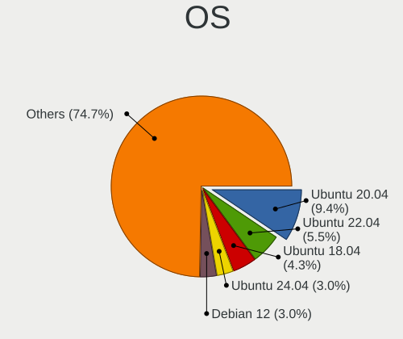

| Name                         | Computers | Percent |
|------------------------------|-----------|---------|
| Ubuntu 20.04                 | 310       | 9.41%   |
| Ubuntu 22.04                 | 181       | 5.49%   |
| Ubuntu 18.04                 | 143       | 4.34%   |
| Ubuntu 24.04                 | 100       | 3.04%   |
| Debian 12                    | 99        | 3.01%   |
| Arch Rolling                 | 69        | 2.09%   |
| ArcoLinux Rolling            | 65        | 1.97%   |
| Zorin 16                     | 60        | 1.82%   |
| Debian 11                    | 57        | 1.73%   |
| Zorin 17                     | 50        | 1.52%   |
| Pop!_OS 22.04                | 50        | 1.52%   |
| OpenMandriva 4.2             | 45        | 1.37%   |
| OpenMandriva 4.3             | 43        | 1.31%   |
| Linux Mint 22.1              | 41        | 1.24%   |
| Fedora 42                    | 40        | 1.21%   |
| Fedora 41                    | 37        | 1.12%   |
| openSUSE Tumbleweed-XXXXXXXX | 35        | 1.06%   |
| OpenMandriva 24.12           | 34        | 1.03%   |
| Manjaro                      | 34        | 1.03%   |
| Fedora 36                    | 34        | 1.03%   |
| Ubuntu 20.10                 | 31        | 0.94%   |
| Linux Mint 20.3              | 30        | 0.91%   |
| OpenMandriva 23.08           | 29        | 0.88%   |
| Linux Mint 20.1              | 29        | 0.88%   |
| Fedora 40                    | 29        | 0.88%   |
| Linux Mint 21.2              | 28        | 0.85%   |
| Fedora 38                    | 28        | 0.85%   |
| Xubuntu 20.04                | 27        | 0.82%   |
| Ubuntu 19.10                 | 27        | 0.82%   |
| Linux Mint 19.3              | 26        | 0.79%   |
| Fedora 39                    | 26        | 0.79%   |
| Fedora 35                    | 26        | 0.79%   |
| Arch                         | 26        | 0.79%   |
| Linux Mint 21                | 25        | 0.76%   |
| Linux Mint 21.3              | 24        | 0.73%   |
| Linux Mint 20.2              | 24        | 0.73%   |
| Fedora 34                    | 21        | 0.64%   |
| Ubuntu 19.04                 | 20        | 0.61%   |
| Pop!_OS 20.04                | 20        | 0.61%   |
| OpenMandriva 23.03           | 19        | 0.58%   |

OS Family
---------

OS without a version

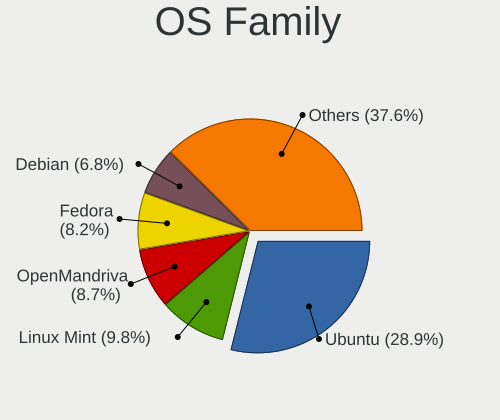

| Name          | Computers | Percent |
|---------------|-----------|---------|
| Ubuntu        | 880       | 28.89%  |
| Linux Mint    | 297       | 9.75%   |
| OpenMandriva  | 265       | 8.7%    |
| Fedora        | 251       | 8.24%   |
| Debian        | 208       | 6.83%   |
| Zorin         | 131       | 4.3%    |
| Pop!_OS       | 99        | 3.25%   |
| Arch          | 93        | 3.05%   |
| Manjaro       | 86        | 2.82%   |
| Xubuntu       | 70        | 2.3%    |
| Kubuntu       | 66        | 2.17%   |
| ArcoLinux     | 66        | 2.17%   |
| openSUSE      | 54        | 1.77%   |
| KDE neon      | 35        | 1.15%   |
| ROSA          | 33        | 1.08%   |
| Elementary    | 31        | 1.02%   |
| Gentoo        | 27        | 0.89%   |
| Bazzite       | 26        | 0.85%   |
| Ubuntu MATE   | 22        | 0.72%   |
| Lubuntu       | 21        | 0.69%   |
| Ubuntu Unity  | 20        | 0.66%   |
| LMDE          | 20        | 0.66%   |
| EndeavourOS   | 20        | 0.66%   |
| NixOS         | 15        | 0.49%   |
| MX            | 15        | 0.49%   |
| Kali          | 14        | 0.46%   |
| SteamOS       | 13        | 0.43%   |
| Nobara        | 12        | 0.39%   |
| CentOS        | 12        | 0.39%   |
| Endless       | 11        | 0.36%   |
| Garuda Linux  | 10        | 0.33%   |
| Ubuntu Budgie | 9         | 0.3%    |
| CachyOS       | 9         | 0.3%    |
| Clear Linux   | 8         | 0.26%   |
| BlackPanther  | 8         | 0.26%   |
| TUXEDO OS     | 7         | 0.23%   |
| Ubuntu Studio | 5         | 0.16%   |
| Parrot        | 5         | 0.16%   |
| Vanilla       | 4         | 0.13%   |
| Raspbian      | 4         | 0.13%   |

Kernel
------

Version of the Linux kernel

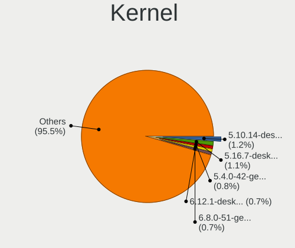

| Version                  | Computers | Percent |
|--------------------------|-----------|---------|
| 5.10.14-desktop-1omv4002 | 44        | 1.18%   |
| 5.16.7-desktop-1omv4003  | 41        | 1.1%    |
| 5.4.0-42-generic         | 29        | 0.77%   |
| 6.12.1-desktop-1omv2490  | 28        | 0.75%   |
| 6.8.0-51-generic         | 26        | 0.69%   |
| 6.14.2-desktop-3omv2590  | 26        | 0.69%   |
| 6.4.11-desktop-1omv2390  | 23        | 0.61%   |
| 5.15.0-56-generic        | 23        | 0.61%   |
| 5.4.0-58-generic         | 22        | 0.59%   |
| 5.4.0-48-generic         | 21        | 0.56%   |
| 5.3.0-42-generic         | 20        | 0.53%   |
| 6.2.6-desktop-1omv2390   | 19        | 0.51%   |
| 5.15.0-46-generic        | 18        | 0.48%   |
| 6.6.2-desktop-1omv2390   | 17        | 0.45%   |
| 6.2.0-26-generic         | 17        | 0.45%   |
| 6.1.0-18-amd64           | 17        | 0.45%   |
| 5.15.0-58-generic        | 17        | 0.45%   |
| 5.15.0-52-generic        | 17        | 0.45%   |
| 6.8.0-52-generic         | 15        | 0.4%    |
| 6.10.0-desktop-1omv2490  | 15        | 0.4%    |
| 6.1.1-desktop-1omv2290   | 15        | 0.4%    |
| 5.8.0-48-generic         | 15        | 0.4%    |
| 5.8.0-43-generic         | 15        | 0.4%    |
| 5.4.0-65-generic         | 15        | 0.4%    |
| 5.15.0-91-generic        | 15        | 0.4%    |
| 5.15.0-48-generic        | 15        | 0.4%    |
| 5.4.0-66-generic         | 14        | 0.37%   |
| 5.4.0-29-generic         | 14        | 0.37%   |
| 5.3.0-46-generic         | 14        | 0.37%   |
| 5.11.0-38-generic        | 14        | 0.37%   |
| 5.4.0-74-generic         | 13        | 0.35%   |
| 5.4.0-52-generic         | 13        | 0.35%   |
| 5.4.0-40-generic         | 13        | 0.35%   |
| 6.8.0-41-generic         | 12        | 0.32%   |
| 6.8.0-40-generic         | 12        | 0.32%   |
| 5.4.0-37-generic         | 12        | 0.32%   |
| 5.4.0-26-generic         | 12        | 0.32%   |
| 5.19.0-35-generic        | 12        | 0.32%   |
| 5.15.0-88-generic        | 12        | 0.32%   |
| 5.15.0-53-generic        | 12        | 0.32%   |

Kernel Family
-------------

Linux kernel without a distro release

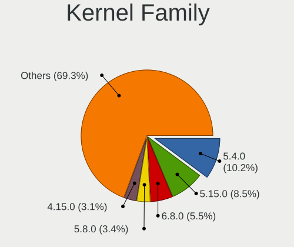

| Version | Computers | Percent |
|---------|-----------|---------|
| 5.4.0   | 357       | 10.17%  |
| 5.15.0  | 298       | 8.49%   |
| 6.8.0   | 193       | 5.5%    |
| 5.8.0   | 118       | 3.36%   |
| 4.15.0  | 110       | 3.13%   |
| 5.11.0  | 108       | 3.08%   |
| 6.1.0   | 102       | 2.91%   |
| 5.13.0  | 87        | 2.48%   |
| 5.3.0   | 83        | 2.37%   |
| 6.5.0   | 81        | 2.31%   |
| 6.14.0  | 73        | 2.08%   |
| 5.10.0  | 67        | 1.91%   |
| 5.19.0  | 65        | 1.85%   |
| 6.2.0   | 64        | 1.82%   |
| 6.11.0  | 53        | 1.51%   |
| 5.0.0   | 51        | 1.45%   |
| 5.10.14 | 44        | 1.25%   |
| 5.16.7  | 41        | 1.17%   |
| 4.18.0  | 38        | 1.08%   |
| 6.14.2  | 34        | 0.97%   |
| 6.12.1  | 32        | 0.91%   |
| 6.4.11  | 23        | 0.66%   |
| 6.2.6   | 23        | 0.66%   |
| 6.6.2   | 20        | 0.57%   |
| 6.9.3   | 17        | 0.48%   |
| 6.10.0  | 16        | 0.46%   |
| 4.19.0  | 16        | 0.46%   |
| 6.1.1   | 15        | 0.43%   |
| 6.12.10 | 12        | 0.34%   |
| 6.0.0   | 11        | 0.31%   |
| 6.17.7  | 10        | 0.28%   |
| 6.12.8  | 10        | 0.28%   |
| 4.18.16 | 10        | 0.28%   |
| 6.8.12  | 9         | 0.26%   |
| 6.12.9  | 9         | 0.26%   |
| 6.0.12  | 9         | 0.26%   |
| 5.17.5  | 9         | 0.26%   |
| 4.9.20  | 9         | 0.26%   |
| 6.2.11  | 8         | 0.23%   |
| 5.18.12 | 8         | 0.23%   |

Kernel Major Ver.
-----------------

Linux kernel major version

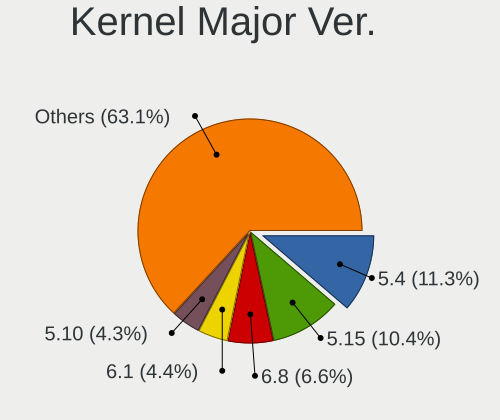

| Version | Computers | Percent |
|---------|-----------|---------|
| 5.4     | 386       | 11.27%  |
| 5.15    | 355       | 10.37%  |
| 6.8     | 225       | 6.57%   |
| 6.1     | 150       | 4.38%   |
| 5.10    | 146       | 4.26%   |
| 5.8     | 140       | 4.09%   |
| 5.11    | 135       | 3.94%   |
| 6.14    | 127       | 3.71%   |
| 6.5     | 122       | 3.56%   |
| 6.2     | 121       | 3.53%   |
| 6.12    | 119       | 3.48%   |
| 4.15    | 110       | 3.21%   |
| 5.13    | 106       | 3.1%    |
| 5.3     | 92        | 2.69%   |
| 5.19    | 90        | 2.63%   |
| 6.11    | 84        | 2.45%   |
| 5.16    | 80        | 2.34%   |
| 6.6     | 79        | 2.31%   |
| 5.0     | 57        | 1.66%   |
| 6.4     | 55        | 1.61%   |
| 6.0     | 50        | 1.46%   |
| 4.18    | 49        | 1.43%   |
| 6.9     | 47        | 1.37%   |
| 5.17    | 40        | 1.17%   |
| 6.10    | 37        | 1.08%   |
| 5.14    | 35        | 1.02%   |
| 5.18    | 34        | 0.99%   |
| 6.15    | 33        | 0.96%   |
| 6.17    | 31        | 0.91%   |
| 6.13    | 29        | 0.85%   |
| 6.3     | 27        | 0.79%   |
| 5.9     | 26        | 0.76%   |
| 4.9     | 26        | 0.76%   |
| 6.16    | 24        | 0.7%    |
| 5.12    | 24        | 0.7%    |
| 4.19    | 23        | 0.67%   |
| 5.6     | 22        | 0.64%   |
| 6.7     | 20        | 0.58%   |
| 5.5     | 13        | 0.38%   |
| 5.7     | 12        | 0.35%   |

Arch
----

OS architecture (x86_64, i586, etc.)

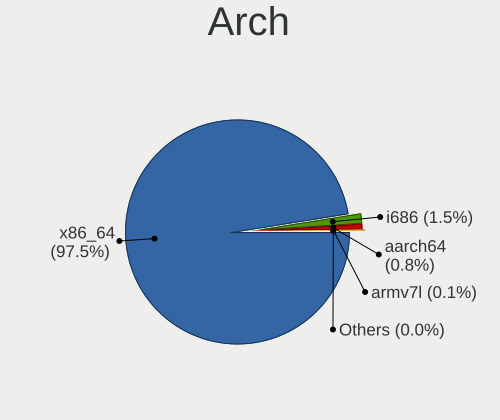

| Name    | Computers | Percent |
|---------|-----------|---------|
| x86_64  | 2811      | 97.47%  |
| i686    | 43        | 1.49%   |
| aarch64 | 24        | 0.83%   |
| armv7l  | 4         | 0.14%   |
| armv6l  | 1         | 0.03%   |
| Unknown | 1         | 0.03%   |

DE
--

Desktop Environment

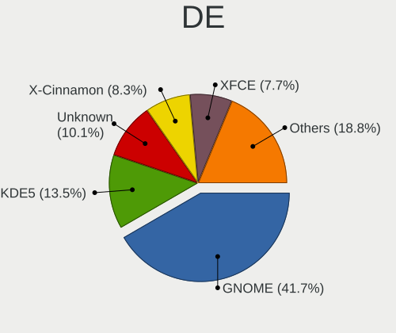

| Name             | Computers | Percent |
|------------------|-----------|---------|
| GNOME            | 1292      | 41.65%  |
| KDE5             | 419       | 13.51%  |
| Unknown          | 314       | 10.12%  |
| X-Cinnamon       | 256       | 8.25%   |
| XFCE             | 239       | 7.7%    |
| KDE6             | 188       | 6.06%   |
| MATE             | 83        | 2.68%   |
| LXQt             | 46        | 1.48%   |
| KDE              | 42        | 1.35%   |
| Pantheon         | 30        | 0.97%   |
| Cinnamon         | 26        | 0.84%   |
| i3               | 25        | 0.81%   |
| Unity            | 20        | 0.64%   |
| Budgie           | 18        | 0.58%   |
| KDE4             | 16        | 0.52%   |
| Hyprland         | 13        | 0.42%   |
| sway             | 10        | 0.32%   |
| LXDE             | 7         | 0.23%   |
| GNOME Flashback  | 7         | 0.23%   |
| Deepin           | 5         | 0.16%   |
| COSMIC           | 5         | 0.16%   |
| awesome          | 5         | 0.16%   |
| Trinity          | 4         | 0.13%   |
| Openbox          | 4         | 0.13%   |
| LeftWM           | 4         | 0.13%   |
| lightdm-xsession | 3         | 0.1%    |
| GNOME Classic    | 3         | 0.1%    |
| bspwm            | 3         | 0.1%    |
| qtile            | 2         | 0.06%   |
| labwc:wlroots    | 2         | 0.06%   |
| ICEWM            | 2         | 0.06%   |
| chadwm           | 2         | 0.06%   |
| xmonad           | 1         | 0.03%   |
| UKUI             | 1         | 0.03%   |
| spectrwm         | 1         | 0.03%   |
| river            | 1         | 0.03%   |
| LXDE-pi-wayfire  | 1         | 0.03%   |
| Enlightenment    | 1         | 0.03%   |
| DDE              | 1         | 0.03%   |

Display Server
--------------

X11 or Wayland

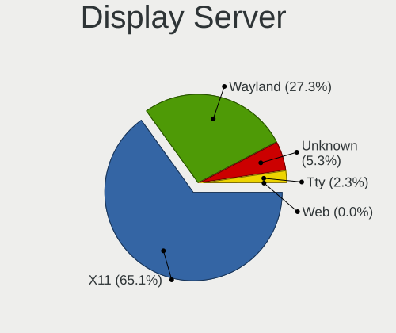

| Name    | Computers | Percent |
|---------|-----------|---------|
| X11     | 1966      | 65.06%  |
| Wayland | 825       | 27.3%   |
| Unknown | 161       | 5.33%   |
| Tty     | 69        | 2.28%   |
| Web     | 1         | 0.03%   |

Display Manager
---------------

SDDM, LightDM, etc.

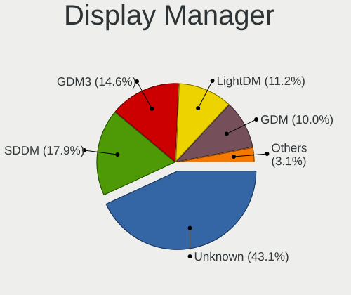

| Name           | Computers | Percent |
|----------------|-----------|---------|
| Unknown        | 1315      | 43.13%  |
| SDDM           | 547       | 17.94%  |
| GDM3           | 446       | 14.63%  |
| LightDM        | 342       | 11.22%  |
| GDM            | 306       | 10.04%  |
| TDM            | 69        | 2.26%   |
| KDM            | 13        | 0.43%   |
| XDM            | 4         | 0.13%   |
| SLiM           | 3         | 0.1%    |
| LY-DM          | 2         | 0.07%   |
| GREETD         | 1         | 0.03%   |
| COSMIC-GREETER | 1         | 0.03%   |

OS Lang
-------

Language

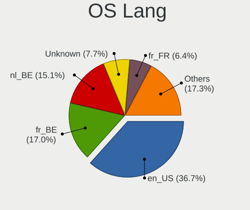

| Lang       | Computers | Percent |
|------------|-----------|---------|
| en_US      | 1100      | 36.65%  |
| fr_BE      | 509       | 16.96%  |
| nl_BE      | 453       | 15.09%  |
| Unknown    | 230       | 7.66%   |
| fr_FR      | 191       | 6.36%   |
| en_GB      | 177       | 5.9%    |
| nl_NL      | 130       | 4.33%   |
| C          | 66        | 2.2%    |
| de_DE      | 24        | 0.8%    |
| pl_PL      | 18        | 0.6%    |
| en_IE      | 15        | 0.5%    |
| de_BE      | 14        | 0.47%   |
| ru_RU      | 8         | 0.27%   |
| it_IT      | 6         | 0.2%    |
| es_ES      | 6         | 0.2%    |
| POSIX      | 5         | 0.17%   |
| C.UTF8     | 5         | 0.17%   |
| ro_RO      | 4         | 0.13%   |
| uk_UA      | 3         | 0.1%    |
| pt_PT      | 3         | 0.1%    |
| tr_TR      | 2         | 0.07%   |
| fr_LU      | 2         | 0.07%   |
| en_US.UTF8 | 2         | 0.07%   |
| en_DK      | 2         | 0.07%   |
| en_CA      | 2         | 0.07%   |
| en_BW      | 2         | 0.07%   |
| en_BE      | 2         | 0.07%   |
| tt_RU      | 1         | 0.03%   |
| pt_BR      | 1         | 0.03%   |
| pl_PL.UTF8 | 1         | 0.03%   |
| nl_BE.UTF8 | 1         | 0.03%   |
| nl_AW      | 1         | 0.03%   |
| li_BE      | 1         | 0.03%   |
| ku_TR      | 1         | 0.03%   |
| it_CH      | 1         | 0.03%   |
| hu_HU      | 1         | 0.03%   |
| fr_FR.UTF8 | 1         | 0.03%   |
| fr_CH      | 1         | 0.03%   |
| es_PE      | 1         | 0.03%   |
| en_ZA      | 1         | 0.03%   |

Boot Mode
---------

EFI or BIOS

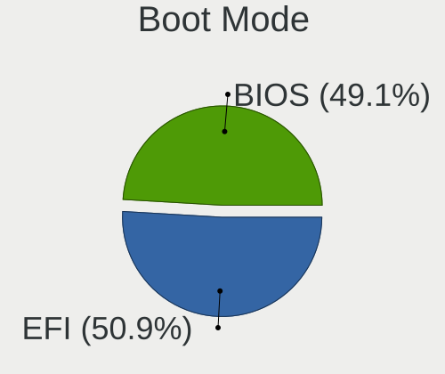

| Mode | Computers | Percent |
|------|-----------|---------|
| EFI  | 1511      | 50.93%  |
| BIOS | 1456      | 49.07%  |

Filesystem
----------

Type of filesystem

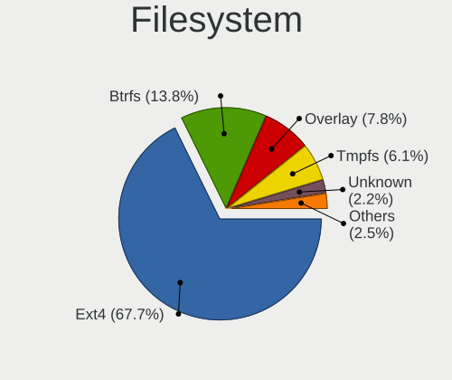

| Type     | Computers | Percent |
|----------|-----------|---------|
| Ext4     | 2041      | 67.72%  |
| Btrfs    | 415       | 13.77%  |
| Overlay  | 234       | 7.76%   |
| Tmpfs    | 183       | 6.07%   |
| Unknown  | 65        | 2.16%   |
| Xfs      | 40        | 1.33%   |
| Zfs      | 24        | 0.8%    |
| Ext2     | 8         | 0.27%   |
| F2fs     | 2         | 0.07%   |
| Reiserfs | 1         | 0.03%   |
| Ext3     | 1         | 0.03%   |

Part. scheme
------------

Scheme of partitioning

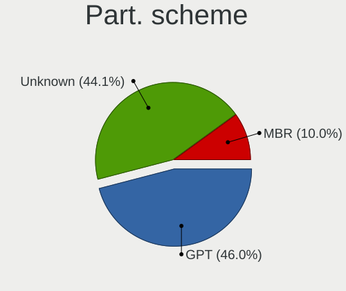

| Type    | Computers | Percent |
|---------|-----------|---------|
| GPT     | 1373      | 45.95%  |
| Unknown | 1317      | 44.08%  |
| MBR     | 298       | 9.97%   |

Dual Boot with Linux/BSD
------------------------

Hosting more than one Linux/BSD

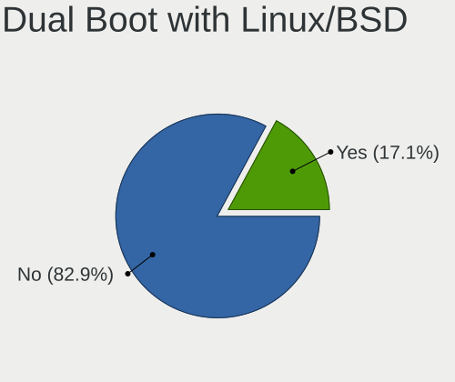

| Dual boot | Computers | Percent |
|-----------|-----------|---------|
| No        | 2458      | 82.9%   |
| Yes       | 507       | 17.1%   |

Dual Boot (Win)
---------------

Hosting Linux and Windows

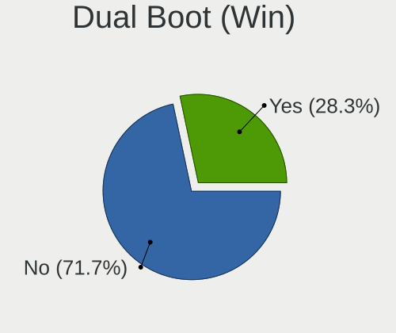

| Dual boot | Computers | Percent |
|-----------|-----------|---------|
| No        | 2111      | 71.68%  |
| Yes       | 834       | 28.32%  |

Board
-----

Vendor
------

Motherboard manufacturer

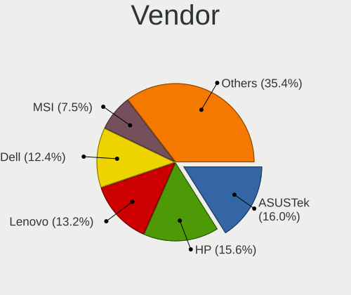

| Name                                 | Computers | Percent |
|--------------------------------------|-----------|---------|
| ASUSTek Computer                     | 462       | 16.04%  |
| Hewlett-Packard                      | 449       | 15.58%  |
| Lenovo                               | 379       | 13.16%  |
| Dell                                 | 356       | 12.36%  |
| MSI                                  | 215       | 7.46%   |
| Gigabyte Technology                  | 157       | 5.45%   |
| Acer                                 | 151       | 5.24%   |
| ASRock                               | 86        | 2.99%   |
| Apple                                | 83        | 2.88%   |
| Medion                               | 78        | 2.71%   |
| Intel                                | 56        | 1.94%   |
| Toshiba                              | 41        | 1.42%   |
| Sony                                 | 36        | 1.25%   |
| Unknown                              | 33        | 1.15%   |
| Packard Bell                         | 27        | 0.94%   |
| Fujitsu                              | 26        | 0.9%    |
| Notebook                             | 25        | 0.87%   |
| Raspberry Pi Foundation              | 18        | 0.62%   |
| TUXEDO                               | 16        | 0.56%   |
| AZW                                  | 15        | 0.52%   |
| Samsung Electronics                  | 12        | 0.42%   |
| Valve                                | 11        | 0.38%   |
| Foxconn                              | 8         | 0.28%   |
| Alienware                            | 8         | 0.28%   |
| PC Specialist                        | 7         | 0.24%   |
| Fujitsu Siemens                      | 7         | 0.24%   |
| Shenzhen Meigao Electronic Equipment | 6         | 0.21%   |
| Pegatron                             | 6         | 0.21%   |
| Google                               | 6         | 0.21%   |
| BESSTAR Tech                         | 6         | 0.21%   |
| Supermicro                           | 5         | 0.17%   |
| HUAWEI                               | 5         | 0.17%   |
| Clevo                                | 5         | 0.17%   |
| AMI                                  | 5         | 0.17%   |
| Microsoft                            | 4         | 0.14%   |
| Teclast                              | 3         | 0.1%    |
| Nvidia                               | 3         | 0.1%    |
| GMKtec                               | 3         | 0.1%    |
| Framework                            | 3         | 0.1%    |
| VALE                                 | 2         | 0.07%   |

Model
-----

Motherboard model

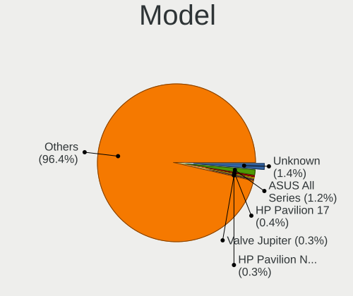

| Name                             | Computers | Percent |
|----------------------------------|-----------|---------|
| Unknown                          | 39        | 1.35%   |
| ASUS All Series                  | 35        | 1.21%   |
| HP Pavilion 17                   | 11        | 0.38%   |
| Valve Jupiter                    | 10        | 0.35%   |
| HP Pavilion Notebook             | 9         | 0.31%   |
| MSI MS-7C91                      | 8         | 0.28%   |
| HP Pavilion g7                   | 8         | 0.28%   |
| HP Pavilion dv7                  | 8         | 0.28%   |
| HP Pavilion dv6                  | 8         | 0.28%   |
| ASRock B450M Pro4                | 8         | 0.28%   |
| MSI MS-7B86                      | 7         | 0.24%   |
| HP Notebook                      | 7         | 0.24%   |
| HP EliteBook 850 G8 Notebook PC  | 7         | 0.24%   |
| ASUS UNLOCK INSTALL              | 7         | 0.24%   |
| ASUS ROG STRIX B550-F GAMING     | 7         | 0.24%   |
| MSI MS-7C37                      | 6         | 0.21%   |
| HP ProBook 6570b                 | 6         | 0.21%   |
| HP ProBook 650 G1                | 6         | 0.21%   |
| Gigabyte B550 AORUS ELITE V2     | 6         | 0.21%   |
| Dell Latitude 5530               | 6         | 0.21%   |
| ASUS ROG STRIX X570-E GAMING     | 6         | 0.21%   |
| MSI MS-7A38                      | 5         | 0.17%   |
| Lenovo IdeaPad 5 Pro 16ACH6 82L5 | 5         | 0.17%   |
| HP Pavilion Laptop 15-eh1xxx     | 5         | 0.17%   |
| HP Pavilion Laptop 15-cw0xxx     | 5         | 0.17%   |
| Gigabyte B550I AORUS PRO AX      | 5         | 0.17%   |
| Dell XPS 15 9560                 | 5         | 0.17%   |
| Dell XPS 13 7390                 | 5         | 0.17%   |
| Dell Precision M4800             | 5         | 0.17%   |
| Dell OptiPlex 780                | 5         | 0.17%   |
| Dell Latitude E7440              | 5         | 0.17%   |
| Dell Latitude 5520               | 5         | 0.17%   |
| AZW SER                          | 5         | 0.17%   |
| ASUS Vivobook Go E1504FA_E1504FA | 5         | 0.17%   |
| ASUS PRIME X570-PRO              | 5         | 0.17%   |
| Apple MacBookPro9,2              | 5         | 0.17%   |
| Toshiba Satellite C660           | 4         | 0.14%   |
| RPi Raspberry Pi                 | 4         | 0.14%   |
| Lenovo Yoga 530-14IKB 81EK       | 4         | 0.14%   |
| Lenovo ThinkPad L390 20NSS1YV0B  | 4         | 0.14%   |

Model Family
------------

Motherboard model prefix

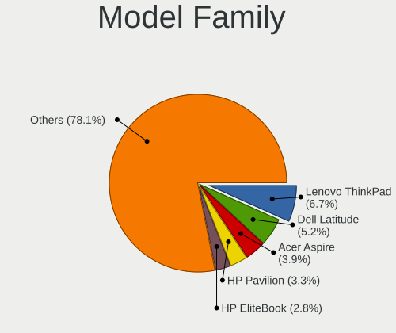

| Name                  | Computers | Percent |
|-----------------------|-----------|---------|
| Lenovo ThinkPad       | 193       | 6.7%    |
| Dell Latitude         | 149       | 5.17%   |
| Acer Aspire           | 111       | 3.85%   |
| HP Pavilion           | 95        | 3.3%    |
| HP EliteBook          | 82        | 2.85%   |
| ASUS ROG              | 68        | 2.36%   |
| HP ProBook            | 66        | 2.29%   |
| Lenovo IdeaPad        | 61        | 2.12%   |
| ASUS PRIME            | 50        | 1.74%   |
| Dell OptiPlex         | 48        | 1.67%   |
| Dell XPS              | 47        | 1.63%   |
| HP Compaq             | 41        | 1.42%   |
| Dell Precision        | 39        | 1.35%   |
| Unknown               | 39        | 1.35%   |
| Toshiba Satellite     | 37        | 1.28%   |
| ASUS All              | 35        | 1.21%   |
| Dell Inspiron         | 33        | 1.15%   |
| ASUS VivoBook         | 31        | 1.08%   |
| ASUS TUF              | 29        | 1.01%   |
| Lenovo Legion         | 28        | 0.97%   |
| HP Laptop             | 28        | 0.97%   |
| HP ZBook              | 22        | 0.76%   |
| Lenovo Yoga           | 21        | 0.73%   |
| Lenovo ThinkCentre    | 20        | 0.69%   |
| RPi Raspberry         | 18        | 0.62%   |
| HP ProDesk            | 18        | 0.62%   |
| Medion Akoya          | 17        | 0.59%   |
| HP ENVY               | 16        | 0.56%   |
| Packard Bell EasyNote | 15        | 0.52%   |
| ASUS ZenBook          | 13        | 0.45%   |
| Gigabyte B550         | 12        | 0.42%   |
| Fujitsu LIFEBOOK      | 12        | 0.42%   |
| Dell Vostro           | 12        | 0.42%   |
| Acer Nitro            | 11        | 0.38%   |
| Valve Jupiter         | 10        | 0.35%   |
| Dell Studio           | 10        | 0.35%   |
| Lenovo ThinkBook      | 9         | 0.31%   |
| Lenovo IdeaCentre     | 9         | 0.31%   |
| Gigabyte X570         | 9         | 0.31%   |
| Fujitsu ESPRIMO       | 9         | 0.31%   |

MFG Year
--------

Motherboard manufacture year

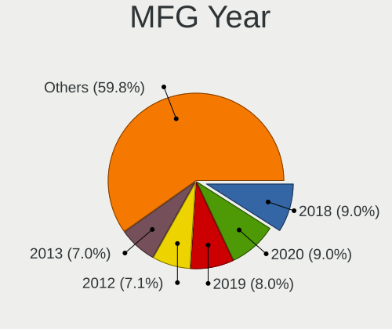

| Year    | Computers | Percent |
|---------|-----------|---------|
| 2018    | 260       | 9.02%   |
| 2020    | 259       | 8.99%   |
| 2019    | 231       | 8.02%   |
| 2012    | 205       | 7.12%   |
| 2013    | 203       | 7.05%   |
| 2021    | 176       | 6.11%   |
| 2014    | 165       | 5.73%   |
| 2011    | 162       | 5.62%   |
| 2017    | 160       | 5.55%   |
| 2022    | 140       | 4.86%   |
| 2016    | 138       | 4.79%   |
| 2015    | 132       | 4.58%   |
| 2010    | 113       | 3.92%   |
| 2008    | 112       | 3.89%   |
| 2023    | 109       | 3.78%   |
| 2009    | 95        | 3.3%    |
| 2024    | 76        | 2.64%   |
| 2007    | 62        | 2.15%   |
| 2006    | 30        | 1.04%   |
| Unknown | 30        | 1.04%   |
| 2025    | 16        | 0.56%   |
| 2005    | 5         | 0.17%   |
| 2004    | 2         | 0.07%   |

Form Factor
-----------

Physical design of the computer

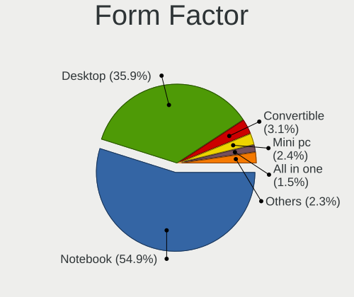

| Name           | Computers | Percent |
|----------------|-----------|---------|
| Notebook       | 1581      | 54.88%  |
| Desktop        | 1034      | 35.89%  |
| Convertible    | 89        | 3.09%   |
| Mini pc        | 68        | 2.36%   |
| All in one     | 43        | 1.49%   |
| System on chip | 28        | 0.97%   |
| Tablet         | 19        | 0.66%   |
| Server         | 18        | 0.62%   |
| Other          | 1         | 0.03%   |

Secure Boot
-----------

Enabled or disabled

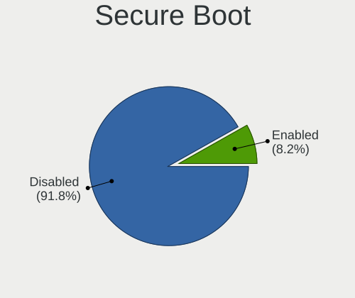

| State    | Computers | Percent |
|----------|-----------|---------|
| Disabled | 2677      | 91.84%  |
| Enabled  | 238       | 8.16%   |

Coreboot
--------

Have coreboot on board

| Used | Computers | Percent |
|------|-----------|---------|
| No   | 2873      | 99.72%  |
| Yes  | 8         | 0.28%   |

RAM Size
--------

Total RAM memory

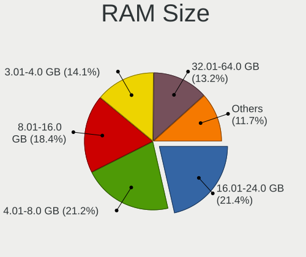

| Size in GB      | Computers | Percent |
|-----------------|-----------|---------|
| 16.01-24.0      | 634       | 21.43%  |
| 4.01-8.0        | 626       | 21.16%  |
| 8.01-16.0       | 545       | 18.42%  |
| 3.01-4.0        | 418       | 14.13%  |
| 32.01-64.0      | 390       | 13.18%  |
| 64.01-256.0     | 121       | 4.09%   |
| 24.01-32.0      | 87        | 2.94%   |
| 1.01-2.0        | 73        | 2.47%   |
| 2.01-3.0        | 33        | 1.12%   |
| 0.51-1.0        | 20        | 0.68%   |
| More than 256.0 | 7         | 0.24%   |
| 0.01-0.5        | 3         | 0.1%    |
| Unknown         | 1         | 0.03%   |

RAM Used
--------

Used RAM memory

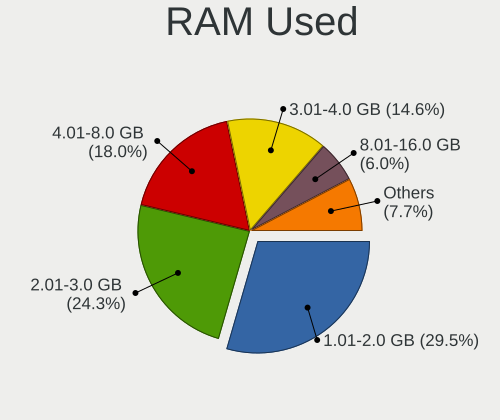

| Used GB     | Computers | Percent |
|-------------|-----------|---------|
| 1.01-2.0    | 975       | 29.48%  |
| 2.01-3.0    | 802       | 24.25%  |
| 4.01-8.0    | 595       | 17.99%  |
| 3.01-4.0    | 483       | 14.61%  |
| 8.01-16.0   | 198       | 5.99%   |
| 0.51-1.0    | 170       | 5.14%   |
| 0.01-0.5    | 45        | 1.36%   |
| 16.01-24.0  | 23        | 0.7%    |
| 24.01-32.0  | 12        | 0.36%   |
| Unknown     | 2         | 0.06%   |
| 32.01-64.0  | 1         | 0.03%   |
| 64.01-256.0 | 1         | 0.03%   |

Total Drives
------------

Number of drives on board

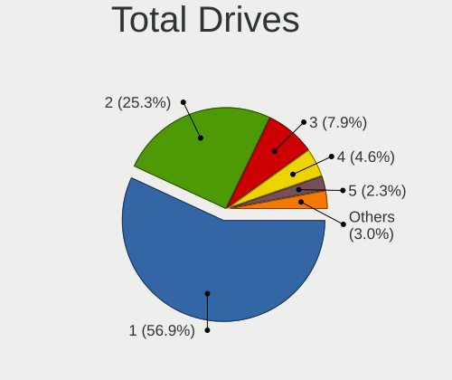

| Drives  | Computers | Percent |
|---------|-----------|---------|
| 1       | 1712      | 56.9%   |
| 2       | 760       | 25.26%  |
| 3       | 239       | 7.94%   |
| 4       | 139       | 4.62%   |
| 5       | 70        | 2.33%   |
| 6       | 34        | 1.13%   |
| 0       | 23        | 0.76%   |
| 7       | 10        | 0.33%   |
| 8       | 8         | 0.27%   |
| 9       | 5         | 0.17%   |
| 14      | 2         | 0.07%   |
| 10      | 2         | 0.07%   |
| 16      | 1         | 0.03%   |
| 15      | 1         | 0.03%   |
| 13      | 1         | 0.03%   |
| 11      | 1         | 0.03%   |
| Unknown | 1         | 0.03%   |

Has CD-ROM
----------

Has CD-ROM on board

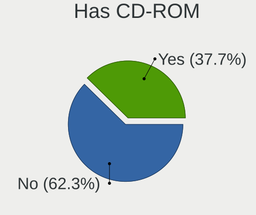

| Presented | Computers | Percent |
|-----------|-----------|---------|
| No        | 1808      | 62.32%  |
| Yes       | 1093      | 37.68%  |

Has Ethernet
------------

Has Ethernet on board

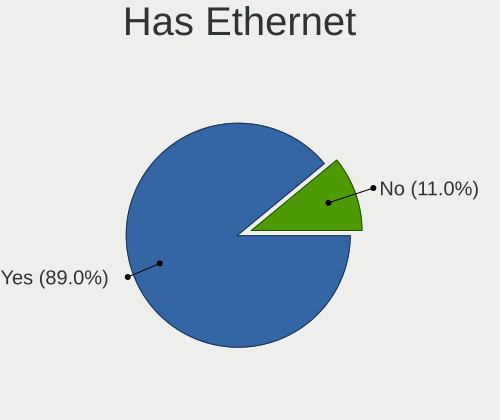

| Presented | Computers | Percent |
|-----------|-----------|---------|
| Yes       | 2578      | 89.02%  |
| No        | 318       | 10.98%  |

Has WiFi
--------

Has WiFi module

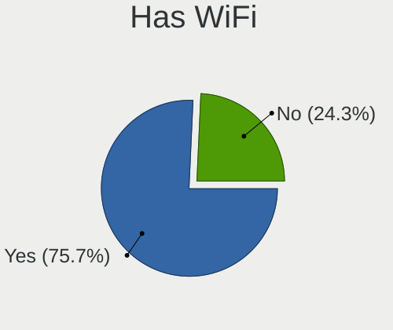

| Presented | Computers | Percent |
|-----------|-----------|---------|
| Yes       | 2196      | 75.72%  |
| No        | 704       | 24.28%  |

Has Bluetooth
-------------

Has Bluetooth module

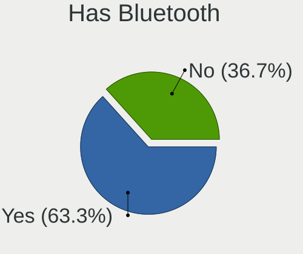

| Presented | Computers | Percent |
|-----------|-----------|---------|
| Yes       | 1853      | 63.33%  |
| No        | 1073      | 36.67%  |

Location
--------

Country
-------

Geographic location (country)

| Country | Computers | Percent |
|---------|-----------|---------|
| Belgium | 2881      | 100%    |

City
----

Geographic location (city)

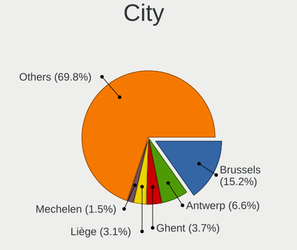

| City             | Computers | Percent |
|------------------|-----------|---------|
| Brussels         | 483       | 15.2%   |
| Antwerp          | 210       | 6.61%   |
| Ghent            | 118       | 3.71%   |
| Liège           | 99        | 3.12%   |
| Mechelen         | 49        | 1.54%   |
| Ixelles-Elsene   | 49        | 1.54%   |
| Leuven           | 44        | 1.38%   |
| Hasselt          | 35        | 1.1%    |
| Bruges           | 33        | 1.04%   |
| Turnhout         | 28        | 0.88%   |
| Aalst            | 28        | 0.88%   |
| Kortrijk         | 26        | 0.82%   |
| Namur            | 24        | 0.76%   |
| Anderlecht       | 24        | 0.76%   |
| Louvain-la-Neuve | 23        | 0.72%   |
| Roeselare        | 21        | 0.66%   |
| La Louvière     | 21        | 0.66%   |
| Herentals        | 21        | 0.66%   |
| Mons             | 20        | 0.63%   |
| Charleroi        | 19        | 0.6%    |
| Sint-Truiden     | 18        | 0.57%   |
| Schaarbeek       | 18        | 0.57%   |
| Uccle            | 17        | 0.53%   |
| Sint-Niklaas     | 17        | 0.53%   |
| Heusden-Zolder   | 17        | 0.53%   |
| Arlon            | 17        | 0.53%   |
| Waregem          | 16        | 0.5%    |
| Wetteren         | 15        | 0.47%   |
| Tournai          | 15        | 0.47%   |
| Seraing          | 15        | 0.47%   |
| Wilrijk          | 14        | 0.44%   |
| Mortsel          | 14        | 0.44%   |
| Edegem           | 14        | 0.44%   |
| Verviers         | 13        | 0.41%   |
| Lier             | 13        | 0.41%   |
| Genk             | 13        | 0.41%   |
| Etterbeek        | 13        | 0.41%   |
| Duffel           | 13        | 0.41%   |
| Deurne           | 13        | 0.41%   |
| Aarschot         | 13        | 0.41%   |

Drives
------

Drive Vendor
------------

Hard drive vendors

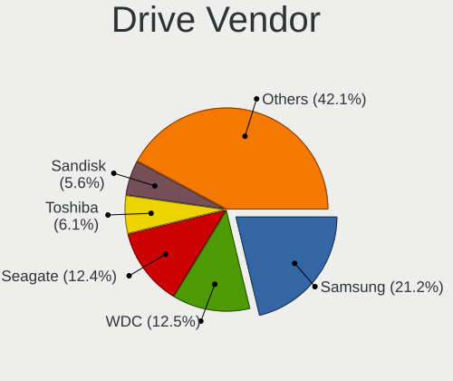

| Vendor                       | Computers | Drives | Percent |
|------------------------------|-----------|--------|---------|
| Samsung Electronics          | 915       | 1699   | 21.24%  |
| WDC                          | 537       | 915    | 12.47%  |
| Seagate                      | 536       | 920    | 12.44%  |
| Toshiba                      | 263       | 374    | 6.11%   |
| Sandisk                      | 242       | 312    | 5.62%   |
| Kingston                     | 234       | 353    | 5.43%   |
| Crucial                      | 164       | 246    | 3.81%   |
| Unknown                      | 146       | 209    | 3.39%   |
| SK hynix                     | 136       | 173    | 3.16%   |
| Intel                        | 118       | 150    | 2.74%   |
| Hitachi                      | 102       | 135    | 2.37%   |
| Micron Technology            | 96        | 119    | 2.23%   |
| HGST                         | 65        | 93     | 1.51%   |
| Apple                        | 46        | 63     | 1.07%   |
| Micron/Crucial Technology    | 45        | 72     | 1.04%   |
| Kingston Technology Company  | 42        | 53     | 0.98%   |
| KIOXIA                       | 36        | 39     | 0.84%   |
| China                        | 34        | 41     | 0.79%   |
| Intenso                      | 31        | 43     | 0.72%   |
| Phison Electronics           | 26        | 33     | 0.6%    |
| Phison                       | 25        | 30     | 0.58%   |
| LITEON                       | 25        | 33     | 0.58%   |
| A-DATA Technology            | 22        | 27     | 0.51%   |
| Maxtor                       | 20        | 28     | 0.46%   |
| Fujitsu                      | 18        | 26     | 0.42%   |
| Corsair                      | 18        | 19     | 0.42%   |
| PNY                          | 17        | 20     | 0.39%   |
| OCZ                          | 15        | 19     | 0.35%   |
| Unknown                      | 14        | 20     | 0.33%   |
| Transcend                    | 13        | 25     | 0.3%    |
| Silicon Motion               | 13        | 20     | 0.3%    |
| LITEONIT                     | 12        | 17     | 0.28%   |
| LaCie                        | 12        | 16     | 0.28%   |
| KingSpec                     | 11        | 15     | 0.26%   |
| ASMT                         | 11        | 12     | 0.26%   |
| Shenzhen Longsys Electronics | 10        | 10     | 0.23%   |
| Patriot                      | 10        | 38     | 0.23%   |
| GOODRAM                      | 10        | 15     | 0.23%   |
| SPCC                         | 9         | 11     | 0.21%   |
| JMicron Technology           | 8         | 12     | 0.19%   |

Drive Model
-----------

Hard drive models

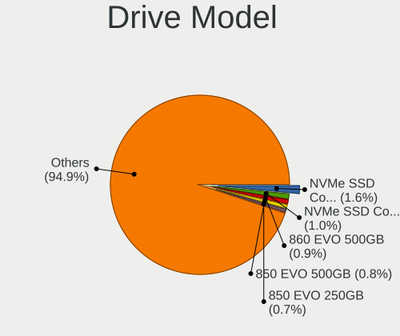

| Model                                                | Computers | Percent |
|------------------------------------------------------|-----------|---------|
| Samsung NVMe SSD Controller SM981/PM981/PM983 1TB    | 76        | 1.55%   |
| Samsung NVMe SSD Controller PM9A1/PM9A3/980PRO 1TB   | 51        | 1.04%   |
| Samsung SSD 860 EVO 500GB                            | 46        | 0.94%   |
| Samsung SSD 850 EVO 500GB                            | 39        | 0.8%    |
| Samsung SSD 850 EVO 250GB                            | 36        | 0.74%   |
| Seagate ST1000LM024 HN-M101MBB 1TB                   | 32        | 0.65%   |
| Samsung SSD 860 EVO 1TB                              | 32        | 0.65%   |
| Samsung SSD 860 EVO 250GB                            | 30        | 0.61%   |
| Seagate ST1000LM035-1RK172 1TB                       | 29        | 0.59%   |
| Samsung SSD 870 EVO 1TB                              | 28        | 0.57%   |
| Samsung NVMe SSD Drive 1TB                           | 28        | 0.57%   |
| Kingston SV300S37A120G 120GB SSD                     | 27        | 0.55%   |
| Kingston SA400S37240G 240GB SSD                      | 27        | 0.55%   |
| Kingston SA400S37120G 120GB SSD                      | 27        | 0.55%   |
| Samsung SSD 870 QVO 1TB                              | 26        | 0.53%   |
| Toshiba MQ01ABD100 1TB                               | 23        | 0.47%   |
| Samsung NVMe SSD Drive 512GB                         | 23        | 0.47%   |
| Toshiba DT01ACA100 1TB                               | 22        | 0.45%   |
| Seagate ST2000DM001-1ER164 2TB                       | 22        | 0.45%   |
| SanDisk NVMe SSD Drive 512GB                         | 22        | 0.45%   |
| Samsung SSD 870 EVO 500GB                            | 22        | 0.45%   |
| Samsung SSD 840 EVO 250GB                            | 21        | 0.43%   |
| Samsung NVMe SSD Drive 500GB                         | 21        | 0.43%   |
| Kingston SA400S37480G 480GB SSD                      | 20        | 0.41%   |
| HGST HTS721010A9E630 1TB                             | 20        | 0.41%   |
| Crucial CT500MX500SSD1 500GB                         | 20        | 0.41%   |
| Seagate ST500DM002-1BD142 500GB                      | 19        | 0.39%   |
| Seagate Expansion 2TB                                | 19        | 0.39%   |
| Micron/Crucial P2 NVMe PCIe SSD 2TB                  | 19        | 0.39%   |
| Unknown MMC Card  64GB                               | 18        | 0.37%   |
| Unknown MMC Card  32GB                               | 18        | 0.37%   |
| Samsung SSD 980 1TB                                  | 18        | 0.37%   |
| Seagate ST2000DM008-2FR102 2TB                       | 17        | 0.35%   |
| SanDisk NVMe SSD Drive 1TB                           | 17        | 0.35%   |
| Samsung NVMe SSD Controller SM961/PM961/SM963 1024GB | 17        | 0.35%   |
| Unknown SD/MMC/MS PRO 2GB                            | 16        | 0.33%   |
| Unknown MMC Card  128GB                              | 16        | 0.33%   |
| Seagate ST9500325AS 500GB                            | 16        | 0.33%   |
| Seagate ST2000DM001-1CH164 2TB                       | 16        | 0.33%   |
| Samsung SSD 860 QVO 1TB                              | 15        | 0.31%   |

HDD Vendor
----------

Hard disk drive vendors

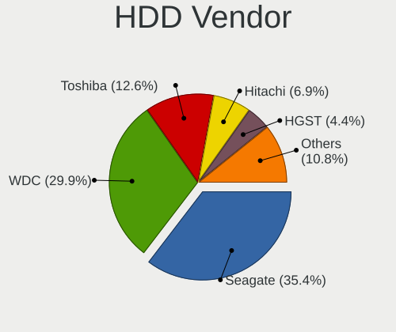

| Vendor              | Computers | Drives | Percent |
|---------------------|-----------|--------|---------|
| Seagate             | 521       | 890    | 35.39%  |
| WDC                 | 440       | 753    | 29.89%  |
| Toshiba             | 185       | 271    | 12.57%  |
| Hitachi             | 102       | 135    | 6.93%   |
| HGST                | 65        | 93     | 4.42%   |
| Samsung Electronics | 50        | 81     | 3.4%    |
| Maxtor              | 20        | 28     | 1.36%   |
| Fujitsu             | 17        | 24     | 1.15%   |
| Unknown             | 16        | 29     | 1.09%   |
| Apple               | 13        | 14     | 0.88%   |
| Intenso             | 7         | 11     | 0.48%   |
| Hewlett-Packard     | 7         | 35     | 0.48%   |
| LaCie               | 4         | 4      | 0.27%   |
| JMicron Technology  | 3         | 4      | 0.2%    |
| FC-1307             | 2         | 2      | 0.14%   |
| ASMT                | 2         | 3      | 0.14%   |
| XrayDisk            | 1         | 1      | 0.07%   |
| WD MediaMax         | 1         | 1      | 0.07%   |
| TO Exter            | 1         | 1      | 0.07%   |
| SSK                 | 1         | 1      | 0.07%   |
| SINTECHI            | 1         | 1      | 0.07%   |
| SABRENT             | 1         | 1      | 0.07%   |
| Magnetic Data       | 1         | 1      | 0.07%   |
| Lenovo              | 1         | 2      | 0.07%   |
| KESU                | 1         | 4      | 0.07%   |
| IET                 | 1         | 3      | 0.07%   |
| IB                  | 1         | 1      | 0.07%   |
| HCG8e               | 1         | 1      | 0.07%   |
| G537N               | 1         | 1      | 0.07%   |
| External            | 1         | 1      | 0.07%   |
| ExcelStor           | 1         | 1      | 0.07%   |
| Dell                | 1         | 1      | 0.07%   |
| CIRAGO              | 1         | 1      | 0.07%   |
| ASMedia             | 1         | 1      | 0.07%   |

SSD Vendor
----------

Solid state drive vendors

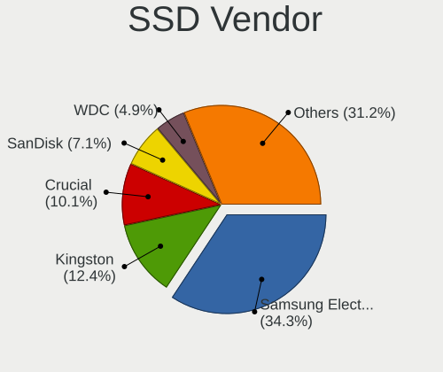

| Vendor              | Computers | Drives | Percent |
|---------------------|-----------|--------|---------|
| Samsung Electronics | 486       | 877    | 34.3%   |
| Kingston            | 175       | 267    | 12.35%  |
| Crucial             | 143       | 220    | 10.09%  |
| SanDisk             | 101       | 136    | 7.13%   |
| WDC                 | 70        | 99     | 4.94%   |
| Intel               | 37        | 42     | 2.61%   |
| SK hynix            | 35        | 51     | 2.47%   |
| Toshiba             | 34        | 41     | 2.4%    |
| China               | 32        | 39     | 2.26%   |
| Micron Technology   | 26        | 35     | 1.83%   |
| Intenso             | 23        | 29     | 1.62%   |
| LITEON              | 22        | 30     | 1.55%   |
| Apple               | 20        | 25     | 1.41%   |
| OCZ                 | 15        | 19     | 1.06%   |
| PNY                 | 14        | 17     | 0.99%   |
| A-DATA Technology   | 13        | 17     | 0.92%   |
| Transcend           | 12        | 24     | 0.85%   |
| LITEONIT            | 12        | 17     | 0.85%   |
| KingSpec            | 10        | 14     | 0.71%   |
| Patriot             | 9         | 36     | 0.64%   |
| GOODRAM             | 9         | 14     | 0.64%   |
| Corsair             | 9         | 10     | 0.64%   |
| SPCC                | 8         | 10     | 0.56%   |
| Emtec               | 8         | 8      | 0.56%   |
| ASMT                | 7         | 7      | 0.49%   |
| Phison              | 6         | 7      | 0.42%   |
| Verbatim            | 5         | 6      | 0.35%   |
| Unknown             | 4         | 5      | 0.28%   |
| sobetter            | 3         | 3      | 0.21%   |
| Plextor             | 3         | 3      | 0.21%   |
| KingFast            | 3         | 3      | 0.21%   |
| FORESEE             | 3         | 3      | 0.21%   |
| Zheino              | 2         | 2      | 0.14%   |
| Seagate             | 2         | 2      | 0.14%   |
| Reeinno             | 2         | 5      | 0.14%   |
| Netac               | 2         | 2      | 0.14%   |
| Lexar               | 2         | 2      | 0.14%   |
| LDLC                | 2         | 3      | 0.14%   |
| INNOVATION IT       | 2         | 2      | 0.14%   |
| Indilinx            | 2         | 2      | 0.14%   |

Drive Kind
----------

HDD or SSD

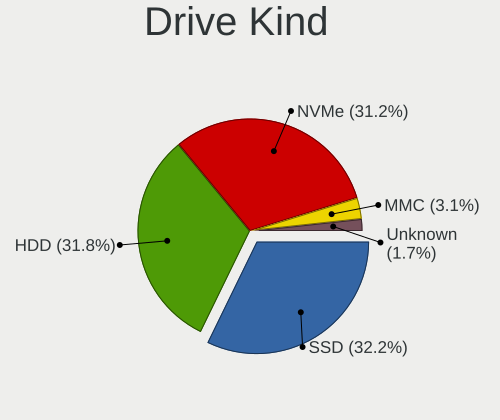

| Kind    | Computers | Drives | Percent |
|---------|-----------|--------|---------|
| SSD     | 1242      | 2184   | 32.22%  |
| HDD     | 1226      | 2401   | 31.8%   |
| NVMe    | 1203      | 1895   | 31.21%  |
| MMC     | 118       | 145    | 3.06%   |
| Unknown | 66        | 106    | 1.71%   |

Drive Connector
---------------

SATA, SAS, NVMe, etc.

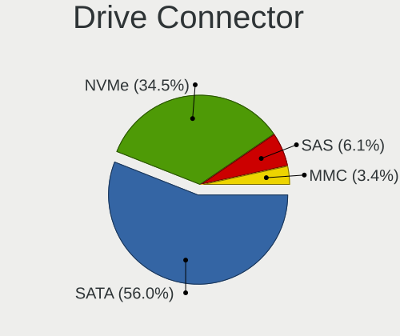

| Type | Computers | Drives | Percent |
|------|-----------|--------|---------|
| SATA | 1944      | 4326   | 55.99%  |
| NVMe | 1197      | 1875   | 34.48%  |
| SAS  | 213       | 385    | 6.13%   |
| MMC  | 118       | 145    | 3.4%    |

Drive Size
----------

Size of hard drive

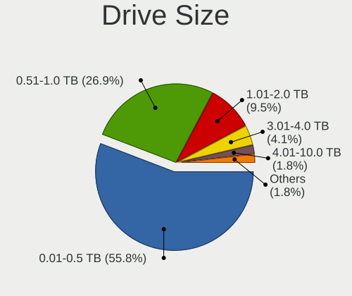

| Size in TB | Computers | Drives | Percent |
|------------|-----------|--------|---------|
| 0.01-0.5   | 1480      | 2511   | 55.81%  |
| 0.51-1.0   | 714       | 1212   | 26.92%  |
| 1.01-2.0   | 252       | 470    | 9.5%    |
| 3.01-4.0   | 109       | 193    | 4.11%   |
| 4.01-10.0  | 49        | 107    | 1.85%   |
| 2.01-3.0   | 40        | 64     | 1.51%   |
| 10.01-20.0 | 8         | 28     | 0.3%    |

Space Total
-----------

Amount of disk space available on the file system

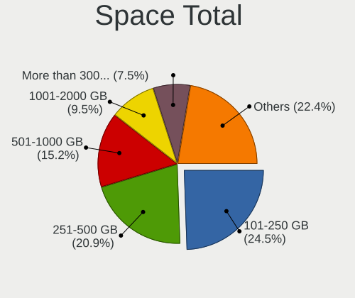

| Size in GB     | Computers | Percent |
|----------------|-----------|---------|
| 101-250        | 768       | 24.45%  |
| 251-500        | 655       | 20.85%  |
| 501-1000       | 479       | 15.25%  |
| 1001-2000      | 298       | 9.49%   |
| More than 3000 | 237       | 7.55%   |
| 1-20           | 215       | 6.84%   |
| 51-100         | 170       | 5.41%   |
| 2001-3000      | 123       | 3.92%   |
| Unknown        | 112       | 3.57%   |
| 21-50          | 83        | 2.64%   |
| 0              | 1         | 0.03%   |

Space Used
----------

Amount of used disk space

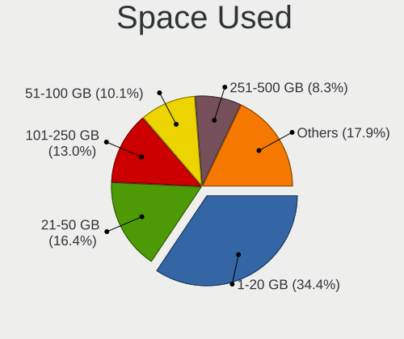

| Used GB        | Computers | Percent |
|----------------|-----------|---------|
| 1-20           | 1122      | 34.39%  |
| 21-50          | 534       | 16.37%  |
| 101-250        | 423       | 12.96%  |
| 51-100         | 328       | 10.05%  |
| 251-500        | 271       | 8.31%   |
| 501-1000       | 200       | 6.13%   |
| 1001-2000      | 138       | 4.23%   |
| Unknown        | 112       | 3.43%   |
| More than 3000 | 75        | 2.3%    |
| 2001-3000      | 52        | 1.59%   |
| 0              | 8         | 0.25%   |

Malfunc. Drives
---------------

Drive models with a malfunction

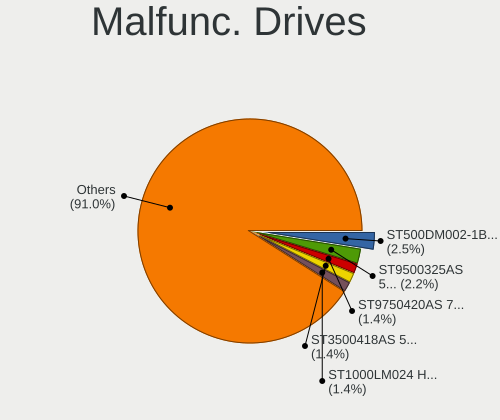

| Model                                          | Computers | Drives | Percent |
|------------------------------------------------|-----------|--------|---------|
| Seagate ST500DM002-1BD142 500GB                | 7         | 27     | 2.53%   |
| Seagate ST9500325AS 500GB                      | 6         | 6      | 2.17%   |
| Seagate ST9750420AS 752GB                      | 4         | 4      | 1.44%   |
| Seagate ST3500418AS 500GB                      | 4         | 11     | 1.44%   |
| Seagate ST1000LM024 HN-M101MBB 1TB             | 4         | 9      | 1.44%   |
| Toshiba MQ01ABD100 1TB                         | 3         | 3      | 1.08%   |
| Seagate ST320LT007-9ZV142 320GB                | 3         | 12     | 1.08%   |
| Kingston SV300S37A120G 120GB SSD               | 3         | 3      | 1.08%   |
| WDC WD10SPCX-60HWST0 1TB                       | 2         | 2      | 0.72%   |
| WDC WD10EZEX-21M2NA0 1TB                       | 2         | 2      | 0.72%   |
| Toshiba MQ01ABF050 500GB                       | 2         | 2      | 0.72%   |
| Toshiba MQ01ABD075 752GB                       | 2         | 2      | 0.72%   |
| SK hynix HFS256G32MND-2900A 256GB SSD          | 2         | 2      | 0.72%   |
| SK hynix HFS128G3BTND-N210A 128GB SSD          | 2         | 2      | 0.72%   |
| Seagate ST9320423AS 320GB                      | 2         | 3      | 0.72%   |
| Seagate ST4000DM000-1F2168 4TB                 | 2         | 4      | 0.72%   |
| Seagate ST3160813AS 160GB                      | 2         | 2      | 0.72%   |
| Seagate ST2000DM008-2FR102 2TB                 | 2         | 4      | 0.72%   |
| Seagate ST2000DL003-9VT166 2TB                 | 2         | 2      | 0.72%   |
| Seagate ST1000LM035-1RK172 1TB                 | 2         | 3      | 0.72%   |
| SanDisk SSD PLUS 480GB                         | 2         | 2      | 0.72%   |
| Samsung Electronics SSD 970 EVO 1TB            | 2         | 4      | 0.72%   |
| Micron Technology 1100_MTFDDAV256TBN 256GB SSD | 2         | 2      | 0.72%   |
| Kingston SA400S37120G 120GB SSD                | 2         | 7      | 0.72%   |
| Intel SSDSA2M160G2GC 160GB                     | 2         | 2      | 0.72%   |
| Hitachi HTS723232A7A364 320GB                  | 2         | 2      | 0.72%   |
| Hitachi HTS547575A9E384 752GB                  | 2         | 2      | 0.72%   |
| Hitachi HTS545050B9A300 500GB                  | 2         | 2      | 0.72%   |
| Hitachi HTS545050A7E380 500GB                  | 2         | 4      | 0.72%   |
| HGST HTS725050A7E630 500GB                     | 2         | 2      | 0.72%   |
| HGST HTS725032A7E630 320GB                     | 2         | 3      | 0.72%   |
| HGST HTS721010A9E630 1TB                       | 2         | 2      | 0.72%   |
| Crucial CT1000MX500SSD1 1TB                    | 2         | 2      | 0.72%   |
| XPG SPECTRIX S40G 1TB                          | 1         | 1      | 0.36%   |
| WDC WDS240G2G0A-00JH30 240GB SSD               | 1         | 1      | 0.36%   |
| WDC WDS100T2B0A-00SM50 1TB SSD                 | 1         | 1      | 0.36%   |
| WDC WD8003FRYZ-01JPDB1 8TB                     | 1         | 1      | 0.36%   |
| WDC WD740ADFD-00NLR5 74GB                      | 1         | 1      | 0.36%   |
| WDC WD6400AAKS-65Z7B0 640GB                    | 1         | 1      | 0.36%   |
| WDC WD6400AAKS-00A7B0 640GB                    | 1         | 1      | 0.36%   |

Malfunc. Drive Vendor
---------------------

Vendors of faulty drives

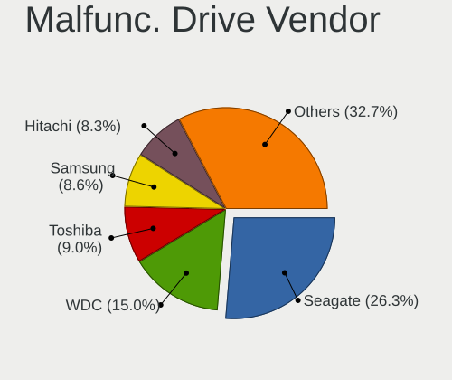

| Vendor              | Computers | Drives | Percent |
|---------------------|-----------|--------|---------|
| Seagate             | 70        | 126    | 26.32%  |
| WDC                 | 40        | 54     | 15.04%  |
| Toshiba             | 24        | 28     | 9.02%   |
| Samsung Electronics | 23        | 33     | 8.65%   |
| Hitachi             | 22        | 25     | 8.27%   |
| Kingston            | 11        | 17     | 4.14%   |
| Intel               | 11        | 12     | 4.14%   |
| HGST                | 10        | 11     | 3.76%   |
| SK hynix            | 9         | 14     | 3.38%   |
| Crucial             | 9         | 10     | 3.38%   |
| SanDisk             | 6         | 6      | 2.26%   |
| Micron Technology   | 6         | 6      | 2.26%   |
| Maxtor              | 5         | 6      | 1.88%   |
| Fujitsu             | 5         | 10     | 1.88%   |
| A-DATA Technology   | 3         | 3      | 1.13%   |
| Apple               | 2         | 2      | 0.75%   |
| XPG                 | 1         | 1      | 0.38%   |
| SPCC                | 1         | 1      | 0.38%   |
| OCZ-VERTEX2         | 1         | 1      | 0.38%   |
| OCZ                 | 1         | 1      | 0.38%   |
| LITEONIT            | 1         | 2      | 0.38%   |
| LITEON              | 1         | 1      | 0.38%   |
| KingFast            | 1         | 1      | 0.38%   |
| INNOVATION IT       | 1         | 1      | 0.38%   |
| China               | 1         | 1      | 0.38%   |
| ASMT                | 1         | 1      | 0.38%   |

Malfunc. HDD Vendor
-------------------

Vendors of faulty HDD drives

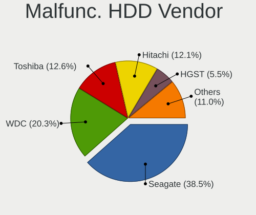

| Vendor              | Computers | Drives | Percent |
|---------------------|-----------|--------|---------|
| Seagate             | 70        | 126    | 38.46%  |
| WDC                 | 37        | 51     | 20.33%  |
| Toshiba             | 23        | 27     | 12.64%  |
| Hitachi             | 22        | 25     | 12.09%  |
| HGST                | 10        | 11     | 5.49%   |
| Samsung Electronics | 9         | 14     | 4.95%   |
| Maxtor              | 5         | 6      | 2.75%   |
| Fujitsu             | 5         | 10     | 2.75%   |
| Apple               | 1         | 1      | 0.55%   |

Malfunc. Drive Kind
-------------------

Kinds of faulty drives

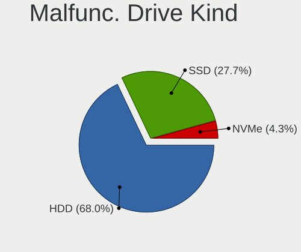

| Kind | Computers | Drives | Percent |
|------|-----------|--------|---------|
| HDD  | 174       | 271    | 67.97%  |
| SSD  | 71        | 88     | 27.73%  |
| NVMe | 11        | 15     | 4.3%    |

Failed Drives
-------------

Failed drive models

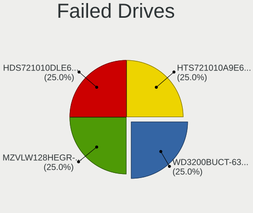

| Model                                        | Computers | Drives | Percent |
|----------------------------------------------|-----------|--------|---------|
| WDC WD3200BUCT-63TWBY0 320GB                 | 1         | 1      | 25%     |
| Samsung Electronics MZVLW128HEGR-000L2 128GB | 1         | 2      | 25%     |
| Hitachi HDS721010DLE630 1TB                  | 1         | 1      | 25%     |
| HGST HTS721010A9E630 1TB                     | 1         | 1      | 25%     |

Failed Drive Vendor
-------------------

Failed drive vendors

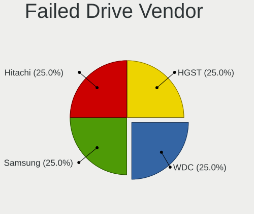

| Vendor              | Computers | Drives | Percent |
|---------------------|-----------|--------|---------|
| WDC                 | 1         | 1      | 25%     |
| Samsung Electronics | 1         | 2      | 25%     |
| Hitachi             | 1         | 1      | 25%     |
| HGST                | 1         | 1      | 25%     |

Drive Status
------------

Number of failed and malfunc. drives

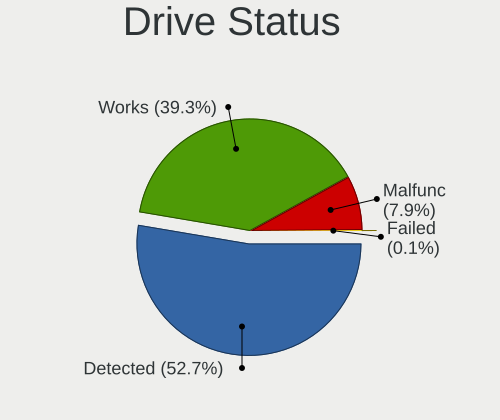

| Status   | Computers | Drives | Percent |
|----------|-----------|--------|---------|
| Detected | 1671      | 3879   | 52.66%  |
| Works    | 1248      | 2473   | 39.33%  |
| Malfunc  | 250       | 374    | 7.88%   |
| Failed   | 4         | 5      | 0.13%   |

Storage controller
------------------

Storage Vendor
--------------

Storage controller vendors

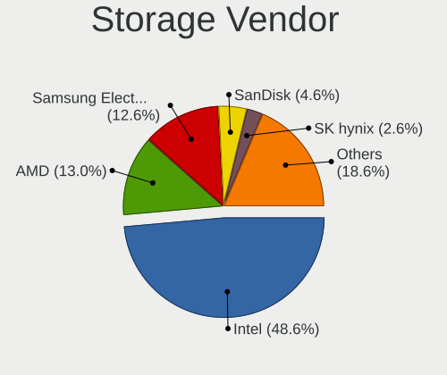

| Vendor                                  | Computers | Percent |
|-----------------------------------------|-----------|---------|
| Intel                                   | 1860      | 48.58%  |
| AMD                                     | 497       | 12.98%  |
| Samsung Electronics                     | 483       | 12.61%  |
| SanDisk                                 | 176       | 4.6%    |
| SK hynix                                | 99        | 2.59%   |
| Kingston Technology Company             | 99        | 2.59%   |
| Micron Technology                       | 71        | 1.85%   |
| Micron/Crucial Technology               | 67        | 1.75%   |
| Phison Electronics                      | 58        | 1.51%   |
| ASMedia Technology                      | 57        | 1.49%   |
| Toshiba America Info Systems            | 49        | 1.28%   |
| Marvell Technology Group                | 46        | 1.2%    |
| JMicron Technology                      | 38        | 0.99%   |
| KIOXIA                                  | 34        | 0.89%   |
| Nvidia                                  | 31        | 0.81%   |
| Silicon Motion                          | 15        | 0.39%   |
| Shenzhen Longsys Electronics            | 13        | 0.34%   |
| Seagate Technology                      | 12        | 0.31%   |
| ADATA Technology                        | 12        | 0.31%   |
| Union Memory (Shenzhen)                 | 11        | 0.29%   |
| Broadcom / LSI                          | 10        | 0.26%   |
| Solid State Storage Technology          | 9         | 0.24%   |
| Realtek Semiconductor                   | 9         | 0.24%   |
| LSI Logic / Symbios Logic               | 9         | 0.24%   |
| Apple                                   | 9         | 0.24%   |
| Silicon Image                           | 7         | 0.18%   |
| MAXIO Technology (Hangzhou)             | 7         | 0.18%   |
| Solidigm                                | 6         | 0.16%   |
| Hewlett-Packard                         | 5         | 0.13%   |
| VIA Technologies                        | 4         | 0.1%    |
| Lite-On Technology                      | 4         | 0.1%    |
| Silicon Integrated Systems [SiS]        | 3         | 0.08%   |
| Transcend                               | 2         | 0.05%   |
| Lenovo                                  | 2         | 0.05%   |
| INNOGRIT                                | 2         | 0.05%   |
| Hosin Global Electronics                | 2         | 0.05%   |
| Adaptec                                 | 2         | 0.05%   |
| TenaFe                                  | 1         | 0.03%   |
| Shenzhen Unionmemory Information System | 1         | 0.03%   |
| Shenzhen Techwinsemi Technology         | 1         | 0.03%   |

Storage Model
-------------

Storage controller models

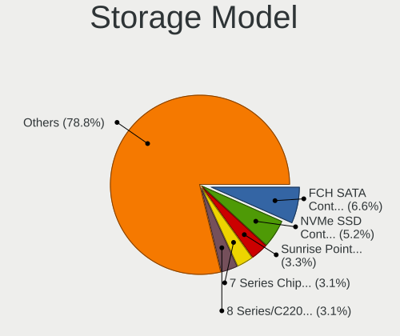

| Model                                                                          | Computers | Percent |
|--------------------------------------------------------------------------------|-----------|---------|
| AMD FCH SATA Controller [AHCI mode]                                            | 287       | 6.63%   |
| Samsung NVMe SSD Controller SM981/PM981/PM983                                  | 224       | 5.17%   |
| Intel Sunrise Point-LP SATA Controller [AHCI mode]                             | 141       | 3.26%   |
| Intel 7 Series Chipset Family 6-port SATA Controller [AHCI mode]               | 134       | 3.09%   |
| Intel 8 Series/C220 Series Chipset Family 6-port SATA Controller 1 [AHCI mode] | 133       | 3.07%   |
| Intel 82801 Mobile SATA Controller [RAID mode]                                 | 95        | 2.19%   |
| Samsung NVMe SSD Controller PM9A1/PM9A3/980PRO                                 | 89        | 2.06%   |
| Intel 6 Series/C200 Series Chipset Family 6 port Mobile SATA AHCI Controller   | 85        | 1.96%   |
| Samsung NVMe SSD Controller 980 (DRAM-less)                                    | 73        | 1.69%   |
| AMD 400 Series Chipset SATA Controller                                         | 72        | 1.66%   |
| AMD 500 Series Chipset SATA Controller                                         | 70        | 1.62%   |
| Intel Volume Management Device NVMe RAID Controller                            | 68        | 1.57%   |
| Intel Q170/Q150/B150/H170/H110/Z170/CM236 Chipset SATA Controller [AHCI Mode]  | 68        | 1.57%   |
| Intel 82801IBM/IEM (ICH9M/ICH9M-E) 4 port SATA Controller [AHCI mode]          | 66        | 1.52%   |
| Intel SATA Controller [RAID mode]                                              | 62        | 1.43%   |
| AMD 600 Series Chipset SATA Controller                                         | 53        | 1.22%   |
| Intel 6 Series/C200 Series Chipset Family 6 port Desktop SATA AHCI Controller  | 51        | 1.18%   |
| Samsung NVMe SSD Controller SM961/PM961/SM963                                  | 50        | 1.15%   |
| Intel Wildcat Point-LP SATA Controller [AHCI Mode]                             | 50        | 1.15%   |
| Intel 8 Series SATA Controller 1 [AHCI mode]                                   | 49        | 1.13%   |
| Intel 200 Series PCH SATA controller [AHCI mode]                               | 49        | 1.13%   |
| ASMedia ASM1061/ASM1062 Serial ATA Controller                                  | 47        | 1.09%   |
| Intel 7 Series/C210 Series Chipset Family 6-port SATA Controller [AHCI mode]   | 46        | 1.06%   |
| Intel Cannon Lake Mobile PCH SATA AHCI Controller                              | 42        | 0.97%   |
| Intel 5 Series/3400 Series Chipset 4 port SATA AHCI Controller                 | 40        | 0.92%   |
| Intel Cannon Lake PCH SATA AHCI Controller                                     | 39        | 0.9%    |
| AMD SB7x0/SB8x0/SB9x0 IDE Controller                                           | 38        | 0.88%   |
| Intel 9 Series Chipset Family SATA Controller [AHCI Mode]                      | 36        | 0.83%   |
| Intel 5 Series/3400 Series Chipset 6 port SATA AHCI Controller                 | 35        | 0.81%   |
| Micron/Crucial P2 [Nick P2] / P3 / P3 Plus NVMe PCIe SSD (DRAM-less)           | 34        | 0.79%   |
| Intel HM170/QM170 Chipset SATA Controller [AHCI Mode]                          | 34        | 0.79%   |
| AMD SB7x0/SB8x0/SB9x0 SATA Controller [AHCI mode]                              | 34        | 0.79%   |
| Intel 82801HM/HEM (ICH8M/ICH8M-E) IDE Controller                               | 33        | 0.76%   |
| Intel SSD 660P Series                                                          | 32        | 0.74%   |
| Intel 82801HM/HEM (ICH8M/ICH8M-E) SATA Controller [AHCI mode]                  | 32        | 0.74%   |
| SanDisk Extreme Pro / WD Black SN750 / PC SN730 / Red SN700 NVMe SSD           | 31        | 0.72%   |
| Samsung NVMe SSD Controller S4LV008[Pascal]                                    | 30        | 0.69%   |
| Intel 82801G (ICH7 Family) IDE Controller                                      | 30        | 0.69%   |
| Intel Comet Lake SATA AHCI Controller                                          | 28        | 0.65%   |
| Intel Celeron/Pentium Silver Processor SATA Controller                         | 26        | 0.6%    |

Storage Kind
------------

Kind of storage controller (IDE, SATA, NVMe, SAS, ...)

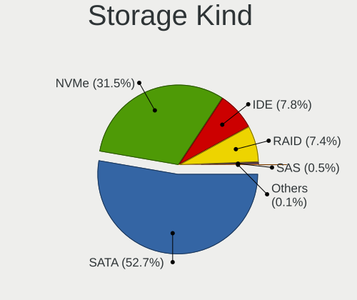

| Kind | Computers | Percent |
|------|-----------|---------|
| SATA | 2007      | 52.72%  |
| NVMe | 1201      | 31.55%  |
| IDE  | 296       | 7.78%   |
| RAID | 280       | 7.35%   |
| SAS  | 19        | 0.5%    |
| SCSI | 4         | 0.11%   |

Processor
---------

CPU Vendor
----------

Processor vendors

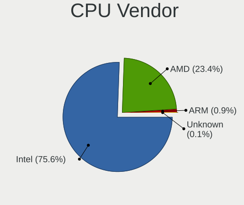

| Vendor  | Computers | Percent |
|---------|-----------|---------|
| Intel   | 2177      | 75.56%  |
| AMD     | 674       | 23.39%  |
| ARM     | 26        | 0.9%    |
| Unknown | 4         | 0.14%   |

CPU Model
---------

Processor models

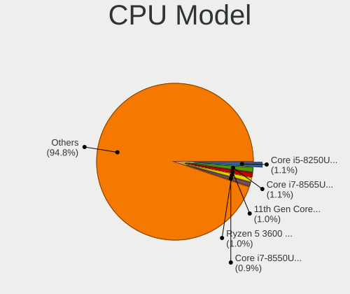

| Model                                   | Computers | Percent |
|-----------------------------------------|-----------|---------|
| Intel Core i5-8250U CPU @ 1.60GHz       | 32        | 1.11%   |
| Intel Core i7-8565U CPU @ 1.80GHz       | 31        | 1.07%   |
| Intel 11th Gen Core i7-1165G7 @ 2.80GHz | 30        | 1.04%   |
| AMD Ryzen 5 3600 6-Core Processor       | 29        | 1%      |
| Intel Core i7-8550U CPU @ 1.80GHz       | 27        | 0.93%   |
| Intel Core i5-7200U CPU @ 2.50GHz       | 26        | 0.9%    |
| Intel Core i7-10750H CPU @ 2.60GHz      | 25        | 0.86%   |
| Intel Core i7-7700HQ CPU @ 2.80GHz      | 24        | 0.83%   |
| Intel Core i7-8750H CPU @ 2.20GHz       | 21        | 0.73%   |
| Intel 11th Gen Core i5-1135G7 @ 2.40GHz | 21        | 0.73%   |
| ARM Processor                           | 21        | 0.73%   |
| Intel Core i5-3210M CPU @ 2.50GHz       | 20        | 0.69%   |
| AMD Ryzen 9 3900X 12-Core Processor     | 19        | 0.66%   |
| Intel Core i7-9750H CPU @ 2.60GHz       | 18        | 0.62%   |
| Intel Core i5-6200U CPU @ 2.30GHz       | 18        | 0.62%   |
| Intel Core i7-7500U CPU @ 2.70GHz       | 16        | 0.55%   |
| Intel Core i7-4790K CPU @ 4.00GHz       | 16        | 0.55%   |
| Intel Core i5-6300U CPU @ 2.40GHz       | 16        | 0.55%   |
| Intel Core i7-4790 CPU @ 3.60GHz        | 15        | 0.52%   |
| Intel Core i5-2520M CPU @ 2.50GHz       | 15        | 0.52%   |
| AMD Ryzen 7 5700U with Radeon Graphics  | 15        | 0.52%   |
| AMD Ryzen 7 3700X 8-Core Processor      | 15        | 0.52%   |
| AMD Ryzen 5 5600X 6-Core Processor      | 15        | 0.52%   |
| AMD Ryzen 5 5500U with Radeon Graphics  | 15        | 0.52%   |
| Intel Core i7-8700 CPU @ 3.20GHz        | 14        | 0.48%   |
| Intel Core i7-2600 CPU @ 3.40GHz        | 14        | 0.48%   |
| Intel Core i5-8265U CPU @ 1.60GHz       | 14        | 0.48%   |
| Intel Core i5-3470 CPU @ 3.20GHz        | 14        | 0.48%   |
| AMD Ryzen 7 5800X 8-Core Processor      | 14        | 0.48%   |
| Intel Core i7-8665U CPU @ 1.90GHz       | 13        | 0.45%   |
| Intel Core i7-3630QM CPU @ 2.40GHz      | 13        | 0.45%   |
| Intel Core i5-3230M CPU @ 2.60GHz       | 13        | 0.45%   |
| Intel Core i5-10210U CPU @ 1.60GHz      | 13        | 0.45%   |
| AMD Ryzen 9 5900X 12-Core Processor     | 13        | 0.45%   |
| Intel Core i7-10510U CPU @ 1.80GHz      | 12        | 0.41%   |
| Intel Core i5-5300U CPU @ 2.30GHz       | 12        | 0.41%   |
| Intel Core i5-5200U CPU @ 2.20GHz       | 12        | 0.41%   |
| Intel Core i5 CPU M 520 @ 2.40GHz       | 12        | 0.41%   |
| Intel Core i5-3320M CPU @ 2.60GHz       | 11        | 0.38%   |
| Intel Core i5-2430M CPU @ 2.40GHz       | 11        | 0.38%   |

CPU Model Family
----------------

Processor model prefix

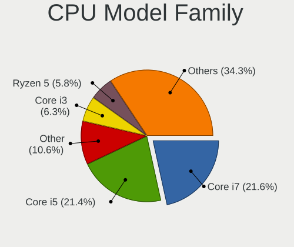

| Model                   | Computers | Percent |
|-------------------------|-----------|---------|
| Intel Core i7           | 623       | 21.57%  |
| Intel Core i5           | 618       | 21.4%   |
| Other                   | 307       | 10.63%  |
| Intel Core i3           | 181       | 6.27%   |
| AMD Ryzen 5             | 167       | 5.78%   |
| AMD Ryzen 7             | 165       | 5.71%   |
| Intel Core 2 Duo        | 122       | 4.22%   |
| AMD Ryzen 9             | 98        | 3.39%   |
| Intel Celeron           | 78        | 2.7%    |
| Intel Xeon              | 55        | 1.9%    |
| Intel Pentium           | 49        | 1.7%    |
| Intel Atom              | 30        | 1.04%   |
| Intel Pentium Dual-Core | 25        | 0.87%   |
| Intel Core i9           | 23        | 0.8%    |
| Intel Core 2 Quad       | 23        | 0.8%    |
| Intel Core 2            | 22        | 0.76%   |
| Intel Core              | 22        | 0.76%   |
| AMD Ryzen 7 PRO         | 21        | 0.73%   |
| AMD Ryzen 5 PRO         | 21        | 0.73%   |
| AMD E1                  | 17        | 0.59%   |
| AMD A4                  | 17        | 0.59%   |
| AMD Ryzen 3             | 14        | 0.48%   |
| AMD FX                  | 13        | 0.45%   |
| AMD A8                  | 13        | 0.45%   |
| Intel Pentium Dual      | 12        | 0.42%   |
| AMD A10                 | 12        | 0.42%   |
| AMD E                   | 11        | 0.38%   |
| AMD A6                  | 11        | 0.38%   |
| Intel Genuine           | 9         | 0.31%   |
| AMD Phenom II X4        | 9         | 0.31%   |
| Intel Pentium Silver    | 7         | 0.24%   |
| AMD Athlon II X2        | 6         | 0.21%   |
| Intel Pentium 4         | 5         | 0.17%   |
| ARM BCM                 | 5         | 0.17%   |
| AMD Ryzen Threadripper  | 5         | 0.17%   |
| AMD Phenom              | 5         | 0.17%   |
| AMD Athlon 64 X2        | 5         | 0.17%   |
| AMD Turion 64 X2 Mobile | 4         | 0.14%   |
| AMD E2                  | 4         | 0.14%   |
| AMD Athlon II X4        | 4         | 0.14%   |

CPU Cores
---------

Number of processor cores

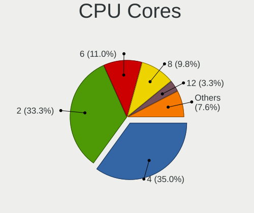

| Number  | Computers | Percent |
|---------|-----------|---------|
| 4       | 1010      | 34.97%  |
| 2       | 962       | 33.31%  |
| 6       | 317       | 10.98%  |
| 8       | 284       | 9.83%   |
| 12      | 95        | 3.29%   |
| 10      | 56        | 1.94%   |
| 16      | 50        | 1.73%   |
| 1       | 33        | 1.14%   |
| 14      | 27        | 0.93%   |
| 24      | 19        | 0.66%   |
| Unknown | 12        | 0.42%   |
| 3       | 10        | 0.35%   |
| 20      | 4         | 0.14%   |
| 64      | 2         | 0.07%   |
| 32      | 2         | 0.07%   |
| 28      | 2         | 0.07%   |
| 128     | 1         | 0.03%   |
| 36      | 1         | 0.03%   |
| 18      | 1         | 0.03%   |

CPU Sockets
-----------

Number of sockets

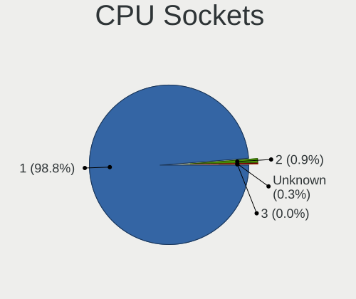

| Number  | Computers | Percent |
|---------|-----------|---------|
| 1       | 2846      | 98.75%  |
| 2       | 27        | 0.94%   |
| Unknown | 8         | 0.28%   |
| 3       | 1         | 0.03%   |

CPU Threads
-----------

Threads per core (Hyper-Threading)

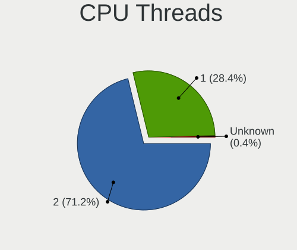

| Number  | Computers | Percent |
|---------|-----------|---------|
| 2       | 2056      | 71.19%  |
| 1       | 820       | 28.39%  |
| Unknown | 12        | 0.42%   |

CPU Op-Modes
------------

CPU Operation Modes (32-bit, 64-bit)

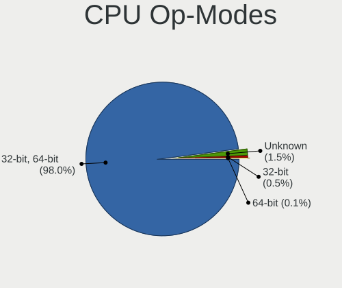

| Op mode        | Computers | Percent |
|----------------|-----------|---------|
| 32-bit, 64-bit | 2829      | 97.96%  |
| Unknown        | 42        | 1.45%   |
| 32-bit         | 13        | 0.45%   |
| 64-bit         | 4         | 0.14%   |

CPU Microcode
-------------

Microcode number

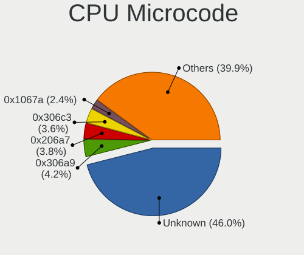

| Number     | Computers | Percent |
|------------|-----------|---------|
| Unknown    | 1400      | 46.04%  |
| 0x306a9    | 129       | 4.24%   |
| 0x206a7    | 117       | 3.85%   |
| 0x306c3    | 109       | 3.58%   |
| 0x1067a    | 72        | 2.37%   |
| 0x906e9    | 52        | 1.71%   |
| 0x806ea    | 51        | 1.68%   |
| 0x806ec    | 50        | 1.64%   |
| 0x906ea    | 48        | 1.58%   |
| 0x506e3    | 43        | 1.41%   |
| 0x40651    | 39        | 1.28%   |
| 0x806c1    | 38        | 1.25%   |
| 0x806e9    | 37        | 1.22%   |
| 0x20655    | 37        | 1.22%   |
| 0x306d4    | 34        | 1.12%   |
| 0x406e3    | 33        | 1.09%   |
| 0x08701021 | 31        | 1.02%   |
| 0x6fd      | 29        | 0.95%   |
| 0x10676    | 24        | 0.79%   |
| 0x0a50000c | 23        | 0.76%   |
| 0xa0652    | 20        | 0.66%   |
| 0x30678    | 19        | 0.62%   |
| 0x08600106 | 19        | 0.62%   |
| 0x106e5    | 16        | 0.53%   |
| 0x08701013 | 16        | 0.53%   |
| 0x08108109 | 16        | 0.53%   |
| 0x08608103 | 15        | 0.49%   |
| 0x6f6      | 14        | 0.46%   |
| 0x0800820d | 14        | 0.46%   |
| 0x806eb    | 13        | 0.43%   |
| 0x6fb      | 13        | 0.43%   |
| 0x20652    | 13        | 0.43%   |
| 0x206d7    | 12        | 0.39%   |
| 0x0a50000d | 12        | 0.39%   |
| 0x0a201009 | 12        | 0.39%   |
| 0x08600103 | 11        | 0.36%   |
| 0x07030105 | 11        | 0.36%   |
| 0x010000c8 | 11        | 0.36%   |
| 0x906a3    | 10        | 0.33%   |
| 0x806d1    | 10        | 0.33%   |

CPU Microarch
-------------

Microarchitecture

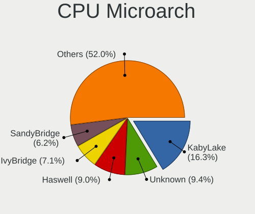

| Name              | Computers | Percent |
|-------------------|-----------|---------|
| KabyLake          | 471       | 16.31%  |
| Unknown           | 272       | 9.42%   |
| Haswell           | 259       | 8.97%   |
| IvyBridge         | 204       | 7.06%   |
| SandyBridge       | 180       | 6.23%   |
| Skylake           | 144       | 4.99%   |
| Zen 2             | 136       | 4.71%   |
| Penryn            | 135       | 4.67%   |
| Zen 3             | 130       | 4.5%    |
| Alderlake Hybrid  | 86        | 2.98%   |
| Core              | 84        | 2.91%   |
| Westmere          | 83        | 2.87%   |
| Broadwell         | 77        | 2.67%   |
| TigerLake         | 74        | 2.56%   |
| CometLake         | 73        | 2.53%   |
| Zen+              | 60        | 2.08%   |
| Silvermont        | 56        | 1.94%   |
| Icelake           | 40        | 1.39%   |
| Zen               | 38        | 1.32%   |
| Nehalem           | 35        | 1.21%   |
| K10               | 34        | 1.18%   |
| Goldmont plus     | 27        | 0.93%   |
| Piledriver        | 26        | 0.9%    |
| Excavator         | 22        | 0.76%   |
| Bobcat            | 20        | 0.69%   |
| Puma              | 19        | 0.66%   |
| Jaguar            | 16        | 0.55%   |
| K8 Hammer         | 12        | 0.42%   |
| Bonnell           | 11        | 0.38%   |
| Meteorlake Hybrid | 10        | 0.35%   |
| NetBurst          | 9         | 0.31%   |
| Goldmont          | 9         | 0.31%   |
| P6                | 8         | 0.28%   |
| Gracemont         | 8         | 0.28%   |
| Tremont           | 6         | 0.21%   |
| Steamroller       | 4         | 0.14%   |
| K8 & K10 hybrid   | 4         | 0.14%   |
| K10 Llano         | 4         | 0.14%   |
| Lunarlake Hybrid  | 1         | 0.03%   |
| Bulldozer         | 1         | 0.03%   |

Graphics
--------

GPU Vendor
----------

Vendors of graphics cards

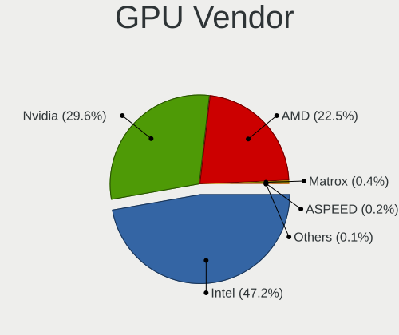

| Vendor                           | Computers | Percent |
|----------------------------------|-----------|---------|
| Intel                            | 1619      | 47.23%  |
| Nvidia                           | 1015      | 29.61%  |
| AMD                              | 771       | 22.49%  |
| Matrox Electronics Systems       | 14        | 0.41%   |
| ASPEED Technology                | 6         | 0.18%   |
| VIA Technologies                 | 1         | 0.03%   |
| Silicon Integrated Systems [SiS] | 1         | 0.03%   |
| ATI Technologies                 | 1         | 0.03%   |

GPU Model
---------

Graphics card models

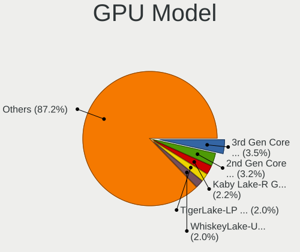

| Model                                                                                    | Computers | Percent |
|------------------------------------------------------------------------------------------|-----------|---------|
| Intel 3rd Gen Core processor Graphics Controller                                         | 123       | 3.47%   |
| Intel 2nd Generation Core Processor Family Integrated Graphics Controller                | 112       | 3.16%   |
| Intel Kaby Lake-R GT2 [UHD Graphics 620]                                                 | 78        | 2.2%    |
| Intel TigerLake-LP GT2 [Iris Xe Graphics]                                                | 71        | 2%      |
| Intel WhiskeyLake-U GT2 [UHD Graphics 620]                                               | 70        | 1.98%   |
| Intel Haswell-ULT Integrated Graphics Controller                                         | 61        | 1.72%   |
| Intel Kaby Lake-U GT2 [HD Graphics 620]                                                  | 59        | 1.66%   |
| Intel Xeon E3-1200 v3/4th Gen Core Processor Integrated Graphics Controller              | 55        | 1.55%   |
| Intel Skylake-U GT2 [HD Graphics 520]                                                    | 54        | 1.52%   |
| Intel CoffeeLake-H GT2 [UHD Graphics 630]                                                | 53        | 1.5%    |
| Intel Broadwell-U GT2 [HD Graphics 5500]                                                 | 52        | 1.47%   |
| Intel 4th Gen Core Processor Integrated Graphics Controller                              | 51        | 1.44%   |
| AMD Renoir [Radeon Vega Series / Radeon Vega Mobile Series]                              | 48        | 1.35%   |
| Intel Core Processor Integrated Graphics Controller                                      | 45        | 1.27%   |
| AMD Cezanne [Radeon Vega Series / Radeon Vega Mobile Series]                             | 45        | 1.27%   |
| Intel Mobile 4 Series Chipset Integrated Graphics Controller                             | 38        | 1.07%   |
| Intel CometLake-U GT2 [UHD Graphics]                                                     | 37        | 1.04%   |
| Intel CoffeeLake-S GT2 [UHD Graphics 630]                                                | 37        | 1.04%   |
| Intel CometLake-H GT2 [UHD Graphics]                                                     | 36        | 1.02%   |
| AMD Ellesmere [Radeon RX 470/480/570/570X/580/580X/590]                                  | 34        | 0.96%   |
| AMD Picasso/Raven 2 [Radeon Vega Series / Radeon Vega Mobile Series]                     | 33        | 0.93%   |
| Intel Kaby Lake-H GT2 [HD Graphics 630]                                                  | 31        | 0.87%   |
| Intel Atom Processor Z36xxx/Z37xxx Series Graphics & Display                             | 30        | 0.85%   |
| AMD Lucienne                                                                             | 30        | 0.85%   |
| AMD Raphael                                                                              | 29        | 0.82%   |
| Intel Skylake-S GT2 [HD Graphics 530]                                                    | 27        | 0.76%   |
| Intel Alder Lake-P GT2 [Iris Xe Graphics]                                                | 27        | 0.76%   |
| Intel Xeon E3-1200 v2/3rd Gen Core processor Graphics Controller                         | 26        | 0.73%   |
| Nvidia GP107M [GeForce GTX 1050 Mobile]                                                  | 24        | 0.68%   |
| Nvidia TU117M [GeForce GTX 1650 Mobile / Max-Q]                                          | 23        | 0.65%   |
| Nvidia GP106 [GeForce GTX 1060 6GB]                                                      | 23        | 0.65%   |
| Intel Atom/Celeron/Pentium Processor x5-E8000/J3xxx/N3xxx Integrated Graphics Controller | 23        | 0.65%   |
| Intel Mobile GM965/GL960 Integrated Graphics Controller (secondary)                      | 22        | 0.62%   |
| Intel Mobile GM965/GL960 Integrated Graphics Controller (primary)                        | 22        | 0.62%   |
| AMD Navi 10 [Radeon RX 5600 OEM/5600 XT / 5700/5700 XT]                                  | 22        | 0.62%   |
| Nvidia GP107 [GeForce GTX 1050 Ti]                                                       | 21        | 0.59%   |
| Intel GeminiLake [UHD Graphics 600]                                                      | 21        | 0.59%   |
| Nvidia GM204 [GeForce GTX 970]                                                           | 20        | 0.56%   |
| Nvidia GK208B [GeForce GT 710]                                                           | 20        | 0.56%   |
| Nvidia GP104 [GeForce GTX 1070]                                                          | 19        | 0.54%   |

GPU Combo
---------

Combinations of graphics cards

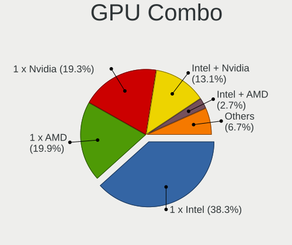

| Name               | Computers | Percent |
|--------------------|-----------|---------|
| 1 x Intel          | 1118      | 38.31%  |
| 1 x AMD            | 580       | 19.88%  |
| 1 x Nvidia         | 564       | 19.33%  |
| Intel + Nvidia     | 383       | 13.13%  |
| Intel + AMD        | 78        | 2.67%   |
| AMD + Nvidia       | 67        | 2.3%    |
| 2 x AMD            | 52        | 1.78%   |
| Other              | 36        | 1.23%   |
| 2 x Intel          | 13        | 0.45%   |
| 1 x Matrox         | 13        | 0.45%   |
| 2 x Nvidia         | 4         | 0.14%   |
| 1 x ASPEED         | 4         | 0.14%   |
| Nvidia + ASPEED    | 2         | 0.07%   |
| 1 x VIA            | 1         | 0.03%   |
| 1 x SiS            | 1         | 0.03%   |
| Nvidia + Matrox    | 1         | 0.03%   |
| Intel + 2 x Nvidia | 1         | 0.03%   |

GPU Driver
----------

Free vs proprietary

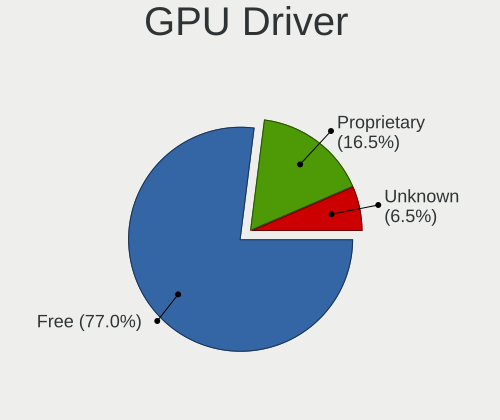

| Driver      | Computers | Percent |
|-------------|-----------|---------|
| Free        | 2272      | 76.99%  |
| Proprietary | 488       | 16.54%  |
| Unknown     | 191       | 6.47%   |

GPU Memory
----------

Total video memory

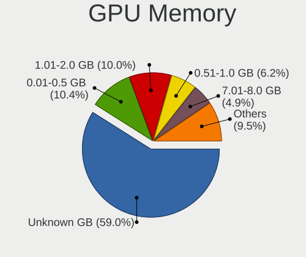

| Size in GB | Computers | Percent |
|------------|-----------|---------|
| Unknown    | 1766      | 58.96%  |
| 0.01-0.5   | 311       | 10.38%  |
| 1.01-2.0   | 300       | 10.02%  |
| 0.51-1.0   | 186       | 6.21%   |
| 7.01-8.0   | 148       | 4.94%   |
| 3.01-4.0   | 144       | 4.81%   |
| 5.01-6.0   | 58        | 1.94%   |
| 8.01-16.0  | 54        | 1.8%    |
| 2.01-3.0   | 17        | 0.57%   |
| 16.01-24.0 | 11        | 0.37%   |

Monitor
-------

Monitor Vendor
--------------

Monitor vendors

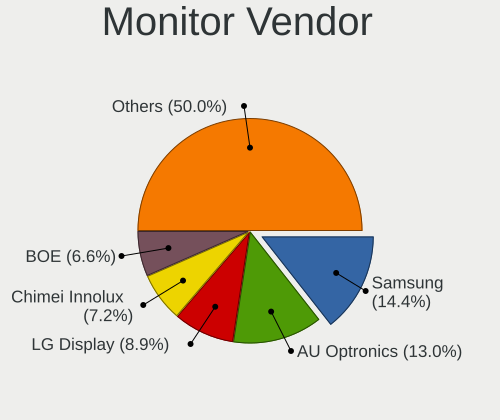

| Vendor                  | Computers | Percent |
|-------------------------|-----------|---------|
| Samsung Electronics     | 459       | 14.42%  |
| AU Optronics            | 414       | 13%     |
| LG Display              | 282       | 8.86%   |
| Chimei Innolux          | 228       | 7.16%   |
| BOE                     | 209       | 6.56%   |
| Dell                    | 162       | 5.09%   |
| Goldstar                | 141       | 4.43%   |
| Iiyama                  | 127       | 3.99%   |
| Philips                 | 120       | 3.77%   |
| Hewlett-Packard         | 100       | 3.14%   |
| AOC                     | 81        | 2.54%   |
| Apple                   | 71        | 2.23%   |
| Acer                    | 67        | 2.1%    |
| BenQ                    | 65        | 2.04%   |
| Sharp                   | 59        | 1.85%   |
| Lenovo                  | 56        | 1.76%   |
| Medion                  | 46        | 1.44%   |
| Chi Mei Optoelectronics | 45        | 1.41%   |
| Ancor Communications    | 39        | 1.22%   |
| MSI                     | 26        | 0.82%   |
| ASUSTek Computer        | 23        | 0.72%   |
| Sony                    | 21        | 0.66%   |
| Unknown                 | 19        | 0.6%    |
| InfoVision              | 18        | 0.57%   |
| LG Philips              | 16        | 0.5%    |
| Fujitsu Siemens         | 16        | 0.5%    |
| CSO                     | 15        | 0.47%   |
| PANDA                   | 13        | 0.41%   |
| Eizo                    | 13        | 0.41%   |
| Vestel Elektronik       | 11        | 0.35%   |
| Gigabyte Technology     | 11        | 0.35%   |
| Panasonic               | 9         | 0.28%   |
| ViewSonic               | 8         | 0.25%   |
| Valve                   | 8         | 0.25%   |
| Idek Iiyama             | 8         | 0.25%   |
| CSOT                    | 8         | 0.25%   |
| LG Electronics          | 7         | 0.22%   |
| Arnos Instruments       | 7         | 0.22%   |
| Packard Bell            | 6         | 0.19%   |
| NEC Computers           | 6         | 0.19%   |

Monitor Model
-------------

Monitor models

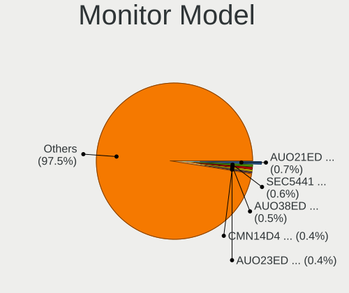

| Model                                                                | Computers | Percent |
|----------------------------------------------------------------------|-----------|---------|
| AU Optronics LCD Monitor AUO21ED 1920x1080 344x193mm 15.5-inch       | 22        | 0.66%   |
| Samsung Electronics LCD Monitor SEC5441 1280x800 331x207mm 15.4-inch | 19        | 0.57%   |
| AU Optronics LCD Monitor AUO38ED 1920x1080 344x193mm 15.5-inch       | 17        | 0.51%   |
| Chimei Innolux LCD Monitor CMN14D4 1920x1080 309x173mm 13.9-inch     | 14        | 0.42%   |
| AU Optronics LCD Monitor AUO23ED 1920x1080 344x193mm 15.5-inch       | 12        | 0.36%   |
| Vestel Elektronik 40UHD_LCD_TV VES3700 3840x2160 880x500mm 39.8-inch | 11        | 0.33%   |
| Samsung Electronics C24F390 SAM0D2C 1920x1080 521x293mm 23.5-inch    | 11        | 0.33%   |
| LG Display LCD Monitor LGD02DC 1366x768 344x194mm 15.5-inch          | 11        | 0.33%   |
| Samsung Electronics S24F350 SAM0D20 1920x1080 521x293mm 23.5-inch    | 10        | 0.3%    |
| LG Display LCD Monitor LGD046F 1920x1080 344x194mm 15.5-inch         | 10        | 0.3%    |
| AOC 27G2G4 AOC2702 1920x1080 598x336mm 27.0-inch                     | 10        | 0.3%    |
| AU Optronics LCD Monitor AUOA08B 1920x1080 344x193mm 15.5-inch       | 9         | 0.27%   |
| AU Optronics LCD Monitor AUO26EC 1366x768 344x193mm 15.5-inch        | 9         | 0.27%   |
| AU Optronics LCD Monitor AUO139E 1600x900 382x214mm 17.2-inch        | 9         | 0.27%   |
| Samsung Electronics S24D330 SAM0D92 1920x1080 531x299mm 24.0-inch    | 8         | 0.24%   |
| Lenovo LCD Monitor LEN40BA 1920x1080 344x194mm 15.5-inch             | 8         | 0.24%   |
| Chimei Innolux LCD Monitor CMN1738 1920x1080 381x214mm 17.2-inch     | 8         | 0.24%   |
| AU Optronics LCD Monitor AUO159E 1600x900 382x214mm 17.2-inch        | 8         | 0.24%   |
| AU Optronics LCD Monitor AUO109E 1600x900 382x214mm 17.2-inch        | 8         | 0.24%   |
| AOC 24G2W1G3 AOC2402 1920x1080 527x296mm 23.8-inch                   | 8         | 0.24%   |
| Valve ANX7530 U VLV3001 800x1280 100x150mm 7.1-inch                  | 7         | 0.21%   |
| Samsung Electronics S24D300 SAM0B43 1920x1080 531x299mm 24.0-inch    | 7         | 0.21%   |
| Samsung Electronics LCD Monitor SDC3654 1600x900 382x215mm 17.3-inch | 7         | 0.21%   |
| Goldstar LG ULTRAWIDE GSM59F1 2560x1080 670x280mm 28.6-inch          | 7         | 0.21%   |
| Goldstar 27GL850 GSM5B7F 2560x1440 597x336mm 27.0-inch               | 7         | 0.21%   |
| Chimei Innolux LCD Monitor CMN15AB 1366x768 344x193mm 15.5-inch      | 7         | 0.21%   |
| Chimei Innolux LCD Monitor CMN1521 1920x1080 344x193mm 15.5-inch     | 7         | 0.21%   |
| AU Optronics LCD Monitor AUO5B2D 1920x1080 293x162mm 13.2-inch       | 7         | 0.21%   |
| AU Optronics LCD Monitor AUO403D 1920x1080 309x174mm 14.0-inch       | 7         | 0.21%   |
| AU Optronics LCD Monitor AUO35ED 1920x1080 344x193mm 15.5-inch       | 7         | 0.21%   |
| Unknown LCD Monitor FFFF 2288x1287 2550x2550mm 142.0-inch            | 6         | 0.18%   |
| Samsung Electronics U28E590 SAM0C4D 3840x2160 607x345mm 27.5-inch    | 6         | 0.18%   |
| Samsung Electronics SyncMaster SAM036F 1440x900 428x255mm 19.6-inch  | 6         | 0.18%   |
| LG Display LCD Monitor LGD04A7 1920x1080 344x194mm 15.5-inch         | 6         | 0.18%   |
| Iiyama PLX2783H IVM6611 1920x1080 598x336mm 27.0-inch                | 6         | 0.18%   |
| Goldstar HDR 4K GSM7706 3840x2160 600x340mm 27.2-inch                | 6         | 0.18%   |
| Chimei Innolux LCD Monitor CMN15E7 1920x1080 344x193mm 15.5-inch     | 6         | 0.18%   |
| Chimei Innolux LCD Monitor CMN15DB 1366x768 344x193mm 15.5-inch      | 6         | 0.18%   |
| Chimei Innolux LCD Monitor CMN15D5 1920x1080 344x193mm 15.5-inch     | 6         | 0.18%   |
| Chimei Innolux LCD Monitor CMN1512 1920x1080 344x193mm 15.5-inch     | 6         | 0.18%   |

Monitor Resolution
------------------

Monitor screen resolution

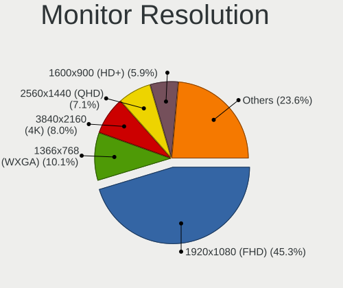

| Resolution         | Computers | Percent |
|--------------------|-----------|---------|
| 1920x1080 (FHD)    | 1381      | 45.32%  |
| 1366x768 (WXGA)    | 309       | 10.14%  |
| 3840x2160 (4K)     | 243       | 7.98%   |
| 2560x1440 (QHD)    | 215       | 7.06%   |
| 1600x900 (HD+)     | 181       | 5.94%   |
| 1920x1200 (WUXGA)  | 97        | 3.18%   |
| 1680x1050 (WSXGA+) | 86        | 2.82%   |
| 1280x1024 (SXGA)   | 82        | 2.69%   |
| 1440x900 (WXGA+)   | 73        | 2.4%    |
| 3440x1440          | 54        | 1.77%   |
| 1280x800 (WXGA)    | 51        | 1.67%   |
| 2560x1600          | 43        | 1.41%   |
| Unknown            | 29        | 0.95%   |
| 3840x1080          | 27        | 0.89%   |
| 2880x1800          | 21        | 0.69%   |
| 3840x2400          | 18        | 0.59%   |
| 2560x1080          | 16        | 0.53%   |
| 1360x768           | 15        | 0.49%   |
| 800x1280           | 8         | 0.26%   |
| 1600x1200          | 8         | 0.26%   |
| 1024x600           | 7         | 0.23%   |
| 3200x1800 (QHD+)   | 6         | 0.2%    |
| 2288x1287          | 6         | 0.2%    |
| 1024x768 (XGA)     | 6         | 0.2%    |
| 2880x1920          | 5         | 0.16%   |
| 2880x1620          | 5         | 0.16%   |
| 1680x945           | 5         | 0.16%   |
| 3840x1600          | 4         | 0.13%   |
| 2256x1504          | 4         | 0.13%   |
| 1920x1280          | 4         | 0.13%   |
| 5760x1080          | 3         | 0.1%    |
| 2160x1440          | 3         | 0.1%    |
| 3072x1920          | 2         | 0.07%   |
| 2960x1050          | 2         | 0.07%   |
| 2048x1152          | 2         | 0.07%   |
| 1920x540           | 2         | 0.07%   |
| 1280x960           | 2         | 0.07%   |
| 1280x720 (HD)      | 2         | 0.07%   |
| 7680x2160          | 1         | 0.03%   |
| 6320x1800          | 1         | 0.03%   |

Monitor Diagonal
----------------

Diagonal size in inches

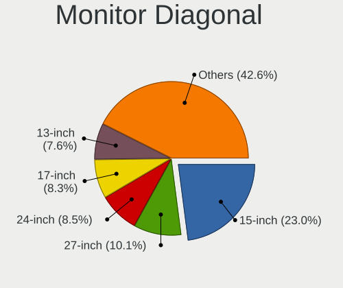

| Inches  | Computers | Percent |
|---------|-----------|---------|
| 15      | 734       | 22.95%  |
| 27      | 322       | 10.07%  |
| 24      | 272       | 8.51%   |
| 17      | 264       | 8.26%   |
| 13      | 244       | 7.63%   |
| 23      | 216       | 6.75%   |
| 14      | 196       | 6.13%   |
| 21      | 151       | 4.72%   |
| Unknown | 128       | 4%      |
| 31      | 80        | 2.5%    |
| 19      | 75        | 2.35%   |
| 16      | 63        | 1.97%   |
| 34      | 58        | 1.81%   |
| 22      | 49        | 1.53%   |
| 18      | 40        | 1.25%   |
| 20      | 37        | 1.16%   |
| 12      | 34        | 1.06%   |
| 84      | 22        | 0.69%   |
| 11      | 21        | 0.66%   |
| 72      | 18        | 0.56%   |
| 32      | 18        | 0.56%   |
| 25      | 18        | 0.56%   |
| 54      | 16        | 0.5%    |
| 10      | 12        | 0.38%   |
| 40      | 11        | 0.34%   |
| 65      | 9         | 0.28%   |
| 63      | 8         | 0.25%   |
| 49      | 8         | 0.25%   |
| 7       | 7         | 0.22%   |
| 142     | 6         | 0.19%   |
| 48      | 6         | 0.19%   |
| 35      | 6         | 0.19%   |
| 28      | 5         | 0.16%   |
| 26      | 5         | 0.16%   |
| 46      | 4         | 0.13%   |
| 43      | 4         | 0.13%   |
| 37      | 4         | 0.13%   |
| 33      | 4         | 0.13%   |
| 29      | 4         | 0.13%   |
| 55      | 3         | 0.09%   |

Monitor Width
-------------

Physical width

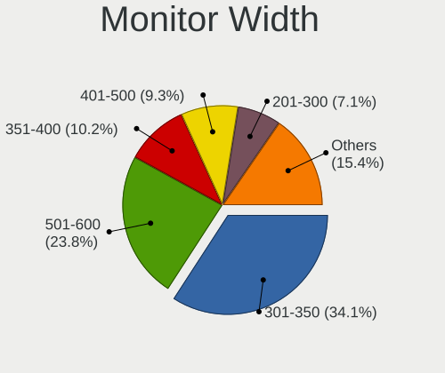

| Width in mm    | Computers | Percent |
|----------------|-----------|---------|
| 301-350        | 1074      | 34.15%  |
| 501-600        | 750       | 23.85%  |
| 351-400        | 322       | 10.24%  |
| 401-500        | 292       | 9.28%   |
| 201-300        | 222       | 7.06%   |
| 601-700        | 131       | 4.17%   |
| Unknown        | 128       | 4.07%   |
| 701-800        | 81        | 2.58%   |
| 1001-1500      | 58        | 1.84%   |
| 1501-2000      | 41        | 1.3%    |
| 801-900        | 23        | 0.73%   |
| 901-1000       | 8         | 0.25%   |
| 1-100          | 8         | 0.25%   |
| More than 2000 | 7         | 0.22%   |

Aspect Ratio
------------

Proportional relationship between the width and the height

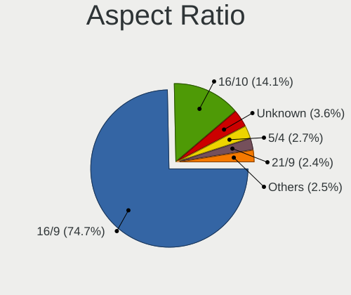

| Ratio   | Computers | Percent |
|---------|-----------|---------|
| 16/9    | 2135      | 74.68%  |
| 16/10   | 403       | 14.1%   |
| Unknown | 103       | 3.6%    |
| 5/4     | 76        | 2.66%   |
| 21/9    | 70        | 2.45%   |
| 3/2     | 20        | 0.7%    |
| 4/3     | 17        | 0.59%   |
| 32/9    | 13        | 0.45%   |
| 6/5     | 7         | 0.24%   |
| 0.67    | 7         | 0.24%   |
| 1.00    | 6         | 0.21%   |
| 3.73    | 1         | 0.03%   |
| 0.56    | 1         | 0.03%   |

Monitor Area
------------

Area in inch²

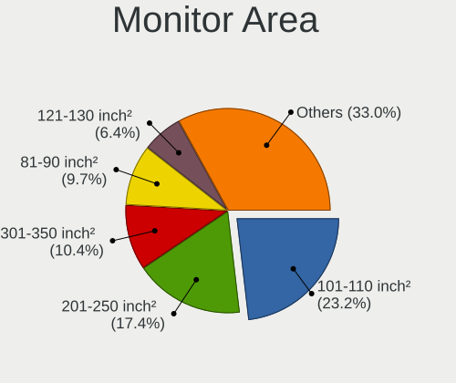

| Area in inch² | Computers | Percent |
|----------------|-----------|---------|
| 101-110        | 733       | 23.16%  |
| 201-250        | 550       | 17.38%  |
| 301-350        | 328       | 10.36%  |
| 81-90          | 306       | 9.67%   |
| 121-130        | 203       | 6.41%   |
| 351-500        | 169       | 5.34%   |
| 151-200        | 161       | 5.09%   |
| 71-80          | 133       | 4.2%    |
| Unknown        | 128       | 4.04%   |
| 251-300        | 101       | 3.19%   |
| More than 1000 | 88        | 2.78%   |
| 111-120        | 57        | 1.8%    |
| 141-150        | 46        | 1.45%   |
| 501-1000       | 42        | 1.33%   |
| 131-140        | 40        | 1.26%   |
| 61-70          | 34        | 1.07%   |
| 51-60          | 21        | 0.66%   |
| 41-50          | 12        | 0.38%   |
| 1-40           | 8         | 0.25%   |
| 91-100         | 5         | 0.16%   |

Pixel Density
-------------

Pixels per inch

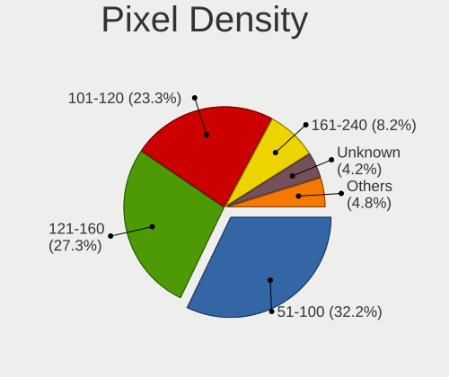

| Density       | Computers | Percent |
|---------------|-----------|---------|
| 51-100        | 990       | 32.15%  |
| 121-160       | 842       | 27.35%  |
| 101-120       | 718       | 23.32%  |
| 161-240       | 253       | 8.22%   |
| Unknown       | 128       | 4.16%   |
| More than 240 | 82        | 2.66%   |
| 1-50          | 66        | 2.14%   |

Multiple Monitors
-----------------

Total monitors connected

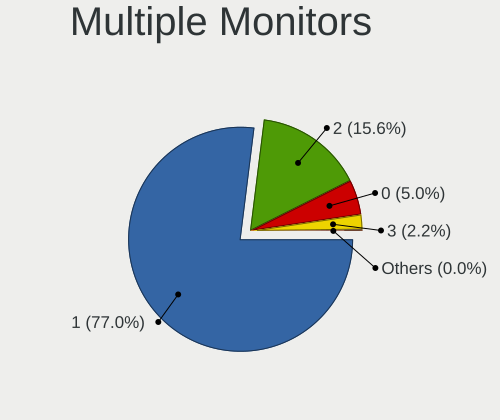

| Total | Computers | Percent |
|-------|-----------|---------|
| 1     | 2289      | 76.97%  |
| 2     | 465       | 15.64%  |
| 0     | 150       | 5.04%   |
| 3     | 64        | 2.15%   |
| 4     | 5         | 0.17%   |
| 5     | 1         | 0.03%   |

Network
-------

Net Controller Vendor
---------------------

Controller vendors

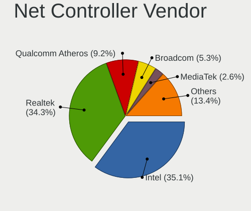

| Vendor                            | Computers | Percent |
|-----------------------------------|-----------|---------|
| Intel                             | 1538      | 35.12%  |
| Realtek Semiconductor             | 1504      | 34.35%  |
| Qualcomm Atheros                  | 405       | 9.25%   |
| Broadcom                          | 232       | 5.3%    |
| MediaTek                          | 112       | 2.56%   |
| TP-Link                           | 48        | 1.1%    |
| Broadcom Limited                  | 48        | 1.1%    |
| Marvell Technology Group          | 45        | 1.03%   |
| Ralink                            | 38        | 0.87%   |
| ASIX Electronics                  | 33        | 0.75%   |
| Nvidia                            | 31        | 0.71%   |
| DisplayLink                       | 24        | 0.55%   |
| Ralink Technology                 | 23        | 0.53%   |
| D-Link System                     | 20        | 0.46%   |
| Lenovo                            | 15        | 0.34%   |
| Shenzhen Goodix Technology        | 14        | 0.32%   |
| ASUSTek Computer                  | 14        | 0.32%   |
| Sierra Wireless                   | 13        | 0.3%    |
| Dell                              | 13        | 0.3%    |
| Samsung Electronics               | 12        | 0.27%   |
| Microsoft                         | 10        | 0.23%   |
| Xiaomi                            | 9         | 0.21%   |
| IMC Networks                      | 9         | 0.21%   |
| Hewlett-Packard                   | 9         | 0.21%   |
| Ericsson Business Mobile Networks | 9         | 0.21%   |
| D-Link                            | 9         | 0.21%   |
| Aquantia                          | 9         | 0.21%   |
| Microchip Technology              | 8         | 0.18%   |
| Linksys                           | 8         | 0.18%   |
| Qualcomm Technologies             | 7         | 0.16%   |
| Qualcomm                          | 6         | 0.14%   |
| JMicron Technology                | 6         | 0.14%   |
| Arduino SA                        | 6         | 0.14%   |
| Qualcomm Atheros Communications   | 5         | 0.11%   |
| NetGear                           | 5         | 0.11%   |
| Fibocom                           | 5         | 0.11%   |
| Edimax Technology                 | 5         | 0.11%   |
| Sitecom Europe                    | 4         | 0.09%   |
| OPPO Electronics                  | 4         | 0.09%   |
| Motorola PCS                      | 4         | 0.09%   |

Net Controller Model
--------------------

Controller models

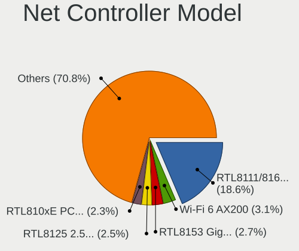

| Model                                                                  | Computers | Percent |
|------------------------------------------------------------------------|-----------|---------|
| Realtek RTL8111/8168/8211/8411 PCI Express Gigabit Ethernet Controller | 981       | 18.59%  |
| Intel Wi-Fi 6 AX200                                                    | 165       | 3.13%   |
| Realtek RTL8153 Gigabit Ethernet Adapter                               | 143       | 2.71%   |
| Realtek RTL8125 2.5GbE Controller                                      | 133       | 2.52%   |
| Realtek RTL810xE PCI Express Fast Ethernet controller                  | 121       | 2.29%   |
| Intel Wireless 8265 / 8275                                             | 88        | 1.67%   |
| Intel 82579LM Gigabit Network Connection (Lewisville)                  | 77        | 1.46%   |
| Intel I211 Gigabit Network Connection                                  | 69        | 1.31%   |
| Intel Wireless 7260                                                    | 68        | 1.29%   |
| Qualcomm Atheros AR9485 Wireless Network Adapter                       | 67        | 1.27%   |
| Intel Wireless 7265                                                    | 63        | 1.19%   |
| Intel Wireless 8260                                                    | 57        | 1.08%   |
| Intel Wi-Fi 6 AX201                                                    | 57        | 1.08%   |
| Qualcomm Atheros QCA9377 802.11ac Wireless Network Adapter             | 54        | 1.02%   |
| Intel Cannon Point-LP CNVi [Wireless-AC]                               | 52        | 0.99%   |
| Intel Ethernet Controller I225-V                                       | 51        | 0.97%   |
| MediaTek MT7922 802.11ax PCI Express Wireless Network Adapter          | 48        | 0.91%   |
| Qualcomm Atheros QCA9565 / AR9565 Wireless Network Adapter             | 44        | 0.83%   |
| Intel Alder Lake-P PCH CNVi WiFi                                       | 44        | 0.83%   |
| Realtek RTL8821CE 802.11ac PCIe Wireless Network Adapter               | 43        | 0.81%   |
| Realtek RTL8822CE 802.11ac PCIe Wireless Network Adapter               | 42        | 0.8%    |
| Qualcomm Atheros AR9285 Wireless Network Adapter (PCI-Express)         | 42        | 0.8%    |
| Intel Comet Lake PCH CNVi WiFi                                         | 42        | 0.8%    |
| Intel Ethernet Connection (2) I219-V                                   | 40        | 0.76%   |
| Qualcomm Atheros QCA6174 802.11ac Wireless Network Adapter             | 38        | 0.72%   |
| Intel Ethernet Connection I217-LM                                      | 38        | 0.72%   |
| Intel Centrino Advanced-N 6205 [Taylor Peak]                           | 38        | 0.72%   |
| Intel Cannon Lake PCH CNVi WiFi                                        | 37        | 0.7%    |
| Intel 82579V Gigabit Network Connection                                | 34        | 0.64%   |
| Intel Wi-Fi 6E(802.11ax) AX210/AX1675* 2x2 [Typhoon Peak]              | 33        | 0.63%   |
| Intel Wi-Fi 5(802.11ac) Wireless-AC 9x6x [Thunder Peak]                | 32        | 0.61%   |
| Intel Ethernet Connection (4) I219-V                                   | 32        | 0.61%   |
| Realtek RTL8723BE PCIe Wireless Network Adapter                        | 30        | 0.57%   |
| Qualcomm Atheros AR8151 v2.0 Gigabit Ethernet                          | 30        | 0.57%   |
| ASIX AX88179 Gigabit Ethernet                                          | 30        | 0.57%   |
| Intel Raptor Lake PCH CNVi WiFi                                        | 29        | 0.55%   |
| MediaTek MT7921 802.11ax PCIe Wireless Network Adapter [Filogic 330]   | 28        | 0.53%   |
| Intel Ethernet Connection (4) I219-LM                                  | 28        | 0.53%   |
| Intel Comet Lake PCH-LP CNVi WiFi                                      | 28        | 0.53%   |
| Intel Centrino Wireless-N 2230                                         | 28        | 0.53%   |

Wireless Vendor
---------------

Wireless vendors

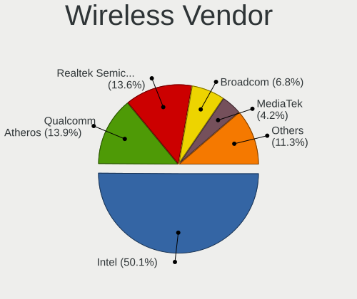

| Vendor                                | Computers | Percent |
|---------------------------------------|-----------|---------|
| Intel                                 | 1157      | 50.11%  |
| Qualcomm Atheros                      | 322       | 13.95%  |
| Realtek Semiconductor                 | 315       | 13.64%  |
| Broadcom                              | 157       | 6.8%    |
| MediaTek                              | 96        | 4.16%   |
| TP-Link                               | 38        | 1.65%   |
| Ralink                                | 38        | 1.65%   |
| Broadcom Limited                      | 29        | 1.26%   |
| Ralink Technology                     | 23        | 1%      |
| D-Link System                         | 15        | 0.65%   |
| Sierra Wireless                       | 13        | 0.56%   |
| ASUSTek Computer                      | 13        | 0.56%   |
| IMC Networks                          | 9         | 0.39%   |
| D-Link                                | 9         | 0.39%   |
| Microsoft                             | 8         | 0.35%   |
| Linksys                               | 7         | 0.3%    |
| Dell                                  | 7         | 0.3%    |
| Qualcomm                              | 6         | 0.26%   |
| Qualcomm Atheros Communications       | 5         | 0.22%   |
| NetGear                               | 5         | 0.22%   |
| Fibocom                               | 5         | 0.22%   |
| Edimax Technology                     | 5         | 0.22%   |
| Sitecom Europe                        | 4         | 0.17%   |
| Marvell Technology Group              | 3         | 0.13%   |
| 802.11g Adapter [Linksys WUSB54GC v3] | 3         | 0.13%   |
| ZyXEL Communications                  | 2         | 0.09%   |
| Qualcomm Technologies                 | 2         | 0.09%   |
| Hewlett-Packard                       | 2         | 0.09%   |
| Z-Com                                 | 1         | 0.04%   |
| TRENDnet                              | 1         | 0.04%   |
| Texas Instruments                     | 1         | 0.04%   |
| Tenda                                 | 1         | 0.04%   |
| Realtek                               | 1         | 0.04%   |
| Panasonic (Matsushita)                | 1         | 0.04%   |
| Micro Star International              | 1         | 0.04%   |
| Guillemot                             | 1         | 0.04%   |
| Gemtek                                | 1         | 0.04%   |
| Belkin Components                     | 1         | 0.04%   |
| AVM                                   | 1         | 0.04%   |

Wireless Model
--------------

Wireless models

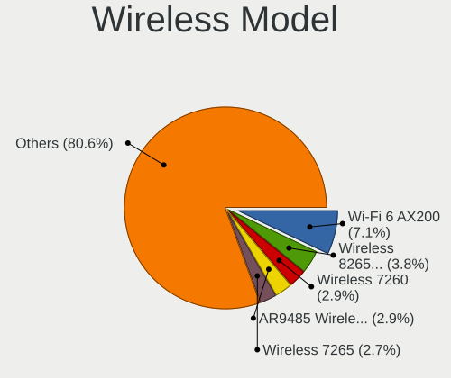

| Model                                                                | Computers | Percent |
|----------------------------------------------------------------------|-----------|---------|
| Intel Wi-Fi 6 AX200                                                  | 165       | 7.1%    |
| Intel Wireless 8265 / 8275                                           | 88        | 3.78%   |
| Intel Wireless 7260                                                  | 68        | 2.92%   |
| Qualcomm Atheros AR9485 Wireless Network Adapter                     | 67        | 2.88%   |
| Intel Wireless 7265                                                  | 63        | 2.71%   |
| Intel Wireless 8260                                                  | 57        | 2.45%   |
| Intel Wi-Fi 6 AX201                                                  | 57        | 2.45%   |
| Qualcomm Atheros QCA9377 802.11ac Wireless Network Adapter           | 54        | 2.32%   |
| Intel Cannon Point-LP CNVi [Wireless-AC]                             | 52        | 2.24%   |
| Qualcomm Atheros QCA9565 / AR9565 Wireless Network Adapter           | 44        | 1.89%   |
| Realtek RTL8821CE 802.11ac PCIe Wireless Network Adapter             | 43        | 1.85%   |
| Realtek RTL8822CE 802.11ac PCIe Wireless Network Adapter             | 42        | 1.81%   |
| Qualcomm Atheros AR9285 Wireless Network Adapter (PCI-Express)       | 42        | 1.81%   |
| Intel Comet Lake PCH CNVi WiFi                                       | 42        | 1.81%   |
| Qualcomm Atheros QCA6174 802.11ac Wireless Network Adapter           | 38        | 1.63%   |
| MediaTek MT7922 802.11ax PCI Express Wireless Network Adapter        | 38        | 1.63%   |
| Intel Centrino Advanced-N 6205 [Taylor Peak]                         | 38        | 1.63%   |
| Intel Cannon Lake PCH CNVi WiFi                                      | 37        | 1.59%   |
| Intel Wi-Fi 6E(802.11ax) AX210/AX1675* 2x2 [Typhoon Peak]            | 33        | 1.42%   |
| Intel Wi-Fi 5(802.11ac) Wireless-AC 9x6x [Thunder Peak]              | 32        | 1.38%   |
| Realtek RTL8723BE PCIe Wireless Network Adapter                      | 30        | 1.29%   |
| Intel Raptor Lake PCH CNVi WiFi                                      | 29        | 1.25%   |
| MediaTek MT7921 802.11ax PCIe Wireless Network Adapter [Filogic 330] | 28        | 1.2%    |
| Intel Comet Lake PCH-LP CNVi WiFi                                    | 28        | 1.2%    |
| Intel Centrino Wireless-N 2230                                       | 28        | 1.2%    |
| Intel Alder Lake-P PCH CNVi WiFi                                     | 26        | 1.12%   |
| Realtek RTL8822BE 802.11a/b/g/n/ac WiFi adapter                      | 24        | 1.03%   |
| Intel Wireless 3165                                                  | 24        | 1.03%   |
| Intel PRO/Wireless 3945ABG [Golan] Network Connection                | 24        | 1.03%   |
| Intel Dual Band Wireless-AC 3168NGW [Stone Peak]                     | 22        | 0.95%   |
| Intel 700 Series Chipset CNVi WiFi                                   | 22        | 0.95%   |
| Broadcom BCM4313 802.11bgn Wireless Network Adapter                  | 22        | 0.95%   |
| Qualcomm Atheros AR9287 Wireless Network Adapter (PCI-Express)       | 20        | 0.86%   |
| Intel WiFi Link 5100                                                 | 19        | 0.82%   |
| Broadcom BCM43142 802.11b/g/n                                        | 19        | 0.82%   |
| Intel Centrino Ultimate-N 6300                                       | 18        | 0.77%   |
| Intel Centrino Advanced-N 6200                                       | 18        | 0.77%   |
| Broadcom BCM4360 802.11ac Dual Band Wireless Network Adapter         | 18        | 0.77%   |
| Realtek RTL88x2bu [AC1200 Techkey]                                   | 17        | 0.73%   |
| Intel Wireless 3160                                                  | 17        | 0.73%   |

Ethernet Vendor
---------------

Ethernet vendors

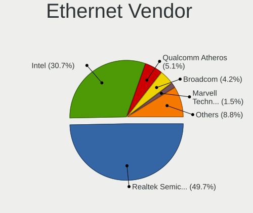

| Vendor                                 | Computers | Percent |
|----------------------------------------|-----------|---------|
| Realtek Semiconductor                  | 1387      | 49.7%   |
| Intel                                  | 858       | 30.74%  |
| Qualcomm Atheros                       | 143       | 5.12%   |
| Broadcom                               | 116       | 4.16%   |
| Marvell Technology Group               | 42        | 1.5%    |
| ASIX Electronics                       | 33        | 1.18%   |
| Nvidia                                 | 31        | 1.11%   |
| DisplayLink                            | 24        | 0.86%   |
| Broadcom Limited                       | 19        | 0.68%   |
| MediaTek                               | 16        | 0.57%   |
| Lenovo                                 | 15        | 0.54%   |
| Samsung Electronics                    | 12        | 0.43%   |
| Xiaomi                                 | 9         | 0.32%   |
| TP-Link                                | 9         | 0.32%   |
| Aquantia                               | 9         | 0.32%   |
| Microchip Technology                   | 7         | 0.25%   |
| Hewlett-Packard                        | 7         | 0.25%   |
| JMicron Technology                     | 6         | 0.21%   |
| Qualcomm Technologies                  | 5         | 0.18%   |
| D-Link System                          | 5         | 0.18%   |
| OPPO Electronics                       | 4         | 0.14%   |
| Motorola PCS                           | 4         | 0.14%   |
| Silicon Integrated Systems [SiS]       | 3         | 0.11%   |
| Google                                 | 3         | 0.11%   |
| ADMtek                                 | 3         | 0.11%   |
| Suzhou Motorcomm Electronic Technology | 2         | 0.07%   |
| Motorcomm Microelectronics.            | 2         | 0.07%   |
| MosChip Semiconductor                  | 2         | 0.07%   |
| Attansic Technology                    | 2         | 0.07%   |
| Apple                                  | 2         | 0.07%   |
| VIA Technologies                       | 1         | 0.04%   |
| Tehuti Networks                        | 1         | 0.04%   |
| Sony Ericsson Mobile Communications AB | 1         | 0.04%   |
| Raspberry Pi                           | 1         | 0.04%   |
| OpenMoko                               | 1         | 0.04%   |
| OnePlus Technology (Shenzhen)          | 1         | 0.04%   |
| Microsoft                              | 1         | 0.04%   |
| Linksys                                | 1         | 0.04%   |
| IBM                                    | 1         | 0.04%   |
| Huawei Technologies                    | 1         | 0.04%   |

Ethernet Model
--------------

Ethernet models

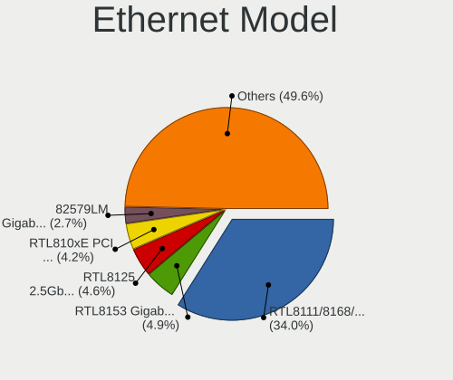

| Model                                                                  | Computers | Percent |
|------------------------------------------------------------------------|-----------|---------|
| Realtek RTL8111/8168/8211/8411 PCI Express Gigabit Ethernet Controller | 981       | 33.96%  |
| Realtek RTL8153 Gigabit Ethernet Adapter                               | 143       | 4.95%   |
| Realtek RTL8125 2.5GbE Controller                                      | 133       | 4.6%    |
| Realtek RTL810xE PCI Express Fast Ethernet controller                  | 121       | 4.19%   |
| Intel 82579LM Gigabit Network Connection (Lewisville)                  | 77        | 2.67%   |
| Intel I211 Gigabit Network Connection                                  | 69        | 2.39%   |
| Intel Ethernet Controller I225-V                                       | 51        | 1.77%   |
| Intel Ethernet Connection (2) I219-V                                   | 40        | 1.38%   |
| Intel Ethernet Connection I217-LM                                      | 38        | 1.32%   |
| Intel 82579V Gigabit Network Connection                                | 34        | 1.18%   |
| Intel Ethernet Connection (4) I219-V                                   | 32        | 1.11%   |
| Qualcomm Atheros AR8151 v2.0 Gigabit Ethernet                          | 30        | 1.04%   |
| ASIX AX88179 Gigabit Ethernet                                          | 30        | 1.04%   |
| Intel Ethernet Connection (4) I219-LM                                  | 28        | 0.97%   |
| Intel Ethernet Connection I218-LM                                      | 27        | 0.93%   |
| Qualcomm Atheros AR8161 Gigabit Ethernet                               | 23        | 0.8%    |
| Intel Ethernet Connection I217-V                                       | 23        | 0.8%    |
| Intel Ethernet Connection (2) I219-LM                                  | 22        | 0.76%   |
| Intel Ethernet Connection (2) I218-V                                   | 22        | 0.76%   |
| Qualcomm Atheros Killer E220x Gigabit Ethernet Controller              | 21        | 0.73%   |
| Intel Ethernet Connection (6) I219-LM                                  | 21        | 0.73%   |
| Intel Ethernet Connection I219-LM                                      | 20        | 0.69%   |
| Intel Ethernet Connection (6) I219-V                                   | 20        | 0.69%   |
| Intel Alder Lake-P PCH CNVi WiFi                                       | 18        | 0.62%   |
| Broadcom NetXtreme BCM57766 Gigabit Ethernet PCIe                      | 18        | 0.62%   |
| Intel Ethernet Connection (3) I218-LM                                  | 17        | 0.59%   |
| Intel 82577LM Gigabit Network Connection                               | 17        | 0.59%   |
| Intel Ethernet Controller I226-V                                       | 16        | 0.55%   |
| Intel Ethernet Connection (7) I219-LM                                  | 16        | 0.55%   |
| Broadcom NetXtreme BCM57765 Gigabit Ethernet PCIe                      | 15        | 0.52%   |
| Intel I210 Gigabit Network Connection                                  | 14        | 0.48%   |
| Intel Ethernet Connection I219-V                                       | 14        | 0.48%   |
| Intel 82574L Gigabit Network Connection                                | 14        | 0.48%   |
| Intel 82567LM Gigabit Network Connection                               | 13        | 0.45%   |
| Broadcom NetLink BCM57780 Gigabit Ethernet PCIe                        | 12        | 0.42%   |
| Realtek RTL8152 Fast Ethernet Adapter                                  | 11        | 0.38%   |
| Qualcomm Atheros Killer E2500 Gigabit Ethernet Controller              | 11        | 0.38%   |
| Qualcomm Atheros AR8131 Gigabit Ethernet                               | 11        | 0.38%   |
| Nvidia MCP79 Ethernet                                                  | 11        | 0.38%   |
| Intel 82567LM-3 Gigabit Network Connection                             | 11        | 0.38%   |

Net Controller Kind
-------------------

Ethernet, WiFi or modem

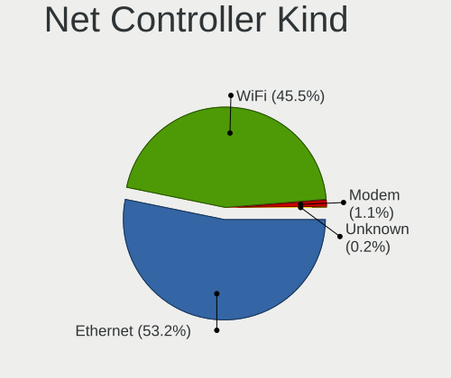

| Kind     | Computers | Percent |
|----------|-----------|---------|
| Ethernet | 2570      | 53.21%  |
| WiFi     | 2197      | 45.49%  |
| Modem    | 55        | 1.14%   |
| Unknown  | 8         | 0.17%   |

Used Controller
---------------

Currently used network controller

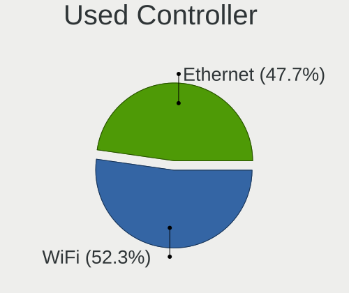

| Kind     | Computers | Percent |
|----------|-----------|---------|
| WiFi     | 1589      | 52.25%  |
| Ethernet | 1452      | 47.75%  |

NICs
----

Total network controllers on board

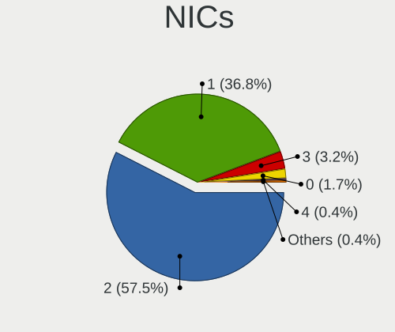

| Total | Computers | Percent |
|-------|-----------|---------|
| 2     | 1665      | 57.49%  |
| 1     | 1065      | 36.77%  |
| 3     | 93        | 3.21%   |
| 0     | 50        | 1.73%   |
| 4     | 11        | 0.38%   |
| 5     | 5         | 0.17%   |
| 6     | 4         | 0.14%   |
| 10    | 1         | 0.03%   |
| 9     | 1         | 0.03%   |
| 7     | 1         | 0.03%   |

IPv6
----

IPv6 vs IPv4

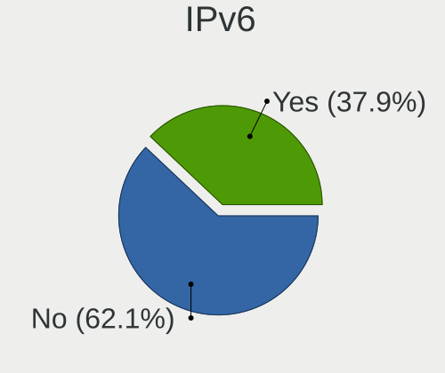

| Used | Computers | Percent |
|------|-----------|---------|
| No   | 1861      | 62.05%  |
| Yes  | 1138      | 37.95%  |

Bluetooth
---------

Bluetooth Vendor
----------------

Controller vendors

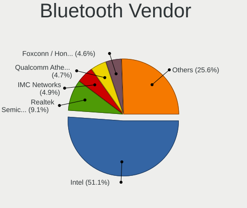

| Vendor                          | Computers | Percent |
|---------------------------------|-----------|---------|
| Intel                           | 967       | 51.11%  |
| Realtek Semiconductor           | 173       | 9.14%   |
| IMC Networks                    | 93        | 4.92%   |
| Qualcomm Atheros Communications | 88        | 4.65%   |
| Foxconn / Hon Hai               | 87        | 4.6%    |
| Cambridge Silicon Radio         | 83        | 4.39%   |
| Broadcom                        | 72        | 3.81%   |
| Apple                           | 69        | 3.65%   |
| Lite-On Technology              | 43        | 2.27%   |
| ASUSTek Computer                | 40        | 2.11%   |
| Dell                            | 37        | 1.96%   |
| MediaTek                        | 35        | 1.85%   |
| Hewlett-Packard                 | 28        | 1.48%   |
| Toshiba                         | 18        | 0.95%   |
| Ralink                          | 10        | 0.53%   |
| Belkin Components               | 10        | 0.53%   |
| TP-Link                         | 8         | 0.42%   |
| Alps Electric                   | 5         | 0.26%   |
| Foxconn International           | 4         | 0.21%   |
| Unknown                         | 4         | 0.21%   |
| Ralink Technology               | 3         | 0.16%   |
| Marvell Semiconductor           | 3         | 0.16%   |
| USI                             | 2         | 0.11%   |
| Realtek                         | 2         | 0.11%   |
| Micro Star International        | 2         | 0.11%   |
| SINO WEALTH                     | 1         | 0.05%   |
| Qcom                            | 1         | 0.05%   |
| Mercucys                        | 1         | 0.05%   |
| Logitech                        | 1         | 0.05%   |
| Integrated System Solution      | 1         | 0.05%   |
| HTC (High Tech Computer)        | 1         | 0.05%   |

Bluetooth Model
---------------

Controller models

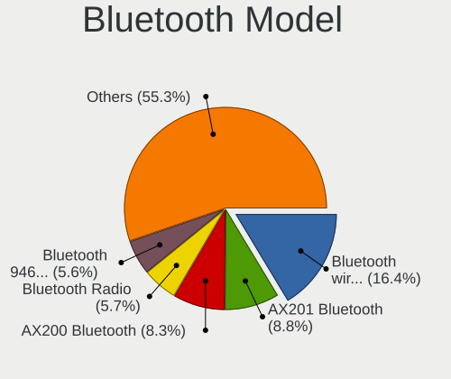

| Model                                               | Computers | Percent |
|-----------------------------------------------------|-----------|---------|
| Intel Bluetooth wireless interface                  | 310       | 16.36%  |
| Intel AX201 Bluetooth                               | 166       | 8.76%   |
| Intel AX200 Bluetooth                               | 158       | 8.34%   |
| Realtek Bluetooth Radio                             | 108       | 5.7%    |
| Intel Bluetooth 9460/9560 Jefferson Peak (JfP)      | 106       | 5.59%   |
| Intel Bluetooth Device                              | 98        | 5.17%   |
| Cambridge Silicon Radio Bluetooth Dongle (HCI mode) | 83        | 4.38%   |
| Realtek  Bluetooth 4.2 Adapter                      | 38        | 2.01%   |
| Intel Centrino Bluetooth Wireless Transceiver       | 38        | 2.01%   |
| MediaTek Wireless_Device                            | 34        | 1.79%   |
| Intel AX210 Bluetooth                               | 34        | 1.79%   |
| IMC Networks Bluetooth Radio                        | 33        | 1.74%   |
| Apple Bluetooth Host Controller                     | 33        | 1.74%   |
| Intel Wireless-AC 9260 Bluetooth Adapter            | 32        | 1.69%   |
| Qualcomm Atheros  Bluetooth Device                  | 30        | 1.58%   |
| Foxconn / Hon Hai Wireless_Device                   | 26        | 1.37%   |
| Foxconn / Hon Hai Bluetooth Device                  | 26        | 1.37%   |
| IMC Networks Wireless_Device                        | 25        | 1.32%   |
| Intel Wireless-AC 3168 Bluetooth                    | 22        | 1.16%   |
| Lite-On Qualcomm Atheros QCA9377 Bluetooth          | 21        | 1.11%   |
| Apple Bluetooth USB Host Controller                 | 21        | 1.11%   |
| Qualcomm Atheros QCA61x4 Bluetooth 4.0              | 20        | 1.06%   |
| Qualcomm Atheros AR3011 Bluetooth                   | 20        | 1.06%   |
| IMC Networks Bluetooth Device                       | 19        | 1%      |
| HP Bluetooth 2.0 Interface [Broadcom BCM2045]       | 16        | 0.84%   |
| Foxconn / Hon Hai MediaTek Bluetooth Adapter        | 15        | 0.79%   |
| Dell DW375 Bluetooth Module                         | 14        | 0.74%   |
| Dell BCM20702A0 Bluetooth Module                    | 12        | 0.63%   |
| Broadcom HP Portable SoftSailing                    | 12        | 0.63%   |
| ASUS ASUS USB-BT500                                 | 12        | 0.63%   |
| Qualcomm Atheros AR3012 Bluetooth 4.0               | 11        | 0.58%   |
| HP Broadcom 2070 Bluetooth Combo                    | 11        | 0.58%   |
| Broadcom BCM2045B (BDC-2.1)                         | 11        | 0.58%   |
| ASUS Broadcom BCM20702A0 Bluetooth                  | 11        | 0.58%   |
| Ralink RT3290 Bluetooth                             | 10        | 0.53%   |
| Foxconn / Hon Hai Bluetooth USB Host Controller     | 10        | 0.53%   |
| Realtek RTL8821A Bluetooth                          | 9         | 0.47%   |
| Lite-On Atheros AR3012 Bluetooth                    | 9         | 0.47%   |
| Apple Built-in Bluetooth 2.0+EDR HCI                | 9         | 0.47%   |
| TP-Link TP-T@- UB500 Adapter                        | 8         | 0.42%   |

Sound
-----

Sound Vendor
------------

Sound card vendors

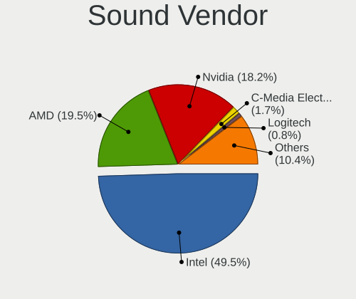

| Vendor                                       | Computers | Percent |
|----------------------------------------------|-----------|---------|
| Intel                                        | 2097      | 49.5%   |
| AMD                                          | 825       | 19.48%  |
| Nvidia                                       | 773       | 18.25%  |
| C-Media Electronics                          | 70        | 1.65%   |
| Logitech                                     | 32        | 0.76%   |
| Kingston Technology                          | 24        | 0.57%   |
| Hewlett-Packard                              | 22        | 0.52%   |
| Creative Labs                                | 22        | 0.52%   |
| Corsair                                      | 22        | 0.52%   |
| ASUSTek Computer                             | 22        | 0.52%   |
| Realtek Semiconductor                        | 20        | 0.47%   |
| GN Netcom                                    | 20        | 0.47%   |
| JMTek                                        | 18        | 0.42%   |
| Focusrite-Novation                           | 17        | 0.4%    |
| SteelSeries ApS                              | 16        | 0.38%   |
| Plantronics                                  | 14        | 0.33%   |
| Micro Star International                     | 14        | 0.33%   |
| Texas Instruments                            | 12        | 0.28%   |
| Generalplus Technology                       | 12        | 0.28%   |
| Razer USA                                    | 11        | 0.26%   |
| Lenovo                                       | 9         | 0.21%   |
| Creative Technology                          | 8         | 0.19%   |
| Sony                                         | 7         | 0.17%   |
| Dell                                         | 7         | 0.17%   |
| Thesycon Systemsoftware & Consulting         | 6         | 0.14%   |
| RODE Microphones                             | 6         | 0.14%   |
| Audio-Technica                               | 6         | 0.14%   |
| VIA Technologies                             | 5         | 0.12%   |
| Blue Microphones                             | 5         | 0.12%   |
| Astro Gaming                                 | 5         | 0.12%   |
| Apple                                        | 5         | 0.12%   |
| Trust                                        | 4         | 0.09%   |
| Roland                                       | 4         | 0.09%   |
| Giga-Byte Technology                         | 4         | 0.09%   |
| FIFINE Microphones                           | 4         | 0.09%   |
| DSEA A/S                                     | 4         | 0.09%   |
| Antlion Audio                                | 4         | 0.09%   |
| Zoran Co. Personal Media Division (Nogatech) | 3         | 0.07%   |
| Tenx Technology                              | 3         | 0.07%   |
| Silicon Integrated Systems [SiS]             | 3         | 0.07%   |

Sound Model
-----------

Sound card models

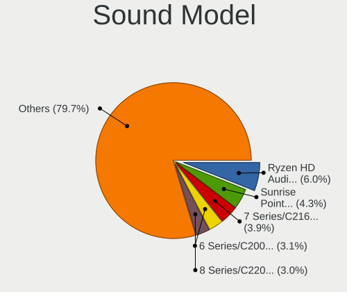

| Model                                                                      | Computers | Percent |
|----------------------------------------------------------------------------|-----------|---------|
| AMD Ryzen HD Audio Controller                                              | 301       | 6%      |
| Intel Sunrise Point-LP HD Audio                                            | 218       | 4.35%   |
| Intel 7 Series/C216 Chipset Family High Definition Audio Controller        | 196       | 3.91%   |
| Intel 6 Series/C200 Series Chipset Family High Definition Audio Controller | 155       | 3.09%   |
| Intel 8 Series/C220 Series Chipset High Definition Audio Controller        | 150       | 2.99%   |
| AMD Starship/Matisse HD Audio Controller                                   | 139       | 2.77%   |
| AMD Renoir/Cezanne HDMI/DP Audio Controller                                | 134       | 2.67%   |
| Intel Xeon E3-1200 v3/4th Gen Core Processor HD Audio Controller           | 110       | 2.19%   |
| Intel Cannon Lake PCH cAVS                                                 | 102       | 2.03%   |
| Intel 5 Series/3400 Series Chipset High Definition Audio                   | 101       | 2.01%   |
| AMD Radeon High Definition Audio Controller                                | 98        | 1.95%   |
| Intel 82801I (ICH9 Family) HD Audio Controller                             | 90        | 1.79%   |
| Intel 100 Series/C230 Series Chipset Family HD Audio Controller            | 78        | 1.56%   |
| Intel Cannon Point-LP High Definition Audio Controller                     | 75        | 1.5%    |
| Intel Tiger Lake-LP Smart Sound Technology Audio Controller                | 74        | 1.48%   |
| Intel Broadwell-U Audio Controller                                         | 67        | 1.34%   |
| AMD FCH Azalia Controller                                                  | 64        | 1.28%   |
| Intel Wildcat Point-LP High Definition Audio Controller                    | 63        | 1.26%   |
| Intel Haswell-ULT HD Audio Controller                                      | 62        | 1.24%   |
| Intel 8 Series HD Audio Controller                                         | 62        | 1.24%   |
| Intel 200 Series PCH HD Audio                                              | 60        | 1.2%    |
| AMD SBx00 Azalia (Intel HDA)                                               | 59        | 1.18%   |
| Intel Alder Lake PCH-P High Definition Audio Controller                    | 58        | 1.16%   |
| Intel Comet Lake PCH cAVS                                                  | 55        | 1.1%    |
| AMD Raven/Raven2/Fenghuang HDMI/DP Audio Controller                        | 52        | 1.04%   |
| Intel 82801H (ICH8 Family) HD Audio Controller                             | 50        | 1%      |
| Nvidia GP107GL High Definition Audio Controller                            | 48        | 0.96%   |
| Nvidia GK107 HDMI Audio Controller                                         | 45        | 0.9%    |
| Intel NM10/ICH7 Family High Definition Audio Controller                    | 45        | 0.9%    |
| Nvidia TU106 High Definition Audio Controller                              | 44        | 0.88%   |
| Nvidia GA104 High Definition Audio Controller                              | 41        | 0.82%   |
| Intel Comet Lake PCH-LP cAVS                                               | 41        | 0.82%   |
| AMD Ellesmere HDMI Audio [Radeon RX 470/480 / 570/580/590]                 | 41        | 0.82%   |
| Nvidia GP104 High Definition Audio Controller                              | 40        | 0.8%    |
| AMD Kabini HDMI/DP Audio                                                   | 40        | 0.8%    |
| Nvidia GP106 High Definition Audio Controller                              | 39        | 0.78%   |
| Nvidia High Definition Audio Controller                                    | 38        | 0.76%   |
| Nvidia GK208 HDMI/DP Audio Controller                                      | 38        | 0.76%   |
| Intel CM238 HD Audio Controller                                            | 37        | 0.74%   |
| Intel 9 Series Chipset Family HD Audio Controller                          | 37        | 0.74%   |

Memory
------

Memory Vendor
-------------

Memory module vendors

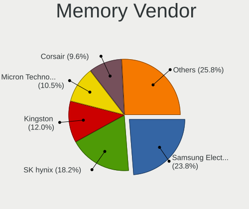

| Vendor              | Computers | Percent |
|---------------------|-----------|---------|
| Samsung Electronics | 437       | 23.76%  |
| SK hynix            | 335       | 18.22%  |
| Kingston            | 221       | 12.02%  |
| Micron Technology   | 194       | 10.55%  |
| Corsair             | 177       | 9.62%   |
| Unknown             | 111       | 6.04%   |
| Crucial             | 102       | 5.55%   |
| G.Skill             | 66        | 3.59%   |
| Elpida              | 39        | 2.12%   |
| Ramaxel Technology  | 33        | 1.79%   |
| Nanya Technology    | 23        | 1.25%   |
| Unknown             | 21        | 1.14%   |
| A-DATA Technology   | 20        | 1.09%   |
| Unknown (ABCD)      | 13        | 0.71%   |
| Unifosa             | 6         | 0.33%   |
| Transcend           | 5         | 0.27%   |
| Team                | 3         | 0.16%   |
| Patriot             | 3         | 0.16%   |
| OCZ                 | 3         | 0.16%   |
| Timetec             | 2         | 0.11%   |
| Hewlett-Packard     | 2         | 0.11%   |
| GOODRAM             | 2         | 0.11%   |
| Wodposit            | 1         | 0.05%   |
| Unknown (0x8551)    | 1         | 0.05%   |
| Unknown (0x0FF4)    | 1         | 0.05%   |
| Unknown (0x0DD5)    | 1         | 0.05%   |
| Unknown (0x0B45)    | 1         | 0.05%   |
| Unknown (09D5)      | 1         | 0.05%   |
| TRS STAR            | 1         | 0.05%   |
| Teclast             | 1         | 0.05%   |
| TakeMS              | 1         | 0.05%   |
| Qimonda             | 1         | 0.05%   |
| PNY                 | 1         | 0.05%   |
| Mushkin             | 1         | 0.05%   |
| J&A Information     | 1         | 0.05%   |
| GeIL                | 1         | 0.05%   |
| Corsair SerNum0     | 1         | 0.05%   |
| Avant               | 1         | 0.05%   |
| Apacer              | 1         | 0.05%   |
| AMD                 | 1         | 0.05%   |

Memory Model
------------

Memory module models

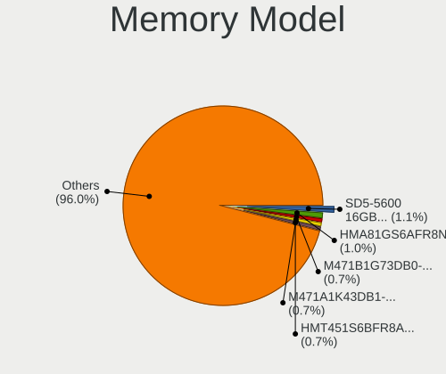

| Model                                                            | Computers | Percent |
|------------------------------------------------------------------|-----------|---------|
| Unknown                                                          | 21        | 1.07%   |
| SK hynix RAM HMA81GS6AFR8N-UH 8GB SODIMM DDR4 2667MT/s           | 19        | 0.96%   |
| SK hynix RAM HMT451S6BFR8A-PB 4GB SODIMM DDR3 1600MT/s           | 13        | 0.66%   |
| Samsung RAM M471B1G73DB0-YK0 8GB SODIMM DDR3 1600MT/s            | 13        | 0.66%   |
| Samsung RAM M471A1K43DB1-CWE 8GB SODIMM DDR4 3200MT/s            | 13        | 0.66%   |
| SK hynix RAM HMA81GS6CJR8N-VK 8GB SODIMM DDR4 2667MT/s           | 12        | 0.61%   |
| Samsung RAM M471B1G73QH0-YK0 8GB SODIMM DDR3 1600MT/s            | 12        | 0.61%   |
| Samsung RAM M471A1G44AB0-CWE 8GiB SODIMM DDR4 3200MT/s           | 12        | 0.61%   |
| Unknown (ABCD) RAM 123456789012345678 2GB SODIMM LPDDR4 2400MT/s | 11        | 0.56%   |
| Samsung RAM M471B5273DH0-CH9 4GB SODIMM DDR3 1600MT/s            | 11        | 0.56%   |
| Samsung RAM M471B5173DB0-YK0 4GB SODIMM DDR3 1600MT/s            | 11        | 0.56%   |
| Samsung RAM M471A1K43CB1-CRC 8GB SODIMM DDR4 8400MT/s            | 11        | 0.56%   |
| Corsair RAM CMK16GX4M2B3200C16 8GB DIMM DDR4 3600MT/s            | 11        | 0.56%   |
| SK hynix RAM HMT351S6CFR8C-PB 4GB SODIMM DDR3 1600MT/s           | 10        | 0.51%   |
| Samsung RAM M471A2K43DB1-CWE 16GB SODIMM DDR4 3200MT/s           | 10        | 0.51%   |
| Crucial RAM CT102464BF160B.C16 8GB SODIMM DDR3 1600MT/s          | 10        | 0.51%   |
| Corsair RAM CMK16GX4M2B3000C15 8GB DIMM DDR4 3600MT/s            | 10        | 0.51%   |
| SK hynix RAM HMT351S6EFR8A-PB 4GB SODIMM DDR3 1600MT/s           | 9         | 0.46%   |
| SK hynix RAM HMA81GS6DJR8N-XN 8GB SODIMM DDR4 3200MT/s           | 9         | 0.46%   |
| Samsung RAM Module 16GB SODIMM DDR4 3200MT/s                     | 9         | 0.46%   |
| Samsung RAM M471A5244CB0-CTD 4GB SODIMM DDR4 3266MT/s            | 9         | 0.46%   |
| Samsung RAM M471A1K43DB1-CTD 8GB SODIMM DDR4 2667MT/s            | 9         | 0.46%   |
| Corsair RAM CMK32GX4M2E3200C16 16GB DIMM DDR4 3600MT/s           | 9         | 0.46%   |
| Samsung RAM M471B5173EB0-YK0 4GB SODIMM DDR3 1600MT/s            | 8         | 0.41%   |
| Samsung RAM M471A1K43CB1-CTD 8GB SODIMM DDR4 3200MT/s            | 8         | 0.41%   |
| Elpida RAM EBJ41UF8BCS0-DJ-F 4GB SODIMM DDR3 1334MT/s            | 8         | 0.41%   |
| Corsair RAM CMK32GX4M2B3200C16 16GB DIMM DDR4 3800MT/s           | 8         | 0.41%   |
| Unknown RAM Module 2GB DIMM DDR2 800MT/s                         | 7         | 0.36%   |
| Micron RAM 16KTF1G64HZ-1G6E1 8GB SODIMM DDR3 1600MT/s            | 7         | 0.36%   |
| Unknown RAM Module 4GB SODIMM DDR3                               | 6         | 0.3%    |
| SK hynix RAM HMT351U6CFR8C-PB 4GB DIMM DDR3 1800MT/s             | 6         | 0.3%    |
| SK hynix RAM HMAA1GS6CJR6N-XN 8GB SODIMM DDR4 3200MT/s           | 6         | 0.3%    |
| SK hynix RAM HMA851S6CJR6N-VK 4GB SODIMM DDR4 2667MT/s           | 6         | 0.3%    |
| SK hynix RAM HMA82GS6AFR8N-UH 16GB SODIMM DDR4 2667MT/s          | 6         | 0.3%    |
| SK hynix RAM H9CCNNNCLGALAR-NVD 8GB Row Of Chips LPDDR3 2133MT/s | 6         | 0.3%    |
| Samsung RAM M471B5173QH0-YK0 4GB SODIMM DDR3 1600MT/s            | 6         | 0.3%    |
| Samsung RAM M471A5244CB0-CRC 4GB SODIMM DDR4 2667MT/s            | 6         | 0.3%    |
| Samsung RAM M471A1K43EB1-CWE 8GB SODIMM DDR4 3200MT/s            | 6         | 0.3%    |
| Samsung RAM M378B5673FH0-CH9 2GB DIMM DDR3 1600MT/s              | 6         | 0.3%    |
| Micron RAM Module 8GB SODIMM DDR4 3200MT/s                       | 6         | 0.3%    |

Memory Kind
-----------

Memory module kinds

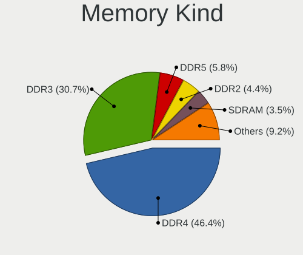

| Kind    | Computers | Percent |
|---------|-----------|---------|
| DDR4    | 762       | 46.35%  |
| DDR3    | 504       | 30.66%  |
| DDR5    | 95        | 5.78%   |
| DDR2    | 73        | 4.44%   |
| SDRAM   | 58        | 3.53%   |
| LPDDR4  | 42        | 2.55%   |
| LPDDR5  | 39        | 2.37%   |
| LPDDR3  | 35        | 2.13%   |
| Unknown | 28        | 1.7%    |
| DDR     | 6         | 0.36%   |
| DRAM    | 2         | 0.12%   |

Memory Form Factor
------------------

Physical design of the memory module

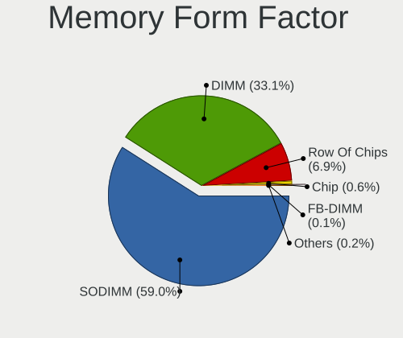

| Name         | Computers | Percent |
|--------------|-----------|---------|
| SODIMM       | 957       | 59.04%  |
| DIMM         | 537       | 33.13%  |
| Row Of Chips | 112       | 6.91%   |
| Chip         | 10        | 0.62%   |
| FB-DIMM      | 2         | 0.12%   |
| Unknown      | 2         | 0.12%   |
| RIMM         | 1         | 0.06%   |

Memory Size
-----------

Memory module size

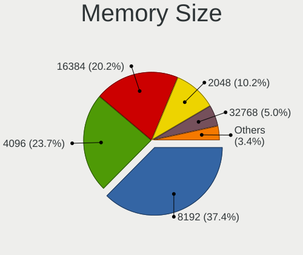

| Size  | Computers | Percent |
|-------|-----------|---------|
| 8192  | 661       | 37.43%  |
| 4096  | 419       | 23.73%  |
| 16384 | 356       | 20.16%  |
| 2048  | 181       | 10.25%  |
| 32768 | 89        | 5.04%   |
| 1024  | 43        | 2.43%   |
| 512   | 7         | 0.4%    |
| 49152 | 4         | 0.23%   |
| 12288 | 2         | 0.11%   |
| 8     | 2         | 0.11%   |
| 24576 | 1         | 0.06%   |
| 6144  | 1         | 0.06%   |

Memory Speed
------------

Memory module speed

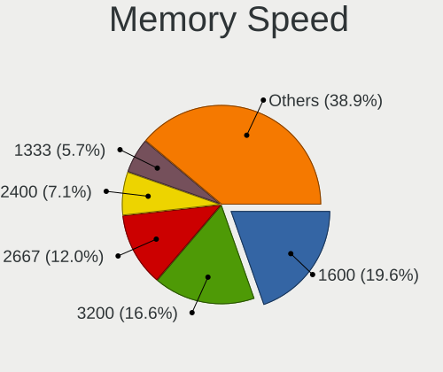

| Speed   | Computers | Percent |
|---------|-----------|---------|
| 1600    | 348       | 19.62%  |
| 3200    | 295       | 16.63%  |
| 2667    | 213       | 12.01%  |
| 2400    | 126       | 7.1%    |
| 1333    | 102       | 5.75%   |
| 2133    | 89        | 5.02%   |
| 3600    | 64        | 3.61%   |
| 667     | 39        | 2.2%    |
| 5600    | 38        | 2.14%   |
| 1334    | 36        | 2.03%   |
| 4800    | 30        | 1.69%   |
| 800     | 29        | 1.63%   |
| 6400    | 26        | 1.47%   |
| Unknown | 23        | 1.3%    |
| 4267    | 20        | 1.13%   |
| 1867    | 18        | 1.01%   |
| 1800    | 18        | 1.01%   |
| 1067    | 17        | 0.96%   |
| 6000    | 16        | 0.9%    |
| 3800    | 16        | 0.9%    |
| 2048    | 15        | 0.85%   |
| 8400    | 14        | 0.79%   |
| 2666    | 14        | 0.79%   |
| 3266    | 12        | 0.68%   |
| 3000    | 10        | 0.56%   |
| 1866    | 10        | 0.56%   |
| 7500    | 9         | 0.51%   |
| 4000    | 9         | 0.51%   |
| 3400    | 9         | 0.51%   |
| 3866    | 8         | 0.45%   |
| 3733    | 8         | 0.45%   |
| 533     | 8         | 0.45%   |
| 975     | 7         | 0.39%   |
| 1066    | 6         | 0.34%   |
| 4266    | 4         | 0.23%   |
| 4199    | 4         | 0.23%   |
| 3466    | 4         | 0.23%   |
| 1639    | 4         | 0.23%   |
| 8533    | 3         | 0.17%   |
| 7467    | 3         | 0.17%   |

Printers & scanners
-------------------

Printer Vendor
--------------

Printer device vendors

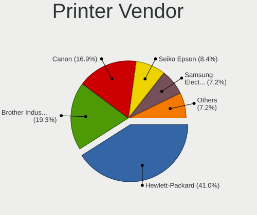

| Vendor              | Computers | Percent |
|---------------------|-----------|---------|
| Hewlett-Packard     | 34        | 40.96%  |
| Brother Industries  | 16        | 19.28%  |
| Canon               | 14        | 16.87%  |
| Seiko Epson         | 7         | 8.43%   |
| Samsung Electronics | 6         | 7.23%   |
| Kyocera             | 2         | 2.41%   |
| Star Micronics      | 1         | 1.2%    |
| Ricoh               | 1         | 1.2%    |
| Prolific Technology | 1         | 1.2%    |
| Dymo-CoStar         | 1         | 1.2%    |

Printer Model
-------------

Printer device models

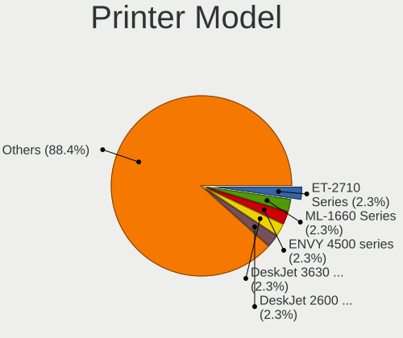

| Model                                                      | Computers | Percent |
|------------------------------------------------------------|-----------|---------|
| Seiko Epson ET-2710 Series                                 | 2         | 2.33%   |
| Samsung ML-1660 Series                                     | 2         | 2.33%   |
| HP ENVY 4500 series                                        | 2         | 2.33%   |
| HP DeskJet 3630 series                                     | 2         | 2.33%   |
| HP DeskJet 2600 series                                     | 2         | 2.33%   |
| Canon TS5100 series                                        | 2         | 2.33%   |
| Star Micronics TSP100ECO/TSP100II                          | 1         | 1.16%   |
| Seiko Epson XP-2200 Series                                 | 1         | 1.16%   |
| Seiko Epson WF-3010 Series                                 | 1         | 1.16%   |
| Seiko Epson ME Office 600F/Stylus Office BX300F/TX300F     | 1         | 1.16%   |
| Seiko Epson ET-8550 Series                                 | 1         | 1.16%   |
| Seiko Epson ET-4750 [WorkForce ET-4750 EcoTank All-in-One] | 1         | 1.16%   |
| Samsung SCX-472x Series                                    | 1         | 1.16%   |
| Samsung ML-1640 Series Laser Printer                       | 1         | 1.16%   |
| Samsung M2020 Series                                       | 1         | 1.16%   |
| Samsung C1810 Series                                       | 1         | 1.16%   |
| Ricoh SP C250SF                                            | 1         | 1.16%   |
| Prolific PL2305 Parallel Port                              | 1         | 1.16%   |
| Kyocera TASKalfa 250ci                                     | 1         | 1.16%   |
| Kyocera FS-C5150DN                                         | 1         | 1.16%   |
| HP Smart Tank 580-590 series                               | 1         | 1.16%   |
| HP OfficeJet Pro 6970                                      | 1         | 1.16%   |
| HP OfficeJet Pro 6960                                      | 1         | 1.16%   |
| HP Officejet 2620 series                                   | 1         | 1.16%   |
| HP LaserJet Professional P 1102w                           | 1         | 1.16%   |
| HP LaserJet Pro M148f-M149f                                | 1         | 1.16%   |
| HP LaserJet P4015                                          | 1         | 1.16%   |
| HP LaserJet M507                                           | 1         | 1.16%   |
| HP LaserJet CP1525nw/x                                     | 1         | 1.16%   |
| HP LaserJet CM1415fnw                                      | 1         | 1.16%   |
| HP LaserJet 3015                                           | 1         | 1.16%   |
| HP LaserJet 1020                                           | 1         | 1.16%   |
| HP LaserJet 1018                                           | 1         | 1.16%   |
| HP LaserJet 1015                                           | 1         | 1.16%   |
| HP EWS UPD                                                 | 1         | 1.16%   |
| HP ENVY Photo 6200 series                                  | 1         | 1.16%   |
| HP ENVY 6000 series                                        | 1         | 1.16%   |
| HP ENVY 5540 series                                        | 1         | 1.16%   |
| HP ENVY 4520 series                                        | 1         | 1.16%   |
| HP Deskjet F4500 series                                    | 1         | 1.16%   |

Scanner Vendor
--------------

Scanner device vendors

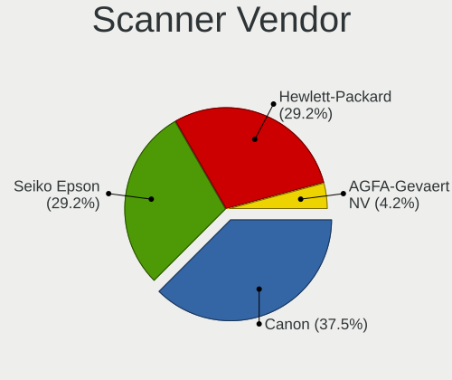

| Vendor          | Computers | Percent |
|-----------------|-----------|---------|
| Canon           | 9         | 37.5%   |
| Seiko Epson     | 7         | 29.17%  |
| Hewlett-Packard | 7         | 29.17%  |
| AGFA-Gevaert NV | 1         | 4.17%   |

Scanner Model
-------------

Scanner device models

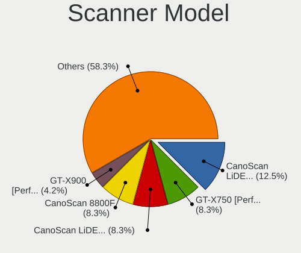

| Model                                                   | Computers | Percent |
|---------------------------------------------------------|-----------|---------|
| Canon CanoScan LiDE 110                                 | 3         | 12.5%   |
| Seiko Epson GT-X750 [Perfection 4490 Photo]             | 2         | 8.33%   |
| Canon CanoScan LiDE 210                                 | 2         | 8.33%   |
| Canon CanoScan 8800F                                    | 2         | 8.33%   |
| Seiko Epson GT-X900 [Perfection V700/V750 Photo]        | 1         | 4.17%   |
| Seiko Epson GT-X770 [Perfection V500]                   | 1         | 4.17%   |
| Seiko Epson GT-F730 [GT-S630/Perfection V33/V330 Photo] | 1         | 4.17%   |
| Seiko Epson GT-F700 [Perfection V350]                   | 1         | 4.17%   |
| Seiko Epson GT-7300U [Perfection 1260/1260 PHOTO]       | 1         | 4.17%   |
| HP ScanJet G4010                                        | 1         | 4.17%   |
| HP scanjet 8270                                         | 1         | 4.17%   |
| HP ScanJet 4370                                         | 1         | 4.17%   |
| HP ScanJet 3800c                                        | 1         | 4.17%   |
| HP ScanJet 3670                                         | 1         | 4.17%   |
| HP ScanJet 3400cse                                      | 1         | 4.17%   |
| HP Scanjet 200                                          | 1         | 4.17%   |
| Canon CanoScan N670U/N676U/LiDE 20                      | 1         | 4.17%   |
| Canon CanoScan 3200F                                    | 1         | 4.17%   |
| AGFA-Gevaert NV Snapscan e40                            | 1         | 4.17%   |

Camera
------

Camera Vendor
-------------

Camera device vendors

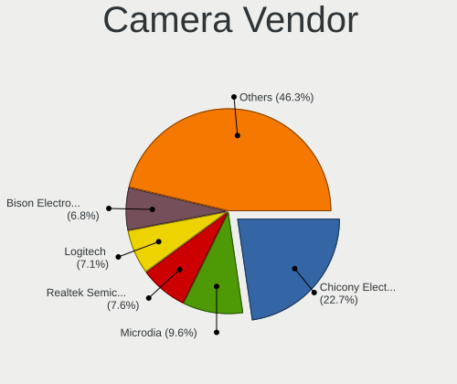

| Vendor                                 | Computers | Percent |
|----------------------------------------|-----------|---------|
| Chicony Electronics                    | 400       | 22.7%   |
| Microdia                               | 169       | 9.59%   |
| Realtek Semiconductor                  | 134       | 7.6%    |
| Logitech                               | 125       | 7.09%   |
| Bison Electronics                      | 119       | 6.75%   |
| IMC Networks                           | 115       | 6.53%   |
| Sunplus Innovation Technology          | 79        | 4.48%   |
| Quanta                                 | 73        | 4.14%   |
| Apple                                  | 66        | 3.75%   |
| Cheng Uei Precision Industry (Foxlink) | 56        | 3.18%   |
| Lite-On Technology                     | 52        | 2.95%   |
| Suyin                                  | 50        | 2.84%   |
| Syntek                                 | 42        | 2.38%   |
| Luxvisions Innotech Limited            | 42        | 2.38%   |
| Ricoh                                  | 20        | 1.14%   |
| Alcor Micro                            | 20        | 1.14%   |
| Samsung Electronics                    | 19        | 1.08%   |
| Shinetech                              | 15        | 0.85%   |
| Sonix Technology                       | 12        | 0.68%   |
| Generalplus Technology                 | 8         | 0.45%   |
| Acer                                   | 8         | 0.45%   |
| Trust                                  | 7         | 0.4%    |
| Lenovo                                 | 7         | 0.4%    |
| Silicon Motion                         | 6         | 0.34%   |
| Primax Electronics                     | 6         | 0.34%   |
| MacroSilicon                           | 6         | 0.34%   |
| Jieli Technology                       | 6         | 0.34%   |
| Z-Star Microelectronics                | 5         | 0.28%   |
| Microsoft                              | 5         | 0.28%   |
| ALi                                    | 5         | 0.28%   |
| kingcome                               | 4         | 0.23%   |
| Importek                               | 4         | 0.23%   |
| icSpring                               | 4         | 0.23%   |
| Creative Technology                    | 4         | 0.23%   |
| WaveRider Communications               | 3         | 0.17%   |
| Pixart Imaging                         | 3         | 0.17%   |
| Hewlett-Packard                        | 3         | 0.17%   |
| DigiTech                               | 3         | 0.17%   |
| Valve Software                         | 2         | 0.11%   |
| Sweex                                  | 2         | 0.11%   |

Camera Model
------------

Camera device models

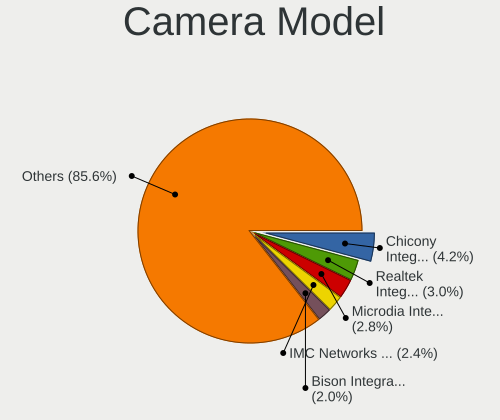

| Model                                         | Computers | Percent |
|-----------------------------------------------|-----------|---------|
| Chicony Integrated Camera                     | 74        | 4.17%   |
| Realtek Integrated_Webcam_HD                  | 54        | 3.04%   |
| Microdia Integrated_Webcam_HD                 | 50        | 2.82%   |
| IMC Networks Integrated Camera                | 42        | 2.37%   |
| Bison Integrated Camera                       | 36        | 2.03%   |
| Syntek Integrated Camera                      | 29        | 1.63%   |
| Microdia Integrated Webcam                    | 27        | 1.52%   |
| IMC Networks USB2.0 HD UVC WebCam             | 27        | 1.52%   |
| Chicony HP HD Camera                          | 27        | 1.52%   |
| Quanta HP HD Camera                           | 25        | 1.41%   |
| Chicony HD WebCam                             | 25        | 1.41%   |
| Apple FaceTime HD Camera (Built-in)           | 23        | 1.3%    |
| Samsung Galaxy series, misc. (MTP mode)       | 19        | 1.07%   |
| Logitech HD Pro Webcam C920                   | 17        | 0.96%   |
| Sunplus HD WebCam                             | 16        | 0.9%    |
| Lite-On Integrated Camera                     | 16        | 0.9%    |
| Apple iPhone 5/5C/5S/6/SE/7/8/X               | 16        | 0.9%    |
| Logitech Webcam C270                          | 15        | 0.85%   |
| Chicony HP Wide Vision HD Camera              | 15        | 0.85%   |
| Chicony HP HD Webcam                          | 15        | 0.85%   |
| Apple Built-in iSight                         | 15        | 0.85%   |
| Logitech HD Webcam C525                       | 14        | 0.79%   |
| Chicony TOSHIBA Web Camera - HD               | 14        | 0.79%   |
| Chicony Integrated Camera (1280x720@30)       | 14        | 0.79%   |
| Chicony EasyCamera                            | 14        | 0.79%   |
| Bison HD Webcam                               | 14        | 0.79%   |
| Bison BisonCam,NB Pro                         | 14        | 0.79%   |
| Chicony Chicony USB2.0 Camera                 | 13        | 0.73%   |
| Microdia Integrated_Webcam_FHD                | 12        | 0.68%   |
| Lite-On HP HD Camera                          | 12        | 0.68%   |
| Chicony USB2.0 HD UVC WebCam                  | 12        | 0.68%   |
| Microdia Laptop_Integrated_Webcam_2M          | 11        | 0.62%   |
| Logitech C922 Pro Stream Webcam               | 11        | 0.62%   |
| Lite-On HP HD Webcam                          | 11        | 0.62%   |
| Chicony HP TrueVision HD Camera               | 11        | 0.62%   |
| Bison BisonCam, NB Pro                        | 11        | 0.62%   |
| Sunplus Integrated_Webcam_HD                  | 10        | 0.56%   |
| Luxvisions Innotech Limited Integrated Camera | 10        | 0.56%   |
| Chicony USB2.0 VGA UVC WebCam                 | 10        | 0.56%   |
| Chicony USB 2.0 Camera                        | 10        | 0.56%   |

Security
--------

Fingerprint Vendor
------------------

Fingerprint sensor vendors

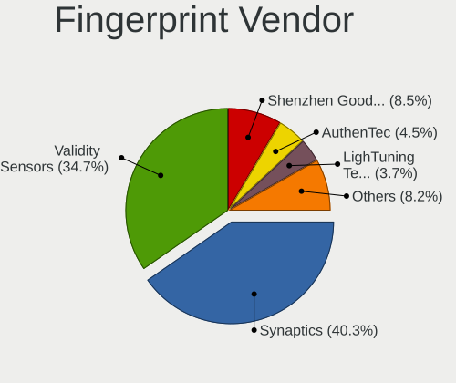

| Vendor                             | Computers | Percent |
|------------------------------------|-----------|---------|
| Synaptics                          | 142       | 40.34%  |
| Validity Sensors                   | 122       | 34.66%  |
| Shenzhen Goodix Technology         | 30        | 8.52%   |
| AuthenTec                          | 16        | 4.55%   |
| LighTuning Technology              | 13        | 3.69%   |
| Upek                               | 8         | 2.27%   |
| Elan Microelectronics              | 8         | 2.27%   |
| STMicroelectronics                 | 7         | 1.99%   |
| Realtek USB2.0 Finger Print Bridge | 4         | 1.14%   |
| DigitalPersona                     | 2         | 0.57%   |

Fingerprint Model
-----------------

Fingerprint sensor models

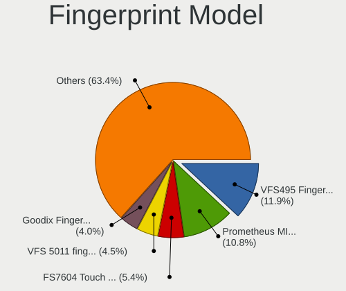

| Model                                                                      | Computers | Percent |
|----------------------------------------------------------------------------|-----------|---------|
| Validity Sensors VFS495 Fingerprint Reader                                 | 42        | 11.93%  |
| Synaptics Prometheus MIS Touch Fingerprint Reader                          | 38        | 10.8%   |
| Synaptics FS7604 Touch Fingerprint Sensor with PurePrint                   | 19        | 5.4%    |
| Validity Sensors VFS 5011 fingerprint sensor                               | 16        | 4.55%   |
| Shenzhen Goodix  FingerPrint Device                                        | 14        | 3.98%   |
| Synaptics Prometheus Fingerprint Reader                                    | 11        | 3.13%   |
| Validity Sensors VFS5011 Fingerprint Reader                                | 10        | 2.84%   |
| Synaptics WBDI                                                             | 10        | 2.84%   |
| Synaptics Fingerprint reader [HP G6]                                       | 10        | 2.84%   |
| Shenzhen Goodix Fingerprint Reader                                         | 10        | 2.84%   |
| Synaptics Metallica MOH Touch Fingerprint Reader                           | 9         | 2.56%   |
| Validity Sensors VFS451 Fingerprint Reader                                 | 8         | 2.27%   |
| Synaptics  WBDI                                                            | 8         | 2.27%   |
| Synaptics Metallica MIS Touch Fingerprint Reader                           | 8         | 2.27%   |
| Validity Sensors VFS471 Fingerprint Reader                                 | 7         | 1.99%   |
| Validity Sensors Synaptics WBDI                                            | 7         | 1.99%   |
| Upek Biometric Touchchip/Touchstrip Fingerprint Sensor                     | 7         | 1.99%   |
| Synaptics UWP WBDI Device                                                  | 7         | 1.99%   |
| STMicroelectronics Fingerprint Reader                                      | 7         | 1.99%   |
| LighTuning EgisTec Touch Fingerprint Sensor                                | 7         | 1.99%   |
| Validity Sensors VFS491                                                    | 6         | 1.7%    |
| Synaptics UWP WBDI                                                         | 6         | 1.7%    |
| Synaptics  FS7604 Touch Fingerprint Sensor with PurePrint                  | 6         | 1.7%    |
| Shenzhen Goodix FingerPrint                                                | 6         | 1.7%    |
| AuthenTec AES2810                                                          | 6         | 1.7%    |
| AuthenTec AES2501 Fingerprint Sensor                                       | 6         | 1.7%    |
| Validity Sensors Synaptics VFS7552 Touch Fingerprint Sensor with PurePrint | 5         | 1.42%   |
| Validity Sensors Fingerprint scanner                                       | 5         | 1.42%   |
| Validity Sensors VFS7500 Touch Fingerprint Sensor                          | 4         | 1.14%   |
| Synaptics WBDI Device                                                      | 4         | 1.14%   |
| Realtek USB2.0 Finger Print Bridge FocalTech Fingerprint Device            | 4         | 1.14%   |
| Elan ELAN:Fingerprint                                                      | 4         | 1.14%   |
| Elan ELAN:ARM-M4                                                           | 4         | 1.14%   |
| Validity Sensors VFS7552 Touch Fingerprint Sensor                          | 3         | 0.85%   |
| Validity Sensors VFS Fingerprint sensor                                    | 3         | 0.85%   |
| Synaptics TouchPad                                                         | 3         | 0.85%   |
| LighTuning Fingerprint Reader                                              | 3         | 0.85%   |
| AuthenTec AES1600                                                          | 3         | 0.85%   |
| Validity Sensors VFS101 Fingerprint Reader                                 | 2         | 0.57%   |
| Validity Sensors Swipe Fingerprint Sensor                                  | 2         | 0.57%   |

Chipcard Vendor
---------------

Chipcard module vendors

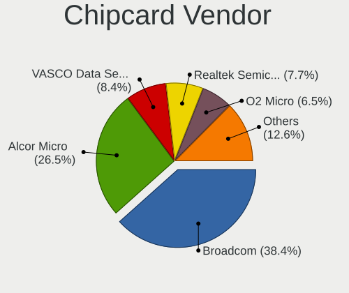

| Vendor                            | Computers | Percent |
|-----------------------------------|-----------|---------|
| Broadcom                          | 119       | 38.39%  |
| Alcor Micro                       | 82        | 26.45%  |
| VASCO Data Security International | 26        | 8.39%   |
| Realtek Semiconductor             | 24        | 7.74%   |
| O2 Micro                          | 20        | 6.45%   |
| Lenovo                            | 12        | 3.87%   |
| Advanced Card Systems             | 8         | 2.58%   |
| OmniKey                           | 6         | 1.94%   |
| Yubico.com                        | 2         | 0.65%   |
| Upek                              | 2         | 0.65%   |
| Gemalto (was Gemplus)             | 2         | 0.65%   |
| Chicony Electronics               | 2         | 0.65%   |
| SCM Microsystems                  | 1         | 0.32%   |
| Integrated Technology Express     | 1         | 0.32%   |
| Feitian Technologies              | 1         | 0.32%   |
| Clay Logic                        | 1         | 0.32%   |
| Cherry                            | 1         | 0.32%   |

Chipcard Model
--------------

Chipcard module models

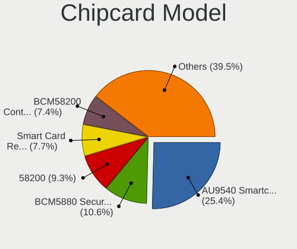

| Model                                                                        | Computers | Percent |
|------------------------------------------------------------------------------|-----------|---------|
| Alcor Micro AU9540 Smartcard Reader                                          | 79        | 25.4%   |
| Broadcom BCM5880 Secure Applications Processor                               | 33        | 10.61%  |
| Broadcom 58200                                                               | 29        | 9.32%   |
| Realtek Semiconductor Smart Card Reader Interface                            | 24        | 7.72%   |
| Broadcom BCM58200 ControlVault 3 (FingerPrint sensor + Contacted SmartCard)  | 23        | 7.4%    |
| Broadcom 5880                                                                | 23        | 7.4%    |
| O2 Micro OZ776 CCID Smartcard Reader                                         | 17        | 5.47%   |
| VASCO Data Security International Digipass 905 SmartCard Reader              | 16        | 5.14%   |
| Lenovo Integrated Smart Card Reader                                          | 12        | 3.86%   |
| Broadcom BCM5880 Secure Applications Processor with fingerprint swipe sensor | 12        | 3.86%   |
| VASCO Data Security International DIGIPASS 870                               | 10        | 3.22%   |
| Advanced Card Systems ACR38 SmartCard Reader                                 | 7         | 2.25%   |
| OmniKey CardMan 3021 / 3121                                                  | 3         | 0.96%   |
| O2 Micro Oz776 SmartCard Reader                                              | 3         | 0.96%   |
| Alcor Micro Watchdata W 1981                                                 | 3         | 0.96%   |
| Yubico.com Yubikey 4/5 U2F+CCID                                              | 2         | 0.64%   |
| Upek TouchChip Fingerprint Coprocessor (WBF advanced mode)                   | 2         | 0.64%   |
| Chicony Electronics HP Skylab USB Smartcard Keyboard                         | 2         | 0.64%   |
| SCM Microsystems SCR3340 - ExpressCard54 Smart Card Reader                   | 1         | 0.32%   |
| OmniKey CardMan 4321                                                         | 1         | 0.32%   |
| OmniKey CardMan 3121 (HID Technologies)                                      | 1         | 0.32%   |
| OmniKey CardMan 1021                                                         | 1         | 0.32%   |
| Integrated Technology Express SmartCard Reader                               | 1         | 0.32%   |
| Gemalto (was Gemplus) GemCore SIM Pro Smart Card Reader                      | 1         | 0.32%   |
| Gemalto (was Gemplus) Compact Smart Card Reader Writer                       | 1         | 0.32%   |
| Feitian Technologies SCR301                                                  | 1         | 0.32%   |
| Clay Logic Nitrokey Start                                                    | 1         | 0.32%   |
| Cherry SmartCard Reader Keyboard KC 1000 SC                                  | 1         | 0.32%   |
| Advanced Card Systems ACR39U                                                 | 1         | 0.32%   |

Unsupported
-----------

Unsupported Devices
-------------------

Total unsupported devices on board

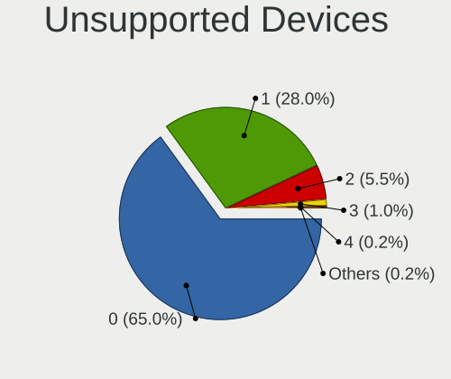

| Total | Computers | Percent |
|-------|-----------|---------|
| 0     | 1941      | 64.98%  |
| 1     | 837       | 28.02%  |
| 2     | 165       | 5.52%   |
| 3     | 31        | 1.04%   |
| 4     | 7         | 0.23%   |
| 6     | 3         | 0.1%    |
| 5     | 2         | 0.07%   |
| 8     | 1         | 0.03%   |

Unsupported Device Types
------------------------

Types of unsupported devices

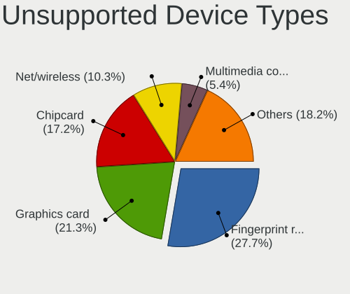

| Type                     | Computers | Percent |
|--------------------------|-----------|---------|
| Fingerprint reader       | 345       | 27.69%  |
| Graphics card            | 265       | 21.27%  |
| Chipcard                 | 214       | 17.17%  |
| Net/wireless             | 128       | 10.27%  |
| Multimedia controller    | 67        | 5.38%   |
| Communication controller | 35        | 2.81%   |
| Card reader              | 32        | 2.57%   |
| Camera                   | 28        | 2.25%   |
| Unassigned class         | 27        | 2.17%   |
| Bluetooth                | 27        | 2.17%   |
| Sound                    | 23        | 1.85%   |
| Storage                  | 20        | 1.61%   |
| Net/ethernet             | 15        | 1.2%    |
| Network                  | 7         | 0.56%   |
| Flash memory             | 4         | 0.32%   |
| Modem                    | 3         | 0.24%   |
| Dvb card                 | 3         | 0.24%   |
| Unclassified device      | 1         | 0.08%   |
| Storage/raid             | 1         | 0.08%   |
| Storage/ide              | 1         | 0.08%   |

