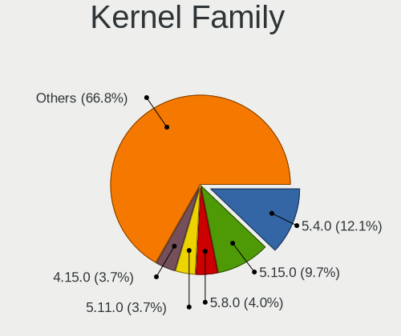
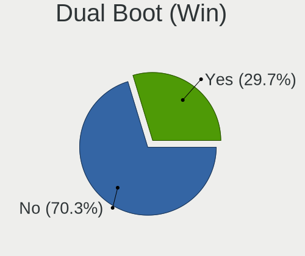
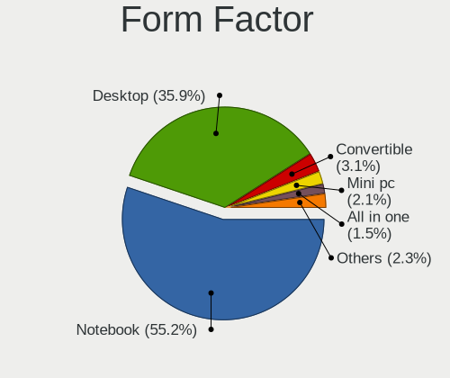
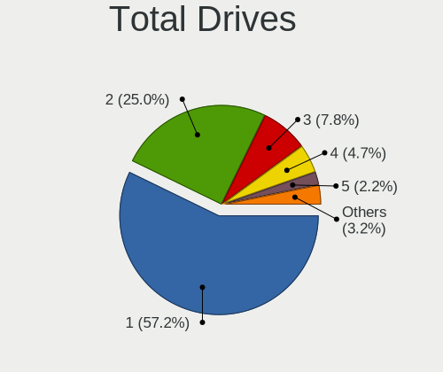
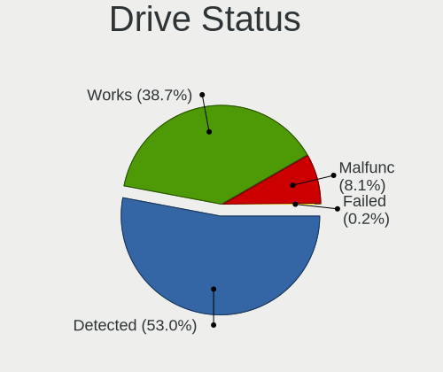
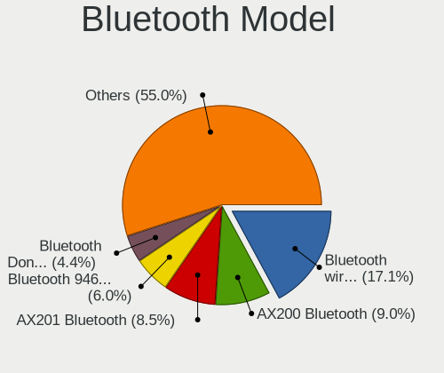
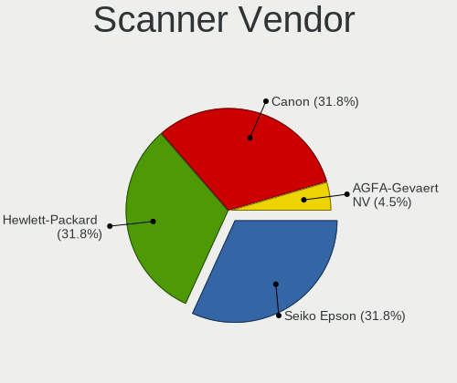

Linux in Belgium - Tested Hardware & Statistics
-----------------------------------------------

A project to collect tested hardware configurations for Linux in Belgium.

Anyone can contribute to this report by the [hw-probe](https://github.com/linuxhw/hw-probe) tool:

    sudo -E hw-probe -all -upload

Please contribute! Especially if your hardware is rare.

This is a report for all computer types. See also reports for [desktops](/Location/Belgium/Desktop/README.md) and [notebooks](/Location/Belgium/Notebook/README.md).

Contents
--------

* [ Test Cases ](#test-cases)

* [ System ](#system)
  - [ OS                       ](#os)
  - [ OS Family                ](#os-family)
  - [ Kernel                   ](#kernel)
  - [ Kernel Family            ](#kernel-family)
  - [ Kernel Major Ver.        ](#kernel-major-ver)
  - [ Arch                     ](#arch)
  - [ DE                       ](#de)
  - [ Display Server           ](#display-server)
  - [ Display Manager          ](#display-manager)
  - [ OS Lang                  ](#os-lang)
  - [ Boot Mode                ](#boot-mode)
  - [ Filesystem               ](#filesystem)
  - [ Part. scheme             ](#part-scheme)
  - [ Dual Boot with Linux/BSD ](#dual-boot-with-linuxbsd)
  - [ Dual Boot (Win)          ](#dual-boot-win)

* [ Board ](#board)
  - [ Vendor                   ](#vendor)
  - [ Model                    ](#model)
  - [ Model Family             ](#model-family)
  - [ MFG Year                 ](#mfg-year)
  - [ Form Factor              ](#form-factor)
  - [ Secure Boot              ](#secure-boot)
  - [ Coreboot                 ](#coreboot)
  - [ RAM Size                 ](#ram-size)
  - [ RAM Used                 ](#ram-used)
  - [ Total Drives             ](#total-drives)
  - [ Has CD-ROM               ](#has-cd-rom)
  - [ Has Ethernet             ](#has-ethernet)
  - [ Has WiFi                 ](#has-wifi)
  - [ Has Bluetooth            ](#has-bluetooth)

* [ Location ](#location)
  - [ Country                  ](#country)
  - [ City                     ](#city)

* [ Drives ](#drives)
  - [ Drive Vendor             ](#drive-vendor)
  - [ Drive Model              ](#drive-model)
  - [ HDD Vendor               ](#hdd-vendor)
  - [ SSD Vendor               ](#ssd-vendor)
  - [ Drive Kind               ](#drive-kind)
  - [ Drive Connector          ](#drive-connector)
  - [ Drive Size               ](#drive-size)
  - [ Space Total              ](#space-total)
  - [ Space Used               ](#space-used)
  - [ Malfunc. Drives          ](#malfunc-drives)
  - [ Malfunc. Drive Vendor    ](#malfunc-drive-vendor)
  - [ Malfunc. HDD Vendor      ](#malfunc-hdd-vendor)
  - [ Malfunc. Drive Kind      ](#malfunc-drive-kind)
  - [ Failed Drives            ](#failed-drives)
  - [ Failed Drive Vendor      ](#failed-drive-vendor)
  - [ Drive Status             ](#drive-status)

* [ Storage controller ](#storage-controller)
  - [ Storage Vendor           ](#storage-vendor)
  - [ Storage Model            ](#storage-model)
  - [ Storage Kind             ](#storage-kind)

* [ Processor ](#processor)
  - [ CPU Vendor               ](#cpu-vendor)
  - [ CPU Model                ](#cpu-model)
  - [ CPU Model Family         ](#cpu-model-family)
  - [ CPU Cores                ](#cpu-cores)
  - [ CPU Sockets              ](#cpu-sockets)
  - [ CPU Threads              ](#cpu-threads)
  - [ CPU Op-Modes             ](#cpu-op-modes)
  - [ CPU Microcode            ](#cpu-microcode)
  - [ CPU Microarch            ](#cpu-microarch)

* [ Graphics ](#graphics)
  - [ GPU Vendor               ](#gpu-vendor)
  - [ GPU Model                ](#gpu-model)
  - [ GPU Combo                ](#gpu-combo)
  - [ GPU Driver               ](#gpu-driver)
  - [ GPU Memory               ](#gpu-memory)

* [ Monitor ](#monitor)
  - [ Monitor Vendor           ](#monitor-vendor)
  - [ Monitor Model            ](#monitor-model)
  - [ Monitor Resolution       ](#monitor-resolution)
  - [ Monitor Diagonal         ](#monitor-diagonal)
  - [ Monitor Width            ](#monitor-width)
  - [ Aspect Ratio             ](#aspect-ratio)
  - [ Monitor Area             ](#monitor-area)
  - [ Pixel Density            ](#pixel-density)
  - [ Multiple Monitors        ](#multiple-monitors)

* [ Network ](#network)
  - [ Net Controller Vendor    ](#net-controller-vendor)
  - [ Net Controller Model     ](#net-controller-model)
  - [ Wireless Vendor          ](#wireless-vendor)
  - [ Wireless Model           ](#wireless-model)
  - [ Ethernet Vendor          ](#ethernet-vendor)
  - [ Ethernet Model           ](#ethernet-model)
  - [ Net Controller Kind      ](#net-controller-kind)
  - [ Used Controller          ](#used-controller)
  - [ NICs                     ](#nics)
  - [ IPv6                     ](#ipv6)

* [ Bluetooth ](#bluetooth)
  - [ Bluetooth Vendor         ](#bluetooth-vendor)
  - [ Bluetooth Model          ](#bluetooth-model)

* [ Sound ](#sound)
  - [ Sound Vendor             ](#sound-vendor)
  - [ Sound Model              ](#sound-model)

* [ Memory ](#memory)
  - [ Memory Vendor            ](#memory-vendor)
  - [ Memory Model             ](#memory-model)
  - [ Memory Kind              ](#memory-kind)
  - [ Memory Form Factor       ](#memory-form-factor)
  - [ Memory Size              ](#memory-size)
  - [ Memory Speed             ](#memory-speed)

* [ Printers & scanners ](#printers--scanners)
  - [ Printer Vendor           ](#printer-vendor)
  - [ Printer Model            ](#printer-model)
  - [ Scanner Vendor           ](#scanner-vendor)
  - [ Scanner Model            ](#scanner-model)

* [ Camera ](#camera)
  - [ Camera Vendor            ](#camera-vendor)
  - [ Camera Model             ](#camera-model)

* [ Security ](#security)
  - [ Fingerprint Vendor       ](#fingerprint-vendor)
  - [ Fingerprint Model        ](#fingerprint-model)
  - [ Chipcard Vendor          ](#chipcard-vendor)
  - [ Chipcard Model           ](#chipcard-model)

* [ Unsupported ](#unsupported)
  - [ Unsupported Devices      ](#unsupported-devices)
  - [ Unsupported Device Types ](#unsupported-device-types)

Test Cases
----------

Total: 2615

| Vendor        | Model                       | Form-Factor | Probe                                                      | Date         |
|---------------|-----------------------------|-------------|------------------------------------------------------------|--------------|
| HP            | Pavilion g7                 | Notebook    | [7820d2ca67](https://linux-hardware.org/?probe=7820d2ca67) | Apr 01, 2023 |
| MSI           | Vector GP66 12UGS           | Notebook    | [4787e68a9c](https://linux-hardware.org/?probe=4787e68a9c) | Apr 01, 2023 |
| MSI           | Vector GP66 12UGS           | Notebook    | [12e105f6da](https://linux-hardware.org/?probe=12e105f6da) | Apr 01, 2023 |
| ASUSTek       | ROG STRIX B560-I GAMING ... | Desktop     | [0ff3ab318e](https://linux-hardware.org/?probe=0ff3ab318e) | Mar 31, 2023 |
| HP            | Compaq 6730b (GB987ET#UU... | Notebook    | [6c6ceb9bc3](https://linux-hardware.org/?probe=6c6ceb9bc3) | Mar 31, 2023 |
| ASUSTek       | PRIME B650-PLUS             | Desktop     | [01492665ee](https://linux-hardware.org/?probe=01492665ee) | Mar 31, 2023 |
| MSI           | B450 TOMAHAWK MAX           | Desktop     | [0b4fae8189](https://linux-hardware.org/?probe=0b4fae8189) | Mar 31, 2023 |
| MSI           | B450 TOMAHAWK MAX           | Desktop     | [13acfd725a](https://linux-hardware.org/?probe=13acfd725a) | Mar 31, 2023 |
| Medion        | MS-7728                     | Desktop     | [cf66e81623](https://linux-hardware.org/?probe=cf66e81623) | Mar 31, 2023 |
| HP            | EliteBook 850 G8 Noteboo... | Notebook    | [c73c5374a4](https://linux-hardware.org/?probe=c73c5374a4) | Mar 30, 2023 |
| Medion        | P8614                       | Notebook    | [a66fe7042e](https://linux-hardware.org/?probe=a66fe7042e) | Mar 29, 2023 |
| ASUSTek       | PRIME B350M-A               | Desktop     | [7e04c0e7cd](https://linux-hardware.org/?probe=7e04c0e7cd) | Mar 27, 2023 |
| HP            | Pavilion Laptop 15-eh2xx... | Notebook    | [0ab4054ab9](https://linux-hardware.org/?probe=0ab4054ab9) | Mar 26, 2023 |
| MSI           | GT70                        | Notebook    | [8b00b28b12](https://linux-hardware.org/?probe=8b00b28b12) | Mar 26, 2023 |
| Medion        | P7624                       | Notebook    | [fe5c568f41](https://linux-hardware.org/?probe=fe5c568f41) | Mar 26, 2023 |
| Medion        | P7624                       | Notebook    | [778f5948f1](https://linux-hardware.org/?probe=778f5948f1) | Mar 26, 2023 |
| Dell          | Latitude E6330              | Notebook    | [32833b4683](https://linux-hardware.org/?probe=32833b4683) | Mar 25, 2023 |
| ASRock        | AB350 Gaming K4             | Desktop     | [ecc09c1362](https://linux-hardware.org/?probe=ecc09c1362) | Mar 25, 2023 |
| ASUSTek       | TUF Gaming X570-PLUS        | Desktop     | [eeeac5db0f](https://linux-hardware.org/?probe=eeeac5db0f) | Mar 24, 2023 |
| HP            | Pavilion Laptop 15-eh1xx... | Notebook    | [1f256fa102](https://linux-hardware.org/?probe=1f256fa102) | Mar 24, 2023 |
| HP            | EliteBook 8460p             | Notebook    | [f78f58795c](https://linux-hardware.org/?probe=f78f58795c) | Mar 24, 2023 |
| Raspberry ... | Raspberry Pi 4 Model B R... | Soc         | [311e49c553](https://linux-hardware.org/?probe=311e49c553) | Mar 23, 2023 |
| Alienware     | m17 R3                      | Notebook    | [6c62c223ed](https://linux-hardware.org/?probe=6c62c223ed) | Mar 21, 2023 |
| Lenovo        | IdeaPad 320-15ABR 80XS      | Notebook    | [7622701d31](https://linux-hardware.org/?probe=7622701d31) | Mar 21, 2023 |
| ASUSTek       | TUF Gaming B550M-PLUS       | Desktop     | [846f31de3e](https://linux-hardware.org/?probe=846f31de3e) | Mar 21, 2023 |
| HP            | EliteBook 850 G8 Noteboo... | Notebook    | [de9712600d](https://linux-hardware.org/?probe=de9712600d) | Mar 20, 2023 |
| HP            | Pavilion g7                 | Notebook    | [e591ea2173](https://linux-hardware.org/?probe=e591ea2173) | Mar 19, 2023 |
| Acer          | Aspire XC-705               | Desktop     | [2ef61db0a6](https://linux-hardware.org/?probe=2ef61db0a6) | Mar 19, 2023 |
| Lenovo        | ThinkBook 16p Gen 2 20YM    | Notebook    | [837ed83646](https://linux-hardware.org/?probe=837ed83646) | Mar 18, 2023 |
| Gigabyte      | GB-BRR7H-4800               | Desktop     | [5a70cf923e](https://linux-hardware.org/?probe=5a70cf923e) | Mar 18, 2023 |
| Lenovo        | ThinkPad W510 4389AP5       | Notebook    | [1825764856](https://linux-hardware.org/?probe=1825764856) | Mar 17, 2023 |
| Pegatron      | 2AB5                        | Desktop     | [7ab2e7b0ab](https://linux-hardware.org/?probe=7ab2e7b0ab) | Mar 16, 2023 |
| Intel         | NUC8i7HVB J68196-602        | Mini pc     | [68b65fda4c](https://linux-hardware.org/?probe=68b65fda4c) | Mar 15, 2023 |
| Lenovo        | Yoga 330-11IGM 81A6         | Convertible | [13a4e703dc](https://linux-hardware.org/?probe=13a4e703dc) | Mar 14, 2023 |
| ASUSTek       | K72Jr                       | Notebook    | [cde6fff1ad](https://linux-hardware.org/?probe=cde6fff1ad) | Mar 13, 2023 |
| Lenovo        | Yoga 2 Pro 20266            | Notebook    | [f762c7cc29](https://linux-hardware.org/?probe=f762c7cc29) | Mar 13, 2023 |
| Lenovo        | ThinkPad T420s 4174CN5      | Notebook    | [2fde637fe7](https://linux-hardware.org/?probe=2fde637fe7) | Mar 12, 2023 |
| Lenovo        | ThinkPad W510 4389AP5       | Notebook    | [2c01c1fd0e](https://linux-hardware.org/?probe=2c01c1fd0e) | Mar 11, 2023 |
| MSI           | H270 GAMING M3              | Desktop     | [dfbb481b02](https://linux-hardware.org/?probe=dfbb481b02) | Mar 11, 2023 |
| Medion        | Akoya E1318T                | Notebook    | [8b24b109ec](https://linux-hardware.org/?probe=8b24b109ec) | Mar 10, 2023 |
| ASUSTek       | K52F                        | Notebook    | [8fa6eaf7cf](https://linux-hardware.org/?probe=8fa6eaf7cf) | Mar 10, 2023 |
| ASUSTek       | K50IJ                       | Notebook    | [6b906bab7d](https://linux-hardware.org/?probe=6b906bab7d) | Mar 09, 2023 |
| ASUSTek       | P8Z77-V DELUXE              | Desktop     | [a63cd6d4aa](https://linux-hardware.org/?probe=a63cd6d4aa) | Mar 09, 2023 |
| Apple         | Mac-942B59F58194171B iMa... | All in one  | [0dc84b30aa](https://linux-hardware.org/?probe=0dc84b30aa) | Mar 09, 2023 |
| ASUSTek       | K50IJ                       | Notebook    | [cc455dcfac](https://linux-hardware.org/?probe=cc455dcfac) | Mar 08, 2023 |
| MSI           | GT60 2OC/2OD                | Notebook    | [72eed5b458](https://linux-hardware.org/?probe=72eed5b458) | Mar 08, 2023 |
| Dell          | 0D441T A03                  | Desktop     | [1563e26ae3](https://linux-hardware.org/?probe=1563e26ae3) | Mar 07, 2023 |
| Dell          | 0D441T A03                  | Desktop     | [44b690055c](https://linux-hardware.org/?probe=44b690055c) | Mar 07, 2023 |
| MSI           | GT60 2OC/2OD                | Notebook    | [d595ae284e](https://linux-hardware.org/?probe=d595ae284e) | Mar 07, 2023 |
| Alienware     | x14                         | Notebook    | [a1665c85ab](https://linux-hardware.org/?probe=a1665c85ab) | Mar 06, 2023 |
| Alienware     | x14                         | Notebook    | [8f12fe3ee5](https://linux-hardware.org/?probe=8f12fe3ee5) | Mar 06, 2023 |
| ASUSTek       | STRIX Z270H GAMING          | Desktop     | [8f08518290](https://linux-hardware.org/?probe=8f08518290) | Mar 06, 2023 |
| ASUSTek       | P8Z77-V LE                  | Desktop     | [819f8b1cad](https://linux-hardware.org/?probe=819f8b1cad) | Mar 06, 2023 |
| ASUSTek       | PRIME Z490-A                | Desktop     | [e560390e4f](https://linux-hardware.org/?probe=e560390e4f) | Mar 05, 2023 |
| Lenovo        | ThinkCentre XXXX 739527G    | Desktop     | [c3e39b21f9](https://linux-hardware.org/?probe=c3e39b21f9) | Mar 05, 2023 |
| Acer          | Aspire 6530G                | Notebook    | [a4077c8432](https://linux-hardware.org/?probe=a4077c8432) | Mar 05, 2023 |
| ASUSTek       | STRIX Z270H GAMING          | Desktop     | [c2f98c3014](https://linux-hardware.org/?probe=c2f98c3014) | Mar 05, 2023 |
| Toshiba       | Satellite C855-112          | Notebook    | [8635f2eecd](https://linux-hardware.org/?probe=8635f2eecd) | Mar 05, 2023 |
| Gigabyte      | B550 AORUS ELITE V2         | Desktop     | [d850dacb6a](https://linux-hardware.org/?probe=d850dacb6a) | Mar 04, 2023 |
| ASUSTek       | PRIME B450M-A II            | Desktop     | [ac3640b913](https://linux-hardware.org/?probe=ac3640b913) | Mar 03, 2023 |
| ASUSTek       | M5A78L-M LX                 | Desktop     | [0cd2798326](https://linux-hardware.org/?probe=0cd2798326) | Mar 03, 2023 |
| HP            | 620                         | Notebook    | [421e31de43](https://linux-hardware.org/?probe=421e31de43) | Mar 02, 2023 |
| HP            | ENVY x360 Convertible 15... | Convertible | [a877190b1c](https://linux-hardware.org/?probe=a877190b1c) | Mar 02, 2023 |
| Medion        | Cattle24 1M                 | Desktop     | [639a660b02](https://linux-hardware.org/?probe=639a660b02) | Mar 02, 2023 |
| ASUSTek       | PRIME Z490-A                | Desktop     | [f441cc82e4](https://linux-hardware.org/?probe=f441cc82e4) | Mar 01, 2023 |
| ASUSTek       | F70SL                       | Notebook    | [5870cf8326](https://linux-hardware.org/?probe=5870cf8326) | Mar 01, 2023 |
| Dell          | Latitude 5530               | Notebook    | [b1d7964fc7](https://linux-hardware.org/?probe=b1d7964fc7) | Mar 01, 2023 |
| Lenovo        | ThinkPad X1 Carbon Gen 9... | Notebook    | [9ba7cfbdeb](https://linux-hardware.org/?probe=9ba7cfbdeb) | Mar 01, 2023 |
| Lenovo        | ThinkPad X13 Gen 1 20T3S... | Notebook    | [fa757fb12a](https://linux-hardware.org/?probe=fa757fb12a) | Mar 01, 2023 |
| Lenovo        | Legion 5P 15IMH05 82AW      | Notebook    | [0de52a6150](https://linux-hardware.org/?probe=0de52a6150) | Feb 28, 2023 |
| ASUSTek       | M4A89GTD-PRO/USB3           | Desktop     | [0710c7be6e](https://linux-hardware.org/?probe=0710c7be6e) | Feb 28, 2023 |
| HP            | EliteBook 8540w             | Notebook    | [057c307bf5](https://linux-hardware.org/?probe=057c307bf5) | Feb 28, 2023 |
| Dell          | 01TN68 A02                  | Desktop     | [4acd4aa811](https://linux-hardware.org/?probe=4acd4aa811) | Feb 27, 2023 |
| ASUSTek       | PRIME Z490-A                | Desktop     | [068ad292bd](https://linux-hardware.org/?probe=068ad292bd) | Feb 27, 2023 |
| Apple         | MacBookPro15,4              | Notebook    | [41330b2783](https://linux-hardware.org/?probe=41330b2783) | Feb 26, 2023 |
| ASUSTek       | PRIME Z490-A                | Desktop     | [de7aec7f12](https://linux-hardware.org/?probe=de7aec7f12) | Feb 26, 2023 |
| Gigabyte      | B450 AORUS ELITE            | Desktop     | [e7bf168729](https://linux-hardware.org/?probe=e7bf168729) | Feb 25, 2023 |
| ASRock        | Z77 Extreme3                | Desktop     | [e257e205bf](https://linux-hardware.org/?probe=e257e205bf) | Feb 24, 2023 |
| MSI           | MAG B650 TOMAHAWK WIFI      | Desktop     | [a53235325f](https://linux-hardware.org/?probe=a53235325f) | Feb 23, 2023 |
| ASUSTek       | STRIX Z270H GAMING          | Desktop     | [950130a7b4](https://linux-hardware.org/?probe=950130a7b4) | Feb 23, 2023 |
| Dell          | 040DDP A01                  | Desktop     | [c2117fed20](https://linux-hardware.org/?probe=c2117fed20) | Feb 22, 2023 |
| Lenovo        | Yoga C940-14IIL 81Q9        | Convertible | [abfe4c823a](https://linux-hardware.org/?probe=abfe4c823a) | Feb 21, 2023 |
| MSI           | MAG Z590 TORPEDO            | Desktop     | [30f09c71a1](https://linux-hardware.org/?probe=30f09c71a1) | Feb 21, 2023 |
| Lenovo        | ThinkPad T470 20HDS1DL03    | Notebook    | [25e1a3f801](https://linux-hardware.org/?probe=25e1a3f801) | Feb 21, 2023 |
| ASUSTek       | ASUS TUF Gaming A15 FA50... | Notebook    | [7e5789e02b](https://linux-hardware.org/?probe=7e5789e02b) | Feb 21, 2023 |
| Lenovo        | ThinkPad Yoga 370 20JJA0... | Convertible | [aba497a637](https://linux-hardware.org/?probe=aba497a637) | Feb 21, 2023 |
| HP            | 1850                        | Desktop     | [f184ff6250](https://linux-hardware.org/?probe=f184ff6250) | Feb 21, 2023 |
| Lenovo        | IdeaPad 3 15ALC6 82KU       | Notebook    | [da5050e2f8](https://linux-hardware.org/?probe=da5050e2f8) | Feb 20, 2023 |
| Notebook      | PB50_70RF,RD,RC             | Notebook    | [b24f005b1d](https://linux-hardware.org/?probe=b24f005b1d) | Feb 20, 2023 |
| Dell          | 09KPNV A01                  | Desktop     | [b335ec1cc3](https://linux-hardware.org/?probe=b335ec1cc3) | Feb 20, 2023 |
| Lenovo        | ThinkPad T430 2349PZG       | Notebook    | [7bd3c5a555](https://linux-hardware.org/?probe=7bd3c5a555) | Feb 20, 2023 |
| Medion        | MS-7800                     | Desktop     | [2f542347f9](https://linux-hardware.org/?probe=2f542347f9) | Feb 19, 2023 |
| TUXEDO        | Aura 15 Gen2                | Notebook    | [9eca2efc88](https://linux-hardware.org/?probe=9eca2efc88) | Feb 19, 2023 |
| ASUSTek       | H97-PLUS                    | Desktop     | [6824ee9944](https://linux-hardware.org/?probe=6824ee9944) | Feb 19, 2023 |
| Lenovo        | ThinkPad E480 20KN001QGE    | Notebook    | [008f40a707](https://linux-hardware.org/?probe=008f40a707) | Feb 18, 2023 |
| ASUSTek       | ROG CROSSHAIR VIII IMPAC... | Desktop     | [831d4806fb](https://linux-hardware.org/?probe=831d4806fb) | Feb 18, 2023 |
| ASUSTek       | PRIME Z390-P                | Desktop     | [09b0c2bf17](https://linux-hardware.org/?probe=09b0c2bf17) | Feb 17, 2023 |
| ASUSTek       | K50IJ                       | Notebook    | [9b35a3205f](https://linux-hardware.org/?probe=9b35a3205f) | Feb 17, 2023 |
| Lenovo        | ThinkPad X1 Yoga 3rd 20L... | Notebook    | [32f5d5e200](https://linux-hardware.org/?probe=32f5d5e200) | Feb 17, 2023 |
| Acer          | Aspire V3-771               | Notebook    | [caeb6bc93f](https://linux-hardware.org/?probe=caeb6bc93f) | Feb 17, 2023 |
| MSI           | Z170A TOMAHAWK              | Desktop     | [4a92de7e43](https://linux-hardware.org/?probe=4a92de7e43) | Feb 17, 2023 |
| ASRock        | Z77 Extreme3                | Desktop     | [baa2750a13](https://linux-hardware.org/?probe=baa2750a13) | Feb 16, 2023 |
| Alienware     | 17 R2                       | Notebook    | [a70da6118b](https://linux-hardware.org/?probe=a70da6118b) | Feb 16, 2023 |
| Lenovo        | ThinkPad L15 Gen 3 21C7C... | Notebook    | [2b0904349a](https://linux-hardware.org/?probe=2b0904349a) | Feb 16, 2023 |
| ASUSTek       | K50IJ                       | Notebook    | [a37ac85ec2](https://linux-hardware.org/?probe=a37ac85ec2) | Feb 16, 2023 |
| ASRock        | X300M-STX                   | Desktop     | [2b25f214e9](https://linux-hardware.org/?probe=2b25f214e9) | Feb 15, 2023 |
| ASRock        | X300M-STX                   | Desktop     | [5bf8aa635c](https://linux-hardware.org/?probe=5bf8aa635c) | Feb 15, 2023 |
| ASUSTek       | ROG STRIX X570-F GAMING     | Desktop     | [e718a6af67](https://linux-hardware.org/?probe=e718a6af67) | Feb 14, 2023 |
| Dell          | XPS 15 9560                 | Notebook    | [01319ac289](https://linux-hardware.org/?probe=01319ac289) | Feb 13, 2023 |
| Medion        | Cattle24 1M                 | Desktop     | [2a14385869](https://linux-hardware.org/?probe=2a14385869) | Feb 13, 2023 |
| ASRock        | X570 Phantom Gaming X       | Desktop     | [5efd07985b](https://linux-hardware.org/?probe=5efd07985b) | Feb 13, 2023 |
| Lenovo        | ThinkPad X1 Yoga Gen 7 2... | Convertible | [c0d18ab501](https://linux-hardware.org/?probe=c0d18ab501) | Feb 12, 2023 |
| Packard Be... | DOT S                       | Notebook    | [1f57142ffd](https://linux-hardware.org/?probe=1f57142ffd) | Feb 12, 2023 |
| Dell          | Latitude E6330              | Notebook    | [1b5cdf846f](https://linux-hardware.org/?probe=1b5cdf846f) | Feb 11, 2023 |
| Valve         | Jupiter                     | Notebook    | [9c458e5a66](https://linux-hardware.org/?probe=9c458e5a66) | Feb 11, 2023 |
| Acer          | Aspire V5-122               | Notebook    | [99fd12250b](https://linux-hardware.org/?probe=99fd12250b) | Feb 10, 2023 |
| Teclast       | F15S                        | Notebook    | [951ded8432](https://linux-hardware.org/?probe=951ded8432) | Feb 10, 2023 |
| ASRock        | Z77 Extreme3                | Desktop     | [0efa8164b3](https://linux-hardware.org/?probe=0efa8164b3) | Feb 10, 2023 |
| Lenovo        | ThinkPad L15 Gen 3 21C7C... | Notebook    | [26fb33ec6c](https://linux-hardware.org/?probe=26fb33ec6c) | Feb 08, 2023 |
| Medion        | Cattle24 1M                 | Desktop     | [997020aeb0](https://linux-hardware.org/?probe=997020aeb0) | Feb 08, 2023 |
| Medion        | Cattle24 1M                 | Desktop     | [c90f2404df](https://linux-hardware.org/?probe=c90f2404df) | Feb 08, 2023 |
| Dell          | 06JWJY A01                  | Desktop     | [ee53c6f627](https://linux-hardware.org/?probe=ee53c6f627) | Feb 08, 2023 |
| Valve         | Jupiter                     | Notebook    | [870ba1caa7](https://linux-hardware.org/?probe=870ba1caa7) | Feb 07, 2023 |
| Lenovo        | 3743 SDK0T76463 WIN 3422... | Desktop     | [81ece9483e](https://linux-hardware.org/?probe=81ece9483e) | Feb 07, 2023 |
| Sony          | VGN-Z31XN_B                 | Notebook    | [d7795277f3](https://linux-hardware.org/?probe=d7795277f3) | Feb 06, 2023 |
| Medion        | P6624                       | Notebook    | [5a31124376](https://linux-hardware.org/?probe=5a31124376) | Feb 06, 2023 |
| BESSTAR Te... | CB9                         | Mini pc     | [23fe29b164](https://linux-hardware.org/?probe=23fe29b164) | Feb 05, 2023 |
| Acer          | Aspire TC-885 V:1.1         | Desktop     | [898b87361c](https://linux-hardware.org/?probe=898b87361c) | Feb 05, 2023 |
| ASUSTek       | GL703VD                     | Notebook    | [62e1e79469](https://linux-hardware.org/?probe=62e1e79469) | Feb 03, 2023 |
| ASUSTek       | Z97-A                       | Desktop     | [a630801a13](https://linux-hardware.org/?probe=a630801a13) | Feb 03, 2023 |
| Dell          | Precision 7550              | Notebook    | [392db977df](https://linux-hardware.org/?probe=392db977df) | Feb 03, 2023 |
| HP            | ProBook 450 G8 Notebook ... | Notebook    | [72bdb7165c](https://linux-hardware.org/?probe=72bdb7165c) | Feb 02, 2023 |
| Sony          | VGN-Z31XN_B                 | Notebook    | [324ab7fbd3](https://linux-hardware.org/?probe=324ab7fbd3) | Feb 02, 2023 |
| Apple         | MacBookAir6,2               | Notebook    | [2261a77abb](https://linux-hardware.org/?probe=2261a77abb) | Feb 01, 2023 |
| Google        | Pantheon                    | Notebook    | [12e0b96dd1](https://linux-hardware.org/?probe=12e0b96dd1) | Feb 01, 2023 |
| Dell          | 0D28YY A00                  | Desktop     | [8641149603](https://linux-hardware.org/?probe=8641149603) | Jan 31, 2023 |
| ASUSTek       | K50IJ                       | Notebook    | [c01f530c1c](https://linux-hardware.org/?probe=c01f530c1c) | Jan 31, 2023 |
| ASUSTek       | K50IJ                       | Notebook    | [51c65b48bc](https://linux-hardware.org/?probe=51c65b48bc) | Jan 31, 2023 |
| Lenovo        | ThinkPad E15 Gen 2 20TD0... | Notebook    | [f6be582448](https://linux-hardware.org/?probe=f6be582448) | Jan 30, 2023 |
| MSI           | PRO H610M-G DDR4            | Desktop     | [358b908129](https://linux-hardware.org/?probe=358b908129) | Jan 29, 2023 |
| Lenovo        | S21e-20 80M4                | Notebook    | [7017fcf775](https://linux-hardware.org/?probe=7017fcf775) | Jan 29, 2023 |
| Lenovo        | S21e-20 80M4                | Notebook    | [9afa780018](https://linux-hardware.org/?probe=9afa780018) | Jan 29, 2023 |
| ASRock        | B550 Pro4                   | Desktop     | [eaed78d213](https://linux-hardware.org/?probe=eaed78d213) | Jan 28, 2023 |
| ASRock        | B550 Pro4                   | Desktop     | [5fa28ba14d](https://linux-hardware.org/?probe=5fa28ba14d) | Jan 28, 2023 |
| HP            | 89E9 0100                   | All in one  | [f5311b2134](https://linux-hardware.org/?probe=f5311b2134) | Jan 28, 2023 |
| HP            | 89E9 0100                   | All in one  | [4afdd5b9fc](https://linux-hardware.org/?probe=4afdd5b9fc) | Jan 28, 2023 |
| Acer          | Peppy                       | Notebook    | [9a16262be8](https://linux-hardware.org/?probe=9a16262be8) | Jan 27, 2023 |
| Lenovo        | ThinkBook 14 G3 ACL 21A2    | Notebook    | [77a6b88d58](https://linux-hardware.org/?probe=77a6b88d58) | Jan 27, 2023 |
| Intel         | DG965SS AAD41678-306        | Desktop     | [fde41db330](https://linux-hardware.org/?probe=fde41db330) | Jan 26, 2023 |
| MSI           | Z270 GAMING M5              | Desktop     | [218f278cab](https://linux-hardware.org/?probe=218f278cab) | Jan 26, 2023 |
| ASUSTek       | PRIME Z490-A                | Desktop     | [85ad9c7e62](https://linux-hardware.org/?probe=85ad9c7e62) | Jan 25, 2023 |
| Dell          | Latitude E6410              | Notebook    | [03463d0a58](https://linux-hardware.org/?probe=03463d0a58) | Jan 25, 2023 |
| HP            | 304Ah                       | Desktop     | [a41a25807f](https://linux-hardware.org/?probe=a41a25807f) | Jan 25, 2023 |
| ASUSTek       | P8H61-I R2.0                | Desktop     | [37c4aa5f03](https://linux-hardware.org/?probe=37c4aa5f03) | Jan 23, 2023 |
| Samsung       | RV411/RV511/E3511/S3511/... | Notebook    | [2c8424ac3d](https://linux-hardware.org/?probe=2c8424ac3d) | Jan 22, 2023 |
| Raspberry ... | Raspberry Pi Zero W Rev ... | Soc         | [19bb445ee4](https://linux-hardware.org/?probe=19bb445ee4) | Jan 22, 2023 |
| Dell          | 0F6X5P A00                  | Desktop     | [6228476153](https://linux-hardware.org/?probe=6228476153) | Jan 21, 2023 |
| Lenovo        | ThinkPad P15v Gen 1 20TQ... | Notebook    | [c228c064b7](https://linux-hardware.org/?probe=c228c064b7) | Jan 20, 2023 |
| Medion        | P6624                       | Notebook    | [344d427f44](https://linux-hardware.org/?probe=344d427f44) | Jan 20, 2023 |
| HP            | 843B                        | Desktop     | [2af17234ba](https://linux-hardware.org/?probe=2af17234ba) | Jan 20, 2023 |
| Dell          | Latitude 5320               | Notebook    | [aaf625ee63](https://linux-hardware.org/?probe=aaf625ee63) | Jan 20, 2023 |
| Acer          | Aspire VN7-591G             | Notebook    | [9476823c0b](https://linux-hardware.org/?probe=9476823c0b) | Jan 19, 2023 |
| Lenovo        | Legion Y540-15IRH 81SX      | Notebook    | [7b62e27d7a](https://linux-hardware.org/?probe=7b62e27d7a) | Jan 18, 2023 |
| HP            | OMEN Laptop 15-en1xxx       | Notebook    | [81d4385a14](https://linux-hardware.org/?probe=81d4385a14) | Jan 18, 2023 |
| MSI           | Katana GF76 11UC            | Notebook    | [8c0b32cf24](https://linux-hardware.org/?probe=8c0b32cf24) | Jan 18, 2023 |
| Acer          | Swift SF314-54G             | Notebook    | [c666c8f973](https://linux-hardware.org/?probe=c666c8f973) | Jan 18, 2023 |
| MSI           | MAG B550 TOMAHAWK           | Desktop     | [f3b27e21a7](https://linux-hardware.org/?probe=f3b27e21a7) | Jan 16, 2023 |
| Apple         | Mac-F2238AC8                | All in one  | [c06c7eedaf](https://linux-hardware.org/?probe=c06c7eedaf) | Jan 16, 2023 |
| Medion        | MS-7501                     | Desktop     | [abd269d539](https://linux-hardware.org/?probe=abd269d539) | Jan 15, 2023 |
| ASUSTek       | PRIME Z490-A                | Desktop     | [9fe6c51640](https://linux-hardware.org/?probe=9fe6c51640) | Jan 15, 2023 |
| Acer          | Aspire V3-571G              | Notebook    | [e3b9b73877](https://linux-hardware.org/?probe=e3b9b73877) | Jan 14, 2023 |
| MSI           | H510M-A PRO                 | Desktop     | [406649acdf](https://linux-hardware.org/?probe=406649acdf) | Jan 14, 2023 |
| Lenovo        | ThinkPad L15 Gen 1 20U70... | Notebook    | [5047da7461](https://linux-hardware.org/?probe=5047da7461) | Jan 14, 2023 |
| Lenovo        | IdeaPad 3 15ADA05 81W1      | Notebook    | [f59adc6dcd](https://linux-hardware.org/?probe=f59adc6dcd) | Jan 13, 2023 |
| Lenovo        | IdeaPadFlex 5 14ITL05 82... | Convertible | [bbecf2579c](https://linux-hardware.org/?probe=bbecf2579c) | Jan 13, 2023 |
| ASUSTek       | PRIME Z390-P                | Desktop     | [425fb5340d](https://linux-hardware.org/?probe=425fb5340d) | Jan 13, 2023 |
| HP            | 3397                        | Desktop     | [baae324548](https://linux-hardware.org/?probe=baae324548) | Jan 13, 2023 |
| Lenovo        | ThinkPad T60 8744HDG        | Notebook    | [10c4bcf564](https://linux-hardware.org/?probe=10c4bcf564) | Jan 12, 2023 |
| Apple         | Mac-F226BEC8 PVT            | All in one  | [60c16871ac](https://linux-hardware.org/?probe=60c16871ac) | Jan 11, 2023 |
| Apple         | Mac-F226BEC8 PVT            | All in one  | [8193577e0b](https://linux-hardware.org/?probe=8193577e0b) | Jan 11, 2023 |
| HP            | Pavilion dv6000 (RY604EA... | Notebook    | [a8ec5eb86a](https://linux-hardware.org/?probe=a8ec5eb86a) | Jan 11, 2023 |
| Acer          | Aspire 7560                 | Notebook    | [58cd9d7ad2](https://linux-hardware.org/?probe=58cd9d7ad2) | Jan 09, 2023 |
| Dell          | XPS L521X                   | Notebook    | [2930493243](https://linux-hardware.org/?probe=2930493243) | Jan 09, 2023 |
| HP            | EliteBook 850 G4            | Notebook    | [e6cb9446f5](https://linux-hardware.org/?probe=e6cb9446f5) | Jan 09, 2023 |
| ASUSTek       | P8H61-M LX                  | Desktop     | [8ec4c19bf3](https://linux-hardware.org/?probe=8ec4c19bf3) | Jan 09, 2023 |
| HP            | Pavilion Laptop 15-eh1xx... | Notebook    | [0f1543c21d](https://linux-hardware.org/?probe=0f1543c21d) | Jan 09, 2023 |
| Notebook      | P7xxDM3(-G)                 | Notebook    | [7cafa98138](https://linux-hardware.org/?probe=7cafa98138) | Jan 08, 2023 |
| HP            | Laptop 15s-eq2xxx           | Notebook    | [d1eaa576e7](https://linux-hardware.org/?probe=d1eaa576e7) | Jan 07, 2023 |
| Lenovo        | 314D SDK0J40697 WIN 3305... | Mini pc     | [4673ec60ea](https://linux-hardware.org/?probe=4673ec60ea) | Jan 07, 2023 |
| MSI           | H77MA-G43                   | Desktop     | [cbd020e86f](https://linux-hardware.org/?probe=cbd020e86f) | Jan 07, 2023 |
| ASUSTek       | P8Z77-V LX2                 | Desktop     | [bb893b2d93](https://linux-hardware.org/?probe=bb893b2d93) | Jan 07, 2023 |
| Lenovo        | 314D SDK0J40697 WIN 3305... | Mini pc     | [89eccb038f](https://linux-hardware.org/?probe=89eccb038f) | Jan 06, 2023 |
| HP            | Laptop 15-db0xxx            | Notebook    | [0232b39536](https://linux-hardware.org/?probe=0232b39536) | Jan 06, 2023 |
| ASUSTek       | PRIME Z490-A                | Desktop     | [458cb8c4de](https://linux-hardware.org/?probe=458cb8c4de) | Jan 06, 2023 |
| ASUSTek       | PRIME Z490-A                | Desktop     | [a84d0d7b42](https://linux-hardware.org/?probe=a84d0d7b42) | Jan 06, 2023 |
| Medion        | S4214                       | Notebook    | [58131e715e](https://linux-hardware.org/?probe=58131e715e) | Jan 06, 2023 |
| HP            | Pavilion g7                 | Notebook    | [9f029a8cdb](https://linux-hardware.org/?probe=9f029a8cdb) | Jan 06, 2023 |
| MSI           | Raider GE67HX 12UGS         | Notebook    | [be85c7b42a](https://linux-hardware.org/?probe=be85c7b42a) | Jan 01, 2023 |
| ASUSTek       | Rampage V EXTREME           | Desktop     | [b1911d1ae5](https://linux-hardware.org/?probe=b1911d1ae5) | Jan 01, 2023 |
| Dell          | System XPS L702X            | Notebook    | [7030c340cc](https://linux-hardware.org/?probe=7030c340cc) | Dec 31, 2022 |
| Lenovo        | ThinkPad T480 20L6S29E0A    | Notebook    | [82168627b7](https://linux-hardware.org/?probe=82168627b7) | Dec 31, 2022 |
| MSI           | Raider GE67HX 12UGS         | Notebook    | [28822be06e](https://linux-hardware.org/?probe=28822be06e) | Dec 29, 2022 |
| ASUSTek       | M5A78L-M LX                 | Desktop     | [b0f7933824](https://linux-hardware.org/?probe=b0f7933824) | Dec 29, 2022 |
| HP            | Notebook                    | Notebook    | [91bc85bf6e](https://linux-hardware.org/?probe=91bc85bf6e) | Dec 29, 2022 |
| Acer          | Aspire M3920                | Desktop     | [49cb4f51a8](https://linux-hardware.org/?probe=49cb4f51a8) | Dec 28, 2022 |
| Dell          | Latitude 5580               | Notebook    | [7c006e8c6d](https://linux-hardware.org/?probe=7c006e8c6d) | Dec 28, 2022 |
| MSI           | MAG B550M MORTAR            | Desktop     | [bf50da5153](https://linux-hardware.org/?probe=bf50da5153) | Dec 28, 2022 |
| Dell          | 0XHGV1 A01                  | Desktop     | [415c0ff63e](https://linux-hardware.org/?probe=415c0ff63e) | Dec 27, 2022 |
| Notebook      | N7x0WU                      | Notebook    | [9eee40dd50](https://linux-hardware.org/?probe=9eee40dd50) | Dec 26, 2022 |
| Lenovo        | IdeaPad 5 15ALC05 82LN      | Notebook    | [da3f79863a](https://linux-hardware.org/?probe=da3f79863a) | Dec 26, 2022 |
| Acer          | Swift SF314-54G             | Notebook    | [34532e7f7d](https://linux-hardware.org/?probe=34532e7f7d) | Dec 26, 2022 |
| Dell          | 0XHGV1 A01                  | Desktop     | [5d26c7c543](https://linux-hardware.org/?probe=5d26c7c543) | Dec 26, 2022 |
| Valve         | Jupiter                     | Notebook    | [e9811949dd](https://linux-hardware.org/?probe=e9811949dd) | Dec 26, 2022 |
| Sony          | VGN-FW21E                   | Notebook    | [e5eb6c865f](https://linux-hardware.org/?probe=e5eb6c865f) | Dec 25, 2022 |
| HP            | 0AACh                       | Desktop     | [b83da338ee](https://linux-hardware.org/?probe=b83da338ee) | Dec 25, 2022 |
| MSI           | Raider GE67HX 12UGS         | Notebook    | [84c6275c04](https://linux-hardware.org/?probe=84c6275c04) | Dec 25, 2022 |
| HP            | Stream x360 Convertible ... | Convertible | [e01713ca07](https://linux-hardware.org/?probe=e01713ca07) | Dec 24, 2022 |
| ASUSTek       | ZenBook UX463FA_UX463FA     | Convertible | [355d32cbac](https://linux-hardware.org/?probe=355d32cbac) | Dec 24, 2022 |
| HP            | 0AACh                       | Desktop     | [4a7840e1cf](https://linux-hardware.org/?probe=4a7840e1cf) | Dec 24, 2022 |
| HP            | Pavilion g7                 | Notebook    | [ef4cc6fa1a](https://linux-hardware.org/?probe=ef4cc6fa1a) | Dec 24, 2022 |
| Sony          | SVS1311N9ES                 | Notebook    | [5c1a4bed5b](https://linux-hardware.org/?probe=5c1a4bed5b) | Dec 24, 2022 |
| Intel         | NUC11DBBi7 M17027-403       | Mini pc     | [d407c538c4](https://linux-hardware.org/?probe=d407c538c4) | Dec 24, 2022 |
| ASUSTek       | K53SC                       | Notebook    | [5105f25e5e](https://linux-hardware.org/?probe=5105f25e5e) | Dec 23, 2022 |
| ASUSTek       | PRIME Z490-A                | Desktop     | [59d46f37db](https://linux-hardware.org/?probe=59d46f37db) | Dec 22, 2022 |
| Lenovo        | ThinkPad X1 Carbon 4th 2... | Notebook    | [a2d763d722](https://linux-hardware.org/?probe=a2d763d722) | Dec 21, 2022 |
| Lenovo        | ThinkPad T61 7661A16        | Notebook    | [bc0e60b586](https://linux-hardware.org/?probe=bc0e60b586) | Dec 21, 2022 |
| ASRock        | Z87 Extreme4                | Desktop     | [60683b36c2](https://linux-hardware.org/?probe=60683b36c2) | Dec 20, 2022 |
| Apple         | Mac-FFE5EF870D7BA81A iMa... | All in one  | [d854f4c5ad](https://linux-hardware.org/?probe=d854f4c5ad) | Dec 20, 2022 |
| Valve         | Jupiter                     | Notebook    | [2f061a6d8d](https://linux-hardware.org/?probe=2f061a6d8d) | Dec 20, 2022 |
| ASRock        | B450M Pro4                  | Desktop     | [83df1364c8](https://linux-hardware.org/?probe=83df1364c8) | Dec 20, 2022 |
| Dell          | 0D6H9T A03                  | Desktop     | [835cdeea5e](https://linux-hardware.org/?probe=835cdeea5e) | Dec 19, 2022 |
| Packard Be... | EasyNote TR85               | Notebook    | [6c56016ed0](https://linux-hardware.org/?probe=6c56016ed0) | Dec 19, 2022 |
| Packard Be... | EasyNote TR85               | Notebook    | [abd93a5cca](https://linux-hardware.org/?probe=abd93a5cca) | Dec 19, 2022 |
| HP            | ProBook 6570b               | Notebook    | [4deb8fc518](https://linux-hardware.org/?probe=4deb8fc518) | Dec 19, 2022 |
| Intel         | DG31PR AAD97573-206         | Desktop     | [3684f593d4](https://linux-hardware.org/?probe=3684f593d4) | Dec 18, 2022 |
| Lenovo        | 3716 SDK0T76461 WIN 3422... | Desktop     | [15f724ada5](https://linux-hardware.org/?probe=15f724ada5) | Dec 18, 2022 |
| Valve         | Jupiter                     | Notebook    | [9c513daaf3](https://linux-hardware.org/?probe=9c513daaf3) | Dec 17, 2022 |
| Medion        | WIM2210                     | Notebook    | [d1a64f7b3b](https://linux-hardware.org/?probe=d1a64f7b3b) | Dec 17, 2022 |
| ASUSTek       | ROG CROSSHAIR VIII IMPAC... | Desktop     | [3db1266e41](https://linux-hardware.org/?probe=3db1266e41) | Dec 17, 2022 |
| Lenovo        | B70-80 80MR                 | Notebook    | [c17bee3b4a](https://linux-hardware.org/?probe=c17bee3b4a) | Dec 17, 2022 |
| Lenovo        | ThinkPad T570 20H9S04C00    | Notebook    | [f3093ba13c](https://linux-hardware.org/?probe=f3093ba13c) | Dec 16, 2022 |
| Valve         | Jupiter                     | Notebook    | [26aae3342c](https://linux-hardware.org/?probe=26aae3342c) | Dec 16, 2022 |
| Acer          | Aspire A515-57              | Notebook    | [4e9bbbaa1f](https://linux-hardware.org/?probe=4e9bbbaa1f) | Dec 16, 2022 |
| Dell          | Inspiron 5567               | Notebook    | [1398958777](https://linux-hardware.org/?probe=1398958777) | Dec 14, 2022 |
| Gigabyte      | Z87M-D3H                    | Desktop     | [88c6ca8956](https://linux-hardware.org/?probe=88c6ca8956) | Dec 14, 2022 |
| Apple         | MacBookPro9,2               | Notebook    | [2981da7231](https://linux-hardware.org/?probe=2981da7231) | Dec 12, 2022 |
| Intel         | NUC6i7KYB H90766-408        | Mini pc     | [e008a86cd5](https://linux-hardware.org/?probe=e008a86cd5) | Dec 12, 2022 |
| ASUSTek       | X75VC                       | Notebook    | [45efd7615d](https://linux-hardware.org/?probe=45efd7615d) | Dec 12, 2022 |
| Lenovo        | ThinkPad T430 2349L26       | Notebook    | [9d0bcbdc75](https://linux-hardware.org/?probe=9d0bcbdc75) | Dec 11, 2022 |
| ASUSTek       | PRIME H310I-PLUS R2.0       | Desktop     | [5749b67534](https://linux-hardware.org/?probe=5749b67534) | Dec 10, 2022 |
| Medion        | Cattle24 1M                 | Desktop     | [d1b6c31805](https://linux-hardware.org/?probe=d1b6c31805) | Dec 09, 2022 |
| Lenovo        | MIIX 2 11 20327             | Tablet      | [69e83bcd80](https://linux-hardware.org/?probe=69e83bcd80) | Dec 09, 2022 |
| Lenovo        | IdeaPad 5 Pro 16ACH6 82L... | Notebook    | [9d240437ee](https://linux-hardware.org/?probe=9d240437ee) | Dec 08, 2022 |
| Lenovo        | ThinkPad T520 4243CJ2       | Notebook    | [93e5e0ca9b](https://linux-hardware.org/?probe=93e5e0ca9b) | Dec 08, 2022 |
| ASUSTek       | PRIME Z490-A                | Desktop     | [7ba193202d](https://linux-hardware.org/?probe=7ba193202d) | Dec 08, 2022 |
| Intel         | NUC11PABi5 K90634-305       | Mini pc     | [5e5a1fd920](https://linux-hardware.org/?probe=5e5a1fd920) | Dec 07, 2022 |
| ASUSTek       | PRIME A320M-K               | Desktop     | [e2e47d2d43](https://linux-hardware.org/?probe=e2e47d2d43) | Dec 06, 2022 |
| ASUSTek       | TUF X470-PLUS GAMING        | Desktop     | [185bfcb7fa](https://linux-hardware.org/?probe=185bfcb7fa) | Dec 04, 2022 |
| HP            | Pavilion Laptop             | Notebook    | [2e2f1d44c1](https://linux-hardware.org/?probe=2e2f1d44c1) | Dec 03, 2022 |
| Lenovo        | IdeaPad 520-15IKB 80YL      | Notebook    | [6dbc014a04](https://linux-hardware.org/?probe=6dbc014a04) | Dec 03, 2022 |
| HP            | ProBook 6550b               | Notebook    | [564bf050f2](https://linux-hardware.org/?probe=564bf050f2) | Dec 02, 2022 |
| Intel         | NUC11PABi5 K90634-305       | Mini pc     | [cccf492c06](https://linux-hardware.org/?probe=cccf492c06) | Dec 01, 2022 |
| Intel         | NUC11PABi5 K90634-305       | Mini pc     | [4c7e1d5bc4](https://linux-hardware.org/?probe=4c7e1d5bc4) | Dec 01, 2022 |
| ASRock        | A320M-HDV R4.0              | Desktop     | [3a64631617](https://linux-hardware.org/?probe=3a64631617) | Nov 30, 2022 |
| ASRock        | A320M-HDV R4.0              | Desktop     | [12492cb99a](https://linux-hardware.org/?probe=12492cb99a) | Nov 29, 2022 |
| Lenovo        | ThinkPad X1 Yoga 3rd 20L... | Convertible | [bb49870780](https://linux-hardware.org/?probe=bb49870780) | Nov 28, 2022 |
| MSI           | MEG Z490 UNIFY              | Desktop     | [b6af703e1a](https://linux-hardware.org/?probe=b6af703e1a) | Nov 28, 2022 |
| Dell          | G3 3779                     | Notebook    | [1cf1d8aa20](https://linux-hardware.org/?probe=1cf1d8aa20) | Nov 26, 2022 |
| Dell          | G3 3779                     | Notebook    | [4bc02c1721](https://linux-hardware.org/?probe=4bc02c1721) | Nov 26, 2022 |
| Lenovo        | MIIX 2 11 20327             | Tablet      | [2eb5cc0a12](https://linux-hardware.org/?probe=2eb5cc0a12) | Nov 25, 2022 |
| Lenovo        | MIIX 2 11 20327             | Tablet      | [c0102f2633](https://linux-hardware.org/?probe=c0102f2633) | Nov 25, 2022 |
| Acer          | NC-ES1-512-C3AH             | Notebook    | [0670f9ed15](https://linux-hardware.org/?probe=0670f9ed15) | Nov 25, 2022 |
| ASUSTek       | P8Z77-V LX                  | Desktop     | [62e12083b5](https://linux-hardware.org/?probe=62e12083b5) | Nov 23, 2022 |
| ASUSTek       | H81M-A                      | Desktop     | [9ed3a001c9](https://linux-hardware.org/?probe=9ed3a001c9) | Nov 23, 2022 |
| ASUSTek       | M5A97 R2.0                  | Desktop     | [495d972ae3](https://linux-hardware.org/?probe=495d972ae3) | Nov 23, 2022 |
| MSI           | Z87-G45 GAMING              | Desktop     | [66383ce902](https://linux-hardware.org/?probe=66383ce902) | Nov 22, 2022 |
| ASRock        | H81M-DGS R2.0               | Desktop     | [0354f9cb0e](https://linux-hardware.org/?probe=0354f9cb0e) | Nov 21, 2022 |
| Acer          | MCP73VE NVIDIA MCP73        | Desktop     | [c6b206401a](https://linux-hardware.org/?probe=c6b206401a) | Nov 21, 2022 |
| ASUSTek       | STRIX Z270H GAMING          | Desktop     | [d7ee80553a](https://linux-hardware.org/?probe=d7ee80553a) | Nov 20, 2022 |
| ASUSTek       | P8Z77-V LE                  | Desktop     | [f55a45b87f](https://linux-hardware.org/?probe=f55a45b87f) | Nov 20, 2022 |
| ASUSTek       | P8Z77-V LE                  | Desktop     | [e3d6c78ed4](https://linux-hardware.org/?probe=e3d6c78ed4) | Nov 20, 2022 |
| HP            | ProBook 445 G8 Notebook ... | Notebook    | [dfd1c98a18](https://linux-hardware.org/?probe=dfd1c98a18) | Nov 20, 2022 |
| ASUSTek       | ROG STRIX B550-A GAMING     | Desktop     | [de8b7d8220](https://linux-hardware.org/?probe=de8b7d8220) | Nov 19, 2022 |
| HP            | Pavilion dv6                | Notebook    | [a7ca712256](https://linux-hardware.org/?probe=a7ca712256) | Nov 19, 2022 |
| HP            | Pavilion dv6                | Notebook    | [571dc553f9](https://linux-hardware.org/?probe=571dc553f9) | Nov 19, 2022 |
| Intel         | NUC11DBBi7 M17027-403       | Mini pc     | [d0d37dd251](https://linux-hardware.org/?probe=d0d37dd251) | Nov 17, 2022 |
| Dell          | Latitude 5530               | Notebook    | [35a6ba0a9f](https://linux-hardware.org/?probe=35a6ba0a9f) | Nov 17, 2022 |
| HP            | ProBook 445 G8 Notebook ... | Notebook    | [7c8d905b3d](https://linux-hardware.org/?probe=7c8d905b3d) | Nov 17, 2022 |
| Dell          | Precision 7560              | Notebook    | [0ee8814502](https://linux-hardware.org/?probe=0ee8814502) | Nov 16, 2022 |
| HP            | ZBook Fury 15 G7 Mobile ... | Notebook    | [5d11a28230](https://linux-hardware.org/?probe=5d11a28230) | Nov 16, 2022 |
| ASUSTek       | STRIX Z270H GAMING          | Desktop     | [c9876aa0fd](https://linux-hardware.org/?probe=c9876aa0fd) | Nov 16, 2022 |
| ASRock        | H81M-DGS R2.0               | Desktop     | [f56f2c6a53](https://linux-hardware.org/?probe=f56f2c6a53) | Nov 14, 2022 |
| ASRock        | B660M-HDV                   | Desktop     | [eeaa5c82ea](https://linux-hardware.org/?probe=eeaa5c82ea) | Nov 13, 2022 |
| Apple         | MacBookPro5,5               | Notebook    | [9ef06fcef1](https://linux-hardware.org/?probe=9ef06fcef1) | Nov 13, 2022 |
| Lenovo        | Yoga 7 14ARB7 82QF          | Convertible | [94e5dec391](https://linux-hardware.org/?probe=94e5dec391) | Nov 12, 2022 |
| Gigabyte      | G1.Sniper B5-CF             | Desktop     | [022a97b52e](https://linux-hardware.org/?probe=022a97b52e) | Nov 11, 2022 |
| Lenovo        | 312A SDK0J40697 WIN 3305... | Desktop     | [3f11ca7016](https://linux-hardware.org/?probe=3f11ca7016) | Nov 11, 2022 |
| Lenovo        | 36DC SDK0J40709 WIN 3259... | All in one  | [929685d936](https://linux-hardware.org/?probe=929685d936) | Nov 11, 2022 |
| ASRock        | H81M-DGS R2.0               | Desktop     | [07bae444fc](https://linux-hardware.org/?probe=07bae444fc) | Nov 11, 2022 |
| HP            | EliteBook 850 G5            | Notebook    | [331a1db69d](https://linux-hardware.org/?probe=331a1db69d) | Nov 11, 2022 |
| HP            | Pavilion 15                 | Notebook    | [d703e1c63c](https://linux-hardware.org/?probe=d703e1c63c) | Nov 10, 2022 |
| HP            | EliteBook 840 G3            | Notebook    | [6d00ba40be](https://linux-hardware.org/?probe=6d00ba40be) | Nov 10, 2022 |
| Acer          | Aspire 1825PTZ              | Notebook    | [c2dc801a81](https://linux-hardware.org/?probe=c2dc801a81) | Nov 09, 2022 |
| ASUSTek       | P5E-VM SE                   | Desktop     | [a41a51330d](https://linux-hardware.org/?probe=a41a51330d) | Nov 08, 2022 |
| Acer          | Aspire 7741                 | Notebook    | [9fda4c3798](https://linux-hardware.org/?probe=9fda4c3798) | Nov 08, 2022 |
| Apple         | MacBookPro9,2               | Notebook    | [e9389bc87e](https://linux-hardware.org/?probe=e9389bc87e) | Nov 08, 2022 |
| HP            | EliteBook 830 G5            | Notebook    | [25756ad3c1](https://linux-hardware.org/?probe=25756ad3c1) | Nov 07, 2022 |
| Lenovo        | Yoga 7 14ITL5 82BH          | Convertible | [5505ec9b09](https://linux-hardware.org/?probe=5505ec9b09) | Nov 06, 2022 |
| HP            | Pavilion 17                 | Notebook    | [958de69d5b](https://linux-hardware.org/?probe=958de69d5b) | Nov 06, 2022 |
| HP            | EliteBook 845 G8 Noteboo... | Notebook    | [47dda70950](https://linux-hardware.org/?probe=47dda70950) | Nov 06, 2022 |
| HP            | EliteBook 845 G8 Noteboo... | Notebook    | [5a2028bd2d](https://linux-hardware.org/?probe=5a2028bd2d) | Nov 05, 2022 |
| HP            | Pavilion 17                 | Notebook    | [9dd715b48e](https://linux-hardware.org/?probe=9dd715b48e) | Nov 05, 2022 |
| Gigabyte      | B450M GAMING-CF             | Desktop     | [4e35f6b15e](https://linux-hardware.org/?probe=4e35f6b15e) | Nov 05, 2022 |
| ASUSTek       | K56CM                       | Notebook    | [c93289dc28](https://linux-hardware.org/?probe=c93289dc28) | Nov 05, 2022 |
| TUXEDO        | Aura 15 Gen2                | Notebook    | [681d0b959b](https://linux-hardware.org/?probe=681d0b959b) | Nov 05, 2022 |
| Dell          | 0M863N A00                  | Desktop     | [3e390c5fb3](https://linux-hardware.org/?probe=3e390c5fb3) | Nov 04, 2022 |
| Gigabyte      | B450M GAMING-CF             | Desktop     | [0f4bdc1677](https://linux-hardware.org/?probe=0f4bdc1677) | Nov 04, 2022 |
| ASUSTek       | GL703VD                     | Notebook    | [3e8fbc43d7](https://linux-hardware.org/?probe=3e8fbc43d7) | Nov 04, 2022 |
| Gigabyte      | B450M GAMING-CF             | Desktop     | [ff19454b61](https://linux-hardware.org/?probe=ff19454b61) | Nov 04, 2022 |
| ASUSTek       | PRIME Z690-A                | Desktop     | [e7254fb467](https://linux-hardware.org/?probe=e7254fb467) | Nov 04, 2022 |
| Intel         | NUC6i7KYB H90766-408        | Mini pc     | [2069a0e7fc](https://linux-hardware.org/?probe=2069a0e7fc) | Nov 02, 2022 |
| Dell          | Latitude 5580               | Notebook    | [92545fb976](https://linux-hardware.org/?probe=92545fb976) | Nov 02, 2022 |
| Dell          | Precision 7550              | Notebook    | [2065f4ab5f](https://linux-hardware.org/?probe=2065f4ab5f) | Nov 02, 2022 |
| Gigabyte      | B450M GAMING-CF             | Desktop     | [95e2a1e7d9](https://linux-hardware.org/?probe=95e2a1e7d9) | Nov 02, 2022 |
| ASUSTek       | ROG CROSSHAIR VIII IMPAC... | Desktop     | [63bf11c696](https://linux-hardware.org/?probe=63bf11c696) | Nov 02, 2022 |
| MSI           | B450M MORTAR MAX            | Desktop     | [034414a73e](https://linux-hardware.org/?probe=034414a73e) | Nov 01, 2022 |
| MSI           | B450M MORTAR MAX            | Desktop     | [6f635f46c6](https://linux-hardware.org/?probe=6f635f46c6) | Nov 01, 2022 |
| HP            | ProBook 470 G5              | Notebook    | [0424e08b3d](https://linux-hardware.org/?probe=0424e08b3d) | Oct 31, 2022 |
| Gigabyte      | X570 AORUS ELITE            | Desktop     | [f497e98b58](https://linux-hardware.org/?probe=f497e98b58) | Oct 31, 2022 |
| Lenovo        | IdeaPad 3 15IGL05 81WQ      | Notebook    | [80f6da5216](https://linux-hardware.org/?probe=80f6da5216) | Oct 31, 2022 |
| HP            | ProBook 470 G5              | Notebook    | [cfe35367bf](https://linux-hardware.org/?probe=cfe35367bf) | Oct 30, 2022 |
| Acer          | Aspire TC-885 V:1.1         | Desktop     | [81ccab7297](https://linux-hardware.org/?probe=81ccab7297) | Oct 29, 2022 |
| Lenovo        | ThinkPad X1 Yoga Gen 7 2... | Convertible | [4eff9900f2](https://linux-hardware.org/?probe=4eff9900f2) | Oct 28, 2022 |
| HP            | ProLiant MicroServer Gen... | Desktop     | [6cfd4bdb14](https://linux-hardware.org/?probe=6cfd4bdb14) | Oct 28, 2022 |
| PC Special... | Recoil II                   | Notebook    | [9ec5a6ef20](https://linux-hardware.org/?probe=9ec5a6ef20) | Oct 27, 2022 |
| PC Special... | Recoil II                   | Notebook    | [38ec5a7708](https://linux-hardware.org/?probe=38ec5a7708) | Oct 27, 2022 |
| MSI           | MS-AE611 100                | All in one  | [7527f4a200](https://linux-hardware.org/?probe=7527f4a200) | Oct 27, 2022 |
| TUXEDO        | Stellaris AMD Gen3 (CZN)    | Notebook    | [0763832411](https://linux-hardware.org/?probe=0763832411) | Oct 27, 2022 |
| MSI           | MS-AE611 100                | All in one  | [1f6fc12b09](https://linux-hardware.org/?probe=1f6fc12b09) | Oct 25, 2022 |
| Gigabyte      | 965P-DS3                    | Desktop     | [18dad8d151](https://linux-hardware.org/?probe=18dad8d151) | Oct 25, 2022 |
| ASUSTek       | PRIME Z490-A                | Desktop     | [76fa0d836f](https://linux-hardware.org/?probe=76fa0d836f) | Oct 25, 2022 |
| Lenovo        | 0x36C017AA SDK0J40700 WI... | Desktop     | [0d21d658ee](https://linux-hardware.org/?probe=0d21d658ee) | Oct 24, 2022 |
| TUXEDO        | Pulse 14 Gen1               | Notebook    | [0e12d15b78](https://linux-hardware.org/?probe=0e12d15b78) | Oct 24, 2022 |
| ASUSTek       | PRIME X570-PRO              | Desktop     | [8b0377a420](https://linux-hardware.org/?probe=8b0377a420) | Oct 24, 2022 |
| Medion        | B460H6-EM                   | Desktop     | [9023ea833f](https://linux-hardware.org/?probe=9023ea833f) | Oct 24, 2022 |
| ASUSTek       | PRIME Z690-P WIFI D4        | Desktop     | [f82a2d8d8e](https://linux-hardware.org/?probe=f82a2d8d8e) | Oct 23, 2022 |
| ASUSTek       | PRIME Z690-P WIFI D4        | Desktop     | [25295c680c](https://linux-hardware.org/?probe=25295c680c) | Oct 23, 2022 |
| ASUSTek       | P9X79 WS                    | Desktop     | [86f91e4898](https://linux-hardware.org/?probe=86f91e4898) | Oct 23, 2022 |
| Acer          | Aspire E5-521               | Notebook    | [a7bffc7d13](https://linux-hardware.org/?probe=a7bffc7d13) | Oct 22, 2022 |
| Valve         | Jupiter                     | Notebook    | [39c064d0df](https://linux-hardware.org/?probe=39c064d0df) | Oct 22, 2022 |
| ASUSTek       | H170M-PLUS                  | Desktop     | [e34cb7ea31](https://linux-hardware.org/?probe=e34cb7ea31) | Oct 20, 2022 |
| Lenovo        | ThinkPad E590 20NB002BMB    | Notebook    | [4b272ef951](https://linux-hardware.org/?probe=4b272ef951) | Oct 20, 2022 |
| TUXEDO        | Aura 15 Gen2                | Notebook    | [f5d5e3fb86](https://linux-hardware.org/?probe=f5d5e3fb86) | Oct 19, 2022 |
| MSI           | MAG B550 TOMAHAWK           | Desktop     | [aa8a459961](https://linux-hardware.org/?probe=aa8a459961) | Oct 18, 2022 |
| Lenovo        | ThinkPad E15 Gen 3 20YGC... | Notebook    | [d51ba4a008](https://linux-hardware.org/?probe=d51ba4a008) | Oct 18, 2022 |
| BESSTAR Te... | F6BFC                       | Desktop     | [70d12e710f](https://linux-hardware.org/?probe=70d12e710f) | Oct 18, 2022 |
| ASUSTek       | PRIME Z490-A                | Desktop     | [9d471dbf37](https://linux-hardware.org/?probe=9d471dbf37) | Oct 18, 2022 |
| MSI           | GE70 2PE                    | Notebook    | [ff621f681e](https://linux-hardware.org/?probe=ff621f681e) | Oct 17, 2022 |
| Medion        | B250H4-EM                   | Desktop     | [f6c1e8e061](https://linux-hardware.org/?probe=f6c1e8e061) | Oct 17, 2022 |
| Dell          | Latitude 3380               | Notebook    | [901d7614e5](https://linux-hardware.org/?probe=901d7614e5) | Oct 17, 2022 |
| Shuttle       | FS81                        | Desktop     | [61c0ca02f3](https://linux-hardware.org/?probe=61c0ca02f3) | Oct 16, 2022 |
| ASUSTek       | GD30CI                      | Desktop     | [e002a9ef5c](https://linux-hardware.org/?probe=e002a9ef5c) | Oct 16, 2022 |
| HP            | ProBook 450 G6              | Notebook    | [fda3302752](https://linux-hardware.org/?probe=fda3302752) | Oct 16, 2022 |
| HP            | EliteBook 8570w             | Notebook    | [76f457f2aa](https://linux-hardware.org/?probe=76f457f2aa) | Oct 16, 2022 |
| Gigabyte      | B450 AORUS ELITE            | Desktop     | [c22c1df016](https://linux-hardware.org/?probe=c22c1df016) | Oct 15, 2022 |
| Dell          | 0M863N A00                  | Desktop     | [870d58dd75](https://linux-hardware.org/?probe=870d58dd75) | Oct 15, 2022 |
| Dell          | 0M863N A00                  | Desktop     | [27e1ded122](https://linux-hardware.org/?probe=27e1ded122) | Oct 15, 2022 |
| ASUSTek       | P5GC-MX                     | Desktop     | [73f8df6ec6](https://linux-hardware.org/?probe=73f8df6ec6) | Oct 14, 2022 |
| ASUSTek       | ROG Zephyrus G14 GA401QM... | Notebook    | [89b3dc8edd](https://linux-hardware.org/?probe=89b3dc8edd) | Oct 14, 2022 |
| Dell          | XPS 13 9305                 | Notebook    | [0bc0bf85be](https://linux-hardware.org/?probe=0bc0bf85be) | Oct 14, 2022 |
| Dell          | Latitude E6330              | Notebook    | [1b1f5a27f7](https://linux-hardware.org/?probe=1b1f5a27f7) | Oct 14, 2022 |
| Dell          | Precision M3800             | Notebook    | [96ea6a1a31](https://linux-hardware.org/?probe=96ea6a1a31) | Oct 13, 2022 |
| ASRock        | A320M-HDV R4.0              | Desktop     | [20eebb7b05](https://linux-hardware.org/?probe=20eebb7b05) | Oct 12, 2022 |
| Notebook      | NS5x_NS7xPU                 | Notebook    | [b35f6c63de](https://linux-hardware.org/?probe=b35f6c63de) | Oct 12, 2022 |
| Dell          | Latitude 5530               | Notebook    | [9453558076](https://linux-hardware.org/?probe=9453558076) | Oct 12, 2022 |
| ASUSTek       | X756UVK                     | Notebook    | [8d2e9a5e1e](https://linux-hardware.org/?probe=8d2e9a5e1e) | Oct 12, 2022 |
| HP            | 82A5                        | Mini pc     | [5a8ea35493](https://linux-hardware.org/?probe=5a8ea35493) | Oct 11, 2022 |
| Lenovo        | ThinkPad L450 20DTCTO1WW    | Notebook    | [2209173803](https://linux-hardware.org/?probe=2209173803) | Oct 10, 2022 |
| Lenovo        | ThinkPad L520 5017AL3       | Notebook    | [2e43bb8a31](https://linux-hardware.org/?probe=2e43bb8a31) | Oct 10, 2022 |
| Apple         | Mac-27ADBB7B4CEE8E61 iMa... | All in one  | [b26ceb2206](https://linux-hardware.org/?probe=b26ceb2206) | Oct 10, 2022 |
| Apple         | Mac-27ADBB7B4CEE8E61 iMa... | All in one  | [bc86477fff](https://linux-hardware.org/?probe=bc86477fff) | Oct 09, 2022 |
| Lenovo        | IdeaPad 3 15ITL05 81X8      | Notebook    | [24d18c0f7f](https://linux-hardware.org/?probe=24d18c0f7f) | Oct 09, 2022 |
| Valve         | Jupiter                     | Notebook    | [1c71987bd5](https://linux-hardware.org/?probe=1c71987bd5) | Oct 08, 2022 |
| ASUSTek       | TUF B450-PLUS GAMING        | Desktop     | [1798b09b89](https://linux-hardware.org/?probe=1798b09b89) | Oct 08, 2022 |
| HP            | EliteBook 745 G6            | Notebook    | [b1ff49ff0f](https://linux-hardware.org/?probe=b1ff49ff0f) | Oct 07, 2022 |
| Gigabyte      | X570 I AORUS PRO WIFI       | Desktop     | [cc955e89b7](https://linux-hardware.org/?probe=cc955e89b7) | Oct 07, 2022 |
| HP            | EliteBook 840 14 inch G9... | Notebook    | [8b0ed3f04c](https://linux-hardware.org/?probe=8b0ed3f04c) | Oct 06, 2022 |
| ASUSTek       | PRIME B365M-K               | Desktop     | [b419239d57](https://linux-hardware.org/?probe=b419239d57) | Oct 06, 2022 |
| Gigabyte      | Spring Peak                 | Notebook    | [45794008e2](https://linux-hardware.org/?probe=45794008e2) | Oct 06, 2022 |
| ASUSTek       | VivoBook_ASUSLaptop X705... | Notebook    | [36ad4bb59b](https://linux-hardware.org/?probe=36ad4bb59b) | Oct 06, 2022 |
| Gigabyte      | B550 AORUS ELITE V2         | Desktop     | [03dc83a686](https://linux-hardware.org/?probe=03dc83a686) | Oct 05, 2022 |
| ASUSTek       | X756UQ                      | Notebook    | [e17cbbf886](https://linux-hardware.org/?probe=e17cbbf886) | Oct 03, 2022 |
| ASUSTek       | X756UQ                      | Notebook    | [5767aaf6db](https://linux-hardware.org/?probe=5767aaf6db) | Oct 03, 2022 |
| HP            | ProBook 470 G5              | Notebook    | [bce5ab0354](https://linux-hardware.org/?probe=bce5ab0354) | Oct 02, 2022 |
| ASUSTek       | 970 PRO GAMING/AURA         | Desktop     | [b8d65ced41](https://linux-hardware.org/?probe=b8d65ced41) | Oct 02, 2022 |
| ASUSTek       | 970 PRO GAMING/AURA         | Desktop     | [b5b057439d](https://linux-hardware.org/?probe=b5b057439d) | Oct 02, 2022 |
| Notebook      | W330SU2                     | Notebook    | [a5d5500584](https://linux-hardware.org/?probe=a5d5500584) | Oct 01, 2022 |
| Gigabyte      | B550 AORUS ELITE V2         | Desktop     | [541e327f0f](https://linux-hardware.org/?probe=541e327f0f) | Oct 01, 2022 |
| Dell          | Latitude 5530               | Notebook    | [43874dad6d](https://linux-hardware.org/?probe=43874dad6d) | Sep 30, 2022 |
| Lenovo        | Yoga 7 14ITL5 82BH          | Convertible | [02c5cd53e9](https://linux-hardware.org/?probe=02c5cd53e9) | Sep 30, 2022 |
| HP            | ENVY x360 Convertible 13... | Convertible | [d658b9dcbe](https://linux-hardware.org/?probe=d658b9dcbe) | Sep 30, 2022 |
| Lenovo        | ThinkPad X260 20F5S6P801    | Notebook    | [e948792d3d](https://linux-hardware.org/?probe=e948792d3d) | Sep 30, 2022 |
| TUXEDO        | Aura 15 Gen2                | Notebook    | [e8ebe97f13](https://linux-hardware.org/?probe=e8ebe97f13) | Sep 30, 2022 |
| Acer          | Aspire VX5-591G             | Notebook    | [b321f4561b](https://linux-hardware.org/?probe=b321f4561b) | Sep 29, 2022 |
| HP            | EliteBook 6930p             | Notebook    | [56e5d25094](https://linux-hardware.org/?probe=56e5d25094) | Sep 29, 2022 |
| Lenovo        | ThinkPad E590 20NB002AMB    | Notebook    | [0c8a6ce686](https://linux-hardware.org/?probe=0c8a6ce686) | Sep 29, 2022 |
| Razer         | Blade                       | Notebook    | [63a4e5f829](https://linux-hardware.org/?probe=63a4e5f829) | Sep 29, 2022 |
| ASUSTek       | PRIME Z390-P                | Desktop     | [81ddb430e3](https://linux-hardware.org/?probe=81ddb430e3) | Sep 28, 2022 |
| ASUSTek       | TUF Gaming B660M-PLUS D4    | Desktop     | [757d465447](https://linux-hardware.org/?probe=757d465447) | Sep 27, 2022 |
| HP            | EliteBook 845 G8 Noteboo... | Notebook    | [70f86aa587](https://linux-hardware.org/?probe=70f86aa587) | Sep 27, 2022 |
| Apple         | MacBookAir6,2               | Notebook    | [8ee663c695](https://linux-hardware.org/?probe=8ee663c695) | Sep 26, 2022 |
| Intel         | NUC5i3RYB H41000-502        | Mini pc     | [d09f4c4501](https://linux-hardware.org/?probe=d09f4c4501) | Sep 25, 2022 |
| Apple         | MacBookAir6,2               | Notebook    | [36a7fc8903](https://linux-hardware.org/?probe=36a7fc8903) | Sep 24, 2022 |
| Raspberry ... | Raspberry Pi Zero 2 W Re... | Soc         | [3d7933270a](https://linux-hardware.org/?probe=3d7933270a) | Sep 22, 2022 |
| Raspberry ... | Raspberry Pi Zero 2 W Re... | Soc         | [1e6b1b068a](https://linux-hardware.org/?probe=1e6b1b068a) | Sep 22, 2022 |
| Raspberry ... | Raspberry Pi Zero 2 W Re... | Soc         | [a978086f1b](https://linux-hardware.org/?probe=a978086f1b) | Sep 22, 2022 |
| Lenovo        | G50-45 80E3                 | Notebook    | [3b1de255e3](https://linux-hardware.org/?probe=3b1de255e3) | Sep 22, 2022 |
| MSI           | MPG X570 GAMING PLUS        | Desktop     | [dc49b2baf4](https://linux-hardware.org/?probe=dc49b2baf4) | Sep 21, 2022 |
| Lenovo        | B570e 476025G               | Notebook    | [ab67a90ba7](https://linux-hardware.org/?probe=ab67a90ba7) | Sep 20, 2022 |
| Foxconn       | 2ABF                        | Desktop     | [153aed4d7c](https://linux-hardware.org/?probe=153aed4d7c) | Sep 19, 2022 |
| Intel         | NUC6i7KYB H90766-408        | Mini pc     | [e728637650](https://linux-hardware.org/?probe=e728637650) | Sep 19, 2022 |
| HP            | ProBook 470 G5              | Notebook    | [de718ac983](https://linux-hardware.org/?probe=de718ac983) | Sep 19, 2022 |
| MSI           | Z77A-G43                    | Desktop     | [4b91f7a270](https://linux-hardware.org/?probe=4b91f7a270) | Sep 19, 2022 |
| ASUSTek       | ROG CROSSHAIR VIII IMPAC... | Desktop     | [3da12828c0](https://linux-hardware.org/?probe=3da12828c0) | Sep 19, 2022 |
| ASUSTek       | PRIME X570-PRO              | Desktop     | [798bb8eda6](https://linux-hardware.org/?probe=798bb8eda6) | Sep 18, 2022 |
| HP            | Pavilion Notebook           | Notebook    | [24534d00db](https://linux-hardware.org/?probe=24534d00db) | Sep 17, 2022 |
| Dell          | Latitude 5520               | Notebook    | [3e023f86c9](https://linux-hardware.org/?probe=3e023f86c9) | Sep 17, 2022 |
| Gigabyte      | A320M-S2H-CF                | Desktop     | [90871c217b](https://linux-hardware.org/?probe=90871c217b) | Sep 17, 2022 |
| ASUSTek       | UX32VD                      | Notebook    | [324cafa8d2](https://linux-hardware.org/?probe=324cafa8d2) | Sep 17, 2022 |
| Dell          | Precision 7720              | Notebook    | [9658507a0b](https://linux-hardware.org/?probe=9658507a0b) | Sep 17, 2022 |
| Acer          | Aspire XC-705               | Desktop     | [b8e79c9c77](https://linux-hardware.org/?probe=b8e79c9c77) | Sep 16, 2022 |
| Acer          | Aspire XC-705               | Desktop     | [2600793890](https://linux-hardware.org/?probe=2600793890) | Sep 15, 2022 |
| Medion        | MS-7857                     | Desktop     | [98a978898c](https://linux-hardware.org/?probe=98a978898c) | Sep 14, 2022 |
| Medion        | MS-7857                     | Desktop     | [54237e3276](https://linux-hardware.org/?probe=54237e3276) | Sep 14, 2022 |
| Acer          | Aspire 7551                 | Notebook    | [916aa5cc5d](https://linux-hardware.org/?probe=916aa5cc5d) | Sep 14, 2022 |
| Acer          | Aspire 7551                 | Notebook    | [3f97043d7a](https://linux-hardware.org/?probe=3f97043d7a) | Sep 14, 2022 |
| ASUSTek       | P5K-E                       | Desktop     | [ddac4b0175](https://linux-hardware.org/?probe=ddac4b0175) | Sep 13, 2022 |
| Sony          | SVE1712L1EW                 | Notebook    | [18400c7a0d](https://linux-hardware.org/?probe=18400c7a0d) | Sep 13, 2022 |
| Gigabyte      | Z77-D3H                     | Desktop     | [b1b929517d](https://linux-hardware.org/?probe=b1b929517d) | Sep 13, 2022 |
| Dell          | Inspiron 15-3567            | Notebook    | [f062dd3ff8](https://linux-hardware.org/?probe=f062dd3ff8) | Sep 12, 2022 |
| ASUSTek       | TUF Gaming X570-PLUS        | Desktop     | [864a5abac7](https://linux-hardware.org/?probe=864a5abac7) | Sep 12, 2022 |
| ASUSTek       | UX32VD                      | Notebook    | [6a6e7e4207](https://linux-hardware.org/?probe=6a6e7e4207) | Sep 12, 2022 |
| HP            | 158B                        | Desktop     | [ba2366e9ad](https://linux-hardware.org/?probe=ba2366e9ad) | Sep 12, 2022 |
| Sony          | SVE1712L1EW                 | Notebook    | [6a797dc1cf](https://linux-hardware.org/?probe=6a797dc1cf) | Sep 12, 2022 |
| Hampoo        | Cherry Trail CR Hampoo_r... | Notebook    | [8d76919c1a](https://linux-hardware.org/?probe=8d76919c1a) | Sep 11, 2022 |
| Gigabyte      | GB-BRR7H-4800               | Desktop     | [c7eb1fd4ca](https://linux-hardware.org/?probe=c7eb1fd4ca) | Sep 11, 2022 |
| MSI           | Z77A-G43                    | Desktop     | [d0e5863756](https://linux-hardware.org/?probe=d0e5863756) | Sep 10, 2022 |
| Gigabyte      | GB-BRR7H-4800               | Desktop     | [5fb806b2c8](https://linux-hardware.org/?probe=5fb806b2c8) | Sep 10, 2022 |
| Sony          | SVE14A2V1EW                 | Notebook    | [5123cfd3cd](https://linux-hardware.org/?probe=5123cfd3cd) | Sep 09, 2022 |
| Medion        | B250H4-EM                   | Desktop     | [857e841fb7](https://linux-hardware.org/?probe=857e841fb7) | Sep 09, 2022 |
| Medion        | Akoya E1318T                | Notebook    | [749a12fd63](https://linux-hardware.org/?probe=749a12fd63) | Sep 09, 2022 |
| Lenovo        | ThinkPad P14s Gen 2a 21A... | Notebook    | [603514ef84](https://linux-hardware.org/?probe=603514ef84) | Sep 09, 2022 |
| HP            | Laptop 15-dw0xxx            | Notebook    | [90908282f2](https://linux-hardware.org/?probe=90908282f2) | Sep 07, 2022 |
| Lenovo        | IdeaPad 5 Pro 16ACH6 82L... | Notebook    | [f0ce37ab5a](https://linux-hardware.org/?probe=f0ce37ab5a) | Sep 06, 2022 |
| Panasonic     | CF-D1DVA06F3                | Notebook    | [e3cc43135a](https://linux-hardware.org/?probe=e3cc43135a) | Sep 05, 2022 |
| ASUSTek       | P6X58D-E                    | Desktop     | [cf774b3e03](https://linux-hardware.org/?probe=cf774b3e03) | Sep 02, 2022 |
| ASRock        | A320M-DVS R4.0              | Desktop     | [143e6e1816](https://linux-hardware.org/?probe=143e6e1816) | Sep 01, 2022 |
| Gigabyte      | Z97-HD3                     | Desktop     | [32e71c2905](https://linux-hardware.org/?probe=32e71c2905) | Sep 01, 2022 |
| Notebook      | NL40_50CU                   | Notebook    | [af0da080ec](https://linux-hardware.org/?probe=af0da080ec) | Sep 01, 2022 |
| Medion        | H110H4-EM                   | Desktop     | [9f80ee3a09](https://linux-hardware.org/?probe=9f80ee3a09) | Sep 01, 2022 |
| ASUSTek       | ROG STRIX X570-E GAMING     | Desktop     | [1f8274de5a](https://linux-hardware.org/?probe=1f8274de5a) | Aug 31, 2022 |
| ASUSTek       | ROG STRIX X570-E GAMING     | Desktop     | [567bf4b44a](https://linux-hardware.org/?probe=567bf4b44a) | Aug 31, 2022 |
| Lenovo        | ThinkPad L15 Gen 1 20U70... | Notebook    | [71cd60f1b9](https://linux-hardware.org/?probe=71cd60f1b9) | Aug 30, 2022 |
| HP            | Pavilion Laptop 15-eh1xx... | Notebook    | [748558225a](https://linux-hardware.org/?probe=748558225a) | Aug 30, 2022 |
| Intel         | NUC6i7KYB H90766-408        | Mini pc     | [14f4c7e248](https://linux-hardware.org/?probe=14f4c7e248) | Aug 29, 2022 |
| Lenovo        | ThinkPad P1 20MDS0FC00      | Notebook    | [dcdde00f17](https://linux-hardware.org/?probe=dcdde00f17) | Aug 29, 2022 |
| MSI           | B450 TOMAHAWK               | Desktop     | [3a448c33f9](https://linux-hardware.org/?probe=3a448c33f9) | Aug 28, 2022 |
| MSI           | B450 TOMAHAWK               | Desktop     | [4210c6a219](https://linux-hardware.org/?probe=4210c6a219) | Aug 28, 2022 |
| Packard Be... | EasyNote_MX37-U-017         | Notebook    | [abc3dbdaec](https://linux-hardware.org/?probe=abc3dbdaec) | Aug 28, 2022 |
| HP            | ENVY Laptop 13-aq1xxx       | Notebook    | [095ecf5f87](https://linux-hardware.org/?probe=095ecf5f87) | Aug 25, 2022 |
| Dell          | Latitude 5511               | Notebook    | [22c835a93a](https://linux-hardware.org/?probe=22c835a93a) | Aug 25, 2022 |
| ASUSTek       | ROG STRIX X570-E GAMING     | Desktop     | [413cc5a3c3](https://linux-hardware.org/?probe=413cc5a3c3) | Aug 24, 2022 |
| ASUSTek       | M5A97 R2.0                  | Desktop     | [fdc1bb0c75](https://linux-hardware.org/?probe=fdc1bb0c75) | Aug 23, 2022 |
| ASRock        | B450 Gaming-ITX/ac          | Desktop     | [fca17b512f](https://linux-hardware.org/?probe=fca17b512f) | Aug 23, 2022 |
| Apple         | MacBookAir6,2               | Notebook    | [b3fcba32bd](https://linux-hardware.org/?probe=b3fcba32bd) | Aug 22, 2022 |
| Gigabyte      | AB350-Gaming-CF             | Desktop     | [5dabf74b7f](https://linux-hardware.org/?probe=5dabf74b7f) | Aug 21, 2022 |
| Dell          | Vostro 3360                 | Notebook    | [0964195fe5](https://linux-hardware.org/?probe=0964195fe5) | Aug 21, 2022 |
| HP            | ENVY x360 Convertible 13... | Convertible | [47b1480e61](https://linux-hardware.org/?probe=47b1480e61) | Aug 20, 2022 |
| Dell          | XPS 15 9560                 | Notebook    | [d1fb1214f6](https://linux-hardware.org/?probe=d1fb1214f6) | Aug 20, 2022 |
| Dell          | XPS 15 9560                 | Notebook    | [fc1a1cd41f](https://linux-hardware.org/?probe=fc1a1cd41f) | Aug 20, 2022 |
| Gigabyte      | G1.Sniper B5-CF             | Desktop     | [7dbac78a87](https://linux-hardware.org/?probe=7dbac78a87) | Aug 20, 2022 |
| Lenovo        | 312A SDK0J40697 WIN 3305... | Desktop     | [abbb1d7360](https://linux-hardware.org/?probe=abbb1d7360) | Aug 20, 2022 |
| Lenovo        | Yoga 7 14ITL5 82BH          | Convertible | [c3e335499f](https://linux-hardware.org/?probe=c3e335499f) | Aug 20, 2022 |
| HP            | EliteBook 8540p             | Notebook    | [cdd3dd9925](https://linux-hardware.org/?probe=cdd3dd9925) | Aug 19, 2022 |
| MSI           | MS-AE611 100                | All in one  | [336e0dfd12](https://linux-hardware.org/?probe=336e0dfd12) | Aug 18, 2022 |
| ASUSTek       | X756UQ                      | Notebook    | [9b30268acb](https://linux-hardware.org/?probe=9b30268acb) | Aug 17, 2022 |
| HP            | 872B                        | Desktop     | [466f4962fe](https://linux-hardware.org/?probe=466f4962fe) | Aug 17, 2022 |
| ASUSTek       | PRIME B365M-K               | Desktop     | [bd808084a5](https://linux-hardware.org/?probe=bd808084a5) | Aug 16, 2022 |
| ASRock        | Z77 Extreme4                | Desktop     | [07e825ed5b](https://linux-hardware.org/?probe=07e825ed5b) | Aug 16, 2022 |
| HP            | 2AB6                        | Desktop     | [bf0c915ea8](https://linux-hardware.org/?probe=bf0c915ea8) | Aug 15, 2022 |
| HP            | 2AB6                        | Desktop     | [2fe34984da](https://linux-hardware.org/?probe=2fe34984da) | Aug 15, 2022 |
| HP            | 1825                        | Desktop     | [bceae72004](https://linux-hardware.org/?probe=bceae72004) | Aug 15, 2022 |
| MSI           | Z170A PC MATE               | Desktop     | [97f14bc24c](https://linux-hardware.org/?probe=97f14bc24c) | Aug 14, 2022 |
| Lenovo        | ThinkCentre XXXX 739527G    | Desktop     | [ca5fe11e2c](https://linux-hardware.org/?probe=ca5fe11e2c) | Aug 13, 2022 |
| HP            | Laptop 15-bs0xx             | Notebook    | [3e63b30226](https://linux-hardware.org/?probe=3e63b30226) | Aug 12, 2022 |
| ASUSTek       | PRIME B450M-A II            | Desktop     | [bc32ff70b7](https://linux-hardware.org/?probe=bc32ff70b7) | Aug 12, 2022 |
| HP            | EliteBook 840 G3            | Notebook    | [d7735b3387](https://linux-hardware.org/?probe=d7735b3387) | Aug 12, 2022 |
| MSI           | Vector GP76 12UH            | Notebook    | [4549b417bf](https://linux-hardware.org/?probe=4549b417bf) | Aug 12, 2022 |
| ASUSTek       | ROG STRIX X570-E GAMING     | Desktop     | [ba9961565a](https://linux-hardware.org/?probe=ba9961565a) | Aug 12, 2022 |
| MSI           | Vector GP76 12UH            | Notebook    | [8bbf4dd310](https://linux-hardware.org/?probe=8bbf4dd310) | Aug 12, 2022 |
| ASUSTek       | ROG Strix G512LV_G512LV     | Notebook    | [fe91d8cdd3](https://linux-hardware.org/?probe=fe91d8cdd3) | Aug 11, 2022 |
| ASUSTek       | UX410UAR                    | Notebook    | [9de54b22a8](https://linux-hardware.org/?probe=9de54b22a8) | Aug 11, 2022 |
| ASUSTek       | VivoBook_ASUSLaptop X412... | Notebook    | [26b1a32b84](https://linux-hardware.org/?probe=26b1a32b84) | Aug 11, 2022 |
| MSI           | MS-AE611 100                | All in one  | [94bcb206d3](https://linux-hardware.org/?probe=94bcb206d3) | Aug 10, 2022 |
| Dell          | Latitude D630               | Notebook    | [5f682c6798](https://linux-hardware.org/?probe=5f682c6798) | Aug 09, 2022 |
| MSI           | 2A9C                        | Desktop     | [8913065613](https://linux-hardware.org/?probe=8913065613) | Aug 06, 2022 |
| HP            | ENVY x360 Convertible 13... | Convertible | [aee6d50427](https://linux-hardware.org/?probe=aee6d50427) | Aug 05, 2022 |
| Lenovo        | Legion 5 15IMH05H 81Y6      | Notebook    | [882cec3541](https://linux-hardware.org/?probe=882cec3541) | Aug 02, 2022 |
| Apple         | Mac-FFE5EF870D7BA81A iMa... | All in one  | [f6f97a58c4](https://linux-hardware.org/?probe=f6f97a58c4) | Aug 02, 2022 |
| TUXEDO        | Pulse 15 Gen2               | Notebook    | [e650b177cc](https://linux-hardware.org/?probe=e650b177cc) | Aug 02, 2022 |
| Dell          | Latitude 5520               | Notebook    | [0406990128](https://linux-hardware.org/?probe=0406990128) | Aug 01, 2022 |
| Gigabyte      | B550 AORUS PRO AC           | Desktop     | [b59f87dd02](https://linux-hardware.org/?probe=b59f87dd02) | Aug 01, 2022 |
| Acer          | Swift SF114-32              | Notebook    | [9e219bd7c2](https://linux-hardware.org/?probe=9e219bd7c2) | Jul 29, 2022 |
| Acer          | Aspire A315-51              | Notebook    | [e6f2cdc55e](https://linux-hardware.org/?probe=e6f2cdc55e) | Jul 29, 2022 |
| Dell          | Latitude 5590               | Notebook    | [ab7d6b9f02](https://linux-hardware.org/?probe=ab7d6b9f02) | Jul 28, 2022 |
| ASUSTek       | Pro B560M-C                 | Desktop     | [c4a4fed104](https://linux-hardware.org/?probe=c4a4fed104) | Jul 28, 2022 |
| Dell          | Latitude E6430s             | Notebook    | [356556d83a](https://linux-hardware.org/?probe=356556d83a) | Jul 28, 2022 |
| Dell          | Latitude D630               | Notebook    | [a14838d1ef](https://linux-hardware.org/?probe=a14838d1ef) | Jul 28, 2022 |
| Dell          | XPS 15 9500                 | Notebook    | [e5d7cc54e7](https://linux-hardware.org/?probe=e5d7cc54e7) | Jul 28, 2022 |
| ASUSTek       | Rampage IV GENE             | Desktop     | [bf64b6cf98](https://linux-hardware.org/?probe=bf64b6cf98) | Jul 28, 2022 |
| ASUSTek       | Pro B560M-C                 | Desktop     | [d8b47ea062](https://linux-hardware.org/?probe=d8b47ea062) | Jul 27, 2022 |
| Dell          | 0M5DCD A00                  | Desktop     | [c2f56b2458](https://linux-hardware.org/?probe=c2f56b2458) | Jul 27, 2022 |
| ASUSTek       | ASUS TUF Gaming A15 FA50... | Notebook    | [910067609e](https://linux-hardware.org/?probe=910067609e) | Jul 27, 2022 |
| Toshiba       | Satellite C870D-116         | Notebook    | [d92af8246c](https://linux-hardware.org/?probe=d92af8246c) | Jul 26, 2022 |
| Lenovo        | ThinkPad T61 7661A16        | Notebook    | [df4af55b5b](https://linux-hardware.org/?probe=df4af55b5b) | Jul 26, 2022 |
| Lenovo        | ThinkPad T61 7661A16        | Notebook    | [892a11d89d](https://linux-hardware.org/?probe=892a11d89d) | Jul 26, 2022 |
| Sony          | VGN-Z31XN_B                 | Notebook    | [f27c511d04](https://linux-hardware.org/?probe=f27c511d04) | Jul 26, 2022 |
| ASUSTek       | TUF Gaming X570-PLUS        | Desktop     | [b2e54629e5](https://linux-hardware.org/?probe=b2e54629e5) | Jul 25, 2022 |
| Panasonic     | FZ55-2                      | Notebook    | [a190a7d890](https://linux-hardware.org/?probe=a190a7d890) | Jul 25, 2022 |
| Lenovo        | ThinkBook 15 G3 ACL 21A4    | Notebook    | [d3ac2d72dd](https://linux-hardware.org/?probe=d3ac2d72dd) | Jul 25, 2022 |
| Lenovo        | G50-45 80E3                 | Notebook    | [df38a7a1ff](https://linux-hardware.org/?probe=df38a7a1ff) | Jul 25, 2022 |
| MSI           | Vector GP76 12UH            | Notebook    | [7ac84940b8](https://linux-hardware.org/?probe=7ac84940b8) | Jul 24, 2022 |
| Toshiba       | Portable PC                 | Notebook    | [00cd85e866](https://linux-hardware.org/?probe=00cd85e866) | Jul 24, 2022 |
| Valve         | Jupiter                     | Notebook    | [1860c6d71f](https://linux-hardware.org/?probe=1860c6d71f) | Jul 23, 2022 |
| Foxconn       | G41MX/G41MX-K 2.0 1.0       | Desktop     | [d13d96da02](https://linux-hardware.org/?probe=d13d96da02) | Jul 23, 2022 |
| ASUSTek       | Rampage IV GENE             | Desktop     | [f8ce34248a](https://linux-hardware.org/?probe=f8ce34248a) | Jul 22, 2022 |
| Lenovo        | ThinkPad E580 20KSS0GK01    | Notebook    | [b2d902cbc6](https://linux-hardware.org/?probe=b2d902cbc6) | Jul 21, 2022 |
| HP            | EliteBook 8570p             | Notebook    | [f4f889fb4e](https://linux-hardware.org/?probe=f4f889fb4e) | Jul 20, 2022 |
| Razer         | Blade 17 (Mid 2021) - RZ... | Notebook    | [0b73c72c74](https://linux-hardware.org/?probe=0b73c72c74) | Jul 19, 2022 |
| MSI           | Z97-G43 GAMING              | Desktop     | [f7f43ba6ed](https://linux-hardware.org/?probe=f7f43ba6ed) | Jul 18, 2022 |
| Acer          | Aspire A515-54              | Notebook    | [bffac60888](https://linux-hardware.org/?probe=bffac60888) | Jul 16, 2022 |
| Acer          | Aspire A515-54              | Notebook    | [d52eabbac8](https://linux-hardware.org/?probe=d52eabbac8) | Jul 16, 2022 |
| HP            | ProBook 650 G5              | Notebook    | [471b64a407](https://linux-hardware.org/?probe=471b64a407) | Jul 16, 2022 |
| MSI           | X570-A PRO                  | Desktop     | [84b1994696](https://linux-hardware.org/?probe=84b1994696) | Jul 16, 2022 |
| Lenovo        | 3102 SDK0J40697 WIN 3305... | Desktop     | [5b07f65ff5](https://linux-hardware.org/?probe=5b07f65ff5) | Jul 16, 2022 |
| Sony          | SVE1513H1EW                 | Notebook    | [6e4d66c2ee](https://linux-hardware.org/?probe=6e4d66c2ee) | Jul 15, 2022 |
| Lenovo        | 3102 SDK0J40697 WIN 3305... | Desktop     | [cb6916e513](https://linux-hardware.org/?probe=cb6916e513) | Jul 15, 2022 |
| Medion        | MS-7797                     | Desktop     | [caf13d5392](https://linux-hardware.org/?probe=caf13d5392) | Jul 14, 2022 |
| Lenovo        | ThinkPad P15s Gen 1 20T5... | Notebook    | [b85cc7c80c](https://linux-hardware.org/?probe=b85cc7c80c) | Jul 14, 2022 |
| TUXEDO        | Stellaris AMD Gen3 (CZN)    | Notebook    | [33bea96de9](https://linux-hardware.org/?probe=33bea96de9) | Jul 12, 2022 |
| Acer          | Aspire M3920                | Desktop     | [9b12bf66ac](https://linux-hardware.org/?probe=9b12bf66ac) | Jul 11, 2022 |
| MSI           | Z490-A PRO                  | Desktop     | [b40a6c6b15](https://linux-hardware.org/?probe=b40a6c6b15) | Jul 09, 2022 |
| Sony          | VGN-Z31XN_B                 | Notebook    | [e541b7743e](https://linux-hardware.org/?probe=e541b7743e) | Jul 08, 2022 |
| HP            | 2820h                       | Desktop     | [bfc5afa2c8](https://linux-hardware.org/?probe=bfc5afa2c8) | Jul 07, 2022 |
| Dell          | XPS 13 9360                 | Notebook    | [b08ab62885](https://linux-hardware.org/?probe=b08ab62885) | Jul 06, 2022 |
| Dell          | 0200DY A00                  | Desktop     | [442b0c2a46](https://linux-hardware.org/?probe=442b0c2a46) | Jul 06, 2022 |
| Gigabyte      | X570 GAMING X               | Desktop     | [e7c2f09e51](https://linux-hardware.org/?probe=e7c2f09e51) | Jul 05, 2022 |
| NEC Comput... | NEC Versa M370              | Notebook    | [d4dbd6878c](https://linux-hardware.org/?probe=d4dbd6878c) | Jul 04, 2022 |
| ASRock        | Z87 Extreme4                | Desktop     | [238f7bf18c](https://linux-hardware.org/?probe=238f7bf18c) | Jul 03, 2022 |
| Lenovo        | G50-45 80E3                 | Notebook    | [0dfbfe1182](https://linux-hardware.org/?probe=0dfbfe1182) | Jul 03, 2022 |
| HP            | Pavilion dm1                | Notebook    | [927f5b38e0](https://linux-hardware.org/?probe=927f5b38e0) | Jun 29, 2022 |
| Apple         | MacBookPro5,4               | Notebook    | [66a8fd4642](https://linux-hardware.org/?probe=66a8fd4642) | Jun 28, 2022 |
| Medion        | E7214                       | Notebook    | [439509e70a](https://linux-hardware.org/?probe=439509e70a) | Jun 28, 2022 |
| Lenovo        | V14-IIL 82C4                | Notebook    | [740f06d30d](https://linux-hardware.org/?probe=740f06d30d) | Jun 27, 2022 |
| Lenovo        | ThinkPad E15 Gen 2 20T80... | Notebook    | [90a56ffa69](https://linux-hardware.org/?probe=90a56ffa69) | Jun 27, 2022 |
| ASUSTek       | X555LJ                      | Notebook    | [0c6dd4c77c](https://linux-hardware.org/?probe=0c6dd4c77c) | Jun 27, 2022 |
| Google        | Bobba360                    | Notebook    | [6fcae5202a](https://linux-hardware.org/?probe=6fcae5202a) | Jun 26, 2022 |
| Dell          | Latitude E6330              | Notebook    | [969981b8cb](https://linux-hardware.org/?probe=969981b8cb) | Jun 25, 2022 |
| Dell          | Inspiron 7506 2n1           | Convertible | [9421b03b9e](https://linux-hardware.org/?probe=9421b03b9e) | Jun 25, 2022 |
| ASUSTek       | PRIME X570-PRO              | Desktop     | [c2e6e05eea](https://linux-hardware.org/?probe=c2e6e05eea) | Jun 25, 2022 |
| ASRock        | Z87M Extreme4               | Desktop     | [06504aecc5](https://linux-hardware.org/?probe=06504aecc5) | Jun 24, 2022 |
| MSI           | IONA                        | Desktop     | [9f4e8871a7](https://linux-hardware.org/?probe=9f4e8871a7) | Jun 24, 2022 |
| ASUSTek       | X99-DELUXE                  | Desktop     | [34e3aad338](https://linux-hardware.org/?probe=34e3aad338) | Jun 24, 2022 |
| HP            | ENVY x360 Convertible 13... | Convertible | [9f67f6836e](https://linux-hardware.org/?probe=9f67f6836e) | Jun 23, 2022 |
| Lenovo        | Yoga 7 14ITL5 82BH          | Convertible | [32a4f6d3e0](https://linux-hardware.org/?probe=32a4f6d3e0) | Jun 23, 2022 |
| ASUSTek       | P8H61-M LE                  | Desktop     | [f3ceed4c58](https://linux-hardware.org/?probe=f3ceed4c58) | Jun 20, 2022 |
| ASUSTek       | GL502VMK                    | Notebook    | [d872e88532](https://linux-hardware.org/?probe=d872e88532) | Jun 20, 2022 |
| ASUSTek       | PRIME Z490-A                | Desktop     | [17e0b3e4c0](https://linux-hardware.org/?probe=17e0b3e4c0) | Jun 19, 2022 |
| HP            | ProBook 470 G5              | Notebook    | [b070339877](https://linux-hardware.org/?probe=b070339877) | Jun 18, 2022 |
| Dell          | XPS 13 7390                 | Notebook    | [6d1dcb879d](https://linux-hardware.org/?probe=6d1dcb879d) | Jun 18, 2022 |
| ASUSTek       | ROG CROSSHAIR VIII IMPAC... | Desktop     | [6647ddd346](https://linux-hardware.org/?probe=6647ddd346) | Jun 17, 2022 |
| Unknown       | Unknown                     | Notebook    | [812caba8bf](https://linux-hardware.org/?probe=812caba8bf) | Jun 16, 2022 |
| Apple         | Mac-8ED6AF5B48C039E1 Mac... | Mini pc     | [c1efcc5411](https://linux-hardware.org/?probe=c1efcc5411) | Jun 16, 2022 |
| Unknown       | MediaTek krane sku176       | Soc         | [c992270582](https://linux-hardware.org/?probe=c992270582) | Jun 15, 2022 |
| Medion        | Cattle24 1M                 | Desktop     | [5ef81d4b82](https://linux-hardware.org/?probe=5ef81d4b82) | Jun 15, 2022 |
| Gigabyte      | X470 AORUS ULTRA GAMING-... | Desktop     | [d4e4001c4c](https://linux-hardware.org/?probe=d4e4001c4c) | Jun 15, 2022 |
| Apple         | MacBookPro14,1              | Notebook    | [4b6c230717](https://linux-hardware.org/?probe=4b6c230717) | Jun 12, 2022 |
| MSI           | MAG X570 TOMAHAWK WIFI      | Desktop     | [3ddbde438b](https://linux-hardware.org/?probe=3ddbde438b) | Jun 12, 2022 |
| MSI           | H55M-E33                    | Desktop     | [1fa7005827](https://linux-hardware.org/?probe=1fa7005827) | Jun 12, 2022 |
| HP            | Laptop 15s-fq3xxx           | Notebook    | [6acd8f6081](https://linux-hardware.org/?probe=6acd8f6081) | Jun 12, 2022 |
| Dell          | 0XCR8D A03                  | Desktop     | [7b5fb1809b](https://linux-hardware.org/?probe=7b5fb1809b) | Jun 09, 2022 |
| HP            | Compaq 8710w                | Notebook    | [666f2ebcf0](https://linux-hardware.org/?probe=666f2ebcf0) | Jun 08, 2022 |
| Dell          | 0HX555                      | Desktop     | [41ae8a1dd5](https://linux-hardware.org/?probe=41ae8a1dd5) | Jun 08, 2022 |
| Apple         | MacBookPro10,1              | Notebook    | [9e49a2cbac](https://linux-hardware.org/?probe=9e49a2cbac) | Jun 05, 2022 |
| ASUSTek       | TUF X470-PLUS GAMING        | Desktop     | [bfd4aab236](https://linux-hardware.org/?probe=bfd4aab236) | Jun 04, 2022 |
| ASUSTek       | ROG STRIX B660-I GAMING ... | Desktop     | [68a1616b4a](https://linux-hardware.org/?probe=68a1616b4a) | Jun 03, 2022 |
| Samsung       | 900X3C/900X3D/900X3E/900... | Notebook    | [54fb76191c](https://linux-hardware.org/?probe=54fb76191c) | Jun 03, 2022 |
| HP            | ProBook 470 G1              | Notebook    | [ea56369709](https://linux-hardware.org/?probe=ea56369709) | Jun 03, 2022 |
| ASUSTek       | ROG CROSSHAIR VIII IMPAC... | Desktop     | [909d9cb8d5](https://linux-hardware.org/?probe=909d9cb8d5) | Jun 03, 2022 |
| Samsung       | 750XED                      | Notebook    | [1a900ee340](https://linux-hardware.org/?probe=1a900ee340) | Jun 02, 2022 |
| Lenovo        | ThinkPad X220 4291WSH       | Notebook    | [d81154a7e1](https://linux-hardware.org/?probe=d81154a7e1) | Jun 02, 2022 |
| ASUSTek       | G11CD-K                     | Desktop     | [6550f85808](https://linux-hardware.org/?probe=6550f85808) | Jun 01, 2022 |
| Unknown       | SKYBAY                      | Desktop     | [88ef811c4d](https://linux-hardware.org/?probe=88ef811c4d) | May 31, 2022 |
| Toshiba       | Satellite C70D-A            | Notebook    | [70313d6ed4](https://linux-hardware.org/?probe=70313d6ed4) | May 31, 2022 |
| Toshiba       | Satellite C70D-A            | Notebook    | [820a9fb182](https://linux-hardware.org/?probe=820a9fb182) | May 30, 2022 |
| SLIMBOOK      | TITAN                       | Notebook    | [1029a819d7](https://linux-hardware.org/?probe=1029a819d7) | May 29, 2022 |
| SLIMBOOK      | TITAN                       | Notebook    | [c4e27f4d19](https://linux-hardware.org/?probe=c4e27f4d19) | May 29, 2022 |
| HP            | Pavilion 17                 | Notebook    | [077be5d10b](https://linux-hardware.org/?probe=077be5d10b) | May 28, 2022 |
| Schenker      | XMG_APEX15_XAP15E20         | Notebook    | [475315dc10](https://linux-hardware.org/?probe=475315dc10) | May 28, 2022 |
| Lenovo        | ThinkPad T580 20L9CTO1WW    | Notebook    | [397d64e10c](https://linux-hardware.org/?probe=397d64e10c) | May 27, 2022 |
| Lenovo        | ThinkPad T580 20L9CTO1WW    | Notebook    | [a74cc1410a](https://linux-hardware.org/?probe=a74cc1410a) | May 27, 2022 |
| HP            | Pavilion g6                 | Notebook    | [ef71909561](https://linux-hardware.org/?probe=ef71909561) | May 26, 2022 |
| HP            | Pavilion g6                 | Notebook    | [41d1e81397](https://linux-hardware.org/?probe=41d1e81397) | May 26, 2022 |
| ASUSTek       | PRIME Z490-A                | Desktop     | [6e5dd6f76f](https://linux-hardware.org/?probe=6e5dd6f76f) | May 25, 2022 |
| Dell          | 0HY9JP A01                  | Desktop     | [4107e267d7](https://linux-hardware.org/?probe=4107e267d7) | May 24, 2022 |
| HP            | OMEN by Laptop              | Notebook    | [6e1f063199](https://linux-hardware.org/?probe=6e1f063199) | May 24, 2022 |
| Gigabyte      | F2A78M-HD2                  | Desktop     | [fdc743e9e1](https://linux-hardware.org/?probe=fdc743e9e1) | May 23, 2022 |
| ASUSTek       | X756UQ                      | Notebook    | [e8736821c1](https://linux-hardware.org/?probe=e8736821c1) | May 23, 2022 |
| Medion        | P6624                       | Notebook    | [ed8bd28269](https://linux-hardware.org/?probe=ed8bd28269) | May 21, 2022 |
| ASUSTek       | PRIME Z490-A                | Desktop     | [d1ca28a2fb](https://linux-hardware.org/?probe=d1ca28a2fb) | May 21, 2022 |
| ASUSTek       | ROG Strix G512LV_G512LV     | Notebook    | [a0597ba198](https://linux-hardware.org/?probe=a0597ba198) | May 20, 2022 |
| HP            | ProBook 470 G2              | Notebook    | [9d14cc23ca](https://linux-hardware.org/?probe=9d14cc23ca) | May 20, 2022 |
| HP            | ProBook 470 G2              | Notebook    | [9a331b90a5](https://linux-hardware.org/?probe=9a331b90a5) | May 19, 2022 |
| HP            | 82A2                        | Desktop     | [56d6c8d749](https://linux-hardware.org/?probe=56d6c8d749) | May 19, 2022 |
| HP            | 82A2                        | Desktop     | [6e0efeba1d](https://linux-hardware.org/?probe=6e0efeba1d) | May 19, 2022 |
| Lenovo        | ThinkPad X1 Yoga 4th 20Q... | Convertible | [2886b99972](https://linux-hardware.org/?probe=2886b99972) | May 17, 2022 |
| HP            | ProBook 470 G2              | Notebook    | [4c3a3b2de2](https://linux-hardware.org/?probe=4c3a3b2de2) | May 17, 2022 |
| ASUSTek       | GL552VW                     | Notebook    | [2f26e2ec6e](https://linux-hardware.org/?probe=2f26e2ec6e) | May 15, 2022 |
| HP            | ENVY x360 Convertible 13... | Convertible | [74cb2084ef](https://linux-hardware.org/?probe=74cb2084ef) | May 15, 2022 |
| ASUSTek       | Mac-F60DEB81FF30ACF6 Mac... | Notebook    | [0f8829e460](https://linux-hardware.org/?probe=0f8829e460) | May 15, 2022 |
| Lenovo        | ThinkPad T450s 20BWS4X50... | Notebook    | [0fb588c686](https://linux-hardware.org/?probe=0fb588c686) | May 15, 2022 |
| ASUSTek       | Mac-F60DEB81FF30ACF6 Mac... | Notebook    | [83b27998e5](https://linux-hardware.org/?probe=83b27998e5) | May 14, 2022 |
| ASUSTek       | VivoBook_ASUSLaptop X412... | Notebook    | [6adb7e22c5](https://linux-hardware.org/?probe=6adb7e22c5) | May 14, 2022 |
| Lenovo        | ThinkPad X1 Carbon 4th 2... | Notebook    | [3f84f4220e](https://linux-hardware.org/?probe=3f84f4220e) | May 14, 2022 |
| Sony          | VPCEH1M0E                   | Notebook    | [eefe7eee06](https://linux-hardware.org/?probe=eefe7eee06) | May 13, 2022 |
| HP            | ProBook 470 G1              | Notebook    | [06030eee20](https://linux-hardware.org/?probe=06030eee20) | May 13, 2022 |
| Apple         | Mac-F2218EA9                | All in one  | [9722abbde0](https://linux-hardware.org/?probe=9722abbde0) | May 12, 2022 |
| Lenovo        | ThinkPad X1 Yoga 4th 20Q... | Convertible | [3f20d2bc2b](https://linux-hardware.org/?probe=3f20d2bc2b) | May 12, 2022 |
| Dell          | 0HY9JP A01                  | Desktop     | [0026740e3f](https://linux-hardware.org/?probe=0026740e3f) | May 12, 2022 |
| Acer          | Aspire M3985                | Desktop     | [e650ae1a26](https://linux-hardware.org/?probe=e650ae1a26) | May 11, 2022 |
| MSI           | GF63 Thin 9SC               | Notebook    | [a6f5c6215d](https://linux-hardware.org/?probe=a6f5c6215d) | May 11, 2022 |
| Lenovo        | Yoga 7 14ITL5 82BH          | Convertible | [4f87a5b748](https://linux-hardware.org/?probe=4f87a5b748) | May 10, 2022 |
| Gigabyte      | G1.Sniper B5-CF             | Desktop     | [eaa10a050b](https://linux-hardware.org/?probe=eaa10a050b) | May 10, 2022 |
| Dell          | XPS 13 9305                 | Notebook    | [0066686d1d](https://linux-hardware.org/?probe=0066686d1d) | May 10, 2022 |
| Dell          | 0KV3RP A00                  | Desktop     | [6ef8c2f171](https://linux-hardware.org/?probe=6ef8c2f171) | May 10, 2022 |
| Gigabyte      | X570 AORUS MASTER           | Desktop     | [05b7c2c72c](https://linux-hardware.org/?probe=05b7c2c72c) | May 09, 2022 |
| Gigabyte      | X570 AORUS MASTER           | Desktop     | [a9e6ecf483](https://linux-hardware.org/?probe=a9e6ecf483) | May 09, 2022 |
| Lenovo        | ThinkPad X220 4291WSH       | Notebook    | [8080b9becd](https://linux-hardware.org/?probe=8080b9becd) | May 08, 2022 |
| HP            | EliteBook 845 G8 Noteboo... | Notebook    | [1d84f1a74a](https://linux-hardware.org/?probe=1d84f1a74a) | May 07, 2022 |
| HP            | 82F2                        | Desktop     | [cb49a04bce](https://linux-hardware.org/?probe=cb49a04bce) | May 07, 2022 |
| Gigabyte      | 970A-DS3P                   | Desktop     | [8e2da684e0](https://linux-hardware.org/?probe=8e2da684e0) | May 07, 2022 |
| Dell          | Latitude E6330              | Notebook    | [cbfc4e6f78](https://linux-hardware.org/?probe=cbfc4e6f78) | May 07, 2022 |
| ASUSTek       | TUF B450-PLUS GAMING        | Desktop     | [093d7ea1c9](https://linux-hardware.org/?probe=093d7ea1c9) | May 06, 2022 |
| Lenovo        | ThinkPad X280 20KES94F05    | Notebook    | [16b4cbc9fb](https://linux-hardware.org/?probe=16b4cbc9fb) | May 05, 2022 |
| ASUSTek       | ROG Zephyrus G15 GA503QS... | Notebook    | [c08f733706](https://linux-hardware.org/?probe=c08f733706) | May 05, 2022 |
| Gigabyte      | X570 GAMING X               | Desktop     | [53a75b2d5c](https://linux-hardware.org/?probe=53a75b2d5c) | May 04, 2022 |
| Dell          | 0VHRW1 A03                  | Desktop     | [2a5880a214](https://linux-hardware.org/?probe=2a5880a214) | May 03, 2022 |
| Dell          | 0VHRW1 A03                  | Desktop     | [8204a08a04](https://linux-hardware.org/?probe=8204a08a04) | May 03, 2022 |
| ASUSTek       | Strix 17 GL703GE            | Notebook    | [a7396f278d](https://linux-hardware.org/?probe=a7396f278d) | May 02, 2022 |
| Dell          | XPS 15 9570                 | Notebook    | [01a95b61fe](https://linux-hardware.org/?probe=01a95b61fe) | May 02, 2022 |
| ASUSTek       | X550LD                      | Notebook    | [5625deb6aa](https://linux-hardware.org/?probe=5625deb6aa) | May 01, 2022 |
| ASUSTek       | X756UQ                      | Notebook    | [130944084d](https://linux-hardware.org/?probe=130944084d) | May 01, 2022 |
| Gigabyte      | B365M DS3H                  | Desktop     | [cc016ce0c5](https://linux-hardware.org/?probe=cc016ce0c5) | May 01, 2022 |
| ASUSTek       | Strix 17 GL703GE            | Notebook    | [0e0d0dd3aa](https://linux-hardware.org/?probe=0e0d0dd3aa) | Apr 30, 2022 |
| Gigabyte      | B365M DS3H                  | Desktop     | [f140b54261](https://linux-hardware.org/?probe=f140b54261) | Apr 30, 2022 |
| ASUSTek       | X756UQ                      | Notebook    | [2543d87831](https://linux-hardware.org/?probe=2543d87831) | Apr 30, 2022 |
| Google        | Bobba360                    | Notebook    | [e90fbcc91d](https://linux-hardware.org/?probe=e90fbcc91d) | Apr 29, 2022 |
| Lenovo        | ThinkPad X220 4291WSH       | Notebook    | [21fcbc1850](https://linux-hardware.org/?probe=21fcbc1850) | Apr 27, 2022 |
| Dell          | XPS 13 9305                 | Notebook    | [edf60be002](https://linux-hardware.org/?probe=edf60be002) | Apr 26, 2022 |
| Lenovo        | SDK0E50510 WIN              | Desktop     | [de010dfc55](https://linux-hardware.org/?probe=de010dfc55) | Apr 24, 2022 |
| BLAUPUNKT     | Discovery 1011WI            | Notebook    | [c20b87673e](https://linux-hardware.org/?probe=c20b87673e) | Apr 24, 2022 |
| Gigabyte      | B550M DS3H                  | Desktop     | [c668e0d48e](https://linux-hardware.org/?probe=c668e0d48e) | Apr 23, 2022 |
| Lenovo        | ThinkPad T450s 20BWS2HP0... | Notebook    | [762843e768](https://linux-hardware.org/?probe=762843e768) | Apr 23, 2022 |
| Lenovo        | ThinkPad T450s 20BWS2HP0... | Notebook    | [11ec4d291b](https://linux-hardware.org/?probe=11ec4d291b) | Apr 23, 2022 |
| Fujitsu       | LIFEBOOK E744               | Notebook    | [ca56dc9824](https://linux-hardware.org/?probe=ca56dc9824) | Apr 21, 2022 |
| ASUSTek       | GL502VMK                    | Notebook    | [cc5ed34db8](https://linux-hardware.org/?probe=cc5ed34db8) | Apr 21, 2022 |
| Lenovo        | ThinkPad T520 4243AP1       | Notebook    | [7723ab4bd9](https://linux-hardware.org/?probe=7723ab4bd9) | Apr 19, 2022 |
| Medion        | D3F3-EM2                    | Desktop     | [733df830d1](https://linux-hardware.org/?probe=733df830d1) | Apr 19, 2022 |
| Lenovo        | 312A SDK0J40697 WIN 3305... | Desktop     | [0e53d4286d](https://linux-hardware.org/?probe=0e53d4286d) | Apr 19, 2022 |
| MSI           | GL65 Leopard 10SER          | Notebook    | [2bdfe0279e](https://linux-hardware.org/?probe=2bdfe0279e) | Apr 19, 2022 |
| ASUSTek       | G752VSK                     | Notebook    | [4b6d535621](https://linux-hardware.org/?probe=4b6d535621) | Apr 18, 2022 |
| Lenovo        | ThinkPad T440s 20ARS1940... | Notebook    | [a7fbe1af34](https://linux-hardware.org/?probe=a7fbe1af34) | Apr 18, 2022 |
| ASUSTek       | G752VSK                     | Notebook    | [dfbc0779e8](https://linux-hardware.org/?probe=dfbc0779e8) | Apr 17, 2022 |
| Lenovo        | ThinkPad T430 2349D53       | Notebook    | [7b1d2ec5a1](https://linux-hardware.org/?probe=7b1d2ec5a1) | Apr 17, 2022 |
| Acer          | Aspire 5735                 | Notebook    | [e43434e15c](https://linux-hardware.org/?probe=e43434e15c) | Apr 15, 2022 |
| Dell          | Inspiron 15-3567            | Notebook    | [4639b09a3e](https://linux-hardware.org/?probe=4639b09a3e) | Apr 14, 2022 |
| HP            | ENVY x360 Convertible 13... | Convertible | [5bdba5a921](https://linux-hardware.org/?probe=5bdba5a921) | Apr 14, 2022 |
| MSI           | B250M MORTAR                | Desktop     | [8bf9715804](https://linux-hardware.org/?probe=8bf9715804) | Apr 14, 2022 |
| ASRock        | TRX40 Taichi                | Desktop     | [4a90b659fc](https://linux-hardware.org/?probe=4a90b659fc) | Apr 14, 2022 |
| Lenovo        | IdeaPad 320-15ABR 80XS      | Notebook    | [b80dc08588](https://linux-hardware.org/?probe=b80dc08588) | Apr 14, 2022 |
| Dell          | Latitude 5591               | Notebook    | [3f3f097a1a](https://linux-hardware.org/?probe=3f3f097a1a) | Apr 13, 2022 |
| ASRock        | H170M Pro4                  | Desktop     | [a8bd162bf1](https://linux-hardware.org/?probe=a8bd162bf1) | Apr 13, 2022 |
| Gigabyte      | Z77-D3H                     | Desktop     | [2ddb0d0765](https://linux-hardware.org/?probe=2ddb0d0765) | Apr 13, 2022 |
| Lenovo        | Legion 5 15ARH05 82B5       | Notebook    | [5aafaf0890](https://linux-hardware.org/?probe=5aafaf0890) | Apr 13, 2022 |
| Lenovo        | Legion 5 15ARH05 82B5       | Notebook    | [983dbbf9e8](https://linux-hardware.org/?probe=983dbbf9e8) | Apr 13, 2022 |
| Medion        | BTDD-EAIO                   | All in one  | [8de03f374b](https://linux-hardware.org/?probe=8de03f374b) | Apr 13, 2022 |
| Acer          | Aspire 7745G                | Notebook    | [7ea9773813](https://linux-hardware.org/?probe=7ea9773813) | Apr 12, 2022 |
| ASRock        | EP2C602-4L/D16              | Desktop     | [938b601307](https://linux-hardware.org/?probe=938b601307) | Apr 11, 2022 |
| Lenovo        | Legion Y540-17IRH-PG0 81... | Notebook    | [09f8f09862](https://linux-hardware.org/?probe=09f8f09862) | Apr 11, 2022 |
| Lenovo        | Legion Y540-17IRH-PG0 81... | Notebook    | [da1cd5bf6e](https://linux-hardware.org/?probe=da1cd5bf6e) | Apr 11, 2022 |
| Google        | Akali 360                   | Notebook    | [dccccb359b](https://linux-hardware.org/?probe=dccccb359b) | Apr 11, 2022 |
| Lenovo        | ThinkBook 15 G2 ITL 20VE    | Notebook    | [2ce1788c33](https://linux-hardware.org/?probe=2ce1788c33) | Apr 11, 2022 |
| HP            | OMEN Laptop 15-en0xxx       | Notebook    | [01f57dd952](https://linux-hardware.org/?probe=01f57dd952) | Apr 10, 2022 |
| Raspberry ... | Raspberry Pi 4 Model B R... | Soc         | [7f71b84230](https://linux-hardware.org/?probe=7f71b84230) | Apr 10, 2022 |
| HP            | ProBook 470 G2              | Notebook    | [a6aee71c13](https://linux-hardware.org/?probe=a6aee71c13) | Apr 09, 2022 |
| HP            | ProBook 470 G2              | Notebook    | [1d1cdbd95c](https://linux-hardware.org/?probe=1d1cdbd95c) | Apr 09, 2022 |
| Dell          | Latitude E6430              | Notebook    | [dd09c863c8](https://linux-hardware.org/?probe=dd09c863c8) | Apr 08, 2022 |
| ASRockRack    | ROMED8-2T                   | Server      | [49aedaee61](https://linux-hardware.org/?probe=49aedaee61) | Apr 08, 2022 |
| HP            | ProBook 430 G1              | Notebook    | [8bcbe236a7](https://linux-hardware.org/?probe=8bcbe236a7) | Apr 07, 2022 |
| HP            | OMEN Laptop 15-en0xxx       | Notebook    | [af324f356f](https://linux-hardware.org/?probe=af324f356f) | Apr 07, 2022 |
| HP            | ZBook 15 G3                 | Notebook    | [27bddd0a9c](https://linux-hardware.org/?probe=27bddd0a9c) | Apr 07, 2022 |
| HP            | OMEN Laptop 15-en0xxx       | Notebook    | [fc358abe4b](https://linux-hardware.org/?probe=fc358abe4b) | Apr 06, 2022 |
| HP            | 470 G7 Notebook PC          | Notebook    | [34fc91d9ac](https://linux-hardware.org/?probe=34fc91d9ac) | Apr 06, 2022 |
| ASUSTek       | P8H61-M LX2 R2.0            | Desktop     | [dff8141976](https://linux-hardware.org/?probe=dff8141976) | Apr 06, 2022 |
| MSI           | Eclipse SLI                 | Desktop     | [e488b9407a](https://linux-hardware.org/?probe=e488b9407a) | Apr 05, 2022 |
| MSI           | Eclipse SLI                 | Desktop     | [aebfec44b2](https://linux-hardware.org/?probe=aebfec44b2) | Apr 05, 2022 |
| Dell          | Latitude 5410               | Notebook    | [9d03bb6cad](https://linux-hardware.org/?probe=9d03bb6cad) | Apr 05, 2022 |
| Dell          | XPS 13 7390                 | Notebook    | [8c4011afa9](https://linux-hardware.org/?probe=8c4011afa9) | Apr 04, 2022 |
| Gigabyte      | B550I AORUS PRO AX          | Desktop     | [b697fd5f0a](https://linux-hardware.org/?probe=b697fd5f0a) | Apr 03, 2022 |
| MSI           | B450M PRO-VDH PLUS          | Desktop     | [b8d47c54c3](https://linux-hardware.org/?probe=b8d47c54c3) | Apr 03, 2022 |
| MSI           | B450M PRO-VDH PLUS          | Desktop     | [53da5b2d7c](https://linux-hardware.org/?probe=53da5b2d7c) | Apr 03, 2022 |
| Lenovo        | ThinkPad T14 Gen 1 20UES... | Notebook    | [94a9015090](https://linux-hardware.org/?probe=94a9015090) | Apr 03, 2022 |
| ASRock        | B75M-GL                     | Desktop     | [087381b93e](https://linux-hardware.org/?probe=087381b93e) | Apr 02, 2022 |
| Gigabyte      | B550I AORUS PRO AX          | Desktop     | [1de292a85c](https://linux-hardware.org/?probe=1de292a85c) | Apr 02, 2022 |
| HP            | Pavilion Laptop 15-eh1xx... | Notebook    | [387b77f172](https://linux-hardware.org/?probe=387b77f172) | Apr 01, 2022 |
| ASUSTek       | X540LA                      | Notebook    | [732406d8b0](https://linux-hardware.org/?probe=732406d8b0) | Apr 01, 2022 |
| ASUSTek       | VivoBook_ASUSLaptop X513... | Notebook    | [086261ecef](https://linux-hardware.org/?probe=086261ecef) | Apr 01, 2022 |
| HP            | OMEN Laptop 15-en0xxx       | Notebook    | [4731581e9b](https://linux-hardware.org/?probe=4731581e9b) | Mar 31, 2022 |
| HP            | ZBook Studio G4             | Notebook    | [d5ec5c3e8e](https://linux-hardware.org/?probe=d5ec5c3e8e) | Mar 30, 2022 |
| Lenovo        | ThinkBook 15 G2 ITL 20VE    | Notebook    | [670f83f6bb](https://linux-hardware.org/?probe=670f83f6bb) | Mar 29, 2022 |
| Medion        | Crawler E25                 | Notebook    | [6093396d8a](https://linux-hardware.org/?probe=6093396d8a) | Mar 28, 2022 |
| HP            | 82A2                        | Desktop     | [5736762c06](https://linux-hardware.org/?probe=5736762c06) | Mar 28, 2022 |
| HP            | ProBook 470 G5              | Notebook    | [b8969bf34b](https://linux-hardware.org/?probe=b8969bf34b) | Mar 27, 2022 |
| Gigabyte      | G1.Sniper B5-CF             | Desktop     | [e04592bee1](https://linux-hardware.org/?probe=e04592bee1) | Mar 27, 2022 |
| Lenovo        | Yoga 7 14ITL5 82BH          | Convertible | [c4b697295e](https://linux-hardware.org/?probe=c4b697295e) | Mar 26, 2022 |
| Acer          | Aspire 8930                 | Notebook    | [6774be59d3](https://linux-hardware.org/?probe=6774be59d3) | Mar 26, 2022 |
| HP            | EliteBook Folio 1040 G1     | Notebook    | [bbdb3c316f](https://linux-hardware.org/?probe=bbdb3c316f) | Mar 25, 2022 |
| HP            | EliteBook Folio 1040 G1     | Notebook    | [6096fbc1ba](https://linux-hardware.org/?probe=6096fbc1ba) | Mar 25, 2022 |
| ASUSTek       | N56VZ                       | Notebook    | [7ad46659a5](https://linux-hardware.org/?probe=7ad46659a5) | Mar 24, 2022 |
| Packard Be... | DOT S                       | Notebook    | [591be1d465](https://linux-hardware.org/?probe=591be1d465) | Mar 22, 2022 |
| Lenovo        | ThinkPad T430 2349D53       | Notebook    | [26cd5cf250](https://linux-hardware.org/?probe=26cd5cf250) | Mar 20, 2022 |
| ASUSTek       | X555LJ                      | Notebook    | [9e38b0860e](https://linux-hardware.org/?probe=9e38b0860e) | Mar 19, 2022 |
| Dell          | XPS 13 9370                 | Notebook    | [1feeb83fb4](https://linux-hardware.org/?probe=1feeb83fb4) | Mar 19, 2022 |
| Gigabyte      | GB-BRR7H-4800               | Desktop     | [5415b5f876](https://linux-hardware.org/?probe=5415b5f876) | Mar 18, 2022 |
| Acer          | Aspire 8930                 | Notebook    | [79f6f7d9c1](https://linux-hardware.org/?probe=79f6f7d9c1) | Mar 18, 2022 |
| ASUSTek       | PRIME Z490-A                | Desktop     | [2692e4dfd1](https://linux-hardware.org/?probe=2692e4dfd1) | Mar 18, 2022 |
| Lenovo        | IdeaPad Gaming 3 15IHU6 ... | Notebook    | [6a5b5cd15e](https://linux-hardware.org/?probe=6a5b5cd15e) | Mar 17, 2022 |
| ASUSTek       | P8Z77-V LE                  | Desktop     | [908e3fe366](https://linux-hardware.org/?probe=908e3fe366) | Mar 16, 2022 |
| ASUSTek       | ROG CROSSHAIR VIII IMPAC... | Desktop     | [a3444ce232](https://linux-hardware.org/?probe=a3444ce232) | Mar 16, 2022 |
| Dell          | 0XHGV1 A00                  | Desktop     | [605d83cd15](https://linux-hardware.org/?probe=605d83cd15) | Mar 15, 2022 |
| MSI           | B450M PRO-VDH PLUS          | Desktop     | [1b6764fd97](https://linux-hardware.org/?probe=1b6764fd97) | Mar 15, 2022 |
| Lenovo        | Yoga 730-13IWL 81JR         | Convertible | [00edfc8f9b](https://linux-hardware.org/?probe=00edfc8f9b) | Mar 14, 2022 |
| HP            | Laptop 15-bs0xx             | Notebook    | [37a24fa0b8](https://linux-hardware.org/?probe=37a24fa0b8) | Mar 13, 2022 |
| Medion        | H81H3-EM2 H81EM2W08.304     | Desktop     | [e2e15f011b](https://linux-hardware.org/?probe=e2e15f011b) | Mar 12, 2022 |
| ASUSTek       | X756UQ                      | Notebook    | [30ec3132c4](https://linux-hardware.org/?probe=30ec3132c4) | Mar 12, 2022 |
| Lenovo        | ThinkPad T540p 20BE005YM... | Notebook    | [6d0cd0f4b9](https://linux-hardware.org/?probe=6d0cd0f4b9) | Mar 10, 2022 |
| Lenovo        | ThinkPad X260 20F5S6MF02    | Notebook    | [5e026c07c0](https://linux-hardware.org/?probe=5e026c07c0) | Mar 10, 2022 |
| Lenovo        | ThinkPad L390 20NSS1YV0B    | Notebook    | [a48bd2e59b](https://linux-hardware.org/?probe=a48bd2e59b) | Mar 10, 2022 |
| Dell          | 0XHGV1 A00                  | Desktop     | [8d3cfb2f81](https://linux-hardware.org/?probe=8d3cfb2f81) | Mar 09, 2022 |
| HP            | Pavilion zd8000 (EL052EA... | Notebook    | [18f42a184c](https://linux-hardware.org/?probe=18f42a184c) | Mar 08, 2022 |
| Dell          | Latitude 5500               | Notebook    | [3d87bc42c6](https://linux-hardware.org/?probe=3d87bc42c6) | Mar 08, 2022 |
| Dell          | Latitude 5500               | Notebook    | [fc0c5280d7](https://linux-hardware.org/?probe=fc0c5280d7) | Mar 08, 2022 |
| Lenovo        | ThinkPad W541 20EFA013MB    | Notebook    | [b4087fab13](https://linux-hardware.org/?probe=b4087fab13) | Mar 06, 2022 |
| Dell          | Latitude E6330              | Notebook    | [f4491d2da7](https://linux-hardware.org/?probe=f4491d2da7) | Mar 06, 2022 |
| Medion        | MS-7797                     | Desktop     | [88982d8ccb](https://linux-hardware.org/?probe=88982d8ccb) | Mar 05, 2022 |
| Supermicro    | X11DPi-N                    | Server      | [73518731a1](https://linux-hardware.org/?probe=73518731a1) | Mar 03, 2022 |
| Lenovo        | 36F4 SDK0J40709 WIN 3259... | All in one  | [68b6455d7a](https://linux-hardware.org/?probe=68b6455d7a) | Mar 03, 2022 |
| Supermicro    | X11DPi-N                    | Server      | [2ffd17de74](https://linux-hardware.org/?probe=2ffd17de74) | Mar 03, 2022 |
| HP            | 1825                        | Desktop     | [a7ce5b6b11](https://linux-hardware.org/?probe=a7ce5b6b11) | Mar 03, 2022 |
| Acer          | Aspire A315-21              | Notebook    | [435c237f8f](https://linux-hardware.org/?probe=435c237f8f) | Mar 02, 2022 |
| ASUSTek       | ZenBook UX482EG_UX482EG     | Notebook    | [f67c401f47](https://linux-hardware.org/?probe=f67c401f47) | Feb 27, 2022 |
| HP            | Pavilion dv6                | Notebook    | [d04802b99e](https://linux-hardware.org/?probe=d04802b99e) | Feb 27, 2022 |
| HP            | Pavilion 15                 | Notebook    | [e72fbddbc9](https://linux-hardware.org/?probe=e72fbddbc9) | Feb 25, 2022 |
| Gigabyte      | Z590 VISION G               | Desktop     | [163b1f4a34](https://linux-hardware.org/?probe=163b1f4a34) | Feb 25, 2022 |
| Lenovo        | ThinkPad E15 Gen 2 20TD0... | Notebook    | [8166a6711c](https://linux-hardware.org/?probe=8166a6711c) | Feb 25, 2022 |
| Fujitsu Si... | D2151-A1 S26361-D2151-A1    | Desktop     | [866eeb024c](https://linux-hardware.org/?probe=866eeb024c) | Feb 24, 2022 |
| Fujitsu Si... | D2151-A1 S26361-D2151-A1    | Desktop     | [9e1c3db4b1](https://linux-hardware.org/?probe=9e1c3db4b1) | Feb 24, 2022 |
| HP            | 2129                        | Desktop     | [b4445ac549](https://linux-hardware.org/?probe=b4445ac549) | Feb 24, 2022 |
| Packard Be... | EasyNote_MX67               | Notebook    | [0687a8a072](https://linux-hardware.org/?probe=0687a8a072) | Feb 23, 2022 |
| Lenovo        | MIIX 310-10ICR 80SG         | Tablet      | [a85780aaae](https://linux-hardware.org/?probe=a85780aaae) | Feb 23, 2022 |
| ASUSTek       | PRIME B450M-A II            | Desktop     | [fb10931f05](https://linux-hardware.org/?probe=fb10931f05) | Feb 23, 2022 |
| Dell          | Latitude E5550              | Notebook    | [7eb0675554](https://linux-hardware.org/?probe=7eb0675554) | Feb 22, 2022 |
| HP            | Pavilion 15                 | Notebook    | [6aaa686668](https://linux-hardware.org/?probe=6aaa686668) | Feb 22, 2022 |
| Sony          | VGN-FW51JF_H                | Notebook    | [03c4e88514](https://linux-hardware.org/?probe=03c4e88514) | Feb 22, 2022 |
| Dell          | 054KM3 A01                  | Desktop     | [f00a30a31e](https://linux-hardware.org/?probe=f00a30a31e) | Feb 22, 2022 |
| Dell          | 042P49 A00                  | Desktop     | [0be5823fc2](https://linux-hardware.org/?probe=0be5823fc2) | Feb 22, 2022 |
| Lenovo        | ThinkPad W541 20EFA013MB    | Notebook    | [99676b9365](https://linux-hardware.org/?probe=99676b9365) | Feb 21, 2022 |
| MSI           | Z97 PC Mate                 | Desktop     | [e7013b772d](https://linux-hardware.org/?probe=e7013b772d) | Feb 21, 2022 |
| Lenovo        | Y520-15IKBN 80WK            | Notebook    | [59476747e2](https://linux-hardware.org/?probe=59476747e2) | Feb 20, 2022 |
| MSI           | B350 PC MATE                | Desktop     | [5b9ec4cd6a](https://linux-hardware.org/?probe=5b9ec4cd6a) | Feb 20, 2022 |
| Apple         | MacBookPro10,1              | Notebook    | [ad3eb03b54](https://linux-hardware.org/?probe=ad3eb03b54) | Feb 20, 2022 |
| Apple         | MacBookPro10,1              | Notebook    | [83b3333eb0](https://linux-hardware.org/?probe=83b3333eb0) | Feb 20, 2022 |
| Acer          | Aspire V3-771               | Notebook    | [962c444158](https://linux-hardware.org/?probe=962c444158) | Feb 19, 2022 |
| ASRock        | B450M Pro4                  | Desktop     | [4f87ec9849](https://linux-hardware.org/?probe=4f87ec9849) | Feb 19, 2022 |
| ASUSTek       | P751JA                      | Notebook    | [54c2cab341](https://linux-hardware.org/?probe=54c2cab341) | Feb 18, 2022 |
| ASUSTek       | X756UQ                      | Notebook    | [757a05c274](https://linux-hardware.org/?probe=757a05c274) | Feb 18, 2022 |
| Lenovo        | ThinkPad X1 Yoga Gen 6 2... | Convertible | [973f8ebf5e](https://linux-hardware.org/?probe=973f8ebf5e) | Feb 17, 2022 |
| Acer          | Aspire 7745G                | Notebook    | [b32ffb9adc](https://linux-hardware.org/?probe=b32ffb9adc) | Feb 17, 2022 |
| Acer          | Aspire 5750G                | Notebook    | [3bb86aa608](https://linux-hardware.org/?probe=3bb86aa608) | Feb 17, 2022 |
| ASUSTek       | P751JA                      | Notebook    | [8e2a0e2970](https://linux-hardware.org/?probe=8e2a0e2970) | Feb 16, 2022 |
| HP            | 82A2                        | Desktop     | [5efad9b732](https://linux-hardware.org/?probe=5efad9b732) | Feb 16, 2022 |
| Raspberry ... | Raspberry Pi                | Soc         | [df46a37f1a](https://linux-hardware.org/?probe=df46a37f1a) | Feb 15, 2022 |
| HP            | Pavilion dv6500             | Notebook    | [70b0938bc3](https://linux-hardware.org/?probe=70b0938bc3) | Feb 15, 2022 |
| HP            | Pavilion dv6500             | Notebook    | [918d93ea7a](https://linux-hardware.org/?probe=918d93ea7a) | Feb 15, 2022 |
| HP            | Pavilion 15                 | Notebook    | [67825b30b9](https://linux-hardware.org/?probe=67825b30b9) | Feb 15, 2022 |
| HP            | ProBook 6560b               | Notebook    | [425caa152d](https://linux-hardware.org/?probe=425caa152d) | Feb 14, 2022 |
| Lenovo        | ThinkPad X1 Carbon 2nd 2... | Notebook    | [ed2717ae86](https://linux-hardware.org/?probe=ed2717ae86) | Feb 14, 2022 |
| Lenovo        | ThinkPad X260 20F5S3FY00    | Notebook    | [08006b1c3a](https://linux-hardware.org/?probe=08006b1c3a) | Feb 13, 2022 |
| Dell          | Latitude 7400 2-in-1        | Convertible | [1b9f62185f](https://linux-hardware.org/?probe=1b9f62185f) | Feb 13, 2022 |
| HP            | 18E7                        | Desktop     | [b047f83746](https://linux-hardware.org/?probe=b047f83746) | Feb 12, 2022 |
| ASUSTek       | N501JW                      | Notebook    | [7937164c8a](https://linux-hardware.org/?probe=7937164c8a) | Feb 11, 2022 |
| Packard Be... | IMEDIA S2190                | Desktop     | [d0b8d7064b](https://linux-hardware.org/?probe=d0b8d7064b) | Feb 10, 2022 |
| ASUSTek       | P5Q-PRO                     | Desktop     | [d455b09330](https://linux-hardware.org/?probe=d455b09330) | Feb 10, 2022 |
| HP            | 198E                        | Desktop     | [f4781dd683](https://linux-hardware.org/?probe=f4781dd683) | Feb 10, 2022 |
| HP            | ProBook 450 G5              | Notebook    | [804f3b74e0](https://linux-hardware.org/?probe=804f3b74e0) | Feb 10, 2022 |
| HP            | ProBook 450 G5              | Notebook    | [9e1c3acaf3](https://linux-hardware.org/?probe=9e1c3acaf3) | Feb 10, 2022 |
| Gigabyte      | 965P-DS3                    | Desktop     | [1da45b4476](https://linux-hardware.org/?probe=1da45b4476) | Feb 10, 2022 |
| Lenovo        | IdeaPad 5 Pro 16ACH6 82L... | Notebook    | [baf12e4099](https://linux-hardware.org/?probe=baf12e4099) | Feb 09, 2022 |
| GPD           | G1621-02                    | Notebook    | [d823ea2989](https://linux-hardware.org/?probe=d823ea2989) | Feb 09, 2022 |
| Acer          | Aspire A715-74G             | Notebook    | [00f0fe6cd3](https://linux-hardware.org/?probe=00f0fe6cd3) | Feb 09, 2022 |
| HP            | Pavilion dv7                | Notebook    | [03b19f857f](https://linux-hardware.org/?probe=03b19f857f) | Feb 09, 2022 |
| Gigabyte      | Z370 AORUS Gaming 7         | Desktop     | [746ddfc621](https://linux-hardware.org/?probe=746ddfc621) | Feb 09, 2022 |
| Lenovo        | ThinkPad T500 20828VG       | Notebook    | [f79076499b](https://linux-hardware.org/?probe=f79076499b) | Feb 09, 2022 |
| MSI           | MAG Z590 TOMAHAWK WIFI      | Desktop     | [b6b1889923](https://linux-hardware.org/?probe=b6b1889923) | Feb 09, 2022 |
| PC Special... | GK5NPFO                     | Notebook    | [14695b59b4](https://linux-hardware.org/?probe=14695b59b4) | Feb 08, 2022 |
| Toshiba       | Satellite C855-112          | Notebook    | [99cb514a47](https://linux-hardware.org/?probe=99cb514a47) | Feb 07, 2022 |
| HP            | 82F2                        | Desktop     | [6c8626b785](https://linux-hardware.org/?probe=6c8626b785) | Feb 07, 2022 |
| Lenovo        | ThinkPad T14 Gen 1 20UES... | Notebook    | [48b1ca5fbc](https://linux-hardware.org/?probe=48b1ca5fbc) | Feb 07, 2022 |
| Lenovo        | ThinkPad E495 20NES01600    | Notebook    | [c40a0c5222](https://linux-hardware.org/?probe=c40a0c5222) | Feb 07, 2022 |
| Sony          | VGN-FW51JF_H                | Notebook    | [0e5f92c7b7](https://linux-hardware.org/?probe=0e5f92c7b7) | Feb 07, 2022 |
| MSI           | B450M PRO-VDH MAX           | Desktop     | [bfe6169921](https://linux-hardware.org/?probe=bfe6169921) | Feb 07, 2022 |
| Intel         | H61 V124                    | Desktop     | [258b472104](https://linux-hardware.org/?probe=258b472104) | Feb 06, 2022 |
| Dell          | 0200DY A00                  | Desktop     | [5714dfdd29](https://linux-hardware.org/?probe=5714dfdd29) | Feb 06, 2022 |
| Acer          | Nitro AN515-52              | Notebook    | [51a06ffad3](https://linux-hardware.org/?probe=51a06ffad3) | Feb 05, 2022 |
| MSI           | MS-7502 Fab D               | Desktop     | [c4bd8c53df](https://linux-hardware.org/?probe=c4bd8c53df) | Feb 05, 2022 |
| MSI           | MS-7502 Fab D               | Desktop     | [01ac407ee8](https://linux-hardware.org/?probe=01ac407ee8) | Feb 05, 2022 |
| ASUSTek       | ROG CROSSHAIR VIII IMPAC... | Desktop     | [63a70836f3](https://linux-hardware.org/?probe=63a70836f3) | Feb 05, 2022 |
| ASUSTek       | K73SV                       | Notebook    | [0610b130c8](https://linux-hardware.org/?probe=0610b130c8) | Feb 05, 2022 |
| ASUSTek       | K73SV                       | Notebook    | [519bc1d808](https://linux-hardware.org/?probe=519bc1d808) | Feb 05, 2022 |
| ASUSTek       | PRIME TRX40-PRO S           | Desktop     | [cc04fe990c](https://linux-hardware.org/?probe=cc04fe990c) | Feb 03, 2022 |
| HP            | EliteBook 845 G8 Noteboo... | Notebook    | [0b95e33d17](https://linux-hardware.org/?probe=0b95e33d17) | Feb 03, 2022 |
| Acer          | Aspire TC-105               | Desktop     | [638079e113](https://linux-hardware.org/?probe=638079e113) | Feb 03, 2022 |
| HP            | EliteBook 8570w             | Notebook    | [690ef309e9](https://linux-hardware.org/?probe=690ef309e9) | Feb 03, 2022 |
| HP            | EliteBook 845 G8 Noteboo... | Notebook    | [3171e9710d](https://linux-hardware.org/?probe=3171e9710d) | Feb 03, 2022 |
| ASUSTek       | K95VJ                       | Notebook    | [ebff9950e3](https://linux-hardware.org/?probe=ebff9950e3) | Feb 02, 2022 |
| Notebook      | NH5x_7xDPx                  | Notebook    | [a43204a8d7](https://linux-hardware.org/?probe=a43204a8d7) | Feb 02, 2022 |
| Dell          | G3 3500                     | Notebook    | [141e63ae77](https://linux-hardware.org/?probe=141e63ae77) | Feb 02, 2022 |
| Dell          | 0200DY A00                  | Desktop     | [824ae3f413](https://linux-hardware.org/?probe=824ae3f413) | Feb 02, 2022 |
| Dell          | 0200DY A00                  | Desktop     | [e5f15a17d5](https://linux-hardware.org/?probe=e5f15a17d5) | Feb 02, 2022 |
| Sony          | SVE1713F1EW                 | Notebook    | [34db9cd3c0](https://linux-hardware.org/?probe=34db9cd3c0) | Feb 01, 2022 |
| Sony          | VGN-FE31H                   | Notebook    | [a7185cc26a](https://linux-hardware.org/?probe=a7185cc26a) | Feb 01, 2022 |
| Sony          | SVE1713F1EW                 | Notebook    | [591b6e4d01](https://linux-hardware.org/?probe=591b6e4d01) | Feb 01, 2022 |
| BESSTAR Te... | UM300 V1.0                  | Desktop     | [13b724ceeb](https://linux-hardware.org/?probe=13b724ceeb) | Feb 01, 2022 |
| Dell          | 0M863N A00                  | Desktop     | [7b6c2d4857](https://linux-hardware.org/?probe=7b6c2d4857) | Feb 01, 2022 |
| EVGA          | 131-HE-E095                 | Desktop     | [6d45d47131](https://linux-hardware.org/?probe=6d45d47131) | Jan 31, 2022 |
| Unknown       | Unknown                     | Notebook    | [f3b0dd4384](https://linux-hardware.org/?probe=f3b0dd4384) | Jan 31, 2022 |
| BESSTAR Te... | UM300 V1.0                  | Desktop     | [66320a8981](https://linux-hardware.org/?probe=66320a8981) | Jan 31, 2022 |
| MSI           | GE70 2OC\2OD\2OE            | Notebook    | [f9efba7bbf](https://linux-hardware.org/?probe=f9efba7bbf) | Jan 30, 2022 |
| Sony          | SVE1712W1EB                 | Notebook    | [c6b525e9c3](https://linux-hardware.org/?probe=c6b525e9c3) | Jan 29, 2022 |
| Sony          | SVE1712W1EB                 | Notebook    | [c780c90c73](https://linux-hardware.org/?probe=c780c90c73) | Jan 29, 2022 |
| Fujitsu       | D3120-A1 S26361-D3120-A1    | Desktop     | [9cc991a921](https://linux-hardware.org/?probe=9cc991a921) | Jan 29, 2022 |
| Apple         | MacBookPro9,1               | Notebook    | [857a74feaa](https://linux-hardware.org/?probe=857a74feaa) | Jan 28, 2022 |
| Sony          | VGN-FE31H                   | Notebook    | [a53478c6b1](https://linux-hardware.org/?probe=a53478c6b1) | Jan 28, 2022 |
| Sony          | VGN-FE31H                   | Notebook    | [90e1046590](https://linux-hardware.org/?probe=90e1046590) | Jan 28, 2022 |
| ASUSTek       | X551CA                      | Notebook    | [0cb832f85f](https://linux-hardware.org/?probe=0cb832f85f) | Jan 27, 2022 |
| ASUSTek       | ZenBook UX325UAZ_UM325UA... | Notebook    | [7a90772bfd](https://linux-hardware.org/?probe=7a90772bfd) | Jan 27, 2022 |
| Supermicro    | X9DRi-LN4+/X9DR3-LN4+       | Server      | [de8d4d24b6](https://linux-hardware.org/?probe=de8d4d24b6) | Jan 27, 2022 |
| Lenovo        | IdeaPad 5 Pro 16ACH6 82L... | Notebook    | [9091cc83ba](https://linux-hardware.org/?probe=9091cc83ba) | Jan 26, 2022 |
| Lenovo        | Legion 5P 15IMH05 82AW      | Notebook    | [1abbb329fa](https://linux-hardware.org/?probe=1abbb329fa) | Jan 26, 2022 |
| HP            | Pavilion dv7                | Notebook    | [c639bc4c98](https://linux-hardware.org/?probe=c639bc4c98) | Jan 25, 2022 |
| HP            | ProBook 6570b               | Notebook    | [681a804c88](https://linux-hardware.org/?probe=681a804c88) | Jan 24, 2022 |
| Lenovo        | ThinkPad X250 20CMS02F00    | Notebook    | [e4d90a5ae8](https://linux-hardware.org/?probe=e4d90a5ae8) | Jan 23, 2022 |
| Lenovo        | ThinkPad T420 423664U       | Notebook    | [0e2bb9a59f](https://linux-hardware.org/?probe=0e2bb9a59f) | Jan 23, 2022 |
| Medion        | BTDD-EAIO                   | All in one  | [19e17713b3](https://linux-hardware.org/?probe=19e17713b3) | Jan 22, 2022 |
| HP            | ProBook 470 G5              | Notebook    | [6610c7d6e1](https://linux-hardware.org/?probe=6610c7d6e1) | Jan 22, 2022 |
| Dell          | XPS 13 9350                 | Notebook    | [485c5e0968](https://linux-hardware.org/?probe=485c5e0968) | Jan 21, 2022 |
| HP            | Pavilion Laptop 15-eh0xx... | Notebook    | [db0cc3978c](https://linux-hardware.org/?probe=db0cc3978c) | Jan 21, 2022 |
| Dell          | Latitude E6530              | Notebook    | [bf71e70abb](https://linux-hardware.org/?probe=bf71e70abb) | Jan 21, 2022 |
| Lenovo        | ThinkPad P17 Gen 1 20SNC... | Notebook    | [0b0ddf4175](https://linux-hardware.org/?probe=0b0ddf4175) | Jan 21, 2022 |
| Medion        | BTDD-EAIO                   | All in one  | [acee4deb32](https://linux-hardware.org/?probe=acee4deb32) | Jan 21, 2022 |
| ASUSTek       | GL552VW                     | Notebook    | [4544642750](https://linux-hardware.org/?probe=4544642750) | Jan 20, 2022 |
| Gigabyte      | X470 AORUS ULTRA GAMING-... | Desktop     | [6edcdd522d](https://linux-hardware.org/?probe=6edcdd522d) | Jan 19, 2022 |
| Packard Be... | IMEDIA S3840                | Desktop     | [4c9e934fd0](https://linux-hardware.org/?probe=4c9e934fd0) | Jan 19, 2022 |
| Packard Be... | IMEDIA S3840                | Desktop     | [9c5aa67db5](https://linux-hardware.org/?probe=9c5aa67db5) | Jan 19, 2022 |
| Dell          | Latitude E6530              | Notebook    | [8559d4a5b0](https://linux-hardware.org/?probe=8559d4a5b0) | Jan 19, 2022 |
| ASUSTek       | TUF Gaming B560M-PLUS WI... | Desktop     | [211aac7b59](https://linux-hardware.org/?probe=211aac7b59) | Jan 18, 2022 |
| MSI           | Z170A GAMING M3             | Desktop     | [57e7500f2a](https://linux-hardware.org/?probe=57e7500f2a) | Jan 17, 2022 |
| Medion        | B250H4-EM                   | Desktop     | [2dc4d456bb](https://linux-hardware.org/?probe=2dc4d456bb) | Jan 17, 2022 |
| HP            | Pavilion Laptop 15-cs2xx... | Notebook    | [cf36481feb](https://linux-hardware.org/?probe=cf36481feb) | Jan 16, 2022 |
| Dell          | XPS 13 9305                 | Notebook    | [d6594c7edb](https://linux-hardware.org/?probe=d6594c7edb) | Jan 15, 2022 |
| Dell          | Latitude 5520               | Notebook    | [95721c3566](https://linux-hardware.org/?probe=95721c3566) | Jan 15, 2022 |
| ASUSTek       | X580VD                      | Notebook    | [9cb7ebea38](https://linux-hardware.org/?probe=9cb7ebea38) | Jan 14, 2022 |
| HP            | EliteBook 830 G8 Noteboo... | Notebook    | [e293ddf5fc](https://linux-hardware.org/?probe=e293ddf5fc) | Jan 14, 2022 |
| Dell          | Latitude 7490               | Notebook    | [98c318edfd](https://linux-hardware.org/?probe=98c318edfd) | Jan 13, 2022 |
| HP            | EliteBook 855 G7 Noteboo... | Notebook    | [de24bac4e8](https://linux-hardware.org/?probe=de24bac4e8) | Jan 13, 2022 |
| HP            | EliteBook 855 G7 Noteboo... | Notebook    | [7edab0851b](https://linux-hardware.org/?probe=7edab0851b) | Jan 12, 2022 |
| HP            | Pavilion Laptop 15-eh0xx... | Notebook    | [66d12682ac](https://linux-hardware.org/?probe=66d12682ac) | Jan 10, 2022 |
| Lenovo        | 312A SDK0J40697 WIN 3305... | Desktop     | [5d7aaea168](https://linux-hardware.org/?probe=5d7aaea168) | Jan 10, 2022 |
| Apple         | Mac-F2208EC8                | Mini pc     | [cf21ff9bc1](https://linux-hardware.org/?probe=cf21ff9bc1) | Jan 09, 2022 |
| Intel         | DP55WB AAE64798-205         | Desktop     | [7e26a217f2](https://linux-hardware.org/?probe=7e26a217f2) | Jan 09, 2022 |
| Acer          | Aspire A315-21              | Notebook    | [2f505d02d9](https://linux-hardware.org/?probe=2f505d02d9) | Jan 09, 2022 |
| ASUSTek       | PRIME B350M-A               | Desktop     | [b51f64610b](https://linux-hardware.org/?probe=b51f64610b) | Jan 09, 2022 |
| HUAWEI        | NBLB-WAX9N                  | Notebook    | [62c4e26a01](https://linux-hardware.org/?probe=62c4e26a01) | Jan 09, 2022 |
| ASUSTek       | GL552VW                     | Notebook    | [69a4959007](https://linux-hardware.org/?probe=69a4959007) | Jan 09, 2022 |
| Apple         | Mac-F2208EC8                | Mini pc     | [ddb6347103](https://linux-hardware.org/?probe=ddb6347103) | Jan 09, 2022 |
| Dell          | XPS 13 9305                 | Notebook    | [83ccc00b28](https://linux-hardware.org/?probe=83ccc00b28) | Jan 08, 2022 |
| Dell          | Latitude E6330              | Notebook    | [da29c6f100](https://linux-hardware.org/?probe=da29c6f100) | Jan 08, 2022 |
| Lenovo        | 312A SDK0J40697 WIN 3305... | Desktop     | [85fc03c636](https://linux-hardware.org/?probe=85fc03c636) | Jan 08, 2022 |
| ASRock        | Q1900-ITX                   | Desktop     | [a0983541e3](https://linux-hardware.org/?probe=a0983541e3) | Jan 08, 2022 |
| HUAWEI        | NBLB-WAX9N                  | Notebook    | [5ed2055b1e](https://linux-hardware.org/?probe=5ed2055b1e) | Jan 08, 2022 |
| Gigabyte      | B460M DS3H                  | Desktop     | [40f4de9da7](https://linux-hardware.org/?probe=40f4de9da7) | Jan 07, 2022 |
| Lenovo        | IdeaPad S540-15IWL GTX 8... | Notebook    | [95c067b96e](https://linux-hardware.org/?probe=95c067b96e) | Jan 07, 2022 |
| ASUSTek       | TUF Gaming B550M-PLUS       | Desktop     | [5b879a9c87](https://linux-hardware.org/?probe=5b879a9c87) | Jan 07, 2022 |
| HP            | Compaq 8710w                | Notebook    | [ab5f731d97](https://linux-hardware.org/?probe=ab5f731d97) | Jan 05, 2022 |
| ASRock        | Q1900-ITX                   | Desktop     | [e7b19454b7](https://linux-hardware.org/?probe=e7b19454b7) | Jan 04, 2022 |
| Acer          | Aspire 7520                 | Notebook    | [462c034a56](https://linux-hardware.org/?probe=462c034a56) | Jan 04, 2022 |
| HP            | Compaq 8710w                | Notebook    | [573e8e760f](https://linux-hardware.org/?probe=573e8e760f) | Jan 03, 2022 |
| Dell          | Latitude E6510              | Notebook    | [7a6c58b609](https://linux-hardware.org/?probe=7a6c58b609) | Jan 02, 2022 |
| Fujitsu       | LIFEBOOK E752               | Notebook    | [e6e4d232a9](https://linux-hardware.org/?probe=e6e4d232a9) | Jan 02, 2022 |
| HP            | EliteBook 6930p (GB995EA... | Notebook    | [e0a482ab1e](https://linux-hardware.org/?probe=e0a482ab1e) | Jan 02, 2022 |
| Intel         | NUC5i3RYB K23918-501        | Mini pc     | [dd99198f60](https://linux-hardware.org/?probe=dd99198f60) | Dec 31, 2021 |
| ASUSTek       | ROG STRIX B450-F GAMING     | Desktop     | [211b09522f](https://linux-hardware.org/?probe=211b09522f) | Dec 31, 2021 |
| Lenovo        | SHARKBAY NOK                | Desktop     | [7376dd6793](https://linux-hardware.org/?probe=7376dd6793) | Dec 29, 2021 |
| Dell          | 0HX555                      | Desktop     | [f8ad9742a7](https://linux-hardware.org/?probe=f8ad9742a7) | Dec 28, 2021 |
| Packard Be... | EasyNote TK85               | Notebook    | [cef3f4f826](https://linux-hardware.org/?probe=cef3f4f826) | Dec 28, 2021 |
| HP            | ProBook 4730s               | Notebook    | [08cca0b4b5](https://linux-hardware.org/?probe=08cca0b4b5) | Dec 28, 2021 |
| Lenovo        | ThinkPad L540 20AV0031MB    | Notebook    | [5abe6c6347](https://linux-hardware.org/?probe=5abe6c6347) | Dec 28, 2021 |
| ASUSTek       | X302LA                      | Notebook    | [3c747e6bb0](https://linux-hardware.org/?probe=3c747e6bb0) | Dec 28, 2021 |
| HP            | EliteBook 850 G5            | Notebook    | [f385608043](https://linux-hardware.org/?probe=f385608043) | Dec 28, 2021 |
| Sony          | VPCEL1E1E                   | Notebook    | [4deb7655c4](https://linux-hardware.org/?probe=4deb7655c4) | Dec 27, 2021 |
| HUAWEI        | HVY-WXX9                    | Notebook    | [23460afe38](https://linux-hardware.org/?probe=23460afe38) | Dec 27, 2021 |
| Lenovo        | ThinkPad W520 42844LG       | Notebook    | [0af1aded1f](https://linux-hardware.org/?probe=0af1aded1f) | Dec 27, 2021 |
| Lenovo        | IdeaPad Y700-15ISK 80NV     | Notebook    | [4fe24b4f44](https://linux-hardware.org/?probe=4fe24b4f44) | Dec 26, 2021 |
| ASUSTek       | STRIX Z270H GAMING          | Desktop     | [54774d551c](https://linux-hardware.org/?probe=54774d551c) | Dec 26, 2021 |
| ASUSTek       | P5G41T-M LX3                | Desktop     | [05b30c96fd](https://linux-hardware.org/?probe=05b30c96fd) | Dec 26, 2021 |
| ASUSTek       | ROG STRIX B460-I GAMING     | Desktop     | [88ecd12a4e](https://linux-hardware.org/?probe=88ecd12a4e) | Dec 26, 2021 |
| Intel         | DG965WH AAD41692-304        | Desktop     | [e53228af1f](https://linux-hardware.org/?probe=e53228af1f) | Dec 25, 2021 |
| Apple         | MacBookPro10,1              | Notebook    | [381c7dee2d](https://linux-hardware.org/?probe=381c7dee2d) | Dec 25, 2021 |
| HP            | ProBook 640 G4              | Notebook    | [f1fa3d65b1](https://linux-hardware.org/?probe=f1fa3d65b1) | Dec 25, 2021 |
| HP            | 3398                        | Desktop     | [759e3821b8](https://linux-hardware.org/?probe=759e3821b8) | Dec 22, 2021 |
| Lenovo        | ThinkPad Edge E540 20C60... | Notebook    | [14d7bc4e66](https://linux-hardware.org/?probe=14d7bc4e66) | Dec 22, 2021 |
| HP            | Laptop 15s-eq2xxx           | Notebook    | [d4fcc94659](https://linux-hardware.org/?probe=d4fcc94659) | Dec 22, 2021 |
| MSI           | GE72 6QC                    | Notebook    | [4c5a8f6b4a](https://linux-hardware.org/?probe=4c5a8f6b4a) | Dec 21, 2021 |
| Notebook      | NH5x_NH7xHP                 | Notebook    | [0408aca941](https://linux-hardware.org/?probe=0408aca941) | Dec 21, 2021 |
| HP            | ENVY Laptop 13-aq1xxx       | Notebook    | [88a4b38685](https://linux-hardware.org/?probe=88a4b38685) | Dec 21, 2021 |
| ASUSTek       | ROG CROSSHAIR VIII IMPAC... | Desktop     | [03abaff4ae](https://linux-hardware.org/?probe=03abaff4ae) | Dec 21, 2021 |
| HP            | G62                         | Notebook    | [fac3d0a6b6](https://linux-hardware.org/?probe=fac3d0a6b6) | Dec 21, 2021 |
| ASUSTek       | N501JW                      | Notebook    | [2b928f1e66](https://linux-hardware.org/?probe=2b928f1e66) | Dec 19, 2021 |
| Toshiba       | Satellite C50-B             | Notebook    | [9da235adb3](https://linux-hardware.org/?probe=9da235adb3) | Dec 19, 2021 |
| Toshiba       | Satellite C50-B             | Notebook    | [037f47a340](https://linux-hardware.org/?probe=037f47a340) | Dec 19, 2021 |
| Google        | Pantheon                    | Notebook    | [8b1d8783ad](https://linux-hardware.org/?probe=8b1d8783ad) | Dec 17, 2021 |
| HP            | Pavilion dv7                | Notebook    | [0e0f0e3c23](https://linux-hardware.org/?probe=0e0f0e3c23) | Dec 15, 2021 |
| Intel         | DH55TC AAE70932-302         | Desktop     | [d08d387e5b](https://linux-hardware.org/?probe=d08d387e5b) | Dec 15, 2021 |
| Intel         | DH55TC AAE70932-302         | Desktop     | [e659faacc7](https://linux-hardware.org/?probe=e659faacc7) | Dec 15, 2021 |
| ASUSTek       | PRIME X470-PRO              | Desktop     | [b14b8a40ec](https://linux-hardware.org/?probe=b14b8a40ec) | Dec 12, 2021 |
| Acer          | Swift SF113-31              | Notebook    | [e951b45254](https://linux-hardware.org/?probe=e951b45254) | Dec 12, 2021 |
| Clevo         | W270HU                      | Notebook    | [486cbb154a](https://linux-hardware.org/?probe=486cbb154a) | Dec 12, 2021 |
| Dell          | Latitude E5410              | Notebook    | [8b6bc5cf8e](https://linux-hardware.org/?probe=8b6bc5cf8e) | Dec 12, 2021 |
| Clevo         | W270HU                      | Notebook    | [5152801cbe](https://linux-hardware.org/?probe=5152801cbe) | Dec 10, 2021 |
| MSI           | B85-G41 PC Mate             | Desktop     | [1440a6309d](https://linux-hardware.org/?probe=1440a6309d) | Dec 10, 2021 |
| Lenovo        | ThinkPad W530 244743G       | Notebook    | [4aff204627](https://linux-hardware.org/?probe=4aff204627) | Dec 10, 2021 |
| Lenovo        | G50-80 80E5                 | Notebook    | [77ee4f08a8](https://linux-hardware.org/?probe=77ee4f08a8) | Dec 10, 2021 |
| ASUSTek       | M4N68T-M                    | Desktop     | [2eb06a60de](https://linux-hardware.org/?probe=2eb06a60de) | Dec 10, 2021 |
| Intel         | NUC5i7RYB H73774-102        | Mini pc     | [9115bc7a4e](https://linux-hardware.org/?probe=9115bc7a4e) | Dec 09, 2021 |
| Intel         | DG31PR AAD97573-206         | Desktop     | [0b9336e2b8](https://linux-hardware.org/?probe=0b9336e2b8) | Dec 08, 2021 |
| Lenovo        | ThinkPad X280 20KES94F05    | Notebook    | [ba3d89dca3](https://linux-hardware.org/?probe=ba3d89dca3) | Dec 08, 2021 |
| ASRock        | B450M Pro4                  | Desktop     | [032805bb35](https://linux-hardware.org/?probe=032805bb35) | Dec 08, 2021 |
| Lenovo        | Yoga 7 14ITL5 82BH          | Convertible | [78b37822bc](https://linux-hardware.org/?probe=78b37822bc) | Dec 08, 2021 |
| HP            | Spectre x360 Convertible... | Convertible | [211486de2c](https://linux-hardware.org/?probe=211486de2c) | Dec 05, 2021 |
| Medion        | B360H4-EM V1.0              | Desktop     | [5f5964c9a4](https://linux-hardware.org/?probe=5f5964c9a4) | Dec 05, 2021 |
| Acer          | Aspire 5750G                | Notebook    | [fb84f5c3c5](https://linux-hardware.org/?probe=fb84f5c3c5) | Dec 05, 2021 |
| MSI           | Z370 KRAIT GAMING           | Desktop     | [b213dc07b8](https://linux-hardware.org/?probe=b213dc07b8) | Dec 04, 2021 |
| HP            | ProBook 470 G5              | Notebook    | [1cfd3aadd8](https://linux-hardware.org/?probe=1cfd3aadd8) | Dec 04, 2021 |
| Acer          | Aspire A315-21              | Notebook    | [322f9afcb0](https://linux-hardware.org/?probe=322f9afcb0) | Dec 04, 2021 |
| MSI           | Z370 KRAIT GAMING           | Desktop     | [b562e90f75](https://linux-hardware.org/?probe=b562e90f75) | Dec 04, 2021 |
| Gigabyte      | Z87X-UD3H-CF                | Desktop     | [5efc3e5fc4](https://linux-hardware.org/?probe=5efc3e5fc4) | Dec 03, 2021 |
| ASUSTek       | M5A97 R2.0                  | Desktop     | [8f978c02bd](https://linux-hardware.org/?probe=8f978c02bd) | Dec 03, 2021 |
| MSI           | B450 GAMING PRO CARBON A... | Desktop     | [df01b853dd](https://linux-hardware.org/?probe=df01b853dd) | Dec 03, 2021 |
| Gigabyte      | GA-MA74GM-S2H               | Desktop     | [bd33efb6f7](https://linux-hardware.org/?probe=bd33efb6f7) | Dec 01, 2021 |
| Acer          | Aspire 7736                 | Notebook    | [20d3c3fff5](https://linux-hardware.org/?probe=20d3c3fff5) | Dec 01, 2021 |
| Celestica     | D4040                       | Notebook    | [109f886f1d](https://linux-hardware.org/?probe=109f886f1d) | Nov 30, 2021 |
| ASRock        | Z87 Extreme4                | Desktop     | [2eb7265c5e](https://linux-hardware.org/?probe=2eb7265c5e) | Nov 30, 2021 |
| ASRock        | Z87 Extreme4                | Desktop     | [c131e8ee89](https://linux-hardware.org/?probe=c131e8ee89) | Nov 30, 2021 |
| Lenovo        | IdeaPad 5 Pro 14ITL6 82L... | Notebook    | [3a85954b66](https://linux-hardware.org/?probe=3a85954b66) | Nov 29, 2021 |
| Lenovo        | IdeaPad 5 Pro 14ITL6 82L... | Notebook    | [5271c46262](https://linux-hardware.org/?probe=5271c46262) | Nov 29, 2021 |
| HP            | ProBook 640 G4              | Notebook    | [e58b0e7945](https://linux-hardware.org/?probe=e58b0e7945) | Nov 29, 2021 |
| Lenovo        | IdeaPad 5 Pro 16ACH6 82L... | Notebook    | [6e63fb12a3](https://linux-hardware.org/?probe=6e63fb12a3) | Nov 28, 2021 |
| MSI           | B450 GAMING PRO CARBON A... | Desktop     | [73dbadb8f1](https://linux-hardware.org/?probe=73dbadb8f1) | Nov 28, 2021 |
| HP            | Compaq 6720s                | Notebook    | [2c62d9df9c](https://linux-hardware.org/?probe=2c62d9df9c) | Nov 28, 2021 |
| HP            | Laptop 15s-eq2xxx           | Notebook    | [3d1d036e1e](https://linux-hardware.org/?probe=3d1d036e1e) | Nov 27, 2021 |
| MSI           | B450 GAMING PRO CARBON A... | Desktop     | [2f2ac97b5b](https://linux-hardware.org/?probe=2f2ac97b5b) | Nov 26, 2021 |
| Dell          | 0200DY A03                  | Desktop     | [d4ebf48195](https://linux-hardware.org/?probe=d4ebf48195) | Nov 26, 2021 |
| Dell          | Latitude 5580               | Notebook    | [a10f022f63](https://linux-hardware.org/?probe=a10f022f63) | Nov 26, 2021 |
| Toshiba       | Satellite A300              | Notebook    | [c62dc3b138](https://linux-hardware.org/?probe=c62dc3b138) | Nov 25, 2021 |
| Medion        | H110H4-EM                   | Desktop     | [8b1485f27d](https://linux-hardware.org/?probe=8b1485f27d) | Nov 25, 2021 |
| Apple         | Mac-F42C88C8 Proto1         | Desktop     | [126787ad75](https://linux-hardware.org/?probe=126787ad75) | Nov 24, 2021 |
| Apple         | Mac-F42C88C8 Proto1         | Desktop     | [05fcb362a6](https://linux-hardware.org/?probe=05fcb362a6) | Nov 24, 2021 |
| HP            | EliteBook 735 G5            | Notebook    | [d80b574cb4](https://linux-hardware.org/?probe=d80b574cb4) | Nov 24, 2021 |
| Supermicro    | X9DRi-LN4+/X9DR3-LN4+       | Server      | [5416eaf379](https://linux-hardware.org/?probe=5416eaf379) | Nov 23, 2021 |
| Supermicro    | X9DRi-LN4+/X9DR3-LN4+       | Server      | [ed0dd14ccd](https://linux-hardware.org/?probe=ed0dd14ccd) | Nov 23, 2021 |
| ASUSTek       | P8Z77-V LE                  | Desktop     | [6994e8dbb3](https://linux-hardware.org/?probe=6994e8dbb3) | Nov 23, 2021 |

...

See full list of test cases in the file [Test_Cases.md](</Location/Belgium/All/Test_Cases.md>).

System
------

OS
--

Installed operating systems

| Name                         | Computers | Percent |
|------------------------------|-----------|---------|
| Ubuntu 20.04                 | 299       | 16.16%  |
| Ubuntu 18.04                 | 140       | 7.57%   |
| Ubuntu 22.04                 | 79        | 4.27%   |
| OpenMandriva 4.2             | 44        | 2.38%   |
| Debian 11                    | 44        | 2.38%   |
| Zorin 16                     | 39        | 2.11%   |
| ArcoLinux Rolling            | 39        | 2.11%   |
| OpenMandriva 4.3             | 36        | 1.95%   |
| Ubuntu 20.10                 | 31        | 1.68%   |
| Fedora 36                    | 31        | 1.68%   |
| Linux Mint 20.1              | 29        | 1.57%   |
| Ubuntu 19.10                 | 27        | 1.46%   |
| Manjaro                      | 26        | 1.41%   |
| Linux Mint 20.3              | 26        | 1.41%   |
| Linux Mint 19.3              | 26        | 1.41%   |
| Fedora 35                    | 26        | 1.41%   |
| Arch                         | 26        | 1.41%   |
| Xubuntu 20.04                | 24        | 1.3%    |
| Linux Mint 20.2              | 23        | 1.24%   |
| Fedora 34                    | 21        | 1.14%   |
| Ubuntu 19.04                 | 20        | 1.08%   |
| Pop!_OS 20.04                | 20        | 1.08%   |
| Linux Mint 21                | 20        | 1.08%   |
| Arch Rolling                 | 20        | 1.08%   |
| Pop!_OS 22.04                | 19        | 1.03%   |
| Linux Mint 20                | 19        | 1.03%   |
| openSUSE Tumbleweed-XXXXXXXX | 18        | 0.97%   |
| Ubuntu 21.10                 | 17        | 0.92%   |
| OpenMandriva 23.01           | 17        | 0.92%   |
| Ubuntu 21.04                 | 16        | 0.86%   |
| Pop!_OS 21.04                | 16        | 0.86%   |
| KDE neon 20.04               | 16        | 0.86%   |
| Fedora 33                    | 16        | 0.86%   |
| Fedora 32                    | 15        | 0.81%   |
| Debian 10                    | 15        | 0.81%   |
| Fedora 37                    | 14        | 0.76%   |
| Ubuntu 18.10                 | 13        | 0.7%    |
| Elementary 6.1               | 13        | 0.7%    |
| Kubuntu 20.04                | 12        | 0.65%   |
| Debian Testing               | 12        | 0.65%   |

OS Family
---------

OS without a version

| Name          | Computers | Percent |
|---------------|-----------|---------|
| Ubuntu        | 629       | 36.63%  |
| Linux Mint    | 163       | 9.49%   |
| OpenMandriva  | 108       | 6.29%   |
| Fedora        | 106       | 6.17%   |
| Debian        | 80        | 4.66%   |
| Pop!_OS       | 64        | 3.73%   |
| Manjaro       | 61        | 3.55%   |
| Zorin         | 51        | 2.97%   |
| Xubuntu       | 50        | 2.91%   |
| Arch          | 45        | 2.62%   |
| ArcoLinux     | 40        | 2.33%   |
| Kubuntu       | 34        | 1.98%   |
| ROSA          | 29        | 1.69%   |
| openSUSE      | 25        | 1.46%   |
| KDE neon      | 24        | 1.4%    |
| Elementary    | 20        | 1.16%   |
| Ubuntu Unity  | 18        | 1.05%   |
| Lubuntu       | 17        | 0.99%   |
| Ubuntu MATE   | 15        | 0.87%   |
| Gentoo        | 14        | 0.82%   |
| EndeavourOS   | 13        | 0.76%   |
| CentOS        | 12        | 0.7%    |
| Endless       | 10        | 0.58%   |
| Kali          | 9         | 0.52%   |
| LMDE          | 8         | 0.47%   |
| BlackPanther  | 8         | 0.47%   |
| Garuda Linux  | 6         | 0.35%   |
| Ubuntu Budgie | 5         | 0.29%   |
| SteamOS       | 5         | 0.29%   |
| Clear Linux   | 5         | 0.29%   |
| MX            | 4         | 0.23%   |
| Ubuntu Studio | 3         | 0.17%   |
| LinuxFX       | 3         | 0.17%   |
| Rocky Linux   | 2         | 0.12%   |
| Raspbian      | 2         | 0.12%   |
| Peppermint    | 2         | 0.12%   |
| Parrot        | 2         | 0.12%   |
| Nobara        | 2         | 0.12%   |
| NixOS         | 2         | 0.12%   |
| Feren OS      | 2         | 0.12%   |

Kernel
------

Version of the Linux kernel

| Version                  | Computers | Percent |
|--------------------------|-----------|---------|
| 5.10.14-desktop-1omv4002 | 43        | 2.02%   |
| 5.16.7-desktop-1omv4003  | 35        | 1.65%   |
| 5.4.0-42-generic         | 29        | 1.36%   |
| 5.4.0-58-generic         | 22        | 1.03%   |
| 5.15.0-56-generic        | 22        | 1.03%   |
| 5.4.0-48-generic         | 21        | 0.99%   |
| 5.3.0-42-generic         | 20        | 0.94%   |
| 5.15.0-46-generic        | 18        | 0.85%   |
| 5.15.0-58-generic        | 17        | 0.8%    |
| 5.15.0-52-generic        | 17        | 0.8%    |
| 5.8.0-48-generic         | 15        | 0.71%   |
| 5.8.0-43-generic         | 15        | 0.71%   |
| 5.4.0-65-generic         | 15        | 0.71%   |
| 5.15.0-48-generic        | 15        | 0.71%   |
| 6.1.1-desktop-1omv2290   | 14        | 0.66%   |
| 5.4.0-66-generic         | 14        | 0.66%   |
| 5.4.0-29-generic         | 14        | 0.66%   |
| 5.3.0-46-generic         | 14        | 0.66%   |
| 5.11.0-38-generic        | 14        | 0.66%   |
| 5.4.0-74-generic         | 13        | 0.61%   |
| 5.4.0-52-generic         | 13        | 0.61%   |
| 5.4.0-40-generic         | 13        | 0.61%   |
| 5.4.0-37-generic         | 12        | 0.56%   |
| 5.4.0-26-generic         | 12        | 0.56%   |
| 5.15.0-53-generic        | 12        | 0.56%   |
| 5.15.0-47-generic        | 12        | 0.56%   |
| 5.15.0-41-generic        | 12        | 0.56%   |
| 5.13.0-28-generic        | 12        | 0.56%   |
| 5.11.0-43-generic        | 11        | 0.52%   |
| 5.11.0-41-generic        | 11        | 0.52%   |
| 5.8.0-53-generic         | 10        | 0.47%   |
| 5.4.0-91-generic         | 10        | 0.47%   |
| 5.4.0-54-generic         | 10        | 0.47%   |
| 5.19.0-35-generic        | 10        | 0.47%   |
| 5.13.0-39-generic        | 10        | 0.47%   |
| 5.4.0-56-generic         | 9         | 0.42%   |
| 5.3.0-40-generic         | 9         | 0.42%   |
| 5.15.0-60-generic        | 9         | 0.42%   |
| 5.15.0-50-generic        | 9         | 0.42%   |
| 5.11.0-7620-generic      | 9         | 0.42%   |

Kernel Family
-------------

Linux kernel without a distro release

| Version | Computers | Percent |
|---------|-----------|---------|
| 5.4.0   | 347       | 17.53%  |
| 5.15.0  | 184       | 9.29%   |
| 5.8.0   | 118       | 5.96%   |
| 5.11.0  | 106       | 5.35%   |
| 4.15.0  | 106       | 5.35%   |
| 5.13.0  | 84        | 4.24%   |
| 5.3.0   | 83        | 4.19%   |
| 5.10.0  | 56        | 2.83%   |
| 5.0.0   | 51        | 2.58%   |
| 5.10.14 | 43        | 2.17%   |
| 4.18.0  | 37        | 1.87%   |
| 5.19.0  | 36        | 1.82%   |
| 5.16.7  | 35        | 1.77%   |
| 4.19.0  | 16        | 0.81%   |
| 6.1.1   | 14        | 0.71%   |
| 4.18.16 | 10        | 0.51%   |
| 6.0.12  | 9         | 0.45%   |
| 6.0.0   | 9         | 0.45%   |
| 5.17.5  | 9         | 0.45%   |
| 4.9.20  | 9         | 0.45%   |
| 5.14.10 | 8         | 0.4%    |
| 6.1.12  | 7         | 0.35%   |
| 5.18.12 | 7         | 0.35%   |
| 5.9.11  | 6         | 0.3%    |
| 5.8.5   | 6         | 0.3%    |
| 5.16.0  | 6         | 0.3%    |
| 5.13.12 | 6         | 0.3%    |
| 4.9.60  | 6         | 0.3%    |
| 4.4.0   | 6         | 0.3%    |
| 3.10.0  | 6         | 0.3%    |
| 6.2.6   | 5         | 0.25%   |
| 6.1.0   | 5         | 0.25%   |
| 6.0.7   | 5         | 0.25%   |
| 6.0.5   | 5         | 0.25%   |
| 6.0.2   | 5         | 0.25%   |
| 5.9.16  | 5         | 0.25%   |
| 5.19.12 | 5         | 0.25%   |
| 5.18.5  | 5         | 0.25%   |
| 5.18.0  | 5         | 0.25%   |
| 5.17.0  | 5         | 0.25%   |

Kernel Major Ver.
-----------------

Linux kernel major version

| Version | Computers | Percent |
|---------|-----------|---------|
| 5.4     | 377       | 19.52%  |
| 5.15    | 237       | 12.27%  |
| 5.8     | 140       | 7.25%   |
| 5.11    | 133       | 6.89%   |
| 5.10    | 132       | 6.84%   |
| 4.15    | 106       | 5.49%   |
| 5.13    | 103       | 5.33%   |
| 5.3     | 91        | 4.71%   |
| 5.16    | 71        | 3.68%   |
| 5.19    | 60        | 3.11%   |
| 5.0     | 57        | 2.95%   |
| 6.0     | 48        | 2.49%   |
| 4.18    | 48        | 2.49%   |
| 5.17    | 37        | 1.92%   |
| 6.1     | 36        | 1.86%   |
| 5.18    | 33        | 1.71%   |
| 5.9     | 26        | 1.35%   |
| 5.14    | 26        | 1.35%   |
| 4.9     | 25        | 1.29%   |
| 5.12    | 24        | 1.24%   |
| 4.19    | 23        | 1.19%   |
| 5.6     | 22        | 1.14%   |
| 6.2     | 14        | 0.73%   |
| 5.5     | 13        | 0.67%   |
| 5.7     | 12        | 0.62%   |
| 4.4     | 6         | 0.31%   |
| 3.10    | 6         | 0.31%   |
| 4.13    | 5         | 0.26%   |
| 5.2     | 4         | 0.21%   |
| 5.1     | 4         | 0.21%   |
| 4.12    | 3         | 0.16%   |
| 5.15.96 | 2         | 0.1%    |
| 4.17    | 2         | 0.1%    |
| 4.1     | 2         | 0.1%    |
| 4.2     | 1         | 0.05%   |
| 4.10    | 1         | 0.05%   |
| 2.6     | 1         | 0.05%   |

Arch
----

OS architecture (x86_64, i586, etc.)

| Name    | Computers | Percent |
|---------|-----------|---------|
| x86_64  | 1584      | 96.64%  |
| i686    | 40        | 2.44%   |
| aarch64 | 12        | 0.73%   |
| armv7l  | 2         | 0.12%   |
| armv6l  | 1         | 0.06%   |

DE
--

Desktop Environment

| Name             | Computers | Percent |
|------------------|-----------|---------|
| GNOME            | 745       | 42.38%  |
| KDE5             | 255       | 14.51%  |
| Unknown          | 234       | 13.31%  |
| XFCE             | 153       | 8.7%    |
| X-Cinnamon       | 118       | 6.71%   |
| MATE             | 50        | 2.84%   |
| KDE              | 37        | 2.1%    |
| LXQt             | 23        | 1.31%   |
| Cinnamon         | 20        | 1.14%   |
| Pantheon         | 19        | 1.08%   |
| i3               | 19        | 1.08%   |
| Unity            | 18        | 1.02%   |
| KDE4             | 14        | 0.8%    |
| Budgie           | 9         | 0.51%   |
| sway             | 5         | 0.28%   |
| LXDE             | 5         | 0.28%   |
| GNOME Flashback  | 5         | 0.28%   |
| LeftWM           | 4         | 0.23%   |
| Hyprland         | 4         | 0.23%   |
| Deepin           | 3         | 0.17%   |
| awesome          | 3         | 0.17%   |
| Openbox          | 2         | 0.11%   |
| lightdm-xsession | 2         | 0.11%   |
| chadwm           | 2         | 0.11%   |
| bspwm            | 2         | 0.11%   |
| xmonad           | 1         | 0.06%   |
| Trinity          | 1         | 0.06%   |
| spectrwm         | 1         | 0.06%   |
| qtile            | 1         | 0.06%   |
| ICEWM            | 1         | 0.06%   |
| GNOME Classic    | 1         | 0.06%   |
| Enlightenment    | 1         | 0.06%   |

Display Server
--------------

X11 or Wayland

| Name    | Computers | Percent |
|---------|-----------|---------|
| X11     | 1323      | 77.69%  |
| Wayland | 223       | 13.09%  |
| Unknown | 131       | 7.69%   |
| Tty     | 26        | 1.53%   |

Display Manager
---------------

SDDM, LightDM, etc.

| Name    | Computers | Percent |
|---------|-----------|---------|
| Unknown | 847       | 49.02%  |
| SDDM    | 259       | 14.99%  |
| GDM     | 225       | 13.02%  |
| GDM3    | 170       | 9.84%   |
| LightDM | 142       | 8.22%   |
| TDM     | 68        | 3.94%   |
| KDM     | 13        | 0.75%   |
| XDM     | 3         | 0.17%   |
| SLiM    | 1         | 0.06%   |

OS Lang
-------

Language

| Lang       | Computers | Percent |
|------------|-----------|---------|
| en_US      | 540       | 31.6%   |
| fr_BE      | 306       | 17.91%  |
| nl_BE      | 272       | 15.92%  |
| Unknown    | 223       | 13.05%  |
| fr_FR      | 94        | 5.5%    |
| en_GB      | 86        | 5.03%   |
| nl_NL      | 79        | 4.62%   |
| C          | 28        | 1.64%   |
| de_DE      | 12        | 0.7%    |
| de_BE      | 9         | 0.53%   |
| pl_PL      | 8         | 0.47%   |
| en_IE      | 7         | 0.41%   |
| ru_RU      | 5         | 0.29%   |
| es_ES      | 5         | 0.29%   |
| ro_RO      | 3         | 0.18%   |
| pt_PT      | 3         | 0.18%   |
| it_IT      | 3         | 0.18%   |
| POSIX      | 2         | 0.12%   |
| en_US.UTF8 | 2         | 0.12%   |
| en_CA      | 2         | 0.12%   |
| en_BE      | 2         | 0.12%   |
| C.UTF8     | 2         | 0.12%   |
| tt_RU      | 1         | 0.06%   |
| tr_TR      | 1         | 0.06%   |
| pt_BR      | 1         | 0.06%   |
| nl_AW      | 1         | 0.06%   |
| li_BE      | 1         | 0.06%   |
| ku_TR      | 1         | 0.06%   |
| it_CH      | 1         | 0.06%   |
| hu_HU      | 1         | 0.06%   |
| fr_LU      | 1         | 0.06%   |
| fr_FR.UTF8 | 1         | 0.06%   |
| fr_CH      | 1         | 0.06%   |
| en_ZA      | 1         | 0.06%   |
| en_NZ      | 1         | 0.06%   |
| en_IN      | 1         | 0.06%   |
| en_DK      | 1         | 0.06%   |
| bg_BG      | 1         | 0.06%   |

Boot Mode
---------

EFI or BIOS

| Mode | Computers | Percent |
|------|-----------|---------|
| BIOS | 851       | 50.65%  |
| EFI  | 829       | 49.35%  |

Filesystem
----------

Type of filesystem

| Type     | Computers | Percent |
|----------|-----------|---------|
| Ext4     | 1306      | 77.14%  |
| Btrfs    | 145       | 8.56%   |
| Overlay  | 129       | 7.62%   |
| Unknown  | 64        | 3.78%   |
| Xfs      | 25        | 1.48%   |
| Zfs      | 8         | 0.47%   |
| Ext2     | 8         | 0.47%   |
| Tmpfs    | 5         | 0.3%    |
| Reiserfs | 1         | 0.06%   |
| F2fs     | 1         | 0.06%   |
| Ext3     | 1         | 0.06%   |

Part. scheme
------------

Scheme of partitioning

| Type    | Computers | Percent |
|---------|-----------|---------|
| Unknown | 906       | 53.74%  |
| GPT     | 598       | 35.47%  |
| MBR     | 182       | 10.79%  |

Dual Boot with Linux/BSD
------------------------

Hosting more than one Linux/BSD

| Dual boot | Computers | Percent |
|-----------|-----------|---------|
| No        | 1387      | 82.81%  |
| Yes       | 288       | 17.19%  |

Dual Boot (Win)
---------------

Hosting Linux and Windows

| Dual boot | Computers | Percent |
|-----------|-----------|---------|
| No        | 1164      | 69.74%  |
| Yes       | 505       | 30.26%  |

Board
-----

Vendor
------

Motherboard manufacturer

| Name                    | Computers | Percent |
|-------------------------|-----------|---------|
| ASUSTek Computer        | 263       | 16.07%  |
| Hewlett-Packard         | 254       | 15.52%  |
| Dell                    | 221       | 13.5%   |
| Lenovo                  | 215       | 13.13%  |
| MSI                     | 108       | 6.6%    |
| Acer                    | 93        | 5.68%   |
| Gigabyte Technology     | 89        | 5.44%   |
| Medion                  | 53        | 3.24%   |
| ASRock                  | 46        | 2.81%   |
| Apple                   | 38        | 2.32%   |
| Toshiba                 | 31        | 1.89%   |
| Intel                   | 29        | 1.77%   |
| Sony                    | 25        | 1.53%   |
| Packard Bell            | 22        | 1.34%   |
| Notebook                | 20        | 1.22%   |
| Unknown                 | 13        | 0.79%   |
| Raspberry Pi Foundation | 11        | 0.67%   |
| Fujitsu                 | 11        | 0.67%   |
| TUXEDO                  | 9         | 0.55%   |
| Samsung Electronics     | 8         | 0.49%   |
| Valve                   | 6         | 0.37%   |
| Supermicro              | 5         | 0.31%   |
| Fujitsu Siemens         | 5         | 0.31%   |
| Foxconn                 | 5         | 0.31%   |
| PC Specialist           | 4         | 0.24%   |
| Alienware               | 4         | 0.24%   |
| Pegatron                | 3         | 0.18%   |
| HUAWEI                  | 3         | 0.18%   |
| Google                  | 3         | 0.18%   |
| BESSTAR Tech            | 3         | 0.18%   |
| AMI                     | 3         | 0.18%   |
| Teclast                 | 2         | 0.12%   |
| Shuttle                 | 2         | 0.12%   |
| Razer                   | 2         | 0.12%   |
| Panasonic               | 2         | 0.12%   |
| Nvidia                  | 2         | 0.12%   |
| Microsoft               | 2         | 0.12%   |
| Clevo                   | 2         | 0.12%   |
| YJKC                    | 1         | 0.06%   |
| TYAN Computer           | 1         | 0.06%   |

Model
-----

Motherboard model

| Name                             | Computers | Percent |
|----------------------------------|-----------|---------|
| ASUS All Series                  | 22        | 1.34%   |
| Unknown                          | 17        | 1.04%   |
| HP Pavilion g7                   | 7         | 0.43%   |
| Valve Jupiter                    | 6         | 0.37%   |
| ASRock B450M Pro4                | 6         | 0.37%   |
| Lenovo IdeaPad 5 Pro 16ACH6 82L5 | 5         | 0.31%   |
| HP ProBook 6570b                 | 5         | 0.31%   |
| HP ProBook 650 G1                | 5         | 0.31%   |
| HP Pavilion Notebook             | 5         | 0.31%   |
| HP Pavilion dv7                  | 5         | 0.31%   |
| Dell XPS 13 7390                 | 5         | 0.31%   |
| Dell OptiPlex 780                | 5         | 0.31%   |
| Toshiba Satellite C660           | 4         | 0.24%   |
| RPi Raspberry Pi                 | 4         | 0.24%   |
| MSI MS-7C91                      | 4         | 0.24%   |
| HP Pavilion Laptop 15-eh1xxx     | 4         | 0.24%   |
| HP Pavilion 17                   | 4         | 0.24%   |
| HP EliteBook 850 G8 Notebook PC  | 4         | 0.24%   |
| Gigabyte X570 AORUS MASTER       | 4         | 0.24%   |
| Gigabyte Spring Peak             | 4         | 0.24%   |
| Gigabyte GB-BRR7H-4800           | 4         | 0.24%   |
| Dell XPS 13 9370                 | 4         | 0.24%   |
| Dell OptiPlex 3010               | 4         | 0.24%   |
| Dell Latitude 5530               | 4         | 0.24%   |
| Dell Latitude 5520               | 4         | 0.24%   |
| ASUS ROG STRIX X570-E GAMING     | 4         | 0.24%   |
| ASUS PRIME X570-PRO              | 4         | 0.24%   |
| MSI MS-7C37                      | 3         | 0.18%   |
| MSI MS-7B86                      | 3         | 0.18%   |
| MSI MS-7A38                      | 3         | 0.18%   |
| Medion MS-7728                   | 3         | 0.18%   |
| Lenovo Yoga 530-14IKB 81EK       | 3         | 0.18%   |
| Lenovo ThinkPad L390 20NSS1YV0B  | 3         | 0.18%   |
| Lenovo Legion 5 15ARH05 82B5     | 3         | 0.18%   |
| HP ProBook 470 G2                | 3         | 0.18%   |
| HP ProBook 450 G8 Notebook PC    | 3         | 0.18%   |
| HP ProBook 430 G1                | 3         | 0.18%   |
| HP Pavilion Laptop 15-cw0xxx     | 3         | 0.18%   |
| HP Pavilion dv6                  | 3         | 0.18%   |
| HP Pavilion 15                   | 3         | 0.18%   |

Model Family
------------

Motherboard model prefix

| Name                  | Computers | Percent |
|-----------------------|-----------|---------|
| Lenovo ThinkPad       | 109       | 6.66%   |
| Dell Latitude         | 80        | 4.89%   |
| Acer Aspire           | 72        | 4.4%    |
| HP Pavilion           | 55        | 3.36%   |
| HP EliteBook          | 51        | 3.12%   |
| HP ProBook            | 41        | 2.5%    |
| Dell XPS              | 36        | 2.2%    |
| HP Compaq             | 33        | 2.02%   |
| Dell OptiPlex         | 33        | 2.02%   |
| ASUS PRIME            | 32        | 1.95%   |
| Lenovo IdeaPad        | 31        | 1.89%   |
| Toshiba Satellite     | 27        | 1.65%   |
| Dell Inspiron         | 25        | 1.53%   |
| ASUS ROG              | 23        | 1.41%   |
| Dell Precision        | 22        | 1.34%   |
| ASUS All              | 22        | 1.34%   |
| Lenovo Yoga           | 17        | 1.04%   |
| ASUS TUF              | 17        | 1.04%   |
| Unknown               | 17        | 1.04%   |
| HP Laptop             | 15        | 0.92%   |
| Lenovo Legion         | 13        | 0.79%   |
| Packard Bell EasyNote | 12        | 0.73%   |
| RPi Raspberry         | 11        | 0.67%   |
| Medion Akoya          | 11        | 0.67%   |
| Lenovo ThinkCentre    | 10        | 0.61%   |
| Dell Vostro           | 10        | 0.61%   |
| HP ENVY               | 9         | 0.55%   |
| Gigabyte X570         | 9         | 0.55%   |
| HP ZBook              | 7         | 0.43%   |
| Valve Jupiter         | 6         | 0.37%   |
| Lenovo ThinkBook      | 6         | 0.37%   |
| HP ProDesk            | 6         | 0.37%   |
| ASUS VivoBook         | 6         | 0.37%   |
| ASRock B450M          | 6         | 0.37%   |
| Lenovo IdeaCentre     | 5         | 0.31%   |
| Dell Studio           | 5         | 0.31%   |
| ASUS ZenBook          | 5         | 0.31%   |
| ASUS STRIX            | 5         | 0.31%   |
| Acer Nitro            | 5         | 0.31%   |
| Packard Bell IMEDIA   | 4         | 0.24%   |

MFG Year
--------

Motherboard manufacture year

| Year    | Computers | Percent |
|---------|-----------|---------|
| 2018    | 163       | 9.96%   |
| 2020    | 154       | 9.41%   |
| 2019    | 150       | 9.16%   |
| 2012    | 136       | 8.31%   |
| 2013    | 123       | 7.51%   |
| 2011    | 121       | 7.39%   |
| 2017    | 100       | 6.11%   |
| 2014    | 96        | 5.86%   |
| 2021    | 87        | 5.31%   |
| 2015    | 81        | 4.95%   |
| 2008    | 81        | 4.95%   |
| 2010    | 74        | 4.52%   |
| 2016    | 70        | 4.28%   |
| 2009    | 66        | 4.03%   |
| 2007    | 49        | 2.99%   |
| 2022    | 38        | 2.32%   |
| 2006    | 25        | 1.53%   |
| Unknown | 17        | 1.04%   |
| 2005    | 4         | 0.24%   |
| 2004    | 2         | 0.12%   |

Form Factor
-----------

Physical design of the computer

| Name           | Computers | Percent |
|----------------|-----------|---------|
| Notebook       | 920       | 56.2%   |
| Desktop        | 592       | 36.16%  |
| Convertible    | 49        | 2.99%   |
| Mini pc        | 21        | 1.28%   |
| All in one     | 18        | 1.1%    |
| System on chip | 15        | 0.92%   |
| Server         | 14        | 0.86%   |
| Tablet         | 8         | 0.49%   |

Secure Boot
-----------

Enabled or disabled

| State    | Computers | Percent |
|----------|-----------|---------|
| Disabled | 1512      | 91.41%  |
| Enabled  | 142       | 8.59%   |

Coreboot
--------

Have coreboot on board

| Used | Computers | Percent |
|------|-----------|---------|
| No   | 1633      | 99.76%  |
| Yes  | 4         | 0.24%   |

RAM Size
--------

Total RAM memory

| Size in GB      | Computers | Percent |
|-----------------|-----------|---------|
| 4.01-8.0        | 361       | 21.53%  |
| 16.01-24.0      | 355       | 21.17%  |
| 8.01-16.0       | 313       | 18.66%  |
| 3.01-4.0        | 297       | 17.71%  |
| 32.01-64.0      | 169       | 10.08%  |
| 1.01-2.0        | 59        | 3.52%   |
| 64.01-256.0     | 48        | 2.86%   |
| 24.01-32.0      | 30        | 1.79%   |
| 2.01-3.0        | 22        | 1.31%   |
| 0.51-1.0        | 16        | 0.95%   |
| More than 256.0 | 4         | 0.24%   |
| 0.01-0.5        | 3         | 0.18%   |

RAM Used
--------

Used RAM memory

| Used GB     | Computers | Percent |
|-------------|-----------|---------|
| 1.01-2.0    | 639       | 34.13%  |
| 2.01-3.0    | 466       | 24.89%  |
| 4.01-8.0    | 267       | 14.26%  |
| 3.01-4.0    | 241       | 12.87%  |
| 0.51-1.0    | 125       | 6.68%   |
| 8.01-16.0   | 90        | 4.81%   |
| 0.01-0.5    | 29        | 1.55%   |
| 16.01-24.0  | 7         | 0.37%   |
| 24.01-32.0  | 6         | 0.32%   |
| 64.01-256.0 | 1         | 0.05%   |
| Unknown     | 1         | 0.05%   |

Total Drives
------------

Number of drives on board

| Drives  | Computers | Percent |
|---------|-----------|---------|
| 1       | 971       | 57.05%  |
| 2       | 437       | 25.68%  |
| 3       | 128       | 7.52%   |
| 4       | 75        | 4.41%   |
| 5       | 42        | 2.47%   |
| 6       | 20        | 1.18%   |
| 0       | 14        | 0.82%   |
| 9       | 4         | 0.24%   |
| 8       | 4         | 0.24%   |
| 7       | 4         | 0.24%   |
| 16      | 1         | 0.06%   |
| 10      | 1         | 0.06%   |
| Unknown | 1         | 0.06%   |

Has CD-ROM
----------

Has CD-ROM on board

| Presented | Computers | Percent |
|-----------|-----------|---------|
| No        | 921       | 55.78%  |
| Yes       | 730       | 44.22%  |

Has Ethernet
------------

Has Ethernet on board

| Presented | Computers | Percent |
|-----------|-----------|---------|
| Yes       | 1475      | 89.56%  |
| No        | 172       | 10.44%  |

Has WiFi
--------

Has WiFi module

| Presented | Computers | Percent |
|-----------|-----------|---------|
| Yes       | 1234      | 74.92%  |
| No        | 413       | 25.08%  |

Has Bluetooth
-------------

Has Bluetooth module

| Presented | Computers | Percent |
|-----------|-----------|---------|
| Yes       | 954       | 57.3%   |
| No        | 711       | 42.7%   |

Location
--------

Country
-------

Geographic location (country)

| Country | Computers | Percent |
|---------|-----------|---------|
| Belgium | 1637      | 100%    |

City
----

Geographic location (city)

| City           | Computers | Percent |
|----------------|-----------|---------|
| Brussels       | 201       | 11.03%  |
| Antwerp        | 121       | 6.64%   |
| Ghent          | 74        | 4.06%   |
| Lige         | 48        | 2.63%   |
| Ixelles-Elsene | 44        | 2.41%   |
| Mechelen       | 30        | 1.65%   |
| Leuven         | 25        | 1.37%   |
| Turnhout       | 19        | 1.04%   |
| Schaarbeek     | 18        | 0.99%   |
| Anderlecht     | 17        | 0.93%   |
| Uccle          | 16        | 0.88%   |
| Hasselt        | 16        | 0.88%   |
| Bruges         | 15        | 0.82%   |
| Mons           | 13        | 0.71%   |
| Aalst          | 13        | 0.71%   |
| Roeselare      | 12        | 0.66%   |
| Namur          | 12        | 0.66%   |
| La Louvire   | 12        | 0.66%   |
| Etterbeek      | 12        | 0.66%   |
| Duffel         | 12        | 0.66%   |
| Deurne         | 12        | 0.66%   |
| Lier           | 11        | 0.6%    |
| Gavere         | 11        | 0.6%    |
| Charleroi      | 11        | 0.6%    |
| Boom           | 11        | 0.6%    |
| Wilrijk        | 10        | 0.55%   |
| Kontich        | 10        | 0.55%   |
| Kanne          | 10        | 0.55%   |
| Waregem        | 9         | 0.49%   |
| Vilvoorde      | 9         | 0.49%   |
| Tournai        | 9         | 0.49%   |
| Sint-Truiden   | 9         | 0.49%   |
| Seraing        | 9         | 0.49%   |
| Mortsel        | 9         | 0.49%   |
| Langdorp       | 9         | 0.49%   |
| Jette          | 9         | 0.49%   |
| Harelbeke      | 9         | 0.49%   |
| Brasschaat     | 9         | 0.49%   |
| Bilzen         | 9         | 0.49%   |
| Wetteren       | 8         | 0.44%   |

Drives
------

Drive Vendor
------------

Hard drive vendors

| Vendor                      | Computers | Drives | Percent |
|-----------------------------|-----------|--------|---------|
| Samsung Electronics         | 503       | 884    | 20.97%  |
| WDC                         | 364       | 600    | 15.17%  |
| Seagate                     | 361       | 615    | 15.05%  |
| Toshiba                     | 157       | 217    | 6.54%   |
| Kingston                    | 129       | 195    | 5.38%   |
| SanDisk                     | 108       | 141    | 4.5%    |
| Unknown                     | 91        | 127    | 3.79%   |
| Crucial                     | 80        | 115    | 3.33%   |
| Hitachi                     | 78        | 101    | 3.25%   |
| SK hynix                    | 72        | 88     | 3%      |
| Intel                       | 64        | 77     | 2.67%   |
| Micron Technology           | 39        | 42     | 1.63%   |
| HGST                        | 39        | 59     | 1.63%   |
| Apple                       | 19        | 24     | 0.79%   |
| LITEON                      | 18        | 24     | 0.75%   |
| Phison                      | 17        | 20     | 0.71%   |
| KIOXIA                      | 15        | 17     | 0.63%   |
| Intenso                     | 15        | 23     | 0.63%   |
| Maxtor                      | 14        | 17     | 0.58%   |
| Corsair                     | 14        | 14     | 0.58%   |
| Fujitsu                     | 13        | 19     | 0.54%   |
| A-DATA Technology           | 13        | 18     | 0.54%   |
| OCZ                         | 12        | 14     | 0.5%    |
| China                       | 10        | 13     | 0.42%   |
| PNY                         | 9         | 10     | 0.38%   |
| Micron/Crucial Technology   | 9         | 15     | 0.38%   |
| LaCie                       | 9         | 12     | 0.38%   |
| LITEONIT                    | 8         | 11     | 0.33%   |
| Silicon Motion              | 7         | 10     | 0.29%   |
| Transcend                   | 6         | 9      | 0.25%   |
| LDLC                        | 6         | 7      | 0.25%   |
| Phison Electronics          | 5         | 6      | 0.21%   |
| KingSpec                    | 5         | 5      | 0.21%   |
| GOODRAM                     | 5         | 8      | 0.21%   |
| ASMT                        | 5         | 5      | 0.21%   |
| Kingston Technology Company | 4         | 4      | 0.17%   |
| KingFast                    | 4         | 4      | 0.17%   |
| JMicron Technology          | 4         | 6      | 0.17%   |
| XPG                         | 3         | 7      | 0.13%   |
| Union Memory (Shenzhen)     | 3         | 4      | 0.13%   |

Drive Model
-----------

Hard drive models

| Model                                               | Computers | Percent |
|-----------------------------------------------------|-----------|---------|
| Samsung SSD 860 EVO 500GB                           | 30        | 1.1%    |
| Samsung NVMe SSD Drive 1TB                          | 27        | 0.99%   |
| Samsung SSD 850 EVO 250GB                           | 23        | 0.85%   |
| Samsung NVMe SSD Drive 512GB                        | 23        | 0.85%   |
| Samsung SSD 850 EVO 500GB                           | 22        | 0.81%   |
| Kingston SV300S37A120G 120GB SSD                    | 22        | 0.81%   |
| Seagate ST1000LM035-1RK172 1TB                      | 21        | 0.77%   |
| Samsung NVMe SSD Drive 500GB                        | 21        | 0.77%   |
| Seagate ST1000LM024 HN-M101MBB 1TB                  | 20        | 0.74%   |
| Samsung SSD 860 EVO 250GB                           | 19        | 0.7%    |
| Samsung NVMe SSD Controller SM981/PM981/PM983 250GB | 19        | 0.7%    |
| Kingston SA400S37120G 120GB SSD                     | 19        | 0.7%    |
| Samsung SSD 860 EVO 1TB                             | 18        | 0.66%   |
| Toshiba DT01ACA100 1TB                              | 17        | 0.62%   |
| Seagate Expansion+ 2TB                              | 15        | 0.55%   |
| Kingston SA400S37240G 240GB SSD                     | 15        | 0.55%   |
| Intel NVMe SSD Drive 512GB                          | 15        | 0.55%   |
| Seagate ST2000DM001-1ER164 2TB                      | 14        | 0.51%   |
| SanDisk NVMe SSD Drive 512GB                        | 14        | 0.51%   |
| Unknown MMC Card  32GB                              | 13        | 0.48%   |
| Toshiba MQ01ABD100 1TB                              | 13        | 0.48%   |
| SK hynix NVMe SSD Drive 512GB                       | 13        | 0.48%   |
| Seagate ST9500325AS 500GB                           | 13        | 0.48%   |
| Seagate ST2000DM001-1CH164 2TB                      | 13        | 0.48%   |
| Samsung SSD 870 EVO 1TB                             | 13        | 0.48%   |
| Samsung SSD 840 EVO 250GB                           | 13        | 0.48%   |
| Seagate ST500DM002-1BD142 500GB                     | 12        | 0.44%   |
| Samsung SSD 970 EVO 1TB                             | 12        | 0.44%   |
| HGST HTS721010A9E630 1TB                            | 12        | 0.44%   |
| Unknown MMC Card  64GB                              | 11        | 0.4%    |
| Samsung SSD 870 QVO 1TB                             | 11        | 0.4%    |
| Unknown SD/MMC/MS PRO 64GB                          | 10        | 0.37%   |
| Unknown MMC Card  128GB                             | 10        | 0.37%   |
| Seagate ST2000DM008-2FR102 2TB                      | 10        | 0.37%   |
| Seagate ST1000DM010-2EP102 1TB                      | 10        | 0.37%   |
| Samsung SSD 970 EVO Plus 500GB                      | 10        | 0.37%   |
| Samsung SSD 970 EVO Plus 1TB                        | 10        | 0.37%   |
| Samsung NVMe SSD Controller PM9A1/PM9A3/980PRO 1TB  | 10        | 0.37%   |
| Crucial CT480BX500SSD1 480GB                        | 10        | 0.37%   |
| Seagate ST4000DM004-2CV104 4TB                      | 9         | 0.33%   |

HDD Vendor
----------

Hard disk drive vendors

| Vendor              | Computers | Drives | Percent |
|---------------------|-----------|--------|---------|
| Seagate             | 353       | 601    | 35.91%  |
| WDC                 | 301       | 504    | 30.62%  |
| Toshiba             | 114       | 154    | 11.6%   |
| Hitachi             | 78        | 101    | 7.93%   |
| HGST                | 39        | 59     | 3.97%   |
| Samsung Electronics | 36        | 59     | 3.66%   |
| Maxtor              | 14        | 17     | 1.42%   |
| Fujitsu             | 13        | 18     | 1.32%   |
| Unknown             | 10        | 19     | 1.02%   |
| Apple               | 6         | 6      | 0.61%   |
| ASMT                | 5         | 5      | 0.51%   |
| LaCie               | 2         | 2      | 0.2%    |
| Hewlett-Packard     | 2         | 4      | 0.2%    |
| WD MediaMax         | 1         | 1      | 0.1%    |
| SINTECHI            | 1         | 1      | 0.1%    |
| SABRENT             | 1         | 1      | 0.1%    |
| Magnetic Data       | 1         | 1      | 0.1%    |
| Lenovo              | 1         | 2      | 0.1%    |
| KESU                | 1         | 3      | 0.1%    |
| Intenso             | 1         | 4      | 0.1%    |
| IET                 | 1         | 3      | 0.1%    |
| Dell                | 1         | 1      | 0.1%    |
| ASMedia             | 1         | 1      | 0.1%    |

SSD Vendor
----------

Solid state drive vendors

| Vendor              | Computers | Drives | Percent |
|---------------------|-----------|--------|---------|
| Samsung Electronics | 280       | 471    | 35.76%  |
| Kingston            | 104       | 161    | 13.28%  |
| Crucial             | 69        | 102    | 8.81%   |
| SanDisk             | 63        | 86     | 8.05%   |
| WDC                 | 45        | 53     | 5.75%   |
| Toshiba             | 20        | 24     | 2.55%   |
| SK hynix            | 20        | 29     | 2.55%   |
| Intel               | 20        | 23     | 2.55%   |
| Micron Technology   | 16        | 17     | 2.04%   |
| LITEON              | 15        | 21     | 1.92%   |
| Intenso             | 13        | 17     | 1.66%   |
| OCZ                 | 12        | 14     | 1.53%   |
| China               | 10        | 13     | 1.28%   |
| Apple               | 10        | 14     | 1.28%   |
| Corsair             | 9         | 9      | 1.15%   |
| PNY                 | 8         | 9      | 1.02%   |
| LITEONIT            | 8         | 11     | 1.02%   |
| A-DATA Technology   | 7         | 11     | 0.89%   |
| Transcend           | 5         | 8      | 0.64%   |
| GOODRAM             | 5         | 8      | 0.64%   |
| KingSpec            | 4         | 4      | 0.51%   |
| Zheino              | 2         | 2      | 0.26%   |
| Seagate             | 2         | 2      | 0.26%   |
| Plextor             | 2         | 2      | 0.26%   |
| KingFast            | 2         | 2      | 0.26%   |
| JMicron Technology  | 2         | 3      | 0.26%   |
| WDC WDS             | 1         | 1      | 0.13%   |
| Verbatim            | 1         | 1      | 0.13%   |
| Vaseky              | 1         | 1      | 0.13%   |
| TO Exter            | 1         | 1      | 0.13%   |
| tigo                | 1         | 1      | 0.13%   |
| Teclast             | 1         | 1      | 0.13%   |
| SPCC                | 1         | 2      | 0.13%   |
| Reeinno             | 1         | 3      | 0.13%   |
| Phison              | 1         | 1      | 0.13%   |
| Patriot             | 1         | 1      | 0.13%   |
| OWC                 | 1         | 2      | 0.13%   |
| OCZ-VERTEX          | 1         | 1      | 0.13%   |
| Netac               | 1         | 1      | 0.13%   |
| Mushkin             | 1         | 1      | 0.13%   |

Drive Kind
----------

HDD or SSD

| Kind    | Computers | Drives | Percent |
|---------|-----------|--------|---------|
| HDD     | 813       | 1567   | 37.53%  |
| SSD     | 703       | 1153   | 32.46%  |
| NVMe    | 542       | 811    | 25.02%  |
| MMC     | 72        | 89     | 3.32%   |
| Unknown | 36        | 53     | 1.66%   |

Drive Connector
---------------

SATA, SAS, NVMe, etc.

| Type | Computers | Drives | Percent |
|------|-----------|--------|---------|
| SATA | 1210      | 2576   | 62.56%  |
| NVMe | 542       | 810    | 28.02%  |
| SAS  | 110       | 198    | 5.69%   |
| MMC  | 72        | 89     | 3.72%   |

Drive Size
----------

Size of hard drive

| Size in TB | Computers | Drives | Percent |
|------------|-----------|--------|---------|
| 0.01-0.5   | 930       | 1532   | 57.16%  |
| 0.51-1.0   | 424       | 720    | 26.06%  |
| 1.01-2.0   | 156       | 261    | 9.59%   |
| 3.01-4.0   | 51        | 98     | 3.13%   |
| 4.01-10.0  | 33        | 55     | 2.03%   |
| 2.01-3.0   | 29        | 46     | 1.78%   |
| 10.01-20.0 | 4         | 8      | 0.25%   |

Space Total
-----------

Amount of disk space available on the file system

| Size in GB     | Computers | Percent |
|----------------|-----------|---------|
| 101-250        | 457       | 25.8%   |
| 251-500        | 405       | 22.87%  |
| 501-1000       | 244       | 13.78%  |
| 1001-2000      | 159       | 8.98%   |
| 51-100         | 107       | 6.04%   |
| 1-20           | 105       | 5.93%   |
| More than 3000 | 103       | 5.82%   |
| 2001-3000      | 71        | 4.01%   |
| Unknown        | 66        | 3.73%   |
| 21-50          | 54        | 3.05%   |

Space Used
----------

Amount of used disk space

| Used GB        | Computers | Percent |
|----------------|-----------|---------|
| 1-20           | 663       | 35.88%  |
| 21-50          | 275       | 14.88%  |
| 101-250        | 250       | 13.53%  |
| 51-100         | 186       | 10.06%  |
| 251-500        | 149       | 8.06%   |
| 501-1000       | 119       | 6.44%   |
| 1001-2000      | 78        | 4.22%   |
| Unknown        | 66        | 3.57%   |
| More than 3000 | 32        | 1.73%   |
| 2001-3000      | 30        | 1.62%   |

Malfunc. Drives
---------------

Drive models with a malfunction

| Model                               | Computers | Drives | Percent |
|-------------------------------------|-----------|--------|---------|
| Seagate ST500DM002-1BD142 500GB     | 5         | 25     | 3.31%   |
| Seagate ST9500325AS 500GB           | 4         | 4      | 2.65%   |
| Seagate ST3500418AS 500GB           | 3         | 8      | 1.99%   |
| WDC WD10EZEX-21M2NA0 1TB            | 2         | 2      | 1.32%   |
| Toshiba MQ01ABD075 752GB            | 2         | 2      | 1.32%   |
| Seagate ST9750420AS 752GB           | 2         | 2      | 1.32%   |
| Seagate ST4000DM000-1F2168 4TB      | 2         | 4      | 1.32%   |
| Seagate ST320LT007-9ZV142 320GB     | 2         | 3      | 1.32%   |
| Seagate ST1000LM024 HN-M101MBB 1TB  | 2         | 7      | 1.32%   |
| Samsung Electronics SSD 970 EVO 1TB | 2         | 2      | 1.32%   |
| Kingston SV300S37A120G 120GB SSD    | 2         | 2      | 1.32%   |
| Hitachi HTS545050A7E380 500GB       | 2         | 3      | 1.32%   |
| HGST HTS725050A7E630 500GB          | 2         | 2      | 1.32%   |
| WDC WDS100T2B0A-00SM50 1TB SSD      | 1         | 1      | 0.66%   |
| WDC WD5000LPVX-22V0TT0 500GB        | 1         | 1      | 0.66%   |
| WDC WD5000AAKX-75U6AA0 500GB        | 1         | 1      | 0.66%   |
| WDC WD5000AAKX-07U6AA0 500GB        | 1         | 1      | 0.66%   |
| WDC WD5000AAKS-22A7B0 500GB         | 1         | 1      | 0.66%   |
| WDC WD5000AADS-00S9B0 500GB         | 1         | 1      | 0.66%   |
| WDC WD40EFRX-68N32N0 4TB            | 1         | 1      | 0.66%   |
| WDC WD3200BPVT-55JJ5T0 320GB        | 1         | 1      | 0.66%   |
| WDC WD3200BEVT-60A23T0 320GB        | 1         | 1      | 0.66%   |
| WDC WD3200BEKT-75PVMT1 320GB        | 1         | 4      | 0.66%   |
| WDC WD3200BEKT-60PVMT0 320GB        | 1         | 1      | 0.66%   |
| WDC WD1600JS-60MHB5 160GB           | 1         | 1      | 0.66%   |
| WDC WD10SPCX-60HWST0 1TB            | 1         | 1      | 0.66%   |
| WDC WD10EZRX-00L4HB0 1TB            | 1         | 1      | 0.66%   |
| WDC WD10EZRX-00A8LB0 1TB            | 1         | 1      | 0.66%   |
| WDC WD10EARS-22Y5B1 1TB             | 1         | 1      | 0.66%   |
| WDC WD10EARS-00Y5B1 1TB             | 1         | 2      | 0.66%   |
| WDC WD10EALX-009BA0 1TB             | 1         | 1      | 0.66%   |
| WDC WD10EALS-00Z8A0 1TB             | 1         | 1      | 0.66%   |
| WDC WD10EADS-00P8B0 1TB             | 1         | 1      | 0.66%   |
| WDC WD10EADS-00M2B0 1TB             | 1         | 1      | 0.66%   |
| WDC WD Green M.2 2280 480GB SSD     | 1         | 1      | 0.66%   |
| Toshiba MQ01ABD100 1TB              | 1         | 1      | 0.66%   |
| Toshiba MQ01ABD032 320GB            | 1         | 1      | 0.66%   |
| Toshiba MK6476GSX 640GB             | 1         | 1      | 0.66%   |
| Toshiba MK5075GSX 500GB             | 1         | 1      | 0.66%   |
| Toshiba MK1237GSX 120GB             | 1         | 1      | 0.66%   |

Malfunc. Drive Vendor
---------------------

Vendors of faulty drives

| Vendor              | Computers | Drives | Percent |
|---------------------|-----------|--------|---------|
| Seagate             | 41        | 82     | 28.87%  |
| WDC                 | 21        | 28     | 14.79%  |
| Samsung Electronics | 13        | 15     | 9.15%   |
| Hitachi             | 13        | 14     | 9.15%   |
| Toshiba             | 8         | 8      | 5.63%   |
| Intel               | 7         | 7      | 4.93%   |
| Crucial             | 7         | 8      | 4.93%   |
| SK hynix            | 6         | 7      | 4.23%   |
| Kingston            | 5         | 10     | 3.52%   |
| SanDisk             | 4         | 4      | 2.82%   |
| Maxtor              | 4         | 4      | 2.82%   |
| HGST                | 4         | 4      | 2.82%   |
| Fujitsu             | 4         | 8      | 2.82%   |
| Micron Technology   | 2         | 2      | 1.41%   |
| OCZ                 | 1         | 1      | 0.7%    |
| KingFast            | 1         | 1      | 0.7%    |
| A-DATA Technology   | 1         | 1      | 0.7%    |

Malfunc. HDD Vendor
-------------------

Vendors of faulty HDD drives

| Vendor              | Computers | Drives | Percent |
|---------------------|-----------|--------|---------|
| Seagate             | 41        | 82     | 41.84%  |
| WDC                 | 19        | 26     | 19.39%  |
| Hitachi             | 13        | 14     | 13.27%  |
| Toshiba             | 7         | 7      | 7.14%   |
| Samsung Electronics | 6         | 8      | 6.12%   |
| Maxtor              | 4         | 4      | 4.08%   |
| HGST                | 4         | 4      | 4.08%   |
| Fujitsu             | 4         | 8      | 4.08%   |

Malfunc. Drive Kind
-------------------

Kinds of faulty drives

| Kind | Computers | Drives | Percent |
|------|-----------|--------|---------|
| HDD  | 96        | 153    | 69.06%  |
| SSD  | 36        | 44     | 25.9%   |
| NVMe | 7         | 7      | 5.04%   |

Failed Drives
-------------

Failed drive models

| Model                                        | Computers | Drives | Percent |
|----------------------------------------------|-----------|--------|---------|
| Samsung Electronics MZVLW128HEGR-000L2 128GB | 1         | 2      | 33.33%  |
| Hitachi HDS721010DLE630 1TB                  | 1         | 1      | 33.33%  |
| HGST HTS721010A9E630 1TB                     | 1         | 1      | 33.33%  |

Failed Drive Vendor
-------------------

Failed drive vendors

| Vendor              | Computers | Drives | Percent |
|---------------------|-----------|--------|---------|
| Samsung Electronics | 1         | 2      | 33.33%  |
| Hitachi             | 1         | 1      | 33.33%  |
| HGST                | 1         | 1      | 33.33%  |

Drive Status
------------

Number of failed and malfunc. drives

| Status   | Computers | Drives | Percent |
|----------|-----------|--------|---------|
| Detected | 1002      | 2259   | 56.48%  |
| Works    | 634       | 1206   | 35.74%  |
| Malfunc  | 135       | 204    | 7.61%   |
| Failed   | 3         | 4      | 0.17%   |

Storage controller
------------------

Storage Vendor
--------------

Storage controller vendors

| Vendor                           | Computers | Percent |
|----------------------------------|-----------|---------|
| Intel                            | 1129      | 54.25%  |
| AMD                              | 273       | 13.12%  |
| Samsung Electronics              | 242       | 11.63%  |
| SanDisk                          | 69        | 3.32%   |
| SK hynix                         | 50        | 2.4%    |
| Marvell Technology Group         | 29        | 1.39%   |
| Kingston Technology Company      | 29        | 1.39%   |
| ASMedia Technology               | 29        | 1.39%   |
| JMicron Technology               | 28        | 1.35%   |
| Toshiba America Info Systems     | 25        | 1.2%    |
| Phison Electronics               | 25        | 1.2%    |
| Micron Technology                | 23        | 1.11%   |
| Nvidia                           | 21        | 1.01%   |
| Micron/Crucial Technology        | 20        | 0.96%   |
| KIOXIA                           | 15        | 0.72%   |
| ADATA Technology                 | 9         | 0.43%   |
| Union Memory (Shenzhen)          | 8         | 0.38%   |
| Silicon Motion                   | 7         | 0.34%   |
| Solid State Storage Technology   | 6         | 0.29%   |
| Silicon Image                    | 5         | 0.24%   |
| LSI Logic / Symbios Logic        | 5         | 0.24%   |
| Broadcom / LSI                   | 5         | 0.24%   |
| Seagate Technology               | 4         | 0.19%   |
| Lite-On Technology               | 3         | 0.14%   |
| Hewlett-Packard                  | 3         | 0.14%   |
| Apple                            | 3         | 0.14%   |
| VIA Technologies                 | 2         | 0.1%    |
| Transcend                        | 2         | 0.1%    |
| Silicon Integrated Systems [SiS] | 2         | 0.1%    |
| Adaptec                          | 2         | 0.1%    |
| Realtek Semiconductor            | 1         | 0.05%   |
| PMC-Sierra                       | 1         | 0.05%   |
| MAXIO Technology (Hangzhou)      | 1         | 0.05%   |
| Lite-On IT Corp. / Plextor       | 1         | 0.05%   |
| Lenovo                           | 1         | 0.05%   |
| HighPoint Technologies           | 1         | 0.05%   |
| Biwin Storage Technology         | 1         | 0.05%   |
| Areca Technology                 | 1         | 0.05%   |

Storage Model
-------------

Storage controller models

| Model                                                                          | Computers | Percent |
|--------------------------------------------------------------------------------|-----------|---------|
| AMD FCH SATA Controller [AHCI mode]                                            | 187       | 7.72%   |
| Samsung NVMe SSD Controller SM981/PM981/PM983                                  | 147       | 6.07%   |
| Intel 7 Series Chipset Family 6-port SATA Controller [AHCI mode]               | 93        | 3.84%   |
| Intel 8 Series/C220 Series Chipset Family 6-port SATA Controller 1 [AHCI mode] | 77        | 3.18%   |
| Intel Sunrise Point-LP SATA Controller [AHCI mode]                             | 71        | 2.93%   |
| Intel 6 Series/C200 Series Chipset Family 6 port Mobile SATA AHCI Controller   | 66        | 2.73%   |
| Intel 82801 Mobile SATA Controller [RAID mode]                                 | 58        | 2.4%    |
| Intel 82801IBM/IEM (ICH9M/ICH9M-E) 4 port SATA Controller [AHCI mode]          | 48        | 1.98%   |
| AMD 400 Series Chipset SATA Controller                                         | 47        | 1.94%   |
| Samsung NVMe SSD Controller 980                                                | 38        | 1.57%   |
| Intel Q170/Q150/B150/H170/H110/Z170/CM236 Chipset SATA Controller [AHCI Mode]  | 38        | 1.57%   |
| Intel 6 Series/C200 Series Chipset Family 6 port Desktop SATA AHCI Controller  | 37        | 1.53%   |
| Intel SATA Controller [RAID mode]                                              | 35        | 1.45%   |
| Intel 8 Series SATA Controller 1 [AHCI mode]                                   | 35        | 1.45%   |
| Intel Volume Management Device NVMe RAID Controller                            | 33        | 1.36%   |
| Intel Cannon Lake Mobile PCH SATA AHCI Controller                              | 32        | 1.32%   |
| Samsung NVMe SSD Controller PM9A1/PM9A3/980PRO                                 | 31        | 1.28%   |
| Intel 200 Series PCH SATA controller [AHCI mode]                               | 31        | 1.28%   |
| Intel 7 Series/C210 Series Chipset Family 6-port SATA Controller [AHCI mode]   | 30        | 1.24%   |
| Intel 82801HM/HEM (ICH8M/ICH8M-E) IDE Controller                               | 28        | 1.16%   |
| AMD SB7x0/SB8x0/SB9x0 IDE Controller                                           | 28        | 1.16%   |
| Intel Wildcat Point-LP SATA Controller [AHCI Mode]                             | 27        | 1.12%   |
| ASMedia ASM1062 Serial ATA Controller                                          | 27        | 1.12%   |
| AMD SB7x0/SB8x0/SB9x0 SATA Controller [AHCI mode]                              | 27        | 1.12%   |
| AMD 500 Series Chipset SATA Controller                                         | 27        | 1.12%   |
| Samsung NVMe SSD Controller SM961/PM961/SM963                                  | 26        | 1.07%   |
| Intel 82801HM/HEM (ICH8M/ICH8M-E) SATA Controller [AHCI mode]                  | 26        | 1.07%   |
| Intel 82801G (ICH7 Family) IDE Controller                                      | 26        | 1.07%   |
| Intel 5 Series/3400 Series Chipset 6 port SATA AHCI Controller                 | 25        | 1.03%   |
| Micron NVMe Storage Controller                                                 | 23        | 0.95%   |
| Intel 9 Series Chipset Family SATA Controller [AHCI Mode]                      | 23        | 0.95%   |
| Intel HM170/QM170 Chipset SATA Controller [AHCI Mode]                          | 22        | 0.91%   |
| Intel 5 Series/3400 Series Chipset 4 port SATA AHCI Controller                 | 22        | 0.91%   |
| SanDisk WD Black SN750 / PC SN730 NVMe SSD                                     | 18        | 0.74%   |
| JMicron JMB363 SATA/IDE Controller                                             | 17        | 0.7%    |
| Intel SSD 660P Series                                                          | 17        | 0.7%    |
| AMD SB7x0/SB8x0/SB9x0 SATA Controller [IDE mode]                               | 17        | 0.7%    |
| Intel NM10/ICH7 Family SATA Controller [IDE mode]                              | 16        | 0.66%   |
| Intel Comet Lake SATA AHCI Controller                                          | 15        | 0.62%   |
| KIOXIA NVMe SSD Controller BG4                                                 | 14        | 0.58%   |

Storage Kind
------------

Kind of storage controller (IDE, SATA, NVMe, SAS, ...)

| Kind | Computers | Percent |
|------|-----------|---------|
| SATA | 1179      | 55.59%  |
| NVMe | 546       | 25.74%  |
| IDE  | 225       | 10.61%  |
| RAID | 156       | 7.36%   |
| SAS  | 13        | 0.61%   |
| SCSI | 2         | 0.09%   |

Processor
---------

CPU Vendor
----------

Processor vendors

| Vendor  | Computers | Percent |
|---------|-----------|---------|
| Intel   | 1276      | 77.95%  |
| AMD     | 346       | 21.14%  |
| ARM     | 13        | 0.79%   |
| Unknown | 2         | 0.12%   |

CPU Model
---------

Processor models

| Model                                   | Computers | Percent |
|-----------------------------------------|-----------|---------|
| Intel Core i7-8565U CPU @ 1.80GHz       | 27        | 1.65%   |
| Intel Core i7-8550U CPU @ 1.80GHz       | 22        | 1.34%   |
| Intel 11th Gen Core i7-1165G7 @ 2.80GHz | 21        | 1.28%   |
| Intel Core i5-8250U CPU @ 1.60GHz       | 19        | 1.16%   |
| Intel Core i7-7700HQ CPU @ 2.80GHz      | 18        | 1.1%    |
| AMD Ryzen 5 3600 6-Core Processor       | 18        | 1.1%    |
| Intel Core i7-8750H CPU @ 2.20GHz       | 16        | 0.98%   |
| AMD Ryzen 9 3900X 12-Core Processor     | 15        | 0.91%   |
| Intel Core i5-3210M CPU @ 2.50GHz       | 14        | 0.85%   |
| Intel Core i7-2600 CPU @ 3.40GHz        | 12        | 0.73%   |
| Intel Core i5-7200U CPU @ 2.50GHz       | 12        | 0.73%   |
| Intel Core i7-9750H CPU @ 2.60GHz       | 11        | 0.67%   |
| Intel Core i7-8665U CPU @ 1.90GHz       | 11        | 0.67%   |
| Intel Core i7-10750H CPU @ 2.60GHz      | 11        | 0.67%   |
| Intel Core i7-10510U CPU @ 1.80GHz      | 11        | 0.67%   |
| Intel Core i5-6300U CPU @ 2.40GHz       | 11        | 0.67%   |
| Intel 11th Gen Core i5-1135G7 @ 2.40GHz | 11        | 0.67%   |
| AMD Ryzen 7 3700X 8-Core Processor      | 11        | 0.67%   |
| Intel Core i7-4790K CPU @ 4.00GHz       | 10        | 0.61%   |
| Intel Core i5-3470 CPU @ 3.20GHz        | 10        | 0.61%   |
| Intel Core i5-3230M CPU @ 2.60GHz       | 10        | 0.61%   |
| Intel Core i5-2520M CPU @ 2.50GHz       | 10        | 0.61%   |
| Intel Core i5-2430M CPU @ 2.40GHz       | 10        | 0.61%   |
| Intel Core i3-2350M CPU @ 2.30GHz       | 10        | 0.61%   |
| Intel Core 2 Duo CPU P8600 @ 2.40GHz    | 10        | 0.61%   |
| ARM Processor                           | 10        | 0.61%   |
| AMD Ryzen 7 4800H with Radeon Graphics  | 10        | 0.61%   |
| AMD Ryzen 5 5500U with Radeon Graphics  | 10        | 0.61%   |
| Intel Core i7-3630QM CPU @ 2.40GHz      | 9         | 0.55%   |
| Intel Core i5-4460 CPU @ 3.20GHz        | 9         | 0.55%   |
| Intel Core i5-2400 CPU @ 3.10GHz        | 9         | 0.55%   |
| Intel Core i7-7500U CPU @ 2.70GHz       | 8         | 0.49%   |
| Intel Core i5-8265U CPU @ 1.60GHz       | 8         | 0.49%   |
| Intel Core i5-4210U CPU @ 1.70GHz       | 8         | 0.49%   |
| Intel Core i5-3320M CPU @ 2.60GHz       | 8         | 0.49%   |
| Intel Core i5-10210U CPU @ 1.60GHz      | 8         | 0.49%   |
| AMD Ryzen 9 5900X 12-Core Processor     | 8         | 0.49%   |
| AMD Ryzen 7 5700U with Radeon Graphics  | 8         | 0.49%   |
| Intel Core i7-8700 CPU @ 3.20GHz        | 7         | 0.43%   |
| Intel Core i7-7700K CPU @ 4.20GHz       | 7         | 0.43%   |

CPU Model Family
----------------

Processor model prefix

| Model                   | Computers | Percent |
|-------------------------|-----------|---------|
| Intel Core i7           | 390       | 23.81%  |
| Intel Core i5           | 367       | 22.41%  |
| Intel Core i3           | 115       | 7.02%   |
| Other                   | 98        | 5.98%   |
| Intel Core 2 Duo        | 89        | 5.43%   |
| AMD Ryzen 5             | 84        | 5.13%   |
| AMD Ryzen 7             | 73        | 4.46%   |
| Intel Celeron           | 42        | 2.56%   |
| AMD Ryzen 9             | 36        | 2.2%    |
| Intel Xeon              | 34        | 2.08%   |
| Intel Pentium           | 28        | 1.71%   |
| Intel Pentium Dual-Core | 22        | 1.34%   |
| Intel Atom              | 22        | 1.34%   |
| Intel Core 2 Quad       | 19        | 1.16%   |
| Intel Core 2            | 18        | 1.1%    |
| AMD Ryzen 7 PRO         | 13        | 0.79%   |
| Intel Core i9           | 12        | 0.73%   |
| AMD E1                  | 11        | 0.67%   |
| AMD Ryzen 5 PRO         | 10        | 0.61%   |
| AMD Ryzen 3             | 10        | 0.61%   |
| AMD E                   | 10        | 0.61%   |
| AMD FX                  | 9         | 0.55%   |
| AMD A8                  | 9         | 0.55%   |
| AMD A6                  | 9         | 0.55%   |
| AMD A4                  | 9         | 0.55%   |
| Intel Pentium Dual      | 8         | 0.49%   |
| Intel Genuine           | 8         | 0.49%   |
| AMD A10                 | 8         | 0.49%   |
| Intel Pentium Silver    | 6         | 0.37%   |
| AMD Phenom II X4        | 6         | 0.37%   |
| Intel Pentium 4         | 5         | 0.31%   |
| AMD Phenom              | 5         | 0.31%   |
| AMD Athlon II X2        | 4         | 0.24%   |
| Intel Xeon Silver       | 3         | 0.18%   |
| Intel Celeron M         | 3         | 0.18%   |
| ARM BCM                 | 3         | 0.18%   |
| AMD Turion 64 X2 Mobile | 3         | 0.18%   |
| AMD Ryzen Threadripper  | 3         | 0.18%   |
| AMD Phenom II X6        | 3         | 0.18%   |
| AMD Athlon II X4        | 3         | 0.18%   |

CPU Cores
---------

Number of processor cores

| Number  | Computers | Percent |
|---------|-----------|---------|
| 4       | 626       | 38.17%  |
| 2       | 621       | 37.87%  |
| 6       | 157       | 9.57%   |
| 8       | 124       | 7.56%   |
| 12      | 39        | 2.38%   |
| 1       | 29        | 1.77%   |
| 10      | 12        | 0.73%   |
| 16      | 10        | 0.61%   |
| 3       | 6         | 0.37%   |
| Unknown | 6         | 0.37%   |
| 14      | 3         | 0.18%   |
| 64      | 2         | 0.12%   |
| 32      | 2         | 0.12%   |
| 128     | 1         | 0.06%   |
| 24      | 1         | 0.06%   |
| 20      | 1         | 0.06%   |

CPU Sockets
-----------

Number of sockets

| Number  | Computers | Percent |
|---------|-----------|---------|
| 1       | 1616      | 98.72%  |
| 2       | 18        | 1.1%    |
| Unknown | 2         | 0.12%   |
| 3       | 1         | 0.06%   |

CPU Threads
-----------

Threads per core (Hyper-Threading)

| Number  | Computers | Percent |
|---------|-----------|---------|
| 2       | 1121      | 68.35%  |
| 1       | 513       | 31.28%  |
| Unknown | 6         | 0.37%   |

CPU Op-Modes
------------

CPU Operation Modes (32-bit, 64-bit)

| Op mode        | Computers | Percent |
|----------------|-----------|---------|
| 32-bit, 64-bit | 1592      | 96.84%  |
| Unknown        | 39        | 2.37%   |
| 32-bit         | 12        | 0.73%   |
| 64-bit         | 1         | 0.06%   |

CPU Microcode
-------------

Microcode number

| Number     | Computers | Percent |
|------------|-----------|---------|
| Unknown    | 358       | 20.96%  |
| 0x306a9    | 114       | 6.67%   |
| 0x206a7    | 103       | 6.03%   |
| 0x306c3    | 94        | 5.5%    |
| 0x1067a    | 62        | 3.63%   |
| 0x906e9    | 47        | 2.75%   |
| 0x906ea    | 44        | 2.58%   |
| 0x806ea    | 43        | 2.52%   |
| 0x806ec    | 42        | 2.46%   |
| 0x40651    | 37        | 2.17%   |
| 0x20655    | 32        | 1.87%   |
| 0x806e9    | 30        | 1.76%   |
| 0x506e3    | 30        | 1.76%   |
| 0x806c1    | 29        | 1.7%    |
| 0x406e3    | 29        | 1.7%    |
| 0x306d4    | 29        | 1.7%    |
| 0x6fd      | 27        | 1.58%   |
| 0x08701021 | 26        | 1.52%   |
| 0x10676    | 22        | 1.29%   |
| 0x08600106 | 17        | 1%      |
| 0xa0652    | 16        | 0.94%   |
| 0x106e5    | 15        | 0.88%   |
| 0x0a50000c | 15        | 0.88%   |
| 0x08701013 | 15        | 0.88%   |
| 0x6f6      | 14        | 0.82%   |
| 0x806eb    | 13        | 0.76%   |
| 0x6fb      | 13        | 0.76%   |
| 0x30678    | 13        | 0.76%   |
| 0x206d7    | 12        | 0.7%    |
| 0x08608103 | 12        | 0.7%    |
| 0x08108109 | 12        | 0.7%    |
| 0x20652    | 11        | 0.64%   |
| 0x08600103 | 11        | 0.64%   |
| 0x0a201009 | 10        | 0.59%   |
| 0x05000119 | 10        | 0.59%   |
| 0x0800820d | 9         | 0.53%   |
| 0x06001119 | 9         | 0.53%   |
| 0x010000c8 | 9         | 0.53%   |
| 0x0810100b | 8         | 0.47%   |
| 0x07030105 | 8         | 0.47%   |

CPU Microarch
-------------

Microarchitecture

| Name             | Computers | Percent |
|------------------|-----------|---------|
| KabyLake         | 284       | 17.33%  |
| Haswell          | 162       | 9.88%   |
| IvyBridge        | 137       | 8.36%   |
| SandyBridge      | 135       | 8.24%   |
| Zen 2            | 97        | 5.92%   |
| Penryn           | 96        | 5.86%   |
| Skylake          | 74        | 4.51%   |
| Core             | 72        | 4.39%   |
| Unknown          | 56        | 3.42%   |
| Westmere         | 52        | 3.17%   |
| Zen 3            | 51        | 3.11%   |
| TigerLake        | 43        | 2.62%   |
| Zen+             | 37        | 2.26%   |
| Broadwell        | 37        | 2.26%   |
| CometLake        | 36        | 2.2%    |
| Silvermont       | 35        | 2.14%   |
| Zen              | 25        | 1.53%   |
| Nehalem          | 25        | 1.53%   |
| K10              | 25        | 1.53%   |
| Piledriver       | 19        | 1.16%   |
| Alderlake Hybrid | 17        | 1.04%   |
| Bobcat           | 16        | 0.98%   |
| IceLake          | 15        | 0.92%   |
| Puma             | 12        | 0.73%   |
| Goldmont plus    | 12        | 0.73%   |
| Excavator        | 12        | 0.73%   |
| Bonnell          | 10        | 0.61%   |
| K8 Hammer        | 9         | 0.55%   |
| Jaguar           | 9         | 0.55%   |
| NetBurst         | 8         | 0.49%   |
| P6               | 7         | 0.43%   |
| Goldmont         | 5         | 0.31%   |
| K8 & K10 hybrid  | 3         | 0.18%   |
| Tremont          | 2         | 0.12%   |
| Steamroller      | 2         | 0.12%   |
| K10 Llano        | 2         | 0.12%   |

Graphics
--------

GPU Vendor
----------

Vendors of graphics cards

| Vendor                           | Computers | Percent |
|----------------------------------|-----------|---------|
| Intel                            | 915       | 47.48%  |
| Nvidia                           | 589       | 30.57%  |
| AMD                              | 408       | 21.17%  |
| Matrox Electronics Systems       | 10        | 0.52%   |
| ASPEED Technology                | 3         | 0.16%   |
| VIA Technologies                 | 1         | 0.05%   |
| Silicon Integrated Systems [SiS] | 1         | 0.05%   |

GPU Model
---------

Graphics card models

| Model                                                                                    | Computers | Percent |
|------------------------------------------------------------------------------------------|-----------|---------|
| Intel 3rd Gen Core processor Graphics Controller                                         | 86        | 4.33%   |
| Intel 2nd Generation Core Processor Family Integrated Graphics Controller                | 82        | 4.13%   |
| Intel WhiskeyLake-U GT2 [UHD Graphics 620]                                               | 49        | 2.47%   |
| Intel UHD Graphics 620                                                                   | 47        | 2.37%   |
| Intel Haswell-ULT Integrated Graphics Controller                                         | 44        | 2.21%   |
| Intel TigerLake-LP GT2 [Iris Xe Graphics]                                                | 42        | 2.11%   |
| AMD Renoir                                                                               | 36        | 1.81%   |
| Intel CoffeeLake-H GT2 [UHD Graphics 630]                                                | 35        | 1.76%   |
| Intel HD Graphics 630                                                                    | 32        | 1.61%   |
| Intel 4th Gen Core Processor Integrated Graphics Controller                              | 32        | 1.61%   |
| Intel HD Graphics 5500                                                                   | 28        | 1.41%   |
| Intel Core Processor Integrated Graphics Controller                                      | 28        | 1.41%   |
| Intel HD Graphics 620                                                                    | 27        | 1.36%   |
| Intel Xeon E3-1200 v3/4th Gen Core Processor Integrated Graphics Controller              | 26        | 1.31%   |
| Intel Skylake GT2 [HD Graphics 520]                                                      | 26        | 1.31%   |
| Intel Mobile 4 Series Chipset Integrated Graphics Controller                             | 25        | 1.26%   |
| AMD Ellesmere [Radeon RX 470/480/570/570X/580/580X/590]                                  | 25        | 1.26%   |
| Intel CometLake-U GT2 [UHD Graphics]                                                     | 24        | 1.21%   |
| AMD Cezanne [Radeon Vega Series / Radeon Vega Mobile Series]                             | 22        | 1.11%   |
| Intel Mobile GM965/GL960 Integrated Graphics Controller (secondary)                      | 19        | 0.96%   |
| Intel Mobile GM965/GL960 Integrated Graphics Controller (primary)                        | 19        | 0.96%   |
| AMD Picasso/Raven 2 [Radeon Vega Series / Radeon Vega Mobile Series]                     | 19        | 0.96%   |
| Intel Xeon E3-1200 v2/3rd Gen Core processor Graphics Controller                         | 18        | 0.91%   |
| Intel Atom Processor Z36xxx/Z37xxx Series Graphics & Display                             | 18        | 0.91%   |
| AMD Lucienne                                                                             | 18        | 0.91%   |
| Nvidia GK208B [GeForce GT 710]                                                           | 17        | 0.86%   |
| Intel HD Graphics 530                                                                    | 17        | 0.86%   |
| Intel CometLake-H GT2 [UHD Graphics]                                                     | 17        | 0.86%   |
| Intel CoffeeLake-S GT2 [UHD Graphics 630]                                                | 17        | 0.86%   |
| Nvidia GP107M [GeForce GTX 1050 Mobile]                                                  | 15        | 0.75%   |
| Intel Atom/Celeron/Pentium Processor x5-E8000/J3xxx/N3xxx Integrated Graphics Controller | 15        | 0.75%   |
| Nvidia GP106 [GeForce GTX 1060 6GB]                                                      | 13        | 0.65%   |
| Nvidia GM204 [GeForce GTX 970]                                                           | 13        | 0.65%   |
| AMD Navi 10 [Radeon RX 5600 OEM/5600 XT / 5700/5700 XT]                                  | 13        | 0.65%   |
| Nvidia GP107 [GeForce GTX 1050 Ti]                                                       | 12        | 0.6%    |
| AMD Raven Ridge [Radeon Vega Series / Radeon Vega Mobile Series]                         | 11        | 0.55%   |
| Nvidia GT218 [GeForce 210]                                                               | 10        | 0.5%    |
| Intel Mobile 945GM/GMS/GME, 943/940GML Express Integrated Graphics Controller            | 10        | 0.5%    |
| Intel 4 Series Chipset Integrated Graphics Controller                                    | 10        | 0.5%    |
| AMD Seymour [Radeon HD 6400M/7400M Series]                                               | 10        | 0.5%    |

GPU Combo
---------

Combinations of graphics cards

| Name               | Computers | Percent |
|--------------------|-----------|---------|
| 1 x Intel          | 645       | 38.95%  |
| 1 x Nvidia         | 361       | 21.8%   |
| 1 x AMD            | 319       | 19.26%  |
| Intel + Nvidia     | 200       | 12.08%  |
| Intel + AMD        | 51        | 3.08%   |
| AMD + Nvidia       | 24        | 1.45%   |
| Other              | 19        | 1.15%   |
| 2 x AMD            | 16        | 0.97%   |
| 1 x Matrox         | 10        | 0.6%    |
| 2 x Nvidia         | 3         | 0.18%   |
| 2 x Intel          | 2         | 0.12%   |
| 1 x ASPEED         | 2         | 0.12%   |
| 1 x VIA            | 1         | 0.06%   |
| 1 x SiS            | 1         | 0.06%   |
| Nvidia + ASPEED    | 1         | 0.06%   |
| Intel + 2 x Nvidia | 1         | 0.06%   |

GPU Driver
----------

Free vs proprietary

| Driver      | Computers | Percent |
|-------------|-----------|---------|
| Free        | 1290      | 76.88%  |
| Proprietary | 310       | 18.47%  |
| Unknown     | 78        | 4.65%   |

GPU Memory
----------

Total video memory

| Size in GB | Computers | Percent |
|------------|-----------|---------|
| Unknown    | 897       | 52.8%   |
| 1.01-2.0   | 209       | 12.3%   |
| 0.01-0.5   | 205       | 12.07%  |
| 0.51-1.0   | 139       | 8.18%   |
| 3.01-4.0   | 95        | 5.59%   |
| 7.01-8.0   | 81        | 4.77%   |
| 5.01-6.0   | 39        | 2.3%    |
| 8.01-16.0  | 22        | 1.29%   |
| 2.01-3.0   | 9         | 0.53%   |
| 16.01-24.0 | 3         | 0.18%   |

Monitor
-------

Monitor Vendor
--------------

Monitor vendors

| Vendor                  | Computers | Percent |
|-------------------------|-----------|---------|
| Samsung Electronics     | 259       | 14.49%  |
| AU Optronics            | 249       | 13.93%  |
| LG Display              | 176       | 9.85%   |
| Chimei Innolux          | 120       | 6.72%   |
| BOE                     | 103       | 5.76%   |
| Dell                    | 97        | 5.43%   |
| Iiyama                  | 76        | 4.25%   |
| Goldstar                | 66        | 3.69%   |
| Hewlett-Packard         | 60        | 3.36%   |
| Philips                 | 56        | 3.13%   |
| AOC                     | 42        | 2.35%   |
| BenQ                    | 39        | 2.18%   |
| Sharp                   | 37        | 2.07%   |
| Acer                    | 37        | 2.07%   |
| Medion                  | 32        | 1.79%   |
| Lenovo                  | 30        | 1.68%   |
| Chi Mei Optoelectronics | 30        | 1.68%   |
| Apple                   | 30        | 1.68%   |
| Ancor Communications    | 27        | 1.51%   |
| Sony                    | 14        | 0.78%   |
| Unknown                 | 13        | 0.73%   |
| Fujitsu Siemens         | 11        | 0.62%   |
| ASUSTek Computer        | 10        | 0.56%   |
| PANDA                   | 9         | 0.5%    |
| LG Philips              | 9         | 0.5%    |
| InfoVision              | 9         | 0.5%    |
| Eizo                    | 9         | 0.5%    |
| Vestel Elektronik       | 8         | 0.45%   |
| CSO                     | 8         | 0.45%   |
| Idek Iiyama             | 7         | 0.39%   |
| Panasonic               | 6         | 0.34%   |
| LG Electronics          | 6         | 0.34%   |
| Arnos Instruments       | 6         | 0.34%   |
| Valve                   | 5         | 0.28%   |
| Seiko/Epson             | 5         | 0.28%   |
| Packard Bell            | 5         | 0.28%   |
| NEC Computers           | 5         | 0.28%   |
| ViewSonic               | 4         | 0.22%   |
| Toshiba                 | 4         | 0.22%   |
| Quanta Display          | 4         | 0.22%   |

Monitor Model
-------------

Monitor models

| Model                                                                     | Computers | Percent |
|---------------------------------------------------------------------------|-----------|---------|
| AU Optronics LCD Monitor AUO21ED 1920x1080 344x194mm 15.5-inch            | 17        | 0.9%    |
| Samsung Electronics LCD Monitor SEC5441 1366x768 344x194mm 15.5-inch      | 14        | 0.74%   |
| LG Display LCD Monitor LGD02DC 1366x768 344x194mm 15.5-inch               | 9         | 0.48%   |
| Chimei Innolux LCD Monitor CMN14D4 1920x1080 309x173mm 13.9-inch          | 9         | 0.48%   |
| AU Optronics LCD Monitor AUO139E 1600x900 382x214mm 17.2-inch             | 9         | 0.48%   |
| Vestel Elektronik 55UHD_LCD_TV VES3700 3840x2160 1872x1053mm 84.6-inch    | 8         | 0.42%   |
| AU Optronics LCD Monitor AUO26EC 1366x768 344x193mm 15.5-inch             | 8         | 0.42%   |
| AU Optronics LCD Monitor AUO23ED 1920x1080 344x194mm 15.5-inch            | 8         | 0.42%   |
| AU Optronics LCD Monitor AUO5B2D 1920x1080 293x162mm 13.2-inch            | 7         | 0.37%   |
| AU Optronics LCD Monitor AUO38ED 1920x1080 344x193mm 15.5-inch            | 7         | 0.37%   |
| Samsung Electronics U28E590 SAM0C4D 3840x2160 607x345mm 27.5-inch         | 6         | 0.32%   |
| Lenovo LCD Monitor LEN40BA 1920x1080 344x194mm 15.5-inch                  | 6         | 0.32%   |
| Iiyama PLX2783H IVM6611 1920x1080 598x336mm 27.0-inch                     | 6         | 0.32%   |
| Goldstar ULTRAWIDE GSM59F1 2560x1080 673x284mm 28.8-inch                  | 6         | 0.32%   |
| AU Optronics LCD Monitor AUO159E 1600x900 382x214mm 17.2-inch             | 6         | 0.32%   |
| Samsung Electronics S24F350 SAM0D20 1920x1080 521x293mm 23.5-inch         | 5         | 0.26%   |
| Samsung Electronics S24D330 SAM0D92 1920x1080 531x299mm 24.0-inch         | 5         | 0.26%   |
| Samsung Electronics S24D300 SAM0B43 1920x1080 531x299mm 24.0-inch         | 5         | 0.26%   |
| LG Display LCD Monitor LGD046F 1920x1080 344x194mm 15.5-inch              | 5         | 0.26%   |
| Iiyama PL2409HD IVM560C 1920x1080 521x293mm 23.5-inch                     | 5         | 0.26%   |
| Dell U2515H DELD070 2560x1440 553x311mm 25.0-inch                         | 5         | 0.26%   |
| Chi Mei Optoelectronics LCD Monitor CMO1720 1920x1080 382x215mm 17.3-inch | 5         | 0.26%   |
| Chi Mei Optoelectronics LCD Monitor CMO1719 1600x900 382x215mm 17.3-inch  | 5         | 0.26%   |
| AU Optronics LCD Monitor AUO573D 1920x1080 309x174mm 14.0-inch            | 5         | 0.26%   |
| AOC 27B2G5 AOC2702 1920x1080 598x336mm 27.0-inch                          | 5         | 0.26%   |
| Valve ANX7530 U VLV3001 800x1280 100x150mm 7.1-inch                       | 4         | 0.21%   |
| Sharp LCD Monitor SHP1449 1920x1080 294x165mm 13.3-inch                   | 4         | 0.21%   |
| Samsung Electronics SyncMaster SAM03E5 1680x1050 474x296mm 22.0-inch      | 4         | 0.21%   |
| Samsung Electronics SyncMaster SAM036F 1440x900 428x255mm 19.6-inch       | 4         | 0.21%   |
| Samsung Electronics S24R65x SAM1022 1920x1080 527x296mm 23.8-inch         | 4         | 0.21%   |
| Samsung Electronics S22D300 SAM0B3F 1920x1080 477x268mm 21.5-inch         | 4         | 0.21%   |
| Samsung Electronics LCD Monitor SEC4251 1366x768 344x194mm 15.5-inch      | 4         | 0.21%   |
| Samsung Electronics C24F390 SAM0D2C 1920x1080 521x293mm 23.5-inch         | 4         | 0.21%   |
| Medion MD 20430 MED36A2 1920x1080 521x293mm 23.5-inch                     | 4         | 0.21%   |
| LG Display LCD Monitor LGD04E8 1920x1080 382x215mm 17.3-inch              | 4         | 0.21%   |
| LG Display LCD Monitor LGD034C 1366x768 293x165mm 13.2-inch               | 4         | 0.21%   |
| Lenovo LCD Monitor LEN40B1 1600x900 344x194mm 15.5-inch                   | 4         | 0.21%   |
| Iiyama PL2792UH IVM664D 3840x2160 596x335mm 26.9-inch                     | 4         | 0.21%   |
| Dell U2417H DEL40E8 1920x1080 527x296mm 23.8-inch                         | 4         | 0.21%   |
| Chimei Innolux LCD Monitor CMN1738 1920x1080 381x214mm 17.2-inch          | 4         | 0.21%   |

Monitor Resolution
------------------

Monitor screen resolution

| Resolution         | Computers | Percent |
|--------------------|-----------|---------|
| 1920x1080 (FHD)    | 746       | 43.5%   |
| 1366x768 (WXGA)    | 213       | 12.42%  |
| 3840x2160 (4K)     | 128       | 7.46%   |
| 1600x900 (HD+)     | 116       | 6.76%   |
| 2560x1440 (QHD)    | 94        | 5.48%   |
| 1680x1050 (WSXGA+) | 67        | 3.91%   |
| 1280x1024 (SXGA)   | 58        | 3.38%   |
| 1440x900 (WXGA+)   | 48        | 2.8%    |
| 1920x1200 (WUXGA)  | 39        | 2.27%   |
| 1280x800 (WXGA)    | 35        | 2.04%   |
| Unknown            | 24        | 1.4%    |
| 3440x1440          | 18        | 1.05%   |
| 3840x1080          | 17        | 0.99%   |
| 2560x1600          | 11        | 0.64%   |
| 2560x1080          | 10        | 0.58%   |
| 1360x768           | 9         | 0.52%   |
| 3840x2400          | 8         | 0.47%   |
| 1600x1200          | 8         | 0.47%   |
| 1024x600           | 7         | 0.41%   |
| 3200x1800 (QHD+)   | 6         | 0.35%   |
| 800x1280           | 5         | 0.29%   |
| 1680x945           | 5         | 0.29%   |
| 1024x768 (XGA)     | 5         | 0.29%   |
| 2880x1800          | 4         | 0.23%   |
| 5760x1080          | 3         | 0.17%   |
| 3840x1600          | 2         | 0.12%   |
| 2960x1050          | 2         | 0.12%   |
| 2736x1824          | 2         | 0.12%   |
| 2256x1504          | 2         | 0.12%   |
| 2048x1152          | 2         | 0.12%   |
| 1920x540           | 2         | 0.12%   |
| 1920x1280          | 2         | 0.12%   |
| 1280x960           | 2         | 0.12%   |
| 7680x2160          | 1         | 0.06%   |
| 6320x1800          | 1         | 0.06%   |
| 5120x1440          | 1         | 0.06%   |
| 4480x1080          | 1         | 0.06%   |
| 3840x1200          | 1         | 0.06%   |
| 3600x1080          | 1         | 0.06%   |
| 3520x1080          | 1         | 0.06%   |

Monitor Diagonal
----------------

Diagonal size in inches

| Inches  | Computers | Percent |
|---------|-----------|---------|
| 15      | 438       | 24.32%  |
| 27      | 162       | 9%      |
| 17      | 160       | 8.88%   |
| 13      | 142       | 7.88%   |
| 24      | 132       | 7.33%   |
| 23      | 126       | 7%      |
| Unknown | 109       | 6.05%   |
| 14      | 100       | 5.55%   |
| 21      | 90        | 5%      |
| 19      | 48        | 2.67%   |
| 22      | 37        | 2.05%   |
| 18      | 29        | 1.61%   |
| 34      | 26        | 1.44%   |
| 20      | 26        | 1.44%   |
| 31      | 25        | 1.39%   |
| 12      | 21        | 1.17%   |
| 11      | 16        | 0.89%   |
| 25      | 14        | 0.78%   |
| 84      | 11        | 0.61%   |
| 72      | 11        | 0.61%   |
| 10      | 11        | 0.61%   |
| 16      | 10        | 0.56%   |
| 32      | 7         | 0.39%   |
| 54      | 6         | 0.33%   |
| 40      | 6         | 0.33%   |
| 49      | 4         | 0.22%   |
| 7       | 4         | 0.22%   |
| 65      | 3         | 0.17%   |
| 29      | 3         | 0.17%   |
| 26      | 3         | 0.17%   |
| 52      | 2         | 0.11%   |
| 48      | 2         | 0.11%   |
| 46      | 2         | 0.11%   |
| 42      | 2         | 0.11%   |
| 39      | 2         | 0.11%   |
| 37      | 2         | 0.11%   |
| 33      | 2         | 0.11%   |
| 142     | 1         | 0.06%   |
| 63      | 1         | 0.06%   |
| 55      | 1         | 0.06%   |

Monitor Width
-------------

Physical width

| Width in mm    | Computers | Percent |
|----------------|-----------|---------|
| 301-350        | 598       | 33.6%   |
| 501-600        | 386       | 21.69%  |
| 351-400        | 198       | 11.12%  |
| 401-500        | 190       | 10.67%  |
| 201-300        | 138       | 7.75%   |
| Unknown        | 109       | 6.12%   |
| 601-700        | 63        | 3.54%   |
| 701-800        | 35        | 1.97%   |
| 1501-2000      | 22        | 1.24%   |
| 1001-1500      | 22        | 1.24%   |
| 801-900        | 11        | 0.62%   |
| 1-100          | 4         | 0.22%   |
| 901-1000       | 3         | 0.17%   |
| More than 2000 | 1         | 0.06%   |

Aspect Ratio
------------

Proportional relationship between the width and the height

| Ratio   | Computers | Percent |
|---------|-----------|---------|
| 16/9    | 1182      | 73.6%   |
| 16/10   | 211       | 13.14%  |
| Unknown | 88        | 5.48%   |
| 5/4     | 52        | 3.24%   |
| 21/9    | 29        | 1.81%   |
| 4/3     | 16        | 1%      |
| 3/2     | 10        | 0.62%   |
| 32/9    | 5         | 0.31%   |
| 6/5     | 4         | 0.25%   |
| 0.67    | 4         | 0.25%   |
| 1.00    | 2         | 0.12%   |
| 0.62    | 2         | 0.12%   |
| 3.73    | 1         | 0.06%   |

Monitor Area
------------

Area in inch

| Area in inch | Computers | Percent |
|----------------|-----------|---------|
| 101-110        | 438       | 24.59%  |
| 201-250        | 305       | 17.13%  |
| 301-350        | 166       | 9.32%   |
| 81-90          | 161       | 9.04%   |
| 121-130        | 125       | 7.02%   |
| 151-200        | 111       | 6.23%   |
| Unknown        | 109       | 6.12%   |
| 71-80          | 81        | 4.55%   |
| 351-500        | 63        | 3.54%   |
| 251-300        | 53        | 2.98%   |
| More than 1000 | 37        | 2.08%   |
| 141-150        | 31        | 1.74%   |
| 131-140        | 22        | 1.24%   |
| 61-70          | 20        | 1.12%   |
| 501-1000       | 20        | 1.12%   |
| 51-60          | 16        | 0.9%    |
| 41-50          | 11        | 0.62%   |
| 111-120        | 6         | 0.34%   |
| 1-40           | 4         | 0.22%   |
| 91-100         | 2         | 0.11%   |

Pixel Density
-------------

Pixels per inch

| Density       | Computers | Percent |
|---------------|-----------|---------|
| 51-100        | 562       | 32.41%  |
| 121-160       | 455       | 26.24%  |
| 101-120       | 423       | 24.39%  |
| 161-240       | 110       | 6.34%   |
| Unknown       | 109       | 6.29%   |
| More than 240 | 47        | 2.71%   |
| 1-50          | 28        | 1.61%   |

Multiple Monitors
-----------------

Total monitors connected

| Total | Computers | Percent |
|-------|-----------|---------|
| 1     | 1294      | 76.8%   |
| 2     | 271       | 16.08%  |
| 0     | 87        | 5.16%   |
| 3     | 32        | 1.9%    |
| 4     | 1         | 0.06%   |

Network
-------

Net Controller Vendor
---------------------

Controller vendors

| Vendor                            | Computers | Percent |
|-----------------------------------|-----------|---------|
| Intel                             | 870       | 35.37%  |
| Realtek Semiconductor             | 832       | 33.82%  |
| Qualcomm Atheros                  | 276       | 11.22%  |
| Broadcom                          | 138       | 5.61%   |
| Marvell Technology Group          | 31        | 1.26%   |
| Broadcom Limited                  | 30        | 1.22%   |
| TP-Link                           | 28        | 1.14%   |
| Ralink                            | 24        | 0.98%   |
| MediaTek                          | 21        | 0.85%   |
| Nvidia                            | 20        | 0.81%   |
| D-Link System                     | 17        | 0.69%   |
| Ralink Technology                 | 14        | 0.57%   |
| ASIX Electronics                  | 13        | 0.53%   |
| Dell                              | 10        | 0.41%   |
| Lenovo                            | 9         | 0.37%   |
| IMC Networks                      | 8         | 0.33%   |
| Sierra Wireless                   | 7         | 0.28%   |
| D-Link                            | 7         | 0.28%   |
| Microsoft                         | 6         | 0.24%   |
| Ericsson Business Mobile Networks | 6         | 0.24%   |
| DisplayLink                       | 6         | 0.24%   |
| ASUSTek Computer                  | 6         | 0.24%   |
| Microchip Technology              | 5         | 0.2%    |
| Linksys                           | 5         | 0.2%    |
| Sitecom Europe                    | 4         | 0.16%   |
| JMicron Technology                | 4         | 0.16%   |
| Hewlett-Packard                   | 4         | 0.16%   |
| Aquantia                          | 4         | 0.16%   |
| Samsung Electronics               | 3         | 0.12%   |
| Qualcomm Atheros Communications   | 3         | 0.12%   |
| Qualcomm                          | 3         | 0.12%   |
| Fibocom                           | 3         | 0.12%   |
| Xiaomi                            | 2         | 0.08%   |
| Silicon Integrated Systems [SiS]  | 2         | 0.08%   |
| Motorola PCS                      | 2         | 0.08%   |
| MosChip Semiconductor             | 2         | 0.08%   |
| Huawei Technologies               | 2         | 0.08%   |
| Edimax Technology                 | 2         | 0.08%   |
| Attansic Technology               | 2         | 0.08%   |
| Arduino SA                        | 2         | 0.08%   |

Net Controller Model
--------------------

Controller models

| Model                                                             | Computers | Percent |
|-------------------------------------------------------------------|-----------|---------|
| Realtek RTL8111/8168/8411 PCI Express Gigabit Ethernet Controller | 574       | 19.47%  |
| Intel Wi-Fi 6 AX200                                               | 110       | 3.73%   |
| Realtek RTL810xE PCI Express Fast Ethernet controller             | 76        | 2.58%   |
| Realtek RTL8153 Gigabit Ethernet Adapter                          | 71        | 2.41%   |
| Intel 82579LM Gigabit Network Connection (Lewisville)             | 58        | 1.97%   |
| Realtek RTL8125 2.5GbE Controller                                 | 50        | 1.7%    |
| Intel I211 Gigabit Network Connection                             | 49        | 1.66%   |
| Intel Wireless 7260                                               | 46        | 1.56%   |
| Qualcomm Atheros AR9485 Wireless Network Adapter                  | 45        | 1.53%   |
| Intel Wireless 8265 / 8275                                        | 42        | 1.42%   |
| Intel Wireless 7265                                               | 35        | 1.19%   |
| Intel Cannon Point-LP CNVi [Wireless-AC]                          | 34        | 1.15%   |
| Intel Wi-Fi 6 AX201                                               | 33        | 1.12%   |
| Intel Wireless 8260                                               | 31        | 1.05%   |
| Intel Centrino Advanced-N 6205 [Taylor Peak]                      | 31        | 1.05%   |
| Qualcomm Atheros AR9285 Wireless Network Adapter (PCI-Express)    | 30        | 1.02%   |
| Qualcomm Atheros QCA9565 / AR9565 Wireless Network Adapter        | 29        | 0.98%   |
| Qualcomm Atheros QCA9377 802.11ac Wireless Network Adapter        | 29        | 0.98%   |
| Qualcomm Atheros QCA6174 802.11ac Wireless Network Adapter        | 29        | 0.98%   |
| Intel Wireless-AC 9260                                            | 25        | 0.85%   |
| Intel Ethernet Connection (2) I219-V                              | 25        | 0.85%   |
| Intel Cannon Lake PCH CNVi WiFi                                   | 25        | 0.85%   |
| Realtek RTL8822CE 802.11ac PCIe Wireless Network Adapter          | 24        | 0.81%   |
| Qualcomm Atheros AR8151 v2.0 Gigabit Ethernet                     | 23        | 0.78%   |
| Intel 82579V Gigabit Network Connection                           | 23        | 0.78%   |
| Intel PRO/Wireless 3945ABG [Golan] Network Connection             | 21        | 0.71%   |
| Intel Comet Lake PCH CNVi WiFi                                    | 21        | 0.71%   |
| Intel Ethernet Connection I217-V                                  | 19        | 0.64%   |
| Intel Centrino Wireless-N 2230                                    | 19        | 0.64%   |
| Realtek RTL8723BE PCIe Wireless Network Adapter                   | 18        | 0.61%   |
| Qualcomm Atheros AR8161 Gigabit Ethernet                          | 18        | 0.61%   |
| Intel Ethernet Connection I217-LM                                 | 18        | 0.61%   |
| Realtek RTL8821CE 802.11ac PCIe Wireless Network Adapter          | 17        | 0.58%   |
| Intel Ethernet Connection I218-LM                                 | 17        | 0.58%   |
| Intel Ethernet Connection (4) I219-V                              | 17        | 0.58%   |
| Broadcom BCM4313 802.11bgn Wireless Network Adapter               | 16        | 0.54%   |
| Intel WiFi Link 5100                                              | 15        | 0.51%   |
| Qualcomm Atheros AR9287 Wireless Network Adapter (PCI-Express)    | 14        | 0.47%   |
| Intel Ethernet Controller I225-V                                  | 14        | 0.47%   |
| Intel Ethernet Connection (6) I219-V                              | 14        | 0.47%   |

Wireless Vendor
---------------

Wireless vendors

| Vendor                                | Computers | Percent |
|---------------------------------------|-----------|---------|
| Intel                                 | 656       | 50.66%  |
| Qualcomm Atheros                      | 217       | 16.76%  |
| Realtek Semiconductor                 | 162       | 12.51%  |
| Broadcom                              | 88        | 6.8%    |
| Ralink                                | 24        | 1.85%   |
| TP-Link                               | 18        | 1.39%   |
| MediaTek                              | 17        | 1.31%   |
| Broadcom Limited                      | 16        | 1.24%   |
| Ralink Technology                     | 14        | 1.08%   |
| D-Link System                         | 14        | 1.08%   |
| IMC Networks                          | 8         | 0.62%   |
| Sierra Wireless                       | 7         | 0.54%   |
| D-Link                                | 7         | 0.54%   |
| Microsoft                             | 6         | 0.46%   |
| ASUSTek Computer                      | 6         | 0.46%   |
| Linksys                               | 5         | 0.39%   |
| Sitecom Europe                        | 4         | 0.31%   |
| Dell                                  | 4         | 0.31%   |
| Qualcomm Atheros Communications       | 3         | 0.23%   |
| Qualcomm                              | 3         | 0.23%   |
| Fibocom                               | 3         | 0.23%   |
| Marvell Technology Group              | 2         | 0.15%   |
| Edimax Technology                     | 2         | 0.15%   |
| Z-Com                                 | 1         | 0.08%   |
| Texas Instruments                     | 1         | 0.08%   |
| Tenda                                 | 1         | 0.08%   |
| Panasonic (Matsushita)                | 1         | 0.08%   |
| Hewlett-Packard                       | 1         | 0.08%   |
| Guillemot                             | 1         | 0.08%   |
| Gemtek                                | 1         | 0.08%   |
| AVM                                   | 1         | 0.08%   |
| 802.11g Adapter [Linksys WUSB54GC v3] | 1         | 0.08%   |

Wireless Model
--------------

Wireless models

| Model                                                                   | Computers | Percent |
|-------------------------------------------------------------------------|-----------|---------|
| Intel Wi-Fi 6 AX200                                                     | 110       | 8.44%   |
| Intel Wireless 7260                                                     | 46        | 3.53%   |
| Qualcomm Atheros AR9485 Wireless Network Adapter                        | 45        | 3.45%   |
| Intel Wireless 8265 / 8275                                              | 42        | 3.22%   |
| Intel Wireless 7265                                                     | 35        | 2.68%   |
| Intel Cannon Point-LP CNVi [Wireless-AC]                                | 34        | 2.61%   |
| Intel Wi-Fi 6 AX201                                                     | 33        | 2.53%   |
| Intel Wireless 8260                                                     | 31        | 2.38%   |
| Intel Centrino Advanced-N 6205 [Taylor Peak]                            | 31        | 2.38%   |
| Qualcomm Atheros AR9285 Wireless Network Adapter (PCI-Express)          | 30        | 2.3%    |
| Qualcomm Atheros QCA9565 / AR9565 Wireless Network Adapter              | 29        | 2.22%   |
| Qualcomm Atheros QCA9377 802.11ac Wireless Network Adapter              | 29        | 2.22%   |
| Qualcomm Atheros QCA6174 802.11ac Wireless Network Adapter              | 29        | 2.22%   |
| Intel Wireless-AC 9260                                                  | 25        | 1.92%   |
| Intel Cannon Lake PCH CNVi WiFi                                         | 25        | 1.92%   |
| Realtek RTL8822CE 802.11ac PCIe Wireless Network Adapter                | 24        | 1.84%   |
| Intel PRO/Wireless 3945ABG [Golan] Network Connection                   | 21        | 1.61%   |
| Intel Comet Lake PCH CNVi WiFi                                          | 21        | 1.61%   |
| Intel Centrino Wireless-N 2230                                          | 19        | 1.46%   |
| Realtek RTL8723BE PCIe Wireless Network Adapter                         | 18        | 1.38%   |
| Realtek RTL8821CE 802.11ac PCIe Wireless Network Adapter                | 17        | 1.3%    |
| Broadcom BCM4313 802.11bgn Wireless Network Adapter                     | 16        | 1.23%   |
| Intel WiFi Link 5100                                                    | 15        | 1.15%   |
| Qualcomm Atheros AR9287 Wireless Network Adapter (PCI-Express)          | 14        | 1.07%   |
| Intel Centrino Advanced-N 6235                                          | 14        | 1.07%   |
| Realtek RTL8822BE 802.11a/b/g/n/ac WiFi adapter                         | 13        | 1%      |
| Intel PRO/Wireless 4965 AG or AGN [Kedron] Network Connection           | 13        | 1%      |
| Intel Comet Lake PCH-LP CNVi WiFi                                       | 13        | 1%      |
| Intel Centrino Advanced-N 6200                                          | 13        | 1%      |
| Broadcom BCM43142 802.11b/g/n                                           | 13        | 1%      |
| Realtek RTL8188CE 802.11b/g/n WiFi Adapter                              | 12        | 0.92%   |
| Intel Centrino Ultimate-N 6300                                          | 12        | 0.92%   |
| Intel Alder Lake-P PCH CNVi WiFi                                        | 12        | 0.92%   |
| Qualcomm Atheros AR9462 Wireless Network Adapter                        | 10        | 0.77%   |
| Qualcomm Atheros AR242x / AR542x Wireless Network Adapter (PCI-Express) | 10        | 0.77%   |
| Intel Wireless 3165                                                     | 10        | 0.77%   |
| Intel Dual Band Wireless-AC 3168NGW [Stone Peak]                        | 10        | 0.77%   |
| Broadcom BCM43228 802.11a/b/g/n                                         | 10        | 0.77%   |
| Realtek RTL88x2bu [AC1200 Techkey]                                      | 9         | 0.69%   |
| MediaTek MT7921 802.11ax PCI Express Wireless Network Adapter           | 9         | 0.69%   |

Ethernet Vendor
---------------

Ethernet vendors

| Vendor                                 | Computers | Percent |
|----------------------------------------|-----------|---------|
| Realtek Semiconductor                  | 771       | 49.14%  |
| Intel                                  | 477       | 30.4%   |
| Qualcomm Atheros                       | 106       | 6.76%   |
| Broadcom                               | 67        | 4.27%   |
| Marvell Technology Group               | 29        | 1.85%   |
| Nvidia                                 | 20        | 1.27%   |
| Broadcom Limited                       | 14        | 0.89%   |
| ASIX Electronics                       | 13        | 0.83%   |
| TP-Link                                | 9         | 0.57%   |
| Lenovo                                 | 9         | 0.57%   |
| DisplayLink                            | 6         | 0.38%   |
| Microchip Technology                   | 4         | 0.25%   |
| MediaTek                               | 4         | 0.25%   |
| JMicron Technology                     | 4         | 0.25%   |
| Aquantia                               | 4         | 0.25%   |
| Samsung Electronics                    | 3         | 0.19%   |
| Hewlett-Packard                        | 3         | 0.19%   |
| D-Link System                          | 3         | 0.19%   |
| Xiaomi                                 | 2         | 0.13%   |
| Silicon Integrated Systems [SiS]       | 2         | 0.13%   |
| Motorola PCS                           | 2         | 0.13%   |
| MosChip Semiconductor                  | 2         | 0.13%   |
| Attansic Technology                    | 2         | 0.13%   |
| Apple                                  | 2         | 0.13%   |
| ADMtek                                 | 2         | 0.13%   |
| VIA Technologies                       | 1         | 0.06%   |
| Tehuti Networks                        | 1         | 0.06%   |
| Sony Ericsson Mobile Communications AB | 1         | 0.06%   |
| OPPO Electronics                       | 1         | 0.06%   |
| OpenMoko                               | 1         | 0.06%   |
| OnePlus Technology (Shenzhen)          | 1         | 0.06%   |
| IBM                                    | 1         | 0.06%   |
| Huawei Technologies                    | 1         | 0.06%   |
| Google                                 | 1         | 0.06%   |

Ethernet Model
--------------

Ethernet models

| Model                                                             | Computers | Percent |
|-------------------------------------------------------------------|-----------|---------|
| Realtek RTL8111/8168/8411 PCI Express Gigabit Ethernet Controller | 574       | 35.59%  |
| Realtek RTL810xE PCI Express Fast Ethernet controller             | 76        | 4.71%   |
| Realtek RTL8153 Gigabit Ethernet Adapter                          | 71        | 4.4%    |
| Intel 82579LM Gigabit Network Connection (Lewisville)             | 58        | 3.6%    |
| Realtek RTL8125 2.5GbE Controller                                 | 50        | 3.1%    |
| Intel I211 Gigabit Network Connection                             | 49        | 3.04%   |
| Intel Ethernet Connection (2) I219-V                              | 25        | 1.55%   |
| Qualcomm Atheros AR8151 v2.0 Gigabit Ethernet                     | 23        | 1.43%   |
| Intel 82579V Gigabit Network Connection                           | 23        | 1.43%   |
| Intel Ethernet Connection I217-V                                  | 19        | 1.18%   |
| Qualcomm Atheros AR8161 Gigabit Ethernet                          | 18        | 1.12%   |
| Intel Ethernet Connection I217-LM                                 | 18        | 1.12%   |
| Intel Ethernet Connection I218-LM                                 | 17        | 1.05%   |
| Intel Ethernet Connection (4) I219-V                              | 17        | 1.05%   |
| Intel Ethernet Controller I225-V                                  | 14        | 0.87%   |
| Intel Ethernet Connection (6) I219-V                              | 14        | 0.87%   |
| Intel Ethernet Connection (2) I218-V                              | 14        | 0.87%   |
| Qualcomm Atheros Killer E220x Gigabit Ethernet Controller         | 13        | 0.81%   |
| Intel Ethernet Connection I219-LM                                 | 13        | 0.81%   |
| Intel 82577LM Gigabit Network Connection                          | 12        | 0.74%   |
| Intel Ethernet Connection (6) I219-LM                             | 11        | 0.68%   |
| Intel Ethernet Connection (4) I219-LM                             | 11        | 0.68%   |
| Intel 82567LM-3 Gigabit Network Connection                        | 11        | 0.68%   |
| Intel 82567LM Gigabit Network Connection                          | 11        | 0.68%   |
| Intel I210 Gigabit Network Connection                             | 10        | 0.62%   |
| Intel 82566MM Gigabit Network Connection                          | 10        | 0.62%   |
| ASIX AX88179 Gigabit Ethernet                                     | 10        | 0.62%   |
| TP-Link UE300 10/100/1000 LAN (ethernet mode) [Realtek RTL8153]   | 9         | 0.56%   |
| Qualcomm Atheros Killer E2500 Gigabit Ethernet Controller         | 9         | 0.56%   |
| Intel Ethernet Connection (2) I219-LM                             | 9         | 0.56%   |
| Qualcomm Atheros AR8131 Gigabit Ethernet                          | 8         | 0.5%    |
| Intel Ethernet Connection (3) I218-LM                             | 8         | 0.5%    |
| Intel 82574L Gigabit Network Connection                           | 8         | 0.5%    |
| Broadcom NetXtreme BCM57765 Gigabit Ethernet PCIe                 | 8         | 0.5%    |
| Intel Ethernet Connection (5) I219-LM                             | 7         | 0.43%   |
| Broadcom NetLink BCM5784M Gigabit Ethernet PCIe                   | 7         | 0.43%   |
| Broadcom NetLink BCM57785 Gigabit Ethernet PCIe                   | 7         | 0.43%   |
| Realtek RTL-8100/8101L/8139 PCI Fast Ethernet Adapter             | 6         | 0.37%   |
| Qualcomm Atheros Killer E2400 Gigabit Ethernet Controller         | 6         | 0.37%   |
| Qualcomm Atheros AR8152 v2.0 Fast Ethernet                        | 6         | 0.37%   |

Net Controller Kind
-------------------

Ethernet, WiFi or modem

| Kind     | Computers | Percent |
|----------|-----------|---------|
| Ethernet | 1471      | 53.74%  |
| WiFi     | 1235      | 45.12%  |
| Modem    | 27        | 0.99%   |
| Unknown  | 4         | 0.15%   |

Used Controller
---------------

Currently used network controller

| Kind     | Computers | Percent |
|----------|-----------|---------|
| WiFi     | 913       | 52.5%   |
| Ethernet | 826       | 47.5%   |

NICs
----

Total network controllers on board

| Total | Computers | Percent |
|-------|-----------|---------|
| 2     | 942       | 57.26%  |
| 1     | 612       | 37.2%   |
| 3     | 47        | 2.86%   |
| 0     | 31        | 1.88%   |
| 4     | 7         | 0.43%   |
| 5     | 3         | 0.18%   |
| 6     | 2         | 0.12%   |
| 7     | 1         | 0.06%   |

IPv6
----

IPv6 vs IPv4

| Used | Computers | Percent |
|------|-----------|---------|
| No   | 1205      | 71.01%  |
| Yes  | 492       | 28.99%  |

Bluetooth
---------

Bluetooth Vendor
----------------

Controller vendors

| Vendor                          | Computers | Percent |
|---------------------------------|-----------|---------|
| Intel                           | 497       | 51.34%  |
| Realtek Semiconductor           | 75        | 7.75%   |
| Qualcomm Atheros Communications | 59        | 6.1%    |
| Broadcom                        | 46        | 4.75%   |
| Cambridge Silicon Radio         | 44        | 4.55%   |
| IMC Networks                    | 37        | 3.82%   |
| Apple                           | 34        | 3.51%   |
| Foxconn / Hon Hai               | 33        | 3.41%   |
| ASUSTek Computer                | 27        | 2.79%   |
| Dell                            | 25        | 2.58%   |
| Lite-On Technology              | 24        | 2.48%   |
| Hewlett-Packard                 | 22        | 2.27%   |
| Toshiba                         | 10        | 1.03%   |
| Belkin Components               | 8         | 0.83%   |
| Ralink                          | 5         | 0.52%   |
| Alps Electric                   | 5         | 0.52%   |
| MediaTek                        | 4         | 0.41%   |
| Foxconn International           | 4         | 0.41%   |
| Ralink Technology               | 2         | 0.21%   |
| Marvell Semiconductor           | 2         | 0.21%   |
| Realtek                         | 1         | 0.1%    |
| Qcom                            | 1         | 0.1%    |
| Micro Star International        | 1         | 0.1%    |
| Logitech                        | 1         | 0.1%    |
| HTC (High Tech Computer)        | 1         | 0.1%    |

Bluetooth Model
---------------

Controller models

| Model                                                 | Computers | Percent |
|-------------------------------------------------------|-----------|---------|
| Intel Bluetooth wireless interface                    | 168       | 17.32%  |
| Intel AX200 Bluetooth                                 | 108       | 11.13%  |
| Intel AX201 Bluetooth                                 | 70        | 7.22%   |
| Intel Bluetooth 9460/9560 Jefferson Peak (JfP)        | 67        | 6.91%   |
| Cambridge Silicon Radio Bluetooth Dongle (HCI mode)   | 44        | 4.54%   |
| Realtek Bluetooth Radio                               | 43        | 4.43%   |
| Intel Centrino Bluetooth Wireless Transceiver         | 28        | 2.89%   |
| Intel Wireless-AC 9260 Bluetooth Adapter              | 25        | 2.58%   |
| Realtek  Bluetooth 4.2 Adapter                        | 20        | 2.06%   |
| Qualcomm Atheros  Bluetooth Device                    | 15        | 1.55%   |
| Qualcomm Atheros QCA61x4 Bluetooth 4.0                | 15        | 1.55%   |
| Qualcomm Atheros AR3011 Bluetooth                     | 14        | 1.44%   |
| Apple Bluetooth Host Controller                       | 14        | 1.44%   |
| IMC Networks Bluetooth Radio                          | 13        | 1.34%   |
| IMC Networks Bluetooth Device                         | 13        | 1.34%   |
| Foxconn / Hon Hai Bluetooth Device                    | 13        | 1.34%   |
| HP Bluetooth 2.0 Interface [Broadcom BCM2045]         | 12        | 1.24%   |
| Intel Bluetooth Device                                | 11        | 1.13%   |
| Qualcomm Atheros AR3012 Bluetooth 4.0                 | 10        | 1.03%   |
| Lite-On Qualcomm Atheros QCA9377 Bluetooth            | 10        | 1.03%   |
| Intel Wireless-AC 3168 Bluetooth                      | 10        | 1.03%   |
| Foxconn / Hon Hai Wireless_Device                     | 10        | 1.03%   |
| Dell DW375 Bluetooth Module                           | 10        | 1.03%   |
| Apple Bluetooth USB Host Controller                   | 10        | 1.03%   |
| HP Broadcom 2070 Bluetooth Combo                      | 9         | 0.93%   |
| Broadcom HP Portable SoftSailing                      | 9         | 0.93%   |
| ASUS Broadcom BCM20702A0 Bluetooth                    | 9         | 0.93%   |
| Intel AX210 Bluetooth                                 | 8         | 0.82%   |
| Broadcom BCM2045B (BDC-2.1)                           | 8         | 0.82%   |
| Lite-On Atheros AR3012 Bluetooth                      | 7         | 0.72%   |
| Dell BCM20702A0 Bluetooth Module                      | 7         | 0.72%   |
| Realtek RTL8822BE Bluetooth 4.2 Adapter               | 6         | 0.62%   |
| Ralink RT3290 Bluetooth                               | 5         | 0.52%   |
| Lite-On Bluetooth Device                              | 5         | 0.52%   |
| IMC Networks Atheros AR3012 Bluetooth 4.0 Adapter     | 5         | 0.52%   |
| Foxconn / Hon Hai Bluetooth USB Host Controller       | 5         | 0.52%   |
| Belkin Components F8T065BF Mini Bluetooth 4.0 Adapter | 5         | 0.52%   |
| ASUS Broadcom BCM20702 Single-Chip Bluetooth 4.0 + LE | 5         | 0.52%   |
| ASUS ASUS USB-BT500                                   | 5         | 0.52%   |
| Apple Bluetooth HCI                                   | 5         | 0.52%   |

Sound
-----

Sound Vendor
------------

Sound card vendors

| Vendor                               | Computers | Percent |
|--------------------------------------|-----------|---------|
| Intel                                | 1226      | 51.8%   |
| Nvidia                               | 446       | 18.84%  |
| AMD                                  | 426       | 18%     |
| C-Media Electronics                  | 41        | 1.73%   |
| Logitech                             | 21        | 0.89%   |
| Creative Labs                        | 16        | 0.68%   |
| Kingston Technology                  | 14        | 0.59%   |
| Realtek Semiconductor                | 13        | 0.55%   |
| GN Netcom                            | 11        | 0.46%   |
| Corsair                              | 11        | 0.46%   |
| Plantronics                          | 9         | 0.38%   |
| Focusrite-Novation                   | 9         | 0.38%   |
| RODE Microphones                     | 6         | 0.25%   |
| Razer USA                            | 6         | 0.25%   |
| JMTek                                | 6         | 0.25%   |
| VIA Technologies                     | 5         | 0.21%   |
| Texas Instruments                    | 5         | 0.21%   |
| Micro Star International             | 5         | 0.21%   |
| Hewlett-Packard                      | 5         | 0.21%   |
| Audio-Technica                       | 5         | 0.21%   |
| SteelSeries ApS                      | 4         | 0.17%   |
| Sennheiser Communications            | 4         | 0.17%   |
| Roland                               | 4         | 0.17%   |
| Generalplus Technology               | 4         | 0.17%   |
| Blue Microphones                     | 4         | 0.17%   |
| ASUSTek Computer                     | 4         | 0.17%   |
| Astro Gaming                         | 4         | 0.17%   |
| Lenovo                               | 3         | 0.13%   |
| Unknown (ABC)                        | 2         | 0.08%   |
| Trust                                | 2         | 0.08%   |
| Thesycon Systemsoftware & Consulting | 2         | 0.08%   |
| Sony                                 | 2         | 0.08%   |
| Silicon Integrated Systems [SiS]     | 2         | 0.08%   |
| OPPO Electronics                     | 2         | 0.08%   |
| M-Audio                              | 2         | 0.08%   |
| Harman International                 | 2         | 0.08%   |
| GYROCOM C&C                          | 2         | 0.08%   |
| Creative Technology                  | 2         | 0.08%   |
| BEHRINGER International              | 2         | 0.08%   |
| Apple                                | 2         | 0.08%   |

Sound Model
-----------

Sound card models

| Model                                                                      | Computers | Percent |
|----------------------------------------------------------------------------|-----------|---------|
| Intel 7 Series/C216 Chipset Family High Definition Audio Controller        | 134       | 4.86%   |
| AMD Family 17h/19h HD Audio Controller                                     | 121       | 4.39%   |
| Intel Sunrise Point-LP HD Audio                                            | 118       | 4.28%   |
| Intel 6 Series/C200 Series Chipset Family High Definition Audio Controller | 117       | 4.24%   |
| Intel 8 Series/C220 Series Chipset High Definition Audio Controller        | 86        | 3.12%   |
| AMD Starship/Matisse HD Audio Controller                                   | 80        | 2.9%    |
| AMD Renoir Radeon High Definition Audio Controller                         | 72        | 2.61%   |
| Intel 82801I (ICH9 Family) HD Audio Controller                             | 69        | 2.5%    |
| Intel 5 Series/3400 Series Chipset High Definition Audio                   | 66        | 2.39%   |
| Intel Xeon E3-1200 v3/4th Gen Core Processor HD Audio Controller           | 61        | 2.21%   |
| Intel Cannon Lake PCH cAVS                                                 | 57        | 2.07%   |
| Intel Cannon Point-LP High Definition Audio Controller                     | 52        | 1.89%   |
| Intel Haswell-ULT HD Audio Controller                                      | 45        | 1.63%   |
| Intel 8 Series HD Audio Controller                                         | 45        | 1.63%   |
| AMD SBx00 Azalia (Intel HDA)                                               | 45        | 1.63%   |
| Intel Tiger Lake-LP Smart Sound Technology Audio Controller                | 43        | 1.56%   |
| Intel NM10/ICH7 Family High Definition Audio Controller                    | 41        | 1.49%   |
| Intel 82801H (ICH8 Family) HD Audio Controller                             | 40        | 1.45%   |
| Intel 100 Series/C230 Series Chipset Family HD Audio Controller            | 39        | 1.41%   |
| AMD FCH Azalia Controller                                                  | 39        | 1.41%   |
| Intel 200 Series PCH HD Audio                                              | 37        | 1.34%   |
| Intel Broadwell-U Audio Controller                                         | 33        | 1.2%    |
| Nvidia GP107GL High Definition Audio Controller                            | 30        | 1.09%   |
| Intel Wildcat Point-LP High Definition Audio Controller                    | 30        | 1.09%   |
| AMD Raven/Raven2/Fenghuang HDMI/DP Audio Controller                        | 30        | 1.09%   |
| Nvidia High Definition Audio Controller                                    | 29        | 1.05%   |
| Nvidia GK208 HDMI/DP Audio Controller                                      | 29        | 1.05%   |
| Intel Comet Lake PCH cAVS                                                  | 29        | 1.05%   |
| Nvidia GK107 HDMI Audio Controller                                         | 28        | 1.02%   |
| Nvidia GF108 High Definition Audio Controller                              | 27        | 0.98%   |
| AMD Ellesmere HDMI Audio [Radeon RX 470/480 / 570/580/590]                 | 27        | 0.98%   |
| Nvidia TU106 High Definition Audio Controller                              | 26        | 0.94%   |
| AMD Kabini HDMI/DP Audio                                                   | 26        | 0.94%   |
| AMD Family 17h (Models 00h-0fh) HD Audio Controller                        | 26        | 0.94%   |
| Intel Comet Lake PCH-LP cAVS                                               | 25        | 0.91%   |
| Intel CM238 HD Audio Controller                                            | 25        | 0.91%   |
| Nvidia GP106 High Definition Audio Controller                              | 24        | 0.87%   |
| Nvidia GP104 High Definition Audio Controller                              | 24        | 0.87%   |
| Nvidia GM107 High Definition Audio Controller [GeForce 940MX]              | 22        | 0.8%    |
| Intel 9 Series Chipset Family HD Audio Controller                          | 22        | 0.8%    |

Memory
------

Memory Vendor
-------------

Memory module vendors

| Vendor              | Computers | Percent |
|---------------------|-----------|---------|
| Samsung Electronics | 234       | 23.59%  |
| SK hynix            | 185       | 18.65%  |
| Kingston            | 120       | 12.1%   |
| Corsair             | 109       | 10.99%  |
| Micron Technology   | 94        | 9.48%   |
| Unknown             | 74        | 7.46%   |
| Crucial             | 49        | 4.94%   |
| G.Skill             | 28        | 2.82%   |
| Elpida              | 21        | 2.12%   |
| Ramaxel Technology  | 17        | 1.71%   |
| Nanya Technology    | 15        | 1.51%   |
| A-DATA Technology   | 9         | 0.91%   |
| Unknown (ABCD)      | 5         | 0.5%    |
| Unifosa             | 5         | 0.5%    |
| Unknown             | 5         | 0.5%    |
| Transcend           | 4         | 0.4%    |
| Team                | 2         | 0.2%    |
| Patriot             | 2         | 0.2%    |
| GOODRAM             | 2         | 0.2%    |
| Unknown (0x8551)    | 1         | 0.1%    |
| Unknown (09D5)      | 1         | 0.1%    |
| TRS STAR            | 1         | 0.1%    |
| Timetec             | 1         | 0.1%    |
| TakeMS              | 1         | 0.1%    |
| Qimonda             | 1         | 0.1%    |
| PNY                 | 1         | 0.1%    |
| OCZ                 | 1         | 0.1%    |
| J&A Information     | 1         | 0.1%    |
| GeIL                | 1         | 0.1%    |
| Corsair SerNum0     | 1         | 0.1%    |
| A-DA                | 1         | 0.1%    |

Memory Model
------------

Memory module models

| Model                                                            | Computers | Percent |
|------------------------------------------------------------------|-----------|---------|
| SK hynix RAM HMA81GS6AFR8N-UH 8GB SODIMM DDR4 2667MT/s           | 14        | 1.32%   |
| SK hynix RAM HMT451S6BFR8A-PB 4GB SODIMM DDR3 1600MT/s           | 9         | 0.85%   |
| Samsung RAM M471A1K43DB1-CWE 8GB SODIMM DDR4 3200MT/s            | 9         | 0.85%   |
| Samsung RAM M471A1K43CB1-CRC 8GB SODIMM DDR4 2667MT/s            | 9         | 0.85%   |
| Corsair RAM CMK16GX4M2B3200C16 8GB DIMM DDR4 3600MT/s            | 9         | 0.85%   |
| Corsair RAM CMK16GX4M2B3000C15 8GB DIMM DDR4 3200MT/s            | 9         | 0.85%   |
| SK hynix RAM HMT351S6EFR8A-PB 4GB SODIMM DDR3 1600MT/s           | 8         | 0.75%   |
| Samsung RAM M471B5173DB0-YK0 4GB SODIMM DDR3 1600MT/s            | 8         | 0.75%   |
| Samsung RAM M471A2K43DB1-CWE 16GB SODIMM DDR4 3200MT/s           | 8         | 0.75%   |
| SK hynix RAM HMT351S6CFR8C-PB 4GB SODIMM DDR3 1600MT/s           | 7         | 0.66%   |
| Samsung RAM M471B5273DH0-CH9 4GB SODIMM DDR3 1334MT/s            | 7         | 0.66%   |
| Samsung RAM M471B1G73QH0-YK0 8GB SODIMM DDR3 1867MT/s            | 7         | 0.66%   |
| Samsung RAM M471A1G44AB0-CWE 8GB SODIMM DDR4 3200MT/s            | 7         | 0.66%   |
| SK hynix RAM HMA81GS6CJR8N-VK 8GB SODIMM DDR4 2667MT/s           | 6         | 0.56%   |
| SK hynix RAM H9CCNNNCLGALAR-NVD 8GB Row Of Chips LPDDR3 2133MT/s | 6         | 0.56%   |
| Samsung RAM M471A5244CB0-CTD 4GB SODIMM DDR4 3266MT/s            | 6         | 0.56%   |
| Samsung RAM M471A1K43DB1-CTD 8GB SODIMM DDR4 2667MT/s            | 6         | 0.56%   |
| Corsair RAM CMK32GX4M2B3200C16 16GB DIMM DDR4 3400MT/s           | 6         | 0.56%   |
| Unknown (ABCD) RAM 123456789012345678 2GB SODIMM LPDDR4 2400MT/s | 5         | 0.47%   |
| SK hynix RAM HMT351U6CFR8C-PB 4GB DIMM DDR3 1800MT/s             | 5         | 0.47%   |
| SK hynix RAM HMA81GS6DJR8N-XN 8GB SODIMM DDR4 3200MT/s           | 5         | 0.47%   |
| Samsung RAM M471B5773DH0-CH9 2GB SODIMM DDR3 1600MT/s            | 5         | 0.47%   |
| Samsung RAM M471B5173QH0-YK0 4GB SODIMM DDR3 1600MT/s            | 5         | 0.47%   |
| Samsung RAM M471B1G73DB0-YK0 8GB SODIMM DDR3 1600MT/s            | 5         | 0.47%   |
| Samsung RAM M471A2G44AM0-CWE 16GB SODIMM DDR4 3200MT/s           | 5         | 0.47%   |
| Samsung RAM M378B5673FH0-CH9 2GB DIMM DDR3 1600MT/s              | 5         | 0.47%   |
| Elpida RAM EBJ41UF8BCS0-DJ-F 4GB SODIMM DDR3 1334MT/s            | 5         | 0.47%   |
| Crucial RAM CT102464BF160B.C16 8GB SODIMM DDR3 1600MT/s          | 5         | 0.47%   |
| Corsair RAM CMK32GX4M2E3200C16 16GB DIMM DDR4 3534MT/s           | 5         | 0.47%   |
| Unknown                                                          | 5         | 0.47%   |
| Unknown RAM Module 4GB DIMM DDR3 1333MT/s                        | 4         | 0.38%   |
| Unknown RAM Module 4096MB SODIMM DDR3 1333MT/s                   | 4         | 0.38%   |
| Unknown RAM Module 4096MB SODIMM DDR3                            | 4         | 0.38%   |
| SK hynix RAM HMA851S6AFR6N-UH 4GB SODIMM DDR4 2667MT/s           | 4         | 0.38%   |
| SK hynix RAM HMA82GS6JJR8N-VK 16GB SODIMM DDR4 2667MT/s          | 4         | 0.38%   |
| SK hynix RAM HMA82GS6AFR8N-UH 16GB SODIMM DDR4 2667MT/s          | 4         | 0.38%   |
| Samsung RAM Module 16384MB SODIMM DDR4 2667MT/s                  | 4         | 0.38%   |
| Samsung RAM M471A2G43BB2-CWE 16GB SODIMM DDR4 3200MT/s           | 4         | 0.38%   |
| Samsung RAM M471A1K43CB1-CTD 8GB SODIMM DDR4 2667MT/s            | 4         | 0.38%   |
| Samsung RAM M471A1K43BB1-CTD 8GB SODIMM DDR4 2667MT/s            | 4         | 0.38%   |

Memory Kind
-----------

Memory module kinds

| Kind    | Computers | Percent |
|---------|-----------|---------|
| DDR4    | 424       | 47.48%  |
| DDR3    | 307       | 34.38%  |
| DDR2    | 51        | 5.71%   |
| SDRAM   | 35        | 3.92%   |
| LPDDR3  | 26        | 2.91%   |
| LPDDR4  | 21        | 2.35%   |
| Unknown | 18        | 2.02%   |
| LPDDR5  | 4         | 0.45%   |
| DDR5    | 4         | 0.45%   |
| DDR     | 3         | 0.34%   |

Memory Form Factor
------------------

Physical design of the memory module

| Name         | Computers | Percent |
|--------------|-----------|---------|
| SODIMM       | 509       | 58.24%  |
| DIMM         | 302       | 34.55%  |
| Row Of Chips | 56        | 6.41%   |
| Chip         | 4         | 0.46%   |
| FB-DIMM      | 2         | 0.23%   |
| RIMM         | 1         | 0.11%   |

Memory Size
-----------

Memory module size

| Size  | Computers | Percent |
|-------|-----------|---------|
| 8192  | 351       | 37.34%  |
| 4096  | 257       | 27.34%  |
| 16384 | 158       | 16.81%  |
| 2048  | 114       | 12.13%  |
| 1024  | 31        | 3.3%    |
| 32768 | 24        | 2.55%   |
| 512   | 4         | 0.43%   |
| 8     | 1         | 0.11%   |

Memory Speed
------------

Memory module speed

| Speed   | Computers | Percent |
|---------|-----------|---------|
| 1600    | 199       | 20.77%  |
| 3200    | 142       | 14.82%  |
| 2667    | 135       | 14.09%  |
| 2400    | 72        | 7.52%   |
| 1333    | 67        | 6.99%   |
| 2133    | 53        | 5.53%   |
| 1334    | 31        | 3.24%   |
| 667     | 30        | 3.13%   |
| 3600    | 24        | 2.51%   |
| 800     | 19        | 1.98%   |
| 1867    | 16        | 1.67%   |
| Unknown | 15        | 1.57%   |
| 1067    | 14        | 1.46%   |
| 4267    | 10        | 1.04%   |
| 3466    | 10        | 1.04%   |
| 3400    | 9         | 0.94%   |
| 2666    | 9         | 0.94%   |
| 2048    | 9         | 0.94%   |
| 3266    | 8         | 0.84%   |
| 3866    | 7         | 0.73%   |
| 3000    | 7         | 0.73%   |
| 1800    | 7         | 0.73%   |
| 1066    | 6         | 0.63%   |
| 3534    | 5         | 0.52%   |
| 6400    | 4         | 0.42%   |
| 4800    | 4         | 0.42%   |
| 4199    | 4         | 0.42%   |
| 3666    | 4         | 0.42%   |
| 975     | 4         | 0.42%   |
| 533     | 4         | 0.42%   |
| 3800    | 3         | 0.31%   |
| 3100    | 3         | 0.31%   |
| 1866    | 3         | 0.31%   |
| 8400    | 2         | 0.21%   |
| 5200    | 2         | 0.21%   |
| 3733    | 2         | 0.21%   |
| 1639    | 2         | 0.21%   |
| 4266    | 1         | 0.1%    |
| 3020    | 1         | 0.1%    |
| 2933    | 1         | 0.1%    |

Printers & scanners
-------------------

Printer Vendor
--------------

Printer device vendors

| Vendor              | Computers | Percent |
|---------------------|-----------|---------|
| Hewlett-Packard     | 20        | 41.67%  |
| Brother Industries  | 12        | 25%     |
| Canon               | 5         | 10.42%  |
| Seiko Epson         | 4         | 8.33%   |
| Samsung Electronics | 3         | 6.25%   |
| Ricoh               | 1         | 2.08%   |
| Prolific Technology | 1         | 2.08%   |
| Kyocera             | 1         | 2.08%   |
| Dymo-CoStar         | 1         | 2.08%   |

Printer Model
-------------

Printer device models

| Model                                                      | Computers | Percent |
|------------------------------------------------------------|-----------|---------|
| Seiko Epson ET-2710 Series                                 | 2         | 4.08%   |
| Samsung ML-1660 Series                                     | 2         | 4.08%   |
| HP ENVY 4500 series                                        | 2         | 4.08%   |
| HP DeskJet 3630 series                                     | 2         | 4.08%   |
| Seiko Epson WF-3010 Series                                 | 1         | 2.04%   |
| Seiko Epson ET-4750 [WorkForce ET-4750 EcoTank All-in-One] | 1         | 2.04%   |
| Samsung SCX-472x Series                                    | 1         | 2.04%   |
| Ricoh SP C250SF                                            | 1         | 2.04%   |
| Prolific PL2305 Parallel Port                              | 1         | 2.04%   |
| Kyocera TASKalfa 250ci                                     | 1         | 2.04%   |
| HP OfficeJet Pro 6960                                      | 1         | 2.04%   |
| HP OfficeJet Pro 69                                        | 1         | 2.04%   |
| HP LaserJet Professional P 1102w                           | 1         | 2.04%   |
| HP LaserJet Pro M148f-M149f                                | 1         | 2.04%   |
| HP LaserJet P4015                                          | 1         | 2.04%   |
| HP LaserJet CM1415fn                                       | 1         | 2.04%   |
| HP LaserJet 1015                                           | 1         | 2.04%   |
| HP EWS UPD                                                 | 1         | 2.04%   |
| HP ENVY Photo 6200 series                                  | 1         | 2.04%   |
| HP ENVY 5540 series                                        | 1         | 2.04%   |
| HP ENVY 4520 series                                        | 1         | 2.04%   |
| HP Deskjet F4500 series                                    | 1         | 2.04%   |
| HP DeskJet F300 series                                     | 1         | 2.04%   |
| HP DeskJet 5650c                                           | 1         | 2.04%   |
| HP DeskJet 5150c                                           | 1         | 2.04%   |
| HP DeskJet 2600 series                                     | 1         | 2.04%   |
| Dymo-CoStar LabelWriter 450                                | 1         | 2.04%   |
| Canon TS5100 series                                        | 1         | 2.04%   |
| Canon PIXMA MX920 Series                                   | 1         | 2.04%   |
| Canon PIXMA MP240                                          | 1         | 2.04%   |
| Canon MG5700 series                                        | 1         | 2.04%   |
| Canon iP4900 series                                        | 1         | 2.04%   |
| Brother Printer                                            | 1         | 2.04%   |
| Brother MFC-L2710DW series                                 | 1         | 2.04%   |
| Brother MFC-J6530DW                                        | 1         | 2.04%   |
| Brother MFC-J5730DW                                        | 1         | 2.04%   |
| Brother MFC-J491DW                                         | 1         | 2.04%   |
| Brother MFC-7460DN                                         | 1         | 2.04%   |
| Brother HL-4150CDN series                                  | 1         | 2.04%   |
| Brother HL-2130 series                                     | 1         | 2.04%   |

Scanner Vendor
--------------

Scanner device vendors

| Vendor          | Computers | Percent |
|-----------------|-----------|---------|
| Hewlett-Packard | 6         | 37.5%   |
| Seiko Epson     | 5         | 31.25%  |
| Canon           | 4         | 25%     |
| AGFA-Gevaert NV | 1         | 6.25%   |

Scanner Model
-------------

Scanner device models

| Model                                                   | Computers | Percent |
|---------------------------------------------------------|-----------|---------|
| Seiko Epson GT-X900 [Perfection V700/V750 Photo]        | 1         | 6.25%   |
| Seiko Epson GT-X750 [Perfection 4490 Photo]             | 1         | 6.25%   |
| Seiko Epson GT-F730 [GT-S630/Perfection V33/V330 Photo] | 1         | 6.25%   |
| Seiko Epson GT-F700 [Perfection V350]                   | 1         | 6.25%   |
| Seiko Epson GT-7300U [Perfection 1260/1260 PHOTO]       | 1         | 6.25%   |
| HP ScanJet G4010                                        | 1         | 6.25%   |
| HP scanjet 8270                                         | 1         | 6.25%   |
| HP ScanJet 4370                                         | 1         | 6.25%   |
| HP ScanJet 3800c                                        | 1         | 6.25%   |
| HP ScanJet 3670                                         | 1         | 6.25%   |
| HP ScanJet 3400cse                                      | 1         | 6.25%   |
| Canon CanoScan N670U/N676U/LiDE 20                      | 1         | 6.25%   |
| Canon CanoScan LiDE 210                                 | 1         | 6.25%   |
| Canon CanoScan LiDE 110                                 | 1         | 6.25%   |
| Canon CanoScan 3200F                                    | 1         | 6.25%   |
| AGFA-Gevaert NV Snapscan e40                            | 1         | 6.25%   |

Camera
------

Camera Vendor
-------------

Camera device vendors

| Vendor                                 | Computers | Percent |
|----------------------------------------|-----------|---------|
| Chicony Electronics                    | 232       | 22.99%  |
| Microdia                               | 105       | 10.41%  |
| Realtek Semiconductor                  | 79        | 7.83%   |
| Logitech                               | 73        | 7.23%   |
| IMC Networks                           | 72        | 7.14%   |
| Acer                                   | 66        | 6.54%   |
| Sunplus Innovation Technology          | 48        | 4.76%   |
| Suyin                                  | 38        | 3.77%   |
| Quanta                                 | 34        | 3.37%   |
| Cheng Uei Precision Industry (Foxlink) | 33        | 3.27%   |
| Lite-On Technology                     | 32        | 3.17%   |
| Apple                                  | 32        | 3.17%   |
| Syntek                                 | 30        | 2.97%   |
| Alcor Micro                            | 15        | 1.49%   |
| Ricoh                                  | 14        | 1.39%   |
| Luxvisions Innotech Limited            | 13        | 1.29%   |
| Bison Electronics                      | 9         | 0.89%   |
| Samsung Electronics                    | 7         | 0.69%   |
| Silicon Motion                         | 6         | 0.59%   |
| Lenovo                                 | 5         | 0.5%    |
| Primax Electronics                     | 4         | 0.4%    |
| Jieli Technology                       | 4         | 0.4%    |
| Generalplus Technology                 | 4         | 0.4%    |
| Creative Technology                    | 4         | 0.4%    |
| Z-Star Microelectronics                | 3         | 0.3%    |
| Trust                                  | 3         | 0.3%    |
| Microsoft                              | 3         | 0.3%    |
| Importek                               | 3         | 0.3%    |
| ALi                                    | 3         | 0.3%    |
| WaveRider Communications               | 2         | 0.2%    |
| Sunplus Technology                     | 2         | 0.2%    |
| STEREOLABS                             | 2         | 0.2%    |
| Pixart Imaging                         | 2         | 0.2%    |
| KYE Systems (Mouse Systems)            | 2         | 0.2%    |
| Hewlett-Packard                        | 2         | 0.2%    |
| GEMBIRD                                | 2         | 0.2%    |
| webcam                                 | 1         | 0.1%    |
| Valve Software                         | 1         | 0.1%    |
| Sweex                                  | 1         | 0.1%    |
| SunplusIT                              | 1         | 0.1%    |

Camera Model
------------

Camera device models

| Model                                    | Computers | Percent |
|------------------------------------------|-----------|---------|
| Chicony integrated camera                | 36        | 3.54%   |
| Realtek Integrated_Webcam_HD             | 34        | 3.35%   |
| Microdia Integrated_Webcam_HD            | 32        | 3.15%   |
| IMC Networks Integrated Camera           | 30        | 2.95%   |
| Syntek Integrated Camera                 | 20        | 1.97%   |
| Acer Integrated Camera                   | 19        | 1.87%   |
| Chicony HD WebCam                        | 17        | 1.67%   |
| Microdia Integrated Webcam               | 16        | 1.57%   |
| IMC Networks USB2.0 HD UVC WebCam        | 13        | 1.28%   |
| Chicony USB2.0 Camera                    | 12        | 1.18%   |
| Chicony HP HD Webcam                     | 12        | 1.18%   |
| Logitech HD Webcam C525                  | 11        | 1.08%   |
| Lite-On HP HD Camera                     | 11        | 1.08%   |
| Chicony HP Wide Vision HD Camera         | 11        | 1.08%   |
| Sunplus HD WebCam                        | 10        | 0.98%   |
| Quanta HP HD Camera                      | 10        | 0.98%   |
| Lite-On Integrated Camera                | 10        | 0.98%   |
| Chicony HP HD Camera                     | 10        | 0.98%   |
| Apple Built-in iSight                    | 10        | 0.98%   |
| Apple iPhone 5/5C/5S/6/SE/7/8/X          | 9         | 0.89%   |
| Acer BisonCam,NB Pro                     | 9         | 0.89%   |
| Microdia Camera                          | 8         | 0.79%   |
| Chicony USB2.0 HD UVC WebCam             | 8         | 0.79%   |
| Chicony USB 2.0 Camera                   | 8         | 0.79%   |
| Chicony TOSHIBA Web Camera - HD          | 8         | 0.79%   |
| Chicony Integrated Camera (1280x720@30)  | 8         | 0.79%   |
| Apple FaceTime HD Camera (Built-in)      | 8         | 0.79%   |
| Suyin Acer/HP Integrated Webcam [CN0314] | 7         | 0.69%   |
| Samsung Galaxy A5 (MTP)                  | 7         | 0.69%   |
| Realtek USB Camera                       | 7         | 0.69%   |
| Microdia USB 2.0 Camera                  | 7         | 0.69%   |
| Logitech Webcam C270                     | 7         | 0.69%   |
| Logitech HD Pro Webcam C920              | 7         | 0.69%   |
| Logitech C922 Pro Stream Webcam          | 7         | 0.69%   |
| Chicony EasyCamera                       | 7         | 0.69%   |
| Acer HD Webcam                           | 7         | 0.69%   |
| Acer BisonCam, NB Pro                    | 7         | 0.69%   |
| Microdia Laptop_Integrated_Webcam_2M     | 6         | 0.59%   |
| Lite-On HP HD Webcam                     | 6         | 0.59%   |
| Chicony Integrated HP HD Webcam          | 6         | 0.59%   |

Security
--------

Fingerprint Vendor
------------------

Fingerprint sensor vendors

| Vendor                     | Computers | Percent |
|----------------------------|-----------|---------|
| Synaptics                  | 82        | 37.61%  |
| Validity Sensors           | 73        | 33.49%  |
| Shenzhen Goodix Technology | 21        | 9.63%   |
| AuthenTec                  | 15        | 6.88%   |
| LighTuning Technology      | 9         | 4.13%   |
| STMicroelectronics         | 7         | 3.21%   |
| Upek                       | 6         | 2.75%   |
| Elan Microelectronics      | 4         | 1.83%   |
| DigitalPersona             | 1         | 0.46%   |

Fingerprint Model
-----------------

Fingerprint sensor models

| Model                                                                      | Computers | Percent |
|----------------------------------------------------------------------------|-----------|---------|
| Validity Sensors VFS495 Fingerprint Reader                                 | 26        | 11.93%  |
| Synaptics Prometheus MIS Touch Fingerprint Reader                          | 23        | 10.55%  |
| Shenzhen Goodix  FingerPrint Device                                        | 10        | 4.59%   |
| Synaptics WBDI                                                             | 8         | 3.67%   |
| Synaptics  VFS7552 Touch Fingerprint Sensor with PurePrint                 | 8         | 3.67%   |
| Shenzhen Goodix Fingerprint Reader                                         | 8         | 3.67%   |
| Validity Sensors VFS451 Fingerprint Reader                                 | 7         | 3.21%   |
| Synaptics Metallica MOH Touch Fingerprint Reader                           | 7         | 3.21%   |
| Synaptics Metallica MIS Touch Fingerprint Reader                           | 7         | 3.21%   |
| STMicroelectronics Fingerprint Reader                                      | 7         | 3.21%   |
| Validity Sensors VFS5011 Fingerprint Reader                                | 6         | 2.75%   |
| Upek Biometric Touchchip/Touchstrip Fingerprint Sensor                     | 6         | 2.75%   |
| Synaptics UWP WBDI                                                         | 6         | 2.75%   |
| Synaptics  WBDI                                                            | 6         | 2.75%   |
| LighTuning EgisTec Touch Fingerprint Sensor                                | 6         | 2.75%   |
| AuthenTec AES2501 Fingerprint Sensor                                       | 6         | 2.75%   |
| Validity Sensors VFS471 Fingerprint Reader                                 | 5         | 2.29%   |
| Validity Sensors VFS 5011 fingerprint sensor                               | 5         | 2.29%   |
| Synaptics FS7604 Touch Fingerprint Sensor with PurePrint                   | 5         | 2.29%   |
| AuthenTec AES2810                                                          | 5         | 2.29%   |
| Validity Sensors VFS491                                                    | 4         | 1.83%   |
| Validity Sensors Synaptics WBDI                                            | 4         | 1.83%   |
| Synaptics WBDI Device                                                      | 4         | 1.83%   |
| Validity Sensors VFS7500 Touch Fingerprint Sensor                          | 3         | 1.38%   |
| Validity Sensors Synaptics VFS7552 Touch Fingerprint Sensor with PurePrint | 3         | 1.38%   |
| Synaptics  FS7604 Touch Fingerprint Sensor with PurePrint                  | 3         | 1.38%   |
| Shenzhen Goodix FingerPrint                                                | 3         | 1.38%   |
| Elan ELAN:ARM-M4                                                           | 3         | 1.38%   |
| AuthenTec AES1600                                                          | 3         | 1.38%   |
| Validity Sensors VFS7552 Touch Fingerprint Sensor                          | 2         | 0.92%   |
| Validity Sensors VFS101 Fingerprint Reader                                 | 2         | 0.92%   |
| Validity Sensors VFS Fingerprint sensor                                    | 2         | 0.92%   |
| Validity Sensors Fingerprint scanner                                       | 2         | 0.92%   |
| Synaptics UWP WBDI Device                                                  | 2         | 0.92%   |
| LighTuning Fingerprint Reader                                              | 2         | 0.92%   |
| Validity Sensors VFS301 Fingerprint Reader                                 | 1         | 0.46%   |
| Validity Sensors VFS300 Fingerprint Reader                                 | 1         | 0.46%   |
| Synaptics WBDI Fingerprint Reader USB 102                                  | 1         | 0.46%   |
| Synaptics WBDI Fingerprint Reader USB 086                                  | 1         | 0.46%   |
| LighTuning ES603 Swipe Fingerprint Sensor                                  | 1         | 0.46%   |

Chipcard Vendor
---------------

Chipcard module vendors

| Vendor                            | Computers | Percent |
|-----------------------------------|-----------|---------|
| Broadcom                          | 57        | 31.67%  |
| Alcor Micro                       | 49        | 27.22%  |
| VASCO Data Security International | 20        | 11.11%  |
| Realtek Semiconductor             | 14        | 7.78%   |
| O2 Micro                          | 13        | 7.22%   |
| Lenovo                            | 10        | 5.56%   |
| Advanced Card Systems             | 5         | 2.78%   |
| OmniKey                           | 3         | 1.67%   |
| Upek                              | 2         | 1.11%   |
| Yubico.com                        | 1         | 0.56%   |
| SCM Microsystems                  | 1         | 0.56%   |
| Integrated Technology Express     | 1         | 0.56%   |
| Gemalto (was Gemplus)             | 1         | 0.56%   |
| Feitian Technologies              | 1         | 0.56%   |
| Clay Logic                        | 1         | 0.56%   |
| Cherry                            | 1         | 0.56%   |

Chipcard Model
--------------

Chipcard module models

| Model                                                                        | Computers | Percent |
|------------------------------------------------------------------------------|-----------|---------|
| Alcor Micro AU9540 Smartcard Reader                                          | 47        | 26.11%  |
| Broadcom 58200                                                               | 21        | 11.67%  |
| Broadcom BCM5880 Secure Applications Processor                               | 16        | 8.89%   |
| Realtek Semiconductor Smart Card Reader Interface                            | 14        | 7.78%   |
| VASCO Data Security International Digipass 905 SmartCard Reader              | 12        | 6.67%   |
| Broadcom 5880                                                                | 12        | 6.67%   |
| O2 Micro OZ776 CCID Smartcard Reader                                         | 10        | 5.56%   |
| Lenovo Integrated Smart Card Reader                                          | 10        | 5.56%   |
| VASCO Data Security International DIGIPASS 870                               | 8         | 4.44%   |
| Broadcom BCM5880 Secure Applications Processor with fingerprint swipe sensor | 8         | 4.44%   |
| Advanced Card Systems ACR38 SmartCard Reader                                 | 4         | 2.22%   |
| O2 Micro Oz776 SmartCard Reader                                              | 3         | 1.67%   |
| Upek TouchChip Fingerprint Coprocessor (WBF advanced mode)                   | 2         | 1.11%   |
| OmniKey CardMan 3021 / 3121                                                  | 2         | 1.11%   |
| Alcor Micro Watchdata W 1981                                                 | 2         | 1.11%   |
| Yubico.com Yubikey 4/5 U2F+CCID                                              | 1         | 0.56%   |
| SCM Microsystems SCR3340 - ExpressCard54 Smart Card Reader                   | 1         | 0.56%   |
| OmniKey CardMan 4321                                                         | 1         | 0.56%   |
| Integrated Technology Express SmartCard Reader                               | 1         | 0.56%   |
| Gemalto (was Gemplus) Compact Smart Card Reader Writer                       | 1         | 0.56%   |
| Feitian Technologies SCR301                                                  | 1         | 0.56%   |
| Clay Logic Nitrokey Start                                                    | 1         | 0.56%   |
| Cherry SmartCard Reader Keyboard KC 1000 SC                                  | 1         | 0.56%   |
| Advanced Card Systems ACR39U                                                 | 1         | 0.56%   |

Unsupported
-----------

Unsupported Devices
-------------------

Total unsupported devices on board

| Total | Computers | Percent |
|-------|-----------|---------|
| 0     | 1091      | 64.21%  |
| 1     | 487       | 28.66%  |
| 2     | 94        | 5.53%   |
| 3     | 18        | 1.06%   |
| 4     | 6         | 0.35%   |
| 6     | 2         | 0.12%   |
| 5     | 1         | 0.06%   |

Unsupported Device Types
------------------------

Types of unsupported devices

| Type                     | Computers | Percent |
|--------------------------|-----------|---------|
| Fingerprint reader       | 213       | 29.75%  |
| Graphics card            | 148       | 20.67%  |
| Chipcard                 | 123       | 17.18%  |
| Net/wireless             | 62        | 8.66%   |
| Multimedia controller    | 39        | 5.45%   |
| Communication controller | 23        | 3.21%   |
| Unassigned class         | 17        | 2.37%   |
| Bluetooth                | 16        | 2.23%   |
| Camera                   | 15        | 2.09%   |
| Card reader              | 14        | 1.96%   |
| Storage                  | 11        | 1.54%   |
| Sound                    | 11        | 1.54%   |
| Net/ethernet             | 9         | 1.26%   |
| Network                  | 4         | 0.56%   |
| Flash memory             | 4         | 0.56%   |
| Modem                    | 3         | 0.42%   |
| Dvb card                 | 2         | 0.28%   |
| Storage/raid             | 1         | 0.14%   |
| Storage/ide              | 1         | 0.14%   |

