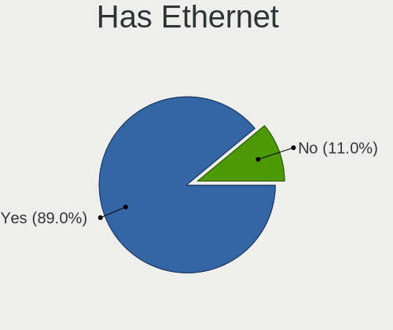
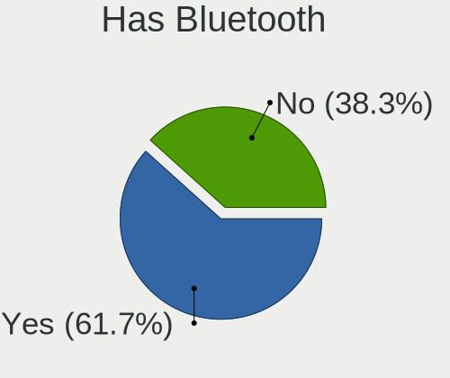
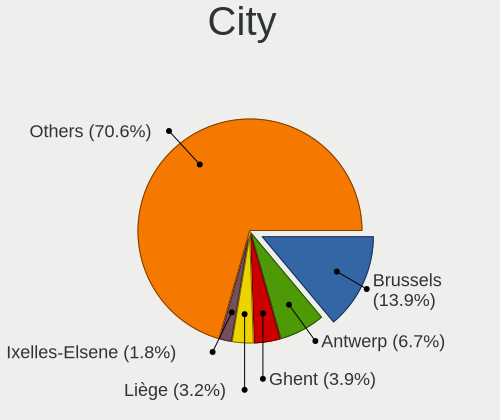
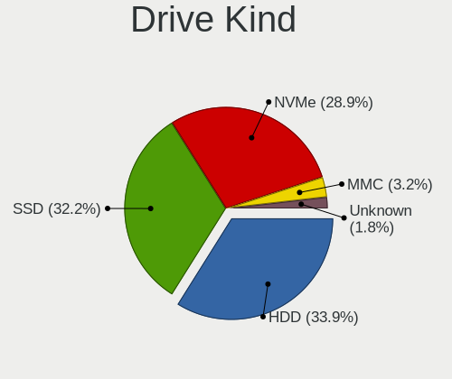
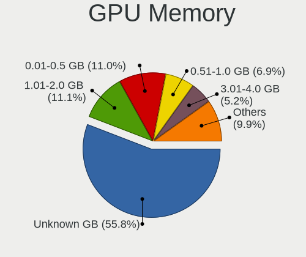
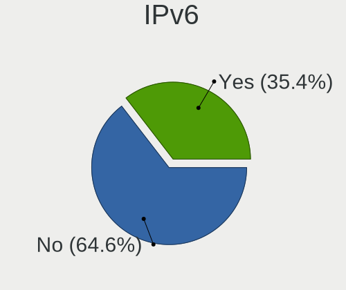
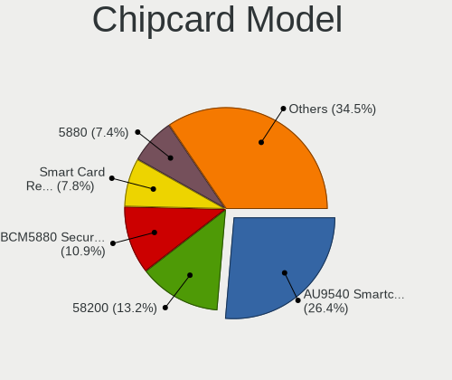

Linux in Belgium - Tested Hardware & Statistics
-----------------------------------------------

A project to collect tested hardware configurations for Linux in Belgium.

Anyone can contribute to this report by the [hw-probe](https://github.com/linuxhw/hw-probe) tool:

    sudo -E hw-probe -all -upload

Please contribute! Especially if your hardware is rare.

This is a report for all computer types. See also reports for [desktops](/Location/Belgium/Desktop/README.md) and [notebooks](/Location/Belgium/Notebook/README.md).

Contents
--------

* [ Test Cases ](#test-cases)

* [ System ](#system)
  - [ OS                       ](#os)
  - [ OS Family                ](#os-family)
  - [ Kernel                   ](#kernel)
  - [ Kernel Family            ](#kernel-family)
  - [ Kernel Major Ver.        ](#kernel-major-ver)
  - [ Arch                     ](#arch)
  - [ DE                       ](#de)
  - [ Display Server           ](#display-server)
  - [ Display Manager          ](#display-manager)
  - [ OS Lang                  ](#os-lang)
  - [ Boot Mode                ](#boot-mode)
  - [ Filesystem               ](#filesystem)
  - [ Part. scheme             ](#part-scheme)
  - [ Dual Boot with Linux/BSD ](#dual-boot-with-linuxbsd)
  - [ Dual Boot (Win)          ](#dual-boot-win)

* [ Board ](#board)
  - [ Vendor                   ](#vendor)
  - [ Model                    ](#model)
  - [ Model Family             ](#model-family)
  - [ MFG Year                 ](#mfg-year)
  - [ Form Factor              ](#form-factor)
  - [ Secure Boot              ](#secure-boot)
  - [ Coreboot                 ](#coreboot)
  - [ RAM Size                 ](#ram-size)
  - [ RAM Used                 ](#ram-used)
  - [ Total Drives             ](#total-drives)
  - [ Has CD-ROM               ](#has-cd-rom)
  - [ Has Ethernet             ](#has-ethernet)
  - [ Has WiFi                 ](#has-wifi)
  - [ Has Bluetooth            ](#has-bluetooth)

* [ Location ](#location)
  - [ Country                  ](#country)
  - [ City                     ](#city)

* [ Drives ](#drives)
  - [ Drive Vendor             ](#drive-vendor)
  - [ Drive Model              ](#drive-model)
  - [ HDD Vendor               ](#hdd-vendor)
  - [ SSD Vendor               ](#ssd-vendor)
  - [ Drive Kind               ](#drive-kind)
  - [ Drive Connector          ](#drive-connector)
  - [ Drive Size               ](#drive-size)
  - [ Space Total              ](#space-total)
  - [ Space Used               ](#space-used)
  - [ Malfunc. Drives          ](#malfunc-drives)
  - [ Malfunc. Drive Vendor    ](#malfunc-drive-vendor)
  - [ Malfunc. HDD Vendor      ](#malfunc-hdd-vendor)
  - [ Malfunc. Drive Kind      ](#malfunc-drive-kind)
  - [ Failed Drives            ](#failed-drives)
  - [ Failed Drive Vendor      ](#failed-drive-vendor)
  - [ Drive Status             ](#drive-status)

* [ Storage controller ](#storage-controller)
  - [ Storage Vendor           ](#storage-vendor)
  - [ Storage Model            ](#storage-model)
  - [ Storage Kind             ](#storage-kind)

* [ Processor ](#processor)
  - [ CPU Vendor               ](#cpu-vendor)
  - [ CPU Model                ](#cpu-model)
  - [ CPU Model Family         ](#cpu-model-family)
  - [ CPU Cores                ](#cpu-cores)
  - [ CPU Sockets              ](#cpu-sockets)
  - [ CPU Threads              ](#cpu-threads)
  - [ CPU Op-Modes             ](#cpu-op-modes)
  - [ CPU Microcode            ](#cpu-microcode)
  - [ CPU Microarch            ](#cpu-microarch)

* [ Graphics ](#graphics)
  - [ GPU Vendor               ](#gpu-vendor)
  - [ GPU Model                ](#gpu-model)
  - [ GPU Combo                ](#gpu-combo)
  - [ GPU Driver               ](#gpu-driver)
  - [ GPU Memory               ](#gpu-memory)

* [ Monitor ](#monitor)
  - [ Monitor Vendor           ](#monitor-vendor)
  - [ Monitor Model            ](#monitor-model)
  - [ Monitor Resolution       ](#monitor-resolution)
  - [ Monitor Diagonal         ](#monitor-diagonal)
  - [ Monitor Width            ](#monitor-width)
  - [ Aspect Ratio             ](#aspect-ratio)
  - [ Monitor Area             ](#monitor-area)
  - [ Pixel Density            ](#pixel-density)
  - [ Multiple Monitors        ](#multiple-monitors)

* [ Network ](#network)
  - [ Net Controller Vendor    ](#net-controller-vendor)
  - [ Net Controller Model     ](#net-controller-model)
  - [ Wireless Vendor          ](#wireless-vendor)
  - [ Wireless Model           ](#wireless-model)
  - [ Ethernet Vendor          ](#ethernet-vendor)
  - [ Ethernet Model           ](#ethernet-model)
  - [ Net Controller Kind      ](#net-controller-kind)
  - [ Used Controller          ](#used-controller)
  - [ NICs                     ](#nics)
  - [ IPv6                     ](#ipv6)

* [ Bluetooth ](#bluetooth)
  - [ Bluetooth Vendor         ](#bluetooth-vendor)
  - [ Bluetooth Model          ](#bluetooth-model)

* [ Sound ](#sound)
  - [ Sound Vendor             ](#sound-vendor)
  - [ Sound Model              ](#sound-model)

* [ Memory ](#memory)
  - [ Memory Vendor            ](#memory-vendor)
  - [ Memory Model             ](#memory-model)
  - [ Memory Kind              ](#memory-kind)
  - [ Memory Form Factor       ](#memory-form-factor)
  - [ Memory Size              ](#memory-size)
  - [ Memory Speed             ](#memory-speed)

* [ Printers & scanners ](#printers--scanners)
  - [ Printer Vendor           ](#printer-vendor)
  - [ Printer Model            ](#printer-model)
  - [ Scanner Vendor           ](#scanner-vendor)
  - [ Scanner Model            ](#scanner-model)

* [ Camera ](#camera)
  - [ Camera Vendor            ](#camera-vendor)
  - [ Camera Model             ](#camera-model)

* [ Security ](#security)
  - [ Fingerprint Vendor       ](#fingerprint-vendor)
  - [ Fingerprint Model        ](#fingerprint-model)
  - [ Chipcard Vendor          ](#chipcard-vendor)
  - [ Chipcard Model           ](#chipcard-model)

* [ Unsupported ](#unsupported)
  - [ Unsupported Devices      ](#unsupported-devices)
  - [ Unsupported Device Types ](#unsupported-device-types)

Test Cases
----------

Total: 3894

| Vendor        | Model                       | Form-Factor | Probe                                                      | Date         |
|---------------|-----------------------------|-------------|------------------------------------------------------------|--------------|
| Acer          | Swift SFG14-72              | Notebook    | [d07bf77aa4](https://linux-hardware.org/?probe=d07bf77aa4) | Jan 06, 2025 |
| HP            | Pavilion Notebook           | Notebook    | [eb8cc11cc5](https://linux-hardware.org/?probe=eb8cc11cc5) | Jan 05, 2025 |
| MSI           | Z77A-G45 Thunderbolt        | Desktop     | [63dfc9cc1f](https://linux-hardware.org/?probe=63dfc9cc1f) | Jan 04, 2025 |
| HP            | Pavilion Notebook           | Notebook    | [41e590e617](https://linux-hardware.org/?probe=41e590e617) | Jan 03, 2025 |
| ASUSTek       | ASUS Zenbook S 16 UM5606... | Notebook    | [d3d4e90cf3](https://linux-hardware.org/?probe=d3d4e90cf3) | Jan 03, 2025 |
| Gigabyte      | B550 AORUS ELITE V2         | Desktop     | [c841518658](https://linux-hardware.org/?probe=c841518658) | Jan 03, 2025 |
| ASUSTek       | Z87-A                       | Desktop     | [09a6966e22](https://linux-hardware.org/?probe=09a6966e22) | Jan 03, 2025 |
| ASUSTek       | Z87-A                       | Desktop     | [123503d16c](https://linux-hardware.org/?probe=123503d16c) | Jan 03, 2025 |
| Lenovo        | ThinkPad E570 20H50070FR    | Notebook    | [cad0007adb](https://linux-hardware.org/?probe=cad0007adb) | Jan 02, 2025 |
| HP            | 8619                        | Desktop     | [a916110ad9](https://linux-hardware.org/?probe=a916110ad9) | Jan 02, 2025 |
| HUAWEI        | BOD-WXX9                    | Notebook    | [a65202783f](https://linux-hardware.org/?probe=a65202783f) | Jan 02, 2025 |
| HP            | G72                         | Notebook    | [376d1a0575](https://linux-hardware.org/?probe=376d1a0575) | Jan 01, 2025 |
| Dell          | XPS 15 9575                 | Convertible | [0795b7d84f](https://linux-hardware.org/?probe=0795b7d84f) | Jan 01, 2025 |
| Lenovo        | ThinkPad E570 20H50070FR    | Notebook    | [5369e3db69](https://linux-hardware.org/?probe=5369e3db69) | Jan 01, 2025 |
| Medion        | E3224                       | Convertible | [9def2aed31](https://linux-hardware.org/?probe=9def2aed31) | Dec 31, 2024 |
| Lenovo        | Legion Pro 5 16IRX8 82WK    | Notebook    | [b86a475528](https://linux-hardware.org/?probe=b86a475528) | Dec 31, 2024 |
| Lenovo        | ThinkPad T500 2241WKY       | Notebook    | [7b16eb5229](https://linux-hardware.org/?probe=7b16eb5229) | Dec 30, 2024 |
| HP            | 0A98h                       | Desktop     | [68e6a9636c](https://linux-hardware.org/?probe=68e6a9636c) | Dec 30, 2024 |
| HP            | 0A98h                       | Desktop     | [c82ec6e6ac](https://linux-hardware.org/?probe=c82ec6e6ac) | Dec 30, 2024 |
| VALE          | Notebook Slim S132          | Notebook    | [3275a28486](https://linux-hardware.org/?probe=3275a28486) | Dec 30, 2024 |
| HP            | ZBook Power 15.6 inch G8... | Notebook    | [f521839f9a](https://linux-hardware.org/?probe=f521839f9a) | Dec 29, 2024 |
| Dell          | XPS 15 9570                 | Notebook    | [ec780ef825](https://linux-hardware.org/?probe=ec780ef825) | Dec 29, 2024 |
| AZW           | GK35                        | Desktop     | [ed7df72829](https://linux-hardware.org/?probe=ed7df72829) | Dec 29, 2024 |
| Lenovo        | ThinkPad X1 Carbon Gen 9... | Notebook    | [e08182adc8](https://linux-hardware.org/?probe=e08182adc8) | Dec 29, 2024 |
| ASUSTek       | Maximus VII RANGER          | Desktop     | [5a84bab0c3](https://linux-hardware.org/?probe=5a84bab0c3) | Dec 28, 2024 |
| ASUSTek       | Z170 PRO GAMING             | Desktop     | [4825814497](https://linux-hardware.org/?probe=4825814497) | Dec 28, 2024 |
| MSI           | FM2-A75IA-E53               | Desktop     | [4736ddfd8c](https://linux-hardware.org/?probe=4736ddfd8c) | Dec 28, 2024 |
| ASUSTek       | GL552VW                     | Notebook    | [dcb25941f6](https://linux-hardware.org/?probe=dcb25941f6) | Dec 27, 2024 |
| Medion        | ERAZER X7853 MD60603        | Notebook    | [9c5d2630f6](https://linux-hardware.org/?probe=9c5d2630f6) | Dec 27, 2024 |
| Lenovo        | G50-80 80E5                 | Notebook    | [fc91ff6b9f](https://linux-hardware.org/?probe=fc91ff6b9f) | Dec 27, 2024 |
| ASUSTek       | ASUS Zenbook S 16 UM5606... | Notebook    | [2b5056fe92](https://linux-hardware.org/?probe=2b5056fe92) | Dec 27, 2024 |
| ASUSTek       | ASUS Zenbook S 16 UM5606... | Notebook    | [bc55a24f5d](https://linux-hardware.org/?probe=bc55a24f5d) | Dec 27, 2024 |
| ASUSTek       | TUF X470-PLUS GAMING        | Desktop     | [5084350626](https://linux-hardware.org/?probe=5084350626) | Dec 26, 2024 |
| Lenovo        | IdeaPad 330-15ARR 81D2      | Notebook    | [306fb82bd7](https://linux-hardware.org/?probe=306fb82bd7) | Dec 26, 2024 |
| Lenovo        | ThinkPad X1 Carbon Gen 9... | Notebook    | [00b72da4db](https://linux-hardware.org/?probe=00b72da4db) | Dec 25, 2024 |
| Shenzhen M... | HPBSD                       | Mini pc     | [cc8c05aed4](https://linux-hardware.org/?probe=cc8c05aed4) | Dec 25, 2024 |
| Samsung       | P480                        | Notebook    | [20507489a2](https://linux-hardware.org/?probe=20507489a2) | Dec 22, 2024 |
| Acer          | Aspire TC-885 V:1.1         | Desktop     | [53f26e91a1](https://linux-hardware.org/?probe=53f26e91a1) | Dec 22, 2024 |
| HP            | ZBook Fury 16 G9 Mobile ... | Notebook    | [bb06bc1384](https://linux-hardware.org/?probe=bb06bc1384) | Dec 22, 2024 |
| MSI           | Alpha 17 C7VG               | Notebook    | [e84308bf47](https://linux-hardware.org/?probe=e84308bf47) | Dec 22, 2024 |
| MSI           | Alpha 17 C7VG               | Notebook    | [c3c778482b](https://linux-hardware.org/?probe=c3c778482b) | Dec 22, 2024 |
| Gigabyte      | X570S AORUS ELITE AX        | Desktop     | [28facab032](https://linux-hardware.org/?probe=28facab032) | Dec 21, 2024 |
| ASUSTek       | PRIME B350M-A               | Desktop     | [8c74a99311](https://linux-hardware.org/?probe=8c74a99311) | Dec 21, 2024 |
| Lenovo        | ThinkPad X1 Yoga Gen 8 2... | Convertible | [07bf5eae86](https://linux-hardware.org/?probe=07bf5eae86) | Dec 21, 2024 |
| ASUSTek       | PRIME B350M-A               | Desktop     | [02bf6146b7](https://linux-hardware.org/?probe=02bf6146b7) | Dec 21, 2024 |
| Lenovo        | ThinkPad X1 Yoga Gen 8 2... | Convertible | [b71df82835](https://linux-hardware.org/?probe=b71df82835) | Dec 21, 2024 |
| Gigabyte      | X570S AORUS ELITE AX        | Desktop     | [5ecba07bcb](https://linux-hardware.org/?probe=5ecba07bcb) | Dec 21, 2024 |
| ASRock        | A520M-ITX/ac                | Desktop     | [7bc977761e](https://linux-hardware.org/?probe=7bc977761e) | Dec 20, 2024 |
| Gigabyte      | B550M AORUS ELITE           | Desktop     | [bd195a8451](https://linux-hardware.org/?probe=bd195a8451) | Dec 20, 2024 |
| Lenovo        | ThinkPad X1 Carbon Gen 1... | Notebook    | [d2b19da7f2](https://linux-hardware.org/?probe=d2b19da7f2) | Dec 18, 2024 |
| Apple         | Mac-77EB7D7DAF985301 iMa... | All in one  | [f521816a4d](https://linux-hardware.org/?probe=f521816a4d) | Dec 16, 2024 |
| Foxconn       | G31MX Series                | Desktop     | [bdb6d7f31e](https://linux-hardware.org/?probe=bdb6d7f31e) | Dec 15, 2024 |
| ASUSTek       | PRIME H610M-A D4            | Desktop     | [87f40e4879](https://linux-hardware.org/?probe=87f40e4879) | Dec 15, 2024 |
| Lenovo        | ThinkPad T560 20FH0023MB    | Notebook    | [b073c6e731](https://linux-hardware.org/?probe=b073c6e731) | Dec 15, 2024 |
| HP            | Spectre x360 2-in-1 Lapt... | Convertible | [a88e919512](https://linux-hardware.org/?probe=a88e919512) | Dec 15, 2024 |
| HP            | Victus by Gaming Laptop ... | Notebook    | [3f73630b78](https://linux-hardware.org/?probe=3f73630b78) | Dec 15, 2024 |
| Intel         | NUC11PABi5 M68265-501       | Mini pc     | [b71f20be35](https://linux-hardware.org/?probe=b71f20be35) | Dec 15, 2024 |
| HP            | Pavilion 17                 | Notebook    | [4cea084a27](https://linux-hardware.org/?probe=4cea084a27) | Dec 15, 2024 |
| MSI           | H270 TOMAHAWK ARCTIC        | Desktop     | [1274414039](https://linux-hardware.org/?probe=1274414039) | Dec 15, 2024 |
| Lenovo        | ThinkPad T470 20HD0001MB    | Notebook    | [8858dce58d](https://linux-hardware.org/?probe=8858dce58d) | Dec 14, 2024 |
| Intel         | X99                         | Desktop     | [1350402676](https://linux-hardware.org/?probe=1350402676) | Dec 14, 2024 |
| ASUSTek       | P8Z77-V LX2                 | Desktop     | [cf973ad670](https://linux-hardware.org/?probe=cf973ad670) | Dec 14, 2024 |
| Dell          | Latitude E7470              | Notebook    | [34f407dadd](https://linux-hardware.org/?probe=34f407dadd) | Dec 13, 2024 |
| HP            | Pavilion 17                 | Notebook    | [419cf21120](https://linux-hardware.org/?probe=419cf21120) | Dec 13, 2024 |
| HP            | EliteBook 835 13 inch G1... | Notebook    | [501650199f](https://linux-hardware.org/?probe=501650199f) | Dec 12, 2024 |
| ASUSTek       | X705NA                      | Notebook    | [e32ba5f9f3](https://linux-hardware.org/?probe=e32ba5f9f3) | Dec 12, 2024 |
| Lenovo        | ThinkPad T470 20HD0001MB    | Notebook    | [e975663b16](https://linux-hardware.org/?probe=e975663b16) | Dec 12, 2024 |
| Fujitsu       | CELSIUS H760                | Notebook    | [a25c3d32d9](https://linux-hardware.org/?probe=a25c3d32d9) | Dec 12, 2024 |
| HP            | ENVY x360 2-in-1 Laptop ... | Convertible | [a1050272fa](https://linux-hardware.org/?probe=a1050272fa) | Dec 11, 2024 |
| Gigabyte      | TRX50 AERO D                | Desktop     | [806cbde5a6](https://linux-hardware.org/?probe=806cbde5a6) | Dec 11, 2024 |
| Gigabyte      | TRX50 AERO D                | Desktop     | [d4cb8b5bdb](https://linux-hardware.org/?probe=d4cb8b5bdb) | Dec 11, 2024 |
| Acer          | Predator PO3-620            | Desktop     | [fce8274ab8](https://linux-hardware.org/?probe=fce8274ab8) | Dec 11, 2024 |
| Medion        | MS-7797                     | Desktop     | [5adf732da0](https://linux-hardware.org/?probe=5adf732da0) | Dec 09, 2024 |
| ASUSTek       | TUF Gaming B550M-PLUS WI... | Desktop     | [8d72975c1f](https://linux-hardware.org/?probe=8d72975c1f) | Dec 08, 2024 |
| ASUSTek       | Z97-C                       | Desktop     | [456449c9b2](https://linux-hardware.org/?probe=456449c9b2) | Dec 08, 2024 |
| Dell          | Latitude 5530               | Notebook    | [227f39046c](https://linux-hardware.org/?probe=227f39046c) | Dec 08, 2024 |
| Dell          | Latitude 5530               | Notebook    | [85b8689d79](https://linux-hardware.org/?probe=85b8689d79) | Dec 08, 2024 |
| ASUSTek       | PRIME Z490-A                | Desktop     | [d45c582a18](https://linux-hardware.org/?probe=d45c582a18) | Dec 07, 2024 |
| Unknown       | AX16                        | Notebook    | [786a7ec53a](https://linux-hardware.org/?probe=786a7ec53a) | Dec 06, 2024 |
| Apple         | MacBookPro5,3               | Notebook    | [afe0f7a23b](https://linux-hardware.org/?probe=afe0f7a23b) | Dec 06, 2024 |
| Shenzhen M... | F7BSI                       | Mini pc     | [6fecd84428](https://linux-hardware.org/?probe=6fecd84428) | Dec 06, 2024 |
| Shenzhen M... | F7BSC                       | Mini pc     | [9c4b6f1032](https://linux-hardware.org/?probe=9c4b6f1032) | Dec 06, 2024 |
| Google        | Marasov                     | Notebook    | [cd94c505e9](https://linux-hardware.org/?probe=cd94c505e9) | Dec 05, 2024 |
| HP            | Pavilion dv7                | Notebook    | [8d22c82b8d](https://linux-hardware.org/?probe=8d22c82b8d) | Dec 04, 2024 |
| Gigabyte      | MJPLNCB-00                  | Desktop     | [6330cb911a](https://linux-hardware.org/?probe=6330cb911a) | Dec 04, 2024 |
| Gigabyte      | GA-880GMA-UD2H              | Desktop     | [0de4e0ddf7](https://linux-hardware.org/?probe=0de4e0ddf7) | Dec 04, 2024 |
| ASUSTek       | PN40                        | Mini pc     | [4038e15501](https://linux-hardware.org/?probe=4038e15501) | Dec 04, 2024 |
| ASUSTek       | PN40                        | Mini pc     | [191740fdbc](https://linux-hardware.org/?probe=191740fdbc) | Dec 04, 2024 |
| Sony          | VGN-FW51ZF_H                | Notebook    | [946eceac16](https://linux-hardware.org/?probe=946eceac16) | Dec 04, 2024 |
| Dell          | Latitude E7470              | Notebook    | [3d27c262dc](https://linux-hardware.org/?probe=3d27c262dc) | Dec 04, 2024 |
| Lenovo        | IdeaPad Gaming 3 15ARH05... | Notebook    | [b53e3ffba0](https://linux-hardware.org/?probe=b53e3ffba0) | Dec 03, 2024 |
| Dell          | Precision M6700             | Notebook    | [9b4c2350ab](https://linux-hardware.org/?probe=9b4c2350ab) | Dec 03, 2024 |
| HP            | 805D                        | Desktop     | [69e9035d45](https://linux-hardware.org/?probe=69e9035d45) | Dec 02, 2024 |
| HP            | 805D                        | Desktop     | [4d38c82619](https://linux-hardware.org/?probe=4d38c82619) | Dec 02, 2024 |
| Acer          | Predator PO3-620            | Desktop     | [1de47b5804](https://linux-hardware.org/?probe=1de47b5804) | Dec 02, 2024 |
| Clevo         | W270HU                      | Notebook    | [ea4b13cd90](https://linux-hardware.org/?probe=ea4b13cd90) | Dec 02, 2024 |
| ASUSTek       | ROG STRIX X870-I GAMING ... | Desktop     | [7e2d08fb21](https://linux-hardware.org/?probe=7e2d08fb21) | Nov 30, 2024 |
| Acer          | Aspire A315-22              | Notebook    | [5b6d7f1853](https://linux-hardware.org/?probe=5b6d7f1853) | Nov 30, 2024 |
| ASUSTek       | PRIME Z490-A                | Desktop     | [80d6c8ab76](https://linux-hardware.org/?probe=80d6c8ab76) | Nov 30, 2024 |
| HP            | Pavilion dv7                | Notebook    | [1ae9d9a604](https://linux-hardware.org/?probe=1ae9d9a604) | Nov 29, 2024 |
| Apple         | Mac-031B6874CF7F642A iMa... | All in one  | [720bdf65a5](https://linux-hardware.org/?probe=720bdf65a5) | Nov 28, 2024 |
| Apple         | MacBookPro11,1              | Notebook    | [92dd553051](https://linux-hardware.org/?probe=92dd553051) | Nov 28, 2024 |
| Gigabyte      | B450 AORUS ELITE            | Desktop     | [cd2b9033b8](https://linux-hardware.org/?probe=cd2b9033b8) | Nov 28, 2024 |
| ASUSTek       | K55A                        | Notebook    | [1cf283b131](https://linux-hardware.org/?probe=1cf283b131) | Nov 28, 2024 |
| Medion        | H81H3-EM2 H81EM2W08.309     | Desktop     | [16fb8ac1cf](https://linux-hardware.org/?probe=16fb8ac1cf) | Nov 27, 2024 |
| Apple         | Mac-031B6874CF7F642A iMa... | All in one  | [181b2838e5](https://linux-hardware.org/?probe=181b2838e5) | Nov 27, 2024 |
| Apple         | MacBookPro5,3               | Notebook    | [f8e03fed09](https://linux-hardware.org/?probe=f8e03fed09) | Nov 25, 2024 |
| Lenovo        | G50-80 80E5                 | Notebook    | [25e30e94f0](https://linux-hardware.org/?probe=25e30e94f0) | Nov 25, 2024 |
| Lenovo        | IdeaPad 1 14ADA05 82GW      | Notebook    | [963aca3a61](https://linux-hardware.org/?probe=963aca3a61) | Nov 22, 2024 |
| HP            | 8594                        | Desktop     | [ee7cca4d16](https://linux-hardware.org/?probe=ee7cca4d16) | Nov 21, 2024 |
| ASUSTek       | 1005HA                      | Notebook    | [39603774e5](https://linux-hardware.org/?probe=39603774e5) | Nov 20, 2024 |
| ASUSTek       | ROG Zephyrus G14 GA401QM... | Notebook    | [80772fe50c](https://linux-hardware.org/?probe=80772fe50c) | Nov 19, 2024 |
| Clevo         | W270HU                      | Notebook    | [1b9d20b809](https://linux-hardware.org/?probe=1b9d20b809) | Nov 19, 2024 |
| HP            | 8594                        | Desktop     | [531dcc8a54](https://linux-hardware.org/?probe=531dcc8a54) | Nov 19, 2024 |
| HP            | Pavilion Notebook           | Notebook    | [e07129b7d0](https://linux-hardware.org/?probe=e07129b7d0) | Nov 18, 2024 |
| ASUSTek       | TUF X470-PLUS GAMING        | Desktop     | [01e5244e5f](https://linux-hardware.org/?probe=01e5244e5f) | Nov 17, 2024 |
| Dell          | 0T7D40 A01                  | Desktop     | [86e7091924](https://linux-hardware.org/?probe=86e7091924) | Nov 17, 2024 |
| Dell          | G16 7630                    | Notebook    | [15e93a0146](https://linux-hardware.org/?probe=15e93a0146) | Nov 15, 2024 |
| Lenovo        | ThinkPad X1 Carbon Gen 1... | Notebook    | [a8f5f86a85](https://linux-hardware.org/?probe=a8f5f86a85) | Nov 14, 2024 |
| ASRock        | A75M-HVS                    | Desktop     | [71e383d168](https://linux-hardware.org/?probe=71e383d168) | Nov 14, 2024 |
| ASUSTek       | ROG STRIX Z790-F GAMING ... | Desktop     | [9bb2ab7160](https://linux-hardware.org/?probe=9bb2ab7160) | Nov 14, 2024 |
| Sony          | SVE1513G1EB                 | Notebook    | [71f5a2a25f](https://linux-hardware.org/?probe=71f5a2a25f) | Nov 13, 2024 |
| ASUSTek       | P8H77-I                     | Desktop     | [997afe5e63](https://linux-hardware.org/?probe=997afe5e63) | Nov 12, 2024 |
| Dell          | 0PU052                      | Desktop     | [e831c0847c](https://linux-hardware.org/?probe=e831c0847c) | Nov 12, 2024 |
| Lenovo        | IdeaPadFlex 5 14ALC05 82... | Convertible | [229dfe8663](https://linux-hardware.org/?probe=229dfe8663) | Nov 12, 2024 |
| Sony          | VPCEA3S1E                   | Notebook    | [dc4bf023a2](https://linux-hardware.org/?probe=dc4bf023a2) | Nov 11, 2024 |
| Apple         | Mac-F60DEB81FF30ACF6 Mac... | Desktop     | [38f755d79e](https://linux-hardware.org/?probe=38f755d79e) | Nov 11, 2024 |
| MSI           | GS60 2QE                    | Notebook    | [f6cceaf60f](https://linux-hardware.org/?probe=f6cceaf60f) | Nov 11, 2024 |
| Lenovo        | ThinkPad X13 Gen 3 21CM0... | Notebook    | [bb9f5ddcc6](https://linux-hardware.org/?probe=bb9f5ddcc6) | Nov 11, 2024 |
| ASUSTek       | GL552VW                     | Notebook    | [748450069e](https://linux-hardware.org/?probe=748450069e) | Nov 10, 2024 |
| Gigabyte      | B460M AORUS PRO             | Desktop     | [0c527ca448](https://linux-hardware.org/?probe=0c527ca448) | Nov 10, 2024 |
| Dell          | 0PU052                      | Desktop     | [24b2e836ea](https://linux-hardware.org/?probe=24b2e836ea) | Nov 10, 2024 |
| Intel         | NUC6CAYB J23203-410         | Mini pc     | [19767cc8b5](https://linux-hardware.org/?probe=19767cc8b5) | Nov 09, 2024 |
| Unknown       | QDNV01                      | Desktop     | [c799dc9a8c](https://linux-hardware.org/?probe=c799dc9a8c) | Nov 08, 2024 |
| ASUSTek       | X550CA                      | Notebook    | [9de1e927a9](https://linux-hardware.org/?probe=9de1e927a9) | Nov 07, 2024 |
| Gigabyte      | AERO 15XV8                  | Notebook    | [ad28b2f598](https://linux-hardware.org/?probe=ad28b2f598) | Nov 07, 2024 |
| ASUSTek       | ROG STRIX X670E-E GAMING... | Desktop     | [cfe914638e](https://linux-hardware.org/?probe=cfe914638e) | Nov 06, 2024 |
| Gigabyte      | X470 AORUS ULTRA GAMING-... | Desktop     | [1d52579f6c](https://linux-hardware.org/?probe=1d52579f6c) | Nov 06, 2024 |
| Lenovo        | Legion Slim 5 16ARP9 83E... | Notebook    | [cdbdaae023](https://linux-hardware.org/?probe=cdbdaae023) | Nov 06, 2024 |
| ASUSTek       | ROG STRIX B550-F GAMING     | Desktop     | [7975c09175](https://linux-hardware.org/?probe=7975c09175) | Nov 05, 2024 |
| MSI           | MAG B550M MORTAR            | Desktop     | [c39a0e36fe](https://linux-hardware.org/?probe=c39a0e36fe) | Nov 04, 2024 |
| Intel         | X99                         | Desktop     | [62277c7e78](https://linux-hardware.org/?probe=62277c7e78) | Nov 03, 2024 |
| Dell          | 0T7D40 A01                  | Desktop     | [b7243bccbb](https://linux-hardware.org/?probe=b7243bccbb) | Nov 03, 2024 |
| HP            | Pavilion Notebook           | Notebook    | [41cef70a32](https://linux-hardware.org/?probe=41cef70a32) | Oct 31, 2024 |
| Gigabyte      | AERO 15XV8                  | Notebook    | [10526455a3](https://linux-hardware.org/?probe=10526455a3) | Oct 31, 2024 |
| Lenovo        | ThinkPad E570 20H50070FR    | Notebook    | [4824bbad46](https://linux-hardware.org/?probe=4824bbad46) | Oct 31, 2024 |
| Dell          | Latitude E5500              | Notebook    | [f93b362839](https://linux-hardware.org/?probe=f93b362839) | Oct 31, 2024 |
| Dell          | Inspiron 7720               | Notebook    | [f308c7c570](https://linux-hardware.org/?probe=f308c7c570) | Oct 30, 2024 |
| Intel         | NUC11PABi7 K90104-302       | Mini pc     | [460bba640e](https://linux-hardware.org/?probe=460bba640e) | Oct 27, 2024 |
| Dell          | 0WR7PY A03                  | Desktop     | [165a2fc563](https://linux-hardware.org/?probe=165a2fc563) | Oct 27, 2024 |
| Lenovo        | ThinkPad T450 20AUQWER09    | Notebook    | [121126e862](https://linux-hardware.org/?probe=121126e862) | Oct 27, 2024 |
| Lenovo        | ThinkPad T450 20AUQWER09    | Notebook    | [15aea43010](https://linux-hardware.org/?probe=15aea43010) | Oct 27, 2024 |
| Dell          | 0Y56T3 A01                  | Desktop     | [047e20c1bc](https://linux-hardware.org/?probe=047e20c1bc) | Oct 27, 2024 |
| Gigabyte      | X870E AORUS ELITE WIFI7     | Desktop     | [b694335fc3](https://linux-hardware.org/?probe=b694335fc3) | Oct 27, 2024 |
| ASUSTek       | ZenBook UX434FAC_UX433FA... | Notebook    | [d545472680](https://linux-hardware.org/?probe=d545472680) | Oct 26, 2024 |
| HP            | ENVY x360 2-in-1 Laptop ... | Convertible | [d1acd1f295](https://linux-hardware.org/?probe=d1acd1f295) | Oct 25, 2024 |
| MSI           | B450M MORTAR TITANIUM       | Desktop     | [377b923625](https://linux-hardware.org/?probe=377b923625) | Oct 25, 2024 |
| HP            | ProBook 445 G8 Notebook ... | Notebook    | [5a786be98f](https://linux-hardware.org/?probe=5a786be98f) | Oct 25, 2024 |
| HP            | ProBook 445 G8 Notebook ... | Notebook    | [6ddbc76ba2](https://linux-hardware.org/?probe=6ddbc76ba2) | Oct 25, 2024 |
| Lenovo        | ThinkPad X13 Gen 3 21CM0... | Notebook    | [e63c2ce069](https://linux-hardware.org/?probe=e63c2ce069) | Oct 24, 2024 |
| ASRock        | AB350 Gaming K4             | Desktop     | [097a0c396c](https://linux-hardware.org/?probe=097a0c396c) | Oct 24, 2024 |
| ASRock        | AB350 Gaming K4             | Desktop     | [df88e62a9b](https://linux-hardware.org/?probe=df88e62a9b) | Oct 24, 2024 |
| HP            | Pavilion 17                 | Notebook    | [fe2ac723ed](https://linux-hardware.org/?probe=fe2ac723ed) | Oct 23, 2024 |
| MSI           | X99A MPOWER                 | Desktop     | [f4d7eb1612](https://linux-hardware.org/?probe=f4d7eb1612) | Oct 22, 2024 |
| MSI           | MPG X570 GAMING PRO CARB... | Desktop     | [7f42b4b8eb](https://linux-hardware.org/?probe=7f42b4b8eb) | Oct 22, 2024 |
| MSI           | X99A MPOWER                 | Desktop     | [b29df0660f](https://linux-hardware.org/?probe=b29df0660f) | Oct 22, 2024 |
| ASUSTek       | M5A78L-M LX3                | Desktop     | [d95649310b](https://linux-hardware.org/?probe=d95649310b) | Oct 22, 2024 |
| MSI           | Z170A GAMING M7             | Desktop     | [2a0282544c](https://linux-hardware.org/?probe=2a0282544c) | Oct 21, 2024 |
| ASUSTek       | N61Vg                       | Notebook    | [751bf5f70d](https://linux-hardware.org/?probe=751bf5f70d) | Oct 21, 2024 |
| HP            | Pavilion Gaming Laptop 1... | Notebook    | [3795fe9a2b](https://linux-hardware.org/?probe=3795fe9a2b) | Oct 20, 2024 |
| HP            | Pavilion Gaming Laptop 1... | Notebook    | [90de471428](https://linux-hardware.org/?probe=90de471428) | Oct 20, 2024 |
| Lenovo        | IdeaPad 320S-13IKB 81AK     | Notebook    | [674a976e7b](https://linux-hardware.org/?probe=674a976e7b) | Oct 19, 2024 |
| MSI           | B650 GAMING PLUS WIFI       | Desktop     | [2882c1b751](https://linux-hardware.org/?probe=2882c1b751) | Oct 19, 2024 |
| ASUSTek       | PRIME Z490-A                | Desktop     | [385b656d3b](https://linux-hardware.org/?probe=385b656d3b) | Oct 19, 2024 |
| HP            | ProBook 650 G4              | Notebook    | [2b82d1ddab](https://linux-hardware.org/?probe=2b82d1ddab) | Oct 18, 2024 |
| HP            | ProBook 650 G4              | Notebook    | [b0d567acfc](https://linux-hardware.org/?probe=b0d567acfc) | Oct 18, 2024 |
| Dell          | 0JP3NX A01                  | Desktop     | [591b9985d6](https://linux-hardware.org/?probe=591b9985d6) | Oct 17, 2024 |
| Dell          | 057FFP A00                  | Desktop     | [1f3c1adda1](https://linux-hardware.org/?probe=1f3c1adda1) | Oct 17, 2024 |
| ASUSTek       | ROG STRIX X670E-E GAMING... | Desktop     | [0cb78f6659](https://linux-hardware.org/?probe=0cb78f6659) | Oct 16, 2024 |
| ASRock        | X570 Taichi                 | Notebook    | [37085cd851](https://linux-hardware.org/?probe=37085cd851) | Oct 14, 2024 |
| HP            | ProBook 4740s               | Notebook    | [47465e7165](https://linux-hardware.org/?probe=47465e7165) | Oct 14, 2024 |
| HP            | ProBook 4740s               | Notebook    | [41a6bd612d](https://linux-hardware.org/?probe=41a6bd612d) | Oct 14, 2024 |
| Acer          | Nitro N70-130               | Desktop     | [0f22e7aa03](https://linux-hardware.org/?probe=0f22e7aa03) | Oct 14, 2024 |
| ASRock        | X570 Phantom Gaming X       | Desktop     | [b762a68840](https://linux-hardware.org/?probe=b762a68840) | Oct 13, 2024 |
| Dell          | 0Y56T3 A01                  | Desktop     | [ce2fe87008](https://linux-hardware.org/?probe=ce2fe87008) | Oct 13, 2024 |
| ASUSTek       | M5A78L-M LX3                | Desktop     | [af5e53b904](https://linux-hardware.org/?probe=af5e53b904) | Oct 13, 2024 |
| Apple         | MacBookPro6,2               | Notebook    | [302e89b37e](https://linux-hardware.org/?probe=302e89b37e) | Oct 12, 2024 |
| Lenovo        | Y520-15IKBN 80WK            | Notebook    | [dcf7dcbdc0](https://linux-hardware.org/?probe=dcf7dcbdc0) | Oct 11, 2024 |
| Dell          | Latitude D630               | Notebook    | [ef1d491182](https://linux-hardware.org/?probe=ef1d491182) | Oct 08, 2024 |
| HP            | 89EB 11                     | Desktop     | [8e10800ba7](https://linux-hardware.org/?probe=8e10800ba7) | Oct 08, 2024 |
| Fujitsu       | D3233-A1 S26361-D3233-A1    | Desktop     | [2d0e25633d](https://linux-hardware.org/?probe=2d0e25633d) | Oct 08, 2024 |
| Gigabyte      | Z97-HD3                     | Desktop     | [3de9ab51e0](https://linux-hardware.org/?probe=3de9ab51e0) | Oct 07, 2024 |
| MSI           | Z370 TOMAHAWK               | Desktop     | [b890eaf271](https://linux-hardware.org/?probe=b890eaf271) | Oct 07, 2024 |
| HP            | EliteBook 820 G1            | Notebook    | [c14b9319d4](https://linux-hardware.org/?probe=c14b9319d4) | Oct 05, 2024 |
| Fujitsu       | LIFEBOOK T938               | Convertible | [9e4632ead1](https://linux-hardware.org/?probe=9e4632ead1) | Oct 04, 2024 |
| Fujitsu       | LIFEBOOK T938               | Convertible | [a81bb71161](https://linux-hardware.org/?probe=a81bb71161) | Oct 03, 2024 |
| Acer          | Predator PO3-620            | Desktop     | [6940977f2d](https://linux-hardware.org/?probe=6940977f2d) | Oct 03, 2024 |
| Acer          | Predator PO3-620            | Desktop     | [d25138c77a](https://linux-hardware.org/?probe=d25138c77a) | Oct 03, 2024 |
| Lenovo        | Legion 5 15IMH05 82AU       | Notebook    | [c263b0d128](https://linux-hardware.org/?probe=c263b0d128) | Oct 02, 2024 |
| Lenovo        | Legion 5 15IMH05 82AU       | Notebook    | [6e28788eb8](https://linux-hardware.org/?probe=6e28788eb8) | Oct 02, 2024 |
| HP            | EliteBook 850 G5            | Notebook    | [fb275667e9](https://linux-hardware.org/?probe=fb275667e9) | Oct 01, 2024 |
| HP            | ProBook 470 G0              | Notebook    | [850a898da0](https://linux-hardware.org/?probe=850a898da0) | Oct 01, 2024 |
| Medion        | P6670 MD99960               | Notebook    | [b4528ac515](https://linux-hardware.org/?probe=b4528ac515) | Oct 01, 2024 |
| Sony          | SVE1512G4E                  | Notebook    | [ed463dbd08](https://linux-hardware.org/?probe=ed463dbd08) | Sep 30, 2024 |
| Apple         | MacBookPro14,3              | Notebook    | [d159b869bf](https://linux-hardware.org/?probe=d159b869bf) | Sep 29, 2024 |
| Apple         | MacBookPro14,3              | Notebook    | [0f3ef459af](https://linux-hardware.org/?probe=0f3ef459af) | Sep 29, 2024 |
| HP            | 2AF7                        | Desktop     | [5f78cf6ad0](https://linux-hardware.org/?probe=5f78cf6ad0) | Sep 29, 2024 |
| HP            | 15                          | Notebook    | [6c9df8c1e4](https://linux-hardware.org/?probe=6c9df8c1e4) | Sep 27, 2024 |
| ASUSTek       | H87-PRO                     | Desktop     | [3b71228744](https://linux-hardware.org/?probe=3b71228744) | Sep 26, 2024 |
| ASUSTek       | H87-PRO                     | Desktop     | [2ec60febf9](https://linux-hardware.org/?probe=2ec60febf9) | Sep 26, 2024 |
| ASUSTek       | H87-PRO                     | Desktop     | [1d0fe473d6](https://linux-hardware.org/?probe=1d0fe473d6) | Sep 26, 2024 |
| HP            | Pavilion dv7                | Notebook    | [13f04d7403](https://linux-hardware.org/?probe=13f04d7403) | Sep 25, 2024 |
| HP            | ProBook 650 G8 Notebook ... | Notebook    | [413217c3d1](https://linux-hardware.org/?probe=413217c3d1) | Sep 25, 2024 |
| HP            | ProBook 650 G4              | Notebook    | [d008194d26](https://linux-hardware.org/?probe=d008194d26) | Sep 24, 2024 |
| Fujitsu       | LIFEBOOK E557               | Notebook    | [a77bf3ac11](https://linux-hardware.org/?probe=a77bf3ac11) | Sep 24, 2024 |
| Lenovo        | IdeaPad Gaming 3 15ACH6 ... | Notebook    | [c2587deab9](https://linux-hardware.org/?probe=c2587deab9) | Sep 24, 2024 |
| HP            | 18E7                        | Desktop     | [3cab5dc226](https://linux-hardware.org/?probe=3cab5dc226) | Sep 23, 2024 |
| HP            | 18E7                        | Desktop     | [379e492f63](https://linux-hardware.org/?probe=379e492f63) | Sep 23, 2024 |
| Raspberry ... | Raspberry Pi 4 Model B R... | Soc         | [ff1e38dfad](https://linux-hardware.org/?probe=ff1e38dfad) | Sep 23, 2024 |
| Lenovo        | IdeaPadFlex 5 14IAU7 82R... | Convertible | [fc189ed180](https://linux-hardware.org/?probe=fc189ed180) | Sep 22, 2024 |
| Dell          | Latitude E5430 non-vPro     | Notebook    | [48b01e248b](https://linux-hardware.org/?probe=48b01e248b) | Sep 22, 2024 |
| Huanan        | X99-F8                      | Desktop     | [ba69d58749](https://linux-hardware.org/?probe=ba69d58749) | Sep 22, 2024 |
| ASUSTek       | STRIX Z270H GAMING          | Desktop     | [80c81758e4](https://linux-hardware.org/?probe=80c81758e4) | Sep 20, 2024 |
| Gigabyte      | B550I AORUS PRO AX          | Desktop     | [d7f0266d11](https://linux-hardware.org/?probe=d7f0266d11) | Sep 20, 2024 |
| HP            | ProBook 650 G8 Notebook ... | Notebook    | [9d05a2b904](https://linux-hardware.org/?probe=9d05a2b904) | Sep 19, 2024 |
| ASUSTek       | N61Vg                       | Notebook    | [456f9b3749](https://linux-hardware.org/?probe=456f9b3749) | Sep 19, 2024 |
| Intel         | NUC11TNBi5 M11904-404       | Mini pc     | [86a0e56fd6](https://linux-hardware.org/?probe=86a0e56fd6) | Sep 19, 2024 |
| ASUSTek       | K56CB                       | Notebook    | [8341a2762f](https://linux-hardware.org/?probe=8341a2762f) | Sep 18, 2024 |
| Intel         | NUC12WSBi5 M46425-302       | Mini pc     | [ce06dd06f1](https://linux-hardware.org/?probe=ce06dd06f1) | Sep 18, 2024 |
| ASUSTek       | Z97-C                       | Desktop     | [fb06b859b9](https://linux-hardware.org/?probe=fb06b859b9) | Sep 18, 2024 |
| Dell          | Precision 7750              | Notebook    | [76a7f20266](https://linux-hardware.org/?probe=76a7f20266) | Sep 18, 2024 |
| ASUSTek       | M5A78L-M LX3                | Desktop     | [7b8dd423bd](https://linux-hardware.org/?probe=7b8dd423bd) | Sep 18, 2024 |
| HP            | Spectre x360 Convertible... | Convertible | [56e8709eb2](https://linux-hardware.org/?probe=56e8709eb2) | Sep 17, 2024 |
| Lenovo        | ThinkPad X390 Yoga 20NQS... | Convertible | [0ca74169db](https://linux-hardware.org/?probe=0ca74169db) | Sep 17, 2024 |
| MSI           | Thin GF63 12VF              | Notebook    | [22a5a00d36](https://linux-hardware.org/?probe=22a5a00d36) | Sep 17, 2024 |
| Lenovo        | Yoga 530-14IKB 81EK         | Convertible | [c33592b695](https://linux-hardware.org/?probe=c33592b695) | Sep 17, 2024 |
| Intel         | NUC6i7KYB H90766-406        | Mini pc     | [0435a0b246](https://linux-hardware.org/?probe=0435a0b246) | Sep 17, 2024 |
| Fujitsu       | D3233-A1 S26361-D3233-A1    | Desktop     | [640c4547b8](https://linux-hardware.org/?probe=640c4547b8) | Sep 17, 2024 |
| Apple         | Mac-AA95B1DDAB278B95 iMa... | All in one  | [8cc411e3d5](https://linux-hardware.org/?probe=8cc411e3d5) | Sep 16, 2024 |
| MSI           | Z97I AC                     | Desktop     | [37fd401ef9](https://linux-hardware.org/?probe=37fd401ef9) | Sep 14, 2024 |
| Apple         | MacBookPro14,1              | Notebook    | [1b50a503f5](https://linux-hardware.org/?probe=1b50a503f5) | Sep 13, 2024 |
| Apple         | MacBookPro14,1              | Notebook    | [6a82b07a2f](https://linux-hardware.org/?probe=6a82b07a2f) | Sep 13, 2024 |
| Lenovo        | ThinkPad T16 Gen 2 21HHC... | Notebook    | [e40fd2534b](https://linux-hardware.org/?probe=e40fd2534b) | Sep 12, 2024 |
| ASUSTek       | ROG Maximus XI HERO         | Desktop     | [532287509c](https://linux-hardware.org/?probe=532287509c) | Sep 11, 2024 |
| HP            | Spectre x360 Convertible... | Convertible | [666dac5ca7](https://linux-hardware.org/?probe=666dac5ca7) | Sep 11, 2024 |
| Dell          | 0XHGV1 A01                  | Desktop     | [b8ac8f9ffc](https://linux-hardware.org/?probe=b8ac8f9ffc) | Sep 11, 2024 |
| Lenovo        | ThinkPad E15 Gen 4 21E60... | Notebook    | [fa1b825886](https://linux-hardware.org/?probe=fa1b825886) | Sep 10, 2024 |
| Lenovo        | ThinkPad E15 Gen 4 21E60... | Notebook    | [9f2adb4d94](https://linux-hardware.org/?probe=9f2adb4d94) | Sep 10, 2024 |
| MSI           | Thin GF63 12VF              | Notebook    | [d02b62db7a](https://linux-hardware.org/?probe=d02b62db7a) | Sep 09, 2024 |
| HP            | Spectre x360 2-in-1 Lapt... | Convertible | [cc0b80d10e](https://linux-hardware.org/?probe=cc0b80d10e) | Sep 08, 2024 |
| HP            | 1589                        | Desktop     | [cb36115287](https://linux-hardware.org/?probe=cb36115287) | Sep 08, 2024 |
| HP            | EliteBook 8570w             | Notebook    | [162e18416c](https://linux-hardware.org/?probe=162e18416c) | Sep 07, 2024 |
| Lenovo        | Legion Slim 5 16IRH8 82Y... | Notebook    | [7551201f10](https://linux-hardware.org/?probe=7551201f10) | Sep 07, 2024 |
| ASUSTek       | VivoBook_ASUSLaptop M650... | Notebook    | [de9377b87f](https://linux-hardware.org/?probe=de9377b87f) | Sep 07, 2024 |
| ASUSTek       | ROG STRIX Z590-F GAMING ... | Desktop     | [b8ebd625a7](https://linux-hardware.org/?probe=b8ebd625a7) | Sep 07, 2024 |
| Acer          | Aspire TC-885 V:1.1         | Desktop     | [bac6274ee1](https://linux-hardware.org/?probe=bac6274ee1) | Sep 06, 2024 |
| Lenovo        | ThinkPad X390 Yoga 20NQS... | Convertible | [fc83e4a8f7](https://linux-hardware.org/?probe=fc83e4a8f7) | Sep 05, 2024 |
| Lenovo        | ThinkPad X390 Yoga 20NQS... | Convertible | [87ef0304a6](https://linux-hardware.org/?probe=87ef0304a6) | Sep 05, 2024 |
| Unknown       | Unknown                     | Notebook    | [a628595aaa](https://linux-hardware.org/?probe=a628595aaa) | Sep 04, 2024 |
| Intel         | NUC11TNBi5 M11904-404       | Mini pc     | [7361fb27ed](https://linux-hardware.org/?probe=7361fb27ed) | Sep 04, 2024 |
| MSI           | MPG X670E CARBON WIFI       | Desktop     | [fc8d80346e](https://linux-hardware.org/?probe=fc8d80346e) | Sep 04, 2024 |
| Lenovo        | ThinkPad L460 20FVS0PA1H    | Notebook    | [1a67ec8391](https://linux-hardware.org/?probe=1a67ec8391) | Sep 03, 2024 |
| GMKtec        | NucBox M6                   | Desktop     | [c0aa2b18b2](https://linux-hardware.org/?probe=c0aa2b18b2) | Sep 02, 2024 |
| GMKtec        | NucBox M6                   | Desktop     | [a5236d6708](https://linux-hardware.org/?probe=a5236d6708) | Sep 02, 2024 |
| Huanan        | X99-F8                      | Desktop     | [d930095522](https://linux-hardware.org/?probe=d930095522) | Aug 31, 2024 |
| Dell          | Vostro 16 5635              | Notebook    | [fc6900819a](https://linux-hardware.org/?probe=fc6900819a) | Aug 31, 2024 |
| Lenovo        | IdeaPad Slim 3 16ABR8 82... | Notebook    | [5d9d907b7a](https://linux-hardware.org/?probe=5d9d907b7a) | Aug 31, 2024 |
| Dell          | Vostro 16 5635              | Notebook    | [1eaac7d5c1](https://linux-hardware.org/?probe=1eaac7d5c1) | Aug 31, 2024 |
| Lenovo        | ThinkBook 14 G7 IML 21MR    | Notebook    | [6c7ce653e0](https://linux-hardware.org/?probe=6c7ce653e0) | Aug 30, 2024 |
| Acer          | Aspire TC-885 V:1.1         | Desktop     | [046c71fca6](https://linux-hardware.org/?probe=046c71fca6) | Aug 30, 2024 |
| Lenovo        | ThinkPad L460 20FVS0PA1H    | Notebook    | [be660ad979](https://linux-hardware.org/?probe=be660ad979) | Aug 28, 2024 |
| ASRock        | B650M Pro RS WiFi           | Desktop     | [7853986ce0](https://linux-hardware.org/?probe=7853986ce0) | Aug 28, 2024 |
| Alienware     | x16 R2                      | Notebook    | [86c9bae75b](https://linux-hardware.org/?probe=86c9bae75b) | Aug 28, 2024 |
| ASUSTek       | X540SAA                     | Notebook    | [5818df112a](https://linux-hardware.org/?probe=5818df112a) | Aug 27, 2024 |
| Lenovo        | IdeaPad Gaming 3 15ACH6 ... | Notebook    | [390c79d9e7](https://linux-hardware.org/?probe=390c79d9e7) | Aug 27, 2024 |
| Lenovo        | ThinkPad E485 20KU001HMH    | Notebook    | [f6715c95be](https://linux-hardware.org/?probe=f6715c95be) | Aug 27, 2024 |
| Intel         | DQ67SW AAG12527-310         | Desktop     | [cc5d283911](https://linux-hardware.org/?probe=cc5d283911) | Aug 27, 2024 |
| Lenovo        | 3168 SDK0J40697 WIN 3305... | Desktop     | [19683c12d7](https://linux-hardware.org/?probe=19683c12d7) | Aug 26, 2024 |
| Dell          | 0M5DCD A00                  | Desktop     | [35eab4446f](https://linux-hardware.org/?probe=35eab4446f) | Aug 26, 2024 |
| Acer          | Aspire E5-772               | Notebook    | [6696b97dd5](https://linux-hardware.org/?probe=6696b97dd5) | Aug 25, 2024 |
| Lenovo        | Yoga 530-14IKB 81EK         | Convertible | [3f23c4c5c8](https://linux-hardware.org/?probe=3f23c4c5c8) | Aug 25, 2024 |
| Intel         | NUC11TNBi5 M11904-404       | Mini pc     | [2df37c3e82](https://linux-hardware.org/?probe=2df37c3e82) | Aug 25, 2024 |
| ASUSTek       | M5A78L-M LX3                | Desktop     | [bd17820ec8](https://linux-hardware.org/?probe=bd17820ec8) | Aug 24, 2024 |
| Lenovo        | Yoga 530-14IKB 81EK         | Convertible | [7146859e71](https://linux-hardware.org/?probe=7146859e71) | Aug 24, 2024 |
| ASUSTek       | M5A78L-M LX3                | Desktop     | [b3b5f4f224](https://linux-hardware.org/?probe=b3b5f4f224) | Aug 23, 2024 |
| Gigabyte      | X79-UD3                     | Desktop     | [eaef87529d](https://linux-hardware.org/?probe=eaef87529d) | Aug 23, 2024 |
| Dell          | Latitude 5421               | Notebook    | [f1bb1223a1](https://linux-hardware.org/?probe=f1bb1223a1) | Aug 23, 2024 |
| Foxconn       | 2ADA                        | Desktop     | [87509ddaf4](https://linux-hardware.org/?probe=87509ddaf4) | Aug 22, 2024 |
| Foxconn       | 2ADA                        | Desktop     | [8d42b3233c](https://linux-hardware.org/?probe=8d42b3233c) | Aug 22, 2024 |
| Dell          | Precision M6400             | Notebook    | [5d1c43bde3](https://linux-hardware.org/?probe=5d1c43bde3) | Aug 21, 2024 |
| Lenovo        | LOQ 15APH8 82XT             | Notebook    | [50747463cb](https://linux-hardware.org/?probe=50747463cb) | Aug 21, 2024 |
| ASUSTek       | A88XM-PLUS                  | Desktop     | [a2bb2feb80](https://linux-hardware.org/?probe=a2bb2feb80) | Aug 21, 2024 |
| ASUSTek       | ROG Strix G513RW_G513RW     | Notebook    | [add09e061b](https://linux-hardware.org/?probe=add09e061b) | Aug 21, 2024 |
| Lenovo        | ThinkPad T16 Gen 2 21K7C... | Notebook    | [ad00735fac](https://linux-hardware.org/?probe=ad00735fac) | Aug 21, 2024 |
| Huanan        | X99-F8                      | Desktop     | [72a72ff695](https://linux-hardware.org/?probe=72a72ff695) | Aug 20, 2024 |
| Lenovo        | ThinkPad P16v Gen 1 21FC... | Notebook    | [52798501c0](https://linux-hardware.org/?probe=52798501c0) | Aug 19, 2024 |
| ASUSTek       | A88XM-PLUS                  | Desktop     | [3f0faf54dc](https://linux-hardware.org/?probe=3f0faf54dc) | Aug 18, 2024 |
| Apple         | MacBookPro8,2               | Notebook    | [71bae1f3f6](https://linux-hardware.org/?probe=71bae1f3f6) | Aug 16, 2024 |
| Apple         | MacBookPro8,2               | Notebook    | [acd6239144](https://linux-hardware.org/?probe=acd6239144) | Aug 16, 2024 |
| Lenovo        | Legion Y530-15ICH 81FV      | Notebook    | [2ffa4f7ffc](https://linux-hardware.org/?probe=2ffa4f7ffc) | Aug 15, 2024 |
| Dell          | Precision M6400             | Notebook    | [78ae4c43fc](https://linux-hardware.org/?probe=78ae4c43fc) | Aug 15, 2024 |
| Apple         | Mac-031B6874CF7F642A iMa... | All in one  | [8fadf1536a](https://linux-hardware.org/?probe=8fadf1536a) | Aug 15, 2024 |
| Dell          | Precision M6400             | Notebook    | [617bff8e48](https://linux-hardware.org/?probe=617bff8e48) | Aug 15, 2024 |
| Gigabyte      | X470 AORUS ULTRA GAMING-... | Desktop     | [64613f6298](https://linux-hardware.org/?probe=64613f6298) | Aug 15, 2024 |
| HP            | Victus by Gaming Laptop ... | Notebook    | [36caa8a819](https://linux-hardware.org/?probe=36caa8a819) | Aug 14, 2024 |
| Lenovo        | ThinkPad L15 Gen 3 21C7C... | Notebook    | [5e9f9c2509](https://linux-hardware.org/?probe=5e9f9c2509) | Aug 14, 2024 |
| Acer          | Okinawa                     | Notebook    | [28bf3b601b](https://linux-hardware.org/?probe=28bf3b601b) | Aug 13, 2024 |
| ASUSTek       | ROG STRIX B650E-E GAMING... | Desktop     | [c7570156ec](https://linux-hardware.org/?probe=c7570156ec) | Aug 13, 2024 |
| HP            | Pavilion dv6                | Notebook    | [032f5f2535](https://linux-hardware.org/?probe=032f5f2535) | Aug 12, 2024 |
| Dell          | Latitude 5440               | Notebook    | [c35ec9c7e2](https://linux-hardware.org/?probe=c35ec9c7e2) | Aug 12, 2024 |
| Nvidia        | Tegra                       | Soc         | [ae61ee56cd](https://linux-hardware.org/?probe=ae61ee56cd) | Aug 12, 2024 |
| ASUSTek       | VivoBook_ASUSLaptop K360... | Notebook    | [5a176dd34d](https://linux-hardware.org/?probe=5a176dd34d) | Aug 12, 2024 |
| ASUSTek       | VivoBook_ASUSLaptop K360... | Notebook    | [7af09b87a2](https://linux-hardware.org/?probe=7af09b87a2) | Aug 11, 2024 |
| Sony          | SVE14A25CFP                 | Notebook    | [35a1034271](https://linux-hardware.org/?probe=35a1034271) | Aug 11, 2024 |
| Lenovo        | IdeaPad S145-15AST 81N3     | Notebook    | [4bc5b1dcaa](https://linux-hardware.org/?probe=4bc5b1dcaa) | Aug 10, 2024 |
| Apple         | Mac-77F17D7DA9285301 iMa... | All in one  | [97ddcd662d](https://linux-hardware.org/?probe=97ddcd662d) | Aug 10, 2024 |
| HP            | EliteBook 850 G8 Noteboo... | Notebook    | [b006c903a5](https://linux-hardware.org/?probe=b006c903a5) | Aug 09, 2024 |
| MSI           | Z97 GAMING 5                | Desktop     | [f5df62e0e3](https://linux-hardware.org/?probe=f5df62e0e3) | Aug 09, 2024 |
| ASUSTek       | VivoBook_ASUSLaptop K360... | Notebook    | [639d113f31](https://linux-hardware.org/?probe=639d113f31) | Aug 09, 2024 |
| ASUSTek       | VivoBook_ASUSLaptop K360... | Notebook    | [1ec165f5ac](https://linux-hardware.org/?probe=1ec165f5ac) | Aug 09, 2024 |
| ASUSTek       | VivoBook_ASUSLaptop K360... | Notebook    | [e2177bb6ea](https://linux-hardware.org/?probe=e2177bb6ea) | Aug 09, 2024 |
| Google        | Eve                         | Notebook    | [1f63b4fb2a](https://linux-hardware.org/?probe=1f63b4fb2a) | Aug 08, 2024 |
| ASUSTek       | ROG STRIX B650E-E GAMING... | Desktop     | [f4fe227b79](https://linux-hardware.org/?probe=f4fe227b79) | Aug 08, 2024 |
| Dell          | Latitude E6540              | Notebook    | [f42bc0d88a](https://linux-hardware.org/?probe=f42bc0d88a) | Aug 08, 2024 |
| AZW           | SER8 V10                    | Mini pc     | [db52a424db](https://linux-hardware.org/?probe=db52a424db) | Aug 08, 2024 |
| Intel         | NUC6i7KYB H90766-410        | Mini pc     | [a1f0d9b74d](https://linux-hardware.org/?probe=a1f0d9b74d) | Aug 07, 2024 |
| Lenovo        | 3148 SDK0L22692 WIN 3306... | Desktop     | [66836d56a9](https://linux-hardware.org/?probe=66836d56a9) | Aug 06, 2024 |
| MSI           | X670E GAMING PLUS WIFI      | Desktop     | [ac8d4298ad](https://linux-hardware.org/?probe=ac8d4298ad) | Aug 06, 2024 |
| Dell          | XPS 15 9500                 | Notebook    | [513068ed61](https://linux-hardware.org/?probe=513068ed61) | Aug 06, 2024 |
| Dell          | XPS 15 9500                 | Notebook    | [20a337d707](https://linux-hardware.org/?probe=20a337d707) | Aug 06, 2024 |
| ASUSTek       | TUF Gaming B650M-PLUS WI... | Desktop     | [b740bf49c6](https://linux-hardware.org/?probe=b740bf49c6) | Aug 05, 2024 |
| Dell          | Latitude E7250              | Notebook    | [7b85835719](https://linux-hardware.org/?probe=7b85835719) | Aug 05, 2024 |
| HP            | ProBook 650 G4              | Notebook    | [1ce90c0f15](https://linux-hardware.org/?probe=1ce90c0f15) | Aug 05, 2024 |
| Lenovo        | 3148 SDK0L22692 WIN 3306... | Desktop     | [6c7e7c4bbf](https://linux-hardware.org/?probe=6c7e7c4bbf) | Aug 05, 2024 |
| HP            | Pavilion Laptop 15-eh1xx... | Notebook    | [def6acf8d0](https://linux-hardware.org/?probe=def6acf8d0) | Aug 04, 2024 |
| ASUSTek       | P5Q SE2                     | Desktop     | [8805319545](https://linux-hardware.org/?probe=8805319545) | Aug 04, 2024 |
| Lenovo        | SDK0E50510 WIN              | Desktop     | [b364c3584c](https://linux-hardware.org/?probe=b364c3584c) | Aug 03, 2024 |
| Lenovo        | 3151 SDK0J40697 WIN 3305... | Mini pc     | [9c48445796](https://linux-hardware.org/?probe=9c48445796) | Aug 01, 2024 |
| Acer          | Aspire E5-523G              | Notebook    | [dcae9fea91](https://linux-hardware.org/?probe=dcae9fea91) | Aug 01, 2024 |
| ASUSTek       | VivoBook_ASUSLaptop M160... | Notebook    | [4c9e72060a](https://linux-hardware.org/?probe=4c9e72060a) | Aug 01, 2024 |
| Lenovo        | ThinkPad T14s Gen 1 20UH... | Notebook    | [b1a07486dd](https://linux-hardware.org/?probe=b1a07486dd) | Jul 31, 2024 |
| HP            | Pavilion Laptop 15-cw0xx... | Notebook    | [ce44067016](https://linux-hardware.org/?probe=ce44067016) | Jul 30, 2024 |
| HP            | Pavilion Laptop 13-an0xx... | Notebook    | [1b74560bae](https://linux-hardware.org/?probe=1b74560bae) | Jul 30, 2024 |
| ASUSTek       | VivoBook_ASUSLaptop M150... | Notebook    | [a7bb61f1ae](https://linux-hardware.org/?probe=a7bb61f1ae) | Jul 30, 2024 |
| Packard Be... | ENLE11BZ                    | Notebook    | [ecf5210a02](https://linux-hardware.org/?probe=ecf5210a02) | Jul 30, 2024 |
| HP            | ProBook 4530s               | Notebook    | [e89d3446a9](https://linux-hardware.org/?probe=e89d3446a9) | Jul 30, 2024 |
| Lenovo        | ThinkPad L14 Gen 4 21H5S... | Notebook    | [fa1e2278d3](https://linux-hardware.org/?probe=fa1e2278d3) | Jul 29, 2024 |
| Lenovo        | Legion 5 Pro 16ACH6H 82J... | Notebook    | [1a0d405698](https://linux-hardware.org/?probe=1a0d405698) | Jul 29, 2024 |
| HP            | 18E5                        | Desktop     | [12198bdc99](https://linux-hardware.org/?probe=12198bdc99) | Jul 28, 2024 |
| Notebook      | NLx0AU                      | Notebook    | [02f0e44fba](https://linux-hardware.org/?probe=02f0e44fba) | Jul 27, 2024 |
| Notebook      | NLx0AU                      | Notebook    | [f8000b45bb](https://linux-hardware.org/?probe=f8000b45bb) | Jul 27, 2024 |
| ASUSTek       | VivoBook_ASUSLaptop M650... | Notebook    | [a014cb10c6](https://linux-hardware.org/?probe=a014cb10c6) | Jul 25, 2024 |
| MSI           | B350M BAZOOKA               | Desktop     | [14f563aefa](https://linux-hardware.org/?probe=14f563aefa) | Jul 25, 2024 |
| Gigabyte      | Z87X-UD3H-CF                | Desktop     | [6d14b0b8cd](https://linux-hardware.org/?probe=6d14b0b8cd) | Jul 24, 2024 |
| Dell          | Precision 7520              | Notebook    | [ab03c13aca](https://linux-hardware.org/?probe=ab03c13aca) | Jul 23, 2024 |
| Acer          | Aspire E5-575G              | Notebook    | [646e4a01d6](https://linux-hardware.org/?probe=646e4a01d6) | Jul 23, 2024 |
| Gigabyte      | X470 AORUS ULTRA GAMING-... | Desktop     | [6cb65aa653](https://linux-hardware.org/?probe=6cb65aa653) | Jul 23, 2024 |
| Apple         | Mac-942B5BF58194151B        | All in one  | [3cff3be661](https://linux-hardware.org/?probe=3cff3be661) | Jul 23, 2024 |
| HP            | ENVY dv6                    | Notebook    | [90cb34453c](https://linux-hardware.org/?probe=90cb34453c) | Jul 23, 2024 |
| Dell          | Latitude E6440              | Notebook    | [3440c7ee39](https://linux-hardware.org/?probe=3440c7ee39) | Jul 22, 2024 |
| Toshiba       | Satellite C50D-B            | Notebook    | [7b005551ad](https://linux-hardware.org/?probe=7b005551ad) | Jul 22, 2024 |
| HP            | ProBook 650 G4              | Notebook    | [2d093d58c6](https://linux-hardware.org/?probe=2d093d58c6) | Jul 21, 2024 |
| Dell          | Latitude E7440              | Notebook    | [0a7920c250](https://linux-hardware.org/?probe=0a7920c250) | Jul 21, 2024 |
| Valve         | Jupiter                     | Notebook    | [267ae5ae8a](https://linux-hardware.org/?probe=267ae5ae8a) | Jul 20, 2024 |
| Lenovo        | ThinkPad L390 20NSS1YV0B    | Notebook    | [73eae6f5a3](https://linux-hardware.org/?probe=73eae6f5a3) | Jul 20, 2024 |
| Lenovo        | ThinkPad X1 Carbon Gen 9... | Notebook    | [59cab2e35c](https://linux-hardware.org/?probe=59cab2e35c) | Jul 18, 2024 |
| ASUSTek       | K55A                        | Notebook    | [2b7adf6752](https://linux-hardware.org/?probe=2b7adf6752) | Jul 18, 2024 |
| ASUSTek       | Zenbook UM3402YAR_UM3402... | Notebook    | [e13a1e9bf1](https://linux-hardware.org/?probe=e13a1e9bf1) | Jul 18, 2024 |
| MSI           | Z97 GAMING 5                | Desktop     | [fe874570ea](https://linux-hardware.org/?probe=fe874570ea) | Jul 17, 2024 |
| Intel         | NUC8i7HVB J68196-502        | Mini pc     | [bf03ea6576](https://linux-hardware.org/?probe=bf03ea6576) | Jul 17, 2024 |
| Lenovo        | MIIX 510-12ISK 80U1         | Tablet      | [b73433c423](https://linux-hardware.org/?probe=b73433c423) | Jul 16, 2024 |
| HP            | Pavilion Laptop 15-cs3xx... | Notebook    | [0f2a848d99](https://linux-hardware.org/?probe=0f2a848d99) | Jul 16, 2024 |
| Medion        | WIM2210                     | Notebook    | [0fc93b06b8](https://linux-hardware.org/?probe=0fc93b06b8) | Jul 16, 2024 |
| MSI           | PRO Z790-A MAX WIFI         | Desktop     | [4034455f1d](https://linux-hardware.org/?probe=4034455f1d) | Jul 14, 2024 |
| MSI           | PRO Z790-A MAX WIFI         | Desktop     | [84fb4b927a](https://linux-hardware.org/?probe=84fb4b927a) | Jul 14, 2024 |
| HP            | ProBook 470 G2              | Notebook    | [f46fe1fad0](https://linux-hardware.org/?probe=f46fe1fad0) | Jul 12, 2024 |
| Unknown       | HX90                        | Desktop     | [f151cc1af0](https://linux-hardware.org/?probe=f151cc1af0) | Jul 08, 2024 |
| MSI           | KA790GX                     | Desktop     | [8c3c570301](https://linux-hardware.org/?probe=8c3c570301) | Jul 07, 2024 |
| Acer          | Aspire TC-885 V:1.1         | Desktop     | [d7bfcac4c4](https://linux-hardware.org/?probe=d7bfcac4c4) | Jul 07, 2024 |
| Dell          | 0KRC95 A01                  | Desktop     | [84c71f3619](https://linux-hardware.org/?probe=84c71f3619) | Jul 07, 2024 |
| ASUSTek       | P7P55D-E                    | Desktop     | [f8e0a5453b](https://linux-hardware.org/?probe=f8e0a5453b) | Jul 05, 2024 |
| MSI           | H270 GAMING M3              | Desktop     | [117d7740f8](https://linux-hardware.org/?probe=117d7740f8) | Jul 05, 2024 |
| HP            | 83EF                        | Desktop     | [ad20743558](https://linux-hardware.org/?probe=ad20743558) | Jul 05, 2024 |
| Shenzhen M... | AHBAA OEM                   | Desktop     | [1976e0a587](https://linux-hardware.org/?probe=1976e0a587) | Jul 05, 2024 |
| Dell          | 0PC5F7 A00                  | Desktop     | [7b1c638bbb](https://linux-hardware.org/?probe=7b1c638bbb) | Jul 05, 2024 |
| MSI           | Indio                       | Desktop     | [ea5758d9fe](https://linux-hardware.org/?probe=ea5758d9fe) | Jul 05, 2024 |
| Lenovo        | ThinkPad T440s 20ARS0NF0... | Notebook    | [051332a92e](https://linux-hardware.org/?probe=051332a92e) | Jul 04, 2024 |
| Dell          | XPS 13 9360                 | Notebook    | [7f932bad17](https://linux-hardware.org/?probe=7f932bad17) | Jul 04, 2024 |
| ASUSTek       | PRIME Z490-A                | Desktop     | [f767f8d3ba](https://linux-hardware.org/?probe=f767f8d3ba) | Jul 04, 2024 |
| Fujitsu Si... | MS-7504VP                   | Desktop     | [463b74620d](https://linux-hardware.org/?probe=463b74620d) | Jul 03, 2024 |
| ASUSTek       | P8H67-V                     | Desktop     | [ca4265a41b](https://linux-hardware.org/?probe=ca4265a41b) | Jul 03, 2024 |
| HP            | Pavilion 17                 | Notebook    | [ebeec13e1e](https://linux-hardware.org/?probe=ebeec13e1e) | Jul 03, 2024 |
| Lenovo        | Aptio CRB SDK0F82993 WIN    | Mini pc     | [e402a3adde](https://linux-hardware.org/?probe=e402a3adde) | Jul 02, 2024 |
| HP            | EliteBook 850 G8 Noteboo... | Notebook    | [250703f607](https://linux-hardware.org/?probe=250703f607) | Jul 01, 2024 |
| HP            | Pavilion 17                 | Notebook    | [bafde5e27f](https://linux-hardware.org/?probe=bafde5e27f) | Jul 01, 2024 |
| Intel         | NUC7i7BNB J31145-303        | Mini pc     | [c43a0bd0a7](https://linux-hardware.org/?probe=c43a0bd0a7) | Jun 30, 2024 |
| Medion        | P2212T                      | Tablet      | [0ac4b868cb](https://linux-hardware.org/?probe=0ac4b868cb) | Jun 27, 2024 |
| Medion        | P2212T                      | Tablet      | [3b2f9af7a0](https://linux-hardware.org/?probe=3b2f9af7a0) | Jun 27, 2024 |
| Dell          | XPS 15 9560                 | Notebook    | [35e993f1fc](https://linux-hardware.org/?probe=35e993f1fc) | Jun 26, 2024 |
| Dell          | Studio 1749                 | Notebook    | [960cc11693](https://linux-hardware.org/?probe=960cc11693) | Jun 26, 2024 |
| MSI           | PRO H610M-G DDR4            | Desktop     | [8624f4c5fe](https://linux-hardware.org/?probe=8624f4c5fe) | Jun 25, 2024 |
| Apple         | Mac-4B682C642B45593E iMa... | All in one  | [7578e0429b](https://linux-hardware.org/?probe=7578e0429b) | Jun 24, 2024 |
| Apple         | Mac-4B682C642B45593E iMa... | All in one  | [c184a8b20e](https://linux-hardware.org/?probe=c184a8b20e) | Jun 24, 2024 |
| Intel         | CARLOW                      | Desktop     | [cf232f842b](https://linux-hardware.org/?probe=cf232f842b) | Jun 24, 2024 |
| Fujitsu       | D3067-A1 S26361-D3067-A1    | Desktop     | [3ba33c7694](https://linux-hardware.org/?probe=3ba33c7694) | Jun 23, 2024 |
| Fujitsu       | D3067-A1 S26361-D3067-A1    | Desktop     | [d88a3ae668](https://linux-hardware.org/?probe=d88a3ae668) | Jun 23, 2024 |
| ASUSTek       | PRIME Z490-A                | Desktop     | [de8abf8320](https://linux-hardware.org/?probe=de8abf8320) | Jun 23, 2024 |
| Dell          | Latitude E5410              | Notebook    | [3d0605a450](https://linux-hardware.org/?probe=3d0605a450) | Jun 21, 2024 |
| MSI           | MAG B650M MORTAR WIFI       | Desktop     | [b39784c8de](https://linux-hardware.org/?probe=b39784c8de) | Jun 21, 2024 |
| Dell          | 0PC5F7 A00                  | Desktop     | [46359a3c9f](https://linux-hardware.org/?probe=46359a3c9f) | Jun 19, 2024 |
| Lenovo        | IdeaPad 5 15ARE05 81YQ      | Notebook    | [390feb9ba1](https://linux-hardware.org/?probe=390feb9ba1) | Jun 18, 2024 |
| MSI           | MPG Z790I EDGE WIFI         | Desktop     | [837e287156](https://linux-hardware.org/?probe=837e287156) | Jun 17, 2024 |
| PC Special... | NH5x_7xDPx                  | Notebook    | [c264f3cd40](https://linux-hardware.org/?probe=c264f3cd40) | Jun 16, 2024 |
| Lenovo        | Yoga 530-14IKB 81EK         | Convertible | [1bf8fb7acc](https://linux-hardware.org/?probe=1bf8fb7acc) | Jun 15, 2024 |
| HP            | Notebook                    | Notebook    | [c5941ed7a8](https://linux-hardware.org/?probe=c5941ed7a8) | Jun 15, 2024 |
| HP            | Notebook                    | Notebook    | [da725874dd](https://linux-hardware.org/?probe=da725874dd) | Jun 15, 2024 |
| BESSTAR Te... | Cherry Trail CR             | Mini pc     | [167b271811](https://linux-hardware.org/?probe=167b271811) | Jun 15, 2024 |
| ASUSTek       | H110M-PLUS                  | Desktop     | [a13acdf786](https://linux-hardware.org/?probe=a13acdf786) | Jun 14, 2024 |
| ASUSTek       | H110M-PLUS                  | Desktop     | [fffccdaea1](https://linux-hardware.org/?probe=fffccdaea1) | Jun 14, 2024 |
| Lenovo        | ThinkPad T14 Gen 1 20UES... | Notebook    | [7d54502555](https://linux-hardware.org/?probe=7d54502555) | Jun 14, 2024 |
| ASUSTek       | P5N-MX                      | Desktop     | [96a6b92c4b](https://linux-hardware.org/?probe=96a6b92c4b) | Jun 13, 2024 |
| Apple         | Mac-942B5BF58194151B        | All in one  | [0078f29789](https://linux-hardware.org/?probe=0078f29789) | Jun 12, 2024 |
| Apple         | Mac-942B5BF58194151B        | All in one  | [c92d117c86](https://linux-hardware.org/?probe=c92d117c86) | Jun 12, 2024 |
| ASUSTek       | P8P67                       | Desktop     | [97d46440a2](https://linux-hardware.org/?probe=97d46440a2) | Jun 12, 2024 |
| ASUSTek       | ROG Strix G512LV_G512LV     | Notebook    | [a89f829484](https://linux-hardware.org/?probe=a89f829484) | Jun 11, 2024 |
| AZW           | SER V01                     | Mini pc     | [44a0253c39](https://linux-hardware.org/?probe=44a0253c39) | Jun 11, 2024 |
| AZW           | SER V01                     | Mini pc     | [77b1a76b52](https://linux-hardware.org/?probe=77b1a76b52) | Jun 11, 2024 |
| HP            | ZBook Power G7 Mobile Wo... | Notebook    | [165b297c4a](https://linux-hardware.org/?probe=165b297c4a) | Jun 11, 2024 |
| Dell          | Precision M4800             | Notebook    | [24cd1eb79e](https://linux-hardware.org/?probe=24cd1eb79e) | Jun 11, 2024 |
| ASUSTek       | ASUS Zenbook 14 UX3405MA... | Notebook    | [5a2b97b0f3](https://linux-hardware.org/?probe=5a2b97b0f3) | Jun 10, 2024 |
| ASRock        | Z77 Extreme4                | Desktop     | [a32a17d1e2](https://linux-hardware.org/?probe=a32a17d1e2) | Jun 10, 2024 |
| ASUSTek       | P8H61-M LX2 R2.0            | Desktop     | [69983141c4](https://linux-hardware.org/?probe=69983141c4) | Jun 10, 2024 |
| ASUSTek       | ASUS TUF Gaming A15 FA50... | Notebook    | [c4ce90425e](https://linux-hardware.org/?probe=c4ce90425e) | Jun 10, 2024 |
| Sony          | VPCEH1M1E                   | Notebook    | [66dfe52593](https://linux-hardware.org/?probe=66dfe52593) | Jun 08, 2024 |
| Gigabyte      | A320M-H-CF                  | Desktop     | [c6cfa28e4c](https://linux-hardware.org/?probe=c6cfa28e4c) | Jun 08, 2024 |
| Lenovo        | Yoga 530-14IKB 81EK         | Convertible | [32c53ebe91](https://linux-hardware.org/?probe=32c53ebe91) | Jun 06, 2024 |
| MSI           | H510M-A PRO                 | Desktop     | [734cb47df9](https://linux-hardware.org/?probe=734cb47df9) | Jun 06, 2024 |
| Lenovo        | SHARKBAY SDK0E50510 WIN     | Desktop     | [55b98015cb](https://linux-hardware.org/?probe=55b98015cb) | Jun 06, 2024 |
| Lenovo        | IdeaPad S145-15IWL 81MV     | Notebook    | [d9ab37fa2b](https://linux-hardware.org/?probe=d9ab37fa2b) | Jun 06, 2024 |
| ASUSTek       | TUF Gaming B550M-PLUS WI... | Desktop     | [9965b6cd8b](https://linux-hardware.org/?probe=9965b6cd8b) | Jun 05, 2024 |
| Dell          | Latitude E5410              | Notebook    | [4ea1350893](https://linux-hardware.org/?probe=4ea1350893) | Jun 05, 2024 |
| ASUSTek       | PRIME B350M-A               | Desktop     | [31b9558caf](https://linux-hardware.org/?probe=31b9558caf) | Jun 05, 2024 |
| Dell          | Latitude 5550               | Notebook    | [789afc9e2f](https://linux-hardware.org/?probe=789afc9e2f) | Jun 04, 2024 |
| HP            | ProBook 445 G8 Notebook ... | Notebook    | [a2291158ce](https://linux-hardware.org/?probe=a2291158ce) | Jun 02, 2024 |
| Lenovo        | 3716 SDK0J40709 WIN 3259... | Desktop     | [ccaf5aa9c4](https://linux-hardware.org/?probe=ccaf5aa9c4) | Jun 02, 2024 |
| Sony          | VPCEH1M1E                   | Notebook    | [ec324480de](https://linux-hardware.org/?probe=ec324480de) | Jun 01, 2024 |
| HP            | ProBook 445 G8 Notebook ... | Notebook    | [3c7d1c84a3](https://linux-hardware.org/?probe=3c7d1c84a3) | May 31, 2024 |
| Dell          | Latitude E6410              | Notebook    | [43d3671623](https://linux-hardware.org/?probe=43d3671623) | May 30, 2024 |
| HP            | 620                         | Notebook    | [fc744613bf](https://linux-hardware.org/?probe=fc744613bf) | May 30, 2024 |
| Apple         | Mac-CFF7D910A743CAAF iMa... | All in one  | [dc2f4e650a](https://linux-hardware.org/?probe=dc2f4e650a) | May 29, 2024 |
| Lenovo        | IdeaPad 320-15ABR 80XS      | Notebook    | [e63220aa5e](https://linux-hardware.org/?probe=e63220aa5e) | May 27, 2024 |
| Dell          | Studio XPS 1645             | Notebook    | [e9eb7685bd](https://linux-hardware.org/?probe=e9eb7685bd) | May 27, 2024 |
| ASUSTek       | GL552VW                     | Notebook    | [1349b1dc80](https://linux-hardware.org/?probe=1349b1dc80) | May 26, 2024 |
| Dell          | Studio XPS 1645             | Notebook    | [d4926c0589](https://linux-hardware.org/?probe=d4926c0589) | May 26, 2024 |
| Apple         | MacBookPro11,2              | Notebook    | [dfbe54a60a](https://linux-hardware.org/?probe=dfbe54a60a) | May 26, 2024 |
| HP            | Laptop 15s-eq2xxx           | Notebook    | [79319b692a](https://linux-hardware.org/?probe=79319b692a) | May 26, 2024 |
| Gigabyte      | H81M-S2H                    | Desktop     | [182ac3e454](https://linux-hardware.org/?probe=182ac3e454) | May 25, 2024 |
| Gigabyte      | H81M-S2H                    | Desktop     | [379ebd84c4](https://linux-hardware.org/?probe=379ebd84c4) | May 25, 2024 |
| Lenovo        | ThinkPad Helix 2nd 20CGC... | Tablet      | [dabf58331d](https://linux-hardware.org/?probe=dabf58331d) | May 25, 2024 |
| Lenovo        | ThinkPad Helix 2nd 20CGC... | Tablet      | [5035bf5f1a](https://linux-hardware.org/?probe=5035bf5f1a) | May 25, 2024 |
| Dell          | Latitude E6400              | Notebook    | [a7d3b75e98](https://linux-hardware.org/?probe=a7d3b75e98) | May 25, 2024 |
| Dell          | Latitude E6400              | Notebook    | [bb208f175d](https://linux-hardware.org/?probe=bb208f175d) | May 24, 2024 |
| ASUSTek       | K55A                        | Notebook    | [b5e25bbe88](https://linux-hardware.org/?probe=b5e25bbe88) | May 24, 2024 |
| Lenovo        | SHARKBAY 0B98401 WIN        | Desktop     | [3cbc575f22](https://linux-hardware.org/?probe=3cbc575f22) | May 24, 2024 |
| HP            | Pavilion 17                 | Notebook    | [e9e2dfb42e](https://linux-hardware.org/?probe=e9e2dfb42e) | May 22, 2024 |
| Gigabyte      | B760 GAMING X DDR4          | Desktop     | [7d26b64e59](https://linux-hardware.org/?probe=7d26b64e59) | May 22, 2024 |
| Dell          | Latitude 7480               | Notebook    | [b376ae7bb3](https://linux-hardware.org/?probe=b376ae7bb3) | May 21, 2024 |
| Lenovo        | SHARKBAY 0B98401 WIN        | Desktop     | [c95d40f047](https://linux-hardware.org/?probe=c95d40f047) | May 21, 2024 |
| Acer          | Aspire M5-481T              | Notebook    | [fb89268b87](https://linux-hardware.org/?probe=fb89268b87) | May 21, 2024 |
| Dell          | Latitude 7480               | Notebook    | [8ac7a3af71](https://linux-hardware.org/?probe=8ac7a3af71) | May 20, 2024 |
| BESSTAR Te... | GB7                         | Mini pc     | [097078df1d](https://linux-hardware.org/?probe=097078df1d) | May 19, 2024 |
| Intel         | NUC11PABi7 K90104-302       | Mini pc     | [65c6ff88f7](https://linux-hardware.org/?probe=65c6ff88f7) | May 18, 2024 |
| AZW           | SER V1.0                    | Mini pc     | [c953e06f6d](https://linux-hardware.org/?probe=c953e06f6d) | May 18, 2024 |
| MSI           | Vector GP78HX 13VI          | Notebook    | [c927e894f5](https://linux-hardware.org/?probe=c927e894f5) | May 18, 2024 |
| Dell          | 0HYPX2 A02                  | Server      | [1fd820b09b](https://linux-hardware.org/?probe=1fd820b09b) | May 16, 2024 |
| HP            | Pavilion Gaming Laptop 1... | Notebook    | [c3fc9de1ae](https://linux-hardware.org/?probe=c3fc9de1ae) | May 16, 2024 |
| HP            | Pavilion Gaming Laptop 1... | Notebook    | [817b90e6cf](https://linux-hardware.org/?probe=817b90e6cf) | May 15, 2024 |
| Samsung       | RV411/RV511/E3511/S3511/... | Notebook    | [60a691a363](https://linux-hardware.org/?probe=60a691a363) | May 15, 2024 |
| Unknown       | HX90                        | Desktop     | [0c02a25209](https://linux-hardware.org/?probe=0c02a25209) | May 15, 2024 |
| Lenovo        | ThinkPad T450s 20BXCTO1W... | Notebook    | [2d841dfa43](https://linux-hardware.org/?probe=2d841dfa43) | May 14, 2024 |
| Acer          | Aspire XC-215               | Desktop     | [8e4e8c3264](https://linux-hardware.org/?probe=8e4e8c3264) | May 14, 2024 |
| ASUSTek       | STRIX Z270H GAMING          | Desktop     | [d03fc6ca71](https://linux-hardware.org/?probe=d03fc6ca71) | May 14, 2024 |
| ASUSTek       | PRIME B350M-A               | Desktop     | [37981baa1f](https://linux-hardware.org/?probe=37981baa1f) | May 14, 2024 |
| ASUSTek       | Z97-C                       | Desktop     | [6dc51fc97f](https://linux-hardware.org/?probe=6dc51fc97f) | May 13, 2024 |
| Lenovo        | E50-80 80J2                 | Notebook    | [a7568cbcc1](https://linux-hardware.org/?probe=a7568cbcc1) | May 13, 2024 |
| ASUSTek       | Z97-C                       | Desktop     | [23508bccd7](https://linux-hardware.org/?probe=23508bccd7) | May 12, 2024 |
| ASUSTek       | ROG Flow X13 GV301QH_GV3... | Notebook    | [0df4b475b4](https://linux-hardware.org/?probe=0df4b475b4) | May 12, 2024 |
| ASUSTek       | P5N-MX                      | Desktop     | [2d6fdae050](https://linux-hardware.org/?probe=2d6fdae050) | May 11, 2024 |
| ASUSTek       | PRIME Z390-P                | Desktop     | [5c270250f4](https://linux-hardware.org/?probe=5c270250f4) | May 11, 2024 |
| Sony          | SVE1511G1EB                 | Notebook    | [203f8f98e2](https://linux-hardware.org/?probe=203f8f98e2) | May 11, 2024 |
| Apple         | Mac-77F17D7DA9285301 iMa... | All in one  | [dce5aa616f](https://linux-hardware.org/?probe=dce5aa616f) | May 11, 2024 |
| Apple         | Mac-77F17D7DA9285301 iMa... | All in one  | [e0bf4bccab](https://linux-hardware.org/?probe=e0bf4bccab) | May 10, 2024 |
| Fujitsu       | LIFEBOOK E754               | Notebook    | [1240b3da0c](https://linux-hardware.org/?probe=1240b3da0c) | May 09, 2024 |
| MSI           | Z170A GAMING M7             | Desktop     | [e1892a119b](https://linux-hardware.org/?probe=e1892a119b) | May 08, 2024 |
| HP            | 8AC1                        | Desktop     | [34fb750829](https://linux-hardware.org/?probe=34fb750829) | May 08, 2024 |
| HP            | 89EB 11                     | Desktop     | [f53a08bd5c](https://linux-hardware.org/?probe=f53a08bd5c) | May 08, 2024 |
| Fujitsu       | LIFEBOOK U7510              | Notebook    | [a52ed98e85](https://linux-hardware.org/?probe=a52ed98e85) | May 07, 2024 |
| MSI           | P67A-G45                    | Desktop     | [f852d50c62](https://linux-hardware.org/?probe=f852d50c62) | May 07, 2024 |
| Lenovo        | ThinkPad X13 Gen 3 21CM0... | Notebook    | [39fdd434dd](https://linux-hardware.org/?probe=39fdd434dd) | May 06, 2024 |
| Lenovo        | SDK0E50510 WIN              | Desktop     | [885618c382](https://linux-hardware.org/?probe=885618c382) | May 06, 2024 |
| PC Special... | NH5x_7xDPx                  | Notebook    | [35a25ffdfd](https://linux-hardware.org/?probe=35a25ffdfd) | May 06, 2024 |
| Samsung       | R780                        | Notebook    | [5a838d44cd](https://linux-hardware.org/?probe=5a838d44cd) | May 04, 2024 |
| Acer          | Aspire E1-771               | Notebook    | [ef44b13882](https://linux-hardware.org/?probe=ef44b13882) | May 03, 2024 |
| Dell          | Latitude E5250              | Notebook    | [e98282af47](https://linux-hardware.org/?probe=e98282af47) | May 02, 2024 |
| ASUSTek       | P5KPL-AM SE                 | Desktop     | [a1541c5122](https://linux-hardware.org/?probe=a1541c5122) | May 02, 2024 |
| HP            | ProBook 470 G5              | Notebook    | [8ba873e85d](https://linux-hardware.org/?probe=8ba873e85d) | Apr 30, 2024 |
| HP            | 18E7                        | Desktop     | [c4e6067edb](https://linux-hardware.org/?probe=c4e6067edb) | Apr 29, 2024 |
| Gigabyte      | Z790 AORUS ELITE AX         | Desktop     | [c16a488664](https://linux-hardware.org/?probe=c16a488664) | Apr 29, 2024 |
| HP            | ProBook 450 G1              | Notebook    | [9c5d161110](https://linux-hardware.org/?probe=9c5d161110) | Apr 28, 2024 |
| HP            | 0A54h                       | Desktop     | [603811635b](https://linux-hardware.org/?probe=603811635b) | Apr 28, 2024 |
| Dell          | Latitude E7450              | Notebook    | [eb354c66fa](https://linux-hardware.org/?probe=eb354c66fa) | Apr 27, 2024 |
| Medion        | B550A4-EM                   | Desktop     | [0549fa7bff](https://linux-hardware.org/?probe=0549fa7bff) | Apr 27, 2024 |
| Medion        | B550A4-EM                   | Desktop     | [7b5fb13788](https://linux-hardware.org/?probe=7b5fb13788) | Apr 27, 2024 |
| Alienware     | 17 R5                       | Notebook    | [519ea8e910](https://linux-hardware.org/?probe=519ea8e910) | Apr 27, 2024 |
| ASRock        | X300M-STX                   | Desktop     | [12c4ea5db5](https://linux-hardware.org/?probe=12c4ea5db5) | Apr 26, 2024 |
| ASUSTek       | P5N-MX                      | Desktop     | [8c9cb42e87](https://linux-hardware.org/?probe=8c9cb42e87) | Apr 24, 2024 |
| Acer          | Veriton X2632G V:1.0        | Desktop     | [88daeba4af](https://linux-hardware.org/?probe=88daeba4af) | Apr 23, 2024 |
| ASUSTek       | P5N-MX                      | Desktop     | [8bb509b6d7](https://linux-hardware.org/?probe=8bb509b6d7) | Apr 23, 2024 |
| Notebook      | P15SM-A/SM1-A               | Notebook    | [76d49d1637](https://linux-hardware.org/?probe=76d49d1637) | Apr 22, 2024 |
| Acer          | Veriton N4660G              | Desktop     | [3fa6762f15](https://linux-hardware.org/?probe=3fa6762f15) | Apr 21, 2024 |
| Acer          | Veriton N4660G              | Desktop     | [514dd0f3f4](https://linux-hardware.org/?probe=514dd0f3f4) | Apr 21, 2024 |
| Apple         | MacBookPro16,1              | Notebook    | [af2c346bb9](https://linux-hardware.org/?probe=af2c346bb9) | Apr 20, 2024 |
| Lenovo        | SDK0E50510 WIN              | Desktop     | [bc958fb0e5](https://linux-hardware.org/?probe=bc958fb0e5) | Apr 19, 2024 |
| Lenovo        | ThinkPad L470 20J4002FMX    | Notebook    | [d7337f7684](https://linux-hardware.org/?probe=d7337f7684) | Apr 17, 2024 |
| Gigabyte      | B75M-D3H                    | Desktop     | [41fd28798f](https://linux-hardware.org/?probe=41fd28798f) | Apr 16, 2024 |
| MSI           | MPG Z390 GAMING EDGE AC     | Desktop     | [03831404c7](https://linux-hardware.org/?probe=03831404c7) | Apr 16, 2024 |
| Gigabyte      | B75M-D3H                    | Desktop     | [14f6b31bb3](https://linux-hardware.org/?probe=14f6b31bb3) | Apr 15, 2024 |
| Acer          | One S1003                   | Tablet      | [425ae260b2](https://linux-hardware.org/?probe=425ae260b2) | Apr 15, 2024 |
| Dell          | 0WG864                      | Desktop     | [b430ed12b5](https://linux-hardware.org/?probe=b430ed12b5) | Apr 15, 2024 |
| ASUSTek       | PRIME Z490-A                | Desktop     | [154867d800](https://linux-hardware.org/?probe=154867d800) | Apr 14, 2024 |
| Samsung       | RV411/RV511/E3511/S3511/... | Notebook    | [b21773434d](https://linux-hardware.org/?probe=b21773434d) | Apr 12, 2024 |
| ASUSTek       | PRIME Z490-A                | Desktop     | [bc81c86e6b](https://linux-hardware.org/?probe=bc81c86e6b) | Apr 12, 2024 |
| ASUSTek       | PRIME Z270-A                | Desktop     | [6a4269d6d1](https://linux-hardware.org/?probe=6a4269d6d1) | Apr 12, 2024 |
| ASUSTek       | STRIX Z270H GAMING          | Desktop     | [4586d481ed](https://linux-hardware.org/?probe=4586d481ed) | Apr 10, 2024 |
| ASRock        | Z87 Extreme4                | Desktop     | [645785e359](https://linux-hardware.org/?probe=645785e359) | Apr 09, 2024 |
| ASUSTek       | TUF Gaming Z790-PRO WIFI    | Desktop     | [6c9980ed7d](https://linux-hardware.org/?probe=6c9980ed7d) | Apr 08, 2024 |
| ASUSTek       | TUF Gaming Z790-PRO WIFI    | Desktop     | [08f0877b81](https://linux-hardware.org/?probe=08f0877b81) | Apr 08, 2024 |
| MSI           | Titan GT77HX 13VI           | Notebook    | [81cf9688bd](https://linux-hardware.org/?probe=81cf9688bd) | Apr 08, 2024 |
| MSI           | MPG X570 GAMING EDGE WIF... | Desktop     | [1f92500097](https://linux-hardware.org/?probe=1f92500097) | Apr 08, 2024 |
| MSI           | MPG X570 GAMING EDGE WIF... | Desktop     | [5987a59293](https://linux-hardware.org/?probe=5987a59293) | Apr 07, 2024 |
| ASUSTek       | X541UA                      | Notebook    | [0cbeeec8f8](https://linux-hardware.org/?probe=0cbeeec8f8) | Apr 06, 2024 |
| ASUSTek       | Maximus VII IMPACT          | Desktop     | [b0756090bc](https://linux-hardware.org/?probe=b0756090bc) | Apr 05, 2024 |
| ASUSTek       | VivoBook_ASUSLaptop TP41... | Convertible | [7c9f75e0a8](https://linux-hardware.org/?probe=7c9f75e0a8) | Apr 04, 2024 |
| Notebook      | NL40_50CU                   | Notebook    | [c356d14430](https://linux-hardware.org/?probe=c356d14430) | Apr 03, 2024 |
| Lenovo        | ThinkPad X1 Yoga Gen 7 2... | Convertible | [34684cff67](https://linux-hardware.org/?probe=34684cff67) | Apr 03, 2024 |
| MSI           | MPG B550 GAMING EDGE WIF... | Desktop     | [29d954b3b6](https://linux-hardware.org/?probe=29d954b3b6) | Apr 03, 2024 |
| HP            | ZBook Fury 16 G9 Mobile ... | Notebook    | [10ff3b22cf](https://linux-hardware.org/?probe=10ff3b22cf) | Apr 03, 2024 |
| HP            | ZBook Fury 16 G9 Mobile ... | Notebook    | [896bd3d75a](https://linux-hardware.org/?probe=896bd3d75a) | Apr 03, 2024 |
| MSI           | Titan GT77HX 13VI           | Notebook    | [c6da8fe194](https://linux-hardware.org/?probe=c6da8fe194) | Apr 02, 2024 |
| Alienware     | x14                         | Notebook    | [8ae209f28d](https://linux-hardware.org/?probe=8ae209f28d) | Apr 02, 2024 |
| Gigabyte      | X470 AORUS ULTRA GAMING-... | Desktop     | [9c151ab347](https://linux-hardware.org/?probe=9c151ab347) | Apr 01, 2024 |
| HP            | ZBook Studio 16 inch G9 ... | Notebook    | [df89cb1a75](https://linux-hardware.org/?probe=df89cb1a75) | Mar 31, 2024 |
| ASUSTek       | ROG Strix G713PI_G713PI     | Notebook    | [9577fddfae](https://linux-hardware.org/?probe=9577fddfae) | Mar 30, 2024 |
| Gigabyte      | Z390 M GAMING-CF            | Desktop     | [85b72a4f65](https://linux-hardware.org/?probe=85b72a4f65) | Mar 30, 2024 |
| Samsung       | RV411/RV511/E3511/S3511/... | Notebook    | [af9f697c2d](https://linux-hardware.org/?probe=af9f697c2d) | Mar 29, 2024 |
| HP            | 8245 001                    | All in one  | [675964db21](https://linux-hardware.org/?probe=675964db21) | Mar 28, 2024 |
| HP            | 8105                        | Desktop     | [8fc02b7748](https://linux-hardware.org/?probe=8fc02b7748) | Mar 26, 2024 |
| ASUSTek       | PRIME Z490-A                | Desktop     | [da725303e1](https://linux-hardware.org/?probe=da725303e1) | Mar 25, 2024 |
| ASUSTek       | PRIME H610M-D D4            | Desktop     | [68bda24263](https://linux-hardware.org/?probe=68bda24263) | Mar 24, 2024 |
| Raspberry ... | Raspberry Pi 2 Model B R... | Soc         | [1d47fc270c](https://linux-hardware.org/?probe=1d47fc270c) | Mar 24, 2024 |
| Dell          | Latitude E6230              | Notebook    | [33eeb1b3a8](https://linux-hardware.org/?probe=33eeb1b3a8) | Mar 24, 2024 |
| ASUSTek       | ROG STRIX B450-F GAMING     | Desktop     | [1f2ecd5d21](https://linux-hardware.org/?probe=1f2ecd5d21) | Mar 24, 2024 |
| ASUSTek       | PRIME Z490-A                | Desktop     | [1af97a5f24](https://linux-hardware.org/?probe=1af97a5f24) | Mar 22, 2024 |
| ASUSTek       | P8Z77-V LE                  | Desktop     | [2eef0cba83](https://linux-hardware.org/?probe=2eef0cba83) | Mar 22, 2024 |
| Acer          | Extensa 5230                | Notebook    | [790672cb92](https://linux-hardware.org/?probe=790672cb92) | Mar 22, 2024 |
| HP            | 83EF                        | Desktop     | [a2e4b98916](https://linux-hardware.org/?probe=a2e4b98916) | Mar 22, 2024 |
| HP            | 83EF                        | Desktop     | [79c2564db3](https://linux-hardware.org/?probe=79c2564db3) | Mar 22, 2024 |
| Dell          | Latitude 5510               | Notebook    | [eda5c51b5e](https://linux-hardware.org/?probe=eda5c51b5e) | Mar 20, 2024 |
| Acer          | Aspire ES1-111              | Notebook    | [429ee44acd](https://linux-hardware.org/?probe=429ee44acd) | Mar 20, 2024 |
| Intel         | NUC7i3BNB J22859-303        | Mini pc     | [052aae188c](https://linux-hardware.org/?probe=052aae188c) | Mar 19, 2024 |
| Toshiba       | Satellite C70D-A            | Notebook    | [11c353f181](https://linux-hardware.org/?probe=11c353f181) | Mar 18, 2024 |
| HP            | ProBook 650 G3              | Notebook    | [546158e937](https://linux-hardware.org/?probe=546158e937) | Mar 18, 2024 |
| Dell          | Latitude E6230              | Notebook    | [2991ee40ab](https://linux-hardware.org/?probe=2991ee40ab) | Mar 16, 2024 |
| Lenovo        | ThinkPad T560 20FHS0DN00    | Notebook    | [8559c82719](https://linux-hardware.org/?probe=8559c82719) | Mar 16, 2024 |
| Lenovo        | ThinkPad T490 20N3S3FX00    | Notebook    | [819d84d41f](https://linux-hardware.org/?probe=819d84d41f) | Mar 16, 2024 |
| Gigabyte      | H310N                       | Desktop     | [b2cf43b3ec](https://linux-hardware.org/?probe=b2cf43b3ec) | Mar 13, 2024 |
| Sony          | VPCEB3L1E                   | Notebook    | [9a422c9ac3](https://linux-hardware.org/?probe=9a422c9ac3) | Mar 13, 2024 |
| HP            | 620                         | Notebook    | [b5df7d8db3](https://linux-hardware.org/?probe=b5df7d8db3) | Mar 12, 2024 |
| Schenker      | KEY (E23)                   | Notebook    | [f555bec75a](https://linux-hardware.org/?probe=f555bec75a) | Mar 12, 2024 |
| MSI           | Alpha 17 C7VF               | Notebook    | [d22dedc33d](https://linux-hardware.org/?probe=d22dedc33d) | Mar 12, 2024 |
| Lenovo        | ThinkBook 15 G4 ABA 21DL    | Notebook    | [d95bf9ddf2](https://linux-hardware.org/?probe=d95bf9ddf2) | Mar 11, 2024 |
| Valve         | Jupiter                     | Notebook    | [19c2d88d48](https://linux-hardware.org/?probe=19c2d88d48) | Mar 11, 2024 |
| HP            | Unknown                     | Notebook    | [cd14ad3a78](https://linux-hardware.org/?probe=cd14ad3a78) | Mar 11, 2024 |
| Fujitsu       | LIFEBOOK U7510              | Notebook    | [b78e24d0f3](https://linux-hardware.org/?probe=b78e24d0f3) | Mar 11, 2024 |
| Gigabyte      | Z790 AORUS ELITE AX         | Desktop     | [caa3411c2c](https://linux-hardware.org/?probe=caa3411c2c) | Mar 09, 2024 |
| ASRock        | X570 Phantom Gaming X       | Desktop     | [abc44a83ff](https://linux-hardware.org/?probe=abc44a83ff) | Mar 09, 2024 |
| Lenovo        | ThinkPad X1 Yoga 2nd 20J... | Convertible | [4dd242d6c3](https://linux-hardware.org/?probe=4dd242d6c3) | Mar 08, 2024 |
| ASUSTek       | P8Z77-V LE                  | Desktop     | [c12bbfb9c1](https://linux-hardware.org/?probe=c12bbfb9c1) | Mar 08, 2024 |
| HP            | ProBook 650 G1              | Notebook    | [cf7b0b9e86](https://linux-hardware.org/?probe=cf7b0b9e86) | Mar 08, 2024 |
| Notebook      | W54_55_94_95_97AU,AUQ       | Notebook    | [b16fb5307b](https://linux-hardware.org/?probe=b16fb5307b) | Mar 07, 2024 |
| Lenovo        | ThinkPad T60 8744HDG        | Notebook    | [95634ccb20](https://linux-hardware.org/?probe=95634ccb20) | Mar 06, 2024 |
| Intel         | DH77EB AAG39073-304         | Desktop     | [b0109a5dac](https://linux-hardware.org/?probe=b0109a5dac) | Mar 05, 2024 |
| ASUSTek       | P5Q DELUXE                  | Desktop     | [ff42f36822](https://linux-hardware.org/?probe=ff42f36822) | Mar 05, 2024 |
| HP            | Laptop 15s-eq1xxx           | Notebook    | [42b75630c2](https://linux-hardware.org/?probe=42b75630c2) | Mar 05, 2024 |
| ASUSTek       | X551CA                      | Notebook    | [f47713c088](https://linux-hardware.org/?probe=f47713c088) | Mar 04, 2024 |
| ASRock        | B550M-ITX/ac                | Desktop     | [52ee74e340](https://linux-hardware.org/?probe=52ee74e340) | Mar 03, 2024 |
| Acer          | Aspire U5-620               | All in one  | [bf7c31b9e3](https://linux-hardware.org/?probe=bf7c31b9e3) | Mar 01, 2024 |
| Lenovo        | ThinkPad X1 Yoga 2nd 20J... | Convertible | [9f0f91e28e](https://linux-hardware.org/?probe=9f0f91e28e) | Mar 01, 2024 |
| Toshiba       | Satellite C855-1V3          | Notebook    | [e7dcf2bbb4](https://linux-hardware.org/?probe=e7dcf2bbb4) | Mar 01, 2024 |
| Dell          | Latitude E5520m             | Notebook    | [2375f9c13c](https://linux-hardware.org/?probe=2375f9c13c) | Feb 29, 2024 |
| ASUSTek       | P8Z77-V LX                  | Desktop     | [e3eaa15b64](https://linux-hardware.org/?probe=e3eaa15b64) | Feb 29, 2024 |
| ASUSTek       | K55A                        | Notebook    | [f4c8beefee](https://linux-hardware.org/?probe=f4c8beefee) | Feb 28, 2024 |
| Dell          | Latitude E6430              | Notebook    | [8d0f028ba1](https://linux-hardware.org/?probe=8d0f028ba1) | Feb 28, 2024 |
| ASUSTek       | VivoBook_ASUSLaptop M650... | Notebook    | [902cf010e5](https://linux-hardware.org/?probe=902cf010e5) | Feb 28, 2024 |
| ASUSTek       | VivoBook_ASUSLaptop M650... | Notebook    | [f803f67bd8](https://linux-hardware.org/?probe=f803f67bd8) | Feb 28, 2024 |
| Apple         | Mac-42FD25EABCABB274 iMa... | All in one  | [b09699db54](https://linux-hardware.org/?probe=b09699db54) | Feb 27, 2024 |
| Fujitsu       | D3501-A1 S26361-D3501-A1    | Desktop     | [a8d9ae110e](https://linux-hardware.org/?probe=a8d9ae110e) | Feb 27, 2024 |
| Dell          | Latitude E6520              | Notebook    | [ddcde00351](https://linux-hardware.org/?probe=ddcde00351) | Feb 27, 2024 |
| ASUSTek       | VivoBook_ASUSLaptop X412... | Notebook    | [fd7cecbb27](https://linux-hardware.org/?probe=fd7cecbb27) | Feb 26, 2024 |
| MSI           | MPG Z790I EDGE WIFI         | Desktop     | [c6621d619d](https://linux-hardware.org/?probe=c6621d619d) | Feb 25, 2024 |
| TUXEDO        | Sirius 16 Gen1              | Notebook    | [76659ee758](https://linux-hardware.org/?probe=76659ee758) | Feb 25, 2024 |
| HP            | 2AF7                        | Desktop     | [d8609edb33](https://linux-hardware.org/?probe=d8609edb33) | Feb 24, 2024 |
| MSI           | MAG X570S TORPEDO MAX       | Desktop     | [aec002e00b](https://linux-hardware.org/?probe=aec002e00b) | Feb 24, 2024 |
| ASUSTek       | ROG Zephyrus M16 GU603ZW... | Notebook    | [6983281b83](https://linux-hardware.org/?probe=6983281b83) | Feb 23, 2024 |
| Apple         | Mac-63001698E7A34814 iMa... | All in one  | [2e6cd1bc66](https://linux-hardware.org/?probe=2e6cd1bc66) | Feb 23, 2024 |
| Dell          | Inspiron 15-3567            | Notebook    | [d1939367e4](https://linux-hardware.org/?probe=d1939367e4) | Feb 22, 2024 |
| ASRock        | B450 Pro4                   | Desktop     | [1876052906](https://linux-hardware.org/?probe=1876052906) | Feb 21, 2024 |
| MSI           | GF63 Thin 9SC               | Notebook    | [15dc9ca9eb](https://linux-hardware.org/?probe=15dc9ca9eb) | Feb 21, 2024 |
| HP            | ProBook 450 G8              | Notebook    | [d3738f661f](https://linux-hardware.org/?probe=d3738f661f) | Feb 21, 2024 |
| Lenovo        | Legion Pro 7 16IRX8H 82W... | Notebook    | [1e64feccdb](https://linux-hardware.org/?probe=1e64feccdb) | Feb 21, 2024 |
| Lenovo        | 310B SDK0J40697 WIN 3305... | Mini pc     | [bd7a7a2043](https://linux-hardware.org/?probe=bd7a7a2043) | Feb 20, 2024 |
| MSI           | GF63 Thin 9SC               | Notebook    | [f5eeab1f59](https://linux-hardware.org/?probe=f5eeab1f59) | Feb 20, 2024 |
| ASUSTek       | K55A                        | Notebook    | [d3b37dc96a](https://linux-hardware.org/?probe=d3b37dc96a) | Feb 20, 2024 |
| Lenovo        | IdeaPad 120S-14IAP 81A5     | Notebook    | [4e55af71ff](https://linux-hardware.org/?probe=4e55af71ff) | Feb 20, 2024 |
| Acer          | Aspire A315-51              | Notebook    | [3e89cd8ab4](https://linux-hardware.org/?probe=3e89cd8ab4) | Feb 19, 2024 |
| MSI           | 760GM-P23                   | Desktop     | [e1c250b57d](https://linux-hardware.org/?probe=e1c250b57d) | Feb 19, 2024 |
| ASUSTek       | M2N-TE                      | Desktop     | [e1931b720e](https://linux-hardware.org/?probe=e1931b720e) | Feb 19, 2024 |
| HUAWEI        | HKD-WXX                     | Notebook    | [797bff6dba](https://linux-hardware.org/?probe=797bff6dba) | Feb 19, 2024 |
| HP            | ProBook 450 G8              | Notebook    | [3cffa51632](https://linux-hardware.org/?probe=3cffa51632) | Feb 19, 2024 |
| Medion        | Akoya THE TOUCH 10          | Notebook    | [55af4d803a](https://linux-hardware.org/?probe=55af4d803a) | Feb 19, 2024 |
| ASUSTek       | B85-PLUS                    | Desktop     | [87ad4ddd6d](https://linux-hardware.org/?probe=87ad4ddd6d) | Feb 19, 2024 |
| HP            | Laptop 15s-eq2xxx           | Notebook    | [63c3d36c4b](https://linux-hardware.org/?probe=63c3d36c4b) | Feb 19, 2024 |
| Fujitsu       | D3600-A1 S26361-D3600-A1    | Desktop     | [c02d6f63e5](https://linux-hardware.org/?probe=c02d6f63e5) | Feb 18, 2024 |
| Dell          | Latitude E7240              | Notebook    | [4572babdfc](https://linux-hardware.org/?probe=4572babdfc) | Feb 18, 2024 |
| HP            | 82F2                        | Desktop     | [10051f1b07](https://linux-hardware.org/?probe=10051f1b07) | Feb 18, 2024 |
| Acer          | Swift SF314-54              | Notebook    | [a08666a01c](https://linux-hardware.org/?probe=a08666a01c) | Feb 18, 2024 |
| Lenovo        | Z50-70 20354                | Notebook    | [5f3d1618fe](https://linux-hardware.org/?probe=5f3d1618fe) | Feb 17, 2024 |
| MSI           | GE72 6QC                    | Notebook    | [bf8edb1354](https://linux-hardware.org/?probe=bf8edb1354) | Feb 17, 2024 |
| HP            | ProLiant DL380p Gen8        | Server      | [9e2f7a350a](https://linux-hardware.org/?probe=9e2f7a350a) | Feb 17, 2024 |
| HP            | EliteBook 850 G1            | Notebook    | [4cc22792a8](https://linux-hardware.org/?probe=4cc22792a8) | Feb 13, 2024 |
| Unknown       | HX90                        | Desktop     | [9eae2778fd](https://linux-hardware.org/?probe=9eae2778fd) | Feb 13, 2024 |
| Unknown       | Unknown                     | Soc         | [d7293bd35d](https://linux-hardware.org/?probe=d7293bd35d) | Feb 12, 2024 |
| Raspberry ... | Raspberry Pi 4 Model B R... | Soc         | [00b96d40d1](https://linux-hardware.org/?probe=00b96d40d1) | Feb 12, 2024 |
| Raspberry ... | Raspberry Pi 3 Model B R... | Soc         | [6c68343018](https://linux-hardware.org/?probe=6c68343018) | Feb 12, 2024 |
| Raspberry ... | Raspberry Pi 4 Model B R... | Soc         | [d2da5a2578](https://linux-hardware.org/?probe=d2da5a2578) | Feb 11, 2024 |
| Raspberry ... | Raspberry Pi 3 Model B R... | Soc         | [5862e4c7c5](https://linux-hardware.org/?probe=5862e4c7c5) | Feb 11, 2024 |
| MSI           | B450 TOMAHAWK MAX           | Desktop     | [38cf6f3eff](https://linux-hardware.org/?probe=38cf6f3eff) | Feb 11, 2024 |
| ASRock        | B450 Pro4                   | Desktop     | [9c2f5e83e3](https://linux-hardware.org/?probe=9c2f5e83e3) | Feb 11, 2024 |
| MSI           | B450 TOMAHAWK MAX           | Desktop     | [b49ffe659b](https://linux-hardware.org/?probe=b49ffe659b) | Feb 11, 2024 |
| ASUSTek       | PRIME B650-PLUS             | Desktop     | [c7ab9b0fc5](https://linux-hardware.org/?probe=c7ab9b0fc5) | Feb 11, 2024 |
| ASUSTek       | PRIME B650-PLUS             | Desktop     | [847f271141](https://linux-hardware.org/?probe=847f271141) | Feb 11, 2024 |
| Sony          | SVE14A25CFP                 | Notebook    | [82b1cf235d](https://linux-hardware.org/?probe=82b1cf235d) | Feb 08, 2024 |
| HP            | ProBook 450 15.6 inch G1... | Notebook    | [be25a7ff5b](https://linux-hardware.org/?probe=be25a7ff5b) | Feb 07, 2024 |
| HP            | Laptop 15s-eq2xxx           | Notebook    | [9b1ea3c33b](https://linux-hardware.org/?probe=9b1ea3c33b) | Feb 06, 2024 |
| HP            | ENVY 15                     | Notebook    | [d5d64bff23](https://linux-hardware.org/?probe=d5d64bff23) | Feb 06, 2024 |
| ASUSTek       | ROG STRIX X570-E GAMING     | Desktop     | [039209bf54](https://linux-hardware.org/?probe=039209bf54) | Feb 05, 2024 |
| Dell          | Precision 5510              | Notebook    | [09ac1961f1](https://linux-hardware.org/?probe=09ac1961f1) | Feb 05, 2024 |
| Dell          | G5 5590                     | Notebook    | [36847d8517](https://linux-hardware.org/?probe=36847d8517) | Feb 04, 2024 |
| Dell          | XPS 13 7390 2-in-1          | Convertible | [9af8a36721](https://linux-hardware.org/?probe=9af8a36721) | Feb 04, 2024 |
| Intel         | NUC9i5QNB K49247-403        | Mini pc     | [9050f9f095](https://linux-hardware.org/?probe=9050f9f095) | Feb 04, 2024 |
| HP            | EliteBook 830 G5            | Notebook    | [0321b2bca6](https://linux-hardware.org/?probe=0321b2bca6) | Feb 04, 2024 |
| Dell          | Latitude E5500              | Notebook    | [c24ebcbbd1](https://linux-hardware.org/?probe=c24ebcbbd1) | Feb 04, 2024 |
| ASUSTek       | X556UQK                     | Notebook    | [24b1509f61](https://linux-hardware.org/?probe=24b1509f61) | Feb 02, 2024 |
| ASRock        | X99 Taichi                  | Desktop     | [1799faad1e](https://linux-hardware.org/?probe=1799faad1e) | Jan 31, 2024 |
| Toshiba       | Portable PC                 | Notebook    | [5c293a3c24](https://linux-hardware.org/?probe=5c293a3c24) | Jan 30, 2024 |
| Dell          | Latitude 5510               | Notebook    | [4abbee3451](https://linux-hardware.org/?probe=4abbee3451) | Jan 30, 2024 |
| HP            | 2AF7                        | Desktop     | [fb8889e84c](https://linux-hardware.org/?probe=fb8889e84c) | Jan 29, 2024 |
| Lenovo        | ThinkPad X1 Carbon 3rd 2... | Notebook    | [bc4c195cfe](https://linux-hardware.org/?probe=bc4c195cfe) | Jan 29, 2024 |
| ASUSTek       | VivoBook_ASUSLaptop X512... | Notebook    | [746b28ec9b](https://linux-hardware.org/?probe=746b28ec9b) | Jan 28, 2024 |
| ASUSTek       | K55A                        | Notebook    | [49e26738de](https://linux-hardware.org/?probe=49e26738de) | Jan 28, 2024 |
| HP            | EliteBook 850 G7 Noteboo... | Notebook    | [7f749dfabf](https://linux-hardware.org/?probe=7f749dfabf) | Jan 26, 2024 |
| HP            | Compaq 6530b (GW688AV)      | Notebook    | [aa8bc496ed](https://linux-hardware.org/?probe=aa8bc496ed) | Jan 24, 2024 |
| Lenovo        | IdeaPad 330-17IKB 81DM      | Notebook    | [c55c6dc13f](https://linux-hardware.org/?probe=c55c6dc13f) | Jan 24, 2024 |
| ASUSTek       | P5Q SE2                     | Desktop     | [06fae6b7bf](https://linux-hardware.org/?probe=06fae6b7bf) | Jan 23, 2024 |
| HP            | Notebook                    | Notebook    | [8359e2a5dd](https://linux-hardware.org/?probe=8359e2a5dd) | Jan 22, 2024 |
| Lenovo        | IdeaPadFlex 5 14ARE05 81... | Convertible | [334d86d744](https://linux-hardware.org/?probe=334d86d744) | Jan 22, 2024 |
| Samsung       | R530/R730/R540              | Notebook    | [d781965459](https://linux-hardware.org/?probe=d781965459) | Jan 21, 2024 |
| ASUSTek       | ROG STRIX X670E-E GAMING... | Desktop     | [ec963a72d8](https://linux-hardware.org/?probe=ec963a72d8) | Jan 21, 2024 |
| Gigabyte      | EP43-UD3L                   | Desktop     | [6a2153a6b9](https://linux-hardware.org/?probe=6a2153a6b9) | Jan 21, 2024 |
| MSI           | Z370-A PRO                  | Desktop     | [0a97ecaa3f](https://linux-hardware.org/?probe=0a97ecaa3f) | Jan 21, 2024 |
| ASRock        | B760M PG SONIC WiFi         | Desktop     | [987717796a](https://linux-hardware.org/?probe=987717796a) | Jan 20, 2024 |
| ASUSTek       | PN51-E1                     | Mini pc     | [e99a545f6b](https://linux-hardware.org/?probe=e99a545f6b) | Jan 19, 2024 |
| Toshiba       | Satellite C70D-A            | Notebook    | [f71a7005de](https://linux-hardware.org/?probe=f71a7005de) | Jan 18, 2024 |
| HP            | ZBook Studio 16 inch G9 ... | Notebook    | [e736cc5c9a](https://linux-hardware.org/?probe=e736cc5c9a) | Jan 18, 2024 |
| HP            | ProBook 650 G2              | Notebook    | [4374ba78cb](https://linux-hardware.org/?probe=4374ba78cb) | Jan 18, 2024 |
| Medion        | H110H4-EM                   | Desktop     | [ea736cf314](https://linux-hardware.org/?probe=ea736cf314) | Jan 17, 2024 |
| ASUSTek       | Z97-DELUXE                  | Desktop     | [f414f21db4](https://linux-hardware.org/?probe=f414f21db4) | Jan 16, 2024 |
| HP            | ProBook 650 G1              | Notebook    | [58cacbd716](https://linux-hardware.org/?probe=58cacbd716) | Jan 16, 2024 |
| Intel         | DQ67SW AAG12527-310         | Desktop     | [4c5f54d07e](https://linux-hardware.org/?probe=4c5f54d07e) | Jan 15, 2024 |
| ASUSTek       | Z170-P                      | Desktop     | [b3d8c3265d](https://linux-hardware.org/?probe=b3d8c3265d) | Jan 14, 2024 |
| Lenovo        | ThinkPad E580 20KS007PMB    | Notebook    | [7284cabc43](https://linux-hardware.org/?probe=7284cabc43) | Jan 13, 2024 |
| Gigabyte      | EP43-UD3L                   | Desktop     | [8dc280e4fc](https://linux-hardware.org/?probe=8dc280e4fc) | Jan 13, 2024 |
| ASUSTek       | P8Z77-V LE                  | Desktop     | [929c108f73](https://linux-hardware.org/?probe=929c108f73) | Jan 13, 2024 |
| ASUSTek       | STRIX Z270H GAMING          | Desktop     | [c5eb936632](https://linux-hardware.org/?probe=c5eb936632) | Jan 13, 2024 |
| Acer          | Nitro AN517-41              | Notebook    | [3f38b8085c](https://linux-hardware.org/?probe=3f38b8085c) | Jan 12, 2024 |
| ASRock        | Z270 Gaming K4              | Desktop     | [77c69c94d9](https://linux-hardware.org/?probe=77c69c94d9) | Jan 11, 2024 |
| ASUSTek       | P8H67-M                     | Desktop     | [42c5ef3082](https://linux-hardware.org/?probe=42c5ef3082) | Jan 11, 2024 |
| ASRock        | Z270 Gaming K4              | Desktop     | [12996551d8](https://linux-hardware.org/?probe=12996551d8) | Jan 10, 2024 |
| Acer          | Aspire E1-570G              | Notebook    | [2bb5dcf476](https://linux-hardware.org/?probe=2bb5dcf476) | Jan 10, 2024 |
| BESSTAR Te... | DMAF5 V1.0                  | Desktop     | [c34b89590f](https://linux-hardware.org/?probe=c34b89590f) | Jan 10, 2024 |
| GEEKOM        | A5                          | Desktop     | [a46bf9499e](https://linux-hardware.org/?probe=a46bf9499e) | Jan 07, 2024 |
| Acer          | Aspire E1-570G              | Notebook    | [3c08b1958e](https://linux-hardware.org/?probe=3c08b1958e) | Jan 07, 2024 |
| ASUSTek       | ROG Strix G713PI_G713PI     | Notebook    | [b02f06751f](https://linux-hardware.org/?probe=b02f06751f) | Jan 07, 2024 |
| HP            | Pavilion Notebook           | Notebook    | [cb3075eea0](https://linux-hardware.org/?probe=cb3075eea0) | Jan 05, 2024 |
| ASUSTek       | TUF Gaming FX504GD_FX80G... | Notebook    | [d8162d1873](https://linux-hardware.org/?probe=d8162d1873) | Jan 04, 2024 |
| ASUSTek       | STRIX Z270H GAMING          | Desktop     | [9085f69422](https://linux-hardware.org/?probe=9085f69422) | Jan 04, 2024 |
| Medion        | B550A4-EM                   | Desktop     | [dfc1a632af](https://linux-hardware.org/?probe=dfc1a632af) | Jan 04, 2024 |
| HP            | 84EE 1100                   | All in one  | [fe1416b7fa](https://linux-hardware.org/?probe=fe1416b7fa) | Jan 04, 2024 |
| ASUSTek       | K55A                        | Notebook    | [c40aec3f95](https://linux-hardware.org/?probe=c40aec3f95) | Jan 04, 2024 |
| Unknown       | Apple MacBook Pro (13-in... | Notebook    | [32f3a44b1c](https://linux-hardware.org/?probe=32f3a44b1c) | Jan 03, 2024 |
| Lenovo        | Yoga 530-14IKB 81EK         | Convertible | [0fd7405be4](https://linux-hardware.org/?probe=0fd7405be4) | Jan 03, 2024 |
| Gigabyte      | Z390 AORUS PRO WIFI-CF      | Desktop     | [82df555bfa](https://linux-hardware.org/?probe=82df555bfa) | Jan 03, 2024 |
| Intel         | DQ67SW AAG12527-310         | Desktop     | [64811dfb22](https://linux-hardware.org/?probe=64811dfb22) | Jan 03, 2024 |
| HP            | 8710                        | Mini pc     | [be32ecba69](https://linux-hardware.org/?probe=be32ecba69) | Jan 02, 2024 |
| ASUSTek       | ROG Strix G513RW_G513RW     | Notebook    | [7fbbe32bb5](https://linux-hardware.org/?probe=7fbbe32bb5) | Jan 02, 2024 |
| ASUSTek       | P7P55D                      | Desktop     | [23a30b2497](https://linux-hardware.org/?probe=23a30b2497) | Jan 01, 2024 |
| Apple         | MacBookAir4,2               | Notebook    | [7ebd4a00e7](https://linux-hardware.org/?probe=7ebd4a00e7) | Dec 31, 2023 |
| Apple         | MacBookAir7,2               | Notebook    | [b25bae6ded](https://linux-hardware.org/?probe=b25bae6ded) | Dec 31, 2023 |
| MSI           | X58 Pro-E                   | Desktop     | [59b2e1dab3](https://linux-hardware.org/?probe=59b2e1dab3) | Dec 31, 2023 |
| Unknown       | Unknown                     | Notebook    | [764c59c56e](https://linux-hardware.org/?probe=764c59c56e) | Dec 31, 2023 |
| ASUSTek       | ROG Strix G713PI_G713PI     | Notebook    | [a37bbce8de](https://linux-hardware.org/?probe=a37bbce8de) | Dec 31, 2023 |
| ASRock        | B760M PG SONIC WiFi         | Desktop     | [a066542ba9](https://linux-hardware.org/?probe=a066542ba9) | Dec 31, 2023 |
| Microsoft     | Surface Pro                 | Tablet      | [f6c29ea729](https://linux-hardware.org/?probe=f6c29ea729) | Dec 31, 2023 |
| MSI           | H270 GAMING M3              | Desktop     | [92615e0827](https://linux-hardware.org/?probe=92615e0827) | Dec 30, 2023 |
| ASRock        | H410M/ac                    | Desktop     | [7d74a172c8](https://linux-hardware.org/?probe=7d74a172c8) | Dec 30, 2023 |
| ASUSTek       | ROG Strix G512LV_G512LV     | Notebook    | [86a499d322](https://linux-hardware.org/?probe=86a499d322) | Dec 30, 2023 |
| MACHINIST     | X99 RS9                     | Desktop     | [1e431dc2fc](https://linux-hardware.org/?probe=1e431dc2fc) | Dec 28, 2023 |
| HP            | ENVY Laptop 13-aq1xxx       | Notebook    | [44df1c7cc6](https://linux-hardware.org/?probe=44df1c7cc6) | Dec 28, 2023 |
| Unknown       | HX90                        | Desktop     | [1162cbcaa5](https://linux-hardware.org/?probe=1162cbcaa5) | Dec 28, 2023 |
| Dell          | Latitude 5510               | Notebook    | [ebe9c1f033](https://linux-hardware.org/?probe=ebe9c1f033) | Dec 28, 2023 |
| ASUSTek       | P8Z77-V LE                  | Desktop     | [da06397f0e](https://linux-hardware.org/?probe=da06397f0e) | Dec 27, 2023 |
| Dell          | 0DF42J A00                  | Desktop     | [2b8f841667](https://linux-hardware.org/?probe=2b8f841667) | Dec 27, 2023 |
| AZW           | EQ                          | Desktop     | [f27e8ec7a4](https://linux-hardware.org/?probe=f27e8ec7a4) | Dec 27, 2023 |
| Dell          | Latitude E6530              | Notebook    | [bd56df50f6](https://linux-hardware.org/?probe=bd56df50f6) | Dec 26, 2023 |
| ASRock        | Q1900M                      | Desktop     | [5a28e8874e](https://linux-hardware.org/?probe=5a28e8874e) | Dec 26, 2023 |
| ASRock        | B365M Pro4                  | Desktop     | [3c41d3773a](https://linux-hardware.org/?probe=3c41d3773a) | Dec 26, 2023 |
| Acer          | Aspire TC-885 V:1.1         | Desktop     | [5c7f2ef98c](https://linux-hardware.org/?probe=5c7f2ef98c) | Dec 24, 2023 |
| Acer          | Aspire TC-885 V:1.1         | Desktop     | [bdb39d60de](https://linux-hardware.org/?probe=bdb39d60de) | Dec 24, 2023 |
| Unknown       | Unknown                     | Notebook    | [ef80f96d40](https://linux-hardware.org/?probe=ef80f96d40) | Dec 23, 2023 |
| Danew         | Dbook 131                   | Notebook    | [a3880bd02c](https://linux-hardware.org/?probe=a3880bd02c) | Dec 23, 2023 |
| Dell          | 0WR7PY A03                  | Desktop     | [9ff527cfd0](https://linux-hardware.org/?probe=9ff527cfd0) | Dec 22, 2023 |
| Danew         | Dbook 131                   | Notebook    | [0568c9bdbf](https://linux-hardware.org/?probe=0568c9bdbf) | Dec 22, 2023 |
| HP            | EliteBook 850 G3            | Notebook    | [1265cfb294](https://linux-hardware.org/?probe=1265cfb294) | Dec 21, 2023 |
| ASUSTek       | ROG Strix G732LXS_G732LX... | Notebook    | [6e4bcb9311](https://linux-hardware.org/?probe=6e4bcb9311) | Dec 21, 2023 |
| Lenovo        | Yoga 530-14IKB 81EK         | Convertible | [c7acd610c0](https://linux-hardware.org/?probe=c7acd610c0) | Dec 20, 2023 |
| ASUSTek       | ROG Strix G713PI_G713PI     | Notebook    | [f7cd6db92f](https://linux-hardware.org/?probe=f7cd6db92f) | Dec 20, 2023 |
| HP            | EliteBook 850 G3            | Notebook    | [6067c56124](https://linux-hardware.org/?probe=6067c56124) | Dec 19, 2023 |
| ASUSTek       | ROG Strix G713PI_G713PI     | Notebook    | [780a4cf454](https://linux-hardware.org/?probe=780a4cf454) | Dec 18, 2023 |
| ASRock        | B450M Pro4                  | Desktop     | [45d168f910](https://linux-hardware.org/?probe=45d168f910) | Dec 17, 2023 |
| ASUSTek       | STRIX Z270H GAMING          | Desktop     | [74584680bb](https://linux-hardware.org/?probe=74584680bb) | Dec 17, 2023 |
| Acer          | Aspire 1810TZ               | Notebook    | [b935091ecd](https://linux-hardware.org/?probe=b935091ecd) | Dec 17, 2023 |
| Acer          | Aspire 1810TZ               | Notebook    | [14b5a5a3ca](https://linux-hardware.org/?probe=14b5a5a3ca) | Dec 17, 2023 |
| ASUSTek       | PRIME H510M-D               | Desktop     | [88afe6fd6a](https://linux-hardware.org/?probe=88afe6fd6a) | Dec 17, 2023 |
| ASUSTek       | P8Z77-V LE                  | Desktop     | [1c2f8035bb](https://linux-hardware.org/?probe=1c2f8035bb) | Dec 17, 2023 |
| Gigabyte      | B450 AORUS PRO-CF           | Desktop     | [60e69d071e](https://linux-hardware.org/?probe=60e69d071e) | Dec 17, 2023 |
| ASUSTek       | TUF Gaming B550-PLUS        | Desktop     | [41fd53bbff](https://linux-hardware.org/?probe=41fd53bbff) | Dec 16, 2023 |
| Acer          | Aspire TC-885 V:1.1         | Desktop     | [0462d406ad](https://linux-hardware.org/?probe=0462d406ad) | Dec 16, 2023 |
| MSI           | B450 GAMING PLUS MAX        | Desktop     | [a2e31b8b20](https://linux-hardware.org/?probe=a2e31b8b20) | Dec 15, 2023 |
| HP            | 81C5 MVB                    | Desktop     | [f595f75af9](https://linux-hardware.org/?probe=f595f75af9) | Dec 15, 2023 |
| Dell          | 09M8Y8 A01                  | Desktop     | [8b05ff3549](https://linux-hardware.org/?probe=8b05ff3549) | Dec 15, 2023 |
| ASUSTek       | PRIME B450-PLUS             | Desktop     | [971233beec](https://linux-hardware.org/?probe=971233beec) | Dec 15, 2023 |
| ASUSTek       | ROG Strix G713PI_G713PI     | Notebook    | [b5fefd59fe](https://linux-hardware.org/?probe=b5fefd59fe) | Dec 15, 2023 |
| AZW           | EQ                          | Desktop     | [b6aa615ccf](https://linux-hardware.org/?probe=b6aa615ccf) | Dec 14, 2023 |
| Microsoft     | Surface Pro                 | Tablet      | [1415106440](https://linux-hardware.org/?probe=1415106440) | Dec 14, 2023 |
| HP            | Laptop 14s-fq0xxx           | Notebook    | [2c8846a637](https://linux-hardware.org/?probe=2c8846a637) | Dec 12, 2023 |
| ASUSTek       | PRIME B350-PLUS             | Desktop     | [9c7a40207b](https://linux-hardware.org/?probe=9c7a40207b) | Dec 11, 2023 |
| ASUSTek       | ROG Strix G513RW_G513RW     | Notebook    | [f24c11f324](https://linux-hardware.org/?probe=f24c11f324) | Dec 11, 2023 |
| MSI           | GF63 Thin 11UC              | Notebook    | [78562df77d](https://linux-hardware.org/?probe=78562df77d) | Dec 11, 2023 |
| HP            | ProBook 650 G2              | Notebook    | [96ea36be06](https://linux-hardware.org/?probe=96ea36be06) | Dec 10, 2023 |
| Dell          | 09M8Y8 A01                  | Desktop     | [2b2da67e8f](https://linux-hardware.org/?probe=2b2da67e8f) | Dec 09, 2023 |
| Unknown       | NY-02                       | Notebook    | [d894eced77](https://linux-hardware.org/?probe=d894eced77) | Dec 09, 2023 |
| Lenovo        | ThinkPad X1 Carbon Gen 1... | Notebook    | [cf832dba27](https://linux-hardware.org/?probe=cf832dba27) | Dec 08, 2023 |
| Acer          | Aspire TC-885 V:1.1         | Desktop     | [be2c5bcf98](https://linux-hardware.org/?probe=be2c5bcf98) | Dec 07, 2023 |
| Unknown       | NY-02                       | Notebook    | [8d1cd2ab24](https://linux-hardware.org/?probe=8d1cd2ab24) | Dec 07, 2023 |
| ASUSTek       | PRIME B350M-A               | Desktop     | [665a5984d2](https://linux-hardware.org/?probe=665a5984d2) | Dec 07, 2023 |
| Medion        | B550A4-EM                   | Desktop     | [bd40049c5d](https://linux-hardware.org/?probe=bd40049c5d) | Dec 06, 2023 |
| Lenovo        | ThinkPad P16s Gen 2 21K9... | Notebook    | [b118593b9d](https://linux-hardware.org/?probe=b118593b9d) | Dec 06, 2023 |
| ASUSTek       | M4A88T-M/USB3               | Desktop     | [cf4258942d](https://linux-hardware.org/?probe=cf4258942d) | Dec 06, 2023 |
| Lenovo        | ThinkPad P16s Gen 2 21K9... | Notebook    | [d4ece1c445](https://linux-hardware.org/?probe=d4ece1c445) | Dec 06, 2023 |
| Apple         | MacBookPro6,2               | Notebook    | [ee4cab6d84](https://linux-hardware.org/?probe=ee4cab6d84) | Dec 06, 2023 |
| ASRock        | X570 Taichi                 | Desktop     | [6c6c722015](https://linux-hardware.org/?probe=6c6c722015) | Dec 06, 2023 |
| Apple         | MacBookPro6,2               | Notebook    | [a47e6e3616](https://linux-hardware.org/?probe=a47e6e3616) | Dec 05, 2023 |
| ASUSTek       | X550CA                      | Notebook    | [a0912ee339](https://linux-hardware.org/?probe=a0912ee339) | Dec 05, 2023 |
| Lenovo        | Legion 5 17IMH05 82B3       | Notebook    | [a8c094f376](https://linux-hardware.org/?probe=a8c094f376) | Dec 04, 2023 |
| AZW           | EQ                          | Desktop     | [c2dedbf2f3](https://linux-hardware.org/?probe=c2dedbf2f3) | Dec 04, 2023 |
| Medion        | MS-7848                     | Desktop     | [e13ee73f9e](https://linux-hardware.org/?probe=e13ee73f9e) | Dec 04, 2023 |
| Gigabyte      | B560M DS3H V2               | Desktop     | [5412eafff1](https://linux-hardware.org/?probe=5412eafff1) | Dec 03, 2023 |
| AZW           | MINI S 10                   | Desktop     | [2775dce4a8](https://linux-hardware.org/?probe=2775dce4a8) | Dec 03, 2023 |
| AZW           | MINI S 10                   | Desktop     | [ca55c41f60](https://linux-hardware.org/?probe=ca55c41f60) | Dec 03, 2023 |
| HP            | Elite x2 1011 G1 Tablet     | Notebook    | [856a01d874](https://linux-hardware.org/?probe=856a01d874) | Dec 02, 2023 |
| ASUSTek       | PRIME B350-PLUS             | Desktop     | [b4a66e7840](https://linux-hardware.org/?probe=b4a66e7840) | Dec 02, 2023 |
| ASRock        | X570 Taichi                 | Desktop     | [1767ff70e0](https://linux-hardware.org/?probe=1767ff70e0) | Dec 01, 2023 |
| Unknown       | HX90                        | Desktop     | [e4bfb6b06a](https://linux-hardware.org/?probe=e4bfb6b06a) | Nov 29, 2023 |
| ASUSTek       | X550CA                      | Notebook    | [8ed2e1621c](https://linux-hardware.org/?probe=8ed2e1621c) | Nov 29, 2023 |
| HP            | ProBook 450 G3              | Notebook    | [0d6a4cd900](https://linux-hardware.org/?probe=0d6a4cd900) | Nov 28, 2023 |
| HP            | Elite x2 1012 G1            | Notebook    | [1fda4e1f6d](https://linux-hardware.org/?probe=1fda4e1f6d) | Nov 28, 2023 |
| PIONEERPOS    | STEALTH-ASTERIX             | Desktop     | [5f429c0aca](https://linux-hardware.org/?probe=5f429c0aca) | Nov 28, 2023 |
| HP            | EliteBook 650 15.6 inch ... | Notebook    | [f8cdbfddcd](https://linux-hardware.org/?probe=f8cdbfddcd) | Nov 27, 2023 |
| AZW           | MINI S                      | Desktop     | [ea6ad73049](https://linux-hardware.org/?probe=ea6ad73049) | Nov 27, 2023 |
| AZW           | MINI S                      | Desktop     | [54b3a350cc](https://linux-hardware.org/?probe=54b3a350cc) | Nov 27, 2023 |
| HP            | EliteBook 650 15.6 inch ... | Notebook    | [6418e60f5a](https://linux-hardware.org/?probe=6418e60f5a) | Nov 27, 2023 |
| HP            | EliteBook 850 G6            | Notebook    | [597c5faf3a](https://linux-hardware.org/?probe=597c5faf3a) | Nov 27, 2023 |
| HP            | ProBook 650 G1              | Notebook    | [22a88185d6](https://linux-hardware.org/?probe=22a88185d6) | Nov 26, 2023 |
| HP            | 3397                        | Desktop     | [a846952acf](https://linux-hardware.org/?probe=a846952acf) | Nov 26, 2023 |
| ASUSTek       | Rampage V EXTREME           | Desktop     | [2d09c86fa7](https://linux-hardware.org/?probe=2d09c86fa7) | Nov 26, 2023 |
| ASUSTek       | P8Z77-M                     | Desktop     | [2009f6493b](https://linux-hardware.org/?probe=2009f6493b) | Nov 26, 2023 |
| ASUSTek       | VivoBook_ASUSLaptop X412... | Notebook    | [f8eb14af89](https://linux-hardware.org/?probe=f8eb14af89) | Nov 24, 2023 |
| ASUSTek       | PRIME Z490-A                | Desktop     | [d1462624ea](https://linux-hardware.org/?probe=d1462624ea) | Nov 24, 2023 |
| ASUSTek       | ROG Strix G713PI_G713PI     | Notebook    | [9d5752b2d8](https://linux-hardware.org/?probe=9d5752b2d8) | Nov 24, 2023 |
| ASRock        | B760M PG SONIC WiFi         | Desktop     | [48b39eec4f](https://linux-hardware.org/?probe=48b39eec4f) | Nov 23, 2023 |
| Acer          | Aspire E5-575               | Notebook    | [1ad50e2862](https://linux-hardware.org/?probe=1ad50e2862) | Nov 23, 2023 |
| Lenovo        | ThinkPad P15v Gen 1 20TQ... | Notebook    | [8cf21a227b](https://linux-hardware.org/?probe=8cf21a227b) | Nov 22, 2023 |
| MSI           | Prestige 15 A10SC           | Notebook    | [e1abb4721b](https://linux-hardware.org/?probe=e1abb4721b) | Nov 21, 2023 |
| Lenovo        | ThinkPad P16s Gen 2 21HK... | Notebook    | [2fe5c073ce](https://linux-hardware.org/?probe=2fe5c073ce) | Nov 19, 2023 |
| Lenovo        | ThinkPad E520 11437UG       | Notebook    | [422931d9a6](https://linux-hardware.org/?probe=422931d9a6) | Nov 19, 2023 |
| ASUSTek       | ROG STRIX B450-F GAMING     | Desktop     | [6d6dcd50b3](https://linux-hardware.org/?probe=6d6dcd50b3) | Nov 19, 2023 |
| HP            | Pavilion 17                 | Notebook    | [00c2d45d1d](https://linux-hardware.org/?probe=00c2d45d1d) | Nov 19, 2023 |
| Acer          | Predator G3620              | Desktop     | [16a30abb8e](https://linux-hardware.org/?probe=16a30abb8e) | Nov 19, 2023 |
| Lenovo        | ThinkPad P16s Gen 2 21HK... | Notebook    | [fd99bf5f2a](https://linux-hardware.org/?probe=fd99bf5f2a) | Nov 18, 2023 |
| ASRock        | Z270 Gaming K4              | Desktop     | [6a19659d85](https://linux-hardware.org/?probe=6a19659d85) | Nov 18, 2023 |
| Lenovo        | ThinkCentre M90p 5536Y1K    | Desktop     | [6bdc4cb524](https://linux-hardware.org/?probe=6bdc4cb524) | Nov 18, 2023 |
| ASRock        | X300M-STX                   | Desktop     | [c7e379951a](https://linux-hardware.org/?probe=c7e379951a) | Nov 18, 2023 |
| Lenovo        | Legion Y540-15IRH-PG0 81... | Notebook    | [43e84fe856](https://linux-hardware.org/?probe=43e84fe856) | Nov 17, 2023 |
| Lenovo        | B70-80 80MR                 | Notebook    | [84f08f46f0](https://linux-hardware.org/?probe=84f08f46f0) | Nov 15, 2023 |
| ASUSTek       | PN51-E1                     | Mini pc     | [3c8c80409b](https://linux-hardware.org/?probe=3c8c80409b) | Nov 15, 2023 |
| Notebook      | NS5x_NS7xPU                 | Notebook    | [c26f7106c6](https://linux-hardware.org/?probe=c26f7106c6) | Nov 15, 2023 |
| Lenovo        | Legion Y540-15IRH-PG0 81... | Notebook    | [1f783e1865](https://linux-hardware.org/?probe=1f783e1865) | Nov 14, 2023 |
| Lenovo        | ThinkPad X250 20CLS2P703    | Notebook    | [b15506a2b9](https://linux-hardware.org/?probe=b15506a2b9) | Nov 14, 2023 |
| Dell          | XPS 15 9560                 | Notebook    | [b806051ada](https://linux-hardware.org/?probe=b806051ada) | Nov 14, 2023 |
| ASUSTek       | X540SAA                     | Notebook    | [1c5e9077a8](https://linux-hardware.org/?probe=1c5e9077a8) | Nov 12, 2023 |
| Apple         | MacBookAir6,2               | Notebook    | [3595c8f9d1](https://linux-hardware.org/?probe=3595c8f9d1) | Nov 12, 2023 |
| Gigabyte      | B450M DS3H-CF               | Desktop     | [03a619e930](https://linux-hardware.org/?probe=03a619e930) | Nov 11, 2023 |
| Dell          | Inspiron 15 7000 Gaming     | Notebook    | [6885ccb289](https://linux-hardware.org/?probe=6885ccb289) | Nov 11, 2023 |
| Dell          | Inspiron 15 7000 Gaming     | Notebook    | [8bdbf5b0d9](https://linux-hardware.org/?probe=8bdbf5b0d9) | Nov 11, 2023 |
| Apple         | Mac-F65AE981FFA204ED Mac... | Mini pc     | [bad6c674dd](https://linux-hardware.org/?probe=bad6c674dd) | Nov 11, 2023 |
| Lenovo        | ThinkPad P50s 20FL000EMS    | Notebook    | [81d1c107cc](https://linux-hardware.org/?probe=81d1c107cc) | Nov 11, 2023 |
| Notebook      | NS5x_NS7xPU                 | Notebook    | [4b53c4e9da](https://linux-hardware.org/?probe=4b53c4e9da) | Nov 10, 2023 |
| ASUSTek       | PRIME X370-PRO              | Desktop     | [fd132476fe](https://linux-hardware.org/?probe=fd132476fe) | Nov 09, 2023 |
| Fujitsu Si... | LIFEBOOK S7220              | Notebook    | [52f980a58c](https://linux-hardware.org/?probe=52f980a58c) | Nov 09, 2023 |
| ASUSTek       | PRIME B350-PLUS             | Desktop     | [94289ec884](https://linux-hardware.org/?probe=94289ec884) | Nov 08, 2023 |
| PEAQ          | PNB C1014-I1B1 MD99447      | Notebook    | [33d5a0aa8c](https://linux-hardware.org/?probe=33d5a0aa8c) | Nov 08, 2023 |
| ASUSTek       | ROG Strix G713PI_G713PI     | Notebook    | [cc75144dea](https://linux-hardware.org/?probe=cc75144dea) | Nov 08, 2023 |
| ASUSTek       | ROG Zephyrus G14 GA402RJ... | Notebook    | [598b5837e5](https://linux-hardware.org/?probe=598b5837e5) | Nov 07, 2023 |
| ASUSTek       | ROG STRIX Z790-F GAMING ... | Desktop     | [479317e80f](https://linux-hardware.org/?probe=479317e80f) | Nov 07, 2023 |
| Dell          | Latitude 5590               | Notebook    | [0290e5fd1a](https://linux-hardware.org/?probe=0290e5fd1a) | Nov 06, 2023 |
| Unknown       | HX90                        | Desktop     | [bc832d475f](https://linux-hardware.org/?probe=bc832d475f) | Nov 06, 2023 |
| Unknown       | HX90                        | Desktop     | [91269ec2b8](https://linux-hardware.org/?probe=91269ec2b8) | Nov 06, 2023 |
| HP            | ProBook 650 G1              | Notebook    | [e56fc59b28](https://linux-hardware.org/?probe=e56fc59b28) | Nov 06, 2023 |
| Lenovo        | 3743 SDK0T76463 WIN 3422... | Desktop     | [ce42858c1f](https://linux-hardware.org/?probe=ce42858c1f) | Nov 06, 2023 |
| Apple         | Mac-F2218EA9                | All in one  | [67a67e246c](https://linux-hardware.org/?probe=67a67e246c) | Nov 05, 2023 |
| ASUSTek       | ROG Strix G713PI_G713PI     | Notebook    | [8b3f431a00](https://linux-hardware.org/?probe=8b3f431a00) | Nov 05, 2023 |
| Gigabyte      | B450M GAMING-CF             | Desktop     | [247cc16161](https://linux-hardware.org/?probe=247cc16161) | Nov 05, 2023 |
| Apple         | Mac-F2218EA9                | All in one  | [5c50c142b3](https://linux-hardware.org/?probe=5c50c142b3) | Nov 05, 2023 |
| ASUSTek       | VivoBook_ASUSLaptop M650... | Notebook    | [5e5e97717a](https://linux-hardware.org/?probe=5e5e97717a) | Nov 04, 2023 |
| Gigabyte      | GA-MA78LMT-S2               | Desktop     | [1636a231b2](https://linux-hardware.org/?probe=1636a231b2) | Nov 04, 2023 |
| ASUSTek       | M4N68T-M                    | Desktop     | [582304a8c5](https://linux-hardware.org/?probe=582304a8c5) | Nov 04, 2023 |
| Lenovo        | ThinkPad L570 W10DG 20JR... | Notebook    | [ebf86ce161](https://linux-hardware.org/?probe=ebf86ce161) | Nov 04, 2023 |
| Lenovo        | ThinkPad L570 W10DG 20JR... | Notebook    | [5eada91f48](https://linux-hardware.org/?probe=5eada91f48) | Nov 04, 2023 |
| Gigabyte      | B550 AORUS PRO V2           | Desktop     | [18f018a8ae](https://linux-hardware.org/?probe=18f018a8ae) | Nov 03, 2023 |
| ASUSTek       | M5A78L-M LX                 | Desktop     | [602a2268e2](https://linux-hardware.org/?probe=602a2268e2) | Nov 02, 2023 |
| ASRock        | B760M PG SONIC WiFi         | Desktop     | [71e1e69f30](https://linux-hardware.org/?probe=71e1e69f30) | Nov 02, 2023 |
| ASUSTek       | ROG Strix G713PI_G713PI     | Notebook    | [ef9bc3cc1e](https://linux-hardware.org/?probe=ef9bc3cc1e) | Nov 02, 2023 |
| AMI           | Intel                       | Desktop     | [8685e22886](https://linux-hardware.org/?probe=8685e22886) | Nov 01, 2023 |
| HP            | Pavilion dv6                | Notebook    | [e57ba14bc9](https://linux-hardware.org/?probe=e57ba14bc9) | Nov 01, 2023 |
| Gigabyte      | H510M H                     | Desktop     | [6db0212093](https://linux-hardware.org/?probe=6db0212093) | Nov 01, 2023 |
| Lenovo        | Legion 5 Pro 16ACH6H 82J... | Notebook    | [826dc000ff](https://linux-hardware.org/?probe=826dc000ff) | Nov 01, 2023 |
| AMI           | Intel                       | Desktop     | [fa89237919](https://linux-hardware.org/?probe=fa89237919) | Nov 01, 2023 |
| HP            | Pavilion dv6                | Notebook    | [031a3670bd](https://linux-hardware.org/?probe=031a3670bd) | Nov 01, 2023 |
| ASUSTek       | ROG STRIX B550-A GAMING     | Desktop     | [34fe4c8733](https://linux-hardware.org/?probe=34fe4c8733) | Nov 01, 2023 |
| HP            | EliteBook 850 G8 Noteboo... | Notebook    | [7c07fc9bbe](https://linux-hardware.org/?probe=7c07fc9bbe) | Oct 31, 2023 |
| ASUSTek       | TUF Gaming Z690-PLUS WIF... | Desktop     | [f1d5844389](https://linux-hardware.org/?probe=f1d5844389) | Oct 31, 2023 |
| ASUSTek       | ROG STRIX X670E-E GAMING... | Desktop     | [40deedc435](https://linux-hardware.org/?probe=40deedc435) | Oct 31, 2023 |
| ASUSTek       | ROG STRIX X670E-E GAMING... | Desktop     | [57d643d36b](https://linux-hardware.org/?probe=57d643d36b) | Oct 31, 2023 |
| MSI           | PRO Z790-P WIFI             | Desktop     | [b62cfa508b](https://linux-hardware.org/?probe=b62cfa508b) | Oct 30, 2023 |
| Dell          | XPS 15 9570                 | Notebook    | [17de10e607](https://linux-hardware.org/?probe=17de10e607) | Oct 29, 2023 |
| Notebook      | NS50_70MU                   | Notebook    | [ad21a28397](https://linux-hardware.org/?probe=ad21a28397) | Oct 28, 2023 |
| ASRock        | Z97 Killer                  | Desktop     | [b26c6bcd4b](https://linux-hardware.org/?probe=b26c6bcd4b) | Oct 28, 2023 |
| Gigabyte      | Z77-D3H                     | Desktop     | [77541125c0](https://linux-hardware.org/?probe=77541125c0) | Oct 28, 2023 |
| Notebook      | NS50_70MU                   | Notebook    | [166a51fa8d](https://linux-hardware.org/?probe=166a51fa8d) | Oct 27, 2023 |
| Fujitsu       | D3501-A1 S26361-D3501-A1    | Desktop     | [637a5897b7](https://linux-hardware.org/?probe=637a5897b7) | Oct 27, 2023 |
| HP            | Pavilion 17                 | Notebook    | [9eb519ce8c](https://linux-hardware.org/?probe=9eb519ce8c) | Oct 26, 2023 |
| HP            | Pavilion 17                 | Notebook    | [9b004ab742](https://linux-hardware.org/?probe=9b004ab742) | Oct 26, 2023 |
| ASUSTek       | P6X58-E-WS                  | Desktop     | [abb9f306b8](https://linux-hardware.org/?probe=abb9f306b8) | Oct 25, 2023 |
| Acer          | Aspire A315-58              | Notebook    | [0d52b12158](https://linux-hardware.org/?probe=0d52b12158) | Oct 25, 2023 |
| HP            | ZBook Fury 15.6 inch G8 ... | Notebook    | [274089a92c](https://linux-hardware.org/?probe=274089a92c) | Oct 24, 2023 |
| Lenovo        | ThinkPad X1 Yoga 4th 20Q... | Convertible | [3dcdf62e73](https://linux-hardware.org/?probe=3dcdf62e73) | Oct 22, 2023 |
| Gigabyte      | B550 AORUS ELITE V2         | Desktop     | [948da1d335](https://linux-hardware.org/?probe=948da1d335) | Oct 22, 2023 |
| ASUSTek       | ProArt Z690-CREATOR WIFI    | Desktop     | [38d48bd5b5](https://linux-hardware.org/?probe=38d48bd5b5) | Oct 22, 2023 |
| EUROCOM       | Tornado F5                  | Notebook    | [3056eeecf5](https://linux-hardware.org/?probe=3056eeecf5) | Oct 21, 2023 |
| EUROCOM       | Tornado F5                  | Notebook    | [25b7095754](https://linux-hardware.org/?probe=25b7095754) | Oct 21, 2023 |
| HP            | ZBook 17 G3                 | Notebook    | [f8330df761](https://linux-hardware.org/?probe=f8330df761) | Oct 20, 2023 |
| ASRock        | Z270 Gaming K4              | Desktop     | [7de6bcb3b6](https://linux-hardware.org/?probe=7de6bcb3b6) | Oct 19, 2023 |
| LG Electro... | 16T90R-K.ADB9U1             | Convertible | [81f32f2ac2](https://linux-hardware.org/?probe=81f32f2ac2) | Oct 19, 2023 |
| AMI           | Intel                       | Convertible | [38a3df30fe](https://linux-hardware.org/?probe=38a3df30fe) | Oct 15, 2023 |
| ASUSTek       | ROG STRIX B450-F GAMING ... | Desktop     | [18922baf01](https://linux-hardware.org/?probe=18922baf01) | Oct 15, 2023 |
| ASUSTek       | ROG STRIX B560-I GAMING ... | Desktop     | [79a68614cb](https://linux-hardware.org/?probe=79a68614cb) | Oct 15, 2023 |
| Quantum en... | HackBoard 2                 | Desktop     | [27781c0b8a](https://linux-hardware.org/?probe=27781c0b8a) | Oct 14, 2023 |
| Dell          | Precision 7720              | Notebook    | [574a292adb](https://linux-hardware.org/?probe=574a292adb) | Oct 14, 2023 |
| Acer          | Aspire C24-963              | All in one  | [2e9ddbb840](https://linux-hardware.org/?probe=2e9ddbb840) | Oct 13, 2023 |
| ASUSTek       | PRIME B350-PLUS             | Desktop     | [00fc33d73e](https://linux-hardware.org/?probe=00fc33d73e) | Oct 13, 2023 |
| ASRock        | X570 Phantom Gaming X       | Desktop     | [ffd832c09d](https://linux-hardware.org/?probe=ffd832c09d) | Oct 13, 2023 |
| ASRock        | X570 Phantom Gaming X       | Desktop     | [c70591ee60](https://linux-hardware.org/?probe=c70591ee60) | Oct 12, 2023 |
| HP            | EliteBook 830 G8 Noteboo... | Notebook    | [ef43db2db3](https://linux-hardware.org/?probe=ef43db2db3) | Oct 12, 2023 |
| Lenovo        | ThinkPad E15 Gen 3 20YG0... | Notebook    | [86ca92698e](https://linux-hardware.org/?probe=86ca92698e) | Oct 11, 2023 |
| Lenovo        | ThinkPad E15 Gen 3 20YG0... | Notebook    | [fb98eb2395](https://linux-hardware.org/?probe=fb98eb2395) | Oct 11, 2023 |
| Gigabyte      | B450 AORUS PRO WIFI-CF      | Desktop     | [3ceccfff97](https://linux-hardware.org/?probe=3ceccfff97) | Oct 11, 2023 |
| MSI           | H81M-E33                    | Desktop     | [471e20b9ee](https://linux-hardware.org/?probe=471e20b9ee) | Oct 11, 2023 |
| Apple         | MacBookPro12,1              | Notebook    | [9de05646a3](https://linux-hardware.org/?probe=9de05646a3) | Oct 10, 2023 |
| Acer          | Aspire ES1-520              | Notebook    | [d7418fb673](https://linux-hardware.org/?probe=d7418fb673) | Oct 10, 2023 |
| Dell          | XPS 15 9560                 | Notebook    | [598f31dfeb](https://linux-hardware.org/?probe=598f31dfeb) | Oct 10, 2023 |
| ASRock        | Z270 Gaming K4              | Desktop     | [450e9268be](https://linux-hardware.org/?probe=450e9268be) | Oct 10, 2023 |
| HP            | Pavilion Gaming Laptop 1... | Notebook    | [f95efe1e80](https://linux-hardware.org/?probe=f95efe1e80) | Oct 09, 2023 |
| Apple         | Mac-F2268CC8                | All in one  | [c28744fe41](https://linux-hardware.org/?probe=c28744fe41) | Oct 08, 2023 |
| Apple         | Mac-F2268CC8                | All in one  | [d2698f8b84](https://linux-hardware.org/?probe=d2698f8b84) | Oct 08, 2023 |
| Dell          | XPS 15 9530                 | Notebook    | [1423f1793b](https://linux-hardware.org/?probe=1423f1793b) | Oct 07, 2023 |
| Biostar       | B760MZ-E PRO                | Desktop     | [ba4b48ac1b](https://linux-hardware.org/?probe=ba4b48ac1b) | Oct 07, 2023 |
| ASUSTek       | ASUS TUF Gaming F17 FX70... | Notebook    | [fc37084670](https://linux-hardware.org/?probe=fc37084670) | Oct 05, 2023 |
| ASUSTek       | ROG STRIX X670E-I GAMING... | Desktop     | [9948b7ed73](https://linux-hardware.org/?probe=9948b7ed73) | Oct 05, 2023 |
| Dell          | Latitude E6530              | Notebook    | [a426b30b67](https://linux-hardware.org/?probe=a426b30b67) | Oct 04, 2023 |
| Lenovo        | ThinkPad L570 W10DG 20JR... | Notebook    | [b2f26d1c00](https://linux-hardware.org/?probe=b2f26d1c00) | Oct 04, 2023 |
| MSI           | GF63 Thin 9SC               | Notebook    | [3670f5ea70](https://linux-hardware.org/?probe=3670f5ea70) | Oct 02, 2023 |
| HP            | ZBook Studio 16 inch G9 ... | Notebook    | [40f87e9874](https://linux-hardware.org/?probe=40f87e9874) | Oct 02, 2023 |
| Lenovo        | 3140 SDK0J40700 WIN 3258... | Desktop     | [b9b34bef50](https://linux-hardware.org/?probe=b9b34bef50) | Oct 02, 2023 |
| Lenovo        | ThinkPad L570 W10DG 20JR... | Notebook    | [8cb6a92a75](https://linux-hardware.org/?probe=8cb6a92a75) | Oct 01, 2023 |
| Lenovo        | ThinkPad L570 W10DG 20JR... | Notebook    | [bb5a34d03f](https://linux-hardware.org/?probe=bb5a34d03f) | Oct 01, 2023 |
| Lenovo        | ThinkPad E15 Gen 4 21E60... | Notebook    | [951a03d2ad](https://linux-hardware.org/?probe=951a03d2ad) | Sep 30, 2023 |
| Gigabyte      | Z87X-UD3H-CF                | Desktop     | [7f47d1f656](https://linux-hardware.org/?probe=7f47d1f656) | Sep 30, 2023 |
| Lenovo        | ThinkPad L570 W10DG 20JR... | Notebook    | [a343a1c573](https://linux-hardware.org/?probe=a343a1c573) | Sep 30, 2023 |
| Getac         | T800G2                      | Tablet      | [ede8155598](https://linux-hardware.org/?probe=ede8155598) | Sep 29, 2023 |
| Dell          | Precision 5480              | Notebook    | [5d157102ea](https://linux-hardware.org/?probe=5d157102ea) | Sep 29, 2023 |
| ASUSTek       | H81M-K                      | Desktop     | [16dabb2f6e](https://linux-hardware.org/?probe=16dabb2f6e) | Sep 29, 2023 |
| Packard Be... | EasyNote TK36               | Notebook    | [1e8f79c726](https://linux-hardware.org/?probe=1e8f79c726) | Sep 29, 2023 |
| Alienware     | x14                         | Notebook    | [048d5f6f2a](https://linux-hardware.org/?probe=048d5f6f2a) | Sep 28, 2023 |
| Lenovo        | ThinkPad L570 W10DG 20JR... | Notebook    | [0f2958c5a1](https://linux-hardware.org/?probe=0f2958c5a1) | Sep 27, 2023 |
| Medion        | E6431 MD60112               | Notebook    | [f1fee9da62](https://linux-hardware.org/?probe=f1fee9da62) | Sep 27, 2023 |
| ASUSTek       | PRIME B350-PLUS             | Desktop     | [64dcffc72f](https://linux-hardware.org/?probe=64dcffc72f) | Sep 26, 2023 |
| Lenovo        | ThinkPad T420 4236EV9       | Notebook    | [d621ecd81f](https://linux-hardware.org/?probe=d621ecd81f) | Sep 26, 2023 |
| Gigabyte      | B550I AORUS PRO AX          | Desktop     | [a58111d9ae](https://linux-hardware.org/?probe=a58111d9ae) | Sep 25, 2023 |
| Acer          | Nitro AN515-58              | Notebook    | [0c17f26ed8](https://linux-hardware.org/?probe=0c17f26ed8) | Sep 25, 2023 |
| Dell          | XPS 13 9305                 | Notebook    | [7c0b883934](https://linux-hardware.org/?probe=7c0b883934) | Sep 24, 2023 |
| ASUSTek       | M5A78L-M LX                 | Desktop     | [450edd6547](https://linux-hardware.org/?probe=450edd6547) | Sep 24, 2023 |
| ASUSTek       | K50IJ                       | Notebook    | [02a39de387](https://linux-hardware.org/?probe=02a39de387) | Sep 23, 2023 |
| Lenovo        | ThinkPad L570 W10DG 20JR... | Notebook    | [b96887841e](https://linux-hardware.org/?probe=b96887841e) | Sep 23, 2023 |
| Gigabyte      | B550 AORUS PRO V2           | Desktop     | [c545236a4c](https://linux-hardware.org/?probe=c545236a4c) | Sep 22, 2023 |
| Lenovo        | ThinkPad L570 W10DG 20JR... | Notebook    | [535d4769c8](https://linux-hardware.org/?probe=535d4769c8) | Sep 22, 2023 |
| Acer          | Aspire VN7-571G             | Notebook    | [0314ce541e](https://linux-hardware.org/?probe=0314ce541e) | Sep 22, 2023 |
| Intel         | NUC6i7KYB H90766-403        | Mini pc     | [6f6fbfc86f](https://linux-hardware.org/?probe=6f6fbfc86f) | Sep 20, 2023 |
| ASRock        | X399 Taichi                 | Desktop     | [ff02c716c1](https://linux-hardware.org/?probe=ff02c716c1) | Sep 19, 2023 |
| Lenovo        | MIIX 2 11 20327             | Tablet      | [3d4f35cc26](https://linux-hardware.org/?probe=3d4f35cc26) | Sep 19, 2023 |
| Pegatron      | 2AB5                        | Desktop     | [b21eddb040](https://linux-hardware.org/?probe=b21eddb040) | Sep 19, 2023 |
| HP            | 82A2                        | Desktop     | [cc179a17a8](https://linux-hardware.org/?probe=cc179a17a8) | Sep 18, 2023 |
| Lenovo        | ThinkPad T440s 20ARS0NF0... | Notebook    | [54aa39a845](https://linux-hardware.org/?probe=54aa39a845) | Sep 18, 2023 |
| ASUSTek       | TUF B450-PLUS GAMING        | Desktop     | [3faff3c0aa](https://linux-hardware.org/?probe=3faff3c0aa) | Sep 18, 2023 |
| ASUSTek       | TUF X299 MARK 1             | Desktop     | [502aab1a11](https://linux-hardware.org/?probe=502aab1a11) | Sep 17, 2023 |
| ASUSTek       | VivoBook_ASUSLaptop X415... | Notebook    | [47e95a92cc](https://linux-hardware.org/?probe=47e95a92cc) | Sep 17, 2023 |
| Gigabyte      | H97-HD3                     | Desktop     | [ac1361d323](https://linux-hardware.org/?probe=ac1361d323) | Sep 17, 2023 |
| Acer          | Nitro AN517-52              | Notebook    | [5fe7196179](https://linux-hardware.org/?probe=5fe7196179) | Sep 17, 2023 |
| ASUSTek       | ROG STRIX Z370-H GAMING     | Desktop     | [93356dbebb](https://linux-hardware.org/?probe=93356dbebb) | Sep 17, 2023 |
| HP            | 1905                        | Desktop     | [688c5ddf16](https://linux-hardware.org/?probe=688c5ddf16) | Sep 17, 2023 |
| HP            | 1905                        | Desktop     | [562179ca0e](https://linux-hardware.org/?probe=562179ca0e) | Sep 17, 2023 |
| Lenovo        | Yoga 7 14ITL5 82BH          | Convertible | [81a1d404e3](https://linux-hardware.org/?probe=81a1d404e3) | Sep 15, 2023 |
| ASUSTek       | Z97-PRO                     | Desktop     | [37d6d12772](https://linux-hardware.org/?probe=37d6d12772) | Sep 15, 2023 |
| Lenovo        | IdeaPad 3 17ADA05 81W2      | Notebook    | [e1ac878fa3](https://linux-hardware.org/?probe=e1ac878fa3) | Sep 15, 2023 |
| Dell          | Latitude 5501               | Notebook    | [1608104990](https://linux-hardware.org/?probe=1608104990) | Sep 14, 2023 |
| MSI           | MPG X570 GAMING PLUS        | Desktop     | [7d22cd1af1](https://linux-hardware.org/?probe=7d22cd1af1) | Sep 11, 2023 |
| MSI           | Modern 14 A10M              | Notebook    | [c78162f5fd](https://linux-hardware.org/?probe=c78162f5fd) | Sep 10, 2023 |
| Packard Be... | EasyNote TK85               | Notebook    | [45261be082](https://linux-hardware.org/?probe=45261be082) | Sep 10, 2023 |
| HP            | 620                         | Notebook    | [6fd1497e1a](https://linux-hardware.org/?probe=6fd1497e1a) | Sep 10, 2023 |
| Packard Be... | EasyNote TK85               | Notebook    | [4dfd50fada](https://linux-hardware.org/?probe=4dfd50fada) | Sep 10, 2023 |
| HP            | Laptop 15-db0xxx            | Notebook    | [b65fb1e357](https://linux-hardware.org/?probe=b65fb1e357) | Sep 09, 2023 |
| Fujitsu       | D3501-A1 S26361-D3501-A1    | Desktop     | [7c51242294](https://linux-hardware.org/?probe=7c51242294) | Sep 06, 2023 |
| ASUSTek       | P8Z77-V LE                  | Desktop     | [e48cab52a7](https://linux-hardware.org/?probe=e48cab52a7) | Sep 05, 2023 |
| Dell          | XPS 15 9500                 | Notebook    | [3747ee0c29](https://linux-hardware.org/?probe=3747ee0c29) | Sep 04, 2023 |
| Toshiba       | Satellite C70D-A            | Notebook    | [36070747fd](https://linux-hardware.org/?probe=36070747fd) | Sep 04, 2023 |
| ASUSTek       | K73SV                       | Notebook    | [7d3f9fa0e5](https://linux-hardware.org/?probe=7d3f9fa0e5) | Sep 04, 2023 |
| Acer          | Aspire 7741                 | Notebook    | [0b3868c6bc](https://linux-hardware.org/?probe=0b3868c6bc) | Sep 04, 2023 |
| Gigabyte      | X79-UD3                     | Desktop     | [58ff81abf2](https://linux-hardware.org/?probe=58ff81abf2) | Sep 03, 2023 |
| HP            | 843B                        | Desktop     | [d0cef21578](https://linux-hardware.org/?probe=d0cef21578) | Sep 03, 2023 |
| ASUSTek       | ROG STRIX Z690-E GAMING ... | Desktop     | [93b9808859](https://linux-hardware.org/?probe=93b9808859) | Sep 03, 2023 |
| Acer          | TravelMate 8372             | Notebook    | [709e81e4a0](https://linux-hardware.org/?probe=709e81e4a0) | Sep 02, 2023 |
| HP            | EliteBook 840 G5            | Notebook    | [b2b0d3e018](https://linux-hardware.org/?probe=b2b0d3e018) | Sep 02, 2023 |
| ASRock        | B450 Gaming-ITX/ac          | Desktop     | [b9765f73b1](https://linux-hardware.org/?probe=b9765f73b1) | Sep 02, 2023 |
| Fujitsu       | D3430-A1 S26361-D3430-A1    | Desktop     | [d7fcde026e](https://linux-hardware.org/?probe=d7fcde026e) | Sep 02, 2023 |
| Fujitsu       | D3501-A1 S26361-D3501-A1    | Desktop     | [e7a06bde4e](https://linux-hardware.org/?probe=e7a06bde4e) | Sep 01, 2023 |
| Lenovo        | MIIX 2 11 20327             | Tablet      | [24743bf01d](https://linux-hardware.org/?probe=24743bf01d) | Sep 01, 2023 |
| ASUSTek       | P9X79                       | Desktop     | [905ee212e5](https://linux-hardware.org/?probe=905ee212e5) | Sep 01, 2023 |
| Acer          | TravelMate 5760G            | Notebook    | [1a0a1749fc](https://linux-hardware.org/?probe=1a0a1749fc) | Sep 01, 2023 |
| Intel         | NUC11PABi7 K90104-302       | Mini pc     | [4cb96ee770](https://linux-hardware.org/?probe=4cb96ee770) | Sep 01, 2023 |
| Maxtang       | BYT30                       | Desktop     | [6f7fa1fde6](https://linux-hardware.org/?probe=6f7fa1fde6) | Aug 31, 2023 |
| ASUSTek       | X75VC                       | Notebook    | [4a2115b7ae](https://linux-hardware.org/?probe=4a2115b7ae) | Aug 31, 2023 |
| ASUSTek       | VivoBook_ASUSLaptop X580... | Notebook    | [6cd62bfac4](https://linux-hardware.org/?probe=6cd62bfac4) | Aug 31, 2023 |
| Gigabyte      | Z270X-Gaming K5             | Desktop     | [189647b3df](https://linux-hardware.org/?probe=189647b3df) | Aug 31, 2023 |
| Acidanther... | Mac-7BA5B2D9E42DDD94 iMa... | All in one  | [abfe7c3f74](https://linux-hardware.org/?probe=abfe7c3f74) | Aug 30, 2023 |
| Gigabyte      | Z270X-Gaming K5             | Desktop     | [193a50f761](https://linux-hardware.org/?probe=193a50f761) | Aug 30, 2023 |
| Intel         | NUC11PABi7 K90104-302       | Mini pc     | [92492caa13](https://linux-hardware.org/?probe=92492caa13) | Aug 29, 2023 |
| Acer          | Aspire 7560                 | Notebook    | [4cb158cafc](https://linux-hardware.org/?probe=4cb158cafc) | Aug 28, 2023 |
| MSI           | B450M PRO-VDH MAX           | Desktop     | [844b4e4dc2](https://linux-hardware.org/?probe=844b4e4dc2) | Aug 28, 2023 |
| ASUSTek       | VivoBook_ASUSLaptop X412... | Notebook    | [5fddb9cc18](https://linux-hardware.org/?probe=5fddb9cc18) | Aug 28, 2023 |
| Acer          | Aspire V5-573G              | Notebook    | [1afaed6ffa](https://linux-hardware.org/?probe=1afaed6ffa) | Aug 28, 2023 |
| HP            | 1905                        | Desktop     | [c1758c3a05](https://linux-hardware.org/?probe=c1758c3a05) | Aug 26, 2023 |
| Dell          | 00V62H A01                  | Desktop     | [69824bbd6d](https://linux-hardware.org/?probe=69824bbd6d) | Aug 26, 2023 |

...

See full list of test cases in the file [Test_Cases.md](</Location/Belgium/All/Test_Cases.md>).

System
------

OS
--

Installed operating systems

| Name                         | Computers | Percent |
|------------------------------|-----------|---------|
| Ubuntu 20.04                 | 308       | 11.23%  |
| Ubuntu 22.04                 | 174       | 6.34%   |
| Ubuntu 18.04                 | 142       | 5.18%   |
| Debian 12                    | 71        | 2.59%   |
| ArcoLinux Rolling            | 63        | 2.3%    |
| Zorin 16                     | 60        | 2.19%   |
| Debian 11                    | 55        | 2.01%   |
| Ubuntu 24.04                 | 54        | 1.97%   |
| Arch Rolling                 | 52        | 1.9%    |
| OpenMandriva 4.2             | 45        | 1.64%   |
| Pop!_OS 22.04                | 41        | 1.49%   |
| OpenMandriva 4.3             | 41        | 1.49%   |
| Fedora 36                    | 34        | 1.24%   |
| openSUSE Tumbleweed-XXXXXXXX | 32        | 1.17%   |
| Manjaro                      | 32        | 1.17%   |
| Ubuntu 20.10                 | 31        | 1.13%   |
| Linux Mint 20.3              | 30        | 1.09%   |
| Linux Mint 20.1              | 29        | 1.06%   |
| Fedora 40                    | 29        | 1.06%   |
| OpenMandriva 23.08           | 28        | 1.02%   |
| Fedora 38                    | 28        | 1.02%   |
| Xubuntu 20.04                | 27        | 0.98%   |
| Ubuntu 19.10                 | 27        | 0.98%   |
| Linux Mint 21.2              | 27        | 0.98%   |
| Zorin 17                     | 26        | 0.95%   |
| Linux Mint 19.3              | 26        | 0.95%   |
| Fedora 39                    | 26        | 0.95%   |
| Fedora 35                    | 26        | 0.95%   |
| Arch                         | 26        | 0.95%   |
| Linux Mint 21                | 25        | 0.91%   |
| Linux Mint 20.2              | 24        | 0.87%   |
| Fedora 34                    | 21        | 0.77%   |
| Ubuntu 19.04                 | 20        | 0.73%   |
| Pop!_OS 20.04                | 20        | 0.73%   |
| OpenMandriva 23.03           | 19        | 0.69%   |
| Linux Mint 21.3              | 19        | 0.69%   |
| Linux Mint 20                | 19        | 0.69%   |
| Fedora 37                    | 19        | 0.69%   |
| OpenMandriva 23.01           | 18        | 0.66%   |
| Linux Mint 21.1              | 18        | 0.66%   |

OS Family
---------

OS without a version

| Name          | Computers | Percent |
|---------------|-----------|---------|
| Ubuntu        | 813       | 32.03%  |
| Linux Mint    | 234       | 9.22%   |
| Fedora        | 192       | 7.57%   |
| OpenMandriva  | 190       | 7.49%   |
| Debian        | 165       | 6.5%    |
| Zorin         | 95        | 3.74%   |
| Pop!_OS       | 87        | 3.43%   |
| Arch          | 76        | 2.99%   |
| Manjaro       | 73        | 2.88%   |
| ArcoLinux     | 64        | 2.52%   |
| Xubuntu       | 63        | 2.48%   |
| Kubuntu       | 59        | 2.32%   |
| openSUSE      | 48        | 1.89%   |
| ROSA          | 31        | 1.22%   |
| KDE neon      | 29        | 1.14%   |
| Gentoo        | 26        | 1.02%   |
| Elementary    | 26        | 1.02%   |
| Lubuntu       | 21        | 0.83%   |
| Ubuntu Unity  | 19        | 0.75%   |
| Ubuntu MATE   | 19        | 0.75%   |
| EndeavourOS   | 18        | 0.71%   |
| LMDE          | 13        | 0.51%   |
| Kali          | 13        | 0.51%   |
| CentOS        | 12        | 0.47%   |
| MX            | 11        | 0.43%   |
| Endless       | 11        | 0.43%   |
| SteamOS       | 10        | 0.39%   |
| Nobara        | 10        | 0.39%   |
| NixOS         | 10        | 0.39%   |
| Garuda Linux  | 8         | 0.32%   |
| BlackPanther  | 8         | 0.32%   |
| Clear Linux   | 7         | 0.28%   |
| Ubuntu Budgie | 6         | 0.24%   |
| Ubuntu Studio | 5         | 0.2%    |
| Bazzite       | 5         | 0.2%    |
| Xero          | 3         | 0.12%   |
| Raspbian      | 3         | 0.12%   |
| Parrot        | 3         | 0.12%   |
| LinuxFX       | 3         | 0.12%   |
| Vanilla       | 2         | 0.08%   |

Kernel
------

Version of the Linux kernel

| Version                  | Computers | Percent |
|--------------------------|-----------|---------|
| 5.10.14-desktop-1omv4002 | 44        | 1.4%    |
| 5.16.7-desktop-1omv4003  | 39        | 1.24%   |
| 5.4.0-42-generic         | 29        | 0.92%   |
| 5.15.0-56-generic        | 23        | 0.73%   |
| 6.4.11-desktop-1omv2390  | 22        | 0.7%    |
| 5.4.0-58-generic         | 22        | 0.7%    |
| 5.4.0-48-generic         | 21        | 0.67%   |
| 5.3.0-42-generic         | 20        | 0.64%   |
| 6.2.6-desktop-1omv2390   | 19        | 0.61%   |
| 5.15.0-46-generic        | 18        | 0.57%   |
| 6.2.0-26-generic         | 17        | 0.54%   |
| 6.1.0-18-amd64           | 17        | 0.54%   |
| 5.15.0-58-generic        | 17        | 0.54%   |
| 5.15.0-52-generic        | 17        | 0.54%   |
| 6.10.0-desktop-1omv2490  | 15        | 0.48%   |
| 6.1.1-desktop-1omv2290   | 15        | 0.48%   |
| 5.8.0-48-generic         | 15        | 0.48%   |
| 5.8.0-43-generic         | 15        | 0.48%   |
| 5.4.0-65-generic         | 15        | 0.48%   |
| 5.15.0-91-generic        | 15        | 0.48%   |
| 5.15.0-48-generic        | 15        | 0.48%   |
| 5.4.0-66-generic         | 14        | 0.45%   |
| 5.4.0-29-generic         | 14        | 0.45%   |
| 5.3.0-46-generic         | 14        | 0.45%   |
| 5.11.0-38-generic        | 14        | 0.45%   |
| 6.6.2-desktop-1omv2390   | 13        | 0.41%   |
| 5.4.0-74-generic         | 13        | 0.41%   |
| 5.4.0-52-generic         | 13        | 0.41%   |
| 5.4.0-40-generic         | 13        | 0.41%   |
| 6.8.0-41-generic         | 12        | 0.38%   |
| 5.4.0-37-generic         | 12        | 0.38%   |
| 5.4.0-26-generic         | 12        | 0.38%   |
| 5.19.0-35-generic        | 12        | 0.38%   |
| 5.15.0-88-generic        | 12        | 0.38%   |
| 5.15.0-53-generic        | 12        | 0.38%   |
| 5.15.0-47-generic        | 12        | 0.38%   |
| 5.15.0-41-generic        | 12        | 0.38%   |
| 5.13.0-28-generic        | 12        | 0.38%   |
| 6.8.0-49-generic         | 11        | 0.35%   |
| 6.8.0-40-generic         | 11        | 0.35%   |

Kernel Family
-------------

Linux kernel without a distro release

| Version | Computers | Percent |
|---------|-----------|---------|
| 5.4.0   | 357       | 12.14%  |
| 5.15.0  | 286       | 9.73%   |
| 5.8.0   | 118       | 4.01%   |
| 5.11.0  | 108       | 3.67%   |
| 4.15.0  | 108       | 3.67%   |
| 6.8.0   | 100       | 3.4%    |
| 5.13.0  | 87        | 2.96%   |
| 5.3.0   | 83        | 2.82%   |
| 6.5.0   | 81        | 2.76%   |
| 6.1.0   | 73        | 2.48%   |
| 5.10.0  | 66        | 2.24%   |
| 6.2.0   | 64        | 2.18%   |
| 5.19.0  | 64        | 2.18%   |
| 5.0.0   | 51        | 1.73%   |
| 5.10.14 | 44        | 1.5%    |
| 5.16.7  | 39        | 1.33%   |
| 4.18.0  | 38        | 1.29%   |
| 6.2.6   | 23        | 0.78%   |
| 6.4.11  | 22        | 0.75%   |
| 6.6.2   | 16        | 0.54%   |
| 6.10.0  | 16        | 0.54%   |
| 4.19.0  | 16        | 0.54%   |
| 6.1.1   | 15        | 0.51%   |
| 6.9.3   | 14        | 0.48%   |
| 6.12.1  | 12        | 0.41%   |
| 6.0.0   | 11        | 0.37%   |
| 6.11.0  | 10        | 0.34%   |
| 4.18.16 | 10        | 0.34%   |
| 6.0.12  | 9         | 0.31%   |
| 5.17.5  | 9         | 0.31%   |
| 4.9.20  | 9         | 0.31%   |
| 6.2.11  | 8         | 0.27%   |
| 5.18.12 | 8         | 0.27%   |
| 5.14.10 | 8         | 0.27%   |
| 6.8.11  | 7         | 0.24%   |
| 6.5.5   | 7         | 0.24%   |
| 6.1.12  | 7         | 0.24%   |
| 5.17.0  | 7         | 0.24%   |
| 5.14.0  | 7         | 0.24%   |
| 6.9.12  | 6         | 0.2%    |

Kernel Major Ver.
-----------------

Linux kernel major version

| Version | Computers | Percent |
|---------|-----------|---------|
| 5.4     | 386       | 13.47%  |
| 5.15    | 343       | 11.97%  |
| 5.10    | 145       | 5.06%   |
| 5.8     | 140       | 4.89%   |
| 5.11    | 135       | 4.71%   |
| 6.8     | 129       | 4.5%    |
| 6.5     | 122       | 4.26%   |
| 6.2     | 121       | 4.22%   |
| 6.1     | 120       | 4.19%   |
| 4.15    | 108       | 3.77%   |
| 5.13    | 106       | 3.7%    |
| 5.3     | 92        | 3.21%   |
| 5.19    | 89        | 3.11%   |
| 5.16    | 77        | 2.69%   |
| 6.6     | 70        | 2.44%   |
| 5.0     | 57        | 1.99%   |
| 6.4     | 51        | 1.78%   |
| 6.0     | 50        | 1.75%   |
| 4.18    | 49        | 1.71%   |
| 6.9     | 44        | 1.54%   |
| 5.17    | 40        | 1.4%    |
| 6.11    | 36        | 1.26%   |
| 6.10    | 36        | 1.26%   |
| 5.18    | 34        | 1.19%   |
| 5.14    | 34        | 1.19%   |
| 6.3     | 27        | 0.94%   |
| 5.9     | 26        | 0.91%   |
| 4.9     | 26        | 0.91%   |
| 5.12    | 24        | 0.84%   |
| 4.19    | 23        | 0.8%    |
| 5.6     | 22        | 0.77%   |
| 6.12    | 21        | 0.73%   |
| 6.7     | 20        | 0.7%    |
| 5.5     | 13        | 0.45%   |
| 5.7     | 12        | 0.42%   |
| 4.4     | 6         | 0.21%   |
| 3.10    | 6         | 0.21%   |
| 4.13    | 5         | 0.17%   |
| 5.2     | 4         | 0.14%   |
| 5.1     | 4         | 0.14%   |

Arch
----

OS architecture (x86_64, i586, etc.)

| Name    | Computers | Percent |
|---------|-----------|---------|
| x86_64  | 2341      | 97.26%  |
| i686    | 42        | 1.74%   |
| aarch64 | 20        | 0.83%   |
| armv7l  | 3         | 0.12%   |
| armv6l  | 1         | 0.04%   |

DE
--

Desktop Environment

| Name             | Computers | Percent |
|------------------|-----------|---------|
| GNOME            | 1109      | 42.87%  |
| KDE5             | 395       | 15.27%  |
| Unknown          | 303       | 11.71%  |
| XFCE             | 208       | 8.04%   |
| X-Cinnamon       | 195       | 7.54%   |
| MATE             | 68        | 2.63%   |
| LXQt             | 43        | 1.66%   |
| KDE              | 39        | 1.51%   |
| KDE6             | 37        | 1.43%   |
| Pantheon         | 25        | 0.97%   |
| Cinnamon         | 24        | 0.93%   |
| i3               | 22        | 0.85%   |
| Unity            | 19        | 0.73%   |
| KDE4             | 16        | 0.62%   |
| Budgie           | 13        | 0.5%    |
| sway             | 9         | 0.35%   |
| Hyprland         | 9         | 0.35%   |
| LXDE             | 6         | 0.23%   |
| GNOME Flashback  | 6         | 0.23%   |
| Deepin           | 5         | 0.19%   |
| awesome          | 5         | 0.19%   |
| openbox          | 4         | 0.15%   |
| LeftWM           | 4         | 0.15%   |
| Trinity          | 3         | 0.12%   |
| lightdm-xsession | 3         | 0.12%   |
| bspwm            | 3         | 0.12%   |
| qtile            | 2         | 0.08%   |
| icewm            | 2         | 0.08%   |
| GNOME Classic    | 2         | 0.08%   |
| chadwm           | 2         | 0.08%   |
| xmonad           | 1         | 0.04%   |
| UKUI             | 1         | 0.04%   |
| spectrwm         | 1         | 0.04%   |
| LXDE-pi-wayfire  | 1         | 0.04%   |
| Enlightenment    | 1         | 0.04%   |
| DDE              | 1         | 0.04%   |

Display Server
--------------

X11 or Wayland

| Name    | Computers | Percent |
|---------|-----------|---------|
| X11     | 1736      | 68.92%  |
| Wayland | 574       | 22.79%  |
| Unknown | 154       | 6.11%   |
| Tty     | 55        | 2.18%   |

Display Manager
---------------

SDDM, LightDM, etc.

| Name    | Computers | Percent |
|---------|-----------|---------|
| Unknown | 1112      | 43.59%  |
| SDDM    | 425       | 16.66%  |
| GDM3    | 369       | 14.46%  |
| GDM     | 285       | 11.17%  |
| LightDM | 273       | 10.7%   |
| TDM     | 68        | 2.67%   |
| KDM     | 13        | 0.51%   |
| XDM     | 4         | 0.16%   |
| SLiM    | 1         | 0.04%   |
| LY-DM   | 1         | 0.04%   |

OS Lang
-------

Language

| Lang       | Computers | Percent |
|------------|-----------|---------|
| en_US      | 887       | 35.49%  |
| fr_BE      | 438       | 17.53%  |
| nl_BE      | 381       | 15.25%  |
| Unknown    | 229       | 9.16%   |
| fr_FR      | 146       | 5.84%   |
| en_GB      | 135       | 5.4%    |
| nl_NL      | 111       | 4.44%   |
| C          | 50        | 2%      |
| de_DE      | 18        | 0.72%   |
| pl_PL      | 16        | 0.64%   |
| en_IE      | 12        | 0.48%   |
| de_BE      | 12        | 0.48%   |
| ru_RU      | 7         | 0.28%   |
| es_ES      | 5         | 0.2%    |
| ro_RO      | 4         | 0.16%   |
| POSIX      | 4         | 0.16%   |
| it_IT      | 4         | 0.16%   |
| C.UTF8     | 4         | 0.16%   |
| pt_PT      | 3         | 0.12%   |
| uk_UA      | 2         | 0.08%   |
| tr_TR      | 2         | 0.08%   |
| fr_LU      | 2         | 0.08%   |
| en_US.UTF8 | 2         | 0.08%   |
| en_DK      | 2         | 0.08%   |
| en_CA      | 2         | 0.08%   |
| en_BE      | 2         | 0.08%   |
| tt_RU      | 1         | 0.04%   |
| pt_BR      | 1         | 0.04%   |
| pl_PL.UTF8 | 1         | 0.04%   |
| nl_BE.UTF8 | 1         | 0.04%   |
| nl_AW      | 1         | 0.04%   |
| li_BE      | 1         | 0.04%   |
| ku_TR      | 1         | 0.04%   |
| it_CH      | 1         | 0.04%   |
| hu_HU      | 1         | 0.04%   |
| fr_FR.UTF8 | 1         | 0.04%   |
| fr_CH      | 1         | 0.04%   |
| es_PE      | 1         | 0.04%   |
| en_ZA      | 1         | 0.04%   |
| en_NZ      | 1         | 0.04%   |

Boot Mode
---------

EFI or BIOS

| Mode | Computers | Percent |
|------|-----------|---------|
| EFI  | 1273      | 51.35%  |
| BIOS | 1206      | 48.65%  |

Filesystem
----------

Type of filesystem

| Type     | Computers | Percent |
|----------|-----------|---------|
| Ext4     | 1760      | 69.92%  |
| Btrfs    | 303       | 12.04%  |
| Overlay  | 198       | 7.87%   |
| Tmpfs    | 128       | 5.09%   |
| Unknown  | 64        | 2.54%   |
| Xfs      | 32        | 1.27%   |
| Zfs      | 20        | 0.79%   |
| Ext2     | 8         | 0.32%   |
| F2fs     | 2         | 0.08%   |
| Reiserfs | 1         | 0.04%   |
| Ext3     | 1         | 0.04%   |

Part. scheme
------------

Scheme of partitioning

| Type    | Computers | Percent |
|---------|-----------|---------|
| Unknown | 1127      | 45.19%  |
| GPT     | 1102      | 44.19%  |
| MBR     | 265       | 10.63%  |

Dual Boot with Linux/BSD
------------------------

Hosting more than one Linux/BSD

| Dual boot | Computers | Percent |
|-----------|-----------|---------|
| No        | 2034      | 82.38%  |
| Yes       | 435       | 17.62%  |

Dual Boot (Win)
---------------

Hosting Linux and Windows

| Dual boot | Computers | Percent |
|-----------|-----------|---------|
| No        | 1727      | 70.32%  |
| Yes       | 729       | 29.68%  |

Board
-----

Vendor
------

Motherboard manufacturer

| Name                                 | Computers | Percent |
|--------------------------------------|-----------|---------|
| Hewlett-Packard                      | 380       | 15.81%  |
| ASUSTek Computer                     | 380       | 15.81%  |
| Lenovo                               | 320       | 13.31%  |
| Dell                                 | 302       | 12.56%  |
| MSI                                  | 170       | 7.07%   |
| Acer                                 | 132       | 5.49%   |
| Gigabyte Technology                  | 129       | 5.37%   |
| Apple                                | 69        | 2.87%   |
| Medion                               | 68        | 2.83%   |
| ASRock                               | 67        | 2.79%   |
| Intel                                | 49        | 2.04%   |
| Toshiba                              | 36        | 1.5%    |
| Sony                                 | 34        | 1.41%   |
| Packard Bell                         | 25        | 1.04%   |
| Notebook                             | 25        | 1.04%   |
| Fujitsu                              | 22        | 0.92%   |
| Unknown                              | 21        | 0.87%   |
| Raspberry Pi Foundation              | 16        | 0.67%   |
| TUXEDO                               | 11        | 0.46%   |
| Samsung Electronics                  | 11        | 0.46%   |
| Valve                                | 10        | 0.42%   |
| AZW                                  | 9         | 0.37%   |
| Foxconn                              | 8         | 0.33%   |
| Fujitsu Siemens                      | 7         | 0.29%   |
| Alienware                            | 7         | 0.29%   |
| BESSTAR Tech                         | 6         | 0.25%   |
| Supermicro                           | 5         | 0.21%   |
| PC Specialist                        | 5         | 0.21%   |
| Google                               | 5         | 0.21%   |
| AMI                                  | 5         | 0.21%   |
| Shenzhen Meigao Electronic Equipment | 4         | 0.17%   |
| Microsoft                            | 4         | 0.17%   |
| HUAWEI                               | 4         | 0.17%   |
| Clevo                                | 4         | 0.17%   |
| Pegatron                             | 3         | 0.12%   |
| Nvidia                               | 3         | 0.12%   |
| VALE                                 | 2         | 0.08%   |
| Teclast                              | 2         | 0.08%   |
| Shuttle                              | 2         | 0.08%   |
| Schenker                             | 2         | 0.08%   |

Model
-----

Motherboard model

| Name                             | Computers | Percent |
|----------------------------------|-----------|---------|
| ASUS All Series                  | 33        | 1.37%   |
| Unknown                          | 26        | 1.08%   |
| Valve Jupiter                    | 10        | 0.42%   |
| HP Pavilion Notebook             | 9         | 0.37%   |
| HP Pavilion 17                   | 9         | 0.37%   |
| HP Pavilion g7                   | 7         | 0.29%   |
| HP Pavilion dv7                  | 7         | 0.29%   |
| HP EliteBook 850 G8 Notebook PC  | 7         | 0.29%   |
| ASRock B450M Pro4                | 7         | 0.29%   |
| MSI MS-7C37                      | 6         | 0.25%   |
| HP ProBook 650 G1                | 6         | 0.25%   |
| HP Pavilion dv6                  | 6         | 0.25%   |
| Dell Latitude 5530               | 6         | 0.25%   |
| MSI MS-7C91                      | 5         | 0.21%   |
| MSI MS-7B86                      | 5         | 0.21%   |
| MSI MS-7A38                      | 5         | 0.21%   |
| Lenovo IdeaPad 5 Pro 16ACH6 82L5 | 5         | 0.21%   |
| HP ProBook 6570b                 | 5         | 0.21%   |
| HP Pavilion Laptop 15-eh1xxx     | 5         | 0.21%   |
| HP Pavilion Laptop 15-cw0xxx     | 5         | 0.21%   |
| HP Notebook                      | 5         | 0.21%   |
| Gigabyte B550I AORUS PRO AX      | 5         | 0.21%   |
| Dell XPS 15 9560                 | 5         | 0.21%   |
| Dell XPS 13 7390                 | 5         | 0.21%   |
| Dell OptiPlex 780                | 5         | 0.21%   |
| ASUS UNLOCK INSTALL              | 5         | 0.21%   |
| ASUS ROG STRIX X570-E GAMING     | 5         | 0.21%   |
| Toshiba Satellite C660           | 4         | 0.17%   |
| RPi Raspberry Pi                 | 4         | 0.17%   |
| Lenovo Yoga 530-14IKB 81EK       | 4         | 0.17%   |
| Lenovo ThinkPad L390 20NSS1YV0B  | 4         | 0.17%   |
| HP ProBook 470 G2                | 4         | 0.17%   |
| HP Laptop 15-db0xxx              | 4         | 0.17%   |
| HP Compaq Elite 8300 SFF         | 4         | 0.17%   |
| Gigabyte X570 AORUS MASTER       | 4         | 0.17%   |
| Gigabyte Spring Peak             | 4         | 0.17%   |
| Gigabyte GB-BRR7H-4800           | 4         | 0.17%   |
| Dell XPS 15 9570                 | 4         | 0.17%   |
| Dell XPS 15 9500                 | 4         | 0.17%   |
| Dell XPS 13 9370                 | 4         | 0.17%   |

Model Family
------------

Motherboard model prefix

| Name                  | Computers | Percent |
|-----------------------|-----------|---------|
| Lenovo ThinkPad       | 158       | 6.57%   |
| Dell Latitude         | 115       | 4.78%   |
| Acer Aspire           | 95        | 3.95%   |
| HP Pavilion           | 81        | 3.37%   |
| HP EliteBook          | 70        | 2.91%   |
| HP ProBook            | 59        | 2.45%   |
| ASUS ROG              | 51        | 2.12%   |
| Lenovo IdeaPad        | 50        | 2.08%   |
| Dell XPS              | 47        | 1.96%   |
| ASUS PRIME            | 43        | 1.79%   |
| Dell OptiPlex         | 42        | 1.75%   |
| HP Compaq             | 37        | 1.54%   |
| Dell Precision        | 35        | 1.46%   |
| ASUS All              | 33        | 1.37%   |
| Toshiba Satellite     | 32        | 1.33%   |
| Dell Inspiron         | 28        | 1.16%   |
| Unknown               | 26        | 1.08%   |
| Lenovo Legion         | 24        | 1%      |
| ASUS TUF              | 24        | 1%      |
| ASUS VivoBook         | 23        | 0.96%   |
| HP Laptop             | 22        | 0.92%   |
| Lenovo Yoga           | 19        | 0.79%   |
| Lenovo ThinkCentre    | 19        | 0.79%   |
| RPi Raspberry         | 16        | 0.67%   |
| HP ZBook              | 16        | 0.67%   |
| HP ENVY               | 15        | 0.62%   |
| Packard Bell EasyNote | 14        | 0.58%   |
| Medion Akoya          | 14        | 0.58%   |
| HP ProDesk            | 12        | 0.5%    |
| Dell Vostro           | 12        | 0.5%    |
| Valve Jupiter         | 10        | 0.42%   |
| Acer Nitro            | 10        | 0.42%   |
| Gigabyte X570         | 9         | 0.37%   |
| Fujitsu ESPRIMO       | 9         | 0.37%   |
| Lenovo ThinkBook      | 8         | 0.33%   |
| Fujitsu LIFEBOOK      | 8         | 0.33%   |
| Dell Studio           | 8         | 0.33%   |
| Lenovo IdeaCentre     | 7         | 0.29%   |
| HP EliteDesk          | 7         | 0.29%   |
| Gigabyte B550         | 7         | 0.29%   |

MFG Year
--------

Motherboard manufacture year

| Year    | Computers | Percent |
|---------|-----------|---------|
| 2020    | 225       | 9.36%   |
| 2018    | 225       | 9.36%   |
| 2019    | 198       | 8.24%   |
| 2012    | 182       | 7.57%   |
| 2013    | 176       | 7.32%   |
| 2014    | 145       | 6.03%   |
| 2011    | 145       | 6.03%   |
| 2021    | 144       | 5.99%   |
| 2017    | 138       | 5.74%   |
| 2016    | 117       | 4.87%   |
| 2015    | 109       | 4.53%   |
| 2022    | 103       | 4.28%   |
| 2010    | 102       | 4.24%   |
| 2008    | 100       | 4.16%   |
| 2009    | 86        | 3.58%   |
| 2023    | 69        | 2.87%   |
| 2007    | 61        | 2.54%   |
| 2006    | 28        | 1.16%   |
| Unknown | 25        | 1.04%   |
| 2024    | 20        | 0.83%   |
| 2005    | 4         | 0.17%   |
| 2004    | 2         | 0.08%   |

Form Factor
-----------

Physical design of the computer

| Name           | Computers | Percent |
|----------------|-----------|---------|
| Notebook       | 1326      | 55.16%  |
| Desktop        | 862       | 35.86%  |
| Convertible    | 74        | 3.08%   |
| Mini pc        | 50        | 2.08%   |
| All in one     | 37        | 1.54%   |
| System on chip | 23        | 0.96%   |
| Tablet         | 17        | 0.71%   |
| Server         | 15        | 0.62%   |

Secure Boot
-----------

Enabled or disabled

| State    | Computers | Percent |
|----------|-----------|---------|
| Disabled | 2219      | 91.2%   |
| Enabled  | 214       | 8.8%    |

Coreboot
--------

Have coreboot on board

| Used | Computers | Percent |
|------|-----------|---------|
| No   | 2397      | 99.71%  |
| Yes  | 7         | 0.29%   |

RAM Size
--------

Total RAM memory

| Size in GB      | Computers | Percent |
|-----------------|-----------|---------|
| 16.01-24.0      | 537       | 21.78%  |
| 4.01-8.0        | 533       | 21.62%  |
| 8.01-16.0       | 457       | 18.54%  |
| 3.01-4.0        | 378       | 15.33%  |
| 32.01-64.0      | 292       | 11.85%  |
| 64.01-256.0     | 91        | 3.69%   |
| 1.01-2.0        | 70        | 2.84%   |
| 24.01-32.0      | 52        | 2.11%   |
| 2.01-3.0        | 28        | 1.14%   |
| 0.51-1.0        | 19        | 0.77%   |
| More than 256.0 | 5         | 0.2%    |
| 0.01-0.5        | 3         | 0.12%   |

RAM Used
--------

Used RAM memory

| Used GB     | Computers | Percent |
|-------------|-----------|---------|
| 1.01-2.0    | 855       | 30.91%  |
| 2.01-3.0    | 663       | 23.97%  |
| 4.01-8.0    | 475       | 17.17%  |
| 3.01-4.0    | 391       | 14.14%  |
| 0.51-1.0    | 162       | 5.86%   |
| 8.01-16.0   | 148       | 5.35%   |
| 0.01-0.5    | 39        | 1.41%   |
| 16.01-24.0  | 20        | 0.72%   |
| 24.01-32.0  | 10        | 0.36%   |
| 32.01-64.0  | 1         | 0.04%   |
| 64.01-256.0 | 1         | 0.04%   |
| Unknown     | 1         | 0.04%   |

Total Drives
------------

Number of drives on board

| Drives  | Computers | Percent |
|---------|-----------|---------|
| 1       | 1432      | 57.21%  |
| 2       | 626       | 25.01%  |
| 3       | 194       | 7.75%   |
| 4       | 117       | 4.67%   |
| 5       | 54        | 2.16%   |
| 6       | 32        | 1.28%   |
| 0       | 21        | 0.84%   |
| 8       | 7         | 0.28%   |
| 7       | 7         | 0.28%   |
| 9       | 5         | 0.2%    |
| 10      | 2         | 0.08%   |
| 16      | 1         | 0.04%   |
| 15      | 1         | 0.04%   |
| 14      | 1         | 0.04%   |
| 13      | 1         | 0.04%   |
| 11      | 1         | 0.04%   |
| Unknown | 1         | 0.04%   |

Has CD-ROM
----------

Has CD-ROM on board

| Presented | Computers | Percent |
|-----------|-----------|---------|
| No        | 1454      | 59.98%  |
| Yes       | 970       | 40.02%  |

Has Ethernet
------------

Has Ethernet on board

| Presented | Computers | Percent |
|-----------|-----------|---------|
| Yes       | 2151      | 88.99%  |
| No        | 266       | 11.01%  |

Has WiFi
--------

Has WiFi module

| Presented | Computers | Percent |
|-----------|-----------|---------|
| Yes       | 1829      | 75.64%  |
| No        | 589       | 24.36%  |

Has Bluetooth
-------------

Has Bluetooth module

| Presented | Computers | Percent |
|-----------|-----------|---------|
| Yes       | 1507      | 61.66%  |
| No        | 937       | 38.34%  |

Location
--------

Country
-------

Geographic location (country)

| Country | Computers | Percent |
|---------|-----------|---------|
| Belgium | 2404      | 100%    |

City
----

Geographic location (city)

| City             | Computers | Percent |
|------------------|-----------|---------|
| Brussels         | 371       | 13.92%  |
| Antwerp          | 178       | 6.68%   |
| Ghent            | 103       | 3.86%   |
| Lige           | 84        | 3.15%   |
| Ixelles-Elsene   | 48        | 1.8%    |
| Mechelen         | 37        | 1.39%   |
| Leuven           | 35        | 1.31%   |
| Bruges           | 29        | 1.09%   |
| Turnhout         | 26        | 0.98%   |
| Hasselt          | 25        | 0.94%   |
| Aalst            | 22        | 0.83%   |
| Namur            | 21        | 0.79%   |
| Anderlecht       | 21        | 0.79%   |
| Mons             | 19        | 0.71%   |
| Schaarbeek       | 18        | 0.68%   |
| La Louvire     | 18        | 0.68%   |
| Uccle            | 17        | 0.64%   |
| Louvain-la-Neuve | 17        | 0.64%   |
| Charleroi        | 17        | 0.64%   |
| Heusden-Zolder   | 15        | 0.56%   |
| Herentals        | 15        | 0.56%   |
| Mortsel          | 14        | 0.53%   |
| Arlon            | 14        | 0.53%   |
| Wilrijk          | 13        | 0.49%   |
| Wetteren         | 13        | 0.49%   |
| Sint-Truiden     | 13        | 0.49%   |
| Sint-Niklaas     | 13        | 0.49%   |
| Seraing          | 13        | 0.49%   |
| Roeselare        | 13        | 0.49%   |
| Lier             | 13        | 0.49%   |
| Etterbeek        | 13        | 0.49%   |
| Edegem           | 13        | 0.49%   |
| Kortrijk         | 12        | 0.45%   |
| Jette            | 12        | 0.45%   |
| Hamme            | 12        | 0.45%   |
| Gavere           | 12        | 0.45%   |
| Duffel           | 12        | 0.45%   |
| Deurne           | 12        | 0.45%   |
| Waregem          | 11        | 0.41%   |
| Tournai          | 11        | 0.41%   |

Drives
------

Drive Vendor
------------

Hard drive vendors

| Vendor                       | Computers | Drives | Percent |
|------------------------------|-----------|--------|---------|
| Samsung Electronics          | 747       | 1393   | 20.77%  |
| Seagate                      | 482       | 822    | 13.4%   |
| WDC                          | 481       | 820    | 13.38%  |
| Toshiba                      | 227       | 325    | 6.31%   |
| Kingston                     | 200       | 305    | 5.56%   |
| SanDisk                      | 181       | 232    | 5.03%   |
| Crucial                      | 134       | 196    | 3.73%   |
| Unknown                      | 131       | 186    | 3.64%   |
| SK hynix                     | 109       | 139    | 3.03%   |
| Intel                        | 98        | 122    | 2.73%   |
| Hitachi                      | 95        | 128    | 2.64%   |
| Micron Technology            | 74        | 92     | 2.06%   |
| HGST                         | 60        | 87     | 1.67%   |
| Apple                        | 38        | 50     | 1.06%   |
| KIOXIA                       | 29        | 31     | 0.81%   |
| Micron/Crucial Technology    | 28        | 44     | 0.78%   |
| Intenso                      | 28        | 37     | 0.78%   |
| LITEON                       | 23        | 30     | 0.64%   |
| China                        | 23        | 28     | 0.64%   |
| Kingston Technology Company  | 22        | 24     | 0.61%   |
| Phison                       | 21        | 24     | 0.58%   |
| Phison Electronics           | 19        | 25     | 0.53%   |
| Maxtor                       | 19        | 24     | 0.53%   |
| Fujitsu                      | 17        | 23     | 0.47%   |
| Corsair                      | 17        | 18     | 0.47%   |
| A-DATA Technology            | 17        | 22     | 0.47%   |
| PNY                          | 15        | 17     | 0.42%   |
| OCZ                          | 15        | 19     | 0.42%   |
| Transcend                    | 11        | 19     | 0.31%   |
| LITEONIT                     | 11        | 16     | 0.31%   |
| LaCie                        | 11        | 15     | 0.31%   |
| Silicon Motion               | 10        | 17     | 0.28%   |
| ASMT                         | 9         | 9      | 0.25%   |
| GOODRAM                      | 8         | 12     | 0.22%   |
| Unknown                      | 8         | 12     | 0.22%   |
| Shenzhen Longsys Electronics | 6         | 6      | 0.17%   |
| Patriot                      | 6         | 25     | 0.17%   |
| LDLC                         | 6         | 7      | 0.17%   |
| KingSpec                     | 6         | 7      | 0.17%   |
| JMicron Technology           | 6         | 9      | 0.17%   |

Drive Model
-----------

Hard drive models

| Model                                                | Computers | Percent |
|------------------------------------------------------|-----------|---------|
| Samsung NVMe SSD Controller SM981/PM981/PM983 512GB  | 51        | 1.25%   |
| Samsung SSD 860 EVO 500GB                            | 43        | 1.05%   |
| Samsung NVMe SSD Controller PM9A1/PM9A3/980PRO 512GB | 40        | 0.98%   |
| Samsung SSD 850 EVO 500GB                            | 32        | 0.78%   |
| Samsung SSD 850 EVO 250GB                            | 31        | 0.76%   |
| Samsung SSD 860 EVO 250GB                            | 28        | 0.68%   |
| Samsung SSD 860 EVO 1TB                              | 28        | 0.68%   |
| Samsung NVMe SSD Drive 1TB                           | 28        | 0.68%   |
| Seagate ST1000LM024 HN-M101MBB 1TB                   | 27        | 0.66%   |
| Seagate ST1000LM035-1RK172 1TB                       | 26        | 0.64%   |
| Kingston SV300S37A120G 120GB SSD                     | 26        | 0.64%   |
| Kingston SA400S37120G 120GB SSD                      | 24        | 0.59%   |
| Samsung NVMe SSD Drive 512GB                         | 23        | 0.56%   |
| Kingston SA400S37240G 240GB SSD                      | 23        | 0.56%   |
| Samsung SSD 870 EVO 1TB                              | 22        | 0.54%   |
| Samsung NVMe SSD Drive 500GB                         | 21        | 0.51%   |
| Toshiba MQ01ABD100 1TB                               | 20        | 0.49%   |
| Toshiba DT01ACA100 1TB                               | 20        | 0.49%   |
| SanDisk NVMe SSD Drive 512GB                         | 20        | 0.49%   |
| Seagate ST500DM002-1BD142 500GB                      | 19        | 0.46%   |
| Samsung SSD 870 EVO 500GB                            | 19        | 0.46%   |
| HGST HTS721010A9E630 1TB                             | 19        | 0.46%   |
| Samsung SSD 870 QVO 1TB                              | 18        | 0.44%   |
| Samsung SSD 840 EVO 250GB                            | 18        | 0.44%   |
| Seagate ST2000DM001-1ER164 2TB                       | 17        | 0.42%   |
| Kingston SA400S37480G 480GB SSD                      | 17        | 0.42%   |
| Unknown SD/MMC/MS PRO 128GB                          | 16        | 0.39%   |
| Unknown MMC Card  32GB                               | 16        | 0.39%   |
| Seagate Expansion 1TB                                | 16        | 0.39%   |
| Unknown MMC Card  64GB                               | 15        | 0.37%   |
| Seagate ST9500325AS 500GB                            | 15        | 0.37%   |
| Seagate ST2000DM008-2FR102 2TB                       | 15        | 0.37%   |
| Seagate ST2000DM001-1CH164 2TB                       | 15        | 0.37%   |
| SanDisk NVMe SSD Drive 1TB                           | 15        | 0.37%   |
| Intel NVMe SSD Drive 512GB                           | 15        | 0.37%   |
| Crucial CT500MX500SSD1 500GB                         | 15        | 0.37%   |
| Unknown MMC Card  128GB                              | 14        | 0.34%   |
| Seagate ST1000DM010-2EP102 1TB                       | 14        | 0.34%   |
| SK hynix NVMe SSD Drive 512GB                        | 13        | 0.32%   |
| Samsung SSD 980 1TB                                  | 13        | 0.32%   |

HDD Vendor
----------

Hard disk drive vendors

| Vendor              | Computers | Drives | Percent |
|---------------------|-----------|--------|---------|
| Seagate             | 466       | 797    | 35.17%  |
| WDC                 | 398       | 683    | 30.04%  |
| Toshiba             | 159       | 234    | 12%     |
| Hitachi             | 95        | 128    | 7.17%   |
| HGST                | 60        | 87     | 4.53%   |
| Samsung Electronics | 45        | 70     | 3.4%    |
| Maxtor              | 19        | 24     | 1.43%   |
| Unknown             | 16        | 29     | 1.21%   |
| Fujitsu             | 16        | 21     | 1.21%   |
| Apple               | 12        | 12     | 0.91%   |
| Hewlett-Packard     | 6         | 23     | 0.45%   |
| ASMT                | 6         | 6      | 0.45%   |
| LaCie               | 3         | 3      | 0.23%   |
| JMicron Technology  | 3         | 4      | 0.23%   |
| Intenso             | 3         | 6      | 0.23%   |
| SABRENT             | 2         | 2      | 0.15%   |
| FC-1307             | 2         | 2      | 0.15%   |
| XrayDisk            | 1         | 1      | 0.08%   |
| WD MediaMax         | 1         | 1      | 0.08%   |
| TO Exter            | 1         | 1      | 0.08%   |
| SINTECHI            | 1         | 1      | 0.08%   |
| Magnetic Data       | 1         | 1      | 0.08%   |
| Lenovo              | 1         | 2      | 0.08%   |
| KESU                | 1         | 4      | 0.08%   |
| IET                 | 1         | 3      | 0.08%   |
| HCG8e               | 1         | 1      | 0.08%   |
| External            | 1         | 1      | 0.08%   |
| ExcelStor           | 1         | 1      | 0.08%   |
| Dell                | 1         | 1      | 0.08%   |
| CIRAGO              | 1         | 1      | 0.08%   |
| ASMedia             | 1         | 1      | 0.08%   |

SSD Vendor
----------

Solid state drive vendors

| Vendor              | Computers | Drives | Percent |
|---------------------|-----------|--------|---------|
| Samsung Electronics | 410       | 753    | 34.89%  |
| Kingston            | 154       | 240    | 13.11%  |
| Crucial             | 114       | 171    | 9.7%    |
| SanDisk             | 87        | 116    | 7.4%    |
| WDC                 | 58        | 78     | 4.94%   |
| Intel               | 30        | 34     | 2.55%   |
| Toshiba             | 29        | 35     | 2.47%   |
| SK hynix            | 27        | 41     | 2.3%    |
| Micron Technology   | 25        | 31     | 2.13%   |
| China               | 23        | 28     | 1.96%   |
| Intenso             | 21        | 26     | 1.79%   |
| LITEON              | 20        | 27     | 1.7%    |
| Apple               | 16        | 21     | 1.36%   |
| OCZ                 | 15        | 19     | 1.28%   |
| PNY                 | 12        | 14     | 1.02%   |
| LITEONIT            | 11        | 16     | 0.94%   |
| Transcend           | 10        | 18     | 0.85%   |
| A-DATA Technology   | 10        | 14     | 0.85%   |
| Corsair             | 9         | 10     | 0.77%   |
| GOODRAM             | 8         | 12     | 0.68%   |
| Patriot             | 6         | 25     | 0.51%   |
| Emtec               | 6         | 6      | 0.51%   |
| Phison              | 5         | 5      | 0.43%   |
| KingSpec            | 5         | 6      | 0.43%   |
| SPCC                | 4         | 6      | 0.34%   |
| Verbatim            | 3         | 3      | 0.26%   |
| sobetter            | 3         | 3      | 0.26%   |
| Plextor             | 3         | 3      | 0.26%   |
| FORESEE             | 3         | 3      | 0.26%   |
| Zheino              | 2         | 2      | 0.17%   |
| Seagate             | 2         | 2      | 0.17%   |
| Reeinno             | 2         | 4      | 0.17%   |
| Netac               | 2         | 2      | 0.17%   |
| Lexar               | 2         | 2      | 0.17%   |
| KingFast            | 2         | 2      | 0.17%   |
| Fujitsu             | 2         | 2      | 0.17%   |
| Fanxiang            | 2         | 2      | 0.17%   |
| ASMT                | 2         | 2      | 0.17%   |
| Unknown             | 2         | 2      | 0.17%   |
| XrayDisk            | 1         | 1      | 0.09%   |

Drive Kind
----------

HDD or SSD

| Kind    | Computers | Drives | Percent |
|---------|-----------|--------|---------|
| HDD     | 1090      | 2151   | 33.9%   |
| SSD     | 1034      | 1818   | 32.16%  |
| NVMe    | 930       | 1437   | 28.93%  |
| MMC     | 103       | 122    | 3.2%    |
| Unknown | 58        | 93     | 1.8%    |

Drive Connector
---------------

SATA, SAS, NVMe, etc.

| Type | Computers | Drives | Percent |
|------|-----------|--------|---------|
| SATA | 1683      | 3735   | 58.15%  |
| NVMe | 925       | 1425   | 31.96%  |
| SAS  | 183       | 339    | 6.32%   |
| MMC  | 103       | 122    | 3.56%   |

Drive Size
----------

Size of hard drive

| Size in TB | Computers | Drives | Percent |
|------------|-----------|--------|---------|
| 0.01-0.5   | 1291      | 2183   | 56.5%   |
| 0.51-1.0   | 620       | 1097   | 27.13%  |
| 1.01-2.0   | 195       | 345    | 8.53%   |
| 3.01-4.0   | 86        | 164    | 3.76%   |
| 4.01-10.0  | 48        | 95     | 2.1%    |
| 2.01-3.0   | 35        | 55     | 1.53%   |
| 10.01-20.0 | 10        | 30     | 0.44%   |

Space Total
-----------

Amount of disk space available on the file system

| Size in GB     | Computers | Percent |
|----------------|-----------|---------|
| 101-250        | 663       | 25.28%  |
| 251-500        | 553       | 21.08%  |
| 501-1000       | 378       | 14.41%  |
| 1001-2000      | 239       | 9.11%   |
| 1-20           | 192       | 7.32%   |
| More than 3000 | 186       | 7.09%   |
| 51-100         | 150       | 5.72%   |
| 2001-3000      | 100       | 3.81%   |
| Unknown        | 89        | 3.39%   |
| 21-50          | 73        | 2.78%   |

Space Used
----------

Amount of used disk space

| Used GB        | Computers | Percent |
|----------------|-----------|---------|
| 1-20           | 957       | 35.02%  |
| 21-50          | 430       | 15.73%  |
| 101-250        | 363       | 13.28%  |
| 51-100         | 276       | 10.1%   |
| 251-500        | 220       | 8.05%   |
| 501-1000       | 172       | 6.29%   |
| 1001-2000      | 117       | 4.28%   |
| Unknown        | 89        | 3.26%   |
| More than 3000 | 56        | 2.05%   |
| 2001-3000      | 48        | 1.76%   |
| 0              | 5         | 0.18%   |

Malfunc. Drives
---------------

Drive models with a malfunction

| Model                                          | Computers | Drives | Percent |
|------------------------------------------------|-----------|--------|---------|
| Seagate ST500DM002-1BD142 500GB                | 7         | 27     | 2.89%   |
| Seagate ST9500325AS 500GB                      | 5         | 5      | 2.07%   |
| Seagate ST9750420AS 752GB                      | 4         | 4      | 1.65%   |
| Seagate ST3500418AS 500GB                      | 4         | 11     | 1.65%   |
| Seagate ST1000LM024 HN-M101MBB 1TB             | 4         | 9      | 1.65%   |
| Seagate ST320LT007-9ZV142 320GB                | 3         | 11     | 1.24%   |
| Kingston SV300S37A120G 120GB SSD               | 3         | 3      | 1.24%   |
| WDC WD10EZEX-21M2NA0 1TB                       | 2         | 2      | 0.83%   |
| Toshiba MQ01ABD100 1TB                         | 2         | 2      | 0.83%   |
| Toshiba MQ01ABD075 752GB                       | 2         | 2      | 0.83%   |
| Seagate ST9320423AS 320GB                      | 2         | 3      | 0.83%   |
| Seagate ST4000DM000-1F2168 4TB                 | 2         | 4      | 0.83%   |
| Seagate ST3160813AS 160GB                      | 2         | 2      | 0.83%   |
| Seagate ST1000LM035-1RK172 1TB                 | 2         | 3      | 0.83%   |
| Samsung Electronics SSD 970 EVO 1TB            | 2         | 4      | 0.83%   |
| Micron Technology 1100_MTFDDAV256TBN 256GB SSD | 2         | 2      | 0.83%   |
| Kingston SA400S37120G 120GB SSD                | 2         | 7      | 0.83%   |
| Hitachi HTS723232A7A364 320GB                  | 2         | 2      | 0.83%   |
| Hitachi HTS547575A9E384 752GB                  | 2         | 2      | 0.83%   |
| Hitachi HTS545050A7E380 500GB                  | 2         | 4      | 0.83%   |
| HGST HTS725050A7E630 500GB                     | 2         | 2      | 0.83%   |
| HGST HTS721010A9E630 1TB                       | 2         | 2      | 0.83%   |
| XPG SPECTRIX S40G 1TB                          | 1         | 1      | 0.41%   |
| WDC WDS100T2B0A-00SM50 1TB SSD                 | 1         | 1      | 0.41%   |
| WDC WD8003FRYZ-01JPDB1 8TB                     | 1         | 1      | 0.41%   |
| WDC WD740ADFD-00NLR5 74GB                      | 1         | 1      | 0.41%   |
| WDC WD6400AAKS-65Z7B0 640GB                    | 1         | 1      | 0.41%   |
| WDC WD6400AAKS-00A7B0 640GB                    | 1         | 1      | 0.41%   |
| WDC WD5000LPVX-22V0TT0 500GB                   | 1         | 1      | 0.41%   |
| WDC WD5000AAKX-75U6AA0 500GB                   | 1         | 1      | 0.41%   |
| WDC WD5000AAKX-753CA1 500GB                    | 1         | 1      | 0.41%   |
| WDC WD5000AAKX-60U6AA0 500GB                   | 1         | 1      | 0.41%   |
| WDC WD5000AAKX-07U6AA0 500GB                   | 1         | 1      | 0.41%   |
| WDC WD5000AAKS-22A7B0 500GB                    | 1         | 1      | 0.41%   |
| WDC WD5000AADS-00S9B0 500GB                    | 1         | 1      | 0.41%   |
| WDC WD40EFRX-68WT0N0 4TB                       | 1         | 2      | 0.41%   |
| WDC WD40EFRX-68N32N0 4TB                       | 1         | 1      | 0.41%   |
| WDC WD3200BPVT-55JJ5T0 320GB                   | 1         | 1      | 0.41%   |
| WDC WD3200BPVT-22ZEST0 320GB                   | 1         | 1      | 0.41%   |
| WDC WD3200BEVT-60A23T0 320GB                   | 1         | 1      | 0.41%   |

Malfunc. Drive Vendor
---------------------

Vendors of faulty drives

| Vendor              | Computers | Drives | Percent |
|---------------------|-----------|--------|---------|
| Seagate             | 65        | 120    | 28.14%  |
| WDC                 | 33        | 45     | 14.29%  |
| Samsung Electronics | 21        | 28     | 9.09%   |
| Toshiba             | 20        | 23     | 8.66%   |
| Hitachi             | 18        | 21     | 7.79%   |
| Kingston            | 9         | 15     | 3.9%    |
| Intel               | 9         | 10     | 3.9%    |
| HGST                | 8         | 9      | 3.46%   |
| Crucial             | 8         | 9      | 3.46%   |
| SK hynix            | 7         | 11     | 3.03%   |
| Micron Technology   | 6         | 6      | 2.6%    |
| SanDisk             | 5         | 5      | 2.16%   |
| Fujitsu             | 5         | 9      | 2.16%   |
| Maxtor              | 4         | 5      | 1.73%   |
| A-DATA Technology   | 3         | 3      | 1.3%    |
| Apple               | 2         | 2      | 0.87%   |
| XPG                 | 1         | 1      | 0.43%   |
| SPCC                | 1         | 1      | 0.43%   |
| OCZ                 | 1         | 1      | 0.43%   |
| LITEONIT            | 1         | 2      | 0.43%   |
| LITEON              | 1         | 1      | 0.43%   |
| KingFast            | 1         | 1      | 0.43%   |
| China               | 1         | 1      | 0.43%   |
| ASMT                | 1         | 1      | 0.43%   |

Malfunc. HDD Vendor
-------------------

Vendors of faulty HDD drives

| Vendor              | Computers | Drives | Percent |
|---------------------|-----------|--------|---------|
| Seagate             | 65        | 120    | 40.37%  |
| WDC                 | 31        | 43     | 19.25%  |
| Toshiba             | 19        | 22     | 11.8%   |
| Hitachi             | 18        | 21     | 11.18%  |
| Samsung Electronics | 9         | 11     | 5.59%   |
| HGST                | 8         | 9      | 4.97%   |
| Fujitsu             | 5         | 9      | 3.11%   |
| Maxtor              | 4         | 5      | 2.48%   |
| ASMT                | 1         | 1      | 0.62%   |
| Apple               | 1         | 1      | 0.62%   |

Malfunc. Drive Kind
-------------------

Kinds of faulty drives

| Kind | Computers | Drives | Percent |
|------|-----------|--------|---------|
| HDD  | 154       | 242    | 69.37%  |
| SSD  | 57        | 73     | 25.68%  |
| NVMe | 11        | 15     | 4.95%   |

Failed Drives
-------------

Failed drive models

| Model                                        | Computers | Drives | Percent |
|----------------------------------------------|-----------|--------|---------|
| WDC WD3200BUCT-63TWBY0 320GB                 | 1         | 1      | 25%     |
| Samsung Electronics MZVLW128HEGR-000L2 128GB | 1         | 2      | 25%     |
| Hitachi HDS721010DLE630 1TB                  | 1         | 1      | 25%     |
| HGST HTS721010A9E630 1TB                     | 1         | 1      | 25%     |

Failed Drive Vendor
-------------------

Failed drive vendors

| Vendor              | Computers | Drives | Percent |
|---------------------|-----------|--------|---------|
| WDC                 | 1         | 1      | 25%     |
| Samsung Electronics | 1         | 2      | 25%     |
| Hitachi             | 1         | 1      | 25%     |
| HGST                | 1         | 1      | 25%     |

Drive Status
------------

Number of failed and malfunc. drives

| Status   | Computers | Drives | Percent |
|----------|-----------|--------|---------|
| Detected | 1405      | 3232   | 52.96%  |
| Works    | 1028      | 2054   | 38.75%  |
| Malfunc  | 216       | 330    | 8.14%   |
| Failed   | 4         | 5      | 0.15%   |

Storage controller
------------------

Storage Vendor
--------------

Storage controller vendors

| Vendor                                  | Computers | Percent |
|-----------------------------------------|-----------|---------|
| Intel                                   | 1601      | 50.91%  |
| AMD                                     | 401       | 12.75%  |
| Samsung Electronics                     | 374       | 11.89%  |
| SanDisk                                 | 125       | 3.97%   |
| SK hynix                                | 80        | 2.54%   |
| Kingston Technology Company             | 68        | 2.16%   |
| Micron Technology                       | 50        | 1.59%   |
| Micron/Crucial Technology               | 49        | 1.56%   |
| Phison Electronics                      | 45        | 1.43%   |
| ASMedia Technology                      | 44        | 1.4%    |
| Toshiba America Info Systems            | 43        | 1.37%   |
| Marvell Technology Group                | 41        | 1.3%    |
| JMicron Technology                      | 37        | 1.18%   |
| Nvidia                                  | 31        | 0.99%   |
| KIOXIA                                  | 27        | 0.86%   |
| Union Memory (Shenzhen)                 | 11        | 0.35%   |
| Silicon Motion                          | 10        | 0.32%   |
| Seagate Technology                      | 10        | 0.32%   |
| ADATA Technology                        | 10        | 0.32%   |
| Broadcom / LSI                          | 9         | 0.29%   |
| Solid State Storage Technology          | 8         | 0.25%   |
| Shenzhen Longsys Electronics            | 8         | 0.25%   |
| LSI Logic / Symbios Logic               | 8         | 0.25%   |
| Apple                                   | 7         | 0.22%   |
| Silicon Image                           | 6         | 0.19%   |
| MAXIO Technology (Hangzhou)             | 6         | 0.19%   |
| Realtek Semiconductor                   | 5         | 0.16%   |
| VIA Technologies                        | 4         | 0.13%   |
| Lite-On Technology                      | 4         | 0.13%   |
| Hewlett-Packard                         | 4         | 0.13%   |
| Transcend                               | 2         | 0.06%   |
| Solidigm                                | 2         | 0.06%   |
| Silicon Integrated Systems [SiS]        | 2         | 0.06%   |
| Lenovo                                  | 2         | 0.06%   |
| INNOGRIT                                | 2         | 0.06%   |
| Adaptec                                 | 2         | 0.06%   |
| Shenzhen Unionmemory Information System | 1         | 0.03%   |
| PMC-Sierra                              | 1         | 0.03%   |
| Lite-On IT Corp. / Plextor              | 1         | 0.03%   |
| HighPoint Technologies                  | 1         | 0.03%   |

Storage Model
-------------

Storage controller models

| Model                                                                          | Computers | Percent |
|--------------------------------------------------------------------------------|-----------|---------|
| AMD FCH SATA Controller [AHCI mode]                                            | 256       | 7.12%   |
| Samsung NVMe SSD Controller SM981/PM981/PM983                                  | 192       | 5.34%   |
| Intel Sunrise Point-LP SATA Controller [AHCI mode]                             | 118       | 3.28%   |
| Intel 7 Series Chipset Family 6-port SATA Controller [AHCI mode]               | 118       | 3.28%   |
| Intel 8 Series/C220 Series Chipset Family 6-port SATA Controller 1 [AHCI mode] | 112       | 3.12%   |
| Intel 82801 Mobile SATA Controller [RAID mode]                                 | 82        | 2.28%   |
| Intel 6 Series/C200 Series Chipset Family 6 port Mobile SATA AHCI Controller   | 78        | 2.17%   |
| Samsung NVMe SSD Controller PM9A1/PM9A3/980PRO                                 | 74        | 2.06%   |
| AMD 400 Series Chipset SATA Controller                                         | 66        | 1.84%   |
| Intel 82801IBM/IEM (ICH9M/ICH9M-E) 4 port SATA Controller [AHCI mode]          | 61        | 1.7%    |
| Intel Volume Management Device NVMe RAID Controller                            | 60        | 1.67%   |
| Samsung NVMe SSD Controller 980 (DRAM-less)                                    | 59        | 1.64%   |
| Intel SATA Controller [RAID mode]                                              | 56        | 1.56%   |
| Intel Q170/Q150/B150/H170/H110/Z170/CM236 Chipset SATA Controller [AHCI Mode]  | 55        | 1.53%   |
| Intel 6 Series/C200 Series Chipset Family 6 port Desktop SATA AHCI Controller  | 46        | 1.28%   |
| AMD 500 Series Chipset SATA Controller                                         | 46        | 1.28%   |
| Intel 200 Series PCH SATA controller [AHCI mode]                               | 44        | 1.22%   |
| Intel 8 Series SATA Controller 1 [AHCI mode]                                   | 43        | 1.2%    |
| Intel Wildcat Point-LP SATA Controller [AHCI Mode]                             | 42        | 1.17%   |
| Intel Cannon Lake Mobile PCH SATA AHCI Controller                              | 42        | 1.17%   |
| Intel 7 Series/C210 Series Chipset Family 6-port SATA Controller [AHCI mode]   | 41        | 1.14%   |
| Samsung NVMe SSD Controller SM961/PM961/SM963                                  | 39        | 1.09%   |
| ASMedia ASM1061/ASM1062 Serial ATA Controller                                  | 39        | 1.09%   |
| AMD SB7x0/SB8x0/SB9x0 IDE Controller                                           | 36        | 1%      |
| Intel 5 Series/3400 Series Chipset 4 port SATA AHCI Controller                 | 35        | 0.97%   |
| Intel 9 Series Chipset Family SATA Controller [AHCI Mode]                      | 34        | 0.95%   |
| Intel HM170/QM170 Chipset SATA Controller [AHCI Mode]                          | 30        | 0.83%   |
| Intel 5 Series/3400 Series Chipset 6 port SATA AHCI Controller                 | 30        | 0.83%   |
| AMD SB7x0/SB8x0/SB9x0 SATA Controller [AHCI mode]                              | 30        | 0.83%   |
| Intel SSD 660P Series                                                          | 29        | 0.81%   |
| Intel 82801HM/HEM (ICH8M/ICH8M-E) IDE Controller                               | 29        | 0.81%   |
| Intel 82801G (ICH7 Family) IDE Controller                                      | 29        | 0.81%   |
| Intel Cannon Lake PCH SATA AHCI Controller                                     | 28        | 0.78%   |
| Intel 82801HM/HEM (ICH8M/ICH8M-E) SATA Controller [AHCI mode]                  | 28        | 0.78%   |
| Micron/Crucial P2 [Nick P2] / P3 / P3 Plus NVMe PCIe SSD (DRAM-less)           | 27        | 0.75%   |
| SanDisk Extreme Pro / WD Black SN750 / PC SN730 / Red SN700 NVMe SSD           | 24        | 0.67%   |
| AMD SB7x0/SB8x0/SB9x0 SATA Controller [IDE mode]                               | 24        | 0.67%   |
| Intel Atom Processor E3800 Series SATA AHCI Controller                         | 23        | 0.64%   |
| Intel Celeron/Pentium Silver Processor SATA Controller                         | 22        | 0.61%   |
| SK hynix Gold P31/BC711/PC711 NVMe Solid State Drive                           | 21        | 0.58%   |

Storage Kind
------------

Kind of storage controller (IDE, SATA, NVMe, SAS, ...)

| Kind | Computers | Percent |
|------|-----------|---------|
| SATA | 1691      | 53.53%  |
| NVMe | 929       | 29.41%  |
| IDE  | 277       | 8.77%   |
| RAID | 241       | 7.63%   |
| SAS  | 17        | 0.54%   |
| SCSI | 4         | 0.13%   |

Processor
---------

CPU Vendor
----------

Processor vendors

| Vendor  | Computers | Percent |
|---------|-----------|---------|
| Intel   | 1844      | 76.71%  |
| AMD     | 536       | 22.3%   |
| ARM     | 21        | 0.87%   |
| Unknown | 3         | 0.12%   |

CPU Model
---------

Processor models

| Model                                   | Computers | Percent |
|-----------------------------------------|-----------|---------|
| Intel Core i7-8565U CPU @ 1.80GHz       | 30        | 1.24%   |
| Intel Core i5-8250U CPU @ 1.60GHz       | 28        | 1.16%   |
| Intel 11th Gen Core i7-1165G7 @ 2.80GHz | 28        | 1.16%   |
| Intel Core i7-7700HQ CPU @ 2.80GHz      | 24        | 0.99%   |
| Intel Core i7-8550U CPU @ 1.80GHz       | 23        | 0.95%   |
| AMD Ryzen 5 3600 6-Core Processor       | 23        | 0.95%   |
| Intel Core i7-8750H CPU @ 2.20GHz       | 21        | 0.87%   |
| Intel 11th Gen Core i5-1135G7 @ 2.40GHz | 21        | 0.87%   |
| Intel Core i7-10750H CPU @ 2.60GHz      | 20        | 0.83%   |
| Intel Core i5-7200U CPU @ 2.50GHz       | 20        | 0.83%   |
| AMD Ryzen 9 3900X 12-Core Processor     | 18        | 0.75%   |
| Intel Core i7-9750H CPU @ 2.60GHz       | 17        | 0.7%    |
| Intel Core i5-3210M CPU @ 2.50GHz       | 17        | 0.7%    |
| ARM Processor                           | 17        | 0.7%    |
| Intel Core i7-4790K CPU @ 4.00GHz       | 16        | 0.66%   |
| Intel Core i5-6300U CPU @ 2.40GHz       | 15        | 0.62%   |
| Intel Core i5-6200U CPU @ 2.30GHz       | 15        | 0.62%   |
| Intel Core i7-7500U CPU @ 2.70GHz       | 14        | 0.58%   |
| AMD Ryzen 7 3700X 8-Core Processor      | 14        | 0.58%   |
| AMD Ryzen 5 5500U with Radeon Graphics  | 14        | 0.58%   |
| Intel Core i7-2600 CPU @ 3.40GHz        | 13        | 0.54%   |
| Intel Core i5-3470 CPU @ 3.20GHz        | 13        | 0.54%   |
| Intel Core i5-2520M CPU @ 2.50GHz       | 13        | 0.54%   |
| Intel Core i7-8700 CPU @ 3.20GHz        | 12        | 0.5%    |
| Intel Core i7-3630QM CPU @ 2.40GHz      | 12        | 0.5%    |
| Intel Core i5-8265U CPU @ 1.60GHz       | 12        | 0.5%    |
| Intel Core i5-3230M CPU @ 2.60GHz       | 12        | 0.5%    |
| Intel Core i5-10210U CPU @ 1.60GHz      | 12        | 0.5%    |
| AMD Ryzen 7 5800X 8-Core Processor      | 12        | 0.5%    |
| Intel Core i7-8665U CPU @ 1.90GHz       | 11        | 0.46%   |
| Intel Core i7-4790 CPU @ 3.60GHz        | 11        | 0.46%   |
| Intel Core i7-10510U CPU @ 1.80GHz      | 11        | 0.46%   |
| Intel Core 2 Duo CPU P8700 @ 2.53GHz    | 11        | 0.46%   |
| Intel Core 2 Duo CPU P8600 @ 2.40GHz    | 11        | 0.46%   |
| AMD Ryzen 9 5900X 12-Core Processor     | 11        | 0.46%   |
| AMD Ryzen 7 5700U with Radeon Graphics  | 11        | 0.46%   |
| Intel Core i5-5300U CPU @ 2.30GHz       | 10        | 0.41%   |
| Intel Core i5-5200U CPU @ 2.20GHz       | 10        | 0.41%   |
| Intel Core i5-3320M CPU @ 2.60GHz       | 10        | 0.41%   |
| Intel Core i5-2430M CPU @ 2.40GHz       | 10        | 0.41%   |

CPU Model Family
----------------

Processor model prefix

| Model                   | Computers | Percent |
|-------------------------|-----------|---------|
| Intel Core i7           | 536       | 22.24%  |
| Intel Core i5           | 523       | 21.7%   |
| Other                   | 226       | 9.38%   |
| Intel Core i3           | 161       | 6.68%   |
| AMD Ryzen 5             | 125       | 5.19%   |
| AMD Ryzen 7             | 123       | 5.1%    |
| Intel Core 2 Duo        | 113       | 4.69%   |
| AMD Ryzen 9             | 72        | 2.99%   |
| Intel Celeron           | 69        | 2.86%   |
| Intel Xeon              | 47        | 1.95%   |
| Intel Pentium           | 41        | 1.7%    |
| Intel Atom              | 29        | 1.2%    |
| Intel Pentium Dual-Core | 24        | 1%      |
| Intel Core 2 Quad       | 22        | 0.91%   |
| Intel Core 2            | 21        | 0.87%   |
| AMD Ryzen 7 PRO         | 18        | 0.75%   |
| AMD Ryzen 5 PRO         | 18        | 0.75%   |
| Intel Core i9           | 17        | 0.71%   |
| AMD E1                  | 16        | 0.66%   |
| AMD Ryzen 3             | 14        | 0.58%   |
| AMD A4                  | 13        | 0.54%   |
| AMD A8                  | 12        | 0.5%    |
| AMD FX                  | 11        | 0.46%   |
| AMD A6                  | 11        | 0.46%   |
| Intel Pentium Dual      | 10        | 0.41%   |
| AMD E                   | 10        | 0.41%   |
| Intel Genuine           | 9         | 0.37%   |
| AMD Phenom II X4        | 9         | 0.37%   |
| AMD A10                 | 9         | 0.37%   |
| Intel Pentium Silver    | 7         | 0.29%   |
| Intel Core              | 7         | 0.29%   |
| AMD Athlon II X2        | 6         | 0.25%   |
| Intel Pentium 4         | 5         | 0.21%   |
| AMD Ryzen Threadripper  | 5         | 0.21%   |
| AMD Phenom              | 5         | 0.21%   |
| AMD Athlon 64 X2        | 5         | 0.21%   |
| ARM BCM                 | 4         | 0.17%   |
| AMD Turion 64 X2 Mobile | 4         | 0.17%   |
| AMD Athlon II X4        | 4         | 0.17%   |
| Intel Xeon Silver       | 3         | 0.12%   |

CPU Cores
---------

Number of processor cores

| Number  | Computers | Percent |
|---------|-----------|---------|
| 4       | 870       | 36.1%   |
| 2       | 848       | 35.19%  |
| 6       | 251       | 10.41%  |
| 8       | 214       | 8.88%   |
| 12      | 71        | 2.95%   |
| 10      | 39        | 1.62%   |
| 16      | 32        | 1.33%   |
| 1       | 31        | 1.29%   |
| 14      | 16        | 0.66%   |
| 24      | 12        | 0.5%    |
| Unknown | 9         | 0.37%   |
| 3       | 7         | 0.29%   |
| 64      | 2         | 0.08%   |
| 32      | 2         | 0.08%   |
| 28      | 2         | 0.08%   |
| 20      | 2         | 0.08%   |
| 128     | 1         | 0.04%   |
| 18      | 1         | 0.04%   |

CPU Sockets
-----------

Number of sockets

| Number  | Computers | Percent |
|---------|-----------|---------|
| 1       | 2375      | 98.79%  |
| 2       | 23        | 0.96%   |
| Unknown | 5         | 0.21%   |
| 3       | 1         | 0.04%   |

CPU Threads
-----------

Threads per core (Hyper-Threading)

| Number  | Computers | Percent |
|---------|-----------|---------|
| 2       | 1686      | 69.93%  |
| 1       | 716       | 29.7%   |
| Unknown | 9         | 0.37%   |

CPU Op-Modes
------------

CPU Operation Modes (32-bit, 64-bit)

| Op mode        | Computers | Percent |
|----------------|-----------|---------|
| 32-bit, 64-bit | 2356      | 97.72%  |
| Unknown        | 40        | 1.66%   |
| 32-bit         | 13        | 0.54%   |
| 64-bit         | 2         | 0.08%   |

CPU Microcode
-------------

Microcode number

| Number     | Computers | Percent |
|------------|-----------|---------|
| Unknown    | 942       | 37.07%  |
| 0x306a9    | 124       | 4.88%   |
| 0x206a7    | 113       | 4.45%   |
| 0x306c3    | 108       | 4.25%   |
| 0x1067a    | 69        | 2.72%   |
| 0x906e9    | 51        | 2.01%   |
| 0x806ea    | 50        | 1.97%   |
| 0x806ec    | 49        | 1.93%   |
| 0x906ea    | 48        | 1.89%   |
| 0x506e3    | 41        | 1.61%   |
| 0x40651    | 39        | 1.53%   |
| 0x806c1    | 38        | 1.5%    |
| 0x20655    | 37        | 1.46%   |
| 0x806e9    | 34        | 1.34%   |
| 0x306d4    | 33        | 1.3%    |
| 0x406e3    | 31        | 1.22%   |
| 0x08701021 | 31        | 1.22%   |
| 0x6fd      | 28        | 1.1%    |
| 0x10676    | 23        | 0.91%   |
| 0x0a50000c | 23        | 0.91%   |
| 0xa0652    | 20        | 0.79%   |
| 0x30678    | 19        | 0.75%   |
| 0x08600106 | 18        | 0.71%   |
| 0x106e5    | 16        | 0.63%   |
| 0x08108109 | 16        | 0.63%   |
| 0x08701013 | 15        | 0.59%   |
| 0x08608103 | 15        | 0.59%   |
| 0x6f6      | 14        | 0.55%   |
| 0x0800820d | 14        | 0.55%   |
| 0x806eb    | 13        | 0.51%   |
| 0x6fb      | 13        | 0.51%   |
| 0x206d7    | 12        | 0.47%   |
| 0x20652    | 12        | 0.47%   |
| 0x0a201009 | 12        | 0.47%   |
| 0x0a50000d | 11        | 0.43%   |
| 0x08600103 | 11        | 0.43%   |
| 0x07030105 | 11        | 0.43%   |
| 0x010000c8 | 11        | 0.43%   |
| 0x806d1    | 10        | 0.39%   |
| 0x406c4    | 10        | 0.39%   |

CPU Microarch
-------------

Microarchitecture

| Name              | Computers | Percent |
|-------------------|-----------|---------|
| KabyLake          | 402       | 16.67%  |
| Haswell           | 228       | 9.46%   |
| IvyBridge         | 180       | 7.47%   |
| SandyBridge       | 163       | 6.76%   |
| Unknown           | 161       | 6.68%   |
| Penryn            | 126       | 5.23%   |
| Zen 2             | 119       | 4.94%   |
| Skylake           | 117       | 4.85%   |
| Zen 3             | 101       | 4.19%   |
| Core              | 78        | 3.24%   |
| Westmere          | 71        | 2.94%   |
| TigerLake         | 65        | 2.7%    |
| CometLake         | 61        | 2.53%   |
| Broadwell         | 61        | 2.53%   |
| Alderlake Hybrid  | 61        | 2.53%   |
| Zen+              | 55        | 2.28%   |
| Silvermont        | 52        | 2.16%   |
| Zen               | 36        | 1.49%   |
| K10               | 32        | 1.33%   |
| Nehalem           | 31        | 1.29%   |
| Icelake           | 29        | 1.2%    |
| Goldmont plus     | 23        | 0.95%   |
| Piledriver        | 22        | 0.91%   |
| Excavator         | 19        | 0.79%   |
| Puma              | 18        | 0.75%   |
| Bobcat            | 18        | 0.75%   |
| Jaguar            | 13        | 0.54%   |
| K8 Hammer         | 12        | 0.5%    |
| Bonnell           | 11        | 0.46%   |
| NetBurst          | 9         | 0.37%   |
| P6                | 8         | 0.33%   |
| Goldmont          | 8         | 0.33%   |
| Tremont           | 5         | 0.21%   |
| Meteorlake Hybrid | 4         | 0.17%   |
| K8 & K10 hybrid   | 4         | 0.17%   |
| K10 Llano         | 4         | 0.17%   |
| Steamroller       | 2         | 0.08%   |
| Gracemont         | 1         | 0.04%   |
| Bulldozer         | 1         | 0.04%   |

Graphics
--------

GPU Vendor
----------

Vendors of graphics cards

| Vendor                           | Computers | Percent |
|----------------------------------|-----------|---------|
| Intel                            | 1351      | 47.32%  |
| Nvidia                           | 865       | 30.3%   |
| AMD                              | 620       | 21.72%  |
| Matrox Electronics Systems       | 11        | 0.39%   |
| ASPEED Technology                | 5         | 0.18%   |
| VIA Technologies                 | 1         | 0.04%   |
| Silicon Integrated Systems [SiS] | 1         | 0.04%   |
| ATI Technologies                 | 1         | 0.04%   |

GPU Model
---------

Graphics card models

| Model                                                                                    | Computers | Percent |
|------------------------------------------------------------------------------------------|-----------|---------|
| Intel 3rd Gen Core processor Graphics Controller                                         | 110       | 3.74%   |
| Intel 2nd Generation Core Processor Family Integrated Graphics Controller                | 100       | 3.4%    |
| Intel UHD Graphics 620                                                                   | 64        | 2.18%   |
| Intel TigerLake-LP GT2 [Iris Xe Graphics]                                                | 63        | 2.14%   |
| Intel WhiskeyLake-U GT2 [UHD Graphics 620]                                               | 59        | 2.01%   |
| Intel Haswell-ULT Integrated Graphics Controller                                         | 53        | 1.8%    |
| Intel CoffeeLake-H GT2 [UHD Graphics 630]                                                | 49        | 1.67%   |
| Intel Xeon E3-1200 v3/4th Gen Core Processor Integrated Graphics Controller              | 46        | 1.56%   |
| Intel HD Graphics 620                                                                    | 46        | 1.56%   |
| Intel Skylake GT2 [HD Graphics 520]                                                      | 45        | 1.53%   |
| Intel HD Graphics 630                                                                    | 45        | 1.53%   |
| Intel 4th Gen Core Processor Integrated Graphics Controller                              | 45        | 1.53%   |
| AMD Renoir [Radeon Vega Series / Radeon Vega Mobile Series]                              | 44        | 1.5%    |
| Intel HD Graphics 5500                                                                   | 43        | 1.46%   |
| Intel Core Processor Integrated Graphics Controller                                      | 37        | 1.26%   |
| AMD Cezanne [Radeon Vega Series / Radeon Vega Mobile Series]                             | 37        | 1.26%   |
| Intel Mobile 4 Series Chipset Integrated Graphics Controller                             | 36        | 1.22%   |
| Intel CometLake-U GT2 [UHD Graphics]                                                     | 31        | 1.05%   |
| Intel CometLake-H GT2 [UHD Graphics]                                                     | 31        | 1.05%   |
| AMD Ellesmere [Radeon RX 470/480/570/570X/580/580X/590]                                  | 30        | 1.02%   |
| Intel HD Graphics 530                                                                    | 29        | 0.99%   |
| AMD Picasso/Raven 2 [Radeon Vega Series / Radeon Vega Mobile Series]                     | 29        | 0.99%   |
| Intel CoffeeLake-S GT2 [UHD Graphics 630]                                                | 28        | 0.95%   |
| Intel Atom Processor Z36xxx/Z37xxx Series Graphics & Display                             | 27        | 0.92%   |
| AMD Lucienne                                                                             | 25        | 0.85%   |
| Nvidia GP107M [GeForce GTX 1050 Mobile]                                                  | 24        | 0.82%   |
| Intel Xeon E3-1200 v2/3rd Gen Core processor Graphics Controller                         | 24        | 0.82%   |
| Nvidia TU117M [GeForce GTX 1650 Mobile / Max-Q]                                          | 22        | 0.75%   |
| Intel Atom/Celeron/Pentium Processor x5-E8000/J3xxx/N3xxx Integrated Graphics Controller | 22        | 0.75%   |
| AMD Navi 10 [Radeon RX 5600 OEM/5600 XT / 5700/5700 XT]                                  | 21        | 0.71%   |
| Nvidia GP106 [GeForce GTX 1060 6GB]                                                      | 20        | 0.68%   |
| Intel Mobile GM965/GL960 Integrated Graphics Controller (secondary)                      | 20        | 0.68%   |
| Intel Mobile GM965/GL960 Integrated Graphics Controller (primary)                        | 20        | 0.68%   |
| Nvidia GP107 [GeForce GTX 1050 Ti]                                                       | 19        | 0.65%   |
| Nvidia GK208B [GeForce GT 710]                                                           | 19        | 0.65%   |
| Nvidia GM204 [GeForce GTX 970]                                                           | 18        | 0.61%   |
| Intel Alder Lake-P GT2 [Iris Xe Graphics]                                                | 18        | 0.61%   |
| Intel GeminiLake [UHD Graphics 600]                                                      | 17        | 0.58%   |
| AMD Raven Ridge [Radeon Vega Series / Radeon Vega Mobile Series]                         | 17        | 0.58%   |
| Nvidia GP104 [GeForce GTX 1070]                                                          | 16        | 0.54%   |

GPU Combo
---------

Combinations of graphics cards

| Name               | Computers | Percent |
|--------------------|-----------|---------|
| 1 x Intel          | 931       | 38.28%  |
| 1 x Nvidia         | 495       | 20.35%  |
| 1 x AMD            | 480       | 19.74%  |
| Intel + Nvidia     | 321       | 13.2%   |
| Intel + AMD        | 65        | 2.67%   |
| AMD + Nvidia       | 46        | 1.89%   |
| 2 x AMD            | 32        | 1.32%   |
| Other              | 30        | 1.23%   |
| 1 x Matrox         | 10        | 0.41%   |
| 2 x Intel          | 9         | 0.37%   |
| 2 x Nvidia         | 4         | 0.16%   |
| 1 x ASPEED         | 4         | 0.16%   |
| 1 x VIA            | 1         | 0.04%   |
| 1 x SiS            | 1         | 0.04%   |
| Nvidia + Matrox    | 1         | 0.04%   |
| Nvidia + ASPEED    | 1         | 0.04%   |
| Intel + 2 x Nvidia | 1         | 0.04%   |

GPU Driver
----------

Free vs proprietary

| Driver      | Computers | Percent |
|-------------|-----------|---------|
| Free        | 1873      | 75.92%  |
| Proprietary | 454       | 18.4%   |
| Unknown     | 140       | 5.67%   |

GPU Memory
----------

Total video memory

| Size in GB | Computers | Percent |
|------------|-----------|---------|
| Unknown    | 1395      | 55.84%  |
| 1.01-2.0   | 277       | 11.09%  |
| 0.01-0.5   | 276       | 11.05%  |
| 0.51-1.0   | 173       | 6.93%   |
| 3.01-4.0   | 130       | 5.2%    |
| 7.01-8.0   | 128       | 5.12%   |
| 5.01-6.0   | 55        | 2.2%    |
| 8.01-16.0  | 40        | 1.6%    |
| 2.01-3.0   | 15        | 0.6%    |
| 16.01-24.0 | 9         | 0.36%   |

Monitor
-------

Monitor Vendor
--------------

Monitor vendors

| Vendor                  | Computers | Percent |
|-------------------------|-----------|---------|
| Samsung Electronics     | 379       | 14.36%  |
| AU Optronics            | 356       | 13.49%  |
| LG Display              | 235       | 8.9%    |
| Chimei Innolux          | 186       | 7.05%   |
| BOE                     | 172       | 6.52%   |
| Dell                    | 138       | 5.23%   |
| Goldstar                | 116       | 4.4%    |
| Iiyama                  | 108       | 4.09%   |
| Philips                 | 98        | 3.71%   |
| Hewlett-Packard         | 86        | 3.26%   |
| AOC                     | 66        | 2.5%    |
| Apple                   | 59        | 2.24%   |
| Acer                    | 57        | 2.16%   |
| Sharp                   | 55        | 2.08%   |
| BenQ                    | 55        | 2.08%   |
| Lenovo                  | 42        | 1.59%   |
| Medion                  | 39        | 1.48%   |
| Chi Mei Optoelectronics | 39        | 1.48%   |
| Ancor Communications    | 31        | 1.17%   |
| Sony                    | 21        | 0.8%    |
| Unknown                 | 17        | 0.64%   |
| InfoVision              | 15        | 0.57%   |
| CSO                     | 15        | 0.57%   |
| Fujitsu Siemens         | 14        | 0.53%   |
| PANDA                   | 13        | 0.49%   |
| ASUSTek Computer        | 13        | 0.49%   |
| MSI                     | 12        | 0.45%   |
| Eizo                    | 12        | 0.45%   |
| LG Philips              | 11        | 0.42%   |
| Vestel Elektronik       | 10        | 0.38%   |
| Panasonic               | 9         | 0.34%   |
| Gigabyte Technology     | 9         | 0.34%   |
| Valve                   | 8         | 0.3%    |
| ViewSonic               | 7         | 0.27%   |
| LG Electronics          | 7         | 0.27%   |
| Idek Iiyama             | 7         | 0.27%   |
| Arnos Instruments       | 7         | 0.27%   |
| Packard Bell            | 6         | 0.23%   |
| NEC Computers           | 6         | 0.23%   |
| Seiko/Epson             | 5         | 0.19%   |

Monitor Model
-------------

Monitor models

| Model                                                                     | Computers | Percent |
|---------------------------------------------------------------------------|-----------|---------|
| AU Optronics LCD Monitor AUO21ED 1920x1080 344x193mm 15.5-inch            | 21        | 0.76%   |
| Samsung Electronics LCD Monitor SEC5441 1280x800 286x179mm 13.3-inch      | 18        | 0.65%   |
| AU Optronics LCD Monitor AUO38ED 1920x1080 344x193mm 15.5-inch            | 14        | 0.51%   |
| Chimei Innolux LCD Monitor CMN14D4 1920x1080 309x173mm 13.9-inch          | 13        | 0.47%   |
| AU Optronics LCD Monitor AUO23ED 1920x1080 344x194mm 15.5-inch            | 11        | 0.4%    |
| Vestel Elektronik 49FHD_LCD_TV VES3700 1920x1080 1280x720mm 57.8-inch     | 10        | 0.36%   |
| LG Display LCD Monitor LGD046F 1920x1080 344x194mm 15.5-inch              | 10        | 0.36%   |
| LG Display LCD Monitor LGD02DC 1366x768 344x194mm 15.5-inch               | 10        | 0.36%   |
| AOC Q27G2WG4 AOC2702 2560x1440 597x336mm 27.0-inch                        | 10        | 0.36%   |
| Samsung Electronics C24F390 SAM0D2C 1920x1080 521x293mm 23.5-inch         | 9         | 0.33%   |
| AU Optronics LCD Monitor AUO139E 1600x900 382x214mm 17.2-inch             | 9         | 0.33%   |
| AU Optronics LCD Monitor AUO26EC 1366x768 344x193mm 15.5-inch             | 8         | 0.29%   |
| AU Optronics LCD Monitor AUO159E 1600x900 382x214mm 17.2-inch             | 8         | 0.29%   |
| Valve ANX7530 U VLV3001 800x1280 100x150mm 7.1-inch                       | 7         | 0.25%   |
| Samsung Electronics S24F350 SAM0D20 1920x1080 521x293mm 23.5-inch         | 7         | 0.25%   |
| Samsung Electronics S24D330 SAM0D92 1920x1080 531x299mm 24.0-inch         | 7         | 0.25%   |
| Lenovo LCD Monitor LEN40BA 1920x1080 344x194mm 15.5-inch                  | 7         | 0.25%   |
| Goldstar ULTRAWIDE GSM59F1 2560x1080 677x290mm 29.0-inch                  | 7         | 0.25%   |
| Chimei Innolux LCD Monitor CMN1738 1920x1080 381x214mm 17.2-inch          | 7         | 0.25%   |
| AU Optronics LCD Monitor AUOA08B 1920x1080 344x193mm 15.5-inch            | 7         | 0.25%   |
| AU Optronics LCD Monitor AUO5B2D 1920x1080 293x162mm 13.2-inch            | 7         | 0.25%   |
| AU Optronics LCD Monitor AUO109E 1600x900 382x214mm 17.2-inch             | 7         | 0.25%   |
| Samsung Electronics U28E590 SAM0C4D 3840x2160 607x345mm 27.5-inch         | 6         | 0.22%   |
| Samsung Electronics SyncMaster SAM036F 1440x900 428x255mm 19.6-inch       | 6         | 0.22%   |
| Samsung Electronics LCD Monitor SDC3654 1600x900 382x215mm 17.3-inch      | 6         | 0.22%   |
| Iiyama PLX2783H IVM6611 1920x1080 598x336mm 27.0-inch                     | 6         | 0.22%   |
| Chimei Innolux LCD Monitor CMN1512 1920x1080 344x193mm 15.5-inch          | 6         | 0.22%   |
| Chi Mei Optoelectronics LCD Monitor CMO1720 1920x1080 382x215mm 17.3-inch | 6         | 0.22%   |
| Chi Mei Optoelectronics LCD Monitor CMO15A7 1366x768 344x193mm 15.5-inch  | 6         | 0.22%   |
| AU Optronics LCD Monitor AUO35ED 1920x1080 344x193mm 15.5-inch            | 6         | 0.22%   |
| AU Optronics LCD Monitor AUO149E 1600x900 382x214mm 17.2-inch             | 6         | 0.22%   |
| AOC 24G2W1G5 AOC2402 1920x1080 527x296mm 23.8-inch                        | 6         | 0.22%   |
| Sharp LCD Monitor SHP1449 1920x1080 294x165mm 13.3-inch                   | 5         | 0.18%   |
| Samsung Electronics SyncMaster SAM03E5 1680x1050 474x296mm 22.0-inch      | 5         | 0.18%   |
| Samsung Electronics S24D300 SAM0B43 1920x1080 531x299mm 24.0-inch         | 5         | 0.18%   |
| Samsung Electronics LCD Monitor SEC4251 1366x768 344x194mm 15.5-inch      | 5         | 0.18%   |
| Medion MD 20430 MED36A2 1920x1080 521x293mm 23.5-inch                     | 5         | 0.18%   |
| LG Display LCD Monitor LGD0563 1920x1080 344x194mm 15.5-inch              | 5         | 0.18%   |
| LG Display LCD Monitor LGD04A7 1920x1080 344x194mm 15.5-inch              | 5         | 0.18%   |
| Iiyama PL2409HD IVM560C 1920x1080 521x293mm 23.5-inch                     | 5         | 0.18%   |

Monitor Resolution
------------------

Monitor screen resolution

| Resolution         | Computers | Percent |
|--------------------|-----------|---------|
| 1920x1080 (FHD)    | 1130      | 44.72%  |
| 1366x768 (WXGA)    | 277       | 10.96%  |
| 3840x2160 (4K)     | 194       | 7.68%   |
| 2560x1440 (QHD)    | 166       | 6.57%   |
| 1600x900 (HD+)     | 154       | 6.09%   |
| 1680x1050 (WSXGA+) | 83        | 3.28%   |
| 1920x1200 (WUXGA)  | 79        | 3.13%   |
| 1280x1024 (SXGA)   | 70        | 2.77%   |
| 1440x900 (WXGA+)   | 67        | 2.65%   |
| 1280x800 (WXGA)    | 44        | 1.74%   |
| 3440x1440          | 34        | 1.35%   |
| Unknown            | 28        | 1.11%   |
| 2560x1600          | 27        | 1.07%   |
| 3840x1080          | 25        | 0.99%   |
| 1360x768           | 15        | 0.59%   |
| 2560x1080          | 14        | 0.55%   |
| 2880x1800          | 13        | 0.51%   |
| 3840x2400          | 12        | 0.47%   |
| 800x1280           | 8         | 0.32%   |
| 1600x1200          | 8         | 0.32%   |
| 1024x600           | 7         | 0.28%   |
| 3200x1800 (QHD+)   | 6         | 0.24%   |
| 1024x768 (XGA)     | 6         | 0.24%   |
| 2880x1620          | 5         | 0.2%    |
| 1680x945           | 5         | 0.2%    |
| 2880x1920          | 4         | 0.16%   |
| 2288x1287          | 4         | 0.16%   |
| 5760x1080          | 3         | 0.12%   |
| 3840x1600          | 3         | 0.12%   |
| 1920x1280          | 3         | 0.12%   |
| 3072x1920          | 2         | 0.08%   |
| 2960x1050          | 2         | 0.08%   |
| 2256x1504          | 2         | 0.08%   |
| 2048x1152          | 2         | 0.08%   |
| 1920x540           | 2         | 0.08%   |
| 1280x960           | 2         | 0.08%   |
| 1280x720 (HD)      | 2         | 0.08%   |
| 7680x2160          | 1         | 0.04%   |
| 6320x1800          | 1         | 0.04%   |
| 5120x1440          | 1         | 0.04%   |

Monitor Diagonal
----------------

Diagonal size in inches

| Inches  | Computers | Percent |
|---------|-----------|---------|
| 15      | 631       | 23.78%  |
| 27      | 250       | 9.42%   |
| 17      | 223       | 8.41%   |
| 24      | 220       | 8.29%   |
| 13      | 200       | 7.54%   |
| 23      | 172       | 6.48%   |
| 14      | 148       | 5.58%   |
| 21      | 134       | 5.05%   |
| Unknown | 122       | 4.6%    |
| 19      | 69        | 2.6%    |
| 31      | 57        | 2.15%   |
| 22      | 48        | 1.81%   |
| 34      | 43        | 1.62%   |
| 16      | 42        | 1.58%   |
| 18      | 37        | 1.39%   |
| 20      | 32        | 1.21%   |
| 12      | 31        | 1.17%   |
| 11      | 21        | 0.79%   |
| 72      | 17        | 0.64%   |
| 84      | 16        | 0.6%    |
| 25      | 16        | 0.6%    |
| 54      | 14        | 0.53%   |
| 32      | 13        | 0.49%   |
| 10      | 12        | 0.45%   |
| 40      | 9         | 0.34%   |
| 65      | 7         | 0.26%   |
| 7       | 7         | 0.26%   |
| 49      | 6         | 0.23%   |
| 48      | 6         | 0.23%   |
| 142     | 4         | 0.15%   |
| 43      | 4         | 0.15%   |
| 35      | 4         | 0.15%   |
| 29      | 4         | 0.15%   |
| 28      | 4         | 0.15%   |
| 63      | 3         | 0.11%   |
| 46      | 3         | 0.11%   |
| 39      | 3         | 0.11%   |
| 37      | 3         | 0.11%   |
| 33      | 3         | 0.11%   |
| 26      | 3         | 0.11%   |

Monitor Width
-------------

Physical width

| Width in mm    | Computers | Percent |
|----------------|-----------|---------|
| 301-350        | 886       | 33.93%  |
| 501-600        | 591       | 22.64%  |
| 351-400        | 276       | 10.57%  |
| 401-500        | 268       | 10.26%  |
| 201-300        | 188       | 7.2%    |
| Unknown        | 122       | 4.67%   |
| 601-700        | 105       | 4.02%   |
| 701-800        | 59        | 2.26%   |
| 1001-1500      | 45        | 1.72%   |
| 1501-2000      | 33        | 1.26%   |
| 801-900        | 19        | 0.73%   |
| 1-100          | 8         | 0.31%   |
| 901-1000       | 7         | 0.27%   |
| More than 2000 | 4         | 0.15%   |

Aspect Ratio
------------

Proportional relationship between the width and the height

| Ratio   | Computers | Percent |
|---------|-----------|---------|
| 16/9    | 1759      | 74.16%  |
| 16/10   | 335       | 14.12%  |
| Unknown | 101       | 4.26%   |
| 5/4     | 64        | 2.7%    |
| 21/9    | 50        | 2.11%   |
| 4/3     | 17        | 0.72%   |
| 3/2     | 16        | 0.67%   |
| 32/9    | 10        | 0.42%   |
| 6/5     | 7         | 0.3%    |
| 0.67    | 7         | 0.3%    |
| 1.00    | 4         | 0.17%   |
| 3.73    | 1         | 0.04%   |
| 0.56    | 1         | 0.04%   |

Monitor Area
------------

Area in inch

| Area in inch | Computers | Percent |
|----------------|-----------|---------|
| 101-110        | 629       | 24%     |
| 201-250        | 450       | 17.17%  |
| 301-350        | 254       | 9.69%   |
| 81-90          | 236       | 9%      |
| 121-130        | 174       | 6.64%   |
| 151-200        | 147       | 5.61%   |
| 351-500        | 125       | 4.77%   |
| Unknown        | 122       | 4.65%   |
| 71-80          | 111       | 4.24%   |
| 251-300        | 86        | 3.28%   |
| More than 1000 | 68        | 2.59%   |
| 141-150        | 39        | 1.49%   |
| 111-120        | 37        | 1.41%   |
| 501-1000       | 34        | 1.3%    |
| 131-140        | 33        | 1.26%   |
| 61-70          | 31        | 1.18%   |
| 51-60          | 21        | 0.8%    |
| 41-50          | 12        | 0.46%   |
| 1-40           | 8         | 0.31%   |
| 91-100         | 4         | 0.15%   |

Pixel Density
-------------

Pixels per inch

| Density       | Computers | Percent |
|---------------|-----------|---------|
| 51-100        | 823       | 32.19%  |
| 121-160       | 697       | 27.26%  |
| 101-120       | 601       | 23.5%   |
| 161-240       | 196       | 7.67%   |
| Unknown       | 122       | 4.77%   |
| More than 240 | 67        | 2.62%   |
| 1-50          | 51        | 1.99%   |

Multiple Monitors
-----------------

Total monitors connected

| Total | Computers | Percent |
|-------|-----------|---------|
| 1     | 1915      | 77.22%  |
| 2     | 385       | 15.52%  |
| 0     | 127       | 5.12%   |
| 3     | 50        | 2.02%   |
| 4     | 2         | 0.08%   |
| 5     | 1         | 0.04%   |

Network
-------

Net Controller Vendor
---------------------

Controller vendors

| Vendor                                | Computers | Percent |
|---------------------------------------|-----------|---------|
| Intel                                 | 1275      | 35.19%  |
| Realtek Semiconductor                 | 1249      | 34.47%  |
| Qualcomm Atheros                      | 365       | 10.07%  |
| Broadcom                              | 204       | 5.63%   |
| MediaTek                              | 68        | 1.88%   |
| Broadcom Limited                      | 42        | 1.16%   |
| Marvell Technology Group              | 40        | 1.1%    |
| TP-Link                               | 39        | 1.08%   |
| Nvidia                                | 31        | 0.86%   |
| Ralink                                | 30        | 0.83%   |
| ASIX Electronics                      | 21        | 0.58%   |
| Ralink Technology                     | 19        | 0.52%   |
| DisplayLink                           | 19        | 0.52%   |
| D-Link System                         | 18        | 0.5%    |
| Sierra Wireless                       | 12        | 0.33%   |
| Dell                                  | 11        | 0.3%    |
| Microsoft                             | 10        | 0.28%   |
| Lenovo                                | 10        | 0.28%   |
| ASUSTek Computer                      | 9         | 0.25%   |
| IMC Networks                          | 8         | 0.22%   |
| Hewlett-Packard                       | 8         | 0.22%   |
| Ericsson Business Mobile Networks     | 8         | 0.22%   |
| D-Link                                | 8         | 0.22%   |
| Xiaomi                                | 7         | 0.19%   |
| Microchip Technology                  | 7         | 0.19%   |
| Linksys                               | 7         | 0.19%   |
| Aquantia                              | 7         | 0.19%   |
| Samsung Electronics                   | 6         | 0.17%   |
| Qualcomm                              | 6         | 0.17%   |
| JMicron Technology                    | 6         | 0.17%   |
| Qualcomm Atheros Communications       | 5         | 0.14%   |
| Arduino SA                            | 5         | 0.14%   |
| Sitecom Europe                        | 4         | 0.11%   |
| Qualcomm Technologies                 | 4         | 0.11%   |
| Fibocom                               | 4         | 0.11%   |
| Edimax Technology                     | 3         | 0.08%   |
| ADMtek                                | 3         | 0.08%   |
| 802.11g Adapter [Linksys WUSB54GC v3] | 3         | 0.08%   |
| Silicon Integrated Systems [SiS]      | 2         | 0.06%   |
| OPPO Electronics                      | 2         | 0.06%   |

Net Controller Model
--------------------

Controller models

| Model                                                                  | Computers | Percent |
|------------------------------------------------------------------------|-----------|---------|
| Realtek RTL8111/8168/8211/8411 PCI Express Gigabit Ethernet Controller | 834       | 19.19%  |
| Intel Wi-Fi 6 AX200                                                    | 141       | 3.24%   |
| Realtek RTL8153 Gigabit Ethernet Adapter                               | 116       | 2.67%   |
| Realtek RTL810xE PCI Express Fast Ethernet controller                  | 102       | 2.35%   |
| Realtek RTL8125 2.5GbE Controller                                      | 96        | 2.21%   |
| Intel 82579LM Gigabit Network Connection (Lewisville)                  | 73        | 1.68%   |
| Intel Wireless 8265 / 8275                                             | 66        | 1.52%   |
| Intel I211 Gigabit Network Connection                                  | 64        | 1.47%   |
| Intel Wireless 7260                                                    | 61        | 1.4%    |
| Qualcomm Atheros AR9485 Wireless Network Adapter                       | 57        | 1.31%   |
| Intel Wireless 7265                                                    | 51        | 1.17%   |
| Intel Wi-Fi 6 AX201                                                    | 51        | 1.17%   |
| Intel Wireless 8260                                                    | 50        | 1.15%   |
| Qualcomm Atheros QCA9377 802.11ac Wireless Network Adapter             | 48        | 1.1%    |
| Qualcomm Atheros QCA9565 / AR9565 Wireless Network Adapter             | 41        | 0.94%   |
| Intel Cannon Point-LP CNVi [Wireless-AC]                               | 41        | 0.94%   |
| Qualcomm Atheros AR9285 Wireless Network Adapter (PCI-Express)         | 38        | 0.87%   |
| Realtek RTL8822CE 802.11ac PCIe Wireless Network Adapter               | 37        | 0.85%   |
| Qualcomm Atheros QCA6174 802.11ac Wireless Network Adapter             | 37        | 0.85%   |
| Intel Comet Lake PCH CNVi WiFi                                         | 37        | 0.85%   |
| Intel Cannon Lake PCH CNVi WiFi                                        | 36        | 0.83%   |
| Intel Ethernet Controller I225-V                                       | 35        | 0.81%   |
| Intel Ethernet Connection (2) I219-V                                   | 35        | 0.81%   |
| Intel Centrino Advanced-N 6205 [Taylor Peak]                           | 35        | 0.81%   |
| Intel Ethernet Connection I217-LM                                      | 33        | 0.76%   |
| Realtek RTL8821CE 802.11ac PCIe Wireless Network Adapter               | 31        | 0.71%   |
| Qualcomm Atheros AR8151 v2.0 Gigabit Ethernet                          | 29        | 0.67%   |
| MediaTek MT7922 802.11ax PCI Express Wireless Network Adapter          | 29        | 0.67%   |
| Intel Alder Lake-P PCH CNVi WiFi                                       | 28        | 0.64%   |
| Intel 82579V Gigabit Network Connection                                | 28        | 0.64%   |
| Intel Wi-Fi 5(802.11ac) Wireless-AC 9x6x [Thunder Peak]                | 26        | 0.6%    |
| Realtek RTL8723BE PCIe Wireless Network Adapter                        | 25        | 0.58%   |
| Intel Ethernet Connection (4) I219-V                                   | 25        | 0.58%   |
| MediaTek MT7921 802.11ax PCI Express Wireless Network Adapter          | 23        | 0.53%   |
| Intel Wi-Fi 6E(802.11ax) AX210/AX1675* 2x2 [Typhoon Peak]              | 23        | 0.53%   |
| Intel Ethernet Connection I218-LM                                      | 23        | 0.53%   |
| Realtek RTL8822BE 802.11a/b/g/n/ac WiFi adapter                        | 22        | 0.51%   |
| Intel Wireless 3165                                                    | 22        | 0.51%   |
| Intel PRO/Wireless 3945ABG [Golan] Network Connection                  | 22        | 0.51%   |
| Intel Ethernet Connection I217-V                                       | 21        | 0.48%   |

Wireless Vendor
---------------

Wireless vendors

| Vendor                                | Computers | Percent |
|---------------------------------------|-----------|---------|
| Intel                                 | 974       | 50.7%   |
| Qualcomm Atheros                      | 292       | 15.2%   |
| Realtek Semiconductor                 | 248       | 12.91%  |
| Broadcom                              | 136       | 7.08%   |
| MediaTek                              | 53        | 2.76%   |
| Ralink                                | 30        | 1.56%   |
| TP-Link                               | 29        | 1.51%   |
| Broadcom Limited                      | 24        | 1.25%   |
| Ralink Technology                     | 19        | 0.99%   |
| D-Link System                         | 15        | 0.78%   |
| Sierra Wireless                       | 12        | 0.62%   |
| ASUSTek Computer                      | 9         | 0.47%   |
| Microsoft                             | 8         | 0.42%   |
| IMC Networks                          | 8         | 0.42%   |
| D-Link                                | 8         | 0.42%   |
| Qualcomm                              | 6         | 0.31%   |
| Linksys                               | 6         | 0.31%   |
| Qualcomm Atheros Communications       | 5         | 0.26%   |
| Dell                                  | 5         | 0.26%   |
| Sitecom Europe                        | 4         | 0.21%   |
| Qualcomm Technologies                 | 4         | 0.21%   |
| Fibocom                               | 4         | 0.21%   |
| Marvell Technology Group              | 3         | 0.16%   |
| Edimax Technology                     | 3         | 0.16%   |
| 802.11g Adapter [Linksys WUSB54GC v3] | 3         | 0.16%   |
| NetGear                               | 2         | 0.1%    |
| Hewlett-Packard                       | 2         | 0.1%    |
| ZyXEL Communications                  | 1         | 0.05%   |
| Z-Com                                 | 1         | 0.05%   |
| Texas Instruments                     | 1         | 0.05%   |
| Tenda                                 | 1         | 0.05%   |
| Panasonic (Matsushita)                | 1         | 0.05%   |
| Guillemot                             | 1         | 0.05%   |
| Gemtek                                | 1         | 0.05%   |
| Belkin Components                     | 1         | 0.05%   |
| AVM                                   | 1         | 0.05%   |

Wireless Model
--------------

Wireless models

| Model                                                          | Computers | Percent |
|----------------------------------------------------------------|-----------|---------|
| Intel Wi-Fi 6 AX200                                            | 141       | 7.29%   |
| Intel Wireless 8265 / 8275                                     | 66        | 3.41%   |
| Intel Wireless 7260                                            | 61        | 3.15%   |
| Qualcomm Atheros AR9485 Wireless Network Adapter               | 57        | 2.95%   |
| Intel Wireless 7265                                            | 51        | 2.64%   |
| Intel Wi-Fi 6 AX201                                            | 51        | 2.64%   |
| Intel Wireless 8260                                            | 50        | 2.59%   |
| Qualcomm Atheros QCA9377 802.11ac Wireless Network Adapter     | 48        | 2.48%   |
| Qualcomm Atheros QCA9565 / AR9565 Wireless Network Adapter     | 41        | 2.12%   |
| Intel Cannon Point-LP CNVi [Wireless-AC]                       | 41        | 2.12%   |
| Qualcomm Atheros AR9285 Wireless Network Adapter (PCI-Express) | 38        | 1.96%   |
| Realtek RTL8822CE 802.11ac PCIe Wireless Network Adapter       | 37        | 1.91%   |
| Qualcomm Atheros QCA6174 802.11ac Wireless Network Adapter     | 37        | 1.91%   |
| Intel Comet Lake PCH CNVi WiFi                                 | 37        | 1.91%   |
| Intel Cannon Lake PCH CNVi WiFi                                | 36        | 1.86%   |
| Intel Centrino Advanced-N 6205 [Taylor Peak]                   | 35        | 1.81%   |
| Realtek RTL8821CE 802.11ac PCIe Wireless Network Adapter       | 31        | 1.6%    |
| Intel Alder Lake-P PCH CNVi WiFi                               | 28        | 1.45%   |
| Intel Wi-Fi 5(802.11ac) Wireless-AC 9x6x [Thunder Peak]        | 26        | 1.34%   |
| Realtek RTL8723BE PCIe Wireless Network Adapter                | 25        | 1.29%   |
| MediaTek MT7921 802.11ax PCI Express Wireless Network Adapter  | 23        | 1.19%   |
| Intel Wi-Fi 6E(802.11ax) AX210/AX1675* 2x2 [Typhoon Peak]      | 23        | 1.19%   |
| Realtek RTL8822BE 802.11a/b/g/n/ac WiFi adapter                | 22        | 1.14%   |
| Intel Wireless 3165                                            | 22        | 1.14%   |
| Intel PRO/Wireless 3945ABG [Golan] Network Connection          | 22        | 1.14%   |
| Intel Comet Lake PCH-LP CNVi WiFi                              | 21        | 1.09%   |
| Intel Centrino Wireless-N 2230                                 | 21        | 1.09%   |
| Broadcom BCM4313 802.11bgn Wireless Network Adapter            | 21        | 1.09%   |
| MediaTek MT7922 802.11ax PCI Express Wireless Network Adapter  | 20        | 1.03%   |
| Intel Dual Band Wireless-AC 3168NGW [Stone Peak]               | 20        | 1.03%   |
| Intel WiFi Link 5100                                           | 19        | 0.98%   |
| Qualcomm Atheros AR9287 Wireless Network Adapter (PCI-Express) | 18        | 0.93%   |
| Broadcom BCM43142 802.11b/g/n                                  | 18        | 0.93%   |
| Intel Centrino Advanced-N 6200                                 | 17        | 0.88%   |
| Broadcom BCM4360 802.11ac Dual Band Wireless Network Adapter   | 17        | 0.88%   |
| Intel Raptor Lake PCH CNVi WiFi                                | 16        | 0.83%   |
| Intel Centrino Ultimate-N 6300                                 | 16        | 0.83%   |
| Intel Centrino Advanced-N 6235                                 | 16        | 0.83%   |
| Intel Wireless 3160                                            | 15        | 0.78%   |
| Intel Raptor Lake-S PCH CNVi WiFi                              | 15        | 0.78%   |

Ethernet Vendor
---------------

Ethernet vendors

| Vendor                                 | Computers | Percent |
|----------------------------------------|-----------|---------|
| Realtek Semiconductor                  | 1152      | 50.09%  |
| Intel                                  | 693       | 30.13%  |
| Qualcomm Atheros                       | 130       | 5.65%   |
| Broadcom                               | 100       | 4.35%   |
| Marvell Technology Group               | 37        | 1.61%   |
| Nvidia                                 | 31        | 1.35%   |
| ASIX Electronics                       | 21        | 0.91%   |
| DisplayLink                            | 19        | 0.83%   |
| Broadcom Limited                       | 18        | 0.78%   |
| MediaTek                               | 14        | 0.61%   |
| Lenovo                                 | 10        | 0.43%   |
| TP-Link                                | 9         | 0.39%   |
| Xiaomi                                 | 7         | 0.3%    |
| Aquantia                               | 7         | 0.3%    |
| Microchip Technology                   | 6         | 0.26%   |
| JMicron Technology                     | 6         | 0.26%   |
| Hewlett-Packard                        | 6         | 0.26%   |
| Samsung Electronics                    | 5         | 0.22%   |
| D-Link System                          | 3         | 0.13%   |
| ADMtek                                 | 3         | 0.13%   |
| Silicon Integrated Systems [SiS]       | 2         | 0.09%   |
| OPPO Electronics                       | 2         | 0.09%   |
| Motorola PCS                           | 2         | 0.09%   |
| MosChip Semiconductor                  | 2         | 0.09%   |
| Google                                 | 2         | 0.09%   |
| Attansic Technology                    | 2         | 0.09%   |
| Apple                                  | 2         | 0.09%   |
| VIA Technologies                       | 1         | 0.04%   |
| Tehuti Networks                        | 1         | 0.04%   |
| Sony Ericsson Mobile Communications AB | 1         | 0.04%   |
| OpenMoko                               | 1         | 0.04%   |
| OnePlus Technology (Shenzhen)          | 1         | 0.04%   |
| Microsoft                              | 1         | 0.04%   |
| Linksys                                | 1         | 0.04%   |
| IBM                                    | 1         | 0.04%   |
| Huawei Technologies                    | 1         | 0.04%   |

Ethernet Model
--------------

Ethernet models

| Model                                                                  | Computers | Percent |
|------------------------------------------------------------------------|-----------|---------|
| Realtek RTL8111/8168/8211/8411 PCI Express Gigabit Ethernet Controller | 834       | 35.18%  |
| Realtek RTL8153 Gigabit Ethernet Adapter                               | 116       | 4.89%   |
| Realtek RTL810xE PCI Express Fast Ethernet controller                  | 102       | 4.3%    |
| Realtek RTL8125 2.5GbE Controller                                      | 96        | 4.05%   |
| Intel 82579LM Gigabit Network Connection (Lewisville)                  | 73        | 3.08%   |
| Intel I211 Gigabit Network Connection                                  | 64        | 2.7%    |
| Intel Ethernet Controller I225-V                                       | 35        | 1.48%   |
| Intel Ethernet Connection (2) I219-V                                   | 35        | 1.48%   |
| Intel Ethernet Connection I217-LM                                      | 33        | 1.39%   |
| Qualcomm Atheros AR8151 v2.0 Gigabit Ethernet                          | 29        | 1.22%   |
| Intel 82579V Gigabit Network Connection                                | 28        | 1.18%   |
| Intel Ethernet Connection (4) I219-V                                   | 25        | 1.05%   |
| Intel Ethernet Connection I218-LM                                      | 23        | 0.97%   |
| Intel Ethernet Connection I217-V                                       | 21        | 0.89%   |
| Intel Ethernet Connection (2) I218-V                                   | 21        | 0.89%   |
| Qualcomm Atheros AR8161 Gigabit Ethernet                               | 19        | 0.8%    |
| Intel Ethernet Connection I219-LM                                      | 18        | 0.76%   |
| Intel Ethernet Connection (6) I219-V                                   | 18        | 0.76%   |
| Intel Ethernet Connection (4) I219-LM                                  | 18        | 0.76%   |
| ASIX AX88179 Gigabit Ethernet                                          | 18        | 0.76%   |
| Qualcomm Atheros Killer E220x Gigabit Ethernet Controller              | 17        | 0.72%   |
| Intel Ethernet Connection (2) I219-LM                                  | 17        | 0.72%   |
| Intel Ethernet Connection (3) I218-LM                                  | 14        | 0.59%   |
| Intel 82577LM Gigabit Network Connection                               | 14        | 0.59%   |
| Intel I210 Gigabit Network Connection                                  | 13        | 0.55%   |
| Intel Ethernet Connection (6) I219-LM                                  | 13        | 0.55%   |
| Intel 82574L Gigabit Network Connection                                | 13        | 0.55%   |
| Intel 82567LM Gigabit Network Connection                               | 13        | 0.55%   |
| Broadcom NetXtreme BCM57766 Gigabit Ethernet PCIe                      | 13        | 0.55%   |
| Qualcomm Atheros Killer E2500 Gigabit Ethernet Controller              | 11        | 0.46%   |
| Qualcomm Atheros AR8131 Gigabit Ethernet                               | 11        | 0.46%   |
| Nvidia MCP79 Ethernet                                                  | 11        | 0.46%   |
| Intel Ethernet Connection (7) I219-LM                                  | 11        | 0.46%   |
| Intel 82567LM-3 Gigabit Network Connection                             | 11        | 0.46%   |
| Broadcom NetXtreme BCM57765 Gigabit Ethernet PCIe                      | 11        | 0.46%   |
| Qualcomm Atheros Killer E2400 Gigabit Ethernet Controller              | 10        | 0.42%   |
| Intel 82566MM Gigabit Network Connection                               | 10        | 0.42%   |
| TP-Link UE300 10/100/1000 LAN (ethernet mode) [Realtek RTL8153]        | 9         | 0.38%   |
| Realtek RTL8152 Fast Ethernet Adapter                                  | 9         | 0.38%   |
| MediaTek MT7922 802.11ax PCI Express Wireless Network Adapter          | 9         | 0.38%   |

Net Controller Kind
-------------------

Ethernet, WiFi or modem

| Kind     | Computers | Percent |
|----------|-----------|---------|
| Ethernet | 2144      | 53.37%  |
| WiFi     | 1831      | 45.58%  |
| Modem    | 35        | 0.87%   |
| Unknown  | 7         | 0.17%   |

Used Controller
---------------

Currently used network controller

| Kind     | Computers | Percent |
|----------|-----------|---------|
| WiFi     | 1333      | 52.23%  |
| Ethernet | 1219      | 47.77%  |

NICs
----

Total network controllers on board

| Total | Computers | Percent |
|-------|-----------|---------|
| 2     | 1386      | 57.37%  |
| 1     | 900       | 37.25%  |
| 3     | 70        | 2.9%    |
| 0     | 43        | 1.78%   |
| 4     | 8         | 0.33%   |
| 5     | 4         | 0.17%   |
| 6     | 3         | 0.12%   |
| 9     | 1         | 0.04%   |
| 7     | 1         | 0.04%   |

IPv6
----

IPv6 vs IPv4

| Used | Computers | Percent |
|------|-----------|---------|
| No   | 1618      | 64.57%  |
| Yes  | 888       | 35.43%  |

Bluetooth
---------

Bluetooth Vendor
----------------

Controller vendors

| Vendor                          | Computers | Percent |
|---------------------------------|-----------|---------|
| Intel                           | 784       | 51.07%  |
| Realtek Semiconductor           | 130       | 8.47%   |
| Qualcomm Atheros Communications | 80        | 5.21%   |
| IMC Networks                    | 72        | 4.69%   |
| Cambridge Silicon Radio         | 68        | 4.43%   |
| Broadcom                        | 65        | 4.23%   |
| Foxconn / Hon Hai               | 63        | 4.1%    |
| Apple                           | 58        | 3.78%   |
| Lite-On Technology              | 37        | 2.41%   |
| ASUSTek Computer                | 36        | 2.35%   |
| Dell                            | 34        | 2.21%   |
| Hewlett-Packard                 | 25        | 1.63%   |
| MediaTek                        | 17        | 1.11%   |
| Toshiba                         | 16        | 1.04%   |
| Belkin Components               | 10        | 0.65%   |
| Ralink                          | 8         | 0.52%   |
| TP-Link                         | 7         | 0.46%   |
| Alps Electric                   | 5         | 0.33%   |
| Foxconn International           | 4         | 0.26%   |
| Ralink Technology               | 3         | 0.2%    |
| Marvell Semiconductor           | 3         | 0.2%    |
| USI                             | 2         | 0.13%   |
| SINO WEALTH                     | 1         | 0.07%   |
| Realtek                         | 1         | 0.07%   |
| Qcom                            | 1         | 0.07%   |
| Micro Star International        | 1         | 0.07%   |
| Logitech                        | 1         | 0.07%   |
| Integrated System Solution      | 1         | 0.07%   |
| HTC (High Tech Computer)        | 1         | 0.07%   |
| Unknown                         | 1         | 0.07%   |

Bluetooth Model
---------------

Controller models

| Model                                               | Computers | Percent |
|-----------------------------------------------------|-----------|---------|
| Intel Bluetooth wireless interface                  | 263       | 17.1%   |
| Intel AX200 Bluetooth                               | 138       | 8.97%   |
| Intel AX201 Bluetooth                               | 131       | 8.52%   |
| Intel Bluetooth 9460/9560 Jefferson Peak (JfP)      | 92        | 5.98%   |
| Cambridge Silicon Radio Bluetooth Dongle (HCI mode) | 68        | 4.42%   |
| Realtek Bluetooth Radio                             | 67        | 4.36%   |
| Intel AX211 Bluetooth                               | 54        | 3.51%   |
| Realtek  Bluetooth 4.2 Adapter                      | 35        | 2.28%   |
| Intel Centrino Bluetooth Wireless Transceiver       | 32        | 2.08%   |
| Apple Bluetooth Host Controller                     | 27        | 1.76%   |
| Intel Wireless-AC 9260 Bluetooth Adapter            | 26        | 1.69%   |
| IMC Networks Bluetooth Radio                        | 26        | 1.69%   |
| Qualcomm Atheros  Bluetooth Device                  | 25        | 1.63%   |
| Intel AX210 Bluetooth                               | 24        | 1.56%   |
| Qualcomm Atheros QCA61x4 Bluetooth 4.0              | 20        | 1.3%    |
| Intel Wireless-AC 3168 Bluetooth                    | 20        | 1.3%    |
| Foxconn / Hon Hai Bluetooth Device                  | 19        | 1.24%   |
| Qualcomm Atheros AR3011 Bluetooth                   | 18        | 1.17%   |
| Lite-On Qualcomm Atheros QCA9377 Bluetooth          | 18        | 1.17%   |
| IMC Networks Bluetooth Device                       | 17        | 1.11%   |
| MediaTek Wireless_Device                            | 16        | 1.04%   |
| IMC Networks Wireless_Device                        | 16        | 1.04%   |
| Apple Bluetooth USB Host Controller                 | 16        | 1.04%   |
| Foxconn / Hon Hai Wireless_Device                   | 15        | 0.98%   |
| HP Bluetooth 2.0 Interface [Broadcom BCM2045]       | 13        | 0.85%   |
| Foxconn / Hon Hai MediaTek Bluetooth Adapter        | 13        | 0.85%   |
| Dell BCM20702A0 Bluetooth Module                    | 12        | 0.78%   |
| Qualcomm Atheros AR3012 Bluetooth 4.0               | 11        | 0.72%   |
| HP Broadcom 2070 Bluetooth Combo                    | 11        | 0.72%   |
| Dell DW375 Bluetooth Module                         | 11        | 0.72%   |
| ASUS Broadcom BCM20702A0 Bluetooth                  | 11        | 0.72%   |
| Broadcom HP Portable SoftSailing                    | 10        | 0.65%   |
| Broadcom BCM2045B (BDC-2.1)                         | 10        | 0.65%   |
| ASUS ASUS USB-BT500                                 | 10        | 0.65%   |
| Realtek 802.11ac WLAN Adapter                       | 9         | 0.59%   |
| Lite-On Atheros AR3012 Bluetooth                    | 9         | 0.59%   |
| Apple Built-in Bluetooth 2.0+EDR HCI                | 9         | 0.59%   |
| Toshiba Bluetooth Device                            | 8         | 0.52%   |
| Ralink RT3290 Bluetooth                             | 8         | 0.52%   |
| Foxconn / Hon Hai Bluetooth USB Host Controller     | 8         | 0.52%   |

Sound
-----

Sound Vendor
------------

Sound card vendors

| Vendor                               | Computers | Percent |
|--------------------------------------|-----------|---------|
| Intel                                | 1771      | 50.82%  |
| AMD                                  | 659       | 18.91%  |
| Nvidia                               | 651       | 18.68%  |
| C-Media Electronics                  | 53        | 1.52%   |
| Logitech                             | 26        | 0.75%   |
| Kingston Technology                  | 20        | 0.57%   |
| Creative Labs                        | 20        | 0.57%   |
| Realtek Semiconductor                | 18        | 0.52%   |
| Hewlett-Packard                      | 17        | 0.49%   |
| GN Netcom                            | 17        | 0.49%   |
| Corsair                              | 17        | 0.49%   |
| ASUSTek Computer                     | 14        | 0.4%    |
| JMTek                                | 13        | 0.37%   |
| Focusrite-Novation                   | 13        | 0.37%   |
| Plantronics                          | 11        | 0.32%   |
| Micro Star International             | 10        | 0.29%   |
| SteelSeries ApS                      | 9         | 0.26%   |
| Generalplus Technology               | 9         | 0.26%   |
| Texas Instruments                    | 8         | 0.23%   |
| Razer USA                            | 8         | 0.23%   |
| RODE Microphones                     | 6         | 0.17%   |
| Dell                                 | 6         | 0.17%   |
| VIA Technologies                     | 5         | 0.14%   |
| Sony                                 | 5         | 0.14%   |
| Audio-Technica                       | 5         | 0.14%   |
| Roland                               | 4         | 0.11%   |
| Lenovo                               | 4         | 0.11%   |
| Blue Microphones                     | 4         | 0.11%   |
| Astro Gaming                         | 4         | 0.11%   |
| Thesycon Systemsoftware & Consulting | 3         | 0.09%   |
| Tenx Technology                      | 3         | 0.09%   |
| DSEA A/S                             | 3         | 0.09%   |
| Creative Technology                  | 3         | 0.09%   |
| BEHRINGER International              | 3         | 0.09%   |
| Apple                                | 3         | 0.09%   |
| Trust                                | 2         | 0.06%   |
| Silicon Integrated Systems [SiS]     | 2         | 0.06%   |
| Sennheiser Communications            | 2         | 0.06%   |
| Samson Technologies                  | 2         | 0.06%   |
| OPPO Electronics                     | 2         | 0.06%   |

Sound Model
-----------

Sound card models

| Model                                                                      | Computers | Percent |
|----------------------------------------------------------------------------|-----------|---------|
| AMD Family 17h/19h/1ah HD Audio Controller                                 | 218       | 5.32%   |
| Intel Sunrise Point-LP HD Audio                                            | 180       | 4.39%   |
| Intel 7 Series/C216 Chipset Family High Definition Audio Controller        | 173       | 4.22%   |
| Intel 6 Series/C200 Series Chipset Family High Definition Audio Controller | 141       | 3.44%   |
| Intel 8 Series/C220 Series Chipset High Definition Audio Controller        | 128       | 3.12%   |
| AMD Starship/Matisse HD Audio Controller                                   | 112       | 2.73%   |
| AMD Renoir Radeon High Definition Audio Controller                         | 112       | 2.73%   |
| Intel Xeon E3-1200 v3/4th Gen Core Processor HD Audio Controller           | 96        | 2.34%   |
| Intel 5 Series/3400 Series Chipset High Definition Audio                   | 88        | 2.15%   |
| Intel Cannon Lake PCH cAVS                                                 | 87        | 2.12%   |
| Intel 82801I (ICH9 Family) HD Audio Controller                             | 85        | 2.07%   |
| Intel Tiger Lake-LP Smart Sound Technology Audio Controller                | 65        | 1.59%   |
| Intel Cannon Point-LP High Definition Audio Controller                     | 63        | 1.54%   |
| Intel 100 Series/C230 Series Chipset Family HD Audio Controller            | 61        | 1.49%   |
| AMD SBx00 Azalia (Intel HDA)                                               | 55        | 1.34%   |
| AMD FCH Azalia Controller                                                  | 55        | 1.34%   |
| Intel Haswell-ULT HD Audio Controller                                      | 54        | 1.32%   |
| Intel Broadwell-U Audio Controller                                         | 54        | 1.32%   |
| Intel 8 Series HD Audio Controller                                         | 54        | 1.32%   |
| Intel 200 Series PCH HD Audio                                              | 53        | 1.29%   |
| Intel Wildcat Point-LP High Definition Audio Controller                    | 50        | 1.22%   |
| Intel Comet Lake PCH cAVS                                                  | 47        | 1.15%   |
| Intel 82801H (ICH8 Family) HD Audio Controller                             | 46        | 1.12%   |
| AMD Raven/Raven2/Fenghuang HDMI/DP Audio Controller                        | 46        | 1.12%   |
| AMD Rembrandt Radeon High Definition Audio Controller                      | 45        | 1.1%    |
| Intel NM10/ICH7 Family High Definition Audio Controller                    | 44        | 1.07%   |
| Nvidia GP107GL High Definition Audio Controller                            | 42        | 1.02%   |
| Nvidia TU106 High Definition Audio Controller                              | 38        | 0.93%   |
| Nvidia GK107 HDMI Audio Controller                                         | 38        | 0.93%   |
| Intel Alder Lake PCH-P High Definition Audio Controller                    | 38        | 0.93%   |
| Intel CM238 HD Audio Controller                                            | 37        | 0.9%    |
| Nvidia High Definition Audio Controller                                    | 36        | 0.88%   |
| Nvidia GK208 HDMI/DP Audio Controller                                      | 36        | 0.88%   |
| AMD Kabini HDMI/DP Audio                                                   | 36        | 0.88%   |
| AMD Family 17h (Models 00h-0fh) HD Audio Controller                        | 36        | 0.88%   |
| Nvidia GP106 High Definition Audio Controller                              | 35        | 0.85%   |
| Intel 9 Series Chipset Family HD Audio Controller                          | 35        | 0.85%   |
| Nvidia GP104 High Definition Audio Controller                              | 34        | 0.83%   |
| Nvidia GF108 High Definition Audio Controller                              | 33        | 0.8%    |
| Intel Comet Lake PCH-LP cAVS                                               | 33        | 0.8%    |

Memory
------

Memory Vendor
-------------

Memory module vendors

| Vendor              | Computers | Percent |
|---------------------|-----------|---------|
| Samsung Electronics | 370       | 23.96%  |
| SK hynix            | 287       | 18.59%  |
| Kingston            | 191       | 12.37%  |
| Micron Technology   | 152       | 9.84%   |
| Corsair             | 147       | 9.52%   |
| Unknown             | 101       | 6.54%   |
| Crucial             | 83        | 5.38%   |
| G.Skill             | 57        | 3.69%   |
| Elpida              | 32        | 2.07%   |
| Ramaxel Technology  | 28        | 1.81%   |
| Nanya Technology    | 20        | 1.3%    |
| A-DATA Technology   | 15        | 0.97%   |
| Unknown (ABCD)      | 12        | 0.78%   |
| Unknown             | 12        | 0.78%   |
| Unifosa             | 6         | 0.39%   |
| Transcend           | 4         | 0.26%   |
| Timetec             | 2         | 0.13%   |
| Team                | 2         | 0.13%   |
| Patriot             | 2         | 0.13%   |
| OCZ                 | 2         | 0.13%   |
| GOODRAM             | 2         | 0.13%   |
| Wodposit            | 1         | 0.06%   |
| Unknown (0x8551)    | 1         | 0.06%   |
| Unknown (0x0DD5)    | 1         | 0.06%   |
| Unknown (0x0B45)    | 1         | 0.06%   |
| Unknown (09D5)      | 1         | 0.06%   |
| TRS STAR            | 1         | 0.06%   |
| TakeMS              | 1         | 0.06%   |
| Qimonda             | 1         | 0.06%   |
| PNY                 | 1         | 0.06%   |
| Mushkin             | 1         | 0.06%   |
| J&A Information     | 1         | 0.06%   |
| Hewlett-Packard     | 1         | 0.06%   |
| GeIL                | 1         | 0.06%   |
| Corsair SerNum0     | 1         | 0.06%   |
| Aeneon              | 1         | 0.06%   |
| A-DA                | 1         | 0.06%   |
| A Force             | 1         | 0.06%   |

Memory Model
------------

Memory module models

| Model                                                               | Computers | Percent |
|---------------------------------------------------------------------|-----------|---------|
| SK hynix RAM HMA81GS6AFR8N-UH 8GB SODIMM DDR4 2667MT/s              | 17        | 1.03%   |
| Samsung RAM M471A1K43DB1-CWE 8GB SODIMM DDR4 3200MT/s               | 12        | 0.73%   |
| Samsung RAM M471A1G44AB0-CWE 8GB SODIMM DDR4 3200MT/s               | 12        | 0.73%   |
| Unknown                                                             | 12        | 0.73%   |
| SK hynix RAM HMA81GS6CJR8N-VK 8GB SODIMM DDR4 2667MT/s              | 11        | 0.67%   |
| Samsung RAM M471B1G73QH0-YK0 8GB SODIMM DDR3 1600MT/s               | 11        | 0.67%   |
| Unknown (ABCD) RAM 123456789012345678 2GB SODIMM LPDDR3 2400MT/s    | 10        | 0.6%    |
| SK hynix RAM HMT351S6CFR8C-PB 4GB SODIMM DDR3 1600MT/s              | 10        | 0.6%    |
| Samsung RAM M471B5173DB0-YK0 4GB SODIMM DDR3 1600MT/s               | 10        | 0.6%    |
| Corsair RAM CMK16GX4M2B3000C15 8GB DIMM DDR4 3600MT/s               | 10        | 0.6%    |
| SK hynix RAM HMT351S6EFR8A-PB 4GB SODIMM DDR3 1600MT/s              | 9         | 0.54%   |
| Samsung RAM M471B5273DH0-CH9 4GB SODIMM DDR3 1334MT/s               | 9         | 0.54%   |
| Samsung RAM M471B1G73DB0-YK0 8GB SODIMM DDR3 1600MT/s               | 9         | 0.54%   |
| Samsung RAM M471A5244CB0-CTD 4GB SODIMM DDR4 3266MT/s               | 9         | 0.54%   |
| Samsung RAM M471A1K43CB1-CRC 8GB SODIMM DDR4 2667MT/s               | 9         | 0.54%   |
| Crucial RAM CT102464BF160B.C16 8GB SODIMM DDR3 1600MT/s             | 9         | 0.54%   |
| Corsair RAM CMK16GX4M2B3200C16 8GB DIMM DDR4 3600MT/s               | 9         | 0.54%   |
| SK hynix RAM HMA81GS6DJR8N-XN 8GB SODIMM DDR4 3200MT/s              | 8         | 0.48%   |
| Samsung RAM M471A2K43DB1-CWE 16GB SODIMM DDR4 3200MT/s              | 8         | 0.48%   |
| Samsung RAM M471A1K43CB1-CTD 8GB SODIMM DDR4 2667MT/s               | 8         | 0.48%   |
| Elpida RAM EBJ41UF8BCS0-DJ-F 4GB SODIMM DDR3 1334MT/s               | 8         | 0.48%   |
| Corsair RAM CMK32GX4M2B3200C16 16GB DIMM DDR4 3800MT/s              | 8         | 0.48%   |
| Unknown RAM Module 2GB DIMM DDR2 800MT/s                            | 7         | 0.42%   |
| SK hynix RAM HMT41GS6BFR8A-PB 8GB SODIMM DDR3 1600MT/s              | 7         | 0.42%   |
| Samsung RAM Module 16GB SODIMM DDR4 3200MT/s                        | 7         | 0.42%   |
| Samsung RAM M471A1K43DB1-CTD 8GB SODIMM DDR4 2667MT/s               | 7         | 0.42%   |
| SK hynix RAM HMT451S6BFR8A-PB 4096MB SODIMM DDR3 1600MT/s           | 6         | 0.36%   |
| SK hynix RAM HMT351U6CFR8C-PB 4GB DIMM DDR3 1800MT/s                | 6         | 0.36%   |
| SK hynix RAM HMAA1GS6CJR6N-XN 8GB SODIMM DDR4 3200MT/s              | 6         | 0.36%   |
| SK hynix RAM HMA851S6CJR6N-VK 4GB SODIMM DDR4 2667MT/s              | 6         | 0.36%   |
| SK hynix RAM H9CCNNNCLGALAR-NVD 8192MB Row Of Chips LPDDR3 2133MT/s | 6         | 0.36%   |
| Samsung RAM M471B5173EB0-YK0 4GB SODIMM DDR3 1600MT/s               | 6         | 0.36%   |
| Corsair RAM CMK64GX4M2E3200C16 32GB DIMM DDR4 3600MT/s              | 6         | 0.36%   |
| Corsair RAM CMK32GX4M2E3200C16 16GB DIMM DDR4 3534MT/s              | 6         | 0.36%   |
| Unknown RAM Module 4GB SODIMM DDR3                                  | 5         | 0.3%    |
| SK hynix RAM HMA82GS6AFR8N-UH 16GB SODIMM DDR4 2667MT/s             | 5         | 0.3%    |
| Samsung RAM M471B5773DH0-CH9 2GB SODIMM DDR3 1600MT/s               | 5         | 0.3%    |
| Samsung RAM M471B5173QH0-YK0 4GB SODIMM DDR3 1600MT/s               | 5         | 0.3%    |
| Samsung RAM M471A2G44AM0-CWE 16GB SODIMM DDR4 3200MT/s              | 5         | 0.3%    |
| Samsung RAM M471A2G43AB2-CWE 16GB SODIMM DDR4 3200MT/s              | 5         | 0.3%    |

Memory Kind
-----------

Memory module kinds

| Kind    | Computers | Percent |
|---------|-----------|---------|
| DDR4    | 646       | 46.88%  |
| DDR3    | 445       | 32.29%  |
| DDR2    | 68        | 4.93%   |
| DDR5    | 52        | 3.77%   |
| SDRAM   | 45        | 3.27%   |
| LPDDR4  | 37        | 2.69%   |
| LPDDR3  | 33        | 2.39%   |
| Unknown | 24        | 1.74%   |
| LPDDR5  | 20        | 1.45%   |
| DDR     | 6         | 0.44%   |
| DRAM    | 2         | 0.15%   |

Memory Form Factor
------------------

Physical design of the memory module

| Name         | Computers | Percent |
|--------------|-----------|---------|
| SODIMM       | 801       | 58.98%  |
| DIMM         | 455       | 33.51%  |
| Row Of Chips | 89        | 6.55%   |
| Chip         | 8         | 0.59%   |
| FB-DIMM      | 2         | 0.15%   |
| Unknown      | 2         | 0.15%   |
| RIMM         | 1         | 0.07%   |

Memory Size
-----------

Memory module size

| Size  | Computers | Percent |
|-------|-----------|---------|
| 8192  | 554       | 37.48%  |
| 4096  | 365       | 24.7%   |
| 16384 | 288       | 19.49%  |
| 2048  | 160       | 10.83%  |
| 32768 | 61        | 4.13%   |
| 1024  | 37        | 2.5%    |
| 512   | 7         | 0.47%   |
| 49152 | 3         | 0.2%    |
| 8     | 2         | 0.14%   |
| 6144  | 1         | 0.07%   |

Memory Speed
------------

Memory module speed

| Speed   | Computers | Percent |
|---------|-----------|---------|
| 1600    | 296       | 19.89%  |
| 3200    | 240       | 16.13%  |
| 2667    | 194       | 13.04%  |
| 2400    | 105       | 7.06%   |
| 1333    | 90        | 6.05%   |
| 2133    | 77        | 5.17%   |
| 3600    | 46        | 3.09%   |
| 1334    | 42        | 2.82%   |
| 667     | 37        | 2.49%   |
| 800     | 28        | 1.88%   |
| 4800    | 22        | 1.48%   |
| Unknown | 21        | 1.41%   |
| 5600    | 19        | 1.28%   |
| 1867    | 18        | 1.21%   |
| 4267    | 16        | 1.08%   |
| 1800    | 16        | 1.08%   |
| 1067    | 16        | 1.08%   |
| 6400    | 15        | 1.01%   |
| 3800    | 14        | 0.94%   |
| 2048    | 13        | 0.87%   |
| 3266    | 12        | 0.81%   |
| 2666    | 12        | 0.81%   |
| 3000    | 11        | 0.74%   |
| 1866    | 9         | 0.6%    |
| 3866    | 8         | 0.54%   |
| 3400    | 8         | 0.54%   |
| 6000    | 6         | 0.4%    |
| 3534    | 6         | 0.4%    |
| 1066    | 6         | 0.4%    |
| 975     | 6         | 0.4%    |
| 4000    | 5         | 0.34%   |
| 3666    | 5         | 0.34%   |
| 533     | 5         | 0.34%   |
| 4266    | 4         | 0.27%   |
| 4199    | 4         | 0.27%   |
| 3733    | 4         | 0.27%   |
| 8400    | 3         | 0.2%    |
| 7500    | 3         | 0.2%    |
| 5200    | 3         | 0.2%    |
| 3466    | 3         | 0.2%    |

Printers & scanners
-------------------

Printer Vendor
--------------

Printer device vendors

| Vendor              | Computers | Percent |
|---------------------|-----------|---------|
| Hewlett-Packard     | 29        | 40.85%  |
| Brother Industries  | 15        | 21.13%  |
| Canon               | 11        | 15.49%  |
| Seiko Epson         | 7         | 9.86%   |
| Samsung Electronics | 4         | 5.63%   |
| Kyocera             | 2         | 2.82%   |
| Ricoh               | 1         | 1.41%   |
| Prolific Technology | 1         | 1.41%   |
| Dymo-CoStar         | 1         | 1.41%   |

Printer Model
-------------

Printer device models

| Model                                                      | Computers | Percent |
|------------------------------------------------------------|-----------|---------|
| Seiko Epson L3150 Series                                   | 2         | 2.7%    |
| Samsung ML-1660 Series                                     | 2         | 2.7%    |
| HP ENVY 4500 series                                        | 2         | 2.7%    |
| HP DeskJet 3630 series                                     | 2         | 2.7%    |
| Seiko Epson XP-2200 Series                                 | 1         | 1.35%   |
| Seiko Epson WF-3010 Series                                 | 1         | 1.35%   |
| Seiko Epson ME Office 600F/Stylus Office BX300F/TX300F     | 1         | 1.35%   |
| Seiko Epson ET-8550 Series                                 | 1         | 1.35%   |
| Seiko Epson ET-4750 [WorkForce ET-4750 EcoTank All-in-One] | 1         | 1.35%   |
| Samsung SCX-472x Series                                    | 1         | 1.35%   |
| Samsung ML-1640 Series Laser Printer                       | 1         | 1.35%   |
| Ricoh SP C250SF                                            | 1         | 1.35%   |
| Prolific PL2305 Parallel Port                              | 1         | 1.35%   |
| Kyocera TASKalfa 250ci                                     | 1         | 1.35%   |
| Kyocera FS-C5150DN                                         | 1         | 1.35%   |
| HP OfficeJet Pro 6970                                      | 1         | 1.35%   |
| HP OfficeJet Pro 6960                                      | 1         | 1.35%   |
| HP Officejet 2620 series                                   | 1         | 1.35%   |
| HP LaserJet Professional P 1102w                           | 1         | 1.35%   |
| HP LaserJet Pro M148f-M149f                                | 1         | 1.35%   |
| HP LaserJet P4015                                          | 1         | 1.35%   |
| HP LaserJet M507                                           | 1         | 1.35%   |
| HP LaserJet CP1525nw/x                                     | 1         | 1.35%   |
| HP LaserJet CM1415fnw                                      | 1         | 1.35%   |
| HP LaserJet 3015                                           | 1         | 1.35%   |
| HP LaserJet 1020                                           | 1         | 1.35%   |
| HP LaserJet 1018                                           | 1         | 1.35%   |
| HP LaserJet 1015                                           | 1         | 1.35%   |
| HP EWS UPD                                                 | 1         | 1.35%   |
| HP ENVY Photo 6200 series                                  | 1         | 1.35%   |
| HP ENVY 6000 series                                        | 1         | 1.35%   |
| HP ENVY 5540 series                                        | 1         | 1.35%   |
| HP ENVY 4520 series                                        | 1         | 1.35%   |
| HP Deskjet F4500 series                                    | 1         | 1.35%   |
| HP DeskJet F300 series                                     | 1         | 1.35%   |
| HP DeskJet 5650c                                           | 1         | 1.35%   |
| HP DeskJet 5150c                                           | 1         | 1.35%   |
| HP DeskJet 4100 series                                     | 1         | 1.35%   |
| HP DeskJet 3700 series                                     | 1         | 1.35%   |
| HP DeskJet 2620 All-in-One Printer                         | 1         | 1.35%   |

Scanner Vendor
--------------

Scanner device vendors

| Vendor          | Computers | Percent |
|-----------------|-----------|---------|
| Seiko Epson     | 7         | 31.82%  |
| Hewlett-Packard | 7         | 31.82%  |
| Canon           | 7         | 31.82%  |
| AGFA-Gevaert NV | 1         | 4.55%   |

Scanner Model
-------------

Scanner device models

| Model                                                   | Computers | Percent |
|---------------------------------------------------------|-----------|---------|
| Seiko Epson GT-X750 [Perfection 4490 Photo]             | 2         | 9.09%   |
| Canon CanoScan LiDE 210                                 | 2         | 9.09%   |
| Canon CanoScan 8800F                                    | 2         | 9.09%   |
| Seiko Epson GT-X900 [Perfection V700/V750 Photo]        | 1         | 4.55%   |
| Seiko Epson GT-X770 [Perfection V500]                   | 1         | 4.55%   |
| Seiko Epson GT-F730 [GT-S630/Perfection V33/V330 Photo] | 1         | 4.55%   |
| Seiko Epson GT-F700 [Perfection V350]                   | 1         | 4.55%   |
| Seiko Epson GT-7300U [Perfection 1260/1260 PHOTO]       | 1         | 4.55%   |
| HP ScanJet G4010                                        | 1         | 4.55%   |
| HP scanjet 8270                                         | 1         | 4.55%   |
| HP ScanJet 4370                                         | 1         | 4.55%   |
| HP ScanJet 3800c                                        | 1         | 4.55%   |
| HP ScanJet 3670                                         | 1         | 4.55%   |
| HP ScanJet 3400cse                                      | 1         | 4.55%   |
| HP Scanjet 200                                          | 1         | 4.55%   |
| Canon CanoScan N670U/N676U/LiDE 20                      | 1         | 4.55%   |
| Canon CanoScan LiDE 110                                 | 1         | 4.55%   |
| Canon CanoScan 3200F                                    | 1         | 4.55%   |
| AGFA-Gevaert NV Snapscan e40                            | 1         | 4.55%   |

Camera
------

Camera Vendor
-------------

Camera device vendors

| Vendor                                 | Computers | Percent |
|----------------------------------------|-----------|---------|
| Chicony Electronics                    | 320       | 21.62%  |
| Microdia                               | 148       | 10%     |
| Realtek Semiconductor                  | 115       | 7.77%   |
| Logitech                               | 106       | 7.16%   |
| IMC Networks                           | 95        | 6.42%   |
| Bison Electronics                      | 90        | 6.08%   |
| Sunplus Innovation Technology          | 65        | 4.39%   |
| Quanta                                 | 58        | 3.92%   |
| Apple                                  | 58        | 3.92%   |
| Cheng Uei Precision Industry (Foxlink) | 50        | 3.38%   |
| Lite-On Technology                     | 48        | 3.24%   |
| Suyin                                  | 47        | 3.18%   |
| Syntek                                 | 39        | 2.64%   |
| Luxvisions Innotech Limited            | 33        | 2.23%   |
| Acer                                   | 23        | 1.55%   |
| Ricoh                                  | 18        | 1.22%   |
| Alcor Micro                            | 17        | 1.15%   |
| Samsung Electronics                    | 14        | 0.95%   |
| Sonix Technology                       | 9         | 0.61%   |
| Shinetech                              | 8         | 0.54%   |
| Trust                                  | 6         | 0.41%   |
| Silicon Motion                         | 6         | 0.41%   |
| Lenovo                                 | 6         | 0.41%   |
| Jieli Technology                       | 6         | 0.41%   |
| Generalplus Technology                 | 6         | 0.41%   |
| Primax Electronics                     | 5         | 0.34%   |
| Microsoft                              | 5         | 0.34%   |
| ALi                                    | 5         | 0.34%   |
| Z-Star Microelectronics                | 4         | 0.27%   |
| Importek                               | 4         | 0.27%   |
| Creative Technology                    | 4         | 0.27%   |
| WaveRider Communications               | 3         | 0.2%    |
| Pixart Imaging                         | 3         | 0.2%    |
| MacroSilicon                           | 3         | 0.2%    |
| icSpring                               | 3         | 0.2%    |
| UltraSemi                              | 2         | 0.14%   |
| Sunplus Technology                     | 2         | 0.14%   |
| STEREOLABS                             | 2         | 0.14%   |
| OPPO Electronics                       | 2         | 0.14%   |
| Novatek Microelectronics               | 2         | 0.14%   |

Camera Model
------------

Camera device models

| Model                                   | Computers | Percent |
|-----------------------------------------|-----------|---------|
| Chicony Integrated Camera               | 55        | 3.69%   |
| Realtek Integrated_Webcam_HD            | 48        | 3.22%   |
| Microdia Integrated_Webcam_HD           | 43        | 2.89%   |
| IMC Networks Integrated Camera          | 36        | 2.42%   |
| Bison Integrated Camera                 | 31        | 2.08%   |
| Syntek Integrated Camera                | 27        | 1.81%   |
| Microdia Integrated Webcam              | 23        | 1.54%   |
| Chicony HD WebCam                       | 22        | 1.48%   |
| Chicony HP HD Camera                    | 21        | 1.41%   |
| Quanta HP HD Camera                     | 20        | 1.34%   |
| IMC Networks USB2.0 HD UVC WebCam       | 20        | 1.34%   |
| Apple FaceTime HD Camera (Built-in)     | 20        | 1.34%   |
| Logitech HD Pro Webcam C920             | 19        | 1.28%   |
| Apple iPhone 5/5C/5S/6/SE/7/8/X/XR      | 16        | 1.07%   |
| Sunplus HD WebCam                       | 15        | 1.01%   |
| Apple Built-in iSight                   | 15        | 1.01%   |
| Samsung Galaxy series, misc. (MTP mode) | 14        | 0.94%   |
| Logitech HD Webcam C525                 | 14        | 0.94%   |
| Lite-On Integrated Camera               | 14        | 0.94%   |
| Chicony HP HD Webcam                    | 14        | 0.94%   |
| Chicony USB2.0 Camera                   | 13        | 0.87%   |
| Chicony HP Wide Vision HD Camera        | 13        | 0.87%   |
| Chicony EasyCamera                      | 13        | 0.87%   |
| Logitech Webcam C270                    | 12        | 0.81%   |
| Bison HD Webcam                         | 12        | 0.81%   |
| Lite-On HP HD Camera                    | 11        | 0.74%   |
| Chicony Integrated Camera (1280x720@30) | 11        | 0.74%   |
| Bison BisonCam, NB Pro                  | 11        | 0.74%   |
| Acer BisonCam,NB Pro                    | 11        | 0.74%   |
| Microdia Laptop_Integrated_Webcam_2M    | 10        | 0.67%   |
| Logitech C922 Pro Stream Webcam         | 10        | 0.67%   |
| Lite-On HP HD Webcam                    | 10        | 0.67%   |
| Chicony USB2.0 HD UVC WebCam            | 10        | 0.67%   |
| Chicony USB 2.0 Camera                  | 10        | 0.67%   |
| Chicony TOSHIBA Web Camera - HD         | 10        | 0.67%   |
| Microdia Camera                         | 9         | 0.6%    |
| Lite-On HP Wide Vision HD Camera        | 9         | 0.6%    |
| Sunplus Integrated_Webcam_HD            | 8         | 0.54%   |
| Microdia USB 2.0 Camera                 | 8         | 0.54%   |
| Microdia Integrated_Webcam_FHD          | 8         | 0.54%   |

Security
--------

Fingerprint Vendor
------------------

Fingerprint sensor vendors

| Vendor                             | Computers | Percent |
|------------------------------------|-----------|---------|
| Synaptics                          | 119       | 38.26%  |
| Validity Sensors                   | 109       | 35.05%  |
| Shenzhen Goodix Technology         | 29        | 9.32%   |
| AuthenTec                          | 16        | 5.14%   |
| LighTuning Technology              | 12        | 3.86%   |
| Upek                               | 8         | 2.57%   |
| STMicroelectronics                 | 7         | 2.25%   |
| Elan Microelectronics              | 5         | 1.61%   |
| Realtek USB2.0 Finger Print Bridge | 4         | 1.29%   |
| DigitalPersona                     | 2         | 0.64%   |

Fingerprint Model
-----------------

Fingerprint sensor models

| Model                                                                      | Computers | Percent |
|----------------------------------------------------------------------------|-----------|---------|
| Validity Sensors VFS495 Fingerprint Reader                                 | 38        | 12.22%  |
| Synaptics Prometheus MIS Touch Fingerprint Reader                          | 29        | 9.32%   |
| Synaptics FS7604 Touch Fingerprint Sensor with PurePrint                   | 16        | 5.14%   |
| Shenzhen Goodix  Fingerprint Device                                        | 13        | 4.18%   |
| Validity Sensors VFS 5011 fingerprint sensor                               | 12        | 3.86%   |
| Validity Sensors VFS5011 Fingerprint Reader                                | 10        | 3.22%   |
| Shenzhen Goodix Fingerprint Reader                                         | 10        | 3.22%   |
| Synaptics WBDI                                                             | 9         | 2.89%   |
| Synaptics Prometheus Fingerprint Reader                                    | 9         | 2.89%   |
| Synaptics Metallica MOH Touch Fingerprint Reader                           | 9         | 2.89%   |
| Validity Sensors VFS451 Fingerprint Reader                                 | 8         | 2.57%   |
| Synaptics  WBDI                                                            | 8         | 2.57%   |
| Synaptics Fingerprint reader [HP G6]                                       | 8         | 2.57%   |
| Validity Sensors VFS471 Fingerprint Reader                                 | 7         | 2.25%   |
| Upek Biometric Touchchip/Touchstrip Fingerprint Sensor                     | 7         | 2.25%   |
| Synaptics Metallica MIS Touch Fingerprint Reader                           | 7         | 2.25%   |
| STMicroelectronics Fingerprint Reader                                      | 7         | 2.25%   |
| LighTuning EgisTec Touch Fingerprint Sensor                                | 7         | 2.25%   |
| Validity Sensors Synaptics WBDI                                            | 6         | 1.93%   |
| Shenzhen Goodix FingerPrint                                                | 6         | 1.93%   |
| AuthenTec AES2810                                                          | 6         | 1.93%   |
| AuthenTec AES2501 Fingerprint Sensor                                       | 6         | 1.93%   |
| Validity Sensors VFS491                                                    | 5         | 1.61%   |
| Validity Sensors Synaptics VFS7552 Touch Fingerprint Sensor with PurePrint | 5         | 1.61%   |
| Synaptics UWP WBDI                                                         | 5         | 1.61%   |
| Synaptics  FS7604 Touch Fingerprint Sensor with PurePrint                  | 5         | 1.61%   |
| Validity Sensors Fingerprint scanner                                       | 4         | 1.29%   |
| Synaptics WBDI Device                                                      | 4         | 1.29%   |
| Synaptics UWP WBDI Device                                                  | 4         | 1.29%   |
| Realtek USB2.0 Finger Print Bridge FocalTech Fingerprint Device            | 4         | 1.29%   |
| Elan ELAN:ARM-M4                                                           | 4         | 1.29%   |
| Validity Sensors VFS7552 Touch Fingerprint Sensor                          | 3         | 0.96%   |
| Validity Sensors VFS7500 Touch Fingerprint Sensor                          | 3         | 0.96%   |
| Synaptics TouchPad                                                         | 3         | 0.96%   |
| LighTuning Fingerprint Reader                                              | 3         | 0.96%   |
| AuthenTec AES1600                                                          | 3         | 0.96%   |
| Validity Sensors VFS101 Fingerprint Reader                                 | 2         | 0.64%   |
| Validity Sensors VFS Fingerprint sensor                                    | 2         | 0.64%   |
| Validity Sensors Swipe Fingerprint Sensor                                  | 2         | 0.64%   |
| LighTuning ES603 Swipe Fingerprint Sensor                                  | 2         | 0.64%   |

Chipcard Vendor
---------------

Chipcard module vendors

| Vendor                            | Computers | Percent |
|-----------------------------------|-----------|---------|
| Broadcom                          | 92        | 35.66%  |
| Alcor Micro                       | 71        | 27.52%  |
| VASCO Data Security International | 23        | 8.91%   |
| Realtek Semiconductor             | 20        | 7.75%   |
| O2 Micro                          | 17        | 6.59%   |
| Lenovo                            | 11        | 4.26%   |
| Advanced Card Systems             | 7         | 2.71%   |
| OmniKey                           | 4         | 1.55%   |
| Yubico.com                        | 2         | 0.78%   |
| Upek                              | 2         | 0.78%   |
| Gemalto (was Gemplus)             | 2         | 0.78%   |
| Chicony Electronics               | 2         | 0.78%   |
| SCM Microsystems                  | 1         | 0.39%   |
| Integrated Technology Express     | 1         | 0.39%   |
| Feitian Technologies              | 1         | 0.39%   |
| Clay Logic                        | 1         | 0.39%   |
| CHERRY                            | 1         | 0.39%   |

Chipcard Model
--------------

Chipcard module models

| Model                                                                        | Computers | Percent |
|------------------------------------------------------------------------------|-----------|---------|
| Alcor Micro AU9540 Smartcard Reader                                          | 68        | 26.36%  |
| Broadcom 58200                                                               | 34        | 13.18%  |
| Broadcom BCM5880 Secure Applications Processor                               | 28        | 10.85%  |
| Realtek Semiconductor Smart Card Reader Interface                            | 20        | 7.75%   |
| Broadcom 5880                                                                | 19        | 7.36%   |
| O2 Micro OZ776 CCID Smartcard Reader                                         | 14        | 5.43%   |
| VASCO Data Security International Digipass 905 SmartCard Reader              | 13        | 5.04%   |
| Lenovo Integrated Smart Card Reader                                          | 11        | 4.26%   |
| Broadcom BCM5880 Secure Applications Processor with fingerprint swipe sensor | 11        | 4.26%   |
| VASCO Data Security International DIGIPASS 870                               | 10        | 3.88%   |
| Advanced Card Systems ACR38 SmartCard Reader                                 | 6         | 2.33%   |
| OmniKey CardMan 3021 / 3121                                                  | 3         | 1.16%   |
| O2 Micro Oz776 SmartCard Reader                                              | 3         | 1.16%   |
| Alcor Micro Watchdata W 1981                                                 | 3         | 1.16%   |
| Yubico.com Yubikey 4/5 U2F+CCID                                              | 2         | 0.78%   |
| Upek TouchChip Fingerprint Coprocessor (WBF advanced mode)                   | 2         | 0.78%   |
| Chicony Electronics HP Skylab USB Smartcard Keyboard                         | 2         | 0.78%   |
| SCM Microsystems SCR3340 - ExpressCard54 Smart Card Reader                   | 1         | 0.39%   |
| OmniKey CardMan 4321                                                         | 1         | 0.39%   |
| Integrated Technology Express SmartCard Reader                               | 1         | 0.39%   |
| Gemalto (was Gemplus) GemCore SIM Pro Smart Card Reader                      | 1         | 0.39%   |
| Gemalto (was Gemplus) Compact Smart Card Reader Writer                       | 1         | 0.39%   |
| Feitian Technologies SCR301                                                  | 1         | 0.39%   |
| Clay Logic Nitrokey Start                                                    | 1         | 0.39%   |
| CHERRY SmartCard Reader Keyboard KC 1000 SC                                  | 1         | 0.39%   |
| Advanced Card Systems ACR39U                                                 | 1         | 0.39%   |

Unsupported
-----------

Unsupported Devices
-------------------

Total unsupported devices on board

| Total | Computers | Percent |
|-------|-----------|---------|
| 0     | 1604      | 64.24%  |
| 1     | 708       | 28.35%  |
| 2     | 147       | 5.89%   |
| 3     | 26        | 1.04%   |
| 4     | 7         | 0.28%   |
| 6     | 2         | 0.08%   |
| 5     | 2         | 0.08%   |
| 8     | 1         | 0.04%   |

Unsupported Device Types
------------------------

Types of unsupported devices

| Type                     | Computers | Percent |
|--------------------------|-----------|---------|
| Fingerprint reader       | 305       | 28.77%  |
| Graphics card            | 238       | 22.45%  |
| Chipcard                 | 176       | 16.6%   |
| Net/wireless             | 93        | 8.77%   |
| Multimedia controller    | 61        | 5.75%   |
| Communication controller | 29        | 2.74%   |
| Card reader              | 26        | 2.45%   |
| Camera                   | 25        | 2.36%   |
| Unassigned class         | 23        | 2.17%   |
| Bluetooth                | 23        | 2.17%   |
| Sound                    | 16        | 1.51%   |
| Storage                  | 15        | 1.42%   |
| Net/ethernet             | 11        | 1.04%   |
| Network                  | 8         | 0.75%   |
| Flash memory             | 4         | 0.38%   |
| Modem                    | 3         | 0.28%   |
| Dvb card                 | 2         | 0.19%   |
| Storage/raid             | 1         | 0.09%   |
| Storage/ide              | 1         | 0.09%   |

