Linux in Belgium - Tested Hardware & Statistics
-----------------------------------------------

A project to collect tested hardware configurations for Linux in Belgium.

Anyone can contribute to this report by the [hw-probe](https://github.com/linuxhw/hw-probe) tool:

    sudo -E hw-probe -all -upload

Please contribute! Especially if your hardware is rare.

This is a report for all computer types. See also reports for [desktops](/Location/Belgium/Desktop/README.md) and [notebooks](/Location/Belgium/Notebook/README.md).

Contents
--------

* [ Test Cases ](#test-cases)

* [ System ](#system)
  - [ OS                       ](#os)
  - [ OS Family                ](#os-family)
  - [ Kernel                   ](#kernel)
  - [ Kernel Family            ](#kernel-family)
  - [ Kernel Major Ver.        ](#kernel-major-ver)
  - [ Arch                     ](#arch)
  - [ DE                       ](#de)
  - [ Display Server           ](#display-server)
  - [ Display Manager          ](#display-manager)
  - [ OS Lang                  ](#os-lang)
  - [ Boot Mode                ](#boot-mode)
  - [ Filesystem               ](#filesystem)
  - [ Part. scheme             ](#part-scheme)
  - [ Dual Boot with Linux/BSD ](#dual-boot-with-linuxbsd)
  - [ Dual Boot (Win)          ](#dual-boot-win)

* [ Board ](#board)
  - [ Vendor                   ](#vendor)
  - [ Model                    ](#model)
  - [ Model Family             ](#model-family)
  - [ MFG Year                 ](#mfg-year)
  - [ Form Factor              ](#form-factor)
  - [ Secure Boot              ](#secure-boot)
  - [ Coreboot                 ](#coreboot)
  - [ RAM Size                 ](#ram-size)
  - [ RAM Used                 ](#ram-used)
  - [ Total Drives             ](#total-drives)
  - [ Has CD-ROM               ](#has-cd-rom)
  - [ Has Ethernet             ](#has-ethernet)
  - [ Has WiFi                 ](#has-wifi)
  - [ Has Bluetooth            ](#has-bluetooth)

* [ Location ](#location)
  - [ Country                  ](#country)
  - [ City                     ](#city)

* [ Drives ](#drives)
  - [ Drive Vendor             ](#drive-vendor)
  - [ Drive Model              ](#drive-model)
  - [ HDD Vendor               ](#hdd-vendor)
  - [ SSD Vendor               ](#ssd-vendor)
  - [ Drive Kind               ](#drive-kind)
  - [ Drive Connector          ](#drive-connector)
  - [ Drive Size               ](#drive-size)
  - [ Space Total              ](#space-total)
  - [ Space Used               ](#space-used)
  - [ Malfunc. Drives          ](#malfunc-drives)
  - [ Malfunc. Drive Vendor    ](#malfunc-drive-vendor)
  - [ Malfunc. HDD Vendor      ](#malfunc-hdd-vendor)
  - [ Malfunc. Drive Kind      ](#malfunc-drive-kind)
  - [ Failed Drives            ](#failed-drives)
  - [ Failed Drive Vendor      ](#failed-drive-vendor)
  - [ Drive Status             ](#drive-status)

* [ Storage controller ](#storage-controller)
  - [ Storage Vendor           ](#storage-vendor)
  - [ Storage Model            ](#storage-model)
  - [ Storage Kind             ](#storage-kind)

* [ Processor ](#processor)
  - [ CPU Vendor               ](#cpu-vendor)
  - [ CPU Model                ](#cpu-model)
  - [ CPU Model Family         ](#cpu-model-family)
  - [ CPU Cores                ](#cpu-cores)
  - [ CPU Sockets              ](#cpu-sockets)
  - [ CPU Threads              ](#cpu-threads)
  - [ CPU Op-Modes             ](#cpu-op-modes)
  - [ CPU Microcode            ](#cpu-microcode)
  - [ CPU Microarch            ](#cpu-microarch)

* [ Graphics ](#graphics)
  - [ GPU Vendor               ](#gpu-vendor)
  - [ GPU Model                ](#gpu-model)
  - [ GPU Combo                ](#gpu-combo)
  - [ GPU Driver               ](#gpu-driver)
  - [ GPU Memory               ](#gpu-memory)

* [ Monitor ](#monitor)
  - [ Monitor Vendor           ](#monitor-vendor)
  - [ Monitor Model            ](#monitor-model)
  - [ Monitor Resolution       ](#monitor-resolution)
  - [ Monitor Diagonal         ](#monitor-diagonal)
  - [ Monitor Width            ](#monitor-width)
  - [ Aspect Ratio             ](#aspect-ratio)
  - [ Monitor Area             ](#monitor-area)
  - [ Pixel Density            ](#pixel-density)
  - [ Multiple Monitors        ](#multiple-monitors)

* [ Network ](#network)
  - [ Net Controller Vendor    ](#net-controller-vendor)
  - [ Net Controller Model     ](#net-controller-model)
  - [ Wireless Vendor          ](#wireless-vendor)
  - [ Wireless Model           ](#wireless-model)
  - [ Ethernet Vendor          ](#ethernet-vendor)
  - [ Ethernet Model           ](#ethernet-model)
  - [ Net Controller Kind      ](#net-controller-kind)
  - [ Used Controller          ](#used-controller)
  - [ NICs                     ](#nics)
  - [ IPv6                     ](#ipv6)

* [ Bluetooth ](#bluetooth)
  - [ Bluetooth Vendor         ](#bluetooth-vendor)
  - [ Bluetooth Model          ](#bluetooth-model)

* [ Sound ](#sound)
  - [ Sound Vendor             ](#sound-vendor)
  - [ Sound Model              ](#sound-model)

* [ Memory ](#memory)
  - [ Memory Vendor            ](#memory-vendor)
  - [ Memory Model             ](#memory-model)
  - [ Memory Kind              ](#memory-kind)
  - [ Memory Form Factor       ](#memory-form-factor)
  - [ Memory Size              ](#memory-size)
  - [ Memory Speed             ](#memory-speed)

* [ Printers & scanners ](#printers--scanners)
  - [ Printer Vendor           ](#printer-vendor)
  - [ Printer Model            ](#printer-model)
  - [ Scanner Vendor           ](#scanner-vendor)
  - [ Scanner Model            ](#scanner-model)

* [ Camera ](#camera)
  - [ Camera Vendor            ](#camera-vendor)
  - [ Camera Model             ](#camera-model)

* [ Security ](#security)
  - [ Fingerprint Vendor       ](#fingerprint-vendor)
  - [ Fingerprint Model        ](#fingerprint-model)
  - [ Chipcard Vendor          ](#chipcard-vendor)
  - [ Chipcard Model           ](#chipcard-model)

* [ Unsupported ](#unsupported)
  - [ Unsupported Devices      ](#unsupported-devices)
  - [ Unsupported Device Types ](#unsupported-device-types)

Test Cases
----------

Total: 2232

| Vendor        | Model                       | Form-Factor | Probe                                                      | Date         |
|---------------|-----------------------------|-------------|------------------------------------------------------------|--------------|
| Notebook      | W330SU2                     | Notebook    | [a5d5500584](https://linux-hardware.org/?probe=a5d5500584) | Oct 01, 2022 |
| Gigabyte      | B550 AORUS ELITE V2         | Desktop     | [541e327f0f](https://linux-hardware.org/?probe=541e327f0f) | Oct 01, 2022 |
| Dell          | Latitude 5530               | Notebook    | [43874dad6d](https://linux-hardware.org/?probe=43874dad6d) | Sep 30, 2022 |
| Lenovo        | Yoga 7 14ITL5 82BH          | Convertible | [02c5cd53e9](https://linux-hardware.org/?probe=02c5cd53e9) | Sep 30, 2022 |
| HP            | ENVY x360 Convertible 13... | Convertible | [d658b9dcbe](https://linux-hardware.org/?probe=d658b9dcbe) | Sep 30, 2022 |
| Lenovo        | ThinkPad X260 20F5S6P801    | Notebook    | [e948792d3d](https://linux-hardware.org/?probe=e948792d3d) | Sep 30, 2022 |
| TUXEDO        | Aura 15 Gen2                | Notebook    | [e8ebe97f13](https://linux-hardware.org/?probe=e8ebe97f13) | Sep 30, 2022 |
| Acer          | Aspire VX5-591G             | Notebook    | [b321f4561b](https://linux-hardware.org/?probe=b321f4561b) | Sep 29, 2022 |
| HP            | EliteBook 6930p             | Notebook    | [56e5d25094](https://linux-hardware.org/?probe=56e5d25094) | Sep 29, 2022 |
| Lenovo        | ThinkPad E590 20NB002AMB    | Notebook    | [0c8a6ce686](https://linux-hardware.org/?probe=0c8a6ce686) | Sep 29, 2022 |
| Razer         | Blade                       | Notebook    | [63a4e5f829](https://linux-hardware.org/?probe=63a4e5f829) | Sep 29, 2022 |
| ASUSTek       | PRIME Z390-P                | Desktop     | [81ddb430e3](https://linux-hardware.org/?probe=81ddb430e3) | Sep 28, 2022 |
| ASUSTek       | TUF Gaming B660M-PLUS D4    | Desktop     | [757d465447](https://linux-hardware.org/?probe=757d465447) | Sep 27, 2022 |
| HP            | EliteBook 845 G8 Noteboo... | Notebook    | [70f86aa587](https://linux-hardware.org/?probe=70f86aa587) | Sep 27, 2022 |
| Apple         | MacBookAir6,2               | Notebook    | [8ee663c695](https://linux-hardware.org/?probe=8ee663c695) | Sep 26, 2022 |
| Intel         | NUC5i3RYB H41000-502        | Mini pc     | [d09f4c4501](https://linux-hardware.org/?probe=d09f4c4501) | Sep 25, 2022 |
| Apple         | MacBookAir6,2               | Notebook    | [36a7fc8903](https://linux-hardware.org/?probe=36a7fc8903) | Sep 24, 2022 |
| Raspberry ... | Raspberry Pi Zero 2 W Re... | Soc         | [3d7933270a](https://linux-hardware.org/?probe=3d7933270a) | Sep 22, 2022 |
| Raspberry ... | Raspberry Pi Zero 2 W Re... | Soc         | [1e6b1b068a](https://linux-hardware.org/?probe=1e6b1b068a) | Sep 22, 2022 |
| Raspberry ... | Raspberry Pi Zero 2 W Re... | Soc         | [a978086f1b](https://linux-hardware.org/?probe=a978086f1b) | Sep 22, 2022 |
| Lenovo        | G50-45 80E3                 | Notebook    | [3b1de255e3](https://linux-hardware.org/?probe=3b1de255e3) | Sep 22, 2022 |
| MSI           | MPG X570 GAMING PLUS        | Desktop     | [dc49b2baf4](https://linux-hardware.org/?probe=dc49b2baf4) | Sep 21, 2022 |
| Lenovo        | B570e 476025G               | Notebook    | [ab67a90ba7](https://linux-hardware.org/?probe=ab67a90ba7) | Sep 20, 2022 |
| Foxconn       | 2ABF                        | Desktop     | [153aed4d7c](https://linux-hardware.org/?probe=153aed4d7c) | Sep 19, 2022 |
| Intel         | NUC6i7KYB H90766-408        | Mini pc     | [e728637650](https://linux-hardware.org/?probe=e728637650) | Sep 19, 2022 |
| HP            | ProBook 470 G5              | Notebook    | [de718ac983](https://linux-hardware.org/?probe=de718ac983) | Sep 19, 2022 |
| MSI           | Z77A-G43                    | Desktop     | [4b91f7a270](https://linux-hardware.org/?probe=4b91f7a270) | Sep 19, 2022 |
| ASUSTek       | ROG CROSSHAIR VIII IMPAC... | Desktop     | [3da12828c0](https://linux-hardware.org/?probe=3da12828c0) | Sep 19, 2022 |
| ASUSTek       | PRIME X570-PRO              | Desktop     | [798bb8eda6](https://linux-hardware.org/?probe=798bb8eda6) | Sep 18, 2022 |
| HP            | Pavilion Notebook           | Notebook    | [24534d00db](https://linux-hardware.org/?probe=24534d00db) | Sep 17, 2022 |
| Dell          | Latitude 5520               | Notebook    | [3e023f86c9](https://linux-hardware.org/?probe=3e023f86c9) | Sep 17, 2022 |
| Gigabyte      | A320M-S2H-CF                | Desktop     | [90871c217b](https://linux-hardware.org/?probe=90871c217b) | Sep 17, 2022 |
| ASUSTek       | UX32VD                      | Notebook    | [324cafa8d2](https://linux-hardware.org/?probe=324cafa8d2) | Sep 17, 2022 |
| Dell          | Precision 7720              | Notebook    | [9658507a0b](https://linux-hardware.org/?probe=9658507a0b) | Sep 17, 2022 |
| Acer          | Aspire XC-705               | Desktop     | [b8e79c9c77](https://linux-hardware.org/?probe=b8e79c9c77) | Sep 16, 2022 |
| Acer          | Aspire XC-705               | Desktop     | [2600793890](https://linux-hardware.org/?probe=2600793890) | Sep 15, 2022 |
| Medion        | MS-7857                     | Desktop     | [98a978898c](https://linux-hardware.org/?probe=98a978898c) | Sep 14, 2022 |
| Medion        | MS-7857                     | Desktop     | [54237e3276](https://linux-hardware.org/?probe=54237e3276) | Sep 14, 2022 |
| Acer          | Aspire 7551                 | Notebook    | [916aa5cc5d](https://linux-hardware.org/?probe=916aa5cc5d) | Sep 14, 2022 |
| Acer          | Aspire 7551                 | Notebook    | [3f97043d7a](https://linux-hardware.org/?probe=3f97043d7a) | Sep 14, 2022 |
| ASUSTek       | P5K-E                       | Desktop     | [ddac4b0175](https://linux-hardware.org/?probe=ddac4b0175) | Sep 13, 2022 |
| Sony          | SVE1712L1EW                 | Notebook    | [18400c7a0d](https://linux-hardware.org/?probe=18400c7a0d) | Sep 13, 2022 |
| Gigabyte      | Z77-D3H                     | Desktop     | [b1b929517d](https://linux-hardware.org/?probe=b1b929517d) | Sep 13, 2022 |
| MSI           | Z77A-G43                    | Desktop     | [c9f7f86b9e](https://linux-hardware.org/?probe=c9f7f86b9e) | Sep 13, 2022 |
| MSI           | Z77A-G43                    | Desktop     | [4d559dfa50](https://linux-hardware.org/?probe=4d559dfa50) | Sep 13, 2022 |
| Dell          | Inspiron 15-3567            | Notebook    | [f062dd3ff8](https://linux-hardware.org/?probe=f062dd3ff8) | Sep 12, 2022 |
| ASUSTek       | TUF Gaming X570-PLUS        | Desktop     | [864a5abac7](https://linux-hardware.org/?probe=864a5abac7) | Sep 12, 2022 |
| ASUSTek       | UX32VD                      | Notebook    | [6a6e7e4207](https://linux-hardware.org/?probe=6a6e7e4207) | Sep 12, 2022 |
| HP            | 158B                        | Desktop     | [ba2366e9ad](https://linux-hardware.org/?probe=ba2366e9ad) | Sep 12, 2022 |
| Sony          | SVE1712L1EW                 | Notebook    | [6a797dc1cf](https://linux-hardware.org/?probe=6a797dc1cf) | Sep 12, 2022 |
| Hampoo        | Cherry Trail CR Hampoo_r... | Notebook    | [8d76919c1a](https://linux-hardware.org/?probe=8d76919c1a) | Sep 11, 2022 |
| Gigabyte      | GB-BRR7H-4800               | Desktop     | [c7eb1fd4ca](https://linux-hardware.org/?probe=c7eb1fd4ca) | Sep 11, 2022 |
| MSI           | Z77A-G43                    | Desktop     | [f347256293](https://linux-hardware.org/?probe=f347256293) | Sep 10, 2022 |
| MSI           | Z77A-G43                    | Desktop     | [d0e5863756](https://linux-hardware.org/?probe=d0e5863756) | Sep 10, 2022 |
| Gigabyte      | GB-BRR7H-4800               | Desktop     | [5fb806b2c8](https://linux-hardware.org/?probe=5fb806b2c8) | Sep 10, 2022 |
| Sony          | SVE14A2V1EW                 | Notebook    | [5123cfd3cd](https://linux-hardware.org/?probe=5123cfd3cd) | Sep 09, 2022 |
| Medion        | B250H4-EM                   | Desktop     | [857e841fb7](https://linux-hardware.org/?probe=857e841fb7) | Sep 09, 2022 |
| Medion        | Akoya E1318T                | Notebook    | [749a12fd63](https://linux-hardware.org/?probe=749a12fd63) | Sep 09, 2022 |
| Lenovo        | ThinkPad P14s Gen 2a 21A... | Notebook    | [603514ef84](https://linux-hardware.org/?probe=603514ef84) | Sep 09, 2022 |
| HP            | Laptop 15-dw0xxx            | Notebook    | [90908282f2](https://linux-hardware.org/?probe=90908282f2) | Sep 07, 2022 |
| Lenovo        | IdeaPad 5 Pro 16ACH6 82L... | Notebook    | [f0ce37ab5a](https://linux-hardware.org/?probe=f0ce37ab5a) | Sep 06, 2022 |
| Panasonic     | CF-D1DVA06F3                | Notebook    | [e3cc43135a](https://linux-hardware.org/?probe=e3cc43135a) | Sep 05, 2022 |
| ASUSTek       | P6X58D-E                    | Desktop     | [cf774b3e03](https://linux-hardware.org/?probe=cf774b3e03) | Sep 02, 2022 |
| ASRock        | A320M-DVS R4.0              | Desktop     | [143e6e1816](https://linux-hardware.org/?probe=143e6e1816) | Sep 01, 2022 |
| Gigabyte      | Z97-HD3                     | Desktop     | [32e71c2905](https://linux-hardware.org/?probe=32e71c2905) | Sep 01, 2022 |
| Notebook      | NL40_50CU                   | Notebook    | [af0da080ec](https://linux-hardware.org/?probe=af0da080ec) | Sep 01, 2022 |
| Medion        | H110H4-EM                   | Desktop     | [9f80ee3a09](https://linux-hardware.org/?probe=9f80ee3a09) | Sep 01, 2022 |
| ASUSTek       | ROG STRIX X570-E GAMING     | Desktop     | [1f8274de5a](https://linux-hardware.org/?probe=1f8274de5a) | Aug 31, 2022 |
| ASUSTek       | ROG STRIX X570-E GAMING     | Desktop     | [567bf4b44a](https://linux-hardware.org/?probe=567bf4b44a) | Aug 31, 2022 |
| Lenovo        | ThinkPad L15 Gen 1 20U70... | Notebook    | [71cd60f1b9](https://linux-hardware.org/?probe=71cd60f1b9) | Aug 30, 2022 |
| HP            | Pavilion Laptop 15-eh1xx... | Notebook    | [748558225a](https://linux-hardware.org/?probe=748558225a) | Aug 30, 2022 |
| Intel         | NUC6i7KYB H90766-408        | Mini pc     | [14f4c7e248](https://linux-hardware.org/?probe=14f4c7e248) | Aug 29, 2022 |
| Lenovo        | ThinkPad P1 20MDS0FC00      | Notebook    | [dcdde00f17](https://linux-hardware.org/?probe=dcdde00f17) | Aug 29, 2022 |
| MSI           | B450 TOMAHAWK               | Desktop     | [3a448c33f9](https://linux-hardware.org/?probe=3a448c33f9) | Aug 28, 2022 |
| MSI           | B450 TOMAHAWK               | Desktop     | [4210c6a219](https://linux-hardware.org/?probe=4210c6a219) | Aug 28, 2022 |
| Packard Be... | EasyNote_MX37-U-017         | Notebook    | [abc3dbdaec](https://linux-hardware.org/?probe=abc3dbdaec) | Aug 28, 2022 |
| HP            | ENVY Laptop 13-aq1xxx       | Notebook    | [095ecf5f87](https://linux-hardware.org/?probe=095ecf5f87) | Aug 25, 2022 |
| Dell          | Latitude 5511               | Notebook    | [22c835a93a](https://linux-hardware.org/?probe=22c835a93a) | Aug 25, 2022 |
| ASUSTek       | ROG STRIX X570-E GAMING     | Desktop     | [413cc5a3c3](https://linux-hardware.org/?probe=413cc5a3c3) | Aug 24, 2022 |
| ASUSTek       | M5A97 R2.0                  | Desktop     | [fdc1bb0c75](https://linux-hardware.org/?probe=fdc1bb0c75) | Aug 23, 2022 |
| ASRock        | B450 Gaming-ITX/ac          | Desktop     | [fca17b512f](https://linux-hardware.org/?probe=fca17b512f) | Aug 23, 2022 |
| Apple         | MacBookAir6,2               | Notebook    | [b3fcba32bd](https://linux-hardware.org/?probe=b3fcba32bd) | Aug 22, 2022 |
| Gigabyte      | AB350-Gaming-CF             | Desktop     | [5dabf74b7f](https://linux-hardware.org/?probe=5dabf74b7f) | Aug 21, 2022 |
| Dell          | Vostro 3360                 | Notebook    | [0964195fe5](https://linux-hardware.org/?probe=0964195fe5) | Aug 21, 2022 |
| HP            | ENVY x360 Convertible 13... | Convertible | [47b1480e61](https://linux-hardware.org/?probe=47b1480e61) | Aug 20, 2022 |
| Dell          | XPS 15 9560                 | Notebook    | [d1fb1214f6](https://linux-hardware.org/?probe=d1fb1214f6) | Aug 20, 2022 |
| Dell          | XPS 15 9560                 | Notebook    | [fc1a1cd41f](https://linux-hardware.org/?probe=fc1a1cd41f) | Aug 20, 2022 |
| Gigabyte      | G1.Sniper B5-CF             | Desktop     | [7dbac78a87](https://linux-hardware.org/?probe=7dbac78a87) | Aug 20, 2022 |
| Lenovo        | 312A SDK0J40697 WIN 3305... | Desktop     | [abbb1d7360](https://linux-hardware.org/?probe=abbb1d7360) | Aug 20, 2022 |
| Lenovo        | Yoga 7 14ITL5 82BH          | Convertible | [c3e335499f](https://linux-hardware.org/?probe=c3e335499f) | Aug 20, 2022 |
| HP            | EliteBook 8540p             | Notebook    | [cdd3dd9925](https://linux-hardware.org/?probe=cdd3dd9925) | Aug 19, 2022 |
| MSI           | MS-AE611 100                | All in one  | [336e0dfd12](https://linux-hardware.org/?probe=336e0dfd12) | Aug 18, 2022 |
| ASUSTek       | X756UQ                      | Notebook    | [9b30268acb](https://linux-hardware.org/?probe=9b30268acb) | Aug 17, 2022 |
| HP            | 872B                        | Desktop     | [466f4962fe](https://linux-hardware.org/?probe=466f4962fe) | Aug 17, 2022 |
| MSI           | MS-AE611 100                | All in one  | [1074f0ba0d](https://linux-hardware.org/?probe=1074f0ba0d) | Aug 16, 2022 |
| ASUSTek       | PRIME B365M-K               | Desktop     | [bd808084a5](https://linux-hardware.org/?probe=bd808084a5) | Aug 16, 2022 |
| ASRock        | Z77 Extreme4                | Desktop     | [07e825ed5b](https://linux-hardware.org/?probe=07e825ed5b) | Aug 16, 2022 |
| HP            | 2AB6                        | Desktop     | [bf0c915ea8](https://linux-hardware.org/?probe=bf0c915ea8) | Aug 15, 2022 |
| HP            | 2AB6                        | Desktop     | [2fe34984da](https://linux-hardware.org/?probe=2fe34984da) | Aug 15, 2022 |
| MSI           | MS-AE611 100                | All in one  | [702827bd22](https://linux-hardware.org/?probe=702827bd22) | Aug 15, 2022 |
| HP            | 1825                        | Desktop     | [bceae72004](https://linux-hardware.org/?probe=bceae72004) | Aug 15, 2022 |
| MSI           | Z170A PC MATE               | Desktop     | [97f14bc24c](https://linux-hardware.org/?probe=97f14bc24c) | Aug 14, 2022 |
| Lenovo        | ThinkCentre XXXX 739527G    | Desktop     | [ca5fe11e2c](https://linux-hardware.org/?probe=ca5fe11e2c) | Aug 13, 2022 |
| HP            | Laptop 15-bs0xx             | Notebook    | [3e63b30226](https://linux-hardware.org/?probe=3e63b30226) | Aug 12, 2022 |
| ASUSTek       | PRIME B450M-A II            | Desktop     | [bc32ff70b7](https://linux-hardware.org/?probe=bc32ff70b7) | Aug 12, 2022 |
| HP            | EliteBook 840 G3            | Notebook    | [d7735b3387](https://linux-hardware.org/?probe=d7735b3387) | Aug 12, 2022 |
| MSI           | Vector GP76 12UH            | Notebook    | [4549b417bf](https://linux-hardware.org/?probe=4549b417bf) | Aug 12, 2022 |
| ASUSTek       | ROG STRIX X570-E GAMING     | Desktop     | [eef89698a4](https://linux-hardware.org/?probe=eef89698a4) | Aug 12, 2022 |
| ASUSTek       | ROG STRIX X570-E GAMING     | Desktop     | [ba9961565a](https://linux-hardware.org/?probe=ba9961565a) | Aug 12, 2022 |
| MSI           | Vector GP76 12UH            | Notebook    | [8bbf4dd310](https://linux-hardware.org/?probe=8bbf4dd310) | Aug 12, 2022 |
| ASUSTek       | ROG Strix G512LV_G512LV     | Notebook    | [fe91d8cdd3](https://linux-hardware.org/?probe=fe91d8cdd3) | Aug 11, 2022 |
| ASUSTek       | UX410UAR                    | Notebook    | [9de54b22a8](https://linux-hardware.org/?probe=9de54b22a8) | Aug 11, 2022 |
| ASUSTek       | VivoBook_ASUSLaptop X412... | Notebook    | [26b1a32b84](https://linux-hardware.org/?probe=26b1a32b84) | Aug 11, 2022 |
| MSI           | MS-AE611 100                | All in one  | [94bcb206d3](https://linux-hardware.org/?probe=94bcb206d3) | Aug 10, 2022 |
| Dell          | Latitude D630               | Notebook    | [5f682c6798](https://linux-hardware.org/?probe=5f682c6798) | Aug 09, 2022 |
| MSI           | 2A9C                        | Desktop     | [8913065613](https://linux-hardware.org/?probe=8913065613) | Aug 06, 2022 |
| HP            | ENVY x360 Convertible 13... | Convertible | [aee6d50427](https://linux-hardware.org/?probe=aee6d50427) | Aug 05, 2022 |
| Gigabyte      | Z77-D3H                     | Desktop     | [2fd7410925](https://linux-hardware.org/?probe=2fd7410925) | Aug 04, 2022 |
| Lenovo        | Legion 5 15IMH05H 81Y6      | Notebook    | [882cec3541](https://linux-hardware.org/?probe=882cec3541) | Aug 02, 2022 |
| Apple         | Mac-FFE5EF870D7BA81A iMa... | All in one  | [f6f97a58c4](https://linux-hardware.org/?probe=f6f97a58c4) | Aug 02, 2022 |
| TUXEDO        | Pulse 15 Gen2               | Notebook    | [e650b177cc](https://linux-hardware.org/?probe=e650b177cc) | Aug 02, 2022 |
| Dell          | Latitude 5520               | Notebook    | [0406990128](https://linux-hardware.org/?probe=0406990128) | Aug 01, 2022 |
| Gigabyte      | B550 AORUS PRO AC           | Desktop     | [b59f87dd02](https://linux-hardware.org/?probe=b59f87dd02) | Aug 01, 2022 |
| Gigabyte      | Z77-D3H                     | Desktop     | [a954bc2f31](https://linux-hardware.org/?probe=a954bc2f31) | Jul 31, 2022 |
| Acer          | Swift SF114-32              | Notebook    | [9e219bd7c2](https://linux-hardware.org/?probe=9e219bd7c2) | Jul 29, 2022 |
| Dell          | Latitude D630               | Notebook    | [37250474ae](https://linux-hardware.org/?probe=37250474ae) | Jul 29, 2022 |
| Acer          | Aspire A315-51              | Notebook    | [e6f2cdc55e](https://linux-hardware.org/?probe=e6f2cdc55e) | Jul 29, 2022 |
| Dell          | Latitude 5590               | Notebook    | [ab7d6b9f02](https://linux-hardware.org/?probe=ab7d6b9f02) | Jul 28, 2022 |
| ASUSTek       | Pro B560M-C                 | Desktop     | [c4a4fed104](https://linux-hardware.org/?probe=c4a4fed104) | Jul 28, 2022 |
| ASUSTek       | Pro B560M-C                 | Desktop     | [61c0b1285b](https://linux-hardware.org/?probe=61c0b1285b) | Jul 28, 2022 |
| Dell          | Latitude E6430s             | Notebook    | [356556d83a](https://linux-hardware.org/?probe=356556d83a) | Jul 28, 2022 |
| Dell          | Latitude D630               | Notebook    | [a14838d1ef](https://linux-hardware.org/?probe=a14838d1ef) | Jul 28, 2022 |
| Dell          | XPS 15 9500                 | Notebook    | [e5d7cc54e7](https://linux-hardware.org/?probe=e5d7cc54e7) | Jul 28, 2022 |
| ASUSTek       | Rampage IV GENE             | Desktop     | [bf64b6cf98](https://linux-hardware.org/?probe=bf64b6cf98) | Jul 28, 2022 |
| ASUSTek       | Pro B560M-C                 | Desktop     | [d8b47ea062](https://linux-hardware.org/?probe=d8b47ea062) | Jul 27, 2022 |
| Dell          | 0M5DCD A00                  | Desktop     | [c2f56b2458](https://linux-hardware.org/?probe=c2f56b2458) | Jul 27, 2022 |
| ASUSTek       | ASUS TUF Gaming A15 FA50... | Notebook    | [910067609e](https://linux-hardware.org/?probe=910067609e) | Jul 27, 2022 |
| Toshiba       | Satellite C870D-116         | Notebook    | [d92af8246c](https://linux-hardware.org/?probe=d92af8246c) | Jul 26, 2022 |
| Lenovo        | ThinkPad T61 7661A16        | Notebook    | [df4af55b5b](https://linux-hardware.org/?probe=df4af55b5b) | Jul 26, 2022 |
| Lenovo        | ThinkPad T61 7661A16        | Notebook    | [892a11d89d](https://linux-hardware.org/?probe=892a11d89d) | Jul 26, 2022 |
| Sony          | VGN-Z31XN_B                 | Notebook    | [f27c511d04](https://linux-hardware.org/?probe=f27c511d04) | Jul 26, 2022 |
| ASUSTek       | TUF Gaming X570-PLUS        | Desktop     | [b2e54629e5](https://linux-hardware.org/?probe=b2e54629e5) | Jul 25, 2022 |
| Panasonic     | FZ55-2                      | Notebook    | [a190a7d890](https://linux-hardware.org/?probe=a190a7d890) | Jul 25, 2022 |
| Lenovo        | ThinkBook 15 G3 ACL 21A4    | Notebook    | [d3ac2d72dd](https://linux-hardware.org/?probe=d3ac2d72dd) | Jul 25, 2022 |
| Lenovo        | G50-45 80E3                 | Notebook    | [df38a7a1ff](https://linux-hardware.org/?probe=df38a7a1ff) | Jul 25, 2022 |
| MSI           | Vector GP76 12UH            | Notebook    | [7ac84940b8](https://linux-hardware.org/?probe=7ac84940b8) | Jul 24, 2022 |
| Toshiba       | Portable PC                 | Notebook    | [00cd85e866](https://linux-hardware.org/?probe=00cd85e866) | Jul 24, 2022 |
| Valve         | Jupiter                     | Notebook    | [1860c6d71f](https://linux-hardware.org/?probe=1860c6d71f) | Jul 23, 2022 |
| Foxconn       | G41MX/G41MX-K 2.0 1.0       | Desktop     | [d13d96da02](https://linux-hardware.org/?probe=d13d96da02) | Jul 23, 2022 |
| ASUSTek       | Rampage IV GENE             | Desktop     | [f8ce34248a](https://linux-hardware.org/?probe=f8ce34248a) | Jul 22, 2022 |
| Lenovo        | ThinkPad E580 20KSS0GK01    | Notebook    | [b2d902cbc6](https://linux-hardware.org/?probe=b2d902cbc6) | Jul 21, 2022 |
| HP            | EliteBook 8570p             | Notebook    | [f4f889fb4e](https://linux-hardware.org/?probe=f4f889fb4e) | Jul 20, 2022 |
| Razer         | Blade 17 (Mid 2021) - RZ... | Notebook    | [0b73c72c74](https://linux-hardware.org/?probe=0b73c72c74) | Jul 19, 2022 |
| MSI           | Z97-G43 GAMING              | Desktop     | [f7f43ba6ed](https://linux-hardware.org/?probe=f7f43ba6ed) | Jul 18, 2022 |
| Acer          | Aspire A515-54              | Notebook    | [bffac60888](https://linux-hardware.org/?probe=bffac60888) | Jul 16, 2022 |
| Acer          | Aspire A515-54              | Notebook    | [d52eabbac8](https://linux-hardware.org/?probe=d52eabbac8) | Jul 16, 2022 |
| HP            | ProBook 650 G5              | Notebook    | [471b64a407](https://linux-hardware.org/?probe=471b64a407) | Jul 16, 2022 |
| MSI           | X570-A PRO                  | Desktop     | [84b1994696](https://linux-hardware.org/?probe=84b1994696) | Jul 16, 2022 |
| Lenovo        | 3102 SDK0J40697 WIN 3305... | Desktop     | [5b07f65ff5](https://linux-hardware.org/?probe=5b07f65ff5) | Jul 16, 2022 |
| Sony          | SVE1513H1EW                 | Notebook    | [6e4d66c2ee](https://linux-hardware.org/?probe=6e4d66c2ee) | Jul 15, 2022 |
| Lenovo        | 3102 SDK0J40697 WIN 3305... | Desktop     | [cb6916e513](https://linux-hardware.org/?probe=cb6916e513) | Jul 15, 2022 |
| Medion        | MS-7797                     | Desktop     | [caf13d5392](https://linux-hardware.org/?probe=caf13d5392) | Jul 14, 2022 |
| Lenovo        | ThinkPad P15s Gen 1 20T5... | Notebook    | [b85cc7c80c](https://linux-hardware.org/?probe=b85cc7c80c) | Jul 14, 2022 |
| TUXEDO        | Stellaris AMD Gen3 (CZN)    | Notebook    | [33bea96de9](https://linux-hardware.org/?probe=33bea96de9) | Jul 12, 2022 |
| Acer          | Aspire M3920                | Desktop     | [9b12bf66ac](https://linux-hardware.org/?probe=9b12bf66ac) | Jul 11, 2022 |
| MSI           | Z490-A PRO                  | Desktop     | [b40a6c6b15](https://linux-hardware.org/?probe=b40a6c6b15) | Jul 09, 2022 |
| Sony          | VGN-Z31XN_B                 | Notebook    | [e541b7743e](https://linux-hardware.org/?probe=e541b7743e) | Jul 08, 2022 |
| HP            | 2820h                       | Desktop     | [bfc5afa2c8](https://linux-hardware.org/?probe=bfc5afa2c8) | Jul 07, 2022 |
| Dell          | XPS 13 9360                 | Notebook    | [b08ab62885](https://linux-hardware.org/?probe=b08ab62885) | Jul 06, 2022 |
| Dell          | 0200DY A00                  | Desktop     | [442b0c2a46](https://linux-hardware.org/?probe=442b0c2a46) | Jul 06, 2022 |
| Gigabyte      | X570 GAMING X               | Desktop     | [e7c2f09e51](https://linux-hardware.org/?probe=e7c2f09e51) | Jul 05, 2022 |
| NEC Comput... | NEC Versa M370              | Notebook    | [d4dbd6878c](https://linux-hardware.org/?probe=d4dbd6878c) | Jul 04, 2022 |
| ASRock        | Z87 Extreme4                | Desktop     | [238f7bf18c](https://linux-hardware.org/?probe=238f7bf18c) | Jul 03, 2022 |
| Lenovo        | G50-45 80E3                 | Notebook    | [2240dc8dde](https://linux-hardware.org/?probe=2240dc8dde) | Jul 03, 2022 |
| Lenovo        | G50-45 80E3                 | Notebook    | [0dfbfe1182](https://linux-hardware.org/?probe=0dfbfe1182) | Jul 03, 2022 |
| HP            | Pavilion dm1                | Notebook    | [927f5b38e0](https://linux-hardware.org/?probe=927f5b38e0) | Jun 29, 2022 |
| Apple         | MacBookPro5,4               | Notebook    | [66a8fd4642](https://linux-hardware.org/?probe=66a8fd4642) | Jun 28, 2022 |
| Medion        | E7214                       | Notebook    | [439509e70a](https://linux-hardware.org/?probe=439509e70a) | Jun 28, 2022 |
| Lenovo        | V14-IIL 82C4                | Notebook    | [740f06d30d](https://linux-hardware.org/?probe=740f06d30d) | Jun 27, 2022 |
| Lenovo        | ThinkPad E15 Gen 2 20T80... | Notebook    | [90a56ffa69](https://linux-hardware.org/?probe=90a56ffa69) | Jun 27, 2022 |
| ASUSTek       | X555LJ                      | Notebook    | [0c6dd4c77c](https://linux-hardware.org/?probe=0c6dd4c77c) | Jun 27, 2022 |
| Google        | Bobba360                    | Notebook    | [6fcae5202a](https://linux-hardware.org/?probe=6fcae5202a) | Jun 26, 2022 |
| Dell          | Latitude E6330              | Notebook    | [969981b8cb](https://linux-hardware.org/?probe=969981b8cb) | Jun 25, 2022 |
| Dell          | Inspiron 7506 2n1           | Convertible | [9421b03b9e](https://linux-hardware.org/?probe=9421b03b9e) | Jun 25, 2022 |
| ASUSTek       | PRIME X570-PRO              | Desktop     | [c2e6e05eea](https://linux-hardware.org/?probe=c2e6e05eea) | Jun 25, 2022 |
| ASRock        | Z87M Extreme4               | Desktop     | [06504aecc5](https://linux-hardware.org/?probe=06504aecc5) | Jun 24, 2022 |
| MSI           | IONA                        | Desktop     | [9f4e8871a7](https://linux-hardware.org/?probe=9f4e8871a7) | Jun 24, 2022 |
| ASUSTek       | X99-DELUXE                  | Desktop     | [34e3aad338](https://linux-hardware.org/?probe=34e3aad338) | Jun 24, 2022 |
| HP            | ENVY x360 Convertible 13... | Convertible | [9f67f6836e](https://linux-hardware.org/?probe=9f67f6836e) | Jun 23, 2022 |
| Lenovo        | Yoga 7 14ITL5 82BH          | Convertible | [32a4f6d3e0](https://linux-hardware.org/?probe=32a4f6d3e0) | Jun 23, 2022 |
| ASUSTek       | P8H61-M LE                  | Desktop     | [f3ceed4c58](https://linux-hardware.org/?probe=f3ceed4c58) | Jun 20, 2022 |
| ASUSTek       | GL502VMK                    | Notebook    | [d872e88532](https://linux-hardware.org/?probe=d872e88532) | Jun 20, 2022 |
| ASUSTek       | PRIME Z490-A                | Desktop     | [17e0b3e4c0](https://linux-hardware.org/?probe=17e0b3e4c0) | Jun 19, 2022 |
| HP            | ProBook 470 G5              | Notebook    | [b070339877](https://linux-hardware.org/?probe=b070339877) | Jun 18, 2022 |
| Dell          | XPS 13 7390                 | Notebook    | [6d1dcb879d](https://linux-hardware.org/?probe=6d1dcb879d) | Jun 18, 2022 |
| ASUSTek       | ROG CROSSHAIR VIII IMPAC... | Desktop     | [6647ddd346](https://linux-hardware.org/?probe=6647ddd346) | Jun 17, 2022 |
| Unknown       | Unknown                     | Notebook    | [812caba8bf](https://linux-hardware.org/?probe=812caba8bf) | Jun 16, 2022 |
| Apple         | Mac-8ED6AF5B48C039E1 Mac... | Mini pc     | [c1efcc5411](https://linux-hardware.org/?probe=c1efcc5411) | Jun 16, 2022 |
| Unknown       | MediaTek krane sku176       | Soc         | [c992270582](https://linux-hardware.org/?probe=c992270582) | Jun 15, 2022 |
| Medion        | Cattle24 1M                 | Desktop     | [5ef81d4b82](https://linux-hardware.org/?probe=5ef81d4b82) | Jun 15, 2022 |
| Gigabyte      | X470 AORUS ULTRA GAMING-... | Desktop     | [d4e4001c4c](https://linux-hardware.org/?probe=d4e4001c4c) | Jun 15, 2022 |
| Apple         | MacBookPro14,1              | Notebook    | [4b6c230717](https://linux-hardware.org/?probe=4b6c230717) | Jun 12, 2022 |
| MSI           | MAG X570 TOMAHAWK WIFI      | Desktop     | [3ddbde438b](https://linux-hardware.org/?probe=3ddbde438b) | Jun 12, 2022 |
| MSI           | H55M-E33                    | Desktop     | [1fa7005827](https://linux-hardware.org/?probe=1fa7005827) | Jun 12, 2022 |
| HP            | Laptop 15s-fq3xxx           | Notebook    | [6acd8f6081](https://linux-hardware.org/?probe=6acd8f6081) | Jun 12, 2022 |
| Dell          | 0XCR8D A03                  | Desktop     | [7b5fb1809b](https://linux-hardware.org/?probe=7b5fb1809b) | Jun 09, 2022 |
| HP            | Compaq 8710w                | Notebook    | [666f2ebcf0](https://linux-hardware.org/?probe=666f2ebcf0) | Jun 08, 2022 |
| Dell          | 0HX555                      | Desktop     | [41ae8a1dd5](https://linux-hardware.org/?probe=41ae8a1dd5) | Jun 08, 2022 |
| Apple         | MacBookPro10,1              | Notebook    | [9e49a2cbac](https://linux-hardware.org/?probe=9e49a2cbac) | Jun 05, 2022 |
| ASUSTek       | TUF X470-PLUS GAMING        | Desktop     | [bfd4aab236](https://linux-hardware.org/?probe=bfd4aab236) | Jun 04, 2022 |
| ASUSTek       | ROG STRIX B660-I GAMING ... | Desktop     | [68a1616b4a](https://linux-hardware.org/?probe=68a1616b4a) | Jun 03, 2022 |
| Samsung       | 900X3C/900X3D/900X3E/900... | Notebook    | [54fb76191c](https://linux-hardware.org/?probe=54fb76191c) | Jun 03, 2022 |
| HP            | ProBook 470 G1              | Notebook    | [ea56369709](https://linux-hardware.org/?probe=ea56369709) | Jun 03, 2022 |
| ASUSTek       | ROG CROSSHAIR VIII IMPAC... | Desktop     | [909d9cb8d5](https://linux-hardware.org/?probe=909d9cb8d5) | Jun 03, 2022 |
| Samsung       | 750XED                      | Notebook    | [1a900ee340](https://linux-hardware.org/?probe=1a900ee340) | Jun 02, 2022 |
| Lenovo        | ThinkPad X220 4291WSH       | Notebook    | [d81154a7e1](https://linux-hardware.org/?probe=d81154a7e1) | Jun 02, 2022 |
| ASUSTek       | G11CD-K                     | Desktop     | [6550f85808](https://linux-hardware.org/?probe=6550f85808) | Jun 01, 2022 |
| Unknown       | SKYBAY                      | Desktop     | [88ef811c4d](https://linux-hardware.org/?probe=88ef811c4d) | May 31, 2022 |
| Toshiba       | Satellite C70D-A            | Notebook    | [70313d6ed4](https://linux-hardware.org/?probe=70313d6ed4) | May 31, 2022 |
| Toshiba       | Satellite C70D-A            | Notebook    | [820a9fb182](https://linux-hardware.org/?probe=820a9fb182) | May 30, 2022 |
| SLIMBOOK      | TITAN                       | Notebook    | [1029a819d7](https://linux-hardware.org/?probe=1029a819d7) | May 29, 2022 |
| SLIMBOOK      | TITAN                       | Notebook    | [c4e27f4d19](https://linux-hardware.org/?probe=c4e27f4d19) | May 29, 2022 |
| HP            | Pavilion 17                 | Notebook    | [077be5d10b](https://linux-hardware.org/?probe=077be5d10b) | May 28, 2022 |
| Schenker      | XMG_APEX15_XAP15E20         | Notebook    | [475315dc10](https://linux-hardware.org/?probe=475315dc10) | May 28, 2022 |
| Lenovo        | ThinkPad T580 20L9CTO1WW    | Notebook    | [397d64e10c](https://linux-hardware.org/?probe=397d64e10c) | May 27, 2022 |
| Lenovo        | ThinkPad T580 20L9CTO1WW    | Notebook    | [a74cc1410a](https://linux-hardware.org/?probe=a74cc1410a) | May 27, 2022 |
| HP            | Pavilion g6                 | Notebook    | [ef71909561](https://linux-hardware.org/?probe=ef71909561) | May 26, 2022 |
| HP            | Pavilion g6                 | Notebook    | [41d1e81397](https://linux-hardware.org/?probe=41d1e81397) | May 26, 2022 |
| ASUSTek       | PRIME Z490-A                | Desktop     | [6e5dd6f76f](https://linux-hardware.org/?probe=6e5dd6f76f) | May 25, 2022 |
| Dell          | 0HY9JP A01                  | Desktop     | [4107e267d7](https://linux-hardware.org/?probe=4107e267d7) | May 24, 2022 |
| HP            | OMEN by Laptop              | Notebook    | [6e1f063199](https://linux-hardware.org/?probe=6e1f063199) | May 24, 2022 |
| Gigabyte      | F2A78M-HD2                  | Desktop     | [fdc743e9e1](https://linux-hardware.org/?probe=fdc743e9e1) | May 23, 2022 |
| ASUSTek       | X756UQ                      | Notebook    | [e8736821c1](https://linux-hardware.org/?probe=e8736821c1) | May 23, 2022 |
| Medion        | P6624                       | Notebook    | [ed8bd28269](https://linux-hardware.org/?probe=ed8bd28269) | May 21, 2022 |
| ASUSTek       | PRIME Z490-A                | Desktop     | [d1ca28a2fb](https://linux-hardware.org/?probe=d1ca28a2fb) | May 21, 2022 |
| ASUSTek       | ROG Strix G512LV_G512LV     | Notebook    | [a0597ba198](https://linux-hardware.org/?probe=a0597ba198) | May 20, 2022 |
| HP            | ProBook 470 G2              | Notebook    | [9d14cc23ca](https://linux-hardware.org/?probe=9d14cc23ca) | May 20, 2022 |
| HP            | ProBook 470 G2              | Notebook    | [9a331b90a5](https://linux-hardware.org/?probe=9a331b90a5) | May 19, 2022 |
| HP            | 82A2                        | Desktop     | [56d6c8d749](https://linux-hardware.org/?probe=56d6c8d749) | May 19, 2022 |
| HP            | 82A2                        | Desktop     | [6e0efeba1d](https://linux-hardware.org/?probe=6e0efeba1d) | May 19, 2022 |
| Lenovo        | ThinkPad X1 Yoga 4th 20Q... | Convertible | [2886b99972](https://linux-hardware.org/?probe=2886b99972) | May 17, 2022 |
| HP            | ProBook 470 G2              | Notebook    | [4c3a3b2de2](https://linux-hardware.org/?probe=4c3a3b2de2) | May 17, 2022 |
| ASUSTek       | GL552VW                     | Notebook    | [2f26e2ec6e](https://linux-hardware.org/?probe=2f26e2ec6e) | May 15, 2022 |
| HP            | ENVY x360 Convertible 13... | Convertible | [74cb2084ef](https://linux-hardware.org/?probe=74cb2084ef) | May 15, 2022 |
| ASUSTek       | Mac-F60DEB81FF30ACF6 Mac... | Notebook    | [0f8829e460](https://linux-hardware.org/?probe=0f8829e460) | May 15, 2022 |
| Lenovo        | ThinkPad T450s 20BWS4X50... | Notebook    | [0fb588c686](https://linux-hardware.org/?probe=0fb588c686) | May 15, 2022 |
| ASUSTek       | Mac-F60DEB81FF30ACF6 Mac... | Notebook    | [83b27998e5](https://linux-hardware.org/?probe=83b27998e5) | May 14, 2022 |
| ASUSTek       | VivoBook_ASUSLaptop X412... | Notebook    | [6adb7e22c5](https://linux-hardware.org/?probe=6adb7e22c5) | May 14, 2022 |
| Lenovo        | ThinkPad X1 Carbon 4th 2... | Notebook    | [3f84f4220e](https://linux-hardware.org/?probe=3f84f4220e) | May 14, 2022 |
| Sony          | VPCEH1M0E                   | Notebook    | [eefe7eee06](https://linux-hardware.org/?probe=eefe7eee06) | May 13, 2022 |
| HP            | ProBook 470 G1              | Notebook    | [06030eee20](https://linux-hardware.org/?probe=06030eee20) | May 13, 2022 |
| Apple         | Mac-F2218EA9                | All in one  | [9722abbde0](https://linux-hardware.org/?probe=9722abbde0) | May 12, 2022 |
| Lenovo        | ThinkPad X1 Yoga 4th 20Q... | Convertible | [3f20d2bc2b](https://linux-hardware.org/?probe=3f20d2bc2b) | May 12, 2022 |
| Dell          | 0HY9JP A01                  | Desktop     | [0026740e3f](https://linux-hardware.org/?probe=0026740e3f) | May 12, 2022 |
| Acer          | Aspire M3985                | Desktop     | [e650ae1a26](https://linux-hardware.org/?probe=e650ae1a26) | May 11, 2022 |
| MSI           | GF63 Thin 9SC               | Notebook    | [a6f5c6215d](https://linux-hardware.org/?probe=a6f5c6215d) | May 11, 2022 |
| Lenovo        | Yoga 7 14ITL5 82BH          | Convertible | [4f87a5b748](https://linux-hardware.org/?probe=4f87a5b748) | May 10, 2022 |
| Gigabyte      | G1.Sniper B5-CF             | Desktop     | [eaa10a050b](https://linux-hardware.org/?probe=eaa10a050b) | May 10, 2022 |
| Dell          | XPS 13 9305                 | Notebook    | [0066686d1d](https://linux-hardware.org/?probe=0066686d1d) | May 10, 2022 |
| Dell          | 0KV3RP A00                  | Desktop     | [6ef8c2f171](https://linux-hardware.org/?probe=6ef8c2f171) | May 10, 2022 |
| Gigabyte      | X570 AORUS MASTER           | Desktop     | [05b7c2c72c](https://linux-hardware.org/?probe=05b7c2c72c) | May 09, 2022 |
| Gigabyte      | X570 AORUS MASTER           | Desktop     | [a9e6ecf483](https://linux-hardware.org/?probe=a9e6ecf483) | May 09, 2022 |
| Lenovo        | ThinkPad X220 4291WSH       | Notebook    | [8080b9becd](https://linux-hardware.org/?probe=8080b9becd) | May 08, 2022 |
| HP            | EliteBook 845 G8 Noteboo... | Notebook    | [1d84f1a74a](https://linux-hardware.org/?probe=1d84f1a74a) | May 07, 2022 |
| HP            | 82F2                        | Desktop     | [cb49a04bce](https://linux-hardware.org/?probe=cb49a04bce) | May 07, 2022 |
| Gigabyte      | 970A-DS3P                   | Desktop     | [8e2da684e0](https://linux-hardware.org/?probe=8e2da684e0) | May 07, 2022 |
| Dell          | Latitude E6330              | Notebook    | [cbfc4e6f78](https://linux-hardware.org/?probe=cbfc4e6f78) | May 07, 2022 |
| ASUSTek       | TUF B450-PLUS GAMING        | Desktop     | [093d7ea1c9](https://linux-hardware.org/?probe=093d7ea1c9) | May 06, 2022 |
| Lenovo        | ThinkPad X280 20KES94F05    | Notebook    | [16b4cbc9fb](https://linux-hardware.org/?probe=16b4cbc9fb) | May 05, 2022 |
| ASUSTek       | ROG Zephyrus G15 GA503QS... | Notebook    | [c08f733706](https://linux-hardware.org/?probe=c08f733706) | May 05, 2022 |
| Gigabyte      | X570 GAMING X               | Desktop     | [53a75b2d5c](https://linux-hardware.org/?probe=53a75b2d5c) | May 04, 2022 |
| Dell          | 0VHRW1 A03                  | Desktop     | [2a5880a214](https://linux-hardware.org/?probe=2a5880a214) | May 03, 2022 |
| Dell          | 0VHRW1 A03                  | Desktop     | [8204a08a04](https://linux-hardware.org/?probe=8204a08a04) | May 03, 2022 |
| ASUSTek       | Strix 17 GL703GE            | Notebook    | [a7396f278d](https://linux-hardware.org/?probe=a7396f278d) | May 02, 2022 |
| Dell          | XPS 15 9570                 | Notebook    | [01a95b61fe](https://linux-hardware.org/?probe=01a95b61fe) | May 02, 2022 |
| ASUSTek       | X550LD                      | Notebook    | [5625deb6aa](https://linux-hardware.org/?probe=5625deb6aa) | May 01, 2022 |
| ASUSTek       | X756UQ                      | Notebook    | [130944084d](https://linux-hardware.org/?probe=130944084d) | May 01, 2022 |
| Gigabyte      | B365M DS3H                  | Desktop     | [cc016ce0c5](https://linux-hardware.org/?probe=cc016ce0c5) | May 01, 2022 |
| ASUSTek       | Strix 17 GL703GE            | Notebook    | [0e0d0dd3aa](https://linux-hardware.org/?probe=0e0d0dd3aa) | Apr 30, 2022 |
| Gigabyte      | B365M DS3H                  | Desktop     | [f140b54261](https://linux-hardware.org/?probe=f140b54261) | Apr 30, 2022 |
| ASUSTek       | X756UQ                      | Notebook    | [2543d87831](https://linux-hardware.org/?probe=2543d87831) | Apr 30, 2022 |
| Google        | Bobba360                    | Notebook    | [e90fbcc91d](https://linux-hardware.org/?probe=e90fbcc91d) | Apr 29, 2022 |
| Lenovo        | ThinkPad X220 4291WSH       | Notebook    | [21fcbc1850](https://linux-hardware.org/?probe=21fcbc1850) | Apr 27, 2022 |
| Dell          | XPS 13 9305                 | Notebook    | [edf60be002](https://linux-hardware.org/?probe=edf60be002) | Apr 26, 2022 |
| Lenovo        | SDK0E50510 WIN              | Desktop     | [de010dfc55](https://linux-hardware.org/?probe=de010dfc55) | Apr 24, 2022 |
| BLAUPUNKT     | Discovery 1011WI            | Notebook    | [c20b87673e](https://linux-hardware.org/?probe=c20b87673e) | Apr 24, 2022 |
| Gigabyte      | B550M DS3H                  | Desktop     | [c668e0d48e](https://linux-hardware.org/?probe=c668e0d48e) | Apr 23, 2022 |
| Lenovo        | ThinkPad T450s 20BWS2HP0... | Notebook    | [762843e768](https://linux-hardware.org/?probe=762843e768) | Apr 23, 2022 |
| Lenovo        | ThinkPad T450s 20BWS2HP0... | Notebook    | [11ec4d291b](https://linux-hardware.org/?probe=11ec4d291b) | Apr 23, 2022 |
| Fujitsu       | LIFEBOOK E744               | Notebook    | [ca56dc9824](https://linux-hardware.org/?probe=ca56dc9824) | Apr 21, 2022 |
| ASUSTek       | GL502VMK                    | Notebook    | [cc5ed34db8](https://linux-hardware.org/?probe=cc5ed34db8) | Apr 21, 2022 |
| Lenovo        | ThinkPad T520 4243AP1       | Notebook    | [7723ab4bd9](https://linux-hardware.org/?probe=7723ab4bd9) | Apr 19, 2022 |
| Medion        | D3F3-EM2                    | Desktop     | [733df830d1](https://linux-hardware.org/?probe=733df830d1) | Apr 19, 2022 |
| Lenovo        | 312A SDK0J40697 WIN 3305... | Desktop     | [0e53d4286d](https://linux-hardware.org/?probe=0e53d4286d) | Apr 19, 2022 |
| MSI           | GL65 Leopard 10SER          | Notebook    | [2bdfe0279e](https://linux-hardware.org/?probe=2bdfe0279e) | Apr 19, 2022 |
| ASUSTek       | G752VSK                     | Notebook    | [4b6d535621](https://linux-hardware.org/?probe=4b6d535621) | Apr 18, 2022 |
| Lenovo        | ThinkPad T440s 20ARS1940... | Notebook    | [a7fbe1af34](https://linux-hardware.org/?probe=a7fbe1af34) | Apr 18, 2022 |
| ASUSTek       | G752VSK                     | Notebook    | [dfbc0779e8](https://linux-hardware.org/?probe=dfbc0779e8) | Apr 17, 2022 |
| Lenovo        | ThinkPad T430 2349D53       | Notebook    | [7b1d2ec5a1](https://linux-hardware.org/?probe=7b1d2ec5a1) | Apr 17, 2022 |
| Acer          | Aspire 5735                 | Notebook    | [e43434e15c](https://linux-hardware.org/?probe=e43434e15c) | Apr 15, 2022 |
| Dell          | Inspiron 15-3567            | Notebook    | [4639b09a3e](https://linux-hardware.org/?probe=4639b09a3e) | Apr 14, 2022 |
| HP            | ENVY x360 Convertible 13... | Convertible | [5bdba5a921](https://linux-hardware.org/?probe=5bdba5a921) | Apr 14, 2022 |
| MSI           | B250M MORTAR                | Desktop     | [8bf9715804](https://linux-hardware.org/?probe=8bf9715804) | Apr 14, 2022 |
| ASRock        | TRX40 Taichi                | Desktop     | [4a90b659fc](https://linux-hardware.org/?probe=4a90b659fc) | Apr 14, 2022 |
| Lenovo        | IdeaPad 320-15ABR 80XS      | Notebook    | [b80dc08588](https://linux-hardware.org/?probe=b80dc08588) | Apr 14, 2022 |
| Dell          | Latitude 5591               | Notebook    | [3f3f097a1a](https://linux-hardware.org/?probe=3f3f097a1a) | Apr 13, 2022 |
| ASRock        | H170M Pro4                  | Desktop     | [a8bd162bf1](https://linux-hardware.org/?probe=a8bd162bf1) | Apr 13, 2022 |
| Gigabyte      | Z77-D3H                     | Desktop     | [2ddb0d0765](https://linux-hardware.org/?probe=2ddb0d0765) | Apr 13, 2022 |
| Lenovo        | Legion 5 15ARH05 82B5       | Notebook    | [5aafaf0890](https://linux-hardware.org/?probe=5aafaf0890) | Apr 13, 2022 |
| Lenovo        | Legion 5 15ARH05 82B5       | Notebook    | [983dbbf9e8](https://linux-hardware.org/?probe=983dbbf9e8) | Apr 13, 2022 |
| Medion        | BTDD-EAIO                   | All in one  | [8de03f374b](https://linux-hardware.org/?probe=8de03f374b) | Apr 13, 2022 |
| Acer          | Aspire 7745G                | Notebook    | [7ea9773813](https://linux-hardware.org/?probe=7ea9773813) | Apr 12, 2022 |
| ASRock        | EP2C602-4L/D16              | Desktop     | [938b601307](https://linux-hardware.org/?probe=938b601307) | Apr 11, 2022 |
| Lenovo        | Legion Y540-17IRH-PG0 81... | Notebook    | [09f8f09862](https://linux-hardware.org/?probe=09f8f09862) | Apr 11, 2022 |
| Lenovo        | Legion Y540-17IRH-PG0 81... | Notebook    | [da1cd5bf6e](https://linux-hardware.org/?probe=da1cd5bf6e) | Apr 11, 2022 |
| Google        | Akali 360                   | Notebook    | [dccccb359b](https://linux-hardware.org/?probe=dccccb359b) | Apr 11, 2022 |
| Lenovo        | ThinkBook 15 G2 ITL 20VE    | Notebook    | [2ce1788c33](https://linux-hardware.org/?probe=2ce1788c33) | Apr 11, 2022 |
| HP            | OMEN Laptop 15-en0xxx       | Notebook    | [01f57dd952](https://linux-hardware.org/?probe=01f57dd952) | Apr 10, 2022 |
| Raspberry ... | Raspberry Pi 4 Model B R... | Soc         | [7f71b84230](https://linux-hardware.org/?probe=7f71b84230) | Apr 10, 2022 |
| HP            | ProBook 470 G2              | Notebook    | [a6aee71c13](https://linux-hardware.org/?probe=a6aee71c13) | Apr 09, 2022 |
| HP            | ProBook 470 G2              | Notebook    | [1d1cdbd95c](https://linux-hardware.org/?probe=1d1cdbd95c) | Apr 09, 2022 |
| Dell          | Latitude E6430              | Notebook    | [dd09c863c8](https://linux-hardware.org/?probe=dd09c863c8) | Apr 08, 2022 |
| ASRockRack    | ROMED8-2T                   | Server      | [49aedaee61](https://linux-hardware.org/?probe=49aedaee61) | Apr 08, 2022 |
| HP            | ProBook 430 G1              | Notebook    | [8bcbe236a7](https://linux-hardware.org/?probe=8bcbe236a7) | Apr 07, 2022 |
| HP            | OMEN Laptop 15-en0xxx       | Notebook    | [af324f356f](https://linux-hardware.org/?probe=af324f356f) | Apr 07, 2022 |
| HP            | ZBook 15 G3                 | Notebook    | [27bddd0a9c](https://linux-hardware.org/?probe=27bddd0a9c) | Apr 07, 2022 |
| HP            | OMEN Laptop 15-en0xxx       | Notebook    | [fc358abe4b](https://linux-hardware.org/?probe=fc358abe4b) | Apr 06, 2022 |
| HP            | 470 G7 Notebook PC          | Notebook    | [34fc91d9ac](https://linux-hardware.org/?probe=34fc91d9ac) | Apr 06, 2022 |
| ASUSTek       | P8H61-M LX2 R2.0            | Desktop     | [dff8141976](https://linux-hardware.org/?probe=dff8141976) | Apr 06, 2022 |
| MSI           | Eclipse SLI                 | Desktop     | [e488b9407a](https://linux-hardware.org/?probe=e488b9407a) | Apr 05, 2022 |
| MSI           | Eclipse SLI                 | Desktop     | [aebfec44b2](https://linux-hardware.org/?probe=aebfec44b2) | Apr 05, 2022 |
| Dell          | Latitude 5410               | Notebook    | [9d03bb6cad](https://linux-hardware.org/?probe=9d03bb6cad) | Apr 05, 2022 |
| Dell          | XPS 13 7390                 | Notebook    | [8c4011afa9](https://linux-hardware.org/?probe=8c4011afa9) | Apr 04, 2022 |
| Gigabyte      | B550I AORUS PRO AX          | Desktop     | [b697fd5f0a](https://linux-hardware.org/?probe=b697fd5f0a) | Apr 03, 2022 |
| MSI           | B450M PRO-VDH PLUS          | Desktop     | [b8d47c54c3](https://linux-hardware.org/?probe=b8d47c54c3) | Apr 03, 2022 |
| MSI           | B450M PRO-VDH PLUS          | Desktop     | [53da5b2d7c](https://linux-hardware.org/?probe=53da5b2d7c) | Apr 03, 2022 |
| Lenovo        | ThinkPad T14 Gen 1 20UES... | Notebook    | [94a9015090](https://linux-hardware.org/?probe=94a9015090) | Apr 03, 2022 |
| ASRock        | B75M-GL                     | Desktop     | [087381b93e](https://linux-hardware.org/?probe=087381b93e) | Apr 02, 2022 |
| Gigabyte      | B550I AORUS PRO AX          | Desktop     | [1de292a85c](https://linux-hardware.org/?probe=1de292a85c) | Apr 02, 2022 |
| HP            | Pavilion Laptop 15-eh1xx... | Notebook    | [387b77f172](https://linux-hardware.org/?probe=387b77f172) | Apr 01, 2022 |
| ASUSTek       | X540LA                      | Notebook    | [732406d8b0](https://linux-hardware.org/?probe=732406d8b0) | Apr 01, 2022 |
| ASUSTek       | VivoBook_ASUSLaptop X513... | Notebook    | [086261ecef](https://linux-hardware.org/?probe=086261ecef) | Apr 01, 2022 |
| HP            | OMEN Laptop 15-en0xxx       | Notebook    | [4731581e9b](https://linux-hardware.org/?probe=4731581e9b) | Mar 31, 2022 |
| HP            | ZBook Studio G4             | Notebook    | [d5ec5c3e8e](https://linux-hardware.org/?probe=d5ec5c3e8e) | Mar 30, 2022 |
| Lenovo        | ThinkBook 15 G2 ITL 20VE    | Notebook    | [670f83f6bb](https://linux-hardware.org/?probe=670f83f6bb) | Mar 29, 2022 |
| Medion        | Crawler E25                 | Notebook    | [6093396d8a](https://linux-hardware.org/?probe=6093396d8a) | Mar 28, 2022 |
| HP            | 82A2                        | Desktop     | [5736762c06](https://linux-hardware.org/?probe=5736762c06) | Mar 28, 2022 |
| HP            | ProBook 470 G5              | Notebook    | [b8969bf34b](https://linux-hardware.org/?probe=b8969bf34b) | Mar 27, 2022 |
| Gigabyte      | G1.Sniper B5-CF             | Desktop     | [e04592bee1](https://linux-hardware.org/?probe=e04592bee1) | Mar 27, 2022 |
| Lenovo        | Yoga 7 14ITL5 82BH          | Convertible | [c4b697295e](https://linux-hardware.org/?probe=c4b697295e) | Mar 26, 2022 |
| Acer          | Aspire 8930                 | Notebook    | [6774be59d3](https://linux-hardware.org/?probe=6774be59d3) | Mar 26, 2022 |
| HP            | EliteBook Folio 1040 G1     | Notebook    | [bbdb3c316f](https://linux-hardware.org/?probe=bbdb3c316f) | Mar 25, 2022 |
| HP            | EliteBook Folio 1040 G1     | Notebook    | [6096fbc1ba](https://linux-hardware.org/?probe=6096fbc1ba) | Mar 25, 2022 |
| ASUSTek       | N56VZ                       | Notebook    | [7ad46659a5](https://linux-hardware.org/?probe=7ad46659a5) | Mar 24, 2022 |
| Packard Be... | DOT S                       | Notebook    | [591be1d465](https://linux-hardware.org/?probe=591be1d465) | Mar 22, 2022 |
| Lenovo        | ThinkPad T430 2349D53       | Notebook    | [26cd5cf250](https://linux-hardware.org/?probe=26cd5cf250) | Mar 20, 2022 |
| ASUSTek       | X555LJ                      | Notebook    | [9e38b0860e](https://linux-hardware.org/?probe=9e38b0860e) | Mar 19, 2022 |
| Dell          | XPS 13 9370                 | Notebook    | [1feeb83fb4](https://linux-hardware.org/?probe=1feeb83fb4) | Mar 19, 2022 |
| Gigabyte      | GB-BRR7H-4800               | Desktop     | [5415b5f876](https://linux-hardware.org/?probe=5415b5f876) | Mar 18, 2022 |
| Acer          | Aspire 8930                 | Notebook    | [79f6f7d9c1](https://linux-hardware.org/?probe=79f6f7d9c1) | Mar 18, 2022 |
| ASUSTek       | PRIME Z490-A                | Desktop     | [2692e4dfd1](https://linux-hardware.org/?probe=2692e4dfd1) | Mar 18, 2022 |
| Lenovo        | IdeaPad Gaming 3 15IHU6 ... | Notebook    | [6a5b5cd15e](https://linux-hardware.org/?probe=6a5b5cd15e) | Mar 17, 2022 |
| ASUSTek       | P8Z77-V LE                  | Desktop     | [908e3fe366](https://linux-hardware.org/?probe=908e3fe366) | Mar 16, 2022 |
| ASUSTek       | ROG CROSSHAIR VIII IMPAC... | Desktop     | [a3444ce232](https://linux-hardware.org/?probe=a3444ce232) | Mar 16, 2022 |
| Dell          | 0XHGV1 A00                  | Desktop     | [605d83cd15](https://linux-hardware.org/?probe=605d83cd15) | Mar 15, 2022 |
| MSI           | B450M PRO-VDH PLUS          | Desktop     | [1b6764fd97](https://linux-hardware.org/?probe=1b6764fd97) | Mar 15, 2022 |
| Lenovo        | Yoga 730-13IWL 81JR         | Convertible | [00edfc8f9b](https://linux-hardware.org/?probe=00edfc8f9b) | Mar 14, 2022 |
| HP            | Laptop 15-bs0xx             | Notebook    | [37a24fa0b8](https://linux-hardware.org/?probe=37a24fa0b8) | Mar 13, 2022 |
| Medion        | H81H3-EM2 H81EM2W08.304     | Desktop     | [e2e15f011b](https://linux-hardware.org/?probe=e2e15f011b) | Mar 12, 2022 |
| ASUSTek       | X756UQ                      | Notebook    | [30ec3132c4](https://linux-hardware.org/?probe=30ec3132c4) | Mar 12, 2022 |
| Lenovo        | ThinkPad T540p 20BE005YM... | Notebook    | [6d0cd0f4b9](https://linux-hardware.org/?probe=6d0cd0f4b9) | Mar 10, 2022 |
| Lenovo        | ThinkPad X260 20F5S6MF02    | Notebook    | [5e026c07c0](https://linux-hardware.org/?probe=5e026c07c0) | Mar 10, 2022 |
| Lenovo        | ThinkPad L390 20NSS1YV0B    | Notebook    | [a48bd2e59b](https://linux-hardware.org/?probe=a48bd2e59b) | Mar 10, 2022 |
| Dell          | 0XHGV1 A00                  | Desktop     | [8d3cfb2f81](https://linux-hardware.org/?probe=8d3cfb2f81) | Mar 09, 2022 |
| HP            | Pavilion zd8000 (EL052EA... | Notebook    | [18f42a184c](https://linux-hardware.org/?probe=18f42a184c) | Mar 08, 2022 |
| Dell          | Latitude 5500               | Notebook    | [3d87bc42c6](https://linux-hardware.org/?probe=3d87bc42c6) | Mar 08, 2022 |
| Dell          | Latitude 5500               | Notebook    | [fc0c5280d7](https://linux-hardware.org/?probe=fc0c5280d7) | Mar 08, 2022 |
| Lenovo        | ThinkPad W541 20EFA013MB    | Notebook    | [b4087fab13](https://linux-hardware.org/?probe=b4087fab13) | Mar 06, 2022 |
| Dell          | Latitude E6330              | Notebook    | [f4491d2da7](https://linux-hardware.org/?probe=f4491d2da7) | Mar 06, 2022 |
| Medion        | MS-7797                     | Desktop     | [88982d8ccb](https://linux-hardware.org/?probe=88982d8ccb) | Mar 05, 2022 |
| Supermicro    | X11DPi-N                    | Server      | [73518731a1](https://linux-hardware.org/?probe=73518731a1) | Mar 03, 2022 |
| Lenovo        | 36F4 SDK0J40709 WIN 3259... | All in one  | [68b6455d7a](https://linux-hardware.org/?probe=68b6455d7a) | Mar 03, 2022 |
| Supermicro    | X11DPi-N                    | Server      | [2ffd17de74](https://linux-hardware.org/?probe=2ffd17de74) | Mar 03, 2022 |
| HP            | 1825                        | Desktop     | [a7ce5b6b11](https://linux-hardware.org/?probe=a7ce5b6b11) | Mar 03, 2022 |
| Acer          | Aspire A315-21              | Notebook    | [435c237f8f](https://linux-hardware.org/?probe=435c237f8f) | Mar 02, 2022 |
| ASUSTek       | ZenBook UX482EG_UX482EG     | Notebook    | [f67c401f47](https://linux-hardware.org/?probe=f67c401f47) | Feb 27, 2022 |
| HP            | Pavilion dv6                | Notebook    | [d04802b99e](https://linux-hardware.org/?probe=d04802b99e) | Feb 27, 2022 |
| HP            | Pavilion 15                 | Notebook    | [e72fbddbc9](https://linux-hardware.org/?probe=e72fbddbc9) | Feb 25, 2022 |
| Gigabyte      | Z590 VISION G               | Desktop     | [163b1f4a34](https://linux-hardware.org/?probe=163b1f4a34) | Feb 25, 2022 |
| Lenovo        | ThinkPad E15 Gen 2 20TD0... | Notebook    | [8166a6711c](https://linux-hardware.org/?probe=8166a6711c) | Feb 25, 2022 |
| Fujitsu Si... | D2151-A1 S26361-D2151-A1    | Desktop     | [866eeb024c](https://linux-hardware.org/?probe=866eeb024c) | Feb 24, 2022 |
| Fujitsu Si... | D2151-A1 S26361-D2151-A1    | Desktop     | [9e1c3db4b1](https://linux-hardware.org/?probe=9e1c3db4b1) | Feb 24, 2022 |
| HP            | 2129                        | Desktop     | [b4445ac549](https://linux-hardware.org/?probe=b4445ac549) | Feb 24, 2022 |
| Packard Be... | EasyNote_MX67               | Notebook    | [0687a8a072](https://linux-hardware.org/?probe=0687a8a072) | Feb 23, 2022 |
| Lenovo        | MIIX 310-10ICR 80SG         | Tablet      | [a85780aaae](https://linux-hardware.org/?probe=a85780aaae) | Feb 23, 2022 |
| ASUSTek       | PRIME B450M-A II            | Desktop     | [fb10931f05](https://linux-hardware.org/?probe=fb10931f05) | Feb 23, 2022 |
| Dell          | Latitude E5550              | Notebook    | [7eb0675554](https://linux-hardware.org/?probe=7eb0675554) | Feb 22, 2022 |
| HP            | Pavilion 15                 | Notebook    | [6aaa686668](https://linux-hardware.org/?probe=6aaa686668) | Feb 22, 2022 |
| Sony          | VGN-FW51JF_H                | Notebook    | [03c4e88514](https://linux-hardware.org/?probe=03c4e88514) | Feb 22, 2022 |
| Dell          | 054KM3 A01                  | Desktop     | [f00a30a31e](https://linux-hardware.org/?probe=f00a30a31e) | Feb 22, 2022 |
| Dell          | 042P49 A00                  | Desktop     | [0be5823fc2](https://linux-hardware.org/?probe=0be5823fc2) | Feb 22, 2022 |
| Lenovo        | ThinkPad W541 20EFA013MB    | Notebook    | [99676b9365](https://linux-hardware.org/?probe=99676b9365) | Feb 21, 2022 |
| MSI           | Z97 PC Mate                 | Desktop     | [e7013b772d](https://linux-hardware.org/?probe=e7013b772d) | Feb 21, 2022 |
| Lenovo        | Y520-15IKBN 80WK            | Notebook    | [59476747e2](https://linux-hardware.org/?probe=59476747e2) | Feb 20, 2022 |
| MSI           | B350 PC MATE                | Desktop     | [5b9ec4cd6a](https://linux-hardware.org/?probe=5b9ec4cd6a) | Feb 20, 2022 |
| Apple         | MacBookPro10,1              | Notebook    | [ad3eb03b54](https://linux-hardware.org/?probe=ad3eb03b54) | Feb 20, 2022 |
| Apple         | MacBookPro10,1              | Notebook    | [83b3333eb0](https://linux-hardware.org/?probe=83b3333eb0) | Feb 20, 2022 |
| Acer          | Aspire V3-771               | Notebook    | [962c444158](https://linux-hardware.org/?probe=962c444158) | Feb 19, 2022 |
| ASRock        | B450M Pro4                  | Desktop     | [4f87ec9849](https://linux-hardware.org/?probe=4f87ec9849) | Feb 19, 2022 |
| ASUSTek       | P751JA                      | Notebook    | [54c2cab341](https://linux-hardware.org/?probe=54c2cab341) | Feb 18, 2022 |
| ASUSTek       | X756UQ                      | Notebook    | [757a05c274](https://linux-hardware.org/?probe=757a05c274) | Feb 18, 2022 |
| Lenovo        | ThinkPad X1 Yoga Gen 6 2... | Convertible | [973f8ebf5e](https://linux-hardware.org/?probe=973f8ebf5e) | Feb 17, 2022 |
| Acer          | Aspire 7745G                | Notebook    | [b32ffb9adc](https://linux-hardware.org/?probe=b32ffb9adc) | Feb 17, 2022 |
| Acer          | Aspire 5750G                | Notebook    | [3bb86aa608](https://linux-hardware.org/?probe=3bb86aa608) | Feb 17, 2022 |
| ASUSTek       | P751JA                      | Notebook    | [8e2a0e2970](https://linux-hardware.org/?probe=8e2a0e2970) | Feb 16, 2022 |
| HP            | 82A2                        | Desktop     | [5efad9b732](https://linux-hardware.org/?probe=5efad9b732) | Feb 16, 2022 |
| Raspberry ... | Raspberry Pi                | Soc         | [df46a37f1a](https://linux-hardware.org/?probe=df46a37f1a) | Feb 15, 2022 |
| HP            | Pavilion dv6500             | Notebook    | [70b0938bc3](https://linux-hardware.org/?probe=70b0938bc3) | Feb 15, 2022 |
| HP            | Pavilion dv6500             | Notebook    | [918d93ea7a](https://linux-hardware.org/?probe=918d93ea7a) | Feb 15, 2022 |
| HP            | Pavilion 15                 | Notebook    | [67825b30b9](https://linux-hardware.org/?probe=67825b30b9) | Feb 15, 2022 |
| HP            | ProBook 6560b               | Notebook    | [425caa152d](https://linux-hardware.org/?probe=425caa152d) | Feb 14, 2022 |
| Lenovo        | ThinkPad X1 Carbon 2nd 2... | Notebook    | [ed2717ae86](https://linux-hardware.org/?probe=ed2717ae86) | Feb 14, 2022 |
| Lenovo        | ThinkPad X260 20F5S3FY00    | Notebook    | [08006b1c3a](https://linux-hardware.org/?probe=08006b1c3a) | Feb 13, 2022 |
| Dell          | Latitude 7400 2-in-1        | Convertible | [1b9f62185f](https://linux-hardware.org/?probe=1b9f62185f) | Feb 13, 2022 |
| HP            | 18E7                        | Desktop     | [b047f83746](https://linux-hardware.org/?probe=b047f83746) | Feb 12, 2022 |
| ASUSTek       | N501JW                      | Notebook    | [7937164c8a](https://linux-hardware.org/?probe=7937164c8a) | Feb 11, 2022 |
| Packard Be... | IMEDIA S2190                | Desktop     | [d0b8d7064b](https://linux-hardware.org/?probe=d0b8d7064b) | Feb 10, 2022 |
| ASUSTek       | P5Q-PRO                     | Desktop     | [d455b09330](https://linux-hardware.org/?probe=d455b09330) | Feb 10, 2022 |
| HP            | 198E                        | Desktop     | [f4781dd683](https://linux-hardware.org/?probe=f4781dd683) | Feb 10, 2022 |
| HP            | ProBook 450 G5              | Notebook    | [804f3b74e0](https://linux-hardware.org/?probe=804f3b74e0) | Feb 10, 2022 |
| HP            | ProBook 450 G5              | Notebook    | [9e1c3acaf3](https://linux-hardware.org/?probe=9e1c3acaf3) | Feb 10, 2022 |
| Gigabyte      | 965P-DS3                    | Desktop     | [1da45b4476](https://linux-hardware.org/?probe=1da45b4476) | Feb 10, 2022 |
| Lenovo        | IdeaPad 5 Pro 16ACH6 82L... | Notebook    | [baf12e4099](https://linux-hardware.org/?probe=baf12e4099) | Feb 09, 2022 |
| GPD           | G1621-02                    | Notebook    | [d823ea2989](https://linux-hardware.org/?probe=d823ea2989) | Feb 09, 2022 |
| Acer          | Aspire A715-74G             | Notebook    | [00f0fe6cd3](https://linux-hardware.org/?probe=00f0fe6cd3) | Feb 09, 2022 |
| HP            | Pavilion dv7                | Notebook    | [03b19f857f](https://linux-hardware.org/?probe=03b19f857f) | Feb 09, 2022 |
| Gigabyte      | Z370 AORUS Gaming 7         | Desktop     | [746ddfc621](https://linux-hardware.org/?probe=746ddfc621) | Feb 09, 2022 |
| Lenovo        | ThinkPad T500 20828VG       | Notebook    | [f79076499b](https://linux-hardware.org/?probe=f79076499b) | Feb 09, 2022 |
| MSI           | MAG Z590 TOMAHAWK WIFI      | Desktop     | [b6b1889923](https://linux-hardware.org/?probe=b6b1889923) | Feb 09, 2022 |
| PC Special... | GK5NPFO                     | Notebook    | [14695b59b4](https://linux-hardware.org/?probe=14695b59b4) | Feb 08, 2022 |
| Toshiba       | Satellite C855-112          | Notebook    | [99cb514a47](https://linux-hardware.org/?probe=99cb514a47) | Feb 07, 2022 |
| HP            | 82F2                        | Desktop     | [6c8626b785](https://linux-hardware.org/?probe=6c8626b785) | Feb 07, 2022 |
| Lenovo        | ThinkPad T14 Gen 1 20UES... | Notebook    | [48b1ca5fbc](https://linux-hardware.org/?probe=48b1ca5fbc) | Feb 07, 2022 |
| Lenovo        | ThinkPad E495 20NES01600    | Notebook    | [c40a0c5222](https://linux-hardware.org/?probe=c40a0c5222) | Feb 07, 2022 |
| Sony          | VGN-FW51JF_H                | Notebook    | [0e5f92c7b7](https://linux-hardware.org/?probe=0e5f92c7b7) | Feb 07, 2022 |
| MSI           | B450M PRO-VDH MAX           | Desktop     | [bfe6169921](https://linux-hardware.org/?probe=bfe6169921) | Feb 07, 2022 |
| Intel         | H61 V124                    | Desktop     | [258b472104](https://linux-hardware.org/?probe=258b472104) | Feb 06, 2022 |
| Dell          | 0200DY A00                  | Desktop     | [5714dfdd29](https://linux-hardware.org/?probe=5714dfdd29) | Feb 06, 2022 |
| Acer          | Nitro AN515-52              | Notebook    | [51a06ffad3](https://linux-hardware.org/?probe=51a06ffad3) | Feb 05, 2022 |
| MSI           | MS-7502 Fab D               | Desktop     | [c4bd8c53df](https://linux-hardware.org/?probe=c4bd8c53df) | Feb 05, 2022 |
| MSI           | MS-7502 Fab D               | Desktop     | [01ac407ee8](https://linux-hardware.org/?probe=01ac407ee8) | Feb 05, 2022 |
| ASUSTek       | ROG CROSSHAIR VIII IMPAC... | Desktop     | [63a70836f3](https://linux-hardware.org/?probe=63a70836f3) | Feb 05, 2022 |
| ASUSTek       | K73SV                       | Notebook    | [0610b130c8](https://linux-hardware.org/?probe=0610b130c8) | Feb 05, 2022 |
| ASUSTek       | K73SV                       | Notebook    | [519bc1d808](https://linux-hardware.org/?probe=519bc1d808) | Feb 05, 2022 |
| ASUSTek       | PRIME TRX40-PRO S           | Desktop     | [cc04fe990c](https://linux-hardware.org/?probe=cc04fe990c) | Feb 03, 2022 |
| HP            | EliteBook 845 G8 Noteboo... | Notebook    | [0b95e33d17](https://linux-hardware.org/?probe=0b95e33d17) | Feb 03, 2022 |
| Acer          | Aspire TC-105               | Desktop     | [638079e113](https://linux-hardware.org/?probe=638079e113) | Feb 03, 2022 |
| HP            | EliteBook 8570w             | Notebook    | [690ef309e9](https://linux-hardware.org/?probe=690ef309e9) | Feb 03, 2022 |
| HP            | EliteBook 845 G8 Noteboo... | Notebook    | [3171e9710d](https://linux-hardware.org/?probe=3171e9710d) | Feb 03, 2022 |
| ASUSTek       | K95VJ                       | Notebook    | [ebff9950e3](https://linux-hardware.org/?probe=ebff9950e3) | Feb 02, 2022 |
| Notebook      | NH5x_7xDPx                  | Notebook    | [a43204a8d7](https://linux-hardware.org/?probe=a43204a8d7) | Feb 02, 2022 |
| Dell          | G3 3500                     | Notebook    | [141e63ae77](https://linux-hardware.org/?probe=141e63ae77) | Feb 02, 2022 |
| Dell          | 0200DY A00                  | Desktop     | [824ae3f413](https://linux-hardware.org/?probe=824ae3f413) | Feb 02, 2022 |
| Dell          | 0200DY A00                  | Desktop     | [e5f15a17d5](https://linux-hardware.org/?probe=e5f15a17d5) | Feb 02, 2022 |
| Sony          | SVE1713F1EW                 | Notebook    | [34db9cd3c0](https://linux-hardware.org/?probe=34db9cd3c0) | Feb 01, 2022 |
| Sony          | VGN-FE31H                   | Notebook    | [a7185cc26a](https://linux-hardware.org/?probe=a7185cc26a) | Feb 01, 2022 |
| Sony          | SVE1713F1EW                 | Notebook    | [591b6e4d01](https://linux-hardware.org/?probe=591b6e4d01) | Feb 01, 2022 |
| BESSTAR Te... | UM300 V1.0                  | Desktop     | [13b724ceeb](https://linux-hardware.org/?probe=13b724ceeb) | Feb 01, 2022 |
| Dell          | 0M863N A00                  | Desktop     | [7b6c2d4857](https://linux-hardware.org/?probe=7b6c2d4857) | Feb 01, 2022 |
| EVGA          | 131-HE-E095                 | Desktop     | [6d45d47131](https://linux-hardware.org/?probe=6d45d47131) | Jan 31, 2022 |
| Unknown       | Unknown                     | Notebook    | [f3b0dd4384](https://linux-hardware.org/?probe=f3b0dd4384) | Jan 31, 2022 |
| BESSTAR Te... | UM300 V1.0                  | Desktop     | [66320a8981](https://linux-hardware.org/?probe=66320a8981) | Jan 31, 2022 |
| MSI           | GE70 2OC\2OD\2OE            | Notebook    | [f9efba7bbf](https://linux-hardware.org/?probe=f9efba7bbf) | Jan 30, 2022 |
| Sony          | SVE1712W1EB                 | Notebook    | [c6b525e9c3](https://linux-hardware.org/?probe=c6b525e9c3) | Jan 29, 2022 |
| Sony          | SVE1712W1EB                 | Notebook    | [c780c90c73](https://linux-hardware.org/?probe=c780c90c73) | Jan 29, 2022 |
| Fujitsu       | D3120-A1 S26361-D3120-A1    | Desktop     | [9cc991a921](https://linux-hardware.org/?probe=9cc991a921) | Jan 29, 2022 |
| Apple         | MacBookPro9,1               | Notebook    | [857a74feaa](https://linux-hardware.org/?probe=857a74feaa) | Jan 28, 2022 |
| Sony          | VGN-FE31H                   | Notebook    | [a53478c6b1](https://linux-hardware.org/?probe=a53478c6b1) | Jan 28, 2022 |
| Sony          | VGN-FE31H                   | Notebook    | [90e1046590](https://linux-hardware.org/?probe=90e1046590) | Jan 28, 2022 |
| ASUSTek       | X551CA                      | Notebook    | [0cb832f85f](https://linux-hardware.org/?probe=0cb832f85f) | Jan 27, 2022 |
| ASUSTek       | ZenBook UX325UAZ_UM325UA... | Notebook    | [7a90772bfd](https://linux-hardware.org/?probe=7a90772bfd) | Jan 27, 2022 |
| Supermicro    | X9DRi-LN4+/X9DR3-LN4+       | Server      | [de8d4d24b6](https://linux-hardware.org/?probe=de8d4d24b6) | Jan 27, 2022 |
| Lenovo        | IdeaPad 5 Pro 16ACH6 82L... | Notebook    | [9091cc83ba](https://linux-hardware.org/?probe=9091cc83ba) | Jan 26, 2022 |
| Lenovo        | Legion 5P 15IMH05 82AW      | Notebook    | [1abbb329fa](https://linux-hardware.org/?probe=1abbb329fa) | Jan 26, 2022 |
| HP            | Pavilion dv7                | Notebook    | [c639bc4c98](https://linux-hardware.org/?probe=c639bc4c98) | Jan 25, 2022 |
| HP            | ProBook 6570b               | Notebook    | [681a804c88](https://linux-hardware.org/?probe=681a804c88) | Jan 24, 2022 |
| Lenovo        | ThinkPad X250 20CMS02F00    | Notebook    | [e4d90a5ae8](https://linux-hardware.org/?probe=e4d90a5ae8) | Jan 23, 2022 |
| Lenovo        | ThinkPad T420 423664U       | Notebook    | [0e2bb9a59f](https://linux-hardware.org/?probe=0e2bb9a59f) | Jan 23, 2022 |
| Medion        | BTDD-EAIO                   | All in one  | [19e17713b3](https://linux-hardware.org/?probe=19e17713b3) | Jan 22, 2022 |
| HP            | ProBook 470 G5              | Notebook    | [6610c7d6e1](https://linux-hardware.org/?probe=6610c7d6e1) | Jan 22, 2022 |
| Dell          | XPS 13 9350                 | Notebook    | [485c5e0968](https://linux-hardware.org/?probe=485c5e0968) | Jan 21, 2022 |
| HP            | Pavilion Laptop 15-eh0xx... | Notebook    | [db0cc3978c](https://linux-hardware.org/?probe=db0cc3978c) | Jan 21, 2022 |
| Dell          | Latitude E6530              | Notebook    | [bf71e70abb](https://linux-hardware.org/?probe=bf71e70abb) | Jan 21, 2022 |
| Lenovo        | ThinkPad P17 Gen 1 20SNC... | Notebook    | [0b0ddf4175](https://linux-hardware.org/?probe=0b0ddf4175) | Jan 21, 2022 |
| Medion        | BTDD-EAIO                   | All in one  | [acee4deb32](https://linux-hardware.org/?probe=acee4deb32) | Jan 21, 2022 |
| ASUSTek       | GL552VW                     | Notebook    | [4544642750](https://linux-hardware.org/?probe=4544642750) | Jan 20, 2022 |
| Gigabyte      | X470 AORUS ULTRA GAMING-... | Desktop     | [6edcdd522d](https://linux-hardware.org/?probe=6edcdd522d) | Jan 19, 2022 |
| Packard Be... | IMEDIA S3840                | Desktop     | [4c9e934fd0](https://linux-hardware.org/?probe=4c9e934fd0) | Jan 19, 2022 |
| Packard Be... | IMEDIA S3840                | Desktop     | [9c5aa67db5](https://linux-hardware.org/?probe=9c5aa67db5) | Jan 19, 2022 |
| Dell          | Latitude E6530              | Notebook    | [8559d4a5b0](https://linux-hardware.org/?probe=8559d4a5b0) | Jan 19, 2022 |
| ASUSTek       | TUF Gaming B560M-PLUS WI... | Desktop     | [211aac7b59](https://linux-hardware.org/?probe=211aac7b59) | Jan 18, 2022 |
| MSI           | Z170A GAMING M3             | Desktop     | [57e7500f2a](https://linux-hardware.org/?probe=57e7500f2a) | Jan 17, 2022 |
| Medion        | B250H4-EM                   | Desktop     | [2dc4d456bb](https://linux-hardware.org/?probe=2dc4d456bb) | Jan 17, 2022 |
| HP            | Pavilion Laptop 15-cs2xx... | Notebook    | [cf36481feb](https://linux-hardware.org/?probe=cf36481feb) | Jan 16, 2022 |
| Dell          | XPS 13 9305                 | Notebook    | [d6594c7edb](https://linux-hardware.org/?probe=d6594c7edb) | Jan 15, 2022 |
| Dell          | Latitude 5520               | Notebook    | [95721c3566](https://linux-hardware.org/?probe=95721c3566) | Jan 15, 2022 |
| ASUSTek       | X580VD                      | Notebook    | [9cb7ebea38](https://linux-hardware.org/?probe=9cb7ebea38) | Jan 14, 2022 |
| HP            | EliteBook 830 G8 Noteboo... | Notebook    | [e293ddf5fc](https://linux-hardware.org/?probe=e293ddf5fc) | Jan 14, 2022 |
| Dell          | Latitude 7490               | Notebook    | [98c318edfd](https://linux-hardware.org/?probe=98c318edfd) | Jan 13, 2022 |
| HP            | EliteBook 855 G7 Noteboo... | Notebook    | [de24bac4e8](https://linux-hardware.org/?probe=de24bac4e8) | Jan 13, 2022 |
| HP            | EliteBook 855 G7 Noteboo... | Notebook    | [7edab0851b](https://linux-hardware.org/?probe=7edab0851b) | Jan 12, 2022 |
| HP            | Pavilion Laptop 15-eh0xx... | Notebook    | [66d12682ac](https://linux-hardware.org/?probe=66d12682ac) | Jan 10, 2022 |
| Lenovo        | 312A SDK0J40697 WIN 3305... | Desktop     | [5d7aaea168](https://linux-hardware.org/?probe=5d7aaea168) | Jan 10, 2022 |
| Apple         | Mac-F2208EC8                | Mini pc     | [cf21ff9bc1](https://linux-hardware.org/?probe=cf21ff9bc1) | Jan 09, 2022 |
| Intel         | DP55WB AAE64798-205         | Desktop     | [7e26a217f2](https://linux-hardware.org/?probe=7e26a217f2) | Jan 09, 2022 |
| Acer          | Aspire A315-21              | Notebook    | [2f505d02d9](https://linux-hardware.org/?probe=2f505d02d9) | Jan 09, 2022 |
| ASUSTek       | PRIME B350M-A               | Desktop     | [b51f64610b](https://linux-hardware.org/?probe=b51f64610b) | Jan 09, 2022 |
| HUAWEI        | NBLB-WAX9N                  | Notebook    | [62c4e26a01](https://linux-hardware.org/?probe=62c4e26a01) | Jan 09, 2022 |
| ASUSTek       | GL552VW                     | Notebook    | [69a4959007](https://linux-hardware.org/?probe=69a4959007) | Jan 09, 2022 |
| Apple         | Mac-F2208EC8                | Mini pc     | [ddb6347103](https://linux-hardware.org/?probe=ddb6347103) | Jan 09, 2022 |
| Dell          | XPS 13 9305                 | Notebook    | [83ccc00b28](https://linux-hardware.org/?probe=83ccc00b28) | Jan 08, 2022 |
| Dell          | Latitude E6330              | Notebook    | [da29c6f100](https://linux-hardware.org/?probe=da29c6f100) | Jan 08, 2022 |
| Lenovo        | 312A SDK0J40697 WIN 3305... | Desktop     | [85fc03c636](https://linux-hardware.org/?probe=85fc03c636) | Jan 08, 2022 |
| ASRock        | Q1900-ITX                   | Desktop     | [a0983541e3](https://linux-hardware.org/?probe=a0983541e3) | Jan 08, 2022 |
| HUAWEI        | NBLB-WAX9N                  | Notebook    | [5ed2055b1e](https://linux-hardware.org/?probe=5ed2055b1e) | Jan 08, 2022 |
| Gigabyte      | B460M DS3H                  | Desktop     | [40f4de9da7](https://linux-hardware.org/?probe=40f4de9da7) | Jan 07, 2022 |
| Lenovo        | IdeaPad S540-15IWL GTX 8... | Notebook    | [95c067b96e](https://linux-hardware.org/?probe=95c067b96e) | Jan 07, 2022 |
| ASUSTek       | TUF Gaming B550M-PLUS       | Desktop     | [5b879a9c87](https://linux-hardware.org/?probe=5b879a9c87) | Jan 07, 2022 |
| HP            | Compaq 8710w                | Notebook    | [ab5f731d97](https://linux-hardware.org/?probe=ab5f731d97) | Jan 05, 2022 |
| ASRock        | Q1900-ITX                   | Desktop     | [e7b19454b7](https://linux-hardware.org/?probe=e7b19454b7) | Jan 04, 2022 |
| Acer          | Aspire 7520                 | Notebook    | [462c034a56](https://linux-hardware.org/?probe=462c034a56) | Jan 04, 2022 |
| HP            | Compaq 8710w                | Notebook    | [573e8e760f](https://linux-hardware.org/?probe=573e8e760f) | Jan 03, 2022 |
| Dell          | Latitude E6510              | Notebook    | [7a6c58b609](https://linux-hardware.org/?probe=7a6c58b609) | Jan 02, 2022 |
| Fujitsu       | LIFEBOOK E752               | Notebook    | [e6e4d232a9](https://linux-hardware.org/?probe=e6e4d232a9) | Jan 02, 2022 |
| HP            | EliteBook 6930p (GB995EA... | Notebook    | [e0a482ab1e](https://linux-hardware.org/?probe=e0a482ab1e) | Jan 02, 2022 |
| Intel         | NUC5i3RYB K23918-501        | Mini pc     | [dd99198f60](https://linux-hardware.org/?probe=dd99198f60) | Dec 31, 2021 |
| ASUSTek       | ROG STRIX B450-F GAMING     | Desktop     | [211b09522f](https://linux-hardware.org/?probe=211b09522f) | Dec 31, 2021 |
| Lenovo        | SHARKBAY NOK                | Desktop     | [7376dd6793](https://linux-hardware.org/?probe=7376dd6793) | Dec 29, 2021 |
| Dell          | 0HX555                      | Desktop     | [f8ad9742a7](https://linux-hardware.org/?probe=f8ad9742a7) | Dec 28, 2021 |
| Packard Be... | EasyNote TK85               | Notebook    | [cef3f4f826](https://linux-hardware.org/?probe=cef3f4f826) | Dec 28, 2021 |
| HP            | ProBook 4730s               | Notebook    | [08cca0b4b5](https://linux-hardware.org/?probe=08cca0b4b5) | Dec 28, 2021 |
| Lenovo        | ThinkPad L540 20AV0031MB    | Notebook    | [5abe6c6347](https://linux-hardware.org/?probe=5abe6c6347) | Dec 28, 2021 |
| ASUSTek       | X302LA                      | Notebook    | [3c747e6bb0](https://linux-hardware.org/?probe=3c747e6bb0) | Dec 28, 2021 |
| HP            | EliteBook 850 G5            | Notebook    | [f385608043](https://linux-hardware.org/?probe=f385608043) | Dec 28, 2021 |
| Sony          | VPCEL1E1E                   | Notebook    | [4deb7655c4](https://linux-hardware.org/?probe=4deb7655c4) | Dec 27, 2021 |
| HUAWEI        | HVY-WXX9                    | Notebook    | [23460afe38](https://linux-hardware.org/?probe=23460afe38) | Dec 27, 2021 |
| Lenovo        | ThinkPad W520 42844LG       | Notebook    | [0af1aded1f](https://linux-hardware.org/?probe=0af1aded1f) | Dec 27, 2021 |
| Lenovo        | IdeaPad Y700-15ISK 80NV     | Notebook    | [4fe24b4f44](https://linux-hardware.org/?probe=4fe24b4f44) | Dec 26, 2021 |
| ASUSTek       | STRIX Z270H GAMING          | Desktop     | [54774d551c](https://linux-hardware.org/?probe=54774d551c) | Dec 26, 2021 |
| ASUSTek       | P5G41T-M LX3                | Desktop     | [05b30c96fd](https://linux-hardware.org/?probe=05b30c96fd) | Dec 26, 2021 |
| ASUSTek       | ROG STRIX B460-I GAMING     | Desktop     | [88ecd12a4e](https://linux-hardware.org/?probe=88ecd12a4e) | Dec 26, 2021 |
| Intel         | DG965WH AAD41692-304        | Desktop     | [e53228af1f](https://linux-hardware.org/?probe=e53228af1f) | Dec 25, 2021 |
| Apple         | MacBookPro10,1              | Notebook    | [381c7dee2d](https://linux-hardware.org/?probe=381c7dee2d) | Dec 25, 2021 |
| HP            | ProBook 640 G4              | Notebook    | [f1fa3d65b1](https://linux-hardware.org/?probe=f1fa3d65b1) | Dec 25, 2021 |
| HP            | 3398                        | Desktop     | [759e3821b8](https://linux-hardware.org/?probe=759e3821b8) | Dec 22, 2021 |
| Lenovo        | ThinkPad Edge E540 20C60... | Notebook    | [14d7bc4e66](https://linux-hardware.org/?probe=14d7bc4e66) | Dec 22, 2021 |
| HP            | Laptop 15s-eq2xxx           | Notebook    | [d4fcc94659](https://linux-hardware.org/?probe=d4fcc94659) | Dec 22, 2021 |
| MSI           | GE72 6QC                    | Notebook    | [4c5a8f6b4a](https://linux-hardware.org/?probe=4c5a8f6b4a) | Dec 21, 2021 |
| Notebook      | NH5x_NH7xHP                 | Notebook    | [0408aca941](https://linux-hardware.org/?probe=0408aca941) | Dec 21, 2021 |
| HP            | ENVY Laptop 13-aq1xxx       | Notebook    | [88a4b38685](https://linux-hardware.org/?probe=88a4b38685) | Dec 21, 2021 |
| ASUSTek       | ROG CROSSHAIR VIII IMPAC... | Desktop     | [03abaff4ae](https://linux-hardware.org/?probe=03abaff4ae) | Dec 21, 2021 |
| HP            | G62                         | Notebook    | [fac3d0a6b6](https://linux-hardware.org/?probe=fac3d0a6b6) | Dec 21, 2021 |
| ASUSTek       | N501JW                      | Notebook    | [2b928f1e66](https://linux-hardware.org/?probe=2b928f1e66) | Dec 19, 2021 |
| Toshiba       | Satellite C50-B             | Notebook    | [9da235adb3](https://linux-hardware.org/?probe=9da235adb3) | Dec 19, 2021 |
| Toshiba       | Satellite C50-B             | Notebook    | [037f47a340](https://linux-hardware.org/?probe=037f47a340) | Dec 19, 2021 |
| Google        | Pantheon                    | Notebook    | [8b1d8783ad](https://linux-hardware.org/?probe=8b1d8783ad) | Dec 17, 2021 |
| HP            | Pavilion dv7                | Notebook    | [0e0f0e3c23](https://linux-hardware.org/?probe=0e0f0e3c23) | Dec 15, 2021 |
| Intel         | DH55TC AAE70932-302         | Desktop     | [d08d387e5b](https://linux-hardware.org/?probe=d08d387e5b) | Dec 15, 2021 |
| Intel         | DH55TC AAE70932-302         | Desktop     | [e659faacc7](https://linux-hardware.org/?probe=e659faacc7) | Dec 15, 2021 |
| ASUSTek       | PRIME X470-PRO              | Desktop     | [b14b8a40ec](https://linux-hardware.org/?probe=b14b8a40ec) | Dec 12, 2021 |
| Acer          | Swift SF113-31              | Notebook    | [e951b45254](https://linux-hardware.org/?probe=e951b45254) | Dec 12, 2021 |
| Clevo         | W270HU                      | Notebook    | [486cbb154a](https://linux-hardware.org/?probe=486cbb154a) | Dec 12, 2021 |
| Dell          | Latitude E5410              | Notebook    | [8b6bc5cf8e](https://linux-hardware.org/?probe=8b6bc5cf8e) | Dec 12, 2021 |
| HP            | OMEN by Laptop              | Notebook    | [8419e68dd3](https://linux-hardware.org/?probe=8419e68dd3) | Dec 12, 2021 |
| Clevo         | W270HU                      | Notebook    | [5152801cbe](https://linux-hardware.org/?probe=5152801cbe) | Dec 10, 2021 |
| MSI           | B85-G41 PC Mate             | Desktop     | [1440a6309d](https://linux-hardware.org/?probe=1440a6309d) | Dec 10, 2021 |
| Lenovo        | ThinkPad W530 244743G       | Notebook    | [4aff204627](https://linux-hardware.org/?probe=4aff204627) | Dec 10, 2021 |
| Lenovo        | G50-80 80E5                 | Notebook    | [77ee4f08a8](https://linux-hardware.org/?probe=77ee4f08a8) | Dec 10, 2021 |
| ASUSTek       | M4N68T-M                    | Desktop     | [2eb06a60de](https://linux-hardware.org/?probe=2eb06a60de) | Dec 10, 2021 |
| Intel         | NUC5i7RYB H73774-102        | Mini pc     | [9115bc7a4e](https://linux-hardware.org/?probe=9115bc7a4e) | Dec 09, 2021 |
| Intel         | DG31PR AAD97573-206         | Desktop     | [0b9336e2b8](https://linux-hardware.org/?probe=0b9336e2b8) | Dec 08, 2021 |
| Lenovo        | ThinkPad X280 20KES94F05    | Notebook    | [ba3d89dca3](https://linux-hardware.org/?probe=ba3d89dca3) | Dec 08, 2021 |
| ASRock        | B450M Pro4                  | Desktop     | [032805bb35](https://linux-hardware.org/?probe=032805bb35) | Dec 08, 2021 |
| Lenovo        | Yoga 7 14ITL5 82BH          | Convertible | [78b37822bc](https://linux-hardware.org/?probe=78b37822bc) | Dec 08, 2021 |
| HP            | Spectre x360 Convertible... | Convertible | [211486de2c](https://linux-hardware.org/?probe=211486de2c) | Dec 05, 2021 |
| Medion        | B360H4-EM V1.0              | Desktop     | [5f5964c9a4](https://linux-hardware.org/?probe=5f5964c9a4) | Dec 05, 2021 |
| Acer          | Aspire 5750G                | Notebook    | [fb84f5c3c5](https://linux-hardware.org/?probe=fb84f5c3c5) | Dec 05, 2021 |
| MSI           | Z370 KRAIT GAMING           | Desktop     | [b213dc07b8](https://linux-hardware.org/?probe=b213dc07b8) | Dec 04, 2021 |
| HP            | ProBook 470 G5              | Notebook    | [1cfd3aadd8](https://linux-hardware.org/?probe=1cfd3aadd8) | Dec 04, 2021 |
| Acer          | Aspire A315-21              | Notebook    | [322f9afcb0](https://linux-hardware.org/?probe=322f9afcb0) | Dec 04, 2021 |
| MSI           | Z370 KRAIT GAMING           | Desktop     | [b562e90f75](https://linux-hardware.org/?probe=b562e90f75) | Dec 04, 2021 |
| Gigabyte      | Z87X-UD3H-CF                | Desktop     | [5efc3e5fc4](https://linux-hardware.org/?probe=5efc3e5fc4) | Dec 03, 2021 |
| ASUSTek       | M5A97 R2.0                  | Desktop     | [8f978c02bd](https://linux-hardware.org/?probe=8f978c02bd) | Dec 03, 2021 |
| MSI           | B450 GAMING PRO CARBON A... | Desktop     | [df01b853dd](https://linux-hardware.org/?probe=df01b853dd) | Dec 03, 2021 |
| Gigabyte      | GA-MA74GM-S2H               | Desktop     | [bd33efb6f7](https://linux-hardware.org/?probe=bd33efb6f7) | Dec 01, 2021 |
| Acer          | Aspire 7736                 | Notebook    | [20d3c3fff5](https://linux-hardware.org/?probe=20d3c3fff5) | Dec 01, 2021 |
| Celestica     | D4040                       | Notebook    | [109f886f1d](https://linux-hardware.org/?probe=109f886f1d) | Nov 30, 2021 |
| ASRock        | Z87 Extreme4                | Desktop     | [2eb7265c5e](https://linux-hardware.org/?probe=2eb7265c5e) | Nov 30, 2021 |
| ASRock        | Z87 Extreme4                | Desktop     | [c131e8ee89](https://linux-hardware.org/?probe=c131e8ee89) | Nov 30, 2021 |
| Lenovo        | IdeaPad 5 Pro 14ITL6 82L... | Notebook    | [3a85954b66](https://linux-hardware.org/?probe=3a85954b66) | Nov 29, 2021 |
| Lenovo        | IdeaPad 5 Pro 14ITL6 82L... | Notebook    | [5271c46262](https://linux-hardware.org/?probe=5271c46262) | Nov 29, 2021 |
| HP            | ProBook 640 G4              | Notebook    | [e58b0e7945](https://linux-hardware.org/?probe=e58b0e7945) | Nov 29, 2021 |
| Lenovo        | IdeaPad 5 Pro 16ACH6 82L... | Notebook    | [6e63fb12a3](https://linux-hardware.org/?probe=6e63fb12a3) | Nov 28, 2021 |
| MSI           | B450 GAMING PRO CARBON A... | Desktop     | [73dbadb8f1](https://linux-hardware.org/?probe=73dbadb8f1) | Nov 28, 2021 |
| HP            | Compaq 6720s                | Notebook    | [2c62d9df9c](https://linux-hardware.org/?probe=2c62d9df9c) | Nov 28, 2021 |
| HP            | Laptop 15s-eq2xxx           | Notebook    | [3d1d036e1e](https://linux-hardware.org/?probe=3d1d036e1e) | Nov 27, 2021 |
| MSI           | B450 GAMING PRO CARBON A... | Desktop     | [2f2ac97b5b](https://linux-hardware.org/?probe=2f2ac97b5b) | Nov 26, 2021 |
| Dell          | 0200DY A03                  | Desktop     | [d4ebf48195](https://linux-hardware.org/?probe=d4ebf48195) | Nov 26, 2021 |
| Dell          | Latitude 5580               | Notebook    | [a10f022f63](https://linux-hardware.org/?probe=a10f022f63) | Nov 26, 2021 |
| Toshiba       | Satellite A300              | Notebook    | [c62dc3b138](https://linux-hardware.org/?probe=c62dc3b138) | Nov 25, 2021 |
| Medion        | H110H4-EM                   | Desktop     | [8b1485f27d](https://linux-hardware.org/?probe=8b1485f27d) | Nov 25, 2021 |
| Apple         | Mac-F42C88C8 Proto1         | Desktop     | [126787ad75](https://linux-hardware.org/?probe=126787ad75) | Nov 24, 2021 |
| Apple         | Mac-F42C88C8 Proto1         | Desktop     | [05fcb362a6](https://linux-hardware.org/?probe=05fcb362a6) | Nov 24, 2021 |
| HP            | EliteBook 735 G5            | Notebook    | [d80b574cb4](https://linux-hardware.org/?probe=d80b574cb4) | Nov 24, 2021 |
| Supermicro    | X9DRi-LN4+/X9DR3-LN4+       | Server      | [5416eaf379](https://linux-hardware.org/?probe=5416eaf379) | Nov 23, 2021 |
| Supermicro    | X9DRi-LN4+/X9DR3-LN4+       | Server      | [ed0dd14ccd](https://linux-hardware.org/?probe=ed0dd14ccd) | Nov 23, 2021 |
| ASUSTek       | P8Z77-V LE                  | Desktop     | [6994e8dbb3](https://linux-hardware.org/?probe=6994e8dbb3) | Nov 23, 2021 |
| ASUSTek       | GL552VW                     | Notebook    | [59670a3933](https://linux-hardware.org/?probe=59670a3933) | Nov 23, 2021 |
| Microsoft     | Surface Pro 4               | Tablet      | [5aed957968](https://linux-hardware.org/?probe=5aed957968) | Nov 23, 2021 |
| ASUSTek       | PRIME Z490-A                | Desktop     | [fbc257563e](https://linux-hardware.org/?probe=fbc257563e) | Nov 22, 2021 |
| Gigabyte      | F2A85XM-D3H                 | Desktop     | [1c41d8c34c](https://linux-hardware.org/?probe=1c41d8c34c) | Nov 22, 2021 |
| TUXEDO        | Pulse 15 Gen1               | Notebook    | [8c5bc064e9](https://linux-hardware.org/?probe=8c5bc064e9) | Nov 21, 2021 |
| Apple         | Mac-F4208DC8 PVT            | Desktop     | [d1d161f6ad](https://linux-hardware.org/?probe=d1d161f6ad) | Nov 21, 2021 |
| Lenovo        | ThinkPad X1 Yoga Gen 6 2... | Convertible | [5933792dbf](https://linux-hardware.org/?probe=5933792dbf) | Nov 21, 2021 |
| Dell          | Latitude D630               | Notebook    | [0d437ca2f6](https://linux-hardware.org/?probe=0d437ca2f6) | Nov 21, 2021 |
| Notebook      | PA70ES                      | Notebook    | [55d43af19e](https://linux-hardware.org/?probe=55d43af19e) | Nov 20, 2021 |
| ASUSTek       | ROG CROSSHAIR VIII EXTRE... | Desktop     | [efea8a4f1a](https://linux-hardware.org/?probe=efea8a4f1a) | Nov 18, 2021 |
| Lenovo        | ThinkPad E495 20NES01600    | Notebook    | [aacc57f134](https://linux-hardware.org/?probe=aacc57f134) | Nov 17, 2021 |
| ASUSTek       | ROG CROSSHAIR VIII IMPAC... | Desktop     | [ddfb1c2b1a](https://linux-hardware.org/?probe=ddfb1c2b1a) | Nov 17, 2021 |
| Notebook      | N24_25JU                    | Notebook    | [30df18e398](https://linux-hardware.org/?probe=30df18e398) | Nov 16, 2021 |
| Teclast       | F6 Plus                     | Notebook    | [7e5836dbaa](https://linux-hardware.org/?probe=7e5836dbaa) | Nov 16, 2021 |
| Intel         | DG31PR AAD97573-206         | Desktop     | [e6cd09e40a](https://linux-hardware.org/?probe=e6cd09e40a) | Nov 16, 2021 |
| Gigabyte      | B85M-HD3                    | Desktop     | [73ff149bf3](https://linux-hardware.org/?probe=73ff149bf3) | Nov 16, 2021 |
| Dell          | Latitude D620               | Notebook    | [855218ab46](https://linux-hardware.org/?probe=855218ab46) | Nov 16, 2021 |
| ASUSTek       | Strix GL703GS_GL703GS       | Notebook    | [6eb0749ee8](https://linux-hardware.org/?probe=6eb0749ee8) | Nov 15, 2021 |
| HP            | ENVY x360 Convertible 13... | Convertible | [2142069a51](https://linux-hardware.org/?probe=2142069a51) | Nov 13, 2021 |
| HP            | ENVY x360 Convertible 13... | Convertible | [5f21c28c3a](https://linux-hardware.org/?probe=5f21c28c3a) | Nov 12, 2021 |
| ASUSTek       | X75VC                       | Notebook    | [39352780e5](https://linux-hardware.org/?probe=39352780e5) | Nov 12, 2021 |
| ASUSTek       | PRIME B450-PLUS             | Desktop     | [51dd491e34](https://linux-hardware.org/?probe=51dd491e34) | Nov 11, 2021 |
| Packard Be... | EasyNote TE11BZ             | Notebook    | [de427e19ea](https://linux-hardware.org/?probe=de427e19ea) | Nov 11, 2021 |
| Lenovo        | ThinkPad T61 64669YG        | Notebook    | [0cbad8aae1](https://linux-hardware.org/?probe=0cbad8aae1) | Nov 11, 2021 |
| Acer          | AO751h                      | Notebook    | [e2beb798cc](https://linux-hardware.org/?probe=e2beb798cc) | Nov 10, 2021 |
| Fujitsu       | D3433-S2 S26361-D3433-S2    | Desktop     | [a9a66b59f1](https://linux-hardware.org/?probe=a9a66b59f1) | Nov 09, 2021 |
| Packard Be... | IXTREME M5800               | Desktop     | [b52db0ec1d](https://linux-hardware.org/?probe=b52db0ec1d) | Nov 09, 2021 |
| Medion        | H110H4-EM                   | Desktop     | [3ecf7775d6](https://linux-hardware.org/?probe=3ecf7775d6) | Nov 09, 2021 |
| Sony          | VPCF13M1E                   | Notebook    | [9858905cc2](https://linux-hardware.org/?probe=9858905cc2) | Nov 09, 2021 |
| Toshiba       | TECRA W50-A                 | Notebook    | [abee9f36ad](https://linux-hardware.org/?probe=abee9f36ad) | Nov 05, 2021 |
| Unknown       | Unknown                     | Notebook    | [ed806d64c8](https://linux-hardware.org/?probe=ed806d64c8) | Nov 05, 2021 |
| ASUSTek       | ROG STRIX B550-F GAMING     | Desktop     | [4f70ff5761](https://linux-hardware.org/?probe=4f70ff5761) | Nov 04, 2021 |
| Intel         | NUC7i5BNB J31144-304        | Mini pc     | [4bbc26f44b](https://linux-hardware.org/?probe=4bbc26f44b) | Nov 04, 2021 |
| Gigabyte      | Spring Peak                 | Notebook    | [fc1efa8df5](https://linux-hardware.org/?probe=fc1efa8df5) | Nov 04, 2021 |
| Lenovo        | Yoga 7 14ITL5 82BH          | Convertible | [4478f8c509](https://linux-hardware.org/?probe=4478f8c509) | Nov 03, 2021 |
| Fujitsu       | D3120-A1 S26361-D3120-A1    | Desktop     | [276bfdb97e](https://linux-hardware.org/?probe=276bfdb97e) | Nov 03, 2021 |
| Gigabyte      | GA-78LMT-S2P                | Desktop     | [209a1faa74](https://linux-hardware.org/?probe=209a1faa74) | Nov 02, 2021 |
| Lenovo        | Yoga 510-14IKB 80VB         | Convertible | [d1313d684c](https://linux-hardware.org/?probe=d1313d684c) | Nov 01, 2021 |
| Intel         | DG31PR AAD97573-206         | Desktop     | [7ca61ca6e1](https://linux-hardware.org/?probe=7ca61ca6e1) | Oct 31, 2021 |
| Gigabyte      | B450M DS3H-CF               | Desktop     | [b2d3620851](https://linux-hardware.org/?probe=b2d3620851) | Oct 31, 2021 |
| Lenovo        | Yoga 510-14IKB 80VB         | Convertible | [5154e96abe](https://linux-hardware.org/?probe=5154e96abe) | Oct 31, 2021 |
| ASUSTek       | PRIME H310T R2.0            | Desktop     | [9f69e439bc](https://linux-hardware.org/?probe=9f69e439bc) | Oct 30, 2021 |
| ASUSTek       | H81M-K                      | Desktop     | [735015dce2](https://linux-hardware.org/?probe=735015dce2) | Oct 30, 2021 |
| Lenovo        | G50-80 80E5                 | Notebook    | [2ecc44141a](https://linux-hardware.org/?probe=2ecc44141a) | Oct 30, 2021 |
| Medion        | E3216 MD61800               | Convertible | [02e94e7cd4](https://linux-hardware.org/?probe=02e94e7cd4) | Oct 30, 2021 |
| HP            | ZBook Studio G4             | Notebook    | [984d3cdc29](https://linux-hardware.org/?probe=984d3cdc29) | Oct 30, 2021 |
| Medion        | E3216 MD61800               | Convertible | [cab2bcc5ee](https://linux-hardware.org/?probe=cab2bcc5ee) | Oct 29, 2021 |
| ASUSTek       | TUF Z270 MARK 1             | Desktop     | [f60a34fe5c](https://linux-hardware.org/?probe=f60a34fe5c) | Oct 28, 2021 |
| Lenovo        | 312A SDK0J40697 WIN 3305... | Desktop     | [66fa4360dd](https://linux-hardware.org/?probe=66fa4360dd) | Oct 27, 2021 |
| HP            | EliteBook 850 G8 Noteboo... | Notebook    | [3f5dd495d5](https://linux-hardware.org/?probe=3f5dd495d5) | Oct 27, 2021 |
| Lenovo        | G570 4334                   | Notebook    | [cc07ebf9b6](https://linux-hardware.org/?probe=cc07ebf9b6) | Oct 27, 2021 |
| Lenovo        | ThinkPad E560 20EV000NIV    | Notebook    | [65eac6abc6](https://linux-hardware.org/?probe=65eac6abc6) | Oct 27, 2021 |
| ASUSTek       | TUF X299 MARK 1             | Desktop     | [6fc3b2d35d](https://linux-hardware.org/?probe=6fc3b2d35d) | Oct 26, 2021 |
| Unknown       | Unknown                     | Desktop     | [3313aa3c86](https://linux-hardware.org/?probe=3313aa3c86) | Oct 26, 2021 |
| Unknown       | Unknown                     | Desktop     | [668f61352d](https://linux-hardware.org/?probe=668f61352d) | Oct 26, 2021 |
| ASUSTek       | Leonite2                    | Desktop     | [1f00f6d692](https://linux-hardware.org/?probe=1f00f6d692) | Oct 26, 2021 |
| Dell          | Latitude 7390               | Notebook    | [92dcb677f7](https://linux-hardware.org/?probe=92dcb677f7) | Oct 26, 2021 |
| HP            | EliteBook 850 G8 Noteboo... | Notebook    | [39e318621b](https://linux-hardware.org/?probe=39e318621b) | Oct 26, 2021 |
| Notebook      | P7xxDM3(-G)                 | Notebook    | [5c62ec0ce3](https://linux-hardware.org/?probe=5c62ec0ce3) | Oct 24, 2021 |
| Dell          | Studio 1555                 | Notebook    | [3fed161971](https://linux-hardware.org/?probe=3fed161971) | Oct 24, 2021 |
| HP            | ProBook 4540s               | Notebook    | [49ce392cd2](https://linux-hardware.org/?probe=49ce392cd2) | Oct 24, 2021 |
| ASUSTek       | H110M-C                     | Desktop     | [ba3ddf870d](https://linux-hardware.org/?probe=ba3ddf870d) | Oct 24, 2021 |
| Fujitsu       | D3120-A1 S26361-D3120-A1    | Desktop     | [fac95138dc](https://linux-hardware.org/?probe=fac95138dc) | Oct 23, 2021 |
| HP            | ProBook 470 G5              | Notebook    | [725627d16b](https://linux-hardware.org/?probe=725627d16b) | Oct 23, 2021 |
| Lenovo        | Yoga 7 14ITL5 82BH          | Convertible | [2b043d7a15](https://linux-hardware.org/?probe=2b043d7a15) | Oct 23, 2021 |
| Acer          | Nitro AN515-54              | Notebook    | [fe7a37dce1](https://linux-hardware.org/?probe=fe7a37dce1) | Oct 22, 2021 |
| Notebook      | P7xxDM3(-G)                 | Notebook    | [250e2a46b0](https://linux-hardware.org/?probe=250e2a46b0) | Oct 22, 2021 |
| Dell          | 0KFKMF A00                  | All in one  | [4c88b83358](https://linux-hardware.org/?probe=4c88b83358) | Oct 21, 2021 |
| Lenovo        | IdeaPad 5 14ARE05 81YM      | Notebook    | [86bc5ddc56](https://linux-hardware.org/?probe=86bc5ddc56) | Oct 21, 2021 |
| Lenovo        | ThinkBook 15 G3 ACL 21A4    | Notebook    | [44537c7fba](https://linux-hardware.org/?probe=44537c7fba) | Oct 20, 2021 |
| Notebook      | PB50_70RF,RD,RC             | Notebook    | [ec41eeb7c0](https://linux-hardware.org/?probe=ec41eeb7c0) | Oct 20, 2021 |
| ASUSTek       | K72F                        | Notebook    | [0eedfc8a67](https://linux-hardware.org/?probe=0eedfc8a67) | Oct 20, 2021 |
| HP            | OMEN Laptop 15-en0xxx       | Notebook    | [2412314ad9](https://linux-hardware.org/?probe=2412314ad9) | Oct 18, 2021 |
| TUXEDO        | Aura 15 Gen1                | Notebook    | [57260c1999](https://linux-hardware.org/?probe=57260c1999) | Oct 18, 2021 |
| Medion        | BTDD-EAIO                   | All in one  | [f04d685411](https://linux-hardware.org/?probe=f04d685411) | Oct 18, 2021 |
| Lenovo        | G50-80 80E5                 | Notebook    | [7075439e69](https://linux-hardware.org/?probe=7075439e69) | Oct 17, 2021 |
| ASUSTek       | TUF B450-PLUS GAMING        | Desktop     | [5c4edf2e8d](https://linux-hardware.org/?probe=5c4edf2e8d) | Oct 17, 2021 |
| ASRock        | B450M Pro4                  | Desktop     | [20c432ef7d](https://linux-hardware.org/?probe=20c432ef7d) | Oct 17, 2021 |
| ASUSTek       | PRIME Z490-A                | Desktop     | [274cba3955](https://linux-hardware.org/?probe=274cba3955) | Oct 17, 2021 |
| Acer          | Nitro AN515-55              | Notebook    | [9bf062da25](https://linux-hardware.org/?probe=9bf062da25) | Oct 16, 2021 |
| HP            | Pavilion Gaming Laptop 1... | Notebook    | [69fc64df8b](https://linux-hardware.org/?probe=69fc64df8b) | Oct 16, 2021 |
| ASUSTek       | P5B-Deluxe                  | Desktop     | [a402bb261d](https://linux-hardware.org/?probe=a402bb261d) | Oct 15, 2021 |
| HP            | ProBook 4540s               | Notebook    | [046acc5982](https://linux-hardware.org/?probe=046acc5982) | Oct 14, 2021 |
| Gigabyte      | Z270X-Gaming K5             | Desktop     | [6096718e44](https://linux-hardware.org/?probe=6096718e44) | Oct 13, 2021 |
| Gigabyte      | Z270X-Gaming K5             | Desktop     | [b935797d2e](https://linux-hardware.org/?probe=b935797d2e) | Oct 13, 2021 |
| MSI           | 2AE0                        | Desktop     | [eb0924e07d](https://linux-hardware.org/?probe=eb0924e07d) | Oct 12, 2021 |
| MSI           | 2AE0                        | Desktop     | [e39aeb8c18](https://linux-hardware.org/?probe=e39aeb8c18) | Oct 12, 2021 |
| Gigabyte      | B85M-HD3                    | Desktop     | [47185d16f7](https://linux-hardware.org/?probe=47185d16f7) | Oct 11, 2021 |
| HP            | Pavilion Laptop 15-eh1xx... | Notebook    | [a5072cec8c](https://linux-hardware.org/?probe=a5072cec8c) | Oct 10, 2021 |
| Fujitsu       | D3120-A1 S26361-D3120-A1    | Desktop     | [e2dff5f003](https://linux-hardware.org/?probe=e2dff5f003) | Oct 10, 2021 |
| Lenovo        | ThinkPad E560 20EV000NIV    | Notebook    | [4bb69f9fcc](https://linux-hardware.org/?probe=4bb69f9fcc) | Oct 10, 2021 |
| Acer          | Aspire C24-963              | All in one  | [9b4659e4dd](https://linux-hardware.org/?probe=9b4659e4dd) | Oct 09, 2021 |
| Lenovo        | ThinkPad L390 20NSS1YV0B    | Notebook    | [bf3209df55](https://linux-hardware.org/?probe=bf3209df55) | Oct 07, 2021 |
| Acer          | Aspire C24-963              | All in one  | [215146c423](https://linux-hardware.org/?probe=215146c423) | Oct 06, 2021 |
| Intel         | NUC7i5BNB J31144-304        | Mini pc     | [a392dd59eb](https://linux-hardware.org/?probe=a392dd59eb) | Oct 06, 2021 |
| Dell          | 0200DY A03                  | Desktop     | [999feee9dc](https://linux-hardware.org/?probe=999feee9dc) | Oct 04, 2021 |
| TUXEDO        | Pulse 15 Gen1               | Notebook    | [03ba78f145](https://linux-hardware.org/?probe=03ba78f145) | Oct 04, 2021 |
| ASUSTek       | N76VZ                       | Notebook    | [8e260cdbc8](https://linux-hardware.org/?probe=8e260cdbc8) | Oct 04, 2021 |
| ASUSTek       | N76VZ                       | Notebook    | [94e6fbc140](https://linux-hardware.org/?probe=94e6fbc140) | Oct 03, 2021 |
| HP            | ProLiant ML350 G6           | Desktop     | [26ff13863b](https://linux-hardware.org/?probe=26ff13863b) | Oct 03, 2021 |
| HP            | ProLiant ML350 G6           | Desktop     | [2645539128](https://linux-hardware.org/?probe=2645539128) | Oct 03, 2021 |
| Lenovo        | 312A SDK0J40697 WIN 3305... | Desktop     | [0e54f43704](https://linux-hardware.org/?probe=0e54f43704) | Oct 02, 2021 |
| Google        | Pantheon                    | Notebook    | [72ded95fab](https://linux-hardware.org/?probe=72ded95fab) | Oct 02, 2021 |
| HP            | ProBook 470 G5              | Notebook    | [fef4cfba03](https://linux-hardware.org/?probe=fef4cfba03) | Oct 02, 2021 |
| Dell          | 0200DY A03                  | Desktop     | [270938ccab](https://linux-hardware.org/?probe=270938ccab) | Oct 02, 2021 |
| Notebook      | NH5x_NH7xHP                 | Notebook    | [f6fd6bd3dc](https://linux-hardware.org/?probe=f6fd6bd3dc) | Oct 02, 2021 |
| Notebook      | NH5x_NH7xHP                 | Notebook    | [fbcd6bfe42](https://linux-hardware.org/?probe=fbcd6bfe42) | Oct 02, 2021 |
| Gigabyte      | X79-UP4                     | Desktop     | [349f8dbe53](https://linux-hardware.org/?probe=349f8dbe53) | Oct 01, 2021 |
| Lenovo        | Legion 5P 15IMH05 82AW      | Notebook    | [fbade9e61e](https://linux-hardware.org/?probe=fbade9e61e) | Oct 01, 2021 |
| ASUSTek       | X555LJ                      | Notebook    | [dea4201e98](https://linux-hardware.org/?probe=dea4201e98) | Oct 01, 2021 |
| Foxconn       | 2ABF                        | Desktop     | [de498adb08](https://linux-hardware.org/?probe=de498adb08) | Sep 30, 2021 |
| Notebook      | P7xxTM1                     | Notebook    | [a63472fe1d](https://linux-hardware.org/?probe=a63472fe1d) | Sep 30, 2021 |
| HP            | ProLiant ML350 G6           | Desktop     | [a7ccd5b628](https://linux-hardware.org/?probe=a7ccd5b628) | Sep 30, 2021 |
| ASUSTek       | ROG CROSSHAIR VIII IMPAC... | Desktop     | [1e96ea621f](https://linux-hardware.org/?probe=1e96ea621f) | Sep 29, 2021 |
| Dell          | Precision 3561              | Notebook    | [59bbb944c2](https://linux-hardware.org/?probe=59bbb944c2) | Sep 29, 2021 |
| Intel         | BTC-T37                     | Desktop     | [773b0505a9](https://linux-hardware.org/?probe=773b0505a9) | Sep 28, 2021 |
| HP            | Elite x2 1012 G1            | Notebook    | [90cbd6d0a7](https://linux-hardware.org/?probe=90cbd6d0a7) | Sep 26, 2021 |
| Apple         | MacBookPro16,2              | Notebook    | [f1c5cf0c43](https://linux-hardware.org/?probe=f1c5cf0c43) | Sep 25, 2021 |
| ASUSTek       | N56VZ                       | Notebook    | [824dc21fac](https://linux-hardware.org/?probe=824dc21fac) | Sep 23, 2021 |
| ASUSTek       | N56VZ                       | Notebook    | [6c4623e356](https://linux-hardware.org/?probe=6c4623e356) | Sep 23, 2021 |
| ASUSTek       | ZenBook UX433FA_UX433FA     | Notebook    | [81c1403674](https://linux-hardware.org/?probe=81c1403674) | Sep 22, 2021 |
| HP            | EliteBook 845 G7 Noteboo... | Notebook    | [710301deba](https://linux-hardware.org/?probe=710301deba) | Sep 22, 2021 |
| Lenovo        | 36C5 SDK0J40709 WIN 3259... | Desktop     | [49e564cb99](https://linux-hardware.org/?probe=49e564cb99) | Sep 21, 2021 |
| Lenovo        | Yoga 7 14ITL5 82BH          | Convertible | [9748894c7e](https://linux-hardware.org/?probe=9748894c7e) | Sep 19, 2021 |
| Google        | Pantheon                    | Notebook    | [eaa5a17c4b](https://linux-hardware.org/?probe=eaa5a17c4b) | Sep 19, 2021 |
| Dell          | Latitude 9510               | Convertible | [f146e46238](https://linux-hardware.org/?probe=f146e46238) | Sep 19, 2021 |
| Dell          | 042P49 A02                  | Desktop     | [7ffbfd1e5a](https://linux-hardware.org/?probe=7ffbfd1e5a) | Sep 18, 2021 |
| Gigabyte      | P35-DS3                     | Desktop     | [32413546ce](https://linux-hardware.org/?probe=32413546ce) | Sep 18, 2021 |
| Lenovo        | Legion 5 15ARH05 82B5       | Notebook    | [67449a33dc](https://linux-hardware.org/?probe=67449a33dc) | Sep 18, 2021 |
| ASUSTek       | X540SA                      | Notebook    | [177c537ae0](https://linux-hardware.org/?probe=177c537ae0) | Sep 17, 2021 |
| Gigabyte      | X570 AORUS PRO              | Desktop     | [7ab07746a7](https://linux-hardware.org/?probe=7ab07746a7) | Sep 17, 2021 |
| Medion        | H81H3-EM2 H81EM2W08.304     | Desktop     | [ab13892a70](https://linux-hardware.org/?probe=ab13892a70) | Sep 17, 2021 |
| Lenovo        | IdeaPad 5 14ALC05 82LM      | Notebook    | [094059270a](https://linux-hardware.org/?probe=094059270a) | Sep 16, 2021 |
| HP            | ENVY x360 Convertible 13... | Convertible | [fdcc98fb1d](https://linux-hardware.org/?probe=fdcc98fb1d) | Sep 16, 2021 |
| Gigabyte      | B85M-HD3                    | Desktop     | [87c38c92e2](https://linux-hardware.org/?probe=87c38c92e2) | Sep 16, 2021 |
| Apple         | Mac-F4208DC8 PVT            | Desktop     | [33e36b0623](https://linux-hardware.org/?probe=33e36b0623) | Sep 15, 2021 |
| Acer          | Aspire XC-830               | Desktop     | [ad445dc43a](https://linux-hardware.org/?probe=ad445dc43a) | Sep 15, 2021 |
| HP            | EliteBook 6930p             | Notebook    | [8f38de340d](https://linux-hardware.org/?probe=8f38de340d) | Sep 15, 2021 |
| Medion        | MS-7797                     | Desktop     | [f2f5579dc5](https://linux-hardware.org/?probe=f2f5579dc5) | Sep 15, 2021 |
| Medion        | MS-7797                     | Desktop     | [6ca6bee736](https://linux-hardware.org/?probe=6ca6bee736) | Sep 15, 2021 |
| Acer          | Aspire C24-963              | All in one  | [01d4780c32](https://linux-hardware.org/?probe=01d4780c32) | Sep 14, 2021 |
| Dell          | Inspiron 14-3452            | Notebook    | [ec9da4ca73](https://linux-hardware.org/?probe=ec9da4ca73) | Sep 14, 2021 |
| Lenovo        | ThinkPad T61 7659AB7        | Notebook    | [3c213b818b](https://linux-hardware.org/?probe=3c213b818b) | Sep 14, 2021 |
| Lenovo        | ThinkPad X390 20Q00058MH    | Notebook    | [01755fd33c](https://linux-hardware.org/?probe=01755fd33c) | Sep 13, 2021 |
| HP            | 872B                        | Desktop     | [1ad7d53f97](https://linux-hardware.org/?probe=1ad7d53f97) | Sep 13, 2021 |
| ASUSTek       | ROG CROSSHAIR VIII IMPAC... | Desktop     | [0b058e8bd8](https://linux-hardware.org/?probe=0b058e8bd8) | Sep 13, 2021 |
| Medion        | WIM2140                     | Notebook    | [cf2f9bdca7](https://linux-hardware.org/?probe=cf2f9bdca7) | Sep 12, 2021 |
| Medion        | WIM2140                     | Notebook    | [0023f88625](https://linux-hardware.org/?probe=0023f88625) | Sep 12, 2021 |
| ASUSTek       | F70SL                       | Notebook    | [32a3e01bbd](https://linux-hardware.org/?probe=32a3e01bbd) | Sep 12, 2021 |
| ASUSTek       | F70SL                       | Notebook    | [4db3ac07eb](https://linux-hardware.org/?probe=4db3ac07eb) | Sep 12, 2021 |
| ASUSTek       | H110M-C                     | Desktop     | [e73e96c866](https://linux-hardware.org/?probe=e73e96c866) | Sep 11, 2021 |
| Acer          | Spin SP513-54N              | Convertible | [059b59e828](https://linux-hardware.org/?probe=059b59e828) | Sep 09, 2021 |
| Notebook      | NJ5x_NJ7xLU                 | Notebook    | [4d544fc5d5](https://linux-hardware.org/?probe=4d544fc5d5) | Sep 09, 2021 |
| Intel         | DH61WW AAG23116-206         | Desktop     | [adbe5bb406](https://linux-hardware.org/?probe=adbe5bb406) | Sep 09, 2021 |
| Acer          | Aspire A514-53              | Notebook    | [a4c57ccf99](https://linux-hardware.org/?probe=a4c57ccf99) | Sep 09, 2021 |
| Acer          | WG43M                       | Desktop     | [35c29a05ff](https://linux-hardware.org/?probe=35c29a05ff) | Sep 09, 2021 |
| HP            | ENVY Laptop 13-ah0xxx       | Notebook    | [c06b09d9c4](https://linux-hardware.org/?probe=c06b09d9c4) | Sep 09, 2021 |
| HP            | ENVY Laptop 13-ah0xxx       | Notebook    | [87e79937c9](https://linux-hardware.org/?probe=87e79937c9) | Sep 09, 2021 |
| Dell          | Latitude 5520               | Notebook    | [7e327f4604](https://linux-hardware.org/?probe=7e327f4604) | Sep 09, 2021 |
| HP            | ProBook 450 G8 Notebook ... | Notebook    | [6d55ad062f](https://linux-hardware.org/?probe=6d55ad062f) | Sep 08, 2021 |
| Lenovo        | Z50-70 20354                | Notebook    | [cfcaf524be](https://linux-hardware.org/?probe=cfcaf524be) | Sep 07, 2021 |
| HP            | ENVY x360 Convertible 13... | Convertible | [dfb9789af2](https://linux-hardware.org/?probe=dfb9789af2) | Sep 07, 2021 |
| Dell          | Inspiron 1010               | Notebook    | [ee05ebef50](https://linux-hardware.org/?probe=ee05ebef50) | Sep 07, 2021 |
| HP            | ProBook 450 G8 Notebook ... | Notebook    | [a47848e559](https://linux-hardware.org/?probe=a47848e559) | Sep 07, 2021 |
| Dell          | Inspiron 1010               | Notebook    | [8805be4e5c](https://linux-hardware.org/?probe=8805be4e5c) | Sep 07, 2021 |
| ASUSTek       | STRIX Z270H GAMING          | Desktop     | [8a53d9eccc](https://linux-hardware.org/?probe=8a53d9eccc) | Sep 05, 2021 |
| ASUSTek       | K53U                        | Notebook    | [a2f8f1be7d](https://linux-hardware.org/?probe=a2f8f1be7d) | Sep 04, 2021 |
| Chuwi         | GemiBook Pro                | Notebook    | [f8735054b4](https://linux-hardware.org/?probe=f8735054b4) | Sep 02, 2021 |
| Dell          | 0M863N A00                  | Desktop     | [d8083308fc](https://linux-hardware.org/?probe=d8083308fc) | Sep 01, 2021 |
| Lenovo        | Legion 5P 15IMH05 82AW      | Notebook    | [f1b58d72ac](https://linux-hardware.org/?probe=f1b58d72ac) | Aug 31, 2021 |
| Dell          | Vostro 3300                 | Notebook    | [7d86f3f367](https://linux-hardware.org/?probe=7d86f3f367) | Aug 31, 2021 |
| Dell          | Vostro 3300                 | Notebook    | [be8b05e2a2](https://linux-hardware.org/?probe=be8b05e2a2) | Aug 31, 2021 |
| ASUSTek       | Z170 PRO GAMING             | Desktop     | [2b9238ec6e](https://linux-hardware.org/?probe=2b9238ec6e) | Aug 31, 2021 |
| Raspberry ... | Raspberry Pi                | Soc         | [e289576136](https://linux-hardware.org/?probe=e289576136) | Aug 31, 2021 |
| Dell          | 0KFKMF A00                  | All in one  | [7c3c22add4](https://linux-hardware.org/?probe=7c3c22add4) | Aug 30, 2021 |
| HP            | Pavilion 17                 | Notebook    | [ca125d2f3c](https://linux-hardware.org/?probe=ca125d2f3c) | Aug 30, 2021 |
| HP            | 198E                        | Desktop     | [82d1a8a5a7](https://linux-hardware.org/?probe=82d1a8a5a7) | Aug 29, 2021 |
| Apple         | MacBookPro11,1              | Notebook    | [0edc78c136](https://linux-hardware.org/?probe=0edc78c136) | Aug 28, 2021 |
| ASRock        | B450M Pro4                  | Desktop     | [a13b05f65f](https://linux-hardware.org/?probe=a13b05f65f) | Aug 27, 2021 |
| MSI           | H310M PRO-VDH PLUS          | Desktop     | [65fcfef06f](https://linux-hardware.org/?probe=65fcfef06f) | Aug 27, 2021 |
| YJKC          | vBOOK Plus RVP7             | Notebook    | [8c051a0ce9](https://linux-hardware.org/?probe=8c051a0ce9) | Aug 26, 2021 |
| Lenovo        | Legion 5P 15IMH05 82AW      | Notebook    | [994e94defa](https://linux-hardware.org/?probe=994e94defa) | Aug 26, 2021 |
| HP            | Laptop 14s-fq0xxx           | Notebook    | [ad12a8f4b5](https://linux-hardware.org/?probe=ad12a8f4b5) | Aug 26, 2021 |
| Apple         | Mac-F4208DC8 PVT            | Desktop     | [0d404bc317](https://linux-hardware.org/?probe=0d404bc317) | Aug 25, 2021 |
| ASUSTek       | ROG CROSSHAIR VIII IMPAC... | Desktop     | [74a9538d04](https://linux-hardware.org/?probe=74a9538d04) | Aug 25, 2021 |
| Medion        | MS-7857                     | Desktop     | [4df85042be](https://linux-hardware.org/?probe=4df85042be) | Aug 25, 2021 |
| Dell          | Latitude E5440              | Notebook    | [ed4911006a](https://linux-hardware.org/?probe=ed4911006a) | Aug 23, 2021 |
| Gigabyte      | H87M-HD3                    | Desktop     | [b39ebeca56](https://linux-hardware.org/?probe=b39ebeca56) | Aug 23, 2021 |
| Gigabyte      | B450M DS3H-CF               | Desktop     | [58eced1242](https://linux-hardware.org/?probe=58eced1242) | Aug 21, 2021 |
| Medion        | B360H4-EM V1.0              | Desktop     | [376acac039](https://linux-hardware.org/?probe=376acac039) | Aug 21, 2021 |
| Lenovo        | Z50-70 20354                | Notebook    | [5fcfdd2678](https://linux-hardware.org/?probe=5fcfdd2678) | Aug 20, 2021 |
| ASUSTek       | A68HM-PLUS                  | Desktop     | [b2ed4bc6fe](https://linux-hardware.org/?probe=b2ed4bc6fe) | Aug 18, 2021 |
| Gigabyte      | B75M-D3H                    | Desktop     | [c1a350cfa0](https://linux-hardware.org/?probe=c1a350cfa0) | Aug 17, 2021 |
| ASUSTek       | PRIME B365M-K               | Desktop     | [698320ae6f](https://linux-hardware.org/?probe=698320ae6f) | Aug 17, 2021 |
| HP            | ProBook 450 G8 Notebook ... | Notebook    | [f30480d463](https://linux-hardware.org/?probe=f30480d463) | Aug 17, 2021 |
| Fujitsu       | LIFEBOOK T937               | Convertible | [2de9720090](https://linux-hardware.org/?probe=2de9720090) | Aug 17, 2021 |
| HP            | ProBook 430 G1              | Notebook    | [9567d77449](https://linux-hardware.org/?probe=9567d77449) | Aug 17, 2021 |
| Lenovo        | ThinkPad E15 Gen 2 20T80... | Notebook    | [05e4a8bcb2](https://linux-hardware.org/?probe=05e4a8bcb2) | Aug 16, 2021 |
| Dell          | XPS 17 9700                 | Notebook    | [0c38591981](https://linux-hardware.org/?probe=0c38591981) | Aug 16, 2021 |
| HP            | Compaq 8710w                | Notebook    | [1e1d518b29](https://linux-hardware.org/?probe=1e1d518b29) | Aug 14, 2021 |
| Acer          | Aspire XC-830               | Desktop     | [1e1a867c2a](https://linux-hardware.org/?probe=1e1a867c2a) | Aug 14, 2021 |
| Lenovo        | ThinkPad T14 Gen 1 20UD0... | Notebook    | [71645376f3](https://linux-hardware.org/?probe=71645376f3) | Aug 13, 2021 |
| Lenovo        | Yoga Slim 7 14ARE05 82A2    | Notebook    | [eb8c86aba1](https://linux-hardware.org/?probe=eb8c86aba1) | Aug 13, 2021 |
| ASUSTek       | X99-DELUXE                  | Desktop     | [f59179a579](https://linux-hardware.org/?probe=f59179a579) | Aug 13, 2021 |
| ASUSTek       | PRIME Z490-A                | Desktop     | [835e8af58f](https://linux-hardware.org/?probe=835e8af58f) | Aug 12, 2021 |
| HP            | ProBook 6460b               | Notebook    | [83029580f3](https://linux-hardware.org/?probe=83029580f3) | Aug 11, 2021 |
| Acer          | Swift SF314-54G             | Notebook    | [0cf6373ba8](https://linux-hardware.org/?probe=0cf6373ba8) | Aug 10, 2021 |
| HUAWEI        | BOHK-WAX9X                  | Notebook    | [1a27b7d75c](https://linux-hardware.org/?probe=1a27b7d75c) | Aug 09, 2021 |
| Lenovo        | IdeaPad 330-15IKB 81DE      | Notebook    | [f2c3f335f8](https://linux-hardware.org/?probe=f2c3f335f8) | Aug 09, 2021 |
| Dell          | Latitude 5500               | Notebook    | [7cb9c5d946](https://linux-hardware.org/?probe=7cb9c5d946) | Aug 09, 2021 |
| ASRock        | FM2A75 Pro4                 | Desktop     | [09791b465e](https://linux-hardware.org/?probe=09791b465e) | Aug 09, 2021 |
| ASRock        | FM2A75 Pro4                 | Desktop     | [9608199058](https://linux-hardware.org/?probe=9608199058) | Aug 09, 2021 |
| HP            | ProBook 430 G1              | Notebook    | [f7438f6cab](https://linux-hardware.org/?probe=f7438f6cab) | Aug 08, 2021 |
| ASUSTek       | ROG STRIX B450-F GAMING     | Desktop     | [44b36ed25b](https://linux-hardware.org/?probe=44b36ed25b) | Aug 08, 2021 |
| Dell          | 0WMJ54 A00                  | Desktop     | [d577241d35](https://linux-hardware.org/?probe=d577241d35) | Aug 08, 2021 |
| ASUSTek       | PRIME B460-PLUS             | Desktop     | [733a3e325c](https://linux-hardware.org/?probe=733a3e325c) | Aug 07, 2021 |
| MSI           | CR70 2M/CX70 2OC/CX70 2O... | Notebook    | [798feee097](https://linux-hardware.org/?probe=798feee097) | Aug 07, 2021 |
| Lenovo        | B40-30 80F1                 | Notebook    | [d7f9ec3de6](https://linux-hardware.org/?probe=d7f9ec3de6) | Aug 06, 2021 |
| Intel         | DG31PR AAD97573-206         | Desktop     | [9e4f8cf9b1](https://linux-hardware.org/?probe=9e4f8cf9b1) | Aug 06, 2021 |
| HP            | ProBook 4540s               | Notebook    | [52b0186956](https://linux-hardware.org/?probe=52b0186956) | Aug 06, 2021 |
| HP            | ENVY Laptop 13-aq1xxx       | Notebook    | [6af058344f](https://linux-hardware.org/?probe=6af058344f) | Aug 06, 2021 |
| Dell          | Latitude E6420              | Notebook    | [9e72687dd4](https://linux-hardware.org/?probe=9e72687dd4) | Aug 05, 2021 |
| Acer          | Aspire ES1-111              | Notebook    | [5f5802297c](https://linux-hardware.org/?probe=5f5802297c) | Aug 05, 2021 |
| Pegatron      | 2A84h                       | Desktop     | [93efec553e](https://linux-hardware.org/?probe=93efec553e) | Aug 04, 2021 |
| Acer          | Swift SF314-54G             | Notebook    | [3bca4552ab](https://linux-hardware.org/?probe=3bca4552ab) | Aug 04, 2021 |
| ASUSTek       | M3N78-EMH HDMI              | Desktop     | [6e6ac0f1b7](https://linux-hardware.org/?probe=6e6ac0f1b7) | Aug 04, 2021 |
| Acer          | Swift SF314-54G             | Notebook    | [8076357ae9](https://linux-hardware.org/?probe=8076357ae9) | Aug 03, 2021 |
| Lenovo        | ThinkPad T520 4243AP1       | Notebook    | [f1773945f2](https://linux-hardware.org/?probe=f1773945f2) | Aug 02, 2021 |
| HP            | OMEN by Laptop              | Notebook    | [7ca0de35b4](https://linux-hardware.org/?probe=7ca0de35b4) | Aug 01, 2021 |
| ASUSTek       | TUF Gaming B550M-E WIFI     | Desktop     | [ff35a54fd5](https://linux-hardware.org/?probe=ff35a54fd5) | Aug 01, 2021 |
| ASUSTek       | UX305CA                     | Notebook    | [7fec0c7d28](https://linux-hardware.org/?probe=7fec0c7d28) | Aug 01, 2021 |
| HP            | Pavilion dv7                | Notebook    | [2966b0fcc3](https://linux-hardware.org/?probe=2966b0fcc3) | Jul 31, 2021 |
| Dell          | Latitude E6530              | Notebook    | [3318146af3](https://linux-hardware.org/?probe=3318146af3) | Jul 31, 2021 |
| ASUSTek       | P8H61-M PRO                 | Desktop     | [c9c2971ed8](https://linux-hardware.org/?probe=c9c2971ed8) | Jul 28, 2021 |
| Dell          | XPS 15 7590                 | Notebook    | [b423307c7c](https://linux-hardware.org/?probe=b423307c7c) | Jul 28, 2021 |
| Dell          | 0WWJRX A03                  | Desktop     | [f8ab0d9571](https://linux-hardware.org/?probe=f8ab0d9571) | Jul 27, 2021 |
| Foxconn       | 2A8C                        | Desktop     | [c545107086](https://linux-hardware.org/?probe=c545107086) | Jul 27, 2021 |
| ASRock        | B450M Pro4                  | Desktop     | [cd13d1596f](https://linux-hardware.org/?probe=cd13d1596f) | Jul 25, 2021 |
| ASRock        | B450M Pro4                  | Desktop     | [beec8a1c7d](https://linux-hardware.org/?probe=beec8a1c7d) | Jul 25, 2021 |
| Toshiba       | Satellite C850D-11K         | Notebook    | [c442634262](https://linux-hardware.org/?probe=c442634262) | Jul 24, 2021 |
| Acer          | WG43M                       | Desktop     | [9efd66b779](https://linux-hardware.org/?probe=9efd66b779) | Jul 22, 2021 |
| Lenovo        | ThinkPad 10 20C1S05H00      | Tablet      | [a8ee82d975](https://linux-hardware.org/?probe=a8ee82d975) | Jul 20, 2021 |
| Lenovo        | ThinkPad L580 20LXS4K600    | Notebook    | [fc8ad7a780](https://linux-hardware.org/?probe=fc8ad7a780) | Jul 20, 2021 |
| Gigabyte      | B450M DS3H-CF               | Desktop     | [03554a6e0d](https://linux-hardware.org/?probe=03554a6e0d) | Jul 20, 2021 |
| Lenovo        | Legion 5 15ARH05H 82B1      | Notebook    | [1a3712c974](https://linux-hardware.org/?probe=1a3712c974) | Jul 19, 2021 |
| HP            | Laptop 17-by4xxx            | Notebook    | [d66405d958](https://linux-hardware.org/?probe=d66405d958) | Jul 19, 2021 |
| HP            | Pavilion Notebook           | Notebook    | [40d1ea391b](https://linux-hardware.org/?probe=40d1ea391b) | Jul 17, 2021 |
| Lenovo        | Legion 5 15ARH05 82B5       | Notebook    | [167ddb49ce](https://linux-hardware.org/?probe=167ddb49ce) | Jul 16, 2021 |
| HP            | Laptop 17-by4xxx            | Notebook    | [460e87a27d](https://linux-hardware.org/?probe=460e87a27d) | Jul 15, 2021 |
| Gigabyte      | X570 AORUS MASTER           | Desktop     | [0cc68536b5](https://linux-hardware.org/?probe=0cc68536b5) | Jul 14, 2021 |
| Gigabyte      | H55M-UD2H                   | Desktop     | [d871a17735](https://linux-hardware.org/?probe=d871a17735) | Jul 14, 2021 |
| Dell          | 02VM2Y A00                  | Desktop     | [3684dc06d5](https://linux-hardware.org/?probe=3684dc06d5) | Jul 13, 2021 |
| Intel         | NUC5i3RYB K23918-501        | Mini pc     | [5131c2b9c6](https://linux-hardware.org/?probe=5131c2b9c6) | Jul 13, 2021 |
| Lenovo        | ThinkPad L15 Gen 1 20U70... | Notebook    | [cb44035a70](https://linux-hardware.org/?probe=cb44035a70) | Jul 13, 2021 |
| MSI           | 760GM-P23                   | Desktop     | [27b5300ea4](https://linux-hardware.org/?probe=27b5300ea4) | Jul 12, 2021 |
| HP            | Pavilion Notebook           | Notebook    | [0b23e90cfc](https://linux-hardware.org/?probe=0b23e90cfc) | Jul 12, 2021 |
| ASUSTek       | PRIME Z490-A                | Desktop     | [6beb6389bd](https://linux-hardware.org/?probe=6beb6389bd) | Jul 12, 2021 |
| Lenovo        | Yoga 7 14ITL5 82BH          | Convertible | [1fdcb33dcd](https://linux-hardware.org/?probe=1fdcb33dcd) | Jul 12, 2021 |
| ASUSTek       | PRIME Z490-A                | Desktop     | [7a44c0b8e6](https://linux-hardware.org/?probe=7a44c0b8e6) | Jul 12, 2021 |
| Gigabyte      | X570 AORUS MASTER           | Desktop     | [bc36fb9437](https://linux-hardware.org/?probe=bc36fb9437) | Jul 11, 2021 |
| HP            | 0A58h                       | Desktop     | [946ba8aa98](https://linux-hardware.org/?probe=946ba8aa98) | Jul 10, 2021 |
| Dell          | 0M863N A00                  | Desktop     | [574671bbb9](https://linux-hardware.org/?probe=574671bbb9) | Jul 09, 2021 |
| HP            | Laptop 17-by4xxx            | Notebook    | [fad62f8ce2](https://linux-hardware.org/?probe=fad62f8ce2) | Jul 08, 2021 |
| Lenovo        | IdeaPad Gaming 3 15IMH05... | Notebook    | [cc542d5a92](https://linux-hardware.org/?probe=cc542d5a92) | Jul 07, 2021 |
| HP            | Laptop 17-by4xxx            | Notebook    | [bd9ce451e8](https://linux-hardware.org/?probe=bd9ce451e8) | Jul 07, 2021 |
| ASUSTek       | X99-A II                    | Desktop     | [d84c3b80a1](https://linux-hardware.org/?probe=d84c3b80a1) | Jul 07, 2021 |
| Dell          | Latitude D530               | Notebook    | [daf9b88063](https://linux-hardware.org/?probe=daf9b88063) | Jul 06, 2021 |
| ASUSTek       | X99-DELUXE                  | Desktop     | [771b44abda](https://linux-hardware.org/?probe=771b44abda) | Jul 05, 2021 |
| MSI           | CR70 2M/CX70 2OC/CX70 2O... | Notebook    | [b083bc08c4](https://linux-hardware.org/?probe=b083bc08c4) | Jul 04, 2021 |
| Dell          | Latitude 7320 Detachable    | Tablet      | [f32b18c185](https://linux-hardware.org/?probe=f32b18c185) | Jul 02, 2021 |
| Dell          | XPS 15 9570                 | Notebook    | [f8f823ef89](https://linux-hardware.org/?probe=f8f823ef89) | Jul 02, 2021 |
| Acer          | Aspire E5-771G              | Notebook    | [75dbf43fd0](https://linux-hardware.org/?probe=75dbf43fd0) | Jul 02, 2021 |
| Acer          | Aspire 5250                 | Notebook    | [4a9dcc3234](https://linux-hardware.org/?probe=4a9dcc3234) | Jul 01, 2021 |
| Apple         | Mac-F4208DC8 PVT            | Desktop     | [fe1e020c07](https://linux-hardware.org/?probe=fe1e020c07) | Jun 30, 2021 |
| ASUSTek       | P5L8L                       | Desktop     | [712627efd1](https://linux-hardware.org/?probe=712627efd1) | Jun 29, 2021 |
| Sony          | SVE1713Y1EB                 | Notebook    | [dfe0f426a0](https://linux-hardware.org/?probe=dfe0f426a0) | Jun 28, 2021 |
| Lenovo        | Legion 5 15IMH05 82AU       | Notebook    | [39f7878023](https://linux-hardware.org/?probe=39f7878023) | Jun 28, 2021 |
| ASUSTek       | PRIME Z490-A                | Desktop     | [08c0ec2fb7](https://linux-hardware.org/?probe=08c0ec2fb7) | Jun 27, 2021 |
| Dell          | 0M863N A00                  | Desktop     | [a505e284ec](https://linux-hardware.org/?probe=a505e284ec) | Jun 27, 2021 |
| JINGSHA       | Unknown                     | Desktop     | [7d3358c42c](https://linux-hardware.org/?probe=7d3358c42c) | Jun 27, 2021 |
| ASUSTek       | PRIME Z490-A                | Desktop     | [58933ebb06](https://linux-hardware.org/?probe=58933ebb06) | Jun 26, 2021 |
| Acer          | Swift SF114-32              | Notebook    | [016ae4ca5b](https://linux-hardware.org/?probe=016ae4ca5b) | Jun 26, 2021 |
| Packard Be... | EasyNote LV44HC             | Notebook    | [a02e170d18](https://linux-hardware.org/?probe=a02e170d18) | Jun 26, 2021 |
| Gigabyte      | B450M DS3H-CF               | Desktop     | [f9070b6d21](https://linux-hardware.org/?probe=f9070b6d21) | Jun 26, 2021 |
| Dell          | 0KFKMF A00                  | All in one  | [7aa3357e79](https://linux-hardware.org/?probe=7aa3357e79) | Jun 26, 2021 |
| Dell          | 0KFKMF A00                  | All in one  | [0d3c007f8a](https://linux-hardware.org/?probe=0d3c007f8a) | Jun 26, 2021 |
| HP            | Compaq 8710w                | Notebook    | [ee58ebb902](https://linux-hardware.org/?probe=ee58ebb902) | Jun 24, 2021 |
| ASUSTek       | ROG CROSSHAIR VIII IMPAC... | Desktop     | [b5d17f5b99](https://linux-hardware.org/?probe=b5d17f5b99) | Jun 24, 2021 |
| HP            | ENVY x360 Convertible 13... | Convertible | [9b71a93aed](https://linux-hardware.org/?probe=9b71a93aed) | Jun 22, 2021 |
| Nvidia        | Tegra                       | Soc         | [7616b8f6b7](https://linux-hardware.org/?probe=7616b8f6b7) | Jun 21, 2021 |
| Acer          | Aspire A314-22              | Notebook    | [195778fcc3](https://linux-hardware.org/?probe=195778fcc3) | Jun 21, 2021 |
| HP            | Pavilion Gaming Laptop 1... | Notebook    | [2ddbaed76b](https://linux-hardware.org/?probe=2ddbaed76b) | Jun 21, 2021 |
| Dell          | 0HX555                      | Desktop     | [efd0607a57](https://linux-hardware.org/?probe=efd0607a57) | Jun 20, 2021 |
| Dell          | 0HX555                      | Desktop     | [272490341d](https://linux-hardware.org/?probe=272490341d) | Jun 19, 2021 |
| Dell          | Latitude 5420               | Notebook    | [1356be4391](https://linux-hardware.org/?probe=1356be4391) | Jun 18, 2021 |
| Dell          | Latitude E5570              | Notebook    | [e73c4bfd97](https://linux-hardware.org/?probe=e73c4bfd97) | Jun 18, 2021 |
| ASUSTek       | STRIX Z270H GAMING          | Desktop     | [7e2d8c8d09](https://linux-hardware.org/?probe=7e2d8c8d09) | Jun 17, 2021 |
| Fujitsu       | FMVE01004                   | Notebook    | [ae55084eb8](https://linux-hardware.org/?probe=ae55084eb8) | Jun 17, 2021 |
| HP            | EliteBook 8740w             | Notebook    | [9b54339e9b](https://linux-hardware.org/?probe=9b54339e9b) | Jun 16, 2021 |
| HP            | EliteBook 8740w             | Notebook    | [9ad5884fca](https://linux-hardware.org/?probe=9ad5884fca) | Jun 16, 2021 |
| MSI           | B450 GAMING PLUS MAX        | Desktop     | [28cff758a9](https://linux-hardware.org/?probe=28cff758a9) | Jun 15, 2021 |
| ASRock        | N68C-S UCC                  | Desktop     | [e62dd54d79](https://linux-hardware.org/?probe=e62dd54d79) | Jun 15, 2021 |
| Lenovo        | ThinkPad Helix 37027L8      | Notebook    | [7aebf5c1e1](https://linux-hardware.org/?probe=7aebf5c1e1) | Jun 15, 2021 |
| Medion        | H81H3-EM2 H81EM2W08.308     | Desktop     | [b6b1911080](https://linux-hardware.org/?probe=b6b1911080) | Jun 14, 2021 |
| Dell          | Latitude E6330              | Notebook    | [69619cc6a0](https://linux-hardware.org/?probe=69619cc6a0) | Jun 12, 2021 |
| Dell          | Latitude E5570              | Notebook    | [d0c559ce72](https://linux-hardware.org/?probe=d0c559ce72) | Jun 12, 2021 |
| HP            | ENVY x360 Convertible 15... | Convertible | [87519c7ebe](https://linux-hardware.org/?probe=87519c7ebe) | Jun 11, 2021 |
| Acer          | Aspire 5100                 | Notebook    | [47cb66adb9](https://linux-hardware.org/?probe=47cb66adb9) | Jun 11, 2021 |
| Acer          | Aspire 5100                 | Notebook    | [d7758e5c1c](https://linux-hardware.org/?probe=d7758e5c1c) | Jun 11, 2021 |
| Dell          | Vostro 3360                 | Notebook    | [3427b85349](https://linux-hardware.org/?probe=3427b85349) | Jun 11, 2021 |
| Acer          | Aspire XC-830               | Desktop     | [329947ce38](https://linux-hardware.org/?probe=329947ce38) | Jun 11, 2021 |
| Dell          | Latitude 7390               | Notebook    | [38724f6fd8](https://linux-hardware.org/?probe=38724f6fd8) | Jun 11, 2021 |
| Lenovo        | ThinkPad L540 20AV0031MB    | Notebook    | [fa116a8e6d](https://linux-hardware.org/?probe=fa116a8e6d) | Jun 11, 2021 |
| ASUSTek       | Z97-PRO                     | Desktop     | [93a093110a](https://linux-hardware.org/?probe=93a093110a) | Jun 09, 2021 |
| ASUSTek       | TUF B450-PLUS GAMING        | Desktop     | [cded9fb832](https://linux-hardware.org/?probe=cded9fb832) | Jun 09, 2021 |
| HP            | ENVY Laptop 13-aq1xxx       | Notebook    | [53af8c5600](https://linux-hardware.org/?probe=53af8c5600) | Jun 09, 2021 |
| ASUSTek       | K50IJ                       | Notebook    | [5ca8108e62](https://linux-hardware.org/?probe=5ca8108e62) | Jun 09, 2021 |
| ASRock        | Z97X Killer                 | Desktop     | [8709df56e5](https://linux-hardware.org/?probe=8709df56e5) | Jun 09, 2021 |
| Dell          | 0X75JG A01                  | Desktop     | [42bf6b208e](https://linux-hardware.org/?probe=42bf6b208e) | Jun 09, 2021 |
| HP            | ProBook 4730s               | Notebook    | [2e561b3995](https://linux-hardware.org/?probe=2e561b3995) | Jun 09, 2021 |
| ASUSTek       | X510UQ                      | Notebook    | [78ae37cf88](https://linux-hardware.org/?probe=78ae37cf88) | Jun 09, 2021 |
| ASUSTek       | ROG STRIX X570-E GAMING     | Desktop     | [72168c7c5d](https://linux-hardware.org/?probe=72168c7c5d) | Jun 09, 2021 |
| Acer          | Aspire E5-771G              | Notebook    | [292f75ec92](https://linux-hardware.org/?probe=292f75ec92) | Jun 08, 2021 |
| HP            | ProBook 470 G5              | Notebook    | [517c800c42](https://linux-hardware.org/?probe=517c800c42) | Jun 07, 2021 |
| Lenovo        | Yoga 7 14ITL5 82BH          | Convertible | [10cb3b472b](https://linux-hardware.org/?probe=10cb3b472b) | Jun 07, 2021 |
| ASUSTek       | PRIME B250-PRO              | Desktop     | [9a8c7f02d7](https://linux-hardware.org/?probe=9a8c7f02d7) | Jun 07, 2021 |
| HP            | 1825                        | Desktop     | [ff75be1ea3](https://linux-hardware.org/?probe=ff75be1ea3) | Jun 06, 2021 |
| Apple         | MacBookPro11,1              | Notebook    | [f6f2cf5f89](https://linux-hardware.org/?probe=f6f2cf5f89) | Jun 05, 2021 |
| ASUSTek       | N76VJ                       | Notebook    | [278ef790cf](https://linux-hardware.org/?probe=278ef790cf) | Jun 05, 2021 |
| ASUSTek       | X302LA                      | Notebook    | [437c3c84e2](https://linux-hardware.org/?probe=437c3c84e2) | Jun 04, 2021 |
| Lenovo        | ThinkPad E560 20EV000NIV    | Notebook    | [6b168c2c19](https://linux-hardware.org/?probe=6b168c2c19) | Jun 03, 2021 |
| Lenovo        | Y520-15IKBN 80WK            | Notebook    | [1fa6a4756a](https://linux-hardware.org/?probe=1fa6a4756a) | Jun 02, 2021 |
| Unknown       | Unknown                     | Desktop     | [d5b8efa3ca](https://linux-hardware.org/?probe=d5b8efa3ca) | Jun 02, 2021 |
| QTQD          | Unknown                     | Desktop     | [f7d66120da](https://linux-hardware.org/?probe=f7d66120da) | Jun 01, 2021 |
| Lenovo        | ThinkPad T14 Gen 1 20UD0... | Notebook    | [6b6205bc5d](https://linux-hardware.org/?probe=6b6205bc5d) | May 31, 2021 |
| Toshiba       | Satellite C670-17D          | Notebook    | [57b6c4f249](https://linux-hardware.org/?probe=57b6c4f249) | May 31, 2021 |
| ASUSTek       | H81M-K                      | Desktop     | [b6cc5841b1](https://linux-hardware.org/?probe=b6cc5841b1) | May 30, 2021 |
| Fujitsu       | D3032-A1 S26361-D3032-A1... | Server      | [9c16958a72](https://linux-hardware.org/?probe=9c16958a72) | May 29, 2021 |
| Gigabyte      | Spring Peak                 | Notebook    | [20896c9bef](https://linux-hardware.org/?probe=20896c9bef) | May 29, 2021 |
| HP            | EliteBook 8440p             | Notebook    | [66a3f34824](https://linux-hardware.org/?probe=66a3f34824) | May 28, 2021 |
| HP            | EliteBook 850 G8 Noteboo... | Notebook    | [80fe8cc363](https://linux-hardware.org/?probe=80fe8cc363) | May 28, 2021 |
| HP            | EliteBook 850 G8 Noteboo... | Notebook    | [70849260b4](https://linux-hardware.org/?probe=70849260b4) | May 28, 2021 |
| MSI           | 880GMA-E35                  | Desktop     | [26947ed7fd](https://linux-hardware.org/?probe=26947ed7fd) | May 28, 2021 |
| HP            | EliteBook 8760w             | Notebook    | [dae07bf8cb](https://linux-hardware.org/?probe=dae07bf8cb) | May 26, 2021 |
| ASRock        | A320M-HDV R4.0              | Desktop     | [4f685c6dff](https://linux-hardware.org/?probe=4f685c6dff) | May 26, 2021 |
| Shuttle       | FS35V4                      | Desktop     | [1fd5fa69e2](https://linux-hardware.org/?probe=1fd5fa69e2) | May 25, 2021 |
| Medion        | H110H4-EM                   | Desktop     | [09ca813f06](https://linux-hardware.org/?probe=09ca813f06) | May 25, 2021 |
| Lenovo        | Legion 5 15ARH05 82B5       | Notebook    | [065a3089d4](https://linux-hardware.org/?probe=065a3089d4) | May 24, 2021 |
| Lenovo        | SHARKBAY 0B98401 PRO        | Desktop     | [887dbc1614](https://linux-hardware.org/?probe=887dbc1614) | May 24, 2021 |
| HP            | 1905                        | Desktop     | [fd0f9e5ab1](https://linux-hardware.org/?probe=fd0f9e5ab1) | May 23, 2021 |
| ASUSTek       | PRIME X570-P                | Desktop     | [43660221dc](https://linux-hardware.org/?probe=43660221dc) | May 23, 2021 |
| Lenovo        | SHARKBAY 0B98401 PRO        | Desktop     | [0c314899c1](https://linux-hardware.org/?probe=0c314899c1) | May 23, 2021 |
| HP            | 198E                        | Desktop     | [45fbf9c1d7](https://linux-hardware.org/?probe=45fbf9c1d7) | May 23, 2021 |
| Lenovo        | Yoga 530-14IKB 81EK         | Convertible | [86a25931bd](https://linux-hardware.org/?probe=86a25931bd) | May 21, 2021 |
| Samsung       | R780/R778                   | Notebook    | [3f35c907a2](https://linux-hardware.org/?probe=3f35c907a2) | May 21, 2021 |
| Hampoo        | Cherry Trail CR Hampoo_r... | Notebook    | [6ca37bdf8b](https://linux-hardware.org/?probe=6ca37bdf8b) | May 21, 2021 |
| HP            | ProBook 6570b               | Notebook    | [2b341b7bf9](https://linux-hardware.org/?probe=2b341b7bf9) | May 21, 2021 |
| HP            | 1905                        | Desktop     | [28fb3ce7e8](https://linux-hardware.org/?probe=28fb3ce7e8) | May 20, 2021 |
| Gigabyte      | Z77X-UD5H                   | Desktop     | [31b25815ec](https://linux-hardware.org/?probe=31b25815ec) | May 20, 2021 |
| Medion        | MS-7857                     | Desktop     | [84d5190ea3](https://linux-hardware.org/?probe=84d5190ea3) | May 19, 2021 |
| MSI           | B450M MORTAR MAX            | Desktop     | [22e4c37309](https://linux-hardware.org/?probe=22e4c37309) | May 19, 2021 |
| Lenovo        | SHARKBAY SDK0E50510 PRO     | Desktop     | [5152d7eefa](https://linux-hardware.org/?probe=5152d7eefa) | May 18, 2021 |
| Acer          | Aspire 7750                 | Notebook    | [ecf8d0fa55](https://linux-hardware.org/?probe=ecf8d0fa55) | May 18, 2021 |
| ASRock        | H97 Performance             | Desktop     | [98bbc7ad66](https://linux-hardware.org/?probe=98bbc7ad66) | May 17, 2021 |
| ASUSTek       | TUF Gaming FX505DY_FX505... | Notebook    | [1579b9c9d7](https://linux-hardware.org/?probe=1579b9c9d7) | May 16, 2021 |
| Lenovo        | Yoga 530-14IKB 81EK         | Convertible | [a40f9103fa](https://linux-hardware.org/?probe=a40f9103fa) | May 14, 2021 |
| Sony          | VPCEL1E1E                   | Notebook    | [33f8327bbe](https://linux-hardware.org/?probe=33f8327bbe) | May 13, 2021 |
| Sony          | VPCEL1E1E                   | Notebook    | [4e53335200](https://linux-hardware.org/?probe=4e53335200) | May 13, 2021 |
| Lenovo        | Yoga 530-14IKB 81EK         | Convertible | [0790a88d01](https://linux-hardware.org/?probe=0790a88d01) | May 13, 2021 |
| Toshiba       | Satellite L855              | Notebook    | [70615b0780](https://linux-hardware.org/?probe=70615b0780) | May 12, 2021 |
| Lenovo        | SHARKBAY SDK0E50510 PRO     | Desktop     | [982d8ab660](https://linux-hardware.org/?probe=982d8ab660) | May 11, 2021 |
| ASUSTek       | N53SN                       | Notebook    | [63b3bf3fd2](https://linux-hardware.org/?probe=63b3bf3fd2) | May 11, 2021 |
| Dell          | Latitude E5470              | Notebook    | [9ed0c349f9](https://linux-hardware.org/?probe=9ed0c349f9) | May 10, 2021 |
| Notebook      | P7xxDM3(-G)                 | Notebook    | [31cd72db1b](https://linux-hardware.org/?probe=31cd72db1b) | May 08, 2021 |
| ASUSTek       | N76VJ                       | Notebook    | [3b614f915c](https://linux-hardware.org/?probe=3b614f915c) | May 08, 2021 |
| HP            | ZBook 15 G6                 | Notebook    | [ea363ea07e](https://linux-hardware.org/?probe=ea363ea07e) | May 07, 2021 |
| Dell          | 0200DY A00                  | Desktop     | [fdf817c5f5](https://linux-hardware.org/?probe=fdf817c5f5) | May 07, 2021 |
| Lenovo        | Yoga 7 14ITL5 82BH          | Convertible | [13ac1f05dd](https://linux-hardware.org/?probe=13ac1f05dd) | May 06, 2021 |
| Medion        | D3F3-EM2                    | Desktop     | [bef78afca1](https://linux-hardware.org/?probe=bef78afca1) | May 05, 2021 |
| HP            | Pavilion Gaming Laptop 1... | Notebook    | [6654328a0f](https://linux-hardware.org/?probe=6654328a0f) | May 05, 2021 |
| HP            | 3031h                       | Desktop     | [b07165d2de](https://linux-hardware.org/?probe=b07165d2de) | May 05, 2021 |
| HP            | Pavilion Gaming Laptop 1... | Notebook    | [48ff783788](https://linux-hardware.org/?probe=48ff783788) | May 05, 2021 |
| Lenovo        | G710 20252                  | Notebook    | [e77f1af187](https://linux-hardware.org/?probe=e77f1af187) | May 04, 2021 |
| HP            | 82B4                        | Desktop     | [a5925167ad](https://linux-hardware.org/?probe=a5925167ad) | May 03, 2021 |

...

See full list of test cases in the file [Test_Cases.md](</Location/Belgium/All/Test_Cases.md>).

System
------

OS
--

Installed operating systems

| Name                         | Computers | Percent |
|------------------------------|-----------|---------|
| Ubuntu 20.04                 | 285       | 18.22%  |
| Ubuntu 18.04                 | 140       | 8.95%   |
| OpenMandriva 4.2             | 43        | 2.75%   |
| Ubuntu 22.04                 | 36        | 2.3%    |
| ArcoLinux Rolling            | 33        | 2.11%   |
| Ubuntu 20.10                 | 31        | 1.98%   |
| Zorin 16                     | 29        | 1.85%   |
| Linux Mint 20.1              | 29        | 1.85%   |
| OpenMandriva 4.3             | 28        | 1.79%   |
| Debian 11                    | 28        | 1.79%   |
| Ubuntu 19.10                 | 27        | 1.73%   |
| Arch                         | 27        | 1.73%   |
| Linux Mint 20.3              | 26        | 1.66%   |
| Manjaro                      | 25        | 1.6%    |
| Linux Mint 19.3              | 25        | 1.6%    |
| Fedora 35                    | 25        | 1.6%    |
| Linux Mint 20.2              | 23        | 1.47%   |
| Xubuntu 20.04                | 22        | 1.41%   |
| Fedora 36                    | 22        | 1.41%   |
| Fedora 34                    | 21        | 1.34%   |
| Ubuntu 19.04                 | 20        | 1.28%   |
| Pop!_OS 20.04                | 20        | 1.28%   |
| Linux Mint 20                | 19        | 1.21%   |
| Arch Rolling                 | 18        | 1.15%   |
| Ubuntu 21.10                 | 17        | 1.09%   |
| Ubuntu 21.04                 | 16        | 1.02%   |
| Pop!_OS 21.04                | 16        | 1.02%   |
| Fedora 33                    | 16        | 1.02%   |
| KDE neon 20.04               | 15        | 0.96%   |
| Fedora 32                    | 15        | 0.96%   |
| Debian 10                    | 15        | 0.96%   |
| openSUSE Tumbleweed-XXXXXXXX | 14        | 0.9%    |
| Ubuntu 18.10                 | 13        | 0.83%   |
| Kubuntu 20.04                | 12        | 0.77%   |
| ROSA R10                     | 11        | 0.7%    |
| Xubuntu 18.04                | 10        | 0.64%   |
| ROSA R9                      | 10        | 0.64%   |
| Pop!_OS 22.04                | 10        | 0.64%   |
| Pop!_OS 20.10                | 10        | 0.64%   |
| Debian Testing               | 10        | 0.64%   |

OS Family
---------

OS without a version

| Name          | Computers | Percent |
|---------------|-----------|---------|
| Ubuntu        | 566       | 38.71%  |
| Linux Mint    | 139       | 9.51%   |
| Fedora        | 85        | 5.81%   |
| OpenMandriva  | 80        | 5.47%   |
| Debian        | 59        | 4.04%   |
| Pop!_OS       | 55        | 3.76%   |
| Manjaro       | 55        | 3.76%   |
| Xubuntu       | 45        | 3.08%   |
| Arch          | 44        | 3.01%   |
| Zorin         | 40        | 2.74%   |
| ArcoLinux     | 34        | 2.33%   |
| ROSA          | 27        | 1.85%   |
| Kubuntu       | 25        | 1.71%   |
| openSUSE      | 21        | 1.44%   |
| KDE neon      | 18        | 1.23%   |
| Ubuntu Unity  | 17        | 1.16%   |
| Lubuntu       | 15        | 1.03%   |
| Elementary    | 15        | 1.03%   |
| Ubuntu MATE   | 12        | 0.82%   |
| Gentoo        | 12        | 0.82%   |
| CentOS        | 12        | 0.82%   |
| EndeavourOS   | 11        | 0.75%   |
| Endless       | 10        | 0.68%   |
| BlackPanther  | 8         | 0.55%   |
| LMDE          | 6         | 0.41%   |
| Garuda Linux  | 5         | 0.34%   |
| Clear Linux   | 5         | 0.34%   |
| Ubuntu Budgie | 4         | 0.27%   |
| Kali          | 4         | 0.27%   |
| MX            | 3         | 0.21%   |
| Ubuntu Studio | 2         | 0.14%   |
| Rocky Linux   | 2         | 0.14%   |
| Parrot        | 2         | 0.14%   |
| NixOS         | 2         | 0.14%   |
| LinuxFX       | 2         | 0.14%   |
| Feren OS      | 2         | 0.14%   |
| antergos      | 2         | 0.14%   |
| Void Linux    | 1         | 0.07%   |
| UbuntuDDE     | 1         | 0.07%   |
| SteamOS       | 1         | 0.07%   |

Kernel
------

Version of the Linux kernel

| Version                         | Computers | Percent |
|---------------------------------|-----------|---------|
| 5.10.14-desktop-1omv4002        | 42        | 2.34%   |
| 5.4.0-42-generic                | 29        | 1.62%   |
| 5.16.7-desktop-1omv4003         | 27        | 1.51%   |
| 5.4.0-58-generic                | 22        | 1.23%   |
| 5.4.0-48-generic                | 21        | 1.17%   |
| 5.3.0-42-generic                | 20        | 1.12%   |
| 5.15.0-46-generic               | 18        | 1%      |
| 5.8.0-48-generic                | 15        | 0.84%   |
| 5.8.0-43-generic                | 15        | 0.84%   |
| 5.4.0-65-generic                | 15        | 0.84%   |
| 5.4.0-66-generic                | 14        | 0.78%   |
| 5.4.0-29-generic                | 14        | 0.78%   |
| 5.3.0-46-generic                | 14        | 0.78%   |
| 5.11.0-38-generic               | 14        | 0.78%   |
| 5.4.0-74-generic                | 13        | 0.73%   |
| 5.4.0-52-generic                | 13        | 0.73%   |
| 5.4.0-40-generic                | 13        | 0.73%   |
| 5.4.0-37-generic                | 12        | 0.67%   |
| 5.4.0-26-generic                | 12        | 0.67%   |
| 5.15.0-47-generic               | 12        | 0.67%   |
| 5.15.0-41-generic               | 12        | 0.67%   |
| 5.13.0-28-generic               | 12        | 0.67%   |
| 5.11.0-41-generic               | 12        | 0.67%   |
| 5.11.0-43-generic               | 11        | 0.61%   |
| 5.8.0-53-generic                | 10        | 0.56%   |
| 5.4.0-91-generic                | 10        | 0.56%   |
| 5.4.0-54-generic                | 10        | 0.56%   |
| 5.13.0-39-generic               | 10        | 0.56%   |
| 5.4.0-56-generic                | 9         | 0.5%    |
| 5.3.0-40-generic                | 9         | 0.5%    |
| 5.11.0-7620-generic             | 9         | 0.5%    |
| 5.11.0-40-generic               | 9         | 0.5%    |
| 5.10.0-8-amd64                  | 9         | 0.5%    |
| 4.9.20-nrj-desktop-1rosa-x86_64 | 9         | 0.5%    |
| 5.4.0-47-generic                | 8         | 0.45%   |
| 5.4.0-45-generic                | 8         | 0.45%   |
| 5.0.0-29-generic                | 8         | 0.45%   |
| 4.15.0-65-generic               | 8         | 0.45%   |
| 5.4.0-90-generic                | 7         | 0.39%   |
| 5.4.0-89-generic                | 7         | 0.39%   |

Kernel Family
-------------

Linux kernel without a distro release

| Version | Computers | Percent |
|---------|-----------|---------|
| 5.4.0   | 339       | 20.34%  |
| 5.8.0   | 118       | 7.08%   |
| 5.11.0  | 106       | 6.36%   |
| 4.15.0  | 106       | 6.36%   |
| 5.3.0   | 83        | 4.98%   |
| 5.15.0  | 81        | 4.86%   |
| 5.13.0  | 80        | 4.8%    |
| 5.0.0   | 51        | 3.06%   |
| 5.10.14 | 42        | 2.52%   |
| 5.10.0  | 37        | 2.22%   |
| 4.18.0  | 37        | 2.22%   |
| 5.16.7  | 27        | 1.62%   |
| 4.19.0  | 16        | 0.96%   |
| 4.18.16 | 10        | 0.6%    |
| 4.9.20  | 9         | 0.54%   |
| 5.17.5  | 8         | 0.48%   |
| 5.18.12 | 7         | 0.42%   |
| 5.14.10 | 7         | 0.42%   |
| 5.9.11  | 6         | 0.36%   |
| 5.8.5   | 6         | 0.36%   |
| 5.16.0  | 6         | 0.36%   |
| 5.13.12 | 6         | 0.36%   |
| 4.9.60  | 6         | 0.36%   |
| 4.4.0   | 6         | 0.36%   |
| 3.10.0  | 6         | 0.36%   |
| 5.9.16  | 5         | 0.3%    |
| 5.18.5  | 5         | 0.3%    |
| 5.17.0  | 5         | 0.3%    |
| 4.13.0  | 5         | 0.3%    |
| 5.8.18  | 4         | 0.24%   |
| 5.6.0   | 4         | 0.24%   |
| 5.5.6   | 4         | 0.24%   |
| 5.3.18  | 4         | 0.24%   |
| 5.19.11 | 4         | 0.24%   |
| 5.17.6  | 4         | 0.24%   |
| 5.17.11 | 4         | 0.24%   |
| 5.16.16 | 4         | 0.24%   |
| 5.16.1  | 4         | 0.24%   |
| 5.15.12 | 4         | 0.24%   |
| 5.15.11 | 4         | 0.24%   |

Kernel Major Ver.
-----------------

Linux kernel major version

| Version | Computers | Percent |
|---------|-----------|---------|
| 5.4     | 368       | 22.66%  |
| 5.8     | 140       | 8.62%   |
| 5.11    | 133       | 8.19%   |
| 5.15    | 125       | 7.7%    |
| 5.10    | 111       | 6.83%   |
| 4.15    | 106       | 6.53%   |
| 5.13    | 99        | 6.1%    |
| 5.3     | 91        | 5.6%    |
| 5.16    | 63        | 3.88%   |
| 5.0     | 57        | 3.51%   |
| 4.18    | 48        | 2.96%   |
| 5.17    | 35        | 2.16%   |
| 5.18    | 31        | 1.91%   |
| 5.9     | 26        | 1.6%    |
| 4.9     | 25        | 1.54%   |
| 5.12    | 24        | 1.48%   |
| 5.14    | 23        | 1.42%   |
| 4.19    | 23        | 1.42%   |
| 5.6     | 22        | 1.35%   |
| 5.19    | 14        | 0.86%   |
| 5.5     | 13        | 0.8%    |
| 5.7     | 12        | 0.74%   |
| 4.4     | 6         | 0.37%   |
| 3.10    | 6         | 0.37%   |
| 4.13    | 5         | 0.31%   |
| 5.2     | 4         | 0.25%   |
| 5.1     | 4         | 0.25%   |
| 4.12    | 3         | 0.18%   |
| 4.17    | 2         | 0.12%   |
| 4.1     | 2         | 0.12%   |
| 4.2     | 1         | 0.06%   |
| 4.10    | 1         | 0.06%   |
| 2.6     | 1         | 0.06%   |

Arch
----

OS architecture (x86_64, i586, etc.)

| Name    | Computers | Percent |
|---------|-----------|---------|
| x86_64  | 1340      | 96.2%   |
| i686    | 40        | 2.87%   |
| aarch64 | 11        | 0.79%   |
| armv7l  | 2         | 0.14%   |

DE
--

Desktop Environment

| Name             | Computers | Percent |
|------------------|-----------|---------|
| GNOME            | 628       | 42.03%  |
| Unknown          | 229       | 15.33%  |
| KDE5             | 194       | 12.99%  |
| XFCE             | 128       | 8.57%   |
| X-Cinnamon       | 99        | 6.63%   |
| MATE             | 46        | 3.08%   |
| KDE              | 37        | 2.48%   |
| Unity            | 17        | 1.14%   |
| Cinnamon         | 17        | 1.14%   |
| LXQt             | 16        | 1.07%   |
| Pantheon         | 15        | 1%      |
| i3               | 15        | 1%      |
| KDE4             | 14        | 0.94%   |
| Budgie           | 7         | 0.47%   |
| sway             | 5         | 0.33%   |
| LXDE             | 5         | 0.33%   |
| LeftWM           | 4         | 0.27%   |
| GNOME Flashback  | 4         | 0.27%   |
| Deepin           | 3         | 0.2%    |
| Openbox          | 2         | 0.13%   |
| bspwm            | 2         | 0.13%   |
| awesome          | 2         | 0.13%   |
| xmonad           | 1         | 0.07%   |
| spectrwm         | 1         | 0.07%   |
| qtile            | 1         | 0.07%   |
| lightdm-xsession | 1         | 0.07%   |
| ICEWM            | 1         | 0.07%   |

Display Server
--------------

X11 or Wayland

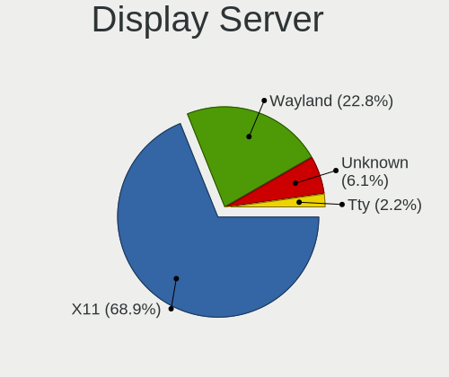

| Name    | Computers | Percent |
|---------|-----------|---------|
| X11     | 1146      | 79.42%  |
| Wayland | 147       | 10.19%  |
| Unknown | 127       | 8.8%    |
| Tty     | 23        | 1.59%   |

Display Manager
---------------

SDDM, LightDM, etc.

| Name    | Computers | Percent |
|---------|-----------|---------|
| Unknown | 781       | 53.24%  |
| SDDM    | 206       | 14.04%  |
| GDM     | 192       | 13.09%  |
| GDM3    | 107       | 7.29%   |
| LightDM | 97        | 6.61%   |
| TDM     | 68        | 4.64%   |
| KDM     | 13        | 0.89%   |
| XDM     | 3         | 0.2%    |

OS Lang
-------

Language

| Lang       | Computers | Percent |
|------------|-----------|---------|
| en_US      | 445       | 30.63%  |
| fr_BE      | 250       | 17.21%  |
| nl_BE      | 234       | 16.1%   |
| Unknown    | 223       | 15.35%  |
| fr_FR      | 79        | 5.44%   |
| en_GB      | 65        | 4.47%   |
| nl_NL      | 64        | 4.4%    |
| C          | 24        | 1.65%   |
| de_DE      | 10        | 0.69%   |
| de_BE      | 9         | 0.62%   |
| en_IE      | 6         | 0.41%   |
| pl_PL      | 5         | 0.34%   |
| ru_RU      | 4         | 0.28%   |
| es_ES      | 4         | 0.28%   |
| pt_PT      | 3         | 0.21%   |
| ro_RO      | 2         | 0.14%   |
| POSIX      | 2         | 0.14%   |
| it_IT      | 2         | 0.14%   |
| en_US.UTF8 | 2         | 0.14%   |
| en_CA      | 2         | 0.14%   |
| en_BE      | 2         | 0.14%   |
| tt_RU      | 1         | 0.07%   |
| tr_TR      | 1         | 0.07%   |
| pt_BR      | 1         | 0.07%   |
| nl_AW      | 1         | 0.07%   |
| li_BE      | 1         | 0.07%   |
| it_CH      | 1         | 0.07%   |
| hu_HU      | 1         | 0.07%   |
| fr_LU      | 1         | 0.07%   |
| fr_FR.UTF8 | 1         | 0.07%   |
| fr_CH      | 1         | 0.07%   |
| en_ZA      | 1         | 0.07%   |
| en_NZ      | 1         | 0.07%   |
| en_IN      | 1         | 0.07%   |
| en_DK      | 1         | 0.07%   |
| C.UTF8     | 1         | 0.07%   |
| bg_BG      | 1         | 0.07%   |

Boot Mode
---------

EFI or BIOS

| Mode | Computers | Percent |
|------|-----------|---------|
| BIOS | 737       | 51.65%  |
| EFI  | 690       | 48.35%  |

Filesystem
----------

Type of filesystem

| Type    | Computers | Percent |
|---------|-----------|---------|
| Ext4    | 1120      | 78.05%  |
| Btrfs   | 108       | 7.53%   |
| Overlay | 101       | 7.04%   |
| Unknown | 64        | 4.46%   |
| Xfs     | 24        | 1.67%   |
| Ext2    | 8         | 0.56%   |
| Zfs     | 5         | 0.35%   |
| Tmpfs   | 4         | 0.28%   |
| Ext3    | 1         | 0.07%   |

Part. scheme
------------

Scheme of partitioning

| Type    | Computers | Percent |
|---------|-----------|---------|
| Unknown | 845       | 59.34%  |
| GPT     | 446       | 31.32%  |
| MBR     | 133       | 9.34%   |

Dual Boot with Linux/BSD
------------------------

Hosting more than one Linux/BSD

| Dual boot | Computers | Percent |
|-----------|-----------|---------|
| No        | 1183      | 83.13%  |
| Yes       | 240       | 16.87%  |

Dual Boot (Win)
---------------

Hosting Linux and Windows

| Dual boot | Computers | Percent |
|-----------|-----------|---------|
| No        | 997       | 70.11%  |
| Yes       | 425       | 29.89%  |

Board
-----

Vendor
------

Motherboard manufacturer

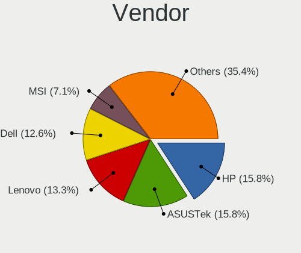

| Name                    | Computers | Percent |
|-------------------------|-----------|---------|
| ASUSTek Computer        | 227       | 16.32%  |
| Hewlett-Packard         | 212       | 15.24%  |
| Dell                    | 196       | 14.09%  |
| Lenovo                  | 165       | 11.86%  |
| MSI                     | 88        | 6.33%   |
| Gigabyte Technology     | 82        | 5.9%    |
| Acer                    | 81        | 5.82%   |
| Medion                  | 47        | 3.38%   |
| ASRock                  | 38        | 2.73%   |
| Toshiba                 | 31        | 2.23%   |
| Apple                   | 29        | 2.08%   |
| Intel                   | 25        | 1.8%    |
| Sony                    | 23        | 1.65%   |
| Packard Bell            | 20        | 1.44%   |
| Notebook                | 16        | 1.15%   |
| Unknown                 | 13        | 0.93%   |
| Fujitsu                 | 11        | 0.79%   |
| Raspberry Pi Foundation | 9         | 0.65%   |
| TUXEDO                  | 7         | 0.5%    |
| Samsung Electronics     | 7         | 0.5%    |
| Supermicro              | 5         | 0.36%   |
| Fujitsu Siemens         | 5         | 0.36%   |
| Foxconn                 | 5         | 0.36%   |
| PC Specialist           | 3         | 0.22%   |
| HUAWEI                  | 3         | 0.22%   |
| Google                  | 3         | 0.22%   |
| AMI                     | 3         | 0.22%   |
| Razer                   | 2         | 0.14%   |
| Pegatron                | 2         | 0.14%   |
| Panasonic               | 2         | 0.14%   |
| Nvidia                  | 2         | 0.14%   |
| Microsoft               | 2         | 0.14%   |
| Clevo                   | 2         | 0.14%   |
| YJKC                    | 1         | 0.07%   |
| Valve                   | 1         | 0.07%   |
| TYAN Computer           | 1         | 0.07%   |
| TrekStor                | 1         | 0.07%   |
| Timi                    | 1         | 0.07%   |
| Teclast                 | 1         | 0.07%   |
| Standard                | 1         | 0.07%   |

Model
-----

Motherboard model

| Name                             | Computers | Percent |
|----------------------------------|-----------|---------|
| ASUS All Series                  | 18        | 1.29%   |
| Unknown                          | 17        | 1.22%   |
| HP ProBook 650 G1                | 5         | 0.36%   |
| HP Pavilion Notebook             | 5         | 0.36%   |
| HP Pavilion dv7                  | 5         | 0.36%   |
| Dell XPS 13 7390                 | 5         | 0.36%   |
| Dell OptiPlex 780                | 5         | 0.36%   |
| ASRock B450M Pro4                | 5         | 0.36%   |
| Toshiba Satellite C660           | 4         | 0.29%   |
| RPi Raspberry Pi                 | 4         | 0.29%   |
| Lenovo IdeaPad 5 Pro 16ACH6 82L5 | 4         | 0.29%   |
| HP ProBook 6570b                 | 4         | 0.29%   |
| Gigabyte X570 AORUS MASTER       | 4         | 0.29%   |
| Gigabyte Spring Peak             | 4         | 0.29%   |
| Dell XPS 13 9370                 | 4         | 0.29%   |
| Dell OptiPlex 3010               | 4         | 0.29%   |
| Dell Latitude 5520               | 4         | 0.29%   |
| ASUS ROG STRIX X570-E GAMING     | 4         | 0.29%   |
| MSI MS-7C37                      | 3         | 0.22%   |
| MSI MS-7B86                      | 3         | 0.22%   |
| MSI MS-7A38                      | 3         | 0.22%   |
| Medion MS-7728                   | 3         | 0.22%   |
| Lenovo Yoga 530-14IKB 81EK       | 3         | 0.22%   |
| Lenovo ThinkPad L390 20NSS1YV0B  | 3         | 0.22%   |
| Lenovo Legion 5 15ARH05 82B5     | 3         | 0.22%   |
| HP ProBook 470 G2                | 3         | 0.22%   |
| HP ProBook 430 G1                | 3         | 0.22%   |
| HP Pavilion Laptop 15-eh1xxx     | 3         | 0.22%   |
| HP Pavilion Laptop 15-cw0xxx     | 3         | 0.22%   |
| HP Pavilion g7                   | 3         | 0.22%   |
| HP Pavilion 17                   | 3         | 0.22%   |
| HP EliteBook 840 G1              | 3         | 0.22%   |
| Gigabyte GB-BRR7H-4800           | 3         | 0.22%   |
| Gigabyte B550I AORUS PRO AX      | 3         | 0.22%   |
| Dell XPS 15 9570                 | 3         | 0.22%   |
| Dell XPS 13 9360                 | 3         | 0.22%   |
| Dell Latitude E7440              | 3         | 0.22%   |
| Dell Latitude E6540              | 3         | 0.22%   |
| Dell Latitude E6500              | 3         | 0.22%   |
| Dell Latitude E6330              | 3         | 0.22%   |

Model Family
------------

Motherboard model prefix

| Name                  | Computers | Percent |
|-----------------------|-----------|---------|
| Lenovo ThinkPad       | 83        | 5.97%   |
| Dell Latitude         | 73        | 5.25%   |
| Acer Aspire           | 62        | 4.46%   |
| HP Pavilion           | 42        | 3.02%   |
| HP EliteBook          | 41        | 2.95%   |
| HP ProBook            | 36        | 2.59%   |
| Dell XPS              | 33        | 2.37%   |
| HP Compaq             | 29        | 2.08%   |
| Toshiba Satellite     | 27        | 1.94%   |
| Dell OptiPlex         | 27        | 1.94%   |
| ASUS PRIME            | 26        | 1.87%   |
| Dell Inspiron         | 24        | 1.73%   |
| Lenovo IdeaPad        | 23        | 1.65%   |
| ASUS ROG              | 19        | 1.37%   |
| ASUS All              | 18        | 1.29%   |
| Unknown               | 17        | 1.22%   |
| Dell Precision        | 16        | 1.15%   |
| ASUS TUF              | 16        | 1.15%   |
| Lenovo Yoga           | 13        | 0.93%   |
| HP Laptop             | 13        | 0.93%   |
| Packard Bell EasyNote | 11        | 0.79%   |
| Medion Akoya          | 11        | 0.79%   |
| Lenovo Legion         | 11        | 0.79%   |
| Dell Vostro           | 10        | 0.72%   |
| RPi Raspberry         | 9         | 0.65%   |
| Lenovo ThinkCentre    | 9         | 0.65%   |
| HP ENVY               | 8         | 0.58%   |
| Gigabyte X570         | 7         | 0.5%    |
| HP ZBook              | 6         | 0.43%   |
| HP ProDesk            | 5         | 0.36%   |
| Dell Studio           | 5         | 0.36%   |
| ASUS VivoBook         | 5         | 0.36%   |
| ASUS STRIX            | 5         | 0.36%   |
| ASRock B450M          | 5         | 0.36%   |
| Acer Nitro            | 5         | 0.36%   |
| Packard Bell IMEDIA   | 4         | 0.29%   |
| Lenovo ThinkBook      | 4         | 0.29%   |
| Gigabyte Spring       | 4         | 0.29%   |
| Fujitsu LIFEBOOK      | 4         | 0.29%   |
| Fujitsu ESPRIMO       | 4         | 0.29%   |

MFG Year
--------

Motherboard manufacture year

| Year    | Computers | Percent |
|---------|-----------|---------|
| 2018    | 150       | 10.78%  |
| 2019    | 136       | 9.78%   |
| 2020    | 127       | 9.13%   |
| 2012    | 114       | 8.2%    |
| 2013    | 111       | 7.98%   |
| 2011    | 101       | 7.26%   |
| 2014    | 88        | 6.33%   |
| 2017    | 80        | 5.75%   |
| 2008    | 73        | 5.25%   |
| 2015    | 72        | 5.18%   |
| 2016    | 65        | 4.67%   |
| 2010    | 63        | 4.53%   |
| 2009    | 59        | 4.24%   |
| 2021    | 55        | 3.95%   |
| 2007    | 45        | 3.24%   |
| 2006    | 24        | 1.73%   |
| Unknown | 15        | 1.08%   |
| 2022    | 7         | 0.5%    |
| 2005    | 4         | 0.29%   |
| 2004    | 2         | 0.14%   |

Form Factor
-----------

Physical design of the computer

| Name           | Computers | Percent |
|----------------|-----------|---------|
| Notebook       | 781       | 56.15%  |
| Desktop        | 512       | 36.81%  |
| Convertible    | 38        | 2.73%   |
| Mini pc        | 15        | 1.08%   |
| Server         | 14        | 1.01%   |
| System on chip | 13        | 0.93%   |
| All in one     | 11        | 0.79%   |
| Tablet         | 7         | 0.5%    |

Secure Boot
-----------

Enabled or disabled

| State    | Computers | Percent |
|----------|-----------|---------|
| Disabled | 1284      | 91.45%  |
| Enabled  | 120       | 8.55%   |

Coreboot
--------

Have coreboot on board

| Used | Computers | Percent |
|------|-----------|---------|
| No   | 1388      | 99.78%  |
| Yes  | 3         | 0.22%   |

RAM Size
--------

Total RAM memory

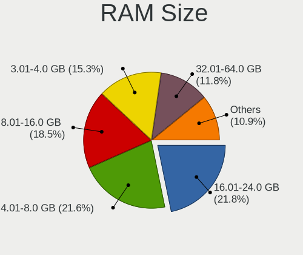

| Size in GB      | Computers | Percent |
|-----------------|-----------|---------|
| 4.01-8.0        | 311       | 21.84%  |
| 16.01-24.0      | 303       | 21.28%  |
| 3.01-4.0        | 267       | 18.75%  |
| 8.01-16.0       | 261       | 18.33%  |
| 32.01-64.0      | 130       | 9.13%   |
| 1.01-2.0        | 51        | 3.58%   |
| 64.01-256.0     | 35        | 2.46%   |
| 24.01-32.0      | 23        | 1.62%   |
| 2.01-3.0        | 21        | 1.47%   |
| 0.51-1.0        | 16        | 1.12%   |
| More than 256.0 | 4         | 0.28%   |
| 0.01-0.5        | 2         | 0.14%   |

RAM Used
--------

Used RAM memory

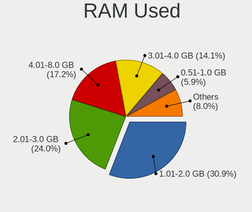

| Used GB     | Computers | Percent |
|-------------|-----------|---------|
| 1.01-2.0    | 557       | 35.03%  |
| 2.01-3.0    | 400       | 25.16%  |
| 4.01-8.0    | 216       | 13.58%  |
| 3.01-4.0    | 193       | 12.14%  |
| 0.51-1.0    | 111       | 6.98%   |
| 8.01-16.0   | 75        | 4.72%   |
| 0.01-0.5    | 28        | 1.76%   |
| 24.01-32.0  | 5         | 0.31%   |
| 16.01-24.0  | 3         | 0.19%   |
| 64.01-256.0 | 1         | 0.06%   |
| Unknown     | 1         | 0.06%   |

Total Drives
------------

Number of drives on board

| Drives  | Computers | Percent |
|---------|-----------|---------|
| 1       | 815       | 56.56%  |
| 2       | 383       | 26.58%  |
| 3       | 96        | 6.66%   |
| 4       | 65        | 4.51%   |
| 5       | 37        | 2.57%   |
| 6       | 17        | 1.18%   |
| 0       | 14        | 0.97%   |
| 9       | 4         | 0.28%   |
| 7       | 4         | 0.28%   |
| 8       | 3         | 0.21%   |
| 16      | 1         | 0.07%   |
| 10      | 1         | 0.07%   |
| Unknown | 1         | 0.07%   |

Has CD-ROM
----------

Has CD-ROM on board

| Presented | Computers | Percent |
|-----------|-----------|---------|
| No        | 760       | 54.25%  |
| Yes       | 641       | 45.75%  |

Has Ethernet
------------

Has Ethernet on board

| Presented | Computers | Percent |
|-----------|-----------|---------|
| Yes       | 1262      | 90.08%  |
| No        | 139       | 9.92%   |

Has WiFi
--------

Has WiFi module

| Presented | Computers | Percent |
|-----------|-----------|---------|
| Yes       | 1049      | 74.88%  |
| No        | 352       | 25.12%  |

Has Bluetooth
-------------

Has Bluetooth module

| Presented | Computers | Percent |
|-----------|-----------|---------|
| Yes       | 790       | 55.95%  |
| No        | 622       | 44.05%  |

Location
--------

Country
-------

Geographic location (country)

| Country | Computers | Percent |
|---------|-----------|---------|
| Belgium | 1391      | 100%    |

City
----

Geographic location (city)

| City           | Computers | Percent |
|----------------|-----------|---------|
| Brussels       | 169       | 10.93%  |
| Antwerp        | 103       | 6.66%   |
| Ghent          | 56        | 3.62%   |
| Ixelles-Elsene | 42        | 2.72%   |
| Lige         | 35        | 2.26%   |
| Mechelen       | 26        | 1.68%   |
| Leuven         | 22        | 1.42%   |
| Turnhout       | 18        | 1.16%   |
| Schaarbeek     | 16        | 1.03%   |
| Uccle          | 14        | 0.91%   |
| Anderlecht     | 14        | 0.91%   |
| Mons           | 13        | 0.84%   |
| Aalst          | 13        | 0.84%   |
| Etterbeek      | 12        | 0.78%   |
| Lier           | 11        | 0.71%   |
| La Louvire   | 11        | 0.71%   |
| Hasselt        | 11        | 0.71%   |
| Bruges         | 11        | 0.71%   |
| Wilrijk        | 10        | 0.65%   |
| Roeselare      | 10        | 0.65%   |
| Kontich        | 10        | 0.65%   |
| Kanne          | 10        | 0.65%   |
| Boom           | 10        | 0.65%   |
| Langdorp       | 9         | 0.58%   |
| Jette          | 9         | 0.58%   |
| Harelbeke      | 9         | 0.58%   |
| Gavere         | 9         | 0.58%   |
| Deurne         | 9         | 0.58%   |
| Wetteren       | 8         | 0.52%   |
| Vilvoorde      | 8         | 0.52%   |
| Sint-Niklaas   | 8         | 0.52%   |
| Namur          | 8         | 0.52%   |
| Hulshout       | 8         | 0.52%   |
| Haaltert       | 8         | 0.52%   |
| Brasschaat     | 8         | 0.52%   |
| Ypres          | 7         | 0.45%   |
| Tournai        | 7         | 0.45%   |
| Sint-Truiden   | 7         | 0.45%   |
| Sint-Amands    | 7         | 0.45%   |
| Seraing        | 7         | 0.45%   |

Drives
------

Drive Vendor
------------

Hard drive vendors

| Vendor                    | Computers | Drives | Percent |
|---------------------------|-----------|--------|---------|
| Samsung Electronics       | 425       | 724    | 21.01%  |
| WDC                       | 313       | 525    | 15.47%  |
| Seagate                   | 313       | 534    | 15.47%  |
| Toshiba                   | 136       | 190    | 6.72%   |
| Kingston                  | 109       | 169    | 5.39%   |
| SanDisk                   | 89        | 116    | 4.4%    |
| Unknown                   | 78        | 106    | 3.86%   |
| Hitachi                   | 68        | 88     | 3.36%   |
| Crucial                   | 68        | 100    | 3.36%   |
| SK hynix                  | 58        | 74     | 2.87%   |
| Intel                     | 52        | 61     | 2.57%   |
| HGST                      | 34        | 52     | 1.68%   |
| Micron Technology         | 26        | 28     | 1.29%   |
| Apple                     | 16        | 20     | 0.79%   |
| Phison                    | 14        | 17     | 0.69%   |
| LITEON                    | 14        | 19     | 0.69%   |
| Corsair                   | 13        | 13     | 0.64%   |
| Fujitsu                   | 12        | 17     | 0.59%   |
| A-DATA Technology         | 12        | 17     | 0.59%   |
| OCZ                       | 11        | 13     | 0.54%   |
| Maxtor                    | 11        | 13     | 0.54%   |
| KIOXIA                    | 10        | 11     | 0.49%   |
| Intenso                   | 9         | 16     | 0.44%   |
| PNY                       | 8         | 8      | 0.4%    |
| LITEONIT                  | 8         | 10     | 0.4%    |
| China                     | 8         | 11     | 0.4%    |
| LaCie                     | 7         | 10     | 0.35%   |
| Silicon Motion            | 6         | 8      | 0.3%    |
| Micron/Crucial Technology | 5         | 9      | 0.25%   |
| LDLC                      | 5         | 6      | 0.25%   |
| KingSpec                  | 5         | 5      | 0.25%   |
| ASMT                      | 5         | 5      | 0.25%   |
| Transcend                 | 4         | 5      | 0.2%    |
| KingFast                  | 4         | 4      | 0.2%    |
| JMicron Technology        | 4         | 6      | 0.2%    |
| GOODRAM                   | 4         | 7      | 0.2%    |
| Union Memory (Shenzhen)   | 3         | 4      | 0.15%   |
| SSSTC                     | 3         | 3      | 0.15%   |
| Zheino                    | 2         | 2      | 0.1%    |
| XPG                       | 2         | 6      | 0.1%    |

Drive Model
-----------

Hard drive models

| Model                              | Computers | Percent |
|------------------------------------|-----------|---------|
| Samsung NVMe SSD Drive 1TB         | 27        | 1.18%   |
| Samsung SSD 860 EVO 500GB          | 25        | 1.09%   |
| Samsung NVMe SSD Drive 512GB       | 23        | 1%      |
| Samsung SSD 850 EVO 250GB          | 21        | 0.92%   |
| Samsung NVMe SSD Drive 500GB       | 21        | 0.92%   |
| Samsung SSD 850 EVO 500GB          | 20        | 0.87%   |
| Seagate ST1000LM035-1RK172 1TB     | 19        | 0.83%   |
| Seagate ST1000LM024 HN-M101MBB 1TB | 19        | 0.83%   |
| Kingston SV300S37A120G 120GB SSD   | 19        | 0.83%   |
| Kingston SA400S37120G 120GB SSD    | 19        | 0.83%   |
| Samsung SSD 860 EVO 250GB          | 17        | 0.74%   |
| Samsung SSD 860 EVO 1TB            | 17        | 0.74%   |
| Intel NVMe SSD Drive 512GB         | 15        | 0.65%   |
| Toshiba DT01ACA100 1TB             | 14        | 0.61%   |
| SK hynix NVMe SSD Drive 512GB      | 13        | 0.57%   |
| Samsung SSD 870 EVO 1TB            | 13        | 0.57%   |
| Kingston SA400S37240G 240GB SSD    | 13        | 0.57%   |
| Toshiba MQ01ABD100 1TB             | 12        | 0.52%   |
| Seagate ST9500325AS 500GB          | 12        | 0.52%   |
| Seagate ST500DM002-1BD142 500GB    | 12        | 0.52%   |
| Seagate ST2000DM001-1CH164 2TB     | 12        | 0.52%   |
| Unknown MMC Card  64GB             | 11        | 0.48%   |
| Unknown MMC Card  32GB             | 11        | 0.48%   |
| Seagate ST2000DM001-1ER164 2TB     | 11        | 0.48%   |
| Seagate Expansion 1TB              | 11        | 0.48%   |
| SanDisk NVMe SSD Drive 512GB       | 11        | 0.48%   |
| Samsung SSD 970 EVO 1TB            | 11        | 0.48%   |
| Unknown SD/MMC/MS PRO 2GB          | 10        | 0.44%   |
| HGST HTS721010A9E630 1TB           | 10        | 0.44%   |
| Seagate ST2000DM008-2FR102 2TB     | 9         | 0.39%   |
| Samsung SSD 970 EVO Plus 500GB     | 9         | 0.39%   |
| Samsung SSD 860 QVO 1TB            | 9         | 0.39%   |
| Samsung SSD 840 EVO 250GB          | 9         | 0.39%   |
| Samsung NVMe SSD Drive 256GB       | 9         | 0.39%   |
| Crucial CT480BX500SSD1 480GB       | 9         | 0.39%   |
| Unknown MMC Card  128GB            | 8         | 0.35%   |
| Seagate ST1000LM048-2E7172 1TB     | 8         | 0.35%   |
| Samsung SSD 970 EVO Plus 1TB       | 8         | 0.35%   |
| Samsung SSD 870 QVO 1TB            | 8         | 0.35%   |
| Samsung SSD 850 EVO 120GB          | 8         | 0.35%   |

HDD Vendor
----------

Hard disk drive vendors

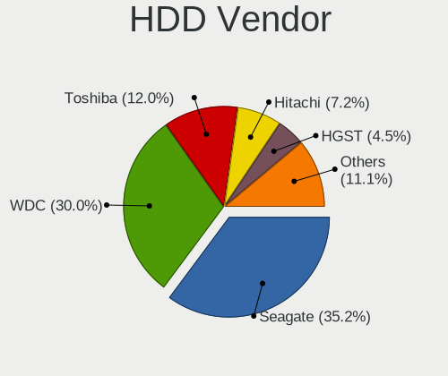

| Vendor              | Computers | Drives | Percent |
|---------------------|-----------|--------|---------|
| Seagate             | 306       | 521    | 36.04%  |
| WDC                 | 263       | 448    | 30.98%  |
| Toshiba             | 98        | 134    | 11.54%  |
| Hitachi             | 68        | 88     | 8.01%   |
| HGST                | 34        | 52     | 4%      |
| Samsung Electronics | 30        | 49     | 3.53%   |
| Fujitsu             | 12        | 16     | 1.41%   |
| Maxtor              | 11        | 13     | 1.3%    |
| Unknown             | 10        | 15     | 1.18%   |
| Apple               | 4         | 4      | 0.47%   |
| LaCie               | 2         | 2      | 0.24%   |
| Hewlett-Packard     | 2         | 4      | 0.24%   |
| WD MediaMax         | 1         | 1      | 0.12%   |
| SINTECHI            | 1         | 1      | 0.12%   |
| Magnetic Data       | 1         | 1      | 0.12%   |
| Lenovo              | 1         | 2      | 0.12%   |
| KESU                | 1         | 3      | 0.12%   |
| Intenso             | 1         | 4      | 0.12%   |
| IET                 | 1         | 3      | 0.12%   |
| Dell                | 1         | 1      | 0.12%   |
| ASMT                | 1         | 1      | 0.12%   |

SSD Vendor
----------

Solid state drive vendors

| Vendor              | Computers | Drives | Percent |
|---------------------|-----------|--------|---------|
| Samsung Electronics | 241       | 392    | 35.76%  |
| Kingston            | 91        | 142    | 13.5%   |
| Crucial             | 59        | 89     | 8.75%   |
| SanDisk             | 55        | 74     | 8.16%   |
| WDC                 | 33        | 40     | 4.9%    |
| SK hynix            | 19        | 28     | 2.82%   |
| Toshiba             | 16        | 19     | 2.37%   |
| Intel               | 14        | 17     | 2.08%   |
| Micron Technology   | 13        | 14     | 1.93%   |
| LITEON              | 13        | 18     | 1.93%   |
| OCZ                 | 11        | 13     | 1.63%   |
| Apple               | 10        | 13     | 1.48%   |
| Intenso             | 9         | 12     | 1.34%   |
| Corsair             | 9         | 9      | 1.34%   |
| PNY                 | 8         | 8      | 1.19%   |
| LITEONIT            | 8         | 10     | 1.19%   |
| China               | 8         | 11     | 1.19%   |
| A-DATA Technology   | 7         | 11     | 1.04%   |
| Transcend           | 4         | 5      | 0.59%   |
| KingSpec            | 4         | 4      | 0.59%   |
| Goodram             | 4         | 7      | 0.59%   |
| ASMT                | 4         | 4      | 0.59%   |
| Zheino              | 2         | 2      | 0.3%    |
| Plextor             | 2         | 2      | 0.3%    |
| KingFast            | 2         | 2      | 0.3%    |
| WDC WDS             | 1         | 1      | 0.15%   |
| Vaseky              | 1         | 1      | 0.15%   |
| TO Exter            | 1         | 1      | 0.15%   |
| Teclast             | 1         | 1      | 0.15%   |
| SPCC                | 1         | 2      | 0.15%   |
| Seagate             | 1         | 1      | 0.15%   |
| Reeinno             | 1         | 3      | 0.15%   |
| Patriot             | 1         | 1      | 0.15%   |
| OWC                 | 1         | 2      | 0.15%   |
| OCZ-VERTEX          | 1         | 1      | 0.15%   |
| Netac               | 1         | 1      | 0.15%   |
| Mushkin             | 1         | 1      | 0.15%   |
| Leven               | 1         | 1      | 0.15%   |
| LDLC                | 1         | 2      | 0.15%   |
| KIOXIA-EXCERIA      | 1         | 1      | 0.15%   |

Drive Kind
----------

HDD or SSD

| Kind    | Computers | Drives | Percent |
|---------|-----------|--------|---------|
| HDD     | 710       | 1363   | 38.76%  |
| SSD     | 604       | 979    | 32.97%  |
| NVMe    | 428       | 640    | 23.36%  |
| MMC     | 60        | 73     | 3.28%   |
| Unknown | 30        | 47     | 1.64%   |

Drive Connector
---------------

SATA, SAS, NVMe, etc.

| Type | Computers | Drives | Percent |
|------|-----------|--------|---------|
| SATA | 1055      | 2227   | 64.8%   |
| NVMe | 426       | 636    | 26.17%  |
| SAS  | 87        | 166    | 5.34%   |
| MMC  | 60        | 73     | 3.69%   |

Drive Size
----------

Size of hard drive

| Size in TB | Computers | Drives | Percent |
|------------|-----------|--------|---------|
| 0.01-0.5   | 815       | 1334   | 58.34%  |
| 0.51-1.0   | 367       | 625    | 26.27%  |
| 1.01-2.0   | 123       | 206    | 8.8%    |
| 3.01-4.0   | 45        | 91     | 3.22%   |
| 2.01-3.0   | 25        | 41     | 1.79%   |
| 4.01-10.0  | 20        | 39     | 1.43%   |
| 10.01-20.0 | 2         | 6      | 0.14%   |

Space Total
-----------

Amount of disk space available on the file system

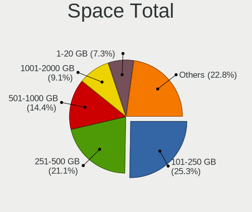

| Size in GB     | Computers | Percent |
|----------------|-----------|---------|
| 101-250        | 394       | 26.21%  |
| 251-500        | 349       | 23.22%  |
| 501-1000       | 204       | 13.57%  |
| 1001-2000      | 133       | 8.85%   |
| 51-100         | 97        | 6.45%   |
| 1-20           | 82        | 5.46%   |
| More than 3000 | 81        | 5.39%   |
| 2001-3000      | 60        | 3.99%   |
| Unknown        | 59        | 3.93%   |
| 21-50          | 44        | 2.93%   |

Space Used
----------

Amount of used disk space

| Used GB        | Computers | Percent |
|----------------|-----------|---------|
| 1-20           | 571       | 36.19%  |
| 21-50          | 229       | 14.51%  |
| 101-250        | 204       | 12.93%  |
| 51-100         | 166       | 10.52%  |
| 251-500        | 130       | 8.24%   |
| 501-1000       | 105       | 6.65%   |
| 1001-2000      | 62        | 3.93%   |
| Unknown        | 59        | 3.74%   |
| More than 3000 | 28        | 1.77%   |
| 2001-3000      | 24        | 1.52%   |

Malfunc. Drives
---------------

Drive models with a malfunction

| Model                                 | Computers | Drives | Percent |
|---------------------------------------|-----------|--------|---------|
| Seagate ST500DM002-1BD142 500GB       | 5         | 21     | 4.07%   |
| Seagate ST9500325AS 500GB             | 4         | 4      | 3.25%   |
| WDC WD10EZEX-21M2NA0 1TB              | 2         | 2      | 1.63%   |
| Seagate ST9750420AS 752GB             | 2         | 2      | 1.63%   |
| Seagate ST4000DM000-1F2168 4TB        | 2         | 2      | 1.63%   |
| Seagate ST3500418AS 500GB             | 2         | 6      | 1.63%   |
| Kingston SV300S37A120G 120GB SSD      | 2         | 2      | 1.63%   |
| Hitachi HTS545050A7E380 500GB         | 2         | 3      | 1.63%   |
| WDC WDS100T2B0A-00SM50 1TB SSD        | 1         | 1      | 0.81%   |
| WDC WD5000LPVX-22V0TT0 500GB          | 1         | 1      | 0.81%   |
| WDC WD5000AAKX-75U6AA0 500GB          | 1         | 1      | 0.81%   |
| WDC WD5000AAKX-07U6AA0 500GB          | 1         | 1      | 0.81%   |
| WDC WD5000AAKS-22A7B0 500GB           | 1         | 1      | 0.81%   |
| WDC WD5000AADS-00S9B0 500GB           | 1         | 1      | 0.81%   |
| WDC WD40EFRX-68N32N0 4TB              | 1         | 1      | 0.81%   |
| WDC WD3200BEVT-60A23T0 320GB          | 1         | 1      | 0.81%   |
| WDC WD3200BEKT-75PVMT1 320GB          | 1         | 3      | 0.81%   |
| WDC WD1600JS-60MHB5 160GB             | 1         | 1      | 0.81%   |
| WDC WD10SPCX-60HWST0 1TB              | 1         | 1      | 0.81%   |
| WDC WD10EZRX-00A8LB0 1TB              | 1         | 1      | 0.81%   |
| WDC WD10EARS-22Y5B1 1TB               | 1         | 1      | 0.81%   |
| WDC WD10EARS-00Y5B1 1TB               | 1         | 2      | 0.81%   |
| WDC WD10EALX-009BA0 1TB               | 1         | 1      | 0.81%   |
| WDC WD10EADS-00P8B0 1TB               | 1         | 1      | 0.81%   |
| WDC WD10EADS-00M2B0 1TB               | 1         | 1      | 0.81%   |
| Toshiba MQ01ABD100 1TB                | 1         | 1      | 0.81%   |
| Toshiba MQ01ABD075 752GB              | 1         | 1      | 0.81%   |
| Toshiba MQ01ABD032 320GB              | 1         | 1      | 0.81%   |
| Toshiba MK6476GSX 640GB               | 1         | 1      | 0.81%   |
| Toshiba MK5075GSX 500GB               | 1         | 1      | 0.81%   |
| Toshiba MK1237GSX 120GB               | 1         | 1      | 0.81%   |
| Toshiba KSG60ZSE512G SATA 512GB SSD   | 1         | 1      | 0.81%   |
| SK hynix SH920 mSATA 256GB SSD        | 1         | 1      | 0.81%   |
| SK hynix SH920 2.5 7MM 256GB SSD      | 1         | 1      | 0.81%   |
| SK hynix SC401 SATA 512GB SSD         | 1         | 2      | 0.81%   |
| SK hynix HFS256G32MND-2900A 256GB SSD | 1         | 1      | 0.81%   |
| SK hynix HFS128G39TND-N210A 128GB SSD | 1         | 1      | 0.81%   |
| Seagate ST9500420AS 500GB             | 1         | 1      | 0.81%   |
| Seagate ST9320423AS 320GB             | 1         | 2      | 0.81%   |
| Seagate ST9320421AS 320GB             | 1         | 1      | 0.81%   |

Malfunc. Drive Vendor
---------------------

Vendors of faulty drives

| Vendor              | Computers | Drives | Percent |
|---------------------|-----------|--------|---------|
| Seagate             | 35        | 67     | 29.91%  |
| WDC                 | 16        | 22     | 13.68%  |
| Samsung Electronics | 11        | 11     | 9.4%    |
| Hitachi             | 10        | 11     | 8.55%   |
| Toshiba             | 7         | 7      | 5.98%   |
| Crucial             | 7         | 8      | 5.98%   |
| SK hynix            | 5         | 6      | 4.27%   |
| SanDisk             | 4         | 4      | 3.42%   |
| Maxtor              | 4         | 4      | 3.42%   |
| Fujitsu             | 4         | 7      | 3.42%   |
| Kingston            | 3         | 7      | 2.56%   |
| Intel               | 3         | 3      | 2.56%   |
| HGST                | 3         | 3      | 2.56%   |
| Micron Technology   | 2         | 2      | 1.71%   |
| OCZ                 | 1         | 1      | 0.85%   |
| KingFast            | 1         | 1      | 0.85%   |
| A-DATA Technology   | 1         | 1      | 0.85%   |

Malfunc. HDD Vendor
-------------------

Vendors of faulty HDD drives

| Vendor              | Computers | Drives | Percent |
|---------------------|-----------|--------|---------|
| Seagate             | 35        | 67     | 42.68%  |
| WDC                 | 15        | 21     | 18.29%  |
| Hitachi             | 10        | 11     | 12.2%   |
| Toshiba             | 6         | 6      | 7.32%   |
| Samsung Electronics | 5         | 5      | 6.1%    |
| Maxtor              | 4         | 4      | 4.88%   |
| Fujitsu             | 4         | 7      | 4.88%   |
| HGST                | 3         | 3      | 3.66%   |

Malfunc. Drive Kind
-------------------

Kinds of faulty drives

| Kind | Computers | Drives | Percent |
|------|-----------|--------|---------|
| HDD  | 80        | 124    | 70.18%  |
| SSD  | 29        | 36     | 25.44%  |
| NVMe | 5         | 5      | 4.39%   |

Failed Drives
-------------

Failed drive models

| Model                                        | Computers | Drives | Percent |
|----------------------------------------------|-----------|--------|---------|
| Samsung Electronics MZVLW128HEGR-000L2 128GB | 1         | 2      | 33.33%  |
| Hitachi HDS721010DLE630 1TB                  | 1         | 1      | 33.33%  |
| HGST HTS721010A9E630 1TB                     | 1         | 1      | 33.33%  |

Failed Drive Vendor
-------------------

Failed drive vendors

| Vendor              | Computers | Drives | Percent |
|---------------------|-----------|--------|---------|
| Samsung Electronics | 1         | 2      | 33.33%  |
| Hitachi             | 1         | 1      | 33.33%  |
| HGST                | 1         | 1      | 33.33%  |

Drive Status
------------

Number of failed and malfunc. drives

| Status   | Computers | Drives | Percent |
|----------|-----------|--------|---------|
| Detected | 880       | 1968   | 58.55%  |
| Works    | 509       | 965    | 33.87%  |
| Malfunc  | 111       | 165    | 7.39%   |
| Failed   | 3         | 4      | 0.2%    |

Storage controller
------------------

Storage Vendor
--------------

Storage controller vendors

| Vendor                           | Computers | Percent |
|----------------------------------|-----------|---------|
| Intel                            | 980       | 55.87%  |
| AMD                              | 231       | 13.17%  |
| Samsung Electronics              | 197       | 11.23%  |
| SanDisk                          | 55        | 3.14%   |
| SK hynix                         | 37        | 2.11%   |
| Marvell Technology Group         | 26        | 1.48%   |
| JMicron Technology               | 26        | 1.48%   |
| ASMedia Technology               | 26        | 1.48%   |
| Toshiba America Info Systems     | 22        | 1.25%   |
| Kingston Technology Company      | 19        | 1.08%   |
| Phison Electronics               | 18        | 1.03%   |
| Nvidia                           | 18        | 1.03%   |
| Micron/Crucial Technology        | 14        | 0.8%    |
| Micron Technology                | 13        | 0.74%   |
| KIOXIA                           | 12        | 0.68%   |
| ADATA Technology                 | 7         | 0.4%    |
| Union Memory (Shenzhen)          | 6         | 0.34%   |
| Silicon Motion                   | 6         | 0.34%   |
| Solid State Storage Technology   | 5         | 0.29%   |
| Broadcom / LSI                   | 5         | 0.29%   |
| Silicon Image                    | 4         | 0.23%   |
| Seagate Technology               | 4         | 0.23%   |
| LSI Logic / Symbios Logic        | 4         | 0.23%   |
| Hewlett-Packard                  | 3         | 0.17%   |
| VIA Technologies                 | 2         | 0.11%   |
| Silicon Integrated Systems [SiS] | 2         | 0.11%   |
| Apple                            | 2         | 0.11%   |
| Adaptec                          | 2         | 0.11%   |
| Realtek Semiconductor            | 1         | 0.06%   |
| PMC-Sierra                       | 1         | 0.06%   |
| Lite-On Technology               | 1         | 0.06%   |
| Lite-On IT Corp. / Plextor       | 1         | 0.06%   |
| Lenovo                           | 1         | 0.06%   |
| HighPoint Technologies           | 1         | 0.06%   |
| Biwin Storage Technology         | 1         | 0.06%   |
| Areca Technology                 | 1         | 0.06%   |

Storage Model
-------------

Storage controller models

| Model                                                                          | Computers | Percent |
|--------------------------------------------------------------------------------|-----------|---------|
| AMD FCH SATA Controller [AHCI mode]                                            | 162       | 7.88%   |
| Samsung NVMe SSD Controller SM981/PM981/PM983                                  | 125       | 6.08%   |
| Intel 7 Series Chipset Family 6-port SATA Controller [AHCI mode]               | 78        | 3.79%   |
| Intel 8 Series/C220 Series Chipset Family 6-port SATA Controller 1 [AHCI mode] | 67        | 3.26%   |
| Intel Sunrise Point-LP SATA Controller [AHCI mode]                             | 62        | 3.01%   |
| Intel 6 Series/C200 Series Chipset Family 6 port Mobile SATA AHCI Controller   | 59        | 2.87%   |
| Intel 82801 Mobile SATA Controller [RAID mode]                                 | 50        | 2.43%   |
| Intel 82801IBM/IEM (ICH9M/ICH9M-E) 4 port SATA Controller [AHCI mode]          | 43        | 2.09%   |
| AMD 400 Series Chipset SATA Controller                                         | 43        | 2.09%   |
| Intel Q170/Q150/B150/H170/H110/Z170/CM236 Chipset SATA Controller [AHCI Mode]  | 34        | 1.65%   |
| Intel 6 Series/C200 Series Chipset Family 6 port Desktop SATA AHCI Controller  | 32        | 1.56%   |
| Intel SATA Controller [RAID mode]                                              | 31        | 1.51%   |
| Intel 8 Series SATA Controller 1 [AHCI mode]                                   | 31        | 1.51%   |
| Intel Cannon Lake Mobile PCH SATA AHCI Controller                              | 29        | 1.41%   |
| Intel 200 Series PCH SATA controller [AHCI mode]                               | 27        | 1.31%   |
| Samsung NVMe SSD Controller 980                                                | 26        | 1.26%   |
| Intel 82801HM/HEM (ICH8M/ICH8M-E) IDE Controller                               | 26        | 1.26%   |
| Intel Wildcat Point-LP SATA Controller [AHCI Mode]                             | 25        | 1.22%   |
| Intel 7 Series/C210 Series Chipset Family 6-port SATA Controller [AHCI mode]   | 25        | 1.22%   |
| ASMedia ASM1062 Serial ATA Controller                                          | 25        | 1.22%   |
| Intel 82801HM/HEM (ICH8M/ICH8M-E) SATA Controller [AHCI mode]                  | 24        | 1.17%   |
| Intel 82801G (ICH7 Family) IDE Controller                                      | 24        | 1.17%   |
| AMD SB7x0/SB8x0/SB9x0 IDE Controller                                           | 24        | 1.17%   |
| Samsung NVMe SSD Controller SM961/PM961/SM963                                  | 23        | 1.12%   |
| AMD SB7x0/SB8x0/SB9x0 SATA Controller [AHCI mode]                              | 23        | 1.12%   |
| Intel HM170/QM170 Chipset SATA Controller [AHCI Mode]                          | 21        | 1.02%   |
| Samsung NVMe SSD Controller PM9A1/PM9A3/980PRO                                 | 20        | 0.97%   |
| Intel 9 Series Chipset Family SATA Controller [AHCI Mode]                      | 20        | 0.97%   |
| Intel Volume Management Device NVMe RAID Controller                            | 18        | 0.88%   |
| Intel 5 Series/3400 Series Chipset 6 port SATA AHCI Controller                 | 18        | 0.88%   |
| AMD 500 Series Chipset SATA Controller                                         | 18        | 0.88%   |
| JMicron JMB363 SATA/IDE Controller                                             | 17        | 0.83%   |
| Intel 5 Series/3400 Series Chipset 4 port SATA AHCI Controller                 | 17        | 0.83%   |
| Intel SSD 660P Series                                                          | 16        | 0.78%   |
| AMD SB7x0/SB8x0/SB9x0 SATA Controller [IDE mode]                               | 16        | 0.78%   |
| Intel NM10/ICH7 Family SATA Controller [IDE mode]                              | 15        | 0.73%   |
| SanDisk WD Black SN750 / PC SN730 NVMe SSD                                     | 14        | 0.68%   |
| Micron Non-Volatile memory controller                                          | 13        | 0.63%   |
| Intel Comet Lake SATA AHCI Controller                                          | 13        | 0.63%   |
| Intel C600/X79 series chipset 6-Port SATA AHCI Controller                      | 13        | 0.63%   |

Storage Kind
------------

Kind of storage controller (IDE, SATA, NVMe, SAS, ...)

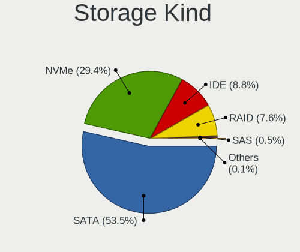

| Kind | Computers | Percent |
|------|-----------|---------|
| SATA | 1018      | 56.65%  |
| NVMe | 430       | 23.93%  |
| IDE  | 209       | 11.63%  |
| RAID | 126       | 7.01%   |
| SAS  | 13        | 0.72%   |
| SCSI | 1         | 0.06%   |

Processor
---------

CPU Vendor
----------

Processor vendors

| Vendor  | Computers | Percent |
|---------|-----------|---------|
| Intel   | 1096      | 78.79%  |
| AMD     | 282       | 20.27%  |
| ARM     | 11        | 0.79%   |
| Unknown | 2         | 0.14%   |

CPU Model
---------

Processor models

| Model                                         | Computers | Percent |
|-----------------------------------------------|-----------|---------|
| Intel Core i7-8565U CPU @ 1.80GHz             | 25        | 1.79%   |
| Intel Core i7-8550U CPU @ 1.80GHz             | 20        | 1.43%   |
| Intel 11th Gen Core i7-1165G7 @ 2.80GHz       | 18        | 1.29%   |
| AMD Ryzen 5 3600 6-Core Processor             | 17        | 1.22%   |
| Intel Core i7-7700HQ CPU @ 2.80GHz            | 16        | 1.15%   |
| Intel Core i5-8250U CPU @ 1.60GHz             | 16        | 1.15%   |
| Intel Core i7-8750H CPU @ 2.20GHz             | 14        | 1%      |
| AMD Ryzen 9 3900X 12-Core Processor           | 13        | 0.93%   |
| Intel Core i7-8665U CPU @ 1.90GHz             | 11        | 0.79%   |
| Intel Core i7-2600 CPU @ 3.40GHz              | 11        | 0.79%   |
| AMD Ryzen 7 3700X 8-Core Processor            | 11        | 0.79%   |
| Intel Core i7-9750H CPU @ 2.60GHz             | 10        | 0.72%   |
| Intel Core i7-4790K CPU @ 4.00GHz             | 10        | 0.72%   |
| Intel Core i7-10510U CPU @ 1.80GHz            | 10        | 0.72%   |
| Intel Core i5-6300U CPU @ 2.40GHz             | 10        | 0.72%   |
| Intel Core i5-3210M CPU @ 2.50GHz             | 10        | 0.72%   |
| Intel Core i5-2430M CPU @ 2.40GHz             | 10        | 0.72%   |
| Intel Core i3-2350M CPU @ 2.30GHz             | 10        | 0.72%   |
| Intel Core 2 Duo CPU P8600 @ 2.40GHz          | 10        | 0.72%   |
| Intel Core i7-3630QM CPU @ 2.40GHz            | 9         | 0.65%   |
| Intel Core i7-10750H CPU @ 2.60GHz            | 9         | 0.65%   |
| ARM Processor                                 | 9         | 0.65%   |
| AMD Ryzen 7 4800H with Radeon Graphics        | 9         | 0.65%   |
| Intel Core i5-7200U CPU @ 2.50GHz             | 8         | 0.57%   |
| Intel Core i5-4210U CPU @ 1.70GHz             | 8         | 0.57%   |
| Intel Core i5-3320M CPU @ 2.60GHz             | 8         | 0.57%   |
| Intel Core i7-8700 CPU @ 3.20GHz              | 7         | 0.5%    |
| Intel Core i5-8265U CPU @ 1.60GHz             | 7         | 0.5%    |
| Intel Core i5-4460 CPU @ 3.20GHz              | 7         | 0.5%    |
| Intel Core i5-3470 CPU @ 3.20GHz              | 7         | 0.5%    |
| Intel Core i5-3230M CPU @ 2.60GHz             | 7         | 0.5%    |
| Intel Core i5-2520M CPU @ 2.50GHz             | 7         | 0.5%    |
| Intel Core i5-2400 CPU @ 3.10GHz              | 7         | 0.5%    |
| Intel Core i5-10210U CPU @ 1.60GHz            | 7         | 0.5%    |
| Intel Core 2 Duo CPU P8700 @ 2.53GHz          | 7         | 0.5%    |
| AMD Ryzen 5 3500U with Radeon Vega Mobile Gfx | 7         | 0.5%    |
| Intel Core i7-7700K CPU @ 4.20GHz             | 6         | 0.43%   |
| Intel Core i7-7500U CPU @ 2.70GHz             | 6         | 0.43%   |
| Intel Core i7-5500U CPU @ 2.40GHz             | 6         | 0.43%   |
| Intel Core i7-3770 CPU @ 3.40GHz              | 6         | 0.43%   |

CPU Model Family
----------------

Processor model prefix

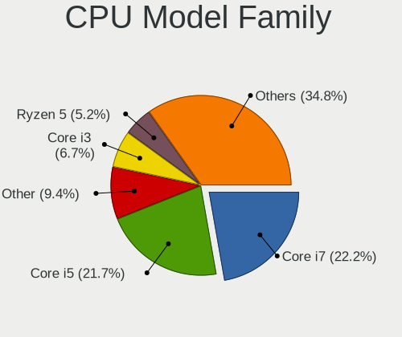

| Model                   | Computers | Percent |
|-------------------------|-----------|---------|
| Intel Core i7           | 348       | 25%     |
| Intel Core i5           | 310       | 22.27%  |
| Intel Core i3           | 99        | 7.11%   |
| Intel Core 2 Duo        | 82        | 5.89%   |
| AMD Ryzen 5             | 73        | 5.24%   |
| Other                   | 59        | 4.24%   |
| AMD Ryzen 7             | 57        | 4.09%   |
| Intel Celeron           | 35        | 2.51%   |
| Intel Xeon              | 30        | 2.16%   |
| Intel Pentium           | 26        | 1.87%   |
| AMD Ryzen 9             | 24        | 1.72%   |
| Intel Atom              | 21        | 1.51%   |
| Intel Pentium Dual-Core | 19        | 1.36%   |
| Intel Core 2 Quad       | 19        | 1.36%   |
| Intel Core 2            | 16        | 1.15%   |
| AMD E1                  | 11        | 0.79%   |
| Intel Core i9           | 10        | 0.72%   |
| AMD Ryzen 7 PRO         | 10        | 0.72%   |
| AMD E                   | 10        | 0.72%   |
| AMD Ryzen 5 PRO         | 9         | 0.65%   |
| AMD A8                  | 9         | 0.65%   |
| AMD FX                  | 8         | 0.57%   |
| Intel Pentium Dual      | 7         | 0.5%    |
| Intel Genuine           | 7         | 0.5%    |
| AMD A6                  | 7         | 0.5%    |
| AMD A10                 | 7         | 0.5%    |
| AMD Ryzen 3             | 6         | 0.43%   |
| AMD A4                  | 6         | 0.43%   |
| Intel Pentium Silver    | 5         | 0.36%   |
| Intel Pentium 4         | 5         | 0.36%   |
| AMD Phenom II X4        | 5         | 0.36%   |
| AMD Phenom              | 4         | 0.29%   |
| Intel Xeon Silver       | 3         | 0.22%   |
| Intel Celeron M         | 3         | 0.22%   |
| AMD Ryzen Threadripper  | 3         | 0.22%   |
| AMD Phenom II X6        | 3         | 0.22%   |
| AMD Athlon II X4        | 3         | 0.22%   |
| AMD Athlon II X2        | 3         | 0.22%   |
| AMD Athlon 64 X2        | 3         | 0.22%   |
| ARM BCM                 | 2         | 0.14%   |

CPU Cores
---------

Number of processor cores

| Number  | Computers | Percent |
|---------|-----------|---------|
| 2       | 547       | 39.24%  |
| 4       | 537       | 38.52%  |
| 6       | 137       | 9.83%   |
| 8       | 94        | 6.74%   |
| 1       | 25        | 1.79%   |
| 12      | 22        | 1.58%   |
| 16      | 8         | 0.57%   |
| 10      | 6         | 0.43%   |
| 3       | 5         | 0.36%   |
| Unknown | 5         | 0.36%   |
| 64      | 2         | 0.14%   |
| 32      | 2         | 0.14%   |
| 128     | 1         | 0.07%   |
| 24      | 1         | 0.07%   |
| 20      | 1         | 0.07%   |
| 14      | 1         | 0.07%   |

CPU Sockets
-----------

Number of sockets

| Number  | Computers | Percent |
|---------|-----------|---------|
| 1       | 1371      | 98.56%  |
| 2       | 18        | 1.29%   |
| 3       | 1         | 0.07%   |
| Unknown | 1         | 0.07%   |

CPU Threads
-----------

Threads per core (Hyper-Threading)

| Number  | Computers | Percent |
|---------|-----------|---------|
| 2       | 941       | 67.5%   |
| 1       | 448       | 32.14%  |
| Unknown | 5         | 0.36%   |

CPU Op-Modes
------------

CPU Operation Modes (32-bit, 64-bit)

| Op mode        | Computers | Percent |
|----------------|-----------|---------|
| 32-bit, 64-bit | 1347      | 96.35%  |
| Unknown        | 38        | 2.72%   |
| 32-bit         | 12        | 0.86%   |
| 64-bit         | 1         | 0.07%   |

CPU Microcode
-------------

Microcode number

| Number     | Computers | Percent |
|------------|-----------|---------|
| Unknown    | 276       | 19.06%  |
| 0x306a9    | 103       | 7.11%   |
| 0x206a7    | 91        | 6.28%   |
| 0x306c3    | 83        | 5.73%   |
| 0x1067a    | 57        | 3.94%   |
| 0x906e9    | 45        | 3.11%   |
| 0x906ea    | 40        | 2.76%   |
| 0x806ec    | 39        | 2.69%   |
| 0x806ea    | 38        | 2.62%   |
| 0x40651    | 33        | 2.28%   |
| 0x306d4    | 28        | 1.93%   |
| 0x506e3    | 27        | 1.86%   |
| 0x406e3    | 26        | 1.8%    |
| 0x20655    | 26        | 1.8%    |
| 0x6fd      | 24        | 1.66%   |
| 0x806e9    | 23        | 1.59%   |
| 0x08701021 | 22        | 1.52%   |
| 0x806c1    | 21        | 1.45%   |
| 0x10676    | 20        | 1.38%   |
| 0x08600106 | 17        | 1.17%   |
| 0x106e5    | 14        | 0.97%   |
| 0x08701013 | 14        | 0.97%   |
| 0xa0652    | 13        | 0.9%    |
| 0x6fb      | 13        | 0.9%    |
| 0x6f6      | 13        | 0.9%    |
| 0x206d7    | 12        | 0.83%   |
| 0x806eb    | 11        | 0.76%   |
| 0x30678    | 11        | 0.76%   |
| 0x20652    | 10        | 0.69%   |
| 0x05000119 | 10        | 0.69%   |
| 0x0a201009 | 9         | 0.62%   |
| 0x08600103 | 9         | 0.62%   |
| 0x08108109 | 9         | 0.62%   |
| 0x0800820d | 9         | 0.62%   |
| 0x08608103 | 8         | 0.55%   |
| 0x07030105 | 8         | 0.55%   |
| 0x010000c8 | 8         | 0.55%   |
| 0x0a50000c | 7         | 0.48%   |
| 0x0810100b | 7         | 0.48%   |
| 0x06001119 | 7         | 0.48%   |

CPU Microarch
-------------

Microarchitecture

| Name             | Computers | Percent |
|------------------|-----------|---------|
| KabyLake         | 247       | 17.74%  |
| Haswell          | 144       | 10.34%  |
| SandyBridge      | 120       | 8.62%   |
| IvyBridge        | 115       | 8.26%   |
| Zen 2            | 89        | 6.39%   |
| Penryn           | 87        | 6.25%   |
| Core             | 67        | 4.81%   |
| Skylake          | 66        | 4.74%   |
| Westmere         | 40        | 2.87%   |
| Zen+             | 34        | 2.44%   |
| Broadwell        | 34        | 2.44%   |
| TigerLake        | 32        | 2.3%    |
| Silvermont       | 32        | 2.3%    |
| Unknown          | 31        | 2.23%   |
| CometLake        | 29        | 2.08%   |
| Zen 3            | 28        | 2.01%   |
| Zen              | 23        | 1.65%   |
| Nehalem          | 22        | 1.58%   |
| K10              | 22        | 1.58%   |
| Piledriver       | 16        | 1.15%   |
| Bobcat           | 16        | 1.15%   |
| IceLake          | 12        | 0.86%   |
| Puma             | 11        | 0.79%   |
| Excavator        | 11        | 0.79%   |
| Goldmont plus    | 9         | 0.65%   |
| Bonnell          | 9         | 0.65%   |
| NetBurst         | 8         | 0.57%   |
| K8 Hammer        | 8         | 0.57%   |
| Jaguar           | 8         | 0.57%   |
| P6               | 7         | 0.5%    |
| Goldmont         | 5         | 0.36%   |
| Alderlake Hybrid | 3         | 0.22%   |
| Tremont          | 2         | 0.14%   |
| Steamroller      | 2         | 0.14%   |
| K8 & K10 hybrid  | 2         | 0.14%   |
| K10 Llano        | 1         | 0.07%   |

Graphics
--------

GPU Vendor
----------

Vendors of graphics cards

| Vendor                           | Computers | Percent |
|----------------------------------|-----------|---------|
| Intel                            | 784       | 48.16%  |
| Nvidia                           | 493       | 30.28%  |
| AMD                              | 337       | 20.7%   |
| Matrox Electronics Systems       | 9         | 0.55%   |
| ASPEED Technology                | 3         | 0.18%   |
| VIA Technologies                 | 1         | 0.06%   |
| Silicon Integrated Systems [SiS] | 1         | 0.06%   |

GPU Model
---------

Graphics card models

| Model                                                                                    | Computers | Percent |
|------------------------------------------------------------------------------------------|-----------|---------|
| Intel 2nd Generation Core Processor Family Integrated Graphics Controller                | 73        | 4.34%   |
| Intel 3rd Gen Core processor Graphics Controller                                         | 71        | 4.22%   |
| Intel WhiskeyLake-U GT2 [UHD Graphics 620]                                               | 45        | 2.68%   |
| Intel UHD Graphics 620                                                                   | 41        | 2.44%   |
| Intel Haswell-ULT Integrated Graphics Controller                                         | 41        | 2.44%   |
| AMD Renoir                                                                               | 34        | 2.02%   |
| Intel CoffeeLake-H GT2 [UHD Graphics 630]                                                | 32        | 1.9%    |
| Intel TigerLake-LP GT2 [Iris Xe Graphics]                                                | 31        | 1.84%   |
| Intel 4th Gen Core Processor Integrated Graphics Controller                              | 29        | 1.73%   |
| Intel HD Graphics 630                                                                    | 28        | 1.67%   |
| Intel HD Graphics 5500                                                                   | 26        | 1.55%   |
| Intel Skylake GT2 [HD Graphics 520]                                                      | 24        | 1.43%   |
| Intel Core Processor Integrated Graphics Controller                                      | 23        | 1.37%   |
| Intel Xeon E3-1200 v3/4th Gen Core Processor Integrated Graphics Controller              | 22        | 1.31%   |
| Intel Mobile 4 Series Chipset Integrated Graphics Controller                             | 22        | 1.31%   |
| Intel CometLake-U GT2 [UHD Graphics]                                                     | 21        | 1.25%   |
| AMD Ellesmere [Radeon RX 470/480/570/570X/580/580X/590]                                  | 21        | 1.25%   |
| Intel HD Graphics 620                                                                    | 19        | 1.13%   |
| Intel Mobile GM965/GL960 Integrated Graphics Controller (secondary)                      | 18        | 1.07%   |
| Intel Mobile GM965/GL960 Integrated Graphics Controller (primary)                        | 18        | 1.07%   |
| AMD Picasso/Raven 2 [Radeon Vega Series / Radeon Vega Mobile Series]                     | 17        | 1.01%   |
| Intel Atom Processor Z36xxx/Z37xxx Series Graphics & Display                             | 16        | 0.95%   |
| Intel CoffeeLake-S GT2 [UHD Graphics 630]                                                | 15        | 0.89%   |
| Intel Xeon E3-1200 v2/3rd Gen Core processor Graphics Controller                         | 14        | 0.83%   |
| Intel HD Graphics 530                                                                    | 14        | 0.83%   |
| Intel CometLake-H GT2 [UHD Graphics]                                                     | 14        | 0.83%   |
| Intel Atom/Celeron/Pentium Processor x5-E8000/J3xxx/N3xxx Integrated Graphics Controller | 14        | 0.83%   |
| Nvidia GM204 [GeForce GTX 970]                                                           | 13        | 0.77%   |
| AMD Cezanne                                                                              | 13        | 0.77%   |
| Nvidia GP107M [GeForce GTX 1050 Mobile]                                                  | 12        | 0.71%   |
| Nvidia GP106 [GeForce GTX 1060 6GB]                                                      | 12        | 0.71%   |
| Nvidia GK208B [GeForce GT 710]                                                           | 12        | 0.71%   |
| AMD Navi 10 [Radeon RX 5600 OEM/5600 XT / 5700/5700 XT]                                  | 11        | 0.65%   |
| Nvidia GP107 [GeForce GTX 1050 Ti]                                                       | 10        | 0.59%   |
| Intel Mobile 945GM/GMS/GME, 943/940GML Express Integrated Graphics Controller            | 10        | 0.59%   |
| Intel 4 Series Chipset Integrated Graphics Controller                                    | 10        | 0.59%   |
| AMD Lucienne                                                                             | 10        | 0.59%   |
| Nvidia TU117M [GeForce GTX 1650 Mobile / Max-Q]                                          | 9         | 0.54%   |
| Nvidia GT218 [GeForce 210]                                                               | 9         | 0.54%   |
| Intel Mobile 945GM/GMS, 943/940GML Express Integrated Graphics Controller                | 9         | 0.54%   |

GPU Combo
---------

Combinations of graphics cards

| Name               | Computers | Percent |
|--------------------|-----------|---------|
| 1 x Intel          | 561       | 39.96%  |
| 1 x Nvidia         | 304       | 21.65%  |
| 1 x AMD            | 261       | 18.59%  |
| Intel + Nvidia     | 165       | 11.75%  |
| Intel + AMD        | 44        | 3.13%   |
| AMD + Nvidia       | 19        | 1.35%   |
| Other              | 17        | 1.21%   |
| 2 x AMD            | 15        | 1.07%   |
| 1 x Matrox         | 9         | 0.64%   |
| 2 x Nvidia         | 3         | 0.21%   |
| 1 x ASPEED         | 2         | 0.14%   |
| 1 x VIA            | 1         | 0.07%   |
| 1 x SiS            | 1         | 0.07%   |
| Nvidia + ASPEED    | 1         | 0.07%   |
| Intel + 2 x Nvidia | 1         | 0.07%   |

GPU Driver
----------

Free vs proprietary

| Driver      | Computers | Percent |
|-------------|-----------|---------|
| Free        | 1093      | 76.76%  |
| Proprietary | 264       | 18.54%  |
| Unknown     | 67        | 4.71%   |

GPU Memory
----------

Total video memory

| Size in GB | Computers | Percent |
|------------|-----------|---------|
| Unknown    | 741       | 51.46%  |
| 1.01-2.0   | 182       | 12.64%  |
| 0.01-0.5   | 181       | 12.57%  |
| 0.51-1.0   | 127       | 8.82%   |
| 3.01-4.0   | 81        | 5.63%   |
| 7.01-8.0   | 69        | 4.79%   |
| 5.01-6.0   | 36        | 2.5%    |
| 8.01-16.0  | 13        | 0.9%    |
| 2.01-3.0   | 7         | 0.49%   |
| 16.01-24.0 | 3         | 0.21%   |

Monitor
-------

Monitor Vendor
--------------

Monitor vendors

| Vendor                  | Computers | Percent |
|-------------------------|-----------|---------|
| Samsung Electronics     | 221       | 14.6%   |
| AU Optronics            | 213       | 14.07%  |
| LG Display              | 148       | 9.78%   |
| Chimei Innolux          | 97        | 6.41%   |
| BOE                     | 82        | 5.42%   |
| Dell                    | 80        | 5.28%   |
| Iiyama                  | 65        | 4.29%   |
| Goldstar                | 63        | 4.16%   |
| Hewlett-Packard         | 55        | 3.63%   |
| Philips                 | 47        | 3.1%    |
| BenQ                    | 36        | 2.38%   |
| Sharp                   | 35        | 2.31%   |
| Acer                    | 31        | 2.05%   |
| AOC                     | 30        | 1.98%   |
| Medion                  | 28        | 1.85%   |
| Ancor Communications    | 26        | 1.72%   |
| Lenovo                  | 25        | 1.65%   |
| Chi Mei Optoelectronics | 25        | 1.65%   |
| Apple                   | 22        | 1.45%   |
| Sony                    | 13        | 0.86%   |
| Unknown                 | 11        | 0.73%   |
| Fujitsu Siemens         | 10        | 0.66%   |
| LG Philips              | 9         | 0.59%   |
| InfoVision              | 9         | 0.59%   |
| PANDA                   | 8         | 0.53%   |
| ASUSTek Computer        | 8         | 0.53%   |
| Vestel Elektronik       | 6         | 0.4%    |
| Panasonic               | 6         | 0.4%    |
| Idek Iiyama             | 6         | 0.4%    |
| Eizo                    | 6         | 0.4%    |
| LG Electronics          | 5         | 0.33%   |
| CSO                     | 5         | 0.33%   |
| Arnos Instruments       | 5         | 0.33%   |
| ViewSonic               | 4         | 0.26%   |
| Seiko/Epson             | 4         | 0.26%   |
| Quanta Display          | 4         | 0.26%   |
| Packard Bell            | 4         | 0.26%   |
| MSI                     | 4         | 0.26%   |
| NEC Computers           | 3         | 0.2%    |
| ___                     | 2         | 0.13%   |

Monitor Model
-------------

Monitor models

| Model                                                                     | Computers | Percent |
|---------------------------------------------------------------------------|-----------|---------|
| Samsung Electronics LCD Monitor SEC5441 1366x768 353x198mm 15.9-inch      | 14        | 0.88%   |
| AU Optronics LCD Monitor AUO21ED 1920x1080 344x193mm 15.5-inch            | 13        | 0.81%   |
| LG Display LCD Monitor LGD02DC 1366x768 344x194mm 15.5-inch               | 9         | 0.56%   |
| Chimei Innolux LCD Monitor CMN14D4 1920x1080 309x173mm 13.9-inch          | 9         | 0.56%   |
| AU Optronics LCD Monitor AUO38ED 1920x1080 344x193mm 15.5-inch            | 7         | 0.44%   |
| AU Optronics LCD Monitor AUO23ED 1920x1080 344x194mm 15.5-inch            | 7         | 0.44%   |
| AU Optronics LCD Monitor AUO139E 1600x900 382x214mm 17.2-inch             | 7         | 0.44%   |
| Vestel Elektronik 24W_LCD_TV VES3700 1920x1080 706x398mm 31.9-inch        | 6         | 0.38%   |
| Iiyama PLX2783H IVM6611 1920x1080 598x336mm 27.0-inch                     | 6         | 0.38%   |
| Goldstar ULTRAWIDE GSM59F1 2560x1080 673x284mm 28.8-inch                  | 6         | 0.38%   |
| Goldstar HDR 4K GSM7707 3840x2160 600x340mm 27.2-inch                     | 6         | 0.38%   |
| AU Optronics LCD Monitor AUO5B2D 1920x1080 293x162mm 13.2-inch            | 6         | 0.38%   |
| Samsung Electronics U28E590 SAM0C4D 3840x2160 607x345mm 27.5-inch         | 5         | 0.31%   |
| Samsung Electronics S24F350 SAM0D20 1920x1080 521x293mm 23.5-inch         | 5         | 0.31%   |
| LG Display LCD Monitor LGD046F 1920x1080 345x194mm 15.6-inch              | 5         | 0.31%   |
| Lenovo LCD Monitor LEN40BA 1920x1080 344x194mm 15.5-inch                  | 5         | 0.31%   |
| Iiyama PL2409HD IVM560C 1920x1080 521x293mm 23.5-inch                     | 5         | 0.31%   |
| AU Optronics LCD Monitor AUO573D 1920x1080 309x174mm 14.0-inch            | 5         | 0.31%   |
| AU Optronics LCD Monitor AUO26EC 1366x768 344x193mm 15.5-inch             | 5         | 0.31%   |
| AU Optronics LCD Monitor AUO159E 1600x900 382x214mm 17.2-inch             | 5         | 0.31%   |
| Sharp LCD Monitor SHP1449 1920x1080 294x165mm 13.3-inch                   | 4         | 0.25%   |
| Samsung Electronics SyncMaster SAM03E5 1680x1050 470x300mm 22.0-inch      | 4         | 0.25%   |
| Samsung Electronics SyncMaster SAM036F 1440x900 428x255mm 19.6-inch       | 4         | 0.25%   |
| Samsung Electronics S24R65x SAM1022 1920x1080 527x296mm 23.8-inch         | 4         | 0.25%   |
| Samsung Electronics S24D330 SAM0D92 1920x1080 531x299mm 24.0-inch         | 4         | 0.25%   |
| Samsung Electronics S24D300 SAM0B43 1920x1080 531x299mm 24.0-inch         | 4         | 0.25%   |
| Samsung Electronics LCD Monitor SEC4251 1366x768 344x194mm 15.5-inch      | 4         | 0.25%   |
| Medion MD 20430 MED36A2 1920x1080 521x293mm 23.5-inch                     | 4         | 0.25%   |
| LG Display LCD Monitor LGD034C 1366x768 293x165mm 13.2-inch               | 4         | 0.25%   |
| Goldstar 27GL850 GSM5B7F 2560x1440 600x340mm 27.2-inch                    | 4         | 0.25%   |
| Dell U2417H DEL40E8 1920x1080 527x296mm 23.8-inch                         | 4         | 0.25%   |
| Chimei Innolux LCD Monitor CMN15AB 1366x768 344x193mm 15.5-inch           | 4         | 0.25%   |
| Chimei Innolux LCD Monitor CMN1482 1600x900 309x174mm 14.0-inch           | 4         | 0.25%   |
| Chi Mei Optoelectronics LCD Monitor CMO1720 1920x1080 382x215mm 17.3-inch | 4         | 0.25%   |
| Chi Mei Optoelectronics LCD Monitor CMO1719 1600x900 382x215mm 17.3-inch  | 4         | 0.25%   |
| Chi Mei Optoelectronics LCD Monitor CMO15A7 1366x768 344x193mm 15.5-inch  | 4         | 0.25%   |
| BenQ GW2780 BNQ78E6 1920x1080 598x336mm 27.0-inch                         | 4         | 0.25%   |
| BenQ GC2870 BNQ78DD 1920x1080 621x341mm 27.9-inch                         | 4         | 0.25%   |
| AU Optronics LCD Monitor AUO22EC 1366x768 344x193mm 15.5-inch             | 4         | 0.25%   |
| AU Optronics LCD Monitor AUO149E 1600x900 382x214mm 17.2-inch             | 4         | 0.25%   |

Monitor Resolution
------------------

Monitor screen resolution

| Resolution         | Computers | Percent |
|--------------------|-----------|---------|
| 1920x1080 (FHD)    | 629       | 43.08%  |
| 1366x768 (WXGA)    | 186       | 12.74%  |
| 3840x2160 (4K)     | 112       | 7.67%   |
| 1600x900 (HD+)     | 102       | 6.99%   |
| 2560x1440 (QHD)    | 77        | 5.27%   |
| 1680x1050 (WSXGA+) | 58        | 3.97%   |
| 1280x1024 (SXGA)   | 53        | 3.63%   |
| 1440x900 (WXGA+)   | 45        | 3.08%   |
| 1920x1200 (WUXGA)  | 34        | 2.33%   |
| 1280x800 (WXGA)    | 29        | 1.99%   |
| Unknown            | 20        | 1.37%   |
| 3840x1080          | 16        | 1.1%    |
| 3440x1440          | 9         | 0.62%   |
| 1360x768           | 9         | 0.62%   |
| 2560x1600          | 8         | 0.55%   |
| 1600x1200          | 7         | 0.48%   |
| 3840x2400          | 6         | 0.41%   |
| 2560x1080          | 6         | 0.41%   |
| 1024x600           | 6         | 0.41%   |
| 3200x1800 (QHD+)   | 5         | 0.34%   |
| 1024x768 (XGA)     | 5         | 0.34%   |
| 1680x945           | 4         | 0.27%   |
| 2880x1800          | 3         | 0.21%   |
| 5760x1080          | 2         | 0.14%   |
| 3840x1600          | 2         | 0.14%   |
| 2960x1050          | 2         | 0.14%   |
| 2736x1824          | 2         | 0.14%   |
| 2256x1504          | 2         | 0.14%   |
| 2048x1152          | 2         | 0.14%   |
| 1920x540           | 2         | 0.14%   |
| 1920x1280          | 2         | 0.14%   |
| 1280x960           | 2         | 0.14%   |
| 800x1280           | 1         | 0.07%   |
| 7680x2160          | 1         | 0.07%   |
| 6320x1800          | 1         | 0.07%   |
| 4480x1080          | 1         | 0.07%   |
| 3840x1200          | 1         | 0.07%   |
| 3600x1080          | 1         | 0.07%   |
| 3200x1080          | 1         | 0.07%   |
| 2880x1920          | 1         | 0.07%   |

Monitor Diagonal
----------------

Diagonal size in inches

| Inches  | Computers | Percent |
|---------|-----------|---------|
| 15      | 368       | 24.04%  |
| 27      | 149       | 9.73%   |
| 17      | 141       | 9.21%   |
| 13      | 121       | 7.9%    |
| 24      | 110       | 7.18%   |
| 23      | 109       | 7.12%   |
| Unknown | 94        | 6.14%   |
| 14      | 83        | 5.42%   |
| 21      | 77        | 5.03%   |
| 19      | 46        | 3%      |
| 22      | 34        | 2.22%   |
| 18      | 27        | 1.76%   |
| 20      | 21        | 1.37%   |
| 12      | 20        | 1.31%   |
| 31      | 19        | 1.24%   |
| 34      | 14        | 0.91%   |
| 25      | 11        | 0.72%   |
| 72      | 10        | 0.65%   |
| 11      | 10        | 0.65%   |
| 10      | 10        | 0.65%   |
| 16      | 8         | 0.52%   |
| 84      | 7         | 0.46%   |
| 54      | 5         | 0.33%   |
| 48      | 4         | 0.26%   |
| 65      | 3         | 0.2%    |
| 49      | 3         | 0.2%    |
| 40      | 3         | 0.2%    |
| 32      | 3         | 0.2%    |
| 29      | 3         | 0.2%    |
| 52      | 2         | 0.13%   |
| 42      | 2         | 0.13%   |
| 39      | 2         | 0.13%   |
| 37      | 2         | 0.13%   |
| 26      | 2         | 0.13%   |
| 142     | 1         | 0.07%   |
| 63      | 1         | 0.07%   |
| 55      | 1         | 0.07%   |
| 50      | 1         | 0.07%   |
| 46      | 1         | 0.07%   |
| 43      | 1         | 0.07%   |

Monitor Width
-------------

Physical width

| Width in mm    | Computers | Percent |
|----------------|-----------|---------|
| 301-350        | 498       | 33.11%  |
| 501-600        | 329       | 21.88%  |
| 351-400        | 176       | 11.7%   |
| 401-500        | 167       | 11.1%   |
| 201-300        | 119       | 7.91%   |
| Unknown        | 94        | 6.25%   |
| 601-700        | 54        | 3.59%   |
| 1001-1500      | 21        | 1.4%    |
| 701-800        | 18        | 1.2%    |
| 1501-2000      | 17        | 1.13%   |
| 801-900        | 7         | 0.47%   |
| 901-1000       | 3         | 0.2%    |
| More than 2000 | 1         | 0.07%   |

Aspect Ratio
------------

Proportional relationship between the width and the height

| Ratio   | Computers | Percent |
|---------|-----------|---------|
| 16/9    | 999       | 73.56%  |
| 16/10   | 182       | 13.4%   |
| Unknown | 75        | 5.52%   |
| 5/4     | 48        | 3.53%   |
| 21/9    | 16        | 1.18%   |
| 4/3     | 14        | 1.03%   |
| 3/2     | 10        | 0.74%   |
| 32/9    | 6         | 0.44%   |
| 6/5     | 4         | 0.29%   |
| 1.00    | 2         | 0.15%   |
| 3.73    | 1         | 0.07%   |
| 0.62    | 1         | 0.07%   |

Monitor Area
------------

Area in inch

| Area in inch | Computers | Percent |
|----------------|-----------|---------|
| 101-110        | 368       | 24.4%   |
| 201-250        | 259       | 17.18%  |
| 301-350        | 152       | 10.08%  |
| 81-90          | 132       | 8.75%   |
| 121-130        | 107       | 7.1%    |
| 151-200        | 97        | 6.43%   |
| Unknown        | 94        | 6.23%   |
| 71-80          | 72        | 4.77%   |
| 251-300        | 44        | 2.92%   |
| 351-500        | 41        | 2.72%   |
| More than 1000 | 31        | 2.06%   |
| 141-150        | 28        | 1.86%   |
| 131-140        | 21        | 1.39%   |
| 61-70          | 19        | 1.26%   |
| 501-1000       | 17        | 1.13%   |
| 51-60          | 10        | 0.66%   |
| 41-50          | 10        | 0.66%   |
| 111-120        | 4         | 0.27%   |
| 91-100         | 2         | 0.13%   |

Pixel Density
-------------

Pixels per inch

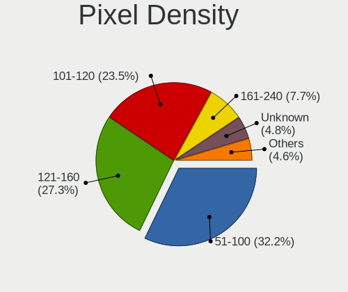

| Density       | Computers | Percent |
|---------------|-----------|---------|
| 51-100        | 484       | 32.86%  |
| 121-160       | 376       | 25.53%  |
| 101-120       | 362       | 24.58%  |
| Unknown       | 94        | 6.38%   |
| 161-240       | 91        | 6.18%   |
| More than 240 | 40        | 2.72%   |
| 1-50          | 26        | 1.77%   |

Multiple Monitors
-----------------

Total monitors connected

| Total | Computers | Percent |
|-------|-----------|---------|
| 1     | 1110      | 77.57%  |
| 2     | 222       | 15.51%  |
| 0     | 72        | 5.03%   |
| 3     | 26        | 1.82%   |
| 4     | 1         | 0.07%   |

Network
-------

Net Controller Vendor
---------------------

Controller vendors

| Vendor                            | Computers | Percent |
|-----------------------------------|-----------|---------|
| Intel                             | 740       | 35.27%  |
| Realtek Semiconductor             | 704       | 33.56%  |
| Qualcomm Atheros                  | 239       | 11.39%  |
| Broadcom                          | 118       | 5.62%   |
| Marvell Technology Group          | 29        | 1.38%   |
| Broadcom Limited                  | 28        | 1.33%   |
| TP-Link                           | 24        | 1.14%   |
| Ralink                            | 19        | 0.91%   |
| Nvidia                            | 17        | 0.81%   |
| D-Link System                     | 15        | 0.71%   |
| MediaTek                          | 12        | 0.57%   |
| Ralink Technology                 | 11        | 0.52%   |
| Dell                              | 10        | 0.48%   |
| ASIX Electronics                  | 9         | 0.43%   |
| Lenovo                            | 8         | 0.38%   |
| IMC Networks                      | 8         | 0.38%   |
| Sierra Wireless                   | 6         | 0.29%   |
| Microsoft                         | 6         | 0.29%   |
| Ericsson Business Mobile Networks | 6         | 0.29%   |
| DisplayLink                       | 6         | 0.29%   |
| D-Link                            | 6         | 0.29%   |
| ASUSTek Computer                  | 6         | 0.29%   |
| Linksys                           | 5         | 0.24%   |
| Microchip Technology              | 4         | 0.19%   |
| Hewlett-Packard                   | 4         | 0.19%   |
| Aquantia                          | 4         | 0.19%   |
| Sitecom Europe                    | 3         | 0.14%   |
| Qualcomm Atheros Communications   | 3         | 0.14%   |
| JMicron Technology                | 3         | 0.14%   |
| FIBOCOM                           | 3         | 0.14%   |
| Silicon Integrated Systems [SiS]  | 2         | 0.1%    |
| Samsung Electronics               | 2         | 0.1%    |
| Qualcomm                          | 2         | 0.1%    |
| Motorola PCS                      | 2         | 0.1%    |
| MosChip Semiconductor             | 2         | 0.1%    |
| Huawei Technologies               | 2         | 0.1%    |
| Edimax Technology                 | 2         | 0.1%    |
| Attansic Technology               | 2         | 0.1%    |
| Arduino SA                        | 2         | 0.1%    |
| ADMtek                            | 2         | 0.1%    |

Net Controller Model
--------------------

Controller models

| Model                                                             | Computers | Percent |
|-------------------------------------------------------------------|-----------|---------|
| Realtek RTL8111/8168/8411 PCI Express Gigabit Ethernet Controller | 494       | 19.68%  |
| Intel Wi-Fi 6 AX200                                               | 96        | 3.82%   |
| Realtek RTL810xE PCI Express Fast Ethernet controller             | 65        | 2.59%   |
| Realtek RTL8153 Gigabit Ethernet Adapter                          | 56        | 2.23%   |
| Intel 82579LM Gigabit Network Connection (Lewisville)             | 49        | 1.95%   |
| Intel Wireless 7260                                               | 44        | 1.75%   |
| Intel I211 Gigabit Network Connection                             | 43        | 1.71%   |
| Qualcomm Atheros AR9485 Wireless Network Adapter                  | 41        | 1.63%   |
| Realtek RTL8125 2.5GbE Controller                                 | 37        | 1.47%   |
| Intel Wireless 7265                                               | 32        | 1.27%   |
| Intel Wireless 8265 / 8275                                        | 31        | 1.24%   |
| Intel Cannon Point-LP CNVi [Wireless-AC]                          | 31        | 1.24%   |
| Intel Wireless 8260                                               | 30        | 1.2%    |
| Qualcomm Atheros QCA9377 802.11ac Wireless Network Adapter        | 27        | 1.08%   |
| Intel Centrino Advanced-N 6205 [Taylor Peak]                      | 27        | 1.08%   |
| Qualcomm Atheros QCA9565 / AR9565 Wireless Network Adapter        | 26        | 1.04%   |
| Qualcomm Atheros AR9285 Wireless Network Adapter (PCI-Express)    | 26        | 1.04%   |
| Intel Ethernet Connection (2) I219-V                              | 24        | 0.96%   |
| Qualcomm Atheros QCA6174 802.11ac Wireless Network Adapter        | 23        | 0.92%   |
| Intel Wi-Fi 6 AX201                                               | 23        | 0.92%   |
| Qualcomm Atheros AR8151 v2.0 Gigabit Ethernet                     | 22        | 0.88%   |
| Intel Wireless-AC 9260                                            | 22        | 0.88%   |
| Intel Cannon Lake PCH CNVi WiFi                                   | 22        | 0.88%   |
| Intel PRO/Wireless 3945ABG [Golan] Network Connection             | 20        | 0.8%    |
| Intel 82579V Gigabit Network Connection                           | 20        | 0.8%    |
| Intel Ethernet Connection I217-V                                  | 19        | 0.76%   |
| Intel Ethernet Connection I217-LM                                 | 18        | 0.72%   |
| Realtek RTL8723BE PCIe Wireless Network Adapter                   | 17        | 0.68%   |
| Qualcomm Atheros AR8161 Gigabit Ethernet                          | 17        | 0.68%   |
| Intel Ethernet Connection I218-LM                                 | 17        | 0.68%   |
| Intel Centrino Wireless-N 2230                                    | 17        | 0.68%   |
| Intel Comet Lake PCH CNVi WiFi                                    | 16        | 0.64%   |
| Realtek RTL8822CE 802.11ac PCIe Wireless Network Adapter          | 15        | 0.6%    |
| Realtek RTL8821CE 802.11ac PCIe Wireless Network Adapter          | 15        | 0.6%    |
| Broadcom BCM4313 802.11bgn Wireless Network Adapter               | 14        | 0.56%   |
| Realtek RTL8822BE 802.11a/b/g/n/ac WiFi adapter                   | 13        | 0.52%   |
| Intel WiFi Link 5100                                              | 13        | 0.52%   |
| Intel PRO/Wireless 4965 AG or AGN [Kedron] Network Connection     | 13        | 0.52%   |
| Intel Ethernet Connection (6) I219-V                              | 13        | 0.52%   |
| Realtek RTL8188CE 802.11b/g/n WiFi Adapter                        | 12        | 0.48%   |

Wireless Vendor
---------------

Wireless vendors

| Vendor                                | Computers | Percent |
|---------------------------------------|-----------|---------|
| Intel                                 | 555       | 50.36%  |
| Qualcomm Atheros                      | 188       | 17.06%  |
| Realtek Semiconductor                 | 137       | 12.43%  |
| Broadcom                              | 75        | 6.81%   |
| Ralink                                | 19        | 1.72%   |
| Broadcom Limited                      | 15        | 1.36%   |
| TP-Link                               | 14        | 1.27%   |
| D-Link System                         | 13        | 1.18%   |
| Ralink Technology                     | 11        | 1%      |
| MediaTek                              | 8         | 0.73%   |
| IMC Networks                          | 8         | 0.73%   |
| Sierra Wireless                       | 6         | 0.54%   |
| Microsoft                             | 6         | 0.54%   |
| D-Link                                | 6         | 0.54%   |
| ASUSTek Computer                      | 6         | 0.54%   |
| Linksys                               | 5         | 0.45%   |
| Dell                                  | 4         | 0.36%   |
| Sitecom Europe                        | 3         | 0.27%   |
| Qualcomm Atheros Communications       | 3         | 0.27%   |
| FIBOCOM                               | 3         | 0.27%   |
| Qualcomm                              | 2         | 0.18%   |
| Marvell Technology Group              | 2         | 0.18%   |
| Ericsson Business Mobile Networks     | 2         | 0.18%   |
| Edimax Technology                     | 2         | 0.18%   |
| Z-Com                                 | 1         | 0.09%   |
| Texas Instruments                     | 1         | 0.09%   |
| Tenda                                 | 1         | 0.09%   |
| Panasonic (Matsushita)                | 1         | 0.09%   |
| Hewlett-Packard                       | 1         | 0.09%   |
| Guillemot                             | 1         | 0.09%   |
| Gemtek                                | 1         | 0.09%   |
| AVM                                   | 1         | 0.09%   |
| 802.11g Adapter [Linksys WUSB54GC v3] | 1         | 0.09%   |

Wireless Model
--------------

Wireless models

| Model                                                                   | Computers | Percent |
|-------------------------------------------------------------------------|-----------|---------|
| Intel Wi-Fi 6 AX200                                                     | 96        | 8.65%   |
| Intel Wireless 7260                                                     | 44        | 3.96%   |
| Qualcomm Atheros AR9485 Wireless Network Adapter                        | 41        | 3.69%   |
| Intel Wireless 7265                                                     | 32        | 2.88%   |
| Intel Wireless 8265 / 8275                                              | 31        | 2.79%   |
| Intel Cannon Point-LP CNVi [Wireless-AC]                                | 31        | 2.79%   |
| Intel Wireless 8260                                                     | 30        | 2.7%    |
| Qualcomm Atheros QCA9377 802.11ac Wireless Network Adapter              | 27        | 2.43%   |
| Intel Centrino Advanced-N 6205 [Taylor Peak]                            | 27        | 2.43%   |
| Qualcomm Atheros QCA9565 / AR9565 Wireless Network Adapter              | 26        | 2.34%   |
| Qualcomm Atheros AR9285 Wireless Network Adapter (PCI-Express)          | 26        | 2.34%   |
| Qualcomm Atheros QCA6174 802.11ac Wireless Network Adapter              | 23        | 2.07%   |
| Intel Wi-Fi 6 AX201                                                     | 23        | 2.07%   |
| Intel Wireless-AC 9260                                                  | 22        | 1.98%   |
| Intel Cannon Lake PCH CNVi WiFi                                         | 22        | 1.98%   |
| Intel PRO/Wireless 3945ABG [Golan] Network Connection                   | 20        | 1.8%    |
| Realtek RTL8723BE PCIe Wireless Network Adapter                         | 17        | 1.53%   |
| Intel Centrino Wireless-N 2230                                          | 17        | 1.53%   |
| Intel Comet Lake PCH CNVi WiFi                                          | 16        | 1.44%   |
| Realtek RTL8822CE 802.11ac PCIe Wireless Network Adapter                | 15        | 1.35%   |
| Realtek RTL8821CE 802.11ac PCIe Wireless Network Adapter                | 15        | 1.35%   |
| Broadcom BCM4313 802.11bgn Wireless Network Adapter                     | 14        | 1.26%   |
| Realtek RTL8822BE 802.11a/b/g/n/ac WiFi adapter                         | 13        | 1.17%   |
| Intel WiFi Link 5100                                                    | 13        | 1.17%   |
| Intel PRO/Wireless 4965 AG or AGN [Kedron] Network Connection           | 13        | 1.17%   |
| Realtek RTL8188CE 802.11b/g/n WiFi Adapter                              | 12        | 1.08%   |
| Broadcom BCM43142 802.11b/g/n                                           | 12        | 1.08%   |
| Qualcomm Atheros AR9287 Wireless Network Adapter (PCI-Express)          | 11        | 0.99%   |
| Intel Comet Lake PCH-LP CNVi WiFi                                       | 11        | 0.99%   |
| Intel Centrino Ultimate-N 6300                                          | 11        | 0.99%   |
| Intel Centrino Advanced-N 6235                                          | 11        | 0.99%   |
| Intel Centrino Advanced-N 6200                                          | 11        | 0.99%   |
| Qualcomm Atheros AR242x / AR542x Wireless Network Adapter (PCI-Express) | 10        | 0.9%    |
| Intel Dual Band Wireless-AC 3168NGW [Stone Peak]                        | 10        | 0.9%    |
| Intel Wireless 3165                                                     | 9         | 0.81%   |
| Broadcom BCM43228 802.11a/b/g/n                                         | 9         | 0.81%   |
| Realtek 802.11ac NIC                                                    | 8         | 0.72%   |
| Realtek RTL8188EUS 802.11n Wireless Network Adapter                     | 7         | 0.63%   |
| Realtek RTL8188CUS 802.11n WLAN Adapter                                 | 7         | 0.63%   |
| Intel PRO/Wireless 5100 AGN [Shiloh] Network Connection                 | 7         | 0.63%   |

Ethernet Vendor
---------------

Ethernet vendors

| Vendor                                 | Computers | Percent |
|----------------------------------------|-----------|---------|
| Realtek Semiconductor                  | 655       | 48.81%  |
| Intel                                  | 411       | 30.63%  |
| Qualcomm Atheros                       | 89        | 6.63%   |
| Broadcom                               | 56        | 4.17%   |
| Marvell Technology Group               | 27        | 2.01%   |
| Nvidia                                 | 17        | 1.27%   |
| Broadcom Limited                       | 13        | 0.97%   |
| TP-Link                                | 9         | 0.67%   |
| ASIX Electronics                       | 9         | 0.67%   |
| Lenovo                                 | 8         | 0.6%    |
| DisplayLink                            | 6         | 0.45%   |
| Microchip Technology                   | 4         | 0.3%    |
| MediaTek                               | 4         | 0.3%    |
| Aquantia                               | 4         | 0.3%    |
| JMicron Technology                     | 3         | 0.22%   |
| Hewlett-Packard                        | 3         | 0.22%   |
| Silicon Integrated Systems [SiS]       | 2         | 0.15%   |
| Samsung Electronics                    | 2         | 0.15%   |
| Motorola PCS                           | 2         | 0.15%   |
| MosChip Semiconductor                  | 2         | 0.15%   |
| D-Link System                          | 2         | 0.15%   |
| Attansic Technology                    | 2         | 0.15%   |
| ADMtek                                 | 2         | 0.15%   |
| Xiaomi                                 | 1         | 0.07%   |
| VIA Technologies                       | 1         | 0.07%   |
| Tehuti Networks                        | 1         | 0.07%   |
| Sony Ericsson Mobile Communications AB | 1         | 0.07%   |
| OPPO Electronics                       | 1         | 0.07%   |
| OpenMoko                               | 1         | 0.07%   |
| OnePlus Technology (Shenzhen)          | 1         | 0.07%   |
| IBM                                    | 1         | 0.07%   |
| Huawei Technologies                    | 1         | 0.07%   |
| Apple                                  | 1         | 0.07%   |

Ethernet Model
--------------

Ethernet models

| Model                                                             | Computers | Percent |
|-------------------------------------------------------------------|-----------|---------|
| Realtek RTL8111/8168/8411 PCI Express Gigabit Ethernet Controller | 494       | 35.93%  |
| Realtek RTL810xE PCI Express Fast Ethernet controller             | 65        | 4.73%   |
| Realtek RTL8153 Gigabit Ethernet Adapter                          | 56        | 4.07%   |
| Intel 82579LM Gigabit Network Connection (Lewisville)             | 49        | 3.56%   |
| Intel I211 Gigabit Network Connection                             | 43        | 3.13%   |
| Realtek RTL8125 2.5GbE Controller                                 | 37        | 2.69%   |
| Intel Ethernet Connection (2) I219-V                              | 24        | 1.75%   |
| Qualcomm Atheros AR8151 v2.0 Gigabit Ethernet                     | 22        | 1.6%    |
| Intel 82579V Gigabit Network Connection                           | 20        | 1.45%   |
| Intel Ethernet Connection I217-V                                  | 19        | 1.38%   |
| Intel Ethernet Connection I217-LM                                 | 18        | 1.31%   |
| Qualcomm Atheros AR8161 Gigabit Ethernet                          | 17        | 1.24%   |
| Intel Ethernet Connection I218-LM                                 | 17        | 1.24%   |
| Intel Ethernet Connection (6) I219-V                              | 13        | 0.95%   |
| Intel Ethernet Connection I219-LM                                 | 12        | 0.87%   |
| Intel Ethernet Connection (2) I218-V                              | 12        | 0.87%   |
| Intel Ethernet Connection (6) I219-LM                             | 11        | 0.8%    |
| Intel Ethernet Connection (4) I219-V                              | 11        | 0.8%    |
| Intel 82567LM-3 Gigabit Network Connection                        | 11        | 0.8%    |
| Intel 82567LM Gigabit Network Connection                          | 11        | 0.8%    |
| Intel 82566MM Gigabit Network Connection                          | 10        | 0.73%   |
| TP-Link UE300 10/100/1000 LAN (ethernet mode) [Realtek RTL8153]   | 9         | 0.65%   |
| Intel 82577LM Gigabit Network Connection                          | 9         | 0.65%   |
| Qualcomm Atheros Killer E220x Gigabit Ethernet Controller         | 8         | 0.58%   |
| Intel I210 Gigabit Network Connection                             | 8         | 0.58%   |
| Intel Ethernet Controller I225-V                                  | 8         | 0.58%   |
| Intel Ethernet Connection (4) I219-LM                             | 8         | 0.58%   |
| Intel Ethernet Connection (3) I218-LM                             | 8         | 0.58%   |
| Intel Ethernet Connection (2) I219-LM                             | 8         | 0.58%   |
| Qualcomm Atheros Killer E2500 Gigabit Ethernet Controller         | 7         | 0.51%   |
| Realtek RTL-8100/8101L/8139 PCI Fast Ethernet Adapter             | 6         | 0.44%   |
| Qualcomm Atheros AR8152 v2.0 Fast Ethernet                        | 6         | 0.44%   |
| Marvell Group 88E8056 PCI-E Gigabit Ethernet Controller           | 6         | 0.44%   |
| Intel 82574L Gigabit Network Connection                           | 6         | 0.44%   |
| Broadcom NetLink BCM5784M Gigabit Ethernet PCIe                   | 6         | 0.44%   |
| Broadcom NetLink BCM57785 Gigabit Ethernet PCIe                   | 6         | 0.44%   |
| ASIX AX88179 Gigabit Ethernet                                     | 6         | 0.44%   |
| Qualcomm Atheros Killer E2400 Gigabit Ethernet Controller         | 5         | 0.36%   |
| Qualcomm Atheros AR8131 Gigabit Ethernet                          | 5         | 0.36%   |
| Nvidia MCP79 Ethernet                                             | 5         | 0.36%   |

Net Controller Kind
-------------------

Ethernet, WiFi or modem

| Kind     | Computers | Percent |
|----------|-----------|---------|
| Ethernet | 1259      | 53.94%  |
| WiFi     | 1050      | 44.99%  |
| Modem    | 22        | 0.94%   |
| Unknown  | 3         | 0.13%   |

Used Controller
---------------

Currently used network controller

| Kind     | Computers | Percent |
|----------|-----------|---------|
| WiFi     | 786       | 53%     |
| Ethernet | 697       | 47%     |

NICs
----

Total network controllers on board

| Total | Computers | Percent |
|-------|-----------|---------|
| 2     | 799       | 57.15%  |
| 1     | 516       | 36.91%  |
| 3     | 43        | 3.08%   |
| 0     | 28        | 2%      |
| 4     | 6         | 0.43%   |
| 5     | 3         | 0.21%   |
| 6     | 2         | 0.14%   |
| 7     | 1         | 0.07%   |

IPv6
----

IPv6 vs IPv4

| Used | Computers | Percent |
|------|-----------|---------|
| No   | 1070      | 74.1%   |
| Yes  | 374       | 25.9%   |

Bluetooth
---------

Bluetooth Vendor
----------------

Controller vendors

| Vendor                          | Computers | Percent |
|---------------------------------|-----------|---------|
| Intel                           | 413       | 51.63%  |
| Realtek Semiconductor           | 60        | 7.5%    |
| Qualcomm Atheros Communications | 51        | 6.38%   |
| Cambridge Silicon Radio         | 38        | 4.75%   |
| Broadcom                        | 36        | 4.5%    |
| IMC Networks                    | 29        | 3.63%   |
| Apple                           | 26        | 3.25%   |
| Dell                            | 25        | 3.13%   |
| Lite-On Technology              | 22        | 2.75%   |
| Foxconn / Hon Hai               | 21        | 2.63%   |
| ASUSTek Computer                | 21        | 2.63%   |
| Hewlett-Packard                 | 20        | 2.5%    |
| Toshiba                         | 10        | 1.25%   |
| Belkin Components               | 7         | 0.88%   |
| Alps Electric                   | 4         | 0.5%    |
| Ralink                          | 3         | 0.38%   |
| Foxconn International           | 3         | 0.38%   |
| Ralink Technology               | 2         | 0.25%   |
| MediaTek                        | 2         | 0.25%   |
| Marvell Semiconductor           | 2         | 0.25%   |
| Realtek                         | 1         | 0.13%   |
| Qcom                            | 1         | 0.13%   |
| Micro Star International        | 1         | 0.13%   |
| Logitech                        | 1         | 0.13%   |
| HTC (High Tech Computer)        | 1         | 0.13%   |

Bluetooth Model
---------------

Controller models

| Model                                                 | Computers | Percent |
|-------------------------------------------------------|-----------|---------|
| Intel Bluetooth wireless interface                    | 144       | 17.98%  |
| Intel AX200 Bluetooth                                 | 94        | 11.74%  |
| Intel Bluetooth 9460/9560 Jefferson Peak (JfP)        | 60        | 7.49%   |
| Intel AX201 Bluetooth                                 | 50        | 6.24%   |
| Cambridge Silicon Radio Bluetooth Dongle (HCI mode)   | 38        | 4.74%   |
| Realtek Bluetooth Radio                               | 33        | 4.12%   |
| Intel Centrino Bluetooth Wireless Transceiver         | 24        | 3%      |
| Intel Wireless-AC 9260 Bluetooth Adapter              | 22        | 2.75%   |
| Realtek  Bluetooth 4.2 Adapter                        | 18        | 2.25%   |
| Qualcomm Atheros  Bluetooth Device                    | 14        | 1.75%   |
| Qualcomm Atheros AR3011 Bluetooth                     | 14        | 1.75%   |
| HP Bluetooth 2.0 Interface [Broadcom BCM2045]         | 12        | 1.5%    |
| Apple Bluetooth Host Controller                       | 12        | 1.5%    |
| Qualcomm Atheros QCA61x4 Bluetooth 4.0                | 11        | 1.37%   |
| IMC Networks Bluetooth Device                         | 11        | 1.37%   |
| Lite-On Qualcomm Atheros QCA9377 Bluetooth            | 10        | 1.25%   |
| Intel Wireless-AC 3168 Bluetooth                      | 10        | 1.25%   |
| Dell DW375 Bluetooth Module                           | 10        | 1.25%   |
| Foxconn / Hon Hai Bluetooth Device                    | 8         | 1%      |
| Qualcomm Atheros AR3012 Bluetooth 4.0                 | 7         | 0.87%   |
| IMC Networks Bluetooth Radio                          | 7         | 0.87%   |
| HP Broadcom 2070 Bluetooth Combo                      | 7         | 0.87%   |
| Dell BCM20702A0 Bluetooth Module                      | 7         | 0.87%   |
| Broadcom HP Portable SoftSailing                      | 7         | 0.87%   |
| ASUS Broadcom BCM20702A0 Bluetooth                    | 7         | 0.87%   |
| Apple Bluetooth USB Host Controller                   | 7         | 0.87%   |
| Realtek RTL8822BE Bluetooth 4.2 Adapter               | 6         | 0.75%   |
| Lite-On Atheros AR3012 Bluetooth                      | 6         | 0.75%   |
| Intel AX210 Bluetooth                                 | 6         | 0.75%   |
| Lite-On Bluetooth Device                              | 5         | 0.62%   |
| Foxconn / Hon Hai Bluetooth USB Host Controller       | 5         | 0.62%   |
| Broadcom BCM2045B (BDC-2.1)                           | 5         | 0.62%   |
| IMC Networks Atheros AR3012 Bluetooth 4.0 Adapter     | 4         | 0.5%    |
| Foxconn / Hon Hai Wireless_Device                     | 4         | 0.5%    |
| Broadcom HP Portable Bumble Bee                       | 4         | 0.5%    |
| Belkin Components F8T065BF Mini Bluetooth 4.0 Adapter | 4         | 0.5%    |
| ASUS Broadcom BCM20702 Single-Chip Bluetooth 4.0 + LE | 4         | 0.5%    |
| Apple Bluetooth HCI                                   | 4         | 0.5%    |
| Toshiba Bluetooth Device                              | 3         | 0.37%   |
| Realtek RTL8723B Bluetooth                            | 3         | 0.37%   |

Sound
-----

Sound Vendor
------------

Sound card vendors

| Vendor                           | Computers | Percent |
|----------------------------------|-----------|---------|
| Intel                            | 1049      | 52.98%  |
| Nvidia                           | 368       | 18.59%  |
| AMD                              | 351       | 17.73%  |
| C-Media Electronics              | 30        | 1.52%   |
| Logitech                         | 20        | 1.01%   |
| Creative Labs                    | 15        | 0.76%   |
| Kingston Technology              | 11        | 0.56%   |
| Realtek Semiconductor            | 10        | 0.51%   |
| GN Netcom                        | 9         | 0.45%   |
| Corsair                          | 8         | 0.4%    |
| Plantronics                      | 6         | 0.3%    |
| Focusrite-Novation               | 6         | 0.3%    |
| VIA Technologies                 | 5         | 0.25%   |
| Texas Instruments                | 5         | 0.25%   |
| RODE Microphones                 | 5         | 0.25%   |
| Razer USA                        | 5         | 0.25%   |
| JMTek                            | 4         | 0.2%    |
| Hewlett-Packard                  | 4         | 0.2%    |
| Blue Microphones                 | 4         | 0.2%    |
| ASUSTek Computer                 | 4         | 0.2%    |
| Roland                           | 3         | 0.15%   |
| Micro Star International         | 3         | 0.15%   |
| Astro Gaming                     | 3         | 0.15%   |
| Trust                            | 2         | 0.1%    |
| SteelSeries ApS                  | 2         | 0.1%    |
| Sony                             | 2         | 0.1%    |
| Silicon Integrated Systems [SiS] | 2         | 0.1%    |
| Sennheiser Communications        | 2         | 0.1%    |
| M-Audio                          | 2         | 0.1%    |
| Lenovo                           | 2         | 0.1%    |
| Harman International             | 2         | 0.1%    |
| GYROCOM C&C                      | 2         | 0.1%    |
| FIFINE Microphones               | 2         | 0.1%    |
| DSEA A/S                         | 2         | 0.1%    |
| BEHRINGER International          | 2         | 0.1%    |
| Antlion Audio                    | 2         | 0.1%    |
| XMOS                             | 1         | 0.05%   |
| Xilinx                           | 1         | 0.05%   |
| Veho                             | 1         | 0.05%   |
| Valve Software                   | 1         | 0.05%   |

Sound Model
-----------

Sound card models

| Model                                                                      | Computers | Percent |
|----------------------------------------------------------------------------|-----------|---------|
| Intel 7 Series/C216 Chipset Family High Definition Audio Controller        | 113       | 4.9%    |
| Intel 6 Series/C200 Series Chipset Family High Definition Audio Controller | 103       | 4.47%   |
| Intel Sunrise Point-LP HD Audio                                            | 101       | 4.38%   |
| AMD Family 17h/19h HD Audio Controller                                     | 89        | 3.86%   |
| Intel 8 Series/C220 Series Chipset High Definition Audio Controller        | 75        | 3.25%   |
| AMD Starship/Matisse HD Audio Controller                                   | 65        | 2.82%   |
| Intel 82801I (ICH9 Family) HD Audio Controller                             | 62        | 2.69%   |
| Intel Xeon E3-1200 v3/4th Gen Core Processor HD Audio Controller           | 55        | 2.39%   |
| Intel 5 Series/3400 Series Chipset High Definition Audio                   | 52        | 2.26%   |
| Intel Cannon Lake PCH cAVS                                                 | 51        | 2.21%   |
| AMD Renoir Radeon High Definition Audio Controller                         | 50        | 2.17%   |
| Intel Cannon Point-LP High Definition Audio Controller                     | 47        | 2.04%   |
| Intel Haswell-ULT HD Audio Controller                                      | 41        | 1.78%   |
| Intel 8 Series HD Audio Controller                                         | 41        | 1.78%   |
| AMD SBx00 Azalia (Intel HDA)                                               | 40        | 1.74%   |
| Intel NM10/ICH7 Family High Definition Audio Controller                    | 38        | 1.65%   |
| Intel 82801H (ICH8 Family) HD Audio Controller                             | 37        | 1.61%   |
| Intel 100 Series/C230 Series Chipset Family HD Audio Controller            | 35        | 1.52%   |
| AMD FCH Azalia Controller                                                  | 34        | 1.48%   |
| Intel Tiger Lake-LP Smart Sound Technology Audio Controller                | 32        | 1.39%   |
| Intel Broadwell-U Audio Controller                                         | 30        | 1.3%    |
| Intel 200 Series PCH HD Audio                                              | 30        | 1.3%    |
| Nvidia GP107GL High Definition Audio Controller                            | 28        | 1.21%   |
| Intel Wildcat Point-LP High Definition Audio Controller                    | 28        | 1.21%   |
| AMD Raven/Raven2/Fenghuang HDMI/DP Audio Controller                        | 26        | 1.13%   |
| AMD Family 17h (Models 00h-0fh) HD Audio Controller                        | 26        | 1.13%   |
| Nvidia GK107 HDMI Audio Controller                                         | 25        | 1.08%   |
| Nvidia High Definition Audio Controller                                    | 24        | 1.04%   |
| Intel Comet Lake PCH cAVS                                                  | 23        | 1%      |
| AMD Kabini HDMI/DP Audio                                                   | 23        | 1%      |
| Nvidia TU106 High Definition Audio Controller                              | 22        | 0.95%   |
| Nvidia GP104 High Definition Audio Controller                              | 22        | 0.95%   |
| Nvidia GK208 HDMI/DP Audio Controller                                      | 22        | 0.95%   |
| Nvidia GF108 High Definition Audio Controller                              | 22        | 0.95%   |
| Intel Comet Lake PCH-LP cAVS                                               | 22        | 0.95%   |
| Intel CM238 HD Audio Controller                                            | 22        | 0.95%   |
| AMD Ellesmere HDMI Audio [Radeon RX 470/480 / 570/580/590]                 | 22        | 0.95%   |
| Nvidia GP106 High Definition Audio Controller                              | 20        | 0.87%   |
| Nvidia GM107 High Definition Audio Controller [GeForce 940MX]              | 20        | 0.87%   |
| Intel 9 Series Chipset Family HD Audio Controller                          | 19        | 0.82%   |

Memory
------

Memory Vendor
-------------

Memory module vendors

| Vendor              | Computers | Percent |
|---------------------|-----------|---------|
| Samsung Electronics | 182       | 22.25%  |
| SK hynix            | 162       | 19.8%   |
| Kingston            | 100       | 12.22%  |
| Corsair             | 89        | 10.88%  |
| Micron Technology   | 81        | 9.9%    |
| Unknown             | 67        | 8.19%   |
| Crucial             | 40        | 4.89%   |
| G.Skill             | 21        | 2.57%   |
| Elpida              | 15        | 1.83%   |
| Ramaxel Technology  | 12        | 1.47%   |
| Nanya Technology    | 12        | 1.47%   |
| A-DATA Technology   | 8         | 0.98%   |
| Unknown (ABCD)      | 4         | 0.49%   |
| Unifosa             | 4         | 0.49%   |
| Transcend           | 4         | 0.49%   |
| Team                | 2         | 0.24%   |
| Patriot             | 2         | 0.24%   |
| Unknown (0x8551)    | 1         | 0.12%   |
| Unknown (09D5)      | 1         | 0.12%   |
| TRS STAR            | 1         | 0.12%   |
| Timetec             | 1         | 0.12%   |
| TakeMS              | 1         | 0.12%   |
| Qimonda             | 1         | 0.12%   |
| PNY                 | 1         | 0.12%   |
| J&A Information     | 1         | 0.12%   |
| Goodram             | 1         | 0.12%   |
| GeIL                | 1         | 0.12%   |
| Corsair SerNum0     | 1         | 0.12%   |
| A-DA                | 1         | 0.12%   |
| Unknown             | 1         | 0.12%   |

Memory Model
------------

Memory module models

| Model                                                            | Computers | Percent |
|------------------------------------------------------------------|-----------|---------|
| SK hynix RAM HMA81GS6AFR8N-UH 8192MB SODIMM DDR4 2667MT/s        | 13        | 1.48%   |
| Samsung RAM M471A1K43DB1-CWE 8192MB SODIMM DDR4 3200MT/s         | 9         | 1.03%   |
| Corsair RAM CMK16GX4M2B3200C16 8GB DIMM DDR4 3600MT/s            | 9         | 1.03%   |
| Corsair RAM CMK16GX4M2B3000C15 8GB DIMM DDR4 3200MT/s            | 8         | 0.91%   |
| SK hynix RAM HMT351S6EFR8A-PB 4GB SODIMM DDR3 1600MT/s           | 7         | 0.8%    |
| Samsung RAM M471B5273DH0-CH9 4GB SODIMM DDR3 1334MT/s            | 7         | 0.8%    |
| Samsung RAM M471B5173DB0-YK0 4GB SODIMM DDR3 1600MT/s            | 7         | 0.8%    |
| Samsung RAM M471A1K43CB1-CRC 8GB SODIMM DDR4 2667MT/s            | 7         | 0.8%    |
| SK hynix RAM HMT451S6BFR8A-PB 4096MB SODIMM DDR3 1600MT/s        | 6         | 0.68%   |
| SK hynix RAM HMT351S6CFR8C-PB 4GB SODIMM DDR3 1600MT/s           | 6         | 0.68%   |
| SK hynix RAM HMA81GS6CJR8N-VK 8192MB SODIMM DDR4 2667MT/s        | 6         | 0.68%   |
| SK hynix RAM H9CCNNNCLGALAR-NVD 8GB Row Of Chips LPDDR3 2133MT/s | 6         | 0.68%   |
| Samsung RAM M471A2K43DB1-CWE 16GB SODIMM DDR4 3200MT/s           | 6         | 0.68%   |
| SK hynix RAM HMT351U6CFR8C-PB 4GB DIMM DDR3 1800MT/s             | 5         | 0.57%   |
| Samsung RAM M471B5173QH0-YK0 4GB SODIMM DDR3 1600MT/s            | 5         | 0.57%   |
| Samsung RAM M471B1G73QH0-YK0 8192MB SODIMM DDR3 1600MT/s         | 5         | 0.57%   |
| Samsung RAM M471B1G73DB0-YK0 8GB SODIMM DDR3 1600MT/s            | 5         | 0.57%   |
| Samsung RAM M471A2G44AM0-CWE 16GB SODIMM DDR4 3200MT/s           | 5         | 0.57%   |
| Crucial RAM CT102464BF160B.C16 8GB SODIMM DDR3 1600MT/s          | 5         | 0.57%   |
| Corsair RAM CMK32GX4M2B3200C16 16GB DIMM DDR4 3400MT/s           | 5         | 0.57%   |
| Unknown RAM Module 4096MB SODIMM DDR3 1333MT/s                   | 4         | 0.46%   |
| Unknown RAM Module 4096MB SODIMM DDR3                            | 4         | 0.46%   |
| Unknown (ABCD) RAM 123456789012345678 1GB SODIMM LPDDR4 2400MT/s | 4         | 0.46%   |
| SK hynix RAM HMA851S6AFR6N-UH 4GB SODIMM DDR4 2667MT/s           | 4         | 0.46%   |
| SK hynix RAM HMA82GS6JJR8N-VK 16GB SODIMM DDR4 2667MT/s          | 4         | 0.46%   |
| SK hynix RAM HMA81GS6DJR8N-XN 8GB SODIMM DDR4 3200MT/s           | 4         | 0.46%   |
| Samsung RAM Module 16384MB SODIMM DDR4 2667MT/s                  | 4         | 0.46%   |
| Samsung RAM M471B5773DH0-CH9 2GB SODIMM DDR3 1600MT/s            | 4         | 0.46%   |
| Samsung RAM M471A5244CB0-CTD 4GB SODIMM DDR4 3266MT/s            | 4         | 0.46%   |
| Samsung RAM M471A1K43CB1-CTD 8GB SODIMM DDR4 2667MT/s            | 4         | 0.46%   |
| Samsung RAM M471A1K43BB1-CTD 8GB SODIMM DDR4 2667MT/s            | 4         | 0.46%   |
| Samsung RAM M471A1G44AB0-CWE 8GB SODIMM DDR4 3200MT/s            | 4         | 0.46%   |
| Samsung RAM M4 70T5663QZ3-CF7 2GB SODIMM DDR2 2048MT/s           | 4         | 0.46%   |
| Samsung RAM M378B5673FH0-CH9 2GB DIMM DDR3 1600MT/s              | 4         | 0.46%   |
| Samsung RAM K4EBE304EC-EGCG 8GB Row Of Chips LPDDR3 2133MT/s     | 4         | 0.46%   |
| G.Skill RAM F4-3600C16-16GVKC 16GB DIMM DDR4 3866MT/s            | 4         | 0.46%   |
| Unknown RAM Module 4GB SODIMM DDR4 2400MT/s                      | 3         | 0.34%   |
| Unknown RAM Module 4GB DIMM DDR3 1333MT/s                        | 3         | 0.34%   |
| Unknown RAM Module 4096MB DIMM 1333MT/s                          | 3         | 0.34%   |
| Unknown RAM Module 2GB SODIMM DDR2 667MT/s                       | 3         | 0.34%   |

Memory Kind
-----------

Memory module kinds

| Kind    | Computers | Percent |
|---------|-----------|---------|
| DDR4    | 343       | 46.54%  |
| DDR3    | 263       | 35.69%  |
| DDR2    | 43        | 5.83%   |
| SDRAM   | 29        | 3.93%   |
| LPDDR3  | 23        | 3.12%   |
| LPDDR4  | 17        | 2.31%   |
| Unknown | 16        | 2.17%   |
| DDR     | 3         | 0.41%   |

Memory Form Factor
------------------

Physical design of the memory module

| Name         | Computers | Percent |
|--------------|-----------|---------|
| SODIMM       | 414       | 57.66%  |
| DIMM         | 258       | 35.93%  |
| Row Of Chips | 39        | 5.43%   |
| Chip         | 4         | 0.56%   |
| FB-DIMM      | 2         | 0.28%   |
| RIMM         | 1         | 0.14%   |

Memory Size
-----------

Memory module size

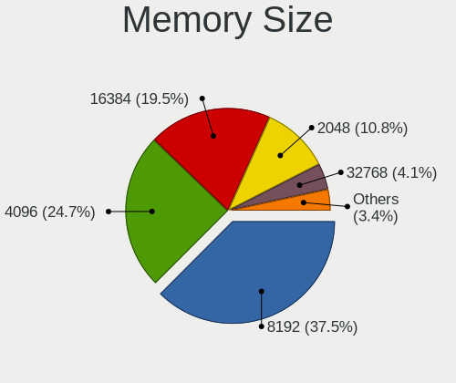

| Size  | Computers | Percent |
|-------|-----------|---------|
| 8192  | 284       | 36.55%  |
| 4096  | 226       | 29.09%  |
| 16384 | 122       | 15.7%   |
| 2048  | 95        | 12.23%  |
| 1024  | 30        | 3.86%   |
| 32768 | 16        | 2.06%   |
| 512   | 4         | 0.51%   |

Memory Speed
------------

Memory module speed

| Speed   | Computers | Percent |
|---------|-----------|---------|
| 1600    | 171       | 21.67%  |
| 2667    | 116       | 14.7%   |
| 3200    | 105       | 13.31%  |
| 2400    | 63        | 7.98%   |
| 1333    | 61        | 7.73%   |
| 2133    | 46        | 5.83%   |
| 667     | 28        | 3.55%   |
| 3600    | 24        | 3.04%   |
| 1334    | 23        | 2.92%   |
| 800     | 16        | 2.03%   |
| Unknown | 13        | 1.65%   |
| 3466    | 12        | 1.52%   |
| 1067    | 11        | 1.39%   |
| 1867    | 10        | 1.27%   |
| 3000    | 8         | 1.01%   |
| 2048    | 8         | 1.01%   |
| 4267    | 7         | 0.89%   |
| 3400    | 7         | 0.89%   |
| 1800    | 7         | 0.89%   |
| 1066    | 7         | 0.89%   |
| 3266    | 6         | 0.76%   |
| 2666    | 6         | 0.76%   |
| 3866    | 4         | 0.51%   |
| 975     | 4         | 0.51%   |
| 533     | 4         | 0.51%   |
| 3100    | 3         | 0.38%   |
| 1866    | 3         | 0.38%   |
| 8400    | 2         | 0.25%   |
| 4199    | 2         | 0.25%   |
| 1639    | 2         | 0.25%   |
| 4800    | 1         | 0.13%   |
| 4266    | 1         | 0.13%   |
| 3666    | 1         | 0.13%   |
| 3067    | 1         | 0.13%   |
| 2933    | 1         | 0.13%   |
| 2733    | 1         | 0.13%   |
| 2134    | 1         | 0.13%   |
| 2000    | 1         | 0.13%   |
| 1777    | 1         | 0.13%   |
| 133     | 1         | 0.13%   |

Printers & scanners
-------------------

Printer Vendor
--------------

Printer device vendors

| Vendor              | Computers | Percent |
|---------------------|-----------|---------|
| Hewlett-Packard     | 18        | 43.9%   |
| Brother Industries  | 8         | 19.51%  |
| Canon               | 5         | 12.2%   |
| Seiko Epson         | 3         | 7.32%   |
| Samsung Electronics | 3         | 7.32%   |
| Ricoh               | 1         | 2.44%   |
| Prolific Technology | 1         | 2.44%   |
| Kyocera             | 1         | 2.44%   |
| Dymo-CoStar         | 1         | 2.44%   |

Printer Model
-------------

Printer device models

| Model                                                      | Computers | Percent |
|------------------------------------------------------------|-----------|---------|
| Samsung ML-1660 Series                                     | 2         | 4.88%   |
| HP ENVY 4500 series                                        | 2         | 4.88%   |
| HP DeskJet 3630 series                                     | 2         | 4.88%   |
| Seiko Epson WF-3010 Series                                 | 1         | 2.44%   |
| Seiko Epson ET-4750 [WorkForce ET-4750 EcoTank All-in-One] | 1         | 2.44%   |
| Seiko Epson ET-2710 Series                                 | 1         | 2.44%   |
| Samsung SCX-472x Series                                    | 1         | 2.44%   |
| Ricoh SP C250SF                                            | 1         | 2.44%   |
| Prolific PL2305 Parallel Port                              | 1         | 2.44%   |
| Kyocera TASKalfa 250ci                                     | 1         | 2.44%   |
| HP OfficeJet Pro 6960                                      | 1         | 2.44%   |
| HP OfficeJet Pro 69                                        | 1         | 2.44%   |
| HP LaserJet Professional P 1102w                           | 1         | 2.44%   |
| HP LaserJet Pro M148f-M149f                                | 1         | 2.44%   |
| HP LaserJet P4015                                          | 1         | 2.44%   |
| HP LaserJet 1015                                           | 1         | 2.44%   |
| HP EWS UPD                                                 | 1         | 2.44%   |
| HP ENVY Photo 6200 series                                  | 1         | 2.44%   |
| HP ENVY 5540 series                                        | 1         | 2.44%   |
| HP ENVY 4520 series                                        | 1         | 2.44%   |
| HP Deskjet F4500 series                                    | 1         | 2.44%   |
| HP DeskJet F300 series                                     | 1         | 2.44%   |
| HP DeskJet 5650c                                           | 1         | 2.44%   |
| HP DeskJet 5150c                                           | 1         | 2.44%   |
| Dymo-CoStar LabelWriter 450                                | 1         | 2.44%   |
| Canon TS5100 series                                        | 1         | 2.44%   |
| Canon PIXMA MX920 Series                                   | 1         | 2.44%   |
| Canon PIXMA MP240                                          | 1         | 2.44%   |
| Canon MG5700 series                                        | 1         | 2.44%   |
| Canon iP4900 series                                        | 1         | 2.44%   |
| Brother Printer                                            | 1         | 2.44%   |
| Brother MFC-L2710DW series                                 | 1         | 2.44%   |
| Brother MFC-J491DW                                         | 1         | 2.44%   |
| Brother HL-4150CDN series                                  | 1         | 2.44%   |
| Brother HL-2030 Laser Printer                              | 1         | 2.44%   |
| Brother DCP-L2520DW                                        | 1         | 2.44%   |
| Brother DCP-J140W                                          | 1         | 2.44%   |
| Brother DCP-9015CDW                                        | 1         | 2.44%   |

Scanner Vendor
--------------

Scanner device vendors

| Vendor          | Computers | Percent |
|-----------------|-----------|---------|
| Seiko Epson     | 5         | 33.33%  |
| Hewlett-Packard | 5         | 33.33%  |
| Canon           | 4         | 26.67%  |
| AGFA-Gevaert NV | 1         | 6.67%   |

Scanner Model
-------------

Scanner device models

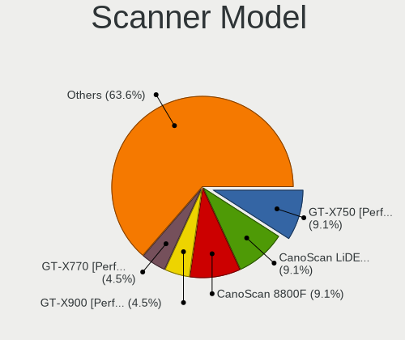

| Model                                                   | Computers | Percent |
|---------------------------------------------------------|-----------|---------|
| Seiko Epson GT-X900 [Perfection V700/V750 Photo]        | 1         | 6.67%   |
| Seiko Epson GT-X750 [Perfection 4490 Photo]             | 1         | 6.67%   |
| Seiko Epson GT-F730 [GT-S630/Perfection V33/V330 Photo] | 1         | 6.67%   |
| Seiko Epson GT-F700 [Perfection V350]                   | 1         | 6.67%   |
| Seiko Epson GT-7300U [Perfection 1260/1260 PHOTO]       | 1         | 6.67%   |
| HP scanjet 8270                                         | 1         | 6.67%   |
| HP ScanJet 4370                                         | 1         | 6.67%   |
| HP ScanJet 3800c                                        | 1         | 6.67%   |
| HP ScanJet 3670                                         | 1         | 6.67%   |
| HP ScanJet 3400cse                                      | 1         | 6.67%   |
| Canon CanoScan N670U/N676U/LiDE 20                      | 1         | 6.67%   |
| Canon CanoScan LiDE 210                                 | 1         | 6.67%   |
| Canon CanoScan LiDE 110                                 | 1         | 6.67%   |
| Canon CanoScan 3200F                                    | 1         | 6.67%   |
| AGFA-Gevaert NV Snapscan e40                            | 1         | 6.67%   |

Camera
------

Camera Vendor
-------------

Camera device vendors

| Vendor                                 | Computers | Percent |
|----------------------------------------|-----------|---------|
| Chicony Electronics                    | 197       | 23.29%  |
| Microdia                               | 94        | 11.11%  |
| Realtek Semiconductor                  | 72        | 8.51%   |
| Logitech                               | 64        | 7.57%   |
| IMC Networks                           | 59        | 6.97%   |
| Acer                                   | 58        | 6.86%   |
| Sunplus Innovation Technology          | 42        | 4.96%   |
| Suyin                                  | 30        | 3.55%   |
| Lite-On Technology                     | 30        | 3.55%   |
| Quanta                                 | 26        | 3.07%   |
| Cheng Uei Precision Industry (Foxlink) | 26        | 3.07%   |
| Syntek                                 | 23        | 2.72%   |
| Apple                                  | 21        | 2.48%   |
| Alcor Micro                            | 13        | 1.54%   |
| Ricoh                                  | 12        | 1.42%   |
| Luxvisions Innotech Limited            | 9         | 1.06%   |
| Samsung Electronics                    | 7         | 0.83%   |
| Silicon Motion                         | 5         | 0.59%   |
| Lenovo                                 | 4         | 0.47%   |
| Creative Technology                    | 4         | 0.47%   |
| Z-Star Microelectronics                | 3         | 0.35%   |
| Trust                                  | 3         | 0.35%   |
| Primax Electronics                     | 3         | 0.35%   |
| Microsoft                              | 3         | 0.35%   |
| Importek                               | 3         | 0.35%   |
| Generalplus Technology                 | 3         | 0.35%   |
| WaveRider Communications               | 2         | 0.24%   |
| Technologies                           | 2         | 0.24%   |
| Sunplus Technology                     | 2         | 0.24%   |
| KYE Systems (Mouse Systems)            | 2         | 0.24%   |
| Jieli Technology                       | 2         | 0.24%   |
| ALi                                    | 2         | 0.24%   |
| Valve Software                         | 1         | 0.12%   |
| Sweex                                  | 1         | 0.12%   |
| SunplusIT                              | 1         | 0.12%   |
| Pixart Imaging                         | 1         | 0.12%   |
| Panasonic (Matsushita)                 | 1         | 0.12%   |
| OmniVision Technologies                | 1         | 0.12%   |
| Novatek Microelectronics               | 1         | 0.12%   |
| Nokia Mobile Phones                    | 1         | 0.12%   |

Camera Model
------------

Camera device models

| Model                                    | Computers | Percent |
|------------------------------------------|-----------|---------|
| Realtek Integrated_Webcam_HD             | 32        | 3.76%   |
| Microdia Integrated_Webcam_HD            | 29        | 3.41%   |
| Chicony Integrated Camera                | 27        | 3.17%   |
| IMC Networks Integrated Camera           | 25        | 2.94%   |
| Acer Integrated Camera                   | 17        | 2%      |
| Microdia Integrated Webcam               | 16        | 1.88%   |
| Chicony HD WebCam                        | 15        | 1.76%   |
| Syntek Integrated Camera                 | 13        | 1.53%   |
| IMC Networks USB2.0 HD UVC WebCam        | 12        | 1.41%   |
| Chicony HP HD Webcam                     | 12        | 1.41%   |
| Realtek USB Camera                       | 11        | 1.29%   |
| Logitech HD Webcam C525                  | 10        | 1.18%   |
| Lite-On HP HD Camera                     | 10        | 1.18%   |
| Chicony USB2.0 Camera                    | 10        | 1.18%   |
| Chicony HP Wide Vision HD Camera         | 10        | 1.18%   |
| Lite-On Integrated Camera                | 9         | 1.06%   |
| Sunplus HD WebCam                        | 8         | 0.94%   |
| Chicony USB2.0 HD UVC WebCam             | 8         | 0.94%   |
| Chicony TOSHIBA Web Camera - HD          | 8         | 0.94%   |
| Chicony HP HD Camera                     | 8         | 0.94%   |
| Acer BisonCam, NB Pro                    | 8         | 0.94%   |
| Samsung Galaxy A5 (MTP)                  | 7         | 0.82%   |
| Microdia Camera                          | 7         | 0.82%   |
| Logitech Webcam C270                     | 7         | 0.82%   |
| Logitech C922 Pro Stream Webcam          | 7         | 0.82%   |
| Chicony Integrated Camera (1280x720@30)  | 7         | 0.82%   |
| Chicony EasyCamera                       | 7         | 0.82%   |
| Apple iPhone5/5C/5S/6                    | 7         | 0.82%   |
| Apple Built-in iSight                    | 7         | 0.82%   |
| Acer BisonCam,NB Pro                     | 7         | 0.82%   |
| Suyin Acer/HP Integrated Webcam [CN0314] | 6         | 0.71%   |
| Quanta HP HD Camera                      | 6         | 0.71%   |
| Microdia Laptop_Integrated_Webcam_2M     | 6         | 0.71%   |
| Logitech HD Pro Webcam C920              | 6         | 0.71%   |
| Lite-On HP HD Webcam                     | 6         | 0.71%   |
| Chicony USB 2.0 Camera                   | 6         | 0.71%   |
| Chicony Integrated HP HD Webcam          | 6         | 0.71%   |
| Acer HD Webcam                           | 6         | 0.71%   |
| Sunplus ASUS USB2.0 Webcam               | 5         | 0.59%   |
| Realtek USB2.0 VGA UVC WebCam            | 5         | 0.59%   |

Security
--------

Fingerprint Vendor
------------------

Fingerprint sensor vendors

| Vendor                     | Computers | Percent |
|----------------------------|-----------|---------|
| Synaptics                  | 65        | 36.11%  |
| Validity Sensors           | 63        | 35%     |
| Shenzhen Goodix Technology | 17        | 9.44%   |
| AuthenTec                  | 13        | 7.22%   |
| LighTuning Technology      | 9         | 5%      |
| STMicroelectronics         | 6         | 3.33%   |
| Upek                       | 4         | 2.22%   |
| Elan Microelectronics      | 2         | 1.11%   |
| DigitalPersona             | 1         | 0.56%   |

Fingerprint Model
-----------------

Fingerprint sensor models

| Model                                                                      | Computers | Percent |
|----------------------------------------------------------------------------|-----------|---------|
| Validity Sensors VFS495 Fingerprint Reader                                 | 26        | 14.44%  |
| Synaptics Prometheus MIS Touch Fingerprint Reader                          | 21        | 11.67%  |
| Unknown                                                                    | 17        | 9.44%   |
| Shenzhen Goodix  FingerPrint Device                                        | 7         | 3.89%   |
| Shenzhen Goodix Fingerprint Reader                                         | 7         | 3.89%   |
| Synaptics  WBDI                                                            | 6         | 3.33%   |
| Synaptics  VFS7552 Touch Fingerprint Sensor with PurePrint                 | 6         | 3.33%   |
| STMicroelectronics Fingerprint Reader                                      | 6         | 3.33%   |
| LighTuning EgisTec Touch Fingerprint Sensor                                | 6         | 3.33%   |
| AuthenTec AES2501 Fingerprint Sensor                                       | 6         | 3.33%   |
| Validity Sensors VFS5011 Fingerprint Reader                                | 5         | 2.78%   |
| Validity Sensors VFS451 Fingerprint Reader                                 | 5         | 2.78%   |
| Validity Sensors VFS 5011 fingerprint sensor                               | 5         | 2.78%   |
| Synaptics Metallica MOH Touch Fingerprint Reader                           | 5         | 2.78%   |
| Synaptics Metallica MIS Touch Fingerprint Reader                           | 5         | 2.78%   |
| Validity Sensors VFS471 Fingerprint Reader                                 | 4         | 2.22%   |
| Upek Biometric Touchchip/Touchstrip Fingerprint Sensor                     | 4         | 2.22%   |
| AuthenTec AES2810                                                          | 4         | 2.22%   |
| Validity Sensors VFS491                                                    | 3         | 1.67%   |
| Synaptics WBDI Device                                                      | 3         | 1.67%   |
| Shenzhen Goodix FingerPrint                                                | 3         | 1.67%   |
| AuthenTec AES1600                                                          | 3         | 1.67%   |
| Validity Sensors VFS7552 Touch Fingerprint Sensor                          | 2         | 1.11%   |
| Validity Sensors VFS7500 Touch Fingerprint Sensor                          | 2         | 1.11%   |
| Validity Sensors VFS101 Fingerprint Reader                                 | 2         | 1.11%   |
| Validity Sensors VFS Fingerprint sensor                                    | 2         | 1.11%   |
| Validity Sensors Synaptics VFS7552 Touch Fingerprint Sensor with PurePrint | 2         | 1.11%   |
| Validity Sensors Fingerprint scanner                                       | 2         | 1.11%   |
| Synaptics  FS7604 Touch Fingerprint Sensor with PurePrint                  | 2         | 1.11%   |
| LighTuning Fingerprint Reader                                              | 2         | 1.11%   |
| Validity Sensors VFS301 Fingerprint Reader                                 | 1         | 0.56%   |
| Validity Sensors VFS300 Fingerprint Reader                                 | 1         | 0.56%   |
| Validity Sensors Synaptics WBDI                                            | 1         | 0.56%   |
| LighTuning ES603 Swipe Fingerprint Sensor                                  | 1         | 0.56%   |
| Elan ELAN:Fingerprint                                                      | 1         | 0.56%   |
| Elan ELAN:ARM-M4                                                           | 1         | 0.56%   |
| DigitalPersona Fingerprint Reader                                          | 1         | 0.56%   |

Chipcard Vendor
---------------

Chipcard module vendors

| Vendor                            | Computers | Percent |
|-----------------------------------|-----------|---------|
| Broadcom                          | 49        | 31.61%  |
| Alcor Micro                       | 41        | 26.45%  |
| VASCO Data Security International | 18        | 11.61%  |
| O2 Micro                          | 13        | 8.39%   |
| Realtek Semiconductor             | 12        | 7.74%   |
| Lenovo                            | 8         | 5.16%   |
| OmniKey                           | 3         | 1.94%   |
| Advanced Card Systems             | 3         | 1.94%   |
| Upek                              | 2         | 1.29%   |
| Yubico.com                        | 1         | 0.65%   |
| SCM Microsystems                  | 1         | 0.65%   |
| Integrated Technology Express     | 1         | 0.65%   |
| Gemalto (was Gemplus)             | 1         | 0.65%   |
| Clay Logic                        | 1         | 0.65%   |
| Cherry                            | 1         | 0.65%   |

Chipcard Model
--------------

Chipcard module models

| Model                                                                        | Computers | Percent |
|------------------------------------------------------------------------------|-----------|---------|
| Alcor Micro AU9540 Smartcard Reader                                          | 40        | 25.81%  |
| Broadcom BCM5880 Secure Applications Processor                               | 15        | 9.68%   |
| Broadcom 58200                                                               | 15        | 9.68%   |
| Realtek Semiconductor Smart Card Reader Interface                            | 12        | 7.74%   |
| Broadcom 5880                                                                | 11        | 7.1%    |
| VASCO Data Security International Digipass 905 SmartCard Reader              | 10        | 6.45%   |
| O2 Micro OZ776 CCID Smartcard Reader                                         | 10        | 6.45%   |
| VASCO Data Security International DIGIPASS 870                               | 8         | 5.16%   |
| Lenovo Integrated Smart Card Reader                                          | 8         | 5.16%   |
| Broadcom BCM5880 Secure Applications Processor with fingerprint swipe sensor | 8         | 5.16%   |
| O2 Micro Oz776 SmartCard Reader                                              | 3         | 1.94%   |
| Advanced Card Systems ACR38 SmartCard Reader                                 | 3         | 1.94%   |
| Upek TouchChip Fingerprint Coprocessor (WBF advanced mode)                   | 2         | 1.29%   |
| OmniKey CardMan 3021 / 3121                                                  | 2         | 1.29%   |
| Yubico.com Yubikey 4/5 U2F+CCID                                              | 1         | 0.65%   |
| SCM Microsystems SCR3340 - ExpressCard54 Smart Card Reader                   | 1         | 0.65%   |
| OmniKey CardMan 4321                                                         | 1         | 0.65%   |
| Integrated Technology Express SmartCard Reader                               | 1         | 0.65%   |
| Gemalto (was Gemplus) Compact Smart Card Reader Writer                       | 1         | 0.65%   |
| Clay Logic Nitrokey Start                                                    | 1         | 0.65%   |
| Cherry SmartCard Reader Keyboard KC 1000 SC                                  | 1         | 0.65%   |
| Alcor Micro Watchdata W 1981                                                 | 1         | 0.65%   |

Unsupported
-----------

Unsupported Devices
-------------------

Total unsupported devices on board

| Total | Computers | Percent |
|-------|-----------|---------|
| 0     | 937       | 65.02%  |
| 1     | 401       | 27.83%  |
| 2     | 82        | 5.69%   |
| 3     | 13        | 0.9%    |
| 4     | 5         | 0.35%   |
| 6     | 2         | 0.14%   |
| 5     | 1         | 0.07%   |

Unsupported Device Types
------------------------

Types of unsupported devices

| Type                     | Computers | Percent |
|--------------------------|-----------|---------|
| Fingerprint reader       | 177       | 29.65%  |
| Graphics card            | 109       | 18.26%  |
| Chipcard                 | 107       | 17.92%  |
| Net/wireless             | 53        | 8.88%   |
| Multimedia controller    | 33        | 5.53%   |
| Communication controller | 22        | 3.69%   |
| Unassigned class         | 16        | 2.68%   |
| Camera                   | 13        | 2.18%   |
| Bluetooth                | 13        | 2.18%   |
| Card reader              | 12        | 2.01%   |
| Storage                  | 11        | 1.84%   |
| Net/ethernet             | 9         | 1.51%   |
| Sound                    | 8         | 1.34%   |
| Flash memory             | 4         | 0.67%   |
| Network                  | 3         | 0.5%    |
| Modem                    | 3         | 0.5%    |
| Dvb card                 | 2         | 0.34%   |
| Storage/raid             | 1         | 0.17%   |
| Storage/ide              | 1         | 0.17%   |

