Linux in Belgium - Tested Hardware & Statistics (Desktops)
----------------------------------------------------------

A project to collect tested hardware configurations for Linux in Belgium.

Anyone can contribute to this report by the [hw-probe](https://github.com/linuxhw/hw-probe) tool:

    sudo -E hw-probe -all -upload

Please contribute! Especially if your hardware is rare.

Contents
--------

* [ Test Cases ](#test-cases)

* [ System ](#system)
  - [ OS                       ](#os)
  - [ OS Family                ](#os-family)
  - [ Kernel                   ](#kernel)
  - [ Kernel Family            ](#kernel-family)
  - [ Kernel Major Ver.        ](#kernel-major-ver)
  - [ Arch                     ](#arch)
  - [ DE                       ](#de)
  - [ Display Server           ](#display-server)
  - [ Display Manager          ](#display-manager)
  - [ OS Lang                  ](#os-lang)
  - [ Boot Mode                ](#boot-mode)
  - [ Filesystem               ](#filesystem)
  - [ Part. scheme             ](#part-scheme)
  - [ Dual Boot with Linux/BSD ](#dual-boot-with-linuxbsd)
  - [ Dual Boot (Win)          ](#dual-boot-win)

* [ Board ](#board)
  - [ Vendor                   ](#vendor)
  - [ Model                    ](#model)
  - [ Model Family             ](#model-family)
  - [ MFG Year                 ](#mfg-year)
  - [ Form Factor              ](#form-factor)
  - [ Secure Boot              ](#secure-boot)
  - [ Coreboot                 ](#coreboot)
  - [ RAM Size                 ](#ram-size)
  - [ RAM Used                 ](#ram-used)
  - [ Total Drives             ](#total-drives)
  - [ Has CD-ROM               ](#has-cd-rom)
  - [ Has Ethernet             ](#has-ethernet)
  - [ Has WiFi                 ](#has-wifi)
  - [ Has Bluetooth            ](#has-bluetooth)

* [ Location ](#location)
  - [ Country                  ](#country)
  - [ City                     ](#city)

* [ Drives ](#drives)
  - [ Drive Vendor             ](#drive-vendor)
  - [ Drive Model              ](#drive-model)
  - [ HDD Vendor               ](#hdd-vendor)
  - [ SSD Vendor               ](#ssd-vendor)
  - [ Drive Kind               ](#drive-kind)
  - [ Drive Connector          ](#drive-connector)
  - [ Drive Size               ](#drive-size)
  - [ Space Total              ](#space-total)
  - [ Space Used               ](#space-used)
  - [ Malfunc. Drives          ](#malfunc-drives)
  - [ Malfunc. Drive Vendor    ](#malfunc-drive-vendor)
  - [ Malfunc. HDD Vendor      ](#malfunc-hdd-vendor)
  - [ Malfunc. Drive Kind      ](#malfunc-drive-kind)
  - [ Failed Drives            ](#failed-drives)
  - [ Failed Drive Vendor      ](#failed-drive-vendor)
  - [ Drive Status             ](#drive-status)

* [ Storage controller ](#storage-controller)
  - [ Storage Vendor           ](#storage-vendor)
  - [ Storage Model            ](#storage-model)
  - [ Storage Kind             ](#storage-kind)

* [ Processor ](#processor)
  - [ CPU Vendor               ](#cpu-vendor)
  - [ CPU Model                ](#cpu-model)
  - [ CPU Model Family         ](#cpu-model-family)
  - [ CPU Cores                ](#cpu-cores)
  - [ CPU Sockets              ](#cpu-sockets)
  - [ CPU Threads              ](#cpu-threads)
  - [ CPU Op-Modes             ](#cpu-op-modes)
  - [ CPU Microcode            ](#cpu-microcode)
  - [ CPU Microarch            ](#cpu-microarch)

* [ Graphics ](#graphics)
  - [ GPU Vendor               ](#gpu-vendor)
  - [ GPU Model                ](#gpu-model)
  - [ GPU Combo                ](#gpu-combo)
  - [ GPU Driver               ](#gpu-driver)
  - [ GPU Memory               ](#gpu-memory)

* [ Monitor ](#monitor)
  - [ Monitor Vendor           ](#monitor-vendor)
  - [ Monitor Model            ](#monitor-model)
  - [ Monitor Resolution       ](#monitor-resolution)
  - [ Monitor Diagonal         ](#monitor-diagonal)
  - [ Monitor Width            ](#monitor-width)
  - [ Aspect Ratio             ](#aspect-ratio)
  - [ Monitor Area             ](#monitor-area)
  - [ Pixel Density            ](#pixel-density)
  - [ Multiple Monitors        ](#multiple-monitors)

* [ Network ](#network)
  - [ Net Controller Vendor    ](#net-controller-vendor)
  - [ Net Controller Model     ](#net-controller-model)
  - [ Wireless Vendor          ](#wireless-vendor)
  - [ Wireless Model           ](#wireless-model)
  - [ Ethernet Vendor          ](#ethernet-vendor)
  - [ Ethernet Model           ](#ethernet-model)
  - [ Net Controller Kind      ](#net-controller-kind)
  - [ Used Controller          ](#used-controller)
  - [ NICs                     ](#nics)
  - [ IPv6                     ](#ipv6)

* [ Bluetooth ](#bluetooth)
  - [ Bluetooth Vendor         ](#bluetooth-vendor)
  - [ Bluetooth Model          ](#bluetooth-model)

* [ Sound ](#sound)
  - [ Sound Vendor             ](#sound-vendor)
  - [ Sound Model              ](#sound-model)

* [ Memory ](#memory)
  - [ Memory Vendor            ](#memory-vendor)
  - [ Memory Model             ](#memory-model)
  - [ Memory Kind              ](#memory-kind)
  - [ Memory Form Factor       ](#memory-form-factor)
  - [ Memory Size              ](#memory-size)
  - [ Memory Speed             ](#memory-speed)

* [ Printers & scanners ](#printers--scanners)
  - [ Printer Vendor           ](#printer-vendor)
  - [ Printer Model            ](#printer-model)
  - [ Scanner Vendor           ](#scanner-vendor)
  - [ Scanner Model            ](#scanner-model)

* [ Camera ](#camera)
  - [ Camera Vendor            ](#camera-vendor)
  - [ Camera Model             ](#camera-model)

* [ Security ](#security)
  - [ Fingerprint Vendor       ](#fingerprint-vendor)
  - [ Fingerprint Model        ](#fingerprint-model)
  - [ Chipcard Vendor          ](#chipcard-vendor)
  - [ Chipcard Model           ](#chipcard-model)

* [ Unsupported ](#unsupported)
  - [ Unsupported Devices      ](#unsupported-devices)
  - [ Unsupported Device Types ](#unsupported-device-types)

Test Cases
----------

Total: 1822

| Vendor        | Model                       | Probe                                                      | Date         |
|---------------|-----------------------------|------------------------------------------------------------|--------------|
| ASRock        | AMD BC-250                  | [0842ee9518](https://linux-hardware.org/?probe=0842ee9518) | Jan 03, 2026 |
| MSI           | MAG Z390 TOMAHAWK           | [5f975adfc3](https://linux-hardware.org/?probe=5f975adfc3) | Jan 03, 2026 |
| ASRock        | 990FX Killer                | [992e82d628](https://linux-hardware.org/?probe=992e82d628) | Dec 31, 2025 |
| ASRock        | 990FX Killer                | [d27b76793d](https://linux-hardware.org/?probe=d27b76793d) | Dec 31, 2025 |
| ASUSTek       | PRIME B360-PLUS             | [60a56dbd2a](https://linux-hardware.org/?probe=60a56dbd2a) | Dec 30, 2025 |
| Gigabyte      | X870 AORUS ELITE WIFI7      | [6e610df56f](https://linux-hardware.org/?probe=6e610df56f) | Dec 28, 2025 |
| Acer          | WG43M                       | [37412d99fc](https://linux-hardware.org/?probe=37412d99fc) | Dec 23, 2025 |
| Acer          | WG43M                       | [f186e48545](https://linux-hardware.org/?probe=f186e48545) | Dec 23, 2025 |
| ASRock        | AMD BC-250                  | [b0c1128a45](https://linux-hardware.org/?probe=b0c1128a45) | Dec 22, 2025 |
| GEEKOM        | A7                          | [be7f489463](https://linux-hardware.org/?probe=be7f489463) | Dec 21, 2025 |
| ASUSTek       | ROG STRIX X870E-E GAMING... | [c85229efd0](https://linux-hardware.org/?probe=c85229efd0) | Dec 17, 2025 |
| ASUSTek       | ROG STRIX X870E-E GAMING... | [36f287a9b5](https://linux-hardware.org/?probe=36f287a9b5) | Dec 16, 2025 |
| Intel         | DQ67SW AAG12527-310         | [32db532870](https://linux-hardware.org/?probe=32db532870) | Dec 10, 2025 |
| HP            | 8712                        | [0410e50cae](https://linux-hardware.org/?probe=0410e50cae) | Dec 09, 2025 |
| Intel         | DQ67SW AAG12527-310         | [9180926153](https://linux-hardware.org/?probe=9180926153) | Dec 09, 2025 |
| Dell          | 040DDP A01                  | [c02d0a1769](https://linux-hardware.org/?probe=c02d0a1769) | Dec 07, 2025 |
| Shenzhen M... | F7BAA                       | [702cdb149b](https://linux-hardware.org/?probe=702cdb149b) | Dec 07, 2025 |
| Gigabyte      | Z690 AORUS PRO              | [e08f087d03](https://linux-hardware.org/?probe=e08f087d03) | Dec 06, 2025 |
| ASUSTek       | P8Z77-V                     | [9d2365c48c](https://linux-hardware.org/?probe=9d2365c48c) | Dec 06, 2025 |
| ASUSTek       | P9X79 PRO                   | [fb25fe1df9](https://linux-hardware.org/?probe=fb25fe1df9) | Dec 06, 2025 |
| ASUSTek       | P8Z77-V                     | [2c47257162](https://linux-hardware.org/?probe=2c47257162) | Dec 06, 2025 |
| Medion        | H110H4-EM                   | [dd94d4a416](https://linux-hardware.org/?probe=dd94d4a416) | Dec 04, 2025 |
| MSI           | X470 GAMING PRO CARBON      | [97efeb8ab6](https://linux-hardware.org/?probe=97efeb8ab6) | Dec 01, 2025 |
| PELADN        | WO4                         | [00941e9d60](https://linux-hardware.org/?probe=00941e9d60) | Nov 30, 2025 |
| PELADN        | WO4                         | [b8b383eba9](https://linux-hardware.org/?probe=b8b383eba9) | Nov 30, 2025 |
| Gigabyte      | B550 GAMING X V2            | [b9c9062680](https://linux-hardware.org/?probe=b9c9062680) | Nov 29, 2025 |
| ASUSTek       | PRIME B365-PLUS             | [533dab3435](https://linux-hardware.org/?probe=533dab3435) | Nov 28, 2025 |
| ASUSTek       | PRIME B365-PLUS             | [cf4b2bdff0](https://linux-hardware.org/?probe=cf4b2bdff0) | Nov 28, 2025 |
| ASUSTek       | P8Z77-V                     | [94d66e9d04](https://linux-hardware.org/?probe=94d66e9d04) | Nov 22, 2025 |
| ASUSTek       | P8Z77-V                     | [05aa16e740](https://linux-hardware.org/?probe=05aa16e740) | Nov 22, 2025 |
| ASUSTek       | TUF Gaming A620M-PLUS WI... | [72198e2201](https://linux-hardware.org/?probe=72198e2201) | Nov 20, 2025 |
| ASUSTek       | TUF Gaming A620M-PLUS WI... | [975c31fa8c](https://linux-hardware.org/?probe=975c31fa8c) | Nov 20, 2025 |
| Gigabyte      | X670 AORUS ELITE AX         | [278f988650](https://linux-hardware.org/?probe=278f988650) | Nov 19, 2025 |
| ASUSTek       | ROG STRIX B650E-F GAMING... | [8945eb3fa1](https://linux-hardware.org/?probe=8945eb3fa1) | Nov 18, 2025 |
| Unknown       | Unknown                     | [330b6045ea](https://linux-hardware.org/?probe=330b6045ea) | Nov 16, 2025 |
| ASRock        | A320M-HDV R4.0              | [98b7f5d5a5](https://linux-hardware.org/?probe=98b7f5d5a5) | Nov 16, 2025 |
| MSI           | MAG B550 TOMAHAWK           | [2e9cfc2f36](https://linux-hardware.org/?probe=2e9cfc2f36) | Nov 15, 2025 |
| HP            | 83EF                        | [f1d1cb1f07](https://linux-hardware.org/?probe=f1d1cb1f07) | Nov 12, 2025 |
| MSI           | Z370 PC PRO                 | [7cdba62051](https://linux-hardware.org/?probe=7cdba62051) | Nov 11, 2025 |
| Dell          | 0X37H9 A01                  | [4a386808b3](https://linux-hardware.org/?probe=4a386808b3) | Nov 10, 2025 |
| Intel         | A320M-I                     | [4d66863c39](https://linux-hardware.org/?probe=4d66863c39) | Nov 10, 2025 |
| Packard Be... | EG43M                       | [41f0558358](https://linux-hardware.org/?probe=41f0558358) | Nov 07, 2025 |
| Packard Be... | EG43M                       | [47dfb865a4](https://linux-hardware.org/?probe=47dfb865a4) | Nov 05, 2025 |
| MACHINIST     | X99 PR9                     | [1306dba6a7](https://linux-hardware.org/?probe=1306dba6a7) | Nov 05, 2025 |
| MSI           | MPG B550 GAMING PLUS        | [837c457a91](https://linux-hardware.org/?probe=837c457a91) | Nov 04, 2025 |
| ASRock        | A320M-HDV R4.0              | [d6f820e452](https://linux-hardware.org/?probe=d6f820e452) | Nov 03, 2025 |
| ASUSTek       | H97M-PLUS                   | [d713f326f0](https://linux-hardware.org/?probe=d713f326f0) | Nov 03, 2025 |
| ASUSTek       | ROG STRIX B550-F GAMING ... | [8dd56ad9f8](https://linux-hardware.org/?probe=8dd56ad9f8) | Oct 28, 2025 |
| ASRock        | X670E Taichi                | [33d6d16a57](https://linux-hardware.org/?probe=33d6d16a57) | Oct 27, 2025 |
| Lenovo        | SDK0E50510 WIN              | [9f16f7bb01](https://linux-hardware.org/?probe=9f16f7bb01) | Oct 25, 2025 |
| ASUSTek       | TUF Gaming B550-PLUS        | [3053fb0bdd](https://linux-hardware.org/?probe=3053fb0bdd) | Oct 25, 2025 |
| Elo Touch ... | CoffeeLake WPP5             | [0e7fb8913c](https://linux-hardware.org/?probe=0e7fb8913c) | Oct 22, 2025 |
| Gigabyte      | B550 AORUS ELITE V2         | [68a6e9ed7d](https://linux-hardware.org/?probe=68a6e9ed7d) | Oct 21, 2025 |
| Unknown       | Unknown                     | [4c976ef808](https://linux-hardware.org/?probe=4c976ef808) | Oct 21, 2025 |
| MSI           | MAG B650 TOMAHAWK WIFI      | [34972e35a1](https://linux-hardware.org/?probe=34972e35a1) | Oct 19, 2025 |
| ASRock        | X670E Taichi                | [faeec61f32](https://linux-hardware.org/?probe=faeec61f32) | Oct 17, 2025 |
| MSI           | H81M-P33                    | [c6a5f7702a](https://linux-hardware.org/?probe=c6a5f7702a) | Oct 15, 2025 |
| Packard Be... | EG43M                       | [cf580db9f9](https://linux-hardware.org/?probe=cf580db9f9) | Oct 13, 2025 |
| ASUSTek       | ROG STRIX B550-E GAMING     | [7519bda270](https://linux-hardware.org/?probe=7519bda270) | Oct 12, 2025 |
| ASUSTek       | TUF Gaming B650-PLUS WIF... | [a5e13d7bb7](https://linux-hardware.org/?probe=a5e13d7bb7) | Oct 11, 2025 |
| ASUSTek       | B85M-G                      | [0670a71940](https://linux-hardware.org/?probe=0670a71940) | Oct 09, 2025 |
| Gigabyte      | B650 EAGLE                  | [f94a1e9b38](https://linux-hardware.org/?probe=f94a1e9b38) | Oct 09, 2025 |
| HP            | 859C                        | [44af9f9a3d](https://linux-hardware.org/?probe=44af9f9a3d) | Oct 01, 2025 |
| HP            | 8455                        | [65d42356d5](https://linux-hardware.org/?probe=65d42356d5) | Oct 01, 2025 |
| ASUSTek       | ROG STRIX B550-A GAMING     | [5eea17a71a](https://linux-hardware.org/?probe=5eea17a71a) | Sep 30, 2025 |
| Gigabyte      | Z170-HD3P-CF                | [d3740e4d28](https://linux-hardware.org/?probe=d3740e4d28) | Sep 27, 2025 |
| MACHINST      | X99-K9 V5.1                 | [1dd6b48ebc](https://linux-hardware.org/?probe=1dd6b48ebc) | Sep 26, 2025 |
| ASUSTek       | Z87-A                       | [3ea8e65e34](https://linux-hardware.org/?probe=3ea8e65e34) | Sep 23, 2025 |
| ASUSTek       | B85M-G                      | [1e2ef255b9](https://linux-hardware.org/?probe=1e2ef255b9) | Sep 23, 2025 |
| Fujitsu       | D3501-A1 S26361-D3501-A1    | [b2ebfed823](https://linux-hardware.org/?probe=b2ebfed823) | Sep 18, 2025 |
| MSI           | X870 GAMING PLUS WIFI       | [8c67fdd83b](https://linux-hardware.org/?probe=8c67fdd83b) | Sep 17, 2025 |
| AZW           | GTi                         | [c42393126b](https://linux-hardware.org/?probe=c42393126b) | Sep 16, 2025 |
| Packard Be... | EG43M                       | [4ec1791d6a](https://linux-hardware.org/?probe=4ec1791d6a) | Sep 15, 2025 |
| Fujitsu       | D3501-A1 S26361-D3501-A1    | [1be357c279](https://linux-hardware.org/?probe=1be357c279) | Sep 11, 2025 |
| Medion        | H110H4-EM                   | [9736aa70f5](https://linux-hardware.org/?probe=9736aa70f5) | Sep 09, 2025 |
| MSI           | Z97 GAMING 5                | [64bcd11a7d](https://linux-hardware.org/?probe=64bcd11a7d) | Sep 08, 2025 |
| MSI           | Z97 GAMING 5                | [235f45fbf4](https://linux-hardware.org/?probe=235f45fbf4) | Sep 07, 2025 |
| Fujitsu       | D3501-A1 S26361-D3501-A1    | [900d5d340d](https://linux-hardware.org/?probe=900d5d340d) | Sep 04, 2025 |
| ASRock        | H610M-HVS/M.2 R2.0          | [3b64b41036](https://linux-hardware.org/?probe=3b64b41036) | Sep 04, 2025 |
| Fujitsu       | D3501-A1 S26361-D3501-A1    | [22e5618df3](https://linux-hardware.org/?probe=22e5618df3) | Sep 03, 2025 |
| MSI           | P67A-G45                    | [6a6ede8125](https://linux-hardware.org/?probe=6a6ede8125) | Sep 03, 2025 |
| ASRock        | H610M-HVS/M.2 R2.0          | [4dd994009b](https://linux-hardware.org/?probe=4dd994009b) | Sep 03, 2025 |
| ASUSTek       | ROG STRIX B650E-F GAMING... | [f69a8160e7](https://linux-hardware.org/?probe=f69a8160e7) | Sep 03, 2025 |
| Gigabyte      | B550 GAMING X V2            | [0b0f9a749a](https://linux-hardware.org/?probe=0b0f9a749a) | Sep 02, 2025 |
| Lenovo        | 3743 SDK0T76463 WIN 3422... | [bd3d862684](https://linux-hardware.org/?probe=bd3d862684) | Sep 02, 2025 |
| HP            | 2129                        | [dd7041bd4f](https://linux-hardware.org/?probe=dd7041bd4f) | Aug 31, 2025 |
| MSI           | B150M BAZOOKA               | [5ba21b2108](https://linux-hardware.org/?probe=5ba21b2108) | Aug 30, 2025 |
| Gigabyte      | X670 AORUS ELITE AX         | [7998d8f990](https://linux-hardware.org/?probe=7998d8f990) | Aug 30, 2025 |
| ASUSTek       | ROG STRIX B550-F GAMING     | [53155a213b](https://linux-hardware.org/?probe=53155a213b) | Aug 28, 2025 |
| ASUSTek       | ROG STRIX B550-F GAMING     | [5629e5121b](https://linux-hardware.org/?probe=5629e5121b) | Aug 28, 2025 |
| AZW           | GTi                         | [5e53a9fac8](https://linux-hardware.org/?probe=5e53a9fac8) | Aug 28, 2025 |
| Gigabyte      | X670 AORUS ELITE AX         | [f40cf0fa59](https://linux-hardware.org/?probe=f40cf0fa59) | Aug 28, 2025 |
| ASUSTek       | TUF Gaming B550-PLUS        | [00ffcce761](https://linux-hardware.org/?probe=00ffcce761) | Aug 23, 2025 |
| Apple         | Mac-27AD2F918AE68F61 Mac... | [2e82b73b7d](https://linux-hardware.org/?probe=2e82b73b7d) | Aug 21, 2025 |
| ASUSTek       | PRIME B350M-A               | [7349980cf3](https://linux-hardware.org/?probe=7349980cf3) | Aug 19, 2025 |
| MSI           | X58 Pro-E                   | [e1745df637](https://linux-hardware.org/?probe=e1745df637) | Aug 14, 2025 |
| ASUSTek       | ROG STRIX B550-I GAMING     | [e54b72c85d](https://linux-hardware.org/?probe=e54b72c85d) | Aug 12, 2025 |
| MSI           | PRO Z790-A MAX WIFI         | [b55f307744](https://linux-hardware.org/?probe=b55f307744) | Aug 11, 2025 |
| ASUSTek       | B85M-E                      | [a1e61f99bc](https://linux-hardware.org/?probe=a1e61f99bc) | Aug 09, 2025 |
| Gigabyte      | B650 AORUS ELITE AX V2      | [dbf55d508a](https://linux-hardware.org/?probe=dbf55d508a) | Aug 09, 2025 |
| Gigabyte      | B650 AORUS ELITE AX V2      | [2a0df3686c](https://linux-hardware.org/?probe=2a0df3686c) | Aug 09, 2025 |
| MSI           | MAG X870E TOMAHAWK WIFI     | [fa5146c4a9](https://linux-hardware.org/?probe=fa5146c4a9) | Aug 08, 2025 |
| ASRock        | FM2A68M-HD+                 | [764bbcca14](https://linux-hardware.org/?probe=764bbcca14) | Aug 07, 2025 |
| ASUSTek       | ROG STRIX B650E-E GAMING... | [0dd1b84b33](https://linux-hardware.org/?probe=0dd1b84b33) | Aug 07, 2025 |
| MSI           | X870 GAMING PLUS WIFI       | [60ad4511c8](https://linux-hardware.org/?probe=60ad4511c8) | Aug 06, 2025 |
| Gigabyte      | X570S AORUS ELITE AX        | [1dc8d65c08](https://linux-hardware.org/?probe=1dc8d65c08) | Aug 05, 2025 |
| Gigabyte      | X570S AORUS ELITE AX        | [84df0fb6cc](https://linux-hardware.org/?probe=84df0fb6cc) | Aug 05, 2025 |
| MSI           | H87-G43 GAMING              | [64378f3067](https://linux-hardware.org/?probe=64378f3067) | Aug 05, 2025 |
| Shenzhen M... | DRFXI                       | [5c6dec04be](https://linux-hardware.org/?probe=5c6dec04be) | Aug 03, 2025 |
| ASUSTek       | ROG STRIX B550-F GAMING     | [c4da84b8f1](https://linux-hardware.org/?probe=c4da84b8f1) | Jul 31, 2025 |
| HP            | 843B                        | [843c080cd4](https://linux-hardware.org/?probe=843c080cd4) | Jul 31, 2025 |
| Gigabyte      | X870 EAGLE WIFI7            | [44335b8804](https://linux-hardware.org/?probe=44335b8804) | Jul 30, 2025 |
| MSI           | PRO Z690-A DDR4             | [dd167ad1e1](https://linux-hardware.org/?probe=dd167ad1e1) | Jul 23, 2025 |
| Dell          | 0HD5W2 A01                  | [72eac0f69a](https://linux-hardware.org/?probe=72eac0f69a) | Jul 23, 2025 |
| ASUSTek       | ProArt X870E-CREATOR WIF... | [9d59682d72](https://linux-hardware.org/?probe=9d59682d72) | Jul 22, 2025 |
| HP            | 18E4                        | [0dcdefc77d](https://linux-hardware.org/?probe=0dcdefc77d) | Jul 21, 2025 |
| Dell          | 0HD5W2 A01                  | [0a3df62cef](https://linux-hardware.org/?probe=0a3df62cef) | Jul 21, 2025 |
| Dell          | 0HD5W2 A01                  | [0e46376004](https://linux-hardware.org/?probe=0e46376004) | Jul 19, 2025 |
| ASRock        | X670E Taichi                | [70397f2493](https://linux-hardware.org/?probe=70397f2493) | Jul 18, 2025 |
| Gigabyte      | EX58-UD3R                   | [1d61b44d90](https://linux-hardware.org/?probe=1d61b44d90) | Jul 17, 2025 |
| Intel         | H81                         | [b664c2e644](https://linux-hardware.org/?probe=b664c2e644) | Jul 16, 2025 |
| Intel         | H81                         | [189e94ea4e](https://linux-hardware.org/?probe=189e94ea4e) | Jul 16, 2025 |
| ASRock        | B850M Riptide WiFi          | [6ab1335608](https://linux-hardware.org/?probe=6ab1335608) | Jul 13, 2025 |
| Dell          | 0HD5W2 A01                  | [327069513b](https://linux-hardware.org/?probe=327069513b) | Jul 11, 2025 |
| ASUSTek       | Z97-C                       | [e926a6f2da](https://linux-hardware.org/?probe=e926a6f2da) | Jul 07, 2025 |
| Gigabyte      | H55M-D2H                    | [56201c6cff](https://linux-hardware.org/?probe=56201c6cff) | Jul 03, 2025 |
| Fujitsu       | D3501-A1 S26361-D3501-A1    | [3df759e5ab](https://linux-hardware.org/?probe=3df759e5ab) | Jul 03, 2025 |
| Unknown       | Unknown                     | [2b61a7a3b6](https://linux-hardware.org/?probe=2b61a7a3b6) | Jul 02, 2025 |
| ASUSTek       | Z97-C                       | [b9cd4c3775](https://linux-hardware.org/?probe=b9cd4c3775) | Jul 02, 2025 |
| ASUSTek       | ROG STRIX B550-A GAMING     | [04f2a9918d](https://linux-hardware.org/?probe=04f2a9918d) | Jul 02, 2025 |
| ASUSTek       | ROG STRIX B650E-F GAMING... | [5bd6b6b75a](https://linux-hardware.org/?probe=5bd6b6b75a) | Jul 01, 2025 |
| ASUSTek       | ROG STRIX B450-F GAMING     | [a2660777d6](https://linux-hardware.org/?probe=a2660777d6) | Jun 30, 2025 |
| ASUSTek       | ROG STRIX B450-F GAMING     | [c499fd78d3](https://linux-hardware.org/?probe=c499fd78d3) | Jun 30, 2025 |
| Shenzhen D... | MP100                       | [f11670d018](https://linux-hardware.org/?probe=f11670d018) | Jun 29, 2025 |
| MSI           | B450 GAMING PLUS MAX        | [0d4bcdf8ca](https://linux-hardware.org/?probe=0d4bcdf8ca) | Jun 28, 2025 |
| Shenzhen D... | MP100                       | [c40f155e3c](https://linux-hardware.org/?probe=c40f155e3c) | Jun 26, 2025 |
| Gigabyte      | B550 GAMING X V2            | [dc4f99677f](https://linux-hardware.org/?probe=dc4f99677f) | Jun 23, 2025 |
| ASUSTek       | Z87-A                       | [e8c6dc53c4](https://linux-hardware.org/?probe=e8c6dc53c4) | Jun 20, 2025 |
| ASRock        | Z790 Pro RS                 | [8d3d8013c4](https://linux-hardware.org/?probe=8d3d8013c4) | Jun 19, 2025 |
| GIGAIPC       | QBip-N97A                   | [45067903db](https://linux-hardware.org/?probe=45067903db) | Jun 18, 2025 |
| MSI           | MAG B550M MORTAR WIFI       | [b26c41f9dc](https://linux-hardware.org/?probe=b26c41f9dc) | Jun 15, 2025 |
| MSI           | MPG X670E CARBON WIFI       | [58955a6730](https://linux-hardware.org/?probe=58955a6730) | Jun 14, 2025 |
| MSI           | MAG B550 TOMAHAWK           | [b2c7cc6a93](https://linux-hardware.org/?probe=b2c7cc6a93) | Jun 12, 2025 |
| Dell          | 0WMJ54 A01                  | [fdb689c5fd](https://linux-hardware.org/?probe=fdb689c5fd) | Jun 11, 2025 |
| Dell          | 0HD5W2 A01                  | [9f3da2b16c](https://linux-hardware.org/?probe=9f3da2b16c) | Jun 11, 2025 |
| ASRock        | B850I Lightning WiFi        | [bfb26463b5](https://linux-hardware.org/?probe=bfb26463b5) | Jun 09, 2025 |
| ASUSTek       | H170M-PLUS                  | [0607f8a643](https://linux-hardware.org/?probe=0607f8a643) | Jun 09, 2025 |
| ASRock        | X670E PG Lightning          | [db1ef63954](https://linux-hardware.org/?probe=db1ef63954) | Jun 08, 2025 |
| Dell          | 0M9KCM A02                  | [311fba5044](https://linux-hardware.org/?probe=311fba5044) | Jun 07, 2025 |
| Dell          | 0M9KCM A02                  | [0ad0755d97](https://linux-hardware.org/?probe=0ad0755d97) | Jun 07, 2025 |
| Unknown       | HX90                        | [a9e6661435](https://linux-hardware.org/?probe=a9e6661435) | Jun 06, 2025 |
| Gigabyte      | X470 AORUS ULTRA GAMING-... | [0f88c24377](https://linux-hardware.org/?probe=0f88c24377) | Jun 04, 2025 |
| Pegatron      | 2AD5                        | [07cf3ccfa3](https://linux-hardware.org/?probe=07cf3ccfa3) | Jun 02, 2025 |
| Dell          | 0HD5W2 A01                  | [511b921881](https://linux-hardware.org/?probe=511b921881) | May 30, 2025 |
| Lenovo        | 3708 SDK0T76463 WIN 3422... | [b49bc2d28e](https://linux-hardware.org/?probe=b49bc2d28e) | May 30, 2025 |
| Medion        | B460H6-EM                   | [1524eb21f0](https://linux-hardware.org/?probe=1524eb21f0) | May 29, 2025 |
| Medion        | B460H6-EM                   | [2befcb7c48](https://linux-hardware.org/?probe=2befcb7c48) | May 28, 2025 |
| MSI           | MAG X570S TORPEDO MAX       | [e9cca9016c](https://linux-hardware.org/?probe=e9cca9016c) | May 25, 2025 |
| Gigabyte      | B650 EAGLE                  | [5c050daa64](https://linux-hardware.org/?probe=5c050daa64) | May 24, 2025 |
| ASUSTek       | PRIME B760M-A WIFI D4       | [9f67585ccd](https://linux-hardware.org/?probe=9f67585ccd) | May 23, 2025 |
| MSI           | Z270 GAMING PRO CARBON      | [bb6d5f4a31](https://linux-hardware.org/?probe=bb6d5f4a31) | May 22, 2025 |
| MSI           | Z270 GAMING PRO CARBON      | [411bcb567c](https://linux-hardware.org/?probe=411bcb567c) | May 22, 2025 |
| HP            | 198E                        | [5411692c78](https://linux-hardware.org/?probe=5411692c78) | May 21, 2025 |
| Gigabyte      | A520 AORUS ELITE            | [822c6aefea](https://linux-hardware.org/?probe=822c6aefea) | May 20, 2025 |
| ASUSTek       | P9X79 PRO                   | [c22640f721](https://linux-hardware.org/?probe=c22640f721) | May 20, 2025 |
| ASUSTek       | P9X79 PRO                   | [fbfef5ff6b](https://linux-hardware.org/?probe=fbfef5ff6b) | May 19, 2025 |
| ASUSTek       | PRIME Z490-A                | [5317c4b5ef](https://linux-hardware.org/?probe=5317c4b5ef) | May 19, 2025 |
| MSI           | X670E GAMING PLUS WIFI      | [30bf924e17](https://linux-hardware.org/?probe=30bf924e17) | May 18, 2025 |
| Medion        | H110H4-EM2                  | [9a3122a599](https://linux-hardware.org/?probe=9a3122a599) | May 18, 2025 |
| Medion        | H110H4-EM2                  | [25d6be972e](https://linux-hardware.org/?probe=25d6be972e) | May 18, 2025 |
| ASUSTek       | PRIME Z490-A                | [287fc346d2](https://linux-hardware.org/?probe=287fc346d2) | May 13, 2025 |
| Dell          | 0HD5W2 A01                  | [08fa0d2f64](https://linux-hardware.org/?probe=08fa0d2f64) | May 11, 2025 |
| HP            | 18E7                        | [1a1f66016a](https://linux-hardware.org/?probe=1a1f66016a) | May 10, 2025 |
| Medion        | MS-7707                     | [91d6284622](https://linux-hardware.org/?probe=91d6284622) | May 09, 2025 |
| ASUSTek       | H81M-A                      | [e9e16e77ae](https://linux-hardware.org/?probe=e9e16e77ae) | May 05, 2025 |
| MSI           | PRO X870-P WIFI             | [317c2da6a8](https://linux-hardware.org/?probe=317c2da6a8) | May 02, 2025 |
| HP            | 1587h                       | [b9e257ee84](https://linux-hardware.org/?probe=b9e257ee84) | May 02, 2025 |
| HP            | 0B4Ch D                     | [2867854813](https://linux-hardware.org/?probe=2867854813) | May 01, 2025 |
| ASUSTek       | STRIX B250F GAMING          | [826ff55b75](https://linux-hardware.org/?probe=826ff55b75) | May 01, 2025 |
| ASUSTek       | STRIX B250F GAMING          | [4174af2303](https://linux-hardware.org/?probe=4174af2303) | Apr 30, 2025 |
| MSI           | B450 GAMING PRO CARBON A... | [15a32d661d](https://linux-hardware.org/?probe=15a32d661d) | Apr 29, 2025 |
| Medion        | H81H3-EM2                   | [0c310265e7](https://linux-hardware.org/?probe=0c310265e7) | Apr 29, 2025 |
| Gigabyte      | H170-HD3-CF                 | [b890db0e30](https://linux-hardware.org/?probe=b890db0e30) | Apr 29, 2025 |
| ASUSTek       | PRIME Z390-P                | [774c2de9b8](https://linux-hardware.org/?probe=774c2de9b8) | Apr 26, 2025 |
| MSI           | Z390-A PRO                  | [dbf4c459e6](https://linux-hardware.org/?probe=dbf4c459e6) | Apr 26, 2025 |
| ASUSTek       | STRIX B250F GAMING          | [16910067c7](https://linux-hardware.org/?probe=16910067c7) | Apr 25, 2025 |
| ASUSTek       | STRIX B250F GAMING          | [985cf0a371](https://linux-hardware.org/?probe=985cf0a371) | Apr 25, 2025 |
| Gigabyte      | B450 AORUS ELITE            | [43f9d511ba](https://linux-hardware.org/?probe=43f9d511ba) | Apr 24, 2025 |
| MSI           | MAG B550 TOMAHAWK           | [a4c246ec26](https://linux-hardware.org/?probe=a4c246ec26) | Apr 24, 2025 |
| ASUSTek       | H97-PLUS                    | [ea34e9191b](https://linux-hardware.org/?probe=ea34e9191b) | Apr 24, 2025 |
| ASUSTek       | ROG STRIX B650E-I GAMING... | [53f85defe4](https://linux-hardware.org/?probe=53f85defe4) | Apr 23, 2025 |
| ASRock        | 880G Extreme3               | [2dabf325f3](https://linux-hardware.org/?probe=2dabf325f3) | Apr 23, 2025 |
| MSI           | MAG X870E TOMAHAWK WIFI     | [b3b24a5cc5](https://linux-hardware.org/?probe=b3b24a5cc5) | Apr 23, 2025 |
| ASUSTek       | PRIME X570-PRO              | [c7f78f136a](https://linux-hardware.org/?probe=c7f78f136a) | Apr 23, 2025 |
| HP            | 83F3                        | [254a1e3e87](https://linux-hardware.org/?probe=254a1e3e87) | Apr 23, 2025 |
| Unknown       | Unknown                     | [08efe43279](https://linux-hardware.org/?probe=08efe43279) | Apr 21, 2025 |
| Gigabyte      | B650 EAGLE                  | [200f780948](https://linux-hardware.org/?probe=200f780948) | Apr 14, 2025 |
| Lenovo        | 3716 SDK0J40709 WIN 3259... | [f459f6184e](https://linux-hardware.org/?probe=f459f6184e) | Apr 14, 2025 |
| Lenovo        | 3716 SDK0J40709 WIN 3259... | [96fc7f0725](https://linux-hardware.org/?probe=96fc7f0725) | Apr 13, 2025 |
| Gigabyte      | B450 AORUS ELITE            | [d0385e1091](https://linux-hardware.org/?probe=d0385e1091) | Apr 13, 2025 |
| ASUSTek       | ROG Maximus Z690 FORMULA    | [3c8abc7227](https://linux-hardware.org/?probe=3c8abc7227) | Apr 10, 2025 |
| ASUSTek       | ROG Maximus Z690 FORMULA    | [f60f1f7f95](https://linux-hardware.org/?probe=f60f1f7f95) | Apr 10, 2025 |
| MSI           | Z790 GAMING PLUS WIFI       | [e6a8eed06a](https://linux-hardware.org/?probe=e6a8eed06a) | Apr 10, 2025 |
| MSI           | X58 Pro-E                   | [cc9ed55732](https://linux-hardware.org/?probe=cc9ed55732) | Apr 08, 2025 |
| HP            | 83F3                        | [1ed0ca2ace](https://linux-hardware.org/?probe=1ed0ca2ace) | Apr 07, 2025 |
| ASUSTek       | PRIME X670-P                | [19d379b8c8](https://linux-hardware.org/?probe=19d379b8c8) | Apr 05, 2025 |
| ASRock        | B560 Pro4                   | [cd220f7b7b](https://linux-hardware.org/?probe=cd220f7b7b) | Apr 04, 2025 |
| ASRock        | B560 Pro4                   | [06797c55c3](https://linux-hardware.org/?probe=06797c55c3) | Apr 04, 2025 |
| ASUSTek       | PRIME Z490-A                | [5dd3148b4b](https://linux-hardware.org/?probe=5dd3148b4b) | Apr 03, 2025 |
| ASRock        | B560 Pro4                   | [85b4d1780b](https://linux-hardware.org/?probe=85b4d1780b) | Apr 03, 2025 |
| MSI           | X670E GAMING PLUS WIFI      | [43da379be8](https://linux-hardware.org/?probe=43da379be8) | Mar 31, 2025 |
| MSI           | X670E GAMING PLUS WIFI      | [f06b44f666](https://linux-hardware.org/?probe=f06b44f666) | Mar 31, 2025 |
| MSI           | H410M-A PRO                 | [202b42806f](https://linux-hardware.org/?probe=202b42806f) | Mar 29, 2025 |
| Unknown       | T100                        | [3e12c6da79](https://linux-hardware.org/?probe=3e12c6da79) | Mar 29, 2025 |
| ASUSTek       | ROG STRIX X570-E GAMING     | [06fe83b198](https://linux-hardware.org/?probe=06fe83b198) | Mar 27, 2025 |
| MSI           | Z790 GAMING PLUS WIFI       | [17acac8f0f](https://linux-hardware.org/?probe=17acac8f0f) | Mar 26, 2025 |
| ASUSTek       | TUF Gaming X570-PLUS        | [b645ecf20e](https://linux-hardware.org/?probe=b645ecf20e) | Mar 25, 2025 |
| ASUSTek       | PRIME X670-P WIFI           | [86ab391c32](https://linux-hardware.org/?probe=86ab391c32) | Mar 25, 2025 |
| ASRock        | B650I Lightning WiFi        | [42c6892e56](https://linux-hardware.org/?probe=42c6892e56) | Mar 25, 2025 |
| ASUSTek       | B85-PRO GAMER               | [92ea9700b1](https://linux-hardware.org/?probe=92ea9700b1) | Mar 25, 2025 |
| Gigabyte      | X570S AORUS ELITE AX        | [289b91cb86](https://linux-hardware.org/?probe=289b91cb86) | Mar 25, 2025 |
| ASUSTek       | PRIME Z490-A                | [814fcf30d5](https://linux-hardware.org/?probe=814fcf30d5) | Mar 23, 2025 |
| Pegatron      | 2AB6                        | [dc3bf649f2](https://linux-hardware.org/?probe=dc3bf649f2) | Mar 21, 2025 |
| ASUSTek       | ROG Maximus Z790 HERO       | [1fc7de9a08](https://linux-hardware.org/?probe=1fc7de9a08) | Mar 21, 2025 |
| Dell          | 0JP3NX A01                  | [bc0dba045e](https://linux-hardware.org/?probe=bc0dba045e) | Mar 20, 2025 |
| MSI           | H310M PRO-VDH PLUS          | [628c3c90d3](https://linux-hardware.org/?probe=628c3c90d3) | Mar 17, 2025 |
| MSI           | B550 GAMING GEN3            | [4f2b9f3794](https://linux-hardware.org/?probe=4f2b9f3794) | Mar 16, 2025 |
| ASUSTek       | ROG STRIX X670E-I GAMING... | [31859279b7](https://linux-hardware.org/?probe=31859279b7) | Mar 14, 2025 |
| ASUSTek       | Z170-A                      | [729bfabf0b](https://linux-hardware.org/?probe=729bfabf0b) | Mar 14, 2025 |
| HP            | ProLiant ML350 Gen9         | [b152225f6e](https://linux-hardware.org/?probe=b152225f6e) | Mar 14, 2025 |
| ASUSTek       | PRIME Z490-P                | [8fba37a3ca](https://linux-hardware.org/?probe=8fba37a3ca) | Mar 13, 2025 |
| ASUSTek       | P8P67 DELUXE                | [fa15ac9a7f](https://linux-hardware.org/?probe=fa15ac9a7f) | Mar 10, 2025 |
| ASUSTek       | Z170-P                      | [5d62a30ca0](https://linux-hardware.org/?probe=5d62a30ca0) | Mar 09, 2025 |
| Intel         | H61 V1.6B                   | [96e3896212](https://linux-hardware.org/?probe=96e3896212) | Mar 02, 2025 |
| Gigabyte      | X470 AORUS ULTRA GAMING-... | [5d7684d8d3](https://linux-hardware.org/?probe=5d7684d8d3) | Feb 26, 2025 |
| Gigabyte      | B450 AORUS ELITE            | [991df84953](https://linux-hardware.org/?probe=991df84953) | Feb 26, 2025 |
| Gigabyte      | A520M K V2                  | [89861d455b](https://linux-hardware.org/?probe=89861d455b) | Feb 24, 2025 |
| Gigabyte      | GA-78LMT-USB3 SEx           | [8edc2cd5dc](https://linux-hardware.org/?probe=8edc2cd5dc) | Feb 23, 2025 |
| MSI           | B75MA-P45                   | [7474b49f5c](https://linux-hardware.org/?probe=7474b49f5c) | Feb 22, 2025 |
| MSI           | H310M PRO-VDH PLUS          | [a5666d476e](https://linux-hardware.org/?probe=a5666d476e) | Feb 17, 2025 |
| ASUSTek       | P5QL-E                      | [9e7b70dd61](https://linux-hardware.org/?probe=9e7b70dd61) | Feb 16, 2025 |
| ASUSTek       | P8Z77-V LE                  | [5bda524629](https://linux-hardware.org/?probe=5bda524629) | Feb 16, 2025 |
| ASUSTek       | PRIME Z490-A                | [5f2bff9f9a](https://linux-hardware.org/?probe=5f2bff9f9a) | Feb 16, 2025 |
| ASUSTek       | P8Z77-V LE                  | [178e6d2515](https://linux-hardware.org/?probe=178e6d2515) | Feb 16, 2025 |
| ASUSTek       | PRIME Z490-A                | [ae65d066ab](https://linux-hardware.org/?probe=ae65d066ab) | Feb 16, 2025 |
| MSI           | MPG B550 GAMING PLUS        | [ec022b9325](https://linux-hardware.org/?probe=ec022b9325) | Feb 14, 2025 |
| ASUSTek       | TUF Gaming B650M-PLUS WI... | [6a0a691977](https://linux-hardware.org/?probe=6a0a691977) | Feb 12, 2025 |
| MSI           | B75MA-P45                   | [491c8852e9](https://linux-hardware.org/?probe=491c8852e9) | Feb 10, 2025 |
| Pegatron      | 2AD5                        | [4e9fdd23a9](https://linux-hardware.org/?probe=4e9fdd23a9) | Feb 06, 2025 |
| Gigabyte      | Z590 AORUS PRO AX           | [a1e71f751d](https://linux-hardware.org/?probe=a1e71f751d) | Feb 05, 2025 |
| MSI           | H310M PRO-VDH PLUS          | [fab77ce4e6](https://linux-hardware.org/?probe=fab77ce4e6) | Feb 05, 2025 |
| HP            | 0AA8h                       | [1d59ae0683](https://linux-hardware.org/?probe=1d59ae0683) | Feb 02, 2025 |
| Gigabyte      | H87-HD3                     | [0435471fae](https://linux-hardware.org/?probe=0435471fae) | Feb 02, 2025 |
| Gigabyte      | H87-HD3                     | [5b710abe32](https://linux-hardware.org/?probe=5b710abe32) | Feb 01, 2025 |
| Gigabyte      | Z590 AORUS PRO AX           | [41255e03f9](https://linux-hardware.org/?probe=41255e03f9) | Jan 31, 2025 |
| Gigabyte      | H110M-S2H-CF                | [d1da065dba](https://linux-hardware.org/?probe=d1da065dba) | Jan 31, 2025 |
| Gigabyte      | B560M DS3H V2               | [cbdc9728ee](https://linux-hardware.org/?probe=cbdc9728ee) | Jan 31, 2025 |
| Gigabyte      | G1.Sniper Z97               | [c354b57d65](https://linux-hardware.org/?probe=c354b57d65) | Jan 30, 2025 |
| Dell          | 02N3WF A02                  | [20e08a7bc0](https://linux-hardware.org/?probe=20e08a7bc0) | Jan 30, 2025 |
| Gigabyte      | B550 AORUS ELITE V2         | [c102fa68fa](https://linux-hardware.org/?probe=c102fa68fa) | Jan 28, 2025 |
| HP            | 8169                        | [da6515b422](https://linux-hardware.org/?probe=da6515b422) | Jan 26, 2025 |
| ASRock        | Z77 Extreme4                | [c6a5731fce](https://linux-hardware.org/?probe=c6a5731fce) | Jan 25, 2025 |
| MSI           | PRO B760-P WIFI DDR4        | [da2e250635](https://linux-hardware.org/?probe=da2e250635) | Jan 24, 2025 |
| ASRock        | A520M-ITX/ac                | [a523300730](https://linux-hardware.org/?probe=a523300730) | Jan 24, 2025 |
| ASUSTek       | STRIX Z270H GAMING          | [06c8adb507](https://linux-hardware.org/?probe=06c8adb507) | Jan 24, 2025 |
| MSI           | H310M PRO-VDH PLUS          | [ec8d7e33b1](https://linux-hardware.org/?probe=ec8d7e33b1) | Jan 23, 2025 |
| Medion        | MS-7707                     | [9ec0d5c9f7](https://linux-hardware.org/?probe=9ec0d5c9f7) | Jan 23, 2025 |
| MSI           | MAG X870 TOMAHAWK WIFI      | [4f10aaeded](https://linux-hardware.org/?probe=4f10aaeded) | Jan 22, 2025 |
| Gigabyte      | B660M DS3H AX DDR4          | [3e152bc0a8](https://linux-hardware.org/?probe=3e152bc0a8) | Jan 21, 2025 |
| Intel         | DQ67SW AAG12527-310         | [28e3797805](https://linux-hardware.org/?probe=28e3797805) | Jan 21, 2025 |
| ASUSTek       | ROG STRIX B550-F GAMING     | [c3514bc04e](https://linux-hardware.org/?probe=c3514bc04e) | Jan 20, 2025 |
| Gigabyte      | B550 AORUS ELITE V2         | [2d0380e128](https://linux-hardware.org/?probe=2d0380e128) | Jan 19, 2025 |
| ASRock        | B450M Pro4                  | [bcc4357291](https://linux-hardware.org/?probe=bcc4357291) | Jan 17, 2025 |
| ASUSTek       | P5E-VM SE                   | [62a75a9fb4](https://linux-hardware.org/?probe=62a75a9fb4) | Jan 17, 2025 |
| ASUSTek       | ROG STRIX X870E-E GAMING... | [d560a7ef1b](https://linux-hardware.org/?probe=d560a7ef1b) | Jan 15, 2025 |
| ASUSTek       | STRIX Z270H GAMING          | [561bce1352](https://linux-hardware.org/?probe=561bce1352) | Jan 14, 2025 |
| ASUSTek       | P6T DELUXE                  | [cefaa75f82](https://linux-hardware.org/?probe=cefaa75f82) | Jan 14, 2025 |
| ASUSTek       | PRIME Z490-A                | [21f59a7753](https://linux-hardware.org/?probe=21f59a7753) | Jan 13, 2025 |
| MSI           | H270 GAMING M3              | [3d4e7c0cdd](https://linux-hardware.org/?probe=3d4e7c0cdd) | Jan 13, 2025 |
| ASUSTek       | ROG STRIX X870E-E GAMING... | [2a8cfe8074](https://linux-hardware.org/?probe=2a8cfe8074) | Jan 12, 2025 |
| ASRock        | H510M-HDV/M.2 SE            | [88e8209da5](https://linux-hardware.org/?probe=88e8209da5) | Jan 12, 2025 |
| ASRock        | H510M-HDV/M.2 SE            | [2a49e701d9](https://linux-hardware.org/?probe=2a49e701d9) | Jan 12, 2025 |
| Intel         | DQ67SW AAG12527-310         | [709d8d899c](https://linux-hardware.org/?probe=709d8d899c) | Jan 11, 2025 |
| ASUSTek       | PRIME Z490-A                | [70826c83bc](https://linux-hardware.org/?probe=70826c83bc) | Jan 09, 2025 |
| ASUSTek       | ROG STRIX X570-E GAMING     | [c598e1204a](https://linux-hardware.org/?probe=c598e1204a) | Jan 08, 2025 |
| Acer          | Aspire TC-885 V:1.1         | [b8f0f63b57](https://linux-hardware.org/?probe=b8f0f63b57) | Jan 08, 2025 |
| MSI           | Z77A-G45 Thunderbolt        | [63dfc9cc1f](https://linux-hardware.org/?probe=63dfc9cc1f) | Jan 04, 2025 |
| Gigabyte      | B550 AORUS ELITE V2         | [c841518658](https://linux-hardware.org/?probe=c841518658) | Jan 03, 2025 |
| ASUSTek       | Z87-A                       | [09a6966e22](https://linux-hardware.org/?probe=09a6966e22) | Jan 03, 2025 |
| ASUSTek       | Z87-A                       | [123503d16c](https://linux-hardware.org/?probe=123503d16c) | Jan 03, 2025 |
| HP            | 8619                        | [a916110ad9](https://linux-hardware.org/?probe=a916110ad9) | Jan 02, 2025 |
| HP            | 0A98h                       | [68e6a9636c](https://linux-hardware.org/?probe=68e6a9636c) | Dec 30, 2024 |
| HP            | 0A98h                       | [c82ec6e6ac](https://linux-hardware.org/?probe=c82ec6e6ac) | Dec 30, 2024 |
| AZW           | GK35                        | [ed7df72829](https://linux-hardware.org/?probe=ed7df72829) | Dec 29, 2024 |
| ASUSTek       | Maximus VII RANGER          | [5a84bab0c3](https://linux-hardware.org/?probe=5a84bab0c3) | Dec 28, 2024 |
| ASUSTek       | Z170 PRO GAMING             | [4825814497](https://linux-hardware.org/?probe=4825814497) | Dec 28, 2024 |
| MSI           | FM2-A75IA-E53               | [4736ddfd8c](https://linux-hardware.org/?probe=4736ddfd8c) | Dec 28, 2024 |
| ASUSTek       | TUF X470-PLUS GAMING        | [5084350626](https://linux-hardware.org/?probe=5084350626) | Dec 26, 2024 |
| Acer          | Aspire TC-885 V:1.1         | [53f26e91a1](https://linux-hardware.org/?probe=53f26e91a1) | Dec 22, 2024 |
| Gigabyte      | X570S AORUS ELITE AX        | [28facab032](https://linux-hardware.org/?probe=28facab032) | Dec 21, 2024 |
| ASUSTek       | PRIME B350M-A               | [8c74a99311](https://linux-hardware.org/?probe=8c74a99311) | Dec 21, 2024 |
| ASUSTek       | PRIME B350M-A               | [02bf6146b7](https://linux-hardware.org/?probe=02bf6146b7) | Dec 21, 2024 |
| Gigabyte      | X570S AORUS ELITE AX        | [5ecba07bcb](https://linux-hardware.org/?probe=5ecba07bcb) | Dec 21, 2024 |
| ASRock        | A520M-ITX/ac                | [7bc977761e](https://linux-hardware.org/?probe=7bc977761e) | Dec 20, 2024 |
| Gigabyte      | B550M AORUS ELITE           | [bd195a8451](https://linux-hardware.org/?probe=bd195a8451) | Dec 20, 2024 |
| Foxconn       | G31MX Series                | [bdb6d7f31e](https://linux-hardware.org/?probe=bdb6d7f31e) | Dec 15, 2024 |
| ASUSTek       | PRIME H610M-A D4            | [87f40e4879](https://linux-hardware.org/?probe=87f40e4879) | Dec 15, 2024 |
| MSI           | H270 TOMAHAWK ARCTIC        | [1274414039](https://linux-hardware.org/?probe=1274414039) | Dec 15, 2024 |
| Intel         | X99                         | [1350402676](https://linux-hardware.org/?probe=1350402676) | Dec 14, 2024 |
| ASUSTek       | P8Z77-V LX2                 | [cf973ad670](https://linux-hardware.org/?probe=cf973ad670) | Dec 14, 2024 |
| Gigabyte      | TRX50 AERO D                | [806cbde5a6](https://linux-hardware.org/?probe=806cbde5a6) | Dec 11, 2024 |
| Gigabyte      | TRX50 AERO D                | [d4cb8b5bdb](https://linux-hardware.org/?probe=d4cb8b5bdb) | Dec 11, 2024 |
| Acer          | Predator PO3-620            | [fce8274ab8](https://linux-hardware.org/?probe=fce8274ab8) | Dec 11, 2024 |
| Medion        | MS-7797                     | [5adf732da0](https://linux-hardware.org/?probe=5adf732da0) | Dec 09, 2024 |
| ASUSTek       | TUF Gaming B550M-PLUS WI... | [8d72975c1f](https://linux-hardware.org/?probe=8d72975c1f) | Dec 08, 2024 |
| ASUSTek       | Z97-C                       | [456449c9b2](https://linux-hardware.org/?probe=456449c9b2) | Dec 08, 2024 |
| ASUSTek       | PRIME Z490-A                | [d45c582a18](https://linux-hardware.org/?probe=d45c582a18) | Dec 07, 2024 |
| Gigabyte      | MJPLNCB-00                  | [6330cb911a](https://linux-hardware.org/?probe=6330cb911a) | Dec 04, 2024 |
| Gigabyte      | GA-880GMA-UD2H              | [0de4e0ddf7](https://linux-hardware.org/?probe=0de4e0ddf7) | Dec 04, 2024 |
| HP            | 805D                        | [69e9035d45](https://linux-hardware.org/?probe=69e9035d45) | Dec 02, 2024 |
| HP            | 805D                        | [4d38c82619](https://linux-hardware.org/?probe=4d38c82619) | Dec 02, 2024 |
| Acer          | Predator PO3-620            | [1de47b5804](https://linux-hardware.org/?probe=1de47b5804) | Dec 02, 2024 |
| ASUSTek       | ROG STRIX X870-I GAMING ... | [7e2d08fb21](https://linux-hardware.org/?probe=7e2d08fb21) | Nov 30, 2024 |
| ASUSTek       | PRIME Z490-A                | [80d6c8ab76](https://linux-hardware.org/?probe=80d6c8ab76) | Nov 30, 2024 |
| Gigabyte      | B450 AORUS ELITE            | [cd2b9033b8](https://linux-hardware.org/?probe=cd2b9033b8) | Nov 28, 2024 |
| Medion        | H81H3-EM2 H81EM2W08.309     | [16fb8ac1cf](https://linux-hardware.org/?probe=16fb8ac1cf) | Nov 27, 2024 |
| HP            | 8594                        | [ee7cca4d16](https://linux-hardware.org/?probe=ee7cca4d16) | Nov 21, 2024 |
| HP            | 8594                        | [531dcc8a54](https://linux-hardware.org/?probe=531dcc8a54) | Nov 19, 2024 |
| ASUSTek       | TUF X470-PLUS GAMING        | [01e5244e5f](https://linux-hardware.org/?probe=01e5244e5f) | Nov 17, 2024 |
| Dell          | 0T7D40 A01                  | [86e7091924](https://linux-hardware.org/?probe=86e7091924) | Nov 17, 2024 |
| ASRock        | A75M-HVS                    | [71e383d168](https://linux-hardware.org/?probe=71e383d168) | Nov 14, 2024 |
| ASUSTek       | ROG STRIX Z790-F GAMING ... | [9bb2ab7160](https://linux-hardware.org/?probe=9bb2ab7160) | Nov 14, 2024 |
| ASUSTek       | P8H77-I                     | [997afe5e63](https://linux-hardware.org/?probe=997afe5e63) | Nov 12, 2024 |
| Dell          | 0PU052                      | [e831c0847c](https://linux-hardware.org/?probe=e831c0847c) | Nov 12, 2024 |
| Apple         | Mac-F60DEB81FF30ACF6 Mac... | [38f755d79e](https://linux-hardware.org/?probe=38f755d79e) | Nov 11, 2024 |
| Gigabyte      | B460M AORUS PRO             | [0c527ca448](https://linux-hardware.org/?probe=0c527ca448) | Nov 10, 2024 |
| Dell          | 0PU052                      | [24b2e836ea](https://linux-hardware.org/?probe=24b2e836ea) | Nov 10, 2024 |
| Unknown       | QDNV01                      | [c799dc9a8c](https://linux-hardware.org/?probe=c799dc9a8c) | Nov 08, 2024 |
| ASUSTek       | ROG STRIX X670E-E GAMING... | [cfe914638e](https://linux-hardware.org/?probe=cfe914638e) | Nov 06, 2024 |
| Gigabyte      | X470 AORUS ULTRA GAMING-... | [1d52579f6c](https://linux-hardware.org/?probe=1d52579f6c) | Nov 06, 2024 |
| ASUSTek       | ROG STRIX B550-F GAMING     | [7975c09175](https://linux-hardware.org/?probe=7975c09175) | Nov 05, 2024 |
| MSI           | MAG B550M MORTAR            | [c39a0e36fe](https://linux-hardware.org/?probe=c39a0e36fe) | Nov 04, 2024 |
| Intel         | X99                         | [62277c7e78](https://linux-hardware.org/?probe=62277c7e78) | Nov 03, 2024 |
| Dell          | 0T7D40 A01                  | [b7243bccbb](https://linux-hardware.org/?probe=b7243bccbb) | Nov 03, 2024 |
| Dell          | 0WR7PY A03                  | [165a2fc563](https://linux-hardware.org/?probe=165a2fc563) | Oct 27, 2024 |
| Dell          | 0Y56T3 A01                  | [047e20c1bc](https://linux-hardware.org/?probe=047e20c1bc) | Oct 27, 2024 |
| Gigabyte      | X870E AORUS ELITE WIFI7     | [b694335fc3](https://linux-hardware.org/?probe=b694335fc3) | Oct 27, 2024 |
| MSI           | B450M MORTAR TITANIUM       | [377b923625](https://linux-hardware.org/?probe=377b923625) | Oct 25, 2024 |
| ASRock        | AB350 Gaming K4             | [097a0c396c](https://linux-hardware.org/?probe=097a0c396c) | Oct 24, 2024 |
| ASRock        | AB350 Gaming K4             | [df88e62a9b](https://linux-hardware.org/?probe=df88e62a9b) | Oct 24, 2024 |
| MSI           | X99A MPOWER                 | [f4d7eb1612](https://linux-hardware.org/?probe=f4d7eb1612) | Oct 22, 2024 |
| MSI           | MPG X570 GAMING PRO CARB... | [7f42b4b8eb](https://linux-hardware.org/?probe=7f42b4b8eb) | Oct 22, 2024 |
| MSI           | X99A MPOWER                 | [b29df0660f](https://linux-hardware.org/?probe=b29df0660f) | Oct 22, 2024 |
| ASUSTek       | M5A78L-M LX3                | [d95649310b](https://linux-hardware.org/?probe=d95649310b) | Oct 22, 2024 |
| MSI           | Z170A GAMING M7             | [2a0282544c](https://linux-hardware.org/?probe=2a0282544c) | Oct 21, 2024 |
| MSI           | B650 GAMING PLUS WIFI       | [2882c1b751](https://linux-hardware.org/?probe=2882c1b751) | Oct 19, 2024 |
| ASUSTek       | PRIME Z490-A                | [385b656d3b](https://linux-hardware.org/?probe=385b656d3b) | Oct 19, 2024 |
| Dell          | 0JP3NX A01                  | [591b9985d6](https://linux-hardware.org/?probe=591b9985d6) | Oct 17, 2024 |
| Dell          | 057FFP A00                  | [1f3c1adda1](https://linux-hardware.org/?probe=1f3c1adda1) | Oct 17, 2024 |
| ASUSTek       | ROG STRIX X670E-E GAMING... | [0cb78f6659](https://linux-hardware.org/?probe=0cb78f6659) | Oct 16, 2024 |
| Acer          | Nitro N70-130               | [0f22e7aa03](https://linux-hardware.org/?probe=0f22e7aa03) | Oct 14, 2024 |
| ASRock        | X570 Phantom Gaming X       | [b762a68840](https://linux-hardware.org/?probe=b762a68840) | Oct 13, 2024 |
| Dell          | 0Y56T3 A01                  | [ce2fe87008](https://linux-hardware.org/?probe=ce2fe87008) | Oct 13, 2024 |
| ASUSTek       | M5A78L-M LX3                | [af5e53b904](https://linux-hardware.org/?probe=af5e53b904) | Oct 13, 2024 |
| HP            | 89EB 11                     | [8e10800ba7](https://linux-hardware.org/?probe=8e10800ba7) | Oct 08, 2024 |
| Fujitsu       | D3233-A1 S26361-D3233-A1    | [2d0e25633d](https://linux-hardware.org/?probe=2d0e25633d) | Oct 08, 2024 |
| Gigabyte      | Z97-HD3                     | [3de9ab51e0](https://linux-hardware.org/?probe=3de9ab51e0) | Oct 07, 2024 |
| MSI           | Z370 TOMAHAWK               | [b890eaf271](https://linux-hardware.org/?probe=b890eaf271) | Oct 07, 2024 |
| Acer          | Predator PO3-620            | [6940977f2d](https://linux-hardware.org/?probe=6940977f2d) | Oct 03, 2024 |
| Acer          | Predator PO3-620            | [d25138c77a](https://linux-hardware.org/?probe=d25138c77a) | Oct 03, 2024 |
| HP            | 2AF7                        | [5f78cf6ad0](https://linux-hardware.org/?probe=5f78cf6ad0) | Sep 29, 2024 |
| ASUSTek       | H87-PRO                     | [3b71228744](https://linux-hardware.org/?probe=3b71228744) | Sep 26, 2024 |
| ASUSTek       | H87-PRO                     | [2ec60febf9](https://linux-hardware.org/?probe=2ec60febf9) | Sep 26, 2024 |
| ASUSTek       | H87-PRO                     | [1d0fe473d6](https://linux-hardware.org/?probe=1d0fe473d6) | Sep 26, 2024 |
| HP            | 18E7                        | [3cab5dc226](https://linux-hardware.org/?probe=3cab5dc226) | Sep 23, 2024 |
| HP            | 18E7                        | [379e492f63](https://linux-hardware.org/?probe=379e492f63) | Sep 23, 2024 |
| Huanan        | X99-F8                      | [ba69d58749](https://linux-hardware.org/?probe=ba69d58749) | Sep 22, 2024 |
| ASUSTek       | STRIX Z270H GAMING          | [80c81758e4](https://linux-hardware.org/?probe=80c81758e4) | Sep 20, 2024 |
| Gigabyte      | B550I AORUS PRO AX          | [d7f0266d11](https://linux-hardware.org/?probe=d7f0266d11) | Sep 20, 2024 |
| ASUSTek       | Z97-C                       | [fb06b859b9](https://linux-hardware.org/?probe=fb06b859b9) | Sep 18, 2024 |
| ASUSTek       | M5A78L-M LX3                | [7b8dd423bd](https://linux-hardware.org/?probe=7b8dd423bd) | Sep 18, 2024 |
| Fujitsu       | D3233-A1 S26361-D3233-A1    | [640c4547b8](https://linux-hardware.org/?probe=640c4547b8) | Sep 17, 2024 |
| MSI           | Z97I AC                     | [37fd401ef9](https://linux-hardware.org/?probe=37fd401ef9) | Sep 14, 2024 |
| ASUSTek       | ROG Maximus XI HERO         | [532287509c](https://linux-hardware.org/?probe=532287509c) | Sep 11, 2024 |
| Dell          | 0XHGV1 A01                  | [b8ac8f9ffc](https://linux-hardware.org/?probe=b8ac8f9ffc) | Sep 11, 2024 |
| HP            | 1589                        | [cb36115287](https://linux-hardware.org/?probe=cb36115287) | Sep 08, 2024 |
| ASUSTek       | ROG STRIX Z590-F GAMING ... | [b8ebd625a7](https://linux-hardware.org/?probe=b8ebd625a7) | Sep 07, 2024 |
| Acer          | Aspire TC-885 V:1.1         | [bac6274ee1](https://linux-hardware.org/?probe=bac6274ee1) | Sep 06, 2024 |
| MSI           | MPG X670E CARBON WIFI       | [fc8d80346e](https://linux-hardware.org/?probe=fc8d80346e) | Sep 04, 2024 |
| GMKtec        | NucBox M6                   | [c0aa2b18b2](https://linux-hardware.org/?probe=c0aa2b18b2) | Sep 02, 2024 |
| GMKtec        | NucBox M6                   | [a5236d6708](https://linux-hardware.org/?probe=a5236d6708) | Sep 02, 2024 |
| Huanan        | X99-F8                      | [d930095522](https://linux-hardware.org/?probe=d930095522) | Aug 31, 2024 |
| Acer          | Aspire TC-885 V:1.1         | [046c71fca6](https://linux-hardware.org/?probe=046c71fca6) | Aug 30, 2024 |
| ASRock        | B650M Pro RS WiFi           | [7853986ce0](https://linux-hardware.org/?probe=7853986ce0) | Aug 28, 2024 |
| Intel         | DQ67SW AAG12527-310         | [cc5d283911](https://linux-hardware.org/?probe=cc5d283911) | Aug 27, 2024 |
| Lenovo        | 3168 SDK0J40697 WIN 3305... | [19683c12d7](https://linux-hardware.org/?probe=19683c12d7) | Aug 26, 2024 |
| Dell          | 0M5DCD A00                  | [35eab4446f](https://linux-hardware.org/?probe=35eab4446f) | Aug 26, 2024 |
| ASUSTek       | M5A78L-M LX3                | [bd17820ec8](https://linux-hardware.org/?probe=bd17820ec8) | Aug 24, 2024 |
| ASUSTek       | M5A78L-M LX3                | [b3b5f4f224](https://linux-hardware.org/?probe=b3b5f4f224) | Aug 23, 2024 |
| Gigabyte      | X79-UD3                     | [eaef87529d](https://linux-hardware.org/?probe=eaef87529d) | Aug 23, 2024 |
| Foxconn       | 2ADA                        | [87509ddaf4](https://linux-hardware.org/?probe=87509ddaf4) | Aug 22, 2024 |
| Foxconn       | 2ADA                        | [8d42b3233c](https://linux-hardware.org/?probe=8d42b3233c) | Aug 22, 2024 |
| ASUSTek       | A88XM-PLUS                  | [a2bb2feb80](https://linux-hardware.org/?probe=a2bb2feb80) | Aug 21, 2024 |
| Huanan        | X99-F8                      | [72a72ff695](https://linux-hardware.org/?probe=72a72ff695) | Aug 20, 2024 |
| ASUSTek       | A88XM-PLUS                  | [3f0faf54dc](https://linux-hardware.org/?probe=3f0faf54dc) | Aug 18, 2024 |
| Gigabyte      | X470 AORUS ULTRA GAMING-... | [64613f6298](https://linux-hardware.org/?probe=64613f6298) | Aug 15, 2024 |
| ASUSTek       | ROG STRIX B650E-E GAMING... | [c7570156ec](https://linux-hardware.org/?probe=c7570156ec) | Aug 13, 2024 |
| MSI           | Z97 GAMING 5                | [f5df62e0e3](https://linux-hardware.org/?probe=f5df62e0e3) | Aug 09, 2024 |
| ASUSTek       | ROG STRIX B650E-E GAMING... | [f4fe227b79](https://linux-hardware.org/?probe=f4fe227b79) | Aug 08, 2024 |
| Lenovo        | 3148 SDK0L22692 WIN 3306... | [66836d56a9](https://linux-hardware.org/?probe=66836d56a9) | Aug 06, 2024 |
| MSI           | X670E GAMING PLUS WIFI      | [ac8d4298ad](https://linux-hardware.org/?probe=ac8d4298ad) | Aug 06, 2024 |
| ASUSTek       | TUF Gaming B650M-PLUS WI... | [b740bf49c6](https://linux-hardware.org/?probe=b740bf49c6) | Aug 05, 2024 |
| Lenovo        | 3148 SDK0L22692 WIN 3306... | [6c7e7c4bbf](https://linux-hardware.org/?probe=6c7e7c4bbf) | Aug 05, 2024 |
| ASUSTek       | P5Q SE2                     | [8805319545](https://linux-hardware.org/?probe=8805319545) | Aug 04, 2024 |
| Lenovo        | SDK0E50510 WIN              | [b364c3584c](https://linux-hardware.org/?probe=b364c3584c) | Aug 03, 2024 |
| HP            | 18E5                        | [12198bdc99](https://linux-hardware.org/?probe=12198bdc99) | Jul 28, 2024 |
| MSI           | B350M BAZOOKA               | [14f563aefa](https://linux-hardware.org/?probe=14f563aefa) | Jul 25, 2024 |
| Gigabyte      | Z87X-UD3H-CF                | [6d14b0b8cd](https://linux-hardware.org/?probe=6d14b0b8cd) | Jul 24, 2024 |
| Gigabyte      | X470 AORUS ULTRA GAMING-... | [6cb65aa653](https://linux-hardware.org/?probe=6cb65aa653) | Jul 23, 2024 |
| MSI           | Z97 GAMING 5                | [fe874570ea](https://linux-hardware.org/?probe=fe874570ea) | Jul 17, 2024 |
| MSI           | PRO Z790-A MAX WIFI         | [4034455f1d](https://linux-hardware.org/?probe=4034455f1d) | Jul 14, 2024 |
| MSI           | PRO Z790-A MAX WIFI         | [84fb4b927a](https://linux-hardware.org/?probe=84fb4b927a) | Jul 14, 2024 |
| Unknown       | HX90                        | [f151cc1af0](https://linux-hardware.org/?probe=f151cc1af0) | Jul 08, 2024 |
| MSI           | KA790GX                     | [8c3c570301](https://linux-hardware.org/?probe=8c3c570301) | Jul 07, 2024 |
| Acer          | Aspire TC-885 V:1.1         | [d7bfcac4c4](https://linux-hardware.org/?probe=d7bfcac4c4) | Jul 07, 2024 |
| Dell          | 0KRC95 A01                  | [84c71f3619](https://linux-hardware.org/?probe=84c71f3619) | Jul 07, 2024 |
| ASUSTek       | P7P55D-E                    | [f8e0a5453b](https://linux-hardware.org/?probe=f8e0a5453b) | Jul 05, 2024 |
| MSI           | H270 GAMING M3              | [117d7740f8](https://linux-hardware.org/?probe=117d7740f8) | Jul 05, 2024 |
| HP            | 83EF                        | [ad20743558](https://linux-hardware.org/?probe=ad20743558) | Jul 05, 2024 |
| Shenzhen M... | AHBAA OEM                   | [1976e0a587](https://linux-hardware.org/?probe=1976e0a587) | Jul 05, 2024 |
| Dell          | 0PC5F7 A00                  | [7b1c638bbb](https://linux-hardware.org/?probe=7b1c638bbb) | Jul 05, 2024 |
| MSI           | Indio                       | [ea5758d9fe](https://linux-hardware.org/?probe=ea5758d9fe) | Jul 05, 2024 |
| ASUSTek       | PRIME Z490-A                | [f767f8d3ba](https://linux-hardware.org/?probe=f767f8d3ba) | Jul 04, 2024 |
| Fujitsu Si... | MS-7504VP                   | [463b74620d](https://linux-hardware.org/?probe=463b74620d) | Jul 03, 2024 |
| ASUSTek       | P8H67-V                     | [ca4265a41b](https://linux-hardware.org/?probe=ca4265a41b) | Jul 03, 2024 |
| MSI           | PRO H610M-G DDR4            | [8624f4c5fe](https://linux-hardware.org/?probe=8624f4c5fe) | Jun 25, 2024 |
| Intel         | CARLOW                      | [cf232f842b](https://linux-hardware.org/?probe=cf232f842b) | Jun 24, 2024 |
| Fujitsu       | D3067-A1 S26361-D3067-A1    | [3ba33c7694](https://linux-hardware.org/?probe=3ba33c7694) | Jun 23, 2024 |
| Fujitsu       | D3067-A1 S26361-D3067-A1    | [d88a3ae668](https://linux-hardware.org/?probe=d88a3ae668) | Jun 23, 2024 |
| ASUSTek       | PRIME Z490-A                | [de8abf8320](https://linux-hardware.org/?probe=de8abf8320) | Jun 23, 2024 |
| MSI           | MAG B650M MORTAR WIFI       | [b39784c8de](https://linux-hardware.org/?probe=b39784c8de) | Jun 21, 2024 |
| Dell          | 0PC5F7 A00                  | [46359a3c9f](https://linux-hardware.org/?probe=46359a3c9f) | Jun 19, 2024 |
| MSI           | MPG Z790I EDGE WIFI         | [837e287156](https://linux-hardware.org/?probe=837e287156) | Jun 17, 2024 |
| ASUSTek       | H110M-PLUS                  | [a13acdf786](https://linux-hardware.org/?probe=a13acdf786) | Jun 14, 2024 |
| ASUSTek       | H110M-PLUS                  | [fffccdaea1](https://linux-hardware.org/?probe=fffccdaea1) | Jun 14, 2024 |
| ASUSTek       | P5N-MX                      | [96a6b92c4b](https://linux-hardware.org/?probe=96a6b92c4b) | Jun 13, 2024 |
| ASUSTek       | P8P67                       | [97d46440a2](https://linux-hardware.org/?probe=97d46440a2) | Jun 12, 2024 |
| ASRock        | Z77 Extreme4                | [a32a17d1e2](https://linux-hardware.org/?probe=a32a17d1e2) | Jun 10, 2024 |
| ASUSTek       | P8H61-M LX2 R2.0            | [69983141c4](https://linux-hardware.org/?probe=69983141c4) | Jun 10, 2024 |
| Gigabyte      | A320M-H-CF                  | [c6cfa28e4c](https://linux-hardware.org/?probe=c6cfa28e4c) | Jun 08, 2024 |
| MSI           | H510M-A PRO                 | [734cb47df9](https://linux-hardware.org/?probe=734cb47df9) | Jun 06, 2024 |
| Lenovo        | SHARKBAY SDK0E50510 WIN     | [55b98015cb](https://linux-hardware.org/?probe=55b98015cb) | Jun 06, 2024 |
| ASUSTek       | TUF Gaming B550M-PLUS WI... | [9965b6cd8b](https://linux-hardware.org/?probe=9965b6cd8b) | Jun 05, 2024 |
| ASUSTek       | PRIME B350M-A               | [31b9558caf](https://linux-hardware.org/?probe=31b9558caf) | Jun 05, 2024 |
| Lenovo        | 3716 SDK0J40709 WIN 3259... | [ccaf5aa9c4](https://linux-hardware.org/?probe=ccaf5aa9c4) | Jun 02, 2024 |
| Gigabyte      | H81M-S2H                    | [182ac3e454](https://linux-hardware.org/?probe=182ac3e454) | May 25, 2024 |
| Gigabyte      | H81M-S2H                    | [379ebd84c4](https://linux-hardware.org/?probe=379ebd84c4) | May 25, 2024 |
| Lenovo        | SHARKBAY 0B98401 WIN        | [3cbc575f22](https://linux-hardware.org/?probe=3cbc575f22) | May 24, 2024 |
| Gigabyte      | B760 GAMING X DDR4          | [7d26b64e59](https://linux-hardware.org/?probe=7d26b64e59) | May 22, 2024 |
| Lenovo        | SHARKBAY 0B98401 WIN        | [c95d40f047](https://linux-hardware.org/?probe=c95d40f047) | May 21, 2024 |
| Unknown       | HX90                        | [0c02a25209](https://linux-hardware.org/?probe=0c02a25209) | May 15, 2024 |
| Acer          | Aspire XC-215               | [8e4e8c3264](https://linux-hardware.org/?probe=8e4e8c3264) | May 14, 2024 |
| ASUSTek       | STRIX Z270H GAMING          | [d03fc6ca71](https://linux-hardware.org/?probe=d03fc6ca71) | May 14, 2024 |
| ASUSTek       | PRIME B350M-A               | [37981baa1f](https://linux-hardware.org/?probe=37981baa1f) | May 14, 2024 |
| ASUSTek       | Z97-C                       | [6dc51fc97f](https://linux-hardware.org/?probe=6dc51fc97f) | May 13, 2024 |
| ASUSTek       | Z97-C                       | [23508bccd7](https://linux-hardware.org/?probe=23508bccd7) | May 12, 2024 |
| ASUSTek       | P5N-MX                      | [2d6fdae050](https://linux-hardware.org/?probe=2d6fdae050) | May 11, 2024 |
| ASUSTek       | PRIME Z390-P                | [5c270250f4](https://linux-hardware.org/?probe=5c270250f4) | May 11, 2024 |
| MSI           | Z170A GAMING M7             | [e1892a119b](https://linux-hardware.org/?probe=e1892a119b) | May 08, 2024 |
| HP            | 8AC1                        | [34fb750829](https://linux-hardware.org/?probe=34fb750829) | May 08, 2024 |
| HP            | 89EB 11                     | [f53a08bd5c](https://linux-hardware.org/?probe=f53a08bd5c) | May 08, 2024 |
| MSI           | P67A-G45                    | [f852d50c62](https://linux-hardware.org/?probe=f852d50c62) | May 07, 2024 |
| Lenovo        | SDK0E50510 WIN              | [885618c382](https://linux-hardware.org/?probe=885618c382) | May 06, 2024 |
| ASUSTek       | P5KPL-AM SE                 | [a1541c5122](https://linux-hardware.org/?probe=a1541c5122) | May 02, 2024 |
| HP            | 18E7                        | [c4e6067edb](https://linux-hardware.org/?probe=c4e6067edb) | Apr 29, 2024 |
| Gigabyte      | Z790 AORUS ELITE AX         | [c16a488664](https://linux-hardware.org/?probe=c16a488664) | Apr 29, 2024 |
| HP            | 0A54h                       | [603811635b](https://linux-hardware.org/?probe=603811635b) | Apr 28, 2024 |
| Medion        | B550A4-EM                   | [0549fa7bff](https://linux-hardware.org/?probe=0549fa7bff) | Apr 27, 2024 |
| Medion        | B550A4-EM                   | [7b5fb13788](https://linux-hardware.org/?probe=7b5fb13788) | Apr 27, 2024 |
| ASRock        | X300M-STX                   | [12c4ea5db5](https://linux-hardware.org/?probe=12c4ea5db5) | Apr 26, 2024 |
| ASUSTek       | P5N-MX                      | [8c9cb42e87](https://linux-hardware.org/?probe=8c9cb42e87) | Apr 24, 2024 |
| Acer          | Veriton X2632G V:1.0        | [88daeba4af](https://linux-hardware.org/?probe=88daeba4af) | Apr 23, 2024 |
| ASUSTek       | P5N-MX                      | [8bb509b6d7](https://linux-hardware.org/?probe=8bb509b6d7) | Apr 23, 2024 |
| Acer          | Veriton N4660G              | [3fa6762f15](https://linux-hardware.org/?probe=3fa6762f15) | Apr 21, 2024 |
| Acer          | Veriton N4660G              | [514dd0f3f4](https://linux-hardware.org/?probe=514dd0f3f4) | Apr 21, 2024 |
| Lenovo        | SDK0E50510 WIN              | [bc958fb0e5](https://linux-hardware.org/?probe=bc958fb0e5) | Apr 19, 2024 |
| Gigabyte      | B75M-D3H                    | [41fd28798f](https://linux-hardware.org/?probe=41fd28798f) | Apr 16, 2024 |
| MSI           | MPG Z390 GAMING EDGE AC     | [03831404c7](https://linux-hardware.org/?probe=03831404c7) | Apr 16, 2024 |
| Gigabyte      | B75M-D3H                    | [14f6b31bb3](https://linux-hardware.org/?probe=14f6b31bb3) | Apr 15, 2024 |
| Dell          | 0WG864                      | [b430ed12b5](https://linux-hardware.org/?probe=b430ed12b5) | Apr 15, 2024 |
| ASUSTek       | PRIME Z490-A                | [154867d800](https://linux-hardware.org/?probe=154867d800) | Apr 14, 2024 |
| ASUSTek       | PRIME Z490-A                | [bc81c86e6b](https://linux-hardware.org/?probe=bc81c86e6b) | Apr 12, 2024 |
| ASUSTek       | PRIME Z270-A                | [6a4269d6d1](https://linux-hardware.org/?probe=6a4269d6d1) | Apr 12, 2024 |
| ASUSTek       | STRIX Z270H GAMING          | [4586d481ed](https://linux-hardware.org/?probe=4586d481ed) | Apr 10, 2024 |
| ASRock        | Z87 Extreme4                | [645785e359](https://linux-hardware.org/?probe=645785e359) | Apr 09, 2024 |
| ASUSTek       | TUF Gaming Z790-PRO WIFI    | [6c9980ed7d](https://linux-hardware.org/?probe=6c9980ed7d) | Apr 08, 2024 |
| ASUSTek       | TUF Gaming Z790-PRO WIFI    | [08f0877b81](https://linux-hardware.org/?probe=08f0877b81) | Apr 08, 2024 |
| MSI           | MPG X570 GAMING EDGE WIF... | [1f92500097](https://linux-hardware.org/?probe=1f92500097) | Apr 08, 2024 |
| MSI           | MPG X570 GAMING EDGE WIF... | [5987a59293](https://linux-hardware.org/?probe=5987a59293) | Apr 07, 2024 |
| ASUSTek       | Maximus VII IMPACT          | [b0756090bc](https://linux-hardware.org/?probe=b0756090bc) | Apr 05, 2024 |
| MSI           | MPG B550 GAMING EDGE WIF... | [29d954b3b6](https://linux-hardware.org/?probe=29d954b3b6) | Apr 03, 2024 |
| Gigabyte      | X470 AORUS ULTRA GAMING-... | [9c151ab347](https://linux-hardware.org/?probe=9c151ab347) | Apr 01, 2024 |
| Gigabyte      | Z390 M GAMING-CF            | [85b72a4f65](https://linux-hardware.org/?probe=85b72a4f65) | Mar 30, 2024 |
| HP            | 8105                        | [8fc02b7748](https://linux-hardware.org/?probe=8fc02b7748) | Mar 26, 2024 |
| ASUSTek       | PRIME Z490-A                | [da725303e1](https://linux-hardware.org/?probe=da725303e1) | Mar 25, 2024 |
| ASUSTek       | PRIME H610M-D D4            | [68bda24263](https://linux-hardware.org/?probe=68bda24263) | Mar 24, 2024 |
| ASUSTek       | ROG STRIX B450-F GAMING     | [1f2ecd5d21](https://linux-hardware.org/?probe=1f2ecd5d21) | Mar 24, 2024 |
| ASUSTek       | PRIME Z490-A                | [1af97a5f24](https://linux-hardware.org/?probe=1af97a5f24) | Mar 22, 2024 |
| ASUSTek       | P8Z77-V LE                  | [2eef0cba83](https://linux-hardware.org/?probe=2eef0cba83) | Mar 22, 2024 |
| HP            | 83EF                        | [a2e4b98916](https://linux-hardware.org/?probe=a2e4b98916) | Mar 22, 2024 |
| HP            | 83EF                        | [79c2564db3](https://linux-hardware.org/?probe=79c2564db3) | Mar 22, 2024 |
| Gigabyte      | H310N                       | [b2cf43b3ec](https://linux-hardware.org/?probe=b2cf43b3ec) | Mar 13, 2024 |
| Gigabyte      | Z790 AORUS ELITE AX         | [caa3411c2c](https://linux-hardware.org/?probe=caa3411c2c) | Mar 09, 2024 |
| ASRock        | X570 Phantom Gaming X       | [abc44a83ff](https://linux-hardware.org/?probe=abc44a83ff) | Mar 09, 2024 |
| ASUSTek       | P8Z77-V LE                  | [c12bbfb9c1](https://linux-hardware.org/?probe=c12bbfb9c1) | Mar 08, 2024 |
| Intel         | DH77EB AAG39073-304         | [b0109a5dac](https://linux-hardware.org/?probe=b0109a5dac) | Mar 05, 2024 |
| ASUSTek       | P5Q DELUXE                  | [ff42f36822](https://linux-hardware.org/?probe=ff42f36822) | Mar 05, 2024 |
| ASRock        | B550M-ITX/ac                | [52ee74e340](https://linux-hardware.org/?probe=52ee74e340) | Mar 03, 2024 |
| ASUSTek       | P8Z77-V LX                  | [e3eaa15b64](https://linux-hardware.org/?probe=e3eaa15b64) | Feb 29, 2024 |
| Fujitsu       | D3501-A1 S26361-D3501-A1    | [a8d9ae110e](https://linux-hardware.org/?probe=a8d9ae110e) | Feb 27, 2024 |
| MSI           | MPG Z790I EDGE WIFI         | [c6621d619d](https://linux-hardware.org/?probe=c6621d619d) | Feb 25, 2024 |
| HP            | 2AF7                        | [d8609edb33](https://linux-hardware.org/?probe=d8609edb33) | Feb 24, 2024 |
| MSI           | MAG X570S TORPEDO MAX       | [aec002e00b](https://linux-hardware.org/?probe=aec002e00b) | Feb 24, 2024 |
| ASRock        | B450 Pro4                   | [1876052906](https://linux-hardware.org/?probe=1876052906) | Feb 21, 2024 |
| MSI           | 760GM-P23                   | [e1c250b57d](https://linux-hardware.org/?probe=e1c250b57d) | Feb 19, 2024 |
| ASUSTek       | M2N-TE                      | [e1931b720e](https://linux-hardware.org/?probe=e1931b720e) | Feb 19, 2024 |
| ASUSTek       | B85-PLUS                    | [87ad4ddd6d](https://linux-hardware.org/?probe=87ad4ddd6d) | Feb 19, 2024 |
| Fujitsu       | D3600-A1 S26361-D3600-A1    | [c02d6f63e5](https://linux-hardware.org/?probe=c02d6f63e5) | Feb 18, 2024 |
| HP            | 82F2                        | [10051f1b07](https://linux-hardware.org/?probe=10051f1b07) | Feb 18, 2024 |
| Unknown       | HX90                        | [9eae2778fd](https://linux-hardware.org/?probe=9eae2778fd) | Feb 13, 2024 |
| MSI           | B450 TOMAHAWK MAX           | [38cf6f3eff](https://linux-hardware.org/?probe=38cf6f3eff) | Feb 11, 2024 |
| ASRock        | B450 Pro4                   | [9c2f5e83e3](https://linux-hardware.org/?probe=9c2f5e83e3) | Feb 11, 2024 |
| MSI           | B450 TOMAHAWK MAX           | [b49ffe659b](https://linux-hardware.org/?probe=b49ffe659b) | Feb 11, 2024 |
| ASUSTek       | PRIME B650-PLUS             | [c7ab9b0fc5](https://linux-hardware.org/?probe=c7ab9b0fc5) | Feb 11, 2024 |
| ASUSTek       | PRIME B650-PLUS             | [847f271141](https://linux-hardware.org/?probe=847f271141) | Feb 11, 2024 |
| ASUSTek       | ROG STRIX X570-E GAMING     | [039209bf54](https://linux-hardware.org/?probe=039209bf54) | Feb 05, 2024 |
| ASRock        | X99 Taichi                  | [1799faad1e](https://linux-hardware.org/?probe=1799faad1e) | Jan 31, 2024 |
| HP            | 2AF7                        | [fb8889e84c](https://linux-hardware.org/?probe=fb8889e84c) | Jan 29, 2024 |
| ASUSTek       | P5Q SE2                     | [06fae6b7bf](https://linux-hardware.org/?probe=06fae6b7bf) | Jan 23, 2024 |
| ASUSTek       | ROG STRIX X670E-E GAMING... | [ec963a72d8](https://linux-hardware.org/?probe=ec963a72d8) | Jan 21, 2024 |
| Gigabyte      | EP43-UD3L                   | [6a2153a6b9](https://linux-hardware.org/?probe=6a2153a6b9) | Jan 21, 2024 |
| MSI           | Z370-A PRO                  | [0a97ecaa3f](https://linux-hardware.org/?probe=0a97ecaa3f) | Jan 21, 2024 |
| ASRock        | B760M PG SONIC WiFi         | [987717796a](https://linux-hardware.org/?probe=987717796a) | Jan 20, 2024 |
| Medion        | H110H4-EM                   | [ea736cf314](https://linux-hardware.org/?probe=ea736cf314) | Jan 17, 2024 |
| ASUSTek       | Z97-DELUXE                  | [f414f21db4](https://linux-hardware.org/?probe=f414f21db4) | Jan 16, 2024 |
| Intel         | DQ67SW AAG12527-310         | [4c5f54d07e](https://linux-hardware.org/?probe=4c5f54d07e) | Jan 15, 2024 |
| ASUSTek       | Z170-P                      | [b3d8c3265d](https://linux-hardware.org/?probe=b3d8c3265d) | Jan 14, 2024 |
| Gigabyte      | EP43-UD3L                   | [8dc280e4fc](https://linux-hardware.org/?probe=8dc280e4fc) | Jan 13, 2024 |
| ASUSTek       | P8Z77-V LE                  | [929c108f73](https://linux-hardware.org/?probe=929c108f73) | Jan 13, 2024 |
| ASUSTek       | STRIX Z270H GAMING          | [c5eb936632](https://linux-hardware.org/?probe=c5eb936632) | Jan 13, 2024 |
| ASRock        | Z270 Gaming K4              | [77c69c94d9](https://linux-hardware.org/?probe=77c69c94d9) | Jan 11, 2024 |
| ASUSTek       | P8H67-M                     | [42c5ef3082](https://linux-hardware.org/?probe=42c5ef3082) | Jan 11, 2024 |
| ASRock        | Z270 Gaming K4              | [12996551d8](https://linux-hardware.org/?probe=12996551d8) | Jan 10, 2024 |
| BESSTAR Te... | DMAF5 V1.0                  | [c34b89590f](https://linux-hardware.org/?probe=c34b89590f) | Jan 10, 2024 |
| GEEKOM        | A5                          | [a46bf9499e](https://linux-hardware.org/?probe=a46bf9499e) | Jan 07, 2024 |
| ASUSTek       | STRIX Z270H GAMING          | [9085f69422](https://linux-hardware.org/?probe=9085f69422) | Jan 04, 2024 |
| Medion        | B550A4-EM                   | [dfc1a632af](https://linux-hardware.org/?probe=dfc1a632af) | Jan 04, 2024 |
| Gigabyte      | Z390 AORUS PRO WIFI-CF      | [82df555bfa](https://linux-hardware.org/?probe=82df555bfa) | Jan 03, 2024 |
| Intel         | DQ67SW AAG12527-310         | [64811dfb22](https://linux-hardware.org/?probe=64811dfb22) | Jan 03, 2024 |
| ASUSTek       | P7P55D                      | [23a30b2497](https://linux-hardware.org/?probe=23a30b2497) | Jan 01, 2024 |
| MSI           | X58 Pro-E                   | [59b2e1dab3](https://linux-hardware.org/?probe=59b2e1dab3) | Dec 31, 2023 |
| ASRock        | B760M PG SONIC WiFi         | [a066542ba9](https://linux-hardware.org/?probe=a066542ba9) | Dec 31, 2023 |
| MSI           | H270 GAMING M3              | [92615e0827](https://linux-hardware.org/?probe=92615e0827) | Dec 30, 2023 |
| ASRock        | H410M/ac                    | [7d74a172c8](https://linux-hardware.org/?probe=7d74a172c8) | Dec 30, 2023 |
| MACHINIST     | X99 RS9                     | [1e431dc2fc](https://linux-hardware.org/?probe=1e431dc2fc) | Dec 28, 2023 |
| Unknown       | HX90                        | [1162cbcaa5](https://linux-hardware.org/?probe=1162cbcaa5) | Dec 28, 2023 |
| ASUSTek       | P8Z77-V LE                  | [da06397f0e](https://linux-hardware.org/?probe=da06397f0e) | Dec 27, 2023 |
| Dell          | 0DF42J A00                  | [2b8f841667](https://linux-hardware.org/?probe=2b8f841667) | Dec 27, 2023 |
| AZW           | EQ                          | [f27e8ec7a4](https://linux-hardware.org/?probe=f27e8ec7a4) | Dec 27, 2023 |
| ASRock        | Q1900M                      | [5a28e8874e](https://linux-hardware.org/?probe=5a28e8874e) | Dec 26, 2023 |
| ASRock        | B365M Pro4                  | [3c41d3773a](https://linux-hardware.org/?probe=3c41d3773a) | Dec 26, 2023 |
| Acer          | Aspire TC-885 V:1.1         | [5c7f2ef98c](https://linux-hardware.org/?probe=5c7f2ef98c) | Dec 24, 2023 |
| Acer          | Aspire TC-885 V:1.1         | [bdb39d60de](https://linux-hardware.org/?probe=bdb39d60de) | Dec 24, 2023 |
| Dell          | 0WR7PY A03                  | [9ff527cfd0](https://linux-hardware.org/?probe=9ff527cfd0) | Dec 22, 2023 |
| ASRock        | B450M Pro4                  | [45d168f910](https://linux-hardware.org/?probe=45d168f910) | Dec 17, 2023 |
| ASUSTek       | STRIX Z270H GAMING          | [74584680bb](https://linux-hardware.org/?probe=74584680bb) | Dec 17, 2023 |
| ASUSTek       | PRIME H510M-D               | [88afe6fd6a](https://linux-hardware.org/?probe=88afe6fd6a) | Dec 17, 2023 |
| ASUSTek       | P8Z77-V LE                  | [1c2f8035bb](https://linux-hardware.org/?probe=1c2f8035bb) | Dec 17, 2023 |
| Gigabyte      | B450 AORUS PRO-CF           | [60e69d071e](https://linux-hardware.org/?probe=60e69d071e) | Dec 17, 2023 |
| ASUSTek       | TUF Gaming B550-PLUS        | [41fd53bbff](https://linux-hardware.org/?probe=41fd53bbff) | Dec 16, 2023 |
| Acer          | Aspire TC-885 V:1.1         | [0462d406ad](https://linux-hardware.org/?probe=0462d406ad) | Dec 16, 2023 |
| MSI           | B450 GAMING PLUS MAX        | [a2e31b8b20](https://linux-hardware.org/?probe=a2e31b8b20) | Dec 15, 2023 |
| HP            | 81C5 MVB                    | [f595f75af9](https://linux-hardware.org/?probe=f595f75af9) | Dec 15, 2023 |
| Dell          | 09M8Y8 A01                  | [8b05ff3549](https://linux-hardware.org/?probe=8b05ff3549) | Dec 15, 2023 |
| ASUSTek       | PRIME B450-PLUS             | [971233beec](https://linux-hardware.org/?probe=971233beec) | Dec 15, 2023 |
| AZW           | EQ                          | [b6aa615ccf](https://linux-hardware.org/?probe=b6aa615ccf) | Dec 14, 2023 |
| ASUSTek       | PRIME B350-PLUS             | [9c7a40207b](https://linux-hardware.org/?probe=9c7a40207b) | Dec 11, 2023 |
| Dell          | 09M8Y8 A01                  | [2b2da67e8f](https://linux-hardware.org/?probe=2b2da67e8f) | Dec 09, 2023 |
| Acer          | Aspire TC-885 V:1.1         | [be2c5bcf98](https://linux-hardware.org/?probe=be2c5bcf98) | Dec 07, 2023 |
| ASUSTek       | PRIME B350M-A               | [665a5984d2](https://linux-hardware.org/?probe=665a5984d2) | Dec 07, 2023 |
| Medion        | B550A4-EM                   | [bd40049c5d](https://linux-hardware.org/?probe=bd40049c5d) | Dec 06, 2023 |
| ASUSTek       | M4A88T-M/USB3               | [cf4258942d](https://linux-hardware.org/?probe=cf4258942d) | Dec 06, 2023 |
| ASRock        | X570 Taichi                 | [6c6c722015](https://linux-hardware.org/?probe=6c6c722015) | Dec 06, 2023 |
| AZW           | EQ                          | [c2dedbf2f3](https://linux-hardware.org/?probe=c2dedbf2f3) | Dec 04, 2023 |
| Medion        | MS-7848                     | [e13ee73f9e](https://linux-hardware.org/?probe=e13ee73f9e) | Dec 04, 2023 |
| Gigabyte      | B560M DS3H V2               | [5412eafff1](https://linux-hardware.org/?probe=5412eafff1) | Dec 03, 2023 |
| AZW           | MINI S 10                   | [2775dce4a8](https://linux-hardware.org/?probe=2775dce4a8) | Dec 03, 2023 |
| AZW           | MINI S 10                   | [ca55c41f60](https://linux-hardware.org/?probe=ca55c41f60) | Dec 03, 2023 |
| ASUSTek       | PRIME B350-PLUS             | [b4a66e7840](https://linux-hardware.org/?probe=b4a66e7840) | Dec 02, 2023 |
| ASRock        | X570 Taichi                 | [1767ff70e0](https://linux-hardware.org/?probe=1767ff70e0) | Dec 01, 2023 |
| Unknown       | HX90                        | [e4bfb6b06a](https://linux-hardware.org/?probe=e4bfb6b06a) | Nov 29, 2023 |
| PIONEERPOS    | STEALTH-ASTERIX             | [5f429c0aca](https://linux-hardware.org/?probe=5f429c0aca) | Nov 28, 2023 |
| AZW           | MINI S                      | [ea6ad73049](https://linux-hardware.org/?probe=ea6ad73049) | Nov 27, 2023 |
| AZW           | MINI S                      | [54b3a350cc](https://linux-hardware.org/?probe=54b3a350cc) | Nov 27, 2023 |
| HP            | 3397                        | [a846952acf](https://linux-hardware.org/?probe=a846952acf) | Nov 26, 2023 |
| ASUSTek       | Rampage V EXTREME           | [2d09c86fa7](https://linux-hardware.org/?probe=2d09c86fa7) | Nov 26, 2023 |
| ASUSTek       | P8Z77-M                     | [2009f6493b](https://linux-hardware.org/?probe=2009f6493b) | Nov 26, 2023 |
| ASUSTek       | PRIME Z490-A                | [d1462624ea](https://linux-hardware.org/?probe=d1462624ea) | Nov 24, 2023 |
| ASRock        | B760M PG SONIC WiFi         | [48b39eec4f](https://linux-hardware.org/?probe=48b39eec4f) | Nov 23, 2023 |
| ASUSTek       | ROG STRIX B450-F GAMING     | [6d6dcd50b3](https://linux-hardware.org/?probe=6d6dcd50b3) | Nov 19, 2023 |
| Acer          | Predator G3620              | [16a30abb8e](https://linux-hardware.org/?probe=16a30abb8e) | Nov 19, 2023 |
| ASRock        | Z270 Gaming K4              | [6a19659d85](https://linux-hardware.org/?probe=6a19659d85) | Nov 18, 2023 |
| Lenovo        | ThinkCentre M90p 5536Y1K    | [6bdc4cb524](https://linux-hardware.org/?probe=6bdc4cb524) | Nov 18, 2023 |
| ASRock        | X300M-STX                   | [c7e379951a](https://linux-hardware.org/?probe=c7e379951a) | Nov 18, 2023 |
| Gigabyte      | B450M DS3H-CF               | [03a619e930](https://linux-hardware.org/?probe=03a619e930) | Nov 11, 2023 |
| ASUSTek       | PRIME X370-PRO              | [fd132476fe](https://linux-hardware.org/?probe=fd132476fe) | Nov 09, 2023 |
| ASUSTek       | PRIME B350-PLUS             | [94289ec884](https://linux-hardware.org/?probe=94289ec884) | Nov 08, 2023 |
| ASUSTek       | ROG STRIX Z790-F GAMING ... | [479317e80f](https://linux-hardware.org/?probe=479317e80f) | Nov 07, 2023 |
| Unknown       | HX90                        | [bc832d475f](https://linux-hardware.org/?probe=bc832d475f) | Nov 06, 2023 |
| Unknown       | HX90                        | [91269ec2b8](https://linux-hardware.org/?probe=91269ec2b8) | Nov 06, 2023 |
| Lenovo        | 3743 SDK0T76463 WIN 3422... | [ce42858c1f](https://linux-hardware.org/?probe=ce42858c1f) | Nov 06, 2023 |
| Gigabyte      | B450M GAMING-CF             | [247cc16161](https://linux-hardware.org/?probe=247cc16161) | Nov 05, 2023 |
| Gigabyte      | GA-MA78LMT-S2               | [1636a231b2](https://linux-hardware.org/?probe=1636a231b2) | Nov 04, 2023 |
| ASUSTek       | M4N68T-M                    | [582304a8c5](https://linux-hardware.org/?probe=582304a8c5) | Nov 04, 2023 |
| Gigabyte      | B550 AORUS PRO V2           | [18f018a8ae](https://linux-hardware.org/?probe=18f018a8ae) | Nov 03, 2023 |
| ASUSTek       | M5A78L-M LX                 | [602a2268e2](https://linux-hardware.org/?probe=602a2268e2) | Nov 02, 2023 |
| ASRock        | B760M PG SONIC WiFi         | [71e1e69f30](https://linux-hardware.org/?probe=71e1e69f30) | Nov 02, 2023 |
| AMI           | Intel                       | [8685e22886](https://linux-hardware.org/?probe=8685e22886) | Nov 01, 2023 |
| Gigabyte      | H510M H                     | [6db0212093](https://linux-hardware.org/?probe=6db0212093) | Nov 01, 2023 |
| AMI           | Intel                       | [fa89237919](https://linux-hardware.org/?probe=fa89237919) | Nov 01, 2023 |
| ASUSTek       | ROG STRIX B550-A GAMING     | [34fe4c8733](https://linux-hardware.org/?probe=34fe4c8733) | Nov 01, 2023 |
| ASUSTek       | TUF Gaming Z690-PLUS WIF... | [f1d5844389](https://linux-hardware.org/?probe=f1d5844389) | Oct 31, 2023 |
| ASUSTek       | ROG STRIX X670E-E GAMING... | [40deedc435](https://linux-hardware.org/?probe=40deedc435) | Oct 31, 2023 |
| ASUSTek       | ROG STRIX X670E-E GAMING... | [57d643d36b](https://linux-hardware.org/?probe=57d643d36b) | Oct 31, 2023 |
| MSI           | PRO Z790-P WIFI             | [b62cfa508b](https://linux-hardware.org/?probe=b62cfa508b) | Oct 30, 2023 |
| ASRock        | Z97 Killer                  | [b26c6bcd4b](https://linux-hardware.org/?probe=b26c6bcd4b) | Oct 28, 2023 |
| Gigabyte      | Z77-D3H                     | [77541125c0](https://linux-hardware.org/?probe=77541125c0) | Oct 28, 2023 |
| Fujitsu       | D3501-A1 S26361-D3501-A1    | [637a5897b7](https://linux-hardware.org/?probe=637a5897b7) | Oct 27, 2023 |
| ASUSTek       | P6X58-E-WS                  | [abb9f306b8](https://linux-hardware.org/?probe=abb9f306b8) | Oct 25, 2023 |
| Gigabyte      | B550 AORUS ELITE V2         | [948da1d335](https://linux-hardware.org/?probe=948da1d335) | Oct 22, 2023 |
| ASUSTek       | ProArt Z690-CREATOR WIFI    | [38d48bd5b5](https://linux-hardware.org/?probe=38d48bd5b5) | Oct 22, 2023 |
| ASRock        | Z270 Gaming K4              | [7de6bcb3b6](https://linux-hardware.org/?probe=7de6bcb3b6) | Oct 19, 2023 |
| ASUSTek       | ROG STRIX B450-F GAMING ... | [18922baf01](https://linux-hardware.org/?probe=18922baf01) | Oct 15, 2023 |
| ASUSTek       | ROG STRIX B560-I GAMING ... | [79a68614cb](https://linux-hardware.org/?probe=79a68614cb) | Oct 15, 2023 |
| Quantum en... | HackBoard 2                 | [27781c0b8a](https://linux-hardware.org/?probe=27781c0b8a) | Oct 14, 2023 |
| ASUSTek       | PRIME B350-PLUS             | [00fc33d73e](https://linux-hardware.org/?probe=00fc33d73e) | Oct 13, 2023 |
| ASRock        | X570 Phantom Gaming X       | [ffd832c09d](https://linux-hardware.org/?probe=ffd832c09d) | Oct 13, 2023 |
| ASRock        | X570 Phantom Gaming X       | [c70591ee60](https://linux-hardware.org/?probe=c70591ee60) | Oct 12, 2023 |
| Gigabyte      | B450 AORUS PRO WIFI-CF      | [3ceccfff97](https://linux-hardware.org/?probe=3ceccfff97) | Oct 11, 2023 |
| MSI           | H81M-E33                    | [471e20b9ee](https://linux-hardware.org/?probe=471e20b9ee) | Oct 11, 2023 |
| ASRock        | Z270 Gaming K4              | [450e9268be](https://linux-hardware.org/?probe=450e9268be) | Oct 10, 2023 |
| Biostar       | B760MZ-E PRO                | [ba4b48ac1b](https://linux-hardware.org/?probe=ba4b48ac1b) | Oct 07, 2023 |
| ASUSTek       | ROG STRIX X670E-I GAMING... | [9948b7ed73](https://linux-hardware.org/?probe=9948b7ed73) | Oct 05, 2023 |
| Lenovo        | 3140 SDK0J40700 WIN 3258... | [b9b34bef50](https://linux-hardware.org/?probe=b9b34bef50) | Oct 02, 2023 |
| Gigabyte      | Z87X-UD3H-CF                | [7f47d1f656](https://linux-hardware.org/?probe=7f47d1f656) | Sep 30, 2023 |
| ASUSTek       | H81M-K                      | [16dabb2f6e](https://linux-hardware.org/?probe=16dabb2f6e) | Sep 29, 2023 |
| ASUSTek       | PRIME B350-PLUS             | [64dcffc72f](https://linux-hardware.org/?probe=64dcffc72f) | Sep 26, 2023 |
| Gigabyte      | B550I AORUS PRO AX          | [a58111d9ae](https://linux-hardware.org/?probe=a58111d9ae) | Sep 25, 2023 |
| ASUSTek       | M5A78L-M LX                 | [450edd6547](https://linux-hardware.org/?probe=450edd6547) | Sep 24, 2023 |
| Gigabyte      | B550 AORUS PRO V2           | [c545236a4c](https://linux-hardware.org/?probe=c545236a4c) | Sep 22, 2023 |
| ASRock        | X399 Taichi                 | [ff02c716c1](https://linux-hardware.org/?probe=ff02c716c1) | Sep 19, 2023 |
| Pegatron      | 2AB5                        | [b21eddb040](https://linux-hardware.org/?probe=b21eddb040) | Sep 19, 2023 |
| HP            | 82A2                        | [cc179a17a8](https://linux-hardware.org/?probe=cc179a17a8) | Sep 18, 2023 |
| ASUSTek       | TUF B450-PLUS GAMING        | [3faff3c0aa](https://linux-hardware.org/?probe=3faff3c0aa) | Sep 18, 2023 |
| ASUSTek       | TUF X299 MARK 1             | [502aab1a11](https://linux-hardware.org/?probe=502aab1a11) | Sep 17, 2023 |
| Gigabyte      | H97-HD3                     | [ac1361d323](https://linux-hardware.org/?probe=ac1361d323) | Sep 17, 2023 |
| ASUSTek       | ROG STRIX Z370-H GAMING     | [93356dbebb](https://linux-hardware.org/?probe=93356dbebb) | Sep 17, 2023 |
| HP            | 1905                        | [688c5ddf16](https://linux-hardware.org/?probe=688c5ddf16) | Sep 17, 2023 |
| HP            | 1905                        | [562179ca0e](https://linux-hardware.org/?probe=562179ca0e) | Sep 17, 2023 |
| ASUSTek       | Z97-PRO                     | [37d6d12772](https://linux-hardware.org/?probe=37d6d12772) | Sep 15, 2023 |
| MSI           | MPG X570 GAMING PLUS        | [7d22cd1af1](https://linux-hardware.org/?probe=7d22cd1af1) | Sep 11, 2023 |
| Fujitsu       | D3501-A1 S26361-D3501-A1    | [7c51242294](https://linux-hardware.org/?probe=7c51242294) | Sep 06, 2023 |
| ASUSTek       | P8Z77-V LE                  | [e48cab52a7](https://linux-hardware.org/?probe=e48cab52a7) | Sep 05, 2023 |
| Gigabyte      | X79-UD3                     | [58ff81abf2](https://linux-hardware.org/?probe=58ff81abf2) | Sep 03, 2023 |
| HP            | 843B                        | [d0cef21578](https://linux-hardware.org/?probe=d0cef21578) | Sep 03, 2023 |
| ASUSTek       | ROG STRIX Z690-E GAMING ... | [93b9808859](https://linux-hardware.org/?probe=93b9808859) | Sep 03, 2023 |
| ASRock        | B450 Gaming-ITX/ac          | [b9765f73b1](https://linux-hardware.org/?probe=b9765f73b1) | Sep 02, 2023 |
| Fujitsu       | D3430-A1 S26361-D3430-A1    | [d7fcde026e](https://linux-hardware.org/?probe=d7fcde026e) | Sep 02, 2023 |
| Fujitsu       | D3501-A1 S26361-D3501-A1    | [e7a06bde4e](https://linux-hardware.org/?probe=e7a06bde4e) | Sep 01, 2023 |
| ASUSTek       | P9X79                       | [905ee212e5](https://linux-hardware.org/?probe=905ee212e5) | Sep 01, 2023 |
| Maxtang       | BYT30                       | [6f7fa1fde6](https://linux-hardware.org/?probe=6f7fa1fde6) | Aug 31, 2023 |
| Gigabyte      | Z270X-Gaming K5             | [189647b3df](https://linux-hardware.org/?probe=189647b3df) | Aug 31, 2023 |
| Gigabyte      | Z270X-Gaming K5             | [193a50f761](https://linux-hardware.org/?probe=193a50f761) | Aug 30, 2023 |
| MSI           | B450M PRO-VDH MAX           | [844b4e4dc2](https://linux-hardware.org/?probe=844b4e4dc2) | Aug 28, 2023 |
| HP            | 1905                        | [c1758c3a05](https://linux-hardware.org/?probe=c1758c3a05) | Aug 26, 2023 |
| Dell          | 00V62H A01                  | [69824bbd6d](https://linux-hardware.org/?probe=69824bbd6d) | Aug 26, 2023 |
| MSI           | PRO B760M-P DDR4            | [499c14b0f7](https://linux-hardware.org/?probe=499c14b0f7) | Aug 26, 2023 |
| Fujitsu       | D3501-A1 S26361-D3501-A1    | [43686cdaa0](https://linux-hardware.org/?probe=43686cdaa0) | Aug 25, 2023 |
| Unknown       | HX90                        | [305cd9a7ed](https://linux-hardware.org/?probe=305cd9a7ed) | Aug 25, 2023 |
| ASRock        | B450 Pro4                   | [5057058532](https://linux-hardware.org/?probe=5057058532) | Aug 23, 2023 |
| ASUSTek       | ROG STRIX X670E-I GAMING... | [05c761f480](https://linux-hardware.org/?probe=05c761f480) | Aug 22, 2023 |
| Fujitsu       | D3061-A1 S26361-D3061-A1    | [1824f3c712](https://linux-hardware.org/?probe=1824f3c712) | Aug 19, 2023 |
| Dell          | 0CT017                      | [3bb33d455c](https://linux-hardware.org/?probe=3bb33d455c) | Aug 18, 2023 |
| Dell          | 0200DY A00                  | [9b94c2313c](https://linux-hardware.org/?probe=9b94c2313c) | Aug 18, 2023 |
| Dell          | 0CT017                      | [5f628eeffa](https://linux-hardware.org/?probe=5f628eeffa) | Aug 17, 2023 |
| ASUSTek       | M3A76-CM                    | [031a6edf78](https://linux-hardware.org/?probe=031a6edf78) | Aug 16, 2023 |
| MSI           | B450 GAMING PLUS MAX        | [aaec4c4fe1](https://linux-hardware.org/?probe=aaec4c4fe1) | Aug 16, 2023 |
| ASUSTek       | H97-PLUS                    | [166b18583b](https://linux-hardware.org/?probe=166b18583b) | Aug 15, 2023 |
| AZW           | EQ                          | [4a9aad33f3](https://linux-hardware.org/?probe=4a9aad33f3) | Aug 06, 2023 |
| MSI           | Z170A GAMING PRO CARBON     | [6b22ae1f36](https://linux-hardware.org/?probe=6b22ae1f36) | Aug 06, 2023 |
| ASUSTek       | TUF Gaming X670E-PLUS       | [584974f252](https://linux-hardware.org/?probe=584974f252) | Aug 05, 2023 |
| ASUSTek       | PRIME B350M-A               | [9a4f9f590c](https://linux-hardware.org/?probe=9a4f9f590c) | Aug 04, 2023 |
| Fujitsu       | D3501-A1 S26361-D3501-A1    | [38f7c8653b](https://linux-hardware.org/?probe=38f7c8653b) | Aug 03, 2023 |
| ASUSTek       | ROG STRIX Z690-E GAMING ... | [9b314ec48b](https://linux-hardware.org/?probe=9b314ec48b) | Aug 01, 2023 |
| ASUSTek       | PRIME B350M-A               | [41cc0d3bfc](https://linux-hardware.org/?probe=41cc0d3bfc) | Aug 01, 2023 |
| ASRock        | X570 Phantom Gaming X       | [4e2e9f1f7f](https://linux-hardware.org/?probe=4e2e9f1f7f) | Jul 31, 2023 |
| Dell          | 0M863N A00                  | [3c403d83cc](https://linux-hardware.org/?probe=3c403d83cc) | Jul 30, 2023 |
| MSI           | B450M MORTAR MAX            | [edbd410baa](https://linux-hardware.org/?probe=edbd410baa) | Jul 30, 2023 |
| ASUSTek       | ROG STRIX Z690-E GAMING ... | [d54ad601d0](https://linux-hardware.org/?probe=d54ad601d0) | Jul 26, 2023 |
| Unknown       | HX90                        | [ba2a06600a](https://linux-hardware.org/?probe=ba2a06600a) | Jul 25, 2023 |
| Intel         | DH61WW AAG23116-206         | [64595670db](https://linux-hardware.org/?probe=64595670db) | Jul 25, 2023 |
| Gigabyte      | B360M DS3H                  | [73f6f39c67](https://linux-hardware.org/?probe=73f6f39c67) | Jul 25, 2023 |
| Gigabyte      | B360M DS3H                  | [ab11ab8316](https://linux-hardware.org/?probe=ab11ab8316) | Jul 25, 2023 |
| Unknown       | HX90                        | [25aeb91b82](https://linux-hardware.org/?probe=25aeb91b82) | Jul 23, 2023 |
| AZW           | EQ                          | [e065c16f2c](https://linux-hardware.org/?probe=e065c16f2c) | Jul 23, 2023 |
| AZW           | EQ                          | [46a76eeb81](https://linux-hardware.org/?probe=46a76eeb81) | Jul 23, 2023 |
| MSI           | B550M PRO-VDH WIFI          | [77ee44a9fe](https://linux-hardware.org/?probe=77ee44a9fe) | Jul 23, 2023 |
| MSI           | PRO B760M-P DDR4            | [6a0b0513cd](https://linux-hardware.org/?probe=6a0b0513cd) | Jul 22, 2023 |
| MSI           | B550-A PRO                  | [59cf8541b4](https://linux-hardware.org/?probe=59cf8541b4) | Jul 20, 2023 |
| Fujitsu       | D3501-A1 S26361-D3501-A1    | [ceda2054b7](https://linux-hardware.org/?probe=ceda2054b7) | Jul 19, 2023 |
| Fujitsu       | D3501-A1 S26361-D3501-A1    | [2986780209](https://linux-hardware.org/?probe=2986780209) | Jul 19, 2023 |
| ASUSTek       | STRIX Z270H GAMING          | [97c2950df7](https://linux-hardware.org/?probe=97c2950df7) | Jul 19, 2023 |
| ASUSTek       | ROG STRIX Z690-E GAMING ... | [140d426127](https://linux-hardware.org/?probe=140d426127) | Jul 18, 2023 |
| ASUSTek       | NARRA2                      | [4d18b60338](https://linux-hardware.org/?probe=4d18b60338) | Jul 18, 2023 |
| MSI           | B550-A PRO                  | [e790be3f6e](https://linux-hardware.org/?probe=e790be3f6e) | Jul 17, 2023 |
| ASUSTek       | PRIME B360-PLUS             | [295bc58365](https://linux-hardware.org/?probe=295bc58365) | Jul 17, 2023 |
| MSI           | B350 TOMAHAWK               | [d589d40102](https://linux-hardware.org/?probe=d589d40102) | Jul 15, 2023 |
| MSI           | B350 TOMAHAWK               | [7e0ff09c1f](https://linux-hardware.org/?probe=7e0ff09c1f) | Jul 15, 2023 |
| ASUSTek       | PRIME Z490-A                | [b189eebd1c](https://linux-hardware.org/?probe=b189eebd1c) | Jul 13, 2023 |
| MSI           | MAG B550M BAZOOKA           | [4271ad9e9b](https://linux-hardware.org/?probe=4271ad9e9b) | Jul 12, 2023 |
| ASUSTek       | ROG CROSSHAIR VIII IMPAC... | [a2f3950062](https://linux-hardware.org/?probe=a2f3950062) | Jul 10, 2023 |
| Gigabyte      | H55M-UD2H                   | [6d96bf0f5b](https://linux-hardware.org/?probe=6d96bf0f5b) | Jul 09, 2023 |
| Gigabyte      | H55M-UD2H                   | [f32ffc678f](https://linux-hardware.org/?probe=f32ffc678f) | Jul 07, 2023 |
| HP            | 21F5 0A                     | [bc7304ba1c](https://linux-hardware.org/?probe=bc7304ba1c) | Jul 04, 2023 |
| Hardkernel    | ODROID-H3                   | [075cc6eb8a](https://linux-hardware.org/?probe=075cc6eb8a) | Jul 04, 2023 |
| ASUSTek       | ROG CROSSHAIR VIII IMPAC... | [a6ceaae01b](https://linux-hardware.org/?probe=a6ceaae01b) | Jul 02, 2023 |
| ASRock        | A620M Pro RS WiFi           | [d04862302e](https://linux-hardware.org/?probe=d04862302e) | Jul 01, 2023 |
| ASRock        | A620M Pro RS WiFi           | [f771aedc9c](https://linux-hardware.org/?probe=f771aedc9c) | Jul 01, 2023 |
| ASUSTek       | PRIME Z490-A                | [d3fb700ff1](https://linux-hardware.org/?probe=d3fb700ff1) | Jul 01, 2023 |
| Medion        | Z370H4-EM                   | [b8327a4d00](https://linux-hardware.org/?probe=b8327a4d00) | Jun 30, 2023 |
| ASUSTek       | PRIME B350M-A               | [1f5a11092b](https://linux-hardware.org/?probe=1f5a11092b) | Jun 28, 2023 |
| ASUSTek       | PRIME Z490-A                | [b7ac1c1ba6](https://linux-hardware.org/?probe=b7ac1c1ba6) | Jun 24, 2023 |
| Hardkernel    | ODROID-H3                   | [7f87bb5b32](https://linux-hardware.org/?probe=7f87bb5b32) | Jun 23, 2023 |
| MSI           | H81M-E34                    | [ac0a9c170f](https://linux-hardware.org/?probe=ac0a9c170f) | Jun 22, 2023 |
| MSI           | H81M-E34                    | [666f5d0ce5](https://linux-hardware.org/?probe=666f5d0ce5) | Jun 22, 2023 |
| MSI           | B450M PRO-VDH V2            | [88cdeeac94](https://linux-hardware.org/?probe=88cdeeac94) | Jun 21, 2023 |
| ASUSTek       | ROG CROSSHAIR VIII IMPAC... | [b3e34f06a4](https://linux-hardware.org/?probe=b3e34f06a4) | Jun 19, 2023 |
| Foxconn       | 2ABF                        | [601d7611be](https://linux-hardware.org/?probe=601d7611be) | Jun 17, 2023 |
| ASUSTek       | STRIX Z270H GAMING          | [192105166b](https://linux-hardware.org/?probe=192105166b) | Jun 14, 2023 |
| Medion        | Z370H4-EM                   | [e2df546273](https://linux-hardware.org/?probe=e2df546273) | Jun 13, 2023 |
| Medion        | Z370H4-EM                   | [bcfcd0b59d](https://linux-hardware.org/?probe=bcfcd0b59d) | Jun 13, 2023 |
| Gigabyte      | B550 AORUS ELITE V2         | [43c70efbe7](https://linux-hardware.org/?probe=43c70efbe7) | Jun 05, 2023 |
| ASUSTek       | B75M-A                      | [55139a968d](https://linux-hardware.org/?probe=55139a968d) | Jun 04, 2023 |
| ASUSTek       | P8Z77-V LE                  | [9a66179aaf](https://linux-hardware.org/?probe=9a66179aaf) | Jun 04, 2023 |
| ASUSTek       | H97-PRO                     | [bfe6623b23](https://linux-hardware.org/?probe=bfe6623b23) | Jun 03, 2023 |
| ASUSTek       | H97-PRO                     | [c3dae64ee6](https://linux-hardware.org/?probe=c3dae64ee6) | Jun 03, 2023 |
| MSI           | 890FXA-GD70                 | [bcc4cd9597](https://linux-hardware.org/?probe=bcc4cd9597) | Jun 01, 2023 |
| ASUSTek       | ROG STRIX X670E-I GAMING... | [3718997542](https://linux-hardware.org/?probe=3718997542) | May 31, 2023 |
| ASUSTek       | P8H67-M                     | [41755306e6](https://linux-hardware.org/?probe=41755306e6) | May 24, 2023 |
| ASRock        | Z87 Extreme4                | [a7794f4f9e](https://linux-hardware.org/?probe=a7794f4f9e) | May 21, 2023 |
| MSI           | B450 GAMING PLUS MAX        | [0bcd2c7244](https://linux-hardware.org/?probe=0bcd2c7244) | May 20, 2023 |
| MSI           | B450 GAMING PLUS MAX        | [c1594f6dab](https://linux-hardware.org/?probe=c1594f6dab) | May 20, 2023 |
| HP            | 0A54h                       | [76953e42f8](https://linux-hardware.org/?probe=76953e42f8) | May 18, 2023 |
| Gigabyte      | Z370P D3-CF                 | [874dcebbaa](https://linux-hardware.org/?probe=874dcebbaa) | May 17, 2023 |
| Dell          | 0M3F6C A01                  | [d0fc9b65d0](https://linux-hardware.org/?probe=d0fc9b65d0) | May 17, 2023 |
| Gigabyte      | Z370P D3-CF                 | [af16278f1e](https://linux-hardware.org/?probe=af16278f1e) | May 17, 2023 |
| Lenovo        | Dory CRB                    | [8e0efa6d0a](https://linux-hardware.org/?probe=8e0efa6d0a) | May 14, 2023 |
| ASUSTek       | PRIME Z490-A                | [ced38114fc](https://linux-hardware.org/?probe=ced38114fc) | May 14, 2023 |
| ASUSTek       | PRIME Z490-A                | [4bde221d90](https://linux-hardware.org/?probe=4bde221d90) | May 13, 2023 |
| ASUSTek       | P8Z77-V LE                  | [0a23198016](https://linux-hardware.org/?probe=0a23198016) | May 13, 2023 |
| ASUSTek       | PRIME Z490-A                | [c0841ef7e1](https://linux-hardware.org/?probe=c0841ef7e1) | May 12, 2023 |
| ASUSTek       | STRIX Z270H GAMING          | [ed18615cb3](https://linux-hardware.org/?probe=ed18615cb3) | May 11, 2023 |
| ASUSTek       | PRIME Z490-A                | [9ce4debe84](https://linux-hardware.org/?probe=9ce4debe84) | May 09, 2023 |
| Lenovo        | 3743 SDK0T76463 WIN 3422... | [434f1425a4](https://linux-hardware.org/?probe=434f1425a4) | May 09, 2023 |
| Lenovo        | 3743 SDK0T76463 WIN 3422... | [9a4e4763d4](https://linux-hardware.org/?probe=9a4e4763d4) | May 09, 2023 |
| Lenovo        | Dory CRB                    | [e7ffe2585f](https://linux-hardware.org/?probe=e7ffe2585f) | May 09, 2023 |
| Lenovo        | 0x36C017AA SDK0J40700 WI... | [2a26d32cc3](https://linux-hardware.org/?probe=2a26d32cc3) | May 07, 2023 |
| Intel         | DP43TF AAE34878-403         | [9d5ca00c7c](https://linux-hardware.org/?probe=9d5ca00c7c) | May 07, 2023 |
| Intel         | DP43TF AAE34878-404         | [6bea90b569](https://linux-hardware.org/?probe=6bea90b569) | May 07, 2023 |
| Intel         | DP43TF AAE34878-403         | [6353d110f5](https://linux-hardware.org/?probe=6353d110f5) | May 07, 2023 |
| Intel         | DP43TF AAE34878-404         | [db0ab14831](https://linux-hardware.org/?probe=db0ab14831) | May 07, 2023 |
| ASUSTek       | PRIME Z490-A                | [1eddb3203a](https://linux-hardware.org/?probe=1eddb3203a) | May 06, 2023 |
| ASUSTek       | P8Z77-V LE                  | [2e02937097](https://linux-hardware.org/?probe=2e02937097) | May 06, 2023 |
| ASUSTek       | P8Z77-V LE                  | [051da44921](https://linux-hardware.org/?probe=051da44921) | May 06, 2023 |
| ASUSTek       | PRIME Z490-A                | [6a54ace5f8](https://linux-hardware.org/?probe=6a54ace5f8) | May 06, 2023 |
| Unknown       | Unknown                     | [68c7b6891b](https://linux-hardware.org/?probe=68c7b6891b) | May 06, 2023 |
| ASUSTek       | ROG CROSSHAIR VIII IMPAC... | [c490e68d59](https://linux-hardware.org/?probe=c490e68d59) | May 03, 2023 |
| MSI           | B350 TOMAHAWK               | [16ac84221b](https://linux-hardware.org/?probe=16ac84221b) | May 02, 2023 |
| Lenovo        | Dory CRB                    | [29636a9923](https://linux-hardware.org/?probe=29636a9923) | May 01, 2023 |
| ASUSTek       | ROG STRIX B560-I GAMING ... | [fa805f77f7](https://linux-hardware.org/?probe=fa805f77f7) | Apr 29, 2023 |
| Lenovo        | Dory CRB                    | [f8aee85cd4](https://linux-hardware.org/?probe=f8aee85cd4) | Apr 28, 2023 |
| ASUSTek       | TUF Gaming Z690-PLUS WIF... | [d138bfdf52](https://linux-hardware.org/?probe=d138bfdf52) | Apr 28, 2023 |
| Lenovo        | Dory CRB                    | [f4d7a6ed92](https://linux-hardware.org/?probe=f4d7a6ed92) | Apr 28, 2023 |
| MSI           | X570-A PRO                  | [15b900cf50](https://linux-hardware.org/?probe=15b900cf50) | Apr 27, 2023 |
| MSI           | X570-A PRO                  | [d5b1ec921a](https://linux-hardware.org/?probe=d5b1ec921a) | Apr 27, 2023 |
| MSI           | PRO B760M-A WIFI DDR4       | [de581801e8](https://linux-hardware.org/?probe=de581801e8) | Apr 27, 2023 |
| ASUSTek       | PRIME Z490-A                | [cb64c7f963](https://linux-hardware.org/?probe=cb64c7f963) | Apr 25, 2023 |
| ASUSTek       | P7P55D-E                    | [0e79aaac72](https://linux-hardware.org/?probe=0e79aaac72) | Apr 24, 2023 |
| ASUSTek       | STRIX Z270H GAMING          | [e3ebb38e6b](https://linux-hardware.org/?probe=e3ebb38e6b) | Apr 19, 2023 |
| Dell          | 0J4NFV A01                  | [a6b3ac3ff2](https://linux-hardware.org/?probe=a6b3ac3ff2) | Apr 17, 2023 |
| ASUSTek       | ROG STRIX Z690-E GAMING ... | [7230f64c9b](https://linux-hardware.org/?probe=7230f64c9b) | Apr 16, 2023 |
| ASUSTek       | ROG STRIX Z690-E GAMING ... | [a7f312ea0a](https://linux-hardware.org/?probe=a7f312ea0a) | Apr 16, 2023 |
| ASUSTek       | ROG STRIX Z690-E GAMING ... | [f1afe43806](https://linux-hardware.org/?probe=f1afe43806) | Apr 16, 2023 |
| HP            | 0A5Ch                       | [636d94a346](https://linux-hardware.org/?probe=636d94a346) | Apr 15, 2023 |
| MSI           | Z87-G41 PC Mate             | [43d0d0a55e](https://linux-hardware.org/?probe=43d0d0a55e) | Apr 14, 2023 |
| ASUSTek       | TUF B450-PLUS GAMING        | [721a60ff30](https://linux-hardware.org/?probe=721a60ff30) | Apr 13, 2023 |
| MSI           | Z77A-G43                    | [f44505b54b](https://linux-hardware.org/?probe=f44505b54b) | Apr 12, 2023 |
| MSI           | B150M BAZOOKA               | [ce60e4a299](https://linux-hardware.org/?probe=ce60e4a299) | Apr 08, 2023 |
| Gigabyte      | B660 DS3H DDR4              | [269e742eb7](https://linux-hardware.org/?probe=269e742eb7) | Apr 08, 2023 |
| ASUSTek       | PRIME Z490-A                | [00fef3bb7b](https://linux-hardware.org/?probe=00fef3bb7b) | Apr 06, 2023 |
| ASUSTek       | ROG STRIX Z690-E GAMING ... | [8eb8bb5119](https://linux-hardware.org/?probe=8eb8bb5119) | Apr 03, 2023 |
| HP            | 3397                        | [04943f0d5f](https://linux-hardware.org/?probe=04943f0d5f) | Apr 02, 2023 |
| ASUSTek       | ROG STRIX Z690-E GAMING ... | [98cd4ea3a6](https://linux-hardware.org/?probe=98cd4ea3a6) | Apr 01, 2023 |
| ASUSTek       | ROG STRIX B560-I GAMING ... | [0ff3ab318e](https://linux-hardware.org/?probe=0ff3ab318e) | Mar 31, 2023 |
| ASUSTek       | PRIME B650-PLUS             | [01492665ee](https://linux-hardware.org/?probe=01492665ee) | Mar 31, 2023 |
| MSI           | B450 TOMAHAWK MAX           | [0b4fae8189](https://linux-hardware.org/?probe=0b4fae8189) | Mar 31, 2023 |
| MSI           | B450 TOMAHAWK MAX           | [13acfd725a](https://linux-hardware.org/?probe=13acfd725a) | Mar 31, 2023 |
| Medion        | MS-7728                     | [cf66e81623](https://linux-hardware.org/?probe=cf66e81623) | Mar 31, 2023 |
| ASUSTek       | PRIME B350M-A               | [7e04c0e7cd](https://linux-hardware.org/?probe=7e04c0e7cd) | Mar 27, 2023 |
| ASRock        | AB350 Gaming K4             | [ecc09c1362](https://linux-hardware.org/?probe=ecc09c1362) | Mar 25, 2023 |
| ASUSTek       | TUF Gaming X570-PLUS        | [eeeac5db0f](https://linux-hardware.org/?probe=eeeac5db0f) | Mar 24, 2023 |
| ASUSTek       | TUF Gaming B550M-PLUS       | [846f31de3e](https://linux-hardware.org/?probe=846f31de3e) | Mar 21, 2023 |
| Acer          | Aspire XC-705               | [2ef61db0a6](https://linux-hardware.org/?probe=2ef61db0a6) | Mar 19, 2023 |
| Gigabyte      | GB-BRR7H-4800               | [5a70cf923e](https://linux-hardware.org/?probe=5a70cf923e) | Mar 18, 2023 |
| Pegatron      | 2AB5                        | [7ab2e7b0ab](https://linux-hardware.org/?probe=7ab2e7b0ab) | Mar 16, 2023 |
| MSI           | H270 GAMING M3              | [dfbb481b02](https://linux-hardware.org/?probe=dfbb481b02) | Mar 11, 2023 |
| ASUSTek       | P8Z77-V DELUXE              | [a63cd6d4aa](https://linux-hardware.org/?probe=a63cd6d4aa) | Mar 09, 2023 |
| Dell          | 0D441T A03                  | [1563e26ae3](https://linux-hardware.org/?probe=1563e26ae3) | Mar 07, 2023 |
| Dell          | 0D441T A03                  | [44b690055c](https://linux-hardware.org/?probe=44b690055c) | Mar 07, 2023 |
| ASUSTek       | STRIX Z270H GAMING          | [8f08518290](https://linux-hardware.org/?probe=8f08518290) | Mar 06, 2023 |
| ASUSTek       | P8Z77-V LE                  | [819f8b1cad](https://linux-hardware.org/?probe=819f8b1cad) | Mar 06, 2023 |
| ASUSTek       | PRIME Z490-A                | [e560390e4f](https://linux-hardware.org/?probe=e560390e4f) | Mar 05, 2023 |
| Lenovo        | ThinkCentre XXXX 739527G    | [c3e39b21f9](https://linux-hardware.org/?probe=c3e39b21f9) | Mar 05, 2023 |
| ASUSTek       | STRIX Z270H GAMING          | [c2f98c3014](https://linux-hardware.org/?probe=c2f98c3014) | Mar 05, 2023 |
| Gigabyte      | B550 AORUS ELITE V2         | [d850dacb6a](https://linux-hardware.org/?probe=d850dacb6a) | Mar 04, 2023 |
| ASUSTek       | PRIME B450M-A II            | [ac3640b913](https://linux-hardware.org/?probe=ac3640b913) | Mar 03, 2023 |
| ASUSTek       | M5A78L-M LX                 | [0cd2798326](https://linux-hardware.org/?probe=0cd2798326) | Mar 03, 2023 |
| Medion        | Cattle24 1M                 | [639a660b02](https://linux-hardware.org/?probe=639a660b02) | Mar 02, 2023 |
| ASUSTek       | PRIME Z490-A                | [f441cc82e4](https://linux-hardware.org/?probe=f441cc82e4) | Mar 01, 2023 |
| ASUSTek       | M4A89GTD-PRO/USB3           | [0710c7be6e](https://linux-hardware.org/?probe=0710c7be6e) | Feb 28, 2023 |
| Dell          | 01TN68 A02                  | [4acd4aa811](https://linux-hardware.org/?probe=4acd4aa811) | Feb 27, 2023 |
| ASUSTek       | PRIME Z490-A                | [068ad292bd](https://linux-hardware.org/?probe=068ad292bd) | Feb 27, 2023 |
| ASUSTek       | PRIME Z490-A                | [de7aec7f12](https://linux-hardware.org/?probe=de7aec7f12) | Feb 26, 2023 |
| Gigabyte      | B450 AORUS ELITE            | [e7bf168729](https://linux-hardware.org/?probe=e7bf168729) | Feb 25, 2023 |
| ASRock        | Z77 Extreme3                | [e257e205bf](https://linux-hardware.org/?probe=e257e205bf) | Feb 24, 2023 |
| MSI           | MAG B650 TOMAHAWK WIFI      | [a53235325f](https://linux-hardware.org/?probe=a53235325f) | Feb 23, 2023 |
| ASUSTek       | STRIX Z270H GAMING          | [950130a7b4](https://linux-hardware.org/?probe=950130a7b4) | Feb 23, 2023 |
| Dell          | 040DDP A01                  | [c2117fed20](https://linux-hardware.org/?probe=c2117fed20) | Feb 22, 2023 |
| MSI           | MAG Z590 TORPEDO            | [30f09c71a1](https://linux-hardware.org/?probe=30f09c71a1) | Feb 21, 2023 |
| HP            | 1850                        | [f184ff6250](https://linux-hardware.org/?probe=f184ff6250) | Feb 21, 2023 |
| Dell          | 09KPNV A01                  | [b335ec1cc3](https://linux-hardware.org/?probe=b335ec1cc3) | Feb 20, 2023 |
| Medion        | MS-7800                     | [2f542347f9](https://linux-hardware.org/?probe=2f542347f9) | Feb 19, 2023 |
| ASUSTek       | H97-PLUS                    | [6824ee9944](https://linux-hardware.org/?probe=6824ee9944) | Feb 19, 2023 |
| ASUSTek       | ROG CROSSHAIR VIII IMPAC... | [831d4806fb](https://linux-hardware.org/?probe=831d4806fb) | Feb 18, 2023 |
| ASUSTek       | PRIME Z390-P                | [09b0c2bf17](https://linux-hardware.org/?probe=09b0c2bf17) | Feb 17, 2023 |
| MSI           | Z170A TOMAHAWK              | [4a92de7e43](https://linux-hardware.org/?probe=4a92de7e43) | Feb 17, 2023 |
| ASRock        | Z77 Extreme3                | [baa2750a13](https://linux-hardware.org/?probe=baa2750a13) | Feb 16, 2023 |
| ASRock        | X300M-STX                   | [2b25f214e9](https://linux-hardware.org/?probe=2b25f214e9) | Feb 15, 2023 |
| ASRock        | X300M-STX                   | [5bf8aa635c](https://linux-hardware.org/?probe=5bf8aa635c) | Feb 15, 2023 |
| ASUSTek       | ROG STRIX X570-F GAMING     | [e718a6af67](https://linux-hardware.org/?probe=e718a6af67) | Feb 14, 2023 |
| Medion        | Cattle24 1M                 | [2a14385869](https://linux-hardware.org/?probe=2a14385869) | Feb 13, 2023 |
| ASRock        | X570 Phantom Gaming X       | [5efd07985b](https://linux-hardware.org/?probe=5efd07985b) | Feb 13, 2023 |
| ASRock        | Z77 Extreme3                | [0efa8164b3](https://linux-hardware.org/?probe=0efa8164b3) | Feb 10, 2023 |
| Medion        | Cattle24 1M                 | [997020aeb0](https://linux-hardware.org/?probe=997020aeb0) | Feb 08, 2023 |
| Medion        | Cattle24 1M                 | [c90f2404df](https://linux-hardware.org/?probe=c90f2404df) | Feb 08, 2023 |
| Dell          | 06JWJY A01                  | [ee53c6f627](https://linux-hardware.org/?probe=ee53c6f627) | Feb 08, 2023 |
| Lenovo        | 3743 SDK0T76463 WIN 3422... | [81ece9483e](https://linux-hardware.org/?probe=81ece9483e) | Feb 07, 2023 |
| Acer          | Aspire TC-885 V:1.1         | [898b87361c](https://linux-hardware.org/?probe=898b87361c) | Feb 05, 2023 |
| ASUSTek       | Z97-A                       | [a630801a13](https://linux-hardware.org/?probe=a630801a13) | Feb 03, 2023 |
| Dell          | 0D28YY A00                  | [8641149603](https://linux-hardware.org/?probe=8641149603) | Jan 31, 2023 |
| MSI           | PRO H610M-G DDR4            | [358b908129](https://linux-hardware.org/?probe=358b908129) | Jan 29, 2023 |
| ASRock        | B550 Pro4                   | [eaed78d213](https://linux-hardware.org/?probe=eaed78d213) | Jan 28, 2023 |
| ASRock        | B550 Pro4                   | [5fa28ba14d](https://linux-hardware.org/?probe=5fa28ba14d) | Jan 28, 2023 |
| Intel         | DG965SS AAD41678-306        | [fde41db330](https://linux-hardware.org/?probe=fde41db330) | Jan 26, 2023 |
| MSI           | Z270 GAMING M5              | [218f278cab](https://linux-hardware.org/?probe=218f278cab) | Jan 26, 2023 |
| ASUSTek       | PRIME Z490-A                | [85ad9c7e62](https://linux-hardware.org/?probe=85ad9c7e62) | Jan 25, 2023 |
| HP            | 304Ah                       | [a41a25807f](https://linux-hardware.org/?probe=a41a25807f) | Jan 25, 2023 |
| ASUSTek       | P8H61-I R2.0                | [37c4aa5f03](https://linux-hardware.org/?probe=37c4aa5f03) | Jan 23, 2023 |
| Dell          | 0F6X5P A00                  | [6228476153](https://linux-hardware.org/?probe=6228476153) | Jan 21, 2023 |
| HP            | 843B                        | [2af17234ba](https://linux-hardware.org/?probe=2af17234ba) | Jan 20, 2023 |
| MSI           | MAG B550 TOMAHAWK           | [f3b27e21a7](https://linux-hardware.org/?probe=f3b27e21a7) | Jan 16, 2023 |
| Medion        | MS-7501                     | [abd269d539](https://linux-hardware.org/?probe=abd269d539) | Jan 15, 2023 |
| ASUSTek       | PRIME Z490-A                | [9fe6c51640](https://linux-hardware.org/?probe=9fe6c51640) | Jan 15, 2023 |
| MSI           | H510M-A PRO                 | [406649acdf](https://linux-hardware.org/?probe=406649acdf) | Jan 14, 2023 |
| ASUSTek       | PRIME Z390-P                | [425fb5340d](https://linux-hardware.org/?probe=425fb5340d) | Jan 13, 2023 |
| HP            | 3397                        | [baae324548](https://linux-hardware.org/?probe=baae324548) | Jan 13, 2023 |
| ASUSTek       | P8H61-M LX                  | [8ec4c19bf3](https://linux-hardware.org/?probe=8ec4c19bf3) | Jan 09, 2023 |
| MSI           | H77MA-G43                   | [cbd020e86f](https://linux-hardware.org/?probe=cbd020e86f) | Jan 07, 2023 |
| ASUSTek       | P8Z77-V LX2                 | [bb893b2d93](https://linux-hardware.org/?probe=bb893b2d93) | Jan 07, 2023 |
| ASUSTek       | PRIME Z490-A                | [458cb8c4de](https://linux-hardware.org/?probe=458cb8c4de) | Jan 06, 2023 |
| ASUSTek       | PRIME Z490-A                | [a84d0d7b42](https://linux-hardware.org/?probe=a84d0d7b42) | Jan 06, 2023 |
| ASUSTek       | Rampage V EXTREME           | [b1911d1ae5](https://linux-hardware.org/?probe=b1911d1ae5) | Jan 01, 2023 |
| ASUSTek       | M5A78L-M LX                 | [b0f7933824](https://linux-hardware.org/?probe=b0f7933824) | Dec 29, 2022 |
| Acer          | Aspire M3920                | [49cb4f51a8](https://linux-hardware.org/?probe=49cb4f51a8) | Dec 28, 2022 |
| MSI           | MAG B550M MORTAR            | [bf50da5153](https://linux-hardware.org/?probe=bf50da5153) | Dec 28, 2022 |
| Dell          | 0XHGV1 A01                  | [415c0ff63e](https://linux-hardware.org/?probe=415c0ff63e) | Dec 27, 2022 |
| Dell          | 0XHGV1 A01                  | [5d26c7c543](https://linux-hardware.org/?probe=5d26c7c543) | Dec 26, 2022 |
| HP            | 0AACh                       | [b83da338ee](https://linux-hardware.org/?probe=b83da338ee) | Dec 25, 2022 |
| HP            | 0AACh                       | [4a7840e1cf](https://linux-hardware.org/?probe=4a7840e1cf) | Dec 24, 2022 |
| ASUSTek       | PRIME Z490-A                | [59d46f37db](https://linux-hardware.org/?probe=59d46f37db) | Dec 22, 2022 |
| ASRock        | Z87 Extreme4                | [60683b36c2](https://linux-hardware.org/?probe=60683b36c2) | Dec 20, 2022 |
| ASRock        | B450M Pro4                  | [83df1364c8](https://linux-hardware.org/?probe=83df1364c8) | Dec 20, 2022 |
| Dell          | 0D6H9T A03                  | [835cdeea5e](https://linux-hardware.org/?probe=835cdeea5e) | Dec 19, 2022 |
| Intel         | DG31PR AAD97573-206         | [3684f593d4](https://linux-hardware.org/?probe=3684f593d4) | Dec 18, 2022 |
| Lenovo        | 3716 SDK0T76461 WIN 3422... | [15f724ada5](https://linux-hardware.org/?probe=15f724ada5) | Dec 18, 2022 |
| ASUSTek       | ROG CROSSHAIR VIII IMPAC... | [3db1266e41](https://linux-hardware.org/?probe=3db1266e41) | Dec 17, 2022 |
| Gigabyte      | Z87M-D3H                    | [88c6ca8956](https://linux-hardware.org/?probe=88c6ca8956) | Dec 14, 2022 |
| ASUSTek       | PRIME H310I-PLUS R2.0       | [5749b67534](https://linux-hardware.org/?probe=5749b67534) | Dec 10, 2022 |
| Medion        | Cattle24 1M                 | [d1b6c31805](https://linux-hardware.org/?probe=d1b6c31805) | Dec 09, 2022 |
| ASUSTek       | PRIME Z490-A                | [7ba193202d](https://linux-hardware.org/?probe=7ba193202d) | Dec 08, 2022 |
| ASUSTek       | PRIME A320M-K               | [e2e47d2d43](https://linux-hardware.org/?probe=e2e47d2d43) | Dec 06, 2022 |
| ASUSTek       | TUF X470-PLUS GAMING        | [185bfcb7fa](https://linux-hardware.org/?probe=185bfcb7fa) | Dec 04, 2022 |
| ASRock        | A320M-HDV R4.0              | [3a64631617](https://linux-hardware.org/?probe=3a64631617) | Nov 30, 2022 |
| ASRock        | A320M-HDV R4.0              | [12492cb99a](https://linux-hardware.org/?probe=12492cb99a) | Nov 29, 2022 |
| MSI           | MEG Z490 UNIFY              | [b6af703e1a](https://linux-hardware.org/?probe=b6af703e1a) | Nov 28, 2022 |
| ASUSTek       | P8Z77-V LX                  | [62e12083b5](https://linux-hardware.org/?probe=62e12083b5) | Nov 23, 2022 |
| ASUSTek       | H81M-A                      | [9ed3a001c9](https://linux-hardware.org/?probe=9ed3a001c9) | Nov 23, 2022 |
| ASUSTek       | M5A97 R2.0                  | [495d972ae3](https://linux-hardware.org/?probe=495d972ae3) | Nov 23, 2022 |
| MSI           | Z87-G45 GAMING              | [66383ce902](https://linux-hardware.org/?probe=66383ce902) | Nov 22, 2022 |
| ASRock        | H81M-DGS R2.0               | [0354f9cb0e](https://linux-hardware.org/?probe=0354f9cb0e) | Nov 21, 2022 |
| Acer          | MCP73VE NVIDIA MCP73        | [c6b206401a](https://linux-hardware.org/?probe=c6b206401a) | Nov 21, 2022 |
| ASUSTek       | STRIX Z270H GAMING          | [d7ee80553a](https://linux-hardware.org/?probe=d7ee80553a) | Nov 20, 2022 |
| ASUSTek       | P8Z77-V LE                  | [f55a45b87f](https://linux-hardware.org/?probe=f55a45b87f) | Nov 20, 2022 |
| ASUSTek       | P8Z77-V LE                  | [e3d6c78ed4](https://linux-hardware.org/?probe=e3d6c78ed4) | Nov 20, 2022 |
| ASUSTek       | ROG STRIX B550-A GAMING     | [de8b7d8220](https://linux-hardware.org/?probe=de8b7d8220) | Nov 19, 2022 |
| ASUSTek       | STRIX Z270H GAMING          | [c9876aa0fd](https://linux-hardware.org/?probe=c9876aa0fd) | Nov 16, 2022 |
| ASRock        | H81M-DGS R2.0               | [f56f2c6a53](https://linux-hardware.org/?probe=f56f2c6a53) | Nov 14, 2022 |
| ASRock        | B660M-HDV                   | [eeaa5c82ea](https://linux-hardware.org/?probe=eeaa5c82ea) | Nov 13, 2022 |
| Gigabyte      | G1.Sniper B5-CF             | [022a97b52e](https://linux-hardware.org/?probe=022a97b52e) | Nov 11, 2022 |
| Lenovo        | 312A SDK0J40697 WIN 3305... | [3f11ca7016](https://linux-hardware.org/?probe=3f11ca7016) | Nov 11, 2022 |
| ASRock        | H81M-DGS R2.0               | [07bae444fc](https://linux-hardware.org/?probe=07bae444fc) | Nov 11, 2022 |
| ASUSTek       | P5E-VM SE                   | [a41a51330d](https://linux-hardware.org/?probe=a41a51330d) | Nov 08, 2022 |
| Gigabyte      | B450M GAMING-CF             | [4e35f6b15e](https://linux-hardware.org/?probe=4e35f6b15e) | Nov 05, 2022 |
| Dell          | 0M863N A00                  | [3e390c5fb3](https://linux-hardware.org/?probe=3e390c5fb3) | Nov 04, 2022 |
| Gigabyte      | B450M GAMING-CF             | [0f4bdc1677](https://linux-hardware.org/?probe=0f4bdc1677) | Nov 04, 2022 |
| Gigabyte      | B450M GAMING-CF             | [ff19454b61](https://linux-hardware.org/?probe=ff19454b61) | Nov 04, 2022 |
| ASUSTek       | PRIME Z690-A                | [e7254fb467](https://linux-hardware.org/?probe=e7254fb467) | Nov 04, 2022 |
| Gigabyte      | B450M GAMING-CF             | [95e2a1e7d9](https://linux-hardware.org/?probe=95e2a1e7d9) | Nov 02, 2022 |
| ASUSTek       | ROG CROSSHAIR VIII IMPAC... | [63bf11c696](https://linux-hardware.org/?probe=63bf11c696) | Nov 02, 2022 |
| MSI           | B450M MORTAR MAX            | [034414a73e](https://linux-hardware.org/?probe=034414a73e) | Nov 01, 2022 |
| MSI           | B450M MORTAR MAX            | [6f635f46c6](https://linux-hardware.org/?probe=6f635f46c6) | Nov 01, 2022 |
| Gigabyte      | X570 AORUS ELITE            | [f497e98b58](https://linux-hardware.org/?probe=f497e98b58) | Oct 31, 2022 |
| Acer          | Aspire TC-885 V:1.1         | [81ccab7297](https://linux-hardware.org/?probe=81ccab7297) | Oct 29, 2022 |
| HP            | ProLiant MicroServer Gen... | [6cfd4bdb14](https://linux-hardware.org/?probe=6cfd4bdb14) | Oct 28, 2022 |
| Gigabyte      | 965P-DS3                    | [18dad8d151](https://linux-hardware.org/?probe=18dad8d151) | Oct 25, 2022 |
| ASUSTek       | PRIME Z490-A                | [76fa0d836f](https://linux-hardware.org/?probe=76fa0d836f) | Oct 25, 2022 |
| Lenovo        | 0x36C017AA SDK0J40700 WI... | [0d21d658ee](https://linux-hardware.org/?probe=0d21d658ee) | Oct 24, 2022 |
| ASUSTek       | PRIME X570-PRO              | [8b0377a420](https://linux-hardware.org/?probe=8b0377a420) | Oct 24, 2022 |
| Medion        | B460H6-EM                   | [9023ea833f](https://linux-hardware.org/?probe=9023ea833f) | Oct 24, 2022 |
| ASUSTek       | PRIME Z690-P WIFI D4        | [f82a2d8d8e](https://linux-hardware.org/?probe=f82a2d8d8e) | Oct 23, 2022 |
| ASUSTek       | PRIME Z690-P WIFI D4        | [25295c680c](https://linux-hardware.org/?probe=25295c680c) | Oct 23, 2022 |
| ASUSTek       | P9X79 WS                    | [86f91e4898](https://linux-hardware.org/?probe=86f91e4898) | Oct 23, 2022 |
| ASUSTek       | H170M-PLUS                  | [e34cb7ea31](https://linux-hardware.org/?probe=e34cb7ea31) | Oct 20, 2022 |
| MSI           | MAG B550 TOMAHAWK           | [aa8a459961](https://linux-hardware.org/?probe=aa8a459961) | Oct 18, 2022 |
| BESSTAR Te... | F6BFC                       | [70d12e710f](https://linux-hardware.org/?probe=70d12e710f) | Oct 18, 2022 |
| ASUSTek       | PRIME Z490-A                | [9d471dbf37](https://linux-hardware.org/?probe=9d471dbf37) | Oct 18, 2022 |
| Medion        | B250H4-EM                   | [f6c1e8e061](https://linux-hardware.org/?probe=f6c1e8e061) | Oct 17, 2022 |
| Shuttle       | FS81                        | [61c0ca02f3](https://linux-hardware.org/?probe=61c0ca02f3) | Oct 16, 2022 |
| ASUSTek       | GD30CI                      | [e002a9ef5c](https://linux-hardware.org/?probe=e002a9ef5c) | Oct 16, 2022 |
| Gigabyte      | B450 AORUS ELITE            | [c22c1df016](https://linux-hardware.org/?probe=c22c1df016) | Oct 15, 2022 |
| Dell          | 0M863N A00                  | [870d58dd75](https://linux-hardware.org/?probe=870d58dd75) | Oct 15, 2022 |
| Dell          | 0M863N A00                  | [27e1ded122](https://linux-hardware.org/?probe=27e1ded122) | Oct 15, 2022 |
| ASUSTek       | P5GC-MX                     | [73f8df6ec6](https://linux-hardware.org/?probe=73f8df6ec6) | Oct 14, 2022 |
| ASRock        | A320M-HDV R4.0              | [20eebb7b05](https://linux-hardware.org/?probe=20eebb7b05) | Oct 12, 2022 |
| ASUSTek       | TUF B450-PLUS GAMING        | [1798b09b89](https://linux-hardware.org/?probe=1798b09b89) | Oct 08, 2022 |
| Gigabyte      | X570 I AORUS PRO WIFI       | [cc955e89b7](https://linux-hardware.org/?probe=cc955e89b7) | Oct 07, 2022 |
| ASUSTek       | PRIME B365M-K               | [b419239d57](https://linux-hardware.org/?probe=b419239d57) | Oct 06, 2022 |
| Gigabyte      | B550 AORUS ELITE V2         | [03dc83a686](https://linux-hardware.org/?probe=03dc83a686) | Oct 05, 2022 |
| ASUSTek       | 970 PRO GAMING/AURA         | [b8d65ced41](https://linux-hardware.org/?probe=b8d65ced41) | Oct 02, 2022 |
| ASUSTek       | 970 PRO GAMING/AURA         | [b5b057439d](https://linux-hardware.org/?probe=b5b057439d) | Oct 02, 2022 |
| Gigabyte      | B550 AORUS ELITE V2         | [541e327f0f](https://linux-hardware.org/?probe=541e327f0f) | Oct 01, 2022 |
| ASUSTek       | PRIME Z390-P                | [81ddb430e3](https://linux-hardware.org/?probe=81ddb430e3) | Sep 28, 2022 |
| ASUSTek       | TUF Gaming B660M-PLUS D4    | [757d465447](https://linux-hardware.org/?probe=757d465447) | Sep 27, 2022 |
| MSI           | MPG X570 GAMING PLUS        | [dc49b2baf4](https://linux-hardware.org/?probe=dc49b2baf4) | Sep 21, 2022 |
| Foxconn       | 2ABF                        | [153aed4d7c](https://linux-hardware.org/?probe=153aed4d7c) | Sep 19, 2022 |
| MSI           | Z77A-G43                    | [4b91f7a270](https://linux-hardware.org/?probe=4b91f7a270) | Sep 19, 2022 |
| ASUSTek       | ROG CROSSHAIR VIII IMPAC... | [3da12828c0](https://linux-hardware.org/?probe=3da12828c0) | Sep 19, 2022 |
| ASUSTek       | PRIME X570-PRO              | [798bb8eda6](https://linux-hardware.org/?probe=798bb8eda6) | Sep 18, 2022 |
| Gigabyte      | A320M-S2H-CF                | [90871c217b](https://linux-hardware.org/?probe=90871c217b) | Sep 17, 2022 |
| Acer          | Aspire XC-705               | [b8e79c9c77](https://linux-hardware.org/?probe=b8e79c9c77) | Sep 16, 2022 |
| Acer          | Aspire XC-705               | [2600793890](https://linux-hardware.org/?probe=2600793890) | Sep 15, 2022 |
| Medion        | MS-7857                     | [98a978898c](https://linux-hardware.org/?probe=98a978898c) | Sep 14, 2022 |
| Medion        | MS-7857                     | [54237e3276](https://linux-hardware.org/?probe=54237e3276) | Sep 14, 2022 |
| ASUSTek       | P5K-E                       | [ddac4b0175](https://linux-hardware.org/?probe=ddac4b0175) | Sep 13, 2022 |
| Gigabyte      | Z77-D3H                     | [b1b929517d](https://linux-hardware.org/?probe=b1b929517d) | Sep 13, 2022 |
| ASUSTek       | TUF Gaming X570-PLUS        | [864a5abac7](https://linux-hardware.org/?probe=864a5abac7) | Sep 12, 2022 |
| HP            | 158B                        | [ba2366e9ad](https://linux-hardware.org/?probe=ba2366e9ad) | Sep 12, 2022 |
| Gigabyte      | GB-BRR7H-4800               | [c7eb1fd4ca](https://linux-hardware.org/?probe=c7eb1fd4ca) | Sep 11, 2022 |
| MSI           | Z77A-G43                    | [d0e5863756](https://linux-hardware.org/?probe=d0e5863756) | Sep 10, 2022 |
| Gigabyte      | GB-BRR7H-4800               | [5fb806b2c8](https://linux-hardware.org/?probe=5fb806b2c8) | Sep 10, 2022 |
| Medion        | B250H4-EM                   | [857e841fb7](https://linux-hardware.org/?probe=857e841fb7) | Sep 09, 2022 |
| ASUSTek       | P6X58D-E                    | [cf774b3e03](https://linux-hardware.org/?probe=cf774b3e03) | Sep 02, 2022 |
| ASRock        | A320M-DVS R4.0              | [143e6e1816](https://linux-hardware.org/?probe=143e6e1816) | Sep 01, 2022 |
| Gigabyte      | Z97-HD3                     | [32e71c2905](https://linux-hardware.org/?probe=32e71c2905) | Sep 01, 2022 |
| Medion        | H110H4-EM                   | [9f80ee3a09](https://linux-hardware.org/?probe=9f80ee3a09) | Sep 01, 2022 |
| ASUSTek       | ROG STRIX X570-E GAMING     | [1f8274de5a](https://linux-hardware.org/?probe=1f8274de5a) | Aug 31, 2022 |
| ASUSTek       | ROG STRIX X570-E GAMING     | [567bf4b44a](https://linux-hardware.org/?probe=567bf4b44a) | Aug 31, 2022 |
| MSI           | B450 TOMAHAWK               | [3a448c33f9](https://linux-hardware.org/?probe=3a448c33f9) | Aug 28, 2022 |
| MSI           | B450 TOMAHAWK               | [4210c6a219](https://linux-hardware.org/?probe=4210c6a219) | Aug 28, 2022 |
| ASUSTek       | ROG STRIX X570-E GAMING     | [413cc5a3c3](https://linux-hardware.org/?probe=413cc5a3c3) | Aug 24, 2022 |
| ASUSTek       | M5A97 R2.0                  | [fdc1bb0c75](https://linux-hardware.org/?probe=fdc1bb0c75) | Aug 23, 2022 |

...

See full list of test cases in the file [Test_Cases.md](</Location/Belgium/Desktop/Test_Cases.md>).

System
------

OS
--

Installed operating systems

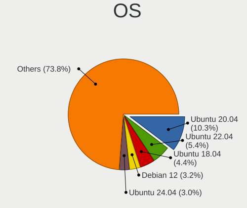

| Name                         | Desktops | Percent |
|------------------------------|----------|---------|
| Ubuntu 20.04                 | 125      | 10.31%  |
| Ubuntu 22.04                 | 65       | 5.36%   |
| Ubuntu 18.04                 | 53       | 4.37%   |
| Debian 12                    | 39       | 3.22%   |
| Ubuntu 24.04                 | 36       | 2.97%   |
| ArcoLinux Rolling            | 30       | 2.48%   |
| OpenMandriva 4.2             | 24       | 1.98%   |
| Debian 11                    | 24       | 1.98%   |
| Arch Rolling                 | 20       | 1.65%   |
| Zorin 17                     | 19       | 1.57%   |
| Zorin 16                     | 19       | 1.57%   |
| OpenMandriva 23.08           | 19       | 1.57%   |
| Pop!_OS 22.04                | 17       | 1.4%    |
| Linux Mint 21.2              | 16       | 1.32%   |
| OpenMandriva 4.3             | 15       | 1.24%   |
| openSUSE Tumbleweed-XXXXXXXX | 14       | 1.16%   |
| EndeavourOS Rolling          | 14       | 1.16%   |
| Ubuntu 20.10                 | 13       | 1.07%   |
| Linux Mint 22.1              | 13       | 1.07%   |
| Linux Mint 20.2              | 13       | 1.07%   |
| Linux Mint 19.3              | 13       | 1.07%   |
| Fedora 39                    | 13       | 1.07%   |
| Fedora 35                    | 13       | 1.07%   |
| Linux Mint 21                | 12       | 0.99%   |
| Fedora 36                    | 12       | 0.99%   |
| Manjaro                      | 11       | 0.91%   |
| Linux Mint 20.1              | 11       | 0.91%   |
| Fedora 42                    | 11       | 0.91%   |
| Xubuntu 20.04                | 10       | 0.83%   |
| OpenMandriva 24.12           | 10       | 0.83%   |
| Fedora 41                    | 10       | 0.83%   |
| Fedora 38                    | 10       | 0.83%   |
| Ubuntu 19.04                 | 9        | 0.74%   |
| Arch                         | 9        | 0.74%   |
| Pop!_OS 20.04                | 8        | 0.66%   |
| Fedora 40                    | 8        | 0.66%   |
| Fedora 34                    | 8        | 0.66%   |
| Bazzite 42                   | 8        | 0.66%   |
| Xubuntu 22.04                | 7        | 0.58%   |
| Ubuntu 19.10                 | 7        | 0.58%   |

OS Family
---------

OS without a version

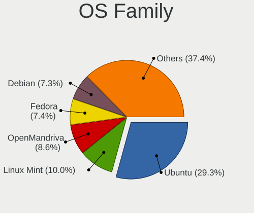

| Name          | Desktops | Percent |
|---------------|----------|---------|
| Ubuntu        | 323      | 29.26%  |
| Linux Mint    | 110      | 9.96%   |
| OpenMandriva  | 95       | 8.61%   |
| Fedora        | 82       | 7.43%   |
| Debian        | 81       | 7.34%   |
| Zorin         | 42       | 3.8%    |
| Pop!_OS       | 36       | 3.26%   |
| Manjaro       | 35       | 3.17%   |
| ArcoLinux     | 30       | 2.72%   |
| Xubuntu       | 29       | 2.63%   |
| Arch          | 28       | 2.54%   |
| Kubuntu       | 24       | 2.17%   |
| openSUSE      | 23       | 2.08%   |
| Bazzite       | 20       | 1.81%   |
| EndeavourOS   | 15       | 1.36%   |
| Gentoo        | 13       | 1.18%   |
| KDE neon      | 10       | 0.91%   |
| ROSA          | 9        | 0.82%   |
| NixOS         | 9        | 0.82%   |
| Nobara        | 8        | 0.72%   |
| LMDE          | 7        | 0.63%   |
| Ubuntu MATE   | 6        | 0.54%   |
| MX            | 5        | 0.45%   |
| Lubuntu       | 5        | 0.45%   |
| Garuda Linux  | 5        | 0.45%   |
| Ubuntu Studio | 4        | 0.36%   |
| Elementary    | 4        | 0.36%   |
| CentOS        | 4        | 0.36%   |
| Ubuntu Unity  | 3        | 0.27%   |
| CachyOS       | 3        | 0.27%   |
| BlackPanther  | 3        | 0.27%   |
| SteamOS       | 2        | 0.18%   |
| Parrot        | 2        | 0.18%   |
| Kali          | 2        | 0.18%   |
| Devuan        | 2        | 0.18%   |
| Clear Linux   | 2        | 0.18%   |
| blendOS       | 2        | 0.18%   |
| Xero          | 1        | 0.09%   |
| Void Linux    | 1        | 0.09%   |
| Vanilla       | 1        | 0.09%   |

Kernel
------

Version of the Linux kernel

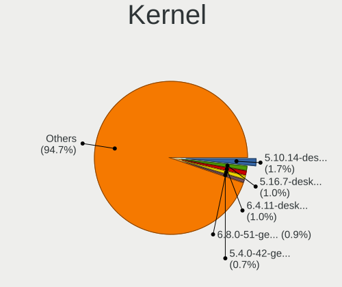

| Version                  | Desktops | Percent |
|--------------------------|----------|---------|
| 5.10.14-desktop-1omv4002 | 24       | 1.66%   |
| 5.16.7-desktop-1omv4003  | 15       | 1.04%   |
| 6.4.11-desktop-1omv2390  | 14       | 0.97%   |
| 6.8.0-51-generic         | 13       | 0.9%    |
| 5.4.0-42-generic         | 10       | 0.69%   |
| 6.14.2-desktop-3omv2590  | 9        | 0.62%   |
| 5.15.0-56-generic        | 9        | 0.62%   |
| 5.8.0-48-generic         | 8        | 0.55%   |
| 5.4.0-65-generic         | 8        | 0.55%   |
| 5.4.0-48-generic         | 8        | 0.55%   |
| 6.6.2-desktop-1omv2390   | 7        | 0.48%   |
| 6.2.0-26-generic         | 7        | 0.48%   |
| 6.12.1-desktop-1omv2490  | 7        | 0.48%   |
| 5.15.0-58-generic        | 7        | 0.48%   |
| 5.15.0-53-generic        | 7        | 0.48%   |
| 5.15.0-50-generic        | 7        | 0.48%   |
| 5.15.0-46-generic        | 7        | 0.48%   |
| 5.15.0-41-generic        | 7        | 0.48%   |
| 5.8.0-43-generic         | 6        | 0.41%   |
| 5.4.0-58-generic         | 6        | 0.41%   |
| 5.4.0-52-generic         | 6        | 0.41%   |
| 5.4.0-45-generic         | 6        | 0.41%   |
| 5.15.0-88-generic        | 6        | 0.41%   |
| 5.15.0-52-generic        | 6        | 0.41%   |
| 6.8.0-60-generic         | 5        | 0.35%   |
| 6.8.0-45-generic         | 5        | 0.35%   |
| 6.4.8-desktop-2omv2390   | 5        | 0.35%   |
| 6.2.6-desktop-1omv2390   | 5        | 0.35%   |
| 6.11.0-26-generic        | 5        | 0.35%   |
| 6.1.0-18-amd64           | 5        | 0.35%   |
| 5.4.0-91-generic         | 5        | 0.35%   |
| 5.4.0-74-generic         | 5        | 0.35%   |
| 5.4.0-54-generic         | 5        | 0.35%   |
| 5.4.0-37-generic         | 5        | 0.35%   |
| 5.4.0-26-generic         | 5        | 0.35%   |
| 5.3.0-28-generic         | 5        | 0.35%   |
| 5.15.0-91-generic        | 5        | 0.35%   |
| 5.15.0-47-generic        | 5        | 0.35%   |
| 5.11.0-41-generic        | 5        | 0.35%   |
| 5.11.0-40-generic        | 5        | 0.35%   |

Kernel Family
-------------

Linux kernel without a distro release

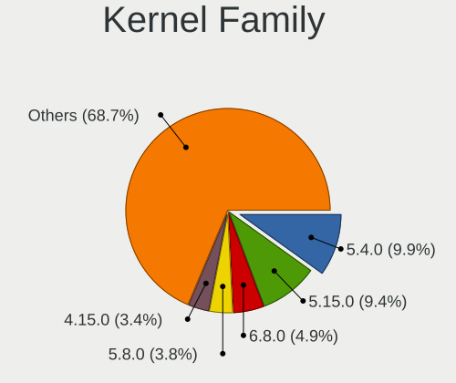

| Version | Desktops | Percent |
|---------|----------|---------|
| 5.4.0   | 133      | 9.9%    |
| 5.15.0  | 126      | 9.38%   |
| 6.8.0   | 66       | 4.91%   |
| 5.8.0   | 51       | 3.8%    |
| 4.15.0  | 45       | 3.35%   |
| 6.1.0   | 36       | 2.68%   |
| 6.5.0   | 27       | 2.01%   |
| 5.11.0  | 27       | 2.01%   |
| 5.3.0   | 26       | 1.94%   |
| 6.11.0  | 25       | 1.86%   |
| 5.10.14 | 24       | 1.79%   |
| 5.19.0  | 23       | 1.71%   |
| 6.2.0   | 22       | 1.64%   |
| 5.10.0  | 22       | 1.64%   |
| 6.14.0  | 21       | 1.56%   |
| 5.13.0  | 19       | 1.41%   |
| 5.0.0   | 17       | 1.27%   |
| 5.16.7  | 15       | 1.12%   |
| 4.18.0  | 15       | 1.12%   |
| 6.4.11  | 14       | 1.04%   |
| 6.14.2  | 13       | 0.97%   |
| 6.6.2   | 10       | 0.74%   |
| 6.12.1  | 10       | 0.74%   |
| 6.2.6   | 8        | 0.6%    |
| 4.19.0  | 8        | 0.6%    |
| 6.8.12  | 7        | 0.52%   |
| 6.17.7  | 7        | 0.52%   |
| 6.16.4  | 6        | 0.45%   |
| 6.12.8  | 6        | 0.45%   |
| 6.4.8   | 5        | 0.37%   |
| 6.13.8  | 5        | 0.37%   |
| 6.12.10 | 5        | 0.37%   |
| 6.1.12  | 5        | 0.37%   |
| 4.18.16 | 5        | 0.37%   |
| 6.9.3   | 4        | 0.3%    |
| 6.6.9   | 4        | 0.3%    |
| 6.6.7   | 4        | 0.3%    |
| 6.4.0   | 4        | 0.3%    |
| 6.15.8  | 4        | 0.3%    |
| 6.15.6  | 4        | 0.3%    |

Kernel Major Ver.
-----------------

Linux kernel major version

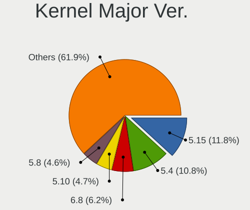

| Version | Desktops | Percent |
|---------|----------|---------|
| 5.15    | 154      | 11.83%  |
| 5.4     | 140      | 10.75%  |
| 6.8     | 81       | 6.22%   |
| 5.10    | 61       | 4.69%   |
| 5.8     | 60       | 4.61%   |
| 6.1     | 52       | 3.99%   |
| 4.15    | 45       | 3.46%   |
| 6.2     | 43       | 3.3%    |
| 6.14    | 42       | 3.23%   |
| 5.11    | 42       | 3.23%   |
| 6.6     | 41       | 3.15%   |
| 6.5     | 41       | 3.15%   |
| 6.12    | 41       | 3.15%   |
| 6.11    | 39       | 3%      |
| 5.16    | 32       | 2.46%   |
| 6.4     | 30       | 2.3%    |
| 5.19    | 30       | 2.3%    |
| 5.3     | 29       | 2.23%   |
| 5.13    | 28       | 2.15%   |
| 6.0     | 21       | 1.61%   |
| 5.0     | 20       | 1.54%   |
| 4.18    | 20       | 1.54%   |
| 6.15    | 15       | 1.15%   |
| 6.9     | 14       | 1.08%   |
| 6.13    | 14       | 1.08%   |
| 5.9     | 14       | 1.08%   |
| 5.17    | 14       | 1.08%   |
| 6.16    | 13       | 1%      |
| 6.3     | 12       | 0.92%   |
| 5.14    | 12       | 0.92%   |
| 6.17    | 11       | 0.84%   |
| 4.19    | 11       | 0.84%   |
| 6.10    | 10       | 0.77%   |
| 5.18    | 10       | 0.77%   |
| 4.9     | 9        | 0.69%   |
| 6.7     | 8        | 0.61%   |
| 5.6     | 8        | 0.61%   |
| 5.5     | 7        | 0.54%   |
| 5.12    | 6        | 0.46%   |
| 5.7     | 4        | 0.31%   |

Arch
----

OS architecture (x86_64, i586, etc.)

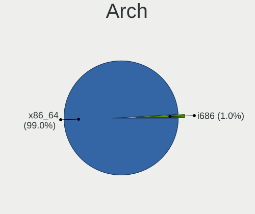

| Name   | Desktops | Percent |
|--------|----------|---------|
| x86_64 | 1025     | 99.03%  |
| i686   | 10       | 0.97%   |

DE
--

Desktop Environment

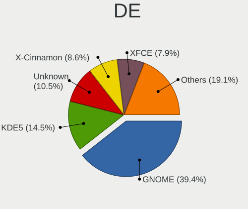

| Name             | Desktops | Percent |
|------------------|----------|---------|
| GNOME            | 446      | 39.43%  |
| KDE5             | 164      | 14.5%   |
| Unknown          | 119      | 10.52%  |
| X-Cinnamon       | 97       | 8.58%   |
| XFCE             | 89       | 7.87%   |
| KDE6             | 84       | 7.43%   |
| MATE             | 32       | 2.83%   |
| KDE              | 17       | 1.5%    |
| LXQt             | 13       | 1.15%   |
| Cinnamon         | 11       | 0.97%   |
| i3               | 10       | 0.88%   |
| Hyprland         | 5        | 0.44%   |
| sway             | 4        | 0.35%   |
| Pantheon         | 4        | 0.35%   |
| KDE4             | 4        | 0.35%   |
| Deepin           | 4        | 0.35%   |
| COSMIC           | 4        | 0.35%   |
| Unity            | 3        | 0.27%   |
| trinity          | 3        | 0.27%   |
| LXDE             | 2        | 0.18%   |
| LeftWM           | 2        | 0.18%   |
| GNOME Flashback  | 2        | 0.18%   |
| chadwm           | 2        | 0.18%   |
| Budgie           | 2        | 0.18%   |
| awesome          | 2        | 0.18%   |
| Openbox          | 1        | 0.09%   |
| lightdm-xsession | 1        | 0.09%   |
| ICEWM            | 1        | 0.09%   |
| GNOME Classic    | 1        | 0.09%   |
| DDE              | 1        | 0.09%   |
| bspwm            | 1        | 0.09%   |

Display Server
--------------

X11 or Wayland

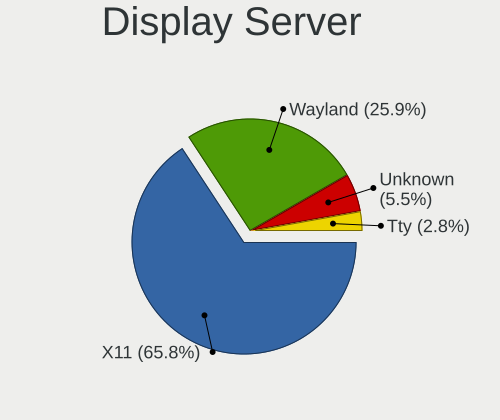

| Name    | Desktops | Percent |
|---------|----------|---------|
| X11     | 720      | 65.75%  |
| Wayland | 284      | 25.94%  |
| Unknown | 60       | 5.48%   |
| Tty     | 31       | 2.83%   |

Display Manager
---------------

SDDM, LightDM, etc.

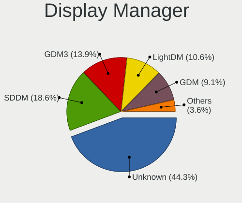

| Name           | Desktops | Percent |
|----------------|----------|---------|
| Unknown        | 486      | 44.3%   |
| SDDM           | 204      | 18.6%   |
| GDM3           | 152      | 13.86%  |
| LightDM        | 116      | 10.57%  |
| GDM            | 100      | 9.12%   |
| TDM            | 31       | 2.83%   |
| XDM            | 2        | 0.18%   |
| KDM            | 2        | 0.18%   |
| SLiM           | 1        | 0.09%   |
| LY-DM          | 1        | 0.09%   |
| GREETD         | 1        | 0.09%   |
| COSMIC-GREETER | 1        | 0.09%   |

OS Lang
-------

Language

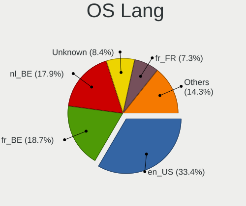

| Lang       | Desktops | Percent |
|------------|----------|---------|
| en_US      | 364      | 33.43%  |
| fr_BE      | 204      | 18.73%  |
| nl_BE      | 195      | 17.91%  |
| Unknown    | 91       | 8.36%   |
| fr_FR      | 79       | 7.25%   |
| en_GB      | 53       | 4.87%   |
| nl_NL      | 42       | 3.86%   |
| C          | 20       | 1.84%   |
| de_BE      | 6        | 0.55%   |
| pl_PL      | 5        | 0.46%   |
| en_IE      | 4        | 0.37%   |
| it_IT      | 3        | 0.28%   |
| de_DE      | 3        | 0.28%   |
| ru_RU      | 2        | 0.18%   |
| POSIX      | 2        | 0.18%   |
| fr_LU      | 2        | 0.18%   |
| es_ES      | 2        | 0.18%   |
| C.UTF8     | 2        | 0.18%   |
| uk_UA      | 1        | 0.09%   |
| pt_PT      | 1        | 0.09%   |
| li_BE      | 1        | 0.09%   |
| hu_HU      | 1        | 0.09%   |
| fr_FR.UTF8 | 1        | 0.09%   |
| en_US.UTF8 | 1        | 0.09%   |
| en_NZ      | 1        | 0.09%   |
| en_BW      | 1        | 0.09%   |
| en.US      | 1        | 0.09%   |
| ca_ES      | 1        | 0.09%   |

Boot Mode
---------

EFI or BIOS

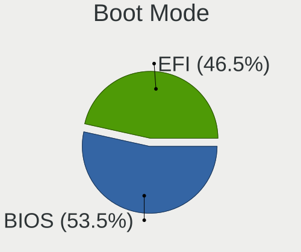

| Mode | Desktops | Percent |
|------|----------|---------|
| BIOS | 571      | 53.46%  |
| EFI  | 497      | 46.54%  |

Filesystem
----------

Type of filesystem

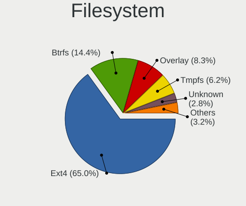

| Type     | Desktops | Percent |
|----------|----------|---------|
| Ext4     | 709      | 65.05%  |
| Btrfs    | 157      | 14.4%   |
| Overlay  | 91       | 8.35%   |
| Tmpfs    | 68       | 6.24%   |
| Unknown  | 30       | 2.75%   |
| Xfs      | 14       | 1.28%   |
| Zfs      | 12       | 1.1%    |
| Ext2     | 5        | 0.46%   |
| F2fs     | 2        | 0.18%   |
| Reiserfs | 1        | 0.09%   |
| Ext3     | 1        | 0.09%   |

Part. scheme
------------

Scheme of partitioning

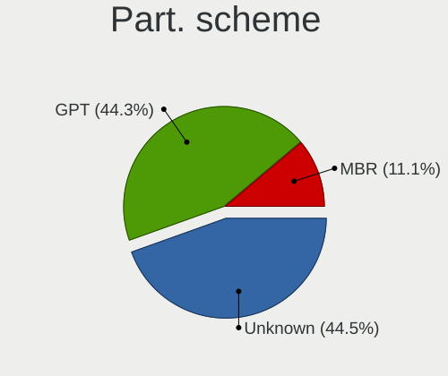

| Type    | Desktops | Percent |
|---------|----------|---------|
| Unknown | 480      | 44.53%  |
| GPT     | 478      | 44.34%  |
| MBR     | 120      | 11.13%  |

Dual Boot with Linux/BSD
------------------------

Hosting more than one Linux/BSD

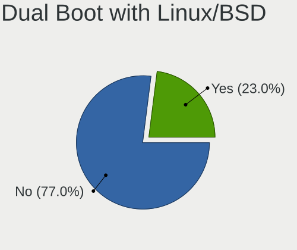

| Dual boot | Desktops | Percent |
|-----------|----------|---------|
| No        | 827      | 77%     |
| Yes       | 247      | 23%     |

Dual Boot (Win)
---------------

Hosting Linux and Windows

| Dual boot | Desktops | Percent |
|-----------|----------|---------|
| No        | 709      | 66.64%  |
| Yes       | 355      | 33.36%  |

Board
-----

Vendor
------

Motherboard manufacturer

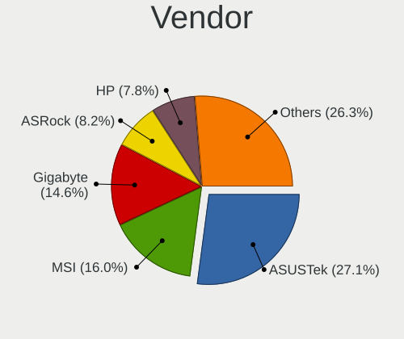

| Name                                 | Desktops | Percent |
|--------------------------------------|----------|---------|
| ASUSTek Computer                     | 280      | 27.08%  |
| MSI                                  | 165      | 15.96%  |
| Gigabyte Technology                  | 151      | 14.6%   |
| ASRock                               | 85       | 8.22%   |
| Hewlett-Packard                      | 81       | 7.83%   |
| Dell                                 | 71       | 6.87%   |
| Medion                               | 35       | 3.38%   |
| Lenovo                               | 27       | 2.61%   |
| Acer                                 | 27       | 2.61%   |
| Intel                                | 22       | 2.13%   |
| Unknown                              | 13       | 1.26%   |
| Fujitsu                              | 11       | 1.06%   |
| Packard Bell                         | 8        | 0.77%   |
| Foxconn                              | 8        | 0.77%   |
| Pegatron                             | 6        | 0.58%   |
| AZW                                  | 5        | 0.48%   |
| Apple                                | 4        | 0.39%   |
| Shenzhen Meigao Electronic Equipment | 3        | 0.29%   |
| Fujitsu Siemens                      | 3        | 0.29%   |
| BESSTAR Tech                         | 3        | 0.29%   |
| Shuttle                              | 2        | 0.19%   |
| MACHINIST                            | 2        | 0.19%   |
| GEEKOM                               | 2        | 0.19%   |
| AMI                                  | 2        | 0.19%   |
| TYAN Computer                        | 1        | 0.1%    |
| Shenzhen DOKE electronic             | 1        | 0.1%    |
| Quantum engineering                  | 1        | 0.1%    |
| QTQD                                 | 1        | 0.1%    |
| PIONEERPOS                           | 1        | 0.1%    |
| PELADN                               | 1        | 0.1%    |
| Maxtang                              | 1        | 0.1%    |
| MACHINST                             | 1        | 0.1%    |
| JINGSHA                              | 1        | 0.1%    |
| Huanan                               | 1        | 0.1%    |
| Hardkernel                           | 1        | 0.1%    |
| GMKtec                               | 1        | 0.1%    |
| GIGAIPC                              | 1        | 0.1%    |
| EVGA                                 | 1        | 0.1%    |
| Elo Touch Solutions                  | 1        | 0.1%    |
| Biostar                              | 1        | 0.1%    |

Model
-----

Motherboard model

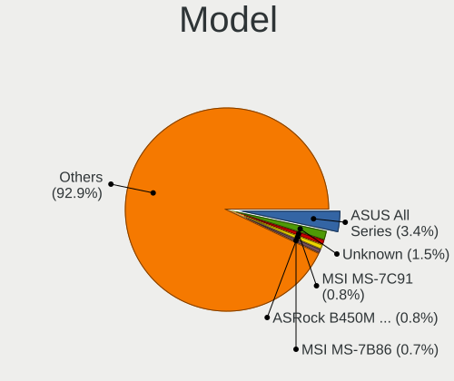

| Name                         | Desktops | Percent |
|------------------------------|----------|---------|
| ASUS All Series              | 35       | 3.38%   |
| Unknown                      | 15       | 1.45%   |
| MSI MS-7C91                  | 8        | 0.77%   |
| ASRock B450M Pro4            | 8        | 0.77%   |
| MSI MS-7B86                  | 7        | 0.68%   |
| ASUS UNLOCK INSTALL          | 7        | 0.68%   |
| MSI MS-7C37                  | 6        | 0.58%   |
| Gigabyte B550 AORUS ELITE V2 | 6        | 0.58%   |
| ASUS ROG STRIX X570-E GAMING | 6        | 0.58%   |
| ASUS ROG STRIX B550-F GAMING | 6        | 0.58%   |
| MSI MS-7A38                  | 5        | 0.48%   |
| Gigabyte B550I AORUS PRO AX  | 5        | 0.48%   |
| Dell OptiPlex 780            | 5        | 0.48%   |
| ASUS PRIME X570-PRO          | 5        | 0.48%   |
| HP Compaq Elite 8300 SFF     | 4        | 0.39%   |
| Gigabyte X570 AORUS MASTER   | 4        | 0.39%   |
| Gigabyte GB-BRR7H-4800       | 4        | 0.39%   |
| Gigabyte B450 AORUS ELITE    | 4        | 0.39%   |
| Dell OptiPlex 7010           | 4        | 0.39%   |
| Dell OptiPlex 3020           | 4        | 0.39%   |
| Dell OptiPlex 3010           | 4        | 0.39%   |
| ASUS TUF Gaming X570-PLUS    | 4        | 0.39%   |
| ASUS ROG STRIX B450-F GAMING | 4        | 0.39%   |
| ASUS PRIME Z390-P            | 4        | 0.39%   |
| ASUS H170M-PLUS              | 4        | 0.39%   |
| ASRock X300M-STX             | 4        | 0.39%   |
| ASRock A320M-HDV R4.0        | 4        | 0.39%   |
| MSI MS-7E06                  | 3        | 0.29%   |
| MSI MS-7C56                  | 3        | 0.29%   |
| MSI MS-7C09                  | 3        | 0.29%   |
| MSI MS-7C02                  | 3        | 0.29%   |
| MSI MS-7B85                  | 3        | 0.29%   |
| MSI MS-7A34                  | 3        | 0.29%   |
| MSI MS-7917                  | 3        | 0.29%   |
| MSI MS-7850                  | 3        | 0.29%   |
| MSI MS-7817                  | 3        | 0.29%   |
| MSI MS-7816                  | 3        | 0.29%   |
| MSI MS-7641                  | 3        | 0.29%   |
| Medion MS-7728               | 3        | 0.29%   |
| HP ProDesk 600 G1 SFF        | 3        | 0.29%   |

Model Family
------------

Motherboard model prefix

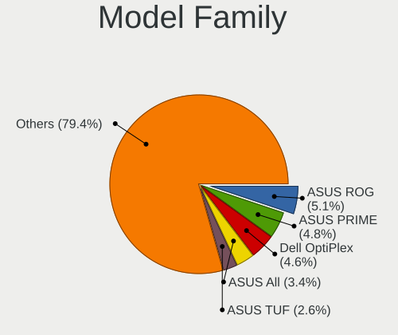

| Name                   | Desktops | Percent |
|------------------------|----------|---------|
| ASUS ROG               | 53       | 5.13%   |
| ASUS PRIME             | 50       | 4.84%   |
| Dell OptiPlex          | 48       | 4.64%   |
| ASUS All               | 35       | 3.38%   |
| ASUS TUF               | 27       | 2.61%   |
| HP Compaq              | 24       | 2.32%   |
| HP ProDesk             | 17       | 1.64%   |
| Acer Aspire            | 17       | 1.64%   |
| Lenovo ThinkCentre     | 16       | 1.55%   |
| Unknown                | 15       | 1.45%   |
| Gigabyte B550          | 12       | 1.16%   |
| Medion Akoya           | 9        | 0.87%   |
| Gigabyte X570          | 9        | 0.87%   |
| Fujitsu ESPRIMO        | 9        | 0.87%   |
| Dell Precision         | 9        | 0.87%   |
| MSI MS-7C91            | 8        | 0.77%   |
| ASRock B450M           | 8        | 0.77%   |
| MSI MS-7B86            | 7        | 0.68%   |
| Lenovo IdeaCentre      | 7        | 0.68%   |
| HP EliteDesk           | 7        | 0.68%   |
| Gigabyte B450          | 7        | 0.68%   |
| ASUS UNLOCK            | 7        | 0.68%   |
| MSI MS-7C37            | 6        | 0.58%   |
| MSI MS-7A38            | 5        | 0.48%   |
| Gigabyte B550I         | 5        | 0.48%   |
| ASUS P8Z77-V           | 5        | 0.48%   |
| ASUS M5A78L-M          | 5        | 0.48%   |
| Packard Bell IMEDIA    | 4        | 0.39%   |
| HP ProLiant            | 4        | 0.39%   |
| HP Pavilion            | 4        | 0.39%   |
| Gigabyte GB-BRR7H-4800 | 4        | 0.39%   |
| Gigabyte B550M         | 4        | 0.39%   |
| Dell XPS               | 4        | 0.39%   |
| Dell Vostro            | 4        | 0.39%   |
| ASUS STRIX             | 4        | 0.39%   |
| ASUS P9X79             | 4        | 0.39%   |
| ASUS P8P67             | 4        | 0.39%   |
| ASUS P6T               | 4        | 0.39%   |
| ASUS H170M-PLUS        | 4        | 0.39%   |
| ASRock X570            | 4        | 0.39%   |

MFG Year
--------

Motherboard manufacture year

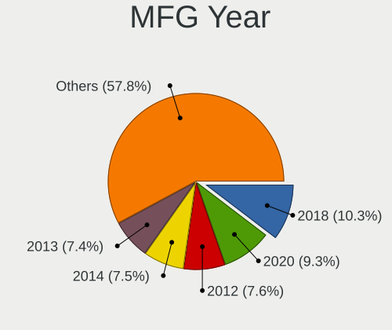

| Year    | Desktops | Percent |
|---------|----------|---------|
| 2018    | 107      | 10.35%  |
| 2020    | 96       | 9.28%   |
| 2012    | 79       | 7.64%   |
| 2014    | 78       | 7.54%   |
| 2013    | 76       | 7.35%   |
| 2019    | 70       | 6.77%   |
| 2021    | 53       | 5.13%   |
| 2015    | 52       | 5.03%   |
| 2011    | 52       | 5.03%   |
| 2022    | 49       | 4.74%   |
| 2017    | 43       | 4.16%   |
| 2010    | 43       | 4.16%   |
| 2009    | 43       | 4.16%   |
| 2008    | 39       | 3.77%   |
| 2016    | 38       | 3.68%   |
| 2023    | 33       | 3.19%   |
| 2024    | 30       | 2.9%    |
| 2007    | 29       | 2.8%    |
| 2006    | 14       | 1.35%   |
| 2025    | 5        | 0.48%   |
| 2005    | 3        | 0.29%   |
| Unknown | 2        | 0.19%   |

Form Factor
-----------

Physical design of the computer

| Name    | Desktops | Percent |
|---------|----------|---------|
| Desktop | 1034     | 100%    |

Secure Boot
-----------

Enabled or disabled

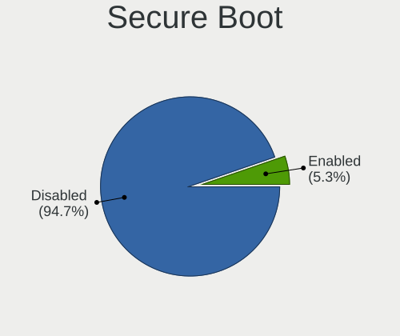

| State    | Desktops | Percent |
|----------|----------|---------|
| Disabled | 992      | 94.75%  |
| Enabled  | 55       | 5.25%   |

Coreboot
--------

Have coreboot on board

| Used | Desktops | Percent |
|------|----------|---------|
| No   | 1034     | 100%    |

RAM Size
--------

Total RAM memory

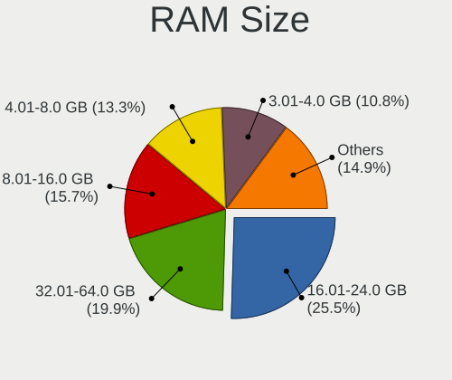

| Size in GB      | Desktops | Percent |
|-----------------|----------|---------|
| 16.01-24.0      | 272      | 25.47%  |
| 32.01-64.0      | 212      | 19.85%  |
| 8.01-16.0       | 168      | 15.73%  |
| 4.01-8.0        | 142      | 13.3%   |
| 3.01-4.0        | 115      | 10.77%  |
| 64.01-256.0     | 81       | 7.58%   |
| 24.01-32.0      | 43       | 4.03%   |
| 1.01-2.0        | 19       | 1.78%   |
| 2.01-3.0        | 11       | 1.03%   |
| More than 256.0 | 4        | 0.37%   |
| 0.51-1.0        | 1        | 0.09%   |

RAM Used
--------

Used RAM memory

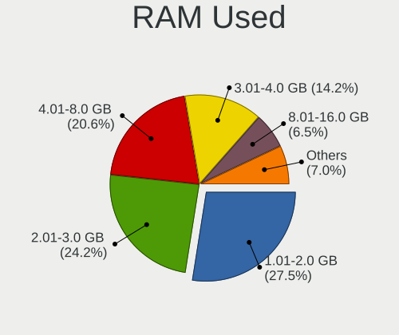

| Used GB     | Desktops | Percent |
|-------------|----------|---------|
| 1.01-2.0    | 336      | 27.5%   |
| 2.01-3.0    | 296      | 24.22%  |
| 4.01-8.0    | 252      | 20.62%  |
| 3.01-4.0    | 173      | 14.16%  |
| 8.01-16.0   | 79       | 6.46%   |
| 0.51-1.0    | 57       | 4.66%   |
| 16.01-24.0  | 13       | 1.06%   |
| 0.01-0.5    | 8        | 0.65%   |
| 24.01-32.0  | 5        | 0.41%   |
| 32.01-64.0  | 1        | 0.08%   |
| 64.01-256.0 | 1        | 0.08%   |
| Unknown     | 1        | 0.08%   |

Total Drives
------------

Number of drives on board

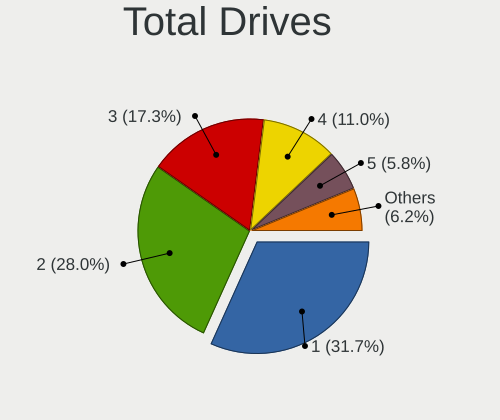

| Drives | Desktops | Percent |
|--------|----------|---------|
| 1      | 353      | 31.74%  |
| 2      | 311      | 27.97%  |
| 3      | 192      | 17.27%  |
| 4      | 122      | 10.97%  |
| 5      | 65       | 5.85%   |
| 6      | 34       | 3.06%   |
| 7      | 10       | 0.9%    |
| 0      | 8        | 0.72%   |
| 9      | 5        | 0.45%   |
| 8      | 5        | 0.45%   |
| 14     | 2        | 0.18%   |
| 10     | 2        | 0.18%   |
| 16     | 1        | 0.09%   |
| 13     | 1        | 0.09%   |
| 11     | 1        | 0.09%   |

Has CD-ROM
----------

Has CD-ROM on board

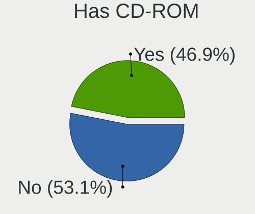

| Presented | Desktops | Percent |
|-----------|----------|---------|
| No        | 555      | 53.11%  |
| Yes       | 490      | 46.89%  |

Has Ethernet
------------

Has Ethernet on board

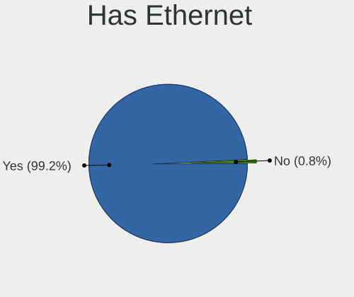

| Presented | Desktops | Percent |
|-----------|----------|---------|
| Yes       | 1027     | 99.23%  |
| No        | 8        | 0.77%   |

Has WiFi
--------

Has WiFi module

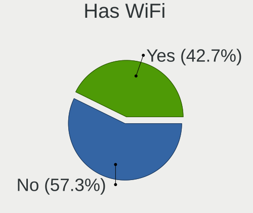

| Presented | Desktops | Percent |
|-----------|----------|---------|
| No        | 600      | 57.25%  |
| Yes       | 448      | 42.75%  |

Has Bluetooth
-------------

Has Bluetooth module

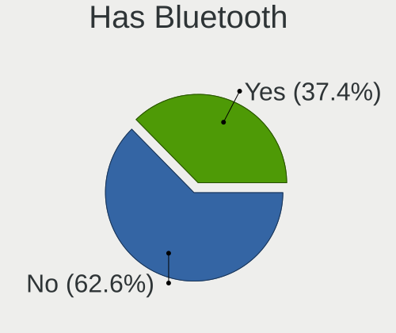

| Presented | Desktops | Percent |
|-----------|----------|---------|
| No        | 659      | 62.64%  |
| Yes       | 393      | 37.36%  |

Location
--------

Country
-------

Geographic location (country)

| Country | Desktops | Percent |
|---------|----------|---------|
| Belgium | 1034     | 100%    |

City
----

Geographic location (city)

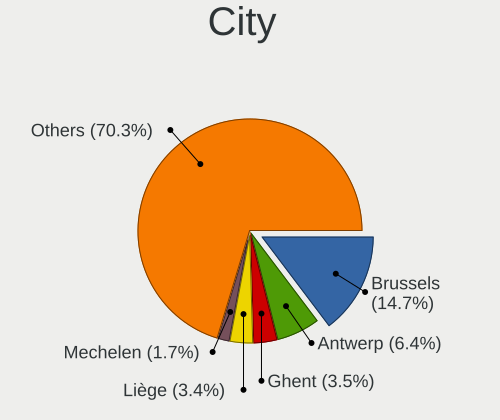

| City             | Desktops | Percent |
|------------------|----------|---------|
| Brussels         | 169      | 14.71%  |
| Antwerp          | 73       | 6.35%   |
| Ghent            | 40       | 3.48%   |
| Liège           | 39       | 3.39%   |
| Mechelen         | 20       | 1.74%   |
| Leuven           | 14       | 1.22%   |
| Ixelles-Elsene   | 13       | 1.13%   |
| Roeselare        | 11       | 0.96%   |
| Hasselt          | 11       | 0.96%   |
| Louvain-la-Neuve | 10       | 0.87%   |
| Duffel           | 10       | 0.87%   |
| Bruges           | 10       | 0.87%   |
| Sint-Niklaas     | 9        | 0.78%   |
| La Louvière     | 9        | 0.78%   |
| Charleroi        | 9        | 0.78%   |
| Schaarbeek       | 8        | 0.7%    |
| Namur            | 8        | 0.7%    |
| Lier             | 8        | 0.7%    |
| Bredene          | 8        | 0.7%    |
| Aarschot         | 8        | 0.7%    |
| Wilrijk          | 7        | 0.61%   |
| Waregem          | 7        | 0.61%   |
| Kortrijk         | 7        | 0.61%   |
| Deurne           | 7        | 0.61%   |
| Anderlecht       | 7        | 0.61%   |
| Verviers         | 6        | 0.52%   |
| Uccle            | 6        | 0.52%   |
| Turnhout         | 6        | 0.52%   |
| Tournai          | 6        | 0.52%   |
| Mortsel          | 6        | 0.52%   |
| Mons             | 6        | 0.52%   |
| Genk             | 6        | 0.52%   |
| Arlon            | 6        | 0.52%   |
| Aalst            | 6        | 0.52%   |
| Wetteren         | 5        | 0.44%   |
| Vilvoorde        | 5        | 0.44%   |
| Seraing          | 5        | 0.44%   |
| Oudenaarde       | 5        | 0.44%   |
| Nivelles         | 5        | 0.44%   |
| Nieuwpoort       | 5        | 0.44%   |

Drives
------

Drive Vendor
------------

Hard drive vendors

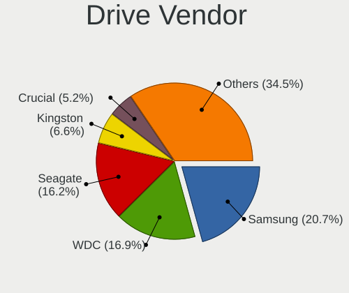

| Vendor                       | Desktops | Drives | Percent |
|------------------------------|----------|--------|---------|
| Samsung Electronics          | 415      | 977    | 20.71%  |
| WDC                          | 338      | 643    | 16.87%  |
| Seagate                      | 324      | 622    | 16.17%  |
| Kingston                     | 132      | 223    | 6.59%   |
| Crucial                      | 104      | 171    | 5.19%   |
| Toshiba                      | 102      | 163    | 5.09%   |
| SanDisk                      | 87       | 117    | 4.34%   |
| Hitachi                      | 45       | 65     | 2.25%   |
| Micron/Crucial Technology    | 32       | 54     | 1.6%    |
| Intel                        | 28       | 39     | 1.4%    |
| Unknown                      | 26       | 64     | 1.3%    |
| Maxtor                       | 20       | 28     | 1%      |
| Intenso                      | 20       | 31     | 1%      |
| Kingston Technology Company  | 19       | 25     | 0.95%   |
| SK hynix                     | 18       | 22     | 0.9%    |
| Micron Technology            | 18       | 28     | 0.9%    |
| Phison Electronics           | 17       | 21     | 0.85%   |
| China                        | 17       | 19     | 0.85%   |
| A-DATA Technology            | 15       | 18     | 0.75%   |
| Phison                       | 14       | 16     | 0.7%    |
| Corsair                      | 12       | 13     | 0.6%    |
| OCZ                          | 10       | 12     | 0.5%    |
| HGST                         | 10       | 13     | 0.5%    |
| Silicon Motion               | 9        | 15     | 0.45%   |
| LITEON                       | 9        | 15     | 0.45%   |
| LaCie                        | 9        | 13     | 0.45%   |
| PNY                          | 8        | 10     | 0.4%    |
| SPCC                         | 6        | 6      | 0.3%    |
| Realtek Semiconductor        | 6        | 8      | 0.3%    |
| LDLC                         | 6        | 7      | 0.3%    |
| Transcend                    | 5        | 12     | 0.25%   |
| Shenzhen Longsys Electronics | 5        | 5      | 0.25%   |
| Patriot                      | 5        | 33     | 0.25%   |
| ASMT                         | 5        | 6      | 0.25%   |
| Apple                        | 5        | 5      | 0.25%   |
| Unknown                      | 5        | 6      | 0.25%   |
| XPG                          | 4        | 8      | 0.2%    |
| Lexar                        | 4        | 4      | 0.2%    |
| KingSpec                     | 4        | 5      | 0.2%    |
| KingFast                     | 4        | 4      | 0.2%    |

Drive Model
-----------

Hard drive models

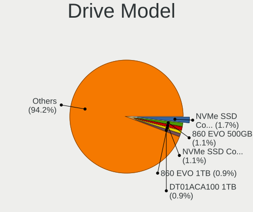

| Model                                              | Desktops | Percent |
|----------------------------------------------------|----------|---------|
| Samsung NVMe SSD Controller SM981/PM981/PM983 1TB  | 43       | 1.74%   |
| Samsung SSD 860 EVO 500GB                          | 28       | 1.13%   |
| Samsung NVMe SSD Controller PM9A1/PM9A3/980PRO 1TB | 27       | 1.09%   |
| Samsung SSD 860 EVO 1TB                            | 23       | 0.93%   |
| Toshiba DT01ACA100 1TB                             | 22       | 0.89%   |
| Seagate ST2000DM001-1ER164 2TB                     | 22       | 0.89%   |
| Samsung SSD 870 QVO 1TB                            | 22       | 0.89%   |
| Samsung SSD 850 EVO 500GB                          | 21       | 0.85%   |
| Samsung SSD 870 EVO 1TB                            | 20       | 0.81%   |
| Samsung SSD 860 EVO 250GB                          | 20       | 0.81%   |
| Samsung SSD 850 EVO 250GB                          | 20       | 0.81%   |
| Kingston SV300S37A120G 120GB SSD                   | 19       | 0.77%   |
| Seagate ST500DM002-1BD142 500GB                    | 18       | 0.73%   |
| Kingston SA400S37240G 240GB SSD                    | 18       | 0.73%   |
| Seagate ST2000DM008-2FR102 2TB                     | 17       | 0.69%   |
| Samsung SSD 840 EVO 250GB                          | 17       | 0.69%   |
| Seagate ST2000DM001-1CH164 2TB                     | 16       | 0.65%   |
| Kingston SA400S37120G 120GB SSD                    | 15       | 0.61%   |
| Crucial CT500MX500SSD1 500GB                       | 15       | 0.61%   |
| Seagate ST1000DM010-2EP102 1TB                     | 14       | 0.56%   |
| Samsung NVMe SSD Drive 500GB                       | 13       | 0.52%   |
| Unknown SD/MMC/MS PRO 2GB                          | 12       | 0.48%   |
| Samsung SSD 870 QVO 2TB                            | 12       | 0.48%   |
| Samsung NVMe SSD Drive 1TB                         | 12       | 0.48%   |
| Micron/Crucial P2 NVMe PCIe SSD 2TB                | 12       | 0.48%   |
| WDC WD20EZRZ-00Z5HB0 2TB                           | 11       | 0.44%   |
| Seagate ST4000DM004-2CV104 4TB                     | 11       | 0.44%   |
| Seagate ST1000DM003-1CH162 1TB                     | 11       | 0.44%   |
| Samsung SSD 980 1TB                                | 11       | 0.44%   |
| Kingston SA400S37480G 480GB SSD                    | 11       | 0.44%   |
| Seagate ST2000DM006-2DM164 2TB                     | 10       | 0.4%    |
| Samsung SSD 990 PRO 2TB                            | 10       | 0.4%    |
| Samsung SSD 970 EVO 1TB                            | 10       | 0.4%    |
| Samsung SSD 860 QVO 1TB                            | 10       | 0.4%    |
| Crucial CT1000BX500SSD1 1TB                        | 10       | 0.4%    |
| WDC WDS240G2G0A-00JH30 240GB SSD                   | 9        | 0.36%   |
| WDC WD10EZEX-08WN4A0 1TB                           | 9        | 0.36%   |
| Seagate ST3500418AS 500GB                          | 9        | 0.36%   |
| Seagate ST1000LM024 HN-M101MBB 1TB                 | 9        | 0.36%   |
| Seagate ST1000DM003-1ER162 1TB                     | 9        | 0.36%   |

HDD Vendor
----------

Hard disk drive vendors

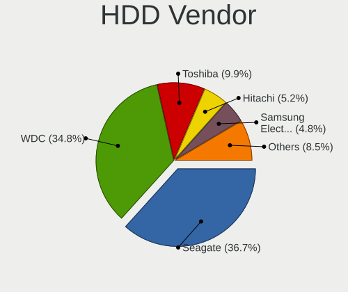

| Vendor              | Desktops | Drives | Percent |
|---------------------|----------|--------|---------|
| Seagate             | 318      | 608    | 36.68%  |
| WDC                 | 302      | 572    | 34.83%  |
| Toshiba             | 86       | 140    | 9.92%   |
| Hitachi             | 45       | 65     | 5.19%   |
| Samsung Electronics | 42       | 71     | 4.84%   |
| Maxtor              | 20       | 28     | 2.31%   |
| Unknown             | 12       | 25     | 1.38%   |
| HGST                | 10       | 13     | 1.15%   |
| Intenso             | 5        | 9      | 0.58%   |
| Hewlett-Packard     | 4        | 18     | 0.46%   |
| LaCie               | 3        | 3      | 0.35%   |
| FC-1307             | 2        | 2      | 0.23%   |
| ASMT                | 2        | 3      | 0.23%   |
| Apple               | 2        | 2      | 0.23%   |
| WD MediaMax         | 1        | 1      | 0.12%   |
| SSK                 | 1        | 1      | 0.12%   |
| SINTECHI            | 1        | 1      | 0.12%   |
| SABRENT             | 1        | 1      | 0.12%   |
| Magnetic Data       | 1        | 1      | 0.12%   |
| Lenovo              | 1        | 2      | 0.12%   |
| KESU                | 1        | 4      | 0.12%   |
| JMicron Technology  | 1        | 2      | 0.12%   |
| IB                  | 1        | 1      | 0.12%   |
| Fujitsu             | 1        | 1      | 0.12%   |
| External            | 1        | 1      | 0.12%   |
| ExcelStor           | 1        | 1      | 0.12%   |
| Dell                | 1        | 1      | 0.12%   |
| CIRAGO              | 1        | 1      | 0.12%   |

SSD Vendor
----------

Solid state drive vendors

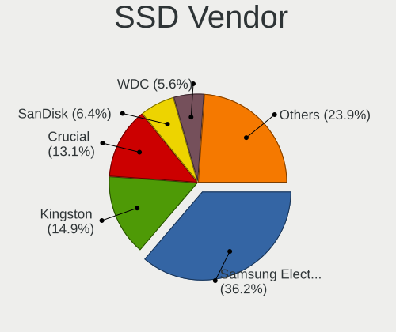

| Vendor              | Desktops | Drives | Percent |
|---------------------|----------|--------|---------|
| Samsung Electronics | 261      | 559    | 36.25%  |
| Kingston            | 107      | 182    | 14.86%  |
| Crucial             | 94       | 159    | 13.06%  |
| SanDisk             | 46       | 59     | 6.39%   |
| WDC                 | 40       | 56     | 5.56%   |
| China               | 16       | 18     | 2.22%   |
| Intenso             | 14       | 19     | 1.94%   |
| OCZ                 | 10       | 12     | 1.39%   |
| Toshiba             | 9        | 11     | 1.25%   |
| PNY                 | 8        | 10     | 1.11%   |
| Intel               | 8        | 10     | 1.11%   |
| A-DATA Technology   | 8        | 10     | 1.11%   |
| Micron Technology   | 7        | 14     | 0.97%   |
| LITEON              | 7        | 13     | 0.97%   |
| Corsair             | 7        | 8      | 0.97%   |
| Transcend           | 5        | 12     | 0.69%   |
| SPCC                | 5        | 5      | 0.69%   |
| SK hynix            | 5        | 8      | 0.69%   |
| Patriot             | 4        | 31     | 0.56%   |
| GOODRAM             | 4        | 7      | 0.56%   |
| KingSpec            | 3        | 4      | 0.42%   |
| KingFast            | 3        | 3      | 0.42%   |
| Apple               | 3        | 3      | 0.42%   |
| Unknown             | 3        | 4      | 0.42%   |
| Verbatim            | 2        | 3      | 0.28%   |
| sobetter            | 2        | 2      | 0.28%   |
| Seagate             | 2        | 2      | 0.28%   |
| Plextor             | 2        | 2      | 0.28%   |
| Phison              | 2        | 2      | 0.28%   |
| Lexar               | 2        | 2      | 0.28%   |
| LDLC                | 2        | 3      | 0.28%   |
| INNOVATION IT       | 2        | 2      | 0.28%   |
| Fanxiang            | 2        | 2      | 0.28%   |
| ASMT                | 2        | 2      | 0.28%   |
| XrayDisk            | 1        | 1      | 0.14%   |
| WDC WDS             | 1        | 1      | 0.14%   |
| WALRAM              | 1        | 2      | 0.14%   |
| Vaseky              | 1        | 1      | 0.14%   |
| tigo                | 1        | 1      | 0.14%   |
| SABRENT             | 1        | 1      | 0.14%   |

Drive Kind
----------

HDD or SSD

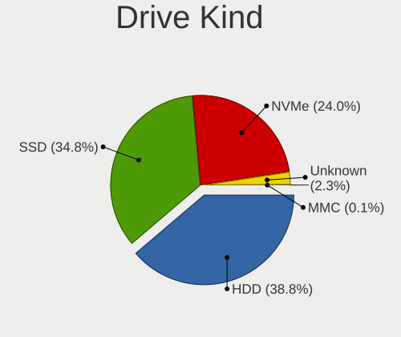

| Kind    | Desktops | Drives | Percent |
|---------|----------|--------|---------|
| HDD     | 656      | 1578   | 38.77%  |
| SSD     | 589      | 1268   | 34.81%  |
| NVMe    | 406      | 749    | 24%     |
| Unknown | 39       | 65     | 2.3%    |
| MMC     | 2        | 2      | 0.12%   |

Drive Connector
---------------

SATA, SAS, NVMe, etc.

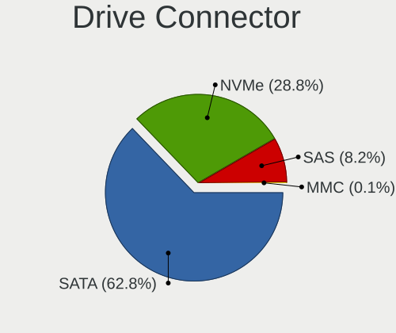

| Type | Desktops | Drives | Percent |
|------|----------|--------|---------|
| SATA | 882      | 2683   | 62.82%  |
| NVMe | 405      | 741    | 28.85%  |
| SAS  | 115      | 236    | 8.19%   |
| MMC  | 2        | 2      | 0.14%   |

Drive Size
----------

Size of hard drive

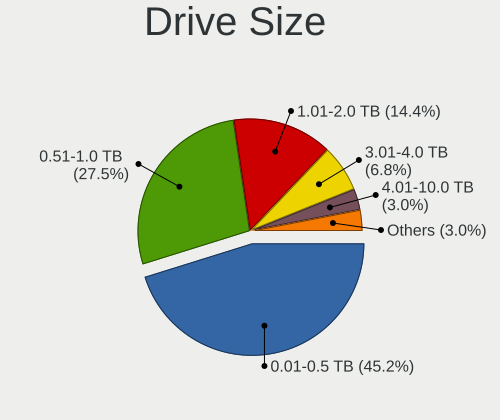

| Size in TB | Desktops | Drives | Percent |
|------------|----------|--------|---------|
| 0.01-0.5   | 638      | 1346   | 45.18%  |
| 0.51-1.0   | 388      | 737    | 27.48%  |
| 1.01-2.0   | 204      | 407    | 14.45%  |
| 3.01-4.0   | 96       | 171    | 6.8%    |
| 4.01-10.0  | 43       | 101    | 3.05%   |
| 2.01-3.0   | 36       | 57     | 2.55%   |
| 10.01-20.0 | 7        | 27     | 0.5%    |

Space Total
-----------

Amount of disk space available on the file system

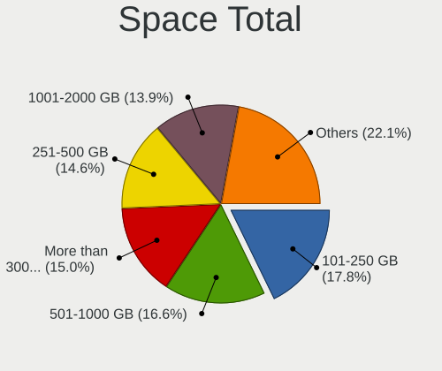

| Size in GB     | Desktops | Percent |
|----------------|----------|---------|
| 101-250        | 204      | 17.77%  |
| 501-1000       | 190      | 16.55%  |
| More than 3000 | 172      | 14.98%  |
| 251-500        | 168      | 14.63%  |
| 1001-2000      | 160      | 13.94%  |
| 2001-3000      | 80       | 6.97%   |
| 1-20           | 64       | 5.57%   |
| 51-100         | 50       | 4.36%   |
| Unknown        | 43       | 3.75%   |
| 21-50          | 17       | 1.48%   |

Space Used
----------

Amount of used disk space

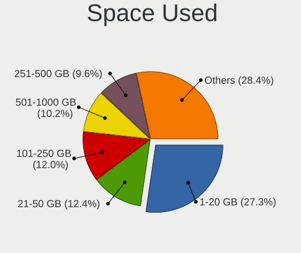

| Used GB        | Desktops | Percent |
|----------------|----------|---------|
| 1-20           | 327      | 27.32%  |
| 21-50          | 149      | 12.45%  |
| 101-250        | 144      | 12.03%  |
| 501-1000       | 122      | 10.19%  |
| 251-500        | 115      | 9.61%   |
| 1001-2000      | 99       | 8.27%   |
| 51-100         | 99       | 8.27%   |
| More than 3000 | 64       | 5.35%   |
| Unknown        | 43       | 3.59%   |
| 2001-3000      | 32       | 2.67%   |
| 0              | 3        | 0.25%   |

Malfunc. Drives
---------------

Drive models with a malfunction

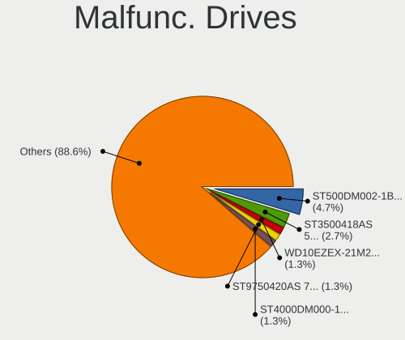

| Model                               | Desktops | Drives | Percent |
|-------------------------------------|----------|--------|---------|
| Seagate ST500DM002-1BD142 500GB     | 7        | 27     | 4.7%    |
| Seagate ST3500418AS 500GB           | 4        | 11     | 2.68%   |
| WDC WD10EZEX-21M2NA0 1TB            | 2        | 2      | 1.34%   |
| Seagate ST9750420AS 752GB           | 2        | 2      | 1.34%   |
| Seagate ST4000DM000-1F2168 4TB      | 2        | 4      | 1.34%   |
| Seagate ST3160813AS 160GB           | 2        | 2      | 1.34%   |
| Seagate ST2000DM008-2FR102 2TB      | 2        | 4      | 1.34%   |
| Seagate ST2000DL003-9VT166 2TB      | 2        | 2      | 1.34%   |
| Samsung Electronics SSD 970 EVO 1TB | 2        | 4      | 1.34%   |
| Kingston SV300S37A120G 120GB SSD    | 2        | 2      | 1.34%   |
| Crucial CT1000MX500SSD1 1TB         | 2        | 2      | 1.34%   |
| XPG SPECTRIX S40G 1TB               | 1        | 1      | 0.67%   |
| WDC WDS240G2G0A-00JH30 240GB SSD    | 1        | 1      | 0.67%   |
| WDC WDS100T2B0A-00SM50 1TB SSD      | 1        | 1      | 0.67%   |
| WDC WD8003FRYZ-01JPDB1 8TB          | 1        | 1      | 0.67%   |
| WDC WD740ADFD-00NLR5 74GB           | 1        | 1      | 0.67%   |
| WDC WD6400AAKS-65Z7B0 640GB         | 1        | 1      | 0.67%   |
| WDC WD6400AAKS-00A7B0 640GB         | 1        | 1      | 0.67%   |
| WDC WD5000AAKX-75U6AA0 500GB        | 1        | 1      | 0.67%   |
| WDC WD5000AAKX-753CA1 500GB         | 1        | 1      | 0.67%   |
| WDC WD5000AAKX-60U6AA0 500GB        | 1        | 1      | 0.67%   |
| WDC WD5000AAKX-07U6AA0 500GB        | 1        | 1      | 0.67%   |
| WDC WD5000AAKS-22A7B0 500GB         | 1        | 1      | 0.67%   |
| WDC WD5000AADS-00S9B0 500GB         | 1        | 1      | 0.67%   |
| WDC WD40EFRX-68WT0N0 4TB            | 1        | 4      | 0.67%   |
| WDC WD40EFRX-68N32N0 4TB            | 1        | 1      | 0.67%   |
| WDC WD3200BEKT-75PVMT1 320GB        | 1        | 6      | 0.67%   |
| WDC WD3200AAJS-22L7A0 320GB         | 1        | 1      | 0.67%   |
| WDC WD3200AAJS-22B4A0 320GB         | 1        | 1      | 0.67%   |
| WDC WD30EZRX-00D8PB0 3TB            | 1        | 1      | 0.67%   |
| WDC WD20EARS-00MVWB0 2TB            | 1        | 1      | 0.67%   |
| WDC WD2002FAEX-007BA0 2TB           | 1        | 1      | 0.67%   |
| WDC WD1600JS-60MHB5 160GB           | 1        | 1      | 0.67%   |
| WDC WD10EZRX-00L4HB0 1TB            | 1        | 1      | 0.67%   |
| WDC WD10EZRX-00A8LB0 1TB            | 1        | 1      | 0.67%   |
| WDC WD10EARS-22Y5B1 1TB             | 1        | 1      | 0.67%   |
| WDC WD10EARS-00Y5B1 1TB             | 1        | 2      | 0.67%   |
| WDC WD10EALX-009BA0 1TB             | 1        | 1      | 0.67%   |
| WDC WD10EALS-00Z8A0 1TB             | 1        | 1      | 0.67%   |
| WDC WD10EADS-65M2B0 1TB             | 1        | 1      | 0.67%   |

Malfunc. Drive Vendor
---------------------

Vendors of faulty drives

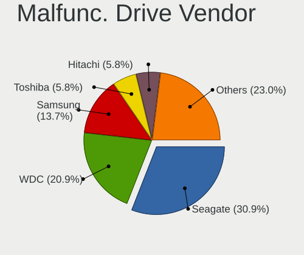

| Vendor              | Desktops | Drives | Percent |
|---------------------|----------|--------|---------|
| Seagate             | 43       | 81     | 30.94%  |
| WDC                 | 29       | 42     | 20.86%  |
| Samsung Electronics | 19       | 29     | 13.67%  |
| Toshiba             | 8        | 12     | 5.76%   |
| Hitachi             | 8        | 9      | 5.76%   |
| Crucial             | 7        | 8      | 5.04%   |
| Kingston            | 6        | 7      | 4.32%   |
| Maxtor              | 5        | 6      | 3.6%    |
| SanDisk             | 2        | 2      | 1.44%   |
| Micron Technology   | 2        | 2      | 1.44%   |
| A-DATA Technology   | 2        | 2      | 1.44%   |
| XPG                 | 1        | 1      | 0.72%   |
| SPCC                | 1        | 1      | 0.72%   |
| SK hynix            | 1        | 1      | 0.72%   |
| OCZ-VERTEX2         | 1        | 1      | 0.72%   |
| LITEONIT            | 1        | 2      | 0.72%   |
| KingFast            | 1        | 1      | 0.72%   |
| Intel               | 1        | 2      | 0.72%   |
| INNOVATION IT       | 1        | 1      | 0.72%   |

Malfunc. HDD Vendor
-------------------

Vendors of faulty HDD drives

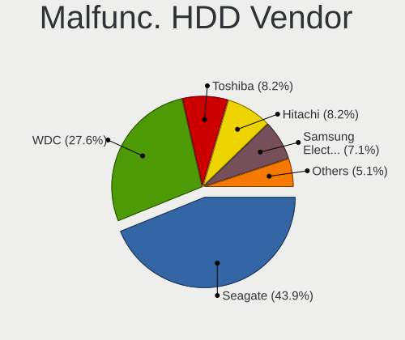

| Vendor              | Desktops | Drives | Percent |
|---------------------|----------|--------|---------|
| Seagate             | 43       | 81     | 43.88%  |
| WDC                 | 27       | 40     | 27.55%  |
| Toshiba             | 8        | 12     | 8.16%   |
| Hitachi             | 8        | 9      | 8.16%   |
| Samsung Electronics | 7        | 12     | 7.14%   |
| Maxtor              | 5        | 6      | 5.1%    |

Malfunc. Drive Kind
-------------------

Kinds of faulty drives

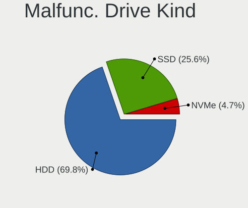

| Kind | Desktops | Drives | Percent |
|------|----------|--------|---------|
| HDD  | 90       | 160    | 69.77%  |
| SSD  | 33       | 41     | 25.58%  |
| NVMe | 6        | 9      | 4.65%   |

Failed Drives
-------------

Failed drive models

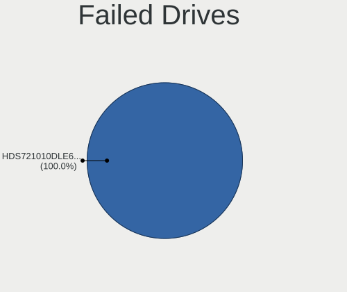

| Model                       | Desktops | Drives | Percent |
|-----------------------------|----------|--------|---------|
| Hitachi HDS721010DLE630 1TB | 1        | 1      | 100%    |

Failed Drive Vendor
-------------------

Failed drive vendors

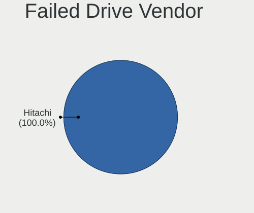

| Vendor  | Desktops | Drives | Percent |
|---------|----------|--------|---------|
| Hitachi | 1        | 1      | 100%    |

Drive Status
------------

Number of failed and malfunc. drives

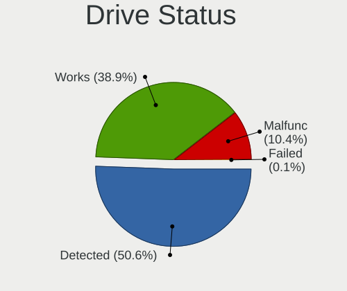

| Status   | Desktops | Drives | Percent |
|----------|----------|--------|---------|
| Detected | 608      | 2089   | 50.58%  |
| Works    | 468      | 1362   | 38.94%  |
| Malfunc  | 125      | 210    | 10.4%   |
| Failed   | 1        | 1      | 0.08%   |

Storage controller
------------------

Storage Vendor
--------------

Storage controller vendors

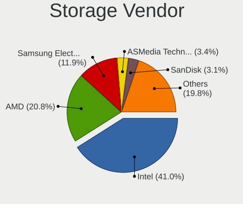

| Vendor                          | Desktops | Percent |
|---------------------------------|----------|---------|
| Intel                           | 672      | 41.03%  |
| AMD                             | 340      | 20.76%  |
| Samsung Electronics             | 195      | 11.9%   |
| ASMedia Technology              | 55       | 3.36%   |
| SanDisk                         | 51       | 3.11%   |
| Kingston Technology Company     | 44       | 2.69%   |
| Micron/Crucial Technology       | 42       | 2.56%   |
| Marvell Technology Group        | 39       | 2.38%   |
| JMicron Technology              | 38       | 2.32%   |
| Phison Electronics              | 35       | 2.14%   |
| SK hynix                        | 13       | 0.79%   |
| Nvidia                          | 13       | 0.79%   |
| Silicon Motion                  | 11       | 0.67%   |
| Micron Technology               | 11       | 0.67%   |
| ADATA Technology                | 10       | 0.61%   |
| Toshiba America Info Systems    | 9        | 0.55%   |
| Realtek Semiconductor           | 8        | 0.49%   |
| Broadcom / LSI                  | 7        | 0.43%   |
| Shenzhen Longsys Electronics    | 6        | 0.37%   |
| Seagate Technology              | 6        | 0.37%   |
| LSI Logic / Symbios Logic       | 6        | 0.37%   |
| MAXIO Technology (Hangzhou)     | 4        | 0.24%   |
| VIA Technologies                | 3        | 0.18%   |
| Hewlett-Packard                 | 3        | 0.18%   |
| Solidigm                        | 2        | 0.12%   |
| Silicon Image                   | 2        | 0.12%   |
| Lite-On Technology              | 2        | 0.12%   |
| Union Memory (Shenzhen)         | 1        | 0.06%   |
| Transcend                       | 1        | 0.06%   |
| TenaFe                          | 1        | 0.06%   |
| Shenzhen Techwinsemi Technology | 1        | 0.06%   |
| PMC-Sierra                      | 1        | 0.06%   |
| Lite-On IT Corp. / Plextor      | 1        | 0.06%   |
| INNOGRIT                        | 1        | 0.06%   |
| Hosin Global Electronics        | 1        | 0.06%   |
| HighPoint Technologies          | 1        | 0.06%   |
| Areca Technology                | 1        | 0.06%   |
| Adaptec                         | 1        | 0.06%   |

Storage Model
-------------

Storage controller models

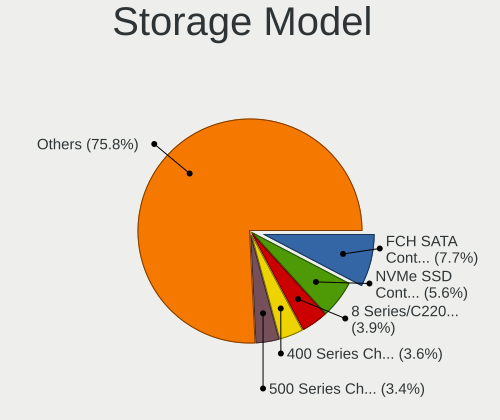

| Model                                                                                   | Desktops | Percent |
|-----------------------------------------------------------------------------------------|----------|---------|
| AMD FCH SATA Controller [AHCI mode]                                                     | 152      | 7.68%   |
| Samsung NVMe SSD Controller SM981/PM981/PM983                                           | 110      | 5.56%   |
| Intel 8 Series/C220 Series Chipset Family 6-port SATA Controller 1 [AHCI mode]          | 78       | 3.94%   |
| AMD 400 Series Chipset SATA Controller                                                  | 71       | 3.59%   |
| AMD 500 Series Chipset SATA Controller                                                  | 68       | 3.44%   |
| Intel SATA Controller [RAID mode]                                                       | 59       | 2.98%   |
| AMD 600 Series Chipset SATA Controller                                                  | 53       | 2.68%   |
| Intel Q170/Q150/B150/H170/H110/Z170/CM236 Chipset SATA Controller [AHCI Mode]           | 51       | 2.58%   |
| Intel 7 Series/C210 Series Chipset Family 6-port SATA Controller [AHCI mode]            | 46       | 2.33%   |
| Intel 6 Series/C200 Series Chipset Family 6 port Desktop SATA AHCI Controller           | 46       | 2.33%   |
| ASMedia ASM1061/ASM1062 Serial ATA Controller                                           | 46       | 2.33%   |
| Intel 200 Series PCH SATA controller [AHCI mode]                                        | 45       | 2.28%   |
| Samsung NVMe SSD Controller PM9A1/PM9A3/980PRO                                          | 40       | 2.02%   |
| Intel Cannon Lake PCH SATA AHCI Controller                                              | 34       | 1.72%   |
| Intel 9 Series Chipset Family SATA Controller [AHCI Mode]                               | 34       | 1.72%   |
| AMD SB7x0/SB8x0/SB9x0 IDE Controller                                                    | 33       | 1.67%   |
| AMD SB7x0/SB8x0/SB9x0 SATA Controller [IDE mode]                                        | 24       | 1.21%   |
| Samsung NVMe SSD Controller 980 (DRAM-less)                                             | 23       | 1.16%   |
| Samsung NVMe SSD Controller S4LV008[Pascal]                                             | 22       | 1.11%   |
| JMicron JMB363 SATA/IDE Controller                                                      | 21       | 1.06%   |
| Intel Alder Lake-S PCH SATA Controller [AHCI Mode]                                      | 21       | 1.06%   |
| Micron/Crucial P2 [Nick P2] / P3 / P3 Plus NVMe PCIe SSD (DRAM-less)                    | 19       | 0.96%   |
| Intel Raptor Lake SATA AHCI Controller                                                  | 19       | 0.96%   |
| Intel NM10/ICH7 Family SATA Controller [IDE mode]                                       | 18       | 0.91%   |
| AMD SB7x0/SB8x0/SB9x0 SATA Controller [AHCI mode]                                       | 18       | 0.91%   |
| Intel 82801G (ICH7 Family) IDE Controller                                               | 17       | 0.86%   |
| Intel 82801JI (ICH10 Family) 2 port SATA IDE Controller #2                              | 16       | 0.81%   |
| JMicron JMB368 IDE controller                                                           | 15       | 0.76%   |
| Intel 500 Series Chipset Family SATA AHCI Controller                                    | 15       | 0.76%   |
| Phison E12 NVMe Controller                                                              | 14       | 0.71%   |
| Intel C600/X79 series chipset 6-Port SATA AHCI Controller                               | 14       | 0.71%   |
| Intel 82801JI (ICH10 Family) 4 port SATA IDE Controller #1                              | 14       | 0.71%   |
| Intel 6 Series/C200 Series Chipset Family Desktop SATA Controller (IDE mode, ports 4-5) | 14       | 0.71%   |
| Intel 6 Series/C200 Series Chipset Family Desktop SATA Controller (IDE mode, ports 0-3) | 14       | 0.71%   |
| Kingston Company A2000 NVMe SSD [SM2263EN]                                              | 13       | 0.66%   |
| Intel C610/X99 series chipset 6-Port SATA Controller [AHCI mode]                        | 13       | 0.66%   |
| Intel 82801I (ICH9 Family) 2 port SATA Controller [IDE mode]                            | 13       | 0.66%   |
| Intel 5 Series/3400 Series Chipset 4 port SATA IDE Controller                           | 13       | 0.66%   |
| Intel 5 Series/3400 Series Chipset 2 port SATA IDE Controller                           | 13       | 0.66%   |
| AMD 300 Series Chipset SATA Controller                                                  | 13       | 0.66%   |

Storage Kind
------------

Kind of storage controller (IDE, SATA, NVMe, SAS, ...)

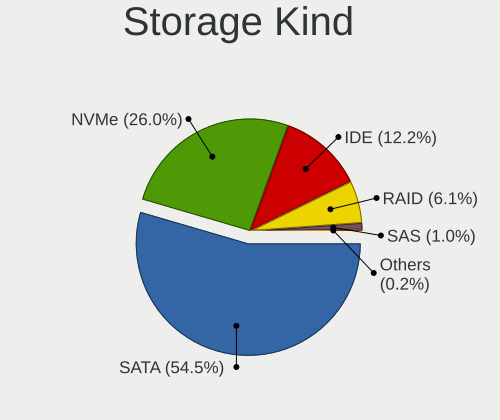

| Kind | Desktops | Percent |
|------|----------|---------|
| SATA | 855      | 54.53%  |
| NVMe | 408      | 26.02%  |
| IDE  | 191      | 12.18%  |
| RAID | 96       | 6.12%   |
| SAS  | 15       | 0.96%   |
| SCSI | 3        | 0.19%   |

Processor
---------

CPU Vendor
----------

Processor vendors

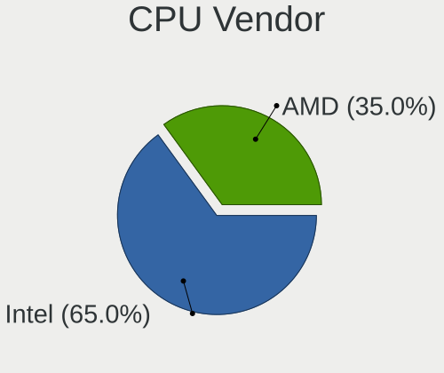

| Vendor | Desktops | Percent |
|--------|----------|---------|
| Intel  | 672      | 64.99%  |
| AMD    | 362      | 35.01%  |

CPU Model
---------

Processor models

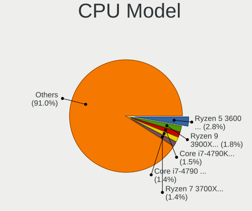

| Model                                       | Desktops | Percent |
|---------------------------------------------|----------|---------|
| AMD Ryzen 5 3600 6-Core Processor           | 29       | 2.79%   |
| AMD Ryzen 9 3900X 12-Core Processor         | 19       | 1.83%   |
| Intel Core i7-4790K CPU @ 4.00GHz           | 16       | 1.54%   |
| Intel Core i7-4790 CPU @ 3.60GHz            | 15       | 1.44%   |
| AMD Ryzen 7 3700X 8-Core Processor          | 15       | 1.44%   |
| AMD Ryzen 5 5600X 6-Core Processor          | 15       | 1.44%   |
| Intel Core i7-2600 CPU @ 3.40GHz            | 14       | 1.34%   |
| Intel Core i5-3470 CPU @ 3.20GHz            | 14       | 1.34%   |
| AMD Ryzen 7 5800X 8-Core Processor          | 14       | 1.34%   |
| Intel Core i7-8700 CPU @ 3.20GHz            | 13       | 1.25%   |
| AMD Ryzen 9 5900X 12-Core Processor         | 13       | 1.25%   |
| Intel Core i7-3770 CPU @ 3.40GHz            | 10       | 0.96%   |
| Intel Core i5-2400 CPU @ 3.10GHz            | 10       | 0.96%   |
| AMD Ryzen 5 2600 Six-Core Processor         | 10       | 0.96%   |
| Intel Core i7-6700 CPU @ 3.40GHz            | 9        | 0.86%   |
| Intel Core i5-4460 CPU @ 3.20GHz            | 9        | 0.86%   |
| Intel Core 2 Duo CPU E8400 @ 3.00GHz        | 9        | 0.86%   |
| Intel Core i7-7700 CPU @ 3.60GHz            | 8        | 0.77%   |
| Intel Core i7-6700K CPU @ 4.00GHz           | 8        | 0.77%   |
| Intel Core i5-8400 CPU @ 2.80GHz            | 8        | 0.77%   |
| AMD Ryzen 7 5700G with Radeon Graphics      | 8        | 0.77%   |
| AMD Ryzen 7 2700X Eight-Core Processor      | 8        | 0.77%   |
| AMD Ryzen 5 3400G with Radeon Vega Graphics | 8        | 0.77%   |
| Intel Core i7-4770 CPU @ 3.40GHz            | 7        | 0.67%   |
| Intel Core i5-7500 CPU @ 3.40GHz            | 7        | 0.67%   |
| Intel Core i5-7400 CPU @ 3.00GHz            | 7        | 0.67%   |
| Intel Core i5-6400 CPU @ 2.70GHz            | 7        | 0.67%   |
| AMD Ryzen 9 7900 12-Core Processor          | 7        | 0.67%   |
| AMD Ryzen 7 7800X3D 8-Core Processor        | 7        | 0.67%   |
| AMD Ryzen 5 5600G with Radeon Graphics      | 7        | 0.67%   |
| Intel Core i7-7700K CPU @ 4.20GHz           | 6        | 0.58%   |
| Intel Core i7-3770K CPU @ 3.50GHz           | 6        | 0.58%   |
| Intel Core i7-10700 CPU @ 2.90GHz           | 6        | 0.58%   |
| Intel Core i7 CPU 920 @ 2.67GHz             | 6        | 0.58%   |
| Intel Core i7 CPU 860 @ 2.80GHz             | 6        | 0.58%   |
| Intel Core i5-6500 CPU @ 3.20GHz            | 6        | 0.58%   |
| Intel Core i5-4590S CPU @ 3.00GHz           | 6        | 0.58%   |
| Intel Core i5-3330 CPU @ 3.00GHz            | 6        | 0.58%   |
| Intel Core i5 CPU 650 @ 3.20GHz             | 6        | 0.58%   |
| Intel Core i3-4130 CPU @ 3.40GHz            | 6        | 0.58%   |

CPU Model Family
----------------

Processor model prefix

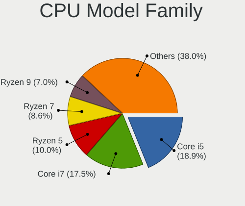

| Model                   | Desktops | Percent |
|-------------------------|----------|---------|
| Intel Core i5           | 196      | 18.86%  |
| Intel Core i7           | 182      | 17.52%  |
| AMD Ryzen 5             | 104      | 10.01%  |
| AMD Ryzen 7             | 89       | 8.57%   |
| AMD Ryzen 9             | 73       | 7.03%   |
| Other                   | 60       | 5.77%   |
| Intel Core i3           | 57       | 5.49%   |
| Intel Xeon              | 41       | 3.95%   |
| Intel Core 2 Duo        | 27       | 2.6%    |
| Intel Core 2 Quad       | 21       | 2.02%   |
| Intel Celeron           | 21       | 2.02%   |
| Intel Pentium           | 15       | 1.44%   |
| Intel Core i9           | 15       | 1.44%   |
| Intel Pentium Dual-Core | 14       | 1.35%   |
| AMD FX                  | 13       | 1.25%   |
| Intel Core 2            | 11       | 1.06%   |
| AMD Phenom II X4        | 9        | 0.87%   |
| AMD A10                 | 9        | 0.87%   |
| AMD Ryzen 3             | 8        | 0.77%   |
| AMD Ryzen 5 PRO         | 7        | 0.67%   |
| Intel Pentium Dual      | 6        | 0.58%   |
| AMD Athlon II X2        | 6        | 0.58%   |
| Intel Atom              | 5        | 0.48%   |
| AMD Ryzen Threadripper  | 5        | 0.48%   |
| AMD Phenom              | 5        | 0.48%   |
| AMD Athlon 64 X2        | 5        | 0.48%   |
| AMD A8                  | 5        | 0.48%   |
| AMD Athlon II X4        | 4        | 0.38%   |
| AMD A4                  | 4        | 0.38%   |
| Intel Pentium 4         | 3        | 0.29%   |
| AMD Phenom II X6        | 3        | 0.29%   |
| Intel Pentium D         | 2        | 0.19%   |
| Intel Genuine           | 1        | 0.1%    |
| AMD Sempron             | 1        | 0.1%    |
| AMD Ryzen 7 PRO         | 1        | 0.1%    |
| AMD Ryzen 3 PRO         | 1        | 0.1%    |
| AMD Phenom II X3        | 1        | 0.1%    |
| AMD Phenom II X2        | 1        | 0.1%    |
| AMD Phenom II           | 1        | 0.1%    |
| AMD Embedded            | 1        | 0.1%    |

CPU Cores
---------

Number of processor cores

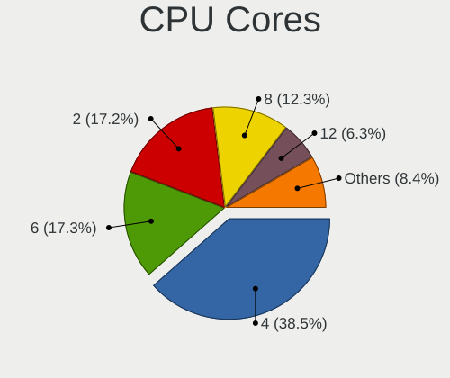

| Number | Desktops | Percent |
|--------|----------|---------|
| 4      | 400      | 38.5%   |
| 6      | 180      | 17.32%  |
| 2      | 179      | 17.23%  |
| 8      | 128      | 12.32%  |
| 12     | 65       | 6.26%   |
| 16     | 30       | 2.89%   |
| 24     | 12       | 1.15%   |
| 10     | 12       | 1.15%   |
| 3      | 10       | 0.96%   |
| 1      | 10       | 0.96%   |
| 14     | 5        | 0.48%   |
| 64     | 2        | 0.19%   |
| 32     | 2        | 0.19%   |
| 28     | 2        | 0.19%   |
| 36     | 1        | 0.1%    |
| 18     | 1        | 0.1%    |

CPU Sockets
-----------

Number of sockets

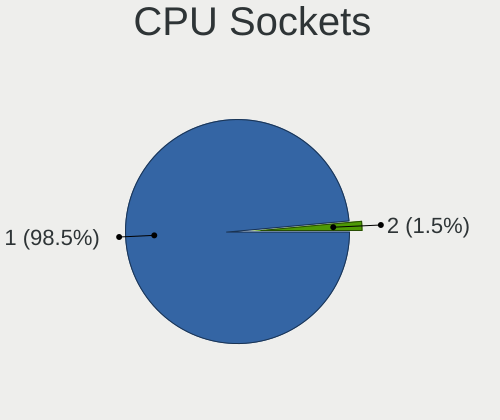

| Number | Desktops | Percent |
|--------|----------|---------|
| 1      | 1019     | 98.55%  |
| 2      | 15       | 1.45%   |

CPU Threads
-----------

Threads per core (Hyper-Threading)

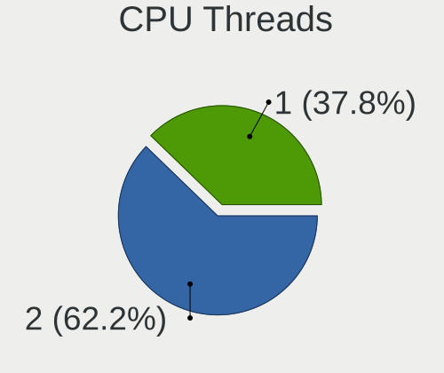

| Number | Desktops | Percent |
|--------|----------|---------|
| 2      | 646      | 62.24%  |
| 1      | 392      | 37.76%  |

CPU Op-Modes
------------

CPU Operation Modes (32-bit, 64-bit)

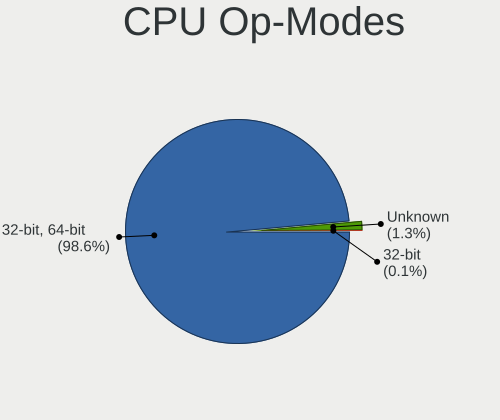

| Op mode        | Desktops | Percent |
|----------------|----------|---------|
| 32-bit, 64-bit | 1023     | 98.55%  |
| Unknown        | 14       | 1.35%   |
| 32-bit         | 1        | 0.1%    |

CPU Microcode
-------------

Microcode number

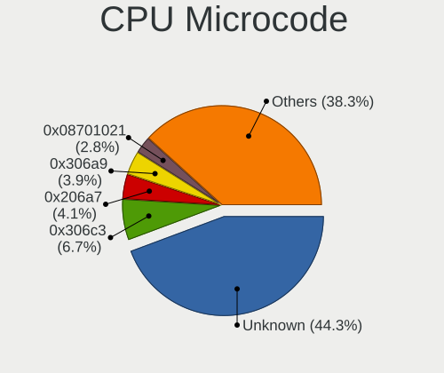

| Number     | Desktops | Percent |
|------------|----------|---------|
| Unknown    | 491      | 44.31%  |
| 0x306c3    | 74       | 6.68%   |
| 0x206a7    | 45       | 4.06%   |
| 0x306a9    | 43       | 3.88%   |
| 0x08701021 | 31       | 2.8%    |
| 0x506e3    | 30       | 2.71%   |
| 0x906e9    | 27       | 2.44%   |
| 0x1067a    | 27       | 2.44%   |
| 0x906ea    | 19       | 1.71%   |
| 0x08701013 | 16       | 1.44%   |
| 0x0800820d | 14       | 1.26%   |
| 0x0a201009 | 12       | 1.08%   |
| 0x106e5    | 11       | 0.99%   |
| 0x08108109 | 9        | 0.81%   |
| 0x010000c8 | 9        | 0.81%   |
| 0x6fd      | 8        | 0.72%   |
| 0x306f2    | 8        | 0.72%   |
| 0x206d7    | 8        | 0.72%   |
| 0xa0655    | 7        | 0.63%   |
| 0x6fb      | 7        | 0.63%   |
| 0x20655    | 7        | 0.63%   |
| 0x10676    | 7        | 0.63%   |
| 0x0a50000d | 7        | 0.63%   |
| 0x0a20120a | 7        | 0.63%   |
| 0x06001119 | 7        | 0.63%   |
| 0x90672    | 6        | 0.54%   |
| 0x6f6      | 6        | 0.54%   |
| 0x0a601203 | 6        | 0.54%   |
| 0x0a50000c | 6        | 0.54%   |
| 0x08701030 | 6        | 0.54%   |
| 0x06000852 | 6        | 0.54%   |
| 0x406f1    | 5        | 0.45%   |
| 0x106a5    | 5        | 0.45%   |
| 0x08001138 | 5        | 0.45%   |
| 0x08001137 | 5        | 0.45%   |
| 0x08001129 | 5        | 0.45%   |
| 0xa0653    | 4        | 0.36%   |
| 0x206c2    | 4        | 0.36%   |
| 0x20652    | 4        | 0.36%   |
| 0x0a201016 | 4        | 0.36%   |

CPU Microarch
-------------

Microarchitecture

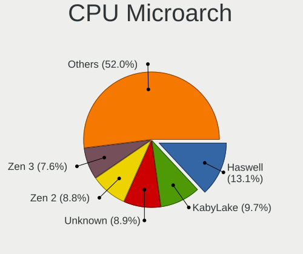

| Name             | Desktops | Percent |
|------------------|----------|---------|
| Haswell          | 136      | 13.09%  |
| KabyLake         | 101      | 9.72%   |
| Unknown          | 92       | 8.85%   |
| Zen 2            | 91       | 8.76%   |
| Zen 3            | 79       | 7.6%    |
| IvyBridge        | 68       | 6.54%   |
| SandyBridge      | 67       | 6.45%   |
| Skylake          | 51       | 4.91%   |
| Penryn           | 49       | 4.72%   |
| Zen+             | 40       | 3.85%   |
| Core             | 35       | 3.37%   |
| K10              | 31       | 2.98%   |
| Nehalem          | 26       | 2.5%    |
| CometLake        | 25       | 2.41%   |
| Alderlake Hybrid | 23       | 2.21%   |
| Piledriver       | 22       | 2.12%   |
| Zen              | 21       | 2.02%   |
| Westmere         | 17       | 1.64%   |
| Broadwell        | 10       | 0.96%   |
| Silvermont       | 8        | 0.77%   |
| K8 Hammer        | 7        | 0.67%   |
| NetBurst         | 6        | 0.58%   |
| Icelake          | 6        | 0.58%   |
| Gracemont        | 5        | 0.48%   |
| Tremont          | 4        | 0.38%   |
| Excavator        | 4        | 0.38%   |
| Steamroller      | 3        | 0.29%   |
| Goldmont plus    | 3        | 0.29%   |
| Puma             | 2        | 0.19%   |
| Bobcat           | 2        | 0.19%   |
| K10 Llano        | 1        | 0.1%    |
| Jaguar           | 1        | 0.1%    |
| Goldmont         | 1        | 0.1%    |
| Bulldozer        | 1        | 0.1%    |
| Bonnell          | 1        | 0.1%    |

Graphics
--------

GPU Vendor
----------

Vendors of graphics cards

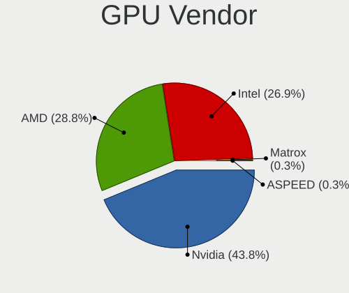

| Vendor                     | Desktops | Percent |
|----------------------------|----------|---------|
| Nvidia                     | 496      | 43.78%  |
| AMD                        | 326      | 28.77%  |
| Intel                      | 305      | 26.92%  |
| Matrox Electronics Systems | 3        | 0.26%   |
| ASPEED Technology          | 3        | 0.26%   |

GPU Model
---------

Graphics card models

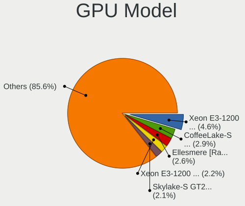

| Model                                                                       | Desktops | Percent |
|-----------------------------------------------------------------------------|----------|---------|
| Intel Xeon E3-1200 v3/4th Gen Core Processor Integrated Graphics Controller | 55       | 4.61%   |
| Intel CoffeeLake-S GT2 [UHD Graphics 630]                                   | 35       | 2.93%   |
| AMD Ellesmere [Radeon RX 470/480/570/570X/580/580X/590]                     | 31       | 2.6%    |
| Intel Xeon E3-1200 v2/3rd Gen Core processor Graphics Controller            | 26       | 2.18%   |
| Intel Skylake-S GT2 [HD Graphics 530]                                       | 25       | 2.1%    |
| AMD Raphael                                                                 | 25       | 2.1%    |
| Nvidia GP106 [GeForce GTX 1060 6GB]                                         | 23       | 1.93%   |
| AMD Navi 10 [Radeon RX 5600 OEM/5600 XT / 5700/5700 XT]                     | 21       | 1.76%   |
| Nvidia GP107 [GeForce GTX 1050 Ti]                                          | 20       | 1.68%   |
| Nvidia GM204 [GeForce GTX 970]                                              | 20       | 1.68%   |
| Intel 2nd Generation Core Processor Family Integrated Graphics Controller   | 20       | 1.68%   |
| Nvidia GP104 [GeForce GTX 1070]                                             | 19       | 1.59%   |
| Nvidia GK208B [GeForce GT 710]                                              | 18       | 1.51%   |
| Nvidia GP108 [GeForce GT 1030]                                              | 17       | 1.42%   |
| AMD Cezanne [Radeon Vega Series / Radeon Vega Mobile Series]                | 16       | 1.34%   |
| Nvidia GT218 [GeForce 210]                                                  | 15       | 1.26%   |
| Intel Kaby Lake-S GT2 [HD Graphics 630]                                     | 15       | 1.26%   |
| AMD Navi 22 [Radeon RX 6700/6700 XT/6750 XT / 6800M/6850M XT]               | 15       | 1.26%   |
| Nvidia GK208B [GeForce GT 730]                                              | 14       | 1.17%   |
| Intel CometLake-S GT2 [UHD Graphics 630]                                    | 13       | 1.09%   |
| AMD Navi 31 [Radeon RX 7900 XT/7900 XTX/7900 GRE/7900M]                     | 13       | 1.09%   |
| AMD Picasso/Raven 2 [Radeon Vega Series / Radeon Vega Mobile Series]        | 12       | 1.01%   |
| AMD Granite Ridge [Radeon Graphics]                                         | 12       | 1.01%   |
| Nvidia TU116 [GeForce GTX 1660 Ti]                                          | 11       | 0.92%   |
| Nvidia TU106 [GeForce RTX 2060 Rev. A]                                      | 11       | 0.92%   |
| Nvidia GA104 [GeForce RTX 3070]                                             | 11       | 0.92%   |
| Intel 4 Series Chipset Integrated Graphics Controller                       | 11       | 0.92%   |
| AMD Navi 33 [Radeon RX 7600/7600 XT/7600M XT/7600S/7700S / PRO W7600]       | 11       | 0.92%   |
| AMD Navi 23 [Radeon RX 6600/6600 XT/6600M]                                  | 11       | 0.92%   |
| Nvidia GP107 [GeForce GTX 1050]                                             | 10       | 0.84%   |
| Nvidia GA106 [GeForce RTX 3060 Lite Hash Rate]                              | 10       | 0.84%   |
| Intel IvyBridge GT2 [HD Graphics 4000]                                      | 10       | 0.84%   |
| AMD Caicos [Radeon HD 6450/7450/8450 / R5 230 OEM]                          | 10       | 0.84%   |
| Nvidia TU104 [GeForce RTX 2070 SUPER]                                       | 9        | 0.75%   |
| Intel 4th Generation Core Processor Family Integrated Graphics Controller   | 9        | 0.75%   |
| AMD Baffin [Radeon RX 550 640SP / RX 560/560X]                              | 9        | 0.75%   |
| Nvidia GP102 [GeForce GTX 1080 Ti]                                          | 8        | 0.67%   |
| Nvidia GM107 [GeForce GTX 750 Ti]                                           | 8        | 0.67%   |
| Nvidia GK107 [GeForce GT 640]                                               | 8        | 0.67%   |
| AMD Renoir [Radeon Vega Series / Radeon Vega Mobile Series]                 | 8        | 0.67%   |

GPU Combo
---------

Combinations of graphics cards

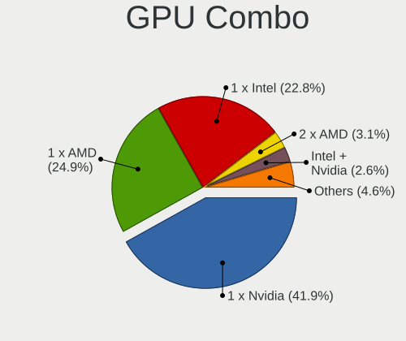

| Name               | Desktops | Percent |
|--------------------|----------|---------|
| 1 x Nvidia         | 444      | 41.93%  |
| 1 x AMD            | 264      | 24.93%  |
| 1 x Intel          | 241      | 22.76%  |
| 2 x AMD            | 33       | 3.12%   |
| Intel + Nvidia     | 28       | 2.64%   |
| AMD + Nvidia       | 24       | 2.27%   |
| Intel + AMD        | 9        | 0.85%   |
| 2 x Intel          | 4        | 0.38%   |
| Other              | 3        | 0.28%   |
| 1 x Matrox         | 3        | 0.28%   |
| 1 x ASPEED         | 3        | 0.28%   |
| 2 x Nvidia         | 2        | 0.19%   |
| Intel + 2 x Nvidia | 1        | 0.09%   |

GPU Driver
----------

Free vs proprietary

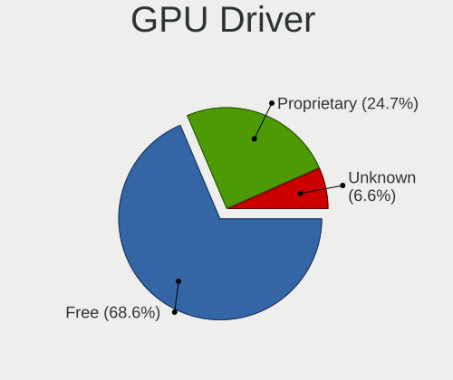

| Driver      | Desktops | Percent |
|-------------|----------|---------|
| Free        | 735      | 68.63%  |
| Proprietary | 265      | 24.74%  |
| Unknown     | 71       | 6.63%   |

GPU Memory
----------

Total video memory

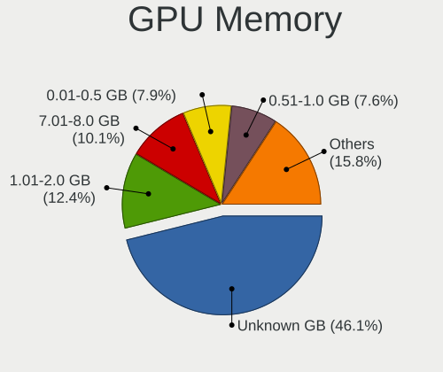

| Size in GB | Desktops | Percent |
|------------|----------|---------|
| Unknown    | 505      | 46.12%  |
| 1.01-2.0   | 136      | 12.42%  |
| 7.01-8.0   | 111      | 10.14%  |
| 0.01-0.5   | 87       | 7.95%   |
| 0.51-1.0   | 83       | 7.58%   |
| 3.01-4.0   | 66       | 6.03%   |
| 8.01-16.0  | 51       | 4.66%   |
| 5.01-6.0   | 37       | 3.38%   |
| 16.01-24.0 | 10       | 0.91%   |
| 2.01-3.0   | 9        | 0.82%   |

Monitor
-------

Monitor Vendor
--------------

Monitor vendors

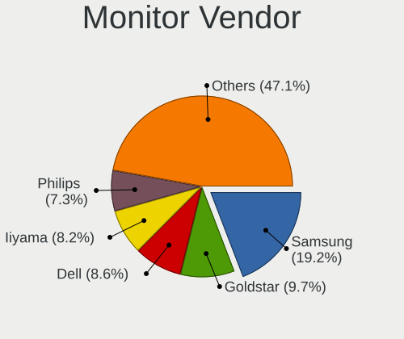

| Vendor               | Desktops | Percent |
|----------------------|----------|---------|
| Samsung Electronics  | 214      | 19.18%  |
| Goldstar             | 108      | 9.68%   |
| Dell                 | 96       | 8.6%    |
| Iiyama               | 91       | 8.15%   |
| Philips              | 81       | 7.26%   |
| Hewlett-Packard      | 64       | 5.73%   |
| AOC                  | 61       | 5.47%   |
| Acer                 | 53       | 4.75%   |
| BenQ                 | 46       | 4.12%   |
| Medion               | 40       | 3.58%   |
| Ancor Communications | 34       | 3.05%   |
| ASUSTek Computer     | 18       | 1.61%   |
| MSI                  | 17       | 1.52%   |
| Unknown              | 13       | 1.16%   |
| Lenovo               | 12       | 1.08%   |
| Sony                 | 11       | 0.99%   |
| Fujitsu Siemens      | 11       | 0.99%   |
| Gigabyte Technology  | 10       | 0.9%    |
| Eizo                 | 9        | 0.81%   |
| ViewSonic            | 7        | 0.63%   |
| Idek Iiyama          | 7        | 0.63%   |
| Vestel Elektronik    | 6        | 0.54%   |
| Packard Bell         | 6        | 0.54%   |
| LG Electronics       | 6        | 0.54%   |
| NEC Computers        | 5        | 0.45%   |
| Unknown (XXX)        | 4        | 0.36%   |
| Medion Akoya         | 4        | 0.36%   |
| Arnos Instruments    | 4        | 0.36%   |
| Toshiba              | 3        | 0.27%   |
| Panasonic            | 3        | 0.27%   |
| CTV                  | 3        | 0.27%   |
| BOE                  | 3        | 0.27%   |
| Belinea              | 3        | 0.27%   |
| SAC                  | 2        | 0.18%   |
| PKB                  | 2        | 0.18%   |
| Mi                   | 2        | 0.18%   |
| LDLC                 | 2        | 0.18%   |
| HUAWEI               | 2        | 0.18%   |
| HKC                  | 2        | 0.18%   |
| Denver               | 2        | 0.18%   |

Monitor Model
-------------

Monitor models

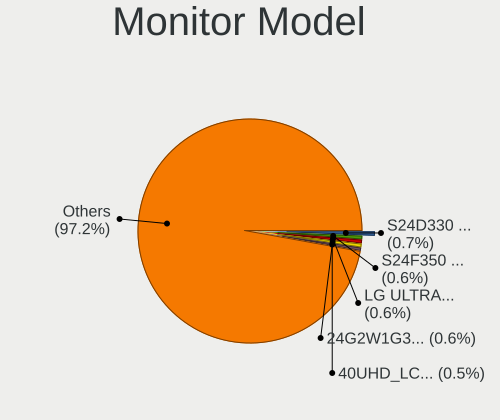

| Model                                                                   | Desktops | Percent |
|-------------------------------------------------------------------------|----------|---------|
| Samsung Electronics S24D330 SAM0D92 1920x1080 531x299mm 24.0-inch       | 8        | 0.65%   |
| Samsung Electronics S24F350 SAM0D20 1920x1080 521x293mm 23.5-inch       | 7        | 0.57%   |
| Goldstar LG ULTRAWIDE GSM59F1 2560x1080 670x280mm 28.6-inch             | 7        | 0.57%   |
| AOC 24G2W1G3 AOC2402 1920x1080 527x296mm 23.8-inch                      | 7        | 0.57%   |
| Vestel Elektronik 40UHD_LCD_TV VES3700 3840x2160 880x500mm 39.8-inch    | 6        | 0.49%   |
| Unknown LCD Monitor FFFF 2288x1287 2550x2550mm 142.0-inch               | 6        | 0.49%   |
| Samsung Electronics U28E590 SAM0C4D 3840x2160 607x345mm 27.5-inch       | 6        | 0.49%   |
| Samsung Electronics C24F390 SAM0D2C 1920x1080 521x293mm 23.5-inch       | 6        | 0.49%   |
| Goldstar 27GL850 GSM5B7F 2560x1440 597x336mm 27.0-inch                  | 6        | 0.49%   |
| AOC 27G2G4 AOC2702 1920x1080 598x336mm 27.0-inch                        | 6        | 0.49%   |
| Samsung Electronics SyncMaster SAM03E5 1680x1050 474x296mm 22.0-inch    | 5        | 0.41%   |
| Samsung Electronics SyncMaster SAM036F 1440x900 428x255mm 19.6-inch     | 5        | 0.41%   |
| Samsung Electronics S24D300 SAM0B43 1920x1080 531x299mm 24.0-inch       | 5        | 0.41%   |
| Medion MD 20430 MED36A2 1920x1080 521x293mm 23.5-inch                   | 5        | 0.41%   |
| Iiyama PLX2783H IVM6611 1920x1080 598x336mm 27.0-inch                   | 5        | 0.41%   |
| Iiyama PL2283H IVM562E 1920x1080 496x292mm 22.7-inch                    | 5        | 0.41%   |
| AOC G2460 AOC2460 1920x1080 531x299mm 24.0-inch                         | 5        | 0.41%   |
| Samsung Electronics S24R65x SAM1022 1920x1080 527x296mm 23.8-inch       | 4        | 0.33%   |
| Samsung Electronics LC32G7xT SAM7058 2560x1440 698x393mm 31.5-inch      | 4        | 0.33%   |
| Philips PHL 243V7 PHLC155 1920x1080 527x296mm 23.8-inch                 | 4        | 0.33%   |
| Iiyama PL2492H IVM612F 1920x1080 527x296mm 23.8-inch                    | 4        | 0.33%   |
| Iiyama PL2409HD IVM560C 1920x1080 521x293mm 23.5-inch                   | 4        | 0.33%   |
| Goldstar Ultra HD GSM5B09 3840x2160 600x340mm 27.2-inch                 | 4        | 0.33%   |
| Goldstar MP59G GSM5B34 1920x1080 480x270mm 21.7-inch                    | 4        | 0.33%   |
| BenQ GW2780 BNQ78E6 1920x1080 598x336mm 27.0-inch                       | 4        | 0.33%   |
| BenQ GC2870 BNQ78DD 1920x1080 621x341mm 27.9-inch                       | 4        | 0.33%   |
| Samsung Electronics SA300/350/360 SAM07D6 1920x1080 531x299mm 24.0-inch | 3        | 0.24%   |
| Samsung Electronics S24D390 SAM0B65 1920x1080 521x293mm 23.5-inch       | 3        | 0.24%   |
| Samsung Electronics S24D340 SAM0BBB 1920x1080 531x299mm 24.0-inch       | 3        | 0.24%   |
| Samsung Electronics S22D300 SAM0B3F 1920x1080 477x268mm 21.5-inch       | 3        | 0.24%   |
| Samsung Electronics LCD Monitor SAM03BC 1920x1080                       | 3        | 0.24%   |
| Samsung Electronics C27F390 SAM0D32 1920x1080 598x336mm 27.0-inch       | 3        | 0.24%   |
| Philips LCD Monitor FTV 1920x1080                                       | 3        | 0.24%   |
| Philips FTV PHL01EA 1920x1080 1440x810mm 65.0-inch                      | 3        | 0.24%   |
| Iiyama PL2792UH IVM664D 3840x2160 596x335mm 26.9-inch                   | 3        | 0.24%   |
| Hewlett-Packard 24f HPN3545 1920x1080 527x296mm 23.8-inch               | 3        | 0.24%   |
| Goldstar L222W GSM5664 1680x1050 474x296mm 22.0-inch                    | 3        | 0.24%   |
| Goldstar HDR 4K GSM7706 3840x2160 600x340mm 27.2-inch                   | 3        | 0.24%   |
| Dell U2713HM DEL4080 2560x1440 597x336mm 27.0-inch                      | 3        | 0.24%   |
| Dell U2515H DELD06F 2560x1440 553x311mm 25.0-inch                       | 3        | 0.24%   |

Monitor Resolution
------------------

Monitor screen resolution

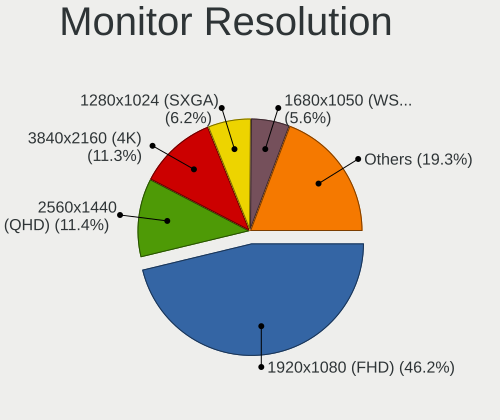

| Resolution         | Desktops | Percent |
|--------------------|----------|---------|
| 1920x1080 (FHD)    | 504      | 46.24%  |
| 2560x1440 (QHD)    | 124      | 11.38%  |
| 3840x2160 (4K)     | 123      | 11.28%  |
| 1280x1024 (SXGA)   | 68       | 6.24%   |
| 1680x1050 (WSXGA+) | 61       | 5.6%    |
| 3440x1440          | 37       | 3.39%   |
| 1440x900 (WXGA+)   | 31       | 2.84%   |
| 1920x1200 (WUXGA)  | 30       | 2.75%   |
| 3840x1080          | 21       | 1.93%   |
| Unknown            | 19       | 1.74%   |
| 2560x1080          | 13       | 1.19%   |
| 1600x900 (HD+)     | 10       | 0.92%   |
| 1360x768           | 9        | 0.83%   |
| 1366x768 (WXGA)    | 7        | 0.64%   |
| 2288x1287          | 6        | 0.55%   |
| 1600x1200          | 6        | 0.55%   |
| 5760x1080          | 3        | 0.28%   |
| 1024x768 (XGA)     | 3        | 0.28%   |
| 3840x1600          | 2        | 0.18%   |
| 2960x1050          | 2        | 0.18%   |
| 2560x1600          | 2        | 0.18%   |
| 1920x540           | 2        | 0.18%   |
| 1280x960           | 2        | 0.18%   |
| 4480x1080          | 1        | 0.09%   |
| 3840x1200          | 1        | 0.09%   |
| 3360x1050          | 1        | 0.09%   |
| 1920x1440          | 1        | 0.09%   |
| 1280x720 (HD)      | 1        | 0.09%   |

Monitor Diagonal
----------------

Diagonal size in inches

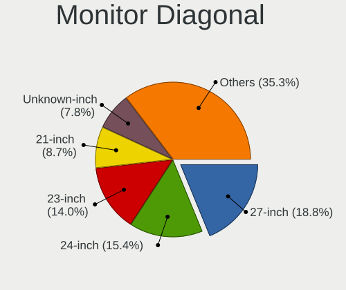

| Inches  | Desktops | Percent |
|---------|----------|---------|
| 27      | 213      | 18.82%  |
| 24      | 174      | 15.37%  |
| 23      | 159      | 14.05%  |
| 21      | 98       | 8.66%   |
| Unknown | 88       | 7.77%   |
| 19      | 63       | 5.57%   |
| 31      | 58       | 5.12%   |
| 34      | 41       | 3.62%   |
| 22      | 37       | 3.27%   |
| 20      | 25       | 2.21%   |
| 18      | 23       | 2.03%   |
| 17      | 22       | 1.94%   |
| 84      | 12       | 1.06%   |
| 72      | 12       | 1.06%   |
| 32      | 12       | 1.06%   |
| 25      | 12       | 1.06%   |
| 54      | 9        | 0.8%    |
| 40      | 8        | 0.71%   |
| 15      | 8        | 0.71%   |
| 142     | 6        | 0.53%   |
| 63      | 6        | 0.53%   |
| 65      | 5        | 0.44%   |
| 49      | 5        | 0.44%   |
| 48      | 5        | 0.44%   |
| 33      | 4        | 0.35%   |
| 26      | 4        | 0.35%   |
| 43      | 3        | 0.27%   |
| 35      | 3        | 0.27%   |
| 16      | 3        | 0.27%   |
| 46      | 2        | 0.18%   |
| 37      | 2        | 0.18%   |
| 29      | 2        | 0.18%   |
| 28      | 2        | 0.18%   |
| 99      | 1        | 0.09%   |
| 55      | 1        | 0.09%   |
| 42      | 1        | 0.09%   |
| 39      | 1        | 0.09%   |
| 30      | 1        | 0.09%   |
| 14      | 1        | 0.09%   |

Monitor Width
-------------

Physical width

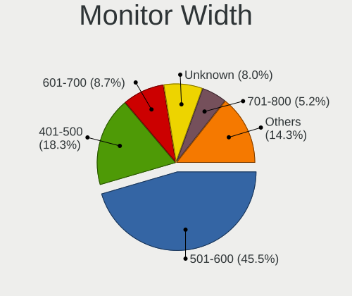

| Width in mm    | Desktops | Percent |
|----------------|----------|---------|
| 501-600        | 499      | 45.49%  |
| 401-500        | 201      | 18.32%  |
| 601-700        | 95       | 8.66%   |
| Unknown        | 88       | 8.02%   |
| 701-800        | 57       | 5.2%    |
| 351-400        | 43       | 3.92%   |
| 1001-1500      | 33       | 3.01%   |
| 301-350        | 32       | 2.92%   |
| 1501-2000      | 24       | 2.19%   |
| 801-900        | 12       | 1.09%   |
| More than 2000 | 7        | 0.64%   |
| 901-1000       | 6        | 0.55%   |

Aspect Ratio
------------

Proportional relationship between the width and the height

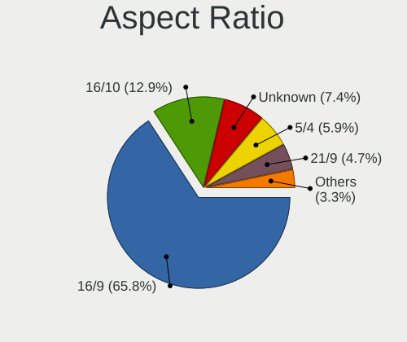

| Ratio   | Desktops | Percent |
|---------|----------|---------|
| 16/9    | 677      | 65.79%  |
| 16/10   | 133      | 12.93%  |
| Unknown | 76       | 7.39%   |
| 5/4     | 61       | 5.93%   |
| 21/9    | 48       | 4.66%   |
| 4/3     | 12       | 1.17%   |
| 32/9    | 9        | 0.87%   |
| 1.00    | 6        | 0.58%   |
| 6/5     | 5        | 0.49%   |
| 3/2     | 2        | 0.19%   |

Monitor Area
------------

Area in inch²

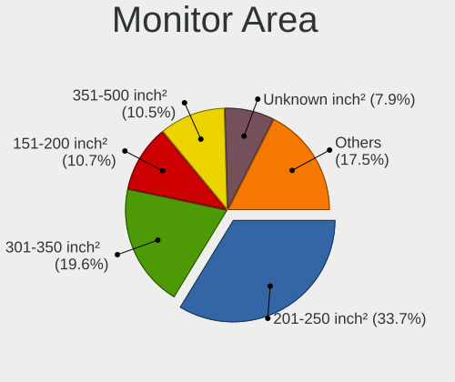

| Area in inch² | Desktops | Percent |
|----------------|----------|---------|
| 201-250        | 375      | 33.72%  |
| 301-350        | 218      | 19.6%   |
| 151-200        | 119      | 10.7%   |
| 351-500        | 117      | 10.52%  |
| Unknown        | 88       | 7.91%   |
| 251-300        | 75       | 6.74%   |
| More than 1000 | 52       | 4.68%   |
| 141-150        | 30       | 2.7%    |
| 501-1000       | 26       | 2.34%   |
| 101-110        | 7        | 0.63%   |
| 131-140        | 2        | 0.18%   |
| 81-90          | 1        | 0.09%   |
| 121-130        | 1        | 0.09%   |
| 111-120        | 1        | 0.09%   |

Pixel Density
-------------

Pixels per inch

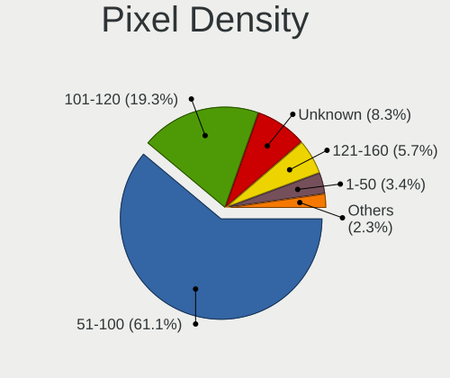

| Density | Desktops | Percent |
|---------|----------|---------|
| 51-100  | 648      | 61.07%  |
| 101-120 | 205      | 19.32%  |
| Unknown | 88       | 8.29%   |
| 121-160 | 60       | 5.66%   |
| 1-50    | 36       | 3.39%   |
| 161-240 | 24       | 2.26%   |

Multiple Monitors
-----------------

Total monitors connected

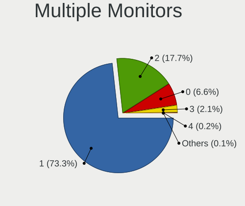

| Total | Desktops | Percent |
|-------|----------|---------|
| 1     | 789      | 73.26%  |
| 2     | 191      | 17.73%  |
| 0     | 71       | 6.59%   |
| 3     | 23       | 2.14%   |
| 4     | 2        | 0.19%   |
| 5     | 1        | 0.09%   |

Network
-------

Net Controller Vendor
---------------------

Controller vendors

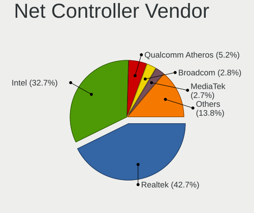

| Vendor                                 | Desktops | Percent |
|----------------------------------------|----------|---------|
| Realtek Semiconductor                  | 621      | 42.71%  |
| Intel                                  | 476      | 32.74%  |
| Qualcomm Atheros                       | 76       | 5.23%   |
| Broadcom                               | 41       | 2.82%   |
| MediaTek                               | 39       | 2.68%   |
| TP-Link                                | 21       | 1.44%   |
| D-Link System                          | 14       | 0.96%   |
| Nvidia                                 | 13       | 0.89%   |
| Ralink                                 | 12       | 0.83%   |
| Marvell Technology Group               | 11       | 0.76%   |
| Ralink Technology                      | 9        | 0.62%   |
| IMC Networks                           | 9        | 0.62%   |
| Aquantia                               | 9        | 0.62%   |
| ASIX Electronics                       | 8        | 0.55%   |
| Broadcom Limited                       | 7        | 0.48%   |
| ASUSTek Computer                       | 7        | 0.48%   |
| Microsoft                              | 6        | 0.41%   |
| D-Link                                 | 6        | 0.41%   |
| Samsung Electronics                    | 5        | 0.34%   |
| Qualcomm Technologies                  | 5        | 0.34%   |
| Qualcomm Atheros Communications        | 5        | 0.34%   |
| Linksys                                | 5        | 0.34%   |
| Arduino SA                             | 5        | 0.34%   |
| Sitecom Europe                         | 4        | 0.28%   |
| DisplayLink                            | 4        | 0.28%   |
| ZyXEL Communications                   | 2        | 0.14%   |
| Xiaomi                                 | 2        | 0.14%   |
| STMicroelectronics                     | 2        | 0.14%   |
| OPPO Electronics                       | 2        | 0.14%   |
| NetGear                                | 2        | 0.14%   |
| Microchip Technology                   | 2        | 0.14%   |
| Edimax Technology                      | 2        | 0.14%   |
| 802.11g Adapter [Linksys WUSB54GC v3]  | 2        | 0.14%   |
| U-Blox                                 | 1        | 0.07%   |
| Turtle Beach                           | 1        | 0.07%   |
| TRENDnet                               | 1        | 0.07%   |
| Texas Instruments                      | 1        | 0.07%   |
| Tenda                                  | 1        | 0.07%   |
| Tehuti Networks                        | 1        | 0.07%   |
| Sony Ericsson Mobile Communications AB | 1        | 0.07%   |

Net Controller Model
--------------------

Controller models

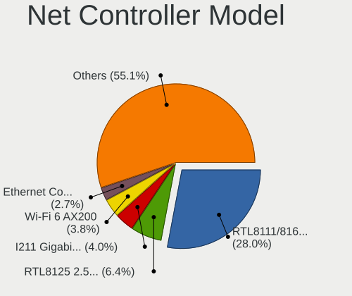

| Model                                                                  | Desktops | Percent |
|------------------------------------------------------------------------|----------|---------|
| Realtek RTL8111/8168/8211/8411 PCI Express Gigabit Ethernet Controller | 470      | 27.98%  |
| Realtek RTL8125 2.5GbE Controller                                      | 108      | 6.43%   |
| Intel I211 Gigabit Network Connection                                  | 67       | 3.99%   |
| Intel Wi-Fi 6 AX200                                                    | 64       | 3.81%   |
| Intel Ethernet Controller I225-V                                       | 45       | 2.68%   |
| Intel Ethernet Connection (2) I219-V                                   | 40       | 2.38%   |
| Intel 82579LM Gigabit Network Connection (Lewisville)                  | 33       | 1.96%   |
| Intel 82579V Gigabit Network Connection                                | 24       | 1.43%   |
| MediaTek MT7922 802.11ax PCI Express Wireless Network Adapter          | 23       | 1.37%   |
| Intel Ethernet Connection (2) I218-V                                   | 22       | 1.31%   |
| Intel Ethernet Connection I217-LM                                      | 18       | 1.07%   |
| Intel Wi-Fi 6E(802.11ax) AX210/AX1675* 2x2 [Typhoon Peak]              | 17       | 1.01%   |
| Intel Dual Band Wireless-AC 3168NGW [Stone Peak]                       | 17       | 1.01%   |
| Realtek RTL8153 Gigabit Ethernet Adapter                               | 16       | 0.95%   |
| Intel Ethernet Connection I217-V                                       | 14       | 0.83%   |
| Intel 700 Series Chipset CNVi WiFi                                     | 14       | 0.83%   |
| Qualcomm Atheros Killer E220x Gigabit Ethernet Controller              | 13       | 0.77%   |
| Intel Ethernet Controller I226-V                                       | 12       | 0.71%   |
| Intel Cannon Lake PCH CNVi WiFi                                        | 12       | 0.71%   |
| Intel 82574L Gigabit Network Connection                                | 12       | 0.71%   |
| Intel 82567LM-3 Gigabit Network Connection                             | 11       | 0.65%   |
| Realtek RTL8852BE PCIe 802.11ax Wireless Network Controller            | 10       | 0.6%    |
| Intel Ethernet Connection (7) I219-V                                   | 9        | 0.54%   |
| Broadcom BCM4360 802.11ac Dual Band Wireless Network Adapter           | 9        | 0.54%   |
| Realtek RTL8188EUS 802.11n Wireless Network Adapter                    | 8        | 0.48%   |
| Realtek RTL8188CUS 802.11n WLAN Adapter                                | 8        | 0.48%   |
| Marvell Group 88E8056 PCI-E Gigabit Ethernet Controller                | 8        | 0.48%   |
| Intel Wireless 7260                                                    | 8        | 0.48%   |
| Intel Wi-Fi 5(802.11ac) Wireless-AC 9x6x [Thunder Peak]                | 8        | 0.48%   |
| TP-Link TL-WN823N v2/v3 [Realtek RTL8192EU]                            | 7        | 0.42%   |
| Realtek RTL88x2bu [AC1200 Techkey]                                     | 7        | 0.42%   |
| Realtek RTL8126 5GbE Controller                                        | 7        | 0.42%   |
| Qualcomm Atheros AR8161 Gigabit Ethernet                               | 7        | 0.42%   |
| Qualcomm Atheros AR8151 v2.0 Gigabit Ethernet                          | 7        | 0.42%   |
| Intel Wireless 3165                                                    | 7        | 0.42%   |
| Intel Ethernet Connection (7) I219-LM                                  | 7        | 0.42%   |
| Intel Ethernet Connection (2) I219-LM                                  | 7        | 0.42%   |
| Intel 82566DM-2 Gigabit Network Connection                             | 7        | 0.42%   |
| Realtek 802.11ac NIC                                                   | 6        | 0.36%   |
| Qualcomm Atheros AR9485 Wireless Network Adapter                       | 6        | 0.36%   |

Wireless Vendor
---------------

Wireless vendors

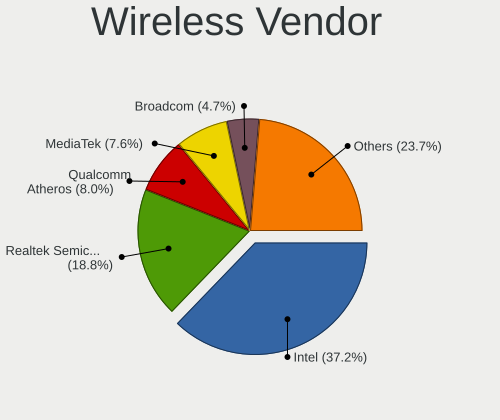

| Vendor                                | Desktops | Percent |
|---------------------------------------|----------|---------|
| Intel                                 | 176      | 37.21%  |
| Realtek Semiconductor                 | 89       | 18.82%  |
| Qualcomm Atheros                      | 38       | 8.03%   |
| MediaTek                              | 36       | 7.61%   |
| Broadcom                              | 22       | 4.65%   |
| TP-Link                               | 20       | 4.23%   |
| Ralink                                | 12       | 2.54%   |
| Ralink Technology                     | 9        | 1.9%    |
| IMC Networks                          | 9        | 1.9%    |
| D-Link System                         | 9        | 1.9%    |
| ASUSTek Computer                      | 7        | 1.48%   |
| Microsoft                             | 6        | 1.27%   |
| D-Link                                | 6        | 1.27%   |
| Qualcomm Atheros Communications       | 5        | 1.06%   |
| Linksys                               | 5        | 1.06%   |
| Sitecom Europe                        | 4        | 0.85%   |
| ZyXEL Communications                  | 2        | 0.42%   |
| Qualcomm Technologies                 | 2        | 0.42%   |
| NetGear                               | 2        | 0.42%   |
| Edimax Technology                     | 2        | 0.42%   |
| Broadcom Limited                      | 2        | 0.42%   |
| 802.11g Adapter [Linksys WUSB54GC v3] | 2        | 0.42%   |
| TRENDnet                              | 1        | 0.21%   |
| Texas Instruments                     | 1        | 0.21%   |
| Tenda                                 | 1        | 0.21%   |
| Realtek                               | 1        | 0.21%   |
| Micro Star International              | 1        | 0.21%   |
| Guillemot                             | 1        | 0.21%   |
| Gemtek                                | 1        | 0.21%   |
| AVM                                   | 1        | 0.21%   |

Wireless Model
--------------

Wireless models

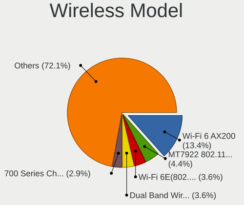

| Model                                                                | Desktops | Percent |
|----------------------------------------------------------------------|----------|---------|
| Intel Wi-Fi 6 AX200                                                  | 64       | 13.42%  |
| MediaTek MT7922 802.11ax PCI Express Wireless Network Adapter        | 21       | 4.4%    |
| Intel Wi-Fi 6E(802.11ax) AX210/AX1675* 2x2 [Typhoon Peak]            | 17       | 3.56%   |
| Intel Dual Band Wireless-AC 3168NGW [Stone Peak]                     | 17       | 3.56%   |
| Intel 700 Series Chipset CNVi WiFi                                   | 14       | 2.94%   |
| Intel Cannon Lake PCH CNVi WiFi                                      | 12       | 2.52%   |
| Broadcom BCM4360 802.11ac Dual Band Wireless Network Adapter         | 9        | 1.89%   |
| Realtek RTL8188EUS 802.11n Wireless Network Adapter                  | 8        | 1.68%   |
| Realtek RTL8188CUS 802.11n WLAN Adapter                              | 8        | 1.68%   |
| Intel Wireless 7260                                                  | 8        | 1.68%   |
| Intel Wi-Fi 5(802.11ac) Wireless-AC 9x6x [Thunder Peak]              | 8        | 1.68%   |
| TP-Link TL-WN823N v2/v3 [Realtek RTL8192EU]                          | 7        | 1.47%   |
| Realtek RTL88x2bu [AC1200 Techkey]                                   | 7        | 1.47%   |
| Intel Wireless 3165                                                  | 7        | 1.47%   |
| Realtek RTL8852BE PCIe 802.11ax Wireless Network Controller          | 6        | 1.26%   |
| Realtek 802.11ac NIC                                                 | 6        | 1.26%   |
| Qualcomm Atheros AR9485 Wireless Network Adapter                     | 6        | 1.26%   |
| IMC Networks Mediao 802.11n WLAN [Realtek RTL8191SU]                 | 6        | 1.26%   |
| Realtek RTL8192EU 802.11b/g/n WLAN Adapter                           | 5        | 1.05%   |
| Realtek RTL8192EE PCIe Wireless Network Adapter                      | 5        | 1.05%   |
| Realtek RTL8192CE PCIe Wireless Network Adapter                      | 5        | 1.05%   |
| Realtek 802.11ac WLAN Adapter                                        | 5        | 1.05%   |
| Ralink MT7601U Wireless Adapter                                      | 5        | 1.05%   |
| Qualcomm Atheros AR93xx Wireless Network Adapter                     | 5        | 1.05%   |
| Microsoft Xbox 360 Wireless Adapter                                  | 5        | 1.05%   |
| MediaTek MT7921K (RZ608) Wi-Fi 6E 80MHz                              | 5        | 1.05%   |
| Intel Wireless 7265                                                  | 5        | 1.05%   |
| TP-Link Archer T3U [Realtek RTL8812BU]                               | 4        | 0.84%   |
| Realtek RTL8188EE Wireless Network Adapter                           | 4        | 0.84%   |
| Qualcomm Atheros QCA9565 / AR9565 Wireless Network Adapter           | 4        | 0.84%   |
| Qualcomm Atheros QCA9377 802.11ac Wireless Network Adapter           | 4        | 0.84%   |
| Qualcomm Atheros AR9271 802.11n                                      | 4        | 0.84%   |
| Qualcomm Atheros AR9287 Wireless Network Adapter (PCI-Express)       | 4        | 0.84%   |
| Qualcomm Atheros AR922X Wireless Network Adapter                     | 4        | 0.84%   |
| MediaTek MT7921 802.11ax PCIe Wireless Network Adapter [Filogic 330] | 4        | 0.84%   |
| Intel Dual Band Wireless-AC 3165 Plus Bluetooth                      | 4        | 0.84%   |
| TP-Link TL-WN722N v2/v3 [Realtek RTL8188EUS]                         | 3        | 0.63%   |
| Realtek RTL8852CE PCIe 802.11ax Wireless Network Controller          | 3        | 0.63%   |
| Realtek RTL8822CE 802.11ac PCIe Wireless Network Adapter             | 3        | 0.63%   |
| Realtek RTL8821CE 802.11ac PCIe Wireless Network Adapter             | 3        | 0.63%   |

Ethernet Vendor
---------------

Ethernet vendors

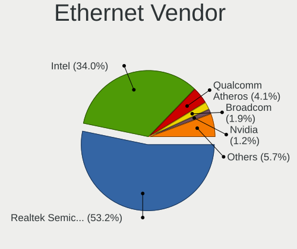

| Vendor                                 | Desktops | Percent |
|----------------------------------------|----------|---------|
| Realtek Semiconductor                  | 599      | 53.24%  |
| Intel                                  | 382      | 33.96%  |
| Qualcomm Atheros                       | 46       | 4.09%   |
| Broadcom                               | 21       | 1.87%   |
| Nvidia                                 | 13       | 1.16%   |
| Marvell Technology Group               | 11       | 0.98%   |
| Aquantia                               | 9        | 0.8%    |
| ASIX Electronics                       | 8        | 0.71%   |
| Samsung Electronics                    | 5        | 0.44%   |
| D-Link System                          | 5        | 0.44%   |
| Broadcom Limited                       | 5        | 0.44%   |
| DisplayLink                            | 4        | 0.36%   |
| Qualcomm Technologies                  | 3        | 0.27%   |
| MediaTek                               | 3        | 0.27%   |
| Xiaomi                                 | 2        | 0.18%   |
| OPPO Electronics                       | 2        | 0.18%   |
| TP-Link                                | 1        | 0.09%   |
| Tehuti Networks                        | 1        | 0.09%   |
| Sony Ericsson Mobile Communications AB | 1        | 0.09%   |
| OpenMoko                               | 1        | 0.09%   |
| Motorola PCS                           | 1        | 0.09%   |
| Microchip Technology                   | 1        | 0.09%   |
| Google                                 | 1        | 0.09%   |

Ethernet Model
--------------

Ethernet models

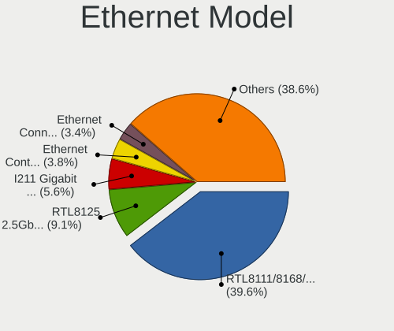

| Model                                                                           | Desktops | Percent |
|---------------------------------------------------------------------------------|----------|---------|
| Realtek RTL8111/8168/8211/8411 PCI Express Gigabit Ethernet Controller          | 470      | 39.56%  |
| Realtek RTL8125 2.5GbE Controller                                               | 108      | 9.09%   |
| Intel I211 Gigabit Network Connection                                           | 67       | 5.64%   |
| Intel Ethernet Controller I225-V                                                | 45       | 3.79%   |
| Intel Ethernet Connection (2) I219-V                                            | 40       | 3.37%   |
| Intel 82579LM Gigabit Network Connection (Lewisville)                           | 33       | 2.78%   |
| Intel 82579V Gigabit Network Connection                                         | 24       | 2.02%   |
| Intel Ethernet Connection (2) I218-V                                            | 22       | 1.85%   |
| Intel Ethernet Connection I217-LM                                               | 18       | 1.52%   |
| Realtek RTL8153 Gigabit Ethernet Adapter                                        | 16       | 1.35%   |
| Intel Ethernet Connection I217-V                                                | 14       | 1.18%   |
| Qualcomm Atheros Killer E220x Gigabit Ethernet Controller                       | 13       | 1.09%   |
| Intel Ethernet Controller I226-V                                                | 12       | 1.01%   |
| Intel 82574L Gigabit Network Connection                                         | 12       | 1.01%   |
| Intel 82567LM-3 Gigabit Network Connection                                      | 11       | 0.93%   |
| Intel Ethernet Connection (7) I219-V                                            | 9        | 0.76%   |
| Marvell Group 88E8056 PCI-E Gigabit Ethernet Controller                         | 8        | 0.67%   |
| Realtek RTL8126 5GbE Controller                                                 | 7        | 0.59%   |
| Qualcomm Atheros AR8161 Gigabit Ethernet                                        | 7        | 0.59%   |
| Qualcomm Atheros AR8151 v2.0 Gigabit Ethernet                                   | 7        | 0.59%   |
| Intel Ethernet Connection (7) I219-LM                                           | 7        | 0.59%   |
| Intel Ethernet Connection (2) I219-LM                                           | 7        | 0.59%   |
| Intel 82566DM-2 Gigabit Network Connection                                      | 7        | 0.59%   |
| Intel I210 Gigabit Network Connection                                           | 6        | 0.51%   |
| Intel Ethernet Connection (5) I219-LM                                           | 6        | 0.51%   |
| Intel 82567V-2 Gigabit Network Connection                                       | 6        | 0.51%   |
| ASIX AX88179 Gigabit Ethernet                                                   | 6        | 0.51%   |
| Realtek RTL810xE PCI Express Fast Ethernet controller                           | 5        | 0.42%   |
| Qualcomm Atheros Killer E2500 Gigabit Ethernet Controller                       | 5        | 0.42%   |
| Intel Ethernet Connection (14) I219-V                                           | 5        | 0.42%   |
| Intel Ethernet Connection (12) I219-V                                           | 5        | 0.42%   |
| Intel 82578DC Gigabit Network Connection                                        | 5        | 0.42%   |
| D-Link System DGE-528T Gigabit Ethernet Adapter                                 | 5        | 0.42%   |
| Aquantia AQtion AQC113CS NBase-T/IEEE 802.3an Ethernet Controller [Antigua 10G] | 5        | 0.42%   |
| Samsung Galaxy series, misc. (tethering mode)                                   | 4        | 0.34%   |
| Realtek RTL8852BE PCIe 802.11ax Wireless Network Controller                     | 4        | 0.34%   |
| Realtek RTL-8100/8101L/8139 PCI Fast Ethernet Adapter                           | 4        | 0.34%   |
| Qualcomm Atheros Killer E2400 Gigabit Ethernet Controller                       | 4        | 0.34%   |
| Nvidia MCP73 Ethernet                                                           | 4        | 0.34%   |
| Nvidia MCP61 Ethernet                                                           | 4        | 0.34%   |

Net Controller Kind
-------------------

Ethernet, WiFi or modem

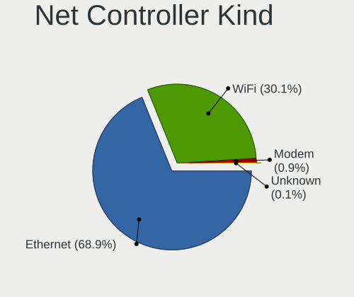

| Kind     | Desktops | Percent |
|----------|----------|---------|
| Ethernet | 1025     | 68.88%  |
| WiFi     | 448      | 30.11%  |
| Modem    | 13       | 0.87%   |
| Unknown  | 2        | 0.13%   |

Used Controller
---------------

Currently used network controller

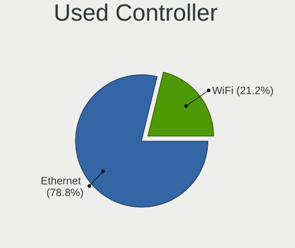

| Kind     | Desktops | Percent |
|----------|----------|---------|
| Ethernet | 855      | 78.8%   |
| WiFi     | 230      | 21.2%   |

NICs
----

Total network controllers on board

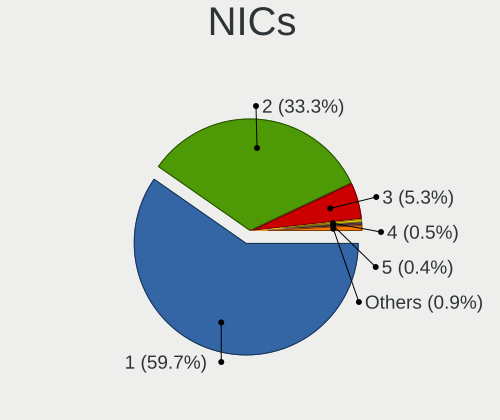

| Total | Desktops | Percent |
|-------|----------|---------|
| 1     | 622      | 59.69%  |
| 2     | 347      | 33.3%   |
| 3     | 55       | 5.28%   |
| 4     | 5        | 0.48%   |
| 5     | 4        | 0.38%   |
| 0     | 4        | 0.38%   |
| 6     | 2        | 0.19%   |
| 10    | 1        | 0.1%    |
| 9     | 1        | 0.1%    |
| 7     | 1        | 0.1%    |

IPv6
----

IPv6 vs IPv4

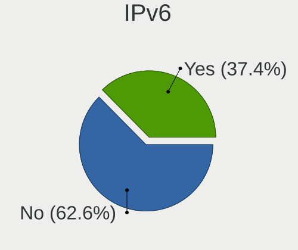

| Used | Desktops | Percent |
|------|----------|---------|
| No   | 680      | 62.62%  |
| Yes  | 406      | 37.38%  |

Bluetooth
---------

Bluetooth Vendor
----------------

Controller vendors

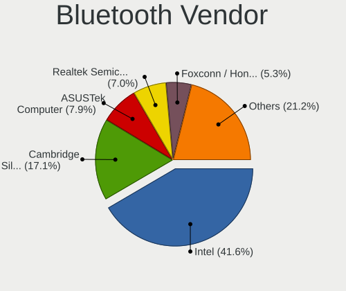

| Vendor                          | Desktops | Percent |
|---------------------------------|----------|---------|
| Intel                           | 173      | 41.59%  |
| Cambridge Silicon Radio         | 71       | 17.07%  |
| ASUSTek Computer                | 33       | 7.93%   |
| Realtek Semiconductor           | 29       | 6.97%   |
| Foxconn / Hon Hai               | 22       | 5.29%   |
| MediaTek                        | 19       | 4.57%   |
| IMC Networks                    | 17       | 4.09%   |
| Broadcom                        | 11       | 2.64%   |
| Qualcomm Atheros Communications | 10       | 2.4%    |
| TP-Link                         | 8        | 1.92%   |
| Belkin Components               | 8        | 1.92%   |
| Lite-On Technology              | 4        | 0.96%   |
| Unknown                         | 4        | 0.96%   |
| Apple                           | 2        | 0.48%   |
| SINO WEALTH                     | 1        | 0.24%   |
| Mercucys                        | 1        | 0.24%   |
| Logitech                        | 1        | 0.24%   |
| Integrated System Solution      | 1        | 0.24%   |
| HTC (High Tech Computer)        | 1        | 0.24%   |

Bluetooth Model
---------------

Controller models

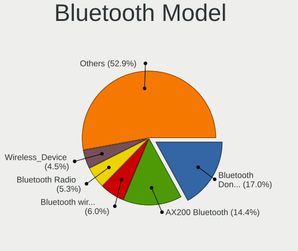

| Model                                                 | Desktops | Percent |
|-------------------------------------------------------|----------|---------|
| Cambridge Silicon Radio Bluetooth Dongle (HCI mode)   | 71       | 16.99%  |
| Intel AX200 Bluetooth                                 | 60       | 14.35%  |
| Intel Bluetooth wireless interface                    | 25       | 5.98%   |
| Realtek Bluetooth Radio                               | 22       | 5.26%   |
| MediaTek Wireless_Device                              | 19       | 4.55%   |
| Intel AX210 Bluetooth                                 | 18       | 4.31%   |
| Intel Wireless-AC 3168 Bluetooth                      | 17       | 4.07%   |
| Intel Bluetooth Device                                | 16       | 3.83%   |
| Intel Bluetooth 9460/9560 Jefferson Peak (JfP)        | 14       | 3.35%   |
| Intel AX201 Bluetooth                                 | 11       | 2.63%   |
| Foxconn / Hon Hai Wireless_Device                     | 11       | 2.63%   |
| ASUS ASUS USB-BT500                                   | 11       | 2.63%   |
| IMC Networks Bluetooth Radio                          | 9        | 2.15%   |
| ASUS Broadcom BCM20702A0 Bluetooth                    | 9        | 2.15%   |
| TP-Link TP-T@- UB500 Adapter                          | 8        | 1.91%   |
| Intel Wireless-AC 9260 Bluetooth Adapter              | 8        | 1.91%   |
| Foxconn / Hon Hai Bluetooth Device                    | 8        | 1.91%   |
| Qualcomm Atheros AR3011 Bluetooth                     | 6        | 1.44%   |
| Realtek Bluetooth 5.3 Radio                           | 5        | 1.2%    |
| Broadcom BCM20702A0 Bluetooth 4.0                     | 5        | 1.2%    |
| Belkin Components F8T065BF Mini Bluetooth 4.0 Adapter | 5        | 1.2%    |
| ASUS Broadcom BCM20702 Single-Chip Bluetooth 4.0 + LE | 5        | 1.2%    |
| Intel Centrino Bluetooth Wireless Transceiver         | 4        | 0.96%   |
| IMC Networks Wireless_Device                          | 4        | 0.96%   |
| ASUS BCM20702A0                                       | 4        | 0.96%   |
| Unknown                                               | 4        | 0.96%   |
| Qualcomm Atheros  Bluetooth Device                    | 3        | 0.72%   |
| Broadcom BCM2045 Bluetooth                            | 3        | 0.72%   |
| ASUS Bluetooth Adapter                                | 3        | 0.72%   |
| Realtek  Bluetooth 4.2 Adapter                        | 2        | 0.48%   |
| Lite-On Bluetooth Device                              | 2        | 0.48%   |
| Lite-On Atheros AR3012 Bluetooth                      | 2        | 0.48%   |
| IMC Networks Bluetooth Module                         | 2        | 0.48%   |
| IMC Networks Bluetooth Device                         | 2        | 0.48%   |
| Foxconn / Hon Hai MediaTek MT7921 Bluetooth           | 2        | 0.48%   |
| Belkin Components Bluetooth Mini Dongle               | 2        | 0.48%   |
| ASUS Bluetooth Radio                                  | 2        | 0.48%   |
| SINO WEALTH Bluetooth Keyboard                        | 1        | 0.24%   |
| Qualcomm Atheros QCA61x4 Bluetooth 4.0                | 1        | 0.24%   |
| Mercucys Mercusys MA530 Adapter                       | 1        | 0.24%   |

Sound
-----

Sound Vendor
------------

Sound card vendors

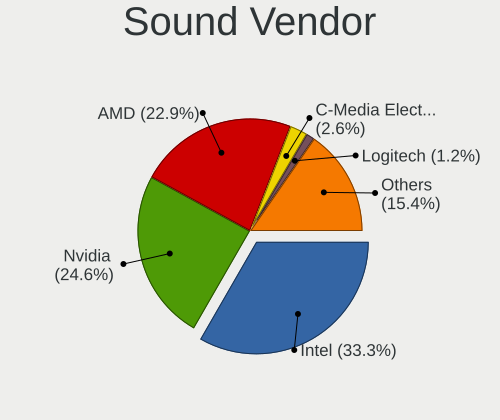

| Vendor                                       | Desktops | Percent |
|----------------------------------------------|----------|---------|
| Intel                                        | 638      | 33.32%  |
| Nvidia                                       | 472      | 24.65%  |
| AMD                                          | 439      | 22.92%  |
| C-Media Electronics                          | 49       | 2.56%   |
| Logitech                                     | 23       | 1.2%    |
| Creative Labs                                | 22       | 1.15%   |
| Kingston Technology                          | 21       | 1.1%    |
| ASUSTek Computer                             | 21       | 1.1%    |
| JMTek                                        | 16       | 0.84%   |
| Focusrite-Novation                           | 16       | 0.84%   |
| SteelSeries ApS                              | 14       | 0.73%   |
| Micro Star International                     | 14       | 0.73%   |
| Corsair                                      | 13       | 0.68%   |
| Texas Instruments                            | 10       | 0.52%   |
| Razer USA                                    | 8        | 0.42%   |
| Hewlett-Packard                              | 8        | 0.42%   |
| Creative Technology                          | 8        | 0.42%   |
| Generalplus Technology                       | 7        | 0.37%   |
| Sony                                         | 5        | 0.26%   |
| RODE Microphones                             | 5        | 0.26%   |
| Blue Microphones                             | 5        | 0.26%   |
| Astro Gaming                                 | 5        | 0.26%   |
| VIA Technologies                             | 4        | 0.21%   |
| Trust                                        | 4        | 0.21%   |
| Thesycon Systemsoftware & Consulting         | 4        | 0.21%   |
| Realtek Semiconductor                        | 4        | 0.21%   |
| Giga-Byte Technology                         | 4        | 0.21%   |
| Dell                                         | 4        | 0.21%   |
| Zoran Co. Personal Media Division (Nogatech) | 3        | 0.16%   |
| Tenx Technology                              | 3        | 0.16%   |
| GN Netcom                                    | 3        | 0.16%   |
| FIFINE Microphones                           | 3        | 0.16%   |
| beyerdynamic                                 | 3        | 0.16%   |
| BEHRINGER International                      | 3        | 0.16%   |
| Audio-Technica                               | 3        | 0.16%   |
| Antlion Audio                                | 3        | 0.16%   |
| Valve Software                               | 2        | 0.1%    |
| Plantronics                                  | 2        | 0.1%    |
| Mark of the Unicorn                          | 2        | 0.1%    |
| KTMicro                                      | 2        | 0.1%    |

Sound Model
-----------

Sound card models

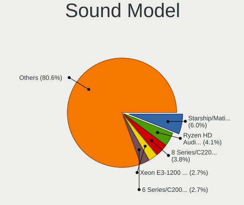

| Model                                                                      | Desktops | Percent |
|----------------------------------------------------------------------------|----------|---------|
| AMD Starship/Matisse HD Audio Controller                                   | 135      | 6.02%   |
| AMD Ryzen HD Audio Controller                                              | 93       | 4.15%   |
| Intel 8 Series/C220 Series Chipset High Definition Audio Controller        | 86       | 3.84%   |
| Intel Xeon E3-1200 v3/4th Gen Core Processor HD Audio Controller           | 61       | 2.72%   |
| Intel 6 Series/C200 Series Chipset Family High Definition Audio Controller | 61       | 2.72%   |
| Intel 200 Series PCH HD Audio                                              | 56       | 2.5%    |
| Intel 100 Series/C230 Series Chipset Family HD Audio Controller            | 52       | 2.32%   |
| Intel 7 Series/C216 Chipset Family High Definition Audio Controller        | 50       | 2.23%   |
| AMD Radeon High Definition Audio Controller                                | 43       | 1.92%   |
| AMD SBx00 Azalia (Intel HDA)                                               | 42       | 1.87%   |
| Intel Cannon Lake PCH cAVS                                                 | 39       | 1.74%   |
| AMD Family 17h (Models 00h-0fh) HD Audio Controller                        | 36       | 1.61%   |
| AMD Ellesmere HDMI Audio [Radeon RX 470/480 / 570/580/590]                 | 36       | 1.61%   |
| Intel 9 Series Chipset Family HD Audio Controller                          | 35       | 1.56%   |
| Nvidia GK208 HDMI/DP Audio Controller                                      | 32       | 1.43%   |
| AMD Navi 21/23 HDMI/DP Audio Controller                                    | 32       | 1.43%   |
| Nvidia GP107GL High Definition Audio Controller                            | 31       | 1.38%   |
| AMD Renoir/Cezanne HDMI/DP Audio Controller                                | 31       | 1.38%   |
| AMD Navi 31 HDMI/DP Audio                                                  | 31       | 1.38%   |
| Nvidia GP106 High Definition Audio Controller                              | 30       | 1.34%   |
| Nvidia GP104 High Definition Audio Controller                              | 30       | 1.34%   |
| Nvidia GA104 High Definition Audio Controller                              | 29       | 1.29%   |
| Intel 5 Series/3400 Series Chipset High Definition Audio                   | 28       | 1.25%   |
| Nvidia High Definition Audio Controller                                    | 27       | 1.2%    |
| Nvidia GM204 High Definition Audio Controller                              | 26       | 1.16%   |
| Nvidia TU106 High Definition Audio Controller                              | 25       | 1.12%   |
| Nvidia GK107 HDMI Audio Controller                                         | 23       | 1.03%   |
| AMD Navi 10 HDMI Audio                                                     | 23       | 1.03%   |
| Intel 82801I (ICH9 Family) HD Audio Controller                             | 22       | 0.98%   |
| Intel Alder Lake-S HD Audio Controller                                     | 21       | 0.94%   |
| Intel 82801JI (ICH10 Family) HD Audio Controller                           | 21       | 0.94%   |
| AMD Baffin HDMI/DP Audio [Radeon RX 550 640SP / RX 560/560X]               | 20       | 0.89%   |
| Nvidia TU116 High Definition Audio Controller                              | 19       | 0.85%   |
| Nvidia GM107 High Definition Audio Controller [GeForce 940MX]              | 19       | 0.85%   |
| Nvidia GK104 HDMI Audio Controller                                         | 19       | 0.85%   |
| Intel Raptor Lake High Definition Audio Controller                         | 19       | 0.85%   |
| Intel NM10/ICH7 Family High Definition Audio Controller                    | 19       | 0.85%   |
| ASUSTek Computer USB Audio                                                 | 19       | 0.85%   |
| Intel C610/X99 series chipset HD Audio Controller                          | 18       | 0.8%    |
| Nvidia TU104 HD Audio Controller                                           | 17       | 0.76%   |

Memory
------

Memory Vendor
-------------

Memory module vendors

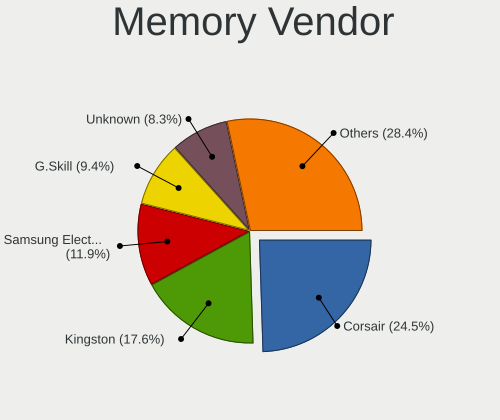

| Vendor              | Desktops | Percent |
|---------------------|----------|---------|
| Corsair             | 159      | 24.5%   |
| Kingston            | 114      | 17.57%  |
| Samsung Electronics | 77       | 11.86%  |
| G.Skill             | 61       | 9.4%    |
| Unknown             | 54       | 8.32%   |
| SK hynix            | 52       | 8.01%   |
| Crucial             | 38       | 5.86%   |
| Micron Technology   | 37       | 5.7%    |
| Unknown             | 8        | 1.23%   |
| Nanya Technology    | 6        | 0.92%   |
| Elpida              | 6        | 0.92%   |
| Unifosa             | 5        | 0.77%   |
| Ramaxel Technology  | 3        | 0.46%   |
| OCZ                 | 3        | 0.46%   |
| A-DATA Technology   | 3        | 0.46%   |
| Transcend           | 2        | 0.31%   |
| Team                | 2        | 0.31%   |
| Patriot             | 2        | 0.31%   |
| Wodposit            | 1        | 0.15%   |
| Unknown (ABCD)      | 1        | 0.15%   |
| Unknown (0x8551)    | 1        | 0.15%   |
| Unknown (0x0FF4)    | 1        | 0.15%   |
| Unknown (0x0DD5)    | 1        | 0.15%   |
| Unknown (0x0B45)    | 1        | 0.15%   |
| TakeMS              | 1        | 0.15%   |
| Qimonda             | 1        | 0.15%   |
| PNY                 | 1        | 0.15%   |
| Mushkin             | 1        | 0.15%   |
| J&A Information     | 1        | 0.15%   |
| Hewlett-Packard     | 1        | 0.15%   |
| GeIL                | 1        | 0.15%   |
| Corsair SerNum0     | 1        | 0.15%   |
| Avant               | 1        | 0.15%   |
| AMD                 | 1        | 0.15%   |
| Aeneon              | 1        | 0.15%   |

Memory Model
------------

Memory module models

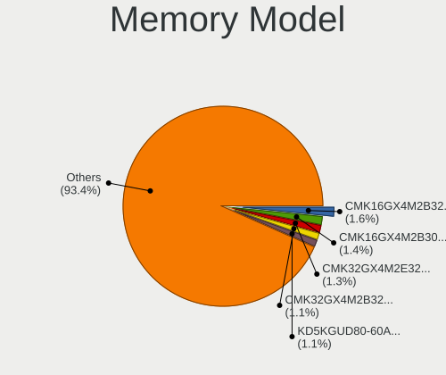

| Model                                                   | Desktops | Percent |
|---------------------------------------------------------|----------|---------|
| Corsair RAM CMK16GX4M2B3200C16 8GB DIMM DDR4 3600MT/s   | 11       | 1.58%   |
| Corsair RAM CMK16GX4M2B3000C15 8GB DIMM DDR4 3600MT/s   | 10       | 1.44%   |
| Corsair RAM CMK32GX4M2E3200C16 16GB DIMM DDR4 3600MT/s  | 9        | 1.29%   |
| Corsair RAM CMK32GX4M2B3200C16 16GB DIMM DDR4 3800MT/s  | 8        | 1.15%   |
| Unknown                                                 | 8        | 1.15%   |
| Unknown RAM Module 2GB DIMM DDR2 800MT/s                | 7        | 1.01%   |
| SK hynix RAM HMT351U6CFR8C-PB 4GB DIMM DDR3 1800MT/s    | 6        | 0.86%   |
| Samsung RAM M378B5673FH0-CH9 2GB DIMM DDR3 1600MT/s     | 6        | 0.86%   |
| Kingston RAM KHX1600C9D3/4GX 4GB DIMM DDR3 1867MT/s     | 6        | 0.86%   |
| Corsair RAM CMK64GX4M2E3200C16 32GB DIMM DDR4 3600MT/s  | 6        | 0.86%   |
| G.Skill RAM F4-3600C16-16GVKC 16GB DIMM DDR4 3866MT/s   | 5        | 0.72%   |
| Unknown RAM Module 4GB DIMM DDR3 1333MT/s               | 4        | 0.57%   |
| Samsung RAM M378B5273DH0-CH9 4GB DIMM DDR3 2133MT/s     | 4        | 0.57%   |
| Kingston RAM KF556C40-32 32GB DIMM DDR5 6000MT/s        | 4        | 0.57%   |
| G.Skill RAM F4-3200C16-8GVKB 8GB DIMM DDR4 4000MT/s     | 4        | 0.57%   |
| G.Skill RAM F4-3000C16-8GISB 8GB DIMM DDR4 3200MT/s     | 4        | 0.57%   |
| Crucial RAM BLS8G3D1609DS1S00. 8GB DIMM DDR3 1800MT/s   | 4        | 0.57%   |
| Corsair RAM CMK32GX4M2B3000C15 16GB DIMM DDR4 3000MT/s  | 4        | 0.57%   |
| Corsair RAM CMK16GX4M2D3600C18 8GB DIMM DDR4 4000MT/s   | 4        | 0.57%   |
| Corsair RAM CMK16GX4M2A2666C16 8GB DIMM DDR4 3400MT/s   | 4        | 0.57%   |
| Unknown RAM Module 4096MB DIMM 1600MT/s                 | 3        | 0.43%   |
| Unknown RAM Module 4096MB DIMM 1333MT/s                 | 3        | 0.43%   |
| Unknown RAM Module 2GB DIMM DDR3 1333MT/s               | 3        | 0.43%   |
| Samsung RAM M378B5773DH0-CH9 2GB DIMM DDR3 1333MT/s     | 3        | 0.43%   |
| Samsung RAM M378B5773CH0-CH9 2GB DIMM DDR3 1867MT/s     | 3        | 0.43%   |
| Samsung RAM M378B5273EB0-CK0 4GB DIMM DDR3 1800MT/s     | 3        | 0.43%   |
| Samsung RAM M378B5173QH0-CK0 4GB DIMM DDR3              | 3        | 0.43%   |
| Samsung RAM M378B1G73QH0-CK0 8GB DIMM DDR3 1600MT/s     | 3        | 0.43%   |
| Samsung RAM M378A1K43CB2-CTD 8GB DIMM DDR4 3266MT/s     | 3        | 0.43%   |
| Micron RAM CP16G4DFRA32A.C8FF 16GB DIMM DDR4 3200MT/s   | 3        | 0.43%   |
| Kingston RAM 99U5584-005.A00LF 4GB DIMM DDR3 1600MT/s   | 3        | 0.43%   |
| Kingston RAM 99U5471-054.A00LF 8GB DIMM DDR3 1600MT/s   | 3        | 0.43%   |
| G.Skill RAM F4-3600C16-16GTZNC 16GiB DIMM DDR4 3600MT/s | 3        | 0.43%   |
| Crucial RAM CT102464BA160B.C16 8GB DIMM DDR3 1600MT/s   | 3        | 0.43%   |
| Corsair RAM CMZ8GX3M2A1600C9 4GB DIMM SDRAM 1800MT/s    | 3        | 0.43%   |
| Corsair RAM CMW16GX4M2C3200C16 8GB DIMM DDR4 3733MT/s   | 3        | 0.43%   |
| Corsair RAM CMV4GX3M1A1333C9 4GB DIMM DDR3 1600MT/s     | 3        | 0.43%   |
| Corsair RAM CMK32GX4M2A2666C16 16GB DIMM DDR4 2667MT/s  | 3        | 0.43%   |
| Corsair RAM CMK16GX4M2E3200C16 8GB DIMM DDR4 3466MT/s   | 3        | 0.43%   |
| Corsair RAM CMK16GX4M2A2133C13 8GB DIMM DDR4 3000MT/s   | 3        | 0.43%   |

Memory Kind
-----------

Memory module kinds

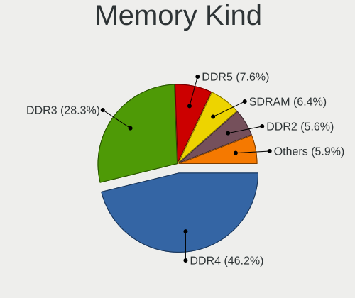

| Kind    | Desktops | Percent |
|---------|----------|---------|
| DDR4    | 273      | 46.19%  |
| DDR3    | 167      | 28.26%  |
| DDR5    | 45       | 7.61%   |
| SDRAM   | 38       | 6.43%   |
| DDR2    | 33       | 5.58%   |
| Unknown | 23       | 3.89%   |
| DDR     | 6        | 1.02%   |
| LPDDR5  | 2        | 0.34%   |
| LPDDR4  | 2        | 0.34%   |
| DRAM    | 2        | 0.34%   |

Memory Form Factor
------------------

Physical design of the memory module

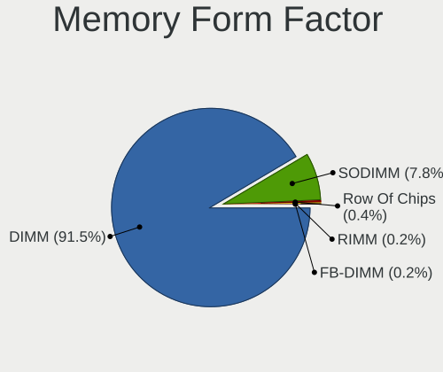

| Name         | Desktops | Percent |
|--------------|----------|---------|
| DIMM         | 516      | 91.49%  |
| SODIMM       | 44       | 7.8%    |
| Row Of Chips | 2        | 0.35%   |
| RIMM         | 1        | 0.18%   |
| FB-DIMM      | 1        | 0.18%   |

Memory Size
-----------

Memory module size

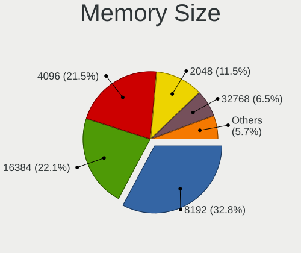

| Size  | Desktops | Percent |
|-------|----------|---------|
| 8192  | 203      | 32.79%  |
| 16384 | 137      | 22.13%  |
| 4096  | 133      | 21.49%  |
| 2048  | 71       | 11.47%  |
| 32768 | 40       | 6.46%   |
| 1024  | 23       | 3.72%   |
| 512   | 7        | 1.13%   |
| 49152 | 4        | 0.65%   |
| 24576 | 1        | 0.16%   |

Memory Speed
------------

Memory module speed

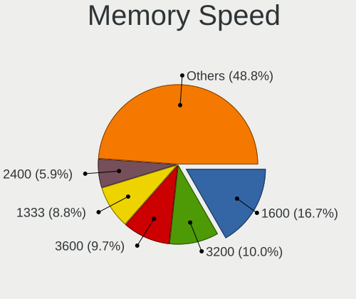

| Speed   | Desktops | Percent |
|---------|----------|---------|
| 1600    | 108      | 16.69%  |
| 3200    | 65       | 10.05%  |
| 3600    | 63       | 9.74%   |
| 1333    | 57       | 8.81%   |
| 2400    | 38       | 5.87%   |
| 2667    | 27       | 4.17%   |
| 2133    | 26       | 4.02%   |
| 800     | 19       | 2.94%   |
| 1800    | 18       | 2.78%   |
| 667     | 18       | 2.78%   |
| 6000    | 16       | 2.47%   |
| 3800    | 16       | 2.47%   |
| 2666    | 14       | 2.16%   |
| 1867    | 10       | 1.55%   |
| 5600    | 9        | 1.39%   |
| 4000    | 9        | 1.39%   |
| 3400    | 9        | 1.39%   |
| 3000    | 9        | 1.39%   |
| 1866    | 9        | 1.39%   |
| 3866    | 8        | 1.24%   |
| 6400    | 7        | 1.08%   |
| 4800    | 7        | 1.08%   |
| 3733    | 7        | 1.08%   |
| 1066    | 5        | 0.77%   |
| 533     | 5        | 0.77%   |
| 3466    | 4        | 0.62%   |
| 3666    | 3        | 0.46%   |
| 3266    | 3        | 0.46%   |
| 3100    | 3        | 0.46%   |
| 2933    | 3        | 0.46%   |
| 2048    | 3        | 0.46%   |
| 2000    | 3        | 0.46%   |
| 1639    | 3        | 0.46%   |
| 1331    | 3        | 0.46%   |
| 1067    | 3        | 0.46%   |
| Unknown | 3        | 0.46%   |
| 6200    | 2        | 0.31%   |
| 5800    | 2        | 0.31%   |
| 5200    | 2        | 0.31%   |
| 3933    | 2        | 0.31%   |

Printers & scanners
-------------------

Printer Vendor
--------------

Printer device vendors

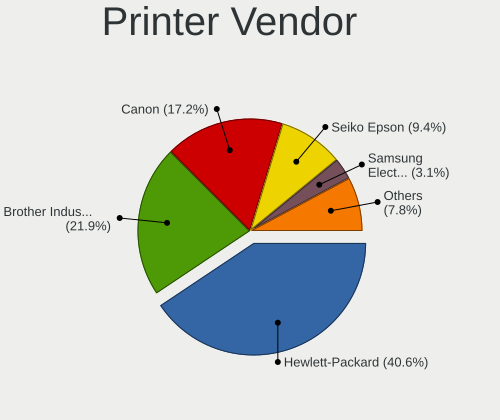

| Vendor              | Desktops | Percent |
|---------------------|----------|---------|
| Hewlett-Packard     | 26       | 40.63%  |
| Brother Industries  | 14       | 21.88%  |
| Canon               | 11       | 17.19%  |
| Seiko Epson         | 6        | 9.38%   |
| Samsung Electronics | 2        | 3.13%   |
| Kyocera             | 2        | 3.13%   |
| Star Micronics      | 1        | 1.56%   |
| Ricoh               | 1        | 1.56%   |
| Dymo-CoStar         | 1        | 1.56%   |

Printer Model
-------------

Printer device models

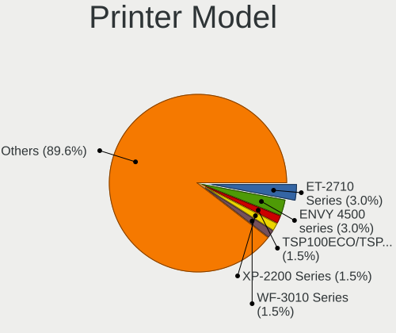

| Model                                                      | Desktops | Percent |
|------------------------------------------------------------|----------|---------|
| Seiko Epson ET-2710 Series                                 | 2        | 2.99%   |
| HP ENVY 4500 series                                        | 2        | 2.99%   |
| Star Micronics TSP100ECO/TSP100II                          | 1        | 1.49%   |
| Seiko Epson XP-2200 Series                                 | 1        | 1.49%   |
| Seiko Epson WF-3010 Series                                 | 1        | 1.49%   |
| Seiko Epson ET-8550 Series                                 | 1        | 1.49%   |
| Seiko Epson ET-4750 [WorkForce ET-4750 EcoTank All-in-One] | 1        | 1.49%   |
| Samsung ML-1660 Series                                     | 1        | 1.49%   |
| Samsung ML-1640 Series Laser Printer                       | 1        | 1.49%   |
| Ricoh SP C250SF                                            | 1        | 1.49%   |
| Kyocera TASKalfa 250ci                                     | 1        | 1.49%   |
| Kyocera FS-C5150DN                                         | 1        | 1.49%   |
| HP Smart Tank 580-590 series                               | 1        | 1.49%   |
| HP OfficeJet Pro 6970                                      | 1        | 1.49%   |
| HP OfficeJet Pro 6960                                      | 1        | 1.49%   |
| HP Officejet 2620 series                                   | 1        | 1.49%   |
| HP LaserJet Professional P 1102w                           | 1        | 1.49%   |
| HP LaserJet Pro M148f-M149f                                | 1        | 1.49%   |
| HP LaserJet P4015                                          | 1        | 1.49%   |
| HP LaserJet M507                                           | 1        | 1.49%   |
| HP LaserJet CP1525nw/x                                     | 1        | 1.49%   |
| HP LaserJet 3015                                           | 1        | 1.49%   |
| HP LaserJet 1018                                           | 1        | 1.49%   |
| HP LaserJet 1015                                           | 1        | 1.49%   |
| HP EWS UPD                                                 | 1        | 1.49%   |
| HP ENVY Photo 6200 series                                  | 1        | 1.49%   |
| HP ENVY 6000 series                                        | 1        | 1.49%   |
| HP ENVY 5540 series                                        | 1        | 1.49%   |
| HP ENVY 4520 series                                        | 1        | 1.49%   |
| HP DeskJet F300 series                                     | 1        | 1.49%   |
| HP DeskJet 840c                                            | 1        | 1.49%   |
| HP DeskJet 5650c                                           | 1        | 1.49%   |
| HP DeskJet 5150c                                           | 1        | 1.49%   |
| HP DeskJet 3630 series                                     | 1        | 1.49%   |
| HP DeskJet 2700 series                                     | 1        | 1.49%   |
| HP DeskJet 2600 series                                     | 1        | 1.49%   |
| HP Color LaserJet Pro M252dw                               | 1        | 1.49%   |
| Dymo-CoStar LabelWriter 450                                | 1        | 1.49%   |
| Canon TS9100 series                                        | 1        | 1.49%   |
| Canon TS5100 series                                        | 1        | 1.49%   |

Scanner Vendor
--------------

Scanner device vendors

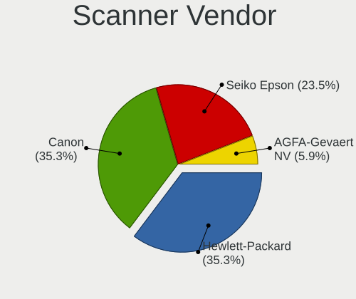

| Vendor          | Desktops | Percent |
|-----------------|----------|---------|
| Hewlett-Packard | 6        | 35.29%  |
| Canon           | 6        | 35.29%  |
| Seiko Epson     | 4        | 23.53%  |
| AGFA-Gevaert NV | 1        | 5.88%   |

Scanner Model
-------------

Scanner device models

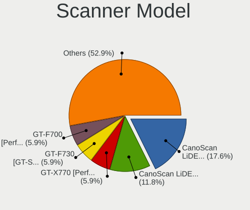

| Model                                                   | Desktops | Percent |
|---------------------------------------------------------|----------|---------|
| Canon CanoScan LiDE 110                                 | 3        | 17.65%  |
| Canon CanoScan LiDE 210                                 | 2        | 11.76%  |
| Seiko Epson GT-X770 [Perfection V500]                   | 1        | 5.88%   |
| Seiko Epson GT-F730 [GT-S630/Perfection V33/V330 Photo] | 1        | 5.88%   |
| Seiko Epson GT-F700 [Perfection V350]                   | 1        | 5.88%   |
| Seiko Epson GT-7300U [Perfection 1260/1260 PHOTO]       | 1        | 5.88%   |
| HP ScanJet G4010                                        | 1        | 5.88%   |
| HP ScanJet 4370                                         | 1        | 5.88%   |
| HP ScanJet 3800c                                        | 1        | 5.88%   |
| HP ScanJet 3670                                         | 1        | 5.88%   |
| HP ScanJet 3400cse                                      | 1        | 5.88%   |
| HP Scanjet 200                                          | 1        | 5.88%   |
| Canon CanoScan 8800F                                    | 1        | 5.88%   |
| AGFA-Gevaert NV Snapscan e40                            | 1        | 5.88%   |

Camera
------

Camera Vendor
-------------

Camera device vendors

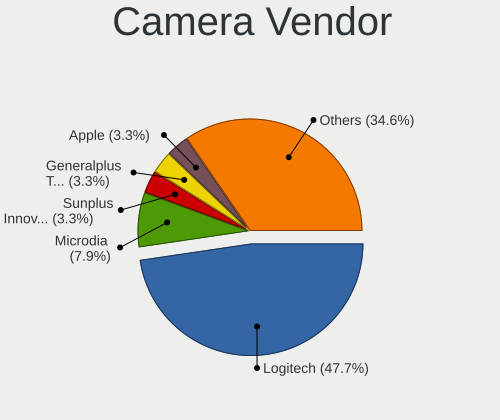

| Vendor                                 | Desktops | Percent |
|----------------------------------------|----------|---------|
| Logitech                               | 102      | 47.66%  |
| Microdia                               | 17       | 7.94%   |
| Sunplus Innovation Technology          | 7        | 3.27%   |
| Generalplus Technology                 | 7        | 3.27%   |
| Apple                                  | 7        | 3.27%   |
| Trust                                  | 6        | 2.8%    |
| Samsung Electronics                    | 6        | 2.8%    |
| Jieli Technology                       | 5        | 2.34%   |
| Chicony Electronics                    | 4        | 1.87%   |
| Microsoft                              | 3        | 1.4%    |
| MacroSilicon                           | 3        | 1.4%    |
| Creative Technology                    | 3        | 1.4%    |
| Alcor Micro                            | 3        | 1.4%    |
| WaveRider Communications               | 2        | 0.93%   |
| Valve Software                         | 2        | 0.93%   |
| Sweex                                  | 2        | 0.93%   |
| Realtek Semiconductor                  | 2        | 0.93%   |
| KYE Systems (Mouse Systems)            | 2        | 0.93%   |
| IMC Networks                           | 2        | 0.93%   |
| Hewlett-Packard                        | 2        | 0.93%   |
| Guillemot                              | 2        | 0.93%   |
| GEMBIRD                                | 2        | 0.93%   |
| Z-Star Microelectronics                | 1        | 0.47%   |
| Sunplus IT                             | 1        | 0.47%   |
| Sony                                   | 1        | 0.47%   |
| Razer USA                              | 1        | 0.47%   |
| Philips (or NXP)                       | 1        | 0.47%   |
| OmniVision Technologies                | 1        | 0.47%   |
| NZXT                                   | 1        | 0.47%   |
| Novatek Microelectronics               | 1        | 0.47%   |
| Nokia Mobile Phones                    | 1        | 0.47%   |
| Netchip Technology                     | 1        | 0.47%   |
| Lenovo                                 | 1        | 0.47%   |
| IPEVO                                  | 1        | 0.47%   |
| Huawei Technologies                    | 1        | 0.47%   |
| Genesys Logic                          | 1        | 0.47%   |
| Dell                                   | 1        | 0.47%   |
| Cheng Uei Precision Industry (Foxlink) | 1        | 0.47%   |
| Bison Electronics                      | 1        | 0.47%   |
| AVerMedia Technologies                 | 1        | 0.47%   |

Camera Model
------------

Camera device models

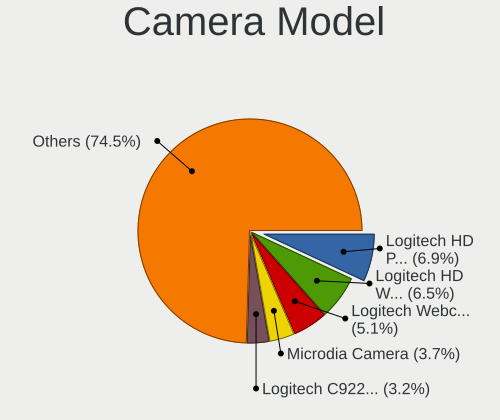

| Model                                                 | Desktops | Percent |
|-------------------------------------------------------|----------|---------|
| Logitech HD Pro Webcam C920                           | 15       | 6.94%   |
| Logitech HD Webcam C525                               | 14       | 6.48%   |
| Logitech Webcam C270                                  | 11       | 5.09%   |
| Microdia Camera                                       | 8        | 3.7%    |
| Logitech C922 Pro Stream Webcam                       | 7        | 3.24%   |
| Apple iPhone 5/5C/5S/6/SE/7/8/X                       | 7        | 3.24%   |
| Samsung Galaxy series, misc. (MTP mode)               | 6        | 2.78%   |
| Logitech C920 PRO HD Webcam                           | 6        | 2.78%   |
| Generalplus GENERAL WEBCAM                            | 6        | 2.78%   |
| Logitech Webcam C170                                  | 5        | 2.31%   |
| Logitech B525 HD Webcam                               | 5        | 2.31%   |
| Jieli USB PHY 2.0                                     | 5        | 2.31%   |
| Sunplus Full HD webcam                                | 4        | 1.85%   |
| Logitech QuickCam E 3500                              | 4        | 1.85%   |
| Logitech HD Webcam C910                               | 4        | 1.85%   |
| Trust Full HD Webcam                                  | 3        | 1.39%   |
| Microdia USB 2.0 Camera                               | 3        | 1.39%   |
| Logitech Webcam Pro 9000                              | 3        | 1.39%   |
| Logitech Webcam C930e                                 | 3        | 1.39%   |
| Valve Software 3D Camera                              | 2        | 0.93%   |
| Sweex USB keyboard                                    | 2        | 0.93%   |
| Sunplus Integrated Camera                             | 2        | 0.93%   |
| Realtek Thronmax Stream Go Pro Webcam                 | 2        | 0.93%   |
| Microdia Webcam Vitade AF                             | 2        | 0.93%   |
| Microdia Sonix USB 2.0 Camera                         | 2        | 0.93%   |
| MacroSilicon USB Video                                | 2        | 0.93%   |
| Logitech Webcam C310                                  | 2        | 0.93%   |
| Logitech Webcam B500                                  | 2        | 0.93%   |
| Logitech StreamCam                                    | 2        | 0.93%   |
| Logitech QuickCam Zoom                                | 2        | 0.93%   |
| Logitech QuickCam Orbit/Sphere AF                     | 2        | 0.93%   |
| Logitech Logitech Webcam C925e                        | 2        | 0.93%   |
| Logitech HD Webcam C615                               | 2        | 0.93%   |
| Logitech C505 HD Webcam                               | 2        | 0.93%   |
| Logitech BRIO Ultra HD Webcam                         | 2        | 0.93%   |
| KYE Systems (Mouse Systems) USB 2.0 HD1080P PC Camera | 2        | 0.93%   |
| IMC Networks XHC Camera                               | 2        | 0.93%   |
| Creative Live! Cam Chat HD [VF0700/VF0790]            | 2        | 0.93%   |
| Alcor Micro USB 2.0 PC Camera                         | 2        | 0.93%   |
| Z-Star USB 2.0 PC Camera                              | 1        | 0.46%   |

Security
--------

Fingerprint Vendor
------------------

Fingerprint sensor vendors

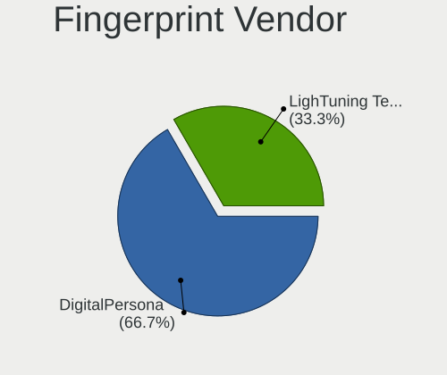

| Vendor                | Desktops | Percent |
|-----------------------|----------|---------|
| DigitalPersona        | 2        | 66.67%  |
| LighTuning Technology | 1        | 33.33%  |

Fingerprint Model
-----------------

Fingerprint sensor models

| Model                             | Desktops | Percent |
|-----------------------------------|----------|---------|
| DigitalPersona Fingerprint Reader | 2        | 66.67%  |
| LighTuning Fingerprint Sensor     | 1        | 33.33%  |

Chipcard Vendor
---------------

Chipcard module vendors

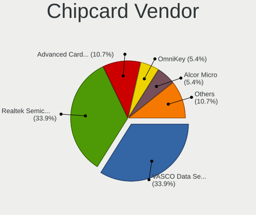

| Vendor                            | Desktops | Percent |
|-----------------------------------|----------|---------|
| VASCO Data Security International | 19       | 33.93%  |
| Realtek Semiconductor             | 19       | 33.93%  |
| Advanced Card Systems             | 6        | 10.71%  |
| OmniKey                           | 3        | 5.36%   |
| Alcor Micro                       | 3        | 5.36%   |
| Yubico.com                        | 2        | 3.57%   |
| Gemalto (was Gemplus)             | 1        | 1.79%   |
| Feitian Technologies              | 1        | 1.79%   |
| Chicony Electronics               | 1        | 1.79%   |
| Cherry                            | 1        | 1.79%   |

Chipcard Model
--------------

Chipcard module models

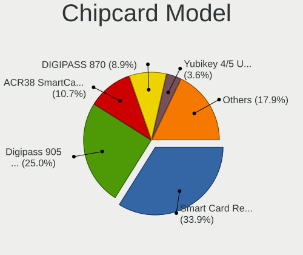

| Model                                                           | Desktops | Percent |
|-----------------------------------------------------------------|----------|---------|
| Realtek Semiconductor Smart Card Reader Interface               | 19       | 33.93%  |
| VASCO Data Security International Digipass 905 SmartCard Reader | 14       | 25%     |
| Advanced Card Systems ACR38 SmartCard Reader                    | 6        | 10.71%  |
| VASCO Data Security International DIGIPASS 870                  | 5        | 8.93%   |
| Yubico.com Yubikey 4/5 U2F+CCID                                 | 2        | 3.57%   |
| Alcor Micro AU9540 Smartcard Reader                             | 2        | 3.57%   |
| OmniKey CardMan 3121 (HID Technologies)                         | 1        | 1.79%   |
| OmniKey CardMan 3021 / 3121                                     | 1        | 1.79%   |
| OmniKey CardMan 1021                                            | 1        | 1.79%   |
| Gemalto (was Gemplus) GemCore SIM Pro Smart Card Reader         | 1        | 1.79%   |
| Feitian Technologies SCR301                                     | 1        | 1.79%   |
| Chicony Electronics HP Skylab USB Smartcard Keyboard            | 1        | 1.79%   |
| Cherry SmartCard Reader Keyboard KC 1000 SC                     | 1        | 1.79%   |
| Alcor Micro Watchdata W 1981                                    | 1        | 1.79%   |

Unsupported
-----------

Unsupported Devices
-------------------

Total unsupported devices on board

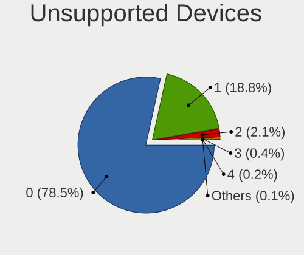

| Total | Desktops | Percent |
|-------|----------|---------|
| 0     | 845      | 78.46%  |
| 1     | 202      | 18.76%  |
| 2     | 23       | 2.14%   |
| 3     | 4        | 0.37%   |
| 4     | 2        | 0.19%   |
| 5     | 1        | 0.09%   |

Unsupported Device Types
------------------------

Types of unsupported devices

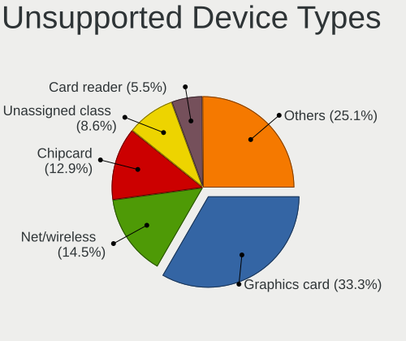

| Type                     | Desktops | Percent |
|--------------------------|----------|---------|
| Graphics card            | 85       | 33.33%  |
| Net/wireless             | 37       | 14.51%  |
| Chipcard                 | 33       | 12.94%  |
| Unassigned class         | 22       | 8.63%   |
| Card reader              | 14       | 5.49%   |
| Multimedia controller    | 13       | 5.1%    |
| Sound                    | 11       | 4.31%   |
| Communication controller | 10       | 3.92%   |
| Bluetooth                | 9        | 3.53%   |
| Camera                   | 8        | 3.14%   |
| Net/ethernet             | 5        | 1.96%   |
| Network                  | 3        | 1.18%   |
| Fingerprint reader       | 3        | 1.18%   |
| Dvb card                 | 2        | 0.78%   |

