Linux in Belgium - Tested Hardware & Statistics (Desktops)
----------------------------------------------------------

A project to collect tested hardware configurations for Linux in Belgium.

Anyone can contribute to this report by the [hw-probe](https://github.com/linuxhw/hw-probe) tool:

    sudo -E hw-probe -all -upload

Please contribute! Especially if your hardware is rare.

Contents
--------

* [ Test Cases ](#test-cases)

* [ System ](#system)
  - [ OS                       ](#os)
  - [ OS Family                ](#os-family)
  - [ Kernel                   ](#kernel)
  - [ Kernel Family            ](#kernel-family)
  - [ Kernel Major Ver.        ](#kernel-major-ver)
  - [ Arch                     ](#arch)
  - [ DE                       ](#de)
  - [ Display Server           ](#display-server)
  - [ Display Manager          ](#display-manager)
  - [ OS Lang                  ](#os-lang)
  - [ Boot Mode                ](#boot-mode)
  - [ Filesystem               ](#filesystem)
  - [ Part. scheme             ](#part-scheme)
  - [ Dual Boot with Linux/BSD ](#dual-boot-with-linuxbsd)
  - [ Dual Boot (Win)          ](#dual-boot-win)

* [ Board ](#board)
  - [ Vendor                   ](#vendor)
  - [ Model                    ](#model)
  - [ Model Family             ](#model-family)
  - [ MFG Year                 ](#mfg-year)
  - [ Form Factor              ](#form-factor)
  - [ Secure Boot              ](#secure-boot)
  - [ Coreboot                 ](#coreboot)
  - [ RAM Size                 ](#ram-size)
  - [ RAM Used                 ](#ram-used)
  - [ Total Drives             ](#total-drives)
  - [ Has CD-ROM               ](#has-cd-rom)
  - [ Has Ethernet             ](#has-ethernet)
  - [ Has WiFi                 ](#has-wifi)
  - [ Has Bluetooth            ](#has-bluetooth)

* [ Location ](#location)
  - [ Country                  ](#country)
  - [ City                     ](#city)

* [ Drives ](#drives)
  - [ Drive Vendor             ](#drive-vendor)
  - [ Drive Model              ](#drive-model)
  - [ HDD Vendor               ](#hdd-vendor)
  - [ SSD Vendor               ](#ssd-vendor)
  - [ Drive Kind               ](#drive-kind)
  - [ Drive Connector          ](#drive-connector)
  - [ Drive Size               ](#drive-size)
  - [ Space Total              ](#space-total)
  - [ Space Used               ](#space-used)
  - [ Malfunc. Drives          ](#malfunc-drives)
  - [ Malfunc. Drive Vendor    ](#malfunc-drive-vendor)
  - [ Malfunc. HDD Vendor      ](#malfunc-hdd-vendor)
  - [ Malfunc. Drive Kind      ](#malfunc-drive-kind)
  - [ Failed Drives            ](#failed-drives)
  - [ Failed Drive Vendor      ](#failed-drive-vendor)
  - [ Drive Status             ](#drive-status)

* [ Storage controller ](#storage-controller)
  - [ Storage Vendor           ](#storage-vendor)
  - [ Storage Model            ](#storage-model)
  - [ Storage Kind             ](#storage-kind)

* [ Processor ](#processor)
  - [ CPU Vendor               ](#cpu-vendor)
  - [ CPU Model                ](#cpu-model)
  - [ CPU Model Family         ](#cpu-model-family)
  - [ CPU Cores                ](#cpu-cores)
  - [ CPU Sockets              ](#cpu-sockets)
  - [ CPU Threads              ](#cpu-threads)
  - [ CPU Op-Modes             ](#cpu-op-modes)
  - [ CPU Microcode            ](#cpu-microcode)
  - [ CPU Microarch            ](#cpu-microarch)

* [ Graphics ](#graphics)
  - [ GPU Vendor               ](#gpu-vendor)
  - [ GPU Model                ](#gpu-model)
  - [ GPU Combo                ](#gpu-combo)
  - [ GPU Driver               ](#gpu-driver)
  - [ GPU Memory               ](#gpu-memory)

* [ Monitor ](#monitor)
  - [ Monitor Vendor           ](#monitor-vendor)
  - [ Monitor Model            ](#monitor-model)
  - [ Monitor Resolution       ](#monitor-resolution)
  - [ Monitor Diagonal         ](#monitor-diagonal)
  - [ Monitor Width            ](#monitor-width)
  - [ Aspect Ratio             ](#aspect-ratio)
  - [ Monitor Area             ](#monitor-area)
  - [ Pixel Density            ](#pixel-density)
  - [ Multiple Monitors        ](#multiple-monitors)

* [ Network ](#network)
  - [ Net Controller Vendor    ](#net-controller-vendor)
  - [ Net Controller Model     ](#net-controller-model)
  - [ Wireless Vendor          ](#wireless-vendor)
  - [ Wireless Model           ](#wireless-model)
  - [ Ethernet Vendor          ](#ethernet-vendor)
  - [ Ethernet Model           ](#ethernet-model)
  - [ Net Controller Kind      ](#net-controller-kind)
  - [ Used Controller          ](#used-controller)
  - [ NICs                     ](#nics)
  - [ IPv6                     ](#ipv6)

* [ Bluetooth ](#bluetooth)
  - [ Bluetooth Vendor         ](#bluetooth-vendor)
  - [ Bluetooth Model          ](#bluetooth-model)

* [ Sound ](#sound)
  - [ Sound Vendor             ](#sound-vendor)
  - [ Sound Model              ](#sound-model)

* [ Memory ](#memory)
  - [ Memory Vendor            ](#memory-vendor)
  - [ Memory Model             ](#memory-model)
  - [ Memory Kind              ](#memory-kind)
  - [ Memory Form Factor       ](#memory-form-factor)
  - [ Memory Size              ](#memory-size)
  - [ Memory Speed             ](#memory-speed)

* [ Printers & scanners ](#printers--scanners)
  - [ Printer Vendor           ](#printer-vendor)
  - [ Printer Model            ](#printer-model)
  - [ Scanner Vendor           ](#scanner-vendor)
  - [ Scanner Model            ](#scanner-model)

* [ Camera ](#camera)
  - [ Camera Vendor            ](#camera-vendor)
  - [ Camera Model             ](#camera-model)

* [ Security ](#security)
  - [ Fingerprint Vendor       ](#fingerprint-vendor)
  - [ Fingerprint Model        ](#fingerprint-model)
  - [ Chipcard Vendor          ](#chipcard-vendor)
  - [ Chipcard Model           ](#chipcard-model)

* [ Unsupported ](#unsupported)
  - [ Unsupported Devices      ](#unsupported-devices)
  - [ Unsupported Device Types ](#unsupported-device-types)

Test Cases
----------

Total: 1206

| Vendor        | Model                       | Probe                                                      | Date         |
|---------------|-----------------------------|------------------------------------------------------------|--------------|
| Unknown       | HX90                        | [bc832d475f](https://linux-hardware.org/?probe=bc832d475f) | Nov 06, 2023 |
| Unknown       | HX90                        | [91269ec2b8](https://linux-hardware.org/?probe=91269ec2b8) | Nov 06, 2023 |
| Lenovo        | 3743 SDK0T76463 WIN 3422... | [ce42858c1f](https://linux-hardware.org/?probe=ce42858c1f) | Nov 06, 2023 |
| Gigabyte      | B450M GAMING-CF             | [247cc16161](https://linux-hardware.org/?probe=247cc16161) | Nov 05, 2023 |
| Gigabyte      | GA-MA78LMT-S2               | [1636a231b2](https://linux-hardware.org/?probe=1636a231b2) | Nov 04, 2023 |
| ASUSTek       | M4N68T-M                    | [582304a8c5](https://linux-hardware.org/?probe=582304a8c5) | Nov 04, 2023 |
| Gigabyte      | B550 AORUS PRO V2           | [18f018a8ae](https://linux-hardware.org/?probe=18f018a8ae) | Nov 03, 2023 |
| ASUSTek       | M5A78L-M LX                 | [602a2268e2](https://linux-hardware.org/?probe=602a2268e2) | Nov 02, 2023 |
| ASRock        | B760M PG SONIC WiFi         | [71e1e69f30](https://linux-hardware.org/?probe=71e1e69f30) | Nov 02, 2023 |
| AMI           | Intel                       | [8685e22886](https://linux-hardware.org/?probe=8685e22886) | Nov 01, 2023 |
| Gigabyte      | H510M H                     | [6db0212093](https://linux-hardware.org/?probe=6db0212093) | Nov 01, 2023 |
| AMI           | Intel                       | [fa89237919](https://linux-hardware.org/?probe=fa89237919) | Nov 01, 2023 |
| ASUSTek       | ROG STRIX B550-A GAMING     | [34fe4c8733](https://linux-hardware.org/?probe=34fe4c8733) | Nov 01, 2023 |
| ASUSTek       | TUF Gaming Z690-PLUS WIF... | [f1d5844389](https://linux-hardware.org/?probe=f1d5844389) | Oct 31, 2023 |
| ASUSTek       | ROG STRIX X670E-E GAMING... | [40deedc435](https://linux-hardware.org/?probe=40deedc435) | Oct 31, 2023 |
| ASUSTek       | ROG STRIX X670E-E GAMING... | [57d643d36b](https://linux-hardware.org/?probe=57d643d36b) | Oct 31, 2023 |
| MSI           | PRO Z790-P WIFI             | [b62cfa508b](https://linux-hardware.org/?probe=b62cfa508b) | Oct 30, 2023 |
| ASRock        | Z97 Killer                  | [b26c6bcd4b](https://linux-hardware.org/?probe=b26c6bcd4b) | Oct 28, 2023 |
| Gigabyte      | Z77-D3H                     | [77541125c0](https://linux-hardware.org/?probe=77541125c0) | Oct 28, 2023 |
| Fujitsu       | D3501-A1 S26361-D3501-A1    | [637a5897b7](https://linux-hardware.org/?probe=637a5897b7) | Oct 27, 2023 |
| ASUSTek       | P6X58-E-WS                  | [abb9f306b8](https://linux-hardware.org/?probe=abb9f306b8) | Oct 25, 2023 |
| Gigabyte      | B550 AORUS ELITE V2         | [948da1d335](https://linux-hardware.org/?probe=948da1d335) | Oct 22, 2023 |
| ASUSTek       | ProArt Z690-CREATOR WIFI    | [38d48bd5b5](https://linux-hardware.org/?probe=38d48bd5b5) | Oct 22, 2023 |
| ASRock        | Z270 Gaming K4              | [7de6bcb3b6](https://linux-hardware.org/?probe=7de6bcb3b6) | Oct 19, 2023 |
| ASUSTek       | ROG STRIX B450-F GAMING ... | [18922baf01](https://linux-hardware.org/?probe=18922baf01) | Oct 15, 2023 |
| ASUSTek       | ROG STRIX B560-I GAMING ... | [79a68614cb](https://linux-hardware.org/?probe=79a68614cb) | Oct 15, 2023 |
| Quantum en... | HackBoard 2                 | [27781c0b8a](https://linux-hardware.org/?probe=27781c0b8a) | Oct 14, 2023 |
| ASUSTek       | PRIME B350-PLUS             | [00fc33d73e](https://linux-hardware.org/?probe=00fc33d73e) | Oct 13, 2023 |
| ASRock        | X570 Phantom Gaming X       | [ffd832c09d](https://linux-hardware.org/?probe=ffd832c09d) | Oct 13, 2023 |
| ASRock        | X570 Phantom Gaming X       | [c70591ee60](https://linux-hardware.org/?probe=c70591ee60) | Oct 12, 2023 |
| Gigabyte      | B450 AORUS PRO WIFI-CF      | [3ceccfff97](https://linux-hardware.org/?probe=3ceccfff97) | Oct 11, 2023 |
| MSI           | H81M-E33                    | [471e20b9ee](https://linux-hardware.org/?probe=471e20b9ee) | Oct 11, 2023 |
| ASRock        | Z270 Gaming K4              | [450e9268be](https://linux-hardware.org/?probe=450e9268be) | Oct 10, 2023 |
| Biostar       | B760MZ-E PRO                | [ba4b48ac1b](https://linux-hardware.org/?probe=ba4b48ac1b) | Oct 07, 2023 |
| ASUSTek       | ROG STRIX X670E-I GAMING... | [9948b7ed73](https://linux-hardware.org/?probe=9948b7ed73) | Oct 05, 2023 |
| Lenovo        | 3140 SDK0J40700 WIN 3258... | [b9b34bef50](https://linux-hardware.org/?probe=b9b34bef50) | Oct 02, 2023 |
| Gigabyte      | Z87X-UD3H-CF                | [7f47d1f656](https://linux-hardware.org/?probe=7f47d1f656) | Sep 30, 2023 |
| ASUSTek       | H81M-K                      | [16dabb2f6e](https://linux-hardware.org/?probe=16dabb2f6e) | Sep 29, 2023 |
| ASUSTek       | PRIME B350-PLUS             | [64dcffc72f](https://linux-hardware.org/?probe=64dcffc72f) | Sep 26, 2023 |
| Gigabyte      | B550I AORUS PRO AX          | [a58111d9ae](https://linux-hardware.org/?probe=a58111d9ae) | Sep 25, 2023 |
| ASUSTek       | M5A78L-M LX                 | [450edd6547](https://linux-hardware.org/?probe=450edd6547) | Sep 24, 2023 |
| Gigabyte      | B550 AORUS PRO V2           | [c545236a4c](https://linux-hardware.org/?probe=c545236a4c) | Sep 22, 2023 |
| ASRock        | X399 Taichi                 | [ff02c716c1](https://linux-hardware.org/?probe=ff02c716c1) | Sep 19, 2023 |
| Pegatron      | 2AB5                        | [b21eddb040](https://linux-hardware.org/?probe=b21eddb040) | Sep 19, 2023 |
| HP            | 82A2                        | [cc179a17a8](https://linux-hardware.org/?probe=cc179a17a8) | Sep 18, 2023 |
| ASUSTek       | TUF B450-PLUS GAMING        | [3faff3c0aa](https://linux-hardware.org/?probe=3faff3c0aa) | Sep 18, 2023 |
| ASUSTek       | TUF X299 MARK 1             | [502aab1a11](https://linux-hardware.org/?probe=502aab1a11) | Sep 17, 2023 |
| Gigabyte      | H97-HD3                     | [ac1361d323](https://linux-hardware.org/?probe=ac1361d323) | Sep 17, 2023 |
| ASUSTek       | ROG STRIX Z370-H GAMING     | [93356dbebb](https://linux-hardware.org/?probe=93356dbebb) | Sep 17, 2023 |
| HP            | 1905                        | [688c5ddf16](https://linux-hardware.org/?probe=688c5ddf16) | Sep 17, 2023 |
| HP            | 1905                        | [562179ca0e](https://linux-hardware.org/?probe=562179ca0e) | Sep 17, 2023 |
| ASUSTek       | Z97-PRO                     | [37d6d12772](https://linux-hardware.org/?probe=37d6d12772) | Sep 15, 2023 |
| MSI           | MPG X570 GAMING PLUS        | [7d22cd1af1](https://linux-hardware.org/?probe=7d22cd1af1) | Sep 11, 2023 |
| Fujitsu       | D3501-A1 S26361-D3501-A1    | [7c51242294](https://linux-hardware.org/?probe=7c51242294) | Sep 06, 2023 |
| ASUSTek       | P8Z77-V LE                  | [e48cab52a7](https://linux-hardware.org/?probe=e48cab52a7) | Sep 05, 2023 |
| Gigabyte      | X79-UD3                     | [58ff81abf2](https://linux-hardware.org/?probe=58ff81abf2) | Sep 03, 2023 |
| HP            | 843B                        | [d0cef21578](https://linux-hardware.org/?probe=d0cef21578) | Sep 03, 2023 |
| ASUSTek       | ROG STRIX Z690-E GAMING ... | [93b9808859](https://linux-hardware.org/?probe=93b9808859) | Sep 03, 2023 |
| ASRock        | B450 Gaming-ITX/ac          | [b9765f73b1](https://linux-hardware.org/?probe=b9765f73b1) | Sep 02, 2023 |
| Fujitsu       | D3430-A1 S26361-D3430-A1    | [d7fcde026e](https://linux-hardware.org/?probe=d7fcde026e) | Sep 02, 2023 |
| Fujitsu       | D3501-A1 S26361-D3501-A1    | [e7a06bde4e](https://linux-hardware.org/?probe=e7a06bde4e) | Sep 01, 2023 |
| ASUSTek       | P9X79                       | [905ee212e5](https://linux-hardware.org/?probe=905ee212e5) | Sep 01, 2023 |
| Maxtang       | BYT30                       | [6f7fa1fde6](https://linux-hardware.org/?probe=6f7fa1fde6) | Aug 31, 2023 |
| Gigabyte      | Z270X-Gaming K5             | [189647b3df](https://linux-hardware.org/?probe=189647b3df) | Aug 31, 2023 |
| Gigabyte      | Z270X-Gaming K5             | [193a50f761](https://linux-hardware.org/?probe=193a50f761) | Aug 30, 2023 |
| MSI           | B450M PRO-VDH MAX           | [844b4e4dc2](https://linux-hardware.org/?probe=844b4e4dc2) | Aug 28, 2023 |
| HP            | 1905                        | [c1758c3a05](https://linux-hardware.org/?probe=c1758c3a05) | Aug 26, 2023 |
| Dell          | 00V62H A01                  | [69824bbd6d](https://linux-hardware.org/?probe=69824bbd6d) | Aug 26, 2023 |
| MSI           | PRO B760M-P DDR4            | [499c14b0f7](https://linux-hardware.org/?probe=499c14b0f7) | Aug 26, 2023 |
| Fujitsu       | D3501-A1 S26361-D3501-A1    | [43686cdaa0](https://linux-hardware.org/?probe=43686cdaa0) | Aug 25, 2023 |
| Unknown       | HX90                        | [305cd9a7ed](https://linux-hardware.org/?probe=305cd9a7ed) | Aug 25, 2023 |
| ASRock        | B450 Pro4                   | [5057058532](https://linux-hardware.org/?probe=5057058532) | Aug 23, 2023 |
| ASUSTek       | ROG STRIX X670E-I GAMING... | [05c761f480](https://linux-hardware.org/?probe=05c761f480) | Aug 22, 2023 |
| Fujitsu       | D3061-A1 S26361-D3061-A1    | [1824f3c712](https://linux-hardware.org/?probe=1824f3c712) | Aug 19, 2023 |
| Dell          | 0CT017                      | [3bb33d455c](https://linux-hardware.org/?probe=3bb33d455c) | Aug 18, 2023 |
| Dell          | 0200DY A00                  | [9b94c2313c](https://linux-hardware.org/?probe=9b94c2313c) | Aug 18, 2023 |
| Dell          | 0CT017                      | [5f628eeffa](https://linux-hardware.org/?probe=5f628eeffa) | Aug 17, 2023 |
| ASUSTek       | M3A76-CM                    | [031a6edf78](https://linux-hardware.org/?probe=031a6edf78) | Aug 16, 2023 |
| MSI           | B450 GAMING PLUS MAX        | [aaec4c4fe1](https://linux-hardware.org/?probe=aaec4c4fe1) | Aug 16, 2023 |
| ASUSTek       | H97-PLUS                    | [166b18583b](https://linux-hardware.org/?probe=166b18583b) | Aug 15, 2023 |
| AZW           | EQ                          | [4a9aad33f3](https://linux-hardware.org/?probe=4a9aad33f3) | Aug 06, 2023 |
| MSI           | Z170A GAMING PRO CARBON     | [6b22ae1f36](https://linux-hardware.org/?probe=6b22ae1f36) | Aug 06, 2023 |
| ASUSTek       | TUF Gaming X670E-PLUS       | [584974f252](https://linux-hardware.org/?probe=584974f252) | Aug 05, 2023 |
| ASUSTek       | PRIME B350M-A               | [9a4f9f590c](https://linux-hardware.org/?probe=9a4f9f590c) | Aug 04, 2023 |
| Fujitsu       | D3501-A1 S26361-D3501-A1    | [38f7c8653b](https://linux-hardware.org/?probe=38f7c8653b) | Aug 03, 2023 |
| ASUSTek       | ROG STRIX Z690-E GAMING ... | [9b314ec48b](https://linux-hardware.org/?probe=9b314ec48b) | Aug 01, 2023 |
| ASUSTek       | PRIME B350M-A               | [41cc0d3bfc](https://linux-hardware.org/?probe=41cc0d3bfc) | Aug 01, 2023 |
| ASRock        | X570 Phantom Gaming X       | [4e2e9f1f7f](https://linux-hardware.org/?probe=4e2e9f1f7f) | Jul 31, 2023 |
| Dell          | 0M863N A00                  | [3c403d83cc](https://linux-hardware.org/?probe=3c403d83cc) | Jul 30, 2023 |
| MSI           | B450M MORTAR MAX            | [edbd410baa](https://linux-hardware.org/?probe=edbd410baa) | Jul 30, 2023 |
| ASUSTek       | ROG STRIX Z690-E GAMING ... | [d54ad601d0](https://linux-hardware.org/?probe=d54ad601d0) | Jul 26, 2023 |
| Unknown       | HX90                        | [ba2a06600a](https://linux-hardware.org/?probe=ba2a06600a) | Jul 25, 2023 |
| Intel         | DH61WW AAG23116-206         | [64595670db](https://linux-hardware.org/?probe=64595670db) | Jul 25, 2023 |
| Gigabyte      | B360M DS3H                  | [73f6f39c67](https://linux-hardware.org/?probe=73f6f39c67) | Jul 25, 2023 |
| Gigabyte      | B360M DS3H                  | [ab11ab8316](https://linux-hardware.org/?probe=ab11ab8316) | Jul 25, 2023 |
| Unknown       | HX90                        | [25aeb91b82](https://linux-hardware.org/?probe=25aeb91b82) | Jul 23, 2023 |
| AZW           | EQ                          | [e065c16f2c](https://linux-hardware.org/?probe=e065c16f2c) | Jul 23, 2023 |
| AZW           | EQ                          | [46a76eeb81](https://linux-hardware.org/?probe=46a76eeb81) | Jul 23, 2023 |
| MSI           | B550M PRO-VDH WIFI          | [77ee44a9fe](https://linux-hardware.org/?probe=77ee44a9fe) | Jul 23, 2023 |
| MSI           | PRO B760M-P DDR4            | [6a0b0513cd](https://linux-hardware.org/?probe=6a0b0513cd) | Jul 22, 2023 |
| MSI           | B550-A PRO                  | [59cf8541b4](https://linux-hardware.org/?probe=59cf8541b4) | Jul 20, 2023 |
| Fujitsu       | D3501-A1 S26361-D3501-A1    | [ceda2054b7](https://linux-hardware.org/?probe=ceda2054b7) | Jul 19, 2023 |
| Fujitsu       | D3501-A1 S26361-D3501-A1    | [2986780209](https://linux-hardware.org/?probe=2986780209) | Jul 19, 2023 |
| ASUSTek       | STRIX Z270H GAMING          | [97c2950df7](https://linux-hardware.org/?probe=97c2950df7) | Jul 19, 2023 |
| ASUSTek       | ROG STRIX Z690-E GAMING ... | [140d426127](https://linux-hardware.org/?probe=140d426127) | Jul 18, 2023 |
| ASUSTek       | NARRA2                      | [4d18b60338](https://linux-hardware.org/?probe=4d18b60338) | Jul 18, 2023 |
| MSI           | B550-A PRO                  | [e790be3f6e](https://linux-hardware.org/?probe=e790be3f6e) | Jul 17, 2023 |
| ASUSTek       | PRIME B360-PLUS             | [295bc58365](https://linux-hardware.org/?probe=295bc58365) | Jul 17, 2023 |
| MSI           | B350 TOMAHAWK               | [d589d40102](https://linux-hardware.org/?probe=d589d40102) | Jul 15, 2023 |
| MSI           | B350 TOMAHAWK               | [7e0ff09c1f](https://linux-hardware.org/?probe=7e0ff09c1f) | Jul 15, 2023 |
| ASUSTek       | PRIME Z490-A                | [b189eebd1c](https://linux-hardware.org/?probe=b189eebd1c) | Jul 13, 2023 |
| MSI           | MAG B550M BAZOOKA           | [4271ad9e9b](https://linux-hardware.org/?probe=4271ad9e9b) | Jul 12, 2023 |
| ASUSTek       | ROG CROSSHAIR VIII IMPAC... | [a2f3950062](https://linux-hardware.org/?probe=a2f3950062) | Jul 10, 2023 |
| Gigabyte      | H55M-UD2H                   | [6d96bf0f5b](https://linux-hardware.org/?probe=6d96bf0f5b) | Jul 09, 2023 |
| Gigabyte      | H55M-UD2H                   | [f32ffc678f](https://linux-hardware.org/?probe=f32ffc678f) | Jul 07, 2023 |
| HP            | 21F5 0A                     | [bc7304ba1c](https://linux-hardware.org/?probe=bc7304ba1c) | Jul 04, 2023 |
| Hardkernel    | ODROID-H3                   | [075cc6eb8a](https://linux-hardware.org/?probe=075cc6eb8a) | Jul 04, 2023 |
| ASUSTek       | ROG CROSSHAIR VIII IMPAC... | [a6ceaae01b](https://linux-hardware.org/?probe=a6ceaae01b) | Jul 02, 2023 |
| ASRock        | A620M Pro RS WiFi           | [d04862302e](https://linux-hardware.org/?probe=d04862302e) | Jul 01, 2023 |
| ASRock        | A620M Pro RS WiFi           | [f771aedc9c](https://linux-hardware.org/?probe=f771aedc9c) | Jul 01, 2023 |
| ASUSTek       | PRIME Z490-A                | [d3fb700ff1](https://linux-hardware.org/?probe=d3fb700ff1) | Jul 01, 2023 |
| Medion        | Z370H4-EM                   | [b8327a4d00](https://linux-hardware.org/?probe=b8327a4d00) | Jun 30, 2023 |
| ASUSTek       | PRIME B350M-A               | [1f5a11092b](https://linux-hardware.org/?probe=1f5a11092b) | Jun 28, 2023 |
| ASUSTek       | PRIME Z490-A                | [b7ac1c1ba6](https://linux-hardware.org/?probe=b7ac1c1ba6) | Jun 24, 2023 |
| Hardkernel    | ODROID-H3                   | [7f87bb5b32](https://linux-hardware.org/?probe=7f87bb5b32) | Jun 23, 2023 |
| MSI           | H81M-E34                    | [ac0a9c170f](https://linux-hardware.org/?probe=ac0a9c170f) | Jun 22, 2023 |
| MSI           | H81M-E34                    | [666f5d0ce5](https://linux-hardware.org/?probe=666f5d0ce5) | Jun 22, 2023 |
| MSI           | B450M PRO-VDH V2            | [88cdeeac94](https://linux-hardware.org/?probe=88cdeeac94) | Jun 21, 2023 |
| ASUSTek       | ROG CROSSHAIR VIII IMPAC... | [b3e34f06a4](https://linux-hardware.org/?probe=b3e34f06a4) | Jun 19, 2023 |
| Foxconn       | 2ABF                        | [601d7611be](https://linux-hardware.org/?probe=601d7611be) | Jun 17, 2023 |
| ASUSTek       | STRIX Z270H GAMING          | [192105166b](https://linux-hardware.org/?probe=192105166b) | Jun 14, 2023 |
| Medion        | Z370H4-EM                   | [e2df546273](https://linux-hardware.org/?probe=e2df546273) | Jun 13, 2023 |
| Medion        | Z370H4-EM                   | [bcfcd0b59d](https://linux-hardware.org/?probe=bcfcd0b59d) | Jun 13, 2023 |
| Gigabyte      | B550 AORUS ELITE V2         | [43c70efbe7](https://linux-hardware.org/?probe=43c70efbe7) | Jun 05, 2023 |
| ASUSTek       | B75M-A                      | [55139a968d](https://linux-hardware.org/?probe=55139a968d) | Jun 04, 2023 |
| ASUSTek       | P8Z77-V LE                  | [9a66179aaf](https://linux-hardware.org/?probe=9a66179aaf) | Jun 04, 2023 |
| ASUSTek       | H97-PRO                     | [bfe6623b23](https://linux-hardware.org/?probe=bfe6623b23) | Jun 03, 2023 |
| ASUSTek       | H97-PRO                     | [c3dae64ee6](https://linux-hardware.org/?probe=c3dae64ee6) | Jun 03, 2023 |
| MSI           | 890FXA-GD70                 | [bcc4cd9597](https://linux-hardware.org/?probe=bcc4cd9597) | Jun 01, 2023 |
| ASUSTek       | ROG STRIX X670E-I GAMING... | [3718997542](https://linux-hardware.org/?probe=3718997542) | May 31, 2023 |
| ASUSTek       | P8H67-M                     | [41755306e6](https://linux-hardware.org/?probe=41755306e6) | May 24, 2023 |
| ASRock        | Z87 Extreme4                | [a7794f4f9e](https://linux-hardware.org/?probe=a7794f4f9e) | May 21, 2023 |
| MSI           | B450 GAMING PLUS MAX        | [0bcd2c7244](https://linux-hardware.org/?probe=0bcd2c7244) | May 20, 2023 |
| MSI           | B450 GAMING PLUS MAX        | [c1594f6dab](https://linux-hardware.org/?probe=c1594f6dab) | May 20, 2023 |
| HP            | 0A54h                       | [76953e42f8](https://linux-hardware.org/?probe=76953e42f8) | May 18, 2023 |
| Gigabyte      | Z370P D3-CF                 | [874dcebbaa](https://linux-hardware.org/?probe=874dcebbaa) | May 17, 2023 |
| Dell          | 0M3F6C A01                  | [d0fc9b65d0](https://linux-hardware.org/?probe=d0fc9b65d0) | May 17, 2023 |
| Gigabyte      | Z370P D3-CF                 | [af16278f1e](https://linux-hardware.org/?probe=af16278f1e) | May 17, 2023 |
| Lenovo        | Dory CRB                    | [8e0efa6d0a](https://linux-hardware.org/?probe=8e0efa6d0a) | May 14, 2023 |
| ASUSTek       | PRIME Z490-A                | [ced38114fc](https://linux-hardware.org/?probe=ced38114fc) | May 14, 2023 |
| ASUSTek       | PRIME Z490-A                | [4bde221d90](https://linux-hardware.org/?probe=4bde221d90) | May 13, 2023 |
| ASUSTek       | P8Z77-V LE                  | [0a23198016](https://linux-hardware.org/?probe=0a23198016) | May 13, 2023 |
| ASUSTek       | PRIME Z490-A                | [c0841ef7e1](https://linux-hardware.org/?probe=c0841ef7e1) | May 12, 2023 |
| ASUSTek       | STRIX Z270H GAMING          | [ed18615cb3](https://linux-hardware.org/?probe=ed18615cb3) | May 11, 2023 |
| ASUSTek       | PRIME Z490-A                | [9ce4debe84](https://linux-hardware.org/?probe=9ce4debe84) | May 09, 2023 |
| Lenovo        | 3743 SDK0T76463 WIN 3422... | [434f1425a4](https://linux-hardware.org/?probe=434f1425a4) | May 09, 2023 |
| Lenovo        | 3743 SDK0T76463 WIN 3422... | [9a4e4763d4](https://linux-hardware.org/?probe=9a4e4763d4) | May 09, 2023 |
| Lenovo        | Dory CRB                    | [e7ffe2585f](https://linux-hardware.org/?probe=e7ffe2585f) | May 09, 2023 |
| Lenovo        | 0x36C017AA SDK0J40700 WI... | [2a26d32cc3](https://linux-hardware.org/?probe=2a26d32cc3) | May 07, 2023 |
| Intel         | DP43TF AAE34878-403         | [9d5ca00c7c](https://linux-hardware.org/?probe=9d5ca00c7c) | May 07, 2023 |
| Intel         | DP43TF AAE34878-404         | [6bea90b569](https://linux-hardware.org/?probe=6bea90b569) | May 07, 2023 |
| Intel         | DP43TF AAE34878-403         | [6353d110f5](https://linux-hardware.org/?probe=6353d110f5) | May 07, 2023 |
| Intel         | DP43TF AAE34878-404         | [db0ab14831](https://linux-hardware.org/?probe=db0ab14831) | May 07, 2023 |
| ASUSTek       | PRIME Z490-A                | [1eddb3203a](https://linux-hardware.org/?probe=1eddb3203a) | May 06, 2023 |
| ASUSTek       | P8Z77-V LE                  | [2e02937097](https://linux-hardware.org/?probe=2e02937097) | May 06, 2023 |
| ASUSTek       | P8Z77-V LE                  | [051da44921](https://linux-hardware.org/?probe=051da44921) | May 06, 2023 |
| ASUSTek       | PRIME Z490-A                | [6a54ace5f8](https://linux-hardware.org/?probe=6a54ace5f8) | May 06, 2023 |
| Unknown       | Unknown                     | [68c7b6891b](https://linux-hardware.org/?probe=68c7b6891b) | May 06, 2023 |
| ASUSTek       | ROG CROSSHAIR VIII IMPAC... | [c490e68d59](https://linux-hardware.org/?probe=c490e68d59) | May 03, 2023 |
| MSI           | B350 TOMAHAWK               | [16ac84221b](https://linux-hardware.org/?probe=16ac84221b) | May 02, 2023 |
| Lenovo        | Dory CRB                    | [29636a9923](https://linux-hardware.org/?probe=29636a9923) | May 01, 2023 |
| ASUSTek       | ROG STRIX B560-I GAMING ... | [fa805f77f7](https://linux-hardware.org/?probe=fa805f77f7) | Apr 29, 2023 |
| Lenovo        | Dory CRB                    | [f8aee85cd4](https://linux-hardware.org/?probe=f8aee85cd4) | Apr 28, 2023 |
| ASUSTek       | TUF Gaming Z690-PLUS WIF... | [d138bfdf52](https://linux-hardware.org/?probe=d138bfdf52) | Apr 28, 2023 |
| Lenovo        | Dory CRB                    | [f4d7a6ed92](https://linux-hardware.org/?probe=f4d7a6ed92) | Apr 28, 2023 |
| MSI           | X570-A PRO                  | [15b900cf50](https://linux-hardware.org/?probe=15b900cf50) | Apr 27, 2023 |
| MSI           | X570-A PRO                  | [d5b1ec921a](https://linux-hardware.org/?probe=d5b1ec921a) | Apr 27, 2023 |
| MSI           | PRO B760M-A WIFI DDR4       | [de581801e8](https://linux-hardware.org/?probe=de581801e8) | Apr 27, 2023 |
| ASUSTek       | PRIME Z490-A                | [cb64c7f963](https://linux-hardware.org/?probe=cb64c7f963) | Apr 25, 2023 |
| ASUSTek       | P7P55D-E                    | [0e79aaac72](https://linux-hardware.org/?probe=0e79aaac72) | Apr 24, 2023 |
| ASUSTek       | STRIX Z270H GAMING          | [e3ebb38e6b](https://linux-hardware.org/?probe=e3ebb38e6b) | Apr 19, 2023 |
| Dell          | 0J4NFV A01                  | [a6b3ac3ff2](https://linux-hardware.org/?probe=a6b3ac3ff2) | Apr 17, 2023 |
| ASUSTek       | ROG STRIX Z690-E GAMING ... | [7230f64c9b](https://linux-hardware.org/?probe=7230f64c9b) | Apr 16, 2023 |
| ASUSTek       | ROG STRIX Z690-E GAMING ... | [a7f312ea0a](https://linux-hardware.org/?probe=a7f312ea0a) | Apr 16, 2023 |
| ASUSTek       | ROG STRIX Z690-E GAMING ... | [f1afe43806](https://linux-hardware.org/?probe=f1afe43806) | Apr 16, 2023 |
| HP            | 0A5Ch                       | [636d94a346](https://linux-hardware.org/?probe=636d94a346) | Apr 15, 2023 |
| MSI           | Z87-G41 PC Mate             | [43d0d0a55e](https://linux-hardware.org/?probe=43d0d0a55e) | Apr 14, 2023 |
| ASUSTek       | TUF B450-PLUS GAMING        | [721a60ff30](https://linux-hardware.org/?probe=721a60ff30) | Apr 13, 2023 |
| MSI           | Z77A-G43                    | [f44505b54b](https://linux-hardware.org/?probe=f44505b54b) | Apr 12, 2023 |
| MSI           | B150M BAZOOKA               | [ce60e4a299](https://linux-hardware.org/?probe=ce60e4a299) | Apr 08, 2023 |
| Gigabyte      | B660 DS3H DDR4              | [269e742eb7](https://linux-hardware.org/?probe=269e742eb7) | Apr 08, 2023 |
| ASUSTek       | PRIME Z490-A                | [00fef3bb7b](https://linux-hardware.org/?probe=00fef3bb7b) | Apr 06, 2023 |
| ASUSTek       | ROG STRIX Z690-E GAMING ... | [8eb8bb5119](https://linux-hardware.org/?probe=8eb8bb5119) | Apr 03, 2023 |
| HP            | 3397                        | [04943f0d5f](https://linux-hardware.org/?probe=04943f0d5f) | Apr 02, 2023 |
| ASUSTek       | ROG STRIX Z690-E GAMING ... | [98cd4ea3a6](https://linux-hardware.org/?probe=98cd4ea3a6) | Apr 01, 2023 |
| ASUSTek       | ROG STRIX B560-I GAMING ... | [0ff3ab318e](https://linux-hardware.org/?probe=0ff3ab318e) | Mar 31, 2023 |
| ASUSTek       | PRIME B650-PLUS             | [01492665ee](https://linux-hardware.org/?probe=01492665ee) | Mar 31, 2023 |
| MSI           | B450 TOMAHAWK MAX           | [0b4fae8189](https://linux-hardware.org/?probe=0b4fae8189) | Mar 31, 2023 |
| MSI           | B450 TOMAHAWK MAX           | [13acfd725a](https://linux-hardware.org/?probe=13acfd725a) | Mar 31, 2023 |
| Medion        | MS-7728                     | [cf66e81623](https://linux-hardware.org/?probe=cf66e81623) | Mar 31, 2023 |
| ASUSTek       | PRIME B350M-A               | [7e04c0e7cd](https://linux-hardware.org/?probe=7e04c0e7cd) | Mar 27, 2023 |
| ASRock        | AB350 Gaming K4             | [ecc09c1362](https://linux-hardware.org/?probe=ecc09c1362) | Mar 25, 2023 |
| ASUSTek       | TUF Gaming X570-PLUS        | [eeeac5db0f](https://linux-hardware.org/?probe=eeeac5db0f) | Mar 24, 2023 |
| ASUSTek       | TUF Gaming B550M-PLUS       | [846f31de3e](https://linux-hardware.org/?probe=846f31de3e) | Mar 21, 2023 |
| Acer          | Aspire XC-705               | [2ef61db0a6](https://linux-hardware.org/?probe=2ef61db0a6) | Mar 19, 2023 |
| Gigabyte      | GB-BRR7H-4800               | [5a70cf923e](https://linux-hardware.org/?probe=5a70cf923e) | Mar 18, 2023 |
| Pegatron      | 2AB5                        | [7ab2e7b0ab](https://linux-hardware.org/?probe=7ab2e7b0ab) | Mar 16, 2023 |
| MSI           | H270 GAMING M3              | [dfbb481b02](https://linux-hardware.org/?probe=dfbb481b02) | Mar 11, 2023 |
| ASUSTek       | P8Z77-V DELUXE              | [a63cd6d4aa](https://linux-hardware.org/?probe=a63cd6d4aa) | Mar 09, 2023 |
| Dell          | 0D441T A03                  | [1563e26ae3](https://linux-hardware.org/?probe=1563e26ae3) | Mar 07, 2023 |
| Dell          | 0D441T A03                  | [44b690055c](https://linux-hardware.org/?probe=44b690055c) | Mar 07, 2023 |
| ASUSTek       | STRIX Z270H GAMING          | [8f08518290](https://linux-hardware.org/?probe=8f08518290) | Mar 06, 2023 |
| ASUSTek       | P8Z77-V LE                  | [819f8b1cad](https://linux-hardware.org/?probe=819f8b1cad) | Mar 06, 2023 |
| ASUSTek       | PRIME Z490-A                | [e560390e4f](https://linux-hardware.org/?probe=e560390e4f) | Mar 05, 2023 |
| Lenovo        | ThinkCentre XXXX 739527G    | [c3e39b21f9](https://linux-hardware.org/?probe=c3e39b21f9) | Mar 05, 2023 |
| ASUSTek       | STRIX Z270H GAMING          | [c2f98c3014](https://linux-hardware.org/?probe=c2f98c3014) | Mar 05, 2023 |
| Gigabyte      | B550 AORUS ELITE V2         | [d850dacb6a](https://linux-hardware.org/?probe=d850dacb6a) | Mar 04, 2023 |
| ASUSTek       | PRIME B450M-A II            | [ac3640b913](https://linux-hardware.org/?probe=ac3640b913) | Mar 03, 2023 |
| ASUSTek       | M5A78L-M LX                 | [0cd2798326](https://linux-hardware.org/?probe=0cd2798326) | Mar 03, 2023 |
| Medion        | Cattle24 1M                 | [639a660b02](https://linux-hardware.org/?probe=639a660b02) | Mar 02, 2023 |
| ASUSTek       | PRIME Z490-A                | [f441cc82e4](https://linux-hardware.org/?probe=f441cc82e4) | Mar 01, 2023 |
| ASUSTek       | M4A89GTD-PRO/USB3           | [0710c7be6e](https://linux-hardware.org/?probe=0710c7be6e) | Feb 28, 2023 |
| Dell          | 01TN68 A02                  | [4acd4aa811](https://linux-hardware.org/?probe=4acd4aa811) | Feb 27, 2023 |
| ASUSTek       | PRIME Z490-A                | [068ad292bd](https://linux-hardware.org/?probe=068ad292bd) | Feb 27, 2023 |
| ASUSTek       | PRIME Z490-A                | [de7aec7f12](https://linux-hardware.org/?probe=de7aec7f12) | Feb 26, 2023 |
| Gigabyte      | B450 AORUS ELITE            | [e7bf168729](https://linux-hardware.org/?probe=e7bf168729) | Feb 25, 2023 |
| ASRock        | Z77 Extreme3                | [e257e205bf](https://linux-hardware.org/?probe=e257e205bf) | Feb 24, 2023 |
| MSI           | MAG B650 TOMAHAWK WIFI      | [a53235325f](https://linux-hardware.org/?probe=a53235325f) | Feb 23, 2023 |
| ASUSTek       | STRIX Z270H GAMING          | [950130a7b4](https://linux-hardware.org/?probe=950130a7b4) | Feb 23, 2023 |
| Dell          | 040DDP A01                  | [c2117fed20](https://linux-hardware.org/?probe=c2117fed20) | Feb 22, 2023 |
| MSI           | MAG Z590 TORPEDO            | [30f09c71a1](https://linux-hardware.org/?probe=30f09c71a1) | Feb 21, 2023 |
| HP            | 1850                        | [f184ff6250](https://linux-hardware.org/?probe=f184ff6250) | Feb 21, 2023 |
| Dell          | 09KPNV A01                  | [b335ec1cc3](https://linux-hardware.org/?probe=b335ec1cc3) | Feb 20, 2023 |
| Medion        | MS-7800                     | [2f542347f9](https://linux-hardware.org/?probe=2f542347f9) | Feb 19, 2023 |
| ASUSTek       | H97-PLUS                    | [6824ee9944](https://linux-hardware.org/?probe=6824ee9944) | Feb 19, 2023 |
| ASUSTek       | ROG CROSSHAIR VIII IMPAC... | [831d4806fb](https://linux-hardware.org/?probe=831d4806fb) | Feb 18, 2023 |
| ASUSTek       | PRIME Z390-P                | [09b0c2bf17](https://linux-hardware.org/?probe=09b0c2bf17) | Feb 17, 2023 |
| MSI           | Z170A TOMAHAWK              | [4a92de7e43](https://linux-hardware.org/?probe=4a92de7e43) | Feb 17, 2023 |
| ASRock        | Z77 Extreme3                | [baa2750a13](https://linux-hardware.org/?probe=baa2750a13) | Feb 16, 2023 |
| ASRock        | X300M-STX                   | [2b25f214e9](https://linux-hardware.org/?probe=2b25f214e9) | Feb 15, 2023 |
| ASRock        | X300M-STX                   | [5bf8aa635c](https://linux-hardware.org/?probe=5bf8aa635c) | Feb 15, 2023 |
| ASUSTek       | ROG STRIX X570-F GAMING     | [e718a6af67](https://linux-hardware.org/?probe=e718a6af67) | Feb 14, 2023 |
| Medion        | Cattle24 1M                 | [2a14385869](https://linux-hardware.org/?probe=2a14385869) | Feb 13, 2023 |
| ASRock        | X570 Phantom Gaming X       | [5efd07985b](https://linux-hardware.org/?probe=5efd07985b) | Feb 13, 2023 |
| ASRock        | Z77 Extreme3                | [0efa8164b3](https://linux-hardware.org/?probe=0efa8164b3) | Feb 10, 2023 |
| Medion        | Cattle24 1M                 | [997020aeb0](https://linux-hardware.org/?probe=997020aeb0) | Feb 08, 2023 |
| Medion        | Cattle24 1M                 | [c90f2404df](https://linux-hardware.org/?probe=c90f2404df) | Feb 08, 2023 |
| Dell          | 06JWJY A01                  | [ee53c6f627](https://linux-hardware.org/?probe=ee53c6f627) | Feb 08, 2023 |
| Lenovo        | 3743 SDK0T76463 WIN 3422... | [81ece9483e](https://linux-hardware.org/?probe=81ece9483e) | Feb 07, 2023 |
| Acer          | Aspire TC-885 V:1.1         | [898b87361c](https://linux-hardware.org/?probe=898b87361c) | Feb 05, 2023 |
| ASUSTek       | Z97-A                       | [a630801a13](https://linux-hardware.org/?probe=a630801a13) | Feb 03, 2023 |
| Dell          | 0D28YY A00                  | [8641149603](https://linux-hardware.org/?probe=8641149603) | Jan 31, 2023 |
| MSI           | PRO H610M-G DDR4            | [358b908129](https://linux-hardware.org/?probe=358b908129) | Jan 29, 2023 |
| ASRock        | B550 Pro4                   | [eaed78d213](https://linux-hardware.org/?probe=eaed78d213) | Jan 28, 2023 |
| ASRock        | B550 Pro4                   | [5fa28ba14d](https://linux-hardware.org/?probe=5fa28ba14d) | Jan 28, 2023 |
| Intel         | DG965SS AAD41678-306        | [fde41db330](https://linux-hardware.org/?probe=fde41db330) | Jan 26, 2023 |
| MSI           | Z270 GAMING M5              | [218f278cab](https://linux-hardware.org/?probe=218f278cab) | Jan 26, 2023 |
| ASUSTek       | PRIME Z490-A                | [85ad9c7e62](https://linux-hardware.org/?probe=85ad9c7e62) | Jan 25, 2023 |
| HP            | 304Ah                       | [a41a25807f](https://linux-hardware.org/?probe=a41a25807f) | Jan 25, 2023 |
| ASUSTek       | P8H61-I R2.0                | [37c4aa5f03](https://linux-hardware.org/?probe=37c4aa5f03) | Jan 23, 2023 |
| Dell          | 0F6X5P A00                  | [6228476153](https://linux-hardware.org/?probe=6228476153) | Jan 21, 2023 |
| HP            | 843B                        | [2af17234ba](https://linux-hardware.org/?probe=2af17234ba) | Jan 20, 2023 |
| MSI           | MAG B550 TOMAHAWK           | [f3b27e21a7](https://linux-hardware.org/?probe=f3b27e21a7) | Jan 16, 2023 |
| Medion        | MS-7501                     | [abd269d539](https://linux-hardware.org/?probe=abd269d539) | Jan 15, 2023 |
| ASUSTek       | PRIME Z490-A                | [9fe6c51640](https://linux-hardware.org/?probe=9fe6c51640) | Jan 15, 2023 |
| MSI           | H510M-A PRO                 | [406649acdf](https://linux-hardware.org/?probe=406649acdf) | Jan 14, 2023 |
| ASUSTek       | PRIME Z390-P                | [425fb5340d](https://linux-hardware.org/?probe=425fb5340d) | Jan 13, 2023 |
| HP            | 3397                        | [baae324548](https://linux-hardware.org/?probe=baae324548) | Jan 13, 2023 |
| ASUSTek       | P8H61-M LX                  | [8ec4c19bf3](https://linux-hardware.org/?probe=8ec4c19bf3) | Jan 09, 2023 |
| MSI           | H77MA-G43                   | [cbd020e86f](https://linux-hardware.org/?probe=cbd020e86f) | Jan 07, 2023 |
| ASUSTek       | P8Z77-V LX2                 | [bb893b2d93](https://linux-hardware.org/?probe=bb893b2d93) | Jan 07, 2023 |
| ASUSTek       | PRIME Z490-A                | [458cb8c4de](https://linux-hardware.org/?probe=458cb8c4de) | Jan 06, 2023 |
| ASUSTek       | PRIME Z490-A                | [a84d0d7b42](https://linux-hardware.org/?probe=a84d0d7b42) | Jan 06, 2023 |
| ASUSTek       | Rampage V EXTREME           | [b1911d1ae5](https://linux-hardware.org/?probe=b1911d1ae5) | Jan 01, 2023 |
| ASUSTek       | M5A78L-M LX                 | [b0f7933824](https://linux-hardware.org/?probe=b0f7933824) | Dec 29, 2022 |
| Acer          | Aspire M3920                | [49cb4f51a8](https://linux-hardware.org/?probe=49cb4f51a8) | Dec 28, 2022 |
| MSI           | MAG B550M MORTAR            | [bf50da5153](https://linux-hardware.org/?probe=bf50da5153) | Dec 28, 2022 |
| Dell          | 0XHGV1 A01                  | [415c0ff63e](https://linux-hardware.org/?probe=415c0ff63e) | Dec 27, 2022 |
| Dell          | 0XHGV1 A01                  | [5d26c7c543](https://linux-hardware.org/?probe=5d26c7c543) | Dec 26, 2022 |
| HP            | 0AACh                       | [b83da338ee](https://linux-hardware.org/?probe=b83da338ee) | Dec 25, 2022 |
| HP            | 0AACh                       | [4a7840e1cf](https://linux-hardware.org/?probe=4a7840e1cf) | Dec 24, 2022 |
| ASUSTek       | PRIME Z490-A                | [59d46f37db](https://linux-hardware.org/?probe=59d46f37db) | Dec 22, 2022 |
| ASRock        | Z87 Extreme4                | [60683b36c2](https://linux-hardware.org/?probe=60683b36c2) | Dec 20, 2022 |
| ASRock        | B450M Pro4                  | [83df1364c8](https://linux-hardware.org/?probe=83df1364c8) | Dec 20, 2022 |
| Dell          | 0D6H9T A03                  | [835cdeea5e](https://linux-hardware.org/?probe=835cdeea5e) | Dec 19, 2022 |
| Intel         | DG31PR AAD97573-206         | [3684f593d4](https://linux-hardware.org/?probe=3684f593d4) | Dec 18, 2022 |
| Lenovo        | 3716 SDK0T76461 WIN 3422... | [15f724ada5](https://linux-hardware.org/?probe=15f724ada5) | Dec 18, 2022 |
| ASUSTek       | ROG CROSSHAIR VIII IMPAC... | [3db1266e41](https://linux-hardware.org/?probe=3db1266e41) | Dec 17, 2022 |
| Gigabyte      | Z87M-D3H                    | [88c6ca8956](https://linux-hardware.org/?probe=88c6ca8956) | Dec 14, 2022 |
| ASUSTek       | PRIME H310I-PLUS R2.0       | [5749b67534](https://linux-hardware.org/?probe=5749b67534) | Dec 10, 2022 |
| Medion        | Cattle24 1M                 | [d1b6c31805](https://linux-hardware.org/?probe=d1b6c31805) | Dec 09, 2022 |
| ASUSTek       | PRIME Z490-A                | [7ba193202d](https://linux-hardware.org/?probe=7ba193202d) | Dec 08, 2022 |
| ASUSTek       | PRIME A320M-K               | [e2e47d2d43](https://linux-hardware.org/?probe=e2e47d2d43) | Dec 06, 2022 |
| ASUSTek       | TUF X470-PLUS GAMING        | [185bfcb7fa](https://linux-hardware.org/?probe=185bfcb7fa) | Dec 04, 2022 |
| ASRock        | A320M-HDV R4.0              | [3a64631617](https://linux-hardware.org/?probe=3a64631617) | Nov 30, 2022 |
| ASRock        | A320M-HDV R4.0              | [12492cb99a](https://linux-hardware.org/?probe=12492cb99a) | Nov 29, 2022 |
| MSI           | MEG Z490 UNIFY              | [b6af703e1a](https://linux-hardware.org/?probe=b6af703e1a) | Nov 28, 2022 |
| ASUSTek       | P8Z77-V LX                  | [62e12083b5](https://linux-hardware.org/?probe=62e12083b5) | Nov 23, 2022 |
| ASUSTek       | H81M-A                      | [9ed3a001c9](https://linux-hardware.org/?probe=9ed3a001c9) | Nov 23, 2022 |
| ASUSTek       | M5A97 R2.0                  | [495d972ae3](https://linux-hardware.org/?probe=495d972ae3) | Nov 23, 2022 |
| MSI           | Z87-G45 GAMING              | [66383ce902](https://linux-hardware.org/?probe=66383ce902) | Nov 22, 2022 |
| ASRock        | H81M-DGS R2.0               | [0354f9cb0e](https://linux-hardware.org/?probe=0354f9cb0e) | Nov 21, 2022 |
| Acer          | MCP73VE NVIDIA MCP73        | [c6b206401a](https://linux-hardware.org/?probe=c6b206401a) | Nov 21, 2022 |
| ASUSTek       | STRIX Z270H GAMING          | [d7ee80553a](https://linux-hardware.org/?probe=d7ee80553a) | Nov 20, 2022 |
| ASUSTek       | P8Z77-V LE                  | [f55a45b87f](https://linux-hardware.org/?probe=f55a45b87f) | Nov 20, 2022 |
| ASUSTek       | P8Z77-V LE                  | [e3d6c78ed4](https://linux-hardware.org/?probe=e3d6c78ed4) | Nov 20, 2022 |
| ASUSTek       | ROG STRIX B550-A GAMING     | [de8b7d8220](https://linux-hardware.org/?probe=de8b7d8220) | Nov 19, 2022 |
| ASUSTek       | STRIX Z270H GAMING          | [c9876aa0fd](https://linux-hardware.org/?probe=c9876aa0fd) | Nov 16, 2022 |
| ASRock        | H81M-DGS R2.0               | [f56f2c6a53](https://linux-hardware.org/?probe=f56f2c6a53) | Nov 14, 2022 |
| ASRock        | B660M-HDV                   | [eeaa5c82ea](https://linux-hardware.org/?probe=eeaa5c82ea) | Nov 13, 2022 |
| Gigabyte      | G1.Sniper B5-CF             | [022a97b52e](https://linux-hardware.org/?probe=022a97b52e) | Nov 11, 2022 |
| Lenovo        | 312A SDK0J40697 WIN 3305... | [3f11ca7016](https://linux-hardware.org/?probe=3f11ca7016) | Nov 11, 2022 |
| ASRock        | H81M-DGS R2.0               | [07bae444fc](https://linux-hardware.org/?probe=07bae444fc) | Nov 11, 2022 |
| ASUSTek       | P5E-VM SE                   | [a41a51330d](https://linux-hardware.org/?probe=a41a51330d) | Nov 08, 2022 |
| Gigabyte      | B450M GAMING-CF             | [4e35f6b15e](https://linux-hardware.org/?probe=4e35f6b15e) | Nov 05, 2022 |
| Dell          | 0M863N A00                  | [3e390c5fb3](https://linux-hardware.org/?probe=3e390c5fb3) | Nov 04, 2022 |
| Gigabyte      | B450M GAMING-CF             | [0f4bdc1677](https://linux-hardware.org/?probe=0f4bdc1677) | Nov 04, 2022 |
| Gigabyte      | B450M GAMING-CF             | [ff19454b61](https://linux-hardware.org/?probe=ff19454b61) | Nov 04, 2022 |
| ASUSTek       | PRIME Z690-A                | [e7254fb467](https://linux-hardware.org/?probe=e7254fb467) | Nov 04, 2022 |
| Gigabyte      | B450M GAMING-CF             | [95e2a1e7d9](https://linux-hardware.org/?probe=95e2a1e7d9) | Nov 02, 2022 |
| ASUSTek       | ROG CROSSHAIR VIII IMPAC... | [63bf11c696](https://linux-hardware.org/?probe=63bf11c696) | Nov 02, 2022 |
| MSI           | B450M MORTAR MAX            | [034414a73e](https://linux-hardware.org/?probe=034414a73e) | Nov 01, 2022 |
| MSI           | B450M MORTAR MAX            | [6f635f46c6](https://linux-hardware.org/?probe=6f635f46c6) | Nov 01, 2022 |
| Gigabyte      | X570 AORUS ELITE            | [f497e98b58](https://linux-hardware.org/?probe=f497e98b58) | Oct 31, 2022 |
| Acer          | Aspire TC-885 V:1.1         | [81ccab7297](https://linux-hardware.org/?probe=81ccab7297) | Oct 29, 2022 |
| HP            | ProLiant MicroServer Gen... | [6cfd4bdb14](https://linux-hardware.org/?probe=6cfd4bdb14) | Oct 28, 2022 |
| Gigabyte      | 965P-DS3                    | [18dad8d151](https://linux-hardware.org/?probe=18dad8d151) | Oct 25, 2022 |
| ASUSTek       | PRIME Z490-A                | [76fa0d836f](https://linux-hardware.org/?probe=76fa0d836f) | Oct 25, 2022 |
| Lenovo        | 0x36C017AA SDK0J40700 WI... | [0d21d658ee](https://linux-hardware.org/?probe=0d21d658ee) | Oct 24, 2022 |
| ASUSTek       | PRIME X570-PRO              | [8b0377a420](https://linux-hardware.org/?probe=8b0377a420) | Oct 24, 2022 |
| Medion        | B460H6-EM                   | [9023ea833f](https://linux-hardware.org/?probe=9023ea833f) | Oct 24, 2022 |
| ASUSTek       | PRIME Z690-P WIFI D4        | [f82a2d8d8e](https://linux-hardware.org/?probe=f82a2d8d8e) | Oct 23, 2022 |
| ASUSTek       | PRIME Z690-P WIFI D4        | [25295c680c](https://linux-hardware.org/?probe=25295c680c) | Oct 23, 2022 |
| ASUSTek       | P9X79 WS                    | [86f91e4898](https://linux-hardware.org/?probe=86f91e4898) | Oct 23, 2022 |
| ASUSTek       | H170M-PLUS                  | [e34cb7ea31](https://linux-hardware.org/?probe=e34cb7ea31) | Oct 20, 2022 |
| MSI           | MAG B550 TOMAHAWK           | [aa8a459961](https://linux-hardware.org/?probe=aa8a459961) | Oct 18, 2022 |
| BESSTAR Te... | F6BFC                       | [70d12e710f](https://linux-hardware.org/?probe=70d12e710f) | Oct 18, 2022 |
| ASUSTek       | PRIME Z490-A                | [9d471dbf37](https://linux-hardware.org/?probe=9d471dbf37) | Oct 18, 2022 |
| Medion        | B250H4-EM                   | [f6c1e8e061](https://linux-hardware.org/?probe=f6c1e8e061) | Oct 17, 2022 |
| Shuttle       | FS81                        | [61c0ca02f3](https://linux-hardware.org/?probe=61c0ca02f3) | Oct 16, 2022 |
| ASUSTek       | GD30CI                      | [e002a9ef5c](https://linux-hardware.org/?probe=e002a9ef5c) | Oct 16, 2022 |
| Gigabyte      | B450 AORUS ELITE            | [c22c1df016](https://linux-hardware.org/?probe=c22c1df016) | Oct 15, 2022 |
| Dell          | 0M863N A00                  | [870d58dd75](https://linux-hardware.org/?probe=870d58dd75) | Oct 15, 2022 |
| Dell          | 0M863N A00                  | [27e1ded122](https://linux-hardware.org/?probe=27e1ded122) | Oct 15, 2022 |
| ASUSTek       | P5GC-MX                     | [73f8df6ec6](https://linux-hardware.org/?probe=73f8df6ec6) | Oct 14, 2022 |
| ASRock        | A320M-HDV R4.0              | [20eebb7b05](https://linux-hardware.org/?probe=20eebb7b05) | Oct 12, 2022 |
| ASUSTek       | TUF B450-PLUS GAMING        | [1798b09b89](https://linux-hardware.org/?probe=1798b09b89) | Oct 08, 2022 |
| Gigabyte      | X570 I AORUS PRO WIFI       | [cc955e89b7](https://linux-hardware.org/?probe=cc955e89b7) | Oct 07, 2022 |
| ASUSTek       | PRIME B365M-K               | [b419239d57](https://linux-hardware.org/?probe=b419239d57) | Oct 06, 2022 |
| Gigabyte      | B550 AORUS ELITE V2         | [03dc83a686](https://linux-hardware.org/?probe=03dc83a686) | Oct 05, 2022 |
| ASUSTek       | 970 PRO GAMING/AURA         | [b8d65ced41](https://linux-hardware.org/?probe=b8d65ced41) | Oct 02, 2022 |
| ASUSTek       | 970 PRO GAMING/AURA         | [b5b057439d](https://linux-hardware.org/?probe=b5b057439d) | Oct 02, 2022 |
| Gigabyte      | B550 AORUS ELITE V2         | [541e327f0f](https://linux-hardware.org/?probe=541e327f0f) | Oct 01, 2022 |
| ASUSTek       | PRIME Z390-P                | [81ddb430e3](https://linux-hardware.org/?probe=81ddb430e3) | Sep 28, 2022 |
| ASUSTek       | TUF Gaming B660M-PLUS D4    | [757d465447](https://linux-hardware.org/?probe=757d465447) | Sep 27, 2022 |
| MSI           | MPG X570 GAMING PLUS        | [dc49b2baf4](https://linux-hardware.org/?probe=dc49b2baf4) | Sep 21, 2022 |
| Foxconn       | 2ABF                        | [153aed4d7c](https://linux-hardware.org/?probe=153aed4d7c) | Sep 19, 2022 |
| MSI           | Z77A-G43                    | [4b91f7a270](https://linux-hardware.org/?probe=4b91f7a270) | Sep 19, 2022 |
| ASUSTek       | ROG CROSSHAIR VIII IMPAC... | [3da12828c0](https://linux-hardware.org/?probe=3da12828c0) | Sep 19, 2022 |
| ASUSTek       | PRIME X570-PRO              | [798bb8eda6](https://linux-hardware.org/?probe=798bb8eda6) | Sep 18, 2022 |
| Gigabyte      | A320M-S2H-CF                | [90871c217b](https://linux-hardware.org/?probe=90871c217b) | Sep 17, 2022 |
| Acer          | Aspire XC-705               | [b8e79c9c77](https://linux-hardware.org/?probe=b8e79c9c77) | Sep 16, 2022 |
| Acer          | Aspire XC-705               | [2600793890](https://linux-hardware.org/?probe=2600793890) | Sep 15, 2022 |
| Medion        | MS-7857                     | [98a978898c](https://linux-hardware.org/?probe=98a978898c) | Sep 14, 2022 |
| Medion        | MS-7857                     | [54237e3276](https://linux-hardware.org/?probe=54237e3276) | Sep 14, 2022 |
| ASUSTek       | P5K-E                       | [ddac4b0175](https://linux-hardware.org/?probe=ddac4b0175) | Sep 13, 2022 |
| Gigabyte      | Z77-D3H                     | [b1b929517d](https://linux-hardware.org/?probe=b1b929517d) | Sep 13, 2022 |
| ASUSTek       | TUF Gaming X570-PLUS        | [864a5abac7](https://linux-hardware.org/?probe=864a5abac7) | Sep 12, 2022 |
| HP            | 158B                        | [ba2366e9ad](https://linux-hardware.org/?probe=ba2366e9ad) | Sep 12, 2022 |
| Gigabyte      | GB-BRR7H-4800               | [c7eb1fd4ca](https://linux-hardware.org/?probe=c7eb1fd4ca) | Sep 11, 2022 |
| MSI           | Z77A-G43                    | [d0e5863756](https://linux-hardware.org/?probe=d0e5863756) | Sep 10, 2022 |
| Gigabyte      | GB-BRR7H-4800               | [5fb806b2c8](https://linux-hardware.org/?probe=5fb806b2c8) | Sep 10, 2022 |
| Medion        | B250H4-EM                   | [857e841fb7](https://linux-hardware.org/?probe=857e841fb7) | Sep 09, 2022 |
| ASUSTek       | P6X58D-E                    | [cf774b3e03](https://linux-hardware.org/?probe=cf774b3e03) | Sep 02, 2022 |
| ASRock        | A320M-DVS R4.0              | [143e6e1816](https://linux-hardware.org/?probe=143e6e1816) | Sep 01, 2022 |
| Gigabyte      | Z97-HD3                     | [32e71c2905](https://linux-hardware.org/?probe=32e71c2905) | Sep 01, 2022 |
| Medion        | H110H4-EM                   | [9f80ee3a09](https://linux-hardware.org/?probe=9f80ee3a09) | Sep 01, 2022 |
| ASUSTek       | ROG STRIX X570-E GAMING     | [1f8274de5a](https://linux-hardware.org/?probe=1f8274de5a) | Aug 31, 2022 |
| ASUSTek       | ROG STRIX X570-E GAMING     | [567bf4b44a](https://linux-hardware.org/?probe=567bf4b44a) | Aug 31, 2022 |
| MSI           | B450 TOMAHAWK               | [3a448c33f9](https://linux-hardware.org/?probe=3a448c33f9) | Aug 28, 2022 |
| MSI           | B450 TOMAHAWK               | [4210c6a219](https://linux-hardware.org/?probe=4210c6a219) | Aug 28, 2022 |
| ASUSTek       | ROG STRIX X570-E GAMING     | [413cc5a3c3](https://linux-hardware.org/?probe=413cc5a3c3) | Aug 24, 2022 |
| ASUSTek       | M5A97 R2.0                  | [fdc1bb0c75](https://linux-hardware.org/?probe=fdc1bb0c75) | Aug 23, 2022 |
| ASRock        | B450 Gaming-ITX/ac          | [fca17b512f](https://linux-hardware.org/?probe=fca17b512f) | Aug 23, 2022 |
| Gigabyte      | AB350-Gaming-CF             | [5dabf74b7f](https://linux-hardware.org/?probe=5dabf74b7f) | Aug 21, 2022 |
| Gigabyte      | G1.Sniper B5-CF             | [7dbac78a87](https://linux-hardware.org/?probe=7dbac78a87) | Aug 20, 2022 |
| Lenovo        | 312A SDK0J40697 WIN 3305... | [abbb1d7360](https://linux-hardware.org/?probe=abbb1d7360) | Aug 20, 2022 |
| HP            | 872B                        | [466f4962fe](https://linux-hardware.org/?probe=466f4962fe) | Aug 17, 2022 |
| ASUSTek       | PRIME B365M-K               | [bd808084a5](https://linux-hardware.org/?probe=bd808084a5) | Aug 16, 2022 |
| ASRock        | Z77 Extreme4                | [07e825ed5b](https://linux-hardware.org/?probe=07e825ed5b) | Aug 16, 2022 |
| HP            | 2AB6                        | [bf0c915ea8](https://linux-hardware.org/?probe=bf0c915ea8) | Aug 15, 2022 |
| HP            | 2AB6                        | [2fe34984da](https://linux-hardware.org/?probe=2fe34984da) | Aug 15, 2022 |
| HP            | 1825                        | [bceae72004](https://linux-hardware.org/?probe=bceae72004) | Aug 15, 2022 |
| MSI           | Z170A PC MATE               | [97f14bc24c](https://linux-hardware.org/?probe=97f14bc24c) | Aug 14, 2022 |
| Lenovo        | ThinkCentre XXXX 739527G    | [ca5fe11e2c](https://linux-hardware.org/?probe=ca5fe11e2c) | Aug 13, 2022 |
| ASUSTek       | PRIME B450M-A II            | [bc32ff70b7](https://linux-hardware.org/?probe=bc32ff70b7) | Aug 12, 2022 |
| ASUSTek       | ROG STRIX X570-E GAMING     | [ba9961565a](https://linux-hardware.org/?probe=ba9961565a) | Aug 12, 2022 |
| MSI           | 2A9C                        | [8913065613](https://linux-hardware.org/?probe=8913065613) | Aug 06, 2022 |
| Gigabyte      | B550 AORUS PRO AC           | [b59f87dd02](https://linux-hardware.org/?probe=b59f87dd02) | Aug 01, 2022 |
| ASUSTek       | Pro B560M-C                 | [c4a4fed104](https://linux-hardware.org/?probe=c4a4fed104) | Jul 28, 2022 |
| ASUSTek       | Rampage IV GENE             | [bf64b6cf98](https://linux-hardware.org/?probe=bf64b6cf98) | Jul 28, 2022 |
| ASUSTek       | Pro B560M-C                 | [d8b47ea062](https://linux-hardware.org/?probe=d8b47ea062) | Jul 27, 2022 |
| Dell          | 0M5DCD A00                  | [c2f56b2458](https://linux-hardware.org/?probe=c2f56b2458) | Jul 27, 2022 |
| ASUSTek       | TUF Gaming X570-PLUS        | [b2e54629e5](https://linux-hardware.org/?probe=b2e54629e5) | Jul 25, 2022 |
| Foxconn       | G41MX/G41MX-K 2.0 1.0       | [d13d96da02](https://linux-hardware.org/?probe=d13d96da02) | Jul 23, 2022 |
| ASUSTek       | Rampage IV GENE             | [f8ce34248a](https://linux-hardware.org/?probe=f8ce34248a) | Jul 22, 2022 |
| MSI           | Z97-G43 GAMING              | [f7f43ba6ed](https://linux-hardware.org/?probe=f7f43ba6ed) | Jul 18, 2022 |
| MSI           | X570-A PRO                  | [84b1994696](https://linux-hardware.org/?probe=84b1994696) | Jul 16, 2022 |
| Lenovo        | 3102 SDK0J40697 WIN 3305... | [5b07f65ff5](https://linux-hardware.org/?probe=5b07f65ff5) | Jul 16, 2022 |
| Lenovo        | 3102 SDK0J40697 WIN 3305... | [cb6916e513](https://linux-hardware.org/?probe=cb6916e513) | Jul 15, 2022 |
| Medion        | MS-7797                     | [caf13d5392](https://linux-hardware.org/?probe=caf13d5392) | Jul 14, 2022 |
| Acer          | Aspire M3920                | [9b12bf66ac](https://linux-hardware.org/?probe=9b12bf66ac) | Jul 11, 2022 |
| MSI           | Z490-A PRO                  | [b40a6c6b15](https://linux-hardware.org/?probe=b40a6c6b15) | Jul 09, 2022 |
| HP            | 2820h                       | [bfc5afa2c8](https://linux-hardware.org/?probe=bfc5afa2c8) | Jul 07, 2022 |
| Dell          | 0200DY A00                  | [442b0c2a46](https://linux-hardware.org/?probe=442b0c2a46) | Jul 06, 2022 |
| Gigabyte      | X570 GAMING X               | [e7c2f09e51](https://linux-hardware.org/?probe=e7c2f09e51) | Jul 05, 2022 |
| ASRock        | Z87 Extreme4                | [238f7bf18c](https://linux-hardware.org/?probe=238f7bf18c) | Jul 03, 2022 |
| ASUSTek       | PRIME X570-PRO              | [c2e6e05eea](https://linux-hardware.org/?probe=c2e6e05eea) | Jun 25, 2022 |
| ASRock        | Z87M Extreme4               | [06504aecc5](https://linux-hardware.org/?probe=06504aecc5) | Jun 24, 2022 |
| MSI           | IONA                        | [9f4e8871a7](https://linux-hardware.org/?probe=9f4e8871a7) | Jun 24, 2022 |
| ASUSTek       | X99-DELUXE                  | [34e3aad338](https://linux-hardware.org/?probe=34e3aad338) | Jun 24, 2022 |
| ASUSTek       | P8H61-M LE                  | [f3ceed4c58](https://linux-hardware.org/?probe=f3ceed4c58) | Jun 20, 2022 |
| ASUSTek       | PRIME Z490-A                | [17e0b3e4c0](https://linux-hardware.org/?probe=17e0b3e4c0) | Jun 19, 2022 |
| ASUSTek       | ROG CROSSHAIR VIII IMPAC... | [6647ddd346](https://linux-hardware.org/?probe=6647ddd346) | Jun 17, 2022 |
| Medion        | Cattle24 1M                 | [5ef81d4b82](https://linux-hardware.org/?probe=5ef81d4b82) | Jun 15, 2022 |
| Gigabyte      | X470 AORUS ULTRA GAMING-... | [d4e4001c4c](https://linux-hardware.org/?probe=d4e4001c4c) | Jun 15, 2022 |
| MSI           | MAG X570 TOMAHAWK WIFI      | [3ddbde438b](https://linux-hardware.org/?probe=3ddbde438b) | Jun 12, 2022 |
| MSI           | H55M-E33                    | [1fa7005827](https://linux-hardware.org/?probe=1fa7005827) | Jun 12, 2022 |
| Dell          | 0XCR8D A03                  | [7b5fb1809b](https://linux-hardware.org/?probe=7b5fb1809b) | Jun 09, 2022 |
| Dell          | 0HX555                      | [41ae8a1dd5](https://linux-hardware.org/?probe=41ae8a1dd5) | Jun 08, 2022 |
| ASUSTek       | TUF X470-PLUS GAMING        | [bfd4aab236](https://linux-hardware.org/?probe=bfd4aab236) | Jun 04, 2022 |
| ASUSTek       | ROG STRIX B660-I GAMING ... | [68a1616b4a](https://linux-hardware.org/?probe=68a1616b4a) | Jun 03, 2022 |
| ASUSTek       | ROG CROSSHAIR VIII IMPAC... | [909d9cb8d5](https://linux-hardware.org/?probe=909d9cb8d5) | Jun 03, 2022 |
| ASUSTek       | G11CD-K                     | [6550f85808](https://linux-hardware.org/?probe=6550f85808) | Jun 01, 2022 |
| Unknown       | SKYBAY                      | [88ef811c4d](https://linux-hardware.org/?probe=88ef811c4d) | May 31, 2022 |
| ASUSTek       | PRIME Z490-A                | [6e5dd6f76f](https://linux-hardware.org/?probe=6e5dd6f76f) | May 25, 2022 |
| Dell          | 0HY9JP A01                  | [4107e267d7](https://linux-hardware.org/?probe=4107e267d7) | May 24, 2022 |
| Gigabyte      | F2A78M-HD2                  | [fdc743e9e1](https://linux-hardware.org/?probe=fdc743e9e1) | May 23, 2022 |
| ASUSTek       | PRIME Z490-A                | [d1ca28a2fb](https://linux-hardware.org/?probe=d1ca28a2fb) | May 21, 2022 |
| HP            | 82A2                        | [56d6c8d749](https://linux-hardware.org/?probe=56d6c8d749) | May 19, 2022 |
| HP            | 82A2                        | [6e0efeba1d](https://linux-hardware.org/?probe=6e0efeba1d) | May 19, 2022 |
| Dell          | 0HY9JP A01                  | [0026740e3f](https://linux-hardware.org/?probe=0026740e3f) | May 12, 2022 |
| Acer          | Aspire M3985                | [e650ae1a26](https://linux-hardware.org/?probe=e650ae1a26) | May 11, 2022 |
| Gigabyte      | G1.Sniper B5-CF             | [eaa10a050b](https://linux-hardware.org/?probe=eaa10a050b) | May 10, 2022 |
| Dell          | 0KV3RP A00                  | [6ef8c2f171](https://linux-hardware.org/?probe=6ef8c2f171) | May 10, 2022 |
| Gigabyte      | X570 AORUS MASTER           | [05b7c2c72c](https://linux-hardware.org/?probe=05b7c2c72c) | May 09, 2022 |
| Gigabyte      | X570 AORUS MASTER           | [a9e6ecf483](https://linux-hardware.org/?probe=a9e6ecf483) | May 09, 2022 |
| HP            | 82F2                        | [cb49a04bce](https://linux-hardware.org/?probe=cb49a04bce) | May 07, 2022 |
| Gigabyte      | 970A-DS3P                   | [8e2da684e0](https://linux-hardware.org/?probe=8e2da684e0) | May 07, 2022 |
| ASUSTek       | TUF B450-PLUS GAMING        | [093d7ea1c9](https://linux-hardware.org/?probe=093d7ea1c9) | May 06, 2022 |
| Gigabyte      | X570 GAMING X               | [53a75b2d5c](https://linux-hardware.org/?probe=53a75b2d5c) | May 04, 2022 |
| Dell          | 0VHRW1 A03                  | [2a5880a214](https://linux-hardware.org/?probe=2a5880a214) | May 03, 2022 |
| Dell          | 0VHRW1 A03                  | [8204a08a04](https://linux-hardware.org/?probe=8204a08a04) | May 03, 2022 |
| Gigabyte      | B365M DS3H                  | [cc016ce0c5](https://linux-hardware.org/?probe=cc016ce0c5) | May 01, 2022 |
| Gigabyte      | B365M DS3H                  | [f140b54261](https://linux-hardware.org/?probe=f140b54261) | Apr 30, 2022 |
| Lenovo        | SDK0E50510 WIN              | [de010dfc55](https://linux-hardware.org/?probe=de010dfc55) | Apr 24, 2022 |
| Gigabyte      | B550M DS3H                  | [c668e0d48e](https://linux-hardware.org/?probe=c668e0d48e) | Apr 23, 2022 |
| Medion        | D3F3-EM2                    | [733df830d1](https://linux-hardware.org/?probe=733df830d1) | Apr 19, 2022 |
| Lenovo        | 312A SDK0J40697 WIN 3305... | [0e53d4286d](https://linux-hardware.org/?probe=0e53d4286d) | Apr 19, 2022 |
| MSI           | B250M MORTAR                | [8bf9715804](https://linux-hardware.org/?probe=8bf9715804) | Apr 14, 2022 |
| ASRock        | TRX40 Taichi                | [4a90b659fc](https://linux-hardware.org/?probe=4a90b659fc) | Apr 14, 2022 |
| ASRock        | H170M Pro4                  | [a8bd162bf1](https://linux-hardware.org/?probe=a8bd162bf1) | Apr 13, 2022 |
| Gigabyte      | Z77-D3H                     | [2ddb0d0765](https://linux-hardware.org/?probe=2ddb0d0765) | Apr 13, 2022 |
| ASRock        | EP2C602-4L/D16              | [938b601307](https://linux-hardware.org/?probe=938b601307) | Apr 11, 2022 |
| ASUSTek       | P8H61-M LX2 R2.0            | [dff8141976](https://linux-hardware.org/?probe=dff8141976) | Apr 06, 2022 |
| MSI           | Eclipse SLI                 | [e488b9407a](https://linux-hardware.org/?probe=e488b9407a) | Apr 05, 2022 |
| MSI           | Eclipse SLI                 | [aebfec44b2](https://linux-hardware.org/?probe=aebfec44b2) | Apr 05, 2022 |
| Gigabyte      | B550I AORUS PRO AX          | [b697fd5f0a](https://linux-hardware.org/?probe=b697fd5f0a) | Apr 03, 2022 |
| MSI           | B450M PRO-VDH PLUS          | [b8d47c54c3](https://linux-hardware.org/?probe=b8d47c54c3) | Apr 03, 2022 |
| MSI           | B450M PRO-VDH PLUS          | [53da5b2d7c](https://linux-hardware.org/?probe=53da5b2d7c) | Apr 03, 2022 |
| ASRock        | B75M-GL                     | [087381b93e](https://linux-hardware.org/?probe=087381b93e) | Apr 02, 2022 |
| Gigabyte      | B550I AORUS PRO AX          | [1de292a85c](https://linux-hardware.org/?probe=1de292a85c) | Apr 02, 2022 |
| HP            | 82A2                        | [5736762c06](https://linux-hardware.org/?probe=5736762c06) | Mar 28, 2022 |
| Gigabyte      | G1.Sniper B5-CF             | [e04592bee1](https://linux-hardware.org/?probe=e04592bee1) | Mar 27, 2022 |
| Gigabyte      | GB-BRR7H-4800               | [5415b5f876](https://linux-hardware.org/?probe=5415b5f876) | Mar 18, 2022 |
| ASUSTek       | PRIME Z490-A                | [2692e4dfd1](https://linux-hardware.org/?probe=2692e4dfd1) | Mar 18, 2022 |
| ASUSTek       | P8Z77-V LE                  | [908e3fe366](https://linux-hardware.org/?probe=908e3fe366) | Mar 16, 2022 |
| ASUSTek       | ROG CROSSHAIR VIII IMPAC... | [a3444ce232](https://linux-hardware.org/?probe=a3444ce232) | Mar 16, 2022 |
| Dell          | 0XHGV1 A00                  | [605d83cd15](https://linux-hardware.org/?probe=605d83cd15) | Mar 15, 2022 |
| MSI           | B450M PRO-VDH PLUS          | [1b6764fd97](https://linux-hardware.org/?probe=1b6764fd97) | Mar 15, 2022 |
| Medion        | H81H3-EM2 H81EM2W08.304     | [e2e15f011b](https://linux-hardware.org/?probe=e2e15f011b) | Mar 12, 2022 |
| Dell          | 0XHGV1 A00                  | [8d3cfb2f81](https://linux-hardware.org/?probe=8d3cfb2f81) | Mar 09, 2022 |
| Medion        | MS-7797                     | [88982d8ccb](https://linux-hardware.org/?probe=88982d8ccb) | Mar 05, 2022 |
| HP            | 1825                        | [a7ce5b6b11](https://linux-hardware.org/?probe=a7ce5b6b11) | Mar 03, 2022 |
| Gigabyte      | Z590 VISION G               | [163b1f4a34](https://linux-hardware.org/?probe=163b1f4a34) | Feb 25, 2022 |
| Fujitsu Si... | D2151-A1 S26361-D2151-A1    | [866eeb024c](https://linux-hardware.org/?probe=866eeb024c) | Feb 24, 2022 |
| Fujitsu Si... | D2151-A1 S26361-D2151-A1    | [9e1c3db4b1](https://linux-hardware.org/?probe=9e1c3db4b1) | Feb 24, 2022 |
| HP            | 2129                        | [b4445ac549](https://linux-hardware.org/?probe=b4445ac549) | Feb 24, 2022 |
| ASUSTek       | PRIME B450M-A II            | [fb10931f05](https://linux-hardware.org/?probe=fb10931f05) | Feb 23, 2022 |
| Dell          | 054KM3 A01                  | [f00a30a31e](https://linux-hardware.org/?probe=f00a30a31e) | Feb 22, 2022 |
| Dell          | 042P49 A00                  | [0be5823fc2](https://linux-hardware.org/?probe=0be5823fc2) | Feb 22, 2022 |
| MSI           | Z97 PC Mate                 | [e7013b772d](https://linux-hardware.org/?probe=e7013b772d) | Feb 21, 2022 |
| MSI           | B350 PC MATE                | [5b9ec4cd6a](https://linux-hardware.org/?probe=5b9ec4cd6a) | Feb 20, 2022 |
| ASRock        | B450M Pro4                  | [4f87ec9849](https://linux-hardware.org/?probe=4f87ec9849) | Feb 19, 2022 |
| HP            | 82A2                        | [5efad9b732](https://linux-hardware.org/?probe=5efad9b732) | Feb 16, 2022 |
| HP            | 18E7                        | [b047f83746](https://linux-hardware.org/?probe=b047f83746) | Feb 12, 2022 |
| Packard Be... | IMEDIA S2190                | [d0b8d7064b](https://linux-hardware.org/?probe=d0b8d7064b) | Feb 10, 2022 |
| ASUSTek       | P5Q-PRO                     | [d455b09330](https://linux-hardware.org/?probe=d455b09330) | Feb 10, 2022 |
| HP            | 198E                        | [f4781dd683](https://linux-hardware.org/?probe=f4781dd683) | Feb 10, 2022 |
| Gigabyte      | 965P-DS3                    | [1da45b4476](https://linux-hardware.org/?probe=1da45b4476) | Feb 10, 2022 |
| Gigabyte      | Z370 AORUS Gaming 7         | [746ddfc621](https://linux-hardware.org/?probe=746ddfc621) | Feb 09, 2022 |
| MSI           | MAG Z590 TOMAHAWK WIFI      | [b6b1889923](https://linux-hardware.org/?probe=b6b1889923) | Feb 09, 2022 |
| HP            | 82F2                        | [6c8626b785](https://linux-hardware.org/?probe=6c8626b785) | Feb 07, 2022 |
| MSI           | B450M PRO-VDH MAX           | [bfe6169921](https://linux-hardware.org/?probe=bfe6169921) | Feb 07, 2022 |
| Intel         | H61 V124                    | [258b472104](https://linux-hardware.org/?probe=258b472104) | Feb 06, 2022 |
| Dell          | 0200DY A00                  | [5714dfdd29](https://linux-hardware.org/?probe=5714dfdd29) | Feb 06, 2022 |
| MSI           | MS-7502 Fab D               | [c4bd8c53df](https://linux-hardware.org/?probe=c4bd8c53df) | Feb 05, 2022 |
| MSI           | MS-7502 Fab D               | [01ac407ee8](https://linux-hardware.org/?probe=01ac407ee8) | Feb 05, 2022 |
| ASUSTek       | ROG CROSSHAIR VIII IMPAC... | [63a70836f3](https://linux-hardware.org/?probe=63a70836f3) | Feb 05, 2022 |
| ASUSTek       | PRIME TRX40-PRO S           | [cc04fe990c](https://linux-hardware.org/?probe=cc04fe990c) | Feb 03, 2022 |
| Acer          | Aspire TC-105               | [638079e113](https://linux-hardware.org/?probe=638079e113) | Feb 03, 2022 |
| Dell          | 0200DY A00                  | [824ae3f413](https://linux-hardware.org/?probe=824ae3f413) | Feb 02, 2022 |
| Dell          | 0200DY A00                  | [e5f15a17d5](https://linux-hardware.org/?probe=e5f15a17d5) | Feb 02, 2022 |
| BESSTAR Te... | UM300 V1.0                  | [13b724ceeb](https://linux-hardware.org/?probe=13b724ceeb) | Feb 01, 2022 |
| Dell          | 0M863N A00                  | [7b6c2d4857](https://linux-hardware.org/?probe=7b6c2d4857) | Feb 01, 2022 |
| EVGA          | 131-HE-E095                 | [6d45d47131](https://linux-hardware.org/?probe=6d45d47131) | Jan 31, 2022 |
| BESSTAR Te... | UM300 V1.0                  | [66320a8981](https://linux-hardware.org/?probe=66320a8981) | Jan 31, 2022 |
| Fujitsu       | D3120-A1 S26361-D3120-A1    | [9cc991a921](https://linux-hardware.org/?probe=9cc991a921) | Jan 29, 2022 |
| Gigabyte      | X470 AORUS ULTRA GAMING-... | [6edcdd522d](https://linux-hardware.org/?probe=6edcdd522d) | Jan 19, 2022 |
| Packard Be... | IMEDIA S3840                | [4c9e934fd0](https://linux-hardware.org/?probe=4c9e934fd0) | Jan 19, 2022 |
| Packard Be... | IMEDIA S3840                | [9c5aa67db5](https://linux-hardware.org/?probe=9c5aa67db5) | Jan 19, 2022 |
| ASUSTek       | TUF Gaming B560M-PLUS WI... | [211aac7b59](https://linux-hardware.org/?probe=211aac7b59) | Jan 18, 2022 |
| MSI           | Z170A GAMING M3             | [57e7500f2a](https://linux-hardware.org/?probe=57e7500f2a) | Jan 17, 2022 |
| Medion        | B250H4-EM                   | [2dc4d456bb](https://linux-hardware.org/?probe=2dc4d456bb) | Jan 17, 2022 |
| Lenovo        | 312A SDK0J40697 WIN 3305... | [5d7aaea168](https://linux-hardware.org/?probe=5d7aaea168) | Jan 10, 2022 |
| Intel         | DP55WB AAE64798-205         | [7e26a217f2](https://linux-hardware.org/?probe=7e26a217f2) | Jan 09, 2022 |
| ASUSTek       | PRIME B350M-A               | [b51f64610b](https://linux-hardware.org/?probe=b51f64610b) | Jan 09, 2022 |
| Lenovo        | 312A SDK0J40697 WIN 3305... | [85fc03c636](https://linux-hardware.org/?probe=85fc03c636) | Jan 08, 2022 |
| ASRock        | Q1900-ITX                   | [a0983541e3](https://linux-hardware.org/?probe=a0983541e3) | Jan 08, 2022 |
| Gigabyte      | B460M DS3H                  | [40f4de9da7](https://linux-hardware.org/?probe=40f4de9da7) | Jan 07, 2022 |
| ASUSTek       | TUF Gaming B550M-PLUS       | [5b879a9c87](https://linux-hardware.org/?probe=5b879a9c87) | Jan 07, 2022 |
| ASRock        | Q1900-ITX                   | [e7b19454b7](https://linux-hardware.org/?probe=e7b19454b7) | Jan 04, 2022 |
| ASUSTek       | ROG STRIX B450-F GAMING     | [211b09522f](https://linux-hardware.org/?probe=211b09522f) | Dec 31, 2021 |
| Lenovo        | SHARKBAY NOK                | [7376dd6793](https://linux-hardware.org/?probe=7376dd6793) | Dec 29, 2021 |
| Dell          | 0HX555                      | [f8ad9742a7](https://linux-hardware.org/?probe=f8ad9742a7) | Dec 28, 2021 |
| ASUSTek       | STRIX Z270H GAMING          | [54774d551c](https://linux-hardware.org/?probe=54774d551c) | Dec 26, 2021 |
| ASUSTek       | P5G41T-M LX3                | [05b30c96fd](https://linux-hardware.org/?probe=05b30c96fd) | Dec 26, 2021 |
| ASUSTek       | ROG STRIX B460-I GAMING     | [88ecd12a4e](https://linux-hardware.org/?probe=88ecd12a4e) | Dec 26, 2021 |
| Intel         | DG965WH AAD41692-304        | [e53228af1f](https://linux-hardware.org/?probe=e53228af1f) | Dec 25, 2021 |
| HP            | 3398                        | [759e3821b8](https://linux-hardware.org/?probe=759e3821b8) | Dec 22, 2021 |
| ASUSTek       | ROG CROSSHAIR VIII IMPAC... | [03abaff4ae](https://linux-hardware.org/?probe=03abaff4ae) | Dec 21, 2021 |
| Intel         | DH55TC AAE70932-302         | [d08d387e5b](https://linux-hardware.org/?probe=d08d387e5b) | Dec 15, 2021 |
| Intel         | DH55TC AAE70932-302         | [e659faacc7](https://linux-hardware.org/?probe=e659faacc7) | Dec 15, 2021 |
| ASUSTek       | PRIME X470-PRO              | [b14b8a40ec](https://linux-hardware.org/?probe=b14b8a40ec) | Dec 12, 2021 |
| MSI           | B85-G41 PC Mate             | [1440a6309d](https://linux-hardware.org/?probe=1440a6309d) | Dec 10, 2021 |
| ASUSTek       | M4N68T-M                    | [2eb06a60de](https://linux-hardware.org/?probe=2eb06a60de) | Dec 10, 2021 |
| Intel         | DG31PR AAD97573-206         | [0b9336e2b8](https://linux-hardware.org/?probe=0b9336e2b8) | Dec 08, 2021 |
| ASRock        | B450M Pro4                  | [032805bb35](https://linux-hardware.org/?probe=032805bb35) | Dec 08, 2021 |
| Medion        | B360H4-EM V1.0              | [5f5964c9a4](https://linux-hardware.org/?probe=5f5964c9a4) | Dec 05, 2021 |
| MSI           | Z370 KRAIT GAMING           | [b213dc07b8](https://linux-hardware.org/?probe=b213dc07b8) | Dec 04, 2021 |
| MSI           | Z370 KRAIT GAMING           | [b562e90f75](https://linux-hardware.org/?probe=b562e90f75) | Dec 04, 2021 |
| Gigabyte      | Z87X-UD3H-CF                | [5efc3e5fc4](https://linux-hardware.org/?probe=5efc3e5fc4) | Dec 03, 2021 |
| ASUSTek       | M5A97 R2.0                  | [8f978c02bd](https://linux-hardware.org/?probe=8f978c02bd) | Dec 03, 2021 |
| MSI           | B450 GAMING PRO CARBON A... | [df01b853dd](https://linux-hardware.org/?probe=df01b853dd) | Dec 03, 2021 |
| Gigabyte      | GA-MA74GM-S2H               | [bd33efb6f7](https://linux-hardware.org/?probe=bd33efb6f7) | Dec 01, 2021 |
| ASRock        | Z87 Extreme4                | [2eb7265c5e](https://linux-hardware.org/?probe=2eb7265c5e) | Nov 30, 2021 |
| ASRock        | Z87 Extreme4                | [c131e8ee89](https://linux-hardware.org/?probe=c131e8ee89) | Nov 30, 2021 |
| MSI           | B450 GAMING PRO CARBON A... | [73dbadb8f1](https://linux-hardware.org/?probe=73dbadb8f1) | Nov 28, 2021 |
| MSI           | B450 GAMING PRO CARBON A... | [2f2ac97b5b](https://linux-hardware.org/?probe=2f2ac97b5b) | Nov 26, 2021 |
| Dell          | 0200DY A03                  | [d4ebf48195](https://linux-hardware.org/?probe=d4ebf48195) | Nov 26, 2021 |
| Medion        | H110H4-EM                   | [8b1485f27d](https://linux-hardware.org/?probe=8b1485f27d) | Nov 25, 2021 |
| Apple         | Mac-F42C88C8 Proto1         | [126787ad75](https://linux-hardware.org/?probe=126787ad75) | Nov 24, 2021 |
| Apple         | Mac-F42C88C8 Proto1         | [05fcb362a6](https://linux-hardware.org/?probe=05fcb362a6) | Nov 24, 2021 |
| ASUSTek       | P8Z77-V LE                  | [6994e8dbb3](https://linux-hardware.org/?probe=6994e8dbb3) | Nov 23, 2021 |
| ASUSTek       | PRIME Z490-A                | [fbc257563e](https://linux-hardware.org/?probe=fbc257563e) | Nov 22, 2021 |
| Gigabyte      | F2A85XM-D3H                 | [1c41d8c34c](https://linux-hardware.org/?probe=1c41d8c34c) | Nov 22, 2021 |
| Apple         | Mac-F4208DC8 PVT            | [d1d161f6ad](https://linux-hardware.org/?probe=d1d161f6ad) | Nov 21, 2021 |
| ASUSTek       | ROG CROSSHAIR VIII EXTRE... | [efea8a4f1a](https://linux-hardware.org/?probe=efea8a4f1a) | Nov 18, 2021 |
| ASUSTek       | ROG CROSSHAIR VIII IMPAC... | [ddfb1c2b1a](https://linux-hardware.org/?probe=ddfb1c2b1a) | Nov 17, 2021 |
| Intel         | DG31PR AAD97573-206         | [e6cd09e40a](https://linux-hardware.org/?probe=e6cd09e40a) | Nov 16, 2021 |
| Gigabyte      | B85M-HD3                    | [73ff149bf3](https://linux-hardware.org/?probe=73ff149bf3) | Nov 16, 2021 |
| ASUSTek       | PRIME B450-PLUS             | [51dd491e34](https://linux-hardware.org/?probe=51dd491e34) | Nov 11, 2021 |
| Fujitsu       | D3433-S2 S26361-D3433-S2    | [a9a66b59f1](https://linux-hardware.org/?probe=a9a66b59f1) | Nov 09, 2021 |
| Packard Be... | IXTREME M5800               | [b52db0ec1d](https://linux-hardware.org/?probe=b52db0ec1d) | Nov 09, 2021 |
| Medion        | H110H4-EM                   | [3ecf7775d6](https://linux-hardware.org/?probe=3ecf7775d6) | Nov 09, 2021 |
| ASUSTek       | ROG STRIX B550-F GAMING     | [4f70ff5761](https://linux-hardware.org/?probe=4f70ff5761) | Nov 04, 2021 |
| Fujitsu       | D3120-A1 S26361-D3120-A1    | [276bfdb97e](https://linux-hardware.org/?probe=276bfdb97e) | Nov 03, 2021 |
| Gigabyte      | GA-78LMT-S2P                | [209a1faa74](https://linux-hardware.org/?probe=209a1faa74) | Nov 02, 2021 |
| Intel         | DG31PR AAD97573-206         | [7ca61ca6e1](https://linux-hardware.org/?probe=7ca61ca6e1) | Oct 31, 2021 |
| Gigabyte      | B450M DS3H-CF               | [b2d3620851](https://linux-hardware.org/?probe=b2d3620851) | Oct 31, 2021 |
| ASUSTek       | PRIME H310T R2.0            | [9f69e439bc](https://linux-hardware.org/?probe=9f69e439bc) | Oct 30, 2021 |
| ASUSTek       | H81M-K                      | [735015dce2](https://linux-hardware.org/?probe=735015dce2) | Oct 30, 2021 |
| ASUSTek       | TUF Z270 MARK 1             | [f60a34fe5c](https://linux-hardware.org/?probe=f60a34fe5c) | Oct 28, 2021 |
| Lenovo        | 312A SDK0J40697 WIN 3305... | [66fa4360dd](https://linux-hardware.org/?probe=66fa4360dd) | Oct 27, 2021 |
| ASUSTek       | TUF X299 MARK 1             | [6fc3b2d35d](https://linux-hardware.org/?probe=6fc3b2d35d) | Oct 26, 2021 |
| Unknown       | Unknown                     | [3313aa3c86](https://linux-hardware.org/?probe=3313aa3c86) | Oct 26, 2021 |
| Unknown       | Unknown                     | [668f61352d](https://linux-hardware.org/?probe=668f61352d) | Oct 26, 2021 |
| ASUSTek       | Leonite2                    | [1f00f6d692](https://linux-hardware.org/?probe=1f00f6d692) | Oct 26, 2021 |
| ASUSTek       | H110M-C                     | [ba3ddf870d](https://linux-hardware.org/?probe=ba3ddf870d) | Oct 24, 2021 |
| Fujitsu       | D3120-A1 S26361-D3120-A1    | [fac95138dc](https://linux-hardware.org/?probe=fac95138dc) | Oct 23, 2021 |
| ASUSTek       | TUF B450-PLUS GAMING        | [5c4edf2e8d](https://linux-hardware.org/?probe=5c4edf2e8d) | Oct 17, 2021 |
| ASRock        | B450M Pro4                  | [20c432ef7d](https://linux-hardware.org/?probe=20c432ef7d) | Oct 17, 2021 |
| ASUSTek       | PRIME Z490-A                | [274cba3955](https://linux-hardware.org/?probe=274cba3955) | Oct 17, 2021 |
| ASUSTek       | P5B-Deluxe                  | [a402bb261d](https://linux-hardware.org/?probe=a402bb261d) | Oct 15, 2021 |
| Gigabyte      | Z270X-Gaming K5             | [6096718e44](https://linux-hardware.org/?probe=6096718e44) | Oct 13, 2021 |
| Gigabyte      | Z270X-Gaming K5             | [b935797d2e](https://linux-hardware.org/?probe=b935797d2e) | Oct 13, 2021 |
| MSI           | 2AE0                        | [eb0924e07d](https://linux-hardware.org/?probe=eb0924e07d) | Oct 12, 2021 |
| MSI           | 2AE0                        | [e39aeb8c18](https://linux-hardware.org/?probe=e39aeb8c18) | Oct 12, 2021 |
| Gigabyte      | B85M-HD3                    | [47185d16f7](https://linux-hardware.org/?probe=47185d16f7) | Oct 11, 2021 |
| Fujitsu       | D3120-A1 S26361-D3120-A1    | [e2dff5f003](https://linux-hardware.org/?probe=e2dff5f003) | Oct 10, 2021 |
| Dell          | 0200DY A03                  | [999feee9dc](https://linux-hardware.org/?probe=999feee9dc) | Oct 04, 2021 |
| HP            | ProLiant ML350 G6           | [26ff13863b](https://linux-hardware.org/?probe=26ff13863b) | Oct 03, 2021 |
| HP            | ProLiant ML350 G6           | [2645539128](https://linux-hardware.org/?probe=2645539128) | Oct 03, 2021 |
| Lenovo        | 312A SDK0J40697 WIN 3305... | [0e54f43704](https://linux-hardware.org/?probe=0e54f43704) | Oct 02, 2021 |
| Dell          | 0200DY A03                  | [270938ccab](https://linux-hardware.org/?probe=270938ccab) | Oct 02, 2021 |
| Gigabyte      | X79-UP4                     | [349f8dbe53](https://linux-hardware.org/?probe=349f8dbe53) | Oct 01, 2021 |
| Foxconn       | 2ABF                        | [de498adb08](https://linux-hardware.org/?probe=de498adb08) | Sep 30, 2021 |
| HP            | ProLiant ML350 G6           | [a7ccd5b628](https://linux-hardware.org/?probe=a7ccd5b628) | Sep 30, 2021 |
| ASUSTek       | ROG CROSSHAIR VIII IMPAC... | [1e96ea621f](https://linux-hardware.org/?probe=1e96ea621f) | Sep 29, 2021 |
| Intel         | BTC-T37                     | [773b0505a9](https://linux-hardware.org/?probe=773b0505a9) | Sep 28, 2021 |
| Lenovo        | 36C5 SDK0J40709 WIN 3259... | [49e564cb99](https://linux-hardware.org/?probe=49e564cb99) | Sep 21, 2021 |
| Dell          | 042P49 A02                  | [7ffbfd1e5a](https://linux-hardware.org/?probe=7ffbfd1e5a) | Sep 18, 2021 |
| Gigabyte      | P35-DS3                     | [32413546ce](https://linux-hardware.org/?probe=32413546ce) | Sep 18, 2021 |
| Gigabyte      | X570 AORUS PRO              | [7ab07746a7](https://linux-hardware.org/?probe=7ab07746a7) | Sep 17, 2021 |
| Medion        | H81H3-EM2 H81EM2W08.304     | [ab13892a70](https://linux-hardware.org/?probe=ab13892a70) | Sep 17, 2021 |
| Gigabyte      | B85M-HD3                    | [87c38c92e2](https://linux-hardware.org/?probe=87c38c92e2) | Sep 16, 2021 |
| Apple         | Mac-F4208DC8 PVT            | [33e36b0623](https://linux-hardware.org/?probe=33e36b0623) | Sep 15, 2021 |
| Acer          | Aspire XC-830               | [ad445dc43a](https://linux-hardware.org/?probe=ad445dc43a) | Sep 15, 2021 |
| Medion        | MS-7797                     | [f2f5579dc5](https://linux-hardware.org/?probe=f2f5579dc5) | Sep 15, 2021 |
| Medion        | MS-7797                     | [6ca6bee736](https://linux-hardware.org/?probe=6ca6bee736) | Sep 15, 2021 |
| HP            | 872B                        | [1ad7d53f97](https://linux-hardware.org/?probe=1ad7d53f97) | Sep 13, 2021 |
| ASUSTek       | ROG CROSSHAIR VIII IMPAC... | [0b058e8bd8](https://linux-hardware.org/?probe=0b058e8bd8) | Sep 13, 2021 |
| ASUSTek       | H110M-C                     | [e73e96c866](https://linux-hardware.org/?probe=e73e96c866) | Sep 11, 2021 |
| Intel         | DH61WW AAG23116-206         | [adbe5bb406](https://linux-hardware.org/?probe=adbe5bb406) | Sep 09, 2021 |
| Acer          | WG43M                       | [35c29a05ff](https://linux-hardware.org/?probe=35c29a05ff) | Sep 09, 2021 |
| ASUSTek       | STRIX Z270H GAMING          | [8a53d9eccc](https://linux-hardware.org/?probe=8a53d9eccc) | Sep 05, 2021 |
| Dell          | 0M863N A00                  | [d8083308fc](https://linux-hardware.org/?probe=d8083308fc) | Sep 01, 2021 |
| ASUSTek       | Z170 PRO GAMING             | [2b9238ec6e](https://linux-hardware.org/?probe=2b9238ec6e) | Aug 31, 2021 |
| HP            | 198E                        | [82d1a8a5a7](https://linux-hardware.org/?probe=82d1a8a5a7) | Aug 29, 2021 |
| ASRock        | B450M Pro4                  | [a13b05f65f](https://linux-hardware.org/?probe=a13b05f65f) | Aug 27, 2021 |
| MSI           | H310M PRO-VDH PLUS          | [65fcfef06f](https://linux-hardware.org/?probe=65fcfef06f) | Aug 27, 2021 |
| Apple         | Mac-F4208DC8 PVT            | [0d404bc317](https://linux-hardware.org/?probe=0d404bc317) | Aug 25, 2021 |
| ASUSTek       | ROG CROSSHAIR VIII IMPAC... | [74a9538d04](https://linux-hardware.org/?probe=74a9538d04) | Aug 25, 2021 |
| Medion        | MS-7857                     | [4df85042be](https://linux-hardware.org/?probe=4df85042be) | Aug 25, 2021 |
| Gigabyte      | H87M-HD3                    | [b39ebeca56](https://linux-hardware.org/?probe=b39ebeca56) | Aug 23, 2021 |
| Gigabyte      | B450M DS3H-CF               | [58eced1242](https://linux-hardware.org/?probe=58eced1242) | Aug 21, 2021 |
| Medion        | B360H4-EM V1.0              | [376acac039](https://linux-hardware.org/?probe=376acac039) | Aug 21, 2021 |
| ASUSTek       | A68HM-PLUS                  | [b2ed4bc6fe](https://linux-hardware.org/?probe=b2ed4bc6fe) | Aug 18, 2021 |
| Gigabyte      | B75M-D3H                    | [c1a350cfa0](https://linux-hardware.org/?probe=c1a350cfa0) | Aug 17, 2021 |
| Acer          | Aspire XC-830               | [1e1a867c2a](https://linux-hardware.org/?probe=1e1a867c2a) | Aug 14, 2021 |
| ASUSTek       | X99-DELUXE                  | [f59179a579](https://linux-hardware.org/?probe=f59179a579) | Aug 13, 2021 |
| ASUSTek       | PRIME Z490-A                | [835e8af58f](https://linux-hardware.org/?probe=835e8af58f) | Aug 12, 2021 |
| ASRock        | FM2A75 Pro4                 | [09791b465e](https://linux-hardware.org/?probe=09791b465e) | Aug 09, 2021 |
| ASRock        | FM2A75 Pro4                 | [9608199058](https://linux-hardware.org/?probe=9608199058) | Aug 09, 2021 |
| ASUSTek       | ROG STRIX B450-F GAMING     | [44b36ed25b](https://linux-hardware.org/?probe=44b36ed25b) | Aug 08, 2021 |
| Dell          | 0WMJ54 A00                  | [d577241d35](https://linux-hardware.org/?probe=d577241d35) | Aug 08, 2021 |
| ASUSTek       | PRIME B460-PLUS             | [733a3e325c](https://linux-hardware.org/?probe=733a3e325c) | Aug 07, 2021 |
| Intel         | DG31PR AAD97573-206         | [9e4f8cf9b1](https://linux-hardware.org/?probe=9e4f8cf9b1) | Aug 06, 2021 |
| Pegatron      | 2A84h                       | [93efec553e](https://linux-hardware.org/?probe=93efec553e) | Aug 04, 2021 |
| ASUSTek       | M3N78-EMH HDMI              | [6e6ac0f1b7](https://linux-hardware.org/?probe=6e6ac0f1b7) | Aug 04, 2021 |
| ASUSTek       | TUF Gaming B550M-E WIFI     | [ff35a54fd5](https://linux-hardware.org/?probe=ff35a54fd5) | Aug 01, 2021 |
| ASUSTek       | P8H61-M PRO                 | [c9c2971ed8](https://linux-hardware.org/?probe=c9c2971ed8) | Jul 28, 2021 |
| Dell          | 0WWJRX A03                  | [f8ab0d9571](https://linux-hardware.org/?probe=f8ab0d9571) | Jul 27, 2021 |
| Foxconn       | 2A8C                        | [c545107086](https://linux-hardware.org/?probe=c545107086) | Jul 27, 2021 |
| ASRock        | B450M Pro4                  | [cd13d1596f](https://linux-hardware.org/?probe=cd13d1596f) | Jul 25, 2021 |
| ASRock        | B450M Pro4                  | [beec8a1c7d](https://linux-hardware.org/?probe=beec8a1c7d) | Jul 25, 2021 |
| Acer          | WG43M                       | [9efd66b779](https://linux-hardware.org/?probe=9efd66b779) | Jul 22, 2021 |
| Gigabyte      | B450M DS3H-CF               | [03554a6e0d](https://linux-hardware.org/?probe=03554a6e0d) | Jul 20, 2021 |
| Gigabyte      | X570 AORUS MASTER           | [0cc68536b5](https://linux-hardware.org/?probe=0cc68536b5) | Jul 14, 2021 |
| Gigabyte      | H55M-UD2H                   | [d871a17735](https://linux-hardware.org/?probe=d871a17735) | Jul 14, 2021 |
| Dell          | 02VM2Y A00                  | [3684dc06d5](https://linux-hardware.org/?probe=3684dc06d5) | Jul 13, 2021 |
| MSI           | 760GM-P23                   | [27b5300ea4](https://linux-hardware.org/?probe=27b5300ea4) | Jul 12, 2021 |
| ASUSTek       | PRIME Z490-A                | [6beb6389bd](https://linux-hardware.org/?probe=6beb6389bd) | Jul 12, 2021 |
| ASUSTek       | PRIME Z490-A                | [7a44c0b8e6](https://linux-hardware.org/?probe=7a44c0b8e6) | Jul 12, 2021 |
| Gigabyte      | X570 AORUS MASTER           | [bc36fb9437](https://linux-hardware.org/?probe=bc36fb9437) | Jul 11, 2021 |
| HP            | 0A58h                       | [946ba8aa98](https://linux-hardware.org/?probe=946ba8aa98) | Jul 10, 2021 |
| Dell          | 0M863N A00                  | [574671bbb9](https://linux-hardware.org/?probe=574671bbb9) | Jul 09, 2021 |
| ASUSTek       | X99-A II                    | [d84c3b80a1](https://linux-hardware.org/?probe=d84c3b80a1) | Jul 07, 2021 |
| ASUSTek       | X99-DELUXE                  | [771b44abda](https://linux-hardware.org/?probe=771b44abda) | Jul 05, 2021 |
| Apple         | Mac-F4208DC8 PVT            | [fe1e020c07](https://linux-hardware.org/?probe=fe1e020c07) | Jun 30, 2021 |
| ASUSTek       | P5L8L                       | [712627efd1](https://linux-hardware.org/?probe=712627efd1) | Jun 29, 2021 |
| ASUSTek       | PRIME Z490-A                | [08c0ec2fb7](https://linux-hardware.org/?probe=08c0ec2fb7) | Jun 27, 2021 |
| Dell          | 0M863N A00                  | [a505e284ec](https://linux-hardware.org/?probe=a505e284ec) | Jun 27, 2021 |
| JINGSHA       | Unknown                     | [7d3358c42c](https://linux-hardware.org/?probe=7d3358c42c) | Jun 27, 2021 |
| ASUSTek       | PRIME Z490-A                | [58933ebb06](https://linux-hardware.org/?probe=58933ebb06) | Jun 26, 2021 |
| Gigabyte      | B450M DS3H-CF               | [f9070b6d21](https://linux-hardware.org/?probe=f9070b6d21) | Jun 26, 2021 |
| ASUSTek       | ROG CROSSHAIR VIII IMPAC... | [b5d17f5b99](https://linux-hardware.org/?probe=b5d17f5b99) | Jun 24, 2021 |
| Dell          | 0HX555                      | [efd0607a57](https://linux-hardware.org/?probe=efd0607a57) | Jun 20, 2021 |
| Dell          | 0HX555                      | [272490341d](https://linux-hardware.org/?probe=272490341d) | Jun 19, 2021 |
| ASUSTek       | STRIX Z270H GAMING          | [7e2d8c8d09](https://linux-hardware.org/?probe=7e2d8c8d09) | Jun 17, 2021 |
| MSI           | B450 GAMING PLUS MAX        | [28cff758a9](https://linux-hardware.org/?probe=28cff758a9) | Jun 15, 2021 |
| ASRock        | N68C-S UCC                  | [e62dd54d79](https://linux-hardware.org/?probe=e62dd54d79) | Jun 15, 2021 |
| Medion        | H81H3-EM2 H81EM2W08.308     | [b6b1911080](https://linux-hardware.org/?probe=b6b1911080) | Jun 14, 2021 |
| Acer          | Aspire XC-830               | [329947ce38](https://linux-hardware.org/?probe=329947ce38) | Jun 11, 2021 |
| ASUSTek       | Z97-PRO                     | [93a093110a](https://linux-hardware.org/?probe=93a093110a) | Jun 09, 2021 |
| ASUSTek       | TUF B450-PLUS GAMING        | [cded9fb832](https://linux-hardware.org/?probe=cded9fb832) | Jun 09, 2021 |
| ASRock        | Z97X Killer                 | [8709df56e5](https://linux-hardware.org/?probe=8709df56e5) | Jun 09, 2021 |
| Dell          | 0X75JG A01                  | [42bf6b208e](https://linux-hardware.org/?probe=42bf6b208e) | Jun 09, 2021 |
| ASUSTek       | ROG STRIX X570-E GAMING     | [72168c7c5d](https://linux-hardware.org/?probe=72168c7c5d) | Jun 09, 2021 |
| ASUSTek       | PRIME B250-PRO              | [9a8c7f02d7](https://linux-hardware.org/?probe=9a8c7f02d7) | Jun 07, 2021 |
| HP            | 1825                        | [ff75be1ea3](https://linux-hardware.org/?probe=ff75be1ea3) | Jun 06, 2021 |
| Unknown       | Unknown                     | [d5b8efa3ca](https://linux-hardware.org/?probe=d5b8efa3ca) | Jun 02, 2021 |
| QTQD          | Unknown                     | [f7d66120da](https://linux-hardware.org/?probe=f7d66120da) | Jun 01, 2021 |
| ASUSTek       | H81M-K                      | [b6cc5841b1](https://linux-hardware.org/?probe=b6cc5841b1) | May 30, 2021 |
| MSI           | 880GMA-E35                  | [26947ed7fd](https://linux-hardware.org/?probe=26947ed7fd) | May 28, 2021 |
| ASRock        | A320M-HDV R4.0              | [4f685c6dff](https://linux-hardware.org/?probe=4f685c6dff) | May 26, 2021 |
| Shuttle       | FS35V4                      | [1fd5fa69e2](https://linux-hardware.org/?probe=1fd5fa69e2) | May 25, 2021 |
| Medion        | H110H4-EM                   | [09ca813f06](https://linux-hardware.org/?probe=09ca813f06) | May 25, 2021 |
| Lenovo        | SHARKBAY 0B98401 PRO        | [887dbc1614](https://linux-hardware.org/?probe=887dbc1614) | May 24, 2021 |
| HP            | 1905                        | [fd0f9e5ab1](https://linux-hardware.org/?probe=fd0f9e5ab1) | May 23, 2021 |
| ASUSTek       | PRIME X570-P                | [43660221dc](https://linux-hardware.org/?probe=43660221dc) | May 23, 2021 |
| Lenovo        | SHARKBAY 0B98401 PRO        | [0c314899c1](https://linux-hardware.org/?probe=0c314899c1) | May 23, 2021 |
| HP            | 198E                        | [45fbf9c1d7](https://linux-hardware.org/?probe=45fbf9c1d7) | May 23, 2021 |
| HP            | 1905                        | [28fb3ce7e8](https://linux-hardware.org/?probe=28fb3ce7e8) | May 20, 2021 |
| Gigabyte      | Z77X-UD5H                   | [31b25815ec](https://linux-hardware.org/?probe=31b25815ec) | May 20, 2021 |
| Medion        | MS-7857                     | [84d5190ea3](https://linux-hardware.org/?probe=84d5190ea3) | May 19, 2021 |
| MSI           | B450M MORTAR MAX            | [22e4c37309](https://linux-hardware.org/?probe=22e4c37309) | May 19, 2021 |
| Lenovo        | SHARKBAY SDK0E50510 PRO     | [5152d7eefa](https://linux-hardware.org/?probe=5152d7eefa) | May 18, 2021 |
| ASRock        | H97 Performance             | [98bbc7ad66](https://linux-hardware.org/?probe=98bbc7ad66) | May 17, 2021 |
| Lenovo        | SHARKBAY SDK0E50510 PRO     | [982d8ab660](https://linux-hardware.org/?probe=982d8ab660) | May 11, 2021 |
| Dell          | 0200DY A00                  | [fdf817c5f5](https://linux-hardware.org/?probe=fdf817c5f5) | May 07, 2021 |
| Medion        | D3F3-EM2                    | [bef78afca1](https://linux-hardware.org/?probe=bef78afca1) | May 05, 2021 |
| HP            | 3031h                       | [b07165d2de](https://linux-hardware.org/?probe=b07165d2de) | May 05, 2021 |
| HP            | 82B4                        | [a5925167ad](https://linux-hardware.org/?probe=a5925167ad) | May 03, 2021 |
| ASUSTek       | ROG CROSSHAIR VIII IMPAC... | [97016e3ff3](https://linux-hardware.org/?probe=97016e3ff3) | Apr 27, 2021 |
| Unknown       | Unknown                     | [2a9ac70eb1](https://linux-hardware.org/?probe=2a9ac70eb1) | Apr 27, 2021 |
| HP            | 3399                        | [4085344b20](https://linux-hardware.org/?probe=4085344b20) | Apr 26, 2021 |
| Acer          | Aspire TC-885 V:1.1         | [a0753ae0f8](https://linux-hardware.org/?probe=a0753ae0f8) | Apr 26, 2021 |
| HP            | 2820h                       | [ca6e89de47](https://linux-hardware.org/?probe=ca6e89de47) | Apr 25, 2021 |
| Medion        | B360H4-EM V1.0              | [18837f1515](https://linux-hardware.org/?probe=18837f1515) | Apr 24, 2021 |
| MSI           | B450 GAMING PLUS MAX        | [99ea58df9e](https://linux-hardware.org/?probe=99ea58df9e) | Apr 23, 2021 |
| HP            | 3399                        | [a265b73c37](https://linux-hardware.org/?probe=a265b73c37) | Apr 22, 2021 |
| HP            | 198E                        | [7d1b830840](https://linux-hardware.org/?probe=7d1b830840) | Apr 22, 2021 |
| Lenovo        | ThinkCentre M91p 7033WE1    | [6983745c31](https://linux-hardware.org/?probe=6983745c31) | Apr 21, 2021 |
| MSI           | MAG X570 TOMAHAWK WIFI      | [30130bb9fe](https://linux-hardware.org/?probe=30130bb9fe) | Apr 21, 2021 |
| Medion        | Cattle24 1M                 | [ee2dd1561b](https://linux-hardware.org/?probe=ee2dd1561b) | Apr 20, 2021 |
| ASUSTek       | H81M-PLUS                   | [50bc7903f2](https://linux-hardware.org/?probe=50bc7903f2) | Apr 19, 2021 |
| MSI           | P35 Platinum                | [751f3faafa](https://linux-hardware.org/?probe=751f3faafa) | Apr 18, 2021 |
| Acer          | Predator G3-710             | [e000c9c90b](https://linux-hardware.org/?probe=e000c9c90b) | Apr 16, 2021 |
| HP            | 3399                        | [ae0ed46819](https://linux-hardware.org/?probe=ae0ed46819) | Apr 16, 2021 |
| Acer          | Aspire M3920                | [17b0a8b4c1](https://linux-hardware.org/?probe=17b0a8b4c1) | Apr 15, 2021 |
| ASUSTek       | M5A97 R2.0                  | [e2219accfd](https://linux-hardware.org/?probe=e2219accfd) | Apr 15, 2021 |
| ASRock        | N68C-S UCC                  | [3a1eeffb2b](https://linux-hardware.org/?probe=3a1eeffb2b) | Apr 13, 2021 |
| MSI           | B450M MORTAR MAX            | [aa0ca44bd4](https://linux-hardware.org/?probe=aa0ca44bd4) | Apr 11, 2021 |
| MSI           | B450M MORTAR MAX            | [fb354a97da](https://linux-hardware.org/?probe=fb354a97da) | Apr 11, 2021 |
| ASUSTek       | ROG STRIX X570-E GAMING     | [5361654abe](https://linux-hardware.org/?probe=5361654abe) | Apr 09, 2021 |
| ASUSTek       | Maximus VI HERO             | [72e481dfa2](https://linux-hardware.org/?probe=72e481dfa2) | Apr 07, 2021 |
| ASRock        | 770 Extreme3                | [009724392a](https://linux-hardware.org/?probe=009724392a) | Apr 06, 2021 |
| Gigabyte      | EP43-DS3                    | [3eaab1a9d9](https://linux-hardware.org/?probe=3eaab1a9d9) | Apr 05, 2021 |
| MSI           | Z490-A PRO                  | [e50fee603f](https://linux-hardware.org/?probe=e50fee603f) | Apr 05, 2021 |
| HP            | 2B01                        | [969cfd88cd](https://linux-hardware.org/?probe=969cfd88cd) | Apr 05, 2021 |
| ASUSTek       | PRIME B350M-A               | [dd7c1f2ca9](https://linux-hardware.org/?probe=dd7c1f2ca9) | Apr 03, 2021 |
| Fujitsu       | D3120-A1 S26361-D3120-A1    | [42b83bbd08](https://linux-hardware.org/?probe=42b83bbd08) | Apr 03, 2021 |
| ASRock        | A320M-HDV R4.0              | [803d0d7ad7](https://linux-hardware.org/?probe=803d0d7ad7) | Apr 02, 2021 |
| Medion        | B360H4-EM V1.0              | [ab3769ad68](https://linux-hardware.org/?probe=ab3769ad68) | Apr 01, 2021 |
| Fujitsu       | D3220-A1 S26361-D3220-A1    | [20cb61a544](https://linux-hardware.org/?probe=20cb61a544) | Apr 01, 2021 |
| Fujitsu       | D3220-A1 S26361-D3220-A1    | [6e7101a37f](https://linux-hardware.org/?probe=6e7101a37f) | Apr 01, 2021 |
| ASUSTek       | H81I-PLUS                   | [654c9cf25f](https://linux-hardware.org/?probe=654c9cf25f) | Mar 29, 2021 |
| MSI           | B450M PRO-VDH PLUS          | [40d8dac897](https://linux-hardware.org/?probe=40d8dac897) | Mar 29, 2021 |
| Gigabyte      | X570 AORUS MASTER           | [1ca0a5eef2](https://linux-hardware.org/?probe=1ca0a5eef2) | Mar 29, 2021 |
| ASRock        | X470 Master SLI             | [c09fd39aae](https://linux-hardware.org/?probe=c09fd39aae) | Mar 27, 2021 |
| ASUSTek       | ROG CROSSHAIR VIII IMPAC... | [3f48af08ee](https://linux-hardware.org/?probe=3f48af08ee) | Mar 27, 2021 |
| MSI           | H61M-P31/W8                 | [688ad07c32](https://linux-hardware.org/?probe=688ad07c32) | Mar 26, 2021 |
| ASRock        | N68C-S UCC                  | [ef1ec85a9c](https://linux-hardware.org/?probe=ef1ec85a9c) | Mar 25, 2021 |
| ASUSTek       | ROG CROSSHAIR VIII IMPAC... | [8c128ce323](https://linux-hardware.org/?probe=8c128ce323) | Mar 25, 2021 |
| Dell          | 0200DY A00                  | [658481d412](https://linux-hardware.org/?probe=658481d412) | Mar 25, 2021 |
| Acer          | Aspire TC-885 V:1.1         | [8dafab616b](https://linux-hardware.org/?probe=8dafab616b) | Mar 25, 2021 |
| Dell          | 0200DY A00                  | [eef1b282c6](https://linux-hardware.org/?probe=eef1b282c6) | Mar 25, 2021 |
| ASUSTek       | PRIME X570-P                | [148728e38a](https://linux-hardware.org/?probe=148728e38a) | Mar 25, 2021 |
| ASUSTek       | PRIME X570-P                | [3b2f1eefd5](https://linux-hardware.org/?probe=3b2f1eefd5) | Mar 25, 2021 |
| Acer          | Aspire TC-885 V:1.1         | [c87efeedb4](https://linux-hardware.org/?probe=c87efeedb4) | Mar 24, 2021 |
| Acer          | Aspire TC-885 V:1.1         | [67e13c387f](https://linux-hardware.org/?probe=67e13c387f) | Mar 24, 2021 |
| ASUSTek       | M5A99X EVO                  | [c7d1baf982](https://linux-hardware.org/?probe=c7d1baf982) | Mar 22, 2021 |
| Acer          | Aspire M3920                | [c14ee5dfb3](https://linux-hardware.org/?probe=c14ee5dfb3) | Mar 22, 2021 |
| Packard Be... | IXTREME M5800               | [962e760f3b](https://linux-hardware.org/?probe=962e760f3b) | Mar 20, 2021 |
| Dell          | 096JG8 A01                  | [27f1098177](https://linux-hardware.org/?probe=27f1098177) | Mar 20, 2021 |
| HP            | 198E                        | [1604167324](https://linux-hardware.org/?probe=1604167324) | Mar 18, 2021 |
| ASUSTek       | M4A89GTD-PRO/USB3           | [e4d3415b52](https://linux-hardware.org/?probe=e4d3415b52) | Mar 18, 2021 |
| ASUSTek       | M5A99X EVO                  | [1efcc0a856](https://linux-hardware.org/?probe=1efcc0a856) | Mar 17, 2021 |
| ASUSTek       | P8Z77-V LE                  | [79e3573fed](https://linux-hardware.org/?probe=79e3573fed) | Mar 17, 2021 |
| MSI           | H270 TOMAHAWK ARCTIC        | [8ffb0cf94a](https://linux-hardware.org/?probe=8ffb0cf94a) | Mar 17, 2021 |
| Apple         | Mac-F4208DC8 PVT            | [1c8abf686e](https://linux-hardware.org/?probe=1c8abf686e) | Mar 14, 2021 |
| Apple         | Mac-F4208DC8 PVT            | [5fdf0c7dcf](https://linux-hardware.org/?probe=5fdf0c7dcf) | Mar 14, 2021 |
| Intel         | DQ45CB AAE30148-205         | [f29c3a0fce](https://linux-hardware.org/?probe=f29c3a0fce) | Mar 14, 2021 |
| Intel         | DG31PR AAD97573-206         | [2aee799e0e](https://linux-hardware.org/?probe=2aee799e0e) | Mar 13, 2021 |
| MSI           | X470 GAMING PRO             | [e8fa2487bf](https://linux-hardware.org/?probe=e8fa2487bf) | Mar 13, 2021 |
| Medion        | H110H4-EM                   | [c0f324b6aa](https://linux-hardware.org/?probe=c0f324b6aa) | Mar 13, 2021 |
| Gigabyte      | B550 AORUS ELITE V2         | [5d7bfb0ae9](https://linux-hardware.org/?probe=5d7bfb0ae9) | Mar 07, 2021 |
| Gigabyte      | B550 AORUS ELITE V2         | [6093659817](https://linux-hardware.org/?probe=6093659817) | Mar 07, 2021 |
| ASUSTek       | TUF Gaming X570-PLUS        | [f45f87aef7](https://linux-hardware.org/?probe=f45f87aef7) | Mar 06, 2021 |
| ASUSTek       | TUF Gaming X570-PLUS        | [7e8b22a9e5](https://linux-hardware.org/?probe=7e8b22a9e5) | Mar 06, 2021 |
| Intel         | DG31PR AAD97573-206         | [b8e342aa22](https://linux-hardware.org/?probe=b8e342aa22) | Mar 05, 2021 |
| Gigabyte      | G31M-S2L                    | [b9f3f724db](https://linux-hardware.org/?probe=b9f3f724db) | Mar 05, 2021 |
| Acer          | Aspire TC-885 V:1.1         | [f0b116ac24](https://linux-hardware.org/?probe=f0b116ac24) | Mar 04, 2021 |
| Medion        | MS-7728                     | [7e4d284284](https://linux-hardware.org/?probe=7e4d284284) | Mar 03, 2021 |
| MSI           | H110M PRO-D                 | [9126d5d2e7](https://linux-hardware.org/?probe=9126d5d2e7) | Mar 02, 2021 |
| ASRock        | H410M-ITX/ac                | [1fd1e4d10d](https://linux-hardware.org/?probe=1fd1e4d10d) | Feb 27, 2021 |
| HP            | 3032h                       | [8be7998a4b](https://linux-hardware.org/?probe=8be7998a4b) | Feb 26, 2021 |
| Dell          | 0KWVT8 A00                  | [21f5f8d45c](https://linux-hardware.org/?probe=21f5f8d45c) | Feb 26, 2021 |
| MSI           | H97 GAMING 3                | [e2f258942c](https://linux-hardware.org/?probe=e2f258942c) | Feb 25, 2021 |
| MSI           | Z97 GAMING 5                | [094ecc896a](https://linux-hardware.org/?probe=094ecc896a) | Feb 24, 2021 |
| ASRock        | H410M-ITX/ac                | [f360a78ea4](https://linux-hardware.org/?probe=f360a78ea4) | Feb 23, 2021 |
| Acer          | Veriton M490G               | [608417a1be](https://linux-hardware.org/?probe=608417a1be) | Feb 23, 2021 |
| Medion        | D3F3-EM2                    | [e443e88e34](https://linux-hardware.org/?probe=e443e88e34) | Feb 22, 2021 |
| Intel         | DG31PR AAD97573-306         | [e6e8f6870c](https://linux-hardware.org/?probe=e6e8f6870c) | Feb 22, 2021 |
| Gigabyte      | Z170X-Gaming 5              | [9800d58120](https://linux-hardware.org/?probe=9800d58120) | Feb 21, 2021 |
| Gigabyte      | B550I AORUS PRO AX          | [ccefcbf726](https://linux-hardware.org/?probe=ccefcbf726) | Feb 20, 2021 |
| Gigabyte      | B550I AORUS PRO AX          | [05e2804e64](https://linux-hardware.org/?probe=05e2804e64) | Feb 19, 2021 |
| MSI           | MS-7246                     | [72a69ce73a](https://linux-hardware.org/?probe=72a69ce73a) | Feb 19, 2021 |
| Gigabyte      | Z97-D3H-CF                  | [2a04312d23](https://linux-hardware.org/?probe=2a04312d23) | Feb 19, 2021 |
| Medion        | BSWD-CM                     | [1069244654](https://linux-hardware.org/?probe=1069244654) | Feb 18, 2021 |
| Lenovo        | ThinkCentre M91p 7033A2G    | [856c271a7e](https://linux-hardware.org/?probe=856c271a7e) | Feb 17, 2021 |
| Dell          | 0200DY A03                  | [b0f9340f5c](https://linux-hardware.org/?probe=b0f9340f5c) | Feb 15, 2021 |
| Acer          | Veriton M490G               | [128c912a50](https://linux-hardware.org/?probe=128c912a50) | Feb 14, 2021 |
| ASUSTek       | P9X79                       | [9013675b9e](https://linux-hardware.org/?probe=9013675b9e) | Feb 14, 2021 |
| MSI           | B450M PRO-VDH MAX           | [b35a6adee9](https://linux-hardware.org/?probe=b35a6adee9) | Feb 13, 2021 |
| ASUSTek       | PRIME B460-PLUS             | [31868cbd35](https://linux-hardware.org/?probe=31868cbd35) | Feb 13, 2021 |
| Dell          | 096JG8 A01                  | [f4b9bbaa28](https://linux-hardware.org/?probe=f4b9bbaa28) | Feb 13, 2021 |
| Dell          | 096JG8 A01                  | [dfe8b342e5](https://linux-hardware.org/?probe=dfe8b342e5) | Feb 13, 2021 |
| Dell          | 0200DY A03                  | [7c242f4e40](https://linux-hardware.org/?probe=7c242f4e40) | Feb 13, 2021 |
| MSI           | H97 GAMING 3                | [05d8a4d7e8](https://linux-hardware.org/?probe=05d8a4d7e8) | Feb 08, 2021 |
| ASUSTek       | M5A78L-M LX3                | [118aceb3e3](https://linux-hardware.org/?probe=118aceb3e3) | Feb 06, 2021 |
| ASUSTek       | M5A78L-M LX3                | [e49023cf3f](https://linux-hardware.org/?probe=e49023cf3f) | Feb 06, 2021 |
| Dell          | 0RK936                      | [a08e15804a](https://linux-hardware.org/?probe=a08e15804a) | Feb 06, 2021 |
| Dell          | 0RK936                      | [96c0a85f2e](https://linux-hardware.org/?probe=96c0a85f2e) | Feb 06, 2021 |
| MSI           | H97 GAMING 3                | [4336986487](https://linux-hardware.org/?probe=4336986487) | Feb 06, 2021 |
| MSI           | B450 GAMING PLUS MAX        | [10e7a16c04](https://linux-hardware.org/?probe=10e7a16c04) | Feb 05, 2021 |
| ASUSTek       | P5E                         | [4f3b40cbda](https://linux-hardware.org/?probe=4f3b40cbda) | Feb 04, 2021 |
| Medion        | MS-7800                     | [3196ebef05](https://linux-hardware.org/?probe=3196ebef05) | Feb 01, 2021 |
| Dell          | 0CU409                      | [64c8a84081](https://linux-hardware.org/?probe=64c8a84081) | Jan 29, 2021 |
| Dell          | 03NVJ6 A02                  | [9c930ede42](https://linux-hardware.org/?probe=9c930ede42) | Jan 28, 2021 |
| ASUSTek       | PRIME B365M-K               | [096c537821](https://linux-hardware.org/?probe=096c537821) | Jan 27, 2021 |
| Medion        | MS-7616                     | [1f2b8b7abe](https://linux-hardware.org/?probe=1f2b8b7abe) | Jan 26, 2021 |
| Gigabyte      | B550 AORUS ELITE V2         | [6ef15f34f4](https://linux-hardware.org/?probe=6ef15f34f4) | Jan 26, 2021 |
| Medion        | MS-7616                     | [c671a52e9b](https://linux-hardware.org/?probe=c671a52e9b) | Jan 26, 2021 |
| MSI           | Z170A GAMING M9 ACK         | [a00e3bacc2](https://linux-hardware.org/?probe=a00e3bacc2) | Jan 26, 2021 |
| ASUSTek       | PRIME X470-PRO              | [bf6fd8e5ac](https://linux-hardware.org/?probe=bf6fd8e5ac) | Jan 22, 2021 |
| HP            | 212B                        | [0e615c0f58](https://linux-hardware.org/?probe=0e615c0f58) | Jan 22, 2021 |
| ASUSTek       | M3A76-CM                    | [67890559ea](https://linux-hardware.org/?probe=67890559ea) | Jan 14, 2021 |
| Medion        | MS-7728                     | [3f46a63a89](https://linux-hardware.org/?probe=3f46a63a89) | Jan 12, 2021 |
| ASUSTek       | TUF B450-PLUS GAMING        | [025d4df7c0](https://linux-hardware.org/?probe=025d4df7c0) | Jan 11, 2021 |
| ASUSTek       | Z97-PRO                     | [4b54a50773](https://linux-hardware.org/?probe=4b54a50773) | Jan 10, 2021 |
| Medion        | MS-7728                     | [9eccf5361a](https://linux-hardware.org/?probe=9eccf5361a) | Jan 08, 2021 |
| Medion        | MS-7728                     | [1a7fd62533](https://linux-hardware.org/?probe=1a7fd62533) | Jan 08, 2021 |
| ASUSTek       | TUF Gaming B550M-PLUS       | [1fce812664](https://linux-hardware.org/?probe=1fce812664) | Jan 07, 2021 |
| Medion        | Cattle24 1M                 | [628ec7f006](https://linux-hardware.org/?probe=628ec7f006) | Jan 05, 2021 |
| AMI           | Cherry Trail CR             | [4fe52138ff](https://linux-hardware.org/?probe=4fe52138ff) | Jan 04, 2021 |
| ASUSTek       | P8P67 LE                    | [d74a86ce44](https://linux-hardware.org/?probe=d74a86ce44) | Jan 04, 2021 |
| AMI           | Cherry Trail CR             | [d86f56eaf3](https://linux-hardware.org/?probe=d86f56eaf3) | Jan 04, 2021 |
| ASUSTek       | P8P67 LE                    | [4984780ac5](https://linux-hardware.org/?probe=4984780ac5) | Jan 04, 2021 |
| ASUSTek       | STRIX Z270H GAMING          | [c56c2c1b79](https://linux-hardware.org/?probe=c56c2c1b79) | Jan 03, 2021 |
| Gigabyte      | X570 I AORUS PRO WIFI       | [a011c9b38f](https://linux-hardware.org/?probe=a011c9b38f) | Jan 02, 2021 |
| Gigabyte      | X570 I AORUS PRO WIFI       | [182deb31fb](https://linux-hardware.org/?probe=182deb31fb) | Jan 02, 2021 |
| ASRock        | Q1900-ITX                   | [78f7e1012f](https://linux-hardware.org/?probe=78f7e1012f) | Jan 02, 2021 |
| ASRock        | B450M-HDV R4.0              | [ab9252b38a](https://linux-hardware.org/?probe=ab9252b38a) | Jan 02, 2021 |
| ASRock        | B450M-HDV R4.0              | [b86d500d6c](https://linux-hardware.org/?probe=b86d500d6c) | Jan 02, 2021 |
| ASUSTek       | Rampage IV EXTREME          | [8cbafb8a9f](https://linux-hardware.org/?probe=8cbafb8a9f) | Jan 01, 2021 |
| Gigabyte      | GA-MA790FXT-UD5P            | [dee2ede561](https://linux-hardware.org/?probe=dee2ede561) | Dec 31, 2020 |
| Lenovo        | MAHOBAY 0B98401 PRO         | [9f2fc8675f](https://linux-hardware.org/?probe=9f2fc8675f) | Dec 30, 2020 |
| ASUSTek       | ROG STRIX B460-I GAMING     | [7362b72530](https://linux-hardware.org/?probe=7362b72530) | Dec 28, 2020 |
| Dell          | 0WR7PY A01                  | [8911af7b30](https://linux-hardware.org/?probe=8911af7b30) | Dec 27, 2020 |
| ASUSTek       | H81M-PLUS                   | [ba93b42043](https://linux-hardware.org/?probe=ba93b42043) | Dec 26, 2020 |
| Fujitsu       | D3161-A1 S26361-D3161-A1    | [fb03edc333](https://linux-hardware.org/?probe=fb03edc333) | Dec 24, 2020 |
| ASUSTek       | STRIX Z270H GAMING          | [88b5ce4f14](https://linux-hardware.org/?probe=88b5ce4f14) | Dec 22, 2020 |
| HP            | 0A60h                       | [ec3b4b58d2](https://linux-hardware.org/?probe=ec3b4b58d2) | Dec 20, 2020 |
| Gigabyte      | B550M AORUS PRO-P           | [c32461bc20](https://linux-hardware.org/?probe=c32461bc20) | Dec 19, 2020 |
| TYAN Compu... | S2925                       | [117f1f5c10](https://linux-hardware.org/?probe=117f1f5c10) | Dec 18, 2020 |
| TYAN Compu... | S2925                       | [21079deeef](https://linux-hardware.org/?probe=21079deeef) | Dec 18, 2020 |
| ASUSTek       | PRIME X570-PRO              | [804a555659](https://linux-hardware.org/?probe=804a555659) | Dec 16, 2020 |
| Gigabyte      | Z77-DS3H                    | [e7d015bde4](https://linux-hardware.org/?probe=e7d015bde4) | Dec 16, 2020 |
| ASRock        | X570 Phantom Gaming X       | [c1777903bd](https://linux-hardware.org/?probe=c1777903bd) | Dec 14, 2020 |
| Intel         | DP55WB AAE64798-205         | [eaf8bd1cd9](https://linux-hardware.org/?probe=eaf8bd1cd9) | Dec 11, 2020 |
| HP            | 339A                        | [81a0e65daf](https://linux-hardware.org/?probe=81a0e65daf) | Dec 09, 2020 |
| EVGA          | 131-HE-E095                 | [8fca80343b](https://linux-hardware.org/?probe=8fca80343b) | Dec 08, 2020 |
| Gigabyte      | H87M-HD3                    | [216f1a6892](https://linux-hardware.org/?probe=216f1a6892) | Dec 08, 2020 |
| HP            | 0AE8h                       | [f6217aa1f1](https://linux-hardware.org/?probe=f6217aa1f1) | Dec 07, 2020 |
| ASUSTek       | ROG STRIX B550-F GAMING     | [8dbe0b6c4a](https://linux-hardware.org/?probe=8dbe0b6c4a) | Dec 07, 2020 |
| ASUSTek       | P8Z77-V LE                  | [a034d08fdf](https://linux-hardware.org/?probe=a034d08fdf) | Dec 07, 2020 |
| Gigabyte      | H87M-HD3                    | [72fe4852f5](https://linux-hardware.org/?probe=72fe4852f5) | Dec 03, 2020 |
| ASUSTek       | P8P67-M                     | [cc67c61c27](https://linux-hardware.org/?probe=cc67c61c27) | Dec 03, 2020 |
| ASUSTek       | P8P67-M                     | [610ec49653](https://linux-hardware.org/?probe=610ec49653) | Nov 30, 2020 |
| ASUSTek       | ROG STRIX B460-I GAMING     | [bdcfbc16d3](https://linux-hardware.org/?probe=bdcfbc16d3) | Nov 28, 2020 |
| ASUSTek       | ROG STRIX B460-I GAMING     | [332017c575](https://linux-hardware.org/?probe=332017c575) | Nov 28, 2020 |
| MSI           | MAG B550 TOMAHAWK           | [9762f4ef4f](https://linux-hardware.org/?probe=9762f4ef4f) | Nov 27, 2020 |
| ASUSTek       | ROG STRIX Z390-I GAMING     | [e061d39e65](https://linux-hardware.org/?probe=e061d39e65) | Nov 26, 2020 |
| ASUSTek       | Z97-K/USB                   | [03f855d4c1](https://linux-hardware.org/?probe=03f855d4c1) | Nov 26, 2020 |
| MSI           | MEG X570 UNIFY              | [a50e9bd7bb](https://linux-hardware.org/?probe=a50e9bd7bb) | Nov 25, 2020 |
| Alienware     | 0KM92T A00                  | [9fd3a31b57](https://linux-hardware.org/?probe=9fd3a31b57) | Nov 22, 2020 |
| MSI           | B350 PC MATE                | [6ce84b7fcf](https://linux-hardware.org/?probe=6ce84b7fcf) | Nov 22, 2020 |
| MSI           | H61M-P23                    | [756a9530cb](https://linux-hardware.org/?probe=756a9530cb) | Nov 22, 2020 |
| Dell          | 0XPDFK A01                  | [31d8634492](https://linux-hardware.org/?probe=31d8634492) | Nov 19, 2020 |
| Dell          | 0XPDFK A01                  | [8684f8e706](https://linux-hardware.org/?probe=8684f8e706) | Nov 18, 2020 |
| Gigabyte      | B550 AORUS ELITE            | [9c088d97a4](https://linux-hardware.org/?probe=9c088d97a4) | Nov 18, 2020 |
| Gigabyte      | B550 AORUS ELITE            | [a25c48c816](https://linux-hardware.org/?probe=a25c48c816) | Nov 18, 2020 |
| ASRock        | B450M Pro4                  | [155ae942ef](https://linux-hardware.org/?probe=155ae942ef) | Nov 17, 2020 |
| ASUSTek       | P5B-V                       | [304644e229](https://linux-hardware.org/?probe=304644e229) | Nov 13, 2020 |
| Medion        | H67H2-EM                    | [4db5e83c0d](https://linux-hardware.org/?probe=4db5e83c0d) | Nov 12, 2020 |
| Gigabyte      | 965P-DQ6                    | [9506dfa1db](https://linux-hardware.org/?probe=9506dfa1db) | Nov 09, 2020 |
| ASUSTek       | STRIX Z270H GAMING          | [507b024df9](https://linux-hardware.org/?probe=507b024df9) | Nov 09, 2020 |
| MSI           | Z97 GAMING 5                | [e0a5f6b43d](https://linux-hardware.org/?probe=e0a5f6b43d) | Nov 08, 2020 |
| Acer          | Aspire TC-885 V:1.1         | [6edd4bc664](https://linux-hardware.org/?probe=6edd4bc664) | Nov 07, 2020 |
| Gigabyte      | B550M AORUS ELITE           | [29c70953c1](https://linux-hardware.org/?probe=29c70953c1) | Nov 06, 2020 |
| Gigabyte      | B550M AORUS ELITE           | [b7985ba4df](https://linux-hardware.org/?probe=b7985ba4df) | Nov 05, 2020 |
| ASRock        | B450 Gaming K4              | [abf848d0a5](https://linux-hardware.org/?probe=abf848d0a5) | Nov 04, 2020 |
| HP            | 212B                        | [8bfe69f267](https://linux-hardware.org/?probe=8bfe69f267) | Nov 03, 2020 |
| ASUSTek       | ROG STRIX X570-E GAMING     | [303b5d5b08](https://linux-hardware.org/?probe=303b5d5b08) | Nov 02, 2020 |
| MSI           | MAG B550 TOMAHAWK           | [243e7732de](https://linux-hardware.org/?probe=243e7732de) | Nov 02, 2020 |
| Medion        | H110H4-EM                   | [b334ca9dab](https://linux-hardware.org/?probe=b334ca9dab) | Nov 02, 2020 |
| Gigabyte      | 965P-DQ6                    | [8ee411ea72](https://linux-hardware.org/?probe=8ee411ea72) | Nov 01, 2020 |
| Dell          | 0NW6H5 A00                  | [54878f079c](https://linux-hardware.org/?probe=54878f079c) | Nov 01, 2020 |
| Packard Be... | Veriton M275                | [0d3ab22c33](https://linux-hardware.org/?probe=0d3ab22c33) | Oct 30, 2020 |
| ASUSTek       | ProArt Z490-CREATOR 10G     | [511ec72263](https://linux-hardware.org/?probe=511ec72263) | Oct 27, 2020 |
| ASRock        | G31M-GS                     | [b2d3fa91e8](https://linux-hardware.org/?probe=b2d3fa91e8) | Oct 22, 2020 |
| Fujitsu Si... | D2581-A1 S26361-D2581-A1    | [8e1a903575](https://linux-hardware.org/?probe=8e1a903575) | Oct 19, 2020 |
| Gigabyte      | X470 AORUS ULTRA GAMING-... | [7185340126](https://linux-hardware.org/?probe=7185340126) | Oct 18, 2020 |
| MSI           | 2A9C                        | [60d4bfc9de](https://linux-hardware.org/?probe=60d4bfc9de) | Oct 16, 2020 |
| Medion        | MS-7857                     | [292c5b23c7](https://linux-hardware.org/?probe=292c5b23c7) | Oct 09, 2020 |
| ASRock        | AB350 Gaming K4             | [cbe96dcf95](https://linux-hardware.org/?probe=cbe96dcf95) | Oct 07, 2020 |
| Gigabyte      | P55M-UD2                    | [cf07ea3801](https://linux-hardware.org/?probe=cf07ea3801) | Oct 05, 2020 |
| ASUSTek       | STRIX Z270H GAMING          | [359e6431c4](https://linux-hardware.org/?probe=359e6431c4) | Oct 05, 2020 |
| Gigabyte      | GA-MA770-UD3                | [f4db33768c](https://linux-hardware.org/?probe=f4db33768c) | Oct 05, 2020 |
| MSI           | Z77 MPower                  | [1769339b6e](https://linux-hardware.org/?probe=1769339b6e) | Oct 04, 2020 |
| Acer          | WMCP78M                     | [2510b2bc49](https://linux-hardware.org/?probe=2510b2bc49) | Oct 02, 2020 |
| MSI           | Z77 MPower                  | [7892717faf](https://linux-hardware.org/?probe=7892717faf) | Sep 28, 2020 |
| Medion        | MS-7857                     | [389a287051](https://linux-hardware.org/?probe=389a287051) | Sep 26, 2020 |
| Gigabyte      | P55-USB3                    | [39ba87891b](https://linux-hardware.org/?probe=39ba87891b) | Sep 26, 2020 |
| MSI           | B450 GAMING PLUS MAX        | [fe1d48f6cc](https://linux-hardware.org/?probe=fe1d48f6cc) | Sep 26, 2020 |
| Dell          | 042P49 A00                  | [7e1431d42c](https://linux-hardware.org/?probe=7e1431d42c) | Sep 25, 2020 |
| MSI           | B450 GAMING PRO CARBON A... | [334e8b757b](https://linux-hardware.org/?probe=334e8b757b) | Sep 24, 2020 |
| ASUSTek       | PRIME X370-PRO              | [a1af850c30](https://linux-hardware.org/?probe=a1af850c30) | Sep 22, 2020 |
| ASUSTek       | PRIME B350-PLUS             | [a9e5f4b02f](https://linux-hardware.org/?probe=a9e5f4b02f) | Sep 19, 2020 |
| HP            | 3397                        | [aa4064499b](https://linux-hardware.org/?probe=aa4064499b) | Sep 17, 2020 |
| HP            | 3397                        | [1ce476bac7](https://linux-hardware.org/?probe=1ce476bac7) | Sep 17, 2020 |
| Dell          | 042P49 A00                  | [7a2f10c235](https://linux-hardware.org/?probe=7a2f10c235) | Sep 13, 2020 |
| ASUSTek       | TUF B450-PLUS GAMING        | [40ea341aaf](https://linux-hardware.org/?probe=40ea341aaf) | Sep 13, 2020 |
| ASUSTek       | TUF B450-PLUS GAMING        | [e26825872a](https://linux-hardware.org/?probe=e26825872a) | Sep 12, 2020 |
| ASUSTek       | X99-DELUXE                  | [d52163cef3](https://linux-hardware.org/?probe=d52163cef3) | Sep 12, 2020 |
| Dell          | 042P49 A00                  | [3ba9a6aae1](https://linux-hardware.org/?probe=3ba9a6aae1) | Sep 12, 2020 |
| Medion        | H81H3-EM2                   | [1f104761b1](https://linux-hardware.org/?probe=1f104761b1) | Sep 09, 2020 |
| Medion        | H81H3-EM2                   | [01e4549325](https://linux-hardware.org/?probe=01e4549325) | Sep 09, 2020 |
| Dell          | 042P49 A00                  | [ecc0feaa3f](https://linux-hardware.org/?probe=ecc0feaa3f) | Sep 08, 2020 |
| MSI           | B450I GAMING PLUS AC        | [71e4672554](https://linux-hardware.org/?probe=71e4672554) | Sep 07, 2020 |
| Gigabyte      | B360M DS3H                  | [f9adcb1a13](https://linux-hardware.org/?probe=f9adcb1a13) | Sep 06, 2020 |
| Unknown       | SKYBAY                      | [8abc37bdcc](https://linux-hardware.org/?probe=8abc37bdcc) | Sep 06, 2020 |
| Dell          | 042P49 A00                  | [40d8213272](https://linux-hardware.org/?probe=40d8213272) | Sep 06, 2020 |
| ASUSTek       | Berkeley                    | [2fb4b66780](https://linux-hardware.org/?probe=2fb4b66780) | Sep 04, 2020 |
| ASUSTek       | Berkeley                    | [ba0e4a2a91](https://linux-hardware.org/?probe=ba0e4a2a91) | Sep 04, 2020 |
| MSI           | H270 TOMAHAWK ARCTIC        | [de9a82c311](https://linux-hardware.org/?probe=de9a82c311) | Sep 03, 2020 |
| ASUSTek       | P5QL/EPU                    | [652e0a6baa](https://linux-hardware.org/?probe=652e0a6baa) | Sep 03, 2020 |
| ASUSTek       | P5QL/EPU                    | [a4fbcaf29f](https://linux-hardware.org/?probe=a4fbcaf29f) | Sep 03, 2020 |
| ASUSTek       | M2N68                       | [5ebc71f1f1](https://linux-hardware.org/?probe=5ebc71f1f1) | Sep 03, 2020 |
| Gigabyte      | H110M-S2H-CF                | [c659b047fd](https://linux-hardware.org/?probe=c659b047fd) | Sep 03, 2020 |
| ASUSTek       | ROG CROSSHAIR VII HERO      | [60e951219f](https://linux-hardware.org/?probe=60e951219f) | Sep 03, 2020 |
| Dell          | 0WWJRX A03                  | [0144d7e8fc](https://linux-hardware.org/?probe=0144d7e8fc) | Sep 02, 2020 |
| ASUSTek       | STRIX Z270H GAMING          | [1e5956278f](https://linux-hardware.org/?probe=1e5956278f) | Sep 01, 2020 |
| ASUSTek       | STRIX Z270H GAMING          | [ca6cdad0fc](https://linux-hardware.org/?probe=ca6cdad0fc) | Sep 01, 2020 |
| ASUSTek       | Z170 PRO GAMING             | [c284e9b19f](https://linux-hardware.org/?probe=c284e9b19f) | Sep 01, 2020 |
| ASUSTek       | Z170 PRO GAMING             | [7cb3bde5bd](https://linux-hardware.org/?probe=7cb3bde5bd) | Sep 01, 2020 |
| Medion        | H110H4-CM2                  | [2104693720](https://linux-hardware.org/?probe=2104693720) | Aug 29, 2020 |
| ASUSTek       | Z87-A                       | [44cd5922a4](https://linux-hardware.org/?probe=44cd5922a4) | Aug 28, 2020 |
| Dell          | 042P49 A00                  | [ef9e6b93e7](https://linux-hardware.org/?probe=ef9e6b93e7) | Aug 28, 2020 |
| MSI           | B350 PC MATE                | [ada44b090c](https://linux-hardware.org/?probe=ada44b090c) | Aug 26, 2020 |
| MSI           | B350 PC MATE                | [64db466b84](https://linux-hardware.org/?probe=64db466b84) | Aug 24, 2020 |
| MSI           | B350 PC MATE                | [32bcd7769a](https://linux-hardware.org/?probe=32bcd7769a) | Aug 23, 2020 |
| ASUSTek       | X99-DELUXE                  | [8c531e172a](https://linux-hardware.org/?probe=8c531e172a) | Aug 22, 2020 |
| Medion        | BSWD-CM                     | [d8f5384787](https://linux-hardware.org/?probe=d8f5384787) | Aug 18, 2020 |
| ASRock        | AB350 Gaming K4             | [f9e0587082](https://linux-hardware.org/?probe=f9e0587082) | Aug 15, 2020 |
| Dell          | 042P49 A00                  | [892a7634cf](https://linux-hardware.org/?probe=892a7634cf) | Aug 12, 2020 |
| ASUSTek       | Z170I PRO GAMING            | [55979ac665](https://linux-hardware.org/?probe=55979ac665) | Aug 09, 2020 |
| Gigabyte      | H87M-HD3                    | [f22dd35202](https://linux-hardware.org/?probe=f22dd35202) | Aug 07, 2020 |
| ASUSTek       | Z87-A                       | [928bfb471a](https://linux-hardware.org/?probe=928bfb471a) | Aug 01, 2020 |
| Gigabyte      | H61M-D2H-USB3               | [ad2556d740](https://linux-hardware.org/?probe=ad2556d740) | Jul 31, 2020 |
| ASUSTek       | M5A97 EVO R2.0              | [8936a7017a](https://linux-hardware.org/?probe=8936a7017a) | Jul 28, 2020 |
| Gigabyte      | Z87N-WIFI                   | [abab05f238](https://linux-hardware.org/?probe=abab05f238) | Jul 26, 2020 |
| ASUSTek       | M5A97 EVO R2.0              | [fd15d7f633](https://linux-hardware.org/?probe=fd15d7f633) | Jul 24, 2020 |
| ASUSTek       | M5A97 EVO R2.0              | [e79c3ae616](https://linux-hardware.org/?probe=e79c3ae616) | Jul 24, 2020 |
| Dell          | 0KRC95 A02                  | [9183f3c2c2](https://linux-hardware.org/?probe=9183f3c2c2) | Jul 21, 2020 |
| ASUSTek       | M5A88-M EVO                 | [c5c20c5329](https://linux-hardware.org/?probe=c5c20c5329) | Jul 14, 2020 |
| ASRock        | B450 Pro4                   | [a3fafae057](https://linux-hardware.org/?probe=a3fafae057) | Jul 14, 2020 |
| ASUSTek       | Z87-A                       | [582a2e7504](https://linux-hardware.org/?probe=582a2e7504) | Jul 14, 2020 |
| ASUSTek       | H110I-PLUS                  | [116754d157](https://linux-hardware.org/?probe=116754d157) | Jul 11, 2020 |
| Gigabyte      | H87M-HD3                    | [b7b5bf6672](https://linux-hardware.org/?probe=b7b5bf6672) | Jul 10, 2020 |
| Acer          | Predator G3-605             | [ca9457a54f](https://linux-hardware.org/?probe=ca9457a54f) | Jul 08, 2020 |
| ASUSTek       | Benicia                     | [dcfacba1f7](https://linux-hardware.org/?probe=dcfacba1f7) | Jul 07, 2020 |
| MSI           | Creator TRX40               | [5ea21b5ff2](https://linux-hardware.org/?probe=5ea21b5ff2) | Jul 04, 2020 |
| MSI           | B450M PRO-VDH PLUS          | [9c11eee0f8](https://linux-hardware.org/?probe=9c11eee0f8) | Jul 01, 2020 |
| Fujitsu       | D3223-A1 S26361-D3223-A1    | [ee0942071f](https://linux-hardware.org/?probe=ee0942071f) | Jun 29, 2020 |
| Acer          | Aspire TC-885 V:1.1         | [4d466adc68](https://linux-hardware.org/?probe=4d466adc68) | Jun 28, 2020 |
| ASUSTek       | H110I-PLUS                  | [4a0dcf77f1](https://linux-hardware.org/?probe=4a0dcf77f1) | Jun 24, 2020 |
| ASUSTek       | H110I-PLUS                  | [75682d8cbd](https://linux-hardware.org/?probe=75682d8cbd) | Jun 23, 2020 |
| ASUSTek       | H110I-PLUS                  | [ffccba3844](https://linux-hardware.org/?probe=ffccba3844) | Jun 23, 2020 |
| Dell          | 0M5DCD A00                  | [77b538ce19](https://linux-hardware.org/?probe=77b538ce19) | Jun 22, 2020 |
| MSI           | MPG X570 GAMING EDGE WIF... | [38823838da](https://linux-hardware.org/?probe=38823838da) | Jun 19, 2020 |
| Medion        | BSWD-CM                     | [4f8fba4ca0](https://linux-hardware.org/?probe=4f8fba4ca0) | Jun 18, 2020 |
| ASUSTek       | Z87-C                       | [21183e7df5](https://linux-hardware.org/?probe=21183e7df5) | Jun 17, 2020 |
| Lenovo        | MAHOBAY                     | [2982c57e41](https://linux-hardware.org/?probe=2982c57e41) | Jun 14, 2020 |
| Dell          | 0200DY A01                  | [3afb2cb222](https://linux-hardware.org/?probe=3afb2cb222) | Jun 12, 2020 |
| ASUSTek       | P8Z77-I DELUXE              | [171dae0500](https://linux-hardware.org/?probe=171dae0500) | Jun 12, 2020 |
| Pegatron      | 2AB5                        | [4c97361ffd](https://linux-hardware.org/?probe=4c97361ffd) | Jun 11, 2020 |
| MSI           | Z97-G43                     | [1134683267](https://linux-hardware.org/?probe=1134683267) | Jun 11, 2020 |
| ASUSTek       | Z97-A                       | [d83b78e404](https://linux-hardware.org/?probe=d83b78e404) | Jun 08, 2020 |
| ASUSTek       | Z97-A                       | [77a48a70a0](https://linux-hardware.org/?probe=77a48a70a0) | Jun 08, 2020 |
| ASUSTek       | M5A78L-M/USB3               | [cb240b6e7e](https://linux-hardware.org/?probe=cb240b6e7e) | Jun 05, 2020 |
| MSI           | B450I GAMING PLUS AC        | [8663ff4db4](https://linux-hardware.org/?probe=8663ff4db4) | Jun 04, 2020 |
| Fujitsu Si... | D2581-A1 S26361-D2581-A1    | [35bc86cd81](https://linux-hardware.org/?probe=35bc86cd81) | Jun 02, 2020 |
| MSI           | B450-A PRO                  | [256dd070a0](https://linux-hardware.org/?probe=256dd070a0) | Jun 01, 2020 |
| Acer          | Aspire TC-885 V:1.1         | [45c2072931](https://linux-hardware.org/?probe=45c2072931) | May 28, 2020 |
| Dell          | 0200DY A03                  | [e5d67cea4a](https://linux-hardware.org/?probe=e5d67cea4a) | May 28, 2020 |
| Gigabyte      | H87-HD3                     | [cc43e0be56](https://linux-hardware.org/?probe=cc43e0be56) | May 26, 2020 |
| Gigabyte      | X470 AORUS ULTRA GAMING-... | [8c818e22e1](https://linux-hardware.org/?probe=8c818e22e1) | May 26, 2020 |
| ASUSTek       | M51AC                       | [89ca52210e](https://linux-hardware.org/?probe=89ca52210e) | May 25, 2020 |

...

See full list of test cases in the file [Test_Cases.md](</Location/Belgium/Desktop/Test_Cases.md>).

System
------

OS
--

Installed operating systems

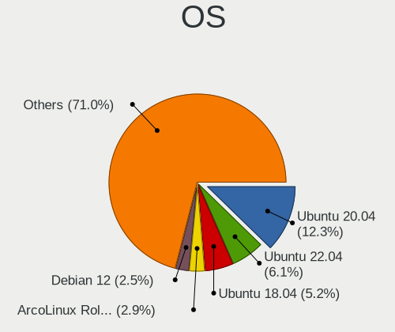

| Name                         | Desktops | Percent |
|------------------------------|----------|---------|
| Ubuntu 20.04                 | 122      | 15.38%  |
| Ubuntu 18.04                 | 53       | 6.68%   |
| Ubuntu 22.04                 | 46       | 5.8%    |
| OpenMandriva 4.2             | 24       | 3.03%   |
| Debian 11                    | 23       | 2.9%    |
| ArcoLinux Rolling            | 21       | 2.65%   |
| Zorin 16                     | 16       | 2.02%   |
| OpenMandriva 4.3             | 14       | 1.77%   |
| Ubuntu 20.10                 | 13       | 1.64%   |
| Linux Mint 20.2              | 13       | 1.64%   |
| Linux Mint 19.3              | 13       | 1.64%   |
| Fedora 35                    | 13       | 1.64%   |
| Fedora 36                    | 12       | 1.51%   |
| Linux Mint 20.1              | 11       | 1.39%   |
| Xubuntu 20.04                | 10       | 1.26%   |
| openSUSE Tumbleweed-XXXXXXXX | 10       | 1.26%   |
| Manjaro                      | 10       | 1.26%   |
| Linux Mint 21                | 10       | 1.26%   |
| Fedora 38                    | 10       | 1.26%   |
| EndeavourOS Rolling          | 10       | 1.26%   |
| Ubuntu 19.04                 | 9        | 1.13%   |
| Pop!_OS 22.04                | 9        | 1.13%   |
| Arch                         | 9        | 1.13%   |
| Pop!_OS 20.04                | 8        | 1.01%   |
| Fedora 34                    | 8        | 1.01%   |
| Ubuntu 19.10                 | 7        | 0.88%   |
| Linux Mint 21.2              | 7        | 0.88%   |
| Linux Mint 20.3              | 7        | 0.88%   |
| Fedora 37                    | 7        | 0.88%   |
| Fedora 33                    | 7        | 0.88%   |
| Debian 10                    | 7        | 0.88%   |
| Ubuntu 21.10                 | 6        | 0.76%   |
| OpenMandriva 23.08           | 6        | 0.76%   |
| Debian 12                    | 6        | 0.76%   |
| Ubuntu 23.04                 | 5        | 0.63%   |
| Ubuntu 18.10                 | 5        | 0.63%   |
| OpenMandriva 23.01           | 5        | 0.63%   |
| Linux Mint 21.1              | 5        | 0.63%   |
| Kubuntu 20.04                | 5        | 0.63%   |
| Gentoo 2.6                   | 5        | 0.63%   |

OS Family
---------

OS without a version

| Name          | Desktops | Percent |
|---------------|----------|---------|
| Ubuntu        | 260      | 35.81%  |
| Linux Mint    | 71       | 9.78%   |
| OpenMandriva  | 52       | 7.16%   |
| Fedora        | 51       | 7.02%   |
| Debian        | 44       | 6.06%   |
| Manjaro       | 26       | 3.58%   |
| Pop!_OS       | 25       | 3.44%   |
| Xubuntu       | 23       | 3.17%   |
| ArcoLinux     | 21       | 2.89%   |
| Zorin         | 18       | 2.48%   |
| openSUSE      | 15       | 2.07%   |
| Arch          | 13       | 1.79%   |
| Kubuntu       | 12       | 1.65%   |
| EndeavourOS   | 11       | 1.52%   |
| ROSA          | 9        | 1.24%   |
| Gentoo        | 8        | 1.1%    |
| KDE neon      | 7        | 0.96%   |
| Ubuntu MATE   | 6        | 0.83%   |
| Ubuntu Studio | 4        | 0.55%   |
| Lubuntu       | 4        | 0.55%   |
| LMDE          | 4        | 0.55%   |
| Garuda Linux  | 4        | 0.55%   |
| CentOS        | 4        | 0.55%   |
| Ubuntu Unity  | 3        | 0.41%   |
| Nobara        | 3        | 0.41%   |
| BlackPanther  | 3        | 0.41%   |
| MX            | 2        | 0.28%   |
| Elementary    | 2        | 0.28%   |
| Devuan        | 2        | 0.28%   |
| Clear Linux   | 2        | 0.28%   |
| Void Linux    | 1        | 0.14%   |
| UbuntuDDE     | 1        | 0.14%   |
| Ubuntu Budgie | 1        | 0.14%   |
| Sparky        | 1        | 0.14%   |
| RHEL          | 1        | 0.14%   |
| Q4OS          | 1        | 0.14%   |
| Peppermint    | 1        | 0.14%   |
| Parrot        | 1        | 0.14%   |
| NixOS         | 1        | 0.14%   |
| Mageia        | 1        | 0.14%   |

Kernel
------

Version of the Linux kernel

| Version                  | Desktops | Percent |
|--------------------------|----------|---------|
| 5.10.14-desktop-1omv4002 | 24       | 2.51%   |
| 5.16.7-desktop-1omv4003  | 14       | 1.46%   |
| 5.4.0-42-generic         | 10       | 1.04%   |
| 5.15.0-56-generic        | 9        | 0.94%   |
| 5.8.0-48-generic         | 8        | 0.84%   |
| 5.4.0-65-generic         | 8        | 0.84%   |
| 5.4.0-48-generic         | 8        | 0.84%   |
| 5.15.0-58-generic        | 7        | 0.73%   |
| 5.15.0-53-generic        | 7        | 0.73%   |
| 5.15.0-50-generic        | 7        | 0.73%   |
| 5.15.0-46-generic        | 7        | 0.73%   |
| 5.15.0-41-generic        | 7        | 0.73%   |
| 6.2.0-26-generic         | 6        | 0.63%   |
| 5.8.0-43-generic         | 6        | 0.63%   |
| 5.4.0-58-generic         | 6        | 0.63%   |
| 5.4.0-52-generic         | 6        | 0.63%   |
| 5.4.0-45-generic         | 6        | 0.63%   |
| 5.15.0-52-generic        | 6        | 0.63%   |
| 5.4.0-91-generic         | 5        | 0.52%   |
| 5.4.0-74-generic         | 5        | 0.52%   |
| 5.4.0-54-generic         | 5        | 0.52%   |
| 5.4.0-37-generic         | 5        | 0.52%   |
| 5.4.0-26-generic         | 5        | 0.52%   |
| 5.3.0-28-generic         | 5        | 0.52%   |
| 5.15.0-47-generic        | 5        | 0.52%   |
| 5.11.0-41-generic        | 5        | 0.52%   |
| 5.11.0-40-generic        | 5        | 0.52%   |
| 5.11.0-38-generic        | 5        | 0.52%   |
| 5.10.0-8-amd64           | 5        | 0.52%   |
| 4.18.0-17-generic        | 5        | 0.52%   |
| 6.2.6-desktop-1omv2390   | 4        | 0.42%   |
| 6.2.0-36-generic         | 4        | 0.42%   |
| 6.1.1-desktop-1omv2290   | 4        | 0.42%   |
| 5.8.0-53-generic         | 4        | 0.42%   |
| 5.8.0-50-generic         | 4        | 0.42%   |
| 5.4.0-7642-generic       | 4        | 0.42%   |
| 5.4.0-73-generic         | 4        | 0.42%   |
| 5.4.0-70-generic         | 4        | 0.42%   |
| 5.4.0-29-generic         | 4        | 0.42%   |
| 5.3.0-42-generic         | 4        | 0.42%   |

Kernel Family
-------------

Linux kernel without a distro release

| Version | Desktops | Percent |
|---------|----------|---------|
| 5.4.0   | 131      | 14.84%  |
| 5.15.0  | 93       | 10.53%  |
| 5.8.0   | 51       | 5.78%   |
| 4.15.0  | 45       | 5.1%    |
| 5.11.0  | 27       | 3.06%   |
| 5.3.0   | 26       | 2.94%   |
| 5.10.14 | 24       | 2.72%   |
| 5.19.0  | 23       | 2.6%    |
| 5.10.0  | 22       | 2.49%   |
| 5.13.0  | 20       | 2.27%   |
| 6.2.0   | 19       | 2.15%   |
| 5.0.0   | 17       | 1.93%   |
| 4.18.0  | 15       | 1.7%    |
| 5.16.7  | 14       | 1.59%   |
| 6.1.0   | 8        | 0.91%   |
| 4.19.0  | 8        | 0.91%   |
| 6.2.6   | 7        | 0.79%   |
| 6.5.0   | 5        | 0.57%   |
| 6.1.12  | 5        | 0.57%   |
| 4.18.16 | 5        | 0.57%   |
| 6.1.1   | 4        | 0.45%   |
| 5.5.6   | 4        | 0.45%   |
| 5.15.12 | 4        | 0.45%   |
| 5.14.10 | 4        | 0.45%   |
| 5.13.12 | 4        | 0.45%   |
| 4.13.0  | 4        | 0.45%   |
| 6.5.8   | 3        | 0.34%   |
| 6.5.5   | 3        | 0.34%   |
| 6.4.8   | 3        | 0.34%   |
| 6.4.11  | 3        | 0.34%   |
| 6.3.9   | 3        | 0.34%   |
| 6.3.1   | 3        | 0.34%   |
| 6.2.11  | 3        | 0.34%   |
| 6.0.7   | 3        | 0.34%   |
| 6.0.5   | 3        | 0.34%   |
| 6.0.2   | 3        | 0.34%   |
| 6.0.12  | 3        | 0.34%   |
| 6.0.10  | 3        | 0.34%   |
| 6.0.0   | 3        | 0.34%   |
| 5.9.16  | 3        | 0.34%   |

Kernel Major Ver.
-----------------

Linux kernel major version

| Version | Desktops | Percent |
|---------|----------|---------|
| 5.4     | 138      | 16.1%   |
| 5.15    | 121      | 14.12%  |
| 5.10    | 61       | 7.12%   |
| 5.8     | 60       | 7%      |
| 4.15    | 45       | 5.25%   |
| 5.11    | 42       | 4.9%    |
| 6.2     | 39       | 4.55%   |
| 5.19    | 30       | 3.5%    |
| 5.16    | 30       | 3.5%    |
| 5.3     | 29       | 3.38%   |
| 5.13    | 29       | 3.38%   |
| 6.1     | 22       | 2.57%   |
| 6.0     | 20       | 2.33%   |
| 5.0     | 20       | 2.33%   |
| 4.18    | 20       | 2.33%   |
| 6.5     | 16       | 1.87%   |
| 6.4     | 14       | 1.63%   |
| 5.9     | 14       | 1.63%   |
| 5.17    | 14       | 1.63%   |
| 6.3     | 12       | 1.4%    |
| 5.14    | 11       | 1.28%   |
| 4.19    | 11       | 1.28%   |
| 5.18    | 9        | 1.05%   |
| 4.9     | 9        | 1.05%   |
| 5.6     | 8        | 0.93%   |
| 5.5     | 7        | 0.82%   |
| 5.12    | 6        | 0.7%    |
| 5.7     | 4        | 0.47%   |
| 4.13    | 4        | 0.47%   |
| 3.10    | 3        | 0.35%   |
| 5.15.96 | 2        | 0.23%   |
| 4.12    | 2        | 0.23%   |
| 5.2     | 1        | 0.12%   |
| 5.1     | 1        | 0.12%   |
| 4.4     | 1        | 0.12%   |
| 4.2     | 1        | 0.12%   |
| 2.6     | 1        | 0.12%   |

Arch
----

OS architecture (x86_64, i586, etc.)

| Name   | Desktops | Percent |
|--------|----------|---------|
| x86_64 | 671      | 98.53%  |
| i686   | 10       | 1.47%   |

DE
--

Desktop Environment

| Name             | Desktops | Percent |
|------------------|----------|---------|
| GNOME            | 307      | 40.93%  |
| KDE5             | 121      | 16.13%  |
| Unknown          | 91       | 12.13%  |
| XFCE             | 67       | 8.93%   |
| X-Cinnamon       | 59       | 7.87%   |
| MATE             | 24       | 3.2%    |
| KDE              | 16       | 2.13%   |
| LXQt             | 10       | 1.33%   |
| i3               | 10       | 1.33%   |
| Cinnamon         | 10       | 1.33%   |
| Hyprland         | 4        | 0.53%   |
| Unity            | 3        | 0.4%    |
| sway             | 3        | 0.4%    |
| KDE4             | 3        | 0.4%    |
| Deepin           | 3        | 0.4%    |
| Trinity          | 2        | 0.27%   |
| Pantheon         | 2        | 0.27%   |
| LXDE             | 2        | 0.27%   |
| LeftWM           | 2        | 0.27%   |
| GNOME Flashback  | 2        | 0.27%   |
| chadwm           | 2        | 0.27%   |
| Budgie           | 2        | 0.27%   |
| Openbox          | 1        | 0.13%   |
| lightdm-xsession | 1        | 0.13%   |
| ICEWM            | 1        | 0.13%   |
| GNOME Classic    | 1        | 0.13%   |
| awesome          | 1        | 0.13%   |

Display Server
--------------

X11 or Wayland

| Name    | Desktops | Percent |
|---------|----------|---------|
| X11     | 555      | 77.62%  |
| Wayland | 99       | 13.85%  |
| Unknown | 49       | 6.85%   |
| Tty     | 12       | 1.68%   |

Display Manager
---------------

SDDM, LightDM, etc.

| Name    | Desktops | Percent |
|---------|----------|---------|
| Unknown | 338      | 46.62%  |
| SDDM    | 118      | 16.28%  |
| GDM3    | 85       | 11.72%  |
| GDM     | 83       | 11.45%  |
| LightDM | 67       | 9.24%   |
| TDM     | 30       | 4.14%   |
| XDM     | 2        | 0.28%   |
| KDM     | 2        | 0.28%   |

OS Lang
-------

Language

| Lang       | Desktops | Percent |
|------------|----------|---------|
| en_US      | 204      | 28.37%  |
| nl_BE      | 145      | 20.17%  |
| fr_BE      | 145      | 20.17%  |
| Unknown    | 89       | 12.38%  |
| fr_FR      | 50       | 6.95%   |
| nl_NL      | 25       | 3.48%   |
| en_GB      | 23       | 3.2%    |
| C          | 11       | 1.53%   |
| en_IE      | 4        | 0.56%   |
| pl_PL      | 3        | 0.42%   |
| de_BE      | 3        | 0.42%   |
| it_IT      | 2        | 0.28%   |
| fr_LU      | 2        | 0.28%   |
| de_DE      | 2        | 0.28%   |
| ru_RU      | 1        | 0.14%   |
| pt_PT      | 1        | 0.14%   |
| POSIX      | 1        | 0.14%   |
| li_BE      | 1        | 0.14%   |
| hu_HU      | 1        | 0.14%   |
| fr_FR.UTF8 | 1        | 0.14%   |
| es_ES      | 1        | 0.14%   |
| en_US.UTF8 | 1        | 0.14%   |
| en_NZ      | 1        | 0.14%   |
| en_BW      | 1        | 0.14%   |
| C.UTF8     | 1        | 0.14%   |

Boot Mode
---------

EFI or BIOS

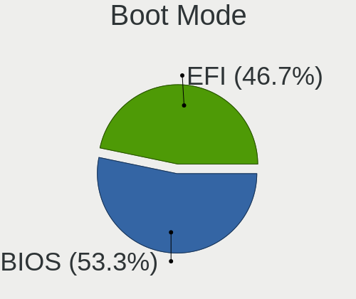

| Mode | Desktops | Percent |
|------|----------|---------|
| BIOS | 382      | 54.42%  |
| EFI  | 320      | 45.58%  |

Filesystem
----------

Type of filesystem

| Type     | Desktops | Percent |
|----------|----------|---------|
| Ext4     | 509      | 71.09%  |
| Btrfs    | 75       | 10.47%  |
| Overlay  | 63       | 8.8%    |
| Unknown  | 30       | 4.19%   |
| Tmpfs    | 17       | 2.37%   |
| Xfs      | 10       | 1.4%    |
| Ext2     | 5        | 0.7%    |
| Zfs      | 4        | 0.56%   |
| Reiserfs | 1        | 0.14%   |
| F2fs     | 1        | 0.14%   |
| Ext3     | 1        | 0.14%   |

Part. scheme
------------

Scheme of partitioning

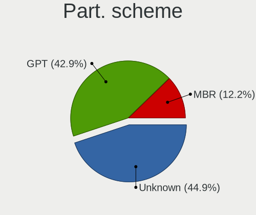

| Type    | Desktops | Percent |
|---------|----------|---------|
| Unknown | 354      | 50%     |
| GPT     | 263      | 37.15%  |
| MBR     | 91       | 12.85%  |

Dual Boot with Linux/BSD
------------------------

Hosting more than one Linux/BSD

| Dual boot | Desktops | Percent |
|-----------|----------|---------|
| No        | 532      | 75.68%  |
| Yes       | 171      | 24.32%  |

Dual Boot (Win)
---------------

Hosting Linux and Windows

| Dual boot | Desktops | Percent |
|-----------|----------|---------|
| No        | 451      | 64.43%  |
| Yes       | 249      | 35.57%  |

Board
-----

Vendor
------

Motherboard manufacturer

| Name                | Desktops | Percent |
|---------------------|----------|---------|
| ASUSTek Computer    | 190      | 27.94%  |
| MSI                 | 104      | 15.29%  |
| Gigabyte Technology | 99       | 14.56%  |
| Dell                | 53       | 7.79%   |
| ASRock              | 51       | 7.5%    |
| Hewlett-Packard     | 50       | 7.35%   |
| Medion              | 27       | 3.97%   |
| Acer                | 20       | 2.94%   |
| Lenovo              | 18       | 2.65%   |
| Intel               | 14       | 2.06%   |
| Fujitsu             | 8        | 1.18%   |
| Unknown             | 8        | 1.18%   |
| Packard Bell        | 7        | 1.03%   |
| Foxconn             | 6        | 0.88%   |
| Pegatron            | 3        | 0.44%   |
| Apple               | 3        | 0.44%   |
| Shuttle             | 2        | 0.29%   |
| Fujitsu Siemens     | 2        | 0.29%   |
| BESSTAR Tech        | 2        | 0.29%   |
| AMI                 | 2        | 0.29%   |
| TYAN Computer       | 1        | 0.15%   |
| Quantum engineering | 1        | 0.15%   |
| QTQD                | 1        | 0.15%   |
| Maxtang             | 1        | 0.15%   |
| JINGSHA             | 1        | 0.15%   |
| Hardkernel          | 1        | 0.15%   |
| EVGA                | 1        | 0.15%   |
| Biostar             | 1        | 0.15%   |
| AZW                 | 1        | 0.15%   |
| AOpen               | 1        | 0.15%   |
| Alienware           | 1        | 0.15%   |

Model
-----

Motherboard model

| Name                         | Desktops | Percent |
|------------------------------|----------|---------|
| ASUS All Series              | 26       | 3.82%   |
| Unknown                      | 10       | 1.47%   |
| ASRock B450M Pro4            | 6        | 0.88%   |
| MSI MS-7C37                  | 5        | 0.74%   |
| MSI MS-7B86                  | 5        | 0.74%   |
| Dell OptiPlex 780            | 5        | 0.74%   |
| MSI MS-7C91                  | 4        | 0.59%   |
| MSI MS-7A38                  | 4        | 0.59%   |
| HP Compaq Elite 8300 SFF     | 4        | 0.59%   |
| Gigabyte X570 AORUS MASTER   | 4        | 0.59%   |
| Gigabyte GB-BRR7H-4800       | 4        | 0.59%   |
| Gigabyte B550I AORUS PRO AX  | 4        | 0.59%   |
| Dell OptiPlex 3010           | 4        | 0.59%   |
| ASUS UNLOCK INSTALL          | 4        | 0.59%   |
| ASUS ROG STRIX X570-E GAMING | 4        | 0.59%   |
| ASUS PRIME X570-PRO          | 4        | 0.59%   |
| MSI MS-7A34                  | 3        | 0.44%   |
| MSI MS-7850                  | 3        | 0.44%   |
| Medion MS-7728               | 3        | 0.44%   |
| Dell OptiPlex 7050           | 3        | 0.44%   |
| Dell OptiPlex 390            | 3        | 0.44%   |
| ASUS TUF Gaming X570-PLUS    | 3        | 0.44%   |
| ASUS TUF Gaming B550M-PLUS   | 3        | 0.44%   |
| ASUS TUF B450-PLUS GAMING    | 3        | 0.44%   |
| ASUS STRIX Z270H GAMING      | 3        | 0.44%   |
| ASUS PRIME X570-P            | 3        | 0.44%   |
| ASUS PRIME B350M-A           | 3        | 0.44%   |
| ASUS PRIME B350-PLUS         | 3        | 0.44%   |
| ASUS H170M-PLUS              | 3        | 0.44%   |
| Acer Aspire TC-885           | 3        | 0.44%   |
| MSI MS-7D08                  | 2        | 0.29%   |
| MSI MS-7C95                  | 2        | 0.29%   |
| MSI MS-7C84                  | 2        | 0.29%   |
| MSI MS-7C75                  | 2        | 0.29%   |
| MSI MS-7C02                  | 2        | 0.29%   |
| MSI MS-7B85                  | 2        | 0.29%   |
| MSI MS-7A40                  | 2        | 0.29%   |
| MSI MS-7917                  | 2        | 0.29%   |
| MSI MS-7823                  | 2        | 0.29%   |
| MSI MS-7817                  | 2        | 0.29%   |

Model Family
------------

Motherboard model prefix

| Name                   | Desktops | Percent |
|------------------------|----------|---------|
| Dell OptiPlex          | 35       | 5.15%   |
| ASUS PRIME             | 35       | 5.15%   |
| ASUS ROG               | 26       | 3.82%   |
| ASUS All               | 26       | 3.82%   |
| HP Compaq              | 23       | 3.38%   |
| ASUS TUF               | 18       | 2.65%   |
| Acer Aspire            | 15       | 2.21%   |
| Lenovo ThinkCentre     | 10       | 1.47%   |
| Unknown                | 10       | 1.47%   |
| Gigabyte X570          | 9        | 1.32%   |
| Medion Akoya           | 7        | 1.03%   |
| Fujitsu ESPRIMO        | 7        | 1.03%   |
| Dell Precision         | 7        | 1.03%   |
| HP ProDesk             | 6        | 0.88%   |
| Gigabyte B550          | 6        | 0.88%   |
| ASRock B450M           | 6        | 0.88%   |
| MSI MS-7C37            | 5        | 0.74%   |
| MSI MS-7B86            | 5        | 0.74%   |
| Lenovo IdeaCentre      | 5        | 0.74%   |
| Packard Bell IMEDIA    | 4        | 0.59%   |
| MSI MS-7C91            | 4        | 0.59%   |
| MSI MS-7A38            | 4        | 0.59%   |
| Gigabyte GB-BRR7H-4800 | 4        | 0.59%   |
| Gigabyte B550I         | 4        | 0.59%   |
| Dell Vostro            | 4        | 0.59%   |
| ASUS UNLOCK            | 4        | 0.59%   |
| ASUS P8Z77-V           | 4        | 0.59%   |
| ASUS M5A78L-M          | 4        | 0.59%   |
| MSI MS-7A34            | 3        | 0.44%   |
| MSI MS-7850            | 3        | 0.44%   |
| Medion MS-7728         | 3        | 0.44%   |
| HP ProLiant            | 3        | 0.44%   |
| HP EliteDesk           | 3        | 0.44%   |
| Gigabyte B550M         | 3        | 0.44%   |
| Gigabyte B450          | 3        | 0.44%   |
| Dell XPS               | 3        | 0.44%   |
| ASUS STRIX             | 3        | 0.44%   |
| ASUS P8H61-M           | 3        | 0.44%   |
| ASUS P7P55D-E          | 3        | 0.44%   |
| ASUS P6T               | 3        | 0.44%   |

MFG Year
--------

Motherboard manufacture year

| Year    | Desktops | Percent |
|---------|----------|---------|
| 2018    | 69       | 10.15%  |
| 2020    | 63       | 9.26%   |
| 2014    | 57       | 8.38%   |
| 2012    | 56       | 8.24%   |
| 2013    | 52       | 7.65%   |
| 2019    | 48       | 7.06%   |
| 2011    | 45       | 6.62%   |
| 2017    | 39       | 5.74%   |
| 2009    | 35       | 5.15%   |
| 2010    | 32       | 4.71%   |
| 2008    | 31       | 4.56%   |
| 2016    | 30       | 4.41%   |
| 2015    | 29       | 4.26%   |
| 2021    | 28       | 4.12%   |
| 2007    | 25       | 3.68%   |
| 2022    | 18       | 2.65%   |
| 2006    | 13       | 1.91%   |
| 2023    | 6        | 0.88%   |
| 2005    | 2        | 0.29%   |
| Unknown | 2        | 0.29%   |

Form Factor
-----------

Physical design of the computer

| Name    | Desktops | Percent |
|---------|----------|---------|
| Desktop | 680      | 100%    |

Secure Boot
-----------

Enabled or disabled

| State    | Desktops | Percent |
|----------|----------|---------|
| Disabled | 651      | 94.76%  |
| Enabled  | 36       | 5.24%   |

Coreboot
--------

Have coreboot on board

| Used | Desktops | Percent |
|------|----------|---------|
| No   | 680      | 100%    |

RAM Size
--------

Total RAM memory

| Size in GB      | Desktops | Percent |
|-----------------|----------|---------|
| 16.01-24.0      | 198      | 28.21%  |
| 8.01-16.0       | 118      | 16.81%  |
| 32.01-64.0      | 105      | 14.96%  |
| 3.01-4.0        | 98       | 13.96%  |
| 4.01-8.0        | 96       | 13.68%  |
| 64.01-256.0     | 40       | 5.7%    |
| 24.01-32.0      | 16       | 2.28%   |
| 1.01-2.0        | 16       | 2.28%   |
| 2.01-3.0        | 11       | 1.57%   |
| More than 256.0 | 3        | 0.43%   |
| 0.51-1.0        | 1        | 0.14%   |

RAM Used
--------

Used RAM memory

| Used GB     | Desktops | Percent |
|-------------|----------|---------|
| 1.01-2.0    | 260      | 32.38%  |
| 2.01-3.0    | 213      | 26.53%  |
| 4.01-8.0    | 132      | 16.44%  |
| 3.01-4.0    | 107      | 13.33%  |
| 0.51-1.0    | 45       | 5.6%    |
| 8.01-16.0   | 29       | 3.61%   |
| 16.01-24.0  | 6        | 0.75%   |
| 0.01-0.5    | 6        | 0.75%   |
| 24.01-32.0  | 3        | 0.37%   |
| 64.01-256.0 | 1        | 0.12%   |
| Unknown     | 1        | 0.12%   |

Total Drives
------------

Number of drives on board

| Drives | Desktops | Percent |
|--------|----------|---------|
| 1      | 237      | 32.92%  |
| 2      | 194      | 26.94%  |
| 3      | 121      | 16.81%  |
| 4      | 83       | 11.53%  |
| 5      | 42       | 5.83%   |
| 6      | 23       | 3.19%   |
| 0      | 7        | 0.97%   |
| 9      | 4        | 0.56%   |
| 7      | 4        | 0.56%   |
| 8      | 3        | 0.42%   |
| 16     | 1        | 0.14%   |
| 10     | 1        | 0.14%   |

Has CD-ROM
----------

Has CD-ROM on board

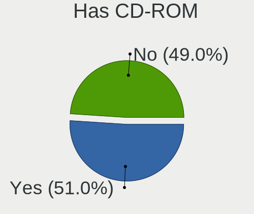

| Presented | Desktops | Percent |
|-----------|----------|---------|
| Yes       | 374      | 54.2%   |
| No        | 316      | 45.8%   |

Has Ethernet
------------

Has Ethernet on board

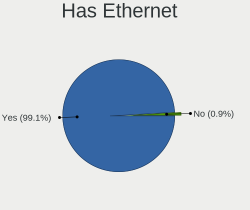

| Presented | Desktops | Percent |
|-----------|----------|---------|
| Yes       | 673      | 98.83%  |
| No        | 8        | 1.17%   |

Has WiFi
--------

Has WiFi module

| Presented | Desktops | Percent |
|-----------|----------|---------|
| No        | 416      | 60.55%  |
| Yes       | 271      | 39.45%  |

Has Bluetooth
-------------

Has Bluetooth module

| Presented | Desktops | Percent |
|-----------|----------|---------|
| No        | 484      | 69.74%  |
| Yes       | 210      | 30.26%  |

Location
--------

Country
-------

Geographic location (country)

| Country | Desktops | Percent |
|---------|----------|---------|
| Belgium | 680      | 100%    |

City
----

Geographic location (city)

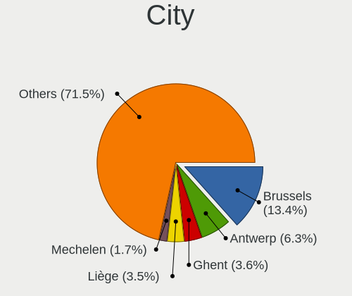

| City             | Desktops | Percent |
|------------------|----------|---------|
| Brussels         | 92       | 11.98%  |
| Antwerp          | 46       | 5.99%   |
| Ghent            | 30       | 3.91%   |
| Lige           | 25       | 3.26%   |
| Mechelen         | 14       | 1.82%   |
| Ixelles-Elsene   | 11       | 1.43%   |
| Leuven           | 10       | 1.3%    |
| Duffel           | 9        | 1.17%   |
| Schaarbeek       | 8        | 1.04%   |
| Namur            | 8        | 1.04%   |
| Lier             | 8        | 1.04%   |
| Hasselt          | 7        | 0.91%   |
| Bredene          | 7        | 0.91%   |
| Wilrijk          | 6        | 0.78%   |
| Uccle            | 6        | 0.78%   |
| Sint-Niklaas     | 6        | 0.78%   |
| Roeselare        | 6        | 0.78%   |
| Mortsel          | 6        | 0.78%   |
| La Louvire     | 6        | 0.78%   |
| Bruges           | 6        | 0.78%   |
| Anderlecht       | 6        | 0.78%   |
| Aarschot         | 6        | 0.78%   |
| Waregem          | 5        | 0.65%   |
| Vilvoorde        | 5        | 0.65%   |
| Tournai          | 5        | 0.65%   |
| Nieuwpoort       | 5        | 0.65%   |
| Langdorp         | 5        | 0.65%   |
| Huy              | 5        | 0.65%   |
| Geraardsbergen   | 5        | 0.65%   |
| Deurne           | 5        | 0.65%   |
| Aalst            | 5        | 0.65%   |
| Zottegem         | 4        | 0.52%   |
| Wevelgem         | 4        | 0.52%   |
| Turnhout         | 4        | 0.52%   |
| Seraing          | 4        | 0.52%   |
| Mons             | 4        | 0.52%   |
| Louvain-la-Neuve | 4        | 0.52%   |
| Lede             | 4        | 0.52%   |
| Kanne            | 4        | 0.52%   |
| Haaltert         | 4        | 0.52%   |

Drives
------

Drive Vendor
------------

Hard drive vendors

| Vendor                      | Desktops | Drives | Percent |
|-----------------------------|----------|--------|---------|
| Samsung Electronics         | 260      | 584    | 20.05%  |
| WDC                         | 259      | 490    | 19.97%  |
| Seagate                     | 241      | 461    | 18.58%  |
| Kingston                    | 84       | 146    | 6.48%   |
| Toshiba                     | 66       | 87     | 5.09%   |
| Crucial                     | 64       | 97     | 4.93%   |
| Sandisk                     | 49       | 66     | 3.78%   |
| Hitachi                     | 37       | 56     | 2.85%   |
| Unknown                     | 19       | 41     | 1.46%   |
| Intel                       | 19       | 24     | 1.46%   |
| Maxtor                      | 16       | 20     | 1.23%   |
| Phison                      | 12       | 14     | 0.93%   |
| Micron/Crucial Technology   | 12       | 19     | 0.93%   |
| Intenso                     | 10       | 17     | 0.77%   |
| Corsair                     | 10       | 11     | 0.77%   |
| OCZ                         | 9        | 11     | 0.69%   |
| SK hynix                    | 8        | 10     | 0.62%   |
| Micron Technology           | 8        | 12     | 0.62%   |
| HGST                        | 8        | 9      | 0.62%   |
| A-DATA Technology           | 8        | 11     | 0.62%   |
| Phison Electronics          | 7        | 8      | 0.54%   |
| LITEON                      | 7        | 12     | 0.54%   |
| LaCie                       | 6        | 9      | 0.46%   |
| China                       | 6        | 6      | 0.46%   |
| Silicon Motion              | 5        | 8      | 0.39%   |
| LDLC                        | 5        | 6      | 0.39%   |
| Apple                       | 4        | 4      | 0.31%   |
| XPG                         | 3        | 7      | 0.23%   |
| PNY                         | 3        | 3      | 0.23%   |
| Kingston Technology Company | 3        | 3      | 0.23%   |
| KingSpec                    | 3        | 3      | 0.23%   |
| KingFast                    | 3        | 3      | 0.23%   |
| ASMT                        | 3        | 3      | 0.23%   |
| Transcend                   | 2        | 2      | 0.15%   |
| sobetter                    | 2        | 2      | 0.15%   |
| Realtek Semiconductor       | 2        | 2      | 0.15%   |
| MAXIO Technology (Hangzhou) | 2        | 3      | 0.15%   |
| JMicron Technology          | 2        | 3      | 0.15%   |
| Hewlett-Packard             | 2        | 4      | 0.15%   |
| GOODRAM                     | 2        | 4      | 0.15%   |

Drive Model
-----------

Hard drive models

| Model                                              | Desktops | Percent |
|----------------------------------------------------|----------|---------|
| Samsung SSD 860 EVO 500GB                          | 21       | 1.31%   |
| Toshiba DT01ACA100 1TB                             | 17       | 1.06%   |
| Samsung NVMe SSD Controller SM981/PM981/PM983 1TB  | 17       | 1.06%   |
| Kingston SV300S37A120G 120GB SSD                   | 17       | 1.06%   |
| Seagate ST2000DM001-1ER164 2TB                     | 16       | 1%      |
| Samsung SSD 860 EVO 250GB                          | 15       | 0.94%   |
| Samsung SSD 850 EVO 500GB                          | 15       | 0.94%   |
| Samsung SSD 850 EVO 250GB                          | 15       | 0.94%   |
| Seagate ST500DM002-1BD142 500GB                    | 14       | 0.88%   |
| Samsung SSD 860 EVO 1TB                            | 14       | 0.88%   |
| Seagate ST2000DM001-1CH164 2TB                     | 13       | 0.81%   |
| Samsung NVMe SSD Drive 500GB                       | 13       | 0.81%   |
| Seagate ST2000DM008-2FR102 2TB                     | 12       | 0.75%   |
| Samsung SSD 870 QVO 1TB                            | 12       | 0.75%   |
| Samsung NVMe SSD Drive 1TB                         | 12       | 0.75%   |
| Kingston SA400S37120G 120GB SSD                    | 12       | 0.75%   |
| Samsung SSD 870 EVO 1TB                            | 11       | 0.69%   |
| Samsung SSD 840 EVO 250GB                          | 11       | 0.69%   |
| Samsung NVMe SSD Controller PM9A1/PM9A3/980PRO 1TB | 11       | 0.69%   |
| Seagate ST1000DM010-2EP102 1TB                     | 10       | 0.63%   |
| WDC WD20EZRZ-00Z5HB0 2TB                           | 9        | 0.56%   |
| Unknown SD/MMC/MS PRO 16GB                         | 9        | 0.56%   |
| Seagate ST3500418AS 500GB                          | 9        | 0.56%   |
| Seagate ST1000DM003-1CH162 1TB                     | 9        | 0.56%   |
| Samsung SSD 970 EVO 1TB                            | 9        | 0.56%   |
| Kingston SA400S37240G 240GB SSD                    | 9        | 0.56%   |
| WDC WD10EZEX-08WN4A0 1TB                           | 8        | 0.5%    |
| Seagate ST4000DM004-2CV104 4TB                     | 8        | 0.5%    |
| Seagate ST2000DM006-2DM164 2TB                     | 8        | 0.5%    |
| Seagate Expansion Desk 3TB                         | 8        | 0.5%    |
| Seagate Expansion 1TB                              | 8        | 0.5%    |
| Samsung SSD 970 EVO Plus 500GB                     | 8        | 0.5%    |
| Samsung SSD 970 EVO 500GB                          | 8        | 0.5%    |
| Samsung SSD 870 QVO 2TB                            | 8        | 0.5%    |
| Crucial CT500MX500SSD1 500GB                       | 8        | 0.5%    |
| WDC WDS240G2G0A-00JH30 240GB SSD                   | 7        | 0.44%   |
| WDC WD10EARS-00Y5B1 1TB                            | 7        | 0.44%   |
| Toshiba HDWD110 1TB                                | 7        | 0.44%   |
| Samsung SSD 970 EVO Plus 1TB                       | 7        | 0.44%   |
| Samsung SSD 860 QVO 1TB                            | 7        | 0.44%   |

HDD Vendor
----------

Hard disk drive vendors

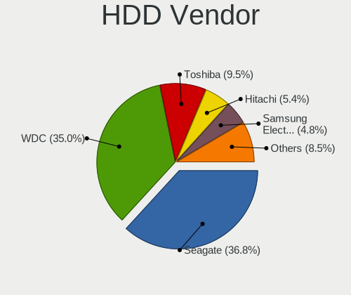

| Vendor              | Desktops | Drives | Percent |
|---------------------|----------|--------|---------|
| Seagate             | 238      | 455    | 36.84%  |
| WDC                 | 234      | 445    | 36.22%  |
| Toshiba             | 58       | 74     | 8.98%   |
| Hitachi             | 37       | 56     | 5.73%   |
| Samsung Electronics | 32       | 55     | 4.95%   |
| Maxtor              | 16       | 20     | 2.48%   |
| Unknown             | 9        | 18     | 1.39%   |
| HGST                | 8        | 9      | 1.24%   |
| Hewlett-Packard     | 2        | 4      | 0.31%   |
| Apple               | 2        | 2      | 0.31%   |
| WD MediaMax         | 1        | 1      | 0.15%   |
| SINTECHI            | 1        | 1      | 0.15%   |
| Magnetic Data       | 1        | 1      | 0.15%   |
| Lenovo              | 1        | 2      | 0.15%   |
| LaCie               | 1        | 1      | 0.15%   |
| KESU                | 1        | 3      | 0.15%   |
| Intenso             | 1        | 4      | 0.15%   |
| Fujitsu             | 1        | 1      | 0.15%   |
| ExcelStor           | 1        | 1      | 0.15%   |
| Dell                | 1        | 1      | 0.15%   |

SSD Vendor
----------

Solid state drive vendors

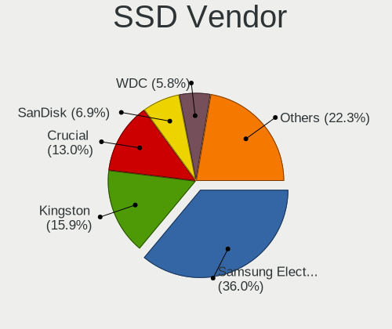

| Vendor              | Desktops | Drives | Percent |
|---------------------|----------|--------|---------|
| Samsung Electronics | 168      | 339    | 37.17%  |
| Kingston            | 73       | 130    | 16.15%  |
| Crucial             | 56       | 87     | 12.39%  |
| WDC                 | 29       | 34     | 6.42%   |
| SanDisk             | 29       | 37     | 6.42%   |
| OCZ                 | 9        | 11     | 1.99%   |
| Intenso             | 9        | 12     | 1.99%   |
| Intel               | 7        | 8      | 1.55%   |
| Corsair             | 7        | 8      | 1.55%   |
| Toshiba             | 6        | 7      | 1.33%   |
| China               | 6        | 6      | 1.33%   |
| LITEON              | 5        | 10     | 1.11%   |
| SK hynix            | 4        | 6      | 0.88%   |
| Micron Technology   | 4        | 8      | 0.88%   |
| PNY                 | 3        | 3      | 0.66%   |
| ASMT                | 3        | 3      | 0.66%   |
| A-DATA Technology   | 3        | 5      | 0.66%   |
| Transcend           | 2        | 2      | 0.44%   |
| Seagate             | 2        | 2      | 0.44%   |
| KingSpec            | 2        | 2      | 0.44%   |
| KingFast            | 2        | 2      | 0.44%   |
| GOODRAM             | 2        | 4      | 0.44%   |
| Apple               | 2        | 2      | 0.44%   |
| WDC WDS             | 1        | 1      | 0.22%   |
| Verbatim            | 1        | 1      | 0.22%   |
| Vaseky              | 1        | 1      | 0.22%   |
| tigo                | 1        | 1      | 0.22%   |
| SPCC                | 1        | 1      | 0.22%   |
| SABRENT             | 1        | 1      | 0.22%   |
| Plextor             | 1        | 1      | 0.22%   |
| Phison              | 1        | 1      | 0.22%   |
| Patriot             | 1        | 1      | 0.22%   |
| OCZ-VERTEX          | 1        | 1      | 0.22%   |
| Mushkin             | 1        | 1      | 0.22%   |
| LDLC                | 1        | 2      | 0.22%   |
| KIOXIA-EXCERIA      | 1        | 3      | 0.22%   |
| KingDian            | 1        | 1      | 0.22%   |
| INNOVATION IT       | 1        | 1      | 0.22%   |
| GALAX               | 1        | 1      | 0.22%   |
| FORESEE             | 1        | 1      | 0.22%   |

Drive Kind
----------

HDD or SSD

| Kind    | Desktops | Drives | Percent |
|---------|----------|--------|---------|
| HDD     | 491      | 1154   | 44.64%  |
| SSD     | 374      | 750    | 34%     |
| NVMe    | 208      | 366    | 18.91%  |
| Unknown | 25       | 40     | 2.27%   |
| MMC     | 2        | 2      | 0.18%   |

Drive Connector
---------------

SATA, SAS, NVMe, etc.

| Type | Desktops | Drives | Percent |
|------|----------|--------|---------|
| SATA | 616      | 1801   | 68.98%  |
| NVMe | 207      | 363    | 23.18%  |
| SAS  | 68       | 146    | 7.61%   |
| MMC  | 2        | 2      | 0.22%   |

Drive Size
----------

Size of hard drive

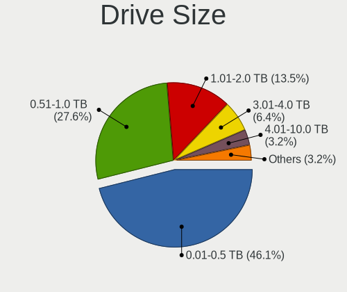

| Size in TB | Desktops | Drives | Percent |
|------------|----------|--------|---------|
| 0.01-0.5   | 448      | 920    | 45.53%  |
| 0.51-1.0   | 269      | 508    | 27.34%  |
| 1.01-2.0   | 141      | 250    | 14.33%  |
| 3.01-4.0   | 62       | 111    | 6.3%    |
| 2.01-3.0   | 35       | 53     | 3.56%   |
| 4.01-10.0  | 25       | 49     | 2.54%   |
| 10.01-20.0 | 4        | 13     | 0.41%   |

Space Total
-----------

Amount of disk space available on the file system

| Size in GB     | Desktops | Percent |
|----------------|----------|---------|
| 101-250        | 140      | 18.42%  |
| 251-500        | 120      | 15.79%  |
| 501-1000       | 119      | 15.66%  |
| 1001-2000      | 112      | 14.74%  |
| More than 3000 | 96       | 12.63%  |
| 2001-3000      | 52       | 6.84%   |
| 1-20           | 42       | 5.53%   |
| 51-100         | 34       | 4.47%   |
| Unknown        | 30       | 3.95%   |
| 21-50          | 15       | 1.97%   |

Space Used
----------

Amount of used disk space

| Used GB        | Desktops | Percent |
|----------------|----------|---------|
| 1-20           | 230      | 29.08%  |
| 21-50          | 93       | 11.76%  |
| 101-250        | 92       | 11.63%  |
| 251-500        | 85       | 10.75%  |
| 501-1000       | 78       | 9.86%   |
| 1001-2000      | 68       | 8.6%    |
| 51-100         | 58       | 7.33%   |
| More than 3000 | 32       | 4.05%   |
| Unknown        | 30       | 3.79%   |
| 2001-3000      | 25       | 3.16%   |

Malfunc. Drives
---------------

Drive models with a malfunction

| Model                               | Desktops | Drives | Percent |
|-------------------------------------|----------|--------|---------|
| Seagate ST500DM002-1BD142 500GB     | 6        | 26     | 6.67%   |
| Seagate ST3500418AS 500GB           | 4        | 11     | 4.44%   |
| WDC WD10EZEX-21M2NA0 1TB            | 2        | 2      | 2.22%   |
| Seagate ST4000DM000-1F2168 4TB      | 2        | 4      | 2.22%   |
| Samsung Electronics SSD 970 EVO 1TB | 2        | 4      | 2.22%   |
| Kingston SV300S37A120G 120GB SSD    | 2        | 2      | 2.22%   |
| WDC WDS100T2B0A-00SM50 1TB SSD      | 1        | 1      | 1.11%   |
| WDC WD5000AAKX-75U6AA0 500GB        | 1        | 1      | 1.11%   |
| WDC WD5000AAKX-753CA1 500GB         | 1        | 1      | 1.11%   |
| WDC WD5000AAKX-07U6AA0 500GB        | 1        | 1      | 1.11%   |
| WDC WD5000AAKS-22A7B0 500GB         | 1        | 1      | 1.11%   |
| WDC WD5000AADS-00S9B0 500GB         | 1        | 1      | 1.11%   |
| WDC WD40EFRX-68N32N0 4TB            | 1        | 1      | 1.11%   |
| WDC WD3200BEKT-75PVMT1 320GB        | 1        | 6      | 1.11%   |
| WDC WD20EARS-00MVWB0 2TB            | 1        | 1      | 1.11%   |
| WDC WD1600JS-60MHB5 160GB           | 1        | 1      | 1.11%   |
| WDC WD10EZRX-00L4HB0 1TB            | 1        | 1      | 1.11%   |
| WDC WD10EZRX-00A8LB0 1TB            | 1        | 1      | 1.11%   |
| WDC WD10EARS-22Y5B1 1TB             | 1        | 1      | 1.11%   |
| WDC WD10EARS-00Y5B1 1TB             | 1        | 2      | 1.11%   |
| WDC WD10EALX-009BA0 1TB             | 1        | 1      | 1.11%   |
| WDC WD10EALS-00Z8A0 1TB             | 1        | 1      | 1.11%   |
| WDC WD10EADS-00P8B0 1TB             | 1        | 1      | 1.11%   |
| WDC WD10EADS-00M2B0 1TB             | 1        | 1      | 1.11%   |
| Toshiba MK6459GSX 640GB             | 1        | 1      | 1.11%   |
| Toshiba MK1237GSX 120GB             | 1        | 1      | 1.11%   |
| Toshiba DT01ACA050 500GB            | 1        | 1      | 1.11%   |
| SPCC Solid State Disk 1TB           | 1        | 1      | 1.11%   |
| Seagate ST9320421AS 320GB           | 1        | 1      | 1.11%   |
| Seagate ST4000DM 000-1F2168 4TB     | 1        | 1      | 1.11%   |
| Seagate ST3750840AS 752GB           | 1        | 1      | 1.11%   |
| Seagate ST3500320AS 500GB           | 1        | 2      | 1.11%   |
| Seagate ST3320820AS 320GB           | 1        | 1      | 1.11%   |
| Seagate ST3320620AS 320GB           | 1        | 1      | 1.11%   |
| Seagate ST3160813AS 160GB           | 1        | 1      | 1.11%   |
| Seagate ST31000528AS 1TB            | 1        | 1      | 1.11%   |
| Seagate ST31000524NS 1TB            | 1        | 1      | 1.11%   |
| Seagate ST31000520AS 1TB            | 1        | 1      | 1.11%   |
| Seagate ST3000DM001-9YN166 3TB      | 1        | 1      | 1.11%   |
| Seagate ST2000DM008-2FR102 2TB      | 1        | 3      | 1.11%   |

Malfunc. Drive Vendor
---------------------

Vendors of faulty drives

| Vendor              | Desktops | Drives | Percent |
|---------------------|----------|--------|---------|
| Seagate             | 27       | 64     | 32.93%  |
| WDC                 | 18       | 26     | 21.95%  |
| Samsung Electronics | 12       | 17     | 14.63%  |
| Crucial             | 5        | 6      | 6.1%    |
| Maxtor              | 4        | 5      | 4.88%   |
| Hitachi             | 4        | 5      | 4.88%   |
| Toshiba             | 3        | 3      | 3.66%   |
| Kingston            | 3        | 3      | 3.66%   |
| SanDisk             | 2        | 2      | 2.44%   |
| SPCC                | 1        | 1      | 1.22%   |
| KingFast            | 1        | 1      | 1.22%   |
| Intel               | 1        | 1      | 1.22%   |
| A-DATA Technology   | 1        | 1      | 1.22%   |

Malfunc. HDD Vendor
-------------------

Vendors of faulty HDD drives

| Vendor              | Desktops | Drives | Percent |
|---------------------|----------|--------|---------|
| Seagate             | 27       | 64     | 45%     |
| WDC                 | 17       | 25     | 28.33%  |
| Samsung Electronics | 5        | 7      | 8.33%   |
| Maxtor              | 4        | 5      | 6.67%   |
| Hitachi             | 4        | 5      | 6.67%   |
| Toshiba             | 3        | 3      | 5%      |

Malfunc. Drive Kind
-------------------

Kinds of faulty drives

| Kind | Desktops | Drives | Percent |
|------|----------|--------|---------|
| HDD  | 57       | 109    | 73.08%  |
| SSD  | 17       | 20     | 21.79%  |
| NVMe | 4        | 6      | 5.13%   |

Failed Drives
-------------

Failed drive models

| Model                       | Desktops | Drives | Percent |
|-----------------------------|----------|--------|---------|
| Hitachi HDS721010DLE630 1TB | 1        | 1      | 100%    |

Failed Drive Vendor
-------------------

Failed drive vendors

| Vendor  | Desktops | Drives | Percent |
|---------|----------|--------|---------|
| Hitachi | 1        | 1      | 100%    |

Drive Status
------------

Number of failed and malfunc. drives

| Status   | Desktops | Drives | Percent |
|----------|----------|--------|---------|
| Detected | 406      | 1375   | 52.73%  |
| Works    | 287      | 801    | 37.27%  |
| Malfunc  | 76       | 135    | 9.87%   |
| Failed   | 1        | 1      | 0.13%   |

Storage controller
------------------

Storage Vendor
--------------

Storage controller vendors

| Vendor                       | Desktops | Percent |
|------------------------------|----------|---------|
| Intel                        | 463      | 45.84%  |
| AMD                          | 207      | 20.5%   |
| Samsung Electronics          | 108      | 10.69%  |
| ASMedia Technology           | 33       | 3.27%   |
| JMicron Technology           | 32       | 3.17%   |
| Marvell Technology Group     | 27       | 2.67%   |
| SanDisk                      | 26       | 2.57%   |
| Phison Electronics           | 20       | 1.98%   |
| Micron/Crucial Technology    | 20       | 1.98%   |
| Kingston Technology Company  | 14       | 1.39%   |
| Nvidia                       | 10       | 0.99%   |
| ADATA Technology             | 7        | 0.69%   |
| Silicon Motion               | 5        | 0.5%    |
| SK hynix                     | 4        | 0.4%    |
| Micron Technology            | 4        | 0.4%    |
| Toshiba America Info Systems | 3        | 0.3%    |
| Realtek Semiconductor        | 3        | 0.3%    |
| LSI Logic / Symbios Logic    | 3        | 0.3%    |
| Broadcom / LSI               | 3        | 0.3%    |
| VIA Technologies             | 2        | 0.2%    |
| Silicon Image                | 2        | 0.2%    |
| Seagate Technology           | 2        | 0.2%    |
| MAXIO Technology (Hangzhou)  | 2        | 0.2%    |
| Lite-On Technology           | 2        | 0.2%    |
| Hewlett-Packard              | 2        | 0.2%    |
| Transcend                    | 1        | 0.1%    |
| PMC-Sierra                   | 1        | 0.1%    |
| Lite-On IT Corp. / Plextor   | 1        | 0.1%    |
| HighPoint Technologies       | 1        | 0.1%    |
| Areca Technology             | 1        | 0.1%    |
| Adaptec                      | 1        | 0.1%    |

Storage Model
-------------

Storage controller models

| Model                                                                                   | Desktops | Percent |
|-----------------------------------------------------------------------------------------|----------|---------|
| AMD FCH SATA Controller [AHCI mode]                                                     | 126      | 9.98%   |
| Samsung NVMe SSD Controller SM981/PM981/PM983                                           | 73       | 5.78%   |
| AMD 400 Series Chipset SATA Controller                                                  | 51       | 4.04%   |
| Intel 8 Series/C220 Series Chipset Family 6-port SATA Controller 1 [AHCI mode]          | 50       | 3.96%   |
| Intel SATA Controller [RAID mode]                                                       | 39       | 3.09%   |
| Intel 6 Series/C200 Series Chipset Family 6 port Desktop SATA AHCI Controller           | 37       | 2.93%   |
| Intel Q170/Q150/B150/H170/H110/Z170/CM236 Chipset SATA Controller [AHCI Mode]           | 35       | 2.77%   |
| Intel 200 Series PCH SATA controller [AHCI mode]                                        | 34       | 2.69%   |
| AMD 500 Series Chipset SATA Controller                                                  | 34       | 2.69%   |
| Intel 7 Series/C210 Series Chipset Family 6-port SATA Controller [AHCI mode]            | 32       | 2.53%   |
| ASMedia ASM1062 Serial ATA Controller                                                   | 31       | 2.45%   |
| AMD SB7x0/SB8x0/SB9x0 IDE Controller                                                    | 27       | 2.14%   |
| Intel 9 Series Chipset Family SATA Controller [AHCI Mode]                               | 26       | 2.06%   |
| Samsung NVMe SSD Controller PM9A1/PM9A3/980PRO                                          | 22       | 1.74%   |
| AMD SB7x0/SB8x0/SB9x0 SATA Controller [IDE mode]                                        | 19       | 1.5%    |
| JMicron JMB363 SATA/IDE Controller                                                      | 18       | 1.43%   |
| Intel NM10/ICH7 Family SATA Controller [IDE mode]                                       | 15       | 1.19%   |
| Intel Cannon Lake PCH SATA AHCI Controller                                              | 15       | 1.19%   |
| Intel 82801G (ICH7 Family) IDE Controller                                               | 15       | 1.19%   |
| AMD SB7x0/SB8x0/SB9x0 SATA Controller [AHCI mode]                                       | 14       | 1.11%   |
| Intel 82801I (ICH9 Family) 2 port SATA Controller [IDE mode]                            | 12       | 0.95%   |
| Intel 6 Series/C200 Series Chipset Family Desktop SATA Controller (IDE mode, ports 4-5) | 12       | 0.95%   |
| Intel 6 Series/C200 Series Chipset Family Desktop SATA Controller (IDE mode, ports 0-3) | 12       | 0.95%   |
| Micron/Crucial P2 [Nick P2] / P3 / P3 Plus NVMe PCIe SSD (DRAM-less)                    | 11       | 0.87%   |
| JMicron JMB368 IDE controller                                                           | 11       | 0.87%   |
| Intel Alder Lake-S PCH SATA Controller [AHCI Mode]                                      | 11       | 0.87%   |
| Intel 4 Series Chipset PT IDER Controller                                               | 11       | 0.87%   |
| AMD 300 Series Chipset SATA Controller                                                  | 11       | 0.87%   |
| Intel C600/X79 series chipset 6-Port SATA AHCI Controller                               | 10       | 0.79%   |
| Intel 82801JI (ICH10 Family) 2 port SATA IDE Controller #2                              | 10       | 0.79%   |
| Intel 5 Series/3400 Series Chipset 6 port SATA AHCI Controller                          | 10       | 0.79%   |
| Intel 5 Series/3400 Series Chipset 4 port SATA IDE Controller                           | 10       | 0.79%   |
| Intel 5 Series/3400 Series Chipset 2 port SATA IDE Controller                           | 10       | 0.79%   |
| Samsung NVMe SSD Controller 980 (DRAM-less)                                             | 9        | 0.71%   |
| Phison E12 NVMe Controller                                                              | 8        | 0.63%   |
| Intel 82801JI (ICH10 Family) 4 port SATA IDE Controller #1                              | 8        | 0.63%   |
| Intel 82801H (ICH8 Family) 4 port SATA Controller [IDE mode]                            | 8        | 0.63%   |
| Intel 500 Series Chipset Family SATA AHCI Controller                                    | 8        | 0.63%   |
| SanDisk Extreme Pro / WD Black 2018/SN750/PC SN720 NVMe SSD                             | 7        | 0.55%   |
| Samsung NVMe SSD Controller SM961/PM961/SM963                                           | 7        | 0.55%   |

Storage Kind
------------

Kind of storage controller (IDE, SATA, NVMe, SAS, ...)

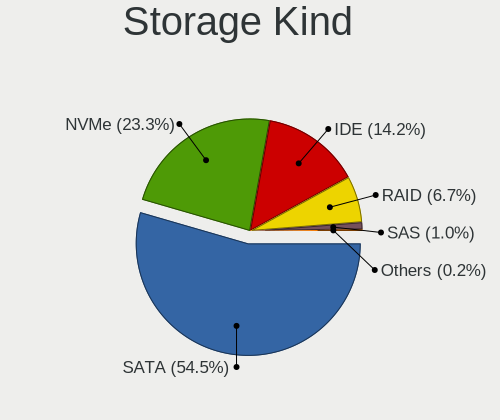

| Kind | Desktops | Percent |
|------|----------|---------|
| SATA | 548      | 55.47%  |
| NVMe | 209      | 21.15%  |
| IDE  | 155      | 15.69%  |
| RAID | 65       | 6.58%   |
| SAS  | 10       | 1.01%   |
| SCSI | 1        | 0.1%    |

Processor
---------

CPU Vendor
----------

Processor vendors

| Vendor | Desktops | Percent |
|--------|----------|---------|
| Intel  | 461      | 67.79%  |
| AMD    | 219      | 32.21%  |

CPU Model
---------

Processor models

| Model                                       | Desktops | Percent |
|---------------------------------------------|----------|---------|
| AMD Ryzen 5 3600 6-Core Processor           | 21       | 3.08%   |
| AMD Ryzen 9 3900X 12-Core Processor         | 17       | 2.49%   |
| Intel Core i7-2600 CPU @ 3.40GHz            | 12       | 1.76%   |
| Intel Core i5-3470 CPU @ 3.20GHz            | 12       | 1.76%   |
| Intel Core i7-4790K CPU @ 4.00GHz           | 11       | 1.61%   |
| AMD Ryzen 7 3700X 8-Core Processor          | 11       | 1.61%   |
| Intel Core i7-8700 CPU @ 3.20GHz            | 9        | 1.32%   |
| Intel Core i7-4790 CPU @ 3.60GHz            | 9        | 1.32%   |
| Intel Core i5-4460 CPU @ 3.20GHz            | 9        | 1.32%   |
| Intel Core i5-2400 CPU @ 3.10GHz            | 9        | 1.32%   |
| AMD Ryzen 9 5900X 12-Core Processor         | 8        | 1.17%   |
| AMD Ryzen 5 5600X 6-Core Processor          | 8        | 1.17%   |
| AMD Ryzen 5 2600 Six-Core Processor         | 8        | 1.17%   |
| Intel Core i7-7700 CPU @ 3.60GHz            | 7        | 1.03%   |
| Intel Core i7-3770 CPU @ 3.40GHz            | 7        | 1.03%   |
| Intel Core i5-8400 CPU @ 2.80GHz            | 7        | 1.03%   |
| AMD Ryzen 7 5800X 8-Core Processor          | 7        | 1.03%   |
| AMD Ryzen 5 3400G with Radeon Vega Graphics | 7        | 1.03%   |
| Intel Core i5-7500 CPU @ 3.40GHz            | 6        | 0.88%   |
| Intel Core i5-7400 CPU @ 3.00GHz            | 6        | 0.88%   |
| Intel Core i5 CPU 650 @ 3.20GHz             | 6        | 0.88%   |
| Intel Core 2 Duo CPU E8400 @ 3.00GHz        | 6        | 0.88%   |
| Intel Core i7-7700K CPU @ 4.20GHz           | 5        | 0.73%   |
| Intel Core i7-6700K CPU @ 4.00GHz           | 5        | 0.73%   |
| Intel Core i7-3770K CPU @ 3.50GHz           | 5        | 0.73%   |
| Intel Core i7 CPU 860 @ 2.80GHz             | 5        | 0.73%   |
| Intel Core i5-6600 CPU @ 3.30GHz            | 5        | 0.73%   |
| Intel Core i5-6400 CPU @ 2.70GHz            | 5        | 0.73%   |
| Intel Core i5-4690K CPU @ 3.50GHz           | 5        | 0.73%   |
| Intel Core i5-3330 CPU @ 3.00GHz            | 5        | 0.73%   |
| Intel Core i3-3220 CPU @ 3.30GHz            | 5        | 0.73%   |
| Intel Core 2 Quad CPU Q6600 @ 2.40GHz       | 5        | 0.73%   |
| AMD Ryzen 7 5700G with Radeon Graphics      | 5        | 0.73%   |
| AMD Ryzen 7 3800X 8-Core Processor          | 5        | 0.73%   |
| AMD Ryzen 7 2700X Eight-Core Processor      | 5        | 0.73%   |
| Intel Core i7-6700 CPU @ 3.40GHz            | 4        | 0.59%   |
| Intel Core i7-3820 CPU @ 3.60GHz            | 4        | 0.59%   |
| Intel Core i7 CPU 920 @ 2.67GHz             | 4        | 0.59%   |
| Intel Core i5-6500 CPU @ 3.20GHz            | 4        | 0.59%   |
| Intel Core i5-4670K CPU @ 3.40GHz           | 4        | 0.59%   |

CPU Model Family
----------------

Processor model prefix

| Model                   | Desktops | Percent |
|-------------------------|----------|---------|
| Intel Core i5           | 144      | 21.15%  |
| Intel Core i7           | 122      | 17.91%  |
| AMD Ryzen 5             | 61       | 8.96%   |
| AMD Ryzen 7             | 47       | 6.9%    |
| Intel Core i3           | 44       | 6.46%   |
| AMD Ryzen 9             | 37       | 5.43%   |
| Other                   | 26       | 3.82%   |
| Intel Xeon              | 24       | 3.52%   |
| Intel Core 2 Duo        | 22       | 3.23%   |
| Intel Core 2 Quad       | 17       | 2.5%    |
| Intel Celeron           | 15       | 2.2%    |
| Intel Pentium Dual-Core | 12       | 1.76%   |
| Intel Core 2            | 11       | 1.62%   |
| Intel Pentium           | 9        | 1.32%   |
| AMD FX                  | 9        | 1.32%   |
| AMD Phenom II X4        | 7        | 1.03%   |
| AMD A10                 | 7        | 1.03%   |
| AMD Ryzen 3             | 6        | 0.88%   |
| AMD Athlon II X2        | 6        | 0.88%   |
| Intel Pentium Dual      | 5        | 0.73%   |
| Intel Core i9           | 5        | 0.73%   |
| AMD Phenom              | 5        | 0.73%   |
| AMD Ryzen Threadripper  | 4        | 0.59%   |
| AMD Ryzen 5 PRO         | 4        | 0.59%   |
| AMD Athlon 64 X2        | 4        | 0.59%   |
| AMD A8                  | 4        | 0.59%   |
| Intel Pentium 4         | 3        | 0.44%   |
| Intel Atom              | 3        | 0.44%   |
| AMD Phenom II X6        | 3        | 0.44%   |
| AMD Athlon II X4        | 3        | 0.44%   |
| AMD A4                  | 3        | 0.44%   |
| Intel Pentium D         | 1        | 0.15%   |
| Intel Genuine           | 1        | 0.15%   |
| AMD Sempron             | 1        | 0.15%   |
| AMD Phenom II X2        | 1        | 0.15%   |
| AMD Embedded            | 1        | 0.15%   |
| AMD E2                  | 1        | 0.15%   |
| AMD E1                  | 1        | 0.15%   |
| AMD E                   | 1        | 0.15%   |
| AMD Athlon 64           | 1        | 0.15%   |

CPU Cores
---------

Number of processor cores

| Number | Desktops | Percent |
|--------|----------|---------|
| 4      | 287      | 42.08%  |
| 2      | 146      | 21.41%  |
| 6      | 105      | 15.4%   |
| 8      | 67       | 9.82%   |
| 12     | 38       | 5.57%   |
| 16     | 11       | 1.61%   |
| 1      | 8        | 1.17%   |
| 10     | 7        | 1.03%   |
| 3      | 6        | 0.88%   |
| 64     | 2        | 0.29%   |
| 32     | 2        | 0.29%   |
| 24     | 2        | 0.29%   |
| 14     | 1        | 0.15%   |

CPU Sockets
-----------

Number of sockets

| Number | Desktops | Percent |
|--------|----------|---------|
| 1      | 670      | 98.53%  |
| 2      | 10       | 1.47%   |

CPU Threads
-----------

Threads per core (Hyper-Threading)

| Number | Desktops | Percent |
|--------|----------|---------|
| 2      | 394      | 57.86%  |
| 1      | 287      | 42.14%  |

CPU Op-Modes
------------

CPU Operation Modes (32-bit, 64-bit)

| Op mode        | Desktops | Percent |
|----------------|----------|---------|
| 32-bit, 64-bit | 669      | 97.81%  |
| Unknown        | 14       | 2.05%   |
| 32-bit         | 1        | 0.15%   |

CPU Microcode
-------------

Microcode number

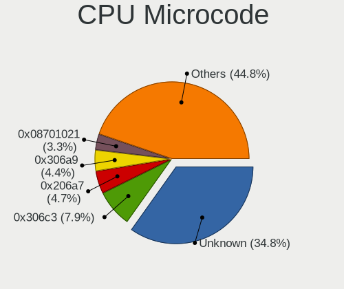

| Number     | Desktops | Percent |
|------------|----------|---------|
| Unknown    | 188      | 25.79%  |
| 0x306c3    | 67       | 9.19%   |
| 0x206a7    | 39       | 5.35%   |
| 0x306a9    | 38       | 5.21%   |
| 0x08701021 | 29       | 3.98%   |
| 0x506e3    | 26       | 3.57%   |
| 0x906e9    | 25       | 3.43%   |
| 0x1067a    | 24       | 3.29%   |
| 0x906ea    | 18       | 2.47%   |
| 0x08701013 | 15       | 2.06%   |
| 0x106e5    | 11       | 1.51%   |
| 0x0800820d | 11       | 1.51%   |
| 0x0a201009 | 10       | 1.37%   |
| 0x010000c8 | 8        | 1.1%    |
| 0xa0655    | 7        | 0.96%   |
| 0x6fd      | 7        | 0.96%   |
| 0x6fb      | 7        | 0.96%   |
| 0x306f2    | 7        | 0.96%   |
| 0x206d7    | 7        | 0.96%   |
| 0x08108109 | 7        | 0.96%   |
| 0x06001119 | 7        | 0.96%   |
| 0x90672    | 6        | 0.82%   |
| 0x6f6      | 6        | 0.82%   |
| 0x20655    | 6        | 0.82%   |
| 0x10676    | 6        | 0.82%   |
| 0x06000852 | 6        | 0.82%   |
| 0x106a5    | 5        | 0.69%   |
| 0x0a601203 | 5        | 0.69%   |
| 0x0a50000c | 5        | 0.69%   |
| 0x0a20120a | 5        | 0.69%   |
| 0x08001137 | 5        | 0.69%   |
| 0x08001129 | 5        | 0.69%   |
| 0x406f1    | 4        | 0.55%   |
| 0x20652    | 4        | 0.55%   |
| 0x0a50000d | 4        | 0.55%   |
| 0x0a201016 | 4        | 0.55%   |
| 0x08600103 | 4        | 0.55%   |
| 0x08001138 | 4        | 0.55%   |
| 0xa0653    | 3        | 0.41%   |
| 0x6f2      | 3        | 0.41%   |

CPU Microarch
-------------

Microarchitecture

| Name             | Desktops | Percent |
|------------------|----------|---------|
| Haswell          | 93       | 13.66%  |
| Zen 2            | 70       | 10.28%  |
| KabyLake         | 67       | 9.84%   |
| SandyBridge      | 53       | 7.78%   |
| IvyBridge        | 49       | 7.2%    |
| Zen 3            | 38       | 5.58%   |
| Penryn           | 38       | 5.58%   |
| Skylake          | 34       | 4.99%   |
| Core             | 33       | 4.85%   |
| Zen+             | 28       | 4.11%   |
| K10              | 26       | 3.82%   |
| Nehalem          | 21       | 3.08%   |
| Unknown          | 20       | 2.94%   |
| Zen              | 17       | 2.5%    |
| Piledriver       | 17       | 2.5%    |
| Westmere         | 14       | 2.06%   |
| CometLake        | 14       | 2.06%   |
| Alderlake Hybrid | 11       | 1.62%   |
| Silvermont       | 7        | 1.03%   |
| K8 Hammer        | 6        | 0.88%   |
| NetBurst         | 5        | 0.73%   |
| Excavator        | 4        | 0.59%   |
| Broadwell        | 4        | 0.59%   |
| Steamroller      | 2        | 0.29%   |
| Icelake          | 2        | 0.29%   |
| Goldmont plus    | 2        | 0.29%   |
| Bobcat           | 2        | 0.29%   |
| Tremont          | 1        | 0.15%   |
| Puma             | 1        | 0.15%   |
| Jaguar           | 1        | 0.15%   |
| Gracemont        | 1        | 0.15%   |

Graphics
--------

GPU Vendor
----------

Vendors of graphics cards

| Vendor                     | Desktops | Percent |
|----------------------------|----------|---------|
| Nvidia                     | 342      | 46.85%  |
| Intel                      | 198      | 27.12%  |
| AMD                        | 187      | 25.62%  |
| Matrox Electronics Systems | 2        | 0.27%   |
| ASPEED Technology          | 1        | 0.14%   |

GPU Model
---------

Graphics card models

| Model                                                                       | Desktops | Percent |
|-----------------------------------------------------------------------------|----------|---------|
| Intel Xeon E3-1200 v3/4th Gen Core Processor Integrated Graphics Controller | 32       | 4.24%   |
| AMD Ellesmere [Radeon RX 470/480/570/570X/580/580X/590]                     | 25       | 3.32%   |
| Intel Xeon E3-1200 v2/3rd Gen Core processor Graphics Controller            | 19       | 2.52%   |
| Intel CoffeeLake-S GT2 [UHD Graphics 630]                                   | 19       | 2.52%   |
| Nvidia GP106 [GeForce GTX 1060 6GB]                                         | 17       | 2.25%   |
| Nvidia GK208B [GeForce GT 710]                                              | 17       | 2.25%   |
| Nvidia GP107 [GeForce GTX 1050 Ti]                                          | 16       | 2.12%   |
| Intel 2nd Generation Core Processor Family Integrated Graphics Controller   | 16       | 2.12%   |
| AMD Navi 10 [Radeon RX 5600 OEM/5600 XT / 5700/5700 XT]                     | 16       | 2.12%   |
| Intel HD Graphics 530                                                       | 15       | 1.99%   |
| Nvidia GM204 [GeForce GTX 970]                                              | 14       | 1.86%   |
| Intel HD Graphics 630                                                       | 13       | 1.72%   |
| Nvidia GK208B [GeForce GT 730]                                              | 12       | 1.59%   |
| Nvidia GT218 [GeForce 210]                                                  | 11       | 1.46%   |
| Nvidia GP104 [GeForce GTX 1070]                                             | 11       | 1.46%   |
| Nvidia GP108 [GeForce GT 1030]                                              | 10       | 1.33%   |
| Intel 4 Series Chipset Integrated Graphics Controller                       | 10       | 1.33%   |
| Nvidia TU116 [GeForce GTX 1660 Ti]                                          | 8        | 1.06%   |
| Nvidia GM107 [GeForce GTX 750 Ti]                                           | 8        | 1.06%   |
| Intel CometLake-S GT2 [UHD Graphics 630]                                    | 8        | 1.06%   |
| AMD Cedar [Radeon HD 5000/6000/7350/8350 Series]                            | 8        | 1.06%   |
| Nvidia TU106 [GeForce RTX 2060 Rev. A]                                      | 7        | 0.93%   |
| Nvidia GK107 [GeForce GT 640]                                               | 7        | 0.93%   |
| Intel IvyBridge GT2 [HD Graphics 4000]                                      | 7        | 0.93%   |
| Intel 4th Generation Core Processor Family Integrated Graphics Controller   | 7        | 0.93%   |
| AMD Navi 22 [Radeon RX 6700/6700 XT/6750 XT / 6800M/6850M XT]               | 7        | 0.93%   |
| AMD Cezanne [Radeon Vega Series / Radeon Vega Mobile Series]                | 7        | 0.93%   |
| Nvidia GP107 [GeForce GTX 1050]                                             | 6        | 0.8%    |
| Nvidia GM206 [GeForce GTX 960]                                              | 6        | 0.8%    |
| Nvidia GK104 [GeForce GTX 760]                                              | 6        | 0.8%    |
| AMD Renoir [Radeon RX Vega 6 (Ryzen 4000/5000 Mobile Series)]               | 6        | 0.8%    |
| AMD Picasso/Raven 2 [Radeon Vega Series / Radeon Vega Mobile Series]        | 6        | 0.8%    |
| AMD Caicos [Radeon HD 6450/7450/8450 / R5 230 OEM]                          | 6        | 0.8%    |
| Nvidia GP106 [GeForce GTX 1060 3GB]                                         | 5        | 0.66%   |
| Nvidia GM204 [GeForce GTX 980]                                              | 5        | 0.66%   |
| Nvidia GF119 [GeForce GT 610]                                               | 5        | 0.66%   |
| Intel 82Q963/Q965 Integrated Graphics Controller                            | 5        | 0.66%   |
| AMD RS780L [Radeon 3000]                                                    | 5        | 0.66%   |
| AMD Juniper XT [Radeon HD 5770]                                             | 5        | 0.66%   |
| AMD Barts PRO [Radeon HD 6850]                                              | 5        | 0.66%   |

GPU Combo
---------

Combinations of graphics cards

| Name               | Desktops | Percent |
|--------------------|----------|---------|
| 1 x Nvidia         | 320      | 46.11%  |
| 1 x AMD            | 172      | 24.78%  |
| 1 x Intel          | 164      | 23.63%  |
| Intel + Nvidia     | 13       | 1.87%   |
| 2 x AMD            | 9        | 1.3%    |
| AMD + Nvidia       | 5        | 0.72%   |
| Intel + AMD        | 3        | 0.43%   |
| 2 x Nvidia         | 2        | 0.29%   |
| 1 x Matrox         | 2        | 0.29%   |
| Other              | 1        | 0.14%   |
| 2 x Intel          | 1        | 0.14%   |
| Intel + 2 x Nvidia | 1        | 0.14%   |
| 1 x ASPEED         | 1        | 0.14%   |

GPU Driver
----------

Free vs proprietary

| Driver      | Desktops | Percent |
|-------------|----------|---------|
| Free        | 470      | 66.48%  |
| Proprietary | 193      | 27.3%   |
| Unknown     | 44       | 6.22%   |

GPU Memory
----------

Total video memory

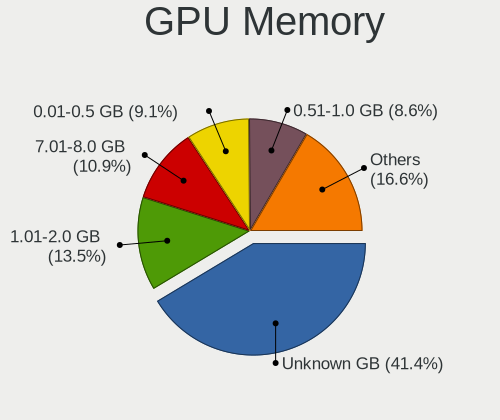

| Size in GB | Desktops | Percent |
|------------|----------|---------|
| Unknown    | 283      | 39.58%  |
| 1.01-2.0   | 101      | 14.13%  |
| 0.51-1.0   | 73       | 10.21%  |
| 7.01-8.0   | 71       | 9.93%   |
| 0.01-0.5   | 69       | 9.65%   |
| 3.01-4.0   | 51       | 7.13%   |
| 5.01-6.0   | 31       | 4.34%   |
| 8.01-16.0  | 24       | 3.36%   |
| 2.01-3.0   | 7        | 0.98%   |
| 16.01-24.0 | 5        | 0.7%    |

Monitor
-------

Monitor Vendor
--------------

Monitor vendors

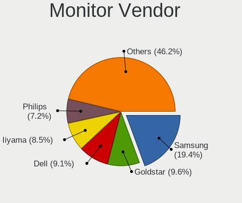

| Vendor               | Desktops | Percent |
|----------------------|----------|---------|
| Samsung Electronics  | 145      | 20.19%  |
| Dell                 | 68       | 9.47%   |
| Goldstar             | 64       | 8.91%   |
| Iiyama               | 58       | 8.08%   |
| Philips              | 50       | 6.96%   |
| Hewlett-Packard      | 44       | 6.13%   |
| BenQ                 | 36       | 5.01%   |
| AOC                  | 36       | 5.01%   |
| Acer                 | 35       | 4.87%   |
| Medion               | 30       | 4.18%   |
| Ancor Communications | 25       | 3.48%   |
| Sony                 | 9        | 1.25%   |
| Fujitsu Siemens      | 9        | 1.25%   |
| Unknown              | 8        | 1.11%   |
| Eizo                 | 7        | 0.97%   |
| ASUSTek Computer     | 7        | 0.97%   |
| Lenovo               | 6        | 0.84%   |
| Idek Iiyama          | 6        | 0.84%   |
| Packard Bell         | 5        | 0.7%    |
| NEC Computers        | 5        | 0.7%    |
| LG Electronics       | 5        | 0.7%    |
| Gigabyte Technology  | 5        | 0.7%    |
| ViewSonic            | 4        | 0.56%   |
| Arnos Instruments    | 4        | 0.56%   |
| Vestel Elektronik    | 3        | 0.42%   |
| Toshiba              | 3        | 0.42%   |
| PKB                  | 2        | 0.28%   |
| Panasonic            | 2        | 0.28%   |
| MSI                  | 2        | 0.28%   |
| Medion Akoya         | 2        | 0.28%   |
| CTV                  | 2        | 0.28%   |
| ___                  | 1        | 0.14%   |
| Valve                | 1        | 0.14%   |
| Unknown (XXX)        | 1        | 0.14%   |
| Targa Visionary      | 1        | 0.14%   |
| Sunplus              | 1        | 0.14%   |
| S2-Tek               | 1        | 0.14%   |
| RS                   | 1        | 0.14%   |
| Plain Tree Systems   | 1        | 0.14%   |
| OEM                  | 1        | 0.14%   |

Monitor Model
-------------

Monitor models

| Model                                                                   | Desktops | Percent |
|-------------------------------------------------------------------------|----------|---------|
| Goldstar LG ULTRAWIDE GSM59F1 2560x1080 800x340mm 34.2-inch             | 7        | 0.87%   |
| Samsung Electronics U28E590 SAM0C4D 3840x2160 610x350mm 27.7-inch       | 6        | 0.75%   |
| Samsung Electronics S24D330 SAM0D92 1920x1080 530x300mm 24.0-inch       | 6        | 0.75%   |
| Samsung Electronics S24F350 SAM0D20 1920x1080 521x293mm 23.5-inch       | 5        | 0.62%   |
| Samsung Electronics S24D300 SAM0B43 1920x1080 531x299mm 24.0-inch       | 5        | 0.62%   |
| Iiyama PLX2783H IVM6611 1920x1080 598x336mm 27.0-inch                   | 5        | 0.62%   |
| Samsung Electronics SyncMaster SAM03E5 1680x1050 474x296mm 22.0-inch    | 4        | 0.5%    |
| Samsung Electronics SyncMaster SAM036F 1440x900 428x255mm 19.6-inch     | 4        | 0.5%    |
| Samsung Electronics S24R65x SAM1022 1920x1080 527x296mm 23.8-inch       | 4        | 0.5%    |
| Medion MD 20430 MED36A2 1920x1080 521x293mm 23.5-inch                   | 4        | 0.5%    |
| Iiyama PL2409HD IVM560C 1920x1080 521x293mm 23.5-inch                   | 4        | 0.5%    |
| BenQ GW2780 BNQ78E6 1920x1080 598x336mm 27.0-inch                       | 4        | 0.5%    |
| BenQ GC2870 BNQ78DD 1920x1080 620x340mm 27.8-inch                       | 4        | 0.5%    |
| Vestel Elektronik 42 FHD_LCD-TV VES3700 1920x540                        | 3        | 0.37%   |
| Samsung Electronics SA300/350/360 SAM07D6 1920x1080 531x299mm 24.0-inch | 3        | 0.37%   |
| Samsung Electronics S22D300 SAM0B3F 1920x1080 477x268mm 21.5-inch       | 3        | 0.37%   |
| Samsung Electronics LCD Monitor SAM03BC 1920x1080                       | 3        | 0.37%   |
| Samsung Electronics LC32G7xT SAM7058 2560x1440 698x393mm 31.5-inch      | 3        | 0.37%   |
| Samsung Electronics C27F390 SAM0D32 1920x1080 598x336mm 27.0-inch       | 3        | 0.37%   |
| Samsung Electronics C24F390 SAM0D2C 1920x1080 521x293mm 23.5-inch       | 3        | 0.37%   |
| Philips LCD Monitor FTV 1920x1080                                       | 3        | 0.37%   |
| Iiyama PL2792UH IVM664D 3840x2160 596x335mm 26.9-inch                   | 3        | 0.37%   |
| Iiyama PL2283H IVM562E 1920x1080 480x270mm 21.7-inch                    | 3        | 0.37%   |
| Goldstar Ultra HD GSM5B09 3840x2160 600x340mm 27.2-inch                 | 3        | 0.37%   |
| Goldstar L222W GSM5664 1680x1050 474x296mm 22.0-inch                    | 3        | 0.37%   |
| Dell S2522HG DELA1C2 1920x1080 544x303mm 24.5-inch                      | 3        | 0.37%   |
| Dell 1908FP DEL4025 1280x1024 376x301mm 19.0-inch                       | 3        | 0.37%   |
| BenQ GW2270 BNQ78DB 1920x1080 476x268mm 21.5-inch                       | 3        | 0.37%   |
| BenQ EW3270U BNQ7950 3840x2160 698x393mm 31.5-inch                      | 3        | 0.37%   |
| AOC Q3279WG5B AOC3279 2560x1440 725x428mm 33.1-inch                     | 3        | 0.37%   |
| AOC Q27P2W AOC2702 2560x1440 597x336mm 27.0-inch                        | 3        | 0.37%   |
| AOC LCD Monitor F22 1920x1080                                           | 3        | 0.37%   |
| AOC G2460 AOC2460 1920x1080 531x299mm 24.0-inch                         | 3        | 0.37%   |
| Ancor Communications VX279 ACI27E4 1920x1080 598x336mm 27.0-inch        | 3        | 0.37%   |
| Acer V223HQ ACR0070 1920x1080 477x268mm 21.5-inch                       | 3        | 0.37%   |
| ViewSonic VE710s-2 VSC3A19 1280x1024 338x270mm 17.0-inch                | 2        | 0.25%   |
| Unknown LCD Monitor SAMSUNG 1920x1080                                   | 2        | 0.25%   |
| Samsung Electronics U28H75x SAM0E00 3840x2160 607x345mm 27.5-inch       | 2        | 0.25%   |
| Samsung Electronics U28E590 SAM0C4E 3840x2160 608x345mm 27.5-inch       | 2        | 0.25%   |
| Samsung Electronics U28E570 SAM0D6F 3840x2160 610x350mm 27.7-inch       | 2        | 0.25%   |

Monitor Resolution
------------------

Monitor screen resolution

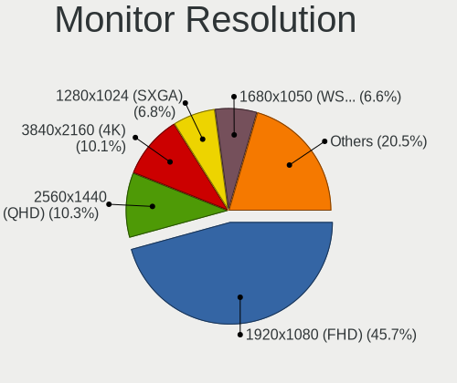

| Resolution         | Desktops | Percent |
|--------------------|----------|---------|
| 1920x1080 (FHD)    | 327      | 45.93%  |
| 3840x2160 (4K)     | 68       | 9.55%   |
| 2560x1440 (QHD)    | 65       | 9.13%   |
| 1280x1024 (SXGA)   | 56       | 7.87%   |
| 1680x1050 (WSXGA+) | 53       | 7.44%   |
| 1920x1200 (WUXGA)  | 25       | 3.51%   |
| 1440x900 (WXGA+)   | 25       | 3.51%   |
| Unknown            | 18       | 2.53%   |
| 3840x1080          | 16       | 2.25%   |
| 3440x1440          | 13       | 1.83%   |
| 2560x1080          | 10       | 1.4%    |
| 1600x1200          | 6        | 0.84%   |
| 1600x900 (HD+)     | 4        | 0.56%   |
| 1366x768 (WXGA)    | 4        | 0.56%   |
| 1360x768           | 4        | 0.56%   |
| 5760x1080          | 3        | 0.42%   |
| 2960x1050          | 2        | 0.28%   |
| 1920x540           | 2        | 0.28%   |
| 1280x960           | 2        | 0.28%   |
| 1024x768 (XGA)     | 2        | 0.28%   |
| 4480x1080          | 1        | 0.14%   |
| 3840x1600          | 1        | 0.14%   |
| 3840x1200          | 1        | 0.14%   |
| 3360x1050          | 1        | 0.14%   |
| 2560x1600          | 1        | 0.14%   |
| 2288x1287          | 1        | 0.14%   |
| 1920x1440          | 1        | 0.14%   |

Monitor Diagonal
----------------

Diagonal size in inches

| Inches  | Desktops | Percent |
|---------|----------|---------|
| 27      | 125      | 16.94%  |
| 24      | 103      | 13.96%  |
| 23      | 103      | 13.96%  |
| 21      | 79       | 10.7%   |
| Unknown | 78       | 10.57%  |
| 19      | 49       | 6.64%   |
| 22      | 30       | 4.07%   |
| 31      | 29       | 3.93%   |
| 34      | 22       | 2.98%   |
| 20      | 20       | 2.71%   |
| 17      | 17       | 2.3%    |
| 18      | 14       | 1.9%    |
| 25      | 9        | 1.22%   |
| 72      | 7        | 0.95%   |
| 32      | 7        | 0.95%   |
| 54      | 5        | 0.68%   |
| 49      | 5        | 0.68%   |
| 40      | 5        | 0.68%   |
| 15      | 4        | 0.54%   |
| 84      | 3        | 0.41%   |
| 33      | 3        | 0.41%   |
| 26      | 3        | 0.41%   |
| 16      | 3        | 0.41%   |
| 65      | 2        | 0.27%   |
| 48      | 2        | 0.27%   |
| 29      | 2        | 0.27%   |
| 14      | 2        | 0.27%   |
| 142     | 1        | 0.14%   |
| 63      | 1        | 0.14%   |
| 46      | 1        | 0.14%   |
| 43      | 1        | 0.14%   |
| 42      | 1        | 0.14%   |
| 37      | 1        | 0.14%   |
| 30      | 1        | 0.14%   |

Monitor Width
-------------

Physical width

| Width in mm    | Desktops | Percent |
|----------------|----------|---------|
| 501-600        | 299      | 41.59%  |
| 401-500        | 156      | 21.7%   |
| Unknown        | 78       | 10.85%  |
| 601-700        | 60       | 8.34%   |
| 351-400        | 35       | 4.87%   |
| 701-800        | 32       | 4.45%   |
| 301-350        | 23       | 3.2%    |
| 1001-1500      | 16       | 2.23%   |
| 1501-2000      | 10       | 1.39%   |
| 801-900        | 6        | 0.83%   |
| 901-1000       | 2        | 0.28%   |
| More than 2000 | 1        | 0.14%   |
| 201-300        | 1        | 0.14%   |

Aspect Ratio
------------

Proportional relationship between the width and the height

| Ratio   | Desktops | Percent |
|---------|----------|---------|
| 16/9    | 407      | 60.03%  |
| 16/10   | 105      | 15.49%  |
| Unknown | 69       | 10.18%  |
| 5/4     | 50       | 7.37%   |
| 21/9    | 23       | 3.39%   |
| 4/3     | 11       | 1.62%   |
| 32/9    | 5        | 0.74%   |
| 6/5     | 4        | 0.59%   |
| 3/2     | 2        | 0.29%   |
| 1.00    | 2        | 0.29%   |

Monitor Area
------------

Area in inch

| Area in inch | Desktops | Percent |
|----------------|----------|---------|
| 201-250        | 245      | 33.98%  |
| 301-350        | 129      | 17.89%  |
| 151-200        | 98       | 13.59%  |
| Unknown        | 78       | 10.82%  |
| 351-500        | 62       | 8.6%    |
| 251-300        | 47       | 6.52%   |
| More than 1000 | 20       | 2.77%   |
| 141-150        | 19       | 2.64%   |
| 501-1000       | 14       | 1.94%   |
| 101-110        | 3        | 0.42%   |
| 131-140        | 2        | 0.28%   |
| 81-90          | 1        | 0.14%   |
| 121-130        | 1        | 0.14%   |
| 111-120        | 1        | 0.14%   |
| 91-100         | 1        | 0.14%   |

Pixel Density
-------------

Pixels per inch

| Density | Desktops | Percent |
|---------|----------|---------|
| 51-100  | 423      | 60.95%  |
| 101-120 | 125      | 18.01%  |
| Unknown | 78       | 11.24%  |
| 121-160 | 39       | 5.62%   |
| 1-50    | 15       | 2.16%   |
| 161-240 | 14       | 2.02%   |

Multiple Monitors
-----------------

Total monitors connected

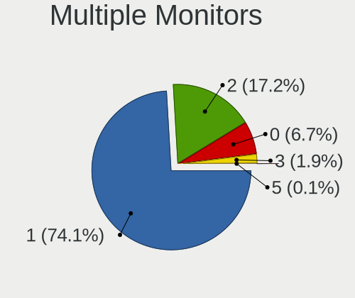

| Total | Desktops | Percent |
|-------|----------|---------|
| 1     | 529      | 74.93%  |
| 2     | 119      | 16.86%  |
| 0     | 46       | 6.52%   |
| 3     | 12       | 1.7%    |

Network
-------

Net Controller Vendor
---------------------

Controller vendors

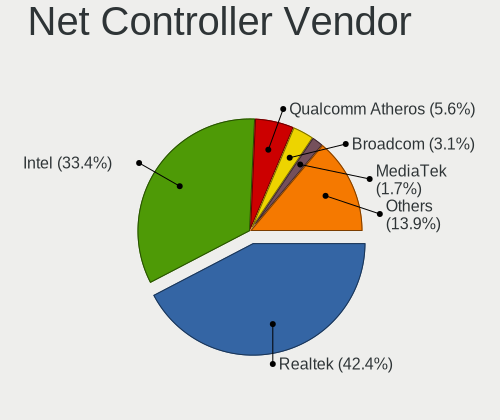

| Vendor                                 | Desktops | Percent |
|----------------------------------------|----------|---------|
| Realtek Semiconductor                  | 398      | 42.52%  |
| Intel                                  | 307      | 32.8%   |
| Qualcomm Atheros                       | 58       | 6.2%    |
| Broadcom                               | 30       | 3.21%   |
| TP-Link                                | 13       | 1.39%   |
| D-Link System                          | 12       | 1.28%   |
| Nvidia                                 | 10       | 1.07%   |
| Marvell Technology Group               | 9        | 0.96%   |
| Ralink                                 | 8        | 0.85%   |
| IMC Networks                           | 8        | 0.85%   |
| Ralink Technology                      | 7        | 0.75%   |
| MediaTek                               | 7        | 0.75%   |
| Broadcom Limited                       | 7        | 0.75%   |
| Microsoft                              | 5        | 0.53%   |
| Linksys                                | 5        | 0.53%   |
| D-Link                                 | 5        | 0.53%   |
| ASIX Electronics                       | 5        | 0.53%   |
| Aquantia                               | 5        | 0.53%   |
| Sitecom Europe                         | 4        | 0.43%   |
| Qualcomm Atheros Communications        | 4        | 0.43%   |
| ASUSTek Computer                       | 4        | 0.43%   |
| DisplayLink                            | 3        | 0.32%   |
| Microchip Technology                   | 2        | 0.21%   |
| Arduino SA                             | 2        | 0.21%   |
| Xiaomi                                 | 1        | 0.11%   |
| Texas Instruments                      | 1        | 0.11%   |
| Tenda                                  | 1        | 0.11%   |
| Tehuti Networks                        | 1        | 0.11%   |
| STMicroelectronics                     | 1        | 0.11%   |
| Sony Ericsson Mobile Communications AB | 1        | 0.11%   |
| Sigma Designs                          | 1        | 0.11%   |
| Sega                                   | 1        | 0.11%   |
| Samsung Electronics                    | 1        | 0.11%   |
| OPPO Electronics                       | 1        | 0.11%   |
| OpenMoko                               | 1        | 0.11%   |
| NetGear                                | 1        | 0.11%   |
| Guillemot                              | 1        | 0.11%   |
| Google                                 | 1        | 0.11%   |
| Gemtek                                 | 1        | 0.11%   |
| Edimax Technology                      | 1        | 0.11%   |

Net Controller Model
--------------------

Controller models

| Model                                                             | Desktops | Percent |
|-------------------------------------------------------------------|----------|---------|
| Realtek RTL8111/8168/8411 PCI Express Gigabit Ethernet Controller | 323      | 30.62%  |
| Realtek RTL8125 2.5GbE Controller                                 | 51       | 4.83%   |
| Intel I211 Gigabit Network Connection                             | 51       | 4.83%   |
| Intel Wi-Fi 6 AX200                                               | 41       | 3.89%   |
| Intel Ethernet Connection (2) I219-V                              | 29       | 2.75%   |
| Intel 82579LM Gigabit Network Connection (Lewisville)             | 24       | 2.27%   |
| Intel Ethernet Controller I225-V                                  | 22       | 2.09%   |
| Intel Ethernet Connection (2) I218-V                              | 16       | 1.52%   |
| Intel 82579V Gigabit Network Connection                           | 16       | 1.52%   |
| Intel Ethernet Connection I217-V                                  | 13       | 1.23%   |
| Intel 82567LM-3 Gigabit Network Connection                        | 11       | 1.04%   |
| Intel Dual Band Wireless-AC 3168NGW [Stone Peak]                  | 10       | 0.95%   |
| Qualcomm Atheros Killer E220x Gigabit Ethernet Controller         | 9        | 0.85%   |
| Intel Ethernet Connection I217-LM                                 | 9        | 0.85%   |
| Intel 82574L Gigabit Network Connection                           | 9        | 0.85%   |
| Broadcom BCM4360 802.11ac Dual Band Wireless Network Adapter      | 8        | 0.76%   |
| Realtek RTL8153 Gigabit Ethernet Adapter                          | 7        | 0.66%   |
| Intel Cannon Lake PCH CNVi WiFi                                   | 7        | 0.66%   |
| Realtek RTL8188CUS 802.11n WLAN Adapter                           | 6        | 0.57%   |
| Qualcomm Atheros AR8151 v2.0 Gigabit Ethernet                     | 6        | 0.57%   |
| Marvell Group 88E8056 PCI-E Gigabit Ethernet Controller           | 6        | 0.57%   |
| Intel Wireless 7260                                               | 6        | 0.57%   |
| Intel Ethernet Connection (5) I219-LM                             | 6        | 0.57%   |
| Realtek RTL8188EUS 802.11n Wireless Network Adapter               | 5        | 0.47%   |
| Qualcomm Atheros Killer E2500 Gigabit Ethernet Controller         | 5        | 0.47%   |
| Qualcomm Atheros AR8161 Gigabit Ethernet                          | 5        | 0.47%   |
| Microsoft Xbox 360 Wireless Adapter                               | 5        | 0.47%   |
| Intel Wireless-AC 9260                                            | 5        | 0.47%   |
| Intel Wi-Fi 6 AX210/AX211/AX411 160MHz                            | 5        | 0.47%   |
| Intel 82578DC Gigabit Network Connection                          | 5        | 0.47%   |
| Intel 82566DM-2 Gigabit Network Connection                        | 5        | 0.47%   |
| IMC Networks Mediao 802.11n WLAN [Realtek RTL8191SU]              | 5        | 0.47%   |
| TP-Link TL-WN823N v2/v3 [Realtek RTL8192EU]                       | 4        | 0.38%   |
| Qualcomm Atheros QCA9565 / AR9565 Wireless Network Adapter        | 4        | 0.38%   |
| Qualcomm Atheros AR9485 Wireless Network Adapter                  | 4        | 0.38%   |
| Qualcomm Atheros AR93xx Wireless Network Adapter                  | 4        | 0.38%   |
| Qualcomm Atheros AR922X Wireless Network Adapter                  | 4        | 0.38%   |
| Nvidia MCP61 Ethernet                                             | 4        | 0.38%   |
| MediaTek MT7922 802.11ax PCI Express Wireless Network Adapter     | 4        | 0.38%   |
| Intel Wireless 7265                                               | 4        | 0.38%   |

Wireless Vendor
---------------

Wireless vendors

| Vendor                                | Desktops | Percent |
|---------------------------------------|----------|---------|
| Intel                                 | 107      | 37.28%  |
| Realtek Semiconductor                 | 45       | 15.68%  |
| Qualcomm Atheros                      | 30       | 10.45%  |
| Broadcom                              | 17       | 5.92%   |
| TP-Link                               | 12       | 4.18%   |
| D-Link System                         | 9        | 3.14%   |
| Ralink                                | 8        | 2.79%   |
| IMC Networks                          | 8        | 2.79%   |
| Ralink Technology                     | 7        | 2.44%   |
| MediaTek                              | 7        | 2.44%   |
| Microsoft                             | 5        | 1.74%   |
| Linksys                               | 5        | 1.74%   |
| D-Link                                | 5        | 1.74%   |
| Sitecom Europe                        | 4        | 1.39%   |
| Qualcomm Atheros Communications       | 4        | 1.39%   |
| ASUSTek Computer                      | 4        | 1.39%   |
| Broadcom Limited                      | 2        | 0.7%    |
| Texas Instruments                     | 1        | 0.35%   |
| Tenda                                 | 1        | 0.35%   |
| NetGear                               | 1        | 0.35%   |
| Guillemot                             | 1        | 0.35%   |
| Gemtek                                | 1        | 0.35%   |
| Edimax Technology                     | 1        | 0.35%   |
| AVM                                   | 1        | 0.35%   |
| 802.11g Adapter [Linksys WUSB54GC v3] | 1        | 0.35%   |

Wireless Model
--------------

Wireless models

| Model                                                                  | Desktops | Percent |
|------------------------------------------------------------------------|----------|---------|
| Intel Wi-Fi 6 AX200                                                    | 41       | 14.09%  |
| Intel Dual Band Wireless-AC 3168NGW [Stone Peak]                       | 10       | 3.44%   |
| Broadcom BCM4360 802.11ac Dual Band Wireless Network Adapter           | 8        | 2.75%   |
| Intel Cannon Lake PCH CNVi WiFi                                        | 7        | 2.41%   |
| Realtek RTL8188CUS 802.11n WLAN Adapter                                | 6        | 2.06%   |
| Intel Wireless 7260                                                    | 6        | 2.06%   |
| Realtek RTL8188EUS 802.11n Wireless Network Adapter                    | 5        | 1.72%   |
| Microsoft Xbox 360 Wireless Adapter                                    | 5        | 1.72%   |
| Intel Wireless-AC 9260                                                 | 5        | 1.72%   |
| Intel Wi-Fi 6 AX210/AX211/AX411 160MHz                                 | 5        | 1.72%   |
| IMC Networks Mediao 802.11n WLAN [Realtek RTL8191SU]                   | 5        | 1.72%   |
| TP-Link TL-WN823N v2/v3 [Realtek RTL8192EU]                            | 4        | 1.37%   |
| Qualcomm Atheros QCA9565 / AR9565 Wireless Network Adapter             | 4        | 1.37%   |
| Qualcomm Atheros AR9485 Wireless Network Adapter                       | 4        | 1.37%   |
| Qualcomm Atheros AR93xx Wireless Network Adapter                       | 4        | 1.37%   |
| Qualcomm Atheros AR922X Wireless Network Adapter                       | 4        | 1.37%   |
| MediaTek MT7922 802.11ax PCI Express Wireless Network Adapter          | 4        | 1.37%   |
| Intel Wireless 7265                                                    | 4        | 1.37%   |
| Intel Wireless 3165                                                    | 4        | 1.37%   |
| Intel Dual Band Wireless-AC 3165 Plus Bluetooth                        | 4        | 1.37%   |
| Intel Alder Lake-S PCH CNVi WiFi                                       | 4        | 1.37%   |
| TP-Link TL-WN722N v2/v3 [Realtek RTL8188EUS]                           | 3        | 1.03%   |
| TP-Link Archer T3U [Realtek RTL8812BU]                                 | 3        | 1.03%   |
| Realtek RTL88x2bu [AC1200 Techkey]                                     | 3        | 1.03%   |
| Realtek RTL8192EE PCIe Wireless Network Adapter                        | 3        | 1.03%   |
| Realtek RTL8192CE PCIe Wireless Network Adapter                        | 3        | 1.03%   |
| Realtek 802.11ac WLAN Adapter                                          | 3        | 1.03%   |
| Realtek 802.11ac NIC                                                   | 3        | 1.03%   |
| Ralink MT7601U Wireless Adapter                                        | 3        | 1.03%   |
| Ralink RT3090 Wireless 802.11n 1T/1R PCIe                              | 3        | 1.03%   |
| Qualcomm Atheros AR9271 802.11n                                        | 3        | 1.03%   |
| Qualcomm Atheros AR9287 Wireless Network Adapter (PCI-Express)         | 3        | 1.03%   |
| Intel 700 Series Chipset Family Wi-Fi                                  | 3        | 1.03%   |
| IMC Networks AW-NU222 802.11bgn Wireless Module [Ralink RT2770+RT2720] | 3        | 1.03%   |
| D-Link DWA-171                                                         | 3        | 1.03%   |
| TP-Link Archer T4U v2 [Realtek RTL8812AU]                              | 2        | 0.69%   |
| Sitecom Europe WLA-5000 802.11abgn [Ralink RT3572]                     | 2        | 0.69%   |
| Realtek RTL8821AE 802.11ac PCIe Wireless Network Adapter               | 2        | 0.69%   |
| Realtek RTL8812AE 802.11ac PCIe Wireless Network Adapter               | 2        | 0.69%   |
| Realtek RTL8723BU 802.11b/g/n WLAN Adapter                             | 2        | 0.69%   |

Ethernet Vendor
---------------

Ethernet vendors

| Vendor                                 | Desktops | Percent |
|----------------------------------------|----------|---------|
| Realtek Semiconductor                  | 382      | 52.47%  |
| Intel                                  | 249      | 34.2%   |
| Qualcomm Atheros                       | 34       | 4.67%   |
| Broadcom                               | 14       | 1.92%   |
| Nvidia                                 | 10       | 1.37%   |
| Marvell Technology Group               | 9        | 1.24%   |
| Broadcom Limited                       | 5        | 0.69%   |
| ASIX Electronics                       | 5        | 0.69%   |
| Aquantia                               | 5        | 0.69%   |
| DisplayLink                            | 3        | 0.41%   |
| D-Link System                          | 3        | 0.41%   |
| Xiaomi                                 | 1        | 0.14%   |
| TP-Link                                | 1        | 0.14%   |
| Tehuti Networks                        | 1        | 0.14%   |
| Sony Ericsson Mobile Communications AB | 1        | 0.14%   |
| Samsung Electronics                    | 1        | 0.14%   |
| OPPO Electronics                       | 1        | 0.14%   |
| OpenMoko                               | 1        | 0.14%   |
| Microchip Technology                   | 1        | 0.14%   |
| Google                                 | 1        | 0.14%   |

Ethernet Model
--------------

Ethernet models

| Model                                                             | Desktops | Percent |
|-------------------------------------------------------------------|----------|---------|
| Realtek RTL8111/8168/8411 PCI Express Gigabit Ethernet Controller | 323      | 42.61%  |
| Realtek RTL8125 2.5GbE Controller                                 | 51       | 6.73%   |
| Intel I211 Gigabit Network Connection                             | 51       | 6.73%   |
| Intel Ethernet Connection (2) I219-V                              | 29       | 3.83%   |
| Intel 82579LM Gigabit Network Connection (Lewisville)             | 24       | 3.17%   |
| Intel Ethernet Controller I225-V                                  | 22       | 2.9%    |
| Intel Ethernet Connection (2) I218-V                              | 16       | 2.11%   |
| Intel 82579V Gigabit Network Connection                           | 16       | 2.11%   |
| Intel Ethernet Connection I217-V                                  | 13       | 1.72%   |
| Intel 82567LM-3 Gigabit Network Connection                        | 11       | 1.45%   |
| Qualcomm Atheros Killer E220x Gigabit Ethernet Controller         | 9        | 1.19%   |
| Intel Ethernet Connection I217-LM                                 | 9        | 1.19%   |
| Intel 82574L Gigabit Network Connection                           | 9        | 1.19%   |
| Realtek RTL8153 Gigabit Ethernet Adapter                          | 7        | 0.92%   |
| Qualcomm Atheros AR8151 v2.0 Gigabit Ethernet                     | 6        | 0.79%   |
| Marvell Group 88E8056 PCI-E Gigabit Ethernet Controller           | 6        | 0.79%   |
| Intel Ethernet Connection (5) I219-LM                             | 6        | 0.79%   |
| Qualcomm Atheros Killer E2500 Gigabit Ethernet Controller         | 5        | 0.66%   |
| Qualcomm Atheros AR8161 Gigabit Ethernet                          | 5        | 0.66%   |
| Intel 82578DC Gigabit Network Connection                          | 5        | 0.66%   |
| Intel 82566DM-2 Gigabit Network Connection                        | 5        | 0.66%   |
| Nvidia MCP61 Ethernet                                             | 4        | 0.53%   |
| Intel I210 Gigabit Network Connection                             | 4        | 0.53%   |
| Intel 82567V-2 Gigabit Network Connection                         | 4        | 0.53%   |
| Intel 82566DM Gigabit Network Connection                          | 4        | 0.53%   |
| Broadcom NetXtreme BCM5761 Gigabit Ethernet PCIe                  | 4        | 0.53%   |
| Realtek RTL8169 PCI Gigabit Ethernet Controller                   | 3        | 0.4%    |
| Realtek RTL-8100/8101L/8139 PCI Fast Ethernet Adapter             | 3        | 0.4%    |
| Intel Ethernet Connection (7) I219-V                              | 3        | 0.4%    |
| Intel Ethernet Connection (2) I219-LM                             | 3        | 0.4%    |
| Intel 82578DM Gigabit Network Connection                          | 3        | 0.4%    |
| Intel 82566DC Gigabit Network Connection                          | 3        | 0.4%    |
| Intel 80003ES2LAN Gigabit Ethernet Controller (Copper)            | 3        | 0.4%    |
| D-Link System DGE-528T Gigabit Ethernet Adapter                   | 3        | 0.4%    |
| ASIX AX88179 Gigabit Ethernet                                     | 3        | 0.4%    |
| Aquantia AQC107 NBase-T/IEEE 802.3bz Ethernet Controller [AQtion] | 3        | 0.4%    |
| Realtek RTL8152 Fast Ethernet Adapter                             | 2        | 0.26%   |
| Realtek RTL810xE PCI Express Fast Ethernet controller             | 2        | 0.26%   |
| Qualcomm Atheros Killer E2400 Gigabit Ethernet Controller         | 2        | 0.26%   |
| Qualcomm Atheros Attansic L1 Gigabit Ethernet                     | 2        | 0.26%   |

Net Controller Kind
-------------------

Ethernet, WiFi or modem

| Kind     | Desktops | Percent |
|----------|----------|---------|
| Ethernet | 671      | 70.71%  |
| WiFi     | 272      | 28.66%  |
| Modem    | 5        | 0.53%   |
| Unknown  | 1        | 0.11%   |

Used Controller
---------------

Currently used network controller

| Kind     | Desktops | Percent |
|----------|----------|---------|
| Ethernet | 564      | 79.89%  |
| WiFi     | 142      | 20.11%  |

NICs
----

Total network controllers on board

| Total | Desktops | Percent |
|-------|----------|---------|
| 1     | 446      | 65.01%  |
| 2     | 198      | 28.86%  |
| 3     | 32       | 4.66%   |
| 0     | 4        | 0.58%   |
| 4     | 3        | 0.44%   |
| 5     | 2        | 0.29%   |
| 7     | 1        | 0.15%   |

IPv6
----

IPv6 vs IPv4

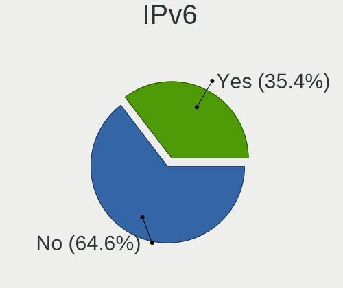

| Used | Desktops | Percent |
|------|----------|---------|
| No   | 476      | 66.48%  |
| Yes  | 240      | 33.52%  |

Bluetooth
---------

Bluetooth Vendor
----------------

Controller vendors

| Vendor                          | Desktops | Percent |
|---------------------------------|----------|---------|
| Intel                           | 104      | 46.85%  |
| Cambridge Silicon Radio         | 45       | 20.27%  |
| ASUSTek Computer                | 23       | 10.36%  |
| Broadcom                        | 10       | 4.5%    |
| Belkin Components               | 7        | 3.15%   |
| Realtek Semiconductor           | 6        | 2.7%    |
| Qualcomm Atheros Communications | 5        | 2.25%   |
| IMC Networks                    | 5        | 2.25%   |
| MediaTek                        | 4        | 1.8%    |
| TP-Link                         | 3        | 1.35%   |
| Lite-On Technology              | 3        | 1.35%   |
| Foxconn / Hon Hai               | 3        | 1.35%   |
| Logitech                        | 1        | 0.45%   |
| Integrated System Solution      | 1        | 0.45%   |
| HTC (High Tech Computer)        | 1        | 0.45%   |
| Apple                           | 1        | 0.45%   |

Bluetooth Model
---------------

Controller models

| Model                                                                | Desktops | Percent |
|----------------------------------------------------------------------|----------|---------|
| Cambridge Silicon Radio Bluetooth Dongle (HCI mode)                  | 45       | 20.09%  |
| Intel AX200 Bluetooth                                                | 40       | 17.86%  |
| Intel Bluetooth wireless interface                                   | 20       | 8.93%   |
| Intel Wireless-AC 3168 Bluetooth                                     | 10       | 4.46%   |
| Intel Bluetooth 9460/9560 Jefferson Peak (JfP)                       | 8        | 3.57%   |
| Intel AX201 Bluetooth                                                | 8        | 3.57%   |
| ASUS Broadcom BCM20702A0 Bluetooth                                   | 8        | 3.57%   |
| ASUS ASUS USB-BT500                                                  | 6        | 2.68%   |
| Realtek Bluetooth Radio                                              | 5        | 2.23%   |
| Intel Wireless-AC 9260 Bluetooth Adapter                             | 5        | 2.23%   |
| Intel AX210 Bluetooth                                                | 5        | 2.23%   |
| Broadcom BCM20702A0 Bluetooth 4.0                                    | 5        | 2.23%   |
| ASUS Broadcom BCM20702 Single-Chip Bluetooth 4.0 + LE                | 5        | 2.23%   |
| MediaTek Wireless_Device                                             | 4        | 1.79%   |
| Intel Centrino Bluetooth Wireless Transceiver                        | 4        | 1.79%   |
| Intel Bluetooth Device                                               | 4        | 1.79%   |
| Belkin Components F8T065BF Mini Bluetooth 4.0 Adapter                | 4        | 1.79%   |
| TP-Link UB500 Adapter                                                | 3        | 1.34%   |
| Qualcomm Atheros AR3011 Bluetooth                                    | 3        | 1.34%   |
| Foxconn / Hon Hai Wireless_Device                                    | 3        | 1.34%   |
| Lite-On Atheros AR3012 Bluetooth                                     | 2        | 0.89%   |
| IMC Networks Bluetooth Module                                        | 2        | 0.89%   |
| IMC Networks Bluetooth Device                                        | 2        | 0.89%   |
| Broadcom BCM2045 Bluetooth                                           | 2        | 0.89%   |
| Belkin Components Bluetooth Mini Dongle                              | 2        | 0.89%   |
| ASUS Bluetooth Radio                                                 | 2        | 0.89%   |
| ASUS BCM20702A0                                                      | 2        | 0.89%   |
| Realtek  Bluetooth 4.2 Adapter                                       | 1        | 0.45%   |
| Qualcomm Atheros  Bluetooth Device                                   | 1        | 0.45%   |
| Qualcomm Atheros QCA61x4 Bluetooth 4.0                               | 1        | 0.45%   |
| Logitech BT Mini-Receiver (HCI mode)                                 | 1        | 0.45%   |
| Lite-On Bluetooth Device                                             | 1        | 0.45%   |
| Integrated System Solution Bluetooth Device                          | 1        | 0.45%   |
| IMC Networks Bluetooth Radio                                         | 1        | 0.45%   |
| HTC (High Tech Computer) Vive Hub Bluetooth 4.1 (Broadcom BCM920703) | 1        | 0.45%   |
| Broadcom HP Portable Bumble Bee                                      | 1        | 0.45%   |
| Broadcom Bluetooth 3.0 Device                                        | 1        | 0.45%   |
| Broadcom BCM43142A0 Bluetooth 4.0                                    | 1        | 0.45%   |
| Belkin Components Bluetooth Device with trace filter                 | 1        | 0.45%   |
| ASUS Qualcomm Bluetooth 4.1                                          | 1        | 0.45%   |

Sound
-----

Sound Vendor
------------

Sound card vendors

| Vendor                               | Desktops | Percent |
|--------------------------------------|----------|---------|
| Intel                                | 438      | 35.84%  |
| Nvidia                               | 324      | 26.51%  |
| AMD                                  | 266      | 21.77%  |
| C-Media Electronics                  | 33       | 2.7%    |
| Creative Labs                        | 16       | 1.31%   |
| Logitech                             | 15       | 1.23%   |
| Kingston Technology                  | 14       | 1.15%   |
| Focusrite-Novation                   | 8        | 0.65%   |
| Corsair                              | 7        | 0.57%   |
| ASUSTek Computer                     | 7        | 0.57%   |
| JMTek                                | 6        | 0.49%   |
| SteelSeries ApS                      | 5        | 0.41%   |
| RODE Microphones                     | 5        | 0.41%   |
| Micro Star International             | 5        | 0.41%   |
| VIA Technologies                     | 4        | 0.33%   |
| Texas Instruments                    | 4        | 0.33%   |
| Generalplus Technology               | 4        | 0.33%   |
| Blue Microphones                     | 4        | 0.33%   |
| Astro Gaming                         | 4        | 0.33%   |
| Sennheiser Communications            | 3        | 0.25%   |
| Razer USA                            | 3        | 0.25%   |
| Hewlett-Packard                      | 3        | 0.25%   |
| Audio-Technica                       | 3        | 0.25%   |
| Trust                                | 2        | 0.16%   |
| Sony                                 | 2        | 0.16%   |
| Realtek Semiconductor                | 2        | 0.16%   |
| Plantronics                          | 2        | 0.16%   |
| Harman International                 | 2        | 0.16%   |
| GN Netcom                            | 2        | 0.16%   |
| Creative Technology                  | 2        | 0.16%   |
| BEHRINGER International              | 2        | 0.16%   |
| Antlion Audio                        | 2        | 0.16%   |
| XMOS                                 | 1        | 0.08%   |
| Veho                                 | 1        | 0.08%   |
| Valve Software                       | 1        | 0.08%   |
| Thesycon Systemsoftware & Consulting | 1        | 0.08%   |
| TerraTec Electronic                  | 1        | 0.08%   |
| Tenx Technology                      | 1        | 0.08%   |
| TEAC                                 | 1        | 0.08%   |
| Roland                               | 1        | 0.08%   |

Sound Model
-----------

Sound card models

| Model                                                                      | Desktops | Percent |
|----------------------------------------------------------------------------|----------|---------|
| AMD Starship/Matisse HD Audio Controller                                   | 90       | 6.47%   |
| Intel 8 Series/C220 Series Chipset High Definition Audio Controller        | 54       | 3.88%   |
| Intel 6 Series/C200 Series Chipset Family High Definition Audio Controller | 50       | 3.59%   |
| Intel 200 Series PCH HD Audio                                              | 41       | 2.95%   |
| Intel 7 Series/C216 Chipset Family High Definition Audio Controller        | 37       | 2.66%   |
| Intel Xeon E3-1200 v3/4th Gen Core Processor HD Audio Controller           | 36       | 2.59%   |
| Intel 100 Series/C230 Series Chipset Family HD Audio Controller            | 35       | 2.51%   |
| AMD SBx00 Azalia (Intel HDA)                                               | 34       | 2.44%   |
| AMD Family 17h/19h HD Audio Controller                                     | 32       | 2.3%    |
| AMD Family 17h (Models 00h-0fh) HD Audio Controller                        | 31       | 2.23%   |
| Nvidia GK208 HDMI/DP Audio Controller                                      | 29       | 2.08%   |
| Intel 9 Series Chipset Family HD Audio Controller                          | 26       | 1.87%   |
| AMD Ellesmere HDMI Audio [Radeon RX 470/480 / 570/580/590]                 | 26       | 1.87%   |
| Intel 5 Series/3400 Series Chipset High Definition Audio                   | 24       | 1.72%   |
| Nvidia High Definition Audio Controller                                    | 23       | 1.65%   |
| Nvidia GP107GL High Definition Audio Controller                            | 23       | 1.65%   |
| Nvidia GP106 High Definition Audio Controller                              | 22       | 1.58%   |
| Intel 82801I (ICH9 Family) HD Audio Controller                             | 21       | 1.51%   |
| Nvidia GM204 High Definition Audio Controller                              | 20       | 1.44%   |
| Nvidia GP104 High Definition Audio Controller                              | 19       | 1.36%   |
| Intel Cannon Lake PCH cAVS                                                 | 19       | 1.36%   |
| Nvidia GK107 HDMI Audio Controller                                         | 18       | 1.29%   |
| AMD Navi 10 HDMI Audio                                                     | 18       | 1.29%   |
| Intel NM10/ICH7 Family High Definition Audio Controller                    | 17       | 1.22%   |
| Nvidia TU116 High Definition Audio Controller                              | 16       | 1.15%   |
| Nvidia GM107 High Definition Audio Controller [GeForce 940MX]              | 16       | 1.15%   |
| AMD Renoir Radeon High Definition Audio Controller                         | 16       | 1.15%   |
| Nvidia GK104 HDMI Audio Controller                                         | 14       | 1.01%   |
| Nvidia GA104 High Definition Audio Controller                              | 14       | 1.01%   |
| Nvidia TU106 High Definition Audio Controller                              | 13       | 0.93%   |
| Nvidia TU104 HD Audio Controller                                           | 12       | 0.86%   |
| Intel 82801H (ICH8 Family) HD Audio Controller                             | 12       | 0.86%   |
| AMD FCH Azalia Controller                                                  | 12       | 0.86%   |
| AMD Baffin HDMI/DP Audio [Radeon RX 550 640SP / RX 560/560X]               | 12       | 0.86%   |
| Kingston Technology HyperX 7.1 Audio                                       | 11       | 0.79%   |
| Intel C610/X99 series chipset HD Audio Controller                          | 11       | 0.79%   |
| Intel Alder Lake-S HD Audio Controller                                     | 11       | 0.79%   |
| Intel 82801JI (ICH10 Family) HD Audio Controller                           | 11       | 0.79%   |
| Intel 82801JD/DO (ICH10 Family) HD Audio Controller                        | 11       | 0.79%   |
| AMD Navi 21/23 HDMI/DP Audio Controller                                    | 11       | 0.79%   |

Memory
------

Memory Vendor
-------------

Memory module vendors

| Vendor              | Desktops | Percent |
|---------------------|----------|---------|
| Corsair             | 104      | 25.12%  |
| Kingston            | 68       | 16.43%  |
| Samsung Electronics | 49       | 11.84%  |
| Unknown             | 44       | 10.63%  |
| G.Skill             | 36       | 8.7%    |
| SK hynix            | 32       | 7.73%   |
| Crucial             | 27       | 6.52%   |
| Micron Technology   | 22       | 5.31%   |
| Nanya Technology    | 5        | 1.21%   |
| Unifosa             | 4        | 0.97%   |
| Elpida              | 4        | 0.97%   |
| Unknown             | 3        | 0.72%   |
| A-DATA Technology   | 2        | 0.48%   |
| Unknown (ABCD)      | 1        | 0.24%   |
| Unknown (0x8551)    | 1        | 0.24%   |
| Transcend           | 1        | 0.24%   |
| Team                | 1        | 0.24%   |
| TakeMS              | 1        | 0.24%   |
| Ramaxel Technology  | 1        | 0.24%   |
| Qimonda             | 1        | 0.24%   |
| PNY                 | 1        | 0.24%   |
| Patriot             | 1        | 0.24%   |
| OCZ                 | 1        | 0.24%   |
| J&A Information     | 1        | 0.24%   |
| GeIL                | 1        | 0.24%   |
| Corsair SerNum0     | 1        | 0.24%   |
| Aeneon              | 1        | 0.24%   |

Memory Model
------------

Memory module models

| Model                                                  | Desktops | Percent |
|--------------------------------------------------------|----------|---------|
| Corsair RAM CMK16GX4M2B3200C16 8GB DIMM DDR4 3600MT/s  | 9        | 2.01%   |
| Corsair RAM CMK16GX4M2B3000C15 8GB DIMM DDR4 3533MT/s  | 9        | 2.01%   |
| Corsair RAM CMK32GX4M2B3200C16 16GB DIMM DDR4 3400MT/s | 7        | 1.56%   |
| Unknown RAM Module 2GB DIMM DDR2 800MT/s               | 6        | 1.34%   |
| Corsair RAM CMK32GX4M2E3200C16 16GB DIMM DDR4 3534MT/s | 6        | 1.34%   |
| SK hynix RAM HMT351U6CFR8C-PB 4GB DIMM DDR3 1800MT/s   | 5        | 1.12%   |
| Samsung RAM M378B5673FH0-CH9 2GB DIMM 1600MT/s         | 5        | 1.12%   |
| Corsair RAM CMK64GX4M2E3200C16 32GB DIMM DDR4 3200MT/s | 5        | 1.12%   |
| Unknown RAM Module 4GB DIMM DDR3 1333MT/s              | 4        | 0.89%   |
| G.Skill RAM F4-3600C16-16GVKC 16GB DIMM DDR4 3866MT/s  | 4        | 0.89%   |
| G.Skill RAM F4-3200C16-8GVKB 8GB DIMM DDR4 3866MT/s    | 4        | 0.89%   |
| Crucial RAM BLS8G3D1609DS1S00. 8GB DIMM DDR3 1800MT/s  | 4        | 0.89%   |
| Unknown RAM Module 4096MB DIMM 1600MT/s                | 3        | 0.67%   |
| Unknown RAM Module 4096MB DIMM 1333MT/s                | 3        | 0.67%   |
| Samsung RAM M378B5773DH0-CH9 2GB DIMM DDR3 1333MT/s    | 3        | 0.67%   |
| Samsung RAM M378B5773CH0-CH9 2GB DIMM DDR3 1867MT/s    | 3        | 0.67%   |
| Samsung RAM M378B5273DH0-CH9 4096MB DIMM DDR3 2133MT/s | 3        | 0.67%   |
| Kingston RAM 99U5584-005.A00LF 4GB DIMM DDR3 1600MT/s  | 3        | 0.67%   |
| G.Skill RAM F4-3000C16-8GISB 8GB DIMM DDR4 3200MT/s    | 3        | 0.67%   |
| Crucial RAM CT102464BA160B.C16 8GB DIMM DDR3 1600MT/s  | 3        | 0.67%   |
| Corsair RAM CMK32GX4M2A2666C16 16GB DIMM DDR4 3100MT/s | 3        | 0.67%   |
| Corsair RAM CM3X2G1333C9 2GB DIMM 1333MT/s             | 3        | 0.67%   |
| Unknown                                                | 3        | 0.67%   |
| Unknown RAM Module 4GB DIMM 1066MT/s                   | 2        | 0.45%   |
| Unknown RAM Module 2GB DIMM DDR3 1333MT/s              | 2        | 0.45%   |
| Unknown RAM Module 2048MB DIMM DDR2 800MT/s            | 2        | 0.45%   |
| Unknown RAM Module 2048MB DIMM 1333MT/s                | 2        | 0.45%   |
| Unifosa RAM GU512303EP0202 2048MB DIMM DDR3 1333MT/s   | 2        | 0.45%   |
| SK hynix RAM Module 8GB DIMM DDR4 2666MT/s             | 2        | 0.45%   |
| SK hynix RAM Module 8192MB DIMM DDR4 3200MT/s          | 2        | 0.45%   |
| SK hynix RAM Module 4096MB DIMM DDR3 1600MT/s          | 2        | 0.45%   |
| SK hynix RAM HYMP564U64CP8-Y5 512MB DIMM DDR 667MT/s   | 2        | 0.45%   |
| SK hynix RAM HMT451U6AFR8C-PB 4GB DIMM DDR3 1600MT/s   | 2        | 0.45%   |
| SK hynix RAM HMA81GU6AFR8N-UH 8GB DIMM DDR4 2400MT/s   | 2        | 0.45%   |
| Samsung RAM M378B5173DB0-CK0 4GB DIMM DDR3 1600MT/s    | 2        | 0.45%   |
| Samsung RAM M378B1G73QH0-CK0 8GB DIMM DDR3 1600MT/s    | 2        | 0.45%   |
| Samsung RAM M378A1K43CB2-CTD 8GB DIMM DDR4 3266MT/s    | 2        | 0.45%   |
| Samsung RAM M3 78T5663EH3-CF7 2GB DIMM DDR2 800MT/s    | 2        | 0.45%   |
| Samsung RAM M3 78T2953EZ3-CE6 1GB DIMM DDR2 1331MT/s   | 2        | 0.45%   |
| Micron RAM 16JTF51264AZ-1G4M1 4GB DIMM DDR3 1333MT/s   | 2        | 0.45%   |

Memory Kind
-----------

Memory module kinds

| Kind    | Desktops | Percent |
|---------|----------|---------|
| DDR4    | 169      | 44.83%  |
| DDR3    | 122      | 32.36%  |
| DDR2    | 28       | 7.43%   |
| SDRAM   | 25       | 6.63%   |
| Unknown | 17       | 4.51%   |
| DDR5    | 10       | 2.65%   |
| DDR     | 4        | 1.06%   |
| LPDDR4  | 2        | 0.53%   |

Memory Form Factor
------------------

Physical design of the memory module

| Name    | Desktops | Percent |
|---------|----------|---------|
| DIMM    | 336      | 93.85%  |
| SODIMM  | 20       | 5.59%   |
| RIMM    | 1        | 0.28%   |
| FB-DIMM | 1        | 0.28%   |

Memory Size
-----------

Memory module size

| Size  | Desktops | Percent |
|-------|----------|---------|
| 8192  | 133      | 33.93%  |
| 4096  | 97       | 24.74%  |
| 16384 | 63       | 16.07%  |
| 2048  | 52       | 13.27%  |
| 1024  | 21       | 5.36%   |
| 32768 | 20       | 5.1%    |
| 512   | 6        | 1.53%   |

Memory Speed
------------

Memory module speed

| Speed   | Desktops | Percent |
|---------|----------|---------|
| 1600    | 76       | 18.36%  |
| 3200    | 45       | 10.87%  |
| 1333    | 42       | 10.14%  |
| 3600    | 26       | 6.28%   |
| 2400    | 26       | 6.28%   |
| 800     | 16       | 3.86%   |
| 667     | 15       | 3.62%   |
| 2133    | 14       | 3.38%   |
| 1800    | 13       | 3.14%   |
| 1867    | 11       | 2.66%   |
| 3400    | 10       | 2.42%   |
| 2667    | 10       | 2.42%   |
| 3533    | 9        | 2.17%   |
| 2666    | 9        | 2.17%   |
| 3866    | 8        | 1.93%   |
| 3534    | 6        | 1.45%   |
| 3000    | 6        | 1.45%   |
| 1066    | 5        | 1.21%   |
| 3666    | 4        | 0.97%   |
| 533     | 4        | 0.97%   |
| 5200    | 3        | 0.72%   |
| 3800    | 3        | 0.72%   |
| 3100    | 3        | 0.72%   |
| 2933    | 3        | 0.72%   |
| 2048    | 3        | 0.72%   |
| 1866    | 3        | 0.72%   |
| 1639    | 3        | 0.72%   |
| 1331    | 3        | 0.72%   |
| 1067    | 3        | 0.72%   |
| Unknown | 3        | 0.72%   |
| 6000    | 2        | 0.48%   |
| 5808    | 2        | 0.48%   |
| 4800    | 2        | 0.48%   |
| 3733    | 2        | 0.48%   |
| 3266    | 2        | 0.48%   |
| 2800    | 2        | 0.48%   |
| 2000    | 2        | 0.48%   |
| 1632    | 2        | 0.48%   |
| 5600    | 1        | 0.24%   |
| 4000    | 1        | 0.24%   |

Printers & scanners
-------------------

Printer Vendor
--------------

Printer device vendors

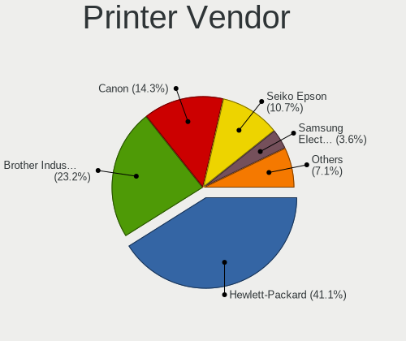

| Vendor              | Desktops | Percent |
|---------------------|----------|---------|
| Hewlett-Packard     | 19       | 39.58%  |
| Brother Industries  | 12       | 25%     |
| Seiko Epson         | 6        | 12.5%   |
| Canon               | 6        | 12.5%   |
| Kyocera             | 2        | 4.17%   |
| Samsung Electronics | 1        | 2.08%   |
| Ricoh               | 1        | 2.08%   |
| Dymo-CoStar         | 1        | 2.08%   |

Printer Model
-------------

Printer device models

| Model                                                      | Desktops | Percent |
|------------------------------------------------------------|----------|---------|
| Seiko Epson ET-2710 Series                                 | 2        | 4.08%   |
| HP ENVY 4500 series                                        | 2        | 4.08%   |
| Seiko Epson XP-2200 Series                                 | 1        | 2.04%   |
| Seiko Epson WF-3010 Series                                 | 1        | 2.04%   |
| Seiko Epson ET-8550 Series                                 | 1        | 2.04%   |
| Seiko Epson ET-4750 [WorkForce ET-4750 EcoTank All-in-One] | 1        | 2.04%   |
| Samsung ML-1660 Series                                     | 1        | 2.04%   |
| Ricoh SP C250SF                                            | 1        | 2.04%   |
| Kyocera TASKalfa 250ci                                     | 1        | 2.04%   |
| Kyocera FS-C5150DN                                         | 1        | 2.04%   |
| HP OfficeJet Pro 6960                                      | 1        | 2.04%   |
| HP OfficeJet Pro 69                                        | 1        | 2.04%   |
| HP LaserJet Professional P 1102w                           | 1        | 2.04%   |
| HP LaserJet Pro M148f-M149f                                | 1        | 2.04%   |
| HP LaserJet P4015                                          | 1        | 2.04%   |
| HP Laserjet CP1525nw                                       | 1        | 2.04%   |
| HP LaserJet 3015                                           | 1        | 2.04%   |
| HP LaserJet 1015                                           | 1        | 2.04%   |
| HP EWS UPD                                                 | 1        | 2.04%   |
| HP ENVY Photo 6200 series                                  | 1        | 2.04%   |
| HP ENVY 5540 series                                        | 1        | 2.04%   |
| HP ENVY 4520 series                                        | 1        | 2.04%   |
| HP DeskJet F300 series                                     | 1        | 2.04%   |
| HP DeskJet 5650c                                           | 1        | 2.04%   |
| HP DeskJet 5150c                                           | 1        | 2.04%   |
| HP DeskJet 3630 series                                     | 1        | 2.04%   |
| HP DeskJet 2600 series                                     | 1        | 2.04%   |
| Dymo-CoStar LabelWriter 450                                | 1        | 2.04%   |
| Canon PIXMA MX920 Series                                   | 1        | 2.04%   |
| Canon PIXMA MP240                                          | 1        | 2.04%   |
| Canon PIXMA MG5600 Series                                  | 1        | 2.04%   |
| Canon MG5700 series                                        | 1        | 2.04%   |
| Canon iP4900 series                                        | 1        | 2.04%   |
| Canon G3020 series                                         | 1        | 2.04%   |
| Brother Printer                                            | 1        | 2.04%   |
| Brother MFC-L2710DW series                                 | 1        | 2.04%   |
| Brother MFC-J6530DW                                        | 1        | 2.04%   |
| Brother MFC-J5730DW                                        | 1        | 2.04%   |
| Brother MFC-J491DW                                         | 1        | 2.04%   |
| Brother MFC-7460DN                                         | 1        | 2.04%   |

Scanner Vendor
--------------

Scanner device vendors

| Vendor          | Desktops | Percent |
|-----------------|----------|---------|
| Hewlett-Packard | 6        | 40%     |
| Seiko Epson     | 4        | 26.67%  |
| Canon           | 4        | 26.67%  |
| AGFA-Gevaert NV | 1        | 6.67%   |

Scanner Model
-------------

Scanner device models

| Model                                                   | Desktops | Percent |
|---------------------------------------------------------|----------|---------|
| Canon CanoScan LiDE 210                                 | 2        | 13.33%  |
| Seiko Epson GT-X770 [Perfection V500]                   | 1        | 6.67%   |
| Seiko Epson GT-F730 [GT-S630/Perfection V33/V330 Photo] | 1        | 6.67%   |
| Seiko Epson GT-F700 [Perfection V350]                   | 1        | 6.67%   |
| Seiko Epson GT-7300U [Perfection 1260/1260 PHOTO]       | 1        | 6.67%   |
| HP ScanJet G4010                                        | 1        | 6.67%   |
| HP ScanJet 4370                                         | 1        | 6.67%   |
| HP ScanJet 3800c                                        | 1        | 6.67%   |
| HP ScanJet 3670                                         | 1        | 6.67%   |
| HP ScanJet 3400cse                                      | 1        | 6.67%   |
| HP Scanjet 200                                          | 1        | 6.67%   |
| Canon CanoScan LiDE 110                                 | 1        | 6.67%   |
| Canon CanoScan 8800F                                    | 1        | 6.67%   |
| AGFA-Gevaert NV Snapscan e40                            | 1        | 6.67%   |

Camera
------

Camera Vendor
-------------

Camera device vendors

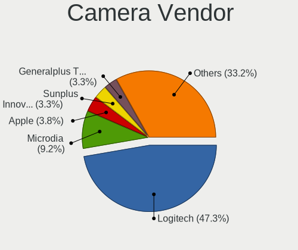

| Vendor                                 | Desktops | Percent |
|----------------------------------------|----------|---------|
| Logitech                               | 70       | 46.36%  |
| Microdia                               | 14       | 9.27%   |
| Apple                                  | 7        | 4.64%   |
| Generalplus Technology                 | 6        | 3.97%   |
| Sunplus Innovation Technology          | 5        | 3.31%   |
| Jieli Technology                       | 5        | 3.31%   |
| Trust                                  | 3        | 1.99%   |
| Samsung Electronics                    | 3        | 1.99%   |
| Microsoft                              | 3        | 1.99%   |
| Creative Technology                    | 3        | 1.99%   |
| Chicony Electronics                    | 3        | 1.99%   |
| Alcor Micro                            | 3        | 1.99%   |
| WaveRider Communications               | 2        | 1.32%   |
| KYE Systems (Mouse Systems)            | 2        | 1.32%   |
| IMC Networks                           | 2        | 1.32%   |
| Hewlett-Packard                        | 2        | 1.32%   |
| GEMBIRD                                | 2        | 1.32%   |
| Valve Software                         | 1        | 0.66%   |
| Sweex                                  | 1        | 0.66%   |
| Sunplus IT                             | 1        | 0.66%   |
| OmniVision Technologies                | 1        | 0.66%   |
| Novatek Microelectronics               | 1        | 0.66%   |
| Nokia Mobile Phones                    | 1        | 0.66%   |
| Lenovo                                 | 1        | 0.66%   |
| Huawei Technologies                    | 1        | 0.66%   |
| Guillemot                              | 1        | 0.66%   |
| Dell                                   | 1        | 0.66%   |
| Cheng Uei Precision Industry (Foxlink) | 1        | 0.66%   |
| Bison Electronics                      | 1        | 0.66%   |
| AVerMedia Technologies                 | 1        | 0.66%   |
| Aveo Technology                        | 1        | 0.66%   |
| Asuscom Network                        | 1        | 0.66%   |
| Arkmicro Technologies                  | 1        | 0.66%   |

Camera Model
------------

Camera device models

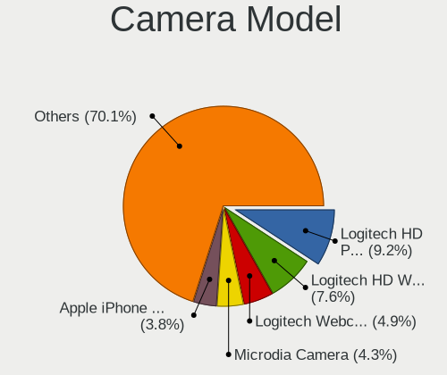

| Model                                      | Desktops | Percent |
|--------------------------------------------|----------|---------|
| Logitech HD Webcam C525                    | 13       | 8.55%   |
| Microdia Camera                            | 8        | 5.26%   |
| Logitech Webcam C270                       | 8        | 5.26%   |
| Logitech HD Pro Webcam C920                | 8        | 5.26%   |
| Apple iPhone 5/5C/5S/6/SE/7/8/X            | 7        | 4.61%   |
| Jieli USB PHY 2.0                          | 5        | 3.29%   |
| Generalplus GENERAL WEBCAM                 | 5        | 3.29%   |
| Logitech Webcam C170                       | 4        | 2.63%   |
| Logitech HD Webcam C910                    | 4        | 2.63%   |
| Logitech C920 PRO HD Webcam                | 4        | 2.63%   |
| Logitech B525 HD Webcam                    | 4        | 2.63%   |
| Sunplus Full HD webcam                     | 3        | 1.97%   |
| Samsung Galaxy series, misc. (MTP mode)    | 3        | 1.97%   |
| Logitech Webcam Pro 9000                   | 3        | 1.97%   |
| Logitech QuickCam E 3500                   | 3        | 1.97%   |
| Logitech C922 Pro Stream Webcam            | 3        | 1.97%   |
| Microdia Webcam Vitade AF                  | 2        | 1.32%   |
| Microdia USB 2.0 Camera                    | 2        | 1.32%   |
| Logitech Webcam C930e                      | 2        | 1.32%   |
| Logitech QuickCam Zoom                     | 2        | 1.32%   |
| Logitech HD Webcam C615                    | 2        | 1.32%   |
| KYE Systems (Mouse Systems) PC-LM1E Camera | 2        | 1.32%   |
| IMC Networks XHC Camera                    | 2        | 1.32%   |
| Creative Live! Cam Chat HD [VF0700/VF0790] | 2        | 1.32%   |
| Alcor Micro USB 2.0 PC Camera              | 2        | 1.32%   |
| WaveRider USB Live camera                  | 1        | 0.66%   |
| WaveRider USB 2.0 Camera                   | 1        | 0.66%   |
| Valve Software 3D Camera                   | 1        | 0.66%   |
| Trust Webcam                               | 1        | 0.66%   |
| Trust Megapixel Auto Focus Webcam          | 1        | 0.66%   |
| Trust Full HD Webcam                       | 1        | 0.66%   |
| Sweex WC060 Series HD Webcam               | 1        | 0.66%   |
| Sunplus IT AUKEY PC-LM1 USB Camera         | 1        | 0.66%   |
| Sunplus Webcam                             | 1        | 0.66%   |
| Sunplus MTD Camera                         | 1        | 0.66%   |
| OmniVision Monitor Webcam                  | 1        | 0.66%   |
| Novatek HP High Definition 2MP Webcam      | 1        | 0.66%   |
| Nokia Mobile Phones Lumia 640 Phone        | 1        | 0.66%   |
| Microsoft LifeCam VX-5000                  | 1        | 0.66%   |
| Microsoft LifeCam VX-2000                  | 1        | 0.66%   |

Security
--------

Fingerprint Vendor
------------------

Fingerprint sensor vendors

| Vendor         | Desktops | Percent |
|----------------|----------|---------|
| DigitalPersona | 1        | 100%    |

Fingerprint Model
-----------------

Fingerprint sensor models

| Model                             | Desktops | Percent |
|-----------------------------------|----------|---------|
| DigitalPersona Fingerprint Reader | 1        | 100%    |

Chipcard Vendor
---------------

Chipcard module vendors

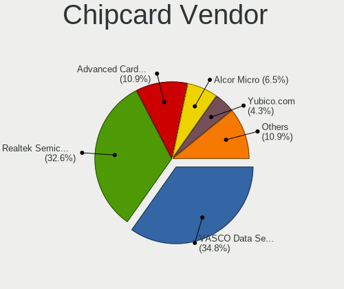

| Vendor                            | Desktops | Percent |
|-----------------------------------|----------|---------|
| VASCO Data Security International | 16       | 43.24%  |
| Realtek Semiconductor             | 13       | 35.14%  |
| Advanced Card Systems             | 3        | 8.11%   |
| Alcor Micro                       | 2        | 5.41%   |
| Yubico.com                        | 1        | 2.7%    |
| Feitian Technologies              | 1        | 2.7%    |
| Cherry                            | 1        | 2.7%    |

Chipcard Model
--------------

Chipcard module models

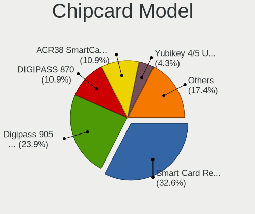

| Model                                                           | Desktops | Percent |
|-----------------------------------------------------------------|----------|---------|
| Realtek Semiconductor Smart Card Reader Interface               | 13       | 35.14%  |
| VASCO Data Security International Digipass 905 SmartCard Reader | 11       | 29.73%  |
| VASCO Data Security International DIGIPASS 870                  | 5        | 13.51%  |
| Advanced Card Systems ACR38 SmartCard Reader                    | 3        | 8.11%   |
| Yubico.com Yubikey 4/5 U2F+CCID                                 | 1        | 2.7%    |
| Feitian Technologies SCR301                                     | 1        | 2.7%    |
| Cherry SmartCard Reader Keyboard KC 1000 SC                     | 1        | 2.7%    |
| Alcor Micro Watchdata W 1981                                    | 1        | 2.7%    |
| Alcor Micro AU9540 Smartcard Reader                             | 1        | 2.7%    |

Unsupported
-----------

Unsupported Devices
-------------------

Total unsupported devices on board

| Total | Desktops | Percent |
|-------|----------|---------|
| 0     | 552      | 77.97%  |
| 1     | 136      | 19.21%  |
| 2     | 14       | 1.98%   |
| 3     | 3        | 0.42%   |
| 4     | 2        | 0.28%   |
| 5     | 1        | 0.14%   |

Unsupported Device Types
------------------------

Types of unsupported devices

| Type                     | Desktops | Percent |
|--------------------------|----------|---------|
| Graphics card            | 60       | 35.09%  |
| Chipcard                 | 23       | 13.45%  |
| Net/wireless             | 19       | 11.11%  |
| Unassigned class         | 14       | 8.19%   |
| Multimedia controller    | 11       | 6.43%   |
| Communication controller | 8        | 4.68%   |
| Bluetooth                | 8        | 4.68%   |
| Sound                    | 7        | 4.09%   |
| Card reader              | 7        | 4.09%   |
| Camera                   | 6        | 3.51%   |
| Network                  | 3        | 1.75%   |
| Net/ethernet             | 3        | 1.75%   |
| Fingerprint reader       | 1        | 0.58%   |
| Dvb card                 | 1        | 0.58%   |

