Linux in Belgium - Tested Hardware & Statistics (Notebooks)
-----------------------------------------------------------

A project to collect tested hardware configurations for Linux in Belgium.

Anyone can contribute to this report by the [hw-probe](https://github.com/linuxhw/hw-probe) tool:

    sudo -E hw-probe -all -upload

Please contribute! Especially if your hardware is rare.

Contents
--------

* [ Test Cases ](#test-cases)

* [ System ](#system)
  - [ OS                       ](#os)
  - [ OS Family                ](#os-family)
  - [ Kernel                   ](#kernel)
  - [ Kernel Family            ](#kernel-family)
  - [ Kernel Major Ver.        ](#kernel-major-ver)
  - [ Arch                     ](#arch)
  - [ DE                       ](#de)
  - [ Display Server           ](#display-server)
  - [ Display Manager          ](#display-manager)
  - [ OS Lang                  ](#os-lang)
  - [ Boot Mode                ](#boot-mode)
  - [ Filesystem               ](#filesystem)
  - [ Part. scheme             ](#part-scheme)
  - [ Dual Boot with Linux/BSD ](#dual-boot-with-linuxbsd)
  - [ Dual Boot (Win)          ](#dual-boot-win)

* [ Board ](#board)
  - [ Vendor                   ](#vendor)
  - [ Model                    ](#model)
  - [ Model Family             ](#model-family)
  - [ MFG Year                 ](#mfg-year)
  - [ Form Factor              ](#form-factor)
  - [ Secure Boot              ](#secure-boot)
  - [ Coreboot                 ](#coreboot)
  - [ RAM Size                 ](#ram-size)
  - [ RAM Used                 ](#ram-used)
  - [ Total Drives             ](#total-drives)
  - [ Has CD-ROM               ](#has-cd-rom)
  - [ Has Ethernet             ](#has-ethernet)
  - [ Has WiFi                 ](#has-wifi)
  - [ Has Bluetooth            ](#has-bluetooth)

* [ Location ](#location)
  - [ Country                  ](#country)
  - [ City                     ](#city)

* [ Drives ](#drives)
  - [ Drive Vendor             ](#drive-vendor)
  - [ Drive Model              ](#drive-model)
  - [ HDD Vendor               ](#hdd-vendor)
  - [ SSD Vendor               ](#ssd-vendor)
  - [ Drive Kind               ](#drive-kind)
  - [ Drive Connector          ](#drive-connector)
  - [ Drive Size               ](#drive-size)
  - [ Space Total              ](#space-total)
  - [ Space Used               ](#space-used)
  - [ Malfunc. Drives          ](#malfunc-drives)
  - [ Malfunc. Drive Vendor    ](#malfunc-drive-vendor)
  - [ Malfunc. HDD Vendor      ](#malfunc-hdd-vendor)
  - [ Malfunc. Drive Kind      ](#malfunc-drive-kind)
  - [ Failed Drives            ](#failed-drives)
  - [ Failed Drive Vendor      ](#failed-drive-vendor)
  - [ Drive Status             ](#drive-status)

* [ Storage controller ](#storage-controller)
  - [ Storage Vendor           ](#storage-vendor)
  - [ Storage Model            ](#storage-model)
  - [ Storage Kind             ](#storage-kind)

* [ Processor ](#processor)
  - [ CPU Vendor               ](#cpu-vendor)
  - [ CPU Model                ](#cpu-model)
  - [ CPU Model Family         ](#cpu-model-family)
  - [ CPU Cores                ](#cpu-cores)
  - [ CPU Sockets              ](#cpu-sockets)
  - [ CPU Threads              ](#cpu-threads)
  - [ CPU Op-Modes             ](#cpu-op-modes)
  - [ CPU Microcode            ](#cpu-microcode)
  - [ CPU Microarch            ](#cpu-microarch)

* [ Graphics ](#graphics)
  - [ GPU Vendor               ](#gpu-vendor)
  - [ GPU Model                ](#gpu-model)
  - [ GPU Combo                ](#gpu-combo)
  - [ GPU Driver               ](#gpu-driver)
  - [ GPU Memory               ](#gpu-memory)

* [ Monitor ](#monitor)
  - [ Monitor Vendor           ](#monitor-vendor)
  - [ Monitor Model            ](#monitor-model)
  - [ Monitor Resolution       ](#monitor-resolution)
  - [ Monitor Diagonal         ](#monitor-diagonal)
  - [ Monitor Width            ](#monitor-width)
  - [ Aspect Ratio             ](#aspect-ratio)
  - [ Monitor Area             ](#monitor-area)
  - [ Pixel Density            ](#pixel-density)
  - [ Multiple Monitors        ](#multiple-monitors)

* [ Network ](#network)
  - [ Net Controller Vendor    ](#net-controller-vendor)
  - [ Net Controller Model     ](#net-controller-model)
  - [ Wireless Vendor          ](#wireless-vendor)
  - [ Wireless Model           ](#wireless-model)
  - [ Ethernet Vendor          ](#ethernet-vendor)
  - [ Ethernet Model           ](#ethernet-model)
  - [ Net Controller Kind      ](#net-controller-kind)
  - [ Used Controller          ](#used-controller)
  - [ NICs                     ](#nics)
  - [ IPv6                     ](#ipv6)

* [ Bluetooth ](#bluetooth)
  - [ Bluetooth Vendor         ](#bluetooth-vendor)
  - [ Bluetooth Model          ](#bluetooth-model)

* [ Sound ](#sound)
  - [ Sound Vendor             ](#sound-vendor)
  - [ Sound Model              ](#sound-model)

* [ Memory ](#memory)
  - [ Memory Vendor            ](#memory-vendor)
  - [ Memory Model             ](#memory-model)
  - [ Memory Kind              ](#memory-kind)
  - [ Memory Form Factor       ](#memory-form-factor)
  - [ Memory Size              ](#memory-size)
  - [ Memory Speed             ](#memory-speed)

* [ Printers & scanners ](#printers--scanners)
  - [ Printer Vendor           ](#printer-vendor)
  - [ Printer Model            ](#printer-model)
  - [ Scanner Vendor           ](#scanner-vendor)
  - [ Scanner Model            ](#scanner-model)

* [ Camera ](#camera)
  - [ Camera Vendor            ](#camera-vendor)
  - [ Camera Model             ](#camera-model)

* [ Security ](#security)
  - [ Fingerprint Vendor       ](#fingerprint-vendor)
  - [ Fingerprint Model        ](#fingerprint-model)
  - [ Chipcard Vendor          ](#chipcard-vendor)
  - [ Chipcard Model           ](#chipcard-model)

* [ Unsupported ](#unsupported)
  - [ Unsupported Devices      ](#unsupported-devices)
  - [ Unsupported Device Types ](#unsupported-device-types)

Test Cases
----------

Total: 1673

| Vendor        | Model                       | Probe                                                      | Date         |
|---------------|-----------------------------|------------------------------------------------------------|--------------|
| ASUSTek       | ROG Strix G513RW_G513RW     | [7fbbe32bb5](https://linux-hardware.org/?probe=7fbbe32bb5) | Jan 02, 2024 |
| Apple         | MacBookAir4,2               | [7ebd4a00e7](https://linux-hardware.org/?probe=7ebd4a00e7) | Dec 31, 2023 |
| Apple         | MacBookAir7,2               | [b25bae6ded](https://linux-hardware.org/?probe=b25bae6ded) | Dec 31, 2023 |
| Unknown       | Unknown                     | [764c59c56e](https://linux-hardware.org/?probe=764c59c56e) | Dec 31, 2023 |
| ASUSTek       | ROG Strix G713PI_G713PI     | [a37bbce8de](https://linux-hardware.org/?probe=a37bbce8de) | Dec 31, 2023 |
| ASUSTek       | ROG Strix G512LV_G512LV     | [86a499d322](https://linux-hardware.org/?probe=86a499d322) | Dec 30, 2023 |
| HP            | ENVY Laptop 13-aq1xxx       | [44df1c7cc6](https://linux-hardware.org/?probe=44df1c7cc6) | Dec 28, 2023 |
| Dell          | Latitude 5510               | [ebe9c1f033](https://linux-hardware.org/?probe=ebe9c1f033) | Dec 28, 2023 |
| Dell          | Latitude E6530              | [bd56df50f6](https://linux-hardware.org/?probe=bd56df50f6) | Dec 26, 2023 |
| Unknown       | Unknown                     | [ef80f96d40](https://linux-hardware.org/?probe=ef80f96d40) | Dec 23, 2023 |
| Danew         | Dbook 131                   | [a3880bd02c](https://linux-hardware.org/?probe=a3880bd02c) | Dec 23, 2023 |
| Danew         | Dbook 131                   | [0568c9bdbf](https://linux-hardware.org/?probe=0568c9bdbf) | Dec 22, 2023 |
| HP            | EliteBook 850 G3            | [1265cfb294](https://linux-hardware.org/?probe=1265cfb294) | Dec 21, 2023 |
| ASUSTek       | ROG Strix G732LXS_G732LX... | [6e4bcb9311](https://linux-hardware.org/?probe=6e4bcb9311) | Dec 21, 2023 |
| ASUSTek       | ROG Strix G713PI_G713PI     | [f7cd6db92f](https://linux-hardware.org/?probe=f7cd6db92f) | Dec 20, 2023 |
| HP            | EliteBook 850 G3            | [6067c56124](https://linux-hardware.org/?probe=6067c56124) | Dec 19, 2023 |
| ASUSTek       | ROG Strix G713PI_G713PI     | [780a4cf454](https://linux-hardware.org/?probe=780a4cf454) | Dec 18, 2023 |
| Acer          | Aspire 1810TZ               | [b935091ecd](https://linux-hardware.org/?probe=b935091ecd) | Dec 17, 2023 |
| Acer          | Aspire 1810TZ               | [14b5a5a3ca](https://linux-hardware.org/?probe=14b5a5a3ca) | Dec 17, 2023 |
| ASUSTek       | ROG Strix G713PI_G713PI     | [b5fefd59fe](https://linux-hardware.org/?probe=b5fefd59fe) | Dec 15, 2023 |
| HP            | Laptop 14s-fq0xxx           | [2c8846a637](https://linux-hardware.org/?probe=2c8846a637) | Dec 12, 2023 |
| ASUSTek       | ROG Strix G513RW_G513RW     | [f24c11f324](https://linux-hardware.org/?probe=f24c11f324) | Dec 11, 2023 |
| MSI           | GF63 Thin 11UC              | [78562df77d](https://linux-hardware.org/?probe=78562df77d) | Dec 11, 2023 |
| HP            | ProBook 650 G2              | [96ea36be06](https://linux-hardware.org/?probe=96ea36be06) | Dec 10, 2023 |
| Unknown       | NY-02                       | [d894eced77](https://linux-hardware.org/?probe=d894eced77) | Dec 09, 2023 |
| Lenovo        | ThinkPad X1 Carbon Gen 1... | [cf832dba27](https://linux-hardware.org/?probe=cf832dba27) | Dec 08, 2023 |
| Unknown       | NY-02                       | [8d1cd2ab24](https://linux-hardware.org/?probe=8d1cd2ab24) | Dec 07, 2023 |
| Lenovo        | ThinkPad P16s Gen 2 21K9... | [b118593b9d](https://linux-hardware.org/?probe=b118593b9d) | Dec 06, 2023 |
| Lenovo        | ThinkPad P16s Gen 2 21K9... | [d4ece1c445](https://linux-hardware.org/?probe=d4ece1c445) | Dec 06, 2023 |
| Apple         | MacBookPro6,2               | [ee4cab6d84](https://linux-hardware.org/?probe=ee4cab6d84) | Dec 06, 2023 |
| Apple         | MacBookPro6,2               | [a47e6e3616](https://linux-hardware.org/?probe=a47e6e3616) | Dec 05, 2023 |
| ASUSTek       | X550CA                      | [a0912ee339](https://linux-hardware.org/?probe=a0912ee339) | Dec 05, 2023 |
| Lenovo        | Legion 5 17IMH05 82B3       | [a8c094f376](https://linux-hardware.org/?probe=a8c094f376) | Dec 04, 2023 |
| HP            | Elite x2 1011 G1 Tablet     | [856a01d874](https://linux-hardware.org/?probe=856a01d874) | Dec 02, 2023 |
| ASUSTek       | X550CA                      | [8ed2e1621c](https://linux-hardware.org/?probe=8ed2e1621c) | Nov 29, 2023 |
| HP            | ProBook 450 G3              | [0d6a4cd900](https://linux-hardware.org/?probe=0d6a4cd900) | Nov 28, 2023 |
| HP            | Elite x2 1012 G1            | [1fda4e1f6d](https://linux-hardware.org/?probe=1fda4e1f6d) | Nov 28, 2023 |
| HP            | EliteBook 650 15.6 inch ... | [f8cdbfddcd](https://linux-hardware.org/?probe=f8cdbfddcd) | Nov 27, 2023 |
| HP            | EliteBook 650 15.6 inch ... | [6418e60f5a](https://linux-hardware.org/?probe=6418e60f5a) | Nov 27, 2023 |
| HP            | EliteBook 850 G6            | [597c5faf3a](https://linux-hardware.org/?probe=597c5faf3a) | Nov 27, 2023 |
| HP            | ProBook 650 G1              | [22a88185d6](https://linux-hardware.org/?probe=22a88185d6) | Nov 26, 2023 |
| ASUSTek       | VivoBook_ASUSLaptop X412... | [f8eb14af89](https://linux-hardware.org/?probe=f8eb14af89) | Nov 24, 2023 |
| ASUSTek       | ROG Strix G713PI_G713PI     | [9d5752b2d8](https://linux-hardware.org/?probe=9d5752b2d8) | Nov 24, 2023 |
| Acer          | Aspire E5-575               | [1ad50e2862](https://linux-hardware.org/?probe=1ad50e2862) | Nov 23, 2023 |
| Lenovo        | ThinkPad P15v Gen 1 20TQ... | [8cf21a227b](https://linux-hardware.org/?probe=8cf21a227b) | Nov 22, 2023 |
| MSI           | Prestige 15 A10SC           | [e1abb4721b](https://linux-hardware.org/?probe=e1abb4721b) | Nov 21, 2023 |
| Lenovo        | ThinkPad P16s Gen 2 21HK... | [2fe5c073ce](https://linux-hardware.org/?probe=2fe5c073ce) | Nov 19, 2023 |
| Lenovo        | ThinkPad E520 11437UG       | [422931d9a6](https://linux-hardware.org/?probe=422931d9a6) | Nov 19, 2023 |
| HP            | Pavilion 17                 | [00c2d45d1d](https://linux-hardware.org/?probe=00c2d45d1d) | Nov 19, 2023 |
| Lenovo        | ThinkPad P16s Gen 2 21HK... | [fd99bf5f2a](https://linux-hardware.org/?probe=fd99bf5f2a) | Nov 18, 2023 |
| Lenovo        | Legion Y540-15IRH-PG0 81... | [43e84fe856](https://linux-hardware.org/?probe=43e84fe856) | Nov 17, 2023 |
| Lenovo        | B70-80 80MR                 | [84f08f46f0](https://linux-hardware.org/?probe=84f08f46f0) | Nov 15, 2023 |
| Notebook      | NS5x_NS7xPU                 | [c26f7106c6](https://linux-hardware.org/?probe=c26f7106c6) | Nov 15, 2023 |
| Lenovo        | Legion Y540-15IRH-PG0 81... | [1f783e1865](https://linux-hardware.org/?probe=1f783e1865) | Nov 14, 2023 |
| Lenovo        | ThinkPad X250 20CLS2P703    | [b15506a2b9](https://linux-hardware.org/?probe=b15506a2b9) | Nov 14, 2023 |
| Dell          | XPS 15 9560                 | [b806051ada](https://linux-hardware.org/?probe=b806051ada) | Nov 14, 2023 |
| ASUSTek       | X540SAA                     | [1c5e9077a8](https://linux-hardware.org/?probe=1c5e9077a8) | Nov 12, 2023 |
| Apple         | MacBookAir6,2               | [3595c8f9d1](https://linux-hardware.org/?probe=3595c8f9d1) | Nov 12, 2023 |
| Dell          | Inspiron 15 7000 Gaming     | [6885ccb289](https://linux-hardware.org/?probe=6885ccb289) | Nov 11, 2023 |
| Dell          | Inspiron 15 7000 Gaming     | [8bdbf5b0d9](https://linux-hardware.org/?probe=8bdbf5b0d9) | Nov 11, 2023 |
| Lenovo        | ThinkPad P50s 20FL000EMS    | [81d1c107cc](https://linux-hardware.org/?probe=81d1c107cc) | Nov 11, 2023 |
| Notebook      | NS5x_NS7xPU                 | [4b53c4e9da](https://linux-hardware.org/?probe=4b53c4e9da) | Nov 10, 2023 |
| Fujitsu Si... | LIFEBOOK S7220              | [52f980a58c](https://linux-hardware.org/?probe=52f980a58c) | Nov 09, 2023 |
| PEAQ          | PNB C1014-I1B1 MD99447      | [33d5a0aa8c](https://linux-hardware.org/?probe=33d5a0aa8c) | Nov 08, 2023 |
| ASUSTek       | ROG Strix G713PI_G713PI     | [cc75144dea](https://linux-hardware.org/?probe=cc75144dea) | Nov 08, 2023 |
| ASUSTek       | ROG Zephyrus G14 GA402RJ... | [598b5837e5](https://linux-hardware.org/?probe=598b5837e5) | Nov 07, 2023 |
| Dell          | Latitude 5590               | [0290e5fd1a](https://linux-hardware.org/?probe=0290e5fd1a) | Nov 06, 2023 |
| HP            | ProBook 650 G1              | [e56fc59b28](https://linux-hardware.org/?probe=e56fc59b28) | Nov 06, 2023 |
| ASUSTek       | ROG Strix G713PI_G713PI     | [8b3f431a00](https://linux-hardware.org/?probe=8b3f431a00) | Nov 05, 2023 |
| ASUSTek       | VivoBook_ASUSLaptop M650... | [5e5e97717a](https://linux-hardware.org/?probe=5e5e97717a) | Nov 04, 2023 |
| Lenovo        | ThinkPad L570 W10DG 20JR... | [ebf86ce161](https://linux-hardware.org/?probe=ebf86ce161) | Nov 04, 2023 |
| Lenovo        | ThinkPad L570 W10DG 20JR... | [5eada91f48](https://linux-hardware.org/?probe=5eada91f48) | Nov 04, 2023 |
| ASUSTek       | ROG Strix G713PI_G713PI     | [ef9bc3cc1e](https://linux-hardware.org/?probe=ef9bc3cc1e) | Nov 02, 2023 |
| HP            | Pavilion dv6                | [e57ba14bc9](https://linux-hardware.org/?probe=e57ba14bc9) | Nov 01, 2023 |
| Lenovo        | Legion 5 Pro 16ACH6H 82J... | [826dc000ff](https://linux-hardware.org/?probe=826dc000ff) | Nov 01, 2023 |
| HP            | Pavilion dv6                | [031a3670bd](https://linux-hardware.org/?probe=031a3670bd) | Nov 01, 2023 |
| HP            | EliteBook 850 G8 Noteboo... | [7c07fc9bbe](https://linux-hardware.org/?probe=7c07fc9bbe) | Oct 31, 2023 |
| Dell          | XPS 15 9570                 | [17de10e607](https://linux-hardware.org/?probe=17de10e607) | Oct 29, 2023 |
| Notebook      | NS50_70MU                   | [ad21a28397](https://linux-hardware.org/?probe=ad21a28397) | Oct 28, 2023 |
| Notebook      | NS50_70MU                   | [166a51fa8d](https://linux-hardware.org/?probe=166a51fa8d) | Oct 27, 2023 |
| HP            | Pavilion 17                 | [9eb519ce8c](https://linux-hardware.org/?probe=9eb519ce8c) | Oct 26, 2023 |
| HP            | Pavilion 17                 | [9b004ab742](https://linux-hardware.org/?probe=9b004ab742) | Oct 26, 2023 |
| Acer          | Aspire A315-58              | [0d52b12158](https://linux-hardware.org/?probe=0d52b12158) | Oct 25, 2023 |
| HP            | ZBook Fury 15.6 inch G8 ... | [274089a92c](https://linux-hardware.org/?probe=274089a92c) | Oct 24, 2023 |
| EUROCOM       | Tornado F5                  | [3056eeecf5](https://linux-hardware.org/?probe=3056eeecf5) | Oct 21, 2023 |
| EUROCOM       | Tornado F5                  | [25b7095754](https://linux-hardware.org/?probe=25b7095754) | Oct 21, 2023 |
| HP            | ZBook 17 G3                 | [f8330df761](https://linux-hardware.org/?probe=f8330df761) | Oct 20, 2023 |
| Dell          | Precision 7720              | [574a292adb](https://linux-hardware.org/?probe=574a292adb) | Oct 14, 2023 |
| HP            | EliteBook 830 G8 Noteboo... | [ef43db2db3](https://linux-hardware.org/?probe=ef43db2db3) | Oct 12, 2023 |
| Lenovo        | ThinkPad E15 Gen 3 20YG0... | [86ca92698e](https://linux-hardware.org/?probe=86ca92698e) | Oct 11, 2023 |
| Lenovo        | ThinkPad E15 Gen 3 20YG0... | [fb98eb2395](https://linux-hardware.org/?probe=fb98eb2395) | Oct 11, 2023 |
| Apple         | MacBookPro12,1              | [9de05646a3](https://linux-hardware.org/?probe=9de05646a3) | Oct 10, 2023 |
| Acer          | Aspire ES1-520              | [d7418fb673](https://linux-hardware.org/?probe=d7418fb673) | Oct 10, 2023 |
| Dell          | XPS 15 9560                 | [598f31dfeb](https://linux-hardware.org/?probe=598f31dfeb) | Oct 10, 2023 |
| HP            | Pavilion Gaming Laptop 1... | [f95efe1e80](https://linux-hardware.org/?probe=f95efe1e80) | Oct 09, 2023 |
| Dell          | XPS 15 9530                 | [1423f1793b](https://linux-hardware.org/?probe=1423f1793b) | Oct 07, 2023 |
| ASUSTek       | ASUS TUF Gaming F17 FX70... | [fc37084670](https://linux-hardware.org/?probe=fc37084670) | Oct 05, 2023 |
| Dell          | Latitude E6530              | [a426b30b67](https://linux-hardware.org/?probe=a426b30b67) | Oct 04, 2023 |
| Lenovo        | ThinkPad L570 W10DG 20JR... | [b2f26d1c00](https://linux-hardware.org/?probe=b2f26d1c00) | Oct 04, 2023 |
| MSI           | GF63 Thin 9SC               | [3670f5ea70](https://linux-hardware.org/?probe=3670f5ea70) | Oct 02, 2023 |
| HP            | ZBook Studio 16 inch G9 ... | [40f87e9874](https://linux-hardware.org/?probe=40f87e9874) | Oct 02, 2023 |
| Lenovo        | ThinkPad L570 W10DG 20JR... | [8cb6a92a75](https://linux-hardware.org/?probe=8cb6a92a75) | Oct 01, 2023 |
| Lenovo        | ThinkPad L570 W10DG 20JR... | [bb5a34d03f](https://linux-hardware.org/?probe=bb5a34d03f) | Oct 01, 2023 |
| Lenovo        | ThinkPad E15 Gen 4 21E60... | [951a03d2ad](https://linux-hardware.org/?probe=951a03d2ad) | Sep 30, 2023 |
| Lenovo        | ThinkPad L570 W10DG 20JR... | [a343a1c573](https://linux-hardware.org/?probe=a343a1c573) | Sep 30, 2023 |
| Dell          | Precision 5480              | [5d157102ea](https://linux-hardware.org/?probe=5d157102ea) | Sep 29, 2023 |
| Packard Be... | EasyNote TK36               | [1e8f79c726](https://linux-hardware.org/?probe=1e8f79c726) | Sep 29, 2023 |
| Alienware     | x14                         | [048d5f6f2a](https://linux-hardware.org/?probe=048d5f6f2a) | Sep 28, 2023 |
| Lenovo        | ThinkPad L570 W10DG 20JR... | [0f2958c5a1](https://linux-hardware.org/?probe=0f2958c5a1) | Sep 27, 2023 |
| Medion        | E6431 MD60112               | [f1fee9da62](https://linux-hardware.org/?probe=f1fee9da62) | Sep 27, 2023 |
| Lenovo        | ThinkPad T420 4236EV9       | [d621ecd81f](https://linux-hardware.org/?probe=d621ecd81f) | Sep 26, 2023 |
| Acer          | Nitro AN515-58              | [0c17f26ed8](https://linux-hardware.org/?probe=0c17f26ed8) | Sep 25, 2023 |
| Dell          | XPS 13 9305                 | [7c0b883934](https://linux-hardware.org/?probe=7c0b883934) | Sep 24, 2023 |
| ASUSTek       | K50IJ                       | [02a39de387](https://linux-hardware.org/?probe=02a39de387) | Sep 23, 2023 |
| Lenovo        | ThinkPad L570 W10DG 20JR... | [b96887841e](https://linux-hardware.org/?probe=b96887841e) | Sep 23, 2023 |
| Lenovo        | ThinkPad L570 W10DG 20JR... | [535d4769c8](https://linux-hardware.org/?probe=535d4769c8) | Sep 22, 2023 |
| Acer          | Aspire VN7-571G             | [0314ce541e](https://linux-hardware.org/?probe=0314ce541e) | Sep 22, 2023 |
| Lenovo        | ThinkPad T440s 20ARS0NF0... | [54aa39a845](https://linux-hardware.org/?probe=54aa39a845) | Sep 18, 2023 |
| ASUSTek       | VivoBook_ASUSLaptop X415... | [47e95a92cc](https://linux-hardware.org/?probe=47e95a92cc) | Sep 17, 2023 |
| Acer          | Nitro AN517-52              | [5fe7196179](https://linux-hardware.org/?probe=5fe7196179) | Sep 17, 2023 |
| Lenovo        | IdeaPad 3 17ADA05 81W2      | [e1ac878fa3](https://linux-hardware.org/?probe=e1ac878fa3) | Sep 15, 2023 |
| Dell          | Latitude 5501               | [1608104990](https://linux-hardware.org/?probe=1608104990) | Sep 14, 2023 |
| MSI           | Modern 14 A10M              | [c78162f5fd](https://linux-hardware.org/?probe=c78162f5fd) | Sep 10, 2023 |
| Packard Be... | EasyNote TK85               | [45261be082](https://linux-hardware.org/?probe=45261be082) | Sep 10, 2023 |
| HP            | 620                         | [6fd1497e1a](https://linux-hardware.org/?probe=6fd1497e1a) | Sep 10, 2023 |
| Packard Be... | EasyNote TK85               | [4dfd50fada](https://linux-hardware.org/?probe=4dfd50fada) | Sep 10, 2023 |
| HP            | Laptop 15-db0xxx            | [b65fb1e357](https://linux-hardware.org/?probe=b65fb1e357) | Sep 09, 2023 |
| Dell          | XPS 15 9500                 | [3747ee0c29](https://linux-hardware.org/?probe=3747ee0c29) | Sep 04, 2023 |
| Toshiba       | Satellite C70D-A            | [36070747fd](https://linux-hardware.org/?probe=36070747fd) | Sep 04, 2023 |
| ASUSTek       | K73SV                       | [7d3f9fa0e5](https://linux-hardware.org/?probe=7d3f9fa0e5) | Sep 04, 2023 |
| Acer          | Aspire 7741                 | [0b3868c6bc](https://linux-hardware.org/?probe=0b3868c6bc) | Sep 04, 2023 |
| Acer          | TravelMate 8372             | [709e81e4a0](https://linux-hardware.org/?probe=709e81e4a0) | Sep 02, 2023 |
| HP            | EliteBook 840 G5            | [b2b0d3e018](https://linux-hardware.org/?probe=b2b0d3e018) | Sep 02, 2023 |
| Acer          | TravelMate 5760G            | [1a0a1749fc](https://linux-hardware.org/?probe=1a0a1749fc) | Sep 01, 2023 |
| ASUSTek       | X75VC                       | [4a2115b7ae](https://linux-hardware.org/?probe=4a2115b7ae) | Aug 31, 2023 |
| ASUSTek       | VivoBook_ASUSLaptop X580... | [6cd62bfac4](https://linux-hardware.org/?probe=6cd62bfac4) | Aug 31, 2023 |
| Acer          | Aspire 7560                 | [4cb158cafc](https://linux-hardware.org/?probe=4cb158cafc) | Aug 28, 2023 |
| ASUSTek       | VivoBook_ASUSLaptop X412... | [5fddb9cc18](https://linux-hardware.org/?probe=5fddb9cc18) | Aug 28, 2023 |
| Acer          | Aspire V5-573G              | [1afaed6ffa](https://linux-hardware.org/?probe=1afaed6ffa) | Aug 28, 2023 |
| Dell          | Studio 1735                 | [5932ab2004](https://linux-hardware.org/?probe=5932ab2004) | Aug 25, 2023 |
| ASUSTek       | K73SV                       | [d366a928cc](https://linux-hardware.org/?probe=d366a928cc) | Aug 24, 2023 |
| ASUSTek       | X756UQ                      | [0ff5520460](https://linux-hardware.org/?probe=0ff5520460) | Aug 22, 2023 |
| Lenovo        | ThinkPad T60 8744HDG        | [659ac11761](https://linux-hardware.org/?probe=659ac11761) | Aug 22, 2023 |
| ASUSTek       | VivoBook_ASUSLaptop X412... | [d0d3c76bb8](https://linux-hardware.org/?probe=d0d3c76bb8) | Aug 17, 2023 |
| MSI           | Katana GF66 11UC            | [927eacb30f](https://linux-hardware.org/?probe=927eacb30f) | Aug 16, 2023 |
| Lenovo        | ThinkPad E14 Gen 2 20TA0... | [4c4e9222ce](https://linux-hardware.org/?probe=4c4e9222ce) | Aug 16, 2023 |
| Medion        | Akoya THE TOUCH 10          | [488c1edd8d](https://linux-hardware.org/?probe=488c1edd8d) | Aug 13, 2023 |
| Medion        | Akoya THE TOUCH 10          | [d45603bb4e](https://linux-hardware.org/?probe=d45603bb4e) | Aug 09, 2023 |
| HP            | EliteBook 850 G8 Noteboo... | [5e64d2b59e](https://linux-hardware.org/?probe=5e64d2b59e) | Aug 06, 2023 |
| ASUSTek       | VivoBook_ASUSLaptop M650... | [db2732f0e8](https://linux-hardware.org/?probe=db2732f0e8) | Aug 04, 2023 |
| Lenovo        | ThinkPad P14s Gen 3 21AK... | [deeafc23f9](https://linux-hardware.org/?probe=deeafc23f9) | Aug 03, 2023 |
| HP            | EliteBook 850 G8 Noteboo... | [8da287a76b](https://linux-hardware.org/?probe=8da287a76b) | Aug 01, 2023 |
| HP            | 620                         | [4c04d9d11e](https://linux-hardware.org/?probe=4c04d9d11e) | Aug 01, 2023 |
| HP            | 620                         | [eafc7ac5c3](https://linux-hardware.org/?probe=eafc7ac5c3) | Aug 01, 2023 |
| Lenovo        | IdeaPad 320-15AST 80XV      | [c74f4bde19](https://linux-hardware.org/?probe=c74f4bde19) | Aug 01, 2023 |
| Valve         | Jupiter                     | [6eb487950f](https://linux-hardware.org/?probe=6eb487950f) | Aug 01, 2023 |
| HP            | EliteBook 850 G8 Noteboo... | [93d193bdbc](https://linux-hardware.org/?probe=93d193bdbc) | Aug 01, 2023 |
| Lenovo        | WEI6 15 ITL 82F2            | [d30f44ebbb](https://linux-hardware.org/?probe=d30f44ebbb) | Jul 30, 2023 |
| HP            | 530                         | [3d05ea6c86](https://linux-hardware.org/?probe=3d05ea6c86) | Jul 30, 2023 |
| ASUSTek       | K50IJ                       | [7e30723b3b](https://linux-hardware.org/?probe=7e30723b3b) | Jul 28, 2023 |
| Apple         | MacBookPro10,1              | [c3ec46f79e](https://linux-hardware.org/?probe=c3ec46f79e) | Jul 19, 2023 |
| Lenovo        | IdeaPad 3 17ALC6 82KV       | [e2cf7ed35f](https://linux-hardware.org/?probe=e2cf7ed35f) | Jul 19, 2023 |
| ASUSTek       | VivoBook_ASUSLaptop X712... | [7843df6b43](https://linux-hardware.org/?probe=7843df6b43) | Jul 19, 2023 |
| ASUSTek       | X756UQ                      | [be24f941c7](https://linux-hardware.org/?probe=be24f941c7) | Jul 17, 2023 |
| TUXEDO        | N85_N87HCHNHZ               | [f0f2c5a6a7](https://linux-hardware.org/?probe=f0f2c5a6a7) | Jul 17, 2023 |
| TUXEDO        | N85_N87HCHNHZ               | [6070a533c5](https://linux-hardware.org/?probe=6070a533c5) | Jul 17, 2023 |
| HP            | Laptop 15-fc0xxx            | [782127b6f6](https://linux-hardware.org/?probe=782127b6f6) | Jul 17, 2023 |
| HP            | ZBook Studio 16 inch G9 ... | [0d54b47098](https://linux-hardware.org/?probe=0d54b47098) | Jul 12, 2023 |
| HP            | EliteBook 840 G5            | [08770a11c6](https://linux-hardware.org/?probe=08770a11c6) | Jul 10, 2023 |
| Apple         | MacBookPro14,2              | [8f40997f5f](https://linux-hardware.org/?probe=8f40997f5f) | Jul 10, 2023 |
| Apple         | MacBookPro14,2              | [7d19e6a8f5](https://linux-hardware.org/?probe=7d19e6a8f5) | Jul 10, 2023 |
| Dell          | Precision M4800             | [ef29f43a6f](https://linux-hardware.org/?probe=ef29f43a6f) | Jul 09, 2023 |
| HP            | 620                         | [5f88c564fd](https://linux-hardware.org/?probe=5f88c564fd) | Jul 08, 2023 |
| Lenovo        | ThinkPad T490 20N2CTO1WW    | [b4d926a4bc](https://linux-hardware.org/?probe=b4d926a4bc) | Jul 08, 2023 |
| Dell          | Latitude 3380               | [b4403e7b15](https://linux-hardware.org/?probe=b4403e7b15) | Jul 07, 2023 |
| HP            | EliteBook 655 15.6 inch ... | [31d5e724ba](https://linux-hardware.org/?probe=31d5e724ba) | Jul 07, 2023 |
| HP            | ZBook Studio 16 inch G9 ... | [84b5d3ce3c](https://linux-hardware.org/?probe=84b5d3ce3c) | Jul 06, 2023 |
| Dell          | Precision 7520              | [1bffd04c84](https://linux-hardware.org/?probe=1bffd04c84) | Jul 05, 2023 |
| Apple         | MacBook8,1                  | [d27490cbe0](https://linux-hardware.org/?probe=d27490cbe0) | Jul 04, 2023 |
| HP            | EliteBook 820 G1            | [5b1b409a2f](https://linux-hardware.org/?probe=5b1b409a2f) | Jul 04, 2023 |
| Apple         | MacBook8,1                  | [06ac15dcca](https://linux-hardware.org/?probe=06ac15dcca) | Jul 04, 2023 |
| Dell          | Precision 5560              | [5f8f3c917f](https://linux-hardware.org/?probe=5f8f3c917f) | Jul 04, 2023 |
| ASUSTek       | X556UQK                     | [b4560fc1c1](https://linux-hardware.org/?probe=b4560fc1c1) | Jul 02, 2023 |
| ASUSTek       | VivoBook_ASUSLaptop X435... | [6df0ae15e1](https://linux-hardware.org/?probe=6df0ae15e1) | Jul 01, 2023 |
| Acer          | Aspire 7715Z                | [b288a09d6e](https://linux-hardware.org/?probe=b288a09d6e) | Jul 01, 2023 |
| ASUSTek       | K50IJ                       | [8262209249](https://linux-hardware.org/?probe=8262209249) | Jun 30, 2023 |
| HP            | EliteBook 8460p             | [d4a008aefb](https://linux-hardware.org/?probe=d4a008aefb) | Jun 30, 2023 |
| Dell          | Latitude 5440               | [7868400967](https://linux-hardware.org/?probe=7868400967) | Jun 30, 2023 |
| VALE          | Notebook Slim S132          | [3e381e10f7](https://linux-hardware.org/?probe=3e381e10f7) | Jun 30, 2023 |
| HP            | Pavilion Laptop 15-cc5xx    | [39f7adb927](https://linux-hardware.org/?probe=39f7adb927) | Jun 30, 2023 |
| MSI           | Modern 14 A10M              | [fcc6786de6](https://linux-hardware.org/?probe=fcc6786de6) | Jun 24, 2023 |
| Lenovo        | IdeaPad 5 14ABA7 82SE       | [99efa1a1c5](https://linux-hardware.org/?probe=99efa1a1c5) | Jun 24, 2023 |
| Acer          | Aspire A515-55              | [bf6de06fb9](https://linux-hardware.org/?probe=bf6de06fb9) | Jun 23, 2023 |
| Emdoor        | AG958                       | [3574f89b15](https://linux-hardware.org/?probe=3574f89b15) | Jun 21, 2023 |
| Acer          | Aspire F5-771G              | [034d235f5c](https://linux-hardware.org/?probe=034d235f5c) | Jun 19, 2023 |
| ASUSTek       | X555LJ                      | [e65deab189](https://linux-hardware.org/?probe=e65deab189) | Jun 19, 2023 |
| HP            | EliteBook 845 G8 Noteboo... | [aafa9250df](https://linux-hardware.org/?probe=aafa9250df) | Jun 15, 2023 |
| ASUSTek       | X556UQK                     | [50c975ae08](https://linux-hardware.org/?probe=50c975ae08) | Jun 13, 2023 |
| Emdoor        | AG958                       | [1688cc07b6](https://linux-hardware.org/?probe=1688cc07b6) | Jun 11, 2023 |
| ASUSTek       | X540SAA                     | [ea61fdd09a](https://linux-hardware.org/?probe=ea61fdd09a) | Jun 11, 2023 |
| MSI           | Modern 14 A10M              | [7d5fc6a209](https://linux-hardware.org/?probe=7d5fc6a209) | Jun 11, 2023 |
| Notebook      | NS50_70MU                   | [87b818815c](https://linux-hardware.org/?probe=87b818815c) | Jun 10, 2023 |
| Medion        | Akoya E7226                 | [b46a96183b](https://linux-hardware.org/?probe=b46a96183b) | Jun 10, 2023 |
| Dell          | Latitude 5530               | [a302ecd3cd](https://linux-hardware.org/?probe=a302ecd3cd) | Jun 05, 2023 |
| HP            | Pavilion Laptop 15-eh1xx... | [b9cd465d98](https://linux-hardware.org/?probe=b9cd465d98) | Jun 05, 2023 |
| HP            | Pavilion Notebook           | [3fb05bfb0b](https://linux-hardware.org/?probe=3fb05bfb0b) | May 31, 2023 |
| Dell          | Latitude 5510               | [78bd1ae0e0](https://linux-hardware.org/?probe=78bd1ae0e0) | May 31, 2023 |
| Dell          | Latitude 7390               | [caa2968187](https://linux-hardware.org/?probe=caa2968187) | May 30, 2023 |
| Lenovo        | ThinkPad X260 20F5S6P801    | [8ec80f5e43](https://linux-hardware.org/?probe=8ec80f5e43) | May 30, 2023 |
| Lenovo        | IdeaPad 510-15IKB 80SV      | [1aa973f6bc](https://linux-hardware.org/?probe=1aa973f6bc) | May 28, 2023 |
| Apple         | MacBookPro14,3              | [fd8a08639d](https://linux-hardware.org/?probe=fd8a08639d) | May 28, 2023 |
| Lenovo        | ThinkPad E15 Gen 4 21EDC... | [8fd2003b01](https://linux-hardware.org/?probe=8fd2003b01) | May 28, 2023 |
| Lenovo        | V130-15IGM 81HL             | [76a357994a](https://linux-hardware.org/?probe=76a357994a) | May 27, 2023 |
| Dell          | Latitude 7390               | [21653cfe83](https://linux-hardware.org/?probe=21653cfe83) | May 25, 2023 |
| Lenovo        | V130-15IGM 81HL             | [5a4cf4d2e3](https://linux-hardware.org/?probe=5a4cf4d2e3) | May 23, 2023 |
| Acer          | Aspire E5-771G              | [0dadbeca5b](https://linux-hardware.org/?probe=0dadbeca5b) | May 19, 2023 |
| Valve         | Jupiter                     | [0de060a93f](https://linux-hardware.org/?probe=0de060a93f) | May 18, 2023 |
| MSI           | GS70 2PC Stealth            | [254f42a469](https://linux-hardware.org/?probe=254f42a469) | May 18, 2023 |
| HP            | 620                         | [6b688ce696](https://linux-hardware.org/?probe=6b688ce696) | May 17, 2023 |
| HP            | Pavilion dv6                | [1b931dc36f](https://linux-hardware.org/?probe=1b931dc36f) | May 17, 2023 |
| Emdoor        | AG958                       | [7ff5858830](https://linux-hardware.org/?probe=7ff5858830) | May 17, 2023 |
| HP            | EliteBook 865 16 inch G9... | [14edb35e71](https://linux-hardware.org/?probe=14edb35e71) | May 15, 2023 |
| HP            | EliteBook 8470p             | [f97e4e7fc1](https://linux-hardware.org/?probe=f97e4e7fc1) | May 15, 2023 |
| Medion        | Akoya P6660 MD99790         | [20ecc9b5dc](https://linux-hardware.org/?probe=20ecc9b5dc) | May 15, 2023 |
| ASUSTek       | UX410UAK                    | [d68a2bc7c0](https://linux-hardware.org/?probe=d68a2bc7c0) | May 10, 2023 |
| MSI           | Katana 17 B12UCXK           | [15b9d97c10](https://linux-hardware.org/?probe=15b9d97c10) | May 09, 2023 |
| HP            | EliteBook 8740w             | [29d129229b](https://linux-hardware.org/?probe=29d129229b) | May 08, 2023 |
| HP            | Laptop 17-cn2xxx            | [ddf0cb8a28](https://linux-hardware.org/?probe=ddf0cb8a28) | May 08, 2023 |
| Dell          | Latitude 7390               | [dc5c96e431](https://linux-hardware.org/?probe=dc5c96e431) | May 08, 2023 |
| MSI           | CR61 3M                     | [f41852fa6e](https://linux-hardware.org/?probe=f41852fa6e) | May 07, 2023 |
| MSI           | CR61 3M                     | [7b5d49d859](https://linux-hardware.org/?probe=7b5d49d859) | May 07, 2023 |
| MSI           | GS70 2PC Stealth            | [370f9304b6](https://linux-hardware.org/?probe=370f9304b6) | May 07, 2023 |
| HP            | ZBook Studio G7 Mobile W... | [b0464a0b99](https://linux-hardware.org/?probe=b0464a0b99) | May 06, 2023 |
| Notebook      | NS5x_NS7xPU                 | [c775137d4f](https://linux-hardware.org/?probe=c775137d4f) | May 02, 2023 |
| HP            | Pavilion Laptop 15-cw0xx... | [7bb2ae638b](https://linux-hardware.org/?probe=7bb2ae638b) | May 01, 2023 |
| HP            | Pavilion Laptop 15-cw0xx... | [bd0458e8a9](https://linux-hardware.org/?probe=bd0458e8a9) | May 01, 2023 |
| Medion        | P6630                       | [93abad41dd](https://linux-hardware.org/?probe=93abad41dd) | Apr 30, 2023 |
| Dell          | Latitude 5521               | [1629b4efc4](https://linux-hardware.org/?probe=1629b4efc4) | Apr 30, 2023 |
| Lenovo        | V130-15IGM 81HL             | [ff24454021](https://linux-hardware.org/?probe=ff24454021) | Apr 29, 2023 |
| Lenovo        | V130-15IGM 81HL             | [9081fc703d](https://linux-hardware.org/?probe=9081fc703d) | Apr 29, 2023 |
| Lenovo        | ThinkPad X260 20F5S56G00    | [8da21e9a17](https://linux-hardware.org/?probe=8da21e9a17) | Apr 28, 2023 |
| HP            | ZBook Fury 15 G7 Mobile ... | [a31fa8f985](https://linux-hardware.org/?probe=a31fa8f985) | Apr 28, 2023 |
| Dell          | Latitude E6440              | [d55c77598b](https://linux-hardware.org/?probe=d55c77598b) | Apr 27, 2023 |
| Acer          | Aspire E5-576G              | [9ca5902786](https://linux-hardware.org/?probe=9ca5902786) | Apr 25, 2023 |
| Lenovo        | Legion 5 17IMH05 82B3       | [2e542c241d](https://linux-hardware.org/?probe=2e542c241d) | Apr 25, 2023 |
| Lenovo        | ThinkPad P15s Gen 1 20T5... | [587e06aeb7](https://linux-hardware.org/?probe=587e06aeb7) | Apr 24, 2023 |
| Emdoor        | AG958                       | [a925cf244e](https://linux-hardware.org/?probe=a925cf244e) | Apr 24, 2023 |
| Acer          | Nitro AN515-58              | [60251e08f5](https://linux-hardware.org/?probe=60251e08f5) | Apr 22, 2023 |
| Dell          | Latitude E6330              | [b532a9756c](https://linux-hardware.org/?probe=b532a9756c) | Apr 22, 2023 |
| Acer          | Nitro AN515-58              | [d342e4d24c](https://linux-hardware.org/?probe=d342e4d24c) | Apr 22, 2023 |
| Emdoor        | AG958                       | [f7408488b4](https://linux-hardware.org/?probe=f7408488b4) | Apr 21, 2023 |
| Toshiba       | Satellite Pro NB10-A-125    | [3a77f344af](https://linux-hardware.org/?probe=3a77f344af) | Apr 20, 2023 |
| HP            | Laptop 17-cn2xxx            | [5b77cc21f4](https://linux-hardware.org/?probe=5b77cc21f4) | Apr 18, 2023 |
| Lenovo        | ThinkPad T14 Gen 1 20UDC... | [efdcb6b99e](https://linux-hardware.org/?probe=efdcb6b99e) | Apr 18, 2023 |
| Lenovo        | IdeaPad 510-15ISK 80SR      | [38aeb226af](https://linux-hardware.org/?probe=38aeb226af) | Apr 17, 2023 |
| Dell          | XPS 15 9500                 | [1a55ffc593](https://linux-hardware.org/?probe=1a55ffc593) | Apr 17, 2023 |
| Dell          | Latitude 5420               | [4f3345aced](https://linux-hardware.org/?probe=4f3345aced) | Apr 16, 2023 |
| HP            | Pavilion Laptop 14-ce3xx... | [f44bbda528](https://linux-hardware.org/?probe=f44bbda528) | Apr 16, 2023 |
| Lenovo        | IdeaPad 3 15ITL05 81X8      | [7c35c1ba82](https://linux-hardware.org/?probe=7c35c1ba82) | Apr 15, 2023 |
| Lenovo        | ThinkPad Edge E135 33596... | [b87471108a](https://linux-hardware.org/?probe=b87471108a) | Apr 14, 2023 |
| Lenovo        | ThinkPad X250 20CLS29J05    | [60c50f0a10](https://linux-hardware.org/?probe=60c50f0a10) | Apr 13, 2023 |
| MSI           | Vector GP76 12UHSO          | [6037aee790](https://linux-hardware.org/?probe=6037aee790) | Apr 11, 2023 |
| Sony          | SVE1713A1EW                 | [402fae93d5](https://linux-hardware.org/?probe=402fae93d5) | Apr 09, 2023 |
| ASUSTek       | VivoBook_ASUSLaptop X515... | [b220308aa1](https://linux-hardware.org/?probe=b220308aa1) | Apr 06, 2023 |
| HP            | 620                         | [ad46cdbb0d](https://linux-hardware.org/?probe=ad46cdbb0d) | Apr 06, 2023 |
| Lenovo        | ThinkPad Edge E135 33596... | [d9d2e73619](https://linux-hardware.org/?probe=d9d2e73619) | Apr 05, 2023 |
| Dell          | Vostro 15 3515              | [95a98c59b1](https://linux-hardware.org/?probe=95a98c59b1) | Apr 03, 2023 |
| Clevo         | P170HMx                     | [c963b350fc](https://linux-hardware.org/?probe=c963b350fc) | Apr 03, 2023 |
| AZW           | Speed S                     | [52292a4968](https://linux-hardware.org/?probe=52292a4968) | Apr 02, 2023 |
| HP            | Pavilion g7                 | [7820d2ca67](https://linux-hardware.org/?probe=7820d2ca67) | Apr 01, 2023 |
| MSI           | Vector GP66 12UGS           | [4787e68a9c](https://linux-hardware.org/?probe=4787e68a9c) | Apr 01, 2023 |
| MSI           | Vector GP66 12UGS           | [12e105f6da](https://linux-hardware.org/?probe=12e105f6da) | Apr 01, 2023 |
| HP            | Compaq 6730b (GB987ET#UU... | [6c6ceb9bc3](https://linux-hardware.org/?probe=6c6ceb9bc3) | Mar 31, 2023 |
| HP            | EliteBook 850 G8 Noteboo... | [c73c5374a4](https://linux-hardware.org/?probe=c73c5374a4) | Mar 30, 2023 |
| Medion        | P8614                       | [a66fe7042e](https://linux-hardware.org/?probe=a66fe7042e) | Mar 29, 2023 |
| HP            | Pavilion Laptop 15-eh2xx... | [0ab4054ab9](https://linux-hardware.org/?probe=0ab4054ab9) | Mar 26, 2023 |
| MSI           | GT70                        | [8b00b28b12](https://linux-hardware.org/?probe=8b00b28b12) | Mar 26, 2023 |
| Medion        | P7624                       | [fe5c568f41](https://linux-hardware.org/?probe=fe5c568f41) | Mar 26, 2023 |
| Medion        | P7624                       | [778f5948f1](https://linux-hardware.org/?probe=778f5948f1) | Mar 26, 2023 |
| Dell          | Latitude E6330              | [32833b4683](https://linux-hardware.org/?probe=32833b4683) | Mar 25, 2023 |
| HP            | Pavilion Laptop 15-eh1xx... | [1f256fa102](https://linux-hardware.org/?probe=1f256fa102) | Mar 24, 2023 |
| HP            | EliteBook 8460p             | [f78f58795c](https://linux-hardware.org/?probe=f78f58795c) | Mar 24, 2023 |
| Alienware     | m17 R3                      | [6c62c223ed](https://linux-hardware.org/?probe=6c62c223ed) | Mar 21, 2023 |
| Lenovo        | IdeaPad 320-15ABR 80XS      | [7622701d31](https://linux-hardware.org/?probe=7622701d31) | Mar 21, 2023 |
| HP            | EliteBook 850 G8 Noteboo... | [de9712600d](https://linux-hardware.org/?probe=de9712600d) | Mar 20, 2023 |
| HP            | Pavilion g7                 | [e591ea2173](https://linux-hardware.org/?probe=e591ea2173) | Mar 19, 2023 |
| Lenovo        | ThinkBook 16p Gen 2 20YM    | [837ed83646](https://linux-hardware.org/?probe=837ed83646) | Mar 18, 2023 |
| Lenovo        | ThinkPad W510 4389AP5       | [1825764856](https://linux-hardware.org/?probe=1825764856) | Mar 17, 2023 |
| ASUSTek       | K72Jr                       | [cde6fff1ad](https://linux-hardware.org/?probe=cde6fff1ad) | Mar 13, 2023 |
| Lenovo        | Yoga 2 Pro 20266            | [f762c7cc29](https://linux-hardware.org/?probe=f762c7cc29) | Mar 13, 2023 |
| Lenovo        | ThinkPad T420s 4174CN5      | [2fde637fe7](https://linux-hardware.org/?probe=2fde637fe7) | Mar 12, 2023 |
| Lenovo        | ThinkPad W510 4389AP5       | [2c01c1fd0e](https://linux-hardware.org/?probe=2c01c1fd0e) | Mar 11, 2023 |
| Medion        | Akoya E1318T                | [8b24b109ec](https://linux-hardware.org/?probe=8b24b109ec) | Mar 10, 2023 |
| ASUSTek       | K52F                        | [8fa6eaf7cf](https://linux-hardware.org/?probe=8fa6eaf7cf) | Mar 10, 2023 |
| ASUSTek       | K50IJ                       | [6b906bab7d](https://linux-hardware.org/?probe=6b906bab7d) | Mar 09, 2023 |
| ASUSTek       | K50IJ                       | [cc455dcfac](https://linux-hardware.org/?probe=cc455dcfac) | Mar 08, 2023 |
| MSI           | GT60 2OC/2OD                | [72eed5b458](https://linux-hardware.org/?probe=72eed5b458) | Mar 08, 2023 |
| MSI           | GT60 2OC/2OD                | [d595ae284e](https://linux-hardware.org/?probe=d595ae284e) | Mar 07, 2023 |
| Alienware     | x14                         | [a1665c85ab](https://linux-hardware.org/?probe=a1665c85ab) | Mar 06, 2023 |
| Alienware     | x14                         | [8f12fe3ee5](https://linux-hardware.org/?probe=8f12fe3ee5) | Mar 06, 2023 |
| Acer          | Aspire 6530G                | [a4077c8432](https://linux-hardware.org/?probe=a4077c8432) | Mar 05, 2023 |
| Toshiba       | Satellite C855-112          | [8635f2eecd](https://linux-hardware.org/?probe=8635f2eecd) | Mar 05, 2023 |
| HP            | 620                         | [421e31de43](https://linux-hardware.org/?probe=421e31de43) | Mar 02, 2023 |
| ASUSTek       | F70SL                       | [5870cf8326](https://linux-hardware.org/?probe=5870cf8326) | Mar 01, 2023 |
| Dell          | Latitude 5530               | [b1d7964fc7](https://linux-hardware.org/?probe=b1d7964fc7) | Mar 01, 2023 |
| Lenovo        | ThinkPad X1 Carbon Gen 9... | [9ba7cfbdeb](https://linux-hardware.org/?probe=9ba7cfbdeb) | Mar 01, 2023 |
| Lenovo        | ThinkPad X13 Gen 1 20T3S... | [fa757fb12a](https://linux-hardware.org/?probe=fa757fb12a) | Mar 01, 2023 |
| Lenovo        | Legion 5P 15IMH05 82AW      | [0de52a6150](https://linux-hardware.org/?probe=0de52a6150) | Feb 28, 2023 |
| HP            | EliteBook 8540w             | [057c307bf5](https://linux-hardware.org/?probe=057c307bf5) | Feb 28, 2023 |
| Apple         | MacBookPro15,4              | [41330b2783](https://linux-hardware.org/?probe=41330b2783) | Feb 26, 2023 |
| Lenovo        | ThinkPad T470 20HDS1DL03    | [25e1a3f801](https://linux-hardware.org/?probe=25e1a3f801) | Feb 21, 2023 |
| ASUSTek       | ASUS TUF Gaming A15 FA50... | [7e5789e02b](https://linux-hardware.org/?probe=7e5789e02b) | Feb 21, 2023 |
| Lenovo        | IdeaPad 3 15ALC6 82KU       | [da5050e2f8](https://linux-hardware.org/?probe=da5050e2f8) | Feb 20, 2023 |
| Notebook      | PB50_70RF,RD,RC             | [b24f005b1d](https://linux-hardware.org/?probe=b24f005b1d) | Feb 20, 2023 |
| Lenovo        | ThinkPad T430 2349PZG       | [7bd3c5a555](https://linux-hardware.org/?probe=7bd3c5a555) | Feb 20, 2023 |
| TUXEDO        | Aura 15 Gen2                | [9eca2efc88](https://linux-hardware.org/?probe=9eca2efc88) | Feb 19, 2023 |
| Lenovo        | ThinkPad E480 20KN001QGE    | [008f40a707](https://linux-hardware.org/?probe=008f40a707) | Feb 18, 2023 |
| ASUSTek       | K50IJ                       | [9b35a3205f](https://linux-hardware.org/?probe=9b35a3205f) | Feb 17, 2023 |
| Lenovo        | ThinkPad X1 Yoga 3rd 20L... | [32f5d5e200](https://linux-hardware.org/?probe=32f5d5e200) | Feb 17, 2023 |
| Acer          | Aspire V3-771               | [caeb6bc93f](https://linux-hardware.org/?probe=caeb6bc93f) | Feb 17, 2023 |
| Alienware     | 17 R2                       | [a70da6118b](https://linux-hardware.org/?probe=a70da6118b) | Feb 16, 2023 |
| Lenovo        | ThinkPad L15 Gen 3 21C7C... | [2b0904349a](https://linux-hardware.org/?probe=2b0904349a) | Feb 16, 2023 |
| ASUSTek       | K50IJ                       | [a37ac85ec2](https://linux-hardware.org/?probe=a37ac85ec2) | Feb 16, 2023 |
| Dell          | XPS 15 9560                 | [01319ac289](https://linux-hardware.org/?probe=01319ac289) | Feb 13, 2023 |
| Packard Be... | DOT S                       | [1f57142ffd](https://linux-hardware.org/?probe=1f57142ffd) | Feb 12, 2023 |
| Dell          | Latitude E6330              | [1b5cdf846f](https://linux-hardware.org/?probe=1b5cdf846f) | Feb 11, 2023 |
| Valve         | Jupiter                     | [9c458e5a66](https://linux-hardware.org/?probe=9c458e5a66) | Feb 11, 2023 |
| Acer          | Aspire V5-122               | [99fd12250b](https://linux-hardware.org/?probe=99fd12250b) | Feb 10, 2023 |
| Teclast       | F15S                        | [951ded8432](https://linux-hardware.org/?probe=951ded8432) | Feb 10, 2023 |
| Lenovo        | ThinkPad L15 Gen 3 21C7C... | [26fb33ec6c](https://linux-hardware.org/?probe=26fb33ec6c) | Feb 08, 2023 |
| Valve         | Jupiter                     | [870ba1caa7](https://linux-hardware.org/?probe=870ba1caa7) | Feb 07, 2023 |
| Sony          | VGN-Z31XN_B                 | [d7795277f3](https://linux-hardware.org/?probe=d7795277f3) | Feb 06, 2023 |
| Medion        | P6624                       | [5a31124376](https://linux-hardware.org/?probe=5a31124376) | Feb 06, 2023 |
| ASUSTek       | GL703VD                     | [62e1e79469](https://linux-hardware.org/?probe=62e1e79469) | Feb 03, 2023 |
| Dell          | Precision 7550              | [392db977df](https://linux-hardware.org/?probe=392db977df) | Feb 03, 2023 |
| HP            | ProBook 450 G8 Notebook ... | [72bdb7165c](https://linux-hardware.org/?probe=72bdb7165c) | Feb 02, 2023 |
| Sony          | VGN-Z31XN_B                 | [324ab7fbd3](https://linux-hardware.org/?probe=324ab7fbd3) | Feb 02, 2023 |
| Apple         | MacBookAir6,2               | [2261a77abb](https://linux-hardware.org/?probe=2261a77abb) | Feb 01, 2023 |
| Google        | Pantheon                    | [12e0b96dd1](https://linux-hardware.org/?probe=12e0b96dd1) | Feb 01, 2023 |
| ASUSTek       | K50IJ                       | [c01f530c1c](https://linux-hardware.org/?probe=c01f530c1c) | Jan 31, 2023 |
| ASUSTek       | K50IJ                       | [51c65b48bc](https://linux-hardware.org/?probe=51c65b48bc) | Jan 31, 2023 |
| Lenovo        | ThinkPad E15 Gen 2 20TD0... | [f6be582448](https://linux-hardware.org/?probe=f6be582448) | Jan 30, 2023 |
| Lenovo        | S21e-20 80M4                | [7017fcf775](https://linux-hardware.org/?probe=7017fcf775) | Jan 29, 2023 |
| Lenovo        | S21e-20 80M4                | [9afa780018](https://linux-hardware.org/?probe=9afa780018) | Jan 29, 2023 |
| Acer          | Peppy                       | [9a16262be8](https://linux-hardware.org/?probe=9a16262be8) | Jan 27, 2023 |
| Lenovo        | ThinkBook 14 G3 ACL 21A2    | [77a6b88d58](https://linux-hardware.org/?probe=77a6b88d58) | Jan 27, 2023 |
| Dell          | Latitude E6410              | [03463d0a58](https://linux-hardware.org/?probe=03463d0a58) | Jan 25, 2023 |
| Samsung       | RV411/RV511/E3511/S3511/... | [2c8424ac3d](https://linux-hardware.org/?probe=2c8424ac3d) | Jan 22, 2023 |
| Lenovo        | ThinkPad P15v Gen 1 20TQ... | [c228c064b7](https://linux-hardware.org/?probe=c228c064b7) | Jan 20, 2023 |
| Medion        | P6624                       | [344d427f44](https://linux-hardware.org/?probe=344d427f44) | Jan 20, 2023 |
| Dell          | Latitude 5320               | [aaf625ee63](https://linux-hardware.org/?probe=aaf625ee63) | Jan 20, 2023 |
| Acer          | Aspire VN7-591G             | [9476823c0b](https://linux-hardware.org/?probe=9476823c0b) | Jan 19, 2023 |
| Lenovo        | Legion Y540-15IRH 81SX      | [7b62e27d7a](https://linux-hardware.org/?probe=7b62e27d7a) | Jan 18, 2023 |
| HP            | OMEN Laptop 15-en1xxx       | [81d4385a14](https://linux-hardware.org/?probe=81d4385a14) | Jan 18, 2023 |
| MSI           | Katana GF76 11UC            | [8c0b32cf24](https://linux-hardware.org/?probe=8c0b32cf24) | Jan 18, 2023 |
| Acer          | Swift SF314-54G             | [c666c8f973](https://linux-hardware.org/?probe=c666c8f973) | Jan 18, 2023 |
| Acer          | Aspire V3-571G              | [e3b9b73877](https://linux-hardware.org/?probe=e3b9b73877) | Jan 14, 2023 |
| Lenovo        | ThinkPad L15 Gen 1 20U70... | [5047da7461](https://linux-hardware.org/?probe=5047da7461) | Jan 14, 2023 |
| Lenovo        | IdeaPad 3 15ADA05 81W1      | [f59adc6dcd](https://linux-hardware.org/?probe=f59adc6dcd) | Jan 13, 2023 |
| Lenovo        | ThinkPad T60 8744HDG        | [10c4bcf564](https://linux-hardware.org/?probe=10c4bcf564) | Jan 12, 2023 |
| HP            | Pavilion dv6000 (RY604EA... | [a8ec5eb86a](https://linux-hardware.org/?probe=a8ec5eb86a) | Jan 11, 2023 |
| Acer          | Aspire 7560                 | [58cd9d7ad2](https://linux-hardware.org/?probe=58cd9d7ad2) | Jan 09, 2023 |
| Dell          | XPS L521X                   | [2930493243](https://linux-hardware.org/?probe=2930493243) | Jan 09, 2023 |
| HP            | EliteBook 850 G4            | [e6cb9446f5](https://linux-hardware.org/?probe=e6cb9446f5) | Jan 09, 2023 |
| HP            | Pavilion Laptop 15-eh1xx... | [0f1543c21d](https://linux-hardware.org/?probe=0f1543c21d) | Jan 09, 2023 |
| Notebook      | P7xxDM3(-G)                 | [7cafa98138](https://linux-hardware.org/?probe=7cafa98138) | Jan 08, 2023 |
| HP            | Laptop 15s-eq2xxx           | [d1eaa576e7](https://linux-hardware.org/?probe=d1eaa576e7) | Jan 07, 2023 |
| HP            | Laptop 15-db0xxx            | [0232b39536](https://linux-hardware.org/?probe=0232b39536) | Jan 06, 2023 |
| Medion        | S4214                       | [58131e715e](https://linux-hardware.org/?probe=58131e715e) | Jan 06, 2023 |
| HP            | Pavilion g7                 | [9f029a8cdb](https://linux-hardware.org/?probe=9f029a8cdb) | Jan 06, 2023 |
| MSI           | Raider GE67HX 12UGS         | [be85c7b42a](https://linux-hardware.org/?probe=be85c7b42a) | Jan 01, 2023 |
| Dell          | System XPS L702X            | [7030c340cc](https://linux-hardware.org/?probe=7030c340cc) | Dec 31, 2022 |
| Lenovo        | ThinkPad T480 20L6S29E0A    | [82168627b7](https://linux-hardware.org/?probe=82168627b7) | Dec 31, 2022 |
| MSI           | Raider GE67HX 12UGS         | [28822be06e](https://linux-hardware.org/?probe=28822be06e) | Dec 29, 2022 |
| HP            | Notebook                    | [91bc85bf6e](https://linux-hardware.org/?probe=91bc85bf6e) | Dec 29, 2022 |
| Dell          | Latitude 5580               | [7c006e8c6d](https://linux-hardware.org/?probe=7c006e8c6d) | Dec 28, 2022 |
| Notebook      | N7x0WU                      | [9eee40dd50](https://linux-hardware.org/?probe=9eee40dd50) | Dec 26, 2022 |
| Lenovo        | IdeaPad 5 15ALC05 82LN      | [da3f79863a](https://linux-hardware.org/?probe=da3f79863a) | Dec 26, 2022 |
| Acer          | Swift SF314-54G             | [34532e7f7d](https://linux-hardware.org/?probe=34532e7f7d) | Dec 26, 2022 |
| Valve         | Jupiter                     | [e9811949dd](https://linux-hardware.org/?probe=e9811949dd) | Dec 26, 2022 |
| Sony          | VGN-FW21E                   | [e5eb6c865f](https://linux-hardware.org/?probe=e5eb6c865f) | Dec 25, 2022 |
| MSI           | Raider GE67HX 12UGS         | [84c6275c04](https://linux-hardware.org/?probe=84c6275c04) | Dec 25, 2022 |
| HP            | Pavilion g7                 | [ef4cc6fa1a](https://linux-hardware.org/?probe=ef4cc6fa1a) | Dec 24, 2022 |
| Sony          | SVS1311N9ES                 | [5c1a4bed5b](https://linux-hardware.org/?probe=5c1a4bed5b) | Dec 24, 2022 |
| ASUSTek       | K53SC                       | [5105f25e5e](https://linux-hardware.org/?probe=5105f25e5e) | Dec 23, 2022 |
| Lenovo        | ThinkPad X1 Carbon 4th 2... | [a2d763d722](https://linux-hardware.org/?probe=a2d763d722) | Dec 21, 2022 |
| Lenovo        | ThinkPad T61 7661A16        | [bc0e60b586](https://linux-hardware.org/?probe=bc0e60b586) | Dec 21, 2022 |
| Valve         | Jupiter                     | [2f061a6d8d](https://linux-hardware.org/?probe=2f061a6d8d) | Dec 20, 2022 |
| Packard Be... | EasyNote TR85               | [6c56016ed0](https://linux-hardware.org/?probe=6c56016ed0) | Dec 19, 2022 |
| Packard Be... | EasyNote TR85               | [abd93a5cca](https://linux-hardware.org/?probe=abd93a5cca) | Dec 19, 2022 |
| HP            | ProBook 6570b               | [4deb8fc518](https://linux-hardware.org/?probe=4deb8fc518) | Dec 19, 2022 |
| Valve         | Jupiter                     | [9c513daaf3](https://linux-hardware.org/?probe=9c513daaf3) | Dec 17, 2022 |
| Medion        | WIM2210                     | [d1a64f7b3b](https://linux-hardware.org/?probe=d1a64f7b3b) | Dec 17, 2022 |
| Lenovo        | B70-80 80MR                 | [c17bee3b4a](https://linux-hardware.org/?probe=c17bee3b4a) | Dec 17, 2022 |
| Lenovo        | ThinkPad T570 20H9S04C00    | [f3093ba13c](https://linux-hardware.org/?probe=f3093ba13c) | Dec 16, 2022 |
| Valve         | Jupiter                     | [26aae3342c](https://linux-hardware.org/?probe=26aae3342c) | Dec 16, 2022 |
| Acer          | Aspire A515-57              | [4e9bbbaa1f](https://linux-hardware.org/?probe=4e9bbbaa1f) | Dec 16, 2022 |
| Dell          | Inspiron 5567               | [1398958777](https://linux-hardware.org/?probe=1398958777) | Dec 14, 2022 |
| Apple         | MacBookPro9,2               | [2981da7231](https://linux-hardware.org/?probe=2981da7231) | Dec 12, 2022 |
| ASUSTek       | X75VC                       | [45efd7615d](https://linux-hardware.org/?probe=45efd7615d) | Dec 12, 2022 |
| Lenovo        | ThinkPad T430 2349L26       | [9d0bcbdc75](https://linux-hardware.org/?probe=9d0bcbdc75) | Dec 11, 2022 |
| Lenovo        | IdeaPad 5 Pro 16ACH6 82L... | [9d240437ee](https://linux-hardware.org/?probe=9d240437ee) | Dec 08, 2022 |
| Lenovo        | ThinkPad T520 4243CJ2       | [93e5e0ca9b](https://linux-hardware.org/?probe=93e5e0ca9b) | Dec 08, 2022 |
| HP            | Pavilion Laptop             | [2e2f1d44c1](https://linux-hardware.org/?probe=2e2f1d44c1) | Dec 03, 2022 |
| Lenovo        | IdeaPad 520-15IKB 80YL      | [6dbc014a04](https://linux-hardware.org/?probe=6dbc014a04) | Dec 03, 2022 |
| HP            | ProBook 6550b               | [564bf050f2](https://linux-hardware.org/?probe=564bf050f2) | Dec 02, 2022 |
| Dell          | G3 3779                     | [1cf1d8aa20](https://linux-hardware.org/?probe=1cf1d8aa20) | Nov 26, 2022 |
| Dell          | G3 3779                     | [4bc02c1721](https://linux-hardware.org/?probe=4bc02c1721) | Nov 26, 2022 |
| Acer          | NC-ES1-512-C3AH             | [0670f9ed15](https://linux-hardware.org/?probe=0670f9ed15) | Nov 25, 2022 |
| HP            | ProBook 445 G8 Notebook ... | [dfd1c98a18](https://linux-hardware.org/?probe=dfd1c98a18) | Nov 20, 2022 |
| HP            | Pavilion dv6                | [a7ca712256](https://linux-hardware.org/?probe=a7ca712256) | Nov 19, 2022 |
| HP            | Pavilion dv6                | [571dc553f9](https://linux-hardware.org/?probe=571dc553f9) | Nov 19, 2022 |
| Dell          | Latitude 5530               | [35a6ba0a9f](https://linux-hardware.org/?probe=35a6ba0a9f) | Nov 17, 2022 |
| HP            | ProBook 445 G8 Notebook ... | [7c8d905b3d](https://linux-hardware.org/?probe=7c8d905b3d) | Nov 17, 2022 |
| Dell          | Precision 7560              | [0ee8814502](https://linux-hardware.org/?probe=0ee8814502) | Nov 16, 2022 |
| HP            | ZBook Fury 15 G7 Mobile ... | [5d11a28230](https://linux-hardware.org/?probe=5d11a28230) | Nov 16, 2022 |
| Apple         | MacBookPro5,5               | [9ef06fcef1](https://linux-hardware.org/?probe=9ef06fcef1) | Nov 13, 2022 |
| HP            | EliteBook 850 G5            | [331a1db69d](https://linux-hardware.org/?probe=331a1db69d) | Nov 11, 2022 |
| HP            | Pavilion 15                 | [d703e1c63c](https://linux-hardware.org/?probe=d703e1c63c) | Nov 10, 2022 |
| HP            | EliteBook 840 G3            | [6d00ba40be](https://linux-hardware.org/?probe=6d00ba40be) | Nov 10, 2022 |
| Acer          | Aspire 1825PTZ              | [c2dc801a81](https://linux-hardware.org/?probe=c2dc801a81) | Nov 09, 2022 |
| Acer          | Aspire 7741                 | [9fda4c3798](https://linux-hardware.org/?probe=9fda4c3798) | Nov 08, 2022 |
| Apple         | MacBookPro9,2               | [e9389bc87e](https://linux-hardware.org/?probe=e9389bc87e) | Nov 08, 2022 |
| HP            | EliteBook 830 G5            | [25756ad3c1](https://linux-hardware.org/?probe=25756ad3c1) | Nov 07, 2022 |
| HP            | Pavilion 17                 | [958de69d5b](https://linux-hardware.org/?probe=958de69d5b) | Nov 06, 2022 |
| HP            | EliteBook 845 G8 Noteboo... | [47dda70950](https://linux-hardware.org/?probe=47dda70950) | Nov 06, 2022 |
| HP            | EliteBook 845 G8 Noteboo... | [5a2028bd2d](https://linux-hardware.org/?probe=5a2028bd2d) | Nov 05, 2022 |
| HP            | Pavilion 17                 | [9dd715b48e](https://linux-hardware.org/?probe=9dd715b48e) | Nov 05, 2022 |
| ASUSTek       | K56CM                       | [c93289dc28](https://linux-hardware.org/?probe=c93289dc28) | Nov 05, 2022 |
| TUXEDO        | Aura 15 Gen2                | [681d0b959b](https://linux-hardware.org/?probe=681d0b959b) | Nov 05, 2022 |
| ASUSTek       | GL703VD                     | [3e8fbc43d7](https://linux-hardware.org/?probe=3e8fbc43d7) | Nov 04, 2022 |
| Dell          | Latitude 5580               | [92545fb976](https://linux-hardware.org/?probe=92545fb976) | Nov 02, 2022 |
| Dell          | Precision 7550              | [2065f4ab5f](https://linux-hardware.org/?probe=2065f4ab5f) | Nov 02, 2022 |
| HP            | ProBook 470 G5              | [0424e08b3d](https://linux-hardware.org/?probe=0424e08b3d) | Oct 31, 2022 |
| Lenovo        | IdeaPad 3 15IGL05 81WQ      | [80f6da5216](https://linux-hardware.org/?probe=80f6da5216) | Oct 31, 2022 |
| HP            | ProBook 470 G5              | [cfe35367bf](https://linux-hardware.org/?probe=cfe35367bf) | Oct 30, 2022 |
| PC Special... | Recoil II                   | [9ec5a6ef20](https://linux-hardware.org/?probe=9ec5a6ef20) | Oct 27, 2022 |
| PC Special... | Recoil II                   | [38ec5a7708](https://linux-hardware.org/?probe=38ec5a7708) | Oct 27, 2022 |
| TUXEDO        | Stellaris AMD Gen3 (CZN)    | [0763832411](https://linux-hardware.org/?probe=0763832411) | Oct 27, 2022 |
| TUXEDO        | Pulse 14 Gen1               | [0e12d15b78](https://linux-hardware.org/?probe=0e12d15b78) | Oct 24, 2022 |
| Acer          | Aspire E5-521               | [a7bffc7d13](https://linux-hardware.org/?probe=a7bffc7d13) | Oct 22, 2022 |
| Valve         | Jupiter                     | [39c064d0df](https://linux-hardware.org/?probe=39c064d0df) | Oct 22, 2022 |
| Lenovo        | ThinkPad E590 20NB002BMB    | [4b272ef951](https://linux-hardware.org/?probe=4b272ef951) | Oct 20, 2022 |
| TUXEDO        | Aura 15 Gen2                | [f5d5e3fb86](https://linux-hardware.org/?probe=f5d5e3fb86) | Oct 19, 2022 |
| Lenovo        | ThinkPad E15 Gen 3 20YGC... | [d51ba4a008](https://linux-hardware.org/?probe=d51ba4a008) | Oct 18, 2022 |
| MSI           | GE70 2PE                    | [ff621f681e](https://linux-hardware.org/?probe=ff621f681e) | Oct 17, 2022 |
| Dell          | Latitude 3380               | [901d7614e5](https://linux-hardware.org/?probe=901d7614e5) | Oct 17, 2022 |
| HP            | ProBook 450 G6              | [fda3302752](https://linux-hardware.org/?probe=fda3302752) | Oct 16, 2022 |
| HP            | EliteBook 8570w             | [76f457f2aa](https://linux-hardware.org/?probe=76f457f2aa) | Oct 16, 2022 |
| ASUSTek       | ROG Zephyrus G14 GA401QM... | [89b3dc8edd](https://linux-hardware.org/?probe=89b3dc8edd) | Oct 14, 2022 |
| Dell          | XPS 13 9305                 | [0bc0bf85be](https://linux-hardware.org/?probe=0bc0bf85be) | Oct 14, 2022 |
| Dell          | Latitude E6330              | [1b1f5a27f7](https://linux-hardware.org/?probe=1b1f5a27f7) | Oct 14, 2022 |
| Dell          | Precision M3800             | [96ea6a1a31](https://linux-hardware.org/?probe=96ea6a1a31) | Oct 13, 2022 |
| Notebook      | NS5x_NS7xPU                 | [b35f6c63de](https://linux-hardware.org/?probe=b35f6c63de) | Oct 12, 2022 |
| Dell          | Latitude 5530               | [9453558076](https://linux-hardware.org/?probe=9453558076) | Oct 12, 2022 |
| ASUSTek       | X756UVK                     | [8d2e9a5e1e](https://linux-hardware.org/?probe=8d2e9a5e1e) | Oct 12, 2022 |
| Lenovo        | ThinkPad L450 20DTCTO1WW    | [2209173803](https://linux-hardware.org/?probe=2209173803) | Oct 10, 2022 |
| Lenovo        | ThinkPad L520 5017AL3       | [2e43bb8a31](https://linux-hardware.org/?probe=2e43bb8a31) | Oct 10, 2022 |
| Lenovo        | IdeaPad 3 15ITL05 81X8      | [24d18c0f7f](https://linux-hardware.org/?probe=24d18c0f7f) | Oct 09, 2022 |
| Valve         | Jupiter                     | [1c71987bd5](https://linux-hardware.org/?probe=1c71987bd5) | Oct 08, 2022 |
| HP            | EliteBook 745 G6            | [b1ff49ff0f](https://linux-hardware.org/?probe=b1ff49ff0f) | Oct 07, 2022 |
| HP            | EliteBook 840 14 inch G9... | [8b0ed3f04c](https://linux-hardware.org/?probe=8b0ed3f04c) | Oct 06, 2022 |
| Gigabyte      | Spring Peak                 | [45794008e2](https://linux-hardware.org/?probe=45794008e2) | Oct 06, 2022 |
| ASUSTek       | VivoBook_ASUSLaptop X705... | [36ad4bb59b](https://linux-hardware.org/?probe=36ad4bb59b) | Oct 06, 2022 |
| ASUSTek       | X756UQ                      | [e17cbbf886](https://linux-hardware.org/?probe=e17cbbf886) | Oct 03, 2022 |
| ASUSTek       | X756UQ                      | [5767aaf6db](https://linux-hardware.org/?probe=5767aaf6db) | Oct 03, 2022 |
| HP            | ProBook 470 G5              | [bce5ab0354](https://linux-hardware.org/?probe=bce5ab0354) | Oct 02, 2022 |
| Notebook      | W330SU2                     | [a5d5500584](https://linux-hardware.org/?probe=a5d5500584) | Oct 01, 2022 |
| Dell          | Latitude 5530               | [43874dad6d](https://linux-hardware.org/?probe=43874dad6d) | Sep 30, 2022 |
| Lenovo        | ThinkPad X260 20F5S6P801    | [e948792d3d](https://linux-hardware.org/?probe=e948792d3d) | Sep 30, 2022 |
| TUXEDO        | Aura 15 Gen2                | [e8ebe97f13](https://linux-hardware.org/?probe=e8ebe97f13) | Sep 30, 2022 |
| Acer          | Aspire VX5-591G             | [b321f4561b](https://linux-hardware.org/?probe=b321f4561b) | Sep 29, 2022 |
| HP            | EliteBook 6930p             | [56e5d25094](https://linux-hardware.org/?probe=56e5d25094) | Sep 29, 2022 |
| Lenovo        | ThinkPad E590 20NB002AMB    | [0c8a6ce686](https://linux-hardware.org/?probe=0c8a6ce686) | Sep 29, 2022 |
| Razer         | Blade                       | [63a4e5f829](https://linux-hardware.org/?probe=63a4e5f829) | Sep 29, 2022 |
| HP            | EliteBook 845 G8 Noteboo... | [70f86aa587](https://linux-hardware.org/?probe=70f86aa587) | Sep 27, 2022 |
| Apple         | MacBookAir6,2               | [8ee663c695](https://linux-hardware.org/?probe=8ee663c695) | Sep 26, 2022 |
| Apple         | MacBookAir6,2               | [36a7fc8903](https://linux-hardware.org/?probe=36a7fc8903) | Sep 24, 2022 |
| Lenovo        | G50-45 80E3                 | [3b1de255e3](https://linux-hardware.org/?probe=3b1de255e3) | Sep 22, 2022 |
| Lenovo        | B570e 476025G               | [ab67a90ba7](https://linux-hardware.org/?probe=ab67a90ba7) | Sep 20, 2022 |
| HP            | ProBook 470 G5              | [de718ac983](https://linux-hardware.org/?probe=de718ac983) | Sep 19, 2022 |
| HP            | Pavilion Notebook           | [24534d00db](https://linux-hardware.org/?probe=24534d00db) | Sep 17, 2022 |
| Dell          | Latitude 5520               | [3e023f86c9](https://linux-hardware.org/?probe=3e023f86c9) | Sep 17, 2022 |
| ASUSTek       | UX32VD                      | [324cafa8d2](https://linux-hardware.org/?probe=324cafa8d2) | Sep 17, 2022 |
| Dell          | Precision 7720              | [9658507a0b](https://linux-hardware.org/?probe=9658507a0b) | Sep 17, 2022 |
| Acer          | Aspire 7551                 | [916aa5cc5d](https://linux-hardware.org/?probe=916aa5cc5d) | Sep 14, 2022 |
| Acer          | Aspire 7551                 | [3f97043d7a](https://linux-hardware.org/?probe=3f97043d7a) | Sep 14, 2022 |
| Sony          | SVE1712L1EW                 | [18400c7a0d](https://linux-hardware.org/?probe=18400c7a0d) | Sep 13, 2022 |
| Dell          | Inspiron 15-3567            | [f062dd3ff8](https://linux-hardware.org/?probe=f062dd3ff8) | Sep 12, 2022 |
| ASUSTek       | UX32VD                      | [6a6e7e4207](https://linux-hardware.org/?probe=6a6e7e4207) | Sep 12, 2022 |
| Sony          | SVE1712L1EW                 | [6a797dc1cf](https://linux-hardware.org/?probe=6a797dc1cf) | Sep 12, 2022 |
| Hampoo        | Cherry Trail CR Hampoo_r... | [8d76919c1a](https://linux-hardware.org/?probe=8d76919c1a) | Sep 11, 2022 |
| Sony          | SVE14A2V1EW                 | [5123cfd3cd](https://linux-hardware.org/?probe=5123cfd3cd) | Sep 09, 2022 |
| Medion        | Akoya E1318T                | [749a12fd63](https://linux-hardware.org/?probe=749a12fd63) | Sep 09, 2022 |
| Lenovo        | ThinkPad P14s Gen 2a 21A... | [603514ef84](https://linux-hardware.org/?probe=603514ef84) | Sep 09, 2022 |
| HP            | Laptop 15-dw0xxx            | [90908282f2](https://linux-hardware.org/?probe=90908282f2) | Sep 07, 2022 |
| Lenovo        | IdeaPad 5 Pro 16ACH6 82L... | [f0ce37ab5a](https://linux-hardware.org/?probe=f0ce37ab5a) | Sep 06, 2022 |
| Panasonic     | CF-D1DVA06F3                | [e3cc43135a](https://linux-hardware.org/?probe=e3cc43135a) | Sep 05, 2022 |
| Notebook      | NL40_50CU                   | [af0da080ec](https://linux-hardware.org/?probe=af0da080ec) | Sep 01, 2022 |
| Lenovo        | ThinkPad L15 Gen 1 20U70... | [71cd60f1b9](https://linux-hardware.org/?probe=71cd60f1b9) | Aug 30, 2022 |
| HP            | Pavilion Laptop 15-eh1xx... | [748558225a](https://linux-hardware.org/?probe=748558225a) | Aug 30, 2022 |
| Lenovo        | ThinkPad P1 20MDS0FC00      | [dcdde00f17](https://linux-hardware.org/?probe=dcdde00f17) | Aug 29, 2022 |
| Packard Be... | EasyNote_MX37-U-017         | [abc3dbdaec](https://linux-hardware.org/?probe=abc3dbdaec) | Aug 28, 2022 |
| HP            | ENVY Laptop 13-aq1xxx       | [095ecf5f87](https://linux-hardware.org/?probe=095ecf5f87) | Aug 25, 2022 |
| Dell          | Latitude 5511               | [22c835a93a](https://linux-hardware.org/?probe=22c835a93a) | Aug 25, 2022 |
| Apple         | MacBookAir6,2               | [b3fcba32bd](https://linux-hardware.org/?probe=b3fcba32bd) | Aug 22, 2022 |
| Dell          | Vostro 3360                 | [0964195fe5](https://linux-hardware.org/?probe=0964195fe5) | Aug 21, 2022 |
| Dell          | XPS 15 9560                 | [d1fb1214f6](https://linux-hardware.org/?probe=d1fb1214f6) | Aug 20, 2022 |
| Dell          | XPS 15 9560                 | [fc1a1cd41f](https://linux-hardware.org/?probe=fc1a1cd41f) | Aug 20, 2022 |
| HP            | EliteBook 8540p             | [cdd3dd9925](https://linux-hardware.org/?probe=cdd3dd9925) | Aug 19, 2022 |
| ASUSTek       | X756UQ                      | [9b30268acb](https://linux-hardware.org/?probe=9b30268acb) | Aug 17, 2022 |
| HP            | Laptop 15-bs0xx             | [3e63b30226](https://linux-hardware.org/?probe=3e63b30226) | Aug 12, 2022 |
| HP            | EliteBook 840 G3            | [d7735b3387](https://linux-hardware.org/?probe=d7735b3387) | Aug 12, 2022 |
| MSI           | Vector GP76 12UH            | [4549b417bf](https://linux-hardware.org/?probe=4549b417bf) | Aug 12, 2022 |
| MSI           | Vector GP76 12UH            | [8bbf4dd310](https://linux-hardware.org/?probe=8bbf4dd310) | Aug 12, 2022 |
| ASUSTek       | ROG Strix G512LV_G512LV     | [fe91d8cdd3](https://linux-hardware.org/?probe=fe91d8cdd3) | Aug 11, 2022 |
| ASUSTek       | UX410UAR                    | [9de54b22a8](https://linux-hardware.org/?probe=9de54b22a8) | Aug 11, 2022 |
| ASUSTek       | VivoBook_ASUSLaptop X412... | [26b1a32b84](https://linux-hardware.org/?probe=26b1a32b84) | Aug 11, 2022 |
| Dell          | Latitude D630               | [5f682c6798](https://linux-hardware.org/?probe=5f682c6798) | Aug 09, 2022 |
| Lenovo        | Legion 5 15IMH05H 81Y6      | [882cec3541](https://linux-hardware.org/?probe=882cec3541) | Aug 02, 2022 |
| TUXEDO        | Pulse 15 Gen2               | [e650b177cc](https://linux-hardware.org/?probe=e650b177cc) | Aug 02, 2022 |
| Dell          | Latitude 5520               | [0406990128](https://linux-hardware.org/?probe=0406990128) | Aug 01, 2022 |
| Acer          | Swift SF114-32              | [9e219bd7c2](https://linux-hardware.org/?probe=9e219bd7c2) | Jul 29, 2022 |
| Acer          | Aspire A315-51              | [e6f2cdc55e](https://linux-hardware.org/?probe=e6f2cdc55e) | Jul 29, 2022 |
| Dell          | Latitude 5590               | [ab7d6b9f02](https://linux-hardware.org/?probe=ab7d6b9f02) | Jul 28, 2022 |
| Dell          | Latitude E6430s             | [356556d83a](https://linux-hardware.org/?probe=356556d83a) | Jul 28, 2022 |
| Dell          | Latitude D630               | [a14838d1ef](https://linux-hardware.org/?probe=a14838d1ef) | Jul 28, 2022 |
| Dell          | XPS 15 9500                 | [e5d7cc54e7](https://linux-hardware.org/?probe=e5d7cc54e7) | Jul 28, 2022 |
| ASUSTek       | ASUS TUF Gaming A15 FA50... | [910067609e](https://linux-hardware.org/?probe=910067609e) | Jul 27, 2022 |
| Toshiba       | Satellite C870D-116         | [d92af8246c](https://linux-hardware.org/?probe=d92af8246c) | Jul 26, 2022 |
| Lenovo        | ThinkPad T61 7661A16        | [df4af55b5b](https://linux-hardware.org/?probe=df4af55b5b) | Jul 26, 2022 |
| Lenovo        | ThinkPad T61 7661A16        | [892a11d89d](https://linux-hardware.org/?probe=892a11d89d) | Jul 26, 2022 |
| Sony          | VGN-Z31XN_B                 | [f27c511d04](https://linux-hardware.org/?probe=f27c511d04) | Jul 26, 2022 |
| Panasonic     | FZ55-2                      | [a190a7d890](https://linux-hardware.org/?probe=a190a7d890) | Jul 25, 2022 |
| Lenovo        | ThinkBook 15 G3 ACL 21A4    | [d3ac2d72dd](https://linux-hardware.org/?probe=d3ac2d72dd) | Jul 25, 2022 |
| Lenovo        | G50-45 80E3                 | [df38a7a1ff](https://linux-hardware.org/?probe=df38a7a1ff) | Jul 25, 2022 |
| MSI           | Vector GP76 12UH            | [7ac84940b8](https://linux-hardware.org/?probe=7ac84940b8) | Jul 24, 2022 |
| Toshiba       | Portable PC                 | [00cd85e866](https://linux-hardware.org/?probe=00cd85e866) | Jul 24, 2022 |
| Valve         | Jupiter                     | [1860c6d71f](https://linux-hardware.org/?probe=1860c6d71f) | Jul 23, 2022 |
| Lenovo        | ThinkPad E580 20KSS0GK01    | [b2d902cbc6](https://linux-hardware.org/?probe=b2d902cbc6) | Jul 21, 2022 |
| HP            | EliteBook 8570p             | [f4f889fb4e](https://linux-hardware.org/?probe=f4f889fb4e) | Jul 20, 2022 |
| Razer         | Blade 17 (Mid 2021) - RZ... | [0b73c72c74](https://linux-hardware.org/?probe=0b73c72c74) | Jul 19, 2022 |
| Acer          | Aspire A515-54              | [bffac60888](https://linux-hardware.org/?probe=bffac60888) | Jul 16, 2022 |
| Acer          | Aspire A515-54              | [d52eabbac8](https://linux-hardware.org/?probe=d52eabbac8) | Jul 16, 2022 |
| HP            | ProBook 650 G5              | [471b64a407](https://linux-hardware.org/?probe=471b64a407) | Jul 16, 2022 |
| Sony          | SVE1513H1EW                 | [6e4d66c2ee](https://linux-hardware.org/?probe=6e4d66c2ee) | Jul 15, 2022 |
| Lenovo        | ThinkPad P15s Gen 1 20T5... | [b85cc7c80c](https://linux-hardware.org/?probe=b85cc7c80c) | Jul 14, 2022 |
| TUXEDO        | Stellaris AMD Gen3 (CZN)    | [33bea96de9](https://linux-hardware.org/?probe=33bea96de9) | Jul 12, 2022 |
| Sony          | VGN-Z31XN_B                 | [e541b7743e](https://linux-hardware.org/?probe=e541b7743e) | Jul 08, 2022 |
| Dell          | XPS 13 9360                 | [b08ab62885](https://linux-hardware.org/?probe=b08ab62885) | Jul 06, 2022 |
| NEC Comput... | NEC Versa M370              | [d4dbd6878c](https://linux-hardware.org/?probe=d4dbd6878c) | Jul 04, 2022 |
| Lenovo        | G50-45 80E3                 | [0dfbfe1182](https://linux-hardware.org/?probe=0dfbfe1182) | Jul 03, 2022 |
| HP            | Pavilion dm1                | [927f5b38e0](https://linux-hardware.org/?probe=927f5b38e0) | Jun 29, 2022 |
| Apple         | MacBookPro5,4               | [66a8fd4642](https://linux-hardware.org/?probe=66a8fd4642) | Jun 28, 2022 |
| Medion        | E7214                       | [439509e70a](https://linux-hardware.org/?probe=439509e70a) | Jun 28, 2022 |
| Lenovo        | V14-IIL 82C4                | [740f06d30d](https://linux-hardware.org/?probe=740f06d30d) | Jun 27, 2022 |
| Lenovo        | ThinkPad E15 Gen 2 20T80... | [90a56ffa69](https://linux-hardware.org/?probe=90a56ffa69) | Jun 27, 2022 |
| ASUSTek       | X555LJ                      | [0c6dd4c77c](https://linux-hardware.org/?probe=0c6dd4c77c) | Jun 27, 2022 |
| Google        | Bobba360                    | [6fcae5202a](https://linux-hardware.org/?probe=6fcae5202a) | Jun 26, 2022 |
| Dell          | Latitude E6330              | [969981b8cb](https://linux-hardware.org/?probe=969981b8cb) | Jun 25, 2022 |
| ASUSTek       | GL502VMK                    | [d872e88532](https://linux-hardware.org/?probe=d872e88532) | Jun 20, 2022 |
| HP            | ProBook 470 G5              | [b070339877](https://linux-hardware.org/?probe=b070339877) | Jun 18, 2022 |
| Dell          | XPS 13 7390                 | [6d1dcb879d](https://linux-hardware.org/?probe=6d1dcb879d) | Jun 18, 2022 |
| Unknown       | Unknown                     | [812caba8bf](https://linux-hardware.org/?probe=812caba8bf) | Jun 16, 2022 |
| Apple         | MacBookPro14,1              | [4b6c230717](https://linux-hardware.org/?probe=4b6c230717) | Jun 12, 2022 |
| HP            | Laptop 15s-fq3xxx           | [6acd8f6081](https://linux-hardware.org/?probe=6acd8f6081) | Jun 12, 2022 |
| HP            | Compaq 8710w                | [666f2ebcf0](https://linux-hardware.org/?probe=666f2ebcf0) | Jun 08, 2022 |
| Apple         | MacBookPro10,1              | [9e49a2cbac](https://linux-hardware.org/?probe=9e49a2cbac) | Jun 05, 2022 |
| Samsung       | 900X3C/900X3D/900X3E/900... | [54fb76191c](https://linux-hardware.org/?probe=54fb76191c) | Jun 03, 2022 |
| HP            | ProBook 470 G1              | [ea56369709](https://linux-hardware.org/?probe=ea56369709) | Jun 03, 2022 |
| Samsung       | 750XED                      | [1a900ee340](https://linux-hardware.org/?probe=1a900ee340) | Jun 02, 2022 |
| Lenovo        | ThinkPad X220 4291WSH       | [d81154a7e1](https://linux-hardware.org/?probe=d81154a7e1) | Jun 02, 2022 |
| Toshiba       | Satellite C70D-A            | [70313d6ed4](https://linux-hardware.org/?probe=70313d6ed4) | May 31, 2022 |
| Toshiba       | Satellite C70D-A            | [820a9fb182](https://linux-hardware.org/?probe=820a9fb182) | May 30, 2022 |
| SLIMBOOK      | TITAN                       | [1029a819d7](https://linux-hardware.org/?probe=1029a819d7) | May 29, 2022 |
| SLIMBOOK      | TITAN                       | [c4e27f4d19](https://linux-hardware.org/?probe=c4e27f4d19) | May 29, 2022 |
| HP            | Pavilion 17                 | [077be5d10b](https://linux-hardware.org/?probe=077be5d10b) | May 28, 2022 |
| Schenker      | XMG_APEX15_XAP15E20         | [475315dc10](https://linux-hardware.org/?probe=475315dc10) | May 28, 2022 |
| Lenovo        | ThinkPad T580 20L9CTO1WW    | [397d64e10c](https://linux-hardware.org/?probe=397d64e10c) | May 27, 2022 |
| Lenovo        | ThinkPad T580 20L9CTO1WW    | [a74cc1410a](https://linux-hardware.org/?probe=a74cc1410a) | May 27, 2022 |
| HP            | Pavilion g6                 | [ef71909561](https://linux-hardware.org/?probe=ef71909561) | May 26, 2022 |
| HP            | Pavilion g6                 | [41d1e81397](https://linux-hardware.org/?probe=41d1e81397) | May 26, 2022 |
| HP            | OMEN by Laptop              | [6e1f063199](https://linux-hardware.org/?probe=6e1f063199) | May 24, 2022 |
| ASUSTek       | X756UQ                      | [e8736821c1](https://linux-hardware.org/?probe=e8736821c1) | May 23, 2022 |
| Medion        | P6624                       | [ed8bd28269](https://linux-hardware.org/?probe=ed8bd28269) | May 21, 2022 |
| ASUSTek       | ROG Strix G512LV_G512LV     | [a0597ba198](https://linux-hardware.org/?probe=a0597ba198) | May 20, 2022 |
| HP            | ProBook 470 G2              | [9d14cc23ca](https://linux-hardware.org/?probe=9d14cc23ca) | May 20, 2022 |
| HP            | ProBook 470 G2              | [9a331b90a5](https://linux-hardware.org/?probe=9a331b90a5) | May 19, 2022 |
| HP            | ProBook 470 G2              | [4c3a3b2de2](https://linux-hardware.org/?probe=4c3a3b2de2) | May 17, 2022 |
| ASUSTek       | GL552VW                     | [2f26e2ec6e](https://linux-hardware.org/?probe=2f26e2ec6e) | May 15, 2022 |
| ASUSTek       | Mac-F60DEB81FF30ACF6 Mac... | [0f8829e460](https://linux-hardware.org/?probe=0f8829e460) | May 15, 2022 |
| Lenovo        | ThinkPad T450s 20BWS4X50... | [0fb588c686](https://linux-hardware.org/?probe=0fb588c686) | May 15, 2022 |
| ASUSTek       | Mac-F60DEB81FF30ACF6 Mac... | [83b27998e5](https://linux-hardware.org/?probe=83b27998e5) | May 14, 2022 |
| ASUSTek       | VivoBook_ASUSLaptop X412... | [6adb7e22c5](https://linux-hardware.org/?probe=6adb7e22c5) | May 14, 2022 |
| Lenovo        | ThinkPad X1 Carbon 4th 2... | [3f84f4220e](https://linux-hardware.org/?probe=3f84f4220e) | May 14, 2022 |
| Sony          | VPCEH1M0E                   | [eefe7eee06](https://linux-hardware.org/?probe=eefe7eee06) | May 13, 2022 |
| HP            | ProBook 470 G1              | [06030eee20](https://linux-hardware.org/?probe=06030eee20) | May 13, 2022 |
| MSI           | GF63 Thin 9SC               | [a6f5c6215d](https://linux-hardware.org/?probe=a6f5c6215d) | May 11, 2022 |
| Dell          | XPS 13 9305                 | [0066686d1d](https://linux-hardware.org/?probe=0066686d1d) | May 10, 2022 |
| Lenovo        | ThinkPad X220 4291WSH       | [8080b9becd](https://linux-hardware.org/?probe=8080b9becd) | May 08, 2022 |
| HP            | EliteBook 845 G8 Noteboo... | [1d84f1a74a](https://linux-hardware.org/?probe=1d84f1a74a) | May 07, 2022 |
| Dell          | Latitude E6330              | [cbfc4e6f78](https://linux-hardware.org/?probe=cbfc4e6f78) | May 07, 2022 |
| Lenovo        | ThinkPad X280 20KES94F05    | [16b4cbc9fb](https://linux-hardware.org/?probe=16b4cbc9fb) | May 05, 2022 |
| ASUSTek       | ROG Zephyrus G15 GA503QS... | [c08f733706](https://linux-hardware.org/?probe=c08f733706) | May 05, 2022 |
| ASUSTek       | Strix 17 GL703GE            | [a7396f278d](https://linux-hardware.org/?probe=a7396f278d) | May 02, 2022 |
| Dell          | XPS 15 9570                 | [01a95b61fe](https://linux-hardware.org/?probe=01a95b61fe) | May 02, 2022 |
| ASUSTek       | X550LD                      | [5625deb6aa](https://linux-hardware.org/?probe=5625deb6aa) | May 01, 2022 |
| ASUSTek       | X756UQ                      | [130944084d](https://linux-hardware.org/?probe=130944084d) | May 01, 2022 |
| ASUSTek       | Strix 17 GL703GE            | [0e0d0dd3aa](https://linux-hardware.org/?probe=0e0d0dd3aa) | Apr 30, 2022 |
| ASUSTek       | X756UQ                      | [2543d87831](https://linux-hardware.org/?probe=2543d87831) | Apr 30, 2022 |
| Google        | Bobba360                    | [e90fbcc91d](https://linux-hardware.org/?probe=e90fbcc91d) | Apr 29, 2022 |
| Lenovo        | ThinkPad X220 4291WSH       | [21fcbc1850](https://linux-hardware.org/?probe=21fcbc1850) | Apr 27, 2022 |
| Dell          | XPS 13 9305                 | [edf60be002](https://linux-hardware.org/?probe=edf60be002) | Apr 26, 2022 |
| BLAUPUNKT     | Discovery 1011WI            | [c20b87673e](https://linux-hardware.org/?probe=c20b87673e) | Apr 24, 2022 |
| Lenovo        | ThinkPad T450s 20BWS2HP0... | [762843e768](https://linux-hardware.org/?probe=762843e768) | Apr 23, 2022 |
| Lenovo        | ThinkPad T450s 20BWS2HP0... | [11ec4d291b](https://linux-hardware.org/?probe=11ec4d291b) | Apr 23, 2022 |
| Fujitsu       | LIFEBOOK E744               | [ca56dc9824](https://linux-hardware.org/?probe=ca56dc9824) | Apr 21, 2022 |
| ASUSTek       | GL502VMK                    | [cc5ed34db8](https://linux-hardware.org/?probe=cc5ed34db8) | Apr 21, 2022 |
| Lenovo        | ThinkPad T520 4243AP1       | [7723ab4bd9](https://linux-hardware.org/?probe=7723ab4bd9) | Apr 19, 2022 |
| MSI           | GL65 Leopard 10SER          | [2bdfe0279e](https://linux-hardware.org/?probe=2bdfe0279e) | Apr 19, 2022 |
| ASUSTek       | G752VSK                     | [4b6d535621](https://linux-hardware.org/?probe=4b6d535621) | Apr 18, 2022 |
| Lenovo        | ThinkPad T440s 20ARS1940... | [a7fbe1af34](https://linux-hardware.org/?probe=a7fbe1af34) | Apr 18, 2022 |
| ASUSTek       | G752VSK                     | [dfbc0779e8](https://linux-hardware.org/?probe=dfbc0779e8) | Apr 17, 2022 |
| Lenovo        | ThinkPad T430 2349D53       | [7b1d2ec5a1](https://linux-hardware.org/?probe=7b1d2ec5a1) | Apr 17, 2022 |
| Acer          | Aspire 5735                 | [e43434e15c](https://linux-hardware.org/?probe=e43434e15c) | Apr 15, 2022 |
| Dell          | Inspiron 15-3567            | [4639b09a3e](https://linux-hardware.org/?probe=4639b09a3e) | Apr 14, 2022 |
| Lenovo        | IdeaPad 320-15ABR 80XS      | [b80dc08588](https://linux-hardware.org/?probe=b80dc08588) | Apr 14, 2022 |
| Dell          | Latitude 5591               | [3f3f097a1a](https://linux-hardware.org/?probe=3f3f097a1a) | Apr 13, 2022 |
| Lenovo        | Legion 5 15ARH05 82B5       | [5aafaf0890](https://linux-hardware.org/?probe=5aafaf0890) | Apr 13, 2022 |
| Lenovo        | Legion 5 15ARH05 82B5       | [983dbbf9e8](https://linux-hardware.org/?probe=983dbbf9e8) | Apr 13, 2022 |
| Acer          | Aspire 7745G                | [7ea9773813](https://linux-hardware.org/?probe=7ea9773813) | Apr 12, 2022 |
| Lenovo        | Legion Y540-17IRH-PG0 81... | [09f8f09862](https://linux-hardware.org/?probe=09f8f09862) | Apr 11, 2022 |
| Lenovo        | Legion Y540-17IRH-PG0 81... | [da1cd5bf6e](https://linux-hardware.org/?probe=da1cd5bf6e) | Apr 11, 2022 |
| Google        | Akali 360                   | [dccccb359b](https://linux-hardware.org/?probe=dccccb359b) | Apr 11, 2022 |
| Lenovo        | ThinkBook 15 G2 ITL 20VE    | [2ce1788c33](https://linux-hardware.org/?probe=2ce1788c33) | Apr 11, 2022 |
| HP            | OMEN Laptop 15-en0xxx       | [01f57dd952](https://linux-hardware.org/?probe=01f57dd952) | Apr 10, 2022 |
| HP            | ProBook 470 G2              | [a6aee71c13](https://linux-hardware.org/?probe=a6aee71c13) | Apr 09, 2022 |
| HP            | ProBook 470 G2              | [1d1cdbd95c](https://linux-hardware.org/?probe=1d1cdbd95c) | Apr 09, 2022 |
| Dell          | Latitude E6430              | [dd09c863c8](https://linux-hardware.org/?probe=dd09c863c8) | Apr 08, 2022 |
| HP            | ProBook 430 G1              | [8bcbe236a7](https://linux-hardware.org/?probe=8bcbe236a7) | Apr 07, 2022 |
| HP            | OMEN Laptop 15-en0xxx       | [af324f356f](https://linux-hardware.org/?probe=af324f356f) | Apr 07, 2022 |
| HP            | ZBook 15 G3                 | [27bddd0a9c](https://linux-hardware.org/?probe=27bddd0a9c) | Apr 07, 2022 |
| HP            | OMEN Laptop 15-en0xxx       | [fc358abe4b](https://linux-hardware.org/?probe=fc358abe4b) | Apr 06, 2022 |
| HP            | 470 G7 Notebook PC          | [34fc91d9ac](https://linux-hardware.org/?probe=34fc91d9ac) | Apr 06, 2022 |
| Dell          | Latitude 5410               | [9d03bb6cad](https://linux-hardware.org/?probe=9d03bb6cad) | Apr 05, 2022 |
| Dell          | XPS 13 7390                 | [8c4011afa9](https://linux-hardware.org/?probe=8c4011afa9) | Apr 04, 2022 |
| Lenovo        | ThinkPad T14 Gen 1 20UES... | [94a9015090](https://linux-hardware.org/?probe=94a9015090) | Apr 03, 2022 |
| HP            | Pavilion Laptop 15-eh1xx... | [387b77f172](https://linux-hardware.org/?probe=387b77f172) | Apr 01, 2022 |
| ASUSTek       | X540LA                      | [732406d8b0](https://linux-hardware.org/?probe=732406d8b0) | Apr 01, 2022 |
| ASUSTek       | VivoBook_ASUSLaptop X513... | [086261ecef](https://linux-hardware.org/?probe=086261ecef) | Apr 01, 2022 |
| HP            | OMEN Laptop 15-en0xxx       | [4731581e9b](https://linux-hardware.org/?probe=4731581e9b) | Mar 31, 2022 |
| HP            | ZBook Studio G4             | [d5ec5c3e8e](https://linux-hardware.org/?probe=d5ec5c3e8e) | Mar 30, 2022 |
| Lenovo        | ThinkBook 15 G2 ITL 20VE    | [670f83f6bb](https://linux-hardware.org/?probe=670f83f6bb) | Mar 29, 2022 |
| Medion        | Crawler E25                 | [6093396d8a](https://linux-hardware.org/?probe=6093396d8a) | Mar 28, 2022 |
| HP            | ProBook 470 G5              | [b8969bf34b](https://linux-hardware.org/?probe=b8969bf34b) | Mar 27, 2022 |
| Acer          | Aspire 8930                 | [6774be59d3](https://linux-hardware.org/?probe=6774be59d3) | Mar 26, 2022 |
| HP            | EliteBook Folio 1040 G1     | [bbdb3c316f](https://linux-hardware.org/?probe=bbdb3c316f) | Mar 25, 2022 |
| HP            | EliteBook Folio 1040 G1     | [6096fbc1ba](https://linux-hardware.org/?probe=6096fbc1ba) | Mar 25, 2022 |
| ASUSTek       | N56VZ                       | [7ad46659a5](https://linux-hardware.org/?probe=7ad46659a5) | Mar 24, 2022 |
| Packard Be... | DOT S                       | [591be1d465](https://linux-hardware.org/?probe=591be1d465) | Mar 22, 2022 |
| Lenovo        | ThinkPad T430 2349D53       | [26cd5cf250](https://linux-hardware.org/?probe=26cd5cf250) | Mar 20, 2022 |
| ASUSTek       | X555LJ                      | [9e38b0860e](https://linux-hardware.org/?probe=9e38b0860e) | Mar 19, 2022 |
| Dell          | XPS 13 9370                 | [1feeb83fb4](https://linux-hardware.org/?probe=1feeb83fb4) | Mar 19, 2022 |
| Acer          | Aspire 8930                 | [79f6f7d9c1](https://linux-hardware.org/?probe=79f6f7d9c1) | Mar 18, 2022 |
| Lenovo        | IdeaPad Gaming 3 15IHU6 ... | [6a5b5cd15e](https://linux-hardware.org/?probe=6a5b5cd15e) | Mar 17, 2022 |
| HP            | Laptop 15-bs0xx             | [37a24fa0b8](https://linux-hardware.org/?probe=37a24fa0b8) | Mar 13, 2022 |
| ASUSTek       | X756UQ                      | [30ec3132c4](https://linux-hardware.org/?probe=30ec3132c4) | Mar 12, 2022 |
| Lenovo        | ThinkPad T540p 20BE005YM... | [6d0cd0f4b9](https://linux-hardware.org/?probe=6d0cd0f4b9) | Mar 10, 2022 |
| Lenovo        | ThinkPad X260 20F5S6MF02    | [5e026c07c0](https://linux-hardware.org/?probe=5e026c07c0) | Mar 10, 2022 |
| Lenovo        | ThinkPad L390 20NSS1YV0B    | [a48bd2e59b](https://linux-hardware.org/?probe=a48bd2e59b) | Mar 10, 2022 |
| HP            | Pavilion zd8000 (EL052EA... | [18f42a184c](https://linux-hardware.org/?probe=18f42a184c) | Mar 08, 2022 |
| Dell          | Latitude 5500               | [3d87bc42c6](https://linux-hardware.org/?probe=3d87bc42c6) | Mar 08, 2022 |
| Dell          | Latitude 5500               | [fc0c5280d7](https://linux-hardware.org/?probe=fc0c5280d7) | Mar 08, 2022 |
| Lenovo        | ThinkPad W541 20EFA013MB    | [b4087fab13](https://linux-hardware.org/?probe=b4087fab13) | Mar 06, 2022 |
| Dell          | Latitude E6330              | [f4491d2da7](https://linux-hardware.org/?probe=f4491d2da7) | Mar 06, 2022 |
| Acer          | Aspire A315-21              | [435c237f8f](https://linux-hardware.org/?probe=435c237f8f) | Mar 02, 2022 |
| ASUSTek       | ZenBook UX482EG_UX482EG     | [f67c401f47](https://linux-hardware.org/?probe=f67c401f47) | Feb 27, 2022 |
| HP            | Pavilion dv6                | [d04802b99e](https://linux-hardware.org/?probe=d04802b99e) | Feb 27, 2022 |
| HP            | Pavilion 15                 | [e72fbddbc9](https://linux-hardware.org/?probe=e72fbddbc9) | Feb 25, 2022 |
| Lenovo        | ThinkPad E15 Gen 2 20TD0... | [8166a6711c](https://linux-hardware.org/?probe=8166a6711c) | Feb 25, 2022 |
| Packard Be... | EasyNote_MX67               | [0687a8a072](https://linux-hardware.org/?probe=0687a8a072) | Feb 23, 2022 |
| Dell          | Latitude E5550              | [7eb0675554](https://linux-hardware.org/?probe=7eb0675554) | Feb 22, 2022 |
| HP            | Pavilion 15                 | [6aaa686668](https://linux-hardware.org/?probe=6aaa686668) | Feb 22, 2022 |
| Sony          | VGN-FW51JF_H                | [03c4e88514](https://linux-hardware.org/?probe=03c4e88514) | Feb 22, 2022 |
| Lenovo        | ThinkPad W541 20EFA013MB    | [99676b9365](https://linux-hardware.org/?probe=99676b9365) | Feb 21, 2022 |
| Lenovo        | Y520-15IKBN 80WK            | [59476747e2](https://linux-hardware.org/?probe=59476747e2) | Feb 20, 2022 |
| Apple         | MacBookPro10,1              | [ad3eb03b54](https://linux-hardware.org/?probe=ad3eb03b54) | Feb 20, 2022 |
| Apple         | MacBookPro10,1              | [83b3333eb0](https://linux-hardware.org/?probe=83b3333eb0) | Feb 20, 2022 |
| Acer          | Aspire V3-771               | [962c444158](https://linux-hardware.org/?probe=962c444158) | Feb 19, 2022 |
| ASUSTek       | P751JA                      | [54c2cab341](https://linux-hardware.org/?probe=54c2cab341) | Feb 18, 2022 |
| ASUSTek       | X756UQ                      | [757a05c274](https://linux-hardware.org/?probe=757a05c274) | Feb 18, 2022 |
| Acer          | Aspire 7745G                | [b32ffb9adc](https://linux-hardware.org/?probe=b32ffb9adc) | Feb 17, 2022 |
| Acer          | Aspire 5750G                | [3bb86aa608](https://linux-hardware.org/?probe=3bb86aa608) | Feb 17, 2022 |
| ASUSTek       | P751JA                      | [8e2a0e2970](https://linux-hardware.org/?probe=8e2a0e2970) | Feb 16, 2022 |
| HP            | Pavilion dv6500             | [70b0938bc3](https://linux-hardware.org/?probe=70b0938bc3) | Feb 15, 2022 |
| HP            | Pavilion dv6500             | [918d93ea7a](https://linux-hardware.org/?probe=918d93ea7a) | Feb 15, 2022 |
| HP            | Pavilion 15                 | [67825b30b9](https://linux-hardware.org/?probe=67825b30b9) | Feb 15, 2022 |
| HP            | ProBook 6560b               | [425caa152d](https://linux-hardware.org/?probe=425caa152d) | Feb 14, 2022 |
| Lenovo        | ThinkPad X1 Carbon 2nd 2... | [ed2717ae86](https://linux-hardware.org/?probe=ed2717ae86) | Feb 14, 2022 |
| Lenovo        | ThinkPad X260 20F5S3FY00    | [08006b1c3a](https://linux-hardware.org/?probe=08006b1c3a) | Feb 13, 2022 |
| ASUSTek       | N501JW                      | [7937164c8a](https://linux-hardware.org/?probe=7937164c8a) | Feb 11, 2022 |
| HP            | ProBook 450 G5              | [804f3b74e0](https://linux-hardware.org/?probe=804f3b74e0) | Feb 10, 2022 |
| HP            | ProBook 450 G5              | [9e1c3acaf3](https://linux-hardware.org/?probe=9e1c3acaf3) | Feb 10, 2022 |
| Lenovo        | IdeaPad 5 Pro 16ACH6 82L... | [baf12e4099](https://linux-hardware.org/?probe=baf12e4099) | Feb 09, 2022 |
| GPD           | G1621-02                    | [d823ea2989](https://linux-hardware.org/?probe=d823ea2989) | Feb 09, 2022 |
| Acer          | Aspire A715-74G             | [00f0fe6cd3](https://linux-hardware.org/?probe=00f0fe6cd3) | Feb 09, 2022 |
| HP            | Pavilion dv7                | [03b19f857f](https://linux-hardware.org/?probe=03b19f857f) | Feb 09, 2022 |
| Lenovo        | ThinkPad T500 20828VG       | [f79076499b](https://linux-hardware.org/?probe=f79076499b) | Feb 09, 2022 |
| PC Special... | GK5NPFO                     | [14695b59b4](https://linux-hardware.org/?probe=14695b59b4) | Feb 08, 2022 |
| Toshiba       | Satellite C855-112          | [99cb514a47](https://linux-hardware.org/?probe=99cb514a47) | Feb 07, 2022 |
| Lenovo        | ThinkPad T14 Gen 1 20UES... | [48b1ca5fbc](https://linux-hardware.org/?probe=48b1ca5fbc) | Feb 07, 2022 |
| Lenovo        | ThinkPad E495 20NES01600    | [c40a0c5222](https://linux-hardware.org/?probe=c40a0c5222) | Feb 07, 2022 |
| Sony          | VGN-FW51JF_H                | [0e5f92c7b7](https://linux-hardware.org/?probe=0e5f92c7b7) | Feb 07, 2022 |
| Acer          | Nitro AN515-52              | [51a06ffad3](https://linux-hardware.org/?probe=51a06ffad3) | Feb 05, 2022 |
| ASUSTek       | K73SV                       | [0610b130c8](https://linux-hardware.org/?probe=0610b130c8) | Feb 05, 2022 |
| ASUSTek       | K73SV                       | [519bc1d808](https://linux-hardware.org/?probe=519bc1d808) | Feb 05, 2022 |
| HP            | EliteBook 845 G8 Noteboo... | [0b95e33d17](https://linux-hardware.org/?probe=0b95e33d17) | Feb 03, 2022 |
| HP            | EliteBook 8570w             | [690ef309e9](https://linux-hardware.org/?probe=690ef309e9) | Feb 03, 2022 |
| HP            | EliteBook 845 G8 Noteboo... | [3171e9710d](https://linux-hardware.org/?probe=3171e9710d) | Feb 03, 2022 |
| ASUSTek       | K95VJ                       | [ebff9950e3](https://linux-hardware.org/?probe=ebff9950e3) | Feb 02, 2022 |
| Notebook      | NH5x_7xDPx                  | [a43204a8d7](https://linux-hardware.org/?probe=a43204a8d7) | Feb 02, 2022 |
| Dell          | G3 3500                     | [141e63ae77](https://linux-hardware.org/?probe=141e63ae77) | Feb 02, 2022 |
| Sony          | SVE1713F1EW                 | [34db9cd3c0](https://linux-hardware.org/?probe=34db9cd3c0) | Feb 01, 2022 |
| Sony          | VGN-FE31H                   | [a7185cc26a](https://linux-hardware.org/?probe=a7185cc26a) | Feb 01, 2022 |
| Sony          | SVE1713F1EW                 | [591b6e4d01](https://linux-hardware.org/?probe=591b6e4d01) | Feb 01, 2022 |
| Unknown       | Unknown                     | [f3b0dd4384](https://linux-hardware.org/?probe=f3b0dd4384) | Jan 31, 2022 |
| MSI           | GE70 2OC\2OD\2OE            | [f9efba7bbf](https://linux-hardware.org/?probe=f9efba7bbf) | Jan 30, 2022 |
| Sony          | SVE1712W1EB                 | [c6b525e9c3](https://linux-hardware.org/?probe=c6b525e9c3) | Jan 29, 2022 |
| Sony          | SVE1712W1EB                 | [c780c90c73](https://linux-hardware.org/?probe=c780c90c73) | Jan 29, 2022 |
| Apple         | MacBookPro9,1               | [857a74feaa](https://linux-hardware.org/?probe=857a74feaa) | Jan 28, 2022 |
| Sony          | VGN-FE31H                   | [a53478c6b1](https://linux-hardware.org/?probe=a53478c6b1) | Jan 28, 2022 |
| Sony          | VGN-FE31H                   | [90e1046590](https://linux-hardware.org/?probe=90e1046590) | Jan 28, 2022 |
| ASUSTek       | X551CA                      | [0cb832f85f](https://linux-hardware.org/?probe=0cb832f85f) | Jan 27, 2022 |
| ASUSTek       | ZenBook UX325UAZ_UM325UA... | [7a90772bfd](https://linux-hardware.org/?probe=7a90772bfd) | Jan 27, 2022 |
| Lenovo        | IdeaPad 5 Pro 16ACH6 82L... | [9091cc83ba](https://linux-hardware.org/?probe=9091cc83ba) | Jan 26, 2022 |
| Lenovo        | Legion 5P 15IMH05 82AW      | [1abbb329fa](https://linux-hardware.org/?probe=1abbb329fa) | Jan 26, 2022 |
| HP            | Pavilion dv7                | [c639bc4c98](https://linux-hardware.org/?probe=c639bc4c98) | Jan 25, 2022 |
| HP            | ProBook 6570b               | [681a804c88](https://linux-hardware.org/?probe=681a804c88) | Jan 24, 2022 |
| Lenovo        | ThinkPad X250 20CMS02F00    | [e4d90a5ae8](https://linux-hardware.org/?probe=e4d90a5ae8) | Jan 23, 2022 |
| Lenovo        | ThinkPad T420 423664U       | [0e2bb9a59f](https://linux-hardware.org/?probe=0e2bb9a59f) | Jan 23, 2022 |
| HP            | ProBook 470 G5              | [6610c7d6e1](https://linux-hardware.org/?probe=6610c7d6e1) | Jan 22, 2022 |
| Dell          | XPS 13 9350                 | [485c5e0968](https://linux-hardware.org/?probe=485c5e0968) | Jan 21, 2022 |
| HP            | Pavilion Laptop 15-eh0xx... | [db0cc3978c](https://linux-hardware.org/?probe=db0cc3978c) | Jan 21, 2022 |
| Dell          | Latitude E6530              | [bf71e70abb](https://linux-hardware.org/?probe=bf71e70abb) | Jan 21, 2022 |
| Lenovo        | ThinkPad P17 Gen 1 20SNC... | [0b0ddf4175](https://linux-hardware.org/?probe=0b0ddf4175) | Jan 21, 2022 |
| ASUSTek       | GL552VW                     | [4544642750](https://linux-hardware.org/?probe=4544642750) | Jan 20, 2022 |
| Dell          | Latitude E6530              | [8559d4a5b0](https://linux-hardware.org/?probe=8559d4a5b0) | Jan 19, 2022 |
| HP            | Pavilion Laptop 15-cs2xx... | [cf36481feb](https://linux-hardware.org/?probe=cf36481feb) | Jan 16, 2022 |
| Dell          | XPS 13 9305                 | [d6594c7edb](https://linux-hardware.org/?probe=d6594c7edb) | Jan 15, 2022 |
| Dell          | Latitude 5520               | [95721c3566](https://linux-hardware.org/?probe=95721c3566) | Jan 15, 2022 |
| ASUSTek       | X580VD                      | [9cb7ebea38](https://linux-hardware.org/?probe=9cb7ebea38) | Jan 14, 2022 |
| HP            | EliteBook 830 G8 Noteboo... | [e293ddf5fc](https://linux-hardware.org/?probe=e293ddf5fc) | Jan 14, 2022 |
| Dell          | Latitude 7490               | [98c318edfd](https://linux-hardware.org/?probe=98c318edfd) | Jan 13, 2022 |
| HP            | EliteBook 855 G7 Noteboo... | [de24bac4e8](https://linux-hardware.org/?probe=de24bac4e8) | Jan 13, 2022 |
| HP            | EliteBook 855 G7 Noteboo... | [7edab0851b](https://linux-hardware.org/?probe=7edab0851b) | Jan 12, 2022 |
| HP            | Pavilion Laptop 15-eh0xx... | [66d12682ac](https://linux-hardware.org/?probe=66d12682ac) | Jan 10, 2022 |
| Acer          | Aspire A315-21              | [2f505d02d9](https://linux-hardware.org/?probe=2f505d02d9) | Jan 09, 2022 |
| HUAWEI        | NBLB-WAX9N                  | [62c4e26a01](https://linux-hardware.org/?probe=62c4e26a01) | Jan 09, 2022 |
| ASUSTek       | GL552VW                     | [69a4959007](https://linux-hardware.org/?probe=69a4959007) | Jan 09, 2022 |
| Dell          | XPS 13 9305                 | [83ccc00b28](https://linux-hardware.org/?probe=83ccc00b28) | Jan 08, 2022 |
| Dell          | Latitude E6330              | [da29c6f100](https://linux-hardware.org/?probe=da29c6f100) | Jan 08, 2022 |
| HUAWEI        | NBLB-WAX9N                  | [5ed2055b1e](https://linux-hardware.org/?probe=5ed2055b1e) | Jan 08, 2022 |
| Lenovo        | IdeaPad S540-15IWL GTX 8... | [95c067b96e](https://linux-hardware.org/?probe=95c067b96e) | Jan 07, 2022 |
| HP            | Compaq 8710w                | [ab5f731d97](https://linux-hardware.org/?probe=ab5f731d97) | Jan 05, 2022 |
| Acer          | Aspire 7520                 | [462c034a56](https://linux-hardware.org/?probe=462c034a56) | Jan 04, 2022 |
| HP            | Compaq 8710w                | [573e8e760f](https://linux-hardware.org/?probe=573e8e760f) | Jan 03, 2022 |
| Dell          | Latitude E6510              | [7a6c58b609](https://linux-hardware.org/?probe=7a6c58b609) | Jan 02, 2022 |
| Fujitsu       | LIFEBOOK E752               | [e6e4d232a9](https://linux-hardware.org/?probe=e6e4d232a9) | Jan 02, 2022 |
| HP            | EliteBook 6930p (GB995EA... | [e0a482ab1e](https://linux-hardware.org/?probe=e0a482ab1e) | Jan 02, 2022 |
| Packard Be... | EasyNote TK85               | [cef3f4f826](https://linux-hardware.org/?probe=cef3f4f826) | Dec 28, 2021 |
| HP            | ProBook 4730s               | [08cca0b4b5](https://linux-hardware.org/?probe=08cca0b4b5) | Dec 28, 2021 |
| Lenovo        | ThinkPad L540 20AV0031MB    | [5abe6c6347](https://linux-hardware.org/?probe=5abe6c6347) | Dec 28, 2021 |
| ASUSTek       | X302LA                      | [3c747e6bb0](https://linux-hardware.org/?probe=3c747e6bb0) | Dec 28, 2021 |
| HP            | EliteBook 850 G5            | [f385608043](https://linux-hardware.org/?probe=f385608043) | Dec 28, 2021 |
| Sony          | VPCEL1E1E                   | [4deb7655c4](https://linux-hardware.org/?probe=4deb7655c4) | Dec 27, 2021 |
| HUAWEI        | HVY-WXX9                    | [23460afe38](https://linux-hardware.org/?probe=23460afe38) | Dec 27, 2021 |
| Lenovo        | ThinkPad W520 42844LG       | [0af1aded1f](https://linux-hardware.org/?probe=0af1aded1f) | Dec 27, 2021 |
| Lenovo        | IdeaPad Y700-15ISK 80NV     | [4fe24b4f44](https://linux-hardware.org/?probe=4fe24b4f44) | Dec 26, 2021 |
| Apple         | MacBookPro10,1              | [381c7dee2d](https://linux-hardware.org/?probe=381c7dee2d) | Dec 25, 2021 |
| HP            | ProBook 640 G4              | [f1fa3d65b1](https://linux-hardware.org/?probe=f1fa3d65b1) | Dec 25, 2021 |
| Lenovo        | ThinkPad Edge E540 20C60... | [14d7bc4e66](https://linux-hardware.org/?probe=14d7bc4e66) | Dec 22, 2021 |
| HP            | Laptop 15s-eq2xxx           | [d4fcc94659](https://linux-hardware.org/?probe=d4fcc94659) | Dec 22, 2021 |
| MSI           | GE72 6QC                    | [4c5a8f6b4a](https://linux-hardware.org/?probe=4c5a8f6b4a) | Dec 21, 2021 |
| Notebook      | NH5x_NH7xHP                 | [0408aca941](https://linux-hardware.org/?probe=0408aca941) | Dec 21, 2021 |
| HP            | ENVY Laptop 13-aq1xxx       | [88a4b38685](https://linux-hardware.org/?probe=88a4b38685) | Dec 21, 2021 |
| HP            | G62                         | [fac3d0a6b6](https://linux-hardware.org/?probe=fac3d0a6b6) | Dec 21, 2021 |
| ASUSTek       | N501JW                      | [2b928f1e66](https://linux-hardware.org/?probe=2b928f1e66) | Dec 19, 2021 |
| Toshiba       | Satellite C50-B             | [9da235adb3](https://linux-hardware.org/?probe=9da235adb3) | Dec 19, 2021 |
| Toshiba       | Satellite C50-B             | [037f47a340](https://linux-hardware.org/?probe=037f47a340) | Dec 19, 2021 |
| Google        | Pantheon                    | [8b1d8783ad](https://linux-hardware.org/?probe=8b1d8783ad) | Dec 17, 2021 |
| HP            | Pavilion dv7                | [0e0f0e3c23](https://linux-hardware.org/?probe=0e0f0e3c23) | Dec 15, 2021 |
| Acer          | Swift SF113-31              | [e951b45254](https://linux-hardware.org/?probe=e951b45254) | Dec 12, 2021 |
| Clevo         | W270HU                      | [486cbb154a](https://linux-hardware.org/?probe=486cbb154a) | Dec 12, 2021 |
| Dell          | Latitude E5410              | [8b6bc5cf8e](https://linux-hardware.org/?probe=8b6bc5cf8e) | Dec 12, 2021 |
| Clevo         | W270HU                      | [5152801cbe](https://linux-hardware.org/?probe=5152801cbe) | Dec 10, 2021 |
| Lenovo        | ThinkPad W530 244743G       | [4aff204627](https://linux-hardware.org/?probe=4aff204627) | Dec 10, 2021 |
| Lenovo        | G50-80 80E5                 | [77ee4f08a8](https://linux-hardware.org/?probe=77ee4f08a8) | Dec 10, 2021 |
| Lenovo        | ThinkPad X280 20KES94F05    | [ba3d89dca3](https://linux-hardware.org/?probe=ba3d89dca3) | Dec 08, 2021 |
| Acer          | Aspire 5750G                | [fb84f5c3c5](https://linux-hardware.org/?probe=fb84f5c3c5) | Dec 05, 2021 |
| HP            | ProBook 470 G5              | [1cfd3aadd8](https://linux-hardware.org/?probe=1cfd3aadd8) | Dec 04, 2021 |
| Acer          | Aspire A315-21              | [322f9afcb0](https://linux-hardware.org/?probe=322f9afcb0) | Dec 04, 2021 |
| Acer          | Aspire 7736                 | [20d3c3fff5](https://linux-hardware.org/?probe=20d3c3fff5) | Dec 01, 2021 |
| Celestica     | D4040                       | [109f886f1d](https://linux-hardware.org/?probe=109f886f1d) | Nov 30, 2021 |
| Lenovo        | IdeaPad 5 Pro 14ITL6 82L... | [3a85954b66](https://linux-hardware.org/?probe=3a85954b66) | Nov 29, 2021 |
| Lenovo        | IdeaPad 5 Pro 14ITL6 82L... | [5271c46262](https://linux-hardware.org/?probe=5271c46262) | Nov 29, 2021 |
| HP            | ProBook 640 G4              | [e58b0e7945](https://linux-hardware.org/?probe=e58b0e7945) | Nov 29, 2021 |
| Lenovo        | IdeaPad 5 Pro 16ACH6 82L... | [6e63fb12a3](https://linux-hardware.org/?probe=6e63fb12a3) | Nov 28, 2021 |
| HP            | Compaq 6720s                | [2c62d9df9c](https://linux-hardware.org/?probe=2c62d9df9c) | Nov 28, 2021 |
| HP            | Laptop 15s-eq2xxx           | [3d1d036e1e](https://linux-hardware.org/?probe=3d1d036e1e) | Nov 27, 2021 |
| Dell          | Latitude 5580               | [a10f022f63](https://linux-hardware.org/?probe=a10f022f63) | Nov 26, 2021 |
| Toshiba       | Satellite A300              | [c62dc3b138](https://linux-hardware.org/?probe=c62dc3b138) | Nov 25, 2021 |
| HP            | EliteBook 735 G5            | [d80b574cb4](https://linux-hardware.org/?probe=d80b574cb4) | Nov 24, 2021 |
| ASUSTek       | GL552VW                     | [59670a3933](https://linux-hardware.org/?probe=59670a3933) | Nov 23, 2021 |
| TUXEDO        | Pulse 15 Gen1               | [8c5bc064e9](https://linux-hardware.org/?probe=8c5bc064e9) | Nov 21, 2021 |
| Dell          | Latitude D630               | [0d437ca2f6](https://linux-hardware.org/?probe=0d437ca2f6) | Nov 21, 2021 |
| Notebook      | PA70ES                      | [55d43af19e](https://linux-hardware.org/?probe=55d43af19e) | Nov 20, 2021 |
| Lenovo        | ThinkPad E495 20NES01600    | [aacc57f134](https://linux-hardware.org/?probe=aacc57f134) | Nov 17, 2021 |
| Notebook      | N24_25JU                    | [30df18e398](https://linux-hardware.org/?probe=30df18e398) | Nov 16, 2021 |
| Teclast       | F6 Plus                     | [7e5836dbaa](https://linux-hardware.org/?probe=7e5836dbaa) | Nov 16, 2021 |
| Dell          | Latitude D620               | [855218ab46](https://linux-hardware.org/?probe=855218ab46) | Nov 16, 2021 |
| ASUSTek       | Strix GL703GS_GL703GS       | [6eb0749ee8](https://linux-hardware.org/?probe=6eb0749ee8) | Nov 15, 2021 |
| ASUSTek       | X75VC                       | [39352780e5](https://linux-hardware.org/?probe=39352780e5) | Nov 12, 2021 |
| Packard Be... | EasyNote TE11BZ             | [de427e19ea](https://linux-hardware.org/?probe=de427e19ea) | Nov 11, 2021 |
| Lenovo        | ThinkPad T61 64669YG        | [0cbad8aae1](https://linux-hardware.org/?probe=0cbad8aae1) | Nov 11, 2021 |
| Acer          | AO751h                      | [e2beb798cc](https://linux-hardware.org/?probe=e2beb798cc) | Nov 10, 2021 |
| Sony          | VPCF13M1E                   | [9858905cc2](https://linux-hardware.org/?probe=9858905cc2) | Nov 09, 2021 |
| Toshiba       | TECRA W50-A                 | [abee9f36ad](https://linux-hardware.org/?probe=abee9f36ad) | Nov 05, 2021 |
| Unknown       | Unknown                     | [ed806d64c8](https://linux-hardware.org/?probe=ed806d64c8) | Nov 05, 2021 |
| Gigabyte      | Spring Peak                 | [fc1efa8df5](https://linux-hardware.org/?probe=fc1efa8df5) | Nov 04, 2021 |
| Lenovo        | G50-80 80E5                 | [2ecc44141a](https://linux-hardware.org/?probe=2ecc44141a) | Oct 30, 2021 |
| HP            | ZBook Studio G4             | [984d3cdc29](https://linux-hardware.org/?probe=984d3cdc29) | Oct 30, 2021 |
| HP            | EliteBook 850 G8 Noteboo... | [3f5dd495d5](https://linux-hardware.org/?probe=3f5dd495d5) | Oct 27, 2021 |
| Lenovo        | G570 4334                   | [cc07ebf9b6](https://linux-hardware.org/?probe=cc07ebf9b6) | Oct 27, 2021 |
| Lenovo        | ThinkPad E560 20EV000NIV    | [65eac6abc6](https://linux-hardware.org/?probe=65eac6abc6) | Oct 27, 2021 |
| Dell          | Latitude 7390               | [92dcb677f7](https://linux-hardware.org/?probe=92dcb677f7) | Oct 26, 2021 |
| HP            | EliteBook 850 G8 Noteboo... | [39e318621b](https://linux-hardware.org/?probe=39e318621b) | Oct 26, 2021 |
| Notebook      | P7xxDM3(-G)                 | [5c62ec0ce3](https://linux-hardware.org/?probe=5c62ec0ce3) | Oct 24, 2021 |
| Dell          | Studio 1555                 | [3fed161971](https://linux-hardware.org/?probe=3fed161971) | Oct 24, 2021 |
| HP            | ProBook 4540s               | [49ce392cd2](https://linux-hardware.org/?probe=49ce392cd2) | Oct 24, 2021 |
| HP            | ProBook 470 G5              | [725627d16b](https://linux-hardware.org/?probe=725627d16b) | Oct 23, 2021 |
| Acer          | Nitro AN515-54              | [fe7a37dce1](https://linux-hardware.org/?probe=fe7a37dce1) | Oct 22, 2021 |
| Notebook      | P7xxDM3(-G)                 | [250e2a46b0](https://linux-hardware.org/?probe=250e2a46b0) | Oct 22, 2021 |
| Lenovo        | IdeaPad 5 14ARE05 81YM      | [86bc5ddc56](https://linux-hardware.org/?probe=86bc5ddc56) | Oct 21, 2021 |
| Lenovo        | ThinkBook 15 G3 ACL 21A4    | [44537c7fba](https://linux-hardware.org/?probe=44537c7fba) | Oct 20, 2021 |
| Notebook      | PB50_70RF,RD,RC             | [ec41eeb7c0](https://linux-hardware.org/?probe=ec41eeb7c0) | Oct 20, 2021 |
| ASUSTek       | K72F                        | [0eedfc8a67](https://linux-hardware.org/?probe=0eedfc8a67) | Oct 20, 2021 |
| HP            | OMEN Laptop 15-en0xxx       | [2412314ad9](https://linux-hardware.org/?probe=2412314ad9) | Oct 18, 2021 |
| TUXEDO        | Aura 15 Gen1                | [57260c1999](https://linux-hardware.org/?probe=57260c1999) | Oct 18, 2021 |
| Lenovo        | G50-80 80E5                 | [7075439e69](https://linux-hardware.org/?probe=7075439e69) | Oct 17, 2021 |
| Acer          | Nitro AN515-55              | [9bf062da25](https://linux-hardware.org/?probe=9bf062da25) | Oct 16, 2021 |
| HP            | Pavilion Gaming Laptop 1... | [69fc64df8b](https://linux-hardware.org/?probe=69fc64df8b) | Oct 16, 2021 |
| HP            | ProBook 4540s               | [046acc5982](https://linux-hardware.org/?probe=046acc5982) | Oct 14, 2021 |
| HP            | Pavilion Laptop 15-eh1xx... | [a5072cec8c](https://linux-hardware.org/?probe=a5072cec8c) | Oct 10, 2021 |
| Lenovo        | ThinkPad E560 20EV000NIV    | [4bb69f9fcc](https://linux-hardware.org/?probe=4bb69f9fcc) | Oct 10, 2021 |
| Lenovo        | ThinkPad L390 20NSS1YV0B    | [bf3209df55](https://linux-hardware.org/?probe=bf3209df55) | Oct 07, 2021 |
| TUXEDO        | Pulse 15 Gen1               | [03ba78f145](https://linux-hardware.org/?probe=03ba78f145) | Oct 04, 2021 |
| ASUSTek       | N76VZ                       | [8e260cdbc8](https://linux-hardware.org/?probe=8e260cdbc8) | Oct 04, 2021 |
| ASUSTek       | N76VZ                       | [94e6fbc140](https://linux-hardware.org/?probe=94e6fbc140) | Oct 03, 2021 |
| Google        | Pantheon                    | [72ded95fab](https://linux-hardware.org/?probe=72ded95fab) | Oct 02, 2021 |
| HP            | ProBook 470 G5              | [fef4cfba03](https://linux-hardware.org/?probe=fef4cfba03) | Oct 02, 2021 |
| Notebook      | NH5x_NH7xHP                 | [f6fd6bd3dc](https://linux-hardware.org/?probe=f6fd6bd3dc) | Oct 02, 2021 |
| Notebook      | NH5x_NH7xHP                 | [fbcd6bfe42](https://linux-hardware.org/?probe=fbcd6bfe42) | Oct 02, 2021 |
| Lenovo        | Legion 5P 15IMH05 82AW      | [fbade9e61e](https://linux-hardware.org/?probe=fbade9e61e) | Oct 01, 2021 |
| ASUSTek       | X555LJ                      | [dea4201e98](https://linux-hardware.org/?probe=dea4201e98) | Oct 01, 2021 |
| Notebook      | P7xxTM1                     | [a63472fe1d](https://linux-hardware.org/?probe=a63472fe1d) | Sep 30, 2021 |
| Dell          | Precision 3561              | [59bbb944c2](https://linux-hardware.org/?probe=59bbb944c2) | Sep 29, 2021 |
| HP            | Elite x2 1012 G1            | [90cbd6d0a7](https://linux-hardware.org/?probe=90cbd6d0a7) | Sep 26, 2021 |
| Apple         | MacBookPro16,2              | [f1c5cf0c43](https://linux-hardware.org/?probe=f1c5cf0c43) | Sep 25, 2021 |
| ASUSTek       | N56VZ                       | [824dc21fac](https://linux-hardware.org/?probe=824dc21fac) | Sep 23, 2021 |
| ASUSTek       | N56VZ                       | [6c4623e356](https://linux-hardware.org/?probe=6c4623e356) | Sep 23, 2021 |
| ASUSTek       | ZenBook UX433FA_UX433FA     | [81c1403674](https://linux-hardware.org/?probe=81c1403674) | Sep 22, 2021 |
| HP            | EliteBook 845 G7 Noteboo... | [710301deba](https://linux-hardware.org/?probe=710301deba) | Sep 22, 2021 |
| Google        | Pantheon                    | [eaa5a17c4b](https://linux-hardware.org/?probe=eaa5a17c4b) | Sep 19, 2021 |
| Lenovo        | Legion 5 15ARH05 82B5       | [67449a33dc](https://linux-hardware.org/?probe=67449a33dc) | Sep 18, 2021 |
| ASUSTek       | X540SA                      | [177c537ae0](https://linux-hardware.org/?probe=177c537ae0) | Sep 17, 2021 |
| Lenovo        | IdeaPad 5 14ALC05 82LM      | [094059270a](https://linux-hardware.org/?probe=094059270a) | Sep 16, 2021 |
| HP            | EliteBook 6930p             | [8f38de340d](https://linux-hardware.org/?probe=8f38de340d) | Sep 15, 2021 |
| Dell          | Inspiron 14-3452            | [ec9da4ca73](https://linux-hardware.org/?probe=ec9da4ca73) | Sep 14, 2021 |
| Lenovo        | ThinkPad T61 7659AB7        | [3c213b818b](https://linux-hardware.org/?probe=3c213b818b) | Sep 14, 2021 |
| Lenovo        | ThinkPad X390 20Q00058MH    | [01755fd33c](https://linux-hardware.org/?probe=01755fd33c) | Sep 13, 2021 |
| Medion        | WIM2140                     | [cf2f9bdca7](https://linux-hardware.org/?probe=cf2f9bdca7) | Sep 12, 2021 |
| Medion        | WIM2140                     | [0023f88625](https://linux-hardware.org/?probe=0023f88625) | Sep 12, 2021 |
| ASUSTek       | F70SL                       | [32a3e01bbd](https://linux-hardware.org/?probe=32a3e01bbd) | Sep 12, 2021 |
| ASUSTek       | F70SL                       | [4db3ac07eb](https://linux-hardware.org/?probe=4db3ac07eb) | Sep 12, 2021 |
| Notebook      | NJ5x_NJ7xLU                 | [4d544fc5d5](https://linux-hardware.org/?probe=4d544fc5d5) | Sep 09, 2021 |
| Acer          | Aspire A514-53              | [a4c57ccf99](https://linux-hardware.org/?probe=a4c57ccf99) | Sep 09, 2021 |
| HP            | ENVY Laptop 13-ah0xxx       | [c06b09d9c4](https://linux-hardware.org/?probe=c06b09d9c4) | Sep 09, 2021 |
| HP            | ENVY Laptop 13-ah0xxx       | [87e79937c9](https://linux-hardware.org/?probe=87e79937c9) | Sep 09, 2021 |
| Dell          | Latitude 5520               | [7e327f4604](https://linux-hardware.org/?probe=7e327f4604) | Sep 09, 2021 |
| HP            | ProBook 450 G8 Notebook ... | [6d55ad062f](https://linux-hardware.org/?probe=6d55ad062f) | Sep 08, 2021 |
| Lenovo        | Z50-70 20354                | [cfcaf524be](https://linux-hardware.org/?probe=cfcaf524be) | Sep 07, 2021 |
| Dell          | Inspiron 1010               | [ee05ebef50](https://linux-hardware.org/?probe=ee05ebef50) | Sep 07, 2021 |
| HP            | ProBook 450 G8 Notebook ... | [a47848e559](https://linux-hardware.org/?probe=a47848e559) | Sep 07, 2021 |
| Dell          | Inspiron 1010               | [8805be4e5c](https://linux-hardware.org/?probe=8805be4e5c) | Sep 07, 2021 |
| ASUSTek       | K53U                        | [a2f8f1be7d](https://linux-hardware.org/?probe=a2f8f1be7d) | Sep 04, 2021 |
| Chuwi         | GemiBook Pro                | [f8735054b4](https://linux-hardware.org/?probe=f8735054b4) | Sep 02, 2021 |
| Lenovo        | Legion 5P 15IMH05 82AW      | [f1b58d72ac](https://linux-hardware.org/?probe=f1b58d72ac) | Aug 31, 2021 |
| Dell          | Vostro 3300                 | [7d86f3f367](https://linux-hardware.org/?probe=7d86f3f367) | Aug 31, 2021 |
| Dell          | Vostro 3300                 | [be8b05e2a2](https://linux-hardware.org/?probe=be8b05e2a2) | Aug 31, 2021 |
| HP            | Pavilion 17                 | [ca125d2f3c](https://linux-hardware.org/?probe=ca125d2f3c) | Aug 30, 2021 |
| Apple         | MacBookPro11,1              | [0edc78c136](https://linux-hardware.org/?probe=0edc78c136) | Aug 28, 2021 |
| YJKC          | vBOOK Plus RVP7             | [8c051a0ce9](https://linux-hardware.org/?probe=8c051a0ce9) | Aug 26, 2021 |
| Lenovo        | Legion 5P 15IMH05 82AW      | [994e94defa](https://linux-hardware.org/?probe=994e94defa) | Aug 26, 2021 |
| HP            | Laptop 14s-fq0xxx           | [ad12a8f4b5](https://linux-hardware.org/?probe=ad12a8f4b5) | Aug 26, 2021 |
| Dell          | Latitude E5440              | [ed4911006a](https://linux-hardware.org/?probe=ed4911006a) | Aug 23, 2021 |
| Lenovo        | Z50-70 20354                | [5fcfdd2678](https://linux-hardware.org/?probe=5fcfdd2678) | Aug 20, 2021 |
| HP            | ProBook 450 G8 Notebook ... | [f30480d463](https://linux-hardware.org/?probe=f30480d463) | Aug 17, 2021 |
| HP            | ProBook 430 G1              | [9567d77449](https://linux-hardware.org/?probe=9567d77449) | Aug 17, 2021 |
| Lenovo        | ThinkPad E15 Gen 2 20T80... | [05e4a8bcb2](https://linux-hardware.org/?probe=05e4a8bcb2) | Aug 16, 2021 |
| Dell          | XPS 17 9700                 | [0c38591981](https://linux-hardware.org/?probe=0c38591981) | Aug 16, 2021 |
| HP            | Compaq 8710w                | [1e1d518b29](https://linux-hardware.org/?probe=1e1d518b29) | Aug 14, 2021 |
| Lenovo        | ThinkPad T14 Gen 1 20UD0... | [71645376f3](https://linux-hardware.org/?probe=71645376f3) | Aug 13, 2021 |
| Lenovo        | Yoga Slim 7 14ARE05 82A2    | [eb8c86aba1](https://linux-hardware.org/?probe=eb8c86aba1) | Aug 13, 2021 |
| HP            | ProBook 6460b               | [83029580f3](https://linux-hardware.org/?probe=83029580f3) | Aug 11, 2021 |
| Acer          | Swift SF314-54G             | [0cf6373ba8](https://linux-hardware.org/?probe=0cf6373ba8) | Aug 10, 2021 |
| HUAWEI        | BOHK-WAX9X                  | [1a27b7d75c](https://linux-hardware.org/?probe=1a27b7d75c) | Aug 09, 2021 |
| Lenovo        | IdeaPad 330-15IKB 81DE      | [f2c3f335f8](https://linux-hardware.org/?probe=f2c3f335f8) | Aug 09, 2021 |
| Dell          | Latitude 5500               | [7cb9c5d946](https://linux-hardware.org/?probe=7cb9c5d946) | Aug 09, 2021 |
| HP            | ProBook 430 G1              | [f7438f6cab](https://linux-hardware.org/?probe=f7438f6cab) | Aug 08, 2021 |
| MSI           | CR70 2M/CX70 2OC/CX70 2O... | [798feee097](https://linux-hardware.org/?probe=798feee097) | Aug 07, 2021 |
| Lenovo        | B40-30 80F1                 | [d7f9ec3de6](https://linux-hardware.org/?probe=d7f9ec3de6) | Aug 06, 2021 |
| HP            | ProBook 4540s               | [52b0186956](https://linux-hardware.org/?probe=52b0186956) | Aug 06, 2021 |
| HP            | ENVY Laptop 13-aq1xxx       | [6af058344f](https://linux-hardware.org/?probe=6af058344f) | Aug 06, 2021 |
| Dell          | Latitude E6420              | [9e72687dd4](https://linux-hardware.org/?probe=9e72687dd4) | Aug 05, 2021 |
| Acer          | Aspire ES1-111              | [5f5802297c](https://linux-hardware.org/?probe=5f5802297c) | Aug 05, 2021 |
| Acer          | Swift SF314-54G             | [3bca4552ab](https://linux-hardware.org/?probe=3bca4552ab) | Aug 04, 2021 |
| Acer          | Swift SF314-54G             | [8076357ae9](https://linux-hardware.org/?probe=8076357ae9) | Aug 03, 2021 |
| Lenovo        | ThinkPad T520 4243AP1       | [f1773945f2](https://linux-hardware.org/?probe=f1773945f2) | Aug 02, 2021 |
| HP            | OMEN by Laptop              | [7ca0de35b4](https://linux-hardware.org/?probe=7ca0de35b4) | Aug 01, 2021 |
| ASUSTek       | UX305CA                     | [7fec0c7d28](https://linux-hardware.org/?probe=7fec0c7d28) | Aug 01, 2021 |
| HP            | Pavilion dv7                | [2966b0fcc3](https://linux-hardware.org/?probe=2966b0fcc3) | Jul 31, 2021 |
| Dell          | Latitude E6530              | [3318146af3](https://linux-hardware.org/?probe=3318146af3) | Jul 31, 2021 |
| Dell          | XPS 15 7590                 | [b423307c7c](https://linux-hardware.org/?probe=b423307c7c) | Jul 28, 2021 |
| Toshiba       | Satellite C850D-11K         | [c442634262](https://linux-hardware.org/?probe=c442634262) | Jul 24, 2021 |
| Lenovo        | ThinkPad L580 20LXS4K600    | [fc8ad7a780](https://linux-hardware.org/?probe=fc8ad7a780) | Jul 20, 2021 |
| Lenovo        | Legion 5 15ARH05H 82B1      | [1a3712c974](https://linux-hardware.org/?probe=1a3712c974) | Jul 19, 2021 |
| HP            | Laptop 17-by4xxx            | [d66405d958](https://linux-hardware.org/?probe=d66405d958) | Jul 19, 2021 |
| HP            | Pavilion Notebook           | [40d1ea391b](https://linux-hardware.org/?probe=40d1ea391b) | Jul 17, 2021 |
| Lenovo        | Legion 5 15ARH05 82B5       | [167ddb49ce](https://linux-hardware.org/?probe=167ddb49ce) | Jul 16, 2021 |
| HP            | Laptop 17-by4xxx            | [460e87a27d](https://linux-hardware.org/?probe=460e87a27d) | Jul 15, 2021 |
| Lenovo        | ThinkPad L15 Gen 1 20U70... | [cb44035a70](https://linux-hardware.org/?probe=cb44035a70) | Jul 13, 2021 |
| HP            | Pavilion Notebook           | [0b23e90cfc](https://linux-hardware.org/?probe=0b23e90cfc) | Jul 12, 2021 |
| HP            | Laptop 17-by4xxx            | [fad62f8ce2](https://linux-hardware.org/?probe=fad62f8ce2) | Jul 08, 2021 |
| Lenovo        | IdeaPad Gaming 3 15IMH05... | [cc542d5a92](https://linux-hardware.org/?probe=cc542d5a92) | Jul 07, 2021 |
| HP            | Laptop 17-by4xxx            | [bd9ce451e8](https://linux-hardware.org/?probe=bd9ce451e8) | Jul 07, 2021 |
| Dell          | Latitude D530               | [daf9b88063](https://linux-hardware.org/?probe=daf9b88063) | Jul 06, 2021 |
| MSI           | CR70 2M/CX70 2OC/CX70 2O... | [b083bc08c4](https://linux-hardware.org/?probe=b083bc08c4) | Jul 04, 2021 |
| Dell          | XPS 15 9570                 | [f8f823ef89](https://linux-hardware.org/?probe=f8f823ef89) | Jul 02, 2021 |
| Acer          | Aspire E5-771G              | [75dbf43fd0](https://linux-hardware.org/?probe=75dbf43fd0) | Jul 02, 2021 |
| Acer          | Aspire 5250                 | [4a9dcc3234](https://linux-hardware.org/?probe=4a9dcc3234) | Jul 01, 2021 |
| Sony          | SVE1713Y1EB                 | [dfe0f426a0](https://linux-hardware.org/?probe=dfe0f426a0) | Jun 28, 2021 |
| Lenovo        | Legion 5 15IMH05 82AU       | [39f7878023](https://linux-hardware.org/?probe=39f7878023) | Jun 28, 2021 |
| Acer          | Swift SF114-32              | [016ae4ca5b](https://linux-hardware.org/?probe=016ae4ca5b) | Jun 26, 2021 |
| Packard Be... | EasyNote LV44HC             | [a02e170d18](https://linux-hardware.org/?probe=a02e170d18) | Jun 26, 2021 |
| HP            | Compaq 8710w                | [ee58ebb902](https://linux-hardware.org/?probe=ee58ebb902) | Jun 24, 2021 |
| Acer          | Aspire A314-22              | [195778fcc3](https://linux-hardware.org/?probe=195778fcc3) | Jun 21, 2021 |
| HP            | Pavilion Gaming Laptop 1... | [2ddbaed76b](https://linux-hardware.org/?probe=2ddbaed76b) | Jun 21, 2021 |
| Dell          | Latitude 5420               | [1356be4391](https://linux-hardware.org/?probe=1356be4391) | Jun 18, 2021 |
| Dell          | Latitude E5570              | [e73c4bfd97](https://linux-hardware.org/?probe=e73c4bfd97) | Jun 18, 2021 |
| Fujitsu       | FMVE01004                   | [ae55084eb8](https://linux-hardware.org/?probe=ae55084eb8) | Jun 17, 2021 |
| HP            | EliteBook 8740w             | [9b54339e9b](https://linux-hardware.org/?probe=9b54339e9b) | Jun 16, 2021 |
| HP            | EliteBook 8740w             | [9ad5884fca](https://linux-hardware.org/?probe=9ad5884fca) | Jun 16, 2021 |
| Lenovo        | ThinkPad Helix 37027L8      | [7aebf5c1e1](https://linux-hardware.org/?probe=7aebf5c1e1) | Jun 15, 2021 |
| Dell          | Latitude E6330              | [69619cc6a0](https://linux-hardware.org/?probe=69619cc6a0) | Jun 12, 2021 |
| Dell          | Latitude E5570              | [d0c559ce72](https://linux-hardware.org/?probe=d0c559ce72) | Jun 12, 2021 |
| Acer          | Aspire 5100                 | [47cb66adb9](https://linux-hardware.org/?probe=47cb66adb9) | Jun 11, 2021 |
| Acer          | Aspire 5100                 | [d7758e5c1c](https://linux-hardware.org/?probe=d7758e5c1c) | Jun 11, 2021 |
| Dell          | Vostro 3360                 | [3427b85349](https://linux-hardware.org/?probe=3427b85349) | Jun 11, 2021 |
| Dell          | Latitude 7390               | [38724f6fd8](https://linux-hardware.org/?probe=38724f6fd8) | Jun 11, 2021 |
| Lenovo        | ThinkPad L540 20AV0031MB    | [fa116a8e6d](https://linux-hardware.org/?probe=fa116a8e6d) | Jun 11, 2021 |
| HP            | ENVY Laptop 13-aq1xxx       | [53af8c5600](https://linux-hardware.org/?probe=53af8c5600) | Jun 09, 2021 |
| ASUSTek       | K50IJ                       | [5ca8108e62](https://linux-hardware.org/?probe=5ca8108e62) | Jun 09, 2021 |
| HP            | ProBook 4730s               | [2e561b3995](https://linux-hardware.org/?probe=2e561b3995) | Jun 09, 2021 |
| ASUSTek       | X510UQ                      | [78ae37cf88](https://linux-hardware.org/?probe=78ae37cf88) | Jun 09, 2021 |
| Acer          | Aspire E5-771G              | [292f75ec92](https://linux-hardware.org/?probe=292f75ec92) | Jun 08, 2021 |
| HP            | ProBook 470 G5              | [517c800c42](https://linux-hardware.org/?probe=517c800c42) | Jun 07, 2021 |
| Apple         | MacBookPro11,1              | [f6f2cf5f89](https://linux-hardware.org/?probe=f6f2cf5f89) | Jun 05, 2021 |
| ASUSTek       | N76VJ                       | [278ef790cf](https://linux-hardware.org/?probe=278ef790cf) | Jun 05, 2021 |
| ASUSTek       | X302LA                      | [437c3c84e2](https://linux-hardware.org/?probe=437c3c84e2) | Jun 04, 2021 |
| Lenovo        | ThinkPad E560 20EV000NIV    | [6b168c2c19](https://linux-hardware.org/?probe=6b168c2c19) | Jun 03, 2021 |
| Lenovo        | Y520-15IKBN 80WK            | [1fa6a4756a](https://linux-hardware.org/?probe=1fa6a4756a) | Jun 02, 2021 |
| Lenovo        | ThinkPad T14 Gen 1 20UD0... | [6b6205bc5d](https://linux-hardware.org/?probe=6b6205bc5d) | May 31, 2021 |
| Toshiba       | Satellite C670-17D          | [57b6c4f249](https://linux-hardware.org/?probe=57b6c4f249) | May 31, 2021 |
| Gigabyte      | Spring Peak                 | [20896c9bef](https://linux-hardware.org/?probe=20896c9bef) | May 29, 2021 |
| HP            | EliteBook 8440p             | [66a3f34824](https://linux-hardware.org/?probe=66a3f34824) | May 28, 2021 |
| HP            | EliteBook 850 G8 Noteboo... | [80fe8cc363](https://linux-hardware.org/?probe=80fe8cc363) | May 28, 2021 |
| HP            | EliteBook 850 G8 Noteboo... | [70849260b4](https://linux-hardware.org/?probe=70849260b4) | May 28, 2021 |
| HP            | EliteBook 8760w             | [dae07bf8cb](https://linux-hardware.org/?probe=dae07bf8cb) | May 26, 2021 |
| Lenovo        | Legion 5 15ARH05 82B5       | [065a3089d4](https://linux-hardware.org/?probe=065a3089d4) | May 24, 2021 |
| Samsung       | R780/R778                   | [3f35c907a2](https://linux-hardware.org/?probe=3f35c907a2) | May 21, 2021 |
| Hampoo        | Cherry Trail CR Hampoo_r... | [6ca37bdf8b](https://linux-hardware.org/?probe=6ca37bdf8b) | May 21, 2021 |
| HP            | ProBook 6570b               | [2b341b7bf9](https://linux-hardware.org/?probe=2b341b7bf9) | May 21, 2021 |
| Acer          | Aspire 7750                 | [ecf8d0fa55](https://linux-hardware.org/?probe=ecf8d0fa55) | May 18, 2021 |
| ASUSTek       | TUF Gaming FX505DY_FX505... | [1579b9c9d7](https://linux-hardware.org/?probe=1579b9c9d7) | May 16, 2021 |
| Sony          | VPCEL1E1E                   | [33f8327bbe](https://linux-hardware.org/?probe=33f8327bbe) | May 13, 2021 |
| Sony          | VPCEL1E1E                   | [4e53335200](https://linux-hardware.org/?probe=4e53335200) | May 13, 2021 |
| Toshiba       | Satellite L855              | [70615b0780](https://linux-hardware.org/?probe=70615b0780) | May 12, 2021 |
| ASUSTek       | N53SN                       | [63b3bf3fd2](https://linux-hardware.org/?probe=63b3bf3fd2) | May 11, 2021 |
| Dell          | Latitude E5470              | [9ed0c349f9](https://linux-hardware.org/?probe=9ed0c349f9) | May 10, 2021 |
| Notebook      | P7xxDM3(-G)                 | [31cd72db1b](https://linux-hardware.org/?probe=31cd72db1b) | May 08, 2021 |
| ASUSTek       | N76VJ                       | [3b614f915c](https://linux-hardware.org/?probe=3b614f915c) | May 08, 2021 |

...

See full list of test cases in the file [Test_Cases.md](</Location/Belgium/Notebook/Test_Cases.md>).

System
------

OS
--

Installed operating systems

| Name                         | Notebooks | Percent |
|------------------------------|-----------|---------|
| Ubuntu 20.04                 | 160       | 13.08%  |
| Ubuntu 18.04                 | 82        | 6.7%    |
| Ubuntu 22.04                 | 75        | 6.13%   |
| Zorin 16                     | 29        | 2.37%   |
| ArcoLinux Rolling            | 29        | 2.37%   |
| Debian 11                    | 25        | 2.04%   |
| OpenMandriva 4.3             | 24        | 1.96%   |
| Linux Mint 20.3              | 22        | 1.8%    |
| Arch Rolling                 | 22        | 1.8%    |
| OpenMandriva 4.2             | 20        | 1.64%   |
| Manjaro                      | 18        | 1.47%   |
| Linux Mint 20.1              | 18        | 1.47%   |
| Fedora 36                    | 18        | 1.47%   |
| Fedora 38                    | 17        | 1.39%   |
| Ubuntu 19.10                 | 16        | 1.31%   |
| Arch                         | 16        | 1.31%   |
| Xubuntu 20.04                | 14        | 1.14%   |
| openSUSE Tumbleweed-XXXXXXXX | 14        | 1.14%   |
| Linux Mint 20                | 14        | 1.14%   |
| Pop!_OS 22.04                | 13        | 1.06%   |
| OpenMandriva 23.01           | 13        | 1.06%   |
| Linux Mint 19.3              | 13        | 1.06%   |
| Ubuntu 20.10                 | 11        | 0.9%    |
| Pop!_OS 21.04                | 11        | 0.9%    |
| Pop!_OS 20.04                | 11        | 0.9%    |
| OpenMandriva 23.03           | 11        | 0.9%    |
| KDE neon 20.04               | 11        | 0.9%    |
| Ubuntu 21.04                 | 10        | 0.82%   |
| Ubuntu 19.04                 | 10        | 0.82%   |
| Linux Mint 20.2              | 10        | 0.82%   |
| Fedora 37                    | 10        | 0.82%   |
| Fedora 34                    | 10        | 0.82%   |
| Fedora 32                    | 10        | 0.82%   |
| Elementary 6.1               | 10        | 0.82%   |
| Ubuntu 21.10                 | 9         | 0.74%   |
| Linux Mint 21.1              | 9         | 0.74%   |
| Fedora 39                    | 9         | 0.74%   |
| Fedora 35                    | 9         | 0.74%   |
| Zorin 15                     | 8         | 0.65%   |
| Ubuntu 23.04                 | 8         | 0.65%   |

OS Family
---------

OS without a version

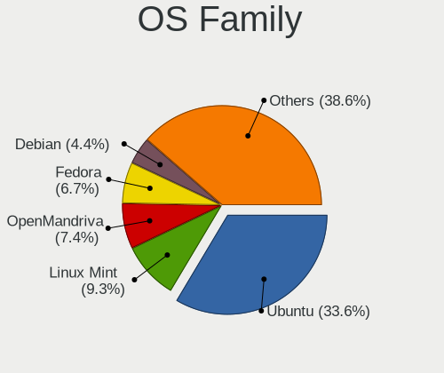

| Name          | Notebooks | Percent |
|---------------|-----------|---------|
| Ubuntu        | 382       | 33.48%  |
| Linux Mint    | 107       | 9.38%   |
| OpenMandriva  | 84        | 7.36%   |
| Fedora        | 78        | 6.84%   |
| Debian        | 50        | 4.38%   |
| Pop!_OS       | 40        | 3.51%   |
| Zorin         | 39        | 3.42%   |
| Arch          | 37        | 3.24%   |
| Manjaro       | 36        | 3.16%   |
| Xubuntu       | 31        | 2.72%   |
| Kubuntu       | 30        | 2.63%   |
| ArcoLinux     | 30        | 2.63%   |
| ROSA          | 19        | 1.67%   |
| openSUSE      | 19        | 1.67%   |
| KDE neon      | 16        | 1.4%    |
| Lubuntu       | 14        | 1.23%   |
| Ubuntu Unity  | 13        | 1.14%   |
| Elementary    | 12        | 1.05%   |
| Ubuntu MATE   | 9         | 0.79%   |
| Gentoo        | 9         | 0.79%   |
| Endless       | 8         | 0.7%    |
| SteamOS       | 7         | 0.61%   |
| LMDE          | 7         | 0.61%   |
| Kali          | 7         | 0.61%   |
| MX            | 5         | 0.44%   |
| EndeavourOS   | 5         | 0.44%   |
| Clear Linux   | 5         | 0.44%   |
| CentOS        | 5         | 0.44%   |
| BlackPanther  | 5         | 0.44%   |
| Ubuntu Budgie | 4         | 0.35%   |
| LinuxFX       | 3         | 0.26%   |
| Garuda Linux  | 3         | 0.26%   |
| Rocky Linux   | 2         | 0.18%   |
| Nobara        | 2         | 0.18%   |
| NixOS         | 2         | 0.18%   |
| Xero          | 1         | 0.09%   |
| Ultramarine   | 1         | 0.09%   |
| Ubuntu Studio | 1         | 0.09%   |
| Solus         | 1         | 0.09%   |
| Salix         | 1         | 0.09%   |

Kernel
------

Version of the Linux kernel

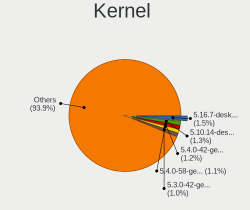

| Version                  | Notebooks | Percent |
|--------------------------|-----------|---------|
| 5.16.7-desktop-1omv4003  | 22        | 1.62%   |
| 5.10.14-desktop-1omv4002 | 19        | 1.4%    |
| 5.4.0-42-generic         | 17        | 1.25%   |
| 5.4.0-58-generic         | 16        | 1.18%   |
| 5.3.0-42-generic         | 15        | 1.11%   |
| 5.4.0-48-generic         | 13        | 0.96%   |
| 6.2.6-desktop-1omv2390   | 11        | 0.81%   |
| 6.1.1-desktop-1omv2290   | 11        | 0.81%   |
| 5.4.0-66-generic         | 11        | 0.81%   |
| 5.15.0-56-generic        | 11        | 0.81%   |
| 5.15.0-48-generic        | 11        | 0.81%   |
| 5.4.0-29-generic         | 10        | 0.74%   |
| 5.3.0-46-generic         | 10        | 0.74%   |
| 5.15.0-58-generic        | 10        | 0.74%   |
| 5.15.0-46-generic        | 10        | 0.74%   |
| 5.8.0-43-generic         | 9         | 0.66%   |
| 5.15.0-52-generic        | 9         | 0.66%   |
| 5.11.0-43-generic        | 9         | 0.66%   |
| 5.10.0-21-amd64          | 9         | 0.66%   |
| 5.4.0-74-generic         | 8         | 0.59%   |
| 5.13.0-39-generic        | 8         | 0.59%   |
| 5.4.0-65-generic         | 7         | 0.52%   |
| 5.4.0-52-generic         | 7         | 0.52%   |
| 5.4.0-40-generic         | 7         | 0.52%   |
| 5.4.0-26-generic         | 7         | 0.52%   |
| 5.15.0-47-generic        | 7         | 0.52%   |
| 5.13.0-28-generic        | 7         | 0.52%   |
| 5.11.0-7620-generic      | 7         | 0.52%   |
| 5.11.0-38-generic        | 7         | 0.52%   |
| 5.10.0-20-amd64          | 7         | 0.52%   |
| 5.0.0-29-generic         | 7         | 0.52%   |
| 6.4.11-desktop-1omv2390  | 6         | 0.44%   |
| 6.2.0-26-generic         | 6         | 0.44%   |
| 5.8.0-53-generic         | 6         | 0.44%   |
| 5.4.0-91-generic         | 6         | 0.44%   |
| 5.4.0-90-generic         | 6         | 0.44%   |
| 5.4.0-56-generic         | 6         | 0.44%   |
| 5.4.0-53-generic         | 6         | 0.44%   |
| 5.4.0-37-generic         | 6         | 0.44%   |
| 5.3.0-40-generic         | 6         | 0.44%   |

Kernel Family
-------------

Linux kernel without a distro release

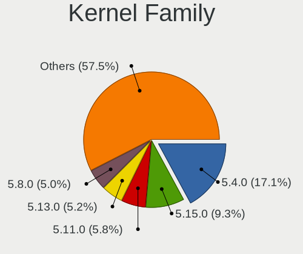

| Version | Notebooks | Percent |
|---------|-----------|---------|
| 5.4.0   | 200       | 15.76%  |
| 5.15.0  | 117       | 9.22%   |
| 5.11.0  | 70        | 5.52%   |
| 5.13.0  | 61        | 4.81%   |
| 5.8.0   | 58        | 4.57%   |
| 4.15.0  | 58        | 4.57%   |
| 5.3.0   | 49        | 3.86%   |
| 5.10.0  | 38        | 2.99%   |
| 5.19.0  | 33        | 2.6%    |
| 5.0.0   | 30        | 2.36%   |
| 6.2.0   | 29        | 2.29%   |
| 5.16.7  | 22        | 1.73%   |
| 4.18.0  | 21        | 1.65%   |
| 5.10.14 | 19        | 1.5%    |
| 6.2.6   | 12        | 0.95%   |
| 6.1.0   | 12        | 0.95%   |
| 6.1.1   | 11        | 0.87%   |
| 6.5.0   | 8         | 0.63%   |
| 6.4.11  | 6         | 0.47%   |
| 5.17.5  | 6         | 0.47%   |
| 4.9.20  | 6         | 0.47%   |
| 4.19.0  | 6         | 0.47%   |
| 6.0.0   | 5         | 0.39%   |
| 5.18.12 | 5         | 0.39%   |
| 4.18.16 | 5         | 0.39%   |
| 6.5.9   | 4         | 0.32%   |
| 6.5.5   | 4         | 0.32%   |
| 6.5.12  | 4         | 0.32%   |
| 6.2.9   | 4         | 0.32%   |
| 6.2.8   | 4         | 0.32%   |
| 6.2.11  | 4         | 0.32%   |
| 6.0.12  | 4         | 0.32%   |
| 5.18.0  | 4         | 0.32%   |
| 5.16.0  | 4         | 0.32%   |
| 5.14.0  | 4         | 0.32%   |
| 4.9.60  | 4         | 0.32%   |
| 4.4.0   | 4         | 0.32%   |
| 6.5.4   | 3         | 0.24%   |
| 6.3.8   | 3         | 0.24%   |
| 6.0.8   | 3         | 0.24%   |

Kernel Major Ver.
-----------------

Linux kernel major version

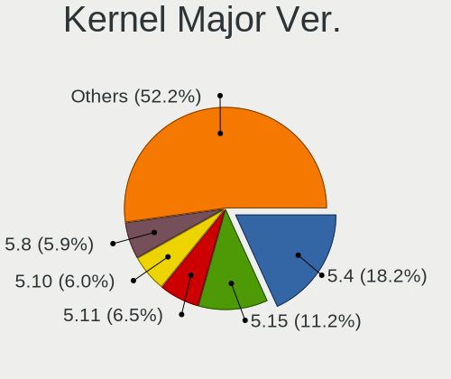

| Version | Notebooks | Percent |
|---------|-----------|---------|
| 5.4     | 218       | 17.51%  |
| 5.15    | 138       | 11.08%  |
| 5.11    | 79        | 6.35%   |
| 5.10    | 72        | 5.78%   |
| 5.8     | 71        | 5.7%    |
| 5.13    | 70        | 5.62%   |
| 6.2     | 61        | 4.9%    |
| 4.15    | 58        | 4.66%   |
| 5.3     | 55        | 4.42%   |
| 5.19    | 46        | 3.69%   |
| 5.16    | 40        | 3.21%   |
| 6.1     | 35        | 2.81%   |
| 5.0     | 32        | 2.57%   |
| 6.5     | 30        | 2.41%   |
| 4.18    | 27        | 2.17%   |
| 6.0     | 22        | 1.77%   |
| 5.18    | 22        | 1.77%   |
| 5.17    | 22        | 1.77%   |
| 6.4     | 18        | 1.45%   |
| 5.14    | 16        | 1.29%   |
| 5.12    | 15        | 1.2%    |
| 4.9     | 15        | 1.2%    |
| 6.3     | 13        | 1.04%   |
| 5.6     | 12        | 0.96%   |
| 5.9     | 10        | 0.8%    |
| 4.19    | 10        | 0.8%    |
| 6.6     | 9         | 0.72%   |
| 5.7     | 8         | 0.64%   |
| 5.5     | 5         | 0.4%    |
| 4.4     | 4         | 0.32%   |
| 5.1     | 3         | 0.24%   |
| 5.2     | 2         | 0.16%   |
| 4.17    | 2         | 0.16%   |
| 4.1     | 2         | 0.16%   |
| 4.13    | 1         | 0.08%   |
| 4.12    | 1         | 0.08%   |
| 4.10    | 1         | 0.08%   |

Arch
----

OS architecture (x86_64, i586, etc.)

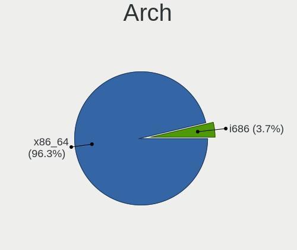

| Name   | Notebooks | Percent |
|--------|-----------|---------|
| x86_64 | 1060      | 97.16%  |
| i686   | 31        | 2.84%   |

DE
--

Desktop Environment

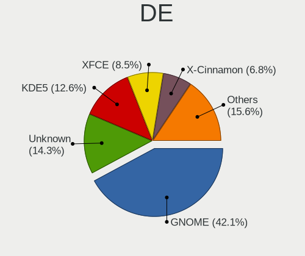

| Name             | Notebooks | Percent |
|------------------|-----------|---------|
| GNOME            | 506       | 43.73%  |
| KDE5             | 193       | 16.68%  |
| Unknown          | 124       | 10.72%  |
| XFCE             | 91        | 7.87%   |
| X-Cinnamon       | 79        | 6.83%   |
| MATE             | 35        | 3.03%   |
| KDE              | 20        | 1.73%   |
| LXQt             | 18        | 1.56%   |
| Unity            | 13        | 1.12%   |
| Pantheon         | 12        | 1.04%   |
| KDE4             | 11        | 0.95%   |
| i3               | 11        | 0.95%   |
| Cinnamon         | 10        | 0.86%   |
| Budgie           | 9         | 0.78%   |
| sway             | 3         | 0.26%   |
| Hyprland         | 3         | 0.26%   |
| qtile            | 2         | 0.17%   |
| LXDE             | 2         | 0.17%   |
| LeftWM           | 2         | 0.17%   |
| GNOME Flashback  | 2         | 0.17%   |
| bspwm            | 2         | 0.17%   |
| awesome          | 2         | 0.17%   |
| xmonad           | 1         | 0.09%   |
| spectrwm         | 1         | 0.09%   |
| Openbox          | 1         | 0.09%   |
| lightdm-xsession | 1         | 0.09%   |
| icewm            | 1         | 0.09%   |
| Enlightenment    | 1         | 0.09%   |
| Deepin           | 1         | 0.09%   |

Display Server
--------------

X11 or Wayland

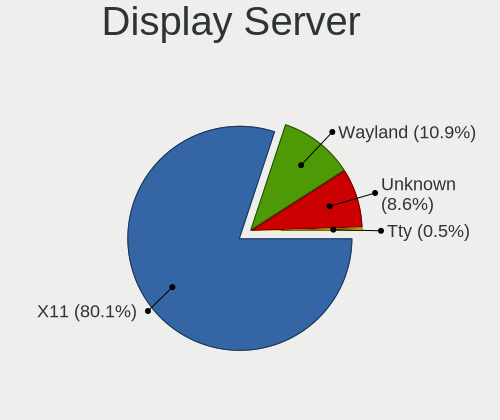

| Name    | Notebooks | Percent |
|---------|-----------|---------|
| X11     | 839       | 74.25%  |
| Wayland | 212       | 18.76%  |
| Unknown | 71        | 6.28%   |
| Tty     | 8         | 0.71%   |

Display Manager
---------------

SDDM, LightDM, etc.

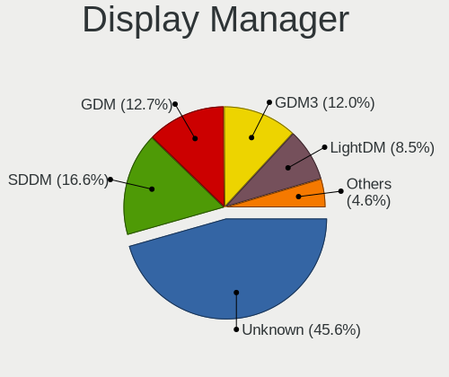

| Name    | Notebooks | Percent |
|---------|-----------|---------|
| Unknown | 522       | 45.31%  |
| SDDM    | 194       | 16.84%  |
| GDM     | 145       | 12.59%  |
| GDM3    | 140       | 12.15%  |
| LightDM | 100       | 8.68%   |
| TDM     | 37        | 3.21%   |
| KDM     | 11        | 0.95%   |
| XDM     | 2         | 0.17%   |
| SLiM    | 1         | 0.09%   |

OS Lang
-------

Language

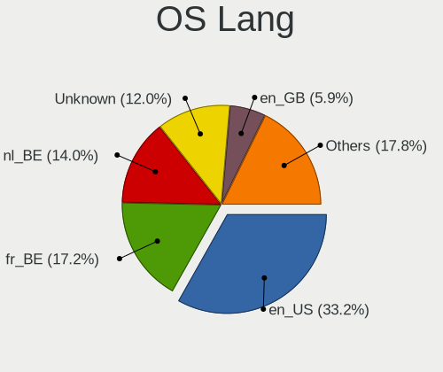

| Lang       | Notebooks | Percent |
|------------|-----------|---------|
| en_US      | 395       | 34.92%  |
| fr_BE      | 194       | 17.15%  |
| nl_BE      | 161       | 14.24%  |
| Unknown    | 121       | 10.7%   |
| en_GB      | 64        | 5.66%   |
| nl_NL      | 60        | 5.31%   |
| fr_FR      | 53        | 4.69%   |
| C          | 15        | 1.33%   |
| de_DE      | 13        | 1.15%   |
| de_BE      | 7         | 0.62%   |
| pl_PL      | 6         | 0.53%   |
| ru_RU      | 5         | 0.44%   |
| es_ES      | 4         | 0.35%   |
| ro_RO      | 3         | 0.27%   |
| en_IE      | 3         | 0.27%   |
| pt_PT      | 2         | 0.18%   |
| POSIX      | 2         | 0.18%   |
| it_IT      | 2         | 0.18%   |
| en_DK      | 2         | 0.18%   |
| en_CA      | 2         | 0.18%   |
| en_BE      | 2         | 0.18%   |
| C.UTF8     | 2         | 0.18%   |
| tt_RU      | 1         | 0.09%   |
| tr_TR      | 1         | 0.09%   |
| pt_BR      | 1         | 0.09%   |
| pl_PL.UTF8 | 1         | 0.09%   |
| nl_BE.UTF8 | 1         | 0.09%   |
| nl_AW      | 1         | 0.09%   |
| ku_TR      | 1         | 0.09%   |
| it_CH      | 1         | 0.09%   |
| fr_CH      | 1         | 0.09%   |
| en_ZA      | 1         | 0.09%   |
| en_US.UTF8 | 1         | 0.09%   |
| en_IN      | 1         | 0.09%   |
| bg_BG      | 1         | 0.09%   |

Boot Mode
---------

EFI or BIOS

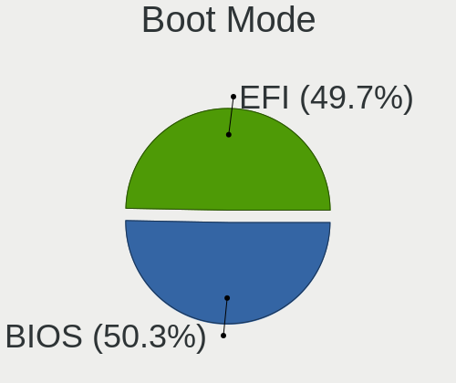

| Mode | Notebooks | Percent |
|------|-----------|---------|
| EFI  | 586       | 52.46%  |
| BIOS | 531       | 47.54%  |

Filesystem
----------

Type of filesystem

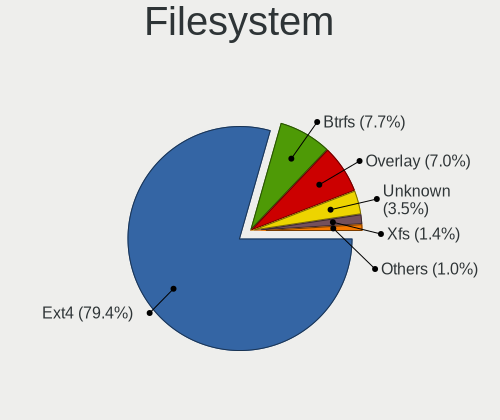

| Type    | Notebooks | Percent |
|---------|-----------|---------|
| Ext4    | 857       | 76.04%  |
| Btrfs   | 116       | 10.29%  |
| Overlay | 73        | 6.48%   |
| Unknown | 32        | 2.84%   |
| Tmpfs   | 25        | 2.22%   |
| Xfs     | 16        | 1.42%   |
| Zfs     | 6         | 0.53%   |
| Ext2    | 2         | 0.18%   |

Part. scheme
------------

Scheme of partitioning

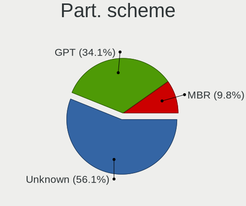

| Type    | Notebooks | Percent |
|---------|-----------|---------|
| Unknown | 559       | 49.82%  |
| GPT     | 449       | 40.02%  |
| MBR     | 114       | 10.16%  |

Dual Boot with Linux/BSD
------------------------

Hosting more than one Linux/BSD

| Dual boot | Notebooks | Percent |
|-----------|-----------|---------|
| No        | 960       | 85.87%  |
| Yes       | 158       | 14.13%  |

Dual Boot (Win)
---------------

Hosting Linux and Windows

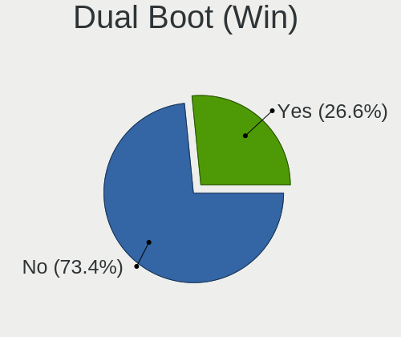

| Dual boot | Notebooks | Percent |
|-----------|-----------|---------|
| No        | 808       | 73.06%  |
| Yes       | 298       | 26.94%  |

Board
-----

Vendor
------

Motherboard manufacturer

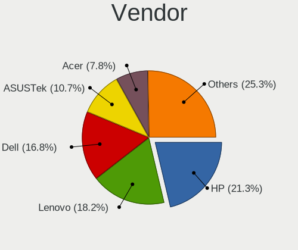

| Name                | Notebooks | Percent |
|---------------------|-----------|---------|
| Hewlett-Packard     | 231       | 21.19%  |
| Lenovo              | 198       | 18.17%  |
| Dell                | 185       | 16.97%  |
| ASUSTek Computer    | 115       | 10.55%  |
| Acer                | 84        | 7.71%   |
| Toshiba             | 33        | 3.03%   |
| Apple               | 31        | 2.84%   |
| Medion              | 29        | 2.66%   |
| MSI                 | 28        | 2.57%   |
| Sony                | 26        | 2.39%   |
| Notebook            | 22        | 2.02%   |
| Packard Bell        | 17        | 1.56%   |
| TUXEDO              | 10        | 0.92%   |
| Valve               | 8         | 0.73%   |
| Samsung Electronics | 8         | 0.73%   |
| Unknown             | 7         | 0.64%   |
| PC Specialist       | 4         | 0.37%   |
| Gigabyte Technology | 4         | 0.37%   |
| Fujitsu Siemens     | 4         | 0.37%   |
| Fujitsu             | 4         | 0.37%   |
| Alienware           | 4         | 0.37%   |
| Intel               | 3         | 0.28%   |
| HUAWEI              | 3         | 0.28%   |
| Google              | 3         | 0.28%   |
| Clevo               | 3         | 0.28%   |
| Teclast             | 2         | 0.18%   |
| Razer               | 2         | 0.18%   |
| Panasonic           | 2         | 0.18%   |
| YJKC                | 1         | 0.09%   |
| VALE                | 1         | 0.09%   |
| TrekStor            | 1         | 0.09%   |
| Timi                | 1         | 0.09%   |
| Standard            | 1         | 0.09%   |
| SLIMBOOK            | 1         | 0.09%   |
| Schenker            | 1         | 0.09%   |
| PEAQ                | 1         | 0.09%   |
| NEC Computers       | 1         | 0.09%   |
| Inter Sales A/S     | 1         | 0.09%   |
| Hampoo              | 1         | 0.09%   |
| GPD                 | 1         | 0.09%   |

Model
-----

Motherboard model

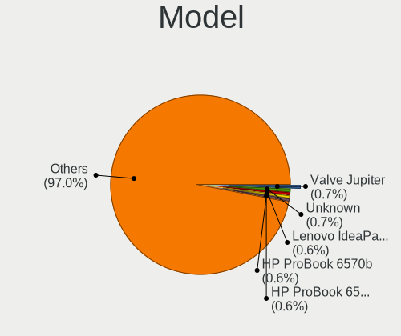

| Name                             | Notebooks | Percent |
|----------------------------------|-----------|---------|
| Unknown                          | 9         | 0.83%   |
| Valve Jupiter                    | 8         | 0.73%   |
| HP Pavilion g7                   | 7         | 0.64%   |
| HP ProBook 650 G1                | 6         | 0.55%   |
| HP Pavilion Notebook             | 6         | 0.55%   |
| HP EliteBook 850 G8 Notebook PC  | 6         | 0.55%   |
| Lenovo IdeaPad 5 Pro 16ACH6 82L5 | 5         | 0.46%   |
| HP ProBook 6570b                 | 5         | 0.46%   |
| HP Pavilion dv7                  | 5         | 0.46%   |
| HP Pavilion dv6                  | 5         | 0.46%   |
| Dell XPS 15 9560                 | 5         | 0.46%   |
| Dell XPS 13 7390                 | 5         | 0.46%   |
| Dell Latitude 5530               | 5         | 0.46%   |
| Toshiba Satellite C660           | 4         | 0.37%   |
| HP Pavilion Laptop 15-eh1xxx     | 4         | 0.37%   |
| HP Pavilion Laptop 15-cw0xxx     | 4         | 0.37%   |
| HP Pavilion 17                   | 4         | 0.37%   |
| HP Laptop 15-db0xxx              | 4         | 0.37%   |
| Gigabyte Spring Peak             | 4         | 0.37%   |
| Dell XPS 15 9570                 | 4         | 0.37%   |
| Dell XPS 13 9370                 | 4         | 0.37%   |
| Dell Latitude 5520               | 4         | 0.37%   |
| Lenovo ThinkPad L390 20NSS1YV0B  | 3         | 0.28%   |
| Lenovo Legion 5 15ARH05 82B5     | 3         | 0.28%   |
| HP ProBook 470 G2                | 3         | 0.28%   |
| HP ProBook 450 G8 Notebook PC    | 3         | 0.28%   |
| HP ProBook 430 G1                | 3         | 0.28%   |
| HP Pavilion 15                   | 3         | 0.28%   |
| HP Notebook                      | 3         | 0.28%   |
| HP EliteBook 850 G3              | 3         | 0.28%   |
| HP EliteBook 8460p               | 3         | 0.28%   |
| HP EliteBook 840 G1              | 3         | 0.28%   |
| Dell XPS 15 9500                 | 3         | 0.28%   |
| Dell XPS 13 9360                 | 3         | 0.28%   |
| Dell XPS 13 9305                 | 3         | 0.28%   |
| Dell Precision M4800             | 3         | 0.28%   |
| Dell Latitude E7440              | 3         | 0.28%   |
| Dell Latitude E6540              | 3         | 0.28%   |
| Dell Latitude E6530              | 3         | 0.28%   |
| Dell Latitude E6500              | 3         | 0.28%   |

Model Family
------------

Motherboard model prefix

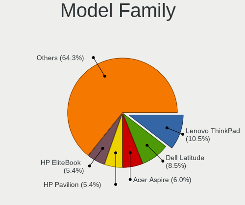

| Name                  | Notebooks | Percent |
|-----------------------|-----------|---------|
| Lenovo ThinkPad       | 117       | 10.73%  |
| Dell Latitude         | 88        | 8.07%   |
| Acer Aspire           | 67        | 6.15%   |
| HP EliteBook          | 63        | 5.78%   |
| HP Pavilion           | 58        | 5.32%   |
| HP ProBook            | 44        | 4.04%   |
| Dell XPS              | 38        | 3.49%   |
| Lenovo IdeaPad        | 36        | 3.3%    |
| Toshiba Satellite     | 29        | 2.66%   |
| Dell Inspiron         | 21        | 1.93%   |
| HP Laptop             | 20        | 1.83%   |
| Dell Precision        | 19        | 1.74%   |
| Lenovo Legion         | 15        | 1.38%   |
| Packard Bell EasyNote | 14        | 1.28%   |
| HP Compaq             | 13        | 1.19%   |
| ASUS VivoBook         | 13        | 1.19%   |
| HP ZBook              | 12        | 1.1%    |
| ASUS ROG              | 9         | 0.83%   |
| Unknown               | 9         | 0.83%   |
| Valve Jupiter         | 8         | 0.73%   |
| Medion Akoya          | 7         | 0.64%   |
| Dell Vostro           | 7         | 0.64%   |
| Lenovo ThinkBook      | 6         | 0.55%   |
| Dell Studio           | 6         | 0.55%   |
| Acer Nitro            | 6         | 0.55%   |
| MSI GF63              | 4         | 0.37%   |
| HP OMEN               | 4         | 0.37%   |
| HP ENVY               | 4         | 0.37%   |
| Gigabyte Spring       | 4         | 0.37%   |
| Dell G3               | 4         | 0.37%   |
| ASUS ZenBook          | 4         | 0.37%   |
| Apple MacBookPro9     | 4         | 0.37%   |
| Acer TravelMate       | 4         | 0.37%   |
| Acer Swift            | 4         | 0.37%   |
| TUXEDO Pulse          | 3         | 0.28%   |
| TUXEDO Aura           | 3         | 0.28%   |
| MSI Vector            | 3         | 0.28%   |
| MSI Katana            | 3         | 0.28%   |
| Lenovo Yoga           | 3         | 0.28%   |
| HP Notebook           | 3         | 0.28%   |

MFG Year
--------

Motherboard manufacture year

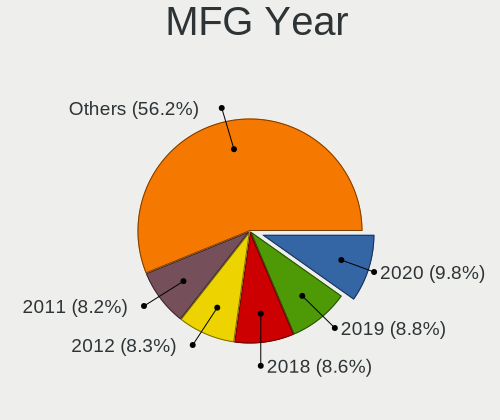

| Year    | Notebooks | Percent |
|---------|-----------|---------|
| 2020    | 104       | 9.54%   |
| 2019    | 95        | 8.72%   |
| 2018    | 91        | 8.35%   |
| 2012    | 88        | 8.07%   |
| 2011    | 86        | 7.89%   |
| 2013    | 83        | 7.61%   |
| 2021    | 74        | 6.79%   |
| 2017    | 60        | 5.5%    |
| 2016    | 56        | 5.14%   |
| 2015    | 56        | 5.14%   |
| 2014    | 55        | 5.05%   |
| 2008    | 51        | 4.68%   |
| 2010    | 50        | 4.59%   |
| 2022    | 46        | 4.22%   |
| 2009    | 35        | 3.21%   |
| 2007    | 30        | 2.75%   |
| 2006    | 13        | 1.19%   |
| 2023    | 12        | 1.1%    |
| 2005    | 2         | 0.18%   |
| 2004    | 2         | 0.18%   |
| Unknown | 1         | 0.09%   |

Form Factor
-----------

Physical design of the computer

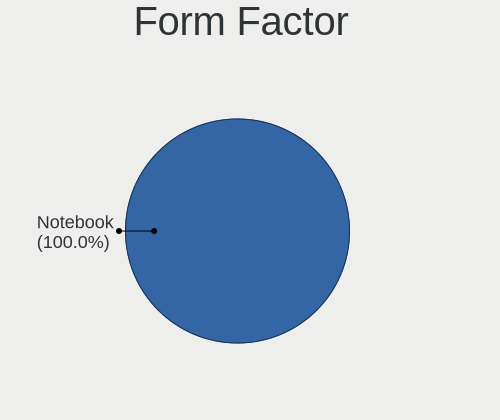

| Name     | Notebooks | Percent |
|----------|-----------|---------|
| Notebook | 1090      | 100%    |

Secure Boot
-----------

Enabled or disabled

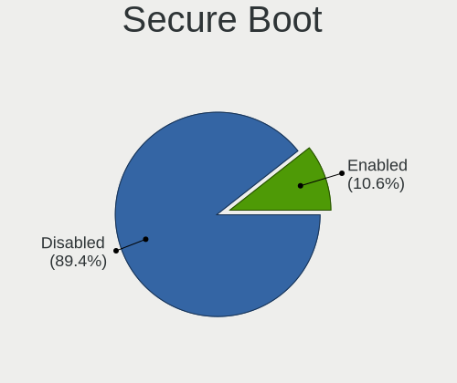

| State    | Notebooks | Percent |
|----------|-----------|---------|
| Disabled | 985       | 89.3%   |
| Enabled  | 118       | 10.7%   |

Coreboot
--------

Have coreboot on board

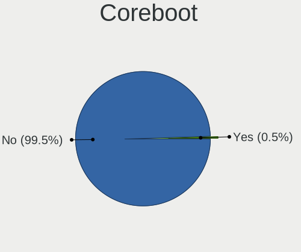

| Used | Notebooks | Percent |
|------|-----------|---------|
| No   | 1086      | 99.63%  |
| Yes  | 4         | 0.37%   |

RAM Size
--------

Total RAM memory

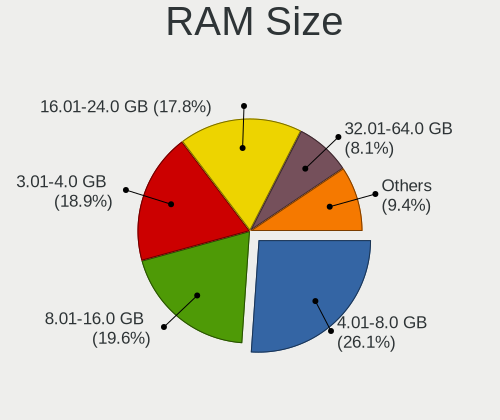

| Size in GB  | Notebooks | Percent |
|-------------|-----------|---------|
| 4.01-8.0    | 291       | 26.1%   |
| 8.01-16.0   | 219       | 19.64%  |
| 3.01-4.0    | 211       | 18.92%  |
| 16.01-24.0  | 199       | 17.85%  |
| 32.01-64.0  | 90        | 8.07%   |
| 1.01-2.0    | 41        | 3.68%   |
| 24.01-32.0  | 20        | 1.79%   |
| 64.01-256.0 | 16        | 1.43%   |
| 2.01-3.0    | 14        | 1.26%   |
| 0.51-1.0    | 13        | 1.17%   |
| 0.01-0.5    | 1         | 0.09%   |

RAM Used
--------

Used RAM memory

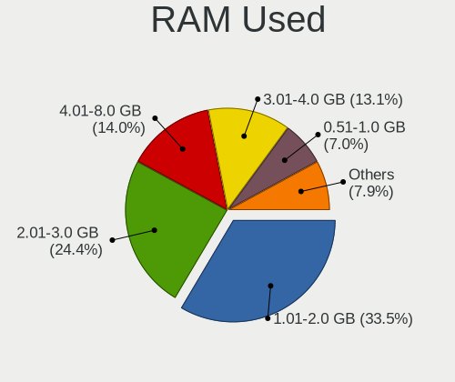

| Used GB    | Notebooks | Percent |
|------------|-----------|---------|
| 1.01-2.0   | 411       | 33.52%  |
| 2.01-3.0   | 299       | 24.39%  |
| 4.01-8.0   | 172       | 14.03%  |
| 3.01-4.0   | 161       | 13.13%  |
| 0.51-1.0   | 86        | 7.01%   |
| 8.01-16.0  | 71        | 5.79%   |
| 0.01-0.5   | 18        | 1.47%   |
| 24.01-32.0 | 4         | 0.33%   |
| 16.01-24.0 | 4         | 0.33%   |

Total Drives
------------

Number of drives on board

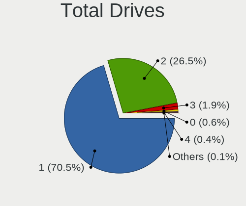

| Drives | Notebooks | Percent |
|--------|-----------|---------|
| 1      | 797       | 70.97%  |
| 2      | 280       | 24.93%  |
| 3      | 31        | 2.76%   |
| 0      | 7         | 0.62%   |
| 4      | 6         | 0.53%   |
| 8      | 1         | 0.09%   |
| 5      | 1         | 0.09%   |

Has CD-ROM
----------

Has CD-ROM on board

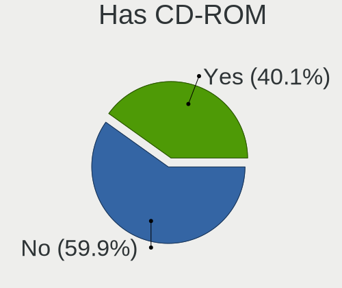

| Presented | Notebooks | Percent |
|-----------|-----------|---------|
| No        | 680       | 62.04%  |
| Yes       | 416       | 37.96%  |

Has Ethernet
------------

Has Ethernet on board

| Presented | Notebooks | Percent |
|-----------|-----------|---------|
| Yes       | 952       | 86.86%  |
| No        | 144       | 13.14%  |

Has WiFi
--------

Has WiFi module

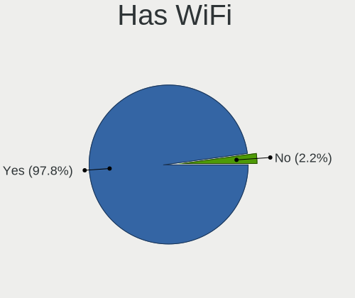

| Presented | Notebooks | Percent |
|-----------|-----------|---------|
| Yes       | 1078      | 98.45%  |
| No        | 17        | 1.55%   |

Has Bluetooth
-------------

Has Bluetooth module

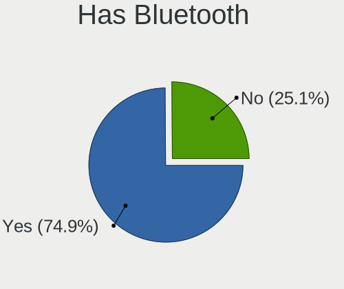

| Presented | Notebooks | Percent |
|-----------|-----------|---------|
| Yes       | 839       | 75.79%  |
| No        | 268       | 24.21%  |

Location
--------

Country
-------

Geographic location (country)

| Country | Notebooks | Percent |
|---------|-----------|---------|
| Belgium | 1090      | 100%    |

City
----

Geographic location (city)

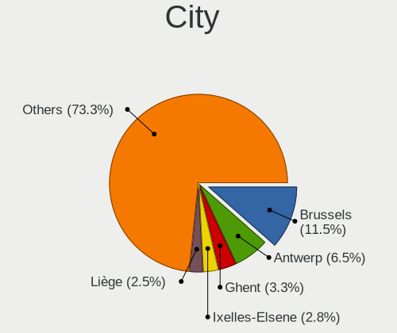

| City           | Notebooks | Percent |
|----------------|-----------|---------|
| Brussels       | 164       | 13.58%  |
| Antwerp        | 78        | 6.46%   |
| Ghent          | 47        | 3.89%   |
| Liège         | 38        | 3.15%   |
| Ixelles-Elsene | 29        | 2.4%    |
| Mechelen       | 17        | 1.41%   |
| Leuven         | 15        | 1.24%   |
| Turnhout       | 14        | 1.16%   |
| Bruges         | 14        | 1.16%   |
| Sint-Truiden   | 11        | 0.91%   |
| Anderlecht     | 11        | 0.91%   |
| Uccle          | 10        | 0.83%   |
| Schaarbeek     | 10        | 0.83%   |
| Hasselt        | 10        | 0.83%   |
| Mons           | 9         | 0.75%   |
| Namur          | 8         | 0.66%   |
| Jette          | 8         | 0.66%   |
| Harelbeke      | 8         | 0.66%   |
| Etterbeek      | 8         | 0.66%   |
| Edegem         | 8         | 0.66%   |
| Charleroi      | 8         | 0.66%   |
| Aalst          | 8         | 0.66%   |
| La Louvière   | 7         | 0.58%   |
| Kontich        | 7         | 0.58%   |
| Brasschaat     | 7         | 0.58%   |
| Boom           | 7         | 0.58%   |
| Bilzen         | 7         | 0.58%   |
| Seraing        | 6         | 0.5%    |
| Mortsel        | 6         | 0.5%    |
| Kanne          | 6         | 0.5%    |
| Hamme          | 6         | 0.5%    |
| Gavere         | 6         | 0.5%    |
| Wetteren       | 5         | 0.41%   |
| Tournai        | 5         | 0.41%   |
| Sint-Niklaas   | 5         | 0.41%   |
| Schoten        | 5         | 0.41%   |
| Overijse       | 5         | 0.41%   |
| Mol            | 5         | 0.41%   |
| Merksem        | 5         | 0.41%   |
| Lier           | 5         | 0.41%   |

Drives
------

Drive Vendor
------------

Hard drive vendors

| Vendor                      | Notebooks | Drives | Percent |
|-----------------------------|-----------|--------|---------|
| Samsung Electronics         | 279       | 415    | 20.64%  |
| Seagate                     | 146       | 206    | 10.8%   |
| WDC                         | 143       | 191    | 10.58%  |
| Toshiba                     | 102       | 132    | 7.54%   |
| SanDisk                     | 71        | 94     | 5.25%   |
| SK hynix                    | 70        | 89     | 5.18%   |
| Kingston                    | 62        | 84     | 4.59%   |
| Unknown                     | 58        | 70     | 4.29%   |
| Intel                       | 57        | 67     | 4.22%   |
| Hitachi                     | 48        | 58     | 3.55%   |
| Micron Technology           | 43        | 48     | 3.18%   |
| HGST                        | 39        | 51     | 2.88%   |
| Crucial                     | 38        | 49     | 2.81%   |
| Apple                       | 18        | 25     | 1.33%   |
| KIOXIA                      | 16        | 18     | 1.18%   |
| LITEON                      | 14        | 16     | 1.04%   |
| Fujitsu                     | 13        | 19     | 0.96%   |
| China                       | 10        | 12     | 0.74%   |
| LITEONIT                    | 8         | 12     | 0.59%   |
| Intenso                     | 8         | 9      | 0.59%   |
| A-DATA Technology           | 7         | 9      | 0.52%   |
| Micron/Crucial Technology   | 6         | 9      | 0.44%   |
| Transcend                   | 5         | 5      | 0.37%   |
| PNY                         | 5         | 6      | 0.37%   |
| Phison                      | 5         | 5      | 0.37%   |
| GOODRAM                     | 5         | 7      | 0.37%   |
| SSSTC                       | 4         | 4      | 0.3%    |
| OCZ                         | 4         | 5      | 0.3%    |
| Kingston Technology Company | 4         | 4      | 0.3%    |
| Corsair                     | 4         | 4      | 0.3%    |
| Silicon Motion              | 3         | 4      | 0.22%   |
| Phison Electronics          | 3         | 4      | 0.22%   |
| ASMT                        | 3         | 3      | 0.22%   |
| Zheino                      | 2         | 2      | 0.15%   |
| Union Memory (Shenzhen)     | 2         | 2      | 0.15%   |
| Union Memory                | 2         | 2      | 0.15%   |
| SPCC                        | 2         | 3      | 0.15%   |
| Reeinno                     | 2         | 5      | 0.15%   |
| Netac                       | 2         | 2      | 0.15%   |
| LaCie                       | 2         | 2      | 0.15%   |

Drive Model
-----------

Hard drive models

| Model                                               | Notebooks | Percent |
|-----------------------------------------------------|-----------|---------|
| Seagate ST1000LM035-1RK172 1TB                      | 17        | 1.2%    |
| Samsung NVMe SSD Drive 512GB                        | 17        | 1.2%    |
| SanDisk NVMe SSD Drive 512GB                        | 15        | 1.06%   |
| Seagate ST1000LM024 HN-M101MBB 1TB                  | 14        | 0.99%   |
| Samsung SSD 860 EVO 500GB                           | 14        | 0.99%   |
| Samsung NVMe SSD Drive 1TB                          | 14        | 0.99%   |
| Samsung SSD 850 EVO 250GB                           | 13        | 0.92%   |
| Intel NVMe SSD Drive 512GB                          | 13        | 0.92%   |
| SK hynix NVMe SSD Drive 512GB                       | 12        | 0.85%   |
| Seagate ST9500325AS 500GB                           | 12        | 0.85%   |
| HGST HTS721010A9E630 1TB                            | 12        | 0.85%   |
| Unknown MMC Card  32GB                              | 11        | 0.78%   |
| Toshiba MQ01ABD100 1TB                              | 11        | 0.78%   |
| Samsung SSD 850 EVO 500GB                           | 10        | 0.71%   |
| Samsung NVMe SSD Controller SM981/PM981/PM983 512GB | 10        | 0.71%   |
| Unknown MMC Card  128GB                             | 9         | 0.64%   |
| Samsung NVMe SSD Controller PM9A1/PM9A3/980PRO 2TB  | 9         | 0.64%   |
| HGST HTS725050A7E630 500GB                          | 9         | 0.64%   |
| Kingston SA400S37120G 120GB SSD                     | 8         | 0.57%   |
| Hitachi HTS547550A9E384 500GB                       | 8         | 0.57%   |
| Seagate ST1000LM048-2E7172 1TB                      | 7         | 0.5%    |
| Seagate Expansion 2TB                               | 7         | 0.5%    |
| Samsung SSD 860 EVO 1TB                             | 7         | 0.5%    |
| WDC WD10JPVX-22JC3T0 1TB                            | 6         | 0.42%   |
| Toshiba MQ04ABF100 1TB                              | 6         | 0.42%   |
| Seagate ST500LT012-1DG142 500GB                     | 6         | 0.42%   |
| Seagate ST2000LM015-2E8174 2TB                      | 6         | 0.42%   |
| Samsung NVMe SSD Drive 500GB                        | 6         | 0.42%   |
| Kingston SV300S37A120G 120GB SSD                    | 6         | 0.42%   |
| Kingston SA400S37240G 240GB SSD                     | 6         | 0.42%   |
| Hitachi HTS545050B9A300 500GB                       | 6         | 0.42%   |
| HGST HTS541010A9E680 1TB                            | 6         | 0.42%   |
| WDC WD3200BEVT-22ZCT0 320GB                         | 5         | 0.35%   |
| Unknown MMC Card  64GB                              | 5         | 0.35%   |
| Unknown MMC Card  256GB                             | 5         | 0.35%   |
| Toshiba MQ01ABF050 500GB                            | 5         | 0.35%   |
| Toshiba MQ01ABD075 752GB                            | 5         | 0.35%   |
| SanDisk NVMe SSD Drive 256GB                        | 5         | 0.35%   |
| Samsung SSD 980 500GB                               | 5         | 0.35%   |
| Samsung SSD 870 EVO 500GB                           | 5         | 0.35%   |

HDD Vendor
----------

Hard disk drive vendors

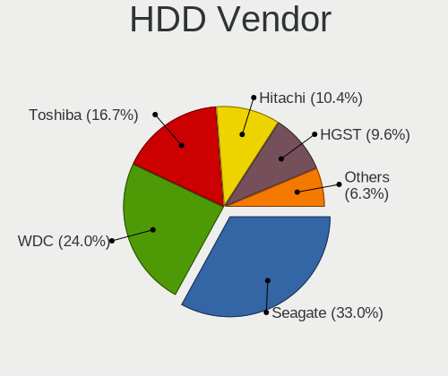

| Vendor              | Notebooks | Drives | Percent |
|---------------------|-----------|--------|---------|
| Seagate             | 137       | 192    | 32.39%  |
| WDC                 | 103       | 136    | 24.35%  |
| Toshiba             | 70        | 93     | 16.55%  |
| Hitachi             | 48        | 58     | 11.35%  |
| HGST                | 39        | 51     | 9.22%   |
| Fujitsu             | 13        | 18     | 3.07%   |
| Samsung Electronics | 7         | 9      | 1.65%   |
| XrayDisk            | 1         | 1      | 0.24%   |
| Unknown             | 1         | 1      | 0.24%   |
| TO Exter            | 1         | 1      | 0.24%   |
| LaCie               | 1         | 1      | 0.24%   |
| Intenso             | 1         | 1      | 0.24%   |
| Apple               | 1         | 1      | 0.24%   |

SSD Vendor
----------

Solid state drive vendors

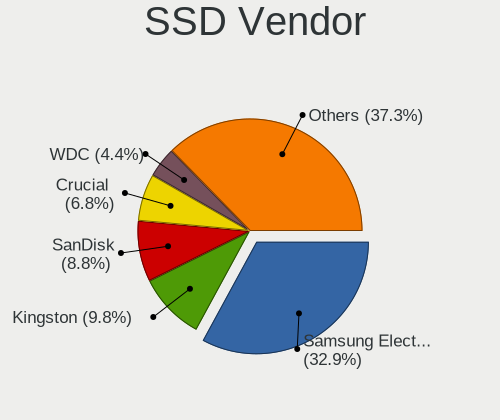

| Vendor              | Notebooks | Drives | Percent |
|---------------------|-----------|--------|---------|
| Samsung Electronics | 144       | 214    | 32.8%   |
| Kingston            | 41        | 52     | 9.34%   |
| SanDisk             | 38        | 54     | 8.66%   |
| Crucial             | 31        | 40     | 7.06%   |
| Intel               | 19        | 21     | 4.33%   |
| WDC                 | 18        | 23     | 4.1%    |
| SK hynix            | 18        | 28     | 4.1%    |
| Micron Technology   | 14        | 14     | 3.19%   |
| LITEON              | 13        | 15     | 2.96%   |
| Toshiba             | 12        | 15     | 2.73%   |
| Apple               | 11        | 16     | 2.51%   |
| China               | 10        | 12     | 2.28%   |
| LITEONIT            | 8         | 12     | 1.82%   |
| Intenso             | 6         | 7      | 1.37%   |
| PNY                 | 5         | 6      | 1.14%   |
| GOODRAM             | 5         | 7      | 1.14%   |
| A-DATA Technology   | 5         | 7      | 1.14%   |
| Transcend           | 4         | 4      | 0.91%   |
| OCZ                 | 4         | 5      | 0.91%   |
| ASMT                | 3         | 3      | 0.68%   |
| Zheino              | 2         | 2      | 0.46%   |
| SPCC                | 2         | 3      | 0.46%   |
| Reeinno             | 2         | 4      | 0.46%   |
| KingSpec            | 2         | 2      | 0.46%   |
| Emtec               | 2         | 2      | 0.46%   |
| Corsair             | 2         | 2      | 0.46%   |
| Verbatim            | 1         | 1      | 0.23%   |
| Teclast             | 1         | 1      | 0.23%   |
| Plextor             | 1         | 1      | 0.23%   |
| Phison              | 1         | 1      | 0.23%   |
| Patriot             | 1         | 1      | 0.23%   |
| OWC                 | 1         | 2      | 0.23%   |
| Netac               | 1         | 1      | 0.23%   |
| Leven               | 1         | 1      | 0.23%   |
| JMicron Technology  | 1         | 1      | 0.23%   |
| INTEL SS            | 1         | 1      | 0.23%   |
| Innodisk            | 1         | 1      | 0.23%   |
| Indilinx            | 1         | 1      | 0.23%   |
| HEORIADY            | 1         | 1      | 0.23%   |
| Fujitsu             | 1         | 1      | 0.23%   |

Drive Kind
----------

HDD or SSD

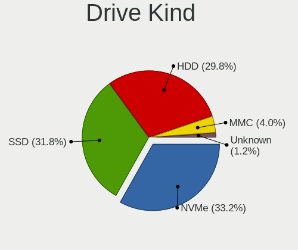

| Kind    | Notebooks | Drives | Percent |
|---------|-----------|--------|---------|
| SSD     | 409       | 589    | 31.98%  |
| HDD     | 402       | 563    | 31.43%  |
| NVMe    | 400       | 554    | 31.27%  |
| MMC     | 53        | 65     | 4.14%   |
| Unknown | 15        | 22     | 1.17%   |

Drive Connector
---------------

SATA, SAS, NVMe, etc.

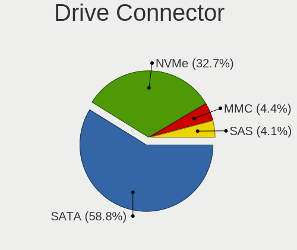

| Type | Notebooks | Drives | Percent |
|------|-----------|--------|---------|
| SATA | 715       | 1096   | 58.65%  |
| NVMe | 400       | 553    | 32.81%  |
| MMC  | 53        | 65     | 4.35%   |
| SAS  | 51        | 79     | 4.18%   |

Drive Size
----------

Size of hard drive

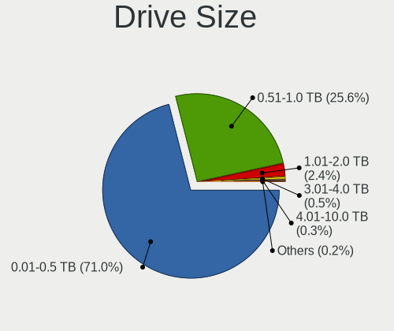

| Size in TB | Notebooks | Drives | Percent |
|------------|-----------|--------|---------|
| 0.01-0.5   | 574       | 794    | 70%     |
| 0.51-1.0   | 209       | 310    | 25.49%  |
| 1.01-2.0   | 26        | 32     | 3.17%   |
| 3.01-4.0   | 7         | 12     | 0.85%   |
| 4.01-10.0  | 2         | 2      | 0.24%   |
| 2.01-3.0   | 1         | 1      | 0.12%   |
| 10.01-20.0 | 1         | 1      | 0.12%   |

Space Total
-----------

Amount of disk space available on the file system

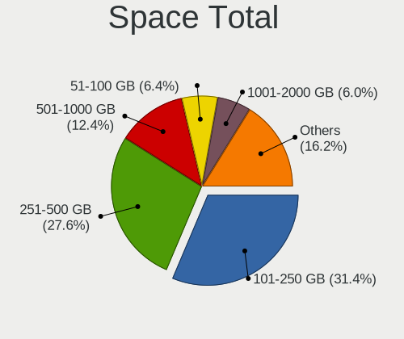

| Size in GB     | Notebooks | Percent |
|----------------|-----------|---------|
| 101-250        | 354       | 30.26%  |
| 251-500        | 317       | 27.09%  |
| 501-1000       | 150       | 12.82%  |
| 1001-2000      | 72        | 6.15%   |
| 1-20           | 72        | 6.15%   |
| 51-100         | 72        | 6.15%   |
| Unknown        | 41        | 3.5%    |
| 21-50          | 40        | 3.42%   |
| More than 3000 | 28        | 2.39%   |
| 2001-3000      | 24        | 2.05%   |

Space Used
----------

Amount of used disk space

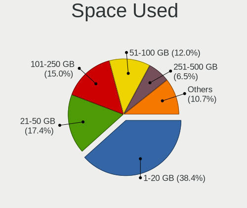

| Used GB        | Notebooks | Percent |
|----------------|-----------|---------|
| 1-20           | 469       | 38.13%  |
| 21-50          | 211       | 17.15%  |
| 101-250        | 189       | 15.37%  |
| 51-100         | 146       | 11.87%  |
| 251-500        | 82        | 6.67%   |
| 501-1000       | 54        | 4.39%   |
| Unknown        | 41        | 3.33%   |
| 1001-2000      | 23        | 1.87%   |
| 2001-3000      | 10        | 0.81%   |
| More than 3000 | 5         | 0.41%   |

Malfunc. Drives
---------------

Drive models with a malfunction

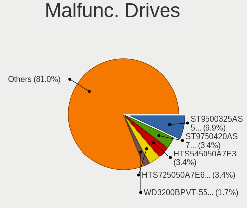

| Model                                          | Notebooks | Drives | Percent |
|------------------------------------------------|-----------|--------|---------|
| Seagate ST9500325AS 500GB                      | 4         | 4      | 4.94%   |
| Toshiba MQ01ABD075 752GB                       | 2         | 2      | 2.47%   |
| Seagate ST9750420AS 752GB                      | 2         | 2      | 2.47%   |
| Seagate ST320LT007-9ZV142 320GB                | 2         | 8      | 2.47%   |
| Micron Technology 1100_MTFDDAV256TBN 256GB SSD | 2         | 2      | 2.47%   |
| Hitachi HTS545050A7E380 500GB                  | 2         | 4      | 2.47%   |
| HGST HTS725050A7E630 500GB                     | 2         | 2      | 2.47%   |
| WDC WD3200BPVT-55JJ5T0 320GB                   | 1         | 1      | 1.23%   |
| WDC WD3200BPVT-22ZEST0 320GB                   | 1         | 1      | 1.23%   |
| WDC WD3200BEVT-60A23T0 320GB                   | 1         | 1      | 1.23%   |
| WDC WD3200BEKT-60PVMT0 320GB                   | 1         | 1      | 1.23%   |
| Toshiba MQ01ABD100 1TB                         | 1         | 1      | 1.23%   |
| Toshiba MQ01ABD032 320GB                       | 1         | 1      | 1.23%   |
| Toshiba MK6476GSX 640GB                        | 1         | 1      | 1.23%   |
| Toshiba MK5075GSX 500GB                        | 1         | 1      | 1.23%   |
| Toshiba MK3263GSXN 320GB                       | 1         | 1      | 1.23%   |
| Toshiba MK2555GSX 250GB                        | 1         | 1      | 1.23%   |
| Toshiba MK1655GSX 160GB                        | 1         | 1      | 1.23%   |
| Toshiba KSG60ZSE512G SATA 512GB SSD            | 1         | 1      | 1.23%   |
| SK hynix SH920 mSATA 256GB SSD                 | 1         | 1      | 1.23%   |
| SK hynix SH920 2.5 7MM 256GB SSD               | 1         | 2      | 1.23%   |
| SK hynix SC401 SATA 512GB SSD                  | 1         | 3      | 1.23%   |
| SK hynix PC711 HFS512GDE9X073N 512GB           | 1         | 2      | 1.23%   |
| SK hynix HFS256G32MND-2900A 256GB SSD          | 1         | 1      | 1.23%   |
| SK hynix HFS128G39TND-N210A 128GB SSD          | 1         | 1      | 1.23%   |
| Seagate ST9500420AS 500GB                      | 1         | 1      | 1.23%   |
| Seagate ST9320423AS 320GB                      | 1         | 2      | 1.23%   |
| Seagate ST9250315AS 250GB                      | 1         | 1      | 1.23%   |
| Seagate ST9120822AS 120GB                      | 1         | 1      | 1.23%   |
| Seagate ST9120821AS 120GB                      | 1         | 1      | 1.23%   |
| Seagate ST9100824AS 100GB                      | 1         | 2      | 1.23%   |
| Seagate ST750LM022 HN-M750MBB 752GB            | 1         | 1      | 1.23%   |
| Seagate ST500LM000-SSHD-8GB                    | 1         | 1      | 1.23%   |
| Seagate ST2000LM015-2E8174 2TB                 | 1         | 1      | 1.23%   |
| Seagate ST1000LM024 HN-M101MBB 1TB             | 1         | 6      | 1.23%   |
| SanDisk SSD PLUS 480GB                         | 1         | 1      | 1.23%   |
| SanDisk SD8SNAT128G1002 128GB SSD              | 1         | 1      | 1.23%   |
| SanDisk SD6SN1M-256G-1006 256GB SSD            | 1         | 1      | 1.23%   |
| Samsung Electronics HM641JI 640GB              | 1         | 1      | 1.23%   |
| OCZ VERTEX3 256GB SSD                          | 1         | 1      | 1.23%   |

Malfunc. Drive Vendor
---------------------

Vendors of faulty drives

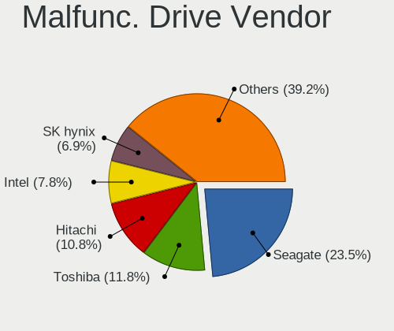

| Vendor              | Notebooks | Drives | Percent |
|---------------------|-----------|--------|---------|
| Seagate             | 18        | 31     | 22.22%  |
| Hitachi             | 11        | 13     | 13.58%  |
| Toshiba             | 10        | 10     | 12.35%  |
| Intel               | 7         | 7      | 8.64%   |
| SK hynix            | 6         | 10     | 7.41%   |
| HGST                | 6         | 6      | 7.41%   |
| WDC                 | 4         | 4      | 4.94%   |
| Fujitsu             | 4         | 8      | 4.94%   |
| SanDisk             | 3         | 3      | 3.7%    |
| Micron Technology   | 3         | 3      | 3.7%    |
| Kingston            | 2         | 7      | 2.47%   |
| Crucial             | 2         | 2      | 2.47%   |
| Samsung Electronics | 1         | 1      | 1.23%   |
| OCZ                 | 1         | 1      | 1.23%   |
| LITEON              | 1         | 1      | 1.23%   |
| Apple               | 1         | 1      | 1.23%   |
| A-DATA Technology   | 1         | 1      | 1.23%   |

Malfunc. HDD Vendor
-------------------

Vendors of faulty HDD drives

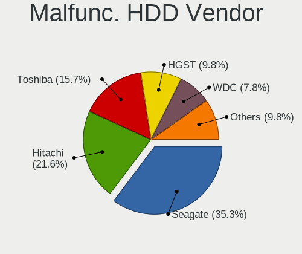

| Vendor              | Notebooks | Drives | Percent |
|---------------------|-----------|--------|---------|
| Seagate             | 18        | 31     | 33.96%  |
| Hitachi             | 11        | 13     | 20.75%  |
| Toshiba             | 9         | 9      | 16.98%  |
| HGST                | 6         | 6      | 11.32%  |
| WDC                 | 4         | 4      | 7.55%   |
| Fujitsu             | 4         | 8      | 7.55%   |
| Samsung Electronics | 1         | 1      | 1.89%   |

Malfunc. Drive Kind
-------------------

Kinds of faulty drives

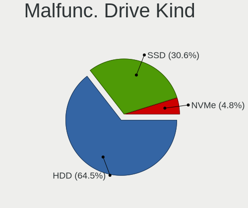

| Kind | Notebooks | Drives | Percent |
|------|-----------|--------|---------|
| HDD  | 53        | 72     | 65.43%  |
| SSD  | 25        | 33     | 30.86%  |
| NVMe | 3         | 4      | 3.7%    |

Failed Drives
-------------

Failed drive models

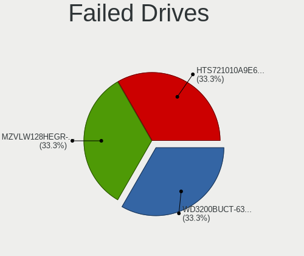

| Model                                        | Notebooks | Drives | Percent |
|----------------------------------------------|-----------|--------|---------|
| WDC WD3200BUCT-63TWBY0 320GB                 | 1         | 1      | 33.33%  |
| Samsung Electronics MZVLW128HEGR-000L2 128GB | 1         | 2      | 33.33%  |
| HGST HTS721010A9E630 1TB                     | 1         | 1      | 33.33%  |

Failed Drive Vendor
-------------------

Failed drive vendors

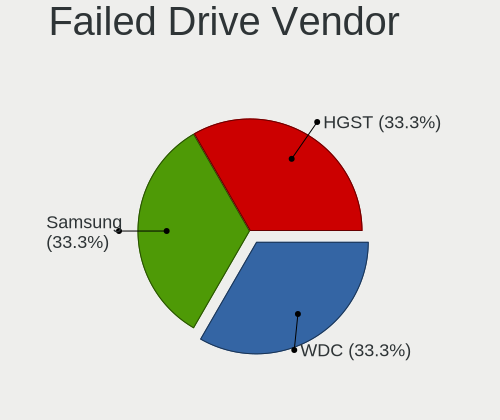

| Vendor              | Notebooks | Drives | Percent |
|---------------------|-----------|--------|---------|
| WDC                 | 1         | 1      | 33.33%  |
| Samsung Electronics | 1         | 2      | 33.33%  |
| HGST                | 1         | 1      | 33.33%  |

Drive Status
------------

Number of failed and malfunc. drives

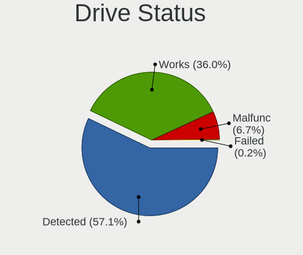

| Status   | Notebooks | Drives | Percent |
|----------|-----------|--------|---------|
| Detected | 640       | 1072   | 55.08%  |
| Works    | 440       | 608    | 37.87%  |
| Malfunc  | 79        | 109    | 6.8%    |
| Failed   | 3         | 4      | 0.26%   |

Storage controller
------------------

Storage Vendor
--------------

Storage controller vendors

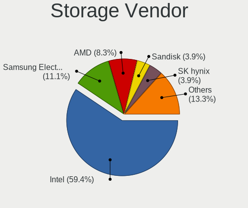

| Vendor                           | Notebooks | Percent |
|----------------------------------|-----------|---------|
| Intel                            | 769       | 59.61%  |
| Samsung Electronics              | 142       | 11.01%  |
| AMD                              | 103       | 7.98%   |
| SK hynix                         | 52        | 4.03%   |
| SanDisk                          | 52        | 4.03%   |
| Micron Technology                | 29        | 2.25%   |
| Kingston Technology Company      | 25        | 1.94%   |
| Toshiba America Info Systems     | 22        | 1.71%   |
| KIOXIA                           | 16        | 1.24%   |
| Micron/Crucial Technology        | 14        | 1.09%   |
| Nvidia                           | 10        | 0.78%   |
| Phison Electronics               | 9         | 0.7%    |
| Union Memory (Shenzhen)          | 7         | 0.54%   |
| Solid State Storage Technology   | 7         | 0.54%   |
| Seagate Technology               | 5         | 0.39%   |
| Marvell Technology Group         | 5         | 0.39%   |
| Apple                            | 5         | 0.39%   |
| Silicon Motion                   | 3         | 0.23%   |
| Silicon Image                    | 3         | 0.23%   |
| Silicon Integrated Systems [SiS] | 2         | 0.16%   |
| Lite-On Technology               | 2         | 0.16%   |
| ADATA Technology                 | 2         | 0.16%   |
| VIA Technologies                 | 1         | 0.08%   |
| Transcend                        | 1         | 0.08%   |
| Lenovo                           | 1         | 0.08%   |
| INNOGRIT                         | 1         | 0.08%   |
| Biwin Storage Technology         | 1         | 0.08%   |
| ASMedia Technology               | 1         | 0.08%   |

Storage Model
-------------

Storage controller models

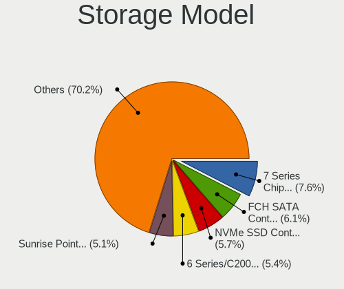

| Model                                                                          | Notebooks | Percent |
|--------------------------------------------------------------------------------|-----------|---------|
| Intel 7 Series Chipset Family 6-port SATA Controller [AHCI mode]               | 94        | 6.72%   |
| AMD FCH SATA Controller [AHCI mode]                                            | 85        | 6.08%   |
| Intel Sunrise Point-LP SATA Controller [AHCI mode]                             | 77        | 5.5%    |
| Samsung NVMe SSD Controller SM981/PM981/PM983                                  | 73        | 5.22%   |
| Intel 6 Series/C200 Series Chipset Family 6 port Mobile SATA AHCI Controller   | 72        | 5.15%   |
| Intel 82801 Mobile SATA Controller [RAID mode]                                 | 66        | 4.72%   |
| Intel 82801IBM/IEM (ICH9M/ICH9M-E) 4 port SATA Controller [AHCI mode]          | 49        | 3.5%    |
| Intel Cannon Lake Mobile PCH SATA AHCI Controller                              | 36        | 2.57%   |
| Intel Volume Management Device NVMe RAID Controller                            | 35        | 2.5%    |
| Intel 8 Series SATA Controller 1 [AHCI mode]                                   | 35        | 2.5%    |
| Intel 8 Series/C220 Series Chipset Family 6-port SATA Controller 1 [AHCI mode] | 34        | 2.43%   |
| Samsung NVMe SSD Controller 980 (DRAM-less)                                    | 31        | 2.22%   |
| Intel Wildcat Point-LP SATA Controller [AHCI Mode]                             | 27        | 1.93%   |
| Intel 5 Series/3400 Series Chipset 4 port SATA AHCI Controller                 | 27        | 1.93%   |
| Intel 82801HM/HEM (ICH8M/ICH8M-E) IDE Controller                               | 26        | 1.86%   |
| Intel 82801HM/HEM (ICH8M/ICH8M-E) SATA Controller [AHCI mode]                  | 25        | 1.79%   |
| Intel HM170/QM170 Chipset SATA Controller [AHCI Mode]                          | 24        | 1.72%   |
| Samsung NVMe SSD Controller PM9A1/PM9A3/980PRO                                 | 20        | 1.43%   |
| Intel 5 Series/3400 Series Chipset 6 port SATA AHCI Controller                 | 17        | 1.22%   |
| SanDisk Extreme Pro / WD Black SN750 / PC SN730 / Red SN700 NVMe SSD           | 15        | 1.07%   |
| Intel Tiger Lake-LP SATA Controller                                            | 15        | 1.07%   |
| SK hynix Gold P31/BC711/PC711 NVMe Solid State Drive                           | 14        | 1%      |
| Samsung NVMe SSD Controller SM961/PM961/SM963                                  | 14        | 1%      |
| AMD SB7x0/SB8x0/SB9x0 SATA Controller [AHCI mode]                              | 14        | 1%      |
| KIOXIA NVMe SSD Controller BG4 (DRAM-less)                                     | 13        | 0.93%   |
| Intel Atom Processor E3800 Series SATA AHCI Controller                         | 13        | 0.93%   |
| Intel SSD 660P Series                                                          | 12        | 0.86%   |
| Intel Celeron/Pentium Silver Processor SATA Controller                         | 12        | 0.86%   |
| Toshiba America Info Systems XG6 NVMe SSD Controller                           | 11        | 0.79%   |
| SK hynix PC611 NVMe Solid State Drive                                          | 11        | 0.79%   |
| Intel Q170/Q150/B150/H170/H110/Z170/CM236 Chipset SATA Controller [AHCI Mode]  | 11        | 0.79%   |
| Intel 82801G (ICH7 Family) IDE Controller                                      | 11        | 0.79%   |
| Intel 400 Series Chipset Family SATA AHCI Controller                           | 11        | 0.79%   |
| SanDisk Ultra 3D / WD Blue SN550 NVMe SSD                                      | 10        | 0.71%   |
| Intel SSD DC P4101/Pro 7600p/760p/E 6100p Series                               | 10        | 0.71%   |
| Intel SSD 670p Series [Keystone Harbor]                                        | 10        | 0.71%   |
| Intel Cannon Point-LP SATA Controller [AHCI Mode]                              | 10        | 0.71%   |
| Intel 82801GBM/GHM (ICH7-M Family) SATA Controller [IDE mode]                  | 10        | 0.71%   |
| Micron 2210 NVMe SSD [Cobain]                                                  | 9         | 0.64%   |
| SK hynix BC501 NVMe Solid State Drive                                          | 8         | 0.57%   |

Storage Kind
------------

Kind of storage controller (IDE, SATA, NVMe, SAS, ...)

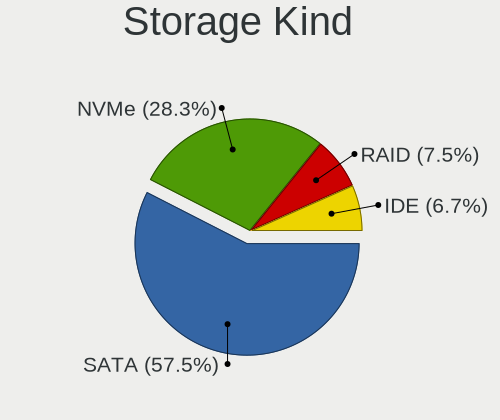

| Kind | Notebooks | Percent |
|------|-----------|---------|
| SATA | 753       | 56.19%  |
| NVMe | 402       | 30%     |
| RAID | 107       | 7.99%   |
| IDE  | 78        | 5.82%   |

Processor
---------

CPU Vendor
----------

Processor vendors

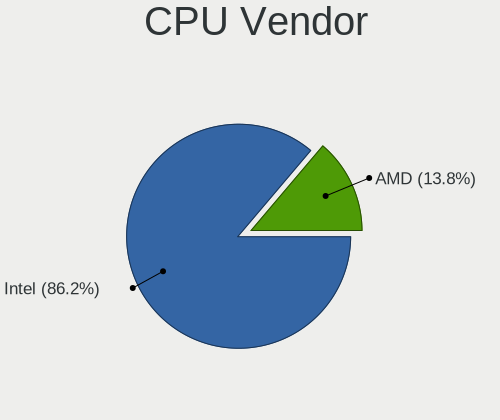

| Vendor | Notebooks | Percent |
|--------|-----------|---------|
| Intel  | 912       | 83.67%  |
| AMD    | 178       | 16.33%  |

CPU Model
---------

Processor models

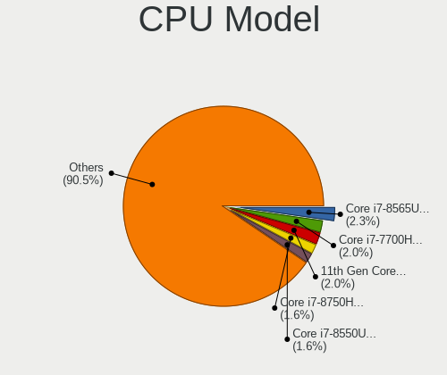

| Model                                         | Notebooks | Percent |
|-----------------------------------------------|-----------|---------|
| Intel Core i7-8565U CPU @ 1.80GHz             | 24        | 2.2%    |
| Intel Core i7-7700HQ CPU @ 2.80GHz            | 22        | 2.02%   |
| Intel 11th Gen Core i7-1165G7 @ 2.80GHz       | 22        | 2.02%   |
| Intel Core i7-8550U CPU @ 1.80GHz             | 18        | 1.65%   |
| Intel Core i7-8750H CPU @ 2.20GHz             | 17        | 1.56%   |
| Intel Core i7-10750H CPU @ 2.60GHz            | 16        | 1.47%   |
| Intel Core i5-8250U CPU @ 1.60GHz             | 16        | 1.47%   |
| Intel Core i7-9750H CPU @ 2.60GHz             | 14        | 1.28%   |
| Intel Core i5-3210M CPU @ 2.50GHz             | 14        | 1.28%   |
| Intel Core i5-7200U CPU @ 2.50GHz             | 13        | 1.19%   |
| Intel 11th Gen Core i5-1135G7 @ 2.40GHz       | 13        | 1.19%   |
| Intel Core i5-2520M CPU @ 2.50GHz             | 12        | 1.1%    |
| AMD Ryzen 5 5500U with Radeon Graphics        | 12        | 1.1%    |
| Intel Core i5-6300U CPU @ 2.40GHz             | 11        | 1.01%   |
| Intel Core i5-6200U CPU @ 2.30GHz             | 10        | 0.92%   |
| Intel Core i5-3230M CPU @ 2.60GHz             | 10        | 0.92%   |
| Intel Core i5-2430M CPU @ 2.40GHz             | 10        | 0.92%   |
| Intel Core i3-2350M CPU @ 2.30GHz             | 10        | 0.92%   |
| Intel Core 2 Duo CPU P8600 @ 2.40GHz          | 10        | 0.92%   |
| AMD Ryzen 7 4800H with Radeon Graphics        | 10        | 0.92%   |
| Intel Core i7-3630QM CPU @ 2.40GHz            | 9         | 0.82%   |
| Intel Core i5-4210U CPU @ 1.70GHz             | 9         | 0.82%   |
| Intel Core i5-3320M CPU @ 2.60GHz             | 9         | 0.82%   |
| Intel Core i7-8665U CPU @ 1.90GHz             | 8         | 0.73%   |
| Intel Core i7-7500U CPU @ 2.70GHz             | 8         | 0.73%   |
| Intel Core i7-10510U CPU @ 1.80GHz            | 8         | 0.73%   |
| Intel Core i5-4300U CPU @ 1.90GHz             | 8         | 0.73%   |
| Intel Core i5-2410M CPU @ 2.30GHz             | 8         | 0.73%   |
| Intel Core i5-10210U CPU @ 1.60GHz            | 8         | 0.73%   |
| Intel Core i5 CPU M 520 @ 2.40GHz             | 8         | 0.73%   |
| Intel Celeron CPU N2840 @ 2.16GHz             | 8         | 0.73%   |
| AMD Ryzen 7 5700U with Radeon Graphics        | 8         | 0.73%   |
| AMD Ryzen 5 3500U with Radeon Vega Mobile Gfx | 8         | 0.73%   |
| AMD Custom APU 0405                           | 8         | 0.73%   |
| Intel Core i7-3632QM CPU @ 2.20GHz            | 7         | 0.64%   |
| Intel Core i5-5300U CPU @ 2.30GHz             | 7         | 0.64%   |
| Intel Core i5-4210M CPU @ 2.60GHz             | 7         | 0.64%   |
| Intel Core i3-2310M CPU @ 2.10GHz             | 7         | 0.64%   |
| Intel Core 2 Duo CPU P8700 @ 2.53GHz          | 7         | 0.64%   |
| Intel Core i7-8650U CPU @ 1.90GHz             | 6         | 0.55%   |

CPU Model Family
----------------

Processor model prefix

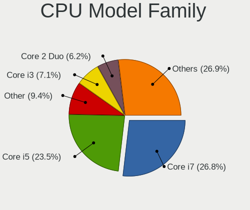

| Model                   | Notebooks | Percent |
|-------------------------|-----------|---------|
| Intel Core i7           | 296       | 27.16%  |
| Intel Core i5           | 252       | 23.12%  |
| Other                   | 100       | 9.17%   |
| Intel Core i3           | 75        | 6.88%   |
| Intel Core 2 Duo        | 67        | 6.15%   |
| AMD Ryzen 5             | 38        | 3.49%   |
| Intel Celeron           | 34        | 3.12%   |
| AMD Ryzen 7             | 31        | 2.84%   |
| Intel Pentium           | 19        | 1.74%   |
| Intel Atom              | 16        | 1.47%   |
| AMD Ryzen 7 PRO         | 14        | 1.28%   |
| AMD E1                  | 12        | 1.1%    |
| Intel Pentium Dual-Core | 11        | 1.01%   |
| AMD Ryzen 9             | 11        | 1.01%   |
| Intel Core 2            | 9         | 0.83%   |
| AMD E                   | 9         | 0.83%   |
| AMD A6                  | 9         | 0.83%   |
| Intel Genuine           | 8         | 0.73%   |
| AMD Ryzen 5 PRO         | 8         | 0.73%   |
| Intel Core i9           | 7         | 0.64%   |
| AMD A4                  | 7         | 0.64%   |
| Intel Pentium Silver    | 6         | 0.55%   |
| AMD A8                  | 6         | 0.55%   |
| AMD Ryzen 3             | 5         | 0.46%   |
| Intel Pentium Dual      | 3         | 0.28%   |
| Intel Celeron M         | 3         | 0.28%   |
| AMD Turion 64 X2 Mobile | 3         | 0.28%   |
| Intel Xeon              | 2         | 0.18%   |
| Intel Pentium 4         | 2         | 0.18%   |
| Intel Core m5           | 2         | 0.18%   |
| Intel Core M            | 2         | 0.18%   |
| Intel Core Duo          | 2         | 0.18%   |
| Intel Celeron Dual-Core | 2         | 0.18%   |
| AMD Athlon II           | 2         | 0.18%   |
| AMD A12                 | 2         | 0.18%   |
| Intel Pentium M         | 1         | 0.09%   |
| Intel Mobile Pentium 4  | 1         | 0.09%   |
| Intel Core m3           | 1         | 0.09%   |
| Intel Core 2 Quad       | 1         | 0.09%   |
| Intel Core              | 1         | 0.09%   |

CPU Cores
---------

Number of processor cores

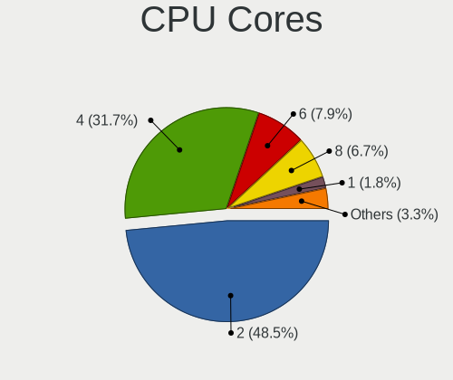

| Number  | Notebooks | Percent |
|---------|-----------|---------|
| 2       | 529       | 48.49%  |
| 4       | 346       | 31.71%  |
| 6       | 86        | 7.88%   |
| 8       | 74        | 6.78%   |
| 1       | 20        | 1.83%   |
| 10      | 13        | 1.19%   |
| 12      | 11        | 1.01%   |
| 14      | 7         | 0.64%   |
| Unknown | 4         | 0.37%   |
| 16      | 1         | 0.09%   |

CPU Sockets
-----------

Number of sockets

| Number | Notebooks | Percent |
|--------|-----------|---------|
| 1      | 1090      | 100%    |

CPU Threads
-----------

Threads per core (Hyper-Threading)

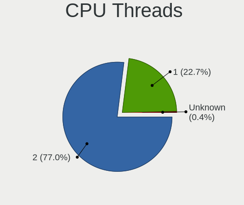

| Number  | Notebooks | Percent |
|---------|-----------|---------|
| 2       | 841       | 77.01%  |
| 1       | 247       | 22.62%  |
| Unknown | 4         | 0.37%   |

CPU Op-Modes
------------

CPU Operation Modes (32-bit, 64-bit)

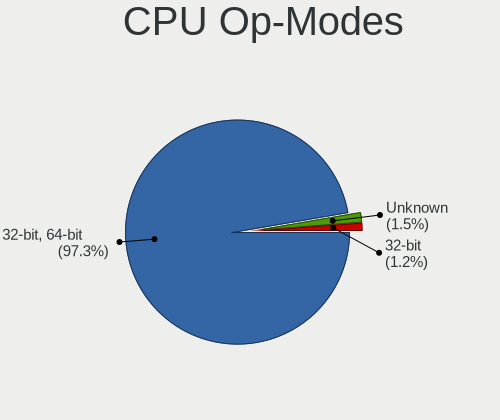

| Op mode        | Notebooks | Percent |
|----------------|-----------|---------|
| 32-bit, 64-bit | 1067      | 97.62%  |
| Unknown        | 14        | 1.28%   |
| 32-bit         | 12        | 1.1%    |

CPU Microcode
-------------

Microcode number

| Number     | Notebooks | Percent |
|------------|-----------|---------|
| Unknown    | 309       | 27.2%   |
| 0x306a9    | 77        | 6.78%   |
| 0x206a7    | 63        | 5.55%   |
| 0x806ea    | 38        | 3.35%   |
| 0x806ec    | 35        | 3.08%   |
| 0x1067a    | 35        | 3.08%   |
| 0x40651    | 34        | 2.99%   |
| 0x306c3    | 31        | 2.73%   |
| 0x906ea    | 28        | 2.46%   |
| 0x806c1    | 28        | 2.46%   |
| 0x406e3    | 26        | 2.29%   |
| 0x306d4    | 25        | 2.2%    |
| 0x20655    | 25        | 2.2%    |
| 0x906e9    | 23        | 2.02%   |
| 0x806e9    | 22        | 1.94%   |
| 0xa0652    | 20        | 1.76%   |
| 0x6fd      | 20        | 1.76%   |
| 0x08600106 | 16        | 1.41%   |
| 0x10676    | 15        | 1.32%   |
| 0x0a50000c | 15        | 1.32%   |
| 0x30678    | 14        | 1.23%   |
| 0x08608103 | 14        | 1.23%   |
| 0x806eb    | 10        | 0.88%   |
| 0x806d1    | 9         | 0.79%   |
| 0x07030105 | 9         | 0.79%   |
| 0x05000119 | 9         | 0.79%   |
| 0x906a4    | 8         | 0.7%    |
| 0x6f6      | 8         | 0.7%    |
| 0x506e3    | 8         | 0.7%    |
| 0x20652    | 8         | 0.7%    |
| 0x0700010f | 8         | 0.7%    |
| 0x906a3    | 7         | 0.62%   |
| 0x08600103 | 7         | 0.62%   |
| 0x6fb      | 6         | 0.53%   |
| 0x08108109 | 6         | 0.53%   |
| 0x08108102 | 6         | 0.53%   |
| 0x06006705 | 6         | 0.53%   |
| 0x706a1    | 5         | 0.44%   |
| 0x406c4    | 5         | 0.44%   |
| 0x106ca    | 5         | 0.44%   |

CPU Microarch
-------------

Microarchitecture

| Name             | Notebooks | Percent |
|------------------|-----------|---------|
| KabyLake         | 218       | 19.98%  |
| IvyBridge        | 94        | 8.62%   |
| Haswell          | 86        | 7.88%   |
| SandyBridge      | 85        | 7.79%   |
| Penryn           | 60        | 5.5%    |
| Skylake          | 51        | 4.67%   |
| TigerLake        | 46        | 4.22%   |
| Unknown          | 45        | 4.12%   |
| Westmere         | 44        | 4.03%   |
| Core             | 40        | 3.67%   |
| Broadwell        | 34        | 3.12%   |
| Zen 2            | 33        | 3.02%   |
| CometLake        | 32        | 2.93%   |
| Silvermont       | 29        | 2.66%   |
| Alderlake Hybrid | 25        | 2.29%   |
| Zen 3            | 24        | 2.2%    |
| Icelake          | 17        | 1.56%   |
| Zen+             | 15        | 1.37%   |
| Bobcat           | 15        | 1.37%   |
| Goldmont plus    | 13        | 1.19%   |
| Puma             | 12        | 1.1%    |
| Jaguar           | 11        | 1.01%   |
| Excavator        | 10        | 0.92%   |
| Bonnell          | 10        | 0.92%   |
| Zen              | 8         | 0.73%   |
| P6               | 8         | 0.73%   |
| Nehalem          | 5         | 0.46%   |
| K8 Hammer        | 4         | 0.37%   |
| NetBurst         | 3         | 0.27%   |
| K8 & K10 hybrid  | 3         | 0.27%   |
| K10              | 3         | 0.27%   |
| Tremont          | 2         | 0.18%   |
| Piledriver       | 2         | 0.18%   |
| K10 Llano        | 2         | 0.18%   |
| Goldmont         | 2         | 0.18%   |

Graphics
--------

GPU Vendor
----------

Vendors of graphics cards

| Vendor                           | Notebooks | Percent |
|----------------------------------|-----------|---------|
| Intel                            | 792       | 56.77%  |
| Nvidia                           | 341       | 24.44%  |
| AMD                              | 260       | 18.64%  |
| VIA Technologies                 | 1         | 0.07%   |
| Silicon Integrated Systems [SiS] | 1         | 0.07%   |

GPU Model
---------

Graphics card models

| Model                                                                                    | Notebooks | Percent |
|------------------------------------------------------------------------------------------|-----------|---------|
| Intel 3rd Gen Core processor Graphics Controller                                         | 86        | 5.98%   |
| Intel 2nd Generation Core Processor Family Integrated Graphics Controller                | 72        | 5.01%   |
| Intel TigerLake-LP GT2 [Iris Xe Graphics]                                                | 45        | 3.13%   |
| Intel Haswell-ULT Integrated Graphics Controller                                         | 45        | 3.13%   |
| Intel UHD Graphics 620                                                                   | 43        | 2.99%   |
| Intel CoffeeLake-H GT2 [UHD Graphics 630]                                                | 41        | 2.85%   |
| Intel WhiskeyLake-U GT2 [UHD Graphics 620]                                               | 40        | 2.78%   |
| Intel 4th Gen Core Processor Integrated Graphics Controller                              | 36        | 2.51%   |
| Intel Skylake GT2 [HD Graphics 520]                                                      | 33        | 2.3%    |
| AMD Renoir [Radeon RX Vega 6 (Ryzen 4000/5000 Mobile Series)]                            | 30        | 2.09%   |
| Intel Mobile 4 Series Chipset Integrated Graphics Controller                             | 28        | 1.95%   |
| Intel HD Graphics 5500                                                                   | 28        | 1.95%   |
| Intel Core Processor Integrated Graphics Controller                                      | 28        | 1.95%   |
| Intel HD Graphics 620                                                                    | 27        | 1.88%   |
| Intel CometLake-H GT2 [UHD Graphics]                                                     | 24        | 1.67%   |
| Intel HD Graphics 630                                                                    | 22        | 1.53%   |
| Intel CometLake-U GT2 [UHD Graphics]                                                     | 21        | 1.46%   |
| AMD Lucienne                                                                             | 20        | 1.39%   |
| Nvidia TU117M [GeForce GTX 1650 Mobile / Max-Q]                                          | 19        | 1.32%   |
| Intel Mobile GM965/GL960 Integrated Graphics Controller (secondary)                      | 19        | 1.32%   |
| Intel Mobile GM965/GL960 Integrated Graphics Controller (primary)                        | 19        | 1.32%   |
| Nvidia GP107M [GeForce GTX 1050 Mobile]                                                  | 18        | 1.25%   |
| AMD Cezanne [Radeon Vega Series / Radeon Vega Mobile Series]                             | 17        | 1.18%   |
| Intel Atom Processor Z36xxx/Z37xxx Series Graphics & Display                             | 16        | 1.11%   |
| AMD Picasso/Raven 2 [Radeon Vega Series / Radeon Vega Mobile Series]                     | 15        | 1.04%   |
| Intel Alder Lake-P GT2 [Iris Xe Graphics]                                                | 13        | 0.9%    |
| Intel Atom/Celeron/Pentium Processor x5-E8000/J3xxx/N3xxx Integrated Graphics Controller | 12        | 0.84%   |
| Nvidia GA107M [GeForce RTX 3050 Mobile]                                                  | 11        | 0.77%   |
| Nvidia GA106M [GeForce RTX 3060 Mobile / Max-Q]                                          | 11        | 0.77%   |
| Intel TigerLake-H GT1 [UHD Graphics]                                                     | 11        | 0.77%   |
| Intel Mobile 945GM/GMS/GME, 943/940GML Express Integrated Graphics Controller            | 11        | 0.77%   |
| AMD Seymour [Radeon HD 6400M/7400M Series]                                               | 11        | 0.77%   |
| Nvidia TU106M [GeForce RTX 2060 Mobile]                                                  | 9         | 0.63%   |
| Nvidia GP107M [GeForce GTX 1050 Ti Mobile]                                               | 9         | 0.63%   |
| Nvidia GM108M [GeForce 940MX]                                                            | 9         | 0.63%   |
| AMD Topaz XT [Radeon R7 M260/M265 / M340/M360 / M440/M445 / 530/535 / 620/625 Mobile]    | 9         | 0.63%   |
| Nvidia GF117M [GeForce 610M/710M/810M/820M / GT 620M/625M/630M/720M]                     | 8         | 0.56%   |
| Intel Mobile 945GM/GMS, 943/940GML Express Integrated Graphics Controller                | 8         | 0.56%   |
| Intel GeminiLake [UHD Graphics 600]                                                      | 8         | 0.56%   |
| AMD VanGogh [AMD Custom GPU 0405]                                                        | 8         | 0.56%   |

GPU Combo
---------

Combinations of graphics cards

| Name           | Notebooks | Percent |
|----------------|-----------|---------|
| 1 x Intel      | 508       | 46.31%  |
| Intel + Nvidia | 234       | 21.33%  |
| 1 x AMD        | 177       | 16.13%  |
| 1 x Nvidia     | 86        | 7.84%   |
| Intel + AMD    | 50        | 4.56%   |
| AMD + Nvidia   | 22        | 2.01%   |
| 2 x AMD        | 11        | 1%      |
| Other          | 3         | 0.27%   |
| 2 x Intel      | 3         | 0.27%   |
| 2 x Nvidia     | 1         | 0.09%   |
| 1 x VIA        | 1         | 0.09%   |
| 1 x SiS        | 1         | 0.09%   |

GPU Driver
----------

Free vs proprietary

| Driver      | Notebooks | Percent |
|-------------|-----------|---------|
| Free        | 917       | 82.46%  |
| Proprietary | 167       | 15.02%  |
| Unknown     | 28        | 2.52%   |

GPU Memory
----------

Total video memory

| Size in GB | Notebooks | Percent |
|------------|-----------|---------|
| Unknown    | 668       | 59.38%  |
| 0.01-0.5   | 152       | 13.51%  |
| 1.01-2.0   | 128       | 11.38%  |
| 0.51-1.0   | 80        | 7.11%   |
| 3.01-4.0   | 58        | 5.16%   |
| 7.01-8.0   | 18        | 1.6%    |
| 5.01-6.0   | 15        | 1.33%   |
| 2.01-3.0   | 5         | 0.44%   |
| 8.01-16.0  | 1         | 0.09%   |

Monitor
-------

Monitor Vendor
--------------

Monitor vendors

| Vendor                  | Notebooks | Percent |
|-------------------------|-----------|---------|
| AU Optronics            | 281       | 22.64%  |
| LG Display              | 191       | 15.39%  |
| Samsung Electronics     | 140       | 11.28%  |
| Chimei Innolux          | 134       | 10.8%   |
| BOE                     | 121       | 9.75%   |
| Sharp                   | 43        | 3.46%   |
| Dell                    | 37        | 2.98%   |
| Chi Mei Optoelectronics | 32        | 2.58%   |
| Apple                   | 30        | 2.42%   |
| Lenovo                  | 25        | 2.01%   |
| Iiyama                  | 22        | 1.77%   |
| Hewlett-Packard         | 21        | 1.69%   |
| Philips                 | 18        | 1.45%   |
| Goldstar                | 15        | 1.21%   |
| PANDA                   | 9         | 0.73%   |
| LG Philips              | 9         | 0.73%   |
| AOC                     | 9         | 0.73%   |
| CSO                     | 8         | 0.64%   |
| BenQ                    | 8         | 0.64%   |
| InfoVision              | 7         | 0.56%   |
| Valve                   | 6         | 0.48%   |
| Unknown                 | 6         | 0.48%   |
| Sony                    | 5         | 0.4%    |
| Seiko/Epson             | 5         | 0.4%    |
| Panasonic               | 5         | 0.4%    |
| Acer                    | 5         | 0.4%    |
| Vestel Elektronik       | 4         | 0.32%   |
| Quanta Display          | 4         | 0.32%   |
| Medion                  | 4         | 0.32%   |
| ASUSTek Computer        | 4         | 0.32%   |
| HannStar                | 3         | 0.24%   |
| TMX                     | 2         | 0.16%   |
| Eizo                    | 2         | 0.16%   |
| Arnos Instruments       | 2         | 0.16%   |
| Analogix                | 2         | 0.16%   |
| ___                     | 1         | 0.08%   |
| WST                     | 1         | 0.08%   |
| ViewSonic               | 1         | 0.08%   |
| RGB                     | 1         | 0.08%   |
| Nvidia                  | 1         | 0.08%   |

Monitor Model
-------------

Monitor models

| Model                                                                     | Notebooks | Percent |
|---------------------------------------------------------------------------|-----------|---------|
| AU Optronics LCD Monitor AUO21ED 1920x1080 344x193mm 15.5-inch            | 18        | 1.43%   |
| Samsung Electronics LCD Monitor SEC5441 1366x768 344x194mm 15.5-inch      | 14        | 1.11%   |
| AU Optronics LCD Monitor AUO38ED 1920x1080 344x193mm 15.5-inch            | 11        | 0.87%   |
| LG Display LCD Monitor LGD02DC 1366x768 344x194mm 15.5-inch               | 10        | 0.79%   |
| AU Optronics LCD Monitor AUO139E 1600x900 382x214mm 17.2-inch             | 9         | 0.71%   |
| Chimei Innolux LCD Monitor CMN14D4 1920x1080 309x173mm 13.9-inch          | 8         | 0.63%   |
| AU Optronics LCD Monitor AUO26EC 1366x768 344x193mm 15.5-inch             | 8         | 0.63%   |
| AU Optronics LCD Monitor AUO23ED 1920x1080 344x193mm 15.5-inch            | 8         | 0.63%   |
| LG Display LCD Monitor LGD046F 1920x1080 344x194mm 15.5-inch              | 7         | 0.55%   |
| AU Optronics LCD Monitor AUO5B2D 1920x1080 293x162mm 13.2-inch            | 7         | 0.55%   |
| AU Optronics LCD Monitor AUO159E 1600x900 382x214mm 17.2-inch             | 7         | 0.55%   |
| Valve ANX7530 U VLV3001 800x1280 100x150mm 7.1-inch                       | 6         | 0.48%   |
| Lenovo LCD Monitor LEN40BA 1920x1080 344x194mm 15.5-inch                  | 6         | 0.48%   |
| Chimei Innolux LCD Monitor CMN1738 1920x1080 381x214mm 17.2-inch          | 6         | 0.48%   |
| Chi Mei Optoelectronics LCD Monitor CMO1720 1920x1080 380x210mm 17.1-inch | 6         | 0.48%   |
| Samsung Electronics LCD Monitor SEC4251 1366x768 344x194mm 15.5-inch      | 5         | 0.4%    |
| LG Display LCD Monitor LGD0563 1920x1080 344x194mm 15.5-inch              | 5         | 0.4%    |
| Chimei Innolux LCD Monitor CMN14D2 1920x1080 309x173mm 13.9-inch          | 5         | 0.4%    |
| Chi Mei Optoelectronics LCD Monitor CMO1719 1600x900 382x215mm 17.3-inch  | 5         | 0.4%    |
| AU Optronics LCD Monitor AUO573D 1920x1080 309x174mm 14.0-inch            | 5         | 0.4%    |
| AU Optronics LCD Monitor AUO35ED 1920x1080 344x193mm 15.5-inch            | 5         | 0.4%    |
| AU Optronics LCD Monitor AUO22EC 1366x768 344x193mm 15.5-inch             | 5         | 0.4%    |
| AU Optronics LCD Monitor AUO149E 1600x900 382x214mm 17.2-inch             | 5         | 0.4%    |
| AU Optronics LCD Monitor AUO109E 1600x900 382x214mm 17.2-inch             | 5         | 0.4%    |
| Apple Color LCD APP9CDF 1440x900 286x179mm 13.3-inch                      | 5         | 0.4%    |
| Vestel Elektronik 55UHD_LCD_TV VES3700 3840x2160 1872x1053mm 84.6-inch    | 4         | 0.32%   |
| Sharp LCD Monitor SHP149A 1920x1080 344x194mm 15.5-inch                   | 4         | 0.32%   |
| Sharp LCD Monitor SHP1449 1920x1080 294x165mm 13.3-inch                   | 4         | 0.32%   |
| Panasonic TDM13O56 MEI96A2 3000x2000 285x190mm 13.5-inch                  | 4         | 0.32%   |
| LG Display LCD Monitor LGD04E8 1920x1080 382x215mm 17.3-inch              | 4         | 0.32%   |
| LG Display LCD Monitor LGD04A7 1920x1080 344x194mm 15.5-inch              | 4         | 0.32%   |
| LG Display LCD Monitor LGD039F 1366x768 345x194mm 15.6-inch               | 4         | 0.32%   |
| LG Display LCD Monitor LGD034C 1366x768 293x165mm 13.2-inch               | 4         | 0.32%   |
| Lenovo LCD Monitor LEN40B1 1600x900 344x193mm 15.5-inch                   | 4         | 0.32%   |
| Chimei Innolux LCD Monitor CMN1735 1920x1080 382x215mm 17.3-inch          | 4         | 0.32%   |
| Chimei Innolux LCD Monitor CMN15F6 1920x1080 344x193mm 15.5-inch          | 4         | 0.32%   |
| Chimei Innolux LCD Monitor CMN15DB 1366x768 344x193mm 15.5-inch           | 4         | 0.32%   |
| Chimei Innolux LCD Monitor CMN15AB 1366x768 344x193mm 15.5-inch           | 4         | 0.32%   |
| Chimei Innolux LCD Monitor CMN1482 1600x900 309x174mm 14.0-inch           | 4         | 0.32%   |
| Chi Mei Optoelectronics LCD Monitor CMO15A7 1366x768 344x193mm 15.5-inch  | 4         | 0.32%   |

Monitor Resolution
------------------

Monitor screen resolution

| Resolution         | Notebooks | Percent |
|--------------------|-----------|---------|
| 1920x1080 (FHD)    | 505       | 43.35%  |
| 1366x768 (WXGA)    | 228       | 19.57%  |
| 1600x900 (HD+)     | 122       | 10.47%  |
| 3840x2160 (4K)     | 62        | 5.32%   |
| 2560x1440 (QHD)    | 44        | 3.78%   |
| 1280x800 (WXGA)    | 37        | 3.18%   |
| 1440x900 (WXGA+)   | 30        | 2.58%   |
| 1920x1200 (WUXGA)  | 24        | 2.06%   |
| 1680x1050 (WSXGA+) | 14        | 1.2%    |
| 2560x1600          | 13        | 1.12%   |
| 800x1280           | 7         | 0.6%    |
| 1280x1024 (SXGA)   | 7         | 0.6%    |
| 1024x600           | 7         | 0.6%    |
| 3440x1440          | 6         | 0.52%   |
| 3200x1800 (QHD+)   | 6         | 0.52%   |
| 2880x1800          | 6         | 0.52%   |
| Unknown            | 6         | 0.52%   |
| 3840x2400          | 5         | 0.43%   |
| 1680x945           | 5         | 0.43%   |
| 1360x768           | 5         | 0.43%   |
| 1024x768 (XGA)     | 3         | 0.26%   |
| 3840x1080          | 2         | 0.17%   |
| 2880x1620          | 2         | 0.17%   |
| 2560x1080          | 2         | 0.17%   |
| 1920x1280          | 2         | 0.17%   |
| 7680x2160          | 1         | 0.09%   |
| 6320x1800          | 1         | 0.09%   |
| 3600x1080          | 1         | 0.09%   |
| 3520x1080          | 1         | 0.09%   |
| 3456x2160          | 1         | 0.09%   |
| 3200x1080          | 1         | 0.09%   |
| 2880x1920          | 1         | 0.09%   |
| 2304x1440          | 1         | 0.09%   |
| 2256x1504          | 1         | 0.09%   |
| 2160x1440          | 1         | 0.09%   |
| 2048x1152          | 1         | 0.09%   |
| 1920x515           | 1         | 0.09%   |
| 1600x1200          | 1         | 0.09%   |
| 1280x720 (HD)      | 1         | 0.09%   |
| 1024x576           | 1         | 0.09%   |

Monitor Diagonal
----------------

Diagonal size in inches

| Inches  | Notebooks | Percent |
|---------|-----------|---------|
| 15      | 505       | 40.79%  |
| 17      | 172       | 13.89%  |
| 13      | 141       | 11.39%  |
| 14      | 100       | 8.08%   |
| 24      | 52        | 4.2%    |
| 27      | 45        | 3.63%   |
| Unknown | 31        | 2.5%    |
| 23      | 27        | 2.18%   |
| 12      | 24        | 1.94%   |
| 21      | 22        | 1.78%   |
| 18      | 15        | 1.21%   |
| 16      | 13        | 1.05%   |
| 11      | 12        | 0.97%   |
| 10      | 11        | 0.89%   |
| 22      | 7         | 0.57%   |
| 84      | 6         | 0.48%   |
| 34      | 6         | 0.48%   |
| 7       | 6         | 0.48%   |
| 72      | 5         | 0.4%    |
| 25      | 5         | 0.4%    |
| 54      | 4         | 0.32%   |
| 31      | 4         | 0.32%   |
| 20      | 4         | 0.32%   |
| 40      | 3         | 0.24%   |
| 32      | 3         | 0.24%   |
| 19      | 3         | 0.24%   |
| 39      | 2         | 0.16%   |
| 29      | 2         | 0.16%   |
| 3       | 2         | 0.16%   |
| 65      | 1         | 0.08%   |
| 63      | 1         | 0.08%   |
| 52      | 1         | 0.08%   |
| 43      | 1         | 0.08%   |
| 42      | 1         | 0.08%   |
| 35      | 1         | 0.08%   |

Monitor Width
-------------

Physical width

| Width in mm | Notebooks | Percent |
|-------------|-----------|---------|
| 301-350     | 652       | 53.05%  |
| 351-400     | 195       | 15.87%  |
| 201-300     | 136       | 11.07%  |
| 501-600     | 118       | 9.6%    |
| 401-500     | 44        | 3.58%   |
| Unknown     | 31        | 2.52%   |
| 601-700     | 11        | 0.9%    |
| 1501-2000   | 11        | 0.9%    |
| 701-800     | 9         | 0.73%   |
| 1001-1500   | 7         | 0.57%   |
| 1-100       | 7         | 0.57%   |
| 801-900     | 6         | 0.49%   |
| 901-1000    | 2         | 0.16%   |

Aspect Ratio
------------

Proportional relationship between the width and the height

| Ratio   | Notebooks | Percent |
|---------|-----------|---------|
| 16/9    | 894       | 83.09%  |
| 16/10   | 129       | 11.99%  |
| Unknown | 21        | 1.95%   |
| 5/4     | 7         | 0.65%   |
| 21/9    | 7         | 0.65%   |
| 0.67    | 6         | 0.56%   |
| 3/2     | 5         | 0.46%   |
| 4/3     | 4         | 0.37%   |
| 6/5     | 2         | 0.19%   |
| 3.73    | 1         | 0.09%   |

Monitor Area
------------

Area in inch²

| Area in inch² | Notebooks | Percent |
|----------------|-----------|---------|
| 101-110        | 503       | 40.93%  |
| 81-90          | 161       | 13.1%   |
| 121-130        | 148       | 12.04%  |
| 201-250        | 85        | 6.92%   |
| 71-80          | 80        | 6.51%   |
| 301-350        | 45        | 3.66%   |
| Unknown        | 31        | 2.52%   |
| 61-70          | 24        | 1.95%   |
| 131-140        | 24        | 1.95%   |
| More than 1000 | 18        | 1.46%   |
| 351-500        | 16        | 1.3%    |
| 251-300        | 15        | 1.22%   |
| 151-200        | 15        | 1.22%   |
| 141-150        | 13        | 1.06%   |
| 111-120        | 13        | 1.06%   |
| 51-60          | 12        | 0.98%   |
| 41-50          | 11        | 0.9%    |
| 1-40           | 7         | 0.57%   |
| 501-1000       | 7         | 0.57%   |
| 91-100         | 1         | 0.08%   |

Pixel Density
-------------

Pixels per inch

| Density       | Notebooks | Percent |
|---------------|-----------|---------|
| 121-160       | 493       | 40.91%  |
| 101-120       | 343       | 28.46%  |
| 51-100        | 182       | 15.1%   |
| 161-240       | 100       | 8.3%    |
| More than 240 | 44        | 3.65%   |
| Unknown       | 31        | 2.57%   |
| 1-50          | 12        | 1%      |

Multiple Monitors
-----------------

Total monitors connected

| Total | Notebooks | Percent |
|-------|-----------|---------|
| 1     | 879       | 78.62%  |
| 2     | 181       | 16.19%  |
| 0     | 35        | 3.13%   |
| 3     | 22        | 1.97%   |
| 4     | 1         | 0.09%   |

Network
-------

Net Controller Vendor
---------------------

Controller vendors

| Vendor                            | Notebooks | Percent |
|-----------------------------------|-----------|---------|
| Intel                             | 641       | 36.24%  |
| Realtek Semiconductor             | 553       | 31.26%  |
| Qualcomm Atheros                  | 236       | 13.34%  |
| Broadcom                          | 110       | 6.22%   |
| Broadcom Limited                  | 28        | 1.58%   |
| MediaTek                          | 25        | 1.41%   |
| Marvell Technology Group          | 18        | 1.02%   |
| Ralink                            | 17        | 0.96%   |
| TP-Link                           | 14        | 0.79%   |
| ASIX Electronics                  | 11        | 0.62%   |
| Nvidia                            | 10        | 0.57%   |
| Dell                              | 10        | 0.57%   |
| Ralink Technology                 | 9         | 0.51%   |
| Lenovo                            | 9         | 0.51%   |
| DisplayLink                       | 9         | 0.51%   |
| Ericsson Business Mobile Networks | 7         | 0.4%    |
| Hewlett-Packard                   | 6         | 0.34%   |
| Sierra Wireless                   | 5         | 0.28%   |
| JMicron Technology                | 5         | 0.28%   |
| D-Link System                     | 5         | 0.28%   |
| Qualcomm                          | 4         | 0.23%   |
| Samsung Electronics               | 3         | 0.17%   |
| ASUSTek Computer                  | 3         | 0.17%   |
| Silicon Integrated Systems [SiS]  | 2         | 0.11%   |
| Motorola PCS                      | 2         | 0.11%   |
| Huawei Technologies               | 2         | 0.11%   |
| Fibocom                           | 2         | 0.11%   |
| D-Link                            | 2         | 0.11%   |
| Attansic Technology               | 2         | 0.11%   |
| Apple                             | 2         | 0.11%   |
| ADMtek                            | 2         | 0.11%   |
| Z-Com                             | 1         | 0.06%   |
| Xiaomi                            | 1         | 0.06%   |
| VIA Technologies                  | 1         | 0.06%   |
| Shenzhen Goodix Technology        | 1         | 0.06%   |
| Seeed Technology                  | 1         | 0.06%   |
| Panasonic (Matsushita)            | 1         | 0.06%   |
| OPPO Electronics                  | 1         | 0.06%   |
| OnePlus Technology (Shenzhen)     | 1         | 0.06%   |
| Microsoft                         | 1         | 0.06%   |

Net Controller Model
--------------------

Controller models

| Model                                                             | Notebooks | Percent |
|-------------------------------------------------------------------|-----------|---------|
| Realtek RTL8111/8168/8411 PCI Express Gigabit Ethernet Controller | 334       | 15.39%  |
| Realtek RTL810xE PCI Express Fast Ethernet controller             | 81        | 3.73%   |
| Realtek RTL8153 Gigabit Ethernet Adapter                          | 75        | 3.46%   |
| Intel Wi-Fi 6 AX200                                               | 74        | 3.41%   |
| Intel Wireless 7260                                               | 45        | 2.07%   |
| Qualcomm Atheros AR9485 Wireless Network Adapter                  | 43        | 1.98%   |
| Intel Wireless 8265 / 8275                                        | 40        | 1.84%   |
| Intel 82579LM Gigabit Network Connection (Lewisville)             | 39        | 1.8%    |
| Intel Wireless 8260                                               | 35        | 1.61%   |
| Intel Centrino Advanced-N 6205 [Taylor Peak]                      | 33        | 1.52%   |
| Intel Wi-Fi 6 AX201                                               | 32        | 1.47%   |
| Qualcomm Atheros QCA9565 / AR9565 Wireless Network Adapter        | 31        | 1.43%   |
| Qualcomm Atheros QCA6174 802.11ac Wireless Network Adapter        | 29        | 1.34%   |
| Qualcomm Atheros AR9285 Wireless Network Adapter (PCI-Express)    | 29        | 1.34%   |
| Intel Wireless 7265                                               | 29        | 1.34%   |
| Intel Comet Lake PCH CNVi WiFi                                    | 27        | 1.24%   |
| Intel Cannon Point-LP CNVi [Wireless-AC]                          | 26        | 1.2%    |
| Realtek RTL8822CE 802.11ac PCIe Wireless Network Adapter          | 25        | 1.15%   |
| Qualcomm Atheros QCA9377 802.11ac Wireless Network Adapter        | 25        | 1.15%   |
| Realtek RTL8821CE 802.11ac PCIe Wireless Network Adapter          | 22        | 1.01%   |
| Intel PRO/Wireless 3945ABG [Golan] Network Connection             | 22        | 1.01%   |
| Intel Cannon Lake PCH CNVi WiFi                                   | 22        | 1.01%   |
| Qualcomm Atheros AR8151 v2.0 Gigabit Ethernet                     | 20        | 0.92%   |
| Intel Alder Lake-P PCH CNVi WiFi                                  | 20        | 0.92%   |
| Intel Ethernet Connection I218-LM                                 | 19        | 0.88%   |
| Realtek RTL8723BE PCIe Wireless Network Adapter                   | 18        | 0.83%   |
| Intel Wireless-AC 9260                                            | 18        | 0.83%   |
| Intel Centrino Wireless-N 2230                                    | 17        | 0.78%   |
| Broadcom BCM4313 802.11bgn Wireless Network Adapter               | 17        | 0.78%   |
| Intel WiFi Link 5100                                              | 15        | 0.69%   |
| Intel Centrino Advanced-N 6200                                    | 15        | 0.69%   |
| Qualcomm Atheros AR9287 Wireless Network Adapter (PCI-Express)    | 14        | 0.65%   |
| Qualcomm Atheros AR8161 Gigabit Ethernet                          | 14        | 0.65%   |
| Intel Ethernet Connection I219-LM                                 | 14        | 0.65%   |
| Broadcom BCM43142 802.11b/g/n                                     | 14        | 0.65%   |
| Intel PRO/Wireless 4965 AG or AGN [Kedron] Network Connection     | 13        | 0.6%    |
| Intel Ethernet Connection I217-LM                                 | 13        | 0.6%    |
| Intel Centrino Ultimate-N 6300                                    | 13        | 0.6%    |
| Intel Centrino Advanced-N 6235                                    | 13        | 0.6%    |
| Intel 82577LM Gigabit Network Connection                          | 13        | 0.6%    |

Wireless Vendor
---------------

Wireless vendors

| Vendor                                | Notebooks | Percent |
|---------------------------------------|-----------|---------|
| Intel                                 | 614       | 54.29%  |
| Qualcomm Atheros                      | 196       | 17.33%  |
| Realtek Semiconductor                 | 133       | 11.76%  |
| Broadcom                              | 76        | 6.72%   |
| MediaTek                              | 21        | 1.86%   |
| Broadcom Limited                      | 19        | 1.68%   |
| Ralink                                | 17        | 1.5%    |
| TP-Link                               | 9         | 0.8%    |
| Ralink Technology                     | 9         | 0.8%    |
| Dell                                  | 6         | 0.53%   |
| Sierra Wireless                       | 5         | 0.44%   |
| D-Link System                         | 5         | 0.44%   |
| Qualcomm                              | 4         | 0.35%   |
| Ericsson Business Mobile Networks     | 3         | 0.27%   |
| ASUSTek Computer                      | 3         | 0.27%   |
| Fibocom                               | 2         | 0.18%   |
| D-Link                                | 2         | 0.18%   |
| Z-Com                                 | 1         | 0.09%   |
| Panasonic (Matsushita)                | 1         | 0.09%   |
| Microsoft                             | 1         | 0.09%   |
| Hewlett-Packard                       | 1         | 0.09%   |
| Edimax Technology                     | 1         | 0.09%   |
| Belkin Components                     | 1         | 0.09%   |
| 802.11g Adapter [Linksys WUSB54GC v3] | 1         | 0.09%   |

Wireless Model
--------------

Wireless models

| Model                                                                   | Notebooks | Percent |
|-------------------------------------------------------------------------|-----------|---------|
| Intel Wi-Fi 6 AX200                                                     | 74        | 6.51%   |
| Intel Wireless 7260                                                     | 45        | 3.96%   |
| Qualcomm Atheros AR9485 Wireless Network Adapter                        | 43        | 3.78%   |
| Intel Wireless 8265 / 8275                                              | 40        | 3.52%   |
| Intel Wireless 8260                                                     | 35        | 3.08%   |
| Intel Centrino Advanced-N 6205 [Taylor Peak]                            | 33        | 2.9%    |
| Intel Wi-Fi 6 AX201                                                     | 32        | 2.81%   |
| Qualcomm Atheros QCA9565 / AR9565 Wireless Network Adapter              | 31        | 2.73%   |
| Qualcomm Atheros QCA6174 802.11ac Wireless Network Adapter              | 29        | 2.55%   |
| Qualcomm Atheros AR9285 Wireless Network Adapter (PCI-Express)          | 29        | 2.55%   |
| Intel Wireless 7265                                                     | 29        | 2.55%   |
| Intel Comet Lake PCH CNVi WiFi                                          | 27        | 2.37%   |
| Intel Cannon Point-LP CNVi [Wireless-AC]                                | 26        | 2.29%   |
| Realtek RTL8822CE 802.11ac PCIe Wireless Network Adapter                | 25        | 2.2%    |
| Qualcomm Atheros QCA9377 802.11ac Wireless Network Adapter              | 25        | 2.2%    |
| Realtek RTL8821CE 802.11ac PCIe Wireless Network Adapter                | 22        | 1.93%   |
| Intel PRO/Wireless 3945ABG [Golan] Network Connection                   | 22        | 1.93%   |
| Intel Cannon Lake PCH CNVi WiFi                                         | 22        | 1.93%   |
| Intel Alder Lake-P PCH CNVi WiFi                                        | 20        | 1.76%   |
| Realtek RTL8723BE PCIe Wireless Network Adapter                         | 18        | 1.58%   |
| Intel Wireless-AC 9260                                                  | 18        | 1.58%   |
| Intel Centrino Wireless-N 2230                                          | 17        | 1.5%    |
| Broadcom BCM4313 802.11bgn Wireless Network Adapter                     | 17        | 1.5%    |
| Intel WiFi Link 5100                                                    | 15        | 1.32%   |
| Intel Centrino Advanced-N 6200                                          | 15        | 1.32%   |
| Qualcomm Atheros AR9287 Wireless Network Adapter (PCI-Express)          | 14        | 1.23%   |
| Broadcom BCM43142 802.11b/g/n                                           | 14        | 1.23%   |
| Intel PRO/Wireless 4965 AG or AGN [Kedron] Network Connection           | 13        | 1.14%   |
| Intel Centrino Ultimate-N 6300                                          | 13        | 1.14%   |
| Intel Centrino Advanced-N 6235                                          | 13        | 1.14%   |
| MediaTek MT7921 802.11ax PCI Express Wireless Network Adapter           | 12        | 1.06%   |
| Intel Comet Lake PCH-LP CNVi WiFi                                       | 12        | 1.06%   |
| Realtek RTL8188CE 802.11b/g/n WiFi Adapter                              | 11        | 0.97%   |
| Intel Wireless 3160                                                     | 11        | 0.97%   |
| Intel Wireless 3165                                                     | 10        | 0.88%   |
| Intel Centrino Wireless-N 1000 [Condor Peak]                            | 10        | 0.88%   |
| Qualcomm Atheros AR242x / AR542x Wireless Network Adapter (PCI-Express) | 9         | 0.79%   |
| Broadcom BCM43228 802.11a/b/g/n                                         | 9         | 0.79%   |
| Realtek RTL8822BE 802.11a/b/g/n/ac WiFi adapter                         | 8         | 0.7%    |
| Realtek RTL8723DE Wireless Network Adapter                              | 8         | 0.7%    |

Ethernet Vendor
---------------

Ethernet vendors

| Vendor                           | Notebooks | Percent |
|----------------------------------|-----------|---------|
| Realtek Semiconductor            | 503       | 50.3%   |
| Intel                            | 262       | 26.2%   |
| Qualcomm Atheros                 | 84        | 8.4%    |
| Broadcom                         | 47        | 4.7%    |
| Marvell Technology Group         | 18        | 1.8%    |
| ASIX Electronics                 | 11        | 1.1%    |
| Nvidia                           | 10        | 1%      |
| Lenovo                           | 9         | 0.9%    |
| DisplayLink                      | 9         | 0.9%    |
| Broadcom Limited                 | 9         | 0.9%    |
| JMicron Technology               | 5         | 0.5%    |
| Hewlett-Packard                  | 5         | 0.5%    |
| TP-Link                          | 4         | 0.4%    |
| MediaTek                         | 4         | 0.4%    |
| Samsung Electronics              | 3         | 0.3%    |
| Silicon Integrated Systems [SiS] | 2         | 0.2%    |
| Motorola PCS                     | 2         | 0.2%    |
| Attansic Technology              | 2         | 0.2%    |
| Apple                            | 2         | 0.2%    |
| ADMtek                           | 2         | 0.2%    |
| Xiaomi                           | 1         | 0.1%    |
| VIA Technologies                 | 1         | 0.1%    |
| OPPO Electronics                 | 1         | 0.1%    |
| OnePlus Technology (Shenzhen)    | 1         | 0.1%    |
| Microchip Technology             | 1         | 0.1%    |
| Huawei Technologies              | 1         | 0.1%    |
| Google                           | 1         | 0.1%    |

Ethernet Model
--------------

Ethernet models

| Model                                                             | Notebooks | Percent |
|-------------------------------------------------------------------|-----------|---------|
| Realtek RTL8111/8168/8411 PCI Express Gigabit Ethernet Controller | 334       | 32.97%  |
| Realtek RTL810xE PCI Express Fast Ethernet controller             | 81        | 8%      |
| Realtek RTL8153 Gigabit Ethernet Adapter                          | 75        | 7.4%    |
| Intel 82579LM Gigabit Network Connection (Lewisville)             | 39        | 3.85%   |
| Qualcomm Atheros AR8151 v2.0 Gigabit Ethernet                     | 20        | 1.97%   |
| Intel Ethernet Connection I218-LM                                 | 19        | 1.88%   |
| Qualcomm Atheros AR8161 Gigabit Ethernet                          | 14        | 1.38%   |
| Intel Ethernet Connection I219-LM                                 | 14        | 1.38%   |
| Intel Ethernet Connection I217-LM                                 | 13        | 1.28%   |
| Intel 82577LM Gigabit Network Connection                          | 13        | 1.28%   |
| Intel Ethernet Connection (4) I219-V                              | 12        | 1.18%   |
| Intel Ethernet Connection (4) I219-LM                             | 12        | 1.18%   |
| Intel Ethernet Connection (6) I219-V                              | 11        | 1.09%   |
| Intel 82567LM Gigabit Network Connection                          | 11        | 1.09%   |
| Intel Ethernet Connection (3) I218-LM                             | 10        | 0.99%   |
| Intel 82566MM Gigabit Network Connection                          | 10        | 0.99%   |
| ASIX AX88179 Gigabit Ethernet                                     | 10        | 0.99%   |
| Realtek RTL8125 2.5GbE Controller                                 | 9         | 0.89%   |
| Qualcomm Atheros AR8131 Gigabit Ethernet                          | 9         | 0.89%   |
| Intel Ethernet Connection (6) I219-LM                             | 9         | 0.89%   |
| Intel 82579V Gigabit Network Connection                           | 9         | 0.89%   |
| Broadcom NetLink BCM5784M Gigabit Ethernet PCIe                   | 8         | 0.79%   |
| Intel Ethernet Connection I219-V                                  | 7         | 0.69%   |
| Intel Ethernet Connection I217-V                                  | 7         | 0.69%   |
| Broadcom NetLink BCM57785 Gigabit Ethernet PCIe                   | 7         | 0.69%   |
| Broadcom NetLink BCM57780 Gigabit Ethernet PCIe                   | 7         | 0.69%   |
| Qualcomm Atheros Killer E220x Gigabit Ethernet Controller         | 6         | 0.59%   |
| Intel Ethernet Connection (7) I219-LM                             | 6         | 0.59%   |
| Intel Ethernet Connection (16) I219-LM                            | 6         | 0.59%   |
| Intel Ethernet Connection (13) I219-LM                            | 6         | 0.59%   |
| Realtek RTL8152 Fast Ethernet Adapter                             | 5         | 0.49%   |
| Qualcomm Atheros Killer E2500 Gigabit Ethernet Controller         | 5         | 0.49%   |
| Qualcomm Atheros Killer E2400 Gigabit Ethernet Controller         | 5         | 0.49%   |
| Qualcomm Atheros AR8152 v2.0 Fast Ethernet                        | 5         | 0.49%   |
| Qualcomm Atheros AR8121/AR8113/AR8114 Gigabit or Fast Ethernet    | 5         | 0.49%   |
| Nvidia MCP79 Ethernet                                             | 5         | 0.49%   |
| Marvell Group 88E8055 PCI-E Gigabit Ethernet Controller           | 5         | 0.49%   |
| JMicron JMC250 PCI Express Gigabit Ethernet Controller            | 5         | 0.49%   |
| Broadcom NetXtreme BCM57765 Gigabit Ethernet PCIe                 | 5         | 0.49%   |
| TP-Link UE300 10/100/1000 LAN (ethernet mode) [Realtek RTL8153]   | 4         | 0.39%   |

Net Controller Kind
-------------------

Ethernet, WiFi or modem

| Kind     | Notebooks | Percent |
|----------|-----------|---------|
| WiFi     | 1078      | 52.61%  |
| Ethernet | 951       | 46.41%  |
| Modem    | 17        | 0.83%   |
| Unknown  | 3         | 0.15%   |

Used Controller
---------------

Currently used network controller

| Kind     | Notebooks | Percent |
|----------|-----------|---------|
| WiFi     | 849       | 71.59%  |
| Ethernet | 337       | 28.41%  |

NICs
----

Total network controllers on board

| Total | Notebooks | Percent |
|-------|-----------|---------|
| 2     | 845       | 77.24%  |
| 1     | 222       | 20.29%  |
| 3     | 14        | 1.28%   |
| 0     | 12        | 1.1%    |
| 4     | 1         | 0.09%   |

IPv6
----

IPv6 vs IPv4

| Used | Notebooks | Percent |
|------|-----------|---------|
| No   | 764       | 67.73%  |
| Yes  | 364       | 32.27%  |

Bluetooth
---------

Bluetooth Vendor
----------------

Controller vendors

| Vendor                          | Notebooks | Percent |
|---------------------------------|-----------|---------|
| Intel                           | 445       | 52.73%  |
| Realtek Semiconductor           | 78        | 9.24%   |
| Qualcomm Atheros Communications | 53        | 6.28%   |
| Broadcom                        | 46        | 5.45%   |
| IMC Networks                    | 41        | 4.86%   |
| Foxconn / Hon Hai               | 39        | 4.62%   |
| Dell                            | 26        | 3.08%   |
| Apple                           | 25        | 2.96%   |
| Hewlett-Packard                 | 24        | 2.84%   |
| Lite-On Technology              | 23        | 2.73%   |
| Toshiba                         | 12        | 1.42%   |
| ASUSTek Computer                | 6         | 0.71%   |
| Ralink                          | 5         | 0.59%   |
| Alps Electric                   | 5         | 0.59%   |
| Foxconn International           | 4         | 0.47%   |
| Cambridge Silicon Radio         | 4         | 0.47%   |
| Ralink Technology               | 3         | 0.36%   |
| MediaTek                        | 2         | 0.24%   |
| USI                             | 1         | 0.12%   |
| Realtek                         | 1         | 0.12%   |
| Micro Star International        | 1         | 0.12%   |

Bluetooth Model
---------------

Controller models

| Model                                               | Notebooks | Percent |
|-----------------------------------------------------|-----------|---------|
| Intel Bluetooth wireless interface                  | 163       | 19.29%  |
| Intel Bluetooth Device                              | 97        | 11.48%  |
| Intel AX200 Bluetooth                               | 73        | 8.64%   |
| Intel Bluetooth 9460/9560 Jefferson Peak (JfP)      | 58        | 6.86%   |
| Realtek Bluetooth Radio                             | 44        | 5.21%   |
| Intel Centrino Bluetooth Wireless Transceiver       | 25        | 2.96%   |
| Realtek  Bluetooth 4.2 Adapter                      | 22        | 2.6%    |
| Intel Wireless-AC 9260 Bluetooth Adapter            | 17        | 2.01%   |
| Qualcomm Atheros QCA61x4 Bluetooth 4.0              | 16        | 1.89%   |
| Foxconn / Hon Hai Bluetooth Device                  | 14        | 1.66%   |
| IMC Networks Bluetooth Device                       | 13        | 1.54%   |
| Apple Bluetooth Host Controller                     | 13        | 1.54%   |
| Qualcomm Atheros  Bluetooth Device                  | 12        | 1.42%   |
| HP Bluetooth 2.0 Interface [Broadcom BCM2045]       | 12        | 1.42%   |
| Qualcomm Atheros AR3011 Bluetooth                   | 11        | 1.3%    |
| Lite-On Qualcomm Atheros QCA9377 Bluetooth          | 11        | 1.3%    |
| HP Broadcom 2070 Bluetooth Combo                    | 11        | 1.3%    |
| Dell DW375 Bluetooth Module                         | 10        | 1.18%   |
| Broadcom HP Portable SoftSailing                    | 10        | 1.18%   |
| Broadcom BCM2045B (BDC-2.1)                         | 10        | 1.18%   |
| Qualcomm Atheros AR3012 Bluetooth 4.0               | 9         | 1.07%   |
| Apple Bluetooth USB Host Controller                 | 9         | 1.07%   |
| IMC Networks Bluetooth Radio                        | 8         | 0.95%   |
| IMC Networks 802.11ac WLAN Adapter                  | 8         | 0.95%   |
| Foxconn / Hon Hai MediaTek Bluetooth Adapter        | 8         | 0.95%   |
| Dell BCM20702A0 Bluetooth Module                    | 8         | 0.95%   |
| Intel AX210 Bluetooth                               | 7         | 0.83%   |
| Foxconn / Hon Hai Bluetooth USB Host Controller     | 6         | 0.71%   |
| Toshiba Bluetooth Device                            | 5         | 0.59%   |
| Realtek RTL8821A Bluetooth                          | 5         | 0.59%   |
| Ralink RT3290 Bluetooth                             | 5         | 0.59%   |
| Lite-On Bluetooth Device                            | 5         | 0.59%   |
| Lite-On Atheros AR3012 Bluetooth                    | 5         | 0.59%   |
| IMC Networks Wireless_Device                        | 4         | 0.47%   |
| IMC Networks Atheros AR3012 Bluetooth 4.0 Adapter   | 4         | 0.47%   |
| Foxconn International BCM43142A0 Bluetooth module   | 4         | 0.47%   |
| Cambridge Silicon Radio Bluetooth Dongle (HCI mode) | 4         | 0.47%   |
| Broadcom HP Portable Bumble Bee                     | 4         | 0.47%   |
| Broadcom BCM2045 Bluetooth                          | 4         | 0.47%   |
| Realtek RTL8822BE Bluetooth 4.2 Adapter             | 3         | 0.36%   |

Sound
-----

Sound Vendor
------------

Sound card vendors

| Vendor                               | Notebooks | Percent |
|--------------------------------------|-----------|---------|
| Intel                                | 896       | 64.18%  |
| AMD                                  | 214       | 15.33%  |
| Nvidia                               | 188       | 13.47%  |
| GN Netcom                            | 12        | 0.86%   |
| Hewlett-Packard                      | 11        | 0.79%   |
| C-Media Electronics                  | 11        | 0.79%   |
| Realtek Semiconductor                | 10        | 0.72%   |
| Logitech                             | 7         | 0.5%    |
| Plantronics                          | 6         | 0.43%   |
| Lenovo                               | 3         | 0.21%   |
| Corsair                              | 3         | 0.21%   |
| Texas Instruments                    | 2         | 0.14%   |
| Silicon Integrated Systems [SiS]     | 2         | 0.14%   |
| Roland                               | 2         | 0.14%   |
| Razer USA                            | 2         | 0.14%   |
| Kingston Technology                  | 2         | 0.14%   |
| DSEA A/S                             | 2         | 0.14%   |
| Apple                                | 2         | 0.14%   |
| VIA Technologies                     | 1         | 0.07%   |
| Thesycon Systemsoftware & Consulting | 1         | 0.07%   |
| SteelSeries ApS                      | 1         | 0.07%   |
| Sennheiser electronic                | 1         | 0.07%   |
| Samson Technologies                  | 1         | 0.07%   |
| RODE Microphones                     | 1         | 0.07%   |
| QinHeng Electronics                  | 1         | 0.07%   |
| Pioneer DJ                           | 1         | 0.07%   |
| Pioneer                              | 1         | 0.07%   |
| OPPO Electronics                     | 1         | 0.07%   |
| M-Audio                              | 1         | 0.07%   |
| JMTek                                | 1         | 0.07%   |
| Guillemot                            | 1         | 0.07%   |
| Focusrite-Novation                   | 1         | 0.07%   |
| FIFINE Microphones                   | 1         | 0.07%   |
| Dell                                 | 1         | 0.07%   |
| Bose                                 | 1         | 0.07%   |
| Audio-Technica                       | 1         | 0.07%   |
| ASUSTek Computer                     | 1         | 0.07%   |
| Alesis                               | 1         | 0.07%   |
| AKAI                                 | 1         | 0.07%   |

Sound Model
-----------

Sound card models

| Model                                                                      | Notebooks | Percent |
|----------------------------------------------------------------------------|-----------|---------|
| Intel Sunrise Point-LP HD Audio                                            | 118       | 7.1%    |
| AMD Family 17h/19h HD Audio Controller                                     | 107       | 6.44%   |
| Intel 7 Series/C216 Chipset Family High Definition Audio Controller        | 103       | 6.2%    |
| Intel 6 Series/C200 Series Chipset Family High Definition Audio Controller | 76        | 4.58%   |
| AMD Renoir Radeon High Definition Audio Controller                         | 63        | 3.79%   |
| Intel 82801I (ICH9 Family) HD Audio Controller                             | 52        | 3.13%   |
| Intel 5 Series/3400 Series Chipset High Definition Audio                   | 49        | 2.95%   |
| Intel Tiger Lake-LP Smart Sound Technology Audio Controller                | 46        | 2.77%   |
| Intel Cannon Lake PCH cAVS                                                 | 46        | 2.77%   |
| Intel Haswell-ULT HD Audio Controller                                      | 45        | 2.71%   |
| Intel 8 Series HD Audio Controller                                         | 45        | 2.71%   |
| Intel Cannon Point-LP High Definition Audio Controller                     | 43        | 2.59%   |
| Intel 8 Series/C220 Series Chipset High Definition Audio Controller        | 41        | 2.47%   |
| Intel Xeon E3-1200 v3/4th Gen Core Processor HD Audio Controller           | 35        | 2.11%   |
| Intel Wildcat Point-LP High Definition Audio Controller                    | 34        | 2.05%   |
| Intel Broadwell-U Audio Controller                                         | 34        | 2.05%   |
| AMD FCH Azalia Controller                                                  | 32        | 1.93%   |
| Intel Comet Lake PCH cAVS                                                  | 31        | 1.87%   |
| Intel 82801H (ICH8 Family) HD Audio Controller                             | 30        | 1.81%   |
| Intel CM238 HD Audio Controller                                            | 28        | 1.69%   |
| AMD Kabini HDMI/DP Audio                                                   | 26        | 1.57%   |
| Intel NM10/ICH7 Family High Definition Audio Controller                    | 24        | 1.44%   |
| Nvidia TU107 GeForce GTX 1650 High Definition Audio Controller             | 23        | 1.38%   |
| Intel Alder Lake PCH-P High Definition Audio Controller                    | 23        | 1.38%   |
| AMD Raven/Raven2/Fenghuang HDMI/DP Audio Controller                        | 23        | 1.38%   |
| Intel Comet Lake PCH-LP cAVS                                               | 22        | 1.32%   |
| Nvidia GF108 High Definition Audio Controller                              | 21        | 1.26%   |
| Nvidia TU106 High Definition Audio Controller                              | 15        | 0.9%    |
| Nvidia GK107 HDMI Audio Controller                                         | 15        | 0.9%    |
| AMD SBx00 Azalia (Intel HDA)                                               | 15        | 0.9%    |
| Intel Atom Processor Z36xxx/Z37xxx Series High Definition Audio Controller | 14        | 0.84%   |
| AMD Rembrandt Radeon High Definition Audio Controller                      | 14        | 0.84%   |
| Intel Celeron/Pentium Silver Processor High Definition Audio               | 13        | 0.78%   |
| Nvidia GP107GL High Definition Audio Controller                            | 12        | 0.72%   |
| Intel Tiger Lake-H HD Audio Controller                                     | 11        | 0.66%   |
| Intel 100 Series/C230 Series Chipset Family HD Audio Controller            | 11        | 0.66%   |
| Hewlett-Packard USB Audio                                                  | 11        | 0.66%   |
| AMD Wrestler HDMI Audio                                                    | 11        | 0.66%   |
| Realtek Semiconductor USB Audio                                            | 10        | 0.6%    |
| Nvidia GM107 High Definition Audio Controller [GeForce 940MX]              | 10        | 0.6%    |

Memory
------

Memory Vendor
-------------

Memory module vendors

| Vendor              | Notebooks | Percent |
|---------------------|-----------|---------|
| Samsung Electronics | 219       | 31.29%  |
| SK hynix            | 169       | 24.14%  |
| Micron Technology   | 84        | 12%     |
| Kingston            | 70        | 10%     |
| Unknown             | 34        | 4.86%   |
| Crucial             | 31        | 4.43%   |
| Elpida              | 20        | 2.86%   |
| Ramaxel Technology  | 14        | 2%      |
| Nanya Technology    | 13        | 1.86%   |
| Corsair             | 13        | 1.86%   |
| A-DATA Technology   | 11        | 1.57%   |
| Unknown (ABCD)      | 5         | 0.71%   |
| Unknown             | 3         | 0.43%   |
| Timetec             | 2         | 0.29%   |
| GOODRAM             | 2         | 0.29%   |
| G.Skill             | 2         | 0.29%   |
| Unknown (09D5)      | 1         | 0.14%   |
| Unifosa             | 1         | 0.14%   |
| TRS STAR            | 1         | 0.14%   |
| Transcend           | 1         | 0.14%   |
| Team                | 1         | 0.14%   |
| Patriot             | 1         | 0.14%   |
| A-DA                | 1         | 0.14%   |
| A Force             | 1         | 0.14%   |

Memory Model
------------

Memory module models

| Model                                                            | Notebooks | Percent |
|------------------------------------------------------------------|-----------|---------|
| SK hynix RAM HMA81GS6AFR8N-UH 8GB SODIMM DDR4 2667MT/s           | 12        | 1.59%   |
| SK hynix RAM HMT351S6CFR8C-PB 4GB SODIMM DDR3 1600MT/s           | 9         | 1.19%   |
| Samsung RAM M471B5273DH0-CH9 4096MB SODIMM DDR3 1334MT/s         | 9         | 1.19%   |
| Samsung RAM M471A1K43DB1-CWE 8GB SODIMM DDR4 3200MT/s            | 9         | 1.19%   |
| Samsung RAM M471A1G44AB0-CWE 8GB SODIMM DDR4 3200MT/s            | 9         | 1.19%   |
| SK hynix RAM HMT451S6BFR8A-PB 4GB SODIMM DDR3 1600MT/s           | 8         | 1.06%   |
| Samsung RAM M471A2K43DB1-CWE 16GB SODIMM DDR4 3200MT/s           | 8         | 1.06%   |
| Samsung RAM M471A1K43CB1-CRC 8GB SODIMM DDR4 2667MT/s            | 8         | 1.06%   |
| SK hynix RAM HMT351S6EFR8A-PB 4GB SODIMM DDR3 1600MT/s           | 7         | 0.93%   |
| Samsung RAM M471B5173DB0-YK0 4GB SODIMM DDR3 1600MT/s            | 7         | 0.93%   |
| Samsung RAM M471B1G73QH0-YK0 8GB SODIMM DDR3 1867MT/s            | 7         | 0.93%   |
| Samsung RAM M471B1G73DB0-YK0 8GB SODIMM DDR3 1600MT/s            | 7         | 0.93%   |
| Samsung RAM M471A5244CB0-CTD 4GB SODIMM DDR4 3266MT/s            | 7         | 0.93%   |
| Samsung RAM M471A1K43DB1-CTD 8GB SODIMM DDR4 2667MT/s            | 7         | 0.93%   |
| Crucial RAM CT102464BF160B.C16 8GB SODIMM DDR3 1600MT/s          | 7         | 0.93%   |
| SK hynix RAM HMA81GS6DJR8N-XN 8GB SODIMM DDR4 3200MT/s           | 6         | 0.8%    |
| SK hynix RAM HMA81GS6CJR8N-VK 8GB SODIMM DDR4 2667MT/s           | 6         | 0.8%    |
| Unknown (ABCD) RAM 123456789012345678 2GB SODIMM LPDDR4 2400MT/s | 5         | 0.66%   |
| SK hynix RAM HMAA1GS6CJR6N-XN 8GB SODIMM DDR4 3200MT/s           | 5         | 0.66%   |
| SK hynix RAM HMA82GS6AFR8N-UH 16GB SODIMM DDR4 2667MT/s          | 5         | 0.66%   |
| SK hynix RAM H9CCNNNCLGALAR-NVD 8GB Row Of Chips LPDDR3 2133MT/s | 5         | 0.66%   |
| Samsung RAM Module 16GB SODIMM DDR4 3200MT/s                     | 5         | 0.66%   |
| Samsung RAM M471B5773DH0-CH9 2048MB SODIMM DDR3 1600MT/s         | 5         | 0.66%   |
| Samsung RAM M471B5173EB0-YK0 4GB SODIMM DDR3 1600MT/s            | 5         | 0.66%   |
| Samsung RAM M471A2G44AM0-CWE 16GB SODIMM DDR4 3200MT/s           | 5         | 0.66%   |
| Samsung RAM M471A1K43EB1-CWE 8GB SODIMM DDR4 3200MT/s            | 5         | 0.66%   |
| Elpida RAM EBJ41UF8BCS0-DJ-F 4GB SODIMM DDR3 1334MT/s            | 5         | 0.66%   |
| Unknown RAM Module 4096MB SODIMM DDR3                            | 4         | 0.53%   |
| SK hynix RAM HMAB2GS6AMR6N-XN 16GB SODIMM DDR4 3200MT/s          | 4         | 0.53%   |
| SK hynix RAM HMA851S6CJR6N-VK 4GB SODIMM DDR4 2667MT/s           | 4         | 0.53%   |
| SK hynix RAM HMA82GS6JJR8N-VK 16384MB SODIMM DDR4 2667MT/s       | 4         | 0.53%   |
| Samsung RAM Module 16384MB SODIMM DDR4 2667MT/s                  | 4         | 0.53%   |
| Samsung RAM M471B5173QH0-YK0 4GB SODIMM DDR3 1600MT/s            | 4         | 0.53%   |
| Samsung RAM M471A2G43BB2-CWE 16GB SODIMM DDR4 3200MT/s           | 4         | 0.53%   |
| Samsung RAM M471A1K43CB1-CTD 8192MB SODIMM DDR4 2667MT/s         | 4         | 0.53%   |
| Samsung RAM M4 70T5663QZ3-CF7 2GB SODIMM DDR2 2048MT/s           | 4         | 0.53%   |
| Samsung RAM K4EBE304EC-EGCG 8GB Row Of Chips LPDDR3 2133MT/s     | 4         | 0.53%   |
| Micron RAM 4ATF1G64HZ-3G2E1 8GB SODIMM DDR4 3200MT/s             | 4         | 0.53%   |
| Micron RAM 16KTF1G64HZ-1G6E1 8GB SODIMM DDR3 1600MT/s            | 4         | 0.53%   |
| Unknown RAM Module 4GB SODIMM DDR4 2400MT/s                      | 3         | 0.4%    |

Memory Kind
-----------

Memory module kinds

| Kind    | Notebooks | Percent |
|---------|-----------|---------|
| DDR4    | 306       | 49.68%  |
| DDR3    | 211       | 34.25%  |
| DDR2    | 27        | 4.38%   |
| LPDDR3  | 23        | 3.73%   |
| LPDDR4  | 16        | 2.6%    |
| SDRAM   | 14        | 2.27%   |
| DDR5    | 8         | 1.3%    |
| LPDDR5  | 7         | 1.14%   |
| Unknown | 4         | 0.65%   |

Memory Form Factor
------------------

Physical design of the memory module

| Name         | Notebooks | Percent |
|--------------|-----------|---------|
| SODIMM       | 560       | 90.91%  |
| Row Of Chips | 47        | 7.63%   |
| Chip         | 5         | 0.81%   |
| DIMM         | 3         | 0.49%   |
| Unknown      | 1         | 0.16%   |

Memory Size
-----------

Memory module size

| Size  | Notebooks | Percent |
|-------|-----------|---------|
| 8192  | 266       | 39.82%  |
| 4096  | 182       | 27.25%  |
| 16384 | 120       | 17.96%  |
| 2048  | 69        | 10.33%  |
| 32768 | 19        | 2.84%   |
| 1024  | 11        | 1.65%   |
| 8     | 1         | 0.15%   |

Memory Speed
------------

Memory module speed

| Speed   | Notebooks | Percent |
|---------|-----------|---------|
| 1600    | 145       | 21.9%   |
| 3200    | 137       | 20.69%  |
| 2667    | 126       | 19.03%  |
| 2400    | 51        | 7.7%    |
| 2133    | 43        | 6.5%    |
| 1334    | 35        | 5.29%   |
| 1333    | 24        | 3.63%   |
| 667     | 14        | 2.11%   |
| Unknown | 12        | 1.81%   |
| 4800    | 10        | 1.51%   |
| 1067    | 10        | 1.51%   |
| 2048    | 8         | 1.21%   |
| 3266    | 7         | 1.06%   |
| 800     | 7         | 1.06%   |
| 4267    | 6         | 0.91%   |
| 6400    | 5         | 0.76%   |
| 975     | 5         | 0.76%   |
| 4199    | 4         | 0.6%    |
| 1867    | 4         | 0.6%    |
| 8400    | 3         | 0.45%   |
| 7500    | 1         | 0.15%   |
| 5500    | 1         | 0.15%   |
| 4266    | 1         | 0.15%   |
| 3000    | 1         | 0.15%   |
| 1066    | 1         | 0.15%   |
| 533     | 1         | 0.15%   |

Printers & scanners
-------------------

Printer Vendor
--------------

Printer device vendors

| Vendor              | Notebooks | Percent |
|---------------------|-----------|---------|
| Hewlett-Packard     | 5         | 41.67%  |
| Samsung Electronics | 2         | 16.67%  |
| Canon               | 2         | 16.67%  |
| Brother Industries  | 2         | 16.67%  |
| Prolific Technology | 1         | 8.33%   |

Printer Model
-------------

Printer device models

| Model                         | Notebooks | Percent |
|-------------------------------|-----------|---------|
| Samsung SCX-472x Series       | 1         | 8.33%   |
| Samsung ML-1660 Series        | 1         | 8.33%   |
| Prolific PL2305 Parallel Port | 1         | 8.33%   |
| HP LaserJet CM1415fnw         | 1         | 8.33%   |
| HP LaserJet 1020              | 1         | 8.33%   |
| HP Deskjet F4500 series       | 1         | 8.33%   |
| HP DeskJet 4100 series        | 1         | 8.33%   |
| HP DeskJet 3700 series        | 1         | 8.33%   |
| Canon TS6300 series           | 1         | 8.33%   |
| Canon TS5100 series           | 1         | 8.33%   |
| Brother HL-L2350DW series     | 1         | 8.33%   |
| Brother DCP-L2530DW series    | 1         | 8.33%   |

Scanner Vendor
--------------

Scanner device vendors

| Vendor          | Notebooks | Percent |
|-----------------|-----------|---------|
| Seiko Epson     | 3         | 50%     |
| Canon           | 2         | 33.33%  |
| Hewlett-Packard | 1         | 16.67%  |

Scanner Model
-------------

Scanner device models

| Model                                            | Notebooks | Percent |
|--------------------------------------------------|-----------|---------|
| Seiko Epson GT-X750 [Perfection 4490 Photo]      | 2         | 33.33%  |
| Seiko Epson GT-X900 [Perfection V700/V750 Photo] | 1         | 16.67%  |
| HP scanjet 8270                                  | 1         | 16.67%  |
| Canon CanoScan N670U/N676U/LiDE 20               | 1         | 16.67%  |
| Canon CanoScan 3200F                             | 1         | 16.67%  |

Camera
------

Camera Vendor
-------------

Camera device vendors

| Vendor                                 | Notebooks | Percent |
|----------------------------------------|-----------|---------|
| Chicony Electronics                    | 250       | 25.99%  |
| Microdia                               | 104       | 10.81%  |
| Realtek Semiconductor                  | 85        | 8.84%   |
| IMC Networks                           | 75        | 7.8%    |
| Bison Electronics                      | 58        | 6.03%   |
| Sunplus Innovation Technology          | 47        | 4.89%   |
| Quanta                                 | 46        | 4.78%   |
| Suyin                                  | 43        | 4.47%   |
| Lite-On Technology                     | 40        | 4.16%   |
| Cheng Uei Precision Industry (Foxlink) | 35        | 3.64%   |
| Syntek                                 | 29        | 3.01%   |
| Apple                                  | 18        | 1.87%   |
| Acer                                   | 17        | 1.77%   |
| Luxvisions Innotech Limited            | 15        | 1.56%   |
| Ricoh                                  | 14        | 1.46%   |
| Alcor Micro                            | 14        | 1.46%   |
| Logitech                               | 10        | 1.04%   |
| Silicon Motion                         | 6         | 0.62%   |
| Samsung Electronics                    | 6         | 0.62%   |
| Sonix Technology                       | 5         | 0.52%   |
| Primax Electronics                     | 5         | 0.52%   |
| ALi                                    | 5         | 0.52%   |
| Lenovo                                 | 4         | 0.42%   |
| Importek                               | 4         | 0.42%   |
| Z-Star Microelectronics                | 3         | 0.31%   |
| Pixart Imaging                         | 3         | 0.31%   |
| OPPO Electronics                       | 2         | 0.21%   |
| icSpring                               | 2         | 0.21%   |
| WaveRider Communications               | 1         | 0.1%    |
| Trust                                  | 1         | 0.1%    |
| SunplusIT                              | 1         | 0.1%    |
| STEREOLABS                             | 1         | 0.1%    |
| Panasonic (Matsushita)                 | 1         | 0.1%    |
| Novatek Microelectronics               | 1         | 0.1%    |
| Mustek Systems                         | 1         | 0.1%    |
| Goertek Electronics                    | 1         | 0.1%    |
| Genesys Logic                          | 1         | 0.1%    |
| Foxconn / Hon Hai                      | 1         | 0.1%    |
| Dell                                   | 1         | 0.1%    |
| Cubeternet                             | 1         | 0.1%    |

Camera Model
------------

Camera device models

| Model                                                                      | Notebooks | Percent |
|----------------------------------------------------------------------------|-----------|---------|
| Microdia Integrated_Webcam_HD                                              | 39        | 4.04%   |
| Realtek Integrated_Webcam_HD                                               | 37        | 3.83%   |
| Chicony Integrated Camera                                                  | 34        | 3.52%   |
| IMC Networks Integrated Camera                                             | 30        | 3.11%   |
| Chicony HD Webcam                                                          | 19        | 1.97%   |
| Syntek Integrated Camera                                                   | 18        | 1.86%   |
| Bison Integrated Camera                                                    | 18        | 1.86%   |
| Quanta HP HD Camera                                                        | 17        | 1.76%   |
| IMC Networks USB2.0 HD UVC WebCam                                          | 17        | 1.76%   |
| Microdia Integrated Webcam                                                 | 16        | 1.66%   |
| Chicony HP HD Camera                                                       | 15        | 1.55%   |
| Lite-On HP HD Camera                                                       | 14        | 1.45%   |
| Lite-On Integrated Camera                                                  | 13        | 1.35%   |
| Chicony USB2.0 Camera                                                      | 13        | 1.35%   |
| Chicony HP HD Webcam                                                       | 13        | 1.35%   |
| Realtek USB Camera                                                         | 11        | 1.14%   |
| Sunplus Integrated_Webcam_HD                                               | 10        | 1.04%   |
| Sunplus HD WebCam                                                          | 10        | 1.04%   |
| Chicony USB2.0 HD UVC WebCam                                               | 9         | 0.93%   |
| Chicony TOSHIBA Web Camera - HD                                            | 9         | 0.93%   |
| Bison HD Webcam                                                            | 9         | 0.93%   |
| Acer BisonCam,NB Pro                                                       | 9         | 0.93%   |
| Chicony USB 2.0 Camera                                                     | 8         | 0.83%   |
| Chicony Integrated Camera (1280x720@30)                                    | 8         | 0.83%   |
| Suyin Acer/HP Integrated Webcam [CN0314]                                   | 7         | 0.72%   |
| Microdia Laptop_Integrated_Webcam_2M                                       | 7         | 0.72%   |
| Chicony USB2.0 VGA UVC WebCam                                              | 7         | 0.72%   |
| Chicony Integrated HP HD Webcam                                            | 7         | 0.72%   |
| Chicony HP Wide Vision HD Camera                                           | 7         | 0.72%   |
| Chicony HP TrueVision HD Camera                                            | 7         | 0.72%   |
| Samsung Galaxy series, misc. (MTP mode)                                    | 6         | 0.62%   |
| Realtek USB2.0 HD UVC WebCam                                               | 6         | 0.62%   |
| Microdia Laptop_Integrated_Webcam_HD                                       | 6         | 0.62%   |
| Microdia Integrated_Webcam_FHD                                             | 6         | 0.62%   |
| Chicony EasyCamera                                                         | 6         | 0.62%   |
| Cheng Uei Precision Industry (Foxlink) HP Wide Vision HD Integrated Webcam | 6         | 0.62%   |
| Bison SunplusIT Integrated Camera                                          | 6         | 0.62%   |
| Bison BisonCam, NB Pro                                                     | 6         | 0.62%   |
| Sunplus ASUS USB2.0 Webcam                                                 | 5         | 0.52%   |
| Realtek USB2.0 VGA UVC WebCam                                              | 5         | 0.52%   |

Security
--------

Fingerprint Vendor
------------------

Fingerprint sensor vendors

| Vendor                             | Notebooks | Percent |
|------------------------------------|-----------|---------|
| Validity Sensors                   | 83        | 37.39%  |
| Synaptics                          | 72        | 32.43%  |
| Shenzhen Goodix Technology         | 21        | 9.46%   |
| AuthenTec                          | 15        | 6.76%   |
| LighTuning Technology              | 10        | 4.5%    |
| Upek                               | 8         | 3.6%    |
| STMicroelectronics                 | 7         | 3.15%   |
| Elan Microelectronics              | 4         | 1.8%    |
| Realtek USB2.0 Finger Print Bridge | 2         | 0.9%    |

Fingerprint Model
-----------------

Fingerprint sensor models

| Model                                                                      | Notebooks | Percent |
|----------------------------------------------------------------------------|-----------|---------|
| Validity Sensors VFS495 Fingerprint Reader                                 | 29        | 13.06%  |
| Synaptics Prometheus MIS Touch Fingerprint Reader                          | 21        | 9.46%   |
| Shenzhen Goodix  Fingerprint Device                                        | 12        | 5.41%   |
| Synaptics FS7604 Touch Fingerprint Sensor with PurePrint                   | 10        | 4.5%    |
| Validity Sensors VFS451 Fingerprint Reader                                 | 8         | 3.6%    |
| Validity Sensors VFS 5011 fingerprint sensor                               | 8         | 3.6%    |
| Synaptics Fingerprint reader [HP G6]                                       | 8         | 3.6%    |
| Upek Biometric Touchchip/Touchstrip Fingerprint Sensor                     | 7         | 3.15%   |
| Synaptics Metallica MOH Touch Fingerprint Reader                           | 7         | 3.15%   |
| STMicroelectronics Fingerprint Reader                                      | 7         | 3.15%   |
| Validity Sensors VFS5011 Fingerprint Reader                                | 6         | 2.7%    |
| Validity Sensors VFS471 Fingerprint Reader                                 | 6         | 2.7%    |
| Synaptics Metallica MIS Touch Fingerprint Reader                           | 6         | 2.7%    |
| LighTuning EgisTec Touch Fingerprint Sensor                                | 6         | 2.7%    |
| AuthenTec AES2501 Fingerprint Sensor                                       | 6         | 2.7%    |
| Validity Sensors VFS491                                                    | 5         | 2.25%   |
| Synaptics  FS7604 Touch Fingerprint Sensor with PurePrint                  | 5         | 2.25%   |
| Shenzhen Goodix FingerPrint                                                | 5         | 2.25%   |
| AuthenTec AES2810                                                          | 5         | 2.25%   |
| Validity Sensors Synaptics VFS7552 Touch Fingerprint Sensor with PurePrint | 4         | 1.8%    |
| Synaptics WBDI Device                                                      | 4         | 1.8%    |
| Shenzhen Goodix Fingerprint Reader                                         | 4         | 1.8%    |
| Validity Sensors VFS7552 Touch Fingerprint Sensor                          | 3         | 1.35%   |
| Validity Sensors VFS7500 Touch Fingerprint Sensor                          | 3         | 1.35%   |
| Validity Sensors Fingerprint scanner                                       | 3         | 1.35%   |
| Synaptics TouchPad                                                         | 3         | 1.35%   |
| LighTuning Fingerprint Reader                                              | 3         | 1.35%   |
| Elan ELAN:ARM-M4                                                           | 3         | 1.35%   |
| AuthenTec AES1600                                                          | 3         | 1.35%   |
| Validity Sensors VFS101 Fingerprint Reader                                 | 2         | 0.9%    |
| Validity Sensors VFS Fingerprint sensor                                    | 2         | 0.9%    |
| Validity Sensors Synaptics WBDI                                            | 2         | 0.9%    |
| Synaptics WBDI                                                             | 2         | 0.9%    |
| Synaptics UWP WBDI Device                                                  | 2         | 0.9%    |
| Synaptics UWP WBDI                                                         | 2         | 0.9%    |
| Realtek USB2.0 Finger Print Bridge FocalTech Fingerprint Device            | 2         | 0.9%    |
| Validity Sensors VFS301 Fingerprint Reader                                 | 1         | 0.45%   |
| Validity Sensors VFS300 Fingerprint Reader                                 | 1         | 0.45%   |
| Upek TCS5B Fingerprint sensor                                              | 1         | 0.45%   |
| Synaptics WBDI Fingerprint Reader USB 086                                  | 1         | 0.45%   |

Chipcard Vendor
---------------

Chipcard module vendors

| Vendor                            | Notebooks | Percent |
|-----------------------------------|-----------|---------|
| Broadcom                          | 68        | 41.46%  |
| Alcor Micro                       | 52        | 31.71%  |
| O2 Micro                          | 13        | 7.93%   |
| Lenovo                            | 10        | 6.1%    |
| VASCO Data Security International | 5         | 3.05%   |
| Realtek Semiconductor             | 4         | 2.44%   |
| OmniKey                           | 3         | 1.83%   |
| Upek                              | 2         | 1.22%   |
| Advanced Card Systems             | 2         | 1.22%   |
| SCM Microsystems                  | 1         | 0.61%   |
| Integrated Technology Express     | 1         | 0.61%   |
| Gemalto (was Gemplus)             | 1         | 0.61%   |
| Clay Logic                        | 1         | 0.61%   |
| Chicony Electronics               | 1         | 0.61%   |

Chipcard Model
--------------

Chipcard module models

| Model                                                                        | Notebooks | Percent |
|------------------------------------------------------------------------------|-----------|---------|
| Alcor Micro AU9540 Smartcard Reader                                          | 51        | 31.1%   |
| Broadcom 58200                                                               | 25        | 15.24%  |
| Broadcom BCM5880 Secure Applications Processor                               | 18        | 10.98%  |
| Broadcom 5880                                                                | 16        | 9.76%   |
| O2 Micro OZ776 CCID Smartcard Reader                                         | 10        | 6.1%    |
| Lenovo Integrated Smart Card Reader                                          | 10        | 6.1%    |
| Broadcom BCM5880 Secure Applications Processor with fingerprint swipe sensor | 9         | 5.49%   |
| VASCO Data Security International DIGIPASS 870                               | 4         | 2.44%   |
| Realtek Semiconductor Smart Card Reader Interface                            | 4         | 2.44%   |
| O2 Micro Oz776 SmartCard Reader                                              | 3         | 1.83%   |
| Upek TouchChip Fingerprint Coprocessor (WBF advanced mode)                   | 2         | 1.22%   |
| OmniKey CardMan 3021 / 3121                                                  | 2         | 1.22%   |
| VASCO Data Security International Digipass 905 SmartCard Reader              | 1         | 0.61%   |
| SCM Microsystems SCR3340 - ExpressCard54 Smart Card Reader                   | 1         | 0.61%   |
| OmniKey CardMan 4321                                                         | 1         | 0.61%   |
| Integrated Technology Express SmartCard Reader                               | 1         | 0.61%   |
| Gemalto (was Gemplus) Compact Smart Card Reader Writer                       | 1         | 0.61%   |
| Clay Logic Nitrokey Start                                                    | 1         | 0.61%   |
| Chicony Electronics HP Skylab USB Smartcard Keyboard                         | 1         | 0.61%   |
| Alcor Micro Watchdata W 1981                                                 | 1         | 0.61%   |
| Advanced Card Systems ACR39U                                                 | 1         | 0.61%   |
| Advanced Card Systems ACR38 SmartCard Reader                                 | 1         | 0.61%   |

Unsupported
-----------

Unsupported Devices
-------------------

Total unsupported devices on board

| Total | Notebooks | Percent |
|-------|-----------|---------|
| 0     | 642       | 56.56%  |
| 1     | 387       | 34.1%   |
| 2     | 82        | 7.22%   |
| 3     | 18        | 1.59%   |
| 4     | 3         | 0.26%   |
| 8     | 1         | 0.09%   |
| 6     | 1         | 0.09%   |
| 5     | 1         | 0.09%   |

Unsupported Device Types
------------------------

Types of unsupported devices

| Type                     | Notebooks | Percent |
|--------------------------|-----------|---------|
| Fingerprint reader       | 218       | 36.7%   |
| Chipcard                 | 114       | 19.19%  |
| Graphics card            | 106       | 17.85%  |
| Net/wireless             | 46        | 7.74%   |
| Multimedia controller    | 28        | 4.71%   |
| Camera                   | 15        | 2.53%   |
| Storage                  | 12        | 2.02%   |
| Card reader              | 12        | 2.02%   |
| Communication controller | 10        | 1.68%   |
| Bluetooth                | 10        | 1.68%   |
| Net/ethernet             | 8         | 1.35%   |
| Flash memory             | 4         | 0.67%   |
| Sound                    | 3         | 0.51%   |
| Network                  | 3         | 0.51%   |
| Modem                    | 3         | 0.51%   |
| Unassigned class         | 1         | 0.17%   |
| Storage/ide              | 1         | 0.17%   |

