Linux in Belgium - Tested Hardware & Statistics (Notebooks)
-----------------------------------------------------------

A project to collect tested hardware configurations for Linux in Belgium.

Anyone can contribute to this report by the [hw-probe](https://github.com/linuxhw/hw-probe) tool:

    sudo -E hw-probe -all -upload

Please contribute! Especially if your hardware is rare.

Contents
--------

* [ Test Cases ](#test-cases)

* [ System ](#system)
  - [ OS                       ](#os)
  - [ OS Family                ](#os-family)
  - [ Kernel                   ](#kernel)
  - [ Kernel Family            ](#kernel-family)
  - [ Kernel Major Ver.        ](#kernel-major-ver)
  - [ Arch                     ](#arch)
  - [ DE                       ](#de)
  - [ Display Server           ](#display-server)
  - [ Display Manager          ](#display-manager)
  - [ OS Lang                  ](#os-lang)
  - [ Boot Mode                ](#boot-mode)
  - [ Filesystem               ](#filesystem)
  - [ Part. scheme             ](#part-scheme)
  - [ Dual Boot with Linux/BSD ](#dual-boot-with-linuxbsd)
  - [ Dual Boot (Win)          ](#dual-boot-win)

* [ Board ](#board)
  - [ Vendor                   ](#vendor)
  - [ Model                    ](#model)
  - [ Model Family             ](#model-family)
  - [ MFG Year                 ](#mfg-year)
  - [ Form Factor              ](#form-factor)
  - [ Secure Boot              ](#secure-boot)
  - [ Coreboot                 ](#coreboot)
  - [ RAM Size                 ](#ram-size)
  - [ RAM Used                 ](#ram-used)
  - [ Total Drives             ](#total-drives)
  - [ Has CD-ROM               ](#has-cd-rom)
  - [ Has Ethernet             ](#has-ethernet)
  - [ Has WiFi                 ](#has-wifi)
  - [ Has Bluetooth            ](#has-bluetooth)

* [ Location ](#location)
  - [ Country                  ](#country)
  - [ City                     ](#city)

* [ Drives ](#drives)
  - [ Drive Vendor             ](#drive-vendor)
  - [ Drive Model              ](#drive-model)
  - [ HDD Vendor               ](#hdd-vendor)
  - [ SSD Vendor               ](#ssd-vendor)
  - [ Drive Kind               ](#drive-kind)
  - [ Drive Connector          ](#drive-connector)
  - [ Drive Size               ](#drive-size)
  - [ Space Total              ](#space-total)
  - [ Space Used               ](#space-used)
  - [ Malfunc. Drives          ](#malfunc-drives)
  - [ Malfunc. Drive Vendor    ](#malfunc-drive-vendor)
  - [ Malfunc. HDD Vendor      ](#malfunc-hdd-vendor)
  - [ Malfunc. Drive Kind      ](#malfunc-drive-kind)
  - [ Failed Drives            ](#failed-drives)
  - [ Failed Drive Vendor      ](#failed-drive-vendor)
  - [ Drive Status             ](#drive-status)

* [ Storage controller ](#storage-controller)
  - [ Storage Vendor           ](#storage-vendor)
  - [ Storage Model            ](#storage-model)
  - [ Storage Kind             ](#storage-kind)

* [ Processor ](#processor)
  - [ CPU Vendor               ](#cpu-vendor)
  - [ CPU Model                ](#cpu-model)
  - [ CPU Model Family         ](#cpu-model-family)
  - [ CPU Cores                ](#cpu-cores)
  - [ CPU Sockets              ](#cpu-sockets)
  - [ CPU Threads              ](#cpu-threads)
  - [ CPU Op-Modes             ](#cpu-op-modes)
  - [ CPU Microcode            ](#cpu-microcode)
  - [ CPU Microarch            ](#cpu-microarch)

* [ Graphics ](#graphics)
  - [ GPU Vendor               ](#gpu-vendor)
  - [ GPU Model                ](#gpu-model)
  - [ GPU Combo                ](#gpu-combo)
  - [ GPU Driver               ](#gpu-driver)
  - [ GPU Memory               ](#gpu-memory)

* [ Monitor ](#monitor)
  - [ Monitor Vendor           ](#monitor-vendor)
  - [ Monitor Model            ](#monitor-model)
  - [ Monitor Resolution       ](#monitor-resolution)
  - [ Monitor Diagonal         ](#monitor-diagonal)
  - [ Monitor Width            ](#monitor-width)
  - [ Aspect Ratio             ](#aspect-ratio)
  - [ Monitor Area             ](#monitor-area)
  - [ Pixel Density            ](#pixel-density)
  - [ Multiple Monitors        ](#multiple-monitors)

* [ Network ](#network)
  - [ Net Controller Vendor    ](#net-controller-vendor)
  - [ Net Controller Model     ](#net-controller-model)
  - [ Wireless Vendor          ](#wireless-vendor)
  - [ Wireless Model           ](#wireless-model)
  - [ Ethernet Vendor          ](#ethernet-vendor)
  - [ Ethernet Model           ](#ethernet-model)
  - [ Net Controller Kind      ](#net-controller-kind)
  - [ Used Controller          ](#used-controller)
  - [ NICs                     ](#nics)
  - [ IPv6                     ](#ipv6)

* [ Bluetooth ](#bluetooth)
  - [ Bluetooth Vendor         ](#bluetooth-vendor)
  - [ Bluetooth Model          ](#bluetooth-model)

* [ Sound ](#sound)
  - [ Sound Vendor             ](#sound-vendor)
  - [ Sound Model              ](#sound-model)

* [ Memory ](#memory)
  - [ Memory Vendor            ](#memory-vendor)
  - [ Memory Model             ](#memory-model)
  - [ Memory Kind              ](#memory-kind)
  - [ Memory Form Factor       ](#memory-form-factor)
  - [ Memory Size              ](#memory-size)
  - [ Memory Speed             ](#memory-speed)

* [ Printers & scanners ](#printers--scanners)
  - [ Printer Vendor           ](#printer-vendor)
  - [ Printer Model            ](#printer-model)
  - [ Scanner Vendor           ](#scanner-vendor)
  - [ Scanner Model            ](#scanner-model)

* [ Camera ](#camera)
  - [ Camera Vendor            ](#camera-vendor)
  - [ Camera Model             ](#camera-model)

* [ Security ](#security)
  - [ Fingerprint Vendor       ](#fingerprint-vendor)
  - [ Fingerprint Model        ](#fingerprint-model)
  - [ Chipcard Vendor          ](#chipcard-vendor)
  - [ Chipcard Model           ](#chipcard-model)

* [ Unsupported ](#unsupported)
  - [ Unsupported Devices      ](#unsupported-devices)
  - [ Unsupported Device Types ](#unsupported-device-types)

Test Cases
----------

Total: 2395

| Vendor        | Model                       | Probe                                                      | Date         |
|---------------|-----------------------------|------------------------------------------------------------|--------------|
| ASUSTek       | P552LA                      | [63e3a831ce](https://linux-hardware.org/?probe=63e3a831ce) | Jan 03, 2026 |
| Lenovo        | ThinkPad 13 2nd Gen 20J2... | [17bae1fed1](https://linux-hardware.org/?probe=17bae1fed1) | Jan 03, 2026 |
| Lenovo        | ThinkPad 13 2nd Gen 20J2... | [fe9e88163a](https://linux-hardware.org/?probe=fe9e88163a) | Jan 03, 2026 |
| ASUSTek       | P552LA                      | [2c96c1460f](https://linux-hardware.org/?probe=2c96c1460f) | Jan 03, 2026 |
| Lenovo        | ThinkPad T470 20HES0QL00    | [5b0e1cd590](https://linux-hardware.org/?probe=5b0e1cd590) | Dec 31, 2025 |
| ASUSTek       | VivoBook_ASUSLaptop X415... | [332d910a45](https://linux-hardware.org/?probe=332d910a45) | Dec 30, 2025 |
| HP            | EliteBook 8 G1a 14 inch ... | [11a03d4d80](https://linux-hardware.org/?probe=11a03d4d80) | Dec 30, 2025 |
| Dell          | Latitude E6410              | [e597155cc1](https://linux-hardware.org/?probe=e597155cc1) | Dec 30, 2025 |
| Dell          | Latitude E6410              | [c383aec759](https://linux-hardware.org/?probe=c383aec759) | Dec 30, 2025 |
| HP            | EliteBook 8 G1a 14 inch ... | [3713c79ca3](https://linux-hardware.org/?probe=3713c79ca3) | Dec 28, 2025 |
| Dell          | Latitude E7440              | [81c6ca33bb](https://linux-hardware.org/?probe=81c6ca33bb) | Dec 25, 2025 |
| Dell          | Latitude E7440              | [b0555f89da](https://linux-hardware.org/?probe=b0555f89da) | Dec 25, 2025 |
| HP            | Pavilion 17                 | [3c02acd0d0](https://linux-hardware.org/?probe=3c02acd0d0) | Dec 23, 2025 |
| HP            | Pavilion 17                 | [7fe6bf3c7f](https://linux-hardware.org/?probe=7fe6bf3c7f) | Dec 16, 2025 |
| Dell          | Latitude 3350               | [81b7901691](https://linux-hardware.org/?probe=81b7901691) | Dec 16, 2025 |
| Dell          | Latitude 7480               | [ff36d1a289](https://linux-hardware.org/?probe=ff36d1a289) | Dec 14, 2025 |
| LG Electro... | 17Z90TL-G.AU8BF             | [67792314e0](https://linux-hardware.org/?probe=67792314e0) | Dec 14, 2025 |
| HP            | Pavilion dv7                | [514e74de8d](https://linux-hardware.org/?probe=514e74de8d) | Dec 12, 2025 |
| ASUSTek       | ROG Strix G713PV_G713PV     | [2cd803c12b](https://linux-hardware.org/?probe=2cd803c12b) | Dec 10, 2025 |
| Apple         | MacBookPro12,1              | [f31e4b1bf6](https://linux-hardware.org/?probe=f31e4b1bf6) | Dec 07, 2025 |
| SLIMBOOK      | EVO14-A8                    | [0385d51334](https://linux-hardware.org/?probe=0385d51334) | Dec 07, 2025 |
| SLIMBOOK      | EVO14-A8                    | [9dc42d9da4](https://linux-hardware.org/?probe=9dc42d9da4) | Dec 07, 2025 |
| Google        | Swanky                      | [0efb08651e](https://linux-hardware.org/?probe=0efb08651e) | Dec 01, 2025 |
| ASUSTek       | K93SV                       | [b07fa52ff1](https://linux-hardware.org/?probe=b07fa52ff1) | Nov 30, 2025 |
| Medion        | E7424 MD60350               | [92e0a05fc7](https://linux-hardware.org/?probe=92e0a05fc7) | Nov 30, 2025 |
| MSI           | Thin GF63 12UDX             | [001fda8c6f](https://linux-hardware.org/?probe=001fda8c6f) | Nov 29, 2025 |
| PC Special... | NH5x_7xDPx                  | [25e4a4dea5](https://linux-hardware.org/?probe=25e4a4dea5) | Nov 29, 2025 |
| Lenovo        | Legion 5 15ARH05 82B5       | [a1cbe88e9f](https://linux-hardware.org/?probe=a1cbe88e9f) | Nov 28, 2025 |
| Standard      | Unknown                     | [93129aab96](https://linux-hardware.org/?probe=93129aab96) | Nov 27, 2025 |
| Lenovo        | Legion Slim 5 16ARP9 83E... | [4847a52d14](https://linux-hardware.org/?probe=4847a52d14) | Nov 26, 2025 |
| ASUSTek       | Vivobook Go E1504FA_E150... | [658e6e3fb3](https://linux-hardware.org/?probe=658e6e3fb3) | Nov 24, 2025 |
| Standard      | Unknown                     | [06d0c019ff](https://linux-hardware.org/?probe=06d0c019ff) | Nov 23, 2025 |
| HP            | Laptop 15s-fq3xxx           | [c3640110a7](https://linux-hardware.org/?probe=c3640110a7) | Nov 23, 2025 |
| HP            | Laptop 15s-fq3xxx           | [432285cc5b](https://linux-hardware.org/?probe=432285cc5b) | Nov 23, 2025 |
| ASUSTek       | Vivobook Go E1504FA_E150... | [f43b2ae2cc](https://linux-hardware.org/?probe=f43b2ae2cc) | Nov 21, 2025 |
| Acer          | Aspire VN7-791G             | [552bbf6d8b](https://linux-hardware.org/?probe=552bbf6d8b) | Nov 20, 2025 |
| HP            | ENVY Notebook 13-ab0XX      | [552927ede5](https://linux-hardware.org/?probe=552927ede5) | Nov 20, 2025 |
| HP            | ProBook 6550b               | [7176581706](https://linux-hardware.org/?probe=7176581706) | Nov 18, 2025 |
| Lenovo        | ThinkPad T410 2537AF8       | [91feb2ac1a](https://linux-hardware.org/?probe=91feb2ac1a) | Nov 17, 2025 |
| ASUSTek       | N752VX                      | [2571e48103](https://linux-hardware.org/?probe=2571e48103) | Nov 15, 2025 |
| ASUSTek       | Vivobook Go E1504FA_E150... | [ea1adee43a](https://linux-hardware.org/?probe=ea1adee43a) | Nov 15, 2025 |
| ASUSTek       | Vivobook Go E1504FA_E150... | [b27cf5f053](https://linux-hardware.org/?probe=b27cf5f053) | Nov 15, 2025 |
| HP            | 250 G3                      | [a9f70e8f92](https://linux-hardware.org/?probe=a9f70e8f92) | Nov 14, 2025 |
| HP            | Pavilion Gaming Laptop 1... | [f736f45307](https://linux-hardware.org/?probe=f736f45307) | Nov 14, 2025 |
| Medion        | E7424 MD60350               | [c14844c4db](https://linux-hardware.org/?probe=c14844c4db) | Nov 12, 2025 |
| ASUSTek       | ASUS TUF Gaming A15 FA50... | [9de97b6e4f](https://linux-hardware.org/?probe=9de97b6e4f) | Nov 11, 2025 |
| HP            | ProBook 450 G5              | [375ea69724](https://linux-hardware.org/?probe=375ea69724) | Nov 11, 2025 |
| MSI           | Thin GF63 12UC              | [52d5ed4246](https://linux-hardware.org/?probe=52d5ed4246) | Nov 09, 2025 |
| Lenovo        | Legion 5 17IMH05 82B3       | [bf8ed0bb87](https://linux-hardware.org/?probe=bf8ed0bb87) | Nov 07, 2025 |
| Dell          | Studio 1749                 | [c60df31b64](https://linux-hardware.org/?probe=c60df31b64) | Nov 07, 2025 |
| Dell          | Studio 1749                 | [4262733272](https://linux-hardware.org/?probe=4262733272) | Nov 07, 2025 |
| Lenovo        | ThinkPad P15s Gen 2i 20W... | [f744408113](https://linux-hardware.org/?probe=f744408113) | Nov 06, 2025 |
| Teclast       | F16Air (F2M2)               | [8264560e7a](https://linux-hardware.org/?probe=8264560e7a) | Nov 05, 2025 |
| HP            | EliteBook 840 14 inch G9... | [22f9a10a43](https://linux-hardware.org/?probe=22f9a10a43) | Nov 02, 2025 |
| HP            | Pavilion g7                 | [788188133c](https://linux-hardware.org/?probe=788188133c) | Nov 01, 2025 |
| Lenovo        | ThinkPad T495 20NKS04M00    | [29ccab8a8e](https://linux-hardware.org/?probe=29ccab8a8e) | Nov 01, 2025 |
| Dell          | Inspiron 5737               | [652b46c8fe](https://linux-hardware.org/?probe=652b46c8fe) | Oct 30, 2025 |
| Dell          | Inspiron 5737               | [6939761bb8](https://linux-hardware.org/?probe=6939761bb8) | Oct 30, 2025 |
| HP            | Pavilion dv7                | [d15a848934](https://linux-hardware.org/?probe=d15a848934) | Oct 29, 2025 |
| ASUSTek       | K55A                        | [c9f29eb5a4](https://linux-hardware.org/?probe=c9f29eb5a4) | Oct 28, 2025 |
| Lenovo        | ThinkPad P16s Gen 1 21BT... | [8daf360c61](https://linux-hardware.org/?probe=8daf360c61) | Oct 26, 2025 |
| Lenovo        | ThinkPad T495 20NKS0CX00    | [042f93ee4c](https://linux-hardware.org/?probe=042f93ee4c) | Oct 26, 2025 |
| Toshiba       | Satellite Pro P300          | [34b859b261](https://linux-hardware.org/?probe=34b859b261) | Oct 26, 2025 |
| Toshiba       | Satellite L70-A             | [d0ce5505d7](https://linux-hardware.org/?probe=d0ce5505d7) | Oct 25, 2025 |
| Toshiba       | Satellite L70-A             | [1bc189116c](https://linux-hardware.org/?probe=1bc189116c) | Oct 25, 2025 |
| ASUSTek       | K95VM                       | [c67c70524e](https://linux-hardware.org/?probe=c67c70524e) | Oct 24, 2025 |
| Dell          | Latitude E5440              | [d4e048de20](https://linux-hardware.org/?probe=d4e048de20) | Oct 24, 2025 |
| Medion        | E6227                       | [b62bdc496d](https://linux-hardware.org/?probe=b62bdc496d) | Oct 22, 2025 |
| Lenovo        | IdeaPad 5 15IIL05 81YK      | [7a8a2b8d2b](https://linux-hardware.org/?probe=7a8a2b8d2b) | Oct 19, 2025 |
| HP            | Notebook                    | [beaeb7c0f3](https://linux-hardware.org/?probe=beaeb7c0f3) | Oct 16, 2025 |
| MSI           | Cyborg 15 A12VE             | [5b66fb2bac](https://linux-hardware.org/?probe=5b66fb2bac) | Oct 16, 2025 |
| Acer          | Aspire A515-51G             | [1b0f62d0dd](https://linux-hardware.org/?probe=1b0f62d0dd) | Oct 15, 2025 |
| HP            | ProBook 650 G4              | [f33264a68b](https://linux-hardware.org/?probe=f33264a68b) | Oct 15, 2025 |
| HP            | OMEN by Gaming Laptop 16... | [e358f90388](https://linux-hardware.org/?probe=e358f90388) | Oct 14, 2025 |
| ASUSTek       | Zenbook UX3404VC_UX3404V... | [62fe55ff2b](https://linux-hardware.org/?probe=62fe55ff2b) | Oct 13, 2025 |
| Sony          | VPCEA3S1E                   | [6941259da8](https://linux-hardware.org/?probe=6941259da8) | Oct 13, 2025 |
| Lenovo        | ThinkPad T460s 20F9S11E0... | [84947c3361](https://linux-hardware.org/?probe=84947c3361) | Oct 12, 2025 |
| Gigabyte      | AERO 15XV8                  | [4422e3170a](https://linux-hardware.org/?probe=4422e3170a) | Oct 09, 2025 |
| MSI           | MS-1736                     | [3d603a2aee](https://linux-hardware.org/?probe=3d603a2aee) | Oct 08, 2025 |
| HP            | Laptop 17-cn0xxx            | [102b21f302](https://linux-hardware.org/?probe=102b21f302) | Oct 08, 2025 |
| Dell          | Latitude 5520               | [ad04338b8b](https://linux-hardware.org/?probe=ad04338b8b) | Oct 08, 2025 |
| Dell          | Latitude 5520               | [89c0eb9c97](https://linux-hardware.org/?probe=89c0eb9c97) | Oct 08, 2025 |
| ASUSTek       | K55A                        | [672e157f4a](https://linux-hardware.org/?probe=672e157f4a) | Oct 06, 2025 |
| Dell          | Pro Max 14 MC14250          | [8c4cfa56e6](https://linux-hardware.org/?probe=8c4cfa56e6) | Oct 06, 2025 |
| Acer          | Aspire 5733Z                | [fc00767a9e](https://linux-hardware.org/?probe=fc00767a9e) | Oct 04, 2025 |
| Medion        | P7815                       | [36ababfd91](https://linux-hardware.org/?probe=36ababfd91) | Oct 03, 2025 |
| Lenovo        | IdeaPad 3 17ALC6 82KV       | [882d8a2dac](https://linux-hardware.org/?probe=882d8a2dac) | Oct 03, 2025 |
| ASUSTek       | UX303LNB                    | [90235c4b72](https://linux-hardware.org/?probe=90235c4b72) | Oct 02, 2025 |
| ASUSTek       | UX303LNB                    | [fda3ad4bb6](https://linux-hardware.org/?probe=fda3ad4bb6) | Oct 02, 2025 |
| Acer          | Aspire 5820T                | [98f26ac277](https://linux-hardware.org/?probe=98f26ac277) | Oct 01, 2025 |
| Dell          | Latitude 7420               | [c628053a2b](https://linux-hardware.org/?probe=c628053a2b) | Oct 01, 2025 |
| Acer          | Aspire A315-510P            | [7db42ad527](https://linux-hardware.org/?probe=7db42ad527) | Sep 30, 2025 |
| Acer          | Aspire A315-510P            | [464f94ef76](https://linux-hardware.org/?probe=464f94ef76) | Sep 28, 2025 |
| Apple         | MacBookPro14,1              | [7e8ae8d6b8](https://linux-hardware.org/?probe=7e8ae8d6b8) | Sep 27, 2025 |
| Acer          | Aspire 5820T                | [a2653db58b](https://linux-hardware.org/?probe=a2653db58b) | Sep 26, 2025 |
| Apple         | MacBookPro9,2               | [d7cd7387a5](https://linux-hardware.org/?probe=d7cd7387a5) | Sep 25, 2025 |
| Apple         | MacBookPro9,2               | [b317971aec](https://linux-hardware.org/?probe=b317971aec) | Sep 25, 2025 |
| HP            | Pavilion dv6                | [b5a872ca89](https://linux-hardware.org/?probe=b5a872ca89) | Sep 23, 2025 |
| Acer          | Aspire A315-510P            | [4b2096c490](https://linux-hardware.org/?probe=4b2096c490) | Sep 22, 2025 |
| Lenovo        | Legion 5 Pro 16ITH6H 82J... | [b285279126](https://linux-hardware.org/?probe=b285279126) | Sep 21, 2025 |
| Lenovo        | ThinkPad T470 20HD0001MB    | [8752dab17b](https://linux-hardware.org/?probe=8752dab17b) | Sep 21, 2025 |
| Dell          | Latitude 7420               | [c50010e28a](https://linux-hardware.org/?probe=c50010e28a) | Sep 20, 2025 |
| Emdoor        | AG958                       | [f456422e57](https://linux-hardware.org/?probe=f456422e57) | Sep 19, 2025 |
| Lenovo        | ThinkPad T495 20NKS04M00    | [e9945d03bd](https://linux-hardware.org/?probe=e9945d03bd) | Sep 18, 2025 |
| TUXEDO        | Aura 15 Gen3                | [6bf262f056](https://linux-hardware.org/?probe=6bf262f056) | Sep 18, 2025 |
| Lenovo        | ThinkPad T16 Gen 1 21BV0... | [2857767874](https://linux-hardware.org/?probe=2857767874) | Sep 17, 2025 |
| Dell          | Latitude 7450               | [d4476d69f5](https://linux-hardware.org/?probe=d4476d69f5) | Sep 17, 2025 |
| Lenovo        | ThinkPad T450 20AUQWER09    | [5658618c9d](https://linux-hardware.org/?probe=5658618c9d) | Sep 16, 2025 |
| HP            | ZBook Power 15.6 inch G9... | [7014d6dd33](https://linux-hardware.org/?probe=7014d6dd33) | Sep 15, 2025 |
| Lenovo        | ThinkPad X270 20HMS34B00    | [1c32e8ca4d](https://linux-hardware.org/?probe=1c32e8ca4d) | Sep 14, 2025 |
| ASUSTek       | ASUS TUF Gaming F17 FX70... | [08e6e3b84d](https://linux-hardware.org/?probe=08e6e3b84d) | Sep 14, 2025 |
| Dell          | Latitude 5430               | [362131299f](https://linux-hardware.org/?probe=362131299f) | Sep 14, 2025 |
| HP            | EliteBook 830 G6            | [b97a3c122f](https://linux-hardware.org/?probe=b97a3c122f) | Sep 12, 2025 |
| Acer          | Nitro AN515-55              | [901ad71503](https://linux-hardware.org/?probe=901ad71503) | Sep 12, 2025 |
| MSI           | GT76 Titan DT 10SGS         | [c3e5521f97](https://linux-hardware.org/?probe=c3e5521f97) | Sep 12, 2025 |
| Acer          | Aspire A315-54K             | [06575f4cdc](https://linux-hardware.org/?probe=06575f4cdc) | Sep 11, 2025 |
| Acer          | Aspire A315-510P            | [1e13355ac3](https://linux-hardware.org/?probe=1e13355ac3) | Sep 09, 2025 |
| Dynabook      | PORTEGE X50-G               | [6285c66805](https://linux-hardware.org/?probe=6285c66805) | Sep 06, 2025 |
| Dynabook      | PORTEGE X50-G               | [1a3012e2f4](https://linux-hardware.org/?probe=1a3012e2f4) | Sep 06, 2025 |
| HP            | Laptop 17-cn0xxx            | [a889e28095](https://linux-hardware.org/?probe=a889e28095) | Sep 06, 2025 |
| Dell          | Latitude E7440              | [145e6a7041](https://linux-hardware.org/?probe=145e6a7041) | Sep 05, 2025 |
| ASUSTek       | ASUS Vivobook S 16 S5606... | [9126a02ac7](https://linux-hardware.org/?probe=9126a02ac7) | Sep 04, 2025 |
| Unknown       | AX15                        | [d909d868bf](https://linux-hardware.org/?probe=d909d868bf) | Sep 04, 2025 |
| Acer          | Aspire A315-510P            | [76a05fad1e](https://linux-hardware.org/?probe=76a05fad1e) | Sep 03, 2025 |
| ASUSTek       | X555LJ                      | [a488b7207d](https://linux-hardware.org/?probe=a488b7207d) | Sep 02, 2025 |
| Lenovo        | ThinkPad X1 Carbon 3rd 2... | [01439ecb7b](https://linux-hardware.org/?probe=01439ecb7b) | Sep 01, 2025 |
| ASUSTek       | Vivobook Go E1504FA_E150... | [059fb4f7bb](https://linux-hardware.org/?probe=059fb4f7bb) | Aug 31, 2025 |
| Dell          | Latitude E5540              | [a56ad1be5d](https://linux-hardware.org/?probe=a56ad1be5d) | Aug 31, 2025 |
| Dell          | Latitude E6540              | [d50f6b2f95](https://linux-hardware.org/?probe=d50f6b2f95) | Aug 30, 2025 |
| TUXEDO        | Aura 15 Gen2                | [146879b538](https://linux-hardware.org/?probe=146879b538) | Aug 29, 2025 |
| TUXEDO        | InfinityBook Pro AMD Gen... | [675a7b30fd](https://linux-hardware.org/?probe=675a7b30fd) | Aug 28, 2025 |
| HP            | EliteBook 840 G7 Noteboo... | [0b60abff41](https://linux-hardware.org/?probe=0b60abff41) | Aug 27, 2025 |
| Lenovo        | ThinkPad P15v Gen 1 20TQ... | [30790b2256](https://linux-hardware.org/?probe=30790b2256) | Aug 25, 2025 |
| Lenovo        | Yoga Slim 7 14ARE05 82A2    | [c48d322f50](https://linux-hardware.org/?probe=c48d322f50) | Aug 25, 2025 |
| Apple         | MacBookPro12,1              | [270136431b](https://linux-hardware.org/?probe=270136431b) | Aug 24, 2025 |
| Framework     | Laptop 16 (AMD Ryzen 704... | [e22f6814c1](https://linux-hardware.org/?probe=e22f6814c1) | Aug 22, 2025 |
| Lenovo        | IdeaPad Slim 5 16AHP9 83... | [24b56caf58](https://linux-hardware.org/?probe=24b56caf58) | Aug 18, 2025 |
| Acer          | Aspire A315-510P            | [4e9eb0ad48](https://linux-hardware.org/?probe=4e9eb0ad48) | Aug 18, 2025 |
| Dell          | Latitude E5520              | [b2846d86d7](https://linux-hardware.org/?probe=b2846d86d7) | Aug 17, 2025 |
| Dell          | Latitude E5440              | [2b07757e0c](https://linux-hardware.org/?probe=2b07757e0c) | Aug 17, 2025 |
| Dell          | Latitude E5520              | [b49e4b4373](https://linux-hardware.org/?probe=b49e4b4373) | Aug 16, 2025 |
| Dell          | Latitude 7420               | [c4174a164a](https://linux-hardware.org/?probe=c4174a164a) | Aug 15, 2025 |
| MSI           | Katana 17 B13VGK            | [bfadbff770](https://linux-hardware.org/?probe=bfadbff770) | Aug 15, 2025 |
| Gigabyte      | MMLP3AP-00                  | [8a2e3a01bc](https://linux-hardware.org/?probe=8a2e3a01bc) | Aug 14, 2025 |
| Gigabyte      | MMLP3AP-00                  | [455883b5e9](https://linux-hardware.org/?probe=455883b5e9) | Aug 14, 2025 |
| Sony          | SVE1712W1EB                 | [bb825deace](https://linux-hardware.org/?probe=bb825deace) | Aug 11, 2025 |
| Lenovo        | ThinkPad L13 Gen 6 21RBC... | [fe42647cd6](https://linux-hardware.org/?probe=fe42647cd6) | Aug 10, 2025 |
| Lenovo        | ThinkPad L13 Gen 6 21RBC... | [34f3666169](https://linux-hardware.org/?probe=34f3666169) | Aug 09, 2025 |
| Lenovo        | IdeaPad 320-17IKB 81BJ      | [4f5011798a](https://linux-hardware.org/?probe=4f5011798a) | Aug 05, 2025 |
| Lenovo        | ThinkPad T60 8744HDG        | [397feea269](https://linux-hardware.org/?probe=397feea269) | Aug 03, 2025 |
| HP            | ZBook 15 G3                 | [a43bf9c0cb](https://linux-hardware.org/?probe=a43bf9c0cb) | Aug 02, 2025 |
| HP            | ZBook 15 G3                 | [b9ce07b972](https://linux-hardware.org/?probe=b9ce07b972) | Aug 02, 2025 |
| Dell          | Latitude 5440               | [9d867a1652](https://linux-hardware.org/?probe=9d867a1652) | Aug 02, 2025 |
| ASUSTek       | N76VB                       | [217072821d](https://linux-hardware.org/?probe=217072821d) | Aug 01, 2025 |
| Lenovo        | ThinkPad T480 20L50004MH    | [f44d24932f](https://linux-hardware.org/?probe=f44d24932f) | Jul 30, 2025 |
| Dell          | Latitude 5490               | [7c46d99091](https://linux-hardware.org/?probe=7c46d99091) | Jul 30, 2025 |
| Dell          | Latitude E6440              | [c9e8a67066](https://linux-hardware.org/?probe=c9e8a67066) | Jul 27, 2025 |
| ASUSTek       | X510UA                      | [dbc11380ac](https://linux-hardware.org/?probe=dbc11380ac) | Jul 27, 2025 |
| Dell          | Inspiron 7720               | [f0b81caeff](https://linux-hardware.org/?probe=f0b81caeff) | Jul 27, 2025 |
| HP            | Pavilion Gaming Notebook    | [c551c60b97](https://linux-hardware.org/?probe=c551c60b97) | Jul 26, 2025 |
| Lenovo        | IdeaPad 320-17IKB 80XM      | [e1157766a2](https://linux-hardware.org/?probe=e1157766a2) | Jul 26, 2025 |
| Apple         | MacBookPro14,3              | [a1ec05f799](https://linux-hardware.org/?probe=a1ec05f799) | Jul 25, 2025 |
| Lenovo        | ThinkPad P53 20QQS01J0L     | [6fbb4c705b](https://linux-hardware.org/?probe=6fbb4c705b) | Jul 25, 2025 |
| Dell          | Inspiron 15-3567            | [7d838cc6bc](https://linux-hardware.org/?probe=7d838cc6bc) | Jul 23, 2025 |
| Framework     | Laptop 13 (AMD Ryzen AI ... | [cc3237f47d](https://linux-hardware.org/?probe=cc3237f47d) | Jul 23, 2025 |
| Lenovo        | ThinkPad P53 20QQS01J0L     | [2c7b706b12](https://linux-hardware.org/?probe=2c7b706b12) | Jul 23, 2025 |
| Sony          | SVE1712W1EB                 | [032522ac8c](https://linux-hardware.org/?probe=032522ac8c) | Jul 22, 2025 |
| Acer          | Aspire A315-54K             | [26e62f6331](https://linux-hardware.org/?probe=26e62f6331) | Jul 21, 2025 |
| MSI           | GS66 Stealth 10SE           | [418ff0dc18](https://linux-hardware.org/?probe=418ff0dc18) | Jul 21, 2025 |
| SKIKK         | Asgard 16 lll               | [22ab3eede4](https://linux-hardware.org/?probe=22ab3eede4) | Jul 20, 2025 |
| Dell          | Latitude 5400               | [f840971e9e](https://linux-hardware.org/?probe=f840971e9e) | Jul 15, 2025 |
| Medion        | P6670 MD99960               | [0c6ac4fb75](https://linux-hardware.org/?probe=0c6ac4fb75) | Jul 14, 2025 |
| Acer          | Aspire A515-51G             | [ad4e3a43b4](https://linux-hardware.org/?probe=ad4e3a43b4) | Jul 08, 2025 |
| ASUSTek       | ProArt P16 H7606WI_H7606... | [63aed28924](https://linux-hardware.org/?probe=63aed28924) | Jul 08, 2025 |
| ASUSTek       | ProArt P16 H7606WI_H7606... | [ab4fc0c021](https://linux-hardware.org/?probe=ab4fc0c021) | Jul 08, 2025 |
| Fujitsu       | LIFEBOOK S938               | [759af85407](https://linux-hardware.org/?probe=759af85407) | Jul 05, 2025 |
| Lenovo        | ThinkPad X1 Carbon Gen 1... | [70129e8fc8](https://linux-hardware.org/?probe=70129e8fc8) | Jul 04, 2025 |
| ASUSTek       | ROG STRIX B550-F GAMING     | [b16d336cd7](https://linux-hardware.org/?probe=b16d336cd7) | Jun 29, 2025 |
| ASUSTek       | GL552VW                     | [b33677b749](https://linux-hardware.org/?probe=b33677b749) | Jun 28, 2025 |
| Dell          | Latitude 7420               | [0c4406b658](https://linux-hardware.org/?probe=0c4406b658) | Jun 25, 2025 |
| Lenovo        | ThinkPad L540 20AUS3J600    | [4ecc622d95](https://linux-hardware.org/?probe=4ecc622d95) | Jun 25, 2025 |
| HP            | EliteBook 850 G5            | [adcbb60c45](https://linux-hardware.org/?probe=adcbb60c45) | Jun 25, 2025 |
| Lenovo        | ThinkPad E14 Gen 4 21EBC... | [4836d9916d](https://linux-hardware.org/?probe=4836d9916d) | Jun 22, 2025 |
| TUXEDO        | Gemini Gen2                 | [b01de5b9f8](https://linux-hardware.org/?probe=b01de5b9f8) | Jun 22, 2025 |
| HP            | Pavilion Plus Laptop 14-... | [3e66b84454](https://linux-hardware.org/?probe=3e66b84454) | Jun 21, 2025 |
| HP            | Pavilion dv7                | [a329424777](https://linux-hardware.org/?probe=a329424777) | Jun 19, 2025 |
| Dell          | Latitude 7420               | [361cee2ea3](https://linux-hardware.org/?probe=361cee2ea3) | Jun 17, 2025 |
| Dell          | Latitude 7420               | [0e2d222a6a](https://linux-hardware.org/?probe=0e2d222a6a) | Jun 17, 2025 |
| Dell          | Inspiron 1545               | [4a4f5a7d3c](https://linux-hardware.org/?probe=4a4f5a7d3c) | Jun 16, 2025 |
| Dell          | Precision 7750              | [21b1d2c04a](https://linux-hardware.org/?probe=21b1d2c04a) | Jun 16, 2025 |
| Dell          | Inspiron 1545               | [8457cc7b14](https://linux-hardware.org/?probe=8457cc7b14) | Jun 16, 2025 |
| Apple         | MacBookPro11,1              | [494750da45](https://linux-hardware.org/?probe=494750da45) | Jun 09, 2025 |
| HP            | Notebook                    | [d1fbc3acd3](https://linux-hardware.org/?probe=d1fbc3acd3) | Jun 08, 2025 |
| Apple         | MacBookPro9,2               | [38bba71055](https://linux-hardware.org/?probe=38bba71055) | Jun 07, 2025 |
| Lenovo        | ThinkPad X260 20F6007SMB    | [80fac19f6a](https://linux-hardware.org/?probe=80fac19f6a) | Jun 06, 2025 |
| Sony          | SVE1513C1EW                 | [cec5157189](https://linux-hardware.org/?probe=cec5157189) | Jun 05, 2025 |
| HP            | Pavilion dv6000 (RQ363EA... | [fc0d4f0b19](https://linux-hardware.org/?probe=fc0d4f0b19) | Jun 04, 2025 |
| ASUSTek       | ASUS Zenbook 14 UX3405MA... | [3c1d02f0ea](https://linux-hardware.org/?probe=3c1d02f0ea) | Jun 03, 2025 |
| Dell          | Latitude 5290               | [3d75286451](https://linux-hardware.org/?probe=3d75286451) | Jun 01, 2025 |
| Fujitsu       | LIFEBOOK E736               | [9aa19091be](https://linux-hardware.org/?probe=9aa19091be) | Jun 01, 2025 |
| Apple         | MacBookPro8,1               | [878b631fbc](https://linux-hardware.org/?probe=878b631fbc) | Jun 01, 2025 |
| Apple         | MacBookPro8,1               | [f38be58a50](https://linux-hardware.org/?probe=f38be58a50) | May 31, 2025 |
| Lenovo        | IdeaPad Slim 5 14ABR8 82... | [c3c76a5e6f](https://linux-hardware.org/?probe=c3c76a5e6f) | May 31, 2025 |
| HP            | ProBook 6570b               | [940ddafd22](https://linux-hardware.org/?probe=940ddafd22) | May 30, 2025 |
| Apple         | MacBookAir7,2               | [d3b6a0da5e](https://linux-hardware.org/?probe=d3b6a0da5e) | May 28, 2025 |
| Lenovo        | Legion 5 15ARH05 82B5       | [9ebdc98e04](https://linux-hardware.org/?probe=9ebdc98e04) | May 27, 2025 |
| Lenovo        | ThinkPad T480 20L6SDE805    | [4147cb391f](https://linux-hardware.org/?probe=4147cb391f) | May 23, 2025 |
| Apple         | MacBookPro14,2              | [8bf77745af](https://linux-hardware.org/?probe=8bf77745af) | May 23, 2025 |
| Lenovo        | ThinkPad L460 20FVS01500    | [720fa744f5](https://linux-hardware.org/?probe=720fa744f5) | May 22, 2025 |
| Alienware     | x15 R2                      | [12f729e788](https://linux-hardware.org/?probe=12f729e788) | May 22, 2025 |
| HP            | Compaq 6730b (GW687AV)      | [840373cb5e](https://linux-hardware.org/?probe=840373cb5e) | May 21, 2025 |
| HP            | Pavilion dv7                | [90c8da4c22](https://linux-hardware.org/?probe=90c8da4c22) | May 17, 2025 |
| HP            | ProBook 650 G3              | [063bdc9c85](https://linux-hardware.org/?probe=063bdc9c85) | May 16, 2025 |
| HP            | Pavilion 15                 | [fd5d83e8ec](https://linux-hardware.org/?probe=fd5d83e8ec) | May 15, 2025 |
| Samsung       | R530/R730/P530              | [d673085045](https://linux-hardware.org/?probe=d673085045) | May 15, 2025 |
| HP            | Pavilion dv6                | [0d0a85907b](https://linux-hardware.org/?probe=0d0a85907b) | May 14, 2025 |
| Acer          | Aspire A315-31              | [e2b5ecedc5](https://linux-hardware.org/?probe=e2b5ecedc5) | May 14, 2025 |
| HP            | Pavilion dv6                | [4d6beb4e1d](https://linux-hardware.org/?probe=4d6beb4e1d) | May 12, 2025 |
| HP            | Pavilion 17                 | [13364d610e](https://linux-hardware.org/?probe=13364d610e) | May 12, 2025 |
| HP            | Victus by Gaming Laptop ... | [9517249826](https://linux-hardware.org/?probe=9517249826) | May 10, 2025 |
| Toshiba       | Satellite C870D-10D         | [d5858eeed1](https://linux-hardware.org/?probe=d5858eeed1) | May 10, 2025 |
| Dell          | Vostro 3360                 | [62cb962cba](https://linux-hardware.org/?probe=62cb962cba) | May 10, 2025 |
| Dell          | Latitude E7470              | [f9b9e3bd1f](https://linux-hardware.org/?probe=f9b9e3bd1f) | May 09, 2025 |
| Dell          | Latitude 7310               | [5cfa928e38](https://linux-hardware.org/?probe=5cfa928e38) | May 07, 2025 |
| Dell          | Latitude 7310               | [a072f179f0](https://linux-hardware.org/?probe=a072f179f0) | May 06, 2025 |
| Acer          | Aspire 5742                 | [e6cf3b998f](https://linux-hardware.org/?probe=e6cf3b998f) | May 05, 2025 |
| HP            | Pavilion Plus Laptop 14-... | [214bd41aa0](https://linux-hardware.org/?probe=214bd41aa0) | May 05, 2025 |
| HP            | Laptop 15-fd0xxx            | [a240453097](https://linux-hardware.org/?probe=a240453097) | May 04, 2025 |
| Toshiba       | Satellite A300              | [fbc016a6c1](https://linux-hardware.org/?probe=fbc016a6c1) | May 04, 2025 |
| Toshiba       | Satellite A300              | [9b925ffdf3](https://linux-hardware.org/?probe=9b925ffdf3) | May 04, 2025 |
| HP            | ZBook Fury 15.6 inch G8 ... | [bdf09cd14f](https://linux-hardware.org/?probe=bdf09cd14f) | May 02, 2025 |
| Dell          | Precision 7750              | [5c448f63d9](https://linux-hardware.org/?probe=5c448f63d9) | May 01, 2025 |
| Lenovo        | LOQ 15ARP9 83JC             | [41a71cbce4](https://linux-hardware.org/?probe=41a71cbce4) | Apr 30, 2025 |
| HP            | EliteBook 840 G3            | [ca9296dacf](https://linux-hardware.org/?probe=ca9296dacf) | Apr 28, 2025 |
| HP            | ProBook 4730s               | [4e60e902e6](https://linux-hardware.org/?probe=4e60e902e6) | Apr 27, 2025 |
| HP            | ProBook 4730s               | [dc5add0e0b](https://linux-hardware.org/?probe=dc5add0e0b) | Apr 26, 2025 |
| Acer          | Aspire 7750                 | [855e141e24](https://linux-hardware.org/?probe=855e141e24) | Apr 26, 2025 |
| Acer          | Aspire 7750                 | [7290031e9e](https://linux-hardware.org/?probe=7290031e9e) | Apr 26, 2025 |
| Unknown       | Unknown                     | [19b32327bb](https://linux-hardware.org/?probe=19b32327bb) | Apr 25, 2025 |
| Unknown       | Unknown                     | [49990b3b0a](https://linux-hardware.org/?probe=49990b3b0a) | Apr 25, 2025 |
| HUAWEI        | KLVC-WXX9                   | [cbd836de69](https://linux-hardware.org/?probe=cbd836de69) | Apr 25, 2025 |
| Apple         | MacBookPro13,1              | [69c760c121](https://linux-hardware.org/?probe=69c760c121) | Apr 24, 2025 |
| Dell          | Latitude 5500               | [bb191ebe7b](https://linux-hardware.org/?probe=bb191ebe7b) | Apr 24, 2025 |
| Dell          | Latitude 5500               | [df9b81e681](https://linux-hardware.org/?probe=df9b81e681) | Apr 24, 2025 |
| Dell          | Latitude E5440              | [c1d9272886](https://linux-hardware.org/?probe=c1d9272886) | Apr 23, 2025 |
| Dell          | Latitude E5440              | [521d6a3a57](https://linux-hardware.org/?probe=521d6a3a57) | Apr 23, 2025 |
| Dell          | Precision 3591              | [e324fab710](https://linux-hardware.org/?probe=e324fab710) | Apr 21, 2025 |
| Dell          | Studio 1747                 | [3df0a48efe](https://linux-hardware.org/?probe=3df0a48efe) | Apr 21, 2025 |
| MSI           | Cyborg 15 A12VF             | [f6929790ff](https://linux-hardware.org/?probe=f6929790ff) | Apr 21, 2025 |
| Dell          | Latitude E6520              | [911590bd82](https://linux-hardware.org/?probe=911590bd82) | Apr 20, 2025 |
| Dell          | Latitude E6520              | [9a7b5f2016](https://linux-hardware.org/?probe=9a7b5f2016) | Apr 20, 2025 |
| ASUSTek       | VivoBook 15_ASUS Laptop ... | [64a826767f](https://linux-hardware.org/?probe=64a826767f) | Apr 19, 2025 |
| Acer          | Swift SF314-43              | [13d1b64684](https://linux-hardware.org/?probe=13d1b64684) | Apr 19, 2025 |
| Lenovo        | IdeaPad 320-17IKB 81BJ      | [c04b7a494d](https://linux-hardware.org/?probe=c04b7a494d) | Apr 19, 2025 |
| Sony          | SVE1712W1EB                 | [e5ec6e9688](https://linux-hardware.org/?probe=e5ec6e9688) | Apr 19, 2025 |
| ASUSTek       | UX430UAR                    | [e7e57e2bd4](https://linux-hardware.org/?probe=e7e57e2bd4) | Apr 17, 2025 |
| HP            | Compaq 8510w                | [ab2c5a4df4](https://linux-hardware.org/?probe=ab2c5a4df4) | Apr 16, 2025 |
| Lenovo        | ThinkPad T590 20N4S0UA00    | [9f53a8829d](https://linux-hardware.org/?probe=9f53a8829d) | Apr 15, 2025 |
| Lenovo        | ThinkPad T590 20N4S0UA00    | [203fe038a9](https://linux-hardware.org/?probe=203fe038a9) | Apr 15, 2025 |
| Acer          | Aspire A315-510P            | [77896fbb33](https://linux-hardware.org/?probe=77896fbb33) | Apr 14, 2025 |
| HP            | Pavilion dv7                | [bc8ee714aa](https://linux-hardware.org/?probe=bc8ee714aa) | Apr 13, 2025 |
| Dell          | Latitude 5550               | [9a74ceff3d](https://linux-hardware.org/?probe=9a74ceff3d) | Apr 12, 2025 |
| Dell          | Latitude 5490               | [0d3e3d3de8](https://linux-hardware.org/?probe=0d3e3d3de8) | Apr 11, 2025 |
| Lenovo        | IdeaPad Gaming 3 16IAH7 ... | [6ec3275999](https://linux-hardware.org/?probe=6ec3275999) | Apr 10, 2025 |
| PC Special... | Elimina Pro IV 16           | [2bd1444ee0](https://linux-hardware.org/?probe=2bd1444ee0) | Apr 10, 2025 |
| Lenovo        | ThinkPad X9-15 Gen 1 21Q... | [fbaec8c25d](https://linux-hardware.org/?probe=fbaec8c25d) | Apr 09, 2025 |
| Lenovo        | ThinkPad X9-15 Gen 1 21Q... | [9996917e9d](https://linux-hardware.org/?probe=9996917e9d) | Apr 09, 2025 |
| Lenovo        | ThinkPad T14 Gen 3 21AHC... | [e044fe6e34](https://linux-hardware.org/?probe=e044fe6e34) | Apr 08, 2025 |
| PC Special... | N14LM0                      | [5458e9d82d](https://linux-hardware.org/?probe=5458e9d82d) | Apr 07, 2025 |
| Lenovo        | IdeaPad Gaming 3 16IAH7 ... | [534d4959d5](https://linux-hardware.org/?probe=534d4959d5) | Apr 06, 2025 |
| Lenovo        | Legion 5 15IMH05H 81Y6      | [720a942fca](https://linux-hardware.org/?probe=720a942fca) | Apr 06, 2025 |
| Dell          | Latitude E5550              | [2f0c001219](https://linux-hardware.org/?probe=2f0c001219) | Apr 05, 2025 |
| HP            | EliteBook 8470p             | [365e9ef4b3](https://linux-hardware.org/?probe=365e9ef4b3) | Apr 02, 2025 |
| HP            | EliteBook 8470p             | [de8aa1d394](https://linux-hardware.org/?probe=de8aa1d394) | Apr 02, 2025 |
| Lenovo        | IdeaPad Slim 5 16AHP9 83... | [3214721b43](https://linux-hardware.org/?probe=3214721b43) | Apr 01, 2025 |
| Acer          | Aspire A315-510P            | [47766c7bc2](https://linux-hardware.org/?probe=47766c7bc2) | Apr 01, 2025 |
| Dell          | Precision 5680              | [8c42feefdd](https://linux-hardware.org/?probe=8c42feefdd) | Mar 31, 2025 |
| Lenovo        | ThinkPad X390 20Q1S2SA00    | [654cf2f499](https://linux-hardware.org/?probe=654cf2f499) | Mar 30, 2025 |
| Apple         | MacBookAir8,1               | [88d8521e90](https://linux-hardware.org/?probe=88d8521e90) | Mar 29, 2025 |
| Lenovo        | G50-80 80E5                 | [e223173b5e](https://linux-hardware.org/?probe=e223173b5e) | Mar 29, 2025 |
| Acer          | Aspire A315-54K             | [d30b44490b](https://linux-hardware.org/?probe=d30b44490b) | Mar 28, 2025 |
| Packard Be... | EasyNote ENLG71BM           | [2e057fd06d](https://linux-hardware.org/?probe=2e057fd06d) | Mar 24, 2025 |
| Packard Be... | EasyNote ENLG71BM           | [08cb3a3d1f](https://linux-hardware.org/?probe=08cb3a3d1f) | Mar 24, 2025 |
| Fujitsu       | LIFEBOOK E556               | [27193c7eaf](https://linux-hardware.org/?probe=27193c7eaf) | Mar 23, 2025 |
| Acer          | Aspire A315-510P            | [0080f9a27f](https://linux-hardware.org/?probe=0080f9a27f) | Mar 21, 2025 |
| HP            | ProBook 4710s               | [fe15c024da](https://linux-hardware.org/?probe=fe15c024da) | Mar 21, 2025 |
| TUXEDO        | Stellaris Slim 15 Intel ... | [f04a59beb1](https://linux-hardware.org/?probe=f04a59beb1) | Mar 20, 2025 |
| Acer          | Aspire A315-510P            | [dd7fa29eaa](https://linux-hardware.org/?probe=dd7fa29eaa) | Mar 19, 2025 |
| HP            | Laptop 15-fc0xxx            | [1a5212a54a](https://linux-hardware.org/?probe=1a5212a54a) | Mar 18, 2025 |
| Dell          | Latitude 5501               | [eb7ee63034](https://linux-hardware.org/?probe=eb7ee63034) | Mar 18, 2025 |
| Dell          | Latitude 5501               | [54e6c5de8a](https://linux-hardware.org/?probe=54e6c5de8a) | Mar 17, 2025 |
| Apple         | MacBookPro8,2               | [711f451df6](https://linux-hardware.org/?probe=711f451df6) | Mar 17, 2025 |
| ASUSTek       | X550CL                      | [590883fe4b](https://linux-hardware.org/?probe=590883fe4b) | Mar 17, 2025 |
| HP            | ProBook 455 G8 Notebook ... | [d695cd724e](https://linux-hardware.org/?probe=d695cd724e) | Mar 17, 2025 |
| HP            | EliteBook 640 14 inch G1... | [597587d060](https://linux-hardware.org/?probe=597587d060) | Mar 16, 2025 |
| HP            | Laptop 15-fd0xxx            | [620eb217e8](https://linux-hardware.org/?probe=620eb217e8) | Mar 15, 2025 |
| Lenovo        | ThinkPad T460s 20F9S11E0... | [291d43229d](https://linux-hardware.org/?probe=291d43229d) | Mar 15, 2025 |
| ASUSTek       | X71SL                       | [6dc56c05b3](https://linux-hardware.org/?probe=6dc56c05b3) | Mar 14, 2025 |
| Acer          | Aspire A515-52              | [90e00236a4](https://linux-hardware.org/?probe=90e00236a4) | Mar 13, 2025 |
| ASUSTek       | UX490UAR                    | [680e4088b6](https://linux-hardware.org/?probe=680e4088b6) | Mar 12, 2025 |
| MSI           | Katana GF66 11UG            | [1b0430a482](https://linux-hardware.org/?probe=1b0430a482) | Mar 12, 2025 |
| HP            | ProBook 455 G8 Notebook ... | [9edde1f0e0](https://linux-hardware.org/?probe=9edde1f0e0) | Mar 12, 2025 |
| TUXEDO        | Aura 15 Gen3                | [35708800a2](https://linux-hardware.org/?probe=35708800a2) | Mar 10, 2025 |
| MSI           | Thin A15 B7VF               | [4148d703d7](https://linux-hardware.org/?probe=4148d703d7) | Mar 10, 2025 |
| MSI           | GX70 3BE                    | [0013860be8](https://linux-hardware.org/?probe=0013860be8) | Mar 09, 2025 |
| Toshiba       | Satellite Pro A50-D         | [9637a232d4](https://linux-hardware.org/?probe=9637a232d4) | Mar 07, 2025 |
| Acer          | Swift SFG14-63              | [0113e7d0a8](https://linux-hardware.org/?probe=0113e7d0a8) | Mar 07, 2025 |
| Lenovo        | IdeaPad 320-15AST 80XV      | [4b7c50ffe9](https://linux-hardware.org/?probe=4b7c50ffe9) | Mar 05, 2025 |
| Dell          | Precision M4800             | [1e02f37b42](https://linux-hardware.org/?probe=1e02f37b42) | Mar 05, 2025 |
| Dell          | Latitude 5400               | [b56ea64d82](https://linux-hardware.org/?probe=b56ea64d82) | Mar 04, 2025 |
| Lenovo        | G50-80 80E5                 | [97c785dd34](https://linux-hardware.org/?probe=97c785dd34) | Mar 04, 2025 |
| Lenovo        | IdeaPad 330-15ARR 81D2      | [210f07ece2](https://linux-hardware.org/?probe=210f07ece2) | Mar 04, 2025 |
| Lenovo        | IdeaPad Slim 5 16AHP9 83... | [d736356dac](https://linux-hardware.org/?probe=d736356dac) | Mar 02, 2025 |
| Lenovo        | IdeaPad Slim 5 16AHP9 83... | [409f28efa3](https://linux-hardware.org/?probe=409f28efa3) | Mar 02, 2025 |
| ASUSTek       | VivoBook 15_ASUS Laptop ... | [0c5131b0cc](https://linux-hardware.org/?probe=0c5131b0cc) | Mar 02, 2025 |
| ASUSTek       | ASUS TUF Gaming A15 FA50... | [740cb174a2](https://linux-hardware.org/?probe=740cb174a2) | Mar 02, 2025 |
| Lenovo        | G50-80 80E5                 | [62e6391108](https://linux-hardware.org/?probe=62e6391108) | Mar 02, 2025 |
| Lenovo        | ThinkPad X260 20F5S6P801    | [838d09ccfe](https://linux-hardware.org/?probe=838d09ccfe) | Mar 01, 2025 |
| ASUSTek       | VivoBook 15_ASUS Laptop ... | [79f6a57ef0](https://linux-hardware.org/?probe=79f6a57ef0) | Feb 28, 2025 |
| Acer          | Aspire A315-59              | [16692314b2](https://linux-hardware.org/?probe=16692314b2) | Feb 28, 2025 |
| Lenovo        | IdeaPad 320-15AST 80XV      | [294e7af6a2](https://linux-hardware.org/?probe=294e7af6a2) | Feb 28, 2025 |
| ASUSTek       | ASUS TUF Gaming A15 FA50... | [9fa6da7509](https://linux-hardware.org/?probe=9fa6da7509) | Feb 28, 2025 |
| HP            | EliteBook 840 G5            | [18cee4b5b5](https://linux-hardware.org/?probe=18cee4b5b5) | Feb 28, 2025 |
| Clevo         | W55xEU                      | [b15f277403](https://linux-hardware.org/?probe=b15f277403) | Feb 26, 2025 |
| Apple         | MacBookPro14,3              | [a25ed2180a](https://linux-hardware.org/?probe=a25ed2180a) | Feb 26, 2025 |
| Dell          | Latitude 5300               | [3cb2c81c83](https://linux-hardware.org/?probe=3cb2c81c83) | Feb 24, 2025 |
| ASUSTek       | Vivobook Go E1504FA_E150... | [6be6408a1e](https://linux-hardware.org/?probe=6be6408a1e) | Feb 24, 2025 |
| HP            | ZBook 17 G2                 | [8785fc7d6e](https://linux-hardware.org/?probe=8785fc7d6e) | Feb 23, 2025 |
| HP            | ZBook Power 16 inch G11 ... | [ed2325e01c](https://linux-hardware.org/?probe=ed2325e01c) | Feb 19, 2025 |
| Dell          | Latitude E6420              | [e486a83259](https://linux-hardware.org/?probe=e486a83259) | Feb 18, 2025 |
| Dell          | Latitude 5590               | [f077c6831d](https://linux-hardware.org/?probe=f077c6831d) | Feb 16, 2025 |
| Acer          | Aspire 7250                 | [b9820b703f](https://linux-hardware.org/?probe=b9820b703f) | Feb 15, 2025 |
| HP            | Laptop 15s-eq2xxx           | [ec1e2ed13c](https://linux-hardware.org/?probe=ec1e2ed13c) | Feb 13, 2025 |
| HP            | Laptop 15s-eq2xxx           | [24de86f07f](https://linux-hardware.org/?probe=24de86f07f) | Feb 13, 2025 |
| Dell          | Latitude 5540               | [4eb87c9911](https://linux-hardware.org/?probe=4eb87c9911) | Feb 12, 2025 |
| Dell          | Latitude E7440              | [6dede4d893](https://linux-hardware.org/?probe=6dede4d893) | Feb 08, 2025 |
| HP            | EliteBook 855 G8 Noteboo... | [7344d74095](https://linux-hardware.org/?probe=7344d74095) | Feb 06, 2025 |
| Lenovo        | ThinkPad T490 20N3S62R05    | [98aa2a5f55](https://linux-hardware.org/?probe=98aa2a5f55) | Feb 06, 2025 |
| Dell          | Inspiron 5521               | [d4358c2c2c](https://linux-hardware.org/?probe=d4358c2c2c) | Feb 05, 2025 |
| Lenovo        | ThinkPad T480 20L6S2KV3L    | [3955e35e23](https://linux-hardware.org/?probe=3955e35e23) | Feb 05, 2025 |
| HP            | EliteBook 855 G8 Noteboo... | [90bd227139](https://linux-hardware.org/?probe=90bd227139) | Feb 05, 2025 |
| Lenovo        | IdeaPad S540-15IWL GTX 8... | [d068a0e4ab](https://linux-hardware.org/?probe=d068a0e4ab) | Feb 05, 2025 |
| Dell          | Precision 5690              | [20d7235736](https://linux-hardware.org/?probe=20d7235736) | Feb 04, 2025 |
| Lenovo        | ThinkPad T16 Gen 3 21MNC... | [ce1f5f9702](https://linux-hardware.org/?probe=ce1f5f9702) | Feb 03, 2025 |
| Medion        | Akoya E6416                 | [279617783c](https://linux-hardware.org/?probe=279617783c) | Feb 03, 2025 |
| Lenovo        | ThinkPad T470 20HES0QL00    | [cc9a796436](https://linux-hardware.org/?probe=cc9a796436) | Feb 03, 2025 |
| HP            | Pavilion g6                 | [73158eda10](https://linux-hardware.org/?probe=73158eda10) | Feb 02, 2025 |
| Apple         | MacBookPro14,3              | [6d278a6552](https://linux-hardware.org/?probe=6d278a6552) | Feb 01, 2025 |
| Lenovo        | ThinkBook 16 G6 IRL 21KH    | [6ee62f05f0](https://linux-hardware.org/?probe=6ee62f05f0) | Jan 31, 2025 |
| HP            | ZBook Fury 16 G11 Mobile... | [7e741ad53c](https://linux-hardware.org/?probe=7e741ad53c) | Jan 29, 2025 |
| HP            | Laptop 15-fd1xxx            | [15597a3858](https://linux-hardware.org/?probe=15597a3858) | Jan 28, 2025 |
| ASUSTek       | S550CA                      | [fe7cd26056](https://linux-hardware.org/?probe=fe7cd26056) | Jan 28, 2025 |
| HP            | EliteBook 840 G6            | [1448ccae74](https://linux-hardware.org/?probe=1448ccae74) | Jan 28, 2025 |
| Lenovo        | IdeaPad 510-15ISK 80SR      | [629ca72586](https://linux-hardware.org/?probe=629ca72586) | Jan 27, 2025 |
| Medion        | WIM2210                     | [b5a672f019](https://linux-hardware.org/?probe=b5a672f019) | Jan 27, 2025 |
| ASUSTek       | F7E                         | [5f86ec722b](https://linux-hardware.org/?probe=5f86ec722b) | Jan 26, 2025 |
| Dell          | Latitude 7310               | [85ea0ee41d](https://linux-hardware.org/?probe=85ea0ee41d) | Jan 26, 2025 |
| Dell          | Latitude 7310               | [82db65dd0b](https://linux-hardware.org/?probe=82db65dd0b) | Jan 26, 2025 |
| Lenovo        | ThinkPad T540p 20BF002EM... | [ac9faa2a32](https://linux-hardware.org/?probe=ac9faa2a32) | Jan 24, 2025 |
| ASUSTek       | N752VX                      | [951399ac5b](https://linux-hardware.org/?probe=951399ac5b) | Jan 23, 2025 |
| Fujitsu       | LIFEBOOK A512               | [fdec13f426](https://linux-hardware.org/?probe=fdec13f426) | Jan 22, 2025 |
| ASUSTek       | Vivobook Go E1504FA_E150... | [ac9794f980](https://linux-hardware.org/?probe=ac9794f980) | Jan 21, 2025 |
| HP            | Compaq 15                   | [566ff68af0](https://linux-hardware.org/?probe=566ff68af0) | Jan 21, 2025 |
| Lenovo        | ThinkPad T450 20BUS08702    | [dec4764cdc](https://linux-hardware.org/?probe=dec4764cdc) | Jan 19, 2025 |
| Unknown       | Unknown                     | [0b5db1dc22](https://linux-hardware.org/?probe=0b5db1dc22) | Jan 19, 2025 |
| Acer          | Aspire A315-22              | [36a76a79db](https://linux-hardware.org/?probe=36a76a79db) | Jan 18, 2025 |
| Lenovo        | ThinkPad T520 4243CJ2       | [ee806dbf3b](https://linux-hardware.org/?probe=ee806dbf3b) | Jan 17, 2025 |
| Lenovo        | ThinkPad T520 4243CJ2       | [13ed3fcdfd](https://linux-hardware.org/?probe=13ed3fcdfd) | Jan 16, 2025 |
| HP            | Notebook                    | [f011276919](https://linux-hardware.org/?probe=f011276919) | Jan 15, 2025 |
| Acer          | Aspire AV15-51              | [8159d0f76c](https://linux-hardware.org/?probe=8159d0f76c) | Jan 14, 2025 |
| Dell          | Latitude 5540               | [0fd63c0391](https://linux-hardware.org/?probe=0fd63c0391) | Jan 13, 2025 |
| HP            | Notebook                    | [3b15487100](https://linux-hardware.org/?probe=3b15487100) | Jan 12, 2025 |
| Dell          | Latitude 7390               | [63865d980b](https://linux-hardware.org/?probe=63865d980b) | Jan 11, 2025 |
| TUXEDO        | Aura 15 Gen3                | [131408b3f4](https://linux-hardware.org/?probe=131408b3f4) | Jan 10, 2025 |
| Framework     | Laptop 13 (AMD Ryzen 704... | [aeafc2cb03](https://linux-hardware.org/?probe=aeafc2cb03) | Jan 10, 2025 |
| Acer          | Swift SFG14-72              | [d07bf77aa4](https://linux-hardware.org/?probe=d07bf77aa4) | Jan 06, 2025 |
| HP            | Pavilion Notebook           | [eb8cc11cc5](https://linux-hardware.org/?probe=eb8cc11cc5) | Jan 05, 2025 |
| HP            | Pavilion Notebook           | [41e590e617](https://linux-hardware.org/?probe=41e590e617) | Jan 03, 2025 |
| ASUSTek       | ASUS Zenbook S 16 UM5606... | [d3d4e90cf3](https://linux-hardware.org/?probe=d3d4e90cf3) | Jan 03, 2025 |
| Lenovo        | ThinkPad E570 20H50070FR    | [cad0007adb](https://linux-hardware.org/?probe=cad0007adb) | Jan 02, 2025 |
| HUAWEI        | BOD-WXX9                    | [a65202783f](https://linux-hardware.org/?probe=a65202783f) | Jan 02, 2025 |
| HP            | G72                         | [376d1a0575](https://linux-hardware.org/?probe=376d1a0575) | Jan 01, 2025 |
| Lenovo        | ThinkPad E570 20H50070FR    | [5369e3db69](https://linux-hardware.org/?probe=5369e3db69) | Jan 01, 2025 |
| Lenovo        | Legion Pro 5 16IRX8 82WK    | [b86a475528](https://linux-hardware.org/?probe=b86a475528) | Dec 31, 2024 |
| Lenovo        | ThinkPad T500 2241WKY       | [7b16eb5229](https://linux-hardware.org/?probe=7b16eb5229) | Dec 30, 2024 |
| VALE          | Notebook Slim S132          | [3275a28486](https://linux-hardware.org/?probe=3275a28486) | Dec 30, 2024 |
| HP            | ZBook Power 15.6 inch G8... | [f521839f9a](https://linux-hardware.org/?probe=f521839f9a) | Dec 29, 2024 |
| Dell          | XPS 15 9570                 | [ec780ef825](https://linux-hardware.org/?probe=ec780ef825) | Dec 29, 2024 |
| Lenovo        | ThinkPad X1 Carbon Gen 9... | [e08182adc8](https://linux-hardware.org/?probe=e08182adc8) | Dec 29, 2024 |
| ASUSTek       | GL552VW                     | [dcb25941f6](https://linux-hardware.org/?probe=dcb25941f6) | Dec 27, 2024 |
| Medion        | ERAZER X7853 MD60603        | [9c5d2630f6](https://linux-hardware.org/?probe=9c5d2630f6) | Dec 27, 2024 |
| Lenovo        | G50-80 80E5                 | [fc91ff6b9f](https://linux-hardware.org/?probe=fc91ff6b9f) | Dec 27, 2024 |
| ASUSTek       | ASUS Zenbook S 16 UM5606... | [2b5056fe92](https://linux-hardware.org/?probe=2b5056fe92) | Dec 27, 2024 |
| ASUSTek       | ASUS Zenbook S 16 UM5606... | [bc55a24f5d](https://linux-hardware.org/?probe=bc55a24f5d) | Dec 27, 2024 |
| Lenovo        | IdeaPad 330-15ARR 81D2      | [306fb82bd7](https://linux-hardware.org/?probe=306fb82bd7) | Dec 26, 2024 |
| Lenovo        | ThinkPad X1 Carbon Gen 9... | [00b72da4db](https://linux-hardware.org/?probe=00b72da4db) | Dec 25, 2024 |
| Samsung       | P480                        | [20507489a2](https://linux-hardware.org/?probe=20507489a2) | Dec 22, 2024 |
| HP            | ZBook Fury 16 G9 Mobile ... | [bb06bc1384](https://linux-hardware.org/?probe=bb06bc1384) | Dec 22, 2024 |
| MSI           | Alpha 17 C7VG               | [e84308bf47](https://linux-hardware.org/?probe=e84308bf47) | Dec 22, 2024 |
| MSI           | Alpha 17 C7VG               | [c3c778482b](https://linux-hardware.org/?probe=c3c778482b) | Dec 22, 2024 |
| Lenovo        | ThinkPad X1 Carbon Gen 1... | [d2b19da7f2](https://linux-hardware.org/?probe=d2b19da7f2) | Dec 18, 2024 |
| Lenovo        | ThinkPad T560 20FH0023MB    | [b073c6e731](https://linux-hardware.org/?probe=b073c6e731) | Dec 15, 2024 |
| HP            | Victus by Gaming Laptop ... | [3f73630b78](https://linux-hardware.org/?probe=3f73630b78) | Dec 15, 2024 |
| HP            | Pavilion 17                 | [4cea084a27](https://linux-hardware.org/?probe=4cea084a27) | Dec 15, 2024 |
| Lenovo        | ThinkPad T470 20HD0001MB    | [8858dce58d](https://linux-hardware.org/?probe=8858dce58d) | Dec 14, 2024 |
| Dell          | Latitude E7470              | [34f407dadd](https://linux-hardware.org/?probe=34f407dadd) | Dec 13, 2024 |
| HP            | Pavilion 17                 | [419cf21120](https://linux-hardware.org/?probe=419cf21120) | Dec 13, 2024 |
| HP            | EliteBook 835 13 inch G1... | [501650199f](https://linux-hardware.org/?probe=501650199f) | Dec 12, 2024 |
| ASUSTek       | X705NA                      | [e32ba5f9f3](https://linux-hardware.org/?probe=e32ba5f9f3) | Dec 12, 2024 |
| Lenovo        | ThinkPad T470 20HD0001MB    | [e975663b16](https://linux-hardware.org/?probe=e975663b16) | Dec 12, 2024 |
| Fujitsu       | CELSIUS H760                | [a25c3d32d9](https://linux-hardware.org/?probe=a25c3d32d9) | Dec 12, 2024 |
| Dell          | Latitude 5530               | [227f39046c](https://linux-hardware.org/?probe=227f39046c) | Dec 08, 2024 |
| Dell          | Latitude 5530               | [85b8689d79](https://linux-hardware.org/?probe=85b8689d79) | Dec 08, 2024 |
| Unknown       | AX16                        | [786a7ec53a](https://linux-hardware.org/?probe=786a7ec53a) | Dec 06, 2024 |
| Apple         | MacBookPro5,3               | [afe0f7a23b](https://linux-hardware.org/?probe=afe0f7a23b) | Dec 06, 2024 |
| Google        | Marasov                     | [cd94c505e9](https://linux-hardware.org/?probe=cd94c505e9) | Dec 05, 2024 |
| HP            | Pavilion dv7                | [8d22c82b8d](https://linux-hardware.org/?probe=8d22c82b8d) | Dec 04, 2024 |
| Sony          | VGN-FW51ZF_H                | [946eceac16](https://linux-hardware.org/?probe=946eceac16) | Dec 04, 2024 |
| Dell          | Latitude E7470              | [3d27c262dc](https://linux-hardware.org/?probe=3d27c262dc) | Dec 04, 2024 |
| Lenovo        | IdeaPad Gaming 3 15ARH05... | [b53e3ffba0](https://linux-hardware.org/?probe=b53e3ffba0) | Dec 03, 2024 |
| Dell          | Precision M6700             | [9b4c2350ab](https://linux-hardware.org/?probe=9b4c2350ab) | Dec 03, 2024 |
| Clevo         | W270HU                      | [ea4b13cd90](https://linux-hardware.org/?probe=ea4b13cd90) | Dec 02, 2024 |
| Acer          | Aspire A315-22              | [5b6d7f1853](https://linux-hardware.org/?probe=5b6d7f1853) | Nov 30, 2024 |
| HP            | Pavilion dv7                | [1ae9d9a604](https://linux-hardware.org/?probe=1ae9d9a604) | Nov 29, 2024 |
| Apple         | MacBookPro11,1              | [92dd553051](https://linux-hardware.org/?probe=92dd553051) | Nov 28, 2024 |
| ASUSTek       | K55A                        | [1cf283b131](https://linux-hardware.org/?probe=1cf283b131) | Nov 28, 2024 |
| Apple         | MacBookPro5,3               | [f8e03fed09](https://linux-hardware.org/?probe=f8e03fed09) | Nov 25, 2024 |
| Lenovo        | G50-80 80E5                 | [25e30e94f0](https://linux-hardware.org/?probe=25e30e94f0) | Nov 25, 2024 |
| Lenovo        | IdeaPad 1 14ADA05 82GW      | [963aca3a61](https://linux-hardware.org/?probe=963aca3a61) | Nov 22, 2024 |
| ASUSTek       | 1005HA                      | [39603774e5](https://linux-hardware.org/?probe=39603774e5) | Nov 20, 2024 |
| ASUSTek       | ROG Zephyrus G14 GA401QM... | [80772fe50c](https://linux-hardware.org/?probe=80772fe50c) | Nov 19, 2024 |
| Clevo         | W270HU                      | [1b9d20b809](https://linux-hardware.org/?probe=1b9d20b809) | Nov 19, 2024 |
| HP            | Pavilion Notebook           | [e07129b7d0](https://linux-hardware.org/?probe=e07129b7d0) | Nov 18, 2024 |
| Dell          | G16 7630                    | [15e93a0146](https://linux-hardware.org/?probe=15e93a0146) | Nov 15, 2024 |
| Lenovo        | ThinkPad X1 Carbon Gen 1... | [a8f5f86a85](https://linux-hardware.org/?probe=a8f5f86a85) | Nov 14, 2024 |
| Sony          | SVE1513G1EB                 | [71f5a2a25f](https://linux-hardware.org/?probe=71f5a2a25f) | Nov 13, 2024 |
| Sony          | VPCEA3S1E                   | [dc4bf023a2](https://linux-hardware.org/?probe=dc4bf023a2) | Nov 11, 2024 |
| MSI           | GS60 2QE                    | [f6cceaf60f](https://linux-hardware.org/?probe=f6cceaf60f) | Nov 11, 2024 |
| Lenovo        | ThinkPad X13 Gen 3 21CM0... | [bb9f5ddcc6](https://linux-hardware.org/?probe=bb9f5ddcc6) | Nov 11, 2024 |
| ASUSTek       | GL552VW                     | [748450069e](https://linux-hardware.org/?probe=748450069e) | Nov 10, 2024 |
| ASUSTek       | X550CA                      | [9de1e927a9](https://linux-hardware.org/?probe=9de1e927a9) | Nov 07, 2024 |
| Gigabyte      | AERO 15XV8                  | [ad28b2f598](https://linux-hardware.org/?probe=ad28b2f598) | Nov 07, 2024 |
| Lenovo        | Legion Slim 5 16ARP9 83E... | [cdbdaae023](https://linux-hardware.org/?probe=cdbdaae023) | Nov 06, 2024 |
| HP            | Pavilion Notebook           | [41cef70a32](https://linux-hardware.org/?probe=41cef70a32) | Oct 31, 2024 |
| Gigabyte      | AERO 15XV8                  | [10526455a3](https://linux-hardware.org/?probe=10526455a3) | Oct 31, 2024 |
| Lenovo        | ThinkPad E570 20H50070FR    | [4824bbad46](https://linux-hardware.org/?probe=4824bbad46) | Oct 31, 2024 |
| Dell          | Latitude E5500              | [f93b362839](https://linux-hardware.org/?probe=f93b362839) | Oct 31, 2024 |
| Dell          | Inspiron 7720               | [f308c7c570](https://linux-hardware.org/?probe=f308c7c570) | Oct 30, 2024 |
| Lenovo        | ThinkPad T450 20AUQWER09    | [121126e862](https://linux-hardware.org/?probe=121126e862) | Oct 27, 2024 |
| Lenovo        | ThinkPad T450 20AUQWER09    | [15aea43010](https://linux-hardware.org/?probe=15aea43010) | Oct 27, 2024 |
| ASUSTek       | ZenBook UX434FAC_UX433FA... | [d545472680](https://linux-hardware.org/?probe=d545472680) | Oct 26, 2024 |
| HP            | ProBook 445 G8 Notebook ... | [5a786be98f](https://linux-hardware.org/?probe=5a786be98f) | Oct 25, 2024 |
| HP            | ProBook 445 G8 Notebook ... | [6ddbc76ba2](https://linux-hardware.org/?probe=6ddbc76ba2) | Oct 25, 2024 |
| Lenovo        | ThinkPad X13 Gen 3 21CM0... | [e63c2ce069](https://linux-hardware.org/?probe=e63c2ce069) | Oct 24, 2024 |
| HP            | Pavilion 17                 | [fe2ac723ed](https://linux-hardware.org/?probe=fe2ac723ed) | Oct 23, 2024 |
| ASUSTek       | N61Vg                       | [751bf5f70d](https://linux-hardware.org/?probe=751bf5f70d) | Oct 21, 2024 |
| HP            | Pavilion Gaming Laptop 1... | [3795fe9a2b](https://linux-hardware.org/?probe=3795fe9a2b) | Oct 20, 2024 |
| HP            | Pavilion Gaming Laptop 1... | [90de471428](https://linux-hardware.org/?probe=90de471428) | Oct 20, 2024 |
| Lenovo        | IdeaPad 320S-13IKB 81AK     | [674a976e7b](https://linux-hardware.org/?probe=674a976e7b) | Oct 19, 2024 |
| HP            | ProBook 650 G4              | [2b82d1ddab](https://linux-hardware.org/?probe=2b82d1ddab) | Oct 18, 2024 |
| HP            | ProBook 650 G4              | [b0d567acfc](https://linux-hardware.org/?probe=b0d567acfc) | Oct 18, 2024 |
| ASRock        | X570 Taichi                 | [37085cd851](https://linux-hardware.org/?probe=37085cd851) | Oct 14, 2024 |
| HP            | ProBook 4740s               | [47465e7165](https://linux-hardware.org/?probe=47465e7165) | Oct 14, 2024 |
| HP            | ProBook 4740s               | [41a6bd612d](https://linux-hardware.org/?probe=41a6bd612d) | Oct 14, 2024 |
| Apple         | MacBookPro6,2               | [302e89b37e](https://linux-hardware.org/?probe=302e89b37e) | Oct 12, 2024 |
| Lenovo        | Y520-15IKBN 80WK            | [dcf7dcbdc0](https://linux-hardware.org/?probe=dcf7dcbdc0) | Oct 11, 2024 |
| Dell          | Latitude D630               | [ef1d491182](https://linux-hardware.org/?probe=ef1d491182) | Oct 08, 2024 |
| HP            | EliteBook 820 G1            | [c14b9319d4](https://linux-hardware.org/?probe=c14b9319d4) | Oct 05, 2024 |
| Lenovo        | Legion 5 15IMH05 82AU       | [c263b0d128](https://linux-hardware.org/?probe=c263b0d128) | Oct 02, 2024 |
| Lenovo        | Legion 5 15IMH05 82AU       | [6e28788eb8](https://linux-hardware.org/?probe=6e28788eb8) | Oct 02, 2024 |
| HP            | EliteBook 850 G5            | [fb275667e9](https://linux-hardware.org/?probe=fb275667e9) | Oct 01, 2024 |
| HP            | ProBook 470 G0              | [850a898da0](https://linux-hardware.org/?probe=850a898da0) | Oct 01, 2024 |
| Medion        | P6670 MD99960               | [b4528ac515](https://linux-hardware.org/?probe=b4528ac515) | Oct 01, 2024 |
| Sony          | SVE1512G4E                  | [ed463dbd08](https://linux-hardware.org/?probe=ed463dbd08) | Sep 30, 2024 |
| Apple         | MacBookPro14,3              | [d159b869bf](https://linux-hardware.org/?probe=d159b869bf) | Sep 29, 2024 |
| Apple         | MacBookPro14,3              | [0f3ef459af](https://linux-hardware.org/?probe=0f3ef459af) | Sep 29, 2024 |
| HP            | 15                          | [6c9df8c1e4](https://linux-hardware.org/?probe=6c9df8c1e4) | Sep 27, 2024 |
| HP            | Pavilion dv7                | [13f04d7403](https://linux-hardware.org/?probe=13f04d7403) | Sep 25, 2024 |
| HP            | ProBook 650 G8 Notebook ... | [413217c3d1](https://linux-hardware.org/?probe=413217c3d1) | Sep 25, 2024 |
| HP            | ProBook 650 G4              | [d008194d26](https://linux-hardware.org/?probe=d008194d26) | Sep 24, 2024 |
| Fujitsu       | LIFEBOOK E557               | [a77bf3ac11](https://linux-hardware.org/?probe=a77bf3ac11) | Sep 24, 2024 |
| Lenovo        | IdeaPad Gaming 3 15ACH6 ... | [c2587deab9](https://linux-hardware.org/?probe=c2587deab9) | Sep 24, 2024 |
| Dell          | Latitude E5430 non-vPro     | [48b01e248b](https://linux-hardware.org/?probe=48b01e248b) | Sep 22, 2024 |
| HP            | ProBook 650 G8 Notebook ... | [9d05a2b904](https://linux-hardware.org/?probe=9d05a2b904) | Sep 19, 2024 |
| ASUSTek       | N61Vg                       | [456f9b3749](https://linux-hardware.org/?probe=456f9b3749) | Sep 19, 2024 |
| ASUSTek       | K56CB                       | [8341a2762f](https://linux-hardware.org/?probe=8341a2762f) | Sep 18, 2024 |
| Dell          | Precision 7750              | [76a7f20266](https://linux-hardware.org/?probe=76a7f20266) | Sep 18, 2024 |
| MSI           | Thin GF63 12VF              | [22a5a00d36](https://linux-hardware.org/?probe=22a5a00d36) | Sep 17, 2024 |
| Apple         | MacBookPro14,1              | [1b50a503f5](https://linux-hardware.org/?probe=1b50a503f5) | Sep 13, 2024 |
| Apple         | MacBookPro14,1              | [6a82b07a2f](https://linux-hardware.org/?probe=6a82b07a2f) | Sep 13, 2024 |
| Lenovo        | ThinkPad T16 Gen 2 21HHC... | [e40fd2534b](https://linux-hardware.org/?probe=e40fd2534b) | Sep 12, 2024 |
| Lenovo        | ThinkPad E15 Gen 4 21E60... | [fa1b825886](https://linux-hardware.org/?probe=fa1b825886) | Sep 10, 2024 |
| Lenovo        | ThinkPad E15 Gen 4 21E60... | [9f2adb4d94](https://linux-hardware.org/?probe=9f2adb4d94) | Sep 10, 2024 |
| MSI           | Thin GF63 12VF              | [d02b62db7a](https://linux-hardware.org/?probe=d02b62db7a) | Sep 09, 2024 |
| HP            | EliteBook 8570w             | [162e18416c](https://linux-hardware.org/?probe=162e18416c) | Sep 07, 2024 |
| Lenovo        | Legion Slim 5 16IRH8 82Y... | [7551201f10](https://linux-hardware.org/?probe=7551201f10) | Sep 07, 2024 |
| ASUSTek       | VivoBook_ASUSLaptop M650... | [de9377b87f](https://linux-hardware.org/?probe=de9377b87f) | Sep 07, 2024 |
| Unknown       | Unknown                     | [a628595aaa](https://linux-hardware.org/?probe=a628595aaa) | Sep 04, 2024 |
| Lenovo        | ThinkPad L460 20FVS0PA1H    | [1a67ec8391](https://linux-hardware.org/?probe=1a67ec8391) | Sep 03, 2024 |
| Dell          | Vostro 16 5635              | [fc6900819a](https://linux-hardware.org/?probe=fc6900819a) | Aug 31, 2024 |
| Lenovo        | IdeaPad Slim 3 16ABR8 82... | [5d9d907b7a](https://linux-hardware.org/?probe=5d9d907b7a) | Aug 31, 2024 |
| Dell          | Vostro 16 5635              | [1eaac7d5c1](https://linux-hardware.org/?probe=1eaac7d5c1) | Aug 31, 2024 |
| Lenovo        | ThinkBook 14 G7 IML 21MR    | [6c7ce653e0](https://linux-hardware.org/?probe=6c7ce653e0) | Aug 30, 2024 |
| Lenovo        | ThinkPad L460 20FVS0PA1H    | [be660ad979](https://linux-hardware.org/?probe=be660ad979) | Aug 28, 2024 |
| Alienware     | x16 R2                      | [86c9bae75b](https://linux-hardware.org/?probe=86c9bae75b) | Aug 28, 2024 |
| ASUSTek       | X540SAA                     | [5818df112a](https://linux-hardware.org/?probe=5818df112a) | Aug 27, 2024 |
| Lenovo        | IdeaPad Gaming 3 15ACH6 ... | [390c79d9e7](https://linux-hardware.org/?probe=390c79d9e7) | Aug 27, 2024 |
| Lenovo        | ThinkPad E485 20KU001HMH    | [f6715c95be](https://linux-hardware.org/?probe=f6715c95be) | Aug 27, 2024 |
| Acer          | Aspire E5-772               | [6696b97dd5](https://linux-hardware.org/?probe=6696b97dd5) | Aug 25, 2024 |
| Dell          | Latitude 5421               | [f1bb1223a1](https://linux-hardware.org/?probe=f1bb1223a1) | Aug 23, 2024 |
| Dell          | Precision M6400             | [5d1c43bde3](https://linux-hardware.org/?probe=5d1c43bde3) | Aug 21, 2024 |
| Lenovo        | LOQ 15APH8 82XT             | [50747463cb](https://linux-hardware.org/?probe=50747463cb) | Aug 21, 2024 |
| ASUSTek       | ROG Strix G513RW_G513RW     | [add09e061b](https://linux-hardware.org/?probe=add09e061b) | Aug 21, 2024 |
| Lenovo        | ThinkPad T16 Gen 2 21K7C... | [ad00735fac](https://linux-hardware.org/?probe=ad00735fac) | Aug 21, 2024 |
| Lenovo        | ThinkPad P16v Gen 1 21FC... | [52798501c0](https://linux-hardware.org/?probe=52798501c0) | Aug 19, 2024 |
| Apple         | MacBookPro8,2               | [71bae1f3f6](https://linux-hardware.org/?probe=71bae1f3f6) | Aug 16, 2024 |
| Apple         | MacBookPro8,2               | [acd6239144](https://linux-hardware.org/?probe=acd6239144) | Aug 16, 2024 |
| Lenovo        | Legion Y530-15ICH 81FV      | [2ffa4f7ffc](https://linux-hardware.org/?probe=2ffa4f7ffc) | Aug 15, 2024 |
| Dell          | Precision M6400             | [78ae4c43fc](https://linux-hardware.org/?probe=78ae4c43fc) | Aug 15, 2024 |
| Dell          | Precision M6400             | [617bff8e48](https://linux-hardware.org/?probe=617bff8e48) | Aug 15, 2024 |
| HP            | Victus by Gaming Laptop ... | [36caa8a819](https://linux-hardware.org/?probe=36caa8a819) | Aug 14, 2024 |
| Lenovo        | ThinkPad L15 Gen 3 21C7C... | [5e9f9c2509](https://linux-hardware.org/?probe=5e9f9c2509) | Aug 14, 2024 |
| Acer          | Okinawa                     | [28bf3b601b](https://linux-hardware.org/?probe=28bf3b601b) | Aug 13, 2024 |
| HP            | Pavilion dv6                | [032f5f2535](https://linux-hardware.org/?probe=032f5f2535) | Aug 12, 2024 |
| Dell          | Latitude 5440               | [c35ec9c7e2](https://linux-hardware.org/?probe=c35ec9c7e2) | Aug 12, 2024 |
| ASUSTek       | VivoBook_ASUSLaptop K360... | [5a176dd34d](https://linux-hardware.org/?probe=5a176dd34d) | Aug 12, 2024 |
| ASUSTek       | VivoBook_ASUSLaptop K360... | [7af09b87a2](https://linux-hardware.org/?probe=7af09b87a2) | Aug 11, 2024 |
| Sony          | SVE14A25CFP                 | [35a1034271](https://linux-hardware.org/?probe=35a1034271) | Aug 11, 2024 |
| Lenovo        | IdeaPad S145-15AST 81N3     | [4bc5b1dcaa](https://linux-hardware.org/?probe=4bc5b1dcaa) | Aug 10, 2024 |
| HP            | EliteBook 850 G8 Noteboo... | [b006c903a5](https://linux-hardware.org/?probe=b006c903a5) | Aug 09, 2024 |
| ASUSTek       | VivoBook_ASUSLaptop K360... | [639d113f31](https://linux-hardware.org/?probe=639d113f31) | Aug 09, 2024 |
| ASUSTek       | VivoBook_ASUSLaptop K360... | [1ec165f5ac](https://linux-hardware.org/?probe=1ec165f5ac) | Aug 09, 2024 |
| ASUSTek       | VivoBook_ASUSLaptop K360... | [e2177bb6ea](https://linux-hardware.org/?probe=e2177bb6ea) | Aug 09, 2024 |
| Google        | Eve                         | [1f63b4fb2a](https://linux-hardware.org/?probe=1f63b4fb2a) | Aug 08, 2024 |
| Dell          | Latitude E6540              | [f42bc0d88a](https://linux-hardware.org/?probe=f42bc0d88a) | Aug 08, 2024 |
| Dell          | XPS 15 9500                 | [513068ed61](https://linux-hardware.org/?probe=513068ed61) | Aug 06, 2024 |
| Dell          | XPS 15 9500                 | [20a337d707](https://linux-hardware.org/?probe=20a337d707) | Aug 06, 2024 |
| Dell          | Latitude E7250              | [7b85835719](https://linux-hardware.org/?probe=7b85835719) | Aug 05, 2024 |
| HP            | ProBook 650 G4              | [1ce90c0f15](https://linux-hardware.org/?probe=1ce90c0f15) | Aug 05, 2024 |
| HP            | Pavilion Laptop 15-eh1xx... | [def6acf8d0](https://linux-hardware.org/?probe=def6acf8d0) | Aug 04, 2024 |
| Acer          | Aspire E5-523G              | [dcae9fea91](https://linux-hardware.org/?probe=dcae9fea91) | Aug 01, 2024 |
| ASUSTek       | VivoBook_ASUSLaptop M160... | [4c9e72060a](https://linux-hardware.org/?probe=4c9e72060a) | Aug 01, 2024 |
| Lenovo        | ThinkPad T14s Gen 1 20UH... | [b1a07486dd](https://linux-hardware.org/?probe=b1a07486dd) | Jul 31, 2024 |
| HP            | Pavilion Laptop 15-cw0xx... | [ce44067016](https://linux-hardware.org/?probe=ce44067016) | Jul 30, 2024 |
| HP            | Pavilion Laptop 13-an0xx... | [1b74560bae](https://linux-hardware.org/?probe=1b74560bae) | Jul 30, 2024 |
| ASUSTek       | VivoBook_ASUSLaptop M150... | [a7bb61f1ae](https://linux-hardware.org/?probe=a7bb61f1ae) | Jul 30, 2024 |
| Packard Be... | ENLE11BZ                    | [ecf5210a02](https://linux-hardware.org/?probe=ecf5210a02) | Jul 30, 2024 |
| HP            | ProBook 4530s               | [e89d3446a9](https://linux-hardware.org/?probe=e89d3446a9) | Jul 30, 2024 |
| Lenovo        | ThinkPad L14 Gen 4 21H5S... | [fa1e2278d3](https://linux-hardware.org/?probe=fa1e2278d3) | Jul 29, 2024 |
| Lenovo        | Legion 5 Pro 16ACH6H 82J... | [1a0d405698](https://linux-hardware.org/?probe=1a0d405698) | Jul 29, 2024 |
| Notebook      | NLx0AU                      | [02f0e44fba](https://linux-hardware.org/?probe=02f0e44fba) | Jul 27, 2024 |
| Notebook      | NLx0AU                      | [f8000b45bb](https://linux-hardware.org/?probe=f8000b45bb) | Jul 27, 2024 |
| ASUSTek       | VivoBook_ASUSLaptop M650... | [a014cb10c6](https://linux-hardware.org/?probe=a014cb10c6) | Jul 25, 2024 |
| Dell          | Precision 7520              | [ab03c13aca](https://linux-hardware.org/?probe=ab03c13aca) | Jul 23, 2024 |
| Acer          | Aspire E5-575G              | [646e4a01d6](https://linux-hardware.org/?probe=646e4a01d6) | Jul 23, 2024 |
| HP            | ENVY dv6                    | [90cb34453c](https://linux-hardware.org/?probe=90cb34453c) | Jul 23, 2024 |
| Dell          | Latitude E6440              | [3440c7ee39](https://linux-hardware.org/?probe=3440c7ee39) | Jul 22, 2024 |
| Toshiba       | Satellite C50D-B            | [7b005551ad](https://linux-hardware.org/?probe=7b005551ad) | Jul 22, 2024 |
| HP            | ProBook 650 G4              | [2d093d58c6](https://linux-hardware.org/?probe=2d093d58c6) | Jul 21, 2024 |
| Dell          | Latitude E7440              | [0a7920c250](https://linux-hardware.org/?probe=0a7920c250) | Jul 21, 2024 |
| Valve         | Jupiter                     | [267ae5ae8a](https://linux-hardware.org/?probe=267ae5ae8a) | Jul 20, 2024 |
| Lenovo        | ThinkPad L390 20NSS1YV0B    | [73eae6f5a3](https://linux-hardware.org/?probe=73eae6f5a3) | Jul 20, 2024 |
| Lenovo        | ThinkPad X1 Carbon Gen 9... | [59cab2e35c](https://linux-hardware.org/?probe=59cab2e35c) | Jul 18, 2024 |
| ASUSTek       | K55A                        | [2b7adf6752](https://linux-hardware.org/?probe=2b7adf6752) | Jul 18, 2024 |
| ASUSTek       | Zenbook UM3402YAR_UM3402... | [e13a1e9bf1](https://linux-hardware.org/?probe=e13a1e9bf1) | Jul 18, 2024 |
| HP            | Pavilion Laptop 15-cs3xx... | [0f2a848d99](https://linux-hardware.org/?probe=0f2a848d99) | Jul 16, 2024 |
| Medion        | WIM2210                     | [0fc93b06b8](https://linux-hardware.org/?probe=0fc93b06b8) | Jul 16, 2024 |
| HP            | ProBook 470 G2              | [f46fe1fad0](https://linux-hardware.org/?probe=f46fe1fad0) | Jul 12, 2024 |
| Lenovo        | ThinkPad T440s 20ARS0NF0... | [051332a92e](https://linux-hardware.org/?probe=051332a92e) | Jul 04, 2024 |
| Dell          | XPS 13 9360                 | [7f932bad17](https://linux-hardware.org/?probe=7f932bad17) | Jul 04, 2024 |
| HP            | Pavilion 17                 | [ebeec13e1e](https://linux-hardware.org/?probe=ebeec13e1e) | Jul 03, 2024 |
| HP            | EliteBook 850 G8 Noteboo... | [250703f607](https://linux-hardware.org/?probe=250703f607) | Jul 01, 2024 |
| HP            | Pavilion 17                 | [bafde5e27f](https://linux-hardware.org/?probe=bafde5e27f) | Jul 01, 2024 |
| Dell          | XPS 15 9560                 | [35e993f1fc](https://linux-hardware.org/?probe=35e993f1fc) | Jun 26, 2024 |
| Dell          | Studio 1749                 | [960cc11693](https://linux-hardware.org/?probe=960cc11693) | Jun 26, 2024 |
| Dell          | Latitude E5410              | [3d0605a450](https://linux-hardware.org/?probe=3d0605a450) | Jun 21, 2024 |
| Lenovo        | IdeaPad 5 15ARE05 81YQ      | [390feb9ba1](https://linux-hardware.org/?probe=390feb9ba1) | Jun 18, 2024 |
| PC Special... | NH5x_7xDPx                  | [c264f3cd40](https://linux-hardware.org/?probe=c264f3cd40) | Jun 16, 2024 |
| HP            | Notebook                    | [c5941ed7a8](https://linux-hardware.org/?probe=c5941ed7a8) | Jun 15, 2024 |
| HP            | Notebook                    | [da725874dd](https://linux-hardware.org/?probe=da725874dd) | Jun 15, 2024 |
| Lenovo        | ThinkPad T14 Gen 1 20UES... | [7d54502555](https://linux-hardware.org/?probe=7d54502555) | Jun 14, 2024 |
| ASUSTek       | ROG Strix G512LV_G512LV     | [a89f829484](https://linux-hardware.org/?probe=a89f829484) | Jun 11, 2024 |
| HP            | ZBook Power G7 Mobile Wo... | [165b297c4a](https://linux-hardware.org/?probe=165b297c4a) | Jun 11, 2024 |
| Dell          | Precision M4800             | [24cd1eb79e](https://linux-hardware.org/?probe=24cd1eb79e) | Jun 11, 2024 |
| ASUSTek       | ASUS Zenbook 14 UX3405MA... | [5a2b97b0f3](https://linux-hardware.org/?probe=5a2b97b0f3) | Jun 10, 2024 |
| ASUSTek       | ASUS TUF Gaming A15 FA50... | [c4ce90425e](https://linux-hardware.org/?probe=c4ce90425e) | Jun 10, 2024 |
| Sony          | VPCEH1M1E                   | [66dfe52593](https://linux-hardware.org/?probe=66dfe52593) | Jun 08, 2024 |
| Lenovo        | IdeaPad S145-15IWL 81MV     | [d9ab37fa2b](https://linux-hardware.org/?probe=d9ab37fa2b) | Jun 06, 2024 |
| Dell          | Latitude E5410              | [4ea1350893](https://linux-hardware.org/?probe=4ea1350893) | Jun 05, 2024 |
| Dell          | Latitude 5550               | [789afc9e2f](https://linux-hardware.org/?probe=789afc9e2f) | Jun 04, 2024 |
| HP            | ProBook 445 G8 Notebook ... | [a2291158ce](https://linux-hardware.org/?probe=a2291158ce) | Jun 02, 2024 |
| Sony          | VPCEH1M1E                   | [ec324480de](https://linux-hardware.org/?probe=ec324480de) | Jun 01, 2024 |
| HP            | ProBook 445 G8 Notebook ... | [3c7d1c84a3](https://linux-hardware.org/?probe=3c7d1c84a3) | May 31, 2024 |
| Dell          | Latitude E6410              | [43d3671623](https://linux-hardware.org/?probe=43d3671623) | May 30, 2024 |
| HP            | 620                         | [fc744613bf](https://linux-hardware.org/?probe=fc744613bf) | May 30, 2024 |
| Lenovo        | IdeaPad 320-15ABR 80XS      | [e63220aa5e](https://linux-hardware.org/?probe=e63220aa5e) | May 27, 2024 |
| Dell          | Studio XPS 1645             | [e9eb7685bd](https://linux-hardware.org/?probe=e9eb7685bd) | May 27, 2024 |
| ASUSTek       | GL552VW                     | [1349b1dc80](https://linux-hardware.org/?probe=1349b1dc80) | May 26, 2024 |
| Dell          | Studio XPS 1645             | [d4926c0589](https://linux-hardware.org/?probe=d4926c0589) | May 26, 2024 |
| Apple         | MacBookPro11,2              | [dfbe54a60a](https://linux-hardware.org/?probe=dfbe54a60a) | May 26, 2024 |
| HP            | Laptop 15s-eq2xxx           | [79319b692a](https://linux-hardware.org/?probe=79319b692a) | May 26, 2024 |
| Dell          | Latitude E6400              | [a7d3b75e98](https://linux-hardware.org/?probe=a7d3b75e98) | May 25, 2024 |
| Dell          | Latitude E6400              | [bb208f175d](https://linux-hardware.org/?probe=bb208f175d) | May 24, 2024 |
| ASUSTek       | K55A                        | [b5e25bbe88](https://linux-hardware.org/?probe=b5e25bbe88) | May 24, 2024 |
| HP            | Pavilion 17                 | [e9e2dfb42e](https://linux-hardware.org/?probe=e9e2dfb42e) | May 22, 2024 |
| Dell          | Latitude 7480               | [b376ae7bb3](https://linux-hardware.org/?probe=b376ae7bb3) | May 21, 2024 |
| Acer          | Aspire M5-481T              | [fb89268b87](https://linux-hardware.org/?probe=fb89268b87) | May 21, 2024 |
| Dell          | Latitude 7480               | [8ac7a3af71](https://linux-hardware.org/?probe=8ac7a3af71) | May 20, 2024 |
| MSI           | Vector GP78HX 13VI          | [c927e894f5](https://linux-hardware.org/?probe=c927e894f5) | May 18, 2024 |
| HP            | Pavilion Gaming Laptop 1... | [c3fc9de1ae](https://linux-hardware.org/?probe=c3fc9de1ae) | May 16, 2024 |
| HP            | Pavilion Gaming Laptop 1... | [817b90e6cf](https://linux-hardware.org/?probe=817b90e6cf) | May 15, 2024 |
| Samsung       | RV411/RV511/E3511/S3511/... | [60a691a363](https://linux-hardware.org/?probe=60a691a363) | May 15, 2024 |
| Lenovo        | ThinkPad T450s 20BXCTO1W... | [2d841dfa43](https://linux-hardware.org/?probe=2d841dfa43) | May 14, 2024 |
| Lenovo        | E50-80 80J2                 | [a7568cbcc1](https://linux-hardware.org/?probe=a7568cbcc1) | May 13, 2024 |
| ASUSTek       | ROG Flow X13 GV301QH_GV3... | [0df4b475b4](https://linux-hardware.org/?probe=0df4b475b4) | May 12, 2024 |
| Sony          | SVE1511G1EB                 | [203f8f98e2](https://linux-hardware.org/?probe=203f8f98e2) | May 11, 2024 |
| Fujitsu       | LIFEBOOK E754               | [1240b3da0c](https://linux-hardware.org/?probe=1240b3da0c) | May 09, 2024 |
| Fujitsu       | LIFEBOOK U7510              | [a52ed98e85](https://linux-hardware.org/?probe=a52ed98e85) | May 07, 2024 |
| Lenovo        | ThinkPad X13 Gen 3 21CM0... | [39fdd434dd](https://linux-hardware.org/?probe=39fdd434dd) | May 06, 2024 |
| PC Special... | NH5x_7xDPx                  | [35a25ffdfd](https://linux-hardware.org/?probe=35a25ffdfd) | May 06, 2024 |
| Samsung       | R780                        | [5a838d44cd](https://linux-hardware.org/?probe=5a838d44cd) | May 04, 2024 |
| Acer          | Aspire E1-771               | [ef44b13882](https://linux-hardware.org/?probe=ef44b13882) | May 03, 2024 |
| Dell          | Latitude E5250              | [e98282af47](https://linux-hardware.org/?probe=e98282af47) | May 02, 2024 |
| HP            | ProBook 470 G5              | [8ba873e85d](https://linux-hardware.org/?probe=8ba873e85d) | Apr 30, 2024 |
| HP            | ProBook 450 G1              | [9c5d161110](https://linux-hardware.org/?probe=9c5d161110) | Apr 28, 2024 |
| Dell          | Latitude E7450              | [eb354c66fa](https://linux-hardware.org/?probe=eb354c66fa) | Apr 27, 2024 |
| Alienware     | 17 R5                       | [519ea8e910](https://linux-hardware.org/?probe=519ea8e910) | Apr 27, 2024 |
| Notebook      | P15SM-A/SM1-A               | [76d49d1637](https://linux-hardware.org/?probe=76d49d1637) | Apr 22, 2024 |
| Apple         | MacBookPro16,1              | [af2c346bb9](https://linux-hardware.org/?probe=af2c346bb9) | Apr 20, 2024 |
| Lenovo        | ThinkPad L470 20J4002FMX    | [d7337f7684](https://linux-hardware.org/?probe=d7337f7684) | Apr 17, 2024 |
| Samsung       | RV411/RV511/E3511/S3511/... | [b21773434d](https://linux-hardware.org/?probe=b21773434d) | Apr 12, 2024 |
| MSI           | Titan GT77HX 13VI           | [81cf9688bd](https://linux-hardware.org/?probe=81cf9688bd) | Apr 08, 2024 |
| ASUSTek       | X541UA                      | [0cbeeec8f8](https://linux-hardware.org/?probe=0cbeeec8f8) | Apr 06, 2024 |
| Notebook      | NL40_50CU                   | [c356d14430](https://linux-hardware.org/?probe=c356d14430) | Apr 03, 2024 |
| HP            | ZBook Fury 16 G9 Mobile ... | [10ff3b22cf](https://linux-hardware.org/?probe=10ff3b22cf) | Apr 03, 2024 |
| HP            | ZBook Fury 16 G9 Mobile ... | [896bd3d75a](https://linux-hardware.org/?probe=896bd3d75a) | Apr 03, 2024 |
| MSI           | Titan GT77HX 13VI           | [c6da8fe194](https://linux-hardware.org/?probe=c6da8fe194) | Apr 02, 2024 |
| Alienware     | x14                         | [8ae209f28d](https://linux-hardware.org/?probe=8ae209f28d) | Apr 02, 2024 |
| HP            | ZBook Studio 16 inch G9 ... | [df89cb1a75](https://linux-hardware.org/?probe=df89cb1a75) | Mar 31, 2024 |
| ASUSTek       | ROG Strix G713PI_G713PI     | [9577fddfae](https://linux-hardware.org/?probe=9577fddfae) | Mar 30, 2024 |
| Samsung       | RV411/RV511/E3511/S3511/... | [af9f697c2d](https://linux-hardware.org/?probe=af9f697c2d) | Mar 29, 2024 |
| Dell          | Latitude E6230              | [33eeb1b3a8](https://linux-hardware.org/?probe=33eeb1b3a8) | Mar 24, 2024 |
| Acer          | Extensa 5230                | [790672cb92](https://linux-hardware.org/?probe=790672cb92) | Mar 22, 2024 |
| Dell          | Latitude 5510               | [eda5c51b5e](https://linux-hardware.org/?probe=eda5c51b5e) | Mar 20, 2024 |
| Acer          | Aspire ES1-111              | [429ee44acd](https://linux-hardware.org/?probe=429ee44acd) | Mar 20, 2024 |
| Toshiba       | Satellite C70D-A            | [11c353f181](https://linux-hardware.org/?probe=11c353f181) | Mar 18, 2024 |
| HP            | ProBook 650 G3              | [546158e937](https://linux-hardware.org/?probe=546158e937) | Mar 18, 2024 |
| Dell          | Latitude E6230              | [2991ee40ab](https://linux-hardware.org/?probe=2991ee40ab) | Mar 16, 2024 |
| Lenovo        | ThinkPad T560 20FHS0DN00    | [8559c82719](https://linux-hardware.org/?probe=8559c82719) | Mar 16, 2024 |
| Lenovo        | ThinkPad T490 20N3S3FX00    | [819d84d41f](https://linux-hardware.org/?probe=819d84d41f) | Mar 16, 2024 |
| Sony          | VPCEB3L1E                   | [9a422c9ac3](https://linux-hardware.org/?probe=9a422c9ac3) | Mar 13, 2024 |
| HP            | 620                         | [b5df7d8db3](https://linux-hardware.org/?probe=b5df7d8db3) | Mar 12, 2024 |
| Schenker      | KEY (E23)                   | [f555bec75a](https://linux-hardware.org/?probe=f555bec75a) | Mar 12, 2024 |
| MSI           | Alpha 17 C7VF               | [d22dedc33d](https://linux-hardware.org/?probe=d22dedc33d) | Mar 12, 2024 |
| Lenovo        | ThinkBook 15 G4 ABA 21DL    | [d95bf9ddf2](https://linux-hardware.org/?probe=d95bf9ddf2) | Mar 11, 2024 |
| Valve         | Jupiter                     | [19c2d88d48](https://linux-hardware.org/?probe=19c2d88d48) | Mar 11, 2024 |
| HP            | Unknown                     | [cd14ad3a78](https://linux-hardware.org/?probe=cd14ad3a78) | Mar 11, 2024 |
| Fujitsu       | LIFEBOOK U7510              | [b78e24d0f3](https://linux-hardware.org/?probe=b78e24d0f3) | Mar 11, 2024 |
| HP            | ProBook 650 G1              | [cf7b0b9e86](https://linux-hardware.org/?probe=cf7b0b9e86) | Mar 08, 2024 |
| Notebook      | W54_55_94_95_97AU,AUQ       | [b16fb5307b](https://linux-hardware.org/?probe=b16fb5307b) | Mar 07, 2024 |
| Lenovo        | ThinkPad T60 8744HDG        | [95634ccb20](https://linux-hardware.org/?probe=95634ccb20) | Mar 06, 2024 |
| HP            | Laptop 15s-eq1xxx           | [42b75630c2](https://linux-hardware.org/?probe=42b75630c2) | Mar 05, 2024 |
| ASUSTek       | X551CA                      | [f47713c088](https://linux-hardware.org/?probe=f47713c088) | Mar 04, 2024 |
| Toshiba       | Satellite C855-1V3          | [e7dcf2bbb4](https://linux-hardware.org/?probe=e7dcf2bbb4) | Mar 01, 2024 |
| Dell          | Latitude E5520m             | [2375f9c13c](https://linux-hardware.org/?probe=2375f9c13c) | Feb 29, 2024 |
| ASUSTek       | K55A                        | [f4c8beefee](https://linux-hardware.org/?probe=f4c8beefee) | Feb 28, 2024 |
| Dell          | Latitude E6430              | [8d0f028ba1](https://linux-hardware.org/?probe=8d0f028ba1) | Feb 28, 2024 |
| ASUSTek       | VivoBook_ASUSLaptop M650... | [902cf010e5](https://linux-hardware.org/?probe=902cf010e5) | Feb 28, 2024 |
| ASUSTek       | VivoBook_ASUSLaptop M650... | [f803f67bd8](https://linux-hardware.org/?probe=f803f67bd8) | Feb 28, 2024 |
| Dell          | Latitude E6520              | [ddcde00351](https://linux-hardware.org/?probe=ddcde00351) | Feb 27, 2024 |
| ASUSTek       | VivoBook_ASUSLaptop X412... | [fd7cecbb27](https://linux-hardware.org/?probe=fd7cecbb27) | Feb 26, 2024 |
| TUXEDO        | Sirius 16 Gen1              | [76659ee758](https://linux-hardware.org/?probe=76659ee758) | Feb 25, 2024 |
| ASUSTek       | ROG Zephyrus M16 GU603ZW... | [6983281b83](https://linux-hardware.org/?probe=6983281b83) | Feb 23, 2024 |
| Dell          | Inspiron 15-3567            | [d1939367e4](https://linux-hardware.org/?probe=d1939367e4) | Feb 22, 2024 |
| MSI           | GF63 Thin 9SC               | [15dc9ca9eb](https://linux-hardware.org/?probe=15dc9ca9eb) | Feb 21, 2024 |
| HP            | ProBook 450 G8              | [d3738f661f](https://linux-hardware.org/?probe=d3738f661f) | Feb 21, 2024 |
| Lenovo        | Legion Pro 7 16IRX8H 82W... | [1e64feccdb](https://linux-hardware.org/?probe=1e64feccdb) | Feb 21, 2024 |
| MSI           | GF63 Thin 9SC               | [f5eeab1f59](https://linux-hardware.org/?probe=f5eeab1f59) | Feb 20, 2024 |
| ASUSTek       | K55A                        | [d3b37dc96a](https://linux-hardware.org/?probe=d3b37dc96a) | Feb 20, 2024 |
| Lenovo        | IdeaPad 120S-14IAP 81A5     | [4e55af71ff](https://linux-hardware.org/?probe=4e55af71ff) | Feb 20, 2024 |
| Acer          | Aspire A315-51              | [3e89cd8ab4](https://linux-hardware.org/?probe=3e89cd8ab4) | Feb 19, 2024 |
| HUAWEI        | HKD-WXX                     | [797bff6dba](https://linux-hardware.org/?probe=797bff6dba) | Feb 19, 2024 |
| HP            | ProBook 450 G8              | [3cffa51632](https://linux-hardware.org/?probe=3cffa51632) | Feb 19, 2024 |
| Medion        | Akoya THE TOUCH 10          | [55af4d803a](https://linux-hardware.org/?probe=55af4d803a) | Feb 19, 2024 |
| HP            | Laptop 15s-eq2xxx           | [63c3d36c4b](https://linux-hardware.org/?probe=63c3d36c4b) | Feb 19, 2024 |
| Dell          | Latitude E7240              | [4572babdfc](https://linux-hardware.org/?probe=4572babdfc) | Feb 18, 2024 |
| Acer          | Swift SF314-54              | [a08666a01c](https://linux-hardware.org/?probe=a08666a01c) | Feb 18, 2024 |
| Lenovo        | Z50-70 20354                | [5f3d1618fe](https://linux-hardware.org/?probe=5f3d1618fe) | Feb 17, 2024 |
| MSI           | GE72 6QC                    | [bf8edb1354](https://linux-hardware.org/?probe=bf8edb1354) | Feb 17, 2024 |
| HP            | EliteBook 850 G1            | [4cc22792a8](https://linux-hardware.org/?probe=4cc22792a8) | Feb 13, 2024 |
| Sony          | SVE14A25CFP                 | [82b1cf235d](https://linux-hardware.org/?probe=82b1cf235d) | Feb 08, 2024 |
| HP            | ProBook 450 15.6 inch G1... | [be25a7ff5b](https://linux-hardware.org/?probe=be25a7ff5b) | Feb 07, 2024 |
| HP            | Laptop 15s-eq2xxx           | [9b1ea3c33b](https://linux-hardware.org/?probe=9b1ea3c33b) | Feb 06, 2024 |
| HP            | ENVY 15                     | [d5d64bff23](https://linux-hardware.org/?probe=d5d64bff23) | Feb 06, 2024 |
| Dell          | Precision 5510              | [09ac1961f1](https://linux-hardware.org/?probe=09ac1961f1) | Feb 05, 2024 |
| Dell          | G5 5590                     | [36847d8517](https://linux-hardware.org/?probe=36847d8517) | Feb 04, 2024 |
| HP            | EliteBook 830 G5            | [0321b2bca6](https://linux-hardware.org/?probe=0321b2bca6) | Feb 04, 2024 |
| Dell          | Latitude E5500              | [c24ebcbbd1](https://linux-hardware.org/?probe=c24ebcbbd1) | Feb 04, 2024 |
| ASUSTek       | X556UQK                     | [24b1509f61](https://linux-hardware.org/?probe=24b1509f61) | Feb 02, 2024 |
| Toshiba       | Portable PC                 | [5c293a3c24](https://linux-hardware.org/?probe=5c293a3c24) | Jan 30, 2024 |
| Dell          | Latitude 5510               | [4abbee3451](https://linux-hardware.org/?probe=4abbee3451) | Jan 30, 2024 |
| Lenovo        | ThinkPad X1 Carbon 3rd 2... | [bc4c195cfe](https://linux-hardware.org/?probe=bc4c195cfe) | Jan 29, 2024 |
| ASUSTek       | VivoBook_ASUSLaptop X512... | [746b28ec9b](https://linux-hardware.org/?probe=746b28ec9b) | Jan 28, 2024 |
| ASUSTek       | K55A                        | [49e26738de](https://linux-hardware.org/?probe=49e26738de) | Jan 28, 2024 |
| HP            | EliteBook 850 G7 Noteboo... | [7f749dfabf](https://linux-hardware.org/?probe=7f749dfabf) | Jan 26, 2024 |
| HP            | Compaq 6530b (GW688AV)      | [aa8bc496ed](https://linux-hardware.org/?probe=aa8bc496ed) | Jan 24, 2024 |
| Lenovo        | IdeaPad 330-17IKB 81DM      | [c55c6dc13f](https://linux-hardware.org/?probe=c55c6dc13f) | Jan 24, 2024 |
| HP            | Notebook                    | [8359e2a5dd](https://linux-hardware.org/?probe=8359e2a5dd) | Jan 22, 2024 |
| Samsung       | R530/R730/R540              | [d781965459](https://linux-hardware.org/?probe=d781965459) | Jan 21, 2024 |
| Toshiba       | Satellite C70D-A            | [f71a7005de](https://linux-hardware.org/?probe=f71a7005de) | Jan 18, 2024 |
| HP            | ZBook Studio 16 inch G9 ... | [e736cc5c9a](https://linux-hardware.org/?probe=e736cc5c9a) | Jan 18, 2024 |
| HP            | ProBook 650 G2              | [4374ba78cb](https://linux-hardware.org/?probe=4374ba78cb) | Jan 18, 2024 |
| HP            | ProBook 650 G1              | [58cacbd716](https://linux-hardware.org/?probe=58cacbd716) | Jan 16, 2024 |
| Lenovo        | ThinkPad E580 20KS007PMB    | [7284cabc43](https://linux-hardware.org/?probe=7284cabc43) | Jan 13, 2024 |
| Acer          | Nitro AN517-41              | [3f38b8085c](https://linux-hardware.org/?probe=3f38b8085c) | Jan 12, 2024 |
| Acer          | Aspire E1-570G              | [2bb5dcf476](https://linux-hardware.org/?probe=2bb5dcf476) | Jan 10, 2024 |
| Acer          | Aspire E1-570G              | [3c08b1958e](https://linux-hardware.org/?probe=3c08b1958e) | Jan 07, 2024 |
| ASUSTek       | ROG Strix G713PI_G713PI     | [b02f06751f](https://linux-hardware.org/?probe=b02f06751f) | Jan 07, 2024 |
| HP            | Pavilion Notebook           | [cb3075eea0](https://linux-hardware.org/?probe=cb3075eea0) | Jan 05, 2024 |
| ASUSTek       | TUF Gaming FX504GD_FX80G... | [d8162d1873](https://linux-hardware.org/?probe=d8162d1873) | Jan 04, 2024 |
| ASUSTek       | K55A                        | [c40aec3f95](https://linux-hardware.org/?probe=c40aec3f95) | Jan 04, 2024 |
| Unknown       | Apple MacBook Pro (13-in... | [32f3a44b1c](https://linux-hardware.org/?probe=32f3a44b1c) | Jan 03, 2024 |
| ASUSTek       | ROG Strix G513RW_G513RW     | [7fbbe32bb5](https://linux-hardware.org/?probe=7fbbe32bb5) | Jan 02, 2024 |
| Apple         | MacBookAir4,2               | [7ebd4a00e7](https://linux-hardware.org/?probe=7ebd4a00e7) | Dec 31, 2023 |
| Apple         | MacBookAir7,2               | [b25bae6ded](https://linux-hardware.org/?probe=b25bae6ded) | Dec 31, 2023 |
| Unknown       | Unknown                     | [764c59c56e](https://linux-hardware.org/?probe=764c59c56e) | Dec 31, 2023 |
| ASUSTek       | ROG Strix G713PI_G713PI     | [a37bbce8de](https://linux-hardware.org/?probe=a37bbce8de) | Dec 31, 2023 |
| ASUSTek       | ROG Strix G512LV_G512LV     | [86a499d322](https://linux-hardware.org/?probe=86a499d322) | Dec 30, 2023 |
| HP            | ENVY Laptop 13-aq1xxx       | [44df1c7cc6](https://linux-hardware.org/?probe=44df1c7cc6) | Dec 28, 2023 |
| Dell          | Latitude 5510               | [ebe9c1f033](https://linux-hardware.org/?probe=ebe9c1f033) | Dec 28, 2023 |
| Dell          | Latitude E6530              | [bd56df50f6](https://linux-hardware.org/?probe=bd56df50f6) | Dec 26, 2023 |
| Valve         | Galileo                     | [ef80f96d40](https://linux-hardware.org/?probe=ef80f96d40) | Dec 23, 2023 |
| Danew         | Dbook 131                   | [a3880bd02c](https://linux-hardware.org/?probe=a3880bd02c) | Dec 23, 2023 |
| Danew         | Dbook 131                   | [0568c9bdbf](https://linux-hardware.org/?probe=0568c9bdbf) | Dec 22, 2023 |
| HP            | EliteBook 850 G3            | [1265cfb294](https://linux-hardware.org/?probe=1265cfb294) | Dec 21, 2023 |
| ASUSTek       | ROG Strix G732LXS_G732LX... | [6e4bcb9311](https://linux-hardware.org/?probe=6e4bcb9311) | Dec 21, 2023 |
| ASUSTek       | ROG Strix G713PI_G713PI     | [f7cd6db92f](https://linux-hardware.org/?probe=f7cd6db92f) | Dec 20, 2023 |
| HP            | EliteBook 850 G3            | [6067c56124](https://linux-hardware.org/?probe=6067c56124) | Dec 19, 2023 |
| ASUSTek       | ROG Strix G713PI_G713PI     | [780a4cf454](https://linux-hardware.org/?probe=780a4cf454) | Dec 18, 2023 |
| Acer          | Aspire 1810TZ               | [b935091ecd](https://linux-hardware.org/?probe=b935091ecd) | Dec 17, 2023 |
| Acer          | Aspire 1810TZ               | [14b5a5a3ca](https://linux-hardware.org/?probe=14b5a5a3ca) | Dec 17, 2023 |
| ASUSTek       | ROG Strix G713PI_G713PI     | [b5fefd59fe](https://linux-hardware.org/?probe=b5fefd59fe) | Dec 15, 2023 |
| HP            | Laptop 14s-fq0xxx           | [2c8846a637](https://linux-hardware.org/?probe=2c8846a637) | Dec 12, 2023 |
| ASUSTek       | ROG Strix G513RW_G513RW     | [f24c11f324](https://linux-hardware.org/?probe=f24c11f324) | Dec 11, 2023 |
| MSI           | GF63 Thin 11UC              | [78562df77d](https://linux-hardware.org/?probe=78562df77d) | Dec 11, 2023 |
| HP            | ProBook 650 G2              | [96ea36be06](https://linux-hardware.org/?probe=96ea36be06) | Dec 10, 2023 |
| Unknown       | NY-02                       | [d894eced77](https://linux-hardware.org/?probe=d894eced77) | Dec 09, 2023 |
| Lenovo        | ThinkPad X1 Carbon Gen 1... | [cf832dba27](https://linux-hardware.org/?probe=cf832dba27) | Dec 08, 2023 |
| Unknown       | NY-02                       | [8d1cd2ab24](https://linux-hardware.org/?probe=8d1cd2ab24) | Dec 07, 2023 |
| Lenovo        | ThinkPad P16s Gen 2 21K9... | [b118593b9d](https://linux-hardware.org/?probe=b118593b9d) | Dec 06, 2023 |
| Lenovo        | ThinkPad P16s Gen 2 21K9... | [d4ece1c445](https://linux-hardware.org/?probe=d4ece1c445) | Dec 06, 2023 |
| Apple         | MacBookPro6,2               | [ee4cab6d84](https://linux-hardware.org/?probe=ee4cab6d84) | Dec 06, 2023 |
| Apple         | MacBookPro6,2               | [a47e6e3616](https://linux-hardware.org/?probe=a47e6e3616) | Dec 05, 2023 |
| ASUSTek       | X550CA                      | [a0912ee339](https://linux-hardware.org/?probe=a0912ee339) | Dec 05, 2023 |
| Lenovo        | Legion 5 17IMH05 82B3       | [a8c094f376](https://linux-hardware.org/?probe=a8c094f376) | Dec 04, 2023 |
| HP            | Elite x2 1011 G1 Tablet     | [856a01d874](https://linux-hardware.org/?probe=856a01d874) | Dec 02, 2023 |
| ASUSTek       | X550CA                      | [8ed2e1621c](https://linux-hardware.org/?probe=8ed2e1621c) | Nov 29, 2023 |
| HP            | ProBook 450 G3              | [0d6a4cd900](https://linux-hardware.org/?probe=0d6a4cd900) | Nov 28, 2023 |
| HP            | Elite x2 1012 G1            | [1fda4e1f6d](https://linux-hardware.org/?probe=1fda4e1f6d) | Nov 28, 2023 |
| HP            | EliteBook 650 15.6 inch ... | [f8cdbfddcd](https://linux-hardware.org/?probe=f8cdbfddcd) | Nov 27, 2023 |
| HP            | EliteBook 650 15.6 inch ... | [6418e60f5a](https://linux-hardware.org/?probe=6418e60f5a) | Nov 27, 2023 |
| HP            | EliteBook 850 G6            | [597c5faf3a](https://linux-hardware.org/?probe=597c5faf3a) | Nov 27, 2023 |
| HP            | ProBook 650 G1              | [22a88185d6](https://linux-hardware.org/?probe=22a88185d6) | Nov 26, 2023 |
| ASUSTek       | VivoBook_ASUSLaptop X412... | [f8eb14af89](https://linux-hardware.org/?probe=f8eb14af89) | Nov 24, 2023 |
| ASUSTek       | ROG Strix G713PI_G713PI     | [9d5752b2d8](https://linux-hardware.org/?probe=9d5752b2d8) | Nov 24, 2023 |
| Acer          | Aspire E5-575               | [1ad50e2862](https://linux-hardware.org/?probe=1ad50e2862) | Nov 23, 2023 |
| Lenovo        | ThinkPad P15v Gen 1 20TQ... | [8cf21a227b](https://linux-hardware.org/?probe=8cf21a227b) | Nov 22, 2023 |
| MSI           | Prestige 15 A10SC           | [e1abb4721b](https://linux-hardware.org/?probe=e1abb4721b) | Nov 21, 2023 |
| Lenovo        | ThinkPad P16s Gen 2 21HK... | [2fe5c073ce](https://linux-hardware.org/?probe=2fe5c073ce) | Nov 19, 2023 |
| Lenovo        | ThinkPad E520 11437UG       | [422931d9a6](https://linux-hardware.org/?probe=422931d9a6) | Nov 19, 2023 |
| HP            | Pavilion 17                 | [00c2d45d1d](https://linux-hardware.org/?probe=00c2d45d1d) | Nov 19, 2023 |
| Lenovo        | ThinkPad P16s Gen 2 21HK... | [fd99bf5f2a](https://linux-hardware.org/?probe=fd99bf5f2a) | Nov 18, 2023 |
| Lenovo        | Legion Y540-15IRH-PG0 81... | [43e84fe856](https://linux-hardware.org/?probe=43e84fe856) | Nov 17, 2023 |
| Lenovo        | B70-80 80MR                 | [84f08f46f0](https://linux-hardware.org/?probe=84f08f46f0) | Nov 15, 2023 |
| Notebook      | NS5x_NS7xPU                 | [c26f7106c6](https://linux-hardware.org/?probe=c26f7106c6) | Nov 15, 2023 |
| Lenovo        | Legion Y540-15IRH-PG0 81... | [1f783e1865](https://linux-hardware.org/?probe=1f783e1865) | Nov 14, 2023 |
| Lenovo        | ThinkPad X250 20CLS2P703    | [b15506a2b9](https://linux-hardware.org/?probe=b15506a2b9) | Nov 14, 2023 |
| Dell          | XPS 15 9560                 | [b806051ada](https://linux-hardware.org/?probe=b806051ada) | Nov 14, 2023 |
| ASUSTek       | X540SAA                     | [1c5e9077a8](https://linux-hardware.org/?probe=1c5e9077a8) | Nov 12, 2023 |
| Apple         | MacBookAir6,2               | [3595c8f9d1](https://linux-hardware.org/?probe=3595c8f9d1) | Nov 12, 2023 |
| Dell          | Inspiron 15 7000 Gaming     | [6885ccb289](https://linux-hardware.org/?probe=6885ccb289) | Nov 11, 2023 |
| Dell          | Inspiron 15 7000 Gaming     | [8bdbf5b0d9](https://linux-hardware.org/?probe=8bdbf5b0d9) | Nov 11, 2023 |
| Lenovo        | ThinkPad P50s 20FL000EMS    | [81d1c107cc](https://linux-hardware.org/?probe=81d1c107cc) | Nov 11, 2023 |
| Notebook      | NS5x_NS7xPU                 | [4b53c4e9da](https://linux-hardware.org/?probe=4b53c4e9da) | Nov 10, 2023 |
| Fujitsu Si... | LIFEBOOK S7220              | [52f980a58c](https://linux-hardware.org/?probe=52f980a58c) | Nov 09, 2023 |
| PEAQ          | PNB C1014-I1B1 MD99447      | [33d5a0aa8c](https://linux-hardware.org/?probe=33d5a0aa8c) | Nov 08, 2023 |
| ASUSTek       | ROG Strix G713PI_G713PI     | [cc75144dea](https://linux-hardware.org/?probe=cc75144dea) | Nov 08, 2023 |
| ASUSTek       | ROG Zephyrus G14 GA402RJ... | [598b5837e5](https://linux-hardware.org/?probe=598b5837e5) | Nov 07, 2023 |
| Dell          | Latitude 5590               | [0290e5fd1a](https://linux-hardware.org/?probe=0290e5fd1a) | Nov 06, 2023 |
| HP            | ProBook 650 G1              | [e56fc59b28](https://linux-hardware.org/?probe=e56fc59b28) | Nov 06, 2023 |
| ASUSTek       | ROG Strix G713PI_G713PI     | [8b3f431a00](https://linux-hardware.org/?probe=8b3f431a00) | Nov 05, 2023 |
| ASUSTek       | VivoBook_ASUSLaptop M650... | [5e5e97717a](https://linux-hardware.org/?probe=5e5e97717a) | Nov 04, 2023 |
| Lenovo        | ThinkPad L570 W10DG 20JR... | [ebf86ce161](https://linux-hardware.org/?probe=ebf86ce161) | Nov 04, 2023 |
| Lenovo        | ThinkPad L570 W10DG 20JR... | [5eada91f48](https://linux-hardware.org/?probe=5eada91f48) | Nov 04, 2023 |
| ASUSTek       | ROG Strix G713PI_G713PI     | [ef9bc3cc1e](https://linux-hardware.org/?probe=ef9bc3cc1e) | Nov 02, 2023 |
| HP            | Pavilion dv6                | [e57ba14bc9](https://linux-hardware.org/?probe=e57ba14bc9) | Nov 01, 2023 |
| Lenovo        | Legion 5 Pro 16ACH6H 82J... | [826dc000ff](https://linux-hardware.org/?probe=826dc000ff) | Nov 01, 2023 |
| HP            | Pavilion dv6                | [031a3670bd](https://linux-hardware.org/?probe=031a3670bd) | Nov 01, 2023 |
| HP            | EliteBook 850 G8 Noteboo... | [7c07fc9bbe](https://linux-hardware.org/?probe=7c07fc9bbe) | Oct 31, 2023 |
| Dell          | XPS 15 9570                 | [17de10e607](https://linux-hardware.org/?probe=17de10e607) | Oct 29, 2023 |
| Notebook      | NS50_70MU                   | [ad21a28397](https://linux-hardware.org/?probe=ad21a28397) | Oct 28, 2023 |
| Notebook      | NS50_70MU                   | [166a51fa8d](https://linux-hardware.org/?probe=166a51fa8d) | Oct 27, 2023 |
| HP            | Pavilion 17                 | [9eb519ce8c](https://linux-hardware.org/?probe=9eb519ce8c) | Oct 26, 2023 |
| HP            | Pavilion 17                 | [9b004ab742](https://linux-hardware.org/?probe=9b004ab742) | Oct 26, 2023 |
| Acer          | Aspire A315-58              | [0d52b12158](https://linux-hardware.org/?probe=0d52b12158) | Oct 25, 2023 |
| HP            | ZBook Fury 15.6 inch G8 ... | [274089a92c](https://linux-hardware.org/?probe=274089a92c) | Oct 24, 2023 |
| EUROCOM       | Tornado F5                  | [3056eeecf5](https://linux-hardware.org/?probe=3056eeecf5) | Oct 21, 2023 |
| EUROCOM       | Tornado F5                  | [25b7095754](https://linux-hardware.org/?probe=25b7095754) | Oct 21, 2023 |
| HP            | ZBook 17 G3                 | [f8330df761](https://linux-hardware.org/?probe=f8330df761) | Oct 20, 2023 |
| Dell          | Precision 7720              | [574a292adb](https://linux-hardware.org/?probe=574a292adb) | Oct 14, 2023 |
| HP            | EliteBook 830 G8 Noteboo... | [ef43db2db3](https://linux-hardware.org/?probe=ef43db2db3) | Oct 12, 2023 |
| Lenovo        | ThinkPad E15 Gen 3 20YG0... | [86ca92698e](https://linux-hardware.org/?probe=86ca92698e) | Oct 11, 2023 |
| Lenovo        | ThinkPad E15 Gen 3 20YG0... | [fb98eb2395](https://linux-hardware.org/?probe=fb98eb2395) | Oct 11, 2023 |
| Apple         | MacBookPro12,1              | [9de05646a3](https://linux-hardware.org/?probe=9de05646a3) | Oct 10, 2023 |
| Acer          | Aspire ES1-520              | [d7418fb673](https://linux-hardware.org/?probe=d7418fb673) | Oct 10, 2023 |
| Dell          | XPS 15 9560                 | [598f31dfeb](https://linux-hardware.org/?probe=598f31dfeb) | Oct 10, 2023 |
| HP            | Pavilion Gaming Laptop 1... | [f95efe1e80](https://linux-hardware.org/?probe=f95efe1e80) | Oct 09, 2023 |
| Dell          | XPS 15 9530                 | [1423f1793b](https://linux-hardware.org/?probe=1423f1793b) | Oct 07, 2023 |
| ASUSTek       | ASUS TUF Gaming F17 FX70... | [fc37084670](https://linux-hardware.org/?probe=fc37084670) | Oct 05, 2023 |
| Dell          | Latitude E6530              | [a426b30b67](https://linux-hardware.org/?probe=a426b30b67) | Oct 04, 2023 |
| Lenovo        | ThinkPad L570 W10DG 20JR... | [b2f26d1c00](https://linux-hardware.org/?probe=b2f26d1c00) | Oct 04, 2023 |
| MSI           | GF63 Thin 9SC               | [3670f5ea70](https://linux-hardware.org/?probe=3670f5ea70) | Oct 02, 2023 |
| HP            | ZBook Studio 16 inch G9 ... | [40f87e9874](https://linux-hardware.org/?probe=40f87e9874) | Oct 02, 2023 |
| Lenovo        | ThinkPad L570 W10DG 20JR... | [8cb6a92a75](https://linux-hardware.org/?probe=8cb6a92a75) | Oct 01, 2023 |
| Lenovo        | ThinkPad L570 W10DG 20JR... | [bb5a34d03f](https://linux-hardware.org/?probe=bb5a34d03f) | Oct 01, 2023 |
| Lenovo        | ThinkPad E15 Gen 4 21E60... | [951a03d2ad](https://linux-hardware.org/?probe=951a03d2ad) | Sep 30, 2023 |
| Lenovo        | ThinkPad L570 W10DG 20JR... | [a343a1c573](https://linux-hardware.org/?probe=a343a1c573) | Sep 30, 2023 |
| Dell          | Precision 5480              | [5d157102ea](https://linux-hardware.org/?probe=5d157102ea) | Sep 29, 2023 |
| Packard Be... | EasyNote TK36               | [1e8f79c726](https://linux-hardware.org/?probe=1e8f79c726) | Sep 29, 2023 |
| Alienware     | x14                         | [048d5f6f2a](https://linux-hardware.org/?probe=048d5f6f2a) | Sep 28, 2023 |
| Lenovo        | ThinkPad L570 W10DG 20JR... | [0f2958c5a1](https://linux-hardware.org/?probe=0f2958c5a1) | Sep 27, 2023 |
| Medion        | E6431 MD60112               | [f1fee9da62](https://linux-hardware.org/?probe=f1fee9da62) | Sep 27, 2023 |
| Lenovo        | ThinkPad T420 4236EV9       | [d621ecd81f](https://linux-hardware.org/?probe=d621ecd81f) | Sep 26, 2023 |
| Acer          | Nitro AN515-58              | [0c17f26ed8](https://linux-hardware.org/?probe=0c17f26ed8) | Sep 25, 2023 |
| Dell          | XPS 13 9305                 | [7c0b883934](https://linux-hardware.org/?probe=7c0b883934) | Sep 24, 2023 |
| ASUSTek       | K50IJ                       | [02a39de387](https://linux-hardware.org/?probe=02a39de387) | Sep 23, 2023 |
| Lenovo        | ThinkPad L570 W10DG 20JR... | [b96887841e](https://linux-hardware.org/?probe=b96887841e) | Sep 23, 2023 |
| Lenovo        | ThinkPad L570 W10DG 20JR... | [535d4769c8](https://linux-hardware.org/?probe=535d4769c8) | Sep 22, 2023 |
| Acer          | Aspire VN7-571G             | [0314ce541e](https://linux-hardware.org/?probe=0314ce541e) | Sep 22, 2023 |
| Lenovo        | ThinkPad T440s 20ARS0NF0... | [54aa39a845](https://linux-hardware.org/?probe=54aa39a845) | Sep 18, 2023 |
| ASUSTek       | VivoBook_ASUSLaptop X415... | [47e95a92cc](https://linux-hardware.org/?probe=47e95a92cc) | Sep 17, 2023 |
| Acer          | Nitro AN517-52              | [5fe7196179](https://linux-hardware.org/?probe=5fe7196179) | Sep 17, 2023 |
| Lenovo        | IdeaPad 3 17ADA05 81W2      | [e1ac878fa3](https://linux-hardware.org/?probe=e1ac878fa3) | Sep 15, 2023 |
| Dell          | Latitude 5501               | [1608104990](https://linux-hardware.org/?probe=1608104990) | Sep 14, 2023 |
| MSI           | Modern 14 A10M              | [c78162f5fd](https://linux-hardware.org/?probe=c78162f5fd) | Sep 10, 2023 |
| Packard Be... | EasyNote TK85               | [45261be082](https://linux-hardware.org/?probe=45261be082) | Sep 10, 2023 |
| HP            | 620                         | [6fd1497e1a](https://linux-hardware.org/?probe=6fd1497e1a) | Sep 10, 2023 |
| Packard Be... | EasyNote TK85               | [4dfd50fada](https://linux-hardware.org/?probe=4dfd50fada) | Sep 10, 2023 |
| HP            | Laptop 15-db0xxx            | [b65fb1e357](https://linux-hardware.org/?probe=b65fb1e357) | Sep 09, 2023 |
| Dell          | XPS 15 9500                 | [3747ee0c29](https://linux-hardware.org/?probe=3747ee0c29) | Sep 04, 2023 |
| Toshiba       | Satellite C70D-A            | [36070747fd](https://linux-hardware.org/?probe=36070747fd) | Sep 04, 2023 |
| ASUSTek       | K73SV                       | [7d3f9fa0e5](https://linux-hardware.org/?probe=7d3f9fa0e5) | Sep 04, 2023 |
| Acer          | Aspire 7741                 | [0b3868c6bc](https://linux-hardware.org/?probe=0b3868c6bc) | Sep 04, 2023 |
| Acer          | TravelMate 8372             | [709e81e4a0](https://linux-hardware.org/?probe=709e81e4a0) | Sep 02, 2023 |
| HP            | EliteBook 840 G5            | [b2b0d3e018](https://linux-hardware.org/?probe=b2b0d3e018) | Sep 02, 2023 |
| Acer          | TravelMate 5760G            | [1a0a1749fc](https://linux-hardware.org/?probe=1a0a1749fc) | Sep 01, 2023 |
| ASUSTek       | X75VC                       | [4a2115b7ae](https://linux-hardware.org/?probe=4a2115b7ae) | Aug 31, 2023 |
| ASUSTek       | VivoBook_ASUSLaptop X580... | [6cd62bfac4](https://linux-hardware.org/?probe=6cd62bfac4) | Aug 31, 2023 |
| Acer          | Aspire 7560                 | [4cb158cafc](https://linux-hardware.org/?probe=4cb158cafc) | Aug 28, 2023 |
| ASUSTek       | VivoBook_ASUSLaptop X412... | [5fddb9cc18](https://linux-hardware.org/?probe=5fddb9cc18) | Aug 28, 2023 |
| Acer          | Aspire V5-573G              | [1afaed6ffa](https://linux-hardware.org/?probe=1afaed6ffa) | Aug 28, 2023 |
| Dell          | Studio 1735                 | [5932ab2004](https://linux-hardware.org/?probe=5932ab2004) | Aug 25, 2023 |
| ASUSTek       | K73SV                       | [d366a928cc](https://linux-hardware.org/?probe=d366a928cc) | Aug 24, 2023 |
| ASUSTek       | X756UQ                      | [0ff5520460](https://linux-hardware.org/?probe=0ff5520460) | Aug 22, 2023 |
| Lenovo        | ThinkPad T60 8744HDG        | [659ac11761](https://linux-hardware.org/?probe=659ac11761) | Aug 22, 2023 |
| ASUSTek       | VivoBook_ASUSLaptop X412... | [d0d3c76bb8](https://linux-hardware.org/?probe=d0d3c76bb8) | Aug 17, 2023 |
| MSI           | Katana GF66 11UC            | [927eacb30f](https://linux-hardware.org/?probe=927eacb30f) | Aug 16, 2023 |
| Lenovo        | ThinkPad E14 Gen 2 20TA0... | [4c4e9222ce](https://linux-hardware.org/?probe=4c4e9222ce) | Aug 16, 2023 |
| Medion        | Akoya THE TOUCH 10          | [488c1edd8d](https://linux-hardware.org/?probe=488c1edd8d) | Aug 13, 2023 |
| Medion        | Akoya THE TOUCH 10          | [d45603bb4e](https://linux-hardware.org/?probe=d45603bb4e) | Aug 09, 2023 |
| HP            | EliteBook 850 G8 Noteboo... | [5e64d2b59e](https://linux-hardware.org/?probe=5e64d2b59e) | Aug 06, 2023 |
| ASUSTek       | VivoBook_ASUSLaptop M650... | [db2732f0e8](https://linux-hardware.org/?probe=db2732f0e8) | Aug 04, 2023 |
| Lenovo        | ThinkPad P14s Gen 3 21AK... | [deeafc23f9](https://linux-hardware.org/?probe=deeafc23f9) | Aug 03, 2023 |
| HP            | EliteBook 850 G8 Noteboo... | [8da287a76b](https://linux-hardware.org/?probe=8da287a76b) | Aug 01, 2023 |
| HP            | 620                         | [4c04d9d11e](https://linux-hardware.org/?probe=4c04d9d11e) | Aug 01, 2023 |
| HP            | 620                         | [eafc7ac5c3](https://linux-hardware.org/?probe=eafc7ac5c3) | Aug 01, 2023 |
| Lenovo        | IdeaPad 320-15AST 80XV      | [c74f4bde19](https://linux-hardware.org/?probe=c74f4bde19) | Aug 01, 2023 |
| Valve         | Jupiter                     | [6eb487950f](https://linux-hardware.org/?probe=6eb487950f) | Aug 01, 2023 |
| HP            | EliteBook 850 G8 Noteboo... | [93d193bdbc](https://linux-hardware.org/?probe=93d193bdbc) | Aug 01, 2023 |
| Lenovo        | WEI6 15 ITL 82F2            | [d30f44ebbb](https://linux-hardware.org/?probe=d30f44ebbb) | Jul 30, 2023 |
| HP            | 530                         | [3d05ea6c86](https://linux-hardware.org/?probe=3d05ea6c86) | Jul 30, 2023 |
| ASUSTek       | K50IJ                       | [7e30723b3b](https://linux-hardware.org/?probe=7e30723b3b) | Jul 28, 2023 |
| Apple         | MacBookPro10,1              | [c3ec46f79e](https://linux-hardware.org/?probe=c3ec46f79e) | Jul 19, 2023 |
| Lenovo        | IdeaPad 3 17ALC6 82KV       | [e2cf7ed35f](https://linux-hardware.org/?probe=e2cf7ed35f) | Jul 19, 2023 |
| ASUSTek       | VivoBook_ASUSLaptop X712... | [7843df6b43](https://linux-hardware.org/?probe=7843df6b43) | Jul 19, 2023 |
| ASUSTek       | X756UQ                      | [be24f941c7](https://linux-hardware.org/?probe=be24f941c7) | Jul 17, 2023 |
| TUXEDO        | N85_N87HCHNHZ               | [f0f2c5a6a7](https://linux-hardware.org/?probe=f0f2c5a6a7) | Jul 17, 2023 |
| TUXEDO        | N85_N87HCHNHZ               | [6070a533c5](https://linux-hardware.org/?probe=6070a533c5) | Jul 17, 2023 |
| HP            | Laptop 15-fc0xxx            | [782127b6f6](https://linux-hardware.org/?probe=782127b6f6) | Jul 17, 2023 |
| HP            | ZBook Studio 16 inch G9 ... | [0d54b47098](https://linux-hardware.org/?probe=0d54b47098) | Jul 12, 2023 |
| HP            | EliteBook 840 G5            | [08770a11c6](https://linux-hardware.org/?probe=08770a11c6) | Jul 10, 2023 |
| Apple         | MacBookPro14,2              | [8f40997f5f](https://linux-hardware.org/?probe=8f40997f5f) | Jul 10, 2023 |
| Apple         | MacBookPro14,2              | [7d19e6a8f5](https://linux-hardware.org/?probe=7d19e6a8f5) | Jul 10, 2023 |
| Dell          | Precision M4800             | [ef29f43a6f](https://linux-hardware.org/?probe=ef29f43a6f) | Jul 09, 2023 |
| HP            | 620                         | [5f88c564fd](https://linux-hardware.org/?probe=5f88c564fd) | Jul 08, 2023 |
| Lenovo        | ThinkPad T490 20N2CTO1WW    | [b4d926a4bc](https://linux-hardware.org/?probe=b4d926a4bc) | Jul 08, 2023 |
| Dell          | Latitude 3380               | [b4403e7b15](https://linux-hardware.org/?probe=b4403e7b15) | Jul 07, 2023 |
| HP            | EliteBook 655 15.6 inch ... | [31d5e724ba](https://linux-hardware.org/?probe=31d5e724ba) | Jul 07, 2023 |
| HP            | ZBook Studio 16 inch G9 ... | [84b5d3ce3c](https://linux-hardware.org/?probe=84b5d3ce3c) | Jul 06, 2023 |
| Dell          | Precision 7520              | [1bffd04c84](https://linux-hardware.org/?probe=1bffd04c84) | Jul 05, 2023 |
| Apple         | MacBook8,1                  | [d27490cbe0](https://linux-hardware.org/?probe=d27490cbe0) | Jul 04, 2023 |
| HP            | EliteBook 820 G1            | [5b1b409a2f](https://linux-hardware.org/?probe=5b1b409a2f) | Jul 04, 2023 |
| Apple         | MacBook8,1                  | [06ac15dcca](https://linux-hardware.org/?probe=06ac15dcca) | Jul 04, 2023 |
| Dell          | Precision 5560              | [5f8f3c917f](https://linux-hardware.org/?probe=5f8f3c917f) | Jul 04, 2023 |
| ASUSTek       | X556UQK                     | [b4560fc1c1](https://linux-hardware.org/?probe=b4560fc1c1) | Jul 02, 2023 |
| ASUSTek       | VivoBook_ASUSLaptop X435... | [6df0ae15e1](https://linux-hardware.org/?probe=6df0ae15e1) | Jul 01, 2023 |
| Acer          | Aspire 7715Z                | [b288a09d6e](https://linux-hardware.org/?probe=b288a09d6e) | Jul 01, 2023 |
| ASUSTek       | K50IJ                       | [8262209249](https://linux-hardware.org/?probe=8262209249) | Jun 30, 2023 |
| HP            | EliteBook 8460p             | [d4a008aefb](https://linux-hardware.org/?probe=d4a008aefb) | Jun 30, 2023 |
| Dell          | Latitude 5440               | [7868400967](https://linux-hardware.org/?probe=7868400967) | Jun 30, 2023 |
| VALE          | Notebook Slim S132          | [3e381e10f7](https://linux-hardware.org/?probe=3e381e10f7) | Jun 30, 2023 |
| HP            | Pavilion Laptop 15-cc5xx    | [39f7adb927](https://linux-hardware.org/?probe=39f7adb927) | Jun 30, 2023 |
| MSI           | Modern 14 A10M              | [fcc6786de6](https://linux-hardware.org/?probe=fcc6786de6) | Jun 24, 2023 |
| Lenovo        | IdeaPad 5 14ABA7 82SE       | [99efa1a1c5](https://linux-hardware.org/?probe=99efa1a1c5) | Jun 24, 2023 |
| Acer          | Aspire A515-55              | [bf6de06fb9](https://linux-hardware.org/?probe=bf6de06fb9) | Jun 23, 2023 |
| Emdoor        | AG958                       | [3574f89b15](https://linux-hardware.org/?probe=3574f89b15) | Jun 21, 2023 |
| Acer          | Aspire F5-771G              | [034d235f5c](https://linux-hardware.org/?probe=034d235f5c) | Jun 19, 2023 |
| ASUSTek       | X555LJ                      | [e65deab189](https://linux-hardware.org/?probe=e65deab189) | Jun 19, 2023 |
| HP            | EliteBook 845 G8 Noteboo... | [aafa9250df](https://linux-hardware.org/?probe=aafa9250df) | Jun 15, 2023 |
| ASUSTek       | X556UQK                     | [50c975ae08](https://linux-hardware.org/?probe=50c975ae08) | Jun 13, 2023 |
| Emdoor        | AG958                       | [1688cc07b6](https://linux-hardware.org/?probe=1688cc07b6) | Jun 11, 2023 |
| ASUSTek       | X540SAA                     | [ea61fdd09a](https://linux-hardware.org/?probe=ea61fdd09a) | Jun 11, 2023 |
| MSI           | Modern 14 A10M              | [7d5fc6a209](https://linux-hardware.org/?probe=7d5fc6a209) | Jun 11, 2023 |
| Notebook      | NS50_70MU                   | [87b818815c](https://linux-hardware.org/?probe=87b818815c) | Jun 10, 2023 |
| Medion        | Akoya E7226                 | [b46a96183b](https://linux-hardware.org/?probe=b46a96183b) | Jun 10, 2023 |
| Dell          | Latitude 5530               | [a302ecd3cd](https://linux-hardware.org/?probe=a302ecd3cd) | Jun 05, 2023 |
| HP            | Pavilion Laptop 15-eh1xx... | [b9cd465d98](https://linux-hardware.org/?probe=b9cd465d98) | Jun 05, 2023 |
| HP            | Pavilion Notebook           | [3fb05bfb0b](https://linux-hardware.org/?probe=3fb05bfb0b) | May 31, 2023 |
| Dell          | Latitude 5510               | [78bd1ae0e0](https://linux-hardware.org/?probe=78bd1ae0e0) | May 31, 2023 |
| Dell          | Latitude 7390               | [caa2968187](https://linux-hardware.org/?probe=caa2968187) | May 30, 2023 |
| Lenovo        | ThinkPad X260 20F5S6P801    | [8ec80f5e43](https://linux-hardware.org/?probe=8ec80f5e43) | May 30, 2023 |
| Lenovo        | IdeaPad 510-15IKB 80SV      | [1aa973f6bc](https://linux-hardware.org/?probe=1aa973f6bc) | May 28, 2023 |
| Apple         | MacBookPro14,3              | [fd8a08639d](https://linux-hardware.org/?probe=fd8a08639d) | May 28, 2023 |
| Lenovo        | ThinkPad E15 Gen 4 21EDC... | [8fd2003b01](https://linux-hardware.org/?probe=8fd2003b01) | May 28, 2023 |
| Lenovo        | V130-15IGM 81HL             | [76a357994a](https://linux-hardware.org/?probe=76a357994a) | May 27, 2023 |
| Dell          | Latitude 7390               | [21653cfe83](https://linux-hardware.org/?probe=21653cfe83) | May 25, 2023 |
| Lenovo        | V130-15IGM 81HL             | [5a4cf4d2e3](https://linux-hardware.org/?probe=5a4cf4d2e3) | May 23, 2023 |
| Acer          | Aspire E5-771G              | [0dadbeca5b](https://linux-hardware.org/?probe=0dadbeca5b) | May 19, 2023 |
| Valve         | Jupiter                     | [0de060a93f](https://linux-hardware.org/?probe=0de060a93f) | May 18, 2023 |
| MSI           | GS70 2PC Stealth            | [254f42a469](https://linux-hardware.org/?probe=254f42a469) | May 18, 2023 |
| HP            | 620                         | [6b688ce696](https://linux-hardware.org/?probe=6b688ce696) | May 17, 2023 |
| HP            | Pavilion dv6                | [1b931dc36f](https://linux-hardware.org/?probe=1b931dc36f) | May 17, 2023 |
| Emdoor        | AG958                       | [7ff5858830](https://linux-hardware.org/?probe=7ff5858830) | May 17, 2023 |
| HP            | EliteBook 865 16 inch G9... | [14edb35e71](https://linux-hardware.org/?probe=14edb35e71) | May 15, 2023 |
| HP            | EliteBook 8470p             | [f97e4e7fc1](https://linux-hardware.org/?probe=f97e4e7fc1) | May 15, 2023 |
| Medion        | Akoya P6660 MD99790         | [20ecc9b5dc](https://linux-hardware.org/?probe=20ecc9b5dc) | May 15, 2023 |
| ASUSTek       | UX410UAK                    | [d68a2bc7c0](https://linux-hardware.org/?probe=d68a2bc7c0) | May 10, 2023 |
| MSI           | Katana 17 B12UCXK           | [15b9d97c10](https://linux-hardware.org/?probe=15b9d97c10) | May 09, 2023 |
| HP            | EliteBook 8740w             | [29d129229b](https://linux-hardware.org/?probe=29d129229b) | May 08, 2023 |
| HP            | Laptop 17-cn2xxx            | [ddf0cb8a28](https://linux-hardware.org/?probe=ddf0cb8a28) | May 08, 2023 |
| Dell          | Latitude 7390               | [dc5c96e431](https://linux-hardware.org/?probe=dc5c96e431) | May 08, 2023 |
| MSI           | CR61 3M                     | [f41852fa6e](https://linux-hardware.org/?probe=f41852fa6e) | May 07, 2023 |
| MSI           | CR61 3M                     | [7b5d49d859](https://linux-hardware.org/?probe=7b5d49d859) | May 07, 2023 |
| MSI           | GS70 2PC Stealth            | [370f9304b6](https://linux-hardware.org/?probe=370f9304b6) | May 07, 2023 |
| HP            | ZBook Studio G7 Mobile W... | [b0464a0b99](https://linux-hardware.org/?probe=b0464a0b99) | May 06, 2023 |
| Notebook      | NS5x_NS7xPU                 | [c775137d4f](https://linux-hardware.org/?probe=c775137d4f) | May 02, 2023 |
| HP            | Pavilion Laptop 15-cw0xx... | [7bb2ae638b](https://linux-hardware.org/?probe=7bb2ae638b) | May 01, 2023 |
| HP            | Pavilion Laptop 15-cw0xx... | [bd0458e8a9](https://linux-hardware.org/?probe=bd0458e8a9) | May 01, 2023 |
| Medion        | P6630                       | [93abad41dd](https://linux-hardware.org/?probe=93abad41dd) | Apr 30, 2023 |
| Dell          | Latitude 5521               | [1629b4efc4](https://linux-hardware.org/?probe=1629b4efc4) | Apr 30, 2023 |
| Lenovo        | V130-15IGM 81HL             | [ff24454021](https://linux-hardware.org/?probe=ff24454021) | Apr 29, 2023 |
| Lenovo        | V130-15IGM 81HL             | [9081fc703d](https://linux-hardware.org/?probe=9081fc703d) | Apr 29, 2023 |
| Lenovo        | ThinkPad X260 20F5S56G00    | [8da21e9a17](https://linux-hardware.org/?probe=8da21e9a17) | Apr 28, 2023 |
| HP            | ZBook Fury 15 G7 Mobile ... | [a31fa8f985](https://linux-hardware.org/?probe=a31fa8f985) | Apr 28, 2023 |
| Dell          | Latitude E6440              | [d55c77598b](https://linux-hardware.org/?probe=d55c77598b) | Apr 27, 2023 |
| Acer          | Aspire E5-576G              | [9ca5902786](https://linux-hardware.org/?probe=9ca5902786) | Apr 25, 2023 |
| Lenovo        | Legion 5 17IMH05 82B3       | [2e542c241d](https://linux-hardware.org/?probe=2e542c241d) | Apr 25, 2023 |
| Lenovo        | ThinkPad P15s Gen 1 20T5... | [587e06aeb7](https://linux-hardware.org/?probe=587e06aeb7) | Apr 24, 2023 |
| Emdoor        | AG958                       | [a925cf244e](https://linux-hardware.org/?probe=a925cf244e) | Apr 24, 2023 |
| Acer          | Nitro AN515-58              | [60251e08f5](https://linux-hardware.org/?probe=60251e08f5) | Apr 22, 2023 |
| Dell          | Latitude E6330              | [b532a9756c](https://linux-hardware.org/?probe=b532a9756c) | Apr 22, 2023 |
| Acer          | Nitro AN515-58              | [d342e4d24c](https://linux-hardware.org/?probe=d342e4d24c) | Apr 22, 2023 |
| Emdoor        | AG958                       | [f7408488b4](https://linux-hardware.org/?probe=f7408488b4) | Apr 21, 2023 |
| Toshiba       | Satellite Pro NB10-A-125    | [3a77f344af](https://linux-hardware.org/?probe=3a77f344af) | Apr 20, 2023 |
| HP            | Laptop 17-cn2xxx            | [5b77cc21f4](https://linux-hardware.org/?probe=5b77cc21f4) | Apr 18, 2023 |
| Lenovo        | ThinkPad T14 Gen 1 20UDC... | [efdcb6b99e](https://linux-hardware.org/?probe=efdcb6b99e) | Apr 18, 2023 |
| Lenovo        | IdeaPad 510-15ISK 80SR      | [38aeb226af](https://linux-hardware.org/?probe=38aeb226af) | Apr 17, 2023 |
| Dell          | XPS 15 9500                 | [1a55ffc593](https://linux-hardware.org/?probe=1a55ffc593) | Apr 17, 2023 |
| Dell          | Latitude 5420               | [4f3345aced](https://linux-hardware.org/?probe=4f3345aced) | Apr 16, 2023 |
| HP            | Pavilion Laptop 14-ce3xx... | [f44bbda528](https://linux-hardware.org/?probe=f44bbda528) | Apr 16, 2023 |
| Lenovo        | IdeaPad 3 15ITL05 81X8      | [7c35c1ba82](https://linux-hardware.org/?probe=7c35c1ba82) | Apr 15, 2023 |
| Lenovo        | ThinkPad Edge E135 33596... | [b87471108a](https://linux-hardware.org/?probe=b87471108a) | Apr 14, 2023 |
| Lenovo        | ThinkPad X250 20CLS29J05    | [60c50f0a10](https://linux-hardware.org/?probe=60c50f0a10) | Apr 13, 2023 |
| MSI           | Vector GP76 12UHSO          | [6037aee790](https://linux-hardware.org/?probe=6037aee790) | Apr 11, 2023 |
| Sony          | SVE1713A1EW                 | [402fae93d5](https://linux-hardware.org/?probe=402fae93d5) | Apr 09, 2023 |
| ASUSTek       | VivoBook_ASUSLaptop X515... | [b220308aa1](https://linux-hardware.org/?probe=b220308aa1) | Apr 06, 2023 |
| HP            | 620                         | [ad46cdbb0d](https://linux-hardware.org/?probe=ad46cdbb0d) | Apr 06, 2023 |
| Lenovo        | ThinkPad Edge E135 33596... | [d9d2e73619](https://linux-hardware.org/?probe=d9d2e73619) | Apr 05, 2023 |
| Dell          | Vostro 15 3515              | [95a98c59b1](https://linux-hardware.org/?probe=95a98c59b1) | Apr 03, 2023 |
| Clevo         | P170HMx                     | [c963b350fc](https://linux-hardware.org/?probe=c963b350fc) | Apr 03, 2023 |
| AZW           | Speed S                     | [52292a4968](https://linux-hardware.org/?probe=52292a4968) | Apr 02, 2023 |
| HP            | Pavilion g7                 | [7820d2ca67](https://linux-hardware.org/?probe=7820d2ca67) | Apr 01, 2023 |
| MSI           | Vector GP66 12UGS           | [4787e68a9c](https://linux-hardware.org/?probe=4787e68a9c) | Apr 01, 2023 |
| MSI           | Vector GP66 12UGS           | [12e105f6da](https://linux-hardware.org/?probe=12e105f6da) | Apr 01, 2023 |
| HP            | Compaq 6730b (GB987ET#UU... | [6c6ceb9bc3](https://linux-hardware.org/?probe=6c6ceb9bc3) | Mar 31, 2023 |
| HP            | EliteBook 850 G8 Noteboo... | [c73c5374a4](https://linux-hardware.org/?probe=c73c5374a4) | Mar 30, 2023 |
| Medion        | P8614                       | [a66fe7042e](https://linux-hardware.org/?probe=a66fe7042e) | Mar 29, 2023 |
| HP            | Pavilion Laptop 15-eh2xx... | [0ab4054ab9](https://linux-hardware.org/?probe=0ab4054ab9) | Mar 26, 2023 |
| MSI           | GT70                        | [8b00b28b12](https://linux-hardware.org/?probe=8b00b28b12) | Mar 26, 2023 |
| Medion        | P7624                       | [fe5c568f41](https://linux-hardware.org/?probe=fe5c568f41) | Mar 26, 2023 |
| Medion        | P7624                       | [778f5948f1](https://linux-hardware.org/?probe=778f5948f1) | Mar 26, 2023 |

...

See full list of test cases in the file [Test_Cases.md](</Location/Belgium/Notebook/Test_Cases.md>).

System
------

OS
--

Installed operating systems

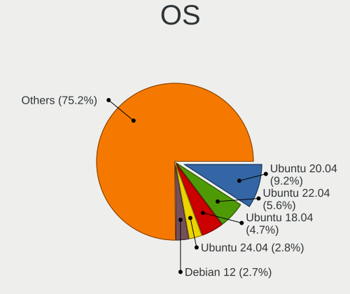

| Name                         | Notebooks | Percent |
|------------------------------|-----------|---------|
| Ubuntu 20.04                 | 163       | 9.16%   |
| Ubuntu 22.04                 | 99        | 5.56%   |
| Ubuntu 18.04                 | 83        | 4.67%   |
| Ubuntu 24.04                 | 49        | 2.75%   |
| Debian 12                    | 48        | 2.7%    |
| Arch Rolling                 | 43        | 2.42%   |
| Zorin 16                     | 35        | 1.97%   |
| ArcoLinux Rolling            | 34        | 1.91%   |
| Zorin 17                     | 27        | 1.52%   |
| Pop!_OS 22.04                | 27        | 1.52%   |
| Debian 11                    | 27        | 1.52%   |
| OpenMandriva 4.3             | 26        | 1.46%   |
| Fedora 42                    | 26        | 1.46%   |
| Linux Mint 22.1              | 23        | 1.29%   |
| Fedora 41                    | 23        | 1.29%   |
| Manjaro                      | 22        | 1.24%   |
| Linux Mint 20.3              | 22        | 1.24%   |
| OpenMandriva 24.12           | 21        | 1.18%   |
| openSUSE Tumbleweed-XXXXXXXX | 20        | 1.12%   |
| OpenMandriva 4.2             | 20        | 1.12%   |
| Linux Mint 20.1              | 18        | 1.01%   |
| Fedora 36                    | 18        | 1.01%   |
| Fedora 38                    | 17        | 0.96%   |
| Xubuntu 20.04                | 16        | 0.9%    |
| Ubuntu 19.10                 | 16        | 0.9%    |
| Arch                         | 16        | 0.9%    |
| Linux Mint 21.3              | 14        | 0.79%   |
| Linux Mint 20                | 14        | 0.79%   |
| Fedora 40                    | 14        | 0.79%   |
| OpenMandriva 24.07           | 13        | 0.73%   |
| OpenMandriva 23.01           | 13        | 0.73%   |
| Linux Mint 19.3              | 13        | 0.73%   |
| Fedora 39                    | 13        | 0.73%   |
| OpenMandriva 23.03           | 12        | 0.67%   |
| Ubuntu 20.10                 | 11        | 0.62%   |
| Pop!_OS 21.04                | 11        | 0.62%   |
| Pop!_OS 20.04                | 11        | 0.62%   |
| Linux Mint 21.1              | 11        | 0.62%   |
| KDE neon 20.04               | 11        | 0.62%   |
| Elementary 6.1               | 11        | 0.62%   |

OS Family
---------

OS without a version

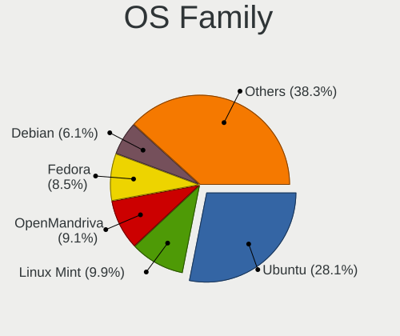

| Name          | Notebooks | Percent |
|---------------|-----------|---------|
| Ubuntu        | 467       | 28.1%   |
| Linux Mint    | 165       | 9.93%   |
| OpenMandriva  | 151       | 9.09%   |
| Fedora        | 142       | 8.54%   |
| Debian        | 101       | 6.08%   |
| Zorin         | 77        | 4.63%   |
| Arch          | 58        | 3.49%   |
| Pop!_OS       | 54        | 3.25%   |
| Manjaro       | 45        | 2.71%   |
| Kubuntu       | 38        | 2.29%   |
| Xubuntu       | 37        | 2.23%   |
| ArcoLinux     | 35        | 2.11%   |
| openSUSE      | 30        | 1.81%   |
| ROSA          | 21        | 1.26%   |
| KDE neon      | 20        | 1.2%    |
| Elementary    | 18        | 1.08%   |
| Ubuntu Unity  | 15        | 0.9%    |
| Lubuntu       | 15        | 0.9%    |
| Ubuntu MATE   | 13        | 0.78%   |
| LMDE          | 12        | 0.72%   |
| SteamOS       | 11        | 0.66%   |
| MX            | 10        | 0.6%    |
| Gentoo        | 10        | 0.6%    |
| Kali          | 9         | 0.54%   |
| Endless       | 8         | 0.48%   |
| Ubuntu Budgie | 6         | 0.36%   |
| CachyOS       | 6         | 0.36%   |
| TUXEDO OS     | 5         | 0.3%    |
| NixOS         | 5         | 0.3%    |
| Garuda Linux  | 5         | 0.3%    |
| EndeavourOS   | 5         | 0.3%    |
| Clear Linux   | 5         | 0.3%    |
| CentOS        | 5         | 0.3%    |
| BlackPanther  | 5         | 0.3%    |
| Bazzite       | 5         | 0.3%    |
| Nobara        | 4         | 0.24%   |
| Vanilla       | 3         | 0.18%   |
| Parrot        | 3         | 0.18%   |
| LinuxFX       | 3         | 0.18%   |
| AlmaLinux     | 3         | 0.18%   |

Kernel
------

Version of the Linux kernel

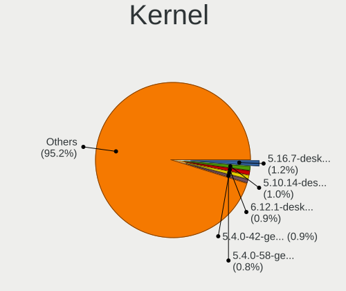

| Version                  | Notebooks | Percent |
|--------------------------|-----------|---------|
| 5.16.7-desktop-1omv4003  | 24        | 1.23%   |
| 5.10.14-desktop-1omv4002 | 19        | 0.97%   |
| 6.12.1-desktop-1omv2490  | 18        | 0.92%   |
| 5.4.0-42-generic         | 17        | 0.87%   |
| 5.4.0-58-generic         | 16        | 0.82%   |
| 5.3.0-42-generic         | 15        | 0.77%   |
| 6.14.2-desktop-3omv2590  | 14        | 0.72%   |
| 5.4.0-48-generic         | 13        | 0.66%   |
| 6.2.6-desktop-1omv2390   | 12        | 0.61%   |
| 6.10.0-desktop-1omv2490  | 12        | 0.61%   |
| 6.8.0-51-generic         | 11        | 0.56%   |
| 6.1.1-desktop-1omv2290   | 11        | 0.56%   |
| 6.1.0-18-amd64           | 11        | 0.56%   |
| 5.4.0-66-generic         | 11        | 0.56%   |
| 5.15.0-56-generic        | 11        | 0.56%   |
| 5.15.0-48-generic        | 11        | 0.56%   |
| 6.8.0-52-generic         | 10        | 0.51%   |
| 5.4.0-29-generic         | 10        | 0.51%   |
| 5.3.0-46-generic         | 10        | 0.51%   |
| 5.15.0-58-generic        | 10        | 0.51%   |
| 5.15.0-46-generic        | 10        | 0.51%   |
| 6.8.0-41-generic         | 9         | 0.46%   |
| 6.6.2-desktop-1omv2390   | 9         | 0.46%   |
| 6.14.0-29-generic        | 9         | 0.46%   |
| 5.8.0-43-generic         | 9         | 0.46%   |
| 5.15.0-52-generic        | 9         | 0.46%   |
| 5.11.0-43-generic        | 9         | 0.46%   |
| 5.10.0-21-amd64          | 9         | 0.46%   |
| 6.4.11-desktop-1omv2390  | 8         | 0.41%   |
| 6.2.0-26-generic         | 8         | 0.41%   |
| 5.4.0-74-generic         | 8         | 0.41%   |
| 5.15.0-91-generic        | 8         | 0.41%   |
| 5.13.0-39-generic        | 8         | 0.41%   |
| 6.8.0-40-generic         | 7         | 0.36%   |
| 6.5.0-14-generic         | 7         | 0.36%   |
| 6.14.0-33-generic        | 7         | 0.36%   |
| 5.4.0-65-generic         | 7         | 0.36%   |
| 5.4.0-52-generic         | 7         | 0.36%   |
| 5.4.0-40-generic         | 7         | 0.36%   |
| 5.4.0-26-generic         | 7         | 0.36%   |

Kernel Family
-------------

Linux kernel without a distro release

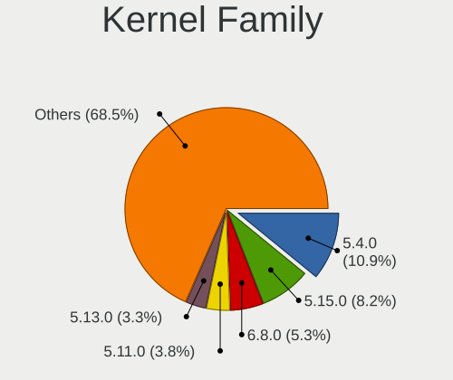

| Version | Notebooks | Percent |
|---------|-----------|---------|
| 5.4.0   | 201       | 10.91%  |
| 5.15.0  | 151       | 8.2%    |
| 6.8.0   | 98        | 5.32%   |
| 5.11.0  | 70        | 3.8%    |
| 5.13.0  | 61        | 3.31%   |
| 4.15.0  | 60        | 3.26%   |
| 5.8.0   | 58        | 3.15%   |
| 6.1.0   | 56        | 3.04%   |
| 5.3.0   | 49        | 2.66%   |
| 6.14.0  | 44        | 2.39%   |
| 6.5.0   | 42        | 2.28%   |
| 5.10.0  | 40        | 2.17%   |
| 6.2.0   | 33        | 1.79%   |
| 5.19.0  | 33        | 1.79%   |
| 5.0.0   | 30        | 1.63%   |
| 6.11.0  | 24        | 1.3%    |
| 5.16.7  | 24        | 1.3%    |
| 4.18.0  | 22        | 1.19%   |
| 6.12.1  | 19        | 1.03%   |
| 5.10.14 | 19        | 1.03%   |
| 6.14.2  | 17        | 0.92%   |
| 6.2.6   | 13        | 0.71%   |
| 6.10.0  | 12        | 0.65%   |
| 6.1.1   | 11        | 0.6%    |
| 6.9.3   | 9         | 0.49%   |
| 6.6.2   | 9         | 0.49%   |
| 6.4.11  | 8         | 0.43%   |
| 6.12.9  | 7         | 0.38%   |
| 6.12.10 | 7         | 0.38%   |
| 5.17.5  | 6         | 0.33%   |
| 5.14.0  | 6         | 0.33%   |
| 4.9.20  | 6         | 0.33%   |
| 4.19.0  | 6         | 0.33%   |
| 6.13.5  | 5         | 0.27%   |
| 6.0.0   | 5         | 0.27%   |
| 5.18.12 | 5         | 0.27%   |
| 4.18.16 | 5         | 0.27%   |
| 6.9.12  | 4         | 0.22%   |
| 6.5.9   | 4         | 0.22%   |
| 6.5.5   | 4         | 0.22%   |

Kernel Major Ver.
-----------------

Linux kernel major version

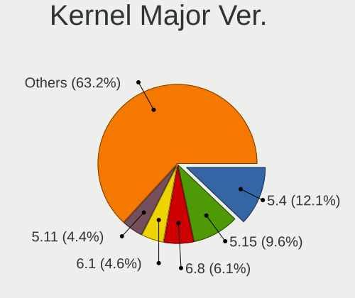

| Version | Notebooks | Percent |
|---------|-----------|---------|
| 5.4     | 219       | 12.11%  |
| 5.15    | 173       | 9.56%   |
| 6.8     | 111       | 6.14%   |
| 6.1     | 84        | 4.64%   |
| 5.11    | 79        | 4.37%   |
| 5.10    | 74        | 4.09%   |
| 6.14    | 72        | 3.98%   |
| 5.8     | 71        | 3.92%   |
| 5.13    | 70        | 3.87%   |
| 6.2     | 66        | 3.65%   |
| 6.5     | 65        | 3.59%   |
| 6.12    | 64        | 3.54%   |
| 4.15    | 60        | 3.32%   |
| 5.3     | 55        | 3.04%   |
| 5.19    | 46        | 2.54%   |
| 5.16    | 42        | 2.32%   |
| 6.11    | 39        | 2.16%   |
| 5.0     | 32        | 1.77%   |
| 6.6     | 29        | 1.6%    |
| 4.18    | 28        | 1.55%   |
| 6.9     | 26        | 1.44%   |
| 6.10    | 24        | 1.33%   |
| 6.4     | 23        | 1.27%   |
| 6.0     | 22        | 1.22%   |
| 5.18    | 22        | 1.22%   |
| 5.17    | 22        | 1.22%   |
| 5.14    | 20        | 1.11%   |
| 6.15    | 16        | 0.88%   |
| 6.17    | 15        | 0.83%   |
| 5.12    | 15        | 0.83%   |
| 4.9     | 15        | 0.83%   |
| 6.3     | 13        | 0.72%   |
| 6.13    | 13        | 0.72%   |
| 5.6     | 12        | 0.66%   |
| 6.7     | 11        | 0.61%   |
| 6.16    | 10        | 0.55%   |
| 5.9     | 10        | 0.55%   |
| 4.19    | 10        | 0.55%   |
| 5.7     | 8         | 0.44%   |
| 5.5     | 5         | 0.28%   |

Arch
----

OS architecture (x86_64, i586, etc.)

| Name    | Notebooks | Percent |
|---------|-----------|---------|
| x86_64  | 1549      | 97.85%  |
| i686    | 33        | 2.08%   |
| aarch64 | 1         | 0.06%   |

DE
--

Desktop Environment

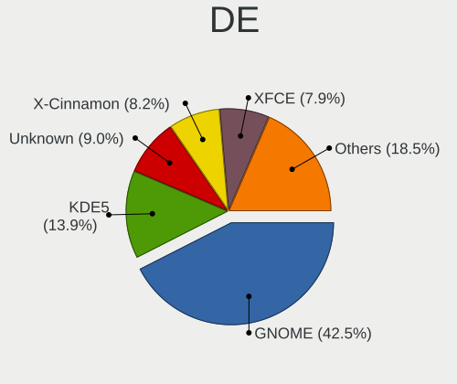

| Name             | Notebooks | Percent |
|------------------|-----------|---------|
| GNOME            | 718       | 42.51%  |
| KDE5             | 235       | 13.91%  |
| Unknown          | 152       | 9%      |
| X-Cinnamon       | 138       | 8.17%   |
| XFCE             | 133       | 7.87%   |
| KDE6             | 82        | 4.85%   |
| MATE             | 45        | 2.66%   |
| LXQt             | 30        | 1.78%   |
| KDE              | 24        | 1.42%   |
| Pantheon         | 18        | 1.07%   |
| Unity            | 15        | 0.89%   |
| i3               | 14        | 0.83%   |
| Budgie           | 14        | 0.83%   |
| KDE4             | 12        | 0.71%   |
| Cinnamon         | 12        | 0.71%   |
| Hyprland         | 8         | 0.47%   |
| sway             | 6         | 0.36%   |
| LXDE             | 4         | 0.24%   |
| GNOME Flashback  | 4         | 0.24%   |
| Openbox          | 3         | 0.18%   |
| awesome          | 3         | 0.18%   |
| qtile            | 2         | 0.12%   |
| LeftWM           | 2         | 0.12%   |
| GNOME Classic    | 2         | 0.12%   |
| bspwm            | 2         | 0.12%   |
| xmonad           | 1         | 0.06%   |
| UKUI             | 1         | 0.06%   |
| Trinity          | 1         | 0.06%   |
| spectrwm         | 1         | 0.06%   |
| river            | 1         | 0.06%   |
| lightdm-xsession | 1         | 0.06%   |
| labwc:wlroots    | 1         | 0.06%   |
| icewm            | 1         | 0.06%   |
| Enlightenment    | 1         | 0.06%   |
| Deepin           | 1         | 0.06%   |
| COSMIC           | 1         | 0.06%   |

Display Server
--------------

X11 or Wayland

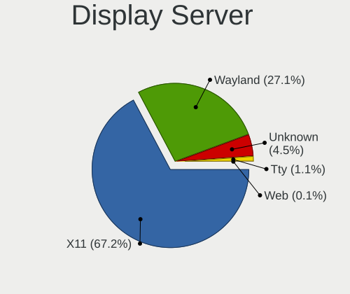

| Name    | Notebooks | Percent |
|---------|-----------|---------|
| X11     | 1108      | 67.23%  |
| Wayland | 447       | 27.12%  |
| Unknown | 74        | 4.49%   |
| Tty     | 18        | 1.09%   |
| Web     | 1         | 0.06%   |

Display Manager
---------------

SDDM, LightDM, etc.

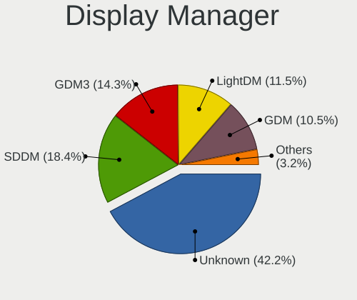

| Name    | Notebooks | Percent |
|---------|-----------|---------|
| Unknown | 706       | 42.22%  |
| SDDM    | 307       | 18.36%  |
| GDM3    | 239       | 14.29%  |
| LightDM | 192       | 11.48%  |
| GDM     | 175       | 10.47%  |
| TDM     | 37        | 2.21%   |
| KDM     | 11        | 0.66%   |
| XDM     | 2         | 0.12%   |
| SLiM    | 2         | 0.12%   |
| LY-DM   | 1         | 0.06%   |

OS Lang
-------

Language

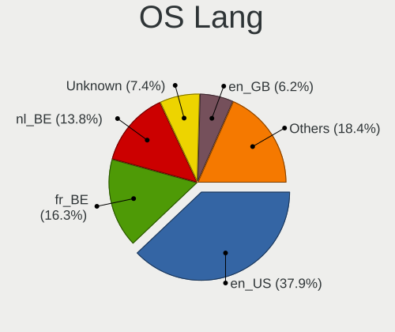

| Lang       | Notebooks | Percent |
|------------|-----------|---------|
| en_US      | 622       | 37.93%  |
| fr_BE      | 268       | 16.34%  |
| nl_BE      | 226       | 13.78%  |
| Unknown    | 121       | 7.38%   |
| en_GB      | 101       | 6.16%   |
| fr_FR      | 100       | 6.1%    |
| nl_NL      | 77        | 4.7%    |
| C          | 33        | 2.01%   |
| de_DE      | 19        | 1.16%   |
| pl_PL      | 9         | 0.55%   |
| de_BE      | 8         | 0.49%   |
| en_IE      | 7         | 0.43%   |
| ru_RU      | 6         | 0.37%   |
| ro_RO      | 4         | 0.24%   |
| es_ES      | 4         | 0.24%   |
| POSIX      | 3         | 0.18%   |
| it_IT      | 3         | 0.18%   |
| uk_UA      | 2         | 0.12%   |
| tr_TR      | 2         | 0.12%   |
| pt_PT      | 2         | 0.12%   |
| en_DK      | 2         | 0.12%   |
| en_CA      | 2         | 0.12%   |
| en_BE      | 2         | 0.12%   |
| C.UTF8     | 2         | 0.12%   |
| tt_RU      | 1         | 0.06%   |
| pt_BR      | 1         | 0.06%   |
| pl_PL.UTF8 | 1         | 0.06%   |
| nl_BE.UTF8 | 1         | 0.06%   |
| nl_AW      | 1         | 0.06%   |
| ku_TR      | 1         | 0.06%   |
| it_CH      | 1         | 0.06%   |
| fr_CH      | 1         | 0.06%   |
| en_ZA      | 1         | 0.06%   |
| en_US.UTF8 | 1         | 0.06%   |
| en_IN      | 1         | 0.06%   |
| en_BW      | 1         | 0.06%   |
| de_LU      | 1         | 0.06%   |
| cs_CZ      | 1         | 0.06%   |
| bg_BG      | 1         | 0.06%   |

Boot Mode
---------

EFI or BIOS

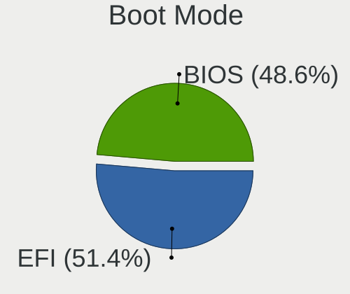

| Mode | Notebooks | Percent |
|------|-----------|---------|
| EFI  | 834       | 51.39%  |
| BIOS | 789       | 48.61%  |

Filesystem
----------

Type of filesystem

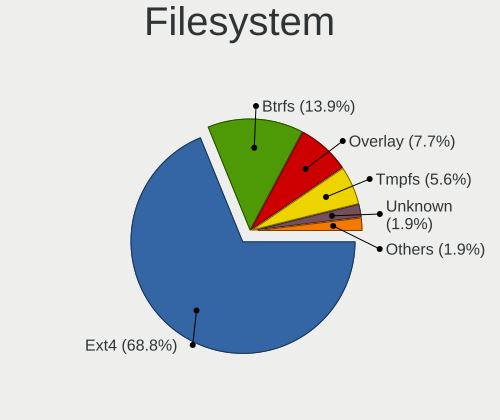

| Type    | Notebooks | Percent |
|---------|-----------|---------|
| Ext4    | 1136      | 68.85%  |
| Btrfs   | 230       | 13.94%  |
| Overlay | 127       | 7.7%    |
| Tmpfs   | 93        | 5.64%   |
| Unknown | 32        | 1.94%   |
| Xfs     | 22        | 1.33%   |
| Zfs     | 8         | 0.48%   |
| Ext2    | 2         | 0.12%   |

Part. scheme
------------

Scheme of partitioning

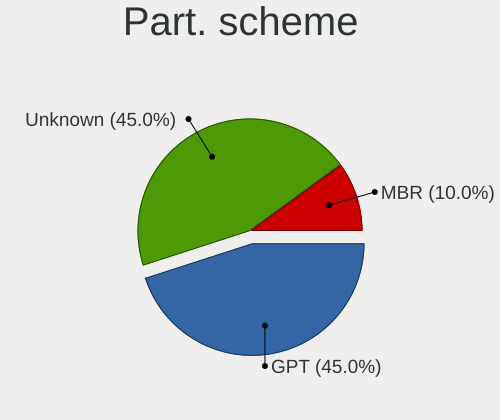

| Type    | Notebooks | Percent |
|---------|-----------|---------|
| GPT     | 736       | 45.02%  |
| Unknown | 735       | 44.95%  |
| MBR     | 164       | 10.03%  |

Dual Boot with Linux/BSD
------------------------

Hosting more than one Linux/BSD

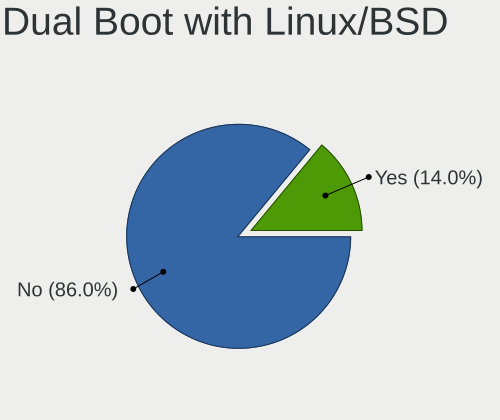

| Dual boot | Notebooks | Percent |
|-----------|-----------|---------|
| No        | 1395      | 86%     |
| Yes       | 227       | 14%     |

Dual Boot (Win)
---------------

Hosting Linux and Windows

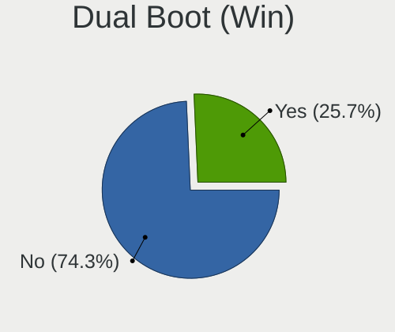

| Dual boot | Notebooks | Percent |
|-----------|-----------|---------|
| No        | 1197      | 74.3%   |
| Yes       | 414       | 25.7%   |

Board
-----

Vendor
------

Motherboard manufacturer

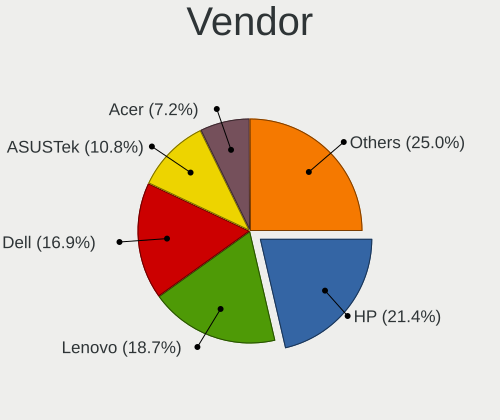

| Name                | Notebooks | Percent |
|---------------------|-----------|---------|
| Hewlett-Packard     | 338       | 21.38%  |
| Lenovo              | 296       | 18.72%  |
| Dell                | 267       | 16.89%  |
| ASUSTek Computer    | 170       | 10.75%  |
| Acer                | 114       | 7.21%   |
| MSI                 | 47        | 2.97%   |
| Apple               | 47        | 2.97%   |
| Toshiba             | 41        | 2.59%   |
| Medion              | 37        | 2.34%   |
| Sony                | 36        | 2.28%   |
| Notebook            | 25        | 1.58%   |
| Packard Bell        | 19        | 1.2%    |
| TUXEDO              | 16        | 1.01%   |
| Samsung Electronics | 12        | 0.76%   |
| Fujitsu             | 12        | 0.76%   |
| Unknown             | 12        | 0.76%   |
| Valve               | 11        | 0.7%    |
| PC Specialist       | 7         | 0.44%   |
| Alienware           | 7         | 0.44%   |
| Google              | 6         | 0.38%   |
| Gigabyte Technology | 6         | 0.38%   |
| HUAWEI              | 5         | 0.32%   |
| Clevo               | 5         | 0.32%   |
| Fujitsu Siemens     | 4         | 0.25%   |
| Teclast             | 3         | 0.19%   |
| Intel               | 3         | 0.19%   |
| Framework           | 3         | 0.19%   |
| VALE                | 2         | 0.13%   |
| Standard            | 2         | 0.13%   |
| SLIMBOOK            | 2         | 0.13%   |
| Schenker            | 2         | 0.13%   |
| Razer               | 2         | 0.13%   |
| Panasonic           | 2         | 0.13%   |
| YJKC                | 1         | 0.06%   |
| TrekStor            | 1         | 0.06%   |
| Timi                | 1         | 0.06%   |
| SKIKK               | 1         | 0.06%   |
| PEAQ                | 1         | 0.06%   |
| NEC Computers       | 1         | 0.06%   |
| LG Electronics      | 1         | 0.06%   |

Model
-----

Motherboard model

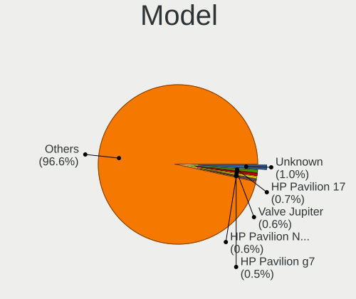

| Name                             | Notebooks | Percent |
|----------------------------------|-----------|---------|
| Unknown                          | 16        | 1.01%   |
| HP Pavilion 17                   | 11        | 0.7%    |
| Valve Jupiter                    | 10        | 0.63%   |
| HP Pavilion Notebook             | 9         | 0.57%   |
| HP Pavilion g7                   | 8         | 0.51%   |
| HP Pavilion dv7                  | 8         | 0.51%   |
| HP Pavilion dv6                  | 8         | 0.51%   |
| HP Notebook                      | 7         | 0.44%   |
| HP EliteBook 850 G8 Notebook PC  | 7         | 0.44%   |
| HP ProBook 6570b                 | 6         | 0.38%   |
| HP ProBook 650 G1                | 6         | 0.38%   |
| Dell Latitude 5530               | 6         | 0.38%   |
| Lenovo IdeaPad 5 Pro 16ACH6 82L5 | 5         | 0.32%   |
| HP Pavilion Laptop 15-eh1xxx     | 5         | 0.32%   |
| HP Pavilion Laptop 15-cw0xxx     | 5         | 0.32%   |
| Dell XPS 15 9560                 | 5         | 0.32%   |
| Dell XPS 13 7390                 | 5         | 0.32%   |
| Dell Precision M4800             | 5         | 0.32%   |
| Dell Latitude E7440              | 5         | 0.32%   |
| Dell Latitude 5520               | 5         | 0.32%   |
| ASUS Vivobook Go E1504FA_E1504FA | 5         | 0.32%   |
| Apple MacBookPro9,2              | 5         | 0.32%   |
| Toshiba Satellite C660           | 4         | 0.25%   |
| Lenovo ThinkPad L390 20NSS1YV0B  | 4         | 0.25%   |
| Lenovo Legion 5 15ARH05 82B5     | 4         | 0.25%   |
| HP ProBook 470 G2                | 4         | 0.25%   |
| HP Pavilion 15                   | 4         | 0.25%   |
| HP Laptop 15-db0xxx              | 4         | 0.25%   |
| HP EliteBook 850 G5              | 4         | 0.25%   |
| Gigabyte Spring Peak             | 4         | 0.25%   |
| Dell XPS 15 9570                 | 4         | 0.25%   |
| Dell XPS 15 9500                 | 4         | 0.25%   |
| Dell XPS 13 9370                 | 4         | 0.25%   |
| Dell XPS 13 9360                 | 4         | 0.25%   |
| Dell Latitude E6540              | 4         | 0.25%   |
| Dell Latitude E6410              | 4         | 0.25%   |
| Dell Latitude E5540              | 4         | 0.25%   |
| Dell Latitude E5520              | 4         | 0.25%   |
| Dell Latitude 5510               | 4         | 0.25%   |
| Dell Latitude 5500               | 4         | 0.25%   |

Model Family
------------

Motherboard model prefix

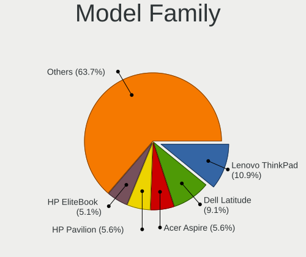

| Name                  | Notebooks | Percent |
|-----------------------|-----------|---------|
| Lenovo ThinkPad       | 172       | 10.88%  |
| Dell Latitude         | 144       | 9.11%   |
| Acer Aspire           | 89        | 5.63%   |
| HP Pavilion           | 88        | 5.57%   |
| HP EliteBook          | 81        | 5.12%   |
| HP ProBook            | 66        | 4.17%   |
| Lenovo IdeaPad        | 59        | 3.73%   |
| Dell XPS              | 40        | 2.53%   |
| Toshiba Satellite     | 37        | 2.34%   |
| ASUS VivoBook         | 30        | 1.9%    |
| Dell Precision        | 29        | 1.83%   |
| HP Laptop             | 28        | 1.77%   |
| Dell Inspiron         | 27        | 1.71%   |
| Lenovo Legion         | 26        | 1.64%   |
| HP ZBook              | 22        | 1.39%   |
| HP Compaq             | 17        | 1.08%   |
| Unknown               | 16        | 1.01%   |
| Packard Bell EasyNote | 15        | 0.95%   |
| ASUS ROG              | 15        | 0.95%   |
| Valve Jupiter         | 10        | 0.63%   |
| Fujitsu LIFEBOOK      | 10        | 0.63%   |
| Dell Studio           | 10        | 0.63%   |
| Lenovo ThinkBook      | 9         | 0.57%   |
| ASUS ASUS             | 9         | 0.57%   |
| Medion Akoya          | 8         | 0.51%   |
| Dell Vostro           | 8         | 0.51%   |
| Acer Swift            | 8         | 0.51%   |
| Acer Nitro            | 8         | 0.51%   |
| HP Notebook           | 7         | 0.44%   |
| HP ENVY               | 7         | 0.44%   |
| ASUS Zenbook          | 7         | 0.44%   |
| Apple MacBookPro9     | 6         | 0.38%   |
| TUXEDO Aura           | 5         | 0.32%   |
| MSI Katana            | 5         | 0.32%   |
| MSI GF63              | 5         | 0.32%   |
| HP OMEN               | 5         | 0.32%   |
| Apple MacBookPro5     | 5         | 0.32%   |
| Apple MacBookPro11    | 5         | 0.32%   |
| MSI Vector            | 4         | 0.25%   |
| MSI Thin              | 4         | 0.25%   |

MFG Year
--------

Motherboard manufacture year

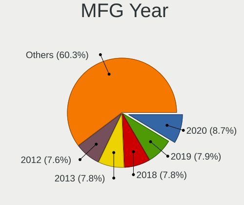

| Year    | Notebooks | Percent |
|---------|-----------|---------|
| 2020    | 137       | 8.67%   |
| 2019    | 125       | 7.91%   |
| 2018    | 123       | 7.78%   |
| 2013    | 123       | 7.78%   |
| 2012    | 120       | 7.59%   |
| 2011    | 105       | 6.64%   |
| 2021    | 103       | 6.51%   |
| 2017    | 91        | 5.76%   |
| 2016    | 89        | 5.63%   |
| 2014    | 79        | 5%      |
| 2022    | 76        | 4.81%   |
| 2008    | 71        | 4.49%   |
| 2015    | 68        | 4.3%    |
| 2010    | 66        | 4.17%   |
| 2023    | 64        | 4.05%   |
| 2009    | 46        | 2.91%   |
| 2024    | 36        | 2.28%   |
| 2007    | 31        | 1.96%   |
| 2006    | 16        | 1.01%   |
| 2025    | 6         | 0.38%   |
| 2005    | 2         | 0.13%   |
| 2004    | 2         | 0.13%   |
| Unknown | 2         | 0.13%   |

Form Factor
-----------

Physical design of the computer

| Name     | Notebooks | Percent |
|----------|-----------|---------|
| Notebook | 1581      | 100%    |

Secure Boot
-----------

Enabled or disabled

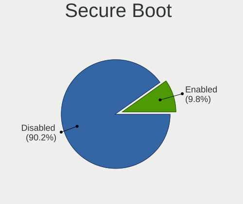

| State    | Notebooks | Percent |
|----------|-----------|---------|
| Disabled | 1441      | 90.18%  |
| Enabled  | 157       | 9.82%   |

Coreboot
--------

Have coreboot on board

| Used | Notebooks | Percent |
|------|-----------|---------|
| No   | 1573      | 99.49%  |
| Yes  | 8         | 0.51%   |

RAM Size
--------

Total RAM memory

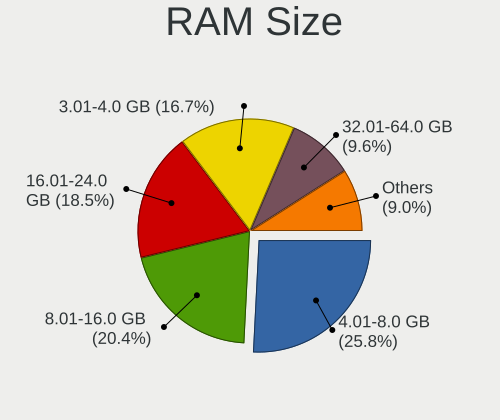

| Size in GB  | Notebooks | Percent |
|-------------|-----------|---------|
| 4.01-8.0    | 418       | 25.8%   |
| 8.01-16.0   | 330       | 20.37%  |
| 16.01-24.0  | 300       | 18.52%  |
| 3.01-4.0    | 271       | 16.73%  |
| 32.01-64.0  | 155       | 9.57%   |
| 1.01-2.0    | 48        | 2.96%   |
| 24.01-32.0  | 36        | 2.22%   |
| 64.01-256.0 | 27        | 1.67%   |
| 2.01-3.0    | 21        | 1.3%    |
| 0.51-1.0    | 13        | 0.8%    |
| 0.01-0.5    | 1         | 0.06%   |

RAM Used
--------

Used RAM memory

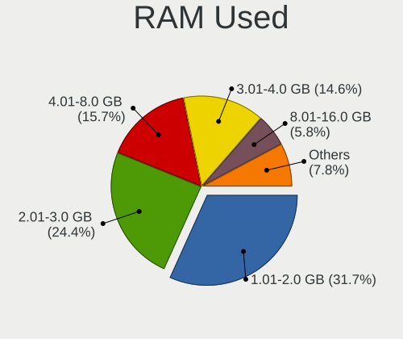

| Used GB    | Notebooks | Percent |
|------------|-----------|---------|
| 1.01-2.0   | 568       | 31.75%  |
| 2.01-3.0   | 436       | 24.37%  |
| 4.01-8.0   | 280       | 15.65%  |
| 3.01-4.0   | 262       | 14.65%  |
| 8.01-16.0  | 104       | 5.81%   |
| 0.51-1.0   | 102       | 5.7%    |
| 0.01-0.5   | 24        | 1.34%   |
| 16.01-24.0 | 7         | 0.39%   |
| 24.01-32.0 | 6         | 0.34%   |

Total Drives
------------

Number of drives on board

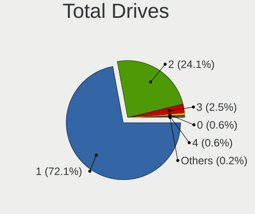

| Drives | Notebooks | Percent |
|--------|-----------|---------|
| 1      | 1172      | 72.08%  |
| 2      | 392       | 24.11%  |
| 3      | 40        | 2.46%   |
| 0      | 10        | 0.62%   |
| 4      | 9         | 0.55%   |
| 5      | 2         | 0.12%   |
| 8      | 1         | 0.06%   |

Has CD-ROM
----------

Has CD-ROM on board

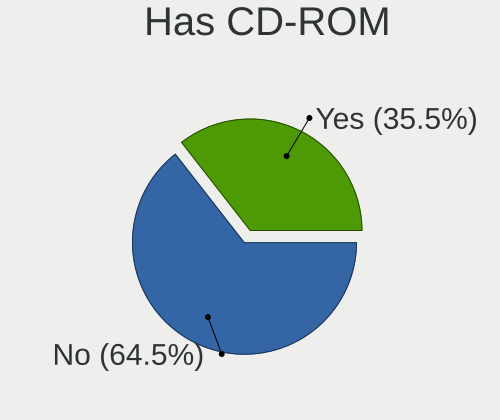

| Presented | Notebooks | Percent |
|-----------|-----------|---------|
| No        | 1025      | 64.47%  |
| Yes       | 565       | 35.53%  |

Has Ethernet
------------

Has Ethernet on board

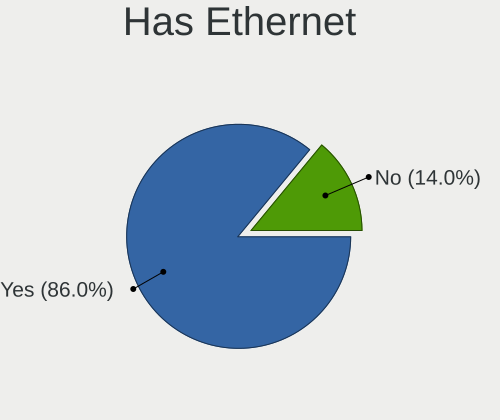

| Presented | Notebooks | Percent |
|-----------|-----------|---------|
| Yes       | 1369      | 85.99%  |
| No        | 223       | 14.01%  |

Has WiFi
--------

Has WiFi module

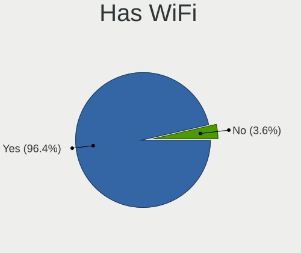

| Presented | Notebooks | Percent |
|-----------|-----------|---------|
| Yes       | 1529      | 96.41%  |
| No        | 57        | 3.59%   |

Has Bluetooth
-------------

Has Bluetooth module

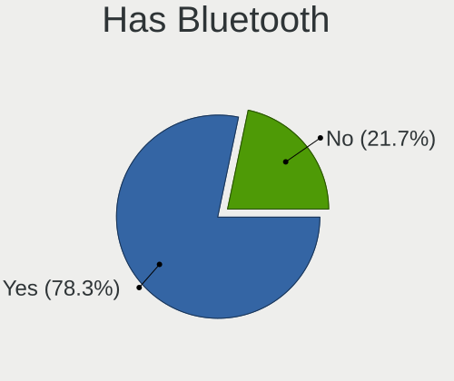

| Presented | Notebooks | Percent |
|-----------|-----------|---------|
| Yes       | 1257      | 78.27%  |
| No        | 349       | 21.73%  |

Location
--------

Country
-------

Geographic location (country)

| Country | Notebooks | Percent |
|---------|-----------|---------|
| Belgium | 1581      | 100%    |

City
----

Geographic location (city)

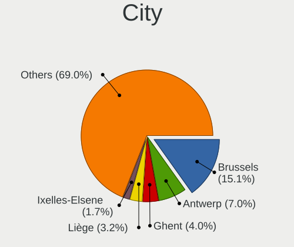

| City             | Notebooks | Percent |
|------------------|-----------|---------|
| Brussels         | 264       | 15.15%  |
| Antwerp          | 122       | 7%      |
| Ghent            | 69        | 3.96%   |
| Liège           | 55        | 3.16%   |
| Ixelles-Elsene   | 30        | 1.72%   |
| Mechelen         | 24        | 1.38%   |
| Leuven           | 24        | 1.38%   |
| Bruges           | 19        | 1.09%   |
| Turnhout         | 18        | 1.03%   |
| Kortrijk         | 18        | 1.03%   |
| Herentals        | 18        | 1.03%   |
| Aalst            | 17        | 0.98%   |
| Hasselt          | 16        | 0.92%   |
| Namur            | 15        | 0.86%   |
| Sint-Truiden     | 14        | 0.8%    |
| Anderlecht       | 14        | 0.8%    |
| Uccle            | 11        | 0.63%   |
| Mons             | 11        | 0.63%   |
| Edegem           | 11        | 0.63%   |
| Arlon            | 11        | 0.63%   |
| Schaarbeek       | 10        | 0.57%   |
| Louvain-la-Neuve | 10        | 0.57%   |
| La Louvière     | 10        | 0.57%   |
| Tournai          | 9         | 0.52%   |
| Seraing          | 9         | 0.52%   |
| Mouscron         | 9         | 0.52%   |
| Charleroi        | 9         | 0.52%   |
| Wetteren         | 8         | 0.46%   |
| Schoten          | 8         | 0.46%   |
| Roeselare        | 8         | 0.46%   |
| Overijse         | 8         | 0.46%   |
| Jette            | 8         | 0.46%   |
| Heusden-Zolder   | 8         | 0.46%   |
| Harelbeke        | 8         | 0.46%   |
| Etterbeek        | 8         | 0.46%   |
| Boom             | 8         | 0.46%   |
| Waregem          | 7         | 0.4%    |
| Mol              | 7         | 0.4%    |
| Malmedy          | 7         | 0.4%    |
| Lokeren          | 7         | 0.4%    |

Drives
------

Drive Vendor
------------

Hard drive vendors

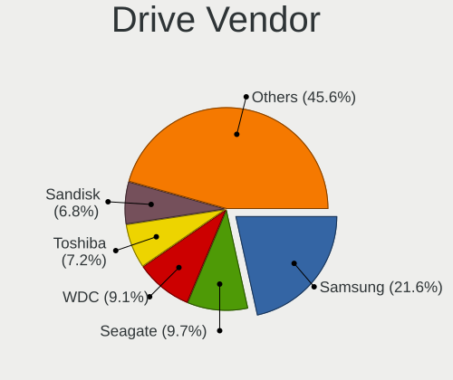

| Vendor                      | Notebooks | Drives | Percent |
|-----------------------------|-----------|--------|---------|
| Samsung Electronics         | 424       | 613    | 21.58%  |
| Seagate                     | 191       | 270    | 9.72%   |
| WDC                         | 179       | 244    | 9.11%   |
| Toshiba                     | 141       | 175    | 7.18%   |
| Sandisk                     | 133       | 168    | 6.77%   |
| SK hynix                    | 103       | 127    | 5.24%   |
| Kingston                    | 92        | 118    | 4.68%   |
| Intel                       | 81        | 99     | 4.12%   |
| Unknown                     | 75        | 89     | 3.82%   |
| Micron Technology           | 70        | 82     | 3.56%   |
| Hitachi                     | 55        | 67     | 2.8%    |
| Crucial                     | 53        | 67     | 2.7%    |
| HGST                        | 50        | 67     | 2.54%   |
| KIOXIA                      | 28        | 31     | 1.42%   |
| Apple                       | 27        | 41     | 1.37%   |
| LITEON                      | 16        | 18     | 0.81%   |
| Kingston Technology Company | 16        | 20     | 0.81%   |
| Fujitsu                     | 16        | 24     | 0.81%   |
| China                       | 14        | 18     | 0.71%   |
| Micron/Crucial Technology   | 11        | 15     | 0.56%   |
| LITEONIT                    | 11        | 15     | 0.56%   |
| Intenso                     | 11        | 12     | 0.56%   |
| Phison                      | 8         | 10     | 0.41%   |
| Transcend                   | 7         | 7      | 0.36%   |
| PNY                         | 7         | 8      | 0.36%   |
| Phison Electronics          | 7         | 10     | 0.36%   |
| KingSpec                    | 7         | 10     | 0.36%   |
| Emtec                       | 7         | 7      | 0.36%   |
| A-DATA Technology           | 7         | 9      | 0.36%   |
| GOODRAM                     | 6         | 8      | 0.31%   |
| Patriot                     | 5         | 5      | 0.25%   |
| Unknown                     | 5         | 10     | 0.25%   |
| SSSTC                       | 4         | 4      | 0.2%    |
| Silicon Motion              | 4         | 5      | 0.2%    |
| OCZ                         | 4         | 5      | 0.2%    |
| JMicron Technology          | 4         | 6      | 0.2%    |
| Corsair                     | 4         | 4      | 0.2%    |
| ASMT                        | 4         | 4      | 0.2%    |
| Verbatim                    | 3         | 3      | 0.15%   |
| Union Memory (Shenzhen)     | 3         | 3      | 0.15%   |

Drive Model
-----------

Hard drive models

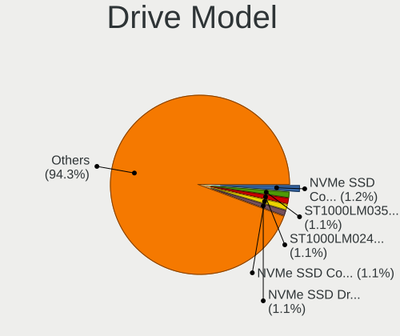

| Model                                                | Notebooks | Percent |
|------------------------------------------------------|-----------|---------|
| Samsung NVMe SSD Controller SM981/PM981/PM983 1TB    | 25        | 1.22%   |
| Seagate ST1000LM035-1RK172 1TB                       | 23        | 1.12%   |
| Seagate ST1000LM024 HN-M101MBB 1TB                   | 23        | 1.12%   |
| Samsung NVMe SSD Controller PM9A1/PM9A3/980PRO 1TB   | 23        | 1.12%   |
| SanDisk NVMe SSD Drive 512GB                         | 22        | 1.07%   |
| Samsung SSD 850 EVO 500GB                            | 18        | 0.88%   |
| Samsung SSD 860 EVO 500GB                            | 17        | 0.83%   |
| Samsung NVMe SSD Drive 512GB                         | 17        | 0.83%   |
| HGST HTS721010A9E630 1TB                             | 17        | 0.83%   |
| Toshiba MQ01ABD100 1TB                               | 16        | 0.78%   |
| Samsung SSD 850 EVO 250GB                            | 16        | 0.78%   |
| Unknown MMC Card  32GB                               | 15        | 0.73%   |
| Seagate ST9500325AS 500GB                            | 14        | 0.68%   |
| Samsung NVMe SSD Drive 1TB                           | 14        | 0.68%   |
| Intel NVMe SSD Drive 512GB                           | 13        | 0.63%   |
| SK hynix NVMe SSD Drive 512GB                        | 12        | 0.58%   |
| Samsung SSD 870 EVO 500GB                            | 12        | 0.58%   |
| Unknown MMC Card  128GB                              | 11        | 0.54%   |
| Kingston SA400S37120G 120GB SSD                      | 11        | 0.54%   |
| Samsung NVMe SSD Controller SM961/PM961/SM963 1024GB | 10        | 0.49%   |
| HGST HTS725050A7E630 500GB                           | 10        | 0.49%   |
| WDC WD10JPVX-22JC3T0 1TB                             | 9         | 0.44%   |
| Seagate ST500LT012-1DG142 500GB                      | 9         | 0.44%   |
| Seagate Expansion 2TB                                | 9         | 0.44%   |
| Samsung SSD 860 EVO 1TB                              | 9         | 0.44%   |
| Kingston SA400S37480G 480GB SSD                      | 9         | 0.44%   |
| Intel SSD 660P Series 512GB                          | 9         | 0.44%   |
| Hitachi HTS547550A9E384 500GB                        | 9         | 0.44%   |
| Seagate ST1000LM048-2E7172 1TB                       | 8         | 0.39%   |
| SanDisk NVMe SSD Drive 1TB                           | 8         | 0.39%   |
| Kingston SV300S37A120G 120GB SSD                     | 8         | 0.39%   |
| Kingston SA400S37240G 240GB SSD                      | 8         | 0.39%   |
| Toshiba MQ04ABF100 1TB                               | 7         | 0.34%   |
| Toshiba MQ01ABF050 500GB                             | 7         | 0.34%   |
| Seagate ST2000LM015-2E8174 2TB                       | 7         | 0.34%   |
| Samsung SSD 870 EVO 1TB                              | 7         | 0.34%   |
| Samsung SSD 860 EVO 250GB                            | 7         | 0.34%   |
| Kingston Company OM3PDP3 NVMe SSD 256GB              | 7         | 0.34%   |
| Kingston SFYRS1000G 1TB                              | 7         | 0.34%   |
| Hitachi HTS545050B9A300 500GB                        | 7         | 0.34%   |

HDD Vendor
----------

Hard disk drive vendors

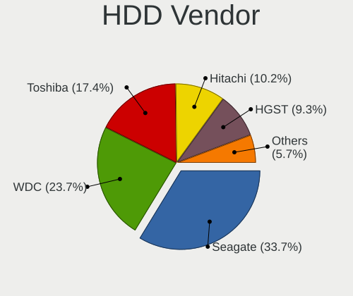

| Vendor              | Notebooks | Drives | Percent |
|---------------------|-----------|--------|---------|
| Seagate             | 182       | 254    | 33.7%   |
| WDC                 | 128       | 169    | 23.7%   |
| Toshiba             | 94        | 121    | 17.41%  |
| Hitachi             | 55        | 67     | 10.19%  |
| HGST                | 50        | 67     | 9.26%   |
| Fujitsu             | 15        | 22     | 2.78%   |
| Samsung Electronics | 8         | 10     | 1.48%   |
| Intenso             | 2         | 2      | 0.37%   |
| XrayDisk            | 1         | 1      | 0.19%   |
| Unknown             | 1         | 1      | 0.19%   |
| TO Exter            | 1         | 1      | 0.19%   |
| LaCie               | 1         | 1      | 0.19%   |
| JMicron Technology  | 1         | 1      | 0.19%   |
| Apple               | 1         | 1      | 0.19%   |

SSD Vendor
----------

Solid state drive vendors

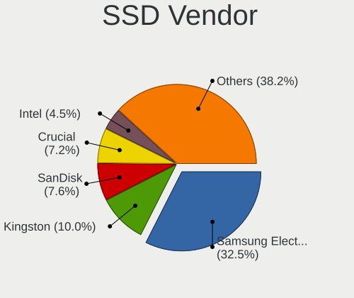

| Vendor              | Notebooks | Drives | Percent |
|---------------------|-----------|--------|---------|
| Samsung Electronics | 204       | 287    | 32.48%  |
| Kingston            | 63        | 78     | 10.03%  |
| SanDisk             | 48        | 66     | 7.64%   |
| Crucial             | 45        | 57     | 7.17%   |
| Intel               | 28        | 31     | 4.46%   |
| SK hynix            | 27        | 40     | 4.3%    |
| WDC                 | 26        | 39     | 4.14%   |
| Toshiba             | 19        | 22     | 3.03%   |
| Micron Technology   | 17        | 19     | 2.71%   |
| Apple               | 16        | 21     | 2.55%   |
| LITEON              | 15        | 17     | 2.39%   |
| China               | 13        | 17     | 2.07%   |
| LITEONIT            | 11        | 15     | 1.75%   |
| Intenso             | 9         | 10     | 1.43%   |
| KingSpec            | 7         | 10     | 1.11%   |
| Emtec               | 7         | 7      | 1.11%   |
| Transcend           | 6         | 6      | 0.96%   |
| PNY                 | 6         | 7      | 0.96%   |
| Patriot             | 5         | 5      | 0.8%    |
| GOODRAM             | 5         | 7      | 0.8%    |
| A-DATA Technology   | 5         | 7      | 0.8%    |
| OCZ                 | 4         | 5      | 0.64%   |
| Verbatim            | 3         | 3      | 0.48%   |
| SPCC                | 3         | 5      | 0.48%   |
| ASMT                | 3         | 3      | 0.48%   |
| Zheino              | 2         | 2      | 0.32%   |
| Reeinno             | 2         | 5      | 0.32%   |
| Phison              | 2         | 3      | 0.32%   |
| Netac               | 2         | 2      | 0.32%   |
| Indilinx            | 2         | 2      | 0.32%   |
| Fujitsu             | 2         | 2      | 0.32%   |
| Corsair             | 2         | 2      | 0.32%   |
| Teclast             | 1         | 1      | 0.16%   |
| sobetter            | 1         | 1      | 0.16%   |
| SHS                 | 1         | 1      | 0.16%   |
| Ramaxel Technology  | 1         | 1      | 0.16%   |
| Plextor             | 1         | 1      | 0.16%   |
| OWC                 | 1         | 2      | 0.16%   |
| MG                  | 1         | 1      | 0.16%   |
| Leven               | 1         | 1      | 0.16%   |

Drive Kind
----------

HDD or SSD

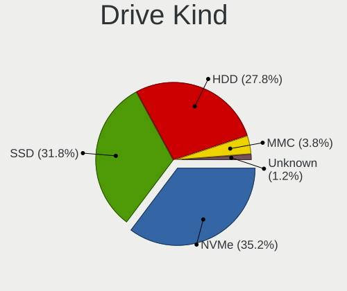

| Kind    | Notebooks | Drives | Percent |
|---------|-----------|--------|---------|
| NVMe    | 651       | 919    | 35.25%  |
| SSD     | 588       | 822    | 31.84%  |
| HDD     | 514       | 718    | 27.83%  |
| MMC     | 71        | 85     | 3.84%   |
| Unknown | 23        | 37     | 1.25%   |

Drive Connector
---------------

SATA, SAS, NVMe, etc.

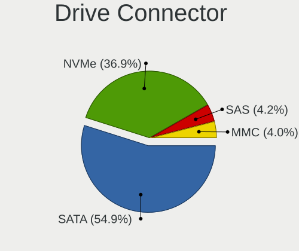

| Type | Notebooks | Drives | Percent |
|------|-----------|--------|---------|
| SATA | 965       | 1474   | 54.89%  |
| NVMe | 648       | 911    | 36.86%  |
| SAS  | 74        | 111    | 4.21%   |
| MMC  | 71        | 85     | 4.04%   |

Drive Size
----------

Size of hard drive

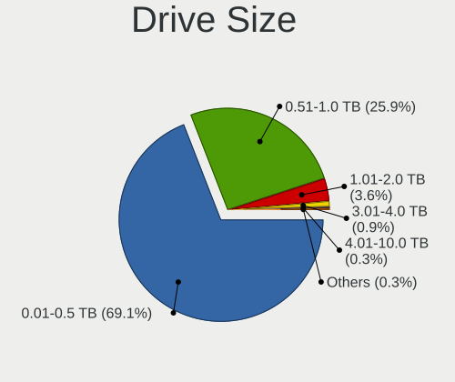

| Size in TB | Notebooks | Drives | Percent |
|------------|-----------|--------|---------|
| 0.01-0.5   | 769       | 1058   | 69.09%  |
| 0.51-1.0   | 288       | 414    | 25.88%  |
| 1.01-2.0   | 40        | 46     | 3.59%   |
| 3.01-4.0   | 10        | 16     | 0.9%    |
| 4.01-10.0  | 3         | 3      | 0.27%   |
| 2.01-3.0   | 2         | 2      | 0.18%   |
| 10.01-20.0 | 1         | 1      | 0.09%   |

Space Total
-----------

Amount of disk space available on the file system

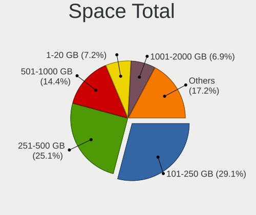

| Size in GB     | Notebooks | Percent |
|----------------|-----------|---------|
| 101-250        | 496       | 29.07%  |
| 251-500        | 429       | 25.15%  |
| 501-1000       | 246       | 14.42%  |
| 1-20           | 123       | 7.21%   |
| 1001-2000      | 118       | 6.92%   |
| 51-100         | 96        | 5.63%   |
| Unknown        | 57        | 3.34%   |
| More than 3000 | 53        | 3.11%   |
| 21-50          | 52        | 3.05%   |
| 2001-3000      | 35        | 2.05%   |
| 0              | 1         | 0.06%   |

Space Used
----------

Amount of used disk space

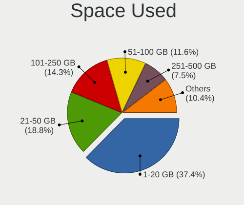

| Used GB        | Notebooks | Percent |
|----------------|-----------|---------|
| 1-20           | 665       | 37.4%   |
| 21-50          | 334       | 18.79%  |
| 101-250        | 255       | 14.34%  |
| 51-100         | 206       | 11.59%  |
| 251-500        | 133       | 7.48%   |
| 501-1000       | 68        | 3.82%   |
| Unknown        | 57        | 3.21%   |
| 1001-2000      | 32        | 1.8%    |
| 2001-3000      | 15        | 0.84%   |
| More than 3000 | 8         | 0.45%   |
| 0              | 5         | 0.28%   |

Malfunc. Drives
---------------

Drive models with a malfunction

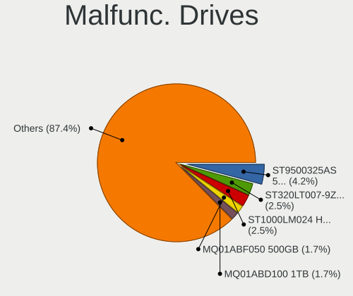

| Model                                          | Notebooks | Drives | Percent |
|------------------------------------------------|-----------|--------|---------|
| Seagate ST9500325AS 500GB                      | 5         | 5      | 4.2%    |
| Seagate ST320LT007-9ZV142 320GB                | 3         | 12     | 2.52%   |
| Seagate ST1000LM024 HN-M101MBB 1TB             | 3         | 8      | 2.52%   |
| Toshiba MQ01ABF050 500GB                       | 2         | 2      | 1.68%   |
| Toshiba MQ01ABD100 1TB                         | 2         | 2      | 1.68%   |
| Toshiba MQ01ABD075 752GB                       | 2         | 2      | 1.68%   |
| SK hynix HFS256G32MND-2900A 256GB SSD          | 2         | 2      | 1.68%   |
| Seagate ST9750420AS 752GB                      | 2         | 2      | 1.68%   |
| Seagate ST9320423AS 320GB                      | 2         | 3      | 1.68%   |
| Micron Technology 1100_MTFDDAV256TBN 256GB SSD | 2         | 2      | 1.68%   |
| Intel SSDSA2M160G2GC 160GB                     | 2         | 2      | 1.68%   |
| Hitachi HTS545050B9A300 500GB                  | 2         | 2      | 1.68%   |
| Hitachi HTS545050A7E380 500GB                  | 2         | 4      | 1.68%   |
| HGST HTS725050A7E630 500GB                     | 2         | 2      | 1.68%   |
| WDC WD5000BEVT-22ZAT0 500GB                    | 1         | 1      | 0.84%   |
| WDC WD3200BPVT-55JJ5T0 320GB                   | 1         | 1      | 0.84%   |
| WDC WD3200BPVT-22ZEST0 320GB                   | 1         | 1      | 0.84%   |
| WDC WD3200BEVT-60ZCT1 320GB                    | 1         | 1      | 0.84%   |
| WDC WD3200BEVT-60A23T0 320GB                   | 1         | 1      | 0.84%   |
| WDC WD3200BEKT-60V5T1 320GB                    | 1         | 1      | 0.84%   |
| WDC WD3200BEKT-60PVMT0 320GB                   | 1         | 1      | 0.84%   |
| WDC WD10SPZX-24Z10T0 1TB                       | 1         | 1      | 0.84%   |
| WDC WD10SPCX-60HWST0 1TB                       | 1         | 1      | 0.84%   |
| Toshiba MQ01ABD032 320GB                       | 1         | 1      | 0.84%   |
| Toshiba MK6476GSX 640GB                        | 1         | 1      | 0.84%   |
| Toshiba MK5075GSX 500GB                        | 1         | 1      | 0.84%   |
| Toshiba MK5065GSXF 500GB                       | 1         | 1      | 0.84%   |
| Toshiba MK3265GSX 320GB                        | 1         | 1      | 0.84%   |
| Toshiba MK3263GSXN 320GB                       | 1         | 1      | 0.84%   |
| Toshiba MK2555GSX 250GB                        | 1         | 1      | 0.84%   |
| Toshiba MK1655GSX 160GB                        | 1         | 1      | 0.84%   |
| Toshiba MK1652GSX 160GB                        | 1         | 1      | 0.84%   |
| Toshiba KSG60ZSE512G SATA 512GB SSD            | 1         | 1      | 0.84%   |
| SK hynix SH920 mSATA 256GB SSD                 | 1         | 1      | 0.84%   |
| SK hynix SH920 2.5 7MM 256GB SSD               | 1         | 3      | 0.84%   |
| SK hynix SC401 SATA 512GB SSD                  | 1         | 3      | 0.84%   |
| SK hynix PC711 HFS512GDE9X073N 512GB           | 1         | 2      | 0.84%   |
| SK hynix HFS128G3BTND-N210A 128GB SSD          | 1         | 1      | 0.84%   |
| SK hynix HFS128G39TND-N210A 128GB SSD          | 1         | 1      | 0.84%   |
| Seagate ST9500420AS 500GB                      | 1         | 1      | 0.84%   |

Malfunc. Drive Vendor
---------------------

Vendors of faulty drives

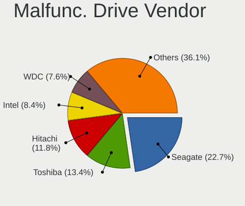

| Vendor              | Notebooks | Drives | Percent |
|---------------------|-----------|--------|---------|
| Seagate             | 27        | 45     | 22.69%  |
| Toshiba             | 16        | 16     | 13.45%  |
| Hitachi             | 14        | 16     | 11.76%  |
| Intel               | 10        | 10     | 8.4%    |
| WDC                 | 9         | 9      | 7.56%   |
| SK hynix            | 8         | 13     | 6.72%   |
| HGST                | 8         | 9      | 6.72%   |
| Kingston            | 5         | 10     | 4.2%    |
| Fujitsu             | 5         | 10     | 4.2%    |
| Micron Technology   | 4         | 4      | 3.36%   |
| SanDisk             | 3         | 3      | 2.52%   |
| Samsung Electronics | 3         | 3      | 2.52%   |
| Crucial             | 2         | 2      | 1.68%   |
| OCZ                 | 1         | 1      | 0.84%   |
| LITEON              | 1         | 1      | 0.84%   |
| China               | 1         | 1      | 0.84%   |
| Apple               | 1         | 1      | 0.84%   |
| A-DATA Technology   | 1         | 1      | 0.84%   |

Malfunc. HDD Vendor
-------------------

Vendors of faulty HDD drives

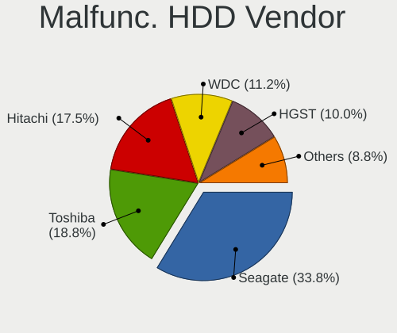

| Vendor              | Notebooks | Drives | Percent |
|---------------------|-----------|--------|---------|
| Seagate             | 27        | 45     | 33.75%  |
| Toshiba             | 15        | 15     | 18.75%  |
| Hitachi             | 14        | 16     | 17.5%   |
| WDC                 | 9         | 9      | 11.25%  |
| HGST                | 8         | 9      | 10%     |
| Fujitsu             | 5         | 10     | 6.25%   |
| Samsung Electronics | 2         | 2      | 2.5%    |

Malfunc. Drive Kind
-------------------

Kinds of faulty drives

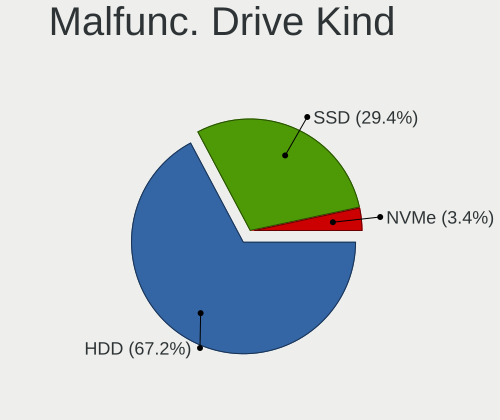

| Kind | Notebooks | Drives | Percent |
|------|-----------|--------|---------|
| HDD  | 80        | 106    | 67.23%  |
| SSD  | 35        | 44     | 29.41%  |
| NVMe | 4         | 5      | 3.36%   |

Failed Drives
-------------

Failed drive models

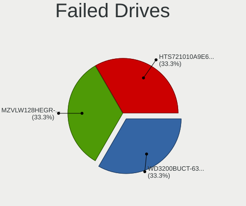

| Model                                        | Notebooks | Drives | Percent |
|----------------------------------------------|-----------|--------|---------|
| WDC WD3200BUCT-63TWBY0 320GB                 | 1         | 1      | 33.33%  |
| Samsung Electronics MZVLW128HEGR-000L2 128GB | 1         | 2      | 33.33%  |
| HGST HTS721010A9E630 1TB                     | 1         | 1      | 33.33%  |

Failed Drive Vendor
-------------------

Failed drive vendors

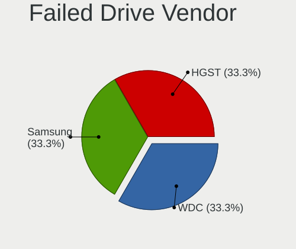

| Vendor              | Notebooks | Drives | Percent |
|---------------------|-----------|--------|---------|
| WDC                 | 1         | 1      | 33.33%  |
| Samsung Electronics | 1         | 2      | 33.33%  |
| HGST                | 1         | 1      | 33.33%  |

Drive Status
------------

Number of failed and malfunc. drives

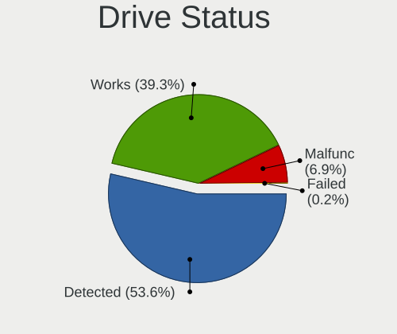

| Status   | Notebooks | Drives | Percent |
|----------|-----------|--------|---------|
| Detected | 904       | 1519   | 53.62%  |
| Works    | 662       | 903    | 39.26%  |
| Malfunc  | 117       | 155    | 6.94%   |
| Failed   | 3         | 4      | 0.18%   |

Storage controller
------------------

Storage Vendor
--------------

Storage controller vendors

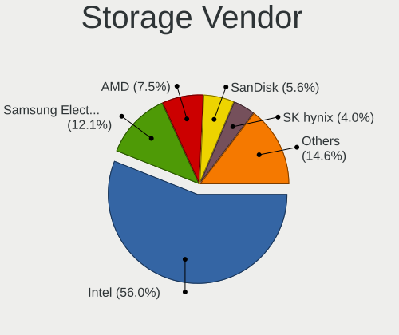

| Vendor                                  | Notebooks | Percent |
|-----------------------------------------|-----------|---------|
| Intel                                   | 1057      | 56.04%  |
| Samsung Electronics                     | 229       | 12.14%  |
| AMD                                     | 142       | 7.53%   |
| SanDisk                                 | 106       | 5.62%   |
| SK hynix                                | 76        | 4.03%   |
| Micron Technology                       | 53        | 2.81%   |
| Kingston Technology Company             | 43        | 2.28%   |
| Toshiba America Info Systems            | 31        | 1.64%   |
| KIOXIA                                  | 27        | 1.43%   |
| Micron/Crucial Technology               | 20        | 1.06%   |
| Phison Electronics                      | 17        | 0.9%    |
| Nvidia                                  | 13        | 0.69%   |
| Solid State Storage Technology          | 9         | 0.48%   |
| Union Memory (Shenzhen)                 | 8         | 0.42%   |
| Apple                                   | 8         | 0.42%   |
| Seagate Technology                      | 6         | 0.32%   |
| Marvell Technology Group                | 6         | 0.32%   |
| Silicon Image                           | 5         | 0.27%   |
| Silicon Motion                          | 4         | 0.21%   |
| Shenzhen Longsys Electronics            | 4         | 0.21%   |
| Solidigm                                | 3         | 0.16%   |
| Silicon Integrated Systems [SiS]        | 3         | 0.16%   |
| Lite-On Technology                      | 2         | 0.11%   |
| Lenovo                                  | 2         | 0.11%   |
| ADATA Technology                        | 2         | 0.11%   |
| VIA Technologies                        | 1         | 0.05%   |
| Transcend                               | 1         | 0.05%   |
| Shenzhen Unionmemory Information System | 1         | 0.05%   |
| Realtek Semiconductor                   | 1         | 0.05%   |
| MAXIO Technology (Hangzhou)             | 1         | 0.05%   |
| INNOGRIT                                | 1         | 0.05%   |
| Hosin Global Electronics                | 1         | 0.05%   |
| Biwin Storage Technology                | 1         | 0.05%   |
| ASMedia Technology                      | 1         | 0.05%   |
| Unknown                                 | 1         | 0.05%   |

Storage Model
-------------

Storage controller models

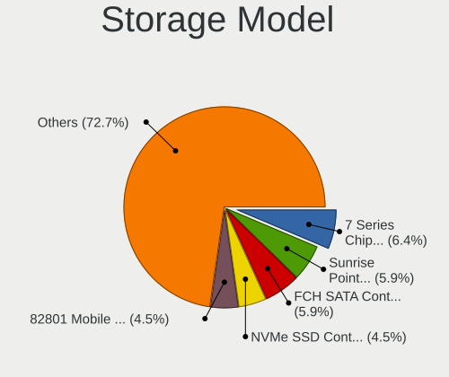

| Model                                                                          | Notebooks | Percent |
|--------------------------------------------------------------------------------|-----------|---------|
| Intel 7 Series Chipset Family 6-port SATA Controller [AHCI mode]               | 129       | 6.37%   |
| Intel Sunrise Point-LP SATA Controller [AHCI mode]                             | 120       | 5.92%   |
| AMD FCH SATA Controller [AHCI mode]                                            | 120       | 5.92%   |
| Samsung NVMe SSD Controller SM981/PM981/PM983                                  | 92        | 4.54%   |
| Intel 82801 Mobile SATA Controller [RAID mode]                                 | 92        | 4.54%   |
| Intel 6 Series/C200 Series Chipset Family 6 port Mobile SATA AHCI Controller   | 83        | 4.1%    |
| Intel 82801IBM/IEM (ICH9M/ICH9M-E) 4 port SATA Controller [AHCI mode]          | 63        | 3.11%   |
| Intel Volume Management Device NVMe RAID Controller                            | 49        | 2.42%   |
| Intel 8 Series/C220 Series Chipset Family 6-port SATA Controller 1 [AHCI mode] | 48        | 2.37%   |
| Intel 8 Series SATA Controller 1 [AHCI mode]                                   | 46        | 2.27%   |
| Intel Wildcat Point-LP SATA Controller [AHCI Mode]                             | 44        | 2.17%   |
| Samsung NVMe SSD Controller PM9A1/PM9A3/980PRO                                 | 42        | 2.07%   |
| Samsung NVMe SSD Controller 980 (DRAM-less)                                    | 42        | 2.07%   |
| Intel Cannon Lake Mobile PCH SATA AHCI Controller                              | 41        | 2.02%   |
| Intel 5 Series/3400 Series Chipset 4 port SATA AHCI Controller                 | 40        | 1.97%   |
| Intel HM170/QM170 Chipset SATA Controller [AHCI Mode]                          | 32        | 1.58%   |
| Intel 82801HM/HEM (ICH8M/ICH8M-E) IDE Controller                               | 31        | 1.53%   |
| Intel 82801HM/HEM (ICH8M/ICH8M-E) SATA Controller [AHCI mode]                  | 30        | 1.48%   |
| Samsung NVMe SSD Controller SM961/PM961/SM963                                  | 24        | 1.18%   |
| Intel 5 Series/3400 Series Chipset 6 port SATA AHCI Controller                 | 22        | 1.09%   |
| SanDisk Extreme Pro / WD Black SN750 / PC SN730 / Red SN700 NVMe SSD           | 21        | 1.04%   |
| SK hynix Gold P31/BC711/PC711 NVMe Solid State Drive                           | 20        | 0.99%   |
| SanDisk WD SN560/SN740/SN770/SN5000 NVMe SSD                                   | 19        | 0.94%   |
| Intel Tiger Lake-LP SATA Controller                                            | 17        | 0.84%   |
| Intel SSD 670p Series [Keystone Harbor]                                        | 17        | 0.84%   |
| Intel SSD 660P Series                                                          | 17        | 0.84%   |
| Intel Celeron/Pentium Silver Processor SATA Controller                         | 17        | 0.84%   |
| Intel Cannon Point-LP SATA Controller [AHCI Mode]                              | 17        | 0.84%   |
| KIOXIA NVMe SSD Controller BG4 (DRAM-less)                                     | 16        | 0.79%   |
| Intel Atom Processor E3800 Series SATA AHCI Controller                         | 16        | 0.79%   |
| AMD SB7x0/SB8x0/SB9x0 SATA Controller [AHCI mode]                              | 16        | 0.79%   |
| Intel 400 Series Chipset Family SATA AHCI Controller                           | 15        | 0.74%   |
| Toshiba America Info Systems XG6 NVMe SSD Controller                           | 14        | 0.69%   |
| SanDisk Ultra 3D / WD PC SN530, IX SN530, Blue SN550 NVMe SSD (DRAM-less)      | 14        | 0.69%   |
| Intel Q170/Q150/B150/H170/H110/Z170/CM236 Chipset SATA Controller [AHCI Mode]  | 14        | 0.69%   |
| SK hynix BC511 NVMe SSD                                                        | 13        | 0.64%   |
| Micron/Crucial P2 [Nick P2] / P3 / P3 Plus NVMe PCIe SSD (DRAM-less)           | 13        | 0.64%   |
| Micron 2400 NVMe SSD (DRAM-less)                                               | 13        | 0.64%   |
| SK hynix PC611 NVMe Solid State Drive                                          | 12        | 0.59%   |
| Intel SSD DC P4101/Pro 7600p/760p/E 6100p Series                               | 12        | 0.59%   |

Storage Kind
------------

Kind of storage controller (IDE, SATA, NVMe, SAS, ...)

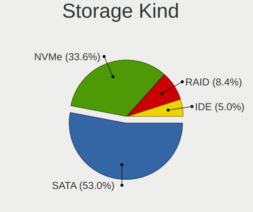

| Kind | Notebooks | Percent |
|------|-----------|---------|
| SATA | 1023      | 53.01%  |
| NVMe | 649       | 33.63%  |
| RAID | 162       | 8.39%   |
| IDE  | 96        | 4.97%   |

Processor
---------

CPU Vendor
----------

Processor vendors

| Vendor  | Notebooks | Percent |
|---------|-----------|---------|
| Intel   | 1300      | 82.23%  |
| AMD     | 280       | 17.71%  |
| Unknown | 1         | 0.06%   |

CPU Model
---------

Processor models

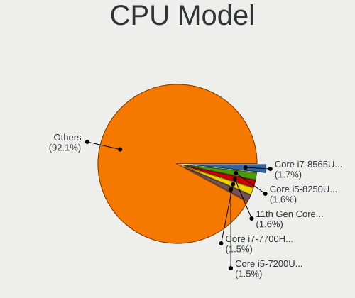

| Model                                   | Notebooks | Percent |
|-----------------------------------------|-----------|---------|
| Intel Core i7-8565U CPU @ 1.80GHz       | 27        | 1.7%    |
| Intel Core i5-8250U CPU @ 1.60GHz       | 25        | 1.58%   |
| Intel 11th Gen Core i7-1165G7 @ 2.80GHz | 25        | 1.58%   |
| Intel Core i7-7700HQ CPU @ 2.80GHz      | 24        | 1.51%   |
| Intel Core i5-7200U CPU @ 2.50GHz       | 24        | 1.51%   |
| Intel Core i7-8550U CPU @ 1.80GHz       | 23        | 1.45%   |
| Intel Core i7-10750H CPU @ 2.60GHz      | 23        | 1.45%   |
| Intel Core i7-8750H CPU @ 2.20GHz       | 21        | 1.32%   |
| Intel Core i5-3210M CPU @ 2.50GHz       | 19        | 1.2%    |
| Intel Core i7-9750H CPU @ 2.60GHz       | 18        | 1.14%   |
| Intel Core i5-6200U CPU @ 2.30GHz       | 17        | 1.07%   |
| Intel Core i5-6300U CPU @ 2.40GHz       | 15        | 0.95%   |
| Intel Core i5-2520M CPU @ 2.50GHz       | 15        | 0.95%   |
| Intel 11th Gen Core i5-1135G7 @ 2.40GHz | 15        | 0.95%   |
| Intel Core i7-7500U CPU @ 2.70GHz       | 13        | 0.82%   |
| Intel Core i7-3630QM CPU @ 2.40GHz      | 13        | 0.82%   |
| Intel Core i5-3230M CPU @ 2.60GHz       | 13        | 0.82%   |
| AMD Ryzen 5 5500U with Radeon Graphics  | 13        | 0.82%   |
| Intel Core i5-5300U CPU @ 2.30GHz       | 12        | 0.76%   |
| Intel Core i5-5200U CPU @ 2.20GHz       | 12        | 0.76%   |
| Intel Core i5 CPU M 520 @ 2.40GHz       | 12        | 0.76%   |
| Intel Core i5-3320M CPU @ 2.60GHz       | 11        | 0.69%   |
| Intel Core i5-2430M CPU @ 2.40GHz       | 11        | 0.69%   |
| Intel Core i5-10210U CPU @ 1.60GHz      | 11        | 0.69%   |
| Intel Core i3-2350M CPU @ 2.30GHz       | 11        | 0.69%   |
| Intel Core 2 Duo CPU P8700 @ 2.53GHz    | 11        | 0.69%   |
| AMD Ryzen 7 5700U with Radeon Graphics  | 11        | 0.69%   |
| AMD Ryzen 7 4800H with Radeon Graphics  | 11        | 0.69%   |
| Intel Core i7-8665U CPU @ 1.90GHz       | 10        | 0.63%   |
| Intel Core i5-8265U CPU @ 1.60GHz       | 10        | 0.63%   |
| Intel Core i5-4210U CPU @ 1.70GHz       | 10        | 0.63%   |
| Intel Core 2 Duo CPU P8600 @ 2.40GHz    | 10        | 0.63%   |
| Intel Celeron CPU N2840 @ 2.16GHz       | 10        | 0.63%   |
| Intel 11th Gen Core i7-11800H @ 2.30GHz | 10        | 0.63%   |
| AMD Custom APU 0405                     | 10        | 0.63%   |
| Intel Core i7-8650U CPU @ 1.90GHz       | 9         | 0.57%   |
| Intel Core i7-6700HQ CPU @ 2.60GHz      | 9         | 0.57%   |
| Intel Core i7-5500U CPU @ 2.40GHz       | 9         | 0.57%   |
| Intel Core i7-10510U CPU @ 1.80GHz      | 9         | 0.57%   |
| Intel Core i5-4300U CPU @ 1.90GHz       | 9         | 0.57%   |

CPU Model Family
----------------

Processor model prefix

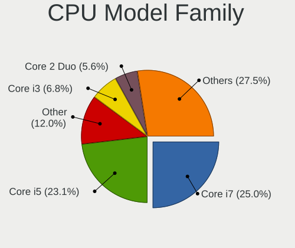

| Model                   | Notebooks | Percent |
|-------------------------|-----------|---------|
| Intel Core i7           | 396       | 25.02%  |
| Intel Core i5           | 366       | 23.12%  |
| Other                   | 190       | 12%     |
| Intel Core i3           | 108       | 6.82%   |
| Intel Core 2 Duo        | 88        | 5.56%   |
| AMD Ryzen 7             | 62        | 3.92%   |
| AMD Ryzen 5             | 57        | 3.6%    |
| Intel Celeron           | 45        | 2.84%   |
| Intel Pentium           | 29        | 1.83%   |
| AMD Ryzen 7 PRO         | 20        | 1.26%   |
| AMD Ryzen 9             | 19        | 1.2%    |
| Intel Core              | 18        | 1.14%   |
| Intel Atom              | 17        | 1.07%   |
| AMD E1                  | 16        | 1.01%   |
| AMD Ryzen 5 PRO         | 13        | 0.82%   |
| AMD A4                  | 12        | 0.76%   |
| Intel Pentium Dual-Core | 11        | 0.69%   |
| Intel Core 2            | 10        | 0.63%   |
| AMD E                   | 10        | 0.63%   |
| AMD A6                  | 10        | 0.63%   |
| Intel Genuine           | 8         | 0.51%   |
| Intel Core i9           | 8         | 0.51%   |
| AMD A8                  | 8         | 0.51%   |
| Intel Pentium Silver    | 6         | 0.38%   |
| Intel Pentium Dual      | 6         | 0.38%   |
| AMD Ryzen 3             | 6         | 0.38%   |
| AMD Turion 64 X2 Mobile | 4         | 0.25%   |
| Intel Celeron M         | 3         | 0.19%   |
| Intel Celeron Dual-Core | 3         | 0.19%   |
| AMD A12                 | 3         | 0.19%   |
| AMD A10                 | 3         | 0.19%   |
| Intel Xeon              | 2         | 0.13%   |
| Intel Pentium 4         | 2         | 0.13%   |
| Intel Core m5           | 2         | 0.13%   |
| Intel Core M            | 2         | 0.13%   |
| Intel Core Duo          | 2         | 0.13%   |
| AMD E2                  | 2         | 0.13%   |
| AMD Athlon X2           | 2         | 0.13%   |
| AMD Athlon II           | 2         | 0.13%   |
| AMD Athlon              | 2         | 0.13%   |

CPU Cores
---------

Number of processor cores

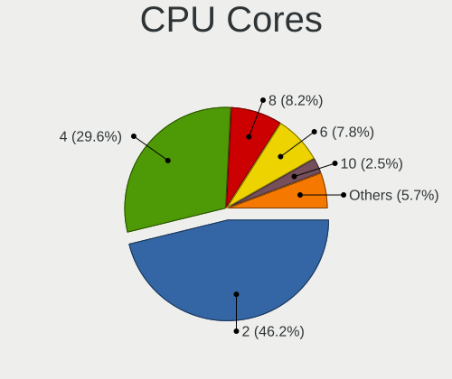

| Number  | Notebooks | Percent |
|---------|-----------|---------|
| 2       | 731       | 46.18%  |
| 4       | 469       | 29.63%  |
| 8       | 130       | 8.21%   |
| 6       | 123       | 7.77%   |
| 10      | 39        | 2.46%   |
| 14      | 22        | 1.39%   |
| 1       | 22        | 1.39%   |
| 12      | 20        | 1.26%   |
| 16      | 15        | 0.95%   |
| 24      | 7         | 0.44%   |
| Unknown | 4         | 0.25%   |
| 20      | 1         | 0.06%   |

CPU Sockets
-----------

Number of sockets

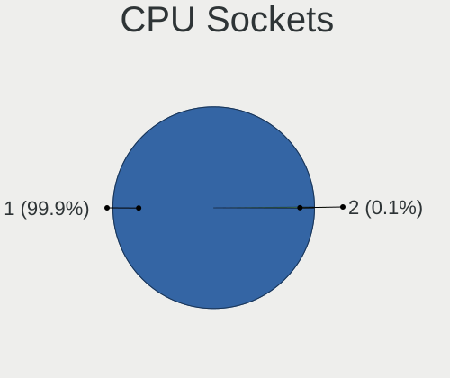

| Number | Notebooks | Percent |
|--------|-----------|---------|
| 1      | 1581      | 99.94%  |
| 2      | 1         | 0.06%   |

CPU Threads
-----------

Threads per core (Hyper-Threading)

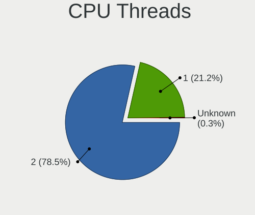

| Number  | Notebooks | Percent |
|---------|-----------|---------|
| 2       | 1244      | 78.54%  |
| 1       | 336       | 21.21%  |
| Unknown | 4         | 0.25%   |

CPU Op-Modes
------------

CPU Operation Modes (32-bit, 64-bit)

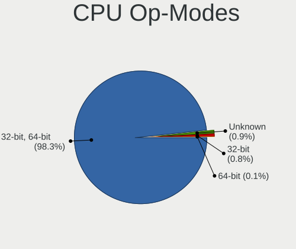

| Op mode        | Notebooks | Percent |
|----------------|-----------|---------|
| 32-bit, 64-bit | 1557      | 98.3%   |
| Unknown        | 14        | 0.88%   |
| 32-bit         | 12        | 0.76%   |
| 64-bit         | 1         | 0.06%   |

CPU Microcode
-------------

Microcode number

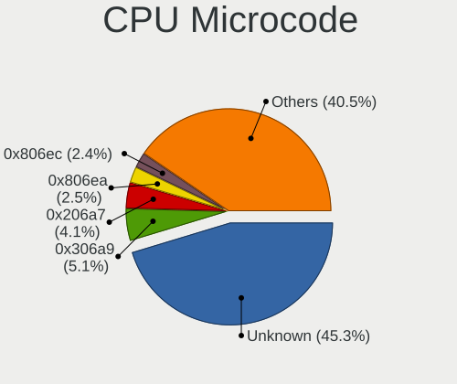

| Number     | Notebooks | Percent |
|------------|-----------|---------|
| Unknown    | 751       | 45.32%  |
| 0x306a9    | 85        | 5.13%   |
| 0x206a7    | 68        | 4.1%    |
| 0x806ea    | 42        | 2.53%   |
| 0x806ec    | 40        | 2.41%   |
| 0x1067a    | 40        | 2.41%   |
| 0x40651    | 36        | 2.17%   |
| 0x306c3    | 34        | 2.05%   |
| 0x806c1    | 29        | 1.75%   |
| 0x306d4    | 29        | 1.75%   |
| 0x906ea    | 28        | 1.69%   |
| 0x406e3    | 28        | 1.69%   |
| 0x20655    | 28        | 1.69%   |
| 0x806e9    | 26        | 1.57%   |
| 0x906e9    | 23        | 1.39%   |
| 0x6fd      | 21        | 1.27%   |
| 0xa0652    | 20        | 1.21%   |
| 0x0a50000c | 17        | 1.03%   |
| 0x08600106 | 17        | 1.03%   |
| 0x30678    | 16        | 0.97%   |
| 0x10676    | 16        | 0.97%   |
| 0x08608103 | 14        | 0.84%   |
| 0x806eb    | 10        | 0.6%    |
| 0x07030105 | 10        | 0.6%    |
| 0x906a4    | 9         | 0.54%   |
| 0x806d1    | 9         | 0.54%   |
| 0x506e3    | 9         | 0.54%   |
| 0x20652    | 9         | 0.54%   |
| 0x0700010f | 9         | 0.54%   |
| 0x05000119 | 9         | 0.54%   |
| 0x906a3    | 8         | 0.48%   |
| 0x6f6      | 8         | 0.48%   |
| 0x08600103 | 7         | 0.42%   |
| 0x08108109 | 7         | 0.42%   |
| 0x06006705 | 7         | 0.42%   |
| 0x706a1    | 6         | 0.36%   |
| 0x6fb      | 6         | 0.36%   |
| 0x406c4    | 6         | 0.36%   |
| 0x08108102 | 6         | 0.36%   |
| 0x106e5    | 5         | 0.3%    |

CPU Microarch
-------------

Microarchitecture

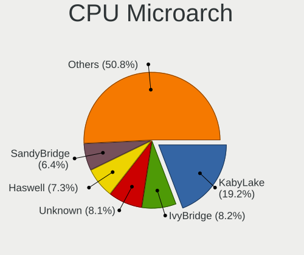

| Name              | Notebooks | Percent |
|-------------------|-----------|---------|
| KabyLake          | 304       | 19.22%  |
| IvyBridge         | 130       | 8.22%   |
| Unknown           | 128       | 8.09%   |
| Haswell           | 115       | 7.27%   |
| SandyBridge       | 102       | 6.45%   |
| Penryn            | 78        | 4.93%   |
| Skylake           | 77        | 4.87%   |
| Westmere          | 63        | 3.98%   |
| TigerLake         | 59        | 3.73%   |
| Broadwell         | 58        | 3.67%   |
| Alderlake Hybrid  | 55        | 3.48%   |
| Core              | 47        | 2.97%   |
| Zen 3             | 45        | 2.84%   |
| CometLake         | 44        | 2.78%   |
| Zen 2             | 40        | 2.53%   |
| Silvermont        | 34        | 2.15%   |
| IceLake           | 22        | 1.39%   |
| Zen+              | 19        | 1.2%    |
| Goldmont plus     | 18        | 1.14%   |
| Bobcat            | 18        | 1.14%   |
| Excavator         | 17        | 1.07%   |
| Puma              | 16        | 1.01%   |
| Jaguar            | 14        | 0.88%   |
| Zen               | 13        | 0.82%   |
| Bonnell           | 10        | 0.63%   |
| P6                | 8         | 0.51%   |
| Meteorlake Hybrid | 8         | 0.51%   |
| Nehalem           | 7         | 0.44%   |
| K8 Hammer         | 5         | 0.32%   |
| Piledriver        | 4         | 0.25%   |
| K8 & K10 hybrid   | 4         | 0.25%   |
| Goldmont          | 4         | 0.25%   |
| NetBurst          | 3         | 0.19%   |
| K10 Llano         | 3         | 0.19%   |
| K10               | 3         | 0.19%   |
| Gracemont         | 3         | 0.19%   |
| Tremont           | 2         | 0.13%   |
| Steamroller       | 1         | 0.06%   |
| Lunarlake Hybrid  | 1         | 0.06%   |

Graphics
--------

GPU Vendor
----------

Vendors of graphics cards

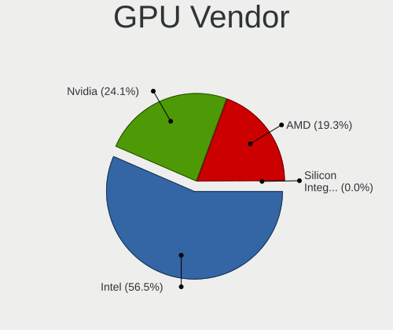

| Vendor                           | Notebooks | Percent |
|----------------------------------|-----------|---------|
| Intel                            | 1148      | 56.5%   |
| Nvidia                           | 490       | 24.11%  |
| AMD                              | 392       | 19.29%  |
| VIA Technologies                 | 1         | 0.05%   |
| Silicon Integrated Systems [SiS] | 1         | 0.05%   |

GPU Model
---------

Graphics card models

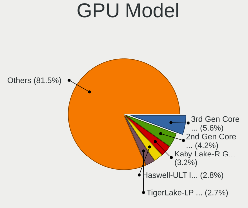

| Model                                                                                    | Notebooks | Percent |
|------------------------------------------------------------------------------------------|-----------|---------|
| Intel 3rd Gen Core processor Graphics Controller                                         | 117       | 5.61%   |
| Intel 2nd Generation Core Processor Family Integrated Graphics Controller                | 87        | 4.17%   |
| Intel Kaby Lake-R GT2 [UHD Graphics 620]                                                 | 66        | 3.16%   |
| Intel Haswell-ULT Integrated Graphics Controller                                         | 59        | 2.83%   |
| Intel TigerLake-LP GT2 [Iris Xe Graphics]                                                | 57        | 2.73%   |
| Intel WhiskeyLake-U GT2 [UHD Graphics 620]                                               | 56        | 2.68%   |
| Intel CoffeeLake-H GT2 [UHD Graphics 630]                                                | 51        | 2.44%   |
| Intel Skylake-U GT2 [HD Graphics 520]                                                    | 50        | 2.4%    |
| Intel 4th Gen Core Processor Integrated Graphics Controller                              | 50        | 2.4%    |
| Intel Kaby Lake-U GT2 [HD Graphics 620]                                                  | 48        | 2.3%    |
| Intel Broadwell-U GT2 [HD Graphics 5500]                                                 | 48        | 2.3%    |
| Intel Core Processor Integrated Graphics Controller                                      | 39        | 1.87%   |
| Intel Mobile 4 Series Chipset Integrated Graphics Controller                             | 37        | 1.77%   |
| AMD Renoir [Radeon Vega Series / Radeon Vega Mobile Series]                              | 36        | 1.72%   |
| Intel CometLake-H GT2 [UHD Graphics]                                                     | 34        | 1.63%   |
| Intel CometLake-U GT2 [UHD Graphics]                                                     | 29        | 1.39%   |
| Intel Kaby Lake-H GT2 [HD Graphics 630]                                                  | 26        | 1.25%   |
| AMD Cezanne [Radeon Vega Series / Radeon Vega Mobile Series]                             | 25        | 1.2%    |
| AMD Lucienne                                                                             | 24        | 1.15%   |
| Nvidia TU117M [GeForce GTX 1650 Mobile / Max-Q]                                          | 23        | 1.1%    |
| Nvidia GP107M [GeForce GTX 1050 Mobile]                                                  | 22        | 1.05%   |
| Intel Mobile GM965/GL960 Integrated Graphics Controller (secondary)                      | 22        | 1.05%   |
| Intel Mobile GM965/GL960 Integrated Graphics Controller (primary)                        | 22        | 1.05%   |
| Intel Alder Lake-P GT2 [Iris Xe Graphics]                                                | 22        | 1.05%   |
| Intel Atom Processor Z36xxx/Z37xxx Series Graphics & Display                             | 20        | 0.96%   |
| AMD Picasso/Raven 2 [Radeon Vega Series / Radeon Vega Mobile Series]                     | 20        | 0.96%   |
| Nvidia GA106M [GeForce RTX 3060 Mobile / Max-Q]                                          | 18        | 0.86%   |
| Nvidia AD107M [GeForce RTX 4060 Max-Q / Mobile]                                          | 17        | 0.81%   |
| Nvidia GA107M [GeForce RTX 3050 Mobile]                                                  | 16        | 0.77%   |
| Intel TigerLake-H GT1 [UHD Graphics]                                                     | 16        | 0.77%   |
| AMD Barcelo                                                                              | 16        | 0.77%   |
| Intel Skylake-H GT2 [HD Graphics 530]                                                    | 15        | 0.72%   |
| AMD Seymour [Radeon HD 6400M/7400M Series]                                               | 15        | 0.72%   |
| Nvidia GM108M [GeForce 940MX]                                                            | 14        | 0.67%   |
| Intel Raptor Lake-P [Iris Xe Graphics]                                                   | 13        | 0.62%   |
| Intel GeminiLake [UHD Graphics 600]                                                      | 13        | 0.62%   |
| Intel Atom/Celeron/Pentium Processor x5-E8000/J3xxx/N3xxx Integrated Graphics Controller | 13        | 0.62%   |
| Nvidia TU106M [GeForce RTX 2060 Mobile]                                                  | 12        | 0.57%   |
| Intel Alder Lake-UP3 GT2 [Iris Xe Graphics]                                              | 12        | 0.57%   |
| AMD Stoney [Radeon R2/R3/R4/R5 Graphics]                                                 | 12        | 0.57%   |

GPU Combo
---------

Combinations of graphics cards

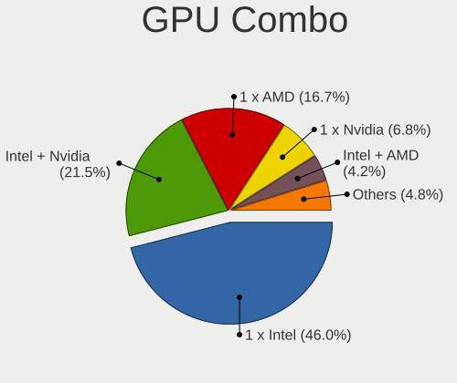

| Name           | Notebooks | Percent |
|----------------|-----------|---------|
| 1 x Intel      | 732       | 45.98%  |
| Intel + Nvidia | 342       | 21.48%  |
| 1 x AMD        | 266       | 16.71%  |
| 1 x Nvidia     | 108       | 6.78%   |
| Intel + AMD    | 67        | 4.21%   |
| AMD + Nvidia   | 41        | 2.58%   |
| 2 x AMD        | 19        | 1.19%   |
| 2 x Intel      | 9         | 0.57%   |
| Other          | 4         | 0.25%   |
| 2 x Nvidia     | 2         | 0.13%   |
| 1 x VIA        | 1         | 0.06%   |
| 1 x SiS        | 1         | 0.06%   |

GPU Driver
----------

Free vs proprietary

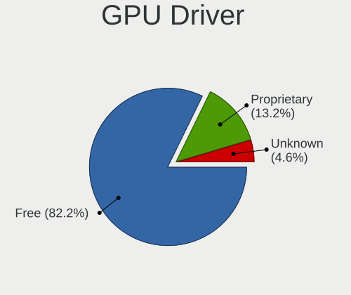

| Driver      | Notebooks | Percent |
|-------------|-----------|---------|
| Free        | 1325      | 82.25%  |
| Proprietary | 212       | 13.16%  |
| Unknown     | 74        | 4.59%   |

GPU Memory
----------

Total video memory

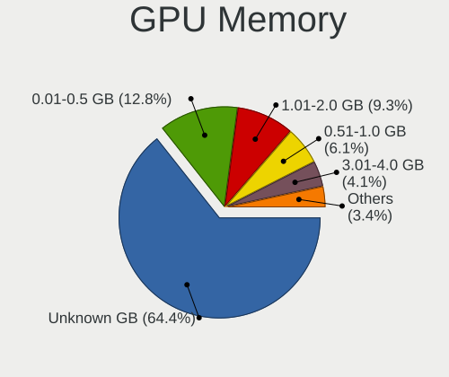

| Size in GB | Notebooks | Percent |
|------------|-----------|---------|
| Unknown    | 1049      | 64.36%  |
| 0.01-0.5   | 208       | 12.76%  |
| 1.01-2.0   | 151       | 9.26%   |
| 0.51-1.0   | 100       | 6.13%   |
| 3.01-4.0   | 67        | 4.11%   |
| 7.01-8.0   | 28        | 1.72%   |
| 5.01-6.0   | 21        | 1.29%   |
| 2.01-3.0   | 5         | 0.31%   |
| 8.01-16.0  | 1         | 0.06%   |

Monitor
-------

Monitor Vendor
--------------

Monitor vendors

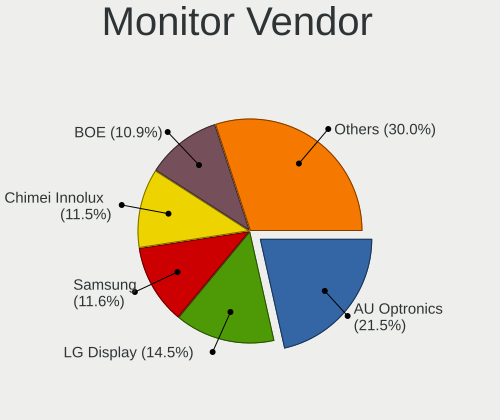

| Vendor                  | Notebooks | Percent |
|-------------------------|-----------|---------|
| AU Optronics            | 391       | 21.51%  |
| LG Display              | 264       | 14.52%  |
| Samsung Electronics     | 210       | 11.55%  |
| Chimei Innolux          | 209       | 11.5%   |
| BOE                     | 198       | 10.89%  |
| Dell                    | 54        | 2.97%   |
| Sharp                   | 51        | 2.81%   |
| Apple                   | 46        | 2.53%   |
| Chi Mei Optoelectronics | 44        | 2.42%   |
| Lenovo                  | 41        | 2.26%   |
| Philips                 | 33        | 1.82%   |
| Iiyama                  | 27        | 1.49%   |
| Hewlett-Packard         | 27        | 1.49%   |
| Goldstar                | 25        | 1.38%   |
| LG Philips              | 16        | 0.88%   |
| BenQ                    | 14        | 0.77%   |
| PANDA                   | 13        | 0.72%   |
| CSO                     | 13        | 0.72%   |
| AOC                     | 12        | 0.66%   |
| InfoVision              | 10        | 0.55%   |
| CSOT                    | 8         | 0.44%   |
| Valve                   | 7         | 0.39%   |
| Sony                    | 7         | 0.39%   |
| Acer                    | 7         | 0.39%   |
| Unknown                 | 6         | 0.33%   |
| Seiko/Epson             | 5         | 0.28%   |
| Panasonic               | 5         | 0.28%   |
| Medion                  | 5         | 0.28%   |
| ASUSTek Computer        | 5         | 0.28%   |
| Vestel Elektronik       | 4         | 0.22%   |
| Quanta Display          | 4         | 0.22%   |
| TMX                     | 3         | 0.17%   |
| MSI                     | 3         | 0.17%   |
| InnoLux Display         | 3         | 0.17%   |
| HKC                     | 3         | 0.17%   |
| HannStar                | 3         | 0.17%   |
| Eizo                    | 3         | 0.17%   |
| Medion Akoya            | 2         | 0.11%   |
| Fujitsu Siemens         | 2         | 0.11%   |
| CSW                     | 2         | 0.11%   |

Monitor Model
-------------

Monitor models

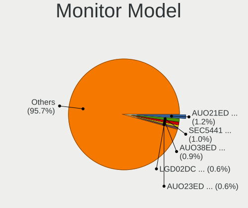

| Model                                                                     | Notebooks | Percent |
|---------------------------------------------------------------------------|-----------|---------|
| AU Optronics LCD Monitor AUO21ED 1920x1080 344x193mm 15.5-inch            | 22        | 1.19%   |
| Samsung Electronics LCD Monitor SEC5441 1280x800 331x207mm 15.4-inch      | 19        | 1.03%   |
| AU Optronics LCD Monitor AUO38ED 1920x1080 344x193mm 15.5-inch            | 17        | 0.92%   |
| LG Display LCD Monitor LGD02DC 1366x768 344x194mm 15.5-inch               | 11        | 0.59%   |
| AU Optronics LCD Monitor AUO23ED 1920x1080 344x193mm 15.5-inch            | 11        | 0.59%   |
| LG Display LCD Monitor LGD046F 1920x1080 344x194mm 15.5-inch              | 10        | 0.54%   |
| Chimei Innolux LCD Monitor CMN14D4 1920x1080 309x173mm 13.9-inch          | 10        | 0.54%   |
| AU Optronics LCD Monitor AUO26EC 1366x768 344x193mm 15.5-inch             | 9         | 0.49%   |
| AU Optronics LCD Monitor AUO139E 1600x900 382x214mm 17.2-inch             | 9         | 0.49%   |
| Lenovo LCD Monitor LEN40BA 1920x1080 344x194mm 15.5-inch                  | 8         | 0.43%   |
| Chimei Innolux LCD Monitor CMN1738 1920x1080 381x214mm 17.2-inch          | 8         | 0.43%   |
| AU Optronics LCD Monitor AUO159E 1600x900 382x214mm 17.2-inch             | 8         | 0.43%   |
| AU Optronics LCD Monitor AUO109E 1600x900 382x214mm 17.2-inch             | 8         | 0.43%   |
| Valve ANX7530 U VLV3001 800x1280 100x150mm 7.1-inch                       | 7         | 0.38%   |
| Samsung Electronics LCD Monitor SDC3654 1600x900 382x215mm 17.3-inch      | 7         | 0.38%   |
| Chimei Innolux LCD Monitor CMN15AB 1366x768 344x193mm 15.5-inch           | 7         | 0.38%   |
| Chimei Innolux LCD Monitor CMN1521 1920x1080 344x193mm 15.5-inch          | 7         | 0.38%   |
| AU Optronics LCD Monitor AUOA08B 1920x1080 344x193mm 15.5-inch            | 7         | 0.38%   |
| AU Optronics LCD Monitor AUO5B2D 1920x1080 293x162mm 13.2-inch            | 7         | 0.38%   |
| AU Optronics LCD Monitor AUO35ED 1920x1080 344x193mm 15.5-inch            | 7         | 0.38%   |
| LG Display LCD Monitor LGD04A7 1920x1080 344x194mm 15.5-inch              | 6         | 0.32%   |
| Chimei Innolux LCD Monitor CMN15E7 1920x1080 344x193mm 15.5-inch          | 6         | 0.32%   |
| Chimei Innolux LCD Monitor CMN15DB 1366x768 344x193mm 15.5-inch           | 6         | 0.32%   |
| Chimei Innolux LCD Monitor CMN15D5 1920x1080 344x193mm 15.5-inch          | 6         | 0.32%   |
| Chimei Innolux LCD Monitor CMN1512 1920x1080 344x193mm 15.5-inch          | 6         | 0.32%   |
| Chimei Innolux LCD Monitor CMN14D2 1920x1080 309x173mm 13.9-inch          | 6         | 0.32%   |
| Chimei Innolux LCD Monitor CMN1482 1600x900 309x174mm 14.0-inch           | 6         | 0.32%   |
| Chi Mei Optoelectronics LCD Monitor CMO1720 1920x1080 382x215mm 17.3-inch | 6         | 0.32%   |
| Chi Mei Optoelectronics LCD Monitor CMO15A7 1366x768 344x193mm 15.5-inch  | 6         | 0.32%   |
| BOE LCD Monitor BOE06CB 1920x1080 344x194mm 15.5-inch                     | 6         | 0.32%   |
| AU Optronics LCD Monitor AUO149E 1600x900 382x214mm 17.2-inch             | 6         | 0.32%   |
| Sharp LCD Monitor SHP1449 1920x1080 294x165mm 13.3-inch                   | 5         | 0.27%   |
| Samsung Electronics LCD Monitor SEC4251 1366x768 344x194mm 15.5-inch      | 5         | 0.27%   |
| LG Display LCD Monitor LGD0563 1920x1080 344x194mm 15.5-inch              | 5         | 0.27%   |
| LG Display LCD Monitor LGD0521 1920x1080 309x174mm 14.0-inch              | 5         | 0.27%   |
| LG Display LCD Monitor LGD04E8 1920x1080 382x215mm 17.3-inch              | 5         | 0.27%   |
| LG Display LCD Monitor LGD039F 1366x768 345x194mm 15.6-inch               | 5         | 0.27%   |
| Chimei Innolux LCD Monitor CMN1735 1920x1080 381x214mm 17.2-inch          | 5         | 0.27%   |
| Chimei Innolux LCD Monitor CMN15F6 1920x1080 344x193mm 15.5-inch          | 5         | 0.27%   |
| Chimei Innolux LCD Monitor CMN15F5 1920x1080 344x193mm 15.5-inch          | 5         | 0.27%   |

Monitor Resolution
------------------

Monitor screen resolution

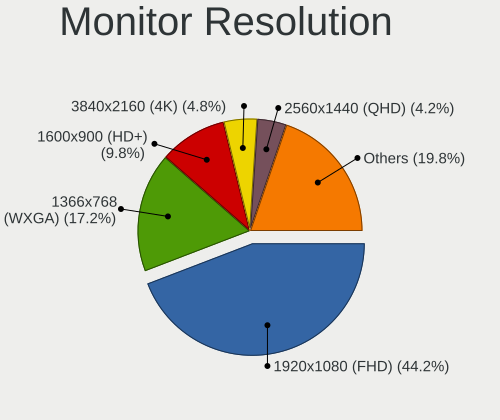

| Resolution         | Notebooks | Percent |
|--------------------|-----------|---------|
| 1920x1080 (FHD)    | 758       | 44.17%  |
| 1366x768 (WXGA)    | 296       | 17.25%  |
| 1600x900 (HD+)     | 168       | 9.79%   |
| 3840x2160 (4K)     | 83        | 4.84%   |
| 2560x1440 (QHD)    | 72        | 4.2%    |
| 1920x1200 (WUXGA)  | 62        | 3.61%   |
| 1280x800 (WXGA)    | 51        | 2.97%   |
| 1440x900 (WXGA+)   | 40        | 2.33%   |
| 2560x1600          | 39        | 2.27%   |
| 2880x1800          | 18        | 1.05%   |
| 1680x1050 (WSXGA+) | 16        | 0.93%   |
| 1280x1024 (SXGA)   | 13        | 0.76%   |
| 3840x2400          | 10        | 0.58%   |
| 3440x1440          | 10        | 0.58%   |
| 800x1280           | 8         | 0.47%   |
| 1024x600           | 7         | 0.41%   |
| Unknown            | 7         | 0.41%   |
| 3200x1800 (QHD+)   | 6         | 0.35%   |
| 3840x1080          | 5         | 0.29%   |
| 2880x1620          | 5         | 0.29%   |
| 1680x945           | 5         | 0.29%   |
| 1360x768           | 5         | 0.29%   |
| 2560x1080          | 3         | 0.17%   |
| 2256x1504          | 3         | 0.17%   |
| 1024x768 (XGA)     | 3         | 0.17%   |
| 2880x1920          | 2         | 0.12%   |
| 2160x1440          | 2         | 0.12%   |
| 1920x1280          | 2         | 0.12%   |
| 7680x2160          | 1         | 0.06%   |
| 6320x1800          | 1         | 0.06%   |
| 3840x1600          | 1         | 0.06%   |
| 3600x1080          | 1         | 0.06%   |
| 3520x1080          | 1         | 0.06%   |
| 3456x2160          | 1         | 0.06%   |
| 3200x2000          | 1         | 0.06%   |
| 3200x1080          | 1         | 0.06%   |
| 3072x1920          | 1         | 0.06%   |
| 2520x1680          | 1         | 0.06%   |
| 2400x1600          | 1         | 0.06%   |
| 2304x1440          | 1         | 0.06%   |

Monitor Diagonal
----------------

Diagonal size in inches

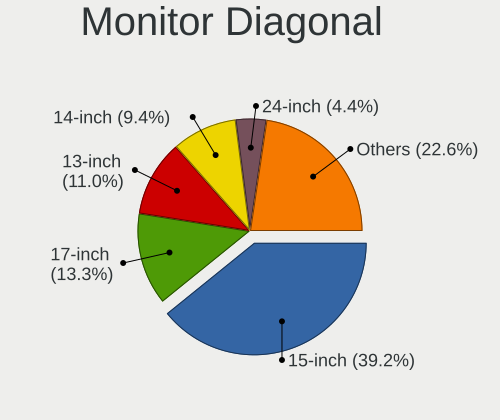

| Inches  | Notebooks | Percent |
|---------|-----------|---------|
| 15      | 711       | 39.17%  |
| 17      | 242       | 13.33%  |
| 13      | 200       | 11.02%  |
| 14      | 171       | 9.42%   |
| 24      | 80        | 4.41%   |
| 27      | 76        | 4.19%   |
| 16      | 57        | 3.14%   |
| 23      | 38        | 2.09%   |
| Unknown | 33        | 1.82%   |
| 12      | 32        | 1.76%   |
| 21      | 31        | 1.71%   |
| 18      | 16        | 0.88%   |
| 31      | 15        | 0.83%   |
| 11      | 13        | 0.72%   |
| 10      | 11        | 0.61%   |
| 34      | 10        | 0.55%   |
| 84      | 8         | 0.44%   |
| 22      | 7         | 0.39%   |
| 19      | 7         | 0.39%   |
| 7       | 7         | 0.39%   |
| 54      | 6         | 0.33%   |
| 72      | 5         | 0.28%   |
| 32      | 5         | 0.28%   |
| 25      | 5         | 0.28%   |
| 20      | 4         | 0.22%   |
| 65      | 3         | 0.17%   |
| 40      | 3         | 0.17%   |
| 49      | 2         | 0.11%   |
| 39      | 2         | 0.11%   |
| 35      | 2         | 0.11%   |
| 29      | 2         | 0.11%   |
| 3       | 2         | 0.11%   |
| 63      | 1         | 0.06%   |
| 52      | 1         | 0.06%   |
| 48      | 1         | 0.06%   |
| 46      | 1         | 0.06%   |
| 43      | 1         | 0.06%   |
| 42      | 1         | 0.06%   |
| 37      | 1         | 0.06%   |
| 36      | 1         | 0.06%   |

Monitor Width
-------------

Physical width

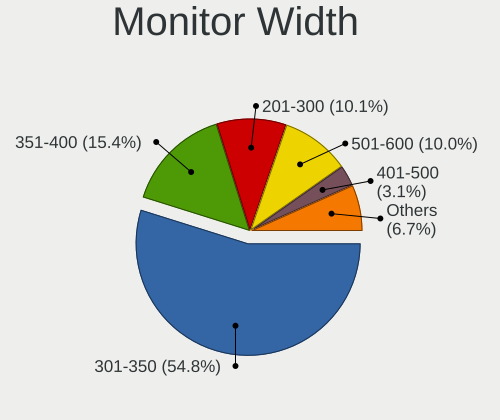

| Width in mm | Notebooks | Percent |
|-------------|-----------|---------|
| 301-350     | 986       | 54.84%  |
| 351-400     | 276       | 15.35%  |
| 201-300     | 181       | 10.07%  |
| 501-600     | 180       | 10.01%  |
| 401-500     | 55        | 3.06%   |
| Unknown     | 33        | 1.84%   |
| 601-700     | 25        | 1.39%   |
| 701-800     | 16        | 0.89%   |
| 1001-1500   | 15        | 0.83%   |
| 1501-2000   | 13        | 0.72%   |
| 801-900     | 8         | 0.44%   |
| 1-100       | 8         | 0.44%   |
| 901-1000    | 2         | 0.11%   |

Aspect Ratio
------------

Proportional relationship between the width and the height

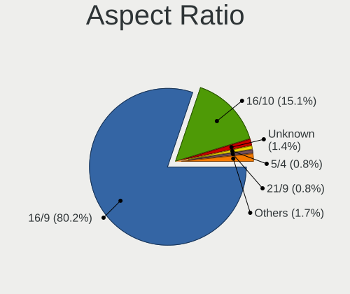

| Ratio   | Notebooks | Percent |
|---------|-----------|---------|
| 16/9    | 1280      | 80.2%   |
| 16/10   | 241       | 15.1%   |
| Unknown | 22        | 1.38%   |
| 5/4     | 13        | 0.81%   |
| 21/9    | 13        | 0.81%   |
| 3/2     | 10        | 0.63%   |
| 0.67    | 7         | 0.44%   |
| 4/3     | 4         | 0.25%   |
| 32/9    | 3         | 0.19%   |
| 6/5     | 2         | 0.13%   |
| 3.73    | 1         | 0.06%   |

Monitor Area
------------

Area in inch²

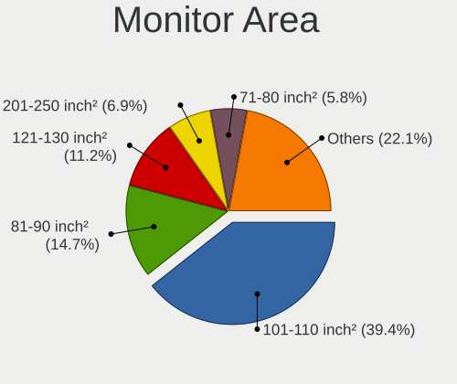

| Area in inch² | Notebooks | Percent |
|----------------|-----------|---------|
| 101-110        | 711       | 39.37%  |
| 81-90          | 266       | 14.73%  |
| 121-130        | 202       | 11.18%  |
| 201-250        | 124       | 6.87%   |
| 71-80          | 104       | 5.76%   |
| 301-350        | 76        | 4.21%   |
| 111-120        | 53        | 2.93%   |
| 131-140        | 38        | 2.1%    |
| 351-500        | 36        | 1.99%   |
| Unknown        | 33        | 1.83%   |
| 61-70          | 32        | 1.77%   |
| More than 1000 | 24        | 1.33%   |
| 251-300        | 22        | 1.22%   |
| 151-200        | 20        | 1.11%   |
| 141-150        | 16        | 0.89%   |
| 51-60          | 13        | 0.72%   |
| 501-1000       | 12        | 0.66%   |
| 41-50          | 11        | 0.61%   |
| 1-40           | 8         | 0.44%   |
| 91-100         | 5         | 0.28%   |

Pixel Density
-------------

Pixels per inch

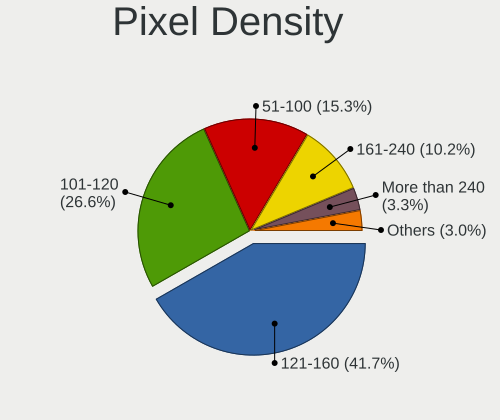

| Density       | Notebooks | Percent |
|---------------|-----------|---------|
| 121-160       | 738       | 41.72%  |
| 101-120       | 470       | 26.57%  |
| 51-100        | 270       | 15.26%  |
| 161-240       | 180       | 10.18%  |
| More than 240 | 58        | 3.28%   |
| Unknown       | 33        | 1.87%   |
| 1-50          | 20        | 1.13%   |

Multiple Monitors
-----------------

Total monitors connected

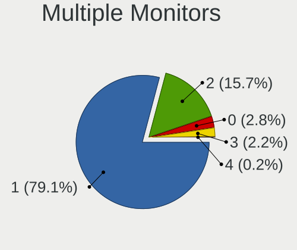

| Total | Notebooks | Percent |
|-------|-----------|---------|
| 1     | 1286      | 79.14%  |
| 2     | 255       | 15.69%  |
| 0     | 45        | 2.77%   |
| 3     | 36        | 2.22%   |
| 4     | 3         | 0.18%   |

Network
-------

Net Controller Vendor
---------------------

Controller vendors

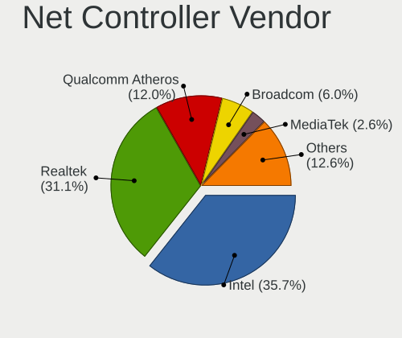

| Vendor                                 | Notebooks | Percent |
|----------------------------------------|-----------|---------|
| Intel                                  | 916       | 35.67%  |
| Realtek Semiconductor                  | 799       | 31.11%  |
| Qualcomm Atheros                       | 308       | 11.99%  |
| Broadcom                               | 153       | 5.96%   |
| MediaTek                               | 68        | 2.65%   |
| Broadcom Limited                       | 39        | 1.52%   |
| Marvell Technology Group               | 28        | 1.09%   |
| Ralink                                 | 26        | 1.01%   |
| ASIX Electronics                       | 21        | 0.82%   |
| TP-Link                                | 19        | 0.74%   |
| DisplayLink                            | 18        | 0.7%    |
| Lenovo                                 | 14        | 0.55%   |
| Shenzhen Goodix Technology             | 13        | 0.51%   |
| Ralink Technology                      | 13        | 0.51%   |
| Nvidia                                 | 13        | 0.51%   |
| Dell                                   | 13        | 0.51%   |
| Hewlett-Packard                        | 9         | 0.35%   |
| Ericsson Business Mobile Networks      | 9         | 0.35%   |
| Xiaomi                                 | 7         | 0.27%   |
| Sierra Wireless                        | 6         | 0.23%   |
| Qualcomm                               | 6         | 0.23%   |
| JMicron Technology                     | 6         | 0.23%   |
| D-Link System                          | 6         | 0.23%   |
| ASUSTek Computer                       | 6         | 0.23%   |
| Samsung Electronics                    | 5         | 0.19%   |
| Silicon Integrated Systems [SiS]       | 3         | 0.12%   |
| Motorola PCS                           | 3         | 0.12%   |
| Huawei Technologies                    | 3         | 0.12%   |
| Fibocom                                | 3         | 0.12%   |
| ADMtek                                 | 3         | 0.12%   |
| Suzhou Motorcomm Electronic Technology | 2         | 0.08%   |
| Qualcomm Technologies                  | 2         | 0.08%   |
| OPPO Electronics                       | 2         | 0.08%   |
| NetGear                                | 2         | 0.08%   |
| Motorcomm Microelectronics.            | 2         | 0.08%   |
| Microsoft                              | 2         | 0.08%   |
| Google                                 | 2         | 0.08%   |
| Edimax Technology                      | 2         | 0.08%   |
| D-Link                                 | 2         | 0.08%   |
| Attansic Technology                    | 2         | 0.08%   |

Net Controller Model
--------------------

Controller models

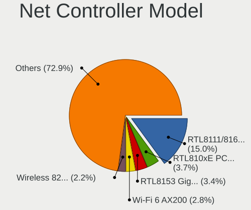

| Model                                                                  | Notebooks | Percent |
|------------------------------------------------------------------------|-----------|---------|
| Realtek RTL8111/8168/8211/8411 PCI Express Gigabit Ethernet Controller | 472       | 14.98%  |
| Realtek RTL810xE PCI Express Fast Ethernet controller                  | 116       | 3.68%   |
| Realtek RTL8153 Gigabit Ethernet Adapter                               | 108       | 3.43%   |
| Intel Wi-Fi 6 AX200                                                    | 89        | 2.83%   |
| Intel Wireless 8265 / 8275                                             | 70        | 2.22%   |
| Qualcomm Atheros AR9485 Wireless Network Adapter                       | 60        | 1.9%    |
| Intel Wireless 7260                                                    | 59        | 1.87%   |
| Intel Wireless 8260                                                    | 48        | 1.52%   |
| Intel Wireless 7265                                                    | 46        | 1.46%   |
| Intel 82579LM Gigabit Network Connection (Lewisville)                  | 44        | 1.4%    |
| Qualcomm Atheros QCA9377 802.11ac Wireless Network Adapter             | 42        | 1.33%   |
| Intel Wi-Fi 6 AX201                                                    | 42        | 1.33%   |
| Qualcomm Atheros AR9285 Wireless Network Adapter (PCI-Express)         | 41        | 1.3%    |
| Qualcomm Atheros QCA9565 / AR9565 Wireless Network Adapter             | 40        | 1.27%   |
| Intel Alder Lake-P PCH CNVi WiFi                                       | 40        | 1.27%   |
| Realtek RTL8821CE 802.11ac PCIe Wireless Network Adapter               | 39        | 1.24%   |
| Intel Centrino Advanced-N 6205 [Taylor Peak]                           | 38        | 1.21%   |
| Intel Cannon Point-LP CNVi [Wireless-AC]                               | 38        | 1.21%   |
| Intel Comet Lake PCH CNVi WiFi                                         | 36        | 1.14%   |
| Qualcomm Atheros QCA6174 802.11ac Wireless Network Adapter             | 34        | 1.08%   |
| Realtek RTL8822CE 802.11ac PCIe Wireless Network Adapter               | 31        | 0.98%   |
| Realtek RTL8723BE PCIe Wireless Network Adapter                        | 28        | 0.89%   |
| Intel Ethernet Connection I218-LM                                      | 27        | 0.86%   |
| Intel Centrino Wireless-N 2230                                         | 26        | 0.83%   |
| Intel Ethernet Connection (4) I219-V                                   | 25        | 0.79%   |
| Intel Cannon Lake PCH CNVi WiFi                                        | 25        | 0.79%   |
| MediaTek MT7922 802.11ax PCI Express Wireless Network Adapter          | 24        | 0.76%   |
| MediaTek MT7921 802.11ax PCIe Wireless Network Adapter [Filogic 330]   | 24        | 0.76%   |
| Intel PRO/Wireless 3945ABG [Golan] Network Connection                  | 24        | 0.76%   |
| Intel Ethernet Connection (4) I219-LM                                  | 24        | 0.76%   |
| Qualcomm Atheros AR8151 v2.0 Gigabit Ethernet                          | 23        | 0.73%   |
| Intel Raptor Lake PCH CNVi WiFi                                        | 22        | 0.7%    |
| Broadcom BCM4313 802.11bgn Wireless Network Adapter                    | 22        | 0.7%    |
| Intel Wi-Fi 5(802.11ac) Wireless-AC 9x6x [Thunder Peak]                | 21        | 0.67%   |
| Intel Comet Lake PCH-LP CNVi WiFi                                      | 21        | 0.67%   |
| Intel Ethernet Connection I217-LM                                      | 20        | 0.63%   |
| ASIX AX88179 Gigabit Ethernet                                          | 20        | 0.63%   |
| Intel WiFi Link 5100                                                   | 19        | 0.6%    |
| Intel Ethernet Connection I219-LM                                      | 19        | 0.6%    |
| Intel Centrino Ultimate-N 6300                                         | 18        | 0.57%   |

Wireless Vendor
---------------

Wireless vendors

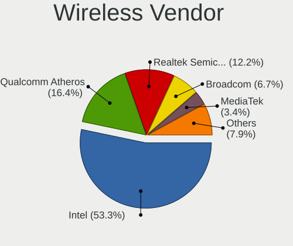

| Vendor                                | Notebooks | Percent |
|---------------------------------------|-----------|---------|
| Intel                                 | 854       | 53.28%  |
| Qualcomm Atheros                      | 263       | 16.41%  |
| Realtek Semiconductor                 | 196       | 12.23%  |
| Broadcom                              | 108       | 6.74%   |
| MediaTek                              | 55        | 3.43%   |
| Broadcom Limited                      | 27        | 1.68%   |
| Ralink                                | 26        | 1.62%   |
| TP-Link                               | 14        | 0.87%   |
| Ralink Technology                     | 13        | 0.81%   |
| Dell                                  | 7         | 0.44%   |
| Sierra Wireless                       | 6         | 0.37%   |
| Qualcomm                              | 6         | 0.37%   |
| D-Link System                         | 6         | 0.37%   |
| ASUSTek Computer                      | 5         | 0.31%   |
| Fibocom                               | 3         | 0.19%   |
| NetGear                               | 2         | 0.12%   |
| Microsoft                             | 2         | 0.12%   |
| Hewlett-Packard                       | 2         | 0.12%   |
| Edimax Technology                     | 2         | 0.12%   |
| D-Link                                | 2         | 0.12%   |
| Z-Com                                 | 1         | 0.06%   |
| Panasonic (Matsushita)                | 1         | 0.06%   |
| Belkin Components                     | 1         | 0.06%   |
| 802.11g Adapter [Linksys WUSB54GC v3] | 1         | 0.06%   |

Wireless Model
--------------

Wireless models

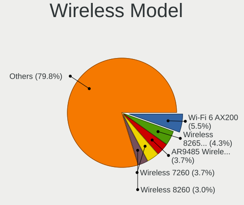

| Model                                                                | Notebooks | Percent |
|----------------------------------------------------------------------|-----------|---------|
| Intel Wi-Fi 6 AX200                                                  | 89        | 5.51%   |
| Intel Wireless 8265 / 8275                                           | 70        | 4.34%   |
| Qualcomm Atheros AR9485 Wireless Network Adapter                     | 60        | 3.72%   |
| Intel Wireless 7260                                                  | 59        | 3.66%   |
| Intel Wireless 8260                                                  | 48        | 2.97%   |
| Intel Wireless 7265                                                  | 46        | 2.85%   |
| Qualcomm Atheros QCA9377 802.11ac Wireless Network Adapter           | 42        | 2.6%    |
| Intel Wi-Fi 6 AX201                                                  | 42        | 2.6%    |
| Qualcomm Atheros AR9285 Wireless Network Adapter (PCI-Express)       | 41        | 2.54%   |
| Qualcomm Atheros QCA9565 / AR9565 Wireless Network Adapter           | 40        | 2.48%   |
| Realtek RTL8821CE 802.11ac PCIe Wireless Network Adapter             | 39        | 2.42%   |
| Intel Centrino Advanced-N 6205 [Taylor Peak]                         | 38        | 2.35%   |
| Intel Cannon Point-LP CNVi [Wireless-AC]                             | 38        | 2.35%   |
| Intel Comet Lake PCH CNVi WiFi                                       | 36        | 2.23%   |
| Qualcomm Atheros QCA6174 802.11ac Wireless Network Adapter           | 34        | 2.11%   |
| Realtek RTL8822CE 802.11ac PCIe Wireless Network Adapter             | 31        | 1.92%   |
| Realtek RTL8723BE PCIe Wireless Network Adapter                      | 28        | 1.73%   |
| Intel Centrino Wireless-N 2230                                       | 26        | 1.61%   |
| Intel Cannon Lake PCH CNVi WiFi                                      | 25        | 1.55%   |
| Intel Alder Lake-P PCH CNVi WiFi                                     | 25        | 1.55%   |
| MediaTek MT7921 802.11ax PCIe Wireless Network Adapter [Filogic 330] | 24        | 1.49%   |
| Intel PRO/Wireless 3945ABG [Golan] Network Connection                | 24        | 1.49%   |
| Intel Raptor Lake PCH CNVi WiFi                                      | 22        | 1.36%   |
| Broadcom BCM4313 802.11bgn Wireless Network Adapter                  | 22        | 1.36%   |
| Intel Wi-Fi 5(802.11ac) Wireless-AC 9x6x [Thunder Peak]              | 21        | 1.3%    |
| Intel Comet Lake PCH-LP CNVi WiFi                                    | 21        | 1.3%    |
| Intel WiFi Link 5100                                                 | 19        | 1.18%   |
| Intel Centrino Ultimate-N 6300                                       | 18        | 1.12%   |
| Intel Centrino Advanced-N 6200                                       | 18        | 1.12%   |
| Broadcom BCM43142 802.11b/g/n                                        | 18        | 1.12%   |
| Qualcomm Atheros AR9287 Wireless Network Adapter (PCI-Express)       | 16        | 0.99%   |
| MediaTek MT7922 802.11ax PCI Express Wireless Network Adapter        | 16        | 0.99%   |
| Intel Wireless 3165                                                  | 15        | 0.93%   |
| Intel Wireless 3160                                                  | 15        | 0.93%   |
| Intel PRO/Wireless 4965 AG or AGN [Kedron] Network Connection        | 15        | 0.93%   |
| Intel Centrino Advanced-N 6235                                       | 15        | 0.93%   |
| Realtek RTL8822BE 802.11a/b/g/n/ac WiFi adapter                      | 14        | 0.87%   |
| Realtek RTL8188CE 802.11b/g/n WiFi Adapter                           | 13        | 0.81%   |
| Broadcom BCM43228 802.11a/b/g/n                                      | 13        | 0.81%   |
| Intel Wi-Fi 6E(802.11ax) AX210/AX1675* 2x2 [Typhoon Peak]            | 12        | 0.74%   |

Ethernet Vendor
---------------

Ethernet vendors

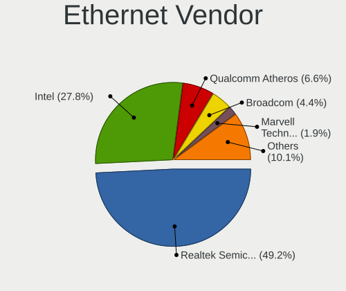

| Vendor                                 | Notebooks | Percent |
|----------------------------------------|-----------|---------|
| Realtek Semiconductor                  | 723       | 49.22%  |
| Intel                                  | 409       | 27.84%  |
| Qualcomm Atheros                       | 97        | 6.6%    |
| Broadcom                               | 64        | 4.36%   |
| Marvell Technology Group               | 28        | 1.91%   |
| ASIX Electronics                       | 21        | 1.43%   |
| DisplayLink                            | 18        | 1.23%   |
| Lenovo                                 | 14        | 0.95%   |
| Nvidia                                 | 13        | 0.88%   |
| MediaTek                               | 13        | 0.88%   |
| Broadcom Limited                       | 12        | 0.82%   |
| Xiaomi                                 | 7         | 0.48%   |
| Hewlett-Packard                        | 7         | 0.48%   |
| JMicron Technology                     | 6         | 0.41%   |
| Samsung Electronics                    | 5         | 0.34%   |
| TP-Link                                | 4         | 0.27%   |
| Silicon Integrated Systems [SiS]       | 3         | 0.2%    |
| Motorola PCS                           | 3         | 0.2%    |
| ADMtek                                 | 3         | 0.2%    |
| Suzhou Motorcomm Electronic Technology | 2         | 0.14%   |
| Qualcomm Technologies                  | 2         | 0.14%   |
| OPPO Electronics                       | 2         | 0.14%   |
| Motorcomm Microelectronics.            | 2         | 0.14%   |
| Google                                 | 2         | 0.14%   |
| Attansic Technology                    | 2         | 0.14%   |
| Apple                                  | 2         | 0.14%   |
| VIA Technologies                       | 1         | 0.07%   |
| OnePlus Technology (Shenzhen)          | 1         | 0.07%   |
| Microchip Technology                   | 1         | 0.07%   |
| Huawei Technologies                    | 1         | 0.07%   |
| ASUSTek Computer                       | 1         | 0.07%   |

Ethernet Model
--------------

Ethernet models

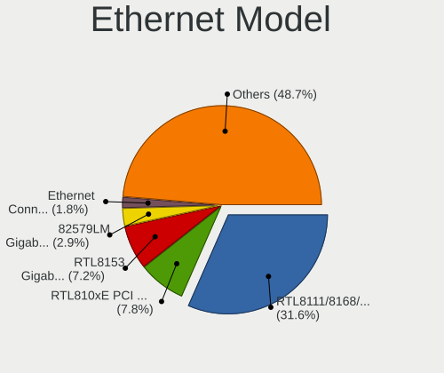

| Model                                                                  | Notebooks | Percent |
|------------------------------------------------------------------------|-----------|---------|
| Realtek RTL8111/8168/8211/8411 PCI Express Gigabit Ethernet Controller | 472       | 31.59%  |
| Realtek RTL810xE PCI Express Fast Ethernet controller                  | 116       | 7.76%   |
| Realtek RTL8153 Gigabit Ethernet Adapter                               | 108       | 7.23%   |
| Intel 82579LM Gigabit Network Connection (Lewisville)                  | 44        | 2.95%   |
| Intel Ethernet Connection I218-LM                                      | 27        | 1.81%   |
| Intel Ethernet Connection (4) I219-V                                   | 25        | 1.67%   |
| Intel Ethernet Connection (4) I219-LM                                  | 24        | 1.61%   |
| Qualcomm Atheros AR8151 v2.0 Gigabit Ethernet                          | 23        | 1.54%   |
| Intel Ethernet Connection I217-LM                                      | 20        | 1.34%   |
| ASIX AX88179 Gigabit Ethernet                                          | 20        | 1.34%   |
| Intel Ethernet Connection I219-LM                                      | 19        | 1.27%   |
| Intel Ethernet Connection (6) I219-LM                                  | 17        | 1.14%   |
| Intel Ethernet Connection (3) I218-LM                                  | 17        | 1.14%   |
| Intel 82577LM Gigabit Network Connection                               | 17        | 1.14%   |
| Qualcomm Atheros AR8161 Gigabit Ethernet                               | 16        | 1.07%   |
| Realtek RTL8125 2.5GbE Controller                                      | 15        | 1%      |
| Intel Alder Lake-P PCH CNVi WiFi                                       | 15        | 1%      |
| Intel Ethernet Connection (6) I219-V                                   | 14        | 0.94%   |
| Intel Ethernet Connection I219-V                                       | 13        | 0.87%   |
| Intel 82567LM Gigabit Network Connection                               | 13        | 0.87%   |
| Intel 82566MM Gigabit Network Connection                               | 11        | 0.74%   |
| Broadcom NetLink BCM57780 Gigabit Ethernet PCIe                        | 11        | 0.74%   |
| Qualcomm Atheros AR8131 Gigabit Ethernet                               | 10        | 0.67%   |
| Intel 82579V Gigabit Network Connection                                | 10        | 0.67%   |
| Broadcom NetXtreme BCM57765 Gigabit Ethernet PCIe                      | 10        | 0.67%   |
| Intel Ethernet Connection I217-V                                       | 9         | 0.6%    |
| Broadcom NetLink BCM5784M Gigabit Ethernet PCIe                        | 9         | 0.6%    |
| Realtek RTL8152 Fast Ethernet Adapter                                  | 8         | 0.54%   |
| Qualcomm Atheros Killer E220x Gigabit Ethernet Controller              | 8         | 0.54%   |
| MediaTek MT7922 802.11ax PCI Express Wireless Network Adapter          | 8         | 0.54%   |
| Intel Ethernet Connection (7) I219-LM                                  | 8         | 0.54%   |
| Intel Ethernet Connection (16) I219-LM                                 | 8         | 0.54%   |
| Intel Ethernet Connection (10) I219-LM                                 | 8         | 0.54%   |
| Nvidia MCP79 Ethernet                                                  | 7         | 0.47%   |
| Intel Ethernet Connection (16) I219-V                                  | 7         | 0.47%   |
| Intel Ethernet Connection (13) I219-LM                                 | 7         | 0.47%   |
| Broadcom NetLink BCM57785 Gigabit Ethernet PCIe                        | 7         | 0.47%   |
| Realtek Killer E2600 GbE Controller                                    | 6         | 0.4%    |
| Qualcomm Atheros Killer E2500 Gigabit Ethernet Controller              | 6         | 0.4%    |
| Qualcomm Atheros Killer E2400 Gigabit Ethernet Controller              | 6         | 0.4%    |

Net Controller Kind
-------------------

Ethernet, WiFi or modem

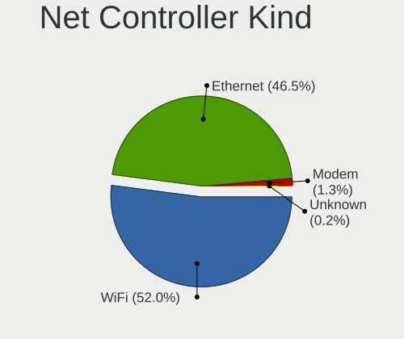

| Kind     | Notebooks | Percent |
|----------|-----------|---------|
| WiFi     | 1530      | 52.04%  |
| Ethernet | 1368      | 46.53%  |
| Modem    | 37        | 1.26%   |
| Unknown  | 5         | 0.17%   |

Used Controller
---------------

Currently used network controller

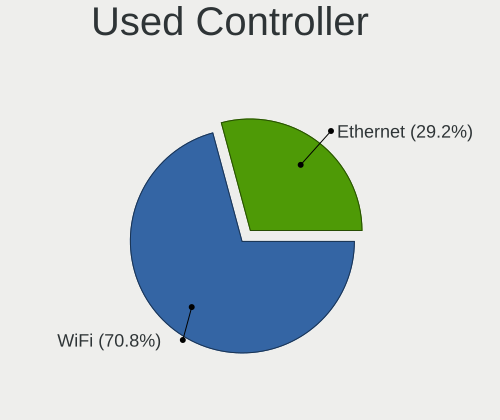

| Kind     | Notebooks | Percent |
|----------|-----------|---------|
| WiFi     | 1208      | 70.81%  |
| Ethernet | 498       | 29.19%  |

NICs
----

Total network controllers on board

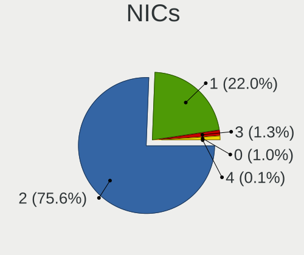

| Total | Notebooks | Percent |
|-------|-----------|---------|
| 2     | 1200      | 75.61%  |
| 1     | 349       | 21.99%  |
| 3     | 21        | 1.32%   |
| 0     | 16        | 1.01%   |
| 4     | 1         | 0.06%   |

IPv6
----

IPv6 vs IPv4

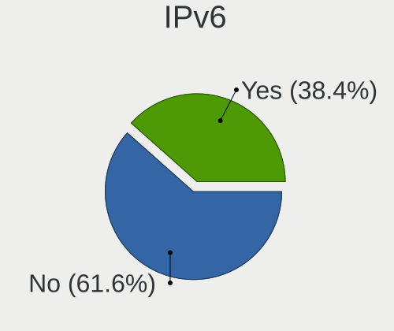

| Used | Notebooks | Percent |
|------|-----------|---------|
| No   | 1009      | 61.56%  |
| Yes  | 630       | 38.44%  |

Bluetooth
---------

Bluetooth Vendor
----------------

Controller vendors

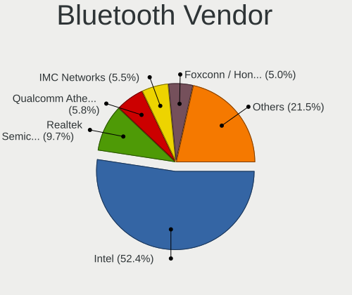

| Vendor                          | Notebooks | Percent |
|---------------------------------|-----------|---------|
| Intel                           | 665       | 52.4%   |
| Realtek Semiconductor           | 123       | 9.69%   |
| Qualcomm Atheros Communications | 74        | 5.83%   |
| IMC Networks                    | 70        | 5.52%   |
| Foxconn / Hon Hai               | 64        | 5.04%   |
| Broadcom                        | 61        | 4.81%   |
| Apple                           | 38        | 2.99%   |
| Dell                            | 37        | 2.92%   |
| Lite-On Technology              | 35        | 2.76%   |
| Hewlett-Packard                 | 28        | 2.21%   |
| Toshiba                         | 18        | 1.42%   |
| MediaTek                        | 12        | 0.95%   |
| Ralink                          | 10        | 0.79%   |
| Cambridge Silicon Radio         | 9         | 0.71%   |
| ASUSTek Computer                | 7         | 0.55%   |
| Alps Electric                   | 5         | 0.39%   |
| Foxconn International           | 4         | 0.32%   |
| Ralink Technology               | 3         | 0.24%   |
| USI                             | 2         | 0.16%   |
| Realtek                         | 2         | 0.16%   |
| Micro Star International        | 1         | 0.08%   |
| Belkin Components               | 1         | 0.08%   |

Bluetooth Model
---------------

Controller models

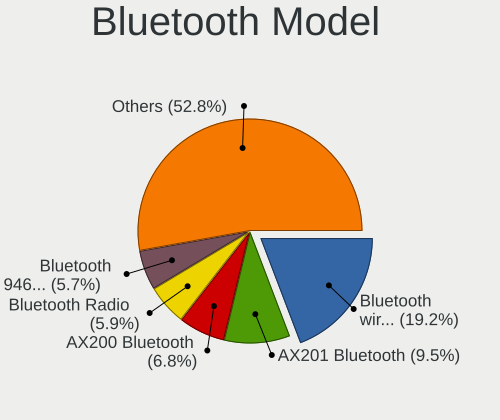

| Model                                               | Notebooks | Percent |
|-----------------------------------------------------|-----------|---------|
| Intel Bluetooth wireless interface                  | 244       | 19.21%  |
| Intel AX201 Bluetooth                               | 121       | 9.53%   |
| Intel AX200 Bluetooth                               | 86        | 6.77%   |
| Realtek Bluetooth Radio                             | 75        | 5.91%   |
| Intel Bluetooth 9460/9560 Jefferson Peak (JfP)      | 73        | 5.75%   |
| Intel Bluetooth Device                              | 68        | 5.35%   |
| Intel Centrino Bluetooth Wireless Transceiver       | 34        | 2.68%   |
| Realtek  Bluetooth 4.2 Adapter                      | 31        | 2.44%   |
| Qualcomm Atheros  Bluetooth Device                  | 24        | 1.89%   |
| IMC Networks Bluetooth Radio                        | 22        | 1.73%   |
| Apple Bluetooth Host Controller                     | 22        | 1.73%   |
| IMC Networks Wireless_Device                        | 21        | 1.65%   |
| Intel Wireless-AC 9260 Bluetooth Adapter            | 20        | 1.57%   |
| Qualcomm Atheros QCA61x4 Bluetooth 4.0              | 19        | 1.5%    |
| Lite-On Qualcomm Atheros QCA9377 Bluetooth          | 18        | 1.42%   |
| Foxconn / Hon Hai Bluetooth Device                  | 18        | 1.42%   |
| HP Bluetooth 2.0 Interface [Broadcom BCM2045]       | 16        | 1.26%   |
| IMC Networks Bluetooth Device                       | 15        | 1.18%   |
| Qualcomm Atheros AR3011 Bluetooth                   | 14        | 1.1%    |
| Foxconn / Hon Hai Wireless_Device                   | 14        | 1.1%    |
| Foxconn / Hon Hai MediaTek Bluetooth Adapter        | 14        | 1.1%    |
| Dell DW375 Bluetooth Module                         | 14        | 1.1%    |
| Apple Bluetooth USB Host Controller                 | 13        | 1.02%   |
| Intel AX210 Bluetooth                               | 12        | 0.94%   |
| Dell BCM20702A0 Bluetooth Module                    | 12        | 0.94%   |
| Broadcom HP Portable SoftSailing                    | 12        | 0.94%   |
| MediaTek Wireless_Device                            | 11        | 0.87%   |
| HP Broadcom 2070 Bluetooth Combo                    | 11        | 0.87%   |
| Broadcom BCM2045B (BDC-2.1)                         | 11        | 0.87%   |
| Ralink RT3290 Bluetooth                             | 10        | 0.79%   |
| Qualcomm Atheros AR3012 Bluetooth 4.0               | 10        | 0.79%   |
| Foxconn / Hon Hai Bluetooth USB Host Controller     | 10        | 0.79%   |
| Cambridge Silicon Radio Bluetooth Dongle (HCI mode) | 9         | 0.71%   |
| Toshiba Bluetooth Device                            | 8         | 0.63%   |
| Realtek RTL8821A Bluetooth                          | 8         | 0.63%   |
| Lite-On Atheros AR3012 Bluetooth                    | 7         | 0.55%   |
| IMC Networks Atheros AR3012 Bluetooth 4.0 Adapter   | 6         | 0.47%   |
| Broadcom HP Portable Bumble Bee                     | 6         | 0.47%   |
| Lite-On Bluetooth Device                            | 5         | 0.39%   |
| IMC Networks Bluetooth                              | 5         | 0.39%   |

Sound
-----

Sound Vendor
------------

Sound card vendors

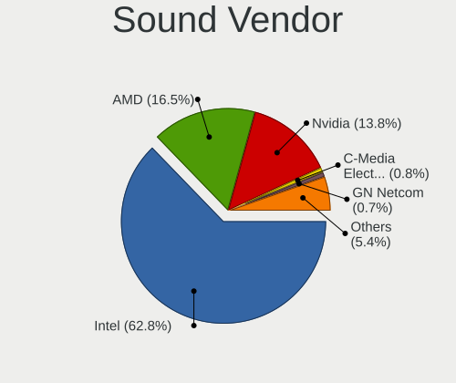

| Vendor                               | Notebooks | Percent |
|--------------------------------------|-----------|---------|
| Intel                                | 1281      | 62.76%  |
| AMD                                  | 337       | 16.51%  |
| Nvidia                               | 282       | 13.82%  |
| C-Media Electronics                  | 16        | 0.78%   |
| GN Netcom                            | 15        | 0.73%   |
| Realtek Semiconductor                | 14        | 0.69%   |
| Hewlett-Packard                      | 14        | 0.69%   |
| Plantronics                          | 9         | 0.44%   |
| Lenovo                               | 9         | 0.44%   |
| Logitech                             | 7         | 0.34%   |
| Corsair                              | 6         | 0.29%   |
| Apple                                | 4         | 0.2%    |
| Silicon Integrated Systems [SiS]     | 3         | 0.15%   |
| Kingston Technology                  | 3         | 0.15%   |
| Texas Instruments                    | 2         | 0.1%    |
| SteelSeries ApS                      | 2         | 0.1%    |
| Sony                                 | 2         | 0.1%    |
| Samson Technologies                  | 2         | 0.1%    |
| Roland                               | 2         | 0.1%    |
| Razer USA                            | 2         | 0.1%    |
| Generalplus Technology               | 2         | 0.1%    |
| DSEA A/S                             | 2         | 0.1%    |
| Dell                                 | 2         | 0.1%    |
| Audio-Technica                       | 2         | 0.1%    |
| VIA Technologies                     | 1         | 0.05%   |
| Thesycon Systemsoftware & Consulting | 1         | 0.05%   |
| SmartlinkTechnology                  | 1         | 0.05%   |
| Sennheiser electronic                | 1         | 0.05%   |
| RODE Microphones                     | 1         | 0.05%   |
| QinHeng Electronics                  | 1         | 0.05%   |
| Pioneer DJ                           | 1         | 0.05%   |
| Pioneer                              | 1         | 0.05%   |
| OPPO Electronics                     | 1         | 0.05%   |
| M-Audio                              | 1         | 0.05%   |
| JMTek                                | 1         | 0.05%   |
| Jieli Technology                     | 1         | 0.05%   |
| Guillemot                            | 1         | 0.05%   |
| Focusrite-Novation                   | 1         | 0.05%   |
| FiiO Electronics Technology          | 1         | 0.05%   |
| FIFINE Microphones                   | 1         | 0.05%   |

Sound Model
-----------

Sound card models

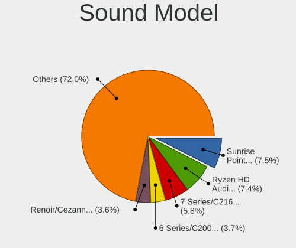

| Model                                                                      | Notebooks | Percent |
|----------------------------------------------------------------------------|-----------|---------|
| Intel Sunrise Point-LP HD Audio                                            | 184       | 7.5%    |
| AMD Ryzen HD Audio Controller                                              | 182       | 7.42%   |
| Intel 7 Series/C216 Chipset Family High Definition Audio Controller        | 142       | 5.79%   |
| Intel 6 Series/C200 Series Chipset Family High Definition Audio Controller | 90        | 3.67%   |
| AMD Renoir/Cezanne HDMI/DP Audio Controller                                | 89        | 3.63%   |
| Intel 5 Series/3400 Series Chipset High Definition Audio                   | 70        | 2.85%   |
| Intel 82801I (ICH9 Family) HD Audio Controller                             | 68        | 2.77%   |
| Intel Tiger Lake-LP Smart Sound Technology Audio Controller                | 59        | 2.41%   |
| Intel Haswell-ULT HD Audio Controller                                      | 59        | 2.41%   |
| Intel Cannon Point-LP High Definition Audio Controller                     | 59        | 2.41%   |
| Intel 8 Series HD Audio Controller                                         | 59        | 2.41%   |
| Intel Wildcat Point-LP High Definition Audio Controller                    | 58        | 2.37%   |
| Intel Broadwell-U Audio Controller                                         | 58        | 2.37%   |
| Intel 8 Series/C220 Series Chipset High Definition Audio Controller        | 57        | 2.32%   |
| Intel Cannon Lake PCH cAVS                                                 | 56        | 2.28%   |
| Intel Alder Lake PCH-P High Definition Audio Controller                    | 51        | 2.08%   |
| Intel Xeon E3-1200 v3/4th Gen Core Processor HD Audio Controller           | 48        | 1.96%   |
| AMD Radeon High Definition Audio Controller                                | 47        | 1.92%   |
| AMD FCH Azalia Controller                                                  | 45        | 1.84%   |
| Intel Comet Lake PCH cAVS                                                  | 42        | 1.71%   |
| Intel 82801H (ICH8 Family) HD Audio Controller                             | 35        | 1.43%   |
| AMD Kabini HDMI/DP Audio                                                   | 35        | 1.43%   |
| AMD Raven/Raven2/Fenghuang HDMI/DP Audio Controller                        | 32        | 1.31%   |
| Intel Comet Lake PCH-LP cAVS                                               | 31        | 1.26%   |
| Intel CM238 HD Audio Controller                                            | 31        | 1.26%   |
| Nvidia TU107 GeForce GTX 1650 High Definition Audio Controller             | 29        | 1.18%   |
| Nvidia GF108 High Definition Audio Controller                              | 25        | 1.02%   |
| Intel NM10/ICH7 Family High Definition Audio Controller                    | 25        | 1.02%   |
| Intel Raptor Lake-P/U/H cAVS                                               | 24        | 0.98%   |
| Nvidia AD107 High Definition Audio Controller                              | 21        | 0.86%   |
| Nvidia GK107 HDMI Audio Controller                                         | 20        | 0.82%   |
| Nvidia TU106 High Definition Audio Controller                              | 19        | 0.77%   |
| Intel 100 Series/C230 Series Chipset Family HD Audio Controller            | 19        | 0.77%   |
| Intel Celeron/Pentium Silver Processor High Definition Audio               | 18        | 0.73%   |
| Intel Atom Processor Z36xxx/Z37xxx Series High Definition Audio Controller | 18        | 0.73%   |
| Intel Tiger Lake-H HD Audio Controller                                     | 17        | 0.69%   |
| AMD SBx00 Azalia (Intel HDA)                                               | 17        | 0.69%   |
| AMD Family 15h (Models 60h-6fh) Audio Controller                           | 17        | 0.69%   |
| Nvidia GP107GL High Definition Audio Controller                            | 16        | 0.65%   |
| Nvidia GA106 High Definition Audio Controller                              | 16        | 0.65%   |

Memory
------

Memory Vendor
-------------

Memory module vendors

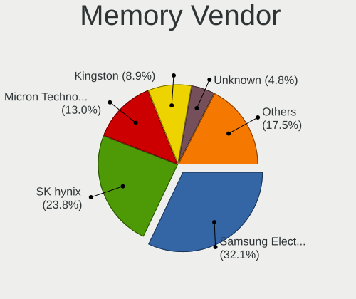

| Vendor              | Notebooks | Percent |
|---------------------|-----------|---------|
| Samsung Electronics | 329       | 32.1%   |
| SK hynix            | 244       | 23.8%   |
| Micron Technology   | 133       | 12.98%  |
| Kingston            | 91        | 8.88%   |
| Unknown             | 49        | 4.78%   |
| Crucial             | 44        | 4.29%   |
| Elpida              | 30        | 2.93%   |
| Ramaxel Technology  | 24        | 2.34%   |
| Nanya Technology    | 16        | 1.56%   |
| A-DATA Technology   | 16        | 1.56%   |
| Corsair             | 14        | 1.37%   |
| Unknown             | 10        | 0.98%   |
| Unknown (ABCD)      | 7         | 0.68%   |
| G.Skill             | 4         | 0.39%   |
| Timetec             | 2         | 0.2%    |
| GOODRAM             | 2         | 0.2%    |
| Unknown (09D5)      | 1         | 0.1%    |
| Unifosa             | 1         | 0.1%    |
| TRS STAR            | 1         | 0.1%    |
| Transcend           | 1         | 0.1%    |
| Teclast             | 1         | 0.1%    |
| Team                | 1         | 0.1%    |
| Patriot             | 1         | 0.1%    |
| Apacer              | 1         | 0.1%    |
| A-DA                | 1         | 0.1%    |
| A Force             | 1         | 0.1%    |

Memory Model
------------

Memory module models

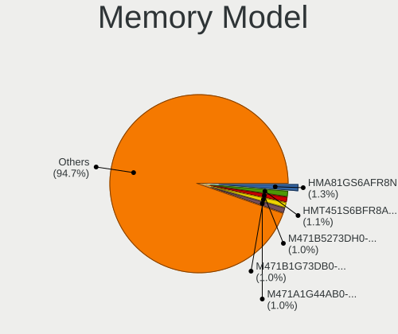

| Model                                                            | Notebooks | Percent |
|------------------------------------------------------------------|-----------|---------|
| SK hynix RAM HMA81GS6AFR8N-UH 8GB SODIMM DDR4 2667MT/s           | 14        | 1.27%   |
| SK hynix RAM HMT451S6BFR8A-PB 4GB SODIMM DDR3 1600MT/s           | 12        | 1.09%   |
| Samsung RAM M471B5273DH0-CH9 4GB SODIMM DDR3 1600MT/s            | 11        | 1%      |
| Samsung RAM M471B1G73DB0-YK0 8GB SODIMM DDR3 1600MT/s            | 11        | 1%      |
| Samsung RAM M471A1G44AB0-CWE 8GiB SODIMM DDR4 3200MT/s           | 11        | 1%      |
| SK hynix RAM HMT351S6CFR8C-PB 4GB SODIMM DDR3 1600MT/s           | 10        | 0.91%   |
| Samsung RAM M471B5173DB0-YK0 4GB SODIMM DDR3 1600MT/s            | 10        | 0.91%   |
| Samsung RAM M471B1G73QH0-YK0 8GB SODIMM DDR3 1600MT/s            | 10        | 0.91%   |
| Samsung RAM M471A1K43DB1-CWE 8GB SODIMM DDR4 3200MT/s            | 10        | 0.91%   |
| Samsung RAM M471A1K43CB1-CRC 8GB SODIMM DDR4 8400MT/s            | 10        | 0.91%   |
| Unknown                                                          | 10        | 0.91%   |
| SK hynix RAM HMT351S6EFR8A-PB 4GB SODIMM DDR3 1600MT/s           | 9         | 0.82%   |
| SK hynix RAM HMA81GS6CJR8N-VK 8GB SODIMM DDR4 2667MT/s           | 9         | 0.82%   |
| Samsung RAM Module 16GB SODIMM DDR4 3200MT/s                     | 9         | 0.82%   |
| Samsung RAM M471A2K43DB1-CWE 16GB SODIMM DDR4 3200MT/s           | 9         | 0.82%   |
| Samsung RAM M471A1K43DB1-CTD 8GB SODIMM DDR4 2667MT/s            | 9         | 0.82%   |
| Crucial RAM CT102464BF160B.C16 8GB SODIMM DDR3 1600MT/s          | 9         | 0.82%   |
| SK hynix RAM HMA81GS6DJR8N-XN 8GB SODIMM DDR4 3200MT/s           | 8         | 0.73%   |
| Samsung RAM M471B5173EB0-YK0 4GB SODIMM DDR3 1600MT/s            | 8         | 0.73%   |
| Samsung RAM M471A5244CB0-CTD 4GB SODIMM DDR4 3266MT/s            | 8         | 0.73%   |
| Elpida RAM EBJ41UF8BCS0-DJ-F 4GB SODIMM DDR3 1334MT/s            | 8         | 0.73%   |
| Unknown (ABCD) RAM 123456789012345678 2GB SODIMM LPDDR4 2400MT/s | 7         | 0.63%   |
| Micron RAM 16KTF1G64HZ-1G6E1 8GB SODIMM DDR3 1600MT/s            | 7         | 0.63%   |
| Unknown RAM Module 4GB SODIMM DDR3                               | 6         | 0.54%   |
| SK hynix RAM HMAA1GS6CJR6N-XN 8GB SODIMM DDR4 3200MT/s           | 6         | 0.54%   |
| SK hynix RAM HMA82GS6AFR8N-UH 16GB SODIMM DDR4 2667MT/s          | 6         | 0.54%   |
| Samsung RAM M471A5244CB0-CRC 4GB SODIMM DDR4 2667MT/s            | 6         | 0.54%   |
| Samsung RAM M471A1K43EB1-CWE 8GB SODIMM DDR4 3200MT/s            | 6         | 0.54%   |
| Samsung RAM M471A1K43CB1-CTD 8GB SODIMM DDR4 3200MT/s            | 6         | 0.54%   |
| Micron RAM Module 8GB SODIMM DDR4 3200MT/s                       | 6         | 0.54%   |
| SK hynix RAM HMT351S6BFR8C-H9 4GB SODIMM DDR3 1333MT/s           | 5         | 0.45%   |
| SK hynix RAM HMA851S6CJR6N-VK 4GB SODIMM DDR4 2667MT/s           | 5         | 0.45%   |
| SK hynix RAM H9CCNNNCLGALAR-NVD 8GB Row Of Chips LPDDR3 2133MT/s | 5         | 0.45%   |
| Samsung RAM M471B5773DH0-CH9 2GB SODIMM DDR3 1600MT/s            | 5         | 0.45%   |
| Samsung RAM M471B5173QH0-YK0 4GB SODIMM DDR3 1600MT/s            | 5         | 0.45%   |
| Samsung RAM M471A2K43CB1-CRC 16GB SODIMM DDR4 2667MT/s           | 5         | 0.45%   |
| Samsung RAM M471A2G44AM0-CWE 16GB SODIMM DDR4 3200MT/s           | 5         | 0.45%   |
| Samsung RAM M471A2G43BB2-CWE 16GB SODIMM DDR4 3200MT/s           | 5         | 0.45%   |
| Samsung RAM M471A2G43AB2-CWE 16GB SODIMM DDR4 3200MT/s           | 5         | 0.45%   |
| Samsung RAM M471A1G44BB0-CWE 8GB SODIMM DDR4 3200MT/s            | 5         | 0.45%   |

Memory Kind
-----------

Memory module kinds

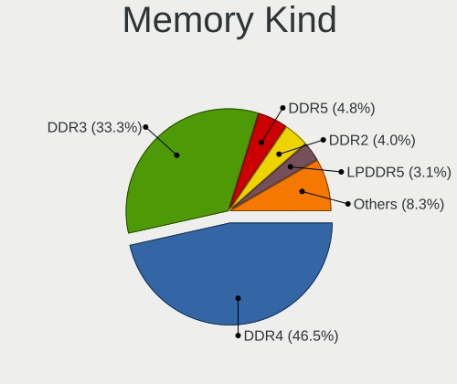

| Kind    | Notebooks | Percent |
|---------|-----------|---------|
| DDR4    | 418       | 46.5%   |
| DDR3    | 299       | 33.26%  |
| DDR5    | 43        | 4.78%   |
| DDR2    | 36        | 4%      |
| LPDDR5  | 28        | 3.11%   |
| LPDDR3  | 27        | 3%      |
| LPDDR4  | 23        | 2.56%   |
| SDRAM   | 20        | 2.22%   |
| Unknown | 5         | 0.56%   |

Memory Form Factor
------------------

Physical design of the memory module

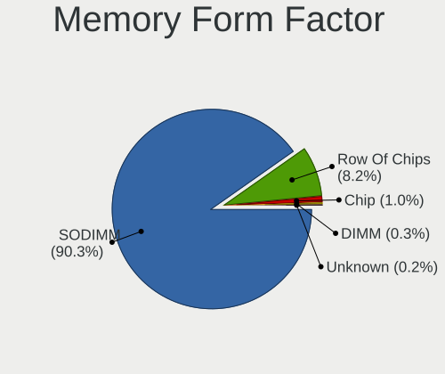

| Name         | Notebooks | Percent |
|--------------|-----------|---------|
| SODIMM       | 815       | 90.25%  |
| Row Of Chips | 74        | 8.19%   |
| Chip         | 9         | 1%      |
| DIMM         | 3         | 0.33%   |
| Unknown      | 2         | 0.22%   |

Memory Size
-----------

Memory module size

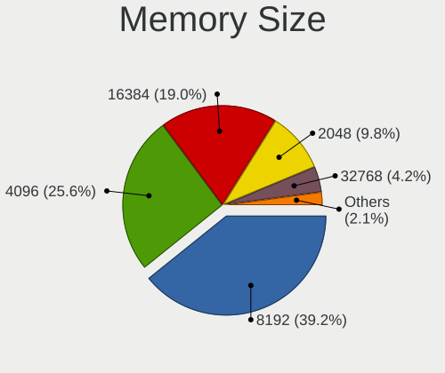

| Size  | Notebooks | Percent |
|-------|-----------|---------|
| 8192  | 387       | 39.21%  |
| 4096  | 253       | 25.63%  |
| 16384 | 188       | 19.05%  |
| 2048  | 97        | 9.83%   |
| 32768 | 41        | 4.15%   |
| 1024  | 18        | 1.82%   |
| 8     | 2         | 0.2%    |
| 6144  | 1         | 0.1%    |

Memory Speed
------------

Memory module speed

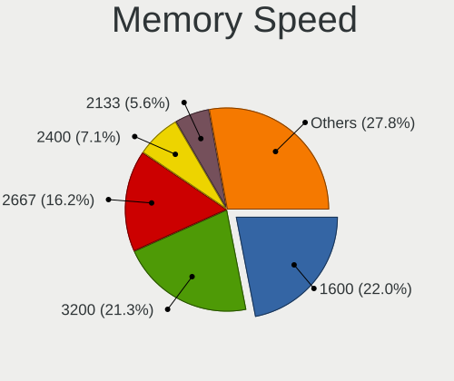

| Speed   | Notebooks | Percent |
|---------|-----------|---------|
| 1600    | 213       | 21.96%  |
| 3200    | 207       | 21.34%  |
| 2667    | 157       | 16.19%  |
| 2400    | 69        | 7.11%   |
| 2133    | 54        | 5.57%   |
| 1334    | 35        | 3.61%   |
| 1333    | 35        | 3.61%   |
| 5600    | 25        | 2.58%   |
| 4800    | 20        | 2.06%   |
| Unknown | 20        | 2.06%   |
| 667     | 18        | 1.86%   |
| 8400    | 13        | 1.34%   |
| 6400    | 13        | 1.34%   |
| 2048    | 12        | 1.24%   |
| 1067    | 12        | 1.24%   |
| 4267    | 9         | 0.93%   |
| 800     | 9         | 0.93%   |
| 3266    | 8         | 0.82%   |
| 7500    | 7         | 0.72%   |
| 975     | 7         | 0.72%   |
| 1867    | 6         | 0.62%   |
| 4199    | 4         | 0.41%   |
| 8533    | 3         | 0.31%   |
| 7467    | 3         | 0.31%   |
| 4266    | 3         | 0.31%   |
| 533     | 3         | 0.31%   |
| 5500    | 2         | 0.21%   |
| 3000    | 1         | 0.1%    |
| 1639    | 1         | 0.1%    |
| 1066    | 1         | 0.1%    |

Printers & scanners
-------------------

Printer Vendor
--------------

Printer device vendors

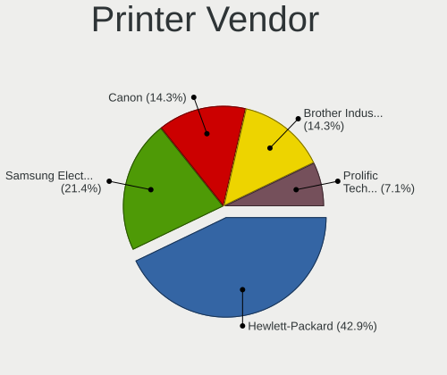

| Vendor              | Notebooks | Percent |
|---------------------|-----------|---------|
| Hewlett-Packard     | 6         | 42.86%  |
| Samsung Electronics | 3         | 21.43%  |
| Canon               | 2         | 14.29%  |
| Brother Industries  | 2         | 14.29%  |
| Prolific Technology | 1         | 7.14%   |

Printer Model
-------------

Printer device models

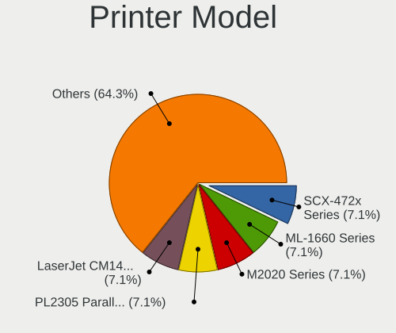

| Model                           | Notebooks | Percent |
|---------------------------------|-----------|---------|
| Samsung SCX-472x Series         | 1         | 7.14%   |
| Samsung ML-1660 Series          | 1         | 7.14%   |
| Samsung M2020 Series            | 1         | 7.14%   |
| Prolific PL2305 Parallel Port   | 1         | 7.14%   |
| HP LaserJet CM1415fnw           | 1         | 7.14%   |
| HP LaserJet 1020                | 1         | 7.14%   |
| HP Deskjet F4500 series         | 1         | 7.14%   |
| HP DeskJet F2100 Printer series | 1         | 7.14%   |
| HP DeskJet 4100 series          | 1         | 7.14%   |
| HP DeskJet 3700 series          | 1         | 7.14%   |
| Canon TS6300 series             | 1         | 7.14%   |
| Canon TS5100 series             | 1         | 7.14%   |
| Brother HL-L2350DW series       | 1         | 7.14%   |
| Brother DCP-L2530DW series      | 1         | 7.14%   |

Scanner Vendor
--------------

Scanner device vendors

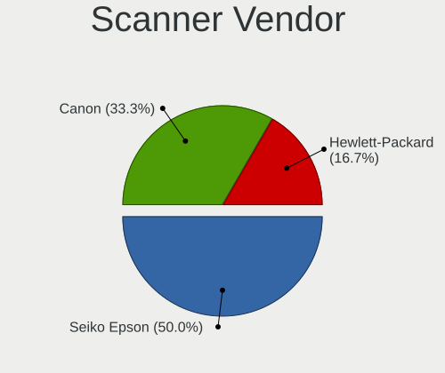

| Vendor          | Notebooks | Percent |
|-----------------|-----------|---------|
| Seiko Epson     | 3         | 42.86%  |
| Canon           | 3         | 42.86%  |
| Hewlett-Packard | 1         | 14.29%  |

Scanner Model
-------------

Scanner device models

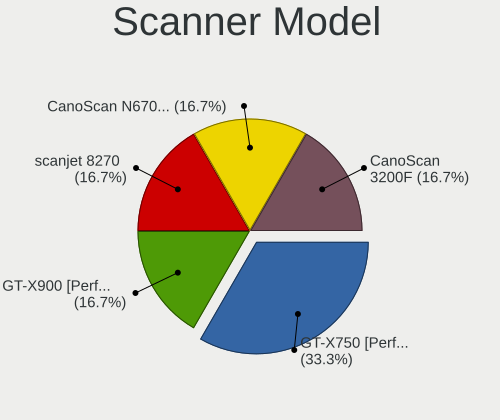

| Model                                            | Notebooks | Percent |
|--------------------------------------------------|-----------|---------|
| Seiko Epson GT-X750 [Perfection 4490 Photo]      | 2         | 28.57%  |
| Seiko Epson GT-X900 [Perfection V700/V750 Photo] | 1         | 14.29%  |
| HP scanjet 8270                                  | 1         | 14.29%  |
| Canon CanoScan N670U/N676U/LiDE 20               | 1         | 14.29%  |
| Canon CanoScan 8800F                             | 1         | 14.29%  |
| Canon CanoScan 3200F                             | 1         | 14.29%  |

Camera
------

Camera Vendor
-------------

Camera device vendors

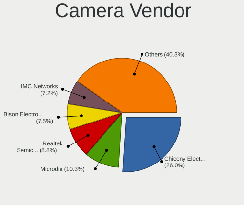

| Vendor                                 | Notebooks | Percent |
|----------------------------------------|-----------|---------|
| Chicony Electronics                    | 367       | 26.01%  |
| Microdia                               | 145       | 10.28%  |
| Realtek Semiconductor                  | 124       | 8.79%   |
| Bison Electronics                      | 106       | 7.51%   |
| IMC Networks                           | 101       | 7.16%   |
| Sunplus Innovation Technology          | 72        | 5.1%    |
| Quanta                                 | 67        | 4.75%   |
| Cheng Uei Precision Industry (Foxlink) | 52        | 3.69%   |
| Lite-On Technology                     | 50        | 3.54%   |
| Suyin                                  | 49        | 3.47%   |
| Luxvisions Innotech Limited            | 39        | 2.76%   |
| Syntek                                 | 36        | 2.55%   |
| Apple                                  | 28        | 1.98%   |
| Ricoh                                  | 20        | 1.42%   |
| Logitech                               | 17        | 1.2%    |
| Alcor Micro                            | 17        | 1.2%    |
| Shinetech                              | 15        | 1.06%   |
| Sonix Technology                       | 12        | 0.85%   |
| Samsung Electronics                    | 11        | 0.78%   |
| Acer                                   | 8         | 0.57%   |
| Silicon Motion                         | 6         | 0.43%   |
| Primax Electronics                     | 6         | 0.43%   |
| Lenovo                                 | 6         | 0.43%   |
| ALi                                    | 5         | 0.35%   |
| Z-Star Microelectronics                | 4         | 0.28%   |
| kingcome                               | 4         | 0.28%   |
| Importek                               | 4         | 0.28%   |
| icSpring                               | 4         | 0.28%   |
| Pixart Imaging                         | 3         | 0.21%   |
| DigiTech                               | 3         | 0.21%   |
| OPPO Electronics                       | 2         | 0.14%   |
| Foxconn / Hon Hai                      | 2         | 0.14%   |
| webcam                                 | 1         | 0.07%   |
| WaveRider Communications               | 1         | 0.07%   |
| Trust                                  | 1         | 0.07%   |
| SunplusIT                              | 1         | 0.07%   |
| STEREOLABS                             | 1         | 0.07%   |
| Shine-optics                           | 1         | 0.07%   |
| Panasonic (Matsushita)                 | 1         | 0.07%   |
| OmniVision Technologies                | 1         | 0.07%   |

Camera Model
------------

Camera device models

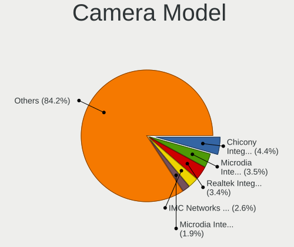

| Model                                         | Notebooks | Percent |
|-----------------------------------------------|-----------|---------|
| Chicony Integrated Camera                     | 62        | 4.38%   |
| Microdia Integrated_Webcam_HD                 | 50        | 3.53%   |
| Realtek Integrated_Webcam_HD                  | 48        | 3.39%   |
| IMC Networks Integrated Camera                | 37        | 2.61%   |
| Microdia Integrated Webcam                    | 27        | 1.91%   |
| Chicony HP HD Camera                          | 27        | 1.91%   |
| Bison Integrated Camera                       | 26        | 1.84%   |
| Quanta HP HD Camera                           | 24        | 1.69%   |
| IMC Networks USB2.0 HD UVC WebCam             | 24        | 1.69%   |
| Chicony HD WebCam                             | 24        | 1.69%   |
| Syntek Integrated Camera                      | 23        | 1.62%   |
| Sunplus HD WebCam                             | 16        | 1.13%   |
| Lite-On Integrated Camera                     | 15        | 1.06%   |
| Chicony HP HD Webcam                          | 15        | 1.06%   |
| Chicony TOSHIBA Web Camera - HD               | 14        | 0.99%   |
| Chicony Integrated Camera (1280x720@30)       | 14        | 0.99%   |
| Bison HD Webcam                               | 14        | 0.99%   |
| Bison BisonCam,NB Pro                         | 14        | 0.99%   |
| Chicony Chicony USB2.0 Camera                 | 13        | 0.92%   |
| Microdia Integrated_Webcam_FHD                | 12        | 0.85%   |
| Lite-On HP HD Camera                          | 12        | 0.85%   |
| Chicony USB2.0 HD UVC WebCam                  | 12        | 0.85%   |
| Samsung Galaxy series, misc. (MTP mode)       | 11        | 0.78%   |
| Microdia Laptop_Integrated_Webcam_2M          | 11        | 0.78%   |
| Lite-On HP HD Webcam                          | 11        | 0.78%   |
| Chicony HP TrueVision HD Camera               | 11        | 0.78%   |
| Chicony EasyCamera                            | 11        | 0.78%   |
| Sunplus Integrated_Webcam_HD                  | 10        | 0.71%   |
| Luxvisions Innotech Limited Integrated Camera | 10        | 0.71%   |
| Chicony HP Wide Vision HD Camera              | 10        | 0.71%   |
| Bison BisonCam, NB Pro                        | 10        | 0.71%   |
| Apple FaceTime HD Camera                      | 10        | 0.71%   |
| ShineTech USB2.0 HD UVC WebCam                | 9         | 0.64%   |
| Microdia Laptop_Integrated_Webcam_HD          | 9         | 0.64%   |
| Luxvisions Innotech Limited HP HD Camera      | 9         | 0.64%   |
| Chicony USB2.0 VGA UVC WebCam                 | 9         | 0.64%   |
| Realtek USB2.0 HD UVC WebCam                  | 8         | 0.56%   |
| Lite-On HP Wide Vision HD Camera              | 8         | 0.56%   |
| Chicony USB 2.0 Camera                        | 8         | 0.56%   |
| Chicony ThinkPad T490 Webcam                  | 8         | 0.56%   |

Security
--------

Fingerprint Vendor
------------------

Fingerprint sensor vendors

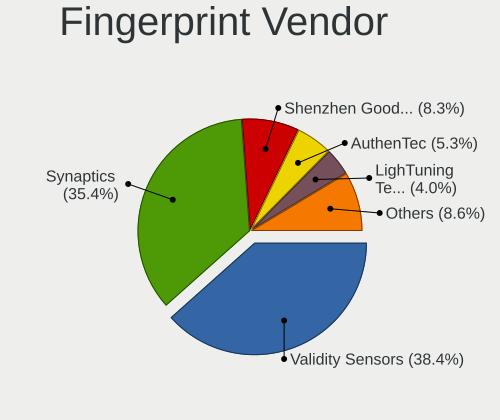

| Vendor                             | Notebooks | Percent |
|------------------------------------|-----------|---------|
| Validity Sensors                   | 116       | 38.41%  |
| Synaptics                          | 107       | 35.43%  |
| Shenzhen Goodix Technology         | 25        | 8.28%   |
| AuthenTec                          | 16        | 5.3%    |
| LighTuning Technology              | 12        | 3.97%   |
| Upek                               | 8         | 2.65%   |
| STMicroelectronics                 | 7         | 2.32%   |
| Elan Microelectronics              | 7         | 2.32%   |
| Realtek USB2.0 Finger Print Bridge | 4         | 1.32%   |

Fingerprint Model
-----------------

Fingerprint sensor models

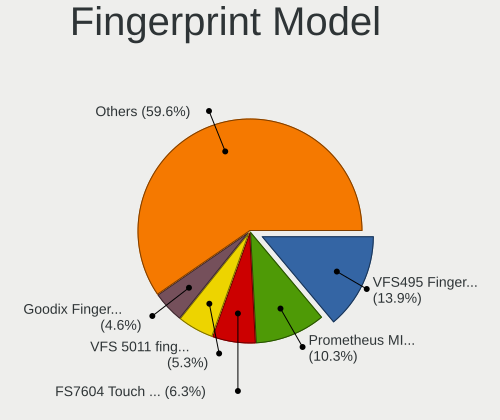

| Model                                                                      | Notebooks | Percent |
|----------------------------------------------------------------------------|-----------|---------|
| Validity Sensors VFS495 Fingerprint Reader                                 | 42        | 13.91%  |
| Synaptics Prometheus MIS Touch Fingerprint Reader                          | 31        | 10.26%  |
| Synaptics FS7604 Touch Fingerprint Sensor with PurePrint                   | 19        | 6.29%   |
| Validity Sensors VFS 5011 fingerprint sensor                               | 16        | 5.3%    |
| Shenzhen Goodix  FingerPrint Device                                        | 14        | 4.64%   |
| Synaptics Fingerprint reader [HP G6]                                       | 10        | 3.31%   |
| Validity Sensors VFS5011 Fingerprint Reader                                | 9         | 2.98%   |
| Synaptics Metallica MOH Touch Fingerprint Reader                           | 9         | 2.98%   |
| Validity Sensors VFS451 Fingerprint Reader                                 | 8         | 2.65%   |
| Validity Sensors VFS471 Fingerprint Reader                                 | 7         | 2.32%   |
| Upek Biometric Touchchip/Touchstrip Fingerprint Sensor                     | 7         | 2.32%   |
| Synaptics Metallica MIS Touch Fingerprint Reader                           | 7         | 2.32%   |
| STMicroelectronics Fingerprint Reader                                      | 7         | 2.32%   |
| LighTuning EgisTec Touch Fingerprint Sensor                                | 7         | 2.32%   |
| Validity Sensors VFS491                                                    | 6         | 1.99%   |
| Synaptics UWP WBDI Device                                                  | 6         | 1.99%   |
| Synaptics Prometheus Fingerprint Reader                                    | 6         | 1.99%   |
| Shenzhen Goodix FingerPrint                                                | 6         | 1.99%   |
| AuthenTec AES2810                                                          | 6         | 1.99%   |
| AuthenTec AES2501 Fingerprint Sensor                                       | 6         | 1.99%   |
| Validity Sensors Synaptics VFS7552 Touch Fingerprint Sensor with PurePrint | 5         | 1.66%   |
| Validity Sensors Fingerprint scanner                                       | 5         | 1.66%   |
| Synaptics  FS7604 Touch Fingerprint Sensor with PurePrint                  | 5         | 1.66%   |
| Shenzhen Goodix Fingerprint Reader                                         | 5         | 1.66%   |
| Synaptics WBDI Device                                                      | 4         | 1.32%   |
| Realtek USB2.0 Finger Print Bridge FocalTech Fingerprint Device            | 4         | 1.32%   |
| Elan ELAN:ARM-M4                                                           | 4         | 1.32%   |
| Validity Sensors VFS7552 Touch Fingerprint Sensor                          | 3         | 0.99%   |
| Validity Sensors VFS7500 Touch Fingerprint Sensor                          | 3         | 0.99%   |
| Validity Sensors VFS Fingerprint sensor                                    | 3         | 0.99%   |
| Validity Sensors Synaptics WBDI                                            | 3         | 0.99%   |
| Synaptics WBDI                                                             | 3         | 0.99%   |
| Synaptics TouchPad                                                         | 3         | 0.99%   |
| LighTuning Fingerprint Reader                                              | 3         | 0.99%   |
| Elan ELAN:Fingerprint                                                      | 3         | 0.99%   |
| AuthenTec AES1600                                                          | 3         | 0.99%   |
| Validity Sensors VFS101 Fingerprint Reader                                 | 2         | 0.66%   |
| Validity Sensors Swipe Fingerprint Sensor                                  | 2         | 0.66%   |
| Synaptics UWP WBDI                                                         | 2         | 0.66%   |
| LighTuning ES603 Swipe Fingerprint Sensor                                  | 2         | 0.66%   |

Chipcard Vendor
---------------

Chipcard module vendors

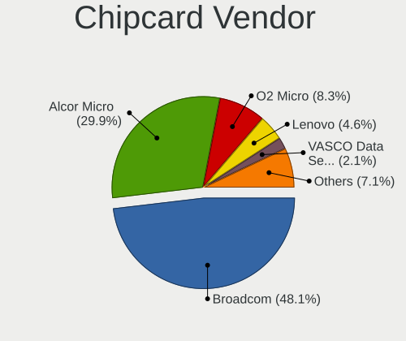

| Vendor                            | Notebooks | Percent |
|-----------------------------------|-----------|---------|
| Broadcom                          | 116       | 48.13%  |
| Alcor Micro                       | 72        | 29.88%  |
| O2 Micro                          | 20        | 8.3%    |
| Lenovo                            | 11        | 4.56%   |
| VASCO Data Security International | 5         | 2.07%   |
| Realtek Semiconductor             | 5         | 2.07%   |
| OmniKey                           | 3         | 1.24%   |
| Upek                              | 2         | 0.83%   |
| Advanced Card Systems             | 2         | 0.83%   |
| SCM Microsystems                  | 1         | 0.41%   |
| Integrated Technology Express     | 1         | 0.41%   |
| Gemalto (was Gemplus)             | 1         | 0.41%   |
| Clay Logic                        | 1         | 0.41%   |
| Chicony Electronics               | 1         | 0.41%   |

Chipcard Model
--------------

Chipcard module models

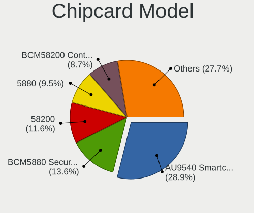

| Model                                                                        | Notebooks | Percent |
|------------------------------------------------------------------------------|-----------|---------|
| Alcor Micro AU9540 Smartcard Reader                                          | 70        | 28.93%  |
| Broadcom BCM5880 Secure Applications Processor                               | 33        | 13.64%  |
| Broadcom 58200                                                               | 28        | 11.57%  |
| Broadcom 5880                                                                | 23        | 9.5%    |
| Broadcom BCM58200 ControlVault 3 (FingerPrint sensor + Contacted SmartCard)  | 21        | 8.68%   |
| O2 Micro OZ776 CCID Smartcard Reader                                         | 17        | 7.02%   |
| Broadcom BCM5880 Secure Applications Processor with fingerprint swipe sensor | 12        | 4.96%   |
| Lenovo Integrated Smart Card Reader                                          | 11        | 4.55%   |
| Realtek Semiconductor Smart Card Reader Interface                            | 5         | 2.07%   |
| VASCO Data Security International DIGIPASS 870                               | 4         | 1.65%   |
| O2 Micro Oz776 SmartCard Reader                                              | 3         | 1.24%   |
| Upek TouchChip Fingerprint Coprocessor (WBF advanced mode)                   | 2         | 0.83%   |
| OmniKey CardMan 3021 / 3121                                                  | 2         | 0.83%   |
| Alcor Micro Watchdata W 1981                                                 | 2         | 0.83%   |
| VASCO Data Security International Digipass 905 SmartCard Reader              | 1         | 0.41%   |
| SCM Microsystems SCR3340 - ExpressCard54 Smart Card Reader                   | 1         | 0.41%   |
| OmniKey CardMan 4321                                                         | 1         | 0.41%   |
| Integrated Technology Express SmartCard Reader                               | 1         | 0.41%   |
| Gemalto (was Gemplus) Compact Smart Card Reader Writer                       | 1         | 0.41%   |
| Clay Logic Nitrokey Start                                                    | 1         | 0.41%   |
| Chicony Electronics HP Skylab USB Smartcard Keyboard                         | 1         | 0.41%   |
| Advanced Card Systems ACR39U                                                 | 1         | 0.41%   |
| Advanced Card Systems ACR38 SmartCard Reader                                 | 1         | 0.41%   |

Unsupported
-----------

Unsupported Devices
-------------------

Total unsupported devices on board

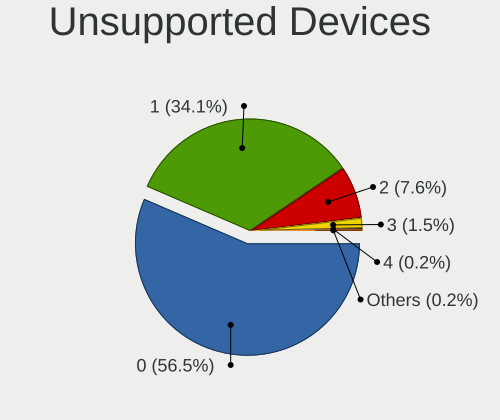

| Total | Notebooks | Percent |
|-------|-----------|---------|
| 0     | 926       | 56.46%  |
| 1     | 559       | 34.09%  |
| 2     | 124       | 7.56%   |
| 3     | 24        | 1.46%   |
| 4     | 3         | 0.18%   |
| 6     | 2         | 0.12%   |
| 8     | 1         | 0.06%   |
| 5     | 1         | 0.06%   |

Unsupported Device Types
------------------------

Types of unsupported devices

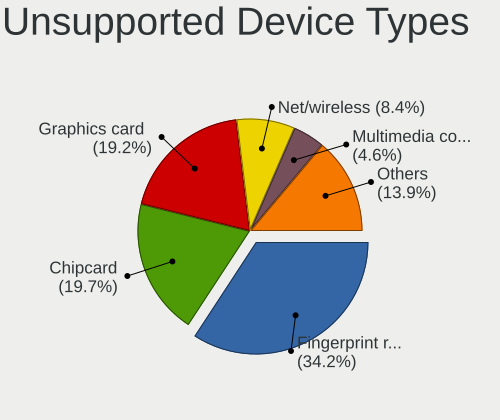

| Type                     | Notebooks | Percent |
|--------------------------|-----------|---------|
| Fingerprint reader       | 296       | 34.22%  |
| Chipcard                 | 170       | 19.65%  |
| Graphics card            | 166       | 19.19%  |
| Net/wireless             | 73        | 8.44%   |
| Multimedia controller    | 40        | 4.62%   |
| Storage                  | 20        | 2.31%   |
| Camera                   | 19        | 2.2%    |
| Bluetooth                | 18        | 2.08%   |
| Card reader              | 17        | 1.97%   |
| Communication controller | 14        | 1.62%   |
| Net/ethernet             | 10        | 1.16%   |
| Sound                    | 8         | 0.92%   |
| Network                  | 4         | 0.46%   |
| Flash memory             | 4         | 0.46%   |
| Modem                    | 3         | 0.35%   |
| Unclassified device      | 1         | 0.12%   |
| Unassigned class         | 1         | 0.12%   |
| Storage/ide              | 1         | 0.12%   |

