Linux in Belgium - Tested Hardware & Statistics (Notebooks)
-----------------------------------------------------------

A project to collect tested hardware configurations for Linux in Belgium.

Anyone can contribute to this report by the [hw-probe](https://github.com/linuxhw/hw-probe) tool:

    sudo -E hw-probe -all -upload

Please contribute! Especially if your hardware is rare.

Contents
--------

* [ Test Cases ](#test-cases)

* [ System ](#system)
  - [ OS                       ](#os)
  - [ OS Family                ](#os-family)
  - [ Kernel                   ](#kernel)
  - [ Kernel Family            ](#kernel-family)
  - [ Kernel Major Ver.        ](#kernel-major-ver)
  - [ Arch                     ](#arch)
  - [ DE                       ](#de)
  - [ Display Server           ](#display-server)
  - [ Display Manager          ](#display-manager)
  - [ OS Lang                  ](#os-lang)
  - [ Boot Mode                ](#boot-mode)
  - [ Filesystem               ](#filesystem)
  - [ Part. scheme             ](#part-scheme)
  - [ Dual Boot with Linux/BSD ](#dual-boot-with-linuxbsd)
  - [ Dual Boot (Win)          ](#dual-boot-win)

* [ Board ](#board)
  - [ Vendor                   ](#vendor)
  - [ Model                    ](#model)
  - [ Model Family             ](#model-family)
  - [ MFG Year                 ](#mfg-year)
  - [ Form Factor              ](#form-factor)
  - [ Secure Boot              ](#secure-boot)
  - [ Coreboot                 ](#coreboot)
  - [ RAM Size                 ](#ram-size)
  - [ RAM Used                 ](#ram-used)
  - [ Total Drives             ](#total-drives)
  - [ Has CD-ROM               ](#has-cd-rom)
  - [ Has Ethernet             ](#has-ethernet)
  - [ Has WiFi                 ](#has-wifi)
  - [ Has Bluetooth            ](#has-bluetooth)

* [ Location ](#location)
  - [ Country                  ](#country)
  - [ City                     ](#city)

* [ Drives ](#drives)
  - [ Drive Vendor             ](#drive-vendor)
  - [ Drive Model              ](#drive-model)
  - [ HDD Vendor               ](#hdd-vendor)
  - [ SSD Vendor               ](#ssd-vendor)
  - [ Drive Kind               ](#drive-kind)
  - [ Drive Connector          ](#drive-connector)
  - [ Drive Size               ](#drive-size)
  - [ Space Total              ](#space-total)
  - [ Space Used               ](#space-used)
  - [ Malfunc. Drives          ](#malfunc-drives)
  - [ Malfunc. Drive Vendor    ](#malfunc-drive-vendor)
  - [ Malfunc. HDD Vendor      ](#malfunc-hdd-vendor)
  - [ Malfunc. Drive Kind      ](#malfunc-drive-kind)
  - [ Failed Drives            ](#failed-drives)
  - [ Failed Drive Vendor      ](#failed-drive-vendor)
  - [ Drive Status             ](#drive-status)

* [ Storage controller ](#storage-controller)
  - [ Storage Vendor           ](#storage-vendor)
  - [ Storage Model            ](#storage-model)
  - [ Storage Kind             ](#storage-kind)

* [ Processor ](#processor)
  - [ CPU Vendor               ](#cpu-vendor)
  - [ CPU Model                ](#cpu-model)
  - [ CPU Model Family         ](#cpu-model-family)
  - [ CPU Cores                ](#cpu-cores)
  - [ CPU Sockets              ](#cpu-sockets)
  - [ CPU Threads              ](#cpu-threads)
  - [ CPU Op-Modes             ](#cpu-op-modes)
  - [ CPU Microcode            ](#cpu-microcode)
  - [ CPU Microarch            ](#cpu-microarch)

* [ Graphics ](#graphics)
  - [ GPU Vendor               ](#gpu-vendor)
  - [ GPU Model                ](#gpu-model)
  - [ GPU Combo                ](#gpu-combo)
  - [ GPU Driver               ](#gpu-driver)
  - [ GPU Memory               ](#gpu-memory)

* [ Monitor ](#monitor)
  - [ Monitor Vendor           ](#monitor-vendor)
  - [ Monitor Model            ](#monitor-model)
  - [ Monitor Resolution       ](#monitor-resolution)
  - [ Monitor Diagonal         ](#monitor-diagonal)
  - [ Monitor Width            ](#monitor-width)
  - [ Aspect Ratio             ](#aspect-ratio)
  - [ Monitor Area             ](#monitor-area)
  - [ Pixel Density            ](#pixel-density)
  - [ Multiple Monitors        ](#multiple-monitors)

* [ Network ](#network)
  - [ Net Controller Vendor    ](#net-controller-vendor)
  - [ Net Controller Model     ](#net-controller-model)
  - [ Wireless Vendor          ](#wireless-vendor)
  - [ Wireless Model           ](#wireless-model)
  - [ Ethernet Vendor          ](#ethernet-vendor)
  - [ Ethernet Model           ](#ethernet-model)
  - [ Net Controller Kind      ](#net-controller-kind)
  - [ Used Controller          ](#used-controller)
  - [ NICs                     ](#nics)
  - [ IPv6                     ](#ipv6)

* [ Bluetooth ](#bluetooth)
  - [ Bluetooth Vendor         ](#bluetooth-vendor)
  - [ Bluetooth Model          ](#bluetooth-model)

* [ Sound ](#sound)
  - [ Sound Vendor             ](#sound-vendor)
  - [ Sound Model              ](#sound-model)

* [ Memory ](#memory)
  - [ Memory Vendor            ](#memory-vendor)
  - [ Memory Model             ](#memory-model)
  - [ Memory Kind              ](#memory-kind)
  - [ Memory Form Factor       ](#memory-form-factor)
  - [ Memory Size              ](#memory-size)
  - [ Memory Speed             ](#memory-speed)

* [ Printers & scanners ](#printers--scanners)
  - [ Printer Vendor           ](#printer-vendor)
  - [ Printer Model            ](#printer-model)
  - [ Scanner Vendor           ](#scanner-vendor)
  - [ Scanner Model            ](#scanner-model)

* [ Camera ](#camera)
  - [ Camera Vendor            ](#camera-vendor)
  - [ Camera Model             ](#camera-model)

* [ Security ](#security)
  - [ Fingerprint Vendor       ](#fingerprint-vendor)
  - [ Fingerprint Model        ](#fingerprint-model)
  - [ Chipcard Vendor          ](#chipcard-vendor)
  - [ Chipcard Model           ](#chipcard-model)

* [ Unsupported ](#unsupported)
  - [ Unsupported Devices      ](#unsupported-devices)
  - [ Unsupported Device Types ](#unsupported-device-types)

Test Cases
----------

Total: 1102

| Vendor        | Model                       | Probe                                                      | Date         |
|---------------|-----------------------------|------------------------------------------------------------|--------------|
| Toshiba       | Satellite C70D-A            | [70313d6ed4](https://linux-hardware.org/?probe=70313d6ed4) | May 31, 2022 |
| Toshiba       | Satellite C70D-A            | [820a9fb182](https://linux-hardware.org/?probe=820a9fb182) | May 30, 2022 |
| SLIMBOOK      | TITAN                       | [1029a819d7](https://linux-hardware.org/?probe=1029a819d7) | May 29, 2022 |
| SLIMBOOK      | TITAN                       | [c4e27f4d19](https://linux-hardware.org/?probe=c4e27f4d19) | May 29, 2022 |
| HP            | Pavilion 17                 | [077be5d10b](https://linux-hardware.org/?probe=077be5d10b) | May 28, 2022 |
| Schenker      | XMG_APEX15_XAP15E20         | [475315dc10](https://linux-hardware.org/?probe=475315dc10) | May 28, 2022 |
| Lenovo        | ThinkPad T580 20L9CTO1WW    | [397d64e10c](https://linux-hardware.org/?probe=397d64e10c) | May 27, 2022 |
| Lenovo        | ThinkPad T580 20L9CTO1WW    | [a74cc1410a](https://linux-hardware.org/?probe=a74cc1410a) | May 27, 2022 |
| HP            | Pavilion g6                 | [ef71909561](https://linux-hardware.org/?probe=ef71909561) | May 26, 2022 |
| HP            | Pavilion g6                 | [41d1e81397](https://linux-hardware.org/?probe=41d1e81397) | May 26, 2022 |
| HP            | OMEN by Laptop              | [6e1f063199](https://linux-hardware.org/?probe=6e1f063199) | May 24, 2022 |
| ASUSTek       | X756UQ                      | [e8736821c1](https://linux-hardware.org/?probe=e8736821c1) | May 23, 2022 |
| Medion        | P6624                       | [ed8bd28269](https://linux-hardware.org/?probe=ed8bd28269) | May 21, 2022 |
| ASUSTek       | ROG Strix G512LV_G512LV     | [a0597ba198](https://linux-hardware.org/?probe=a0597ba198) | May 20, 2022 |
| HP            | ProBook 470 G2              | [9d14cc23ca](https://linux-hardware.org/?probe=9d14cc23ca) | May 20, 2022 |
| HP            | ProBook 470 G2              | [9a331b90a5](https://linux-hardware.org/?probe=9a331b90a5) | May 19, 2022 |
| HP            | ProBook 470 G2              | [4c3a3b2de2](https://linux-hardware.org/?probe=4c3a3b2de2) | May 17, 2022 |
| ASUSTek       | GL552VW                     | [2f26e2ec6e](https://linux-hardware.org/?probe=2f26e2ec6e) | May 15, 2022 |
| ASUSTek       | Mac-F60DEB81FF30ACF6 Mac... | [0f8829e460](https://linux-hardware.org/?probe=0f8829e460) | May 15, 2022 |
| Lenovo        | ThinkPad T450s 20BWS4X50... | [0fb588c686](https://linux-hardware.org/?probe=0fb588c686) | May 15, 2022 |
| ASUSTek       | Mac-F60DEB81FF30ACF6 Mac... | [83b27998e5](https://linux-hardware.org/?probe=83b27998e5) | May 14, 2022 |
| ASUSTek       | VivoBook_ASUSLaptop X412... | [6adb7e22c5](https://linux-hardware.org/?probe=6adb7e22c5) | May 14, 2022 |
| Lenovo        | ThinkPad X1 Carbon 4th 2... | [3f84f4220e](https://linux-hardware.org/?probe=3f84f4220e) | May 14, 2022 |
| Sony          | VPCEH1M0E                   | [eefe7eee06](https://linux-hardware.org/?probe=eefe7eee06) | May 13, 2022 |
| HP            | ProBook 470 G1              | [06030eee20](https://linux-hardware.org/?probe=06030eee20) | May 13, 2022 |
| MSI           | GF63 Thin 9SC               | [a6f5c6215d](https://linux-hardware.org/?probe=a6f5c6215d) | May 11, 2022 |
| Dell          | XPS 13 9305                 | [0066686d1d](https://linux-hardware.org/?probe=0066686d1d) | May 10, 2022 |
| Lenovo        | ThinkPad X220 4291WSH       | [8080b9becd](https://linux-hardware.org/?probe=8080b9becd) | May 08, 2022 |
| HP            | EliteBook 845 G8 Noteboo... | [1d84f1a74a](https://linux-hardware.org/?probe=1d84f1a74a) | May 07, 2022 |
| Dell          | Latitude E6330              | [cbfc4e6f78](https://linux-hardware.org/?probe=cbfc4e6f78) | May 07, 2022 |
| Lenovo        | ThinkPad X280 20KES94F05    | [16b4cbc9fb](https://linux-hardware.org/?probe=16b4cbc9fb) | May 05, 2022 |
| ASUSTek       | ROG Zephyrus G15 GA503QS... | [c08f733706](https://linux-hardware.org/?probe=c08f733706) | May 05, 2022 |
| ASUSTek       | Strix 17 GL703GE            | [a7396f278d](https://linux-hardware.org/?probe=a7396f278d) | May 02, 2022 |
| Dell          | XPS 15 9570                 | [01a95b61fe](https://linux-hardware.org/?probe=01a95b61fe) | May 02, 2022 |
| ASUSTek       | X550LD                      | [5625deb6aa](https://linux-hardware.org/?probe=5625deb6aa) | May 01, 2022 |
| ASUSTek       | X756UQ                      | [130944084d](https://linux-hardware.org/?probe=130944084d) | May 01, 2022 |
| ASUSTek       | Strix 17 GL703GE            | [0e0d0dd3aa](https://linux-hardware.org/?probe=0e0d0dd3aa) | Apr 30, 2022 |
| ASUSTek       | X756UQ                      | [2543d87831](https://linux-hardware.org/?probe=2543d87831) | Apr 30, 2022 |
| Google        | Bobba360                    | [e90fbcc91d](https://linux-hardware.org/?probe=e90fbcc91d) | Apr 29, 2022 |
| Lenovo        | ThinkPad X220 4291WSH       | [21fcbc1850](https://linux-hardware.org/?probe=21fcbc1850) | Apr 27, 2022 |
| Dell          | XPS 13 9305                 | [edf60be002](https://linux-hardware.org/?probe=edf60be002) | Apr 26, 2022 |
| BLAUPUNKT     | Discovery 1011WI            | [c20b87673e](https://linux-hardware.org/?probe=c20b87673e) | Apr 24, 2022 |
| Lenovo        | ThinkPad T450s 20BWS2HP0... | [762843e768](https://linux-hardware.org/?probe=762843e768) | Apr 23, 2022 |
| Lenovo        | ThinkPad T450s 20BWS2HP0... | [11ec4d291b](https://linux-hardware.org/?probe=11ec4d291b) | Apr 23, 2022 |
| Fujitsu       | LIFEBOOK E744               | [ca56dc9824](https://linux-hardware.org/?probe=ca56dc9824) | Apr 21, 2022 |
| ASUSTek       | GL502VMK                    | [cc5ed34db8](https://linux-hardware.org/?probe=cc5ed34db8) | Apr 21, 2022 |
| Lenovo        | ThinkPad T520 4243AP1       | [7723ab4bd9](https://linux-hardware.org/?probe=7723ab4bd9) | Apr 19, 2022 |
| MSI           | GL65 Leopard 10SER          | [2bdfe0279e](https://linux-hardware.org/?probe=2bdfe0279e) | Apr 19, 2022 |
| ASUSTek       | G752VSK                     | [4b6d535621](https://linux-hardware.org/?probe=4b6d535621) | Apr 18, 2022 |
| Lenovo        | ThinkPad T440s 20ARS1940... | [a7fbe1af34](https://linux-hardware.org/?probe=a7fbe1af34) | Apr 18, 2022 |
| ASUSTek       | G752VSK                     | [dfbc0779e8](https://linux-hardware.org/?probe=dfbc0779e8) | Apr 17, 2022 |
| Lenovo        | ThinkPad T430 2349D53       | [7b1d2ec5a1](https://linux-hardware.org/?probe=7b1d2ec5a1) | Apr 17, 2022 |
| Acer          | Aspire 5735                 | [e43434e15c](https://linux-hardware.org/?probe=e43434e15c) | Apr 15, 2022 |
| Dell          | Inspiron 15-3567            | [4639b09a3e](https://linux-hardware.org/?probe=4639b09a3e) | Apr 14, 2022 |
| Lenovo        | IdeaPad 320-15ABR 80XS      | [b80dc08588](https://linux-hardware.org/?probe=b80dc08588) | Apr 14, 2022 |
| Dell          | Latitude 5591               | [3f3f097a1a](https://linux-hardware.org/?probe=3f3f097a1a) | Apr 13, 2022 |
| Lenovo        | Legion 5 15ARH05 82B5       | [5aafaf0890](https://linux-hardware.org/?probe=5aafaf0890) | Apr 13, 2022 |
| Lenovo        | Legion 5 15ARH05 82B5       | [983dbbf9e8](https://linux-hardware.org/?probe=983dbbf9e8) | Apr 13, 2022 |
| Acer          | Aspire 7745G                | [7ea9773813](https://linux-hardware.org/?probe=7ea9773813) | Apr 12, 2022 |
| Lenovo        | Legion Y540-17IRH-PG0 81... | [09f8f09862](https://linux-hardware.org/?probe=09f8f09862) | Apr 11, 2022 |
| Lenovo        | Legion Y540-17IRH-PG0 81... | [da1cd5bf6e](https://linux-hardware.org/?probe=da1cd5bf6e) | Apr 11, 2022 |
| Google        | Akali 360                   | [dccccb359b](https://linux-hardware.org/?probe=dccccb359b) | Apr 11, 2022 |
| Lenovo        | ThinkBook 15 G2 ITL 20VE    | [2ce1788c33](https://linux-hardware.org/?probe=2ce1788c33) | Apr 11, 2022 |
| HP            | OMEN Laptop 15-en0xxx       | [01f57dd952](https://linux-hardware.org/?probe=01f57dd952) | Apr 10, 2022 |
| HP            | ProBook 470 G2              | [a6aee71c13](https://linux-hardware.org/?probe=a6aee71c13) | Apr 09, 2022 |
| HP            | ProBook 470 G2              | [1d1cdbd95c](https://linux-hardware.org/?probe=1d1cdbd95c) | Apr 09, 2022 |
| Dell          | Latitude E6430              | [dd09c863c8](https://linux-hardware.org/?probe=dd09c863c8) | Apr 08, 2022 |
| HP            | ProBook 430 G1              | [8bcbe236a7](https://linux-hardware.org/?probe=8bcbe236a7) | Apr 07, 2022 |
| HP            | OMEN Laptop 15-en0xxx       | [af324f356f](https://linux-hardware.org/?probe=af324f356f) | Apr 07, 2022 |
| HP            | ZBook 15 G3                 | [27bddd0a9c](https://linux-hardware.org/?probe=27bddd0a9c) | Apr 07, 2022 |
| HP            | OMEN Laptop 15-en0xxx       | [fc358abe4b](https://linux-hardware.org/?probe=fc358abe4b) | Apr 06, 2022 |
| HP            | 470 G7 Notebook PC          | [34fc91d9ac](https://linux-hardware.org/?probe=34fc91d9ac) | Apr 06, 2022 |
| Dell          | Latitude 5410               | [9d03bb6cad](https://linux-hardware.org/?probe=9d03bb6cad) | Apr 05, 2022 |
| Dell          | XPS 13 7390                 | [8c4011afa9](https://linux-hardware.org/?probe=8c4011afa9) | Apr 04, 2022 |
| Lenovo        | ThinkPad T14 Gen 1 20UES... | [94a9015090](https://linux-hardware.org/?probe=94a9015090) | Apr 03, 2022 |
| HP            | Pavilion Laptop 15-eh1xx... | [387b77f172](https://linux-hardware.org/?probe=387b77f172) | Apr 01, 2022 |
| ASUSTek       | X540LA                      | [732406d8b0](https://linux-hardware.org/?probe=732406d8b0) | Apr 01, 2022 |
| ASUSTek       | VivoBook_ASUSLaptop X513... | [086261ecef](https://linux-hardware.org/?probe=086261ecef) | Apr 01, 2022 |
| HP            | OMEN Laptop 15-en0xxx       | [4731581e9b](https://linux-hardware.org/?probe=4731581e9b) | Mar 31, 2022 |
| HP            | ZBook Studio G4             | [d5ec5c3e8e](https://linux-hardware.org/?probe=d5ec5c3e8e) | Mar 30, 2022 |
| Lenovo        | ThinkBook 15 G2 ITL 20VE    | [670f83f6bb](https://linux-hardware.org/?probe=670f83f6bb) | Mar 29, 2022 |
| Medion        | Crawler E25                 | [6093396d8a](https://linux-hardware.org/?probe=6093396d8a) | Mar 28, 2022 |
| HP            | ProBook 470 G5              | [b8969bf34b](https://linux-hardware.org/?probe=b8969bf34b) | Mar 27, 2022 |
| Acer          | Aspire 8930                 | [6774be59d3](https://linux-hardware.org/?probe=6774be59d3) | Mar 26, 2022 |
| HP            | EliteBook Folio 1040 G1     | [bbdb3c316f](https://linux-hardware.org/?probe=bbdb3c316f) | Mar 25, 2022 |
| HP            | EliteBook Folio 1040 G1     | [6096fbc1ba](https://linux-hardware.org/?probe=6096fbc1ba) | Mar 25, 2022 |
| ASUSTek       | N56VZ                       | [7ad46659a5](https://linux-hardware.org/?probe=7ad46659a5) | Mar 24, 2022 |
| Packard Be... | DOT S                       | [591be1d465](https://linux-hardware.org/?probe=591be1d465) | Mar 22, 2022 |
| Lenovo        | ThinkPad T430 2349D53       | [26cd5cf250](https://linux-hardware.org/?probe=26cd5cf250) | Mar 20, 2022 |
| ASUSTek       | X555LJ                      | [9e38b0860e](https://linux-hardware.org/?probe=9e38b0860e) | Mar 19, 2022 |
| Dell          | XPS 13 9370                 | [1feeb83fb4](https://linux-hardware.org/?probe=1feeb83fb4) | Mar 19, 2022 |
| Acer          | Aspire 8930                 | [79f6f7d9c1](https://linux-hardware.org/?probe=79f6f7d9c1) | Mar 18, 2022 |
| Lenovo        | IdeaPad Gaming 3 15IHU6 ... | [6a5b5cd15e](https://linux-hardware.org/?probe=6a5b5cd15e) | Mar 17, 2022 |
| HP            | Laptop 15-bs0xx             | [37a24fa0b8](https://linux-hardware.org/?probe=37a24fa0b8) | Mar 13, 2022 |
| ASUSTek       | X756UQ                      | [30ec3132c4](https://linux-hardware.org/?probe=30ec3132c4) | Mar 12, 2022 |
| Lenovo        | ThinkPad T540p 20BE005YM... | [6d0cd0f4b9](https://linux-hardware.org/?probe=6d0cd0f4b9) | Mar 10, 2022 |
| Lenovo        | ThinkPad X260 20F5S6MF02    | [5e026c07c0](https://linux-hardware.org/?probe=5e026c07c0) | Mar 10, 2022 |
| Lenovo        | ThinkPad L390 20NSS1YV0B    | [a48bd2e59b](https://linux-hardware.org/?probe=a48bd2e59b) | Mar 10, 2022 |
| HP            | Pavilion zd8000 (EL052EA... | [18f42a184c](https://linux-hardware.org/?probe=18f42a184c) | Mar 08, 2022 |
| Dell          | Latitude 5500               | [3d87bc42c6](https://linux-hardware.org/?probe=3d87bc42c6) | Mar 08, 2022 |
| Dell          | Latitude 5500               | [fc0c5280d7](https://linux-hardware.org/?probe=fc0c5280d7) | Mar 08, 2022 |
| Lenovo        | ThinkPad W541 20EFA013MB    | [b4087fab13](https://linux-hardware.org/?probe=b4087fab13) | Mar 06, 2022 |
| Dell          | Latitude E6330              | [f4491d2da7](https://linux-hardware.org/?probe=f4491d2da7) | Mar 06, 2022 |
| Acer          | Aspire A315-21              | [435c237f8f](https://linux-hardware.org/?probe=435c237f8f) | Mar 02, 2022 |
| ASUSTek       | ZenBook UX482EG_UX482EG     | [f67c401f47](https://linux-hardware.org/?probe=f67c401f47) | Feb 27, 2022 |
| HP            | Pavilion dv6                | [d04802b99e](https://linux-hardware.org/?probe=d04802b99e) | Feb 27, 2022 |
| HP            | Pavilion 15                 | [e72fbddbc9](https://linux-hardware.org/?probe=e72fbddbc9) | Feb 25, 2022 |
| Lenovo        | ThinkPad E15 Gen 2 20TD0... | [8166a6711c](https://linux-hardware.org/?probe=8166a6711c) | Feb 25, 2022 |
| Packard Be... | EasyNote_MX67               | [0687a8a072](https://linux-hardware.org/?probe=0687a8a072) | Feb 23, 2022 |
| Dell          | Latitude E5550              | [7eb0675554](https://linux-hardware.org/?probe=7eb0675554) | Feb 22, 2022 |
| HP            | Pavilion 15                 | [6aaa686668](https://linux-hardware.org/?probe=6aaa686668) | Feb 22, 2022 |
| Sony          | VGN-FW51JF_H                | [03c4e88514](https://linux-hardware.org/?probe=03c4e88514) | Feb 22, 2022 |
| Lenovo        | ThinkPad W541 20EFA013MB    | [99676b9365](https://linux-hardware.org/?probe=99676b9365) | Feb 21, 2022 |
| Lenovo        | Y520-15IKBN 80WK            | [59476747e2](https://linux-hardware.org/?probe=59476747e2) | Feb 20, 2022 |
| Apple         | MacBookPro10,1              | [ad3eb03b54](https://linux-hardware.org/?probe=ad3eb03b54) | Feb 20, 2022 |
| Apple         | MacBookPro10,1              | [83b3333eb0](https://linux-hardware.org/?probe=83b3333eb0) | Feb 20, 2022 |
| Acer          | Aspire V3-771               | [962c444158](https://linux-hardware.org/?probe=962c444158) | Feb 19, 2022 |
| ASUSTek       | P751JA                      | [54c2cab341](https://linux-hardware.org/?probe=54c2cab341) | Feb 18, 2022 |
| ASUSTek       | X756UQ                      | [757a05c274](https://linux-hardware.org/?probe=757a05c274) | Feb 18, 2022 |
| Acer          | Aspire 7745G                | [b32ffb9adc](https://linux-hardware.org/?probe=b32ffb9adc) | Feb 17, 2022 |
| Acer          | Aspire 5750G                | [3bb86aa608](https://linux-hardware.org/?probe=3bb86aa608) | Feb 17, 2022 |
| ASUSTek       | P751JA                      | [8e2a0e2970](https://linux-hardware.org/?probe=8e2a0e2970) | Feb 16, 2022 |
| HP            | Pavilion dv6500             | [70b0938bc3](https://linux-hardware.org/?probe=70b0938bc3) | Feb 15, 2022 |
| HP            | Pavilion dv6500             | [918d93ea7a](https://linux-hardware.org/?probe=918d93ea7a) | Feb 15, 2022 |
| HP            | Pavilion 15                 | [67825b30b9](https://linux-hardware.org/?probe=67825b30b9) | Feb 15, 2022 |
| HP            | ProBook 6560b               | [425caa152d](https://linux-hardware.org/?probe=425caa152d) | Feb 14, 2022 |
| Lenovo        | ThinkPad X1 Carbon 2nd 2... | [ed2717ae86](https://linux-hardware.org/?probe=ed2717ae86) | Feb 14, 2022 |
| Lenovo        | ThinkPad X260 20F5S3FY00    | [08006b1c3a](https://linux-hardware.org/?probe=08006b1c3a) | Feb 13, 2022 |
| ASUSTek       | N501JW                      | [7937164c8a](https://linux-hardware.org/?probe=7937164c8a) | Feb 11, 2022 |
| HP            | ProBook 450 G5              | [804f3b74e0](https://linux-hardware.org/?probe=804f3b74e0) | Feb 10, 2022 |
| HP            | ProBook 450 G5              | [9e1c3acaf3](https://linux-hardware.org/?probe=9e1c3acaf3) | Feb 10, 2022 |
| Lenovo        | IdeaPad 5 Pro 16ACH6 82L... | [baf12e4099](https://linux-hardware.org/?probe=baf12e4099) | Feb 09, 2022 |
| GPD           | G1621-02                    | [d823ea2989](https://linux-hardware.org/?probe=d823ea2989) | Feb 09, 2022 |
| Acer          | Aspire A715-74G             | [00f0fe6cd3](https://linux-hardware.org/?probe=00f0fe6cd3) | Feb 09, 2022 |
| HP            | Pavilion dv7                | [03b19f857f](https://linux-hardware.org/?probe=03b19f857f) | Feb 09, 2022 |
| Lenovo        | ThinkPad T500 20828VG       | [f79076499b](https://linux-hardware.org/?probe=f79076499b) | Feb 09, 2022 |
| PC Special... | GK5NPFO                     | [14695b59b4](https://linux-hardware.org/?probe=14695b59b4) | Feb 08, 2022 |
| Toshiba       | Satellite C855-112          | [99cb514a47](https://linux-hardware.org/?probe=99cb514a47) | Feb 07, 2022 |
| Lenovo        | ThinkPad T14 Gen 1 20UES... | [48b1ca5fbc](https://linux-hardware.org/?probe=48b1ca5fbc) | Feb 07, 2022 |
| Lenovo        | ThinkPad E495 20NES01600    | [c40a0c5222](https://linux-hardware.org/?probe=c40a0c5222) | Feb 07, 2022 |
| Sony          | VGN-FW51JF_H                | [0e5f92c7b7](https://linux-hardware.org/?probe=0e5f92c7b7) | Feb 07, 2022 |
| Acer          | Nitro AN515-52              | [51a06ffad3](https://linux-hardware.org/?probe=51a06ffad3) | Feb 05, 2022 |
| ASUSTek       | K73SV                       | [0610b130c8](https://linux-hardware.org/?probe=0610b130c8) | Feb 05, 2022 |
| ASUSTek       | K73SV                       | [519bc1d808](https://linux-hardware.org/?probe=519bc1d808) | Feb 05, 2022 |
| HP            | EliteBook 845 G8 Noteboo... | [0b95e33d17](https://linux-hardware.org/?probe=0b95e33d17) | Feb 03, 2022 |
| HP            | EliteBook 8570w             | [690ef309e9](https://linux-hardware.org/?probe=690ef309e9) | Feb 03, 2022 |
| HP            | EliteBook 845 G8 Noteboo... | [3171e9710d](https://linux-hardware.org/?probe=3171e9710d) | Feb 03, 2022 |
| ASUSTek       | K95VJ                       | [ebff9950e3](https://linux-hardware.org/?probe=ebff9950e3) | Feb 02, 2022 |
| Notebook      | NH5x_7xDPx                  | [a43204a8d7](https://linux-hardware.org/?probe=a43204a8d7) | Feb 02, 2022 |
| Dell          | G3 3500                     | [141e63ae77](https://linux-hardware.org/?probe=141e63ae77) | Feb 02, 2022 |
| Sony          | SVE1713F1EW                 | [34db9cd3c0](https://linux-hardware.org/?probe=34db9cd3c0) | Feb 01, 2022 |
| Sony          | VGN-FE31H                   | [a7185cc26a](https://linux-hardware.org/?probe=a7185cc26a) | Feb 01, 2022 |
| Sony          | SVE1713F1EW                 | [591b6e4d01](https://linux-hardware.org/?probe=591b6e4d01) | Feb 01, 2022 |
| Unknown       | Unknown                     | [f3b0dd4384](https://linux-hardware.org/?probe=f3b0dd4384) | Jan 31, 2022 |
| MSI           | GE70 2OC\2OD\2OE            | [f9efba7bbf](https://linux-hardware.org/?probe=f9efba7bbf) | Jan 30, 2022 |
| Sony          | SVE1712W1EB                 | [c6b525e9c3](https://linux-hardware.org/?probe=c6b525e9c3) | Jan 29, 2022 |
| Sony          | SVE1712W1EB                 | [c780c90c73](https://linux-hardware.org/?probe=c780c90c73) | Jan 29, 2022 |
| Apple         | MacBookPro9,1               | [857a74feaa](https://linux-hardware.org/?probe=857a74feaa) | Jan 28, 2022 |
| Sony          | VGN-FE31H                   | [a53478c6b1](https://linux-hardware.org/?probe=a53478c6b1) | Jan 28, 2022 |
| Sony          | VGN-FE31H                   | [90e1046590](https://linux-hardware.org/?probe=90e1046590) | Jan 28, 2022 |
| ASUSTek       | X551CA                      | [0cb832f85f](https://linux-hardware.org/?probe=0cb832f85f) | Jan 27, 2022 |
| ASUSTek       | ZenBook UX325UAZ_UM325UA... | [7a90772bfd](https://linux-hardware.org/?probe=7a90772bfd) | Jan 27, 2022 |
| Lenovo        | IdeaPad 5 Pro 16ACH6 82L... | [9091cc83ba](https://linux-hardware.org/?probe=9091cc83ba) | Jan 26, 2022 |
| Lenovo        | Legion 5P 15IMH05 82AW      | [1abbb329fa](https://linux-hardware.org/?probe=1abbb329fa) | Jan 26, 2022 |
| HP            | Pavilion dv7                | [c639bc4c98](https://linux-hardware.org/?probe=c639bc4c98) | Jan 25, 2022 |
| HP            | ProBook 6570b               | [681a804c88](https://linux-hardware.org/?probe=681a804c88) | Jan 24, 2022 |
| Lenovo        | ThinkPad X250 20CMS02F00    | [e4d90a5ae8](https://linux-hardware.org/?probe=e4d90a5ae8) | Jan 23, 2022 |
| Lenovo        | ThinkPad T420 423664U       | [0e2bb9a59f](https://linux-hardware.org/?probe=0e2bb9a59f) | Jan 23, 2022 |
| HP            | ProBook 470 G5              | [6610c7d6e1](https://linux-hardware.org/?probe=6610c7d6e1) | Jan 22, 2022 |
| Dell          | XPS 13 9350                 | [485c5e0968](https://linux-hardware.org/?probe=485c5e0968) | Jan 21, 2022 |
| HP            | Pavilion Laptop 15-eh0xx... | [db0cc3978c](https://linux-hardware.org/?probe=db0cc3978c) | Jan 21, 2022 |
| Dell          | Latitude E6530              | [bf71e70abb](https://linux-hardware.org/?probe=bf71e70abb) | Jan 21, 2022 |
| Lenovo        | ThinkPad P17 Gen 1 20SNC... | [0b0ddf4175](https://linux-hardware.org/?probe=0b0ddf4175) | Jan 21, 2022 |
| ASUSTek       | GL552VW                     | [4544642750](https://linux-hardware.org/?probe=4544642750) | Jan 20, 2022 |
| Dell          | Latitude E6530              | [8559d4a5b0](https://linux-hardware.org/?probe=8559d4a5b0) | Jan 19, 2022 |
| HP            | Pavilion Laptop 15-cs2xx... | [cf36481feb](https://linux-hardware.org/?probe=cf36481feb) | Jan 16, 2022 |
| Dell          | XPS 13 9305                 | [d6594c7edb](https://linux-hardware.org/?probe=d6594c7edb) | Jan 15, 2022 |
| Dell          | Latitude 5520               | [95721c3566](https://linux-hardware.org/?probe=95721c3566) | Jan 15, 2022 |
| ASUSTek       | X580VD                      | [9cb7ebea38](https://linux-hardware.org/?probe=9cb7ebea38) | Jan 14, 2022 |
| HP            | EliteBook 830 G8 Noteboo... | [e293ddf5fc](https://linux-hardware.org/?probe=e293ddf5fc) | Jan 14, 2022 |
| Dell          | Latitude 7490               | [98c318edfd](https://linux-hardware.org/?probe=98c318edfd) | Jan 13, 2022 |
| HP            | EliteBook 855 G7 Noteboo... | [de24bac4e8](https://linux-hardware.org/?probe=de24bac4e8) | Jan 13, 2022 |
| HP            | EliteBook 855 G7 Noteboo... | [7edab0851b](https://linux-hardware.org/?probe=7edab0851b) | Jan 12, 2022 |
| HP            | Pavilion Laptop 15-eh0xx... | [66d12682ac](https://linux-hardware.org/?probe=66d12682ac) | Jan 10, 2022 |
| Acer          | Aspire A315-21              | [2f505d02d9](https://linux-hardware.org/?probe=2f505d02d9) | Jan 09, 2022 |
| HUAWEI        | NBLB-WAX9N                  | [62c4e26a01](https://linux-hardware.org/?probe=62c4e26a01) | Jan 09, 2022 |
| ASUSTek       | GL552VW                     | [69a4959007](https://linux-hardware.org/?probe=69a4959007) | Jan 09, 2022 |
| Dell          | XPS 13 9305                 | [83ccc00b28](https://linux-hardware.org/?probe=83ccc00b28) | Jan 08, 2022 |
| Dell          | Latitude E6330              | [da29c6f100](https://linux-hardware.org/?probe=da29c6f100) | Jan 08, 2022 |
| HUAWEI        | NBLB-WAX9N                  | [5ed2055b1e](https://linux-hardware.org/?probe=5ed2055b1e) | Jan 08, 2022 |
| Lenovo        | IdeaPad S540-15IWL GTX 8... | [95c067b96e](https://linux-hardware.org/?probe=95c067b96e) | Jan 07, 2022 |
| HP            | Compaq 8710w                | [ab5f731d97](https://linux-hardware.org/?probe=ab5f731d97) | Jan 05, 2022 |
| Acer          | Aspire 7520                 | [462c034a56](https://linux-hardware.org/?probe=462c034a56) | Jan 04, 2022 |
| HP            | Compaq 8710w                | [573e8e760f](https://linux-hardware.org/?probe=573e8e760f) | Jan 03, 2022 |
| Dell          | Latitude E6510              | [7a6c58b609](https://linux-hardware.org/?probe=7a6c58b609) | Jan 02, 2022 |
| Fujitsu       | LIFEBOOK E752               | [e6e4d232a9](https://linux-hardware.org/?probe=e6e4d232a9) | Jan 02, 2022 |
| HP            | EliteBook 6930p (GB995EA... | [e0a482ab1e](https://linux-hardware.org/?probe=e0a482ab1e) | Jan 02, 2022 |
| Packard Be... | EasyNote TK85               | [cef3f4f826](https://linux-hardware.org/?probe=cef3f4f826) | Dec 28, 2021 |
| HP            | ProBook 4730s               | [08cca0b4b5](https://linux-hardware.org/?probe=08cca0b4b5) | Dec 28, 2021 |
| Lenovo        | ThinkPad L540 20AV0031MB    | [5abe6c6347](https://linux-hardware.org/?probe=5abe6c6347) | Dec 28, 2021 |
| ASUSTek       | X302LA                      | [3c747e6bb0](https://linux-hardware.org/?probe=3c747e6bb0) | Dec 28, 2021 |
| HP            | EliteBook 850 G5            | [f385608043](https://linux-hardware.org/?probe=f385608043) | Dec 28, 2021 |
| Sony          | VPCEL1E1E                   | [4deb7655c4](https://linux-hardware.org/?probe=4deb7655c4) | Dec 27, 2021 |
| HUAWEI        | HVY-WXX9                    | [23460afe38](https://linux-hardware.org/?probe=23460afe38) | Dec 27, 2021 |
| Lenovo        | ThinkPad W520 42844LG       | [0af1aded1f](https://linux-hardware.org/?probe=0af1aded1f) | Dec 27, 2021 |
| Lenovo        | IdeaPad Y700-15ISK 80NV     | [4fe24b4f44](https://linux-hardware.org/?probe=4fe24b4f44) | Dec 26, 2021 |
| Apple         | MacBookPro10,1              | [381c7dee2d](https://linux-hardware.org/?probe=381c7dee2d) | Dec 25, 2021 |
| HP            | ProBook 640 G4              | [f1fa3d65b1](https://linux-hardware.org/?probe=f1fa3d65b1) | Dec 25, 2021 |
| Lenovo        | ThinkPad Edge E540 20C60... | [14d7bc4e66](https://linux-hardware.org/?probe=14d7bc4e66) | Dec 22, 2021 |
| HP            | Laptop 15s-eq2xxx           | [d4fcc94659](https://linux-hardware.org/?probe=d4fcc94659) | Dec 22, 2021 |
| MSI           | GE72 6QC                    | [4c5a8f6b4a](https://linux-hardware.org/?probe=4c5a8f6b4a) | Dec 21, 2021 |
| Notebook      | NH5x_NH7xHP                 | [0408aca941](https://linux-hardware.org/?probe=0408aca941) | Dec 21, 2021 |
| HP            | ENVY Laptop 13-aq1xxx       | [88a4b38685](https://linux-hardware.org/?probe=88a4b38685) | Dec 21, 2021 |
| HP            | G62                         | [fac3d0a6b6](https://linux-hardware.org/?probe=fac3d0a6b6) | Dec 21, 2021 |
| ASUSTek       | N501JW                      | [2b928f1e66](https://linux-hardware.org/?probe=2b928f1e66) | Dec 19, 2021 |
| Toshiba       | Satellite C50-B             | [9da235adb3](https://linux-hardware.org/?probe=9da235adb3) | Dec 19, 2021 |
| Toshiba       | Satellite C50-B             | [037f47a340](https://linux-hardware.org/?probe=037f47a340) | Dec 19, 2021 |
| Google        | Pantheon                    | [8b1d8783ad](https://linux-hardware.org/?probe=8b1d8783ad) | Dec 17, 2021 |
| HP            | Pavilion dv7                | [0e0f0e3c23](https://linux-hardware.org/?probe=0e0f0e3c23) | Dec 15, 2021 |
| Acer          | Swift SF113-31              | [e951b45254](https://linux-hardware.org/?probe=e951b45254) | Dec 12, 2021 |
| Clevo         | W270HU                      | [486cbb154a](https://linux-hardware.org/?probe=486cbb154a) | Dec 12, 2021 |
| Dell          | Latitude E5410              | [8b6bc5cf8e](https://linux-hardware.org/?probe=8b6bc5cf8e) | Dec 12, 2021 |
| HP            | OMEN by Laptop              | [8419e68dd3](https://linux-hardware.org/?probe=8419e68dd3) | Dec 12, 2021 |
| Clevo         | W270HU                      | [5152801cbe](https://linux-hardware.org/?probe=5152801cbe) | Dec 10, 2021 |
| Lenovo        | ThinkPad W530 244743G       | [4aff204627](https://linux-hardware.org/?probe=4aff204627) | Dec 10, 2021 |
| Lenovo        | G50-80 80E5                 | [77ee4f08a8](https://linux-hardware.org/?probe=77ee4f08a8) | Dec 10, 2021 |
| Lenovo        | ThinkPad X280 20KES94F05    | [ba3d89dca3](https://linux-hardware.org/?probe=ba3d89dca3) | Dec 08, 2021 |
| Acer          | Aspire 5750G                | [fb84f5c3c5](https://linux-hardware.org/?probe=fb84f5c3c5) | Dec 05, 2021 |
| HP            | ProBook 470 G5              | [1cfd3aadd8](https://linux-hardware.org/?probe=1cfd3aadd8) | Dec 04, 2021 |
| Acer          | Aspire A315-21              | [322f9afcb0](https://linux-hardware.org/?probe=322f9afcb0) | Dec 04, 2021 |
| Acer          | Aspire 7736                 | [20d3c3fff5](https://linux-hardware.org/?probe=20d3c3fff5) | Dec 01, 2021 |
| Celestica     | D4040                       | [109f886f1d](https://linux-hardware.org/?probe=109f886f1d) | Nov 30, 2021 |
| Lenovo        | IdeaPad 5 Pro 14ITL6 82L... | [3a85954b66](https://linux-hardware.org/?probe=3a85954b66) | Nov 29, 2021 |
| Lenovo        | IdeaPad 5 Pro 14ITL6 82L... | [5271c46262](https://linux-hardware.org/?probe=5271c46262) | Nov 29, 2021 |
| HP            | ProBook 640 G4              | [e58b0e7945](https://linux-hardware.org/?probe=e58b0e7945) | Nov 29, 2021 |
| Lenovo        | IdeaPad 5 Pro 16ACH6 82L... | [6e63fb12a3](https://linux-hardware.org/?probe=6e63fb12a3) | Nov 28, 2021 |
| HP            | Compaq 6720s                | [2c62d9df9c](https://linux-hardware.org/?probe=2c62d9df9c) | Nov 28, 2021 |
| HP            | Laptop 15s-eq2xxx           | [3d1d036e1e](https://linux-hardware.org/?probe=3d1d036e1e) | Nov 27, 2021 |
| Dell          | Latitude 5580               | [a10f022f63](https://linux-hardware.org/?probe=a10f022f63) | Nov 26, 2021 |
| Toshiba       | Satellite A300              | [c62dc3b138](https://linux-hardware.org/?probe=c62dc3b138) | Nov 25, 2021 |
| HP            | EliteBook 735 G5            | [d80b574cb4](https://linux-hardware.org/?probe=d80b574cb4) | Nov 24, 2021 |
| ASUSTek       | GL552VW                     | [59670a3933](https://linux-hardware.org/?probe=59670a3933) | Nov 23, 2021 |
| TUXEDO        | Pulse 15 Gen1               | [8c5bc064e9](https://linux-hardware.org/?probe=8c5bc064e9) | Nov 21, 2021 |
| Dell          | Latitude D630               | [0d437ca2f6](https://linux-hardware.org/?probe=0d437ca2f6) | Nov 21, 2021 |
| Notebook      | PA70ES                      | [55d43af19e](https://linux-hardware.org/?probe=55d43af19e) | Nov 20, 2021 |
| Lenovo        | ThinkPad E495 20NES01600    | [aacc57f134](https://linux-hardware.org/?probe=aacc57f134) | Nov 17, 2021 |
| Notebook      | N24_25JU                    | [30df18e398](https://linux-hardware.org/?probe=30df18e398) | Nov 16, 2021 |
| Teclast       | F6 Plus                     | [7e5836dbaa](https://linux-hardware.org/?probe=7e5836dbaa) | Nov 16, 2021 |
| Dell          | Latitude D620               | [855218ab46](https://linux-hardware.org/?probe=855218ab46) | Nov 16, 2021 |
| ASUSTek       | Strix GL703GS_GL703GS       | [6eb0749ee8](https://linux-hardware.org/?probe=6eb0749ee8) | Nov 15, 2021 |
| ASUSTek       | X75VC                       | [39352780e5](https://linux-hardware.org/?probe=39352780e5) | Nov 12, 2021 |
| Packard Be... | EasyNote TE11BZ             | [de427e19ea](https://linux-hardware.org/?probe=de427e19ea) | Nov 11, 2021 |
| Lenovo        | ThinkPad T61 64669YG        | [0cbad8aae1](https://linux-hardware.org/?probe=0cbad8aae1) | Nov 11, 2021 |
| Acer          | AO751h                      | [e2beb798cc](https://linux-hardware.org/?probe=e2beb798cc) | Nov 10, 2021 |
| Sony          | VPCF13M1E                   | [9858905cc2](https://linux-hardware.org/?probe=9858905cc2) | Nov 09, 2021 |
| Toshiba       | TECRA W50-A                 | [abee9f36ad](https://linux-hardware.org/?probe=abee9f36ad) | Nov 05, 2021 |
| Unknown       | Unknown                     | [ed806d64c8](https://linux-hardware.org/?probe=ed806d64c8) | Nov 05, 2021 |
| Gigabyte      | Spring Peak                 | [fc1efa8df5](https://linux-hardware.org/?probe=fc1efa8df5) | Nov 04, 2021 |
| Lenovo        | G50-80 80E5                 | [2ecc44141a](https://linux-hardware.org/?probe=2ecc44141a) | Oct 30, 2021 |
| HP            | ZBook Studio G4             | [984d3cdc29](https://linux-hardware.org/?probe=984d3cdc29) | Oct 30, 2021 |
| HP            | EliteBook 850 G8 Noteboo... | [3f5dd495d5](https://linux-hardware.org/?probe=3f5dd495d5) | Oct 27, 2021 |
| Lenovo        | G570 4334                   | [cc07ebf9b6](https://linux-hardware.org/?probe=cc07ebf9b6) | Oct 27, 2021 |
| Lenovo        | ThinkPad E560 20EV000NIV    | [65eac6abc6](https://linux-hardware.org/?probe=65eac6abc6) | Oct 27, 2021 |
| Dell          | Latitude 7390               | [92dcb677f7](https://linux-hardware.org/?probe=92dcb677f7) | Oct 26, 2021 |
| HP            | EliteBook 850 G8 Noteboo... | [39e318621b](https://linux-hardware.org/?probe=39e318621b) | Oct 26, 2021 |
| Notebook      | P7xxDM3(-G)                 | [5c62ec0ce3](https://linux-hardware.org/?probe=5c62ec0ce3) | Oct 24, 2021 |
| Dell          | Studio 1555                 | [3fed161971](https://linux-hardware.org/?probe=3fed161971) | Oct 24, 2021 |
| HP            | ProBook 4540s               | [49ce392cd2](https://linux-hardware.org/?probe=49ce392cd2) | Oct 24, 2021 |
| HP            | ProBook 470 G5              | [725627d16b](https://linux-hardware.org/?probe=725627d16b) | Oct 23, 2021 |
| Acer          | Nitro AN515-54              | [fe7a37dce1](https://linux-hardware.org/?probe=fe7a37dce1) | Oct 22, 2021 |
| Notebook      | P7xxDM3(-G)                 | [250e2a46b0](https://linux-hardware.org/?probe=250e2a46b0) | Oct 22, 2021 |
| Lenovo        | IdeaPad 5 14ARE05 81YM      | [86bc5ddc56](https://linux-hardware.org/?probe=86bc5ddc56) | Oct 21, 2021 |
| Lenovo        | ThinkBook 15 G3 ACL 21A4    | [44537c7fba](https://linux-hardware.org/?probe=44537c7fba) | Oct 20, 2021 |
| Notebook      | PB50_70RF,RD,RC             | [ec41eeb7c0](https://linux-hardware.org/?probe=ec41eeb7c0) | Oct 20, 2021 |
| ASUSTek       | K72F                        | [0eedfc8a67](https://linux-hardware.org/?probe=0eedfc8a67) | Oct 20, 2021 |
| HP            | OMEN Laptop 15-en0xxx       | [2412314ad9](https://linux-hardware.org/?probe=2412314ad9) | Oct 18, 2021 |
| TUXEDO        | Aura 15 Gen1                | [57260c1999](https://linux-hardware.org/?probe=57260c1999) | Oct 18, 2021 |
| Lenovo        | G50-80 80E5                 | [7075439e69](https://linux-hardware.org/?probe=7075439e69) | Oct 17, 2021 |
| Acer          | Nitro AN515-55              | [9bf062da25](https://linux-hardware.org/?probe=9bf062da25) | Oct 16, 2021 |
| HP            | Pavilion Gaming Laptop 1... | [69fc64df8b](https://linux-hardware.org/?probe=69fc64df8b) | Oct 16, 2021 |
| HP            | ProBook 4540s               | [046acc5982](https://linux-hardware.org/?probe=046acc5982) | Oct 14, 2021 |
| HP            | Pavilion Laptop 15-eh1xx... | [a5072cec8c](https://linux-hardware.org/?probe=a5072cec8c) | Oct 10, 2021 |
| Lenovo        | ThinkPad E560 20EV000NIV    | [4bb69f9fcc](https://linux-hardware.org/?probe=4bb69f9fcc) | Oct 10, 2021 |
| Lenovo        | ThinkPad L390 20NSS1YV0B    | [bf3209df55](https://linux-hardware.org/?probe=bf3209df55) | Oct 07, 2021 |
| TUXEDO        | Pulse 15 Gen1               | [03ba78f145](https://linux-hardware.org/?probe=03ba78f145) | Oct 04, 2021 |
| ASUSTek       | N76VZ                       | [8e260cdbc8](https://linux-hardware.org/?probe=8e260cdbc8) | Oct 04, 2021 |
| ASUSTek       | N76VZ                       | [94e6fbc140](https://linux-hardware.org/?probe=94e6fbc140) | Oct 03, 2021 |
| Google        | Pantheon                    | [72ded95fab](https://linux-hardware.org/?probe=72ded95fab) | Oct 02, 2021 |
| HP            | ProBook 470 G5              | [fef4cfba03](https://linux-hardware.org/?probe=fef4cfba03) | Oct 02, 2021 |
| Notebook      | NH5x_NH7xHP                 | [f6fd6bd3dc](https://linux-hardware.org/?probe=f6fd6bd3dc) | Oct 02, 2021 |
| Notebook      | NH5x_NH7xHP                 | [fbcd6bfe42](https://linux-hardware.org/?probe=fbcd6bfe42) | Oct 02, 2021 |
| Lenovo        | Legion 5P 15IMH05 82AW      | [fbade9e61e](https://linux-hardware.org/?probe=fbade9e61e) | Oct 01, 2021 |
| ASUSTek       | X555LJ                      | [dea4201e98](https://linux-hardware.org/?probe=dea4201e98) | Oct 01, 2021 |
| Notebook      | P7xxTM1                     | [a63472fe1d](https://linux-hardware.org/?probe=a63472fe1d) | Sep 30, 2021 |
| Dell          | Precision 3561              | [59bbb944c2](https://linux-hardware.org/?probe=59bbb944c2) | Sep 29, 2021 |
| HP            | Elite x2 1012 G1            | [90cbd6d0a7](https://linux-hardware.org/?probe=90cbd6d0a7) | Sep 26, 2021 |
| Apple         | MacBookPro16,2              | [f1c5cf0c43](https://linux-hardware.org/?probe=f1c5cf0c43) | Sep 25, 2021 |
| ASUSTek       | N56VZ                       | [824dc21fac](https://linux-hardware.org/?probe=824dc21fac) | Sep 23, 2021 |
| ASUSTek       | N56VZ                       | [6c4623e356](https://linux-hardware.org/?probe=6c4623e356) | Sep 23, 2021 |
| ASUSTek       | ZenBook UX433FA_UX433FA     | [81c1403674](https://linux-hardware.org/?probe=81c1403674) | Sep 22, 2021 |
| HP            | EliteBook 845 G7 Noteboo... | [710301deba](https://linux-hardware.org/?probe=710301deba) | Sep 22, 2021 |
| Google        | Pantheon                    | [eaa5a17c4b](https://linux-hardware.org/?probe=eaa5a17c4b) | Sep 19, 2021 |
| Lenovo        | Legion 5 15ARH05 82B5       | [67449a33dc](https://linux-hardware.org/?probe=67449a33dc) | Sep 18, 2021 |
| ASUSTek       | X540SA                      | [177c537ae0](https://linux-hardware.org/?probe=177c537ae0) | Sep 17, 2021 |
| Lenovo        | IdeaPad 5 14ALC05 82LM      | [094059270a](https://linux-hardware.org/?probe=094059270a) | Sep 16, 2021 |
| HP            | EliteBook 6930p             | [8f38de340d](https://linux-hardware.org/?probe=8f38de340d) | Sep 15, 2021 |
| Dell          | Inspiron 14-3452            | [ec9da4ca73](https://linux-hardware.org/?probe=ec9da4ca73) | Sep 14, 2021 |
| Lenovo        | ThinkPad T61 7659AB7        | [3c213b818b](https://linux-hardware.org/?probe=3c213b818b) | Sep 14, 2021 |
| Lenovo        | ThinkPad X390 20Q00058MH    | [01755fd33c](https://linux-hardware.org/?probe=01755fd33c) | Sep 13, 2021 |
| Medion        | WIM2140                     | [cf2f9bdca7](https://linux-hardware.org/?probe=cf2f9bdca7) | Sep 12, 2021 |
| Medion        | WIM2140                     | [0023f88625](https://linux-hardware.org/?probe=0023f88625) | Sep 12, 2021 |
| ASUSTek       | F70SL                       | [32a3e01bbd](https://linux-hardware.org/?probe=32a3e01bbd) | Sep 12, 2021 |
| ASUSTek       | F70SL                       | [4db3ac07eb](https://linux-hardware.org/?probe=4db3ac07eb) | Sep 12, 2021 |
| Notebook      | NJ5x_NJ7xLU                 | [4d544fc5d5](https://linux-hardware.org/?probe=4d544fc5d5) | Sep 09, 2021 |
| Acer          | Aspire A514-53              | [a4c57ccf99](https://linux-hardware.org/?probe=a4c57ccf99) | Sep 09, 2021 |
| HP            | ENVY Laptop 13-ah0xxx       | [c06b09d9c4](https://linux-hardware.org/?probe=c06b09d9c4) | Sep 09, 2021 |
| HP            | ENVY Laptop 13-ah0xxx       | [87e79937c9](https://linux-hardware.org/?probe=87e79937c9) | Sep 09, 2021 |
| Dell          | Latitude 5520               | [7e327f4604](https://linux-hardware.org/?probe=7e327f4604) | Sep 09, 2021 |
| HP            | ProBook 450 G8 Notebook ... | [6d55ad062f](https://linux-hardware.org/?probe=6d55ad062f) | Sep 08, 2021 |
| Lenovo        | Z50-70 20354                | [cfcaf524be](https://linux-hardware.org/?probe=cfcaf524be) | Sep 07, 2021 |
| Dell          | Inspiron 1010               | [ee05ebef50](https://linux-hardware.org/?probe=ee05ebef50) | Sep 07, 2021 |
| HP            | ProBook 450 G8 Notebook ... | [a47848e559](https://linux-hardware.org/?probe=a47848e559) | Sep 07, 2021 |
| Dell          | Inspiron 1010               | [8805be4e5c](https://linux-hardware.org/?probe=8805be4e5c) | Sep 07, 2021 |
| ASUSTek       | K53U                        | [a2f8f1be7d](https://linux-hardware.org/?probe=a2f8f1be7d) | Sep 04, 2021 |
| Chuwi         | GemiBook Pro                | [f8735054b4](https://linux-hardware.org/?probe=f8735054b4) | Sep 02, 2021 |
| Lenovo        | Legion 5P 15IMH05 82AW      | [f1b58d72ac](https://linux-hardware.org/?probe=f1b58d72ac) | Aug 31, 2021 |
| Dell          | Vostro 3300                 | [7d86f3f367](https://linux-hardware.org/?probe=7d86f3f367) | Aug 31, 2021 |
| Dell          | Vostro 3300                 | [be8b05e2a2](https://linux-hardware.org/?probe=be8b05e2a2) | Aug 31, 2021 |
| HP            | Pavilion 17                 | [ca125d2f3c](https://linux-hardware.org/?probe=ca125d2f3c) | Aug 30, 2021 |
| Apple         | MacBookPro11,1              | [0edc78c136](https://linux-hardware.org/?probe=0edc78c136) | Aug 28, 2021 |
| YJKC          | vBOOK Plus RVP7             | [8c051a0ce9](https://linux-hardware.org/?probe=8c051a0ce9) | Aug 26, 2021 |
| Lenovo        | Legion 5P 15IMH05 82AW      | [994e94defa](https://linux-hardware.org/?probe=994e94defa) | Aug 26, 2021 |
| HP            | Laptop 14s-fq0xxx           | [ad12a8f4b5](https://linux-hardware.org/?probe=ad12a8f4b5) | Aug 26, 2021 |
| Dell          | Latitude E5440              | [ed4911006a](https://linux-hardware.org/?probe=ed4911006a) | Aug 23, 2021 |
| Lenovo        | Z50-70 20354                | [5fcfdd2678](https://linux-hardware.org/?probe=5fcfdd2678) | Aug 20, 2021 |
| HP            | ProBook 450 G8 Notebook ... | [f30480d463](https://linux-hardware.org/?probe=f30480d463) | Aug 17, 2021 |
| HP            | ProBook 430 G1              | [9567d77449](https://linux-hardware.org/?probe=9567d77449) | Aug 17, 2021 |
| Lenovo        | ThinkPad E15 Gen 2 20T80... | [05e4a8bcb2](https://linux-hardware.org/?probe=05e4a8bcb2) | Aug 16, 2021 |
| Dell          | XPS 17 9700                 | [0c38591981](https://linux-hardware.org/?probe=0c38591981) | Aug 16, 2021 |
| HP            | Compaq 8710w                | [1e1d518b29](https://linux-hardware.org/?probe=1e1d518b29) | Aug 14, 2021 |
| Lenovo        | ThinkPad T14 Gen 1 20UD0... | [71645376f3](https://linux-hardware.org/?probe=71645376f3) | Aug 13, 2021 |
| Lenovo        | Yoga Slim 7 14ARE05 82A2    | [eb8c86aba1](https://linux-hardware.org/?probe=eb8c86aba1) | Aug 13, 2021 |
| HP            | ProBook 6460b               | [83029580f3](https://linux-hardware.org/?probe=83029580f3) | Aug 11, 2021 |
| Acer          | Swift SF314-54G             | [0cf6373ba8](https://linux-hardware.org/?probe=0cf6373ba8) | Aug 10, 2021 |
| HUAWEI        | BOHK-WAX9X                  | [1a27b7d75c](https://linux-hardware.org/?probe=1a27b7d75c) | Aug 09, 2021 |
| Lenovo        | IdeaPad 330-15IKB 81DE      | [f2c3f335f8](https://linux-hardware.org/?probe=f2c3f335f8) | Aug 09, 2021 |
| Dell          | Latitude 5500               | [7cb9c5d946](https://linux-hardware.org/?probe=7cb9c5d946) | Aug 09, 2021 |
| HP            | ProBook 430 G1              | [f7438f6cab](https://linux-hardware.org/?probe=f7438f6cab) | Aug 08, 2021 |
| MSI           | CR70 2M/CX70 2OC/CX70 2O... | [798feee097](https://linux-hardware.org/?probe=798feee097) | Aug 07, 2021 |
| Lenovo        | B40-30 80F1                 | [d7f9ec3de6](https://linux-hardware.org/?probe=d7f9ec3de6) | Aug 06, 2021 |
| HP            | ProBook 4540s               | [52b0186956](https://linux-hardware.org/?probe=52b0186956) | Aug 06, 2021 |
| HP            | ENVY Laptop 13-aq1xxx       | [6af058344f](https://linux-hardware.org/?probe=6af058344f) | Aug 06, 2021 |
| Dell          | Latitude E6420              | [9e72687dd4](https://linux-hardware.org/?probe=9e72687dd4) | Aug 05, 2021 |
| Acer          | Aspire ES1-111              | [5f5802297c](https://linux-hardware.org/?probe=5f5802297c) | Aug 05, 2021 |
| Acer          | Swift SF314-54G             | [3bca4552ab](https://linux-hardware.org/?probe=3bca4552ab) | Aug 04, 2021 |
| Acer          | Swift SF314-54G             | [8076357ae9](https://linux-hardware.org/?probe=8076357ae9) | Aug 03, 2021 |
| Lenovo        | ThinkPad T520 4243AP1       | [f1773945f2](https://linux-hardware.org/?probe=f1773945f2) | Aug 02, 2021 |
| HP            | OMEN by Laptop              | [7ca0de35b4](https://linux-hardware.org/?probe=7ca0de35b4) | Aug 01, 2021 |
| ASUSTek       | UX305CA                     | [7fec0c7d28](https://linux-hardware.org/?probe=7fec0c7d28) | Aug 01, 2021 |
| HP            | Pavilion dv7                | [2966b0fcc3](https://linux-hardware.org/?probe=2966b0fcc3) | Jul 31, 2021 |
| Dell          | Latitude E6530              | [3318146af3](https://linux-hardware.org/?probe=3318146af3) | Jul 31, 2021 |
| Dell          | XPS 15 7590                 | [b423307c7c](https://linux-hardware.org/?probe=b423307c7c) | Jul 28, 2021 |
| Toshiba       | Satellite C850D-11K         | [c442634262](https://linux-hardware.org/?probe=c442634262) | Jul 24, 2021 |
| Lenovo        | ThinkPad L580 20LXS4K600    | [fc8ad7a780](https://linux-hardware.org/?probe=fc8ad7a780) | Jul 20, 2021 |
| Lenovo        | Legion 5 15ARH05H 82B1      | [1a3712c974](https://linux-hardware.org/?probe=1a3712c974) | Jul 19, 2021 |
| HP            | Laptop 17-by4xxx            | [d66405d958](https://linux-hardware.org/?probe=d66405d958) | Jul 19, 2021 |
| HP            | Pavilion Notebook           | [40d1ea391b](https://linux-hardware.org/?probe=40d1ea391b) | Jul 17, 2021 |
| Lenovo        | Legion 5 15ARH05 82B5       | [167ddb49ce](https://linux-hardware.org/?probe=167ddb49ce) | Jul 16, 2021 |
| HP            | Laptop 17-by4xxx            | [460e87a27d](https://linux-hardware.org/?probe=460e87a27d) | Jul 15, 2021 |
| Lenovo        | ThinkPad L15 Gen 1 20U70... | [cb44035a70](https://linux-hardware.org/?probe=cb44035a70) | Jul 13, 2021 |
| HP            | Pavilion Notebook           | [0b23e90cfc](https://linux-hardware.org/?probe=0b23e90cfc) | Jul 12, 2021 |
| HP            | Laptop 17-by4xxx            | [fad62f8ce2](https://linux-hardware.org/?probe=fad62f8ce2) | Jul 08, 2021 |
| Lenovo        | IdeaPad Gaming 3 15IMH05... | [cc542d5a92](https://linux-hardware.org/?probe=cc542d5a92) | Jul 07, 2021 |
| HP            | Laptop 17-by4xxx            | [bd9ce451e8](https://linux-hardware.org/?probe=bd9ce451e8) | Jul 07, 2021 |
| Dell          | Latitude D530               | [daf9b88063](https://linux-hardware.org/?probe=daf9b88063) | Jul 06, 2021 |
| MSI           | CR70 2M/CX70 2OC/CX70 2O... | [b083bc08c4](https://linux-hardware.org/?probe=b083bc08c4) | Jul 04, 2021 |
| Dell          | XPS 15 9570                 | [f8f823ef89](https://linux-hardware.org/?probe=f8f823ef89) | Jul 02, 2021 |
| Acer          | Aspire E5-771G              | [75dbf43fd0](https://linux-hardware.org/?probe=75dbf43fd0) | Jul 02, 2021 |
| Acer          | Aspire 5250                 | [4a9dcc3234](https://linux-hardware.org/?probe=4a9dcc3234) | Jul 01, 2021 |
| Sony          | SVE1713Y1EB                 | [dfe0f426a0](https://linux-hardware.org/?probe=dfe0f426a0) | Jun 28, 2021 |
| Lenovo        | Legion 5 15IMH05 82AU       | [39f7878023](https://linux-hardware.org/?probe=39f7878023) | Jun 28, 2021 |
| Acer          | Swift SF114-32              | [016ae4ca5b](https://linux-hardware.org/?probe=016ae4ca5b) | Jun 26, 2021 |
| Packard Be... | EasyNote LV44HC             | [a02e170d18](https://linux-hardware.org/?probe=a02e170d18) | Jun 26, 2021 |
| HP            | Compaq 8710w                | [ee58ebb902](https://linux-hardware.org/?probe=ee58ebb902) | Jun 24, 2021 |
| Acer          | Aspire A314-22              | [195778fcc3](https://linux-hardware.org/?probe=195778fcc3) | Jun 21, 2021 |
| HP            | Pavilion Gaming Laptop 1... | [2ddbaed76b](https://linux-hardware.org/?probe=2ddbaed76b) | Jun 21, 2021 |
| Dell          | Latitude 5420               | [1356be4391](https://linux-hardware.org/?probe=1356be4391) | Jun 18, 2021 |
| Dell          | Latitude E5570              | [e73c4bfd97](https://linux-hardware.org/?probe=e73c4bfd97) | Jun 18, 2021 |
| Fujitsu       | FMVE01004                   | [ae55084eb8](https://linux-hardware.org/?probe=ae55084eb8) | Jun 17, 2021 |
| HP            | EliteBook 8740w             | [9b54339e9b](https://linux-hardware.org/?probe=9b54339e9b) | Jun 16, 2021 |
| HP            | EliteBook 8740w             | [9ad5884fca](https://linux-hardware.org/?probe=9ad5884fca) | Jun 16, 2021 |
| Lenovo        | ThinkPad Helix 37027L8      | [7aebf5c1e1](https://linux-hardware.org/?probe=7aebf5c1e1) | Jun 15, 2021 |
| Dell          | Latitude E6330              | [69619cc6a0](https://linux-hardware.org/?probe=69619cc6a0) | Jun 12, 2021 |
| Dell          | Latitude E5570              | [d0c559ce72](https://linux-hardware.org/?probe=d0c559ce72) | Jun 12, 2021 |
| Acer          | Aspire 5100                 | [47cb66adb9](https://linux-hardware.org/?probe=47cb66adb9) | Jun 11, 2021 |
| Acer          | Aspire 5100                 | [d7758e5c1c](https://linux-hardware.org/?probe=d7758e5c1c) | Jun 11, 2021 |
| Dell          | Vostro 3360                 | [3427b85349](https://linux-hardware.org/?probe=3427b85349) | Jun 11, 2021 |
| Dell          | Latitude 7390               | [38724f6fd8](https://linux-hardware.org/?probe=38724f6fd8) | Jun 11, 2021 |
| Lenovo        | ThinkPad L540 20AV0031MB    | [fa116a8e6d](https://linux-hardware.org/?probe=fa116a8e6d) | Jun 11, 2021 |
| HP            | ENVY Laptop 13-aq1xxx       | [53af8c5600](https://linux-hardware.org/?probe=53af8c5600) | Jun 09, 2021 |
| ASUSTek       | K50IJ                       | [5ca8108e62](https://linux-hardware.org/?probe=5ca8108e62) | Jun 09, 2021 |
| HP            | ProBook 4730s               | [2e561b3995](https://linux-hardware.org/?probe=2e561b3995) | Jun 09, 2021 |
| ASUSTek       | X510UQ                      | [78ae37cf88](https://linux-hardware.org/?probe=78ae37cf88) | Jun 09, 2021 |
| Acer          | Aspire E5-771G              | [292f75ec92](https://linux-hardware.org/?probe=292f75ec92) | Jun 08, 2021 |
| HP            | ProBook 470 G5              | [517c800c42](https://linux-hardware.org/?probe=517c800c42) | Jun 07, 2021 |
| Apple         | MacBookPro11,1              | [f6f2cf5f89](https://linux-hardware.org/?probe=f6f2cf5f89) | Jun 05, 2021 |
| ASUSTek       | N76VJ                       | [278ef790cf](https://linux-hardware.org/?probe=278ef790cf) | Jun 05, 2021 |
| ASUSTek       | X302LA                      | [437c3c84e2](https://linux-hardware.org/?probe=437c3c84e2) | Jun 04, 2021 |
| Lenovo        | ThinkPad E560 20EV000NIV    | [6b168c2c19](https://linux-hardware.org/?probe=6b168c2c19) | Jun 03, 2021 |
| Lenovo        | Y520-15IKBN 80WK            | [1fa6a4756a](https://linux-hardware.org/?probe=1fa6a4756a) | Jun 02, 2021 |
| Lenovo        | ThinkPad T14 Gen 1 20UD0... | [6b6205bc5d](https://linux-hardware.org/?probe=6b6205bc5d) | May 31, 2021 |
| Toshiba       | Satellite C670-17D          | [57b6c4f249](https://linux-hardware.org/?probe=57b6c4f249) | May 31, 2021 |
| Gigabyte      | Spring Peak                 | [20896c9bef](https://linux-hardware.org/?probe=20896c9bef) | May 29, 2021 |
| HP            | EliteBook 8440p             | [66a3f34824](https://linux-hardware.org/?probe=66a3f34824) | May 28, 2021 |
| HP            | EliteBook 850 G8 Noteboo... | [80fe8cc363](https://linux-hardware.org/?probe=80fe8cc363) | May 28, 2021 |
| HP            | EliteBook 850 G8 Noteboo... | [70849260b4](https://linux-hardware.org/?probe=70849260b4) | May 28, 2021 |
| HP            | EliteBook 8760w             | [dae07bf8cb](https://linux-hardware.org/?probe=dae07bf8cb) | May 26, 2021 |
| Lenovo        | Legion 5 15ARH05 82B5       | [065a3089d4](https://linux-hardware.org/?probe=065a3089d4) | May 24, 2021 |
| Samsung       | R780/R778                   | [3f35c907a2](https://linux-hardware.org/?probe=3f35c907a2) | May 21, 2021 |
| Hampoo        | Cherry Trail CR Hampoo_r... | [6ca37bdf8b](https://linux-hardware.org/?probe=6ca37bdf8b) | May 21, 2021 |
| HP            | ProBook 6570b               | [2b341b7bf9](https://linux-hardware.org/?probe=2b341b7bf9) | May 21, 2021 |
| Acer          | Aspire 7750                 | [ecf8d0fa55](https://linux-hardware.org/?probe=ecf8d0fa55) | May 18, 2021 |
| ASUSTek       | TUF Gaming FX505DY_FX505... | [1579b9c9d7](https://linux-hardware.org/?probe=1579b9c9d7) | May 16, 2021 |
| Sony          | VPCEL1E1E                   | [33f8327bbe](https://linux-hardware.org/?probe=33f8327bbe) | May 13, 2021 |
| Sony          | VPCEL1E1E                   | [4e53335200](https://linux-hardware.org/?probe=4e53335200) | May 13, 2021 |
| Toshiba       | Satellite L855              | [70615b0780](https://linux-hardware.org/?probe=70615b0780) | May 12, 2021 |
| ASUSTek       | N53SN                       | [63b3bf3fd2](https://linux-hardware.org/?probe=63b3bf3fd2) | May 11, 2021 |
| Dell          | Latitude E5470              | [9ed0c349f9](https://linux-hardware.org/?probe=9ed0c349f9) | May 10, 2021 |
| Notebook      | P7xxDM3(-G)                 | [31cd72db1b](https://linux-hardware.org/?probe=31cd72db1b) | May 08, 2021 |
| ASUSTek       | N76VJ                       | [3b614f915c](https://linux-hardware.org/?probe=3b614f915c) | May 08, 2021 |
| HP            | ZBook 15 G6                 | [ea363ea07e](https://linux-hardware.org/?probe=ea363ea07e) | May 07, 2021 |
| HP            | Pavilion Gaming Laptop 1... | [6654328a0f](https://linux-hardware.org/?probe=6654328a0f) | May 05, 2021 |
| HP            | Pavilion Gaming Laptop 1... | [48ff783788](https://linux-hardware.org/?probe=48ff783788) | May 05, 2021 |
| Lenovo        | G710 20252                  | [e77f1af187](https://linux-hardware.org/?probe=e77f1af187) | May 04, 2021 |
| HP            | ProBook 450 G0              | [f1828f8b3a](https://linux-hardware.org/?probe=f1828f8b3a) | May 03, 2021 |
| Dell          | Latitude E5570              | [497144cda8](https://linux-hardware.org/?probe=497144cda8) | Apr 23, 2021 |
| Dell          | XPS 13 9310                 | [3d4e2aaf41](https://linux-hardware.org/?probe=3d4e2aaf41) | Apr 22, 2021 |
| Toshiba       | Satellite C660              | [12faeec33f](https://linux-hardware.org/?probe=12faeec33f) | Apr 21, 2021 |
| Notebook      | N85_N87HCHN                 | [9a08ae1df0](https://linux-hardware.org/?probe=9a08ae1df0) | Apr 19, 2021 |
| Dell          | Latitude E4310              | [4135cd0970](https://linux-hardware.org/?probe=4135cd0970) | Apr 19, 2021 |
| HP            | ProBook 470 G5              | [1f0b5b042f](https://linux-hardware.org/?probe=1f0b5b042f) | Apr 18, 2021 |
| Acer          | Aspire E5-771G              | [eb63a6bb36](https://linux-hardware.org/?probe=eb63a6bb36) | Apr 17, 2021 |
| Acer          | Aspire E5-771G              | [e3bc507a07](https://linux-hardware.org/?probe=e3bc507a07) | Apr 17, 2021 |
| Notebook      | P7xxDM3(-G)                 | [7049a12bef](https://linux-hardware.org/?probe=7049a12bef) | Apr 17, 2021 |
| Intel         | ChiefRiver                  | [5e0db0f704](https://linux-hardware.org/?probe=5e0db0f704) | Apr 14, 2021 |
| Acer          | TravelMate 5720             | [4de4816949](https://linux-hardware.org/?probe=4de4816949) | Apr 14, 2021 |
| HP            | ProBook 650 G1              | [ce6e255493](https://linux-hardware.org/?probe=ce6e255493) | Apr 13, 2021 |
| HP            | Compaq 6830s                | [5b4a790a78](https://linux-hardware.org/?probe=5b4a790a78) | Apr 13, 2021 |
| HP            | Compaq 6830s                | [ff3b0f8b69](https://linux-hardware.org/?probe=ff3b0f8b69) | Apr 10, 2021 |
| TrekStor      | Notebook Slim S130          | [15a723bc0a](https://linux-hardware.org/?probe=15a723bc0a) | Apr 10, 2021 |
| Standard      | Unknown                     | [2e2b5648ce](https://linux-hardware.org/?probe=2e2b5648ce) | Apr 09, 2021 |
| Samsung       | 350V5C/351V5C/3540VC/344... | [ff08d60192](https://linux-hardware.org/?probe=ff08d60192) | Apr 09, 2021 |
| Lenovo        | ThinkPad T470s 20HGS0DP0... | [8bca9f26df](https://linux-hardware.org/?probe=8bca9f26df) | Apr 09, 2021 |
| Lenovo        | ThinkPad T470s 20HGS0DP0... | [f04bf70e2c](https://linux-hardware.org/?probe=f04bf70e2c) | Apr 09, 2021 |
| Lenovo        | ThinkPad W520 42844LG       | [59d83c563e](https://linux-hardware.org/?probe=59d83c563e) | Apr 09, 2021 |
| Dell          | Latitude E7440              | [9d9a93a1e7](https://linux-hardware.org/?probe=9d9a93a1e7) | Apr 08, 2021 |
| Dell          | Latitude E6330              | [46855c6116](https://linux-hardware.org/?probe=46855c6116) | Apr 07, 2021 |
| Dell          | Latitude E7440              | [882711c39c](https://linux-hardware.org/?probe=882711c39c) | Apr 06, 2021 |
| Dell          | Latitude E7440              | [5cc52e4eb3](https://linux-hardware.org/?probe=5cc52e4eb3) | Apr 06, 2021 |
| Acer          | Aspire 7250                 | [e362ae4b3e](https://linux-hardware.org/?probe=e362ae4b3e) | Apr 05, 2021 |
| Acer          | Aspire 7250                 | [fe6bc9b5b9](https://linux-hardware.org/?probe=fe6bc9b5b9) | Apr 05, 2021 |
| ASUSTek       | PU551LA                     | [6a492952ec](https://linux-hardware.org/?probe=6a492952ec) | Apr 04, 2021 |
| HP            | EliteBook 850 G8 Noteboo... | [6e7b77b0ee](https://linux-hardware.org/?probe=6e7b77b0ee) | Mar 31, 2021 |
| Dell          | XPS 17 9700                 | [339118d4e1](https://linux-hardware.org/?probe=339118d4e1) | Mar 31, 2021 |
| Dell          | XPS 17 9700                 | [65c6679e82](https://linux-hardware.org/?probe=65c6679e82) | Mar 31, 2021 |
| ASUSTek       | X540LA                      | [280ac2515b](https://linux-hardware.org/?probe=280ac2515b) | Mar 29, 2021 |
| ASUSTek       | X540LA                      | [d454811086](https://linux-hardware.org/?probe=d454811086) | Mar 29, 2021 |
| TUXEDO        | InfinityBook S 14 Gen6      | [4d05114173](https://linux-hardware.org/?probe=4d05114173) | Mar 28, 2021 |
| ASUSTek       | K52F                        | [ca51314e8c](https://linux-hardware.org/?probe=ca51314e8c) | Mar 28, 2021 |
| TUXEDO        | InfinityBook S 14 Gen6      | [39d2fcc25c](https://linux-hardware.org/?probe=39d2fcc25c) | Mar 28, 2021 |
| Sony          | VGN-CR19VN_B                | [fb82fced50](https://linux-hardware.org/?probe=fb82fced50) | Mar 27, 2021 |
| Lenovo        | ThinkPad W520 42844LG       | [0b66d1d8d9](https://linux-hardware.org/?probe=0b66d1d8d9) | Mar 25, 2021 |
| HP            | Pavilion dv9000 (RP921EA... | [f39a330574](https://linux-hardware.org/?probe=f39a330574) | Mar 23, 2021 |
| HP            | Pavilion dv9000 (RP921EA... | [d04fc0aa98](https://linux-hardware.org/?probe=d04fc0aa98) | Mar 23, 2021 |
| Dell          | Latitude 7410               | [0805fdaa75](https://linux-hardware.org/?probe=0805fdaa75) | Mar 22, 2021 |
| Toshiba       | Satellite Pro A120          | [8a4710b123](https://linux-hardware.org/?probe=8a4710b123) | Mar 21, 2021 |
| Packard Be... | EasyNote_BG35-V-003BE       | [a3828dac52](https://linux-hardware.org/?probe=a3828dac52) | Mar 20, 2021 |
| Acer          | Aspire V3-771               | [6b0de26926](https://linux-hardware.org/?probe=6b0de26926) | Mar 19, 2021 |
| Acer          | Aspire 5755G                | [0984c7aebc](https://linux-hardware.org/?probe=0984c7aebc) | Mar 18, 2021 |
| Intel         | Tiger Lake Client Platfo... | [da214bbadb](https://linux-hardware.org/?probe=da214bbadb) | Mar 18, 2021 |
| HP            | EliteBook 850 G2            | [29665bb834](https://linux-hardware.org/?probe=29665bb834) | Mar 18, 2021 |
| HP            | EliteBook 850 G2            | [95d306f933](https://linux-hardware.org/?probe=95d306f933) | Mar 18, 2021 |
| Lenovo        | ThinkPad T495 20NKS0VY00    | [a30ff468ab](https://linux-hardware.org/?probe=a30ff468ab) | Mar 17, 2021 |
| Lenovo        | ThinkPad T495 20NKS0VY00    | [f8f4ebd88a](https://linux-hardware.org/?probe=f8f4ebd88a) | Mar 17, 2021 |
| Lenovo        | ThinkPad T430 2349GZG       | [592556c996](https://linux-hardware.org/?probe=592556c996) | Mar 17, 2021 |
| Lenovo        | ThinkPad T590 20N4004UMB    | [7746d65773](https://linux-hardware.org/?probe=7746d65773) | Mar 15, 2021 |
| HP            | ProBook 470 G5              | [ea759927d7](https://linux-hardware.org/?probe=ea759927d7) | Mar 13, 2021 |
| Medion        | S6421 MD60909               | [f43e4c999a](https://linux-hardware.org/?probe=f43e4c999a) | Mar 13, 2021 |
| Medion        | S6421 MD60909               | [7b1a21032f](https://linux-hardware.org/?probe=7b1a21032f) | Mar 12, 2021 |
| Dell          | XPS 13 7390                 | [49fa91c316](https://linux-hardware.org/?probe=49fa91c316) | Mar 10, 2021 |
| Dell          | XPS 13 7390                 | [7734e8dfb6](https://linux-hardware.org/?probe=7734e8dfb6) | Mar 10, 2021 |
| HP            | ProBook 6460b               | [d2997a258f](https://linux-hardware.org/?probe=d2997a258f) | Mar 09, 2021 |
| HP            | ProBook 6460b               | [9426162f4a](https://linux-hardware.org/?probe=9426162f4a) | Mar 09, 2021 |
| Acer          | Aspire 5755G                | [6fc4ecf2e5](https://linux-hardware.org/?probe=6fc4ecf2e5) | Mar 09, 2021 |
| Acer          | Aspire 5755G                | [861fb95171](https://linux-hardware.org/?probe=861fb95171) | Mar 09, 2021 |
| HP            | Compaq Presario CQ60        | [06a3cd7d2f](https://linux-hardware.org/?probe=06a3cd7d2f) | Mar 04, 2021 |
| Sony          | VPCF23P1E                   | [5a1b84993b](https://linux-hardware.org/?probe=5a1b84993b) | Mar 03, 2021 |
| Lenovo        | ThinkPad T420s 4174CN5      | [d781333e25](https://linux-hardware.org/?probe=d781333e25) | Mar 03, 2021 |
| Lenovo        | Legion 5 15ARH05 82B5       | [17164e2111](https://linux-hardware.org/?probe=17164e2111) | Mar 03, 2021 |
| Dell          | Precision M3800             | [946b253122](https://linux-hardware.org/?probe=946b253122) | Mar 03, 2021 |
| Dell          | Latitude E7470              | [7edde637cc](https://linux-hardware.org/?probe=7edde637cc) | Mar 02, 2021 |
| Dell          | Inspiron 5521               | [dbf7e551cd](https://linux-hardware.org/?probe=dbf7e551cd) | Mar 01, 2021 |
| Dell          | Inspiron 5521               | [7073ff4a30](https://linux-hardware.org/?probe=7073ff4a30) | Mar 01, 2021 |
| Fujitsu Si... | AMILO Li3910                | [2e91ff573c](https://linux-hardware.org/?probe=2e91ff573c) | Mar 01, 2021 |
| Fujitsu Si... | AMILO Li3910                | [c675742f98](https://linux-hardware.org/?probe=c675742f98) | Mar 01, 2021 |
| Fujitsu       | LIFEBOOK E554               | [422e106fbf](https://linux-hardware.org/?probe=422e106fbf) | Feb 28, 2021 |
| Clevo         | W35_37ET                    | [3082e61cbf](https://linux-hardware.org/?probe=3082e61cbf) | Feb 28, 2021 |
| Clevo         | W35_37ET                    | [cec3a7741f](https://linux-hardware.org/?probe=cec3a7741f) | Feb 28, 2021 |
| Lenovo        | ThinkPad T520 4243AP1       | [08f0761a98](https://linux-hardware.org/?probe=08f0761a98) | Feb 27, 2021 |
| Lenovo        | ThinkPad X230 23252P7       | [bc15b2e135](https://linux-hardware.org/?probe=bc15b2e135) | Feb 26, 2021 |
| HP            | ProBook 6570b               | [bf8cc9c3db](https://linux-hardware.org/?probe=bf8cc9c3db) | Feb 25, 2021 |
| HP            | HDX 16                      | [214dc69b28](https://linux-hardware.org/?probe=214dc69b28) | Feb 22, 2021 |
| HP            | Pavilion dv7                | [6761663105](https://linux-hardware.org/?probe=6761663105) | Feb 22, 2021 |
| HP            | ENVY Laptop 17-cg1xxx       | [280e648d24](https://linux-hardware.org/?probe=280e648d24) | Feb 21, 2021 |
| ASUSTek       | X541UA                      | [3539743457](https://linux-hardware.org/?probe=3539743457) | Feb 20, 2021 |
| ASUSTek       | X705NA                      | [0fd92654c8](https://linux-hardware.org/?probe=0fd92654c8) | Feb 19, 2021 |
| Sony          | VGN-FW21Z                   | [49af7bb079](https://linux-hardware.org/?probe=49af7bb079) | Feb 17, 2021 |
| Dell          | XPS 13 9343                 | [cdd5eb3377](https://linux-hardware.org/?probe=cdd5eb3377) | Feb 15, 2021 |
| Acer          | Aspire 5738                 | [a20559dfa9](https://linux-hardware.org/?probe=a20559dfa9) | Feb 15, 2021 |
| BLAUPUNKT     | Discovery 1011WI            | [d472298741](https://linux-hardware.org/?probe=d472298741) | Feb 14, 2021 |
| Dell          | XPS 13 9343                 | [b40b5302a0](https://linux-hardware.org/?probe=b40b5302a0) | Feb 14, 2021 |
| ASUSTek       | X541UA                      | [74216aff6a](https://linux-hardware.org/?probe=74216aff6a) | Feb 14, 2021 |
| Dell          | Inspiron 1750               | [142735e487](https://linux-hardware.org/?probe=142735e487) | Feb 14, 2021 |
| HP            | Compaq 6730b (GB987ET#UU... | [2ef76d4042](https://linux-hardware.org/?probe=2ef76d4042) | Feb 13, 2021 |
| ASUSTek       | X540SA                      | [1cd727b4e5](https://linux-hardware.org/?probe=1cd727b4e5) | Feb 13, 2021 |
| Medion        | P7612                       | [25bdf5c5e1](https://linux-hardware.org/?probe=25bdf5c5e1) | Feb 12, 2021 |
| Medion        | P7612                       | [dd2eae8c08](https://linux-hardware.org/?probe=dd2eae8c08) | Feb 12, 2021 |
| Dell          | Latitude E6500              | [200b4ad049](https://linux-hardware.org/?probe=200b4ad049) | Feb 11, 2021 |
| HP            | ProBook 470 G5              | [980c47c7e1](https://linux-hardware.org/?probe=980c47c7e1) | Feb 08, 2021 |
| Intel         | Skylake Platform            | [c3772356cc](https://linux-hardware.org/?probe=c3772356cc) | Feb 08, 2021 |
| Dell          | XPS 13 7390                 | [8da49e5276](https://linux-hardware.org/?probe=8da49e5276) | Feb 07, 2021 |
| ASUSTek       | X541UA                      | [195a92067a](https://linux-hardware.org/?probe=195a92067a) | Feb 07, 2021 |
| Toshiba       | Satellite S50-B             | [0603c22e84](https://linux-hardware.org/?probe=0603c22e84) | Feb 07, 2021 |
| Dell          | G3 3779                     | [363e754d51](https://linux-hardware.org/?probe=363e754d51) | Feb 06, 2021 |
| ASUSTek       | 1005HA                      | [3271c9fcf1](https://linux-hardware.org/?probe=3271c9fcf1) | Feb 04, 2021 |
| BLAUPUNKT     | Discovery 1011WI            | [11caa65562](https://linux-hardware.org/?probe=11caa65562) | Jan 31, 2021 |
| Dell          | XPS 17 9700                 | [ddff47f92b](https://linux-hardware.org/?probe=ddff47f92b) | Jan 31, 2021 |
| HP            | EliteBook 840 G1            | [18d0877f0f](https://linux-hardware.org/?probe=18d0877f0f) | Jan 31, 2021 |
| Dell          | Studio 1737                 | [3550b981dd](https://linux-hardware.org/?probe=3550b981dd) | Jan 31, 2021 |
| Dell          | Inspiron 5370               | [c4fc1198ca](https://linux-hardware.org/?probe=c4fc1198ca) | Jan 31, 2021 |
| Lenovo        | Legion 5 15ARH05 82B5       | [0ea19084de](https://linux-hardware.org/?probe=0ea19084de) | Jan 29, 2021 |
| Toshiba       | Satellite L670              | [cf01b0dc10](https://linux-hardware.org/?probe=cf01b0dc10) | Jan 29, 2021 |
| Notebook      | NV4XMZ                      | [85227cca30](https://linux-hardware.org/?probe=85227cca30) | Jan 28, 2021 |
| Acer          | Aspire E5-571               | [2855a371c3](https://linux-hardware.org/?probe=2855a371c3) | Jan 24, 2021 |
| BLAUPUNKT     | Discovery 1011WI            | [ca7bef1a68](https://linux-hardware.org/?probe=ca7bef1a68) | Jan 24, 2021 |
| Lenovo        | Yoga 300-11IBY 80M0         | [73ac79ea35](https://linux-hardware.org/?probe=73ac79ea35) | Jan 24, 2021 |
| HP            | ZBook Studio G4             | [83f8b119c5](https://linux-hardware.org/?probe=83f8b119c5) | Jan 23, 2021 |
| Dell          | Inspiron 7520               | [145f521d9a](https://linux-hardware.org/?probe=145f521d9a) | Jan 22, 2021 |
| Medion        | E7222                       | [c5b59cdd1a](https://linux-hardware.org/?probe=c5b59cdd1a) | Jan 21, 2021 |
| HP            | ZBook Studio G4             | [b4828f90e1](https://linux-hardware.org/?probe=b4828f90e1) | Jan 21, 2021 |
| Apple         | MacBookAir7,2               | [da811652ff](https://linux-hardware.org/?probe=da811652ff) | Jan 20, 2021 |
| ASUSTek       | X200CA                      | [90675c7c5d](https://linux-hardware.org/?probe=90675c7c5d) | Jan 16, 2021 |
| Dell          | XPS 13 9370                 | [ddd11f8f67](https://linux-hardware.org/?probe=ddd11f8f67) | Jan 15, 2021 |
| Dell          | XPS 13 9370                 | [3b42708115](https://linux-hardware.org/?probe=3b42708115) | Jan 15, 2021 |
| ASUSTek       | X55A                        | [bbac234938](https://linux-hardware.org/?probe=bbac234938) | Jan 14, 2021 |
| Samsung       | SQ1US                       | [c5b1d00d5a](https://linux-hardware.org/?probe=c5b1d00d5a) | Jan 14, 2021 |
| Samsung       | SQ1US                       | [b7c374caa7](https://linux-hardware.org/?probe=b7c374caa7) | Jan 14, 2021 |
| Samsung       | SQ1US                       | [38c340b504](https://linux-hardware.org/?probe=38c340b504) | Jan 13, 2021 |
| Dell          | Studio 1747                 | [1fe32f1f6c](https://linux-hardware.org/?probe=1fe32f1f6c) | Jan 12, 2021 |
| ASUSTek       | S400CA                      | [598845d6da](https://linux-hardware.org/?probe=598845d6da) | Jan 12, 2021 |
| ASUSTek       | S400CA                      | [ad5e96299b](https://linux-hardware.org/?probe=ad5e96299b) | Jan 12, 2021 |
| HP            | ProBook 450 G6              | [8cb1a97eeb](https://linux-hardware.org/?probe=8cb1a97eeb) | Jan 12, 2021 |
| Lenovo        | B590 62743BG                | [74e74ba835](https://linux-hardware.org/?probe=74e74ba835) | Jan 12, 2021 |
| Dell          | Latitude E7440              | [b941db31df](https://linux-hardware.org/?probe=b941db31df) | Jan 11, 2021 |
| Dell          | Latitude E7440              | [945b6f9fd9](https://linux-hardware.org/?probe=945b6f9fd9) | Jan 10, 2021 |
| ASUSTek       | X555LJ                      | [1b20a57823](https://linux-hardware.org/?probe=1b20a57823) | Jan 10, 2021 |
| ASUSTek       | X540SA                      | [f0e4a2ef6d](https://linux-hardware.org/?probe=f0e4a2ef6d) | Jan 07, 2021 |
| Lenovo        | ThinkPad T480 20L5CTO1WW    | [ae395b2f7a](https://linux-hardware.org/?probe=ae395b2f7a) | Jan 06, 2021 |
| HP            | ProBook 6570b               | [cdd52e19bc](https://linux-hardware.org/?probe=cdd52e19bc) | Jan 03, 2021 |
| Lenovo        | ThinkPad P73 20QRCTO1WW     | [4460990877](https://linux-hardware.org/?probe=4460990877) | Jan 02, 2021 |
| Lenovo        | ThinkPad P73 20QRCTO1WW     | [3f3cc6b9d6](https://linux-hardware.org/?probe=3f3cc6b9d6) | Jan 02, 2021 |
| TUXEDO        | Unknown                     | [ab17e3576a](https://linux-hardware.org/?probe=ab17e3576a) | Jan 01, 2021 |
| Dell          | Inspiron 7537               | [0d0f758de9](https://linux-hardware.org/?probe=0d0f758de9) | Jan 01, 2021 |
| Dell          | XPS 13 7390                 | [e3c50af4ef](https://linux-hardware.org/?probe=e3c50af4ef) | Dec 31, 2020 |
| Medion        | S17402 MD63000              | [fba33aab51](https://linux-hardware.org/?probe=fba33aab51) | Dec 31, 2020 |
| Lenovo        | Y520-15IKBN 80WK            | [e2599b8b3f](https://linux-hardware.org/?probe=e2599b8b3f) | Dec 30, 2020 |
| Acer          | Aspire 7250                 | [9495fc4339](https://linux-hardware.org/?probe=9495fc4339) | Dec 30, 2020 |
| HP            | Laptop 15-db0xxx            | [2733859e34](https://linux-hardware.org/?probe=2733859e34) | Dec 29, 2020 |
| ASUSTek       | N76VB                       | [4e74a9d0c6](https://linux-hardware.org/?probe=4e74a9d0c6) | Dec 27, 2020 |
| ASUSTek       | X55A                        | [79e9816c30](https://linux-hardware.org/?probe=79e9816c30) | Dec 27, 2020 |
| Dell          | XPS 13 9380                 | [43cf1987c6](https://linux-hardware.org/?probe=43cf1987c6) | Dec 25, 2020 |
| Dell          | Latitude E7470              | [94ee07720c](https://linux-hardware.org/?probe=94ee07720c) | Dec 22, 2020 |
| HP            | Laptop 15-db0xxx            | [445ca5b97b](https://linux-hardware.org/?probe=445ca5b97b) | Dec 21, 2020 |
| Lenovo        | ThinkPad L15 Gen 1 20U70... | [513655f2ce](https://linux-hardware.org/?probe=513655f2ce) | Dec 20, 2020 |
| Lenovo        | ThinkPad L15 Gen 1 20U70... | [ee1787e510](https://linux-hardware.org/?probe=ee1787e510) | Dec 20, 2020 |
| Lenovo        | IdeaPad C340-14API 81N6     | [19d71cac1d](https://linux-hardware.org/?probe=19d71cac1d) | Dec 19, 2020 |
| HP            | ProBook 6570b               | [e3a804c090](https://linux-hardware.org/?probe=e3a804c090) | Dec 19, 2020 |
| HP            | ProBook 6570b               | [742afc21c9](https://linux-hardware.org/?probe=742afc21c9) | Dec 19, 2020 |
| Dell          | Precision 5540              | [eea500d1e4](https://linux-hardware.org/?probe=eea500d1e4) | Dec 18, 2020 |
| Dell          | Precision 5540              | [0e06bc0dae](https://linux-hardware.org/?probe=0e06bc0dae) | Dec 18, 2020 |
| Acer          | Aspire V3-771               | [6ec9609964](https://linux-hardware.org/?probe=6ec9609964) | Dec 18, 2020 |
| ASUSTek       | K53SC                       | [a4329e176c](https://linux-hardware.org/?probe=a4329e176c) | Dec 16, 2020 |
| HP            | EliteBook 8760w             | [5e2ff51ade](https://linux-hardware.org/?probe=5e2ff51ade) | Dec 15, 2020 |
| Dell          | Inspiron 1545               | [5a179cb315](https://linux-hardware.org/?probe=5a179cb315) | Dec 14, 2020 |
| Lenovo        | ThinkPad T460s 20FAS3KA0... | [df948532a2](https://linux-hardware.org/?probe=df948532a2) | Dec 14, 2020 |
| Acer          | Aspire 8943G                | [18d1fc7788](https://linux-hardware.org/?probe=18d1fc7788) | Dec 14, 2020 |
| HP            | Pavilion 17                 | [185a04ef97](https://linux-hardware.org/?probe=185a04ef97) | Dec 14, 2020 |
| ASUSTek       | X541UA                      | [53889fafd6](https://linux-hardware.org/?probe=53889fafd6) | Dec 13, 2020 |
| Dell          | Inspiron 5521               | [e98a579bc9](https://linux-hardware.org/?probe=e98a579bc9) | Dec 13, 2020 |
| Dell          | Latitude E6500              | [c12a3f1830](https://linux-hardware.org/?probe=c12a3f1830) | Dec 11, 2020 |
| Toshiba       | Portable PC                 | [9aec36b4b9](https://linux-hardware.org/?probe=9aec36b4b9) | Dec 11, 2020 |
| ASUSTek       | X541UA                      | [af5be056fb](https://linux-hardware.org/?probe=af5be056fb) | Dec 10, 2020 |
| Dell          | Inspiron 1545               | [1bd7a01295](https://linux-hardware.org/?probe=1bd7a01295) | Dec 09, 2020 |
| Dell          | Inspiron M301Z              | [cc51993e35](https://linux-hardware.org/?probe=cc51993e35) | Dec 09, 2020 |
| Dell          | Inspiron M301Z              | [11dc6b28f5](https://linux-hardware.org/?probe=11dc6b28f5) | Dec 09, 2020 |
| Lenovo        | IdeaPad 5 14ARE05 81YM      | [8bc1a4d8b0](https://linux-hardware.org/?probe=8bc1a4d8b0) | Dec 09, 2020 |
| Dell          | Latitude E5520              | [ecfe12fa90](https://linux-hardware.org/?probe=ecfe12fa90) | Dec 08, 2020 |
| Dell          | Latitude E5470              | [cae4e793ab](https://linux-hardware.org/?probe=cae4e793ab) | Dec 08, 2020 |
| Dell          | Latitude E5520              | [83a7619e37](https://linux-hardware.org/?probe=83a7619e37) | Dec 07, 2020 |
| Dell          | Latitude E5520              | [9bd9761673](https://linux-hardware.org/?probe=9bd9761673) | Dec 07, 2020 |
| Acer          | Aspire 8943G                | [bb741f9db7](https://linux-hardware.org/?probe=bb741f9db7) | Dec 07, 2020 |
| HP            | EliteBook 850 G6            | [3f1f665734](https://linux-hardware.org/?probe=3f1f665734) | Dec 07, 2020 |
| Dell          | Latitude E6410              | [49f871123b](https://linux-hardware.org/?probe=49f871123b) | Dec 04, 2020 |
| ASUSTek       | UX51VZA                     | [934a52bce4](https://linux-hardware.org/?probe=934a52bce4) | Dec 02, 2020 |
| Lenovo        | ThinkPad X1 Carbon 6th 2... | [52cf6d4786](https://linux-hardware.org/?probe=52cf6d4786) | Dec 02, 2020 |
| HP            | EliteBook 8570w             | [33131b9a5d](https://linux-hardware.org/?probe=33131b9a5d) | Dec 01, 2020 |
| Lenovo        | ThinkPad Helix 37027L8      | [5448534db9](https://linux-hardware.org/?probe=5448534db9) | Nov 29, 2020 |
| HP            | ZBook 15                    | [033521235f](https://linux-hardware.org/?probe=033521235f) | Nov 29, 2020 |
| HP            | Laptop 15-db0xxx            | [8a7c93e51a](https://linux-hardware.org/?probe=8a7c93e51a) | Nov 29, 2020 |
| Lenovo        | ThinkPad T580 20L9CTO1WW    | [eecab17720](https://linux-hardware.org/?probe=eecab17720) | Nov 28, 2020 |
| Dell          | Latitude D630               | [234e02e8d5](https://linux-hardware.org/?probe=234e02e8d5) | Nov 27, 2020 |
| Dell          | Latitude D630               | [d9dcc0eb85](https://linux-hardware.org/?probe=d9dcc0eb85) | Nov 27, 2020 |
| Dell          | Latitude D630               | [92df09ba60](https://linux-hardware.org/?probe=92df09ba60) | Nov 26, 2020 |
| Dell          | Precision 5540              | [73beeb1ed9](https://linux-hardware.org/?probe=73beeb1ed9) | Nov 26, 2020 |
| Dell          | Precision 7540              | [cfabe88a55](https://linux-hardware.org/?probe=cfabe88a55) | Nov 24, 2020 |
| ASUSTek       | VivoBook_ASUSLaptop X705... | [bbdcb30776](https://linux-hardware.org/?probe=bbdcb30776) | Nov 24, 2020 |
| Acer          | Aspire 9300                 | [af7a2a10e6](https://linux-hardware.org/?probe=af7a2a10e6) | Nov 24, 2020 |
| HP            | ProBook 450 G3              | [715082dd77](https://linux-hardware.org/?probe=715082dd77) | Nov 22, 2020 |
| Packard Be... | EasyNote LE69KB             | [0afa851fa7](https://linux-hardware.org/?probe=0afa851fa7) | Nov 22, 2020 |
| Acer          | Aspire 9300                 | [cec568e69b](https://linux-hardware.org/?probe=cec568e69b) | Nov 22, 2020 |
| ASUSTek       | VivoBook_ASUSLaptop X705... | [5d7d75bea0](https://linux-hardware.org/?probe=5d7d75bea0) | Nov 22, 2020 |
| Lenovo        | QIWG5                       | [e93059c86b](https://linux-hardware.org/?probe=e93059c86b) | Nov 17, 2020 |
| ASUSTek       | VivoBook_ASUSLaptop X705... | [a8aff7471b](https://linux-hardware.org/?probe=a8aff7471b) | Nov 16, 2020 |
| ASUSTek       | VivoBook_ASUSLaptop X705... | [8a88ea0405](https://linux-hardware.org/?probe=8a88ea0405) | Nov 16, 2020 |
| Dell          | Vostro 5490                 | [cd71584b67](https://linux-hardware.org/?probe=cd71584b67) | Nov 15, 2020 |
| Dell          | Latitude E6540              | [b13f43fd96](https://linux-hardware.org/?probe=b13f43fd96) | Nov 15, 2020 |
| Acer          | Aspire V3-771               | [706101337f](https://linux-hardware.org/?probe=706101337f) | Nov 15, 2020 |
| Timi          | TM1701                      | [ee53272b88](https://linux-hardware.org/?probe=ee53272b88) | Nov 14, 2020 |
| Dell          | Latitude E5540              | [f384c4cd47](https://linux-hardware.org/?probe=f384c4cd47) | Nov 14, 2020 |
| Dell          | Latitude E6400              | [498838be95](https://linux-hardware.org/?probe=498838be95) | Nov 13, 2020 |
| Toshiba       | Satellite S50-B             | [fb2a4b7225](https://linux-hardware.org/?probe=fb2a4b7225) | Nov 12, 2020 |
| HP            | Laptop 15-db0xxx            | [4d690cba73](https://linux-hardware.org/?probe=4d690cba73) | Nov 12, 2020 |
| Acer          | Aspire 7535                 | [76b533eabb](https://linux-hardware.org/?probe=76b533eabb) | Nov 12, 2020 |
| Acer          | Aspire 7535                 | [a3c3508073](https://linux-hardware.org/?probe=a3c3508073) | Nov 12, 2020 |
| Dell          | Latitude E5550              | [8122627b60](https://linux-hardware.org/?probe=8122627b60) | Nov 11, 2020 |
| ASUSTek       | N76VB                       | [be1a7a1846](https://linux-hardware.org/?probe=be1a7a1846) | Nov 11, 2020 |
| Lenovo        | ThinkPad T14 Gen 1 20UDC... | [df8f072c02](https://linux-hardware.org/?probe=df8f072c02) | Nov 10, 2020 |
| Lenovo        | G50-45 80MQ                 | [ae8765f215](https://linux-hardware.org/?probe=ae8765f215) | Nov 09, 2020 |
| ASUSTek       | K75VJ                       | [8c1aa2617a](https://linux-hardware.org/?probe=8c1aa2617a) | Nov 08, 2020 |
| HP            | ZBook 15u G6                | [5d55fe47d6](https://linux-hardware.org/?probe=5d55fe47d6) | Nov 07, 2020 |
| HP            | Pavilion dv7                | [8474983767](https://linux-hardware.org/?probe=8474983767) | Nov 02, 2020 |
| Dell          | Studio 1737                 | [a765cb1de5](https://linux-hardware.org/?probe=a765cb1de5) | Oct 31, 2020 |
| Dell          | Latitude E6220              | [b3af9d8439](https://linux-hardware.org/?probe=b3af9d8439) | Oct 30, 2020 |
| Dell          | Latitude E6220              | [7df244c05f](https://linux-hardware.org/?probe=7df244c05f) | Oct 30, 2020 |
| Dell          | Precision 7510              | [2c75252866](https://linux-hardware.org/?probe=2c75252866) | Oct 28, 2020 |
| HP            | ProBook 450 G6              | [21bb2a58e7](https://linux-hardware.org/?probe=21bb2a58e7) | Oct 27, 2020 |
| Acer          | TravelMate 7750             | [72545e74b1](https://linux-hardware.org/?probe=72545e74b1) | Oct 27, 2020 |
| HP            | ProBook 650 G1              | [9ef7c0be85](https://linux-hardware.org/?probe=9ef7c0be85) | Oct 27, 2020 |
| HP            | ProBook 650 G1              | [613709ec5e](https://linux-hardware.org/?probe=613709ec5e) | Oct 26, 2020 |
| Dell          | XPS 13 9360                 | [54820a0946](https://linux-hardware.org/?probe=54820a0946) | Oct 26, 2020 |
| HP            | Pavilion Laptop 15-cw0xx... | [544d12c1eb](https://linux-hardware.org/?probe=544d12c1eb) | Oct 25, 2020 |
| Lenovo        | IdeaPad 320-15ISK 80XH      | [40f76ec59d](https://linux-hardware.org/?probe=40f76ec59d) | Oct 25, 2020 |
| Lenovo        | IdeaPad 5 14IIL05 81YH      | [084f4a0b16](https://linux-hardware.org/?probe=084f4a0b16) | Oct 25, 2020 |
| Dell          | XPS 13 9360                 | [d2a0360112](https://linux-hardware.org/?probe=d2a0360112) | Oct 22, 2020 |
| HP            | EliteBook 850 G1            | [ed517d476f](https://linux-hardware.org/?probe=ed517d476f) | Oct 20, 2020 |
| Dell          | Vostro 3350                 | [0790b14978](https://linux-hardware.org/?probe=0790b14978) | Oct 19, 2020 |
| Dell          | Vostro 3350                 | [632b09074e](https://linux-hardware.org/?probe=632b09074e) | Oct 19, 2020 |
| Toshiba       | Satellite C75-A             | [d83aee9a81](https://linux-hardware.org/?probe=d83aee9a81) | Oct 17, 2020 |
| Dell          | Latitude E7240              | [8f2a7e25e4](https://linux-hardware.org/?probe=8f2a7e25e4) | Oct 17, 2020 |
| Dell          | XPS 17 9700                 | [af5e192001](https://linux-hardware.org/?probe=af5e192001) | Oct 17, 2020 |
| ASUSTek       | ASUSPRO P5440FA_P5440FA     | [9966ca014f](https://linux-hardware.org/?probe=9966ca014f) | Oct 15, 2020 |
| Dell          | XPS 17 9700                 | [84d3d733e4](https://linux-hardware.org/?probe=84d3d733e4) | Oct 15, 2020 |
| HP            | EliteBook 8570w             | [6540f439d1](https://linux-hardware.org/?probe=6540f439d1) | Oct 15, 2020 |
| ASUSTek       | X751LJ                      | [8433490279](https://linux-hardware.org/?probe=8433490279) | Oct 13, 2020 |
| Dell          | Latitude E7240              | [62e2ef48ea](https://linux-hardware.org/?probe=62e2ef48ea) | Oct 13, 2020 |
| Dell          | Latitude E7440              | [ba3dae8fd9](https://linux-hardware.org/?probe=ba3dae8fd9) | Oct 12, 2020 |
| HP            | Pavilion dv6                | [63a5f64dd1](https://linux-hardware.org/?probe=63a5f64dd1) | Oct 11, 2020 |
| HP            | Compaq 6830s                | [16f4fc481e](https://linux-hardware.org/?probe=16f4fc481e) | Oct 11, 2020 |
| HP            | Pavilion Notebook           | [5c94f87831](https://linux-hardware.org/?probe=5c94f87831) | Oct 11, 2020 |
| HP            | EliteBook 820 G3            | [1875cb7756](https://linux-hardware.org/?probe=1875cb7756) | Oct 10, 2020 |
| HP            | ProBook 450 G4              | [d236268c6c](https://linux-hardware.org/?probe=d236268c6c) | Oct 10, 2020 |
| MSI           | Prestige 15 A10SC           | [3cc3cb1662](https://linux-hardware.org/?probe=3cc3cb1662) | Oct 10, 2020 |
| Medion        | Akoya THE TOUCH 10          | [1500397c93](https://linux-hardware.org/?probe=1500397c93) | Oct 10, 2020 |
| Lenovo        | Legion 5 17IMH05H 81Y8      | [3ac2f3c575](https://linux-hardware.org/?probe=3ac2f3c575) | Oct 09, 2020 |
| Medion        | P7624                       | [a4216be7a9](https://linux-hardware.org/?probe=a4216be7a9) | Oct 05, 2020 |
| Apple         | MacBookPro5,5               | [6f1a49515c](https://linux-hardware.org/?probe=6f1a49515c) | Oct 05, 2020 |
| Sony          | VGN-AW11M_H                 | [93eb90689f](https://linux-hardware.org/?probe=93eb90689f) | Oct 02, 2020 |
| ASUSTek       | X555LJ                      | [bd5306ec57](https://linux-hardware.org/?probe=bd5306ec57) | Oct 01, 2020 |
| Toshiba       | Satellite A40               | [6fdde857d2](https://linux-hardware.org/?probe=6fdde857d2) | Sep 28, 2020 |
| Lenovo        | ThinkPad P14s Gen 1 20S4... | [58010df926](https://linux-hardware.org/?probe=58010df926) | Sep 27, 2020 |
| Dell          | Latitude E6520              | [96c3013976](https://linux-hardware.org/?probe=96c3013976) | Sep 27, 2020 |
| HP            | EliteBook 755 G5            | [48467304f0](https://linux-hardware.org/?probe=48467304f0) | Sep 26, 2020 |
| HP            | EliteBook 755 G5            | [cee814d244](https://linux-hardware.org/?probe=cee814d244) | Sep 26, 2020 |
| HP            | Pavilion Notebook           | [8e825ecbad](https://linux-hardware.org/?probe=8e825ecbad) | Sep 26, 2020 |
| HP            | EliteBook 850 G5            | [5aecf186c6](https://linux-hardware.org/?probe=5aecf186c6) | Sep 24, 2020 |
| Dell          | Inspiron 15-3552            | [5b7d09d221](https://linux-hardware.org/?probe=5b7d09d221) | Sep 21, 2020 |
| Lenovo        | ThinkPad T590 20N4004UMB    | [be3d2c8855](https://linux-hardware.org/?probe=be3d2c8855) | Sep 19, 2020 |
| Packard Be... | DOTS E2                     | [b2e136331d](https://linux-hardware.org/?probe=b2e136331d) | Sep 18, 2020 |
| Dell          | Latitude E6330              | [aed48c4596](https://linux-hardware.org/?probe=aed48c4596) | Sep 14, 2020 |
| Lenovo        | ThinkPad X1 Extreme 2nd ... | [86096bb0d6](https://linux-hardware.org/?probe=86096bb0d6) | Sep 13, 2020 |
| Dell          | Latitude E6430              | [eb0a5e7d6b](https://linux-hardware.org/?probe=eb0a5e7d6b) | Sep 11, 2020 |
| MSI           | GE62MVR 7RG                 | [4ddb4dff7e](https://linux-hardware.org/?probe=4ddb4dff7e) | Sep 11, 2020 |
| Dell          | Latitude E6330              | [97b26267a6](https://linux-hardware.org/?probe=97b26267a6) | Sep 08, 2020 |
| HP            | Pavilion dv7                | [d0377566c3](https://linux-hardware.org/?probe=d0377566c3) | Sep 07, 2020 |
| MSI           | GP72 7RE                    | [190a9f1c60](https://linux-hardware.org/?probe=190a9f1c60) | Sep 05, 2020 |
| MSI           | GP72 7RE                    | [8d4d32a585](https://linux-hardware.org/?probe=8d4d32a585) | Sep 05, 2020 |
| MSI           | GP72 7RE                    | [b73297025a](https://linux-hardware.org/?probe=b73297025a) | Sep 05, 2020 |
| Acer          | Aspire 7250                 | [258fe8f47d](https://linux-hardware.org/?probe=258fe8f47d) | Sep 04, 2020 |
| Acer          | Aspire 7250                 | [efedcda2c8](https://linux-hardware.org/?probe=efedcda2c8) | Sep 04, 2020 |
| HP            | EliteBook 830 G6            | [fcfe0671f0](https://linux-hardware.org/?probe=fcfe0671f0) | Sep 04, 2020 |
| Lenovo        | Flex 2-15 20405             | [56c2d6c665](https://linux-hardware.org/?probe=56c2d6c665) | Sep 03, 2020 |
| HP            | EliteBook 850 G3            | [245f257f3f](https://linux-hardware.org/?probe=245f257f3f) | Sep 03, 2020 |
| Sony          | VGN-N21Z_W                  | [a82d56a4ed](https://linux-hardware.org/?probe=a82d56a4ed) | Sep 02, 2020 |
| Lenovo        | Legion 5P 15IMH05H 82AW     | [294fd98c3f](https://linux-hardware.org/?probe=294fd98c3f) | Sep 01, 2020 |
| HP            | ProBook 450 G1              | [b47678608e](https://linux-hardware.org/?probe=b47678608e) | Aug 30, 2020 |
| HP            | Compaq CQ58                 | [dbf5de4ccf](https://linux-hardware.org/?probe=dbf5de4ccf) | Aug 27, 2020 |
| HP            | Compaq CQ58                 | [4a55ea728a](https://linux-hardware.org/?probe=4a55ea728a) | Aug 26, 2020 |
| MSI           | GE62MVR 7RG                 | [8d15785d76](https://linux-hardware.org/?probe=8d15785d76) | Aug 26, 2020 |
| Notebook      | NJ50GU                      | [768588c7e0](https://linux-hardware.org/?probe=768588c7e0) | Aug 25, 2020 |
| Dell          | Latitude E5540              | [fd210b725d](https://linux-hardware.org/?probe=fd210b725d) | Aug 25, 2020 |
| Dell          | Inspiron 5721               | [5777fb441f](https://linux-hardware.org/?probe=5777fb441f) | Aug 25, 2020 |
| Gigabyte      | Spring Peak                 | [de142665e9](https://linux-hardware.org/?probe=de142665e9) | Aug 24, 2020 |
| HP            | EliteBook 8470p             | [46549f6aaf](https://linux-hardware.org/?probe=46549f6aaf) | Aug 24, 2020 |
| HP            | Pavilion Laptop 15-cw1xx... | [cc1ddd0d81](https://linux-hardware.org/?probe=cc1ddd0d81) | Aug 23, 2020 |
| Lenovo        | Legion 5P 15IMH05H 82AW     | [c82c12e968](https://linux-hardware.org/?probe=c82c12e968) | Aug 22, 2020 |
| Lenovo        | ThinkPad T430s 2356CZ4      | [585b5cd200](https://linux-hardware.org/?probe=585b5cd200) | Aug 22, 2020 |
| Lenovo        | ThinkPad T430s 2356CZ4      | [b16e78abbf](https://linux-hardware.org/?probe=b16e78abbf) | Aug 21, 2020 |
| Lenovo        | Legion 5P 15IMH05H 82AW     | [fd339f3d69](https://linux-hardware.org/?probe=fd339f3d69) | Aug 17, 2020 |
| Dell          | XPS 15 9560                 | [d341994b7e](https://linux-hardware.org/?probe=d341994b7e) | Aug 14, 2020 |
| Dell          | Inspiron 7590               | [c600b0a8b4](https://linux-hardware.org/?probe=c600b0a8b4) | Aug 14, 2020 |
| Lenovo        | Legion 5 15ARH05 82B5       | [c42db748da](https://linux-hardware.org/?probe=c42db748da) | Aug 14, 2020 |
| Apple         | MacBookPro9,2               | [75dcbf73ad](https://linux-hardware.org/?probe=75dcbf73ad) | Aug 13, 2020 |
| Lenovo        | ThinkPad X240 20AL007NMS    | [6b21cd8c3e](https://linux-hardware.org/?probe=6b21cd8c3e) | Aug 13, 2020 |
| Notebook      | N8xEJEK                     | [c3656a1913](https://linux-hardware.org/?probe=c3656a1913) | Aug 12, 2020 |
| HP            | Laptop 15s-eq0xxx           | [db484283e2](https://linux-hardware.org/?probe=db484283e2) | Aug 12, 2020 |
| Dell          | Latitude E7450              | [ae8d11da33](https://linux-hardware.org/?probe=ae8d11da33) | Aug 10, 2020 |
| HP            | Pavilion Laptop 15-cw0xx... | [47781e0ca5](https://linux-hardware.org/?probe=47781e0ca5) | Aug 09, 2020 |
| Lenovo        | ThinkPad T590 20N4CTO1WW    | [addd2d4dfb](https://linux-hardware.org/?probe=addd2d4dfb) | Aug 06, 2020 |
| HP            | ProBook 6570b               | [4d2bdc0407](https://linux-hardware.org/?probe=4d2bdc0407) | Aug 05, 2020 |
| HP            | ProBook 650 G1              | [1e65ebcb5c](https://linux-hardware.org/?probe=1e65ebcb5c) | Jul 30, 2020 |
| Dell          | Latitude E5540              | [5f85755562](https://linux-hardware.org/?probe=5f85755562) | Jul 28, 2020 |
| Dell          | Precision M3800             | [a8e05164be](https://linux-hardware.org/?probe=a8e05164be) | Jul 28, 2020 |
| HP            | EliteBook 2570p             | [baa26535f9](https://linux-hardware.org/?probe=baa26535f9) | Jul 23, 2020 |
| HP            | Pavilion Gaming Laptop 1... | [180d7fadbc](https://linux-hardware.org/?probe=180d7fadbc) | Jul 22, 2020 |
| ASUSTek       | 1015BXO                     | [6521645132](https://linux-hardware.org/?probe=6521645132) | Jul 21, 2020 |
| Lenovo        | B40-30 80F1                 | [352853e47a](https://linux-hardware.org/?probe=352853e47a) | Jul 20, 2020 |
| Lenovo        | B40-30 80F1                 | [9c25f7238d](https://linux-hardware.org/?probe=9c25f7238d) | Jul 19, 2020 |
| Dell          | Vostro 7590                 | [7ceff73a7c](https://linux-hardware.org/?probe=7ceff73a7c) | Jul 19, 2020 |
| ASUSTek       | X411UQ                      | [e4775db53f](https://linux-hardware.org/?probe=e4775db53f) | Jul 18, 2020 |
| Dell          | Vostro 7590                 | [0c470cda31](https://linux-hardware.org/?probe=0c470cda31) | Jul 17, 2020 |
| Dell          | Latitude 7490               | [e9df935f20](https://linux-hardware.org/?probe=e9df935f20) | Jul 14, 2020 |
| Dell          | Latitude 7490               | [e03e8bf65c](https://linux-hardware.org/?probe=e03e8bf65c) | Jul 14, 2020 |
| Packard Be... | EasyNote LE69KB             | [5a142eb432](https://linux-hardware.org/?probe=5a142eb432) | Jul 13, 2020 |
| Medion        | P8610                       | [719c317781](https://linux-hardware.org/?probe=719c317781) | Jul 10, 2020 |
| Dell          | Latitude E5550              | [eaabe83772](https://linux-hardware.org/?probe=eaabe83772) | Jul 08, 2020 |
| Dell          | Latitude E5500              | [5a4a6865e9](https://linux-hardware.org/?probe=5a4a6865e9) | Jul 07, 2020 |
| Dell          | Latitude E5520              | [ab997ac1d8](https://linux-hardware.org/?probe=ab997ac1d8) | Jul 06, 2020 |
| Dell          | Precision M3800             | [ec812206c4](https://linux-hardware.org/?probe=ec812206c4) | Jul 06, 2020 |
| Packard Be... | EasyNote LS11HR             | [4ae33159e8](https://linux-hardware.org/?probe=4ae33159e8) | Jul 04, 2020 |
| HP            | ProBook 450 G3              | [f2bc91ef33](https://linux-hardware.org/?probe=f2bc91ef33) | Jul 02, 2020 |
| Dell          | Precision M4800             | [a3c734dcca](https://linux-hardware.org/?probe=a3c734dcca) | Jul 02, 2020 |
| Dell          | Studio 1747                 | [7ab545cc97](https://linux-hardware.org/?probe=7ab545cc97) | Jun 30, 2020 |
| Dell          | Studio 1747                 | [4bde09ae7f](https://linux-hardware.org/?probe=4bde09ae7f) | Jun 30, 2020 |
| Lenovo        | ThinkPad X201 3680DV9       | [ed63d644f6](https://linux-hardware.org/?probe=ed63d644f6) | Jun 29, 2020 |
| HP            | Compaq 6830s                | [b1b243923c](https://linux-hardware.org/?probe=b1b243923c) | Jun 28, 2020 |
| Acer          | Aspire E5-575G              | [0a6f85883d](https://linux-hardware.org/?probe=0a6f85883d) | Jun 27, 2020 |
| Lenovo        | ThinkPad T490 20N2CTO1WW    | [ccf327b2f0](https://linux-hardware.org/?probe=ccf327b2f0) | Jun 27, 2020 |
| Toshiba       | Satellite P50t-B-10T        | [7a315ecbf7](https://linux-hardware.org/?probe=7a315ecbf7) | Jun 25, 2020 |
| Acer          | Aspire 5750                 | [797fb5dd97](https://linux-hardware.org/?probe=797fb5dd97) | Jun 24, 2020 |
| Acer          | Aspire 5750                 | [c7bd8a1a13](https://linux-hardware.org/?probe=c7bd8a1a13) | Jun 24, 2020 |
| MSI           | Prestige 15 A10SC           | [83a1b14be9](https://linux-hardware.org/?probe=83a1b14be9) | Jun 23, 2020 |
| MSI           | Prestige 15 A10SC           | [edeaeef9b8](https://linux-hardware.org/?probe=edeaeef9b8) | Jun 23, 2020 |
| Dell          | Latitude 5500               | [8131cc1c89](https://linux-hardware.org/?probe=8131cc1c89) | Jun 23, 2020 |
| Lenovo        | IdeaPad 330-15ICH 81FK      | [3d29f99f8d](https://linux-hardware.org/?probe=3d29f99f8d) | Jun 21, 2020 |
| ASUSTek       | UX31A                       | [812725b1bd](https://linux-hardware.org/?probe=812725b1bd) | Jun 19, 2020 |
| HP            | Pavilion dv7                | [ab0c4d56ee](https://linux-hardware.org/?probe=ab0c4d56ee) | Jun 18, 2020 |
| Packard Be... | EasyNote LS11HR             | [4efd6d9fd5](https://linux-hardware.org/?probe=4efd6d9fd5) | Jun 17, 2020 |
| HP            | EliteBook 840 G1            | [aa8f97ff6c](https://linux-hardware.org/?probe=aa8f97ff6c) | Jun 15, 2020 |
| Dell          | Latitude D620               | [c19f47f037](https://linux-hardware.org/?probe=c19f47f037) | Jun 15, 2020 |
| HP            | EliteBook 820 G2            | [69e0efb1bf](https://linux-hardware.org/?probe=69e0efb1bf) | Jun 14, 2020 |
| Dell          | Latitude E5530 vPro         | [afad73e75b](https://linux-hardware.org/?probe=afad73e75b) | Jun 14, 2020 |
| Dell          | Latitude E6500              | [3a38afa413](https://linux-hardware.org/?probe=3a38afa413) | Jun 14, 2020 |
| Dell          | Latitude E5550              | [8e73005cc8](https://linux-hardware.org/?probe=8e73005cc8) | Jun 14, 2020 |
| HP            | ProBook 450 G6              | [8faea52812](https://linux-hardware.org/?probe=8faea52812) | Jun 13, 2020 |
| PC Special... | P95_96_97Ex,Rx              | [25f6b1bd84](https://linux-hardware.org/?probe=25f6b1bd84) | Jun 12, 2020 |
| PC Special... | P95_96_97Ex,Rx              | [6a802e0a2a](https://linux-hardware.org/?probe=6a802e0a2a) | Jun 11, 2020 |
| HP            | ProBook 430 G1              | [4203bc537c](https://linux-hardware.org/?probe=4203bc537c) | Jun 11, 2020 |
| HP            | ProBook 6550b               | [e52a77158f](https://linux-hardware.org/?probe=e52a77158f) | Jun 09, 2020 |
| HP            | ProBook 6550b               | [b80da242d0](https://linux-hardware.org/?probe=b80da242d0) | Jun 09, 2020 |
| Sony          | VGN-N21Z_W                  | [f5c84d68f7](https://linux-hardware.org/?probe=f5c84d68f7) | Jun 06, 2020 |
| ASUSTek       | X555LJ                      | [8a0dab5948](https://linux-hardware.org/?probe=8a0dab5948) | Jun 03, 2020 |
| Lenovo        | Legion Y530-15ICH 81FV      | [d082b8d834](https://linux-hardware.org/?probe=d082b8d834) | Jun 03, 2020 |
| ASUSTek       | X553MA                      | [4c806ac902](https://linux-hardware.org/?probe=4c806ac902) | Jun 03, 2020 |
| ASUSTek       | X553MA                      | [dce6989d3c](https://linux-hardware.org/?probe=dce6989d3c) | Jun 03, 2020 |
| ASUSTek       | K55VD                       | [6976a25d72](https://linux-hardware.org/?probe=6976a25d72) | Jun 01, 2020 |
| Dell          | Latitude E5440              | [d31fc5cae1](https://linux-hardware.org/?probe=d31fc5cae1) | Jun 01, 2020 |
| HP            | Laptop 15-dw0xxx            | [3717bb5ab4](https://linux-hardware.org/?probe=3717bb5ab4) | May 29, 2020 |
| Dell          | Precision M4800             | [a11200c6f6](https://linux-hardware.org/?probe=a11200c6f6) | May 28, 2020 |
| ASUSTek       | K73SJ                       | [2c988f7e1b](https://linux-hardware.org/?probe=2c988f7e1b) | May 26, 2020 |
| Inter Sale... | NBW-10004B                  | [c706b2be14](https://linux-hardware.org/?probe=c706b2be14) | May 25, 2020 |
| Dell          | Latitude D420               | [40458ce50c](https://linux-hardware.org/?probe=40458ce50c) | May 25, 2020 |
| Inter Sale... | NBW-10004B                  | [44359d461e](https://linux-hardware.org/?probe=44359d461e) | May 22, 2020 |
| Inter Sale... | NBW-10004B                  | [6a99b22e7b](https://linux-hardware.org/?probe=6a99b22e7b) | May 22, 2020 |
| Notebook      | NJ50GU                      | [74320599e5](https://linux-hardware.org/?probe=74320599e5) | May 21, 2020 |
| Lenovo        | ThinkBook 14-IML 20RV       | [3beffe5111](https://linux-hardware.org/?probe=3beffe5111) | May 20, 2020 |
| HP            | EliteBook 8440p             | [d9eb727533](https://linux-hardware.org/?probe=d9eb727533) | May 20, 2020 |
| HP            | ProBook 4710s               | [894e654278](https://linux-hardware.org/?probe=894e654278) | May 18, 2020 |
| HP            | Compaq Presario CQ60        | [db54bf257f](https://linux-hardware.org/?probe=db54bf257f) | May 18, 2020 |
| HP            | Compaq Presario CQ60        | [f673b69fe6](https://linux-hardware.org/?probe=f673b69fe6) | May 18, 2020 |
| HP            | EliteBook 6930p             | [0659c564f2](https://linux-hardware.org/?probe=0659c564f2) | May 17, 2020 |
| Acer          | Aspire A315-55G             | [0fd4c7b25b](https://linux-hardware.org/?probe=0fd4c7b25b) | May 16, 2020 |
| Lenovo        | ThinkPad T480s 20L7001LM... | [b6a2b0bd14](https://linux-hardware.org/?probe=b6a2b0bd14) | May 16, 2020 |
| HP            | Notebook                    | [8b1bda41e4](https://linux-hardware.org/?probe=8b1bda41e4) | May 16, 2020 |
| Dell          | Inspiron 15-3552            | [fe973120ee](https://linux-hardware.org/?probe=fe973120ee) | May 15, 2020 |
| ASUSTek       | K73SJ                       | [e5d7141422](https://linux-hardware.org/?probe=e5d7141422) | May 14, 2020 |
| Lenovo        | ThinkPad L390 20NSS1YV0B    | [a7b62268a1](https://linux-hardware.org/?probe=a7b62268a1) | May 14, 2020 |
| Dell          | XPS 15 7590                 | [8374320b0a](https://linux-hardware.org/?probe=8374320b0a) | May 13, 2020 |
| Lenovo        | ThinkPad T450s 20BWS0FD0... | [0ca96316db](https://linux-hardware.org/?probe=0ca96316db) | May 12, 2020 |
| Dell          | Latitude E7450              | [4d47ad8074](https://linux-hardware.org/?probe=4d47ad8074) | May 09, 2020 |
| Acer          | Aspire A315-55G             | [c0d3b6be9d](https://linux-hardware.org/?probe=c0d3b6be9d) | May 08, 2020 |
| ASUSTek       | X750JA                      | [d03ab2ced2](https://linux-hardware.org/?probe=d03ab2ced2) | May 08, 2020 |
| Dell          | Latitude E6530              | [3d9d6871bb](https://linux-hardware.org/?probe=3d9d6871bb) | May 06, 2020 |
| Apple         | MacBookPro10,2              | [fe9743907c](https://linux-hardware.org/?probe=fe9743907c) | May 06, 2020 |
| Samsung       | 940X3G                      | [ab57d9f463](https://linux-hardware.org/?probe=ab57d9f463) | May 06, 2020 |
| Medion        | E5214                       | [d3fa6ffe6f](https://linux-hardware.org/?probe=d3fa6ffe6f) | May 05, 2020 |
| Medion        | E5214                       | [ce3291fd97](https://linux-hardware.org/?probe=ce3291fd97) | May 05, 2020 |
| Dell          | Latitude E5520              | [5715853c25](https://linux-hardware.org/?probe=5715853c25) | May 03, 2020 |
| Dell          | Latitude E6530              | [ee191d0688](https://linux-hardware.org/?probe=ee191d0688) | May 03, 2020 |
| Toshiba       | Satellite A110              | [89c7f0f25e](https://linux-hardware.org/?probe=89c7f0f25e) | May 02, 2020 |
| Apple         | MacBook4,1                  | [cc8824dff6](https://linux-hardware.org/?probe=cc8824dff6) | May 02, 2020 |
| Dell          | Latitude E6530              | [0e2a31be9b](https://linux-hardware.org/?probe=0e2a31be9b) | May 01, 2020 |
| Acer          | Aspire 8730                 | [71bfa725f0](https://linux-hardware.org/?probe=71bfa725f0) | May 01, 2020 |
| PC Special... | N141CU                      | [426d9b311f](https://linux-hardware.org/?probe=426d9b311f) | May 01, 2020 |
| Acer          | Aspire 8730                 | [668823ccc6](https://linux-hardware.org/?probe=668823ccc6) | Apr 30, 2020 |
| Acer          | Aspire A715-74G             | [5750e6d2b0](https://linux-hardware.org/?probe=5750e6d2b0) | Apr 29, 2020 |
| Dell          | Latitude E5540              | [21381950a8](https://linux-hardware.org/?probe=21381950a8) | Apr 28, 2020 |
| Apple         | MacBookPro11,3              | [485c82b5b0](https://linux-hardware.org/?probe=485c82b5b0) | Apr 27, 2020 |
| Apple         | MacBookPro11,3              | [3b76fe3eb9](https://linux-hardware.org/?probe=3b76fe3eb9) | Apr 27, 2020 |
| Dell          | Latitude E6510              | [7d2cf36019](https://linux-hardware.org/?probe=7d2cf36019) | Apr 25, 2020 |
| Dell          | Latitude E6510              | [5d903408bc](https://linux-hardware.org/?probe=5d903408bc) | Apr 25, 2020 |
| Acer          | Aspire ES1-523              | [edbfff433a](https://linux-hardware.org/?probe=edbfff433a) | Apr 22, 2020 |
| HP            | EliteBook 830 G6            | [20c5b917ca](https://linux-hardware.org/?probe=20c5b917ca) | Apr 22, 2020 |
| Lenovo        | G770 20089                  | [615f6511d7](https://linux-hardware.org/?probe=615f6511d7) | Apr 21, 2020 |
| Lenovo        | G770 20089                  | [38e7fff2d4](https://linux-hardware.org/?probe=38e7fff2d4) | Apr 21, 2020 |
| Fujitsu Si... | LIFEBOOK E8420              | [cd2222973b](https://linux-hardware.org/?probe=cd2222973b) | Apr 21, 2020 |
| Gigabyte      | Spring Peak                 | [f443b9f58b](https://linux-hardware.org/?probe=f443b9f58b) | Apr 21, 2020 |
| Fujitsu Si... | LIFEBOOK E8420              | [05c4106212](https://linux-hardware.org/?probe=05c4106212) | Apr 20, 2020 |
| HP            | Pavilion g7                 | [95d99169bb](https://linux-hardware.org/?probe=95d99169bb) | Apr 18, 2020 |
| Toshiba       | Satellite C70D-B            | [0d69525600](https://linux-hardware.org/?probe=0d69525600) | Apr 17, 2020 |
| Packard Be... | EasyNote LE69KB             | [aa589decce](https://linux-hardware.org/?probe=aa589decce) | Apr 15, 2020 |
| ASUSTek       | X751LJ                      | [a73cdaf653](https://linux-hardware.org/?probe=a73cdaf653) | Apr 13, 2020 |
| ASUSTek       | ZenBook UX431FA_UX431FA     | [889627a655](https://linux-hardware.org/?probe=889627a655) | Apr 13, 2020 |
| ASUSTek       | F3JC                        | [45272d191e](https://linux-hardware.org/?probe=45272d191e) | Apr 13, 2020 |
| Dell          | Latitude E5520              | [94f3454e55](https://linux-hardware.org/?probe=94f3454e55) | Apr 11, 2020 |
| Toshiba       | Satellite C855-112          | [dea24965ac](https://linux-hardware.org/?probe=dea24965ac) | Apr 08, 2020 |
| Lenovo        | ThinkPad T540p 20BFS2A30... | [ad2d0cb659](https://linux-hardware.org/?probe=ad2d0cb659) | Apr 06, 2020 |
| HP            | ProBook 450 G4              | [c3606f131e](https://linux-hardware.org/?probe=c3606f131e) | Apr 06, 2020 |
| HP            | ProBook 450 G4              | [cc22df95db](https://linux-hardware.org/?probe=cc22df95db) | Apr 06, 2020 |
| Lenovo        | Z70-80 80FG                 | [c27fa8aa9c](https://linux-hardware.org/?probe=c27fa8aa9c) | Apr 06, 2020 |
| Dell          | G3 3590                     | [369eebf6b5](https://linux-hardware.org/?probe=369eebf6b5) | Apr 04, 2020 |
| Medion        | WIM2140                     | [7337a3ac7c](https://linux-hardware.org/?probe=7337a3ac7c) | Apr 03, 2020 |
| Dell          | XPS 13 9380                 | [63f2431872](https://linux-hardware.org/?probe=63f2431872) | Apr 02, 2020 |
| HP            | Compaq 6710b (GR679ET#UU... | [59818d3315](https://linux-hardware.org/?probe=59818d3315) | Apr 01, 2020 |
| Dell          | System XPS L502X            | [d20d95f84f](https://linux-hardware.org/?probe=d20d95f84f) | Mar 31, 2020 |
| Gigabyte      | Spring Peak                 | [651feebd1f](https://linux-hardware.org/?probe=651feebd1f) | Mar 31, 2020 |
| Gigabyte      | Spring Peak                 | [baa69d89ae](https://linux-hardware.org/?probe=baa69d89ae) | Mar 31, 2020 |
| Gigabyte      | Spring Peak                 | [8740041cca](https://linux-hardware.org/?probe=8740041cca) | Mar 31, 2020 |
| Gigabyte      | Spring Peak                 | [d7ad4a563c](https://linux-hardware.org/?probe=d7ad4a563c) | Mar 31, 2020 |
| HP            | ProBook 650 G1              | [2ebbf725bb](https://linux-hardware.org/?probe=2ebbf725bb) | Mar 30, 2020 |
| HP            | ZBook 14u G6                | [9ab0bfb583](https://linux-hardware.org/?probe=9ab0bfb583) | Mar 29, 2020 |
| HP            | ZBook 14u G6                | [6ecb617c8c](https://linux-hardware.org/?probe=6ecb617c8c) | Mar 29, 2020 |
| HP            | EliteBook 850 G6            | [12df913d24](https://linux-hardware.org/?probe=12df913d24) | Mar 28, 2020 |
| HP            | Pavilion g7                 | [31bbb4f68e](https://linux-hardware.org/?probe=31bbb4f68e) | Mar 28, 2020 |
| Samsung       | 305V4A/305V5A/3415VA        | [118b531086](https://linux-hardware.org/?probe=118b531086) | Mar 28, 2020 |
| Samsung       | 305V4A/305V5A/3415VA        | [4d70e47759](https://linux-hardware.org/?probe=4d70e47759) | Mar 28, 2020 |
| ASUSTek       | F3JC                        | [657f25e995](https://linux-hardware.org/?probe=657f25e995) | Mar 28, 2020 |
| ASUSTek       | F3JC                        | [d06efd6381](https://linux-hardware.org/?probe=d06efd6381) | Mar 28, 2020 |
| Toshiba       | Satellite C660              | [f14338dcb3](https://linux-hardware.org/?probe=f14338dcb3) | Mar 28, 2020 |
| Toshiba       | Satellite C660              | [98a0652e33](https://linux-hardware.org/?probe=98a0652e33) | Mar 28, 2020 |
| Dell          | XPS 13 9380                 | [61de8ba8a9](https://linux-hardware.org/?probe=61de8ba8a9) | Mar 28, 2020 |
| HP            | HDX 16                      | [1477d3f366](https://linux-hardware.org/?probe=1477d3f366) | Mar 26, 2020 |
| Acer          | Aspire A715-74G             | [9e3fbfa1c5](https://linux-hardware.org/?probe=9e3fbfa1c5) | Mar 26, 2020 |
| HP            | HDX 16                      | [f26cfe6fa1](https://linux-hardware.org/?probe=f26cfe6fa1) | Mar 24, 2020 |
| Dell          | Studio 1749                 | [ef8551e796](https://linux-hardware.org/?probe=ef8551e796) | Mar 24, 2020 |
| HP            | Mini 110-3500               | [9d36830186](https://linux-hardware.org/?probe=9d36830186) | Mar 23, 2020 |
| HP            | Compaq 6710b (GR679ET#UU... | [09edb7708c](https://linux-hardware.org/?probe=09edb7708c) | Mar 22, 2020 |
| HP            | Compaq 6710b (GR679ET#UU... | [2781dd1693](https://linux-hardware.org/?probe=2781dd1693) | Mar 22, 2020 |
| ASUSTek       | X705UV                      | [0e03bdb0ec](https://linux-hardware.org/?probe=0e03bdb0ec) | Mar 22, 2020 |
| Notebook      | N8xEJEK                     | [205049a23b](https://linux-hardware.org/?probe=205049a23b) | Mar 19, 2020 |
| Toshiba       | Satellite S50-B             | [aeafe3d0a6](https://linux-hardware.org/?probe=aeafe3d0a6) | Mar 18, 2020 |
| Lenovo        | ThinkPad T590 20N4CTO1WW    | [dd2b3798a4](https://linux-hardware.org/?probe=dd2b3798a4) | Mar 13, 2020 |
| Notebook      | N8xEJEK                     | [f1a9bc5df3](https://linux-hardware.org/?probe=f1a9bc5df3) | Mar 10, 2020 |
| HP            | ProBook 450 G6              | [49a4f394d2](https://linux-hardware.org/?probe=49a4f394d2) | Mar 08, 2020 |
| MSI           | GF63 8RD                    | [75c1df39c7](https://linux-hardware.org/?probe=75c1df39c7) | Mar 08, 2020 |
| ASUSTek       | ZenBook UX431FA_UX431FA     | [cf0ac2c22c](https://linux-hardware.org/?probe=cf0ac2c22c) | Mar 06, 2020 |
| ASUSTek       | UX410UAR                    | [17f18e5e77](https://linux-hardware.org/?probe=17f18e5e77) | Mar 04, 2020 |
| Dell          | Latitude 7400               | [ecbef7d02b](https://linux-hardware.org/?probe=ecbef7d02b) | Mar 04, 2020 |
| Dell          | Vostro 3460                 | [70ea139bb1](https://linux-hardware.org/?probe=70ea139bb1) | Mar 02, 2020 |
| HP            | EliteBook 840 G6            | [5f26c2e478](https://linux-hardware.org/?probe=5f26c2e478) | Mar 01, 2020 |
| MSI           | GS40 6QE Phantom            | [d0949b9d6f](https://linux-hardware.org/?probe=d0949b9d6f) | Mar 01, 2020 |
| MSI           | GS40 6QE Phantom            | [24cafcb76d](https://linux-hardware.org/?probe=24cafcb76d) | Mar 01, 2020 |
| ASUSTek       | K50IJ                       | [5706aa4cfd](https://linux-hardware.org/?probe=5706aa4cfd) | Feb 27, 2020 |
| MSI           | GS65 Stealth Thin 8RE       | [74d8814db0](https://linux-hardware.org/?probe=74d8814db0) | Feb 26, 2020 |
| ASUSTek       | K50IJ                       | [5c81348f84](https://linux-hardware.org/?probe=5c81348f84) | Feb 25, 2020 |
| Lenovo        | ThinkPad T495s 20QJCTO1W... | [34a5c37d0d](https://linux-hardware.org/?probe=34a5c37d0d) | Feb 22, 2020 |
| Lenovo        | ThinkPad T495s 20QJCTO1W... | [3605897079](https://linux-hardware.org/?probe=3605897079) | Feb 22, 2020 |
| ASUSTek       | K50IJ                       | [7d4e912a11](https://linux-hardware.org/?probe=7d4e912a11) | Feb 21, 2020 |
| Lenovo        | ThinkPad T490s 20NX003UM... | [842afa5362](https://linux-hardware.org/?probe=842afa5362) | Feb 20, 2020 |
| Dell          | XPS 13 9360                 | [2026612676](https://linux-hardware.org/?probe=2026612676) | Feb 18, 2020 |
| ASUSTek       | X555LAB                     | [a71241ac8d](https://linux-hardware.org/?probe=a71241ac8d) | Feb 07, 2020 |
| AMI           | Intel Education Tablet      | [cb83b6685f](https://linux-hardware.org/?probe=cb83b6685f) | Feb 06, 2020 |
| AMI           | Intel Education Tablet      | [c0fad00414](https://linux-hardware.org/?probe=c0fad00414) | Feb 06, 2020 |
| MSI           | GS63VR 7RG                  | [71e260b142](https://linux-hardware.org/?probe=71e260b142) | Feb 05, 2020 |
| Dell          | XPS 13 9370                 | [926c8dff7a](https://linux-hardware.org/?probe=926c8dff7a) | Feb 05, 2020 |
| ASUSTek       | K52F                        | [6132eb5e00](https://linux-hardware.org/?probe=6132eb5e00) | Feb 04, 2020 |
| ASUSTek       | UX410UAK                    | [3fa0f1768a](https://linux-hardware.org/?probe=3fa0f1768a) | Feb 03, 2020 |
| HP            | EliteBook 8460p             | [eef605873e](https://linux-hardware.org/?probe=eef605873e) | Feb 03, 2020 |
| Notebook      | N7x0WU                      | [4af4d866da](https://linux-hardware.org/?probe=4af4d866da) | Jan 29, 2020 |
| Notebook      | N7x0WU                      | [f764614e9f](https://linux-hardware.org/?probe=f764614e9f) | Jan 29, 2020 |
| HP            | EliteBook 840 G1            | [403790de49](https://linux-hardware.org/?probe=403790de49) | Jan 23, 2020 |
| HP            | EliteBook 850 G6            | [6aefffd67a](https://linux-hardware.org/?probe=6aefffd67a) | Jan 20, 2020 |
| HP            | EliteBook 850 G6            | [1ed53c7eca](https://linux-hardware.org/?probe=1ed53c7eca) | Jan 20, 2020 |
| Toshiba       | Satellite C855-112          | [9094322166](https://linux-hardware.org/?probe=9094322166) | Jan 18, 2020 |
| ASUSTek       | K54HR                       | [52f30afc76](https://linux-hardware.org/?probe=52f30afc76) | Jan 18, 2020 |
| HP            | EliteBook 850 G6            | [4dbad95919](https://linux-hardware.org/?probe=4dbad95919) | Jan 15, 2020 |
| ASUSTek       | E200HA                      | [d35947d06b](https://linux-hardware.org/?probe=d35947d06b) | Jan 12, 2020 |
| ASUSTek       | E200HA                      | [9e434385e7](https://linux-hardware.org/?probe=9e434385e7) | Jan 12, 2020 |
| ASUSTek       | K54HR                       | [8b8bb1de8b](https://linux-hardware.org/?probe=8b8bb1de8b) | Jan 09, 2020 |
| Lenovo        | IdeaPad S540-15IWL GTX 8... | [bbe823c3fe](https://linux-hardware.org/?probe=bbe823c3fe) | Jan 08, 2020 |
| HP            | EliteBook 830 G6            | [7d639d4940](https://linux-hardware.org/?probe=7d639d4940) | Jan 07, 2020 |
| Dell          | Vostro 1500                 | [88cca21715](https://linux-hardware.org/?probe=88cca21715) | Jan 04, 2020 |
| Dell          | XPS 15 9570                 | [67953f3c83](https://linux-hardware.org/?probe=67953f3c83) | Jan 02, 2020 |
| Dell          | Vostro 5471                 | [fe11e95895](https://linux-hardware.org/?probe=fe11e95895) | Jan 01, 2020 |
| Toshiba       | Satellite C70D-C-10V        | [3b1410e7ed](https://linux-hardware.org/?probe=3b1410e7ed) | Dec 23, 2019 |
| Toshiba       | Satellite C70D-C-10V        | [0b6ad36a2f](https://linux-hardware.org/?probe=0b6ad36a2f) | Dec 23, 2019 |
| HP            | EliteBook 8570w             | [4c4bd75e1b](https://linux-hardware.org/?probe=4c4bd75e1b) | Dec 22, 2019 |
| HP            | EliteBook 840 G1            | [756c79455b](https://linux-hardware.org/?probe=756c79455b) | Dec 17, 2019 |
| HP            | EliteBook 850 G3            | [bcf0ebfedd](https://linux-hardware.org/?probe=bcf0ebfedd) | Dec 12, 2019 |
| Medion        | P6634                       | [9802325b43](https://linux-hardware.org/?probe=9802325b43) | Dec 07, 2019 |
| Medion        | P6634                       | [6e0377a687](https://linux-hardware.org/?probe=6e0377a687) | Dec 06, 2019 |
| Medion        | P6634                       | [04b47ad3c3](https://linux-hardware.org/?probe=04b47ad3c3) | Dec 03, 2019 |
| Medion        | P6634                       | [f2043f3c78](https://linux-hardware.org/?probe=f2043f3c78) | Dec 03, 2019 |
| Sony          | VGN-CR19VN_B                | [e5867897fb](https://linux-hardware.org/?probe=e5867897fb) | Dec 01, 2019 |
| Apple         | MacBookPro8,3               | [f3f9dab3e6](https://linux-hardware.org/?probe=f3f9dab3e6) | Nov 21, 2019 |
| Acer          | Aspire V3-771               | [ca07877757](https://linux-hardware.org/?probe=ca07877757) | Nov 19, 2019 |
| HP            | EliteBook 8460p             | [e8be126153](https://linux-hardware.org/?probe=e8be126153) | Nov 16, 2019 |
| Sony          | SVE14A2V1EW                 | [e80c47963a](https://linux-hardware.org/?probe=e80c47963a) | Nov 12, 2019 |
| Lenovo        | IdeaPad 320-15IKB 81BG      | [ebd667d092](https://linux-hardware.org/?probe=ebd667d092) | Nov 12, 2019 |
| Lenovo        | IdeaPad 320-15IKB 81BG      | [73a42f56f0](https://linux-hardware.org/?probe=73a42f56f0) | Nov 12, 2019 |
| Dell          | System XPS L502X            | [0701994a3f](https://linux-hardware.org/?probe=0701994a3f) | Nov 12, 2019 |
| Dell          | Studio 1735                 | [cf49a0ffa0](https://linux-hardware.org/?probe=cf49a0ffa0) | Nov 11, 2019 |
| ASUSTek       | N50Vc                       | [914f5d7bd7](https://linux-hardware.org/?probe=914f5d7bd7) | Nov 09, 2019 |
| Dell          | Studio 1735                 | [29d5802dc1](https://linux-hardware.org/?probe=29d5802dc1) | Nov 07, 2019 |
| ASUSTek       | 1011PX                      | [deaf7bc089](https://linux-hardware.org/?probe=deaf7bc089) | Nov 06, 2019 |
| HP            | EliteBook 830 G6            | [63734caf91](https://linux-hardware.org/?probe=63734caf91) | Oct 31, 2019 |
| HP            | EliteBook 830 G6            | [5c35c5a4c1](https://linux-hardware.org/?probe=5c35c5a4c1) | Oct 31, 2019 |
| Acer          | Aspire 5750G                | [366867c84a](https://linux-hardware.org/?probe=366867c84a) | Oct 28, 2019 |
| Lenovo        | ThinkPad X1 Carbon 7th 2... | [0cffc7a28b](https://linux-hardware.org/?probe=0cffc7a28b) | Oct 23, 2019 |
| Lenovo        | ThinkPad X1 Carbon 7th 2... | [1384d07c2d](https://linux-hardware.org/?probe=1384d07c2d) | Oct 22, 2019 |
| ASUSTek       | X756UVK                     | [a67fcdff22](https://linux-hardware.org/?probe=a67fcdff22) | Oct 18, 2019 |
| HP            | Pavilion dv6700             | [218fd78eca](https://linux-hardware.org/?probe=218fd78eca) | Oct 14, 2019 |
| Toshiba       | Satellite C660              | [6befecc03a](https://linux-hardware.org/?probe=6befecc03a) | Oct 11, 2019 |
| Sony          | SVE14A2V1EP                 | [c347aae826](https://linux-hardware.org/?probe=c347aae826) | Oct 09, 2019 |
| Sony          | SVE14A2V1EP                 | [38aa7af40c](https://linux-hardware.org/?probe=38aa7af40c) | Oct 09, 2019 |
| HP            | EliteBook 830 G6            | [9949aba3bd](https://linux-hardware.org/?probe=9949aba3bd) | Oct 07, 2019 |
| Toshiba       | Satellite C660              | [953d700d6a](https://linux-hardware.org/?probe=953d700d6a) | Oct 06, 2019 |
| Sony          | SVE14A2V1EW                 | [b844ebd347](https://linux-hardware.org/?probe=b844ebd347) | Oct 06, 2019 |
| Toshiba       | Satellite C870-15K          | [31200cfa81](https://linux-hardware.org/?probe=31200cfa81) | Sep 28, 2019 |
| HP            | EliteBook 8460p             | [a643a27cbf](https://linux-hardware.org/?probe=a643a27cbf) | Sep 27, 2019 |
| HP            | EliteBook 8460p             | [1782eaf276](https://linux-hardware.org/?probe=1782eaf276) | Sep 27, 2019 |
| Dell          | Latitude E5570              | [0620fb7cc8](https://linux-hardware.org/?probe=0620fb7cc8) | Sep 25, 2019 |
| HP            | EliteBook 8560p             | [ea58ac738c](https://linux-hardware.org/?probe=ea58ac738c) | Sep 25, 2019 |
| Medion        | Erazer X6603 MD60580        | [2da8281fa9](https://linux-hardware.org/?probe=2da8281fa9) | Sep 23, 2019 |
| Medion        | Erazer X6603 MD60580        | [d41421da5d](https://linux-hardware.org/?probe=d41421da5d) | Sep 23, 2019 |
| Dell          | Latitude E7240              | [f5df3fc2bd](https://linux-hardware.org/?probe=f5df3fc2bd) | Sep 23, 2019 |
| Dell          | Precision 5530              | [d4186f5067](https://linux-hardware.org/?probe=d4186f5067) | Sep 20, 2019 |
| Apple         | MacBook7,1                  | [ccc4e248db](https://linux-hardware.org/?probe=ccc4e248db) | Sep 20, 2019 |
| Dell          | Precision 5530              | [3ac79e9d3c](https://linux-hardware.org/?probe=3ac79e9d3c) | Sep 20, 2019 |
| Dell          | Precision 5530              | [e23f4aa994](https://linux-hardware.org/?probe=e23f4aa994) | Sep 20, 2019 |
| Acer          | Aspire 5310                 | [48841846ac](https://linux-hardware.org/?probe=48841846ac) | Sep 19, 2019 |
| Apple         | MacBookPro1,1               | [1fcadbbabd](https://linux-hardware.org/?probe=1fcadbbabd) | Sep 19, 2019 |
| HP            | ProBook 470 G2              | [c3f9b5e613](https://linux-hardware.org/?probe=c3f9b5e613) | Sep 18, 2019 |
| HP            | Pavilion Laptop 15-cw0xx... | [eda28d54fc](https://linux-hardware.org/?probe=eda28d54fc) | Sep 15, 2019 |
| HP            | Pavilion Laptop 15-cw0xx... | [93f9383fb2](https://linux-hardware.org/?probe=93f9383fb2) | Sep 14, 2019 |
| Notebook      | N8xEJEK                     | [1092bd7b71](https://linux-hardware.org/?probe=1092bd7b71) | Sep 12, 2019 |
| Toshiba       | Satellite A300              | [1b892e81c0](https://linux-hardware.org/?probe=1b892e81c0) | Sep 07, 2019 |
| HP            | Laptop 15-bw0xx             | [004ff5e6d3](https://linux-hardware.org/?probe=004ff5e6d3) | Sep 04, 2019 |
| HP            | Notebook                    | [f9566c11f2](https://linux-hardware.org/?probe=f9566c11f2) | Sep 02, 2019 |
| HP            | Pavilion Laptop 15-cw0xx... | [1614fb62e2](https://linux-hardware.org/?probe=1614fb62e2) | Aug 31, 2019 |
| HP            | Pavilion Laptop 15-cw0xx... | [77ce55f608](https://linux-hardware.org/?probe=77ce55f608) | Aug 31, 2019 |
| Fujitsu Si... | AMILO L7310                 | [bea6f4f694](https://linux-hardware.org/?probe=bea6f4f694) | Aug 18, 2019 |
| Fujitsu Si... | AMILO L7310                 | [1ea5b61dab](https://linux-hardware.org/?probe=1ea5b61dab) | Aug 18, 2019 |
| Medion        | Akoya P7818                 | [2f921b54fc](https://linux-hardware.org/?probe=2f921b54fc) | Aug 17, 2019 |
| ASUSTek       | VivoBook_ASUSLaptop X570... | [d96e0a8069](https://linux-hardware.org/?probe=d96e0a8069) | Aug 14, 2019 |
| HP            | Pavilion dv7                | [268cb349ea](https://linux-hardware.org/?probe=268cb349ea) | Aug 10, 2019 |
| Apple         | MacBook5,1                  | [264a8122d1](https://linux-hardware.org/?probe=264a8122d1) | Aug 09, 2019 |
| Toshiba       | Satellite A40               | [b36adf3084](https://linux-hardware.org/?probe=b36adf3084) | Aug 05, 2019 |
| Lenovo        | IdeaPad 320-17IKB 80XM      | [cc4ea645de](https://linux-hardware.org/?probe=cc4ea645de) | Aug 02, 2019 |
| ASUSTek       | UX301LAA                    | [0becf477f1](https://linux-hardware.org/?probe=0becf477f1) | Aug 01, 2019 |
| Lenovo        | IdeaPad 320-17IKB 80XM      | [31400d27d2](https://linux-hardware.org/?probe=31400d27d2) | Jul 20, 2019 |
| ASUSTek       | 1015PEM                     | [b658c90327](https://linux-hardware.org/?probe=b658c90327) | Jul 20, 2019 |
| Dell          | Inspiron 3782               | [d55d034610](https://linux-hardware.org/?probe=d55d034610) | Jul 18, 2019 |
| Dell          | Inspiron 3782               | [7553b5b0f7](https://linux-hardware.org/?probe=7553b5b0f7) | Jul 18, 2019 |
| HP            | HDX 16                      | [500c2bcfbc](https://linux-hardware.org/?probe=500c2bcfbc) | Jul 16, 2019 |
| HP            | HDX 16                      | [7cb0ecfc30](https://linux-hardware.org/?probe=7cb0ecfc30) | Jul 13, 2019 |
| Packard Be... | EasyNote LS11HR             | [f0f215f1e4](https://linux-hardware.org/?probe=f0f215f1e4) | Jul 13, 2019 |
| Apple         | MacBook5,1                  | [005a7e0db3](https://linux-hardware.org/?probe=005a7e0db3) | Jul 12, 2019 |
| Dell          | Latitude E5570              | [1ed6532125](https://linux-hardware.org/?probe=1ed6532125) | Jul 12, 2019 |
| Toshiba       | Satellite A40               | [15cfd6c8af](https://linux-hardware.org/?probe=15cfd6c8af) | Jul 11, 2019 |
| HP            | Laptop 15-dw0xxx            | [3c4f4aba16](https://linux-hardware.org/?probe=3c4f4aba16) | Jul 09, 2019 |
| HP            | EliteBook 8540p             | [0c321d2b22](https://linux-hardware.org/?probe=0c321d2b22) | Jul 07, 2019 |
| Packard Be... | EasyNote LS11HR             | [86dd7bde7c](https://linux-hardware.org/?probe=86dd7bde7c) | Jul 06, 2019 |
| Notebook      | N13_N140ZU                  | [75848692b4](https://linux-hardware.org/?probe=75848692b4) | Jul 04, 2019 |
| Notebook      | N13_N140ZU                  | [d12ff12d0c](https://linux-hardware.org/?probe=d12ff12d0c) | Jul 04, 2019 |
| HP            | ProBook 4710s               | [2a29022cda](https://linux-hardware.org/?probe=2a29022cda) | Jun 29, 2019 |
| Acer          | Aspire 7738                 | [f144892a52](https://linux-hardware.org/?probe=f144892a52) | Jun 24, 2019 |
| Sony          | SVE14A2V1EW                 | [2a2bd0a648](https://linux-hardware.org/?probe=2a2bd0a648) | Jun 16, 2019 |
| Acer          | Aspire 1710                 | [41cc7eb08c](https://linux-hardware.org/?probe=41cc7eb08c) | Jun 15, 2019 |
| Toshiba       | Satellite L70-C-12T         | [0896c08872](https://linux-hardware.org/?probe=0896c08872) | Jun 15, 2019 |
| Dell          | Latitude E6320              | [28c0349e06](https://linux-hardware.org/?probe=28c0349e06) | Jun 13, 2019 |
| Packard Be... | EasyNote_RS65-P-020BE       | [efaa40f6fb](https://linux-hardware.org/?probe=efaa40f6fb) | May 31, 2019 |
| HP            | HDX 16                      | [9eb330cb6b](https://linux-hardware.org/?probe=9eb330cb6b) | May 28, 2019 |
| Dell          | Inspiron 1011               | [70b01f20ed](https://linux-hardware.org/?probe=70b01f20ed) | May 27, 2019 |
| Dell          | Inspiron 1011               | [97872cae0b](https://linux-hardware.org/?probe=97872cae0b) | May 22, 2019 |
| ASUSTek       | X556UF                      | [3150422336](https://linux-hardware.org/?probe=3150422336) | May 19, 2019 |
| HP            | Compaq nc6120 (PN936AV)     | [afe75774f3](https://linux-hardware.org/?probe=afe75774f3) | May 19, 2019 |
| ASUSTek       | VivoBook 15_ASUS Laptop ... | [837b8cc572](https://linux-hardware.org/?probe=837b8cc572) | May 16, 2019 |
| Dell          | Inspiron 1011               | [52feb3358f](https://linux-hardware.org/?probe=52feb3358f) | May 16, 2019 |
| HP            | ProBook 450 G0              | [2edf7e28be](https://linux-hardware.org/?probe=2edf7e28be) | May 11, 2019 |
| Dell          | XPS 13 9370                 | [3010f83fde](https://linux-hardware.org/?probe=3010f83fde) | May 07, 2019 |
| Dell          | XPS 13 9370                 | [7225e1d7dd](https://linux-hardware.org/?probe=7225e1d7dd) | May 07, 2019 |
| Dell          | Inspiron 1011               | [ee7d988ba3](https://linux-hardware.org/?probe=ee7d988ba3) | May 07, 2019 |
| HP            | Pavilion g7                 | [852a8a6ec2](https://linux-hardware.org/?probe=852a8a6ec2) | May 07, 2019 |
| HP            | Pavilion Laptop 15-cs0xx... | [5a6938019a](https://linux-hardware.org/?probe=5a6938019a) | May 06, 2019 |
| Unknown       | Unknown                     | [7b656227b4](https://linux-hardware.org/?probe=7b656227b4) | May 05, 2019 |
| HP            | Pavilion Laptop 15-cs0xx... | [33bbf04211](https://linux-hardware.org/?probe=33bbf04211) | May 05, 2019 |
| Dell          | Latitude E6540              | [17a532b11a](https://linux-hardware.org/?probe=17a532b11a) | May 05, 2019 |
| Acer          | Aspire 5310                 | [e5769ee01f](https://linux-hardware.org/?probe=e5769ee01f) | May 05, 2019 |
| HP            | Pavilion g7                 | [db4b891e15](https://linux-hardware.org/?probe=db4b891e15) | May 03, 2019 |
| HP            | Pavilion Laptop 15-cs0xx... | [0ce34df1c9](https://linux-hardware.org/?probe=0ce34df1c9) | May 02, 2019 |
| Acer          | Aspire 5810T                | [fe1abafb9c](https://linux-hardware.org/?probe=fe1abafb9c) | Apr 30, 2019 |
| Toshiba       | Satellite C50D-B            | [52458cbc83](https://linux-hardware.org/?probe=52458cbc83) | Apr 26, 2019 |
| HP            | Compaq 8510p                | [ab3b50ff87](https://linux-hardware.org/?probe=ab3b50ff87) | Apr 25, 2019 |
| HP            | Compaq 8510p                | [d20c571c85](https://linux-hardware.org/?probe=d20c571c85) | Apr 25, 2019 |
| Medion        | S4219 MD60740               | [67156f85ae](https://linux-hardware.org/?probe=67156f85ae) | Apr 14, 2019 |
| Sony          | SVE1512H6EW                 | [b5dd8c362e](https://linux-hardware.org/?probe=b5dd8c362e) | Apr 11, 2019 |
| Sony          | SVE1512H6EW                 | [3c2e5705f9](https://linux-hardware.org/?probe=3c2e5705f9) | Apr 09, 2019 |
| Dell          | XPS 13 9370                 | [2eee77862f](https://linux-hardware.org/?probe=2eee77862f) | Mar 27, 2019 |
| Toshiba       | TECRA A10                   | [58386cdbf9](https://linux-hardware.org/?probe=58386cdbf9) | Mar 26, 2019 |
| Toshiba       | Satellite L70-C-12T         | [9d88676725](https://linux-hardware.org/?probe=9d88676725) | Mar 26, 2019 |
| Toshiba       | Satellite L70-C-12T         | [0cb9571d0f](https://linux-hardware.org/?probe=0cb9571d0f) | Mar 24, 2019 |
| Toshiba       | Satellite L70-C-12T         | [fd48de3c3a](https://linux-hardware.org/?probe=fd48de3c3a) | Mar 21, 2019 |
| Toshiba       | Satellite L70-C-12T         | [3fda96b2cc](https://linux-hardware.org/?probe=3fda96b2cc) | Mar 16, 2019 |
| Medion        | Akoya P6647                 | [af75140a85](https://linux-hardware.org/?probe=af75140a85) | Mar 02, 2019 |
| HP            | Pavilion 15                 | [9e316260e4](https://linux-hardware.org/?probe=9e316260e4) | Feb 18, 2019 |
| Dell          | Latitude D630               | [a128431817](https://linux-hardware.org/?probe=a128431817) | Feb 01, 2019 |
| HP            | ProBook 450 G0              | [d4807b7763](https://linux-hardware.org/?probe=d4807b7763) | Jan 29, 2019 |
| Toshiba       | Satellite C850D-11K         | [b79394b481](https://linux-hardware.org/?probe=b79394b481) | Jan 12, 2019 |
| HP            | Laptop 15-bw0xx             | [db59c2941d](https://linux-hardware.org/?probe=db59c2941d) | Dec 31, 2018 |
| Acer          | Aspire 7720G                | [a0affba664](https://linux-hardware.org/?probe=a0affba664) | Dec 27, 2018 |
| Dell          | Precision M3800             | [fd26da973e](https://linux-hardware.org/?probe=fd26da973e) | Dec 26, 2018 |
| Dell          | Inspiron 5521               | [a3020abb78](https://linux-hardware.org/?probe=a3020abb78) | Dec 25, 2018 |
| Dell          | Latitude D630               | [4a976a4ca2](https://linux-hardware.org/?probe=4a976a4ca2) | Dec 22, 2018 |
| Dell          | Latitude D630               | [97c34f39a7](https://linux-hardware.org/?probe=97c34f39a7) | Dec 22, 2018 |
| HP            | Pavilion dv7                | [15b35ef065](https://linux-hardware.org/?probe=15b35ef065) | Dec 10, 2018 |
| Lenovo        | ThinkPad T61p 64606XG       | [e50f5a93c0](https://linux-hardware.org/?probe=e50f5a93c0) | Dec 05, 2018 |
| Dell          | Inspiron 5579               | [a06f19936b](https://linux-hardware.org/?probe=a06f19936b) | Nov 11, 2018 |
| MSI           | GL62M 7RDX                  | [a61a4c1cb4](https://linux-hardware.org/?probe=a61a4c1cb4) | Nov 11, 2018 |
| Toshiba       | Satellite Pro               | [35dc9bfb0b](https://linux-hardware.org/?probe=35dc9bfb0b) | Nov 05, 2018 |
| Medion        | Akoya P6647                 | [75c5566501](https://linux-hardware.org/?probe=75c5566501) | Nov 03, 2018 |
| HP            | Pavilion g7                 | [e2b4a32357](https://linux-hardware.org/?probe=e2b4a32357) | Nov 01, 2018 |
| HP            | Pavilion g7                 | [5974c623a8](https://linux-hardware.org/?probe=5974c623a8) | Oct 31, 2018 |
| HP            | Pavilion g7                 | [3528f9fb1d](https://linux-hardware.org/?probe=3528f9fb1d) | Oct 31, 2018 |
| Dell          | Latitude E6540              | [7cac84bba6](https://linux-hardware.org/?probe=7cac84bba6) | Oct 29, 2018 |
| Lenovo        | ThinkPad T400 6475L16       | [4269affee9](https://linux-hardware.org/?probe=4269affee9) | Oct 27, 2018 |
| Toshiba       | Satellite Pro               | [31e99d9cea](https://linux-hardware.org/?probe=31e99d9cea) | Oct 23, 2018 |
| HP            | ProBook 650 G1              | [a89d542a4b](https://linux-hardware.org/?probe=a89d542a4b) | Oct 06, 2018 |
| HP            | ProBook 650 G1              | [49c0e8b690](https://linux-hardware.org/?probe=49c0e8b690) | Oct 05, 2018 |
| HP            | ProBook 650 G1              | [f77846af61](https://linux-hardware.org/?probe=f77846af61) | Oct 05, 2018 |
| Sony          | SVF1521B2EW                 | [570fb5e431](https://linux-hardware.org/?probe=570fb5e431) | Sep 25, 2018 |
| Sony          | SVF13N1X2ES                 | [ea0c834fc7](https://linux-hardware.org/?probe=ea0c834fc7) | Sep 05, 2018 |
| HP            | ProBook 4710s               | [d4dbf0a356](https://linux-hardware.org/?probe=d4dbf0a356) | Sep 05, 2018 |
| Acer          | Aspire 7745G                | [e105b7cc9e](https://linux-hardware.org/?probe=e105b7cc9e) | Aug 31, 2018 |
| Toshiba       | Satellite L70-C-12T         | [33c277daa5](https://linux-hardware.org/?probe=33c277daa5) | Aug 11, 2018 |
| HP            | Pavilion g6                 | [7ac9942774](https://linux-hardware.org/?probe=7ac9942774) | Jun 21, 2018 |
| Dell          | Latitude E6540              | [94b47912b8](https://linux-hardware.org/?probe=94b47912b8) | Jun 21, 2018 |
| Sony          | VPCEH1S1E                   | [86c0bb779b](https://linux-hardware.org/?probe=86c0bb779b) | Jan 30, 2018 |
| Acer          | Aspire ES1-520              | [2f8dd9c849](https://linux-hardware.org/?probe=2f8dd9c849) | Dec 12, 2017 |
| Acer          | Aspire ES1-520              | [a57c238bcd](https://linux-hardware.org/?probe=a57c238bcd) | Dec 12, 2017 |
| Packard Be... | EasyNote TE11HC             | [64dd749670](https://linux-hardware.org/?probe=64dd749670) | Dec 07, 2017 |
| Packard Be... | EasyNote TE11HC             | [70dbd9efae](https://linux-hardware.org/?probe=70dbd9efae) | Dec 06, 2017 |
| Packard Be... | EasyNote TE11HC             | [96aa2c1262](https://linux-hardware.org/?probe=96aa2c1262) | Oct 20, 2017 |
| HP            | ProBook 4710s               | [eab7dd2b09](https://linux-hardware.org/?probe=eab7dd2b09) | Sep 30, 2017 |
| HP            | Compaq 8510p                | [87f4499e98](https://linux-hardware.org/?probe=87f4499e98) | Sep 02, 2017 |
| ASUSTek       | K73BY                       | [a450a67d8c](https://linux-hardware.org/?probe=a450a67d8c) | Aug 23, 2017 |
| Sony          | SVF1521B2EW                 | [9577fa3e5f](https://linux-hardware.org/?probe=9577fa3e5f) | Aug 14, 2017 |
| Sony          | VPCEL2S1E                   | [d3f4eb5764](https://linux-hardware.org/?probe=d3f4eb5764) | Jul 30, 2017 |
| ASUSTek       | X555LAB                     | [4de2e9872c](https://linux-hardware.org/?probe=4de2e9872c) | Jun 04, 2017 |
| Lenovo        | ThinkPad T400 6475L16       | [d71dc29174](https://linux-hardware.org/?probe=d71dc29174) | May 21, 2017 |
| HP            | Presario CQ57               | [1f860d6907](https://linux-hardware.org/?probe=1f860d6907) | May 01, 2017 |
| HP            | Compaq 8510p                | [eef40a95a0](https://linux-hardware.org/?probe=eef40a95a0) | Mar 19, 2017 |
| Sony          | VPCEH1S1E                   | [02e1b343b7](https://linux-hardware.org/?probe=02e1b343b7) | Jan 28, 2017 |

System
------

OS
--

Installed operating systems

| Name                         | Notebooks | Percent |
|------------------------------|-----------|---------|
| Ubuntu 20.04                 | 155       | 19.82%  |
| Ubuntu 18.04                 | 81        | 10.36%  |
| OpenMandriva 4.2             | 19        | 2.43%   |
| Linux Mint 20.1              | 18        | 2.3%    |
| Zorin 16                     | 16        | 2.05%   |
| Ubuntu 19.10                 | 16        | 2.05%   |
| Arch                         | 16        | 2.05%   |
| Manjaro                      | 15        | 1.92%   |
| Linux Mint 20.3              | 15        | 1.92%   |
| Linux Mint 20                | 14        | 1.79%   |
| ArcoLinux Rolling            | 13        | 1.66%   |
| Xubuntu 20.04                | 12        | 1.53%   |
| Linux Mint 19.3              | 12        | 1.53%   |
| Ubuntu 20.10                 | 11        | 1.41%   |
| Pop!_OS 21.04                | 11        | 1.41%   |
| Pop!_OS 20.04                | 11        | 1.41%   |
| OpenMandriva 4.3             | 11        | 1.41%   |
| Arch Rolling                 | 11        | 1.41%   |
| Ubuntu 19.04                 | 10        | 1.28%   |
| Fedora 34                    | 10        | 1.28%   |
| Fedora 32                    | 10        | 1.28%   |
| Ubuntu 21.10                 | 9         | 1.15%   |
| Ubuntu 21.04                 | 9         | 1.15%   |
| Linux Mint 20.2              | 9         | 1.15%   |
| KDE neon 20.04               | 9         | 1.15%   |
| Fedora 35                    | 9         | 1.15%   |
| Debian 11                    | 9         | 1.15%   |
| ROSA R10                     | 8         | 1.02%   |
| Debian Testing               | 8         | 1.02%   |
| ROSA R9                      | 7         | 0.9%    |
| Kubuntu 20.04                | 7         | 0.9%    |
| Zorin 15                     | 6         | 0.77%   |
| Ubuntu 18.10                 | 6         | 0.77%   |
| Fedora 33                    | 6         | 0.77%   |
| Debian 10                    | 6         | 0.77%   |
| Xubuntu 18.04                | 5         | 0.64%   |
| Ubuntu MATE 18.04            | 5         | 0.64%   |
| Ubuntu 16.04                 | 5         | 0.64%   |
| Pop!_OS 21.10                | 5         | 0.64%   |
| Pop!_OS 20.10                | 5         | 0.64%   |
| openSUSE Tumbleweed-XXXXXXXX | 5         | 0.64%   |
| Linux Mint 19.1              | 5         | 0.64%   |
| Gentoo 2.7                   | 5         | 0.64%   |
| CentOS 8                     | 5         | 0.64%   |
| BlackPanther 18.1            | 5         | 0.64%   |
| Ubuntu 22.04                 | 4         | 0.51%   |
| ROSA R8.1                    | 4         | 0.51%   |
| ROSA R11.1                   | 4         | 0.51%   |
| Kubuntu 21.04                | 4         | 0.51%   |
| Gentoo 2.6                   | 4         | 0.51%   |
| Fedora 31                    | 4         | 0.51%   |
| Elementary 6.1               | 4         | 0.51%   |
| Zorin 12                     | 3         | 0.38%   |
| Manjaro 18.1.5               | 3         | 0.38%   |
| Linux Mint 18.3              | 3         | 0.38%   |
| Kubuntu 21.10                | 3         | 0.38%   |
| Fedora 36                    | 3         | 0.38%   |
| EndeavourOS Rolling          | 3         | 0.38%   |
| Xubuntu 21.10                | 2         | 0.26%   |
| Xubuntu 16.04                | 2         | 0.26%   |

OS Family
---------

OS without a version

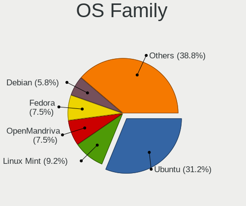

| Name          | Notebooks | Percent |
|---------------|-----------|---------|
| Ubuntu        | 294       | 40%     |
| Linux Mint    | 77        | 10.48%  |
| Fedora        | 35        | 4.76%   |
| OpenMandriva  | 32        | 4.35%   |
| Manjaro       | 29        | 3.95%   |
| Pop!_OS       | 27        | 3.67%   |
| Debian        | 26        | 3.54%   |
| Arch          | 26        | 3.54%   |
| Zorin         | 25        | 3.4%    |
| Xubuntu       | 24        | 3.27%   |
| ROSA          | 18        | 2.45%   |
| Kubuntu       | 16        | 2.18%   |
| ArcoLinux     | 14        | 1.9%    |
| KDE neon      | 11        | 1.5%    |
| Lubuntu       | 10        | 1.36%   |
| openSUSE      | 9         | 1.22%   |
| Ubuntu MATE   | 6         | 0.82%   |
| Gentoo        | 6         | 0.82%   |
| Endless       | 5         | 0.68%   |
| Elementary    | 5         | 0.68%   |
| CentOS        | 5         | 0.68%   |
| BlackPanther  | 5         | 0.68%   |
| EndeavourOS   | 4         | 0.54%   |
| Ubuntu Budgie | 3         | 0.41%   |
| MX            | 3         | 0.41%   |
| Clear Linux   | 3         | 0.41%   |
| Rocky Linux   | 2         | 0.27%   |
| NixOS         | 2         | 0.27%   |
| LMDE          | 2         | 0.27%   |
| LinuxFX       | 2         | 0.27%   |
| Kali          | 2         | 0.27%   |
| Solus         | 1         | 0.14%   |
| Reborn OS     | 1         | 0.14%   |
| Parrot        | 1         | 0.14%   |
| Garuda Linux  | 1         | 0.14%   |
| Feren OS      | 1         | 0.14%   |
| Chrome OS     | 1         | 0.14%   |
| antergos      | 1         | 0.14%   |

Kernel
------

Version of the Linux kernel

| Version                         | Notebooks | Percent |
|---------------------------------|-----------|---------|
| 5.10.14-desktop-1omv4002        | 18        | 2.06%   |
| 5.4.0-58-generic                | 16        | 1.83%   |
| 5.4.0-42-generic                | 16        | 1.83%   |
| 5.3.0-42-generic                | 15        | 1.71%   |
| 5.4.0-48-generic                | 13        | 1.49%   |
| 5.4.0-66-generic                | 11        | 1.26%   |
| 5.16.7-desktop-1omv4003         | 11        | 1.26%   |
| 5.4.0-29-generic                | 10        | 1.14%   |
| 5.3.0-46-generic                | 10        | 1.14%   |
| 5.8.0-43-generic                | 9         | 1.03%   |
| 5.11.0-43-generic               | 9         | 1.03%   |
| 5.4.0-74-generic                | 8         | 0.91%   |
| 5.4.0-40-generic                | 8         | 0.91%   |
| 5.13.0-39-generic               | 8         | 0.91%   |
| 5.4.0-65-generic                | 7         | 0.8%    |
| 5.4.0-52-generic                | 7         | 0.8%    |
| 5.4.0-26-generic                | 7         | 0.8%    |
| 5.13.0-28-generic               | 7         | 0.8%    |
| 5.11.0-7620-generic             | 7         | 0.8%    |
| 5.11.0-41-generic               | 7         | 0.8%    |
| 5.11.0-38-generic               | 7         | 0.8%    |
| 5.0.0-29-generic                | 7         | 0.8%    |
| 5.8.0-53-generic                | 6         | 0.69%   |
| 5.4.0-91-generic                | 6         | 0.69%   |
| 5.4.0-56-generic                | 6         | 0.69%   |
| 5.4.0-53-generic                | 6         | 0.69%   |
| 5.4.0-37-generic                | 6         | 0.69%   |
| 5.3.0-40-generic                | 6         | 0.69%   |
| 5.13.0-40-generic               | 6         | 0.69%   |
| 5.13.0-35-generic               | 6         | 0.69%   |
| 4.9.20-nrj-desktop-1rosa-x86_64 | 6         | 0.69%   |
| 5.8.0-55-generic                | 5         | 0.57%   |
| 5.8.0-48-generic                | 5         | 0.57%   |
| 5.4.0-90-generic                | 5         | 0.57%   |
| 5.4.0-47-generic                | 5         | 0.57%   |
| 5.4.0-107-generic               | 5         | 0.57%   |
| 5.3.0-51-generic                | 5         | 0.57%   |
| 5.13.0-30-generic               | 5         | 0.57%   |
| 5.13.0-27-generic               | 5         | 0.57%   |
| 5.11.0-25-generic               | 5         | 0.57%   |
| 5.8.0-41-generic                | 4         | 0.46%   |
| 5.4.0-77-generic                | 4         | 0.46%   |
| 5.4.0-54-generic                | 4         | 0.46%   |
| 5.3.0-19-generic                | 4         | 0.46%   |
| 5.11.0-44-generic               | 4         | 0.46%   |
| 5.11.0-40-generic               | 4         | 0.46%   |
| 5.11.0-37-generic               | 4         | 0.46%   |
| 5.11.0-34-generic               | 4         | 0.46%   |
| 5.10.0-8-amd64                  | 4         | 0.46%   |
| 4.9.60-nrj-desktop-1rosa-x86_64 | 4         | 0.46%   |
| 4.18.16-desktop-1bP             | 4         | 0.46%   |
| 4.18.0-25-generic               | 4         | 0.46%   |
| 4.15.0-88-generic               | 4         | 0.46%   |
| 5.8.0-59-generic                | 3         | 0.34%   |
| 5.4.0-96-generic                | 3         | 0.34%   |
| 5.4.0-89-generic                | 3         | 0.34%   |
| 5.4.0-7634-generic              | 3         | 0.34%   |
| 5.4.0-72-generic                | 3         | 0.34%   |
| 5.4.0-62-generic                | 3         | 0.34%   |
| 5.3.0-62-generic                | 3         | 0.34%   |

Kernel Family
-------------

Linux kernel without a distro release

| Version | Notebooks | Percent |
|---------|-----------|---------|
| 5.4.0   | 185       | 22.73%  |
| 5.11.0  | 66        | 8.11%   |
| 5.8.0   | 58        | 7.13%   |
| 4.15.0  | 57        | 7%      |
| 5.13.0  | 50        | 6.14%   |
| 5.3.0   | 49        | 6.02%   |
| 5.0.0   | 30        | 3.69%   |
| 4.18.0  | 21        | 2.58%   |
| 5.10.14 | 18        | 2.21%   |
| 5.10.0  | 18        | 2.21%   |
| 5.16.7  | 11        | 1.35%   |
| 5.15.0  | 11        | 1.35%   |
| 4.9.20  | 6         | 0.74%   |
| 4.19.0  | 6         | 0.74%   |
| 4.18.16 | 5         | 0.61%   |
| 5.16.0  | 4         | 0.49%   |
| 4.9.60  | 4         | 0.49%   |
| 4.4.0   | 4         | 0.49%   |
| 5.9.11  | 3         | 0.37%   |
| 5.8.5   | 3         | 0.37%   |
| 5.8.18  | 3         | 0.37%   |
| 5.4.8   | 3         | 0.37%   |
| 5.4.15  | 3         | 0.37%   |
| 5.3.18  | 3         | 0.37%   |
| 5.14.10 | 3         | 0.37%   |
| 5.12.8  | 3         | 0.37%   |
| 5.12.4  | 3         | 0.37%   |
| 5.9.14  | 2         | 0.25%   |
| 5.8.4   | 2         | 0.25%   |
| 5.7.8   | 2         | 0.25%   |
| 5.6.7   | 2         | 0.25%   |
| 5.6.14  | 2         | 0.25%   |
| 5.6.13  | 2         | 0.25%   |
| 5.6.0   | 2         | 0.25%   |
| 5.3.11  | 2         | 0.25%   |
| 5.17.5  | 2         | 0.25%   |
| 5.17.3  | 2         | 0.25%   |
| 5.17.2  | 2         | 0.25%   |
| 5.16.4  | 2         | 0.25%   |
| 5.16.19 | 2         | 0.25%   |
| 5.16.16 | 2         | 0.25%   |
| 5.16.1  | 2         | 0.25%   |
| 5.15.8  | 2         | 0.25%   |
| 5.15.7  | 2         | 0.25%   |
| 5.15.14 | 2         | 0.25%   |
| 5.14.6  | 2         | 0.25%   |
| 5.13.19 | 2         | 0.25%   |
| 5.13.13 | 2         | 0.25%   |
| 5.13.12 | 2         | 0.25%   |
| 5.12.9  | 2         | 0.25%   |
| 5.12.15 | 2         | 0.25%   |
| 5.12.13 | 2         | 0.25%   |
| 5.11.12 | 2         | 0.25%   |
| 5.11.11 | 2         | 0.25%   |
| 4.9.41  | 2         | 0.25%   |
| 4.9.124 | 2         | 0.25%   |
| 4.9.111 | 2         | 0.25%   |
| 4.1.38  | 2         | 0.25%   |
| 5.9.16  | 1         | 0.12%   |
| 5.9.12  | 1         | 0.12%   |

Kernel Major Ver.
-----------------

Linux kernel major version

| Version | Notebooks | Percent |
|---------|-----------|---------|
| 5.4     | 203       | 25.44%  |
| 5.11    | 75        | 9.4%    |
| 5.8     | 71        | 8.9%    |
| 5.13    | 59        | 7.39%   |
| 4.15    | 57        | 7.14%   |
| 5.3     | 55        | 6.89%   |
| 5.10    | 50        | 6.27%   |
| 5.0     | 32        | 4.01%   |
| 5.15    | 28        | 3.51%   |
| 5.16    | 27        | 3.38%   |
| 4.18    | 27        | 3.38%   |
| 5.12    | 15        | 1.88%   |
| 4.9     | 14        | 1.75%   |
| 5.6     | 12        | 1.5%    |
| 5.14    | 12        | 1.5%    |
| 5.17    | 11        | 1.38%   |
| 5.9     | 10        | 1.25%   |
| 4.19    | 10        | 1.25%   |
| 5.7     | 8         | 1%      |
| 5.5     | 5         | 0.63%   |
| 4.4     | 4         | 0.5%    |
| 5.1     | 3         | 0.38%   |
| 5.2     | 2         | 0.25%   |
| 4.17    | 2         | 0.25%   |
| 4.1     | 2         | 0.25%   |
| 5.18    | 1         | 0.13%   |
| 4.13    | 1         | 0.13%   |
| 4.12    | 1         | 0.13%   |
| 4.10    | 1         | 0.13%   |

Arch
----

OS architecture (x86_64, i586, etc.)

| Name   | Notebooks | Percent |
|--------|-----------|---------|
| x86_64 | 675       | 95.74%  |
| i686   | 30        | 4.26%   |

DE
--

Desktop Environment

| Name            | Notebooks | Percent |
|-----------------|-----------|---------|
| GNOME           | 315       | 41.78%  |
| Unknown         | 117       | 15.52%  |
| KDE5            | 89        | 11.8%   |
| XFCE            | 64        | 8.49%   |
| X-Cinnamon      | 50        | 6.63%   |
| MATE            | 24        | 3.18%   |
| KDE             | 20        | 2.65%   |
| Unity           | 12        | 1.59%   |
| KDE4            | 11        | 1.46%   |
| LXQt            | 10        | 1.33%   |
| Cinnamon        | 9         | 1.19%   |
| i3              | 7         | 0.93%   |
| Budgie          | 6         | 0.8%    |
| Pantheon        | 5         | 0.66%   |
| sway            | 3         | 0.4%    |
| LXDE            | 2         | 0.27%   |
| LeftWM          | 2         | 0.27%   |
| bspwm           | 2         | 0.27%   |
| xmonad          | 1         | 0.13%   |
| spectrwm        | 1         | 0.13%   |
| Openbox         | 1         | 0.13%   |
| GNOME Flashback | 1         | 0.13%   |
| Deepin          | 1         | 0.13%   |
| awesome         | 1         | 0.13%   |

Display Server
--------------

X11 or Wayland

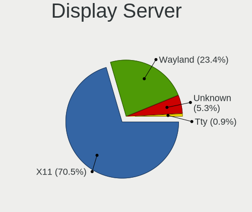

| Name    | Notebooks | Percent |
|---------|-----------|---------|
| X11     | 583       | 80.3%   |
| Wayland | 72        | 9.92%   |
| Unknown | 67        | 9.23%   |
| Tty     | 4         | 0.55%   |

Display Manager
---------------

SDDM, LightDM, etc.

| Name    | Notebooks | Percent |
|---------|-----------|---------|
| Unknown | 418       | 56.49%  |
| SDDM    | 98        | 13.24%  |
| GDM     | 94        | 12.7%   |
| LightDM | 43        | 5.81%   |
| GDM3    | 39        | 5.27%   |
| TDM     | 37        | 5%      |
| KDM     | 11        | 1.49%   |

OS Lang
-------

Language

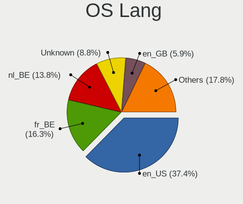

| Lang       | Notebooks | Percent |
|------------|-----------|---------|
| en_US      | 230       | 31.42%  |
| Unknown    | 120       | 16.39%  |
| fr_BE      | 115       | 15.71%  |
| nl_BE      | 109       | 14.89%  |
| nl_NL      | 37        | 5.05%   |
| en_GB      | 37        | 5.05%   |
| fr_FR      | 28        | 3.83%   |
| C          | 11        | 1.5%    |
| de_DE      | 10        | 1.37%   |
| de_BE      | 6         | 0.82%   |
| ru_RU      | 3         | 0.41%   |
| pl_PL      | 3         | 0.41%   |
| es_ES      | 3         | 0.41%   |
| pt_PT      | 2         | 0.27%   |
| en_IE      | 2         | 0.27%   |
| en_CA      | 2         | 0.27%   |
| en_BE      | 2         | 0.27%   |
| tt_RU      | 1         | 0.14%   |
| ro_RO      | 1         | 0.14%   |
| POSIX      | 1         | 0.14%   |
| nl_AW      | 1         | 0.14%   |
| it_IT      | 1         | 0.14%   |
| it_CH      | 1         | 0.14%   |
| fr_CH      | 1         | 0.14%   |
| en_ZA      | 1         | 0.14%   |
| en_US.UTF8 | 1         | 0.14%   |
| en_IN      | 1         | 0.14%   |
| en_DK      | 1         | 0.14%   |
| bg_BG      | 1         | 0.14%   |

Boot Mode
---------

EFI or BIOS

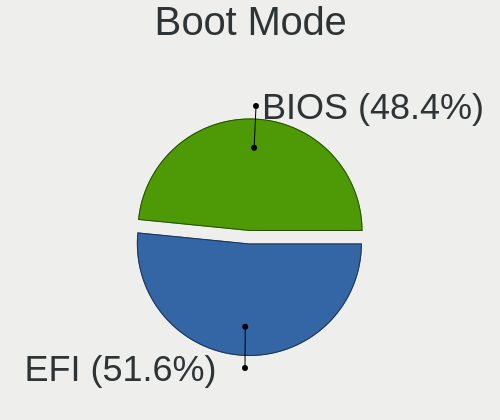

| Mode | Notebooks | Percent |
|------|-----------|---------|
| BIOS | 373       | 51.45%  |
| EFI  | 352       | 48.55%  |

Filesystem
----------

Type of filesystem

| Type    | Notebooks | Percent |
|---------|-----------|---------|
| Ext4    | 592       | 81.66%  |
| Overlay | 42        | 5.79%   |
| Btrfs   | 41        | 5.66%   |
| Unknown | 32        | 4.41%   |
| Xfs     | 13        | 1.79%   |
| Tmpfs   | 2         | 0.28%   |
| Ext2    | 2         | 0.28%   |
| Zfs     | 1         | 0.14%   |

Part. scheme
------------

Scheme of partitioning

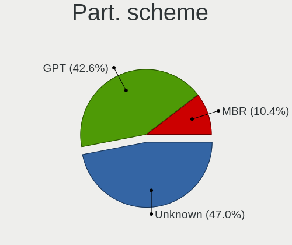

| Type    | Notebooks | Percent |
|---------|-----------|---------|
| Unknown | 448       | 62.14%  |
| GPT     | 213       | 29.54%  |
| MBR     | 60        | 8.32%   |

Dual Boot with Linux/BSD
------------------------

Hosting more than one Linux/BSD

| Dual boot | Notebooks | Percent |
|-----------|-----------|---------|
| No        | 627       | 87.33%  |
| Yes       | 91        | 12.67%  |

Dual Boot (Win)
---------------

Hosting Linux and Windows

| Dual boot | Notebooks | Percent |
|-----------|-----------|---------|
| No        | 521       | 72.77%  |
| Yes       | 195       | 27.23%  |

Board
-----

Vendor
------

Motherboard manufacturer

| Name                | Notebooks | Percent |
|---------------------|-----------|---------|
| Hewlett-Packard     | 152       | 21.59%  |
| Dell                | 132       | 18.75%  |
| Lenovo              | 116       | 16.48%  |
| ASUSTek Computer    | 82        | 11.65%  |
| Acer                | 51        | 7.24%   |
| Toshiba             | 29        | 4.12%   |
| Sony                | 20        | 2.84%   |
| Medion              | 18        | 2.56%   |
| Notebook            | 14        | 1.99%   |
| Apple               | 14        | 1.99%   |
| MSI                 | 13        | 1.85%   |
| Packard Bell        | 12        | 1.7%    |
| Samsung Electronics | 5         | 0.71%   |
| TUXEDO              | 4         | 0.57%   |
| Gigabyte Technology | 4         | 0.57%   |
| Fujitsu             | 4         | 0.57%   |
| PC Specialist       | 3         | 0.43%   |
| Intel               | 3         | 0.43%   |
| HUAWEI              | 3         | 0.43%   |
| Google              | 3         | 0.43%   |
| Fujitsu Siemens     | 3         | 0.43%   |
| Unknown             | 3         | 0.43%   |
| Clevo               | 2         | 0.28%   |
| YJKC                | 1         | 0.14%   |
| TrekStor            | 1         | 0.14%   |
| Timi                | 1         | 0.14%   |
| Teclast             | 1         | 0.14%   |
| Standard            | 1         | 0.14%   |
| SLIMBOOK            | 1         | 0.14%   |
| Schenker            | 1         | 0.14%   |
| Inter Sales A/S     | 1         | 0.14%   |
| Hampoo              | 1         | 0.14%   |
| GPD                 | 1         | 0.14%   |
| Chuwi               | 1         | 0.14%   |
| Celestica           | 1         | 0.14%   |
| BLAUPUNKT           | 1         | 0.14%   |
| AMI                 | 1         | 0.14%   |

Model
-----

Motherboard model

| Name                                 | Notebooks | Percent |
|--------------------------------------|-----------|---------|
| HP ProBook 650 G1                    | 5         | 0.71%   |
| HP Pavilion dv7                      | 5         | 0.71%   |
| Unknown                              | 5         | 0.71%   |
| Toshiba Satellite C660               | 4         | 0.57%   |
| HP ProBook 6570b                     | 4         | 0.57%   |
| HP Pavilion Notebook                 | 4         | 0.57%   |
| Gigabyte Spring Peak                 | 4         | 0.57%   |
| Dell XPS 13 9370                     | 4         | 0.57%   |
| Dell XPS 13 7390                     | 4         | 0.57%   |
| Lenovo ThinkPad L390 20NSS1YV0B      | 3         | 0.43%   |
| Lenovo Legion 5 15ARH05 82B5         | 3         | 0.43%   |
| Lenovo IdeaPad 5 Pro 16ACH6 82L5     | 3         | 0.43%   |
| HP ProBook 470 G2                    | 3         | 0.43%   |
| HP ProBook 430 G1                    | 3         | 0.43%   |
| HP Pavilion Laptop 15-cw0xxx         | 3         | 0.43%   |
| HP Pavilion g7                       | 3         | 0.43%   |
| HP Pavilion 17                       | 3         | 0.43%   |
| HP EliteBook 840 G1                  | 3         | 0.43%   |
| Dell XPS 15 9570                     | 3         | 0.43%   |
| Dell Latitude E7440                  | 3         | 0.43%   |
| Dell Latitude E6540                  | 3         | 0.43%   |
| Dell Latitude E6500                  | 3         | 0.43%   |
| Dell Latitude E6330                  | 3         | 0.43%   |
| Dell Latitude E5540                  | 3         | 0.43%   |
| Dell Latitude E5520                  | 3         | 0.43%   |
| Dell Latitude 5500                   | 3         | 0.43%   |
| Dell Inspiron 5521                   | 3         | 0.43%   |
| Acer Aspire V3-771                   | 3         | 0.43%   |
| Acer Aspire 5750G                    | 3         | 0.43%   |
| Toshiba Satellite C855-112           | 2         | 0.28%   |
| Toshiba Satellite A300               | 2         | 0.28%   |
| Packard Bell EasyNote LE69KB         | 2         | 0.28%   |
| Medion WIM2140                       | 2         | 0.28%   |
| Medion P6634                         | 2         | 0.28%   |
| Lenovo Y520-15IKBN 80WK              | 2         | 0.28%   |
| Lenovo ThinkPad W520 42844LG         | 2         | 0.28%   |
| Lenovo ThinkPad T14 Gen 1 20UD0013MB | 2         | 0.28%   |
| Lenovo ThinkPad E495 20NES01600      | 2         | 0.28%   |
| Lenovo IdeaPad S540-15IWL GTX 81SW   | 2         | 0.28%   |
| Lenovo IdeaPad 5 14ARE05 81YM        | 2         | 0.28%   |
| Lenovo B40-30 80F1                   | 2         | 0.28%   |
| HP ProBook 6460b                     | 2         | 0.28%   |
| HP ProBook 450 G8 Notebook PC        | 2         | 0.28%   |
| HP ProBook 450 G4                    | 2         | 0.28%   |
| HP ProBook 450 G0                    | 2         | 0.28%   |
| HP Pavilion Laptop 15-eh1xxx         | 2         | 0.28%   |
| HP Pavilion g6                       | 2         | 0.28%   |
| HP Pavilion dv6                      | 2         | 0.28%   |
| HP Pavilion 15                       | 2         | 0.28%   |
| HP OMEN Laptop 15-en0xxx             | 2         | 0.28%   |
| HP Notebook                          | 2         | 0.28%   |
| HP Laptop 15-db0xxx                  | 2         | 0.28%   |
| HP Laptop 15-bw0xx                   | 2         | 0.28%   |
| HP EliteBook 8760w                   | 2         | 0.28%   |
| HP EliteBook 850 G8 Notebook PC      | 2         | 0.28%   |
| HP EliteBook 850 G5                  | 2         | 0.28%   |
| HP EliteBook 850 G3                  | 2         | 0.28%   |
| HP EliteBook 8440p                   | 2         | 0.28%   |
| HP EliteBook 830 G6                  | 2         | 0.28%   |
| HP Compaq Presario CQ60              | 2         | 0.28%   |

Model Family
------------

Motherboard model prefix

| Name                  | Notebooks | Percent |
|-----------------------|-----------|---------|
| Lenovo ThinkPad       | 67        | 9.52%   |
| Dell Latitude         | 63        | 8.95%   |
| Acer Aspire           | 42        | 5.97%   |
| HP Pavilion           | 37        | 5.26%   |
| HP EliteBook          | 37        | 5.26%   |
| HP ProBook            | 35        | 4.97%   |
| Toshiba Satellite     | 26        | 3.69%   |
| Dell XPS              | 25        | 3.55%   |
| Lenovo IdeaPad        | 20        | 2.84%   |
| Dell Inspiron         | 18        | 2.56%   |
| HP Compaq             | 13        | 1.85%   |
| Packard Bell EasyNote | 10        | 1.42%   |
| Lenovo Legion         | 10        | 1.42%   |
| HP Laptop             | 10        | 1.42%   |
| Dell Precision        | 10        | 1.42%   |
| Dell Vostro           | 7         | 0.99%   |
| HP ZBook              | 6         | 0.85%   |
| Dell Studio           | 5         | 0.71%   |
| ASUS VivoBook         | 5         | 0.71%   |
| Unknown               | 5         | 0.71%   |
| Gigabyte Spring       | 4         | 0.57%   |
| ASUS ZenBook          | 4         | 0.57%   |
| Medion Akoya          | 3         | 0.43%   |
| Lenovo ThinkBook      | 3         | 0.43%   |
| HP OMEN               | 3         | 0.43%   |
| HP ENVY               | 3         | 0.43%   |
| Fujitsu LIFEBOOK      | 3         | 0.43%   |
| Dell G3               | 3         | 0.43%   |
| Acer Swift            | 3         | 0.43%   |
| Acer Nitro            | 3         | 0.43%   |
| Toshiba TECRA         | 2         | 0.28%   |
| Notebook NH5x         | 2         | 0.28%   |
| MSI GF63              | 2         | 0.28%   |
| Medion WIM2140        | 2         | 0.28%   |
| Medion P6634          | 2         | 0.28%   |
| Lenovo Yoga           | 2         | 0.28%   |
| Lenovo Y520-15IKBN    | 2         | 0.28%   |
| Lenovo B40-30         | 2         | 0.28%   |
| HP Notebook           | 2         | 0.28%   |
| Fujitsu Siemens AMILO | 2         | 0.28%   |
| ASUS X555LJ           | 2         | 0.28%   |
| ASUS X541UA           | 2         | 0.28%   |
| ASUS X540SA           | 2         | 0.28%   |
| ASUS Strix            | 2         | 0.28%   |
| ASUS ROG              | 2         | 0.28%   |
| ASUS N56VZ            | 2         | 0.28%   |
| ASUS K52F             | 2         | 0.28%   |
| ASUS K50IJ            | 2         | 0.28%   |
| Apple MacBookPro9     | 2         | 0.28%   |
| Apple MacBookPro11    | 2         | 0.28%   |
| Apple MacBookPro10    | 2         | 0.28%   |
| Acer TravelMate       | 2         | 0.28%   |
| YJKC vBOOK            | 1         | 0.14%   |
| TUXEDO Pulse          | 1         | 0.14%   |
| TUXEDO InfinityBook   | 1         | 0.14%   |
| TUXEDO Aura           | 1         | 0.14%   |
| TrekStor Notebook     | 1         | 0.14%   |
| Toshiba Portable      | 1         | 0.14%   |
| Timi TM1701           | 1         | 0.14%   |
| Teclast F6            | 1         | 0.14%   |

MFG Year
--------

Motherboard manufacture year

| Year    | Notebooks | Percent |
|---------|-----------|---------|
| 2019    | 70        | 9.94%   |
| 2018    | 69        | 9.8%    |
| 2011    | 64        | 9.09%   |
| 2020    | 63        | 8.95%   |
| 2012    | 63        | 8.95%   |
| 2013    | 55        | 7.81%   |
| 2014    | 44        | 6.25%   |
| 2008    | 42        | 5.97%   |
| 2015    | 40        | 5.68%   |
| 2016    | 37        | 5.26%   |
| 2017    | 33        | 4.69%   |
| 2010    | 31        | 4.4%    |
| 2021    | 29        | 4.12%   |
| 2009    | 24        | 3.41%   |
| 2007    | 22        | 3.13%   |
| 2006    | 12        | 1.7%    |
| 2005    | 2         | 0.28%   |
| 2004    | 2         | 0.28%   |
| 2022    | 1         | 0.14%   |
| Unknown | 1         | 0.14%   |

Form Factor
-----------

Physical design of the computer

| Name     | Notebooks | Percent |
|----------|-----------|---------|
| Notebook | 704       | 100%    |

Secure Boot
-----------

Enabled or disabled

| State    | Notebooks | Percent |
|----------|-----------|---------|
| Disabled | 635       | 89.44%  |
| Enabled  | 75        | 10.56%  |

Coreboot
--------

Have coreboot on board

| Used | Notebooks | Percent |
|------|-----------|---------|
| No   | 701       | 99.57%  |
| Yes  | 3         | 0.43%   |

RAM Size
--------

Total RAM memory

| Size in GB  | Notebooks | Percent |
|-------------|-----------|---------|
| 4.01-8.0    | 191       | 26.53%  |
| 3.01-4.0    | 146       | 20.28%  |
| 8.01-16.0   | 146       | 20.28%  |
| 16.01-24.0  | 124       | 17.22%  |
| 32.01-64.0  | 41        | 5.69%   |
| 1.01-2.0    | 31        | 4.31%   |
| 0.51-1.0    | 13        | 1.81%   |
| 2.01-3.0    | 11        | 1.53%   |
| 24.01-32.0  | 10        | 1.39%   |
| 64.01-256.0 | 6         | 0.83%   |
| 0.01-0.5    | 1         | 0.14%   |

RAM Used
--------

Used RAM memory

| Used GB    | Notebooks | Percent |
|------------|-----------|---------|
| 1.01-2.0   | 289       | 36.17%  |
| 2.01-3.0   | 197       | 24.66%  |
| 4.01-8.0   | 94        | 11.76%  |
| 3.01-4.0   | 94        | 11.76%  |
| 0.51-1.0   | 62        | 7.76%   |
| 8.01-16.0  | 43        | 5.38%   |
| 0.01-0.5   | 18        | 2.25%   |
| 24.01-32.0 | 1         | 0.13%   |
| 16.01-24.0 | 1         | 0.13%   |

Total Drives
------------

Number of drives on board

| Drives | Notebooks | Percent |
|--------|-----------|---------|
| 1      | 511       | 70.48%  |
| 2      | 192       | 26.48%  |
| 3      | 14        | 1.93%   |
| 0      | 4         | 0.55%   |
| 4      | 3         | 0.41%   |
| 5      | 1         | 0.14%   |

Has CD-ROM
----------

Has CD-ROM on board

| Presented | Notebooks | Percent |
|-----------|-----------|---------|
| No        | 399       | 56.28%  |
| Yes       | 310       | 43.72%  |

Has Ethernet
------------

Has Ethernet on board

| Presented | Notebooks | Percent |
|-----------|-----------|---------|
| Yes       | 633       | 89.28%  |
| No        | 76        | 10.72%  |

Has WiFi
--------

Has WiFi module

| Presented | Notebooks | Percent |
|-----------|-----------|---------|
| Yes       | 693       | 97.88%  |
| No        | 15        | 2.12%   |

Has Bluetooth
-------------

Has Bluetooth module

| Presented | Notebooks | Percent |
|-----------|-----------|---------|
| Yes       | 513       | 71.65%  |
| No        | 203       | 28.35%  |

Location
--------

Country
-------

Geographic location (country)

| Country | Notebooks | Percent |
|---------|-----------|---------|
| Belgium | 704       | 100%    |

City
----

Geographic location (city)

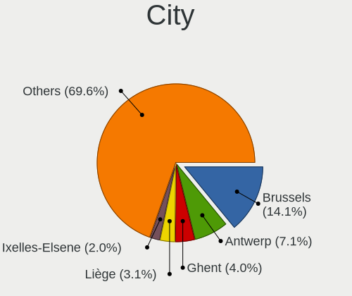

| City                 | Notebooks | Percent |
|----------------------|-----------|---------|
| Brussels             | 89        | 11.37%  |
| Antwerp              | 56        | 7.15%   |
| Ghent                | 25        | 3.19%   |
| Ixelles-Elsene       | 22        | 2.81%   |
| Lige               | 14        | 1.79%   |
| Mechelen             | 12        | 1.53%   |
| Turnhout             | 10        | 1.28%   |
| Uccle                | 9         | 1.15%   |
| Schaarbeek           | 9         | 1.15%   |
| Anderlecht           | 9         | 1.15%   |
| Mons                 | 8         | 1.02%   |
| Leuven               | 8         | 1.02%   |
| Aalst                | 8         | 1.02%   |
| Jette                | 7         | 0.89%   |
| Brasschaat           | 7         | 0.89%   |
| Boom                 | 7         | 0.89%   |
| Kontich              | 6         | 0.77%   |
| Harelbeke            | 6         | 0.77%   |
| Edegem               | 6         | 0.77%   |
| Bruges               | 6         | 0.77%   |
| Sint-Truiden         | 5         | 0.64%   |
| La Louvire         | 5         | 0.64%   |
| Kanne                | 5         | 0.64%   |
| Hasselt              | 5         | 0.64%   |
| Etterbeek            | 5         | 0.64%   |
| Tielt-Winge          | 4         | 0.51%   |
| Schoten              | 4         | 0.51%   |
| Riemst               | 4         | 0.51%   |
| Lokeren              | 4         | 0.51%   |
| Gembloux             | 4         | 0.51%   |
| Gavere               | 4         | 0.51%   |
| Deinze               | 4         | 0.51%   |
| De Haan              | 4         | 0.51%   |
| Charleroi            | 4         | 0.51%   |
| Bilzen               | 4         | 0.51%   |
| Bernissart           | 4         | 0.51%   |
| Ypres                | 3         | 0.38%   |
| Woluwe-Saint-Lambert | 3         | 0.38%   |
| Wilrijk              | 3         | 0.38%   |
| Wetteren             | 3         | 0.38%   |
| Westerlo             | 3         | 0.38%   |
| Wavre                | 3         | 0.38%   |
| Vilvoorde            | 3         | 0.38%   |
| Tessenderlo          | 3         | 0.38%   |
| Seraing              | 3         | 0.38%   |
| Rochefort            | 3         | 0.38%   |
| Poperinge            | 3         | 0.38%   |
| Overijse             | 3         | 0.38%   |
| Ottignies            | 3         | 0.38%   |
| Nevele               | 3         | 0.38%   |
| Namur                | 3         | 0.38%   |
| Mortsel              | 3         | 0.38%   |
| Molenbeek-Saint-Jean | 3         | 0.38%   |
| Mol                  | 3         | 0.38%   |
| Merksem              | 3         | 0.38%   |
| Merelbeke            | 3         | 0.38%   |
| Lubbeek              | 3         | 0.38%   |
| Limal                | 3         | 0.38%   |
| Langdorp             | 3         | 0.38%   |
| Kapellen             | 3         | 0.38%   |

Drives
------

Drive Vendor
------------

Hard drive vendors

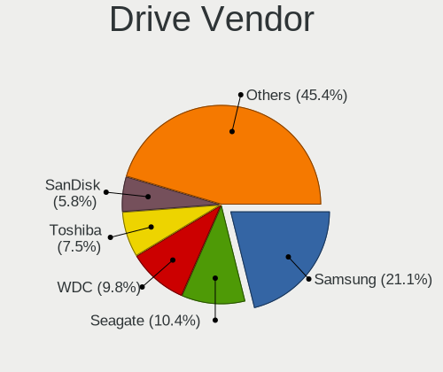

| Vendor                    | Notebooks | Drives | Percent |
|---------------------------|-----------|--------|---------|
| Samsung Electronics       | 182       | 257    | 20.99%  |
| Seagate                   | 112       | 153    | 12.92%  |
| WDC                       | 98        | 136    | 11.3%   |
| Toshiba                   | 70        | 96     | 8.07%   |
| SanDisk                   | 43        | 57     | 4.96%   |
| SK Hynix                  | 42        | 56     | 4.84%   |
| Kingston                  | 41        | 52     | 4.73%   |
| Unknown                   | 40        | 46     | 4.61%   |
| Hitachi                   | 38        | 46     | 4.38%   |
| Intel                     | 28        | 35     | 3.23%   |
| HGST                      | 24        | 34     | 2.77%   |
| Crucial                   | 21        | 30     | 2.42%   |
| Micron Technology         | 19        | 19     | 2.19%   |
| Fujitsu                   | 11        | 16     | 1.27%   |
| LITEON                    | 8         | 9      | 0.92%   |
| LITEONIT                  | 7         | 9      | 0.81%   |
| Apple                     | 7         | 9      | 0.81%   |
| A-DATA Technology         | 6         | 8      | 0.69%   |
| KIOXIA                    | 5         | 6      | 0.58%   |
| PNY                       | 4         | 4      | 0.46%   |
| OCZ                       | 4         | 5      | 0.46%   |
| Intenso                   | 4         | 5      | 0.46%   |
| China                     | 4         | 6      | 0.46%   |
| Phison                    | 3         | 3      | 0.35%   |
| Micron/Crucial Technology | 3         | 5      | 0.35%   |
| GOODRAM                   | 3         | 4      | 0.35%   |
| Corsair                   | 3         | 3      | 0.35%   |
| Zheino                    | 2         | 2      | 0.23%   |
| Union Memory (Shenzhen)   | 2         | 2      | 0.23%   |
| Transcend                 | 2         | 2      | 0.23%   |
| Silicon Motion            | 2         | 3      | 0.23%   |
| LaCie                     | 2         | 2      | 0.23%   |
| JMicron                   | 2         | 3      | 0.23%   |
| XrayDisk                  | 1         | 1      | 0.12%   |
| TO Exter                  | 1         | 1      | 0.12%   |
| Teclast                   | 1         | 1      | 0.12%   |
| SSSTC                     | 1         | 1      | 0.12%   |
| SPCC                      | 1         | 2      | 0.12%   |
| Solid State Storage       | 1         | 1      | 0.12%   |
| Reeinno                   | 1         | 3      | 0.12%   |
| PLEXTOR                   | 1         | 1      | 0.12%   |
| Patriot                   | 1         | 1      | 0.12%   |
| OWC                       | 1         | 2      | 0.12%   |
| Netac                     | 1         | 1      | 0.12%   |
| Leven                     | 1         | 1      | 0.12%   |
| Lenovo                    | 1         | 1      | 0.12%   |
| LDLC                      | 1         | 1      | 0.12%   |
| KingSpec                  | 1         | 1      | 0.12%   |
| KingFast                  | 1         | 1      | 0.12%   |
| InnoDisk                  | 1         | 1      | 0.12%   |
| Indilinx                  | 1         | 1      | 0.12%   |
| IBM-DJSA                  | 1         | 1      | 0.12%   |
| HEORIADY                  | 1         | 1      | 0.12%   |
| FORESEE                   | 1         | 1      | 0.12%   |
| DREVO                     | 1         | 1      | 0.12%   |
| Dogfish                   | 1         | 1      | 0.12%   |
| Biwin                     | 1         | 1      | 0.12%   |
| ASMT                      | 1         | 1      | 0.12%   |

Drive Model
-----------

Hard drive models

| Model                                     | Notebooks | Percent |
|-------------------------------------------|-----------|---------|
| Samsung NVMe SSD Drive 512GB              | 17        | 1.89%   |
| Seagate ST1000LM024 HN-M101MBB 1TB        | 14        | 1.55%   |
| Seagate ST1000LM035-1RK172 1TB            | 13        | 1.44%   |
| SK Hynix NVMe SSD Drive 512GB             | 11        | 1.22%   |
| Seagate ST9500325AS 500GB                 | 11        | 1.22%   |
| Intel NVMe SSD Drive 512GB                | 11        | 1.22%   |
| Sandisk NVMe SSD Drive 512GB              | 10        | 1.11%   |
| Samsung SSD 860 EVO 500GB                 | 10        | 1.11%   |
| Samsung SSD 850 EVO 250GB                 | 10        | 1.11%   |
| Samsung NVMe SSD Drive 1TB                | 10        | 1.11%   |
| Unknown MMC Card  32GB                    | 9         | 1%      |
| Samsung SSD 850 EVO 500GB                 | 9         | 1%      |
| Hitachi HTS547550A9E384 500GB             | 8         | 0.89%   |
| HGST HTS721010A9E630 1TB                  | 8         | 0.89%   |
| Toshiba MQ01ABD100 1TB                    | 7         | 0.78%   |
| Seagate ST1000LM048-2E7172 1TB            | 7         | 0.78%   |
| Samsung NVMe SSD Drive 500GB              | 6         | 0.67%   |
| Kingston SA400S37240G 240GB SSD           | 6         | 0.67%   |
| Kingston SA400S37120G 120GB SSD           | 6         | 0.67%   |
| Toshiba MQ01ABF050 500GB                  | 5         | 0.55%   |
| Samsung SSD 870 EVO 1TB                   | 5         | 0.55%   |
| Samsung SSD 860 EVO 1TB                   | 5         | 0.55%   |
| Kingston SV300S37A240G 240GB SSD          | 5         | 0.55%   |
| HGST HTS725050A7E630 500GB                | 5         | 0.55%   |
| WDC WD3200BEVT-22ZCT0 320GB               | 4         | 0.44%   |
| Unknown MMC Card  64GB                    | 4         | 0.44%   |
| Unknown MMC Card  128GB                   | 4         | 0.44%   |
| Toshiba NVMe SSD Drive 512GB              | 4         | 0.44%   |
| Toshiba MQ04ABF100 1TB                    | 4         | 0.44%   |
| SK Hynix NVMe SSD Drive 256GB             | 4         | 0.44%   |
| SK Hynix HFS128G39TND-N210A 128GB SSD     | 4         | 0.44%   |
| Seagate ST500LT012-1DG142 500GB           | 4         | 0.44%   |
| Seagate ST2000LM015-2E8174 2TB            | 4         | 0.44%   |
| Seagate Expansion 4TB                     | 4         | 0.44%   |
| Sandisk NVMe SSD Drive 256GB              | 4         | 0.44%   |
| Samsung SSD 860 EVO M.2 1TB               | 4         | 0.44%   |
| Samsung SSD 860 EVO 250GB                 | 4         | 0.44%   |
| Samsung NVMe SSD Drive 1024GB             | 4         | 0.44%   |
| Hitachi HTS723232A7A364 320GB             | 4         | 0.44%   |
| HGST HTS545050A7E380 500GB                | 4         | 0.44%   |
| WDC WD3200BPVT-22JJ5T0 320GB              | 3         | 0.33%   |
| WDC WD2500BEVS-22UST0 250GB               | 3         | 0.33%   |
| WDC WD1600BEVT-22ZCT0 160GB               | 3         | 0.33%   |
| WDC WD1600BEVS-22RST0 160GB               | 3         | 0.33%   |
| Unknown MMC Card  16GB                    | 3         | 0.33%   |
| Toshiba MQ01ABD075 752GB                  | 3         | 0.33%   |
| SK Hynix SKHynix_HFS512GD9TNI-L2B0B 512GB | 3         | 0.33%   |
| SK Hynix SKHynix_HFM512GDHTNI-87A0B 512GB | 3         | 0.33%   |
| Seagate ST9500420AS 500GB                 | 3         | 0.33%   |
| Seagate ST750LM022 HN-M750MBB 752GB       | 3         | 0.33%   |
| Seagate ST500LM000-SSHD-8GB               | 3         | 0.33%   |
| Seagate ST2000LM007-1R8174 2TB            | 3         | 0.33%   |
| Seagate ST1000LX015-1U7172 1TB            | 3         | 0.33%   |
| Seagate ST1000LM049-2GH172 1TB            | 3         | 0.33%   |
| Seagate ST1000LM014-1EJ164 1TB            | 3         | 0.33%   |
| SanDisk SD8SN8U-128G-1006 128GB SSD       | 3         | 0.33%   |
| Samsung SSD 980 1TB                       | 3         | 0.33%   |
| Samsung SSD 970 EVO 1TB                   | 3         | 0.33%   |
| Samsung SSD 870 EVO 500GB                 | 3         | 0.33%   |
| Samsung SSD 860 QVO 1TB                   | 3         | 0.33%   |

HDD Vendor
----------

Hard disk drive vendors

| Vendor              | Notebooks | Drives | Percent |
|---------------------|-----------|--------|---------|
| Seagate             | 108       | 145    | 34.62%  |
| WDC                 | 72        | 97     | 23.08%  |
| Toshiba             | 49        | 70     | 15.71%  |
| Hitachi             | 38        | 46     | 12.18%  |
| HGST                | 24        | 34     | 7.69%   |
| Fujitsu             | 11        | 15     | 3.53%   |
| Samsung Electronics | 6         | 7      | 1.92%   |
| Unknown             | 1         | 1      | 0.32%   |
| LaCie               | 1         | 1      | 0.32%   |
| ASMT                | 1         | 1      | 0.32%   |
| Apple               | 1         | 1      | 0.32%   |

SSD Vendor
----------

Solid state drive vendors

| Vendor              | Notebooks | Drives | Percent |
|---------------------|-----------|--------|---------|
| Samsung Electronics | 98        | 136    | 33%     |
| Kingston            | 31        | 38     | 10.44%  |
| SanDisk             | 27        | 37     | 9.09%   |
| Crucial             | 18        | 26     | 6.06%   |
| SK Hynix            | 14        | 21     | 4.71%   |
| WDC                 | 11        | 16     | 3.7%    |
| Intel               | 11        | 13     | 3.7%    |
| Toshiba             | 10        | 12     | 3.37%   |
| Micron Technology   | 9         | 9      | 3.03%   |
| LITEON              | 8         | 9      | 2.69%   |
| LITEONIT            | 7         | 9      | 2.36%   |
| Apple               | 5         | 7      | 1.68%   |
| A-DATA Technology   | 5         | 7      | 1.68%   |
| PNY                 | 4         | 4      | 1.35%   |
| OCZ                 | 4         | 5      | 1.35%   |
| Intenso             | 4         | 5      | 1.35%   |
| China               | 4         | 6      | 1.35%   |
| GOODRAM             | 3         | 4      | 1.01%   |
| Zheino              | 2         | 2      | 0.67%   |
| Transcend           | 2         | 2      | 0.67%   |
| Corsair             | 2         | 2      | 0.67%   |
| TO Exter            | 1         | 1      | 0.34%   |
| Teclast             | 1         | 1      | 0.34%   |
| SPCC                | 1         | 2      | 0.34%   |
| Reeinno             | 1         | 3      | 0.34%   |
| PLEXTOR             | 1         | 1      | 0.34%   |
| Patriot             | 1         | 1      | 0.34%   |
| OWC                 | 1         | 2      | 0.34%   |
| Netac               | 1         | 1      | 0.34%   |
| Leven               | 1         | 1      | 0.34%   |
| KingSpec            | 1         | 1      | 0.34%   |
| JMicron             | 1         | 1      | 0.34%   |
| InnoDisk            | 1         | 1      | 0.34%   |
| Indilinx            | 1         | 1      | 0.34%   |
| HEORIADY            | 1         | 1      | 0.34%   |
| Fujitsu             | 1         | 1      | 0.34%   |
| FORESEE             | 1         | 1      | 0.34%   |
| DREVO               | 1         | 1      | 0.34%   |
| Dogfish             | 1         | 1      | 0.34%   |

Drive Kind
----------

HDD or SSD

| Kind    | Notebooks | Drives | Percent |
|---------|-----------|--------|---------|
| HDD     | 296       | 418    | 35.97%  |
| SSD     | 277       | 392    | 33.66%  |
| NVMe    | 207       | 289    | 25.15%  |
| MMC     | 35        | 42     | 4.25%   |
| Unknown | 8         | 11     | 0.97%   |

Drive Connector
---------------

SATA, SAS, NVMe, etc.

| Type | Notebooks | Drives | Percent |
|------|-----------|--------|---------|
| SATA | 517       | 781    | 65.53%  |
| NVMe | 207       | 289    | 26.24%  |
| MMC  | 35        | 42     | 4.44%   |
| SAS  | 30        | 40     | 3.8%    |

Drive Size
----------

Size of hard drive

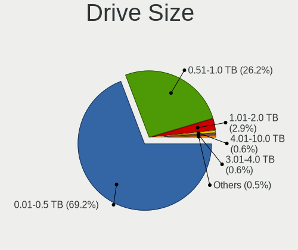

| Size in TB | Notebooks | Drives | Percent |
|------------|-----------|--------|---------|
| 0.01-0.5   | 413       | 558    | 70.84%  |
| 0.51-1.0   | 147       | 222    | 25.21%  |
| 1.01-2.0   | 14        | 17     | 2.4%    |
| 3.01-4.0   | 6         | 8      | 1.03%   |
| 4.01-10.0  | 2         | 4      | 0.34%   |
| 2.01-3.0   | 1         | 1      | 0.17%   |

Space Total
-----------

Amount of disk space available on the file system

| Size in GB     | Notebooks | Percent |
|----------------|-----------|---------|
| 101-250        | 236       | 31.47%  |
| 251-500        | 216       | 28.8%   |
| 501-1000       | 93        | 12.4%   |
| 51-100         | 55        | 7.33%   |
| 1001-2000      | 41        | 5.47%   |
| 1-20           | 32        | 4.27%   |
| Unknown        | 27        | 3.6%    |
| 21-50          | 22        | 2.93%   |
| 2001-3000      | 19        | 2.53%   |
| More than 3000 | 9         | 1.2%    |

Space Used
----------

Amount of used disk space

| Used GB        | Notebooks | Percent |
|----------------|-----------|---------|
| 1-20           | 312       | 39.25%  |
| 21-50          | 138       | 17.36%  |
| 101-250        | 116       | 14.59%  |
| 51-100         | 97        | 12.2%   |
| 251-500        | 51        | 6.42%   |
| 501-1000       | 37        | 4.65%   |
| Unknown        | 27        | 3.4%    |
| 1001-2000      | 9         | 1.13%   |
| 2001-3000      | 5         | 0.63%   |
| More than 3000 | 3         | 0.38%   |

Malfunc. Drives
---------------

Drive models with a malfunction

| Model                                          | Notebooks | Drives | Percent |
|------------------------------------------------|-----------|--------|---------|
| Seagate ST9500325AS 500GB                      | 4         | 4      | 8%      |
| Seagate ST9750420AS 752GB                      | 2         | 2      | 4%      |
| Hitachi HTS545050A7E380 500GB                  | 2         | 3      | 4%      |
| WDC WD3200BEVT-60A23T0 320GB                   | 1         | 1      | 2%      |
| Toshiba MQ01ABD100 1TB                         | 1         | 1      | 2%      |
| Toshiba MQ01ABD075 752GB                       | 1         | 1      | 2%      |
| Toshiba MK6476GSX 640GB                        | 1         | 1      | 2%      |
| Toshiba MK5075GSX 500GB                        | 1         | 1      | 2%      |
| Toshiba KSG60ZSE512G SATA 512GB SSD            | 1         | 1      | 2%      |
| SK Hynix SH920 mSATA 256GB SSD                 | 1         | 1      | 2%      |
| SK Hynix SC401 SATA 512GB SSD                  | 1         | 2      | 2%      |
| SK Hynix HFS256G32MND-2900A 256GB SSD          | 1         | 1      | 2%      |
| SK Hynix HFS128G39TND-N210A 128GB SSD          | 1         | 1      | 2%      |
| Seagate ST9500420AS 500GB                      | 1         | 1      | 2%      |
| Seagate ST9320423AS 320GB                      | 1         | 2      | 2%      |
| Seagate ST750LM022 HN-M750MBB 752GB            | 1         | 1      | 2%      |
| Seagate ST500LM000-SSHD-8GB                    | 1         | 1      | 2%      |
| Seagate ST320LT007-9ZV142 320GB                | 1         | 1      | 2%      |
| Seagate ST1000LM024 HN-M101MBB 1TB             | 1         | 3      | 2%      |
| SanDisk SSD PLUS 480GB                         | 1         | 1      | 2%      |
| SanDisk SD6SN1M-256G-1006 256GB SSD            | 1         | 1      | 2%      |
| Samsung Electronics HM641JI 640GB              | 1         | 1      | 2%      |
| OCZ VERTEX3 256GB SSD                          | 1         | 1      | 2%      |
| Micron Technology 1100_MTFDDAV256TBN 256GB SSD | 1         | 1      | 2%      |
| Micron Technology 1100 SATA 512GB SSD          | 1         | 1      | 2%      |
| Kingston SA400S37120G 120GB SSD                | 1         | 5      | 2%      |
| Intel SSDSCKKF256H6 SATA 256GB                 | 1         | 1      | 2%      |
| Intel SSDSC2CT180A3 180GB                      | 1         | 1      | 2%      |
| Intel SSDPEKKW256G7 256GB                      | 1         | 1      | 2%      |
| Hitachi HTS727550A9E364 500GB                  | 1         | 1      | 2%      |
| Hitachi HTS725050A7E630 500GB                  | 1         | 1      | 2%      |
| Hitachi HTS543225L9A300 250GB                  | 1         | 1      | 2%      |
| Hitachi HTS543216L9A300 160GB                  | 1         | 1      | 2%      |
| Hitachi HTS542580K9SA00 80GB                   | 1         | 1      | 2%      |
| Hitachi HTS541680J9SA00 80GB                   | 1         | 1      | 2%      |
| HGST HTS725050A7E630 500GB                     | 1         | 1      | 2%      |
| HGST HTS721010A9E630 1TB                       | 1         | 1      | 2%      |
| HGST HTS541010A9E680 1TB                       | 1         | 1      | 2%      |
| Fujitsu MJA2250BH G2 250GB                     | 1         | 4      | 2%      |
| Fujitsu MHZ2320BH G1 320GB                     | 1         | 1      | 2%      |
| Fujitsu MHZ2250BH G2 250GB                     | 1         | 1      | 2%      |
| Fujitsu MHZ2160BH G2 160GB                     | 1         | 1      | 2%      |
| Crucial CT240M500SSD1 240GB                    | 1         | 1      | 2%      |
| Crucial CT1000P1SSD8 1TB                       | 1         | 1      | 2%      |
| A-DATA Technology SSD DP900 128GB-DL3          | 1         | 1      | 2%      |

Malfunc. Drive Vendor
---------------------

Vendors of faulty drives

| Vendor              | Notebooks | Drives | Percent |
|---------------------|-----------|--------|---------|
| Seagate             | 12        | 15     | 24%     |
| Hitachi             | 8         | 9      | 16%     |
| Toshiba             | 5         | 5      | 10%     |
| SK Hynix            | 4         | 5      | 8%      |
| Fujitsu             | 4         | 7      | 8%      |
| Intel               | 3         | 3      | 6%      |
| HGST                | 3         | 3      | 6%      |
| SanDisk             | 2         | 2      | 4%      |
| Micron Technology   | 2         | 2      | 4%      |
| Crucial             | 2         | 2      | 4%      |
| WDC                 | 1         | 1      | 2%      |
| Samsung Electronics | 1         | 1      | 2%      |
| OCZ                 | 1         | 1      | 2%      |
| Kingston            | 1         | 5      | 2%      |
| A-DATA Technology   | 1         | 1      | 2%      |

Malfunc. HDD Vendor
-------------------

Vendors of faulty HDD drives

| Vendor              | Notebooks | Drives | Percent |
|---------------------|-----------|--------|---------|
| Seagate             | 12        | 15     | 36.36%  |
| Hitachi             | 8         | 9      | 24.24%  |
| Toshiba             | 4         | 4      | 12.12%  |
| Fujitsu             | 4         | 7      | 12.12%  |
| HGST                | 3         | 3      | 9.09%   |
| WDC                 | 1         | 1      | 3.03%   |
| Samsung Electronics | 1         | 1      | 3.03%   |

Malfunc. Drive Kind
-------------------

Kinds of faulty drives

| Kind | Notebooks | Drives | Percent |
|------|-----------|--------|---------|
| HDD  | 33        | 40     | 66%     |
| SSD  | 15        | 20     | 30%     |
| NVMe | 2         | 2      | 4%      |

Failed Drives
-------------

Failed drive models

| Model                                        | Notebooks | Drives | Percent |
|----------------------------------------------|-----------|--------|---------|
| Samsung Electronics MZVLW128HEGR-000L2 128GB | 1         | 2      | 50%     |
| HGST HTS721010A9E630 1TB                     | 1         | 1      | 50%     |

Failed Drive Vendor
-------------------

Failed drive vendors

| Vendor              | Notebooks | Drives | Percent |
|---------------------|-----------|--------|---------|
| Samsung Electronics | 1         | 2      | 50%     |
| HGST                | 1         | 1      | 50%     |

Drive Status
------------

Number of failed and malfunc. drives

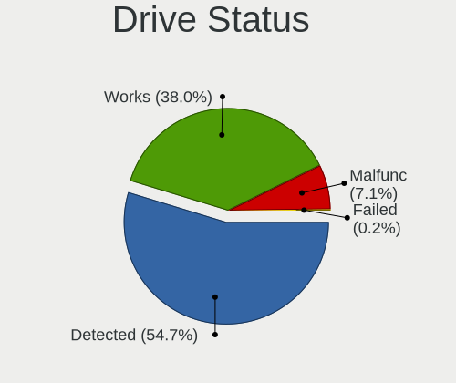

| Status   | Notebooks | Drives | Percent |
|----------|-----------|--------|---------|
| Detected | 460       | 756    | 61.5%   |
| Works    | 238       | 331    | 31.82%  |
| Malfunc  | 48        | 62     | 6.42%   |
| Failed   | 2         | 3      | 0.27%   |

Storage controller
------------------

Storage Vendor
--------------

Storage controller vendors

| Vendor                           | Notebooks | Percent |
|----------------------------------|-----------|---------|
| Intel                            | 528       | 65.1%   |
| Samsung Electronics              | 84        | 10.36%  |
| AMD                              | 66        | 8.14%   |
| Sandisk                          | 29        | 3.58%   |
| SK Hynix                         | 28        | 3.45%   |
| Toshiba America Info Systems     | 11        | 1.36%   |
| Micron Technology                | 10        | 1.23%   |
| Kingston Technology Company      | 10        | 1.23%   |
| Nvidia                           | 7         | 0.86%   |
| KIOXIA                           | 7         | 0.86%   |
| Micron/Crucial Technology        | 5         | 0.62%   |
| Union Memory (Shenzhen)          | 4         | 0.49%   |
| Phison Electronics               | 4         | 0.49%   |
| Solid State Storage Technology   | 3         | 0.37%   |
| Silicon Motion                   | 2         | 0.25%   |
| Silicon Image                    | 2         | 0.25%   |
| Seagate Technology               | 2         | 0.25%   |
| Marvell Technology Group         | 2         | 0.25%   |
| VIA Technologies                 | 1         | 0.12%   |
| Silicon Integrated Systems [SiS] | 1         | 0.12%   |
| Lenovo                           | 1         | 0.12%   |
| Biwin Storage Technology         | 1         | 0.12%   |
| ASMedia Technology               | 1         | 0.12%   |
| Apple                            | 1         | 0.12%   |
| ADATA Technology                 | 1         | 0.12%   |

Storage Model
-------------

Storage controller models

| Model                                                                            | Notebooks | Percent |
|----------------------------------------------------------------------------------|-----------|---------|
| Intel 7 Series Chipset Family 6-port SATA Controller [AHCI mode]                 | 69        | 7.79%   |
| Intel 6 Series/C200 Series Chipset Family 6 port Mobile SATA AHCI Controller     | 55        | 6.21%   |
| Samsung NVMe SSD Controller SM981/PM981/PM983                                    | 53        | 5.98%   |
| AMD FCH SATA Controller [AHCI mode]                                              | 51        | 5.76%   |
| Intel 82801 Mobile SATA Controller [RAID mode]                                   | 47        | 5.3%    |
| Intel Sunrise Point-LP SATA Controller [AHCI mode]                               | 45        | 5.08%   |
| Intel 82801IBM/IEM (ICH9M/ICH9M-E) 4 port SATA Controller [AHCI mode]            | 38        | 4.29%   |
| Intel Cannon Lake Mobile PCH SATA AHCI Controller                                | 29        | 3.27%   |
| Intel 8 Series/C220 Series Chipset Family 6-port SATA Controller 1 [AHCI mode]   | 28        | 3.16%   |
| Intel 8 Series SATA Controller 1 [AHCI mode]                                     | 28        | 3.16%   |
| Intel 82801HM/HEM (ICH8M/ICH8M-E) IDE Controller                                 | 21        | 2.37%   |
| Intel Wildcat Point-LP SATA Controller [AHCI Mode]                               | 20        | 2.26%   |
| Intel 82801HM/HEM (ICH8M/ICH8M-E) SATA Controller [AHCI mode]                    | 19        | 2.14%   |
| Intel HM170/QM170 Chipset SATA Controller [AHCI Mode]                            | 17        | 1.92%   |
| Samsung NVMe SSD Controller 980                                                  | 16        | 1.81%   |
| Intel 5 Series/3400 Series Chipset 4 port SATA AHCI Controller                   | 16        | 1.81%   |
| Intel Volume Management Device NVMe RAID Controller                              | 13        | 1.47%   |
| Sandisk WD Black SN750 / PC SN730 NVMe SSD                                       | 11        | 1.24%   |
| AMD SB7x0/SB8x0/SB9x0 SATA Controller [AHCI mode]                                | 11        | 1.24%   |
| Samsung NVMe SSD Controller SM961/PM961/SM963                                    | 10        | 1.13%   |
| Micron Non-Volatile memory controller                                            | 10        | 1.13%   |
| Intel 82801GBM/GHM (ICH7-M Family) SATA Controller [IDE mode]                    | 10        | 1.13%   |
| Intel 82801G (ICH7 Family) IDE Controller                                        | 9         | 1.02%   |
| Intel 5 Series/3400 Series Chipset 6 port SATA AHCI Controller                   | 9         | 1.02%   |
| SK Hynix Non-Volatile memory controller                                          | 8         | 0.9%    |
| Intel 400 Series Chipset Family SATA AHCI Controller                             | 8         | 0.9%    |
| KIOXIA Non-Volatile memory controller                                            | 7         | 0.79%   |
| Intel Tiger Lake-LP SATA Controller [AHCI mode]                                  | 7         | 0.79%   |
| Intel SSD Pro 7600p/760p/E 6100p Series                                          | 7         | 0.79%   |
| Intel SSD 660P Series                                                            | 7         | 0.79%   |
| Intel Cannon Point-LP SATA Controller [AHCI Mode]                                | 7         | 0.79%   |
| Intel Atom Processor E3800 Series SATA AHCI Controller                           | 7         | 0.79%   |
| Sandisk WD Blue SN550 NVMe SSD                                                   | 6         | 0.68%   |
| Intel Q170/Q150/B150/H170/H110/Z170/CM236 Chipset SATA Controller [AHCI Mode]    | 6         | 0.68%   |
| Intel Mobile 4 Series Chipset PT IDER Controller                                 | 6         | 0.68%   |
| Intel Celeron/Pentium Silver Processor SATA Controller                           | 6         | 0.68%   |
| Toshiba America Info Systems Toshiba America Info Non-Volatile memory controller | 5         | 0.56%   |
| SK Hynix Gold P31 SSD                                                            | 5         | 0.56%   |
| SK Hynix BC511                                                                   | 5         | 0.56%   |
| SK Hynix BC501 NVMe Solid State Drive                                            | 5         | 0.56%   |
| Kingston Company U-SNS8154P3 NVMe SSD                                            | 5         | 0.56%   |
| Intel Comet Lake SATA AHCI Controller                                            | 5         | 0.56%   |
| Intel Atom/Celeron/Pentium Processor x5-E8000/J3xxx/N3xxx Series SATA Controller | 5         | 0.56%   |
| Intel 82801HM/HEM (ICH8M/ICH8M-E) SATA Controller [IDE mode]                     | 5         | 0.56%   |
| Union Memory (Shenzhen) Non-Volatile memory controller                           | 4         | 0.45%   |
| Sandisk WD Blue SN500 / PC SN520 NVMe SSD                                        | 4         | 0.45%   |
| Sandisk WD Black 2018/SN750 / PC SN720 NVMe SSD                                  | 4         | 0.45%   |
| Phison E12 NVMe Controller                                                       | 4         | 0.45%   |
| Intel NM10/ICH7 Family SATA Controller [AHCI mode]                               | 4         | 0.45%   |
| Intel 82801GBM/GHM (ICH7-M Family) SATA Controller [AHCI mode]                   | 4         | 0.45%   |
| Intel 7 Series Chipset Family 4-port SATA Controller [IDE mode]                  | 4         | 0.45%   |
| Intel 7 Series Chipset Family 2-port SATA Controller [IDE mode]                  | 4         | 0.45%   |
| Toshiba America Info Systems XG6 NVMe SSD Controller                             | 3         | 0.34%   |
| Solid State Storage Non-Volatile memory controller                               | 3         | 0.34%   |
| SK Hynix PC401 NVMe Solid State Drive 256GB                                      | 3         | 0.34%   |
| Nvidia MCP79 AHCI Controller                                                     | 3         | 0.34%   |
| Micron/Crucial P1 NVMe PCIe SSD                                                  | 3         | 0.34%   |
| Kingston Company A2000 NVMe SSD                                                  | 3         | 0.34%   |
| Intel Mobile PM965/GM965 PT IDER Controller                                      | 3         | 0.34%   |
| Silicon Motion SM2263EN/SM2263XT SSD Controller                                  | 2         | 0.23%   |

Storage Kind
------------

Kind of storage controller (IDE, SATA, NVMe, SAS, ...)

| Kind | Notebooks | Percent |
|------|-----------|---------|
| SATA | 514       | 60.33%  |
| NVMe | 208       | 24.41%  |
| IDE  | 67        | 7.86%   |
| RAID | 63        | 7.39%   |

Processor
---------

CPU Vendor
----------

Processor vendors

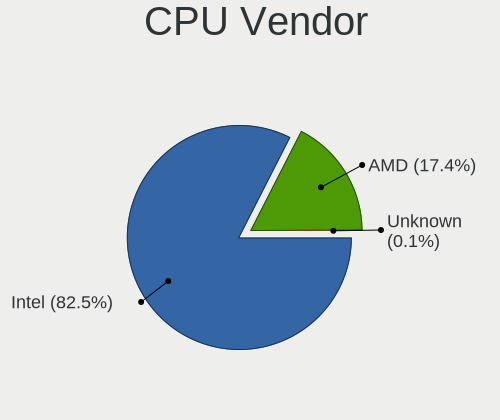

| Vendor | Notebooks | Percent |
|--------|-----------|---------|
| Intel  | 605       | 85.94%  |
| AMD    | 99        | 14.06%  |

CPU Model
---------

Processor models

| Model                                         | Notebooks | Percent |
|-----------------------------------------------|-----------|---------|
| Intel Core i7-8565U CPU @ 1.80GHz             | 20        | 2.84%   |
| Intel Core i7-8550U CPU @ 1.80GHz             | 16        | 2.27%   |
| Intel 11th Gen Core i7-1165G7 @ 2.80GHz       | 14        | 1.99%   |
| Intel Core i7-8750H CPU @ 2.20GHz             | 13        | 1.84%   |
| Intel Core i7-7700HQ CPU @ 2.80GHz            | 13        | 1.84%   |
| Intel Core i5-8250U CPU @ 1.60GHz             | 12        | 1.7%    |
| Intel Core i7-9750H CPU @ 2.60GHz             | 10        | 1.42%   |
| Intel Core i5-2430M CPU @ 2.40GHz             | 10        | 1.42%   |
| Intel Core i7-3630QM CPU @ 2.40GHz            | 9         | 1.28%   |
| Intel Core i5-3210M CPU @ 2.50GHz             | 9         | 1.28%   |
| Intel Core i3-2350M CPU @ 2.30GHz             | 9         | 1.28%   |
| Intel Core i7-8665U CPU @ 1.90GHz             | 8         | 1.13%   |
| Intel Core i5-4210U CPU @ 1.70GHz             | 8         | 1.13%   |
| Intel Core 2 Duo CPU P8600 @ 2.40GHz          | 8         | 1.13%   |
| AMD Ryzen 7 4800H with Radeon Graphics        | 8         | 1.13%   |
| Intel Core i7-10750H CPU @ 2.60GHz            | 7         | 0.99%   |
| Intel Core i7-10510U CPU @ 1.80GHz            | 7         | 0.99%   |
| Intel Core i5-6300U CPU @ 2.40GHz             | 7         | 0.99%   |
| Intel Core i5-3320M CPU @ 2.60GHz             | 7         | 0.99%   |
| Intel Core i5-3230M CPU @ 2.60GHz             | 7         | 0.99%   |
| Intel Core i5-2520M CPU @ 2.50GHz             | 7         | 0.99%   |
| AMD Ryzen 5 3500U with Radeon Vega Mobile Gfx | 7         | 0.99%   |
| Intel Core i5-7200U CPU @ 2.50GHz             | 6         | 0.85%   |
| Intel Core i5-6200U CPU @ 2.30GHz             | 6         | 0.85%   |
| Intel Core i5-5300U CPU @ 2.30GHz             | 6         | 0.85%   |
| Intel Core i5-4300U CPU @ 1.90GHz             | 6         | 0.85%   |
| Intel Core i5-4210M CPU @ 2.60GHz             | 6         | 0.85%   |
| Intel Core i3-2310M CPU @ 2.10GHz             | 6         | 0.85%   |
| Intel Core 2 Duo CPU P8700 @ 2.53GHz          | 6         | 0.85%   |
| Intel Core i7-6700HQ CPU @ 2.60GHz            | 5         | 0.71%   |
| Intel Core i7-5500U CPU @ 2.40GHz             | 5         | 0.71%   |
| Intel Core i7-3632QM CPU @ 2.20GHz            | 5         | 0.71%   |
| Intel Core i7-2670QM CPU @ 2.20GHz            | 5         | 0.71%   |
| Intel Core i5-5200U CPU @ 2.20GHz             | 5         | 0.71%   |
| Intel Core i5-2450M CPU @ 2.50GHz             | 5         | 0.71%   |
| Intel Core i5-2410M CPU @ 2.30GHz             | 5         | 0.71%   |
| Intel Core i5 CPU M 520 @ 2.40GHz             | 5         | 0.71%   |
| Intel Core 2 Duo CPU P8400 @ 2.26GHz          | 5         | 0.71%   |
| Intel Core 2 CPU T5500 @ 1.66GHz              | 5         | 0.71%   |
| Intel Celeron CPU N2840 @ 2.16GHz             | 5         | 0.71%   |
| AMD Ryzen 7 PRO 4750U with Radeon Graphics    | 5         | 0.71%   |
| Intel Pentium Dual-Core CPU T4200 @ 2.00GHz   | 4         | 0.57%   |
| Intel Core i7-7500U CPU @ 2.70GHz             | 4         | 0.57%   |
| Intel Core i7-6500U CPU @ 2.50GHz             | 4         | 0.57%   |
| Intel Core i7-4500U CPU @ 1.80GHz             | 4         | 0.57%   |
| Intel Core i7-3537U CPU @ 2.00GHz             | 4         | 0.57%   |
| Intel Core i7-2760QM CPU @ 2.40GHz            | 4         | 0.57%   |
| Intel Core i7-2630QM CPU @ 2.00GHz            | 4         | 0.57%   |
| Intel Core i5-8265U CPU @ 1.60GHz             | 4         | 0.57%   |
| Intel Core i5-4310U CPU @ 2.00GHz             | 4         | 0.57%   |
| Intel Core i5-4300M CPU @ 2.60GHz             | 4         | 0.57%   |
| Intel Core i5-4200U CPU @ 1.60GHz             | 4         | 0.57%   |
| Intel Core i5-4200M CPU @ 2.50GHz             | 4         | 0.57%   |
| Intel Core i5-10210U CPU @ 1.60GHz            | 4         | 0.57%   |
| Intel Core i3 CPU M 380 @ 2.53GHz             | 4         | 0.57%   |
| Intel Core 2 Duo CPU T7250 @ 2.00GHz          | 4         | 0.57%   |
| AMD Ryzen 5 PRO 4650U with Radeon Graphics    | 4         | 0.57%   |
| AMD Ryzen 5 5500U with Radeon Graphics        | 4         | 0.57%   |
| AMD Ryzen 5 4500U with Radeon Graphics        | 4         | 0.57%   |
| AMD Ryzen 5 2500U with Radeon Vega Mobile Gfx | 4         | 0.57%   |

CPU Model Family
----------------

Processor model prefix

| Model                   | Notebooks | Percent |
|-------------------------|-----------|---------|
| Intel Core i7           | 210       | 29.83%  |
| Intel Core i5           | 174       | 24.72%  |
| Intel Core 2 Duo        | 56        | 7.95%   |
| Intel Core i3           | 50        | 7.1%    |
| Other                   | 25        | 3.55%   |
| AMD Ryzen 5             | 23        | 3.27%   |
| Intel Celeron           | 18        | 2.56%   |
| Intel Atom              | 15        | 2.13%   |
| AMD Ryzen 7             | 15        | 2.13%   |
| Intel Pentium           | 13        | 1.85%   |
| AMD Ryzen 7 PRO         | 9         | 1.28%   |
| Intel Pentium Dual-Core | 8         | 1.14%   |
| Intel Core 2            | 8         | 1.14%   |
| AMD E1                  | 8         | 1.14%   |
| AMD E                   | 8         | 1.14%   |
| AMD A6                  | 7         | 0.99%   |
| Intel Genuine           | 6         | 0.85%   |
| Intel Core i9           | 5         | 0.71%   |
| AMD Ryzen 5 PRO         | 5         | 0.71%   |
| Intel Pentium Silver    | 4         | 0.57%   |
| AMD A8                  | 4         | 0.57%   |
| Intel Celeron M         | 3         | 0.43%   |
| AMD Ryzen 9             | 3         | 0.43%   |
| AMD A4                  | 3         | 0.43%   |
| Intel Pentium 4         | 2         | 0.28%   |
| AMD Turion 64 X2 Mobile | 2         | 0.28%   |
| AMD Ryzen 3             | 2         | 0.28%   |
| AMD A12                 | 2         | 0.28%   |
| Intel Xeon              | 1         | 0.14%   |
| Intel Pentium M         | 1         | 0.14%   |
| Intel Pentium Dual      | 1         | 0.14%   |
| Intel Mobile Pentium 4  | 1         | 0.14%   |
| Intel Core m5           | 1         | 0.14%   |
| Intel Core m3           | 1         | 0.14%   |
| Intel Core Duo          | 1         | 0.14%   |
| Intel Core 2 Quad       | 1         | 0.14%   |
| Intel Celeron Dual-Core | 1         | 0.14%   |
| AMD Turion II Neo       | 1         | 0.14%   |
| AMD Turion 64 Mobile    | 1         | 0.14%   |
| AMD Sempron             | 1         | 0.14%   |
| AMD QC                  | 1         | 0.14%   |
| AMD C-60                | 1         | 0.14%   |
| AMD Athlon X2           | 1         | 0.14%   |
| AMD Athlon II           | 1         | 0.14%   |

CPU Cores
---------

Number of processor cores

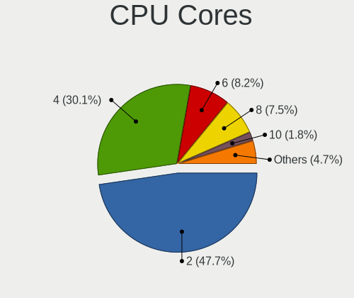

| Number  | Notebooks | Percent |
|---------|-----------|---------|
| 2       | 366       | 51.91%  |
| 4       | 234       | 33.19%  |
| 6       | 49        | 6.95%   |
| 8       | 33        | 4.68%   |
| 1       | 18        | 2.55%   |
| Unknown | 4         | 0.57%   |
| 12      | 1         | 0.14%   |

CPU Sockets
-----------

Number of sockets

| Number | Notebooks | Percent |
|--------|-----------|---------|
| 1      | 704       | 100%    |

CPU Threads
-----------

Threads per core (Hyper-Threading)

| Number  | Notebooks | Percent |
|---------|-----------|---------|
| 2       | 530       | 75.07%  |
| 1       | 172       | 24.36%  |
| Unknown | 4         | 0.57%   |

CPU Op-Modes
------------

CPU Operation Modes (32-bit, 64-bit)

| Op mode        | Notebooks | Percent |
|----------------|-----------|---------|
| 32-bit, 64-bit | 682       | 96.46%  |
| Unknown        | 14        | 1.98%   |
| 32-bit         | 11        | 1.56%   |

CPU Microcode
-------------

Microcode number

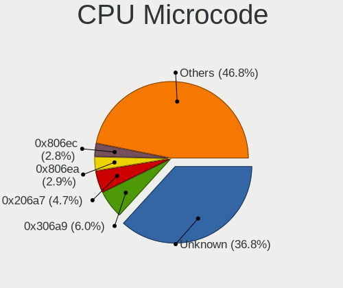

| Number     | Notebooks | Percent |
|------------|-----------|---------|
| Unknown    | 130       | 17.71%  |
| 0x306a9    | 63        | 8.58%   |
| 0x206a7    | 56        | 7.63%   |
| 0x806ea    | 28        | 3.81%   |
| 0x306c3    | 28        | 3.81%   |
| 0x806ec    | 27        | 3.68%   |
| 0x40651    | 27        | 3.68%   |
| 0x1067a    | 27        | 3.68%   |
| 0x906ea    | 24        | 3.27%   |
| 0x306d4    | 23        | 3.13%   |
| 0x406e3    | 21        | 2.86%   |
| 0x20655    | 19        | 2.59%   |
| 0x906e9    | 17        | 2.32%   |
| 0x6fd      | 17        | 2.32%   |
| 0x806c1    | 15        | 2.04%   |
| 0x10676    | 14        | 1.91%   |
| 0x08600106 | 14        | 1.91%   |
| 0xa0652    | 12        | 1.63%   |
| 0x806e9    | 12        | 1.63%   |
| 0x30678    | 9         | 1.23%   |
| 0x05000119 | 9         | 1.23%   |
| 0x806eb    | 8         | 1.09%   |
| 0x6f6      | 7         | 0.95%   |
| 0x506e3    | 7         | 0.95%   |
| 0x6fb      | 6         | 0.82%   |
| 0x07030105 | 6         | 0.82%   |
| 0x20652    | 5         | 0.68%   |
| 0x08608103 | 5         | 0.68%   |
| 0x08600103 | 5         | 0.68%   |
| 0x08108102 | 5         | 0.68%   |
| 0x906ed    | 4         | 0.54%   |
| 0x706a1    | 4         | 0.54%   |
| 0x406c4    | 4         | 0.54%   |
| 0x106ca    | 4         | 0.54%   |
| 0x106c2    | 4         | 0.54%   |
| 0x08600104 | 4         | 0.54%   |
| 0x0810100b | 4         | 0.54%   |
| 0x0700010f | 4         | 0.54%   |
| 0x06006705 | 4         | 0.54%   |
| 0x6e8      | 3         | 0.41%   |
| 0x6d8      | 3         | 0.41%   |
| 0x106e5    | 3         | 0.41%   |
| 0x0a50000c | 3         | 0.41%   |
| 0x08108109 | 3         | 0.41%   |
| 0xf29      | 2         | 0.27%   |
| 0x806d1    | 2         | 0.27%   |
| 0x706e5    | 2         | 0.27%   |
| 0x706a8    | 2         | 0.27%   |
| 0x506c9    | 2         | 0.27%   |
| 0x406c3    | 2         | 0.27%   |
| 0x40661    | 2         | 0.27%   |
| 0x0600611a | 2         | 0.27%   |
| 0x02000057 | 2         | 0.27%   |
| 0xf43      | 1         | 0.14%   |
| 0xa0660    | 1         | 0.14%   |
| 0x906c0    | 1         | 0.14%   |
| 0x6fa      | 1         | 0.14%   |
| 0x6f2      | 1         | 0.14%   |
| 0x6ec      | 1         | 0.14%   |
| 0x406d8    | 1         | 0.14%   |

CPU Microarch
-------------

Microarchitecture

| Name            | Notebooks | Percent |
|-----------------|-----------|---------|
| KabyLake        | 147       | 20.88%  |
| SandyBridge     | 68        | 9.66%   |
| Haswell         | 68        | 9.66%   |
| IvyBridge       | 67        | 9.52%   |
| Penryn          | 45        | 6.39%   |
| Core            | 34        | 4.83%   |
| Skylake         | 32        | 4.55%   |
| Zen 2           | 27        | 3.84%   |
| Westmere        | 26        | 3.69%   |
| Broadwell       | 24        | 3.41%   |
| TigerLake       | 22        | 3.13%   |
| Silvermont      | 19        | 2.7%    |
| CometLake       | 15        | 2.13%   |
| Bobcat          | 12        | 1.7%    |
| Zen+            | 11        | 1.56%   |
| Bonnell         | 9         | 1.28%   |
| Puma            | 8         | 1.14%   |
| Zen 3           | 7         | 0.99%   |
| P6              | 7         | 0.99%   |
| Goldmont plus   | 7         | 0.99%   |
| Excavator       | 7         | 0.99%   |
| Zen             | 6         | 0.85%   |
| Jaguar          | 6         | 0.85%   |
| Icelake         | 6         | 0.85%   |
| Unknown         | 6         | 0.85%   |
| NetBurst        | 3         | 0.43%   |
| Nehalem         | 3         | 0.43%   |
| K8 Hammer       | 3         | 0.43%   |
| K8 & K10 hybrid | 2         | 0.28%   |
| K10             | 2         | 0.28%   |
| Goldmont        | 2         | 0.28%   |
| Tremont         | 1         | 0.14%   |
| Piledriver      | 1         | 0.14%   |
| K10 Llano       | 1         | 0.14%   |

Graphics
--------

GPU Vendor
----------

Vendors of graphics cards

| Vendor           | Notebooks | Percent |
|------------------|-----------|---------|
| Intel            | 518       | 57.88%  |
| Nvidia           | 212       | 23.69%  |
| AMD              | 164       | 18.32%  |
| VIA Technologies | 1         | 0.11%   |

GPU Model
---------

Graphics card models

| Model                                                                                    | Notebooks | Percent |
|------------------------------------------------------------------------------------------|-----------|---------|
| Intel 3rd Gen Core processor Graphics Controller                                         | 62        | 6.68%   |
| Intel 2nd Generation Core Processor Family Integrated Graphics Controller                | 57        | 6.14%   |
| Intel Haswell-ULT Integrated Graphics Controller                                         | 35        | 3.77%   |
| Intel WhiskeyLake-U GT2 [UHD Graphics 620]                                               | 34        | 3.66%   |
| Intel UHD Graphics 620                                                                   | 32        | 3.45%   |
| Intel CoffeeLake-H GT2 [UHD Graphics 630]                                                | 31        | 3.34%   |
| Intel 4th Gen Core Processor Integrated Graphics Controller                              | 29        | 3.13%   |
| AMD Renoir                                                                               | 24        | 2.59%   |
| Intel TigerLake-LP GT2 [Iris Xe Graphics]                                                | 22        | 2.37%   |
| Intel HD Graphics 5500                                                                   | 22        | 2.37%   |
| Intel Skylake GT2 [HD Graphics 520]                                                      | 19        | 2.05%   |
| Intel Mobile 4 Series Chipset Integrated Graphics Controller                             | 19        | 2.05%   |
| Intel Core Processor Integrated Graphics Controller                                      | 19        | 2.05%   |
| Intel Mobile GM965/GL960 Integrated Graphics Controller (secondary)                      | 14        | 1.51%   |
| Intel Mobile GM965/GL960 Integrated Graphics Controller (primary)                        | 14        | 1.51%   |
| Intel HD Graphics 630                                                                    | 13        | 1.4%    |
| Intel CometLake-U GT2 [UHD Graphics]                                                     | 13        | 1.4%    |
| Intel HD Graphics 620                                                                    | 12        | 1.29%   |
| AMD Picasso/Raven 2 [Radeon Vega Series / Radeon Vega Mobile Series]                     | 11        | 1.19%   |
| Intel Mobile 945GM/GMS/GME, 943/940GML Express Integrated Graphics Controller            | 10        | 1.08%   |
| Intel CometLake-H GT2 [UHD Graphics]                                                     | 10        | 1.08%   |
| Nvidia TU117M [GeForce GTX 1650 Mobile / Max-Q]                                          | 9         | 0.97%   |
| Nvidia GP107M [GeForce GTX 1050 Mobile]                                                  | 9         | 0.97%   |
| Intel Atom/Celeron/Pentium Processor x5-E8000/J3xxx/N3xxx Integrated Graphics Controller | 9         | 0.97%   |
| Intel Atom Processor Z36xxx/Z37xxx Series Graphics & Display                             | 9         | 0.97%   |
| AMD Seymour [Radeon HD 6400M/7400M Series]                                               | 9         | 0.97%   |
| Nvidia GP107M [GeForce GTX 1050 Ti Mobile]                                               | 8         | 0.86%   |
| Intel Mobile 945GM/GMS, 943/940GML Express Integrated Graphics Controller                | 8         | 0.86%   |
| AMD Topaz XT [Radeon R7 M260/M265 / M340/M360 / M440/M445 / 530/535 / 620/625 Mobile]    | 8         | 0.86%   |
| AMD Cezanne                                                                              | 7         | 0.75%   |
| Nvidia GP108M [GeForce MX150]                                                            | 6         | 0.65%   |
| Nvidia GF117M [GeForce 610M/710M/810M/820M / GT 620M/625M/630M/720M]                     | 6         | 0.65%   |
| Intel HD Graphics 530                                                                    | 6         | 0.65%   |
| AMD Raven Ridge [Radeon Vega Series / Radeon Vega Mobile Series]                         | 6         | 0.65%   |
| AMD Lucienne                                                                             | 6         | 0.65%   |
| Nvidia TU117M                                                                            | 5         | 0.54%   |
| Nvidia TU106M [GeForce RTX 2060 Mobile]                                                  | 5         | 0.54%   |
| Nvidia GM107M [GeForce GTX 960M]                                                         | 5         | 0.54%   |
| Nvidia GK107M [GeForce GT 650M]                                                          | 5         | 0.54%   |
| Nvidia G98M [GeForce 9300M GS]                                                           | 5         | 0.54%   |
| AMD Stoney [Radeon R2/R3/R4/R5 Graphics]                                                 | 5         | 0.54%   |
| AMD Mullins [Radeon R4/R5 Graphics]                                                      | 5         | 0.54%   |
| Nvidia TU116M [GeForce GTX 1660 Ti Mobile]                                               | 4         | 0.43%   |
| Nvidia GP107M [GeForce GTX 1050 3 GB Max-Q]                                              | 4         | 0.43%   |
| Nvidia GP106M [GeForce GTX 1060 Mobile]                                                  | 4         | 0.43%   |
| Nvidia GF108M [GeForce GT 620M/630M/635M/640M LE]                                        | 4         | 0.43%   |
| Nvidia GF108M [GeForce GT 540M]                                                          | 4         | 0.43%   |
| Nvidia GA107M [GeForce RTX 3050 Mobile]                                                  | 4         | 0.43%   |
| Intel GeminiLake [UHD Graphics 600]                                                      | 4         | 0.43%   |
| Intel Atom Processor D4xx/D5xx/N4xx/N5xx Integrated Graphics Controller                  | 4         | 0.43%   |
| AMD Wrestler [Radeon HD 6310]                                                            | 4         | 0.43%   |
| AMD Thames [Radeon HD 7500M/7600M Series]                                                | 4         | 0.43%   |
| AMD RV710/M92 [Mobility Radeon HD 4330/4350/4550]                                        | 4         | 0.43%   |
| AMD Mars [Radeon HD 8730M]                                                               | 4         | 0.43%   |
| AMD Madison [Mobility Radeon HD 5650/5750 / 6530M/6550M]                                 | 4         | 0.43%   |
| Nvidia TU117M [GeForce GTX 1650 Ti Mobile]                                               | 3         | 0.32%   |
| Nvidia TU117GLM [Quadro T2000 Mobile / Max-Q]                                            | 3         | 0.32%   |
| Nvidia GP108M [GeForce MX250]                                                            | 3         | 0.32%   |
| Nvidia GM108M [GeForce MX130]                                                            | 3         | 0.32%   |
| Nvidia GM108M [GeForce 940MX]                                                            | 3         | 0.32%   |

GPU Combo
---------

Combinations of graphics cards

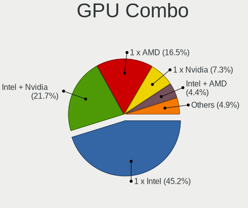

| Name           | Notebooks | Percent |
|----------------|-----------|---------|
| 1 x Intel      | 337       | 47.67%  |
| Intel + Nvidia | 139       | 19.66%  |
| 1 x AMD        | 103       | 14.57%  |
| 1 x Nvidia     | 62        | 8.77%   |
| Intel + AMD    | 42        | 5.94%   |
| AMD + Nvidia   | 11        | 1.56%   |
| 2 x AMD        | 8         | 1.13%   |
| Other          | 3         | 0.42%   |
| 2 x Nvidia     | 1         | 0.14%   |
| 1 x VIA        | 1         | 0.14%   |

GPU Driver
----------

Free vs proprietary

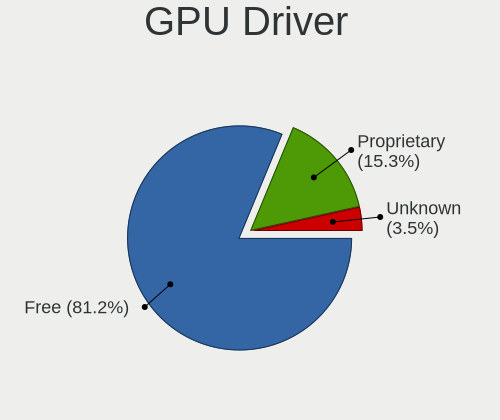

| Driver      | Notebooks | Percent |
|-------------|-----------|---------|
| Free        | 593       | 82.82%  |
| Proprietary | 106       | 14.8%   |
| Unknown     | 17        | 2.37%   |

GPU Memory
----------

Total video memory

| Size in GB | Notebooks | Percent |
|------------|-----------|---------|
| Unknown    | 405       | 55.79%  |
| 0.01-0.5   | 108       | 14.88%  |
| 1.01-2.0   | 96        | 13.22%  |
| 0.51-1.0   | 55        | 7.58%   |
| 3.01-4.0   | 39        | 5.37%   |
| 5.01-6.0   | 10        | 1.38%   |
| 7.01-8.0   | 9         | 1.24%   |
| 2.01-3.0   | 4         | 0.55%   |

Monitor
-------

Monitor Vendor
--------------

Monitor vendors

| Vendor                  | Notebooks | Percent |
|-------------------------|-----------|---------|
| AU Optronics            | 188       | 23.35%  |
| LG Display              | 131       | 16.27%  |
| Samsung Electronics     | 99        | 12.3%   |
| Chimei Innolux          | 80        | 9.94%   |
| BOE                     | 67        | 8.32%   |
| Sharp                   | 27        | 3.35%   |
| Chi Mei Optoelectronics | 21        | 2.61%   |
| Dell                    | 20        | 2.48%   |
| Iiyama                  | 17        | 2.11%   |
| Hewlett-Packard         | 14        | 1.74%   |
| Goldstar                | 14        | 1.74%   |
| Philips                 | 13        | 1.61%   |
| Lenovo                  | 13        | 1.61%   |
| Apple                   | 13        | 1.61%   |
| LG Philips              | 9         | 1.12%   |
| PANDA                   | 7         | 0.87%   |
| BenQ                    | 7         | 0.87%   |
| AOC                     | 5         | 0.62%   |
| Unknown                 | 4         | 0.5%    |
| Sony                    | 4         | 0.5%    |
| Seiko/Epson             | 4         | 0.5%    |
| Quanta Display          | 4         | 0.5%    |
| Panasonic               | 4         | 0.5%    |
| Medion                  | 4         | 0.5%    |
| InfoVision              | 4         | 0.5%    |
| Vestel Elektronik       | 3         | 0.37%   |
| CSO                     | 3         | 0.37%   |
| ASUSTek Computer        | 3         | 0.37%   |
| Acer                    | 3         | 0.37%   |
| HannStar                | 2         | 0.25%   |
| ___                     | 1         | 0.12%   |
| WST                     | 1         | 0.12%   |
| ViewSonic               | 1         | 0.12%   |
| RGB                     | 1         | 0.12%   |
| Nvidia                  | 1         | 0.12%   |
| MS_ Nvidia              | 1         | 0.12%   |
| MStar                   | 1         | 0.12%   |
| MSI                     | 1         | 0.12%   |
| LTM                     | 1         | 0.12%   |
| LPL                     | 1         | 0.12%   |
| LGD                     | 1         | 0.12%   |
| LG Electronics          | 1         | 0.12%   |
| InnoLux Display         | 1         | 0.12%   |
| Elgato                  | 1         | 0.12%   |
| Eizo                    | 1         | 0.12%   |
| CPT                     | 1         | 0.12%   |
| Arnos Instruments       | 1         | 0.12%   |
| Ancor Communications    | 1         | 0.12%   |

Monitor Model
-------------

Monitor models

| Model                                                                     | Notebooks | Percent |
|---------------------------------------------------------------------------|-----------|---------|
| Samsung Electronics LCD Monitor SEC5441 1366x768 309x174mm 14.0-inch      | 14        | 1.71%   |
| AU Optronics LCD Monitor AUO21ED 1920x1080 344x194mm 15.5-inch            | 11        | 1.34%   |
| LG Display LCD Monitor LGD02DC 1366x768 344x194mm 15.5-inch               | 8         | 0.97%   |
| AU Optronics LCD Monitor AUO38ED 1920x1080 344x193mm 15.5-inch            | 7         | 0.85%   |
| Chimei Innolux LCD Monitor CMN14D4 1920x1080 309x173mm 13.9-inch          | 6         | 0.73%   |
| AU Optronics LCD Monitor AUO23ED 1920x1080 344x193mm 15.5-inch            | 6         | 0.73%   |
| AU Optronics LCD Monitor AUO139E 1600x900 382x214mm 17.2-inch             | 6         | 0.73%   |
| AU Optronics LCD Monitor AUO5B2D 1920x1080 293x162mm 13.2-inch            | 5         | 0.61%   |
| AU Optronics LCD Monitor AUO573D 1920x1080 309x174mm 14.0-inch            | 5         | 0.61%   |
| AU Optronics LCD Monitor AUO26EC 1366x768 344x193mm 15.5-inch             | 5         | 0.61%   |
| Samsung Electronics LCD Monitor SEC4251 1366x768 344x194mm 15.5-inch      | 4         | 0.49%   |
| LG Display LCD Monitor LGD046F 1920x1080 344x194mm 15.5-inch              | 4         | 0.49%   |
| LG Display LCD Monitor LGD034C 1366x768 293x165mm 13.2-inch               | 4         | 0.49%   |
| Goldstar LG HDR 4K GSM7707 3840x2160 600x340mm 27.2-inch                  | 4         | 0.49%   |
| Chimei Innolux LCD Monitor CMN15AB 1366x768 344x193mm 15.5-inch           | 4         | 0.49%   |
| Chimei Innolux LCD Monitor CMN1482 1600x900 309x174mm 14.0-inch           | 4         | 0.49%   |
| Chi Mei Optoelectronics LCD Monitor CMO1720 1920x1080 382x215mm 17.3-inch | 4         | 0.49%   |
| Chi Mei Optoelectronics LCD Monitor CMO1719 1600x900 382x215mm 17.3-inch  | 4         | 0.49%   |
| AU Optronics LCD Monitor AUO22EC 1366x768 344x193mm 15.5-inch             | 4         | 0.49%   |
| AU Optronics LCD Monitor AUO159E 1600x900 382x214mm 17.2-inch             | 4         | 0.49%   |
| AU Optronics LCD Monitor AUO149E 1600x900 382x214mm 17.2-inch             | 4         | 0.49%   |
| Vestel Elektronik 22W_LCD_TV VES3700 1920x540                             | 3         | 0.37%   |
| Sharp LCD Monitor SHP149A 1920x1080 344x194mm 15.5-inch                   | 3         | 0.37%   |
| Sharp LCD Monitor SHP148B 3840x2160 294x165mm 13.3-inch                   | 3         | 0.37%   |
| Sharp LCD Monitor SHP1449 1920x1080 294x165mm 13.3-inch                   | 3         | 0.37%   |
| Samsung Electronics LCD Monitor SEC314F 1600x900 382x215mm 17.3-inch      | 3         | 0.37%   |
| Panasonic VVX16T029D00 MEI96A2 2880x1620 344x193mm 15.5-inch              | 3         | 0.37%   |
| LG Display LCD Monitor LGD038E 1366x768 344x194mm 15.5-inch               | 3         | 0.37%   |
| LG Display LCD Monitor LGD01DD 1600x900 382x215mm 17.3-inch               | 3         | 0.37%   |
| LG Display LCD Monitor LGD01CA 1600x900 382x215mm 17.3-inch               | 3         | 0.37%   |
| Iiyama PL2783Q IVM661E 2560x1440 597x336mm 27.0-inch                      | 3         | 0.37%   |
| Goldstar 32ML600 GSM772D 1920x1080 480x270mm 21.7-inch                    | 3         | 0.37%   |
| Chimei Innolux LCD Monitor CMN15C2 1920x1080 344x194mm 15.5-inch          | 3         | 0.37%   |
| Chimei Innolux LCD Monitor CMN14D2 1920x1080 309x173mm 13.9-inch          | 3         | 0.37%   |
| Chi Mei Optoelectronics LCD Monitor CMO15A7 1366x768 344x193mm 15.5-inch  | 3         | 0.37%   |
| BOE LCD Monitor BOE08D7 1920x1080 309x174mm 14.0-inch                     | 3         | 0.37%   |
| BOE LCD Monitor BOE0869 1920x1080 344x194mm 15.5-inch                     | 3         | 0.37%   |
| BOE LCD Monitor BOE06FA 1920x1080 294x165mm 13.3-inch                     | 3         | 0.37%   |
| AU Optronics LCD Monitor AUOA08B 1920x1080 344x193mm 15.5-inch            | 3         | 0.37%   |
| AU Optronics LCD Monitor AUO35ED 1920x1080 344x193mm 15.5-inch            | 3         | 0.37%   |
| AU Optronics LCD Monitor AUO312C 1366x768 293x164mm 13.2-inch             | 3         | 0.37%   |
| AU Optronics LCD Monitor AUO219E 1600x900 382x214mm 17.2-inch             | 3         | 0.37%   |
| AU Optronics LCD Monitor AUO213E 1600x900 309x174mm 14.0-inch             | 3         | 0.37%   |
| AU Optronics LCD Monitor AUO133D 1920x1080 309x173mm 13.9-inch            | 3         | 0.37%   |
| AU Optronics LCD Monitor AUO129E 1600x900 382x214mm 17.2-inch             | 3         | 0.37%   |
| AU Optronics LCD Monitor AUO109E 1600x900 380x210mm 17.1-inch             | 3         | 0.37%   |
| Sharp LCD Monitor SHP14D6 3840x2400 366x229mm 17.0-inch                   | 2         | 0.24%   |
| Sharp LCD Monitor SHP14B9 3840x2160 344x194mm 15.5-inch                   | 2         | 0.24%   |
| Sharp LCD Monitor SHP14AE 1920x1080 294x165mm 13.3-inch                   | 2         | 0.24%   |
| Sharp LCD Monitor SHP13F8 3200x1800 346x194mm 15.6-inch                   | 2         | 0.24%   |
| Samsung Electronics LCD Monitor SEC5541 1366x768 344x193mm 15.5-inch      | 2         | 0.24%   |
| Samsung Electronics LCD Monitor SEC544B 1600x900 310x174mm 14.0-inch      | 2         | 0.24%   |
| Samsung Electronics LCD Monitor SEC504B 1600x900 382x215mm 17.3-inch      | 2         | 0.24%   |
| Samsung Electronics LCD Monitor SEC4457 1440x900 303x190mm 14.1-inch      | 2         | 0.24%   |
| Samsung Electronics LCD Monitor SEC4345 1280x800 331x207mm 15.4-inch      | 2         | 0.24%   |
| Samsung Electronics LCD Monitor SEC3945 1280x800 331x207mm 15.4-inch      | 2         | 0.24%   |
| Samsung Electronics LCD Monitor SEC3659 1600x900 344x194mm 15.5-inch      | 2         | 0.24%   |
| Samsung Electronics LCD Monitor SEC314B 1600x900 344x194mm 15.5-inch      | 2         | 0.24%   |
| Samsung Electronics LCD Monitor SDCA029 3840x2160 344x194mm 15.5-inch     | 2         | 0.24%   |
| Samsung Electronics LCD Monitor SDC4C48 1920x1080 344x194mm 15.5-inch     | 2         | 0.24%   |

Monitor Resolution
------------------

Monitor screen resolution

| Resolution         | Notebooks | Percent |
|--------------------|-----------|---------|
| 1920x1080 (FHD)    | 302       | 39.84%  |
| 1366x768 (WXGA)    | 169       | 22.3%   |
| 1600x900 (HD+)     | 91        | 12.01%  |
| 3840x2160 (4K)     | 46        | 6.07%   |
| 2560x1440 (QHD)    | 27        | 3.56%   |
| 1280x800 (WXGA)    | 27        | 3.56%   |
| 1440x900 (WXGA+)   | 18        | 2.37%   |
| 1680x1050 (WSXGA+) | 13        | 1.72%   |
| 1920x1200 (WUXGA)  | 11        | 1.45%   |
| 1024x600           | 6         | 0.79%   |
| 2560x1600          | 5         | 0.66%   |
| Unknown            | 5         | 0.66%   |
| 3200x1800 (QHD+)   | 4         | 0.53%   |
| 1680x945           | 4         | 0.53%   |
| 1280x1024 (SXGA)   | 4         | 0.53%   |
| 3840x2400          | 3         | 0.4%    |
| 1360x768           | 3         | 0.4%    |
| 3840x1080          | 2         | 0.26%   |
| 3440x1440          | 2         | 0.26%   |
| 2880x1800          | 2         | 0.26%   |
| 1024x768 (XGA)     | 2         | 0.26%   |
| 7680x2160          | 1         | 0.13%   |
| 6320x1800          | 1         | 0.13%   |
| 3600x1080          | 1         | 0.13%   |
| 3200x1080          | 1         | 0.13%   |
| 2880x1920          | 1         | 0.13%   |
| 2256x1504          | 1         | 0.13%   |
| 2160x1440          | 1         | 0.13%   |
| 1920x515           | 1         | 0.13%   |
| 1920x1280          | 1         | 0.13%   |
| 1600x1200          | 1         | 0.13%   |
| 1280x720 (HD)      | 1         | 0.13%   |
| 1024x576           | 1         | 0.13%   |

Monitor Diagonal
----------------

Diagonal size in inches

| Inches  | Notebooks | Percent |
|---------|-----------|---------|
| 15      | 317       | 39.43%  |
| 17      | 119       | 14.8%   |
| 13      | 89        | 11.07%  |
| 14      | 67        | 8.33%   |
| 27      | 36        | 4.48%   |
| 24      | 35        | 4.35%   |
| Unknown | 25        | 3.11%   |
| 12      | 17        | 2.11%   |
| 21      | 16        | 1.99%   |
| 18      | 14        | 1.74%   |
| 23      | 13        | 1.62%   |
| 10      | 8         | 1%      |
| 22      | 7         | 0.87%   |
| 11      | 7         | 0.87%   |
| 84      | 4         | 0.5%    |
| 72      | 4         | 0.5%    |
| 16      | 4         | 0.5%    |
| 31      | 3         | 0.37%   |
| 20      | 3         | 0.37%   |
| 19      | 3         | 0.37%   |
| 54      | 2         | 0.25%   |
| 39      | 2         | 0.25%   |
| 34      | 2         | 0.25%   |
| 25      | 2         | 0.25%   |
| 65      | 1         | 0.12%   |
| 52      | 1         | 0.12%   |
| 42      | 1         | 0.12%   |
| 32      | 1         | 0.12%   |
| 29      | 1         | 0.12%   |

Monitor Width
-------------

Physical width

| Width in mm | Notebooks | Percent |
|-------------|-----------|---------|
| 301-350     | 402       | 50.44%  |
| 351-400     | 139       | 17.44%  |
| 201-300     | 90        | 11.29%  |
| 501-600     | 78        | 9.79%   |
| 401-500     | 37        | 4.64%   |
| Unknown     | 25        | 3.14%   |
| 601-700     | 8         | 1%      |
| 1501-2000   | 8         | 1%      |
| 1001-1500   | 4         | 0.5%    |
| 701-800     | 3         | 0.38%   |
| 801-900     | 2         | 0.25%   |
| 901-1000    | 1         | 0.13%   |

Aspect Ratio
------------

Proportional relationship between the width and the height

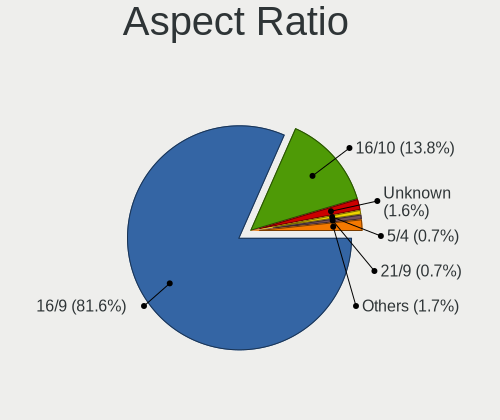

| Ratio   | Notebooks | Percent |
|---------|-----------|---------|
| 16/9    | 583       | 84.13%  |
| 16/10   | 79        | 11.4%   |
| Unknown | 17        | 2.45%   |
| 5/4     | 4         | 0.58%   |
| 3/2     | 4         | 0.58%   |
| 4/3     | 3         | 0.43%   |
| 21/9    | 2         | 0.29%   |
| 3.73    | 1         | 0.14%   |

Monitor Area
------------

Area in inch

| Area in inch | Notebooks | Percent |
|----------------|-----------|---------|
| 101-110        | 317       | 39.82%  |
| 81-90          | 104       | 13.07%  |
| 121-130        | 100       | 12.56%  |
| 201-250        | 55        | 6.91%   |
| 71-80          | 52        | 6.53%   |
| 301-350        | 36        | 4.52%   |
| Unknown        | 25        | 3.14%   |
| 131-140        | 18        | 2.26%   |
| 61-70          | 17        | 2.14%   |
| 151-200        | 13        | 1.63%   |
| More than 1000 | 12        | 1.51%   |
| 141-150        | 10        | 1.26%   |
| 41-50          | 8         | 1.01%   |
| 251-300        | 8         | 1.01%   |
| 51-60          | 7         | 0.88%   |
| 351-500        | 7         | 0.88%   |
| 111-120        | 3         | 0.38%   |
| 501-1000       | 3         | 0.38%   |
| 91-100         | 1         | 0.13%   |

Pixel Density
-------------

Pixels per inch

| Density       | Notebooks | Percent |
|---------------|-----------|---------|
| 121-160       | 284       | 36.5%   |
| 101-120       | 249       | 32.01%  |
| 51-100        | 127       | 16.32%  |
| 161-240       | 57        | 7.33%   |
| More than 240 | 28        | 3.6%    |
| Unknown       | 25        | 3.21%   |
| 1-50          | 8         | 1.03%   |

Multiple Monitors
-----------------

Total monitors connected

| Total | Notebooks | Percent |
|-------|-----------|---------|
| 1     | 567       | 78.64%  |
| 2     | 117       | 16.23%  |
| 0     | 22        | 3.05%   |
| 3     | 14        | 1.94%   |
| 4     | 1         | 0.14%   |

Network
-------

Net Controller Vendor
---------------------

Controller vendors

| Vendor                                | Notebooks | Percent |
|---------------------------------------|-----------|---------|
| Intel                                 | 419       | 36.43%  |
| Realtek Semiconductor                 | 340       | 29.57%  |
| Qualcomm Atheros                      | 170       | 14.78%  |
| Broadcom                              | 78        | 6.78%   |
| Broadcom Limited                      | 17        | 1.48%   |
| Marvell Technology Group              | 16        | 1.39%   |
| Ralink                                | 10        | 0.87%   |
| Dell                                  | 10        | 0.87%   |
| TP-Link                               | 9         | 0.78%   |
| Nvidia                                | 7         | 0.61%   |
| MediaTek                              | 6         | 0.52%   |
| Lenovo                                | 6         | 0.52%   |
| Ericsson Business Mobile Networks     | 6         | 0.52%   |
| Ralink Technology                     | 5         | 0.43%   |
| Hewlett-Packard                       | 4         | 0.35%   |
| DisplayLink                           | 4         | 0.35%   |
| D-Link System                         | 4         | 0.35%   |
| Sierra Wireless                       | 3         | 0.26%   |
| JMicron Technology                    | 3         | 0.26%   |
| ASUSTek Computer                      | 3         | 0.26%   |
| ASIX Electronics                      | 3         | 0.26%   |
| Samsung Electronics                   | 2         | 0.17%   |
| Motorola PCS                          | 2         | 0.17%   |
| Huawei Technologies                   | 2         | 0.17%   |
| Fibocom                               | 2         | 0.17%   |
| Attansic Technology                   | 2         | 0.17%   |
| ADMtek                                | 2         | 0.17%   |
| Z-Com                                 | 1         | 0.09%   |
| VIA Technologies                      | 1         | 0.09%   |
| Silicon Integrated Systems [SiS]      | 1         | 0.09%   |
| Shenzhen Goodix Technology            | 1         | 0.09%   |
| Seeed                                 | 1         | 0.09%   |
| Qualcomm                              | 1         | 0.09%   |
| Panasonic (Matsushita)                | 1         | 0.09%   |
| OnePlus Technology (Shenzhen)         | 1         | 0.09%   |
| Microsoft                             | 1         | 0.09%   |
| Microchip Technology                  | 1         | 0.09%   |
| Edimax Technology                     | 1         | 0.09%   |
| D-Link                                | 1         | 0.09%   |
| Arduino SA                            | 1         | 0.09%   |
| Apple                                 | 1         | 0.09%   |
| 802.11g Adapter [Linksys WUSB54GC v3] | 1         | 0.09%   |

Net Controller Model
--------------------

Controller models

| Model                                                                   | Notebooks | Percent |
|-------------------------------------------------------------------------|-----------|---------|
| Realtek RTL8111/8168/8411 PCI Express Gigabit Ethernet Controller       | 213       | 15%     |
| Realtek RTL810xE PCI Express Fast Ethernet controller                   | 59        | 4.15%   |
| Intel Wi-Fi 6 AX200                                                     | 54        | 3.8%    |
| Realtek RTL8153 Gigabit Ethernet Adapter                                | 43        | 3.03%   |
| Intel Wireless 7260                                                     | 39        | 2.75%   |
| Qualcomm Atheros AR9485 Wireless Network Adapter                        | 35        | 2.46%   |
| Intel 82579LM Gigabit Network Connection (Lewisville)                   | 26        | 1.83%   |
| Qualcomm Atheros AR9285 Wireless Network Adapter (PCI-Express)          | 24        | 1.69%   |
| Intel Centrino Advanced-N 6205 [Taylor Peak]                            | 24        | 1.69%   |
| Intel Wireless 8260                                                     | 23        | 1.62%   |
| Intel Cannon Point-LP CNVi [Wireless-AC]                                | 23        | 1.62%   |
| Intel Wireless 8265 / 8275                                              | 22        | 1.55%   |
| Qualcomm Atheros QCA9565 / AR9565 Wireless Network Adapter              | 21        | 1.48%   |
| Intel Wireless 7265                                                     | 21        | 1.48%   |
| Intel PRO/Wireless 3945ABG [Golan] Network Connection                   | 20        | 1.41%   |
| Qualcomm Atheros QCA9377 802.11ac Wireless Network Adapter              | 17        | 1.2%    |
| Qualcomm Atheros QCA6174 802.11ac Wireless Network Adapter              | 17        | 1.2%    |
| Qualcomm Atheros AR8151 v2.0 Gigabit Ethernet                           | 17        | 1.2%    |
| Intel Ethernet Connection I218-LM                                       | 17        | 1.2%    |
| Realtek RTL8723BE PCIe Wireless Network Adapter                         | 15        | 1.06%   |
| Intel Centrino Wireless-N 2230                                          | 15        | 1.06%   |
| Intel Wireless-AC 9260                                                  | 14        | 0.99%   |
| Intel Wi-Fi 6 AX201                                                     | 14        | 0.99%   |
| Intel Cannon Lake PCH CNVi WiFi                                         | 14        | 0.99%   |
| Broadcom BCM4313 802.11bgn Wireless Network Adapter                     | 14        | 0.99%   |
| Realtek RTL8821CE 802.11ac PCIe Wireless Network Adapter                | 12        | 0.85%   |
| Qualcomm Atheros AR8161 Gigabit Ethernet                                | 12        | 0.85%   |
| Intel WiFi Link 5100                                                    | 12        | 0.85%   |
| Intel Comet Lake PCH CNVi WiFi                                          | 12        | 0.85%   |
| Realtek RTL8188CE 802.11b/g/n WiFi Adapter                              | 11        | 0.77%   |
| Intel Ethernet Connection I217-LM                                       | 11        | 0.77%   |
| Intel Centrino Ultimate-N 6300                                          | 11        | 0.77%   |
| Intel PRO/Wireless 4965 AG or AGN [Kedron] Network Connection           | 10        | 0.7%    |
| Intel Ethernet Connection I219-LM                                       | 10        | 0.7%    |
| Intel Centrino Advanced-N 6200                                          | 10        | 0.7%    |
| Broadcom BCM43142 802.11b/g/n                                           | 10        | 0.7%    |
| Realtek RTL8822CE 802.11ac PCIe Wireless Network Adapter                | 9         | 0.63%   |
| Qualcomm Atheros AR9287 Wireless Network Adapter (PCI-Express)          | 9         | 0.63%   |
| Intel Ethernet Connection (6) I219-V                                    | 9         | 0.63%   |
| Intel Ethernet Connection (6) I219-LM                                   | 9         | 0.63%   |
| Intel 82567LM Gigabit Network Connection                                | 9         | 0.63%   |
| Qualcomm Atheros AR242x / AR542x Wireless Network Adapter (PCI-Express) | 8         | 0.56%   |
| Intel Ethernet Connection (3) I218-LM                                   | 8         | 0.56%   |
| Intel 82579V Gigabit Network Connection                                 | 8         | 0.56%   |
| Intel 82577LM Gigabit Network Connection                                | 8         | 0.56%   |
| Intel 82566MM Gigabit Network Connection                                | 8         | 0.56%   |
| Realtek RTL8822BE 802.11a/b/g/n/ac WiFi adapter                         | 7         | 0.49%   |
| Intel PRO/Wireless 5100 AGN [Shiloh] Network Connection                 | 7         | 0.49%   |
| Intel Ethernet Connection (4) I219-V                                    | 7         | 0.49%   |
| Intel Comet Lake PCH-LP CNVi WiFi                                       | 7         | 0.49%   |
| Intel Centrino Advanced-N 6235                                          | 7         | 0.49%   |
| Broadcom BCM43228 802.11a/b/g/n                                         | 7         | 0.49%   |
| Intel Wireless 3160                                                     | 6         | 0.42%   |
| Intel Ethernet Connection I217-V                                        | 6         | 0.42%   |
| Intel Ethernet Connection (4) I219-LM                                   | 6         | 0.42%   |
| Broadcom NetLink BCM5784M Gigabit Ethernet PCIe                         | 6         | 0.42%   |
| Broadcom NetLink BCM57785 Gigabit Ethernet PCIe                         | 6         | 0.42%   |
| Qualcomm Atheros Killer E2500 Gigabit Ethernet Controller               | 5         | 0.35%   |
| Qualcomm Atheros AR9462 Wireless Network Adapter                        | 5         | 0.35%   |
| Qualcomm Atheros AR8152 v2.0 Fast Ethernet                              | 5         | 0.35%   |

Wireless Vendor
---------------

Wireless vendors

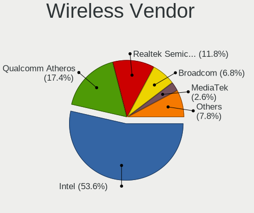

| Vendor                                | Notebooks | Percent |
|---------------------------------------|-----------|---------|
| Intel                                 | 398       | 54.82%  |
| Qualcomm Atheros                      | 141       | 19.42%  |
| Realtek Semiconductor                 | 79        | 10.88%  |
| Broadcom                              | 51        | 7.02%   |
| Ralink                                | 10        | 1.38%   |
| Broadcom Limited                      | 10        | 1.38%   |
| Ralink Technology                     | 5         | 0.69%   |
| TP-Link                               | 4         | 0.55%   |
| MEDIATEK                              | 4         | 0.55%   |
| Dell                                  | 4         | 0.55%   |
| D-Link System                         | 4         | 0.55%   |
| Sierra Wireless                       | 3         | 0.41%   |
| ASUSTek Computer                      | 3         | 0.41%   |
| Fibocom                               | 2         | 0.28%   |
| Z-Com                                 | 1         | 0.14%   |
| Qualcomm                              | 1         | 0.14%   |
| Panasonic (Matsushita)                | 1         | 0.14%   |
| Microsoft                             | 1         | 0.14%   |
| Hewlett-Packard                       | 1         | 0.14%   |
| Edimax Technology                     | 1         | 0.14%   |
| D-Link                                | 1         | 0.14%   |
| 802.11g Adapter [Linksys WUSB54GC v3] | 1         | 0.14%   |

Wireless Model
--------------

Wireless models

| Model                                                                   | Notebooks | Percent |
|-------------------------------------------------------------------------|-----------|---------|
| Intel Wi-Fi 6 AX200                                                     | 54        | 7.4%    |
| Intel Wireless 7260                                                     | 39        | 5.34%   |
| Qualcomm Atheros AR9485 Wireless Network Adapter                        | 35        | 4.79%   |
| Qualcomm Atheros AR9285 Wireless Network Adapter (PCI-Express)          | 24        | 3.29%   |
| Intel Centrino Advanced-N 6205 [Taylor Peak]                            | 24        | 3.29%   |
| Intel Wireless 8260                                                     | 23        | 3.15%   |
| Intel Cannon Point-LP CNVi [Wireless-AC]                                | 23        | 3.15%   |
| Intel Wireless 8265 / 8275                                              | 22        | 3.01%   |
| Qualcomm Atheros QCA9565 / AR9565 Wireless Network Adapter              | 21        | 2.88%   |
| Intel Wireless 7265                                                     | 21        | 2.88%   |
| Intel PRO/Wireless 3945ABG [Golan] Network Connection                   | 20        | 2.74%   |
| Qualcomm Atheros QCA9377 802.11ac Wireless Network Adapter              | 17        | 2.33%   |
| Qualcomm Atheros QCA6174 802.11ac Wireless Network Adapter              | 17        | 2.33%   |
| Realtek RTL8723BE PCIe Wireless Network Adapter                         | 15        | 2.05%   |
| Intel Centrino Wireless-N 2230                                          | 15        | 2.05%   |
| Intel Wireless-AC 9260                                                  | 14        | 1.92%   |
| Intel Wi-Fi 6 AX201                                                     | 14        | 1.92%   |
| Intel Cannon Lake PCH CNVi WiFi                                         | 14        | 1.92%   |
| Broadcom BCM4313 802.11bgn Wireless Network Adapter                     | 14        | 1.92%   |
| Realtek RTL8821CE 802.11ac PCIe Wireless Network Adapter                | 12        | 1.64%   |
| Intel WiFi Link 5100                                                    | 12        | 1.64%   |
| Intel Comet Lake PCH CNVi WiFi                                          | 12        | 1.64%   |
| Realtek RTL8188CE 802.11b/g/n WiFi Adapter                              | 11        | 1.51%   |
| Intel Centrino Ultimate-N 6300                                          | 11        | 1.51%   |
| Intel PRO/Wireless 4965 AG or AGN [Kedron] Network Connection           | 10        | 1.37%   |
| Intel Centrino Advanced-N 6200                                          | 10        | 1.37%   |
| Broadcom BCM43142 802.11b/g/n                                           | 10        | 1.37%   |
| Realtek RTL8822CE 802.11ac PCIe Wireless Network Adapter                | 9         | 1.23%   |
| Qualcomm Atheros AR9287 Wireless Network Adapter (PCI-Express)          | 9         | 1.23%   |
| Qualcomm Atheros AR242x / AR542x Wireless Network Adapter (PCI-Express) | 8         | 1.1%    |
| Realtek RTL8822BE 802.11a/b/g/n/ac WiFi adapter                         | 7         | 0.96%   |
| Intel PRO/Wireless 5100 AGN [Shiloh] Network Connection                 | 7         | 0.96%   |
| Intel Comet Lake PCH-LP CNVi WiFi                                       | 7         | 0.96%   |
| Intel Centrino Advanced-N 6235                                          | 7         | 0.96%   |
| Broadcom BCM43228 802.11a/b/g/n                                         | 7         | 0.96%   |
| Intel Wireless 3160                                                     | 6         | 0.82%   |
| Qualcomm Atheros AR9462 Wireless Network Adapter                        | 5         | 0.68%   |
| Intel Ultimate N WiFi Link 5300                                         | 5         | 0.68%   |
| Intel Centrino Wireless-N 1000 [Condor Peak]                            | 5         | 0.68%   |
| Broadcom Limited BCM4312 802.11b/g LP-PHY                               | 5         | 0.68%   |
| Realtek RTL8852AE 802.11ax PCIe Wireless Network Adapter                | 4         | 0.55%   |
| Realtek RTL8723DE Wireless Network Adapter                              | 4         | 0.55%   |
| Realtek RTL8723AE PCIe Wireless Network Adapter                         | 4         | 0.55%   |
| Qualcomm Atheros AR928X Wireless Network Adapter (PCI-Express)          | 4         | 0.55%   |
| Intel Wireless 3165                                                     | 4         | 0.55%   |
| Intel Centrino Wireless-N 1030 [Rainbow Peak]                           | 4         | 0.55%   |
| Broadcom BCM4331 802.11a/b/g/n                                          | 4         | 0.55%   |
| Realtek RTL88x2bu [AC1200 Techkey]                                      | 3         | 0.41%   |
| Ralink RT5390 Wireless 802.11n 1T/1R PCIe                               | 3         | 0.41%   |
| Ralink RT3290 Wireless 802.11n 1T/1R PCIe                               | 3         | 0.41%   |
| Intel Ice Lake-LP PCH CNVi WiFi                                         | 3         | 0.41%   |
| Intel Dual Band Wireless-AC 3168NGW [Stone Peak]                        | 3         | 0.41%   |
| Broadcom BCM43224 802.11a/b/g/n                                         | 3         | 0.41%   |
| Broadcom BCM4322 802.11a/b/g/n Wireless LAN Controller                  | 3         | 0.41%   |
| Sierra Wireless EM7305 Modem                                            | 2         | 0.27%   |
| Realtek RTL8821AE 802.11ac PCIe Wireless Network Adapter                | 2         | 0.27%   |
| Realtek RTL8723BU 802.11b/g/n WLAN Adapter                              | 2         | 0.27%   |
| Realtek RTL8191SEvB Wireless LAN Controller                             | 2         | 0.27%   |
| Realtek RTL8188EUS 802.11n Wireless Network Adapter                     | 2         | 0.27%   |
| Ralink MT7601U Wireless Adapter                                         | 2         | 0.27%   |

Ethernet Vendor
---------------

Ethernet vendors

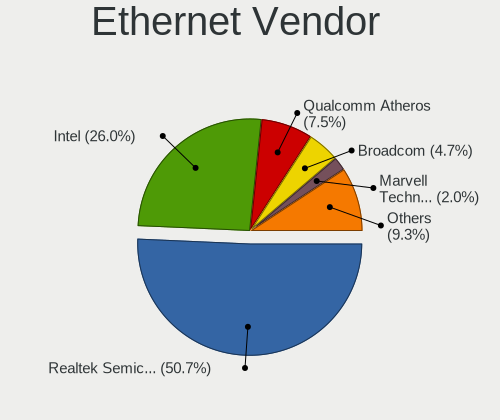

| Vendor                           | Notebooks | Percent |
|----------------------------------|-----------|---------|
| Realtek Semiconductor            | 318       | 48.33%  |
| Intel                            | 174       | 26.44%  |
| Qualcomm Atheros                 | 62        | 9.42%   |
| Broadcom                         | 35        | 5.32%   |
| Marvell Technology Group         | 16        | 2.43%   |
| Nvidia                           | 7         | 1.06%   |
| Broadcom Limited                 | 7         | 1.06%   |
| Lenovo                           | 6         | 0.91%   |
| TP-Link                          | 4         | 0.61%   |
| DisplayLink                      | 4         | 0.61%   |
| JMicron Technology               | 3         | 0.46%   |
| Hewlett-Packard                  | 3         | 0.46%   |
| ASIX Electronics                 | 3         | 0.46%   |
| Samsung Electronics              | 2         | 0.3%    |
| Motorola PCS                     | 2         | 0.3%    |
| MediaTek                         | 2         | 0.3%    |
| Attansic Technology              | 2         | 0.3%    |
| ADMtek                           | 2         | 0.3%    |
| VIA Technologies                 | 1         | 0.15%   |
| Silicon Integrated Systems [SiS] | 1         | 0.15%   |
| OnePlus Technology (Shenzhen)    | 1         | 0.15%   |
| Microchip Technology             | 1         | 0.15%   |
| Huawei Technologies              | 1         | 0.15%   |
| Apple                            | 1         | 0.15%   |

Ethernet Model
--------------

Ethernet models

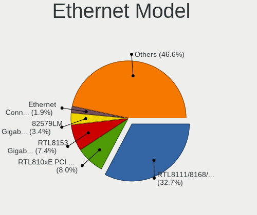

| Model                                                             | Notebooks | Percent |
|-------------------------------------------------------------------|-----------|---------|
| Realtek RTL8111/8168/8411 PCI Express Gigabit Ethernet Controller | 213       | 31.93%  |
| Realtek RTL810xE PCI Express Fast Ethernet controller             | 59        | 8.85%   |
| Realtek RTL8153 Gigabit Ethernet Adapter                          | 43        | 6.45%   |
| Intel 82579LM Gigabit Network Connection (Lewisville)             | 26        | 3.9%    |
| Qualcomm Atheros AR8151 v2.0 Gigabit Ethernet                     | 17        | 2.55%   |
| Intel Ethernet Connection I218-LM                                 | 17        | 2.55%   |
| Qualcomm Atheros AR8161 Gigabit Ethernet                          | 12        | 1.8%    |
| Intel Ethernet Connection I217-LM                                 | 11        | 1.65%   |
| Intel Ethernet Connection I219-LM                                 | 10        | 1.5%    |
| Intel Ethernet Connection (6) I219-V                              | 9         | 1.35%   |
| Intel Ethernet Connection (6) I219-LM                             | 9         | 1.35%   |
| Intel 82567LM Gigabit Network Connection                          | 9         | 1.35%   |
| Intel Ethernet Connection (3) I218-LM                             | 8         | 1.2%    |
| Intel 82579V Gigabit Network Connection                           | 8         | 1.2%    |
| Intel 82577LM Gigabit Network Connection                          | 8         | 1.2%    |
| Intel 82566MM Gigabit Network Connection                          | 8         | 1.2%    |
| Intel Ethernet Connection (4) I219-V                              | 7         | 1.05%   |
| Intel Ethernet Connection I217-V                                  | 6         | 0.9%    |
| Intel Ethernet Connection (4) I219-LM                             | 6         | 0.9%    |
| Broadcom NetLink BCM5784M Gigabit Ethernet PCIe                   | 6         | 0.9%    |
| Broadcom NetLink BCM57785 Gigabit Ethernet PCIe                   | 6         | 0.9%    |
| Qualcomm Atheros Killer E2500 Gigabit Ethernet Controller         | 5         | 0.75%   |
| Qualcomm Atheros AR8152 v2.0 Fast Ethernet                        | 5         | 0.75%   |
| TP-Link USB 10/100/1000 LAN                                       | 4         | 0.6%    |
| Intel Ethernet Connection (7) I219-LM                             | 4         | 0.6%    |
| Broadcom Limited NetLink BCM5787M Gigabit Ethernet PCI Express    | 4         | 0.6%    |
| Realtek RTL8152 Fast Ethernet Adapter                             | 3         | 0.45%   |
| Realtek RTL8125 2.5GbE Controller                                 | 3         | 0.45%   |
| Realtek RTL-8100/8101L/8139 PCI Fast Ethernet Adapter             | 3         | 0.45%   |
| Qualcomm Atheros QCA8171 Gigabit Ethernet                         | 3         | 0.45%   |
| Qualcomm Atheros Killer E2400 Gigabit Ethernet Controller         | 3         | 0.45%   |
| Qualcomm Atheros AR8162 Fast Ethernet                             | 3         | 0.45%   |
| Qualcomm Atheros AR8131 Gigabit Ethernet                          | 3         | 0.45%   |
| Qualcomm Atheros AR8121/AR8113/AR8114 Gigabit or Fast Ethernet    | 3         | 0.45%   |
| Nvidia MCP79 Ethernet                                             | 3         | 0.45%   |
| Marvell Group 88E8072 PCI-E Gigabit Ethernet Controller           | 3         | 0.45%   |
| Marvell Group 88E8055 PCI-E Gigabit Ethernet Controller           | 3         | 0.45%   |
| Lenovo ThinkPad Lan                                               | 3         | 0.45%   |
| JMicron JMC250 PCI Express Gigabit Ethernet Controller            | 3         | 0.45%   |
| Intel Ethernet Connection I219-V                                  | 3         | 0.45%   |
| Intel Ethernet Connection (2) I219-LM                             | 3         | 0.45%   |
| Intel Ethernet Connection (13) I219-LM                            | 3         | 0.45%   |
| HP lt4120 Snapdragon X5 LTE                                       | 3         | 0.45%   |
| Broadcom NetXtreme BCM57765 Gigabit Ethernet PCIe                 | 3         | 0.45%   |
| Broadcom NetXtreme BCM5752 Gigabit Ethernet PCI Express           | 3         | 0.45%   |
| Broadcom NetLink BCM57780 Gigabit Ethernet PCIe                   | 3         | 0.45%   |
| ASIX AX88179 Gigabit Ethernet                                     | 3         | 0.45%   |
| Samsung Galaxy series, misc. (tethering mode)                     | 2         | 0.3%    |
| Qualcomm Atheros QCA8172 Fast Ethernet                            | 2         | 0.3%    |
| Qualcomm Atheros AR8151 v1.0 Gigabit Ethernet                     | 2         | 0.3%    |
| Qualcomm Atheros AR8132 Fast Ethernet                             | 2         | 0.3%    |
| Motorola PCS moto g(6) play                                       | 2         | 0.3%    |
| Marvell Group 88E8057 PCI-E Gigabit Ethernet Controller           | 2         | 0.3%    |
| Marvell Group 88E8040 PCI-E Fast Ethernet Controller              | 2         | 0.3%    |
| Intel I210 Gigabit Network Connection                             | 2         | 0.3%    |
| Intel 82573L Gigabit Ethernet Controller                          | 2         | 0.3%    |
| Broadcom NetXtreme BCM57786 Gigabit Ethernet PCIe                 | 2         | 0.3%    |
| Broadcom NetXtreme BCM57762 Gigabit Ethernet PCIe                 | 2         | 0.3%    |
| Broadcom NetXtreme BCM5761e Gigabit Ethernet PCIe                 | 2         | 0.3%    |
| Broadcom NetXtreme BCM5761 Gigabit Ethernet PCIe                  | 2         | 0.3%    |

Net Controller Kind
-------------------

Ethernet, WiFi or modem

| Kind     | Notebooks | Percent |
|----------|-----------|---------|
| WiFi     | 693       | 51.41%  |
| Ethernet | 632       | 46.88%  |
| Modem    | 21        | 1.56%   |
| Unknown  | 2         | 0.15%   |

Used Controller
---------------

Currently used network controller

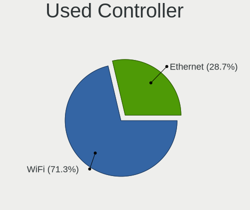

| Kind     | Notebooks | Percent |
|----------|-----------|---------|
| WiFi     | 560       | 72.35%  |
| Ethernet | 214       | 27.65%  |

NICs
----

Total network controllers on board

| Total | Notebooks | Percent |
|-------|-----------|---------|
| 2     | 564       | 79.89%  |
| 1     | 121       | 17.14%  |
| 3     | 11        | 1.56%   |
| 0     | 9         | 1.27%   |
| 4     | 1         | 0.14%   |

IPv6
----

IPv6 vs IPv4

| Used | Notebooks | Percent |
|------|-----------|---------|
| No   | 555       | 76.76%  |
| Yes  | 168       | 23.24%  |

Bluetooth
---------

Bluetooth Vendor
----------------

Controller vendors

| Vendor                          | Notebooks | Percent |
|---------------------------------|-----------|---------|
| Intel                           | 271       | 52.52%  |
| Realtek Semiconductor           | 47        | 9.11%   |
| Qualcomm Atheros Communications | 40        | 7.75%   |
| Broadcom                        | 27        | 5.23%   |
| Dell                            | 23        | 4.46%   |
| IMC Networks                    | 19        | 3.68%   |
| Hewlett-Packard                 | 18        | 3.49%   |
| Foxconn / Hon Hai               | 16        | 3.1%    |
| Lite-On Technology              | 13        | 2.52%   |
| Apple                           | 13        | 2.52%   |
| Toshiba                         | 9         | 1.74%   |
| Cambridge Silicon Radio         | 4         | 0.78%   |
| ASUSTek Computer                | 4         | 0.78%   |
| Ralink                          | 3         | 0.58%   |
| Foxconn International           | 3         | 0.58%   |
| Alps Electric                   | 3         | 0.58%   |
| Realtek                         | 1         | 0.19%   |
| Ralink Technology               | 1         | 0.19%   |
| MediaTek                        | 1         | 0.19%   |

Bluetooth Model
---------------

Controller models

| Model                                               | Notebooks | Percent |
|-----------------------------------------------------|-----------|---------|
| Intel Bluetooth wireless interface                  | 106       | 20.54%  |
| Intel AX200 Bluetooth                               | 53        | 10.27%  |
| Intel Bluetooth 9460/9560 Jefferson Peak (JfP)      | 43        | 8.33%   |
| Intel AX201 Bluetooth                               | 30        | 5.81%   |
| Realtek Bluetooth Radio                             | 21        | 4.07%   |
| Intel Centrino Bluetooth Wireless Transceiver       | 18        | 3.49%   |
| Realtek  Bluetooth 4.2 Adapter                      | 14        | 2.71%   |
| Intel Wireless-AC 9260 Bluetooth Adapter            | 13        | 2.52%   |
| Qualcomm Atheros  Bluetooth Device                  | 11        | 2.13%   |
| Qualcomm Atheros AR3011 Bluetooth                   | 11        | 2.13%   |
| HP Bluetooth 2.0 Interface [Broadcom BCM2045]       | 11        | 2.13%   |
| IMC Networks Bluetooth Device                       | 10        | 1.94%   |
| Dell DW375 Bluetooth Module                         | 10        | 1.94%   |
| Qualcomm Atheros QCA61x4 Bluetooth 4.0              | 8         | 1.55%   |
| Foxconn / Hon Hai Bluetooth Device                  | 8         | 1.55%   |
| Apple Bluetooth Host Controller                     | 8         | 1.55%   |
| Realtek 802.11ac WLAN Adapter                       | 6         | 1.16%   |
| Qualcomm Atheros AR3012 Bluetooth 4.0               | 6         | 1.16%   |
| HP Broadcom 2070 Bluetooth Combo                    | 6         | 1.16%   |
| Dell BCM20702A0 Bluetooth Module                    | 6         | 1.16%   |
| Broadcom HP Portable SoftSailing                    | 6         | 1.16%   |
| Lite-On Qualcomm Atheros QCA9377 Bluetooth          | 5         | 0.97%   |
| Lite-On Atheros AR3012 Bluetooth                    | 4         | 0.78%   |
| Foxconn / Hon Hai Bluetooth USB Host Controller     | 4         | 0.78%   |
| Cambridge Silicon Radio Bluetooth Dongle (HCI mode) | 4         | 0.78%   |
| Broadcom BCM2045B (BDC-2.1)                         | 4         | 0.78%   |
| Toshiba Bluetooth Device                            | 3         | 0.58%   |
| Realtek RTL8822BE Bluetooth 4.2 Adapter             | 3         | 0.58%   |
| Realtek RTL8723B Bluetooth                          | 3         | 0.58%   |
| Ralink RT3290 Bluetooth                             | 3         | 0.58%   |
| Qualcomm Atheros AR3012 Bluetooth                   | 3         | 0.58%   |
| Lite-On Bluetooth Device                            | 3         | 0.58%   |
| Intel Wireless-AC 3168 Bluetooth                    | 3         | 0.58%   |
| Intel AX210 Bluetooth                               | 3         | 0.58%   |
| IMC Networks Atheros AR3012 Bluetooth 4.0 Adapter   | 3         | 0.58%   |
| Foxconn International BCM43142A0 Bluetooth module   | 3         | 0.58%   |
| Dell Wireless 370 Bluetooth Mini-card               | 3         | 0.58%   |
| Broadcom HP Portable Bumble Bee                     | 3         | 0.58%   |
| Apple Bluetooth USB Host Controller                 | 3         | 0.58%   |
| Toshiba Integrated Bluetooth HCI                    | 2         | 0.39%   |
| Intel Centrino Advanced-N 6230 Bluetooth adapter    | 2         | 0.39%   |
| IMC Networks Bluetooth Radio                        | 2         | 0.39%   |
| IMC Networks Bluetooth                              | 2         | 0.39%   |
| Dell Wireless 350 Bluetooth                         | 2         | 0.39%   |
| Broadcom BCM43142A0 Bluetooth Device                | 2         | 0.39%   |
| Broadcom BCM2045B (BDC-2.1) [Bluetooth Controller]  | 2         | 0.39%   |
| Broadcom BCM2045B (BDC-2) [Bluetooth Controller]    | 2         | 0.39%   |
| Broadcom BCM2045 Bluetooth                          | 2         | 0.39%   |
| ASUS BT-183 Bluetooth 2.0+EDR adapter               | 2         | 0.39%   |
| Apple Bluetooth HCI                                 | 2         | 0.39%   |
| Alps Electric BCM2046 Bluetooth Device              | 2         | 0.39%   |
| Toshiba Integrated Bluetooth (Taiyo Yuden)          | 1         | 0.19%   |
| Toshiba Bluetooth USB Host Controller               | 1         | 0.19%   |
| Toshiba Atheros AR3012 Bluetooth                    | 1         | 0.19%   |
| Toshiba Askey Bluetooth Module                      | 1         | 0.19%   |
| Realtek Bluetooth Radio                             | 1         | 0.19%   |
| Ralink Motorola BC4 Bluetooth 3.0+HS Adapter        | 1         | 0.19%   |
| Qualcomm Atheros Bluetooth                          | 1         | 0.19%   |
| MediaTek MT7630e Bluetooth Adapter                  | 1         | 0.19%   |
| Lite-On Atheros Bluetooth                           | 1         | 0.19%   |

Sound
-----

Sound Vendor
------------

Sound card vendors

| Vendor                               | Notebooks | Percent |
|--------------------------------------|-----------|---------|
| Intel                                | 593       | 66.33%  |
| AMD                                  | 124       | 13.87%  |
| Nvidia                               | 115       | 12.86%  |
| Realtek Semiconductor                | 9         | 1.01%   |
| C-Media Electronics                  | 7         | 0.78%   |
| Logitech                             | 6         | 0.67%   |
| GN Netcom                            | 6         | 0.67%   |
| Plantronics                          | 4         | 0.45%   |
| Hewlett-Packard                      | 3         | 0.34%   |
| Corsair                              | 3         | 0.34%   |
| Texas Instruments                    | 2         | 0.22%   |
| Razer USA                            | 2         | 0.22%   |
| Lenovo                               | 2         | 0.22%   |
| VIA Technologies                     | 1         | 0.11%   |
| Thesycon Systemsoftware & Consulting | 1         | 0.11%   |
| Silicon Integrated Systems [SiS]     | 1         | 0.11%   |
| Samson Technologies                  | 1         | 0.11%   |
| Roland                               | 1         | 0.11%   |
| QinHeng Electronics                  | 1         | 0.11%   |
| Pioneer DJ                           | 1         | 0.11%   |
| Pioneer                              | 1         | 0.11%   |
| M-Audio                              | 1         | 0.11%   |
| Kingston Technology                  | 1         | 0.11%   |
| Guillemot                            | 1         | 0.11%   |
| FIFINE Microphones                   | 1         | 0.11%   |
| Bose                                 | 1         | 0.11%   |
| Audio-Technica                       | 1         | 0.11%   |
| ASUSTek Computer                     | 1         | 0.11%   |
| Apple                                | 1         | 0.11%   |
| Alesis                               | 1         | 0.11%   |
| AKAI                                 | 1         | 0.11%   |

Sound Model
-----------

Sound card models

| Model                                                                                             | Notebooks | Percent |
|---------------------------------------------------------------------------------------------------|-----------|---------|
| Intel 7 Series/C216 Chipset Family High Definition Audio Controller                               | 76        | 7.12%   |
| Intel Sunrise Point-LP HD Audio                                                                   | 72        | 6.75%   |
| Intel 6 Series/C200 Series Chipset Family High Definition Audio Controller                        | 59        | 5.53%   |
| AMD Family 17h/19h HD Audio Controller                                                            | 56        | 5.25%   |
| Intel 82801I (ICH9 Family) HD Audio Controller                                                    | 41        | 3.84%   |
| Intel Haswell-ULT HD Audio Controller                                                             | 35        | 3.28%   |
| Intel Cannon Point-LP High Definition Audio Controller                                            | 35        | 3.28%   |
| Intel 8 Series HD Audio Controller                                                                | 35        | 3.28%   |
| Intel Cannon Lake PCH cAVS                                                                        | 34        | 3.19%   |
| Intel 8 Series/C220 Series Chipset High Definition Audio Controller                               | 33        | 3.09%   |
| AMD Renoir Radeon High Definition Audio Controller                                                | 30        | 2.81%   |
| Intel Xeon E3-1200 v3/4th Gen Core Processor HD Audio Controller                                  | 29        | 2.72%   |
| Intel 5 Series/3400 Series Chipset High Definition Audio                                          | 29        | 2.72%   |
| Intel Wildcat Point-LP High Definition Audio Controller                                           | 24        | 2.25%   |
| Intel Broadwell-U Audio Controller                                                                | 24        | 2.25%   |
| Intel 82801H (ICH8 Family) HD Audio Controller                                                    | 24        | 2.25%   |
| Intel Tiger Lake-LP Smart Sound Technology Audio Controller                                       | 22        | 2.06%   |
| Intel NM10/ICH7 Family High Definition Audio Controller                                           | 21        | 1.97%   |
| AMD FCH Azalia Controller                                                                         | 19        | 1.78%   |
| AMD Raven/Raven2/Fenghuang HDMI/DP Audio Controller                                               | 17        | 1.59%   |
| Intel CM238 HD Audio Controller                                                                   | 16        | 1.5%    |
| AMD Kabini HDMI/DP Audio                                                                          | 16        | 1.5%    |
| Nvidia GF108 High Definition Audio Controller                                                     | 15        | 1.41%   |
| Intel Comet Lake PCH-LP cAVS                                                                      | 14        | 1.31%   |
| Intel Comet Lake PCH cAVS                                                                         | 14        | 1.31%   |
| Nvidia TU107 GeForce GTX 1650 High Definition Audio Controller                                    | 13        | 1.22%   |
| Nvidia GK107 HDMI Audio Controller                                                                | 12        | 1.12%   |
| AMD SBx00 Azalia (Intel HDA)                                                                      | 12        | 1.12%   |
| Nvidia TU106 High Definition Audio Controller                                                     | 10        | 0.94%   |
| Nvidia GP107GL High Definition Audio Controller                                                   | 10        | 0.94%   |
| Realtek Semiconductor USB Audio                                                                   | 9         | 0.84%   |
| AMD Wrestler HDMI Audio                                                                           | 9         | 0.84%   |
| Nvidia GM107 High Definition Audio Controller [GeForce 940MX]                                     | 8         | 0.75%   |
| Intel Celeron/Pentium Silver Processor High Definition Audio                                      | 7         | 0.66%   |
| Intel Atom Processor Z36xxx/Z37xxx Series High Definition Audio Controller                        | 7         | 0.66%   |
| Intel 100 Series/C230 Series Chipset Family HD Audio Controller                                   | 7         | 0.66%   |
| AMD RV710/730 HDMI Audio [Radeon HD 4000 series]                                                  | 7         | 0.66%   |
| AMD Family 15h (Models 60h-6fh) Audio Controller                                                  | 7         | 0.66%   |
| Intel Atom/Celeron/Pentium Processor x5-E8000/J3xxx/N3xxx Series High Definition Audio Controller | 6         | 0.56%   |
| AMD Turks HDMI Audio [Radeon HD 6500/6600 / 6700M Series]                                         | 6         | 0.56%   |
| Nvidia High Definition Audio Controller                                                           | 5         | 0.47%   |
| Nvidia GP106 High Definition Audio Controller                                                     | 5         | 0.47%   |
| Nvidia GP104 High Definition Audio Controller                                                     | 5         | 0.47%   |
| Nvidia GF119 HDMI Audio Controller                                                                | 5         | 0.47%   |
| AMD High Definition Audio Controller                                                              | 5         | 0.47%   |
| Nvidia TU116 High Definition Audio Controller                                                     | 4         | 0.37%   |
| Nvidia Audio device                                                                               | 4         | 0.37%   |
| AMD Redwood HDMI Audio [Radeon HD 5000 Series]                                                    | 4         | 0.37%   |
| Nvidia MCP79 High Definition Audio                                                                | 3         | 0.28%   |
| Nvidia GK208 HDMI/DP Audio Controller                                                             | 3         | 0.28%   |
| Nvidia GK106 HDMI Audio Controller                                                                | 3         | 0.28%   |
| Intel Ice Lake-LP Smart Sound Technology Audio Controller                                         | 3         | 0.28%   |
| Hewlett-Packard USB Audio                                                                         | 3         | 0.28%   |
| AMD Cedar HDMI Audio [Radeon HD 5400/6300/7300 Series]                                            | 3         | 0.28%   |
| Nvidia TU104 HD Audio Controller                                                                  | 2         | 0.19%   |
| Nvidia GT216 HDMI Audio Controller                                                                | 2         | 0.19%   |
| Intel US15W/US15X/US15L/UL11L SCH [Poulsbo] HD Audio Controller                                   | 2         | 0.19%   |
| Intel Tiger Lake-H HD Audio Controller                                                            | 2         | 0.19%   |
| Intel Celeron N3350/Pentium N4200/Atom E3900 Series Audio Cluster                                 | 2         | 0.19%   |
| Intel 82801FB/FBM/FR/FW/FRW (ICH6 Family) AC'97 Audio Controller                                  | 2         | 0.19%   |

Memory
------

Memory Vendor
-------------

Memory module vendors

| Vendor              | Notebooks | Percent |
|---------------------|-----------|---------|
| Samsung Electronics | 120       | 29.34%  |
| SK Hynix            | 103       | 25.18%  |
| Micron Technology   | 49        | 11.98%  |
| Kingston            | 38        | 9.29%   |
| Unknown             | 24        | 5.87%   |
| Crucial             | 19        | 4.65%   |
| Elpida              | 14        | 3.42%   |
| Corsair             | 9         | 2.2%    |
| Nanya Technology    | 8         | 1.96%   |
| A-DATA Technology   | 7         | 1.71%   |
| Ramaxel Technology  | 6         | 1.47%   |
| Unknown (ABCD)      | 3         | 0.73%   |
| Unknown (09D5)      | 1         | 0.24%   |
| Unifosa             | 1         | 0.24%   |
| TRS STAR            | 1         | 0.24%   |
| Transcend           | 1         | 0.24%   |
| TIMETEC             | 1         | 0.24%   |
| Team                | 1         | 0.24%   |
| Patriot             | 1         | 0.24%   |
| GOODRAM             | 1         | 0.24%   |
| A-DA                | 1         | 0.24%   |

Memory Model
------------

Memory module models

| Model                                                            | Notebooks | Percent |
|------------------------------------------------------------------|-----------|---------|
| SK Hynix RAM HMT451S6BFR8A-PB 4GB SODIMM DDR3 1600MT/s           | 8         | 1.81%   |
| SK Hynix RAM HMT351S6EFR8A-PB 4096MB SODIMM DDR3 1600MT/s        | 7         | 1.59%   |
| Samsung RAM M471B5273DH0-CH9 4GB SODIMM DDR3 1334MT/s            | 7         | 1.59%   |
| Samsung RAM M471A1K43CB1-CRC 8GB SODIMM DDR4 2667MT/s            | 7         | 1.59%   |
| SK Hynix RAM HMT351S6CFR8C-PB 4GB SODIMM DDR3 1600MT/s           | 6         | 1.36%   |
| SK Hynix RAM HMA81GS6AFR8N-UH 8GB SODIMM DDR4 2667MT/s           | 6         | 1.36%   |
| Samsung RAM M471B5173DB0-YK0 4GB SODIMM DDR3 1600MT/s            | 6         | 1.36%   |
| SK Hynix RAM HMA81GS6CJR8N-VK 8192MB SODIMM DDR4 2667MT/s        | 5         | 1.13%   |
| SK Hynix RAM H9CCNNNCLGALAR-NVD 8GB Row Of Chips LPDDR3 2133MT/s | 5         | 1.13%   |
| Samsung RAM M471B1G73QH0-YK0 8192MB SODIMM DDR3 1600MT/s         | 5         | 1.13%   |
| Samsung RAM M471B1G73DB0-YK0 8192MB SODIMM DDR3 1600MT/s         | 5         | 1.13%   |
| Samsung RAM M471A1K43DB1-CWE 8GB SODIMM DDR4 3200MT/s            | 5         | 1.13%   |
| Crucial RAM CT102464BF160B.C16 8192MB SODIMM DDR3 1600MT/s       | 5         | 1.13%   |
| Unknown RAM Module 4096MB SODIMM DDR3                            | 4         | 0.91%   |
| SK Hynix RAM HMA82GS6JJR8N-VK 16GB SODIMM DDR4 2667MT/s          | 4         | 0.91%   |
| Samsung RAM Module 16384MB SODIMM DDR4 2667MT/s                  | 4         | 0.91%   |
| Samsung RAM M471B5773DH0-CH9 2GB SODIMM DDR3 1600MT/s            | 4         | 0.91%   |
| Samsung RAM M471B5173QH0-YK0 4GB SODIMM DDR3 1600MT/s            | 4         | 0.91%   |
| Samsung RAM M471A5244CB0-CTD 4GB SODIMM DDR4 3266MT/s            | 4         | 0.91%   |
| Samsung RAM M471A2K43DB1-CWE 16GB SODIMM DDR4 3200MT/s           | 4         | 0.91%   |
| Samsung RAM M4 70T5663QZ3-CF7 2GB SODIMM DDR2 2048MT/s           | 4         | 0.91%   |
| Samsung RAM K4EBE304EC-EGCG 8GB Row Of Chips LPDDR3 2133MT/s     | 4         | 0.91%   |
| Unknown RAM Module 4096MB SODIMM DDR3 1333MT/s                   | 3         | 0.68%   |
| Unknown RAM Module 2GB SODIMM DDR2 667MT/s                       | 3         | 0.68%   |
| Unknown (ABCD) RAM 123456789012345678 2GB SODIMM DDR4 2400MT/s   | 3         | 0.68%   |
| SK Hynix RAM HMT425S6AFR6A-PB 2GB SODIMM DDR3 1600MT/s           | 3         | 0.68%   |
| SK Hynix RAM HMA851S6CJR6N-VK 4GB SODIMM DDR4 2667MT/s           | 3         | 0.68%   |
| SK Hynix RAM HMA82GS6CJR8N-VK 16GB SODIMM DDR4 2667MT/s          | 3         | 0.68%   |
| SK Hynix RAM HMA81GS6DJR8N-XN 8GB SODIMM DDR4 3200MT/s           | 3         | 0.68%   |
| Samsung RAM M471B5273CH0-CH9 4GB SODIMM DDR3 1334MT/s            | 3         | 0.68%   |
| Samsung RAM M471A2G44AM0-CWE 16GB SODIMM DDR4 3200MT/s           | 3         | 0.68%   |
| Samsung RAM M471A1K43DB1-CTD 8GB SODIMM DDR4 2667MT/s            | 3         | 0.68%   |
| Samsung RAM M471A1K43CB1-CTD 8GB SODIMM DDR4 2667MT/s            | 3         | 0.68%   |
| Samsung RAM M471A1G44AB0-CWE 8GB SODIMM DDR4 3200MT/s            | 3         | 0.68%   |
| Samsung RAM M471A1G44AB0-CWE 8GB Row Of Chips DDR4 3200MT/s      | 3         | 0.68%   |
| Unknown RAM Module 4GB SODIMM DDR4 2400MT/s                      | 2         | 0.45%   |
| Unknown RAM Module 2048MB SODIMM DDR2 667MT/s                    | 2         | 0.45%   |
| SK Hynix RAM Module 8GB SODIMM DDR4 3200MT/s                     | 2         | 0.45%   |
| SK Hynix RAM HMT41GS6BFR8A-PB 8GB SODIMM DDR3 1600MT/s           | 2         | 0.45%   |
| SK Hynix RAM HMT351S6CFR8C-H9 4096MB SODIMM DDR3 1333MT/s        | 2         | 0.45%   |
| SK Hynix RAM HMAB2GS6AMR6N-XN 16GB SODIMM DDR4 3200MT/s          | 2         | 0.45%   |
| SK Hynix RAM HMA851S6AFR6N-UH 4GB SODIMM DDR4 2667MT/s           | 2         | 0.45%   |
| SK Hynix RAM HMA851S6AFR6N-UH 4GB SODIMM DDR4 2400MT/s           | 2         | 0.45%   |
| SK Hynix RAM HMA82GS6DJR8N-VK 16384MB SODIMM DDR4 2667MT/s       | 2         | 0.45%   |
| Samsung RAM Module 8192MB SODIMM DDR4 2400MT/s                   | 2         | 0.45%   |
| Samsung RAM Module 8192MB SODIMM DDR4 2133MT/s                   | 2         | 0.45%   |
| Samsung RAM M471B5674QH0-YK0 2GB SODIMM DDR3 1600MT/s            | 2         | 0.45%   |
| Samsung RAM M471B5673FH0-CH9 2GB SODIMM DDR3 1334MT/s            | 2         | 0.45%   |
| Samsung RAM M471B5673FH0-CF8 2048MB SODIMM DDR3 1067MT/s         | 2         | 0.45%   |
| Samsung RAM M471B5273DH0-YK0 4GB SODIMM DDR3 1600MT/s            | 2         | 0.45%   |
| Samsung RAM M471A4G43MB1-CTD 32GB SODIMM DDR4 2667MT/s           | 2         | 0.45%   |
| Samsung RAM M471A2K43DB1-CTD 16GB SODIMM DDR4 2667MT/s           | 2         | 0.45%   |
| Samsung RAM M471A2G43AB2-CWE 16GB SODIMM DDR4 3200MT/s           | 2         | 0.45%   |
| Samsung RAM M471A1K43BB1-CTD 8GB SODIMM DDR4 2667MT/s            | 2         | 0.45%   |
| Samsung RAM M471A1K43BB1-CRC 8GB SODIMM DDR4 2667MT/s            | 2         | 0.45%   |
| Samsung RAM M4 70T5663QZ3-CE6 2048MB SODIMM DDR2 667MT/s         | 2         | 0.45%   |
| Samsung RAM K4EBE304EB-EGCG 8GB Row Of Chips LPDDR3 2133MT/s     | 2         | 0.45%   |
| Samsung RAM K4B8G1646B-MYK0 4GB SODIMM DDR3 1600MT/s             | 2         | 0.45%   |
| Ramaxel RAM RMSA3320MJ78HAF-3200 8GB SODIMM DDR4 3200MT/s        | 2         | 0.45%   |
| Nanya RAM NT4GC64B8HG0NS-DI 4GB SODIMM DDR3 1600MT/s             | 2         | 0.45%   |

Memory Kind
-----------

Memory module kinds

| Kind   | Notebooks | Percent |
|--------|-----------|---------|
| DDR4   | 161       | 44.23%  |
| DDR3   | 144       | 39.56%  |
| DDR2   | 22        | 6.04%   |
| LPDDR3 | 17        | 4.67%   |
| SDRAM  | 11        | 3.02%   |
| LPDDR4 | 9         | 2.47%   |

Memory Form Factor
------------------

Physical design of the memory module

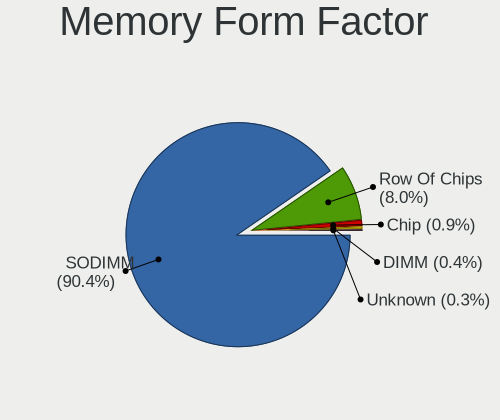

| Name         | Notebooks | Percent |
|--------------|-----------|---------|
| SODIMM       | 330       | 92.18%  |
| Row Of Chips | 23        | 6.42%   |
| Chip         | 4         | 1.12%   |
| DIMM         | 1         | 0.28%   |

Memory Size
-----------

Memory module size

| Size  | Notebooks | Percent |
|-------|-----------|---------|
| 8192  | 140       | 35.99%  |
| 4096  | 129       | 33.16%  |
| 16384 | 59        | 15.17%  |
| 2048  | 48        | 12.34%  |
| 1024  | 9         | 2.31%   |
| 32768 | 4         | 1.03%   |

Memory Speed
------------

Memory module speed

| Speed   | Notebooks | Percent |
|---------|-----------|---------|
| 1600    | 96        | 24.68%  |
| 2667    | 80        | 20.57%  |
| 3200    | 53        | 13.62%  |
| 2400    | 31        | 7.97%   |
| 2133    | 29        | 7.46%   |
| 1334    | 21        | 5.4%    |
| 1333    | 19        | 4.88%   |
| 667     | 13        | 3.34%   |
| Unknown | 9         | 2.31%   |
| 2048    | 7         | 1.8%    |
| 1067    | 6         | 1.54%   |
| 800     | 5         | 1.29%   |
| 3266    | 4         | 1.03%   |
| 1867    | 3         | 0.77%   |
| 975     | 3         | 0.77%   |
| 4267    | 2         | 0.51%   |
| 4199    | 2         | 0.51%   |
| 8400    | 1         | 0.26%   |
| 4800    | 1         | 0.26%   |
| 4266    | 1         | 0.26%   |
| 3000    | 1         | 0.26%   |
| 1777    | 1         | 0.26%   |
| 1066    | 1         | 0.26%   |

Printers & scanners
-------------------

Printer Vendor
--------------

Printer device vendors

| Vendor              | Notebooks | Percent |
|---------------------|-----------|---------|
| Samsung Electronics | 2         | 50%     |
| Hewlett-Packard     | 1         | 25%     |
| Canon               | 1         | 25%     |

Printer Model
-------------

Printer device models

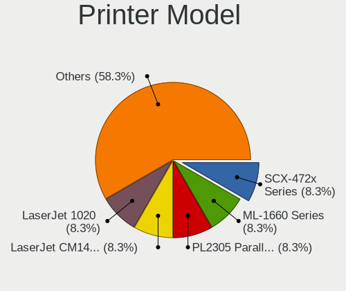

| Model                   | Notebooks | Percent |
|-------------------------|-----------|---------|
| Samsung SCX-472x Series | 1         | 25%     |
| Samsung ML-1660 Series  | 1         | 25%     |
| HP Deskjet F4500 series | 1         | 25%     |
| Canon TS5100 series     | 1         | 25%     |

Scanner Vendor
--------------

Scanner device vendors

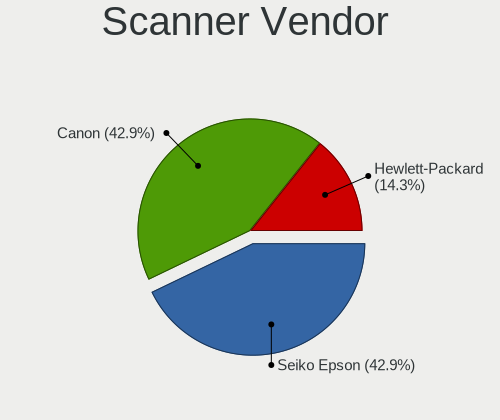

| Vendor          | Notebooks | Percent |
|-----------------|-----------|---------|
| Seiko Epson     | 2         | 40%     |
| Canon           | 2         | 40%     |
| Hewlett-Packard | 1         | 20%     |

Scanner Model
-------------

Scanner device models

| Model                                            | Notebooks | Percent |
|--------------------------------------------------|-----------|---------|
| Seiko Epson GT-X900 [Perfection V700/V750 Photo] | 1         | 20%     |
| Seiko Epson GT-X750 [Perfection 4490 Photo]      | 1         | 20%     |
| HP scanjet 8270                                  | 1         | 20%     |
| Canon CanoScan N670U/N676U/LiDE 20               | 1         | 20%     |
| Canon CanoScan 3200F                             | 1         | 20%     |

Camera
------

Camera Vendor
-------------

Camera device vendors

| Vendor                                 | Notebooks | Percent |
|----------------------------------------|-----------|---------|
| Chicony Electronics                    | 162       | 26.13%  |
| Microdia                               | 73        | 11.77%  |
| Realtek Semiconductor                  | 62        | 10%     |
| IMC Networks                           | 48        | 7.74%   |
| Acer                                   | 43        | 6.94%   |
| Sunplus Innovation Technology          | 35        | 5.65%   |
| Suyin                                  | 29        | 4.68%   |
| Lite-On Technology                     | 29        | 4.68%   |
| Quanta                                 | 23        | 3.71%   |
| Cheng Uei Precision Industry (Foxlink) | 23        | 3.71%   |
| Syntek                                 | 18        | 2.9%    |
| Apple                                  | 11        | 1.77%   |
| Ricoh                                  | 10        | 1.61%   |
| Alcor Micro                            | 10        | 1.61%   |
| Luxvisions Innotech Limited            | 8         | 1.29%   |
| Samsung Electronics                    | 5         | 0.81%   |
| Logitech                               | 5         | 0.81%   |
| Silicon Motion                         | 4         | 0.65%   |
| Z-Star Microelectronics                | 3         | 0.48%   |
| Primax Electronics                     | 3         | 0.48%   |
| Importek                               | 3         | 0.48%   |
| Lenovo                                 | 2         | 0.32%   |
| Trust                                  | 1         | 0.16%   |
| Technologies                           | 1         | 0.16%   |
| Pixart Imaging                         | 1         | 0.16%   |
| Panasonic (Matsushita)                 | 1         | 0.16%   |
| Mustek Systems                         | 1         | 0.16%   |
| Genesys Logic                          | 1         | 0.16%   |
| Cubeternet                             | 1         | 0.16%   |
| Creative Technology                    | 1         | 0.16%   |
| Allwinner Technology                   | 1         | 0.16%   |
| ALi                                    | 1         | 0.16%   |
| 2M UVC CAMERA                          | 1         | 0.16%   |

Camera Model
------------

Camera device models

| Model                                                                      | Notebooks | Percent |
|----------------------------------------------------------------------------|-----------|---------|
| Realtek Integrated_Webcam_HD                                               | 27        | 4.34%   |
| Microdia Integrated_Webcam_HD                                              | 25        | 4.02%   |
| IMC Networks Integrated Camera                                             | 18        | 2.89%   |
| Microdia Integrated Webcam                                                 | 16        | 2.57%   |
| Chicony Integrated Camera                                                  | 16        | 2.57%   |
| Chicony HP HD Webcam                                                       | 12        | 1.93%   |
| Lite-On HP HD Camera                                                       | 11        | 1.77%   |
| Chicony HD Webcam                                                          | 11        | 1.77%   |
| IMC Networks USB2.0 HD UVC WebCam                                          | 10        | 1.61%   |
| Chicony USB2.0 Camera                                                      | 10        | 1.61%   |
| Acer Integrated Camera                                                     | 10        | 1.61%   |
| Syntek Integrated Camera                                                   | 9         | 1.45%   |
| Sunplus HD WebCam                                                          | 8         | 1.29%   |
| Lite-On Integrated Camera                                                  | 8         | 1.29%   |
| Chicony HP HD Camera                                                       | 8         | 1.29%   |
| Realtek USB Camera                                                         | 7         | 1.13%   |
| Chicony USB2.0 HD UVC WebCam                                               | 7         | 1.13%   |
| Chicony TOSHIBA Web Camera - HD                                            | 7         | 1.13%   |
| Suyin Acer/HP Integrated Webcam [CN0314]                                   | 6         | 0.96%   |
| Microdia Laptop_Integrated_Webcam_2M                                       | 6         | 0.96%   |
| Chicony USB 2.0 Camera                                                     | 6         | 0.96%   |
| Chicony Integrated Camera (1280x720@30)                                    | 6         | 0.96%   |
| Acer BisonCam, NB Pro                                                      | 6         | 0.96%   |
| Sunplus Asus Webcam                                                        | 5         | 0.8%    |
| Samsung Galaxy A5 (MTP)                                                    | 5         | 0.8%    |
| Realtek USB2.0 VGA UVC WebCam                                              | 5         | 0.8%    |
| Quanta HP HD Camera                                                        | 5         | 0.8%    |
| Microdia Laptop_Integrated_Webcam_HD                                       | 5         | 0.8%    |
| Lite-On HP HD Webcam                                                       | 5         | 0.8%    |
| Chicony WebCam                                                             | 5         | 0.8%    |
| Chicony USB2.0 VGA UVC WebCam                                              | 5         | 0.8%    |
| Chicony Integrated HP HD Webcam                                            | 5         | 0.8%    |
| Chicony HP Truevision HD camera                                            | 5         | 0.8%    |
| Chicony EasyCamera                                                         | 5         | 0.8%    |
| Acer HD Webcam                                                             | 5         | 0.8%    |
| Acer BisonCam,NB Pro                                                       | 5         | 0.8%    |
| Suyin 1.3M HD WebCam                                                       | 4         | 0.64%   |
| Sunplus Integrated_Webcam_HD                                               | 4         | 0.64%   |
| Realtek USB2.0-Camera                                                      | 4         | 0.64%   |
| Realtek USB2.0 HD UVC WebCam                                               | 4         | 0.64%   |
| Quanta VGA WebCam                                                          | 4         | 0.64%   |
| Quanta HP Webcam                                                           | 4         | 0.64%   |
| Luxvisions Innotech Limited HP HD Camera                                   | 4         | 0.64%   |
| IMC Networks USB2.0 VGA UVC WebCam                                         | 4         | 0.64%   |
| Chicony HP Wide Vision HD Camera                                           | 4         | 0.64%   |
| Cheng Uei Precision Industry (Foxlink) HP Wide Vision HD Integrated Webcam | 4         | 0.64%   |
| Cheng Uei Precision Industry (Foxlink) HP HD Webcam                        | 4         | 0.64%   |
| Alcor Micro Asus Integrated Webcam                                         | 4         | 0.64%   |
| Syntek USB2.0 Camera                                                       | 3         | 0.48%   |
| Sunplus HP HD Webcam [Fixed]                                               | 3         | 0.48%   |
| Ricoh USB2.0 Camera                                                        | 3         | 0.48%   |
| Realtek Integrated Webcam                                                  | 3         | 0.48%   |
| Quanta HD Webcam                                                           | 3         | 0.48%   |
| Microdia Dell Integrated HD Webcam                                         | 3         | 0.48%   |
| Logitech C922 Pro Stream Webcam                                            | 3         | 0.48%   |
| Lite-On HP Wide Vision HD Camera                                           | 3         | 0.48%   |
| IMC Networks UVC VGA Webcam                                                | 3         | 0.48%   |
| IMC Networks TOSHIBA Web Camera - HD                                       | 3         | 0.48%   |
| IMC Networks Integrated Webcam                                             | 3         | 0.48%   |
| Chicony UVC 1.00 device HD UVC WebCam                                      | 3         | 0.48%   |

Security
--------

Fingerprint Vendor
------------------

Fingerprint sensor vendors

| Vendor                     | Notebooks | Percent |
|----------------------------|-----------|---------|
| Validity Sensors           | 61        | 42.96%  |
| Synaptics                  | 40        | 28.17%  |
| Shenzhen Goodix Technology | 12        | 8.45%   |
| AuthenTec                  | 12        | 8.45%   |
| LighTuning Technology      | 8         | 5.63%   |
| STMicroelectronics         | 4         | 2.82%   |
| Upek                       | 3         | 2.11%   |
| Elan Microelectronics      | 2         | 1.41%   |

Fingerprint Model
-----------------

Fingerprint sensor models

| Model                                                                      | Notebooks | Percent |
|----------------------------------------------------------------------------|-----------|---------|
| Validity Sensors VFS495 Fingerprint Reader                                 | 26        | 18.31%  |
| Synaptics Prometheus MIS Touch Fingerprint Reader                          | 15        | 10.56%  |
| Unknown                                                                    | 8         | 5.63%   |
| Shenzhen Goodix  Fingerprint Device                                        | 6         | 4.23%   |
| AuthenTec AES2501 Fingerprint Sensor                                       | 6         | 4.23%   |
| Validity Sensors VFS5011 Fingerprint Reader                                | 5         | 3.52%   |
| Validity Sensors VFS 5011 fingerprint sensor                               | 5         | 3.52%   |
| Synaptics  VFS7552 Touch Fingerprint Sensor with PurePrint                 | 5         | 3.52%   |
| LighTuning EgisTec Touch Fingerprint Sensor                                | 5         | 3.52%   |
| Validity Sensors VFS471 Fingerprint Reader                                 | 4         | 2.82%   |
| Validity Sensors VFS451 Fingerprint Reader                                 | 4         | 2.82%   |
| Synaptics Metallica MIS Touch Fingerprint Reader                           | 4         | 2.82%   |
| STMicroelectronics Fingerprint Reader                                      | 4         | 2.82%   |
| Shenzhen Goodix Fingerprint Reader                                         | 4         | 2.82%   |
| Validity Sensors VFS491                                                    | 3         | 2.11%   |
| Upek Biometric Touchchip/Touchstrip Fingerprint Sensor                     | 3         | 2.11%   |
| Synaptics WBDI Device                                                      | 3         | 2.11%   |
| Synaptics Metallica MOH Touch Fingerprint Reader                           | 3         | 2.11%   |
| AuthenTec AES2810                                                          | 3         | 2.11%   |
| AuthenTec AES1600                                                          | 3         | 2.11%   |
| Validity Sensors VFS7552 Touch Fingerprint Sensor                          | 2         | 1.41%   |
| Validity Sensors VFS7500 Touch Fingerprint Sensor                          | 2         | 1.41%   |
| Validity Sensors VFS101 Fingerprint Reader                                 | 2         | 1.41%   |
| Validity Sensors VFS Fingerprint sensor                                    | 2         | 1.41%   |
| Validity Sensors Synaptics VFS7552 Touch Fingerprint Sensor with PurePrint | 2         | 1.41%   |
| Validity Sensors Fingerprint scanner                                       | 2         | 1.41%   |
| Synaptics  FS7604 Touch Fingerprint Sensor with PurePrint                  | 2         | 1.41%   |
| Shenzhen Goodix FingerPrint                                                | 2         | 1.41%   |
| LighTuning Fingerprint Reader                                              | 2         | 1.41%   |
| Validity Sensors VFS301 Fingerprint Reader                                 | 1         | 0.7%    |
| Validity Sensors VFS300 Fingerprint Reader                                 | 1         | 0.7%    |
| LighTuning ES603 Swipe Fingerprint Sensor                                  | 1         | 0.7%    |
| Elan ELAN:Fingerprint                                                      | 1         | 0.7%    |
| Elan ELAN:ARM-M4                                                           | 1         | 0.7%    |

Chipcard Vendor
---------------

Chipcard module vendors

| Vendor                            | Notebooks | Percent |
|-----------------------------------|-----------|---------|
| Broadcom                          | 42        | 38.18%  |
| Alcor Micro                       | 35        | 31.82%  |
| O2 Micro                          | 12        | 10.91%  |
| Lenovo                            | 6         | 5.45%   |
| VASCO Data Security International | 4         | 3.64%   |
| Upek                              | 2         | 1.82%   |
| Realtek Semiconductor             | 2         | 1.82%   |
| OmniKey                           | 2         | 1.82%   |
| SCM Microsystems                  | 1         | 0.91%   |
| Integrated Technology Express     | 1         | 0.91%   |
| Gemalto (was Gemplus)             | 1         | 0.91%   |
| Clay Logic                        | 1         | 0.91%   |
| Advanced Card Systems             | 1         | 0.91%   |

Chipcard Model
--------------

Chipcard module models

| Model                                                                        | Notebooks | Percent |
|------------------------------------------------------------------------------|-----------|---------|
| Alcor Micro AU9540 Smartcard Reader                                          | 35        | 31.82%  |
| Broadcom BCM5880 Secure Applications Processor                               | 15        | 13.64%  |
| Broadcom 58200                                                               | 10        | 9.09%   |
| O2 Micro OZ776 CCID Smartcard Reader                                         | 9         | 8.18%   |
| Broadcom 5880                                                                | 9         | 8.18%   |
| Broadcom BCM5880 Secure Applications Processor with fingerprint swipe sensor | 8         | 7.27%   |
| Lenovo Integrated Smart Card Reader                                          | 6         | 5.45%   |
| VASCO Data Security International DIGIPASS 870                               | 3         | 2.73%   |
| O2 Micro Oz776 SmartCard Reader                                              | 3         | 2.73%   |
| Upek TouchChip Fingerprint Coprocessor (WBF advanced mode)                   | 2         | 1.82%   |
| Realtek Semiconductor Smart Card Reader Interface                            | 2         | 1.82%   |
| VASCO Data Security International Digipass 905 SmartCard Reader              | 1         | 0.91%   |
| SCM Microsystems SCR3340 - ExpressCard54 Smart Card Reader                   | 1         | 0.91%   |
| OmniKey CardMan 4321                                                         | 1         | 0.91%   |
| OmniKey CardMan 3021 / 3121                                                  | 1         | 0.91%   |
| Integrated Technology Express SmartCard Reader                               | 1         | 0.91%   |
| Gemalto (was Gemplus) Compact Smart Card Reader Writer                       | 1         | 0.91%   |
| Clay Logic Nitrokey Start                                                    | 1         | 0.91%   |
| Advanced Card Systems ACR38 SmartCard Reader                                 | 1         | 0.91%   |

Unsupported
-----------

Unsupported Devices
-------------------

Total unsupported devices on board

| Total | Notebooks | Percent |
|-------|-----------|---------|
| 0     | 417       | 57.2%   |
| 1     | 248       | 34.02%  |
| 2     | 52        | 7.13%   |
| 3     | 10        | 1.37%   |
| 6     | 1         | 0.14%   |
| 4     | 1         | 0.14%   |

Unsupported Device Types
------------------------

Types of unsupported devices

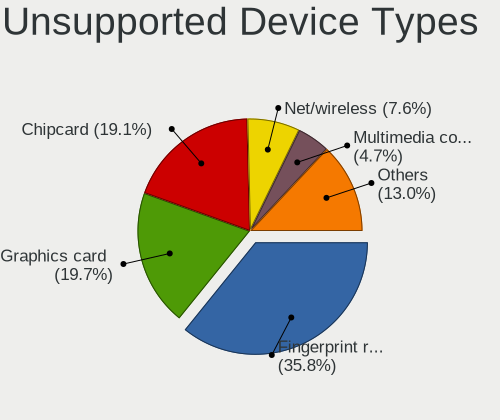

| Type                     | Notebooks | Percent |
|--------------------------|-----------|---------|
| Fingerprint reader       | 140       | 38.25%  |
| Chipcard                 | 77        | 21.04%  |
| Graphics card            | 54        | 14.75%  |
| Net/wireless             | 28        | 7.65%   |
| Multimedia controller    | 13        | 3.55%   |
| Storage                  | 11        | 3.01%   |
| Card reader              | 8         | 2.19%   |
| Camera                   | 7         | 1.91%   |
| Net/ethernet             | 6         | 1.64%   |
| Bluetooth                | 6         | 1.64%   |
| Communication controller | 5         | 1.37%   |
| Flash memory             | 4         | 1.09%   |
| Modem                    | 3         | 0.82%   |
| Network                  | 2         | 0.55%   |
| Storage/ide              | 1         | 0.27%   |
| Sound                    | 1         | 0.27%   |

