Linux in Belgium - Tested Hardware & Statistics
-----------------------------------------------

A project to collect tested hardware configurations for Linux in Belgium.

Anyone can contribute to this report by the [hw-probe](https://github.com/linuxhw/hw-probe) tool:

    sudo -E hw-probe -all -upload

Please contribute! Especially if your hardware is rare.

This is a report for all computer types. See also reports for [desktops](/Location/Belgium/Desktop/README.md) and [notebooks](/Location/Belgium/Notebook/README.md).

Contents
--------

* [ Test Cases ](#test-cases)

* [ System ](#system)
  - [ OS                       ](#os)
  - [ OS Family                ](#os-family)
  - [ Kernel                   ](#kernel)
  - [ Kernel Family            ](#kernel-family)
  - [ Kernel Major Ver.        ](#kernel-major-ver)
  - [ Arch                     ](#arch)
  - [ DE                       ](#de)
  - [ Display Server           ](#display-server)
  - [ Display Manager          ](#display-manager)
  - [ OS Lang                  ](#os-lang)
  - [ Boot Mode                ](#boot-mode)
  - [ Filesystem               ](#filesystem)
  - [ Part. scheme             ](#part-scheme)
  - [ Dual Boot with Linux/BSD ](#dual-boot-with-linuxbsd)
  - [ Dual Boot (Win)          ](#dual-boot-win)

* [ Board ](#board)
  - [ Vendor                   ](#vendor)
  - [ Model                    ](#model)
  - [ Model Family             ](#model-family)
  - [ MFG Year                 ](#mfg-year)
  - [ Form Factor              ](#form-factor)
  - [ Secure Boot              ](#secure-boot)
  - [ Coreboot                 ](#coreboot)
  - [ RAM Size                 ](#ram-size)
  - [ RAM Used                 ](#ram-used)
  - [ Total Drives             ](#total-drives)
  - [ Has CD-ROM               ](#has-cd-rom)
  - [ Has Ethernet             ](#has-ethernet)
  - [ Has WiFi                 ](#has-wifi)
  - [ Has Bluetooth            ](#has-bluetooth)

* [ Location ](#location)
  - [ Country                  ](#country)
  - [ City                     ](#city)

* [ Drives ](#drives)
  - [ Drive Vendor             ](#drive-vendor)
  - [ Drive Model              ](#drive-model)
  - [ HDD Vendor               ](#hdd-vendor)
  - [ SSD Vendor               ](#ssd-vendor)
  - [ Drive Kind               ](#drive-kind)
  - [ Drive Connector          ](#drive-connector)
  - [ Drive Size               ](#drive-size)
  - [ Space Total              ](#space-total)
  - [ Space Used               ](#space-used)
  - [ Malfunc. Drives          ](#malfunc-drives)
  - [ Malfunc. Drive Vendor    ](#malfunc-drive-vendor)
  - [ Malfunc. HDD Vendor      ](#malfunc-hdd-vendor)
  - [ Malfunc. Drive Kind      ](#malfunc-drive-kind)
  - [ Failed Drives            ](#failed-drives)
  - [ Failed Drive Vendor      ](#failed-drive-vendor)
  - [ Drive Status             ](#drive-status)

* [ Storage controller ](#storage-controller)
  - [ Storage Vendor           ](#storage-vendor)
  - [ Storage Model            ](#storage-model)
  - [ Storage Kind             ](#storage-kind)

* [ Processor ](#processor)
  - [ CPU Vendor               ](#cpu-vendor)
  - [ CPU Model                ](#cpu-model)
  - [ CPU Model Family         ](#cpu-model-family)
  - [ CPU Cores                ](#cpu-cores)
  - [ CPU Sockets              ](#cpu-sockets)
  - [ CPU Threads              ](#cpu-threads)
  - [ CPU Op-Modes             ](#cpu-op-modes)
  - [ CPU Microcode            ](#cpu-microcode)
  - [ CPU Microarch            ](#cpu-microarch)

* [ Graphics ](#graphics)
  - [ GPU Vendor               ](#gpu-vendor)
  - [ GPU Model                ](#gpu-model)
  - [ GPU Combo                ](#gpu-combo)
  - [ GPU Driver               ](#gpu-driver)
  - [ GPU Memory               ](#gpu-memory)

* [ Monitor ](#monitor)
  - [ Monitor Vendor           ](#monitor-vendor)
  - [ Monitor Model            ](#monitor-model)
  - [ Monitor Resolution       ](#monitor-resolution)
  - [ Monitor Diagonal         ](#monitor-diagonal)
  - [ Monitor Width            ](#monitor-width)
  - [ Aspect Ratio             ](#aspect-ratio)
  - [ Monitor Area             ](#monitor-area)
  - [ Pixel Density            ](#pixel-density)
  - [ Multiple Monitors        ](#multiple-monitors)

* [ Network ](#network)
  - [ Net Controller Vendor    ](#net-controller-vendor)
  - [ Net Controller Model     ](#net-controller-model)
  - [ Wireless Vendor          ](#wireless-vendor)
  - [ Wireless Model           ](#wireless-model)
  - [ Ethernet Vendor          ](#ethernet-vendor)
  - [ Ethernet Model           ](#ethernet-model)
  - [ Net Controller Kind      ](#net-controller-kind)
  - [ Used Controller          ](#used-controller)
  - [ NICs                     ](#nics)
  - [ IPv6                     ](#ipv6)

* [ Bluetooth ](#bluetooth)
  - [ Bluetooth Vendor         ](#bluetooth-vendor)
  - [ Bluetooth Model          ](#bluetooth-model)

* [ Sound ](#sound)
  - [ Sound Vendor             ](#sound-vendor)
  - [ Sound Model              ](#sound-model)

* [ Memory ](#memory)
  - [ Memory Vendor            ](#memory-vendor)
  - [ Memory Model             ](#memory-model)
  - [ Memory Kind              ](#memory-kind)
  - [ Memory Form Factor       ](#memory-form-factor)
  - [ Memory Size              ](#memory-size)
  - [ Memory Speed             ](#memory-speed)

* [ Printers & scanners ](#printers--scanners)
  - [ Printer Vendor           ](#printer-vendor)
  - [ Printer Model            ](#printer-model)
  - [ Scanner Vendor           ](#scanner-vendor)
  - [ Scanner Model            ](#scanner-model)

* [ Camera ](#camera)
  - [ Camera Vendor            ](#camera-vendor)
  - [ Camera Model             ](#camera-model)

* [ Security ](#security)
  - [ Fingerprint Vendor       ](#fingerprint-vendor)
  - [ Fingerprint Model        ](#fingerprint-model)
  - [ Chipcard Vendor          ](#chipcard-vendor)
  - [ Chipcard Model           ](#chipcard-model)

* [ Unsupported ](#unsupported)
  - [ Unsupported Devices      ](#unsupported-devices)
  - [ Unsupported Device Types ](#unsupported-device-types)

Test Cases
----------

Total: 2208

| Vendor        | Model                       | Form-Factor | Probe                                                      | Date         |
|---------------|-----------------------------|-------------|------------------------------------------------------------|--------------|
| ASUSTek       | TUF B450-PLUS GAMING        | Desktop     | [093d7ea1c9](https://linux-hardware.org/?probe=093d7ea1c9) | May 06, 2022 |
| Lenovo        | ThinkPad X280 20KES94F05    | Notebook    | [16b4cbc9fb](https://linux-hardware.org/?probe=16b4cbc9fb) | May 05, 2022 |
| ASUSTek       | ROG Zephyrus G15 GA503QS... | Notebook    | [c08f733706](https://linux-hardware.org/?probe=c08f733706) | May 05, 2022 |
| ASUSTek       | PRIME Z490-A                | Desktop     | [2ca2d567db](https://linux-hardware.org/?probe=2ca2d567db) | May 05, 2022 |
| Gigabyte      | X570 GAMING X               | Desktop     | [53a75b2d5c](https://linux-hardware.org/?probe=53a75b2d5c) | May 04, 2022 |
| Dell          | 0VHRW1 A03                  | Desktop     | [2a5880a214](https://linux-hardware.org/?probe=2a5880a214) | May 03, 2022 |
| Dell          | 0VHRW1 A03                  | Desktop     | [8204a08a04](https://linux-hardware.org/?probe=8204a08a04) | May 03, 2022 |
| ASUSTek       | Strix 17 GL703GE            | Notebook    | [a7396f278d](https://linux-hardware.org/?probe=a7396f278d) | May 02, 2022 |
| Dell          | XPS 15 9570                 | Notebook    | [01a95b61fe](https://linux-hardware.org/?probe=01a95b61fe) | May 02, 2022 |
| ASUSTek       | X550LD                      | Notebook    | [5625deb6aa](https://linux-hardware.org/?probe=5625deb6aa) | May 01, 2022 |
| ASUSTek       | X756UQ                      | Notebook    | [130944084d](https://linux-hardware.org/?probe=130944084d) | May 01, 2022 |
| Gigabyte      | B365M DS3H                  | Desktop     | [cc016ce0c5](https://linux-hardware.org/?probe=cc016ce0c5) | May 01, 2022 |
| ASUSTek       | Strix 17 GL703GE            | Notebook    | [fabd2d1e45](https://linux-hardware.org/?probe=fabd2d1e45) | Apr 30, 2022 |
| ASUSTek       | Strix 17 GL703GE            | Notebook    | [0e0d0dd3aa](https://linux-hardware.org/?probe=0e0d0dd3aa) | Apr 30, 2022 |
| Gigabyte      | B365M DS3H                  | Desktop     | [247ab2d4f1](https://linux-hardware.org/?probe=247ab2d4f1) | Apr 30, 2022 |
| Gigabyte      | B365M DS3H                  | Desktop     | [0a00cf3e33](https://linux-hardware.org/?probe=0a00cf3e33) | Apr 30, 2022 |
| Gigabyte      | B365M DS3H                  | Desktop     | [f140b54261](https://linux-hardware.org/?probe=f140b54261) | Apr 30, 2022 |
| ASUSTek       | X756UQ                      | Notebook    | [c876e88eea](https://linux-hardware.org/?probe=c876e88eea) | Apr 30, 2022 |
| ASUSTek       | X756UQ                      | Notebook    | [2543d87831](https://linux-hardware.org/?probe=2543d87831) | Apr 30, 2022 |
| Google        | Bobba360                    | Notebook    | [e90fbcc91d](https://linux-hardware.org/?probe=e90fbcc91d) | Apr 29, 2022 |
| Lenovo        | ThinkPad X220 4291WSH       | Notebook    | [21fcbc1850](https://linux-hardware.org/?probe=21fcbc1850) | Apr 27, 2022 |
| Dell          | XPS 13 9305                 | Notebook    | [edf60be002](https://linux-hardware.org/?probe=edf60be002) | Apr 26, 2022 |
| Lenovo        | SDK0E50510 WIN              | Desktop     | [de010dfc55](https://linux-hardware.org/?probe=de010dfc55) | Apr 24, 2022 |
| BLAUPUNKT     | Discovery 1011WI            | Notebook    | [c20b87673e](https://linux-hardware.org/?probe=c20b87673e) | Apr 24, 2022 |
| Gigabyte      | B550M DS3H                  | Desktop     | [c668e0d48e](https://linux-hardware.org/?probe=c668e0d48e) | Apr 23, 2022 |
| Lenovo        | ThinkPad T450s 20BWS2HP0... | Notebook    | [762843e768](https://linux-hardware.org/?probe=762843e768) | Apr 23, 2022 |
| Lenovo        | ThinkPad T450s 20BWS2HP0... | Notebook    | [11ec4d291b](https://linux-hardware.org/?probe=11ec4d291b) | Apr 23, 2022 |
| Fujitsu       | LIFEBOOK E744               | Notebook    | [ca56dc9824](https://linux-hardware.org/?probe=ca56dc9824) | Apr 21, 2022 |
| ASUSTek       | GL502VMK                    | Notebook    | [cc5ed34db8](https://linux-hardware.org/?probe=cc5ed34db8) | Apr 21, 2022 |
| Lenovo        | ThinkPad T520 4243AP1       | Notebook    | [7723ab4bd9](https://linux-hardware.org/?probe=7723ab4bd9) | Apr 19, 2022 |
| Medion        | D3F3-EM2                    | Desktop     | [733df830d1](https://linux-hardware.org/?probe=733df830d1) | Apr 19, 2022 |
| Lenovo        | 312A SDK0J40697 WIN 3305... | Desktop     | [0e53d4286d](https://linux-hardware.org/?probe=0e53d4286d) | Apr 19, 2022 |
| MSI           | GL65 Leopard 10SER          | Notebook    | [2bdfe0279e](https://linux-hardware.org/?probe=2bdfe0279e) | Apr 19, 2022 |
| ASUSTek       | G752VSK                     | Notebook    | [4b6d535621](https://linux-hardware.org/?probe=4b6d535621) | Apr 18, 2022 |
| Lenovo        | ThinkPad T440s 20ARS1940... | Notebook    | [a7fbe1af34](https://linux-hardware.org/?probe=a7fbe1af34) | Apr 18, 2022 |
| ASUSTek       | G752VSK                     | Notebook    | [dfbc0779e8](https://linux-hardware.org/?probe=dfbc0779e8) | Apr 17, 2022 |
| Lenovo        | ThinkPad T430 2349D53       | Notebook    | [7b1d2ec5a1](https://linux-hardware.org/?probe=7b1d2ec5a1) | Apr 17, 2022 |
| Acer          | Aspire 5735                 | Notebook    | [e43434e15c](https://linux-hardware.org/?probe=e43434e15c) | Apr 15, 2022 |
| BLAUPUNKT     | Discovery 1011WI            | Notebook    | [6474fd0605](https://linux-hardware.org/?probe=6474fd0605) | Apr 15, 2022 |
| Dell          | Inspiron 15-3567            | Notebook    | [4639b09a3e](https://linux-hardware.org/?probe=4639b09a3e) | Apr 14, 2022 |
| HP            | ENVY x360 Convertible 13... | Convertible | [5bdba5a921](https://linux-hardware.org/?probe=5bdba5a921) | Apr 14, 2022 |
| MSI           | B250M MORTAR                | Desktop     | [8bf9715804](https://linux-hardware.org/?probe=8bf9715804) | Apr 14, 2022 |
| ASRock        | TRX40 Taichi                | Desktop     | [4a90b659fc](https://linux-hardware.org/?probe=4a90b659fc) | Apr 14, 2022 |
| Lenovo        | IdeaPad 320-15ABR 80XS      | Notebook    | [b80dc08588](https://linux-hardware.org/?probe=b80dc08588) | Apr 14, 2022 |
| Dell          | Latitude 5591               | Notebook    | [3f3f097a1a](https://linux-hardware.org/?probe=3f3f097a1a) | Apr 13, 2022 |
| ASRock        | H170M Pro4                  | Desktop     | [a8bd162bf1](https://linux-hardware.org/?probe=a8bd162bf1) | Apr 13, 2022 |
| Gigabyte      | Z77-D3H                     | Desktop     | [2ddb0d0765](https://linux-hardware.org/?probe=2ddb0d0765) | Apr 13, 2022 |
| Lenovo        | Legion 5 15ARH05 82B5       | Notebook    | [5aafaf0890](https://linux-hardware.org/?probe=5aafaf0890) | Apr 13, 2022 |
| Lenovo        | Legion 5 15ARH05 82B5       | Notebook    | [983dbbf9e8](https://linux-hardware.org/?probe=983dbbf9e8) | Apr 13, 2022 |
| Medion        | BTDD-EAIO                   | All in one  | [8de03f374b](https://linux-hardware.org/?probe=8de03f374b) | Apr 13, 2022 |
| Acer          | Aspire 7745G                | Notebook    | [7ea9773813](https://linux-hardware.org/?probe=7ea9773813) | Apr 12, 2022 |
| ASRock        | EP2C602-4L/D16              | Desktop     | [938b601307](https://linux-hardware.org/?probe=938b601307) | Apr 11, 2022 |
| Lenovo        | Legion Y540-17IRH-PG0 81... | Notebook    | [09f8f09862](https://linux-hardware.org/?probe=09f8f09862) | Apr 11, 2022 |
| Lenovo        | Legion Y540-17IRH-PG0 81... | Notebook    | [da1cd5bf6e](https://linux-hardware.org/?probe=da1cd5bf6e) | Apr 11, 2022 |
| Google        | Akali 360                   | Notebook    | [dccccb359b](https://linux-hardware.org/?probe=dccccb359b) | Apr 11, 2022 |
| Lenovo        | ThinkBook 15 G2 ITL 20VE    | Notebook    | [2ce1788c33](https://linux-hardware.org/?probe=2ce1788c33) | Apr 11, 2022 |
| HP            | OMEN Laptop 15-en0xxx       | Notebook    | [01f57dd952](https://linux-hardware.org/?probe=01f57dd952) | Apr 10, 2022 |
| Raspberry ... | Raspberry Pi                | Soc         | [7f71b84230](https://linux-hardware.org/?probe=7f71b84230) | Apr 10, 2022 |
| HP            | ProBook 470 G2              | Notebook    | [a6aee71c13](https://linux-hardware.org/?probe=a6aee71c13) | Apr 09, 2022 |
| HP            | ProBook 470 G2              | Notebook    | [1d1cdbd95c](https://linux-hardware.org/?probe=1d1cdbd95c) | Apr 09, 2022 |
| Dell          | Latitude E6430              | Notebook    | [dd09c863c8](https://linux-hardware.org/?probe=dd09c863c8) | Apr 08, 2022 |
| ASRockRack    | ROMED8-2T                   | Server      | [49aedaee61](https://linux-hardware.org/?probe=49aedaee61) | Apr 08, 2022 |
| HP            | ProBook 430 G1              | Notebook    | [8bcbe236a7](https://linux-hardware.org/?probe=8bcbe236a7) | Apr 07, 2022 |
| HP            | OMEN Laptop 15-en0xxx       | Notebook    | [af324f356f](https://linux-hardware.org/?probe=af324f356f) | Apr 07, 2022 |
| HP            | ZBook 15 G3                 | Notebook    | [27bddd0a9c](https://linux-hardware.org/?probe=27bddd0a9c) | Apr 07, 2022 |
| HP            | OMEN Laptop 15-en0xxx       | Notebook    | [fc358abe4b](https://linux-hardware.org/?probe=fc358abe4b) | Apr 06, 2022 |
| HP            | 470 G7 Notebook PC          | Notebook    | [34fc91d9ac](https://linux-hardware.org/?probe=34fc91d9ac) | Apr 06, 2022 |
| ASUSTek       | P8H61-M LX2 R2.0            | Desktop     | [dff8141976](https://linux-hardware.org/?probe=dff8141976) | Apr 06, 2022 |
| MSI           | Eclipse SLI                 | Desktop     | [e488b9407a](https://linux-hardware.org/?probe=e488b9407a) | Apr 05, 2022 |
| MSI           | Eclipse SLI                 | Desktop     | [aebfec44b2](https://linux-hardware.org/?probe=aebfec44b2) | Apr 05, 2022 |
| Dell          | Latitude 5410               | Notebook    | [9d03bb6cad](https://linux-hardware.org/?probe=9d03bb6cad) | Apr 05, 2022 |
| Dell          | XPS 13 7390                 | Notebook    | [8c4011afa9](https://linux-hardware.org/?probe=8c4011afa9) | Apr 04, 2022 |
| Gigabyte      | B550I AORUS PRO AX          | Desktop     | [b697fd5f0a](https://linux-hardware.org/?probe=b697fd5f0a) | Apr 03, 2022 |
| MSI           | B450M PRO-VDH PLUS          | Desktop     | [b8d47c54c3](https://linux-hardware.org/?probe=b8d47c54c3) | Apr 03, 2022 |
| MSI           | B450M PRO-VDH PLUS          | Desktop     | [53da5b2d7c](https://linux-hardware.org/?probe=53da5b2d7c) | Apr 03, 2022 |
| Lenovo        | ThinkPad T14 Gen 1 20UES... | Notebook    | [94a9015090](https://linux-hardware.org/?probe=94a9015090) | Apr 03, 2022 |
| ASRock        | B75M-GL                     | Desktop     | [087381b93e](https://linux-hardware.org/?probe=087381b93e) | Apr 02, 2022 |
| Gigabyte      | B550I AORUS PRO AX          | Desktop     | [1de292a85c](https://linux-hardware.org/?probe=1de292a85c) | Apr 02, 2022 |
| HP            | Pavilion Laptop 15-eh1xx... | Notebook    | [387b77f172](https://linux-hardware.org/?probe=387b77f172) | Apr 01, 2022 |
| ASUSTek       | X540LA                      | Notebook    | [732406d8b0](https://linux-hardware.org/?probe=732406d8b0) | Apr 01, 2022 |
| ASUSTek       | VivoBook_ASUSLaptop X513... | Notebook    | [086261ecef](https://linux-hardware.org/?probe=086261ecef) | Apr 01, 2022 |
| HP            | OMEN Laptop 15-en0xxx       | Notebook    | [4731581e9b](https://linux-hardware.org/?probe=4731581e9b) | Mar 31, 2022 |
| HP            | ZBook Studio G4             | Notebook    | [d5ec5c3e8e](https://linux-hardware.org/?probe=d5ec5c3e8e) | Mar 30, 2022 |
| Lenovo        | ThinkBook 15 G2 ITL 20VE    | Notebook    | [670f83f6bb](https://linux-hardware.org/?probe=670f83f6bb) | Mar 29, 2022 |
| Medion        | Crawler E25                 | Notebook    | [6093396d8a](https://linux-hardware.org/?probe=6093396d8a) | Mar 28, 2022 |
| HP            | 82A2                        | Desktop     | [5736762c06](https://linux-hardware.org/?probe=5736762c06) | Mar 28, 2022 |
| HP            | ProBook 470 G5              | Notebook    | [b8969bf34b](https://linux-hardware.org/?probe=b8969bf34b) | Mar 27, 2022 |
| Gigabyte      | G1.Sniper B5-CF             | Desktop     | [e04592bee1](https://linux-hardware.org/?probe=e04592bee1) | Mar 27, 2022 |
| Lenovo        | 312A SDK0J40697 WIN 3305... | Desktop     | [d1b78f5eb8](https://linux-hardware.org/?probe=d1b78f5eb8) | Mar 26, 2022 |
| Lenovo        | Yoga 7 14ITL5 82BH          | Convertible | [c4b697295e](https://linux-hardware.org/?probe=c4b697295e) | Mar 26, 2022 |
| Acer          | Aspire 8930                 | Notebook    | [6774be59d3](https://linux-hardware.org/?probe=6774be59d3) | Mar 26, 2022 |
| HP            | EliteBook Folio 1040 G1     | Notebook    | [bbdb3c316f](https://linux-hardware.org/?probe=bbdb3c316f) | Mar 25, 2022 |
| HP            | EliteBook Folio 1040 G1     | Notebook    | [6096fbc1ba](https://linux-hardware.org/?probe=6096fbc1ba) | Mar 25, 2022 |
| ASUSTek       | N56VZ                       | Notebook    | [7ad46659a5](https://linux-hardware.org/?probe=7ad46659a5) | Mar 24, 2022 |
| Packard Be... | DOT S                       | Notebook    | [591be1d465](https://linux-hardware.org/?probe=591be1d465) | Mar 22, 2022 |
| Lenovo        | ThinkPad T430 2349D53       | Notebook    | [26cd5cf250](https://linux-hardware.org/?probe=26cd5cf250) | Mar 20, 2022 |
| ASUSTek       | X555LJ                      | Notebook    | [9e38b0860e](https://linux-hardware.org/?probe=9e38b0860e) | Mar 19, 2022 |
| Dell          | XPS 13 9370                 | Notebook    | [1feeb83fb4](https://linux-hardware.org/?probe=1feeb83fb4) | Mar 19, 2022 |
| Gigabyte      | GB-BRR7H-4800               | Desktop     | [5415b5f876](https://linux-hardware.org/?probe=5415b5f876) | Mar 18, 2022 |
| Acer          | Aspire 8930                 | Notebook    | [79f6f7d9c1](https://linux-hardware.org/?probe=79f6f7d9c1) | Mar 18, 2022 |
| ASUSTek       | PRIME Z490-A                | Desktop     | [2692e4dfd1](https://linux-hardware.org/?probe=2692e4dfd1) | Mar 18, 2022 |
| Lenovo        | IdeaPad Gaming 3 15IHU6 ... | Notebook    | [6a5b5cd15e](https://linux-hardware.org/?probe=6a5b5cd15e) | Mar 17, 2022 |
| ASUSTek       | P8Z77-V LE                  | Desktop     | [908e3fe366](https://linux-hardware.org/?probe=908e3fe366) | Mar 16, 2022 |
| ASUSTek       | ROG CROSSHAIR VIII IMPAC... | Desktop     | [a3444ce232](https://linux-hardware.org/?probe=a3444ce232) | Mar 16, 2022 |
| Dell          | 0XHGV1 A00                  | Desktop     | [605d83cd15](https://linux-hardware.org/?probe=605d83cd15) | Mar 15, 2022 |
| MSI           | B450M PRO-VDH PLUS          | Desktop     | [1b6764fd97](https://linux-hardware.org/?probe=1b6764fd97) | Mar 15, 2022 |
| Lenovo        | Yoga 730-13IWL 81JR         | Convertible | [00edfc8f9b](https://linux-hardware.org/?probe=00edfc8f9b) | Mar 14, 2022 |
| HP            | Laptop 15-bs0xx             | Notebook    | [37a24fa0b8](https://linux-hardware.org/?probe=37a24fa0b8) | Mar 13, 2022 |
| Medion        | H81H3-EM2 H81EM2W08.304     | Desktop     | [e2e15f011b](https://linux-hardware.org/?probe=e2e15f011b) | Mar 12, 2022 |
| ASUSTek       | X756UQ                      | Notebook    | [30ec3132c4](https://linux-hardware.org/?probe=30ec3132c4) | Mar 12, 2022 |
| ASUSTek       | GL552VW                     | Notebook    | [5e7b7a63a9](https://linux-hardware.org/?probe=5e7b7a63a9) | Mar 10, 2022 |
| Lenovo        | ThinkPad T540p 20BE005YM... | Notebook    | [6d0cd0f4b9](https://linux-hardware.org/?probe=6d0cd0f4b9) | Mar 10, 2022 |
| Lenovo        | ThinkPad X260 20F5S6MF02    | Notebook    | [5e026c07c0](https://linux-hardware.org/?probe=5e026c07c0) | Mar 10, 2022 |
| Lenovo        | ThinkPad L390 20NSS1YV0B    | Notebook    | [a48bd2e59b](https://linux-hardware.org/?probe=a48bd2e59b) | Mar 10, 2022 |
| Dell          | 0XHGV1 A00                  | Desktop     | [8d3cfb2f81](https://linux-hardware.org/?probe=8d3cfb2f81) | Mar 09, 2022 |
| HP            | Pavilion zd8000 (EL052EA... | Notebook    | [18f42a184c](https://linux-hardware.org/?probe=18f42a184c) | Mar 08, 2022 |
| Dell          | Latitude 5500               | Notebook    | [3d87bc42c6](https://linux-hardware.org/?probe=3d87bc42c6) | Mar 08, 2022 |
| Dell          | Latitude 5500               | Notebook    | [fc0c5280d7](https://linux-hardware.org/?probe=fc0c5280d7) | Mar 08, 2022 |
| Lenovo        | ThinkPad W541 20EFA013MB    | Notebook    | [b4087fab13](https://linux-hardware.org/?probe=b4087fab13) | Mar 06, 2022 |
| Dell          | Latitude E6330              | Notebook    | [f4491d2da7](https://linux-hardware.org/?probe=f4491d2da7) | Mar 06, 2022 |
| Medion        | MS-7797                     | Desktop     | [88982d8ccb](https://linux-hardware.org/?probe=88982d8ccb) | Mar 05, 2022 |
| Supermicro    | X11DPi-N                    | Server      | [73518731a1](https://linux-hardware.org/?probe=73518731a1) | Mar 03, 2022 |
| Lenovo        | 36F4 SDK0J40709 WIN 3259... | All in one  | [68b6455d7a](https://linux-hardware.org/?probe=68b6455d7a) | Mar 03, 2022 |
| Supermicro    | X11DPi-N                    | Server      | [2ffd17de74](https://linux-hardware.org/?probe=2ffd17de74) | Mar 03, 2022 |
| HP            | 1825                        | Desktop     | [a7ce5b6b11](https://linux-hardware.org/?probe=a7ce5b6b11) | Mar 03, 2022 |
| Acer          | Aspire A315-21              | Notebook    | [435c237f8f](https://linux-hardware.org/?probe=435c237f8f) | Mar 02, 2022 |
| ASUSTek       | ZenBook UX482EG_UX482EG     | Notebook    | [f67c401f47](https://linux-hardware.org/?probe=f67c401f47) | Feb 27, 2022 |
| HP            | Pavilion dv6                | Notebook    | [d04802b99e](https://linux-hardware.org/?probe=d04802b99e) | Feb 27, 2022 |
| HP            | Pavilion 15                 | Notebook    | [e72fbddbc9](https://linux-hardware.org/?probe=e72fbddbc9) | Feb 25, 2022 |
| Gigabyte      | Z590 VISION G               | Desktop     | [163b1f4a34](https://linux-hardware.org/?probe=163b1f4a34) | Feb 25, 2022 |
| Lenovo        | ThinkPad E15 Gen 2 20TD0... | Notebook    | [8166a6711c](https://linux-hardware.org/?probe=8166a6711c) | Feb 25, 2022 |
| Fujitsu Si... | D2151-A1 S26361-D2151-A1    | Desktop     | [866eeb024c](https://linux-hardware.org/?probe=866eeb024c) | Feb 24, 2022 |
| Fujitsu Si... | D2151-A1 S26361-D2151-A1    | Desktop     | [9e1c3db4b1](https://linux-hardware.org/?probe=9e1c3db4b1) | Feb 24, 2022 |
| HP            | 2129                        | Desktop     | [b4445ac549](https://linux-hardware.org/?probe=b4445ac549) | Feb 24, 2022 |
| Packard Be... | EasyNote_MX67               | Notebook    | [0687a8a072](https://linux-hardware.org/?probe=0687a8a072) | Feb 23, 2022 |
| Lenovo        | MIIX 310-10ICR 80SG         | Tablet      | [a85780aaae](https://linux-hardware.org/?probe=a85780aaae) | Feb 23, 2022 |
| ASUSTek       | PRIME B450M-A II            | Desktop     | [fb10931f05](https://linux-hardware.org/?probe=fb10931f05) | Feb 23, 2022 |
| Dell          | Latitude E5550              | Notebook    | [7eb0675554](https://linux-hardware.org/?probe=7eb0675554) | Feb 22, 2022 |
| HP            | Pavilion 15                 | Notebook    | [6aaa686668](https://linux-hardware.org/?probe=6aaa686668) | Feb 22, 2022 |
| Sony          | VGN-FW51JF_H                | Notebook    | [03c4e88514](https://linux-hardware.org/?probe=03c4e88514) | Feb 22, 2022 |
| Dell          | 054KM3 A01                  | Desktop     | [f00a30a31e](https://linux-hardware.org/?probe=f00a30a31e) | Feb 22, 2022 |
| Dell          | 042P49 A00                  | Desktop     | [0be5823fc2](https://linux-hardware.org/?probe=0be5823fc2) | Feb 22, 2022 |
| Lenovo        | ThinkPad W541 20EFA013MB    | Notebook    | [99676b9365](https://linux-hardware.org/?probe=99676b9365) | Feb 21, 2022 |
| MSI           | Z97 PC Mate                 | Desktop     | [e7013b772d](https://linux-hardware.org/?probe=e7013b772d) | Feb 21, 2022 |
| Lenovo        | Y520-15IKBN 80WK            | Notebook    | [59476747e2](https://linux-hardware.org/?probe=59476747e2) | Feb 20, 2022 |
| MSI           | B350 PC MATE                | Desktop     | [5b9ec4cd6a](https://linux-hardware.org/?probe=5b9ec4cd6a) | Feb 20, 2022 |
| Sony          | VGN-FW51JF_H                | Notebook    | [b2bdebf039](https://linux-hardware.org/?probe=b2bdebf039) | Feb 20, 2022 |
| Apple         | MacBookPro10,1              | Notebook    | [ad3eb03b54](https://linux-hardware.org/?probe=ad3eb03b54) | Feb 20, 2022 |
| Apple         | MacBookPro10,1              | Notebook    | [83b3333eb0](https://linux-hardware.org/?probe=83b3333eb0) | Feb 20, 2022 |
| Acer          | Aspire V3-771               | Notebook    | [962c444158](https://linux-hardware.org/?probe=962c444158) | Feb 19, 2022 |
| ASRock        | B450M Pro4                  | Desktop     | [4f87ec9849](https://linux-hardware.org/?probe=4f87ec9849) | Feb 19, 2022 |
| ASUSTek       | P751JA                      | Notebook    | [54c2cab341](https://linux-hardware.org/?probe=54c2cab341) | Feb 18, 2022 |
| ASUSTek       | X756UQ                      | Notebook    | [757a05c274](https://linux-hardware.org/?probe=757a05c274) | Feb 18, 2022 |
| Lenovo        | ThinkPad X1 Yoga Gen 6 2... | Convertible | [973f8ebf5e](https://linux-hardware.org/?probe=973f8ebf5e) | Feb 17, 2022 |
| Acer          | Aspire 7745G                | Notebook    | [b32ffb9adc](https://linux-hardware.org/?probe=b32ffb9adc) | Feb 17, 2022 |
| Acer          | Aspire 5750G                | Notebook    | [3bb86aa608](https://linux-hardware.org/?probe=3bb86aa608) | Feb 17, 2022 |
| HP            | ENVY x360 Convertible 13... | Convertible | [1467371e46](https://linux-hardware.org/?probe=1467371e46) | Feb 16, 2022 |
| ASUSTek       | P751JA                      | Notebook    | [8e2a0e2970](https://linux-hardware.org/?probe=8e2a0e2970) | Feb 16, 2022 |
| HP            | 82A2                        | Desktop     | [5efad9b732](https://linux-hardware.org/?probe=5efad9b732) | Feb 16, 2022 |
| Raspberry ... | Raspberry Pi                | Soc         | [df46a37f1a](https://linux-hardware.org/?probe=df46a37f1a) | Feb 15, 2022 |
| HP            | Pavilion dv6500             | Notebook    | [70b0938bc3](https://linux-hardware.org/?probe=70b0938bc3) | Feb 15, 2022 |
| HP            | Pavilion dv6500             | Notebook    | [918d93ea7a](https://linux-hardware.org/?probe=918d93ea7a) | Feb 15, 2022 |
| HP            | Pavilion 15                 | Notebook    | [67825b30b9](https://linux-hardware.org/?probe=67825b30b9) | Feb 15, 2022 |
| HP            | ProBook 6560b               | Notebook    | [425caa152d](https://linux-hardware.org/?probe=425caa152d) | Feb 14, 2022 |
| Lenovo        | ThinkPad X1 Carbon 2nd 2... | Notebook    | [ed2717ae86](https://linux-hardware.org/?probe=ed2717ae86) | Feb 14, 2022 |
| Lenovo        | ThinkPad X260 20F5S3FY00    | Notebook    | [08006b1c3a](https://linux-hardware.org/?probe=08006b1c3a) | Feb 13, 2022 |
| Dell          | Latitude 7400 2-in-1        | Convertible | [1b9f62185f](https://linux-hardware.org/?probe=1b9f62185f) | Feb 13, 2022 |
| ASUSTek       | PRIME Z490-A                | Desktop     | [b30a95971c](https://linux-hardware.org/?probe=b30a95971c) | Feb 12, 2022 |
| HP            | 18E7                        | Desktop     | [b047f83746](https://linux-hardware.org/?probe=b047f83746) | Feb 12, 2022 |
| ASUSTek       | N501JW                      | Notebook    | [7937164c8a](https://linux-hardware.org/?probe=7937164c8a) | Feb 11, 2022 |
| Packard Be... | IMEDIA S2190                | Desktop     | [d0b8d7064b](https://linux-hardware.org/?probe=d0b8d7064b) | Feb 10, 2022 |
| ASUSTek       | P5Q-PRO                     | Desktop     | [d455b09330](https://linux-hardware.org/?probe=d455b09330) | Feb 10, 2022 |
| HP            | 198E                        | Desktop     | [f4781dd683](https://linux-hardware.org/?probe=f4781dd683) | Feb 10, 2022 |
| HP            | ProBook 450 G5              | Notebook    | [804f3b74e0](https://linux-hardware.org/?probe=804f3b74e0) | Feb 10, 2022 |
| HP            | ProBook 450 G5              | Notebook    | [9e1c3acaf3](https://linux-hardware.org/?probe=9e1c3acaf3) | Feb 10, 2022 |
| Gigabyte      | 965P-DS3                    | Desktop     | [1da45b4476](https://linux-hardware.org/?probe=1da45b4476) | Feb 10, 2022 |
| Lenovo        | IdeaPad 5 Pro 16ACH6 82L... | Notebook    | [baf12e4099](https://linux-hardware.org/?probe=baf12e4099) | Feb 09, 2022 |
| GPD           | G1621-02                    | Notebook    | [d823ea2989](https://linux-hardware.org/?probe=d823ea2989) | Feb 09, 2022 |
| Acer          | Aspire A715-74G             | Notebook    | [00f0fe6cd3](https://linux-hardware.org/?probe=00f0fe6cd3) | Feb 09, 2022 |
| HP            | Pavilion dv7                | Notebook    | [03b19f857f](https://linux-hardware.org/?probe=03b19f857f) | Feb 09, 2022 |
| Gigabyte      | Z370 AORUS Gaming 7         | Desktop     | [746ddfc621](https://linux-hardware.org/?probe=746ddfc621) | Feb 09, 2022 |
| Lenovo        | ThinkPad T500 20828VG       | Notebook    | [f79076499b](https://linux-hardware.org/?probe=f79076499b) | Feb 09, 2022 |
| MSI           | MAG Z590 TOMAHAWK WIFI      | Desktop     | [b6b1889923](https://linux-hardware.org/?probe=b6b1889923) | Feb 09, 2022 |
| HP            | 82F2                        | Desktop     | [2b97165839](https://linux-hardware.org/?probe=2b97165839) | Feb 08, 2022 |
| PC Special... | GK5NPFO                     | Notebook    | [14695b59b4](https://linux-hardware.org/?probe=14695b59b4) | Feb 08, 2022 |
| Toshiba       | Satellite C855-112          | Notebook    | [99cb514a47](https://linux-hardware.org/?probe=99cb514a47) | Feb 07, 2022 |
| HP            | 82F2                        | Desktop     | [6c8626b785](https://linux-hardware.org/?probe=6c8626b785) | Feb 07, 2022 |
| Lenovo        | ThinkPad T14 Gen 1 20UES... | Notebook    | [48b1ca5fbc](https://linux-hardware.org/?probe=48b1ca5fbc) | Feb 07, 2022 |
| Lenovo        | ThinkPad E495 20NES01600    | Notebook    | [c40a0c5222](https://linux-hardware.org/?probe=c40a0c5222) | Feb 07, 2022 |
| Sony          | VGN-FW51JF_H                | Notebook    | [0e5f92c7b7](https://linux-hardware.org/?probe=0e5f92c7b7) | Feb 07, 2022 |
| MSI           | B450M PRO-VDH MAX           | Desktop     | [bfe6169921](https://linux-hardware.org/?probe=bfe6169921) | Feb 07, 2022 |
| Intel         | H61 V124                    | Desktop     | [258b472104](https://linux-hardware.org/?probe=258b472104) | Feb 06, 2022 |
| Dell          | 0200DY A00                  | Desktop     | [5714dfdd29](https://linux-hardware.org/?probe=5714dfdd29) | Feb 06, 2022 |
| Dell          | Latitude E6330              | Notebook    | [41ba1619f5](https://linux-hardware.org/?probe=41ba1619f5) | Feb 05, 2022 |
| Acer          | Nitro AN515-52              | Notebook    | [51a06ffad3](https://linux-hardware.org/?probe=51a06ffad3) | Feb 05, 2022 |
| MSI           | MS-7502 Fab D               | Desktop     | [c4bd8c53df](https://linux-hardware.org/?probe=c4bd8c53df) | Feb 05, 2022 |
| MSI           | MS-7502 Fab D               | Desktop     | [01ac407ee8](https://linux-hardware.org/?probe=01ac407ee8) | Feb 05, 2022 |
| ASUSTek       | ROG CROSSHAIR VIII IMPAC... | Desktop     | [63a70836f3](https://linux-hardware.org/?probe=63a70836f3) | Feb 05, 2022 |
| ASUSTek       | K73SV                       | Notebook    | [0610b130c8](https://linux-hardware.org/?probe=0610b130c8) | Feb 05, 2022 |
| ASUSTek       | K73SV                       | Notebook    | [519bc1d808](https://linux-hardware.org/?probe=519bc1d808) | Feb 05, 2022 |
| ASUSTek       | PRIME TRX40-PRO S           | Desktop     | [cc04fe990c](https://linux-hardware.org/?probe=cc04fe990c) | Feb 03, 2022 |
| HP            | EliteBook 845 G8 Noteboo... | Notebook    | [0b95e33d17](https://linux-hardware.org/?probe=0b95e33d17) | Feb 03, 2022 |
| Acer          | Aspire TC-105               | Desktop     | [638079e113](https://linux-hardware.org/?probe=638079e113) | Feb 03, 2022 |
| HP            | EliteBook 8570w             | Notebook    | [690ef309e9](https://linux-hardware.org/?probe=690ef309e9) | Feb 03, 2022 |
| HP            | EliteBook 845 G8 Noteboo... | Notebook    | [3171e9710d](https://linux-hardware.org/?probe=3171e9710d) | Feb 03, 2022 |
| ASUSTek       | K95VJ                       | Notebook    | [ebff9950e3](https://linux-hardware.org/?probe=ebff9950e3) | Feb 02, 2022 |
| Notebook      | NH5x_7xDPx                  | Notebook    | [a43204a8d7](https://linux-hardware.org/?probe=a43204a8d7) | Feb 02, 2022 |
| Dell          | G3 3500                     | Notebook    | [141e63ae77](https://linux-hardware.org/?probe=141e63ae77) | Feb 02, 2022 |
| Dell          | 0200DY A00                  | Desktop     | [824ae3f413](https://linux-hardware.org/?probe=824ae3f413) | Feb 02, 2022 |
| Dell          | 0200DY A00                  | Desktop     | [e5f15a17d5](https://linux-hardware.org/?probe=e5f15a17d5) | Feb 02, 2022 |
| Sony          | SVE1713F1EW                 | Notebook    | [34db9cd3c0](https://linux-hardware.org/?probe=34db9cd3c0) | Feb 01, 2022 |
| Sony          | VGN-FE31H                   | Notebook    | [a7185cc26a](https://linux-hardware.org/?probe=a7185cc26a) | Feb 01, 2022 |
| Sony          | SVE1713F1EW                 | Notebook    | [591b6e4d01](https://linux-hardware.org/?probe=591b6e4d01) | Feb 01, 2022 |
| BESSTAR Te... | UM300 V1.0                  | Desktop     | [13b724ceeb](https://linux-hardware.org/?probe=13b724ceeb) | Feb 01, 2022 |
| BESSTAR Te... | UM300 V1.0                  | Desktop     | [517637b71c](https://linux-hardware.org/?probe=517637b71c) | Feb 01, 2022 |
| Dell          | 0M863N A00                  | Desktop     | [7b6c2d4857](https://linux-hardware.org/?probe=7b6c2d4857) | Feb 01, 2022 |
| EVGA          | 131-HE-E095                 | Desktop     | [6d45d47131](https://linux-hardware.org/?probe=6d45d47131) | Jan 31, 2022 |
| Unknown       | Unknown                     | Notebook    | [f3b0dd4384](https://linux-hardware.org/?probe=f3b0dd4384) | Jan 31, 2022 |
| BESSTAR Te... | UM300 V1.0                  | Desktop     | [66320a8981](https://linux-hardware.org/?probe=66320a8981) | Jan 31, 2022 |
| MSI           | GE70 2OC\2OD\2OE            | Notebook    | [f9efba7bbf](https://linux-hardware.org/?probe=f9efba7bbf) | Jan 30, 2022 |
| Sony          | SVE1712W1EB                 | Notebook    | [c6b525e9c3](https://linux-hardware.org/?probe=c6b525e9c3) | Jan 29, 2022 |
| Sony          | SVE1712W1EB                 | Notebook    | [c780c90c73](https://linux-hardware.org/?probe=c780c90c73) | Jan 29, 2022 |
| Fujitsu       | D3120-A1 S26361-D3120-A1    | Desktop     | [9cc991a921](https://linux-hardware.org/?probe=9cc991a921) | Jan 29, 2022 |
| Apple         | MacBookPro9,1               | Notebook    | [857a74feaa](https://linux-hardware.org/?probe=857a74feaa) | Jan 28, 2022 |
| Sony          | VGN-FE31H                   | Notebook    | [a53478c6b1](https://linux-hardware.org/?probe=a53478c6b1) | Jan 28, 2022 |
| Sony          | VGN-FE31H                   | Notebook    | [90e1046590](https://linux-hardware.org/?probe=90e1046590) | Jan 28, 2022 |
| ASUSTek       | X551CA                      | Notebook    | [0cb832f85f](https://linux-hardware.org/?probe=0cb832f85f) | Jan 27, 2022 |
| ASUSTek       | ZenBook UX325UAZ_UM325UA... | Notebook    | [7a90772bfd](https://linux-hardware.org/?probe=7a90772bfd) | Jan 27, 2022 |
| Supermicro    | X9DRi-LN4+/X9DR3-LN4+       | Server      | [de8d4d24b6](https://linux-hardware.org/?probe=de8d4d24b6) | Jan 27, 2022 |
| Lenovo        | IdeaPad 5 Pro 16ACH6 82L... | Notebook    | [9091cc83ba](https://linux-hardware.org/?probe=9091cc83ba) | Jan 26, 2022 |
| Lenovo        | Legion 5P 15IMH05 82AW      | Notebook    | [1abbb329fa](https://linux-hardware.org/?probe=1abbb329fa) | Jan 26, 2022 |
| HP            | Pavilion dv7                | Notebook    | [c639bc4c98](https://linux-hardware.org/?probe=c639bc4c98) | Jan 25, 2022 |
| HP            | ProBook 6570b               | Notebook    | [681a804c88](https://linux-hardware.org/?probe=681a804c88) | Jan 24, 2022 |
| Lenovo        | ThinkPad X250 20CMS02F00    | Notebook    | [e4d90a5ae8](https://linux-hardware.org/?probe=e4d90a5ae8) | Jan 23, 2022 |
| Lenovo        | ThinkPad T420 423664U       | Notebook    | [0e2bb9a59f](https://linux-hardware.org/?probe=0e2bb9a59f) | Jan 23, 2022 |
| Fujitsu       | D3120-A1 S26361-D3120-A1    | Desktop     | [9ef9599ed3](https://linux-hardware.org/?probe=9ef9599ed3) | Jan 23, 2022 |
| Medion        | BTDD-EAIO                   | All in one  | [19e17713b3](https://linux-hardware.org/?probe=19e17713b3) | Jan 22, 2022 |
| HP            | ProBook 470 G5              | Notebook    | [6610c7d6e1](https://linux-hardware.org/?probe=6610c7d6e1) | Jan 22, 2022 |
| Dell          | XPS 13 9350                 | Notebook    | [485c5e0968](https://linux-hardware.org/?probe=485c5e0968) | Jan 21, 2022 |
| HP            | Pavilion Laptop 15-eh0xx... | Notebook    | [db0cc3978c](https://linux-hardware.org/?probe=db0cc3978c) | Jan 21, 2022 |
| Dell          | Latitude E6530              | Notebook    | [bf71e70abb](https://linux-hardware.org/?probe=bf71e70abb) | Jan 21, 2022 |
| Lenovo        | ThinkPad P17 Gen 1 20SNC... | Notebook    | [0b0ddf4175](https://linux-hardware.org/?probe=0b0ddf4175) | Jan 21, 2022 |
| Medion        | BTDD-EAIO                   | All in one  | [acee4deb32](https://linux-hardware.org/?probe=acee4deb32) | Jan 21, 2022 |
| ASUSTek       | GL552VW                     | Notebook    | [4544642750](https://linux-hardware.org/?probe=4544642750) | Jan 20, 2022 |
| Dell          | Latitude E6330              | Notebook    | [2c94023cca](https://linux-hardware.org/?probe=2c94023cca) | Jan 19, 2022 |
| Gigabyte      | X470 AORUS ULTRA GAMING-... | Desktop     | [6edcdd522d](https://linux-hardware.org/?probe=6edcdd522d) | Jan 19, 2022 |
| Packard Be... | IMEDIA S3840                | Desktop     | [4c9e934fd0](https://linux-hardware.org/?probe=4c9e934fd0) | Jan 19, 2022 |
| Packard Be... | IMEDIA S3840                | Desktop     | [9c5aa67db5](https://linux-hardware.org/?probe=9c5aa67db5) | Jan 19, 2022 |
| Dell          | Latitude E6530              | Notebook    | [8559d4a5b0](https://linux-hardware.org/?probe=8559d4a5b0) | Jan 19, 2022 |
| ASUSTek       | TUF GAMING B560M-PLUS WI... | Desktop     | [211aac7b59](https://linux-hardware.org/?probe=211aac7b59) | Jan 18, 2022 |
| MSI           | Z170A GAMING M3             | Desktop     | [57e7500f2a](https://linux-hardware.org/?probe=57e7500f2a) | Jan 17, 2022 |
| Medion        | B250H4-EM                   | Desktop     | [2dc4d456bb](https://linux-hardware.org/?probe=2dc4d456bb) | Jan 17, 2022 |
| HP            | Pavilion Laptop 15-cs2xx... | Notebook    | [cf36481feb](https://linux-hardware.org/?probe=cf36481feb) | Jan 16, 2022 |
| Dell          | XPS 13 9305                 | Notebook    | [d6594c7edb](https://linux-hardware.org/?probe=d6594c7edb) | Jan 15, 2022 |
| Dell          | Latitude 5520               | Notebook    | [95721c3566](https://linux-hardware.org/?probe=95721c3566) | Jan 15, 2022 |
| ASUSTek       | X580VD                      | Notebook    | [9cb7ebea38](https://linux-hardware.org/?probe=9cb7ebea38) | Jan 14, 2022 |
| HP            | EliteBook 830 G8 Noteboo... | Notebook    | [e293ddf5fc](https://linux-hardware.org/?probe=e293ddf5fc) | Jan 14, 2022 |
| Dell          | Latitude 7490               | Notebook    | [98c318edfd](https://linux-hardware.org/?probe=98c318edfd) | Jan 13, 2022 |
| ASUSTek       | GL552VW                     | Notebook    | [de99d855c5](https://linux-hardware.org/?probe=de99d855c5) | Jan 13, 2022 |
| Lenovo        | Yoga 7 14ITL5 82BH          | Convertible | [9404914df6](https://linux-hardware.org/?probe=9404914df6) | Jan 13, 2022 |
| HP            | EliteBook 855 G7 Noteboo... | Notebook    | [de24bac4e8](https://linux-hardware.org/?probe=de24bac4e8) | Jan 13, 2022 |
| HP            | EliteBook 855 G7 Noteboo... | Notebook    | [7edab0851b](https://linux-hardware.org/?probe=7edab0851b) | Jan 12, 2022 |
| HP            | ENVY x360 Convertible 13... | Convertible | [a62f3505fe](https://linux-hardware.org/?probe=a62f3505fe) | Jan 11, 2022 |
| HP            | Pavilion Laptop 15-eh0xx... | Notebook    | [66d12682ac](https://linux-hardware.org/?probe=66d12682ac) | Jan 10, 2022 |
| Lenovo        | 312A SDK0J40697 WIN 3305... | Desktop     | [5d7aaea168](https://linux-hardware.org/?probe=5d7aaea168) | Jan 10, 2022 |
| Apple         | Mac-F2208EC8                | Mini pc     | [cf21ff9bc1](https://linux-hardware.org/?probe=cf21ff9bc1) | Jan 09, 2022 |
| Intel         | DP55WB AAE64798-205         | Desktop     | [7e26a217f2](https://linux-hardware.org/?probe=7e26a217f2) | Jan 09, 2022 |
| Acer          | Aspire A315-21              | Notebook    | [2f505d02d9](https://linux-hardware.org/?probe=2f505d02d9) | Jan 09, 2022 |
| ASUSTek       | PRIME B350M-A               | Desktop     | [b51f64610b](https://linux-hardware.org/?probe=b51f64610b) | Jan 09, 2022 |
| HUAWEI        | NBLB-WAX9N                  | Notebook    | [62c4e26a01](https://linux-hardware.org/?probe=62c4e26a01) | Jan 09, 2022 |
| ASUSTek       | GL552VW                     | Notebook    | [69a4959007](https://linux-hardware.org/?probe=69a4959007) | Jan 09, 2022 |
| Apple         | Mac-F2208EC8                | Mini pc     | [ddb6347103](https://linux-hardware.org/?probe=ddb6347103) | Jan 09, 2022 |
| Dell          | XPS 13 9305                 | Notebook    | [83ccc00b28](https://linux-hardware.org/?probe=83ccc00b28) | Jan 08, 2022 |
| Dell          | Latitude E6330              | Notebook    | [da29c6f100](https://linux-hardware.org/?probe=da29c6f100) | Jan 08, 2022 |
| Lenovo        | 312A SDK0J40697 WIN 3305... | Desktop     | [85fc03c636](https://linux-hardware.org/?probe=85fc03c636) | Jan 08, 2022 |
| ASRock        | Q1900-ITX                   | Desktop     | [a0983541e3](https://linux-hardware.org/?probe=a0983541e3) | Jan 08, 2022 |
| HUAWEI        | NBLB-WAX9N                  | Notebook    | [5ed2055b1e](https://linux-hardware.org/?probe=5ed2055b1e) | Jan 08, 2022 |
| Gigabyte      | B460M DS3H                  | Desktop     | [40f4de9da7](https://linux-hardware.org/?probe=40f4de9da7) | Jan 07, 2022 |
| Lenovo        | IdeaPad S540-15IWL GTX 8... | Notebook    | [95c067b96e](https://linux-hardware.org/?probe=95c067b96e) | Jan 07, 2022 |
| ASUSTek       | TUF GAMING B550M-PLUS       | Desktop     | [5b879a9c87](https://linux-hardware.org/?probe=5b879a9c87) | Jan 07, 2022 |
| Fujitsu       | D3120-A1 S26361-D3120-A1    | Desktop     | [92525df557](https://linux-hardware.org/?probe=92525df557) | Jan 06, 2022 |
| HP            | Compaq 8710w                | Notebook    | [ab5f731d97](https://linux-hardware.org/?probe=ab5f731d97) | Jan 05, 2022 |
| ASRock        | Q1900-ITX                   | Desktop     | [37963d9ed0](https://linux-hardware.org/?probe=37963d9ed0) | Jan 05, 2022 |
| ASRock        | Q1900-ITX                   | Desktop     | [e7b19454b7](https://linux-hardware.org/?probe=e7b19454b7) | Jan 04, 2022 |
| Acer          | Aspire 7520                 | Notebook    | [462c034a56](https://linux-hardware.org/?probe=462c034a56) | Jan 04, 2022 |
| HP            | Compaq 8710w                | Notebook    | [573e8e760f](https://linux-hardware.org/?probe=573e8e760f) | Jan 03, 2022 |
| Dell          | Latitude E6510              | Notebook    | [7a6c58b609](https://linux-hardware.org/?probe=7a6c58b609) | Jan 02, 2022 |
| Fujitsu       | LIFEBOOK E752               | Notebook    | [e6e4d232a9](https://linux-hardware.org/?probe=e6e4d232a9) | Jan 02, 2022 |
| HP            | EliteBook 6930p (GB995EA... | Notebook    | [e0a482ab1e](https://linux-hardware.org/?probe=e0a482ab1e) | Jan 02, 2022 |
| Intel         | NUC5i3RYB K23918-501        | Mini pc     | [dd99198f60](https://linux-hardware.org/?probe=dd99198f60) | Dec 31, 2021 |
| HP            | Compaq 8710w                | Notebook    | [e36fc9c1c2](https://linux-hardware.org/?probe=e36fc9c1c2) | Dec 31, 2021 |
| HP            | Compaq 8710w                | Notebook    | [9dd9095637](https://linux-hardware.org/?probe=9dd9095637) | Dec 31, 2021 |
| ASUSTek       | GL552VW                     | Notebook    | [42fd7ed22b](https://linux-hardware.org/?probe=42fd7ed22b) | Dec 31, 2021 |
| ASUSTek       | ROG STRIX B450-F GAMING     | Desktop     | [211b09522f](https://linux-hardware.org/?probe=211b09522f) | Dec 31, 2021 |
| Lenovo        | SHARKBAY NOK                | Desktop     | [7376dd6793](https://linux-hardware.org/?probe=7376dd6793) | Dec 29, 2021 |
| Dell          | 0HX555                      | Desktop     | [f8ad9742a7](https://linux-hardware.org/?probe=f8ad9742a7) | Dec 28, 2021 |
| Packard Be... | EasyNote TK85               | Notebook    | [cef3f4f826](https://linux-hardware.org/?probe=cef3f4f826) | Dec 28, 2021 |
| HP            | ProBook 4730s               | Notebook    | [08cca0b4b5](https://linux-hardware.org/?probe=08cca0b4b5) | Dec 28, 2021 |
| Lenovo        | ThinkPad L540 20AV0031MB    | Notebook    | [5abe6c6347](https://linux-hardware.org/?probe=5abe6c6347) | Dec 28, 2021 |
| ASUSTek       | X302LA                      | Notebook    | [3c747e6bb0](https://linux-hardware.org/?probe=3c747e6bb0) | Dec 28, 2021 |
| HP            | EliteBook 850 G5            | Notebook    | [f385608043](https://linux-hardware.org/?probe=f385608043) | Dec 28, 2021 |
| ASUSTek       | PRIME Z490-A                | Desktop     | [18e1fc7fe1](https://linux-hardware.org/?probe=18e1fc7fe1) | Dec 28, 2021 |
| Dell          | 0HX555                      | Desktop     | [9e378fec5b](https://linux-hardware.org/?probe=9e378fec5b) | Dec 28, 2021 |
| Sony          | VPCEL1E1E                   | Notebook    | [4deb7655c4](https://linux-hardware.org/?probe=4deb7655c4) | Dec 27, 2021 |
| HUAWEI        | HVY-WXX9                    | Notebook    | [23460afe38](https://linux-hardware.org/?probe=23460afe38) | Dec 27, 2021 |
| ASUSTek       | PRIME Z490-A                | Desktop     | [66fbe6bde9](https://linux-hardware.org/?probe=66fbe6bde9) | Dec 27, 2021 |
| Lenovo        | ThinkPad W520 42844LG       | Notebook    | [0af1aded1f](https://linux-hardware.org/?probe=0af1aded1f) | Dec 27, 2021 |
| Lenovo        | IdeaPad Y700-15ISK 80NV     | Notebook    | [4fe24b4f44](https://linux-hardware.org/?probe=4fe24b4f44) | Dec 26, 2021 |
| ASUSTek       | STRIX Z270H GAMING          | Desktop     | [54774d551c](https://linux-hardware.org/?probe=54774d551c) | Dec 26, 2021 |
| ASUSTek       | P5G41T-M LX3                | Desktop     | [05b30c96fd](https://linux-hardware.org/?probe=05b30c96fd) | Dec 26, 2021 |
| ASUSTek       | ROG STRIX B460-I GAMING     | Desktop     | [88ecd12a4e](https://linux-hardware.org/?probe=88ecd12a4e) | Dec 26, 2021 |
| Intel         | DG965WH AAD41692-304        | Desktop     | [e53228af1f](https://linux-hardware.org/?probe=e53228af1f) | Dec 25, 2021 |
| Apple         | MacBookPro10,1              | Notebook    | [381c7dee2d](https://linux-hardware.org/?probe=381c7dee2d) | Dec 25, 2021 |
| ASUSTek       | PRIME Z490-A                | Desktop     | [a0df87d44d](https://linux-hardware.org/?probe=a0df87d44d) | Dec 25, 2021 |
| HP            | ProBook 640 G4              | Notebook    | [f1fa3d65b1](https://linux-hardware.org/?probe=f1fa3d65b1) | Dec 25, 2021 |
| Fujitsu       | D3120-A1 S26361-D3120-A1    | Desktop     | [9715db22ef](https://linux-hardware.org/?probe=9715db22ef) | Dec 24, 2021 |
| Lenovo        | 312A SDK0J40697 WIN 3305... | Desktop     | [d444bf3364](https://linux-hardware.org/?probe=d444bf3364) | Dec 24, 2021 |
| ASUSTek       | PRIME Z490-A                | Desktop     | [d6c3f77490](https://linux-hardware.org/?probe=d6c3f77490) | Dec 23, 2021 |
| HP            | 3398                        | Desktop     | [759e3821b8](https://linux-hardware.org/?probe=759e3821b8) | Dec 22, 2021 |
| Lenovo        | ThinkPad Edge E540 20C60... | Notebook    | [14d7bc4e66](https://linux-hardware.org/?probe=14d7bc4e66) | Dec 22, 2021 |
| HP            | Laptop 15s-eq2xxx           | Notebook    | [d4fcc94659](https://linux-hardware.org/?probe=d4fcc94659) | Dec 22, 2021 |
| ASUSTek       | PRIME Z490-A                | Desktop     | [2d5a1005a3](https://linux-hardware.org/?probe=2d5a1005a3) | Dec 22, 2021 |
| MSI           | GE72 6QC                    | Notebook    | [4c5a8f6b4a](https://linux-hardware.org/?probe=4c5a8f6b4a) | Dec 21, 2021 |
| Notebook      | NH5x_NH7xHP                 | Notebook    | [0408aca941](https://linux-hardware.org/?probe=0408aca941) | Dec 21, 2021 |
| HP            | ENVY Laptop 13-aq1xxx       | Notebook    | [88a4b38685](https://linux-hardware.org/?probe=88a4b38685) | Dec 21, 2021 |
| ASUSTek       | ROG CROSSHAIR VIII IMPAC... | Desktop     | [03abaff4ae](https://linux-hardware.org/?probe=03abaff4ae) | Dec 21, 2021 |
| HP            | G62                         | Notebook    | [fac3d0a6b6](https://linux-hardware.org/?probe=fac3d0a6b6) | Dec 21, 2021 |
| ASUSTek       | N501JW                      | Notebook    | [2b928f1e66](https://linux-hardware.org/?probe=2b928f1e66) | Dec 19, 2021 |
| Toshiba       | Satellite C50-B             | Notebook    | [9da235adb3](https://linux-hardware.org/?probe=9da235adb3) | Dec 19, 2021 |
| Toshiba       | Satellite C50-B             | Notebook    | [037f47a340](https://linux-hardware.org/?probe=037f47a340) | Dec 19, 2021 |
| Google        | Pantheon                    | Notebook    | [8b1d8783ad](https://linux-hardware.org/?probe=8b1d8783ad) | Dec 17, 2021 |
| HP            | Pavilion dv7                | Notebook    | [0e0f0e3c23](https://linux-hardware.org/?probe=0e0f0e3c23) | Dec 15, 2021 |
| Intel         | DH55TC AAE70932-302         | Desktop     | [d08d387e5b](https://linux-hardware.org/?probe=d08d387e5b) | Dec 15, 2021 |
| Intel         | DH55TC AAE70932-302         | Desktop     | [e659faacc7](https://linux-hardware.org/?probe=e659faacc7) | Dec 15, 2021 |
| Lenovo        | 312A SDK0J40697 WIN 3305... | Desktop     | [ef7ae1fae5](https://linux-hardware.org/?probe=ef7ae1fae5) | Dec 15, 2021 |
| ASUSTek       | PRIME Z490-A                | Desktop     | [08a3ae4604](https://linux-hardware.org/?probe=08a3ae4604) | Dec 14, 2021 |
| Lenovo        | 312A SDK0J40697 WIN 3305... | Desktop     | [d9c0e54748](https://linux-hardware.org/?probe=d9c0e54748) | Dec 13, 2021 |
| ASUSTek       | PRIME X470-PRO              | Desktop     | [b14b8a40ec](https://linux-hardware.org/?probe=b14b8a40ec) | Dec 12, 2021 |
| Acer          | Swift SF113-31              | Notebook    | [e951b45254](https://linux-hardware.org/?probe=e951b45254) | Dec 12, 2021 |
| Clevo         | W270HU                      | Notebook    | [486cbb154a](https://linux-hardware.org/?probe=486cbb154a) | Dec 12, 2021 |
| Dell          | Latitude E5410              | Notebook    | [8b6bc5cf8e](https://linux-hardware.org/?probe=8b6bc5cf8e) | Dec 12, 2021 |
| HP            | OMEN by Laptop              | Notebook    | [8419e68dd3](https://linux-hardware.org/?probe=8419e68dd3) | Dec 12, 2021 |
| ASUSTek       | PRIME Z490-A                | Desktop     | [9ccb713df7](https://linux-hardware.org/?probe=9ccb713df7) | Dec 11, 2021 |
| Fujitsu       | D3120-A1 S26361-D3120-A1    | Desktop     | [cf94444ab9](https://linux-hardware.org/?probe=cf94444ab9) | Dec 11, 2021 |
| Lenovo        | 312A SDK0J40697 WIN 3305... | Desktop     | [beeedd3f54](https://linux-hardware.org/?probe=beeedd3f54) | Dec 11, 2021 |
| Clevo         | W270HU                      | Notebook    | [5152801cbe](https://linux-hardware.org/?probe=5152801cbe) | Dec 10, 2021 |
| MSI           | B85-G41 PC Mate             | Desktop     | [1440a6309d](https://linux-hardware.org/?probe=1440a6309d) | Dec 10, 2021 |
| Lenovo        | ThinkPad W530 244743G       | Notebook    | [4aff204627](https://linux-hardware.org/?probe=4aff204627) | Dec 10, 2021 |
| ASUSTek       | PRIME Z490-A                | Desktop     | [d1583ed8a4](https://linux-hardware.org/?probe=d1583ed8a4) | Dec 10, 2021 |
| Lenovo        | G50-80 80E5                 | Notebook    | [77ee4f08a8](https://linux-hardware.org/?probe=77ee4f08a8) | Dec 10, 2021 |
| ASUSTek       | M4N68T-M                    | Desktop     | [2eb06a60de](https://linux-hardware.org/?probe=2eb06a60de) | Dec 10, 2021 |
| Intel         | NUC5i7RYB H73774-102        | Mini pc     | [9115bc7a4e](https://linux-hardware.org/?probe=9115bc7a4e) | Dec 09, 2021 |
| Intel         | DG31PR AAD97573-206         | Desktop     | [0b9336e2b8](https://linux-hardware.org/?probe=0b9336e2b8) | Dec 08, 2021 |
| Lenovo        | ThinkPad X280 20KES94F05    | Notebook    | [ba3d89dca3](https://linux-hardware.org/?probe=ba3d89dca3) | Dec 08, 2021 |
| ASRock        | B450M Pro4                  | Desktop     | [032805bb35](https://linux-hardware.org/?probe=032805bb35) | Dec 08, 2021 |
| Lenovo        | Yoga 7 14ITL5 82BH          | Convertible | [78b37822bc](https://linux-hardware.org/?probe=78b37822bc) | Dec 08, 2021 |
| Lenovo        | 312A SDK0J40697 WIN 3305... | Desktop     | [8fb201df89](https://linux-hardware.org/?probe=8fb201df89) | Dec 07, 2021 |
| HP            | Spectre x360 Convertible... | Convertible | [211486de2c](https://linux-hardware.org/?probe=211486de2c) | Dec 05, 2021 |
| Medion        | B360H4-EM V1.0              | Desktop     | [5f5964c9a4](https://linux-hardware.org/?probe=5f5964c9a4) | Dec 05, 2021 |
| Acer          | Aspire 5750G                | Notebook    | [fb84f5c3c5](https://linux-hardware.org/?probe=fb84f5c3c5) | Dec 05, 2021 |
| Intel         | DG31PR AAD97573-206         | Desktop     | [1cf61deff6](https://linux-hardware.org/?probe=1cf61deff6) | Dec 04, 2021 |
| MSI           | Z370 KRAIT GAMING           | Desktop     | [b213dc07b8](https://linux-hardware.org/?probe=b213dc07b8) | Dec 04, 2021 |
| HP            | ProBook 470 G5              | Notebook    | [1cfd3aadd8](https://linux-hardware.org/?probe=1cfd3aadd8) | Dec 04, 2021 |
| Acer          | Aspire A315-21              | Notebook    | [322f9afcb0](https://linux-hardware.org/?probe=322f9afcb0) | Dec 04, 2021 |
| MSI           | Z370 KRAIT GAMING           | Desktop     | [b562e90f75](https://linux-hardware.org/?probe=b562e90f75) | Dec 04, 2021 |
| Gigabyte      | Z87X-UD3H-CF                | Desktop     | [5efc3e5fc4](https://linux-hardware.org/?probe=5efc3e5fc4) | Dec 03, 2021 |
| ASUSTek       | M5A97 R2.0                  | Desktop     | [8f978c02bd](https://linux-hardware.org/?probe=8f978c02bd) | Dec 03, 2021 |
| Lenovo        | 312A SDK0J40697 WIN 3305... | Desktop     | [a4718b7be1](https://linux-hardware.org/?probe=a4718b7be1) | Dec 03, 2021 |
| MSI           | B450 GAMING PRO CARBON A... | Desktop     | [df01b853dd](https://linux-hardware.org/?probe=df01b853dd) | Dec 03, 2021 |
| Gigabyte      | GA-MA74GM-S2H               | Desktop     | [bd33efb6f7](https://linux-hardware.org/?probe=bd33efb6f7) | Dec 01, 2021 |
| Acer          | Aspire 7736                 | Notebook    | [20d3c3fff5](https://linux-hardware.org/?probe=20d3c3fff5) | Dec 01, 2021 |
| Celestica     | D4040                       | Notebook    | [109f886f1d](https://linux-hardware.org/?probe=109f886f1d) | Nov 30, 2021 |
| ASRock        | Z87 Extreme4                | Desktop     | [2eb7265c5e](https://linux-hardware.org/?probe=2eb7265c5e) | Nov 30, 2021 |
| ASRock        | Z87 Extreme4                | Desktop     | [c131e8ee89](https://linux-hardware.org/?probe=c131e8ee89) | Nov 30, 2021 |
| Lenovo        | IdeaPad 5 Pro 14ITL6 82L... | Notebook    | [3a85954b66](https://linux-hardware.org/?probe=3a85954b66) | Nov 29, 2021 |
| Lenovo        | IdeaPad 5 Pro 14ITL6 82L... | Notebook    | [5271c46262](https://linux-hardware.org/?probe=5271c46262) | Nov 29, 2021 |
| HP            | ProBook 640 G4              | Notebook    | [e58b0e7945](https://linux-hardware.org/?probe=e58b0e7945) | Nov 29, 2021 |
| HP            | ProBook 470 G5              | Notebook    | [b75e21b247](https://linux-hardware.org/?probe=b75e21b247) | Nov 28, 2021 |
| Lenovo        | IdeaPad 5 Pro 16ACH6 82L... | Notebook    | [6e63fb12a3](https://linux-hardware.org/?probe=6e63fb12a3) | Nov 28, 2021 |
| MSI           | B450 GAMING PRO CARBON A... | Desktop     | [73dbadb8f1](https://linux-hardware.org/?probe=73dbadb8f1) | Nov 28, 2021 |
| HP            | Compaq 6720s                | Notebook    | [2c62d9df9c](https://linux-hardware.org/?probe=2c62d9df9c) | Nov 28, 2021 |
| HP            | Laptop 15s-eq2xxx           | Notebook    | [3d1d036e1e](https://linux-hardware.org/?probe=3d1d036e1e) | Nov 27, 2021 |
| MSI           | B450 GAMING PRO CARBON A... | Desktop     | [2f2ac97b5b](https://linux-hardware.org/?probe=2f2ac97b5b) | Nov 26, 2021 |
| Dell          | 0200DY A03                  | Desktop     | [d4ebf48195](https://linux-hardware.org/?probe=d4ebf48195) | Nov 26, 2021 |
| Dell          | Latitude 5580               | Notebook    | [a10f022f63](https://linux-hardware.org/?probe=a10f022f63) | Nov 26, 2021 |
| Toshiba       | Satellite A300              | Notebook    | [c62dc3b138](https://linux-hardware.org/?probe=c62dc3b138) | Nov 25, 2021 |
| Medion        | H110H4-EM                   | Desktop     | [8b1485f27d](https://linux-hardware.org/?probe=8b1485f27d) | Nov 25, 2021 |
| Apple         | Mac-F42C88C8 Proto1         | Desktop     | [126787ad75](https://linux-hardware.org/?probe=126787ad75) | Nov 24, 2021 |
| Apple         | Mac-F42C88C8 Proto1         | Desktop     | [05fcb362a6](https://linux-hardware.org/?probe=05fcb362a6) | Nov 24, 2021 |
| ASUSTek       | GL552VW                     | Notebook    | [77929060f7](https://linux-hardware.org/?probe=77929060f7) | Nov 24, 2021 |
| HP            | EliteBook 735 G5            | Notebook    | [d80b574cb4](https://linux-hardware.org/?probe=d80b574cb4) | Nov 24, 2021 |
| Supermicro    | X9DRi-LN4+/X9DR3-LN4+       | Server      | [5416eaf379](https://linux-hardware.org/?probe=5416eaf379) | Nov 23, 2021 |
| Supermicro    | X9DRi-LN4+/X9DR3-LN4+       | Server      | [ed0dd14ccd](https://linux-hardware.org/?probe=ed0dd14ccd) | Nov 23, 2021 |
| ASUSTek       | P8Z77-V LE                  | Desktop     | [6994e8dbb3](https://linux-hardware.org/?probe=6994e8dbb3) | Nov 23, 2021 |
| ASUSTek       | GL552VW                     | Notebook    | [59670a3933](https://linux-hardware.org/?probe=59670a3933) | Nov 23, 2021 |
| Microsoft     | Surface Pro 4               | Tablet      | [5aed957968](https://linux-hardware.org/?probe=5aed957968) | Nov 23, 2021 |
| Lenovo        | 312A SDK0J40697 WIN 3305... | Desktop     | [a351f76025](https://linux-hardware.org/?probe=a351f76025) | Nov 22, 2021 |
| ASUSTek       | PRIME Z490-A                | Desktop     | [fbc257563e](https://linux-hardware.org/?probe=fbc257563e) | Nov 22, 2021 |
| Gigabyte      | F2A85XM-D3H                 | Desktop     | [1c41d8c34c](https://linux-hardware.org/?probe=1c41d8c34c) | Nov 22, 2021 |
| TUXEDO        | Pulse 15 Gen1               | Notebook    | [8c5bc064e9](https://linux-hardware.org/?probe=8c5bc064e9) | Nov 21, 2021 |
| Apple         | Mac-F4208DC8 PVT            | Desktop     | [d1d161f6ad](https://linux-hardware.org/?probe=d1d161f6ad) | Nov 21, 2021 |
| Lenovo        | ThinkPad X1 Yoga Gen 6 2... | Convertible | [5933792dbf](https://linux-hardware.org/?probe=5933792dbf) | Nov 21, 2021 |
| Dell          | Latitude E6330              | Notebook    | [843131a308](https://linux-hardware.org/?probe=843131a308) | Nov 21, 2021 |
| Dell          | Latitude D630               | Notebook    | [0d437ca2f6](https://linux-hardware.org/?probe=0d437ca2f6) | Nov 21, 2021 |
| Dell          | Latitude D630               | Notebook    | [1cd3f6e805](https://linux-hardware.org/?probe=1cd3f6e805) | Nov 21, 2021 |
| Notebook      | PA70ES                      | Notebook    | [55d43af19e](https://linux-hardware.org/?probe=55d43af19e) | Nov 20, 2021 |
| Lenovo        | G50-80 80E5                 | Notebook    | [947e251d2c](https://linux-hardware.org/?probe=947e251d2c) | Nov 18, 2021 |
| ASUSTek       | ROG CROSSHAIR VIII EXTRE... | Desktop     | [efea8a4f1a](https://linux-hardware.org/?probe=efea8a4f1a) | Nov 18, 2021 |
| Lenovo        | ThinkPad E495 20NES01600    | Notebook    | [aacc57f134](https://linux-hardware.org/?probe=aacc57f134) | Nov 17, 2021 |
| ASUSTek       | ROG CROSSHAIR VIII IMPAC... | Desktop     | [ddfb1c2b1a](https://linux-hardware.org/?probe=ddfb1c2b1a) | Nov 17, 2021 |
| Notebook      | N24_25JU                    | Notebook    | [30df18e398](https://linux-hardware.org/?probe=30df18e398) | Nov 16, 2021 |
| Teclast       | F6 Plus                     | Notebook    | [7e5836dbaa](https://linux-hardware.org/?probe=7e5836dbaa) | Nov 16, 2021 |
| Intel         | DG31PR AAD97573-206         | Desktop     | [e6cd09e40a](https://linux-hardware.org/?probe=e6cd09e40a) | Nov 16, 2021 |
| Gigabyte      | B85M-HD3                    | Desktop     | [73ff149bf3](https://linux-hardware.org/?probe=73ff149bf3) | Nov 16, 2021 |
| Dell          | Latitude D620               | Notebook    | [855218ab46](https://linux-hardware.org/?probe=855218ab46) | Nov 16, 2021 |
| ASUSTek       | Strix GL703GS_GL703GS       | Notebook    | [6eb0749ee8](https://linux-hardware.org/?probe=6eb0749ee8) | Nov 15, 2021 |
| Intel         | DG31PR AAD97573-206         | Desktop     | [4e44eacd4a](https://linux-hardware.org/?probe=4e44eacd4a) | Nov 14, 2021 |
| Fujitsu       | D3120-A1 S26361-D3120-A1    | Desktop     | [515d95c398](https://linux-hardware.org/?probe=515d95c398) | Nov 14, 2021 |
| HP            | ENVY x360 Convertible 13... | Convertible | [2142069a51](https://linux-hardware.org/?probe=2142069a51) | Nov 13, 2021 |
| Dell          | Latitude E6330              | Notebook    | [a03858cc87](https://linux-hardware.org/?probe=a03858cc87) | Nov 13, 2021 |
| Lenovo        | 312A SDK0J40697 WIN 3305... | Desktop     | [5db9c7e3ed](https://linux-hardware.org/?probe=5db9c7e3ed) | Nov 12, 2021 |
| HP            | ENVY x360 Convertible 13... | Convertible | [5f21c28c3a](https://linux-hardware.org/?probe=5f21c28c3a) | Nov 12, 2021 |
| ASUSTek       | X75VC                       | Notebook    | [39352780e5](https://linux-hardware.org/?probe=39352780e5) | Nov 12, 2021 |
| ASUSTek       | PRIME B450-PLUS             | Desktop     | [51dd491e34](https://linux-hardware.org/?probe=51dd491e34) | Nov 11, 2021 |
| Packard Be... | EasyNote TE11BZ             | Notebook    | [de427e19ea](https://linux-hardware.org/?probe=de427e19ea) | Nov 11, 2021 |
| Lenovo        | ThinkPad T61 64669YG        | Notebook    | [0cbad8aae1](https://linux-hardware.org/?probe=0cbad8aae1) | Nov 11, 2021 |
| Acer          | AO751h                      | Notebook    | [e2beb798cc](https://linux-hardware.org/?probe=e2beb798cc) | Nov 10, 2021 |
| Fujitsu       | D3433-S2 S26361-D3433-S2    | Desktop     | [a9a66b59f1](https://linux-hardware.org/?probe=a9a66b59f1) | Nov 09, 2021 |
| Packard Be... | IXTREME M5800               | Desktop     | [b52db0ec1d](https://linux-hardware.org/?probe=b52db0ec1d) | Nov 09, 2021 |
| Medion        | H110H4-EM                   | Desktop     | [3ecf7775d6](https://linux-hardware.org/?probe=3ecf7775d6) | Nov 09, 2021 |
| Sony          | VPCF13M1E                   | Notebook    | [9858905cc2](https://linux-hardware.org/?probe=9858905cc2) | Nov 09, 2021 |
| ASUSTek       | PRIME Z490-A                | Desktop     | [4afe3e309c](https://linux-hardware.org/?probe=4afe3e309c) | Nov 07, 2021 |
| Toshiba       | TECRA W50-A                 | Notebook    | [abee9f36ad](https://linux-hardware.org/?probe=abee9f36ad) | Nov 05, 2021 |
| Unknown       | Unknown                     | Notebook    | [ed806d64c8](https://linux-hardware.org/?probe=ed806d64c8) | Nov 05, 2021 |
| Dell          | Latitude E6330              | Notebook    | [cafb5e6e80](https://linux-hardware.org/?probe=cafb5e6e80) | Nov 05, 2021 |
| ASUSTek       | ROG STRIX B550-F GAMING     | Desktop     | [4f70ff5761](https://linux-hardware.org/?probe=4f70ff5761) | Nov 04, 2021 |
| Intel         | NUC7i5BNB J31144-304        | Mini pc     | [4bbc26f44b](https://linux-hardware.org/?probe=4bbc26f44b) | Nov 04, 2021 |
| Gigabyte      | Spring Peak                 | Notebook    | [fc1efa8df5](https://linux-hardware.org/?probe=fc1efa8df5) | Nov 04, 2021 |
| Lenovo        | 312A SDK0J40697 WIN 3305... | Desktop     | [e9c054c1cd](https://linux-hardware.org/?probe=e9c054c1cd) | Nov 03, 2021 |
| Lenovo        | Yoga 7 14ITL5 82BH          | Convertible | [4478f8c509](https://linux-hardware.org/?probe=4478f8c509) | Nov 03, 2021 |
| Fujitsu       | D3120-A1 S26361-D3120-A1    | Desktop     | [276bfdb97e](https://linux-hardware.org/?probe=276bfdb97e) | Nov 03, 2021 |
| Gigabyte      | GA-78LMT-S2P                | Desktop     | [209a1faa74](https://linux-hardware.org/?probe=209a1faa74) | Nov 02, 2021 |
| Lenovo        | Yoga 510-14IKB 80VB         | Convertible | [d1313d684c](https://linux-hardware.org/?probe=d1313d684c) | Nov 01, 2021 |
| Intel         | DG31PR AAD97573-206         | Desktop     | [7ca61ca6e1](https://linux-hardware.org/?probe=7ca61ca6e1) | Oct 31, 2021 |
| Gigabyte      | B450M DS3H-CF               | Desktop     | [b2d3620851](https://linux-hardware.org/?probe=b2d3620851) | Oct 31, 2021 |
| Lenovo        | Yoga 510-14IKB 80VB         | Convertible | [5154e96abe](https://linux-hardware.org/?probe=5154e96abe) | Oct 31, 2021 |
| ASUSTek       | PRIME H310T R2.0            | Desktop     | [9f69e439bc](https://linux-hardware.org/?probe=9f69e439bc) | Oct 30, 2021 |
| ASUSTek       | H81M-K                      | Desktop     | [735015dce2](https://linux-hardware.org/?probe=735015dce2) | Oct 30, 2021 |
| Lenovo        | 312A SDK0J40697 WIN 3305... | Desktop     | [667289d1b9](https://linux-hardware.org/?probe=667289d1b9) | Oct 30, 2021 |
| Lenovo        | G50-80 80E5                 | Notebook    | [2ecc44141a](https://linux-hardware.org/?probe=2ecc44141a) | Oct 30, 2021 |
| Medion        | E3216 MD61800               | Convertible | [02e94e7cd4](https://linux-hardware.org/?probe=02e94e7cd4) | Oct 30, 2021 |
| HP            | ZBook Studio G4             | Notebook    | [984d3cdc29](https://linux-hardware.org/?probe=984d3cdc29) | Oct 30, 2021 |
| Medion        | E3216 MD61800               | Convertible | [cab2bcc5ee](https://linux-hardware.org/?probe=cab2bcc5ee) | Oct 29, 2021 |
| ASUSTek       | TUF Z270 MARK 1             | Desktop     | [f60a34fe5c](https://linux-hardware.org/?probe=f60a34fe5c) | Oct 28, 2021 |
| Lenovo        | 312A SDK0J40697 WIN 3305... | Desktop     | [66fa4360dd](https://linux-hardware.org/?probe=66fa4360dd) | Oct 27, 2021 |
| HP            | EliteBook 850 G8 Noteboo... | Notebook    | [3f5dd495d5](https://linux-hardware.org/?probe=3f5dd495d5) | Oct 27, 2021 |
| Lenovo        | G570 4334                   | Notebook    | [cc07ebf9b6](https://linux-hardware.org/?probe=cc07ebf9b6) | Oct 27, 2021 |
| Lenovo        | G50-80 80E5                 | Notebook    | [a2c515584f](https://linux-hardware.org/?probe=a2c515584f) | Oct 27, 2021 |
| Lenovo        | ThinkPad E560 20EV000NIV    | Notebook    | [65eac6abc6](https://linux-hardware.org/?probe=65eac6abc6) | Oct 27, 2021 |
| ASUSTek       | TUF X299 MARK 1             | Desktop     | [6fc3b2d35d](https://linux-hardware.org/?probe=6fc3b2d35d) | Oct 26, 2021 |
| Dell          | Latitude E6330              | Notebook    | [872cfff7da](https://linux-hardware.org/?probe=872cfff7da) | Oct 26, 2021 |
| Unknown       | Unknown                     | Desktop     | [3313aa3c86](https://linux-hardware.org/?probe=3313aa3c86) | Oct 26, 2021 |
| Unknown       | Unknown                     | Desktop     | [668f61352d](https://linux-hardware.org/?probe=668f61352d) | Oct 26, 2021 |
| ASUSTek       | Leonite2                    | Desktop     | [1f00f6d692](https://linux-hardware.org/?probe=1f00f6d692) | Oct 26, 2021 |
| Dell          | Latitude 7390               | Notebook    | [92dcb677f7](https://linux-hardware.org/?probe=92dcb677f7) | Oct 26, 2021 |
| HP            | EliteBook 850 G8 Noteboo... | Notebook    | [39e318621b](https://linux-hardware.org/?probe=39e318621b) | Oct 26, 2021 |
| Dell          | Latitude E6330              | Notebook    | [c3e7f97c42](https://linux-hardware.org/?probe=c3e7f97c42) | Oct 25, 2021 |
| Dell          | Latitude E6330              | Notebook    | [0e88df3ae7](https://linux-hardware.org/?probe=0e88df3ae7) | Oct 25, 2021 |
| Notebook      | P7xxDM3(-G)                 | Notebook    | [5c62ec0ce3](https://linux-hardware.org/?probe=5c62ec0ce3) | Oct 24, 2021 |
| Dell          | Studio 1555                 | Notebook    | [3fed161971](https://linux-hardware.org/?probe=3fed161971) | Oct 24, 2021 |
| HP            | ProBook 4540s               | Notebook    | [49ce392cd2](https://linux-hardware.org/?probe=49ce392cd2) | Oct 24, 2021 |
| Lenovo        | G50-80 80E5                 | Notebook    | [b05ed4eff3](https://linux-hardware.org/?probe=b05ed4eff3) | Oct 24, 2021 |
| Lenovo        | G50-80 80E5                 | Notebook    | [5fbb62218c](https://linux-hardware.org/?probe=5fbb62218c) | Oct 24, 2021 |
| ASUSTek       | H110M-C                     | Desktop     | [ba3ddf870d](https://linux-hardware.org/?probe=ba3ddf870d) | Oct 24, 2021 |
| Fujitsu       | D3120-A1 S26361-D3120-A1    | Desktop     | [fac95138dc](https://linux-hardware.org/?probe=fac95138dc) | Oct 23, 2021 |
| HP            | ProBook 470 G5              | Notebook    | [725627d16b](https://linux-hardware.org/?probe=725627d16b) | Oct 23, 2021 |
| Dell          | Latitude E6330              | Notebook    | [e7a19ad923](https://linux-hardware.org/?probe=e7a19ad923) | Oct 23, 2021 |
| Lenovo        | Yoga 7 14ITL5 82BH          | Convertible | [2b043d7a15](https://linux-hardware.org/?probe=2b043d7a15) | Oct 23, 2021 |
| Lenovo        | G50-80 80E5                 | Notebook    | [edf703fb1c](https://linux-hardware.org/?probe=edf703fb1c) | Oct 23, 2021 |
| Acer          | Nitro AN515-54              | Notebook    | [fe7a37dce1](https://linux-hardware.org/?probe=fe7a37dce1) | Oct 22, 2021 |
| Notebook      | P7xxDM3(-G)                 | Notebook    | [250e2a46b0](https://linux-hardware.org/?probe=250e2a46b0) | Oct 22, 2021 |
| Dell          | 0KFKMF A00                  | All in one  | [4c88b83358](https://linux-hardware.org/?probe=4c88b83358) | Oct 21, 2021 |
| Lenovo        | IdeaPad 5 14ARE05 81YM      | Notebook    | [86bc5ddc56](https://linux-hardware.org/?probe=86bc5ddc56) | Oct 21, 2021 |
| Lenovo        | ThinkBook 15 G3 ACL 21A4    | Notebook    | [44537c7fba](https://linux-hardware.org/?probe=44537c7fba) | Oct 20, 2021 |
| Notebook      | PB50_70RF,RD,RC             | Notebook    | [ec41eeb7c0](https://linux-hardware.org/?probe=ec41eeb7c0) | Oct 20, 2021 |
| ASUSTek       | K72F                        | Notebook    | [0eedfc8a67](https://linux-hardware.org/?probe=0eedfc8a67) | Oct 20, 2021 |
| Lenovo        | 312A SDK0J40697 WIN 3305... | Desktop     | [b4b684e48c](https://linux-hardware.org/?probe=b4b684e48c) | Oct 18, 2021 |
| HP            | OMEN Laptop 15-en0xxx       | Notebook    | [2412314ad9](https://linux-hardware.org/?probe=2412314ad9) | Oct 18, 2021 |
| TUXEDO        | Aura 15 Gen1                | Notebook    | [57260c1999](https://linux-hardware.org/?probe=57260c1999) | Oct 18, 2021 |
| Medion        | BTDD-EAIO                   | All in one  | [f04d685411](https://linux-hardware.org/?probe=f04d685411) | Oct 18, 2021 |
| Lenovo        | G50-80 80E5                 | Notebook    | [7075439e69](https://linux-hardware.org/?probe=7075439e69) | Oct 17, 2021 |
| ASUSTek       | TUF B450-PLUS GAMING        | Desktop     | [5c4edf2e8d](https://linux-hardware.org/?probe=5c4edf2e8d) | Oct 17, 2021 |
| ASRock        | B450M Pro4                  | Desktop     | [20c432ef7d](https://linux-hardware.org/?probe=20c432ef7d) | Oct 17, 2021 |
| ASUSTek       | PRIME Z490-A                | Desktop     | [274cba3955](https://linux-hardware.org/?probe=274cba3955) | Oct 17, 2021 |
| Acer          | Nitro AN515-55              | Notebook    | [9bf062da25](https://linux-hardware.org/?probe=9bf062da25) | Oct 16, 2021 |
| HP            | Pavilion Gaming Laptop 1... | Notebook    | [69fc64df8b](https://linux-hardware.org/?probe=69fc64df8b) | Oct 16, 2021 |
| ASUSTek       | P5B-Deluxe                  | Desktop     | [a402bb261d](https://linux-hardware.org/?probe=a402bb261d) | Oct 15, 2021 |
| HP            | ProBook 4540s               | Notebook    | [046acc5982](https://linux-hardware.org/?probe=046acc5982) | Oct 14, 2021 |
| Gigabyte      | Z270X-Gaming K5             | Desktop     | [6096718e44](https://linux-hardware.org/?probe=6096718e44) | Oct 13, 2021 |
| Gigabyte      | Z270X-Gaming K5             | Desktop     | [b935797d2e](https://linux-hardware.org/?probe=b935797d2e) | Oct 13, 2021 |
| MSI           | 2AE0                        | Desktop     | [eb0924e07d](https://linux-hardware.org/?probe=eb0924e07d) | Oct 12, 2021 |
| MSI           | 2AE0                        | Desktop     | [e39aeb8c18](https://linux-hardware.org/?probe=e39aeb8c18) | Oct 12, 2021 |
| Gigabyte      | B85M-HD3                    | Desktop     | [47185d16f7](https://linux-hardware.org/?probe=47185d16f7) | Oct 11, 2021 |
| HP            | Pavilion Laptop 15-eh1xx... | Notebook    | [a5072cec8c](https://linux-hardware.org/?probe=a5072cec8c) | Oct 10, 2021 |
| Fujitsu       | D3120-A1 S26361-D3120-A1    | Desktop     | [e2dff5f003](https://linux-hardware.org/?probe=e2dff5f003) | Oct 10, 2021 |
| Lenovo        | 312A SDK0J40697 WIN 3305... | Desktop     | [108ff59d0f](https://linux-hardware.org/?probe=108ff59d0f) | Oct 10, 2021 |
| Lenovo        | ThinkPad E560 20EV000NIV    | Notebook    | [4bb69f9fcc](https://linux-hardware.org/?probe=4bb69f9fcc) | Oct 10, 2021 |
| Acer          | Aspire C24-963              | All in one  | [9b4659e4dd](https://linux-hardware.org/?probe=9b4659e4dd) | Oct 09, 2021 |
| Lenovo        | ThinkPad L390 20NSS1YV0B    | Notebook    | [bf3209df55](https://linux-hardware.org/?probe=bf3209df55) | Oct 07, 2021 |
| Acer          | Aspire C24-963              | All in one  | [215146c423](https://linux-hardware.org/?probe=215146c423) | Oct 06, 2021 |
| Intel         | NUC7i5BNB J31144-304        | Mini pc     | [a392dd59eb](https://linux-hardware.org/?probe=a392dd59eb) | Oct 06, 2021 |
| Dell          | 0200DY A03                  | Desktop     | [999feee9dc](https://linux-hardware.org/?probe=999feee9dc) | Oct 04, 2021 |
| TUXEDO        | Pulse 15 Gen1               | Notebook    | [03ba78f145](https://linux-hardware.org/?probe=03ba78f145) | Oct 04, 2021 |
| ASUSTek       | N76VZ                       | Notebook    | [8e260cdbc8](https://linux-hardware.org/?probe=8e260cdbc8) | Oct 04, 2021 |
| ASUSTek       | N76VZ                       | Notebook    | [9cb0e79823](https://linux-hardware.org/?probe=9cb0e79823) | Oct 03, 2021 |
| ASUSTek       | N76VZ                       | Notebook    | [94e6fbc140](https://linux-hardware.org/?probe=94e6fbc140) | Oct 03, 2021 |
| Dell          | 0200DY A03                  | Desktop     | [e226210c1b](https://linux-hardware.org/?probe=e226210c1b) | Oct 03, 2021 |
| HP            | ProLiant ML350 G6           | Desktop     | [26ff13863b](https://linux-hardware.org/?probe=26ff13863b) | Oct 03, 2021 |
| HP            | ProLiant ML350 G6           | Desktop     | [2645539128](https://linux-hardware.org/?probe=2645539128) | Oct 03, 2021 |
| Lenovo        | 312A SDK0J40697 WIN 3305... | Desktop     | [0e54f43704](https://linux-hardware.org/?probe=0e54f43704) | Oct 02, 2021 |
| Google        | Pantheon                    | Notebook    | [72ded95fab](https://linux-hardware.org/?probe=72ded95fab) | Oct 02, 2021 |
| HP            | ProBook 470 G5              | Notebook    | [fef4cfba03](https://linux-hardware.org/?probe=fef4cfba03) | Oct 02, 2021 |
| Dell          | 0200DY A03                  | Desktop     | [270938ccab](https://linux-hardware.org/?probe=270938ccab) | Oct 02, 2021 |
| Notebook      | NH5x_NH7xHP                 | Notebook    | [f6fd6bd3dc](https://linux-hardware.org/?probe=f6fd6bd3dc) | Oct 02, 2021 |
| Notebook      | NH5x_NH7xHP                 | Notebook    | [fbcd6bfe42](https://linux-hardware.org/?probe=fbcd6bfe42) | Oct 02, 2021 |
| Gigabyte      | X79-UP4                     | Desktop     | [349f8dbe53](https://linux-hardware.org/?probe=349f8dbe53) | Oct 01, 2021 |
| Lenovo        | Legion 5P 15IMH05 82AW      | Notebook    | [fbade9e61e](https://linux-hardware.org/?probe=fbade9e61e) | Oct 01, 2021 |
| ASUSTek       | X555LJ                      | Notebook    | [dea4201e98](https://linux-hardware.org/?probe=dea4201e98) | Oct 01, 2021 |
| Foxconn       | 2ABF                        | Desktop     | [de498adb08](https://linux-hardware.org/?probe=de498adb08) | Sep 30, 2021 |
| Notebook      | P7xxTM1                     | Notebook    | [a63472fe1d](https://linux-hardware.org/?probe=a63472fe1d) | Sep 30, 2021 |
| HP            | ProLiant ML350 G6           | Desktop     | [a7ccd5b628](https://linux-hardware.org/?probe=a7ccd5b628) | Sep 30, 2021 |
| ASUSTek       | ROG CROSSHAIR VIII IMPAC... | Desktop     | [1e96ea621f](https://linux-hardware.org/?probe=1e96ea621f) | Sep 29, 2021 |
| Dell          | Precision 3561              | Notebook    | [59bbb944c2](https://linux-hardware.org/?probe=59bbb944c2) | Sep 29, 2021 |
| Intel         | BTC-T37                     | Desktop     | [773b0505a9](https://linux-hardware.org/?probe=773b0505a9) | Sep 28, 2021 |
| HP            | Elite x2 1012 G1            | Notebook    | [90cbd6d0a7](https://linux-hardware.org/?probe=90cbd6d0a7) | Sep 26, 2021 |
| Apple         | MacBookPro16,2              | Notebook    | [f1c5cf0c43](https://linux-hardware.org/?probe=f1c5cf0c43) | Sep 25, 2021 |
| ASUSTek       | N56VZ                       | Notebook    | [824dc21fac](https://linux-hardware.org/?probe=824dc21fac) | Sep 23, 2021 |
| ASUSTek       | N56VZ                       | Notebook    | [6c4623e356](https://linux-hardware.org/?probe=6c4623e356) | Sep 23, 2021 |
| ASUSTek       | ZenBook UX433FA_UX433FA     | Notebook    | [81c1403674](https://linux-hardware.org/?probe=81c1403674) | Sep 22, 2021 |
| HP            | EliteBook 845 G7 Noteboo... | Notebook    | [710301deba](https://linux-hardware.org/?probe=710301deba) | Sep 22, 2021 |
| ASUSTek       | PRIME Z490-A                | Desktop     | [8a40803271](https://linux-hardware.org/?probe=8a40803271) | Sep 22, 2021 |
| Lenovo        | 36C5 SDK0J40709 WIN 3259... | Desktop     | [49e564cb99](https://linux-hardware.org/?probe=49e564cb99) | Sep 21, 2021 |
| Lenovo        | Yoga 7 14ITL5 82BH          | Convertible | [9748894c7e](https://linux-hardware.org/?probe=9748894c7e) | Sep 19, 2021 |
| Google        | Pantheon                    | Notebook    | [eaa5a17c4b](https://linux-hardware.org/?probe=eaa5a17c4b) | Sep 19, 2021 |
| Dell          | Latitude 9510               | Convertible | [f146e46238](https://linux-hardware.org/?probe=f146e46238) | Sep 19, 2021 |
| Dell          | 042P49 A02                  | Desktop     | [7ffbfd1e5a](https://linux-hardware.org/?probe=7ffbfd1e5a) | Sep 18, 2021 |
| Gigabyte      | P35-DS3                     | Desktop     | [32413546ce](https://linux-hardware.org/?probe=32413546ce) | Sep 18, 2021 |
| Medion        | H110H4-EM                   | Desktop     | [a531e60d2b](https://linux-hardware.org/?probe=a531e60d2b) | Sep 18, 2021 |
| Lenovo        | Legion 5 15ARH05 82B5       | Notebook    | [67449a33dc](https://linux-hardware.org/?probe=67449a33dc) | Sep 18, 2021 |
| Apple         | Mac-F4208DC8 PVT            | Desktop     | [1e34f92251](https://linux-hardware.org/?probe=1e34f92251) | Sep 17, 2021 |
| ASUSTek       | X540SA                      | Notebook    | [177c537ae0](https://linux-hardware.org/?probe=177c537ae0) | Sep 17, 2021 |
| Gigabyte      | X570 AORUS PRO              | Desktop     | [7ab07746a7](https://linux-hardware.org/?probe=7ab07746a7) | Sep 17, 2021 |
| Medion        | H81H3-EM2 H81EM2W08.304     | Desktop     | [ab13892a70](https://linux-hardware.org/?probe=ab13892a70) | Sep 17, 2021 |
| Lenovo        | IdeaPad 5 14ALC05 82LM      | Notebook    | [094059270a](https://linux-hardware.org/?probe=094059270a) | Sep 16, 2021 |
| HP            | ENVY x360 Convertible 13... | Convertible | [fdcc98fb1d](https://linux-hardware.org/?probe=fdcc98fb1d) | Sep 16, 2021 |
| Gigabyte      | B85M-HD3                    | Desktop     | [87c38c92e2](https://linux-hardware.org/?probe=87c38c92e2) | Sep 16, 2021 |
| Apple         | Mac-F4208DC8 PVT            | Desktop     | [809abb28c7](https://linux-hardware.org/?probe=809abb28c7) | Sep 16, 2021 |
| Apple         | Mac-F4208DC8 PVT            | Desktop     | [33e36b0623](https://linux-hardware.org/?probe=33e36b0623) | Sep 15, 2021 |
| Acer          | Aspire XC-830               | Desktop     | [ad445dc43a](https://linux-hardware.org/?probe=ad445dc43a) | Sep 15, 2021 |
| HP            | EliteBook 6930p             | Notebook    | [8f38de340d](https://linux-hardware.org/?probe=8f38de340d) | Sep 15, 2021 |
| Medion        | MS-7797                     | Desktop     | [f2f5579dc5](https://linux-hardware.org/?probe=f2f5579dc5) | Sep 15, 2021 |
| Medion        | MS-7797                     | Desktop     | [6ca6bee736](https://linux-hardware.org/?probe=6ca6bee736) | Sep 15, 2021 |
| Acer          | Aspire C24-963              | All in one  | [01d4780c32](https://linux-hardware.org/?probe=01d4780c32) | Sep 14, 2021 |
| Dell          | Inspiron 14-3452            | Notebook    | [ec9da4ca73](https://linux-hardware.org/?probe=ec9da4ca73) | Sep 14, 2021 |
| Lenovo        | ThinkPad T61 7659AB7        | Notebook    | [3c213b818b](https://linux-hardware.org/?probe=3c213b818b) | Sep 14, 2021 |
| Apple         | Mac-F4208DC8 PVT            | Desktop     | [df088a601d](https://linux-hardware.org/?probe=df088a601d) | Sep 13, 2021 |
| Lenovo        | ThinkPad X390 20Q00058MH    | Notebook    | [01755fd33c](https://linux-hardware.org/?probe=01755fd33c) | Sep 13, 2021 |
| HP            | 872B                        | Desktop     | [1ad7d53f97](https://linux-hardware.org/?probe=1ad7d53f97) | Sep 13, 2021 |
| ASUSTek       | ROG CROSSHAIR VIII IMPAC... | Desktop     | [0b058e8bd8](https://linux-hardware.org/?probe=0b058e8bd8) | Sep 13, 2021 |
| Intel         | DG31PR AAD97573-206         | Desktop     | [51be639f95](https://linux-hardware.org/?probe=51be639f95) | Sep 12, 2021 |
| Medion        | WIM2140                     | Notebook    | [cf2f9bdca7](https://linux-hardware.org/?probe=cf2f9bdca7) | Sep 12, 2021 |
| Medion        | WIM2140                     | Notebook    | [0023f88625](https://linux-hardware.org/?probe=0023f88625) | Sep 12, 2021 |
| ASUSTek       | F70SL                       | Notebook    | [32a3e01bbd](https://linux-hardware.org/?probe=32a3e01bbd) | Sep 12, 2021 |
| ASUSTek       | F70SL                       | Notebook    | [4db3ac07eb](https://linux-hardware.org/?probe=4db3ac07eb) | Sep 12, 2021 |
| ASUSTek       | H110M-C                     | Desktop     | [e73e96c866](https://linux-hardware.org/?probe=e73e96c866) | Sep 11, 2021 |
| Dell          | 0KFKMF A00                  | All in one  | [0f5a070b55](https://linux-hardware.org/?probe=0f5a070b55) | Sep 10, 2021 |
| Acer          | Spin SP513-54N              | Convertible | [059b59e828](https://linux-hardware.org/?probe=059b59e828) | Sep 09, 2021 |
| Notebook      | NJ5x_NJ7xLU                 | Notebook    | [4d544fc5d5](https://linux-hardware.org/?probe=4d544fc5d5) | Sep 09, 2021 |
| Intel         | DH61WW AAG23116-206         | Desktop     | [adbe5bb406](https://linux-hardware.org/?probe=adbe5bb406) | Sep 09, 2021 |
| Acer          | Aspire A514-53              | Notebook    | [a4c57ccf99](https://linux-hardware.org/?probe=a4c57ccf99) | Sep 09, 2021 |
| Acer          | WG43M                       | Desktop     | [35c29a05ff](https://linux-hardware.org/?probe=35c29a05ff) | Sep 09, 2021 |
| HP            | ENVY Laptop 13-ah0xxx       | Notebook    | [c06b09d9c4](https://linux-hardware.org/?probe=c06b09d9c4) | Sep 09, 2021 |
| HP            | ENVY Laptop 13-ah0xxx       | Notebook    | [87e79937c9](https://linux-hardware.org/?probe=87e79937c9) | Sep 09, 2021 |
| Dell          | Latitude 5520               | Notebook    | [7e327f4604](https://linux-hardware.org/?probe=7e327f4604) | Sep 09, 2021 |
| HP            | ProBook 450 G8 Notebook ... | Notebook    | [6d55ad062f](https://linux-hardware.org/?probe=6d55ad062f) | Sep 08, 2021 |
| Lenovo        | Z50-70 20354                | Notebook    | [cfcaf524be](https://linux-hardware.org/?probe=cfcaf524be) | Sep 07, 2021 |
| HP            | ENVY x360 Convertible 13... | Convertible | [dfb9789af2](https://linux-hardware.org/?probe=dfb9789af2) | Sep 07, 2021 |
| Dell          | Inspiron 1010               | Notebook    | [ee05ebef50](https://linux-hardware.org/?probe=ee05ebef50) | Sep 07, 2021 |
| HP            | ProBook 450 G8 Notebook ... | Notebook    | [a47848e559](https://linux-hardware.org/?probe=a47848e559) | Sep 07, 2021 |
| Dell          | Inspiron 1010               | Notebook    | [8805be4e5c](https://linux-hardware.org/?probe=8805be4e5c) | Sep 07, 2021 |
| ASUSTek       | STRIX Z270H GAMING          | Desktop     | [8a53d9eccc](https://linux-hardware.org/?probe=8a53d9eccc) | Sep 05, 2021 |
| ASUSTek       | K53U                        | Notebook    | [a2f8f1be7d](https://linux-hardware.org/?probe=a2f8f1be7d) | Sep 04, 2021 |
| Chuwi         | GemiBook Pro                | Notebook    | [f8735054b4](https://linux-hardware.org/?probe=f8735054b4) | Sep 02, 2021 |
| Dell          | 0M863N A00                  | Desktop     | [d8083308fc](https://linux-hardware.org/?probe=d8083308fc) | Sep 01, 2021 |
| Lenovo        | Legion 5P 15IMH05 82AW      | Notebook    | [f1b58d72ac](https://linux-hardware.org/?probe=f1b58d72ac) | Aug 31, 2021 |
| Dell          | Vostro 3300                 | Notebook    | [7d86f3f367](https://linux-hardware.org/?probe=7d86f3f367) | Aug 31, 2021 |
| Dell          | Vostro 3300                 | Notebook    | [be8b05e2a2](https://linux-hardware.org/?probe=be8b05e2a2) | Aug 31, 2021 |
| ASUSTek       | Z170 PRO GAMING             | Desktop     | [2b9238ec6e](https://linux-hardware.org/?probe=2b9238ec6e) | Aug 31, 2021 |
| Unknown       | Raspberry Pi                | Soc         | [e289576136](https://linux-hardware.org/?probe=e289576136) | Aug 31, 2021 |
| Dell          | 0KFKMF A00                  | All in one  | [7c3c22add4](https://linux-hardware.org/?probe=7c3c22add4) | Aug 30, 2021 |
| HP            | Pavilion 17                 | Notebook    | [ca125d2f3c](https://linux-hardware.org/?probe=ca125d2f3c) | Aug 30, 2021 |
| Dell          | Latitude E6330              | Notebook    | [95d65375e2](https://linux-hardware.org/?probe=95d65375e2) | Aug 30, 2021 |
| HP            | ENVY x360 Convertible 13... | Convertible | [8d862a60c9](https://linux-hardware.org/?probe=8d862a60c9) | Aug 29, 2021 |
| HP            | 198E                        | Desktop     | [82d1a8a5a7](https://linux-hardware.org/?probe=82d1a8a5a7) | Aug 29, 2021 |
| Apple         | MacBookPro11,1              | Notebook    | [0edc78c136](https://linux-hardware.org/?probe=0edc78c136) | Aug 28, 2021 |
| ASRock        | B450M Pro4                  | Desktop     | [a13b05f65f](https://linux-hardware.org/?probe=a13b05f65f) | Aug 27, 2021 |
| MSI           | H310M PRO-VDH PLUS          | Desktop     | [65fcfef06f](https://linux-hardware.org/?probe=65fcfef06f) | Aug 27, 2021 |
| YJKC          | vBOOK Plus RVP7             | Notebook    | [8c051a0ce9](https://linux-hardware.org/?probe=8c051a0ce9) | Aug 26, 2021 |
| Lenovo        | Legion 5P 15IMH05 82AW      | Notebook    | [994e94defa](https://linux-hardware.org/?probe=994e94defa) | Aug 26, 2021 |
| HP            | Laptop 14s-fq0xxx           | Notebook    | [ad12a8f4b5](https://linux-hardware.org/?probe=ad12a8f4b5) | Aug 26, 2021 |
| Apple         | Mac-F4208DC8 PVT            | Desktop     | [0d404bc317](https://linux-hardware.org/?probe=0d404bc317) | Aug 25, 2021 |
| ASUSTek       | ROG CROSSHAIR VIII IMPAC... | Desktop     | [74a9538d04](https://linux-hardware.org/?probe=74a9538d04) | Aug 25, 2021 |
| ASUSTek       | PRIME Z490-A                | Desktop     | [d5bb51823f](https://linux-hardware.org/?probe=d5bb51823f) | Aug 25, 2021 |
| Medion        | MS-7857                     | Desktop     | [4df85042be](https://linux-hardware.org/?probe=4df85042be) | Aug 25, 2021 |
| Dell          | Latitude E5440              | Notebook    | [ed4911006a](https://linux-hardware.org/?probe=ed4911006a) | Aug 23, 2021 |
| Gigabyte      | H87M-HD3                    | Desktop     | [b39ebeca56](https://linux-hardware.org/?probe=b39ebeca56) | Aug 23, 2021 |
| Gigabyte      | B450M DS3H-CF               | Desktop     | [58eced1242](https://linux-hardware.org/?probe=58eced1242) | Aug 21, 2021 |
| Medion        | B360H4-EM V1.0              | Desktop     | [376acac039](https://linux-hardware.org/?probe=376acac039) | Aug 21, 2021 |
| ASUSTek       | PRIME Z490-A                | Desktop     | [bff602ded6](https://linux-hardware.org/?probe=bff602ded6) | Aug 21, 2021 |
| Lenovo        | Z50-70 20354                | Notebook    | [5fcfdd2678](https://linux-hardware.org/?probe=5fcfdd2678) | Aug 20, 2021 |
| ASUSTek       | A68HM-PLUS                  | Desktop     | [b2ed4bc6fe](https://linux-hardware.org/?probe=b2ed4bc6fe) | Aug 18, 2021 |
| Gigabyte      | B75M-D3H                    | Desktop     | [c1a350cfa0](https://linux-hardware.org/?probe=c1a350cfa0) | Aug 17, 2021 |
| ASUSTek       | PRIME B365M-K               | Desktop     | [698320ae6f](https://linux-hardware.org/?probe=698320ae6f) | Aug 17, 2021 |
| HP            | ProBook 450 G8 Notebook ... | Notebook    | [f30480d463](https://linux-hardware.org/?probe=f30480d463) | Aug 17, 2021 |
| Fujitsu       | LIFEBOOK T937               | Convertible | [2de9720090](https://linux-hardware.org/?probe=2de9720090) | Aug 17, 2021 |
| HP            | ProBook 430 G1              | Notebook    | [9567d77449](https://linux-hardware.org/?probe=9567d77449) | Aug 17, 2021 |
| HP            | ProBook 430 G1              | Notebook    | [027527410c](https://linux-hardware.org/?probe=027527410c) | Aug 17, 2021 |
| Lenovo        | ThinkPad E15 Gen 2 20T80... | Notebook    | [05e4a8bcb2](https://linux-hardware.org/?probe=05e4a8bcb2) | Aug 16, 2021 |
| Gigabyte      | B450M DS3H-CF               | Desktop     | [42e4378206](https://linux-hardware.org/?probe=42e4378206) | Aug 16, 2021 |
| Dell          | XPS 17 9700                 | Notebook    | [0c38591981](https://linux-hardware.org/?probe=0c38591981) | Aug 16, 2021 |
| HP            | 198E                        | Desktop     | [d1c56bffb1](https://linux-hardware.org/?probe=d1c56bffb1) | Aug 15, 2021 |
| Fujitsu       | D3120-A1 S26361-D3120-A1    | Desktop     | [86f9693894](https://linux-hardware.org/?probe=86f9693894) | Aug 15, 2021 |
| HP            | ProBook 470 G5              | Notebook    | [2864cc0f2a](https://linux-hardware.org/?probe=2864cc0f2a) | Aug 15, 2021 |
| Lenovo        | Yoga 7 14ITL5 82BH          | Convertible | [b29b9f86ab](https://linux-hardware.org/?probe=b29b9f86ab) | Aug 15, 2021 |
| HP            | Compaq 8710w                | Notebook    | [1e1d518b29](https://linux-hardware.org/?probe=1e1d518b29) | Aug 14, 2021 |
| Acer          | Aspire XC-830               | Desktop     | [1e1a867c2a](https://linux-hardware.org/?probe=1e1a867c2a) | Aug 14, 2021 |
| Lenovo        | ThinkPad T14 Gen 1 20UD0... | Notebook    | [71645376f3](https://linux-hardware.org/?probe=71645376f3) | Aug 13, 2021 |
| Lenovo        | Yoga Slim 7 14ARE05 82A2    | Notebook    | [eb8c86aba1](https://linux-hardware.org/?probe=eb8c86aba1) | Aug 13, 2021 |
| ASUSTek       | X99-DELUXE                  | Desktop     | [f59179a579](https://linux-hardware.org/?probe=f59179a579) | Aug 13, 2021 |
| ASUSTek       | PRIME Z490-A                | Desktop     | [835e8af58f](https://linux-hardware.org/?probe=835e8af58f) | Aug 12, 2021 |
| HP            | ProBook 6460b               | Notebook    | [83029580f3](https://linux-hardware.org/?probe=83029580f3) | Aug 11, 2021 |
| ASUSTek       | PRIME Z490-A                | Desktop     | [b2227d98e6](https://linux-hardware.org/?probe=b2227d98e6) | Aug 11, 2021 |
| Acer          | Swift SF314-54G             | Notebook    | [0cf6373ba8](https://linux-hardware.org/?probe=0cf6373ba8) | Aug 10, 2021 |
| HUAWEI        | BOHK-WAX9X                  | Notebook    | [1a27b7d75c](https://linux-hardware.org/?probe=1a27b7d75c) | Aug 09, 2021 |
| Lenovo        | IdeaPad 330-15IKB 81DE      | Notebook    | [f2c3f335f8](https://linux-hardware.org/?probe=f2c3f335f8) | Aug 09, 2021 |
| Dell          | Latitude 5500               | Notebook    | [7cb9c5d946](https://linux-hardware.org/?probe=7cb9c5d946) | Aug 09, 2021 |
| ASRock        | FM2A75 Pro4                 | Desktop     | [09791b465e](https://linux-hardware.org/?probe=09791b465e) | Aug 09, 2021 |
| ASRock        | FM2A75 Pro4                 | Desktop     | [9608199058](https://linux-hardware.org/?probe=9608199058) | Aug 09, 2021 |
| HP            | ProBook 430 G1              | Notebook    | [f7438f6cab](https://linux-hardware.org/?probe=f7438f6cab) | Aug 08, 2021 |
| ASUSTek       | ROG STRIX B450-F GAMING     | Desktop     | [44b36ed25b](https://linux-hardware.org/?probe=44b36ed25b) | Aug 08, 2021 |
| Dell          | 0WMJ54 A00                  | Desktop     | [d577241d35](https://linux-hardware.org/?probe=d577241d35) | Aug 08, 2021 |
| ASUSTek       | PRIME B460-PLUS             | Desktop     | [733a3e325c](https://linux-hardware.org/?probe=733a3e325c) | Aug 07, 2021 |
| MSI           | CR70 2M/CX70 2OC/CX70 2O... | Notebook    | [798feee097](https://linux-hardware.org/?probe=798feee097) | Aug 07, 2021 |
| Lenovo        | B40-30 80F1                 | Notebook    | [d7f9ec3de6](https://linux-hardware.org/?probe=d7f9ec3de6) | Aug 06, 2021 |
| Intel         | DG31PR AAD97573-206         | Desktop     | [9e4f8cf9b1](https://linux-hardware.org/?probe=9e4f8cf9b1) | Aug 06, 2021 |
| HP            | ProBook 4540s               | Notebook    | [52b0186956](https://linux-hardware.org/?probe=52b0186956) | Aug 06, 2021 |
| HP            | ENVY Laptop 13-aq1xxx       | Notebook    | [6af058344f](https://linux-hardware.org/?probe=6af058344f) | Aug 06, 2021 |
| Dell          | Latitude E6420              | Notebook    | [9e72687dd4](https://linux-hardware.org/?probe=9e72687dd4) | Aug 05, 2021 |
| Acer          | Aspire ES1-111              | Notebook    | [5f5802297c](https://linux-hardware.org/?probe=5f5802297c) | Aug 05, 2021 |
| Pegatron      | 2A84h                       | Desktop     | [93efec553e](https://linux-hardware.org/?probe=93efec553e) | Aug 04, 2021 |
| Acer          | Swift SF314-54G             | Notebook    | [3bca4552ab](https://linux-hardware.org/?probe=3bca4552ab) | Aug 04, 2021 |
| ASUSTek       | M3N78-EMH HDMI              | Desktop     | [6e6ac0f1b7](https://linux-hardware.org/?probe=6e6ac0f1b7) | Aug 04, 2021 |
| Acer          | Swift SF314-54G             | Notebook    | [8076357ae9](https://linux-hardware.org/?probe=8076357ae9) | Aug 03, 2021 |
| Lenovo        | ThinkPad T520 4243AP1       | Notebook    | [f1773945f2](https://linux-hardware.org/?probe=f1773945f2) | Aug 02, 2021 |
| Medion        | H110H4-EM                   | Desktop     | [cae542af6c](https://linux-hardware.org/?probe=cae542af6c) | Aug 01, 2021 |
| HP            | OMEN by Laptop              | Notebook    | [7ca0de35b4](https://linux-hardware.org/?probe=7ca0de35b4) | Aug 01, 2021 |
| ASUSTek       | TUF GAMING B550M-E WIFI     | Desktop     | [ff35a54fd5](https://linux-hardware.org/?probe=ff35a54fd5) | Aug 01, 2021 |
| ASUSTek       | UX305CA                     | Notebook    | [7fec0c7d28](https://linux-hardware.org/?probe=7fec0c7d28) | Aug 01, 2021 |
| HP            | Pavilion dv7                | Notebook    | [2966b0fcc3](https://linux-hardware.org/?probe=2966b0fcc3) | Jul 31, 2021 |
| Dell          | Latitude E6530              | Notebook    | [3318146af3](https://linux-hardware.org/?probe=3318146af3) | Jul 31, 2021 |
| ASUSTek       | P8H61-M PRO                 | Desktop     | [c9c2971ed8](https://linux-hardware.org/?probe=c9c2971ed8) | Jul 28, 2021 |
| Dell          | XPS 15 7590                 | Notebook    | [b423307c7c](https://linux-hardware.org/?probe=b423307c7c) | Jul 28, 2021 |
| Dell          | 0WWJRX A03                  | Desktop     | [f8ab0d9571](https://linux-hardware.org/?probe=f8ab0d9571) | Jul 27, 2021 |
| Foxconn       | 2A8C                        | Desktop     | [c545107086](https://linux-hardware.org/?probe=c545107086) | Jul 27, 2021 |
| ASRock        | B450M Pro4                  | Desktop     | [cd13d1596f](https://linux-hardware.org/?probe=cd13d1596f) | Jul 25, 2021 |
| ASRock        | B450M Pro4                  | Desktop     | [beec8a1c7d](https://linux-hardware.org/?probe=beec8a1c7d) | Jul 25, 2021 |
| Toshiba       | Satellite C850D-11K         | Notebook    | [c442634262](https://linux-hardware.org/?probe=c442634262) | Jul 24, 2021 |
| Acer          | WG43M                       | Desktop     | [9efd66b779](https://linux-hardware.org/?probe=9efd66b779) | Jul 22, 2021 |
| Lenovo        | ThinkPad 10 20C1S05H00      | Tablet      | [a8ee82d975](https://linux-hardware.org/?probe=a8ee82d975) | Jul 20, 2021 |
| Lenovo        | ThinkPad L580 20LXS4K600    | Notebook    | [fc8ad7a780](https://linux-hardware.org/?probe=fc8ad7a780) | Jul 20, 2021 |
| Gigabyte      | B450M DS3H-CF               | Desktop     | [03554a6e0d](https://linux-hardware.org/?probe=03554a6e0d) | Jul 20, 2021 |
| Lenovo        | Legion 5 15ARH05H 82B1      | Notebook    | [1a3712c974](https://linux-hardware.org/?probe=1a3712c974) | Jul 19, 2021 |
| HP            | Laptop 17-by4xxx            | Notebook    | [d66405d958](https://linux-hardware.org/?probe=d66405d958) | Jul 19, 2021 |
| Acer          | Aspire XC-830               | Desktop     | [fba1c7b829](https://linux-hardware.org/?probe=fba1c7b829) | Jul 19, 2021 |
| HP            | Pavilion Notebook           | Notebook    | [40d1ea391b](https://linux-hardware.org/?probe=40d1ea391b) | Jul 17, 2021 |
| Lenovo        | Legion 5 15ARH05 82B5       | Notebook    | [167ddb49ce](https://linux-hardware.org/?probe=167ddb49ce) | Jul 16, 2021 |
| HP            | Laptop 17-by4xxx            | Notebook    | [460e87a27d](https://linux-hardware.org/?probe=460e87a27d) | Jul 15, 2021 |
| HP            | Laptop 17-by4xxx            | Notebook    | [c2f8d8c1d5](https://linux-hardware.org/?probe=c2f8d8c1d5) | Jul 15, 2021 |
| Gigabyte      | X570 AORUS MASTER           | Desktop     | [0cc68536b5](https://linux-hardware.org/?probe=0cc68536b5) | Jul 14, 2021 |
| Gigabyte      | H55M-UD2H                   | Desktop     | [d871a17735](https://linux-hardware.org/?probe=d871a17735) | Jul 14, 2021 |
| Dell          | 02VM2Y A00                  | Desktop     | [3684dc06d5](https://linux-hardware.org/?probe=3684dc06d5) | Jul 13, 2021 |
| Intel         | NUC5i3RYB K23918-501        | Mini pc     | [5131c2b9c6](https://linux-hardware.org/?probe=5131c2b9c6) | Jul 13, 2021 |
| Lenovo        | ThinkPad L15 Gen 1 20U70... | Notebook    | [cb44035a70](https://linux-hardware.org/?probe=cb44035a70) | Jul 13, 2021 |
| MSI           | 760GM-P23                   | Desktop     | [27b5300ea4](https://linux-hardware.org/?probe=27b5300ea4) | Jul 12, 2021 |
| HP            | Pavilion Notebook           | Notebook    | [0b23e90cfc](https://linux-hardware.org/?probe=0b23e90cfc) | Jul 12, 2021 |
| ASUSTek       | PRIME Z490-A                | Desktop     | [6beb6389bd](https://linux-hardware.org/?probe=6beb6389bd) | Jul 12, 2021 |
| Fujitsu       | D3120-A1 S26361-D3120-A1    | Desktop     | [6f04de798d](https://linux-hardware.org/?probe=6f04de798d) | Jul 12, 2021 |
| HP            | ProBook 470 G5              | Notebook    | [3bca640897](https://linux-hardware.org/?probe=3bca640897) | Jul 12, 2021 |
| Lenovo        | Yoga 7 14ITL5 82BH          | Convertible | [1fdcb33dcd](https://linux-hardware.org/?probe=1fdcb33dcd) | Jul 12, 2021 |
| ASUSTek       | PRIME Z490-A                | Desktop     | [7a44c0b8e6](https://linux-hardware.org/?probe=7a44c0b8e6) | Jul 12, 2021 |
| Gigabyte      | X570 AORUS MASTER           | Desktop     | [bc36fb9437](https://linux-hardware.org/?probe=bc36fb9437) | Jul 11, 2021 |
| HP            | 0A58h                       | Desktop     | [946ba8aa98](https://linux-hardware.org/?probe=946ba8aa98) | Jul 10, 2021 |
| Dell          | 0M863N A00                  | Desktop     | [574671bbb9](https://linux-hardware.org/?probe=574671bbb9) | Jul 09, 2021 |
| HP            | Laptop 17-by4xxx            | Notebook    | [fad62f8ce2](https://linux-hardware.org/?probe=fad62f8ce2) | Jul 08, 2021 |
| Lenovo        | IdeaPad Gaming 3 15IMH05... | Notebook    | [cc542d5a92](https://linux-hardware.org/?probe=cc542d5a92) | Jul 07, 2021 |
| HP            | Laptop 17-by4xxx            | Notebook    | [bd9ce451e8](https://linux-hardware.org/?probe=bd9ce451e8) | Jul 07, 2021 |
| ASUSTek       | X99-A II                    | Desktop     | [d84c3b80a1](https://linux-hardware.org/?probe=d84c3b80a1) | Jul 07, 2021 |
| Dell          | Latitude D530               | Notebook    | [daf9b88063](https://linux-hardware.org/?probe=daf9b88063) | Jul 06, 2021 |
| Dell          | Latitude E6330              | Notebook    | [321bec10eb](https://linux-hardware.org/?probe=321bec10eb) | Jul 05, 2021 |
| ASUSTek       | X99-DELUXE                  | Desktop     | [771b44abda](https://linux-hardware.org/?probe=771b44abda) | Jul 05, 2021 |
| MSI           | CR70 2M/CX70 2OC/CX70 2O... | Notebook    | [b083bc08c4](https://linux-hardware.org/?probe=b083bc08c4) | Jul 04, 2021 |
| Dell          | Latitude 7320 Detachable    | Tablet      | [f32b18c185](https://linux-hardware.org/?probe=f32b18c185) | Jul 02, 2021 |
| Dell          | XPS 15 9570                 | Notebook    | [f8f823ef89](https://linux-hardware.org/?probe=f8f823ef89) | Jul 02, 2021 |
| Acer          | Aspire E5-771G              | Notebook    | [75dbf43fd0](https://linux-hardware.org/?probe=75dbf43fd0) | Jul 02, 2021 |
| Acer          | Aspire 5250                 | Notebook    | [4a9dcc3234](https://linux-hardware.org/?probe=4a9dcc3234) | Jul 01, 2021 |
| Apple         | Mac-F4208DC8 PVT            | Desktop     | [fe1e020c07](https://linux-hardware.org/?probe=fe1e020c07) | Jun 30, 2021 |
| ASUSTek       | P5L8L                       | Desktop     | [712627efd1](https://linux-hardware.org/?probe=712627efd1) | Jun 29, 2021 |
| Sony          | SVE1713Y1EB                 | Notebook    | [dfe0f426a0](https://linux-hardware.org/?probe=dfe0f426a0) | Jun 28, 2021 |
| Lenovo        | Legion 5 15IMH05 82AU       | Notebook    | [39f7878023](https://linux-hardware.org/?probe=39f7878023) | Jun 28, 2021 |
| ASUSTek       | PRIME Z490-A                | Desktop     | [08c0ec2fb7](https://linux-hardware.org/?probe=08c0ec2fb7) | Jun 27, 2021 |
| Dell          | 0M863N A00                  | Desktop     | [a505e284ec](https://linux-hardware.org/?probe=a505e284ec) | Jun 27, 2021 |
| JINGSHA       | Board                       | Desktop     | [7d3358c42c](https://linux-hardware.org/?probe=7d3358c42c) | Jun 27, 2021 |
| ASUSTek       | PRIME Z490-A                | Desktop     | [58933ebb06](https://linux-hardware.org/?probe=58933ebb06) | Jun 26, 2021 |
| Acer          | Swift SF114-32              | Notebook    | [016ae4ca5b](https://linux-hardware.org/?probe=016ae4ca5b) | Jun 26, 2021 |
| Packard Be... | EasyNote LV44HC             | Notebook    | [a02e170d18](https://linux-hardware.org/?probe=a02e170d18) | Jun 26, 2021 |
| Gigabyte      | B450M DS3H-CF               | Desktop     | [f9070b6d21](https://linux-hardware.org/?probe=f9070b6d21) | Jun 26, 2021 |
| Dell          | 0KFKMF A00                  | All in one  | [7aa3357e79](https://linux-hardware.org/?probe=7aa3357e79) | Jun 26, 2021 |
| Dell          | 0KFKMF A00                  | All in one  | [0d3c007f8a](https://linux-hardware.org/?probe=0d3c007f8a) | Jun 26, 2021 |
| Medion        | MS-7857                     | Desktop     | [c6d3de306b](https://linux-hardware.org/?probe=c6d3de306b) | Jun 25, 2021 |
| HP            | Compaq 8710w                | Notebook    | [ee58ebb902](https://linux-hardware.org/?probe=ee58ebb902) | Jun 24, 2021 |
| ASUSTek       | ROG CROSSHAIR VIII IMPAC... | Desktop     | [b5d17f5b99](https://linux-hardware.org/?probe=b5d17f5b99) | Jun 24, 2021 |
| Lenovo        | ThinkPad E560 20EV000NIV    | Notebook    | [1095a648a0](https://linux-hardware.org/?probe=1095a648a0) | Jun 23, 2021 |
| HP            | 198E                        | Desktop     | [b614ce2528](https://linux-hardware.org/?probe=b614ce2528) | Jun 22, 2021 |
| HP            | ENVY x360 Convertible 13... | Convertible | [9b71a93aed](https://linux-hardware.org/?probe=9b71a93aed) | Jun 22, 2021 |
| Nvidia        | Tegra                       | Soc         | [7616b8f6b7](https://linux-hardware.org/?probe=7616b8f6b7) | Jun 21, 2021 |
| Acer          | Aspire A314-22              | Notebook    | [195778fcc3](https://linux-hardware.org/?probe=195778fcc3) | Jun 21, 2021 |
| HP            | Pavilion Gaming Laptop 1... | Notebook    | [2ddbaed76b](https://linux-hardware.org/?probe=2ddbaed76b) | Jun 21, 2021 |
| Dell          | 0HX555                      | Desktop     | [efd0607a57](https://linux-hardware.org/?probe=efd0607a57) | Jun 20, 2021 |
| Dell          | 0HX555                      | Desktop     | [272490341d](https://linux-hardware.org/?probe=272490341d) | Jun 19, 2021 |
| Acer          | Aspire E5-771G              | Notebook    | [6514c21190](https://linux-hardware.org/?probe=6514c21190) | Jun 19, 2021 |
| Dell          | Latitude 5420               | Notebook    | [1356be4391](https://linux-hardware.org/?probe=1356be4391) | Jun 18, 2021 |
| Dell          | Latitude E5570              | Notebook    | [e73c4bfd97](https://linux-hardware.org/?probe=e73c4bfd97) | Jun 18, 2021 |
| ASUSTek       | STRIX Z270H GAMING          | Desktop     | [7e2d8c8d09](https://linux-hardware.org/?probe=7e2d8c8d09) | Jun 17, 2021 |
| Fujitsu       | FMVE01004                   | Notebook    | [ae55084eb8](https://linux-hardware.org/?probe=ae55084eb8) | Jun 17, 2021 |
| HP            | EliteBook 8740w             | Notebook    | [9b54339e9b](https://linux-hardware.org/?probe=9b54339e9b) | Jun 16, 2021 |
| HP            | EliteBook 8740w             | Notebook    | [9ad5884fca](https://linux-hardware.org/?probe=9ad5884fca) | Jun 16, 2021 |
| MSI           | B450 GAMING PLUS MAX        | Desktop     | [28cff758a9](https://linux-hardware.org/?probe=28cff758a9) | Jun 15, 2021 |
| ASRock        | N68C-S UCC                  | Desktop     | [e62dd54d79](https://linux-hardware.org/?probe=e62dd54d79) | Jun 15, 2021 |
| ASUSTek       | M5A97 R2.0                  | Desktop     | [0091d3d823](https://linux-hardware.org/?probe=0091d3d823) | Jun 15, 2021 |
| Lenovo        | ThinkPad Helix 37027L8      | Notebook    | [7aebf5c1e1](https://linux-hardware.org/?probe=7aebf5c1e1) | Jun 15, 2021 |
| Medion        | H81H3-EM2 H81EM2W08.308     | Desktop     | [b6b1911080](https://linux-hardware.org/?probe=b6b1911080) | Jun 14, 2021 |
| Dell          | Latitude E6330              | Notebook    | [69619cc6a0](https://linux-hardware.org/?probe=69619cc6a0) | Jun 12, 2021 |
| Dell          | Latitude E5570              | Notebook    | [d0c559ce72](https://linux-hardware.org/?probe=d0c559ce72) | Jun 12, 2021 |
| HP            | ENVY x360 Convertible 15... | Convertible | [87519c7ebe](https://linux-hardware.org/?probe=87519c7ebe) | Jun 11, 2021 |
| Acer          | Aspire 5100                 | Notebook    | [47cb66adb9](https://linux-hardware.org/?probe=47cb66adb9) | Jun 11, 2021 |
| Acer          | Aspire 5100                 | Notebook    | [d7758e5c1c](https://linux-hardware.org/?probe=d7758e5c1c) | Jun 11, 2021 |
| Dell          | Vostro 3360                 | Notebook    | [3427b85349](https://linux-hardware.org/?probe=3427b85349) | Jun 11, 2021 |
| Acer          | Aspire XC-830               | Desktop     | [329947ce38](https://linux-hardware.org/?probe=329947ce38) | Jun 11, 2021 |
| Dell          | Latitude 7390               | Notebook    | [38724f6fd8](https://linux-hardware.org/?probe=38724f6fd8) | Jun 11, 2021 |
| Lenovo        | ThinkPad L540 20AV0031MB    | Notebook    | [fa116a8e6d](https://linux-hardware.org/?probe=fa116a8e6d) | Jun 11, 2021 |
| ASUSTek       | Z97-PRO                     | Desktop     | [93a093110a](https://linux-hardware.org/?probe=93a093110a) | Jun 09, 2021 |
| ASUSTek       | TUF B450-PLUS GAMING        | Desktop     | [cded9fb832](https://linux-hardware.org/?probe=cded9fb832) | Jun 09, 2021 |
| ASUSTek       | M5A97 R2.0                  | Desktop     | [5ca95bbffc](https://linux-hardware.org/?probe=5ca95bbffc) | Jun 09, 2021 |
| HP            | ENVY Laptop 13-aq1xxx       | Notebook    | [53af8c5600](https://linux-hardware.org/?probe=53af8c5600) | Jun 09, 2021 |
| ASUSTek       | K50IJ                       | Notebook    | [5ca8108e62](https://linux-hardware.org/?probe=5ca8108e62) | Jun 09, 2021 |
| ASRock        | Z97X Killer                 | Desktop     | [8709df56e5](https://linux-hardware.org/?probe=8709df56e5) | Jun 09, 2021 |
| Dell          | 0X75JG A01                  | Desktop     | [42bf6b208e](https://linux-hardware.org/?probe=42bf6b208e) | Jun 09, 2021 |
| HP            | ProBook 4730s               | Notebook    | [2e561b3995](https://linux-hardware.org/?probe=2e561b3995) | Jun 09, 2021 |
| ASUSTek       | X510UQ                      | Notebook    | [78ae37cf88](https://linux-hardware.org/?probe=78ae37cf88) | Jun 09, 2021 |
| ASUSTek       | ROG CROSSHAIR VIII IMPAC... | Desktop     | [783d8a89bd](https://linux-hardware.org/?probe=783d8a89bd) | Jun 09, 2021 |
| ASUSTek       | ROG STRIX X570-E GAMING     | Desktop     | [72168c7c5d](https://linux-hardware.org/?probe=72168c7c5d) | Jun 09, 2021 |
| Dell          | Latitude E6330              | Notebook    | [ba88cd6328](https://linux-hardware.org/?probe=ba88cd6328) | Jun 08, 2021 |
| Acer          | Aspire E5-771G              | Notebook    | [292f75ec92](https://linux-hardware.org/?probe=292f75ec92) | Jun 08, 2021 |
| Fujitsu       | D3120-A1 S26361-D3120-A1    | Desktop     | [521f3e1bde](https://linux-hardware.org/?probe=521f3e1bde) | Jun 07, 2021 |
| HP            | ProBook 470 G5              | Notebook    | [517c800c42](https://linux-hardware.org/?probe=517c800c42) | Jun 07, 2021 |
| Lenovo        | Yoga 7 14ITL5 82BH          | Convertible | [10cb3b472b](https://linux-hardware.org/?probe=10cb3b472b) | Jun 07, 2021 |
| ASUSTek       | PRIME B250-PRO              | Desktop     | [9a8c7f02d7](https://linux-hardware.org/?probe=9a8c7f02d7) | Jun 07, 2021 |
| HP            | 1825                        | Desktop     | [ff75be1ea3](https://linux-hardware.org/?probe=ff75be1ea3) | Jun 06, 2021 |
| Apple         | MacBookPro11,1              | Notebook    | [f6f2cf5f89](https://linux-hardware.org/?probe=f6f2cf5f89) | Jun 05, 2021 |
| ASUSTek       | ROG CROSSHAIR VIII IMPAC... | Desktop     | [d94c194ba5](https://linux-hardware.org/?probe=d94c194ba5) | Jun 05, 2021 |
| ASUSTek       | N76VJ                       | Notebook    | [278ef790cf](https://linux-hardware.org/?probe=278ef790cf) | Jun 05, 2021 |
| ASUSTek       | X302LA                      | Notebook    | [437c3c84e2](https://linux-hardware.org/?probe=437c3c84e2) | Jun 04, 2021 |
| Lenovo        | ThinkPad E560 20EV000NIV    | Notebook    | [6b168c2c19](https://linux-hardware.org/?probe=6b168c2c19) | Jun 03, 2021 |
| Lenovo        | Y520-15IKBN 80WK            | Notebook    | [1fa6a4756a](https://linux-hardware.org/?probe=1fa6a4756a) | Jun 02, 2021 |
| Unknown       | Unknown                     | Desktop     | [d5b8efa3ca](https://linux-hardware.org/?probe=d5b8efa3ca) | Jun 02, 2021 |
| QTQD          | Board                       | Desktop     | [f7d66120da](https://linux-hardware.org/?probe=f7d66120da) | Jun 01, 2021 |
| Lenovo        | ThinkPad T14 Gen 1 20UD0... | Notebook    | [6b6205bc5d](https://linux-hardware.org/?probe=6b6205bc5d) | May 31, 2021 |
| Toshiba       | Satellite C670-17D          | Notebook    | [57b6c4f249](https://linux-hardware.org/?probe=57b6c4f249) | May 31, 2021 |
| ASUSTek       | H81M-K                      | Desktop     | [b6cc5841b1](https://linux-hardware.org/?probe=b6cc5841b1) | May 30, 2021 |
| Fujitsu       | D3032-A1 S26361-D3032-A1... | Server      | [9c16958a72](https://linux-hardware.org/?probe=9c16958a72) | May 29, 2021 |
| Gigabyte      | Spring Peak                 | Notebook    | [20896c9bef](https://linux-hardware.org/?probe=20896c9bef) | May 29, 2021 |
| HP            | EliteBook 8440p             | Notebook    | [66a3f34824](https://linux-hardware.org/?probe=66a3f34824) | May 28, 2021 |
| HP            | EliteBook 850 G8 Noteboo... | Notebook    | [80fe8cc363](https://linux-hardware.org/?probe=80fe8cc363) | May 28, 2021 |
| HP            | EliteBook 850 G8 Noteboo... | Notebook    | [70849260b4](https://linux-hardware.org/?probe=70849260b4) | May 28, 2021 |
| MSI           | 880GMA-E35                  | Desktop     | [26947ed7fd](https://linux-hardware.org/?probe=26947ed7fd) | May 28, 2021 |
| HP            | EliteBook 8760w             | Notebook    | [dae07bf8cb](https://linux-hardware.org/?probe=dae07bf8cb) | May 26, 2021 |
| ASRock        | A320M-HDV R4.0              | Desktop     | [4f685c6dff](https://linux-hardware.org/?probe=4f685c6dff) | May 26, 2021 |
| Shuttle       | FS35V4                      | Desktop     | [1fd5fa69e2](https://linux-hardware.org/?probe=1fd5fa69e2) | May 25, 2021 |
| Medion        | H110H4-EM                   | Desktop     | [09ca813f06](https://linux-hardware.org/?probe=09ca813f06) | May 25, 2021 |
| Lenovo        | Legion 5 15ARH05 82B5       | Notebook    | [065a3089d4](https://linux-hardware.org/?probe=065a3089d4) | May 24, 2021 |
| Lenovo        | SHARKBAY 0B98401 PRO        | Desktop     | [887dbc1614](https://linux-hardware.org/?probe=887dbc1614) | May 24, 2021 |
| HP            | 1905                        | Desktop     | [fd0f9e5ab1](https://linux-hardware.org/?probe=fd0f9e5ab1) | May 23, 2021 |
| ASUSTek       | PRIME X570-P                | Desktop     | [43660221dc](https://linux-hardware.org/?probe=43660221dc) | May 23, 2021 |
| Lenovo        | SHARKBAY 0B98401 PRO        | Desktop     | [0c314899c1](https://linux-hardware.org/?probe=0c314899c1) | May 23, 2021 |
| HP            | 198E                        | Desktop     | [45fbf9c1d7](https://linux-hardware.org/?probe=45fbf9c1d7) | May 23, 2021 |
| ASUSTek       | STRIX Z270H GAMING          | Desktop     | [f98f189d70](https://linux-hardware.org/?probe=f98f189d70) | May 22, 2021 |
| Lenovo        | Yoga 530-14IKB 81EK         | Convertible | [86a25931bd](https://linux-hardware.org/?probe=86a25931bd) | May 21, 2021 |
| Samsung       | R780/R778                   | Notebook    | [3f35c907a2](https://linux-hardware.org/?probe=3f35c907a2) | May 21, 2021 |
| Hampoo        | Cherry Trail CR Hampoo_r... | Notebook    | [6ca37bdf8b](https://linux-hardware.org/?probe=6ca37bdf8b) | May 21, 2021 |
| HP            | ProBook 6570b               | Notebook    | [2b341b7bf9](https://linux-hardware.org/?probe=2b341b7bf9) | May 21, 2021 |
| HP            | 1905                        | Desktop     | [28fb3ce7e8](https://linux-hardware.org/?probe=28fb3ce7e8) | May 20, 2021 |
| Gigabyte      | Z77X-UD5H                   | Desktop     | [31b25815ec](https://linux-hardware.org/?probe=31b25815ec) | May 20, 2021 |
| Medion        | MS-7857                     | Desktop     | [84d5190ea3](https://linux-hardware.org/?probe=84d5190ea3) | May 19, 2021 |
| MSI           | B450M MORTAR MAX            | Desktop     | [22e4c37309](https://linux-hardware.org/?probe=22e4c37309) | May 19, 2021 |
| Lenovo        | SHARKBAY SDK0E50510 PRO     | Desktop     | [5152d7eefa](https://linux-hardware.org/?probe=5152d7eefa) | May 18, 2021 |
| Acer          | Aspire 7750                 | Notebook    | [ecf8d0fa55](https://linux-hardware.org/?probe=ecf8d0fa55) | May 18, 2021 |
| ASRock        | H97 Performance             | Desktop     | [98bbc7ad66](https://linux-hardware.org/?probe=98bbc7ad66) | May 17, 2021 |
| ASUSTek       | TUF B450-PLUS GAMING        | Desktop     | [e67fd76442](https://linux-hardware.org/?probe=e67fd76442) | May 16, 2021 |
| ASUSTek       | TUF Gaming FX505DY_FX505... | Notebook    | [1579b9c9d7](https://linux-hardware.org/?probe=1579b9c9d7) | May 16, 2021 |
| Fujitsu       | D3120-A1 S26361-D3120-A1    | Desktop     | [1d398072e8](https://linux-hardware.org/?probe=1d398072e8) | May 15, 2021 |
| Lenovo        | Yoga 530-14IKB 81EK         | Convertible | [a40f9103fa](https://linux-hardware.org/?probe=a40f9103fa) | May 14, 2021 |
| Sony          | VPCEL1E1E                   | Notebook    | [33f8327bbe](https://linux-hardware.org/?probe=33f8327bbe) | May 13, 2021 |
| Sony          | VPCEL1E1E                   | Notebook    | [4e53335200](https://linux-hardware.org/?probe=4e53335200) | May 13, 2021 |
| Lenovo        | Yoga 530-14IKB 81EK         | Convertible | [0790a88d01](https://linux-hardware.org/?probe=0790a88d01) | May 13, 2021 |
| Toshiba       | Satellite L855              | Notebook    | [70615b0780](https://linux-hardware.org/?probe=70615b0780) | May 12, 2021 |
| Lenovo        | SHARKBAY SDK0E50510 PRO     | Desktop     | [982d8ab660](https://linux-hardware.org/?probe=982d8ab660) | May 11, 2021 |
| ASUSTek       | N53SN                       | Notebook    | [63b3bf3fd2](https://linux-hardware.org/?probe=63b3bf3fd2) | May 11, 2021 |
| HP            | ProBook 470 G5              | Notebook    | [22781d64e0](https://linux-hardware.org/?probe=22781d64e0) | May 10, 2021 |
| Dell          | Latitude E5470              | Notebook    | [9ed0c349f9](https://linux-hardware.org/?probe=9ed0c349f9) | May 10, 2021 |
| HP            | ProBook 470 G5              | Notebook    | [f66084bbd9](https://linux-hardware.org/?probe=f66084bbd9) | May 09, 2021 |
| Notebook      | P7xxDM3(-G)                 | Notebook    | [31cd72db1b](https://linux-hardware.org/?probe=31cd72db1b) | May 08, 2021 |
| ASUSTek       | N76VJ                       | Notebook    | [3b614f915c](https://linux-hardware.org/?probe=3b614f915c) | May 08, 2021 |
| HP            | ZBook 15 G6                 | Notebook    | [ea363ea07e](https://linux-hardware.org/?probe=ea363ea07e) | May 07, 2021 |
| Dell          | 0200DY A00                  | Desktop     | [fdf817c5f5](https://linux-hardware.org/?probe=fdf817c5f5) | May 07, 2021 |
| Lenovo        | Yoga 7 14ITL5 82BH          | Convertible | [13ac1f05dd](https://linux-hardware.org/?probe=13ac1f05dd) | May 06, 2021 |
| Medion        | D3F3-EM2                    | Desktop     | [bef78afca1](https://linux-hardware.org/?probe=bef78afca1) | May 05, 2021 |
| HP            | Pavilion Gaming Laptop 1... | Notebook    | [6654328a0f](https://linux-hardware.org/?probe=6654328a0f) | May 05, 2021 |
| HP            | Pavilion Gaming Laptop 1... | Notebook    | [8721931b25](https://linux-hardware.org/?probe=8721931b25) | May 05, 2021 |
| HP            | 3031h                       | Desktop     | [b07165d2de](https://linux-hardware.org/?probe=b07165d2de) | May 05, 2021 |
| HP            | Pavilion Gaming Laptop 1... | Notebook    | [48ff783788](https://linux-hardware.org/?probe=48ff783788) | May 05, 2021 |
| Lenovo        | G710 20252                  | Notebook    | [e77f1af187](https://linux-hardware.org/?probe=e77f1af187) | May 04, 2021 |
| HP            | 82B4                        | Desktop     | [a5925167ad](https://linux-hardware.org/?probe=a5925167ad) | May 03, 2021 |
| HP            | ProBook 450 G0              | Notebook    | [f1828f8b3a](https://linux-hardware.org/?probe=f1828f8b3a) | May 03, 2021 |
| HP            | ProBook 470 G5              | Notebook    | [f37646891f](https://linux-hardware.org/?probe=f37646891f) | Apr 30, 2021 |
| HP            | ProBook 470 G5              | Notebook    | [b9dbe92598](https://linux-hardware.org/?probe=b9dbe92598) | Apr 30, 2021 |
| HP            | ENVY x360 Convertible 13... | Convertible | [8a63e2e055](https://linux-hardware.org/?probe=8a63e2e055) | Apr 28, 2021 |
| ASUSTek       | ROG CROSSHAIR VIII IMPAC... | Desktop     | [97016e3ff3](https://linux-hardware.org/?probe=97016e3ff3) | Apr 27, 2021 |
| Unknown       | Unknown                     | Desktop     | [2a9ac70eb1](https://linux-hardware.org/?probe=2a9ac70eb1) | Apr 27, 2021 |
| HP            | 3399                        | Desktop     | [4085344b20](https://linux-hardware.org/?probe=4085344b20) | Apr 26, 2021 |
| Acer          | Aspire TC-885 V:1.1         | Desktop     | [a0753ae0f8](https://linux-hardware.org/?probe=a0753ae0f8) | Apr 26, 2021 |
| HP            | 2820h                       | Desktop     | [ca6e89de47](https://linux-hardware.org/?probe=ca6e89de47) | Apr 25, 2021 |
| Medion        | B360H4-EM V1.0              | Desktop     | [18837f1515](https://linux-hardware.org/?probe=18837f1515) | Apr 24, 2021 |
| MSI           | B450 GAMING PLUS MAX        | Desktop     | [99ea58df9e](https://linux-hardware.org/?probe=99ea58df9e) | Apr 23, 2021 |
| Dell          | Latitude E5570              | Notebook    | [497144cda8](https://linux-hardware.org/?probe=497144cda8) | Apr 23, 2021 |
| Dell          | Latitude E6330              | Notebook    | [d2a06d1cde](https://linux-hardware.org/?probe=d2a06d1cde) | Apr 22, 2021 |
| HP            | 3399                        | Desktop     | [a265b73c37](https://linux-hardware.org/?probe=a265b73c37) | Apr 22, 2021 |
| HP            | 198E                        | Desktop     | [7d1b830840](https://linux-hardware.org/?probe=7d1b830840) | Apr 22, 2021 |
| Unknown       | Raspberry Pi                | Soc         | [8222cc9cc3](https://linux-hardware.org/?probe=8222cc9cc3) | Apr 22, 2021 |
| Dell          | XPS 13 9310                 | Notebook    | [3d4e2aaf41](https://linux-hardware.org/?probe=3d4e2aaf41) | Apr 22, 2021 |
| Lenovo        | Board                       | Desktop     | [6983745c31](https://linux-hardware.org/?probe=6983745c31) | Apr 21, 2021 |
| Toshiba       | Satellite C660              | Notebook    | [12faeec33f](https://linux-hardware.org/?probe=12faeec33f) | Apr 21, 2021 |
| MSI           | MAG X570 TOMAHAWK WIFI      | Desktop     | [30130bb9fe](https://linux-hardware.org/?probe=30130bb9fe) | Apr 21, 2021 |
| Medion        | Cattle24 1M                 | Desktop     | [ee2dd1561b](https://linux-hardware.org/?probe=ee2dd1561b) | Apr 20, 2021 |
| Notebook      | N85_N87HCHN                 | Notebook    | [9a08ae1df0](https://linux-hardware.org/?probe=9a08ae1df0) | Apr 19, 2021 |
| ASUSTek       | H81M-PLUS                   | Desktop     | [50bc7903f2](https://linux-hardware.org/?probe=50bc7903f2) | Apr 19, 2021 |
| Dell          | Latitude E4310              | Notebook    | [4135cd0970](https://linux-hardware.org/?probe=4135cd0970) | Apr 19, 2021 |
| ASUSTek       | STRIX Z270H GAMING          | Desktop     | [c2f403f4a2](https://linux-hardware.org/?probe=c2f403f4a2) | Apr 19, 2021 |
| MSI           | P35 Platinum                | Desktop     | [751f3faafa](https://linux-hardware.org/?probe=751f3faafa) | Apr 18, 2021 |
| HP            | ProBook 470 G5              | Notebook    | [1f0b5b042f](https://linux-hardware.org/?probe=1f0b5b042f) | Apr 18, 2021 |
| Acer          | Aspire E5-771G              | Notebook    | [eb63a6bb36](https://linux-hardware.org/?probe=eb63a6bb36) | Apr 17, 2021 |
| Acer          | Aspire E5-771G              | Notebook    | [e3bc507a07](https://linux-hardware.org/?probe=e3bc507a07) | Apr 17, 2021 |
| Notebook      | P7xxDM3(-G)                 | Notebook    | [7049a12bef](https://linux-hardware.org/?probe=7049a12bef) | Apr 17, 2021 |
| Acer          | Predator G3-710             | Desktop     | [e000c9c90b](https://linux-hardware.org/?probe=e000c9c90b) | Apr 16, 2021 |
| HP            | 3399                        | Desktop     | [ae0ed46819](https://linux-hardware.org/?probe=ae0ed46819) | Apr 16, 2021 |
| Acer          | Aspire M3920                | Desktop     | [17b0a8b4c1](https://linux-hardware.org/?probe=17b0a8b4c1) | Apr 15, 2021 |
| ASUSTek       | M5A97 R2.0                  | Desktop     | [e2219accfd](https://linux-hardware.org/?probe=e2219accfd) | Apr 15, 2021 |
| Intel         | ChiefRiver                  | Notebook    | [5e0db0f704](https://linux-hardware.org/?probe=5e0db0f704) | Apr 14, 2021 |
| Acer          | TravelMate 5720             | Notebook    | [4de4816949](https://linux-hardware.org/?probe=4de4816949) | Apr 14, 2021 |
| HP            | ProBook 650 G1              | Notebook    | [ce6e255493](https://linux-hardware.org/?probe=ce6e255493) | Apr 13, 2021 |
| ASRock        | N68C-S UCC                  | Desktop     | [3a1eeffb2b](https://linux-hardware.org/?probe=3a1eeffb2b) | Apr 13, 2021 |
| HP            | Compaq 6830s                | Notebook    | [5b4a790a78](https://linux-hardware.org/?probe=5b4a790a78) | Apr 13, 2021 |
| HP            | EliteBook 850 G8 Noteboo... | Notebook    | [06c2a39c60](https://linux-hardware.org/?probe=06c2a39c60) | Apr 13, 2021 |
| MSI           | B450M MORTAR MAX            | Desktop     | [aa0ca44bd4](https://linux-hardware.org/?probe=aa0ca44bd4) | Apr 11, 2021 |
| MSI           | B450M MORTAR MAX            | Desktop     | [fb354a97da](https://linux-hardware.org/?probe=fb354a97da) | Apr 11, 2021 |
| HP            | Compaq 6830s                | Notebook    | [ff3b0f8b69](https://linux-hardware.org/?probe=ff3b0f8b69) | Apr 10, 2021 |
| Fujitsu       | D3120-A1 S26361-D3120-A1    | Desktop     | [722e60e516](https://linux-hardware.org/?probe=722e60e516) | Apr 10, 2021 |
| TrekStor      | Notebook Slim S130          | Notebook    | [15a723bc0a](https://linux-hardware.org/?probe=15a723bc0a) | Apr 10, 2021 |
| Standard      | Unknown                     | Notebook    | [2e2b5648ce](https://linux-hardware.org/?probe=2e2b5648ce) | Apr 09, 2021 |
| ASUSTek       | ROG STRIX X570-E GAMING     | Desktop     | [5361654abe](https://linux-hardware.org/?probe=5361654abe) | Apr 09, 2021 |
| Samsung       | 350V5C/351V5C/3540VC/344... | Notebook    | [ff08d60192](https://linux-hardware.org/?probe=ff08d60192) | Apr 09, 2021 |
| Lenovo        | ThinkPad T470s 20HGS0DP0... | Notebook    | [8bca9f26df](https://linux-hardware.org/?probe=8bca9f26df) | Apr 09, 2021 |
| Lenovo        | ThinkPad T470s 20HGS0DP0... | Notebook    | [f04bf70e2c](https://linux-hardware.org/?probe=f04bf70e2c) | Apr 09, 2021 |
| Lenovo        | ThinkPad W520 42844LG       | Notebook    | [59d83c563e](https://linux-hardware.org/?probe=59d83c563e) | Apr 09, 2021 |
| Dell          | Latitude E7440              | Notebook    | [9d9a93a1e7](https://linux-hardware.org/?probe=9d9a93a1e7) | Apr 08, 2021 |
| Dell          | Latitude E6330              | Notebook    | [46855c6116](https://linux-hardware.org/?probe=46855c6116) | Apr 07, 2021 |
| ASUSTek       | Maximus VI HERO             | Desktop     | [72e481dfa2](https://linux-hardware.org/?probe=72e481dfa2) | Apr 07, 2021 |
| ASRock        | 770 Extreme3                | Desktop     | [009724392a](https://linux-hardware.org/?probe=009724392a) | Apr 06, 2021 |
| Dell          | Latitude E7440              | Notebook    | [882711c39c](https://linux-hardware.org/?probe=882711c39c) | Apr 06, 2021 |
| Dell          | Latitude E7440              | Notebook    | [5cc52e4eb3](https://linux-hardware.org/?probe=5cc52e4eb3) | Apr 06, 2021 |
| Gigabyte      | EP43-DS3                    | Desktop     | [3eaab1a9d9](https://linux-hardware.org/?probe=3eaab1a9d9) | Apr 05, 2021 |
| Acer          | Aspire 7250                 | Notebook    | [e362ae4b3e](https://linux-hardware.org/?probe=e362ae4b3e) | Apr 05, 2021 |
| Acer          | Aspire 7250                 | Notebook    | [fe6bc9b5b9](https://linux-hardware.org/?probe=fe6bc9b5b9) | Apr 05, 2021 |
| MSI           | Z490-A PRO                  | Desktop     | [e50fee603f](https://linux-hardware.org/?probe=e50fee603f) | Apr 05, 2021 |
| HP            | 2B01                        | Desktop     | [969cfd88cd](https://linux-hardware.org/?probe=969cfd88cd) | Apr 05, 2021 |
| ASUSTek       | PU551LA                     | Notebook    | [6a492952ec](https://linux-hardware.org/?probe=6a492952ec) | Apr 04, 2021 |
| ASUSTek       | PRIME B350M-A               | Desktop     | [dd7c1f2ca9](https://linux-hardware.org/?probe=dd7c1f2ca9) | Apr 03, 2021 |
| Fujitsu       | D3120-A1 S26361-D3120-A1    | Desktop     | [42b83bbd08](https://linux-hardware.org/?probe=42b83bbd08) | Apr 03, 2021 |
| ASUSTek       | STRIX Z270H GAMING          | Desktop     | [77a98a9695](https://linux-hardware.org/?probe=77a98a9695) | Apr 03, 2021 |
| Lenovo        | Yoga 730-15IKB 81CU         | Convertible | [384114e0b4](https://linux-hardware.org/?probe=384114e0b4) | Apr 02, 2021 |
| ASRock        | A320M-HDV R4.0              | Desktop     | [803d0d7ad7](https://linux-hardware.org/?probe=803d0d7ad7) | Apr 02, 2021 |
| Medion        | B360H4-EM V1.0              | Desktop     | [ab3769ad68](https://linux-hardware.org/?probe=ab3769ad68) | Apr 01, 2021 |
| Fujitsu       | D3220-A1 S26361-D3220-A1    | Desktop     | [20cb61a544](https://linux-hardware.org/?probe=20cb61a544) | Apr 01, 2021 |
| Fujitsu       | D3220-A1 S26361-D3220-A1    | Desktop     | [6e7101a37f](https://linux-hardware.org/?probe=6e7101a37f) | Apr 01, 2021 |
| ASUSTek       | TUF B450-PLUS GAMING        | Desktop     | [b918348580](https://linux-hardware.org/?probe=b918348580) | Mar 31, 2021 |
| Acer          | Switch SW312-31             | Tablet      | [e8fb03a779](https://linux-hardware.org/?probe=e8fb03a779) | Mar 31, 2021 |
| HP            | EliteBook 850 G8 Noteboo... | Notebook    | [6e7b77b0ee](https://linux-hardware.org/?probe=6e7b77b0ee) | Mar 31, 2021 |
| Dell          | XPS 17 9700                 | Notebook    | [339118d4e1](https://linux-hardware.org/?probe=339118d4e1) | Mar 31, 2021 |
| Dell          | XPS 17 9700                 | Notebook    | [65c6679e82](https://linux-hardware.org/?probe=65c6679e82) | Mar 31, 2021 |
| ASUSTek       | X540LA                      | Notebook    | [280ac2515b](https://linux-hardware.org/?probe=280ac2515b) | Mar 29, 2021 |
| ASUSTek       | X540LA                      | Notebook    | [d454811086](https://linux-hardware.org/?probe=d454811086) | Mar 29, 2021 |
| ASUSTek       | H81I-PLUS                   | Desktop     | [654c9cf25f](https://linux-hardware.org/?probe=654c9cf25f) | Mar 29, 2021 |
| MSI           | B450M PRO-VDH PLUS          | Desktop     | [40d8dac897](https://linux-hardware.org/?probe=40d8dac897) | Mar 29, 2021 |
| Gigabyte      | X570 AORUS MASTER           | Desktop     | [1ca0a5eef2](https://linux-hardware.org/?probe=1ca0a5eef2) | Mar 29, 2021 |
| TUXEDO        | InfinityBook S 14 Gen6      | Notebook    | [4d05114173](https://linux-hardware.org/?probe=4d05114173) | Mar 28, 2021 |
| ASUSTek       | K52F                        | Notebook    | [ca51314e8c](https://linux-hardware.org/?probe=ca51314e8c) | Mar 28, 2021 |
| TUXEDO        | InfinityBook S 14 Gen6      | Notebook    | [39d2fcc25c](https://linux-hardware.org/?probe=39d2fcc25c) | Mar 28, 2021 |
| Sony          | VGN-CR19VN_B                | Notebook    | [fb82fced50](https://linux-hardware.org/?probe=fb82fced50) | Mar 27, 2021 |
| ASRock        | X470 Master SLI             | Desktop     | [c09fd39aae](https://linux-hardware.org/?probe=c09fd39aae) | Mar 27, 2021 |
| ASUSTek       | ROG CROSSHAIR VIII IMPAC... | Desktop     | [3f48af08ee](https://linux-hardware.org/?probe=3f48af08ee) | Mar 27, 2021 |
| MSI           | H61M-P31/W8                 | Desktop     | [688ad07c32](https://linux-hardware.org/?probe=688ad07c32) | Mar 26, 2021 |
| AMI           | Aptio CRB                   | Mini pc     | [268cc95cad](https://linux-hardware.org/?probe=268cc95cad) | Mar 26, 2021 |
| ASRock        | N68C-S UCC                  | Desktop     | [ef1ec85a9c](https://linux-hardware.org/?probe=ef1ec85a9c) | Mar 25, 2021 |
| ASUSTek       | ROG CROSSHAIR VIII IMPAC... | Desktop     | [8c128ce323](https://linux-hardware.org/?probe=8c128ce323) | Mar 25, 2021 |
| Dell          | 0200DY A00                  | Desktop     | [658481d412](https://linux-hardware.org/?probe=658481d412) | Mar 25, 2021 |
| Acer          | Aspire TC-885 V:1.1         | Desktop     | [8dafab616b](https://linux-hardware.org/?probe=8dafab616b) | Mar 25, 2021 |
| Lenovo        | ThinkPad W520 42844LG       | Notebook    | [0b66d1d8d9](https://linux-hardware.org/?probe=0b66d1d8d9) | Mar 25, 2021 |
| Dell          | 0200DY A00                  | Desktop     | [eef1b282c6](https://linux-hardware.org/?probe=eef1b282c6) | Mar 25, 2021 |
| ASUSTek       | PRIME X570-P                | Desktop     | [148728e38a](https://linux-hardware.org/?probe=148728e38a) | Mar 25, 2021 |
| ASUSTek       | PRIME X570-P                | Desktop     | [3b2f1eefd5](https://linux-hardware.org/?probe=3b2f1eefd5) | Mar 25, 2021 |
| Acer          | Aspire TC-885 V:1.1         | Desktop     | [c87efeedb4](https://linux-hardware.org/?probe=c87efeedb4) | Mar 24, 2021 |
| Acer          | Aspire TC-885 V:1.1         | Desktop     | [67e13c387f](https://linux-hardware.org/?probe=67e13c387f) | Mar 24, 2021 |
| HP            | Pavilion dv9000 (RP921EA... | Notebook    | [f39a330574](https://linux-hardware.org/?probe=f39a330574) | Mar 23, 2021 |
| Lenovo        | Yoga 7 14ITL5 82BH          | Convertible | [5650647334](https://linux-hardware.org/?probe=5650647334) | Mar 23, 2021 |
| HP            | Pavilion dv9000 (RP921EA... | Notebook    | [132e3ffa12](https://linux-hardware.org/?probe=132e3ffa12) | Mar 23, 2021 |
| HP            | Pavilion dv9000 (RP921EA... | Notebook    | [7427ce7c04](https://linux-hardware.org/?probe=7427ce7c04) | Mar 23, 2021 |
| HP            | Pavilion dv9000 (RP921EA... | Notebook    | [d04fc0aa98](https://linux-hardware.org/?probe=d04fc0aa98) | Mar 23, 2021 |
| ASUSTek       | M5A99X EVO                  | Desktop     | [c7d1baf982](https://linux-hardware.org/?probe=c7d1baf982) | Mar 22, 2021 |
| Acer          | Aspire M3920                | Desktop     | [c14ee5dfb3](https://linux-hardware.org/?probe=c14ee5dfb3) | Mar 22, 2021 |
| Dell          | Latitude 7410               | Notebook    | [0805fdaa75](https://linux-hardware.org/?probe=0805fdaa75) | Mar 22, 2021 |
| Toshiba       | Satellite Pro A120          | Notebook    | [8a4710b123](https://linux-hardware.org/?probe=8a4710b123) | Mar 21, 2021 |
| Packard Be... | IXTREME M5800               | Desktop     | [962e760f3b](https://linux-hardware.org/?probe=962e760f3b) | Mar 20, 2021 |
| Packard Be... | EasyNote_BG35-V-003BE       | Notebook    | [a3828dac52](https://linux-hardware.org/?probe=a3828dac52) | Mar 20, 2021 |
| Dell          | 096JG8 A01                  | Desktop     | [27f1098177](https://linux-hardware.org/?probe=27f1098177) | Mar 20, 2021 |
| Unknown       | 0PXXHP A03                  | Server      | [9977e2b5c3](https://linux-hardware.org/?probe=9977e2b5c3) | Mar 20, 2021 |
| Acer          | Aspire V3-771               | Notebook    | [6b0de26926](https://linux-hardware.org/?probe=6b0de26926) | Mar 19, 2021 |
| Acer          | Aspire 5755G                | Notebook    | [0984c7aebc](https://linux-hardware.org/?probe=0984c7aebc) | Mar 18, 2021 |
| HP            | 198E                        | Desktop     | [1604167324](https://linux-hardware.org/?probe=1604167324) | Mar 18, 2021 |
| Intel         | Tiger Lake Client Platfo... | Notebook    | [da214bbadb](https://linux-hardware.org/?probe=da214bbadb) | Mar 18, 2021 |
| ASUSTek       | M4A89GTD-PRO/USB3           | Desktop     | [e4d3415b52](https://linux-hardware.org/?probe=e4d3415b52) | Mar 18, 2021 |
| ASUSTek       | M5A99X EVO                  | Desktop     | [a5906f094d](https://linux-hardware.org/?probe=a5906f094d) | Mar 18, 2021 |
| HP            | EliteBook 850 G2            | Notebook    | [29665bb834](https://linux-hardware.org/?probe=29665bb834) | Mar 18, 2021 |
| HP            | EliteBook 850 G2            | Notebook    | [95d306f933](https://linux-hardware.org/?probe=95d306f933) | Mar 18, 2021 |
| ASUSTek       | M5A99X EVO                  | Desktop     | [1efcc0a856](https://linux-hardware.org/?probe=1efcc0a856) | Mar 17, 2021 |
| ASUSTek       | P8Z77-V LE                  | Desktop     | [79e3573fed](https://linux-hardware.org/?probe=79e3573fed) | Mar 17, 2021 |
| ASUSTek       | STRIX Z270H GAMING          | Desktop     | [88b10a02fe](https://linux-hardware.org/?probe=88b10a02fe) | Mar 17, 2021 |
| Lenovo        | ThinkPad T495 20NKS0VY00    | Notebook    | [a30ff468ab](https://linux-hardware.org/?probe=a30ff468ab) | Mar 17, 2021 |
| Lenovo        | ThinkPad T495 20NKS0VY00    | Notebook    | [f8f4ebd88a](https://linux-hardware.org/?probe=f8f4ebd88a) | Mar 17, 2021 |
| MSI           | H270 TOMAHAWK ARCTIC        | Desktop     | [8ffb0cf94a](https://linux-hardware.org/?probe=8ffb0cf94a) | Mar 17, 2021 |
| Lenovo        | ThinkPad T430 2349GZG       | Notebook    | [592556c996](https://linux-hardware.org/?probe=592556c996) | Mar 17, 2021 |
| Lenovo        | ThinkPad T590 20N4004UMB    | Notebook    | [7746d65773](https://linux-hardware.org/?probe=7746d65773) | Mar 15, 2021 |
| Apple         | Mac-F4208DC8 PVT            | Desktop     | [1c8abf686e](https://linux-hardware.org/?probe=1c8abf686e) | Mar 14, 2021 |
| Apple         | Mac-F4208DC8 PVT            | Desktop     | [5fdf0c7dcf](https://linux-hardware.org/?probe=5fdf0c7dcf) | Mar 14, 2021 |
| Intel         | DQ45CB AAE30148-205         | Desktop     | [f29c3a0fce](https://linux-hardware.org/?probe=f29c3a0fce) | Mar 14, 2021 |
| Intel         | DG31PR AAD97573-206         | Desktop     | [2aee799e0e](https://linux-hardware.org/?probe=2aee799e0e) | Mar 13, 2021 |
| MSI           | X470 GAMING PRO             | Desktop     | [e8fa2487bf](https://linux-hardware.org/?probe=e8fa2487bf) | Mar 13, 2021 |
| HP            | ProBook 470 G5              | Notebook    | [ea759927d7](https://linux-hardware.org/?probe=ea759927d7) | Mar 13, 2021 |
| Medion        | H110H4-EM                   | Desktop     | [c0f324b6aa](https://linux-hardware.org/?probe=c0f324b6aa) | Mar 13, 2021 |
| Medion        | S6421 MD60909               | Notebook    | [f43e4c999a](https://linux-hardware.org/?probe=f43e4c999a) | Mar 13, 2021 |
| Medion        | S6421 MD60909               | Notebook    | [7b1a21032f](https://linux-hardware.org/?probe=7b1a21032f) | Mar 12, 2021 |
| Lenovo        | Yoga 7 14ITL5 82BH          | Convertible | [b751c461c4](https://linux-hardware.org/?probe=b751c461c4) | Mar 10, 2021 |
| Dell          | XPS 13 7390                 | Notebook    | [49fa91c316](https://linux-hardware.org/?probe=49fa91c316) | Mar 10, 2021 |
| Dell          | XPS 13 7390                 | Notebook    | [7734e8dfb6](https://linux-hardware.org/?probe=7734e8dfb6) | Mar 10, 2021 |
| HP            | ProBook 6460b               | Notebook    | [d2997a258f](https://linux-hardware.org/?probe=d2997a258f) | Mar 09, 2021 |
| HP            | ProBook 6460b               | Notebook    | [9426162f4a](https://linux-hardware.org/?probe=9426162f4a) | Mar 09, 2021 |
| Acer          | Aspire 5755G                | Notebook    | [6fc4ecf2e5](https://linux-hardware.org/?probe=6fc4ecf2e5) | Mar 09, 2021 |
| Acer          | Aspire 5755G                | Notebook    | [861fb95171](https://linux-hardware.org/?probe=861fb95171) | Mar 09, 2021 |
| Gigabyte      | B550 AORUS ELITE V2         | Desktop     | [5d7bfb0ae9](https://linux-hardware.org/?probe=5d7bfb0ae9) | Mar 07, 2021 |
| Gigabyte      | B550 AORUS ELITE V2         | Desktop     | [6093659817](https://linux-hardware.org/?probe=6093659817) | Mar 07, 2021 |
| ASUSTek       | TUF GAMING X570-PLUS        | Desktop     | [f45f87aef7](https://linux-hardware.org/?probe=f45f87aef7) | Mar 06, 2021 |
| ASUSTek       | TUF GAMING X570-PLUS        | Desktop     | [7e8b22a9e5](https://linux-hardware.org/?probe=7e8b22a9e5) | Mar 06, 2021 |
| Acer          | Aspire 7745G                | Notebook    | [e652fd3deb](https://linux-hardware.org/?probe=e652fd3deb) | Mar 06, 2021 |
| Intel         | DG31PR AAD97573-206         | Desktop     | [b8e342aa22](https://linux-hardware.org/?probe=b8e342aa22) | Mar 05, 2021 |
| Gigabyte      | G31M-S2L                    | Desktop     | [b9f3f724db](https://linux-hardware.org/?probe=b9f3f724db) | Mar 05, 2021 |
| HP            | Compaq Presario CQ60        | Notebook    | [06a3cd7d2f](https://linux-hardware.org/?probe=06a3cd7d2f) | Mar 04, 2021 |
| Acer          | Aspire TC-885 V:1.1         | Desktop     | [f0b116ac24](https://linux-hardware.org/?probe=f0b116ac24) | Mar 04, 2021 |
| Sony          | VPCF23P1E                   | Notebook    | [5a1b84993b](https://linux-hardware.org/?probe=5a1b84993b) | Mar 03, 2021 |
| Lenovo        | ThinkPad T420s 4174CN5      | Notebook    | [d781333e25](https://linux-hardware.org/?probe=d781333e25) | Mar 03, 2021 |
| Medion        | MS-7728                     | Desktop     | [7e4d284284](https://linux-hardware.org/?probe=7e4d284284) | Mar 03, 2021 |
| Lenovo        | Legion 5 15ARH05 82B5       | Notebook    | [17164e2111](https://linux-hardware.org/?probe=17164e2111) | Mar 03, 2021 |
| Dell          | Precision M3800             | Notebook    | [946b253122](https://linux-hardware.org/?probe=946b253122) | Mar 03, 2021 |
| Lenovo        | Yoga 7 14ITL5 82BH          | Convertible | [2c2b20db8e](https://linux-hardware.org/?probe=2c2b20db8e) | Mar 02, 2021 |
| Dell          | Latitude E7470              | Notebook    | [7edde637cc](https://linux-hardware.org/?probe=7edde637cc) | Mar 02, 2021 |
| MSI           | H110M PRO-D                 | Desktop     | [9126d5d2e7](https://linux-hardware.org/?probe=9126d5d2e7) | Mar 02, 2021 |
| Dell          | Inspiron 5521               | Notebook    | [dbf7e551cd](https://linux-hardware.org/?probe=dbf7e551cd) | Mar 01, 2021 |
| Dell          | Inspiron 5521               | Notebook    | [7073ff4a30](https://linux-hardware.org/?probe=7073ff4a30) | Mar 01, 2021 |
| Fujitsu Si... | AMILO Li3910                | Notebook    | [2e91ff573c](https://linux-hardware.org/?probe=2e91ff573c) | Mar 01, 2021 |
| Fujitsu Si... | AMILO Li3910                | Notebook    | [c675742f98](https://linux-hardware.org/?probe=c675742f98) | Mar 01, 2021 |
| Fujitsu       | LIFEBOOK E554               | Notebook    | [422e106fbf](https://linux-hardware.org/?probe=422e106fbf) | Feb 28, 2021 |
| Clevo         | W35_37ET                    | Notebook    | [3082e61cbf](https://linux-hardware.org/?probe=3082e61cbf) | Feb 28, 2021 |
| Clevo         | W35_37ET                    | Notebook    | [cec3a7741f](https://linux-hardware.org/?probe=cec3a7741f) | Feb 28, 2021 |
| Lenovo        | ThinkPad T520 4243AP1       | Notebook    | [08f0761a98](https://linux-hardware.org/?probe=08f0761a98) | Feb 27, 2021 |
| ASRock        | H410M-ITX/ac                | Desktop     | [1fd1e4d10d](https://linux-hardware.org/?probe=1fd1e4d10d) | Feb 27, 2021 |
| HP            | 3032h                       | Desktop     | [8be7998a4b](https://linux-hardware.org/?probe=8be7998a4b) | Feb 26, 2021 |
| Dell          | 0KWVT8 A00                  | Desktop     | [21f5f8d45c](https://linux-hardware.org/?probe=21f5f8d45c) | Feb 26, 2021 |
| Lenovo        | ThinkPad X230 23252P7       | Notebook    | [bc15b2e135](https://linux-hardware.org/?probe=bc15b2e135) | Feb 26, 2021 |
| HP            | ProBook 6570b               | Notebook    | [bf8cc9c3db](https://linux-hardware.org/?probe=bf8cc9c3db) | Feb 25, 2021 |
| MSI           | H97 GAMING 3                | Desktop     | [e2f258942c](https://linux-hardware.org/?probe=e2f258942c) | Feb 25, 2021 |
| MSI           | Z97 GAMING 5                | Desktop     | [094ecc896a](https://linux-hardware.org/?probe=094ecc896a) | Feb 24, 2021 |
| ASRock        | H410M-ITX/ac                | Desktop     | [f360a78ea4](https://linux-hardware.org/?probe=f360a78ea4) | Feb 23, 2021 |
| Acer          | Veriton M490G               | Desktop     | [608417a1be](https://linux-hardware.org/?probe=608417a1be) | Feb 23, 2021 |
| ASUSTek       | STRIX Z270H GAMING          | Desktop     | [6bbd1714c4](https://linux-hardware.org/?probe=6bbd1714c4) | Feb 23, 2021 |
| Medion        | D3F3-EM2                    | Desktop     | [e443e88e34](https://linux-hardware.org/?probe=e443e88e34) | Feb 22, 2021 |
| Intel         | DG31PR AAD97573-306         | Desktop     | [e6e8f6870c](https://linux-hardware.org/?probe=e6e8f6870c) | Feb 22, 2021 |
| HP            | HDX 16                      | Notebook    | [214dc69b28](https://linux-hardware.org/?probe=214dc69b28) | Feb 22, 2021 |
| HP            | Pavilion dv7                | Notebook    | [6761663105](https://linux-hardware.org/?probe=6761663105) | Feb 22, 2021 |
| Gigabyte      | Z170X-Gaming 5              | Desktop     | [9800d58120](https://linux-hardware.org/?probe=9800d58120) | Feb 21, 2021 |
| HP            | ENVY Laptop 17-cg1xxx       | Notebook    | [280e648d24](https://linux-hardware.org/?probe=280e648d24) | Feb 21, 2021 |
| ASUSTek       | X541UA                      | Notebook    | [3539743457](https://linux-hardware.org/?probe=3539743457) | Feb 20, 2021 |
| Gigabyte      | B550I AORUS PRO AX          | Desktop     | [ccefcbf726](https://linux-hardware.org/?probe=ccefcbf726) | Feb 20, 2021 |
| Gigabyte      | B550I AORUS PRO AX          | Desktop     | [05e2804e64](https://linux-hardware.org/?probe=05e2804e64) | Feb 19, 2021 |
| Raspberry ... | Raspberry Pi                | Soc         | [796691962c](https://linux-hardware.org/?probe=796691962c) | Feb 19, 2021 |
| MSI           | MS-7246                     | Desktop     | [72a69ce73a](https://linux-hardware.org/?probe=72a69ce73a) | Feb 19, 2021 |
| Gigabyte      | Z97-D3H-CF                  | Desktop     | [2a04312d23](https://linux-hardware.org/?probe=2a04312d23) | Feb 19, 2021 |
| ASUSTek       | X705NA                      | Notebook    | [0fd92654c8](https://linux-hardware.org/?probe=0fd92654c8) | Feb 19, 2021 |
| Medion        | BSWD-CM                     | Desktop     | [1069244654](https://linux-hardware.org/?probe=1069244654) | Feb 18, 2021 |
| Lenovo        | Board                       | Desktop     | [856c271a7e](https://linux-hardware.org/?probe=856c271a7e) | Feb 17, 2021 |
| Sony          | VGN-FW21Z                   | Notebook    | [49af7bb079](https://linux-hardware.org/?probe=49af7bb079) | Feb 17, 2021 |
| Dell          | XPS 13 9343                 | Notebook    | [cdd5eb3377](https://linux-hardware.org/?probe=cdd5eb3377) | Feb 15, 2021 |
| Acer          | Aspire 5738                 | Notebook    | [a20559dfa9](https://linux-hardware.org/?probe=a20559dfa9) | Feb 15, 2021 |
| Dell          | 0200DY A03                  | Desktop     | [b0f9340f5c](https://linux-hardware.org/?probe=b0f9340f5c) | Feb 15, 2021 |
| Acer          | Veriton M490G               | Desktop     | [128c912a50](https://linux-hardware.org/?probe=128c912a50) | Feb 14, 2021 |
| BLAUPUNKT     | Discovery 1011WI            | Notebook    | [d472298741](https://linux-hardware.org/?probe=d472298741) | Feb 14, 2021 |
| Dell          | XPS 13 9343                 | Notebook    | [b40b5302a0](https://linux-hardware.org/?probe=b40b5302a0) | Feb 14, 2021 |
| ASUSTek       | X541UA                      | Notebook    | [74216aff6a](https://linux-hardware.org/?probe=74216aff6a) | Feb 14, 2021 |
| Dell          | Inspiron 1750               | Notebook    | [142735e487](https://linux-hardware.org/?probe=142735e487) | Feb 14, 2021 |
| ASUSTek       | P9X79                       | Desktop     | [9013675b9e](https://linux-hardware.org/?probe=9013675b9e) | Feb 14, 2021 |
| MSI           | B450M PRO-VDH MAX           | Desktop     | [b35a6adee9](https://linux-hardware.org/?probe=b35a6adee9) | Feb 13, 2021 |
| HP            | Compaq 6730b (GB987ET#UU... | Notebook    | [2ef76d4042](https://linux-hardware.org/?probe=2ef76d4042) | Feb 13, 2021 |
| ASUSTek       | PRIME B460-PLUS             | Desktop     | [31868cbd35](https://linux-hardware.org/?probe=31868cbd35) | Feb 13, 2021 |
| ASUSTek       | X540SA                      | Notebook    | [1cd727b4e5](https://linux-hardware.org/?probe=1cd727b4e5) | Feb 13, 2021 |
| Lenovo        | Yoga 520-14IKB 81C8         | Convertible | [6e5c30c5c5](https://linux-hardware.org/?probe=6e5c30c5c5) | Feb 13, 2021 |
| Dell          | 096JG8 A01                  | Desktop     | [f4b9bbaa28](https://linux-hardware.org/?probe=f4b9bbaa28) | Feb 13, 2021 |
| Dell          | 096JG8 A01                  | Desktop     | [dfe8b342e5](https://linux-hardware.org/?probe=dfe8b342e5) | Feb 13, 2021 |
| Dell          | 0200DY A03                  | Desktop     | [7c242f4e40](https://linux-hardware.org/?probe=7c242f4e40) | Feb 13, 2021 |
| Medion        | P7612                       | Notebook    | [25bdf5c5e1](https://linux-hardware.org/?probe=25bdf5c5e1) | Feb 12, 2021 |
| Medion        | P7612                       | Notebook    | [dd2eae8c08](https://linux-hardware.org/?probe=dd2eae8c08) | Feb 12, 2021 |
| Dell          | Latitude E6500              | Notebook    | [200b4ad049](https://linux-hardware.org/?probe=200b4ad049) | Feb 11, 2021 |
| HP            | ENVY x360 Convertible 13... | Convertible | [a36c150859](https://linux-hardware.org/?probe=a36c150859) | Feb 10, 2021 |
| MSI           | H97 GAMING 3                | Desktop     | [05d8a4d7e8](https://linux-hardware.org/?probe=05d8a4d7e8) | Feb 08, 2021 |
| HP            | ProBook 470 G5              | Notebook    | [980c47c7e1](https://linux-hardware.org/?probe=980c47c7e1) | Feb 08, 2021 |
| Intel         | Skylake Platform            | Notebook    | [c3772356cc](https://linux-hardware.org/?probe=c3772356cc) | Feb 08, 2021 |
| Dell          | Precision M3800             | Notebook    | [810e7af981](https://linux-hardware.org/?probe=810e7af981) | Feb 08, 2021 |
| Dell          | XPS 13 7390                 | Notebook    | [8da49e5276](https://linux-hardware.org/?probe=8da49e5276) | Feb 07, 2021 |
| ASUSTek       | X541UA                      | Notebook    | [195a92067a](https://linux-hardware.org/?probe=195a92067a) | Feb 07, 2021 |
| Toshiba       | Satellite S50-B             | Notebook    | [0603c22e84](https://linux-hardware.org/?probe=0603c22e84) | Feb 07, 2021 |
| ASUSTek       | M5A78L-M LX3                | Desktop     | [118aceb3e3](https://linux-hardware.org/?probe=118aceb3e3) | Feb 06, 2021 |
| ASUSTek       | M5A78L-M LX3                | Desktop     | [e49023cf3f](https://linux-hardware.org/?probe=e49023cf3f) | Feb 06, 2021 |
| Lenovo        | Yoga 7 14ITL5 82BH          | Convertible | [b772513992](https://linux-hardware.org/?probe=b772513992) | Feb 06, 2021 |
| Lenovo        | Yoga 7 14ITL5 82BH          | Convertible | [eadaa8d749](https://linux-hardware.org/?probe=eadaa8d749) | Feb 06, 2021 |
| Lenovo        | Yoga 7 14ITL5 82BH          | Convertible | [78ed47ae90](https://linux-hardware.org/?probe=78ed47ae90) | Feb 06, 2021 |
| Dell          | 0RK936                      | Desktop     | [a08e15804a](https://linux-hardware.org/?probe=a08e15804a) | Feb 06, 2021 |
| Dell          | 0RK936                      | Desktop     | [96c0a85f2e](https://linux-hardware.org/?probe=96c0a85f2e) | Feb 06, 2021 |
| Dell          | G3 3779                     | Notebook    | [363e754d51](https://linux-hardware.org/?probe=363e754d51) | Feb 06, 2021 |
| MSI           | H97 GAMING 3                | Desktop     | [4336986487](https://linux-hardware.org/?probe=4336986487) | Feb 06, 2021 |
| MSI           | B450 GAMING PLUS MAX        | Desktop     | [10e7a16c04](https://linux-hardware.org/?probe=10e7a16c04) | Feb 05, 2021 |
| ASUSTek       | 1005HA                      | Notebook    | [3271c9fcf1](https://linux-hardware.org/?probe=3271c9fcf1) | Feb 04, 2021 |
| ASUSTek       | P5E                         | Desktop     | [4f3b40cbda](https://linux-hardware.org/?probe=4f3b40cbda) | Feb 04, 2021 |
| Medion        | MS-7800                     | Desktop     | [3196ebef05](https://linux-hardware.org/?probe=3196ebef05) | Feb 01, 2021 |
| HP            | Pavilion dv7                | Notebook    | [f15f2f0a64](https://linux-hardware.org/?probe=f15f2f0a64) | Feb 01, 2021 |
| BLAUPUNKT     | Discovery 1011WI            | Notebook    | [11caa65562](https://linux-hardware.org/?probe=11caa65562) | Jan 31, 2021 |
| Dell          | XPS 17 9700                 | Notebook    | [ddff47f92b](https://linux-hardware.org/?probe=ddff47f92b) | Jan 31, 2021 |
| HP            | EliteBook 840 G1            | Notebook    | [18d0877f0f](https://linux-hardware.org/?probe=18d0877f0f) | Jan 31, 2021 |
| Dell          | Studio 1737                 | Notebook    | [3550b981dd](https://linux-hardware.org/?probe=3550b981dd) | Jan 31, 2021 |
| Dell          | Inspiron 5370               | Notebook    | [c4fc1198ca](https://linux-hardware.org/?probe=c4fc1198ca) | Jan 31, 2021 |
| Lenovo        | Legion 5 15ARH05 82B5       | Notebook    | [0ea19084de](https://linux-hardware.org/?probe=0ea19084de) | Jan 29, 2021 |
| Dell          | 0CU409                      | Desktop     | [64c8a84081](https://linux-hardware.org/?probe=64c8a84081) | Jan 29, 2021 |
| Toshiba       | Satellite L670              | Notebook    | [cf01b0dc10](https://linux-hardware.org/?probe=cf01b0dc10) | Jan 29, 2021 |
| Dell          | 03NVJ6 A02                  | Desktop     | [9c930ede42](https://linux-hardware.org/?probe=9c930ede42) | Jan 28, 2021 |
| Notebook      | NV4XMZ                      | Notebook    | [85227cca30](https://linux-hardware.org/?probe=85227cca30) | Jan 28, 2021 |
| ASUSTek       | PRIME B365M-K               | Desktop     | [096c537821](https://linux-hardware.org/?probe=096c537821) | Jan 27, 2021 |
| Medion        | MS-7616                     | Desktop     | [1f2b8b7abe](https://linux-hardware.org/?probe=1f2b8b7abe) | Jan 26, 2021 |
| Gigabyte      | B550 AORUS ELITE V2         | Desktop     | [6ef15f34f4](https://linux-hardware.org/?probe=6ef15f34f4) | Jan 26, 2021 |
| Medion        | MS-7616                     | Desktop     | [c671a52e9b](https://linux-hardware.org/?probe=c671a52e9b) | Jan 26, 2021 |
| MSI           | Z170A GAMING M9 ACK         | Desktop     | [a00e3bacc2](https://linux-hardware.org/?probe=a00e3bacc2) | Jan 26, 2021 |
| HP            | EliteBook 850 G3            | Notebook    | [fc28ecb9ea](https://linux-hardware.org/?probe=fc28ecb9ea) | Jan 25, 2021 |
| Acer          | Aspire E5-571               | Notebook    | [2855a371c3](https://linux-hardware.org/?probe=2855a371c3) | Jan 24, 2021 |
| BLAUPUNKT     | Discovery 1011WI            | Notebook    | [ca7bef1a68](https://linux-hardware.org/?probe=ca7bef1a68) | Jan 24, 2021 |
| Lenovo        | Yoga 300-11IBY 80M0         | Notebook    | [73ac79ea35](https://linux-hardware.org/?probe=73ac79ea35) | Jan 24, 2021 |
| HP            | ZBook Studio G4             | Notebook    | [83f8b119c5](https://linux-hardware.org/?probe=83f8b119c5) | Jan 23, 2021 |
| Dell          | Inspiron 7520               | Notebook    | [145f521d9a](https://linux-hardware.org/?probe=145f521d9a) | Jan 22, 2021 |
| ASUSTek       | PRIME X470-PRO              | Desktop     | [bf6fd8e5ac](https://linux-hardware.org/?probe=bf6fd8e5ac) | Jan 22, 2021 |
| HP            | 212B                        | Desktop     | [0e615c0f58](https://linux-hardware.org/?probe=0e615c0f58) | Jan 22, 2021 |
| Intel         | NUC5i3RYB H41000-502        | Mini pc     | [3cfbeff82f](https://linux-hardware.org/?probe=3cfbeff82f) | Jan 22, 2021 |
| Medion        | E7222                       | Notebook    | [c5b59cdd1a](https://linux-hardware.org/?probe=c5b59cdd1a) | Jan 21, 2021 |
| HP            | ZBook Studio G4             | Notebook    | [b4828f90e1](https://linux-hardware.org/?probe=b4828f90e1) | Jan 21, 2021 |
| Apple         | MacBookAir7,2               | Notebook    | [da811652ff](https://linux-hardware.org/?probe=da811652ff) | Jan 20, 2021 |
| ASUSTek       | X200CA                      | Notebook    | [90675c7c5d](https://linux-hardware.org/?probe=90675c7c5d) | Jan 16, 2021 |
| Dell          | XPS 13 9370                 | Notebook    | [ddd11f8f67](https://linux-hardware.org/?probe=ddd11f8f67) | Jan 15, 2021 |
| Dell          | XPS 13 9370                 | Notebook    | [3b42708115](https://linux-hardware.org/?probe=3b42708115) | Jan 15, 2021 |
| ASUSTek       | X55A                        | Notebook    | [bbac234938](https://linux-hardware.org/?probe=bbac234938) | Jan 14, 2021 |
| ASUSTek       | M3A76-CM                    | Desktop     | [67890559ea](https://linux-hardware.org/?probe=67890559ea) | Jan 14, 2021 |
| Samsung       | SQ1US                       | Notebook    | [c5b1d00d5a](https://linux-hardware.org/?probe=c5b1d00d5a) | Jan 14, 2021 |
| Samsung       | SQ1US                       | Notebook    | [b7c374caa7](https://linux-hardware.org/?probe=b7c374caa7) | Jan 14, 2021 |
| Samsung       | SQ1US                       | Notebook    | [30c7a1bb39](https://linux-hardware.org/?probe=30c7a1bb39) | Jan 14, 2021 |
| Samsung       | SQ1US                       | Notebook    | [02e478c7a9](https://linux-hardware.org/?probe=02e478c7a9) | Jan 14, 2021 |
| Samsung       | SQ1US                       | Notebook    | [38c340b504](https://linux-hardware.org/?probe=38c340b504) | Jan 13, 2021 |
| Dell          | Studio 1747                 | Notebook    | [1fe32f1f6c](https://linux-hardware.org/?probe=1fe32f1f6c) | Jan 12, 2021 |
| ASUSTek       | S400CA                      | Notebook    | [598845d6da](https://linux-hardware.org/?probe=598845d6da) | Jan 12, 2021 |
| ASUSTek       | S400CA                      | Notebook    | [ad5e96299b](https://linux-hardware.org/?probe=ad5e96299b) | Jan 12, 2021 |
| HP            | ProBook 450 G6              | Notebook    | [8cb1a97eeb](https://linux-hardware.org/?probe=8cb1a97eeb) | Jan 12, 2021 |
| Lenovo        | B590 62743BG                | Notebook    | [74e74ba835](https://linux-hardware.org/?probe=74e74ba835) | Jan 12, 2021 |
| Medion        | MS-7728                     | Desktop     | [3f46a63a89](https://linux-hardware.org/?probe=3f46a63a89) | Jan 12, 2021 |
| ASUSTek       | TUF B450-PLUS GAMING        | Desktop     | [025d4df7c0](https://linux-hardware.org/?probe=025d4df7c0) | Jan 11, 2021 |
| Dell          | Latitude E7440              | Notebook    | [b941db31df](https://linux-hardware.org/?probe=b941db31df) | Jan 11, 2021 |
| Dell          | Latitude E7440              | Notebook    | [945b6f9fd9](https://linux-hardware.org/?probe=945b6f9fd9) | Jan 10, 2021 |
| ASUSTek       | X555LJ                      | Notebook    | [1b20a57823](https://linux-hardware.org/?probe=1b20a57823) | Jan 10, 2021 |
| ASUSTek       | Z97-PRO                     | Desktop     | [4b54a50773](https://linux-hardware.org/?probe=4b54a50773) | Jan 10, 2021 |
| ASUSTek       | STRIX Z270H GAMING          | Desktop     | [f1e54c6d1d](https://linux-hardware.org/?probe=f1e54c6d1d) | Jan 09, 2021 |
| ASUSTek       | STRIX Z270H GAMING          | Desktop     | [6ed403563a](https://linux-hardware.org/?probe=6ed403563a) | Jan 09, 2021 |
| Medion        | MS-7728                     | Desktop     | [9eccf5361a](https://linux-hardware.org/?probe=9eccf5361a) | Jan 08, 2021 |
| Medion        | MS-7728                     | Desktop     | [1a7fd62533](https://linux-hardware.org/?probe=1a7fd62533) | Jan 08, 2021 |
| ASUSTek       | X540SA                      | Notebook    | [f0e4a2ef6d](https://linux-hardware.org/?probe=f0e4a2ef6d) | Jan 07, 2021 |
| ASUSTek       | TUF GAMING B550M-PLUS       | Desktop     | [1fce812664](https://linux-hardware.org/?probe=1fce812664) | Jan 07, 2021 |
| Lenovo        | Yoga 7 14ITL5 82BH          | Convertible | [9d64c6875e](https://linux-hardware.org/?probe=9d64c6875e) | Jan 07, 2021 |
| Lenovo        | ThinkPad T480 20L5CTO1WW    | Notebook    | [ae395b2f7a](https://linux-hardware.org/?probe=ae395b2f7a) | Jan 06, 2021 |
| ASUSTek       | TUF B450-PLUS GAMING        | Desktop     | [1285858a22](https://linux-hardware.org/?probe=1285858a22) | Jan 06, 2021 |
| Medion        | Cattle24 1M                 | Desktop     | [628ec7f006](https://linux-hardware.org/?probe=628ec7f006) | Jan 05, 2021 |
| AMI           | Cherry Trail CR             | Desktop     | [4fe52138ff](https://linux-hardware.org/?probe=4fe52138ff) | Jan 04, 2021 |
| ASUSTek       | P8P67 LE                    | Desktop     | [d74a86ce44](https://linux-hardware.org/?probe=d74a86ce44) | Jan 04, 2021 |
| AMI           | Cherry Trail CR             | Desktop     | [d86f56eaf3](https://linux-hardware.org/?probe=d86f56eaf3) | Jan 04, 2021 |
| ASUSTek       | P8P67 LE                    | Desktop     | [4984780ac5](https://linux-hardware.org/?probe=4984780ac5) | Jan 04, 2021 |
| ASUSTek       | STRIX Z270H GAMING          | Desktop     | [c56c2c1b79](https://linux-hardware.org/?probe=c56c2c1b79) | Jan 03, 2021 |
| HP            | ProBook 6570b               | Notebook    | [cdd52e19bc](https://linux-hardware.org/?probe=cdd52e19bc) | Jan 03, 2021 |
| Gigabyte      | X570 I AORUS PRO WIFI       | Desktop     | [a011c9b38f](https://linux-hardware.org/?probe=a011c9b38f) | Jan 02, 2021 |
| Gigabyte      | X570 I AORUS PRO WIFI       | Desktop     | [182deb31fb](https://linux-hardware.org/?probe=182deb31fb) | Jan 02, 2021 |
| ASRock        | Q1900-ITX                   | Desktop     | [78f7e1012f](https://linux-hardware.org/?probe=78f7e1012f) | Jan 02, 2021 |
| ASRock        | B450M-HDV R4.0              | Desktop     | [ab9252b38a](https://linux-hardware.org/?probe=ab9252b38a) | Jan 02, 2021 |
| Lenovo        | ThinkPad P73 20QRCTO1WW     | Notebook    | [4460990877](https://linux-hardware.org/?probe=4460990877) | Jan 02, 2021 |
| ASRock        | B450M-HDV R4.0              | Desktop     | [b86d500d6c](https://linux-hardware.org/?probe=b86d500d6c) | Jan 02, 2021 |
| Lenovo        | ThinkPad P73 20QRCTO1WW     | Notebook    | [3f3cc6b9d6](https://linux-hardware.org/?probe=3f3cc6b9d6) | Jan 02, 2021 |
| Raspberry ... | Raspberry Pi 400 Rev 1.0    | Soc         | [179eb9d0ad](https://linux-hardware.org/?probe=179eb9d0ad) | Jan 02, 2021 |
| TUXEDO        | Unknown                     | Notebook    | [ab17e3576a](https://linux-hardware.org/?probe=ab17e3576a) | Jan 01, 2021 |
| Dell          | Inspiron 7537               | Notebook    | [0d0f758de9](https://linux-hardware.org/?probe=0d0f758de9) | Jan 01, 2021 |
| ASUSTek       | Rampage IV EXTREME          | Desktop     | [8cbafb8a9f](https://linux-hardware.org/?probe=8cbafb8a9f) | Jan 01, 2021 |
| Dell          | XPS 13 7390                 | Notebook    | [e3c50af4ef](https://linux-hardware.org/?probe=e3c50af4ef) | Dec 31, 2020 |
| Medion        | S17402 MD63000              | Notebook    | [fba33aab51](https://linux-hardware.org/?probe=fba33aab51) | Dec 31, 2020 |
| Acer          | Spin SP315-51               | Convertible | [c223e484c7](https://linux-hardware.org/?probe=c223e484c7) | Dec 31, 2020 |
| Gigabyte      | GA-MA790FXT-UD5P            | Desktop     | [dee2ede561](https://linux-hardware.org/?probe=dee2ede561) | Dec 31, 2020 |
| Lenovo        | MAHOBAY 0B98401 PRO         | Desktop     | [9f2fc8675f](https://linux-hardware.org/?probe=9f2fc8675f) | Dec 30, 2020 |
| Lenovo        | Y520-15IKBN 80WK            | Notebook    | [e2599b8b3f](https://linux-hardware.org/?probe=e2599b8b3f) | Dec 30, 2020 |
| Acer          | Aspire 7250                 | Notebook    | [9495fc4339](https://linux-hardware.org/?probe=9495fc4339) | Dec 30, 2020 |
| HP            | Laptop 15-db0xxx            | Notebook    | [2733859e34](https://linux-hardware.org/?probe=2733859e34) | Dec 29, 2020 |
| ASUSTek       | ROG STRIX B460-I GAMING     | Desktop     | [7362b72530](https://linux-hardware.org/?probe=7362b72530) | Dec 28, 2020 |
| ASUSTek       | N76VB                       | Notebook    | [4e74a9d0c6](https://linux-hardware.org/?probe=4e74a9d0c6) | Dec 27, 2020 |
| ASUSTek       | X55A                        | Notebook    | [79e9816c30](https://linux-hardware.org/?probe=79e9816c30) | Dec 27, 2020 |
| Dell          | 0WR7PY A01                  | Desktop     | [8911af7b30](https://linux-hardware.org/?probe=8911af7b30) | Dec 27, 2020 |
| ASUSTek       | H81M-PLUS                   | Desktop     | [ba93b42043](https://linux-hardware.org/?probe=ba93b42043) | Dec 26, 2020 |
| Dell          | XPS 13 9380                 | Notebook    | [43cf1987c6](https://linux-hardware.org/?probe=43cf1987c6) | Dec 25, 2020 |
| Fujitsu       | D3161-A1 S26361-D3161-A1    | Desktop     | [fb03edc333](https://linux-hardware.org/?probe=fb03edc333) | Dec 24, 2020 |
| Dell          | Latitude E7470              | Notebook    | [94ee07720c](https://linux-hardware.org/?probe=94ee07720c) | Dec 22, 2020 |
| ASUSTek       | STRIX Z270H GAMING          | Desktop     | [88b5ce4f14](https://linux-hardware.org/?probe=88b5ce4f14) | Dec 22, 2020 |
| HP            | Laptop 15-db0xxx            | Notebook    | [445ca5b97b](https://linux-hardware.org/?probe=445ca5b97b) | Dec 21, 2020 |
| HP            | Stream x360 Convertible ... | Convertible | [7d130e74f8](https://linux-hardware.org/?probe=7d130e74f8) | Dec 20, 2020 |
| HP            | Stream x360 Convertible ... | Convertible | [e4f9d9655b](https://linux-hardware.org/?probe=e4f9d9655b) | Dec 20, 2020 |
| HP            | 0A60h                       | Desktop     | [ec3b4b58d2](https://linux-hardware.org/?probe=ec3b4b58d2) | Dec 20, 2020 |
| Lenovo        | ThinkPad L15 Gen 1 20U70... | Notebook    | [513655f2ce](https://linux-hardware.org/?probe=513655f2ce) | Dec 20, 2020 |
| Lenovo        | ThinkPad L15 Gen 1 20U70... | Notebook    | [ee1787e510](https://linux-hardware.org/?probe=ee1787e510) | Dec 20, 2020 |
| Lenovo        | IdeaPad C340-14API 81N6     | Notebook    | [19d71cac1d](https://linux-hardware.org/?probe=19d71cac1d) | Dec 19, 2020 |
| Gigabyte      | B550M AORUS PRO-P           | Desktop     | [c32461bc20](https://linux-hardware.org/?probe=c32461bc20) | Dec 19, 2020 |
| HP            | ProBook 6570b               | Notebook    | [e3a804c090](https://linux-hardware.org/?probe=e3a804c090) | Dec 19, 2020 |
| HP            | ProBook 6570b               | Notebook    | [742afc21c9](https://linux-hardware.org/?probe=742afc21c9) | Dec 19, 2020 |
| Dell          | Precision 5540              | Notebook    | [eea500d1e4](https://linux-hardware.org/?probe=eea500d1e4) | Dec 18, 2020 |
| Dell          | Precision 5540              | Notebook    | [0e06bc0dae](https://linux-hardware.org/?probe=0e06bc0dae) | Dec 18, 2020 |
| Acer          | Aspire V3-771               | Notebook    | [6ec9609964](https://linux-hardware.org/?probe=6ec9609964) | Dec 18, 2020 |
| TYAN Compu... | S2925                       | Desktop     | [117f1f5c10](https://linux-hardware.org/?probe=117f1f5c10) | Dec 18, 2020 |
| TYAN Compu... | S2925                       | Desktop     | [21079deeef](https://linux-hardware.org/?probe=21079deeef) | Dec 18, 2020 |
| ASUSTek       | K53SC                       | Notebook    | [a4329e176c](https://linux-hardware.org/?probe=a4329e176c) | Dec 16, 2020 |
| ASUSTek       | PRIME X570-PRO              | Desktop     | [804a555659](https://linux-hardware.org/?probe=804a555659) | Dec 16, 2020 |
| Gigabyte      | Z77-DS3H                    | Desktop     | [e7d015bde4](https://linux-hardware.org/?probe=e7d015bde4) | Dec 16, 2020 |
| HP            | EliteBook 8760w             | Notebook    | [5e2ff51ade](https://linux-hardware.org/?probe=5e2ff51ade) | Dec 15, 2020 |
| Dell          | Inspiron 1545               | Notebook    | [5a179cb315](https://linux-hardware.org/?probe=5a179cb315) | Dec 14, 2020 |
| Lenovo        | ThinkPad T460s 20FAS3KA0... | Notebook    | [df948532a2](https://linux-hardware.org/?probe=df948532a2) | Dec 14, 2020 |
| Acer          | Aspire 8943G                | Notebook    | [18d1fc7788](https://linux-hardware.org/?probe=18d1fc7788) | Dec 14, 2020 |
| ASRock        | X570 Phantom Gaming X       | Desktop     | [c1777903bd](https://linux-hardware.org/?probe=c1777903bd) | Dec 14, 2020 |
| HP            | Pavilion 17                 | Notebook    | [185a04ef97](https://linux-hardware.org/?probe=185a04ef97) | Dec 14, 2020 |
| ASUSTek       | X541UA                      | Notebook    | [53889fafd6](https://linux-hardware.org/?probe=53889fafd6) | Dec 13, 2020 |
| Dell          | Inspiron 5521               | Notebook    | [e98a579bc9](https://linux-hardware.org/?probe=e98a579bc9) | Dec 13, 2020 |
| Intel         | DP55WB AAE64798-205         | Desktop     | [eaf8bd1cd9](https://linux-hardware.org/?probe=eaf8bd1cd9) | Dec 11, 2020 |
| Dell          | Latitude E6500              | Notebook    | [c12a3f1830](https://linux-hardware.org/?probe=c12a3f1830) | Dec 11, 2020 |
| Toshiba       | Portable PC                 | Notebook    | [9aec36b4b9](https://linux-hardware.org/?probe=9aec36b4b9) | Dec 11, 2020 |
| ASUSTek       | X541UA                      | Notebook    | [af5be056fb](https://linux-hardware.org/?probe=af5be056fb) | Dec 10, 2020 |
| Dell          | Inspiron 1545               | Notebook    | [7f7e340682](https://linux-hardware.org/?probe=7f7e340682) | Dec 10, 2020 |
| Dell          | Inspiron 1545               | Notebook    | [1bd7a01295](https://linux-hardware.org/?probe=1bd7a01295) | Dec 09, 2020 |
| Dell          | Inspiron M301Z              | Notebook    | [cc51993e35](https://linux-hardware.org/?probe=cc51993e35) | Dec 09, 2020 |
| Dell          | Inspiron M301Z              | Notebook    | [11dc6b28f5](https://linux-hardware.org/?probe=11dc6b28f5) | Dec 09, 2020 |
| Lenovo        | IdeaPad 5 14ARE05 81YM      | Notebook    | [8bc1a4d8b0](https://linux-hardware.org/?probe=8bc1a4d8b0) | Dec 09, 2020 |
| HP            | 339A                        | Desktop     | [81a0e65daf](https://linux-hardware.org/?probe=81a0e65daf) | Dec 09, 2020 |
| Dell          | Latitude E5520              | Notebook    | [ecfe12fa90](https://linux-hardware.org/?probe=ecfe12fa90) | Dec 08, 2020 |
| EVGA          | 131-HE-E095                 | Desktop     | [8fca80343b](https://linux-hardware.org/?probe=8fca80343b) | Dec 08, 2020 |
| Dell          | Latitude E5470              | Notebook    | [cedfe19a80](https://linux-hardware.org/?probe=cedfe19a80) | Dec 08, 2020 |
| Dell          | Latitude E5470              | Notebook    | [cae4e793ab](https://linux-hardware.org/?probe=cae4e793ab) | Dec 08, 2020 |
| Gigabyte      | H87M-HD3                    | Desktop     | [216f1a6892](https://linux-hardware.org/?probe=216f1a6892) | Dec 08, 2020 |
| Gigabyte      | H87M-HD3                    | Desktop     | [a50bb61c62](https://linux-hardware.org/?probe=a50bb61c62) | Dec 08, 2020 |
| Dell          | Latitude E5520              | Notebook    | [83a7619e37](https://linux-hardware.org/?probe=83a7619e37) | Dec 07, 2020 |
| Dell          | Latitude E5520              | Notebook    | [9bd9761673](https://linux-hardware.org/?probe=9bd9761673) | Dec 07, 2020 |
| Acer          | Aspire 8943G                | Notebook    | [bb741f9db7](https://linux-hardware.org/?probe=bb741f9db7) | Dec 07, 2020 |
| HP            | 0AE8h                       | Desktop     | [f6217aa1f1](https://linux-hardware.org/?probe=f6217aa1f1) | Dec 07, 2020 |
| ASUSTek       | ROG STRIX B550-F GAMING     | Desktop     | [8dbe0b6c4a](https://linux-hardware.org/?probe=8dbe0b6c4a) | Dec 07, 2020 |
| ASUSTek       | P8Z77-V LE                  | Desktop     | [a034d08fdf](https://linux-hardware.org/?probe=a034d08fdf) | Dec 07, 2020 |
| HP            | EliteBook 850 G6            | Notebook    | [3f1f665734](https://linux-hardware.org/?probe=3f1f665734) | Dec 07, 2020 |
| Acer          | Spin SP315-51               | Convertible | [3960df914d](https://linux-hardware.org/?probe=3960df914d) | Dec 05, 2020 |
| Dell          | Latitude E6410              | Notebook    | [49f871123b](https://linux-hardware.org/?probe=49f871123b) | Dec 04, 2020 |
| Gigabyte      | H87M-HD3                    | Desktop     | [72fe4852f5](https://linux-hardware.org/?probe=72fe4852f5) | Dec 03, 2020 |
| ASUSTek       | P8P67-M                     | Desktop     | [cc67c61c27](https://linux-hardware.org/?probe=cc67c61c27) | Dec 03, 2020 |
| ASUSTek       | P8P67-M                     | Desktop     | [73d124ded8](https://linux-hardware.org/?probe=73d124ded8) | Dec 03, 2020 |
| ASUSTek       | UX51VZA                     | Notebook    | [934a52bce4](https://linux-hardware.org/?probe=934a52bce4) | Dec 02, 2020 |
| Lenovo        | ThinkPad X1 Carbon 6th 2... | Notebook    | [52cf6d4786](https://linux-hardware.org/?probe=52cf6d4786) | Dec 02, 2020 |
| HP            | EliteBook 8570w             | Notebook    | [33131b9a5d](https://linux-hardware.org/?probe=33131b9a5d) | Dec 01, 2020 |
| Medion        | E3216 MD60900               | Convertible | [dd2ec5cd24](https://linux-hardware.org/?probe=dd2ec5cd24) | Nov 30, 2020 |
| ASUSTek       | P8P67-M                     | Desktop     | [610ec49653](https://linux-hardware.org/?probe=610ec49653) | Nov 30, 2020 |
| Lenovo        | ThinkPad Helix 37027L8      | Notebook    | [5448534db9](https://linux-hardware.org/?probe=5448534db9) | Nov 29, 2020 |
| HP            | ZBook 15                    | Notebook    | [033521235f](https://linux-hardware.org/?probe=033521235f) | Nov 29, 2020 |
| ASUSTek       | STRIX Z270H GAMING          | Desktop     | [6042149fcd](https://linux-hardware.org/?probe=6042149fcd) | Nov 29, 2020 |
| HP            | Laptop 15-db0xxx            | Notebook    | [8a7c93e51a](https://linux-hardware.org/?probe=8a7c93e51a) | Nov 29, 2020 |
| ASUSTek       | ROG STRIX B460-I GAMING     | Desktop     | [bdcfbc16d3](https://linux-hardware.org/?probe=bdcfbc16d3) | Nov 28, 2020 |
| ASUSTek       | ROG STRIX B460-I GAMING     | Desktop     | [332017c575](https://linux-hardware.org/?probe=332017c575) | Nov 28, 2020 |
| Lenovo        | ThinkPad T580 20L9CTO1WW    | Notebook    | [eecab17720](https://linux-hardware.org/?probe=eecab17720) | Nov 28, 2020 |
| MSI           | MAG B550 TOMAHAWK           | Desktop     | [9762f4ef4f](https://linux-hardware.org/?probe=9762f4ef4f) | Nov 27, 2020 |
| Dell          | Latitude D630               | Notebook    | [234e02e8d5](https://linux-hardware.org/?probe=234e02e8d5) | Nov 27, 2020 |
| Dell          | Latitude D630               | Notebook    | [d9dcc0eb85](https://linux-hardware.org/?probe=d9dcc0eb85) | Nov 27, 2020 |
| Raspberry ... | Raspberry Pi 4 Model B R... | Soc         | [23ee522b3b](https://linux-hardware.org/?probe=23ee522b3b) | Nov 27, 2020 |
| Dell          | Latitude D630               | Notebook    | [92df09ba60](https://linux-hardware.org/?probe=92df09ba60) | Nov 26, 2020 |
| ASUSTek       | ROG STRIX Z390-I GAMING     | Desktop     | [e061d39e65](https://linux-hardware.org/?probe=e061d39e65) | Nov 26, 2020 |
| Dell          | Precision 5540              | Notebook    | [73beeb1ed9](https://linux-hardware.org/?probe=73beeb1ed9) | Nov 26, 2020 |
| ASUSTek       | Z97-K/USB                   | Desktop     | [03f855d4c1](https://linux-hardware.org/?probe=03f855d4c1) | Nov 26, 2020 |
| Raspberry ... | Raspberry Pi 4 Model B R... | Soc         | [607a3496c7](https://linux-hardware.org/?probe=607a3496c7) | Nov 26, 2020 |
| Acer          | Aspire V3-771               | Notebook    | [983e7ab61c](https://linux-hardware.org/?probe=983e7ab61c) | Nov 25, 2020 |
| MSI           | MEG X570 UNIFY              | Desktop     | [a50e9bd7bb](https://linux-hardware.org/?probe=a50e9bd7bb) | Nov 25, 2020 |
| Dell          | Precision 7540              | Notebook    | [cfabe88a55](https://linux-hardware.org/?probe=cfabe88a55) | Nov 24, 2020 |
| ASUSTek       | VivoBook_ASUSLaptop X705... | Notebook    | [bbdcb30776](https://linux-hardware.org/?probe=bbdcb30776) | Nov 24, 2020 |
| Acer          | Aspire 9300                 | Notebook    | [af7a2a10e6](https://linux-hardware.org/?probe=af7a2a10e6) | Nov 24, 2020 |
| Acer          | Aspire 9300                 | Notebook    | [6e68985ac6](https://linux-hardware.org/?probe=6e68985ac6) | Nov 23, 2020 |
| HP            | ProBook 450 G3              | Notebook    | [715082dd77](https://linux-hardware.org/?probe=715082dd77) | Nov 22, 2020 |
| Alienware     | 0KM92T A00                  | Desktop     | [9fd3a31b57](https://linux-hardware.org/?probe=9fd3a31b57) | Nov 22, 2020 |
| MSI           | B350 PC MATE                | Desktop     | [6ce84b7fcf](https://linux-hardware.org/?probe=6ce84b7fcf) | Nov 22, 2020 |
| MSI           | H61M-P23                    | Desktop     | [756a9530cb](https://linux-hardware.org/?probe=756a9530cb) | Nov 22, 2020 |
| Packard Be... | EasyNote LE69KB             | Notebook    | [0afa851fa7](https://linux-hardware.org/?probe=0afa851fa7) | Nov 22, 2020 |
| Acer          | Aspire 9300                 | Notebook    | [7af1fcc245](https://linux-hardware.org/?probe=7af1fcc245) | Nov 22, 2020 |
| Acer          | Aspire 9300                 | Notebook    | [cec568e69b](https://linux-hardware.org/?probe=cec568e69b) | Nov 22, 2020 |
| ASUSTek       | VivoBook_ASUSLaptop X705... | Notebook    | [5d7d75bea0](https://linux-hardware.org/?probe=5d7d75bea0) | Nov 22, 2020 |
| Gigabyte      | H87M-HD3                    | Desktop     | [31d54ba5b3](https://linux-hardware.org/?probe=31d54ba5b3) | Nov 20, 2020 |
| Dell          | 0XPDFK A01                  | Desktop     | [31d8634492](https://linux-hardware.org/?probe=31d8634492) | Nov 19, 2020 |
| Dell          | 0XPDFK A01                  | Desktop     | [8684f8e706](https://linux-hardware.org/?probe=8684f8e706) | Nov 18, 2020 |
| Gigabyte      | B550 AORUS ELITE            | Desktop     | [9c088d97a4](https://linux-hardware.org/?probe=9c088d97a4) | Nov 18, 2020 |
| Gigabyte      | B550 AORUS ELITE            | Desktop     | [a25c48c816](https://linux-hardware.org/?probe=a25c48c816) | Nov 18, 2020 |
| ASRock        | B450M Pro4                  | Desktop     | [155ae942ef](https://linux-hardware.org/?probe=155ae942ef) | Nov 17, 2020 |
| Lenovo        | QIWG5                       | Notebook    | [e93059c86b](https://linux-hardware.org/?probe=e93059c86b) | Nov 17, 2020 |
| ASUSTek       | VivoBook_ASUSLaptop X705... | Notebook    | [a8aff7471b](https://linux-hardware.org/?probe=a8aff7471b) | Nov 16, 2020 |
| ASUSTek       | VivoBook_ASUSLaptop X705... | Notebook    | [8a88ea0405](https://linux-hardware.org/?probe=8a88ea0405) | Nov 16, 2020 |
| Dell          | Vostro 5490                 | Notebook    | [cd71584b67](https://linux-hardware.org/?probe=cd71584b67) | Nov 15, 2020 |
| Dell          | Latitude E6540              | Notebook    | [b13f43fd96](https://linux-hardware.org/?probe=b13f43fd96) | Nov 15, 2020 |
| Acer          | Aspire V3-771               | Notebook    | [706101337f](https://linux-hardware.org/?probe=706101337f) | Nov 15, 2020 |
| Timi          | TM1701                      | Notebook    | [ee53272b88](https://linux-hardware.org/?probe=ee53272b88) | Nov 14, 2020 |
| HP            | Laptop 15-db0xxx            | Notebook    | [3275fc07b5](https://linux-hardware.org/?probe=3275fc07b5) | Nov 14, 2020 |
| Dell          | Latitude E5540              | Notebook    | [f384c4cd47](https://linux-hardware.org/?probe=f384c4cd47) | Nov 14, 2020 |
| Dell          | Latitude E6400              | Notebook    | [498838be95](https://linux-hardware.org/?probe=498838be95) | Nov 13, 2020 |
| Unknown       | Unknown                     | Soc         | [615a280bb7](https://linux-hardware.org/?probe=615a280bb7) | Nov 13, 2020 |
| ASUSTek       | P5B-V                       | Desktop     | [304644e229](https://linux-hardware.org/?probe=304644e229) | Nov 13, 2020 |
| Toshiba       | Satellite S50-B             | Notebook    | [fb2a4b7225](https://linux-hardware.org/?probe=fb2a4b7225) | Nov 12, 2020 |
| HP            | Laptop 15-db0xxx            | Notebook    | [4d690cba73](https://linux-hardware.org/?probe=4d690cba73) | Nov 12, 2020 |
| Acer          | Aspire 7535                 | Notebook    | [76b533eabb](https://linux-hardware.org/?probe=76b533eabb) | Nov 12, 2020 |
| Medion        | H67H2-EM                    | Desktop     | [4db5e83c0d](https://linux-hardware.org/?probe=4db5e83c0d) | Nov 12, 2020 |
| Acer          | Aspire 7535                 | Notebook    | [a3c3508073](https://linux-hardware.org/?probe=a3c3508073) | Nov 12, 2020 |
| Dell          | Latitude E5550              | Notebook    | [8122627b60](https://linux-hardware.org/?probe=8122627b60) | Nov 11, 2020 |
| ASUSTek       | N76VB                       | Notebook    | [be1a7a1846](https://linux-hardware.org/?probe=be1a7a1846) | Nov 11, 2020 |
| Lenovo        | ThinkPad T14 Gen 1 20UDC... | Notebook    | [df8f072c02](https://linux-hardware.org/?probe=df8f072c02) | Nov 10, 2020 |
| Lenovo        | G50-45 80MQ                 | Notebook    | [ae8765f215](https://linux-hardware.org/?probe=ae8765f215) | Nov 09, 2020 |
| Gigabyte      | 965P-DQ6                    | Desktop     | [9506dfa1db](https://linux-hardware.org/?probe=9506dfa1db) | Nov 09, 2020 |
| ASUSTek       | STRIX Z270H GAMING          | Desktop     | [507b024df9](https://linux-hardware.org/?probe=507b024df9) | Nov 09, 2020 |
| MSI           | Z97 GAMING 5                | Desktop     | [e0a5f6b43d](https://linux-hardware.org/?probe=e0a5f6b43d) | Nov 08, 2020 |
| ASUSTek       | K75VJ                       | Notebook    | [8c1aa2617a](https://linux-hardware.org/?probe=8c1aa2617a) | Nov 08, 2020 |
| Acer          | Aspire TC-885 V:1.1         | Desktop     | [6edd4bc664](https://linux-hardware.org/?probe=6edd4bc664) | Nov 07, 2020 |
| HP            | ZBook 15u G6                | Notebook    | [5d55fe47d6](https://linux-hardware.org/?probe=5d55fe47d6) | Nov 07, 2020 |
| Gigabyte      | B550M AORUS ELITE           | Desktop     | [29c70953c1](https://linux-hardware.org/?probe=29c70953c1) | Nov 06, 2020 |
| Gigabyte      | B550M AORUS ELITE           | Desktop     | [b7985ba4df](https://linux-hardware.org/?probe=b7985ba4df) | Nov 05, 2020 |
| ASRock        | B450 Gaming K4              | Desktop     | [abf848d0a5](https://linux-hardware.org/?probe=abf848d0a5) | Nov 04, 2020 |
| HP            | 212B                        | Desktop     | [8bfe69f267](https://linux-hardware.org/?probe=8bfe69f267) | Nov 03, 2020 |
| HP            | Pavilion dv7                | Notebook    | [288c7c1940](https://linux-hardware.org/?probe=288c7c1940) | Nov 02, 2020 |
| HP            | Pavilion dv7                | Notebook    | [8474983767](https://linux-hardware.org/?probe=8474983767) | Nov 02, 2020 |
| Intel         | NUC8i7HVB J68196-601        | Mini pc     | [9a5a163cb3](https://linux-hardware.org/?probe=9a5a163cb3) | Nov 02, 2020 |
| ASUSTek       | ROG STRIX X570-E GAMING     | Desktop     | [303b5d5b08](https://linux-hardware.org/?probe=303b5d5b08) | Nov 02, 2020 |
| Dell          | 0MK701 A02                  | Server      | [11f5d4992b](https://linux-hardware.org/?probe=11f5d4992b) | Nov 02, 2020 |
| MSI           | MAG B550 TOMAHAWK           | Desktop     | [243e7732de](https://linux-hardware.org/?probe=243e7732de) | Nov 02, 2020 |
| Medion        | H110H4-EM                   | Desktop     | [b334ca9dab](https://linux-hardware.org/?probe=b334ca9dab) | Nov 02, 2020 |
| Gigabyte      | 965P-DQ6                    | Desktop     | [732b96a906](https://linux-hardware.org/?probe=732b96a906) | Nov 01, 2020 |
| Gigabyte      | 965P-DQ6                    | Desktop     | [8ee411ea72](https://linux-hardware.org/?probe=8ee411ea72) | Nov 01, 2020 |
| Dell          | 0NW6H5 A00                  | Desktop     | [54878f079c](https://linux-hardware.org/?probe=54878f079c) | Nov 01, 2020 |
| Dell          | Studio 1737                 | Notebook    | [a765cb1de5](https://linux-hardware.org/?probe=a765cb1de5) | Oct 31, 2020 |
| Dell          | Latitude E6220              | Notebook    | [b3af9d8439](https://linux-hardware.org/?probe=b3af9d8439) | Oct 30, 2020 |
| Dell          | Latitude E6220              | Notebook    | [7df244c05f](https://linux-hardware.org/?probe=7df244c05f) | Oct 30, 2020 |
| Packard Be... | Veriton M275                | Desktop     | [0d3ab22c33](https://linux-hardware.org/?probe=0d3ab22c33) | Oct 30, 2020 |
| Dell          | Precision 7510              | Notebook    | [2c75252866](https://linux-hardware.org/?probe=2c75252866) | Oct 28, 2020 |
| HP            | ProBook 450 G6              | Notebook    | [21bb2a58e7](https://linux-hardware.org/?probe=21bb2a58e7) | Oct 27, 2020 |
| ASUSTek       | ProArt Z490-CREATOR 10G     | Desktop     | [511ec72263](https://linux-hardware.org/?probe=511ec72263) | Oct 27, 2020 |
| Acer          | TravelMate 7750             | Notebook    | [72545e74b1](https://linux-hardware.org/?probe=72545e74b1) | Oct 27, 2020 |
| HP            | ProBook 650 G1              | Notebook    | [9ef7c0be85](https://linux-hardware.org/?probe=9ef7c0be85) | Oct 27, 2020 |
| HP            | ProBook 650 G1              | Notebook    | [613709ec5e](https://linux-hardware.org/?probe=613709ec5e) | Oct 26, 2020 |
| Dell          | XPS 13 9360                 | Notebook    | [54820a0946](https://linux-hardware.org/?probe=54820a0946) | Oct 26, 2020 |
| HP            | Pavilion Laptop 15-cw0xx... | Notebook    | [544d12c1eb](https://linux-hardware.org/?probe=544d12c1eb) | Oct 25, 2020 |
| Lenovo        | IdeaPad 320-15ISK 80XH      | Notebook    | [40f76ec59d](https://linux-hardware.org/?probe=40f76ec59d) | Oct 25, 2020 |
| Lenovo        | IdeaPad 5 14IIL05 81YH      | Notebook    | [084f4a0b16](https://linux-hardware.org/?probe=084f4a0b16) | Oct 25, 2020 |
| Dell          | XPS 13 9360                 | Notebook    | [d2a0360112](https://linux-hardware.org/?probe=d2a0360112) | Oct 22, 2020 |
| ASRock        | G31M-GS                     | Desktop     | [b2d3fa91e8](https://linux-hardware.org/?probe=b2d3fa91e8) | Oct 22, 2020 |
| HP            | EliteBook 850 G1            | Notebook    | [ed517d476f](https://linux-hardware.org/?probe=ed517d476f) | Oct 20, 2020 |
| Fujitsu Si... | D2581-A1 S26361-D2581-A1    | Desktop     | [8e1a903575](https://linux-hardware.org/?probe=8e1a903575) | Oct 19, 2020 |
| Dell          | Vostro 3350                 | Notebook    | [0790b14978](https://linux-hardware.org/?probe=0790b14978) | Oct 19, 2020 |
| Dell          | Vostro 3350                 | Notebook    | [632b09074e](https://linux-hardware.org/?probe=632b09074e) | Oct 19, 2020 |
| Gigabyte      | X470 AORUS ULTRA GAMING-... | Desktop     | [7185340126](https://linux-hardware.org/?probe=7185340126) | Oct 18, 2020 |
| Toshiba       | Satellite C75-A             | Notebook    | [d83aee9a81](https://linux-hardware.org/?probe=d83aee9a81) | Oct 17, 2020 |
| Dell          | Latitude E7240              | Notebook    | [8f2a7e25e4](https://linux-hardware.org/?probe=8f2a7e25e4) | Oct 17, 2020 |
| Dell          | XPS 17 9700                 | Notebook    | [af5e192001](https://linux-hardware.org/?probe=af5e192001) | Oct 17, 2020 |
| MSI           | 2A9C                        | Desktop     | [60d4bfc9de](https://linux-hardware.org/?probe=60d4bfc9de) | Oct 16, 2020 |
| ASUSTek       | ASUSPRO P5440FA_P5440FA     | Notebook    | [9966ca014f](https://linux-hardware.org/?probe=9966ca014f) | Oct 15, 2020 |
| Dell          | XPS 17 9700                 | Notebook    | [84d3d733e4](https://linux-hardware.org/?probe=84d3d733e4) | Oct 15, 2020 |
| HP            | EliteBook 8570w             | Notebook    | [6540f439d1](https://linux-hardware.org/?probe=6540f439d1) | Oct 15, 2020 |
| ASUSTek       | STRIX Z270H GAMING          | Desktop     | [4424e49ac7](https://linux-hardware.org/?probe=4424e49ac7) | Oct 14, 2020 |
| ASUSTek       | STRIX Z270H GAMING          | Desktop     | [dc914d14e5](https://linux-hardware.org/?probe=dc914d14e5) | Oct 14, 2020 |
| ASUSTek       | STRIX Z270H GAMING          | Desktop     | [465d31dc87](https://linux-hardware.org/?probe=465d31dc87) | Oct 14, 2020 |
| Intel         | NUC7i3BNB J22859-303        | Mini pc     | [67b8465343](https://linux-hardware.org/?probe=67b8465343) | Oct 14, 2020 |
| ASUSTek       | X751LJ                      | Notebook    | [8433490279](https://linux-hardware.org/?probe=8433490279) | Oct 13, 2020 |
| Dell          | Latitude E7240              | Notebook    | [62e2ef48ea](https://linux-hardware.org/?probe=62e2ef48ea) | Oct 13, 2020 |
| Dell          | Latitude E7440              | Notebook    | [ba3dae8fd9](https://linux-hardware.org/?probe=ba3dae8fd9) | Oct 12, 2020 |
| HP            | Pavilion dv6                | Notebook    | [63a5f64dd1](https://linux-hardware.org/?probe=63a5f64dd1) | Oct 11, 2020 |
| HP            | Compaq 6830s                | Notebook    | [16f4fc481e](https://linux-hardware.org/?probe=16f4fc481e) | Oct 11, 2020 |
| HP            | Pavilion Notebook           | Notebook    | [5c94f87831](https://linux-hardware.org/?probe=5c94f87831) | Oct 11, 2020 |
| HP            | EliteBook 820 G3            | Notebook    | [1875cb7756](https://linux-hardware.org/?probe=1875cb7756) | Oct 10, 2020 |
| HP            | ProBook 450 G4              | Notebook    | [d236268c6c](https://linux-hardware.org/?probe=d236268c6c) | Oct 10, 2020 |
| MSI           | Prestige 15 A10SC           | Notebook    | [3cc3cb1662](https://linux-hardware.org/?probe=3cc3cb1662) | Oct 10, 2020 |
| Medion        | AKOYA THE TOUCH 10          | Notebook    | [1500397c93](https://linux-hardware.org/?probe=1500397c93) | Oct 10, 2020 |
| Lenovo        | Legion 5 17IMH05H 81Y8      | Notebook    | [3ac2f3c575](https://linux-hardware.org/?probe=3ac2f3c575) | Oct 09, 2020 |
| Medion        | MS-7857                     | Desktop     | [292c5b23c7](https://linux-hardware.org/?probe=292c5b23c7) | Oct 09, 2020 |
| ASUSTek       | STRIX Z270H GAMING          | Desktop     | [d81625db32](https://linux-hardware.org/?probe=d81625db32) | Oct 08, 2020 |
| ASRock        | AB350 Gaming K4             | Desktop     | [cbe96dcf95](https://linux-hardware.org/?probe=cbe96dcf95) | Oct 07, 2020 |
| Gigabyte      | P55M-UD2                    | Desktop     | [cf07ea3801](https://linux-hardware.org/?probe=cf07ea3801) | Oct 05, 2020 |
| Medion        | P7624                       | Notebook    | [a4216be7a9](https://linux-hardware.org/?probe=a4216be7a9) | Oct 05, 2020 |
| ASUSTek       | STRIX Z270H GAMING          | Desktop     | [359e6431c4](https://linux-hardware.org/?probe=359e6431c4) | Oct 05, 2020 |
| Gigabyte      | GA-MA770-UD3                | Desktop     | [f4db33768c](https://linux-hardware.org/?probe=f4db33768c) | Oct 05, 2020 |
| Apple         | MacBookPro5,5               | Notebook    | [6f1a49515c](https://linux-hardware.org/?probe=6f1a49515c) | Oct 05, 2020 |
| ASUSTek       | STRIX Z270H GAMING          | Desktop     | [e43661e28d](https://linux-hardware.org/?probe=e43661e28d) | Oct 05, 2020 |
| MSI           | Z77 MPower                  | Desktop     | [1769339b6e](https://linux-hardware.org/?probe=1769339b6e) | Oct 04, 2020 |
| Sony          | VGN-AW11M_H                 | Notebook    | [93eb90689f](https://linux-hardware.org/?probe=93eb90689f) | Oct 02, 2020 |
| Acer          | WMCP78M                     | Desktop     | [2510b2bc49](https://linux-hardware.org/?probe=2510b2bc49) | Oct 02, 2020 |
| ASUSTek       | X555LJ                      | Notebook    | [bd5306ec57](https://linux-hardware.org/?probe=bd5306ec57) | Oct 01, 2020 |
| Toshiba       | Satellite A40               | Notebook    | [6fdde857d2](https://linux-hardware.org/?probe=6fdde857d2) | Sep 28, 2020 |
| MSI           | Z77 MPower                  | Desktop     | [7892717faf](https://linux-hardware.org/?probe=7892717faf) | Sep 28, 2020 |
| Lenovo        | ThinkPad P14s Gen 1 20S4... | Notebook    | [58010df926](https://linux-hardware.org/?probe=58010df926) | Sep 27, 2020 |
| Dell          | Latitude E6520              | Notebook    | [96c3013976](https://linux-hardware.org/?probe=96c3013976) | Sep 27, 2020 |
| HP            | EliteBook 755 G5            | Notebook    | [48467304f0](https://linux-hardware.org/?probe=48467304f0) | Sep 26, 2020 |
| HP            | EliteBook 755 G5            | Notebook    | [cee814d244](https://linux-hardware.org/?probe=cee814d244) | Sep 26, 2020 |
| Medion        | MS-7857                     | Desktop     | [dddcd35905](https://linux-hardware.org/?probe=dddcd35905) | Sep 26, 2020 |
| Medion        | MS-7857                     | Desktop     | [389a287051](https://linux-hardware.org/?probe=389a287051) | Sep 26, 2020 |
| Gigabyte      | P55-USB3                    | Desktop     | [39ba87891b](https://linux-hardware.org/?probe=39ba87891b) | Sep 26, 2020 |
| MSI           | B450 GAMING PLUS MAX        | Desktop     | [fe1d48f6cc](https://linux-hardware.org/?probe=fe1d48f6cc) | Sep 26, 2020 |
| HP            | Pavilion Notebook           | Notebook    | [8e825ecbad](https://linux-hardware.org/?probe=8e825ecbad) | Sep 26, 2020 |
| Dell          | 042P49 A00                  | Desktop     | [7e1431d42c](https://linux-hardware.org/?probe=7e1431d42c) | Sep 25, 2020 |
| MSI           | B450 GAMING PRO CARBON A... | Desktop     | [334e8b757b](https://linux-hardware.org/?probe=334e8b757b) | Sep 24, 2020 |
| HP            | EliteBook 850 G5            | Notebook    | [5aecf186c6](https://linux-hardware.org/?probe=5aecf186c6) | Sep 24, 2020 |
| ASUSTek       | PRIME X370-PRO              | Desktop     | [a1af850c30](https://linux-hardware.org/?probe=a1af850c30) | Sep 22, 2020 |
| Dell          | Inspiron 15-3552            | Notebook    | [5b7d09d221](https://linux-hardware.org/?probe=5b7d09d221) | Sep 21, 2020 |
| ASUSTek       | PRIME B350-PLUS             | Desktop     | [a9e5f4b02f](https://linux-hardware.org/?probe=a9e5f4b02f) | Sep 19, 2020 |
| Lenovo        | ThinkPad T590 20N4004UMB    | Notebook    | [be3d2c8855](https://linux-hardware.org/?probe=be3d2c8855) | Sep 19, 2020 |
| Packard Be... | DOTS E2                     | Notebook    | [b2e136331d](https://linux-hardware.org/?probe=b2e136331d) | Sep 18, 2020 |
| HP            | 3397                        | Desktop     | [aa4064499b](https://linux-hardware.org/?probe=aa4064499b) | Sep 17, 2020 |
| HP            | 3397                        | Desktop     | [1ce476bac7](https://linux-hardware.org/?probe=1ce476bac7) | Sep 17, 2020 |
| Dell          | Latitude E6330              | Notebook    | [aed48c4596](https://linux-hardware.org/?probe=aed48c4596) | Sep 14, 2020 |
| Dell          | Latitude E6330              | Notebook    | [16c9c2f5f9](https://linux-hardware.org/?probe=16c9c2f5f9) | Sep 13, 2020 |
| Lenovo        | ThinkPad X1 Extreme 2nd ... | Notebook    | [86096bb0d6](https://linux-hardware.org/?probe=86096bb0d6) | Sep 13, 2020 |
| Dell          | 042P49 A00                  | Desktop     | [7a2f10c235](https://linux-hardware.org/?probe=7a2f10c235) | Sep 13, 2020 |
| HP            | Pavilion x2 Detachable      | Tablet      | [5c305017e8](https://linux-hardware.org/?probe=5c305017e8) | Sep 13, 2020 |
| ASUSTek       | TUF B450-PLUS GAMING        | Desktop     | [40ea341aaf](https://linux-hardware.org/?probe=40ea341aaf) | Sep 13, 2020 |
| ASUSTek       | TUF B450-PLUS GAMING        | Desktop     | [e26825872a](https://linux-hardware.org/?probe=e26825872a) | Sep 12, 2020 |
| ASUSTek       | X99-DELUXE                  | Desktop     | [d52163cef3](https://linux-hardware.org/?probe=d52163cef3) | Sep 12, 2020 |
| Dell          | 042P49 A00                  | Desktop     | [3ba9a6aae1](https://linux-hardware.org/?probe=3ba9a6aae1) | Sep 12, 2020 |
| Dell          | 042P49 A00                  | Desktop     | [7a93dfd06d](https://linux-hardware.org/?probe=7a93dfd06d) | Sep 12, 2020 |
| Dell          | Latitude E6430              | Notebook    | [eb0a5e7d6b](https://linux-hardware.org/?probe=eb0a5e7d6b) | Sep 11, 2020 |
| MSI           | GE62MVR 7RG                 | Notebook    | [4ddb4dff7e](https://linux-hardware.org/?probe=4ddb4dff7e) | Sep 11, 2020 |
| ASUSTek       | STRIX Z270H GAMING          | Desktop     | [6b1361f41d](https://linux-hardware.org/?probe=6b1361f41d) | Sep 10, 2020 |
| Medion        | H81H3-EM2                   | Desktop     | [1f104761b1](https://linux-hardware.org/?probe=1f104761b1) | Sep 09, 2020 |
| Medion        | H81H3-EM2                   | Desktop     | [01e4549325](https://linux-hardware.org/?probe=01e4549325) | Sep 09, 2020 |
| HP            | ENVY x360 Convertible 13... | Convertible | [2563929c31](https://linux-hardware.org/?probe=2563929c31) | Sep 08, 2020 |
| Dell          | Latitude E6330              | Notebook    | [97b26267a6](https://linux-hardware.org/?probe=97b26267a6) | Sep 08, 2020 |
| Dell          | 042P49 A00                  | Desktop     | [ecc0feaa3f](https://linux-hardware.org/?probe=ecc0feaa3f) | Sep 08, 2020 |
| HP            | Pavilion dv7                | Notebook    | [d0377566c3](https://linux-hardware.org/?probe=d0377566c3) | Sep 07, 2020 |
| MSI           | B450I GAMING PLUS AC        | Desktop     | [71e4672554](https://linux-hardware.org/?probe=71e4672554) | Sep 07, 2020 |
| Gigabyte      | B360M DS3H                  | Desktop     | [f9adcb1a13](https://linux-hardware.org/?probe=f9adcb1a13) | Sep 06, 2020 |
| Unknown       | SKYBAY                      | Desktop     | [8abc37bdcc](https://linux-hardware.org/?probe=8abc37bdcc) | Sep 06, 2020 |
| Dell          | 042P49 A00                  | Desktop     | [40d8213272](https://linux-hardware.org/?probe=40d8213272) | Sep 06, 2020 |
| MSI           | GP72 7RE                    | Notebook    | [190a9f1c60](https://linux-hardware.org/?probe=190a9f1c60) | Sep 05, 2020 |
| MSI           | GP72 7RE                    | Notebook    | [8d4d32a585](https://linux-hardware.org/?probe=8d4d32a585) | Sep 05, 2020 |
| MSI           | GP72 7RE                    | Notebook    | [b73297025a](https://linux-hardware.org/?probe=b73297025a) | Sep 05, 2020 |
| Acer          | Aspire 7250                 | Notebook    | [258fe8f47d](https://linux-hardware.org/?probe=258fe8f47d) | Sep 04, 2020 |
| Acer          | Aspire 7250                 | Notebook    | [efedcda2c8](https://linux-hardware.org/?probe=efedcda2c8) | Sep 04, 2020 |
| ASUSTek       | Berkeley                    | Desktop     | [2fb4b66780](https://linux-hardware.org/?probe=2fb4b66780) | Sep 04, 2020 |
| ASUSTek       | Berkeley                    | Desktop     | [ba0e4a2a91](https://linux-hardware.org/?probe=ba0e4a2a91) | Sep 04, 2020 |
| ASUSTek       | STRIX Z270H GAMING          | Desktop     | [e32223e31d](https://linux-hardware.org/?probe=e32223e31d) | Sep 04, 2020 |
| HP            | EliteBook 830 G6            | Notebook    | [fcfe0671f0](https://linux-hardware.org/?probe=fcfe0671f0) | Sep 04, 2020 |
| Dell          | 042P49 A00                  | Desktop     | [9478700ec7](https://linux-hardware.org/?probe=9478700ec7) | Sep 03, 2020 |
| Lenovo        | Flex 2-15 20405             | Notebook    | [56c2d6c665](https://linux-hardware.org/?probe=56c2d6c665) | Sep 03, 2020 |
| MSI           | H270 TOMAHAWK ARCTIC        | Desktop     | [de9a82c311](https://linux-hardware.org/?probe=de9a82c311) | Sep 03, 2020 |
| HP            | EliteBook 850 G3            | Notebook    | [245f257f3f](https://linux-hardware.org/?probe=245f257f3f) | Sep 03, 2020 |
| ASUSTek       | P5QL/EPU                    | Desktop     | [652e0a6baa](https://linux-hardware.org/?probe=652e0a6baa) | Sep 03, 2020 |
| ASUSTek       | P5QL/EPU                    | Desktop     | [a4fbcaf29f](https://linux-hardware.org/?probe=a4fbcaf29f) | Sep 03, 2020 |
| ASUSTek       | M2N68                       | Desktop     | [5ebc71f1f1](https://linux-hardware.org/?probe=5ebc71f1f1) | Sep 03, 2020 |
| Gigabyte      | H110M-S2H-CF                | Desktop     | [c659b047fd](https://linux-hardware.org/?probe=c659b047fd) | Sep 03, 2020 |
| ASUSTek       | ROG CROSSHAIR VII HERO      | Desktop     | [60e951219f](https://linux-hardware.org/?probe=60e951219f) | Sep 03, 2020 |
| Dell          | 042P49 A00                  | Desktop     | [25135622d6](https://linux-hardware.org/?probe=25135622d6) | Sep 02, 2020 |
| Dell          | 0WWJRX A03                  | Desktop     | [0144d7e8fc](https://linux-hardware.org/?probe=0144d7e8fc) | Sep 02, 2020 |
| Sony          | VGN-N21Z_W                  | Notebook    | [a82d56a4ed](https://linux-hardware.org/?probe=a82d56a4ed) | Sep 02, 2020 |
| Lenovo        | Legion 5P 15IMH05H 82AW     | Notebook    | [294fd98c3f](https://linux-hardware.org/?probe=294fd98c3f) | Sep 01, 2020 |
| ASUSTek       | STRIX Z270H GAMING          | Desktop     | [1e5956278f](https://linux-hardware.org/?probe=1e5956278f) | Sep 01, 2020 |
| ASUSTek       | STRIX Z270H GAMING          | Desktop     | [5bc3c6c748](https://linux-hardware.org/?probe=5bc3c6c748) | Sep 01, 2020 |
| ASUSTek       | STRIX Z270H GAMING          | Desktop     | [ca6cdad0fc](https://linux-hardware.org/?probe=ca6cdad0fc) | Sep 01, 2020 |
| ASUSTek       | Z170 PRO GAMING             | Desktop     | [c284e9b19f](https://linux-hardware.org/?probe=c284e9b19f) | Sep 01, 2020 |
| ASUSTek       | Z170 PRO GAMING             | Desktop     | [7cb3bde5bd](https://linux-hardware.org/?probe=7cb3bde5bd) | Sep 01, 2020 |
| Dell          | Inspiron 7586               | Convertible | [8e4e4194ed](https://linux-hardware.org/?probe=8e4e4194ed) | Aug 31, 2020 |
| HP            | ProBook 450 G1              | Notebook    | [b47678608e](https://linux-hardware.org/?probe=b47678608e) | Aug 30, 2020 |
| Medion        | H110H4-CM2                  | Desktop     | [2104693720](https://linux-hardware.org/?probe=2104693720) | Aug 29, 2020 |
| ASUSTek       | Z87-A                       | Desktop     | [44cd5922a4](https://linux-hardware.org/?probe=44cd5922a4) | Aug 28, 2020 |
| Dell          | 042P49 A00                  | Desktop     | [ef9e6b93e7](https://linux-hardware.org/?probe=ef9e6b93e7) | Aug 28, 2020 |
| HP            | Compaq CQ58                 | Notebook    | [dbf5de4ccf](https://linux-hardware.org/?probe=dbf5de4ccf) | Aug 27, 2020 |
| HP            | Compaq CQ58                 | Notebook    | [4a55ea728a](https://linux-hardware.org/?probe=4a55ea728a) | Aug 26, 2020 |
| MSI           | B350 PC MATE                | Desktop     | [ada44b090c](https://linux-hardware.org/?probe=ada44b090c) | Aug 26, 2020 |
| MSI           | GE62MVR 7RG                 | Notebook    | [3a28b5ebb0](https://linux-hardware.org/?probe=3a28b5ebb0) | Aug 26, 2020 |
| MSI           | GE62MVR 7RG                 | Notebook    | [8d15785d76](https://linux-hardware.org/?probe=8d15785d76) | Aug 26, 2020 |
| Notebook      | NJ50GU                      | Notebook    | [768588c7e0](https://linux-hardware.org/?probe=768588c7e0) | Aug 25, 2020 |
| Dell          | Latitude E5540              | Notebook    | [fd210b725d](https://linux-hardware.org/?probe=fd210b725d) | Aug 25, 2020 |
| Dell          | Inspiron 5721               | Notebook    | [5777fb441f](https://linux-hardware.org/?probe=5777fb441f) | Aug 25, 2020 |
| Gigabyte      | Spring Peak                 | Notebook    | [de142665e9](https://linux-hardware.org/?probe=de142665e9) | Aug 24, 2020 |
| MSI           | B350 PC MATE                | Desktop     | [64db466b84](https://linux-hardware.org/?probe=64db466b84) | Aug 24, 2020 |
| HP            | EliteBook 8470p             | Notebook    | [46549f6aaf](https://linux-hardware.org/?probe=46549f6aaf) | Aug 24, 2020 |
| HP            | ProLiant DL360 G5           | Server      | [8133bd211d](https://linux-hardware.org/?probe=8133bd211d) | Aug 24, 2020 |
| MSI           | B350 PC MATE                | Desktop     | [32bcd7769a](https://linux-hardware.org/?probe=32bcd7769a) | Aug 23, 2020 |
| HP            | Pavilion Laptop 15-cw1xx... | Notebook    | [cc1ddd0d81](https://linux-hardware.org/?probe=cc1ddd0d81) | Aug 23, 2020 |
| Lenovo        | Legion 5P 15IMH05H 82AW     | Notebook    | [c82c12e968](https://linux-hardware.org/?probe=c82c12e968) | Aug 22, 2020 |
| ASUSTek       | X99-DELUXE                  | Desktop     | [558781689a](https://linux-hardware.org/?probe=558781689a) | Aug 22, 2020 |
| Dell          | 05WNJ2 A02                  | Server      | [3514f18d29](https://linux-hardware.org/?probe=3514f18d29) | Aug 22, 2020 |
| ASUSTek       | X99-DELUXE                  | Desktop     | [8c531e172a](https://linux-hardware.org/?probe=8c531e172a) | Aug 22, 2020 |
| Lenovo        | ThinkPad T430s 2356CZ4      | Notebook    | [585b5cd200](https://linux-hardware.org/?probe=585b5cd200) | Aug 22, 2020 |
| Lenovo        | ThinkPad T430s 2356CZ4      | Notebook    | [b16e78abbf](https://linux-hardware.org/?probe=b16e78abbf) | Aug 21, 2020 |
| Supermicro    | X11SPi-TF                   | Server      | [c619db847b](https://linux-hardware.org/?probe=c619db847b) | Aug 21, 2020 |
| Apple         | Mac-F2238AC8                | All in one  | [1953bb7f08](https://linux-hardware.org/?probe=1953bb7f08) | Aug 20, 2020 |
| Dell          | 042P49 A00                  | Desktop     | [2742922310](https://linux-hardware.org/?probe=2742922310) | Aug 19, 2020 |
| Medion        | BSWD-CM                     | Desktop     | [d8f5384787](https://linux-hardware.org/?probe=d8f5384787) | Aug 18, 2020 |
| Lenovo        | Legion 5P 15IMH05H 82AW     | Notebook    | [fd339f3d69](https://linux-hardware.org/?probe=fd339f3d69) | Aug 17, 2020 |
| Dell          | 042P49 A00                  | Desktop     | [85950a3e3e](https://linux-hardware.org/?probe=85950a3e3e) | Aug 16, 2020 |
| ASRock        | AB350 Gaming K4             | Desktop     | [f9e0587082](https://linux-hardware.org/?probe=f9e0587082) | Aug 15, 2020 |
| Dell          | XPS 15 9560                 | Notebook    | [d341994b7e](https://linux-hardware.org/?probe=d341994b7e) | Aug 14, 2020 |
| Dell          | Inspiron 7590               | Notebook    | [c600b0a8b4](https://linux-hardware.org/?probe=c600b0a8b4) | Aug 14, 2020 |
| Lenovo        | Legion 5 15ARH05 82B5       | Notebook    | [c42db748da](https://linux-hardware.org/?probe=c42db748da) | Aug 14, 2020 |
| Dell          | 042P49 A00                  | Desktop     | [4903c91e2e](https://linux-hardware.org/?probe=4903c91e2e) | Aug 13, 2020 |
| Apple         | MacBookPro9,2               | Notebook    | [75dcbf73ad](https://linux-hardware.org/?probe=75dcbf73ad) | Aug 13, 2020 |
| Lenovo        | ThinkPad X240 20AL007NMS    | Notebook    | [6b21cd8c3e](https://linux-hardware.org/?probe=6b21cd8c3e) | Aug 13, 2020 |
| Notebook      | N8xEJEK                     | Notebook    | [c3656a1913](https://linux-hardware.org/?probe=c3656a1913) | Aug 12, 2020 |
| Dell          | 042P49 A00                  | Desktop     | [892a7634cf](https://linux-hardware.org/?probe=892a7634cf) | Aug 12, 2020 |
| HP            | Laptop 15s-eq0xxx           | Notebook    | [db484283e2](https://linux-hardware.org/?probe=db484283e2) | Aug 12, 2020 |
| Dell          | Latitude E7450              | Notebook    | [ae8d11da33](https://linux-hardware.org/?probe=ae8d11da33) | Aug 10, 2020 |
| ASUSTek       | Z170I PRO GAMING            | Desktop     | [55979ac665](https://linux-hardware.org/?probe=55979ac665) | Aug 09, 2020 |
| HP            | Pavilion Laptop 15-cw0xx... | Notebook    | [47781e0ca5](https://linux-hardware.org/?probe=47781e0ca5) | Aug 09, 2020 |
| Gigabyte      | H87M-HD3                    | Desktop     | [f22dd35202](https://linux-hardware.org/?probe=f22dd35202) | Aug 07, 2020 |
| Lenovo        | ThinkPad T590 20N4CTO1WW    | Notebook    | [addd2d4dfb](https://linux-hardware.org/?probe=addd2d4dfb) | Aug 06, 2020 |
| HP            | ProBook 6570b               | Notebook    | [4d2bdc0407](https://linux-hardware.org/?probe=4d2bdc0407) | Aug 05, 2020 |
| ASUSTek       | Z87-A                       | Desktop     | [928bfb471a](https://linux-hardware.org/?probe=928bfb471a) | Aug 01, 2020 |
| Gigabyte      | H61M-D2H-USB3               | Desktop     | [ad2556d740](https://linux-hardware.org/?probe=ad2556d740) | Jul 31, 2020 |
| HP            | ProBook 650 G1              | Notebook    | [1e65ebcb5c](https://linux-hardware.org/?probe=1e65ebcb5c) | Jul 30, 2020 |
| ASUSTek       | M5A97 EVO R2.0              | Desktop     | [8936a7017a](https://linux-hardware.org/?probe=8936a7017a) | Jul 28, 2020 |
| Dell          | Latitude E5540              | Notebook    | [5f85755562](https://linux-hardware.org/?probe=5f85755562) | Jul 28, 2020 |
| Dell          | Precision M3800             | Notebook    | [a8e05164be](https://linux-hardware.org/?probe=a8e05164be) | Jul 28, 2020 |
| Gigabyte      | Z87N-WIFI                   | Desktop     | [abab05f238](https://linux-hardware.org/?probe=abab05f238) | Jul 26, 2020 |
| ASUSTek       | M5A97 EVO R2.0              | Desktop     | [fd15d7f633](https://linux-hardware.org/?probe=fd15d7f633) | Jul 24, 2020 |
| ASUSTek       | M5A97 EVO R2.0              | Desktop     | [e79c3ae616](https://linux-hardware.org/?probe=e79c3ae616) | Jul 24, 2020 |
| HP            | EliteBook 2570p             | Notebook    | [baa26535f9](https://linux-hardware.org/?probe=baa26535f9) | Jul 23, 2020 |
| HP            | Pavilion Gaming Laptop 1... | Notebook    | [180d7fadbc](https://linux-hardware.org/?probe=180d7fadbc) | Jul 22, 2020 |
| ASUSTek       | 1015BXO                     | Notebook    | [6521645132](https://linux-hardware.org/?probe=6521645132) | Jul 21, 2020 |
| Dell          | 0KRC95 A02                  | Desktop     | [9183f3c2c2](https://linux-hardware.org/?probe=9183f3c2c2) | Jul 21, 2020 |
| Lenovo        | B40-30 80F1                 | Notebook    | [352853e47a](https://linux-hardware.org/?probe=352853e47a) | Jul 20, 2020 |
| Lenovo        | B40-30 80F1                 | Notebook    | [af5cfe668d](https://linux-hardware.org/?probe=af5cfe668d) | Jul 20, 2020 |
| Lenovo        | B40-30 80F1                 | Notebook    | [9c25f7238d](https://linux-hardware.org/?probe=9c25f7238d) | Jul 19, 2020 |
| Dell          | Vostro 7590                 | Notebook    | [7ceff73a7c](https://linux-hardware.org/?probe=7ceff73a7c) | Jul 19, 2020 |
| ASUSTek       | X411UQ                      | Notebook    | [e4775db53f](https://linux-hardware.org/?probe=e4775db53f) | Jul 18, 2020 |
| Dell          | Vostro 7590                 | Notebook    | [0c470cda31](https://linux-hardware.org/?probe=0c470cda31) | Jul 17, 2020 |
| Dell          | Latitude 7490               | Notebook    | [e9df935f20](https://linux-hardware.org/?probe=e9df935f20) | Jul 14, 2020 |
| ASUSTek       | M5A88-M EVO                 | Desktop     | [c5c20c5329](https://linux-hardware.org/?probe=c5c20c5329) | Jul 14, 2020 |
| ASRock        | B450 Pro4                   | Desktop     | [a3fafae057](https://linux-hardware.org/?probe=a3fafae057) | Jul 14, 2020 |
| ASUSTek       | Z87-A                       | Desktop     | [582a2e7504](https://linux-hardware.org/?probe=582a2e7504) | Jul 14, 2020 |
| Dell          | Latitude 7490               | Notebook    | [e03e8bf65c](https://linux-hardware.org/?probe=e03e8bf65c) | Jul 14, 2020 |
| Packard Be... | EasyNote LE69KB             | Notebook    | [5a142eb432](https://linux-hardware.org/?probe=5a142eb432) | Jul 13, 2020 |
| Packard Be... | EasyNote LE69KB             | Notebook    | [e0dcf3b812](https://linux-hardware.org/?probe=e0dcf3b812) | Jul 12, 2020 |
| HP            | Spectre x360 Convertible... | Convertible | [0e7a1df4ae](https://linux-hardware.org/?probe=0e7a1df4ae) | Jul 11, 2020 |
| ASUSTek       | H110I-PLUS                  | Desktop     | [116754d157](https://linux-hardware.org/?probe=116754d157) | Jul 11, 2020 |
| Supermicro    | H11DSi-NT                   | Server      | [fc1f78ada0](https://linux-hardware.org/?probe=fc1f78ada0) | Jul 10, 2020 |
| Medion        | P8610                       | Notebook    | [719c317781](https://linux-hardware.org/?probe=719c317781) | Jul 10, 2020 |
| Gigabyte      | H87M-HD3                    | Desktop     | [b7b5bf6672](https://linux-hardware.org/?probe=b7b5bf6672) | Jul 10, 2020 |
| Lenovo        | IdeaPad C340-14IML 81TK     | Convertible | [ec411de2bb](https://linux-hardware.org/?probe=ec411de2bb) | Jul 09, 2020 |
| Dell          | Latitude E5550              | Notebook    | [eaabe83772](https://linux-hardware.org/?probe=eaabe83772) | Jul 08, 2020 |
| Acer          | Predator G3-605             | Desktop     | [ca9457a54f](https://linux-hardware.org/?probe=ca9457a54f) | Jul 08, 2020 |
| Dell          | Latitude E5500              | Notebook    | [5a4a6865e9](https://linux-hardware.org/?probe=5a4a6865e9) | Jul 07, 2020 |
| ASUSTek       | Benicia                     | Desktop     | [dcfacba1f7](https://linux-hardware.org/?probe=dcfacba1f7) | Jul 07, 2020 |
| Dell          | Latitude E5520              | Notebook    | [ab997ac1d8](https://linux-hardware.org/?probe=ab997ac1d8) | Jul 06, 2020 |
| Dell          | Precision M3800             | Notebook    | [ec812206c4](https://linux-hardware.org/?probe=ec812206c4) | Jul 06, 2020 |
| MSI           | Creator TRX40               | Desktop     | [5ea21b5ff2](https://linux-hardware.org/?probe=5ea21b5ff2) | Jul 04, 2020 |
| Packard Be... | EasyNote LS11HR             | Notebook    | [4ae33159e8](https://linux-hardware.org/?probe=4ae33159e8) | Jul 04, 2020 |
| HP            | ProBook 450 G3              | Notebook    | [f2bc91ef33](https://linux-hardware.org/?probe=f2bc91ef33) | Jul 02, 2020 |
| Dell          | Precision M4800             | Notebook    | [a3c734dcca](https://linux-hardware.org/?probe=a3c734dcca) | Jul 02, 2020 |
| MSI           | B450M PRO-VDH PLUS          | Desktop     | [9c11eee0f8](https://linux-hardware.org/?probe=9c11eee0f8) | Jul 01, 2020 |
| Dell          | Studio 1747                 | Notebook    | [7ab545cc97](https://linux-hardware.org/?probe=7ab545cc97) | Jun 30, 2020 |
| Dell          | Studio 1747                 | Notebook    | [4bde09ae7f](https://linux-hardware.org/?probe=4bde09ae7f) | Jun 30, 2020 |
| Lenovo        | ThinkPad X201 3680DV9       | Notebook    | [ed63d644f6](https://linux-hardware.org/?probe=ed63d644f6) | Jun 29, 2020 |
| Fujitsu       | D3223-A1 S26361-D3223-A1    | Desktop     | [ee0942071f](https://linux-hardware.org/?probe=ee0942071f) | Jun 29, 2020 |
| Acer          | Aspire TC-885 V:1.1         | Desktop     | [4d466adc68](https://linux-hardware.org/?probe=4d466adc68) | Jun 28, 2020 |
| HP            | Compaq 6830s                | Notebook    | [b1b243923c](https://linux-hardware.org/?probe=b1b243923c) | Jun 28, 2020 |
| Acer          | Aspire E5-575G              | Notebook    | [0a6f85883d](https://linux-hardware.org/?probe=0a6f85883d) | Jun 27, 2020 |
| Lenovo        | ThinkPad T490 20N2CTO1WW    | Notebook    | [ccf327b2f0](https://linux-hardware.org/?probe=ccf327b2f0) | Jun 27, 2020 |
| Toshiba       | Satellite P50t-B-10T        | Notebook    | [7a315ecbf7](https://linux-hardware.org/?probe=7a315ecbf7) | Jun 25, 2020 |
| Acer          | Aspire 5750                 | Notebook    | [797fb5dd97](https://linux-hardware.org/?probe=797fb5dd97) | Jun 24, 2020 |
| Acer          | Aspire 5750                 | Notebook    | [c7bd8a1a13](https://linux-hardware.org/?probe=c7bd8a1a13) | Jun 24, 2020 |
| ASUSTek       | H110I-PLUS                  | Desktop     | [4a0dcf77f1](https://linux-hardware.org/?probe=4a0dcf77f1) | Jun 24, 2020 |
| MSI           | Prestige 15 A10SC           | Notebook    | [83a1b14be9](https://linux-hardware.org/?probe=83a1b14be9) | Jun 23, 2020 |
| MSI           | Prestige 15 A10SC           | Notebook    | [edeaeef9b8](https://linux-hardware.org/?probe=edeaeef9b8) | Jun 23, 2020 |
| ASUSTek       | H110I-PLUS                  | Desktop     | [75682d8cbd](https://linux-hardware.org/?probe=75682d8cbd) | Jun 23, 2020 |
| Dell          | Latitude 5500               | Notebook    | [8131cc1c89](https://linux-hardware.org/?probe=8131cc1c89) | Jun 23, 2020 |
| ASUSTek       | H110I-PLUS                  | Desktop     | [ffccba3844](https://linux-hardware.org/?probe=ffccba3844) | Jun 23, 2020 |
| Dell          | 0M5DCD A00                  | Desktop     | [77b538ce19](https://linux-hardware.org/?probe=77b538ce19) | Jun 22, 2020 |
| Lenovo        | IdeaPad 330-15ICH 81FK      | Notebook    | [3d29f99f8d](https://linux-hardware.org/?probe=3d29f99f8d) | Jun 21, 2020 |
| HP            | EliteBook 6930p             | Notebook    | [afcfa0b2bb](https://linux-hardware.org/?probe=afcfa0b2bb) | Jun 21, 2020 |
| MSI           | MPG X570 GAMING EDGE WIF... | Desktop     | [38823838da](https://linux-hardware.org/?probe=38823838da) | Jun 19, 2020 |
| ASUSTek       | UX31A                       | Notebook    | [812725b1bd](https://linux-hardware.org/?probe=812725b1bd) | Jun 19, 2020 |
| HP            | Pavilion dv7                | Notebook    | [ab0c4d56ee](https://linux-hardware.org/?probe=ab0c4d56ee) | Jun 18, 2020 |
| Medion        | BSWD-CM                     | Desktop     | [4f8fba4ca0](https://linux-hardware.org/?probe=4f8fba4ca0) | Jun 18, 2020 |
| ASUSTek       | Z87-C                       | Desktop     | [21183e7df5](https://linux-hardware.org/?probe=21183e7df5) | Jun 17, 2020 |
| Packard Be... | EasyNote LS11HR             | Notebook    | [4efd6d9fd5](https://linux-hardware.org/?probe=4efd6d9fd5) | Jun 17, 2020 |
| Supermicro    | H11DSi-NT                   | Server      | [4fc6787907](https://linux-hardware.org/?probe=4fc6787907) | Jun 15, 2020 |
| HP            | EliteBook 840 G1            | Notebook    | [aa8f97ff6c](https://linux-hardware.org/?probe=aa8f97ff6c) | Jun 15, 2020 |
| Dell          | Latitude D620               | Notebook    | [c19f47f037](https://linux-hardware.org/?probe=c19f47f037) | Jun 15, 2020 |
| HP            | EliteBook 820 G2            | Notebook    | [69e0efb1bf](https://linux-hardware.org/?probe=69e0efb1bf) | Jun 14, 2020 |
| Dell          | Latitude E6500              | Notebook    | [29d18695b5](https://linux-hardware.org/?probe=29d18695b5) | Jun 14, 2020 |
| Dell          | Latitude E5530 vPro         | Notebook    | [afad73e75b](https://linux-hardware.org/?probe=afad73e75b) | Jun 14, 2020 |
| Dell          | Latitude E6500              | Notebook    | [3a38afa413](https://linux-hardware.org/?probe=3a38afa413) | Jun 14, 2020 |
| Dell          | Latitude E5550              | Notebook    | [8e73005cc8](https://linux-hardware.org/?probe=8e73005cc8) | Jun 14, 2020 |
| Lenovo        | MAHOBAY                     | Desktop     | [2982c57e41](https://linux-hardware.org/?probe=2982c57e41) | Jun 14, 2020 |
| Packard Be... | EasyNote LE69KB             | Notebook    | [97e46217ae](https://linux-hardware.org/?probe=97e46217ae) | Jun 13, 2020 |
| HP            | ProBook 450 G6              | Notebook    | [8faea52812](https://linux-hardware.org/?probe=8faea52812) | Jun 13, 2020 |
| Dell          | 0200DY A01                  | Desktop     | [3afb2cb222](https://linux-hardware.org/?probe=3afb2cb222) | Jun 12, 2020 |
| Lenovo        | Yoga 530-14IKB 81EK         | Convertible | [9f6576954a](https://linux-hardware.org/?probe=9f6576954a) | Jun 12, 2020 |
| ASUSTek       | P8Z77-I DELUXE              | Desktop     | [171dae0500](https://linux-hardware.org/?probe=171dae0500) | Jun 12, 2020 |
| PC Special... | P95_96_97Ex,Rx              | Notebook    | [25f6b1bd84](https://linux-hardware.org/?probe=25f6b1bd84) | Jun 12, 2020 |
| PC Special... | P95_96_97Ex,Rx              | Notebook    | [6a802e0a2a](https://linux-hardware.org/?probe=6a802e0a2a) | Jun 11, 2020 |
| Pegatron      | 2AB5                        | Desktop     | [4c97361ffd](https://linux-hardware.org/?probe=4c97361ffd) | Jun 11, 2020 |
| HP            | ProBook 430 G1              | Notebook    | [4203bc537c](https://linux-hardware.org/?probe=4203bc537c) | Jun 11, 2020 |
| MSI           | Z97-G43                     | Desktop     | [1134683267](https://linux-hardware.org/?probe=1134683267) | Jun 11, 2020 |
| HP            | ProBook 6550b               | Notebook    | [e52a77158f](https://linux-hardware.org/?probe=e52a77158f) | Jun 09, 2020 |
| HP            | ProBook 6550b               | Notebook    | [b80da242d0](https://linux-hardware.org/?probe=b80da242d0) | Jun 09, 2020 |
| ASUSTek       | Z97-A                       | Desktop     | [d83b78e404](https://linux-hardware.org/?probe=d83b78e404) | Jun 08, 2020 |
| ASUSTek       | Z97-A                       | Desktop     | [77a48a70a0](https://linux-hardware.org/?probe=77a48a70a0) | Jun 08, 2020 |
| Dell          | XPS 13 7390 2-in-1          | Convertible | [0bf1d2dceb](https://linux-hardware.org/?probe=0bf1d2dceb) | Jun 08, 2020 |
| Sony          | VGN-N21Z_W                  | Notebook    | [f5c84d68f7](https://linux-hardware.org/?probe=f5c84d68f7) | Jun 06, 2020 |
| ASUSTek       | M5A78L-M/USB3               | Desktop     | [cb240b6e7e](https://linux-hardware.org/?probe=cb240b6e7e) | Jun 05, 2020 |
| Nvidia        | Tegra                       | Soc         | [0965d05fe6](https://linux-hardware.org/?probe=0965d05fe6) | Jun 04, 2020 |
| MSI           | B450I GAMING PLUS AC        | Desktop     | [8663ff4db4](https://linux-hardware.org/?probe=8663ff4db4) | Jun 04, 2020 |
| ASUSTek       | X555LJ                      | Notebook    | [8a0dab5948](https://linux-hardware.org/?probe=8a0dab5948) | Jun 03, 2020 |
| Lenovo        | Legion Y530-15ICH 81FV      | Notebook    | [d082b8d834](https://linux-hardware.org/?probe=d082b8d834) | Jun 03, 2020 |
| ASUSTek       | X553MA                      | Notebook    | [4c806ac902](https://linux-hardware.org/?probe=4c806ac902) | Jun 03, 2020 |
| ASUSTek       | X553MA                      | Notebook    | [dce6989d3c](https://linux-hardware.org/?probe=dce6989d3c) | Jun 03, 2020 |
| Fujitsu Si... | D2581-A1 S26361-D2581-A1    | Desktop     | [35bc86cd81](https://linux-hardware.org/?probe=35bc86cd81) | Jun 02, 2020 |
| ASUSTek       | K55VD                       | Notebook    | [6976a25d72](https://linux-hardware.org/?probe=6976a25d72) | Jun 01, 2020 |
| Dell          | Latitude E5440              | Notebook    | [d31fc5cae1](https://linux-hardware.org/?probe=d31fc5cae1) | Jun 01, 2020 |
| MSI           | B450-A PRO                  | Desktop     | [256dd070a0](https://linux-hardware.org/?probe=256dd070a0) | Jun 01, 2020 |
| HP            | Laptop 15-dw0xxx            | Notebook    | [3717bb5ab4](https://linux-hardware.org/?probe=3717bb5ab4) | May 29, 2020 |
| Lenovo        | Yoga C930-13IKB 81C4        | Convertible | [336063ddcc](https://linux-hardware.org/?probe=336063ddcc) | May 28, 2020 |
| Acer          | Aspire TC-885 V:1.1         | Desktop     | [45c2072931](https://linux-hardware.org/?probe=45c2072931) | May 28, 2020 |
| Dell          | 0200DY A03                  | Desktop     | [e5d67cea4a](https://linux-hardware.org/?probe=e5d67cea4a) | May 28, 2020 |
| Dell          | Precision M4800             | Notebook    | [a11200c6f6](https://linux-hardware.org/?probe=a11200c6f6) | May 28, 2020 |
| Gigabyte      | H87-HD3                     | Desktop     | [cc43e0be56](https://linux-hardware.org/?probe=cc43e0be56) | May 26, 2020 |
| ASUSTek       | K73SJ                       | Notebook    | [2c988f7e1b](https://linux-hardware.org/?probe=2c988f7e1b) | May 26, 2020 |
| Gigabyte      | X470 AORUS ULTRA GAMING-... | Desktop     | [8c818e22e1](https://linux-hardware.org/?probe=8c818e22e1) | May 26, 2020 |
| Inter Sale... | NBW-10004B                  | Notebook    | [c706b2be14](https://linux-hardware.org/?probe=c706b2be14) | May 25, 2020 |
| ASUSTek       | M51AC                       | Desktop     | [89ca52210e](https://linux-hardware.org/?probe=89ca52210e) | May 25, 2020 |
| Dell          | Latitude D420               | Notebook    | [40458ce50c](https://linux-hardware.org/?probe=40458ce50c) | May 25, 2020 |
| Medion        | BSWD-CM                     | Desktop     | [249d9c77e5](https://linux-hardware.org/?probe=249d9c77e5) | May 25, 2020 |
| MSI           | Z370 PC PRO                 | Desktop     | [4fe11347ca](https://linux-hardware.org/?probe=4fe11347ca) | May 24, 2020 |
| Inter Sale... | NBW-10004B                  | Notebook    | [d26e5e5a9a](https://linux-hardware.org/?probe=d26e5e5a9a) | May 23, 2020 |
| Inter Sale... | NBW-10004B                  | Notebook    | [90fca6722e](https://linux-hardware.org/?probe=90fca6722e) | May 22, 2020 |
| Inter Sale... | NBW-10004B                  | Notebook    | [9b7e320a35](https://linux-hardware.org/?probe=9b7e320a35) | May 22, 2020 |
| Inter Sale... | NBW-10004B                  | Notebook    | [44359d461e](https://linux-hardware.org/?probe=44359d461e) | May 22, 2020 |
| Inter Sale... | NBW-10004B                  | Notebook    | [6a99b22e7b](https://linux-hardware.org/?probe=6a99b22e7b) | May 22, 2020 |
| Notebook      | NJ50GU                      | Notebook    | [74320599e5](https://linux-hardware.org/?probe=74320599e5) | May 21, 2020 |
| Lenovo        | ThinkBook 14-IML 20RV       | Notebook    | [3beffe5111](https://linux-hardware.org/?probe=3beffe5111) | May 20, 2020 |
| Gigabyte      | P55M-UD2                    | Desktop     | [6898645243](https://linux-hardware.org/?probe=6898645243) | May 20, 2020 |
| HP            | EliteBook 8440p             | Notebook    | [d9eb727533](https://linux-hardware.org/?probe=d9eb727533) | May 20, 2020 |
| IBM           | 01GR487 09                  | Server      | [a4b7defc78](https://linux-hardware.org/?probe=a4b7defc78) | May 19, 2020 |
| HP            | ProBook 4710s               | Notebook    | [894e654278](https://linux-hardware.org/?probe=894e654278) | May 18, 2020 |
| HP            | Compaq Presario CQ60        | Notebook    | [db54bf257f](https://linux-hardware.org/?probe=db54bf257f) | May 18, 2020 |
| HP            | Compaq Presario CQ60        | Notebook    | [f673b69fe6](https://linux-hardware.org/?probe=f673b69fe6) | May 18, 2020 |
| HP            | Notebook                    | Notebook    | [5cab88430d](https://linux-hardware.org/?probe=5cab88430d) | May 18, 2020 |
| HP            | EliteBook 6930p             | Notebook    | [c9c059345d](https://linux-hardware.org/?probe=c9c059345d) | May 18, 2020 |
| HP            | EliteBook 6930p             | Notebook    | [0659c564f2](https://linux-hardware.org/?probe=0659c564f2) | May 17, 2020 |
| ASRock        | EP2C602-4L/D16              | Desktop     | [cf5fe3dbce](https://linux-hardware.org/?probe=cf5fe3dbce) | May 17, 2020 |
| ASRock        | EP2C602-4L/D16              | Desktop     | [00900576c2](https://linux-hardware.org/?probe=00900576c2) | May 17, 2020 |
| ASUSTek       | P6T                         | Desktop     | [a498c3250a](https://linux-hardware.org/?probe=a498c3250a) | May 16, 2020 |
| Acer          | Aspire TC-885 V:1.1         | Desktop     | [3520ccdfcf](https://linux-hardware.org/?probe=3520ccdfcf) | May 16, 2020 |
| Gigabyte      | Z97X-UD7 TH-CF              | Desktop     | [c54651b1a4](https://linux-hardware.org/?probe=c54651b1a4) | May 16, 2020 |
| Acer          | Aspire A315-55G             | Notebook    | [0fd4c7b25b](https://linux-hardware.org/?probe=0fd4c7b25b) | May 16, 2020 |
| Acer          | Aspire A315-55G             | Notebook    | [625345829a](https://linux-hardware.org/?probe=625345829a) | May 16, 2020 |
| Lenovo        | ThinkPad T480s 20L7001LM... | Notebook    | [b6a2b0bd14](https://linux-hardware.org/?probe=b6a2b0bd14) | May 16, 2020 |
| HP            | Notebook                    | Notebook    | [8b1bda41e4](https://linux-hardware.org/?probe=8b1bda41e4) | May 16, 2020 |
| MSI           | B450M PRO-VDH PLUS          | Desktop     | [0f2de960c9](https://linux-hardware.org/?probe=0f2de960c9) | May 15, 2020 |
| ASUSTek       | UN42                        | Desktop     | [b597356f08](https://linux-hardware.org/?probe=b597356f08) | May 15, 2020 |
| Dell          | Inspiron 15-3552            | Notebook    | [fe973120ee](https://linux-hardware.org/?probe=fe973120ee) | May 15, 2020 |
| ASUSTek       | K73SJ                       | Notebook    | [e5d7141422](https://linux-hardware.org/?probe=e5d7141422) | May 14, 2020 |
| Lenovo        | ThinkPad L390 20NSS1YV0B    | Notebook    | [a7b62268a1](https://linux-hardware.org/?probe=a7b62268a1) | May 14, 2020 |
| ASUSTek       | PRIME B350M-A               | Desktop     | [2cc4d5bbde](https://linux-hardware.org/?probe=2cc4d5bbde) | May 13, 2020 |
| Dell          | XPS 15 7590                 | Notebook    | [8374320b0a](https://linux-hardware.org/?probe=8374320b0a) | May 13, 2020 |
| Lenovo        | ThinkPad T450s 20BWS0FD0... | Notebook    | [0ca96316db](https://linux-hardware.org/?probe=0ca96316db) | May 12, 2020 |
| Intel         | D53427RKE G87971-406        | Desktop     | [e16cbefa06](https://linux-hardware.org/?probe=e16cbefa06) | May 12, 2020 |
| Medion        | BSWD-CM                     | Desktop     | [366e08f958](https://linux-hardware.org/?probe=366e08f958) | May 11, 2020 |
| Gigabyte      | A320MA-M.2-CF               | Desktop     | [bd1f929037](https://linux-hardware.org/?probe=bd1f929037) | May 10, 2020 |
| Gigabyte      | A320MA-M.2-CF               | Desktop     | [a654ccb289](https://linux-hardware.org/?probe=a654ccb289) | May 10, 2020 |
| Gigabyte      | H61M-D2H-USB3               | Desktop     | [25f39588f6](https://linux-hardware.org/?probe=25f39588f6) | May 09, 2020 |
| Dell          | Latitude E7450              | Notebook    | [4d47ad8074](https://linux-hardware.org/?probe=4d47ad8074) | May 09, 2020 |
| Acer          | Aspire A315-55G             | Notebook    | [a7715f5e31](https://linux-hardware.org/?probe=a7715f5e31) | May 09, 2020 |
| Acer          | Aspire A315-55G             | Notebook    | [ae238ec4b8](https://linux-hardware.org/?probe=ae238ec4b8) | May 09, 2020 |
| ASRock        | EP2C602-4L/D16              | Desktop     | [ad22dc7b9b](https://linux-hardware.org/?probe=ad22dc7b9b) | May 09, 2020 |
| Acer          | Aspire A315-55G             | Notebook    | [c0d3b6be9d](https://linux-hardware.org/?probe=c0d3b6be9d) | May 08, 2020 |
| ASUSTek       | X750JA                      | Notebook    | [d03ab2ced2](https://linux-hardware.org/?probe=d03ab2ced2) | May 08, 2020 |
| ASRock        | EP2C602-4L/D16              | Desktop     | [94a0e11649](https://linux-hardware.org/?probe=94a0e11649) | May 08, 2020 |
| ASUSTek       | M3A                         | Desktop     | [24f9d7025c](https://linux-hardware.org/?probe=24f9d7025c) | May 07, 2020 |
| Dell          | Latitude E6530              | Notebook    | [3d9d6871bb](https://linux-hardware.org/?probe=3d9d6871bb) | May 06, 2020 |
| Apple         | MacBookPro10,2              | Notebook    | [fe9743907c](https://linux-hardware.org/?probe=fe9743907c) | May 06, 2020 |
| Samsung       | 940X3G                      | Notebook    | [ab57d9f463](https://linux-hardware.org/?probe=ab57d9f463) | May 06, 2020 |
| Medion        | E5214                       | Notebook    | [d3fa6ffe6f](https://linux-hardware.org/?probe=d3fa6ffe6f) | May 05, 2020 |
| Medion        | E5214                       | Notebook    | [ce3291fd97](https://linux-hardware.org/?probe=ce3291fd97) | May 05, 2020 |
| Lenovo        | Yoga 530-14IKB 81EK         | Convertible | [9c58ec3064](https://linux-hardware.org/?probe=9c58ec3064) | May 03, 2020 |
| Dell          | Latitude E5520              | Notebook    | [5715853c25](https://linux-hardware.org/?probe=5715853c25) | May 03, 2020 |
| Dell          | Latitude E6530              | Notebook    | [ee191d0688](https://linux-hardware.org/?probe=ee191d0688) | May 03, 2020 |
| Fujitsu Si... | D2581-A1 S26361-D2581-A1    | Desktop     | [38852c65ce](https://linux-hardware.org/?probe=38852c65ce) | May 03, 2020 |
| Toshiba       | Satellite A110              | Notebook    | [89c7f0f25e](https://linux-hardware.org/?probe=89c7f0f25e) | May 02, 2020 |
| Apple         | MacBook4,1                  | Notebook    | [cc8824dff6](https://linux-hardware.org/?probe=cc8824dff6) | May 02, 2020 |
| MSI           | B360M PRO-VDH               | Desktop     | [1a8c2e25b6](https://linux-hardware.org/?probe=1a8c2e25b6) | May 02, 2020 |
| Dell          | Latitude E6530              | Notebook    | [0e2a31be9b](https://linux-hardware.org/?probe=0e2a31be9b) | May 01, 2020 |
| ASUSTek       | F2A85-M LE                  | Desktop     | [483c315310](https://linux-hardware.org/?probe=483c315310) | May 01, 2020 |
| ASUSTek       | F2A85-M LE                  | Desktop     | [4896f0742c](https://linux-hardware.org/?probe=4896f0742c) | May 01, 2020 |
| Acer          | Aspire 8730                 | Notebook    | [71bfa725f0](https://linux-hardware.org/?probe=71bfa725f0) | May 01, 2020 |
| PC Special... | N141CU                      | Notebook    | [426d9b311f](https://linux-hardware.org/?probe=426d9b311f) | May 01, 2020 |
| MSI           | B350 GAMING PLUS            | Desktop     | [e60c66cab0](https://linux-hardware.org/?probe=e60c66cab0) | Apr 30, 2020 |
| Acer          | Aspire 8730                 | Notebook    | [668823ccc6](https://linux-hardware.org/?probe=668823ccc6) | Apr 30, 2020 |
| Acer          | Aspire A715-74G             | Notebook    | [5750e6d2b0](https://linux-hardware.org/?probe=5750e6d2b0) | Apr 29, 2020 |
| Dell          | Latitude E5540              | Notebook    | [21381950a8](https://linux-hardware.org/?probe=21381950a8) | Apr 28, 2020 |
| HP            | 2B2C                        | Desktop     | [f6a1829f27](https://linux-hardware.org/?probe=f6a1829f27) | Apr 28, 2020 |
| Medion        | MS-7646                     | Desktop     | [bc70d35a7f](https://linux-hardware.org/?probe=bc70d35a7f) | Apr 27, 2020 |
| Apple         | MacBookPro11,3              | Notebook    | [485c82b5b0](https://linux-hardware.org/?probe=485c82b5b0) | Apr 27, 2020 |
| Apple         | MacBookPro11,3              | Notebook    | [d85c25988a](https://linux-hardware.org/?probe=d85c25988a) | Apr 27, 2020 |
| Apple         | MacBookPro11,3              | Notebook    | [3b76fe3eb9](https://linux-hardware.org/?probe=3b76fe3eb9) | Apr 27, 2020 |
| HP            | Laptop 15-dw0xxx            | Notebook    | [47a44c4ed7](https://linux-hardware.org/?probe=47a44c4ed7) | Apr 26, 2020 |
| Dell          | Latitude E6510              | Notebook    | [7d2cf36019](https://linux-hardware.org/?probe=7d2cf36019) | Apr 25, 2020 |
| Dell          | Latitude E6510              | Notebook    | [5d903408bc](https://linux-hardware.org/?probe=5d903408bc) | Apr 25, 2020 |
| ASUSTek       | PRIME X570-PRO              | Desktop     | [84793f2b5f](https://linux-hardware.org/?probe=84793f2b5f) | Apr 25, 2020 |
| MSI           | B450 GAMING PLUS MAX        | Desktop     | [7644704bd8](https://linux-hardware.org/?probe=7644704bd8) | Apr 24, 2020 |
| Gigabyte      | B85M-D3H                    | Desktop     | [adba7e2f11](https://linux-hardware.org/?probe=adba7e2f11) | Apr 24, 2020 |
| Acer          | Aspire ES1-523              | Notebook    | [edbfff433a](https://linux-hardware.org/?probe=edbfff433a) | Apr 22, 2020 |
| HP            | EliteBook 830 G6            | Notebook    | [20c5b917ca](https://linux-hardware.org/?probe=20c5b917ca) | Apr 22, 2020 |
| Lenovo        | G770 20089                  | Notebook    | [615f6511d7](https://linux-hardware.org/?probe=615f6511d7) | Apr 21, 2020 |
| Lenovo        | G770 20089                  | Notebook    | [38e7fff2d4](https://linux-hardware.org/?probe=38e7fff2d4) | Apr 21, 2020 |
| Acer          | EC51GM                      | Desktop     | [381d5f4d15](https://linux-hardware.org/?probe=381d5f4d15) | Apr 21, 2020 |
| Fujitsu Si... | LIFEBOOK E8420              | Notebook    | [cd2222973b](https://linux-hardware.org/?probe=cd2222973b) | Apr 21, 2020 |
| Fujitsu Si... | LIFEBOOK E8420              | Notebook    | [a30ff7ed82](https://linux-hardware.org/?probe=a30ff7ed82) | Apr 21, 2020 |
| Gigabyte      | Spring Peak                 | Notebook    | [f443b9f58b](https://linux-hardware.org/?probe=f443b9f58b) | Apr 21, 2020 |
| Fujitsu Si... | LIFEBOOK E8420              | Notebook    | [3af9b9a04e](https://linux-hardware.org/?probe=3af9b9a04e) | Apr 20, 2020 |
| Fujitsu Si... | LIFEBOOK E8420              | Notebook    | [9341944c37](https://linux-hardware.org/?probe=9341944c37) | Apr 20, 2020 |
| Fujitsu Si... | LIFEBOOK E8420              | Notebook    | [05c4106212](https://linux-hardware.org/?probe=05c4106212) | Apr 20, 2020 |
| Lenovo        | Yoga C740-14IML 81TC        | Convertible | [d85ed18aee](https://linux-hardware.org/?probe=d85ed18aee) | Apr 18, 2020 |
| HP            | Pavilion g7                 | Notebook    | [95d99169bb](https://linux-hardware.org/?probe=95d99169bb) | Apr 18, 2020 |
| Toshiba       | Satellite C70D-B            | Notebook    | [0d69525600](https://linux-hardware.org/?probe=0d69525600) | Apr 17, 2020 |
| Acer          | Aspire TC-885 V:1.1         | Desktop     | [21adfda601](https://linux-hardware.org/?probe=21adfda601) | Apr 16, 2020 |
| Gigabyte      | GA-73PVM-S2H                | Desktop     | [fba1417971](https://linux-hardware.org/?probe=fba1417971) | Apr 16, 2020 |
| Packard Be... | EasyNote LE69KB             | Notebook    | [aa589decce](https://linux-hardware.org/?probe=aa589decce) | Apr 15, 2020 |
| ASUSTek       | X751LJ                      | Notebook    | [a73cdaf653](https://linux-hardware.org/?probe=a73cdaf653) | Apr 13, 2020 |
| Dell          | 03NVJ6 A01                  | Desktop     | [f5c1d9fa94](https://linux-hardware.org/?probe=f5c1d9fa94) | Apr 13, 2020 |
| ASUSTek       | ZenBook UX431FA_UX431FA     | Notebook    | [889627a655](https://linux-hardware.org/?probe=889627a655) | Apr 13, 2020 |
| ASUSTek       | F3JC                        | Notebook    | [45272d191e](https://linux-hardware.org/?probe=45272d191e) | Apr 13, 2020 |
| Dell          | 0200DY A03                  | Desktop     | [2b2aa48899](https://linux-hardware.org/?probe=2b2aa48899) | Apr 13, 2020 |
| Medion        | MS-7728                     | Desktop     | [41019d737b](https://linux-hardware.org/?probe=41019d737b) | Apr 12, 2020 |
| Dell          | Latitude E5520              | Notebook    | [94f3454e55](https://linux-hardware.org/?probe=94f3454e55) | Apr 11, 2020 |
| Medion        | MS-7728                     | Desktop     | [5bd597b661](https://linux-hardware.org/?probe=5bd597b661) | Apr 11, 2020 |
| Medion        | MS-7728                     | Desktop     | [6ed979989b](https://linux-hardware.org/?probe=6ed979989b) | Apr 11, 2020 |
| Medion        | MS-7728                     | Desktop     | [349a07cb88](https://linux-hardware.org/?probe=349a07cb88) | Apr 11, 2020 |
| Lenovo        | ThinkPad X390 Yoga 20NNC... | Convertible | [e2a9000d5b](https://linux-hardware.org/?probe=e2a9000d5b) | Apr 11, 2020 |
| Dell          | 0RF945                      | Desktop     | [33dfbd4c46](https://linux-hardware.org/?probe=33dfbd4c46) | Apr 10, 2020 |
| HP            | ENVY x360 Convertible 13... | Convertible | [5728866c55](https://linux-hardware.org/?probe=5728866c55) | Apr 08, 2020 |
| HP            | ENVY x360 Convertible 13... | Convertible | [c0d50cf3e5](https://linux-hardware.org/?probe=c0d50cf3e5) | Apr 08, 2020 |
| Toshiba       | Satellite C855-112          | Notebook    | [dea24965ac](https://linux-hardware.org/?probe=dea24965ac) | Apr 08, 2020 |
| ASUSTek       | Benicia                     | Desktop     | [8006cc7d0b](https://linux-hardware.org/?probe=8006cc7d0b) | Apr 07, 2020 |
| Lenovo        | ThinkPad T540p 20BFS2A30... | Notebook    | [ad2d0cb659](https://linux-hardware.org/?probe=ad2d0cb659) | Apr 06, 2020 |
| HP            | ProBook 450 G4              | Notebook    | [c3606f131e](https://linux-hardware.org/?probe=c3606f131e) | Apr 06, 2020 |
| HP            | ProBook 450 G4              | Notebook    | [cc22df95db](https://linux-hardware.org/?probe=cc22df95db) | Apr 06, 2020 |
| Lenovo        | Z70-80 80FG                 | Notebook    | [c27fa8aa9c](https://linux-hardware.org/?probe=c27fa8aa9c) | Apr 06, 2020 |
| Dell          | 0RF945                      | Desktop     | [a6656c777c](https://linux-hardware.org/?probe=a6656c777c) | Apr 05, 2020 |
| Dell          | G3 3590                     | Notebook    | [369eebf6b5](https://linux-hardware.org/?probe=369eebf6b5) | Apr 04, 2020 |
| Medion        | WIM2140                     | Notebook    | [7337a3ac7c](https://linux-hardware.org/?probe=7337a3ac7c) | Apr 03, 2020 |
| Dell          | XPS 13 9380                 | Notebook    | [63f2431872](https://linux-hardware.org/?probe=63f2431872) | Apr 02, 2020 |
| HP            | Compaq 6710b (GR679ET#UU... | Notebook    | [59818d3315](https://linux-hardware.org/?probe=59818d3315) | Apr 01, 2020 |
| ASUSTek       | X99-DELUXE                  | Desktop     | [b48ced493d](https://linux-hardware.org/?probe=b48ced493d) | Apr 01, 2020 |
| HP            | 158A                        | Desktop     | [08b7792ae0](https://linux-hardware.org/?probe=08b7792ae0) | Mar 31, 2020 |
| Dell          | XPS L502X                   | Notebook    | [d20d95f84f](https://linux-hardware.org/?probe=d20d95f84f) | Mar 31, 2020 |
| HP            | ProLiant DL360 G5           | Server      | [cc3aad5957](https://linux-hardware.org/?probe=cc3aad5957) | Mar 31, 2020 |
| Unknown       | Spring Peak                 | Notebook    | [651feebd1f](https://linux-hardware.org/?probe=651feebd1f) | Mar 31, 2020 |
| Unknown       | Spring Peak                 | Notebook    | [baa69d89ae](https://linux-hardware.org/?probe=baa69d89ae) | Mar 31, 2020 |
| Unknown       | Spring Peak                 | Notebook    | [8740041cca](https://linux-hardware.org/?probe=8740041cca) | Mar 31, 2020 |
| Gigabyte      | Spring Peak                 | Notebook    | [d7ad4a563c](https://linux-hardware.org/?probe=d7ad4a563c) | Mar 31, 2020 |
| ASUSTek       | H170M-PLUS                  | Desktop     | [6dd350fc4a](https://linux-hardware.org/?probe=6dd350fc4a) | Mar 31, 2020 |
| Sony          | VGN-CR19VN_B                | Notebook    | [fdec0471a6](https://linux-hardware.org/?probe=fdec0471a6) | Mar 30, 2020 |
| HP            | ProBook 650 G1              | Notebook    | [2ebbf725bb](https://linux-hardware.org/?probe=2ebbf725bb) | Mar 30, 2020 |
| ASUSTek       | P30AD                       | Desktop     | [e54af03a56](https://linux-hardware.org/?probe=e54af03a56) | Mar 29, 2020 |
| HP            | ZBook 14u G6                | Notebook    | [9ab0bfb583](https://linux-hardware.org/?probe=9ab0bfb583) | Mar 29, 2020 |
| HP            | ZBook 14u G6                | Notebook    | [6ecb617c8c](https://linux-hardware.org/?probe=6ecb617c8c) | Mar 29, 2020 |
| HP            | EliteBook 850 G6            | Notebook    | [12df913d24](https://linux-hardware.org/?probe=12df913d24) | Mar 28, 2020 |
| HP            | Pavilion g7                 | Notebook    | [31bbb4f68e](https://linux-hardware.org/?probe=31bbb4f68e) | Mar 28, 2020 |
| Samsung       | 305V4A/305V5A/3415VA        | Notebook    | [118b531086](https://linux-hardware.org/?probe=118b531086) | Mar 28, 2020 |
| Samsung       | 305V4A/305V5A/3415VA        | Notebook    | [4d70e47759](https://linux-hardware.org/?probe=4d70e47759) | Mar 28, 2020 |
| ASUSTek       | F3JC                        | Notebook    | [657f25e995](https://linux-hardware.org/?probe=657f25e995) | Mar 28, 2020 |
| ASUSTek       | F3JC                        | Notebook    | [d06efd6381](https://linux-hardware.org/?probe=d06efd6381) | Mar 28, 2020 |
| Toshiba       | Satellite C660              | Notebook    | [f14338dcb3](https://linux-hardware.org/?probe=f14338dcb3) | Mar 28, 2020 |
| Toshiba       | Satellite C660              | Notebook    | [98a0652e33](https://linux-hardware.org/?probe=98a0652e33) | Mar 28, 2020 |
| Dell          | XPS 13 9380                 | Notebook    | [61de8ba8a9](https://linux-hardware.org/?probe=61de8ba8a9) | Mar 28, 2020 |
| HP            | HDX 16                      | Notebook    | [1477d3f366](https://linux-hardware.org/?probe=1477d3f366) | Mar 26, 2020 |
| Acer          | Aspire A715-74G             | Notebook    | [9e3fbfa1c5](https://linux-hardware.org/?probe=9e3fbfa1c5) | Mar 26, 2020 |
| Gigabyte      | B450 I AORUS PRO WIFI-CF    | Desktop     | [830875d952](https://linux-hardware.org/?probe=830875d952) | Mar 25, 2020 |
| HP            | HDX 16                      | Notebook    | [f26cfe6fa1](https://linux-hardware.org/?probe=f26cfe6fa1) | Mar 24, 2020 |
| Dell          | Studio 1749                 | Notebook    | [ef8551e796](https://linux-hardware.org/?probe=ef8551e796) | Mar 24, 2020 |
| Medion        | MS-7501                     | Desktop     | [59ee28ff13](https://linux-hardware.org/?probe=59ee28ff13) | Mar 24, 2020 |
| MSI           | Z97 GAMING 7                | Desktop     | [3063855c7c](https://linux-hardware.org/?probe=3063855c7c) | Mar 24, 2020 |
| HP            | Mini 110-3500               | Notebook    | [9d36830186](https://linux-hardware.org/?probe=9d36830186) | Mar 23, 2020 |
| HP            | Compaq 6710b (GR679ET#UU... | Notebook    | [09edb7708c](https://linux-hardware.org/?probe=09edb7708c) | Mar 22, 2020 |
| HP            | Compaq 6710b (GR679ET#UU... | Notebook    | [2781dd1693](https://linux-hardware.org/?probe=2781dd1693) | Mar 22, 2020 |
| MSI           | H97M-E35                    | Desktop     | [2519b0a192](https://linux-hardware.org/?probe=2519b0a192) | Mar 22, 2020 |
| ASUSTek       | X705UV                      | Notebook    | [0e03bdb0ec](https://linux-hardware.org/?probe=0e03bdb0ec) | Mar 22, 2020 |
| Notebook      | N8xEJEK                     | Notebook    | [205049a23b](https://linux-hardware.org/?probe=205049a23b) | Mar 19, 2020 |
| Notebook      | N8xEJEK                     | Notebook    | [1d18cece8d](https://linux-hardware.org/?probe=1d18cece8d) | Mar 19, 2020 |
| Toshiba       | Satellite S50-B             | Notebook    | [aeafe3d0a6](https://linux-hardware.org/?probe=aeafe3d0a6) | Mar 18, 2020 |
| Dell          | 084J0R A00                  | Desktop     | [f2cabfea35](https://linux-hardware.org/?probe=f2cabfea35) | Mar 17, 2020 |
| ASUSTek       | PRIME B350M-A               | Desktop     | [dbcc1fa778](https://linux-hardware.org/?probe=dbcc1fa778) | Mar 16, 2020 |
| Gigabyte      | PH67-UD3-B3                 | Desktop     | [4d7f9a356c](https://linux-hardware.org/?probe=4d7f9a356c) | Mar 15, 2020 |
| Lenovo        | ThinkPad T590 20N4CTO1WW    | Notebook    | [dd2b3798a4](https://linux-hardware.org/?probe=dd2b3798a4) | Mar 13, 2020 |
| MSI           | G41TM-E43                   | Desktop     | [1903c41d05](https://linux-hardware.org/?probe=1903c41d05) | Mar 13, 2020 |
| HP            | 0AA8h                       | Desktop     | [881008d596](https://linux-hardware.org/?probe=881008d596) | Mar 11, 2020 |
| Notebook      | N8xEJEK                     | Notebook    | [f1a9bc5df3](https://linux-hardware.org/?probe=f1a9bc5df3) | Mar 10, 2020 |
| Gigabyte      | H61M-D2H-USB3               | Desktop     | [9a1770ad2f](https://linux-hardware.org/?probe=9a1770ad2f) | Mar 08, 2020 |
| ASUSTek       | PRIME B360M-K               | Desktop     | [83cab2f3a2](https://linux-hardware.org/?probe=83cab2f3a2) | Mar 08, 2020 |
| HP            | ProBook 450 G6              | Notebook    | [49a4f394d2](https://linux-hardware.org/?probe=49a4f394d2) | Mar 08, 2020 |
| MSI           | GF63 8RD                    | Notebook    | [75c1df39c7](https://linux-hardware.org/?probe=75c1df39c7) | Mar 08, 2020 |
| Intel         | NUC7i5BNB J31144-304        | Mini pc     | [c53cf121de](https://linux-hardware.org/?probe=c53cf121de) | Mar 07, 2020 |
| ASUSTek       | ZenBook UX431FA_UX431FA     | Notebook    | [cf0ac2c22c](https://linux-hardware.org/?probe=cf0ac2c22c) | Mar 06, 2020 |
| Dell          | 084J0R A00                  | Desktop     | [6fd4795631](https://linux-hardware.org/?probe=6fd4795631) | Mar 06, 2020 |
| Dell          | 084J0R A00                  | Desktop     | [b06cc1739a](https://linux-hardware.org/?probe=b06cc1739a) | Mar 06, 2020 |
| Intel         | NUC7i5BNB J31144-304        | Mini pc     | [900752a6d9](https://linux-hardware.org/?probe=900752a6d9) | Mar 05, 2020 |
| ASUSTek       | UX410UAR                    | Notebook    | [17f18e5e77](https://linux-hardware.org/?probe=17f18e5e77) | Mar 04, 2020 |
| Dell          | Latitude 7400               | Notebook    | [ecbef7d02b](https://linux-hardware.org/?probe=ecbef7d02b) | Mar 04, 2020 |
| ASUSTek       | PRIME B350M-A               | Desktop     | [d536dc3b7d](https://linux-hardware.org/?probe=d536dc3b7d) | Mar 04, 2020 |
| Dell          | 084J0R A00                  | Desktop     | [3f74c47989](https://linux-hardware.org/?probe=3f74c47989) | Mar 03, 2020 |
| ASUSTek       | PRIME B350M-A               | Desktop     | [4edc5ba3e7](https://linux-hardware.org/?probe=4edc5ba3e7) | Mar 02, 2020 |
| ASUSTek       | B85M-E                      | Desktop     | [0e7c096e7f](https://linux-hardware.org/?probe=0e7c096e7f) | Mar 02, 2020 |
| Dell          | Vostro 3460                 | Notebook    | [70ea139bb1](https://linux-hardware.org/?probe=70ea139bb1) | Mar 02, 2020 |
| HP            | EliteBook 840 G6            | Notebook    | [5f26c2e478](https://linux-hardware.org/?probe=5f26c2e478) | Mar 01, 2020 |
| MSI           | GS40 6QE Phantom            | Notebook    | [d0949b9d6f](https://linux-hardware.org/?probe=d0949b9d6f) | Mar 01, 2020 |
| MSI           | GS40 6QE Phantom            | Notebook    | [24cafcb76d](https://linux-hardware.org/?probe=24cafcb76d) | Mar 01, 2020 |
| ASUSTek       | P7P55D-E PRO                | Desktop     | [11405de424](https://linux-hardware.org/?probe=11405de424) | Feb 27, 2020 |
| ASUSTek       | K50IJ                       | Notebook    | [5706aa4cfd](https://linux-hardware.org/?probe=5706aa4cfd) | Feb 27, 2020 |
| ASUSTek       | K50IJ                       | Notebook    | [7f6c8d7724](https://linux-hardware.org/?probe=7f6c8d7724) | Feb 26, 2020 |
| MSI           | B450M PRO-VDH PLUS          | Desktop     | [caac292542](https://linux-hardware.org/?probe=caac292542) | Feb 26, 2020 |
| MSI           | GS65 Stealth Thin 8RE       | Notebook    | [74d8814db0](https://linux-hardware.org/?probe=74d8814db0) | Feb 26, 2020 |
| Gigabyte      | Z270XP-SLI-CF               | Desktop     | [cba688fec0](https://linux-hardware.org/?probe=cba688fec0) | Feb 25, 2020 |
| ASUSTek       | K50IJ                       | Notebook    | [5c81348f84](https://linux-hardware.org/?probe=5c81348f84) | Feb 25, 2020 |
| ASUSTek       | K50IJ                       | Notebook    | [86c0b82873](https://linux-hardware.org/?probe=86c0b82873) | Feb 22, 2020 |
| Lenovo        | ThinkPad T495s 20QJCTO1W... | Notebook    | [34a5c37d0d](https://linux-hardware.org/?probe=34a5c37d0d) | Feb 22, 2020 |
| Lenovo        | ThinkPad T495s 20QJCTO1W... | Notebook    | [3605897079](https://linux-hardware.org/?probe=3605897079) | Feb 22, 2020 |
| ASUSTek       | K50IJ                       | Notebook    | [7d4e912a11](https://linux-hardware.org/?probe=7d4e912a11) | Feb 21, 2020 |
| ASRock        | E350M1/USB3                 | Desktop     | [0d9f88aa9d](https://linux-hardware.org/?probe=0d9f88aa9d) | Feb 21, 2020 |
| ASRock        | E350M1/USB3                 | Desktop     | [cbb629199a](https://linux-hardware.org/?probe=cbb629199a) | Feb 21, 2020 |
| ASRock        | E350M1/USB3                 | Desktop     | [20db877ef8](https://linux-hardware.org/?probe=20db877ef8) | Feb 20, 2020 |
| Lenovo        | ThinkPad T490s 20NX003UM... | Notebook    | [842afa5362](https://linux-hardware.org/?probe=842afa5362) | Feb 20, 2020 |
| Dell          | XPS 13 9360                 | Notebook    | [2026612676](https://linux-hardware.org/?probe=2026612676) | Feb 18, 2020 |
| Gigabyte      | H61M-D2H-USB3               | Desktop     | [5df1b00274](https://linux-hardware.org/?probe=5df1b00274) | Feb 15, 2020 |
| Dell          | 0200DY A03                  | Desktop     | [8856bfbcff](https://linux-hardware.org/?probe=8856bfbcff) | Feb 15, 2020 |
| Gigabyte      | Z97P-D3                     | Desktop     | [b97bfd11d7](https://linux-hardware.org/?probe=b97bfd11d7) | Feb 08, 2020 |
| Gigabyte      | Z97P-D3                     | Desktop     | [82e007201b](https://linux-hardware.org/?probe=82e007201b) | Feb 08, 2020 |
| MSI           | Z170A XPOWER GAMING TITA... | Desktop     | [6ba4f2f917](https://linux-hardware.org/?probe=6ba4f2f917) | Feb 08, 2020 |
| ASUSTek       | X555LAB                     | Notebook    | [a71241ac8d](https://linux-hardware.org/?probe=a71241ac8d) | Feb 07, 2020 |
| AMI           | Intel Education Tablet      | Notebook    | [cb83b6685f](https://linux-hardware.org/?probe=cb83b6685f) | Feb 06, 2020 |
| AMI           | Intel Education Tablet      | Notebook    | [c0fad00414](https://linux-hardware.org/?probe=c0fad00414) | Feb 06, 2020 |
| MSI           | GS63VR 7RG                  | Notebook    | [71e260b142](https://linux-hardware.org/?probe=71e260b142) | Feb 05, 2020 |
| Dell          | XPS 13 9370                 | Notebook    | [926c8dff7a](https://linux-hardware.org/?probe=926c8dff7a) | Feb 05, 2020 |
| ASUSTek       | K52F                        | Notebook    | [6132eb5e00](https://linux-hardware.org/?probe=6132eb5e00) | Feb 04, 2020 |
| ASUSTek       | UX410UAK                    | Notebook    | [3fa0f1768a](https://linux-hardware.org/?probe=3fa0f1768a) | Feb 03, 2020 |
| HP            | EliteBook 8460p             | Notebook    | [eef605873e](https://linux-hardware.org/?probe=eef605873e) | Feb 03, 2020 |
| HP            | EliteBook 8460p             | Notebook    | [349268c912](https://linux-hardware.org/?probe=349268c912) | Feb 03, 2020 |
| HP            | EliteBook 8460p             | Notebook    | [9f1163a32e](https://linux-hardware.org/?probe=9f1163a32e) | Feb 03, 2020 |
| ASUSTek       | PRIME A320M-K               | Desktop     | [94146bb179](https://linux-hardware.org/?probe=94146bb179) | Feb 01, 2020 |
| ASUSTek       | H170M-PLUS                  | Desktop     | [0ae790ac85](https://linux-hardware.org/?probe=0ae790ac85) | Feb 01, 2020 |
| Notebook      | N7x0WU                      | Notebook    | [4af4d866da](https://linux-hardware.org/?probe=4af4d866da) | Jan 29, 2020 |
| Notebook      | N7x0WU                      | Notebook    | [f764614e9f](https://linux-hardware.org/?probe=f764614e9f) | Jan 29, 2020 |
| Lenovo        | IdeaPad C340-14IWL 81N4     | Convertible | [a0cc950558](https://linux-hardware.org/?probe=a0cc950558) | Jan 25, 2020 |
| HP            | EliteBook 840 G1            | Notebook    | [403790de49](https://linux-hardware.org/?probe=403790de49) | Jan 23, 2020 |
| ASUSTek       | Benicia                     | Desktop     | [c53821bc27](https://linux-hardware.org/?probe=c53821bc27) | Jan 23, 2020 |
| HP            | EliteBook 850 G6            | Notebook    | [6aefffd67a](https://linux-hardware.org/?probe=6aefffd67a) | Jan 20, 2020 |
| HP            | EliteBook 850 G6            | Notebook    | [1ed53c7eca](https://linux-hardware.org/?probe=1ed53c7eca) | Jan 20, 2020 |
| Toshiba       | Satellite C855-112          | Notebook    | [9094322166](https://linux-hardware.org/?probe=9094322166) | Jan 18, 2020 |
| ASUSTek       | K54HR                       | Notebook    | [52f30afc76](https://linux-hardware.org/?probe=52f30afc76) | Jan 18, 2020 |
| HP            | EliteBook 850 G6            | Notebook    | [4dbad95919](https://linux-hardware.org/?probe=4dbad95919) | Jan 15, 2020 |
| MSI           | B85M-G43                    | Desktop     | [4e58a9bfd1](https://linux-hardware.org/?probe=4e58a9bfd1) | Jan 13, 2020 |
| MSI           | B85M-G43                    | Desktop     | [609dabb7d0](https://linux-hardware.org/?probe=609dabb7d0) | Jan 13, 2020 |
| ASUSTek       | E200HA                      | Notebook    | [d35947d06b](https://linux-hardware.org/?probe=d35947d06b) | Jan 12, 2020 |
| ASUSTek       | E200HA                      | Notebook    | [9e434385e7](https://linux-hardware.org/?probe=9e434385e7) | Jan 12, 2020 |
| ASUSTek       | K54HR                       | Notebook    | [71512d10f4](https://linux-hardware.org/?probe=71512d10f4) | Jan 09, 2020 |
| ASUSTek       | K54HR                       | Notebook    | [8b8bb1de8b](https://linux-hardware.org/?probe=8b8bb1de8b) | Jan 09, 2020 |
| Lenovo        | IdeaPad S540-15IWL GTX 8... | Notebook    | [bbe823c3fe](https://linux-hardware.org/?probe=bbe823c3fe) | Jan 08, 2020 |
| HP            | EliteBook 830 G6            | Notebook    | [7d639d4940](https://linux-hardware.org/?probe=7d639d4940) | Jan 07, 2020 |
| Acer          | Aspire M1930                | Desktop     | [763654d829](https://linux-hardware.org/?probe=763654d829) | Jan 06, 2020 |
| Gigabyte      | PH67A-D3-B3                 | Desktop     | [c597952b41](https://linux-hardware.org/?probe=c597952b41) | Jan 05, 2020 |
| Dell          | Vostro 1500                 | Notebook    | [88cca21715](https://linux-hardware.org/?probe=88cca21715) | Jan 04, 2020 |
| ASUSTek       | PRIME X570-P                | Desktop     | [0d52370067](https://linux-hardware.org/?probe=0d52370067) | Jan 04, 2020 |
| ASUSTek       | PRIME X570-P                | Desktop     | [c87e909a2b](https://linux-hardware.org/?probe=c87e909a2b) | Jan 04, 2020 |
| Dell          | XPS 15 9570                 | Notebook    | [67953f3c83](https://linux-hardware.org/?probe=67953f3c83) | Jan 02, 2020 |
| Dell          | Vostro 5471                 | Notebook    | [fe11e95895](https://linux-hardware.org/?probe=fe11e95895) | Jan 01, 2020 |
| Lenovo        | ThinkPad X1 Yoga 4th 20Q... | Convertible | [7c5b2d05ae](https://linux-hardware.org/?probe=7c5b2d05ae) | Dec 25, 2019 |
| Gigabyte      | GA-MA770-UD3                | Desktop     | [21a4325dbf](https://linux-hardware.org/?probe=21a4325dbf) | Dec 24, 2019 |
| Toshiba       | Satellite C70D-C-10V        | Notebook    | [3b1410e7ed](https://linux-hardware.org/?probe=3b1410e7ed) | Dec 23, 2019 |
| Toshiba       | Satellite C70D-C-10V        | Notebook    | [0b6ad36a2f](https://linux-hardware.org/?probe=0b6ad36a2f) | Dec 23, 2019 |
| HP            | EliteBook 8570w             | Notebook    | [4c4bd75e1b](https://linux-hardware.org/?probe=4c4bd75e1b) | Dec 22, 2019 |
| ASUSTek       | PRIME Z390-P                | Desktop     | [0b771c098e](https://linux-hardware.org/?probe=0b771c098e) | Dec 20, 2019 |
| HP            | EliteBook 840 G1            | Notebook    | [756c79455b](https://linux-hardware.org/?probe=756c79455b) | Dec 17, 2019 |
| Raspberry ... | Raspberry Pi 4 Model B R... | Soc         | [401b4e187b](https://linux-hardware.org/?probe=401b4e187b) | Dec 14, 2019 |
| Raspberry ... | Raspberry Pi 4 Model B R... | Soc         | [eab71250d2](https://linux-hardware.org/?probe=eab71250d2) | Dec 14, 2019 |
| HP            | EliteBook 850 G3            | Notebook    | [bcf0ebfedd](https://linux-hardware.org/?probe=bcf0ebfedd) | Dec 12, 2019 |
| Lenovo        | Yoga 530-14IKB 81EK         | Convertible | [fc1e9bde71](https://linux-hardware.org/?probe=fc1e9bde71) | Dec 09, 2019 |
| Intel         | NUC8BEB J72693-306          | Mini pc     | [df8539013e](https://linux-hardware.org/?probe=df8539013e) | Dec 08, 2019 |
| ASUSTek       | P8H61-MX USB3               | Desktop     | [4ed6bcce0b](https://linux-hardware.org/?probe=4ed6bcce0b) | Dec 08, 2019 |
| Dell          | 0Y2MRG A00                  | Desktop     | [871c8e598b](https://linux-hardware.org/?probe=871c8e598b) | Dec 07, 2019 |
| Medion        | P6634                       | Notebook    | [9802325b43](https://linux-hardware.org/?probe=9802325b43) | Dec 07, 2019 |
| Medion        | P6634                       | Notebook    | [6e0377a687](https://linux-hardware.org/?probe=6e0377a687) | Dec 06, 2019 |
| ASUSTek       | ROG STRIX B450-I GAMING     | Desktop     | [878bf77ba1](https://linux-hardware.org/?probe=878bf77ba1) | Dec 05, 2019 |
| Packard Be... | iMedia L4880                | Desktop     | [98191d61c3](https://linux-hardware.org/?probe=98191d61c3) | Dec 04, 2019 |
| Packard Be... | iMedia L4880                | Desktop     | [536447bea5](https://linux-hardware.org/?probe=536447bea5) | Dec 04, 2019 |
| Packard Be... | iMedia L4880                | Desktop     | [4a970c7f9c](https://linux-hardware.org/?probe=4a970c7f9c) | Dec 04, 2019 |
| Medion        | P6634                       | Notebook    | [04b47ad3c3](https://linux-hardware.org/?probe=04b47ad3c3) | Dec 03, 2019 |
| Medion        | P6634                       | Notebook    | [64ac473757](https://linux-hardware.org/?probe=64ac473757) | Dec 03, 2019 |
| Medion        | P6634                       | Notebook    | [f2043f3c78](https://linux-hardware.org/?probe=f2043f3c78) | Dec 03, 2019 |
| ASUSTek       | ROG STRIX B450-I GAMING     | Desktop     | [41a70f4103](https://linux-hardware.org/?probe=41a70f4103) | Dec 02, 2019 |
| Sony          | VGN-CR19VN_B                | Notebook    | [e5867897fb](https://linux-hardware.org/?probe=e5867897fb) | Dec 01, 2019 |
| Raspberry ... | Raspberry Pi 4 Model B R... | Soc         | [9f1f467d0b](https://linux-hardware.org/?probe=9f1f467d0b) | Nov 30, 2019 |
| Dell          | 0M5DCD A00                  | Desktop     | [a8e88ddcc9](https://linux-hardware.org/?probe=a8e88ddcc9) | Nov 28, 2019 |
| Dell          | 0M5DCD A00                  | Desktop     | [bcd8241d24](https://linux-hardware.org/?probe=bcd8241d24) | Nov 28, 2019 |
| Apple         | MacBookPro8,3               | Notebook    | [f3f9dab3e6](https://linux-hardware.org/?probe=f3f9dab3e6) | Nov 21, 2019 |
| Acer          | Aspire V3-771               | Notebook    | [ca07877757](https://linux-hardware.org/?probe=ca07877757) | Nov 19, 2019 |
| HP            | EliteBook 8460p             | Notebook    | [e8be126153](https://linux-hardware.org/?probe=e8be126153) | Nov 16, 2019 |
| ASRock        | X470 Taichi Ultimate        | Desktop     | [a51882a612](https://linux-hardware.org/?probe=a51882a612) | Nov 13, 2019 |
| ASRock        | X470 Taichi Ultimate        | Desktop     | [63becd4ae9](https://linux-hardware.org/?probe=63becd4ae9) | Nov 13, 2019 |
| ASRock        | X470 Taichi Ultimate        | Desktop     | [aa4c42c568](https://linux-hardware.org/?probe=aa4c42c568) | Nov 13, 2019 |
| ASRock        | X470 Taichi Ultimate        | Desktop     | [e0835091ee](https://linux-hardware.org/?probe=e0835091ee) | Nov 13, 2019 |
| Sony          | SVE14A2V1EW                 | Notebook    | [e80c47963a](https://linux-hardware.org/?probe=e80c47963a) | Nov 12, 2019 |
| Lenovo        | IdeaPad 320-15IKB 81BG      | Notebook    | [ebd667d092](https://linux-hardware.org/?probe=ebd667d092) | Nov 12, 2019 |
| Lenovo        | IdeaPad 320-15IKB 81BG      | Notebook    | [73a42f56f0](https://linux-hardware.org/?probe=73a42f56f0) | Nov 12, 2019 |
| Dell          | XPS L502X                   | Notebook    | [0701994a3f](https://linux-hardware.org/?probe=0701994a3f) | Nov 12, 2019 |
| ASUSTek       | TUF GAMING X570-PLUS        | Desktop     | [415ce07875](https://linux-hardware.org/?probe=415ce07875) | Nov 11, 2019 |
| ASUSTek       | M5A78L-M/USB3               | Desktop     | [516ef658b9](https://linux-hardware.org/?probe=516ef658b9) | Nov 11, 2019 |
| Dell          | Studio 1735                 | Notebook    | [cf49a0ffa0](https://linux-hardware.org/?probe=cf49a0ffa0) | Nov 11, 2019 |
| ASUSTek       | N50Vc                       | Notebook    | [914f5d7bd7](https://linux-hardware.org/?probe=914f5d7bd7) | Nov 09, 2019 |
| Dell          | Studio 1735                 | Notebook    | [29d5802dc1](https://linux-hardware.org/?probe=29d5802dc1) | Nov 07, 2019 |
| ASUSTek       | 1011PX                      | Notebook    | [deaf7bc089](https://linux-hardware.org/?probe=deaf7bc089) | Nov 06, 2019 |
| Medion        | MS-7797                     | Desktop     | [4c23bcee41](https://linux-hardware.org/?probe=4c23bcee41) | Nov 06, 2019 |
| Medion        | MS-7797                     | Desktop     | [1f464e867a](https://linux-hardware.org/?probe=1f464e867a) | Nov 06, 2019 |
| ASUSTek       | TUF GAMING X570-PLUS        | Desktop     | [144437e30e](https://linux-hardware.org/?probe=144437e30e) | Nov 06, 2019 |
| HP            | 2B38                        | Desktop     | [c84840828c](https://linux-hardware.org/?probe=c84840828c) | Nov 04, 2019 |
| HP            | EliteBook 830 G6            | Notebook    | [63734caf91](https://linux-hardware.org/?probe=63734caf91) | Oct 31, 2019 |
| HP            | EliteBook 830 G6            | Notebook    | [5c35c5a4c1](https://linux-hardware.org/?probe=5c35c5a4c1) | Oct 31, 2019 |
| ASUSTek       | TUF GAMING X570-PLUS        | Desktop     | [0029366b0d](https://linux-hardware.org/?probe=0029366b0d) | Oct 30, 2019 |
| Acer          | Aspire 5750G                | Notebook    | [366867c84a](https://linux-hardware.org/?probe=366867c84a) | Oct 28, 2019 |
| ASUSTek       | PRIME X570-P                | Desktop     | [cdfeec3a5f](https://linux-hardware.org/?probe=cdfeec3a5f) | Oct 28, 2019 |
| ASUSTek       | PRIME X570-P                | Desktop     | [22eab19a71](https://linux-hardware.org/?probe=22eab19a71) | Oct 28, 2019 |
| ASUSTek       | H81I-PLUS                   | Desktop     | [8b4a523069](https://linux-hardware.org/?probe=8b4a523069) | Oct 25, 2019 |
| Lenovo        | ThinkPad X1 Carbon 7th 2... | Notebook    | [0cffc7a28b](https://linux-hardware.org/?probe=0cffc7a28b) | Oct 23, 2019 |
| Lenovo        | ThinkPad X1 Carbon 7th 2... | Notebook    | [1384d07c2d](https://linux-hardware.org/?probe=1384d07c2d) | Oct 22, 2019 |
| ASUSTek       | P6T DELUXE V2               | Desktop     | [24a16c3841](https://linux-hardware.org/?probe=24a16c3841) | Oct 20, 2019 |
| ASUSTek       | P6T DELUXE V2               | Desktop     | [5e4469d661](https://linux-hardware.org/?probe=5e4469d661) | Oct 20, 2019 |
| ASUSTek       | M5A78L-M/USB3               | Desktop     | [cbb73ea55a](https://linux-hardware.org/?probe=cbb73ea55a) | Oct 19, 2019 |
| ASUSTek       | M5A78L-M/USB3               | Desktop     | [222899264d](https://linux-hardware.org/?probe=222899264d) | Oct 19, 2019 |
| ASUSTek       | P6T DELUXE V2               | Desktop     | [ed22080df3](https://linux-hardware.org/?probe=ed22080df3) | Oct 19, 2019 |
| ASUSTek       | P8H77-V LE                  | Desktop     | [5548d7b7a4](https://linux-hardware.org/?probe=5548d7b7a4) | Oct 19, 2019 |
| HP            | 3031h                       | Desktop     | [809ea9b0d0](https://linux-hardware.org/?probe=809ea9b0d0) | Oct 18, 2019 |
| ASUSTek       | X756UVK                     | Notebook    | [a67fcdff22](https://linux-hardware.org/?probe=a67fcdff22) | Oct 18, 2019 |
| ASUSTek       | M5A78L-M/USB3               | Desktop     | [6efe532925](https://linux-hardware.org/?probe=6efe532925) | Oct 18, 2019 |
| MSI           | B85M-G43                    | Desktop     | [73d148603e](https://linux-hardware.org/?probe=73d148603e) | Oct 16, 2019 |
| ASUSTek       | Z97-A                       | Desktop     | [598c1572b3](https://linux-hardware.org/?probe=598c1572b3) | Oct 15, 2019 |
| HP            | Pavilion dv6700             | Notebook    | [218fd78eca](https://linux-hardware.org/?probe=218fd78eca) | Oct 14, 2019 |
| ASRock        | FM2A75 Pro4                 | Desktop     | [d8bd58ac47](https://linux-hardware.org/?probe=d8bd58ac47) | Oct 13, 2019 |
| Lenovo        | ThinkPad Yoga 11e 3rd Ge... | Convertible | [c65bb14578](https://linux-hardware.org/?probe=c65bb14578) | Oct 13, 2019 |
| Lenovo        | ThinkPad Yoga 11e 3rd Ge... | Convertible | [77015f771d](https://linux-hardware.org/?probe=77015f771d) | Oct 12, 2019 |
| Toshiba       | Satellite C660              | Notebook    | [6befecc03a](https://linux-hardware.org/?probe=6befecc03a) | Oct 11, 2019 |
| Sony          | SVE14A2V1EP                 | Notebook    | [c347aae826](https://linux-hardware.org/?probe=c347aae826) | Oct 09, 2019 |
| Sony          | SVE14A2V1EP                 | Notebook    | [38aa7af40c](https://linux-hardware.org/?probe=38aa7af40c) | Oct 09, 2019 |
| HP            | EliteBook 830 G6            | Notebook    | [9949aba3bd](https://linux-hardware.org/?probe=9949aba3bd) | Oct 07, 2019 |
| Toshiba       | Satellite C660              | Notebook    | [953d700d6a](https://linux-hardware.org/?probe=953d700d6a) | Oct 06, 2019 |
| Sony          | SVE14A2V1EW                 | Notebook    | [b844ebd347](https://linux-hardware.org/?probe=b844ebd347) | Oct 06, 2019 |
| ASUSTek       | P6T DELUXE V2               | Desktop     | [a78535270a](https://linux-hardware.org/?probe=a78535270a) | Oct 06, 2019 |
| ASRock        | FM2A75 Pro4                 | Desktop     | [b09d63634b](https://linux-hardware.org/?probe=b09d63634b) | Oct 06, 2019 |
| Lenovo        | ThinkPad Yoga 11e 3rd Ge... | Convertible | [1099031aae](https://linux-hardware.org/?probe=1099031aae) | Sep 29, 2019 |
| Toshiba       | Satellite C870-15K          | Notebook    | [31200cfa81](https://linux-hardware.org/?probe=31200cfa81) | Sep 28, 2019 |
| Gigabyte      | H61M-D2H-USB3               | Desktop     | [6b93e5d1f1](https://linux-hardware.org/?probe=6b93e5d1f1) | Sep 28, 2019 |
| HP            | EliteBook 8460p             | Notebook    | [aeed3746bd](https://linux-hardware.org/?probe=aeed3746bd) | Sep 27, 2019 |
| HP            | EliteBook 8460p             | Notebook    | [a643a27cbf](https://linux-hardware.org/?probe=a643a27cbf) | Sep 27, 2019 |
| HP            | EliteBook 8460p             | Notebook    | [80cdb71c46](https://linux-hardware.org/?probe=80cdb71c46) | Sep 27, 2019 |
| HP            | EliteBook 8460p             | Notebook    | [1782eaf276](https://linux-hardware.org/?probe=1782eaf276) | Sep 27, 2019 |
| Dell          | Latitude E5570              | Notebook    | [0620fb7cc8](https://linux-hardware.org/?probe=0620fb7cc8) | Sep 25, 2019 |
| HP            | EliteBook 8560p             | Notebook    | [ea58ac738c](https://linux-hardware.org/?probe=ea58ac738c) | Sep 25, 2019 |
| Medion        | Erazer X6603 MD60580        | Notebook    | [2da8281fa9](https://linux-hardware.org/?probe=2da8281fa9) | Sep 23, 2019 |
| Medion        | Erazer X6603 MD60580        | Notebook    | [d41421da5d](https://linux-hardware.org/?probe=d41421da5d) | Sep 23, 2019 |
| Dell          | 0JC474                      | Desktop     | [a989d3ca5d](https://linux-hardware.org/?probe=a989d3ca5d) | Sep 23, 2019 |
| Dell          | 0JC474                      | Desktop     | [23b611e09c](https://linux-hardware.org/?probe=23b611e09c) | Sep 23, 2019 |
| Dell          | Latitude E7240              | Notebook    | [f5df3fc2bd](https://linux-hardware.org/?probe=f5df3fc2bd) | Sep 23, 2019 |
| Apple         | Mac-F4208EAA PVT            | Mini pc     | [e3e276a6c9](https://linux-hardware.org/?probe=e3e276a6c9) | Sep 20, 2019 |
| Dell          | Precision 5530              | Notebook    | [d4186f5067](https://linux-hardware.org/?probe=d4186f5067) | Sep 20, 2019 |
| Apple         | MacBook7,1                  | Notebook    | [ccc4e248db](https://linux-hardware.org/?probe=ccc4e248db) | Sep 20, 2019 |
| Dell          | Precision 5530              | Notebook    | [3ac79e9d3c](https://linux-hardware.org/?probe=3ac79e9d3c) | Sep 20, 2019 |
| Dell          | Precision 5530              | Notebook    | [e23f4aa994](https://linux-hardware.org/?probe=e23f4aa994) | Sep 20, 2019 |
| Acer          | Aspire 5310                 | Notebook    | [48841846ac](https://linux-hardware.org/?probe=48841846ac) | Sep 19, 2019 |
| Apple         | MacBookPro1,1               | Notebook    | [1fcadbbabd](https://linux-hardware.org/?probe=1fcadbbabd) | Sep 19, 2019 |
| ASRock        | Z370M Pro4                  | Desktop     | [6c2e932759](https://linux-hardware.org/?probe=6c2e932759) | Sep 19, 2019 |
| HP            | ProBook 470 G2              | Notebook    | [c3f9b5e613](https://linux-hardware.org/?probe=c3f9b5e613) | Sep 18, 2019 |
| HP            | ProLiant ML350 G6           | Desktop     | [ebfcbfa2e5](https://linux-hardware.org/?probe=ebfcbfa2e5) | Sep 18, 2019 |
| HP            | Pavilion Laptop 15-cw0xx... | Notebook    | [eda28d54fc](https://linux-hardware.org/?probe=eda28d54fc) | Sep 15, 2019 |
| HP            | Pavilion Laptop 15-cw0xx... | Notebook    | [80869f37da](https://linux-hardware.org/?probe=80869f37da) | Sep 14, 2019 |
| HP            | Pavilion Laptop 15-cw0xx... | Notebook    | [94fa6702ab](https://linux-hardware.org/?probe=94fa6702ab) | Sep 14, 2019 |
| HP            | Pavilion Laptop 15-cw0xx... | Notebook    | [93f9383fb2](https://linux-hardware.org/?probe=93f9383fb2) | Sep 14, 2019 |
| HP            | 1589                        | Desktop     | [a8a72e7f15](https://linux-hardware.org/?probe=a8a72e7f15) | Sep 13, 2019 |
| Notebook      | N8xEJEK                     | Notebook    | [1092bd7b71](https://linux-hardware.org/?probe=1092bd7b71) | Sep 12, 2019 |
| Dell          | 0Y2MRG A00                  | Desktop     | [33c9d4dd37](https://linux-hardware.org/?probe=33c9d4dd37) | Sep 10, 2019 |
| ASUSTek       | Benicia                     | Desktop     | [50aad44478](https://linux-hardware.org/?probe=50aad44478) | Sep 07, 2019 |
| Toshiba       | Satellite A300              | Notebook    | [1b892e81c0](https://linux-hardware.org/?probe=1b892e81c0) | Sep 07, 2019 |
| ASUSTek       | Benicia                     | Desktop     | [43cd594f23](https://linux-hardware.org/?probe=43cd594f23) | Sep 07, 2019 |
| HP            | Laptop 15-bw0xx             | Notebook    | [004ff5e6d3](https://linux-hardware.org/?probe=004ff5e6d3) | Sep 04, 2019 |
| Apple         | Mac-F4238CC8 PVT            | All in one  | [d04f3c2f95](https://linux-hardware.org/?probe=d04f3c2f95) | Sep 02, 2019 |
| HP            | Notebook                    | Notebook    | [f9566c11f2](https://linux-hardware.org/?probe=f9566c11f2) | Sep 02, 2019 |
| ASUSTek       | P6T DELUXE V2               | Desktop     | [81e3d61db8](https://linux-hardware.org/?probe=81e3d61db8) | Sep 01, 2019 |
| HP            | Pavilion Laptop 15-cw0xx... | Notebook    | [1614fb62e2](https://linux-hardware.org/?probe=1614fb62e2) | Aug 31, 2019 |
| HP            | Pavilion Laptop 15-cw0xx... | Notebook    | [77ce55f608](https://linux-hardware.org/?probe=77ce55f608) | Aug 31, 2019 |
| HP            | 1589                        | Desktop     | [c7c18bf4ce](https://linux-hardware.org/?probe=c7c18bf4ce) | Aug 28, 2019 |
| Fujitsu Si... | AMILO L7310                 | Notebook    | [bea6f4f694](https://linux-hardware.org/?probe=bea6f4f694) | Aug 18, 2019 |
| Fujitsu Si... | AMILO L7310                 | Notebook    | [f21dacc24a](https://linux-hardware.org/?probe=f21dacc24a) | Aug 18, 2019 |
| Fujitsu Si... | AMILO L7310                 | Notebook    | [1ea5b61dab](https://linux-hardware.org/?probe=1ea5b61dab) | Aug 18, 2019 |
| Medion        | Akoya P7818                 | Notebook    | [2f921b54fc](https://linux-hardware.org/?probe=2f921b54fc) | Aug 17, 2019 |
| ASUSTek       | VivoBook_ASUSLaptop X570... | Notebook    | [d96e0a8069](https://linux-hardware.org/?probe=d96e0a8069) | Aug 14, 2019 |
| Gigabyte      | X470 AORUS ULTRA GAMING-... | Desktop     | [47a7d584b9](https://linux-hardware.org/?probe=47a7d584b9) | Aug 13, 2019 |
| Gigabyte      | GA-MA770-UD3                | Desktop     | [6e83a6e315](https://linux-hardware.org/?probe=6e83a6e315) | Aug 10, 2019 |
| HP            | Pavilion dv7                | Notebook    | [268cb349ea](https://linux-hardware.org/?probe=268cb349ea) | Aug 10, 2019 |
| Apple         | MacBook5,1                  | Notebook    | [264a8122d1](https://linux-hardware.org/?probe=264a8122d1) | Aug 09, 2019 |
| Toshiba       | Satellite A40               | Notebook    | [b36adf3084](https://linux-hardware.org/?probe=b36adf3084) | Aug 05, 2019 |
| Gigabyte      | GA-MA770-UD3                | Desktop     | [ff361ab5e8](https://linux-hardware.org/?probe=ff361ab5e8) | Aug 03, 2019 |
| Lenovo        | IdeaPad 320-17IKB 80XM      | Notebook    | [cc4ea645de](https://linux-hardware.org/?probe=cc4ea645de) | Aug 02, 2019 |
| ASUSTek       | UX301LAA                    | Notebook    | [0becf477f1](https://linux-hardware.org/?probe=0becf477f1) | Aug 01, 2019 |
| Lenovo        | IdeaPad 320-17IKB 80XM      | Notebook    | [644f66001f](https://linux-hardware.org/?probe=644f66001f) | Jul 31, 2019 |
| HP            | 0A54h                       | Desktop     | [5c3398bc65](https://linux-hardware.org/?probe=5c3398bc65) | Jul 30, 2019 |
| HP            | 0A54h                       | Desktop     | [5d40054d7d](https://linux-hardware.org/?probe=5d40054d7d) | Jul 30, 2019 |
| Intel         | NUC7i7BNB J31145-303        | Mini pc     | [64913d4faa](https://linux-hardware.org/?probe=64913d4faa) | Jul 28, 2019 |
| MSI           | H110M GAMING                | Desktop     | [ed7b2348a1](https://linux-hardware.org/?probe=ed7b2348a1) | Jul 26, 2019 |
| ASUSTek       | TUF Z270 MARK 2             | Desktop     | [3b3dc1a093](https://linux-hardware.org/?probe=3b3dc1a093) | Jul 25, 2019 |
| Lenovo        | IdeaPad 320-17IKB 80XM      | Notebook    | [31400d27d2](https://linux-hardware.org/?probe=31400d27d2) | Jul 20, 2019 |
| ASUSTek       | 1015PEM                     | Notebook    | [b658c90327](https://linux-hardware.org/?probe=b658c90327) | Jul 20, 2019 |
| Dell          | Inspiron 3782               | Notebook    | [d55d034610](https://linux-hardware.org/?probe=d55d034610) | Jul 18, 2019 |
| Dell          | Inspiron 3782               | Notebook    | [7553b5b0f7](https://linux-hardware.org/?probe=7553b5b0f7) | Jul 18, 2019 |
| HP            | HDX 16                      | Notebook    | [500c2bcfbc](https://linux-hardware.org/?probe=500c2bcfbc) | Jul 16, 2019 |
| HP            | Laptop 15-dw0xxx            | Notebook    | [70f1f2130b](https://linux-hardware.org/?probe=70f1f2130b) | Jul 15, 2019 |
| HP            | HDX 16                      | Notebook    | [7cb0ecfc30](https://linux-hardware.org/?probe=7cb0ecfc30) | Jul 13, 2019 |
| ASRock        | FM2A75 Pro4                 | Desktop     | [a76e96dbda](https://linux-hardware.org/?probe=a76e96dbda) | Jul 13, 2019 |
| Packard Be... | EasyNote LS11HR             | Notebook    | [f0f215f1e4](https://linux-hardware.org/?probe=f0f215f1e4) | Jul 13, 2019 |
| Apple         | MacBook5,1                  | Notebook    | [005a7e0db3](https://linux-hardware.org/?probe=005a7e0db3) | Jul 12, 2019 |
| Dell          | Latitude E5570              | Notebook    | [1ed6532125](https://linux-hardware.org/?probe=1ed6532125) | Jul 12, 2019 |
| Toshiba       | Satellite A40               | Notebook    | [15cfd6c8af](https://linux-hardware.org/?probe=15cfd6c8af) | Jul 11, 2019 |
| HP            | Laptop 15-dw0xxx            | Notebook    | [3c4f4aba16](https://linux-hardware.org/?probe=3c4f4aba16) | Jul 09, 2019 |
| HP            | EliteBook 8540p             | Notebook    | [0c321d2b22](https://linux-hardware.org/?probe=0c321d2b22) | Jul 07, 2019 |
| Packard Be... | EasyNote LS11HR             | Notebook    | [86dd7bde7c](https://linux-hardware.org/?probe=86dd7bde7c) | Jul 06, 2019 |
| Notebook      | N13_N140ZU                  | Notebook    | [75848692b4](https://linux-hardware.org/?probe=75848692b4) | Jul 04, 2019 |
| Notebook      | N13_N140ZU                  | Notebook    | [d12ff12d0c](https://linux-hardware.org/?probe=d12ff12d0c) | Jul 04, 2019 |
| Microsoft     | Surface Pro                 | Tablet      | [9d9d8e830b](https://linux-hardware.org/?probe=9d9d8e830b) | Jul 01, 2019 |
| ASRock        | FM2A75 Pro4                 | Desktop     | [46e78a6ec1](https://linux-hardware.org/?probe=46e78a6ec1) | Jun 29, 2019 |
| HP            | ProBook 4710s               | Notebook    | [2a29022cda](https://linux-hardware.org/?probe=2a29022cda) | Jun 29, 2019 |
| ASUSTek       | PRIME Z370-A                | Desktop     | [6033e4cda9](https://linux-hardware.org/?probe=6033e4cda9) | Jun 28, 2019 |
| ASRock        | B450M Pro4                  | Desktop     | [bc13e44a9b](https://linux-hardware.org/?probe=bc13e44a9b) | Jun 26, 2019 |
| ASRock        | FM2A75 Pro4                 | Desktop     | [8e0d2d9884](https://linux-hardware.org/?probe=8e0d2d9884) | Jun 25, 2019 |
| Acer          | JM70 Rev                    | Notebook    | [f144892a52](https://linux-hardware.org/?probe=f144892a52) | Jun 24, 2019 |
| Sony          | SVE14A2V1EW                 | Notebook    | [ca39647368](https://linux-hardware.org/?probe=ca39647368) | Jun 23, 2019 |
| ASUSTek       | P6T DELUXE V2               | Desktop     | [ffcfc143ee](https://linux-hardware.org/?probe=ffcfc143ee) | Jun 22, 2019 |
| MSI           | 970A-G43                    | Desktop     | [5b46744bc1](https://linux-hardware.org/?probe=5b46744bc1) | Jun 20, 2019 |
| MSI           | 880GM-E41                   | Desktop     | [25006567b6](https://linux-hardware.org/?probe=25006567b6) | Jun 19, 2019 |
| ASUSTek       | P8H77-V LE                  | Desktop     | [da0f80edfd](https://linux-hardware.org/?probe=da0f80edfd) | Jun 19, 2019 |
| Dell          | 0Y2MRG A00                  | Desktop     | [ae29c83d96](https://linux-hardware.org/?probe=ae29c83d96) | Jun 17, 2019 |
| Sony          | SVE14A2V1EW                 | Notebook    | [2a2bd0a648](https://linux-hardware.org/?probe=2a2bd0a648) | Jun 16, 2019 |
| Acer          | Aspire 1710                 | Notebook    | [41cc7eb08c](https://linux-hardware.org/?probe=41cc7eb08c) | Jun 15, 2019 |
| Acer          | Aspire Z5610                | All in one  | [a2ff4426c9](https://linux-hardware.org/?probe=a2ff4426c9) | Jun 15, 2019 |
| Toshiba       | Satellite L70-C-12T         | Notebook    | [0896c08872](https://linux-hardware.org/?probe=0896c08872) | Jun 15, 2019 |
| Toshiba       | Satellite L70-C-12T         | Notebook    | [fbb9a248a7](https://linux-hardware.org/?probe=fbb9a248a7) | Jun 14, 2019 |
| Medion        | MS-7797                     | Desktop     | [1e67c4f731](https://linux-hardware.org/?probe=1e67c4f731) | Jun 14, 2019 |
| Toshiba       | Satellite L70-C-12T         | Notebook    | [52693ef283](https://linux-hardware.org/?probe=52693ef283) | Jun 13, 2019 |
| Dell          | Latitude E6320              | Notebook    | [28c0349e06](https://linux-hardware.org/?probe=28c0349e06) | Jun 13, 2019 |
| Packard Be... | EasyNote_RS65-P-020BE       | Notebook    | [efaa40f6fb](https://linux-hardware.org/?probe=efaa40f6fb) | May 31, 2019 |
| ASUSTek       | P8B75-M LE                  | Desktop     | [29105b860e](https://linux-hardware.org/?probe=29105b860e) | May 29, 2019 |
| MSI           | MS-B0621 100                | All in one  | [0fc1178d7d](https://linux-hardware.org/?probe=0fc1178d7d) | May 29, 2019 |
| HP            | HDX 16                      | Notebook    | [9eb330cb6b](https://linux-hardware.org/?probe=9eb330cb6b) | May 28, 2019 |
| Dell          | Inspiron 1011               | Notebook    | [70b01f20ed](https://linux-hardware.org/?probe=70b01f20ed) | May 27, 2019 |
| Gigabyte      | M52LT-D3                    | Desktop     | [d7ad1ea919](https://linux-hardware.org/?probe=d7ad1ea919) | May 26, 2019 |
| Gigabyte      | H61M-D2H-USB3               | Desktop     | [a0d9e50d4f](https://linux-hardware.org/?probe=a0d9e50d4f) | May 25, 2019 |
| Gigabyte      | Z87X-D3H-CF                 | Desktop     | [8dc7e74acd](https://linux-hardware.org/?probe=8dc7e74acd) | May 23, 2019 |
| Dell          | Inspiron 1011               | Notebook    | [97872cae0b](https://linux-hardware.org/?probe=97872cae0b) | May 22, 2019 |
| Gigabyte      | H61M-D2H-USB3               | Desktop     | [d6570c97a4](https://linux-hardware.org/?probe=d6570c97a4) | May 21, 2019 |
| Gigabyte      | H61M-D2H-USB3               | Desktop     | [ce6816fc41](https://linux-hardware.org/?probe=ce6816fc41) | May 21, 2019 |
| ASUSTek       | H97I-PLUS                   | Desktop     | [da88c70ab8](https://linux-hardware.org/?probe=da88c70ab8) | May 21, 2019 |
| ASUSTek       | H97M-PLUS                   | Desktop     | [3b126f53b4](https://linux-hardware.org/?probe=3b126f53b4) | May 20, 2019 |
| ASUSTek       | X556UF                      | Notebook    | [3150422336](https://linux-hardware.org/?probe=3150422336) | May 19, 2019 |
| HP            | Compaq nc6120 (PN936AV)     | Notebook    | [afe75774f3](https://linux-hardware.org/?probe=afe75774f3) | May 19, 2019 |
| Gigabyte      | Z390 AORUS PRO-CF           | Desktop     | [d5d160afdf](https://linux-hardware.org/?probe=d5d160afdf) | May 19, 2019 |
| ASUSTek       | VivoBook 15_ASUS Laptop ... | Notebook    | [837b8cc572](https://linux-hardware.org/?probe=837b8cc572) | May 16, 2019 |
| Gigabyte      | Z390 AORUS PRO-CF           | Desktop     | [b95f8101e5](https://linux-hardware.org/?probe=b95f8101e5) | May 16, 2019 |
| Pegatron      | 2A84h                       | Desktop     | [03a250a2e9](https://linux-hardware.org/?probe=03a250a2e9) | May 16, 2019 |
| Dell          | Inspiron 1011               | Notebook    | [52feb3358f](https://linux-hardware.org/?probe=52feb3358f) | May 16, 2019 |
| HP            | ProBook 450 G0              | Notebook    | [2edf7e28be](https://linux-hardware.org/?probe=2edf7e28be) | May 11, 2019 |
| HP            | ProBook 450 G0              | Notebook    | [556bcd842a](https://linux-hardware.org/?probe=556bcd842a) | May 11, 2019 |
| ASUSTek       | TUF Z270 MARK 2             | Desktop     | [bfc26b25ee](https://linux-hardware.org/?probe=bfc26b25ee) | May 11, 2019 |
| Dell          | Inspiron 1011               | Notebook    | [9f973ab758](https://linux-hardware.org/?probe=9f973ab758) | May 11, 2019 |
| Dell          | XPS 13 9370                 | Notebook    | [3010f83fde](https://linux-hardware.org/?probe=3010f83fde) | May 07, 2019 |
| Dell          | XPS 13 9370                 | Notebook    | [7225e1d7dd](https://linux-hardware.org/?probe=7225e1d7dd) | May 07, 2019 |
| Dell          | Inspiron 1011               | Notebook    | [ee7d988ba3](https://linux-hardware.org/?probe=ee7d988ba3) | May 07, 2019 |
| HP            | Pavilion g7                 | Notebook    | [852a8a6ec2](https://linux-hardware.org/?probe=852a8a6ec2) | May 07, 2019 |
| ASUSTek       | P8H77-V LE                  | Desktop     | [25b00b296c](https://linux-hardware.org/?probe=25b00b296c) | May 07, 2019 |
| HP            | Pavilion Laptop 15-cs0xx... | Notebook    | [5a6938019a](https://linux-hardware.org/?probe=5a6938019a) | May 06, 2019 |
| Unknown       | Unknown                     | Notebook    | [7b656227b4](https://linux-hardware.org/?probe=7b656227b4) | May 05, 2019 |
| HP            | Pavilion Laptop 15-cs0xx... | Notebook    | [33bbf04211](https://linux-hardware.org/?probe=33bbf04211) | May 05, 2019 |
| Dell          | Latitude E6540              | Notebook    | [17a532b11a](https://linux-hardware.org/?probe=17a532b11a) | May 05, 2019 |
| Acer          | Aspire 5310                 | Notebook    | [e5769ee01f](https://linux-hardware.org/?probe=e5769ee01f) | May 05, 2019 |
| MSI           | B450M PRO-VDH V2            | Desktop     | [4b9fc100d8](https://linux-hardware.org/?probe=4b9fc100d8) | May 04, 2019 |
| HP            | Pavilion g7                 | Notebook    | [db4b891e15](https://linux-hardware.org/?probe=db4b891e15) | May 03, 2019 |
| HP            | Pavilion Laptop 15-cs0xx... | Notebook    | [04cd674f70](https://linux-hardware.org/?probe=04cd674f70) | May 02, 2019 |
| HP            | Pavilion Laptop 15-cs0xx... | Notebook    | [0ce34df1c9](https://linux-hardware.org/?probe=0ce34df1c9) | May 02, 2019 |
| Acer          | Aspire 5810T                | Notebook    | [fe1abafb9c](https://linux-hardware.org/?probe=fe1abafb9c) | Apr 30, 2019 |
| Intel         | NUC7i7BNB J31145-303        | Mini pc     | [1e8939f347](https://linux-hardware.org/?probe=1e8939f347) | Apr 28, 2019 |
| Dell          | 0KP561                      | Desktop     | [0fb386f56a](https://linux-hardware.org/?probe=0fb386f56a) | Apr 27, 2019 |
| ASUSTek       | H81I-PLUS                   | Desktop     | [33e3ca4da3](https://linux-hardware.org/?probe=33e3ca4da3) | Apr 26, 2019 |
| Toshiba       | Satellite C50D-B            | Notebook    | [52458cbc83](https://linux-hardware.org/?probe=52458cbc83) | Apr 26, 2019 |
| HP            | Compaq 8510p                | Notebook    | [ab3b50ff87](https://linux-hardware.org/?probe=ab3b50ff87) | Apr 25, 2019 |
| HP            | Compaq 8510p                | Notebook    | [d20c571c85](https://linux-hardware.org/?probe=d20c571c85) | Apr 25, 2019 |
| HP            | 158A                        | Desktop     | [2ab82bcf03](https://linux-hardware.org/?probe=2ab82bcf03) | Apr 24, 2019 |
| ASUSTek       | P7P55D-E DELUXE             | Desktop     | [8c8f8efab1](https://linux-hardware.org/?probe=8c8f8efab1) | Apr 23, 2019 |
| ASUSTek       | PRIME B350-PLUS             | Desktop     | [ed72ce1e54](https://linux-hardware.org/?probe=ed72ce1e54) | Apr 21, 2019 |
| Foxconn       | H55M-S                      | Desktop     | [b5a179344e](https://linux-hardware.org/?probe=b5a179344e) | Apr 21, 2019 |
| ASUSTek       | H97I-PLUS                   | Desktop     | [e06c608ce2](https://linux-hardware.org/?probe=e06c608ce2) | Apr 20, 2019 |
| Medion        | S4219 MD60740               | Notebook    | [67156f85ae](https://linux-hardware.org/?probe=67156f85ae) | Apr 14, 2019 |
| HP            | 304Bh                       | Desktop     | [1e3b21bc00](https://linux-hardware.org/?probe=1e3b21bc00) | Apr 11, 2019 |
| Sony          | SVE1512H6EW                 | Notebook    | [b5dd8c362e](https://linux-hardware.org/?probe=b5dd8c362e) | Apr 11, 2019 |
| Sony          | SVE1512H6EW                 | Notebook    | [c459c37932](https://linux-hardware.org/?probe=c459c37932) | Apr 11, 2019 |
| ASUSTek       | H110M-A/M.2                 | Desktop     | [56e7990456](https://linux-hardware.org/?probe=56e7990456) | Apr 10, 2019 |
| Sony          | SVE1512H6EW                 | Notebook    | [c233d73107](https://linux-hardware.org/?probe=c233d73107) | Apr 09, 2019 |
| Sony          | SVE1512H6EW                 | Notebook    | [3c2e5705f9](https://linux-hardware.org/?probe=3c2e5705f9) | Apr 09, 2019 |
| MSI           | 760GA-P43                   | Desktop     | [29ff04f7f8](https://linux-hardware.org/?probe=29ff04f7f8) | Apr 06, 2019 |
| Dell          | 0HHV7N A00                  | Desktop     | [9e55c4bdee](https://linux-hardware.org/?probe=9e55c4bdee) | Apr 05, 2019 |
| Dell          | 09T7VV A02                  | Server      | [3a05f2f446](https://linux-hardware.org/?probe=3a05f2f446) | Apr 05, 2019 |
| Intel         | NUC6i5SYB H81131-504        | Mini pc     | [97355011d7](https://linux-hardware.org/?probe=97355011d7) | Apr 05, 2019 |
| ASUSTek       | H170M-PLUS                  | Desktop     | [6dcc874c19](https://linux-hardware.org/?probe=6dcc874c19) | Apr 05, 2019 |
| MSI           | G31TM-P35                   | Desktop     | [b4a6a81552](https://linux-hardware.org/?probe=b4a6a81552) | Apr 04, 2019 |
| ASRock        | 970M Pro3                   | Desktop     | [590b559f72](https://linux-hardware.org/?probe=590b559f72) | Apr 03, 2019 |
| ASRock        | 970M Pro3                   | Desktop     | [ff367c5363](https://linux-hardware.org/?probe=ff367c5363) | Apr 02, 2019 |
| Dell          | XPS 13 9370                 | Notebook    | [2eee77862f](https://linux-hardware.org/?probe=2eee77862f) | Mar 27, 2019 |
| Intel         | NUC7i7BNB J31145-303        | Mini pc     | [337bb29a3e](https://linux-hardware.org/?probe=337bb29a3e) | Mar 27, 2019 |
| Toshiba       | TECRA A10                   | Notebook    | [58386cdbf9](https://linux-hardware.org/?probe=58386cdbf9) | Mar 26, 2019 |
| Toshiba       | Satellite L70-C-12T         | Notebook    | [9d88676725](https://linux-hardware.org/?probe=9d88676725) | Mar 26, 2019 |
| Toshiba       | Satellite L70-C-12T         | Notebook    | [4de4a2802d](https://linux-hardware.org/?probe=4de4a2802d) | Mar 25, 2019 |
| Toshiba       | Satellite L70-C-12T         | Notebook    | [6e39b9ea3d](https://linux-hardware.org/?probe=6e39b9ea3d) | Mar 25, 2019 |
| Toshiba       | Satellite L70-C-12T         | Notebook    | [0cb9571d0f](https://linux-hardware.org/?probe=0cb9571d0f) | Mar 24, 2019 |
| Packard Be... | FMP55                       | Desktop     | [c6d1a5ce38](https://linux-hardware.org/?probe=c6d1a5ce38) | Mar 21, 2019 |
| Toshiba       | Satellite L70-C-12T         | Notebook    | [fd48de3c3a](https://linux-hardware.org/?probe=fd48de3c3a) | Mar 21, 2019 |
| ASUSTek       | P8Z77-V LX2                 | Desktop     | [a9e1fdfb3e](https://linux-hardware.org/?probe=a9e1fdfb3e) | Mar 18, 2019 |
| Toshiba       | Satellite L70-C-12T         | Notebook    | [3fda96b2cc](https://linux-hardware.org/?probe=3fda96b2cc) | Mar 16, 2019 |
| Packard Be... | FMP55                       | Desktop     | [27f1d4cd09](https://linux-hardware.org/?probe=27f1d4cd09) | Mar 14, 2019 |
| Medion        | Akoya P6647                 | Notebook    | [af75140a85](https://linux-hardware.org/?probe=af75140a85) | Mar 02, 2019 |
| Lenovo        | 4030                        | Desktop     | [10455104fd](https://linux-hardware.org/?probe=10455104fd) | Mar 01, 2019 |
| Packard Be... | FMP55                       | Desktop     | [b76629f719](https://linux-hardware.org/?probe=b76629f719) | Feb 28, 2019 |
| HP            | Pavilion 15                 | Notebook    | [9e316260e4](https://linux-hardware.org/?probe=9e316260e4) | Feb 18, 2019 |
| ASRock        | QC5000M-ITX/PH              | Desktop     | [f122887458](https://linux-hardware.org/?probe=f122887458) | Feb 08, 2019 |
| Gigabyte      | H87M-D3H                    | Desktop     | [7a99397d4a](https://linux-hardware.org/?probe=7a99397d4a) | Feb 01, 2019 |
| Dell          | Latitude D630               | Notebook    | [a128431817](https://linux-hardware.org/?probe=a128431817) | Feb 01, 2019 |
| HP            | ProBook 450 G0              | Notebook    | [d4807b7763](https://linux-hardware.org/?probe=d4807b7763) | Jan 29, 2019 |
| Dell          | Latitude D630               | Notebook    | [6722269e4a](https://linux-hardware.org/?probe=6722269e4a) | Jan 28, 2019 |
| Toshiba       | Satellite C850D-11K         | Notebook    | [b79394b481](https://linux-hardware.org/?probe=b79394b481) | Jan 12, 2019 |
| ASRock        | B450M-HDV                   | Desktop     | [af1613a447](https://linux-hardware.org/?probe=af1613a447) | Jan 06, 2019 |
| ASUSTek       | P8P67 DELUXE                | Desktop     | [ab066cfd78](https://linux-hardware.org/?probe=ab066cfd78) | Jan 05, 2019 |
| ASUSTek       | H170M-PLUS                  | Desktop     | [4c61e5578d](https://linux-hardware.org/?probe=4c61e5578d) | Dec 31, 2018 |
| HP            | Laptop 15-bw0xx             | Notebook    | [db59c2941d](https://linux-hardware.org/?probe=db59c2941d) | Dec 31, 2018 |
| Acer          | Aspire 7720G                | Notebook    | [a0affba664](https://linux-hardware.org/?probe=a0affba664) | Dec 27, 2018 |
| Dell          | Precision M3800             | Notebook    | [fd26da973e](https://linux-hardware.org/?probe=fd26da973e) | Dec 26, 2018 |
| Dell          | Inspiron 5521               | Notebook    | [a3020abb78](https://linux-hardware.org/?probe=a3020abb78) | Dec 25, 2018 |
| ASUSTek       | PRIME B350M-A               | Desktop     | [5a17056f6b](https://linux-hardware.org/?probe=5a17056f6b) | Dec 23, 2018 |
| Dell          | Latitude D630               | Notebook    | [4a976a4ca2](https://linux-hardware.org/?probe=4a976a4ca2) | Dec 22, 2018 |
| Dell          | Latitude D630               | Notebook    | [3ac5c2dc99](https://linux-hardware.org/?probe=3ac5c2dc99) | Dec 22, 2018 |
| Dell          | Latitude D630               | Notebook    | [97c34f39a7](https://linux-hardware.org/?probe=97c34f39a7) | Dec 22, 2018 |
| HP            | Pavilion dv7                | Notebook    | [15b35ef065](https://linux-hardware.org/?probe=15b35ef065) | Dec 10, 2018 |
| Lenovo        | ThinkPad T61p 64606XG       | Notebook    | [e50f5a93c0](https://linux-hardware.org/?probe=e50f5a93c0) | Dec 05, 2018 |
| ASUSTek       | X99-DELUXE                  | Desktop     | [a828c7fc22](https://linux-hardware.org/?probe=a828c7fc22) | Dec 01, 2018 |
| ASUSTek       | H170M-PLUS                  | Desktop     | [38ef812f4e](https://linux-hardware.org/?probe=38ef812f4e) | Nov 22, 2018 |
| ASUSTek       | H170M-PLUS                  | Desktop     | [0cac6fa59e](https://linux-hardware.org/?probe=0cac6fa59e) | Nov 22, 2018 |
| Packard Be... | ONETWO M3700                | Desktop     | [09734adc68](https://linux-hardware.org/?probe=09734adc68) | Nov 19, 2018 |
| Packard Be... | ONETWO M3700                | Desktop     | [982056282b](https://linux-hardware.org/?probe=982056282b) | Nov 16, 2018 |
| Packard Be... | ONETWO M3700                | Desktop     | [4b49bf9fd3](https://linux-hardware.org/?probe=4b49bf9fd3) | Nov 16, 2018 |
| Packard Be... | ONETWO M3700                | Desktop     | [218f8961c3](https://linux-hardware.org/?probe=218f8961c3) | Nov 16, 2018 |
| Packard Be... | ONETWO M3700                | Desktop     | [2be8dba183](https://linux-hardware.org/?probe=2be8dba183) | Nov 16, 2018 |
| Packard Be... | ONETWO M3700                | Desktop     | [0957c1d3bc](https://linux-hardware.org/?probe=0957c1d3bc) | Nov 16, 2018 |
| Packard Be... | ONETWO M3700                | Desktop     | [5d31c54fe8](https://linux-hardware.org/?probe=5d31c54fe8) | Nov 16, 2018 |
| Gigabyte      | P67X-UD3-B3                 | Desktop     | [186479593c](https://linux-hardware.org/?probe=186479593c) | Nov 15, 2018 |
| Gigabyte      | P67X-UD3-B3                 | Desktop     | [7588bb1d62](https://linux-hardware.org/?probe=7588bb1d62) | Nov 15, 2018 |
| Gigabyte      | P67X-UD3-B3                 | Desktop     | [3b2fbc89d7](https://linux-hardware.org/?probe=3b2fbc89d7) | Nov 15, 2018 |
| Gigabyte      | P67X-UD3-B3                 | Desktop     | [e5e21a7ed7](https://linux-hardware.org/?probe=e5e21a7ed7) | Nov 14, 2018 |
| Gigabyte      | P67X-UD3-B3                 | Desktop     | [d3d7ca1971](https://linux-hardware.org/?probe=d3d7ca1971) | Nov 14, 2018 |
| Gigabyte      | P67X-UD3-B3                 | Desktop     | [68bce5bd08](https://linux-hardware.org/?probe=68bce5bd08) | Nov 14, 2018 |
| Gigabyte      | P67X-UD3-B3                 | Desktop     | [4d6dee6ef4](https://linux-hardware.org/?probe=4d6dee6ef4) | Nov 14, 2018 |
| Gigabyte      | P67X-UD3-B3                 | Desktop     | [7f5ce087db](https://linux-hardware.org/?probe=7f5ce087db) | Nov 14, 2018 |
| ASUSTek       | P6T                         | Desktop     | [3ea8564f21](https://linux-hardware.org/?probe=3ea8564f21) | Nov 11, 2018 |
| Dell          | Inspiron 5579               | Notebook    | [a06f19936b](https://linux-hardware.org/?probe=a06f19936b) | Nov 11, 2018 |
| Acer          | Nitro N50-600 V:1.1         | Desktop     | [6eec9c83fa](https://linux-hardware.org/?probe=6eec9c83fa) | Nov 11, 2018 |
| MSI           | GL62M 7RDX                  | Notebook    | [a61a4c1cb4](https://linux-hardware.org/?probe=a61a4c1cb4) | Nov 11, 2018 |
| ASRock        | C2750D4I                    | Desktop     | [e398d38584](https://linux-hardware.org/?probe=e398d38584) | Nov 09, 2018 |
| ASRock        | C2750D4I                    | Desktop     | [e85f899be4](https://linux-hardware.org/?probe=e85f899be4) | Nov 09, 2018 |
| HP            | 0A64h                       | Desktop     | [8fbd178817](https://linux-hardware.org/?probe=8fbd178817) | Nov 06, 2018 |
| Toshiba       | Satellite Pro               | Notebook    | [35dc9bfb0b](https://linux-hardware.org/?probe=35dc9bfb0b) | Nov 05, 2018 |
| Toshiba       | Satellite Pro               | Notebook    | [447fafe12f](https://linux-hardware.org/?probe=447fafe12f) | Nov 05, 2018 |
| ASUSTek       | P6T                         | Desktop     | [643f11e2c2](https://linux-hardware.org/?probe=643f11e2c2) | Nov 04, 2018 |
| MSI           | B150M BAZOOKA PLUS          | Desktop     | [58329d128a](https://linux-hardware.org/?probe=58329d128a) | Nov 03, 2018 |
| Medion        | Akoya P6647                 | Notebook    | [75c5566501](https://linux-hardware.org/?probe=75c5566501) | Nov 03, 2018 |
| ASUSTek       | X555LAB                     | Notebook    | [f0be5626a8](https://linux-hardware.org/?probe=f0be5626a8) | Nov 03, 2018 |
| ASUSTek       | M3A                         | Desktop     | [355a9e8372](https://linux-hardware.org/?probe=355a9e8372) | Nov 01, 2018 |
| ASUSTek       | M3A                         | Desktop     | [98a3b7ff2b](https://linux-hardware.org/?probe=98a3b7ff2b) | Nov 01, 2018 |
| ASUSTek       | M3A                         | Desktop     | [0ad668f7e0](https://linux-hardware.org/?probe=0ad668f7e0) | Nov 01, 2018 |
| HP            | Pavilion g7                 | Notebook    | [e2b4a32357](https://linux-hardware.org/?probe=e2b4a32357) | Nov 01, 2018 |
| HP            | Pavilion g7                 | Notebook    | [5974c623a8](https://linux-hardware.org/?probe=5974c623a8) | Oct 31, 2018 |
| HP            | Pavilion g7                 | Notebook    | [3528f9fb1d](https://linux-hardware.org/?probe=3528f9fb1d) | Oct 31, 2018 |
| Dell          | Latitude E6540              | Notebook    | [7cac84bba6](https://linux-hardware.org/?probe=7cac84bba6) | Oct 29, 2018 |
| Dell          | 0DR845                      | Desktop     | [52197efc1b](https://linux-hardware.org/?probe=52197efc1b) | Oct 28, 2018 |
| Lenovo        | ThinkPad T400 6475L16       | Notebook    | [4269affee9](https://linux-hardware.org/?probe=4269affee9) | Oct 27, 2018 |
| Toshiba       | Satellite Pro               | Notebook    | [31e99d9cea](https://linux-hardware.org/?probe=31e99d9cea) | Oct 23, 2018 |
| Acer          | Nitro N50-600 V:1.1         | Desktop     | [8ae1130c15](https://linux-hardware.org/?probe=8ae1130c15) | Oct 19, 2018 |
| Acer          | Nitro N50-600 V:1.1         | Desktop     | [3726fb8e07](https://linux-hardware.org/?probe=3726fb8e07) | Oct 19, 2018 |
| Acer          | Nitro N50-600 V:1.1         | Desktop     | [74955939e8](https://linux-hardware.org/?probe=74955939e8) | Oct 19, 2018 |
| HP            | ProBook 650 G1              | Notebook    | [a89d542a4b](https://linux-hardware.org/?probe=a89d542a4b) | Oct 06, 2018 |
| HP            | ProBook 650 G1              | Notebook    | [49c0e8b690](https://linux-hardware.org/?probe=49c0e8b690) | Oct 05, 2018 |
| HP            | ProBook 650 G1              | Notebook    | [f77846af61](https://linux-hardware.org/?probe=f77846af61) | Oct 05, 2018 |
| Sony          | SVF1521B2EW                 | Notebook    | [570fb5e431](https://linux-hardware.org/?probe=570fb5e431) | Sep 25, 2018 |
| Sony          | SVF13N1X2ES                 | Notebook    | [ea0c834fc7](https://linux-hardware.org/?probe=ea0c834fc7) | Sep 05, 2018 |
| HP            | ProBook 4710s               | Notebook    | [d4dbf0a356](https://linux-hardware.org/?probe=d4dbf0a356) | Sep 05, 2018 |
| ASUSTek       | H170M-PLUS                  | Desktop     | [3e05412370](https://linux-hardware.org/?probe=3e05412370) | Sep 04, 2018 |
| Acer          | Aspire 7745G                | Notebook    | [e105b7cc9e](https://linux-hardware.org/?probe=e105b7cc9e) | Aug 31, 2018 |
| Toshiba       | Satellite L70-C-12T         | Notebook    | [33c277daa5](https://linux-hardware.org/?probe=33c277daa5) | Aug 11, 2018 |
| ASUSTek       | X555LAB                     | Notebook    | [53e5faa476](https://linux-hardware.org/?probe=53e5faa476) | Aug 04, 2018 |
| ASUSTek       | X555LAB                     | Notebook    | [d4aee896e2](https://linux-hardware.org/?probe=d4aee896e2) | Aug 01, 2018 |
| ASUSTek       | H170M-PLUS                  | Desktop     | [1360025f87](https://linux-hardware.org/?probe=1360025f87) | Jun 25, 2018 |
| ASUSTek       | H170M-PLUS                  | Desktop     | [b350e7cbcd](https://linux-hardware.org/?probe=b350e7cbcd) | Jun 25, 2018 |
| ASUSTek       | H170M-PLUS                  | Desktop     | [198d4193ec](https://linux-hardware.org/?probe=198d4193ec) | Jun 25, 2018 |
| HP            | Pavilion g6                 | Notebook    | [7ac9942774](https://linux-hardware.org/?probe=7ac9942774) | Jun 21, 2018 |
| Dell          | Latitude E6540              | Notebook    | [94b47912b8](https://linux-hardware.org/?probe=94b47912b8) | Jun 21, 2018 |
| ASRock        | X370 Gaming X               | Desktop     | [e8f8b3807b](https://linux-hardware.org/?probe=e8f8b3807b) | Jun 04, 2018 |
| HP            | ProBook 4710s               | Notebook    | [b88651502d](https://linux-hardware.org/?probe=b88651502d) | May 15, 2018 |
| ASUSTek       | H170M-PLUS                  | Desktop     | [b71b4f2ced](https://linux-hardware.org/?probe=b71b4f2ced) | May 13, 2018 |
| Sony          | SVF1521B2EW                 | Notebook    | [bdb8a9fd3f](https://linux-hardware.org/?probe=bdb8a9fd3f) | May 03, 2018 |
| Unknown       | Unknown                     | Desktop     | [26c4d7e90e](https://linux-hardware.org/?probe=26c4d7e90e) | Apr 15, 2018 |
| Sony          | VPCEH1S1E                   | Notebook    | [86c0bb779b](https://linux-hardware.org/?probe=86c0bb779b) | Jan 30, 2018 |
| Dell          | 0CX0R0 A01                  | Server      | [3f4700f256](https://linux-hardware.org/?probe=3f4700f256) | Jan 29, 2018 |
| Acer          | Aspire ES1-520              | Notebook    | [2f8dd9c849](https://linux-hardware.org/?probe=2f8dd9c849) | Dec 12, 2017 |
| Acer          | Aspire ES1-520              | Notebook    | [a57c238bcd](https://linux-hardware.org/?probe=a57c238bcd) | Dec 12, 2017 |
| Packard Be... | EasyNote TE11HC             | Notebook    | [64dd749670](https://linux-hardware.org/?probe=64dd749670) | Dec 07, 2017 |
| Packard Be... | EasyNote TE11HC             | Notebook    | [70dbd9efae](https://linux-hardware.org/?probe=70dbd9efae) | Dec 06, 2017 |
| Gigabyte      | H61M-DS2 x.x                | Desktop     | [393339cb0e](https://linux-hardware.org/?probe=393339cb0e) | Nov 18, 2017 |
| Packard Be... | EasyNote TE11HC             | Notebook    | [96aa2c1262](https://linux-hardware.org/?probe=96aa2c1262) | Oct 20, 2017 |
| HP            | ProBook 4710s               | Notebook    | [eab7dd2b09](https://linux-hardware.org/?probe=eab7dd2b09) | Sep 30, 2017 |
| HP            | Compaq 8510p                | Notebook    | [87f4499e98](https://linux-hardware.org/?probe=87f4499e98) | Sep 02, 2017 |
| ASUSTek       | K73BY                       | Notebook    | [a450a67d8c](https://linux-hardware.org/?probe=a450a67d8c) | Aug 23, 2017 |
| Sony          | SVF1521B2EW                 | Notebook    | [9577fa3e5f](https://linux-hardware.org/?probe=9577fa3e5f) | Aug 14, 2017 |
| Sony          | VPCEL2S1E                   | Notebook    | [d3f4eb5764](https://linux-hardware.org/?probe=d3f4eb5764) | Jul 30, 2017 |
| Acer          | Aspire XC-603               | Desktop     | [30bd3c1ccb](https://linux-hardware.org/?probe=30bd3c1ccb) | Jun 08, 2017 |
| Acer          | Aspire XC-603               | Desktop     | [7839c9f063](https://linux-hardware.org/?probe=7839c9f063) | Jun 08, 2017 |
| ASUSTek       | X555LAB                     | Notebook    | [4de2e9872c](https://linux-hardware.org/?probe=4de2e9872c) | Jun 04, 2017 |
| Gigabyte      | B150M-D3H-CF                | Desktop     | [23523b162c](https://linux-hardware.org/?probe=23523b162c) | May 25, 2017 |
| Lenovo        | ThinkPad T400 6475L16       | Notebook    | [d71dc29174](https://linux-hardware.org/?probe=d71dc29174) | May 21, 2017 |
| Acer          | Aspire XC-603               | Desktop     | [91f2f243e3](https://linux-hardware.org/?probe=91f2f243e3) | May 01, 2017 |
| HP            | Presario CQ57               | Notebook    | [1f860d6907](https://linux-hardware.org/?probe=1f860d6907) | May 01, 2017 |
| HP            | Compaq 8510p                | Notebook    | [eef40a95a0](https://linux-hardware.org/?probe=eef40a95a0) | Mar 19, 2017 |
| Sony          | VPCEH1S1E                   | Notebook    | [02e1b343b7](https://linux-hardware.org/?probe=02e1b343b7) | Jan 28, 2017 |
| AOpen         | Pineview-ICH9 Fab B         | Desktop     | [fde302242d](https://linux-hardware.org/?probe=fde302242d) | Oct 01, 2016 |

...

See full list of test cases in the file [Test_Cases.md](</Location/Belgium/All/Test_Cases.md>).

System
------

OS
--

Installed operating systems

| Name                | Computers | Percent |
|---------------------|-----------|---------|
| Ubuntu 20.04        | 279       | 20.16%  |
| Ubuntu 18.04        | 142       | 10.26%  |
| OpenMandriva 4.2    | 43        | 3.11%   |
| Ubuntu 20.10        | 32        | 2.31%   |
| Linux Mint 20.1     | 29        | 2.1%    |
| ArcoLinux Rolling   | 28        | 2.02%   |
| Ubuntu 19.10        | 27        | 1.95%   |
| Linux Mint 19.3     | 25        | 1.81%   |
| Arch                | 25        | 1.81%   |
| Fedora 35           | 24        | 1.73%   |
| Zorin 16            | 23        | 1.66%   |
| Manjaro             | 23        | 1.66%   |
| Xubuntu 20.04       | 21        | 1.52%   |
| Linux Mint 20.2     | 21        | 1.52%   |
| Fedora 34           | 21        | 1.52%   |
| Ubuntu 19.04        | 20        | 1.45%   |
| Pop!_OS 20.04       | 20        | 1.45%   |
| Linux Mint 20       | 19        | 1.37%   |
| Debian 11           | 19        | 1.37%   |
| Linux Mint 20.3     | 17        | 1.23%   |
| Ubuntu 21.10        | 16        | 1.16%   |
| Ubuntu 21.04        | 16        | 1.16%   |
| Pop!_OS 21.04       | 16        | 1.16%   |
| Fedora 33           | 16        | 1.16%   |
| Fedora 32           | 15        | 1.08%   |
| Arch Rolling        | 15        | 1.08%   |
| OpenMandriva 4.3    | 14        | 1.01%   |
| Debian 10           | 14        | 1.01%   |
| Ubuntu 18.10        | 13        | 0.94%   |
| ROSA R10            | 12        | 0.87%   |
| Kubuntu 20.04       | 12        | 0.87%   |
| KDE neon 20.04      | 12        | 0.87%   |
| Xubuntu 18.04       | 10        | 0.72%   |
| Ubuntu 16.04        | 10        | 0.72%   |
| ROSA R9             | 10        | 0.72%   |
| Pop!_OS 20.10       | 10        | 0.72%   |
| Pop!_OS 21.10       | 9         | 0.65%   |
| Gentoo 2.6          | 9         | 0.65%   |
| Debian Testing      | 9         | 0.65%   |
| Zorin 15            | 8         | 0.58%   |
| EndeavourOS Rolling | 8         | 0.58%   |
| BlackPanther 18.1   | 8         | 0.58%   |
| Ubuntu MATE 18.04   | 7         | 0.51%   |
| Linux Mint 19.1     | 7         | 0.51%   |
| Gentoo 2.7          | 6         | 0.43%   |
| Fedora 31           | 6         | 0.43%   |
| CentOS 8            | 6         | 0.43%   |
| ROSA R11.1          | 5         | 0.36%   |
| Lubuntu 20.04       | 5         | 0.36%   |
| Linux Mint 19.2     | 5         | 0.36%   |
| Kubuntu 21.04       | 5         | 0.36%   |
| Debian 9            | 5         | 0.36%   |
| CentOS 7            | 5         | 0.36%   |
| ROSA R8.1           | 4         | 0.29%   |
| ROSA R11            | 4         | 0.29%   |
| LMDE 4              | 4         | 0.29%   |
| Fedora 30           | 4         | 0.29%   |
| Elementary 6.1      | 4         | 0.29%   |
| Zorin 12            | 3         | 0.22%   |
| Xubuntu 21.10       | 3         | 0.22%   |

OS Family
---------

OS without a version

| Name          | Computers | Percent |
|---------------|-----------|---------|
| Ubuntu        | 536       | 41.55%  |
| Linux Mint    | 122       | 9.46%   |
| Fedora        | 71        | 5.5%    |
| OpenMandriva  | 59        | 4.57%   |
| Manjaro       | 51        | 3.95%   |
| Debian        | 49        | 3.8%    |
| Pop!_OS       | 47        | 3.64%   |
| Xubuntu       | 41        | 3.18%   |
| Arch          | 39        | 3.02%   |
| Zorin         | 34        | 2.64%   |
| ArcoLinux     | 29        | 2.25%   |
| ROSA          | 27        | 2.09%   |
| Kubuntu       | 24        | 1.86%   |
| openSUSE      | 19        | 1.47%   |
| KDE neon      | 15        | 1.16%   |
| Lubuntu       | 14        | 1.09%   |
| Gentoo        | 12        | 0.93%   |
| CentOS        | 12        | 0.93%   |
| Ubuntu MATE   | 11        | 0.85%   |
| EndeavourOS   | 10        | 0.78%   |
| Elementary    | 10        | 0.78%   |
| Endless       | 8         | 0.62%   |
| BlackPanther  | 8         | 0.62%   |
| LMDE          | 5         | 0.39%   |
| Clear Linux   | 5         | 0.39%   |
| Ubuntu Budgie | 3         | 0.23%   |
| MX            | 3         | 0.23%   |
| Kali          | 3         | 0.23%   |
| Garuda Linux  | 3         | 0.23%   |
| Rocky Linux   | 2         | 0.16%   |
| Parrot        | 2         | 0.16%   |
| NixOS         | 2         | 0.16%   |
| LinuxFX       | 2         | 0.16%   |
| antergos      | 2         | 0.16%   |
| Void Linux    | 1         | 0.08%   |
| Solus         | 1         | 0.08%   |
| RHEL          | 1         | 0.08%   |
| Reborn OS     | 1         | 0.08%   |
| Raspbian      | 1         | 0.08%   |
| Peppermint    | 1         | 0.08%   |
| Mageia        | 1         | 0.08%   |
| Devuan        | 1         | 0.08%   |
| Deepin        | 1         | 0.08%   |
| Chrome OS     | 1         | 0.08%   |

Kernel
------

Version of the Linux kernel

| Version                         | Computers | Percent |
|---------------------------------|-----------|---------|
| 5.10.14-desktop-1omv4002        | 42        | 2.57%   |
| 5.4.0-42-generic                | 28        | 1.72%   |
| 5.4.0-58-generic                | 22        | 1.35%   |
| 5.4.0-48-generic                | 21        | 1.29%   |
| 5.3.0-42-generic                | 20        | 1.23%   |
| 5.4.0-65-generic                | 16        | 0.98%   |
| 5.8.0-43-generic                | 15        | 0.92%   |
| 5.4.0-74-generic                | 14        | 0.86%   |
| 5.4.0-66-generic                | 14        | 0.86%   |
| 5.4.0-40-generic                | 14        | 0.86%   |
| 5.4.0-29-generic                | 14        | 0.86%   |
| 5.3.0-46-generic                | 14        | 0.86%   |
| 5.16.7-desktop-1omv4003         | 14        | 0.86%   |
| 5.8.0-48-generic                | 13        | 0.8%    |
| 5.4.0-52-generic                | 13        | 0.8%    |
| 5.11.0-38-generic               | 13        | 0.8%    |
| 5.4.0-37-generic                | 12        | 0.74%   |
| 5.4.0-26-generic                | 12        | 0.74%   |
| 5.13.0-28-generic               | 12        | 0.74%   |
| 5.11.0-41-generic               | 12        | 0.74%   |
| 5.11.0-43-generic               | 11        | 0.67%   |
| 5.8.0-53-generic                | 10        | 0.61%   |
| 5.4.0-54-generic                | 10        | 0.61%   |
| 5.3.0-40-generic                | 10        | 0.61%   |
| 5.13.0-39-generic               | 10        | 0.61%   |
| 5.4.0-91-generic                | 9         | 0.55%   |
| 5.4.0-56-generic                | 9         | 0.55%   |
| 5.11.0-7620-generic             | 9         | 0.55%   |
| 5.11.0-40-generic               | 9         | 0.55%   |
| 5.10.0-8-amd64                  | 9         | 0.55%   |
| 5.0.0-32-generic                | 9         | 0.55%   |
| 4.9.20-nrj-desktop-1rosa-x86_64 | 9         | 0.55%   |
| 5.4.0-47-generic                | 8         | 0.49%   |
| 5.4.0-45-generic                | 8         | 0.49%   |
| 5.3.0-51-generic                | 8         | 0.49%   |
| 5.0.0-29-generic                | 8         | 0.49%   |
| 4.15.0-65-generic               | 8         | 0.49%   |
| 5.8.0-59-generic                | 7         | 0.43%   |
| 5.4.0-90-generic                | 7         | 0.43%   |
| 5.4.0-89-generic                | 7         | 0.43%   |
| 5.4.0-77-generic                | 7         | 0.43%   |
| 5.4.0-72-generic                | 7         | 0.43%   |
| 5.4.0-53-generic                | 7         | 0.43%   |
| 5.3.0-28-generic                | 7         | 0.43%   |
| 5.14.10-300.fc35.x86_64         | 7         | 0.43%   |
| 5.13.0-35-generic               | 7         | 0.43%   |
| 5.13.0-27-generic               | 7         | 0.43%   |
| 4.18.16-desktop-1bP             | 7         | 0.43%   |
| 5.8.0-55-generic                | 6         | 0.37%   |
| 5.8.0-50-generic                | 6         | 0.37%   |
| 5.8.0-44-generic                | 6         | 0.37%   |
| 5.8.0-41-generic                | 6         | 0.37%   |
| 5.4.0-7642-generic              | 6         | 0.37%   |
| 5.4.0-7634-generic              | 6         | 0.37%   |
| 5.4.0-73-generic                | 6         | 0.37%   |
| 5.4.0-107-generic               | 6         | 0.37%   |
| 5.13.0-30-generic               | 6         | 0.37%   |
| 5.13.0-21-generic               | 6         | 0.37%   |
| 5.11.0-37-generic               | 6         | 0.37%   |
| 5.11.0-34-generic               | 6         | 0.37%   |

Kernel Family
-------------

Linux kernel without a distro release

| Version | Computers | Percent |
|---------|-----------|---------|
| 5.4.0   | 326       | 21.72%  |
| 5.8.0   | 117       | 7.79%   |
| 4.15.0  | 107       | 7.13%   |
| 5.11.0  | 102       | 6.8%    |
| 5.3.0   | 83        | 5.53%   |
| 5.13.0  | 68        | 4.53%   |
| 5.0.0   | 53        | 3.53%   |
| 5.10.14 | 42        | 2.8%    |
| 4.18.0  | 37        | 2.47%   |
| 5.10.0  | 28        | 1.87%   |
| 4.19.0  | 15        | 1%      |
| 5.16.7  | 14        | 0.93%   |
| 5.15.0  | 11        | 0.73%   |
| 4.18.16 | 10        | 0.67%   |
| 4.9.20  | 9         | 0.6%    |
| 5.14.10 | 7         | 0.47%   |
| 5.9.16  | 6         | 0.4%    |
| 5.9.11  | 6         | 0.4%    |
| 5.8.5   | 6         | 0.4%    |
| 5.16.0  | 6         | 0.4%    |
| 5.12.8  | 6         | 0.4%    |
| 5.11.12 | 6         | 0.4%    |
| 4.9.60  | 6         | 0.4%    |
| 4.4.0   | 6         | 0.4%    |
| 3.10.0  | 6         | 0.4%    |
| 5.16.16 | 5         | 0.33%   |
| 5.15.7  | 5         | 0.33%   |
| 5.13.12 | 5         | 0.33%   |
| 5.11.6  | 5         | 0.33%   |
| 5.11.11 | 5         | 0.33%   |
| 4.13.0  | 5         | 0.33%   |
| 5.8.18  | 4         | 0.27%   |
| 5.6.0   | 4         | 0.27%   |
| 5.3.18  | 4         | 0.27%   |
| 5.16.1  | 4         | 0.27%   |
| 5.15.13 | 4         | 0.27%   |
| 5.15.12 | 4         | 0.27%   |
| 5.15.11 | 4         | 0.27%   |
| 5.14.14 | 4         | 0.27%   |
| 5.13.19 | 4         | 0.27%   |
| 5.12.14 | 4         | 0.27%   |
| 4.9.124 | 4         | 0.27%   |
| 4.9.111 | 4         | 0.27%   |
| 4.9.0   | 4         | 0.27%   |
| 5.9.14  | 3         | 0.2%    |
| 5.9.1   | 3         | 0.2%    |
| 5.9.0   | 3         | 0.2%    |
| 5.8.8   | 3         | 0.2%    |
| 5.8.4   | 3         | 0.2%    |
| 5.7.8   | 3         | 0.2%    |
| 5.6.13  | 3         | 0.2%    |
| 5.6.11  | 3         | 0.2%    |
| 5.5.6   | 3         | 0.2%    |
| 5.4.83  | 3         | 0.2%    |
| 5.4.8   | 3         | 0.2%    |
| 5.4.15  | 3         | 0.2%    |
| 5.17.1  | 3         | 0.2%    |
| 5.16.8  | 3         | 0.2%    |
| 5.16.5  | 3         | 0.2%    |
| 5.16.4  | 3         | 0.2%    |

Kernel Major Ver.
-----------------

Linux kernel major version

| Version | Computers | Percent |
|---------|-----------|---------|
| 5.4     | 355       | 24.65%  |
| 5.8     | 139       | 9.65%   |
| 5.11    | 130       | 9.03%   |
| 4.15    | 107       | 7.43%   |
| 5.10    | 100       | 6.94%   |
| 5.3     | 91        | 6.32%   |
| 5.13    | 89        | 6.18%   |
| 5.0     | 59        | 4.1%    |
| 5.15    | 55        | 3.82%   |
| 5.16    | 50        | 3.47%   |
| 4.18    | 48        | 3.33%   |
| 5.9     | 28        | 1.94%   |
| 5.12    | 27        | 1.88%   |
| 4.9     | 25        | 1.74%   |
| 5.14    | 24        | 1.67%   |
| 5.6     | 22        | 1.53%   |
| 4.19    | 22        | 1.53%   |
| 5.5     | 13        | 0.9%    |
| 5.7     | 12        | 0.83%   |
| 5.17    | 10        | 0.69%   |
| 4.4     | 6         | 0.42%   |
| 3.10    | 6         | 0.42%   |
| 4.13    | 5         | 0.35%   |
| 5.2     | 4         | 0.28%   |
| 5.1     | 4         | 0.28%   |
| 4.12    | 3         | 0.21%   |
| 4.17    | 2         | 0.14%   |
| 4.1     | 2         | 0.14%   |
| 4.2     | 1         | 0.07%   |
| 2.6     | 1         | 0.07%   |

Arch
----

OS architecture (x86_64, i586, etc.)

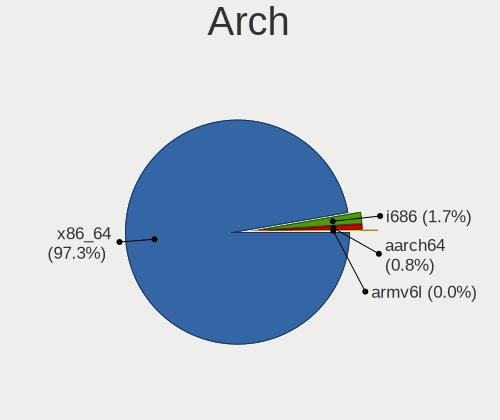

| Name    | Computers | Percent |
|---------|-----------|---------|
| x86_64  | 1182      | 95.86%  |
| i686    | 40        | 3.24%   |
| aarch64 | 9         | 0.73%   |
| armv7l  | 2         | 0.16%   |

DE
--

Desktop Environment

| Name             | Computers | Percent |
|------------------|-----------|---------|
| GNOME            | 551       | 41.58%  |
| Unknown          | 224       | 16.91%  |
| KDE5             | 156       | 11.77%  |
| XFCE             | 113       | 8.53%   |
| X-Cinnamon       | 85        | 6.42%   |
| MATE             | 42        | 3.17%   |
| KDE              | 36        | 2.72%   |
| Unity            | 17        | 1.28%   |
| LXQt             | 15        | 1.13%   |
| KDE4             | 14        | 1.06%   |
| i3               | 14        | 1.06%   |
| Cinnamon         | 14        | 1.06%   |
| Pantheon         | 10        | 0.75%   |
| Budgie           | 6         | 0.45%   |
| sway             | 5         | 0.38%   |
| LXDE             | 4         | 0.3%    |
| LeftWM           | 4         | 0.3%    |
| GNOME Flashback  | 3         | 0.23%   |
| Deepin           | 3         | 0.23%   |
| Openbox          | 2         | 0.15%   |
| bspwm            | 2         | 0.15%   |
| xmonad           | 1         | 0.08%   |
| spectrwm         | 1         | 0.08%   |
| lightdm-xsession | 1         | 0.08%   |
| ICEWM            | 1         | 0.08%   |
| awesome          | 1         | 0.08%   |

Display Server
--------------

X11 or Wayland

| Name    | Computers | Percent |
|---------|-----------|---------|
| X11     | 1020      | 80.13%  |
| Unknown | 125       | 9.82%   |
| Wayland | 107       | 8.41%   |
| Tty     | 21        | 1.65%   |

Display Manager
---------------

SDDM, LightDM, etc.

| Name    | Computers | Percent |
|---------|-----------|---------|
| Unknown | 731       | 56.54%  |
| GDM     | 179       | 13.84%  |
| SDDM    | 171       | 13.23%  |
| LightDM | 72        | 5.57%   |
| TDM     | 65        | 5.03%   |
| GDM3    | 61        | 4.72%   |
| KDM     | 13        | 1.01%   |
| XDM     | 1         | 0.08%   |

OS Lang
-------

Language

| Lang       | Computers | Percent |
|------------|-----------|---------|
| en_US      | 384       | 29.86%  |
| Unknown    | 220       | 17.11%  |
| nl_BE      | 215       | 16.72%  |
| fr_BE      | 210       | 16.33%  |
| fr_FR      | 66        | 5.13%   |
| nl_NL      | 55        | 4.28%   |
| en_GB      | 53        | 4.12%   |
| C          | 21        | 1.63%   |
| de_DE      | 10        | 0.78%   |
| de_BE      | 8         | 0.62%   |
| en_IE      | 5         | 0.39%   |
| ru_RU      | 4         | 0.31%   |
| pl_PL      | 4         | 0.31%   |
| es_ES      | 4         | 0.31%   |
| pt_PT      | 3         | 0.23%   |
| it_IT      | 2         | 0.16%   |
| en_US.UTF8 | 2         | 0.16%   |
| en_CA      | 2         | 0.16%   |
| en_BE      | 2         | 0.16%   |
| tt_RU      | 1         | 0.08%   |
| ro_RO      | 1         | 0.08%   |
| POSIX      | 1         | 0.08%   |
| nl_AW      | 1         | 0.08%   |
| li_BE      | 1         | 0.08%   |
| it_CH      | 1         | 0.08%   |
| hu_HU      | 1         | 0.08%   |
| fr_LU      | 1         | 0.08%   |
| fr_CH      | 1         | 0.08%   |
| french     | 1         | 0.08%   |
| en_ZA      | 1         | 0.08%   |
| en_NZ      | 1         | 0.08%   |
| en_IN      | 1         | 0.08%   |
| en_DK      | 1         | 0.08%   |
| C.UTF8     | 1         | 0.08%   |
| bg_BG      | 1         | 0.08%   |

Boot Mode
---------

EFI or BIOS

| Mode | Computers | Percent |
|------|-----------|---------|
| BIOS | 658       | 52.06%  |
| EFI  | 606       | 47.94%  |

Filesystem
----------

Type of filesystem

| Type    | Computers | Percent |
|---------|-----------|---------|
| Ext4    | 997       | 78.69%  |
| Btrfs   | 89        | 7.02%   |
| Overlay | 83        | 6.55%   |
| Unknown | 60        | 4.74%   |
| Xfs     | 23        | 1.82%   |
| Ext2    | 7         | 0.55%   |
| Zfs     | 4         | 0.32%   |
| Tmpfs   | 3         | 0.24%   |
| Ext3    | 1         | 0.08%   |

Part. scheme
------------

Scheme of partitioning

| Type    | Computers | Percent |
|---------|-----------|---------|
| Unknown | 768       | 61.05%  |
| GPT     | 376       | 29.89%  |
| MBR     | 114       | 9.06%   |

Dual Boot with Linux/BSD
------------------------

Hosting more than one Linux/BSD

| Dual boot | Computers | Percent |
|-----------|-----------|---------|
| No        | 1067      | 84.82%  |
| Yes       | 191       | 15.18%  |

Dual Boot (Win)
---------------

Hosting Linux and Windows

| Dual boot | Computers | Percent |
|-----------|-----------|---------|
| No        | 871       | 69.18%  |
| Yes       | 388       | 30.82%  |

Board
-----

Vendor
------

Motherboard manufacturer

| Name                    | Computers | Percent |
|-------------------------|-----------|---------|
| ASUSTek Computer        | 203       | 16.49%  |
| Hewlett-Packard         | 192       | 15.6%   |
| Dell                    | 178       | 14.46%  |
| Lenovo                  | 144       | 11.7%   |
| MSI                     | 74        | 6.01%   |
| Acer                    | 73        | 5.93%   |
| Gigabyte Technology     | 70        | 5.69%   |
| Medion                  | 44        | 3.57%   |
| ASRock                  | 34        | 2.76%   |
| Toshiba                 | 28        | 2.27%   |
| Intel                   | 23        | 1.87%   |
| Apple                   | 21        | 1.71%   |
| Sony                    | 19        | 1.54%   |
| Packard Bell            | 19        | 1.54%   |
| Unknown                 | 15        | 1.22%   |
| Notebook                | 14        | 1.14%   |
| Fujitsu                 | 11        | 0.89%   |
| Raspberry Pi Foundation | 6         | 0.49%   |
| Supermicro              | 5         | 0.41%   |
| Samsung Electronics     | 5         | 0.41%   |
| Fujitsu Siemens         | 5         | 0.41%   |
| TUXEDO                  | 4         | 0.32%   |
| PC Specialist           | 3         | 0.24%   |
| HUAWEI                  | 3         | 0.24%   |
| Google                  | 3         | 0.24%   |
| Foxconn                 | 3         | 0.24%   |
| AMI                     | 3         | 0.24%   |
| Pegatron                | 2         | 0.16%   |
| Nvidia                  | 2         | 0.16%   |
| Microsoft               | 2         | 0.16%   |
| Clevo                   | 2         | 0.16%   |
| YJKC                    | 1         | 0.08%   |
| TYAN Computer           | 1         | 0.08%   |
| TrekStor                | 1         | 0.08%   |
| Timi                    | 1         | 0.08%   |
| Teclast                 | 1         | 0.08%   |
| Standard                | 1         | 0.08%   |
| Shuttle                 | 1         | 0.08%   |
| QTQD                    | 1         | 0.08%   |
| JINGSHA                 | 1         | 0.08%   |
| Inter Sales A/S         | 1         | 0.08%   |
| IBM                     | 1         | 0.08%   |
| Hampoo                  | 1         | 0.08%   |
| GPD                     | 1         | 0.08%   |
| EVGA                    | 1         | 0.08%   |
| Chuwi                   | 1         | 0.08%   |
| Celestica               | 1         | 0.08%   |
| BLAUPUNKT               | 1         | 0.08%   |
| BESSTAR Tech            | 1         | 0.08%   |
| ASRockRack              | 1         | 0.08%   |
| AOpen                   | 1         | 0.08%   |
| Alienware               | 1         | 0.08%   |

Model
-----

Motherboard model

| Name                             | Computers | Percent |
|----------------------------------|-----------|---------|
| ASUS All Series                  | 17        | 1.38%   |
| Unknown                          | 17        | 1.38%   |
| HP ProBook 650 G1                | 5         | 0.41%   |
| HP Pavilion dv7                  | 5         | 0.41%   |
| Dell OptiPlex 780                | 5         | 0.41%   |
| ASRock B450M Pro4                | 5         | 0.41%   |
| Toshiba Satellite C660           | 4         | 0.32%   |
| HP ProBook 6570b                 | 4         | 0.32%   |
| HP Pavilion Notebook             | 4         | 0.32%   |
| Dell XPS 13 9370                 | 4         | 0.32%   |
| Dell XPS 13 7390                 | 4         | 0.32%   |
| Dell OptiPlex 3010               | 4         | 0.32%   |
| RPi Raspberry Pi                 | 3         | 0.24%   |
| MSI MS-7B86                      | 3         | 0.24%   |
| MSI MS-7A38                      | 3         | 0.24%   |
| Medion MS-7728                   | 3         | 0.24%   |
| Lenovo Yoga 530-14IKB 81EK       | 3         | 0.24%   |
| Lenovo ThinkPad L390 20NSS1YV0B  | 3         | 0.24%   |
| Lenovo Legion 5 15ARH05 82B5     | 3         | 0.24%   |
| Lenovo IdeaPad 5 Pro 16ACH6 82L5 | 3         | 0.24%   |
| HP ProBook 430 G1                | 3         | 0.24%   |
| HP Pavilion Laptop 15-cw0xxx     | 3         | 0.24%   |
| HP Pavilion g7                   | 3         | 0.24%   |
| HP EliteBook 840 G1              | 3         | 0.24%   |
| Gigabyte X570 AORUS MASTER       | 3         | 0.24%   |
| Gigabyte B550I AORUS PRO AX      | 3         | 0.24%   |
| Dell XPS 15 9570                 | 3         | 0.24%   |
| Dell Latitude E7440              | 3         | 0.24%   |
| Dell Latitude E6540              | 3         | 0.24%   |
| Dell Latitude E6500              | 3         | 0.24%   |
| Dell Latitude E6330              | 3         | 0.24%   |
| Dell Latitude E5540              | 3         | 0.24%   |
| Dell Latitude E5520              | 3         | 0.24%   |
| Dell Latitude 5500               | 3         | 0.24%   |
| Dell Inspiron 5521               | 3         | 0.24%   |
| ASUS TUF B450-PLUS GAMING        | 3         | 0.24%   |
| ASUS STRIX Z270H GAMING          | 3         | 0.24%   |
| ASUS PRIME X570-P                | 3         | 0.24%   |
| Acer Aspire V3-771               | 3         | 0.24%   |
| Acer Aspire TC-885               | 3         | 0.24%   |
| Acer Aspire 5750G                | 3         | 0.24%   |
| Toshiba Satellite C855-112       | 2         | 0.16%   |
| Toshiba Satellite A300           | 2         | 0.16%   |
| Supermicro X9DRi-LN4+/X9DR3-LN4+ | 2         | 0.16%   |
| Supermicro Super Server          | 2         | 0.16%   |
| Packard Bell EasyNote LE69KB     | 2         | 0.16%   |
| Nvidia Tegra                     | 2         | 0.16%   |
| MSI MS-7C91                      | 2         | 0.16%   |
| MSI MS-7B85                      | 2         | 0.16%   |
| MSI MS-7A40                      | 2         | 0.16%   |
| MSI MS-7A34                      | 2         | 0.16%   |
| MSI MS-7917                      | 2         | 0.16%   |
| MSI MS-7850                      | 2         | 0.16%   |
| MSI MS-7823                      | 2         | 0.16%   |
| MSI MS-7641                      | 2         | 0.16%   |
| Medion WIM2140                   | 2         | 0.16%   |
| Medion P961x                     | 2         | 0.16%   |
| Medion P6634                     | 2         | 0.16%   |
| Medion MS-7797                   | 2         | 0.16%   |
| Lenovo Yoga 7 14ITL5 82BH        | 2         | 0.16%   |

Model Family
------------

Motherboard model prefix

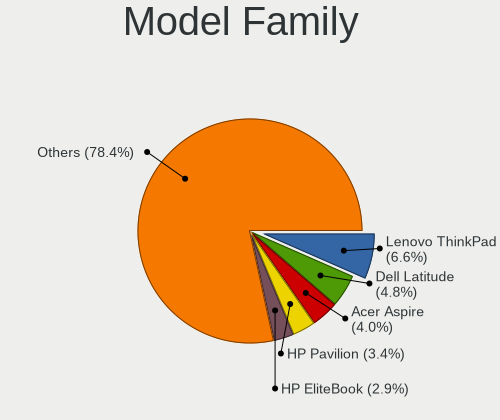

| Name                  | Computers | Percent |
|-----------------------|-----------|---------|
| Lenovo ThinkPad       | 70        | 5.69%   |
| Dell Latitude         | 66        | 5.36%   |
| Acer Aspire           | 55        | 4.47%   |
| HP Pavilion           | 37        | 3.01%   |
| HP EliteBook          | 36        | 2.92%   |
| HP ProBook            | 33        | 2.68%   |
| Dell XPS              | 29        | 2.36%   |
| HP Compaq             | 28        | 2.27%   |
| Toshiba Satellite     | 25        | 2.03%   |
| Dell OptiPlex         | 24        | 1.95%   |
| ASUS PRIME            | 23        | 1.87%   |
| Lenovo IdeaPad        | 22        | 1.79%   |
| Dell Inspiron         | 22        | 1.79%   |
| ASUS All              | 17        | 1.38%   |
| Unknown               | 17        | 1.38%   |
| Dell Precision        | 15        | 1.22%   |
| ASUS ROG              | 14        | 1.14%   |
| Lenovo Yoga           | 13        | 1.06%   |
| ASUS TUF              | 13        | 1.06%   |
| Packard Bell EasyNote | 10        | 0.81%   |
| Medion AKOYA          | 10        | 0.81%   |
| Lenovo Legion         | 10        | 0.81%   |
| HP Laptop             | 10        | 0.81%   |
| Dell Vostro           | 10        | 0.81%   |
| HP ENVY               | 8         | 0.65%   |
| Lenovo ThinkCentre    | 7         | 0.57%   |
| RPi Raspberry         | 6         | 0.49%   |
| HP ZBook              | 6         | 0.49%   |
| Gigabyte X570         | 6         | 0.49%   |
| HP ProDesk            | 5         | 0.41%   |
| Dell Studio           | 5         | 0.41%   |
| ASUS STRIX            | 5         | 0.41%   |
| ASRock B450M          | 5         | 0.41%   |
| Acer Nitro            | 5         | 0.41%   |
| Packard Bell imedia   | 4         | 0.32%   |
| Fujitsu LIFEBOOK      | 4         | 0.32%   |
| Fujitsu ESPRIMO       | 4         | 0.32%   |
| ASUS ZenBook          | 4         | 0.32%   |
| ASUS VivoBook         | 4         | 0.32%   |
| MSI MS-7B86           | 3         | 0.24%   |
| MSI MS-7A38           | 3         | 0.24%   |
| Medion MS-7728        | 3         | 0.24%   |
| Lenovo ThinkBook      | 3         | 0.24%   |
| HP ProLiant           | 3         | 0.24%   |
| HP OMEN               | 3         | 0.24%   |
| Gigabyte B550M        | 3         | 0.24%   |
| Gigabyte B550I        | 3         | 0.24%   |
| Dell PowerEdge        | 3         | 0.24%   |
| Dell G3               | 3         | 0.24%   |
| ASUS P6T              | 3         | 0.24%   |
| ASUS M5A78L-M         | 3         | 0.24%   |
| Acer Swift            | 3         | 0.24%   |
| Acer Spin             | 3         | 0.24%   |
| Toshiba TECRA         | 2         | 0.16%   |
| Supermicro X9DRi-LN4+ | 2         | 0.16%   |
| Supermicro Super      | 2         | 0.16%   |
| Packard Bell IXTREME  | 2         | 0.16%   |
| Nvidia Tegra          | 2         | 0.16%   |
| Notebook NH5x         | 2         | 0.16%   |
| MSI MS-7C91           | 2         | 0.16%   |

MFG Year
--------

Motherboard manufacture year

| Year    | Computers | Percent |
|---------|-----------|---------|
| 2018    | 138       | 11.21%  |
| 2019    | 117       | 9.5%    |
| 2020    | 105       | 8.53%   |
| 2012    | 102       | 8.29%   |
| 2013    | 93        | 7.55%   |
| 2011    | 93        | 7.55%   |
| 2014    | 83        | 6.74%   |
| 2017    | 73        | 5.93%   |
| 2008    | 70        | 5.69%   |
| 2015    | 68        | 5.52%   |
| 2016    | 59        | 4.79%   |
| 2010    | 55        | 4.47%   |
| 2009    | 51        | 4.14%   |
| 2021    | 41        | 3.33%   |
| 2007    | 40        | 3.25%   |
| 2006    | 23        | 1.87%   |
| Unknown | 13        | 1.06%   |
| 2005    | 4         | 0.32%   |
| 2004    | 2         | 0.16%   |
| 2022    | 1         | 0.08%   |

Form Factor
-----------

Physical design of the computer

| Name           | Computers | Percent |
|----------------|-----------|---------|
| Notebook       | 688       | 55.89%  |
| Desktop        | 456       | 37.04%  |
| Convertible    | 35        | 2.84%   |
| Server         | 14        | 1.14%   |
| Mini pc        | 12        | 0.97%   |
| System on chip | 11        | 0.89%   |
| All in one     | 8         | 0.65%   |
| Tablet         | 7         | 0.57%   |

Secure Boot
-----------

Enabled or disabled

| State    | Computers | Percent |
|----------|-----------|---------|
| Disabled | 1138      | 91.48%  |
| Enabled  | 106       | 8.52%   |

Coreboot
--------

Have coreboot on board

| Used | Computers | Percent |
|------|-----------|---------|
| No   | 1228      | 99.76%  |
| Yes  | 3         | 0.24%   |

RAM Size
--------

Total RAM memory

| Size in GB      | Computers | Percent |
|-----------------|-----------|---------|
| 4.01-8.0        | 276       | 21.87%  |
| 16.01-24.0      | 274       | 21.71%  |
| 8.01-16.0       | 236       | 18.7%   |
| 3.01-4.0        | 235       | 18.62%  |
| 32.01-64.0      | 106       | 8.4%    |
| 1.01-2.0        | 48        | 3.8%    |
| 64.01-256.0     | 28        | 2.22%   |
| 2.01-3.0        | 20        | 1.58%   |
| 24.01-32.0      | 18        | 1.43%   |
| 0.51-1.0        | 16        | 1.27%   |
| More than 256.0 | 4         | 0.32%   |
| 0.01-0.5        | 1         | 0.08%   |

RAM Used
--------

Used RAM memory

| Used GB     | Computers | Percent |
|-------------|-----------|---------|
| 1.01-2.0    | 501       | 35.13%  |
| 2.01-3.0    | 362       | 25.39%  |
| 4.01-8.0    | 190       | 13.32%  |
| 3.01-4.0    | 172       | 12.06%  |
| 0.51-1.0    | 105       | 7.36%   |
| 8.01-16.0   | 62        | 4.35%   |
| 0.01-0.5    | 26        | 1.82%   |
| 24.01-32.0  | 3         | 0.21%   |
| 16.01-24.0  | 3         | 0.21%   |
| 64.01-256.0 | 1         | 0.07%   |
| Unknown     | 1         | 0.07%   |

Total Drives
------------

Number of drives on board

| Drives  | Computers | Percent |
|---------|-----------|---------|
| 1       | 727       | 57.02%  |
| 2       | 338       | 26.51%  |
| 3       | 83        | 6.51%   |
| 4       | 57        | 4.47%   |
| 5       | 34        | 2.67%   |
| 6       | 15        | 1.18%   |
| 0       | 11        | 0.86%   |
| 9       | 3         | 0.24%   |
| 8       | 2         | 0.16%   |
| 7       | 2         | 0.16%   |
| 16      | 1         | 0.08%   |
| 10      | 1         | 0.08%   |
| Unknown | 1         | 0.08%   |

Has CD-ROM
----------

Has CD-ROM on board

| Presented | Computers | Percent |
|-----------|-----------|---------|
| No        | 662       | 53.43%  |
| Yes       | 577       | 46.57%  |

Has Ethernet
------------

Has Ethernet on board

| Presented | Computers | Percent |
|-----------|-----------|---------|
| Yes       | 1121      | 90.48%  |
| No        | 118       | 9.52%   |

Has WiFi
--------

Has WiFi module

| Presented | Computers | Percent |
|-----------|-----------|---------|
| Yes       | 924       | 74.46%  |
| No        | 317       | 25.54%  |

Has Bluetooth
-------------

Has Bluetooth module

| Presented | Computers | Percent |
|-----------|-----------|---------|
| Yes       | 680       | 54.4%   |
| No        | 570       | 45.6%   |

Location
--------

Country
-------

Geographic location (country)

| Country | Computers | Percent |
|---------|-----------|---------|
| Belgium | 1231      | 100%    |

City
----

Geographic location (city)

| City                 | Computers | Percent |
|----------------------|-----------|---------|
| Brussels             | 142       | 10.12%  |
| Antwerp              | 98        | 6.99%   |
| Ghent                | 53        | 3.78%   |
| Ixelles-Elsene       | 24        | 1.71%   |
| Leuven               | 22        | 1.57%   |
| Mechelen             | 19        | 1.35%   |
| Lige             | 18        | 1.28%   |
| Schaarbeek           | 15        | 1.07%   |
| Schoten              | 12        | 0.86%   |
| Oudenaarde           | 12        | 0.86%   |
| Mons                 | 12        | 0.86%   |
| Wilrijk              | 11        | 0.78%   |
| Bruges               | 10        | 0.71%   |
| Uccle                | 9         | 0.64%   |
| Namur                | 9         | 0.64%   |
| Kontich              | 9         | 0.64%   |
| Heist-op-den-Berg    | 9         | 0.64%   |
| Hasselt              | 9         | 0.64%   |
| Haaltert             | 9         | 0.64%   |
| Anderlecht           | 9         | 0.64%   |
| Aalst                | 9         | 0.64%   |
| Zaventem             | 8         | 0.57%   |
| Waregem              | 8         | 0.57%   |
| Vilvoorde            | 8         | 0.57%   |
| Turnhout             | 8         | 0.57%   |
| Niel                 | 8         | 0.57%   |
| Hamme                | 8         | 0.57%   |
| Etterbeek            | 8         | 0.57%   |
| Duffel               | 8         | 0.57%   |
| Sint-Niklaas         | 7         | 0.5%    |
| Lige             | 7         | 0.5%    |
| Kapellen             | 7         | 0.5%    |
| Genk                 | 7         | 0.5%    |
| Charleroi            | 7         | 0.5%    |
| Arlon                | 7         | 0.5%    |
| Wetteren             | 6         | 0.43%   |
| Wavre                | 6         | 0.43%   |
| Tongeren             | 6         | 0.43%   |
| Seraing              | 6         | 0.43%   |
| Oosterzele           | 6         | 0.43%   |
| Nivelles             | 6         | 0.43%   |
| Lokeren              | 6         | 0.43%   |
| Harelbeke            | 6         | 0.43%   |
| Gentbrugge           | 6         | 0.43%   |
| Zoersel              | 5         | 0.36%   |
| Ypres                | 5         | 0.36%   |
| Woluwe-Saint-Lambert | 5         | 0.36%   |
| Tournai              | 5         | 0.36%   |
| Tielt-Winge          | 5         | 0.36%   |
| Sint-Pieters-Leeuw   | 5         | 0.36%   |
| Saint-Gilles         | 5         | 0.36%   |
| Rotselaar            | 5         | 0.36%   |
| Roeselare            | 5         | 0.36%   |
| Overijse             | 5         | 0.36%   |
| Ottignies            | 5         | 0.36%   |
| Mortsel              | 5         | 0.36%   |
| Molenbeek-Saint-Jean | 5         | 0.36%   |
| Merchtem             | 5         | 0.36%   |
| Melsele              | 5         | 0.36%   |
| Lier                 | 5         | 0.36%   |

Drives
------

Drive Vendor
------------

Hard drive vendors

| Vendor                    | Computers | Drives | Percent |
|---------------------------|-----------|--------|---------|
| Samsung Electronics       | 369       | 660    | 20.7%   |
| WDC                       | 286       | 479    | 16.04%  |
| Seagate                   | 276       | 492    | 15.48%  |
| Toshiba                   | 119       | 169    | 6.67%   |
| Kingston                  | 97        | 156    | 5.44%   |
| SanDisk                   | 77        | 103    | 4.32%   |
| Unknown                   | 72        | 97     | 4.04%   |
| Hitachi                   | 65        | 93     | 3.65%   |
| Crucial                   | 58        | 88     | 3.25%   |
| SK Hynix                  | 51        | 66     | 2.86%   |
| Intel                     | 40        | 48     | 2.24%   |
| HGST                      | 30        | 48     | 1.68%   |
| Micron Technology         | 23        | 24     | 1.29%   |
| Phison                    | 14        | 16     | 0.79%   |
| LITEON                    | 13        | 17     | 0.73%   |
| Corsair                   | 12        | 12     | 0.67%   |
| A-DATA Technology         | 12        | 17     | 0.67%   |
| Fujitsu                   | 11        | 17     | 0.62%   |
| OCZ                       | 10        | 13     | 0.56%   |
| MAXTOR                    | 10        | 12     | 0.56%   |
| Apple                     | 10        | 12     | 0.56%   |
| Intenso                   | 8         | 15     | 0.45%   |
| LITEONIT                  | 7         | 10     | 0.39%   |
| LaCie                     | 7         | 10     | 0.39%   |
| KIOXIA                    | 7         | 8      | 0.39%   |
| China                     | 7         | 10     | 0.39%   |
| Silicon Motion            | 6         | 8      | 0.34%   |
| PNY                       | 6         | 6      | 0.34%   |
| Micron/Crucial Technology | 4         | 7      | 0.22%   |
| KingSpec                  | 4         | 4      | 0.22%   |
| KingFast                  | 4         | 4      | 0.22%   |
| JMicron                   | 4         | 5      | 0.22%   |
| GOODRAM                   | 4         | 5      | 0.22%   |
| Union Memory (Shenzhen)   | 3         | 4      | 0.17%   |
| Transcend                 | 3         | 3      | 0.17%   |
| LDLC                      | 3         | 4      | 0.17%   |
| ASMT                      | 3         | 3      | 0.17%   |
| Zheino                    | 2         | 2      | 0.11%   |
| XPG                       | 2         | 6      | 0.11%   |
| sobetter                  | 2         | 2      | 0.11%   |
| Lenovo                    | 2         | 3      | 0.11%   |
| Hewlett-Packard           | 2         | 4      | 0.11%   |
| XrayDisk                  | 1         | 1      | 0.06%   |
| WDC WDS                   | 1         | 1      | 0.06%   |
| WD MediaMax               | 1         | 1      | 0.06%   |
| Vaseky                    | 1         | 1      | 0.06%   |
| Union Memory              | 1         | 5      | 0.06%   |
| UMIS                      | 1         | 5      | 0.06%   |
| TO Exter                  | 1         | 1      | 0.06%   |
| Teclast                   | 1         | 1      | 0.06%   |
| SSSTC                     | 1         | 1      | 0.06%   |
| SPCC                      | 1         | 2      | 0.06%   |
| Solid State Storage       | 1         | 1      | 0.06%   |
| SINTECHI                  | 1         | 1      | 0.06%   |
| SABRENT                   | 1         | 1      | 0.06%   |
| Reeinno                   | 1         | 3      | 0.06%   |
| Realtek Semiconductor     | 1         | 1      | 0.06%   |
| PLEXTOR                   | 1         | 1      | 0.06%   |
| OWC                       | 1         | 2      | 0.06%   |
| OCZ-VERTEX                | 1         | 1      | 0.06%   |

Drive Model
-----------

Hard drive models

| Model                              | Computers | Percent |
|------------------------------------|-----------|---------|
| Samsung NVMe SSD Drive 512GB       | 23        | 1.15%   |
| Samsung SSD 860 EVO 500GB          | 21        | 1.05%   |
| Samsung SSD 850 EVO 250GB          | 20        | 1%      |
| Samsung NVMe SSD Drive 1TB         | 20        | 1%      |
| Samsung NVMe SSD Drive 500GB       | 19        | 0.95%   |
| Seagate ST1000LM035-1RK172 1TB     | 18        | 0.9%    |
| Kingston SV300S37A120G 120GB SSD   | 18        | 0.9%    |
| Samsung SSD 850 EVO 500GB          | 17        | 0.85%   |
| Kingston SA400S37120G 120GB SSD    | 17        | 0.85%   |
| Seagate ST1000LM024 HN-M101MBB 1TB | 16        | 0.8%    |
| Samsung SSD 860 EVO 250GB          | 16        | 0.8%    |
| Samsung SSD 860 EVO 1TB            | 14        | 0.7%    |
| Toshiba DT01ACA100 1TB             | 13        | 0.65%   |
| SK Hynix NVMe SSD Drive 512GB      | 12        | 0.6%    |
| Seagate ST9500325AS 500GB          | 12        | 0.6%    |
| Intel NVMe SSD Drive 512GB         | 12        | 0.6%    |
| Seagate ST500DM002-1BD142 500GB    | 11        | 0.55%   |
| Kingston SA400S37240G 240GB SSD    | 11        | 0.55%   |
| Unknown MMC Card  32GB             | 10        | 0.5%    |
| Toshiba MQ01ABD100 1TB             | 10        | 0.5%    |
| Seagate ST2000DM001-1ER164 2TB     | 10        | 0.5%    |
| Seagate ST2000DM001-1CH164 2TB     | 10        | 0.5%    |
| Sandisk NVMe SSD Drive 512GB       | 10        | 0.5%    |
| Samsung SSD 870 EVO 1TB            | 10        | 0.5%    |
| Unknown SD/MMC/MS PRO 128GB        | 9         | 0.45%   |
| Unknown MMC Card  64GB             | 9         | 0.45%   |
| Seagate Expansion+ 2TB             | 9         | 0.45%   |
| Samsung SSD 970 EVO 1TB            | 9         | 0.45%   |
| HGST HTS721010A9E630 1TB           | 9         | 0.45%   |
| Samsung SSD 970 EVO Plus 500GB     | 8         | 0.4%    |
| Samsung NVMe SSD Drive 256GB       | 8         | 0.4%    |
| Samsung NVMe SSD Drive 250GB       | 8         | 0.4%    |
| Kingston SV300S37A240G 240GB SSD   | 8         | 0.4%    |
| Hitachi HTS547550A9E384 500GB      | 8         | 0.4%    |
| Crucial CT480BX500SSD1 480GB       | 8         | 0.4%    |
| Unknown MMC Card  128GB            | 7         | 0.35%   |
| Toshiba HDWD110 1TB                | 7         | 0.35%   |
| Seagate ST3500418AS 500GB          | 7         | 0.35%   |
| Seagate ST1000LM048-2E7172 1TB     | 7         | 0.35%   |
| Seagate Expansion Desk 3TB         | 7         | 0.35%   |
| Samsung SSD 970 EVO 500GB          | 7         | 0.35%   |
| Samsung SSD 860 QVO 1TB            | 7         | 0.35%   |
| Samsung SSD 840 EVO 250GB          | 7         | 0.35%   |
| WDC WDS240G2G0A-00JH30 240GB SSD   | 6         | 0.3%    |
| WDC WD20EZRZ-00Z5HB0 2TB           | 6         | 0.3%    |
| WDC WD10EARS-00Y5B1 1TB            | 6         | 0.3%    |
| Toshiba NVMe SSD Drive 512GB       | 6         | 0.3%    |
| Seagate ST4000DM004-2CV104 4TB     | 6         | 0.3%    |
| Seagate ST2000DM006-2DM164 2TB     | 6         | 0.3%    |
| Seagate ST1000DM010-2EP102 1TB     | 6         | 0.3%    |
| SanDisk SDSSDA240G 240GB           | 6         | 0.3%    |
| Sandisk NVMe SSD Drive 256GB       | 6         | 0.3%    |
| Samsung SSD 870 QVO 1TB            | 6         | 0.3%    |
| Samsung SSD 850 EVO 120GB          | 6         | 0.3%    |
| Samsung NVMe SSD Drive 1024GB      | 6         | 0.3%    |
| HGST HTS725050A7E630 500GB         | 6         | 0.3%    |
| WDC WDS100T2B0A-00SM50 1TB SSD     | 5         | 0.25%   |
| WDC WD10EADS-00L5B1 1TB            | 5         | 0.25%   |
| Toshiba MQ01ABF050 500GB           | 5         | 0.25%   |
| SK Hynix NVMe SSD Drive 256GB      | 5         | 0.25%   |

HDD Vendor
----------

Hard disk drive vendors

| Vendor              | Computers | Drives | Percent |
|---------------------|-----------|--------|---------|
| Seagate             | 270       | 481    | 35.29%  |
| WDC                 | 240       | 409    | 31.37%  |
| Toshiba             | 87        | 119    | 11.37%  |
| Hitachi             | 65        | 93     | 8.5%    |
| HGST                | 30        | 48     | 3.92%   |
| Samsung Electronics | 25        | 46     | 3.27%   |
| Fujitsu             | 11        | 16     | 1.44%   |
| MAXTOR              | 10        | 12     | 1.31%   |
| Unknown             | 9         | 13     | 1.18%   |
| Apple               | 3         | 3      | 0.39%   |
| LaCie               | 2         | 2      | 0.26%   |
| Hewlett-Packard     | 2         | 4      | 0.26%   |
| ASMT                | 2         | 2      | 0.26%   |
| WD MediaMax         | 1         | 1      | 0.13%   |
| SINTECHI            | 1         | 1      | 0.13%   |
| SABRENT             | 1         | 1      | 0.13%   |
| Magnetic Data       | 1         | 1      | 0.13%   |
| Lenovo              | 1         | 2      | 0.13%   |
| KESU                | 1         | 2      | 0.13%   |
| Intenso             | 1         | 4      | 0.13%   |
| IET                 | 1         | 3      | 0.13%   |
| Dell                | 1         | 1      | 0.13%   |

SSD Vendor
----------

Solid state drive vendors

| Vendor              | Computers | Drives | Percent |
|---------------------|-----------|--------|---------|
| Samsung Electronics | 213       | 371    | 35.98%  |
| Kingston            | 82        | 132    | 13.85%  |
| Crucial             | 52        | 81     | 8.78%   |
| SanDisk             | 49        | 68     | 8.28%   |
| WDC                 | 28        | 35     | 4.73%   |
| SK Hynix            | 17        | 26     | 2.87%   |
| Toshiba             | 13        | 15     | 2.2%    |
| Intel               | 13        | 15     | 2.2%    |
| Micron Technology   | 12        | 13     | 2.03%   |
| LITEON              | 12        | 16     | 2.03%   |
| OCZ                 | 10        | 13     | 1.69%   |
| Intenso             | 8         | 11     | 1.35%   |
| Corsair             | 8         | 8      | 1.35%   |
| LITEONIT            | 7         | 10     | 1.18%   |
| China               | 7         | 10     | 1.18%   |
| A-DATA Technology   | 7         | 11     | 1.18%   |
| PNY                 | 6         | 6      | 1.01%   |
| Apple               | 6         | 8      | 1.01%   |
| GOODRAM             | 4         | 5      | 0.68%   |
| Transcend           | 3         | 3      | 0.51%   |
| KingSpec            | 3         | 3      | 0.51%   |
| Zheino              | 2         | 2      | 0.34%   |
| KingFast            | 2         | 2      | 0.34%   |
| JMicron             | 2         | 2      | 0.34%   |
| WDC WDS             | 1         | 1      | 0.17%   |
| TO Exter            | 1         | 1      | 0.17%   |
| Teclast             | 1         | 1      | 0.17%   |
| SPCC                | 1         | 2      | 0.17%   |
| Seagate             | 1         | 1      | 0.17%   |
| Reeinno             | 1         | 3      | 0.17%   |
| PLEXTOR             | 1         | 1      | 0.17%   |
| OWC                 | 1         | 2      | 0.17%   |
| OCZ-VERTEX          | 1         | 1      | 0.17%   |
| Netac               | 1         | 1      | 0.17%   |
| Mushkin             | 1         | 1      | 0.17%   |
| Leven               | 1         | 1      | 0.17%   |
| LDLC                | 1         | 2      | 0.17%   |
| KIOXIA-EXCERIA      | 1         | 1      | 0.17%   |
| KingDian            | 1         | 1      | 0.17%   |
| InnoDisk            | 1         | 1      | 0.17%   |
| Indilinx            | 1         | 1      | 0.17%   |
| IND                 | 1         | 1      | 0.17%   |
| HEORIADY            | 1         | 1      | 0.17%   |
| GALAX               | 1         | 1      | 0.17%   |
| Fujitsu             | 1         | 1      | 0.17%   |
| FORESEE             | 1         | 1      | 0.17%   |
| EMTEC               | 1         | 1      | 0.17%   |
| DREVO               | 1         | 1      | 0.17%   |
| ASMT                | 1         | 1      | 0.17%   |
| Unknown             | 1         | 1      | 0.17%   |

Drive Kind
----------

HDD or SSD

| Kind    | Computers | Drives | Percent |
|---------|-----------|--------|---------|
| HDD     | 638       | 1264   | 39.48%  |
| SSD     | 534       | 897    | 33.04%  |
| NVMe    | 361       | 543    | 22.34%  |
| MMC     | 55        | 66     | 3.4%    |
| Unknown | 28        | 45     | 1.73%   |

Drive Connector
---------------

SATA, SAS, NVMe, etc.

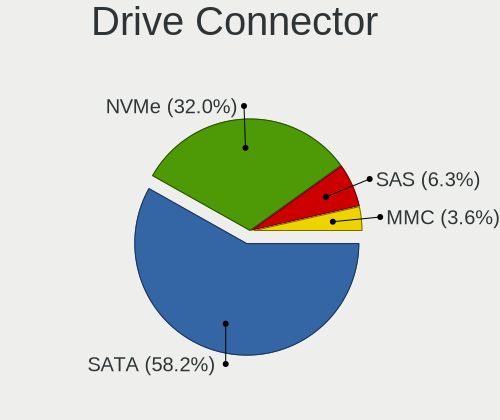

| Type | Computers | Drives | Percent |
|------|-----------|--------|---------|
| SATA | 944       | 2055   | 65.6%   |
| NVMe | 361       | 543    | 25.09%  |
| SAS  | 79        | 151    | 5.49%   |
| MMC  | 55        | 66     | 3.82%   |

Drive Size
----------

Size of hard drive

| Size in TB | Computers | Drives | Percent |
|------------|-----------|--------|---------|
| 0.01-0.5   | 732       | 1246   | 58.89%  |
| 0.51-1.0   | 315       | 564    | 25.34%  |
| 1.01-2.0   | 112       | 189    | 9.01%   |
| 3.01-4.0   | 37        | 81     | 2.98%   |
| 2.01-3.0   | 29        | 52     | 2.33%   |
| 4.01-10.0  | 17        | 28     | 1.37%   |
| 10.01-20.0 | 1         | 1      | 0.08%   |

Space Total
-----------

Amount of disk space available on the file system

| Size in GB     | Computers | Percent |
|----------------|-----------|---------|
| 101-250        | 349       | 26.26%  |
| 251-500        | 318       | 23.93%  |
| 501-1000       | 179       | 13.47%  |
| 1001-2000      | 117       | 8.8%    |
| 51-100         | 90        | 6.77%   |
| More than 3000 | 66        | 4.97%   |
| 1-20           | 64        | 4.82%   |
| 2001-3000      | 53        | 3.99%   |
| Unknown        | 50        | 3.76%   |
| 21-50          | 43        | 3.24%   |

Space Used
----------

Amount of used disk space

| Used GB        | Computers | Percent |
|----------------|-----------|---------|
| 1-20           | 514       | 36.77%  |
| 21-50          | 204       | 14.59%  |
| 101-250        | 181       | 12.95%  |
| 51-100         | 144       | 10.3%   |
| 251-500        | 115       | 8.23%   |
| 501-1000       | 93        | 6.65%   |
| 1001-2000      | 53        | 3.79%   |
| Unknown        | 50        | 3.58%   |
| More than 3000 | 22        | 1.57%   |
| 2001-3000      | 22        | 1.57%   |

Malfunc. Drives
---------------

Drive models with a malfunction

| Model                                        | Computers | Drives | Percent |
|----------------------------------------------|-----------|--------|---------|
| Seagate ST500DM002-1BD142 500GB              | 5         | 22     | 4.76%   |
| Seagate ST9500325AS 500GB                    | 4         | 4      | 3.81%   |
| WDC WD10EZEX-21M2NA0 1TB                     | 2         | 2      | 1.9%    |
| Seagate ST9750420AS 752GB                    | 2         | 2      | 1.9%    |
| Seagate ST4000DM000-1F2168 4TB               | 2         | 2      | 1.9%    |
| Seagate ST3500418AS 500GB                    | 2         | 12     | 1.9%    |
| Kingston SV300S37A120G 120GB SSD             | 2         | 2      | 1.9%    |
| Hitachi HTS545050A7E380 500GB                | 2         | 3      | 1.9%    |
| WDC WDS100T2B0A-00SM50 1TB SSD               | 1         | 1      | 0.95%   |
| WDC WD5000LPVX-22V0TT0 500GB                 | 1         | 1      | 0.95%   |
| WDC WD5000AAKX-75U6AA0 500GB                 | 1         | 1      | 0.95%   |
| WDC WD5000AAKS-22A7B0 500GB                  | 1         | 1      | 0.95%   |
| WDC WD5000AADS-00S9B0 500GB                  | 1         | 1      | 0.95%   |
| WDC WD40EFRX-68N32N0 4TB                     | 1         | 1      | 0.95%   |
| WDC WD3200BEVT-60A23T0 320GB                 | 1         | 1      | 0.95%   |
| WDC WD3200BEKT-75PVMT1 320GB                 | 1         | 6      | 0.95%   |
| WDC WD1600JS-60MHB5 160GB                    | 1         | 1      | 0.95%   |
| WDC WD10SPCX-60HWST0 1TB                     | 1         | 1      | 0.95%   |
| WDC WD10EARS-22Y5B1 1TB                      | 1         | 1      | 0.95%   |
| WDC WD10EARS-00Y5B1 1TB                      | 1         | 2      | 0.95%   |
| WDC WD10EADS-00P8B0 1TB                      | 1         | 1      | 0.95%   |
| WDC WD10EADS-00M2B0 1TB                      | 1         | 1      | 0.95%   |
| Toshiba MQ01ABD100 1TB                       | 1         | 1      | 0.95%   |
| Toshiba MQ01ABD075 752GB                     | 1         | 2      | 0.95%   |
| Toshiba MK6476GSX 640GB                      | 1         | 1      | 0.95%   |
| Toshiba MK5075GSX 500GB                      | 1         | 1      | 0.95%   |
| Toshiba MK1237GSX 120GB                      | 1         | 1      | 0.95%   |
| Toshiba KSG60ZSE512G SATA 512GB SSD          | 1         | 1      | 0.95%   |
| SK Hynix SH920 mSATA 256GB SSD               | 1         | 1      | 0.95%   |
| SK Hynix SC401 SATA 512GB SSD                | 1         | 2      | 0.95%   |
| SK Hynix HFS256G32MND-2900A 256GB SSD        | 1         | 1      | 0.95%   |
| SK Hynix HFS128G39TND-N210A 128GB SSD        | 1         | 1      | 0.95%   |
| Seagate ST9500420AS 500GB                    | 1         | 1      | 0.95%   |
| Seagate ST9320423AS 320GB                    | 1         | 2      | 0.95%   |
| Seagate ST9320421AS 320GB                    | 1         | 1      | 0.95%   |
| Seagate ST750LM022 HN-M750MBB 752GB          | 1         | 1      | 0.95%   |
| Seagate ST500LM000-SSHD-8GB                  | 1         | 1      | 0.95%   |
| Seagate ST4000DM 000-1F2168 4TB              | 1         | 1      | 0.95%   |
| Seagate ST3500320AS 500GB                    | 1         | 2      | 0.95%   |
| Seagate ST3320620AS 320GB                    | 1         | 1      | 0.95%   |
| Seagate ST320LT007-9ZV142 320GB              | 1         | 1      | 0.95%   |
| Seagate ST31000528AS 1TB                     | 1         | 1      | 0.95%   |
| Seagate ST31000524NS 1TB                     | 1         | 1      | 0.95%   |
| Seagate ST31000520AS 1TB                     | 1         | 1      | 0.95%   |
| Seagate ST3000DM001-9YN166 3TB               | 1         | 1      | 0.95%   |
| Seagate ST2000DM008-2FR102 2TB               | 1         | 3      | 0.95%   |
| Seagate ST2000DM001-1ER164 2TB               | 1         | 1      | 0.95%   |
| Seagate ST1000LM035-1RK172 1TB               | 1         | 1      | 0.95%   |
| Seagate ST1000LM024 HN-M101MBB 1TB           | 1         | 4      | 0.95%   |
| SanDisk SSD PLUS 480GB                       | 1         | 1      | 0.95%   |
| SanDisk SSD PLUS 480 GB                      | 1         | 1      | 0.95%   |
| SanDisk SD6SN1M-256G-1006 256GB SSD          | 1         | 1      | 0.95%   |
| Samsung Electronics SSD 870 EVO 2TB          | 1         | 1      | 0.95%   |
| Samsung Electronics SSD 860 QVO 1TB          | 1         | 1      | 0.95%   |
| Samsung Electronics MZVLB256HAHQ-000L7 256GB | 1         | 1      | 0.95%   |
| Samsung Electronics HM641JI 640GB            | 1         | 1      | 0.95%   |
| Samsung Electronics HD502IJ 500GB            | 1         | 1      | 0.95%   |
| Samsung Electronics HD252HJ 250GB            | 1         | 1      | 0.95%   |
| Samsung Electronics HD204UI 2TB              | 1         | 1      | 0.95%   |
| Samsung Electronics HD160JJ 160GB            | 1         | 1      | 0.95%   |

Malfunc. Drive Vendor
---------------------

Vendors of faulty drives

| Vendor              | Computers | Drives | Percent |
|---------------------|-----------|--------|---------|
| Seagate             | 29        | 66     | 29%     |
| WDC                 | 14        | 22     | 14%     |
| Hitachi             | 10        | 11     | 10%     |
| Samsung Electronics | 8         | 8      | 8%      |
| Toshiba             | 6         | 7      | 6%      |
| Crucial             | 5         | 5      | 5%      |
| SK Hynix            | 4         | 5      | 4%      |
| Fujitsu             | 4         | 8      | 4%      |
| SanDisk             | 3         | 3      | 3%      |
| MAXTOR              | 3         | 3      | 3%      |
| Kingston            | 3         | 7      | 3%      |
| Intel               | 3         | 3      | 3%      |
| HGST                | 3         | 3      | 3%      |
| Micron Technology   | 2         | 2      | 2%      |
| OCZ                 | 1         | 1      | 1%      |
| KingFast            | 1         | 1      | 1%      |
| A-DATA Technology   | 1         | 1      | 1%      |

Malfunc. HDD Vendor
-------------------

Vendors of faulty HDD drives

| Vendor              | Computers | Drives | Percent |
|---------------------|-----------|--------|---------|
| Seagate             | 29        | 66     | 40.28%  |
| WDC                 | 13        | 21     | 18.06%  |
| Hitachi             | 10        | 11     | 13.89%  |
| Toshiba             | 5         | 6      | 6.94%   |
| Samsung Electronics | 5         | 5      | 6.94%   |
| Fujitsu             | 4         | 8      | 5.56%   |
| MAXTOR              | 3         | 3      | 4.17%   |
| HGST                | 3         | 3      | 4.17%   |

Malfunc. Drive Kind
-------------------

Kinds of faulty drives

| Kind | Computers | Drives | Percent |
|------|-----------|--------|---------|
| HDD  | 70        | 123    | 71.43%  |
| SSD  | 25        | 30     | 25.51%  |
| NVMe | 3         | 3      | 3.06%   |

Failed Drives
-------------

Failed drive models

| Model                                        | Computers | Drives | Percent |
|----------------------------------------------|-----------|--------|---------|
| Samsung Electronics MZVLW128HEGR-000L2 128GB | 1         | 2      | 33.33%  |
| Hitachi HDS721010DLE630 1TB                  | 1         | 1      | 33.33%  |
| HGST HTS721010A9E630 1TB                     | 1         | 1      | 33.33%  |

Failed Drive Vendor
-------------------

Failed drive vendors

| Vendor              | Computers | Drives | Percent |
|---------------------|-----------|--------|---------|
| Samsung Electronics | 1         | 2      | 33.33%  |
| Hitachi             | 1         | 1      | 33.33%  |
| HGST                | 1         | 1      | 33.33%  |

Drive Status
------------

Number of failed and malfunc. drives

| Status   | Computers | Drives | Percent |
|----------|-----------|--------|---------|
| Detected | 795       | 1805   | 60.14%  |
| Works    | 429       | 850    | 32.45%  |
| Malfunc  | 95        | 156    | 7.19%   |
| Failed   | 3         | 4      | 0.23%   |

Storage controller
------------------

Storage Vendor
--------------

Storage controller vendors

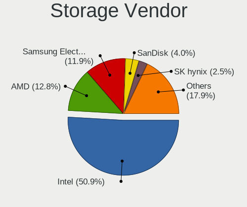

| Vendor                           | Computers | Percent |
|----------------------------------|-----------|---------|
| Intel                            | 885       | 57.36%  |
| AMD                              | 198       | 12.83%  |
| Samsung Electronics              | 167       | 10.82%  |
| Sandisk                          | 48        | 3.11%   |
| SK Hynix                         | 32        | 2.07%   |
| JMicron Technology               | 24        | 1.56%   |
| Marvell Technology Group         | 22        | 1.43%   |
| ASMedia Technology               | 20        | 1.3%    |
| Toshiba America Info Systems     | 18        | 1.17%   |
| Phison Electronics               | 18        | 1.17%   |
| Nvidia                           | 16        | 1.04%   |
| Kingston Technology Company      | 16        | 1.04%   |
| Micron/Crucial Technology        | 11        | 0.71%   |
| Micron Technology                | 11        | 0.71%   |
| KIOXIA                           | 9         | 0.58%   |
| ADATA Technology                 | 7         | 0.45%   |
| Silicon Motion                   | 6         | 0.39%   |
| Union Memory (Shenzhen)          | 5         | 0.32%   |
| Silicon Image                    | 4         | 0.26%   |
| Broadcom / LSI                   | 4         | 0.26%   |
| Solid State Storage Technology   | 3         | 0.19%   |
| LSI Logic / Symbios Logic        | 3         | 0.19%   |
| Hewlett-Packard                  | 3         | 0.19%   |
| VIA Technologies                 | 2         | 0.13%   |
| Seagate Technology               | 2         | 0.13%   |
| Adaptec                          | 2         | 0.13%   |
| Silicon Integrated Systems [SiS] | 1         | 0.06%   |
| Realtek Semiconductor            | 1         | 0.06%   |
| Lite-On Technology               | 1         | 0.06%   |
| Lenovo                           | 1         | 0.06%   |
| Biwin Storage Technology         | 1         | 0.06%   |
| Areca Technology                 | 1         | 0.06%   |
| Apple                            | 1         | 0.06%   |

Storage Model
-------------

Storage controller models

| Model                                                                            | Computers | Percent |
|----------------------------------------------------------------------------------|-----------|---------|
| AMD FCH SATA Controller [AHCI mode]                                              | 134       | 7.38%   |
| Samsung NVMe SSD Controller SM981/PM981/PM983                                    | 109       | 6%      |
| Intel 7 Series Chipset Family 6-port SATA Controller [AHCI mode]                 | 72        | 3.96%   |
| Intel 8 Series/C220 Series Chipset Family 6-port SATA Controller 1 [AHCI mode]   | 64        | 3.52%   |
| Intel Sunrise Point-LP SATA Controller [AHCI mode]                               | 55        | 3.03%   |
| Intel 6 Series/C200 Series Chipset Family 6 port Mobile SATA AHCI Controller     | 53        | 2.92%   |
| Intel 82801 Mobile SATA Controller [RAID mode]                                   | 48        | 2.64%   |
| Intel 82801IBM/IEM (ICH9M/ICH9M-E) 4 port SATA Controller [AHCI mode]            | 41        | 2.26%   |
| AMD 400 Series Chipset SATA Controller                                           | 39        | 2.15%   |
| Intel Q170/Q150/B150/H170/H110/Z170/CM236 Chipset SATA Controller [AHCI Mode]    | 31        | 1.71%   |
| Intel 6 Series/C200 Series Chipset Family 6 port Desktop SATA AHCI Controller    | 29        | 1.6%    |
| Intel SATA Controller [RAID mode]                                                | 28        | 1.54%   |
| Intel Cannon Lake Mobile PCH SATA AHCI Controller                                | 28        | 1.54%   |
| Intel 8 Series SATA Controller 1 [AHCI mode]                                     | 28        | 1.54%   |
| Intel 200 Series PCH SATA controller [AHCI mode]                                 | 26        | 1.43%   |
| Intel Wildcat Point-LP SATA Controller [AHCI Mode]                               | 23        | 1.27%   |
| AMD SB7x0/SB8x0/SB9x0 IDE Controller                                             | 23        | 1.27%   |
| Samsung NVMe SSD Controller SM961/PM961/SM963                                    | 22        | 1.21%   |
| Intel 82801HM/HEM (ICH8M/ICH8M-E) IDE Controller                                 | 22        | 1.21%   |
| Intel 82801G (ICH7 Family) IDE Controller                                        | 22        | 1.21%   |
| Intel 7 Series/C210 Series Chipset Family 6-port SATA Controller [AHCI mode]     | 22        | 1.21%   |
| Samsung NVMe SSD Controller 980                                                  | 21        | 1.16%   |
| Intel 82801HM/HEM (ICH8M/ICH8M-E) SATA Controller [AHCI mode]                    | 20        | 1.1%    |
| AMD SB7x0/SB8x0/SB9x0 SATA Controller [AHCI mode]                                | 20        | 1.1%    |
| ASMedia ASM1062 Serial ATA Controller                                            | 19        | 1.05%   |
| Intel HM170/QM170 Chipset SATA Controller [AHCI Mode]                            | 17        | 0.94%   |
| Intel 9 Series Chipset Family SATA Controller [AHCI Mode]                        | 17        | 0.94%   |
| JMicron JMB363 SATA/IDE Controller                                               | 16        | 0.88%   |
| Intel Volume Management Device NVMe RAID Controller                              | 16        | 0.88%   |
| Intel 5 Series/3400 Series Chipset 6 port SATA AHCI Controller                   | 16        | 0.88%   |
| AMD SB7x0/SB8x0/SB9x0 SATA Controller [IDE mode]                                 | 16        | 0.88%   |
| AMD 500 Series Chipset SATA Controller                                           | 16        | 0.88%   |
| Intel 5 Series/3400 Series Chipset 4 port SATA AHCI Controller                   | 15        | 0.83%   |
| Sandisk WD Black SN750 / PC SN730 NVMe SSD                                       | 13        | 0.72%   |
| Intel NM10/ICH7 Family SATA Controller [IDE mode]                                | 13        | 0.72%   |
| Intel C600/X79 series chipset 6-Port SATA AHCI Controller                        | 12        | 0.66%   |
| Intel Atom Processor E3800 Series SATA AHCI Controller                           | 12        | 0.66%   |
| Sandisk WD Blue SN550 NVMe SSD                                                   | 11        | 0.61%   |
| Sandisk WD Black 2018/SN750 / PC SN720 NVMe SSD                                  | 11        | 0.61%   |
| Samsung NVMe SSD Controller PM9A1/PM9A3/980PRO                                   | 11        | 0.61%   |
| Phison E12 NVMe Controller                                                       | 11        | 0.61%   |
| Micron Non-Volatile memory controller                                            | 11        | 0.61%   |
| Intel SSD 660P Series                                                            | 11        | 0.61%   |
| Intel Cannon Lake PCH SATA AHCI Controller                                       | 11        | 0.61%   |
| Intel 82801GBM/GHM (ICH7-M Family) SATA Controller [IDE mode]                    | 11        | 0.61%   |
| Intel 400 Series Chipset Family SATA AHCI Controller                             | 11        | 0.61%   |
| Intel 4 Series Chipset PT IDER Controller                                        | 11        | 0.61%   |
| Toshiba America Info Systems Toshiba America Info Non-Volatile memory controller | 10        | 0.55%   |
| Intel Comet Lake SATA AHCI Controller                                            | 10        | 0.55%   |
| KIOXIA Non-Volatile memory controller                                            | 9         | 0.5%    |
| Intel Cannon Point-LP SATA Controller [AHCI Mode]                                | 9         | 0.5%    |
| Intel 82801I (ICH9 Family) 2 port SATA Controller [IDE mode]                     | 9         | 0.5%    |
| Intel 5 Series/3400 Series Chipset 4 port SATA IDE Controller                    | 9         | 0.5%    |
| Intel 5 Series/3400 Series Chipset 2 port SATA IDE Controller                    | 9         | 0.5%    |
| SK Hynix Non-Volatile memory controller                                          | 8         | 0.44%   |
| Kingston Company A2000 NVMe SSD                                                  | 8         | 0.44%   |
| AMD 300 Series Chipset SATA Controller                                           | 8         | 0.44%   |
| SK Hynix BC501 NVMe Solid State Drive                                            | 7         | 0.39%   |
| Micron/Crucial P1 NVMe PCIe SSD                                                  | 7         | 0.39%   |
| Intel Tiger Lake-LP SATA Controller [AHCI mode]                                  | 7         | 0.39%   |

Storage Kind
------------

Kind of storage controller (IDE, SATA, NVMe, SAS, ...)

| Kind | Computers | Percent |
|------|-----------|---------|
| SATA | 904       | 56.89%  |
| NVMe | 364       | 22.91%  |
| IDE  | 193       | 12.15%  |
| RAID | 117       | 7.36%   |
| SAS  | 10        | 0.63%   |
| SCSI | 1         | 0.06%   |

Processor
---------

CPU Vendor
----------

Processor vendors

| Vendor  | Computers | Percent |
|---------|-----------|---------|
| Intel   | 980       | 79.61%  |
| AMD     | 240       | 19.5%   |
| ARM     | 9         | 0.73%   |
| Unknown | 2         | 0.16%   |

CPU Model
---------

Processor models

| Model                                         | Computers | Percent |
|-----------------------------------------------|-----------|---------|
| Intel Core i7-8565U CPU @ 1.80GHz             | 24        | 1.94%   |
| Intel Core i7-8550U CPU @ 1.80GHz             | 19        | 1.54%   |
| AMD Ryzen 5 3600 6-Core Processor             | 17        | 1.38%   |
| Intel Core i5-8250U CPU @ 1.60GHz             | 15        | 1.22%   |
| Intel 11th Gen Core i7-1165G7 @ 2.80GHz       | 15        | 1.22%   |
| Intel Core i7-8750H CPU @ 2.20GHz             | 13        | 1.05%   |
| Intel Core i7-7700HQ CPU @ 2.80GHz            | 13        | 1.05%   |
| Intel Core i7-8665U CPU @ 1.90GHz             | 10        | 0.81%   |
| Intel Core i5-2430M CPU @ 2.40GHz             | 10        | 0.81%   |
| Intel Core i7-9750H CPU @ 2.60GHz             | 9         | 0.73%   |
| Intel Core i7-4790K CPU @ 4.00GHz             | 9         | 0.73%   |
| Intel Core i7-3630QM CPU @ 2.40GHz            | 9         | 0.73%   |
| Intel Core i7-2600 CPU @ 3.40GHz              | 9         | 0.73%   |
| Intel Core i7-10510U CPU @ 1.80GHz            | 9         | 0.73%   |
| Intel Core i5-3210M CPU @ 2.50GHz             | 9         | 0.73%   |
| Intel Core i3-2350M CPU @ 2.30GHz             | 9         | 0.73%   |
| Intel Core 2 Duo CPU P8600 @ 2.40GHz          | 9         | 0.73%   |
| AMD Ryzen 9 3900X 12-Core Processor           | 9         | 0.73%   |
| Intel Core i5-7200U CPU @ 2.50GHz             | 8         | 0.65%   |
| Intel Core i5-6300U CPU @ 2.40GHz             | 8         | 0.65%   |
| AMD Ryzen 7 4800H with Radeon Graphics        | 8         | 0.65%   |
| AMD Ryzen 7 3700X 8-Core Processor            | 8         | 0.65%   |
| Intel Core i7-8700 CPU @ 3.20GHz              | 7         | 0.57%   |
| Intel Core i5-3320M CPU @ 2.60GHz             | 7         | 0.57%   |
| Intel Core i5-3230M CPU @ 2.60GHz             | 7         | 0.57%   |
| Intel Core i5-2520M CPU @ 2.50GHz             | 7         | 0.57%   |
| ARM Processor                                 | 7         | 0.57%   |
| Intel Core i7-7700K CPU @ 4.20GHz             | 6         | 0.49%   |
| Intel Core i7-7500U CPU @ 2.70GHz             | 6         | 0.49%   |
| Intel Core i7-5500U CPU @ 2.40GHz             | 6         | 0.49%   |
| Intel Core i7-10750H CPU @ 2.60GHz            | 6         | 0.49%   |
| Intel Core i5-6200U CPU @ 2.30GHz             | 6         | 0.49%   |
| Intel Core i5-4460 CPU @ 3.20GHz              | 6         | 0.49%   |
| Intel Core i5-4300U CPU @ 1.90GHz             | 6         | 0.49%   |
| Intel Core i5-4210U CPU @ 1.70GHz             | 6         | 0.49%   |
| Intel Core i5-4210M CPU @ 2.60GHz             | 6         | 0.49%   |
| Intel Core i5-3470 CPU @ 3.20GHz              | 6         | 0.49%   |
| Intel Core 2 Duo CPU P8700 @ 2.53GHz          | 6         | 0.49%   |
| AMD Ryzen 5 5600X 6-Core Processor            | 6         | 0.49%   |
| AMD Ryzen 5 3500U with Radeon Vega Mobile Gfx | 6         | 0.49%   |
| AMD Ryzen 5 2600 Six-Core Processor           | 6         | 0.49%   |
| Intel Pentium CPU N4200 @ 1.10GHz             | 5         | 0.41%   |
| Intel Core i7-7700 CPU @ 3.60GHz              | 5         | 0.41%   |
| Intel Core i7-6700K CPU @ 4.00GHz             | 5         | 0.41%   |
| Intel Core i7-6700HQ CPU @ 2.60GHz            | 5         | 0.41%   |
| Intel Core i7-4790 CPU @ 3.60GHz              | 5         | 0.41%   |
| Intel Core i7-3770 CPU @ 3.40GHz              | 5         | 0.41%   |
| Intel Core i7-3632QM CPU @ 2.20GHz            | 5         | 0.41%   |
| Intel Core i7-2670QM CPU @ 2.20GHz            | 5         | 0.41%   |
| Intel Core i5-8265U CPU @ 1.60GHz             | 5         | 0.41%   |
| Intel Core i5-7500 CPU @ 3.40GHz              | 5         | 0.41%   |
| Intel Core i5-5300U CPU @ 2.30GHz             | 5         | 0.41%   |
| Intel Core i5-5200U CPU @ 2.20GHz             | 5         | 0.41%   |
| Intel Core i5-2400 CPU @ 3.10GHz              | 5         | 0.41%   |
| Intel Core i5-10210U CPU @ 1.60GHz            | 5         | 0.41%   |
| Intel Core i3-3220 CPU @ 3.30GHz              | 5         | 0.41%   |
| Intel Core i3-2310M CPU @ 2.10GHz             | 5         | 0.41%   |
| Intel Core 2 Duo CPU P8400 @ 2.26GHz          | 5         | 0.41%   |
| Intel Core 2 CPU T5500 @ 1.66GHz              | 5         | 0.41%   |
| Intel Celeron CPU N2840 @ 2.16GHz             | 5         | 0.41%   |

CPU Model Family
----------------

Processor model prefix

| Model                   | Computers | Percent |
|-------------------------|-----------|---------|
| Intel Core i7           | 315       | 25.57%  |
| Intel Core i5           | 272       | 22.08%  |
| Intel Core i3           | 87        | 7.06%   |
| Intel Core 2 Duo        | 74        | 6.01%   |
| AMD Ryzen 5             | 66        | 5.36%   |
| AMD Ryzen 7             | 45        | 3.65%   |
| Other                   | 43        | 3.49%   |
| Intel Celeron           | 33        | 2.68%   |
| Intel Xeon              | 29        | 2.35%   |
| Intel Pentium           | 23        | 1.87%   |
| Intel Atom              | 21        | 1.7%    |
| Intel Pentium Dual-Core | 19        | 1.54%   |
| Intel Core 2 Quad       | 17        | 1.38%   |
| Intel Core 2            | 15        | 1.22%   |
| AMD Ryzen 9             | 14        | 1.14%   |
| Intel Core i9           | 9         | 0.73%   |
| AMD Ryzen 7 PRO         | 9         | 0.73%   |
| AMD E1                  | 9         | 0.73%   |
| AMD E                   | 9         | 0.73%   |
| AMD A8                  | 8         | 0.65%   |
| Intel Genuine           | 7         | 0.57%   |
| AMD Ryzen 5 PRO         | 7         | 0.57%   |
| AMD FX                  | 7         | 0.57%   |
| Intel Pentium Dual      | 6         | 0.49%   |
| AMD Ryzen 3             | 6         | 0.49%   |
| AMD A6                  | 6         | 0.49%   |
| AMD A10                 | 6         | 0.49%   |
| Intel Pentium 4         | 5         | 0.41%   |
| AMD Phenom II X4        | 5         | 0.41%   |
| AMD A4                  | 5         | 0.41%   |
| Intel Pentium Silver    | 4         | 0.32%   |
| AMD Phenom              | 4         | 0.32%   |
| Intel Xeon Silver       | 3         | 0.24%   |
| Intel Celeron M         | 3         | 0.24%   |
| AMD Ryzen Threadripper  | 3         | 0.24%   |
| AMD Phenom II X6        | 3         | 0.24%   |
| AMD Athlon II X4        | 3         | 0.24%   |
| AMD Athlon II X2        | 3         | 0.24%   |
| AMD Athlon 64 X2        | 3         | 0.24%   |
| ARM BCM                 | 2         | 0.16%   |
| AMD Turion 64 X2 Mobile | 2         | 0.16%   |
| AMD Sempron             | 2         | 0.16%   |
| AMD EPYC                | 2         | 0.16%   |
| AMD A12                 | 2         | 0.16%   |
| Intel Pentium M         | 1         | 0.08%   |
| Intel Pentium D         | 1         | 0.08%   |
| Intel Mobile Pentium 4  | 1         | 0.08%   |
| Intel Core m5           | 1         | 0.08%   |
| Intel Core m3           | 1         | 0.08%   |
| Intel Core Duo          | 1         | 0.08%   |
| Intel Celeron Dual-Core | 1         | 0.08%   |
| AMD Turion II Neo       | 1         | 0.08%   |
| AMD Turion 64 Mobile    | 1         | 0.08%   |
| AMD QC                  | 1         | 0.08%   |
| AMD Embedded            | 1         | 0.08%   |
| AMD E2                  | 1         | 0.08%   |
| AMD C-60                | 1         | 0.08%   |
| AMD Athlon X2           | 1         | 0.08%   |
| AMD Athlon II           | 1         | 0.08%   |
| AMD Athlon 64           | 1         | 0.08%   |

CPU Cores
---------

Number of processor cores

| Number  | Computers | Percent |
|---------|-----------|---------|
| 2       | 491       | 39.79%  |
| 4       | 481       | 38.98%  |
| 6       | 120       | 9.72%   |
| 8       | 75        | 6.08%   |
| 1       | 25        | 2.03%   |
| 12      | 15        | 1.22%   |
| 16      | 7         | 0.57%   |
| 3       | 5         | 0.41%   |
| Unknown | 5         | 0.41%   |
| 10      | 3         | 0.24%   |
| 64      | 2         | 0.16%   |
| 32      | 2         | 0.16%   |
| 128     | 1         | 0.08%   |
| 24      | 1         | 0.08%   |
| 20      | 1         | 0.08%   |

CPU Sockets
-----------

Number of sockets

| Number  | Computers | Percent |
|---------|-----------|---------|
| 1       | 1212      | 98.46%  |
| 2       | 17        | 1.38%   |
| 3       | 1         | 0.08%   |
| Unknown | 1         | 0.08%   |

CPU Threads
-----------

Threads per core (Hyper-Threading)

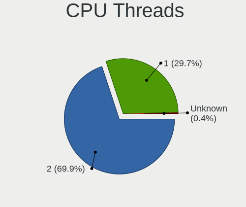

| Number  | Computers | Percent |
|---------|-----------|---------|
| 2       | 824       | 66.77%  |
| 1       | 405       | 32.82%  |
| Unknown | 5         | 0.41%   |

CPU Op-Modes
------------

CPU Operation Modes (32-bit, 64-bit)

| Op mode        | Computers | Percent |
|----------------|-----------|---------|
| 32-bit, 64-bit | 1188      | 95.96%  |
| Unknown        | 38        | 3.07%   |
| 32-bit         | 12        | 0.97%   |

CPU Microcode
-------------

Microcode number

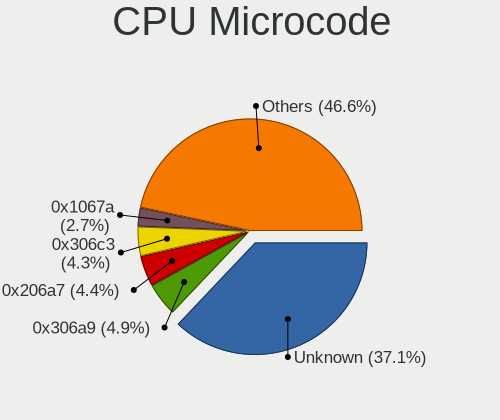

| Number     | Computers | Percent |
|------------|-----------|---------|
| Unknown    | 232       | 18.07%  |
| 0x306a9    | 96        | 7.48%   |
| 0x206a7    | 83        | 6.46%   |
| 0x306c3    | 78        | 6.07%   |
| 0x1067a    | 51        | 3.97%   |
| 0x906e9    | 40        | 3.12%   |
| 0x906ea    | 38        | 2.96%   |
| 0x806ea    | 35        | 2.73%   |
| 0x806ec    | 33        | 2.57%   |
| 0x40651    | 28        | 2.18%   |
| 0x306d4    | 26        | 2.02%   |
| 0x506e3    | 25        | 1.95%   |
| 0x406e3    | 23        | 1.79%   |
| 0x6fd      | 22        | 1.71%   |
| 0x20655    | 22        | 1.71%   |
| 0x806e9    | 20        | 1.56%   |
| 0x806c1    | 19        | 1.48%   |
| 0x10676    | 19        | 1.48%   |
| 0x08701021 | 17        | 1.32%   |
| 0x08600106 | 15        | 1.17%   |
| 0x106e5    | 13        | 1.01%   |
| 0x08701013 | 13        | 1.01%   |
| 0x6fb      | 12        | 0.93%   |
| 0x6f6      | 12        | 0.93%   |
| 0xa0652    | 11        | 0.86%   |
| 0x806eb    | 11        | 0.86%   |
| 0x30678    | 11        | 0.86%   |
| 0x206d7    | 10        | 0.78%   |
| 0x05000119 | 10        | 0.78%   |
| 0x0800820d | 9         | 0.7%    |
| 0x20652    | 8         | 0.62%   |
| 0x0a201009 | 8         | 0.62%   |
| 0x0810100b | 7         | 0.55%   |
| 0x06001119 | 7         | 0.55%   |
| 0x010000c8 | 7         | 0.55%   |
| 0x406c4    | 6         | 0.47%   |
| 0x08600103 | 6         | 0.47%   |
| 0x08108109 | 6         | 0.47%   |
| 0x08108102 | 6         | 0.47%   |
| 0x07030105 | 6         | 0.47%   |
| 0x06000852 | 6         | 0.47%   |
| 0x906ed    | 5         | 0.39%   |
| 0x706a1    | 5         | 0.39%   |
| 0x506c9    | 5         | 0.39%   |
| 0x306f2    | 5         | 0.39%   |
| 0x106ca    | 5         | 0.39%   |
| 0x106a5    | 5         | 0.39%   |
| 0x0a50000c | 5         | 0.39%   |
| 0x08608103 | 5         | 0.39%   |
| 0x08600104 | 5         | 0.39%   |
| 0x08001137 | 5         | 0.39%   |
| 0x08001129 | 5         | 0.39%   |
| 0xa0655    | 4         | 0.31%   |
| 0x706e5    | 4         | 0.31%   |
| 0x406f1    | 4         | 0.31%   |
| 0x106c2    | 4         | 0.31%   |
| 0x0700010f | 4         | 0.31%   |
| 0x06006705 | 4         | 0.31%   |
| 0x0600611a | 4         | 0.31%   |
| 0x6f2      | 3         | 0.23%   |

CPU Microarch
-------------

Microarchitecture

| Name            | Computers | Percent |
|-----------------|-----------|---------|
| KabyLake        | 222       | 18.02%  |
| Haswell         | 131       | 10.63%  |
| SandyBridge     | 106       | 8.6%    |
| IvyBridge       | 105       | 8.52%   |
| Penryn          | 80        | 6.49%   |
| Zen 2           | 75        | 6.09%   |
| Core            | 61        | 4.95%   |
| Skylake         | 59        | 4.79%   |
| Westmere        | 34        | 2.76%   |
| Zen+            | 31        | 2.52%   |
| Silvermont      | 31        | 2.52%   |
| Broadwell       | 31        | 2.52%   |
| TigerLake       | 27        | 2.19%   |
| CometLake       | 22        | 1.79%   |
| Zen             | 21        | 1.7%    |
| K10             | 21        | 1.7%    |
| Unknown         | 21        | 1.7%    |
| Nehalem         | 20        | 1.62%   |
| Zen 3           | 19        | 1.54%   |
| Piledriver      | 15        | 1.22%   |
| Bobcat          | 14        | 1.14%   |
| Excavator       | 11        | 0.89%   |
| Icelake         | 10        | 0.81%   |
| Puma            | 9         | 0.73%   |
| Bonnell         | 9         | 0.73%   |
| NetBurst        | 8         | 0.65%   |
| K8 Hammer       | 8         | 0.65%   |
| Goldmont plus   | 8         | 0.65%   |
| P6              | 7         | 0.57%   |
| Jaguar          | 6         | 0.49%   |
| Goldmont        | 5         | 0.41%   |
| K8 & K10 hybrid | 2         | 0.16%   |
| Tremont         | 1         | 0.08%   |
| Steamroller     | 1         | 0.08%   |
| K10 Llano       | 1         | 0.08%   |

Graphics
--------

GPU Vendor
----------

Vendors of graphics cards

| Vendor                     | Computers | Percent |
|----------------------------|-----------|---------|
| Intel                      | 699       | 48.61%  |
| Nvidia                     | 430       | 29.9%   |
| AMD                        | 296       | 20.58%  |
| Matrox Electronics Systems | 9         | 0.63%   |
| ASPEED Technology          | 3         | 0.21%   |
| VIA Technologies           | 1         | 0.07%   |

GPU Model
---------

Graphics card models

| Model                                                                                    | Computers | Percent |
|------------------------------------------------------------------------------------------|-----------|---------|
| Intel 3rd Gen Core processor Graphics Controller                                         | 65        | 4.37%   |
| Intel 2nd Generation Core Processor Family Integrated Graphics Controller                | 65        | 4.37%   |
| Intel WhiskeyLake-U GT2 [UHD Graphics 620]                                               | 41        | 2.76%   |
| Intel UHD Graphics 620                                                                   | 38        | 2.56%   |
| Intel Haswell-ULT Integrated Graphics Controller                                         | 35        | 2.36%   |
| Intel CoffeeLake-H GT2 [UHD Graphics 630]                                                | 30        | 2.02%   |
| Intel 4th Gen Core Processor Integrated Graphics Controller                              | 28        | 1.88%   |
| AMD Renoir                                                                               | 28        | 1.88%   |
| Intel TigerLake-LP GT2 [Iris Xe Graphics]                                                | 26        | 1.75%   |
| Intel HD Graphics 630                                                                    | 25        | 1.68%   |
| Intel HD Graphics 5500                                                                   | 24        | 1.62%   |
| Intel Xeon E3-1200 v3/4th Gen Core Processor Integrated Graphics Controller              | 20        | 1.35%   |
| Intel Skylake GT2 [HD Graphics 520]                                                      | 20        | 1.35%   |
| Intel Mobile 4 Series Chipset Integrated Graphics Controller                             | 20        | 1.35%   |
| Intel Core Processor Integrated Graphics Controller                                      | 20        | 1.35%   |
| AMD Ellesmere [Radeon RX 470/480/570/570X/580/580X/590]                                  | 19        | 1.28%   |
| Intel HD Graphics 620                                                                    | 18        | 1.21%   |
| Intel CometLake-U GT2 [UHD Graphics]                                                     | 17        | 1.14%   |
| Intel Atom Processor Z36xxx/Z37xxx Series Graphics & Display                             | 16        | 1.08%   |
| Intel CoffeeLake-S GT2 [UHD Graphics 630]                                                | 15        | 1.01%   |
| AMD Picasso/Raven 2 [Radeon Vega Series / Radeon Vega Mobile Series]                     | 15        | 1.01%   |
| Intel Mobile GM965/GL960 Integrated Graphics Controller (secondary)                      | 14        | 0.94%   |
| Intel Mobile GM965/GL960 Integrated Graphics Controller (primary)                        | 14        | 0.94%   |
| Nvidia GM204 [GeForce GTX 970]                                                           | 13        | 0.87%   |
| Intel Xeon E3-1200 v2/3rd Gen Core processor Graphics Controller                         | 13        | 0.87%   |
| Intel HD Graphics 530                                                                    | 13        | 0.87%   |
| Intel Atom/Celeron/Pentium Processor x5-E8000/J3xxx/N3xxx Integrated Graphics Controller | 13        | 0.87%   |
| Nvidia GK208B [GeForce GT 710]                                                           | 12        | 0.81%   |
| Nvidia GP106 [GeForce GTX 1060 6GB]                                                      | 11        | 0.74%   |
| Nvidia GP107M [GeForce GTX 1050 Mobile]                                                  | 10        | 0.67%   |
| Intel Mobile 945GM/GMS/GME, 943/940GML Express Integrated Graphics Controller            | 10        | 0.67%   |
| Intel 4 Series Chipset Integrated Graphics Controller                                    | 10        | 0.67%   |
| Nvidia GP107 [GeForce GTX 1050 Ti]                                                       | 9         | 0.61%   |
| Intel Mobile 945GM/GMS, 943/940GML Express Integrated Graphics Controller                | 9         | 0.61%   |
| Intel CometLake-H GT2 [UHD Graphics]                                                     | 9         | 0.61%   |
| AMD Raven Ridge [Radeon Vega Series / Radeon Vega Mobile Series]                         | 9         | 0.61%   |
| Nvidia TU117M [GeForce GTX 1650 Mobile / Max-Q]                                          | 8         | 0.54%   |
| Nvidia GT218 [GeForce 210]                                                               | 8         | 0.54%   |
| Nvidia GP107M [GeForce GTX 1050 Ti Mobile]                                               | 8         | 0.54%   |
| AMD Topaz XT [Radeon R7 M260/M265 / M340/M360 / M440/M445 / 530/535 / 620/625 Mobile]    | 8         | 0.54%   |
| AMD Seymour [Radeon HD 6400M/7400M Series]                                               | 8         | 0.54%   |
| AMD Navi 10 [Radeon RX 5600 OEM/5600 XT / 5700/5700 XT]                                  | 8         | 0.54%   |
| AMD Cezanne                                                                              | 8         | 0.54%   |
| Nvidia GP108M [GeForce MX150]                                                            | 7         | 0.47%   |
| Nvidia GP104 [GeForce GTX 1070]                                                          | 7         | 0.47%   |
| Intel IvyBridge GT2 [HD Graphics 4000]                                                   | 7         | 0.47%   |
| Intel 4th Generation Core Processor Family Integrated Graphics Controller                | 7         | 0.47%   |
| Nvidia GF117M [GeForce 610M/710M/810M/820M / GT 620M/625M/630M/720M]                     | 6         | 0.4%    |
| Intel CometLake-S GT2 [UHD Graphics 630]                                                 | 6         | 0.4%    |
| AMD Lucienne                                                                             | 6         | 0.4%    |
| AMD Cedar [Radeon HD 5000/6000/7350/8350 Series]                                         | 6         | 0.4%    |
| Nvidia TU117M                                                                            | 5         | 0.34%   |
| Nvidia TU106 [GeForce RTX 2060 Rev. A]                                                   | 5         | 0.34%   |
| Nvidia GP107 [GeForce GTX 1050]                                                          | 5         | 0.34%   |
| Nvidia GM107M [GeForce GTX 960M]                                                         | 5         | 0.34%   |
| Nvidia GM107 [GeForce GTX 750 Ti]                                                        | 5         | 0.34%   |
| Nvidia GK107M [GeForce GT 650M]                                                          | 5         | 0.34%   |
| Nvidia GK104 [GeForce GTX 760]                                                           | 5         | 0.34%   |
| Nvidia GF119 [GeForce GT 610]                                                            | 5         | 0.34%   |
| Nvidia G98M [GeForce 9300M GS]                                                           | 5         | 0.34%   |

GPU Combo
---------

Combinations of graphics cards

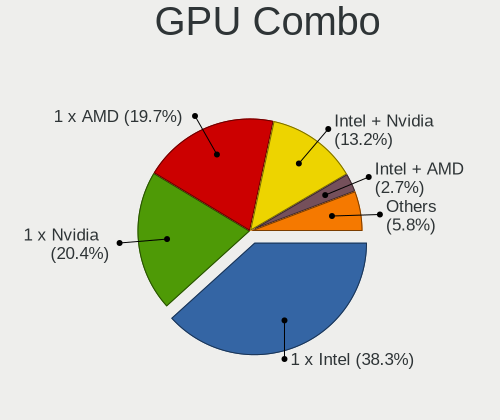

| Name               | Computers | Percent |
|--------------------|-----------|---------|
| 1 x Intel          | 502       | 40.39%  |
| 1 x Nvidia         | 264       | 21.24%  |
| 1 x AMD            | 227       | 18.26%  |
| Intel + Nvidia     | 147       | 11.83%  |
| Intel + AMD        | 41        | 3.3%    |
| Other              | 15        | 1.21%   |
| 2 x AMD            | 15        | 1.21%   |
| AMD + Nvidia       | 15        | 1.21%   |
| 1 x Matrox         | 9         | 0.72%   |
| 2 x Nvidia         | 3         | 0.24%   |
| 1 x ASPEED         | 2         | 0.16%   |
| 1 x VIA            | 1         | 0.08%   |
| Nvidia + ASPEED    | 1         | 0.08%   |
| Intel + 2 x Nvidia | 1         | 0.08%   |

GPU Driver
----------

Free vs proprietary

| Driver      | Computers | Percent |
|-------------|-----------|---------|
| Free        | 971       | 77.12%  |
| Proprietary | 231       | 18.35%  |
| Unknown     | 57        | 4.53%   |

GPU Memory
----------

Total video memory

| Size in GB | Computers | Percent |
|------------|-----------|---------|
| Unknown    | 642       | 50.43%  |
| 1.01-2.0   | 167       | 13.12%  |
| 0.01-0.5   | 164       | 12.88%  |
| 0.51-1.0   | 114       | 8.96%   |
| 3.01-4.0   | 76        | 5.97%   |
| 7.01-8.0   | 57        | 4.48%   |
| 5.01-6.0   | 34        | 2.67%   |
| 8.01-16.0  | 12        | 0.94%   |
| 2.01-3.0   | 5         | 0.39%   |
| 16.01-24.0 | 2         | 0.16%   |

Monitor
-------

Monitor Vendor
--------------

Monitor vendors

| Vendor                  | Computers | Percent |
|-------------------------|-----------|---------|
| Samsung Electronics     | 196       | 14.64%  |
| AU Optronics            | 196       | 14.64%  |
| LG Display              | 137       | 10.23%  |
| Chimei Innolux          | 86        | 6.42%   |
| Dell                    | 71        | 5.3%    |
| BOE                     | 69        | 5.15%   |
| Iiyama                  | 60        | 4.48%   |
| Goldstar                | 58        | 4.33%   |
| Hewlett-Packard         | 50        | 3.73%   |
| Philips                 | 44        | 3.29%   |
| Sharp                   | 31        | 2.32%   |
| BenQ                    | 29        | 2.17%   |
| Medion                  | 27        | 2.02%   |
| Acer                    | 27        | 2.02%   |
| AOC                     | 26        | 1.94%   |
| Ancor Communications    | 23        | 1.72%   |
| Chi Mei Optoelectronics | 21        | 1.57%   |
| Lenovo                  | 18        | 1.34%   |
| Apple                   | 15        | 1.12%   |
| Sony                    | 13        | 0.97%   |
| LG Philips              | 9         | 0.67%   |
| Fujitsu Siemens         | 9         | 0.67%   |
| Unknown                 | 8         | 0.6%    |
| InfoVision              | 8         | 0.6%    |
| PANDA                   | 6         | 0.45%   |
| Eizo                    | 6         | 0.45%   |
| Vestel Elektronik       | 5         | 0.37%   |
| Panasonic               | 5         | 0.37%   |
| LG Electronics          | 5         | 0.37%   |
| Idek Iiyama             | 5         | 0.37%   |
| ASUSTek Computer        | 5         | 0.37%   |
| ViewSonic               | 4         | 0.3%    |
| Seiko/Epson             | 4         | 0.3%    |
| Quanta Display          | 4         | 0.3%    |
| Arnos Instruments       | 4         | 0.3%    |
| Packard Bell            | 3         | 0.22%   |
| CSO                     | 3         | 0.22%   |
| PKB                     | 2         | 0.15%   |
| MSI                     | 2         | 0.15%   |
| Medion Akoya            | 2         | 0.15%   |
| HannStar                | 2         | 0.15%   |
| Unknown                 | 2         | 0.15%   |
| ___                     | 1         | 0.07%   |
| WST                     | 1         | 0.07%   |
| Valve                   | 1         | 0.07%   |
| Toshiba                 | 1         | 0.07%   |
| Targa Visionary         | 1         | 0.07%   |
| Sunplus                 | 1         | 0.07%   |
| S2-Tek                  | 1         | 0.07%   |
| RGB                     | 1         | 0.07%   |
| Plain Tree Systems      | 1         | 0.07%   |
| OEM                     | 1         | 0.07%   |
| Nvidia                  | 1         | 0.07%   |
| NEC Computers           | 1         | 0.07%   |
| MS_ Nvidia              | 1         | 0.07%   |
| MStar                   | 1         | 0.07%   |
| Microstep               | 1         | 0.07%   |
| Mi                      | 1         | 0.07%   |
| LTM                     | 1         | 0.07%   |
| LPL                     | 1         | 0.07%   |

Monitor Model
-------------

Monitor models

| Model                                                                     | Computers | Percent |
|---------------------------------------------------------------------------|-----------|---------|
| Samsung Electronics LCD Monitor SEC5441 1366x768 309x174mm 14.0-inch      | 14        | 0.99%   |
| AU Optronics LCD Monitor AUO21ED 1920x1080 344x193mm 15.5-inch            | 11        | 0.78%   |
| Chimei Innolux LCD Monitor CMN14D4 1920x1080 309x173mm 13.9-inch          | 9         | 0.63%   |
| LG Display LCD Monitor LGD02DC 1366x768 344x194mm 15.5-inch               | 8         | 0.56%   |
| AU Optronics LCD Monitor AUO38ED 1920x1080 344x193mm 15.5-inch            | 7         | 0.49%   |
| AU Optronics LCD Monitor AUO23ED 1920x1080 344x194mm 15.5-inch            | 7         | 0.49%   |
| Iiyama PLX2783H IVM6611 1920x1080 598x336mm 27.0-inch                     | 6         | 0.42%   |
| Goldstar LG ULTRAWIDE GSM59F1 2560x1080 800x340mm 34.2-inch               | 6         | 0.42%   |
| Goldstar HDR 4K GSM7707 3840x2160 600x340mm 27.2-inch                     | 6         | 0.42%   |
| AU Optronics LCD Monitor AUO139E 1600x900 382x214mm 17.2-inch             | 6         | 0.42%   |
| Vestel Elektronik 32FHD_LCD_TV VES3700 1920x1080 700x390mm 31.5-inch      | 5         | 0.35%   |
| Samsung Electronics S24F350 SAM0D20 1920x1080 520x290mm 23.4-inch         | 5         | 0.35%   |
| Iiyama PL2409HD IVM560C 1920x1080 521x293mm 23.5-inch                     | 5         | 0.35%   |
| AU Optronics LCD Monitor AUO5B2D 1920x1080 293x162mm 13.2-inch            | 5         | 0.35%   |
| AU Optronics LCD Monitor AUO573D 1920x1080 309x174mm 14.0-inch            | 5         | 0.35%   |
| AU Optronics LCD Monitor AUO26EC 1366x768 344x193mm 15.5-inch             | 5         | 0.35%   |
| Samsung Electronics U28E590 SAM0C4D 3840x2160 607x345mm 27.5-inch         | 4         | 0.28%   |
| Samsung Electronics SyncMaster SAM03E5 1680x1050 474x296mm 22.0-inch      | 4         | 0.28%   |
| LG Display LCD Monitor LGD046F 1920x1080 344x194mm 15.5-inch              | 4         | 0.28%   |
| LG Display LCD Monitor LGD034C 1366x768 293x165mm 13.2-inch               | 4         | 0.28%   |
| Dell U2417H DEL40E8 1920x1080 527x296mm 23.8-inch                         | 4         | 0.28%   |
| Chimei Innolux LCD Monitor CMN15AB 1366x768 344x194mm 15.5-inch           | 4         | 0.28%   |
| Chi Mei Optoelectronics LCD Monitor CMO1720 1920x1080 382x215mm 17.3-inch | 4         | 0.28%   |
| Chi Mei Optoelectronics LCD Monitor CMO1719 1600x900 382x215mm 17.3-inch  | 4         | 0.28%   |
| BenQ GC2870 BNQ78DD 1920x1080 621x341mm 27.9-inch                         | 4         | 0.28%   |
| AU Optronics LCD Monitor AUO22EC 1366x768 344x193mm 15.5-inch             | 4         | 0.28%   |
| AU Optronics LCD Monitor AUO159E 1600x900 382x214mm 17.2-inch             | 4         | 0.28%   |
| AU Optronics LCD Monitor AUO149E 1600x900 382x214mm 17.2-inch             | 4         | 0.28%   |
| Ancor Communications ASUS VC239 ACI23C4 1920x1080 509x286mm 23.0-inch     | 4         | 0.28%   |
| Sharp LCD Monitor SHP149A 1920x1080 344x194mm 15.5-inch                   | 3         | 0.21%   |
| Sharp LCD Monitor SHP148B 3840x2160 294x165mm 13.3-inch                   | 3         | 0.21%   |
| Sharp LCD Monitor SHP1449 1920x1080 294x165mm 13.3-inch                   | 3         | 0.21%   |
| Samsung Electronics SyncMaster SAM0613 1920x1080                          | 3         | 0.21%   |
| Samsung Electronics SyncMaster SAM036F 1440x900 428x255mm 19.6-inch       | 3         | 0.21%   |
| Samsung Electronics SMS24A350H SAM07D6 1920x1080 531x299mm 24.0-inch      | 3         | 0.21%   |
| Samsung Electronics S24R65x SAM1022 1920x1080 527x296mm 23.8-inch         | 3         | 0.21%   |
| Samsung Electronics S24D330 SAM0D92 1920x1080 531x299mm 24.0-inch         | 3         | 0.21%   |
| Samsung Electronics S22D300 SAM0B3F 1920x1080 477x268mm 21.5-inch         | 3         | 0.21%   |
| Samsung Electronics LCD Monitor SEC4251 1366x768 344x194mm 15.5-inch      | 3         | 0.21%   |
| Samsung Electronics LCD Monitor SEC314F 1600x900 382x215mm 17.3-inch      | 3         | 0.21%   |
| Samsung Electronics LCD Monitor SAM03BC 1920x1080                         | 3         | 0.21%   |
| Medion MD 20430 MED36A2 1920x1080 521x293mm 23.5-inch                     | 3         | 0.21%   |
| LG Display LCD Monitor LGD038E 1366x768 344x194mm 15.5-inch               | 3         | 0.21%   |
| LG Display LCD Monitor LGD033F 1366x768 310x174mm 14.0-inch               | 3         | 0.21%   |
| LG Display LCD Monitor LGD01DD 1600x900 382x215mm 17.3-inch               | 3         | 0.21%   |
| LG Display LCD Monitor LGD01CA 1600x900 382x215mm 17.3-inch               | 3         | 0.21%   |
| Iiyama PL2783Q IVM661E 2560x1440 597x336mm 27.0-inch                      | 3         | 0.21%   |
| Iiyama PL2492H IVM612F 1920x1080 527x296mm 23.8-inch                      | 3         | 0.21%   |
| Hewlett-Packard LA1905 HWP2844 1440x900 408x255mm 18.9-inch               | 3         | 0.21%   |
| Goldstar ULTRAGEAR GSM5B7F 2560x1440 597x336mm 27.0-inch                  | 3         | 0.21%   |
| Goldstar Ultra HD GSM5B09 3840x2160 600x340mm 27.2-inch                   | 3         | 0.21%   |
| Goldstar 32ML600 GSM772D 1920x1080 480x270mm 21.7-inch                    | 3         | 0.21%   |
| Dell U2515H DELD06F 2560x1440 553x311mm 25.0-inch                         | 3         | 0.21%   |
| Dell 2408WFP DELA02A 1920x1200 520x320mm 24.0-inch                        | 3         | 0.21%   |
| Chimei Innolux LCD Monitor CMN15C2 1920x1080 344x194mm 15.5-inch          | 3         | 0.21%   |
| Chimei Innolux LCD Monitor CMN14D2 1920x1080 309x173mm 13.9-inch          | 3         | 0.21%   |
| Chimei Innolux LCD Monitor CMN1482 1600x900 309x174mm 14.0-inch           | 3         | 0.21%   |
| Chi Mei Optoelectronics LCD Monitor CMO15A7 1366x768 344x193mm 15.5-inch  | 3         | 0.21%   |
| BOE LCD Monitor BOE08D7 1920x1080 309x174mm 14.0-inch                     | 3         | 0.21%   |
| BOE LCD Monitor BOE0869 1920x1080 344x194mm 15.5-inch                     | 3         | 0.21%   |

Monitor Resolution
------------------

Monitor screen resolution

| Resolution         | Computers | Percent |
|--------------------|-----------|---------|
| 1920x1080 (FHD)    | 556       | 43%     |
| 1366x768 (WXGA)    | 173       | 13.38%  |
| 3840x2160 (4K)     | 93        | 7.19%   |
| 1600x900 (HD+)     | 92        | 7.12%   |
| 2560x1440 (QHD)    | 65        | 5.03%   |
| 1680x1050 (WSXGA+) | 52        | 4.02%   |
| 1280x1024 (SXGA)   | 52        | 4.02%   |
| 1440x900 (WXGA+)   | 36        | 2.78%   |
| 1920x1200 (WUXGA)  | 32        | 2.47%   |
| 1280x800 (WXGA)    | 27        | 2.09%   |
| Unknown            | 16        | 1.24%   |
| 3840x1080          | 12        | 0.93%   |
| 1360x768           | 8         | 0.62%   |
| 3440x1440          | 7         | 0.54%   |
| 2560x1600          | 7         | 0.54%   |
| 1600x1200          | 7         | 0.54%   |
| 2560x1080          | 6         | 0.46%   |
| 1024x600           | 6         | 0.46%   |
| 3840x2400          | 5         | 0.39%   |
| 3200x1800 (QHD+)   | 4         | 0.31%   |
| 1680x945           | 4         | 0.31%   |
| 1024x768 (XGA)     | 4         | 0.31%   |
| 5760x1080          | 2         | 0.15%   |
| 2960x1050          | 2         | 0.15%   |
| 2880x1800          | 2         | 0.15%   |
| 2736x1824          | 2         | 0.15%   |
| 2256x1504          | 2         | 0.15%   |
| 1920x540           | 2         | 0.15%   |
| 1920x1280          | 2         | 0.15%   |
| 1280x960           | 2         | 0.15%   |
| 7680x2160          | 1         | 0.08%   |
| 6320x1800          | 1         | 0.08%   |
| 4480x1080          | 1         | 0.08%   |
| 3840x1600          | 1         | 0.08%   |
| 3600x1080          | 1         | 0.08%   |
| 3200x1080          | 1         | 0.08%   |
| 2880x1920          | 1         | 0.08%   |
| 2288x1287          | 1         | 0.08%   |
| 2160x1440          | 1         | 0.08%   |
| 2048x1152          | 1         | 0.08%   |
| 1920x515           | 1         | 0.08%   |
| 1280x720 (HD)      | 1         | 0.08%   |
| 1024x576           | 1         | 0.08%   |

Monitor Diagonal
----------------

Diagonal size in inches

| Inches  | Computers | Percent |
|---------|-----------|---------|
| 15      | 321       | 23.6%   |
| 27      | 132       | 9.71%   |
| 17      | 129       | 9.49%   |
| 13      | 107       | 7.87%   |
| 24      | 98        | 7.21%   |
| 23      | 95        | 6.99%   |
| Unknown | 85        | 6.25%   |
| 14      | 73        | 5.37%   |
| 21      | 69        | 5.07%   |
| 19      | 44        | 3.24%   |
| 22      | 32        | 2.35%   |
| 18      | 26        | 1.91%   |
| 12      | 19        | 1.4%    |
| 20      | 18        | 1.32%   |
| 31      | 16        | 1.18%   |
| 34      | 12        | 0.88%   |
| 72      | 9         | 0.66%   |
| 25      | 9         | 0.66%   |
| 11      | 9         | 0.66%   |
| 10      | 9         | 0.66%   |
| 84      | 6         | 0.44%   |
| 16      | 6         | 0.44%   |
| 54      | 5         | 0.37%   |
| 65      | 3         | 0.22%   |
| 49      | 3         | 0.22%   |
| 48      | 3         | 0.22%   |
| 29      | 3         | 0.22%   |
| 26      | 3         | 0.22%   |
| 52      | 2         | 0.15%   |
| 42      | 2         | 0.15%   |
| 40      | 2         | 0.15%   |
| 39      | 2         | 0.15%   |
| 32      | 2         | 0.15%   |
| 142     | 1         | 0.07%   |
| 55      | 1         | 0.07%   |
| 50      | 1         | 0.07%   |
| 46      | 1         | 0.07%   |
| 37      | 1         | 0.07%   |
| 30      | 1         | 0.07%   |

Monitor Width
-------------

Physical width

| Width in mm    | Computers | Percent |
|----------------|-----------|---------|
| 301-350        | 435       | 32.56%  |
| 501-600        | 289       | 21.63%  |
| 351-400        | 164       | 12.28%  |
| 401-500        | 151       | 11.3%   |
| 201-300        | 107       | 8.01%   |
| Unknown        | 85        | 6.36%   |
| 601-700        | 49        | 3.67%   |
| 1001-1500      | 19        | 1.42%   |
| 1501-2000      | 15        | 1.12%   |
| 701-800        | 14        | 1.05%   |
| 801-900        | 5         | 0.37%   |
| 901-1000       | 2         | 0.15%   |
| More than 2000 | 1         | 0.07%   |

Aspect Ratio
------------

Proportional relationship between the width and the height

| Ratio   | Computers | Percent |
|---------|-----------|---------|
| 16/9    | 883       | 73.1%   |
| 16/10   | 161       | 13.33%  |
| Unknown | 69        | 5.71%   |
| 5/4     | 48        | 3.97%   |
| 4/3     | 13        | 1.08%   |
| 21/9    | 13        | 1.08%   |
| 3/2     | 10        | 0.83%   |
| 32/9    | 5         | 0.41%   |
| 6/5     | 3         | 0.25%   |
| 1.00    | 2         | 0.17%   |
| 3.73    | 1         | 0.08%   |

Monitor Area
------------

Area in inch

| Area in inch | Computers | Percent |
|----------------|-----------|---------|
| 101-110        | 321       | 23.96%  |
| 201-250        | 230       | 17.16%  |
| 301-350        | 136       | 10.15%  |
| 81-90          | 116       | 8.66%   |
| 121-130        | 96        | 7.16%   |
| 151-200        | 90        | 6.72%   |
| Unknown        | 85        | 6.34%   |
| 71-80          | 64        | 4.78%   |
| 251-300        | 39        | 2.91%   |
| 351-500        | 34        | 2.54%   |
| More than 1000 | 28        | 2.09%   |
| 141-150        | 28        | 2.09%   |
| 131-140        | 19        | 1.42%   |
| 61-70          | 18        | 1.34%   |
| 501-1000       | 13        | 0.97%   |
| 51-60          | 9         | 0.67%   |
| 41-50          | 9         | 0.67%   |
| 111-120        | 3         | 0.22%   |
| 91-100         | 2         | 0.15%   |

Pixel Density
-------------

Pixels per inch

| Density       | Computers | Percent |
|---------------|-----------|---------|
| 51-100        | 437       | 33.49%  |
| 101-120       | 323       | 24.75%  |
| 121-160       | 322       | 24.67%  |
| Unknown       | 85        | 6.51%   |
| 161-240       | 81        | 6.21%   |
| More than 240 | 33        | 2.53%   |
| 1-50          | 24        | 1.84%   |

Multiple Monitors
-----------------

Total monitors connected

| Total | Computers | Percent |
|-------|-----------|---------|
| 1     | 985       | 77.68%  |
| 2     | 196       | 15.46%  |
| 0     | 62        | 4.89%   |
| 3     | 24        | 1.89%   |
| 4     | 1         | 0.08%   |

Network
-------

Net Controller Vendor
---------------------

Controller vendors

| Vendor                                 | Computers | Percent |
|----------------------------------------|-----------|---------|
| Intel                                  | 658       | 35.47%  |
| Realtek Semiconductor                  | 613       | 33.05%  |
| Qualcomm Atheros                       | 216       | 11.64%  |
| Broadcom                               | 104       | 5.61%   |
| Marvell Technology Group               | 27        | 1.46%   |
| Broadcom Limited                       | 25        | 1.35%   |
| TP-Link                                | 22        | 1.19%   |
| Ralink                                 | 16        | 0.86%   |
| Nvidia                                 | 15        | 0.81%   |
| D-Link System                          | 14        | 0.75%   |
| Ralink Technology                      | 10        | 0.54%   |
| Dell                                   | 10        | 0.54%   |
| IMC Networks                           | 8         | 0.43%   |
| Microsoft                              | 6         | 0.32%   |
| MEDIATEK                               | 6         | 0.32%   |
| Lenovo                                 | 6         | 0.32%   |
| Ericsson Business Mobile Networks      | 6         | 0.32%   |
| DisplayLink                            | 6         | 0.32%   |
| ASIX Electronics                       | 6         | 0.32%   |
| Sierra Wireless                        | 5         | 0.27%   |
| D-Link                                 | 5         | 0.27%   |
| ASUSTek Computer                       | 5         | 0.27%   |
| Microchip Technology                   | 4         | 0.22%   |
| Linksys                                | 4         | 0.22%   |
| Hewlett-Packard                        | 4         | 0.22%   |
| Aquantia                               | 4         | 0.22%   |
| Sitecom Europe                         | 3         | 0.16%   |
| Qualcomm Atheros Communications        | 3         | 0.16%   |
| JMicron Technology                     | 3         | 0.16%   |
| Fibocom                                | 3         | 0.16%   |
| Samsung Electronics                    | 2         | 0.11%   |
| Motorola PCS                           | 2         | 0.11%   |
| MosChip Semiconductor                  | 2         | 0.11%   |
| Huawei Technologies                    | 2         | 0.11%   |
| Edimax Technology                      | 2         | 0.11%   |
| Attansic Technology                    | 2         | 0.11%   |
| Arduino SA                             | 2         | 0.11%   |
| ADMtek                                 | 2         | 0.11%   |
| Z-Com                                  | 1         | 0.05%   |
| Xiaomi                                 | 1         | 0.05%   |
| VIA Technologies                       | 1         | 0.05%   |
| Texas Instruments                      | 1         | 0.05%   |
| Tehuti Networks                        | 1         | 0.05%   |
| STMicroelectronics                     | 1         | 0.05%   |
| Sony Ericsson Mobile Communications AB | 1         | 0.05%   |
| Silicon Integrated Systems [SiS]       | 1         | 0.05%   |
| Sigma Designs                          | 1         | 0.05%   |
| Shenzhen Goodix Technology             | 1         | 0.05%   |
| Sega                                   | 1         | 0.05%   |
| Seeed                                  | 1         | 0.05%   |
| Qualcomm                               | 1         | 0.05%   |
| Panasonic (Matsushita)                 | 1         | 0.05%   |
| OPPO Electronics                       | 1         | 0.05%   |
| OpenMoko                               | 1         | 0.05%   |
| OnePlus Technology (Shenzhen)          | 1         | 0.05%   |
| IBM                                    | 1         | 0.05%   |
| Gemtek                                 | 1         | 0.05%   |
| AVM                                    | 1         | 0.05%   |
| Apple                                  | 1         | 0.05%   |
| 802.11g Adapter [Linksys WUSB54GC v3]  | 1         | 0.05%   |

Net Controller Model
--------------------

Controller models

| Model                                                                   | Computers | Percent |
|-------------------------------------------------------------------------|-----------|---------|
| Realtek RTL8111/8168/8411 PCI Express Gigabit Ethernet Controller       | 435       | 19.59%  |
| Intel Wi-Fi 6 AX200                                                     | 78        | 3.51%   |
| Realtek RTL810xE PCI Express Fast Ethernet controller                   | 59        | 2.66%   |
| Realtek RTL8153 Gigabit Ethernet Adapter                                | 50        | 2.25%   |
| Intel Wireless 7260                                                     | 44        | 1.98%   |
| Intel 82579LM Gigabit Network Connection (Lewisville)                   | 44        | 1.98%   |
| Qualcomm Atheros AR9485 Wireless Network Adapter                        | 37        | 1.67%   |
| Intel I211 Gigabit Network Connection                                   | 35        | 1.58%   |
| Intel Wireless 7265                                                     | 29        | 1.31%   |
| Intel Cannon Point-LP CNVi [Wireless-AC]                                | 29        | 1.31%   |
| Intel Wireless 8265 / 8275                                              | 27        | 1.22%   |
| Realtek RTL8125 2.5GbE Controller                                       | 25        | 1.13%   |
| Intel Wireless 8260                                                     | 25        | 1.13%   |
| Qualcomm Atheros AR9285 Wireless Network Adapter (PCI-Express)          | 24        | 1.08%   |
| Intel Ethernet Connection (2) I219-V                                    | 24        | 1.08%   |
| Intel Centrino Advanced-N 6205 [Taylor Peak]                            | 24        | 1.08%   |
| Qualcomm Atheros QCA9377 802.11ac Wireless Network Adapter              | 23        | 1.04%   |
| Qualcomm Atheros AR8151 v2.0 Gigabit Ethernet                           | 22        | 0.99%   |
| Qualcomm Atheros QCA9565 / AR9565 Wireless Network Adapter              | 20        | 0.9%    |
| Qualcomm Atheros QCA6174 802.11ac Wireless Network Adapter              | 20        | 0.9%    |
| Intel Wireless-AC 9260                                                  | 20        | 0.9%    |
| Intel PRO/Wireless 3945ABG [Golan] Network Connection                   | 20        | 0.9%    |
| Intel Cannon Lake PCH CNVi WiFi                                         | 20        | 0.9%    |
| Intel Wi-Fi 6 AX201                                                     | 19        | 0.86%   |
| Intel Ethernet Connection I217-V                                        | 18        | 0.81%   |
| Qualcomm Atheros AR8161 Gigabit Ethernet                                | 17        | 0.77%   |
| Intel Ethernet Connection I218-LM                                       | 17        | 0.77%   |
| Intel Ethernet Connection I217-LM                                       | 17        | 0.77%   |
| Intel Centrino Wireless-N 2230                                          | 17        | 0.77%   |
| Intel 82579V Gigabit Network Connection                                 | 17        | 0.77%   |
| Realtek RTL8723BE PCIe Wireless Network Adapter                         | 16        | 0.72%   |
| Realtek RTL8822CE 802.11ac PCIe Wireless Network Adapter                | 13        | 0.59%   |
| Realtek RTL8822BE 802.11a/b/g/n/ac WiFi adapter                         | 13        | 0.59%   |
| Broadcom BCM4313 802.11bgn Wireless Network Adapter                     | 13        | 0.59%   |
| Realtek RTL8821CE 802.11ac PCIe Wireless Network Adapter                | 12        | 0.54%   |
| Realtek RTL8188CE 802.11b/g/n WiFi Adapter                              | 12        | 0.54%   |
| Intel WiFi Link 5100                                                    | 12        | 0.54%   |
| Qualcomm Atheros AR9287 Wireless Network Adapter (PCI-Express)          | 11        | 0.5%    |
| Intel Ethernet Connection (6) I219-V                                    | 11        | 0.5%    |
| Intel Ethernet Connection (4) I219-V                                    | 11        | 0.5%    |
| Intel Ethernet Connection (2) I218-V                                    | 11        | 0.5%    |
| Intel Comet Lake PCH CNVi WiFi                                          | 11        | 0.5%    |
| Intel Centrino Ultimate-N 6300                                          | 11        | 0.5%    |
| Intel 82567LM-3 Gigabit Network Connection                              | 11        | 0.5%    |
| Intel PRO/Wireless 4965 AG or AGN [Kedron] Network Connection           | 10        | 0.45%   |
| Intel Ethernet Connection (6) I219-LM                                   | 10        | 0.45%   |
| Intel Comet Lake PCH-LP CNVi WiFi                                       | 10        | 0.45%   |
| Broadcom BCM43142 802.11b/g/n                                           | 10        | 0.45%   |
| TP-Link UE300 10/100/1000 LAN (ethernet mode) [Realtek RTL8153]         | 9         | 0.41%   |
| Qualcomm Atheros AR242x / AR542x Wireless Network Adapter (PCI-Express) | 9         | 0.41%   |
| Intel Ethernet Connection I219-LM                                       | 9         | 0.41%   |
| Intel Dual Band Wireless-AC 3168NGW [Stone Peak]                        | 9         | 0.41%   |
| Intel Centrino Advanced-N 6200                                          | 9         | 0.41%   |
| Intel 82567LM Gigabit Network Connection                                | 9         | 0.41%   |
| Broadcom BCM43228 802.11a/b/g/n                                         | 9         | 0.41%   |
| Intel Wireless 3165                                                     | 8         | 0.36%   |
| Intel I210 Gigabit Network Connection                                   | 8         | 0.36%   |
| Intel Centrino Advanced-N 6235                                          | 8         | 0.36%   |
| Intel 82566MM Gigabit Network Connection                                | 8         | 0.36%   |
| Realtek RTL8188EUS 802.11n Wireless Network Adapter                     | 7         | 0.32%   |

Wireless Vendor
---------------

Wireless vendors

| Vendor                                | Computers | Percent |
|---------------------------------------|-----------|---------|
| Intel                                 | 486       | 50.31%  |
| Qualcomm Atheros                      | 168       | 17.39%  |
| Realtek Semiconductor                 | 125       | 12.94%  |
| Broadcom                              | 64        | 6.63%   |
| Ralink                                | 16        | 1.66%   |
| TP-Link                               | 12        | 1.24%   |
| D-Link System                         | 12        | 1.24%   |
| Broadcom Limited                      | 12        | 1.24%   |
| Ralink Technology                     | 10        | 1.04%   |
| IMC Networks                          | 8         | 0.83%   |
| Microsoft                             | 6         | 0.62%   |
| D-Link                                | 5         | 0.52%   |
| ASUSTek Computer                      | 5         | 0.52%   |
| Sierra Wireless                       | 4         | 0.41%   |
| MEDIATEK                              | 4         | 0.41%   |
| Linksys                               | 4         | 0.41%   |
| Dell                                  | 4         | 0.41%   |
| Sitecom Europe                        | 3         | 0.31%   |
| Qualcomm Atheros Communications       | 3         | 0.31%   |
| Fibocom                               | 3         | 0.31%   |
| Marvell Technology Group              | 2         | 0.21%   |
| Edimax Technology                     | 2         | 0.21%   |
| Z-Com                                 | 1         | 0.1%    |
| Texas Instruments                     | 1         | 0.1%    |
| Qualcomm                              | 1         | 0.1%    |
| Panasonic (Matsushita)                | 1         | 0.1%    |
| Hewlett-Packard                       | 1         | 0.1%    |
| Gemtek                                | 1         | 0.1%    |
| AVM                                   | 1         | 0.1%    |
| 802.11g Adapter [Linksys WUSB54GC v3] | 1         | 0.1%    |

Wireless Model
--------------

Wireless models

| Model                                                                   | Computers | Percent |
|-------------------------------------------------------------------------|-----------|---------|
| Intel Wi-Fi 6 AX200                                                     | 78        | 8.01%   |
| Intel Wireless 7260                                                     | 44        | 4.52%   |
| Qualcomm Atheros AR9485 Wireless Network Adapter                        | 37        | 3.8%    |
| Intel Wireless 7265                                                     | 29        | 2.98%   |
| Intel Cannon Point-LP CNVi [Wireless-AC]                                | 29        | 2.98%   |
| Intel Wireless 8265 / 8275                                              | 27        | 2.77%   |
| Intel Wireless 8260                                                     | 25        | 2.57%   |
| Qualcomm Atheros AR9285 Wireless Network Adapter (PCI-Express)          | 24        | 2.46%   |
| Intel Centrino Advanced-N 6205 [Taylor Peak]                            | 24        | 2.46%   |
| Qualcomm Atheros QCA9377 802.11ac Wireless Network Adapter              | 23        | 2.36%   |
| Qualcomm Atheros QCA9565 / AR9565 Wireless Network Adapter              | 20        | 2.05%   |
| Qualcomm Atheros QCA6174 802.11ac Wireless Network Adapter              | 20        | 2.05%   |
| Intel Wireless-AC 9260                                                  | 20        | 2.05%   |
| Intel PRO/Wireless 3945ABG [Golan] Network Connection                   | 20        | 2.05%   |
| Intel Cannon Lake PCH CNVi WiFi                                         | 20        | 2.05%   |
| Intel Wi-Fi 6 AX201                                                     | 19        | 1.95%   |
| Intel Centrino Wireless-N 2230                                          | 17        | 1.75%   |
| Realtek RTL8723BE PCIe Wireless Network Adapter                         | 16        | 1.64%   |
| Realtek RTL8822CE 802.11ac PCIe Wireless Network Adapter                | 13        | 1.33%   |
| Realtek RTL8822BE 802.11a/b/g/n/ac WiFi adapter                         | 13        | 1.33%   |
| Broadcom BCM4313 802.11bgn Wireless Network Adapter                     | 13        | 1.33%   |
| Realtek RTL8821CE 802.11ac PCIe Wireless Network Adapter                | 12        | 1.23%   |
| Realtek RTL8188CE 802.11b/g/n WiFi Adapter                              | 12        | 1.23%   |
| Intel WiFi Link 5100                                                    | 12        | 1.23%   |
| Qualcomm Atheros AR9287 Wireless Network Adapter (PCI-Express)          | 11        | 1.13%   |
| Intel Comet Lake PCH CNVi WiFi                                          | 11        | 1.13%   |
| Intel Centrino Ultimate-N 6300                                          | 11        | 1.13%   |
| Intel PRO/Wireless 4965 AG or AGN [Kedron] Network Connection           | 10        | 1.03%   |
| Intel Comet Lake PCH-LP CNVi WiFi                                       | 10        | 1.03%   |
| Broadcom BCM43142 802.11b/g/n                                           | 10        | 1.03%   |
| Qualcomm Atheros AR242x / AR542x Wireless Network Adapter (PCI-Express) | 9         | 0.92%   |
| Intel Dual Band Wireless-AC 3168NGW [Stone Peak]                        | 9         | 0.92%   |
| Intel Centrino Advanced-N 6200                                          | 9         | 0.92%   |
| Broadcom BCM43228 802.11a/b/g/n                                         | 9         | 0.92%   |
| Intel Wireless 3165                                                     | 8         | 0.82%   |
| Intel Centrino Advanced-N 6235                                          | 8         | 0.82%   |
| Realtek RTL8188EUS 802.11n Wireless Network Adapter                     | 7         | 0.72%   |
| Realtek RTL8188CUS 802.11n WLAN Adapter                                 | 7         | 0.72%   |
| Intel PRO/Wireless 5100 AGN [Shiloh] Network Connection                 | 7         | 0.72%   |
| Realtek RTL88x2bu [AC1200 Techkey]                                      | 6         | 0.62%   |
| Qualcomm Atheros AR9462 Wireless Network Adapter                        | 6         | 0.62%   |
| Microsoft Xbox 360 Wireless Adapter                                     | 6         | 0.62%   |
| Intel Wireless 3160                                                     | 6         | 0.62%   |
| Ralink MT7601U Wireless Adapter                                         | 5         | 0.51%   |
| Ralink RT3090 Wireless 802.11n 1T/1R PCIe                               | 5         | 0.51%   |
| Qualcomm Atheros AR928X Wireless Network Adapter (PCI-Express)          | 5         | 0.51%   |
| Intel Ultimate N WiFi Link 5300                                         | 5         | 0.51%   |
| Intel Ice Lake-LP PCH CNVi WiFi                                         | 5         | 0.51%   |
| Intel Centrino Wireless-N 1000 [Condor Peak]                            | 5         | 0.51%   |
| IMC Networks Mediao 802.11n WLAN [Realtek RTL8191SU]                    | 5         | 0.51%   |
| Broadcom Limited BCM4312 802.11b/g LP-PHY                               | 5         | 0.51%   |
| Broadcom BCM4360 802.11ac Wireless Network Adapter                      | 5         | 0.51%   |
| Broadcom BCM43224 802.11a/b/g/n                                         | 5         | 0.51%   |
| TP-Link TL-WN823N v2/v3 [Realtek RTL8192EU]                             | 4         | 0.41%   |
| Realtek RTL8852AE 802.11ax PCIe Wireless Network Adapter                | 4         | 0.41%   |
| Realtek RTL8821AE 802.11ac PCIe Wireless Network Adapter                | 4         | 0.41%   |
| Realtek RTL8723DE Wireless Network Adapter                              | 4         | 0.41%   |
| Realtek RTL8723BU 802.11b/g/n WLAN Adapter                              | 4         | 0.41%   |
| Realtek RTL8723AE PCIe Wireless Network Adapter                         | 4         | 0.41%   |
| Realtek RTL8191SEvB Wireless LAN Controller                             | 4         | 0.41%   |

Ethernet Vendor
---------------

Ethernet vendors

| Vendor                                 | Computers | Percent |
|----------------------------------------|-----------|---------|
| Realtek Semiconductor                  | 570       | 47.94%  |
| Intel                                  | 364       | 30.61%  |
| Qualcomm Atheros                       | 85        | 7.15%   |
| Broadcom                               | 50        | 4.21%   |
| Marvell Technology Group               | 25        | 2.1%    |
| Nvidia                                 | 15        | 1.26%   |
| Broadcom Limited                       | 13        | 1.09%   |
| TP-Link                                | 9         | 0.76%   |
| Lenovo                                 | 6         | 0.5%    |
| DisplayLink                            | 6         | 0.5%    |
| ASIX Electronics                       | 6         | 0.5%    |
| Microchip Technology                   | 4         | 0.34%   |
| Aquantia                               | 4         | 0.34%   |
| JMicron Technology                     | 3         | 0.25%   |
| Hewlett-Packard                        | 3         | 0.25%   |
| Samsung Electronics                    | 2         | 0.17%   |
| Motorola PCS                           | 2         | 0.17%   |
| MosChip Semiconductor                  | 2         | 0.17%   |
| MediaTek                               | 2         | 0.17%   |
| D-Link System                          | 2         | 0.17%   |
| Attansic Technology                    | 2         | 0.17%   |
| ADMtek                                 | 2         | 0.17%   |
| Xiaomi                                 | 1         | 0.08%   |
| VIA Technologies                       | 1         | 0.08%   |
| Tehuti Networks                        | 1         | 0.08%   |
| Sony Ericsson Mobile Communications AB | 1         | 0.08%   |
| Silicon Integrated Systems [SiS]       | 1         | 0.08%   |
| Sierra Wireless                        | 1         | 0.08%   |
| OPPO Electronics                       | 1         | 0.08%   |
| OpenMoko                               | 1         | 0.08%   |
| OnePlus Technology (Shenzhen)          | 1         | 0.08%   |
| IBM                                    | 1         | 0.08%   |
| Huawei Technologies                    | 1         | 0.08%   |
| Apple                                  | 1         | 0.08%   |

Ethernet Model
--------------

Ethernet models

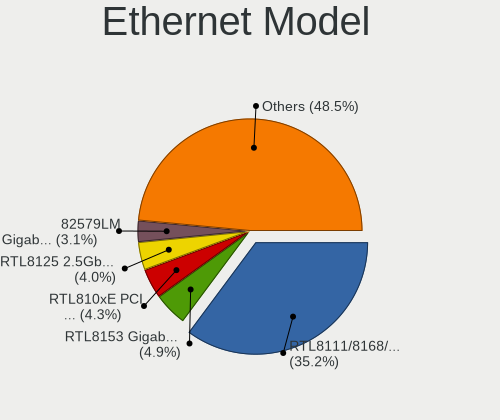

| Model                                                             | Computers | Percent |
|-------------------------------------------------------------------|-----------|---------|
| Realtek RTL8111/8168/8411 PCI Express Gigabit Ethernet Controller | 435       | 35.68%  |
| Realtek RTL810xE PCI Express Fast Ethernet controller             | 59        | 4.84%   |
| Realtek RTL8153 Gigabit Ethernet Adapter                          | 50        | 4.1%    |
| Intel 82579LM Gigabit Network Connection (Lewisville)             | 44        | 3.61%   |
| Intel I211 Gigabit Network Connection                             | 35        | 2.87%   |
| Realtek RTL8125 2.5GbE Controller                                 | 25        | 2.05%   |
| Intel Ethernet Connection (2) I219-V                              | 24        | 1.97%   |
| Qualcomm Atheros AR8151 v2.0 Gigabit Ethernet                     | 22        | 1.8%    |
| Intel Ethernet Connection I217-V                                  | 18        | 1.48%   |
| Qualcomm Atheros AR8161 Gigabit Ethernet                          | 17        | 1.39%   |
| Intel Ethernet Connection I218-LM                                 | 17        | 1.39%   |
| Intel Ethernet Connection I217-LM                                 | 17        | 1.39%   |
| Intel 82579V Gigabit Network Connection                           | 17        | 1.39%   |
| Intel Ethernet Connection (6) I219-V                              | 11        | 0.9%    |
| Intel Ethernet Connection (4) I219-V                              | 11        | 0.9%    |
| Intel Ethernet Connection (2) I218-V                              | 11        | 0.9%    |
| Intel 82567LM-3 Gigabit Network Connection                        | 11        | 0.9%    |
| Intel Ethernet Connection (6) I219-LM                             | 10        | 0.82%   |
| TP-Link UE300 10/100/1000 LAN (ethernet mode) [Realtek RTL8153]   | 9         | 0.74%   |
| Intel Ethernet Connection I219-LM                                 | 9         | 0.74%   |
| Intel 82567LM Gigabit Network Connection                          | 9         | 0.74%   |
| Intel I210 Gigabit Network Connection                             | 8         | 0.66%   |
| Intel 82566MM Gigabit Network Connection                          | 8         | 0.66%   |
| Qualcomm Atheros Killer E2500 Gigabit Ethernet Controller         | 7         | 0.57%   |
| Qualcomm Atheros Killer E220x Gigabit Ethernet Controller         | 7         | 0.57%   |
| Intel Ethernet Controller I225-V                                  | 7         | 0.57%   |
| Intel Ethernet Connection (4) I219-LM                             | 7         | 0.57%   |
| Intel Ethernet Connection (3) I218-LM                             | 7         | 0.57%   |
| Intel Ethernet Connection (2) I219-LM                             | 7         | 0.57%   |
| Intel 82577LM Gigabit Network Connection                          | 7         | 0.57%   |
| Qualcomm Atheros AR8152 v2.0 Fast Ethernet                        | 6         | 0.49%   |
| Broadcom NetLink BCM5784M Gigabit Ethernet PCIe                   | 6         | 0.49%   |
| Broadcom NetLink BCM57785 Gigabit Ethernet PCIe                   | 6         | 0.49%   |
| Realtek RTL-8100/8101L/8139 PCI Fast Ethernet Adapter             | 5         | 0.41%   |
| Qualcomm Atheros Killer E2400 Gigabit Ethernet Controller         | 5         | 0.41%   |
| Intel Ethernet Connection (5) I219-LM                             | 5         | 0.41%   |
| Intel 82578DC Gigabit Network Connection                          | 5         | 0.41%   |
| Intel 82574L Gigabit Network Connection                           | 5         | 0.41%   |
| ASIX AX88179 Gigabit Ethernet                                     | 5         | 0.41%   |
| Qualcomm Atheros AR8121/AR8113/AR8114 Gigabit or Fast Ethernet    | 4         | 0.33%   |
| Marvell Group 88E8056 PCI-E Gigabit Ethernet Controller           | 4         | 0.33%   |
| Marvell Group 88E8053 PCI-E Gigabit Ethernet Controller           | 4         | 0.33%   |
| Lenovo ThinkPad Lan                                               | 4         | 0.33%   |
| Intel I350 Gigabit Network Connection                             | 4         | 0.33%   |
| Intel Ethernet Connection I219-V                                  | 4         | 0.33%   |
| Intel Ethernet Connection (7) I219-V                              | 4         | 0.33%   |
| Intel Ethernet Connection (7) I219-LM                             | 4         | 0.33%   |
| Intel Ethernet Connection (3) I218-V                              | 4         | 0.33%   |
| Broadcom NetXtreme BCM57765 Gigabit Ethernet PCIe                 | 4         | 0.33%   |
| Broadcom NetXtreme BCM5761 Gigabit Ethernet PCIe                  | 4         | 0.33%   |
| Broadcom NetLink BCM57780 Gigabit Ethernet PCIe                   | 4         | 0.33%   |
| Broadcom Limited NetLink BCM5787M Gigabit Ethernet PCI Express    | 4         | 0.33%   |
| Realtek RTL8152 Fast Ethernet Adapter                             | 3         | 0.25%   |
| Qualcomm Atheros QCA8171 Gigabit Ethernet                         | 3         | 0.25%   |
| Qualcomm Atheros AR8131 Gigabit Ethernet                          | 3         | 0.25%   |
| Nvidia MCP79 Ethernet                                             | 3         | 0.25%   |
| Nvidia MCP77 Ethernet                                             | 3         | 0.25%   |
| Nvidia MCP61 Ethernet                                             | 3         | 0.25%   |
| Marvell Group 88E8072 PCI-E Gigabit Ethernet Controller           | 3         | 0.25%   |
| Marvell Group 88E8055 PCI-E Gigabit Ethernet Controller           | 3         | 0.25%   |

Net Controller Kind
-------------------

Ethernet, WiFi or modem

| Kind     | Computers | Percent |
|----------|-----------|---------|
| Ethernet | 1118      | 54.04%  |
| WiFi     | 924       | 44.66%  |
| Modem    | 24        | 1.16%   |
| Unknown  | 3         | 0.14%   |

Used Controller
---------------

Currently used network controller

| Kind     | Computers | Percent |
|----------|-----------|---------|
| Ethernet | 781       | 50.98%  |
| WiFi     | 749       | 48.89%  |
| Modem    | 2         | 0.13%   |

NICs
----

Total network controllers on board

| Total | Computers | Percent |
|-------|-----------|---------|
| 2     | 708       | 57.19%  |
| 1     | 459       | 37.08%  |
| 3     | 34        | 2.75%   |
| 0     | 25        | 2.02%   |
| 4     | 6         | 0.48%   |
| 5     | 3         | 0.24%   |
| 6     | 2         | 0.16%   |
| 7     | 1         | 0.08%   |

IPv6
----

IPv6 vs IPv4

| Used | Computers | Percent |
|------|-----------|---------|
| No   | 980       | 76.68%  |
| Yes  | 298       | 23.32%  |

Bluetooth
---------

Bluetooth Vendor
----------------

Controller vendors

| Vendor                          | Computers | Percent |
|---------------------------------|-----------|---------|
| Intel                           | 358       | 51.96%  |
| Realtek Semiconductor           | 56        | 8.13%   |
| Qualcomm Atheros Communications | 45        | 6.53%   |
| Cambridge Silicon Radio         | 33        | 4.79%   |
| Broadcom                        | 29        | 4.21%   |
| IMC Networks                    | 24        | 3.48%   |
| Dell                            | 23        | 3.34%   |
| ASUSTek Computer                | 19        | 2.76%   |
| Apple                           | 19        | 2.76%   |
| Lite-On Technology              | 18        | 2.61%   |
| Hewlett-Packard                 | 17        | 2.47%   |
| Foxconn / Hon Hai               | 15        | 2.18%   |
| Toshiba                         | 8         | 1.16%   |
| Belkin Components               | 7         | 1.02%   |
| Ralink                          | 3         | 0.44%   |
| Foxconn International           | 3         | 0.44%   |
| Alps Electric                   | 3         | 0.44%   |
| MediaTek                        | 2         | 0.29%   |
| Marvell Semiconductor           | 2         | 0.29%   |
| Realtek                         | 1         | 0.15%   |
| Ralink Technology               | 1         | 0.15%   |
| Qcom                            | 1         | 0.15%   |
| Logitech                        | 1         | 0.15%   |
| HTC (High Tech Computer)        | 1         | 0.15%   |

Bluetooth Model
---------------

Controller models

| Model                                                 | Computers | Percent |
|-------------------------------------------------------|-----------|---------|
| Intel Bluetooth wireless interface                    | 130       | 18.84%  |
| Intel AX200 Bluetooth                                 | 76        | 11.01%  |
| Intel Bluetooth 9460/9560 Jefferson Peak (JfP)        | 56        | 8.12%   |
| Intel AX201 Bluetooth                                 | 39        | 5.65%   |
| Realtek Bluetooth Radio                               | 35        | 5.07%   |
| Cambridge Silicon Radio Bluetooth Dongle (HCI mode)   | 33        | 4.78%   |
| Intel Centrino Bluetooth Wireless Transceiver         | 21        | 3.04%   |
| Intel Wireless-AC 9260 Bluetooth Adapter              | 20        | 2.9%    |
| Qualcomm Atheros  Bluetooth Device                    | 13        | 1.88%   |
| Qualcomm Atheros AR3011 Bluetooth                     | 13        | 1.88%   |
| Realtek  Bluetooth 4.2 Adapter                        | 12        | 1.74%   |
| HP Bluetooth 2.0 Interface [Broadcom BCM2045]         | 11        | 1.59%   |
| IMC Networks Bluetooth Device                         | 10        | 1.45%   |
| Dell DW375 Bluetooth Module                           | 10        | 1.45%   |
| Apple Bluetooth Host Controller                       | 10        | 1.45%   |
| Qualcomm Atheros QCA61x4 Bluetooth 4.0                | 9         | 1.3%    |
| Intel Wireless-AC 3168 Bluetooth                      | 9         | 1.3%    |
| Lite-On Qualcomm Atheros QCA9377 Bluetooth            | 8         | 1.16%   |
| Foxconn / Hon Hai Bluetooth Device                    | 7         | 1.01%   |
| Qualcomm Atheros AR3012 Bluetooth 4.0                 | 6         | 0.87%   |
| Dell BCM20702A0 Bluetooth Module                      | 6         | 0.87%   |
| Broadcom HP Portable SoftSailing                      | 6         | 0.87%   |
| ASUS Broadcom BCM20702A0 Bluetooth                    | 6         | 0.87%   |
| Lite-On Atheros AR3012 Bluetooth                      | 5         | 0.72%   |
| Intel AX210 Bluetooth                                 | 5         | 0.72%   |
| IMC Networks Bluetooth Radio                          | 5         | 0.72%   |
| HP Broadcom 2070 Bluetooth Combo                      | 5         | 0.72%   |
| Realtek 802.11n WLAN Adapter                          | 4         | 0.58%   |
| Lite-On Bluetooth Device                              | 4         | 0.58%   |
| Foxconn / Hon Hai Bluetooth USB Host Controller       | 4         | 0.58%   |
| Broadcom HP Portable Bumble Bee                       | 4         | 0.58%   |
| Broadcom BCM2045B (BDC-2.1)                           | 4         | 0.58%   |
| Belkin Components F8T065BF Mini Bluetooth 4.0 Adapter | 4         | 0.58%   |
| Apple Bluetooth HCI                                   | 4         | 0.58%   |
| Realtek RTL8723B Bluetooth                            | 3         | 0.43%   |
| Ralink RT3290 Bluetooth                               | 3         | 0.43%   |
| IMC Networks Atheros AR3012 Bluetooth 4.0 Adapter     | 3         | 0.43%   |
| Foxconn International BCM43142A0 Bluetooth module     | 3         | 0.43%   |
| Dell Wireless 370 Bluetooth Mini-card                 | 3         | 0.43%   |
| ASUS Broadcom BCM20702 Single-Chip Bluetooth 4.0 + LE | 3         | 0.43%   |
| Apple Bluetooth USB Host Controller                   | 3         | 0.43%   |
| Toshiba Integrated Bluetooth HCI                      | 2         | 0.29%   |
| Toshiba Bluetooth Device                              | 2         | 0.29%   |
| Realtek RTL8821A Bluetooth                            | 2         | 0.29%   |
| Qualcomm Atheros AR3012 Bluetooth                     | 2         | 0.29%   |
| Marvell Bluetooth and Wireless LAN Composite          | 2         | 0.29%   |
| Intel Bluetooth Device                                | 2         | 0.29%   |
| IMC Networks Bluetooth Module                         | 2         | 0.29%   |
| IMC Networks Bluetooth                                | 2         | 0.29%   |
| Dell Wireless 350 Bluetooth                           | 2         | 0.29%   |
| Broadcom BCM43142A0 Bluetooth 4.0                     | 2         | 0.29%   |
| Broadcom BCM2045B (BDC-2.1) [Bluetooth Controller]    | 2         | 0.29%   |
| Broadcom BCM2045B (BDC-2) [Bluetooth Controller]      | 2         | 0.29%   |
| Broadcom BCM2045 Bluetooth                            | 2         | 0.29%   |
| Belkin Components Bluetooth Mini Dongle               | 2         | 0.29%   |
| ASUS BT-183 Bluetooth 2.0+EDR adapter                 | 2         | 0.29%   |
| ASUS Bluetooth Radio                                  | 2         | 0.29%   |
| ASUS BCM20702A0                                       | 2         | 0.29%   |
| ASUS ASUS USB-BT500                                   | 2         | 0.29%   |
| Alps Electric BCM2046 Bluetooth Device                | 2         | 0.29%   |

Sound
-----

Sound Vendor
------------

Sound card vendors

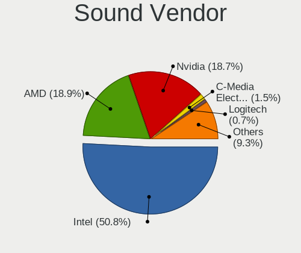

| Vendor                                          | Computers | Percent |
|-------------------------------------------------|-----------|---------|
| Intel                                           | 936       | 53.61%  |
| Nvidia                                          | 317       | 18.16%  |
| AMD                                             | 304       | 17.41%  |
| C-Media Electronics                             | 26        | 1.49%   |
| Logitech                                        | 18        | 1.03%   |
| Creative Labs                                   | 12        | 0.69%   |
| Realtek Semiconductor                           | 10        | 0.57%   |
| Kingston Technology                             | 9         | 0.52%   |
| Corsair                                         | 8         | 0.46%   |
| GN Netcom                                       | 7         | 0.4%    |
| Plantronics                                     | 6         | 0.34%   |
| VIA Technologies                                | 5         | 0.29%   |
| Texas Instruments                               | 5         | 0.29%   |
| RODE Microphones                                | 5         | 0.29%   |
| Razer USA                                       | 5         | 0.29%   |
| Focusrite-Novation                              | 5         | 0.29%   |
| JMTek                                           | 4         | 0.23%   |
| ASUSTek Computer                                | 4         | 0.23%   |
| Sennheiser Communications                       | 3         | 0.17%   |
| Micro Star International                        | 3         | 0.17%   |
| Hewlett-Packard                                 | 3         | 0.17%   |
| Blue Microphones                                | 3         | 0.17%   |
| SteelSeries ApS                                 | 2         | 0.11%   |
| Sony                                            | 2         | 0.11%   |
| Roland                                          | 2         | 0.11%   |
| M-Audio                                         | 2         | 0.11%   |
| GYROCOM C&C                                     | 2         | 0.11%   |
| FIFINE Microphones                              | 2         | 0.11%   |
| BEHRINGER International                         | 2         | 0.11%   |
| Astro Gaming                                    | 2         | 0.11%   |
| Antlion Audio                                   | 2         | 0.11%   |
| XMOS                                            | 1         | 0.06%   |
| Xilinx                                          | 1         | 0.06%   |
| Veho                                            | 1         | 0.06%   |
| Valve Software                                  | 1         | 0.06%   |
| Unknown                                         | 1         | 0.06%   |
| Trust                                           | 1         | 0.06%   |
| Thesycon Systemsoftware & Consulting            | 1         | 0.06%   |
| Silicon Integrated Systems [SiS]                | 1         | 0.06%   |
| Samson Technologies                             | 1         | 0.06%   |
| QinHeng Electronics                             | 1         | 0.06%   |
| Pioneer DJ                                      | 1         | 0.06%   |
| Pioneer                                         | 1         | 0.06%   |
| OPPO Electronics                                | 1         | 0.06%   |
| Numark                                          | 1         | 0.06%   |
| Licensed by Sony Computer Entertainment America | 1         | 0.06%   |
| Lenovo                                          | 1         | 0.06%   |
| JBL                                             | 1         | 0.06%   |
| Harman International                            | 1         | 0.06%   |
| Guillemot                                       | 1         | 0.06%   |
| Giga-Byte Technology                            | 1         | 0.06%   |
| Generalplus Technology                          | 1         | 0.06%   |
| FiiO Electronics Technology                     | 1         | 0.06%   |
| Elite Silicon                                   | 1         | 0.06%   |
| Creative Technology                             | 1         | 0.06%   |
| Cooler Master                                   | 1         | 0.06%   |
| Bose                                            | 1         | 0.06%   |
| Audio-Technica                                  | 1         | 0.06%   |
| Apple                                           | 1         | 0.06%   |
| Alesis                                          | 1         | 0.06%   |

Sound Model
-----------

Sound card models

| Model                                                                      | Computers | Percent |
|----------------------------------------------------------------------------|-----------|---------|
| Intel 7 Series/C216 Chipset Family High Definition Audio Controller        | 103       | 5.08%   |
| Intel 6 Series/C200 Series Chipset Family High Definition Audio Controller | 91        | 4.48%   |
| Intel Sunrise Point-LP HD Audio                                            | 89        | 4.39%   |
| Intel 8 Series/C220 Series Chipset High Definition Audio Controller        | 71        | 3.5%    |
| AMD Family 17h/19h HD Audio Controller                                     | 71        | 3.5%    |
| Intel 82801I (ICH9 Family) HD Audio Controller                             | 58        | 2.86%   |
| AMD Starship/Matisse HD Audio Controller                                   | 53        | 2.61%   |
| Intel Xeon E3-1200 v3/4th Gen Core Processor HD Audio Controller           | 51        | 2.51%   |
| Intel Cannon Lake PCH cAVS                                                 | 47        | 2.32%   |
| Intel 5 Series/3400 Series Chipset High Definition Audio                   | 45        | 2.22%   |
| Intel Cannon Point-LP High Definition Audio Controller                     | 43        | 2.12%   |
| AMD SBx00 Azalia (Intel HDA)                                               | 37        | 1.82%   |
| AMD Renoir Radeon High Definition Audio Controller                         | 37        | 1.82%   |
| Intel NM10/ICH7 Family High Definition Audio Controller                    | 36        | 1.77%   |
| Intel Haswell-ULT HD Audio Controller                                      | 35        | 1.72%   |
| Intel 8 Series HD Audio Controller                                         | 35        | 1.72%   |
| Intel 82801H (ICH8 Family) HD Audio Controller                             | 33        | 1.63%   |
| Intel 100 Series/C230 Series Chipset Family HD Audio Controller            | 32        | 1.58%   |
| Intel 200 Series PCH HD Audio                                              | 29        | 1.43%   |
| AMD FCH Azalia Controller                                                  | 28        | 1.38%   |
| Intel Tiger Lake-LP Smart Sound Technology Audio Controller                | 27        | 1.33%   |
| Intel Broadwell-U Audio Controller                                         | 27        | 1.33%   |
| Intel Wildcat Point-LP High Definition Audio Controller                    | 26        | 1.28%   |
| Nvidia GP107GL High Definition Audio Controller                            | 25        | 1.23%   |
| Nvidia GK107 HDMI Audio Controller                                         | 24        | 1.18%   |
| AMD Raven/Raven2/Fenghuang HDMI/DP Audio Controller                        | 24        | 1.18%   |
| AMD Family 17h (Models 00h-0fh) HD Audio Controller                        | 24        | 1.18%   |
| Nvidia High Definition Audio Controller                                    | 21        | 1.03%   |
| Nvidia GP104 High Definition Audio Controller                              | 20        | 0.99%   |
| Nvidia GM107 High Definition Audio Controller [GeForce 940MX]              | 20        | 0.99%   |
| AMD Ellesmere HDMI Audio [Radeon RX 470/480 / 570/580/590]                 | 20        | 0.99%   |
| Nvidia GF108 High Definition Audio Controller                              | 19        | 0.94%   |
| AMD Kabini HDMI/DP Audio                                                   | 19        | 0.94%   |
| Nvidia GK208 HDMI/DP Audio Controller                                      | 18        | 0.89%   |
| Intel Comet Lake PCH-LP cAVS                                               | 18        | 0.89%   |
| Intel CM238 HD Audio Controller                                            | 18        | 0.89%   |
| Nvidia TU106 High Definition Audio Controller                              | 17        | 0.84%   |
| Nvidia GP106 High Definition Audio Controller                              | 17        | 0.84%   |
| Nvidia GM204 High Definition Audio Controller                              | 17        | 0.84%   |
| Intel 9 Series Chipset Family HD Audio Controller                          | 17        | 0.84%   |
| Intel Comet Lake PCH cAVS                                                  | 16        | 0.79%   |
| Nvidia TU107 GeForce GTX 1650 High Definition Audio Controller             | 15        | 0.74%   |
| Nvidia GF119 HDMI Audio Controller                                         | 12        | 0.59%   |
| Intel Atom Processor Z36xxx/Z37xxx Series High Definition Audio Controller | 12        | 0.59%   |
| Nvidia TU116 High Definition Audio Controller                              | 11        | 0.54%   |
| Nvidia TU104 HD Audio Controller                                           | 11        | 0.54%   |
| Intel 82801JD/DO (ICH10 Family) HD Audio Controller                        | 11        | 0.54%   |
| Realtek Semiconductor USB Audio                                            | 10        | 0.49%   |
| AMD Wrestler HDMI Audio                                                    | 10        | 0.49%   |
| AMD RV710/730 HDMI Audio [Radeon HD 4000 series]                           | 10        | 0.49%   |
| AMD Navi 10 HDMI Audio                                                     | 10        | 0.49%   |
| AMD Family 15h (Models 60h-6fh) Audio Controller                           | 10        | 0.49%   |
| AMD Baffin HDMI/DP Audio [Radeon RX 550 640SP / RX 560/560X]               | 10        | 0.49%   |
| Nvidia GK104 HDMI Audio Controller                                         | 9         | 0.44%   |
| Intel C610/X99 series chipset HD Audio Controller                          | 9         | 0.44%   |
| Intel 82801JI (ICH10 Family) HD Audio Controller                           | 9         | 0.44%   |
| AMD Juniper HDMI Audio [Radeon HD 5700 Series]                             | 9         | 0.44%   |
| AMD Cedar HDMI Audio [Radeon HD 5400/6300/7300 Series]                     | 9         | 0.44%   |
| Nvidia GT216 HDMI Audio Controller                                         | 8         | 0.39%   |
| Kingston Technology HyperX 7.1 Audio                                       | 8         | 0.39%   |

Memory
------

Memory Vendor
-------------

Memory module vendors

| Vendor              | Computers | Percent |
|---------------------|-----------|---------|
| Samsung Electronics | 158       | 22.25%  |
| SK Hynix            | 137       | 19.3%   |
| Kingston            | 88        | 12.39%  |
| Corsair             | 75        | 10.56%  |
| Micron Technology   | 70        | 9.86%   |
| Unknown             | 58        | 8.17%   |
| Crucial             | 37        | 5.21%   |
| G.Skill             | 17        | 2.39%   |
| Elpida              | 13        | 1.83%   |
| Nanya Technology    | 12        | 1.69%   |
| Ramaxel Technology  | 11        | 1.55%   |
| A-DATA Technology   | 8         | 1.13%   |
| Unknown (ABCD)      | 4         | 0.56%   |
| Unifosa             | 4         | 0.56%   |
| Transcend           | 3         | 0.42%   |
| Team                | 2         | 0.28%   |
| Patriot             | 2         | 0.28%   |
| Unknown (0x8551)    | 1         | 0.14%   |
| Unknown (09D5)      | 1         | 0.14%   |
| TRS STAR            | 1         | 0.14%   |
| TIMETEC             | 1         | 0.14%   |
| TakeMS              | 1         | 0.14%   |
| Qimonda             | 1         | 0.14%   |
| PNY                 | 1         | 0.14%   |
| J&A Information     | 1         | 0.14%   |
| GEIL                | 1         | 0.14%   |
| Corsair SerNum0     | 1         | 0.14%   |
| A-DA                | 1         | 0.14%   |

Memory Model
------------

Memory module models

| Model                                                               | Computers | Percent |
|---------------------------------------------------------------------|-----------|---------|
| SK Hynix RAM HMA81GS6AFR8N-UH 8GB SODIMM DDR4 2667MT/s              | 8         | 1.05%   |
| Corsair RAM CMK16GX4M2B3000C15 8GB DIMM DDR4 3000MT/s               | 8         | 1.05%   |
| SK Hynix RAM HMT451S6BFR8A-PB 4GB SODIMM DDR3 1600MT/s              | 7         | 0.92%   |
| SK Hynix RAM HMT351S6EFR8A-PB 4GB SODIMM DDR3 1600MT/s              | 7         | 0.92%   |
| Samsung RAM M471B5273DH0-CH9 4GB SODIMM DDR3 1334MT/s               | 7         | 0.92%   |
| Samsung RAM M471B5173DB0-YK0 4096MB SODIMM DDR3 1600MT/s            | 7         | 0.92%   |
| Samsung RAM M471A1K43DB1-CWE 8GB SODIMM DDR4 3200MT/s               | 7         | 0.92%   |
| Corsair RAM CMK16GX4M2B3200C16 8GB DIMM DDR4 3600MT/s               | 7         | 0.92%   |
| SK Hynix RAM H9CCNNNCLGALAR-NVD 8192MB Row Of Chips LPDDR3 2133MT/s | 6         | 0.79%   |
| Samsung RAM M471A1K43CB1-CRC 8GB SODIMM DDR4 2667MT/s               | 6         | 0.79%   |
| SK Hynix RAM HMT351U6CFR8C-PB 4GB DIMM DDR3 1800MT/s                | 5         | 0.66%   |
| SK Hynix RAM HMT351S6CFR8C-PB 4GB SODIMM DDR3 1600MT/s              | 5         | 0.66%   |
| SK Hynix RAM HMA81GS6CJR8N-VK 8GB SODIMM DDR4 2667MT/s              | 5         | 0.66%   |
| Samsung RAM M471B5173QH0-YK0 4GB SODIMM DDR3 1600MT/s               | 5         | 0.66%   |
| Samsung RAM M471B1G73QH0-YK0 8GB SODIMM DDR3 1600MT/s               | 5         | 0.66%   |
| Crucial RAM CT102464BF160B.C16 8GB SODIMM DDR3 1600MT/s             | 5         | 0.66%   |
| Corsair RAM CMK32GX4M2B3200C16 16GB DIMM DDR4 3400MT/s              | 5         | 0.66%   |
| Unknown RAM Module 4096MB SODIMM DDR3 1333MT/s                      | 4         | 0.53%   |
| Unknown RAM Module 4096MB SODIMM DDR3                               | 4         | 0.53%   |
| Unknown (ABCD) RAM 123456789012345678 2048MB SODIMM LPDDR4 2400MT/s | 4         | 0.53%   |
| SK Hynix RAM HMA82GS6JJR8N-VK 16GB SODIMM DDR4 2667MT/s             | 4         | 0.53%   |
| Samsung RAM Module 16384MB SODIMM DDR4 2667MT/s                     | 4         | 0.53%   |
| Samsung RAM M471B5773DH0-CH9 2GB SODIMM DDR3 1600MT/s               | 4         | 0.53%   |
| Samsung RAM M471B1G73DB0-YK0 8GB SODIMM DDR3 1600MT/s               | 4         | 0.53%   |
| Samsung RAM M471A5244CB0-CTD 4GB SODIMM DDR4 3266MT/s               | 4         | 0.53%   |
| Samsung RAM M471A2K43DB1-CWE 16GB SODIMM DDR4 3200MT/s              | 4         | 0.53%   |
| Samsung RAM M471A1K43CB1-CTD 8GB SODIMM DDR4 2667MT/s               | 4         | 0.53%   |
| Samsung RAM M471A1K43BB1-CTD 8192MB SODIMM DDR4 2667MT/s            | 4         | 0.53%   |
| Samsung RAM M4 70T5663QZ3-CF7 2GB SODIMM DDR2 2048MT/s              | 4         | 0.53%   |
| Samsung RAM M378B5673FH0-CH9 2GB DIMM DDR3 1600MT/s                 | 4         | 0.53%   |
| Samsung RAM K4EBE304EC-EGCG 8GB Row Of Chips LPDDR3 2133MT/s        | 4         | 0.53%   |
| Unknown RAM Module 4096MB DIMM 1333MT/s                             | 3         | 0.39%   |
| Unknown RAM Module 2GB SODIMM DDR2 667MT/s                          | 3         | 0.39%   |
| SK Hynix RAM HMT425S6AFR6A-PB 2GB SODIMM DDR3 1600MT/s              | 3         | 0.39%   |
| SK Hynix RAM HMA851S6CJR6N-VK 4GB SODIMM DDR4 2667MT/s              | 3         | 0.39%   |
| SK Hynix RAM HMA82GS6CJR8N-VK 16GB SODIMM DDR4 2667MT/s             | 3         | 0.39%   |
| SK Hynix RAM HMA81GS6DJR8N-XN 8GB SODIMM DDR4 3200MT/s              | 3         | 0.39%   |
| Samsung RAM M471B5273CH0-CH9 4096MB SODIMM DDR3 1334MT/s            | 3         | 0.39%   |
| Samsung RAM M471A2G44AM0-CWE 16GB SODIMM DDR4 3200MT/s              | 3         | 0.39%   |
| Samsung RAM M471A1K43DB1-CTD 8GB SODIMM DDR4 2667MT/s               | 3         | 0.39%   |
| Samsung RAM M471A1G44AB0-CWE 8GB SODIMM DDR4 3200MT/s               | 3         | 0.39%   |
| Samsung RAM M471A1G44AB0-CWE 8GB Row Of Chips DDR4 3200MT/s         | 3         | 0.39%   |
| Ramaxel RAM RMSA3260MD78HAF-2666 8192MB SODIMM DDR4 2667MT/s        | 3         | 0.39%   |
| Kingston RAM 99U5584-005.A00LF 4096MB DIMM DDR3 1600MT/s            | 3         | 0.39%   |
| G.Skill RAM F4-3600C16-16GVKC 16384MB DIMM DDR4 3866MT/s            | 3         | 0.39%   |
| G.Skill RAM F4-3200C16-8GVKB 8192MB DIMM DDR4 3200MT/s              | 3         | 0.39%   |
| Corsair RAM CMK64GX4M2E3200C16 32GB DIMM DDR4 3200MT/s              | 3         | 0.39%   |
| Corsair RAM CMK32GX4M2A2666C16 16GB DIMM DDR4 3100MT/s              | 3         | 0.39%   |
| Unknown RAM Module 8192MB DIMM DDR3 1600MT/s                        | 2         | 0.26%   |
| Unknown RAM Module 4GB SODIMM DDR4 2400MT/s                         | 2         | 0.26%   |
| Unknown RAM Module 4GB DIMM DDR3 1333MT/s                           | 2         | 0.26%   |
| Unknown RAM Module 4096MB DIMM 1600MT/s                             | 2         | 0.26%   |
| Unknown RAM Module 2GB DIMM DDR3 1333MT/s                           | 2         | 0.26%   |
| Unknown RAM Module 2GB DIMM DDR2 800MT/s                            | 2         | 0.26%   |
| Unknown RAM Module 2048MB SODIMM DDR2 667MT/s                       | 2         | 0.26%   |
| Unknown RAM Module 2048MB DIMM DDR2 800MT/s                         | 2         | 0.26%   |
| Unknown RAM Module 2048MB DIMM 1333MT/s                             | 2         | 0.26%   |
| SK Hynix RAM Module 8GB SODIMM DDR4 3200MT/s                        | 2         | 0.26%   |
| SK Hynix RAM Module 8GB DIMM DDR4 2666MT/s                          | 2         | 0.26%   |
| SK Hynix RAM Module 4096MB DIMM DDR3 1600MT/s                       | 2         | 0.26%   |

Memory Kind
-----------

Memory module kinds

| Kind    | Computers | Percent |
|---------|-----------|---------|
| DDR4    | 288       | 45.21%  |
| DDR3    | 235       | 36.89%  |
| DDR2    | 42        | 6.59%   |
| SDRAM   | 23        | 3.61%   |
| LPDDR3  | 19        | 2.98%   |
| Unknown | 15        | 2.35%   |
| LPDDR4  | 14        | 2.2%    |
| DDR     | 1         | 0.16%   |

Memory Form Factor
------------------

Physical design of the memory module

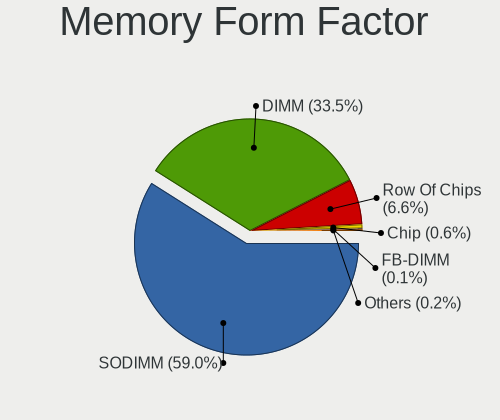

| Name         | Computers | Percent |
|--------------|-----------|---------|
| SODIMM       | 358       | 57.65%  |
| DIMM         | 223       | 35.91%  |
| Row Of Chips | 34        | 5.48%   |
| Chip         | 3         | 0.48%   |
| FB-DIMM      | 2         | 0.32%   |
| RIMM         | 1         | 0.16%   |

Memory Size
-----------

Memory module size

| Size  | Computers | Percent |
|-------|-----------|---------|
| 8192  | 247       | 36.65%  |
| 4096  | 200       | 29.67%  |
| 16384 | 101       | 14.99%  |
| 2048  | 82        | 12.17%  |
| 1024  | 28        | 4.15%   |
| 32768 | 12        | 1.78%   |
| 512   | 4         | 0.59%   |

Memory Speed
------------

Memory module speed

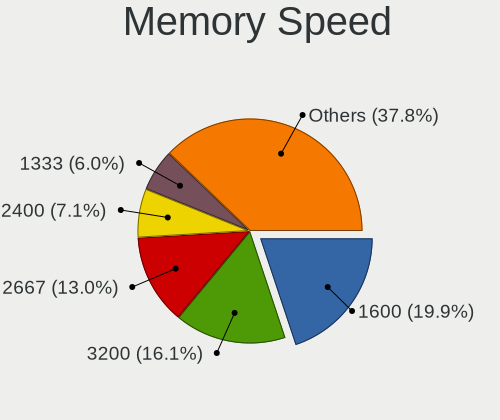

| Speed   | Computers | Percent |
|---------|-----------|---------|
| 1600    | 155       | 22.73%  |
| 2667    | 98        | 14.37%  |
| 3200    | 84        | 12.32%  |
| 2400    | 58        | 8.5%    |
| 1333    | 56        | 8.21%   |
| 2133    | 41        | 6.01%   |
| 667     | 27        | 3.96%   |
| 1334    | 21        | 3.08%   |
| 800     | 16        | 2.35%   |
| 3600    | 15        | 2.2%    |
| 3466    | 13        | 1.91%   |
| Unknown | 10        | 1.47%   |
| 1067    | 8         | 1.17%   |
| 4267    | 7         | 1.03%   |
| 2048    | 7         | 1.03%   |
| 1800    | 7         | 1.03%   |
| 3000    | 6         | 0.88%   |
| 2666    | 6         | 0.88%   |
| 1867    | 6         | 0.88%   |
| 3400    | 5         | 0.73%   |
| 3266    | 5         | 0.73%   |
| 1066    | 5         | 0.73%   |
| 533     | 4         | 0.59%   |
| 3866    | 3         | 0.44%   |
| 3100    | 3         | 0.44%   |
| 975     | 3         | 0.44%   |
| 4199    | 2         | 0.29%   |
| 1639    | 2         | 0.29%   |
| 8400    | 1         | 0.15%   |
| 4266    | 1         | 0.15%   |
| 3067    | 1         | 0.15%   |
| 2933    | 1         | 0.15%   |
| 2733    | 1         | 0.15%   |
| 2134    | 1         | 0.15%   |
| 2000    | 1         | 0.15%   |
| 1866    | 1         | 0.15%   |
| 1777    | 1         | 0.15%   |

Printers & scanners
-------------------

Printer Vendor
--------------

Printer device vendors

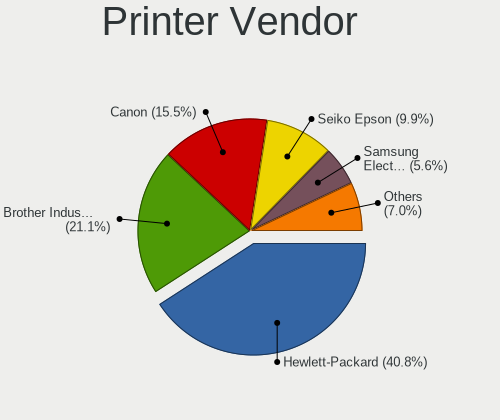

| Vendor              | Computers | Percent |
|---------------------|-----------|---------|
| Hewlett-Packard     | 16        | 45.71%  |
| Brother Industries  | 7         | 20%     |
| Canon               | 5         | 14.29%  |
| Seiko Epson         | 2         | 5.71%   |
| Samsung Electronics | 2         | 5.71%   |
| Ricoh               | 1         | 2.86%   |
| Kyocera             | 1         | 2.86%   |
| Dymo-CoStar         | 1         | 2.86%   |

Printer Model
-------------

Printer device models

| Model                                                      | Computers | Percent |
|------------------------------------------------------------|-----------|---------|
| HP ENVY 4500 series                                        | 2         | 5.71%   |
| Seiko Epson WF-3010 Series                                 | 1         | 2.86%   |
| Seiko Epson ET-4750 [WorkForce ET-4750 EcoTank All-in-One] | 1         | 2.86%   |
| Samsung SCX-472x Series                                    | 1         | 2.86%   |
| Samsung ML-1660 Series                                     | 1         | 2.86%   |
| Ricoh SP C250SF                                            | 1         | 2.86%   |
| Kyocera TASKalfa 250ci                                     | 1         | 2.86%   |
| HP OfficeJet Pro 6960                                      | 1         | 2.86%   |
| HP OfficeJet Pro 69                                        | 1         | 2.86%   |
| HP LaserJet Professional P 1102w                           | 1         | 2.86%   |
| HP LaserJet P4015                                          | 1         | 2.86%   |
| HP LaserJet 1015                                           | 1         | 2.86%   |
| HP EWS UPD                                                 | 1         | 2.86%   |
| HP ENVY Photo 6200 series                                  | 1         | 2.86%   |
| HP ENVY 5540 series                                        | 1         | 2.86%   |
| HP ENVY 4520 series                                        | 1         | 2.86%   |
| HP Deskjet F4500 series                                    | 1         | 2.86%   |
| HP DeskJet F300 series                                     | 1         | 2.86%   |
| HP DeskJet 5650c                                           | 1         | 2.86%   |
| HP DeskJet 5150c                                           | 1         | 2.86%   |
| HP DeskJet 3630 series                                     | 1         | 2.86%   |
| Dymo-CoStar LabelWriter 450                                | 1         | 2.86%   |
| Canon TS5100 series                                        | 1         | 2.86%   |
| Canon PIXMA MX920 Series                                   | 1         | 2.86%   |
| Canon PIXMA MP240                                          | 1         | 2.86%   |
| Canon MG5700 series                                        | 1         | 2.86%   |
| Canon iP4900 series                                        | 1         | 2.86%   |
| Brother Printer                                            | 1         | 2.86%   |
| Brother MFC-L2710DW series                                 | 1         | 2.86%   |
| Brother MFC-J491DW                                         | 1         | 2.86%   |
| Brother HL-4150CDN series                                  | 1         | 2.86%   |
| Brother HL-2030 Laser Printer                              | 1         | 2.86%   |
| Brother DCP-L2520DW                                        | 1         | 2.86%   |
| Brother DCP-J140W                                          | 1         | 2.86%   |

Scanner Vendor
--------------

Scanner device vendors

| Vendor          | Computers | Percent |
|-----------------|-----------|---------|
| Seiko Epson     | 5         | 33.33%  |
| Hewlett-Packard | 5         | 33.33%  |
| Canon           | 4         | 26.67%  |
| AGFA-Gevaert NV | 1         | 6.67%   |

Scanner Model
-------------

Scanner device models

| Model                                                   | Computers | Percent |
|---------------------------------------------------------|-----------|---------|
| Seiko Epson GT-X900 [Perfection V700/V750 Photo]        | 1         | 6.67%   |
| Seiko Epson GT-X750 [Perfection 4490 Photo]             | 1         | 6.67%   |
| Seiko Epson GT-F730 [GT-S630/Perfection V33/V330 Photo] | 1         | 6.67%   |
| Seiko Epson GT-F700 [Perfection V350]                   | 1         | 6.67%   |
| Seiko Epson GT-7300U [Perfection 1260/1260 PHOTO]       | 1         | 6.67%   |
| HP scanjet 8270                                         | 1         | 6.67%   |
| HP ScanJet 4370                                         | 1         | 6.67%   |
| HP ScanJet 3800c                                        | 1         | 6.67%   |
| HP ScanJet 3670                                         | 1         | 6.67%   |
| HP ScanJet 3400cse                                      | 1         | 6.67%   |
| Canon CanoScan N670U/N676U/LiDE 20                      | 1         | 6.67%   |
| Canon CanoScan LiDE 210                                 | 1         | 6.67%   |
| Canon CanoScan LiDE 110                                 | 1         | 6.67%   |
| Canon CanoScan 3200F                                    | 1         | 6.67%   |
| AGFA-Gevaert NV Snapscan e40                            | 1         | 6.67%   |

Camera
------

Camera Vendor
-------------

Camera device vendors

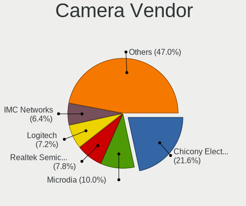

| Vendor                                 | Computers | Percent |
|----------------------------------------|-----------|---------|
| Chicony Electronics                    | 169       | 22.5%   |
| Microdia                               | 83        | 11.05%  |
| Realtek Semiconductor                  | 67        | 8.92%   |
| Logitech                               | 59        | 7.86%   |
| IMC Networks                           | 51        | 6.79%   |
| Acer                                   | 49        | 6.52%   |
| Sunplus Innovation Technology          | 37        | 4.93%   |
| Suyin                                  | 30        | 3.99%   |
| Lite-On Technology                     | 29        | 3.86%   |
| Cheng Uei Precision Industry (Foxlink) | 25        | 3.33%   |
| Quanta                                 | 23        | 3.06%   |
| Syntek                                 | 21        | 2.8%    |
| Apple                                  | 18        | 2.4%    |
| Alcor Micro                            | 12        | 1.6%    |
| Ricoh                                  | 10        | 1.33%   |
| Samsung Electronics                    | 7         | 0.93%   |
| Luxvisions Innotech Limited            | 6         | 0.8%    |
| Silicon Motion                         | 4         | 0.53%   |
| Z-Star Microelectronics                | 3         | 0.4%    |
| Trust                                  | 3         | 0.4%    |
| Primax Electronics                     | 3         | 0.4%    |
| Microsoft                              | 3         | 0.4%    |
| Importek                               | 3         | 0.4%    |
| Generalplus Technology                 | 3         | 0.4%    |
| Creative Technology                    | 3         | 0.4%    |
| Technologies                           | 2         | 0.27%   |
| Sunplus Technology                     | 2         | 0.27%   |
| Lenovo                                 | 2         | 0.27%   |
| Jieli Technology                       | 2         | 0.27%   |
| DJJHFA1BIF5CB0                         | 2         | 0.27%   |
| webcam                                 | 1         | 0.13%   |
| WaveRider Communications               | 1         | 0.13%   |
| Valve Software                         | 1         | 0.13%   |
| Sweex                                  | 1         | 0.13%   |
| Pixart Imaging                         | 1         | 0.13%   |
| Panasonic (Matsushita)                 | 1         | 0.13%   |
| OmniVision Technologies                | 1         | 0.13%   |
| Novatek Microelectronics               | 1         | 0.13%   |
| Nokia Mobile Phones                    | 1         | 0.13%   |
| Mustek Systems                         | 1         | 0.13%   |
| KYE Systems (Mouse Systems)            | 1         | 0.13%   |
| Huawei Technologies                    | 1         | 0.13%   |
| Guillemot                              | 1         | 0.13%   |
| Genesys Logic                          | 1         | 0.13%   |
| Cubeternet                             | 1         | 0.13%   |
| Aveo Technology                        | 1         | 0.13%   |
| Asuscom Network                        | 1         | 0.13%   |
| Arkmicro Technologies                  | 1         | 0.13%   |
| Allwinner Technology                   | 1         | 0.13%   |
| ALi                                    | 1         | 0.13%   |

Camera Model
------------

Camera device models

| Model                                               | Computers | Percent |
|-----------------------------------------------------|-----------|---------|
| Realtek Integrated_Webcam_HD                        | 30        | 3.97%   |
| Microdia Integrated_Webcam_HD                       | 23        | 3.04%   |
| IMC Networks Integrated Camera                      | 21        | 2.78%   |
| Chicony Integrated Camera                           | 20        | 2.65%   |
| Microdia Integrated Webcam                          | 16        | 2.12%   |
| Acer Integrated Camera                              | 16        | 2.12%   |
| Syntek Integrated Camera                            | 12        | 1.59%   |
| Realtek USB Camera                                  | 11        | 1.46%   |
| Chicony HD WebCam                                   | 11        | 1.46%   |
| Lite-On HP HD Camera                                | 10        | 1.32%   |
| Chicony HP HD Webcam                                | 10        | 1.32%   |
| Logitech HD Webcam C525                             | 9         | 1.19%   |
| IMC Networks USB2.0 HD UVC WebCam                   | 9         | 1.19%   |
| Chicony USB2.0 Camera                               | 9         | 1.19%   |
| Chicony HP Wide Vision HD Camera                    | 9         | 1.19%   |
| Sunplus HD Webcam                                   | 8         | 1.06%   |
| Lite-On Integrated Camera                           | 8         | 1.06%   |
| Chicony HP HD Camera                                | 8         | 1.06%   |
| Sunplus Integrated_Webcam_HD                        | 7         | 0.93%   |
| Samsung Galaxy A5 (MTP)                             | 7         | 0.93%   |
| Logitech Webcam C270                                | 7         | 0.93%   |
| Chicony USB2.0 HD UVC WebCam                        | 7         | 0.93%   |
| Chicony EasyCamera                                  | 7         | 0.93%   |
| Apple iPhone 5/5C/5S/6/SE                           | 7         | 0.93%   |
| Suyin Acer/HP Integrated Webcam [CN0314]            | 6         | 0.79%   |
| Microdia Laptop_Integrated_Webcam_2M                | 6         | 0.79%   |
| Microdia Camera                                     | 6         | 0.79%   |
| Logitech HD Pro Webcam C920                         | 6         | 0.79%   |
| Lite-On HP HD Webcam                                | 6         | 0.79%   |
| Chicony USB 2.0 Camera                              | 6         | 0.79%   |
| Chicony TOSHIBA Web Camera - HD                     | 6         | 0.79%   |
| Chicony Integrated Camera (1280x720@30)             | 6         | 0.79%   |
| Acer BisonCam, NB Pro                               | 6         | 0.79%   |
| Sunplus ASUS USB2.0 Webcam                          | 5         | 0.66%   |
| Realtek USB2.0 VGA UVC WebCam                       | 5         | 0.66%   |
| Quanta HP HD Camera                                 | 5         | 0.66%   |
| Microdia Laptop_Integrated_Webcam_HD                | 5         | 0.66%   |
| Logitech C922 Pro Stream Webcam                     | 5         | 0.66%   |
| Chicony WebCam                                      | 5         | 0.66%   |
| Chicony USB2.0 VGA UVC WebCam                       | 5         | 0.66%   |
| Chicony Integrated HP HD Webcam                     | 5         | 0.66%   |
| Apple Built-in iSight                               | 5         | 0.66%   |
| Acer HD Webcam                                      | 5         | 0.66%   |
| Acer BisonCam,NB Pro                                | 5         | 0.66%   |
| Suyin 1.3M HD WebCam                                | 4         | 0.53%   |
| Realtek USB2.0 HD UVC WebCam                        | 4         | 0.53%   |
| Realtek HD WebCam                                   | 4         | 0.53%   |
| Quanta VGA WebCam                                   | 4         | 0.53%   |
| Quanta HP Webcam                                    | 4         | 0.53%   |
| Logitech Webcam C170                                | 4         | 0.53%   |
| IMC Networks USB2.0 VGA UVC WebCam                  | 4         | 0.53%   |
| Chicony HP TrueVision HD Camera                     | 4         | 0.53%   |
| Cheng Uei Precision Industry (Foxlink) HP HD Webcam | 4         | 0.53%   |
| Alcor Micro Asus Integrated Webcam                  | 4         | 0.53%   |
| Syntek USB2.0 Camera                                | 3         | 0.4%    |
| Sunplus HP HD Webcam [Fixed]                        | 3         | 0.4%    |
| Ricoh USB2.0 Camera                                 | 3         | 0.4%    |
| Realtek Integrated Webcam                           | 3         | 0.4%    |
| Quanta HD Webcam                                    | 3         | 0.4%    |
| Microdia Webcam Vitade AF                           | 3         | 0.4%    |

Security
--------

Fingerprint Vendor
------------------

Fingerprint sensor vendors

| Vendor                     | Computers | Percent |
|----------------------------|-----------|---------|
| Validity Sensors           | 57        | 36.31%  |
| Synaptics                  | 55        | 35.03%  |
| Shenzhen Goodix Technology | 15        | 9.55%   |
| AuthenTec                  | 12        | 7.64%   |
| LighTuning Technology      | 8         | 5.1%    |
| STMicroelectronics         | 4         | 2.55%   |
| Upek                       | 3         | 1.91%   |
| Elan Microelectronics      | 2         | 1.27%   |
| DigitalPersona             | 1         | 0.64%   |

Fingerprint Model
-----------------

Fingerprint sensor models

| Model                                                                      | Computers | Percent |
|----------------------------------------------------------------------------|-----------|---------|
| Validity Sensors VFS495 Fingerprint Reader                                 | 24        | 15.29%  |
| Synaptics Prometheus MIS Touch Fingerprint Reader                          | 17        | 10.83%  |
| Unknown                                                                    | 15        | 9.55%   |
| Shenzhen Goodix Fingerprint Reader                                         | 7         | 4.46%   |
| Synaptics  WBDI                                                            | 6         | 3.82%   |
| Shenzhen Goodix  Fingerprint Device                                        | 6         | 3.82%   |
| AuthenTec AES2501 Fingerprint Sensor                                       | 6         | 3.82%   |
| Validity Sensors VFS5011 Fingerprint Reader                                | 5         | 3.18%   |
| Synaptics  VFS7552 Touch Fingerprint Sensor with PurePrint                 | 5         | 3.18%   |
| LighTuning EgisTec Touch Fingerprint Sensor                                | 5         | 3.18%   |
| Validity Sensors VFS471 Fingerprint Reader                                 | 4         | 2.55%   |
| Validity Sensors VFS 5011 fingerprint sensor                               | 4         | 2.55%   |
| Synaptics Metallica MIS Touch Fingerprint Reader                           | 4         | 2.55%   |
| STMicroelectronics Fingerprint Reader                                      | 4         | 2.55%   |
| Validity Sensors VFS491                                                    | 3         | 1.91%   |
| Validity Sensors VFS451 Fingerprint Reader                                 | 3         | 1.91%   |
| Upek Biometric Touchchip/Touchstrip Fingerprint Sensor                     | 3         | 1.91%   |
| Synaptics WBDI Device                                                      | 3         | 1.91%   |
| Synaptics Metallica MOH Touch Fingerprint Reader                           | 3         | 1.91%   |
| AuthenTec AES2810                                                          | 3         | 1.91%   |
| AuthenTec AES1600                                                          | 3         | 1.91%   |
| Validity Sensors VFS7552 Touch Fingerprint Sensor                          | 2         | 1.27%   |
| Validity Sensors VFS101 Fingerprint Reader                                 | 2         | 1.27%   |
| Validity Sensors VFS Fingerprint sensor                                    | 2         | 1.27%   |
| Validity Sensors Synaptics VFS7552 Touch Fingerprint Sensor with PurePrint | 2         | 1.27%   |
| Validity Sensors Fingerprint scanner                                       | 2         | 1.27%   |
| Synaptics  FS7604 Touch Fingerprint Sensor with PurePrint                  | 2         | 1.27%   |
| Shenzhen Goodix FingerPrint                                                | 2         | 1.27%   |
| LighTuning Fingerprint Reader                                              | 2         | 1.27%   |
| Validity Sensors VFS7500 Touch Fingerprint Sensor                          | 1         | 0.64%   |
| Validity Sensors VFS301 Fingerprint Reader                                 | 1         | 0.64%   |
| Validity Sensors VFS300 Fingerprint Reader                                 | 1         | 0.64%   |
| Validity Sensors Synaptics WBDI                                            | 1         | 0.64%   |
| LighTuning ES603 Swipe Fingerprint Sensor                                  | 1         | 0.64%   |
| Elan ELAN:Fingerprint                                                      | 1         | 0.64%   |
| Elan ELAN:ARM-M4                                                           | 1         | 0.64%   |
| DigitalPersona Fingerprint Reader                                          | 1         | 0.64%   |

Chipcard Vendor
---------------

Chipcard module vendors

| Vendor                            | Computers | Percent |
|-----------------------------------|-----------|---------|
| Broadcom                          | 44        | 30.99%  |
| Alcor Micro                       | 37        | 26.06%  |
| VASCO Data Security International | 18        | 12.68%  |
| O2 Micro                          | 12        | 8.45%   |
| Realtek Semiconductor             | 11        | 7.75%   |
| Lenovo                            | 7         | 4.93%   |
| Advanced Card Systems             | 3         | 2.11%   |
| Upek                              | 2         | 1.41%   |
| OmniKey                           | 2         | 1.41%   |
| Yubico.com                        | 1         | 0.7%    |
| SCM Microsystems                  | 1         | 0.7%    |
| Integrated Technology Express     | 1         | 0.7%    |
| Gemalto (was Gemplus)             | 1         | 0.7%    |
| Clay Logic                        | 1         | 0.7%    |
| Cherry                            | 1         | 0.7%    |

Chipcard Model
--------------

Chipcard module models

| Model                                                                        | Computers | Percent |
|------------------------------------------------------------------------------|-----------|---------|
| Alcor Micro AU9540 Smartcard Reader                                          | 36        | 25.35%  |
| Broadcom BCM5880 Secure Applications Processor                               | 15        | 10.56%  |
| Broadcom 58200                                                               | 12        | 8.45%   |
| Realtek Semiconductor Smart Card Reader Interface                            | 11        | 7.75%   |
| VASCO Data Security International Digipass 905 SmartCard Reader              | 10        | 7.04%   |
| O2 Micro OZ776 CCID Smartcard Reader                                         | 9         | 6.34%   |
| Broadcom 5880                                                                | 9         | 6.34%   |
| VASCO Data Security International DIGIPASS 870                               | 8         | 5.63%   |
| Broadcom BCM5880 Secure Applications Processor with fingerprint swipe sensor | 8         | 5.63%   |
| Lenovo Integrated Smart Card Reader                                          | 7         | 4.93%   |
| O2 Micro Oz776 SmartCard Reader                                              | 3         | 2.11%   |
| Advanced Card Systems ACR38 SmartCard Reader                                 | 3         | 2.11%   |
| Upek TouchChip Fingerprint Coprocessor (WBF advanced mode)                   | 2         | 1.41%   |
| Yubico.com Yubikey 4/5 U2F+CCID                                              | 1         | 0.7%    |
| SCM Microsystems SCR3340 - ExpressCard54 Smart Card Reader                   | 1         | 0.7%    |
| OmniKey CardMan 4321                                                         | 1         | 0.7%    |
| OmniKey CardMan 3021 / 3121                                                  | 1         | 0.7%    |
| Integrated Technology Express SmartCard Reader                               | 1         | 0.7%    |
| Gemalto (was Gemplus) Compact Smart Card Reader Writer                       | 1         | 0.7%    |
| Clay Logic Nitrokey Start                                                    | 1         | 0.7%    |
| Cherry SmartCard Reader Keyboard KC 1000 SC                                  | 1         | 0.7%    |
| Alcor Micro Watchdata W 1981                                                 | 1         | 0.7%    |

Unsupported
-----------

Unsupported Devices
-------------------

Total unsupported devices on board

| Total | Computers | Percent |
|-------|-----------|---------|
| 0     | 838       | 65.78%  |
| 1     | 349       | 27.39%  |
| 2     | 70        | 5.49%   |
| 3     | 10        | 0.78%   |
| 4     | 4         | 0.31%   |
| 6     | 2         | 0.16%   |
| 5     | 1         | 0.08%   |

Unsupported Device Types
------------------------

Types of unsupported devices

| Type                     | Computers | Percent |
|--------------------------|-----------|---------|
| Fingerprint reader       | 154       | 30.08%  |
| Chipcard                 | 98        | 19.14%  |
| Graphics card            | 85        | 16.6%   |
| Net/wireless             | 43        | 8.4%    |
| Multimedia controller    | 27        | 5.27%   |
| Communication controller | 20        | 3.91%   |
| Unassigned class         | 14        | 2.73%   |
| Storage                  | 11        | 2.15%   |
| Card reader              | 11        | 2.15%   |
| Camera                   | 11        | 2.15%   |
| Net/ethernet             | 9         | 1.76%   |
| Bluetooth                | 9         | 1.76%   |
| Sound                    | 6         | 1.17%   |
| Flash memory             | 4         | 0.78%   |
| Network                  | 3         | 0.59%   |
| Modem                    | 3         | 0.59%   |
| Dvb card                 | 2         | 0.39%   |
| Storage/raid             | 1         | 0.2%    |
| Storage/ide              | 1         | 0.2%    |

