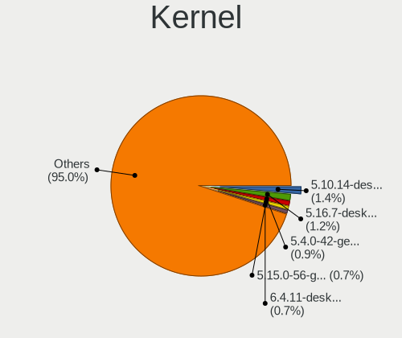
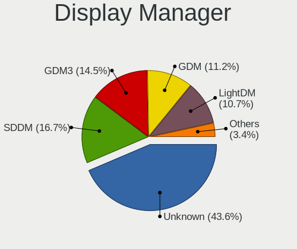
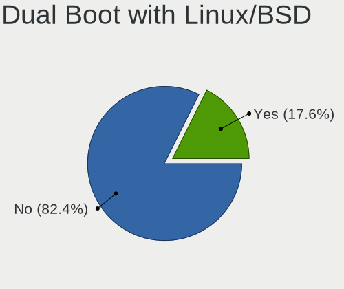
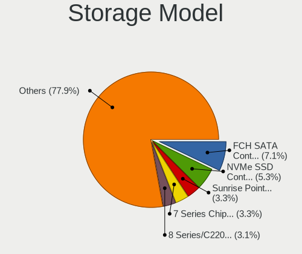
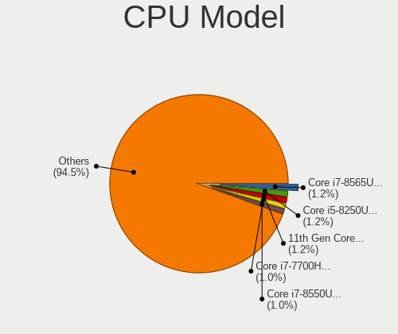
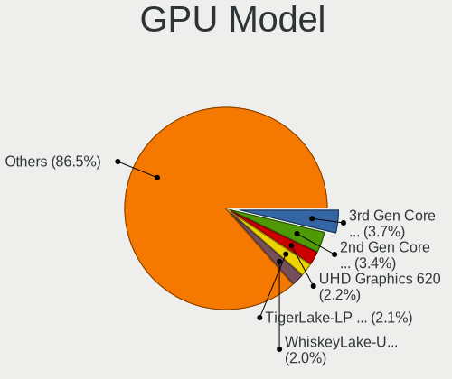
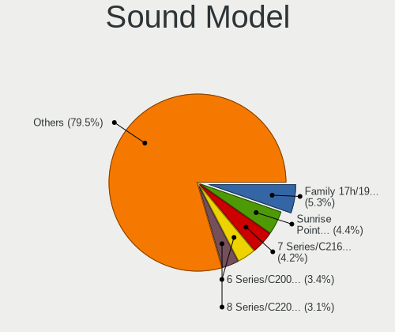
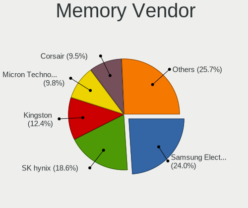
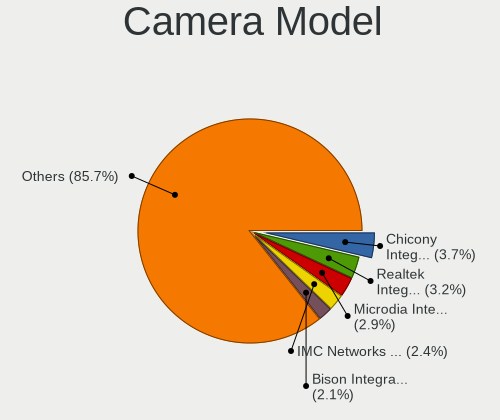

Linux in Belgium - Tested Hardware & Statistics
-----------------------------------------------

A project to collect tested hardware configurations for Linux in Belgium.

Anyone can contribute to this report by the [hw-probe](https://github.com/linuxhw/hw-probe) tool:

    sudo -E hw-probe -all -upload

Please contribute! Especially if your hardware is rare.

This is a report for all computer types. See also reports for [desktops](/Location/Belgium/Desktop/README.md) and [notebooks](/Location/Belgium/Notebook/README.md).

Contents
--------

* [ Test Cases ](#test-cases)

* [ System ](#system)
  - [ OS                       ](#os)
  - [ OS Family                ](#os-family)
  - [ Kernel                   ](#kernel)
  - [ Kernel Family            ](#kernel-family)
  - [ Kernel Major Ver.        ](#kernel-major-ver)
  - [ Arch                     ](#arch)
  - [ DE                       ](#de)
  - [ Display Server           ](#display-server)
  - [ Display Manager          ](#display-manager)
  - [ OS Lang                  ](#os-lang)
  - [ Boot Mode                ](#boot-mode)
  - [ Filesystem               ](#filesystem)
  - [ Part. scheme             ](#part-scheme)
  - [ Dual Boot with Linux/BSD ](#dual-boot-with-linuxbsd)
  - [ Dual Boot (Win)          ](#dual-boot-win)

* [ Board ](#board)
  - [ Vendor                   ](#vendor)
  - [ Model                    ](#model)
  - [ Model Family             ](#model-family)
  - [ MFG Year                 ](#mfg-year)
  - [ Form Factor              ](#form-factor)
  - [ Secure Boot              ](#secure-boot)
  - [ Coreboot                 ](#coreboot)
  - [ RAM Size                 ](#ram-size)
  - [ RAM Used                 ](#ram-used)
  - [ Total Drives             ](#total-drives)
  - [ Has CD-ROM               ](#has-cd-rom)
  - [ Has Ethernet             ](#has-ethernet)
  - [ Has WiFi                 ](#has-wifi)
  - [ Has Bluetooth            ](#has-bluetooth)

* [ Location ](#location)
  - [ Country                  ](#country)
  - [ City                     ](#city)

* [ Drives ](#drives)
  - [ Drive Vendor             ](#drive-vendor)
  - [ Drive Model              ](#drive-model)
  - [ HDD Vendor               ](#hdd-vendor)
  - [ SSD Vendor               ](#ssd-vendor)
  - [ Drive Kind               ](#drive-kind)
  - [ Drive Connector          ](#drive-connector)
  - [ Drive Size               ](#drive-size)
  - [ Space Total              ](#space-total)
  - [ Space Used               ](#space-used)
  - [ Malfunc. Drives          ](#malfunc-drives)
  - [ Malfunc. Drive Vendor    ](#malfunc-drive-vendor)
  - [ Malfunc. HDD Vendor      ](#malfunc-hdd-vendor)
  - [ Malfunc. Drive Kind      ](#malfunc-drive-kind)
  - [ Failed Drives            ](#failed-drives)
  - [ Failed Drive Vendor      ](#failed-drive-vendor)
  - [ Drive Status             ](#drive-status)

* [ Storage controller ](#storage-controller)
  - [ Storage Vendor           ](#storage-vendor)
  - [ Storage Model            ](#storage-model)
  - [ Storage Kind             ](#storage-kind)

* [ Processor ](#processor)
  - [ CPU Vendor               ](#cpu-vendor)
  - [ CPU Model                ](#cpu-model)
  - [ CPU Model Family         ](#cpu-model-family)
  - [ CPU Cores                ](#cpu-cores)
  - [ CPU Sockets              ](#cpu-sockets)
  - [ CPU Threads              ](#cpu-threads)
  - [ CPU Op-Modes             ](#cpu-op-modes)
  - [ CPU Microcode            ](#cpu-microcode)
  - [ CPU Microarch            ](#cpu-microarch)

* [ Graphics ](#graphics)
  - [ GPU Vendor               ](#gpu-vendor)
  - [ GPU Model                ](#gpu-model)
  - [ GPU Combo                ](#gpu-combo)
  - [ GPU Driver               ](#gpu-driver)
  - [ GPU Memory               ](#gpu-memory)

* [ Monitor ](#monitor)
  - [ Monitor Vendor           ](#monitor-vendor)
  - [ Monitor Model            ](#monitor-model)
  - [ Monitor Resolution       ](#monitor-resolution)
  - [ Monitor Diagonal         ](#monitor-diagonal)
  - [ Monitor Width            ](#monitor-width)
  - [ Aspect Ratio             ](#aspect-ratio)
  - [ Monitor Area             ](#monitor-area)
  - [ Pixel Density            ](#pixel-density)
  - [ Multiple Monitors        ](#multiple-monitors)

* [ Network ](#network)
  - [ Net Controller Vendor    ](#net-controller-vendor)
  - [ Net Controller Model     ](#net-controller-model)
  - [ Wireless Vendor          ](#wireless-vendor)
  - [ Wireless Model           ](#wireless-model)
  - [ Ethernet Vendor          ](#ethernet-vendor)
  - [ Ethernet Model           ](#ethernet-model)
  - [ Net Controller Kind      ](#net-controller-kind)
  - [ Used Controller          ](#used-controller)
  - [ NICs                     ](#nics)
  - [ IPv6                     ](#ipv6)

* [ Bluetooth ](#bluetooth)
  - [ Bluetooth Vendor         ](#bluetooth-vendor)
  - [ Bluetooth Model          ](#bluetooth-model)

* [ Sound ](#sound)
  - [ Sound Vendor             ](#sound-vendor)
  - [ Sound Model              ](#sound-model)

* [ Memory ](#memory)
  - [ Memory Vendor            ](#memory-vendor)
  - [ Memory Model             ](#memory-model)
  - [ Memory Kind              ](#memory-kind)
  - [ Memory Form Factor       ](#memory-form-factor)
  - [ Memory Size              ](#memory-size)
  - [ Memory Speed             ](#memory-speed)

* [ Printers & scanners ](#printers--scanners)
  - [ Printer Vendor           ](#printer-vendor)
  - [ Printer Model            ](#printer-model)
  - [ Scanner Vendor           ](#scanner-vendor)
  - [ Scanner Model            ](#scanner-model)

* [ Camera ](#camera)
  - [ Camera Vendor            ](#camera-vendor)
  - [ Camera Model             ](#camera-model)

* [ Security ](#security)
  - [ Fingerprint Vendor       ](#fingerprint-vendor)
  - [ Fingerprint Model        ](#fingerprint-model)
  - [ Chipcard Vendor          ](#chipcard-vendor)
  - [ Chipcard Model           ](#chipcard-model)

* [ Unsupported ](#unsupported)
  - [ Unsupported Devices      ](#unsupported-devices)
  - [ Unsupported Device Types ](#unsupported-device-types)

Test Cases
----------

Total: 3402

| Vendor        | Model                       | Form-Factor | Probe                                                      | Date         |
|---------------|-----------------------------|-------------|------------------------------------------------------------|--------------|
| Fujitsu       | LIFEBOOK E754               | Notebook    | [1240b3da0c](https://linux-hardware.org/?probe=1240b3da0c) | May 09, 2024 |
| MSI           | Z170A GAMING M7             | Desktop     | [e1892a119b](https://linux-hardware.org/?probe=e1892a119b) | May 08, 2024 |
| HP            | 8AC1                        | Desktop     | [34fb750829](https://linux-hardware.org/?probe=34fb750829) | May 08, 2024 |
| HP            | 89EB 11                     | Desktop     | [f53a08bd5c](https://linux-hardware.org/?probe=f53a08bd5c) | May 08, 2024 |
| Fujitsu       | LIFEBOOK U7510              | Notebook    | [a52ed98e85](https://linux-hardware.org/?probe=a52ed98e85) | May 07, 2024 |
| MSI           | P67A-G45                    | Desktop     | [f852d50c62](https://linux-hardware.org/?probe=f852d50c62) | May 07, 2024 |
| Lenovo        | ThinkPad X13 Gen 3 21CM0... | Notebook    | [39fdd434dd](https://linux-hardware.org/?probe=39fdd434dd) | May 06, 2024 |
| Lenovo        | SDK0E50510 WIN              | Desktop     | [885618c382](https://linux-hardware.org/?probe=885618c382) | May 06, 2024 |
| PC Special... | NH5x_7xDPx                  | Notebook    | [35a25ffdfd](https://linux-hardware.org/?probe=35a25ffdfd) | May 06, 2024 |
| Samsung       | R780                        | Notebook    | [5a838d44cd](https://linux-hardware.org/?probe=5a838d44cd) | May 04, 2024 |
| Acer          | Aspire E1-771               | Notebook    | [ef44b13882](https://linux-hardware.org/?probe=ef44b13882) | May 03, 2024 |
| Dell          | Latitude E5250              | Notebook    | [e98282af47](https://linux-hardware.org/?probe=e98282af47) | May 02, 2024 |
| ASUSTek       | P5KPL-AM SE                 | Desktop     | [a1541c5122](https://linux-hardware.org/?probe=a1541c5122) | May 02, 2024 |
| HP            | ProBook 470 G5              | Notebook    | [8ba873e85d](https://linux-hardware.org/?probe=8ba873e85d) | Apr 30, 2024 |
| HP            | 18E7                        | Desktop     | [c4e6067edb](https://linux-hardware.org/?probe=c4e6067edb) | Apr 29, 2024 |
| Gigabyte      | Z790 AORUS ELITE AX         | Desktop     | [c16a488664](https://linux-hardware.org/?probe=c16a488664) | Apr 29, 2024 |
| HP            | ProBook 450 G1              | Notebook    | [9c5d161110](https://linux-hardware.org/?probe=9c5d161110) | Apr 28, 2024 |
| HP            | 0A54h                       | Desktop     | [603811635b](https://linux-hardware.org/?probe=603811635b) | Apr 28, 2024 |
| Dell          | Latitude E7450              | Notebook    | [eb354c66fa](https://linux-hardware.org/?probe=eb354c66fa) | Apr 27, 2024 |
| Medion        | B550A4-EM                   | Desktop     | [0549fa7bff](https://linux-hardware.org/?probe=0549fa7bff) | Apr 27, 2024 |
| Medion        | B550A4-EM                   | Desktop     | [7b5fb13788](https://linux-hardware.org/?probe=7b5fb13788) | Apr 27, 2024 |
| Alienware     | 17 R5                       | Notebook    | [519ea8e910](https://linux-hardware.org/?probe=519ea8e910) | Apr 27, 2024 |
| ASRock        | X300M-STX                   | Desktop     | [12c4ea5db5](https://linux-hardware.org/?probe=12c4ea5db5) | Apr 26, 2024 |
| ASUSTek       | P5N-MX                      | Desktop     | [8c9cb42e87](https://linux-hardware.org/?probe=8c9cb42e87) | Apr 24, 2024 |
| Acer          | Veriton X2632G V:1.0        | Desktop     | [88daeba4af](https://linux-hardware.org/?probe=88daeba4af) | Apr 23, 2024 |
| ASUSTek       | P5N-MX                      | Desktop     | [8bb509b6d7](https://linux-hardware.org/?probe=8bb509b6d7) | Apr 23, 2024 |
| Notebook      | P15SM-A/SM1-A               | Notebook    | [76d49d1637](https://linux-hardware.org/?probe=76d49d1637) | Apr 22, 2024 |
| Acer          | Veriton N4660G              | Desktop     | [3fa6762f15](https://linux-hardware.org/?probe=3fa6762f15) | Apr 21, 2024 |
| Acer          | Veriton N4660G              | Desktop     | [514dd0f3f4](https://linux-hardware.org/?probe=514dd0f3f4) | Apr 21, 2024 |
| Apple         | MacBookPro16,1              | Notebook    | [af2c346bb9](https://linux-hardware.org/?probe=af2c346bb9) | Apr 20, 2024 |
| Lenovo        | SDK0E50510 WIN              | Desktop     | [bc958fb0e5](https://linux-hardware.org/?probe=bc958fb0e5) | Apr 19, 2024 |
| Lenovo        | ThinkPad L470 20J4002FMX    | Notebook    | [d7337f7684](https://linux-hardware.org/?probe=d7337f7684) | Apr 17, 2024 |
| Gigabyte      | B75M-D3H                    | Desktop     | [41fd28798f](https://linux-hardware.org/?probe=41fd28798f) | Apr 16, 2024 |
| MSI           | MPG Z390 GAMING EDGE AC     | Desktop     | [03831404c7](https://linux-hardware.org/?probe=03831404c7) | Apr 16, 2024 |
| Gigabyte      | B75M-D3H                    | Desktop     | [14f6b31bb3](https://linux-hardware.org/?probe=14f6b31bb3) | Apr 15, 2024 |
| Acer          | One S1003                   | Tablet      | [425ae260b2](https://linux-hardware.org/?probe=425ae260b2) | Apr 15, 2024 |
| Dell          | 0WG864                      | Desktop     | [b430ed12b5](https://linux-hardware.org/?probe=b430ed12b5) | Apr 15, 2024 |
| ASUSTek       | PRIME Z490-A                | Desktop     | [154867d800](https://linux-hardware.org/?probe=154867d800) | Apr 14, 2024 |
| Samsung       | RV411/RV511/E3511/S3511/... | Notebook    | [b21773434d](https://linux-hardware.org/?probe=b21773434d) | Apr 12, 2024 |
| ASUSTek       | PRIME Z490-A                | Desktop     | [bc81c86e6b](https://linux-hardware.org/?probe=bc81c86e6b) | Apr 12, 2024 |
| ASUSTek       | PRIME Z270-A                | Desktop     | [6a4269d6d1](https://linux-hardware.org/?probe=6a4269d6d1) | Apr 12, 2024 |
| ASUSTek       | STRIX Z270H GAMING          | Desktop     | [4586d481ed](https://linux-hardware.org/?probe=4586d481ed) | Apr 10, 2024 |
| ASRock        | Z87 Extreme4                | Desktop     | [645785e359](https://linux-hardware.org/?probe=645785e359) | Apr 09, 2024 |
| ASUSTek       | TUF Gaming Z790-PRO WIFI    | Desktop     | [6c9980ed7d](https://linux-hardware.org/?probe=6c9980ed7d) | Apr 08, 2024 |
| ASUSTek       | TUF Gaming Z790-PRO WIFI    | Desktop     | [08f0877b81](https://linux-hardware.org/?probe=08f0877b81) | Apr 08, 2024 |
| MSI           | Titan GT77HX 13VI           | Notebook    | [81cf9688bd](https://linux-hardware.org/?probe=81cf9688bd) | Apr 08, 2024 |
| MSI           | MPG X570 GAMING EDGE WIF... | Desktop     | [1f92500097](https://linux-hardware.org/?probe=1f92500097) | Apr 08, 2024 |
| MSI           | MPG X570 GAMING EDGE WIF... | Desktop     | [5987a59293](https://linux-hardware.org/?probe=5987a59293) | Apr 07, 2024 |
| ASUSTek       | X541UA                      | Notebook    | [0cbeeec8f8](https://linux-hardware.org/?probe=0cbeeec8f8) | Apr 06, 2024 |
| ASUSTek       | Maximus VII IMPACT          | Desktop     | [b0756090bc](https://linux-hardware.org/?probe=b0756090bc) | Apr 05, 2024 |
| ASUSTek       | VivoBook_ASUSLaptop TP41... | Convertible | [7c9f75e0a8](https://linux-hardware.org/?probe=7c9f75e0a8) | Apr 04, 2024 |
| Notebook      | NL40_50CU                   | Notebook    | [c356d14430](https://linux-hardware.org/?probe=c356d14430) | Apr 03, 2024 |
| Lenovo        | ThinkPad X1 Yoga Gen 7 2... | Convertible | [34684cff67](https://linux-hardware.org/?probe=34684cff67) | Apr 03, 2024 |
| MSI           | MPG B550 GAMING EDGE WIF... | Desktop     | [29d954b3b6](https://linux-hardware.org/?probe=29d954b3b6) | Apr 03, 2024 |
| HP            | ZBook Fury 16 G9 Mobile ... | Notebook    | [10ff3b22cf](https://linux-hardware.org/?probe=10ff3b22cf) | Apr 03, 2024 |
| HP            | ZBook Fury 16 G9 Mobile ... | Notebook    | [896bd3d75a](https://linux-hardware.org/?probe=896bd3d75a) | Apr 03, 2024 |
| MSI           | Titan GT77HX 13VI           | Notebook    | [c6da8fe194](https://linux-hardware.org/?probe=c6da8fe194) | Apr 02, 2024 |
| Alienware     | x14                         | Notebook    | [8ae209f28d](https://linux-hardware.org/?probe=8ae209f28d) | Apr 02, 2024 |
| Gigabyte      | X470 AORUS ULTRA GAMING-... | Desktop     | [9c151ab347](https://linux-hardware.org/?probe=9c151ab347) | Apr 01, 2024 |
| HP            | ZBook Studio 16 inch G9 ... | Notebook    | [df89cb1a75](https://linux-hardware.org/?probe=df89cb1a75) | Mar 31, 2024 |
| ASUSTek       | ROG Strix G713PI_G713PI     | Notebook    | [9577fddfae](https://linux-hardware.org/?probe=9577fddfae) | Mar 30, 2024 |
| Gigabyte      | Z390 M GAMING-CF            | Desktop     | [85b72a4f65](https://linux-hardware.org/?probe=85b72a4f65) | Mar 30, 2024 |
| Samsung       | RV411/RV511/E3511/S3511/... | Notebook    | [af9f697c2d](https://linux-hardware.org/?probe=af9f697c2d) | Mar 29, 2024 |
| HP            | 8245 001                    | All in one  | [675964db21](https://linux-hardware.org/?probe=675964db21) | Mar 28, 2024 |
| HP            | 8105                        | Desktop     | [8fc02b7748](https://linux-hardware.org/?probe=8fc02b7748) | Mar 26, 2024 |
| ASUSTek       | PRIME Z490-A                | Desktop     | [da725303e1](https://linux-hardware.org/?probe=da725303e1) | Mar 25, 2024 |
| ASUSTek       | PRIME H610M-D D4            | Desktop     | [68bda24263](https://linux-hardware.org/?probe=68bda24263) | Mar 24, 2024 |
| Raspberry ... | Raspberry Pi 2 Model B R... | Soc         | [1d47fc270c](https://linux-hardware.org/?probe=1d47fc270c) | Mar 24, 2024 |
| Dell          | Latitude E6230              | Notebook    | [33eeb1b3a8](https://linux-hardware.org/?probe=33eeb1b3a8) | Mar 24, 2024 |
| ASUSTek       | ROG STRIX B450-F GAMING     | Desktop     | [1f2ecd5d21](https://linux-hardware.org/?probe=1f2ecd5d21) | Mar 24, 2024 |
| ASUSTek       | PRIME Z490-A                | Desktop     | [1af97a5f24](https://linux-hardware.org/?probe=1af97a5f24) | Mar 22, 2024 |
| ASUSTek       | P8Z77-V LE                  | Desktop     | [2eef0cba83](https://linux-hardware.org/?probe=2eef0cba83) | Mar 22, 2024 |
| Acer          | Extensa 5230                | Notebook    | [790672cb92](https://linux-hardware.org/?probe=790672cb92) | Mar 22, 2024 |
| HP            | 83EF                        | Desktop     | [a2e4b98916](https://linux-hardware.org/?probe=a2e4b98916) | Mar 22, 2024 |
| HP            | 83EF                        | Desktop     | [79c2564db3](https://linux-hardware.org/?probe=79c2564db3) | Mar 22, 2024 |
| Dell          | Latitude 5510               | Notebook    | [eda5c51b5e](https://linux-hardware.org/?probe=eda5c51b5e) | Mar 20, 2024 |
| Acer          | Aspire ES1-111              | Notebook    | [429ee44acd](https://linux-hardware.org/?probe=429ee44acd) | Mar 20, 2024 |
| Intel         | NUC7i3BNB J22859-303        | Mini pc     | [052aae188c](https://linux-hardware.org/?probe=052aae188c) | Mar 19, 2024 |
| Toshiba       | Satellite C70D-A            | Notebook    | [11c353f181](https://linux-hardware.org/?probe=11c353f181) | Mar 18, 2024 |
| HP            | ProBook 650 G3              | Notebook    | [546158e937](https://linux-hardware.org/?probe=546158e937) | Mar 18, 2024 |
| Dell          | Latitude E6230              | Notebook    | [2991ee40ab](https://linux-hardware.org/?probe=2991ee40ab) | Mar 16, 2024 |
| Lenovo        | ThinkPad T560 20FHS0DN00    | Notebook    | [8559c82719](https://linux-hardware.org/?probe=8559c82719) | Mar 16, 2024 |
| Lenovo        | ThinkPad T490 20N3S3FX00    | Notebook    | [819d84d41f](https://linux-hardware.org/?probe=819d84d41f) | Mar 16, 2024 |
| Gigabyte      | H310N                       | Desktop     | [b2cf43b3ec](https://linux-hardware.org/?probe=b2cf43b3ec) | Mar 13, 2024 |
| Sony          | VPCEB3L1E                   | Notebook    | [9a422c9ac3](https://linux-hardware.org/?probe=9a422c9ac3) | Mar 13, 2024 |
| HP            | 620                         | Notebook    | [b5df7d8db3](https://linux-hardware.org/?probe=b5df7d8db3) | Mar 12, 2024 |
| Schenker      | KEY (E23)                   | Notebook    | [f555bec75a](https://linux-hardware.org/?probe=f555bec75a) | Mar 12, 2024 |
| MSI           | Alpha 17 C7VF               | Notebook    | [d22dedc33d](https://linux-hardware.org/?probe=d22dedc33d) | Mar 12, 2024 |
| Lenovo        | ThinkBook 15 G4 ABA 21DL    | Notebook    | [d95bf9ddf2](https://linux-hardware.org/?probe=d95bf9ddf2) | Mar 11, 2024 |
| Valve         | Jupiter                     | Notebook    | [19c2d88d48](https://linux-hardware.org/?probe=19c2d88d48) | Mar 11, 2024 |
| HP            | Unknown                     | Notebook    | [cd14ad3a78](https://linux-hardware.org/?probe=cd14ad3a78) | Mar 11, 2024 |
| Fujitsu       | LIFEBOOK U7510              | Notebook    | [b78e24d0f3](https://linux-hardware.org/?probe=b78e24d0f3) | Mar 11, 2024 |
| Gigabyte      | Z790 AORUS ELITE AX         | Desktop     | [caa3411c2c](https://linux-hardware.org/?probe=caa3411c2c) | Mar 09, 2024 |
| ASRock        | X570 Phantom Gaming X       | Desktop     | [abc44a83ff](https://linux-hardware.org/?probe=abc44a83ff) | Mar 09, 2024 |
| Lenovo        | ThinkPad X1 Yoga 2nd 20J... | Convertible | [4dd242d6c3](https://linux-hardware.org/?probe=4dd242d6c3) | Mar 08, 2024 |
| ASUSTek       | P8Z77-V LE                  | Desktop     | [c12bbfb9c1](https://linux-hardware.org/?probe=c12bbfb9c1) | Mar 08, 2024 |
| HP            | ProBook 650 G1              | Notebook    | [cf7b0b9e86](https://linux-hardware.org/?probe=cf7b0b9e86) | Mar 08, 2024 |
| Notebook      | W54_55_94_95_97AU,AUQ       | Notebook    | [b16fb5307b](https://linux-hardware.org/?probe=b16fb5307b) | Mar 07, 2024 |
| Lenovo        | ThinkPad T60 8744HDG        | Notebook    | [95634ccb20](https://linux-hardware.org/?probe=95634ccb20) | Mar 06, 2024 |
| Intel         | DH77EB AAG39073-304         | Desktop     | [b0109a5dac](https://linux-hardware.org/?probe=b0109a5dac) | Mar 05, 2024 |
| ASUSTek       | P5Q DELUXE                  | Desktop     | [ff42f36822](https://linux-hardware.org/?probe=ff42f36822) | Mar 05, 2024 |
| HP            | Laptop 15s-eq1xxx           | Notebook    | [42b75630c2](https://linux-hardware.org/?probe=42b75630c2) | Mar 05, 2024 |
| ASUSTek       | X551CA                      | Notebook    | [f47713c088](https://linux-hardware.org/?probe=f47713c088) | Mar 04, 2024 |
| ASRock        | B550M-ITX/ac                | Desktop     | [52ee74e340](https://linux-hardware.org/?probe=52ee74e340) | Mar 03, 2024 |
| Acer          | Aspire U5-620               | All in one  | [bf7c31b9e3](https://linux-hardware.org/?probe=bf7c31b9e3) | Mar 01, 2024 |
| Lenovo        | ThinkPad X1 Yoga 2nd 20J... | Convertible | [9f0f91e28e](https://linux-hardware.org/?probe=9f0f91e28e) | Mar 01, 2024 |
| Toshiba       | Satellite C855-1V3          | Notebook    | [e7dcf2bbb4](https://linux-hardware.org/?probe=e7dcf2bbb4) | Mar 01, 2024 |
| Dell          | Latitude E5520m             | Notebook    | [2375f9c13c](https://linux-hardware.org/?probe=2375f9c13c) | Feb 29, 2024 |
| ASUSTek       | P8Z77-V LX                  | Desktop     | [e3eaa15b64](https://linux-hardware.org/?probe=e3eaa15b64) | Feb 29, 2024 |
| ASUSTek       | K55A                        | Notebook    | [f4c8beefee](https://linux-hardware.org/?probe=f4c8beefee) | Feb 28, 2024 |
| Dell          | Latitude E6430              | Notebook    | [8d0f028ba1](https://linux-hardware.org/?probe=8d0f028ba1) | Feb 28, 2024 |
| ASUSTek       | VivoBook_ASUSLaptop M650... | Notebook    | [902cf010e5](https://linux-hardware.org/?probe=902cf010e5) | Feb 28, 2024 |
| ASUSTek       | VivoBook_ASUSLaptop M650... | Notebook    | [f803f67bd8](https://linux-hardware.org/?probe=f803f67bd8) | Feb 28, 2024 |
| Apple         | Mac-42FD25EABCABB274 iMa... | All in one  | [b09699db54](https://linux-hardware.org/?probe=b09699db54) | Feb 27, 2024 |
| Fujitsu       | D3501-A1 S26361-D3501-A1    | Desktop     | [a8d9ae110e](https://linux-hardware.org/?probe=a8d9ae110e) | Feb 27, 2024 |
| Dell          | Latitude E6520              | Notebook    | [ddcde00351](https://linux-hardware.org/?probe=ddcde00351) | Feb 27, 2024 |
| ASUSTek       | VivoBook_ASUSLaptop X412... | Notebook    | [fd7cecbb27](https://linux-hardware.org/?probe=fd7cecbb27) | Feb 26, 2024 |
| MSI           | MPG Z790I EDGE WIFI         | Desktop     | [c6621d619d](https://linux-hardware.org/?probe=c6621d619d) | Feb 25, 2024 |
| TUXEDO        | Sirius 16 Gen1              | Notebook    | [76659ee758](https://linux-hardware.org/?probe=76659ee758) | Feb 25, 2024 |
| HP            | 2AF7                        | Desktop     | [d8609edb33](https://linux-hardware.org/?probe=d8609edb33) | Feb 24, 2024 |
| MSI           | MAG X570S TORPEDO MAX       | Desktop     | [aec002e00b](https://linux-hardware.org/?probe=aec002e00b) | Feb 24, 2024 |
| ASUSTek       | ROG Zephyrus M16 GU603ZW... | Notebook    | [6983281b83](https://linux-hardware.org/?probe=6983281b83) | Feb 23, 2024 |
| Apple         | Mac-63001698E7A34814 iMa... | All in one  | [2e6cd1bc66](https://linux-hardware.org/?probe=2e6cd1bc66) | Feb 23, 2024 |
| Dell          | Inspiron 15-3567            | Notebook    | [d1939367e4](https://linux-hardware.org/?probe=d1939367e4) | Feb 22, 2024 |
| ASRock        | B450 Pro4                   | Desktop     | [1876052906](https://linux-hardware.org/?probe=1876052906) | Feb 21, 2024 |
| MSI           | GF63 Thin 9SC               | Notebook    | [15dc9ca9eb](https://linux-hardware.org/?probe=15dc9ca9eb) | Feb 21, 2024 |
| HP            | ProBook 450 G8              | Notebook    | [d3738f661f](https://linux-hardware.org/?probe=d3738f661f) | Feb 21, 2024 |
| Lenovo        | Legion Pro 7 16IRX8H 82W... | Notebook    | [1e64feccdb](https://linux-hardware.org/?probe=1e64feccdb) | Feb 21, 2024 |
| Lenovo        | 310B SDK0J40697 WIN 3305... | Mini pc     | [bd7a7a2043](https://linux-hardware.org/?probe=bd7a7a2043) | Feb 20, 2024 |
| MSI           | GF63 Thin 9SC               | Notebook    | [f5eeab1f59](https://linux-hardware.org/?probe=f5eeab1f59) | Feb 20, 2024 |
| ASUSTek       | K55A                        | Notebook    | [d3b37dc96a](https://linux-hardware.org/?probe=d3b37dc96a) | Feb 20, 2024 |
| Lenovo        | IdeaPad 120S-14IAP 81A5     | Notebook    | [4e55af71ff](https://linux-hardware.org/?probe=4e55af71ff) | Feb 20, 2024 |
| Acer          | Aspire A315-51              | Notebook    | [3e89cd8ab4](https://linux-hardware.org/?probe=3e89cd8ab4) | Feb 19, 2024 |
| MSI           | 760GM-P23                   | Desktop     | [e1c250b57d](https://linux-hardware.org/?probe=e1c250b57d) | Feb 19, 2024 |
| ASUSTek       | M2N-TE                      | Desktop     | [e1931b720e](https://linux-hardware.org/?probe=e1931b720e) | Feb 19, 2024 |
| HUAWEI        | HKD-WXX                     | Notebook    | [797bff6dba](https://linux-hardware.org/?probe=797bff6dba) | Feb 19, 2024 |
| HP            | ProBook 450 G8              | Notebook    | [3cffa51632](https://linux-hardware.org/?probe=3cffa51632) | Feb 19, 2024 |
| Medion        | Akoya THE TOUCH 10          | Notebook    | [55af4d803a](https://linux-hardware.org/?probe=55af4d803a) | Feb 19, 2024 |
| ASUSTek       | B85-PLUS                    | Desktop     | [87ad4ddd6d](https://linux-hardware.org/?probe=87ad4ddd6d) | Feb 19, 2024 |
| HP            | Laptop 15s-eq2xxx           | Notebook    | [63c3d36c4b](https://linux-hardware.org/?probe=63c3d36c4b) | Feb 19, 2024 |
| Fujitsu       | D3600-A1 S26361-D3600-A1    | Desktop     | [c02d6f63e5](https://linux-hardware.org/?probe=c02d6f63e5) | Feb 18, 2024 |
| Dell          | Latitude E7240              | Notebook    | [4572babdfc](https://linux-hardware.org/?probe=4572babdfc) | Feb 18, 2024 |
| HP            | 82F2                        | Desktop     | [10051f1b07](https://linux-hardware.org/?probe=10051f1b07) | Feb 18, 2024 |
| Acer          | Swift SF314-54              | Notebook    | [a08666a01c](https://linux-hardware.org/?probe=a08666a01c) | Feb 18, 2024 |
| Lenovo        | Z50-70 20354                | Notebook    | [5f3d1618fe](https://linux-hardware.org/?probe=5f3d1618fe) | Feb 17, 2024 |
| MSI           | GE72 6QC                    | Notebook    | [bf8edb1354](https://linux-hardware.org/?probe=bf8edb1354) | Feb 17, 2024 |
| HP            | ProLiant DL380p Gen8        | Server      | [9e2f7a350a](https://linux-hardware.org/?probe=9e2f7a350a) | Feb 17, 2024 |
| HP            | EliteBook 850 G1            | Notebook    | [4cc22792a8](https://linux-hardware.org/?probe=4cc22792a8) | Feb 13, 2024 |
| Unknown       | HX90                        | Desktop     | [9eae2778fd](https://linux-hardware.org/?probe=9eae2778fd) | Feb 13, 2024 |
| Unknown       | Unknown                     | Soc         | [d7293bd35d](https://linux-hardware.org/?probe=d7293bd35d) | Feb 12, 2024 |
| Raspberry ... | Raspberry Pi 4 Model B R... | Soc         | [00b96d40d1](https://linux-hardware.org/?probe=00b96d40d1) | Feb 12, 2024 |
| Raspberry ... | Raspberry Pi 3 Model B R... | Soc         | [6c68343018](https://linux-hardware.org/?probe=6c68343018) | Feb 12, 2024 |
| Raspberry ... | Raspberry Pi 4 Model B R... | Soc         | [d2da5a2578](https://linux-hardware.org/?probe=d2da5a2578) | Feb 11, 2024 |
| Raspberry ... | Raspberry Pi 3 Model B R... | Soc         | [5862e4c7c5](https://linux-hardware.org/?probe=5862e4c7c5) | Feb 11, 2024 |
| MSI           | B450 TOMAHAWK MAX           | Desktop     | [38cf6f3eff](https://linux-hardware.org/?probe=38cf6f3eff) | Feb 11, 2024 |
| ASRock        | B450 Pro4                   | Desktop     | [9c2f5e83e3](https://linux-hardware.org/?probe=9c2f5e83e3) | Feb 11, 2024 |
| MSI           | B450 TOMAHAWK MAX           | Desktop     | [b49ffe659b](https://linux-hardware.org/?probe=b49ffe659b) | Feb 11, 2024 |
| ASUSTek       | PRIME B650-PLUS             | Desktop     | [c7ab9b0fc5](https://linux-hardware.org/?probe=c7ab9b0fc5) | Feb 11, 2024 |
| ASUSTek       | PRIME B650-PLUS             | Desktop     | [847f271141](https://linux-hardware.org/?probe=847f271141) | Feb 11, 2024 |
| Sony          | SVE14A25CFP                 | Notebook    | [82b1cf235d](https://linux-hardware.org/?probe=82b1cf235d) | Feb 08, 2024 |
| HP            | ProBook 450 15.6 inch G1... | Notebook    | [be25a7ff5b](https://linux-hardware.org/?probe=be25a7ff5b) | Feb 07, 2024 |
| HP            | Laptop 15s-eq2xxx           | Notebook    | [9b1ea3c33b](https://linux-hardware.org/?probe=9b1ea3c33b) | Feb 06, 2024 |
| HP            | ENVY 15                     | Notebook    | [d5d64bff23](https://linux-hardware.org/?probe=d5d64bff23) | Feb 06, 2024 |
| ASUSTek       | ROG STRIX X570-E GAMING     | Desktop     | [039209bf54](https://linux-hardware.org/?probe=039209bf54) | Feb 05, 2024 |
| Dell          | Precision 5510              | Notebook    | [09ac1961f1](https://linux-hardware.org/?probe=09ac1961f1) | Feb 05, 2024 |
| Dell          | G5 5590                     | Notebook    | [36847d8517](https://linux-hardware.org/?probe=36847d8517) | Feb 04, 2024 |
| Dell          | XPS 13 7390 2-in-1          | Convertible | [9af8a36721](https://linux-hardware.org/?probe=9af8a36721) | Feb 04, 2024 |
| Intel         | NUC9i5QNB K49247-403        | Mini pc     | [9050f9f095](https://linux-hardware.org/?probe=9050f9f095) | Feb 04, 2024 |
| HP            | EliteBook 830 G5            | Notebook    | [0321b2bca6](https://linux-hardware.org/?probe=0321b2bca6) | Feb 04, 2024 |
| Dell          | Latitude E5500              | Notebook    | [c24ebcbbd1](https://linux-hardware.org/?probe=c24ebcbbd1) | Feb 04, 2024 |
| ASUSTek       | X556UQK                     | Notebook    | [24b1509f61](https://linux-hardware.org/?probe=24b1509f61) | Feb 02, 2024 |
| ASRock        | X99 Taichi                  | Desktop     | [1799faad1e](https://linux-hardware.org/?probe=1799faad1e) | Jan 31, 2024 |
| Toshiba       | Portable PC                 | Notebook    | [5c293a3c24](https://linux-hardware.org/?probe=5c293a3c24) | Jan 30, 2024 |
| Dell          | Latitude 5510               | Notebook    | [4abbee3451](https://linux-hardware.org/?probe=4abbee3451) | Jan 30, 2024 |
| HP            | 2AF7                        | Desktop     | [fb8889e84c](https://linux-hardware.org/?probe=fb8889e84c) | Jan 29, 2024 |
| Lenovo        | ThinkPad X1 Carbon 3rd 2... | Notebook    | [bc4c195cfe](https://linux-hardware.org/?probe=bc4c195cfe) | Jan 29, 2024 |
| ASUSTek       | VivoBook_ASUSLaptop X512... | Notebook    | [746b28ec9b](https://linux-hardware.org/?probe=746b28ec9b) | Jan 28, 2024 |
| ASUSTek       | K55A                        | Notebook    | [49e26738de](https://linux-hardware.org/?probe=49e26738de) | Jan 28, 2024 |
| HP            | EliteBook 850 G7 Noteboo... | Notebook    | [7f749dfabf](https://linux-hardware.org/?probe=7f749dfabf) | Jan 26, 2024 |
| HP            | Compaq 6530b (GW688AV)      | Notebook    | [aa8bc496ed](https://linux-hardware.org/?probe=aa8bc496ed) | Jan 24, 2024 |
| Lenovo        | IdeaPad 330-17IKB 81DM      | Notebook    | [c55c6dc13f](https://linux-hardware.org/?probe=c55c6dc13f) | Jan 24, 2024 |
| ASUSTek       | P5Q SE2                     | Desktop     | [06fae6b7bf](https://linux-hardware.org/?probe=06fae6b7bf) | Jan 23, 2024 |
| HP            | Notebook                    | Notebook    | [8359e2a5dd](https://linux-hardware.org/?probe=8359e2a5dd) | Jan 22, 2024 |
| Lenovo        | IdeaPadFlex 5 14ARE05 81... | Convertible | [334d86d744](https://linux-hardware.org/?probe=334d86d744) | Jan 22, 2024 |
| Samsung       | R530/R730/R540              | Notebook    | [d781965459](https://linux-hardware.org/?probe=d781965459) | Jan 21, 2024 |
| ASUSTek       | ROG STRIX X670E-E GAMING... | Desktop     | [ec963a72d8](https://linux-hardware.org/?probe=ec963a72d8) | Jan 21, 2024 |
| Gigabyte      | EP43-UD3L                   | Desktop     | [6a2153a6b9](https://linux-hardware.org/?probe=6a2153a6b9) | Jan 21, 2024 |
| MSI           | Z370-A PRO                  | Desktop     | [0a97ecaa3f](https://linux-hardware.org/?probe=0a97ecaa3f) | Jan 21, 2024 |
| ASRock        | B760M PG SONIC WiFi         | Desktop     | [987717796a](https://linux-hardware.org/?probe=987717796a) | Jan 20, 2024 |
| ASUSTek       | PN51-E1                     | Mini pc     | [e99a545f6b](https://linux-hardware.org/?probe=e99a545f6b) | Jan 19, 2024 |
| Toshiba       | Satellite C70D-A            | Notebook    | [f71a7005de](https://linux-hardware.org/?probe=f71a7005de) | Jan 18, 2024 |
| HP            | ZBook Studio 16 inch G9 ... | Notebook    | [e736cc5c9a](https://linux-hardware.org/?probe=e736cc5c9a) | Jan 18, 2024 |
| HP            | ProBook 650 G2              | Notebook    | [4374ba78cb](https://linux-hardware.org/?probe=4374ba78cb) | Jan 18, 2024 |
| Medion        | H110H4-EM                   | Desktop     | [ea736cf314](https://linux-hardware.org/?probe=ea736cf314) | Jan 17, 2024 |
| ASUSTek       | Z97-DELUXE                  | Desktop     | [f414f21db4](https://linux-hardware.org/?probe=f414f21db4) | Jan 16, 2024 |
| HP            | ProBook 650 G1              | Notebook    | [58cacbd716](https://linux-hardware.org/?probe=58cacbd716) | Jan 16, 2024 |
| Intel         | DQ67SW AAG12527-310         | Desktop     | [4c5f54d07e](https://linux-hardware.org/?probe=4c5f54d07e) | Jan 15, 2024 |
| ASUSTek       | Z170-P                      | Desktop     | [b3d8c3265d](https://linux-hardware.org/?probe=b3d8c3265d) | Jan 14, 2024 |
| Lenovo        | ThinkPad E580 20KS007PMB    | Notebook    | [7284cabc43](https://linux-hardware.org/?probe=7284cabc43) | Jan 13, 2024 |
| Gigabyte      | EP43-UD3L                   | Desktop     | [8dc280e4fc](https://linux-hardware.org/?probe=8dc280e4fc) | Jan 13, 2024 |
| ASUSTek       | P8Z77-V LE                  | Desktop     | [929c108f73](https://linux-hardware.org/?probe=929c108f73) | Jan 13, 2024 |
| ASUSTek       | STRIX Z270H GAMING          | Desktop     | [c5eb936632](https://linux-hardware.org/?probe=c5eb936632) | Jan 13, 2024 |
| Acer          | Nitro AN517-41              | Notebook    | [3f38b8085c](https://linux-hardware.org/?probe=3f38b8085c) | Jan 12, 2024 |
| ASRock        | Z270 Gaming K4              | Desktop     | [77c69c94d9](https://linux-hardware.org/?probe=77c69c94d9) | Jan 11, 2024 |
| ASUSTek       | P8H67-M                     | Desktop     | [42c5ef3082](https://linux-hardware.org/?probe=42c5ef3082) | Jan 11, 2024 |
| ASRock        | Z270 Gaming K4              | Desktop     | [12996551d8](https://linux-hardware.org/?probe=12996551d8) | Jan 10, 2024 |
| Acer          | Aspire E1-570G              | Notebook    | [2bb5dcf476](https://linux-hardware.org/?probe=2bb5dcf476) | Jan 10, 2024 |
| BESSTAR Te... | DMAF5 V1.0                  | Desktop     | [c34b89590f](https://linux-hardware.org/?probe=c34b89590f) | Jan 10, 2024 |
| GEEKOM        | A5                          | Desktop     | [a46bf9499e](https://linux-hardware.org/?probe=a46bf9499e) | Jan 07, 2024 |
| Acer          | Aspire E1-570G              | Notebook    | [3c08b1958e](https://linux-hardware.org/?probe=3c08b1958e) | Jan 07, 2024 |
| ASUSTek       | ROG Strix G713PI_G713PI     | Notebook    | [b02f06751f](https://linux-hardware.org/?probe=b02f06751f) | Jan 07, 2024 |
| HP            | Pavilion Notebook           | Notebook    | [cb3075eea0](https://linux-hardware.org/?probe=cb3075eea0) | Jan 05, 2024 |
| ASUSTek       | TUF Gaming FX504GD_FX80G... | Notebook    | [d8162d1873](https://linux-hardware.org/?probe=d8162d1873) | Jan 04, 2024 |
| ASUSTek       | STRIX Z270H GAMING          | Desktop     | [9085f69422](https://linux-hardware.org/?probe=9085f69422) | Jan 04, 2024 |
| Medion        | B550A4-EM                   | Desktop     | [dfc1a632af](https://linux-hardware.org/?probe=dfc1a632af) | Jan 04, 2024 |
| HP            | 84EE 1100                   | All in one  | [fe1416b7fa](https://linux-hardware.org/?probe=fe1416b7fa) | Jan 04, 2024 |
| ASUSTek       | K55A                        | Notebook    | [c40aec3f95](https://linux-hardware.org/?probe=c40aec3f95) | Jan 04, 2024 |
| Unknown       | Apple MacBook Pro (13-in... | Notebook    | [32f3a44b1c](https://linux-hardware.org/?probe=32f3a44b1c) | Jan 03, 2024 |
| Lenovo        | Yoga 530-14IKB 81EK         | Convertible | [0fd7405be4](https://linux-hardware.org/?probe=0fd7405be4) | Jan 03, 2024 |
| Gigabyte      | Z390 AORUS PRO WIFI-CF      | Desktop     | [82df555bfa](https://linux-hardware.org/?probe=82df555bfa) | Jan 03, 2024 |
| Intel         | DQ67SW AAG12527-310         | Desktop     | [64811dfb22](https://linux-hardware.org/?probe=64811dfb22) | Jan 03, 2024 |
| HP            | 8710                        | Mini pc     | [be32ecba69](https://linux-hardware.org/?probe=be32ecba69) | Jan 02, 2024 |
| ASUSTek       | ROG Strix G513RW_G513RW     | Notebook    | [7fbbe32bb5](https://linux-hardware.org/?probe=7fbbe32bb5) | Jan 02, 2024 |
| ASUSTek       | P7P55D                      | Desktop     | [23a30b2497](https://linux-hardware.org/?probe=23a30b2497) | Jan 01, 2024 |
| Apple         | MacBookAir4,2               | Notebook    | [7ebd4a00e7](https://linux-hardware.org/?probe=7ebd4a00e7) | Dec 31, 2023 |
| Apple         | MacBookAir7,2               | Notebook    | [b25bae6ded](https://linux-hardware.org/?probe=b25bae6ded) | Dec 31, 2023 |
| MSI           | X58 Pro-E                   | Desktop     | [59b2e1dab3](https://linux-hardware.org/?probe=59b2e1dab3) | Dec 31, 2023 |
| Unknown       | Unknown                     | Notebook    | [764c59c56e](https://linux-hardware.org/?probe=764c59c56e) | Dec 31, 2023 |
| ASUSTek       | ROG Strix G713PI_G713PI     | Notebook    | [a37bbce8de](https://linux-hardware.org/?probe=a37bbce8de) | Dec 31, 2023 |
| ASRock        | B760M PG SONIC WiFi         | Desktop     | [a066542ba9](https://linux-hardware.org/?probe=a066542ba9) | Dec 31, 2023 |
| Microsoft     | Surface Pro                 | Tablet      | [f6c29ea729](https://linux-hardware.org/?probe=f6c29ea729) | Dec 31, 2023 |
| MSI           | H270 GAMING M3              | Desktop     | [92615e0827](https://linux-hardware.org/?probe=92615e0827) | Dec 30, 2023 |
| ASRock        | H410M/ac                    | Desktop     | [7d74a172c8](https://linux-hardware.org/?probe=7d74a172c8) | Dec 30, 2023 |
| ASUSTek       | ROG Strix G512LV_G512LV     | Notebook    | [86a499d322](https://linux-hardware.org/?probe=86a499d322) | Dec 30, 2023 |
| MACHINIST     | X99 RS9                     | Desktop     | [1e431dc2fc](https://linux-hardware.org/?probe=1e431dc2fc) | Dec 28, 2023 |
| HP            | ENVY Laptop 13-aq1xxx       | Notebook    | [44df1c7cc6](https://linux-hardware.org/?probe=44df1c7cc6) | Dec 28, 2023 |
| Unknown       | HX90                        | Desktop     | [1162cbcaa5](https://linux-hardware.org/?probe=1162cbcaa5) | Dec 28, 2023 |
| Dell          | Latitude 5510               | Notebook    | [ebe9c1f033](https://linux-hardware.org/?probe=ebe9c1f033) | Dec 28, 2023 |
| ASUSTek       | P8Z77-V LE                  | Desktop     | [da06397f0e](https://linux-hardware.org/?probe=da06397f0e) | Dec 27, 2023 |
| Dell          | 0DF42J A00                  | Desktop     | [2b8f841667](https://linux-hardware.org/?probe=2b8f841667) | Dec 27, 2023 |
| AZW           | EQ                          | Desktop     | [f27e8ec7a4](https://linux-hardware.org/?probe=f27e8ec7a4) | Dec 27, 2023 |
| Dell          | Latitude E6530              | Notebook    | [bd56df50f6](https://linux-hardware.org/?probe=bd56df50f6) | Dec 26, 2023 |
| ASRock        | Q1900M                      | Desktop     | [5a28e8874e](https://linux-hardware.org/?probe=5a28e8874e) | Dec 26, 2023 |
| ASRock        | B365M Pro4                  | Desktop     | [3c41d3773a](https://linux-hardware.org/?probe=3c41d3773a) | Dec 26, 2023 |
| Acer          | Aspire TC-885 V:1.1         | Desktop     | [5c7f2ef98c](https://linux-hardware.org/?probe=5c7f2ef98c) | Dec 24, 2023 |
| Acer          | Aspire TC-885 V:1.1         | Desktop     | [bdb39d60de](https://linux-hardware.org/?probe=bdb39d60de) | Dec 24, 2023 |
| Unknown       | Unknown                     | Notebook    | [ef80f96d40](https://linux-hardware.org/?probe=ef80f96d40) | Dec 23, 2023 |
| Danew         | Dbook 131                   | Notebook    | [a3880bd02c](https://linux-hardware.org/?probe=a3880bd02c) | Dec 23, 2023 |
| Dell          | 0WR7PY A03                  | Desktop     | [9ff527cfd0](https://linux-hardware.org/?probe=9ff527cfd0) | Dec 22, 2023 |
| Danew         | Dbook 131                   | Notebook    | [0568c9bdbf](https://linux-hardware.org/?probe=0568c9bdbf) | Dec 22, 2023 |
| HP            | EliteBook 850 G3            | Notebook    | [1265cfb294](https://linux-hardware.org/?probe=1265cfb294) | Dec 21, 2023 |
| ASUSTek       | ROG Strix G732LXS_G732LX... | Notebook    | [6e4bcb9311](https://linux-hardware.org/?probe=6e4bcb9311) | Dec 21, 2023 |
| Lenovo        | Yoga 530-14IKB 81EK         | Convertible | [c7acd610c0](https://linux-hardware.org/?probe=c7acd610c0) | Dec 20, 2023 |
| ASUSTek       | ROG Strix G713PI_G713PI     | Notebook    | [f7cd6db92f](https://linux-hardware.org/?probe=f7cd6db92f) | Dec 20, 2023 |
| HP            | EliteBook 850 G3            | Notebook    | [6067c56124](https://linux-hardware.org/?probe=6067c56124) | Dec 19, 2023 |
| ASUSTek       | ROG Strix G713PI_G713PI     | Notebook    | [780a4cf454](https://linux-hardware.org/?probe=780a4cf454) | Dec 18, 2023 |
| ASRock        | B450M Pro4                  | Desktop     | [45d168f910](https://linux-hardware.org/?probe=45d168f910) | Dec 17, 2023 |
| ASUSTek       | STRIX Z270H GAMING          | Desktop     | [74584680bb](https://linux-hardware.org/?probe=74584680bb) | Dec 17, 2023 |
| Acer          | Aspire 1810TZ               | Notebook    | [b935091ecd](https://linux-hardware.org/?probe=b935091ecd) | Dec 17, 2023 |
| Acer          | Aspire 1810TZ               | Notebook    | [14b5a5a3ca](https://linux-hardware.org/?probe=14b5a5a3ca) | Dec 17, 2023 |
| ASUSTek       | PRIME H510M-D               | Desktop     | [88afe6fd6a](https://linux-hardware.org/?probe=88afe6fd6a) | Dec 17, 2023 |
| ASUSTek       | P8Z77-V LE                  | Desktop     | [1c2f8035bb](https://linux-hardware.org/?probe=1c2f8035bb) | Dec 17, 2023 |
| Gigabyte      | B450 AORUS PRO-CF           | Desktop     | [60e69d071e](https://linux-hardware.org/?probe=60e69d071e) | Dec 17, 2023 |
| ASUSTek       | TUF Gaming B550-PLUS        | Desktop     | [41fd53bbff](https://linux-hardware.org/?probe=41fd53bbff) | Dec 16, 2023 |
| Acer          | Aspire TC-885 V:1.1         | Desktop     | [0462d406ad](https://linux-hardware.org/?probe=0462d406ad) | Dec 16, 2023 |
| MSI           | B450 GAMING PLUS MAX        | Desktop     | [a2e31b8b20](https://linux-hardware.org/?probe=a2e31b8b20) | Dec 15, 2023 |
| HP            | 81C5 MVB                    | Desktop     | [f595f75af9](https://linux-hardware.org/?probe=f595f75af9) | Dec 15, 2023 |
| Dell          | 09M8Y8 A01                  | Desktop     | [8b05ff3549](https://linux-hardware.org/?probe=8b05ff3549) | Dec 15, 2023 |
| ASUSTek       | PRIME B450-PLUS             | Desktop     | [971233beec](https://linux-hardware.org/?probe=971233beec) | Dec 15, 2023 |
| ASUSTek       | ROG Strix G713PI_G713PI     | Notebook    | [b5fefd59fe](https://linux-hardware.org/?probe=b5fefd59fe) | Dec 15, 2023 |
| AZW           | EQ                          | Desktop     | [b6aa615ccf](https://linux-hardware.org/?probe=b6aa615ccf) | Dec 14, 2023 |
| Microsoft     | Surface Pro                 | Tablet      | [1415106440](https://linux-hardware.org/?probe=1415106440) | Dec 14, 2023 |
| HP            | Laptop 14s-fq0xxx           | Notebook    | [2c8846a637](https://linux-hardware.org/?probe=2c8846a637) | Dec 12, 2023 |
| ASUSTek       | PRIME B350-PLUS             | Desktop     | [9c7a40207b](https://linux-hardware.org/?probe=9c7a40207b) | Dec 11, 2023 |
| ASUSTek       | ROG Strix G513RW_G513RW     | Notebook    | [f24c11f324](https://linux-hardware.org/?probe=f24c11f324) | Dec 11, 2023 |
| MSI           | GF63 Thin 11UC              | Notebook    | [78562df77d](https://linux-hardware.org/?probe=78562df77d) | Dec 11, 2023 |
| HP            | ProBook 650 G2              | Notebook    | [96ea36be06](https://linux-hardware.org/?probe=96ea36be06) | Dec 10, 2023 |
| Dell          | 09M8Y8 A01                  | Desktop     | [2b2da67e8f](https://linux-hardware.org/?probe=2b2da67e8f) | Dec 09, 2023 |
| Unknown       | NY-02                       | Notebook    | [d894eced77](https://linux-hardware.org/?probe=d894eced77) | Dec 09, 2023 |
| Lenovo        | ThinkPad X1 Carbon Gen 1... | Notebook    | [cf832dba27](https://linux-hardware.org/?probe=cf832dba27) | Dec 08, 2023 |
| Acer          | Aspire TC-885 V:1.1         | Desktop     | [be2c5bcf98](https://linux-hardware.org/?probe=be2c5bcf98) | Dec 07, 2023 |
| Unknown       | NY-02                       | Notebook    | [8d1cd2ab24](https://linux-hardware.org/?probe=8d1cd2ab24) | Dec 07, 2023 |
| ASUSTek       | PRIME B350M-A               | Desktop     | [665a5984d2](https://linux-hardware.org/?probe=665a5984d2) | Dec 07, 2023 |
| Medion        | B550A4-EM                   | Desktop     | [bd40049c5d](https://linux-hardware.org/?probe=bd40049c5d) | Dec 06, 2023 |
| Lenovo        | ThinkPad P16s Gen 2 21K9... | Notebook    | [b118593b9d](https://linux-hardware.org/?probe=b118593b9d) | Dec 06, 2023 |
| ASUSTek       | M4A88T-M/USB3               | Desktop     | [cf4258942d](https://linux-hardware.org/?probe=cf4258942d) | Dec 06, 2023 |
| Lenovo        | ThinkPad P16s Gen 2 21K9... | Notebook    | [d4ece1c445](https://linux-hardware.org/?probe=d4ece1c445) | Dec 06, 2023 |
| Apple         | MacBookPro6,2               | Notebook    | [ee4cab6d84](https://linux-hardware.org/?probe=ee4cab6d84) | Dec 06, 2023 |
| ASRock        | X570 Taichi                 | Desktop     | [6c6c722015](https://linux-hardware.org/?probe=6c6c722015) | Dec 06, 2023 |
| Apple         | MacBookPro6,2               | Notebook    | [a47e6e3616](https://linux-hardware.org/?probe=a47e6e3616) | Dec 05, 2023 |
| ASUSTek       | X550CA                      | Notebook    | [a0912ee339](https://linux-hardware.org/?probe=a0912ee339) | Dec 05, 2023 |
| Lenovo        | Legion 5 17IMH05 82B3       | Notebook    | [a8c094f376](https://linux-hardware.org/?probe=a8c094f376) | Dec 04, 2023 |
| AZW           | EQ                          | Desktop     | [c2dedbf2f3](https://linux-hardware.org/?probe=c2dedbf2f3) | Dec 04, 2023 |
| Medion        | MS-7848                     | Desktop     | [e13ee73f9e](https://linux-hardware.org/?probe=e13ee73f9e) | Dec 04, 2023 |
| Gigabyte      | B560M DS3H V2               | Desktop     | [5412eafff1](https://linux-hardware.org/?probe=5412eafff1) | Dec 03, 2023 |
| AZW           | MINI S 10                   | Desktop     | [2775dce4a8](https://linux-hardware.org/?probe=2775dce4a8) | Dec 03, 2023 |
| AZW           | MINI S 10                   | Desktop     | [ca55c41f60](https://linux-hardware.org/?probe=ca55c41f60) | Dec 03, 2023 |
| HP            | Elite x2 1011 G1 Tablet     | Notebook    | [856a01d874](https://linux-hardware.org/?probe=856a01d874) | Dec 02, 2023 |
| ASUSTek       | PRIME B350-PLUS             | Desktop     | [b4a66e7840](https://linux-hardware.org/?probe=b4a66e7840) | Dec 02, 2023 |
| ASRock        | X570 Taichi                 | Desktop     | [1767ff70e0](https://linux-hardware.org/?probe=1767ff70e0) | Dec 01, 2023 |
| Unknown       | HX90                        | Desktop     | [e4bfb6b06a](https://linux-hardware.org/?probe=e4bfb6b06a) | Nov 29, 2023 |
| ASUSTek       | X550CA                      | Notebook    | [8ed2e1621c](https://linux-hardware.org/?probe=8ed2e1621c) | Nov 29, 2023 |
| HP            | ProBook 450 G3              | Notebook    | [0d6a4cd900](https://linux-hardware.org/?probe=0d6a4cd900) | Nov 28, 2023 |
| HP            | Elite x2 1012 G1            | Notebook    | [1fda4e1f6d](https://linux-hardware.org/?probe=1fda4e1f6d) | Nov 28, 2023 |
| PIONEERPOS    | STEALTH-ASTERIX             | Desktop     | [5f429c0aca](https://linux-hardware.org/?probe=5f429c0aca) | Nov 28, 2023 |
| HP            | EliteBook 650 15.6 inch ... | Notebook    | [f8cdbfddcd](https://linux-hardware.org/?probe=f8cdbfddcd) | Nov 27, 2023 |
| AZW           | MINI S                      | Desktop     | [ea6ad73049](https://linux-hardware.org/?probe=ea6ad73049) | Nov 27, 2023 |
| AZW           | MINI S                      | Desktop     | [54b3a350cc](https://linux-hardware.org/?probe=54b3a350cc) | Nov 27, 2023 |
| HP            | EliteBook 650 15.6 inch ... | Notebook    | [6418e60f5a](https://linux-hardware.org/?probe=6418e60f5a) | Nov 27, 2023 |
| HP            | EliteBook 850 G6            | Notebook    | [597c5faf3a](https://linux-hardware.org/?probe=597c5faf3a) | Nov 27, 2023 |
| HP            | ProBook 650 G1              | Notebook    | [22a88185d6](https://linux-hardware.org/?probe=22a88185d6) | Nov 26, 2023 |
| HP            | 3397                        | Desktop     | [a846952acf](https://linux-hardware.org/?probe=a846952acf) | Nov 26, 2023 |
| ASUSTek       | Rampage V EXTREME           | Desktop     | [2d09c86fa7](https://linux-hardware.org/?probe=2d09c86fa7) | Nov 26, 2023 |
| ASUSTek       | P8Z77-M                     | Desktop     | [2009f6493b](https://linux-hardware.org/?probe=2009f6493b) | Nov 26, 2023 |
| ASUSTek       | VivoBook_ASUSLaptop X412... | Notebook    | [f8eb14af89](https://linux-hardware.org/?probe=f8eb14af89) | Nov 24, 2023 |
| ASUSTek       | PRIME Z490-A                | Desktop     | [d1462624ea](https://linux-hardware.org/?probe=d1462624ea) | Nov 24, 2023 |
| ASUSTek       | ROG Strix G713PI_G713PI     | Notebook    | [9d5752b2d8](https://linux-hardware.org/?probe=9d5752b2d8) | Nov 24, 2023 |
| ASRock        | B760M PG SONIC WiFi         | Desktop     | [48b39eec4f](https://linux-hardware.org/?probe=48b39eec4f) | Nov 23, 2023 |
| Acer          | Aspire E5-575               | Notebook    | [1ad50e2862](https://linux-hardware.org/?probe=1ad50e2862) | Nov 23, 2023 |
| Lenovo        | ThinkPad P15v Gen 1 20TQ... | Notebook    | [8cf21a227b](https://linux-hardware.org/?probe=8cf21a227b) | Nov 22, 2023 |
| MSI           | Prestige 15 A10SC           | Notebook    | [e1abb4721b](https://linux-hardware.org/?probe=e1abb4721b) | Nov 21, 2023 |
| Lenovo        | ThinkPad P16s Gen 2 21HK... | Notebook    | [2fe5c073ce](https://linux-hardware.org/?probe=2fe5c073ce) | Nov 19, 2023 |
| Lenovo        | ThinkPad E520 11437UG       | Notebook    | [422931d9a6](https://linux-hardware.org/?probe=422931d9a6) | Nov 19, 2023 |
| ASUSTek       | ROG STRIX B450-F GAMING     | Desktop     | [6d6dcd50b3](https://linux-hardware.org/?probe=6d6dcd50b3) | Nov 19, 2023 |
| HP            | Pavilion 17                 | Notebook    | [00c2d45d1d](https://linux-hardware.org/?probe=00c2d45d1d) | Nov 19, 2023 |
| Acer          | Predator G3620              | Desktop     | [16a30abb8e](https://linux-hardware.org/?probe=16a30abb8e) | Nov 19, 2023 |
| Lenovo        | ThinkPad P16s Gen 2 21HK... | Notebook    | [fd99bf5f2a](https://linux-hardware.org/?probe=fd99bf5f2a) | Nov 18, 2023 |
| ASRock        | Z270 Gaming K4              | Desktop     | [6a19659d85](https://linux-hardware.org/?probe=6a19659d85) | Nov 18, 2023 |
| Lenovo        | ThinkCentre M90p 5536Y1K    | Desktop     | [6bdc4cb524](https://linux-hardware.org/?probe=6bdc4cb524) | Nov 18, 2023 |
| ASRock        | X300M-STX                   | Desktop     | [c7e379951a](https://linux-hardware.org/?probe=c7e379951a) | Nov 18, 2023 |
| Lenovo        | Legion Y540-15IRH-PG0 81... | Notebook    | [43e84fe856](https://linux-hardware.org/?probe=43e84fe856) | Nov 17, 2023 |
| Lenovo        | B70-80 80MR                 | Notebook    | [84f08f46f0](https://linux-hardware.org/?probe=84f08f46f0) | Nov 15, 2023 |
| ASUSTek       | PN51-E1                     | Mini pc     | [3c8c80409b](https://linux-hardware.org/?probe=3c8c80409b) | Nov 15, 2023 |
| Notebook      | NS5x_NS7xPU                 | Notebook    | [c26f7106c6](https://linux-hardware.org/?probe=c26f7106c6) | Nov 15, 2023 |
| Lenovo        | Legion Y540-15IRH-PG0 81... | Notebook    | [1f783e1865](https://linux-hardware.org/?probe=1f783e1865) | Nov 14, 2023 |
| Lenovo        | ThinkPad X250 20CLS2P703    | Notebook    | [b15506a2b9](https://linux-hardware.org/?probe=b15506a2b9) | Nov 14, 2023 |
| Dell          | XPS 15 9560                 | Notebook    | [b806051ada](https://linux-hardware.org/?probe=b806051ada) | Nov 14, 2023 |
| ASUSTek       | X540SAA                     | Notebook    | [1c5e9077a8](https://linux-hardware.org/?probe=1c5e9077a8) | Nov 12, 2023 |
| Apple         | MacBookAir6,2               | Notebook    | [3595c8f9d1](https://linux-hardware.org/?probe=3595c8f9d1) | Nov 12, 2023 |
| Gigabyte      | B450M DS3H-CF               | Desktop     | [03a619e930](https://linux-hardware.org/?probe=03a619e930) | Nov 11, 2023 |
| Dell          | Inspiron 15 7000 Gaming     | Notebook    | [6885ccb289](https://linux-hardware.org/?probe=6885ccb289) | Nov 11, 2023 |
| Dell          | Inspiron 15 7000 Gaming     | Notebook    | [8bdbf5b0d9](https://linux-hardware.org/?probe=8bdbf5b0d9) | Nov 11, 2023 |
| Apple         | Mac-F65AE981FFA204ED Mac... | Mini pc     | [bad6c674dd](https://linux-hardware.org/?probe=bad6c674dd) | Nov 11, 2023 |
| Lenovo        | ThinkPad P50s 20FL000EMS    | Notebook    | [81d1c107cc](https://linux-hardware.org/?probe=81d1c107cc) | Nov 11, 2023 |
| Notebook      | NS5x_NS7xPU                 | Notebook    | [4b53c4e9da](https://linux-hardware.org/?probe=4b53c4e9da) | Nov 10, 2023 |
| ASUSTek       | PRIME X370-PRO              | Desktop     | [fd132476fe](https://linux-hardware.org/?probe=fd132476fe) | Nov 09, 2023 |
| Fujitsu Si... | LIFEBOOK S7220              | Notebook    | [52f980a58c](https://linux-hardware.org/?probe=52f980a58c) | Nov 09, 2023 |
| ASUSTek       | PRIME B350-PLUS             | Desktop     | [94289ec884](https://linux-hardware.org/?probe=94289ec884) | Nov 08, 2023 |
| PEAQ          | PNB C1014-I1B1 MD99447      | Notebook    | [33d5a0aa8c](https://linux-hardware.org/?probe=33d5a0aa8c) | Nov 08, 2023 |
| ASUSTek       | ROG Strix G713PI_G713PI     | Notebook    | [cc75144dea](https://linux-hardware.org/?probe=cc75144dea) | Nov 08, 2023 |
| ASUSTek       | ROG Zephyrus G14 GA402RJ... | Notebook    | [598b5837e5](https://linux-hardware.org/?probe=598b5837e5) | Nov 07, 2023 |
| ASUSTek       | ROG STRIX Z790-F GAMING ... | Desktop     | [479317e80f](https://linux-hardware.org/?probe=479317e80f) | Nov 07, 2023 |
| Dell          | Latitude 5590               | Notebook    | [0290e5fd1a](https://linux-hardware.org/?probe=0290e5fd1a) | Nov 06, 2023 |
| Unknown       | HX90                        | Desktop     | [bc832d475f](https://linux-hardware.org/?probe=bc832d475f) | Nov 06, 2023 |
| Unknown       | HX90                        | Desktop     | [91269ec2b8](https://linux-hardware.org/?probe=91269ec2b8) | Nov 06, 2023 |
| HP            | ProBook 650 G1              | Notebook    | [e56fc59b28](https://linux-hardware.org/?probe=e56fc59b28) | Nov 06, 2023 |
| Lenovo        | 3743 SDK0T76463 WIN 3422... | Desktop     | [ce42858c1f](https://linux-hardware.org/?probe=ce42858c1f) | Nov 06, 2023 |
| Apple         | Mac-F2218EA9                | All in one  | [67a67e246c](https://linux-hardware.org/?probe=67a67e246c) | Nov 05, 2023 |
| ASUSTek       | ROG Strix G713PI_G713PI     | Notebook    | [8b3f431a00](https://linux-hardware.org/?probe=8b3f431a00) | Nov 05, 2023 |
| Gigabyte      | B450M GAMING-CF             | Desktop     | [247cc16161](https://linux-hardware.org/?probe=247cc16161) | Nov 05, 2023 |
| Apple         | Mac-F2218EA9                | All in one  | [5c50c142b3](https://linux-hardware.org/?probe=5c50c142b3) | Nov 05, 2023 |
| ASUSTek       | VivoBook_ASUSLaptop M650... | Notebook    | [5e5e97717a](https://linux-hardware.org/?probe=5e5e97717a) | Nov 04, 2023 |
| Gigabyte      | GA-MA78LMT-S2               | Desktop     | [1636a231b2](https://linux-hardware.org/?probe=1636a231b2) | Nov 04, 2023 |
| ASUSTek       | M4N68T-M                    | Desktop     | [582304a8c5](https://linux-hardware.org/?probe=582304a8c5) | Nov 04, 2023 |
| Lenovo        | ThinkPad L570 W10DG 20JR... | Notebook    | [ebf86ce161](https://linux-hardware.org/?probe=ebf86ce161) | Nov 04, 2023 |
| Lenovo        | ThinkPad L570 W10DG 20JR... | Notebook    | [5eada91f48](https://linux-hardware.org/?probe=5eada91f48) | Nov 04, 2023 |
| Gigabyte      | B550 AORUS PRO V2           | Desktop     | [18f018a8ae](https://linux-hardware.org/?probe=18f018a8ae) | Nov 03, 2023 |
| ASUSTek       | M5A78L-M LX                 | Desktop     | [602a2268e2](https://linux-hardware.org/?probe=602a2268e2) | Nov 02, 2023 |
| ASRock        | B760M PG SONIC WiFi         | Desktop     | [71e1e69f30](https://linux-hardware.org/?probe=71e1e69f30) | Nov 02, 2023 |
| ASUSTek       | ROG Strix G713PI_G713PI     | Notebook    | [ef9bc3cc1e](https://linux-hardware.org/?probe=ef9bc3cc1e) | Nov 02, 2023 |
| AMI           | Intel                       | Desktop     | [8685e22886](https://linux-hardware.org/?probe=8685e22886) | Nov 01, 2023 |
| HP            | Pavilion dv6                | Notebook    | [e57ba14bc9](https://linux-hardware.org/?probe=e57ba14bc9) | Nov 01, 2023 |
| Gigabyte      | H510M H                     | Desktop     | [6db0212093](https://linux-hardware.org/?probe=6db0212093) | Nov 01, 2023 |
| Lenovo        | Legion 5 Pro 16ACH6H 82J... | Notebook    | [826dc000ff](https://linux-hardware.org/?probe=826dc000ff) | Nov 01, 2023 |
| AMI           | Intel                       | Desktop     | [fa89237919](https://linux-hardware.org/?probe=fa89237919) | Nov 01, 2023 |
| HP            | Pavilion dv6                | Notebook    | [031a3670bd](https://linux-hardware.org/?probe=031a3670bd) | Nov 01, 2023 |
| ASUSTek       | ROG STRIX B550-A GAMING     | Desktop     | [34fe4c8733](https://linux-hardware.org/?probe=34fe4c8733) | Nov 01, 2023 |
| HP            | EliteBook 850 G8 Noteboo... | Notebook    | [7c07fc9bbe](https://linux-hardware.org/?probe=7c07fc9bbe) | Oct 31, 2023 |
| ASUSTek       | TUF Gaming Z690-PLUS WIF... | Desktop     | [f1d5844389](https://linux-hardware.org/?probe=f1d5844389) | Oct 31, 2023 |
| ASUSTek       | ROG STRIX X670E-E GAMING... | Desktop     | [40deedc435](https://linux-hardware.org/?probe=40deedc435) | Oct 31, 2023 |
| ASUSTek       | ROG STRIX X670E-E GAMING... | Desktop     | [57d643d36b](https://linux-hardware.org/?probe=57d643d36b) | Oct 31, 2023 |
| MSI           | PRO Z790-P WIFI             | Desktop     | [b62cfa508b](https://linux-hardware.org/?probe=b62cfa508b) | Oct 30, 2023 |
| Dell          | XPS 15 9570                 | Notebook    | [17de10e607](https://linux-hardware.org/?probe=17de10e607) | Oct 29, 2023 |
| Notebook      | NS50_70MU                   | Notebook    | [ad21a28397](https://linux-hardware.org/?probe=ad21a28397) | Oct 28, 2023 |
| ASRock        | Z97 Killer                  | Desktop     | [b26c6bcd4b](https://linux-hardware.org/?probe=b26c6bcd4b) | Oct 28, 2023 |
| Gigabyte      | Z77-D3H                     | Desktop     | [77541125c0](https://linux-hardware.org/?probe=77541125c0) | Oct 28, 2023 |
| Notebook      | NS50_70MU                   | Notebook    | [166a51fa8d](https://linux-hardware.org/?probe=166a51fa8d) | Oct 27, 2023 |
| Fujitsu       | D3501-A1 S26361-D3501-A1    | Desktop     | [637a5897b7](https://linux-hardware.org/?probe=637a5897b7) | Oct 27, 2023 |
| HP            | Pavilion 17                 | Notebook    | [9eb519ce8c](https://linux-hardware.org/?probe=9eb519ce8c) | Oct 26, 2023 |
| HP            | Pavilion 17                 | Notebook    | [9b004ab742](https://linux-hardware.org/?probe=9b004ab742) | Oct 26, 2023 |
| ASUSTek       | P6X58-E-WS                  | Desktop     | [abb9f306b8](https://linux-hardware.org/?probe=abb9f306b8) | Oct 25, 2023 |
| Acer          | Aspire A315-58              | Notebook    | [0d52b12158](https://linux-hardware.org/?probe=0d52b12158) | Oct 25, 2023 |
| HP            | ZBook Fury 15.6 inch G8 ... | Notebook    | [274089a92c](https://linux-hardware.org/?probe=274089a92c) | Oct 24, 2023 |
| Lenovo        | ThinkPad X1 Yoga 4th 20Q... | Convertible | [3dcdf62e73](https://linux-hardware.org/?probe=3dcdf62e73) | Oct 22, 2023 |
| Gigabyte      | B550 AORUS ELITE V2         | Desktop     | [948da1d335](https://linux-hardware.org/?probe=948da1d335) | Oct 22, 2023 |
| ASUSTek       | ProArt Z690-CREATOR WIFI    | Desktop     | [38d48bd5b5](https://linux-hardware.org/?probe=38d48bd5b5) | Oct 22, 2023 |
| EUROCOM       | Tornado F5                  | Notebook    | [3056eeecf5](https://linux-hardware.org/?probe=3056eeecf5) | Oct 21, 2023 |
| EUROCOM       | Tornado F5                  | Notebook    | [25b7095754](https://linux-hardware.org/?probe=25b7095754) | Oct 21, 2023 |
| HP            | ZBook 17 G3                 | Notebook    | [f8330df761](https://linux-hardware.org/?probe=f8330df761) | Oct 20, 2023 |
| ASRock        | Z270 Gaming K4              | Desktop     | [7de6bcb3b6](https://linux-hardware.org/?probe=7de6bcb3b6) | Oct 19, 2023 |
| LG Electro... | 16T90R-K.ADB9U1             | Convertible | [81f32f2ac2](https://linux-hardware.org/?probe=81f32f2ac2) | Oct 19, 2023 |
| AMI           | Intel                       | Convertible | [38a3df30fe](https://linux-hardware.org/?probe=38a3df30fe) | Oct 15, 2023 |
| ASUSTek       | ROG STRIX B450-F GAMING ... | Desktop     | [18922baf01](https://linux-hardware.org/?probe=18922baf01) | Oct 15, 2023 |
| ASUSTek       | ROG STRIX B560-I GAMING ... | Desktop     | [79a68614cb](https://linux-hardware.org/?probe=79a68614cb) | Oct 15, 2023 |
| Quantum en... | HackBoard 2                 | Desktop     | [27781c0b8a](https://linux-hardware.org/?probe=27781c0b8a) | Oct 14, 2023 |
| Dell          | Precision 7720              | Notebook    | [574a292adb](https://linux-hardware.org/?probe=574a292adb) | Oct 14, 2023 |
| Acer          | Aspire C24-963              | All in one  | [2e9ddbb840](https://linux-hardware.org/?probe=2e9ddbb840) | Oct 13, 2023 |
| ASUSTek       | PRIME B350-PLUS             | Desktop     | [00fc33d73e](https://linux-hardware.org/?probe=00fc33d73e) | Oct 13, 2023 |
| ASRock        | X570 Phantom Gaming X       | Desktop     | [ffd832c09d](https://linux-hardware.org/?probe=ffd832c09d) | Oct 13, 2023 |
| ASRock        | X570 Phantom Gaming X       | Desktop     | [c70591ee60](https://linux-hardware.org/?probe=c70591ee60) | Oct 12, 2023 |
| HP            | EliteBook 830 G8 Noteboo... | Notebook    | [ef43db2db3](https://linux-hardware.org/?probe=ef43db2db3) | Oct 12, 2023 |
| Lenovo        | ThinkPad E15 Gen 3 20YG0... | Notebook    | [86ca92698e](https://linux-hardware.org/?probe=86ca92698e) | Oct 11, 2023 |
| Lenovo        | ThinkPad E15 Gen 3 20YG0... | Notebook    | [fb98eb2395](https://linux-hardware.org/?probe=fb98eb2395) | Oct 11, 2023 |
| Gigabyte      | B450 AORUS PRO WIFI-CF      | Desktop     | [3ceccfff97](https://linux-hardware.org/?probe=3ceccfff97) | Oct 11, 2023 |
| MSI           | H81M-E33                    | Desktop     | [471e20b9ee](https://linux-hardware.org/?probe=471e20b9ee) | Oct 11, 2023 |
| Apple         | MacBookPro12,1              | Notebook    | [9de05646a3](https://linux-hardware.org/?probe=9de05646a3) | Oct 10, 2023 |
| Acer          | Aspire ES1-520              | Notebook    | [d7418fb673](https://linux-hardware.org/?probe=d7418fb673) | Oct 10, 2023 |
| Dell          | XPS 15 9560                 | Notebook    | [598f31dfeb](https://linux-hardware.org/?probe=598f31dfeb) | Oct 10, 2023 |
| ASRock        | Z270 Gaming K4              | Desktop     | [450e9268be](https://linux-hardware.org/?probe=450e9268be) | Oct 10, 2023 |
| HP            | Pavilion Gaming Laptop 1... | Notebook    | [f95efe1e80](https://linux-hardware.org/?probe=f95efe1e80) | Oct 09, 2023 |
| Apple         | Mac-F2268CC8                | All in one  | [c28744fe41](https://linux-hardware.org/?probe=c28744fe41) | Oct 08, 2023 |
| Apple         | Mac-F2268CC8                | All in one  | [d2698f8b84](https://linux-hardware.org/?probe=d2698f8b84) | Oct 08, 2023 |
| Dell          | XPS 15 9530                 | Notebook    | [1423f1793b](https://linux-hardware.org/?probe=1423f1793b) | Oct 07, 2023 |
| Biostar       | B760MZ-E PRO                | Desktop     | [ba4b48ac1b](https://linux-hardware.org/?probe=ba4b48ac1b) | Oct 07, 2023 |
| ASUSTek       | ASUS TUF Gaming F17 FX70... | Notebook    | [fc37084670](https://linux-hardware.org/?probe=fc37084670) | Oct 05, 2023 |
| ASUSTek       | ROG STRIX X670E-I GAMING... | Desktop     | [9948b7ed73](https://linux-hardware.org/?probe=9948b7ed73) | Oct 05, 2023 |
| Dell          | Latitude E6530              | Notebook    | [a426b30b67](https://linux-hardware.org/?probe=a426b30b67) | Oct 04, 2023 |
| Lenovo        | ThinkPad L570 W10DG 20JR... | Notebook    | [b2f26d1c00](https://linux-hardware.org/?probe=b2f26d1c00) | Oct 04, 2023 |
| MSI           | GF63 Thin 9SC               | Notebook    | [3670f5ea70](https://linux-hardware.org/?probe=3670f5ea70) | Oct 02, 2023 |
| HP            | ZBook Studio 16 inch G9 ... | Notebook    | [40f87e9874](https://linux-hardware.org/?probe=40f87e9874) | Oct 02, 2023 |
| Lenovo        | 3140 SDK0J40700 WIN 3258... | Desktop     | [b9b34bef50](https://linux-hardware.org/?probe=b9b34bef50) | Oct 02, 2023 |
| Lenovo        | ThinkPad L570 W10DG 20JR... | Notebook    | [8cb6a92a75](https://linux-hardware.org/?probe=8cb6a92a75) | Oct 01, 2023 |
| Lenovo        | ThinkPad L570 W10DG 20JR... | Notebook    | [bb5a34d03f](https://linux-hardware.org/?probe=bb5a34d03f) | Oct 01, 2023 |
| Lenovo        | ThinkPad E15 Gen 4 21E60... | Notebook    | [951a03d2ad](https://linux-hardware.org/?probe=951a03d2ad) | Sep 30, 2023 |
| Gigabyte      | Z87X-UD3H-CF                | Desktop     | [7f47d1f656](https://linux-hardware.org/?probe=7f47d1f656) | Sep 30, 2023 |
| Lenovo        | ThinkPad L570 W10DG 20JR... | Notebook    | [a343a1c573](https://linux-hardware.org/?probe=a343a1c573) | Sep 30, 2023 |
| Getac         | T800G2                      | Tablet      | [ede8155598](https://linux-hardware.org/?probe=ede8155598) | Sep 29, 2023 |
| Dell          | Precision 5480              | Notebook    | [5d157102ea](https://linux-hardware.org/?probe=5d157102ea) | Sep 29, 2023 |
| ASUSTek       | H81M-K                      | Desktop     | [16dabb2f6e](https://linux-hardware.org/?probe=16dabb2f6e) | Sep 29, 2023 |
| Packard Be... | EasyNote TK36               | Notebook    | [1e8f79c726](https://linux-hardware.org/?probe=1e8f79c726) | Sep 29, 2023 |
| Alienware     | x14                         | Notebook    | [048d5f6f2a](https://linux-hardware.org/?probe=048d5f6f2a) | Sep 28, 2023 |
| Lenovo        | ThinkPad L570 W10DG 20JR... | Notebook    | [0f2958c5a1](https://linux-hardware.org/?probe=0f2958c5a1) | Sep 27, 2023 |
| Medion        | E6431 MD60112               | Notebook    | [f1fee9da62](https://linux-hardware.org/?probe=f1fee9da62) | Sep 27, 2023 |
| ASUSTek       | PRIME B350-PLUS             | Desktop     | [64dcffc72f](https://linux-hardware.org/?probe=64dcffc72f) | Sep 26, 2023 |
| Lenovo        | ThinkPad T420 4236EV9       | Notebook    | [d621ecd81f](https://linux-hardware.org/?probe=d621ecd81f) | Sep 26, 2023 |
| Gigabyte      | B550I AORUS PRO AX          | Desktop     | [a58111d9ae](https://linux-hardware.org/?probe=a58111d9ae) | Sep 25, 2023 |
| Acer          | Nitro AN515-58              | Notebook    | [0c17f26ed8](https://linux-hardware.org/?probe=0c17f26ed8) | Sep 25, 2023 |
| Dell          | XPS 13 9305                 | Notebook    | [7c0b883934](https://linux-hardware.org/?probe=7c0b883934) | Sep 24, 2023 |
| ASUSTek       | M5A78L-M LX                 | Desktop     | [450edd6547](https://linux-hardware.org/?probe=450edd6547) | Sep 24, 2023 |
| ASUSTek       | K50IJ                       | Notebook    | [02a39de387](https://linux-hardware.org/?probe=02a39de387) | Sep 23, 2023 |
| Lenovo        | ThinkPad L570 W10DG 20JR... | Notebook    | [b96887841e](https://linux-hardware.org/?probe=b96887841e) | Sep 23, 2023 |
| Gigabyte      | B550 AORUS PRO V2           | Desktop     | [c545236a4c](https://linux-hardware.org/?probe=c545236a4c) | Sep 22, 2023 |
| Lenovo        | ThinkPad L570 W10DG 20JR... | Notebook    | [535d4769c8](https://linux-hardware.org/?probe=535d4769c8) | Sep 22, 2023 |
| Acer          | Aspire VN7-571G             | Notebook    | [0314ce541e](https://linux-hardware.org/?probe=0314ce541e) | Sep 22, 2023 |
| Intel         | NUC6i7KYB H90766-403        | Mini pc     | [6f6fbfc86f](https://linux-hardware.org/?probe=6f6fbfc86f) | Sep 20, 2023 |
| ASRock        | X399 Taichi                 | Desktop     | [ff02c716c1](https://linux-hardware.org/?probe=ff02c716c1) | Sep 19, 2023 |
| Lenovo        | MIIX 2 11 20327             | Tablet      | [3d4f35cc26](https://linux-hardware.org/?probe=3d4f35cc26) | Sep 19, 2023 |
| Pegatron      | 2AB5                        | Desktop     | [b21eddb040](https://linux-hardware.org/?probe=b21eddb040) | Sep 19, 2023 |
| HP            | 82A2                        | Desktop     | [cc179a17a8](https://linux-hardware.org/?probe=cc179a17a8) | Sep 18, 2023 |
| Lenovo        | ThinkPad T440s 20ARS0NF0... | Notebook    | [54aa39a845](https://linux-hardware.org/?probe=54aa39a845) | Sep 18, 2023 |
| ASUSTek       | TUF B450-PLUS GAMING        | Desktop     | [3faff3c0aa](https://linux-hardware.org/?probe=3faff3c0aa) | Sep 18, 2023 |
| ASUSTek       | TUF X299 MARK 1             | Desktop     | [502aab1a11](https://linux-hardware.org/?probe=502aab1a11) | Sep 17, 2023 |
| ASUSTek       | VivoBook_ASUSLaptop X415... | Notebook    | [47e95a92cc](https://linux-hardware.org/?probe=47e95a92cc) | Sep 17, 2023 |
| Gigabyte      | H97-HD3                     | Desktop     | [ac1361d323](https://linux-hardware.org/?probe=ac1361d323) | Sep 17, 2023 |
| Acer          | Nitro AN517-52              | Notebook    | [5fe7196179](https://linux-hardware.org/?probe=5fe7196179) | Sep 17, 2023 |
| ASUSTek       | ROG STRIX Z370-H GAMING     | Desktop     | [93356dbebb](https://linux-hardware.org/?probe=93356dbebb) | Sep 17, 2023 |
| HP            | 1905                        | Desktop     | [688c5ddf16](https://linux-hardware.org/?probe=688c5ddf16) | Sep 17, 2023 |
| HP            | 1905                        | Desktop     | [562179ca0e](https://linux-hardware.org/?probe=562179ca0e) | Sep 17, 2023 |
| Lenovo        | Yoga 7 14ITL5 82BH          | Convertible | [81a1d404e3](https://linux-hardware.org/?probe=81a1d404e3) | Sep 15, 2023 |
| ASUSTek       | Z97-PRO                     | Desktop     | [37d6d12772](https://linux-hardware.org/?probe=37d6d12772) | Sep 15, 2023 |
| Lenovo        | IdeaPad 3 17ADA05 81W2      | Notebook    | [e1ac878fa3](https://linux-hardware.org/?probe=e1ac878fa3) | Sep 15, 2023 |
| Dell          | Latitude 5501               | Notebook    | [1608104990](https://linux-hardware.org/?probe=1608104990) | Sep 14, 2023 |
| MSI           | MPG X570 GAMING PLUS        | Desktop     | [7d22cd1af1](https://linux-hardware.org/?probe=7d22cd1af1) | Sep 11, 2023 |
| MSI           | Modern 14 A10M              | Notebook    | [c78162f5fd](https://linux-hardware.org/?probe=c78162f5fd) | Sep 10, 2023 |
| Packard Be... | EasyNote TK85               | Notebook    | [45261be082](https://linux-hardware.org/?probe=45261be082) | Sep 10, 2023 |
| HP            | 620                         | Notebook    | [6fd1497e1a](https://linux-hardware.org/?probe=6fd1497e1a) | Sep 10, 2023 |
| Packard Be... | EasyNote TK85               | Notebook    | [4dfd50fada](https://linux-hardware.org/?probe=4dfd50fada) | Sep 10, 2023 |
| HP            | Laptop 15-db0xxx            | Notebook    | [b65fb1e357](https://linux-hardware.org/?probe=b65fb1e357) | Sep 09, 2023 |
| Fujitsu       | D3501-A1 S26361-D3501-A1    | Desktop     | [7c51242294](https://linux-hardware.org/?probe=7c51242294) | Sep 06, 2023 |
| ASUSTek       | P8Z77-V LE                  | Desktop     | [e48cab52a7](https://linux-hardware.org/?probe=e48cab52a7) | Sep 05, 2023 |
| Dell          | XPS 15 9500                 | Notebook    | [3747ee0c29](https://linux-hardware.org/?probe=3747ee0c29) | Sep 04, 2023 |
| Toshiba       | Satellite C70D-A            | Notebook    | [36070747fd](https://linux-hardware.org/?probe=36070747fd) | Sep 04, 2023 |
| ASUSTek       | K73SV                       | Notebook    | [7d3f9fa0e5](https://linux-hardware.org/?probe=7d3f9fa0e5) | Sep 04, 2023 |
| Acer          | Aspire 7741                 | Notebook    | [0b3868c6bc](https://linux-hardware.org/?probe=0b3868c6bc) | Sep 04, 2023 |
| Gigabyte      | X79-UD3                     | Desktop     | [58ff81abf2](https://linux-hardware.org/?probe=58ff81abf2) | Sep 03, 2023 |
| HP            | 843B                        | Desktop     | [d0cef21578](https://linux-hardware.org/?probe=d0cef21578) | Sep 03, 2023 |
| ASUSTek       | ROG STRIX Z690-E GAMING ... | Desktop     | [93b9808859](https://linux-hardware.org/?probe=93b9808859) | Sep 03, 2023 |
| Acer          | TravelMate 8372             | Notebook    | [709e81e4a0](https://linux-hardware.org/?probe=709e81e4a0) | Sep 02, 2023 |
| HP            | EliteBook 840 G5            | Notebook    | [b2b0d3e018](https://linux-hardware.org/?probe=b2b0d3e018) | Sep 02, 2023 |
| ASRock        | B450 Gaming-ITX/ac          | Desktop     | [b9765f73b1](https://linux-hardware.org/?probe=b9765f73b1) | Sep 02, 2023 |
| Fujitsu       | D3430-A1 S26361-D3430-A1    | Desktop     | [d7fcde026e](https://linux-hardware.org/?probe=d7fcde026e) | Sep 02, 2023 |
| Fujitsu       | D3501-A1 S26361-D3501-A1    | Desktop     | [e7a06bde4e](https://linux-hardware.org/?probe=e7a06bde4e) | Sep 01, 2023 |
| Lenovo        | MIIX 2 11 20327             | Tablet      | [24743bf01d](https://linux-hardware.org/?probe=24743bf01d) | Sep 01, 2023 |
| ASUSTek       | P9X79                       | Desktop     | [905ee212e5](https://linux-hardware.org/?probe=905ee212e5) | Sep 01, 2023 |
| Acer          | TravelMate 5760G            | Notebook    | [1a0a1749fc](https://linux-hardware.org/?probe=1a0a1749fc) | Sep 01, 2023 |
| Intel         | NUC11PABi7 K90104-302       | Mini pc     | [4cb96ee770](https://linux-hardware.org/?probe=4cb96ee770) | Sep 01, 2023 |
| Maxtang       | BYT30                       | Desktop     | [6f7fa1fde6](https://linux-hardware.org/?probe=6f7fa1fde6) | Aug 31, 2023 |
| ASUSTek       | X75VC                       | Notebook    | [4a2115b7ae](https://linux-hardware.org/?probe=4a2115b7ae) | Aug 31, 2023 |
| ASUSTek       | VivoBook_ASUSLaptop X580... | Notebook    | [6cd62bfac4](https://linux-hardware.org/?probe=6cd62bfac4) | Aug 31, 2023 |
| Gigabyte      | Z270X-Gaming K5             | Desktop     | [189647b3df](https://linux-hardware.org/?probe=189647b3df) | Aug 31, 2023 |
| Acidanther... | Mac-7BA5B2D9E42DDD94 iMa... | All in one  | [abfe7c3f74](https://linux-hardware.org/?probe=abfe7c3f74) | Aug 30, 2023 |
| Gigabyte      | Z270X-Gaming K5             | Desktop     | [193a50f761](https://linux-hardware.org/?probe=193a50f761) | Aug 30, 2023 |
| Intel         | NUC11PABi7 K90104-302       | Mini pc     | [92492caa13](https://linux-hardware.org/?probe=92492caa13) | Aug 29, 2023 |
| Acer          | Aspire 7560                 | Notebook    | [4cb158cafc](https://linux-hardware.org/?probe=4cb158cafc) | Aug 28, 2023 |
| MSI           | B450M PRO-VDH MAX           | Desktop     | [844b4e4dc2](https://linux-hardware.org/?probe=844b4e4dc2) | Aug 28, 2023 |
| ASUSTek       | VivoBook_ASUSLaptop X412... | Notebook    | [5fddb9cc18](https://linux-hardware.org/?probe=5fddb9cc18) | Aug 28, 2023 |
| Acer          | Aspire V5-573G              | Notebook    | [1afaed6ffa](https://linux-hardware.org/?probe=1afaed6ffa) | Aug 28, 2023 |
| HP            | 1905                        | Desktop     | [c1758c3a05](https://linux-hardware.org/?probe=c1758c3a05) | Aug 26, 2023 |
| Dell          | 00V62H A01                  | Desktop     | [69824bbd6d](https://linux-hardware.org/?probe=69824bbd6d) | Aug 26, 2023 |
| MSI           | PRO B760M-P DDR4            | Desktop     | [499c14b0f7](https://linux-hardware.org/?probe=499c14b0f7) | Aug 26, 2023 |
| Apple         | Mac-F2268CC8                | All in one  | [ac61c512ef](https://linux-hardware.org/?probe=ac61c512ef) | Aug 25, 2023 |
| Dell          | Studio 1735                 | Notebook    | [5932ab2004](https://linux-hardware.org/?probe=5932ab2004) | Aug 25, 2023 |
| Fujitsu       | D3501-A1 S26361-D3501-A1    | Desktop     | [43686cdaa0](https://linux-hardware.org/?probe=43686cdaa0) | Aug 25, 2023 |
| Unknown       | HX90                        | Desktop     | [305cd9a7ed](https://linux-hardware.org/?probe=305cd9a7ed) | Aug 25, 2023 |
| ASUSTek       | K73SV                       | Notebook    | [d366a928cc](https://linux-hardware.org/?probe=d366a928cc) | Aug 24, 2023 |
| ASRock        | B450 Pro4                   | Desktop     | [5057058532](https://linux-hardware.org/?probe=5057058532) | Aug 23, 2023 |
| ASUSTek       | X756UQ                      | Notebook    | [0ff5520460](https://linux-hardware.org/?probe=0ff5520460) | Aug 22, 2023 |
| Lenovo        | ThinkPad T60 8744HDG        | Notebook    | [659ac11761](https://linux-hardware.org/?probe=659ac11761) | Aug 22, 2023 |
| ASUSTek       | ROG STRIX X670E-I GAMING... | Desktop     | [05c761f480](https://linux-hardware.org/?probe=05c761f480) | Aug 22, 2023 |
| Fujitsu       | D3061-A1 S26361-D3061-A1    | Desktop     | [1824f3c712](https://linux-hardware.org/?probe=1824f3c712) | Aug 19, 2023 |
| Dell          | 0CT017                      | Desktop     | [3bb33d455c](https://linux-hardware.org/?probe=3bb33d455c) | Aug 18, 2023 |
| Dell          | 0200DY A00                  | Desktop     | [9b94c2313c](https://linux-hardware.org/?probe=9b94c2313c) | Aug 18, 2023 |
| Dell          | 0CT017                      | Desktop     | [5f628eeffa](https://linux-hardware.org/?probe=5f628eeffa) | Aug 17, 2023 |
| ASUSTek       | VivoBook_ASUSLaptop X412... | Notebook    | [d0d3c76bb8](https://linux-hardware.org/?probe=d0d3c76bb8) | Aug 17, 2023 |
| ASUSTek       | M3A76-CM                    | Desktop     | [031a6edf78](https://linux-hardware.org/?probe=031a6edf78) | Aug 16, 2023 |
| MSI           | Katana GF66 11UC            | Notebook    | [927eacb30f](https://linux-hardware.org/?probe=927eacb30f) | Aug 16, 2023 |
| Lenovo        | ThinkPad E14 Gen 2 20TA0... | Notebook    | [4c4e9222ce](https://linux-hardware.org/?probe=4c4e9222ce) | Aug 16, 2023 |
| MSI           | B450 GAMING PLUS MAX        | Desktop     | [aaec4c4fe1](https://linux-hardware.org/?probe=aaec4c4fe1) | Aug 16, 2023 |
| ASUSTek       | H97-PLUS                    | Desktop     | [166b18583b](https://linux-hardware.org/?probe=166b18583b) | Aug 15, 2023 |
| Medion        | Akoya THE TOUCH 10          | Notebook    | [488c1edd8d](https://linux-hardware.org/?probe=488c1edd8d) | Aug 13, 2023 |
| Lenovo        | MIIX 310-10ICR 80SG         | Tablet      | [6e7a8f72dd](https://linux-hardware.org/?probe=6e7a8f72dd) | Aug 10, 2023 |
| Medion        | Akoya THE TOUCH 10          | Notebook    | [d45603bb4e](https://linux-hardware.org/?probe=d45603bb4e) | Aug 09, 2023 |
| HP            | EliteBook 850 G8 Noteboo... | Notebook    | [5e64d2b59e](https://linux-hardware.org/?probe=5e64d2b59e) | Aug 06, 2023 |
| AZW           | EQ                          | Desktop     | [4a9aad33f3](https://linux-hardware.org/?probe=4a9aad33f3) | Aug 06, 2023 |
| MSI           | Z170A GAMING PRO CARBON     | Desktop     | [6b22ae1f36](https://linux-hardware.org/?probe=6b22ae1f36) | Aug 06, 2023 |
| ASUSTek       | TUF Gaming X670E-PLUS       | Desktop     | [584974f252](https://linux-hardware.org/?probe=584974f252) | Aug 05, 2023 |
| HP            | ENVY x360 Convertible 13... | Convertible | [5a0ec66589](https://linux-hardware.org/?probe=5a0ec66589) | Aug 05, 2023 |
| ASUSTek       | PRIME B350M-A               | Desktop     | [9a4f9f590c](https://linux-hardware.org/?probe=9a4f9f590c) | Aug 04, 2023 |
| ASUSTek       | VivoBook_ASUSLaptop M650... | Notebook    | [db2732f0e8](https://linux-hardware.org/?probe=db2732f0e8) | Aug 04, 2023 |
| Fujitsu       | D3501-A1 S26361-D3501-A1    | Desktop     | [38f7c8653b](https://linux-hardware.org/?probe=38f7c8653b) | Aug 03, 2023 |
| Lenovo        | ThinkPad P14s Gen 3 21AK... | Notebook    | [deeafc23f9](https://linux-hardware.org/?probe=deeafc23f9) | Aug 03, 2023 |
| HP            | EliteBook 850 G8 Noteboo... | Notebook    | [8da287a76b](https://linux-hardware.org/?probe=8da287a76b) | Aug 01, 2023 |
| ASUSTek       | ROG STRIX Z690-E GAMING ... | Desktop     | [9b314ec48b](https://linux-hardware.org/?probe=9b314ec48b) | Aug 01, 2023 |
| Intel         | NUC11PABi7 K90104-302       | Mini pc     | [1fa056944b](https://linux-hardware.org/?probe=1fa056944b) | Aug 01, 2023 |
| HP            | 620                         | Notebook    | [4c04d9d11e](https://linux-hardware.org/?probe=4c04d9d11e) | Aug 01, 2023 |
| HP            | 620                         | Notebook    | [eafc7ac5c3](https://linux-hardware.org/?probe=eafc7ac5c3) | Aug 01, 2023 |
| Lenovo        | IdeaPad 320-15AST 80XV      | Notebook    | [c74f4bde19](https://linux-hardware.org/?probe=c74f4bde19) | Aug 01, 2023 |
| Valve         | Jupiter                     | Notebook    | [6eb487950f](https://linux-hardware.org/?probe=6eb487950f) | Aug 01, 2023 |
| HP            | EliteBook 850 G8 Noteboo... | Notebook    | [93d193bdbc](https://linux-hardware.org/?probe=93d193bdbc) | Aug 01, 2023 |
| ASUSTek       | PRIME B350M-A               | Desktop     | [41cc0d3bfc](https://linux-hardware.org/?probe=41cc0d3bfc) | Aug 01, 2023 |
| Intel         | NUC11PABi7 K90104-302       | Mini pc     | [1fe93c22b0](https://linux-hardware.org/?probe=1fe93c22b0) | Jul 31, 2023 |
| ASRock        | X570 Phantom Gaming X       | Desktop     | [4e2e9f1f7f](https://linux-hardware.org/?probe=4e2e9f1f7f) | Jul 31, 2023 |
| Dell          | 0M863N A00                  | Desktop     | [3c403d83cc](https://linux-hardware.org/?probe=3c403d83cc) | Jul 30, 2023 |
| Intel         | NUC13ANBi7 M89645-203       | Mini pc     | [42bf6e1e48](https://linux-hardware.org/?probe=42bf6e1e48) | Jul 30, 2023 |
| Lenovo        | WEI6 15 ITL 82F2            | Notebook    | [d30f44ebbb](https://linux-hardware.org/?probe=d30f44ebbb) | Jul 30, 2023 |
| HP            | 530                         | Notebook    | [3d05ea6c86](https://linux-hardware.org/?probe=3d05ea6c86) | Jul 30, 2023 |
| MSI           | B450M MORTAR MAX            | Desktop     | [edbd410baa](https://linux-hardware.org/?probe=edbd410baa) | Jul 30, 2023 |
| ASUSTek       | K50IJ                       | Notebook    | [7e30723b3b](https://linux-hardware.org/?probe=7e30723b3b) | Jul 28, 2023 |
| ASUSTek       | ROG STRIX Z690-E GAMING ... | Desktop     | [d54ad601d0](https://linux-hardware.org/?probe=d54ad601d0) | Jul 26, 2023 |
| Intel         | NUC13ANBi7 M89645-203       | Mini pc     | [238c98ee81](https://linux-hardware.org/?probe=238c98ee81) | Jul 26, 2023 |
| Unknown       | HX90                        | Desktop     | [ba2a06600a](https://linux-hardware.org/?probe=ba2a06600a) | Jul 25, 2023 |
| Intel         | DH61WW AAG23116-206         | Desktop     | [64595670db](https://linux-hardware.org/?probe=64595670db) | Jul 25, 2023 |
| Gigabyte      | B360M DS3H                  | Desktop     | [73f6f39c67](https://linux-hardware.org/?probe=73f6f39c67) | Jul 25, 2023 |
| Gigabyte      | B360M DS3H                  | Desktop     | [ab11ab8316](https://linux-hardware.org/?probe=ab11ab8316) | Jul 25, 2023 |
| Unknown       | HX90                        | Desktop     | [25aeb91b82](https://linux-hardware.org/?probe=25aeb91b82) | Jul 23, 2023 |
| AZW           | EQ                          | Desktop     | [e065c16f2c](https://linux-hardware.org/?probe=e065c16f2c) | Jul 23, 2023 |
| AZW           | EQ                          | Desktop     | [46a76eeb81](https://linux-hardware.org/?probe=46a76eeb81) | Jul 23, 2023 |
| MSI           | B550M PRO-VDH WIFI          | Desktop     | [77ee44a9fe](https://linux-hardware.org/?probe=77ee44a9fe) | Jul 23, 2023 |
| MSI           | PRO B760M-P DDR4            | Desktop     | [6a0b0513cd](https://linux-hardware.org/?probe=6a0b0513cd) | Jul 22, 2023 |
| Lenovo        | Yoga 520-14IKB 81C8         | Convertible | [dec408556d](https://linux-hardware.org/?probe=dec408556d) | Jul 21, 2023 |
| MSI           | B550-A PRO                  | Desktop     | [59cf8541b4](https://linux-hardware.org/?probe=59cf8541b4) | Jul 20, 2023 |
| Fujitsu       | D3501-A1 S26361-D3501-A1    | Desktop     | [ceda2054b7](https://linux-hardware.org/?probe=ceda2054b7) | Jul 19, 2023 |
| Apple         | MacBookPro10,1              | Notebook    | [c3ec46f79e](https://linux-hardware.org/?probe=c3ec46f79e) | Jul 19, 2023 |
| Fujitsu       | D3501-A1 S26361-D3501-A1    | Desktop     | [2986780209](https://linux-hardware.org/?probe=2986780209) | Jul 19, 2023 |
| Lenovo        | IdeaPad 3 17ALC6 82KV       | Notebook    | [e2cf7ed35f](https://linux-hardware.org/?probe=e2cf7ed35f) | Jul 19, 2023 |
| ASUSTek       | STRIX Z270H GAMING          | Desktop     | [97c2950df7](https://linux-hardware.org/?probe=97c2950df7) | Jul 19, 2023 |
| ASUSTek       | VivoBook_ASUSLaptop X712... | Notebook    | [7843df6b43](https://linux-hardware.org/?probe=7843df6b43) | Jul 19, 2023 |
| ASUSTek       | ROG STRIX Z690-E GAMING ... | Desktop     | [140d426127](https://linux-hardware.org/?probe=140d426127) | Jul 18, 2023 |
| ASUSTek       | NARRA2                      | Desktop     | [4d18b60338](https://linux-hardware.org/?probe=4d18b60338) | Jul 18, 2023 |
| ASUSTek       | X756UQ                      | Notebook    | [be24f941c7](https://linux-hardware.org/?probe=be24f941c7) | Jul 17, 2023 |
| MSI           | B550-A PRO                  | Desktop     | [e790be3f6e](https://linux-hardware.org/?probe=e790be3f6e) | Jul 17, 2023 |
| TUXEDO        | N85_N87HCHNHZ               | Notebook    | [f0f2c5a6a7](https://linux-hardware.org/?probe=f0f2c5a6a7) | Jul 17, 2023 |
| ASUSTek       | PRIME B360-PLUS             | Desktop     | [295bc58365](https://linux-hardware.org/?probe=295bc58365) | Jul 17, 2023 |
| TUXEDO        | N85_N87HCHNHZ               | Notebook    | [6070a533c5](https://linux-hardware.org/?probe=6070a533c5) | Jul 17, 2023 |
| HP            | Laptop 15-fc0xxx            | Notebook    | [782127b6f6](https://linux-hardware.org/?probe=782127b6f6) | Jul 17, 2023 |
| MSI           | B350 TOMAHAWK               | Desktop     | [d589d40102](https://linux-hardware.org/?probe=d589d40102) | Jul 15, 2023 |
| MSI           | B350 TOMAHAWK               | Desktop     | [7e0ff09c1f](https://linux-hardware.org/?probe=7e0ff09c1f) | Jul 15, 2023 |
| ASUSTek       | PRIME Z490-A                | Desktop     | [b189eebd1c](https://linux-hardware.org/?probe=b189eebd1c) | Jul 13, 2023 |
| MSI           | MAG B550M BAZOOKA           | Desktop     | [4271ad9e9b](https://linux-hardware.org/?probe=4271ad9e9b) | Jul 12, 2023 |
| HP            | ZBook Studio 16 inch G9 ... | Notebook    | [0d54b47098](https://linux-hardware.org/?probe=0d54b47098) | Jul 12, 2023 |
| HP            | EliteBook 840 G5            | Notebook    | [08770a11c6](https://linux-hardware.org/?probe=08770a11c6) | Jul 10, 2023 |
| Apple         | MacBookPro14,2              | Notebook    | [8f40997f5f](https://linux-hardware.org/?probe=8f40997f5f) | Jul 10, 2023 |
| Apple         | MacBookPro14,2              | Notebook    | [7d19e6a8f5](https://linux-hardware.org/?probe=7d19e6a8f5) | Jul 10, 2023 |
| ASUSTek       | ROG CROSSHAIR VIII IMPAC... | Desktop     | [a2f3950062](https://linux-hardware.org/?probe=a2f3950062) | Jul 10, 2023 |
| Dell          | Precision M4800             | Notebook    | [ef29f43a6f](https://linux-hardware.org/?probe=ef29f43a6f) | Jul 09, 2023 |
| Gigabyte      | H55M-UD2H                   | Desktop     | [6d96bf0f5b](https://linux-hardware.org/?probe=6d96bf0f5b) | Jul 09, 2023 |
| HP            | 620                         | Notebook    | [5f88c564fd](https://linux-hardware.org/?probe=5f88c564fd) | Jul 08, 2023 |
| Lenovo        | ThinkPad T490 20N2CTO1WW    | Notebook    | [b4d926a4bc](https://linux-hardware.org/?probe=b4d926a4bc) | Jul 08, 2023 |
| Dell          | Latitude 3380               | Notebook    | [b4403e7b15](https://linux-hardware.org/?probe=b4403e7b15) | Jul 07, 2023 |
| HP            | EliteBook 655 15.6 inch ... | Notebook    | [31d5e724ba](https://linux-hardware.org/?probe=31d5e724ba) | Jul 07, 2023 |
| Gigabyte      | H55M-UD2H                   | Desktop     | [f32ffc678f](https://linux-hardware.org/?probe=f32ffc678f) | Jul 07, 2023 |
| Intel         | NUC6i7KYB H90766-408        | Mini pc     | [3ad05bcf55](https://linux-hardware.org/?probe=3ad05bcf55) | Jul 06, 2023 |
| HP            | ZBook Studio 16 inch G9 ... | Notebook    | [84b5d3ce3c](https://linux-hardware.org/?probe=84b5d3ce3c) | Jul 06, 2023 |
| Dell          | Precision 7520              | Notebook    | [1bffd04c84](https://linux-hardware.org/?probe=1bffd04c84) | Jul 05, 2023 |
| Apple         | MacBook8,1                  | Notebook    | [d27490cbe0](https://linux-hardware.org/?probe=d27490cbe0) | Jul 04, 2023 |
| HP            | EliteBook 820 G1            | Notebook    | [5b1b409a2f](https://linux-hardware.org/?probe=5b1b409a2f) | Jul 04, 2023 |
| Apple         | MacBook8,1                  | Notebook    | [06ac15dcca](https://linux-hardware.org/?probe=06ac15dcca) | Jul 04, 2023 |
| Dell          | Precision 5560              | Notebook    | [5f8f3c917f](https://linux-hardware.org/?probe=5f8f3c917f) | Jul 04, 2023 |
| HP            | 21F5 0A                     | Desktop     | [bc7304ba1c](https://linux-hardware.org/?probe=bc7304ba1c) | Jul 04, 2023 |
| Hardkernel    | ODROID-H3                   | Desktop     | [075cc6eb8a](https://linux-hardware.org/?probe=075cc6eb8a) | Jul 04, 2023 |
| ASUSTek       | ROG CROSSHAIR VIII IMPAC... | Desktop     | [a6ceaae01b](https://linux-hardware.org/?probe=a6ceaae01b) | Jul 02, 2023 |
| ASUSTek       | X556UQK                     | Notebook    | [b4560fc1c1](https://linux-hardware.org/?probe=b4560fc1c1) | Jul 02, 2023 |
| ASRock        | A620M Pro RS WiFi           | Desktop     | [d04862302e](https://linux-hardware.org/?probe=d04862302e) | Jul 01, 2023 |
| ASRock        | A620M Pro RS WiFi           | Desktop     | [f771aedc9c](https://linux-hardware.org/?probe=f771aedc9c) | Jul 01, 2023 |
| ASUSTek       | VivoBook_ASUSLaptop X435... | Notebook    | [6df0ae15e1](https://linux-hardware.org/?probe=6df0ae15e1) | Jul 01, 2023 |
| Acer          | Aspire 7715Z                | Notebook    | [b288a09d6e](https://linux-hardware.org/?probe=b288a09d6e) | Jul 01, 2023 |
| ASUSTek       | PRIME Z490-A                | Desktop     | [d3fb700ff1](https://linux-hardware.org/?probe=d3fb700ff1) | Jul 01, 2023 |
| ASUSTek       | K50IJ                       | Notebook    | [8262209249](https://linux-hardware.org/?probe=8262209249) | Jun 30, 2023 |
| HP            | EliteBook 8460p             | Notebook    | [d4a008aefb](https://linux-hardware.org/?probe=d4a008aefb) | Jun 30, 2023 |
| Dell          | Latitude 5440               | Notebook    | [7868400967](https://linux-hardware.org/?probe=7868400967) | Jun 30, 2023 |
| VALE          | Notebook Slim S132          | Notebook    | [3e381e10f7](https://linux-hardware.org/?probe=3e381e10f7) | Jun 30, 2023 |
| HP            | Pavilion Laptop 15-cc5xx    | Notebook    | [39f7adb927](https://linux-hardware.org/?probe=39f7adb927) | Jun 30, 2023 |
| Medion        | Z370H4-EM                   | Desktop     | [b8327a4d00](https://linux-hardware.org/?probe=b8327a4d00) | Jun 30, 2023 |
| ASUSTek       | PRIME B350M-A               | Desktop     | [1f5a11092b](https://linux-hardware.org/?probe=1f5a11092b) | Jun 28, 2023 |
| MSI           | Modern 14 A10M              | Notebook    | [fcc6786de6](https://linux-hardware.org/?probe=fcc6786de6) | Jun 24, 2023 |
| Lenovo        | IdeaPad 5 14ABA7 82SE       | Notebook    | [99efa1a1c5](https://linux-hardware.org/?probe=99efa1a1c5) | Jun 24, 2023 |
| ASUSTek       | PRIME Z490-A                | Desktop     | [b7ac1c1ba6](https://linux-hardware.org/?probe=b7ac1c1ba6) | Jun 24, 2023 |
| Acer          | Aspire A515-55              | Notebook    | [bf6de06fb9](https://linux-hardware.org/?probe=bf6de06fb9) | Jun 23, 2023 |
| Hardkernel    | ODROID-H3                   | Desktop     | [7f87bb5b32](https://linux-hardware.org/?probe=7f87bb5b32) | Jun 23, 2023 |
| MSI           | H81M-E34                    | Desktop     | [ac0a9c170f](https://linux-hardware.org/?probe=ac0a9c170f) | Jun 22, 2023 |
| MSI           | H81M-E34                    | Desktop     | [666f5d0ce5](https://linux-hardware.org/?probe=666f5d0ce5) | Jun 22, 2023 |
| MSI           | B450M PRO-VDH V2            | Desktop     | [88cdeeac94](https://linux-hardware.org/?probe=88cdeeac94) | Jun 21, 2023 |
| Emdoor        | AG958                       | Notebook    | [3574f89b15](https://linux-hardware.org/?probe=3574f89b15) | Jun 21, 2023 |
| Acer          | Aspire F5-771G              | Notebook    | [034d235f5c](https://linux-hardware.org/?probe=034d235f5c) | Jun 19, 2023 |
| ASUSTek       | X555LJ                      | Notebook    | [e65deab189](https://linux-hardware.org/?probe=e65deab189) | Jun 19, 2023 |
| ASUSTek       | ROG CROSSHAIR VIII IMPAC... | Desktop     | [b3e34f06a4](https://linux-hardware.org/?probe=b3e34f06a4) | Jun 19, 2023 |
| Foxconn       | 2ABF                        | Desktop     | [601d7611be](https://linux-hardware.org/?probe=601d7611be) | Jun 17, 2023 |
| HP            | EliteBook 845 G8 Noteboo... | Notebook    | [aafa9250df](https://linux-hardware.org/?probe=aafa9250df) | Jun 15, 2023 |
| ASUSTek       | STRIX Z270H GAMING          | Desktop     | [192105166b](https://linux-hardware.org/?probe=192105166b) | Jun 14, 2023 |
| Medion        | Z370H4-EM                   | Desktop     | [e2df546273](https://linux-hardware.org/?probe=e2df546273) | Jun 13, 2023 |
| Medion        | Z370H4-EM                   | Desktop     | [bcfcd0b59d](https://linux-hardware.org/?probe=bcfcd0b59d) | Jun 13, 2023 |
| ASUSTek       | X556UQK                     | Notebook    | [50c975ae08](https://linux-hardware.org/?probe=50c975ae08) | Jun 13, 2023 |
| Emdoor        | AG958                       | Notebook    | [1688cc07b6](https://linux-hardware.org/?probe=1688cc07b6) | Jun 11, 2023 |
| ASUSTek       | X540SAA                     | Notebook    | [ea61fdd09a](https://linux-hardware.org/?probe=ea61fdd09a) | Jun 11, 2023 |
| MSI           | Modern 14 A10M              | Notebook    | [7d5fc6a209](https://linux-hardware.org/?probe=7d5fc6a209) | Jun 11, 2023 |
| Notebook      | NS50_70MU                   | Notebook    | [87b818815c](https://linux-hardware.org/?probe=87b818815c) | Jun 10, 2023 |
| Medion        | Akoya E7226                 | Notebook    | [b46a96183b](https://linux-hardware.org/?probe=b46a96183b) | Jun 10, 2023 |
| Dell          | Latitude 5530               | Notebook    | [a302ecd3cd](https://linux-hardware.org/?probe=a302ecd3cd) | Jun 05, 2023 |
| HP            | Pavilion Laptop 15-eh1xx... | Notebook    | [b9cd465d98](https://linux-hardware.org/?probe=b9cd465d98) | Jun 05, 2023 |
| Gigabyte      | B550 AORUS ELITE V2         | Desktop     | [43c70efbe7](https://linux-hardware.org/?probe=43c70efbe7) | Jun 05, 2023 |
| ASUSTek       | B75M-A                      | Desktop     | [55139a968d](https://linux-hardware.org/?probe=55139a968d) | Jun 04, 2023 |
| ASUSTek       | P8Z77-V LE                  | Desktop     | [9a66179aaf](https://linux-hardware.org/?probe=9a66179aaf) | Jun 04, 2023 |
| ASUSTek       | H97-PRO                     | Desktop     | [bfe6623b23](https://linux-hardware.org/?probe=bfe6623b23) | Jun 03, 2023 |
| ASUSTek       | H97-PRO                     | Desktop     | [c3dae64ee6](https://linux-hardware.org/?probe=c3dae64ee6) | Jun 03, 2023 |
| MSI           | 890FXA-GD70                 | Desktop     | [bcc4cd9597](https://linux-hardware.org/?probe=bcc4cd9597) | Jun 01, 2023 |
| HP            | Pavilion Notebook           | Notebook    | [3fb05bfb0b](https://linux-hardware.org/?probe=3fb05bfb0b) | May 31, 2023 |
| Dell          | Latitude 5510               | Notebook    | [78bd1ae0e0](https://linux-hardware.org/?probe=78bd1ae0e0) | May 31, 2023 |
| ASUSTek       | ROG STRIX X670E-I GAMING... | Desktop     | [3718997542](https://linux-hardware.org/?probe=3718997542) | May 31, 2023 |
| Dell          | Latitude 7390               | Notebook    | [caa2968187](https://linux-hardware.org/?probe=caa2968187) | May 30, 2023 |
| Lenovo        | ThinkPad X260 20F5S6P801    | Notebook    | [8ec80f5e43](https://linux-hardware.org/?probe=8ec80f5e43) | May 30, 2023 |
| Lenovo        | IdeaPad 510-15IKB 80SV      | Notebook    | [1aa973f6bc](https://linux-hardware.org/?probe=1aa973f6bc) | May 28, 2023 |
| Apple         | MacBookPro14,3              | Notebook    | [fd8a08639d](https://linux-hardware.org/?probe=fd8a08639d) | May 28, 2023 |
| AZW           | SER V1.0                    | Mini pc     | [9cbdd21a81](https://linux-hardware.org/?probe=9cbdd21a81) | May 28, 2023 |
| Lenovo        | ThinkPad E15 Gen 4 21EDC... | Notebook    | [8fd2003b01](https://linux-hardware.org/?probe=8fd2003b01) | May 28, 2023 |
| Lenovo        | V130-15IGM 81HL             | Notebook    | [76a357994a](https://linux-hardware.org/?probe=76a357994a) | May 27, 2023 |
| Dell          | Latitude 7390               | Notebook    | [21653cfe83](https://linux-hardware.org/?probe=21653cfe83) | May 25, 2023 |
| ASUSTek       | P8H67-M                     | Desktop     | [41755306e6](https://linux-hardware.org/?probe=41755306e6) | May 24, 2023 |
| Lenovo        | V130-15IGM 81HL             | Notebook    | [5a4cf4d2e3](https://linux-hardware.org/?probe=5a4cf4d2e3) | May 23, 2023 |
| ASRock        | Z87 Extreme4                | Desktop     | [a7794f4f9e](https://linux-hardware.org/?probe=a7794f4f9e) | May 21, 2023 |
| MSI           | B450 GAMING PLUS MAX        | Desktop     | [0bcd2c7244](https://linux-hardware.org/?probe=0bcd2c7244) | May 20, 2023 |
| MSI           | B450 GAMING PLUS MAX        | Desktop     | [c1594f6dab](https://linux-hardware.org/?probe=c1594f6dab) | May 20, 2023 |
| HP            | Elite x2 1013 G3            | Tablet      | [0da06960ac](https://linux-hardware.org/?probe=0da06960ac) | May 19, 2023 |
| Acer          | Aspire E5-771G              | Notebook    | [0dadbeca5b](https://linux-hardware.org/?probe=0dadbeca5b) | May 19, 2023 |
| Valve         | Jupiter                     | Notebook    | [0de060a93f](https://linux-hardware.org/?probe=0de060a93f) | May 18, 2023 |
| HP            | 0A54h                       | Desktop     | [76953e42f8](https://linux-hardware.org/?probe=76953e42f8) | May 18, 2023 |
| MSI           | GS70 2PC Stealth            | Notebook    | [254f42a469](https://linux-hardware.org/?probe=254f42a469) | May 18, 2023 |
| AZW           | SER V1.0                    | Mini pc     | [05379205f4](https://linux-hardware.org/?probe=05379205f4) | May 18, 2023 |
| HP            | 620                         | Notebook    | [6b688ce696](https://linux-hardware.org/?probe=6b688ce696) | May 17, 2023 |
| Gigabyte      | Z370P D3-CF                 | Desktop     | [874dcebbaa](https://linux-hardware.org/?probe=874dcebbaa) | May 17, 2023 |
| Dell          | 0M3F6C A01                  | Desktop     | [d0fc9b65d0](https://linux-hardware.org/?probe=d0fc9b65d0) | May 17, 2023 |
| HP            | Pavilion dv6                | Notebook    | [1b931dc36f](https://linux-hardware.org/?probe=1b931dc36f) | May 17, 2023 |
| Gigabyte      | Z370P D3-CF                 | Desktop     | [af16278f1e](https://linux-hardware.org/?probe=af16278f1e) | May 17, 2023 |
| Emdoor        | AG958                       | Notebook    | [7ff5858830](https://linux-hardware.org/?probe=7ff5858830) | May 17, 2023 |
| HP            | EliteBook 865 16 inch G9... | Notebook    | [14edb35e71](https://linux-hardware.org/?probe=14edb35e71) | May 15, 2023 |
| HP            | EliteBook 8470p             | Notebook    | [f97e4e7fc1](https://linux-hardware.org/?probe=f97e4e7fc1) | May 15, 2023 |
| Medion        | Akoya P6660 MD99790         | Notebook    | [20ecc9b5dc](https://linux-hardware.org/?probe=20ecc9b5dc) | May 15, 2023 |
| Lenovo        | Dory CRB                    | Desktop     | [8e0efa6d0a](https://linux-hardware.org/?probe=8e0efa6d0a) | May 14, 2023 |
| ASUSTek       | PRIME Z490-A                | Desktop     | [ced38114fc](https://linux-hardware.org/?probe=ced38114fc) | May 14, 2023 |
| ASUSTek       | PRIME Z490-A                | Desktop     | [4bde221d90](https://linux-hardware.org/?probe=4bde221d90) | May 13, 2023 |
| ASUSTek       | P8Z77-V LE                  | Desktop     | [0a23198016](https://linux-hardware.org/?probe=0a23198016) | May 13, 2023 |
| ASUSTek       | PRIME Z490-A                | Desktop     | [c0841ef7e1](https://linux-hardware.org/?probe=c0841ef7e1) | May 12, 2023 |
| ASUSTek       | STRIX Z270H GAMING          | Desktop     | [ed18615cb3](https://linux-hardware.org/?probe=ed18615cb3) | May 11, 2023 |
| Medion        | E2292                       | Convertible | [116727a473](https://linux-hardware.org/?probe=116727a473) | May 11, 2023 |
| FriendlyEl... | NanoPi NEO3                 | Soc         | [5384ed47e6](https://linux-hardware.org/?probe=5384ed47e6) | May 10, 2023 |
| FriendlyEl... | NanoPi NEO3                 | Soc         | [c182a0679c](https://linux-hardware.org/?probe=c182a0679c) | May 10, 2023 |
| ASUSTek       | UX410UAK                    | Notebook    | [d68a2bc7c0](https://linux-hardware.org/?probe=d68a2bc7c0) | May 10, 2023 |
| ASUSTek       | PRIME Z490-A                | Desktop     | [9ce4debe84](https://linux-hardware.org/?probe=9ce4debe84) | May 09, 2023 |
| Lenovo        | 3743 SDK0T76463 WIN 3422... | Desktop     | [434f1425a4](https://linux-hardware.org/?probe=434f1425a4) | May 09, 2023 |
| Lenovo        | 3743 SDK0T76463 WIN 3422... | Desktop     | [9a4e4763d4](https://linux-hardware.org/?probe=9a4e4763d4) | May 09, 2023 |
| MSI           | Katana 17 B12UCXK           | Notebook    | [15b9d97c10](https://linux-hardware.org/?probe=15b9d97c10) | May 09, 2023 |
| Lenovo        | Dory CRB                    | Desktop     | [e7ffe2585f](https://linux-hardware.org/?probe=e7ffe2585f) | May 09, 2023 |
| HP            | EliteBook 8740w             | Notebook    | [29d129229b](https://linux-hardware.org/?probe=29d129229b) | May 08, 2023 |
| HP            | Laptop 17-cn2xxx            | Notebook    | [ddf0cb8a28](https://linux-hardware.org/?probe=ddf0cb8a28) | May 08, 2023 |
| Dell          | Latitude 7390               | Notebook    | [dc5c96e431](https://linux-hardware.org/?probe=dc5c96e431) | May 08, 2023 |
| Lenovo        | 0x36C017AA SDK0J40700 WI... | Desktop     | [2a26d32cc3](https://linux-hardware.org/?probe=2a26d32cc3) | May 07, 2023 |
| MSI           | CR61 3M                     | Notebook    | [f41852fa6e](https://linux-hardware.org/?probe=f41852fa6e) | May 07, 2023 |
| MSI           | CR61 3M                     | Notebook    | [7b5d49d859](https://linux-hardware.org/?probe=7b5d49d859) | May 07, 2023 |
| MSI           | GS70 2PC Stealth            | Notebook    | [370f9304b6](https://linux-hardware.org/?probe=370f9304b6) | May 07, 2023 |
| Intel         | DP43TF AAE34878-403         | Desktop     | [9d5ca00c7c](https://linux-hardware.org/?probe=9d5ca00c7c) | May 07, 2023 |
| Intel         | DP43TF AAE34878-404         | Desktop     | [6bea90b569](https://linux-hardware.org/?probe=6bea90b569) | May 07, 2023 |
| Intel         | DP43TF AAE34878-403         | Desktop     | [6353d110f5](https://linux-hardware.org/?probe=6353d110f5) | May 07, 2023 |
| Intel         | DP43TF AAE34878-404         | Desktop     | [db0ab14831](https://linux-hardware.org/?probe=db0ab14831) | May 07, 2023 |
| ASUSTek       | PRIME Z490-A                | Desktop     | [1eddb3203a](https://linux-hardware.org/?probe=1eddb3203a) | May 06, 2023 |
| ASUSTek       | P8Z77-V LE                  | Desktop     | [2e02937097](https://linux-hardware.org/?probe=2e02937097) | May 06, 2023 |
| ASUSTek       | P8Z77-V LE                  | Desktop     | [051da44921](https://linux-hardware.org/?probe=051da44921) | May 06, 2023 |
| ASUSTek       | PRIME Z490-A                | Desktop     | [6a54ace5f8](https://linux-hardware.org/?probe=6a54ace5f8) | May 06, 2023 |
| Unknown       | Unknown                     | Desktop     | [68c7b6891b](https://linux-hardware.org/?probe=68c7b6891b) | May 06, 2023 |
| HP            | ZBook Studio G7 Mobile W... | Notebook    | [b0464a0b99](https://linux-hardware.org/?probe=b0464a0b99) | May 06, 2023 |
| ASUSTek       | ROG CROSSHAIR VIII IMPAC... | Desktop     | [c490e68d59](https://linux-hardware.org/?probe=c490e68d59) | May 03, 2023 |
| MSI           | B350 TOMAHAWK               | Desktop     | [16ac84221b](https://linux-hardware.org/?probe=16ac84221b) | May 02, 2023 |
| Notebook      | NS5x_NS7xPU                 | Notebook    | [c775137d4f](https://linux-hardware.org/?probe=c775137d4f) | May 02, 2023 |
| Lenovo        | Dory CRB                    | Desktop     | [29636a9923](https://linux-hardware.org/?probe=29636a9923) | May 01, 2023 |
| HP            | Pavilion Laptop 15-cw0xx... | Notebook    | [7bb2ae638b](https://linux-hardware.org/?probe=7bb2ae638b) | May 01, 2023 |
| HP            | Pavilion Laptop 15-cw0xx... | Notebook    | [bd0458e8a9](https://linux-hardware.org/?probe=bd0458e8a9) | May 01, 2023 |
| Medion        | P6630                       | Notebook    | [93abad41dd](https://linux-hardware.org/?probe=93abad41dd) | Apr 30, 2023 |
| Dell          | Latitude 5521               | Notebook    | [1629b4efc4](https://linux-hardware.org/?probe=1629b4efc4) | Apr 30, 2023 |
| Lenovo        | V130-15IGM 81HL             | Notebook    | [ff24454021](https://linux-hardware.org/?probe=ff24454021) | Apr 29, 2023 |
| ASUSTek       | ROG STRIX B560-I GAMING ... | Desktop     | [fa805f77f7](https://linux-hardware.org/?probe=fa805f77f7) | Apr 29, 2023 |
| Lenovo        | V130-15IGM 81HL             | Notebook    | [9081fc703d](https://linux-hardware.org/?probe=9081fc703d) | Apr 29, 2023 |
| Lenovo        | ThinkPad X260 20F5S56G00    | Notebook    | [8da21e9a17](https://linux-hardware.org/?probe=8da21e9a17) | Apr 28, 2023 |
| Lenovo        | Dory CRB                    | Desktop     | [f8aee85cd4](https://linux-hardware.org/?probe=f8aee85cd4) | Apr 28, 2023 |
| HP            | ZBook Fury 15 G7 Mobile ... | Notebook    | [a31fa8f985](https://linux-hardware.org/?probe=a31fa8f985) | Apr 28, 2023 |
| ASUSTek       | TUF Gaming Z690-PLUS WIF... | Desktop     | [d138bfdf52](https://linux-hardware.org/?probe=d138bfdf52) | Apr 28, 2023 |
| Lenovo        | Dory CRB                    | Desktop     | [f4d7a6ed92](https://linux-hardware.org/?probe=f4d7a6ed92) | Apr 28, 2023 |
| MSI           | X570-A PRO                  | Desktop     | [15b900cf50](https://linux-hardware.org/?probe=15b900cf50) | Apr 27, 2023 |
| MSI           | X570-A PRO                  | Desktop     | [d5b1ec921a](https://linux-hardware.org/?probe=d5b1ec921a) | Apr 27, 2023 |
| MSI           | PRO B760M-A WIFI DDR4       | Desktop     | [de581801e8](https://linux-hardware.org/?probe=de581801e8) | Apr 27, 2023 |
| Dell          | Latitude E6440              | Notebook    | [d55c77598b](https://linux-hardware.org/?probe=d55c77598b) | Apr 27, 2023 |
| ASUSTek       | PRIME Z490-A                | Desktop     | [cb64c7f963](https://linux-hardware.org/?probe=cb64c7f963) | Apr 25, 2023 |
| Acer          | Aspire E5-576G              | Notebook    | [9ca5902786](https://linux-hardware.org/?probe=9ca5902786) | Apr 25, 2023 |
| Lenovo        | Legion 5 17IMH05 82B3       | Notebook    | [2e542c241d](https://linux-hardware.org/?probe=2e542c241d) | Apr 25, 2023 |
| ASUSTek       | P7P55D-E                    | Desktop     | [0e79aaac72](https://linux-hardware.org/?probe=0e79aaac72) | Apr 24, 2023 |
| Lenovo        | ThinkPad P15s Gen 1 20T5... | Notebook    | [587e06aeb7](https://linux-hardware.org/?probe=587e06aeb7) | Apr 24, 2023 |
| Intel         | NUC6i7KYB H90766-408        | Mini pc     | [d7e9027e6a](https://linux-hardware.org/?probe=d7e9027e6a) | Apr 24, 2023 |
| Emdoor        | AG958                       | Notebook    | [a925cf244e](https://linux-hardware.org/?probe=a925cf244e) | Apr 24, 2023 |
| Acer          | Nitro AN515-58              | Notebook    | [60251e08f5](https://linux-hardware.org/?probe=60251e08f5) | Apr 22, 2023 |
| Dell          | Latitude E6330              | Notebook    | [b532a9756c](https://linux-hardware.org/?probe=b532a9756c) | Apr 22, 2023 |
| Acer          | Nitro AN515-58              | Notebook    | [d342e4d24c](https://linux-hardware.org/?probe=d342e4d24c) | Apr 22, 2023 |
| Emdoor        | AG958                       | Notebook    | [f7408488b4](https://linux-hardware.org/?probe=f7408488b4) | Apr 21, 2023 |
| Toshiba       | Satellite Pro NB10-A-125    | Notebook    | [3a77f344af](https://linux-hardware.org/?probe=3a77f344af) | Apr 20, 2023 |
| Raspberry ... | Raspberry Pi Compute Mod... | Soc         | [841c2f241b](https://linux-hardware.org/?probe=841c2f241b) | Apr 19, 2023 |
| ASUSTek       | STRIX Z270H GAMING          | Desktop     | [e3ebb38e6b](https://linux-hardware.org/?probe=e3ebb38e6b) | Apr 19, 2023 |
| HP            | Laptop 17-cn2xxx            | Notebook    | [5b77cc21f4](https://linux-hardware.org/?probe=5b77cc21f4) | Apr 18, 2023 |
| Lenovo        | ThinkPad T14 Gen 1 20UDC... | Notebook    | [efdcb6b99e](https://linux-hardware.org/?probe=efdcb6b99e) | Apr 18, 2023 |
| Dell          | 0J4NFV A01                  | Desktop     | [a6b3ac3ff2](https://linux-hardware.org/?probe=a6b3ac3ff2) | Apr 17, 2023 |
| Lenovo        | IdeaPad 510-15ISK 80SR      | Notebook    | [38aeb226af](https://linux-hardware.org/?probe=38aeb226af) | Apr 17, 2023 |
| Dell          | XPS 15 9500                 | Notebook    | [1a55ffc593](https://linux-hardware.org/?probe=1a55ffc593) | Apr 17, 2023 |
| Dell          | Latitude 5420               | Notebook    | [4f3345aced](https://linux-hardware.org/?probe=4f3345aced) | Apr 16, 2023 |
| ASUSTek       | ROG STRIX Z690-E GAMING ... | Desktop     | [7230f64c9b](https://linux-hardware.org/?probe=7230f64c9b) | Apr 16, 2023 |
| ASUSTek       | ROG STRIX Z690-E GAMING ... | Desktop     | [a7f312ea0a](https://linux-hardware.org/?probe=a7f312ea0a) | Apr 16, 2023 |
| ASUSTek       | ROG STRIX Z690-E GAMING ... | Desktop     | [f1afe43806](https://linux-hardware.org/?probe=f1afe43806) | Apr 16, 2023 |
| HP            | Pavilion Laptop 14-ce3xx... | Notebook    | [f44bbda528](https://linux-hardware.org/?probe=f44bbda528) | Apr 16, 2023 |
| Microsoft     | Surface Pro 7               | Tablet      | [6ac02f43f2](https://linux-hardware.org/?probe=6ac02f43f2) | Apr 16, 2023 |
| Lenovo        | IdeaPad 3 15ITL05 81X8      | Notebook    | [7c35c1ba82](https://linux-hardware.org/?probe=7c35c1ba82) | Apr 15, 2023 |
| HP            | 0A5Ch                       | Desktop     | [636d94a346](https://linux-hardware.org/?probe=636d94a346) | Apr 15, 2023 |
| Lenovo        | ThinkPad Edge E135 33596... | Notebook    | [b87471108a](https://linux-hardware.org/?probe=b87471108a) | Apr 14, 2023 |
| MSI           | Z87-G41 PC Mate             | Desktop     | [43d0d0a55e](https://linux-hardware.org/?probe=43d0d0a55e) | Apr 14, 2023 |
| ASUSTek       | TUF B450-PLUS GAMING        | Desktop     | [721a60ff30](https://linux-hardware.org/?probe=721a60ff30) | Apr 13, 2023 |
| Lenovo        | ThinkPad X250 20CLS29J05    | Notebook    | [60c50f0a10](https://linux-hardware.org/?probe=60c50f0a10) | Apr 13, 2023 |
| MSI           | Z77A-G43                    | Desktop     | [f44505b54b](https://linux-hardware.org/?probe=f44505b54b) | Apr 12, 2023 |
| MSI           | Vector GP76 12UHSO          | Notebook    | [6037aee790](https://linux-hardware.org/?probe=6037aee790) | Apr 11, 2023 |
| Sony          | SVE1713A1EW                 | Notebook    | [402fae93d5](https://linux-hardware.org/?probe=402fae93d5) | Apr 09, 2023 |
| MSI           | B150M BAZOOKA               | Desktop     | [ce60e4a299](https://linux-hardware.org/?probe=ce60e4a299) | Apr 08, 2023 |
| Gigabyte      | B660 DS3H DDR4              | Desktop     | [269e742eb7](https://linux-hardware.org/?probe=269e742eb7) | Apr 08, 2023 |
| ASUSTek       | VivoBook_ASUSLaptop X515... | Notebook    | [b220308aa1](https://linux-hardware.org/?probe=b220308aa1) | Apr 06, 2023 |
| ASUSTek       | PRIME Z490-A                | Desktop     | [00fef3bb7b](https://linux-hardware.org/?probe=00fef3bb7b) | Apr 06, 2023 |
| HP            | 620                         | Notebook    | [ad46cdbb0d](https://linux-hardware.org/?probe=ad46cdbb0d) | Apr 06, 2023 |
| Lenovo        | ThinkPad Edge E135 33596... | Notebook    | [d9d2e73619](https://linux-hardware.org/?probe=d9d2e73619) | Apr 05, 2023 |
| Medion        | BTDD-EAIO                   | All in one  | [2bbf3378ef](https://linux-hardware.org/?probe=2bbf3378ef) | Apr 05, 2023 |
| ASUSTek       | ROG STRIX Z690-E GAMING ... | Desktop     | [8eb8bb5119](https://linux-hardware.org/?probe=8eb8bb5119) | Apr 03, 2023 |
| Dell          | Vostro 15 3515              | Notebook    | [95a98c59b1](https://linux-hardware.org/?probe=95a98c59b1) | Apr 03, 2023 |
| Clevo         | P170HMx                     | Notebook    | [c963b350fc](https://linux-hardware.org/?probe=c963b350fc) | Apr 03, 2023 |
| ASUSTek       | ZenBook UX463FA_UX463FA     | Convertible | [0aefaba90e](https://linux-hardware.org/?probe=0aefaba90e) | Apr 03, 2023 |
| HP            | 8430 1000                   | All in one  | [380754e2f6](https://linux-hardware.org/?probe=380754e2f6) | Apr 02, 2023 |
| HP            | 3397                        | Desktop     | [04943f0d5f](https://linux-hardware.org/?probe=04943f0d5f) | Apr 02, 2023 |
| AZW           | Speed S                     | Notebook    | [52292a4968](https://linux-hardware.org/?probe=52292a4968) | Apr 02, 2023 |
| Lenovo        | ThinkPad X390 Yoga 20NQS... | Convertible | [12319c9ee3](https://linux-hardware.org/?probe=12319c9ee3) | Apr 02, 2023 |
| ASUSTek       | ROG STRIX Z690-E GAMING ... | Desktop     | [98cd4ea3a6](https://linux-hardware.org/?probe=98cd4ea3a6) | Apr 01, 2023 |
| HP            | Pavilion g7                 | Notebook    | [7820d2ca67](https://linux-hardware.org/?probe=7820d2ca67) | Apr 01, 2023 |
| MSI           | Vector GP66 12UGS           | Notebook    | [4787e68a9c](https://linux-hardware.org/?probe=4787e68a9c) | Apr 01, 2023 |
| MSI           | Vector GP66 12UGS           | Notebook    | [12e105f6da](https://linux-hardware.org/?probe=12e105f6da) | Apr 01, 2023 |
| ASUSTek       | ROG STRIX B560-I GAMING ... | Desktop     | [0ff3ab318e](https://linux-hardware.org/?probe=0ff3ab318e) | Mar 31, 2023 |
| HP            | Compaq 6730b (GB987ET#UU... | Notebook    | [6c6ceb9bc3](https://linux-hardware.org/?probe=6c6ceb9bc3) | Mar 31, 2023 |
| ASUSTek       | PRIME B650-PLUS             | Desktop     | [01492665ee](https://linux-hardware.org/?probe=01492665ee) | Mar 31, 2023 |
| MSI           | B450 TOMAHAWK MAX           | Desktop     | [0b4fae8189](https://linux-hardware.org/?probe=0b4fae8189) | Mar 31, 2023 |
| MSI           | B450 TOMAHAWK MAX           | Desktop     | [13acfd725a](https://linux-hardware.org/?probe=13acfd725a) | Mar 31, 2023 |
| Medion        | MS-7728                     | Desktop     | [cf66e81623](https://linux-hardware.org/?probe=cf66e81623) | Mar 31, 2023 |
| HP            | EliteBook 850 G8 Noteboo... | Notebook    | [c73c5374a4](https://linux-hardware.org/?probe=c73c5374a4) | Mar 30, 2023 |
| Medion        | P8614                       | Notebook    | [a66fe7042e](https://linux-hardware.org/?probe=a66fe7042e) | Mar 29, 2023 |
| ASUSTek       | PRIME B350M-A               | Desktop     | [7e04c0e7cd](https://linux-hardware.org/?probe=7e04c0e7cd) | Mar 27, 2023 |
| HP            | Pavilion Laptop 15-eh2xx... | Notebook    | [0ab4054ab9](https://linux-hardware.org/?probe=0ab4054ab9) | Mar 26, 2023 |
| MSI           | GT70                        | Notebook    | [8b00b28b12](https://linux-hardware.org/?probe=8b00b28b12) | Mar 26, 2023 |
| Medion        | P7624                       | Notebook    | [fe5c568f41](https://linux-hardware.org/?probe=fe5c568f41) | Mar 26, 2023 |
| Medion        | P7624                       | Notebook    | [778f5948f1](https://linux-hardware.org/?probe=778f5948f1) | Mar 26, 2023 |
| Dell          | Latitude E6330              | Notebook    | [32833b4683](https://linux-hardware.org/?probe=32833b4683) | Mar 25, 2023 |
| ASRock        | AB350 Gaming K4             | Desktop     | [ecc09c1362](https://linux-hardware.org/?probe=ecc09c1362) | Mar 25, 2023 |
| ASUSTek       | TUF Gaming X570-PLUS        | Desktop     | [eeeac5db0f](https://linux-hardware.org/?probe=eeeac5db0f) | Mar 24, 2023 |
| HP            | Pavilion Laptop 15-eh1xx... | Notebook    | [1f256fa102](https://linux-hardware.org/?probe=1f256fa102) | Mar 24, 2023 |
| HP            | EliteBook 8460p             | Notebook    | [f78f58795c](https://linux-hardware.org/?probe=f78f58795c) | Mar 24, 2023 |
| Raspberry ... | Raspberry Pi 4 Model B R... | Soc         | [311e49c553](https://linux-hardware.org/?probe=311e49c553) | Mar 23, 2023 |
| Alienware     | m17 R3                      | Notebook    | [6c62c223ed](https://linux-hardware.org/?probe=6c62c223ed) | Mar 21, 2023 |
| Lenovo        | IdeaPad 320-15ABR 80XS      | Notebook    | [7622701d31](https://linux-hardware.org/?probe=7622701d31) | Mar 21, 2023 |
| ASUSTek       | TUF Gaming B550M-PLUS       | Desktop     | [846f31de3e](https://linux-hardware.org/?probe=846f31de3e) | Mar 21, 2023 |
| HP            | EliteBook 850 G8 Noteboo... | Notebook    | [de9712600d](https://linux-hardware.org/?probe=de9712600d) | Mar 20, 2023 |
| HP            | Pavilion g7                 | Notebook    | [e591ea2173](https://linux-hardware.org/?probe=e591ea2173) | Mar 19, 2023 |
| Acer          | Aspire XC-705               | Desktop     | [2ef61db0a6](https://linux-hardware.org/?probe=2ef61db0a6) | Mar 19, 2023 |
| Lenovo        | ThinkBook 16p Gen 2 20YM    | Notebook    | [837ed83646](https://linux-hardware.org/?probe=837ed83646) | Mar 18, 2023 |
| Gigabyte      | GB-BRR7H-4800               | Desktop     | [5a70cf923e](https://linux-hardware.org/?probe=5a70cf923e) | Mar 18, 2023 |
| Lenovo        | ThinkPad W510 4389AP5       | Notebook    | [1825764856](https://linux-hardware.org/?probe=1825764856) | Mar 17, 2023 |
| Pegatron      | 2AB5                        | Desktop     | [7ab2e7b0ab](https://linux-hardware.org/?probe=7ab2e7b0ab) | Mar 16, 2023 |
| Intel         | NUC8i7HVB J68196-602        | Mini pc     | [68b65fda4c](https://linux-hardware.org/?probe=68b65fda4c) | Mar 15, 2023 |
| Lenovo        | Yoga 330-11IGM 81A6         | Convertible | [13a4e703dc](https://linux-hardware.org/?probe=13a4e703dc) | Mar 14, 2023 |
| ASUSTek       | K72Jr                       | Notebook    | [cde6fff1ad](https://linux-hardware.org/?probe=cde6fff1ad) | Mar 13, 2023 |
| Lenovo        | Yoga 2 Pro 20266            | Notebook    | [f762c7cc29](https://linux-hardware.org/?probe=f762c7cc29) | Mar 13, 2023 |
| Lenovo        | ThinkPad T420s 4174CN5      | Notebook    | [2fde637fe7](https://linux-hardware.org/?probe=2fde637fe7) | Mar 12, 2023 |
| Lenovo        | ThinkPad W510 4389AP5       | Notebook    | [2c01c1fd0e](https://linux-hardware.org/?probe=2c01c1fd0e) | Mar 11, 2023 |
| MSI           | H270 GAMING M3              | Desktop     | [dfbb481b02](https://linux-hardware.org/?probe=dfbb481b02) | Mar 11, 2023 |
| Medion        | Akoya E1318T                | Notebook    | [8b24b109ec](https://linux-hardware.org/?probe=8b24b109ec) | Mar 10, 2023 |
| ASUSTek       | K52F                        | Notebook    | [8fa6eaf7cf](https://linux-hardware.org/?probe=8fa6eaf7cf) | Mar 10, 2023 |
| ASUSTek       | K50IJ                       | Notebook    | [6b906bab7d](https://linux-hardware.org/?probe=6b906bab7d) | Mar 09, 2023 |
| ASUSTek       | P8Z77-V DELUXE              | Desktop     | [a63cd6d4aa](https://linux-hardware.org/?probe=a63cd6d4aa) | Mar 09, 2023 |
| Apple         | Mac-942B59F58194171B iMa... | All in one  | [0dc84b30aa](https://linux-hardware.org/?probe=0dc84b30aa) | Mar 09, 2023 |
| ASUSTek       | K50IJ                       | Notebook    | [cc455dcfac](https://linux-hardware.org/?probe=cc455dcfac) | Mar 08, 2023 |
| MSI           | GT60 2OC/2OD                | Notebook    | [72eed5b458](https://linux-hardware.org/?probe=72eed5b458) | Mar 08, 2023 |
| Dell          | 0D441T A03                  | Desktop     | [1563e26ae3](https://linux-hardware.org/?probe=1563e26ae3) | Mar 07, 2023 |
| Dell          | 0D441T A03                  | Desktop     | [44b690055c](https://linux-hardware.org/?probe=44b690055c) | Mar 07, 2023 |
| MSI           | GT60 2OC/2OD                | Notebook    | [d595ae284e](https://linux-hardware.org/?probe=d595ae284e) | Mar 07, 2023 |
| Alienware     | x14                         | Notebook    | [a1665c85ab](https://linux-hardware.org/?probe=a1665c85ab) | Mar 06, 2023 |
| Alienware     | x14                         | Notebook    | [8f12fe3ee5](https://linux-hardware.org/?probe=8f12fe3ee5) | Mar 06, 2023 |
| ASUSTek       | STRIX Z270H GAMING          | Desktop     | [8f08518290](https://linux-hardware.org/?probe=8f08518290) | Mar 06, 2023 |
| ASUSTek       | P8Z77-V LE                  | Desktop     | [819f8b1cad](https://linux-hardware.org/?probe=819f8b1cad) | Mar 06, 2023 |
| ASUSTek       | PRIME Z490-A                | Desktop     | [e560390e4f](https://linux-hardware.org/?probe=e560390e4f) | Mar 05, 2023 |
| Lenovo        | ThinkCentre XXXX 739527G    | Desktop     | [c3e39b21f9](https://linux-hardware.org/?probe=c3e39b21f9) | Mar 05, 2023 |
| Acer          | Aspire 6530G                | Notebook    | [a4077c8432](https://linux-hardware.org/?probe=a4077c8432) | Mar 05, 2023 |
| ASUSTek       | STRIX Z270H GAMING          | Desktop     | [c2f98c3014](https://linux-hardware.org/?probe=c2f98c3014) | Mar 05, 2023 |
| Toshiba       | Satellite C855-112          | Notebook    | [8635f2eecd](https://linux-hardware.org/?probe=8635f2eecd) | Mar 05, 2023 |
| Gigabyte      | B550 AORUS ELITE V2         | Desktop     | [d850dacb6a](https://linux-hardware.org/?probe=d850dacb6a) | Mar 04, 2023 |
| ASUSTek       | PRIME B450M-A II            | Desktop     | [ac3640b913](https://linux-hardware.org/?probe=ac3640b913) | Mar 03, 2023 |
| ASUSTek       | M5A78L-M LX                 | Desktop     | [0cd2798326](https://linux-hardware.org/?probe=0cd2798326) | Mar 03, 2023 |
| HP            | 620                         | Notebook    | [421e31de43](https://linux-hardware.org/?probe=421e31de43) | Mar 02, 2023 |
| HP            | ENVY x360 Convertible 15... | Convertible | [a877190b1c](https://linux-hardware.org/?probe=a877190b1c) | Mar 02, 2023 |
| Medion        | Cattle24 1M                 | Desktop     | [639a660b02](https://linux-hardware.org/?probe=639a660b02) | Mar 02, 2023 |
| ASUSTek       | PRIME Z490-A                | Desktop     | [f441cc82e4](https://linux-hardware.org/?probe=f441cc82e4) | Mar 01, 2023 |
| ASUSTek       | F70SL                       | Notebook    | [5870cf8326](https://linux-hardware.org/?probe=5870cf8326) | Mar 01, 2023 |
| Dell          | Latitude 5530               | Notebook    | [b1d7964fc7](https://linux-hardware.org/?probe=b1d7964fc7) | Mar 01, 2023 |
| Lenovo        | ThinkPad X1 Carbon Gen 9... | Notebook    | [9ba7cfbdeb](https://linux-hardware.org/?probe=9ba7cfbdeb) | Mar 01, 2023 |
| Lenovo        | ThinkPad X13 Gen 1 20T3S... | Notebook    | [fa757fb12a](https://linux-hardware.org/?probe=fa757fb12a) | Mar 01, 2023 |
| Lenovo        | Legion 5P 15IMH05 82AW      | Notebook    | [0de52a6150](https://linux-hardware.org/?probe=0de52a6150) | Feb 28, 2023 |
| ASUSTek       | M4A89GTD-PRO/USB3           | Desktop     | [0710c7be6e](https://linux-hardware.org/?probe=0710c7be6e) | Feb 28, 2023 |
| HP            | EliteBook 8540w             | Notebook    | [057c307bf5](https://linux-hardware.org/?probe=057c307bf5) | Feb 28, 2023 |
| Dell          | 01TN68 A02                  | Desktop     | [4acd4aa811](https://linux-hardware.org/?probe=4acd4aa811) | Feb 27, 2023 |
| ASUSTek       | PRIME Z490-A                | Desktop     | [068ad292bd](https://linux-hardware.org/?probe=068ad292bd) | Feb 27, 2023 |
| Apple         | MacBookPro15,4              | Notebook    | [41330b2783](https://linux-hardware.org/?probe=41330b2783) | Feb 26, 2023 |
| ASUSTek       | PRIME Z490-A                | Desktop     | [de7aec7f12](https://linux-hardware.org/?probe=de7aec7f12) | Feb 26, 2023 |
| Gigabyte      | B450 AORUS ELITE            | Desktop     | [e7bf168729](https://linux-hardware.org/?probe=e7bf168729) | Feb 25, 2023 |
| ASRock        | Z77 Extreme3                | Desktop     | [e257e205bf](https://linux-hardware.org/?probe=e257e205bf) | Feb 24, 2023 |
| MSI           | MAG B650 TOMAHAWK WIFI      | Desktop     | [a53235325f](https://linux-hardware.org/?probe=a53235325f) | Feb 23, 2023 |
| ASUSTek       | STRIX Z270H GAMING          | Desktop     | [950130a7b4](https://linux-hardware.org/?probe=950130a7b4) | Feb 23, 2023 |
| Dell          | 040DDP A01                  | Desktop     | [c2117fed20](https://linux-hardware.org/?probe=c2117fed20) | Feb 22, 2023 |
| Lenovo        | Yoga C940-14IIL 81Q9        | Convertible | [abfe4c823a](https://linux-hardware.org/?probe=abfe4c823a) | Feb 21, 2023 |
| MSI           | MAG Z590 TORPEDO            | Desktop     | [30f09c71a1](https://linux-hardware.org/?probe=30f09c71a1) | Feb 21, 2023 |
| Lenovo        | ThinkPad T470 20HDS1DL03    | Notebook    | [25e1a3f801](https://linux-hardware.org/?probe=25e1a3f801) | Feb 21, 2023 |
| ASUSTek       | ASUS TUF Gaming A15 FA50... | Notebook    | [7e5789e02b](https://linux-hardware.org/?probe=7e5789e02b) | Feb 21, 2023 |
| Lenovo        | ThinkPad Yoga 370 20JJA0... | Convertible | [aba497a637](https://linux-hardware.org/?probe=aba497a637) | Feb 21, 2023 |
| HP            | 1850                        | Desktop     | [f184ff6250](https://linux-hardware.org/?probe=f184ff6250) | Feb 21, 2023 |
| Lenovo        | IdeaPad 3 15ALC6 82KU       | Notebook    | [da5050e2f8](https://linux-hardware.org/?probe=da5050e2f8) | Feb 20, 2023 |
| Notebook      | PB50_70RF,RD,RC             | Notebook    | [b24f005b1d](https://linux-hardware.org/?probe=b24f005b1d) | Feb 20, 2023 |
| Dell          | 09KPNV A01                  | Desktop     | [b335ec1cc3](https://linux-hardware.org/?probe=b335ec1cc3) | Feb 20, 2023 |
| Lenovo        | ThinkPad T430 2349PZG       | Notebook    | [7bd3c5a555](https://linux-hardware.org/?probe=7bd3c5a555) | Feb 20, 2023 |
| Medion        | MS-7800                     | Desktop     | [2f542347f9](https://linux-hardware.org/?probe=2f542347f9) | Feb 19, 2023 |
| TUXEDO        | Aura 15 Gen2                | Notebook    | [9eca2efc88](https://linux-hardware.org/?probe=9eca2efc88) | Feb 19, 2023 |
| ASUSTek       | H97-PLUS                    | Desktop     | [6824ee9944](https://linux-hardware.org/?probe=6824ee9944) | Feb 19, 2023 |
| Lenovo        | ThinkPad E480 20KN001QGE    | Notebook    | [008f40a707](https://linux-hardware.org/?probe=008f40a707) | Feb 18, 2023 |
| ASUSTek       | ROG CROSSHAIR VIII IMPAC... | Desktop     | [831d4806fb](https://linux-hardware.org/?probe=831d4806fb) | Feb 18, 2023 |
| ASUSTek       | PRIME Z390-P                | Desktop     | [09b0c2bf17](https://linux-hardware.org/?probe=09b0c2bf17) | Feb 17, 2023 |
| ASUSTek       | K50IJ                       | Notebook    | [9b35a3205f](https://linux-hardware.org/?probe=9b35a3205f) | Feb 17, 2023 |
| Lenovo        | ThinkPad X1 Yoga 3rd 20L... | Notebook    | [32f5d5e200](https://linux-hardware.org/?probe=32f5d5e200) | Feb 17, 2023 |
| Acer          | Aspire V3-771               | Notebook    | [caeb6bc93f](https://linux-hardware.org/?probe=caeb6bc93f) | Feb 17, 2023 |
| MSI           | Z170A TOMAHAWK              | Desktop     | [4a92de7e43](https://linux-hardware.org/?probe=4a92de7e43) | Feb 17, 2023 |
| ASRock        | Z77 Extreme3                | Desktop     | [baa2750a13](https://linux-hardware.org/?probe=baa2750a13) | Feb 16, 2023 |
| Alienware     | 17 R2                       | Notebook    | [a70da6118b](https://linux-hardware.org/?probe=a70da6118b) | Feb 16, 2023 |
| Lenovo        | ThinkPad L15 Gen 3 21C7C... | Notebook    | [2b0904349a](https://linux-hardware.org/?probe=2b0904349a) | Feb 16, 2023 |
| ASUSTek       | K50IJ                       | Notebook    | [a37ac85ec2](https://linux-hardware.org/?probe=a37ac85ec2) | Feb 16, 2023 |
| ASRock        | X300M-STX                   | Desktop     | [2b25f214e9](https://linux-hardware.org/?probe=2b25f214e9) | Feb 15, 2023 |
| ASRock        | X300M-STX                   | Desktop     | [5bf8aa635c](https://linux-hardware.org/?probe=5bf8aa635c) | Feb 15, 2023 |
| ASUSTek       | ROG STRIX X570-F GAMING     | Desktop     | [e718a6af67](https://linux-hardware.org/?probe=e718a6af67) | Feb 14, 2023 |
| Dell          | XPS 15 9560                 | Notebook    | [01319ac289](https://linux-hardware.org/?probe=01319ac289) | Feb 13, 2023 |
| Medion        | Cattle24 1M                 | Desktop     | [2a14385869](https://linux-hardware.org/?probe=2a14385869) | Feb 13, 2023 |
| ASRock        | X570 Phantom Gaming X       | Desktop     | [5efd07985b](https://linux-hardware.org/?probe=5efd07985b) | Feb 13, 2023 |
| Lenovo        | ThinkPad X1 Yoga Gen 7 2... | Convertible | [c0d18ab501](https://linux-hardware.org/?probe=c0d18ab501) | Feb 12, 2023 |
| Packard Be... | DOT S                       | Notebook    | [1f57142ffd](https://linux-hardware.org/?probe=1f57142ffd) | Feb 12, 2023 |
| Dell          | Latitude E6330              | Notebook    | [1b5cdf846f](https://linux-hardware.org/?probe=1b5cdf846f) | Feb 11, 2023 |
| Valve         | Jupiter                     | Notebook    | [9c458e5a66](https://linux-hardware.org/?probe=9c458e5a66) | Feb 11, 2023 |
| Acer          | Aspire V5-122               | Notebook    | [99fd12250b](https://linux-hardware.org/?probe=99fd12250b) | Feb 10, 2023 |
| Teclast       | F15S                        | Notebook    | [951ded8432](https://linux-hardware.org/?probe=951ded8432) | Feb 10, 2023 |
| ASRock        | Z77 Extreme3                | Desktop     | [0efa8164b3](https://linux-hardware.org/?probe=0efa8164b3) | Feb 10, 2023 |
| Lenovo        | ThinkPad L15 Gen 3 21C7C... | Notebook    | [26fb33ec6c](https://linux-hardware.org/?probe=26fb33ec6c) | Feb 08, 2023 |
| Medion        | Cattle24 1M                 | Desktop     | [997020aeb0](https://linux-hardware.org/?probe=997020aeb0) | Feb 08, 2023 |
| Medion        | Cattle24 1M                 | Desktop     | [c90f2404df](https://linux-hardware.org/?probe=c90f2404df) | Feb 08, 2023 |
| Dell          | 06JWJY A01                  | Desktop     | [ee53c6f627](https://linux-hardware.org/?probe=ee53c6f627) | Feb 08, 2023 |
| Valve         | Jupiter                     | Notebook    | [870ba1caa7](https://linux-hardware.org/?probe=870ba1caa7) | Feb 07, 2023 |
| Lenovo        | 3743 SDK0T76463 WIN 3422... | Desktop     | [81ece9483e](https://linux-hardware.org/?probe=81ece9483e) | Feb 07, 2023 |
| Sony          | VGN-Z31XN_B                 | Notebook    | [d7795277f3](https://linux-hardware.org/?probe=d7795277f3) | Feb 06, 2023 |
| Medion        | P6624                       | Notebook    | [5a31124376](https://linux-hardware.org/?probe=5a31124376) | Feb 06, 2023 |
| BESSTAR Te... | CB9                         | Mini pc     | [23fe29b164](https://linux-hardware.org/?probe=23fe29b164) | Feb 05, 2023 |
| Acer          | Aspire TC-885 V:1.1         | Desktop     | [898b87361c](https://linux-hardware.org/?probe=898b87361c) | Feb 05, 2023 |
| ASUSTek       | GL703VD                     | Notebook    | [62e1e79469](https://linux-hardware.org/?probe=62e1e79469) | Feb 03, 2023 |
| ASUSTek       | Z97-A                       | Desktop     | [a630801a13](https://linux-hardware.org/?probe=a630801a13) | Feb 03, 2023 |
| Dell          | Precision 7550              | Notebook    | [392db977df](https://linux-hardware.org/?probe=392db977df) | Feb 03, 2023 |
| HP            | ProBook 450 G8 Notebook ... | Notebook    | [72bdb7165c](https://linux-hardware.org/?probe=72bdb7165c) | Feb 02, 2023 |
| Sony          | VGN-Z31XN_B                 | Notebook    | [324ab7fbd3](https://linux-hardware.org/?probe=324ab7fbd3) | Feb 02, 2023 |
| Apple         | MacBookAir6,2               | Notebook    | [2261a77abb](https://linux-hardware.org/?probe=2261a77abb) | Feb 01, 2023 |
| Google        | Pantheon                    | Notebook    | [12e0b96dd1](https://linux-hardware.org/?probe=12e0b96dd1) | Feb 01, 2023 |
| Dell          | 0D28YY A00                  | Desktop     | [8641149603](https://linux-hardware.org/?probe=8641149603) | Jan 31, 2023 |
| ASUSTek       | K50IJ                       | Notebook    | [c01f530c1c](https://linux-hardware.org/?probe=c01f530c1c) | Jan 31, 2023 |
| ASUSTek       | K50IJ                       | Notebook    | [51c65b48bc](https://linux-hardware.org/?probe=51c65b48bc) | Jan 31, 2023 |
| Lenovo        | ThinkPad E15 Gen 2 20TD0... | Notebook    | [f6be582448](https://linux-hardware.org/?probe=f6be582448) | Jan 30, 2023 |
| MSI           | PRO H610M-G DDR4            | Desktop     | [358b908129](https://linux-hardware.org/?probe=358b908129) | Jan 29, 2023 |
| Lenovo        | S21e-20 80M4                | Notebook    | [7017fcf775](https://linux-hardware.org/?probe=7017fcf775) | Jan 29, 2023 |
| Lenovo        | S21e-20 80M4                | Notebook    | [9afa780018](https://linux-hardware.org/?probe=9afa780018) | Jan 29, 2023 |
| ASRock        | B550 Pro4                   | Desktop     | [eaed78d213](https://linux-hardware.org/?probe=eaed78d213) | Jan 28, 2023 |
| ASRock        | B550 Pro4                   | Desktop     | [5fa28ba14d](https://linux-hardware.org/?probe=5fa28ba14d) | Jan 28, 2023 |
| HP            | 89E9 0100                   | All in one  | [f5311b2134](https://linux-hardware.org/?probe=f5311b2134) | Jan 28, 2023 |
| HP            | 89E9 0100                   | All in one  | [4afdd5b9fc](https://linux-hardware.org/?probe=4afdd5b9fc) | Jan 28, 2023 |
| Acer          | Peppy                       | Notebook    | [9a16262be8](https://linux-hardware.org/?probe=9a16262be8) | Jan 27, 2023 |
| Lenovo        | ThinkBook 14 G3 ACL 21A2    | Notebook    | [77a6b88d58](https://linux-hardware.org/?probe=77a6b88d58) | Jan 27, 2023 |
| Intel         | DG965SS AAD41678-306        | Desktop     | [fde41db330](https://linux-hardware.org/?probe=fde41db330) | Jan 26, 2023 |
| MSI           | Z270 GAMING M5              | Desktop     | [218f278cab](https://linux-hardware.org/?probe=218f278cab) | Jan 26, 2023 |
| ASUSTek       | PRIME Z490-A                | Desktop     | [85ad9c7e62](https://linux-hardware.org/?probe=85ad9c7e62) | Jan 25, 2023 |
| Dell          | Latitude E6410              | Notebook    | [03463d0a58](https://linux-hardware.org/?probe=03463d0a58) | Jan 25, 2023 |
| HP            | 304Ah                       | Desktop     | [a41a25807f](https://linux-hardware.org/?probe=a41a25807f) | Jan 25, 2023 |
| ASUSTek       | P8H61-I R2.0                | Desktop     | [37c4aa5f03](https://linux-hardware.org/?probe=37c4aa5f03) | Jan 23, 2023 |
| Samsung       | RV411/RV511/E3511/S3511/... | Notebook    | [2c8424ac3d](https://linux-hardware.org/?probe=2c8424ac3d) | Jan 22, 2023 |
| Raspberry ... | Raspberry Pi Zero W Rev ... | Soc         | [19bb445ee4](https://linux-hardware.org/?probe=19bb445ee4) | Jan 22, 2023 |
| Dell          | 0F6X5P A00                  | Desktop     | [6228476153](https://linux-hardware.org/?probe=6228476153) | Jan 21, 2023 |
| Lenovo        | ThinkPad P15v Gen 1 20TQ... | Notebook    | [c228c064b7](https://linux-hardware.org/?probe=c228c064b7) | Jan 20, 2023 |
| Medion        | P6624                       | Notebook    | [344d427f44](https://linux-hardware.org/?probe=344d427f44) | Jan 20, 2023 |
| HP            | 843B                        | Desktop     | [2af17234ba](https://linux-hardware.org/?probe=2af17234ba) | Jan 20, 2023 |
| Dell          | Latitude 5320               | Notebook    | [aaf625ee63](https://linux-hardware.org/?probe=aaf625ee63) | Jan 20, 2023 |
| Acer          | Aspire VN7-591G             | Notebook    | [9476823c0b](https://linux-hardware.org/?probe=9476823c0b) | Jan 19, 2023 |
| Lenovo        | Legion Y540-15IRH 81SX      | Notebook    | [7b62e27d7a](https://linux-hardware.org/?probe=7b62e27d7a) | Jan 18, 2023 |
| HP            | OMEN Laptop 15-en1xxx       | Notebook    | [81d4385a14](https://linux-hardware.org/?probe=81d4385a14) | Jan 18, 2023 |
| MSI           | Katana GF76 11UC            | Notebook    | [8c0b32cf24](https://linux-hardware.org/?probe=8c0b32cf24) | Jan 18, 2023 |
| Acer          | Swift SF314-54G             | Notebook    | [c666c8f973](https://linux-hardware.org/?probe=c666c8f973) | Jan 18, 2023 |
| MSI           | MAG B550 TOMAHAWK           | Desktop     | [f3b27e21a7](https://linux-hardware.org/?probe=f3b27e21a7) | Jan 16, 2023 |
| Apple         | Mac-F2238AC8                | All in one  | [c06c7eedaf](https://linux-hardware.org/?probe=c06c7eedaf) | Jan 16, 2023 |
| Medion        | MS-7501                     | Desktop     | [abd269d539](https://linux-hardware.org/?probe=abd269d539) | Jan 15, 2023 |
| ASUSTek       | PRIME Z490-A                | Desktop     | [9fe6c51640](https://linux-hardware.org/?probe=9fe6c51640) | Jan 15, 2023 |
| Acer          | Aspire V3-571G              | Notebook    | [e3b9b73877](https://linux-hardware.org/?probe=e3b9b73877) | Jan 14, 2023 |
| MSI           | H510M-A PRO                 | Desktop     | [406649acdf](https://linux-hardware.org/?probe=406649acdf) | Jan 14, 2023 |
| Lenovo        | ThinkPad L15 Gen 1 20U70... | Notebook    | [5047da7461](https://linux-hardware.org/?probe=5047da7461) | Jan 14, 2023 |
| Lenovo        | IdeaPad 3 15ADA05 81W1      | Notebook    | [f59adc6dcd](https://linux-hardware.org/?probe=f59adc6dcd) | Jan 13, 2023 |
| Lenovo        | IdeaPadFlex 5 14ITL05 82... | Convertible | [bbecf2579c](https://linux-hardware.org/?probe=bbecf2579c) | Jan 13, 2023 |
| ASUSTek       | PRIME Z390-P                | Desktop     | [425fb5340d](https://linux-hardware.org/?probe=425fb5340d) | Jan 13, 2023 |
| HP            | 3397                        | Desktop     | [baae324548](https://linux-hardware.org/?probe=baae324548) | Jan 13, 2023 |
| Lenovo        | ThinkPad T60 8744HDG        | Notebook    | [10c4bcf564](https://linux-hardware.org/?probe=10c4bcf564) | Jan 12, 2023 |
| Apple         | Mac-F226BEC8 PVT            | All in one  | [60c16871ac](https://linux-hardware.org/?probe=60c16871ac) | Jan 11, 2023 |
| Apple         | Mac-F226BEC8 PVT            | All in one  | [8193577e0b](https://linux-hardware.org/?probe=8193577e0b) | Jan 11, 2023 |
| HP            | Pavilion dv6000 (RY604EA... | Notebook    | [a8ec5eb86a](https://linux-hardware.org/?probe=a8ec5eb86a) | Jan 11, 2023 |
| Acer          | Aspire 7560                 | Notebook    | [58cd9d7ad2](https://linux-hardware.org/?probe=58cd9d7ad2) | Jan 09, 2023 |
| Dell          | XPS L521X                   | Notebook    | [2930493243](https://linux-hardware.org/?probe=2930493243) | Jan 09, 2023 |
| HP            | EliteBook 850 G4            | Notebook    | [e6cb9446f5](https://linux-hardware.org/?probe=e6cb9446f5) | Jan 09, 2023 |
| ASUSTek       | P8H61-M LX                  | Desktop     | [8ec4c19bf3](https://linux-hardware.org/?probe=8ec4c19bf3) | Jan 09, 2023 |
| HP            | Pavilion Laptop 15-eh1xx... | Notebook    | [0f1543c21d](https://linux-hardware.org/?probe=0f1543c21d) | Jan 09, 2023 |
| Notebook      | P7xxDM3(-G)                 | Notebook    | [7cafa98138](https://linux-hardware.org/?probe=7cafa98138) | Jan 08, 2023 |
| HP            | Laptop 15s-eq2xxx           | Notebook    | [d1eaa576e7](https://linux-hardware.org/?probe=d1eaa576e7) | Jan 07, 2023 |
| Lenovo        | 314D SDK0J40697 WIN 3305... | Mini pc     | [4673ec60ea](https://linux-hardware.org/?probe=4673ec60ea) | Jan 07, 2023 |
| MSI           | H77MA-G43                   | Desktop     | [cbd020e86f](https://linux-hardware.org/?probe=cbd020e86f) | Jan 07, 2023 |
| ASUSTek       | P8Z77-V LX2                 | Desktop     | [bb893b2d93](https://linux-hardware.org/?probe=bb893b2d93) | Jan 07, 2023 |
| Lenovo        | 314D SDK0J40697 WIN 3305... | Mini pc     | [89eccb038f](https://linux-hardware.org/?probe=89eccb038f) | Jan 06, 2023 |
| HP            | Laptop 15-db0xxx            | Notebook    | [0232b39536](https://linux-hardware.org/?probe=0232b39536) | Jan 06, 2023 |
| ASUSTek       | PRIME Z490-A                | Desktop     | [458cb8c4de](https://linux-hardware.org/?probe=458cb8c4de) | Jan 06, 2023 |
| ASUSTek       | PRIME Z490-A                | Desktop     | [a84d0d7b42](https://linux-hardware.org/?probe=a84d0d7b42) | Jan 06, 2023 |
| Medion        | S4214                       | Notebook    | [58131e715e](https://linux-hardware.org/?probe=58131e715e) | Jan 06, 2023 |
| HP            | Pavilion g7                 | Notebook    | [9f029a8cdb](https://linux-hardware.org/?probe=9f029a8cdb) | Jan 06, 2023 |
| MSI           | Raider GE67HX 12UGS         | Notebook    | [be85c7b42a](https://linux-hardware.org/?probe=be85c7b42a) | Jan 01, 2023 |
| ASUSTek       | Rampage V EXTREME           | Desktop     | [b1911d1ae5](https://linux-hardware.org/?probe=b1911d1ae5) | Jan 01, 2023 |
| Dell          | System XPS L702X            | Notebook    | [7030c340cc](https://linux-hardware.org/?probe=7030c340cc) | Dec 31, 2022 |
| Lenovo        | ThinkPad T480 20L6S29E0A    | Notebook    | [82168627b7](https://linux-hardware.org/?probe=82168627b7) | Dec 31, 2022 |
| MSI           | Raider GE67HX 12UGS         | Notebook    | [28822be06e](https://linux-hardware.org/?probe=28822be06e) | Dec 29, 2022 |
| ASUSTek       | M5A78L-M LX                 | Desktop     | [b0f7933824](https://linux-hardware.org/?probe=b0f7933824) | Dec 29, 2022 |
| HP            | Notebook                    | Notebook    | [91bc85bf6e](https://linux-hardware.org/?probe=91bc85bf6e) | Dec 29, 2022 |
| Acer          | Aspire M3920                | Desktop     | [49cb4f51a8](https://linux-hardware.org/?probe=49cb4f51a8) | Dec 28, 2022 |
| Dell          | Latitude 5580               | Notebook    | [7c006e8c6d](https://linux-hardware.org/?probe=7c006e8c6d) | Dec 28, 2022 |
| MSI           | MAG B550M MORTAR            | Desktop     | [bf50da5153](https://linux-hardware.org/?probe=bf50da5153) | Dec 28, 2022 |
| Dell          | 0XHGV1 A01                  | Desktop     | [415c0ff63e](https://linux-hardware.org/?probe=415c0ff63e) | Dec 27, 2022 |
| Notebook      | N7x0WU                      | Notebook    | [9eee40dd50](https://linux-hardware.org/?probe=9eee40dd50) | Dec 26, 2022 |
| Lenovo        | IdeaPad 5 15ALC05 82LN      | Notebook    | [da3f79863a](https://linux-hardware.org/?probe=da3f79863a) | Dec 26, 2022 |
| Acer          | Swift SF314-54G             | Notebook    | [34532e7f7d](https://linux-hardware.org/?probe=34532e7f7d) | Dec 26, 2022 |
| Dell          | 0XHGV1 A01                  | Desktop     | [5d26c7c543](https://linux-hardware.org/?probe=5d26c7c543) | Dec 26, 2022 |
| Valve         | Jupiter                     | Notebook    | [e9811949dd](https://linux-hardware.org/?probe=e9811949dd) | Dec 26, 2022 |

...

See full list of test cases in the file [Test_Cases.md](</Location/Belgium/All/Test_Cases.md>).

System
------

OS
--

Installed operating systems

| Name                         | Computers | Percent |
|------------------------------|-----------|---------|
| Ubuntu 20.04                 | 302       | 12.61%  |
| Ubuntu 22.04                 | 158       | 6.6%    |
| Ubuntu 18.04                 | 141       | 5.89%   |
| Zorin 16                     | 60        | 2.51%   |
| ArcoLinux Rolling            | 55        | 2.3%    |
| Debian 11                    | 54        | 2.25%   |
| OpenMandriva 4.2             | 45        | 1.88%   |
| Arch Rolling                 | 41        | 1.71%   |
| OpenMandriva 4.3             | 40        | 1.67%   |
| Fedora 36                    | 34        | 1.42%   |
| Debian 12                    | 34        | 1.42%   |
| Ubuntu 20.10                 | 31        | 1.29%   |
| Pop!_OS 22.04                | 30        | 1.25%   |
| Linux Mint 20.3              | 30        | 1.25%   |
| openSUSE Tumbleweed-XXXXXXXX | 29        | 1.21%   |
| Manjaro                      | 29        | 1.21%   |
| Linux Mint 20.1              | 29        | 1.21%   |
| Fedora 38                    | 28        | 1.17%   |
| Ubuntu 19.10                 | 27        | 1.13%   |
| Xubuntu 20.04                | 26        | 1.09%   |
| Linux Mint 21.2              | 26        | 1.09%   |
| Linux Mint 19.3              | 26        | 1.09%   |
| Fedora 35                    | 26        | 1.09%   |
| Arch                         | 26        | 1.09%   |
| Linux Mint 21                | 24        | 1%      |
| Linux Mint 20.2              | 24        | 1%      |
| Fedora 39                    | 23        | 0.96%   |
| OpenMandriva 23.08           | 22        | 0.92%   |
| Fedora 34                    | 21        | 0.88%   |
| Ubuntu 19.04                 | 20        | 0.84%   |
| Pop!_OS 20.04                | 20        | 0.84%   |
| OpenMandriva 23.03           | 19        | 0.79%   |
| Linux Mint 20                | 19        | 0.79%   |
| Fedora 37                    | 19        | 0.79%   |
| OpenMandriva 23.01           | 18        | 0.75%   |
| Ubuntu 21.10                 | 17        | 0.71%   |
| Ubuntu 21.04                 | 17        | 0.71%   |
| Pop!_OS 21.04                | 16        | 0.67%   |
| Linux Mint 21.1              | 16        | 0.67%   |
| KDE neon 20.04               | 16        | 0.67%   |

OS Family
---------

OS without a version

| Name          | Computers | Percent |
|---------------|-----------|---------|
| Ubuntu        | 740       | 33.41%  |
| Linux Mint    | 207       | 9.35%   |
| OpenMandriva  | 159       | 7.18%   |
| Fedora        | 154       | 6.95%   |
| Debian        | 125       | 5.64%   |
| Zorin         | 77        | 3.48%   |
| Pop!_OS       | 76        | 3.43%   |
| Manjaro       | 67        | 3.02%   |
| Arch          | 65        | 2.93%   |
| Xubuntu       | 61        | 2.75%   |
| ArcoLinux     | 56        | 2.53%   |
| Kubuntu       | 48        | 2.17%   |
| openSUSE      | 43        | 1.94%   |
| ROSA          | 30        | 1.35%   |
| KDE neon      | 25        | 1.13%   |
| Gentoo        | 25        | 1.13%   |
| Elementary    | 23        | 1.04%   |
| Lubuntu       | 19        | 0.86%   |
| Ubuntu Unity  | 18        | 0.81%   |
| Ubuntu MATE   | 18        | 0.81%   |
| EndeavourOS   | 18        | 0.81%   |
| Kali          | 12        | 0.54%   |
| CentOS        | 12        | 0.54%   |
| LMDE          | 11        | 0.5%    |
| Endless       | 11        | 0.5%    |
| SteamOS       | 9         | 0.41%   |
| Nobara        | 9         | 0.41%   |
| BlackPanther  | 8         | 0.36%   |
| MX            | 7         | 0.32%   |
| Garuda Linux  | 7         | 0.32%   |
| Clear Linux   | 7         | 0.32%   |
| Ubuntu Budgie | 6         | 0.27%   |
| Ubuntu Studio | 5         | 0.23%   |
| NixOS         | 5         | 0.23%   |
| Xero          | 3         | 0.14%   |
| Raspbian      | 3         | 0.14%   |
| Parrot        | 3         | 0.14%   |
| LinuxFX       | 3         | 0.14%   |
| TUXEDO OS     | 2         | 0.09%   |
| Rocky Linux   | 2         | 0.09%   |

Kernel
------

Version of the Linux kernel

| Version                  | Computers | Percent |
|--------------------------|-----------|---------|
| 5.10.14-desktop-1omv4002 | 44        | 1.6%    |
| 5.16.7-desktop-1omv4003  | 38        | 1.38%   |
| 5.4.0-42-generic         | 29        | 1.06%   |
| 5.15.0-56-generic        | 23        | 0.84%   |
| 5.4.0-58-generic         | 22        | 0.8%    |
| 5.4.0-48-generic         | 21        | 0.76%   |
| 5.3.0-42-generic         | 20        | 0.73%   |
| 6.2.6-desktop-1omv2390   | 19        | 0.69%   |
| 5.15.0-46-generic        | 18        | 0.66%   |
| 6.4.11-desktop-1omv2390  | 17        | 0.62%   |
| 6.2.0-26-generic         | 17        | 0.62%   |
| 5.15.0-58-generic        | 17        | 0.62%   |
| 5.15.0-52-generic        | 17        | 0.62%   |
| 6.1.1-desktop-1omv2290   | 15        | 0.55%   |
| 5.8.0-48-generic         | 15        | 0.55%   |
| 5.8.0-43-generic         | 15        | 0.55%   |
| 5.4.0-65-generic         | 15        | 0.55%   |
| 5.15.0-48-generic        | 15        | 0.55%   |
| 5.4.0-66-generic         | 14        | 0.51%   |
| 5.4.0-29-generic         | 14        | 0.51%   |
| 5.3.0-46-generic         | 14        | 0.51%   |
| 5.15.0-91-generic        | 14        | 0.51%   |
| 5.11.0-38-generic        | 14        | 0.51%   |
| 5.4.0-74-generic         | 13        | 0.47%   |
| 5.4.0-52-generic         | 13        | 0.47%   |
| 5.4.0-40-generic         | 13        | 0.47%   |
| 5.4.0-37-generic         | 12        | 0.44%   |
| 5.4.0-26-generic         | 12        | 0.44%   |
| 5.19.0-35-generic        | 12        | 0.44%   |
| 5.15.0-53-generic        | 12        | 0.44%   |
| 5.15.0-47-generic        | 12        | 0.44%   |
| 5.15.0-41-generic        | 12        | 0.44%   |
| 5.13.0-28-generic        | 12        | 0.44%   |
| 6.5.0-21-generic         | 11        | 0.4%    |
| 5.4.0-91-generic         | 11        | 0.4%    |
| 5.15.0-88-generic        | 11        | 0.4%    |
| 5.11.0-43-generic        | 11        | 0.4%    |
| 5.11.0-41-generic        | 11        | 0.4%    |
| 5.10.0-21-amd64          | 11        | 0.4%    |
| 5.8.0-53-generic         | 10        | 0.36%   |

Kernel Family
-------------

Linux kernel without a distro release

| Version | Computers | Percent |
|---------|-----------|---------|
| 5.4.0   | 354       | 13.8%   |
| 5.15.0  | 257       | 10.02%  |
| 5.8.0   | 118       | 4.6%    |
| 5.11.0  | 108       | 4.21%   |
| 4.15.0  | 107       | 4.17%   |
| 5.13.0  | 87        | 3.39%   |
| 5.3.0   | 83        | 3.24%   |
| 5.10.0  | 65        | 2.53%   |
| 6.5.0   | 64        | 2.5%    |
| 5.19.0  | 64        | 2.5%    |
| 6.2.0   | 62        | 2.42%   |
| 5.0.0   | 51        | 1.99%   |
| 5.10.14 | 44        | 1.72%   |
| 6.1.0   | 41        | 1.6%    |
| 5.16.7  | 38        | 1.48%   |
| 4.18.0  | 38        | 1.48%   |
| 6.2.6   | 23        | 0.9%    |
| 6.4.11  | 17        | 0.66%   |
| 4.19.0  | 16        | 0.62%   |
| 6.1.1   | 15        | 0.58%   |
| 6.6.2   | 11        | 0.43%   |
| 6.0.0   | 10        | 0.39%   |
| 4.18.16 | 10        | 0.39%   |
| 6.0.12  | 9         | 0.35%   |
| 5.17.5  | 9         | 0.35%   |
| 4.9.20  | 9         | 0.35%   |
| 6.2.11  | 8         | 0.31%   |
| 5.18.12 | 8         | 0.31%   |
| 5.14.10 | 8         | 0.31%   |
| 6.5.5   | 7         | 0.27%   |
| 6.1.12  | 7         | 0.27%   |
| 5.17.0  | 7         | 0.27%   |
| 6.8.0   | 6         | 0.23%   |
| 6.6.7   | 6         | 0.23%   |
| 6.2.8   | 6         | 0.23%   |
| 5.9.11  | 6         | 0.23%   |
| 5.8.5   | 6         | 0.23%   |
| 5.16.0  | 6         | 0.23%   |
| 5.14.0  | 6         | 0.23%   |
| 5.13.12 | 6         | 0.23%   |

Kernel Major Ver.
-----------------

Linux kernel major version

| Version | Computers | Percent |
|---------|-----------|---------|
| 5.4     | 383       | 15.33%  |
| 5.15    | 314       | 12.57%  |
| 5.10    | 143       | 5.72%   |
| 5.8     | 140       | 5.6%    |
| 5.11    | 135       | 5.4%    |
| 6.2     | 119       | 4.76%   |
| 4.15    | 107       | 4.28%   |
| 5.13    | 106       | 4.24%   |
| 6.5     | 105       | 4.2%    |
| 5.3     | 92        | 3.68%   |
| 5.19    | 89        | 3.56%   |
| 6.1     | 84        | 3.36%   |
| 5.16    | 76        | 3.04%   |
| 5.0     | 57        | 2.28%   |
| 6.6     | 56        | 2.24%   |
| 6.0     | 49        | 1.96%   |
| 4.18    | 49        | 1.96%   |
| 6.4     | 43        | 1.72%   |
| 5.17    | 40        | 1.6%    |
| 5.18    | 34        | 1.36%   |
| 5.14    | 33        | 1.32%   |
| 6.3     | 27        | 1.08%   |
| 5.9     | 26        | 1.04%   |
| 4.9     | 26        | 1.04%   |
| 5.12    | 24        | 0.96%   |
| 4.19    | 23        | 0.92%   |
| 5.6     | 22        | 0.88%   |
| 6.7     | 18        | 0.72%   |
| 6.8     | 16        | 0.64%   |
| 5.5     | 13        | 0.52%   |
| 5.7     | 12        | 0.48%   |
| 4.4     | 6         | 0.24%   |
| 3.10    | 6         | 0.24%   |
| 4.13    | 5         | 0.2%    |
| 5.2     | 4         | 0.16%   |
| 5.1     | 4         | 0.16%   |
| 4.12    | 3         | 0.12%   |
| 5.15.96 | 2         | 0.08%   |
| 4.17    | 2         | 0.08%   |
| 4.1     | 2         | 0.08%   |

Arch
----

OS architecture (x86_64, i586, etc.)

| Name    | Computers | Percent |
|---------|-----------|---------|
| x86_64  | 2036      | 96.95%  |
| i686    | 42        | 2%      |
| aarch64 | 18        | 0.86%   |
| armv7l  | 3         | 0.14%   |
| armv6l  | 1         | 0.05%   |

DE
--

Desktop Environment

| Name             | Computers | Percent |
|------------------|-----------|---------|
| GNOME            | 966       | 42.82%  |
| KDE5             | 369       | 16.36%  |
| Unknown          | 259       | 11.48%  |
| XFCE             | 185       | 8.2%    |
| X-Cinnamon       | 165       | 7.31%   |
| MATE             | 65        | 2.88%   |
| KDE              | 37        | 1.64%   |
| LXQt             | 34        | 1.51%   |
| Cinnamon         | 24        | 1.06%   |
| Pantheon         | 22        | 0.98%   |
| i3               | 21        | 0.93%   |
| Unity            | 18        | 0.8%    |
| KDE4             | 14        | 0.62%   |
| Budgie           | 12        | 0.53%   |
| Hyprland         | 7         | 0.31%   |
| sway             | 6         | 0.27%   |
| KDE6             | 6         | 0.27%   |
| GNOME Flashback  | 6         | 0.27%   |
| LXDE             | 5         | 0.22%   |
| Deepin           | 5         | 0.22%   |
| LeftWM           | 4         | 0.18%   |
| awesome          | 4         | 0.18%   |
| Openbox          | 3         | 0.13%   |
| lightdm-xsession | 3         | 0.13%   |
| bspwm            | 3         | 0.13%   |
| Trinity          | 2         | 0.09%   |
| qtile            | 2         | 0.09%   |
| ICEWM            | 2         | 0.09%   |
| chadwm           | 2         | 0.09%   |
| xmonad           | 1         | 0.04%   |
| UKUI             | 1         | 0.04%   |
| spectrwm         | 1         | 0.04%   |
| GNOME Classic    | 1         | 0.04%   |
| Enlightenment    | 1         | 0.04%   |

Display Server
--------------

X11 or Wayland

| Name    | Computers | Percent |
|---------|-----------|---------|
| X11     | 1583      | 72.22%  |
| Wayland | 423       | 19.3%   |
| Unknown | 148       | 6.75%   |
| Tty     | 38        | 1.73%   |

Display Manager
---------------

SDDM, LightDM, etc.

| Name    | Computers | Percent |
|---------|-----------|---------|
| Unknown | 999       | 44.88%  |
| SDDM    | 359       | 16.13%  |
| GDM3    | 294       | 13.21%  |
| GDM     | 267       | 11.99%  |
| LightDM | 221       | 9.93%   |
| TDM     | 68        | 3.05%   |
| KDM     | 13        | 0.58%   |
| XDM     | 4         | 0.18%   |
| SLiM    | 1         | 0.04%   |

OS Lang
-------

Language

| Lang       | Computers | Percent |
|------------|-----------|---------|
| en_US      | 741       | 33.96%  |
| fr_BE      | 394       | 18.06%  |
| nl_BE      | 345       | 15.81%  |
| Unknown    | 227       | 10.4%   |
| fr_FR      | 123       | 5.64%   |
| en_GB      | 113       | 5.18%   |
| nl_NL      | 99        | 4.54%   |
| C          | 36        | 1.65%   |
| de_DE      | 17        | 0.78%   |
| de_BE      | 11        | 0.5%    |
| pl_PL      | 10        | 0.46%   |
| en_IE      | 10        | 0.46%   |
| ru_RU      | 6         | 0.27%   |
| es_ES      | 5         | 0.23%   |
| POSIX      | 4         | 0.18%   |
| it_IT      | 4         | 0.18%   |
| C.UTF8     | 4         | 0.18%   |
| ro_RO      | 3         | 0.14%   |
| pt_PT      | 3         | 0.14%   |
| fr_LU      | 2         | 0.09%   |
| en_US.UTF8 | 2         | 0.09%   |
| en_DK      | 2         | 0.09%   |
| en_CA      | 2         | 0.09%   |
| en_BE      | 2         | 0.09%   |
| tt_RU      | 1         | 0.05%   |
| tr_TR      | 1         | 0.05%   |
| pt_BR      | 1         | 0.05%   |
| pl_PL.UTF8 | 1         | 0.05%   |
| nl_BE.UTF8 | 1         | 0.05%   |
| nl_AW      | 1         | 0.05%   |
| li_BE      | 1         | 0.05%   |
| ku_TR      | 1         | 0.05%   |
| it_CH      | 1         | 0.05%   |
| hu_HU      | 1         | 0.05%   |
| fr_FR.UTF8 | 1         | 0.05%   |
| fr_CH      | 1         | 0.05%   |
| en_ZA      | 1         | 0.05%   |
| en_NZ      | 1         | 0.05%   |
| en_IN      | 1         | 0.05%   |
| en_BW      | 1         | 0.05%   |

Boot Mode
---------

EFI or BIOS

| Mode | Computers | Percent |
|------|-----------|---------|
| EFI  | 1114      | 51.53%  |
| BIOS | 1048      | 48.47%  |

Filesystem
----------

Type of filesystem

| Type     | Computers | Percent |
|----------|-----------|---------|
| Ext4     | 1587      | 72.53%  |
| Btrfs    | 238       | 10.88%  |
| Overlay  | 162       | 7.4%    |
| Tmpfs    | 77        | 3.52%   |
| Unknown  | 64        | 2.93%   |
| Xfs      | 30        | 1.37%   |
| Zfs      | 18        | 0.82%   |
| Ext2     | 8         | 0.37%   |
| F2fs     | 2         | 0.09%   |
| Reiserfs | 1         | 0.05%   |
| Ext3     | 1         | 0.05%   |

Part. scheme
------------

Scheme of partitioning

| Type    | Computers | Percent |
|---------|-----------|---------|
| Unknown | 1030      | 47.38%  |
| GPT     | 915       | 42.09%  |
| MBR     | 229       | 10.53%  |

Dual Boot with Linux/BSD
------------------------

Hosting more than one Linux/BSD

| Dual boot | Computers | Percent |
|-----------|-----------|---------|
| No        | 1771      | 82.22%  |
| Yes       | 383       | 17.78%  |

Dual Boot (Win)
---------------

Hosting Linux and Windows

| Dual boot | Computers | Percent |
|-----------|-----------|---------|
| No        | 1497      | 69.92%  |
| Yes       | 644       | 30.08%  |

Board
-----

Vendor
------

Motherboard manufacturer

| Name                    | Computers | Percent |
|-------------------------|-----------|---------|
| ASUSTek Computer        | 339       | 16.17%  |
| Hewlett-Packard         | 327       | 15.59%  |
| Lenovo                  | 267       | 12.73%  |
| Dell                    | 267       | 12.73%  |
| MSI                     | 149       | 7.11%   |
| Acer                    | 122       | 5.82%   |
| Gigabyte Technology     | 113       | 5.39%   |
| Medion                  | 62        | 2.96%   |
| ASRock                  | 62        | 2.96%   |
| Apple                   | 53        | 2.53%   |
| Intel                   | 38        | 1.81%   |
| Toshiba                 | 35        | 1.67%   |
| Sony                    | 28        | 1.34%   |
| Packard Bell            | 24        | 1.14%   |
| Notebook                | 24        | 1.14%   |
| Unknown                 | 19        | 0.91%   |
| Fujitsu                 | 17        | 0.81%   |
| Raspberry Pi Foundation | 15        | 0.72%   |
| TUXEDO                  | 11        | 0.52%   |
| Samsung Electronics     | 10        | 0.48%   |
| Valve                   | 9         | 0.43%   |
| Fujitsu Siemens         | 6         | 0.29%   |
| Foxconn                 | 6         | 0.29%   |
| Alienware               | 6         | 0.29%   |
| Supermicro              | 5         | 0.24%   |
| PC Specialist           | 5         | 0.24%   |
| AZW                     | 5         | 0.24%   |
| AMI                     | 5         | 0.24%   |
| Microsoft               | 4         | 0.19%   |
| HUAWEI                  | 4         | 0.19%   |
| BESSTAR Tech            | 4         | 0.19%   |
| Pegatron                | 3         | 0.14%   |
| Google                  | 3         | 0.14%   |
| Clevo                   | 3         | 0.14%   |
| Teclast                 | 2         | 0.1%    |
| Shuttle                 | 2         | 0.1%    |
| Schenker                | 2         | 0.1%    |
| Razer                   | 2         | 0.1%    |
| Panasonic               | 2         | 0.1%    |
| Nvidia                  | 2         | 0.1%    |

Model
-----

Motherboard model

| Name                             | Computers | Percent |
|----------------------------------|-----------|---------|
| ASUS All Series                  | 29        | 1.38%   |
| Unknown                          | 24        | 1.14%   |
| Valve Jupiter                    | 9         | 0.43%   |
| HP Pavilion Notebook             | 7         | 0.33%   |
| HP Pavilion g7                   | 7         | 0.33%   |
| ASRock B450M Pro4                | 7         | 0.33%   |
| MSI MS-7C37                      | 6         | 0.29%   |
| HP ProBook 650 G1                | 6         | 0.29%   |
| HP EliteBook 850 G8 Notebook PC  | 6         | 0.29%   |
| MSI MS-7C91                      | 5         | 0.24%   |
| MSI MS-7B86                      | 5         | 0.24%   |
| Lenovo IdeaPad 5 Pro 16ACH6 82L5 | 5         | 0.24%   |
| HP ProBook 6570b                 | 5         | 0.24%   |
| HP Pavilion dv7                  | 5         | 0.24%   |
| HP Pavilion dv6                  | 5         | 0.24%   |
| Dell XPS 15 9560                 | 5         | 0.24%   |
| Dell XPS 13 7390                 | 5         | 0.24%   |
| Dell OptiPlex 780                | 5         | 0.24%   |
| Dell Latitude 5530               | 5         | 0.24%   |
| ASUS ROG STRIX X570-E GAMING     | 5         | 0.24%   |
| Toshiba Satellite C660           | 4         | 0.19%   |
| RPi Raspberry Pi                 | 4         | 0.19%   |
| MSI MS-7A38                      | 4         | 0.19%   |
| HP Pavilion Laptop 15-eh1xxx     | 4         | 0.19%   |
| HP Pavilion Laptop 15-cw0xxx     | 4         | 0.19%   |
| HP Pavilion 17                   | 4         | 0.19%   |
| HP Notebook                      | 4         | 0.19%   |
| HP Laptop 15-db0xxx              | 4         | 0.19%   |
| HP Compaq Elite 8300 SFF         | 4         | 0.19%   |
| Gigabyte X570 AORUS MASTER       | 4         | 0.19%   |
| Gigabyte Spring Peak             | 4         | 0.19%   |
| Gigabyte GB-BRR7H-4800           | 4         | 0.19%   |
| Gigabyte B550I AORUS PRO AX      | 4         | 0.19%   |
| Dell XPS 15 9570                 | 4         | 0.19%   |
| Dell XPS 13 9370                 | 4         | 0.19%   |
| Dell OptiPlex 3010               | 4         | 0.19%   |
| Dell Latitude 5520               | 4         | 0.19%   |
| Dell Latitude 5510               | 4         | 0.19%   |
| ASUS UNLOCK INSTALL              | 4         | 0.19%   |
| ASUS ROG STRIX B450-F GAMING     | 4         | 0.19%   |

Model Family
------------

Motherboard model prefix

| Name                  | Computers | Percent |
|-----------------------|-----------|---------|
| Lenovo ThinkPad       | 137       | 6.53%   |
| Dell Latitude         | 101       | 4.82%   |
| Acer Aspire           | 89        | 4.24%   |
| HP EliteBook          | 66        | 3.15%   |
| HP Pavilion           | 65        | 3.1%    |
| HP ProBook            | 50        | 2.38%   |
| Dell XPS              | 44        | 2.1%    |
| ASUS ROG              | 41        | 1.96%   |
| ASUS PRIME            | 41        | 1.96%   |
| Lenovo IdeaPad        | 40        | 1.91%   |
| HP Compaq             | 37        | 1.76%   |
| Dell OptiPlex         | 36        | 1.72%   |
| Toshiba Satellite     | 31        | 1.48%   |
| Dell Precision        | 29        | 1.38%   |
| ASUS All              | 29        | 1.38%   |
| Dell Inspiron         | 27        | 1.29%   |
| Unknown               | 24        | 1.14%   |
| HP Laptop             | 22        | 1.05%   |
| ASUS TUF              | 22        | 1.05%   |
| Lenovo Yoga           | 18        | 0.86%   |
| Lenovo Legion         | 17        | 0.81%   |
| ASUS VivoBook         | 16        | 0.76%   |
| RPi Raspberry         | 15        | 0.72%   |
| Packard Bell EasyNote | 14        | 0.67%   |
| Medion Akoya          | 14        | 0.67%   |
| Lenovo ThinkCentre    | 13        | 0.62%   |
| HP ZBook              | 13        | 0.62%   |
| HP ENVY               | 12        | 0.57%   |
| Dell Vostro           | 11        | 0.52%   |
| Valve Jupiter         | 9         | 0.43%   |
| HP ProDesk            | 9         | 0.43%   |
| Gigabyte X570         | 9         | 0.43%   |
| Acer Nitro            | 9         | 0.43%   |
| Fujitsu ESPRIMO       | 8         | 0.38%   |
| Lenovo ThinkBook      | 7         | 0.33%   |
| Lenovo IdeaCentre     | 7         | 0.33%   |
| ASRock B450M          | 7         | 0.33%   |
| MSI MS-7C37           | 6         | 0.29%   |
| Gigabyte B550         | 6         | 0.29%   |
| Fujitsu LIFEBOOK      | 6         | 0.29%   |

MFG Year
--------

Motherboard manufacture year

| Year    | Computers | Percent |
|---------|-----------|---------|
| 2018    | 202       | 9.63%   |
| 2020    | 200       | 9.54%   |
| 2019    | 182       | 8.68%   |
| 2012    | 160       | 7.63%   |
| 2013    | 147       | 7.01%   |
| 2011    | 137       | 6.53%   |
| 2014    | 127       | 6.06%   |
| 2017    | 126       | 6.01%   |
| 2021    | 120       | 5.72%   |
| 2016    | 103       | 4.91%   |
| 2015    | 98        | 4.67%   |
| 2010    | 92        | 4.39%   |
| 2008    | 91        | 4.34%   |
| 2022    | 83        | 3.96%   |
| 2009    | 78        | 3.72%   |
| 2007    | 59        | 2.81%   |
| 2023    | 33        | 1.57%   |
| 2006    | 28        | 1.34%   |
| Unknown | 24        | 1.14%   |
| 2005    | 4         | 0.19%   |
| 2004    | 2         | 0.1%    |
| 2024    | 1         | 0.05%   |

Form Factor
-----------

Physical design of the computer

| Name           | Computers | Percent |
|----------------|-----------|---------|
| Notebook       | 1165      | 55.56%  |
| Desktop        | 764       | 36.43%  |
| Convertible    | 60        | 2.86%   |
| Mini pc        | 31        | 1.48%   |
| All in one     | 28        | 1.34%   |
| System on chip | 21        | 1%      |
| Tablet         | 14        | 0.67%   |
| Server         | 14        | 0.67%   |

Secure Boot
-----------

Enabled or disabled

| State    | Computers | Percent |
|----------|-----------|---------|
| Disabled | 1937      | 91.2%   |
| Enabled  | 187       | 8.8%    |

Coreboot
--------

Have coreboot on board

| Used | Computers | Percent |
|------|-----------|---------|
| No   | 2093      | 99.81%  |
| Yes  | 4         | 0.19%   |

RAM Size
--------

Total RAM memory

| Size in GB      | Computers | Percent |
|-----------------|-----------|---------|
| 4.01-8.0        | 468       | 21.77%  |
| 16.01-24.0      | 467       | 21.72%  |
| 8.01-16.0       | 385       | 17.91%  |
| 3.01-4.0        | 351       | 16.33%  |
| 32.01-64.0      | 247       | 11.49%  |
| 64.01-256.0     | 71        | 3.3%    |
| 1.01-2.0        | 66        | 3.07%   |
| 24.01-32.0      | 41        | 1.91%   |
| 2.01-3.0        | 27        | 1.26%   |
| 0.51-1.0        | 19        | 0.88%   |
| More than 256.0 | 5         | 0.23%   |
| 0.01-0.5        | 3         | 0.14%   |

RAM Used
--------

Used RAM memory

| Used GB     | Computers | Percent |
|-------------|-----------|---------|
| 1.01-2.0    | 770       | 31.96%  |
| 2.01-3.0    | 594       | 24.66%  |
| 4.01-8.0    | 383       | 15.9%   |
| 3.01-4.0    | 323       | 13.41%  |
| 0.51-1.0    | 149       | 6.19%   |
| 8.01-16.0   | 125       | 5.19%   |
| 0.01-0.5    | 36        | 1.49%   |
| 16.01-24.0  | 17        | 0.71%   |
| 24.01-32.0  | 9         | 0.37%   |
| 32.01-64.0  | 1         | 0.04%   |
| 64.01-256.0 | 1         | 0.04%   |
| Unknown     | 1         | 0.04%   |

Total Drives
------------

Number of drives on board

| Drives  | Computers | Percent |
|---------|-----------|---------|
| 1       | 1237      | 56.72%  |
| 2       | 548       | 25.13%  |
| 3       | 174       | 7.98%   |
| 4       | 105       | 4.81%   |
| 5       | 49        | 2.25%   |
| 6       | 27        | 1.24%   |
| 0       | 19        | 0.87%   |
| 8       | 5         | 0.23%   |
| 7       | 5         | 0.23%   |
| 9       | 4         | 0.18%   |
| 10      | 2         | 0.09%   |
| 16      | 1         | 0.05%   |
| 15      | 1         | 0.05%   |
| 14      | 1         | 0.05%   |
| 13      | 1         | 0.05%   |
| 11      | 1         | 0.05%   |
| Unknown | 1         | 0.05%   |

Has CD-ROM
----------

Has CD-ROM on board

| Presented | Computers | Percent |
|-----------|-----------|---------|
| No        | 1238      | 58.56%  |
| Yes       | 876       | 41.44%  |

Has Ethernet
------------

Has Ethernet on board

| Presented | Computers | Percent |
|-----------|-----------|---------|
| Yes       | 1881      | 89.23%  |
| No        | 227       | 10.77%  |

Has WiFi
--------

Has WiFi module

| Presented | Computers | Percent |
|-----------|-----------|---------|
| Yes       | 1600      | 75.87%  |
| No        | 509       | 24.13%  |

Has Bluetooth
-------------

Has Bluetooth module

| Presented | Computers | Percent |
|-----------|-----------|---------|
| Yes       | 1283      | 60.15%  |
| No        | 850       | 39.85%  |

Location
--------

Country
-------

Geographic location (country)

| Country | Computers | Percent |
|---------|-----------|---------|
| Belgium | 2097      | 100%    |

City
----

Geographic location (city)

| City             | Computers | Percent |
|------------------|-----------|---------|
| Brussels         | 310       | 13.3%   |
| Antwerp          | 150       | 6.44%   |
| Ghent            | 90        | 3.86%   |
| Lige           | 73        | 3.13%   |
| Ixelles-Elsene   | 47        | 2.02%   |
| Mechelen         | 36        | 1.55%   |
| Leuven           | 33        | 1.42%   |
| Turnhout         | 26        | 1.12%   |
| Bruges           | 25        | 1.07%   |
| Hasselt          | 22        | 0.94%   |
| Namur            | 19        | 0.82%   |
| Anderlecht       | 19        | 0.82%   |
| Schaarbeek       | 18        | 0.77%   |
| Mons             | 18        | 0.77%   |
| Aalst            | 18        | 0.77%   |
| La Louvire     | 17        | 0.73%   |
| Uccle            | 16        | 0.69%   |
| Louvain-la-Neuve | 15        | 0.64%   |
| Mortsel          | 14        | 0.6%    |
| Wilrijk          | 13        | 0.56%   |
| Seraing          | 13        | 0.56%   |
| Lier             | 13        | 0.56%   |
| Etterbeek        | 13        | 0.56%   |
| Edegem           | 13        | 0.56%   |
| Charleroi        | 13        | 0.56%   |
| Sint-Truiden     | 12        | 0.52%   |
| Sint-Niklaas     | 12        | 0.52%   |
| Jette            | 12        | 0.52%   |
| Waregem          | 11        | 0.47%   |
| Roeselare        | 11        | 0.47%   |
| Kontich          | 11        | 0.47%   |
| Gavere           | 11        | 0.47%   |
| Duffel           | 11        | 0.47%   |
| Deurne           | 11        | 0.47%   |
| Boom             | 11        | 0.47%   |
| Vilvoorde        | 10        | 0.43%   |
| Tournai          | 10        | 0.43%   |
| Kanne            | 10        | 0.43%   |
| Heusden-Zolder   | 10        | 0.43%   |
| Hamme            | 10        | 0.43%   |

Drives
------

Drive Vendor
------------

Hard drive vendors

| Vendor                      | Computers | Drives | Percent |
|-----------------------------|-----------|--------|---------|
| Samsung Electronics         | 650       | 1209   | 20.83%  |
| WDC                         | 443       | 756    | 14.19%  |
| Seagate                     | 429       | 738    | 13.75%  |
| Toshiba                     | 200       | 285    | 6.41%   |
| Kingston                    | 168       | 258    | 5.38%   |
| SanDisk                     | 147       | 192    | 4.71%   |
| Unknown                     | 119       | 169    | 3.81%   |
| Crucial                     | 119       | 169    | 3.81%   |
| SK hynix                    | 91        | 115    | 2.92%   |
| Hitachi                     | 91        | 122    | 2.92%   |
| Intel                       | 88        | 106    | 2.82%   |
| Micron Technology           | 60        | 74     | 1.92%   |
| HGST                        | 54        | 77     | 1.73%   |
| Apple                       | 30        | 40     | 0.96%   |
| Micron/Crucial Technology   | 23        | 38     | 0.74%   |
| KIOXIA                      | 22        | 24     | 0.7%    |
| LITEON                      | 21        | 28     | 0.67%   |
| Intenso                     | 21        | 30     | 0.67%   |
| China                       | 20        | 24     | 0.64%   |
| Phison                      | 19        | 22     | 0.61%   |
| Maxtor                      | 17        | 22     | 0.54%   |
| Kingston Technology Company | 17        | 17     | 0.54%   |
| Corsair                     | 16        | 17     | 0.51%   |
| A-DATA Technology           | 16        | 21     | 0.51%   |
| OCZ                         | 15        | 19     | 0.48%   |
| Fujitsu                     | 14        | 20     | 0.45%   |
| Phison Electronics          | 13        | 17     | 0.42%   |
| PNY                         | 12        | 13     | 0.38%   |
| Transcend                   | 9         | 15     | 0.29%   |
| Silicon Motion              | 9         | 15     | 0.29%   |
| LITEONIT                    | 9         | 13     | 0.29%   |
| LaCie                       | 9         | 12     | 0.29%   |
| GOODRAM                     | 8         | 12     | 0.26%   |
| ASMT                        | 7         | 7      | 0.22%   |
| LDLC                        | 6         | 7      | 0.19%   |
| Unknown                     | 6         | 7      | 0.19%   |
| Patriot                     | 5         | 12     | 0.16%   |
| KingSpec                    | 5         | 5      | 0.16%   |
| JMicron Technology          | 5         | 7      | 0.16%   |
| Hewlett-Packard             | 5         | 19     | 0.16%   |

Drive Model
-----------

Hard drive models

| Model                                              | Computers | Percent |
|----------------------------------------------------|-----------|---------|
| Samsung NVMe SSD Controller SM981/PM981/PM983 1TB  | 41        | 1.15%   |
| Samsung SSD 860 EVO 500GB                          | 39        | 1.09%   |
| Samsung SSD 850 EVO 250GB                          | 30        | 0.84%   |
| Samsung NVMe SSD Controller PM9A1/PM9A3/980PRO 1TB | 29        | 0.81%   |
| Samsung SSD 850 EVO 500GB                          | 28        | 0.78%   |
| Samsung NVMe SSD Drive 1TB                         | 28        | 0.78%   |
| Samsung SSD 860 EVO 250GB                          | 26        | 0.73%   |
| Samsung SSD 860 EVO 1TB                            | 25        | 0.7%    |
| Seagate ST1000LM035-1RK172 1TB                     | 24        | 0.67%   |
| Seagate ST1000LM024 HN-M101MBB 1TB                 | 24        | 0.67%   |
| Kingston SV300S37A120G 120GB SSD                   | 24        | 0.67%   |
| Samsung NVMe SSD Drive 512GB                       | 23        | 0.64%   |
| Kingston SA400S37120G 120GB SSD                    | 22        | 0.62%   |
| Samsung NVMe SSD Drive 500GB                       | 21        | 0.59%   |
| Toshiba DT01ACA100 1TB                             | 20        | 0.56%   |
| Samsung SSD 870 EVO 1TB                            | 18        | 0.5%    |
| Samsung SSD 840 EVO 250GB                          | 17        | 0.48%   |
| Kingston SA400S37240G 240GB SSD                    | 17        | 0.48%   |
| HGST HTS721010A9E630 1TB                           | 17        | 0.48%   |
| Toshiba MQ01ABD100 1TB                             | 16        | 0.45%   |
| Seagate ST2000DM001-1ER164 2TB                     | 16        | 0.45%   |
| Seagate Expansion 2TB                              | 16        | 0.45%   |
| Samsung SSD 870 QVO 1TB                            | 16        | 0.45%   |
| Unknown SD/MMC/MS PRO 128GB                        | 15        | 0.42%   |
| Seagate ST500DM002-1BD142 500GB                    | 15        | 0.42%   |
| SanDisk NVMe SSD Drive 512GB                       | 15        | 0.42%   |
| Intel NVMe SSD Drive 512GB                         | 15        | 0.42%   |
| Unknown MMC Card  32GB                             | 14        | 0.39%   |
| Seagate ST9500325AS 500GB                          | 14        | 0.39%   |
| Seagate ST2000DM008-2FR102 2TB                     | 14        | 0.39%   |
| Unknown MMC Card  64GB                             | 13        | 0.36%   |
| Unknown MMC Card  128GB                            | 13        | 0.36%   |
| SK hynix NVMe SSD Drive 512GB                      | 13        | 0.36%   |
| Seagate ST2000DM001-1CH164 2TB                     | 13        | 0.36%   |
| Seagate ST1000DM010-2EP102 1TB                     | 13        | 0.36%   |
| Samsung SSD 870 EVO 500GB                          | 13        | 0.36%   |
| Crucial CT500MX500SSD1 500GB                       | 13        | 0.36%   |
| Samsung SSD 970 EVO Plus 1TB                       | 12        | 0.34%   |
| Samsung SSD 970 EVO 1TB                            | 12        | 0.34%   |
| Crucial CT480BX500SSD1 480GB                       | 12        | 0.34%   |

HDD Vendor
----------

Hard disk drive vendors

| Vendor              | Computers | Drives | Percent |
|---------------------|-----------|--------|---------|
| Seagate             | 416       | 717    | 34.93%  |
| WDC                 | 366       | 633    | 30.73%  |
| Toshiba             | 143       | 205    | 12.01%  |
| Hitachi             | 91        | 122    | 7.64%   |
| HGST                | 54        | 77     | 4.53%   |
| Samsung Electronics | 42        | 67     | 3.53%   |
| Maxtor              | 17        | 22     | 1.43%   |
| Unknown             | 15        | 25     | 1.26%   |
| Fujitsu             | 14        | 19     | 1.18%   |
| Apple               | 8         | 8      | 0.67%   |
| Hewlett-Packard     | 5         | 19     | 0.42%   |
| JMicron Technology  | 3         | 4      | 0.25%   |
| LaCie               | 2         | 2      | 0.17%   |
| Intenso             | 2         | 5      | 0.17%   |
| XrayDisk            | 1         | 1      | 0.08%   |
| WD MediaMax         | 1         | 1      | 0.08%   |
| TO Exter            | 1         | 1      | 0.08%   |
| SINTECHI            | 1         | 1      | 0.08%   |
| SABRENT             | 1         | 1      | 0.08%   |
| Magnetic Data       | 1         | 1      | 0.08%   |
| Lenovo              | 1         | 2      | 0.08%   |
| KESU                | 1         | 3      | 0.08%   |
| IET                 | 1         | 3      | 0.08%   |
| FC-1307             | 1         | 1      | 0.08%   |
| ExcelStor           | 1         | 1      | 0.08%   |
| Dell                | 1         | 1      | 0.08%   |
| ASMedia             | 1         | 1      | 0.08%   |

SSD Vendor
----------

Solid state drive vendors

| Vendor              | Computers | Drives | Percent |
|---------------------|-----------|--------|---------|
| Samsung Electronics | 366       | 653    | 35.19%  |
| Kingston            | 132       | 205    | 12.69%  |
| Crucial             | 102       | 147    | 9.81%   |
| SanDisk             | 78        | 106    | 7.5%    |
| WDC                 | 53        | 67     | 5.1%    |
| Intel               | 29        | 33     | 2.79%   |
| Toshiba             | 25        | 31     | 2.4%    |
| SK hynix            | 25        | 38     | 2.4%    |
| Micron Technology   | 21        | 26     | 2.02%   |
| China               | 20        | 24     | 1.92%   |
| LITEON              | 18        | 25     | 1.73%   |
| Intenso             | 16        | 21     | 1.54%   |
| OCZ                 | 15        | 19     | 1.44%   |
| Apple               | 14        | 19     | 1.35%   |
| PNY                 | 10        | 11     | 0.96%   |
| LITEONIT            | 9         | 13     | 0.87%   |
| Corsair             | 9         | 10     | 0.87%   |
| A-DATA Technology   | 9         | 13     | 0.87%   |
| Transcend           | 8         | 14     | 0.77%   |
| GOODRAM             | 8         | 12     | 0.77%   |
| ASMT                | 7         | 7      | 0.67%   |
| Patriot             | 5         | 12     | 0.48%   |
| KingSpec            | 4         | 4      | 0.38%   |
| Emtec               | 4         | 4      | 0.38%   |
| Verbatim            | 3         | 3      | 0.29%   |
| SPCC                | 3         | 4      | 0.29%   |
| sobetter            | 3         | 3      | 0.29%   |
| Phison              | 3         | 3      | 0.29%   |
| FORESEE             | 3         | 3      | 0.29%   |
| Zheino              | 2         | 2      | 0.19%   |
| Seagate             | 2         | 2      | 0.19%   |
| Reeinno             | 2         | 4      | 0.19%   |
| Plextor             | 2         | 2      | 0.19%   |
| KingFast            | 2         | 2      | 0.19%   |
| Unknown             | 2         | 2      | 0.19%   |
| WDC WDS             | 1         | 1      | 0.1%    |
| WALRAM              | 1         | 1      | 0.1%    |
| Vaseky              | 1         | 1      | 0.1%    |
| tigo                | 1         | 1      | 0.1%    |
| Teclast             | 1         | 1      | 0.1%    |

Drive Kind
----------

HDD or SSD

| Kind    | Computers | Drives | Percent |
|---------|-----------|--------|---------|
| HDD     | 991       | 1943   | 35.28%  |
| SSD     | 908       | 1574   | 32.32%  |
| NVMe    | 768       | 1183   | 27.34%  |
| MMC     | 93        | 111    | 3.31%   |
| Unknown | 49        | 80     | 1.74%   |

Drive Connector
---------------

SATA, SAS, NVMe, etc.

| Type | Computers | Drives | Percent |
|------|-----------|--------|---------|
| SATA | 1507      | 3314   | 59.83%  |
| NVMe | 768       | 1179   | 30.49%  |
| SAS  | 151       | 287    | 5.99%   |
| MMC  | 93        | 111    | 3.69%   |

Drive Size
----------

Size of hard drive

| Size in TB | Computers | Drives | Percent |
|------------|-----------|--------|---------|
| 0.01-0.5   | 1164      | 1956   | 56.64%  |
| 0.51-1.0   | 547       | 926    | 26.62%  |
| 1.01-2.0   | 187       | 324    | 9.1%    |
| 3.01-4.0   | 81        | 148    | 3.94%   |
| 4.01-10.0  | 36        | 87     | 1.75%   |
| 2.01-3.0   | 32        | 50     | 1.56%   |
| 10.01-20.0 | 8         | 26     | 0.39%   |

Space Total
-----------

Amount of disk space available on the file system

| Size in GB     | Computers | Percent |
|----------------|-----------|---------|
| 101-250        | 590       | 25.76%  |
| 251-500        | 499       | 21.79%  |
| 501-1000       | 324       | 14.15%  |
| 1001-2000      | 213       | 9.3%    |
| 1-20           | 150       | 6.55%   |
| More than 3000 | 149       | 6.51%   |
| 51-100         | 132       | 5.76%   |
| 2001-3000      | 84        | 3.67%   |
| Unknown        | 81        | 3.54%   |
| 21-50          | 68        | 2.97%   |

Space Used
----------

Amount of used disk space

| Used GB        | Computers | Percent |
|----------------|-----------|---------|
| 1-20           | 831       | 34.81%  |
| 21-50          | 373       | 15.63%  |
| 101-250        | 325       | 13.62%  |
| 51-100         | 242       | 10.14%  |
| 251-500        | 195       | 8.17%   |
| 501-1000       | 148       | 6.2%    |
| 1001-2000      | 101       | 4.23%   |
| Unknown        | 81        | 3.39%   |
| More than 3000 | 45        | 1.89%   |
| 2001-3000      | 44        | 1.84%   |
| 0              | 2         | 0.08%   |

Malfunc. Drives
---------------

Drive models with a malfunction

| Model                                          | Computers | Drives | Percent |
|------------------------------------------------|-----------|--------|---------|
| Seagate ST500DM002-1BD142 500GB                | 6         | 26     | 3%      |
| Seagate ST9500325AS 500GB                      | 4         | 4      | 2%      |
| Seagate ST3500418AS 500GB                      | 4         | 11     | 2%      |
| Seagate ST1000LM024 HN-M101MBB 1TB             | 4         | 9      | 2%      |
| WDC WD10EZEX-21M2NA0 1TB                       | 2         | 2      | 1%      |
| Toshiba MQ01ABD075 752GB                       | 2         | 2      | 1%      |
| Seagate ST9750420AS 752GB                      | 2         | 2      | 1%      |
| Seagate ST4000DM000-1F2168 4TB                 | 2         | 4      | 1%      |
| Seagate ST320LT007-9ZV142 320GB                | 2         | 9      | 1%      |
| Seagate ST1000LM035-1RK172 1TB                 | 2         | 2      | 1%      |
| Samsung Electronics SSD 970 EVO 1TB            | 2         | 4      | 1%      |
| Micron Technology 1100_MTFDDAV256TBN 256GB SSD | 2         | 2      | 1%      |
| Kingston SV300S37A120G 120GB SSD               | 2         | 2      | 1%      |
| Kingston SA400S37120G 120GB SSD                | 2         | 7      | 1%      |
| Hitachi HTS723232A7A364 320GB                  | 2         | 2      | 1%      |
| Hitachi HTS545050A7E380 500GB                  | 2         | 4      | 1%      |
| HGST HTS725050A7E630 500GB                     | 2         | 2      | 1%      |
| HGST HTS721010A9E630 1TB                       | 2         | 2      | 1%      |
| WDC WDS100T2B0A-00SM50 1TB SSD                 | 1         | 1      | 0.5%    |
| WDC WD8003FRYZ-01JPDB1 8TB                     | 1         | 1      | 0.5%    |
| WDC WD6400AAKS-00A7B0 640GB                    | 1         | 1      | 0.5%    |
| WDC WD5000LPVX-22V0TT0 500GB                   | 1         | 1      | 0.5%    |
| WDC WD5000AAKX-75U6AA0 500GB                   | 1         | 1      | 0.5%    |
| WDC WD5000AAKX-753CA1 500GB                    | 1         | 1      | 0.5%    |
| WDC WD5000AAKX-07U6AA0 500GB                   | 1         | 1      | 0.5%    |
| WDC WD5000AAKS-22A7B0 500GB                    | 1         | 1      | 0.5%    |
| WDC WD5000AADS-00S9B0 500GB                    | 1         | 1      | 0.5%    |
| WDC WD40EFRX-68WT0N0 4TB                       | 1         | 2      | 0.5%    |
| WDC WD40EFRX-68N32N0 4TB                       | 1         | 1      | 0.5%    |
| WDC WD3200BPVT-55JJ5T0 320GB                   | 1         | 1      | 0.5%    |
| WDC WD3200BPVT-22ZEST0 320GB                   | 1         | 1      | 0.5%    |
| WDC WD3200BEVT-60A23T0 320GB                   | 1         | 1      | 0.5%    |
| WDC WD3200BEKT-75PVMT1 320GB                   | 1         | 6      | 0.5%    |
| WDC WD3200BEKT-60V5T1 320GB                    | 1         | 1      | 0.5%    |
| WDC WD3200BEKT-60PVMT0 320GB                   | 1         | 1      | 0.5%    |
| WDC WD3200AAJS-22L7A0 320GB                    | 1         | 1      | 0.5%    |
| WDC WD20EARS-00MVWB0 2TB                       | 1         | 1      | 0.5%    |
| WDC WD1600JS-60MHB5 160GB                      | 1         | 1      | 0.5%    |
| WDC WD10SPCX-60HWST0 1TB                       | 1         | 1      | 0.5%    |
| WDC WD10EZRX-00L4HB0 1TB                       | 1         | 1      | 0.5%    |

Malfunc. Drive Vendor
---------------------

Vendors of faulty drives

| Vendor              | Computers | Drives | Percent |
|---------------------|-----------|--------|---------|
| Seagate             | 51        | 103    | 26.98%  |
| WDC                 | 29        | 41     | 15.34%  |
| Samsung Electronics | 17        | 23     | 8.99%   |
| Hitachi             | 16        | 19     | 8.47%   |
| Toshiba             | 14        | 17     | 7.41%   |
| Intel               | 8         | 9      | 4.23%   |
| SK hynix            | 7         | 11     | 3.7%    |
| Kingston            | 7         | 12     | 3.7%    |
| HGST                | 7         | 8      | 3.7%    |
| Crucial             | 7         | 8      | 3.7%    |
| SanDisk             | 5         | 5      | 2.65%   |
| Micron Technology   | 4         | 4      | 2.12%   |
| Maxtor              | 4         | 5      | 2.12%   |
| Fujitsu             | 4         | 8      | 2.12%   |
| A-DATA Technology   | 3         | 3      | 1.59%   |
| SPCC                | 1         | 1      | 0.53%   |
| OCZ                 | 1         | 1      | 0.53%   |
| LITEON              | 1         | 1      | 0.53%   |
| KingFast            | 1         | 1      | 0.53%   |
| China               | 1         | 1      | 0.53%   |
| Apple               | 1         | 1      | 0.53%   |

Malfunc. HDD Vendor
-------------------

Vendors of faulty HDD drives

| Vendor              | Computers | Drives | Percent |
|---------------------|-----------|--------|---------|
| Seagate             | 51        | 103    | 39.23%  |
| WDC                 | 27        | 39     | 20.77%  |
| Hitachi             | 16        | 19     | 12.31%  |
| Toshiba             | 13        | 16     | 10%     |
| Samsung Electronics | 8         | 10     | 6.15%   |
| HGST                | 7         | 8      | 5.38%   |
| Maxtor              | 4         | 5      | 3.08%   |
| Fujitsu             | 4         | 8      | 3.08%   |

Malfunc. Drive Kind
-------------------

Kinds of faulty drives

| Kind | Computers | Drives | Percent |
|------|-----------|--------|---------|
| HDD  | 126       | 208    | 68.48%  |
| SSD  | 49        | 61     | 26.63%  |
| NVMe | 9         | 13     | 4.89%   |

Failed Drives
-------------

Failed drive models

| Model                                        | Computers | Drives | Percent |
|----------------------------------------------|-----------|--------|---------|
| WDC WD3200BUCT-63TWBY0 320GB                 | 1         | 1      | 25%     |
| Samsung Electronics MZVLW128HEGR-000L2 128GB | 1         | 2      | 25%     |
| Hitachi HDS721010DLE630 1TB                  | 1         | 1      | 25%     |
| HGST HTS721010A9E630 1TB                     | 1         | 1      | 25%     |

Failed Drive Vendor
-------------------

Failed drive vendors

| Vendor              | Computers | Drives | Percent |
|---------------------|-----------|--------|---------|
| WDC                 | 1         | 1      | 25%     |
| Samsung Electronics | 1         | 2      | 25%     |
| Hitachi             | 1         | 1      | 25%     |
| HGST                | 1         | 1      | 25%     |

Drive Status
------------

Number of failed and malfunc. drives

| Status   | Computers | Drives | Percent |
|----------|-----------|--------|---------|
| Detected | 1235      | 2840   | 53.72%  |
| Works    | 880       | 1764   | 38.28%  |
| Malfunc  | 180       | 282    | 7.83%   |
| Failed   | 4         | 5      | 0.17%   |

Storage controller
------------------

Storage Vendor
--------------

Storage controller vendors

| Vendor                           | Computers | Percent |
|----------------------------------|-----------|---------|
| Intel                            | 1424      | 52.37%  |
| AMD                              | 346       | 12.73%  |
| Samsung Electronics              | 320       | 11.77%  |
| SanDisk                          | 99        | 3.64%   |
| SK hynix                         | 64        | 2.35%   |
| Kingston Technology Company      | 53        | 1.95%   |
| Micron/Crucial Technology        | 42        | 1.54%   |
| Micron Technology                | 39        | 1.43%   |
| ASMedia Technology               | 39        | 1.43%   |
| Marvell Technology Group         | 37        | 1.36%   |
| Phison Electronics               | 36        | 1.32%   |
| JMicron Technology               | 36        | 1.32%   |
| Toshiba America Info Systems     | 35        | 1.29%   |
| Nvidia                           | 28        | 1.03%   |
| KIOXIA                           | 21        | 0.77%   |
| ADATA Technology                 | 10        | 0.37%   |
| Union Memory (Shenzhen)          | 9         | 0.33%   |
| Silicon Motion                   | 9         | 0.33%   |
| Solid State Storage Technology   | 7         | 0.26%   |
| Seagate Technology               | 7         | 0.26%   |
| Broadcom / LSI                   | 7         | 0.26%   |
| LSI Logic / Symbios Logic        | 6         | 0.22%   |
| Apple                            | 6         | 0.22%   |
| Silicon Image                    | 5         | 0.18%   |
| Realtek Semiconductor            | 4         | 0.15%   |
| MAXIO Technology (Hangzhou)      | 4         | 0.15%   |
| Lite-On Technology               | 4         | 0.15%   |
| Hewlett-Packard                  | 4         | 0.15%   |
| VIA Technologies                 | 3         | 0.11%   |
| Transcend                        | 2         | 0.07%   |
| Silicon Integrated Systems [SiS] | 2         | 0.07%   |
| Lenovo                           | 2         | 0.07%   |
| Adaptec                          | 2         | 0.07%   |
| PMC-Sierra                       | 1         | 0.04%   |
| Lite-On IT Corp. / Plextor       | 1         | 0.04%   |
| INNOGRIT                         | 1         | 0.04%   |
| HighPoint Technologies           | 1         | 0.04%   |
| Biwin Storage Technology         | 1         | 0.04%   |
| Areca Technology                 | 1         | 0.04%   |
| Unknown                          | 1         | 0.04%   |

Storage Model
-------------

Storage controller models

| Model                                                                          | Computers | Percent |
|--------------------------------------------------------------------------------|-----------|---------|
| AMD FCH SATA Controller [AHCI mode]                                            | 227       | 7.24%   |
| Samsung NVMe SSD Controller SM981/PM981/PM983                                  | 179       | 5.71%   |
| Intel 7 Series Chipset Family 6-port SATA Controller [AHCI mode]               | 106       | 3.38%   |
| Intel Sunrise Point-LP SATA Controller [AHCI mode]                             | 103       | 3.28%   |
| Intel 8 Series/C220 Series Chipset Family 6-port SATA Controller 1 [AHCI mode] | 97        | 3.09%   |
| Intel 6 Series/C200 Series Chipset Family 6 port Mobile SATA AHCI Controller   | 75        | 2.39%   |
| Intel 82801 Mobile SATA Controller [RAID mode]                                 | 73        | 2.33%   |
| AMD 400 Series Chipset SATA Controller                                         | 62        | 1.98%   |
| Samsung NVMe SSD Controller PM9A1/PM9A3/980PRO                                 | 61        | 1.95%   |
| Intel 82801IBM/IEM (ICH9M/ICH9M-E) 4 port SATA Controller [AHCI mode]          | 55        | 1.75%   |
| Intel SATA Controller [RAID mode]                                              | 52        | 1.66%   |
| Samsung NVMe SSD Controller 980 (DRAM-less)                                    | 49        | 1.56%   |
| Intel Volume Management Device NVMe RAID Controller                            | 49        | 1.56%   |
| Intel Q170/Q150/B150/H170/H110/Z170/CM236 Chipset SATA Controller [AHCI Mode]  | 49        | 1.56%   |
| Intel 200 Series PCH SATA controller [AHCI mode]                               | 42        | 1.34%   |
| Intel Cannon Lake Mobile PCH SATA AHCI Controller                              | 40        | 1.28%   |
| Intel 8 Series SATA Controller 1 [AHCI mode]                                   | 40        | 1.28%   |
| Intel 6 Series/C200 Series Chipset Family 6 port Desktop SATA AHCI Controller  | 40        | 1.28%   |
| AMD 500 Series Chipset SATA Controller                                         | 38        | 1.21%   |
| Intel 7 Series/C210 Series Chipset Family 6-port SATA Controller [AHCI mode]   | 36        | 1.15%   |
| Intel Wildcat Point-LP SATA Controller [AHCI Mode]                             | 35        | 1.12%   |
| ASMedia ASM1061/ASM1062 Serial ATA Controller                                  | 35        | 1.12%   |
| Samsung NVMe SSD Controller SM961/PM961/SM963                                  | 33        | 1.05%   |
| AMD SB7x0/SB8x0/SB9x0 IDE Controller                                           | 33        | 1.05%   |
| Intel 9 Series Chipset Family SATA Controller [AHCI Mode]                      | 30        | 0.96%   |
| Intel 5 Series/3400 Series Chipset 4 port SATA AHCI Controller                 | 30        | 0.96%   |
| Intel 5 Series/3400 Series Chipset 6 port SATA AHCI Controller                 | 29        | 0.92%   |
| Intel 82801HM/HEM (ICH8M/ICH8M-E) IDE Controller                               | 28        | 0.89%   |
| Intel 82801G (ICH7 Family) IDE Controller                                      | 28        | 0.89%   |
| AMD SB7x0/SB8x0/SB9x0 SATA Controller [AHCI mode]                              | 28        | 0.89%   |
| Intel 82801HM/HEM (ICH8M/ICH8M-E) SATA Controller [AHCI mode]                  | 27        | 0.86%   |
| Intel HM170/QM170 Chipset SATA Controller [AHCI Mode]                          | 26        | 0.83%   |
| SanDisk Extreme Pro / WD Black SN750 / PC SN730 / Red SN700 NVMe SSD           | 23        | 0.73%   |
| Intel SSD 660P Series                                                          | 23        | 0.73%   |
| Intel Cannon Lake PCH SATA AHCI Controller                                     | 23        | 0.73%   |
| Micron/Crucial P2 [Nick P2] / P3 / P3 Plus NVMe PCIe SSD (DRAM-less)           | 22        | 0.7%    |
| AMD SB7x0/SB8x0/SB9x0 SATA Controller [IDE mode]                               | 22        | 0.7%    |
| JMicron JMB363 SATA/IDE Controller                                             | 21        | 0.67%   |
| Intel Atom Processor E3800 Series SATA AHCI Controller                         | 21        | 0.67%   |
| Intel Comet Lake SATA AHCI Controller                                          | 20        | 0.64%   |

Storage Kind
------------

Kind of storage controller (IDE, SATA, NVMe, SAS, ...)

| Kind | Computers | Percent |
|------|-----------|---------|
| SATA | 1496      | 54.42%  |
| NVMe | 772       | 28.08%  |
| IDE  | 258       | 9.39%   |
| RAID | 205       | 7.46%   |
| SAS  | 16        | 0.58%   |
| SCSI | 2         | 0.07%   |

Processor
---------

CPU Vendor
----------

Processor vendors

| Vendor  | Computers | Percent |
|---------|-----------|---------|
| Intel   | 1624      | 77.44%  |
| AMD     | 451       | 21.51%  |
| ARM     | 19        | 0.91%   |
| Unknown | 3         | 0.14%   |

CPU Model
---------

Processor models

| Model                                   | Computers | Percent |
|-----------------------------------------|-----------|---------|
| Intel Core i7-8565U CPU @ 1.80GHz       | 29        | 1.38%   |
| Intel 11th Gen Core i7-1165G7 @ 2.80GHz | 26        | 1.24%   |
| Intel Core i5-8250U CPU @ 1.60GHz       | 24        | 1.14%   |
| Intel Core i7-8550U CPU @ 1.80GHz       | 22        | 1.05%   |
| Intel Core i7-7700HQ CPU @ 2.80GHz      | 22        | 1.05%   |
| AMD Ryzen 5 3600 6-Core Processor       | 22        | 1.05%   |
| Intel Core i7-8750H CPU @ 2.20GHz       | 19        | 0.9%    |
| Intel Core i5-7200U CPU @ 2.50GHz       | 18        | 0.86%   |
| Intel 11th Gen Core i5-1135G7 @ 2.40GHz | 18        | 0.86%   |
| AMD Ryzen 9 3900X 12-Core Processor     | 18        | 0.86%   |
| Intel Core i7-9750H CPU @ 2.60GHz       | 17        | 0.81%   |
| Intel Core i7-10750H CPU @ 2.60GHz      | 16        | 0.76%   |
| Intel Core i5-3210M CPU @ 2.50GHz       | 16        | 0.76%   |
| ARM Processor                           | 15        | 0.71%   |
| Intel Core i7-4790K CPU @ 4.00GHz       | 13        | 0.62%   |
| Intel Core i7-2600 CPU @ 3.40GHz        | 13        | 0.62%   |
| Intel Core i5-2520M CPU @ 2.50GHz       | 13        | 0.62%   |
| AMD Ryzen 7 3700X 8-Core Processor      | 13        | 0.62%   |
| AMD Ryzen 5 5500U with Radeon Graphics  | 13        | 0.62%   |
| Intel Core i7-8700 CPU @ 3.20GHz        | 12        | 0.57%   |
| Intel Core i5-6300U CPU @ 2.40GHz       | 12        | 0.57%   |
| Intel Core i5-6200U CPU @ 2.30GHz       | 12        | 0.57%   |
| Intel Core i5-3470 CPU @ 3.20GHz        | 12        | 0.57%   |
| Intel Core i7-8665U CPU @ 1.90GHz       | 11        | 0.52%   |
| Intel Core i7-7500U CPU @ 2.70GHz       | 11        | 0.52%   |
| Intel Core i7-10510U CPU @ 1.80GHz      | 11        | 0.52%   |
| Intel Core i5-8265U CPU @ 1.60GHz       | 11        | 0.52%   |
| Intel Core i5-10210U CPU @ 1.60GHz      | 11        | 0.52%   |
| Intel Core 2 Duo CPU P8600 @ 2.40GHz    | 11        | 0.52%   |
| Intel Core i7-4790 CPU @ 3.60GHz        | 10        | 0.48%   |
| Intel Core i7-3630QM CPU @ 2.40GHz      | 10        | 0.48%   |
| Intel Core i5-3230M CPU @ 2.60GHz       | 10        | 0.48%   |
| Intel Core i5-2430M CPU @ 2.40GHz       | 10        | 0.48%   |
| Intel Core i5-2400 CPU @ 3.10GHz        | 10        | 0.48%   |
| Intel Core i3-2350M CPU @ 2.30GHz       | 10        | 0.48%   |
| AMD Ryzen 7 5800X 8-Core Processor      | 10        | 0.48%   |
| AMD Ryzen 7 5700U with Radeon Graphics  | 10        | 0.48%   |
| AMD Ryzen 7 4800H with Radeon Graphics  | 10        | 0.48%   |
| Intel Core i5-5300U CPU @ 2.30GHz       | 9         | 0.43%   |
| Intel Core i5-4460 CPU @ 3.20GHz        | 9         | 0.43%   |

CPU Model Family
----------------

Processor model prefix

| Model                   | Computers | Percent |
|-------------------------|-----------|---------|
| Intel Core i7           | 482       | 22.95%  |
| Intel Core i5           | 463       | 22.05%  |
| Other                   | 179       | 8.52%   |
| Intel Core i3           | 143       | 6.81%   |
| AMD Ryzen 5             | 107       | 5.1%    |
| Intel Core 2 Duo        | 103       | 4.9%    |
| AMD Ryzen 7             | 101       | 4.81%   |
| Intel Celeron           | 61        | 2.9%    |
| AMD Ryzen 9             | 57        | 2.71%   |
| Intel Xeon              | 37        | 1.76%   |
| Intel Pentium           | 35        | 1.67%   |
| Intel Atom              | 26        | 1.24%   |
| Intel Pentium Dual-Core | 23        | 1.1%    |
| Intel Core 2 Quad       | 22        | 1.05%   |
| Intel Core 2            | 21        | 1%      |
| Intel Core i9           | 15        | 0.71%   |
| AMD Ryzen 7 PRO         | 15        | 0.71%   |
| AMD Ryzen 5 PRO         | 14        | 0.67%   |
| AMD E1                  | 14        | 0.67%   |
| AMD Ryzen 3             | 12        | 0.57%   |
| AMD FX                  | 10        | 0.48%   |
| AMD E                   | 10        | 0.48%   |
| AMD A8                  | 10        | 0.48%   |
| AMD A4                  | 10        | 0.48%   |
| Intel Genuine           | 9         | 0.43%   |
| AMD A6                  | 9         | 0.43%   |
| Intel Pentium Dual      | 8         | 0.38%   |
| AMD A10                 | 8         | 0.38%   |
| Intel Pentium Silver    | 7         | 0.33%   |
| AMD Phenom II X4        | 7         | 0.33%   |
| AMD Athlon II X2        | 6         | 0.29%   |
| Intel Pentium 4         | 5         | 0.24%   |
| AMD Phenom              | 5         | 0.24%   |
| AMD Athlon 64 X2        | 5         | 0.24%   |
| ARM BCM                 | 4         | 0.19%   |
| AMD Turion 64 X2 Mobile | 4         | 0.19%   |
| AMD Ryzen Threadripper  | 4         | 0.19%   |
| AMD Athlon II X4        | 4         | 0.19%   |
| Intel Xeon Silver       | 3         | 0.14%   |
| Intel Celeron M         | 3         | 0.14%   |

CPU Cores
---------

Number of processor cores

| Number  | Computers | Percent |
|---------|-----------|---------|
| 4       | 773       | 36.79%  |
| 2       | 761       | 36.22%  |
| 6       | 218       | 10.38%  |
| 8       | 172       | 8.19%   |
| 12      | 60        | 2.86%   |
| 1       | 30        | 1.43%   |
| 10      | 23        | 1.09%   |
| 16      | 21        | 1%      |
| 14      | 11        | 0.52%   |
| Unknown | 9         | 0.43%   |
| 24      | 8         | 0.38%   |
| 3       | 7         | 0.33%   |
| 64      | 2         | 0.1%    |
| 32      | 2         | 0.1%    |
| 20      | 2         | 0.1%    |
| 128     | 1         | 0.05%   |
| 18      | 1         | 0.05%   |

CPU Sockets
-----------

Number of sockets

| Number  | Computers | Percent |
|---------|-----------|---------|
| 1       | 2073      | 98.86%  |
| 2       | 18        | 0.86%   |
| Unknown | 5         | 0.24%   |
| 3       | 1         | 0.05%   |

CPU Threads
-----------

Threads per core (Hyper-Threading)

| Number  | Computers | Percent |
|---------|-----------|---------|
| 2       | 1454      | 69.21%  |
| 1       | 638       | 30.37%  |
| Unknown | 9         | 0.43%   |

CPU Op-Modes
------------

CPU Operation Modes (32-bit, 64-bit)

| Op mode        | Computers | Percent |
|----------------|-----------|---------|
| 32-bit, 64-bit | 2049      | 97.39%  |
| Unknown        | 40        | 1.9%    |
| 32-bit         | 13        | 0.62%   |
| 64-bit         | 2         | 0.1%    |

CPU Microcode
-------------

Microcode number

| Number     | Computers | Percent |
|------------|-----------|---------|
| Unknown    | 678       | 30.58%  |
| 0x306a9    | 119       | 5.37%   |
| 0x206a7    | 109       | 4.92%   |
| 0x306c3    | 104       | 4.69%   |
| 0x1067a    | 66        | 2.98%   |
| 0x906e9    | 51        | 2.3%    |
| 0x806ea    | 49        | 2.21%   |
| 0x906ea    | 48        | 2.17%   |
| 0x806ec    | 47        | 2.12%   |
| 0x506e3    | 38        | 1.71%   |
| 0x40651    | 38        | 1.71%   |
| 0x806c1    | 36        | 1.62%   |
| 0x20655    | 35        | 1.58%   |
| 0x806e9    | 32        | 1.44%   |
| 0x08701021 | 31        | 1.4%    |
| 0x406e3    | 30        | 1.35%   |
| 0x306d4    | 30        | 1.35%   |
| 0x6fd      | 27        | 1.22%   |
| 0x10676    | 22        | 0.99%   |
| 0x0a50000c | 22        | 0.99%   |
| 0xa0652    | 20        | 0.9%    |
| 0x30678    | 18        | 0.81%   |
| 0x08600106 | 18        | 0.81%   |
| 0x08108109 | 16        | 0.72%   |
| 0x106e5    | 15        | 0.68%   |
| 0x08701013 | 15        | 0.68%   |
| 0x08608103 | 15        | 0.68%   |
| 0x6f6      | 14        | 0.63%   |
| 0x0800820d | 14        | 0.63%   |
| 0x806eb    | 13        | 0.59%   |
| 0x6fb      | 13        | 0.59%   |
| 0x20652    | 12        | 0.54%   |
| 0x0a201009 | 12        | 0.54%   |
| 0x206d7    | 11        | 0.5%    |
| 0x08600103 | 11        | 0.5%    |
| 0x010000c8 | 11        | 0.5%    |
| 0x806d1    | 10        | 0.45%   |
| 0x0a50000d | 10        | 0.45%   |
| 0x07030105 | 10        | 0.45%   |
| 0x05000119 | 10        | 0.45%   |

CPU Microarch
-------------

Microarchitecture

| Name             | Computers | Percent |
|------------------|-----------|---------|
| KabyLake         | 363       | 17.28%  |
| Haswell          | 198       | 9.42%   |
| IvyBridge        | 158       | 7.52%   |
| SandyBridge      | 151       | 7.19%   |
| Penryn           | 114       | 5.43%   |
| Zen 2            | 112       | 5.33%   |
| Unknown          | 111       | 5.28%   |
| Skylake          | 103       | 4.9%    |
| Core             | 76        | 3.62%   |
| Zen 3            | 75        | 3.57%   |
| Westmere         | 65        | 3.09%   |
| TigerLake        | 58        | 2.76%   |
| Zen+             | 51        | 2.43%   |
| CometLake        | 51        | 2.43%   |
| Broadwell        | 51        | 2.43%   |
| Silvermont       | 48        | 2.28%   |
| Alderlake Hybrid | 46        | 2.19%   |
| Zen              | 30        | 1.43%   |
| K10              | 30        | 1.43%   |
| Nehalem          | 28        | 1.33%   |
| Icelake          | 27        | 1.29%   |
| Piledriver       | 19        | 0.9%    |
| Goldmont plus    | 18        | 0.86%   |
| Bobcat           | 17        | 0.81%   |
| Excavator        | 15        | 0.71%   |
| Puma             | 14        | 0.67%   |
| Jaguar           | 13        | 0.62%   |
| K8 Hammer        | 12        | 0.57%   |
| Bonnell          | 11        | 0.52%   |
| NetBurst         | 9         | 0.43%   |
| P6               | 8         | 0.38%   |
| Goldmont         | 6         | 0.29%   |
| Tremont          | 4         | 0.19%   |
| K8 & K10 hybrid  | 3         | 0.14%   |
| Steamroller      | 2         | 0.1%    |
| K10 Llano        | 2         | 0.1%    |
| Gracemont        | 1         | 0.05%   |
| Bulldozer        | 1         | 0.05%   |

Graphics
--------

GPU Vendor
----------

Vendors of graphics cards

| Vendor                           | Computers | Percent |
|----------------------------------|-----------|---------|
| Intel                            | 1179      | 47.5%   |
| Nvidia                           | 771       | 31.06%  |
| AMD                              | 517       | 20.83%  |
| Matrox Electronics Systems       | 10        | 0.4%    |
| ASPEED Technology                | 3         | 0.12%   |
| VIA Technologies                 | 1         | 0.04%   |
| Silicon Integrated Systems [SiS] | 1         | 0.04%   |

GPU Model
---------

Graphics card models

| Model                                                                                    | Computers | Percent |
|------------------------------------------------------------------------------------------|-----------|---------|
| Intel 3rd Gen Core processor Graphics Controller                                         | 99        | 3.88%   |
| Intel 2nd Generation Core Processor Family Integrated Graphics Controller                | 94        | 3.68%   |
| Intel UHD Graphics 620                                                                   | 57        | 2.23%   |
| Intel TigerLake-LP GT2 [Iris Xe Graphics]                                                | 56        | 2.19%   |
| Intel WhiskeyLake-U GT2 [UHD Graphics 620]                                               | 55        | 2.16%   |
| Intel Haswell-ULT Integrated Graphics Controller                                         | 49        | 1.92%   |
| Intel CoffeeLake-H GT2 [UHD Graphics 630]                                                | 46        | 1.8%    |
| Intel 4th Gen Core Processor Integrated Graphics Controller                              | 42        | 1.65%   |
| Intel HD Graphics 620                                                                    | 41        | 1.61%   |
| AMD Renoir [Radeon RX Vega 6 (Ryzen 4000/5000 Mobile Series)]                            | 40        | 1.57%   |
| Intel Skylake GT2 [HD Graphics 520]                                                      | 38        | 1.49%   |
| Intel HD Graphics 630                                                                    | 38        | 1.49%   |
| Intel Xeon E3-1200 v3/4th Gen Core Processor Integrated Graphics Controller              | 36        | 1.41%   |
| Intel HD Graphics 5500                                                                   | 36        | 1.41%   |
| Intel Core Processor Integrated Graphics Controller                                      | 34        | 1.33%   |
| Intel Mobile 4 Series Chipset Integrated Graphics Controller                             | 33        | 1.29%   |
| Intel CometLake-U GT2 [UHD Graphics]                                                     | 30        | 1.18%   |
| AMD Ellesmere [Radeon RX 470/480/570/570X/580/580X/590]                                  | 28        | 1.1%    |
| AMD Cezanne [Radeon Vega Series / Radeon Vega Mobile Series]                             | 28        | 1.1%    |
| Intel HD Graphics 530                                                                    | 26        | 1.02%   |
| Intel CometLake-H GT2 [UHD Graphics]                                                     | 25        | 0.98%   |
| Intel CoffeeLake-S GT2 [UHD Graphics 630]                                                | 25        | 0.98%   |
| Intel Atom Processor Z36xxx/Z37xxx Series Graphics & Display                             | 25        | 0.98%   |
| AMD Picasso/Raven 2 [Radeon Vega Series / Radeon Vega Mobile Series]                     | 25        | 0.98%   |
| AMD Lucienne                                                                             | 23        | 0.9%    |
| Nvidia GP107M [GeForce GTX 1050 Mobile]                                                  | 21        | 0.82%   |
| Nvidia TU117M [GeForce GTX 1650 Mobile / Max-Q]                                          | 20        | 0.78%   |
| Nvidia GP106 [GeForce GTX 1060 6GB]                                                      | 20        | 0.78%   |
| Intel Xeon E3-1200 v2/3rd Gen Core processor Graphics Controller                         | 20        | 0.78%   |
| Intel Atom/Celeron/Pentium Processor x5-E8000/J3xxx/N3xxx Integrated Graphics Controller | 20        | 0.78%   |
| Intel Mobile GM965/GL960 Integrated Graphics Controller (secondary)                      | 19        | 0.74%   |
| Intel Mobile GM965/GL960 Integrated Graphics Controller (primary)                        | 19        | 0.74%   |
| Nvidia GP107 [GeForce GTX 1050 Ti]                                                       | 18        | 0.71%   |
| Nvidia GK208B [GeForce GT 710]                                                           | 18        | 0.71%   |
| AMD Navi 10 [Radeon RX 5600 OEM/5600 XT / 5700/5700 XT]                                  | 18        | 0.71%   |
| Intel Alder Lake-P GT2 [Iris Xe Graphics]                                                | 16        | 0.63%   |
| Nvidia GM204 [GeForce GTX 970]                                                           | 15        | 0.59%   |
| Nvidia GT218 [GeForce 210]                                                               | 14        | 0.55%   |
| Nvidia GP108 [GeForce GT 1030]                                                           | 13        | 0.51%   |
| Nvidia GP104 [GeForce GTX 1070]                                                          | 13        | 0.51%   |

GPU Combo
---------

Combinations of graphics cards

| Name               | Computers | Percent |
|--------------------|-----------|---------|
| 1 x Intel          | 818       | 38.55%  |
| 1 x Nvidia         | 455       | 21.44%  |
| 1 x AMD            | 404       | 19.04%  |
| Intel + Nvidia     | 278       | 13.1%   |
| Intel + AMD        | 57        | 2.69%   |
| AMD + Nvidia       | 35        | 1.65%   |
| Other              | 28        | 1.32%   |
| 2 x AMD            | 22        | 1.04%   |
| 1 x Matrox         | 10        | 0.47%   |
| 2 x Intel          | 6         | 0.28%   |
| 2 x Nvidia         | 3         | 0.14%   |
| 1 x ASPEED         | 2         | 0.09%   |
| 1 x VIA            | 1         | 0.05%   |
| 1 x SiS            | 1         | 0.05%   |
| Nvidia + ASPEED    | 1         | 0.05%   |
| Intel + 2 x Nvidia | 1         | 0.05%   |

GPU Driver
----------

Free vs proprietary

| Driver      | Computers | Percent |
|-------------|-----------|---------|
| Free        | 1639      | 76.2%   |
| Proprietary | 406       | 18.87%  |
| Unknown     | 106       | 4.93%   |

GPU Memory
----------

Total video memory

| Size in GB | Computers | Percent |
|------------|-----------|---------|
| Unknown    | 1183      | 54.29%  |
| 1.01-2.0   | 257       | 11.79%  |
| 0.01-0.5   | 243       | 11.15%  |
| 0.51-1.0   | 158       | 7.25%   |
| 3.01-4.0   | 119       | 5.46%   |
| 7.01-8.0   | 110       | 5.05%   |
| 5.01-6.0   | 52        | 2.39%   |
| 8.01-16.0  | 35        | 1.61%   |
| 2.01-3.0   | 14        | 0.64%   |
| 16.01-24.0 | 8         | 0.37%   |

Monitor
-------

Monitor Vendor
--------------

Monitor vendors

| Vendor                  | Computers | Percent |
|-------------------------|-----------|---------|
| Samsung Electronics     | 327       | 14.27%  |
| AU Optronics            | 315       | 13.75%  |
| LG Display              | 216       | 9.43%   |
| Chimei Innolux          | 160       | 6.98%   |
| BOE                     | 143       | 6.24%   |
| Dell                    | 125       | 5.46%   |
| Goldstar                | 94        | 4.1%    |
| Iiyama                  | 93        | 4.06%   |
| Philips                 | 83        | 3.62%   |
| Hewlett-Packard         | 75        | 3.27%   |
| AOC                     | 55        | 2.4%    |
| Acer                    | 51        | 2.23%   |
| Sharp                   | 49        | 2.14%   |
| BenQ                    | 48        | 2.1%    |
| Apple                   | 45        | 1.96%   |
| Medion                  | 36        | 1.57%   |
| Lenovo                  | 36        | 1.57%   |
| Chi Mei Optoelectronics | 34        | 1.48%   |
| Ancor Communications    | 28        | 1.22%   |
| Sony                    | 18        | 0.79%   |
| Unknown                 | 16        | 0.7%    |
| InfoVision              | 13        | 0.57%   |
| Fujitsu Siemens         | 13        | 0.57%   |
| ASUSTek Computer        | 12        | 0.52%   |
| Eizo                    | 11        | 0.48%   |
| CSO                     | 11        | 0.48%   |
| LG Philips              | 10        | 0.44%   |
| Vestel Elektronik       | 9         | 0.39%   |
| PANDA                   | 9         | 0.39%   |
| Valve                   | 8         | 0.35%   |
| Panasonic               | 8         | 0.35%   |
| MSI                     | 8         | 0.35%   |
| Gigabyte Technology     | 8         | 0.35%   |
| Idek Iiyama             | 7         | 0.31%   |
| ViewSonic               | 6         | 0.26%   |
| Packard Bell            | 6         | 0.26%   |
| NEC Computers           | 6         | 0.26%   |
| LG Electronics          | 6         | 0.26%   |
| Arnos Instruments       | 6         | 0.26%   |
| Seiko/Epson             | 5         | 0.22%   |

Monitor Model
-------------

Monitor models

| Model                                                                     | Computers | Percent |
|---------------------------------------------------------------------------|-----------|---------|
| AU Optronics LCD Monitor AUO21ED 1920x1080 344x193mm 15.5-inch            | 21        | 0.87%   |
| Samsung Electronics LCD Monitor SEC5441 1366x768 344x194mm 15.5-inch      | 17        | 0.71%   |
| Chimei Innolux LCD Monitor CMN14D4 1920x1080 309x173mm 13.9-inch          | 13        | 0.54%   |
| AU Optronics LCD Monitor AUO38ED 1920x1080 344x193mm 15.5-inch            | 13        | 0.54%   |
| LG Display LCD Monitor LGD02DC 1366x768 344x194mm 15.5-inch               | 10        | 0.42%   |
| Vestel Elektronik 22W_LCD_TV VES3700 1920x540                             | 9         | 0.37%   |
| AU Optronics LCD Monitor AUO23ED 1920x1080 344x194mm 15.5-inch            | 9         | 0.37%   |
| AU Optronics LCD Monitor AUO139E 1600x900 382x214mm 17.2-inch             | 9         | 0.37%   |
| LG Display LCD Monitor LGD046F 1920x1080 340x190mm 15.3-inch              | 8         | 0.33%   |
| AU Optronics LCD Monitor AUO26EC 1366x768 344x193mm 15.5-inch             | 8         | 0.33%   |
| Valve ANX7530 U VLV3001 800x1280 100x150mm 7.1-inch                       | 7         | 0.29%   |
| Samsung Electronics S24D330 SAM0D92 1920x1080 531x299mm 24.0-inch         | 7         | 0.29%   |
| Samsung Electronics C24F390 SAM0D2C 1920x1080 521x293mm 23.5-inch         | 7         | 0.29%   |
| Lenovo LCD Monitor LEN40BA 1920x1080 344x194mm 15.5-inch                  | 7         | 0.29%   |
| Goldstar ULTRAWIDE GSM59F1 2560x1080 673x284mm 28.8-inch                  | 7         | 0.29%   |
| Chimei Innolux LCD Monitor CMN1738 1920x1080 381x214mm 17.2-inch          | 7         | 0.29%   |
| AU Optronics LCD Monitor AUO5B2D 1920x1080 293x162mm 13.2-inch            | 7         | 0.29%   |
| AU Optronics LCD Monitor AUO159E 1600x900 382x214mm 17.2-inch             | 7         | 0.29%   |
| AOC 27G2G3 AOC2702 1920x1080 598x336mm 27.0-inch                          | 7         | 0.29%   |
| Samsung Electronics U28E590 SAM0C4D 3840x2160 607x345mm 27.5-inch         | 6         | 0.25%   |
| Samsung Electronics S24F350 SAM0D20 1920x1080 521x293mm 23.5-inch         | 6         | 0.25%   |
| Iiyama PLX2783H IVM6611 1920x1080 598x336mm 27.0-inch                     | 6         | 0.25%   |
| Chi Mei Optoelectronics LCD Monitor CMO1720 1920x1080 382x215mm 17.3-inch | 6         | 0.25%   |
| AU Optronics LCD Monitor AUO35ED 1920x1080 344x193mm 15.5-inch            | 6         | 0.25%   |
| Samsung Electronics S24D300 SAM0B43 1920x1080 531x299mm 24.0-inch         | 5         | 0.21%   |
| Samsung Electronics LCD Monitor SEC4251 1366x768 344x194mm 15.5-inch      | 5         | 0.21%   |
| Medion MD 20430 MED36A2 1920x1080 521x293mm 23.5-inch                     | 5         | 0.21%   |
| LG Display LCD Monitor LGD0563 1920x1080 344x194mm 15.5-inch              | 5         | 0.21%   |
| Iiyama PL2409HD IVM560C 1920x1080 521x293mm 23.5-inch                     | 5         | 0.21%   |
| Dell U2515H DELD070 2560x1440 550x310mm 24.9-inch                         | 5         | 0.21%   |
| Chimei Innolux LCD Monitor CMN1735 1920x1080 382x215mm 17.3-inch          | 5         | 0.21%   |
| Chimei Innolux LCD Monitor CMN14D2 1920x1080 309x173mm 13.9-inch          | 5         | 0.21%   |
| Chi Mei Optoelectronics LCD Monitor CMO1719 1600x900 382x215mm 17.3-inch  | 5         | 0.21%   |
| Chi Mei Optoelectronics LCD Monitor CMO15A7 1366x768 344x193mm 15.5-inch  | 5         | 0.21%   |
| AU Optronics LCD Monitor AUO573D 1920x1080 309x174mm 14.0-inch            | 5         | 0.21%   |
| AU Optronics LCD Monitor AUO22EC 1366x768 344x193mm 15.5-inch             | 5         | 0.21%   |
| AU Optronics LCD Monitor AUO149E 1600x900 382x214mm 17.2-inch             | 5         | 0.21%   |
| AU Optronics LCD Monitor AUO109E 1600x900 382x214mm 17.2-inch             | 5         | 0.21%   |
| Apple Color LCD APP9CDF 1440x900 286x179mm 13.3-inch                      | 5         | 0.21%   |
| AOC 24B2W1 AOC2402 1920x1080 527x296mm 23.8-inch                          | 5         | 0.21%   |

Monitor Resolution
------------------

Monitor screen resolution

| Resolution         | Computers | Percent |
|--------------------|-----------|---------|
| 1920x1080 (FHD)    | 973       | 44.23%  |
| 1366x768 (WXGA)    | 255       | 11.59%  |
| 3840x2160 (4K)     | 169       | 7.68%   |
| 2560x1440 (QHD)    | 140       | 6.36%   |
| 1600x900 (HD+)     | 137       | 6.23%   |
| 1680x1050 (WSXGA+) | 79        | 3.59%   |
| 1280x1024 (SXGA)   | 64        | 2.91%   |
| 1440x900 (WXGA+)   | 59        | 2.68%   |
| 1920x1200 (WUXGA)  | 55        | 2.5%    |
| 1280x800 (WXGA)    | 40        | 1.82%   |
| 3440x1440          | 29        | 1.32%   |
| Unknown            | 27        | 1.23%   |
| 3840x1080          | 23        | 1.05%   |
| 2560x1600          | 18        | 0.82%   |
| 2560x1080          | 14        | 0.64%   |
| 1360x768           | 12        | 0.55%   |
| 3840x2400          | 10        | 0.45%   |
| 800x1280           | 8         | 0.36%   |
| 1600x1200          | 8         | 0.36%   |
| 2880x1800          | 7         | 0.32%   |
| 1024x600           | 7         | 0.32%   |
| 3200x1800 (QHD+)   | 6         | 0.27%   |
| 1024x768 (XGA)     | 6         | 0.27%   |
| 1680x945           | 5         | 0.23%   |
| 2736x1824          | 4         | 0.18%   |
| 5760x1080          | 3         | 0.14%   |
| 2880x1620          | 3         | 0.14%   |
| 2288x1287          | 3         | 0.14%   |
| 1920x1280          | 3         | 0.14%   |
| 3840x1600          | 2         | 0.09%   |
| 2960x1050          | 2         | 0.09%   |
| 2256x1504          | 2         | 0.09%   |
| 2048x1152          | 2         | 0.09%   |
| 1920x540           | 2         | 0.09%   |
| 1280x960           | 2         | 0.09%   |
| 1280x720 (HD)      | 2         | 0.09%   |
| 7680x2160          | 1         | 0.05%   |
| 6320x1800          | 1         | 0.05%   |
| 5120x1440          | 1         | 0.05%   |
| 4480x1080          | 1         | 0.05%   |

Monitor Diagonal
----------------

Diagonal size in inches

| Inches  | Computers | Percent |
|---------|-----------|---------|
| 15      | 562       | 24.38%  |
| 27      | 210       | 9.11%   |
| 17      | 202       | 8.76%   |
| 24      | 182       | 7.9%    |
| 13      | 177       | 7.68%   |
| 23      | 146       | 6.33%   |
| 14      | 122       | 5.29%   |
| Unknown | 118       | 5.12%   |
| 21      | 115       | 4.99%   |
| 19      | 60        | 2.6%    |
| 22      | 45        | 1.95%   |
| 31      | 42        | 1.82%   |
| 34      | 39        | 1.69%   |
| 18      | 32        | 1.39%   |
| 20      | 31        | 1.34%   |
| 12      | 31        | 1.34%   |
| 16      | 22        | 0.95%   |
| 11      | 19        | 0.82%   |
| 72      | 15        | 0.65%   |
| 25      | 15        | 0.65%   |
| 84      | 13        | 0.56%   |
| 32      | 12        | 0.52%   |
| 10      | 12        | 0.52%   |
| 54      | 11        | 0.48%   |
| 40      | 8         | 0.35%   |
| 7       | 7         | 0.3%    |
| 65      | 5         | 0.22%   |
| 49      | 5         | 0.22%   |
| 48      | 5         | 0.22%   |
| 43      | 4         | 0.17%   |
| 29      | 4         | 0.17%   |
| 142     | 3         | 0.13%   |
| 63      | 3         | 0.13%   |
| 46      | 3         | 0.13%   |
| 33      | 3         | 0.13%   |
| 26      | 3         | 0.13%   |
| 52      | 2         | 0.09%   |
| 42      | 2         | 0.09%   |
| 39      | 2         | 0.09%   |
| 37      | 2         | 0.09%   |

Monitor Width
-------------

Physical width

| Width in mm    | Computers | Percent |
|----------------|-----------|---------|
| 301-350        | 765       | 33.67%  |
| 501-600        | 494       | 21.74%  |
| 351-400        | 250       | 11%     |
| 401-500        | 235       | 10.34%  |
| 201-300        | 172       | 7.57%   |
| Unknown        | 118       | 5.19%   |
| 601-700        | 87        | 3.83%   |
| 701-800        | 54        | 2.38%   |
| 1001-1500      | 37        | 1.63%   |
| 1501-2000      | 28        | 1.23%   |
| 801-900        | 15        | 0.66%   |
| 1-100          | 8         | 0.35%   |
| 901-1000       | 6         | 0.26%   |
| More than 2000 | 3         | 0.13%   |

Aspect Ratio
------------

Proportional relationship between the width and the height

| Ratio   | Computers | Percent |
|---------|-----------|---------|
| 16/9    | 1529      | 74.15%  |
| 16/10   | 273       | 13.24%  |
| Unknown | 99        | 4.8%    |
| 5/4     | 59        | 2.86%   |
| 21/9    | 43        | 2.09%   |
| 4/3     | 17        | 0.82%   |
| 3/2     | 15        | 0.73%   |
| 32/9    | 8         | 0.39%   |
| 0.67    | 7         | 0.34%   |
| 6/5     | 6         | 0.29%   |
| 1.00    | 4         | 0.19%   |
| 3.73    | 1         | 0.05%   |
| 0.56    | 1         | 0.05%   |

Monitor Area
------------

Area in inch

| Area in inch | Computers | Percent |
|----------------|-----------|---------|
| 101-110        | 559       | 24.55%  |
| 201-250        | 379       | 16.64%  |
| 301-350        | 214       | 9.4%    |
| 81-90          | 199       | 8.74%   |
| 121-130        | 159       | 6.98%   |
| 151-200        | 133       | 5.84%   |
| Unknown        | 118       | 5.18%   |
| 351-500        | 102       | 4.48%   |
| 71-80          | 101       | 4.44%   |
| 251-300        | 74        | 3.25%   |
| More than 1000 | 56        | 2.46%   |
| 141-150        | 34        | 1.49%   |
| 501-1000       | 30        | 1.32%   |
| 131-140        | 29        | 1.27%   |
| 61-70          | 28        | 1.23%   |
| 51-60          | 19        | 0.83%   |
| 111-120        | 19        | 0.83%   |
| 41-50          | 12        | 0.53%   |
| 1-40           | 8         | 0.35%   |
| 91-100         | 4         | 0.18%   |

Pixel Density
-------------

Pixels per inch

| Density       | Computers | Percent |
|---------------|-----------|---------|
| 51-100        | 707       | 31.75%  |
| 121-160       | 616       | 27.66%  |
| 101-120       | 529       | 23.75%  |
| 161-240       | 155       | 6.96%   |
| Unknown       | 118       | 5.3%    |
| More than 240 | 59        | 2.65%   |
| 1-50          | 43        | 1.93%   |

Multiple Monitors
-----------------

Total monitors connected

| Total | Computers | Percent |
|-------|-----------|---------|
| 1     | 1675      | 77.55%  |
| 2     | 331       | 15.32%  |
| 0     | 112       | 5.19%   |
| 3     | 41        | 1.9%    |
| 4     | 1         | 0.05%   |

Network
-------

Net Controller Vendor
---------------------

Controller vendors

| Vendor                            | Computers | Percent |
|-----------------------------------|-----------|---------|
| Intel                             | 1125      | 35.56%  |
| Realtek Semiconductor             | 1086      | 34.32%  |
| Qualcomm Atheros                  | 330       | 10.43%  |
| Broadcom                          | 176       | 5.56%   |
| Broadcom Limited                  | 38        | 1.2%    |
| TP-Link                           | 37        | 1.17%   |
| Marvell Technology Group          | 37        | 1.17%   |
| MediaTek                          | 36        | 1.14%   |
| Nvidia                            | 27        | 0.85%   |
| Ralink                            | 26        | 0.82%   |
| Ralink Technology                 | 18        | 0.57%   |
| ASIX Electronics                  | 18        | 0.57%   |
| D-Link System                     | 17        | 0.54%   |
| DisplayLink                       | 15        | 0.47%   |
| Dell                              | 11        | 0.35%   |
| Sierra Wireless                   | 10        | 0.32%   |
| Lenovo                            | 10        | 0.32%   |
| Microsoft                         | 9         | 0.28%   |
| IMC Networks                      | 8         | 0.25%   |
| ASUSTek Computer                  | 8         | 0.25%   |
| Microchip Technology              | 7         | 0.22%   |
| Hewlett-Packard                   | 7         | 0.22%   |
| Ericsson Business Mobile Networks | 7         | 0.22%   |
| D-Link                            | 7         | 0.22%   |
| Linksys                           | 6         | 0.19%   |
| Samsung Electronics               | 5         | 0.16%   |
| Qualcomm                          | 5         | 0.16%   |
| JMicron Technology                | 5         | 0.16%   |
| Aquantia                          | 5         | 0.16%   |
| Sitecom Europe                    | 4         | 0.13%   |
| Qualcomm Atheros Communications   | 4         | 0.13%   |
| FIBOCOM                           | 4         | 0.13%   |
| Arduino SA                        | 4         | 0.13%   |
| Xiaomi                            | 3         | 0.09%   |
| Edimax Technology                 | 3         | 0.09%   |
| Silicon Integrated Systems [SiS]  | 2         | 0.06%   |
| OPPO Electronics                  | 2         | 0.06%   |
| NetGear                           | 2         | 0.06%   |
| Motorola PCS                      | 2         | 0.06%   |
| MosChip Semiconductor             | 2         | 0.06%   |

Net Controller Model
--------------------

Controller models

| Model                                                                  | Computers | Percent |
|------------------------------------------------------------------------|-----------|---------|
| Realtek RTL8111/8168/8211/8411 PCI Express Gigabit Ethernet Controller | 733       | 19.33%  |
| Intel Wi-Fi 6 AX200                                                    | 128       | 3.37%   |
| Realtek RTL8153 Gigabit Ethernet Adapter                               | 100       | 2.64%   |
| Realtek RTL810xE PCI Express Fast Ethernet controller                  | 89        | 2.35%   |
| Realtek RTL8125 2.5GbE Controller                                      | 75        | 1.98%   |
| Intel 82579LM Gigabit Network Connection (Lewisville)                  | 69        | 1.82%   |
| Intel I211 Gigabit Network Connection                                  | 62        | 1.63%   |
| Intel Wireless 7260                                                    | 57        | 1.5%    |
| Intel Wireless 8265 / 8275                                             | 55        | 1.45%   |
| Qualcomm Atheros AR9485 Wireless Network Adapter                       | 51        | 1.34%   |
| Intel Wireless 7265                                                    | 47        | 1.24%   |
| Intel Wi-Fi 6 AX201                                                    | 44        | 1.16%   |
| Intel Wireless 8260                                                    | 43        | 1.13%   |
| Qualcomm Atheros QCA9565 / AR9565 Wireless Network Adapter             | 39        | 1.03%   |
| Qualcomm Atheros QCA9377 802.11ac Wireless Network Adapter             | 39        | 1.03%   |
| Intel Cannon Point-LP CNVi [Wireless-AC]                               | 39        | 1.03%   |
| Intel Centrino Advanced-N 6205 [Taylor Peak]                           | 35        | 0.92%   |
| Intel Cannon Lake PCH CNVi WiFi                                        | 35        | 0.92%   |
| Qualcomm Atheros QCA6174 802.11ac Wireless Network Adapter             | 33        | 0.87%   |
| Realtek RTL8822CE 802.11ac PCIe Wireless Network Adapter               | 32        | 0.84%   |
| Qualcomm Atheros AR9285 Wireless Network Adapter (PCI-Express)         | 32        | 0.84%   |
| Intel Ethernet Connection (2) I219-V                                   | 32        | 0.84%   |
| Intel Comet Lake PCH CNVi WiFi                                         | 30        | 0.79%   |
| Qualcomm Atheros AR8151 v2.0 Gigabit Ethernet                          | 27        | 0.71%   |
| Intel 82579V Gigabit Network Connection                                | 27        | 0.71%   |
| Realtek RTL8821CE 802.11ac PCIe Wireless Network Adapter               | 26        | 0.69%   |
| Intel Ethernet Controller I225-V                                       | 26        | 0.69%   |
| Intel Wi-Fi 5(802.11ac) Wireless-AC 9x6x [Thunder Peak]                | 25        | 0.66%   |
| Intel Ethernet Connection I217-LM                                      | 24        | 0.63%   |
| Intel Alder Lake-P PCH CNVi WiFi                                       | 23        | 0.61%   |
| Realtek RTL8723BE PCIe Wireless Network Adapter                        | 22        | 0.58%   |
| Intel PRO/Wireless 3945ABG [Golan] Network Connection                  | 22        | 0.58%   |
| Intel Ethernet Connection (4) I219-V                                   | 22        | 0.58%   |
| Intel Ethernet Connection I218-LM                                      | 21        | 0.55%   |
| Intel Ethernet Connection I217-V                                       | 21        | 0.55%   |
| Intel Comet Lake PCH-LP CNVi WiFi                                      | 20        | 0.53%   |
| Qualcomm Atheros AR8161 Gigabit Ethernet                               | 19        | 0.5%    |
| Intel Ethernet Connection (2) I218-V                                   | 19        | 0.5%    |
| Intel Centrino Wireless-N 2230                                         | 19        | 0.5%    |
| Broadcom BCM4313 802.11bgn Wireless Network Adapter                    | 19        | 0.5%    |

Wireless Vendor
---------------

Wireless vendors

| Vendor                                | Computers | Percent |
|---------------------------------------|-----------|---------|
| Intel                                 | 863       | 51.31%  |
| Qualcomm Atheros                      | 259       | 15.4%   |
| Realtek Semiconductor                 | 215       | 12.78%  |
| Broadcom                              | 118       | 7.02%   |
| MediaTek                              | 32        | 1.9%    |
| TP-Link                               | 27        | 1.61%   |
| Ralink                                | 26        | 1.55%   |
| Broadcom Limited                      | 21        | 1.25%   |
| Ralink Technology                     | 18        | 1.07%   |
| D-Link System                         | 14        | 0.83%   |
| Sierra Wireless                       | 10        | 0.59%   |
| IMC Networks                          | 8         | 0.48%   |
| ASUSTek Computer                      | 8         | 0.48%   |
| Microsoft                             | 7         | 0.42%   |
| D-Link                                | 7         | 0.42%   |
| Linksys                               | 6         | 0.36%   |
| Qualcomm                              | 5         | 0.3%    |
| Dell                                  | 5         | 0.3%    |
| Sitecom Europe                        | 4         | 0.24%   |
| Qualcomm Atheros Communications       | 4         | 0.24%   |
| FIBOCOM                               | 4         | 0.24%   |
| Marvell Technology Group              | 3         | 0.18%   |
| Edimax Technology                     | 3         | 0.18%   |
| NetGear                               | 2         | 0.12%   |
| 802.11g Adapter [Linksys WUSB54GC v3] | 2         | 0.12%   |
| ZyXEL Communications                  | 1         | 0.06%   |
| Z-Com                                 | 1         | 0.06%   |
| Texas Instruments                     | 1         | 0.06%   |
| Tenda                                 | 1         | 0.06%   |
| Qualcomm Technologies                 | 1         | 0.06%   |
| Panasonic (Matsushita)                | 1         | 0.06%   |
| Hewlett-Packard                       | 1         | 0.06%   |
| Guillemot                             | 1         | 0.06%   |
| Gemtek                                | 1         | 0.06%   |
| Belkin Components                     | 1         | 0.06%   |
| AVM                                   | 1         | 0.06%   |

Wireless Model
--------------

Wireless models

| Model                                                          | Computers | Percent |
|----------------------------------------------------------------|-----------|---------|
| Intel Wi-Fi 6 AX200                                            | 128       | 7.56%   |
| Intel Wireless 7260                                            | 57        | 3.37%   |
| Intel Wireless 8265 / 8275                                     | 55        | 3.25%   |
| Qualcomm Atheros AR9485 Wireless Network Adapter               | 51        | 3.01%   |
| Intel Wireless 7265                                            | 47        | 2.78%   |
| Intel Wi-Fi 6 AX201                                            | 44        | 2.6%    |
| Intel Wireless 8260                                            | 43        | 2.54%   |
| Qualcomm Atheros QCA9565 / AR9565 Wireless Network Adapter     | 39        | 2.3%    |
| Qualcomm Atheros QCA9377 802.11ac Wireless Network Adapter     | 39        | 2.3%    |
| Intel Cannon Point-LP CNVi [Wireless-AC]                       | 39        | 2.3%    |
| Intel Centrino Advanced-N 6205 [Taylor Peak]                   | 35        | 2.07%   |
| Intel Cannon Lake PCH CNVi WiFi                                | 35        | 2.07%   |
| Qualcomm Atheros QCA6174 802.11ac Wireless Network Adapter     | 33        | 1.95%   |
| Realtek RTL8822CE 802.11ac PCIe Wireless Network Adapter       | 32        | 1.89%   |
| Qualcomm Atheros AR9285 Wireless Network Adapter (PCI-Express) | 32        | 1.89%   |
| Intel Comet Lake PCH CNVi WiFi                                 | 30        | 1.77%   |
| Realtek RTL8821CE 802.11ac PCIe Wireless Network Adapter       | 26        | 1.54%   |
| Intel Wi-Fi 5(802.11ac) Wireless-AC 9x6x [Thunder Peak]        | 25        | 1.48%   |
| Intel Alder Lake-P PCH CNVi WiFi                               | 23        | 1.36%   |
| Realtek RTL8723BE PCIe Wireless Network Adapter                | 22        | 1.3%    |
| Intel PRO/Wireless 3945ABG [Golan] Network Connection          | 22        | 1.3%    |
| Intel Comet Lake PCH-LP CNVi WiFi                              | 20        | 1.18%   |
| Intel Centrino Wireless-N 2230                                 | 19        | 1.12%   |
| Broadcom BCM4313 802.11bgn Wireless Network Adapter            | 19        | 1.12%   |
| Intel Wireless 3165                                            | 18        | 1.06%   |
| Realtek RTL8822BE 802.11a/b/g/n/ac WiFi adapter                | 17        | 1%      |
| Qualcomm Atheros AR9287 Wireless Network Adapter (PCI-Express) | 17        | 1%      |
| Intel Wi-Fi 6E(802.11ax) AX210/AX1675* 2x2 [Typhoon Peak]      | 17        | 1%      |
| Intel Dual Band Wireless-AC 3168NGW [Stone Peak]               | 17        | 1%      |
| Intel WiFi Link 5100                                           | 16        | 0.95%   |
| Intel Centrino Advanced-N 6235                                 | 16        | 0.95%   |
| Broadcom BCM43142 802.11b/g/n                                  | 16        | 0.95%   |
| MediaTek MT7921 802.11ax PCI Express Wireless Network Adapter  | 15        | 0.89%   |
| Intel Centrino Ultimate-N 6300                                 | 15        | 0.89%   |
| Intel Centrino Advanced-N 6200                                 | 15        | 0.89%   |
| Intel Dual Band Wireless-AC 3165 Plus Bluetooth                | 14        | 0.83%   |
| Realtek RTL8188CE 802.11b/g/n WiFi Adapter                     | 13        | 0.77%   |
| Intel PRO/Wireless 4965 AG or AGN [Kedron] Network Connection  | 13        | 0.77%   |
| Qualcomm Atheros AR928X Wireless Network Adapter (PCI-Express) | 12        | 0.71%   |
| MediaTek MT7922 802.11ax PCI Express Wireless Network Adapter  | 12        | 0.71%   |

Ethernet Vendor
---------------

Ethernet vendors

| Vendor                                 | Computers | Percent |
|----------------------------------------|-----------|---------|
| Realtek Semiconductor                  | 1001      | 49.9%   |
| Intel                                  | 609       | 30.36%  |
| Qualcomm Atheros                       | 124       | 6.18%   |
| Broadcom                               | 81        | 4.04%   |
| Marvell Technology Group               | 34        | 1.69%   |
| Nvidia                                 | 27        | 1.35%   |
| ASIX Electronics                       | 18        | 0.9%    |
| Broadcom Limited                       | 17        | 0.85%   |
| DisplayLink                            | 15        | 0.75%   |
| Lenovo                                 | 10        | 0.5%    |
| TP-Link                                | 9         | 0.45%   |
| Microchip Technology                   | 6         | 0.3%    |
| Hewlett-Packard                        | 6         | 0.3%    |
| Samsung Electronics                    | 5         | 0.25%   |
| JMicron Technology                     | 5         | 0.25%   |
| Aquantia                               | 5         | 0.25%   |
| MediaTek                               | 4         | 0.2%    |
| Xiaomi                                 | 3         | 0.15%   |
| D-Link System                          | 3         | 0.15%   |
| Silicon Integrated Systems [SiS]       | 2         | 0.1%    |
| OPPO Electronics                       | 2         | 0.1%    |
| Motorola PCS                           | 2         | 0.1%    |
| MosChip Semiconductor                  | 2         | 0.1%    |
| Google                                 | 2         | 0.1%    |
| Attansic Technology                    | 2         | 0.1%    |
| Apple                                  | 2         | 0.1%    |
| ADMtek                                 | 2         | 0.1%    |
| VIA Technologies                       | 1         | 0.05%   |
| Tehuti Networks                        | 1         | 0.05%   |
| Sony Ericsson Mobile Communications AB | 1         | 0.05%   |
| OpenMoko                               | 1         | 0.05%   |
| OnePlus Technology (Shenzhen)          | 1         | 0.05%   |
| Microsoft                              | 1         | 0.05%   |
| IBM                                    | 1         | 0.05%   |
| Huawei Technologies                    | 1         | 0.05%   |

Ethernet Model
--------------

Ethernet models

| Model                                                                  | Computers | Percent |
|------------------------------------------------------------------------|-----------|---------|
| Realtek RTL8111/8168/8211/8411 PCI Express Gigabit Ethernet Controller | 733       | 35.53%  |
| Realtek RTL8153 Gigabit Ethernet Adapter                               | 100       | 4.85%   |
| Realtek RTL810xE PCI Express Fast Ethernet controller                  | 89        | 4.31%   |
| Realtek RTL8125 2.5GbE Controller                                      | 75        | 3.64%   |
| Intel 82579LM Gigabit Network Connection (Lewisville)                  | 69        | 3.34%   |
| Intel I211 Gigabit Network Connection                                  | 62        | 3.01%   |
| Intel Ethernet Connection (2) I219-V                                   | 32        | 1.55%   |
| Qualcomm Atheros AR8151 v2.0 Gigabit Ethernet                          | 27        | 1.31%   |
| Intel 82579V Gigabit Network Connection                                | 27        | 1.31%   |
| Intel Ethernet Controller I225-V                                       | 26        | 1.26%   |
| Intel Ethernet Connection I217-LM                                      | 24        | 1.16%   |
| Intel Ethernet Connection (4) I219-V                                   | 22        | 1.07%   |
| Intel Ethernet Connection I218-LM                                      | 21        | 1.02%   |
| Intel Ethernet Connection I217-V                                       | 21        | 1.02%   |
| Qualcomm Atheros AR8161 Gigabit Ethernet                               | 19        | 0.92%   |
| Intel Ethernet Connection (2) I218-V                                   | 19        | 0.92%   |
| Intel Ethernet Connection (6) I219-V                                   | 17        | 0.82%   |
| Qualcomm Atheros Killer E220x Gigabit Ethernet Controller              | 15        | 0.73%   |
| Intel Ethernet Connection I219-LM                                      | 15        | 0.73%   |
| ASIX AX88179 Gigabit Ethernet                                          | 15        | 0.73%   |
| Intel Ethernet Connection (4) I219-LM                                  | 14        | 0.68%   |
| Intel Ethernet Connection (3) I218-LM                                  | 13        | 0.63%   |
| Intel 82577LM Gigabit Network Connection                               | 13        | 0.63%   |
| Intel Ethernet Connection (6) I219-LM                                  | 12        | 0.58%   |
| Intel Ethernet Connection (2) I219-LM                                  | 12        | 0.58%   |
| Qualcomm Atheros Killer E2500 Gigabit Ethernet Controller              | 11        | 0.53%   |
| Intel I210 Gigabit Network Connection                                  | 11        | 0.53%   |
| Intel 82574L Gigabit Network Connection                                | 11        | 0.53%   |
| Intel 82567LM-3 Gigabit Network Connection                             | 11        | 0.53%   |
| Intel 82567LM Gigabit Network Connection                               | 11        | 0.53%   |
| Qualcomm Atheros Killer E2400 Gigabit Ethernet Controller              | 10        | 0.48%   |
| Qualcomm Atheros AR8131 Gigabit Ethernet                               | 10        | 0.48%   |
| Intel 82566MM Gigabit Network Connection                               | 10        | 0.48%   |
| TP-Link UE300 10/100/1000 LAN (ethernet mode) [Realtek RTL8153]        | 9         | 0.44%   |
| Nvidia MCP79 Ethernet                                                  | 9         | 0.44%   |
| Intel Ethernet Connection I219-V                                       | 9         | 0.44%   |
| Intel Ethernet Connection (7) I219-LM                                  | 9         | 0.44%   |
| Realtek RTL8152 Fast Ethernet Adapter                                  | 8         | 0.39%   |
| Intel Ethernet Connection (5) I219-LM                                  | 8         | 0.39%   |
| Broadcom NetXtreme BCM57765 Gigabit Ethernet PCIe                      | 8         | 0.39%   |

Net Controller Kind
-------------------

Ethernet, WiFi or modem

| Kind     | Computers | Percent |
|----------|-----------|---------|
| Ethernet | 1876      | 53.37%  |
| WiFi     | 1602      | 45.58%  |
| Modem    | 31        | 0.88%   |
| Unknown  | 6         | 0.17%   |

Used Controller
---------------

Currently used network controller

| Kind     | Computers | Percent |
|----------|-----------|---------|
| WiFi     | 1173      | 52.84%  |
| Ethernet | 1047      | 47.16%  |

NICs
----

Total network controllers on board

| Total | Computers | Percent |
|-------|-----------|---------|
| 2     | 1209      | 57.33%  |
| 1     | 787       | 37.32%  |
| 3     | 59        | 2.8%    |
| 0     | 40        | 1.9%    |
| 4     | 7         | 0.33%   |
| 6     | 3         | 0.14%   |
| 5     | 3         | 0.14%   |
| 7     | 1         | 0.05%   |

IPv6
----

IPv6 vs IPv4

| Used | Computers | Percent |
|------|-----------|---------|
| No   | 1447      | 66.25%  |
| Yes  | 737       | 33.75%  |

Bluetooth
---------

Bluetooth Vendor
----------------

Controller vendors

| Vendor                          | Computers | Percent |
|---------------------------------|-----------|---------|
| Intel                           | 684       | 52.37%  |
| Realtek Semiconductor           | 108       | 8.27%   |
| Qualcomm Atheros Communications | 68        | 5.21%   |
| Broadcom                        | 60        | 4.59%   |
| Cambridge Silicon Radio         | 59        | 4.52%   |
| IMC Networks                    | 53        | 4.06%   |
| Foxconn / Hon Hai               | 46        | 3.52%   |
| Apple                           | 44        | 3.37%   |
| Lite-On Technology              | 33        | 2.53%   |
| ASUSTek Computer                | 33        | 2.53%   |
| Dell                            | 28        | 2.14%   |
| Hewlett-Packard                 | 25        | 1.91%   |
| Toshiba                         | 14        | 1.07%   |
| Belkin Components               | 9         | 0.69%   |
| MediaTek                        | 7         | 0.54%   |
| Ralink                          | 6         | 0.46%   |
| TP-Link                         | 5         | 0.38%   |
| Alps Electric                   | 5         | 0.38%   |
| Foxconn International           | 4         | 0.31%   |
| Ralink Technology               | 3         | 0.23%   |
| Marvell Semiconductor           | 3         | 0.23%   |
| USI                             | 2         | 0.15%   |
| Realtek                         | 1         | 0.08%   |
| Qcom                            | 1         | 0.08%   |
| Micro Star International        | 1         | 0.08%   |
| Logitech                        | 1         | 0.08%   |
| Integrated System Solution      | 1         | 0.08%   |
| HTC (High Tech Computer)        | 1         | 0.08%   |
| Unknown                         | 1         | 0.08%   |

Bluetooth Model
---------------

Controller models

| Model                                               | Computers | Percent |
|-----------------------------------------------------|-----------|---------|
| Intel Bluetooth wireless interface                  | 137       | 10.47%  |
| Intel AX200 Bluetooth                               | 126       | 9.63%   |
| Intel AX201 Bluetooth                               | 112       | 8.56%   |
| Intel Bluetooth Device                              | 93        | 7.1%    |
| Intel Bluetooth 9460/9560 Jefferson Peak (JfP)      | 86        | 6.57%   |
| Realtek Bluetooth Radio                             | 59        | 4.51%   |
| Cambridge Silicon Radio Bluetooth Dongle (HCI mode) | 59        | 4.51%   |
| Intel AX211 Bluetooth                               | 39        | 2.98%   |
| Intel Centrino Bluetooth Wireless Transceiver       | 30        | 2.29%   |
| Intel Wireless-AC 9260 Bluetooth Adapter            | 25        | 1.91%   |
| Realtek  Bluetooth 4.2 Adapter                      | 21        | 1.6%    |
| IMC Networks Bluetooth Radio                        | 21        | 1.6%    |
| Qualcomm Atheros  Bluetooth Device                  | 20        | 1.53%   |
| Apple Bluetooth Host Controller                     | 19        | 1.45%   |
| Qualcomm Atheros QCA61x4 Bluetooth 4.0              | 18        | 1.38%   |
| Intel Wireless-AC 3168 Bluetooth                    | 17        | 1.3%    |
| Intel AX210 Bluetooth                               | 17        | 1.3%    |
| IMC Networks Bluetooth Device                       | 16        | 1.22%   |
| Lite-On Qualcomm Atheros QCA9377 Bluetooth          | 15        | 1.15%   |
| Foxconn / Hon Hai Bluetooth Device                  | 15        | 1.15%   |
| Qualcomm Atheros AR3011 Bluetooth                   | 14        | 1.07%   |
| HP Bluetooth 2.0 Interface [Broadcom BCM2045]       | 13        | 0.99%   |
| Apple Bluetooth USB Host Controller                 | 12        | 0.92%   |
| Realtek 802.11ac WLAN Adapter                       | 11        | 0.84%   |
| HP Broadcom 2070 Bluetooth Combo                    | 11        | 0.84%   |
| Qualcomm Atheros AR3012 Bluetooth 4.0               | 10        | 0.76%   |
| Foxconn / Hon Hai MediaTek Bluetooth Adapter        | 10        | 0.76%   |
| Dell DW375 Bluetooth Module                         | 10        | 0.76%   |
| Dell BCM20702A0 Bluetooth Module                    | 10        | 0.76%   |
| Broadcom HP Portable SoftSailing                    | 10        | 0.76%   |
| Broadcom BCM2045B (BDC-2.1)                         | 10        | 0.76%   |
| Lite-On Atheros AR3012 Bluetooth                    | 9         | 0.69%   |
| Foxconn / Hon Hai Wireless_Device                   | 9         | 0.69%   |
| ASUS Broadcom BCM20702A0 Bluetooth                  | 9         | 0.69%   |
| ASUS ASUS USB-BT500                                 | 9         | 0.69%   |
| Apple Built-in Bluetooth 2.0+EDR HCI                | 7         | 0.53%   |
| Toshiba Bluetooth Device                            | 6         | 0.46%   |
| Realtek RTL8822BE Bluetooth 4.2 Adapter             | 6         | 0.46%   |
| Realtek RTL8821A Bluetooth                          | 6         | 0.46%   |
| Ralink RT3290 Bluetooth                             | 6         | 0.46%   |

Sound
-----

Sound Vendor
------------

Sound card vendors

| Vendor                               | Computers | Percent |
|--------------------------------------|-----------|---------|
| Intel                                | 1561      | 51.35%  |
| Nvidia                               | 580       | 19.08%  |
| AMD                                  | 552       | 18.16%  |
| C-Media Electronics                  | 48        | 1.58%   |
| Logitech                             | 25        | 0.82%   |
| Creative Labs                        | 19        | 0.63%   |
| Kingston Technology                  | 18        | 0.59%   |
| Hewlett-Packard                      | 17        | 0.56%   |
| GN Netcom                            | 16        | 0.53%   |
| Corsair                              | 14        | 0.46%   |
| Realtek Semiconductor                | 13        | 0.43%   |
| Plantronics                          | 10        | 0.33%   |
| ASUSTek Computer                     | 10        | 0.33%   |
| JMTek                                | 9         | 0.3%    |
| Focusrite-Novation                   | 9         | 0.3%    |
| SteelSeries ApS                      | 8         | 0.26%   |
| Razer USA                            | 8         | 0.26%   |
| Micro Star International             | 7         | 0.23%   |
| Generalplus Technology               | 7         | 0.23%   |
| Texas Instruments                    | 6         | 0.2%    |
| RODE Microphones                     | 6         | 0.2%    |
| VIA Technologies                     | 5         | 0.16%   |
| Audio-Technica                       | 5         | 0.16%   |
| Roland                               | 4         | 0.13%   |
| Dell                                 | 4         | 0.13%   |
| Blue Microphones                     | 4         | 0.13%   |
| Astro Gaming                         | 4         | 0.13%   |
| Thesycon Systemsoftware & Consulting | 3         | 0.1%    |
| Lenovo                               | 3         | 0.1%    |
| DSEA A/S                             | 3         | 0.1%    |
| BEHRINGER International              | 3         | 0.1%    |
| Apple                                | 3         | 0.1%    |
| Trust                                | 2         | 0.07%   |
| Tenx Technology                      | 2         | 0.07%   |
| Sony                                 | 2         | 0.07%   |
| Silicon Integrated Systems [SiS]     | 2         | 0.07%   |
| Sennheiser Communications            | 2         | 0.07%   |
| OPPO Electronics                     | 2         | 0.07%   |
| M-Audio                              | 2         | 0.07%   |
| Harman International                 | 2         | 0.07%   |

Sound Model
-----------

Sound card models

| Model                                                                      | Computers | Percent |
|----------------------------------------------------------------------------|-----------|---------|
| AMD Family 17h/19h HD Audio Controller                                     | 166       | 4.68%   |
| Intel Sunrise Point-LP HD Audio                                            | 157       | 4.43%   |
| Intel 7 Series/C216 Chipset Family High Definition Audio Controller        | 155       | 4.37%   |
| Intel 6 Series/C200 Series Chipset Family High Definition Audio Controller | 131       | 3.7%    |
| Intel 8 Series/C220 Series Chipset High Definition Audio Controller        | 110       | 3.1%    |
| AMD Starship/Matisse HD Audio Controller                                   | 103       | 2.91%   |
| AMD Renoir Radeon High Definition Audio Controller                         | 90        | 2.54%   |
| Intel Xeon E3-1200 v3/4th Gen Core Processor HD Audio Controller           | 81        | 2.28%   |
| Intel 5 Series/3400 Series Chipset High Definition Audio                   | 80        | 2.26%   |
| Intel Cannon Lake PCH cAVS                                                 | 79        | 2.23%   |
| Intel 82801I (ICH9 Family) HD Audio Controller                             | 77        | 2.17%   |
| Intel Cannon Point-LP High Definition Audio Controller                     | 59        | 1.66%   |
| Intel Tiger Lake-LP Smart Sound Technology Audio Controller                | 58        | 1.64%   |
| Intel 100 Series/C230 Series Chipset Family HD Audio Controller            | 52        | 1.47%   |
| Intel 200 Series PCH HD Audio                                              | 51        | 1.44%   |
| AMD SBx00 Azalia (Intel HDA)                                               | 51        | 1.44%   |
| Intel Haswell-ULT HD Audio Controller                                      | 50        | 1.41%   |
| Intel 8 Series HD Audio Controller                                         | 50        | 1.41%   |
| Intel Broadwell-U Audio Controller                                         | 46        | 1.3%    |
| AMD FCH Azalia Controller                                                  | 46        | 1.3%    |
| Intel 82801H (ICH8 Family) HD Audio Controller                             | 45        | 1.27%   |
| Intel Wildcat Point-LP High Definition Audio Controller                    | 43        | 1.21%   |
| Intel NM10/ICH7 Family High Definition Audio Controller                    | 43        | 1.21%   |
| Intel Comet Lake PCH cAVS                                                  | 39        | 1.1%    |
| AMD Raven/Raven2/Fenghuang HDMI/DP Audio Controller                        | 38        | 1.07%   |
| Nvidia GP107GL High Definition Audio Controller                            | 37        | 1.04%   |
| Nvidia TU106 High Definition Audio Controller                              | 36        | 1.02%   |
| Nvidia High Definition Audio Controller                                    | 34        | 0.96%   |
| Nvidia GP106 High Definition Audio Controller                              | 34        | 0.96%   |
| Nvidia GK208 HDMI/DP Audio Controller                                      | 34        | 0.96%   |
| Nvidia GK107 HDMI Audio Controller                                         | 34        | 0.96%   |
| AMD Family 17h (Models 00h-0fh) HD Audio Controller                        | 34        | 0.96%   |
| Intel Comet Lake PCH-LP cAVS                                               | 32        | 0.9%    |
| AMD Kabini HDMI/DP Audio                                                   | 32        | 0.9%    |
| Nvidia GF108 High Definition Audio Controller                              | 31        | 0.87%   |
| Intel CM238 HD Audio Controller                                            | 31        | 0.87%   |
| AMD Ellesmere HDMI Audio [Radeon RX 470/480 / 570/580/590]                 | 31        | 0.87%   |
| Nvidia GP104 High Definition Audio Controller                              | 30        | 0.85%   |
| Intel 9 Series Chipset Family HD Audio Controller                          | 30        | 0.85%   |
| Nvidia GM107 High Definition Audio Controller [GeForce 940MX]              | 28        | 0.79%   |

Memory
------

Memory Vendor
-------------

Memory module vendors

| Vendor              | Computers | Percent |
|---------------------|-----------|---------|
| Samsung Electronics | 317       | 23.85%  |
| SK hynix            | 239       | 17.98%  |
| Kingston            | 166       | 12.49%  |
| Corsair             | 132       | 9.93%   |
| Micron Technology   | 123       | 9.26%   |
| Unknown             | 92        | 6.92%   |
| Crucial             | 74        | 5.57%   |
| G.Skill             | 52        | 3.91%   |
| Elpida              | 26        | 1.96%   |
| Ramaxel Technology  | 21        | 1.58%   |
| Nanya Technology    | 19        | 1.43%   |
| A-DATA Technology   | 14        | 1.05%   |
| Unknown             | 10        | 0.75%   |
| Unknown (ABCD)      | 9         | 0.68%   |
| Unifosa             | 6         | 0.45%   |
| Transcend           | 4         | 0.3%    |
| Timetec             | 2         | 0.15%   |
| Team                | 2         | 0.15%   |
| Patriot             | 2         | 0.15%   |
| GOODRAM             | 2         | 0.15%   |
| Wodposit            | 1         | 0.08%   |
| Unknown (0x8551)    | 1         | 0.08%   |
| Unknown (0x0DD5)    | 1         | 0.08%   |
| Unknown (09D5)      | 1         | 0.08%   |
| TRS STAR            | 1         | 0.08%   |
| TakeMS              | 1         | 0.08%   |
| Qimonda             | 1         | 0.08%   |
| PNY                 | 1         | 0.08%   |
| OCZ                 | 1         | 0.08%   |
| Mushkin             | 1         | 0.08%   |
| J&A Information     | 1         | 0.08%   |
| Hewlett-Packard     | 1         | 0.08%   |
| GeIL                | 1         | 0.08%   |
| Corsair SerNum0     | 1         | 0.08%   |
| Aeneon              | 1         | 0.08%   |
| A-DA                | 1         | 0.08%   |
| A Force             | 1         | 0.08%   |

Memory Model
------------

Memory module models

| Model                                                            | Computers | Percent |
|------------------------------------------------------------------|-----------|---------|
| SK hynix RAM HMA81GS6AFR8N-UH 8GB SODIMM DDR4 2667MT/s           | 16        | 1.12%   |
| Samsung RAM M471A1K43DB1-CWE 8GB SODIMM DDR4 3200MT/s            | 11        | 0.77%   |
| SK hynix RAM HMA81GS6CJR8N-VK 8GB SODIMM DDR4 2667MT/s           | 10        | 0.7%    |
| Samsung RAM M471A1G44AB0-CWE 8192MB SODIMM DDR4 3200MT/s         | 10        | 0.7%    |
| Corsair RAM CMK16GX4M2B3000C15 8GB DIMM DDR4 3600MT/s            | 10        | 0.7%    |
| Unknown                                                          | 10        | 0.7%    |
| SK hynix RAM HMT451S6BFR8A-PB 4GB SODIMM DDR3 1600MT/s           | 9         | 0.63%   |
| SK hynix RAM HMT351S6EFR8A-PB 4GB SODIMM DDR3 1600MT/s           | 9         | 0.63%   |
| SK hynix RAM HMT351S6CFR8C-PB 4GB SODIMM DDR3 1600MT/s           | 9         | 0.63%   |
| Samsung RAM M471B5273DH0-CH9 4GB SODIMM DDR3 1334MT/s            | 9         | 0.63%   |
| Samsung RAM M471A1K43CB1-CRC 8GB SODIMM DDR4 2667MT/s            | 9         | 0.63%   |
| Crucial RAM CT102464BF160B.C16 8GB SODIMM DDR3 1600MT/s          | 9         | 0.63%   |
| Corsair RAM CMK16GX4M2B3200C16 8GB DIMM DDR4 3600MT/s            | 9         | 0.63%   |
| Unknown (ABCD) RAM 123456789012345678 2GB SODIMM LPDDR4 2400MT/s | 8         | 0.56%   |
| Samsung RAM M471B5173DB0-YK0 4GB SODIMM DDR3 1600MT/s            | 8         | 0.56%   |
| Samsung RAM M471B1G73DB0-YK0 8GB SODIMM DDR3 1600MT/s            | 8         | 0.56%   |
| Samsung RAM M471A5244CB0-CTD 4GB SODIMM DDR4 3266MT/s            | 8         | 0.56%   |
| Samsung RAM M471A2K43DB1-CWE 16GB SODIMM DDR4 3200MT/s           | 8         | 0.56%   |
| Unknown RAM Module 2GB DIMM DDR2 800MT/s                         | 7         | 0.49%   |
| Samsung RAM M471B1G73QH0-YK0 8GB SODIMM DDR3 1600MT/s            | 7         | 0.49%   |
| Samsung RAM M471A1K43DB1-CTD 8GB SODIMM DDR4 2667MT/s            | 7         | 0.49%   |
| Samsung RAM M471A1K43CB1-CTD 8GB SODIMM DDR4 2667MT/s            | 7         | 0.49%   |
| Corsair RAM CMK32GX4M2B3200C16 16GB DIMM DDR4 3800MT/s           | 7         | 0.49%   |
| SK hynix RAM H9CCNNNCLGALAR-NVD 8GB Row Of Chips LPDDR3 2133MT/s | 6         | 0.42%   |
| Samsung RAM Module 16GB SODIMM DDR4 3200MT/s                     | 6         | 0.42%   |
| Corsair RAM CMK64GX4M2E3200C16 32GB DIMM DDR4 3600MT/s           | 6         | 0.42%   |
| Corsair RAM CMK32GX4M2E3200C16 16GB DIMM DDR4 3534MT/s           | 6         | 0.42%   |
| SK hynix RAM HMT351U6CFR8C-PB 4GB DIMM DDR3 1800MT/s             | 5         | 0.35%   |
| SK hynix RAM HMAA1GS6CJR6N-XN 8GB SODIMM DDR4 3200MT/s           | 5         | 0.35%   |
| SK hynix RAM HMA851S6CJR6N-VK 8GB SODIMM DDR4 2667MT/s           | 5         | 0.35%   |
| SK hynix RAM HMA82GS6AFR8N-UH 16GB SODIMM DDR4 2667MT/s          | 5         | 0.35%   |
| SK hynix RAM HMA81GS6DJR8N-XN 8192MB SODIMM DDR4 3200MT/s        | 5         | 0.35%   |
| Samsung RAM M471B5773DH0-CH9 2GB SODIMM DDR3 1600MT/s            | 5         | 0.35%   |
| Samsung RAM M471B5173QH0-YK0 4GB SODIMM DDR3 1600MT/s            | 5         | 0.35%   |
| Samsung RAM M471B5173EB0-YK0 4GB SODIMM DDR3 1600MT/s            | 5         | 0.35%   |
| Samsung RAM M471A2G44AM0-CWE 16GB SODIMM DDR4 3200MT/s           | 5         | 0.35%   |
| Samsung RAM M471A1K43EB1-CWE 8GB SODIMM DDR4 3200MT/s            | 5         | 0.35%   |
| Samsung RAM M471A1K43BB1-CTD 8GB SODIMM DDR4 2667MT/s            | 5         | 0.35%   |
| Samsung RAM M378B5673FH0-CH9 2GB DIMM DDR3 1600MT/s              | 5         | 0.35%   |
| G.Skill RAM F4-3600C16-16GVKC 16GB DIMM DDR4 3866MT/s            | 5         | 0.35%   |

Memory Kind
-----------

Memory module kinds

| Kind    | Computers | Percent |
|---------|-----------|---------|
| DDR4    | 566       | 47.68%  |
| DDR3    | 388       | 32.69%  |
| DDR2    | 64        | 5.39%   |
| SDRAM   | 41        | 3.45%   |
| LPDDR3  | 30        | 2.53%   |
| LPDDR4  | 29        | 2.44%   |
| DDR5    | 28        | 2.36%   |
| Unknown | 22        | 1.85%   |
| LPDDR5  | 11        | 0.93%   |
| DDR     | 6         | 0.51%   |
| DRAM    | 2         | 0.17%   |

Memory Form Factor
------------------

Physical design of the memory module

| Name         | Computers | Percent |
|--------------|-----------|---------|
| SODIMM       | 688       | 58.95%  |
| DIMM         | 397       | 34.02%  |
| Row Of Chips | 72        | 6.17%   |
| Chip         | 6         | 0.51%   |
| FB-DIMM      | 2         | 0.17%   |
| RIMM         | 1         | 0.09%   |
| Unknown      | 1         | 0.09%   |

Memory Size
-----------

Memory module size

| Size  | Computers | Percent |
|-------|-----------|---------|
| 8192  | 481       | 37.84%  |
| 4096  | 317       | 24.94%  |
| 16384 | 237       | 18.65%  |
| 2048  | 144       | 11.33%  |
| 32768 | 47        | 3.7%    |
| 1024  | 35        | 2.75%   |
| 512   | 7         | 0.55%   |
| 8     | 2         | 0.16%   |
| 49152 | 1         | 0.08%   |

Memory Speed
------------

Memory module speed

| Speed   | Computers | Percent |
|---------|-----------|---------|
| 1600    | 260       | 20.38%  |
| 3200    | 205       | 16.07%  |
| 2667    | 167       | 13.09%  |
| 2400    | 89        | 6.97%   |
| 1333    | 80        | 6.27%   |
| 2133    | 69        | 5.41%   |
| 3600    | 45        | 3.53%   |
| 1334    | 36        | 2.82%   |
| 667     | 36        | 2.82%   |
| 800     | 26        | 2.04%   |
| 1867    | 17        | 1.33%   |
| Unknown | 17        | 1.33%   |
| 4800    | 15        | 1.18%   |
| 1800    | 15        | 1.18%   |
| 1067    | 15        | 1.18%   |
| 4267    | 13        | 1.02%   |
| 3866    | 12        | 0.94%   |
| 3800    | 12        | 0.94%   |
| 3266    | 11        | 0.86%   |
| 2048    | 11        | 0.86%   |
| 6400    | 10        | 0.78%   |
| 2666    | 9         | 0.71%   |
| 3400    | 8         | 0.63%   |
| 3000    | 8         | 0.63%   |
| 3534    | 6         | 0.47%   |
| 1066    | 6         | 0.47%   |
| 975     | 6         | 0.47%   |
| 5600    | 5         | 0.39%   |
| 3666    | 5         | 0.39%   |
| 533     | 5         | 0.39%   |
| 6000    | 4         | 0.31%   |
| 4199    | 4         | 0.31%   |
| 3733    | 4         | 0.31%   |
| 1866    | 4         | 0.31%   |
| 8400    | 3         | 0.24%   |
| 5200    | 3         | 0.24%   |
| 3100    | 3         | 0.24%   |
| 2933    | 3         | 0.24%   |
| 1639    | 3         | 0.24%   |
| 1331    | 3         | 0.24%   |

Printers & scanners
-------------------

Printer Vendor
--------------

Printer device vendors

| Vendor              | Computers | Percent |
|---------------------|-----------|---------|
| Hewlett-Packard     | 27        | 40.3%   |
| Brother Industries  | 15        | 22.39%  |
| Canon               | 9         | 13.43%  |
| Seiko Epson         | 7         | 10.45%  |
| Samsung Electronics | 4         | 5.97%   |
| Kyocera             | 2         | 2.99%   |
| Ricoh               | 1         | 1.49%   |
| Prolific Technology | 1         | 1.49%   |
| Dymo-CoStar         | 1         | 1.49%   |

Printer Model
-------------

Printer device models

| Model                                                      | Computers | Percent |
|------------------------------------------------------------|-----------|---------|
| Seiko Epson ET-2710 Series                                 | 2         | 2.9%    |
| Samsung ML-1660 Series                                     | 2         | 2.9%    |
| HP ENVY 4500 series                                        | 2         | 2.9%    |
| HP DeskJet 3630 series                                     | 2         | 2.9%    |
| Seiko Epson XP-2200 Series                                 | 1         | 1.45%   |
| Seiko Epson WF-3010 Series                                 | 1         | 1.45%   |
| Seiko Epson ME Office 600F/Stylus Office BX300F/TX300F     | 1         | 1.45%   |
| Seiko Epson ET-8550 Series                                 | 1         | 1.45%   |
| Seiko Epson ET-4750 [WorkForce ET-4750 EcoTank All-in-One] | 1         | 1.45%   |
| Samsung SCX-472x Series                                    | 1         | 1.45%   |
| Samsung ML-1640 Series Laser Printer                       | 1         | 1.45%   |
| Ricoh SP C250SF                                            | 1         | 1.45%   |
| Prolific PL2305 Parallel Port                              | 1         | 1.45%   |
| Kyocera TASKalfa 250ci                                     | 1         | 1.45%   |
| Kyocera FS-C5150DN                                         | 1         | 1.45%   |
| HP OfficeJet Pro 6970                                      | 1         | 1.45%   |
| HP OfficeJet Pro 6960                                      | 1         | 1.45%   |
| HP Officejet 2620 series                                   | 1         | 1.45%   |
| HP LaserJet Professional P 1102w                           | 1         | 1.45%   |
| HP LaserJet Pro M148f-M149f                                | 1         | 1.45%   |
| HP LaserJet P4015                                          | 1         | 1.45%   |
| HP LaserJet CP1525nw/x                                     | 1         | 1.45%   |
| HP LaserJet CM1415fnw                                      | 1         | 1.45%   |
| HP LaserJet 3015                                           | 1         | 1.45%   |
| HP LaserJet 1020                                           | 1         | 1.45%   |
| HP LaserJet 1015                                           | 1         | 1.45%   |
| HP EWS UPD                                                 | 1         | 1.45%   |
| HP ENVY Photo 6200 series                                  | 1         | 1.45%   |
| HP ENVY 6000 series                                        | 1         | 1.45%   |
| HP ENVY 5540 series                                        | 1         | 1.45%   |
| HP ENVY 4520 series                                        | 1         | 1.45%   |
| HP Deskjet F4500 series                                    | 1         | 1.45%   |
| HP DeskJet F300 series                                     | 1         | 1.45%   |
| HP DeskJet 5650c                                           | 1         | 1.45%   |
| HP DeskJet 5150c                                           | 1         | 1.45%   |
| HP DeskJet 4100 series                                     | 1         | 1.45%   |
| HP DeskJet 3700 series                                     | 1         | 1.45%   |
| HP DeskJet 2600 series                                     | 1         | 1.45%   |
| Dymo-CoStar LabelWriter 450                                | 1         | 1.45%   |
| Canon TS6300 series                                        | 1         | 1.45%   |

Scanner Vendor
--------------

Scanner device vendors

| Vendor          | Computers | Percent |
|-----------------|-----------|---------|
| Seiko Epson     | 7         | 33.33%  |
| Hewlett-Packard | 7         | 33.33%  |
| Canon           | 6         | 28.57%  |
| AGFA-Gevaert NV | 1         | 4.76%   |

Scanner Model
-------------

Scanner device models

| Model                                                   | Computers | Percent |
|---------------------------------------------------------|-----------|---------|
| Seiko Epson GT-X750 [Perfection 4490 Photo]             | 2         | 9.52%   |
| Canon CanoScan LiDE 210                                 | 2         | 9.52%   |
| Seiko Epson GT-X900 [Perfection V700/V750 Photo]        | 1         | 4.76%   |
| Seiko Epson GT-X770 [Perfection V500]                   | 1         | 4.76%   |
| Seiko Epson GT-F730 [GT-S630/Perfection V33/V330 Photo] | 1         | 4.76%   |
| Seiko Epson GT-F700 [Perfection V350]                   | 1         | 4.76%   |
| Seiko Epson GT-7300U [Perfection 1260/1260 PHOTO]       | 1         | 4.76%   |
| HP ScanJet G4010                                        | 1         | 4.76%   |
| HP scanjet 8270                                         | 1         | 4.76%   |
| HP ScanJet 4370                                         | 1         | 4.76%   |
| HP ScanJet 3800c                                        | 1         | 4.76%   |
| HP ScanJet 3670                                         | 1         | 4.76%   |
| HP ScanJet 3400cse                                      | 1         | 4.76%   |
| HP Scanjet 200                                          | 1         | 4.76%   |
| Canon CanoScan N670U/N676U/LiDE 20                      | 1         | 4.76%   |
| Canon CanoScan LiDE 110                                 | 1         | 4.76%   |
| Canon CanoScan 8800F                                    | 1         | 4.76%   |
| Canon CanoScan 3200F                                    | 1         | 4.76%   |
| AGFA-Gevaert NV Snapscan e40                            | 1         | 4.76%   |

Camera
------

Camera Vendor
-------------

Camera device vendors

| Vendor                                 | Computers | Percent |
|----------------------------------------|-----------|---------|
| Chicony Electronics                    | 286       | 22.29%  |
| Microdia                               | 133       | 10.37%  |
| Realtek Semiconductor                  | 96        | 7.48%   |
| Logitech                               | 93        | 7.25%   |
| IMC Networks                           | 89        | 6.94%   |
| Bison Electronics                      | 73        | 5.69%   |
| Sunplus Innovation Technology          | 57        | 4.44%   |
| Quanta                                 | 52        | 4.05%   |
| Suyin                                  | 44        | 3.43%   |
| Cheng Uei Precision Industry (Foxlink) | 44        | 3.43%   |
| Lite-On Technology                     | 42        | 3.27%   |
| Apple                                  | 42        | 3.27%   |
| Syntek                                 | 36        | 2.81%   |
| Luxvisions Innotech Limited            | 23        | 1.79%   |
| Acer                                   | 20        | 1.56%   |
| Alcor Micro                            | 17        | 1.33%   |
| Ricoh                                  | 15        | 1.17%   |
| Samsung Electronics                    | 11        | 0.86%   |
| Sonix Technology                       | 6         | 0.47%   |
| Silicon Motion                         | 6         | 0.47%   |
| Jieli Technology                       | 6         | 0.47%   |
| Generalplus Technology                 | 6         | 0.47%   |
| Trust                                  | 5         | 0.39%   |
| Primax Electronics                     | 5         | 0.39%   |
| Lenovo                                 | 5         | 0.39%   |
| ALi                                    | 5         | 0.39%   |
| Z-Star Microelectronics                | 4         | 0.31%   |
| Microsoft                              | 4         | 0.31%   |
| Importek                               | 4         | 0.31%   |
| Creative Technology                    | 4         | 0.31%   |
| WaveRider Communications               | 3         | 0.23%   |
| Pixart Imaging                         | 3         | 0.23%   |
| Sunplus Technology                     | 2         | 0.16%   |
| STEREOLABS                             | 2         | 0.16%   |
| OPPO Electronics                       | 2         | 0.16%   |
| Novatek Microelectronics               | 2         | 0.16%   |
| MacroSilicon                           | 2         | 0.16%   |
| KYE Systems (Mouse Systems)            | 2         | 0.16%   |
| icSpring                               | 2         | 0.16%   |
| Hewlett-Packard                        | 2         | 0.16%   |

Camera Model
------------

Camera device models

| Model                                    | Computers | Percent |
|------------------------------------------|-----------|---------|
| Realtek Integrated_Webcam_HD             | 43        | 3.33%   |
| Microdia Integrated_Webcam_HD            | 42        | 3.25%   |
| Chicony Integrated Camera                | 42        | 3.25%   |
| IMC Networks Integrated Camera           | 34        | 2.63%   |
| Syntek Integrated Camera                 | 24        | 1.86%   |
| Chicony HD WebCam                        | 22        | 1.7%    |
| Bison Integrated Camera                  | 22        | 1.7%    |
| IMC Networks USB2.0 HD UVC WebCam        | 20        | 1.55%   |
| Quanta HP HD Camera                      | 18        | 1.39%   |
| Microdia Integrated Webcam               | 18        | 1.39%   |
| Chicony HP HD Camera                     | 17        | 1.32%   |
| Logitech HD Webcam C525                  | 13        | 1.01%   |
| Lite-On Integrated Camera                | 13        | 1.01%   |
| Chicony USB2.0 Camera                    | 13        | 1.01%   |
| Chicony HP HD Webcam                     | 13        | 1.01%   |
| Apple Built-in iSight                    | 13        | 1.01%   |
| Chicony HP Wide Vision HD Camera         | 12        | 0.93%   |
| Apple iPhone 5/5C/5S/6/SE/7/8/X          | 12        | 0.93%   |
| Sunplus HD WebCam                        | 11        | 0.85%   |
| Samsung Galaxy series, misc. (MTP mode)  | 11        | 0.85%   |
| Realtek USB Camera                       | 11        | 0.85%   |
| Logitech Webcam C270                     | 11        | 0.85%   |
| Lite-On HP HD Camera                     | 11        | 0.85%   |
| Bison BisonCam,NB Pro                    | 11        | 0.85%   |
| Apple FaceTime HD Camera (Built-in)      | 11        | 0.85%   |
| Chicony USB2.0 HD UVC WebCam             | 10        | 0.77%   |
| Chicony TOSHIBA Web Camera - HD          | 10        | 0.77%   |
| Chicony Integrated Camera (1280x720@30)  | 10        | 0.77%   |
| Chicony EasyCamera                       | 10        | 0.77%   |
| Bison HD Webcam                          | 10        | 0.77%   |
| Microdia USB 2.0 Camera                  | 9         | 0.7%    |
| Microdia Camera                          | 9         | 0.7%    |
| Logitech HD Pro Webcam C920              | 9         | 0.7%    |
| Logitech C922 Pro Stream Webcam          | 9         | 0.7%    |
| Sunplus Integrated_Webcam_HD             | 8         | 0.62%   |
| Lite-On HP HD Webcam                     | 8         | 0.62%   |
| Chicony USB2.0 VGA UVC WebCam            | 8         | 0.62%   |
| Bison BisonCam, NB Pro                   | 8         | 0.62%   |
| Acer Integrated Camera                   | 8         | 0.62%   |
| Suyin Acer/HP Integrated Webcam [CN0314] | 7         | 0.54%   |

Security
--------

Fingerprint Vendor
------------------

Fingerprint sensor vendors

| Vendor                             | Computers | Percent |
|------------------------------------|-----------|---------|
| Synaptics                          | 98        | 36.16%  |
| Validity Sensors                   | 96        | 35.42%  |
| Shenzhen Goodix Technology         | 27        | 9.96%   |
| AuthenTec                          | 15        | 5.54%   |
| LighTuning Technology              | 12        | 4.43%   |
| Upek                               | 8         | 2.95%   |
| STMicroelectronics                 | 7         | 2.58%   |
| Elan Microelectronics              | 4         | 1.48%   |
| Realtek USB2.0 Finger Print Bridge | 3         | 1.11%   |
| DigitalPersona                     | 1         | 0.37%   |

Fingerprint Model
-----------------

Fingerprint sensor models

| Model                                                                      | Computers | Percent |
|----------------------------------------------------------------------------|-----------|---------|
| Validity Sensors VFS495 Fingerprint Reader                                 | 34        | 12.55%  |
| Synaptics Prometheus MIS Touch Fingerprint Reader                          | 27        | 9.96%   |
| Shenzhen Goodix  Fingerprint Device                                        | 13        | 4.8%    |
| Synaptics FS7604 Touch Fingerprint Sensor with PurePrint                   | 11        | 4.06%   |
| Validity Sensors VFS 5011 fingerprint sensor                               | 9         | 3.32%   |
| Shenzhen Goodix Fingerprint Reader                                         | 9         | 3.32%   |
| Validity Sensors VFS451 Fingerprint Reader                                 | 8         | 2.95%   |
| Synaptics WBDI                                                             | 8         | 2.95%   |
| Synaptics Metallica MOH Touch Fingerprint Reader                           | 8         | 2.95%   |
| Synaptics Fingerprint reader [HP G6]                                       | 8         | 2.95%   |
| Validity Sensors VFS5011 Fingerprint Reader                                | 7         | 2.58%   |
| Upek Biometric Touchchip/Touchstrip Fingerprint Sensor                     | 7         | 2.58%   |
| Synaptics  WBDI                                                            | 7         | 2.58%   |
| Synaptics Metallica MIS Touch Fingerprint Reader                           | 7         | 2.58%   |
| STMicroelectronics Fingerprint Reader                                      | 7         | 2.58%   |
| LighTuning EgisTec Touch Fingerprint Sensor                                | 7         | 2.58%   |
| Validity Sensors VFS471 Fingerprint Reader                                 | 6         | 2.21%   |
| AuthenTec AES2501 Fingerprint Sensor                                       | 6         | 2.21%   |
| Validity Sensors VFS491                                                    | 5         | 1.85%   |
| Validity Sensors Synaptics WBDI                                            | 5         | 1.85%   |
| Validity Sensors Synaptics VFS7552 Touch Fingerprint Sensor with PurePrint | 5         | 1.85%   |
| Synaptics  FS7604 Touch Fingerprint Sensor with PurePrint                  | 5         | 1.85%   |
| Shenzhen Goodix FingerPrint                                                | 5         | 1.85%   |
| AuthenTec AES2810                                                          | 5         | 1.85%   |
| Synaptics WBDI Device                                                      | 4         | 1.48%   |
| Synaptics UWP WBDI                                                         | 4         | 1.48%   |
| Validity Sensors VFS7552 Touch Fingerprint Sensor                          | 3         | 1.11%   |
| Validity Sensors VFS7500 Touch Fingerprint Sensor                          | 3         | 1.11%   |
| Validity Sensors Fingerprint scanner                                       | 3         | 1.11%   |
| Synaptics UWP WBDI Device                                                  | 3         | 1.11%   |
| Synaptics TouchPad                                                         | 3         | 1.11%   |
| Realtek USB2.0 Finger Print Bridge FocalTech Fingerprint Device            | 3         | 1.11%   |
| LighTuning Fingerprint Reader                                              | 3         | 1.11%   |
| Elan ELAN:ARM-M4                                                           | 3         | 1.11%   |
| AuthenTec AES1600                                                          | 3         | 1.11%   |
| Validity Sensors VFS101 Fingerprint Reader                                 | 2         | 0.74%   |
| Validity Sensors VFS Fingerprint sensor                                    | 2         | 0.74%   |
| Validity Sensors Swipe Fingerprint Sensor                                  | 2         | 0.74%   |
| LighTuning ES603 Swipe Fingerprint Sensor                                  | 2         | 0.74%   |
| Validity Sensors VFS301 Fingerprint Reader                                 | 1         | 0.37%   |

Chipcard Vendor
---------------

Chipcard module vendors

| Vendor                            | Computers | Percent |
|-----------------------------------|-----------|---------|
| Broadcom                          | 76        | 33.33%  |
| Alcor Micro                       | 65        | 28.51%  |
| VASCO Data Security International | 23        | 10.09%  |
| Realtek Semiconductor             | 20        | 8.77%   |
| O2 Micro                          | 14        | 6.14%   |
| Lenovo                            | 11        | 4.82%   |
| Advanced Card Systems             | 5         | 2.19%   |
| OmniKey                           | 3         | 1.32%   |
| Upek                              | 2         | 0.88%   |
| Chicony Electronics               | 2         | 0.88%   |
| Yubico.com                        | 1         | 0.44%   |
| SCM Microsystems                  | 1         | 0.44%   |
| Integrated Technology Express     | 1         | 0.44%   |
| Gemalto (was Gemplus)             | 1         | 0.44%   |
| Feitian Technologies              | 1         | 0.44%   |
| Clay Logic                        | 1         | 0.44%   |
| CHERRY                            | 1         | 0.44%   |

Chipcard Model
--------------

Chipcard module models

| Model                                                                        | Computers | Percent |
|------------------------------------------------------------------------------|-----------|---------|
| Alcor Micro AU9540 Smartcard Reader                                          | 62        | 27.19%  |
| Broadcom 58200                                                               | 29        | 12.72%  |
| Realtek Semiconductor Smart Card Reader Interface                            | 20        | 8.77%   |
| Broadcom BCM5880 Secure Applications Processor                               | 20        | 8.77%   |
| Broadcom 5880                                                                | 16        | 7.02%   |
| VASCO Data Security International Digipass 905 SmartCard Reader              | 13        | 5.7%    |
| O2 Micro OZ776 CCID Smartcard Reader                                         | 11        | 4.82%   |
| Lenovo Integrated Smart Card Reader                                          | 11        | 4.82%   |
| Broadcom BCM5880 Secure Applications Processor with fingerprint swipe sensor | 11        | 4.82%   |
| VASCO Data Security International DIGIPASS 870                               | 10        | 4.39%   |
| Advanced Card Systems ACR38 SmartCard Reader                                 | 4         | 1.75%   |
| O2 Micro Oz776 SmartCard Reader                                              | 3         | 1.32%   |
| Alcor Micro Watchdata W 1981                                                 | 3         | 1.32%   |
| Upek TouchChip Fingerprint Coprocessor (WBF advanced mode)                   | 2         | 0.88%   |
| OmniKey CardMan 3021 / 3121                                                  | 2         | 0.88%   |
| Chicony Electronics HP Skylab USB Smartcard Keyboard                         | 2         | 0.88%   |
| Yubico.com Yubikey 4/5 U2F+CCID                                              | 1         | 0.44%   |
| SCM Microsystems SCR3340 - ExpressCard54 Smart Card Reader                   | 1         | 0.44%   |
| OmniKey CardMan 4321                                                         | 1         | 0.44%   |
| Integrated Technology Express SmartCard Reader                               | 1         | 0.44%   |
| Gemalto (was Gemplus) Compact Smart Card Reader Writer                       | 1         | 0.44%   |
| Feitian Technologies SCR301                                                  | 1         | 0.44%   |
| Clay Logic Nitrokey Start                                                    | 1         | 0.44%   |
| CHERRY SmartCard Reader Keyboard KC 1000 SC                                  | 1         | 0.44%   |
| Advanced Card Systems ACR39U                                                 | 1         | 0.44%   |

Unsupported
-----------

Unsupported Devices
-------------------

Total unsupported devices on board

| Total | Computers | Percent |
|-------|-----------|---------|
| 0     | 1410      | 64.71%  |
| 1     | 607       | 27.86%  |
| 2     | 126       | 5.78%   |
| 3     | 24        | 1.1%    |
| 4     | 7         | 0.32%   |
| 6     | 2         | 0.09%   |
| 5     | 2         | 0.09%   |
| 8     | 1         | 0.05%   |

Unsupported Device Types
------------------------

Types of unsupported devices

| Type                     | Computers | Percent |
|--------------------------|-----------|---------|
| Fingerprint reader       | 266       | 28.98%  |
| Graphics card            | 194       | 21.13%  |
| Chipcard                 | 156       | 16.99%  |
| Net/wireless             | 81        | 8.82%   |
| Multimedia controller    | 52        | 5.66%   |
| Communication controller | 27        | 2.94%   |
| Camera                   | 23        | 2.51%   |
| Card reader              | 22        | 2.4%    |
| Bluetooth                | 20        | 2.18%   |
| Unassigned class         | 19        | 2.07%   |
| Sound                    | 15        | 1.63%   |
| Storage                  | 14        | 1.53%   |
| Net/ethernet             | 11        | 1.2%    |
| Network                  | 7         | 0.76%   |
| Flash memory             | 4         | 0.44%   |
| Modem                    | 3         | 0.33%   |
| Dvb card                 | 2         | 0.22%   |
| Storage/raid             | 1         | 0.11%   |
| Storage/ide              | 1         | 0.11%   |

