Linux in Bosnia and Herzegovina - Tested Hardware & Statistics
--------------------------------------------------------------

A project to collect tested hardware configurations for Linux in Bosnia and Herzegovina.

Anyone can contribute to this report by the [hw-probe](https://github.com/linuxhw/hw-probe) tool:

    sudo -E hw-probe -all -upload

Please contribute! Especially if your hardware is rare.

This is a report for all computer types. See also reports for [desktops](/Location/Bosnia_and_Herzegovina/Desktop/README.md) and [notebooks](/Location/Bosnia_and_Herzegovina/Notebook/README.md).

Contents
--------

* [ Test Cases ](#test-cases)

* [ System ](#system)
  - [ OS                       ](#os)
  - [ OS Family                ](#os-family)
  - [ Kernel                   ](#kernel)
  - [ Kernel Family            ](#kernel-family)
  - [ Kernel Major Ver.        ](#kernel-major-ver)
  - [ Arch                     ](#arch)
  - [ DE                       ](#de)
  - [ Display Server           ](#display-server)
  - [ Display Manager          ](#display-manager)
  - [ OS Lang                  ](#os-lang)
  - [ Boot Mode                ](#boot-mode)
  - [ Filesystem               ](#filesystem)
  - [ Part. scheme             ](#part-scheme)
  - [ Dual Boot with Linux/BSD ](#dual-boot-with-linuxbsd)
  - [ Dual Boot (Win)          ](#dual-boot-win)

* [ Board ](#board)
  - [ Vendor                   ](#vendor)
  - [ Model                    ](#model)
  - [ Model Family             ](#model-family)
  - [ MFG Year                 ](#mfg-year)
  - [ Form Factor              ](#form-factor)
  - [ Secure Boot              ](#secure-boot)
  - [ Coreboot                 ](#coreboot)
  - [ RAM Size                 ](#ram-size)
  - [ RAM Used                 ](#ram-used)
  - [ Total Drives             ](#total-drives)
  - [ Has CD-ROM               ](#has-cd-rom)
  - [ Has Ethernet             ](#has-ethernet)
  - [ Has WiFi                 ](#has-wifi)
  - [ Has Bluetooth            ](#has-bluetooth)

* [ Location ](#location)
  - [ Country                  ](#country)
  - [ City                     ](#city)

* [ Drives ](#drives)
  - [ Drive Vendor             ](#drive-vendor)
  - [ Drive Model              ](#drive-model)
  - [ HDD Vendor               ](#hdd-vendor)
  - [ SSD Vendor               ](#ssd-vendor)
  - [ Drive Kind               ](#drive-kind)
  - [ Drive Connector          ](#drive-connector)
  - [ Drive Size               ](#drive-size)
  - [ Space Total              ](#space-total)
  - [ Space Used               ](#space-used)
  - [ Malfunc. Drives          ](#malfunc-drives)
  - [ Malfunc. Drive Vendor    ](#malfunc-drive-vendor)
  - [ Malfunc. HDD Vendor      ](#malfunc-hdd-vendor)
  - [ Malfunc. Drive Kind      ](#malfunc-drive-kind)
  - [ Failed Drives            ](#failed-drives)
  - [ Failed Drive Vendor      ](#failed-drive-vendor)
  - [ Drive Status             ](#drive-status)

* [ Storage controller ](#storage-controller)
  - [ Storage Vendor           ](#storage-vendor)
  - [ Storage Model            ](#storage-model)
  - [ Storage Kind             ](#storage-kind)

* [ Processor ](#processor)
  - [ CPU Vendor               ](#cpu-vendor)
  - [ CPU Model                ](#cpu-model)
  - [ CPU Model Family         ](#cpu-model-family)
  - [ CPU Cores                ](#cpu-cores)
  - [ CPU Sockets              ](#cpu-sockets)
  - [ CPU Threads              ](#cpu-threads)
  - [ CPU Op-Modes             ](#cpu-op-modes)
  - [ CPU Microcode            ](#cpu-microcode)
  - [ CPU Microarch            ](#cpu-microarch)

* [ Graphics ](#graphics)
  - [ GPU Vendor               ](#gpu-vendor)
  - [ GPU Model                ](#gpu-model)
  - [ GPU Combo                ](#gpu-combo)
  - [ GPU Driver               ](#gpu-driver)
  - [ GPU Memory               ](#gpu-memory)

* [ Monitor ](#monitor)
  - [ Monitor Vendor           ](#monitor-vendor)
  - [ Monitor Model            ](#monitor-model)
  - [ Monitor Resolution       ](#monitor-resolution)
  - [ Monitor Diagonal         ](#monitor-diagonal)
  - [ Monitor Width            ](#monitor-width)
  - [ Aspect Ratio             ](#aspect-ratio)
  - [ Monitor Area             ](#monitor-area)
  - [ Pixel Density            ](#pixel-density)
  - [ Multiple Monitors        ](#multiple-monitors)

* [ Network ](#network)
  - [ Net Controller Vendor    ](#net-controller-vendor)
  - [ Net Controller Model     ](#net-controller-model)
  - [ Wireless Vendor          ](#wireless-vendor)
  - [ Wireless Model           ](#wireless-model)
  - [ Ethernet Vendor          ](#ethernet-vendor)
  - [ Ethernet Model           ](#ethernet-model)
  - [ Net Controller Kind      ](#net-controller-kind)
  - [ Used Controller          ](#used-controller)
  - [ NICs                     ](#nics)
  - [ IPv6                     ](#ipv6)

* [ Bluetooth ](#bluetooth)
  - [ Bluetooth Vendor         ](#bluetooth-vendor)
  - [ Bluetooth Model          ](#bluetooth-model)

* [ Sound ](#sound)
  - [ Sound Vendor             ](#sound-vendor)
  - [ Sound Model              ](#sound-model)

* [ Memory ](#memory)
  - [ Memory Vendor            ](#memory-vendor)
  - [ Memory Model             ](#memory-model)
  - [ Memory Kind              ](#memory-kind)
  - [ Memory Form Factor       ](#memory-form-factor)
  - [ Memory Size              ](#memory-size)
  - [ Memory Speed             ](#memory-speed)

* [ Printers & scanners ](#printers--scanners)
  - [ Printer Vendor           ](#printer-vendor)
  - [ Printer Model            ](#printer-model)
  - [ Scanner Vendor           ](#scanner-vendor)
  - [ Scanner Model            ](#scanner-model)

* [ Camera ](#camera)
  - [ Camera Vendor            ](#camera-vendor)
  - [ Camera Model             ](#camera-model)

* [ Security ](#security)
  - [ Fingerprint Vendor       ](#fingerprint-vendor)
  - [ Fingerprint Model        ](#fingerprint-model)
  - [ Chipcard Vendor          ](#chipcard-vendor)
  - [ Chipcard Model           ](#chipcard-model)

* [ Unsupported ](#unsupported)
  - [ Unsupported Devices      ](#unsupported-devices)
  - [ Unsupported Device Types ](#unsupported-device-types)

Test Cases
----------

Total: 373

| Vendor        | Model                       | Form-Factor | Probe                                                      | Date         |
|---------------|-----------------------------|-------------|------------------------------------------------------------|--------------|
| HP            | 845A                        | Desktop     | [8a5bdf4de4](https://linux-hardware.org/?probe=8a5bdf4de4) | Jan 03, 2026 |
| HP            | ENVY 15                     | Notebook    | [d9445a94bd](https://linux-hardware.org/?probe=d9445a94bd) | Jan 03, 2026 |
| HP            | 845A                        | Desktop     | [a315d4194e](https://linux-hardware.org/?probe=a315d4194e) | Dec 28, 2025 |
| HP            | EliteBook 820 G3            | Notebook    | [96ccbb365c](https://linux-hardware.org/?probe=96ccbb365c) | Dec 11, 2025 |
| ASUSTek       | PRIME B550M-A               | Desktop     | [cd0599e71d](https://linux-hardware.org/?probe=cd0599e71d) | Dec 06, 2025 |
| Lenovo        | IdeaPad 300-17ISK 80QH      | Notebook    | [94bc2e4d53](https://linux-hardware.org/?probe=94bc2e4d53) | Nov 29, 2025 |
| ASUSTek       | PRIME Z270-A                | Desktop     | [5ffc253776](https://linux-hardware.org/?probe=5ffc253776) | Nov 26, 2025 |
| ASRock        | B450M-HDV R4.0              | Notebook    | [ee1c27b426](https://linux-hardware.org/?probe=ee1c27b426) | Nov 25, 2025 |
| ASRock        | B450M-HDV R4.0              | Desktop     | [505c37d57e](https://linux-hardware.org/?probe=505c37d57e) | Nov 24, 2025 |
| Gigabyte      | B550 AORUS ELITE V2         | Desktop     | [163f21bfcb](https://linux-hardware.org/?probe=163f21bfcb) | Nov 20, 2025 |
| Gigabyte      | B75M-D3H                    | Desktop     | [882590b8a3](https://linux-hardware.org/?probe=882590b8a3) | Nov 11, 2025 |
| ASUSTek       | ROG STRIX B550-F GAMING ... | Desktop     | [8f367b4395](https://linux-hardware.org/?probe=8f367b4395) | Nov 09, 2025 |
| ASUSTek       | ROG STRIX B550-F GAMING ... | Desktop     | [9a96e1449e](https://linux-hardware.org/?probe=9a96e1449e) | Nov 09, 2025 |
| HP            | ProBook 6570b               | Notebook    | [3c158896a6](https://linux-hardware.org/?probe=3c158896a6) | Nov 03, 2025 |
| eMachines     | eME732G                     | Notebook    | [a63cf4fd4c](https://linux-hardware.org/?probe=a63cf4fd4c) | Nov 02, 2025 |
| MSI           | Bravo 15 C7VF               | Notebook    | [df532d353a](https://linux-hardware.org/?probe=df532d353a) | Oct 18, 2025 |
| Gigabyte      | H610I DDR4                  | Desktop     | [043841861e](https://linux-hardware.org/?probe=043841861e) | Oct 05, 2025 |
| Lenovo        | IdeaPad 110-15IBR 80T7      | Notebook    | [48fab82820](https://linux-hardware.org/?probe=48fab82820) | Sep 28, 2025 |
| HP            | ENVY 15                     | Notebook    | [93595a3107](https://linux-hardware.org/?probe=93595a3107) | Sep 27, 2025 |
| GPU Compan... | GWTN156-1                   | Notebook    | [048dc46646](https://linux-hardware.org/?probe=048dc46646) | Sep 14, 2025 |
| Acer          | Aspire AG15-42P             | Notebook    | [6106b0816e](https://linux-hardware.org/?probe=6106b0816e) | Sep 11, 2025 |
| MSI           | MAG Z690 TOMAHAWK WIFI D... | Desktop     | [6714558584](https://linux-hardware.org/?probe=6714558584) | Aug 18, 2025 |
| Lenovo        | Legion 5 Pro 16IAH7H 82R... | Notebook    | [8b91fcc108](https://linux-hardware.org/?probe=8b91fcc108) | Aug 16, 2025 |
| Acer          | Aspire AG15-42P             | Notebook    | [a371d81c80](https://linux-hardware.org/?probe=a371d81c80) | Aug 14, 2025 |
| Acer          | Aspire AG15-42P             | Notebook    | [23b77ec877](https://linux-hardware.org/?probe=23b77ec877) | Aug 14, 2025 |
| Biostar       | B650MT                      | Desktop     | [1432788e48](https://linux-hardware.org/?probe=1432788e48) | Aug 10, 2025 |
| HP            | 3647h                       | Desktop     | [e60b01488c](https://linux-hardware.org/?probe=e60b01488c) | Jul 07, 2025 |
| ASUSTek       | X510UA                      | Notebook    | [f2e39a9225](https://linux-hardware.org/?probe=f2e39a9225) | Jun 28, 2025 |
| HP            | 1495                        | Desktop     | [e265aac1c3](https://linux-hardware.org/?probe=e265aac1c3) | Jun 11, 2025 |
| HP            | 1495                        | Desktop     | [5f9948dfdd](https://linux-hardware.org/?probe=5f9948dfdd) | Jun 11, 2025 |
| ASUSTek       | PRIME B365-PLUS             | Desktop     | [4645a563c1](https://linux-hardware.org/?probe=4645a563c1) | Jun 01, 2025 |
| ASUSTek       | ASUS Zenbook S 14 UX5406... | Notebook    | [5477456b9a](https://linux-hardware.org/?probe=5477456b9a) | May 25, 2025 |
| Dell          | 0HN7XN A01                  | Desktop     | [0376613c37](https://linux-hardware.org/?probe=0376613c37) | May 01, 2025 |
| Gigabyte      | B550 AORUS ELITE V2         | Desktop     | [84482f9c56](https://linux-hardware.org/?probe=84482f9c56) | Apr 29, 2025 |
| Acer          | Aspire AV15-51              | Notebook    | [03e3890701](https://linux-hardware.org/?probe=03e3890701) | Apr 29, 2025 |
| HP            | Laptop 15-bs1xx             | Notebook    | [2352dfd139](https://linux-hardware.org/?probe=2352dfd139) | Apr 10, 2025 |
| Gigabyte      | B450M DS3H-CF               | Desktop     | [b59448d80d](https://linux-hardware.org/?probe=b59448d80d) | Apr 09, 2025 |
| Gigabyte      | B460M DS3H V2               | Desktop     | [8e5c0e8a8c](https://linux-hardware.org/?probe=8e5c0e8a8c) | Apr 07, 2025 |
| Gigabyte      | A320M-S2H-CF                | Desktop     | [4c4171e5f2](https://linux-hardware.org/?probe=4c4171e5f2) | Apr 04, 2025 |
| Apple         | MacBookAir4,2               | Notebook    | [62527c8437](https://linux-hardware.org/?probe=62527c8437) | Apr 02, 2025 |
| Apple         | MacBookAir4,2               | Notebook    | [e98a83fdcd](https://linux-hardware.org/?probe=e98a83fdcd) | Apr 02, 2025 |
| Lenovo        | ThinkBook 15 G2 ITL 20VE    | Notebook    | [2baedfbbe4](https://linux-hardware.org/?probe=2baedfbbe4) | Apr 02, 2025 |
| Acer          | Aspire 5742G                | Notebook    | [1c6006f88d](https://linux-hardware.org/?probe=1c6006f88d) | Mar 03, 2025 |
| Acer          | Aspire 5742G                | Notebook    | [7047e6e319](https://linux-hardware.org/?probe=7047e6e319) | Mar 03, 2025 |
| Lenovo        | ThinkPad W510 4389RG1       | Notebook    | [1379151859](https://linux-hardware.org/?probe=1379151859) | Mar 01, 2025 |
| Dell          | Latitude 3480               | Notebook    | [b637cc3e0c](https://linux-hardware.org/?probe=b637cc3e0c) | Feb 22, 2025 |
| ASUSTek       | PRIME B350M-K               | Desktop     | [6b21be7d7c](https://linux-hardware.org/?probe=6b21be7d7c) | Feb 16, 2025 |
| Dell          | 0X9M3X A04                  | Desktop     | [394e03fa0e](https://linux-hardware.org/?probe=394e03fa0e) | Feb 12, 2025 |
| ASUSTek       | PRIME B350M-K               | Desktop     | [774f41d76d](https://linux-hardware.org/?probe=774f41d76d) | Feb 09, 2025 |
| Lenovo        | ThinkBook 15 G2 ITL 20VE    | Notebook    | [bbccf57662](https://linux-hardware.org/?probe=bbccf57662) | Feb 06, 2025 |
| Lenovo        | IdeaPad 5 Pro 14ACN6 82L... | Notebook    | [b2ca865361](https://linux-hardware.org/?probe=b2ca865361) | Feb 05, 2025 |
| ASUSTek       | ROG Strix G733PZ_G733PZ     | Notebook    | [225987e917](https://linux-hardware.org/?probe=225987e917) | Feb 05, 2025 |
| Lenovo        | ThinkBook 15 G2 ITL 20VE    | Notebook    | [2db67fef3a](https://linux-hardware.org/?probe=2db67fef3a) | Feb 01, 2025 |
| Lenovo        | G500 20236                  | Notebook    | [6791db1f86](https://linux-hardware.org/?probe=6791db1f86) | Jan 27, 2025 |
| HP            | InsydeH2O EFI BIOS          | Notebook    | [31e1f2564e](https://linux-hardware.org/?probe=31e1f2564e) | Jan 26, 2025 |
| Lenovo        | ThinkPad E14 Gen 6 21M70... | Notebook    | [b1180895ce](https://linux-hardware.org/?probe=b1180895ce) | Jan 25, 2025 |
| Lenovo        | ThinkPad E495 20NE000JMX    | Notebook    | [24ee42b287](https://linux-hardware.org/?probe=24ee42b287) | Jan 19, 2025 |
| Dell          | XPS 13 9360                 | Notebook    | [a7056776d7](https://linux-hardware.org/?probe=a7056776d7) | Jan 09, 2025 |
| Lenovo        | Flex 2 Pro-15 80K8          | Notebook    | [57bf396b42](https://linux-hardware.org/?probe=57bf396b42) | Jan 08, 2025 |
| Lenovo        | IdeaPad 110-15ACL 80TJ      | Notebook    | [976937be1b](https://linux-hardware.org/?probe=976937be1b) | Jan 04, 2025 |
| Dell          | Latitude 5400               | Notebook    | [a0a87d0a74](https://linux-hardware.org/?probe=a0a87d0a74) | Dec 20, 2024 |
| Acer          | Aspire A315-59              | Notebook    | [1ddb9a6cc4](https://linux-hardware.org/?probe=1ddb9a6cc4) | Dec 16, 2024 |
| Acer          | Aspire A315-59              | Notebook    | [166754f7f0](https://linux-hardware.org/?probe=166754f7f0) | Dec 15, 2024 |
| Dell          | 0V8F20 A01                  | Desktop     | [07be2a8da3](https://linux-hardware.org/?probe=07be2a8da3) | Dec 04, 2024 |
| Dell          | 0V8F20 A01                  | Desktop     | [63d611d479](https://linux-hardware.org/?probe=63d611d479) | Dec 04, 2024 |
| ASUSTek       | PRIME B350M-K               | Desktop     | [8e7c6af74e](https://linux-hardware.org/?probe=8e7c6af74e) | Dec 03, 2024 |
| HP            | 3647h                       | Desktop     | [51467508f1](https://linux-hardware.org/?probe=51467508f1) | Nov 23, 2024 |
| ASUSTek       | ASUS EXPERTBOOK B1500CEA... | Notebook    | [62f849e117](https://linux-hardware.org/?probe=62f849e117) | Nov 03, 2024 |
| Dell          | Precision 7760              | Notebook    | [4501715128](https://linux-hardware.org/?probe=4501715128) | Oct 23, 2024 |
| Lenovo        | IdeaPad 5 15ARE05 81YQ      | Notebook    | [51933b9433](https://linux-hardware.org/?probe=51933b9433) | Oct 02, 2024 |
| Lenovo        | IdeaPad 3 17ALC6 82KV       | Notebook    | [653a368c95](https://linux-hardware.org/?probe=653a368c95) | Aug 23, 2024 |
| Lenovo        | ThinkPad E15 Gen 2 20TD0... | Notebook    | [f97ff2ebb7](https://linux-hardware.org/?probe=f97ff2ebb7) | Aug 22, 2024 |
| Dell          | Latitude 5310               | Notebook    | [df5c866666](https://linux-hardware.org/?probe=df5c866666) | Aug 22, 2024 |
| Lenovo        | ThinkPad E15 Gen 2 20TD0... | Notebook    | [6111dba761](https://linux-hardware.org/?probe=6111dba761) | Jul 09, 2024 |
| ASUSTek       | ROG Flow X13 GV301QH_GV3... | Notebook    | [ac6b23dc13](https://linux-hardware.org/?probe=ac6b23dc13) | Jun 25, 2024 |
| ASUSTek       | ROG Flow X13 GV301QH_GV3... | Notebook    | [4b46f1b99c](https://linux-hardware.org/?probe=4b46f1b99c) | Jun 25, 2024 |
| HP            | EliteBook 840 G5            | Notebook    | [e46cc0b4af](https://linux-hardware.org/?probe=e46cc0b4af) | Jun 04, 2024 |
| Lenovo        | ThinkPad E15 Gen 2 20TD0... | Notebook    | [672b23493e](https://linux-hardware.org/?probe=672b23493e) | May 20, 2024 |
| Lenovo        | Yoga 2 11 20332             | Notebook    | [b9a73e885c](https://linux-hardware.org/?probe=b9a73e885c) | May 20, 2024 |
| Packard Be... | EasyNote TE69KB             | Notebook    | [30b88ebda2](https://linux-hardware.org/?probe=30b88ebda2) | May 12, 2024 |
| Lenovo        | Yoga 730-13IKB 81CT         | Convertible | [789d6cf5b0](https://linux-hardware.org/?probe=789d6cf5b0) | May 03, 2024 |
| Lenovo        | ThinkPad E15 Gen 2 20TD0... | Notebook    | [303ebb0865](https://linux-hardware.org/?probe=303ebb0865) | Apr 23, 2024 |
| ASUSTek       | P5G41T-M LX3                | Desktop     | [4a8c3625a7](https://linux-hardware.org/?probe=4a8c3625a7) | Apr 21, 2024 |
| HP            | EliteBook 840 G5            | Notebook    | [daefa26759](https://linux-hardware.org/?probe=daefa26759) | Apr 07, 2024 |
| HP            | ProLiant ML350 G6           | Desktop     | [3a9aaf0732](https://linux-hardware.org/?probe=3a9aaf0732) | Apr 07, 2024 |
| HP            | ProLiant ML350 G6           | Desktop     | [d70516fc56](https://linux-hardware.org/?probe=d70516fc56) | Apr 06, 2024 |
| ASUSTek       | N53SM                       | Notebook    | [bcb219bdc4](https://linux-hardware.org/?probe=bcb219bdc4) | Mar 24, 2024 |
| Lenovo        | ThinkPad L14 Gen 1 20U6S... | Notebook    | [55b19ba38d](https://linux-hardware.org/?probe=55b19ba38d) | Mar 12, 2024 |
| Gigabyte      | H81M-DS2                    | Desktop     | [db79be4310](https://linux-hardware.org/?probe=db79be4310) | Mar 09, 2024 |
| Lenovo        | ThinkPad L460 20FVS0F300    | Notebook    | [ded1a91bc6](https://linux-hardware.org/?probe=ded1a91bc6) | Feb 12, 2024 |
| HP            | EliteBook 840 G5            | Notebook    | [289b01375b](https://linux-hardware.org/?probe=289b01375b) | Feb 09, 2024 |
| HP            | EliteBook 840 G5            | Notebook    | [e28911df4d](https://linux-hardware.org/?probe=e28911df4d) | Feb 08, 2024 |
| HP            | EliteBook 840 G5            | Notebook    | [8898fc6264](https://linux-hardware.org/?probe=8898fc6264) | Feb 07, 2024 |
| HP            | EliteBook 840 G5            | Notebook    | [8fb8a8b448](https://linux-hardware.org/?probe=8fb8a8b448) | Feb 07, 2024 |
| ASUSTek       | ROG STRIX B560-G GAMING ... | Desktop     | [80e1b72580](https://linux-hardware.org/?probe=80e1b72580) | Jan 22, 2024 |
| ASUSTek       | ROG STRIX B560-G GAMING ... | Desktop     | [4904a2c798](https://linux-hardware.org/?probe=4904a2c798) | Jan 22, 2024 |
| Lenovo        | ThinkPad T470s W10DG 20J... | Notebook    | [aa2c5d9a1a](https://linux-hardware.org/?probe=aa2c5d9a1a) | Jan 20, 2024 |
| ASUSTek       | P5G41T-M LX3                | Desktop     | [a358114f21](https://linux-hardware.org/?probe=a358114f21) | Jan 12, 2024 |
| Lenovo        | Win8 Pro DPK TPG            | Desktop     | [dc6bb19505](https://linux-hardware.org/?probe=dc6bb19505) | Jan 10, 2024 |
| Lenovo        | Win8 Pro DPK TPG            | Desktop     | [66eedf0a68](https://linux-hardware.org/?probe=66eedf0a68) | Jan 10, 2024 |
| Notebook      | NL5xRU                      | Notebook    | [8e36b92a02](https://linux-hardware.org/?probe=8e36b92a02) | Jan 08, 2024 |
| Lenovo        | IdeaPad 5 15ALC05 82LN      | Notebook    | [e832f6b336](https://linux-hardware.org/?probe=e832f6b336) | Dec 26, 2023 |
| Lenovo        | IdeaPad 5 15ALC05 82LN      | Notebook    | [b3e3c041d7](https://linux-hardware.org/?probe=b3e3c041d7) | Dec 23, 2023 |
| ASUSTek       | P5G41T-M LX3                | Desktop     | [42a7acfe4b](https://linux-hardware.org/?probe=42a7acfe4b) | Dec 09, 2023 |
| Fujitsu       | D3161-A1 S26361-D3161-A1    | Desktop     | [34a16ab09d](https://linux-hardware.org/?probe=34a16ab09d) | Dec 06, 2023 |
| Lenovo        | IdeaPad 3 15ALC6 82KU       | Notebook    | [cf6dd1eb40](https://linux-hardware.org/?probe=cf6dd1eb40) | Dec 01, 2023 |
| Acer          | Swift SF314-52              | Notebook    | [ed93047829](https://linux-hardware.org/?probe=ed93047829) | Dec 01, 2023 |
| ASUSTek       | PRIME A320M-K               | Desktop     | [5bbcf82cf2](https://linux-hardware.org/?probe=5bbcf82cf2) | Nov 30, 2023 |
| Lenovo        | IdeaPad 3 15ALC6 82KU       | Notebook    | [3aa5e4bed1](https://linux-hardware.org/?probe=3aa5e4bed1) | Nov 30, 2023 |
| HP            | 1495                        | Desktop     | [cf77f4899b](https://linux-hardware.org/?probe=cf77f4899b) | Nov 29, 2023 |
| HP            | 1495                        | Desktop     | [eafdff069c](https://linux-hardware.org/?probe=eafdff069c) | Nov 29, 2023 |
| Fujitsu       | D3161-A1 S26361-D3161-A1    | Desktop     | [9388f41e11](https://linux-hardware.org/?probe=9388f41e11) | Nov 25, 2023 |
| Pegatron      | IPMIP-GS                    | Desktop     | [fb0f45f5b0](https://linux-hardware.org/?probe=fb0f45f5b0) | Nov 24, 2023 |
| ASUSTek       | P5G41T-M LX3                | Desktop     | [af55920808](https://linux-hardware.org/?probe=af55920808) | Nov 23, 2023 |
| Fujitsu       | LIFEBOOK A530               | Notebook    | [d1351ee5be](https://linux-hardware.org/?probe=d1351ee5be) | Nov 22, 2023 |
| Dell          | Latitude E6510              | Notebook    | [1ac84451c5](https://linux-hardware.org/?probe=1ac84451c5) | Nov 21, 2023 |
| ASUSTek       | P5G41T-M LX3                | Desktop     | [e65cf40bcb](https://linux-hardware.org/?probe=e65cf40bcb) | Nov 19, 2023 |
| ASUSTek       | PRIME A320M-K               | Desktop     | [5ddcb0cf64](https://linux-hardware.org/?probe=5ddcb0cf64) | Nov 15, 2023 |
| ASUSTek       | P5G41T-M LX3                | Desktop     | [8d5332d643](https://linux-hardware.org/?probe=8d5332d643) | Nov 07, 2023 |
| ASUSTek       | PRIME A320M-K               | Desktop     | [99b0c9edcf](https://linux-hardware.org/?probe=99b0c9edcf) | Nov 06, 2023 |
| Lenovo        | V15 G4 AMN 82YU             | Notebook    | [705aaea029](https://linux-hardware.org/?probe=705aaea029) | Oct 22, 2023 |
| ASUSTek       | PRIME H610M-A D4            | Desktop     | [665eba904c](https://linux-hardware.org/?probe=665eba904c) | Oct 14, 2023 |
| Lenovo        | ThinkPad E15 Gen 2 20TD0... | Notebook    | [452da22731](https://linux-hardware.org/?probe=452da22731) | Oct 13, 2023 |
| MSI           | B450 GAMING PLUS MAX        | Desktop     | [805de64f39](https://linux-hardware.org/?probe=805de64f39) | Oct 13, 2023 |
| MSI           | B450 GAMING PLUS MAX        | Desktop     | [7287dcbe60](https://linux-hardware.org/?probe=7287dcbe60) | Oct 13, 2023 |
| Medion        | MS-7800                     | Desktop     | [806b81f839](https://linux-hardware.org/?probe=806b81f839) | Oct 11, 2023 |
| ASUSTek       | PRIME H610M-A D4            | Desktop     | [6f4fb2dff4](https://linux-hardware.org/?probe=6f4fb2dff4) | Oct 10, 2023 |
| Lenovo        | ThinkPad E15 Gen 2 20TD0... | Notebook    | [a9cdcdc284](https://linux-hardware.org/?probe=a9cdcdc284) | Sep 14, 2023 |
| HP            | Pavilion dv9700             | Notebook    | [a747d33ab9](https://linux-hardware.org/?probe=a747d33ab9) | Sep 09, 2023 |
| ASUSTek       | Z97-P                       | Desktop     | [d72c4b5cce](https://linux-hardware.org/?probe=d72c4b5cce) | Sep 06, 2023 |
| HP            | EliteBook 8540p             | Notebook    | [ac307135fa](https://linux-hardware.org/?probe=ac307135fa) | Sep 02, 2023 |
| Fujitsu       | LIFEBOOK U904               | Notebook    | [7cf4986142](https://linux-hardware.org/?probe=7cf4986142) | Aug 29, 2023 |
| HP            | 1497                        | Desktop     | [8bb03862e2](https://linux-hardware.org/?probe=8bb03862e2) | Aug 24, 2023 |
| Dell          | Latitude 7400 2-in-1        | Convertible | [13edff3291](https://linux-hardware.org/?probe=13edff3291) | Aug 10, 2023 |
| Lenovo        | ThinkPad E15 Gen 2 20TD0... | Notebook    | [194ec12831](https://linux-hardware.org/?probe=194ec12831) | Aug 09, 2023 |
| HP            | EliteBook 8460p             | Notebook    | [db336dcf75](https://linux-hardware.org/?probe=db336dcf75) | Aug 05, 2023 |
| ASUSTek       | PRIME H510M-R               | Desktop     | [8a30480f48](https://linux-hardware.org/?probe=8a30480f48) | Jul 26, 2023 |
| ASUSTek       | F1A55-M LX                  | Desktop     | [87b85c2e28](https://linux-hardware.org/?probe=87b85c2e28) | Jul 22, 2023 |
| MSI           | Pulse GL66 12UDK            | Notebook    | [8c9a9eb310](https://linux-hardware.org/?probe=8c9a9eb310) | Jun 06, 2023 |
| Gigabyte      | Z77X-UD5H                   | Desktop     | [b0efe96508](https://linux-hardware.org/?probe=b0efe96508) | Jun 04, 2023 |
| Lenovo        | ThinkPad W530 24411M9       | Notebook    | [1094884573](https://linux-hardware.org/?probe=1094884573) | May 19, 2023 |
| Toshiba       | Satellite L850-1HQ          | Notebook    | [d16c26b474](https://linux-hardware.org/?probe=d16c26b474) | May 18, 2023 |
| Dell          | Precision 5570              | Notebook    | [c9e52e6e8c](https://linux-hardware.org/?probe=c9e52e6e8c) | May 18, 2023 |
| HP            | EliteBook 8540p             | Notebook    | [4f5efbc9fe](https://linux-hardware.org/?probe=4f5efbc9fe) | May 16, 2023 |
| HP            | EliteBook 8540p             | Notebook    | [8041b17525](https://linux-hardware.org/?probe=8041b17525) | May 16, 2023 |
| Lenovo        | ThinkPad L440 20ASA09T06    | Notebook    | [48009f1be4](https://linux-hardware.org/?probe=48009f1be4) | May 15, 2023 |
| Lenovo        | ThinkPad L440 20ASA09T06    | Notebook    | [49e6d93eb1](https://linux-hardware.org/?probe=49e6d93eb1) | May 15, 2023 |
| Dell          | Vostro 3500                 | Notebook    | [81f86e6678](https://linux-hardware.org/?probe=81f86e6678) | May 11, 2023 |
| Toshiba       | PORTEGE Z930                | Notebook    | [f87cd6e36c](https://linux-hardware.org/?probe=f87cd6e36c) | May 07, 2023 |
| Toshiba       | Satellite C855              | Notebook    | [775c7346eb](https://linux-hardware.org/?probe=775c7346eb) | May 06, 2023 |
| Lenovo        | Legion 5 Pro 16IAH7H 82R... | Notebook    | [4a8b2ebf8a](https://linux-hardware.org/?probe=4a8b2ebf8a) | Apr 29, 2023 |
| Lenovo        | ThinkPad E15 Gen 2 20TD0... | Notebook    | [5fb905227b](https://linux-hardware.org/?probe=5fb905227b) | Apr 25, 2023 |
| Lenovo        | ThinkPad E15 Gen 2 20TD0... | Notebook    | [bb2041a761](https://linux-hardware.org/?probe=bb2041a761) | Apr 11, 2023 |
| HP            | ZBook 15 G4                 | Notebook    | [816bb7a55c](https://linux-hardware.org/?probe=816bb7a55c) | Apr 06, 2023 |
| ASUSTek       | Z97-P                       | Desktop     | [86d8d7f80f](https://linux-hardware.org/?probe=86d8d7f80f) | Apr 05, 2023 |
| Dell          | Latitude 7280               | Notebook    | [e0fcb10ef5](https://linux-hardware.org/?probe=e0fcb10ef5) | Apr 04, 2023 |
| ASUSTek       | Z97-P                       | Desktop     | [24d0950a77](https://linux-hardware.org/?probe=24d0950a77) | Apr 04, 2023 |
| Lenovo        | Legion 5 Pro 16IAH7H 82R... | Notebook    | [71d058eb0e](https://linux-hardware.org/?probe=71d058eb0e) | Mar 24, 2023 |
| HP            | ZBook 15 G4                 | Notebook    | [ebd974c40f](https://linux-hardware.org/?probe=ebd974c40f) | Mar 23, 2023 |
| Gigabyte      | H61M-S2PV                   | Desktop     | [76f456d63a](https://linux-hardware.org/?probe=76f456d63a) | Mar 10, 2023 |
| HP            | 250 G7 Notebook PC          | Notebook    | [149a0b40c6](https://linux-hardware.org/?probe=149a0b40c6) | Mar 09, 2023 |
| Lenovo        | Legion 5 Pro 16IAH7H 82R... | Notebook    | [59bddb27c4](https://linux-hardware.org/?probe=59bddb27c4) | Mar 08, 2023 |
| HP            | ZBook 15 G4                 | Notebook    | [0f1c657481](https://linux-hardware.org/?probe=0f1c657481) | Mar 07, 2023 |
| Lenovo        | Legion 5 Pro 16IAH7H 82R... | Notebook    | [bbbf4112e4](https://linux-hardware.org/?probe=bbbf4112e4) | Mar 06, 2023 |
| HP            | ZBook 15 G4                 | Notebook    | [94f5848c13](https://linux-hardware.org/?probe=94f5848c13) | Mar 05, 2023 |
| HP            | ZBook 15 G4                 | Notebook    | [fa70608ed8](https://linux-hardware.org/?probe=fa70608ed8) | Mar 05, 2023 |
| Lenovo        | IdeaPad 330-15IKB 81DE      | Notebook    | [68ea374074](https://linux-hardware.org/?probe=68ea374074) | Mar 02, 2023 |
| Lenovo        | IdeaPad 330-15IKB 81DE      | Notebook    | [9b4ed72eaa](https://linux-hardware.org/?probe=9b4ed72eaa) | Mar 02, 2023 |
| Lenovo        | Legion 5 Pro 16IAH7H 82R... | Notebook    | [cc8c299b5d](https://linux-hardware.org/?probe=cc8c299b5d) | Mar 01, 2023 |
| Gigabyte      | H61M-S2PV                   | Desktop     | [319d6a8bc3](https://linux-hardware.org/?probe=319d6a8bc3) | Mar 01, 2023 |
| Gigabyte      | H61M-S2PV                   | Desktop     | [ce63d81075](https://linux-hardware.org/?probe=ce63d81075) | Mar 01, 2023 |
| Lenovo        | Legion 5 Pro 16IAH7H 82R... | Notebook    | [2e22d32463](https://linux-hardware.org/?probe=2e22d32463) | Feb 18, 2023 |
| Lenovo        | Legion 5 Pro 16IAH7H 82R... | Notebook    | [85bfcb35ff](https://linux-hardware.org/?probe=85bfcb35ff) | Jan 23, 2023 |
| HP            | ZBook 15 G4                 | Notebook    | [81ec9ba8b3](https://linux-hardware.org/?probe=81ec9ba8b3) | Jan 23, 2023 |
| Lenovo        | ThinkPad E15 Gen 2 20TD0... | Notebook    | [d6243ec239](https://linux-hardware.org/?probe=d6243ec239) | Jan 23, 2023 |
| HP            | ZBook 15 G4                 | Notebook    | [9816a244b2](https://linux-hardware.org/?probe=9816a244b2) | Jan 16, 2023 |
| HP            | ZBook 15 G4                 | Notebook    | [3325b8ab60](https://linux-hardware.org/?probe=3325b8ab60) | Jan 14, 2023 |
| Lenovo        | Yoga 920-13IKB 80Y7         | Convertible | [c219f70324](https://linux-hardware.org/?probe=c219f70324) | Jan 11, 2023 |
| Gigabyte      | B85M-D2V                    | Desktop     | [03dd6fafbb](https://linux-hardware.org/?probe=03dd6fafbb) | Jan 09, 2023 |
| Lenovo        | ThinkPad E15 Gen 2 20TD0... | Notebook    | [143bdba9bc](https://linux-hardware.org/?probe=143bdba9bc) | Jan 09, 2023 |
| Lenovo        | ThinkPad E15 Gen 2 20TD0... | Notebook    | [ea19c0ace0](https://linux-hardware.org/?probe=ea19c0ace0) | Jan 04, 2023 |
| HP            | EliteBook 840 G3            | Notebook    | [76f2ef98b9](https://linux-hardware.org/?probe=76f2ef98b9) | Jan 04, 2023 |
| HP            | 1495                        | Desktop     | [681abdb8a2](https://linux-hardware.org/?probe=681abdb8a2) | Dec 25, 2022 |
| HP            | ZBook 15 G4                 | Notebook    | [669d7e74a2](https://linux-hardware.org/?probe=669d7e74a2) | Dec 19, 2022 |
| HP            | ZBook 15 G4                 | Notebook    | [91391127d1](https://linux-hardware.org/?probe=91391127d1) | Dec 18, 2022 |
| ASUSTek       | P5LD2-VM                    | Desktop     | [b2ae663fec](https://linux-hardware.org/?probe=b2ae663fec) | Dec 16, 2022 |
| Lenovo        | Legion 5 Pro 16IAH7H 82R... | Notebook    | [4825bcbe78](https://linux-hardware.org/?probe=4825bcbe78) | Nov 27, 2022 |
| Lenovo        | Legion 5 Pro 16IAH7H 82R... | Notebook    | [47d808147c](https://linux-hardware.org/?probe=47d808147c) | Nov 23, 2022 |
| HP            | ZBook 15 G4                 | Notebook    | [3378343bab](https://linux-hardware.org/?probe=3378343bab) | Nov 21, 2022 |
| Lenovo        | Legion 5 Pro 16IAH7H 82R... | Notebook    | [0cdd3b10fc](https://linux-hardware.org/?probe=0cdd3b10fc) | Nov 18, 2022 |
| HP            | ZBook 15 G4                 | Notebook    | [775987aacb](https://linux-hardware.org/?probe=775987aacb) | Nov 04, 2022 |
| Lenovo        | ThinkPad X1 Carbon 2nd 2... | Notebook    | [512acddb70](https://linux-hardware.org/?probe=512acddb70) | Oct 30, 2022 |
| ASUSTek       | X540NA                      | Notebook    | [73799d57b3](https://linux-hardware.org/?probe=73799d57b3) | Oct 22, 2022 |
| ASUSTek       | X540NA                      | Notebook    | [bef64e98af](https://linux-hardware.org/?probe=bef64e98af) | Oct 21, 2022 |
| ASUSTek       | H110M-K                     | Desktop     | [4241008f07](https://linux-hardware.org/?probe=4241008f07) | Oct 16, 2022 |
| HP            | ZBook Firefly 14 inch G8... | Notebook    | [b7a5ca0670](https://linux-hardware.org/?probe=b7a5ca0670) | Oct 15, 2022 |
| Lenovo        | ThinkPad E15 Gen 2 20TD0... | Notebook    | [03a74f0a7b](https://linux-hardware.org/?probe=03a74f0a7b) | Oct 06, 2022 |
| HP            | ProBook 650 G1              | Notebook    | [bdcb5090f0](https://linux-hardware.org/?probe=bdcb5090f0) | Sep 26, 2022 |
| HP            | ProBook 6560b               | Notebook    | [96637a94a6](https://linux-hardware.org/?probe=96637a94a6) | Sep 25, 2022 |
| Lenovo        | ThinkPad T14s Gen 1 20UH... | Notebook    | [bbc3c68696](https://linux-hardware.org/?probe=bbc3c68696) | Sep 14, 2022 |
| ASRock        | H61M-HVGS                   | Desktop     | [f646dceb7c](https://linux-hardware.org/?probe=f646dceb7c) | Aug 10, 2022 |
| Dell          | XPS 15 9520                 | Notebook    | [7311161548](https://linux-hardware.org/?probe=7311161548) | Aug 07, 2022 |
| ASUSTek       | Z97-P                       | Desktop     | [eeb9068dca](https://linux-hardware.org/?probe=eeb9068dca) | Jul 27, 2022 |
| Lenovo        | ThinkPad E15 Gen 2 20TD0... | Notebook    | [fc99c10d57](https://linux-hardware.org/?probe=fc99c10d57) | Jul 13, 2022 |
| Dell          | Latitude E6410              | Notebook    | [cde668d556](https://linux-hardware.org/?probe=cde668d556) | Jul 12, 2022 |
| Dell          | Latitude E6410              | Notebook    | [a15b38ef5e](https://linux-hardware.org/?probe=a15b38ef5e) | Jul 12, 2022 |
| Lenovo        | ThinkPad E15 Gen 2 20TD0... | Notebook    | [b7d2767b67](https://linux-hardware.org/?probe=b7d2767b67) | Jun 23, 2022 |
| HP            | EliteBook 2560p             | Notebook    | [cf8d972149](https://linux-hardware.org/?probe=cf8d972149) | Jun 09, 2022 |
| Lenovo        | ThinkPad X301 277418G       | Notebook    | [0d9a530751](https://linux-hardware.org/?probe=0d9a530751) | May 24, 2022 |
| Acer          | Aspire E5-575G              | Notebook    | [654d58c254](https://linux-hardware.org/?probe=654d58c254) | May 07, 2022 |
| Dell          | Latitude 7400 2-in-1        | Convertible | [3fff5f40c3](https://linux-hardware.org/?probe=3fff5f40c3) | Apr 24, 2022 |
| Dell          | Latitude 7400 2-in-1        | Convertible | [090b87ad9b](https://linux-hardware.org/?probe=090b87ad9b) | Apr 24, 2022 |
| Acer          | Aspire F5-573G              | Notebook    | [26ac9971a3](https://linux-hardware.org/?probe=26ac9971a3) | Apr 13, 2022 |
| Microsoft     | Surface Pro 4               | Tablet      | [f26ffb9177](https://linux-hardware.org/?probe=f26ffb9177) | Apr 11, 2022 |
| Microsoft     | Surface Pro 4               | Tablet      | [636817086a](https://linux-hardware.org/?probe=636817086a) | Apr 08, 2022 |
| Lenovo        | ThinkPad T420 4180WAP       | Notebook    | [1e90438c11](https://linux-hardware.org/?probe=1e90438c11) | Apr 06, 2022 |
| Lenovo        | ThinkPad T420 4180WAP       | Notebook    | [f72ea7fb49](https://linux-hardware.org/?probe=f72ea7fb49) | Apr 06, 2022 |
| HP            | 0A54h                       | Desktop     | [0efed10555](https://linux-hardware.org/?probe=0efed10555) | Mar 29, 2022 |
| Dell          | Latitude 7400 2-in-1        | Convertible | [076c89e071](https://linux-hardware.org/?probe=076c89e071) | Mar 22, 2022 |
| Dell          | Latitude 7400 2-in-1        | Convertible | [565a9dc93c](https://linux-hardware.org/?probe=565a9dc93c) | Mar 22, 2022 |
| Dell          | Inspiron 5323               | Notebook    | [0f8594072f](https://linux-hardware.org/?probe=0f8594072f) | Feb 27, 2022 |
| HP            | Pavilion Gaming Laptop 1... | Notebook    | [d606848435](https://linux-hardware.org/?probe=d606848435) | Feb 27, 2022 |
| Toshiba       | Satellite C850-1GF          | Notebook    | [9ace91eeb9](https://linux-hardware.org/?probe=9ace91eeb9) | Feb 24, 2022 |
| ASUSTek       | H61M-K                      | Desktop     | [456ab60c06](https://linux-hardware.org/?probe=456ab60c06) | Feb 22, 2022 |
| Lenovo        | ThinkPad T430 2349G2G       | Notebook    | [14f905c347](https://linux-hardware.org/?probe=14f905c347) | Feb 19, 2022 |
| ASUSTek       | H81M-R                      | Desktop     | [95ccf112af](https://linux-hardware.org/?probe=95ccf112af) | Feb 14, 2022 |
| Fujitsu Si... | D2811-A1 S26361-D2811-A1    | Desktop     | [bc32230a7f](https://linux-hardware.org/?probe=bc32230a7f) | Feb 09, 2022 |
| HP            | 550                         | Notebook    | [7e286dd830](https://linux-hardware.org/?probe=7e286dd830) | Feb 08, 2022 |
| HP            | EliteBook 850 G8 Noteboo... | Notebook    | [b09926b5fc](https://linux-hardware.org/?probe=b09926b5fc) | Jan 25, 2022 |
| ASUSTek       | VivoBook_ASUSLaptop X509... | Notebook    | [de0a100d06](https://linux-hardware.org/?probe=de0a100d06) | Jan 24, 2022 |
| HP            | 3396                        | Desktop     | [97720dddd1](https://linux-hardware.org/?probe=97720dddd1) | Jan 10, 2022 |
| MSI           | B150 GAMING M3              | Desktop     | [3514e82b43](https://linux-hardware.org/?probe=3514e82b43) | Jan 07, 2022 |
| HP            | EliteBook 8470p             | Notebook    | [1a04f6b354](https://linux-hardware.org/?probe=1a04f6b354) | Dec 26, 2021 |
| MSI           | MS-AA1511                   | All in one  | [ef477f6784](https://linux-hardware.org/?probe=ef477f6784) | Dec 24, 2021 |
| Fujitsu Si... | AMILO Li 2727               | Notebook    | [531a29caeb](https://linux-hardware.org/?probe=531a29caeb) | Dec 11, 2021 |
| ASUSTek       | VivoBook_ASUSLaptop X509... | Notebook    | [f6f5b0f374](https://linux-hardware.org/?probe=f6f5b0f374) | Dec 01, 2021 |
| HP            | EliteBook 840 G1            | Notebook    | [b99fd7100e](https://linux-hardware.org/?probe=b99fd7100e) | Nov 28, 2021 |
| Fujitsu Si... | AMILO Li 2727               | Notebook    | [a86286c5da](https://linux-hardware.org/?probe=a86286c5da) | Nov 24, 2021 |
| Acer          | Okinawa                     | Notebook    | [2953f32ed9](https://linux-hardware.org/?probe=2953f32ed9) | Nov 23, 2021 |
| ASUSTek       | VivoBook_ASUSLaptop X509... | Notebook    | [9f4e86b760](https://linux-hardware.org/?probe=9f4e86b760) | Nov 20, 2021 |
| ASUSTek       | VivoBook_ASUSLaptop X509... | Notebook    | [07d8d5b1ae](https://linux-hardware.org/?probe=07d8d5b1ae) | Nov 19, 2021 |
| ASUSTek       | VivoBook_ASUSLaptop X509... | Notebook    | [6c7411070d](https://linux-hardware.org/?probe=6c7411070d) | Nov 19, 2021 |
| ASUSTek       | TUF Gaming X570-PLUS        | Desktop     | [52eb9930ad](https://linux-hardware.org/?probe=52eb9930ad) | Nov 14, 2021 |
| Medion        | MS-7366                     | Desktop     | [da9961f1ee](https://linux-hardware.org/?probe=da9961f1ee) | Nov 04, 2021 |
| HP            | ProBook 470 G0              | Notebook    | [e2c740a317](https://linux-hardware.org/?probe=e2c740a317) | Nov 01, 2021 |
| Acer          | AO725                       | Notebook    | [f6819a066a](https://linux-hardware.org/?probe=f6819a066a) | Oct 31, 2021 |
| ASUSTek       | X540SAA                     | Notebook    | [2ce3b8f43c](https://linux-hardware.org/?probe=2ce3b8f43c) | Oct 27, 2021 |
| Lenovo        | IdeaPad Y570 20091          | Notebook    | [5d292b28e6](https://linux-hardware.org/?probe=5d292b28e6) | Oct 23, 2021 |
| Gigabyte      | B450M DS3H-CF               | Desktop     | [63b6ade950](https://linux-hardware.org/?probe=63b6ade950) | Sep 13, 2021 |
| Dell          | G3 3590                     | Notebook    | [caaab11f09](https://linux-hardware.org/?probe=caaab11f09) | Sep 04, 2021 |
| ASUSTek       | ROG Zephyrus G14 GA401QM... | Notebook    | [1f7bf82ef4](https://linux-hardware.org/?probe=1f7bf82ef4) | Aug 10, 2021 |
| Gigabyte      | GA-990FX-GAMING             | Desktop     | [4206886abb](https://linux-hardware.org/?probe=4206886abb) | Jul 28, 2021 |
| Gigabyte      | GA-990FX-GAMING             | Desktop     | [d244dc6763](https://linux-hardware.org/?probe=d244dc6763) | Jul 28, 2021 |
| eMachines     | eME728                      | Notebook    | [30f7a1ede8](https://linux-hardware.org/?probe=30f7a1ede8) | Jul 27, 2021 |
| eMachines     | eME728                      | Notebook    | [41f6735286](https://linux-hardware.org/?probe=41f6735286) | Jul 27, 2021 |
| HUAWEI        | BOHK-WAX9X                  | Notebook    | [fb1170efa6](https://linux-hardware.org/?probe=fb1170efa6) | Jul 25, 2021 |
| HUAWEI        | BOHK-WAX9X                  | Notebook    | [19f5976aa3](https://linux-hardware.org/?probe=19f5976aa3) | Jul 25, 2021 |
| HP            | 1497                        | Desktop     | [e68557fd01](https://linux-hardware.org/?probe=e68557fd01) | Jul 07, 2021 |
| Dell          | Latitude E7470              | Notebook    | [09cc29de1a](https://linux-hardware.org/?probe=09cc29de1a) | Jun 27, 2021 |
| Wistron       | ProLiant ML110 G5           | Desktop     | [bc2d293d15](https://linux-hardware.org/?probe=bc2d293d15) | Jun 18, 2021 |
| Wistron       | ProLiant ML110 G5           | Desktop     | [ef21ac93c3](https://linux-hardware.org/?probe=ef21ac93c3) | Jun 18, 2021 |
| HP            | EliteBook 8560p             | Notebook    | [c425b0dc44](https://linux-hardware.org/?probe=c425b0dc44) | Jun 01, 2021 |
| HP            | 250 G7 Notebook PC          | Notebook    | [035b3cdc60](https://linux-hardware.org/?probe=035b3cdc60) | May 31, 2021 |
| HP            | 250 G7 Notebook PC          | Notebook    | [e9148788a7](https://linux-hardware.org/?probe=e9148788a7) | May 30, 2021 |
| Acer          | Aspire 8950G                | Notebook    | [7955f23581](https://linux-hardware.org/?probe=7955f23581) | May 18, 2021 |
| HP            | ProBook 4710s               | Notebook    | [7c743eff61](https://linux-hardware.org/?probe=7c743eff61) | May 17, 2021 |
| HP            | ProBook 4710s               | Notebook    | [e0c66c6a52](https://linux-hardware.org/?probe=e0c66c6a52) | May 16, 2021 |
| ASRock        | H61M-HVGS                   | Desktop     | [3f3962df59](https://linux-hardware.org/?probe=3f3962df59) | May 16, 2021 |
| Gigabyte      | B450M DS3H-CF               | Desktop     | [10dd12b38c](https://linux-hardware.org/?probe=10dd12b38c) | May 15, 2021 |
| ASUSTek       | H81M-A                      | Desktop     | [30aeb41807](https://linux-hardware.org/?probe=30aeb41807) | May 14, 2021 |
| Dell          | System Inspiron N7110       | Notebook    | [57a865992b](https://linux-hardware.org/?probe=57a865992b) | May 10, 2021 |
| HP            | ProBook 470 G2              | Notebook    | [fc85d1a891](https://linux-hardware.org/?probe=fc85d1a891) | May 08, 2021 |
| Lenovo        | Yoga 910-13IKB 80VF         | Convertible | [19df1ffb17](https://linux-hardware.org/?probe=19df1ffb17) | Apr 27, 2021 |
| HP            | EliteBook 8460p             | Notebook    | [dba745086d](https://linux-hardware.org/?probe=dba745086d) | Apr 09, 2021 |
| HP            | EliteBook 8460p             | Notebook    | [54a2c5f349](https://linux-hardware.org/?probe=54a2c5f349) | Apr 09, 2021 |
| HP            | EliteBook 850 G3            | Notebook    | [f4c0a5e9a8](https://linux-hardware.org/?probe=f4c0a5e9a8) | Mar 25, 2021 |
| ASUSTek       | H81M-A                      | Desktop     | [bee3da385c](https://linux-hardware.org/?probe=bee3da385c) | Mar 23, 2021 |
| HP            | 198E                        | Desktop     | [85ba542969](https://linux-hardware.org/?probe=85ba542969) | Mar 10, 2021 |
| HP            | 198E                        | Desktop     | [8a79f9e398](https://linux-hardware.org/?probe=8a79f9e398) | Mar 10, 2021 |
| Dell          | G3 3590                     | Notebook    | [3576fa9deb](https://linux-hardware.org/?probe=3576fa9deb) | Feb 26, 2021 |
| Dell          | G3 3590                     | Notebook    | [c5592b0bc0](https://linux-hardware.org/?probe=c5592b0bc0) | Feb 26, 2021 |
| ASUSTek       | P5KPL-AM SE                 | Desktop     | [9b37eaa9f8](https://linux-hardware.org/?probe=9b37eaa9f8) | Feb 02, 2021 |
| ASUSTek       | P5KPL-AM SE                 | Desktop     | [7d18048067](https://linux-hardware.org/?probe=7d18048067) | Jan 26, 2021 |
| Acer          | AO756                       | Notebook    | [d734ecb46e](https://linux-hardware.org/?probe=d734ecb46e) | Jan 05, 2021 |
| Acer          | AO756                       | Notebook    | [be84cd377c](https://linux-hardware.org/?probe=be84cd377c) | Jan 05, 2021 |
| HP            | EliteBook 8460p             | Notebook    | [4914bab0b2](https://linux-hardware.org/?probe=4914bab0b2) | Jan 03, 2021 |
| HP            | 1496                        | Desktop     | [7d2d9cd210](https://linux-hardware.org/?probe=7d2d9cd210) | Dec 22, 2020 |
| Lenovo        | IdeaPad 320-15IKB 81BG      | Notebook    | [1cfdffe4cb](https://linux-hardware.org/?probe=1cfdffe4cb) | Dec 22, 2020 |
| Acer          | Aspire 5349                 | Notebook    | [e52d1fe780](https://linux-hardware.org/?probe=e52d1fe780) | Dec 01, 2020 |
| ASUSTek       | TUF Gaming FX705DY_FX705... | Notebook    | [3cd2e0b42b](https://linux-hardware.org/?probe=3cd2e0b42b) | Nov 29, 2020 |
| Dell          | Inspiron 3521               | Notebook    | [d5cb1091b6](https://linux-hardware.org/?probe=d5cb1091b6) | Nov 21, 2020 |
| ASUSTek       | H97-PRO                     | Desktop     | [5532ead8e7](https://linux-hardware.org/?probe=5532ead8e7) | Nov 21, 2020 |
| Dell          | Inspiron 3521               | Notebook    | [092c6bbcaa](https://linux-hardware.org/?probe=092c6bbcaa) | Nov 17, 2020 |
| Dell          | Inspiron 3521               | Notebook    | [2fbaebc961](https://linux-hardware.org/?probe=2fbaebc961) | Nov 16, 2020 |
| Acer          | Aspire 8950G                | Notebook    | [47e8b425f8](https://linux-hardware.org/?probe=47e8b425f8) | Nov 15, 2020 |
| Dell          | Inspiron 3521               | Notebook    | [986307a038](https://linux-hardware.org/?probe=986307a038) | Nov 15, 2020 |
| Acer          | Aspire 8950G                | Notebook    | [bae73407d5](https://linux-hardware.org/?probe=bae73407d5) | Nov 11, 2020 |
| Dell          | XPS 15 9570                 | Notebook    | [78a6736f7b](https://linux-hardware.org/?probe=78a6736f7b) | Nov 07, 2020 |
| Dell          | XPS 15 9570                 | Notebook    | [61f58ab0e6](https://linux-hardware.org/?probe=61f58ab0e6) | Nov 07, 2020 |
| HP            | Laptop 15-rb0xx             | Notebook    | [aaa00c2c2f](https://linux-hardware.org/?probe=aaa00c2c2f) | Nov 05, 2020 |
| HP            | 3032h                       | Desktop     | [63d3c61c19](https://linux-hardware.org/?probe=63d3c61c19) | Nov 03, 2020 |
| HP            | 3032h                       | Desktop     | [d8cfe55684](https://linux-hardware.org/?probe=d8cfe55684) | Nov 03, 2020 |
| Gigabyte      | X570 AORUS ELITE WIFI       | Desktop     | [1f8e16d74f](https://linux-hardware.org/?probe=1f8e16d74f) | Oct 25, 2020 |
| Acer          | Aspire 7741                 | Notebook    | [a87b79b8e8](https://linux-hardware.org/?probe=a87b79b8e8) | Oct 01, 2020 |
| Lenovo        | Legion 7 15IMHg05 81YU      | Notebook    | [e8a84ca3be](https://linux-hardware.org/?probe=e8a84ca3be) | Oct 01, 2020 |
| ASUSTek       | Z170-P                      | Desktop     | [188328b998](https://linux-hardware.org/?probe=188328b998) | Sep 27, 2020 |
| HP            | 8446                        | All in one  | [a12a0781b1](https://linux-hardware.org/?probe=a12a0781b1) | Sep 25, 2020 |
| ASUSTek       | PRIME A320M-K               | Desktop     | [35560a3a70](https://linux-hardware.org/?probe=35560a3a70) | Sep 16, 2020 |
| Unknown       | Unknown                     | Notebook    | [c24817ee80](https://linux-hardware.org/?probe=c24817ee80) | Sep 15, 2020 |
| ECS           | G31T-M7                     | Desktop     | [70c5208ec6](https://linux-hardware.org/?probe=70c5208ec6) | Sep 13, 2020 |
| HP            | ENVY x360 Convertible 15... | Convertible | [2726ac41f8](https://linux-hardware.org/?probe=2726ac41f8) | Sep 07, 2020 |
| HP            | ENVY x360 Convertible 15... | Convertible | [92e454c839](https://linux-hardware.org/?probe=92e454c839) | Sep 07, 2020 |
| HP            | ENVY x360 Convertible 15... | Convertible | [cac26af0fc](https://linux-hardware.org/?probe=cac26af0fc) | Sep 07, 2020 |
| ASUSTek       | X75VBP                      | Notebook    | [2556ede7e8](https://linux-hardware.org/?probe=2556ede7e8) | Aug 14, 2020 |
| Dell          | 0M858N A01                  | Desktop     | [5b7ae4f768](https://linux-hardware.org/?probe=5b7ae4f768) | Aug 13, 2020 |
| Lenovo        | G505 20240                  | Notebook    | [828da8bdbe](https://linux-hardware.org/?probe=828da8bdbe) | Aug 10, 2020 |
| HP            | ENVY 6                      | Notebook    | [a703adc052](https://linux-hardware.org/?probe=a703adc052) | Aug 08, 2020 |
| HP            | ENVY 6                      | Notebook    | [d64f914478](https://linux-hardware.org/?probe=d64f914478) | Aug 08, 2020 |
| Dell          | 0RF703                      | Desktop     | [e23b194d28](https://linux-hardware.org/?probe=e23b194d28) | Jul 25, 2020 |
| ASUSTek       | Z97-P                       | Desktop     | [d0375fe030](https://linux-hardware.org/?probe=d0375fe030) | Jul 15, 2020 |
| Acer          | Aspire M1200                | Desktop     | [9311c4fa37](https://linux-hardware.org/?probe=9311c4fa37) | Jun 27, 2020 |
| Acer          | Aspire M1200                | Desktop     | [8d9a1aefd5](https://linux-hardware.org/?probe=8d9a1aefd5) | Jun 27, 2020 |
| ASUSTek       | P5G41T-M LX3                | Desktop     | [1a6102d9f3](https://linux-hardware.org/?probe=1a6102d9f3) | Jun 17, 2020 |
| HP            | ENVY TS 15                  | Notebook    | [bd072980c8](https://linux-hardware.org/?probe=bd072980c8) | Jun 02, 2020 |
| NEC Comput... | VERSAP550 NN951700753       | Notebook    | [ccd46d5757](https://linux-hardware.org/?probe=ccd46d5757) | May 29, 2020 |
| Acer          | Aspire M1200                | Desktop     | [2cbc71cc6f](https://linux-hardware.org/?probe=2cbc71cc6f) | May 24, 2020 |
| HP            | EliteBook 8470p             | Notebook    | [05094356e1](https://linux-hardware.org/?probe=05094356e1) | May 22, 2020 |
| HP            | EliteBook 8470p             | Notebook    | [9f6782d583](https://linux-hardware.org/?probe=9f6782d583) | May 14, 2020 |
| HP            | EliteBook 8470p             | Notebook    | [a8fb846d8b](https://linux-hardware.org/?probe=a8fb846d8b) | May 14, 2020 |
| HP            | EliteBook 8470p             | Notebook    | [6935018ae2](https://linux-hardware.org/?probe=6935018ae2) | May 14, 2020 |
| Lenovo        | IdeaPad 330-15IKB 81DE      | Notebook    | [31f5dfadff](https://linux-hardware.org/?probe=31f5dfadff) | May 04, 2020 |
| ASUSTek       | PRIME H310M-R R2.0          | Desktop     | [c668c517d8](https://linux-hardware.org/?probe=c668c517d8) | Apr 24, 2020 |
| HP            | Compaq CQ58                 | Notebook    | [82172cc7b5](https://linux-hardware.org/?probe=82172cc7b5) | Apr 21, 2020 |
| ASUSTek       | X550ZE                      | Notebook    | [c3165ccdcd](https://linux-hardware.org/?probe=c3165ccdcd) | Apr 21, 2020 |
| ASUSTek       | PRIME H310M-R R2.0          | Desktop     | [4e3e7a0cca](https://linux-hardware.org/?probe=4e3e7a0cca) | Apr 20, 2020 |
| HP            | 255 G2                      | Notebook    | [2e24d05e40](https://linux-hardware.org/?probe=2e24d05e40) | Apr 19, 2020 |
| ASUSTek       | ZenBook UX433FA_UX433FA     | Notebook    | [6e83174540](https://linux-hardware.org/?probe=6e83174540) | Apr 18, 2020 |
| ASUSTek       | ZenBook UX433FA_UX433FA     | Notebook    | [878a9628b9](https://linux-hardware.org/?probe=878a9628b9) | Apr 18, 2020 |
| Gigabyte      | nForce                      | Desktop     | [46e8276491](https://linux-hardware.org/?probe=46e8276491) | Apr 03, 2020 |
| ASUSTek       | P5G41T-M LX2/GB             | Desktop     | [fa5624c697](https://linux-hardware.org/?probe=fa5624c697) | Mar 27, 2020 |
| Acer          | Aspire 9300                 | Notebook    | [de8a03d251](https://linux-hardware.org/?probe=de8a03d251) | Mar 26, 2020 |
| Wistron       | ProLiant ML110 G5           | Desktop     | [0dbb663114](https://linux-hardware.org/?probe=0dbb663114) | Mar 26, 2020 |
| Wistron       | ProLiant ML110 G5           | Desktop     | [ce73a67dba](https://linux-hardware.org/?probe=ce73a67dba) | Mar 26, 2020 |
| ASUSTek       | P5G41T-M LX2/GB             | Desktop     | [84bed079c2](https://linux-hardware.org/?probe=84bed079c2) | Mar 23, 2020 |
| ASUSTek       | P5G41T-M LX2/GB             | Desktop     | [10793053f1](https://linux-hardware.org/?probe=10793053f1) | Mar 23, 2020 |
| Lenovo        | ThinkPad S1 Yoga 20CD003... | Notebook    | [e8e644cb4c](https://linux-hardware.org/?probe=e8e644cb4c) | Mar 09, 2020 |
| Lenovo        | IdeaPad C340-14IWL 81N4     | Convertible | [7121b34b5e](https://linux-hardware.org/?probe=7121b34b5e) | Feb 21, 2020 |
| ASUSTek       | X751MD                      | Notebook    | [cdb3c77ebd](https://linux-hardware.org/?probe=cdb3c77ebd) | Feb 07, 2020 |
| MSI           | GF615M-P33                  | Desktop     | [34605f2e7f](https://linux-hardware.org/?probe=34605f2e7f) | Feb 06, 2020 |
| Dell          | Inspiron 3521               | Notebook    | [815e8a2b8e](https://linux-hardware.org/?probe=815e8a2b8e) | Jan 04, 2020 |
| ASUSTek       | PRIME A320M-K               | Desktop     | [64c7222709](https://linux-hardware.org/?probe=64c7222709) | Dec 22, 2019 |
| Dell          | 0RF703                      | Desktop     | [3cc8664913](https://linux-hardware.org/?probe=3cc8664913) | Nov 09, 2019 |
| Pegatron      | Eureka3                     | Desktop     | [5d42e73d08](https://linux-hardware.org/?probe=5d42e73d08) | Oct 20, 2019 |
| Lenovo        | IdeaPad L340-15IWL 81LG     | Notebook    | [5dd5ad47e3](https://linux-hardware.org/?probe=5dd5ad47e3) | Sep 06, 2019 |
| Lenovo        | IdeaPad L340-15IWL 81LG     | Notebook    | [8bce9c814b](https://linux-hardware.org/?probe=8bce9c814b) | Sep 05, 2019 |
| ASUSTek       | VivoBook 15_ASUS Laptop ... | Notebook    | [1db130e5eb](https://linux-hardware.org/?probe=1db130e5eb) | Aug 30, 2019 |
| Lenovo        | IdeaPad 110S-11IBR 80WG     | Notebook    | [761fad2410](https://linux-hardware.org/?probe=761fad2410) | Aug 06, 2019 |
| Dell          | 0RF703                      | Desktop     | [e97de552d8](https://linux-hardware.org/?probe=e97de552d8) | Jul 29, 2019 |
| Dell          | 0RF703                      | Desktop     | [08019d8b5f](https://linux-hardware.org/?probe=08019d8b5f) | Jul 29, 2019 |
| Dell          | 0MM599                      | Desktop     | [0b9fef01ec](https://linux-hardware.org/?probe=0b9fef01ec) | Jun 19, 2019 |
| Dell          | 0MM599                      | Desktop     | [8376d2c77c](https://linux-hardware.org/?probe=8376d2c77c) | Jun 19, 2019 |
| ASUSTek       | P8H61-M LX3 R2.0            | Desktop     | [aa5f7a836b](https://linux-hardware.org/?probe=aa5f7a836b) | May 04, 2019 |
| ASUSTek       | PRIME A320M-K               | Desktop     | [3aed29ae25](https://linux-hardware.org/?probe=3aed29ae25) | Apr 27, 2019 |
| HP            | 0A64h                       | Desktop     | [ab563902ff](https://linux-hardware.org/?probe=ab563902ff) | Apr 22, 2019 |
| ASUSTek       | P8H61-M LX3 R2.0            | Desktop     | [3ce6d97f47](https://linux-hardware.org/?probe=3ce6d97f47) | Apr 21, 2019 |
| Gigabyte      | Z390 UD                     | Desktop     | [48041296ca](https://linux-hardware.org/?probe=48041296ca) | Mar 15, 2019 |
| Sony          | VGN-BX41VN                  | Notebook    | [3a190d628a](https://linux-hardware.org/?probe=3a190d628a) | Dec 02, 2018 |
| Sony          | VGN-BX41VN                  | Notebook    | [7f3d5f5bf2](https://linux-hardware.org/?probe=7f3d5f5bf2) | Dec 02, 2018 |
| Acer          | Aspire A315-31              | Notebook    | [e67c4f6668](https://linux-hardware.org/?probe=e67c4f6668) | Nov 18, 2018 |
| Acer          | Aspire A315-31              | Notebook    | [a46cebd58a](https://linux-hardware.org/?probe=a46cebd58a) | Nov 18, 2018 |
| HP            | 250 G6 Notebook PC          | Notebook    | [e8386ee291](https://linux-hardware.org/?probe=e8386ee291) | Sep 22, 2018 |
| HP            | 250 G6 Notebook PC          | Notebook    | [fa8425dcca](https://linux-hardware.org/?probe=fa8425dcca) | Aug 12, 2018 |
| ASUSTek       | M2N-SLI                     | Desktop     | [77800cbaf6](https://linux-hardware.org/?probe=77800cbaf6) | Mar 30, 2018 |

System
------

OS
--

Installed operating systems

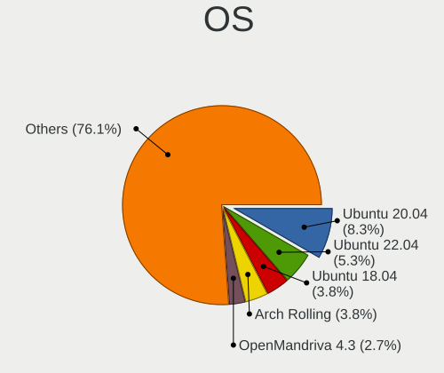

| Name               | Computers | Percent |
|--------------------|-----------|---------|
| Ubuntu 20.04       | 22        | 8.33%   |
| Ubuntu 22.04       | 14        | 5.3%    |
| Ubuntu 18.04       | 10        | 3.79%   |
| Arch Rolling       | 10        | 3.79%   |
| OpenMandriva 4.3   | 7         | 2.65%   |
| Ubuntu 24.04       | 6         | 2.27%   |
| Pop!_OS 21.04      | 6         | 2.27%   |
| Zorin 17           | 5         | 1.89%   |
| Zorin 16           | 5         | 1.89%   |
| Manjaro            | 5         | 1.89%   |
| Ubuntu 23.04       | 4         | 1.52%   |
| OpenMandriva 25.90 | 4         | 1.52%   |
| Linux Mint 21.1    | 4         | 1.52%   |
| Linux Mint 20.2    | 4         | 1.52%   |
| Linux Mint 19.3    | 4         | 1.52%   |
| ArcoLinux Rolling  | 4         | 1.52%   |
| Xubuntu 20.04      | 3         | 1.14%   |
| Ubuntu 20.10       | 3         | 1.14%   |
| Pop!_OS 20.04      | 3         | 1.14%   |
| OpenMandriva 6.0   | 3         | 1.14%   |
| OpenMandriva 23.03 | 3         | 1.14%   |
| Nobara 42          | 3         | 1.14%   |
| Linux Mint 22.1    | 3         | 1.14%   |
| Linux Mint 19.1    | 3         | 1.14%   |
| KDE neon 20.04     | 3         | 1.14%   |
| Fedora 41          | 3         | 1.14%   |
| Fedora 39          | 3         | 1.14%   |
| Fedora 38          | 3         | 1.14%   |
| Fedora 32          | 3         | 1.14%   |
| Debian 12          | 3         | 1.14%   |
| Debian 10          | 3         | 1.14%   |
| Bazzite 43         | 3         | 1.14%   |
| Zorin 15           | 2         | 0.76%   |
| Ubuntu 21.10       | 2         | 0.76%   |
| Ubuntu 19.04       | 2         | 0.76%   |
| TUXEDO OS 22.04    | 2         | 0.76%   |
| ROSA R10           | 2         | 0.76%   |
| ROSA 12.4          | 2         | 0.76%   |
| Pop!_OS 20.10      | 2         | 0.76%   |
| OpenMandriva 23.01 | 2         | 0.76%   |

OS Family
---------

OS without a version

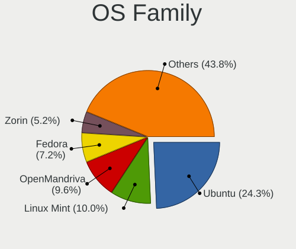

| Name             | Computers | Percent |
|------------------|-----------|---------|
| Ubuntu           | 61        | 24.3%   |
| Linux Mint       | 25        | 9.96%   |
| OpenMandriva     | 24        | 9.56%   |
| Fedora           | 18        | 7.17%   |
| Zorin            | 13        | 5.18%   |
| Pop!_OS          | 13        | 5.18%   |
| Arch             | 11        | 4.38%   |
| Debian           | 10        | 3.98%   |
| Manjaro          | 8         | 3.19%   |
| KDE neon         | 6         | 2.39%   |
| ROSA             | 5         | 1.99%   |
| Nobara           | 5         | 1.99%   |
| Endless          | 5         | 1.99%   |
| Xubuntu          | 4         | 1.59%   |
| Lubuntu          | 4         | 1.59%   |
| ArcoLinux        | 4         | 1.59%   |
| LMDE             | 3         | 1.2%    |
| Kubuntu          | 3         | 1.2%    |
| Kali             | 3         | 1.2%    |
| Elementary       | 3         | 1.2%    |
| Bazzite          | 3         | 1.2%    |
| Ubuntu Unity     | 2         | 0.8%    |
| TUXEDO OS        | 2         | 0.8%    |
| MX               | 2         | 0.8%    |
| Garuda Linux     | 2         | 0.8%    |
| Xero             | 1         | 0.4%    |
| Ubuntu Studio    | 1         | 0.4%    |
| Ubuntu Budgie    | 1         | 0.4%    |
| Rocky Linux      | 1         | 0.4%    |
| PureOS           | 1         | 0.4%    |
| Pikaos           | 1         | 0.4%    |
| Parrot           | 1         | 0.4%    |
| org.kde.Platform | 1         | 0.4%    |
| openSUSE         | 1         | 0.4%    |
| EndeavourOS      | 1         | 0.4%    |
| BunsenLabs       | 1         | 0.4%    |
| Athenaos         | 1         | 0.4%    |

Kernel
------

Version of the Linux kernel

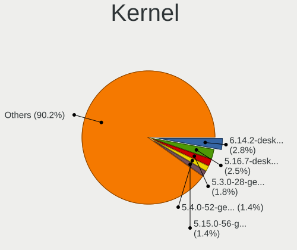

| Version                         | Computers | Percent |
|---------------------------------|-----------|---------|
| 6.14.2-desktop-3omv2590         | 8         | 2.81%   |
| 5.16.7-desktop-1omv4003         | 7         | 2.46%   |
| 5.3.0-28-generic                | 5         | 1.75%   |
| 5.4.0-52-generic                | 4         | 1.4%    |
| 5.15.0-56-generic               | 4         | 1.4%    |
| 6.2.6-desktop-1omv2390          | 3         | 1.05%   |
| 6.2.0-20-generic                | 3         | 1.05%   |
| 5.3.0-46-generic                | 3         | 1.05%   |
| 5.15.0-48-generic               | 3         | 1.05%   |
| 5.13.0-39-generic               | 3         | 1.05%   |
| 6.8.0-51-generic                | 2         | 0.7%    |
| 6.5.0-14-generic                | 2         | 0.7%    |
| 6.2.0-36-generic                | 2         | 0.7%    |
| 6.2.0-32-generic                | 2         | 0.7%    |
| 6.2.0-26-generic                | 2         | 0.7%    |
| 6.17.7-ba14.fc43.x86_64         | 2         | 0.7%    |
| 6.11.0-17-generic               | 2         | 0.7%    |
| 6.11.0-13-generic               | 2         | 0.7%    |
| 6.1.1-desktop-1omv2290          | 2         | 0.7%    |
| 6.1.0-13-amd64                  | 2         | 0.7%    |
| 5.8.0-7630-generic              | 2         | 0.7%    |
| 5.8.0-59-generic                | 2         | 0.7%    |
| 5.4.0-89-generic                | 2         | 0.7%    |
| 5.4.0-67-generic                | 2         | 0.7%    |
| 5.3.0-42-generic                | 2         | 0.7%    |
| 5.19.0-35-generic               | 2         | 0.7%    |
| 5.15.0-92-generic               | 2         | 0.7%    |
| 5.15.0-50-generic               | 2         | 0.7%    |
| 5.15.0-39-generic               | 2         | 0.7%    |
| 5.15.0-25-generic               | 2         | 0.7%    |
| 5.13.0-7620-generic             | 2         | 0.7%    |
| 5.13.0-7614-generic             | 2         | 0.7%    |
| 5.11.0-40-generic               | 2         | 0.7%    |
| 5.11.0-38-generic               | 2         | 0.7%    |
| 4.9.60-nrj-desktop-1rosa-x86_64 | 2         | 0.7%    |
| 4.19.0-13-amd64                 | 2         | 0.7%    |
| 4.18.0-15-generic               | 2         | 0.7%    |
| 4.15.0-94-generic               | 2         | 0.7%    |
| 4.15.0-47-generic               | 2         | 0.7%    |
| 4.15.0-20-generic               | 2         | 0.7%    |

Kernel Family
-------------

Linux kernel without a distro release

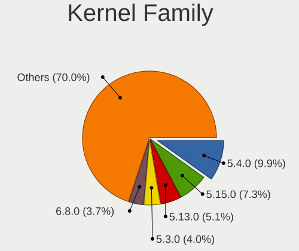

| Version | Computers | Percent |
|---------|-----------|---------|
| 5.4.0   | 27        | 9.89%   |
| 5.15.0  | 20        | 7.33%   |
| 5.13.0  | 14        | 5.13%   |
| 5.3.0   | 11        | 4.03%   |
| 6.8.0   | 10        | 3.66%   |
| 5.8.0   | 10        | 3.66%   |
| 4.15.0  | 10        | 3.66%   |
| 6.5.0   | 9         | 3.3%    |
| 6.2.0   | 9         | 3.3%    |
| 5.11.0  | 9         | 3.3%    |
| 6.14.2  | 8         | 2.93%   |
| 6.1.0   | 7         | 2.56%   |
| 5.16.7  | 7         | 2.56%   |
| 6.14.0  | 6         | 2.2%    |
| 6.17.7  | 5         | 1.83%   |
| 6.11.0  | 5         | 1.83%   |
| 5.19.0  | 5         | 1.83%   |
| 5.0.0   | 5         | 1.83%   |
| 5.10.0  | 4         | 1.47%   |
| 4.18.0  | 4         | 1.47%   |
| 6.2.6   | 3         | 1.1%    |
| 6.6.2   | 2         | 0.73%   |
| 6.4.8   | 2         | 0.73%   |
| 6.12.9  | 2         | 0.73%   |
| 6.1.1   | 2         | 0.73%   |
| 6.0.8   | 2         | 0.73%   |
| 4.9.60  | 2         | 0.73%   |
| 4.19.0  | 2         | 0.73%   |
| 6.9.3   | 1         | 0.37%   |
| 6.8.9   | 1         | 0.37%   |
| 6.8.4   | 1         | 0.37%   |
| 6.6.8   | 1         | 0.37%   |
| 6.6.6   | 1         | 0.37%   |
| 6.6.3   | 1         | 0.37%   |
| 6.6.21  | 1         | 0.37%   |
| 6.6.1   | 1         | 0.37%   |
| 6.5.7   | 1         | 0.37%   |
| 6.5.5   | 1         | 0.37%   |
| 6.4.7   | 1         | 0.37%   |
| 6.4.14  | 1         | 0.37%   |

Kernel Major Ver.
-----------------

Linux kernel major version

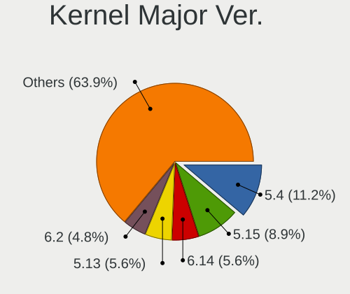

| Version | Computers | Percent |
|---------|-----------|---------|
| 5.4     | 30        | 11.15%  |
| 5.15    | 24        | 8.92%   |
| 6.14    | 15        | 5.58%   |
| 5.13    | 15        | 5.58%   |
| 6.2     | 13        | 4.83%   |
| 6.1     | 12        | 4.46%   |
| 5.8     | 12        | 4.46%   |
| 5.11    | 12        | 4.46%   |
| 6.8     | 11        | 4.09%   |
| 6.5     | 11        | 4.09%   |
| 5.3     | 11        | 4.09%   |
| 4.15    | 10        | 3.72%   |
| 5.16    | 9         | 3.35%   |
| 6.12    | 8         | 2.97%   |
| 6.11    | 8         | 2.97%   |
| 5.10    | 8         | 2.97%   |
| 6.6     | 7         | 2.6%    |
| 6.17    | 7         | 2.6%    |
| 5.19    | 6         | 2.23%   |
| 6.4     | 5         | 1.86%   |
| 5.0     | 5         | 1.86%   |
| 4.18    | 4         | 1.49%   |
| 6.13    | 3         | 1.12%   |
| 6.0     | 3         | 1.12%   |
| 5.14    | 3         | 1.12%   |
| 4.9     | 3         | 1.12%   |
| 6.3     | 2         | 0.74%   |
| 6.16    | 2         | 0.74%   |
| 5.9     | 2         | 0.74%   |
| 4.19    | 2         | 0.74%   |
| 6.9     | 1         | 0.37%   |
| 6.18    | 1         | 0.37%   |
| 6.15    | 1         | 0.37%   |
| 6.10    | 1         | 0.37%   |
| 5.7     | 1         | 0.37%   |
| 5.6     | 1         | 0.37%   |

Arch
----

OS architecture (x86_64, i586, etc.)

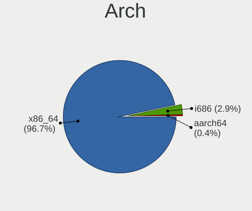

| Name    | Computers | Percent |
|---------|-----------|---------|
| x86_64  | 231       | 96.65%  |
| i686    | 7         | 2.93%   |
| aarch64 | 1         | 0.42%   |

DE
--

Desktop Environment

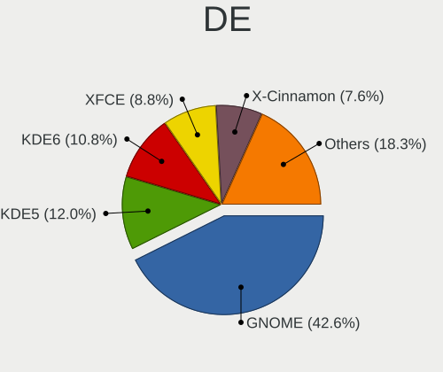

| Name          | Computers | Percent |
|---------------|-----------|---------|
| GNOME         | 107       | 42.63%  |
| KDE5          | 30        | 11.95%  |
| KDE6          | 27        | 10.76%  |
| XFCE          | 22        | 8.76%   |
| X-Cinnamon    | 19        | 7.57%   |
| Unknown       | 18        | 7.17%   |
| MATE          | 4         | 1.59%   |
| KDE           | 4         | 1.59%   |
| Pantheon      | 3         | 1.2%    |
| LXQt          | 3         | 1.2%    |
| Unity         | 2         | 0.8%    |
| KDE4          | 2         | 0.8%    |
| sway          | 1         | 0.4%    |
| LXDE          | 1         | 0.4%    |
| i3            | 1         | 0.4%    |
| Hyprland      | 1         | 0.4%    |
| GNOME Classic | 1         | 0.4%    |
| DDE           | 1         | 0.4%    |
| Cinnamon      | 1         | 0.4%    |
| BunsenLabs    | 1         | 0.4%    |
| Budgie        | 1         | 0.4%    |
| bspwm         | 1         | 0.4%    |

Display Server
--------------

X11 or Wayland

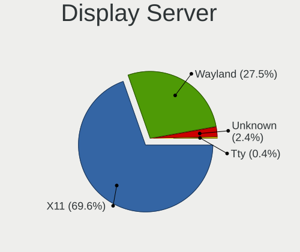

| Name    | Computers | Percent |
|---------|-----------|---------|
| X11     | 172       | 69.64%  |
| Wayland | 68        | 27.53%  |
| Unknown | 6         | 2.43%   |
| Tty     | 1         | 0.4%    |

Display Manager
---------------

SDDM, LightDM, etc.

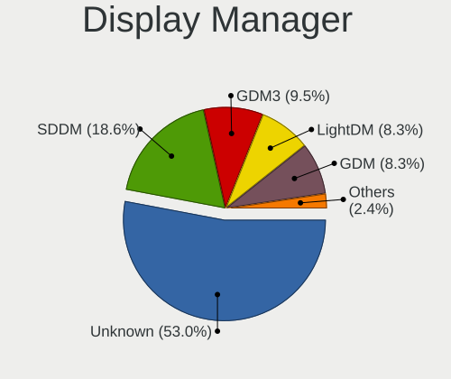

| Name    | Computers | Percent |
|---------|-----------|---------|
| Unknown | 134       | 52.96%  |
| SDDM    | 47        | 18.58%  |
| GDM3    | 24        | 9.49%   |
| LightDM | 21        | 8.3%    |
| GDM     | 21        | 8.3%    |
| TDM     | 4         | 1.58%   |
| KDM     | 2         | 0.79%   |

OS Lang
-------

Language

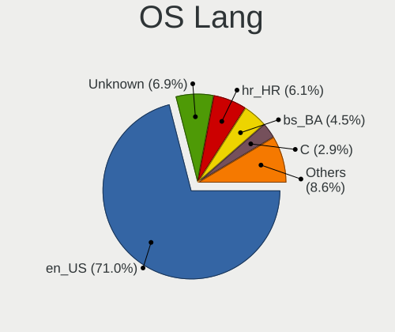

| Lang    | Computers | Percent |
|---------|-----------|---------|
| en_US   | 174       | 71.02%  |
| Unknown | 17        | 6.94%   |
| hr_HR   | 15        | 6.12%   |
| bs_BA   | 11        | 4.49%   |
| C       | 7         | 2.86%   |
| en_GB   | 5         | 2.04%   |
| de_DE   | 4         | 1.63%   |
| sr_RS   | 3         | 1.22%   |
| en_AU   | 3         | 1.22%   |
| de_CH   | 2         | 0.82%   |
| it_IT   | 1         | 0.41%   |
| es_ES   | 1         | 0.41%   |
| en_IN   | 1         | 0.41%   |
| en_CA   | 1         | 0.41%   |

Boot Mode
---------

EFI or BIOS

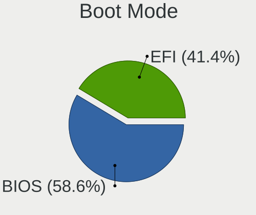

| Mode | Computers | Percent |
|------|-----------|---------|
| BIOS | 143       | 58.61%  |
| EFI  | 101       | 41.39%  |

Filesystem
----------

Type of filesystem

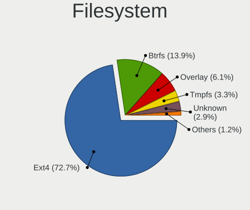

| Type    | Computers | Percent |
|---------|-----------|---------|
| Ext4    | 178       | 72.65%  |
| Btrfs   | 34        | 13.88%  |
| Overlay | 15        | 6.12%   |
| Tmpfs   | 8         | 3.27%   |
| Unknown | 7         | 2.86%   |
| Zfs     | 1         | 0.41%   |
| Xfs     | 1         | 0.41%   |
| Ext2    | 1         | 0.41%   |

Part. scheme
------------

Scheme of partitioning

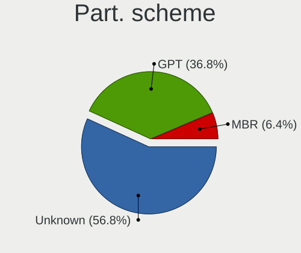

| Type    | Computers | Percent |
|---------|-----------|---------|
| Unknown | 142       | 56.8%   |
| GPT     | 92        | 36.8%   |
| MBR     | 16        | 6.4%    |

Dual Boot with Linux/BSD
------------------------

Hosting more than one Linux/BSD

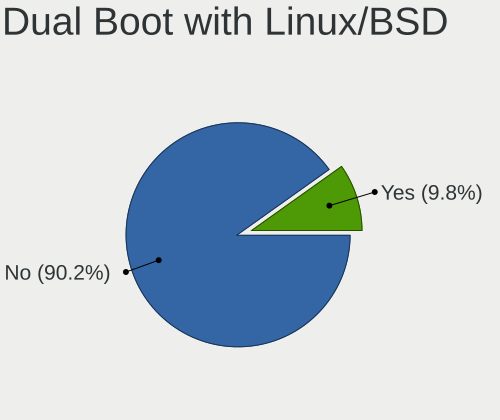

| Dual boot | Computers | Percent |
|-----------|-----------|---------|
| No        | 216       | 90%     |
| Yes       | 24        | 10%     |

Dual Boot (Win)
---------------

Hosting Linux and Windows

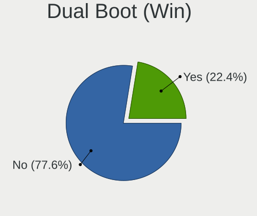

| Dual boot | Computers | Percent |
|-----------|-----------|---------|
| No        | 190       | 77.55%  |
| Yes       | 55        | 22.45%  |

Board
-----

Vendor
------

Motherboard manufacturer

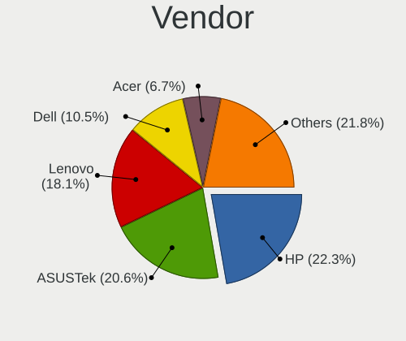

| Name                | Computers | Percent |
|---------------------|-----------|---------|
| Hewlett-Packard     | 53        | 22.27%  |
| ASUSTek Computer    | 49        | 20.59%  |
| Lenovo              | 43        | 18.07%  |
| Dell                | 25        | 10.5%   |
| Acer                | 16        | 6.72%   |
| Gigabyte Technology | 15        | 6.3%    |
| MSI                 | 7         | 2.94%   |
| Toshiba             | 4         | 1.68%   |
| Fujitsu             | 3         | 1.26%   |
| ASRock              | 3         | 1.26%   |
| Pegatron            | 2         | 0.84%   |
| Medion              | 2         | 0.84%   |
| Fujitsu Siemens     | 2         | 0.84%   |
| eMachines           | 2         | 0.84%   |
| Wistron             | 1         | 0.42%   |
| Sony                | 1         | 0.42%   |
| Packard Bell        | 1         | 0.42%   |
| Notebook            | 1         | 0.42%   |
| NEC Computers       | 1         | 0.42%   |
| Microsoft           | 1         | 0.42%   |
| HUAWEI              | 1         | 0.42%   |
| GPU Company         | 1         | 0.42%   |
| ECS                 | 1         | 0.42%   |
| Biostar             | 1         | 0.42%   |
| Apple               | 1         | 0.42%   |
| Unknown             | 1         | 0.42%   |

Model
-----

Motherboard model

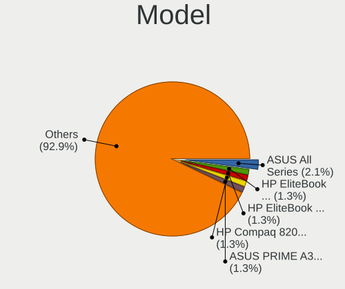

| Name                                   | Computers | Percent |
|----------------------------------------|-----------|---------|
| ASUS All Series                        | 5         | 2.1%    |
| HP EliteBook 8460p                     | 3         | 1.26%   |
| HP EliteBook 840 G5                    | 3         | 1.26%   |
| HP Compaq 8200 Elite SFF PC            | 3         | 1.26%   |
| ASUS PRIME A320M-K                     | 3         | 1.26%   |
| Lenovo Legion 5 Pro 16IAH7H 82RF       | 2         | 0.84%   |
| Lenovo IdeaPad 330-15IKB 81DE          | 2         | 0.84%   |
| HP EliteDesk 800 G4 DM 65W             | 2         | 0.84%   |
| HP 250 G7 Notebook PC                  | 2         | 0.84%   |
| Gigabyte B450M DS3H                    | 2         | 0.84%   |
| Dell OptiPlex 745                      | 2         | 0.84%   |
| Dell G3 3590                           | 2         | 0.84%   |
| ASUS VivoBook_ASUSLaptop X509DA_D509DA | 2         | 0.84%   |
| ASUS P8H61-M LX3 R2.0                  | 2         | 0.84%   |
| ASUS P5KPL-AM SE                       | 2         | 0.84%   |
| ASUS P5G41T-M LX3                      | 2         | 0.84%   |
| ASRock B450M-HDV R4.0                  | 2         | 0.84%   |
| Wistron ProLiant ML110 G5              | 1         | 0.42%   |
| Toshiba Satellite L850-1HQ             | 1         | 0.42%   |
| Toshiba Satellite C855                 | 1         | 0.42%   |
| Toshiba Satellite C850-1GF             | 1         | 0.42%   |
| Toshiba PORTEGE Z930                   | 1         | 0.42%   |
| Sony VGN-BX41VN                        | 1         | 0.42%   |
| Pegatron VS170AA-UUZ p6244ch           | 1         | 0.42%   |
| Pegatron IPMIP-GS                      | 1         | 0.42%   |
| Packard Bell EasyNote TE69KB           | 1         | 0.42%   |
| Notebook NL5xRU                        | 1         | 0.42%   |
| NEC Computers VERSAP550 NN951700753    | 1         | 0.42%   |
| MSI Pulse GL66 12UDK                   | 1         | 0.42%   |
| MSI MS-AA1511                          | 1         | 0.42%   |
| MSI MS-7D32                            | 1         | 0.42%   |
| MSI MS-7B86                            | 1         | 0.42%   |
| MSI MS-7978                            | 1         | 0.42%   |
| MSI MS-7597                            | 1         | 0.42%   |
| MSI Bravo 15 C7VF                      | 1         | 0.42%   |
| Microsoft Surface Pro 4                | 1         | 0.42%   |
| Medion MS-7800                         | 1         | 0.42%   |
| Medion MS-7366                         | 1         | 0.42%   |
| Lenovo Yoga 920-13IKB 80Y7             | 1         | 0.42%   |
| Lenovo Yoga 910-13IKB 80VF             | 1         | 0.42%   |

Model Family
------------

Motherboard model prefix

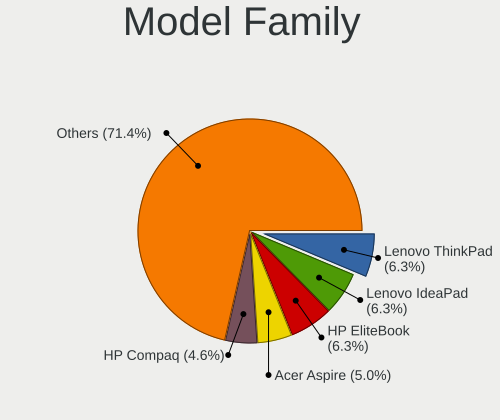

| Name                  | Computers | Percent |
|-----------------------|-----------|---------|
| Lenovo ThinkPad       | 15        | 6.3%    |
| Lenovo IdeaPad        | 15        | 6.3%    |
| HP EliteBook          | 15        | 6.3%    |
| Acer Aspire           | 12        | 5.04%   |
| HP Compaq             | 11        | 4.62%   |
| ASUS PRIME            | 10        | 4.2%    |
| Dell Latitude         | 8         | 3.36%   |
| HP ProBook            | 6         | 2.52%   |
| ASUS ROG              | 5         | 2.1%    |
| ASUS All              | 5         | 2.1%    |
| Lenovo Yoga           | 4         | 1.68%   |
| HP ENVY               | 4         | 1.68%   |
| Dell OptiPlex         | 4         | 1.68%   |
| ASUS VivoBook         | 4         | 1.68%   |
| Toshiba Satellite     | 3         | 1.26%   |
| Lenovo Legion         | 3         | 1.26%   |
| HP 250                | 3         | 1.26%   |
| Dell XPS              | 3         | 1.26%   |
| Dell Precision        | 3         | 1.26%   |
| ASUS P5G41T-M         | 3         | 1.26%   |
| HP ZBook              | 2         | 0.84%   |
| HP Pavilion           | 2         | 0.84%   |
| HP Laptop             | 2         | 0.84%   |
| HP EliteDesk          | 2         | 0.84%   |
| Gigabyte B450M        | 2         | 0.84%   |
| Fujitsu LIFEBOOK      | 2         | 0.84%   |
| Dell Vostro           | 2         | 0.84%   |
| Dell Inspiron         | 2         | 0.84%   |
| Dell G3               | 2         | 0.84%   |
| ASUS TUF              | 2         | 0.84%   |
| ASUS P8H61-M          | 2         | 0.84%   |
| ASUS P5KPL-AM         | 2         | 0.84%   |
| ASUS ASUS             | 2         | 0.84%   |
| ASRock B450M-HDV      | 2         | 0.84%   |
| Wistron ProLiant      | 1         | 0.42%   |
| Toshiba PORTEGE       | 1         | 0.42%   |
| Sony VGN-BX41VN       | 1         | 0.42%   |
| Pegatron VS170AA-UUZ  | 1         | 0.42%   |
| Pegatron IPMIP-GS     | 1         | 0.42%   |
| Packard Bell EasyNote | 1         | 0.42%   |

MFG Year
--------

Motherboard manufacture year

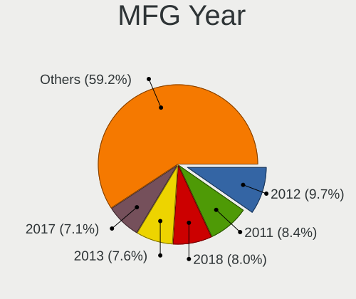

| Year    | Computers | Percent |
|---------|-----------|---------|
| 2012    | 23        | 9.66%   |
| 2011    | 20        | 8.4%    |
| 2018    | 19        | 7.98%   |
| 2013    | 18        | 7.56%   |
| 2017    | 17        | 7.14%   |
| 2021    | 16        | 6.72%   |
| 2019    | 16        | 6.72%   |
| 2016    | 16        | 6.72%   |
| 2020    | 15        | 6.3%    |
| 2010    | 15        | 6.3%    |
| 2014    | 11        | 4.62%   |
| 2009    | 11        | 4.62%   |
| 2022    | 7         | 2.94%   |
| 2007    | 7         | 2.94%   |
| 2015    | 6         | 2.52%   |
| 2008    | 6         | 2.52%   |
| 2024    | 4         | 1.68%   |
| 2023    | 4         | 1.68%   |
| 2006    | 3         | 1.26%   |
| 2005    | 3         | 1.26%   |
| Unknown | 1         | 0.42%   |

Form Factor
-----------

Physical design of the computer

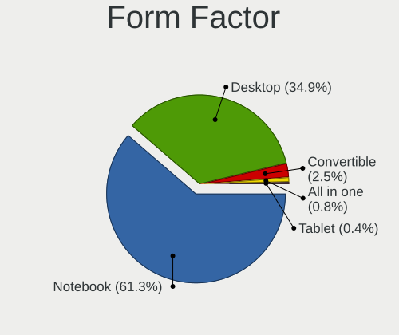

| Name        | Computers | Percent |
|-------------|-----------|---------|
| Notebook    | 146       | 61.34%  |
| Desktop     | 83        | 34.87%  |
| Convertible | 6         | 2.52%   |
| All in one  | 2         | 0.84%   |
| Tablet      | 1         | 0.42%   |

Secure Boot
-----------

Enabled or disabled

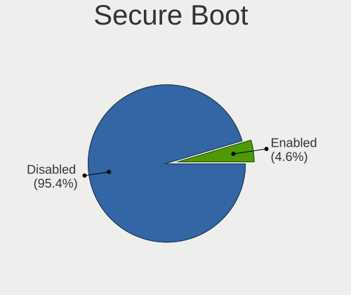

| State    | Computers | Percent |
|----------|-----------|---------|
| Disabled | 228       | 95.4%   |
| Enabled  | 11        | 4.6%    |

Coreboot
--------

Have coreboot on board

| Used | Computers | Percent |
|------|-----------|---------|
| No   | 238       | 100%    |

RAM Size
--------

Total RAM memory

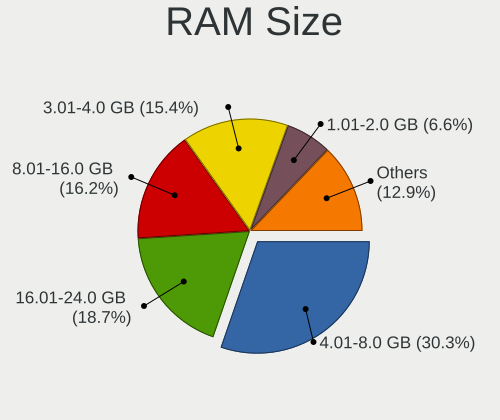

| Size in GB  | Computers | Percent |
|-------------|-----------|---------|
| 4.01-8.0    | 73        | 30.29%  |
| 16.01-24.0  | 45        | 18.67%  |
| 8.01-16.0   | 39        | 16.18%  |
| 3.01-4.0    | 37        | 15.35%  |
| 1.01-2.0    | 16        | 6.64%   |
| 32.01-64.0  | 12        | 4.98%   |
| 2.01-3.0    | 7         | 2.9%    |
| 64.01-256.0 | 5         | 2.07%   |
| 24.01-32.0  | 4         | 1.66%   |
| 0.51-1.0    | 2         | 0.83%   |
| 0.01-0.5    | 1         | 0.41%   |

RAM Used
--------

Used RAM memory

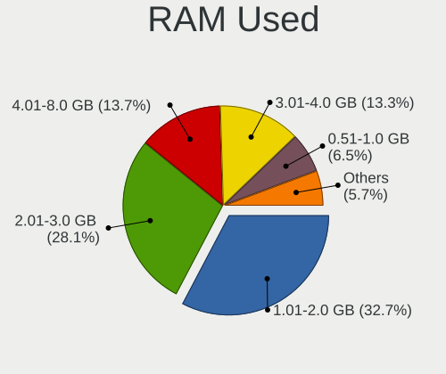

| Used GB   | Computers | Percent |
|-----------|-----------|---------|
| 1.01-2.0  | 86        | 32.7%   |
| 2.01-3.0  | 74        | 28.14%  |
| 4.01-8.0  | 36        | 13.69%  |
| 3.01-4.0  | 35        | 13.31%  |
| 0.51-1.0  | 17        | 6.46%   |
| 8.01-16.0 | 12        | 4.56%   |
| 0.01-0.5  | 3         | 1.14%   |

Total Drives
------------

Number of drives on board

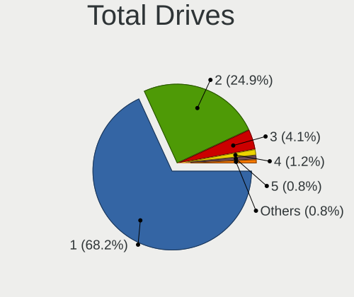

| Drives | Computers | Percent |
|--------|-----------|---------|
| 1      | 167       | 68.16%  |
| 2      | 61        | 24.9%   |
| 3      | 10        | 4.08%   |
| 4      | 3         | 1.22%   |
| 5      | 2         | 0.82%   |
| 0      | 2         | 0.82%   |

Has CD-ROM
----------

Has CD-ROM on board

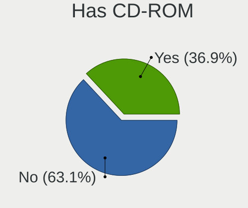

| Presented | Computers | Percent |
|-----------|-----------|---------|
| No        | 152       | 63.07%  |
| Yes       | 89        | 36.93%  |

Has Ethernet
------------

Has Ethernet on board

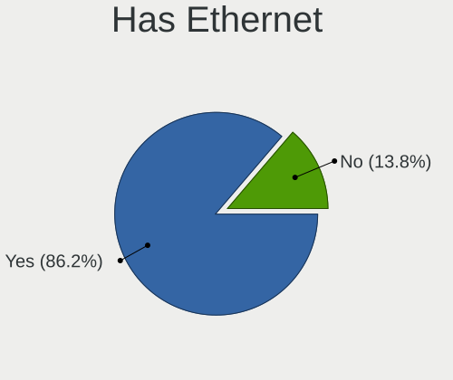

| Presented | Computers | Percent |
|-----------|-----------|---------|
| Yes       | 207       | 86.25%  |
| No        | 33        | 13.75%  |

Has WiFi
--------

Has WiFi module

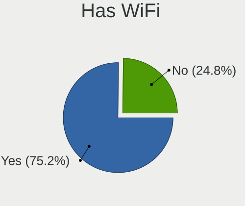

| Presented | Computers | Percent |
|-----------|-----------|---------|
| Yes       | 178       | 74.79%  |
| No        | 60        | 25.21%  |

Has Bluetooth
-------------

Has Bluetooth module

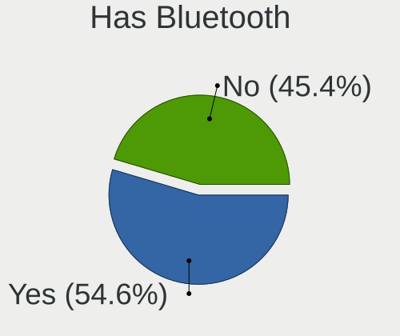

| Presented | Computers | Percent |
|-----------|-----------|---------|
| Yes       | 131       | 54.58%  |
| No        | 109       | 45.42%  |

Location
--------

Country
-------

Geographic location (country)

| Country                | Computers | Percent |
|------------------------|-----------|---------|
| Bosnia and Herzegovina | 238       | 100%    |

City
----

Geographic location (city)

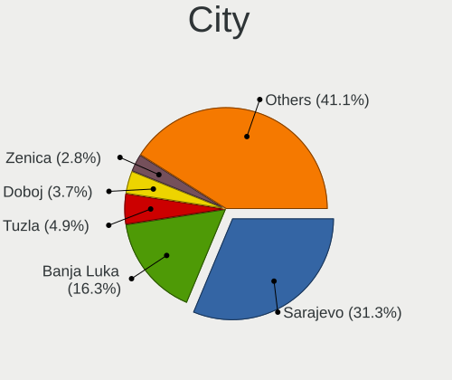

| City              | Computers | Percent |
|-------------------|-----------|---------|
| Sarajevo          | 77        | 31.3%   |
| Banja Luka        | 40        | 16.26%  |
| Tuzla             | 12        | 4.88%   |
| Doboj             | 9         | 3.66%   |
| Zenica            | 7         | 2.85%   |
| Teslic            | 7         | 2.85%   |
| Gracanica         | 7         | 2.85%   |
| Brcko             | 5         | 2.03%   |
| Bijeljina         | 5         | 2.03%   |
| Bihać            | 5         | 2.03%   |
| Prijedor          | 4         | 1.63%   |
| Mostar            | 4         | 1.63%   |
| Žepče           | 3         | 1.22%   |
| Srebrenik         | 3         | 1.22%   |
| Prnjavor          | 3         | 1.22%   |
| Novi Travnik      | 3         | 1.22%   |
| Gradacac          | 3         | 1.22%   |
| Cazin             | 3         | 1.22%   |
| Vitez             | 2         | 0.81%   |
| Visoko            | 2         | 0.81%   |
| Trebinje          | 2         | 0.81%   |
| Pale              | 2         | 0.81%   |
| Maglaj            | 2         | 0.81%   |
| Lukavac           | 2         | 0.81%   |
| Ilidza            | 2         | 0.81%   |
| Capljina          | 2         | 0.81%   |
| Banovici          | 2         | 0.81%   |
| Zvornik           | 1         | 0.41%   |
| Zivinice          | 1         | 0.41%   |
| Zavidovici        | 1         | 0.41%   |
| Velika Kladuša   | 1         | 0.41%   |
| Velika Kladuša | 1         | 0.41%   |
| Tomislavgrad      | 1         | 0.41%   |
| Tarcin            | 1         | 0.41%   |
| Stolac            | 1         | 0.41%   |
| Stjepan-Polje     | 1         | 0.41%   |
| Solina            | 1         | 0.41%   |
| Sokolac           | 1         | 0.41%   |
| Siroki Brijeg     | 1         | 0.41%   |
| Posusje           | 1         | 0.41%   |

Drives
------

Drive Vendor
------------

Hard drive vendors

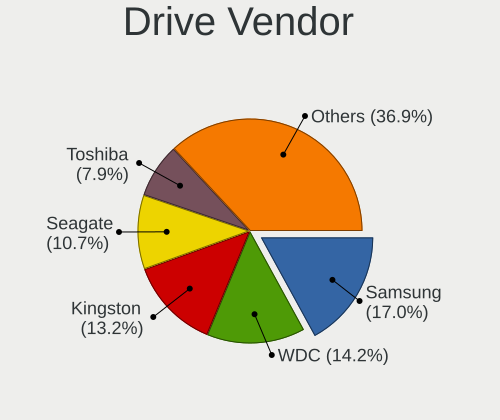

| Vendor                                    | Computers | Drives | Percent |
|-------------------------------------------|-----------|--------|---------|
| Samsung Electronics                       | 54        | 80     | 17.03%  |
| WDC                                       | 45        | 62     | 14.2%   |
| Kingston                                  | 42        | 52     | 13.25%  |
| Seagate                                   | 34        | 44     | 10.73%  |
| Toshiba                                   | 25        | 28     | 7.89%   |
| Hitachi                                   | 17        | 18     | 5.36%   |
| SanDisk                                   | 15        | 17     | 4.73%   |
| SK hynix                                  | 13        | 17     | 4.1%    |
| Kingston Technology Company               | 7         | 9      | 2.21%   |
| Intel                                     | 7         | 7      | 2.21%   |
| Unknown                                   | 6         | 6      | 1.89%   |
| China                                     | 6         | 8      | 1.89%   |
| Micron Technology                         | 5         | 9      | 1.58%   |
| KIOXIA                                    | 4         | 4      | 1.26%   |
| A-DATA Technology                         | 4         | 4      | 1.26%   |
| Emtec                                     | 3         | 3      | 0.95%   |
| GOODRAM                                   | 2         | 2      | 0.63%   |
| Gigabyte Technology                       | 2         | 2      | 0.63%   |
| Crucial                                   | 2         | 3      | 0.63%   |
| Vaseky                                    | 1         | 1      | 0.32%   |
| Union Memory                              | 1         | 1      | 0.32%   |
| Transcend                                 | 1         | 2      | 0.32%   |
| Team                                      | 1         | 1      | 0.32%   |
| Tata Power Strategic Electronics Division | 1         | 1      | 0.32%   |
| SPCC                                      | 1         | 1      | 0.32%   |
| Shenzhen Longsys Electronics              | 1         | 1      | 0.32%   |
| Phison                                    | 1         | 1      | 0.32%   |
| Patriot                                   | 1         | 1      | 0.32%   |
| OWC                                       | 1         | 1      | 0.32%   |
| ORGE                                      | 1         | 1      | 0.32%   |
| OCZ                                       | 1         | 2      | 0.32%   |
| Micron/Crucial Technology                 | 1         | 1      | 0.32%   |
| Maxtor                                    | 1         | 1      | 0.32%   |
| LITEON                                    | 1         | 1      | 0.32%   |
| JMicron Technology                        | 1         | 1      | 0.32%   |
| Intenso                                   | 1         | 1      | 0.32%   |
| HGST                                      | 1         | 1      | 0.32%   |
| Fujitsu                                   | 1         | 1      | 0.32%   |
| FORESEE                                   | 1         | 1      | 0.32%   |
| Dahua                                     | 1         | 1      | 0.32%   |

Drive Model
-----------

Hard drive models

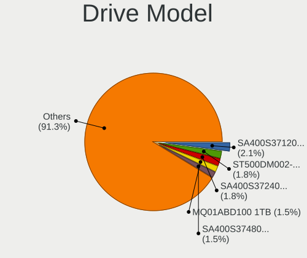

| Model                                                | Computers | Percent |
|------------------------------------------------------|-----------|---------|
| Kingston SA400S37120G 120GB SSD                      | 7         | 2.1%    |
| Seagate ST500DM002-1BD142 500GB                      | 6         | 1.8%    |
| Kingston SA400S37240G 240GB SSD                      | 6         | 1.8%    |
| Toshiba MQ01ABD100 1TB                               | 5         | 1.5%    |
| Kingston SA400S37480G 480GB SSD                      | 5         | 1.5%    |
| Samsung NVMe SSD Controller SM981/PM981/PM983 1TB    | 4         | 1.2%    |
| SK hynix NVMe SSD Drive 512GB                        | 3         | 0.9%    |
| Samsung SSD 980 500GB                                | 3         | 0.9%    |
| Samsung NVMe SSD Controller SM961/PM961/SM963 1024GB | 3         | 0.9%    |
| Kingston Company SNV2S1000G 1TB                      | 3         | 0.9%    |
| Kingston SHFS37A120G 120GB SSD                       | 3         | 0.9%    |
| Hitachi HDS721050CLA362 500GB                        | 3         | 0.9%    |
| Emtec X150 240GB                                     | 3         | 0.9%    |
| WDC WD800JD-00MSA1 80GB                              | 2         | 0.6%    |
| WDC WD5000AAKX-00ERMA0 500GB                         | 2         | 0.6%    |
| WDC WD5000AAKX-001CA0 500GB                          | 2         | 0.6%    |
| WDC WD3200AAJS-00L7A0 320GB                          | 2         | 0.6%    |
| Unknown SD/MMC/MS PRO 2GB                            | 2         | 0.6%    |
| Unknown MMC Card  32GB                               | 2         | 0.6%    |
| Toshiba KXG50ZNV256G 256GB                           | 2         | 0.6%    |
| Toshiba HDWD120 2TB                                  | 2         | 0.6%    |
| Toshiba DT01ACA100 1TB                               | 2         | 0.6%    |
| Toshiba DT01ACA050 500GB                             | 2         | 0.6%    |
| SK hynix BC501 NVMe Solid State Drive 512GB          | 2         | 0.6%    |
| Seagate ST500LT012-1DG142 500GB                      | 2         | 0.6%    |
| Seagate ST3500413AS 500GB                            | 2         | 0.6%    |
| Seagate ST3250318AS 250GB                            | 2         | 0.6%    |
| Seagate ST250LT021-1AF14C 250GB                      | 2         | 0.6%    |
| SanDisk NVMe SSD Drive 256GB                         | 2         | 0.6%    |
| Samsung SSD 860 EVO 250GB                            | 2         | 0.6%    |
| Samsung SSD 850 EVO 250GB                            | 2         | 0.6%    |
| Samsung NVMe SSD Drive 512GB                         | 2         | 0.6%    |
| Samsung MZ7TD256HAFV-000L9 256GB SSD                 | 2         | 0.6%    |
| Micron MTFDHBA256TCK-1AS1AABHA 256GB                 | 2         | 0.6%    |
| Kingston SUV500120G 120GB SSD                        | 2         | 0.6%    |
| Kingston SUV400S37240G 240GB SSD                     | 2         | 0.6%    |
| Kingston SNVS500G 500GB                              | 2         | 0.6%    |
| Kingston SHFS37A240G 240GB SSD                       | 2         | 0.6%    |
| Hitachi HTS723232A7A364 320GB                        | 2         | 0.6%    |
| Hitachi HTS547575A9E384 752GB                        | 2         | 0.6%    |

HDD Vendor
----------

Hard disk drive vendors

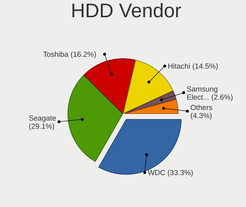

| Vendor              | Computers | Drives | Percent |
|---------------------|-----------|--------|---------|
| WDC                 | 39        | 55     | 33.33%  |
| Seagate             | 34        | 44     | 29.06%  |
| Toshiba             | 19        | 20     | 16.24%  |
| Hitachi             | 17        | 18     | 14.53%  |
| Samsung Electronics | 3         | 3      | 2.56%   |
| Unknown             | 2         | 2      | 1.71%   |
| Maxtor              | 1         | 1      | 0.85%   |
| HGST                | 1         | 1      | 0.85%   |
| Fujitsu             | 1         | 1      | 0.85%   |

SSD Vendor
----------

Solid state drive vendors

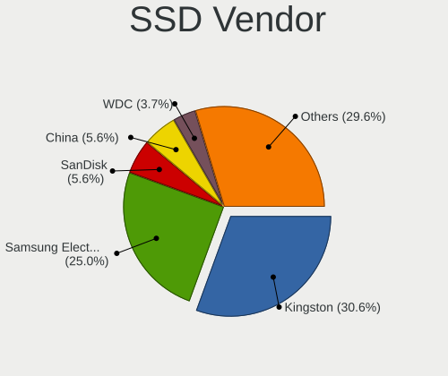

| Vendor              | Computers | Drives | Percent |
|---------------------|-----------|--------|---------|
| Kingston            | 33        | 39     | 30.56%  |
| Samsung Electronics | 27        | 33     | 25%     |
| SanDisk             | 6         | 7      | 5.56%   |
| China               | 6         | 8      | 5.56%   |
| WDC                 | 4         | 4      | 3.7%    |
| Intel               | 4         | 4      | 3.7%    |
| A-DATA Technology   | 4         | 4      | 3.7%    |
| Emtec               | 3         | 3      | 2.78%   |
| SK hynix            | 2         | 4      | 1.85%   |
| GOODRAM             | 2         | 2      | 1.85%   |
| Gigabyte Technology | 2         | 2      | 1.85%   |
| Vaseky              | 1         | 1      | 0.93%   |
| Transcend           | 1         | 2      | 0.93%   |
| Toshiba             | 1         | 1      | 0.93%   |
| Team                | 1         | 1      | 0.93%   |
| SPCC                | 1         | 1      | 0.93%   |
| Patriot             | 1         | 1      | 0.93%   |
| OWC                 | 1         | 1      | 0.93%   |
| OCZ                 | 1         | 2      | 0.93%   |
| Micron Technology   | 1         | 1      | 0.93%   |
| LITEON              | 1         | 1      | 0.93%   |
| Intenso             | 1         | 1      | 0.93%   |
| FORESEE             | 1         | 1      | 0.93%   |
| Dahua               | 1         | 1      | 0.93%   |
| ASMT                | 1         | 1      | 0.93%   |
| Unknown             | 1         | 1      | 0.93%   |

Drive Kind
----------

HDD or SSD

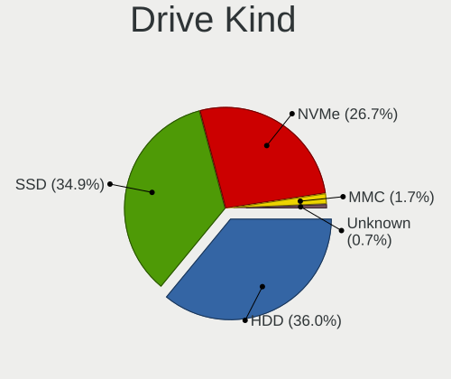

| Kind    | Computers | Drives | Percent |
|---------|-----------|--------|---------|
| HDD     | 105       | 145    | 35.96%  |
| SSD     | 102       | 127    | 34.93%  |
| NVMe    | 78        | 122    | 26.71%  |
| MMC     | 5         | 5      | 1.71%   |
| Unknown | 2         | 2      | 0.68%   |

Drive Connector
---------------

SATA, SAS, NVMe, etc.

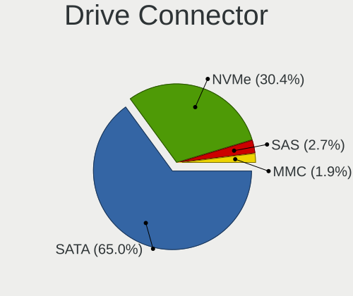

| Type | Computers | Drives | Percent |
|------|-----------|--------|---------|
| SATA | 167       | 267    | 64.98%  |
| NVMe | 78        | 122    | 30.35%  |
| SAS  | 7         | 7      | 2.72%   |
| MMC  | 5         | 5      | 1.95%   |

Drive Size
----------

Size of hard drive

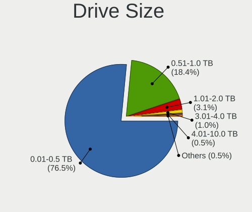

| Size in TB | Computers | Drives | Percent |
|------------|-----------|--------|---------|
| 0.01-0.5   | 150       | 218    | 76.53%  |
| 0.51-1.0   | 36        | 39     | 18.37%  |
| 1.01-2.0   | 6         | 9      | 3.06%   |
| 3.01-4.0   | 2         | 3      | 1.02%   |
| 2.01-3.0   | 1         | 2      | 0.51%   |
| 4.01-10.0  | 1         | 1      | 0.51%   |

Space Total
-----------

Amount of disk space available on the file system

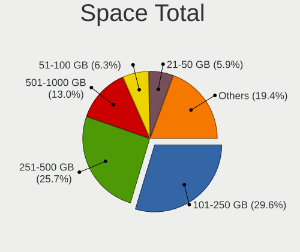

| Size in GB     | Computers | Percent |
|----------------|-----------|---------|
| 101-250        | 75        | 29.64%  |
| 251-500        | 65        | 25.69%  |
| 501-1000       | 33        | 13.04%  |
| 51-100         | 16        | 6.32%   |
| 21-50          | 15        | 5.93%   |
| 1-20           | 15        | 5.93%   |
| 1001-2000      | 14        | 5.53%   |
| Unknown        | 8         | 3.16%   |
| More than 3000 | 6         | 2.37%   |
| 2001-3000      | 6         | 2.37%   |

Space Used
----------

Amount of used disk space

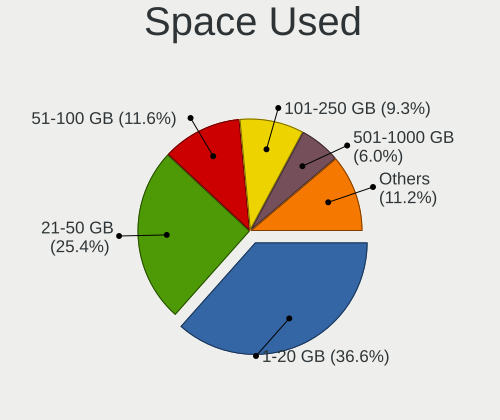

| Used GB        | Computers | Percent |
|----------------|-----------|---------|
| 1-20           | 98        | 36.57%  |
| 21-50          | 68        | 25.37%  |
| 51-100         | 31        | 11.57%  |
| 101-250        | 25        | 9.33%   |
| 501-1000       | 16        | 5.97%   |
| 251-500        | 15        | 5.6%    |
| Unknown        | 8         | 2.99%   |
| 1001-2000      | 4         | 1.49%   |
| 2001-3000      | 2         | 0.75%   |
| More than 3000 | 1         | 0.37%   |

Malfunc. Drives
---------------

Drive models with a malfunction

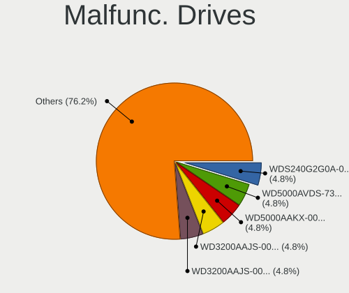

| Model                                                            | Computers | Drives | Percent |
|------------------------------------------------------------------|-----------|--------|---------|
| WDC WDS240G2G0A-00JH30 240GB SSD                                 | 1         | 1      | 4.76%   |
| WDC WD5000AVDS-73U7B1 500GB                                      | 1         | 1      | 4.76%   |
| WDC WD5000AAKX-001CA0 500GB                                      | 1         | 1      | 4.76%   |
| WDC WD3200AAJS-00L7A0 320GB                                      | 1         | 1      | 4.76%   |
| WDC WD3200AAJS-00B4A0 320GB                                      | 1         | 1      | 4.76%   |
| WDC WD1600AAJS-60WAA0 160GB                                      | 1         | 2      | 4.76%   |
| Toshiba MK6476GSX 640GB                                          | 1         | 1      | 4.76%   |
| Seagate ST500LT012-1DG142 500GB                                  | 1         | 2      | 4.76%   |
| Seagate ST3120813AS 120GB                                        | 1         | 1      | 4.76%   |
| Seagate ST3000DM001-1CH166 3TB                                   | 1         | 2      | 4.76%   |
| Seagate ST250LT021-1AF14C 250GB                                  | 1         | 1      | 4.76%   |
| Samsung Electronics SSD 980 500GB                                | 1         | 1      | 4.76%   |
| Samsung Electronics NVMe SSD Controller SM961/PM961/SM963 1024GB | 1         | 1      | 4.76%   |
| Samsung Electronics MZVKW512HMJP-000H1 512GB                     | 1         | 1      | 4.76%   |
| Samsung Electronics MMCRE64G8MPP-0VA 64GB SSD                    | 1         | 1      | 4.76%   |
| Samsung Electronics HD322HJ 320GB                                | 1         | 1      | 4.76%   |
| Hitachi HTS542525K9SA00 250GB                                    | 1         | 2      | 4.76%   |
| Hitachi HDS721050CLA362 500GB                                    | 1         | 1      | 4.76%   |
| Crucial CT500P1SSD8 500GB                                        | 1         | 1      | 4.76%   |
| China SSD 128GB                                                  | 1         | 1      | 4.76%   |
| China SATA SSD 240GB                                             | 1         | 1      | 4.76%   |

Malfunc. Drive Vendor
---------------------

Vendors of faulty drives

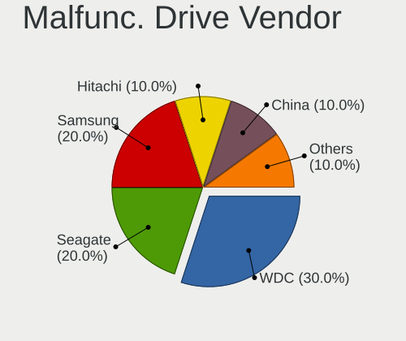

| Vendor              | Computers | Drives | Percent |
|---------------------|-----------|--------|---------|
| WDC                 | 6         | 7      | 30%     |
| Seagate             | 4         | 6      | 20%     |
| Samsung Electronics | 4         | 5      | 20%     |
| Hitachi             | 2         | 3      | 10%     |
| China               | 2         | 2      | 10%     |
| Toshiba             | 1         | 1      | 5%      |
| Crucial             | 1         | 1      | 5%      |

Malfunc. HDD Vendor
-------------------

Vendors of faulty HDD drives

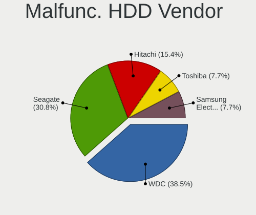

| Vendor              | Computers | Drives | Percent |
|---------------------|-----------|--------|---------|
| WDC                 | 5         | 6      | 38.46%  |
| Seagate             | 4         | 6      | 30.77%  |
| Hitachi             | 2         | 3      | 15.38%  |
| Toshiba             | 1         | 1      | 7.69%   |
| Samsung Electronics | 1         | 1      | 7.69%   |

Malfunc. Drive Kind
-------------------

Kinds of faulty drives

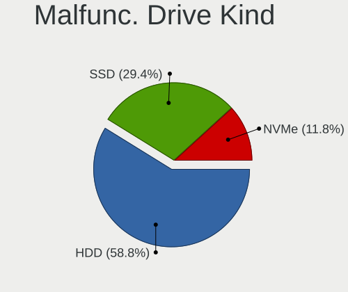

| Kind | Computers | Drives | Percent |
|------|-----------|--------|---------|
| HDD  | 10        | 17     | 58.82%  |
| SSD  | 5         | 5      | 29.41%  |
| NVMe | 2         | 3      | 11.76%  |

Failed Drives
-------------

Failed drive models

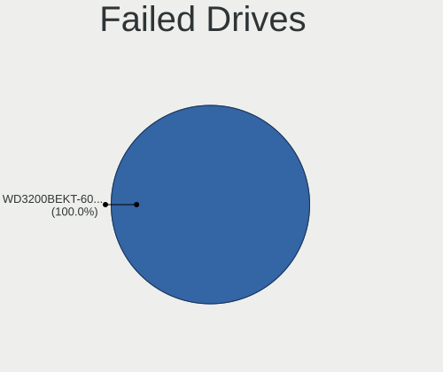

| Model                       | Computers | Drives | Percent |
|-----------------------------|-----------|--------|---------|
| WDC WD3200BEKT-60V5T1 320GB | 1         | 1      | 100%    |

Failed Drive Vendor
-------------------

Failed drive vendors

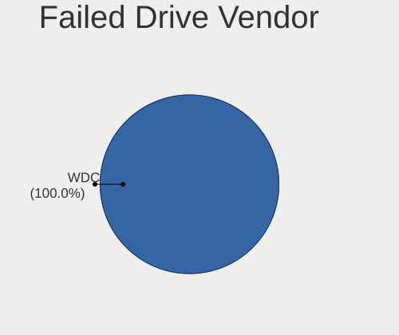

| Vendor | Computers | Drives | Percent |
|--------|-----------|--------|---------|
| WDC    | 1         | 1      | 100%    |

Drive Status
------------

Number of failed and malfunc. drives

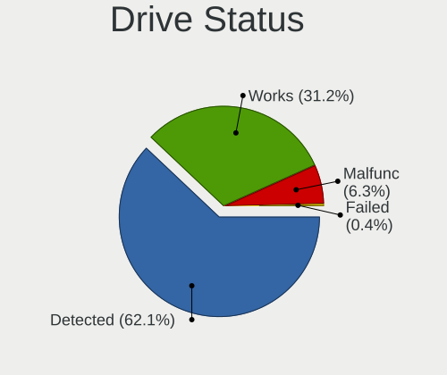

| Status   | Computers | Drives | Percent |
|----------|-----------|--------|---------|
| Detected | 157       | 255    | 62.06%  |
| Works    | 79        | 120    | 31.23%  |
| Malfunc  | 16        | 25     | 6.32%   |
| Failed   | 1         | 1      | 0.4%    |

Storage controller
------------------

Storage Vendor
--------------

Storage controller vendors

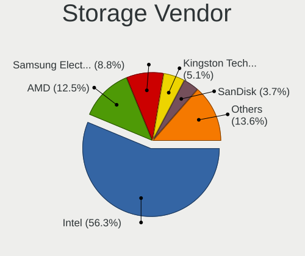

| Vendor                                    | Computers | Percent |
|-------------------------------------------|-----------|---------|
| Intel                                     | 166       | 56.27%  |
| AMD                                       | 37        | 12.54%  |
| Samsung Electronics                       | 26        | 8.81%   |
| Kingston Technology Company               | 15        | 5.08%   |
| SK hynix                                  | 11        | 3.73%   |
| SanDisk                                   | 11        | 3.73%   |
| Nvidia                                    | 6         | 2.03%   |
| Toshiba America Info Systems              | 5         | 1.69%   |
| Micron Technology                         | 4         | 1.36%   |
| KIOXIA                                    | 4         | 1.36%   |
| Micron/Crucial Technology                 | 3         | 1.02%   |
| Union Memory (Shenzhen)                   | 1         | 0.34%   |
| Tata Power Strategic Electronics Division | 1         | 0.34%   |
| Shenzhen Longsys Electronics              | 1         | 0.34%   |
| Phison Electronics                        | 1         | 0.34%   |
| Marvell Technology Group                  | 1         | 0.34%   |
| JMicron Technology                        | 1         | 0.34%   |
| ADATA Technology                          | 1         | 0.34%   |

Storage Model
-------------

Storage controller models

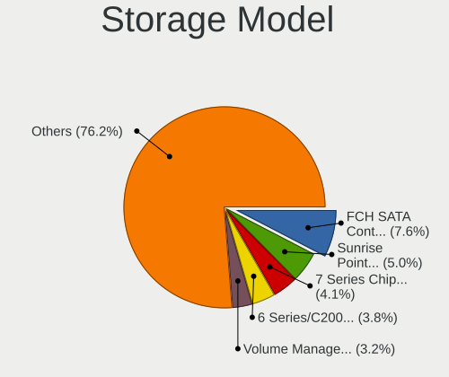

| Model                                                                                   | Computers | Percent |
|-----------------------------------------------------------------------------------------|-----------|---------|
| AMD FCH SATA Controller [AHCI mode]                                                     | 26        | 7.62%   |
| Intel Sunrise Point-LP SATA Controller [AHCI mode]                                      | 17        | 4.99%   |
| Intel 7 Series Chipset Family 6-port SATA Controller [AHCI mode]                        | 14        | 4.11%   |
| Intel 6 Series/C200 Series Chipset Family 6 port Mobile SATA AHCI Controller            | 13        | 3.81%   |
| Intel Volume Management Device NVMe RAID Controller                                     | 11        | 3.23%   |
| Samsung NVMe SSD Controller 980 (DRAM-less)                                             | 9         | 2.64%   |
| Intel NM10/ICH7 Family SATA Controller [IDE mode]                                       | 8         | 2.35%   |
| Intel 82801 Mobile SATA Controller [RAID mode]                                          | 8         | 2.35%   |
| Intel 8 Series/C220 Series Chipset Family 6-port SATA Controller 1 [AHCI mode]          | 8         | 2.35%   |
| Intel 82801G (ICH7 Family) IDE Controller                                               | 7         | 2.05%   |
| Samsung NVMe SSD Controller SM981/PM981/PM983                                           | 6         | 1.76%   |
| Intel 6 Series/C200 Series Chipset Family 6 port Desktop SATA AHCI Controller           | 6         | 1.76%   |
| Kingston Company NV2 NVMe SSD [SM2267XT] (DRAM-less)                                    | 5         | 1.47%   |
| Intel Tiger Lake-LP SATA Controller                                                     | 5         | 1.47%   |
| Intel Cannon Lake PCH SATA AHCI Controller                                              | 5         | 1.47%   |
| Intel 8 Series SATA Controller 1 [AHCI mode]                                            | 5         | 1.47%   |
| Intel 7 Series/C210 Series Chipset Family 6-port SATA Controller [AHCI mode]            | 5         | 1.47%   |
| Intel 6 Series/C200 Series Chipset Family Desktop SATA Controller (IDE mode, ports 4-5) | 5         | 1.47%   |
| Intel 6 Series/C200 Series Chipset Family Desktop SATA Controller (IDE mode, ports 0-3) | 5         | 1.47%   |
| AMD 400 Series Chipset SATA Controller                                                  | 5         | 1.47%   |
| SK hynix BC501 NVMe Solid State Drive                                                   | 4         | 1.17%   |
| Samsung NVMe SSD Controller SM961/PM961/SM963                                           | 4         | 1.17%   |
| Intel Q170/Q150/B150/H170/H110/Z170/CM236 Chipset SATA Controller [AHCI Mode]           | 4         | 1.17%   |
| Intel 5 Series/3400 Series Chipset 4 port SATA AHCI Controller                          | 4         | 1.17%   |
| AMD A320 Chipset SATA Controller [AHCI mode]                                            | 4         | 1.17%   |
| SK hynix Gold P31/BC711/PC711 NVMe Solid State Drive                                    | 3         | 0.88%   |
| SanDisk WD SN560/SN740/SN770/SN5000 NVMe SSD                                            | 3         | 0.88%   |
| SanDisk Ultra 3D / WD PC SN530, IX SN530, Blue SN550 NVMe SSD (DRAM-less)               | 3         | 0.88%   |
| Samsung NVMe SSD Controller PM9A1/PM9A3/980PRO                                          | 3         | 0.88%   |
| KIOXIA NVMe SSD Controller BG4 (DRAM-less)                                              | 3         | 0.88%   |
| Kingston Company NV1 NVMe SSD [SM2263XT] (DRAM-less)                                    | 3         | 0.88%   |
| Intel Cannon Point-LP SATA Controller [AHCI Mode]                                       | 3         | 0.88%   |
| Intel Cannon Lake Mobile PCH SATA AHCI Controller                                       | 3         | 0.88%   |
| Intel Atom/Celeron/Pentium Processor x5-E8000/J3xxx/N3xxx Series SATA Controller        | 3         | 0.88%   |
| Intel Alder Lake-S PCH SATA Controller [AHCI Mode]                                      | 3         | 0.88%   |
| Intel 9 Series Chipset Family SATA Controller [AHCI Mode]                               | 3         | 0.88%   |
| Intel 82801HM/HEM (ICH8M/ICH8M-E) SATA Controller [AHCI mode]                           | 3         | 0.88%   |
| Intel 82801HM/HEM (ICH8M/ICH8M-E) IDE Controller                                        | 3         | 0.88%   |
| Intel 82801H (ICH8 Family) 4 port SATA Controller [IDE mode]                            | 3         | 0.88%   |
| Intel 5 Series/3400 Series Chipset 6 port SATA AHCI Controller                          | 3         | 0.88%   |

Storage Kind
------------

Kind of storage controller (IDE, SATA, NVMe, SAS, ...)

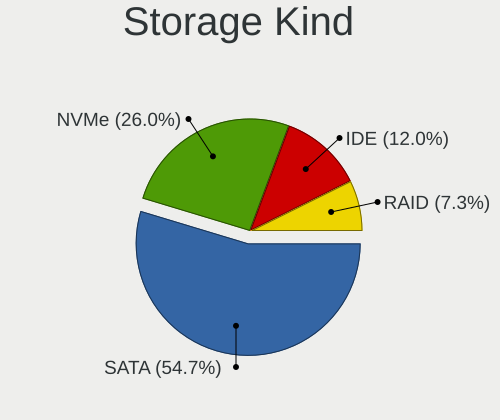

| Kind | Computers | Percent |
|------|-----------|---------|
| SATA | 164       | 54.67%  |
| NVMe | 78        | 26%     |
| IDE  | 36        | 12%     |
| RAID | 22        | 7.33%   |

Processor
---------

CPU Vendor
----------

Processor vendors

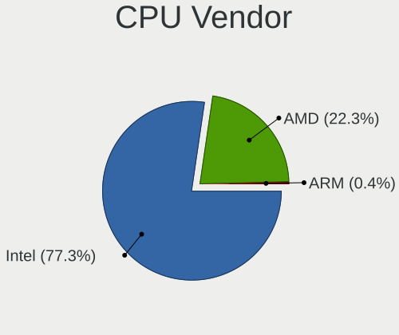

| Vendor | Computers | Percent |
|--------|-----------|---------|
| Intel  | 184       | 77.31%  |
| AMD    | 53        | 22.27%  |
| ARM    | 1         | 0.42%   |

CPU Model
---------

Processor models

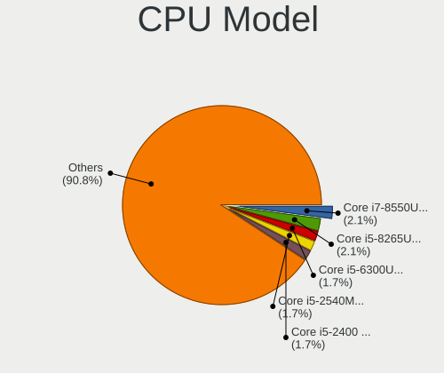

| Model                                         | Computers | Percent |
|-----------------------------------------------|-----------|---------|
| Intel Core i7-8550U CPU @ 1.80GHz             | 5         | 2.1%    |
| Intel Core i5-8265U CPU @ 1.60GHz             | 5         | 2.1%    |
| Intel Core i5-6300U CPU @ 2.40GHz             | 4         | 1.68%   |
| Intel Core i5-2540M CPU @ 2.60GHz             | 4         | 1.68%   |
| Intel Core i5-2400 CPU @ 3.10GHz              | 4         | 1.68%   |
| Intel Pentium Dual-Core CPU E5700 @ 3.00GHz   | 3         | 1.26%   |
| Intel Core i7-7500U CPU @ 2.70GHz             | 3         | 1.26%   |
| Intel Core i7-2670QM CPU @ 2.20GHz            | 3         | 1.26%   |
| Intel Core i5-8350U CPU @ 1.70GHz             | 3         | 1.26%   |
| Intel Core i5-6200U CPU @ 2.30GHz             | 3         | 1.26%   |
| Intel Core i5-3210M CPU @ 2.50GHz             | 3         | 1.26%   |
| Intel 12th Gen Core i7-12700H                 | 3         | 1.26%   |
| Intel 11th Gen Core i7-1165G7 @ 2.80GHz       | 3         | 1.26%   |
| AMD Ryzen 5 3500U with Radeon Vega Mobile Gfx | 3         | 1.26%   |
| AMD Ryzen 3 2200G with Radeon Vega Graphics   | 3         | 1.26%   |
| Intel Pentium Dual-Core CPU T4500 @ 2.30GHz   | 2         | 0.84%   |
| Intel Pentium CPU N3540 @ 2.16GHz             | 2         | 0.84%   |
| Intel Pentium CPU G630 @ 2.70GHz              | 2         | 0.84%   |
| Intel Core i7-9750H CPU @ 2.60GHz             | 2         | 0.84%   |
| Intel Core i7-8565U CPU @ 1.80GHz             | 2         | 0.84%   |
| Intel Core i7-6600U CPU @ 2.60GHz             | 2         | 0.84%   |
| Intel Core i7 CPU Q 720 @ 1.60GHz             | 2         | 0.84%   |
| Intel Core i5-8500 CPU @ 3.00GHz              | 2         | 0.84%   |
| Intel Core i5-8250U CPU @ 1.60GHz             | 2         | 0.84%   |
| Intel Core i5-4460 CPU @ 3.20GHz              | 2         | 0.84%   |
| Intel Core i5-3470 CPU @ 3.20GHz              | 2         | 0.84%   |
| Intel Core i5-3320M CPU @ 2.60GHz             | 2         | 0.84%   |
| Intel Core i5-2520M CPU @ 2.50GHz             | 2         | 0.84%   |
| Intel Core i5-1035G1 CPU @ 1.00GHz            | 2         | 0.84%   |
| Intel Core i5 CPU M 560 @ 2.67GHz             | 2         | 0.84%   |
| Intel Core i3-6006U CPU @ 2.00GHz             | 2         | 0.84%   |
| Intel Core i3-3227U CPU @ 1.90GHz             | 2         | 0.84%   |
| Intel Core 2 Duo CPU E8400 @ 3.00GHz          | 2         | 0.84%   |
| Intel Celeron CPU N3350 @ 1.10GHz             | 2         | 0.84%   |
| Intel Celeron CPU 430 @ 1.80GHz               | 2         | 0.84%   |
| Intel 11th Gen Core i5-1135G7 @ 2.40GHz       | 2         | 0.84%   |
| AMD Ryzen 5 PRO 4650U with Radeon Graphics    | 2         | 0.84%   |
| AMD Ryzen 5 5500U with Radeon Graphics        | 2         | 0.84%   |
| AMD Ryzen 5 3600 6-Core Processor             | 2         | 0.84%   |
| AMD E1-2100 APU with Radeon HD Graphics       | 2         | 0.84%   |

CPU Model Family
----------------

Processor model prefix

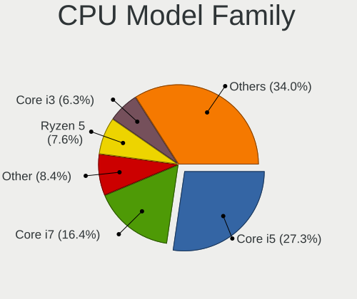

| Model                   | Computers | Percent |
|-------------------------|-----------|---------|
| Intel Core i5           | 65        | 27.31%  |
| Intel Core i7           | 39        | 16.39%  |
| Other                   | 20        | 8.4%    |
| AMD Ryzen 5             | 18        | 7.56%   |
| Intel Core i3           | 15        | 6.3%    |
| Intel Celeron           | 9         | 3.78%   |
| Intel Pentium Dual-Core | 8         | 3.36%   |
| Intel Core 2 Duo        | 8         | 3.36%   |
| AMD Ryzen 7             | 7         | 2.94%   |
| Intel Pentium           | 6         | 2.52%   |
| Intel Xeon              | 4         | 1.68%   |
| AMD Ryzen 3             | 4         | 1.68%   |
| AMD E1                  | 4         | 1.68%   |
| AMD Ryzen 9             | 3         | 1.26%   |
| Intel Core 2 Quad       | 2         | 0.84%   |
| Intel Core 2            | 2         | 0.84%   |
| Intel Core              | 2         | 0.84%   |
| AMD Ryzen 5 PRO         | 2         | 0.84%   |
| AMD Athlon 64 X2        | 2         | 0.84%   |
| AMD A8                  | 2         | 0.84%   |
| AMD A6                  | 2         | 0.84%   |
| Intel Pentium M         | 1         | 0.42%   |
| Intel Pentium Dual      | 1         | 0.42%   |
| Intel Pentium 4         | 1         | 0.42%   |
| Intel Celeron D         | 1         | 0.42%   |
| Intel Atom              | 1         | 0.42%   |
| AMD Turion 64 Mobile    | 1         | 0.42%   |
| AMD Phenom              | 1         | 0.42%   |
| AMD FX                  | 1         | 0.42%   |
| AMD E2                  | 1         | 0.42%   |
| AMD C-60                | 1         | 0.42%   |
| AMD Athlon X4           | 1         | 0.42%   |
| AMD Athlon II X3        | 1         | 0.42%   |
| AMD Athlon 64           | 1         | 0.42%   |
| AMD A10                 | 1         | 0.42%   |

CPU Cores
---------

Number of processor cores

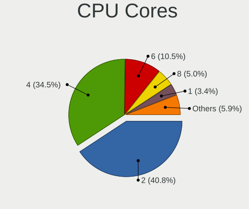

| Number | Computers | Percent |
|--------|-----------|---------|
| 2      | 97        | 40.76%  |
| 4      | 82        | 34.45%  |
| 6      | 25        | 10.5%   |
| 8      | 12        | 5.04%   |
| 1      | 8         | 3.36%   |
| 14     | 5         | 2.1%    |
| 12     | 4         | 1.68%   |
| 3      | 3         | 1.26%   |
| 16     | 1         | 0.42%   |
| 10     | 1         | 0.42%   |

CPU Sockets
-----------

Number of sockets

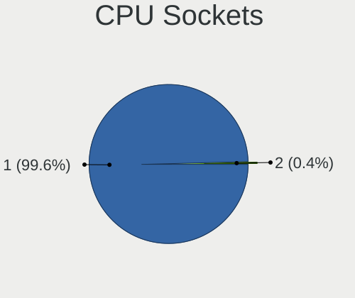

| Number | Computers | Percent |
|--------|-----------|---------|
| 1      | 237       | 99.58%  |
| 2      | 1         | 0.42%   |

CPU Threads
-----------

Threads per core (Hyper-Threading)

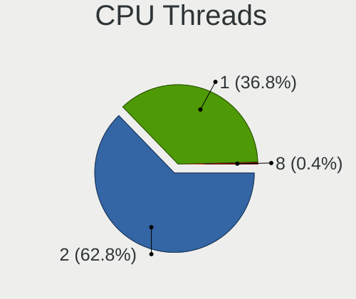

| Number | Computers | Percent |
|--------|-----------|---------|
| 2      | 150       | 62.76%  |
| 1      | 88        | 36.82%  |
| 8      | 1         | 0.42%   |

CPU Op-Modes
------------

CPU Operation Modes (32-bit, 64-bit)

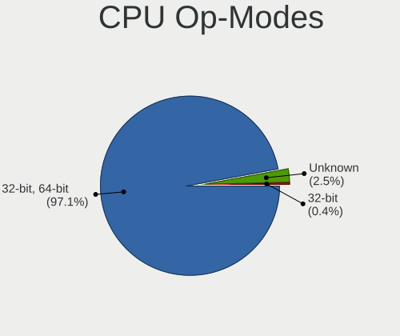

| Op mode        | Computers | Percent |
|----------------|-----------|---------|
| 32-bit, 64-bit | 231       | 97.06%  |
| Unknown        | 6         | 2.52%   |
| 32-bit         | 1         | 0.42%   |

CPU Microcode
-------------

Microcode number

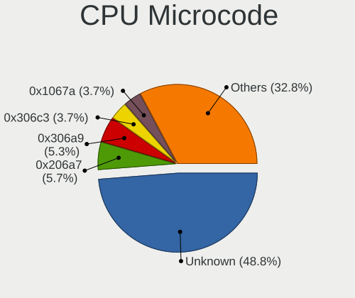

| Number     | Computers | Percent |
|------------|-----------|---------|
| Unknown    | 119       | 48.77%  |
| 0x206a7    | 14        | 5.74%   |
| 0x306a9    | 13        | 5.33%   |
| 0x306c3    | 9         | 3.69%   |
| 0x1067a    | 9         | 3.69%   |
| 0x406e3    | 6         | 2.46%   |
| 0x806ea    | 5         | 2.05%   |
| 0x806ec    | 4         | 1.64%   |
| 0x906a3    | 3         | 1.23%   |
| 0x806c1    | 3         | 1.23%   |
| 0x506e3    | 3         | 1.23%   |
| 0x40651    | 3         | 1.23%   |
| 0x10676    | 3         | 1.23%   |
| 0x806eb    | 2         | 0.82%   |
| 0x806e9    | 2         | 0.82%   |
| 0x506c9    | 2         | 0.82%   |
| 0x30678    | 2         | 0.82%   |
| 0x20655    | 2         | 0.82%   |
| 0x08600106 | 2         | 0.82%   |
| 0x08108109 | 2         | 0.82%   |
| 0x0700010f | 2         | 0.82%   |
| 0x05000119 | 2         | 0.82%   |
| 0xf65      | 1         | 0.41%   |
| 0xf43      | 1         | 0.41%   |
| 0xa0653    | 1         | 0.41%   |
| 0xa0652    | 1         | 0.41%   |
| 0x906ec    | 1         | 0.41%   |
| 0x906eb    | 1         | 0.41%   |
| 0x906ea    | 1         | 0.41%   |
| 0x906e9    | 1         | 0.41%   |
| 0x706e5    | 1         | 0.41%   |
| 0x6fd      | 1         | 0.41%   |
| 0x6fb      | 1         | 0.41%   |
| 0x6fa      | 1         | 0.41%   |
| 0x6f6      | 1         | 0.41%   |
| 0x6f2      | 1         | 0.41%   |
| 0x6d8      | 1         | 0.41%   |
| 0x406c4    | 1         | 0.41%   |
| 0x406c3    | 1         | 0.41%   |
| 0x106e5    | 1         | 0.41%   |

CPU Microarch
-------------

Microarchitecture

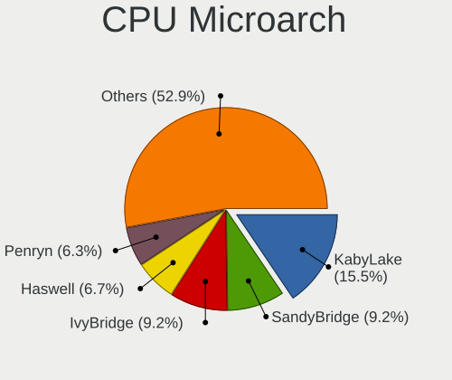

| Name             | Computers | Percent |
|------------------|-----------|---------|
| KabyLake         | 37        | 15.55%  |
| SandyBridge      | 22        | 9.24%   |
| IvyBridge        | 22        | 9.24%   |
| Haswell          | 16        | 6.72%   |
| Penryn           | 15        | 6.3%    |
| Skylake          | 14        | 5.88%   |
| Unknown          | 13        | 5.46%   |
| Core             | 9         | 3.78%   |
| Zen+             | 8         | 3.36%   |
| Zen 3            | 8         | 3.36%   |
| Zen 2            | 8         | 3.36%   |
| Westmere         | 8         | 3.36%   |
| TigerLake        | 8         | 3.36%   |
| Silvermont       | 6         | 2.52%   |
| Alderlake Hybrid | 6         | 2.52%   |
| K8 Hammer        | 4         | 1.68%   |
| IceLake          | 4         | 1.68%   |
| Zen              | 3         | 1.26%   |
| Jaguar           | 3         | 1.26%   |
| Piledriver       | 2         | 0.84%   |
| NetBurst         | 2         | 0.84%   |
| Nehalem          | 2         | 0.84%   |
| K10              | 2         | 0.84%   |
| Goldmont         | 2         | 0.84%   |
| Excavator        | 2         | 0.84%   |
| CometLake        | 2         | 0.84%   |
| Broadwell        | 2         | 0.84%   |
| Bobcat           | 2         | 0.84%   |
| Steamroller      | 1         | 0.42%   |
| Puma             | 1         | 0.42%   |
| P6               | 1         | 0.42%   |
| Lunarlake Hybrid | 1         | 0.42%   |
| K10 Llano        | 1         | 0.42%   |
| Bulldozer        | 1         | 0.42%   |

Graphics
--------

GPU Vendor
----------

Vendors of graphics cards

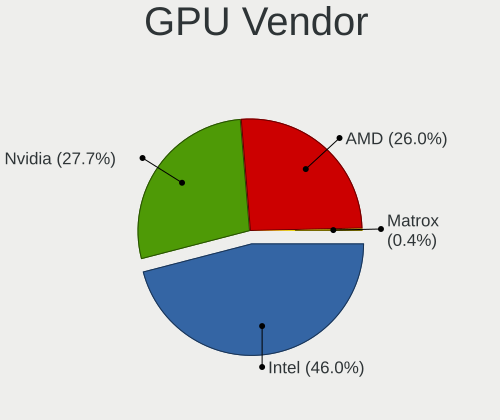

| Vendor                     | Computers | Percent |
|----------------------------|-----------|---------|
| Intel                      | 131       | 45.96%  |
| Nvidia                     | 79        | 27.72%  |
| AMD                        | 74        | 25.96%  |
| Matrox Electronics Systems | 1         | 0.35%   |

GPU Model
---------

Graphics card models

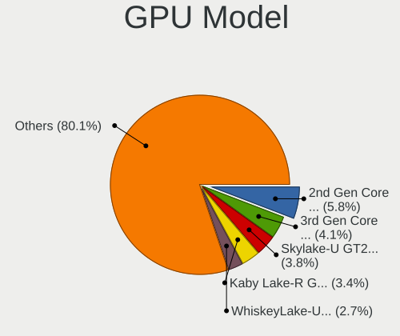

| Model                                                                                    | Computers | Percent |
|------------------------------------------------------------------------------------------|-----------|---------|
| Intel 2nd Generation Core Processor Family Integrated Graphics Controller                | 17        | 5.82%   |
| Intel 3rd Gen Core processor Graphics Controller                                         | 12        | 4.11%   |
| Intel Skylake-U GT2 [HD Graphics 520]                                                    | 11        | 3.77%   |
| Intel Kaby Lake-R GT2 [UHD Graphics 620]                                                 | 10        | 3.42%   |
| Intel WhiskeyLake-U GT2 [UHD Graphics 620]                                               | 8         | 2.74%   |
| Intel TigerLake-LP GT2 [Iris Xe Graphics]                                                | 7         | 2.4%    |
| Intel Kaby Lake-U GT2 [HD Graphics 620]                                                  | 6         | 2.05%   |
| AMD Picasso/Raven 2 [Radeon Vega Series / Radeon Vega Mobile Series]                     | 6         | 2.05%   |
| Intel Haswell-ULT Integrated Graphics Controller                                         | 5         | 1.71%   |
| Intel CoffeeLake-S GT2 [UHD Graphics 630]                                                | 5         | 1.71%   |
| Nvidia GT218 [GeForce 210]                                                               | 4         | 1.37%   |
| Nvidia GM108M [GeForce MX110]                                                            | 4         | 1.37%   |
| Intel Xeon E3-1200 v3/4th Gen Core Processor Integrated Graphics Controller              | 4         | 1.37%   |
| Intel Atom/Celeron/Pentium Processor x5-E8000/J3xxx/N3xxx Integrated Graphics Controller | 4         | 1.37%   |
| Intel Alder Lake-P GT2 [Iris Xe Graphics]                                                | 4         | 1.37%   |
| AMD Renoir [Radeon Vega Series / Radeon Vega Mobile Series]                              | 4         | 1.37%   |
| AMD Ellesmere [Radeon RX 470/480/570/570X/580/580X/590]                                  | 4         | 1.37%   |
| Nvidia GP108M [GeForce MX150]                                                            | 3         | 1.03%   |
| Nvidia GP107 [GeForce GTX 1050 Ti]                                                       | 3         | 1.03%   |
| Intel Xeon E3-1200 v2/3rd Gen Core processor Graphics Controller                         | 3         | 1.03%   |
| Intel CoffeeLake-H GT2 [UHD Graphics 630]                                                | 3         | 1.03%   |
| Intel 4th Gen Core Processor Integrated Graphics Controller                              | 3         | 1.03%   |
| AMD Thames [Radeon HD 7500M/7600M Series]                                                | 3         | 1.03%   |
| AMD Navi 23 [Radeon RX 6600/6600 XT/6600M]                                               | 3         | 1.03%   |
| AMD Lucienne                                                                             | 3         | 1.03%   |
| AMD Cezanne [Radeon Vega Series / Radeon Vega Mobile Series]                             | 3         | 1.03%   |
| AMD Baffin [Radeon RX 460/560D / Pro 450/455/460/555/555X/560/560X]                      | 3         | 1.03%   |
| Nvidia TU116M [GeForce GTX 1660 Ti Mobile]                                               | 2         | 0.68%   |
| Nvidia GT218M [NVS 3100M]                                                                | 2         | 0.68%   |
| Nvidia GP108M [GeForce MX230]                                                            | 2         | 0.68%   |
| Nvidia GP108 [GeForce GT 1030]                                                           | 2         | 0.68%   |
| Nvidia GK208B [GeForce GT 710]                                                           | 2         | 0.68%   |
| Nvidia GK110 [GeForce GTX 780]                                                           | 2         | 0.68%   |
| Nvidia GA107M [GeForce RTX 3050 Ti Mobile]                                               | 2         | 0.68%   |
| Intel Mobile 4 Series Chipset Integrated Graphics Controller                             | 2         | 0.68%   |
| Intel Iris Plus Graphics G1 (Ice Lake)                                                   | 2         | 0.68%   |
| Intel Broadwell-U GT2 [HD Graphics 5500]                                                 | 2         | 0.68%   |
| Intel Atom Processor Z36xxx/Z37xxx Series Graphics & Display                             | 2         | 0.68%   |
| Intel Apollo Lake GT1 [HD Graphics 500]                                                  | 2         | 0.68%   |
| Intel 82G33/G31 Express Integrated Graphics Controller                                   | 2         | 0.68%   |

GPU Combo
---------

Combinations of graphics cards

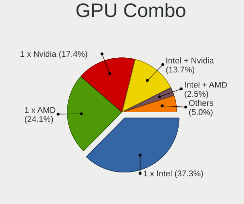

| Name           | Computers | Percent |
|----------------|-----------|---------|
| 1 x Intel      | 90        | 37.34%  |
| 1 x AMD        | 58        | 24.07%  |
| 1 x Nvidia     | 42        | 17.43%  |
| Intel + Nvidia | 33        | 13.69%  |
| Intel + AMD    | 6         | 2.49%   |
| AMD + Nvidia   | 5         | 2.07%   |
| 2 x AMD        | 4         | 1.66%   |
| Other          | 1         | 0.41%   |
| 3 x AMD        | 1         | 0.41%   |
| 1 x Matrox     | 1         | 0.41%   |

GPU Driver
----------

Free vs proprietary

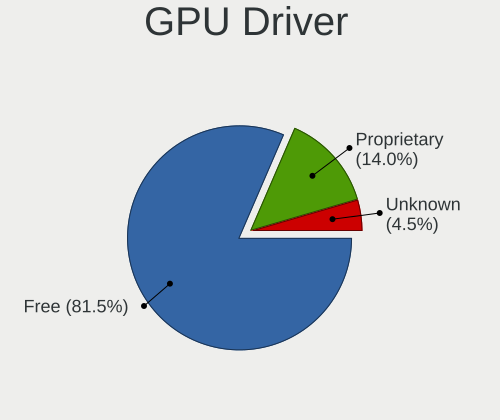

| Driver      | Computers | Percent |
|-------------|-----------|---------|
| Free        | 198       | 81.48%  |
| Proprietary | 34        | 13.99%  |
| Unknown     | 11        | 4.53%   |

GPU Memory
----------

Total video memory

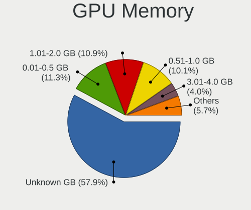

| Size in GB | Computers | Percent |
|------------|-----------|---------|
| Unknown    | 143       | 57.89%  |
| 0.01-0.5   | 28        | 11.34%  |
| 1.01-2.0   | 27        | 10.93%  |
| 0.51-1.0   | 25        | 10.12%  |
| 3.01-4.0   | 10        | 4.05%   |
| 7.01-8.0   | 8         | 3.24%   |
| 5.01-6.0   | 3         | 1.21%   |
| 2.01-3.0   | 2         | 0.81%   |
| 8.01-16.0  | 1         | 0.4%    |

Monitor
-------

Monitor Vendor
--------------

Monitor vendors

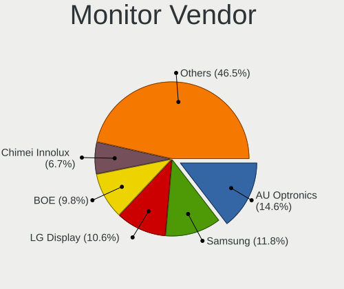

| Vendor                  | Computers | Percent |
|-------------------------|-----------|---------|
| AU Optronics            | 37        | 14.57%  |
| Samsung Electronics     | 30        | 11.81%  |
| LG Display              | 27        | 10.63%  |
| BOE                     | 25        | 9.84%   |
| Chimei Innolux          | 17        | 6.69%   |
| Dell                    | 14        | 5.51%   |
| AOC                     | 11        | 4.33%   |
| Goldstar                | 10        | 3.94%   |
| Philips                 | 8         | 3.15%   |
| Hewlett-Packard         | 8         | 3.15%   |
| Sharp                   | 7         | 2.76%   |
| Fujitsu Siemens         | 5         | 1.97%   |
| Chi Mei Optoelectronics | 5         | 1.97%   |
| Acer                    | 5         | 1.97%   |
| Lenovo                  | 4         | 1.57%   |
| ASUSTek Computer        | 4         | 1.57%   |
| Ancor Communications    | 4         | 1.57%   |
| Sony                    | 3         | 1.18%   |
| InfoVision              | 3         | 1.18%   |
| Unknown                 | 2         | 0.79%   |
| PANDA                   | 2         | 0.79%   |
| NEC Computers           | 2         | 0.79%   |
| MSI                     | 2         | 0.79%   |
| LG Philips              | 2         | 0.79%   |
| IBM                     | 2         | 0.79%   |
| Eizo                    | 2         | 0.79%   |
| BenQ                    | 2         | 0.79%   |
| ViewSonic               | 1         | 0.39%   |
| Vestel Elektronik       | 1         | 0.39%   |
| Mi                      | 1         | 0.39%   |
| LTM                     | 1         | 0.39%   |
| LGD                     | 1         | 0.39%   |
| Daewoo                  | 1         | 0.39%   |
| CTV                     | 1         | 0.39%   |
| CSOT                    | 1         | 0.39%   |
| CSO                     | 1         | 0.39%   |
| Belinea                 | 1         | 0.39%   |
| Apple                   | 1         | 0.39%   |

Monitor Model
-------------

Monitor models

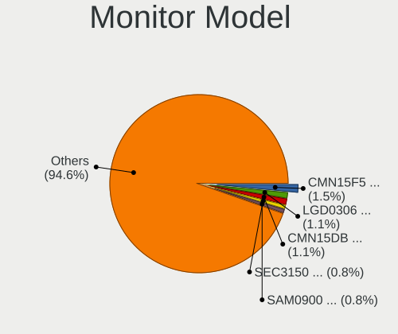

| Model                                                                 | Computers | Percent |
|-----------------------------------------------------------------------|-----------|---------|
| Chimei Innolux LCD Monitor CMN15F5 1920x1080 344x193mm 15.5-inch      | 4         | 1.53%   |
| LG Display LCD Monitor LGD0306 1600x900 310x174mm 14.0-inch           | 3         | 1.15%   |
| Chimei Innolux LCD Monitor CMN15DB 1366x768 344x193mm 15.5-inch       | 3         | 1.15%   |
| Samsung Electronics LCD Monitor SEC3150 1366x768 344x193mm 15.5-inch  | 2         | 0.77%   |
| Samsung Electronics LCD Monitor SAM0900 1366x768 580x320mm 26.1-inch  | 2         | 0.77%   |
| Samsung Electronics LCD Monitor SAM0678 1360x768                      | 2         | 0.77%   |
| LG Display LCD Monitor LGD05E4 1920x1080 344x194mm 15.5-inch          | 2         | 0.77%   |
| LG Display LCD Monitor LGD03AB 1366x768 344x194mm 15.5-inch           | 2         | 0.77%   |
| InfoVision LCD Monitor IVO057D 1920x1080 309x174mm 14.0-inch          | 2         | 0.77%   |
| IBM C170 CRT IBM1A51 1280x1024 310x230mm 15.2-inch                    | 2         | 0.77%   |
| Dell U2412M DELA07A 1920x1200 518x324mm 24.1-inch                     | 2         | 0.77%   |
| Chimei Innolux LCD Monitor CMN14D4 1920x1080 309x173mm 13.9-inch      | 2         | 0.77%   |
| BOE LCD Monitor BOE08D5 1920x1080 344x194mm 15.5-inch                 | 2         | 0.77%   |
| BOE LCD Monitor BOE07A3 1920x1080 344x193mm 15.5-inch                 | 2         | 0.77%   |
| BOE LCD Monitor BOE06A5 1366x768 344x194mm 15.5-inch                  | 2         | 0.77%   |
| BOE LCD Monitor BOE0672 1366x768 344x194mm 15.5-inch                  | 2         | 0.77%   |
| AU Optronics LCD Monitor AUO35ED 1920x1080 344x193mm 15.5-inch        | 2         | 0.77%   |
| AU Optronics LCD Monitor AUO323D 1920x1080 309x174mm 14.0-inch        | 2         | 0.77%   |
| AU Optronics LCD Monitor AUO22EC 1366x768 344x193mm 15.5-inch         | 2         | 0.77%   |
| AU Optronics LCD Monitor AUO123D 1920x1080 309x173mm 13.9-inch        | 2         | 0.77%   |
| AOC 917W AOC1917 1440x900 410x256mm 19.0-inch                         | 2         | 0.77%   |
| Ancor Communications ASUS VS247 ACI249A 1920x1080 521x293mm 23.5-inch | 2         | 0.77%   |
| Acer KA220HQ ACR0467 1920x1080 477x268mm 21.5-inch                    | 2         | 0.77%   |
| ViewSonic VA702 VSC1C1C 1280x1024 338x270mm 17.0-inch                 | 1         | 0.38%   |
| Vestel Elektronik 40UHD_LCD_TV VES3700 3840x2160 880x500mm 39.8-inch  | 1         | 0.38%   |
| Unknown LCD Monitor SAMSUNG 1366x768                                  | 1         | 0.38%   |
| Unknown LCD Monitor Maxdata/XXXXXXX B_101920 1280x1024                | 1         | 0.38%   |
| Sony TV SNY6604 1920x1080                                             | 1         | 0.38%   |
| Sony TV SNY4D04 1920x1080                                             | 1         | 0.38%   |
| Sony TV *00 SNY4904 3840x2160                                         | 1         | 0.38%   |
| Sharp LQ140Z1JW01 SHP1401 3200x1800 310x174mm 14.0-inch               | 1         | 0.38%   |
| Sharp LQ140M1JW49 SHP1523 1920x1080 309x174mm 14.0-inch               | 1         | 0.38%   |
| Sharp LQ134N1JW52 SHP151E 1920x1200 288x180mm 13.4-inch               | 1         | 0.38%   |
| Sharp LCD Monitor SHP1515 1920x1200 336x210mm 15.6-inch               | 1         | 0.38%   |
| Sharp LCD Monitor SHP14A2 1920x1080 309x174mm 14.0-inch               | 1         | 0.38%   |
| Sharp LCD Monitor SHP149A 1920x1080 344x194mm 15.5-inch               | 1         | 0.38%   |
| Sharp LCD Monitor SHP1449 1920x1080 294x165mm 13.3-inch               | 1         | 0.38%   |
| Samsung Electronics SyncMaster SAM0579 1920x1080                      | 1         | 0.38%   |
| Samsung Electronics SyncMaster SAM0564 1360x768 410x230mm 18.5-inch   | 1         | 0.38%   |
| Samsung Electronics SyncMaster SAM03E2 1680x1050 433x271mm 20.1-inch  | 1         | 0.38%   |

Monitor Resolution
------------------

Monitor screen resolution

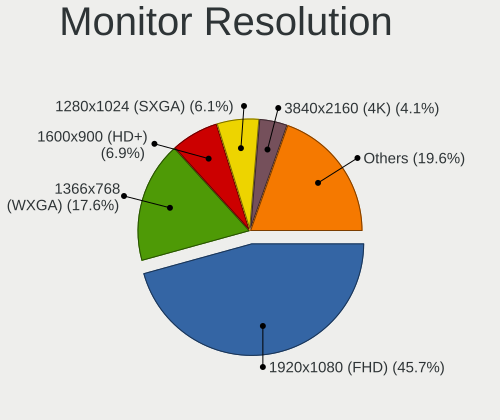

| Resolution         | Computers | Percent |
|--------------------|-----------|---------|
| 1920x1080 (FHD)    | 112       | 45.71%  |
| 1366x768 (WXGA)    | 43        | 17.55%  |
| 1600x900 (HD+)     | 17        | 6.94%   |
| 1280x1024 (SXGA)   | 15        | 6.12%   |
| 3840x2160 (4K)     | 10        | 4.08%   |
| 2560x1440 (QHD)    | 9         | 3.67%   |
| 1680x1050 (WSXGA+) | 9         | 3.67%   |
| 1440x900 (WXGA+)   | 7         | 2.86%   |
| 1920x1200 (WUXGA)  | 5         | 2.04%   |
| 3440x1440          | 3         | 1.22%   |
| 1360x768           | 3         | 1.22%   |
| 2880x1800          | 2         | 0.82%   |
| 2560x1600          | 2         | 0.82%   |
| 1280x800 (WXGA)    | 2         | 0.82%   |
| 3200x1800 (QHD+)   | 1         | 0.41%   |
| 3200x1080          | 1         | 0.41%   |
| 2736x1824          | 1         | 0.41%   |
| 1600x1200          | 1         | 0.41%   |
| 1024x768 (XGA)     | 1         | 0.41%   |
| Unknown            | 1         | 0.41%   |

Monitor Diagonal
----------------

Diagonal size in inches

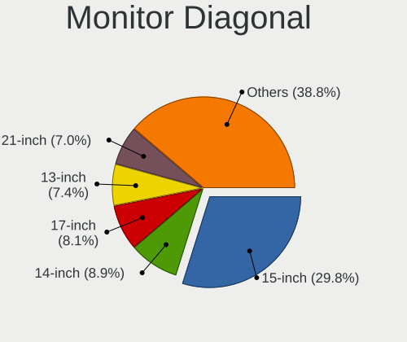

| Inches  | Computers | Percent |
|---------|-----------|---------|
| 15      | 77        | 29.84%  |
| 14      | 23        | 8.91%   |
| 17      | 21        | 8.14%   |
| 13      | 19        | 7.36%   |
| 21      | 18        | 6.98%   |
| 23      | 17        | 6.59%   |
| 27      | 15        | 5.81%   |
| Unknown | 13        | 5.04%   |
| 24      | 10        | 3.88%   |
| 19      | 7         | 2.71%   |
| 22      | 6         | 2.33%   |
| 18      | 5         | 1.94%   |
| 31      | 4         | 1.55%   |
| 12      | 4         | 1.55%   |
| 72      | 3         | 1.16%   |
| 34      | 3         | 1.16%   |
| 11      | 3         | 1.16%   |
| 84      | 2         | 0.78%   |
| 20      | 2         | 0.78%   |
| 16      | 2         | 0.78%   |
| 54      | 1         | 0.39%   |
| 40      | 1         | 0.39%   |
| 33      | 1         | 0.39%   |
| 26      | 1         | 0.39%   |

Monitor Width
-------------

Physical width

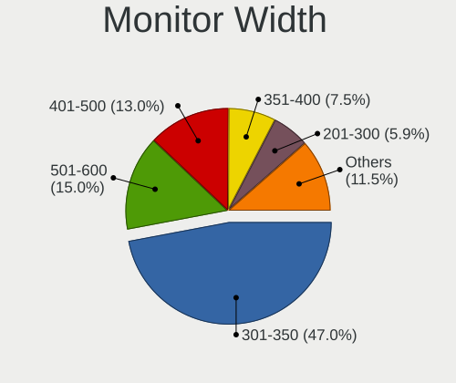

| Width in mm | Computers | Percent |
|-------------|-----------|---------|
| 301-350     | 119       | 47.04%  |
| 501-600     | 38        | 15.02%  |
| 401-500     | 33        | 13.04%  |
| 351-400     | 19        | 7.51%   |
| 201-300     | 15        | 5.93%   |
| Unknown     | 13        | 5.14%   |
| 601-700     | 5         | 1.98%   |
| 1501-2000   | 5         | 1.98%   |
| 701-800     | 4         | 1.58%   |
| 801-900     | 1         | 0.4%    |
| 1001-1500   | 1         | 0.4%    |

Aspect Ratio
------------

Proportional relationship between the width and the height

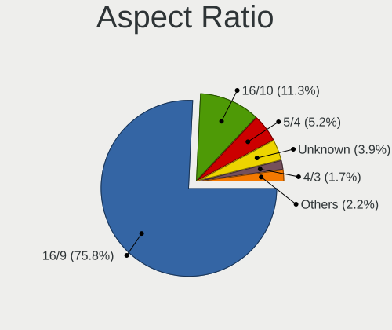

| Ratio   | Computers | Percent |
|---------|-----------|---------|
| 16/9    | 175       | 75.76%  |
| 16/10   | 26        | 11.26%  |
| 5/4     | 12        | 5.19%   |
| Unknown | 9         | 3.9%    |
| 4/3     | 4         | 1.73%   |
| 21/9    | 3         | 1.3%    |
| 3/2     | 2         | 0.87%   |

Monitor Area
------------

Area in inch²

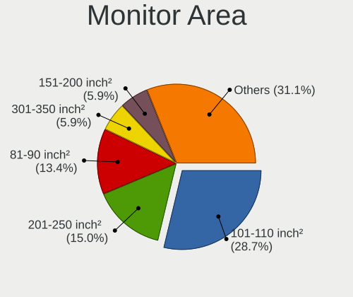

| Area in inch² | Computers | Percent |
|----------------|-----------|---------|
| 101-110        | 73        | 28.74%  |
| 201-250        | 38        | 14.96%  |
| 81-90          | 34        | 13.39%  |
| 301-350        | 15        | 5.91%   |
| 151-200        | 15        | 5.91%   |
| Unknown        | 13        | 5.12%   |
| 141-150        | 11        | 4.33%   |
| 121-130        | 11        | 4.33%   |
| 71-80          | 9         | 3.54%   |
| 351-500        | 8         | 3.15%   |
| More than 1000 | 6         | 2.36%   |
| 251-300        | 5         | 1.97%   |
| 111-120        | 5         | 1.97%   |
| 61-70          | 3         | 1.18%   |
| 51-60          | 3         | 1.18%   |
| 131-140        | 3         | 1.18%   |
| 501-1000       | 1         | 0.39%   |
| 91-100         | 1         | 0.39%   |

Pixel Density
-------------

Pixels per inch

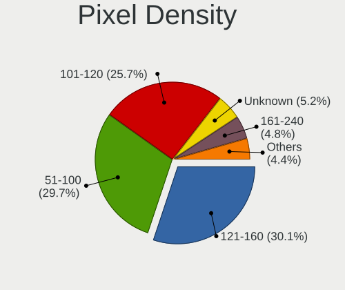

| Density       | Computers | Percent |
|---------------|-----------|---------|
| 121-160       | 75        | 30.12%  |
| 51-100        | 74        | 29.72%  |
| 101-120       | 64        | 25.7%   |
| Unknown       | 13        | 5.22%   |
| 161-240       | 12        | 4.82%   |
| More than 240 | 6         | 2.41%   |
| 1-50          | 5         | 2.01%   |

Multiple Monitors
-----------------

Total monitors connected

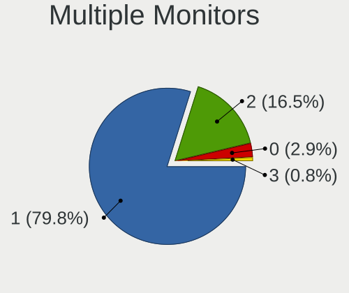

| Total | Computers | Percent |
|-------|-----------|---------|
| 1     | 194       | 79.84%  |
| 2     | 40        | 16.46%  |
| 0     | 7         | 2.88%   |
| 3     | 2         | 0.82%   |

Network
-------

Net Controller Vendor
---------------------

Controller vendors

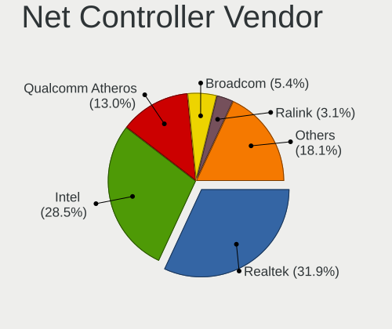

| Vendor                                 | Computers | Percent |
|----------------------------------------|-----------|---------|
| Realtek Semiconductor                  | 113       | 31.92%  |
| Intel                                  | 101       | 28.53%  |
| Qualcomm Atheros                       | 46        | 12.99%  |
| Broadcom                               | 19        | 5.37%   |
| Ralink Technology                      | 11        | 3.11%   |
| MediaTek                               | 10        | 2.82%   |
| TP-Link                                | 7         | 1.98%   |
| Qualcomm Atheros Communications        | 7         | 1.98%   |
| Ralink                                 | 4         | 1.13%   |
| Nvidia                                 | 4         | 1.13%   |
| Marvell Technology Group               | 4         | 1.13%   |
| Hewlett-Packard                        | 4         | 1.13%   |
| Broadcom Limited                       | 4         | 1.13%   |
| ASIX Electronics                       | 3         | 0.85%   |
| Sony Ericsson Mobile Communications AB | 2         | 0.56%   |
| Sierra Wireless                        | 2         | 0.56%   |
| Mercucys                               | 2         | 0.56%   |
| ICS Advent                             | 2         | 0.56%   |
| Xiaomi                                 | 1         | 0.28%   |
| Toshiba                                | 1         | 0.28%   |
| Shenzhen Goodix Technology             | 1         | 0.28%   |
| Samsung Electronics                    | 1         | 0.28%   |
| Qualcomm                               | 1         | 0.28%   |
| HTC (High Tech Computer)               | 1         | 0.28%   |
| Ericsson Business Mobile Networks      | 1         | 0.28%   |
| D-Link                                 | 1         | 0.28%   |
| Aquantia                               | 1         | 0.28%   |

Net Controller Model
--------------------

Controller models

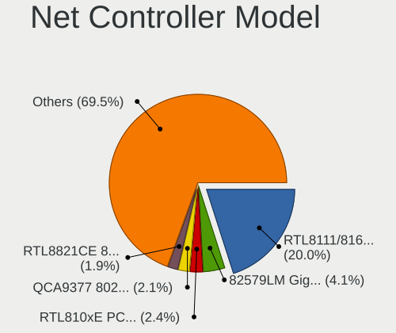

| Model                                                                  | Computers | Percent |
|------------------------------------------------------------------------|-----------|---------|
| Realtek RTL8111/8168/8211/8411 PCI Express Gigabit Ethernet Controller | 84        | 20.05%  |
| Intel 82579LM Gigabit Network Connection (Lewisville)                  | 17        | 4.06%   |
| Realtek RTL810xE PCI Express Fast Ethernet controller                  | 10        | 2.39%   |
| Qualcomm Atheros QCA9377 802.11ac Wireless Network Adapter             | 9         | 2.15%   |
| Realtek RTL8821CE 802.11ac PCIe Wireless Network Adapter               | 8         | 1.91%   |
| Ralink MT7601U Wireless Adapter                                        | 8         | 1.91%   |
| Intel Wireless 8265 / 8275                                             | 8         | 1.91%   |
| Qualcomm Atheros AR9271 802.11n                                        | 7         | 1.67%   |
| Intel Wireless 8260                                                    | 7         | 1.67%   |
| Qualcomm Atheros QCA9565 / AR9565 Wireless Network Adapter             | 6         | 1.43%   |
| Qualcomm Atheros QCA6174 802.11ac Wireless Network Adapter             | 6         | 1.43%   |
| Intel Centrino Advanced-N 6205 [Taylor Peak]                           | 6         | 1.43%   |
| TP-Link TL-WN722N v2/v3 [Realtek RTL8188EUS]                           | 5         | 1.19%   |
| Realtek 802.11ac NIC                                                   | 5         | 1.19%   |
| Qualcomm Atheros AR9287 Wireless Network Adapter (PCI-Express)         | 5         | 1.19%   |
| Qualcomm Atheros AR9285 Wireless Network Adapter (PCI-Express)         | 5         | 1.19%   |
| Intel Wi-Fi 6 AX201                                                    | 5         | 1.19%   |
| Intel Ethernet Connection I219-LM                                      | 5         | 1.19%   |
| Intel Alder Lake-P PCH CNVi WiFi                                       | 5         | 1.19%   |
| Realtek RTL8822CE 802.11ac PCIe Wireless Network Adapter               | 4         | 0.95%   |
| Realtek RTL8153 Gigabit Ethernet Adapter                               | 4         | 0.95%   |
| Qualcomm Atheros AR9485 Wireless Network Adapter                       | 4         | 0.95%   |
| Intel Wireless 7260                                                    | 4         | 0.95%   |
| Intel Ethernet Connection (4) I219-LM                                  | 4         | 0.95%   |
| Intel Cannon Point-LP CNVi [Wireless-AC]                               | 4         | 0.95%   |
| Intel 82579V Gigabit Network Connection                                | 4         | 0.95%   |
| Intel 82577LM Gigabit Network Connection                               | 4         | 0.95%   |
| Intel 82567LM-3 Gigabit Network Connection                             | 4         | 0.95%   |
| Ralink RT3290 Wireless 802.11n 1T/1R PCIe                              | 3         | 0.72%   |
| Qualcomm Atheros AR8151 v2.0 Gigabit Ethernet                          | 3         | 0.72%   |
| MediaTek MT7921 802.11ax PCIe Wireless Network Adapter [Filogic 330]   | 3         | 0.72%   |
| Intel Wi-Fi 6 AX200                                                    | 3         | 0.72%   |
| Intel Ethernet Controller I225-V                                       | 3         | 0.72%   |
| Intel Dual Band Wireless-AC 3168NGW [Stone Peak]                       | 3         | 0.72%   |
| Intel Dual Band Wireless-AC 3165 Plus Bluetooth                        | 3         | 0.72%   |
| Intel Centrino Ultimate-N 6300                                         | 3         | 0.72%   |
| Intel Centrino Advanced-N 6200                                         | 3         | 0.72%   |
| Broadcom NetLink BCM57780 Gigabit Ethernet PCIe                        | 3         | 0.72%   |
| Broadcom BCM43228 802.11a/b/g/n                                        | 3         | 0.72%   |
| Broadcom BCM4313 802.11bgn Wireless Network Adapter                    | 3         | 0.72%   |

Wireless Vendor
---------------

Wireless vendors

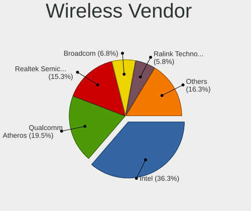

| Vendor                          | Computers | Percent |
|---------------------------------|-----------|---------|
| Intel                           | 69        | 36.32%  |
| Qualcomm Atheros                | 37        | 19.47%  |
| Realtek Semiconductor           | 29        | 15.26%  |
| Broadcom                        | 13        | 6.84%   |
| Ralink Technology               | 11        | 5.79%   |
| MediaTek                        | 8         | 4.21%   |
| Qualcomm Atheros Communications | 7         | 3.68%   |
| TP-Link                         | 6         | 3.16%   |
| Ralink                          | 4         | 2.11%   |
| Sierra Wireless                 | 2         | 1.05%   |
| Mercucys                        | 2         | 1.05%   |
| Marvell Technology Group        | 1         | 0.53%   |
| D-Link                          | 1         | 0.53%   |

Wireless Model
--------------

Wireless models

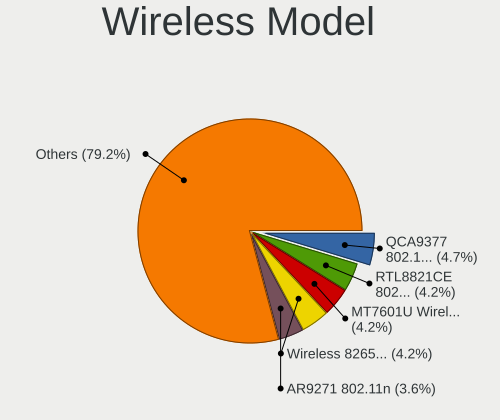

| Model                                                                | Computers | Percent |
|----------------------------------------------------------------------|-----------|---------|
| Qualcomm Atheros QCA9377 802.11ac Wireless Network Adapter           | 9         | 4.69%   |
| Realtek RTL8821CE 802.11ac PCIe Wireless Network Adapter             | 8         | 4.17%   |
| Ralink MT7601U Wireless Adapter                                      | 8         | 4.17%   |
| Intel Wireless 8265 / 8275                                           | 8         | 4.17%   |
| Qualcomm Atheros AR9271 802.11n                                      | 7         | 3.65%   |
| Intel Wireless 8260                                                  | 7         | 3.65%   |
| Qualcomm Atheros QCA9565 / AR9565 Wireless Network Adapter           | 6         | 3.13%   |
| Qualcomm Atheros QCA6174 802.11ac Wireless Network Adapter           | 6         | 3.13%   |
| Intel Centrino Advanced-N 6205 [Taylor Peak]                         | 6         | 3.13%   |
| TP-Link TL-WN722N v2/v3 [Realtek RTL8188EUS]                         | 5         | 2.6%    |
| Realtek 802.11ac NIC                                                 | 5         | 2.6%    |
| Qualcomm Atheros AR9287 Wireless Network Adapter (PCI-Express)       | 5         | 2.6%    |
| Qualcomm Atheros AR9285 Wireless Network Adapter (PCI-Express)       | 5         | 2.6%    |
| Intel Wi-Fi 6 AX201                                                  | 5         | 2.6%    |
| Realtek RTL8822CE 802.11ac PCIe Wireless Network Adapter             | 4         | 2.08%   |
| Qualcomm Atheros AR9485 Wireless Network Adapter                     | 4         | 2.08%   |
| Intel Wireless 7260                                                  | 4         | 2.08%   |
| Intel Cannon Point-LP CNVi [Wireless-AC]                             | 4         | 2.08%   |
| Intel Alder Lake-P PCH CNVi WiFi                                     | 4         | 2.08%   |
| Ralink RT3290 Wireless 802.11n 1T/1R PCIe                            | 3         | 1.56%   |
| MediaTek MT7921 802.11ax PCIe Wireless Network Adapter [Filogic 330] | 3         | 1.56%   |
| Intel Wi-Fi 6 AX200                                                  | 3         | 1.56%   |
| Intel Dual Band Wireless-AC 3168NGW [Stone Peak]                     | 3         | 1.56%   |
| Intel Dual Band Wireless-AC 3165 Plus Bluetooth                      | 3         | 1.56%   |
| Intel Centrino Ultimate-N 6300                                       | 3         | 1.56%   |
| Intel Centrino Advanced-N 6200                                       | 3         | 1.56%   |
| Broadcom BCM43228 802.11a/b/g/n                                      | 3         | 1.56%   |
| Broadcom BCM4313 802.11bgn Wireless Network Adapter                  | 3         | 1.56%   |
| Realtek RTL8822BE 802.11a/b/g/n/ac WiFi adapter                      | 2         | 1.04%   |
| Realtek RTL8723DE Wireless Network Adapter                           | 2         | 1.04%   |
| Ralink RT5370 Wireless Adapter                                       | 2         | 1.04%   |
| Mercucys 802.11n NIC                                                 | 2         | 1.04%   |
| MediaTek MT7921K (RZ608) Wi-Fi 6E 80MHz                              | 2         | 1.04%   |
| MediaTek MT7902 802.11ax PCIe Wireless Network Adapter [Filogic 310] | 2         | 1.04%   |
| Intel PRO/Wireless 4965 AG or AGN [Kedron] Network Connection        | 2         | 1.04%   |
| Broadcom BCM43142 802.11b/g/n                                        | 2         | 1.04%   |
| TP-Link Archer T2U PLUS [RTL8821AU]                                  | 1         | 0.52%   |
| Sierra Wireless EM7345 4G LTE                                        | 1         | 0.52%   |
| Sierra Wireless EM7305 Modem                                         | 1         | 0.52%   |
| Realtek RTL8852AE WiFi 6 802.11ax PCIe Adapter                       | 1         | 0.52%   |

Ethernet Vendor
---------------

Ethernet vendors

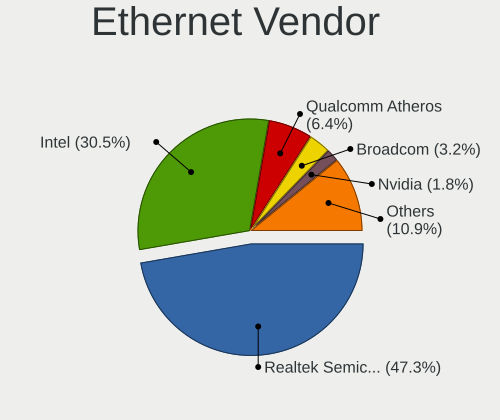

| Vendor                                 | Computers | Percent |
|----------------------------------------|-----------|---------|
| Realtek Semiconductor                  | 104       | 47.27%  |
| Intel                                  | 67        | 30.45%  |
| Qualcomm Atheros                       | 14        | 6.36%   |
| Broadcom                               | 7         | 3.18%   |
| Nvidia                                 | 4         | 1.82%   |
| Broadcom Limited                       | 4         | 1.82%   |
| Marvell Technology Group               | 3         | 1.36%   |
| ASIX Electronics                       | 3         | 1.36%   |
| Sony Ericsson Mobile Communications AB | 2         | 0.91%   |
| MediaTek                               | 2         | 0.91%   |
| ICS Advent                             | 2         | 0.91%   |
| Hewlett-Packard                        | 2         | 0.91%   |
| Xiaomi                                 | 1         | 0.45%   |
| TP-Link                                | 1         | 0.45%   |
| Samsung Electronics                    | 1         | 0.45%   |
| Qualcomm                               | 1         | 0.45%   |
| HTC (High Tech Computer)               | 1         | 0.45%   |
| Aquantia                               | 1         | 0.45%   |

Ethernet Model
--------------

Ethernet models

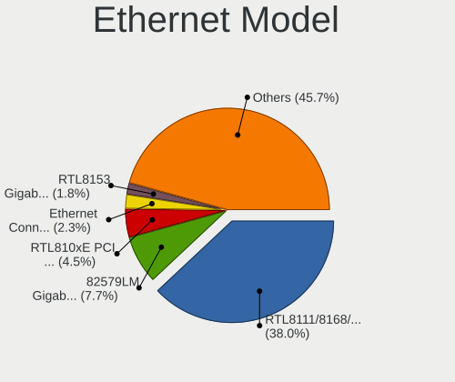

| Model                                                                  | Computers | Percent |
|------------------------------------------------------------------------|-----------|---------|
| Realtek RTL8111/8168/8211/8411 PCI Express Gigabit Ethernet Controller | 84        | 38.01%  |
| Intel 82579LM Gigabit Network Connection (Lewisville)                  | 17        | 7.69%   |
| Realtek RTL810xE PCI Express Fast Ethernet controller                  | 10        | 4.52%   |
| Intel Ethernet Connection I219-LM                                      | 5         | 2.26%   |
| Realtek RTL8153 Gigabit Ethernet Adapter                               | 4         | 1.81%   |
| Intel Ethernet Connection (4) I219-LM                                  | 4         | 1.81%   |
| Intel 82579V Gigabit Network Connection                                | 4         | 1.81%   |
| Intel 82577LM Gigabit Network Connection                               | 4         | 1.81%   |
| Intel 82567LM-3 Gigabit Network Connection                             | 4         | 1.81%   |
| Qualcomm Atheros AR8151 v2.0 Gigabit Ethernet                          | 3         | 1.36%   |
| Intel Ethernet Controller I225-V                                       | 3         | 1.36%   |
| Broadcom NetLink BCM57780 Gigabit Ethernet PCIe                        | 3         | 1.36%   |
| Sony Ericsson Mobile AB D2005                                          | 2         | 0.9%    |
| Realtek RTL8169 PCI Gigabit Ethernet Controller                        | 2         | 0.9%    |
| Realtek RTL8152 Fast Ethernet Adapter                                  | 2         | 0.9%    |
| Realtek RTL8125 2.5GbE Controller                                      | 2         | 0.9%    |
| Qualcomm Atheros QCA8172 Fast Ethernet                                 | 2         | 0.9%    |
| Qualcomm Atheros Killer E2400 Gigabit Ethernet Controller              | 2         | 0.9%    |
| Qualcomm Atheros AR8162 Fast Ethernet                                  | 2         | 0.9%    |
| MediaTek Infinix HOT 50i                                               | 2         | 0.9%    |
| Intel Ethernet Connection I218-LM                                      | 2         | 0.9%    |
| Intel Ethernet Connection I217-V                                       | 2         | 0.9%    |
| Intel Ethernet Connection (7) I219-LM                                  | 2         | 0.9%    |
| Intel Ethernet Connection (17) I219-V                                  | 2         | 0.9%    |
| ICS Advent DM9601 Fast Ethernet Adapter                                | 2         | 0.9%    |
| HP HP lt4120 Snapdragon X5 LTE                                         | 2         | 0.9%    |
| Broadcom NetXtreme BCM5754 Gigabit Ethernet PCI Express                | 2         | 0.9%    |
| ASIX AX88179 Gigabit Ethernet                                          | 2         | 0.9%    |
| Xiaomi Mi/Redmi series (RNDIS)                                         | 1         | 0.45%   |
| TP-Link UE300 10/100/1000 LAN (ethernet mode) [Realtek RTL8153]        | 1         | 0.45%   |
| Samsung Galaxy series, misc. (tethering mode)                          | 1         | 0.45%   |
| Realtek RTL-8100/8101L/8139 PCI Fast Ethernet Adapter                  | 1         | 0.45%   |
| Qualcomm YUPIK-QRD _SN:AC1D5909                                        | 1         | 0.45%   |
| Qualcomm Atheros QCA8171 Gigabit Ethernet                              | 1         | 0.45%   |
| Qualcomm Atheros Attansic L2 Fast Ethernet                             | 1         | 0.45%   |
| Qualcomm Atheros AR8161 Gigabit Ethernet                               | 1         | 0.45%   |
| Qualcomm Atheros AR8152 v2.0 Fast Ethernet                             | 1         | 0.45%   |
| Qualcomm Atheros AR8131 Gigabit Ethernet                               | 1         | 0.45%   |
| Nvidia MCP73 Ethernet                                                  | 1         | 0.45%   |
| Nvidia MCP51 Ethernet Controller                                       | 1         | 0.45%   |

Net Controller Kind
-------------------

Ethernet, WiFi or modem

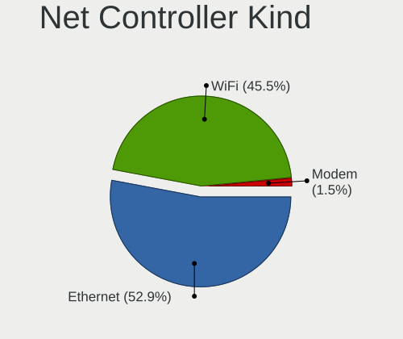

| Kind     | Computers | Percent |
|----------|-----------|---------|
| Ethernet | 207       | 52.94%  |
| WiFi     | 178       | 45.52%  |
| Modem    | 6         | 1.53%   |

Used Controller
---------------

Currently used network controller

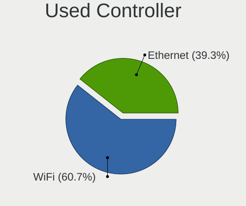

| Kind     | Computers | Percent |
|----------|-----------|---------|
| WiFi     | 148       | 60.66%  |
| Ethernet | 96        | 39.34%  |

NICs
----

Total network controllers on board

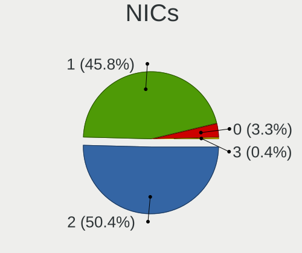

| Total | Computers | Percent |
|-------|-----------|---------|
| 2     | 121       | 50.42%  |
| 1     | 110       | 45.83%  |
| 0     | 8         | 3.33%   |
| 3     | 1         | 0.42%   |

IPv6
----

IPv6 vs IPv4

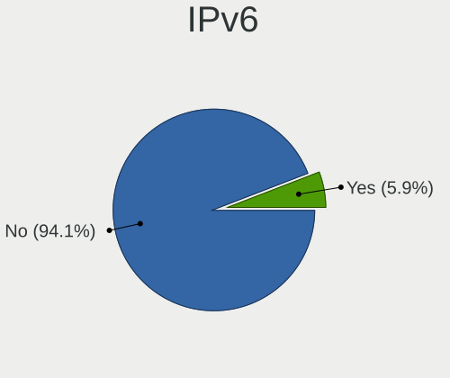

| Used | Computers | Percent |
|------|-----------|---------|
| No   | 225       | 94.14%  |
| Yes  | 14        | 5.86%   |

Bluetooth
---------

Bluetooth Vendor
----------------

Controller vendors

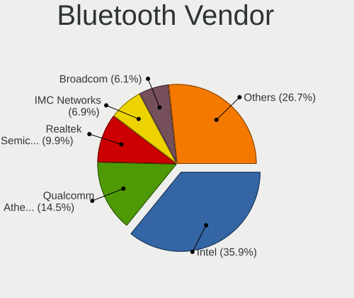

| Vendor                          | Computers | Percent |
|---------------------------------|-----------|---------|
| Intel                           | 47        | 35.88%  |
| Qualcomm Atheros Communications | 19        | 14.5%   |
| Realtek Semiconductor           | 13        | 9.92%   |
| IMC Networks                    | 9         | 6.87%   |
| Broadcom                        | 8         | 6.11%   |
| Lite-On Technology              | 6         | 4.58%   |
| Cambridge Silicon Radio         | 6         | 4.58%   |
| Foxconn / Hon Hai               | 4         | 3.05%   |
| Ralink                          | 3         | 2.29%   |
| Hewlett-Packard                 | 3         | 2.29%   |
| Toshiba                         | 2         | 1.53%   |
| Realtek                         | 1         | 0.76%   |
| Mercucys                        | 1         | 0.76%   |
| MediaTek                        | 1         | 0.76%   |
| Marvell Semiconductor           | 1         | 0.76%   |
| Integrated System Solution      | 1         | 0.76%   |
| Foxconn International           | 1         | 0.76%   |
| Dell                            | 1         | 0.76%   |
| Askey Computer                  | 1         | 0.76%   |
| Apple                           | 1         | 0.76%   |
| Alps Electric                   | 1         | 0.76%   |
| Unknown                         | 1         | 0.76%   |

Bluetooth Model
---------------

Controller models

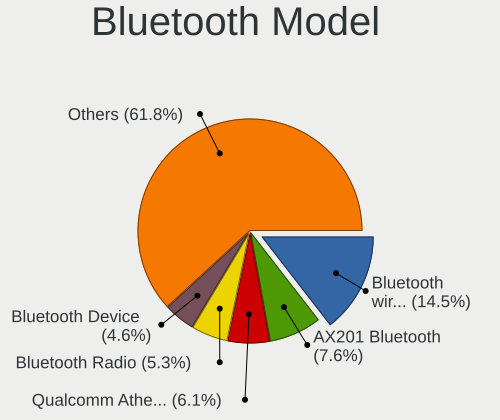

| Model                                               | Computers | Percent |
|-----------------------------------------------------|-----------|---------|
| Intel Bluetooth wireless interface                  | 19        | 14.5%   |
| Intel AX201 Bluetooth                               | 10        | 7.63%   |
| Qualcomm Atheros  Bluetooth Device                  | 8         | 6.11%   |
| Realtek Bluetooth Radio                             | 7         | 5.34%   |
| Intel Bluetooth Device                              | 6         | 4.58%   |
| Cambridge Silicon Radio Bluetooth Dongle (HCI mode) | 6         | 4.58%   |
| Qualcomm Atheros QCA61x4 Bluetooth 4.0              | 5         | 3.82%   |
| Qualcomm Atheros AR3011 Bluetooth                   | 4         | 3.05%   |
| IMC Networks Bluetooth Radio                        | 4         | 3.05%   |
| Realtek  Bluetooth 4.2 Adapter                      | 3         | 2.29%   |
| Ralink RT3290 Bluetooth                             | 3         | 2.29%   |
| Lite-On Qualcomm Atheros QCA9377 Bluetooth          | 3         | 2.29%   |
| Intel Wireless-AC 3168 Bluetooth                    | 3         | 2.29%   |
| Intel Bluetooth 9460/9560 Jefferson Peak (JfP)      | 3         | 2.29%   |
| Intel AX200 Bluetooth                               | 3         | 2.29%   |
| Realtek RTL8822BE Bluetooth 4.2 Adapter             | 2         | 1.53%   |
| Lite-On Atheros AR3012 Bluetooth                    | 2         | 1.53%   |
| IMC Networks Wireless_Device                        | 2         | 1.53%   |
| IMC Networks Bluetooth Device                       | 2         | 1.53%   |
| HP Bluetooth 2.0 Interface [Broadcom BCM2045]       | 2         | 1.53%   |
| Foxconn / Hon Hai MediaTek Bluetooth Adapter        | 2         | 1.53%   |
| Broadcom HP Portable SoftSailing                    | 2         | 1.53%   |
| Broadcom BCM2045B (BDC-2.1)                         | 2         | 1.53%   |
| Toshiba RT Bluetooth Radio                          | 1         | 0.76%   |
| Toshiba Bluetooth USB Host Controller               | 1         | 0.76%   |
| Realtek RTL8821A Bluetooth                          | 1         | 0.76%   |
| Realtek Bluetooth Radio                             | 1         | 0.76%   |
| Qualcomm Atheros Bluetooth USB Host Controller      | 1         | 0.76%   |
| Qualcomm Atheros AR3012 Bluetooth 4.0               | 1         | 0.76%   |
| Mercucys Mercusys MA530 Adapter                     | 1         | 0.76%   |
| MediaTek Wireless_Device                            | 1         | 0.76%   |
| Marvell Bluetooth and Wireless LAN Composite        | 1         | 0.76%   |
| Lite-On Wireless_Device                             | 1         | 0.76%   |
| Intel Wireless-AC 9260 Bluetooth Adapter            | 1         | 0.76%   |
| Intel Centrino Bluetooth Wireless Transceiver       | 1         | 0.76%   |
| Intel AX210 Bluetooth                               | 1         | 0.76%   |
| Integrated System Solution Bluetooth Device         | 1         | 0.76%   |
| IMC Networks Atheros AR3012 Bluetooth 4.0 Adapter   | 1         | 0.76%   |
| HP Broadcom 2070 Bluetooth Combo                    | 1         | 0.76%   |
| Foxconn International BCM43142A0 Bluetooth module   | 1         | 0.76%   |

Sound
-----

Sound Vendor
------------

Sound card vendors

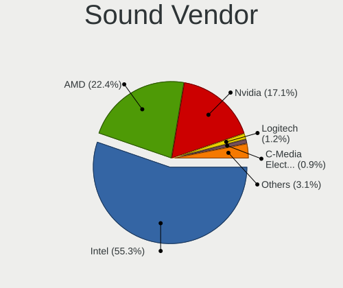

| Vendor                   | Computers | Percent |
|--------------------------|-----------|---------|
| Intel                    | 178       | 55.28%  |
| AMD                      | 72        | 22.36%  |
| Nvidia                   | 55        | 17.08%  |
| Logitech                 | 4         | 1.24%   |
| C-Media Electronics      | 3         | 0.93%   |
| Creative Labs            | 2         | 0.62%   |
| VIA Technologies         | 1         | 0.31%   |
| Texas Instruments        | 1         | 0.31%   |
| Realtek Semiconductor    | 1         | 0.31%   |
| Micro Star International | 1         | 0.31%   |
| JMTek                    | 1         | 0.31%   |
| Focusrite-Novation       | 1         | 0.31%   |
| DSEA A/S                 | 1         | 0.31%   |
| Conexant Systems         | 1         | 0.31%   |

Sound Model
-----------

Sound card models

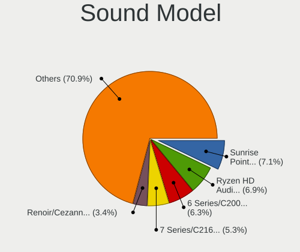

| Model                                                                                             | Computers | Percent |
|---------------------------------------------------------------------------------------------------|-----------|---------|
| Intel Sunrise Point-LP HD Audio                                                                   | 27        | 7.14%   |
| AMD Ryzen HD Audio Controller                                                                     | 26        | 6.88%   |
| Intel 6 Series/C200 Series Chipset Family High Definition Audio Controller                        | 24        | 6.35%   |
| Intel 7 Series/C216 Chipset Family High Definition Audio Controller                               | 20        | 5.29%   |
| AMD Renoir/Cezanne HDMI/DP Audio Controller                                                       | 13        | 3.44%   |
| AMD FCH Azalia Controller                                                                         | 10        | 2.65%   |
| Intel 5 Series/3400 Series Chipset High Definition Audio                                          | 9         | 2.38%   |
| Intel Tiger Lake-LP Smart Sound Technology Audio Controller                                       | 8         | 2.12%   |
| Intel NM10/ICH7 Family High Definition Audio Controller                                           | 8         | 2.12%   |
| Intel Cannon Point-LP High Definition Audio Controller                                            | 8         | 2.12%   |
| Intel 8 Series/C220 Series Chipset High Definition Audio Controller                               | 8         | 2.12%   |
| AMD Raven/Raven2/Fenghuang HDMI/DP Audio Controller                                               | 8         | 2.12%   |
| Intel Cannon Lake PCH cAVS                                                                        | 7         | 1.85%   |
| Nvidia High Definition Audio Controller                                                           | 6         | 1.59%   |
| Intel Xeon E3-1200 v3/4th Gen Core Processor HD Audio Controller                                  | 6         | 1.59%   |
| Intel Alder Lake PCH-P High Definition Audio Controller                                           | 6         | 1.59%   |
| Intel 82801H (ICH8 Family) HD Audio Controller                                                    | 6         | 1.59%   |
| AMD Starship/Matisse HD Audio Controller                                                          | 6         | 1.59%   |
| Intel Haswell-ULT HD Audio Controller                                                             | 5         | 1.32%   |
| Intel 8 Series HD Audio Controller                                                                | 5         | 1.32%   |
| Nvidia GA104 High Definition Audio Controller                                                     | 4         | 1.06%   |
| Intel 82801JD/DO (ICH10 Family) HD Audio Controller                                               | 4         | 1.06%   |
| AMD RV710/730 HDMI Audio [Radeon HD 4000 series]                                                  | 4         | 1.06%   |
| AMD Navi 21/23 HDMI/DP Audio Controller                                                           | 4         | 1.06%   |
| AMD Kabini HDMI/DP Audio                                                                          | 4         | 1.06%   |
| AMD Ellesmere HDMI Audio [Radeon RX 470/480 / 570/580/590]                                        | 4         | 1.06%   |
| Nvidia TU116 High Definition Audio Controller                                                     | 3         | 0.79%   |
| Nvidia GT216 HDMI Audio Controller                                                                | 3         | 0.79%   |
| Nvidia GP107GL High Definition Audio Controller                                                   | 3         | 0.79%   |
| Nvidia GK208 HDMI/DP Audio Controller                                                             | 3         | 0.79%   |
| Nvidia GF108 High Definition Audio Controller                                                     | 3         | 0.79%   |
| Intel Atom/Celeron/Pentium Processor x5-E8000/J3xxx/N3xxx Series High Definition Audio Controller | 3         | 0.79%   |
| Intel Alder Lake-S HD Audio Controller                                                            | 3         | 0.79%   |
| Intel 9 Series Chipset Family HD Audio Controller                                                 | 3         | 0.79%   |
| Intel 82801I (ICH9 Family) HD Audio Controller                                                    | 3         | 0.79%   |
| Intel 200 Series PCH HD Audio                                                                     | 3         | 0.79%   |
| Intel 100 Series/C230 Series Chipset Family HD Audio Controller                                   | 3         | 0.79%   |
| AMD Turks HDMI Audio [Radeon HD 6500/6600 / 6700M Series]                                         | 3         | 0.79%   |
| AMD Redwood HDMI Audio [Radeon HD 5000 Series]                                                    | 3         | 0.79%   |
| AMD Radeon High Definition Audio Controller                                                       | 3         | 0.79%   |

Memory
------

Memory Vendor
-------------

Memory module vendors

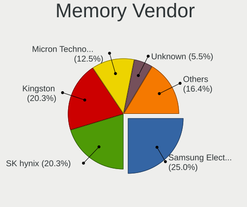

| Vendor              | Computers | Percent |
|---------------------|-----------|---------|
| Samsung Electronics | 32        | 25%     |
| SK hynix            | 26        | 20.31%  |
| Kingston            | 26        | 20.31%  |
| Micron Technology   | 16        | 12.5%   |
| Unknown             | 7         | 5.47%   |
| Crucial             | 5         | 3.91%   |
| A-DATA Technology   | 5         | 3.91%   |
| Corsair             | 4         | 3.13%   |
| Patriot             | 2         | 1.56%   |
| Ramaxel Technology  | 1         | 0.78%   |
| Nanya Technology    | 1         | 0.78%   |
| INNOVATION PC       | 1         | 0.78%   |
| G.Skill             | 1         | 0.78%   |
| Apacer              | 1         | 0.78%   |

Memory Model
------------

Memory module models

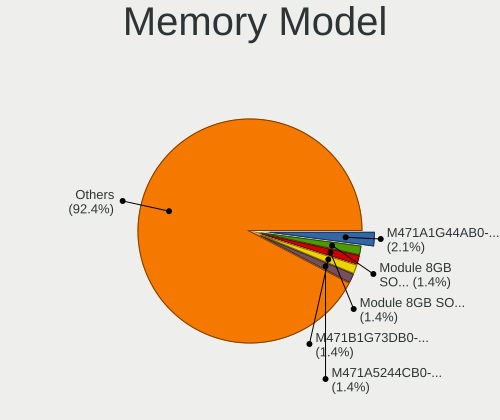

| Model                                                     | Computers | Percent |
|-----------------------------------------------------------|-----------|---------|
| Samsung RAM M471A1G44AB0-CWE 8GiB SODIMM DDR4 3200MT/s    | 3         | 2.08%   |
| SK hynix RAM HMT351S6CFR8C-PB 4GB SODIMM DDR3 1600MT/s    | 2         | 1.39%   |
| SK hynix RAM HMA81GS6AFR8N-UH 8GB SODIMM DDR4 2667MT/s    | 2         | 1.39%   |
| Samsung RAM Module 8GB SODIMM DDR4 2667MT/s               | 2         | 1.39%   |
| Samsung RAM Module 8GB SODIMM DDR4 2133MT/s               | 2         | 1.39%   |
| Samsung RAM M471B1G73DB0-YK0 8GB SODIMM DDR3 1600MT/s     | 2         | 1.39%   |
| Samsung RAM M471A5244CB0-CTD 4GB SODIMM DDR4 3266MT/s     | 2         | 1.39%   |
| Samsung RAM M471A5244CB0-CRC 4GB SODIMM DDR4 2667MT/s     | 2         | 1.39%   |
| Micron RAM 16KTF51264HZ-1G6M1 4GB SODIMM DDR3 1600MT/s    | 2         | 1.39%   |
| Kingston RAM KHX1600C10D3/8G 8GB DIMM DDR3 2133MT/s       | 2         | 1.39%   |
| Kingston RAM KF3200C16D4/8GX 8GiB DIMM DDR4 3600MT/s      | 2         | 1.39%   |
| Kingston RAM 99U5584-005.A00LF 4GB DIMM DDR3 1600MT/s     | 2         | 1.39%   |
| Kingston RAM 99U5471-054.A00LF 8GB DIMM DDR3 1600MT/s     | 2         | 1.39%   |
| Crucial RAM CT16G4SFD8266.M16FE 16GB SODIMM DDR4 2667MT/s | 2         | 1.39%   |
| Unknown RAM Module 4GB DIMM DDR3 1333MT/s                 | 1         | 0.69%   |
| Unknown RAM Module 4GB DIMM 1333MT/s                      | 1         | 0.69%   |
| Unknown RAM Module 2GB SODIMM DDR2 667MT/s                | 1         | 0.69%   |
| Unknown RAM Module 2GB DIMM DDR2 800MT/s                  | 1         | 0.69%   |
| Unknown RAM Module 2048MB DIMM DDR2 333MT/s               | 1         | 0.69%   |
| Unknown RAM Module 2048MB DIMM 1066MT/s                   | 1         | 0.69%   |
| Unknown RAM Module 1GB SODIMM DDR2 667MT/s                | 1         | 0.69%   |
| Unknown RAM Module 1GB DIMM DDR2 800MT/s                  | 1         | 0.69%   |
| Unknown RAM Module 1024MB DIMM DDR 800MT/s                | 1         | 0.69%   |
| SK hynix RAM Module 16GB SODIMM DDR4 2400MT/s             | 1         | 0.69%   |
| SK hynix RAM Module 16GB SODIMM DDR4 2133MT/s             | 1         | 0.69%   |
| SK hynix RAM Module 16384MB SODIMM DDR4 2133MT/s          | 1         | 0.69%   |
| SK hynix RAM HYMP125S64CP8-S6 2GB DIMM SDRAM 2048MT/s     | 1         | 0.69%   |
| SK hynix RAM HYMP112S64CP6-S6 1GB DIMM SDRAM 2048MT/s     | 1         | 0.69%   |
| SK hynix RAM HMT451S6AFR8A-PB 4GB SODIMM DDR3 1600MT/s    | 1         | 0.69%   |
| SK hynix RAM HMT41GS6AFR8C-PB 8GB SODIMM DDR3 1600MT/s    | 1         | 0.69%   |
| SK hynix RAM HMT351U6EFR8C-PB 4GB DIMM DDR3 1600MT/s      | 1         | 0.69%   |
| SK hynix RAM HMT351U6CFR8C 4GB DIMM DDR3 1333MT/s         | 1         | 0.69%   |
| SK hynix RAM HMT351S6EFR8C-PB 4GB SODIMM DDR3 1600MT/s    | 1         | 0.69%   |
| SK hynix RAM HMT351S6EFR8A-PB 4GB SODIMM DDR3 1600MT/s    | 1         | 0.69%   |
| SK hynix RAM HMT351S6CFR8C-H9 4GB SODIMM DDR3 1334MT/s    | 1         | 0.69%   |
| SK hynix RAM HMT351S6CFR8A-PB 4GB SODIMM DDR3 1600MT/s    | 1         | 0.69%   |
| SK hynix RAM HMT351S6BFR8C-H9 4GB SODIMM 1334MT/s         | 1         | 0.69%   |
| SK hynix RAM HMT325S6CFR8C-PB 2GB SODIMM DDR3 1600MT/s    | 1         | 0.69%   |
| SK hynix RAM HMT125U6TFR8C-G7 2GB DIMM DDR3 1066MT/s      | 1         | 0.69%   |
| SK hynix RAM HMT112U6TFR8C-H9 1GB DIMM DDR3 1333MT/s      | 1         | 0.69%   |

Memory Kind
-----------

Memory module kinds

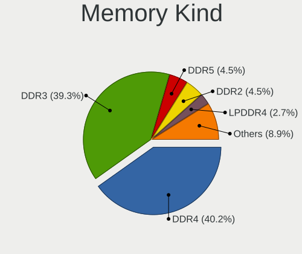

| Kind    | Computers | Percent |
|---------|-----------|---------|
| DDR4    | 45        | 40.18%  |
| DDR3    | 44        | 39.29%  |
| DDR5    | 5         | 4.46%   |
| DDR2    | 5         | 4.46%   |
| LPDDR4  | 3         | 2.68%   |
| LPDDR3  | 3         | 2.68%   |
| SDRAM   | 2         | 1.79%   |
| LPDDR5  | 2         | 1.79%   |
| Unknown | 2         | 1.79%   |
| DDR     | 1         | 0.89%   |

Memory Form Factor
------------------

Physical design of the memory module

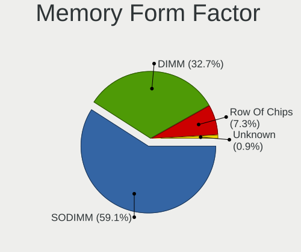

| Name         | Computers | Percent |
|--------------|-----------|---------|
| SODIMM       | 65        | 59.09%  |
| DIMM         | 36        | 32.73%  |
| Row Of Chips | 8         | 7.27%   |
| Unknown      | 1         | 0.91%   |

Memory Size
-----------

Memory module size

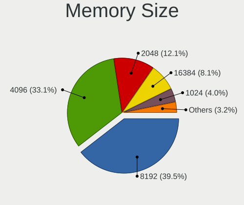

| Size  | Computers | Percent |
|-------|-----------|---------|
| 8192  | 49        | 39.52%  |
| 4096  | 41        | 33.06%  |
| 2048  | 15        | 12.1%   |
| 16384 | 10        | 8.06%   |
| 1024  | 5         | 4.03%   |
| 32768 | 4         | 3.23%   |

Memory Speed
------------

Memory module speed

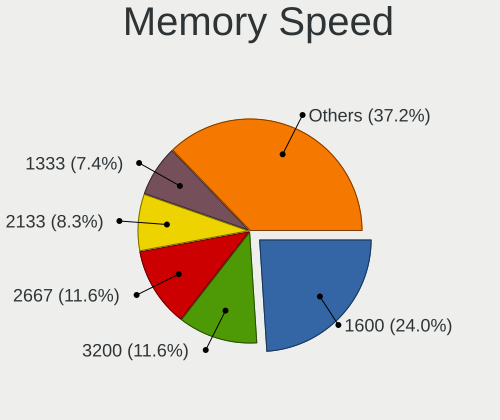

| Speed | Computers | Percent |
|-------|-----------|---------|
| 1600  | 29        | 23.97%  |
| 3200  | 14        | 11.57%  |
| 2667  | 14        | 11.57%  |
| 2133  | 10        | 8.26%   |
| 1333  | 9         | 7.44%   |
| 4800  | 5         | 4.13%   |
| 2400  | 5         | 4.13%   |
| 1334  | 4         | 3.31%   |
| 800   | 4         | 3.31%   |
| 3600  | 3         | 2.48%   |
| 1866  | 3         | 2.48%   |
| 3733  | 2         | 1.65%   |
| 3266  | 2         | 1.65%   |
| 1066  | 2         | 1.65%   |
| 8533  | 1         | 0.83%   |
| 6400  | 1         | 0.83%   |
| 4266  | 1         | 0.83%   |
| 4199  | 1         | 0.83%   |
| 3466  | 1         | 0.83%   |
| 3400  | 1         | 0.83%   |
| 2934  | 1         | 0.83%   |
| 2800  | 1         | 0.83%   |
| 2048  | 1         | 0.83%   |
| 2000  | 1         | 0.83%   |
| 1867  | 1         | 0.83%   |
| 1800  | 1         | 0.83%   |
| 1067  | 1         | 0.83%   |
| 667   | 1         | 0.83%   |
| 333   | 1         | 0.83%   |

Printers & scanners
-------------------

Printer Vendor
--------------

Printer device vendors

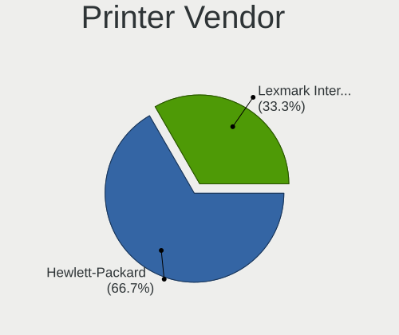

| Vendor                | Computers | Percent |
|-----------------------|-----------|---------|
| Hewlett-Packard       | 2         | 66.67%  |
| Lexmark International | 1         | 33.33%  |

Printer Model
-------------

Printer device models

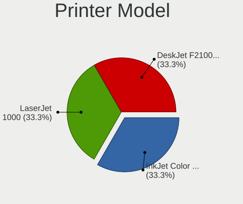

| Model                                      | Computers | Percent |
|--------------------------------------------|-----------|---------|
| Lexmark International InkJet Color Printer | 1         | 33.33%  |
| HP LaserJet 1000                           | 1         | 33.33%  |
| HP DeskJet F2100 Printer series            | 1         | 33.33%  |

Scanner Vendor
--------------

Scanner device vendors

Zero info for selected period =(

Scanner Model
-------------

Scanner device models

Zero info for selected period =(

Camera
------

Camera Vendor
-------------

Camera device vendors

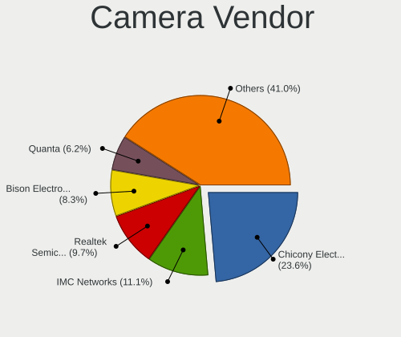

| Vendor                                 | Computers | Percent |
|----------------------------------------|-----------|---------|
| Chicony Electronics                    | 34        | 23.61%  |
| IMC Networks                           | 16        | 11.11%  |
| Realtek Semiconductor                  | 14        | 9.72%   |
| Bison Electronics                      | 12        | 8.33%   |
| Quanta                                 | 9         | 6.25%   |
| Microdia                               | 9         | 6.25%   |
| Sunplus Innovation Technology          | 8         | 5.56%   |
| Cheng Uei Precision Industry (Foxlink) | 6         | 4.17%   |
| Logitech                               | 5         | 3.47%   |
| Lite-On Technology                     | 5         | 3.47%   |
| Syntek                                 | 4         | 2.78%   |
| Suyin                                  | 3         | 2.08%   |
| Ricoh                                  | 3         | 2.08%   |
| Apple                                  | 3         | 2.08%   |
| Lenovo                                 | 2         | 1.39%   |
| ALi                                    | 2         | 1.39%   |
| Shinetech                              | 1         | 0.69%   |
| Samsung Electronics                    | 1         | 0.69%   |
| Primax Electronics                     | 1         | 0.69%   |
| MacroSilicon                           | 1         | 0.69%   |
| Luxvisions Innotech Limited            | 1         | 0.69%   |
| KYE Systems (Mouse Systems)            | 1         | 0.69%   |
| Importek                               | 1         | 0.69%   |
| Guillemot                              | 1         | 0.69%   |
| Acer                                   | 1         | 0.69%   |

Camera Model
------------

Camera device models

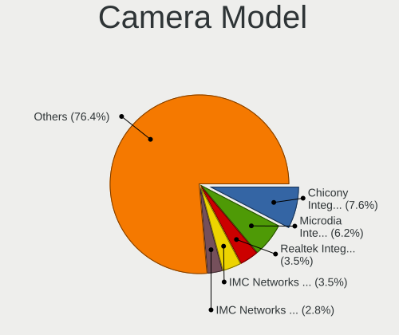

| Model                                                       | Computers | Percent |
|-------------------------------------------------------------|-----------|---------|
| Chicony Integrated Camera                                   | 11        | 7.64%   |
| Microdia Integrated_Webcam_HD                               | 9         | 6.25%   |
| Realtek Integrated_Webcam_HD                                | 5         | 3.47%   |
| IMC Networks USB2.0 VGA UVC WebCam                          | 5         | 3.47%   |
| IMC Networks USB2.0 HD UVC WebCam                           | 4         | 2.78%   |
| Bison EasyCamera                                            | 4         | 2.78%   |
| Syntek Integrated Camera                                    | 3         | 2.08%   |
| Quanta HP HD Camera                                         | 3         | 2.08%   |
| Chicony HD WebCam                                           | 3         | 2.08%   |
| Suyin 1.3M WebCam (notebook emachines E730, Acer sub-brand) | 2         | 1.39%   |
| Sunplus HP Universal Camera                                 | 2         | 1.39%   |
| Realtek HD WebCam                                           | 2         | 1.39%   |
| Quanta HP Webcam                                            | 2         | 1.39%   |
| Lite-On HP HD Webcam                                        | 2         | 1.39%   |
| IMC Networks Integrated Camera                              | 2         | 1.39%   |
| IMC Networks EasyCamera                                     | 2         | 1.39%   |
| Chicony TOSHIBA Web Camera - HD                             | 2         | 1.39%   |
| Chicony Lenovo EasyCamera                                   | 2         | 1.39%   |
| Chicony HP Truevision HD                                    | 2         | 1.39%   |
| Chicony ACER HD User Facing                                 | 2         | 1.39%   |
| Cheng Uei Precision Industry (Foxlink) HP Webcam            | 2         | 1.39%   |
| Cheng Uei Precision Industry (Foxlink) HP HD Camera         | 2         | 1.39%   |
| Bison Integrated Camera                                     | 2         | 1.39%   |
| Bison HD Webcam                                             | 2         | 1.39%   |
| Apple iPhone 5/5C/5S/6/SE/7/8/X                             | 2         | 1.39%   |
| ALi Gateway Webcam                                          | 2         | 1.39%   |
| Syntek Lenovo EasyCamera                                    | 1         | 0.69%   |
| Suyin HP TrueVision HD                                      | 1         | 0.69%   |
| Sunplus TOSHIBA Web Camera - HD                             | 1         | 0.69%   |
| Sunplus Lenovo EasyCamera                                   | 1         | 0.69%   |
| Sunplus Laptop_Integrated_Webcam_HD                         | 1         | 0.69%   |
| Sunplus HP HD Webcam [Fixed]                                | 1         | 0.69%   |
| Sunplus HD WebCam                                           | 1         | 0.69%   |
| Sunplus ASUS Webcam                                         | 1         | 0.69%   |
| Shinetech ASUS FHD webcam                                   | 1         | 0.69%   |
| Samsung Galaxy series, misc. (MTP mode)                     | 1         | 0.69%   |
| Ricoh Visual Communication Camera VGP-VCC6 [R5U870]         | 1         | 0.69%   |
| Ricoh Pavilion Webcam                                       | 1         | 0.69%   |
| Ricoh Laptop_Integrated_Webcam_3M                           | 1         | 0.69%   |
| Realtek VGA WebCam                                          | 1         | 0.69%   |

Security
--------

Fingerprint Vendor
------------------

Fingerprint sensor vendors

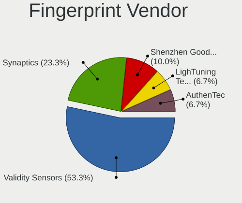

| Vendor                     | Computers | Percent |
|----------------------------|-----------|---------|
| Validity Sensors           | 16        | 53.33%  |
| Synaptics                  | 7         | 23.33%  |
| Shenzhen Goodix Technology | 3         | 10%     |
| LighTuning Technology      | 2         | 6.67%   |
| AuthenTec                  | 2         | 6.67%   |

Fingerprint Model
-----------------

Fingerprint sensor models

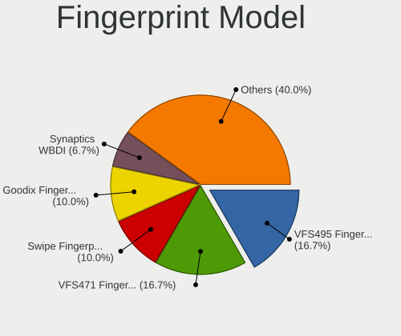

| Model                                                    | Computers | Percent |
|----------------------------------------------------------|-----------|---------|
| Validity Sensors VFS495 Fingerprint Reader               | 5         | 16.67%  |
| Validity Sensors VFS471 Fingerprint Reader               | 5         | 16.67%  |
| Validity Sensors Swipe Fingerprint Sensor                | 3         | 10%     |
| Shenzhen Goodix  FingerPrint Device                      | 3         | 10%     |
| Validity Sensors Synaptics WBDI                          | 2         | 6.67%   |
| Synaptics  WBDI                                          | 2         | 6.67%   |
| Synaptics FS7604 Touch Fingerprint Sensor with PurePrint | 2         | 6.67%   |
| Validity Sensors VFS 5011 fingerprint sensor             | 1         | 3.33%   |
| Synaptics WBDI                                           | 1         | 3.33%   |
| Synaptics UWP WBDI                                       | 1         | 3.33%   |
| Synaptics Prometheus MIS Touch Fingerprint Reader        | 1         | 3.33%   |
| LighTuning Fingerprint Reader                            | 1         | 3.33%   |
| LighTuning EgisTec Touch Fingerprint Sensor              | 1         | 3.33%   |
| AuthenTec Fingerprint Sensor                             | 1         | 3.33%   |
| AuthenTec AES2810                                        | 1         | 3.33%   |

Chipcard Vendor
---------------

Chipcard module vendors

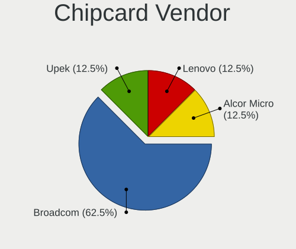

| Vendor      | Computers | Percent |
|-------------|-----------|---------|
| Broadcom    | 8         | 72.73%  |
| Upek        | 1         | 9.09%   |
| Lenovo      | 1         | 9.09%   |
| Alcor Micro | 1         | 9.09%   |

Chipcard Model
--------------

Chipcard module models

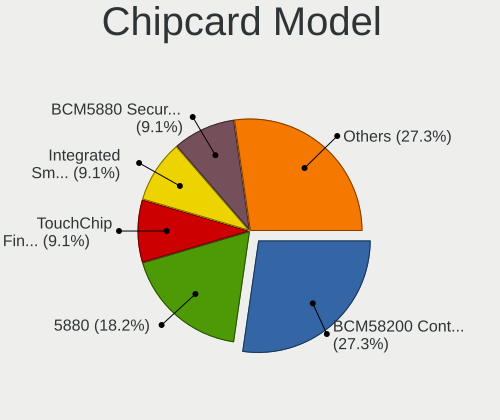

| Model                                                                        | Computers | Percent |
|------------------------------------------------------------------------------|-----------|---------|
| Broadcom BCM58200 ControlVault 3 (FingerPrint sensor + Contacted SmartCard)  | 3         | 27.27%  |
| Broadcom 5880                                                                | 2         | 18.18%  |
| Upek TouchChip Fingerprint Coprocessor (WBF advanced mode)                   | 1         | 9.09%   |
| Lenovo Integrated Smart Card Reader                                          | 1         | 9.09%   |
| Broadcom BCM5880 Secure Applications Processor with fingerprint swipe sensor | 1         | 9.09%   |
| Broadcom BCM5880 Secure Applications Processor                               | 1         | 9.09%   |
| Broadcom 58200                                                               | 1         | 9.09%   |
| Alcor Micro AU9540 Smartcard Reader                                          | 1         | 9.09%   |

Unsupported
-----------

Unsupported Devices
-------------------

Total unsupported devices on board

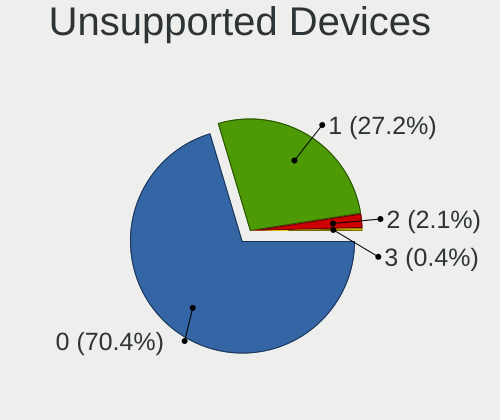

| Total | Computers | Percent |
|-------|-----------|---------|
| 0     | 171       | 70.37%  |
| 1     | 66        | 27.16%  |
| 2     | 5         | 2.06%   |
| 3     | 1         | 0.41%   |

Unsupported Device Types
------------------------

Types of unsupported devices

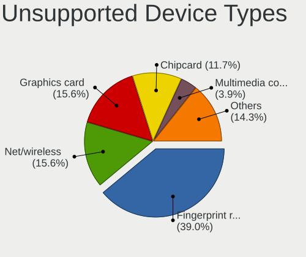

| Type                     | Computers | Percent |
|--------------------------|-----------|---------|
| Fingerprint reader       | 30        | 38.96%  |
| Net/wireless             | 12        | 15.58%  |
| Graphics card            | 12        | 15.58%  |
| Chipcard                 | 9         | 11.69%  |
| Multimedia controller    | 3         | 3.9%    |
| Bluetooth                | 3         | 3.9%    |
| Sound                    | 2         | 2.6%    |
| Communication controller | 2         | 2.6%    |
| Storage/raid             | 1         | 1.3%    |
| Modem                    | 1         | 1.3%    |
| Firewire controller      | 1         | 1.3%    |
| Camera                   | 1         | 1.3%    |

