Linux in Bosnia and Herzegovina - Tested Hardware & Statistics
--------------------------------------------------------------

A project to collect tested hardware configurations for Linux in Bosnia and Herzegovina.

Anyone can contribute to this report by the [hw-probe](https://github.com/linuxhw/hw-probe) tool:

    sudo -E hw-probe -all -upload

Please contribute! Especially if your hardware is rare.

This is a report for all computer types. See also reports for [desktops](/Location/Bosnia_and_Herzegovina/Desktop/README.md) and [notebooks](/Location/Bosnia_and_Herzegovina/Notebook/README.md).

Contents
--------

* [ Test Cases ](#test-cases)

* [ System ](#system)
  - [ OS                       ](#os)
  - [ OS Family                ](#os-family)
  - [ Kernel                   ](#kernel)
  - [ Kernel Family            ](#kernel-family)
  - [ Kernel Major Ver.        ](#kernel-major-ver)
  - [ Arch                     ](#arch)
  - [ DE                       ](#de)
  - [ Display Server           ](#display-server)
  - [ Display Manager          ](#display-manager)
  - [ OS Lang                  ](#os-lang)
  - [ Boot Mode                ](#boot-mode)
  - [ Filesystem               ](#filesystem)
  - [ Part. scheme             ](#part-scheme)
  - [ Dual Boot with Linux/BSD ](#dual-boot-with-linuxbsd)
  - [ Dual Boot (Win)          ](#dual-boot-win)

* [ Board ](#board)
  - [ Vendor                   ](#vendor)
  - [ Model                    ](#model)
  - [ Model Family             ](#model-family)
  - [ MFG Year                 ](#mfg-year)
  - [ Form Factor              ](#form-factor)
  - [ Secure Boot              ](#secure-boot)
  - [ Coreboot                 ](#coreboot)
  - [ RAM Size                 ](#ram-size)
  - [ RAM Used                 ](#ram-used)
  - [ Total Drives             ](#total-drives)
  - [ Has CD-ROM               ](#has-cd-rom)
  - [ Has Ethernet             ](#has-ethernet)
  - [ Has WiFi                 ](#has-wifi)
  - [ Has Bluetooth            ](#has-bluetooth)

* [ Location ](#location)
  - [ Country                  ](#country)
  - [ City                     ](#city)

* [ Drives ](#drives)
  - [ Drive Vendor             ](#drive-vendor)
  - [ Drive Model              ](#drive-model)
  - [ HDD Vendor               ](#hdd-vendor)
  - [ SSD Vendor               ](#ssd-vendor)
  - [ Drive Kind               ](#drive-kind)
  - [ Drive Connector          ](#drive-connector)
  - [ Drive Size               ](#drive-size)
  - [ Space Total              ](#space-total)
  - [ Space Used               ](#space-used)
  - [ Malfunc. Drives          ](#malfunc-drives)
  - [ Malfunc. Drive Vendor    ](#malfunc-drive-vendor)
  - [ Malfunc. HDD Vendor      ](#malfunc-hdd-vendor)
  - [ Malfunc. Drive Kind      ](#malfunc-drive-kind)
  - [ Failed Drives            ](#failed-drives)
  - [ Failed Drive Vendor      ](#failed-drive-vendor)
  - [ Drive Status             ](#drive-status)

* [ Storage controller ](#storage-controller)
  - [ Storage Vendor           ](#storage-vendor)
  - [ Storage Model            ](#storage-model)
  - [ Storage Kind             ](#storage-kind)

* [ Processor ](#processor)
  - [ CPU Vendor               ](#cpu-vendor)
  - [ CPU Model                ](#cpu-model)
  - [ CPU Model Family         ](#cpu-model-family)
  - [ CPU Cores                ](#cpu-cores)
  - [ CPU Sockets              ](#cpu-sockets)
  - [ CPU Threads              ](#cpu-threads)
  - [ CPU Op-Modes             ](#cpu-op-modes)
  - [ CPU Microcode            ](#cpu-microcode)
  - [ CPU Microarch            ](#cpu-microarch)

* [ Graphics ](#graphics)
  - [ GPU Vendor               ](#gpu-vendor)
  - [ GPU Model                ](#gpu-model)
  - [ GPU Combo                ](#gpu-combo)
  - [ GPU Driver               ](#gpu-driver)
  - [ GPU Memory               ](#gpu-memory)

* [ Monitor ](#monitor)
  - [ Monitor Vendor           ](#monitor-vendor)
  - [ Monitor Model            ](#monitor-model)
  - [ Monitor Resolution       ](#monitor-resolution)
  - [ Monitor Diagonal         ](#monitor-diagonal)
  - [ Monitor Width            ](#monitor-width)
  - [ Aspect Ratio             ](#aspect-ratio)
  - [ Monitor Area             ](#monitor-area)
  - [ Pixel Density            ](#pixel-density)
  - [ Multiple Monitors        ](#multiple-monitors)

* [ Network ](#network)
  - [ Net Controller Vendor    ](#net-controller-vendor)
  - [ Net Controller Model     ](#net-controller-model)
  - [ Wireless Vendor          ](#wireless-vendor)
  - [ Wireless Model           ](#wireless-model)
  - [ Ethernet Vendor          ](#ethernet-vendor)
  - [ Ethernet Model           ](#ethernet-model)
  - [ Net Controller Kind      ](#net-controller-kind)
  - [ Used Controller          ](#used-controller)
  - [ NICs                     ](#nics)
  - [ IPv6                     ](#ipv6)

* [ Bluetooth ](#bluetooth)
  - [ Bluetooth Vendor         ](#bluetooth-vendor)
  - [ Bluetooth Model          ](#bluetooth-model)

* [ Sound ](#sound)
  - [ Sound Vendor             ](#sound-vendor)
  - [ Sound Model              ](#sound-model)

* [ Memory ](#memory)
  - [ Memory Vendor            ](#memory-vendor)
  - [ Memory Model             ](#memory-model)
  - [ Memory Kind              ](#memory-kind)
  - [ Memory Form Factor       ](#memory-form-factor)
  - [ Memory Size              ](#memory-size)
  - [ Memory Speed             ](#memory-speed)

* [ Printers & scanners ](#printers--scanners)
  - [ Printer Vendor           ](#printer-vendor)
  - [ Printer Model            ](#printer-model)
  - [ Scanner Vendor           ](#scanner-vendor)
  - [ Scanner Model            ](#scanner-model)

* [ Camera ](#camera)
  - [ Camera Vendor            ](#camera-vendor)
  - [ Camera Model             ](#camera-model)

* [ Security ](#security)
  - [ Fingerprint Vendor       ](#fingerprint-vendor)
  - [ Fingerprint Model        ](#fingerprint-model)
  - [ Chipcard Vendor          ](#chipcard-vendor)
  - [ Chipcard Model           ](#chipcard-model)

* [ Unsupported ](#unsupported)
  - [ Unsupported Devices      ](#unsupported-devices)
  - [ Unsupported Device Types ](#unsupported-device-types)

Test Cases
----------

Total: 167

| Vendor        | Model                       | Form-Factor | Probe                                                      | Date         |
|---------------|-----------------------------|-------------|------------------------------------------------------------|--------------|
| Lenovo        | ThinkPad E15 Gen 2 20TD0... | Notebook    | [b7d2767b67](https://linux-hardware.org/?probe=b7d2767b67) | Jun 23, 2022 |
| HP            | EliteBook 2560p             | Notebook    | [cf8d972149](https://linux-hardware.org/?probe=cf8d972149) | Jun 09, 2022 |
| Lenovo        | ThinkPad X301 277418G       | Notebook    | [0d9a530751](https://linux-hardware.org/?probe=0d9a530751) | May 24, 2022 |
| Acer          | Aspire E5-575G              | Notebook    | [654d58c254](https://linux-hardware.org/?probe=654d58c254) | May 07, 2022 |
| Dell          | Latitude 7400 2-in-1        | Convertible | [3fff5f40c3](https://linux-hardware.org/?probe=3fff5f40c3) | Apr 24, 2022 |
| Dell          | Latitude 7400 2-in-1        | Convertible | [090b87ad9b](https://linux-hardware.org/?probe=090b87ad9b) | Apr 24, 2022 |
| Acer          | Aspire F5-573G              | Notebook    | [26ac9971a3](https://linux-hardware.org/?probe=26ac9971a3) | Apr 13, 2022 |
| Microsoft     | Surface Pro 4               | Tablet      | [f26ffb9177](https://linux-hardware.org/?probe=f26ffb9177) | Apr 11, 2022 |
| Microsoft     | Surface Pro 4               | Tablet      | [636817086a](https://linux-hardware.org/?probe=636817086a) | Apr 08, 2022 |
| Lenovo        | ThinkPad T420 4180WAP       | Notebook    | [1e90438c11](https://linux-hardware.org/?probe=1e90438c11) | Apr 06, 2022 |
| Lenovo        | ThinkPad T420 4180WAP       | Notebook    | [f72ea7fb49](https://linux-hardware.org/?probe=f72ea7fb49) | Apr 06, 2022 |
| HP            | 0A54h                       | Desktop     | [0efed10555](https://linux-hardware.org/?probe=0efed10555) | Mar 29, 2022 |
| Dell          | Latitude 7400 2-in-1        | Convertible | [076c89e071](https://linux-hardware.org/?probe=076c89e071) | Mar 22, 2022 |
| Dell          | Latitude 7400 2-in-1        | Convertible | [565a9dc93c](https://linux-hardware.org/?probe=565a9dc93c) | Mar 22, 2022 |
| Dell          | Inspiron 5323               | Notebook    | [0f8594072f](https://linux-hardware.org/?probe=0f8594072f) | Feb 27, 2022 |
| HP            | Pavilion Gaming Laptop 1... | Notebook    | [d606848435](https://linux-hardware.org/?probe=d606848435) | Feb 27, 2022 |
| Toshiba       | Satellite C850-1GF          | Notebook    | [9ace91eeb9](https://linux-hardware.org/?probe=9ace91eeb9) | Feb 24, 2022 |
| ASUSTek       | H61M-K                      | Desktop     | [456ab60c06](https://linux-hardware.org/?probe=456ab60c06) | Feb 22, 2022 |
| Lenovo        | ThinkPad T430 2349G2G       | Notebook    | [14f905c347](https://linux-hardware.org/?probe=14f905c347) | Feb 19, 2022 |
| ASUSTek       | H81M-R                      | Desktop     | [95ccf112af](https://linux-hardware.org/?probe=95ccf112af) | Feb 14, 2022 |
| Fujitsu Si... | D2811-A1 S26361-D2811-A1    | Desktop     | [bc32230a7f](https://linux-hardware.org/?probe=bc32230a7f) | Feb 09, 2022 |
| HP            | 550                         | Notebook    | [7e286dd830](https://linux-hardware.org/?probe=7e286dd830) | Feb 08, 2022 |
| HP            | EliteBook 850 G8 Noteboo... | Notebook    | [b09926b5fc](https://linux-hardware.org/?probe=b09926b5fc) | Jan 25, 2022 |
| ASUSTek       | VivoBook_ASUSLaptop X509... | Notebook    | [de0a100d06](https://linux-hardware.org/?probe=de0a100d06) | Jan 24, 2022 |
| HP            | 3396                        | Desktop     | [97720dddd1](https://linux-hardware.org/?probe=97720dddd1) | Jan 10, 2022 |
| MSI           | B150 GAMING M3              | Desktop     | [3514e82b43](https://linux-hardware.org/?probe=3514e82b43) | Jan 07, 2022 |
| HP            | EliteBook 8470p             | Notebook    | [1a04f6b354](https://linux-hardware.org/?probe=1a04f6b354) | Dec 26, 2021 |
| MSI           | MS-AA1511                   | All in one  | [ef477f6784](https://linux-hardware.org/?probe=ef477f6784) | Dec 24, 2021 |
| Fujitsu Si... | AMILO Li 2727               | Notebook    | [531a29caeb](https://linux-hardware.org/?probe=531a29caeb) | Dec 11, 2021 |
| ASUSTek       | VivoBook_ASUSLaptop X509... | Notebook    | [f6f5b0f374](https://linux-hardware.org/?probe=f6f5b0f374) | Dec 01, 2021 |
| HP            | EliteBook 840 G1            | Notebook    | [b99fd7100e](https://linux-hardware.org/?probe=b99fd7100e) | Nov 28, 2021 |
| Fujitsu Si... | AMILO Li 2727               | Notebook    | [a86286c5da](https://linux-hardware.org/?probe=a86286c5da) | Nov 24, 2021 |
| Acer          | Okinawa                     | Notebook    | [2953f32ed9](https://linux-hardware.org/?probe=2953f32ed9) | Nov 23, 2021 |
| ASUSTek       | VivoBook_ASUSLaptop X509... | Notebook    | [9f4e86b760](https://linux-hardware.org/?probe=9f4e86b760) | Nov 20, 2021 |
| ASUSTek       | VivoBook_ASUSLaptop X509... | Notebook    | [07d8d5b1ae](https://linux-hardware.org/?probe=07d8d5b1ae) | Nov 19, 2021 |
| ASUSTek       | VivoBook_ASUSLaptop X509... | Notebook    | [6c7411070d](https://linux-hardware.org/?probe=6c7411070d) | Nov 19, 2021 |
| ASUSTek       | TUF Gaming X570-PLUS        | Desktop     | [52eb9930ad](https://linux-hardware.org/?probe=52eb9930ad) | Nov 14, 2021 |
| Medion        | MS-7366                     | Desktop     | [da9961f1ee](https://linux-hardware.org/?probe=da9961f1ee) | Nov 04, 2021 |
| HP            | ProBook 470 G0              | Notebook    | [e2c740a317](https://linux-hardware.org/?probe=e2c740a317) | Nov 01, 2021 |
| Acer          | AO725                       | Notebook    | [f6819a066a](https://linux-hardware.org/?probe=f6819a066a) | Oct 31, 2021 |
| ASUSTek       | X540SAA                     | Notebook    | [2ce3b8f43c](https://linux-hardware.org/?probe=2ce3b8f43c) | Oct 27, 2021 |
| Lenovo        | IdeaPad Y570 20091          | Notebook    | [5d292b28e6](https://linux-hardware.org/?probe=5d292b28e6) | Oct 23, 2021 |
| Gigabyte      | B450M DS3H-CF               | Desktop     | [63b6ade950](https://linux-hardware.org/?probe=63b6ade950) | Sep 13, 2021 |
| Dell          | G3 3590                     | Notebook    | [caaab11f09](https://linux-hardware.org/?probe=caaab11f09) | Sep 04, 2021 |
| ASUSTek       | ROG Zephyrus G14 GA401QM... | Notebook    | [1f7bf82ef4](https://linux-hardware.org/?probe=1f7bf82ef4) | Aug 10, 2021 |
| Gigabyte      | GA-990FX-GAMING             | Desktop     | [4206886abb](https://linux-hardware.org/?probe=4206886abb) | Jul 28, 2021 |
| Gigabyte      | GA-990FX-GAMING             | Desktop     | [d244dc6763](https://linux-hardware.org/?probe=d244dc6763) | Jul 28, 2021 |
| eMachines     | eME728                      | Notebook    | [30f7a1ede8](https://linux-hardware.org/?probe=30f7a1ede8) | Jul 27, 2021 |
| eMachines     | eME728                      | Notebook    | [41f6735286](https://linux-hardware.org/?probe=41f6735286) | Jul 27, 2021 |
| HUAWEI        | BOHK-WAX9X                  | Notebook    | [fb1170efa6](https://linux-hardware.org/?probe=fb1170efa6) | Jul 25, 2021 |
| HUAWEI        | BOHK-WAX9X                  | Notebook    | [19f5976aa3](https://linux-hardware.org/?probe=19f5976aa3) | Jul 25, 2021 |
| HP            | 1497                        | Desktop     | [e68557fd01](https://linux-hardware.org/?probe=e68557fd01) | Jul 07, 2021 |
| Dell          | Latitude E7470              | Notebook    | [09cc29de1a](https://linux-hardware.org/?probe=09cc29de1a) | Jun 27, 2021 |
| Wistron       | ProLiant ML110 G5           | Desktop     | [bc2d293d15](https://linux-hardware.org/?probe=bc2d293d15) | Jun 18, 2021 |
| Wistron       | ProLiant ML110 G5           | Desktop     | [ef21ac93c3](https://linux-hardware.org/?probe=ef21ac93c3) | Jun 18, 2021 |
| HP            | EliteBook 8560p             | Notebook    | [c425b0dc44](https://linux-hardware.org/?probe=c425b0dc44) | Jun 01, 2021 |
| HP            | 250 G7 Notebook PC          | Notebook    | [035b3cdc60](https://linux-hardware.org/?probe=035b3cdc60) | May 31, 2021 |
| HP            | 250 G7 Notebook PC          | Notebook    | [e9148788a7](https://linux-hardware.org/?probe=e9148788a7) | May 30, 2021 |
| Acer          | Aspire 8950G                | Notebook    | [7955f23581](https://linux-hardware.org/?probe=7955f23581) | May 18, 2021 |
| HP            | ProBook 4710s               | Notebook    | [7c743eff61](https://linux-hardware.org/?probe=7c743eff61) | May 17, 2021 |
| HP            | ProBook 4710s               | Notebook    | [e0c66c6a52](https://linux-hardware.org/?probe=e0c66c6a52) | May 16, 2021 |
| ASRock        | H61M-HVGS                   | Desktop     | [3f3962df59](https://linux-hardware.org/?probe=3f3962df59) | May 16, 2021 |
| Gigabyte      | B450M DS3H-CF               | Desktop     | [10dd12b38c](https://linux-hardware.org/?probe=10dd12b38c) | May 15, 2021 |
| ASUSTek       | H81M-A                      | Desktop     | [30aeb41807](https://linux-hardware.org/?probe=30aeb41807) | May 14, 2021 |
| Dell          | System Inspiron N7110       | Notebook    | [57a865992b](https://linux-hardware.org/?probe=57a865992b) | May 10, 2021 |
| HP            | ProBook 470 G2              | Notebook    | [fc85d1a891](https://linux-hardware.org/?probe=fc85d1a891) | May 08, 2021 |
| Lenovo        | Yoga 910-13IKB 80VF         | Convertible | [19df1ffb17](https://linux-hardware.org/?probe=19df1ffb17) | Apr 27, 2021 |
| HP            | EliteBook 8460p             | Notebook    | [dba745086d](https://linux-hardware.org/?probe=dba745086d) | Apr 09, 2021 |
| HP            | EliteBook 8460p             | Notebook    | [54a2c5f349](https://linux-hardware.org/?probe=54a2c5f349) | Apr 09, 2021 |
| HP            | EliteBook 850 G3            | Notebook    | [f4c0a5e9a8](https://linux-hardware.org/?probe=f4c0a5e9a8) | Mar 25, 2021 |
| ASUSTek       | H81M-A                      | Desktop     | [bee3da385c](https://linux-hardware.org/?probe=bee3da385c) | Mar 23, 2021 |
| HP            | 198E                        | Desktop     | [85ba542969](https://linux-hardware.org/?probe=85ba542969) | Mar 10, 2021 |
| HP            | 198E                        | Desktop     | [8a79f9e398](https://linux-hardware.org/?probe=8a79f9e398) | Mar 10, 2021 |
| Dell          | G3 3590                     | Notebook    | [3576fa9deb](https://linux-hardware.org/?probe=3576fa9deb) | Feb 26, 2021 |
| Dell          | G3 3590                     | Notebook    | [c5592b0bc0](https://linux-hardware.org/?probe=c5592b0bc0) | Feb 26, 2021 |
| ASUSTek       | P5KPL-AM SE                 | Desktop     | [9b37eaa9f8](https://linux-hardware.org/?probe=9b37eaa9f8) | Feb 02, 2021 |
| ASUSTek       | P5KPL-AM SE                 | Desktop     | [7d18048067](https://linux-hardware.org/?probe=7d18048067) | Jan 26, 2021 |
| Acer          | AO756                       | Notebook    | [d734ecb46e](https://linux-hardware.org/?probe=d734ecb46e) | Jan 05, 2021 |
| Acer          | AO756                       | Notebook    | [be84cd377c](https://linux-hardware.org/?probe=be84cd377c) | Jan 05, 2021 |
| HP            | EliteBook 8460p             | Notebook    | [4914bab0b2](https://linux-hardware.org/?probe=4914bab0b2) | Jan 03, 2021 |
| HP            | 1496                        | Desktop     | [7d2d9cd210](https://linux-hardware.org/?probe=7d2d9cd210) | Dec 22, 2020 |
| Lenovo        | IdeaPad 320-15IKB 81BG      | Notebook    | [1cfdffe4cb](https://linux-hardware.org/?probe=1cfdffe4cb) | Dec 22, 2020 |
| Acer          | Aspire 5349                 | Notebook    | [e52d1fe780](https://linux-hardware.org/?probe=e52d1fe780) | Dec 01, 2020 |
| ASUSTek       | TUF Gaming FX705DY_FX705... | Notebook    | [3cd2e0b42b](https://linux-hardware.org/?probe=3cd2e0b42b) | Nov 29, 2020 |
| Dell          | Inspiron 3521               | Notebook    | [d5cb1091b6](https://linux-hardware.org/?probe=d5cb1091b6) | Nov 21, 2020 |
| ASUSTek       | H97-PRO                     | Desktop     | [5532ead8e7](https://linux-hardware.org/?probe=5532ead8e7) | Nov 21, 2020 |
| Dell          | Inspiron 3521               | Notebook    | [092c6bbcaa](https://linux-hardware.org/?probe=092c6bbcaa) | Nov 17, 2020 |
| Dell          | Inspiron 3521               | Notebook    | [2fbaebc961](https://linux-hardware.org/?probe=2fbaebc961) | Nov 16, 2020 |
| Acer          | Aspire 8950G                | Notebook    | [47e8b425f8](https://linux-hardware.org/?probe=47e8b425f8) | Nov 15, 2020 |
| Dell          | Inspiron 3521               | Notebook    | [986307a038](https://linux-hardware.org/?probe=986307a038) | Nov 15, 2020 |
| Acer          | Aspire 8950G                | Notebook    | [bae73407d5](https://linux-hardware.org/?probe=bae73407d5) | Nov 11, 2020 |
| Dell          | XPS 15 9570                 | Notebook    | [78a6736f7b](https://linux-hardware.org/?probe=78a6736f7b) | Nov 07, 2020 |
| Dell          | XPS 15 9570                 | Notebook    | [61f58ab0e6](https://linux-hardware.org/?probe=61f58ab0e6) | Nov 07, 2020 |
| HP            | Laptop 15-rb0xx             | Notebook    | [aaa00c2c2f](https://linux-hardware.org/?probe=aaa00c2c2f) | Nov 05, 2020 |
| HP            | 3032h                       | Desktop     | [63d3c61c19](https://linux-hardware.org/?probe=63d3c61c19) | Nov 03, 2020 |
| HP            | 3032h                       | Desktop     | [d8cfe55684](https://linux-hardware.org/?probe=d8cfe55684) | Nov 03, 2020 |
| Gigabyte      | X570 AORUS ELITE WIFI       | Desktop     | [1f8e16d74f](https://linux-hardware.org/?probe=1f8e16d74f) | Oct 25, 2020 |
| Acer          | Aspire 7741                 | Notebook    | [a87b79b8e8](https://linux-hardware.org/?probe=a87b79b8e8) | Oct 01, 2020 |
| Lenovo        | Legion 7 15IMHg05 81YU      | Notebook    | [e8a84ca3be](https://linux-hardware.org/?probe=e8a84ca3be) | Oct 01, 2020 |
| ASUSTek       | Z170-P                      | Desktop     | [188328b998](https://linux-hardware.org/?probe=188328b998) | Sep 27, 2020 |
| HP            | 8446                        | All in one  | [a12a0781b1](https://linux-hardware.org/?probe=a12a0781b1) | Sep 25, 2020 |
| ASUSTek       | PRIME A320M-K               | Desktop     | [35560a3a70](https://linux-hardware.org/?probe=35560a3a70) | Sep 16, 2020 |
| Unknown       | Unknown                     | Notebook    | [c24817ee80](https://linux-hardware.org/?probe=c24817ee80) | Sep 15, 2020 |
| ECS           | G31T-M7                     | Desktop     | [70c5208ec6](https://linux-hardware.org/?probe=70c5208ec6) | Sep 13, 2020 |
| HP            | ENVY x360 Convertible 15... | Convertible | [2726ac41f8](https://linux-hardware.org/?probe=2726ac41f8) | Sep 07, 2020 |
| HP            | ENVY x360 Convertible 15... | Convertible | [92e454c839](https://linux-hardware.org/?probe=92e454c839) | Sep 07, 2020 |
| HP            | ENVY x360 Convertible 15... | Convertible | [cac26af0fc](https://linux-hardware.org/?probe=cac26af0fc) | Sep 07, 2020 |
| ASUSTek       | X75VBP                      | Notebook    | [2556ede7e8](https://linux-hardware.org/?probe=2556ede7e8) | Aug 14, 2020 |
| Dell          | 0M858N A01                  | Desktop     | [5b7ae4f768](https://linux-hardware.org/?probe=5b7ae4f768) | Aug 13, 2020 |
| Lenovo        | G505 20240                  | Notebook    | [828da8bdbe](https://linux-hardware.org/?probe=828da8bdbe) | Aug 10, 2020 |
| HP            | ENVY 6                      | Notebook    | [a703adc052](https://linux-hardware.org/?probe=a703adc052) | Aug 08, 2020 |
| HP            | ENVY 6                      | Notebook    | [d64f914478](https://linux-hardware.org/?probe=d64f914478) | Aug 08, 2020 |
| Dell          | 0RF703                      | Desktop     | [e23b194d28](https://linux-hardware.org/?probe=e23b194d28) | Jul 25, 2020 |
| ASUSTek       | Z97-P                       | Desktop     | [d0375fe030](https://linux-hardware.org/?probe=d0375fe030) | Jul 15, 2020 |
| Acer          | Aspire M1200                | Desktop     | [9311c4fa37](https://linux-hardware.org/?probe=9311c4fa37) | Jun 27, 2020 |
| Acer          | Aspire M1200                | Desktop     | [8d9a1aefd5](https://linux-hardware.org/?probe=8d9a1aefd5) | Jun 27, 2020 |
| ASUSTek       | P5G41T-M LX3                | Desktop     | [1a6102d9f3](https://linux-hardware.org/?probe=1a6102d9f3) | Jun 17, 2020 |
| HP            | ENVY TS 15                  | Notebook    | [bd072980c8](https://linux-hardware.org/?probe=bd072980c8) | Jun 02, 2020 |
| NEC Comput... | VERSAP550 NN951700753       | Notebook    | [ccd46d5757](https://linux-hardware.org/?probe=ccd46d5757) | May 29, 2020 |
| Acer          | Aspire M1200                | Desktop     | [2cbc71cc6f](https://linux-hardware.org/?probe=2cbc71cc6f) | May 24, 2020 |
| HP            | EliteBook 8470p             | Notebook    | [05094356e1](https://linux-hardware.org/?probe=05094356e1) | May 22, 2020 |
| HP            | EliteBook 8470p             | Notebook    | [9f6782d583](https://linux-hardware.org/?probe=9f6782d583) | May 14, 2020 |
| HP            | EliteBook 8470p             | Notebook    | [a8fb846d8b](https://linux-hardware.org/?probe=a8fb846d8b) | May 14, 2020 |
| HP            | EliteBook 8470p             | Notebook    | [6935018ae2](https://linux-hardware.org/?probe=6935018ae2) | May 14, 2020 |
| Lenovo        | IdeaPad 330-15IKB 81DE      | Notebook    | [31f5dfadff](https://linux-hardware.org/?probe=31f5dfadff) | May 04, 2020 |
| ASUSTek       | PRIME H310M-R R2.0          | Desktop     | [c668c517d8](https://linux-hardware.org/?probe=c668c517d8) | Apr 24, 2020 |
| HP            | Compaq CQ58                 | Notebook    | [82172cc7b5](https://linux-hardware.org/?probe=82172cc7b5) | Apr 21, 2020 |
| ASUSTek       | X550ZE                      | Notebook    | [c3165ccdcd](https://linux-hardware.org/?probe=c3165ccdcd) | Apr 21, 2020 |
| ASUSTek       | PRIME H310M-R R2.0          | Desktop     | [4e3e7a0cca](https://linux-hardware.org/?probe=4e3e7a0cca) | Apr 20, 2020 |
| HP            | 255 G2                      | Notebook    | [2e24d05e40](https://linux-hardware.org/?probe=2e24d05e40) | Apr 19, 2020 |
| ASUSTek       | ZenBook UX433FA_UX433FA     | Notebook    | [6e83174540](https://linux-hardware.org/?probe=6e83174540) | Apr 18, 2020 |
| ASUSTek       | ZenBook UX433FA_UX433FA     | Notebook    | [878a9628b9](https://linux-hardware.org/?probe=878a9628b9) | Apr 18, 2020 |
| Gigabyte      | nForce                      | Desktop     | [46e8276491](https://linux-hardware.org/?probe=46e8276491) | Apr 03, 2020 |
| ASUSTek       | P5G41T-M LX2/GB             | Desktop     | [fa5624c697](https://linux-hardware.org/?probe=fa5624c697) | Mar 27, 2020 |
| Acer          | Aspire 9300                 | Notebook    | [de8a03d251](https://linux-hardware.org/?probe=de8a03d251) | Mar 26, 2020 |
| Wistron       | ProLiant ML110 G5           | Desktop     | [0dbb663114](https://linux-hardware.org/?probe=0dbb663114) | Mar 26, 2020 |
| Wistron       | ProLiant ML110 G5           | Desktop     | [ce73a67dba](https://linux-hardware.org/?probe=ce73a67dba) | Mar 26, 2020 |
| ASUSTek       | P5G41T-M LX2/GB             | Desktop     | [84bed079c2](https://linux-hardware.org/?probe=84bed079c2) | Mar 23, 2020 |
| ASUSTek       | P5G41T-M LX2/GB             | Desktop     | [10793053f1](https://linux-hardware.org/?probe=10793053f1) | Mar 23, 2020 |
| Lenovo        | ThinkPad S1 Yoga 20CD003... | Notebook    | [e8e644cb4c](https://linux-hardware.org/?probe=e8e644cb4c) | Mar 09, 2020 |
| Lenovo        | IdeaPad C340-14IWL 81N4     | Convertible | [7121b34b5e](https://linux-hardware.org/?probe=7121b34b5e) | Feb 21, 2020 |
| ASUSTek       | X751MD                      | Notebook    | [cdb3c77ebd](https://linux-hardware.org/?probe=cdb3c77ebd) | Feb 07, 2020 |
| MSI           | GF615M-P33                  | Desktop     | [34605f2e7f](https://linux-hardware.org/?probe=34605f2e7f) | Feb 06, 2020 |
| Dell          | Inspiron 3521               | Notebook    | [815e8a2b8e](https://linux-hardware.org/?probe=815e8a2b8e) | Jan 04, 2020 |
| ASUSTek       | PRIME A320M-K               | Desktop     | [64c7222709](https://linux-hardware.org/?probe=64c7222709) | Dec 22, 2019 |
| Dell          | 0RF703                      | Desktop     | [3cc8664913](https://linux-hardware.org/?probe=3cc8664913) | Nov 09, 2019 |
| Pegatron      | Eureka3                     | Desktop     | [5d42e73d08](https://linux-hardware.org/?probe=5d42e73d08) | Oct 20, 2019 |
| Lenovo        | IdeaPad L340-15IWL 81LG     | Notebook    | [5dd5ad47e3](https://linux-hardware.org/?probe=5dd5ad47e3) | Sep 06, 2019 |
| Lenovo        | IdeaPad L340-15IWL 81LG     | Notebook    | [8bce9c814b](https://linux-hardware.org/?probe=8bce9c814b) | Sep 05, 2019 |
| ASUSTek       | VivoBook 15_ASUS Laptop ... | Notebook    | [1db130e5eb](https://linux-hardware.org/?probe=1db130e5eb) | Aug 30, 2019 |
| Lenovo        | IdeaPad 110S-11IBR 80WG     | Notebook    | [761fad2410](https://linux-hardware.org/?probe=761fad2410) | Aug 06, 2019 |
| Dell          | 0RF703                      | Desktop     | [e97de552d8](https://linux-hardware.org/?probe=e97de552d8) | Jul 29, 2019 |
| Dell          | 0RF703                      | Desktop     | [08019d8b5f](https://linux-hardware.org/?probe=08019d8b5f) | Jul 29, 2019 |
| Dell          | 0MM599                      | Desktop     | [0b9fef01ec](https://linux-hardware.org/?probe=0b9fef01ec) | Jun 19, 2019 |
| Dell          | 0MM599                      | Desktop     | [8376d2c77c](https://linux-hardware.org/?probe=8376d2c77c) | Jun 19, 2019 |
| ASUSTek       | P8H61-M LX3 R2.0            | Desktop     | [aa5f7a836b](https://linux-hardware.org/?probe=aa5f7a836b) | May 04, 2019 |
| ASUSTek       | PRIME A320M-K               | Desktop     | [3aed29ae25](https://linux-hardware.org/?probe=3aed29ae25) | Apr 27, 2019 |
| HP            | 0A64h                       | Desktop     | [ab563902ff](https://linux-hardware.org/?probe=ab563902ff) | Apr 22, 2019 |
| ASUSTek       | P8H61-M LX3 R2.0            | Desktop     | [3ce6d97f47](https://linux-hardware.org/?probe=3ce6d97f47) | Apr 21, 2019 |
| Gigabyte      | Z390 UD                     | Desktop     | [48041296ca](https://linux-hardware.org/?probe=48041296ca) | Mar 15, 2019 |
| Sony          | VGN-BX41VN                  | Notebook    | [3a190d628a](https://linux-hardware.org/?probe=3a190d628a) | Dec 02, 2018 |
| Sony          | VGN-BX41VN                  | Notebook    | [7f3d5f5bf2](https://linux-hardware.org/?probe=7f3d5f5bf2) | Dec 02, 2018 |
| Acer          | Aspire A315-31              | Notebook    | [e67c4f6668](https://linux-hardware.org/?probe=e67c4f6668) | Nov 18, 2018 |
| Acer          | Aspire A315-31              | Notebook    | [a46cebd58a](https://linux-hardware.org/?probe=a46cebd58a) | Nov 18, 2018 |
| HP            | 250 G6 Notebook PC          | Notebook    | [e8386ee291](https://linux-hardware.org/?probe=e8386ee291) | Sep 22, 2018 |
| HP            | 250 G6 Notebook PC          | Notebook    | [fa8425dcca](https://linux-hardware.org/?probe=fa8425dcca) | Aug 12, 2018 |
| ASUSTek       | M2N-SLI                     | Desktop     | [77800cbaf6](https://linux-hardware.org/?probe=77800cbaf6) | Mar 30, 2018 |

System
------

OS
--

Installed operating systems

| Name                   | Computers | Percent |
|------------------------|-----------|---------|
| Ubuntu 20.04           | 21        | 17.5%   |
| Ubuntu 18.04           | 10        | 8.33%   |
| Pop!_OS 21.04          | 6         | 5%      |
| OpenMandriva 4.3       | 5         | 4.17%   |
| Manjaro                | 4         | 3.33%   |
| Linux Mint 20.2        | 4         | 3.33%   |
| Linux Mint 19.3        | 4         | 3.33%   |
| Zorin 16               | 3         | 2.5%    |
| Xubuntu 20.04          | 3         | 2.5%    |
| Ubuntu 21.10           | 3         | 2.5%    |
| Ubuntu 20.10           | 3         | 2.5%    |
| Pop!_OS 20.04          | 3         | 2.5%    |
| Linux Mint 19.1        | 3         | 2.5%    |
| Fedora 32              | 3         | 2.5%    |
| Debian 10              | 3         | 2.5%    |
| ArcoLinux Rolling      | 3         | 2.5%    |
| Zorin 15               | 2         | 1.67%   |
| Ubuntu 22.04           | 2         | 1.67%   |
| Ubuntu 19.04           | 2         | 1.67%   |
| ROSA R10               | 2         | 1.67%   |
| Pop!_OS 20.10          | 2         | 1.67%   |
| Lubuntu 19.10          | 2         | 1.67%   |
| Linux Mint 20.1        | 2         | 1.67%   |
| KDE neon 20.04         | 2         | 1.67%   |
| Fedora 33              | 2         | 1.67%   |
| Endless 3.7.8          | 2         | 1.67%   |
| Xubuntu 18.04          | 1         | 0.83%   |
| Ubuntu Studio 20.04    | 1         | 0.83%   |
| Ubuntu 21.04           | 1         | 0.83%   |
| Ubuntu 16.04           | 1         | 0.83%   |
| PureOS 9.0             | 1         | 0.83%   |
| Pop!_OS 21.10          | 1         | 0.83%   |
| Manjaro 21.2.5         | 1         | 0.83%   |
| Manjaro 21.0.7         | 1         | 0.83%   |
| Manjaro 20.2           | 1         | 0.83%   |
| Lubuntu 18.04          | 1         | 0.83%   |
| Linux Mint 20          | 1         | 0.83%   |
| KDE neon 18.04         | 1         | 0.83%   |
| Endless 3.5.1          | 1         | 0.83%   |
| Endless 3.3.19-nexthw1 | 1         | 0.83%   |
| Debian Testing         | 1         | 0.83%   |
| Debian 9               | 1         | 0.83%   |
| Debian 11              | 1         | 0.83%   |
| Arch Rolling           | 1         | 0.83%   |
| Arch                   | 1         | 0.83%   |

OS Family
---------

OS without a version

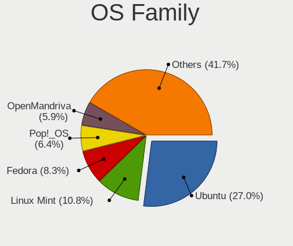

| Name          | Computers | Percent |
|---------------|-----------|---------|
| Ubuntu        | 40        | 34.48%  |
| Linux Mint    | 13        | 11.21%  |
| Pop!_OS       | 12        | 10.34%  |
| Manjaro       | 7         | 6.03%   |
| Debian        | 6         | 5.17%   |
| Zorin         | 5         | 4.31%   |
| OpenMandriva  | 5         | 4.31%   |
| Fedora        | 5         | 4.31%   |
| Xubuntu       | 4         | 3.45%   |
| Endless       | 4         | 3.45%   |
| Lubuntu       | 3         | 2.59%   |
| KDE neon      | 3         | 2.59%   |
| ArcoLinux     | 3         | 2.59%   |
| ROSA          | 2         | 1.72%   |
| Arch          | 2         | 1.72%   |
| Ubuntu Studio | 1         | 0.86%   |
| PureOS        | 1         | 0.86%   |

Kernel
------

Version of the Linux kernel

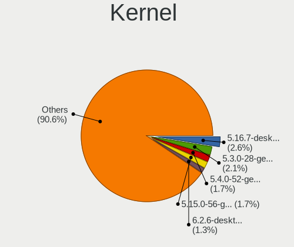

| Version                         | Computers | Percent |
|---------------------------------|-----------|---------|
| 5.3.0-28-generic                | 5         | 3.97%   |
| 5.16.7-desktop-1omv4003         | 5         | 3.97%   |
| 5.4.0-52-generic                | 4         | 3.17%   |
| 5.3.0-46-generic                | 3         | 2.38%   |
| 5.13.0-39-generic               | 3         | 2.38%   |
| 5.8.0-7630-generic              | 2         | 1.59%   |
| 5.8.0-59-generic                | 2         | 1.59%   |
| 5.4.0-89-generic                | 2         | 1.59%   |
| 5.4.0-67-generic                | 2         | 1.59%   |
| 5.3.0-42-generic                | 2         | 1.59%   |
| 5.13.0-7620-generic             | 2         | 1.59%   |
| 5.13.0-7614-generic             | 2         | 1.59%   |
| 5.11.0-40-generic               | 2         | 1.59%   |
| 5.11.0-38-generic               | 2         | 1.59%   |
| 4.9.60-nrj-desktop-1rosa-x86_64 | 2         | 1.59%   |
| 4.19.0-13-amd64                 | 2         | 1.59%   |
| 4.18.0-15-generic               | 2         | 1.59%   |
| 4.15.0-94-generic               | 2         | 1.59%   |
| 4.15.0-47-generic               | 2         | 1.59%   |
| 4.15.0-20-generic               | 2         | 1.59%   |
| 5.9.8-2-MANJARO                 | 1         | 0.79%   |
| 5.9.0-3-amd64                   | 1         | 0.79%   |
| 5.8.9-200.fc32.x86_64           | 1         | 0.79%   |
| 5.8.11-200.fc32.x86_64          | 1         | 0.79%   |
| 5.8.0-53-generic                | 1         | 0.79%   |
| 5.8.0-49-generic                | 1         | 0.79%   |
| 5.8.0-44-generic                | 1         | 0.79%   |
| 5.8.0-34-generic                | 1         | 0.79%   |
| 5.8.0-26-generic                | 1         | 0.79%   |
| 5.8.0-19-generic                | 1         | 0.79%   |
| 5.7.0-1-librem5                 | 1         | 0.79%   |
| 5.6.6-300.fc32.x86_64           | 1         | 0.79%   |
| 5.4.52-1-MANJARO                | 1         | 0.79%   |
| 5.4.33-3-MANJARO                | 1         | 0.79%   |
| 5.4.23-1-MANJARO                | 1         | 0.79%   |
| 5.4.0-90-generic                | 1         | 0.79%   |
| 5.4.0-80-generic                | 1         | 0.79%   |
| 5.4.0-7634-generic              | 1         | 0.79%   |
| 5.4.0-7625-generic              | 1         | 0.79%   |
| 5.4.0-74-generic                | 1         | 0.79%   |
| 5.4.0-73-generic                | 1         | 0.79%   |
| 5.4.0-72-generic                | 1         | 0.79%   |
| 5.4.0-66-generic                | 1         | 0.79%   |
| 5.4.0-58-generic                | 1         | 0.79%   |
| 5.4.0-54-generic                | 1         | 0.79%   |
| 5.4.0-48-generic                | 1         | 0.79%   |
| 5.4.0-47-generic                | 1         | 0.79%   |
| 5.4.0-42-generic                | 1         | 0.79%   |
| 5.4.0-40-generic                | 1         | 0.79%   |
| 5.4.0-39-generic                | 1         | 0.79%   |
| 5.4.0-37-generic                | 1         | 0.79%   |
| 5.4.0-33-generic                | 1         | 0.79%   |
| 5.4.0-31-generic                | 1         | 0.79%   |
| 5.4.0-26-generic                | 1         | 0.79%   |
| 5.3.0-51-generic                | 1         | 0.79%   |
| 5.16.14-1-MANJARO               | 1         | 0.79%   |
| 5.16.11-arch1-1                 | 1         | 0.79%   |
| 5.15.23-76051523-generic        | 1         | 0.79%   |
| 5.15.11-76051511-generic        | 1         | 0.79%   |
| 5.15.10-arch1-1                 | 1         | 0.79%   |

Kernel Family
-------------

Linux kernel without a distro release

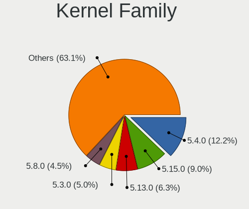

| Version | Computers | Percent |
|---------|-----------|---------|
| 5.4.0   | 25        | 20.49%  |
| 5.13.0  | 13        | 10.66%  |
| 5.3.0   | 11        | 9.02%   |
| 5.8.0   | 10        | 8.2%    |
| 4.15.0  | 10        | 8.2%    |
| 5.11.0  | 8         | 6.56%   |
| 5.16.7  | 5         | 4.1%    |
| 5.0.0   | 5         | 4.1%    |
| 4.18.0  | 4         | 3.28%   |
| 5.15.0  | 2         | 1.64%   |
| 5.10.0  | 2         | 1.64%   |
| 4.9.60  | 2         | 1.64%   |
| 4.19.0  | 2         | 1.64%   |
| 5.9.8   | 1         | 0.82%   |
| 5.9.0   | 1         | 0.82%   |
| 5.8.9   | 1         | 0.82%   |
| 5.8.11  | 1         | 0.82%   |
| 5.7.0   | 1         | 0.82%   |
| 5.6.6   | 1         | 0.82%   |
| 5.4.52  | 1         | 0.82%   |
| 5.4.33  | 1         | 0.82%   |
| 5.4.23  | 1         | 0.82%   |
| 5.16.14 | 1         | 0.82%   |
| 5.16.11 | 1         | 0.82%   |
| 5.15.23 | 1         | 0.82%   |
| 5.15.11 | 1         | 0.82%   |
| 5.15.10 | 1         | 0.82%   |
| 5.13.9  | 1         | 0.82%   |
| 5.11.19 | 1         | 0.82%   |
| 5.11.18 | 1         | 0.82%   |
| 5.11.16 | 1         | 0.82%   |
| 5.10.60 | 1         | 0.82%   |
| 5.10.42 | 1         | 0.82%   |
| 5.10.37 | 1         | 0.82%   |
| 5.10.34 | 1         | 0.82%   |
| 4.9.0   | 1         | 0.82%   |

Kernel Major Ver.
-----------------

Linux kernel major version

| Version | Computers | Percent |
|---------|-----------|---------|
| 5.4     | 28        | 23.14%  |
| 5.13    | 14        | 11.57%  |
| 5.8     | 12        | 9.92%   |
| 5.3     | 11        | 9.09%   |
| 5.11    | 11        | 9.09%   |
| 4.15    | 10        | 8.26%   |
| 5.16    | 7         | 5.79%   |
| 5.15    | 5         | 4.13%   |
| 5.10    | 5         | 4.13%   |
| 5.0     | 5         | 4.13%   |
| 4.18    | 4         | 3.31%   |
| 4.9     | 3         | 2.48%   |
| 5.9     | 2         | 1.65%   |
| 4.19    | 2         | 1.65%   |
| 5.7     | 1         | 0.83%   |
| 5.6     | 1         | 0.83%   |

Arch
----

OS architecture (x86_64, i586, etc.)

| Name    | Computers | Percent |
|---------|-----------|---------|
| x86_64  | 107       | 93.04%  |
| i686    | 7         | 6.09%   |
| aarch64 | 1         | 0.87%   |

DE
--

Desktop Environment

| Name       | Computers | Percent |
|------------|-----------|---------|
| GNOME      | 60        | 50.85%  |
| XFCE       | 16        | 13.56%  |
| Unknown    | 15        | 12.71%  |
| KDE5       | 9         | 7.63%   |
| X-Cinnamon | 5         | 4.24%   |
| KDE        | 3         | 2.54%   |
| Unity      | 2         | 1.69%   |
| LXQt       | 2         | 1.69%   |
| KDE4       | 2         | 1.69%   |
| MATE       | 1         | 0.85%   |
| LXDE       | 1         | 0.85%   |
| Cinnamon   | 1         | 0.85%   |
| bspwm      | 1         | 0.85%   |

Display Server
--------------

X11 or Wayland

| Name    | Computers | Percent |
|---------|-----------|---------|
| X11     | 96        | 83.48%  |
| Wayland | 13        | 11.3%   |
| Unknown | 6         | 5.22%   |

Display Manager
---------------

SDDM, LightDM, etc.

| Name    | Computers | Percent |
|---------|-----------|---------|
| Unknown | 75        | 63.56%  |
| SDDM    | 13        | 11.02%  |
| GDM     | 11        | 9.32%   |
| LightDM | 8         | 6.78%   |
| GDM3    | 5         | 4.24%   |
| TDM     | 4         | 3.39%   |
| KDM     | 2         | 1.69%   |

OS Lang
-------

Language

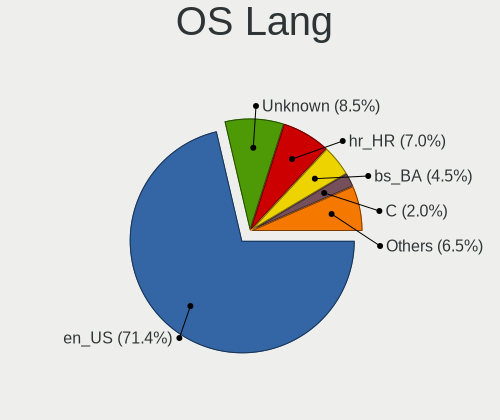

| Lang    | Computers | Percent |
|---------|-----------|---------|
| en_US   | 80        | 68.38%  |
| Unknown | 16        | 13.68%  |
| hr_HR   | 6         | 5.13%   |
| bs_BA   | 6         | 5.13%   |
| en_AU   | 2         | 1.71%   |
| C       | 2         | 1.71%   |
| sr_RS   | 1         | 0.85%   |
| it_IT   | 1         | 0.85%   |
| en_GB   | 1         | 0.85%   |
| en_CA   | 1         | 0.85%   |
| de_CH   | 1         | 0.85%   |

Boot Mode
---------

EFI or BIOS

| Mode | Computers | Percent |
|------|-----------|---------|
| BIOS | 79        | 68.7%   |
| EFI  | 36        | 31.3%   |

Filesystem
----------

Type of filesystem

| Type    | Computers | Percent |
|---------|-----------|---------|
| Ext4    | 95        | 83.33%  |
| Unknown | 7         | 6.14%   |
| Overlay | 6         | 5.26%   |
| Btrfs   | 5         | 4.39%   |
| Ext2    | 1         | 0.88%   |

Part. scheme
------------

Scheme of partitioning

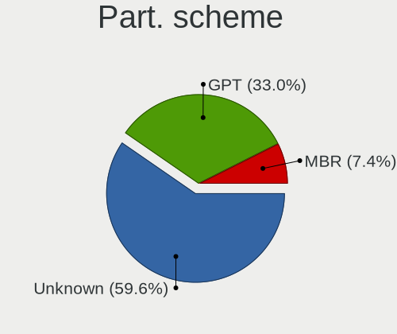

| Type    | Computers | Percent |
|---------|-----------|---------|
| Unknown | 83        | 71.55%  |
| GPT     | 22        | 18.97%  |
| MBR     | 11        | 9.48%   |

Dual Boot with Linux/BSD
------------------------

Hosting more than one Linux/BSD

| Dual boot | Computers | Percent |
|-----------|-----------|---------|
| No        | 103       | 90.35%  |
| Yes       | 11        | 9.65%   |

Dual Boot (Win)
---------------

Hosting Linux and Windows

| Dual boot | Computers | Percent |
|-----------|-----------|---------|
| No        | 88        | 77.19%  |
| Yes       | 26        | 22.81%  |

Board
-----

Vendor
------

Motherboard manufacturer

| Name                | Computers | Percent |
|---------------------|-----------|---------|
| Hewlett-Packard     | 29        | 25.44%  |
| ASUSTek Computer    | 27        | 23.68%  |
| Lenovo              | 14        | 12.28%  |
| Dell                | 11        | 9.65%   |
| Acer                | 11        | 9.65%   |
| Gigabyte Technology | 5         | 4.39%   |
| MSI                 | 3         | 2.63%   |
| Fujitsu Siemens     | 2         | 1.75%   |
| Wistron             | 1         | 0.88%   |
| Toshiba             | 1         | 0.88%   |
| Sony                | 1         | 0.88%   |
| Pegatron            | 1         | 0.88%   |
| NEC Computers       | 1         | 0.88%   |
| Microsoft           | 1         | 0.88%   |
| Medion              | 1         | 0.88%   |
| HUAWEI              | 1         | 0.88%   |
| eMachines           | 1         | 0.88%   |
| ECS                 | 1         | 0.88%   |
| ASRock              | 1         | 0.88%   |
| Unknown             | 1         | 0.88%   |

Model
-----

Motherboard model

| Name                                   | Computers | Percent |
|----------------------------------------|-----------|---------|
| ASUS All Series                        | 4         | 3.51%   |
| HP EliteBook 8460p                     | 2         | 1.75%   |
| Dell OptiPlex 745                      | 2         | 1.75%   |
| Dell G3 3590                           | 2         | 1.75%   |
| ASUS VivoBook_ASUSLaptop X509DA_D509DA | 2         | 1.75%   |
| ASUS P8H61-M LX3 R2.0                  | 2         | 1.75%   |
| ASUS P5KPL-AM SE                       | 2         | 1.75%   |
| Wistron ProLiant ML110 G5              | 1         | 0.88%   |
| Toshiba Satellite C850-1GF             | 1         | 0.88%   |
| Sony VGN-BX41VN                        | 1         | 0.88%   |
| Pegatron VS170AA-UUZ p6244ch           | 1         | 0.88%   |
| NEC Computers VERSAP550 NN951700753    | 1         | 0.88%   |
| MSI MS-AA1511                          | 1         | 0.88%   |
| MSI MS-7978                            | 1         | 0.88%   |
| MSI MS-7597                            | 1         | 0.88%   |
| Microsoft Surface Pro 4                | 1         | 0.88%   |
| Medion MS-7366                         | 1         | 0.88%   |
| Lenovo Yoga 910-13IKB 80VF             | 1         | 0.88%   |
| Lenovo ThinkPad X301 277418G           | 1         | 0.88%   |
| Lenovo ThinkPad T430 2349G2G           | 1         | 0.88%   |
| Lenovo ThinkPad T420 4180WAP           | 1         | 0.88%   |
| Lenovo ThinkPad S1 Yoga 20CD0038MZ     | 1         | 0.88%   |
| Lenovo ThinkPad E15 Gen 2 20TD003LSC   | 1         | 0.88%   |
| Lenovo Legion 7 15IMHg05 81YU          | 1         | 0.88%   |
| Lenovo IdeaPad Y570 20091              | 1         | 0.88%   |
| Lenovo IdeaPad L340-15IWL 81LG         | 1         | 0.88%   |
| Lenovo IdeaPad C340-14IWL 81N4         | 1         | 0.88%   |
| Lenovo IdeaPad 330-15IKB 81DE          | 1         | 0.88%   |
| Lenovo IdeaPad 320-15IKB 81BG          | 1         | 0.88%   |
| Lenovo IdeaPad 110S-11IBR 80WG         | 1         | 0.88%   |
| Lenovo G505 20240                      | 1         | 0.88%   |
| HUAWEI BOHK-WAX9X                      | 1         | 0.88%   |
| HP ProDesk 400 G2 MT (TPM DP)          | 1         | 0.88%   |
| HP ProBook 4710s                       | 1         | 0.88%   |
| HP ProBook 470 G2                      | 1         | 0.88%   |
| HP ProBook 470 G0                      | 1         | 0.88%   |
| HP Pavilion Gaming Laptop 15-dk2xxx    | 1         | 0.88%   |
| HP Laptop 15-rb0xx                     | 1         | 0.88%   |
| HP ENVY x360 Convertible 15-dr0xxx     | 1         | 0.88%   |
| HP ENVY TS 15                          | 1         | 0.88%   |
| HP ENVY 6                              | 1         | 0.88%   |
| HP EliteBook 8560p                     | 1         | 0.88%   |
| HP EliteBook 850 G8 Notebook PC        | 1         | 0.88%   |
| HP EliteBook 850 G3                    | 1         | 0.88%   |
| HP EliteBook 8470p                     | 1         | 0.88%   |
| HP EliteBook 840 G1                    | 1         | 0.88%   |
| HP EliteBook 2560p                     | 1         | 0.88%   |
| HP Compaq Elite 8300 CMT               | 1         | 0.88%   |
| HP Compaq dc7900 Convertible Minitower | 1         | 0.88%   |
| HP Compaq dc7700p Small Form Factor    | 1         | 0.88%   |
| HP Compaq dc5750 Small Form Factor     | 1         | 0.88%   |
| HP Compaq CQ58                         | 1         | 0.88%   |
| HP Compaq 8200 Elite USDT PC           | 1         | 0.88%   |
| HP Compaq 6200 Pro MT PC               | 1         | 0.88%   |
| HP All-in-One 22-c0xx                  | 1         | 0.88%   |
| HP 550                                 | 1         | 0.88%   |
| HP 255 G2                              | 1         | 0.88%   |
| HP 250 G7 Notebook PC                  | 1         | 0.88%   |
| HP 250 G6 Notebook PC                  | 1         | 0.88%   |
| Gigabyte Z390 UD                       | 1         | 0.88%   |

Model Family
------------

Motherboard model prefix

| Name                     | Computers | Percent |
|--------------------------|-----------|---------|
| HP EliteBook             | 8         | 7.02%   |
| Acer Aspire              | 8         | 7.02%   |
| HP Compaq                | 7         | 6.14%   |
| Lenovo IdeaPad           | 6         | 5.26%   |
| Lenovo ThinkPad          | 5         | 4.39%   |
| ASUS VivoBook            | 4         | 3.51%   |
| ASUS All                 | 4         | 3.51%   |
| HP ProBook               | 3         | 2.63%   |
| HP ENVY                  | 3         | 2.63%   |
| Dell OptiPlex            | 3         | 2.63%   |
| HP 250                   | 2         | 1.75%   |
| Dell Latitude            | 2         | 1.75%   |
| Dell Inspiron            | 2         | 1.75%   |
| Dell G3                  | 2         | 1.75%   |
| ASUS TUF                 | 2         | 1.75%   |
| ASUS PRIME               | 2         | 1.75%   |
| ASUS P8H61-M             | 2         | 1.75%   |
| ASUS P5KPL-AM            | 2         | 1.75%   |
| ASUS P5G41T-M            | 2         | 1.75%   |
| Wistron ProLiant         | 1         | 0.88%   |
| Toshiba Satellite        | 1         | 0.88%   |
| Sony VGN-BX41VN          | 1         | 0.88%   |
| Pegatron VS170AA-UUZ     | 1         | 0.88%   |
| NEC Computers VERSAP550  | 1         | 0.88%   |
| MSI MS-AA1511            | 1         | 0.88%   |
| MSI MS-7978              | 1         | 0.88%   |
| MSI MS-7597              | 1         | 0.88%   |
| Microsoft Surface        | 1         | 0.88%   |
| Medion MS-7366           | 1         | 0.88%   |
| Lenovo Yoga              | 1         | 0.88%   |
| Lenovo Legion            | 1         | 0.88%   |
| Lenovo G505              | 1         | 0.88%   |
| HUAWEI BOHK-WAX9X        | 1         | 0.88%   |
| HP ProDesk               | 1         | 0.88%   |
| HP Pavilion              | 1         | 0.88%   |
| HP Laptop                | 1         | 0.88%   |
| HP All-in-One            | 1         | 0.88%   |
| HP 550                   | 1         | 0.88%   |
| HP 255                   | 1         | 0.88%   |
| Gigabyte Z390            | 1         | 0.88%   |
| Gigabyte X570            | 1         | 0.88%   |
| Gigabyte nForce          | 1         | 0.88%   |
| Gigabyte GA-990FX-GAMING | 1         | 0.88%   |
| Gigabyte B450M           | 1         | 0.88%   |
| Fujitsu Siemens ESPRIMO  | 1         | 0.88%   |
| Fujitsu Siemens AMILO    | 1         | 0.88%   |
| eMachines eME728         | 1         | 0.88%   |
| ECS G31T-M7              | 1         | 0.88%   |
| Dell XPS                 | 1         | 0.88%   |
| Dell System              | 1         | 0.88%   |
| ASUS ZenBook             | 1         | 0.88%   |
| ASUS Z170-P              | 1         | 0.88%   |
| ASUS X75VBP              | 1         | 0.88%   |
| ASUS X751MD              | 1         | 0.88%   |
| ASUS X550ZE              | 1         | 0.88%   |
| ASUS X540SAA             | 1         | 0.88%   |
| ASUS ROG                 | 1         | 0.88%   |
| ASUS M2N-SLI             | 1         | 0.88%   |
| ASUS H61M-K              | 1         | 0.88%   |
| ASRock H61M-HVGS         | 1         | 0.88%   |

MFG Year
--------

Motherboard manufacture year

| Year    | Computers | Percent |
|---------|-----------|---------|
| 2011    | 13        | 11.4%   |
| 2019    | 12        | 10.53%  |
| 2012    | 11        | 9.65%   |
| 2016    | 9         | 7.89%   |
| 2009    | 9         | 7.89%   |
| 2018    | 8         | 7.02%   |
| 2014    | 8         | 7.02%   |
| 2013    | 8         | 7.02%   |
| 2008    | 6         | 5.26%   |
| 2007    | 6         | 5.26%   |
| 2020    | 5         | 4.39%   |
| 2017    | 5         | 4.39%   |
| 2015    | 3         | 2.63%   |
| 2010    | 3         | 2.63%   |
| 2006    | 3         | 2.63%   |
| 2021    | 2         | 1.75%   |
| 2005    | 2         | 1.75%   |
| Unknown | 1         | 0.88%   |

Form Factor
-----------

Physical design of the computer

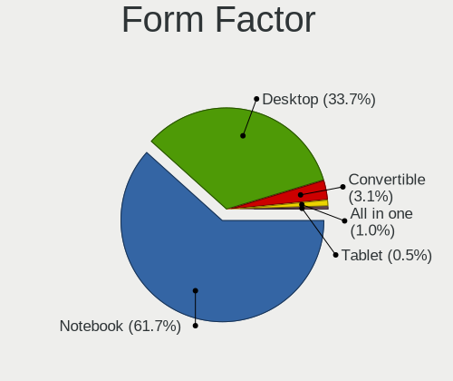

| Name        | Computers | Percent |
|-------------|-----------|---------|
| Notebook    | 67        | 58.77%  |
| Desktop     | 40        | 35.09%  |
| Convertible | 4         | 3.51%   |
| All in one  | 2         | 1.75%   |
| Tablet      | 1         | 0.88%   |

Secure Boot
-----------

Enabled or disabled

| State    | Computers | Percent |
|----------|-----------|---------|
| Disabled | 110       | 96.49%  |
| Enabled  | 4         | 3.51%   |

Coreboot
--------

Have coreboot on board

| Used | Computers | Percent |
|------|-----------|---------|
| No   | 114       | 100%    |

RAM Size
--------

Total RAM memory

| Size in GB | Computers | Percent |
|------------|-----------|---------|
| 4.01-8.0   | 35        | 30.43%  |
| 3.01-4.0   | 24        | 20.87%  |
| 16.01-24.0 | 15        | 13.04%  |
| 1.01-2.0   | 15        | 13.04%  |
| 8.01-16.0  | 15        | 13.04%  |
| 2.01-3.0   | 6         | 5.22%   |
| 32.01-64.0 | 2         | 1.74%   |
| 0.51-1.0   | 2         | 1.74%   |
| 0.01-0.5   | 1         | 0.87%   |

RAM Used
--------

Used RAM memory

| Used GB   | Computers | Percent |
|-----------|-----------|---------|
| 1.01-2.0  | 52        | 42.62%  |
| 2.01-3.0  | 27        | 22.13%  |
| 0.51-1.0  | 14        | 11.48%  |
| 4.01-8.0  | 13        | 10.66%  |
| 3.01-4.0  | 11        | 9.02%   |
| 8.01-16.0 | 3         | 2.46%   |
| 0.01-0.5  | 2         | 1.64%   |

Total Drives
------------

Number of drives on board

| Drives | Computers | Percent |
|--------|-----------|---------|
| 1      | 84        | 72.41%  |
| 2      | 27        | 23.28%  |
| 3      | 2         | 1.72%   |
| 5      | 1         | 0.86%   |
| 4      | 1         | 0.86%   |
| 0      | 1         | 0.86%   |

Has CD-ROM
----------

Has CD-ROM on board

| Presented | Computers | Percent |
|-----------|-----------|---------|
| No        | 58        | 50.43%  |
| Yes       | 57        | 49.57%  |

Has Ethernet
------------

Has Ethernet on board

| Presented | Computers | Percent |
|-----------|-----------|---------|
| Yes       | 98        | 84.48%  |
| No        | 18        | 15.52%  |

Has WiFi
--------

Has WiFi module

| Presented | Computers | Percent |
|-----------|-----------|---------|
| Yes       | 84        | 73.68%  |
| No        | 30        | 26.32%  |

Has Bluetooth
-------------

Has Bluetooth module

| Presented | Computers | Percent |
|-----------|-----------|---------|
| Yes       | 58        | 50.43%  |
| No        | 57        | 49.57%  |

Location
--------

Country
-------

Geographic location (country)

| Country                | Computers | Percent |
|------------------------|-----------|---------|
| Bosnia and Herzegovina | 114       | 100%    |

City
----

Geographic location (city)

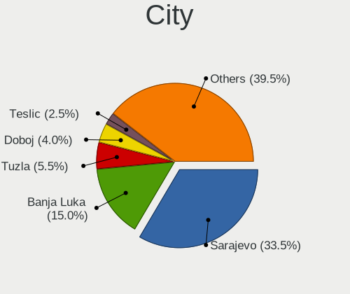

| City              | Computers | Percent |
|-------------------|-----------|---------|
| Sarajevo          | 37        | 31.62%  |
| Banja Luka        | 19        | 16.24%  |
| Tuzla             | 7         | 5.98%   |
| Gracanica         | 5         | 4.27%   |
| Doboj             | 4         | 3.42%   |
| Prijedor          | 3         | 2.56%   |
| Novi Travnik      | 3         | 2.56%   |
| Brcko             | 3         | 2.56%   |
| Zepce             | 2         | 1.71%   |
| Zenica            | 2         | 1.71%   |
| Teslic            | 2         | 1.71%   |
| Srebrenik         | 2         | 1.71%   |
| Prnjavor          | 2         | 1.71%   |
| Lukavac           | 2         | 1.71%   |
| Zvornik           | 1         | 0.85%   |
| Zivinice          | 1         | 0.85%   |
| Vitez             | 1         | 0.85%   |
| Velika Kladua | 1         | 0.85%   |
| Trebinje          | 1         | 0.85%   |
| Tarcin            | 1         | 0.85%   |
| Stjepan-Polje     | 1         | 0.85%   |
| Solina            | 1         | 0.85%   |
| Posusje           | 1         | 0.85%   |
| Pale              | 1         | 0.85%   |
| Orahovica Donja   | 1         | 0.85%   |
| Nova Topola       | 1         | 0.85%   |
| Nevesinje         | 1         | 0.85%   |
| Mostar            | 1         | 0.85%   |
| Maglaj            | 1         | 0.85%   |
| Ljubuski          | 1         | 0.85%   |
| Kobilja Glava     | 1         | 0.85%   |
| Jablanica         | 1         | 0.85%   |
| Ilidza            | 1         | 0.85%   |
| Grude             | 1         | 0.85%   |
| Foca              | 1         | 0.85%   |
| Drvar             | 1         | 0.85%   |
| Bijeljina         | 1         | 0.85%   |
| Banovici          | 1         | 0.85%   |

Drives
------

Drive Vendor
------------

Hard drive vendors

| Vendor              | Computers | Drives | Percent |
|---------------------|-----------|--------|---------|
| WDC                 | 22        | 32     | 15.49%  |
| Seagate             | 18        | 25     | 12.68%  |
| Samsung Electronics | 17        | 18     | 11.97%  |
| Kingston            | 17        | 19     | 11.97%  |
| Toshiba             | 15        | 16     | 10.56%  |
| Hitachi             | 14        | 14     | 9.86%   |
| SanDisk             | 9         | 11     | 6.34%   |
| SK hynix            | 5         | 6      | 3.52%   |
| Unknown             | 4         | 4      | 2.82%   |
| Intel               | 4         | 4      | 2.82%   |
| A-DATA Technology   | 2         | 2      | 1.41%   |
| Vaseky              | 1         | 1      | 0.7%    |
| Transcend           | 1         | 1      | 0.7%    |
| Team                | 1         | 1      | 0.7%    |
| Patriot             | 1         | 1      | 0.7%    |
| ORGE                | 1         | 1      | 0.7%    |
| OCZ                 | 1         | 2      | 0.7%    |
| Maxtor              | 1         | 1      | 0.7%    |
| KIOXIA              | 1         | 1      | 0.7%    |
| Intenso             | 1         | 1      | 0.7%    |
| HGST                | 1         | 1      | 0.7%    |
| Goodram             | 1         | 1      | 0.7%    |
| Fujitsu             | 1         | 1      | 0.7%    |
| Crucial             | 1         | 1      | 0.7%    |
| China               | 1         | 3      | 0.7%    |
| ASMT                | 1         | 1      | 0.7%    |

Drive Model
-----------

Hard drive models

| Model                             | Computers | Percent |
|-----------------------------------|-----------|---------|
| Kingston SA400S37240G 240GB SSD   | 4         | 2.67%   |
| Toshiba MQ01ABD100 1TB            | 3         | 2%      |
| SK hynix NVMe SSD Drive 512GB     | 3         | 2%      |
| Kingston SHFS37A120G 120GB SSD    | 3         | 2%      |
| Kingston SA400S37120G 120GB SSD   | 3         | 2%      |
| Hitachi HDS721050CLA362 500GB     | 3         | 2%      |
| Unknown SD/MMC/MS PRO 128GB       | 2         | 1.33%   |
| Unknown MMC Card  32GB            | 2         | 1.33%   |
| Toshiba DT01ACA100 1TB            | 2         | 1.33%   |
| Toshiba DT01ACA050 500GB          | 2         | 1.33%   |
| Seagate ST3500413AS 500GB         | 2         | 1.33%   |
| Seagate ST250LT021-1AF14C 250GB   | 2         | 1.33%   |
| SanDisk NVMe SSD Drive 256GB      | 2         | 1.33%   |
| Samsung NVMe SSD Drive 512GB      | 2         | 1.33%   |
| WDC WDS240G2G0B-00EPW0 240GB SSD  | 1         | 0.67%   |
| WDC WDS240G2G0A-00JH30 240GB SSD  | 1         | 0.67%   |
| WDC WDS240G1G0A-00SS50 240GB SSD  | 1         | 0.67%   |
| WDC WDS120G2G0B-00EPW0 120GB SSD  | 1         | 0.67%   |
| WDC WD800JD-75MSA3 80GB           | 1         | 0.67%   |
| WDC WD800JD-60LSA5 80GB           | 1         | 0.67%   |
| WDC WD800JD-00MSA1 80GB           | 1         | 0.67%   |
| WDC WD7500BPVX-22JC3T0 752GB      | 1         | 0.67%   |
| WDC WD7500BPVT-75HXZT3 752GB      | 1         | 0.67%   |
| WDC WD7500BPVT-24HXZT3 752GB      | 1         | 0.67%   |
| WDC WD7500AACS-00D6B0 752GB       | 1         | 0.67%   |
| WDC WD5000LPVT-75G33T0 500GB      | 1         | 0.67%   |
| WDC WD5000LPVT-22G33T0 500GB      | 1         | 0.67%   |
| WDC WD5000BEKT-22KA9T0 500GB      | 1         | 0.67%   |
| WDC WD5000AZLX-60K2TA0 500GB      | 1         | 0.67%   |
| WDC WD5000AAKX-00ERMA0 500GB      | 1         | 0.67%   |
| WDC WD40EZRZ-75GXCB0 4TB          | 1         | 0.67%   |
| WDC WD40EZAZ-00ZGHB0 4TB          | 1         | 0.67%   |
| WDC WD3200SD-01KNB0 320GB         | 1         | 0.67%   |
| WDC WD3200AAJS-00L7A0 320GB       | 1         | 0.67%   |
| WDC WD20EARX-00PASB0 2TB          | 1         | 0.67%   |
| WDC WD2000JD-00HBB0 200GB         | 1         | 0.67%   |
| WDC WD1600BEVT-22ZCT0 160GB       | 1         | 0.67%   |
| WDC WD1600AAJS-00B4A0 160GB       | 1         | 0.67%   |
| WDC WD15EARS-00S8B1 1TB           | 1         | 0.67%   |
| WDC WD1002FAEX-00Z3A0 1TB         | 1         | 0.67%   |
| Vaseky V800/128G 128GB            | 1         | 0.67%   |
| Transcend TS120GSSD220S 120GB     | 1         | 0.67%   |
| Toshiba MQ04ABF100 1TB            | 1         | 0.67%   |
| Toshiba MQ01ABF050 500GB          | 1         | 0.67%   |
| Toshiba MK3263GSX 320GB           | 1         | 0.67%   |
| Toshiba MK3261GSYN 320GB          | 1         | 0.67%   |
| Toshiba MK3259GSXP 320GB          | 1         | 0.67%   |
| Toshiba KXG60ZNV512G 512GB        | 1         | 0.67%   |
| Toshiba KBG30ZMV256G 256GB        | 1         | 0.67%   |
| Toshiba KBG30ZMS256G NVMe 256GB   | 1         | 0.67%   |
| Team T253X1120G 120GB SSD         | 1         | 0.67%   |
| SK hynix SC300 M.2 2280 256GB SSD | 1         | 0.67%   |
| SK hynix HFM001TD3JX013N 1TB      | 1         | 0.67%   |
| SK hynix BC501 NVMe 512GB         | 1         | 0.67%   |
| Seagate STM3500418AS 500GB        | 1         | 0.67%   |
| Seagate ST980811AS 80GB           | 1         | 0.67%   |
| Seagate ST9120817AS 120GB         | 1         | 0.67%   |
| Seagate ST8000AS0002-1NA17Z 8TB   | 1         | 0.67%   |
| Seagate ST500LT012-9WS142 500GB   | 1         | 0.67%   |
| Seagate ST500LM000-1EJ162 500GB   | 1         | 0.67%   |

HDD Vendor
----------

Hard disk drive vendors

| Vendor              | Computers | Drives | Percent |
|---------------------|-----------|--------|---------|
| WDC                 | 19        | 28     | 26.76%  |
| Seagate             | 18        | 25     | 25.35%  |
| Hitachi             | 14        | 14     | 19.72%  |
| Toshiba             | 12        | 12     | 16.9%   |
| Unknown             | 2         | 2      | 2.82%   |
| Samsung Electronics | 2         | 2      | 2.82%   |
| Maxtor              | 1         | 1      | 1.41%   |
| HGST                | 1         | 1      | 1.41%   |
| Fujitsu             | 1         | 1      | 1.41%   |
| ASMT                | 1         | 1      | 1.41%   |

SSD Vendor
----------

Solid state drive vendors

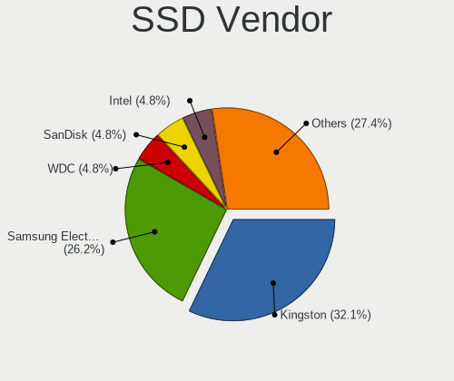

| Vendor              | Computers | Drives | Percent |
|---------------------|-----------|--------|---------|
| Kingston            | 14        | 16     | 31.11%  |
| Samsung Electronics | 9         | 10     | 20%     |
| WDC                 | 4         | 4      | 8.89%   |
| SanDisk             | 4         | 5      | 8.89%   |
| Intel               | 3         | 3      | 6.67%   |
| A-DATA Technology   | 2         | 2      | 4.44%   |
| Vaseky              | 1         | 1      | 2.22%   |
| Transcend           | 1         | 1      | 2.22%   |
| Team                | 1         | 1      | 2.22%   |
| SK hynix            | 1         | 1      | 2.22%   |
| Patriot             | 1         | 1      | 2.22%   |
| OCZ                 | 1         | 2      | 2.22%   |
| Intenso             | 1         | 1      | 2.22%   |
| Goodram             | 1         | 1      | 2.22%   |
| China               | 1         | 3      | 2.22%   |

Drive Kind
----------

HDD or SSD

| Kind    | Computers | Drives | Percent |
|---------|-----------|--------|---------|
| HDD     | 64        | 87     | 47.76%  |
| SSD     | 43        | 52     | 32.09%  |
| NVMe    | 23        | 26     | 17.16%  |
| MMC     | 3         | 3      | 2.24%   |
| Unknown | 1         | 1      | 0.75%   |

Drive Connector
---------------

SATA, SAS, NVMe, etc.

| Type | Computers | Drives | Percent |
|------|-----------|--------|---------|
| SATA | 89        | 136    | 74.79%  |
| NVMe | 23        | 26     | 19.33%  |
| SAS  | 4         | 4      | 3.36%   |
| MMC  | 3         | 3      | 2.52%   |

Drive Size
----------

Size of hard drive

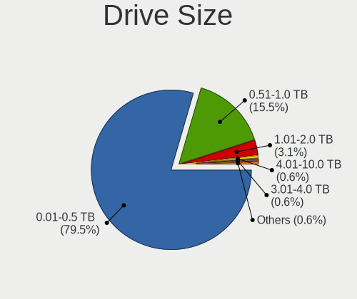

| Size in TB | Computers | Drives | Percent |
|------------|-----------|--------|---------|
| 0.01-0.5   | 83        | 116    | 80.58%  |
| 0.51-1.0   | 15        | 15     | 14.56%  |
| 1.01-2.0   | 2         | 3      | 1.94%   |
| 3.01-4.0   | 1         | 2      | 0.97%   |
| 2.01-3.0   | 1         | 2      | 0.97%   |
| 4.01-10.0  | 1         | 1      | 0.97%   |

Space Total
-----------

Amount of disk space available on the file system

| Size in GB     | Computers | Percent |
|----------------|-----------|---------|
| 101-250        | 37        | 31.62%  |
| 251-500        | 29        | 24.79%  |
| 51-100         | 15        | 12.82%  |
| 21-50          | 11        | 9.4%    |
| 501-1000       | 9         | 7.69%   |
| 1-20           | 7         | 5.98%   |
| More than 3000 | 3         | 2.56%   |
| 1001-2000      | 3         | 2.56%   |
| Unknown        | 2         | 1.71%   |
| 2001-3000      | 1         | 0.85%   |

Space Used
----------

Amount of used disk space

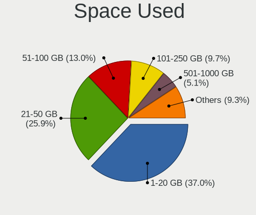

| Used GB   | Computers | Percent |
|-----------|-----------|---------|
| 1-20      | 52        | 41.6%   |
| 21-50     | 36        | 28.8%   |
| 51-100    | 16        | 12.8%   |
| 101-250   | 10        | 8%      |
| 251-500   | 5         | 4%      |
| 501-1000  | 3         | 2.4%    |
| Unknown   | 2         | 1.6%    |
| 2001-3000 | 1         | 0.8%    |

Malfunc. Drives
---------------

Drive models with a malfunction

| Model                                         | Computers | Drives | Percent |
|-----------------------------------------------|-----------|--------|---------|
| WDC WDS240G2G0A-00JH30 240GB SSD              | 1         | 1      | 12.5%   |
| WDC WD3200AAJS-00L7A0 320GB                   | 1         | 1      | 12.5%   |
| Seagate ST3120813AS 120GB                     | 1         | 1      | 12.5%   |
| Seagate ST3000DM001-1CH166 3TB                | 1         | 2      | 12.5%   |
| Seagate ST250LT021-1AF14C 250GB               | 1         | 1      | 12.5%   |
| Samsung Electronics MMCRE64G8MPP-0VA 64GB SSD | 1         | 1      | 12.5%   |
| Hitachi HDS721050CLA362 500GB                 | 1         | 1      | 12.5%   |
| Crucial CT500P1SSD8 500GB                     | 1         | 1      | 12.5%   |

Malfunc. Drive Vendor
---------------------

Vendors of faulty drives

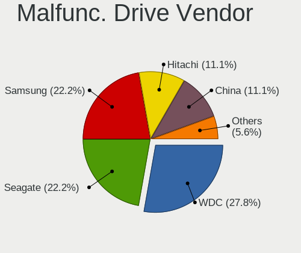

| Vendor              | Computers | Drives | Percent |
|---------------------|-----------|--------|---------|
| Seagate             | 3         | 4      | 37.5%   |
| WDC                 | 2         | 2      | 25%     |
| Samsung Electronics | 1         | 1      | 12.5%   |
| Hitachi             | 1         | 1      | 12.5%   |
| Crucial             | 1         | 1      | 12.5%   |

Malfunc. HDD Vendor
-------------------

Vendors of faulty HDD drives

| Vendor  | Computers | Drives | Percent |
|---------|-----------|--------|---------|
| Seagate | 3         | 4      | 60%     |
| WDC     | 1         | 1      | 20%     |
| Hitachi | 1         | 1      | 20%     |

Malfunc. Drive Kind
-------------------

Kinds of faulty drives

| Kind | Computers | Drives | Percent |
|------|-----------|--------|---------|
| HDD  | 4         | 6      | 57.14%  |
| SSD  | 2         | 2      | 28.57%  |
| NVMe | 1         | 1      | 14.29%  |

Failed Drives
-------------

Failed drive models

Zero info for selected period =(

Failed Drive Vendor
-------------------

Failed drive vendors

Zero info for selected period =(

Drive Status
------------

Number of failed and malfunc. drives

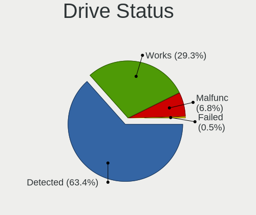

| Status   | Computers | Drives | Percent |
|----------|-----------|--------|---------|
| Detected | 86        | 127    | 73.5%   |
| Works    | 24        | 33     | 20.51%  |
| Malfunc  | 7         | 9      | 5.98%   |

Storage controller
------------------

Storage Vendor
--------------

Storage controller vendors

| Vendor                       | Computers | Percent |
|------------------------------|-----------|---------|
| Intel                        | 83        | 65.35%  |
| AMD                          | 15        | 11.81%  |
| Samsung Electronics          | 6         | 4.72%   |
| Nvidia                       | 6         | 4.72%   |
| SK hynix                     | 4         | 3.15%   |
| SanDisk                      | 4         | 3.15%   |
| Toshiba America Info Systems | 3         | 2.36%   |
| Kingston Technology Company  | 3         | 2.36%   |
| Micron/Crucial Technology    | 1         | 0.79%   |
| KIOXIA                       | 1         | 0.79%   |
| JMicron Technology           | 1         | 0.79%   |

Storage Model
-------------

Storage controller models

| Model                                                                                   | Computers | Percent |
|-----------------------------------------------------------------------------------------|-----------|---------|
| AMD FCH SATA Controller [AHCI mode]                                                     | 12        | 7.79%   |
| Intel 6 Series/C200 Series Chipset Family 6 port Mobile SATA AHCI Controller            | 9         | 5.84%   |
| Intel Sunrise Point-LP SATA Controller [AHCI mode]                                      | 8         | 5.19%   |
| Intel 7 Series Chipset Family 6-port SATA Controller [AHCI mode]                        | 8         | 5.19%   |
| Intel NM10/ICH7 Family SATA Controller [IDE mode]                                       | 5         | 3.25%   |
| Intel 82801 Mobile SATA Controller [RAID mode]                                          | 5         | 3.25%   |
| Intel 82801G (ICH7 Family) IDE Controller                                               | 4         | 2.6%    |
| Intel 8 Series/C220 Series Chipset Family 6-port SATA Controller 1 [AHCI mode]          | 4         | 2.6%    |
| Intel 6 Series/C200 Series Chipset Family Desktop SATA Controller (IDE mode, ports 4-5) | 4         | 2.6%    |
| Intel 6 Series/C200 Series Chipset Family Desktop SATA Controller (IDE mode, ports 0-3) | 4         | 2.6%    |
| Samsung NVMe SSD Controller 980                                                         | 3         | 1.95%   |
| Intel Cannon Lake Mobile PCH SATA AHCI Controller                                       | 3         | 1.95%   |
| Intel 82801H (ICH8 Family) 4 port SATA Controller [IDE mode]                            | 3         | 1.95%   |
| Intel 8 Series SATA Controller 1 [AHCI mode]                                            | 3         | 1.95%   |
| Toshiba America Info Systems BG3 NVMe SSD Controller                                    | 2         | 1.3%    |
| SK hynix BC501 NVMe Solid State Drive                                                   | 2         | 1.3%    |
| SanDisk WD Blue SN550 NVMe SSD                                                          | 2         | 1.3%    |
| Samsung NVMe SSD Controller SM951/PM951                                                 | 2         | 1.3%    |
| Kingston Company U-SNS8154P3 NVMe SSD                                                   | 2         | 1.3%    |
| Intel Volume Management Device NVMe RAID Controller                                     | 2         | 1.3%    |
| Intel Q170/Q150/B150/H170/H110/Z170/CM236 Chipset SATA Controller [AHCI Mode]           | 2         | 1.3%    |
| Intel Cannon Point-LP SATA Controller [AHCI Mode]                                       | 2         | 1.3%    |
| Intel Cannon Lake PCH SATA AHCI Controller                                              | 2         | 1.3%    |
| Intel Atom/Celeron/Pentium Processor x5-E8000/J3xxx/N3xxx Series SATA Controller        | 2         | 1.3%    |
| Intel 9 Series Chipset Family SATA Controller [AHCI Mode]                               | 2         | 1.3%    |
| Intel 82801IBM/IEM (ICH9M/ICH9M-E) 4 port SATA Controller [AHCI mode]                   | 2         | 1.3%    |
| Intel 82801HR/HO/HH (ICH8R/DO/DH) 2 port SATA Controller [IDE mode]                     | 2         | 1.3%    |
| Intel 82801HM/HEM (ICH8M/ICH8M-E) SATA Controller [AHCI mode]                           | 2         | 1.3%    |
| Intel 82801HM/HEM (ICH8M/ICH8M-E) IDE Controller                                        | 2         | 1.3%    |
| Intel 6 Series/C200 Series Chipset Family 6 port Desktop SATA AHCI Controller           | 2         | 1.3%    |
| Toshiba America Info Systems XG6 NVMe SSD Controller                                    | 1         | 0.65%   |
| SK hynix PC401 NVMe Solid State Drive 256GB                                             | 1         | 0.65%   |
| SK hynix Gold P31 SSD                                                                   | 1         | 0.65%   |
| SanDisk WD Black SN750 / PC SN730 NVMe SSD                                              | 1         | 0.65%   |
| SanDisk PC SN520 NVMe SSD                                                               | 1         | 0.65%   |
| Samsung NVMe SSD Controller SM981/PM981/PM983                                           | 1         | 0.65%   |
| Nvidia nForce3 Serial ATA Controller                                                    | 1         | 0.65%   |
| Nvidia MCP79 AHCI Controller                                                            | 1         | 0.65%   |
| Nvidia MCP73 IDE Controller                                                             | 1         | 0.65%   |
| Nvidia MCP61 SATA Controller                                                            | 1         | 0.65%   |
| Nvidia MCP61 IDE                                                                        | 1         | 0.65%   |
| Nvidia MCP51 Serial ATA Controller                                                      | 1         | 0.65%   |
| Nvidia MCP51 IDE                                                                        | 1         | 0.65%   |
| Nvidia GeForce 7100/nForce 630i SATA                                                    | 1         | 0.65%   |
| Nvidia CK8S Parallel ATA Controller (v2.5)                                              | 1         | 0.65%   |
| Nvidia CK804 Serial ATA Controller                                                      | 1         | 0.65%   |
| Nvidia CK804 IDE                                                                        | 1         | 0.65%   |
| Micron/Crucial P1 NVMe PCIe SSD                                                         | 1         | 0.65%   |
| KIOXIA Non-Volatile memory controller                                                   | 1         | 0.65%   |
| Kingston Company A2000 NVMe SSD                                                         | 1         | 0.65%   |
| JMicron JMB363 SATA/IDE Controller                                                      | 1         | 0.65%   |
| Intel Tiger Lake-LP SATA Controller [AHCI mode]                                         | 1         | 0.65%   |
| Intel SSD 600P Series                                                                   | 1         | 0.65%   |
| Intel SATA Controller [RAID mode]                                                       | 1         | 0.65%   |
| Intel Celeron N3350/Pentium N4200/Atom E3900 Series SATA AHCI Controller                | 1         | 0.65%   |
| Intel Atom Processor E3800 Series SATA AHCI Controller                                  | 1         | 0.65%   |
| Intel 82Q963/Q965 PT IDER Controller                                                    | 1         | 0.65%   |
| Intel 82801JI (ICH10 Family) 4 port SATA IDE Controller #1                              | 1         | 0.65%   |
| Intel 82801JD/DO (ICH10 Family) SATA AHCI Controller                                    | 1         | 0.65%   |
| Intel 82801JD/DO (ICH10 Family) 4-port SATA IDE Controller                              | 1         | 0.65%   |

Storage Kind
------------

Kind of storage controller (IDE, SATA, NVMe, SAS, ...)

| Kind | Computers | Percent |
|------|-----------|---------|
| SATA | 75        | 55.97%  |
| IDE  | 28        | 20.9%   |
| NVMe | 23        | 17.16%  |
| RAID | 8         | 5.97%   |

Processor
---------

CPU Vendor
----------

Processor vendors

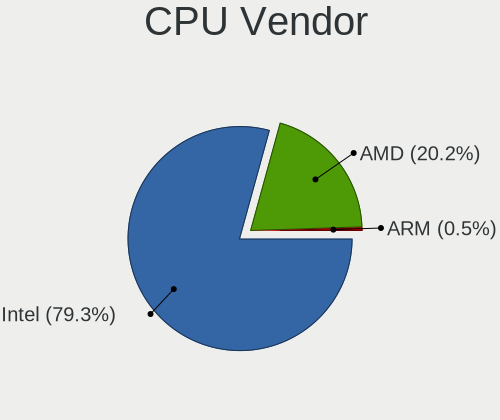

| Vendor | Computers | Percent |
|--------|-----------|---------|
| Intel  | 91        | 79.82%  |
| AMD    | 22        | 19.3%   |
| ARM    | 1         | 0.88%   |

CPU Model
---------

Processor models

| Model                                         | Computers | Percent |
|-----------------------------------------------|-----------|---------|
| Intel Core i5-8265U CPU @ 1.60GHz             | 3         | 2.63%   |
| Intel Core i5-2540M CPU @ 2.60GHz             | 3         | 2.63%   |
| Intel Pentium Dual-Core CPU T4500 @ 2.30GHz   | 2         | 1.75%   |
| Intel Pentium Dual-Core CPU E5700 @ 3.00GHz   | 2         | 1.75%   |
| Intel Pentium CPU G630 @ 2.70GHz              | 2         | 1.75%   |
| Intel Core i7-9750H CPU @ 2.60GHz             | 2         | 1.75%   |
| Intel Core i7-8565U CPU @ 1.80GHz             | 2         | 1.75%   |
| Intel Core i7-8550U CPU @ 1.80GHz             | 2         | 1.75%   |
| Intel Core i7-7500U CPU @ 2.70GHz             | 2         | 1.75%   |
| Intel Core i7-6600U CPU @ 2.60GHz             | 2         | 1.75%   |
| Intel Core i7-2670QM CPU @ 2.20GHz            | 2         | 1.75%   |
| Intel Core i5-3320M CPU @ 2.60GHz             | 2         | 1.75%   |
| Intel Core i5-2400 CPU @ 3.10GHz              | 2         | 1.75%   |
| Intel Core i3-3227U CPU @ 1.90GHz             | 2         | 1.75%   |
| Intel Celeron CPU 430 @ 1.80GHz               | 2         | 1.75%   |
| AMD Ryzen 5 3500U with Radeon Vega Mobile Gfx | 2         | 1.75%   |
| AMD E1-2100 APU with Radeon HD Graphics       | 2         | 1.75%   |
| Intel Xeon CPU X3210 @ 2.13GHz                | 1         | 0.88%   |
| Intel Pentium M processor 1.73GHz             | 1         | 0.88%   |
| Intel Pentium Dual-Core CPU E5300 @ 2.60GHz   | 1         | 0.88%   |
| Intel Pentium Dual-Core CPU E5200 @ 2.50GHz   | 1         | 0.88%   |
| Intel Pentium Dual CPU T2390 @ 1.86GHz        | 1         | 0.88%   |
| Intel Pentium CPU N3540 @ 2.16GHz             | 1         | 0.88%   |
| Intel Core i7-9700K CPU @ 3.60GHz             | 1         | 0.88%   |
| Intel Core i7-8750H CPU @ 2.20GHz             | 1         | 0.88%   |
| Intel Core i7-6700 CPU @ 3.40GHz              | 1         | 0.88%   |
| Intel Core i7-4790 CPU @ 3.60GHz              | 1         | 0.88%   |
| Intel Core i7-4702MQ CPU @ 2.20GHz            | 1         | 0.88%   |
| Intel Core i7-4500U CPU @ 1.80GHz             | 1         | 0.88%   |
| Intel Core i7-2640M CPU @ 2.80GHz             | 1         | 0.88%   |
| Intel Core i7-2630QM CPU @ 2.00GHz            | 1         | 0.88%   |
| Intel Core i7-10875H CPU @ 2.30GHz            | 1         | 0.88%   |
| Intel Core i7 CPU Q 720 @ 1.60GHz             | 1         | 0.88%   |
| Intel Core i5-9400T CPU @ 1.80GHz             | 1         | 0.88%   |
| Intel Core i5-8365U CPU @ 1.60GHz             | 1         | 0.88%   |
| Intel Core i5-8250U CPU @ 1.60GHz             | 1         | 0.88%   |
| Intel Core i5-6600 CPU @ 3.30GHz              | 1         | 0.88%   |
| Intel Core i5-6300U CPU @ 2.40GHz             | 1         | 0.88%   |
| Intel Core i5-4690 CPU @ 3.50GHz              | 1         | 0.88%   |
| Intel Core i5-4590S CPU @ 3.00GHz             | 1         | 0.88%   |
| Intel Core i5-4460 CPU @ 3.20GHz              | 1         | 0.88%   |
| Intel Core i5-4300U CPU @ 1.90GHz             | 1         | 0.88%   |
| Intel Core i5-3470 CPU @ 3.20GHz              | 1         | 0.88%   |
| Intel Core i5-3317U CPU @ 1.70GHz             | 1         | 0.88%   |
| Intel Core i5-3230M CPU @ 2.60GHz             | 1         | 0.88%   |
| Intel Core i5-3210M CPU @ 2.50GHz             | 1         | 0.88%   |
| Intel Core i5-2520M CPU @ 2.50GHz             | 1         | 0.88%   |
| Intel Core i5-1035G1 CPU @ 1.00GHz            | 1         | 0.88%   |
| Intel Core i3-8100 CPU @ 3.60GHz              | 1         | 0.88%   |
| Intel Core i3-7100U CPU @ 2.40GHz             | 1         | 0.88%   |
| Intel Core i3-6006U CPU @ 2.00GHz             | 1         | 0.88%   |
| Intel Core i3-4170 CPU @ 3.70GHz              | 1         | 0.88%   |
| Intel Core i3-4030U CPU @ 1.90GHz             | 1         | 0.88%   |
| Intel Core i3-3240 CPU @ 3.40GHz              | 1         | 0.88%   |
| Intel Core i3-2100 CPU @ 3.10GHz              | 1         | 0.88%   |
| Intel Core 2 Quad CPU Q9400 @ 2.66GHz         | 1         | 0.88%   |
| Intel Core 2 Quad CPU Q8300 @ 2.50GHz         | 1         | 0.88%   |
| Intel Core 2 Duo CPU U9400 @ 1.40GHz          | 1         | 0.88%   |
| Intel Core 2 Duo CPU T8300 @ 2.40GHz          | 1         | 0.88%   |
| Intel Core 2 Duo CPU T7300 @ 2.00GHz          | 1         | 0.88%   |

CPU Model Family
----------------

Processor model prefix

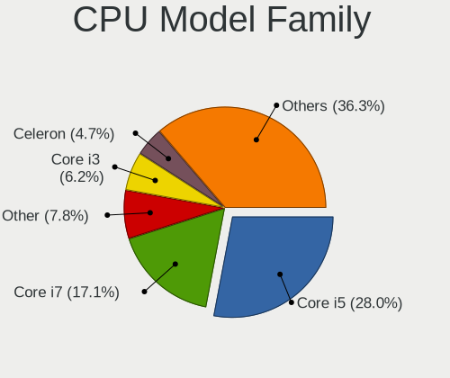

| Model                   | Computers | Percent |
|-------------------------|-----------|---------|
| Intel Core i5           | 25        | 21.93%  |
| Intel Core i7           | 22        | 19.3%   |
| Intel Core i3           | 9         | 7.89%   |
| Intel Celeron           | 8         | 7.02%   |
| Intel Pentium Dual-Core | 6         | 5.26%   |
| Intel Core 2 Duo        | 6         | 5.26%   |
| AMD Ryzen 5             | 5         | 4.39%   |
| Other                   | 4         | 3.51%   |
| Intel Pentium           | 3         | 2.63%   |
| AMD E1                  | 3         | 2.63%   |
| Intel Core 2 Quad       | 2         | 1.75%   |
| Intel Core 2            | 2         | 1.75%   |
| AMD Ryzen 9             | 2         | 1.75%   |
| AMD Athlon 64 X2        | 2         | 1.75%   |
| Intel Xeon              | 1         | 0.88%   |
| Intel Pentium M         | 1         | 0.88%   |
| Intel Pentium Dual      | 1         | 0.88%   |
| Intel Celeron D         | 1         | 0.88%   |
| Intel Atom              | 1         | 0.88%   |
| AMD Turion 64 Mobile    | 1         | 0.88%   |
| AMD Ryzen 7             | 1         | 0.88%   |
| AMD Phenom              | 1         | 0.88%   |
| AMD FX                  | 1         | 0.88%   |
| AMD E2                  | 1         | 0.88%   |
| AMD C-60                | 1         | 0.88%   |
| AMD Athlon X4           | 1         | 0.88%   |
| AMD Athlon II X3        | 1         | 0.88%   |
| AMD Athlon 64           | 1         | 0.88%   |
| AMD A10                 | 1         | 0.88%   |

CPU Cores
---------

Number of processor cores

| Number | Computers | Percent |
|--------|-----------|---------|
| 2      | 57        | 50%     |
| 4      | 40        | 35.09%  |
| 1      | 6         | 5.26%   |
| 6      | 5         | 4.39%   |
| 8      | 3         | 2.63%   |
| 3      | 2         | 1.75%   |
| 12     | 1         | 0.88%   |

CPU Sockets
-----------

Number of sockets

| Number | Computers | Percent |
|--------|-----------|---------|
| 1      | 114       | 100%    |

CPU Threads
-----------

Threads per core (Hyper-Threading)

| Number | Computers | Percent |
|--------|-----------|---------|
| 2      | 60        | 52.63%  |
| 1      | 54        | 47.37%  |

CPU Op-Modes
------------

CPU Operation Modes (32-bit, 64-bit)

| Op mode        | Computers | Percent |
|----------------|-----------|---------|
| 32-bit, 64-bit | 107       | 93.86%  |
| Unknown        | 6         | 5.26%   |
| 32-bit         | 1         | 0.88%   |

CPU Microcode
-------------

Microcode number

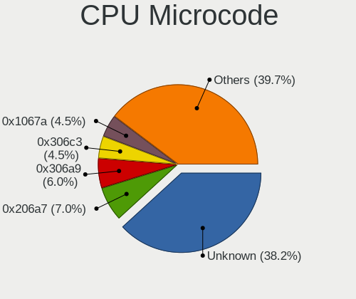

| Number     | Computers | Percent |
|------------|-----------|---------|
| Unknown    | 31        | 26.72%  |
| 0x206a7    | 11        | 9.48%   |
| 0x306a9    | 9         | 7.76%   |
| 0x1067a    | 8         | 6.9%    |
| 0x306c3    | 6         | 5.17%   |
| 0x406e3    | 4         | 3.45%   |
| 0x806ec    | 3         | 2.59%   |
| 0x10676    | 3         | 2.59%   |
| 0x806eb    | 2         | 1.72%   |
| 0x806ea    | 2         | 1.72%   |
| 0x806e9    | 2         | 1.72%   |
| 0x806c1    | 2         | 1.72%   |
| 0x506e3    | 2         | 1.72%   |
| 0x40651    | 2         | 1.72%   |
| 0x08108109 | 2         | 1.72%   |
| 0x05000119 | 2         | 1.72%   |
| 0xf65      | 1         | 0.86%   |
| 0xa0652    | 1         | 0.86%   |
| 0x906ec    | 1         | 0.86%   |
| 0x906eb    | 1         | 0.86%   |
| 0x906ea    | 1         | 0.86%   |
| 0x706e5    | 1         | 0.86%   |
| 0x6fd      | 1         | 0.86%   |
| 0x6fb      | 1         | 0.86%   |
| 0x6fa      | 1         | 0.86%   |
| 0x6f6      | 1         | 0.86%   |
| 0x6f2      | 1         | 0.86%   |
| 0x6d8      | 1         | 0.86%   |
| 0x506c9    | 1         | 0.86%   |
| 0x406c4    | 1         | 0.86%   |
| 0x406c3    | 1         | 0.86%   |
| 0x30678    | 1         | 0.86%   |
| 0x106e5    | 1         | 0.86%   |
| 0x10661    | 1         | 0.86%   |
| 0x0a50000c | 1         | 0.86%   |
| 0x08701021 | 1         | 0.86%   |
| 0x08108102 | 1         | 0.86%   |
| 0x0700010f | 1         | 0.86%   |
| 0x06006118 | 1         | 0.86%   |
| 0x0600063d | 1         | 0.86%   |
| 0x01000083 | 1         | 0.86%   |

CPU Microarch
-------------

Microarchitecture

| Name        | Computers | Percent |
|-------------|-----------|---------|
| KabyLake    | 18        | 15.79%  |
| SandyBridge | 15        | 13.16%  |
| Penryn      | 12        | 10.53%  |
| IvyBridge   | 10        | 8.77%   |
| Haswell     | 9         | 7.89%   |
| Core        | 8         | 7.02%   |
| Zen+        | 6         | 5.26%   |
| Skylake     | 6         | 5.26%   |
| Silvermont  | 4         | 3.51%   |
| K8 Hammer   | 4         | 3.51%   |
| TigerLake   | 3         | 2.63%   |
| K10         | 2         | 1.75%   |
| Jaguar      | 2         | 1.75%   |
| Excavator   | 2         | 1.75%   |
| Bobcat      | 2         | 1.75%   |
| Zen 3       | 1         | 0.88%   |
| Zen 2       | 1         | 0.88%   |
| Steamroller | 1         | 0.88%   |
| P6          | 1         | 0.88%   |
| NetBurst    | 1         | 0.88%   |
| Nehalem     | 1         | 0.88%   |
| IceLake     | 1         | 0.88%   |
| Goldmont    | 1         | 0.88%   |
| CometLake   | 1         | 0.88%   |
| Bulldozer   | 1         | 0.88%   |
| Unknown     | 1         | 0.88%   |

Graphics
--------

GPU Vendor
----------

Vendors of graphics cards

| Vendor                     | Computers | Percent |
|----------------------------|-----------|---------|
| Intel                      | 66        | 47.83%  |
| AMD                        | 37        | 26.81%  |
| Nvidia                     | 34        | 24.64%  |
| Matrox Electronics Systems | 1         | 0.72%   |

GPU Model
---------

Graphics card models

| Model                                                                                    | Computers | Percent |
|------------------------------------------------------------------------------------------|-----------|---------|
| Intel 2nd Generation Core Processor Family Integrated Graphics Controller                | 11        | 7.64%   |
| Intel 3rd Gen Core processor Graphics Controller                                         | 7         | 4.86%   |
| Intel WhiskeyLake-U GT2 [UHD Graphics 620]                                               | 6         | 4.17%   |
| AMD Picasso/Raven 2 [Radeon Vega Series / Radeon Vega Mobile Series]                     | 5         | 3.47%   |
| Intel Skylake GT2 [HD Graphics 520]                                                      | 4         | 2.78%   |
| Nvidia GM108M [GeForce MX110]                                                            | 3         | 2.08%   |
| Intel Xeon E3-1200 v3/4th Gen Core Processor Integrated Graphics Controller              | 3         | 2.08%   |
| Intel UHD Graphics 620                                                                   | 3         | 2.08%   |
| Intel TigerLake-LP GT2 [Iris Xe Graphics]                                                | 3         | 2.08%   |
| Intel HD Graphics 620                                                                    | 3         | 2.08%   |
| Intel Haswell-ULT Integrated Graphics Controller                                         | 3         | 2.08%   |
| Intel CoffeeLake-H GT2 [UHD Graphics 630]                                                | 3         | 2.08%   |
| Intel Atom/Celeron/Pentium Processor x5-E8000/J3xxx/N3xxx Integrated Graphics Controller | 3         | 2.08%   |
| Nvidia TU116M [GeForce GTX 1660 Ti Mobile]                                               | 2         | 1.39%   |
| Nvidia GT218 [GeForce 210]                                                               | 2         | 1.39%   |
| Nvidia GP108M [GeForce MX230]                                                            | 2         | 1.39%   |
| Nvidia GP108M [GeForce MX150]                                                            | 2         | 1.39%   |
| Intel Xeon E3-1200 v2/3rd Gen Core processor Graphics Controller                         | 2         | 1.39%   |
| Intel Mobile 4 Series Chipset Integrated Graphics Controller                             | 2         | 1.39%   |
| Intel CoffeeLake-S GT2 [UHD Graphics 630]                                                | 2         | 1.39%   |
| Intel 82G33/G31 Express Integrated Graphics Controller                                   | 2         | 1.39%   |
| AMD Thames [Radeon HD 7500M/7600M Series]                                                | 2         | 1.39%   |
| AMD Seymour [Radeon HD 6400M/7400M Series]                                               | 2         | 1.39%   |
| AMD Kabini [Radeon HD 8210]                                                              | 2         | 1.39%   |
| Nvidia TU116 [GeForce GTX 1660]                                                          | 1         | 0.69%   |
| Nvidia TU106BM [GeForce RTX 2070 Mobile]                                                 | 1         | 0.69%   |
| Nvidia TU104 [GeForce RTX 2080]                                                          | 1         | 0.69%   |
| Nvidia GT216 [GeForce GT 220]                                                            | 1         | 0.69%   |
| Nvidia GP108M [GeForce MX250]                                                            | 1         | 0.69%   |
| Nvidia GP107M [GeForce GTX 1050 Ti Mobile]                                               | 1         | 0.69%   |
| Nvidia GP107 [GeForce GTX 1050 Ti]                                                       | 1         | 0.69%   |
| Nvidia GP106 [GeForce GTX 1060 6GB]                                                      | 1         | 0.69%   |
| Nvidia GM107M [GeForce GTX 950M]                                                         | 1         | 0.69%   |
| Nvidia GM107 [GeForce 940MX]                                                             | 1         | 0.69%   |
| Nvidia GK208M [GeForce GT 740M]                                                          | 1         | 0.69%   |
| Nvidia GK208B [GeForce GT 710]                                                           | 1         | 0.69%   |
| Nvidia GK107M [GeForce GT 750M]                                                          | 1         | 0.69%   |
| Nvidia GF117M [GeForce 610M/710M/810M/820M / GT 620M/625M/630M/720M]                     | 1         | 0.69%   |
| Nvidia GF116 [GeForce GTX 550 Ti]                                                        | 1         | 0.69%   |
| Nvidia GF108M [GeForce GT 525M]                                                          | 1         | 0.69%   |
| Nvidia GF106 [GeForce GT 440]                                                            | 1         | 0.69%   |
| Nvidia GA107M [GeForce RTX 3050 Mobile]                                                  | 1         | 0.69%   |
| Nvidia GA106M [GeForce RTX 3060 Mobile / Max-Q]                                          | 1         | 0.69%   |
| Nvidia G86 [GeForce 8500 GT]                                                             | 1         | 0.69%   |
| Nvidia G84 [GeForce 8600 GTS]                                                            | 1         | 0.69%   |
| Nvidia C79 [ION]                                                                         | 1         | 0.69%   |
| Nvidia C51 [GeForce Go 6100]                                                             | 1         | 0.69%   |
| Matrox Electronics Systems MGA G200e [Pilot] ServerEngines (SEP1)                        | 1         | 0.69%   |
| Intel Mobile GME965/GLE960 Integrated Graphics Controller                                | 1         | 0.69%   |
| Intel Mobile GM965/GL960 Integrated Graphics Controller (secondary)                      | 1         | 0.69%   |
| Intel Mobile GM965/GL960 Integrated Graphics Controller (primary)                        | 1         | 0.69%   |
| Intel Iris Plus Graphics G1 (Ice Lake)                                                   | 1         | 0.69%   |
| Intel HD Graphics 530                                                                    | 1         | 0.69%   |
| Intel HD Graphics 500                                                                    | 1         | 0.69%   |
| Intel Atom Processor Z36xxx/Z37xxx Series Graphics & Display                             | 1         | 0.69%   |
| Intel 82Q963/Q965 Integrated Graphics Controller                                         | 1         | 0.69%   |
| Intel 4th Gen Core Processor Integrated Graphics Controller                              | 1         | 0.69%   |
| Intel 4 Series Chipset Integrated Graphics Controller                                    | 1         | 0.69%   |
| AMD Wrestler [Radeon HD 7310]                                                            | 1         | 0.69%   |
| AMD Wrestler [Radeon HD 6290]                                                            | 1         | 0.69%   |

GPU Combo
---------

Combinations of graphics cards

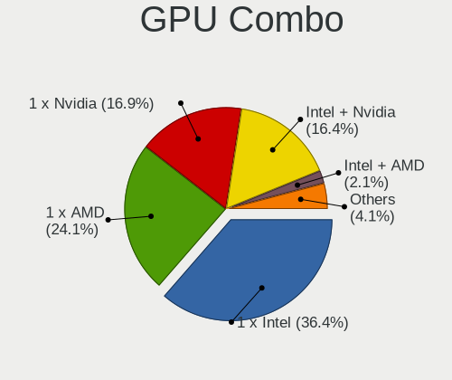

| Name           | Computers | Percent |
|----------------|-----------|---------|
| 1 x Intel      | 43        | 37.39%  |
| 1 x AMD        | 28        | 24.35%  |
| Intel + Nvidia | 18        | 15.65%  |
| 1 x Nvidia     | 15        | 13.04%  |
| Intel + AMD    | 4         | 3.48%   |
| 2 x AMD        | 3         | 2.61%   |
| Other          | 1         | 0.87%   |
| 3 x AMD        | 1         | 0.87%   |
| 1 x Matrox     | 1         | 0.87%   |
| AMD + Nvidia   | 1         | 0.87%   |

GPU Driver
----------

Free vs proprietary

| Driver      | Computers | Percent |
|-------------|-----------|---------|
| Free        | 90        | 78.26%  |
| Proprietary | 20        | 17.39%  |
| Unknown     | 5         | 4.35%   |

GPU Memory
----------

Total video memory

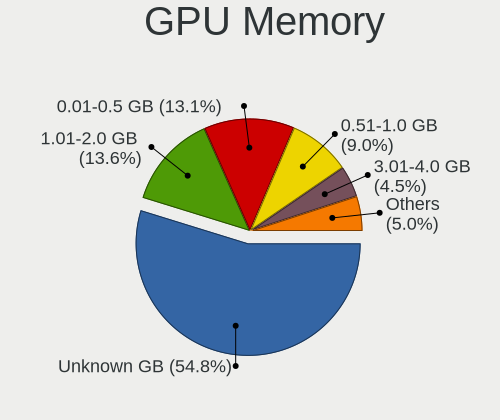

| Size in GB | Computers | Percent |
|------------|-----------|---------|
| Unknown    | 59        | 50.43%  |
| 1.01-2.0   | 20        | 17.09%  |
| 0.01-0.5   | 15        | 12.82%  |
| 0.51-1.0   | 13        | 11.11%  |
| 3.01-4.0   | 5         | 4.27%   |
| 5.01-6.0   | 3         | 2.56%   |
| 7.01-8.0   | 2         | 1.71%   |

Monitor
-------

Monitor Vendor
--------------

Monitor vendors

| Vendor                  | Computers | Percent |
|-------------------------|-----------|---------|
| Samsung Electronics     | 18        | 15.79%  |
| LG Display              | 16        | 14.04%  |
| AU Optronics            | 16        | 14.04%  |
| Chimei Innolux          | 10        | 8.77%   |
| BOE                     | 9         | 7.89%   |
| AOC                     | 6         | 5.26%   |
| Goldstar                | 5         | 4.39%   |
| Philips                 | 4         | 3.51%   |
| Dell                    | 4         | 3.51%   |
| Sharp                   | 3         | 2.63%   |
| Unknown                 | 2         | 1.75%   |
| Sony                    | 2         | 1.75%   |
| LG Philips              | 2         | 1.75%   |
| IBM                     | 2         | 1.75%   |
| Hewlett-Packard         | 2         | 1.75%   |
| Fujitsu Siemens         | 2         | 1.75%   |
| Chi Mei Optoelectronics | 2         | 1.75%   |
| ViewSonic               | 1         | 0.88%   |
| Vestel Elektronik       | 1         | 0.88%   |
| PANDA                   | 1         | 0.88%   |
| NEC Computers           | 1         | 0.88%   |
| MSI                     | 1         | 0.88%   |
| Lenovo                  | 1         | 0.88%   |
| BenQ                    | 1         | 0.88%   |
| Belinea                 | 1         | 0.88%   |
| Ancor Communications    | 1         | 0.88%   |

Monitor Model
-------------

Monitor models

| Model                                                                  | Computers | Percent |
|------------------------------------------------------------------------|-----------|---------|
| Chimei Innolux LCD Monitor CMN15F5 1920x1080 344x193mm 15.5-inch       | 4         | 3.39%   |
| LG Display LCD Monitor LGD0306 1600x900 310x174mm 14.0-inch            | 3         | 2.54%   |
| LG Display LCD Monitor LGD05E4 1920x1080 344x194mm 15.5-inch           | 2         | 1.69%   |
| LG Display LCD Monitor LGD03AB 1366x768 344x194mm 15.5-inch            | 2         | 1.69%   |
| IBM C170 CRT IBM1A51 1280x1024 310x230mm 15.2-inch                     | 2         | 1.69%   |
| Chimei Innolux LCD Monitor CMN15DB 1366x768 344x193mm 15.5-inch        | 2         | 1.69%   |
| AOC 917W AOC1917 1440x900 410x256mm 19.0-inch                          | 2         | 1.69%   |
| ViewSonic VA702 VSC1C1C 1280x1024 338x270mm 17.0-inch                  | 1         | 0.85%   |
| Vestel Elektronik 28W_LCD_TV VES3700 1920x540                          | 1         | 0.85%   |
| Unknown LCD Monitor SAMSUNG 1366x768                                   | 1         | 0.85%   |
| Unknown LCD Monitor Maxdata/XXXXXXX B_101920 1280x1024                 | 1         | 0.85%   |
| Sony TV SNY4D04 1920x1080 1600x900mm 72.3-inch                         | 1         | 0.85%   |
| Sony TV *00 SNY4904 3840x2160 1600x900mm 72.3-inch                     | 1         | 0.85%   |
| Sharp LQ140M1JW49 SHP1523 1920x1080 309x174mm 14.0-inch                | 1         | 0.85%   |
| Sharp LCD Monitor SHP14A2 1920x1080 309x174mm 14.0-inch                | 1         | 0.85%   |
| Sharp LCD Monitor SHP149A 1920x1080 344x194mm 15.5-inch                | 1         | 0.85%   |
| Samsung Electronics SyncMaster SAM0579 1920x1080                       | 1         | 0.85%   |
| Samsung Electronics SyncMaster SAM0564 1360x768 410x230mm 18.5-inch    | 1         | 0.85%   |
| Samsung Electronics SyncMaster SAM03E2 1680x1050 433x271mm 20.1-inch   | 1         | 0.85%   |
| Samsung Electronics SyncMaster SAM01F9 1280x1024 376x301mm 19.0-inch   | 1         | 0.85%   |
| Samsung Electronics SyncMaster SAM0169 1280x1024 376x301mm 19.0-inch   | 1         | 0.85%   |
| Samsung Electronics SAMTRON 50X/V STN0011 1024x768 304x228mm 15.0-inch | 1         | 0.85%   |
| Samsung Electronics S27D590 SAM0B49 1920x1080 598x336mm 27.0-inch      | 1         | 0.85%   |
| Samsung Electronics S24D391 SAM0B87 1920x1080 521x293mm 23.5-inch      | 1         | 0.85%   |
| Samsung Electronics S22D300 SAM0B3F 1920x1080 477x268mm 21.5-inch      | 1         | 0.85%   |
| Samsung Electronics S22B150 SAM08A3 1920x1080 477x268mm 21.5-inch      | 1         | 0.85%   |
| Samsung Electronics LCD Monitor SyncMaster 1680x1050                   | 1         | 0.85%   |
| Samsung Electronics LCD Monitor SEC4E45 1280x800 331x207mm 15.4-inch   | 1         | 0.85%   |
| Samsung Electronics LCD Monitor SEC4149 1366x768 292x174mm 13.4-inch   | 1         | 0.85%   |
| Samsung Electronics LCD Monitor SEC3554 1600x900 382x215mm 17.3-inch   | 1         | 0.85%   |
| Samsung Electronics LCD Monitor SEC3150 1366x768 340x190mm 15.3-inch   | 1         | 0.85%   |
| Samsung Electronics LCD Monitor SEC314F 1600x900 382x215mm 17.3-inch   | 1         | 0.85%   |
| Samsung Electronics LCD Monitor SDC3853 2736x1824 260x173mm 12.3-inch  | 1         | 0.85%   |
| Samsung Electronics LCD Monitor SAM0900 1366x768 410x230mm 18.5-inch   | 1         | 0.85%   |
| Samsung Electronics LCD Monitor SAM0659 1920x1080                      | 1         | 0.85%   |
| Philips PHL 243V5 PHLC0D1 1920x1080 521x293mm 23.5-inch                | 1         | 0.85%   |
| Philips LCD Monitor FTV                                                | 1         | 0.85%   |
| Philips LCD Monitor 170S 3200x1080                                     | 1         | 0.85%   |
| Philips 192EL PHLC04E 1366x768 410x230mm 18.5-inch                     | 1         | 0.85%   |
| Philips 170S PHL0856 1280x1024 338x270mm 17.0-inch                     | 1         | 0.85%   |
| PANDA LCD Monitor NCP0058 1920x1080 344x194mm 15.5-inch                | 1         | 0.85%   |
| NEC Computers LCD1770NX NEC6664 1280x1024 338x270mm 17.0-inch          | 1         | 0.85%   |
| MSI Wind Net MSI7459 1600x900 462x272mm 21.1-inch                      | 1         | 0.85%   |
| LG Philips LCD Monitor LPLA002 1440x900 367x230mm 17.1-inch            | 1         | 0.85%   |
| LG Philips LCD Monitor LPL1E01 1280x800 331x207mm 15.4-inch            | 1         | 0.85%   |
| LG Display LCD Monitor LGD064C 1920x1080 344x194mm 15.5-inch           | 1         | 0.85%   |
| LG Display LCD Monitor LGD051E 3840x2160 309x174mm 14.0-inch           | 1         | 0.85%   |
| LG Display LCD Monitor LGD04B3 1920x1080 345x194mm 15.6-inch           | 1         | 0.85%   |
| LG Display LCD Monitor LGD0414 1920x1080 276x156mm 12.5-inch           | 1         | 0.85%   |
| LG Display LCD Monitor LGD0384 1366x768 344x194mm 15.5-inch            | 1         | 0.85%   |
| LG Display LCD Monitor LGD034C 1366x768 293x165mm 13.2-inch            | 1         | 0.85%   |
| LG Display LCD Monitor LGD02E2 1600x900 310x174mm 14.0-inch            | 1         | 0.85%   |
| LG Display LCD Monitor LGD02E1 1600x900 382x215mm 17.3-inch            | 1         | 0.85%   |
| LG Display LCD Monitor LGD02DC 1366x768 344x194mm 15.5-inch            | 1         | 0.85%   |
| Lenovo LCD Monitor LEN4074 1440x900 287x180mm 13.3-inch                | 1         | 0.85%   |
| Hewlett-Packard E243 HPN3469 1920x1080 527x296mm 23.8-inch             | 1         | 0.85%   |
| Hewlett-Packard ALL-in-One HPN401F 1920x1080 476x268mm 21.5-inch       | 1         | 0.85%   |
| Goldstar ULTRAGEAR GSM5BB1 1920x1080 527x296mm 23.8-inch               | 1         | 0.85%   |
| Goldstar L227W GSM566F 1680x1050 474x296mm 22.0-inch                   | 1         | 0.85%   |
| Goldstar IPS231 GSM5816 1920x1080 510x290mm 23.1-inch                  | 1         | 0.85%   |

Monitor Resolution
------------------

Monitor screen resolution

| Resolution         | Computers | Percent |
|--------------------|-----------|---------|
| 1920x1080 (FHD)    | 44        | 39.64%  |
| 1366x768 (WXGA)    | 21        | 18.92%  |
| 1600x900 (HD+)     | 12        | 10.81%  |
| 1280x1024 (SXGA)   | 10        | 9.01%   |
| 1680x1050 (WSXGA+) | 6         | 5.41%   |
| 3840x2160 (4K)     | 5         | 4.5%    |
| 1440x900 (WXGA+)   | 4         | 3.6%    |
| 1280x800 (WXGA)    | 2         | 1.8%    |
| 3200x1080          | 1         | 0.9%    |
| 2736x1824          | 1         | 0.9%    |
| 2560x1440 (QHD)    | 1         | 0.9%    |
| 1920x1200 (WUXGA)  | 1         | 0.9%    |
| 1360x768           | 1         | 0.9%    |
| 1024x768 (XGA)     | 1         | 0.9%    |
| Unknown            | 1         | 0.9%    |

Monitor Diagonal
----------------

Diagonal size in inches

| Inches  | Computers | Percent |
|---------|-----------|---------|
| 15      | 40        | 34.78%  |
| 17      | 13        | 11.3%   |
| 14      | 8         | 6.96%   |
| Unknown | 8         | 6.96%   |
| 13      | 7         | 6.09%   |
| 21      | 6         | 5.22%   |
| 24      | 5         | 4.35%   |
| 23      | 4         | 3.48%   |
| 19      | 4         | 3.48%   |
| 27      | 3         | 2.61%   |
| 22      | 3         | 2.61%   |
| 18      | 3         | 2.61%   |
| 11      | 3         | 2.61%   |
| 72      | 2         | 1.74%   |
| 12      | 2         | 1.74%   |
| 84      | 1         | 0.87%   |
| 33      | 1         | 0.87%   |
| 31      | 1         | 0.87%   |
| 20      | 1         | 0.87%   |

Monitor Width
-------------

Physical width

| Width in mm | Computers | Percent |
|-------------|-----------|---------|
| 301-350     | 56        | 50%     |
| 401-500     | 15        | 13.39%  |
| 501-600     | 10        | 8.93%   |
| 351-400     | 10        | 8.93%   |
| 201-300     | 8         | 7.14%   |
| Unknown     | 8         | 7.14%   |
| 1501-2000   | 3         | 2.68%   |
| 701-800     | 1         | 0.89%   |
| 601-700     | 1         | 0.89%   |

Aspect Ratio
------------

Proportional relationship between the width and the height

| Ratio   | Computers | Percent |
|---------|-----------|---------|
| 16/9    | 77        | 72.64%  |
| 16/10   | 11        | 10.38%  |
| 5/4     | 7         | 6.6%    |
| Unknown | 6         | 5.66%   |
| 4/3     | 3         | 2.83%   |
| 3/2     | 2         | 1.89%   |

Monitor Area
------------

Area in inch

| Area in inch | Computers | Percent |
|----------------|-----------|---------|
| 101-110        | 37        | 33.04%  |
| 81-90          | 12        | 10.71%  |
| 201-250        | 12        | 10.71%  |
| 151-200        | 8         | 7.14%   |
| Unknown        | 8         | 7.14%   |
| 141-150        | 7         | 6.25%   |
| 121-130        | 6         | 5.36%   |
| More than 1000 | 3         | 2.68%   |
| 71-80          | 3         | 2.68%   |
| 51-60          | 3         | 2.68%   |
| 301-350        | 3         | 2.68%   |
| 61-70          | 2         | 1.79%   |
| 351-500        | 2         | 1.79%   |
| 131-140        | 2         | 1.79%   |
| 111-120        | 2         | 1.79%   |
| 251-300        | 1         | 0.89%   |
| 91-100         | 1         | 0.89%   |

Pixel Density
-------------

Pixels per inch

| Density       | Computers | Percent |
|---------------|-----------|---------|
| 121-160       | 36        | 32.14%  |
| 51-100        | 31        | 27.68%  |
| 101-120       | 30        | 26.79%  |
| Unknown       | 8         | 7.14%   |
| 161-240       | 3         | 2.68%   |
| More than 240 | 2         | 1.79%   |
| 1-50          | 2         | 1.79%   |

Multiple Monitors
-----------------

Total monitors connected

| Total | Computers | Percent |
|-------|-----------|---------|
| 1     | 95        | 83.33%  |
| 2     | 13        | 11.4%   |
| 0     | 4         | 3.51%   |
| 3     | 2         | 1.75%   |

Network
-------

Net Controller Vendor
---------------------

Controller vendors

| Vendor                                 | Computers | Percent |
|----------------------------------------|-----------|---------|
| Realtek Semiconductor                  | 56        | 34.15%  |
| Intel                                  | 35        | 21.34%  |
| Qualcomm Atheros                       | 29        | 17.68%  |
| Broadcom                               | 9         | 5.49%   |
| Ralink Technology                      | 5         | 3.05%   |
| TP-Link                                | 4         | 2.44%   |
| Ralink                                 | 4         | 2.44%   |
| Qualcomm Atheros Communications        | 4         | 2.44%   |
| Nvidia                                 | 4         | 2.44%   |
| Marvell Technology Group               | 4         | 2.44%   |
| Broadcom Limited                       | 3         | 1.83%   |
| Sony Ericsson Mobile Communications AB | 2         | 1.22%   |
| Realtek                                | 1         | 0.61%   |
| ICS Advent                             | 1         | 0.61%   |
| HTC (High Tech Computer)               | 1         | 0.61%   |
| Hewlett-Packard                        | 1         | 0.61%   |
| D-Link                                 | 1         | 0.61%   |

Net Controller Model
--------------------

Controller models

| Model                                                                   | Computers | Percent |
|-------------------------------------------------------------------------|-----------|---------|
| Realtek RTL8111/8168/8411 PCI Express Gigabit Ethernet Controller       | 38        | 19.69%  |
| Intel 82579LM Gigabit Network Connection (Lewisville)                   | 10        | 5.18%   |
| Realtek RTL810xE PCI Express Fast Ethernet controller                   | 8         | 4.15%   |
| Realtek RTL8821CE 802.11ac PCIe Wireless Network Adapter                | 7         | 3.63%   |
| Qualcomm Atheros QCA9377 802.11ac Wireless Network Adapter              | 7         | 3.63%   |
| Intel Centrino Advanced-N 6205 [Taylor Peak]                            | 6         | 3.11%   |
| Ralink MT7601U Wireless Adapter                                         | 5         | 2.59%   |
| Qualcomm Atheros QCA9565 / AR9565 Wireless Network Adapter              | 4         | 2.07%   |
| Qualcomm Atheros AR9271 802.11n                                         | 4         | 2.07%   |
| Realtek RTL8153 Gigabit Ethernet Adapter                                | 3         | 1.55%   |
| Ralink RT3290 Wireless 802.11n 1T/1R PCIe                               | 3         | 1.55%   |
| Qualcomm Atheros AR9485 Wireless Network Adapter                        | 3         | 1.55%   |
| Qualcomm Atheros AR9287 Wireless Network Adapter (PCI-Express)          | 3         | 1.55%   |
| Intel Cannon Point-LP CNVi [Wireless-AC]                                | 3         | 1.55%   |
| Intel 82567LM-3 Gigabit Network Connection                              | 3         | 1.55%   |
| TP-Link TL-WN722N v2/v3 [Realtek RTL8188EUS]                            | 2         | 1.04%   |
| Sony Ericsson Mobile AB D2005                                           | 2         | 1.04%   |
| Realtek RTL8169 PCI Gigabit Ethernet Controller                         | 2         | 1.04%   |
| Qualcomm Atheros QCA6174 802.11ac Wireless Network Adapter              | 2         | 1.04%   |
| Qualcomm Atheros Killer E2400 Gigabit Ethernet Controller               | 2         | 1.04%   |
| Qualcomm Atheros AR9285 Wireless Network Adapter (PCI-Express)          | 2         | 1.04%   |
| Intel Wireless 8260                                                     | 2         | 1.04%   |
| Intel Wireless 7260                                                     | 2         | 1.04%   |
| Intel Wi-Fi 6 AX201                                                     | 2         | 1.04%   |
| Intel Ethernet Connection I219-LM                                       | 2         | 1.04%   |
| Intel Dual Band Wireless-AC 3168NGW [Stone Peak]                        | 2         | 1.04%   |
| Broadcom NetXtreme BCM5754 Gigabit Ethernet PCI Express                 | 2         | 1.04%   |
| Broadcom BCM4313 802.11bgn Wireless Network Adapter                     | 2         | 1.04%   |
| TP-Link UE300 10/100/1000 LAN (ethernet mode) [Realtek RTL8153]         | 1         | 0.52%   |
| TP-Link Archer T2U PLUS [RTL8821AU]                                     | 1         | 0.52%   |
| Realtek RTL8822CE 802.11ac PCIe Wireless Network Adapter                | 1         | 0.52%   |
| Realtek RTL8822BE 802.11a/b/g/n/ac WiFi adapter                         | 1         | 0.52%   |
| Realtek RTL8723DE Wireless Network Adapter                              | 1         | 0.52%   |
| Realtek RTL8723BE PCIe Wireless Network Adapter                         | 1         | 0.52%   |
| Realtek RTL8723AE PCIe Wireless Network Adapter                         | 1         | 0.52%   |
| Realtek RTL8191SEvB Wireless LAN Controller                             | 1         | 0.52%   |
| Realtek RTL8152 Fast Ethernet Adapter                                   | 1         | 0.52%   |
| Realtek RTL-8100/8101L/8139 PCI Fast Ethernet Adapter                   | 1         | 0.52%   |
| Realtek Realtek Network controller                                      | 1         | 0.52%   |
| Realtek 802.11ac NIC                                                    | 1         | 0.52%   |
| Realtek 802.11n NIC                                                     | 1         | 0.52%   |
| Ralink RT2561/RT61 802.11g PCI                                          | 1         | 0.52%   |
| Qualcomm Atheros QCA8172 Fast Ethernet                                  | 1         | 0.52%   |
| Qualcomm Atheros Attansic L2 Fast Ethernet                              | 1         | 0.52%   |
| Qualcomm Atheros AR8162 Fast Ethernet                                   | 1         | 0.52%   |
| Qualcomm Atheros AR8161 Gigabit Ethernet                                | 1         | 0.52%   |
| Qualcomm Atheros AR8152 v2.0 Fast Ethernet                              | 1         | 0.52%   |
| Qualcomm Atheros AR8151 v2.0 Gigabit Ethernet                           | 1         | 0.52%   |
| Qualcomm Atheros AR8131 Gigabit Ethernet                                | 1         | 0.52%   |
| Qualcomm Atheros AR242x / AR542x Wireless Network Adapter (PCI-Express) | 1         | 0.52%   |
| Qualcomm Atheros AR2417 Wireless Network Adapter [AR5007G 802.11bg]     | 1         | 0.52%   |
| Nvidia MCP73 Ethernet                                                   | 1         | 0.52%   |
| Nvidia MCP51 Ethernet Controller                                        | 1         | 0.52%   |
| Nvidia CK8S Ethernet Controller                                         | 1         | 0.52%   |
| Nvidia CK804 Ethernet Controller                                        | 1         | 0.52%   |
| Marvell Group 88W8897 [AVASTAR] 802.11ac Wireless                       | 1         | 0.52%   |
| Marvell Group 88E8072 PCI-E Gigabit Ethernet Controller                 | 1         | 0.52%   |
| Marvell Group 88E8071 PCI-E Gigabit Ethernet Controller                 | 1         | 0.52%   |
| Marvell Group 88E8055 PCI-E Gigabit Ethernet Controller                 | 1         | 0.52%   |
| Intel Wireless 8265 / 8275                                              | 1         | 0.52%   |

Wireless Vendor
---------------

Wireless vendors

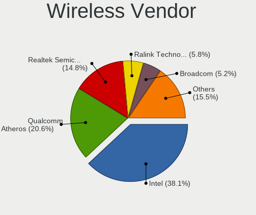

| Vendor                          | Computers | Percent |
|---------------------------------|-----------|---------|
| Intel                           | 26        | 29.21%  |
| Qualcomm Atheros                | 23        | 25.84%  |
| Realtek Semiconductor           | 15        | 16.85%  |
| Broadcom                        | 6         | 6.74%   |
| Ralink Technology               | 5         | 5.62%   |
| Ralink                          | 4         | 4.49%   |
| Qualcomm Atheros Communications | 4         | 4.49%   |
| TP-Link                         | 3         | 3.37%   |
| Realtek                         | 1         | 1.12%   |
| Marvell Technology Group        | 1         | 1.12%   |
| D-Link                          | 1         | 1.12%   |

Wireless Model
--------------

Wireless models

| Model                                                                   | Computers | Percent |
|-------------------------------------------------------------------------|-----------|---------|
| Realtek RTL8821CE 802.11ac PCIe Wireless Network Adapter                | 7         | 7.87%   |
| Qualcomm Atheros QCA9377 802.11ac Wireless Network Adapter              | 7         | 7.87%   |
| Intel Centrino Advanced-N 6205 [Taylor Peak]                            | 6         | 6.74%   |
| Ralink MT7601U Wireless Adapter                                         | 5         | 5.62%   |
| Qualcomm Atheros QCA9565 / AR9565 Wireless Network Adapter              | 4         | 4.49%   |
| Qualcomm Atheros AR9271 802.11n                                         | 4         | 4.49%   |
| Ralink RT3290 Wireless 802.11n 1T/1R PCIe                               | 3         | 3.37%   |
| Qualcomm Atheros AR9485 Wireless Network Adapter                        | 3         | 3.37%   |
| Qualcomm Atheros AR9287 Wireless Network Adapter (PCI-Express)          | 3         | 3.37%   |
| Intel Cannon Point-LP CNVi [Wireless-AC]                                | 3         | 3.37%   |
| TP-Link TL-WN722N v2/v3 [Realtek RTL8188EUS]                            | 2         | 2.25%   |
| Qualcomm Atheros QCA6174 802.11ac Wireless Network Adapter              | 2         | 2.25%   |
| Qualcomm Atheros AR9285 Wireless Network Adapter (PCI-Express)          | 2         | 2.25%   |
| Intel Wireless 8260                                                     | 2         | 2.25%   |
| Intel Wireless 7260                                                     | 2         | 2.25%   |
| Intel Wi-Fi 6 AX201                                                     | 2         | 2.25%   |
| Intel Dual Band Wireless-AC 3168NGW [Stone Peak]                        | 2         | 2.25%   |
| Broadcom BCM4313 802.11bgn Wireless Network Adapter                     | 2         | 2.25%   |
| TP-Link Archer T2U PLUS [RTL8821AU]                                     | 1         | 1.12%   |
| Realtek RTL8822CE 802.11ac PCIe Wireless Network Adapter                | 1         | 1.12%   |
| Realtek RTL8822BE 802.11a/b/g/n/ac WiFi adapter                         | 1         | 1.12%   |
| Realtek RTL8723DE Wireless Network Adapter                              | 1         | 1.12%   |
| Realtek RTL8723BE PCIe Wireless Network Adapter                         | 1         | 1.12%   |
| Realtek RTL8723AE PCIe Wireless Network Adapter                         | 1         | 1.12%   |
| Realtek RTL8191SEvB Wireless LAN Controller                             | 1         | 1.12%   |
| Realtek Realtek Network controller                                      | 1         | 1.12%   |
| Realtek 802.11ac NIC                                                    | 1         | 1.12%   |
| Realtek 802.11n NIC                                                     | 1         | 1.12%   |
| Ralink RT2561/RT61 802.11g PCI                                          | 1         | 1.12%   |
| Qualcomm Atheros AR242x / AR542x Wireless Network Adapter (PCI-Express) | 1         | 1.12%   |
| Qualcomm Atheros AR2417 Wireless Network Adapter [AR5007G 802.11bg]     | 1         | 1.12%   |
| Marvell Group 88W8897 [AVASTAR] 802.11ac Wireless                       | 1         | 1.12%   |
| Intel Wireless 8265 / 8275                                              | 1         | 1.12%   |
| Intel Wi-Fi 6 AX200                                                     | 1         | 1.12%   |
| Intel PRO/Wireless 5100 AGN [Shiloh] Network Connection                 | 1         | 1.12%   |
| Intel PRO/Wireless 4965 AG or AGN [Kedron] Network Connection           | 1         | 1.12%   |
| Intel PRO/Wireless 3945ABG [Golan] Network Connection                   | 1         | 1.12%   |
| Intel Dual Band Wireless-AC 3165 Plus Bluetooth                         | 1         | 1.12%   |
| Intel Comet Lake PCH CNVi WiFi                                          | 1         | 1.12%   |
| Intel Centrino Wireless-N 2230                                          | 1         | 1.12%   |
| Intel Centrino Ultimate-N 6300                                          | 1         | 1.12%   |
| D-Link GO-USB-N150 N Adapter                                            | 1         | 1.12%   |
| Broadcom BCM43228 802.11a/b/g/n                                         | 1         | 1.12%   |
| Broadcom BCM43142 802.11b/g/n                                           | 1         | 1.12%   |
| Broadcom BCM4312 802.11b/g LP-PHY                                       | 1         | 1.12%   |
| Broadcom BCM4311 802.11b/g WLAN                                         | 1         | 1.12%   |

Ethernet Vendor
---------------

Ethernet vendors

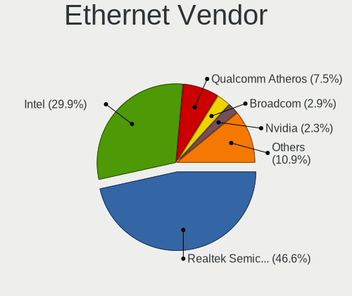

| Vendor                                 | Computers | Percent |
|----------------------------------------|-----------|---------|
| Realtek Semiconductor                  | 52        | 52%     |
| Intel                                  | 21        | 21%     |
| Qualcomm Atheros                       | 9         | 9%      |
| Nvidia                                 | 4         | 4%      |
| Broadcom                               | 4         | 4%      |
| Marvell Technology Group               | 3         | 3%      |
| Broadcom Limited                       | 3         | 3%      |
| Sony Ericsson Mobile Communications AB | 2         | 2%      |
| TP-Link                                | 1         | 1%      |
| ICS Advent                             | 1         | 1%      |

Ethernet Model
--------------

Ethernet models

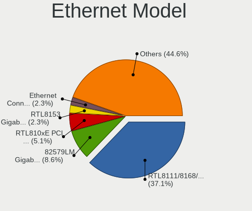

| Model                                                             | Computers | Percent |
|-------------------------------------------------------------------|-----------|---------|
| Realtek RTL8111/8168/8411 PCI Express Gigabit Ethernet Controller | 38        | 37.62%  |
| Intel 82579LM Gigabit Network Connection (Lewisville)             | 10        | 9.9%    |
| Realtek RTL810xE PCI Express Fast Ethernet controller             | 8         | 7.92%   |
| Realtek RTL8153 Gigabit Ethernet Adapter                          | 3         | 2.97%   |
| Intel 82567LM-3 Gigabit Network Connection                        | 3         | 2.97%   |
| Sony Ericsson Mobile AB D2005                                     | 2         | 1.98%   |
| Realtek RTL8169 PCI Gigabit Ethernet Controller                   | 2         | 1.98%   |
| Qualcomm Atheros Killer E2400 Gigabit Ethernet Controller         | 2         | 1.98%   |
| Intel Ethernet Connection I219-LM                                 | 2         | 1.98%   |
| Broadcom NetXtreme BCM5754 Gigabit Ethernet PCI Express           | 2         | 1.98%   |
| TP-Link UE300 10/100/1000 LAN (ethernet mode) [Realtek RTL8153]   | 1         | 0.99%   |
| Realtek RTL8152 Fast Ethernet Adapter                             | 1         | 0.99%   |
| Realtek RTL-8100/8101L/8139 PCI Fast Ethernet Adapter             | 1         | 0.99%   |
| Qualcomm Atheros QCA8172 Fast Ethernet                            | 1         | 0.99%   |
| Qualcomm Atheros Attansic L2 Fast Ethernet                        | 1         | 0.99%   |
| Qualcomm Atheros AR8162 Fast Ethernet                             | 1         | 0.99%   |
| Qualcomm Atheros AR8161 Gigabit Ethernet                          | 1         | 0.99%   |
| Qualcomm Atheros AR8152 v2.0 Fast Ethernet                        | 1         | 0.99%   |
| Qualcomm Atheros AR8151 v2.0 Gigabit Ethernet                     | 1         | 0.99%   |
| Qualcomm Atheros AR8131 Gigabit Ethernet                          | 1         | 0.99%   |
| Nvidia MCP73 Ethernet                                             | 1         | 0.99%   |
| Nvidia MCP51 Ethernet Controller                                  | 1         | 0.99%   |
| Nvidia CK8S Ethernet Controller                                   | 1         | 0.99%   |
| Nvidia CK804 Ethernet Controller                                  | 1         | 0.99%   |
| Marvell Group 88E8072 PCI-E Gigabit Ethernet Controller           | 1         | 0.99%   |
| Marvell Group 88E8071 PCI-E Gigabit Ethernet Controller           | 1         | 0.99%   |
| Marvell Group 88E8055 PCI-E Gigabit Ethernet Controller           | 1         | 0.99%   |
| Intel I211 Gigabit Network Connection                             | 1         | 0.99%   |
| Intel Ethernet Connection I218-LM                                 | 1         | 0.99%   |
| Intel Ethernet Connection (2) I218-V                              | 1         | 0.99%   |
| Intel 82567LM Gigabit Network Connection                          | 1         | 0.99%   |
| Intel 82566DM Gigabit Network Connection                          | 1         | 0.99%   |
| Intel 82562GT 10/100 Network Connection                           | 1         | 0.99%   |
| ICS Advent DM9601 Fast Ethernet Adapter                           | 1         | 0.99%   |
| Broadcom NetLink BCM57785 Gigabit Ethernet PCIe                   | 1         | 0.99%   |
| Broadcom NetLink BCM57780 Gigabit Ethernet PCIe                   | 1         | 0.99%   |
| Broadcom Limited NetXtreme BCM5755 Gigabit Ethernet PCI Express   | 1         | 0.99%   |
| Broadcom Limited NetXtreme BCM5722 Gigabit Ethernet PCI Express   | 1         | 0.99%   |
| Broadcom Limited NetLink BCM57781 Gigabit Ethernet PCIe           | 1         | 0.99%   |

Net Controller Kind
-------------------

Ethernet, WiFi or modem

| Kind     | Computers | Percent |
|----------|-----------|---------|
| Ethernet | 98        | 52.97%  |
| WiFi     | 84        | 45.41%  |
| Modem    | 3         | 1.62%   |

Used Controller
---------------

Currently used network controller

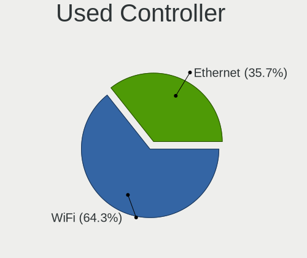

| Kind     | Computers | Percent |
|----------|-----------|---------|
| WiFi     | 72        | 61.02%  |
| Ethernet | 45        | 38.14%  |
| Modem    | 1         | 0.85%   |

NICs
----

Total network controllers on board

| Total | Computers | Percent |
|-------|-----------|---------|
| 2     | 59        | 51.3%   |
| 1     | 50        | 43.48%  |
| 0     | 6         | 5.22%   |

IPv6
----

IPv6 vs IPv4

| Used | Computers | Percent |
|------|-----------|---------|
| No   | 111       | 97.37%  |
| Yes  | 3         | 2.63%   |

Bluetooth
---------

Bluetooth Vendor
----------------

Controller vendors

| Vendor                          | Computers | Percent |
|---------------------------------|-----------|---------|
| Intel                           | 13        | 22.41%  |
| Qualcomm Atheros Communications | 10        | 17.24%  |
| IMC Networks                    | 7         | 12.07%  |
| Realtek Semiconductor           | 6         | 10.34%  |
| Broadcom                        | 5         | 8.62%   |
| Lite-On Technology              | 4         | 6.9%    |
| Ralink                          | 3         | 5.17%   |
| Hewlett-Packard                 | 2         | 3.45%   |
| Cambridge Silicon Radio         | 2         | 3.45%   |
| Toshiba                         | 1         | 1.72%   |
| Realtek                         | 1         | 1.72%   |
| Marvell Semiconductor           | 1         | 1.72%   |
| Integrated System Solution      | 1         | 1.72%   |
| Foxconn / Hon Hai               | 1         | 1.72%   |
| Alps Electric                   | 1         | 1.72%   |

Bluetooth Model
---------------

Controller models

| Model                                               | Computers | Percent |
|-----------------------------------------------------|-----------|---------|
| Qualcomm Atheros  Bluetooth Device                  | 5         | 8.62%   |
| Intel Bluetooth wireless interface                  | 4         | 6.9%    |
| IMC Networks Bluetooth Radio                        | 4         | 6.9%    |
| Realtek Bluetooth Radio                             | 3         | 5.17%   |
| Ralink RT3290 Bluetooth                             | 3         | 5.17%   |
| Lite-On Qualcomm Atheros QCA9377 Bluetooth          | 3         | 5.17%   |
| Intel Bluetooth Device                              | 3         | 5.17%   |
| Realtek  Bluetooth 4.2 Adapter                      | 2         | 3.45%   |
| Qualcomm Atheros QCA61x4 Bluetooth 4.0              | 2         | 3.45%   |
| Qualcomm Atheros AR3011 Bluetooth                   | 2         | 3.45%   |
| Intel Wireless-AC 3168 Bluetooth                    | 2         | 3.45%   |
| Intel Bluetooth 9460/9560 Jefferson Peak (JfP)      | 2         | 3.45%   |
| IMC Networks Bluetooth Device                       | 2         | 3.45%   |
| HP Bluetooth 2.0 Interface [Broadcom BCM2045]       | 2         | 3.45%   |
| Cambridge Silicon Radio Bluetooth Dongle (HCI mode) | 2         | 3.45%   |
| Toshiba RT Bluetooth Radio                          | 1         | 1.72%   |
| Realtek RTL8822BE Bluetooth 4.2 Adapter             | 1         | 1.72%   |
| Realtek Bluetooth Radio                             | 1         | 1.72%   |
| Qualcomm Atheros Bluetooth USB Host Controller      | 1         | 1.72%   |
| Marvell Bluetooth and Wireless LAN Composite        | 1         | 1.72%   |
| Lite-On Atheros AR3012 Bluetooth                    | 1         | 1.72%   |
| Intel Centrino Bluetooth Wireless Transceiver       | 1         | 1.72%   |
| Intel AX200 Bluetooth                               | 1         | 1.72%   |
| Integrated System Solution Bluetooth Device         | 1         | 1.72%   |
| IMC Networks Atheros AR3012 Bluetooth 4.0 Adapter   | 1         | 1.72%   |
| Foxconn / Hon Hai Broadcom Bluetooth 2.1 Device     | 1         | 1.72%   |
| Broadcom HP Portable Valentine                      | 1         | 1.72%   |
| Broadcom HP Portable SoftSailing                    | 1         | 1.72%   |
| Broadcom BCM92046DG-CL1ROM Bluetooth 2.1 UHE Dongle | 1         | 1.72%   |
| Broadcom BCM20702 Bluetooth 4.0 [ThinkPad]          | 1         | 1.72%   |
| Broadcom BCM2045B (BDC-2.1)                         | 1         | 1.72%   |
| Alps Electric Bluetooth Controller (ALPS/UGPZ6)     | 1         | 1.72%   |

Sound
-----

Sound Vendor
------------

Sound card vendors

| Vendor              | Computers | Percent |
|---------------------|-----------|---------|
| Intel               | 87        | 58.78%  |
| AMD                 | 32        | 21.62%  |
| Nvidia              | 21        | 14.19%  |
| Logitech            | 3         | 2.03%   |
| VIA Technologies    | 1         | 0.68%   |
| Texas Instruments   | 1         | 0.68%   |
| JMTek               | 1         | 0.68%   |
| Creative Labs       | 1         | 0.68%   |
| C-Media Electronics | 1         | 0.68%   |

Sound Model
-----------

Sound card models

| Model                                                                                             | Computers | Percent |
|---------------------------------------------------------------------------------------------------|-----------|---------|
| Intel 6 Series/C200 Series Chipset Family High Definition Audio Controller                        | 15        | 8.88%   |
| Intel Sunrise Point-LP HD Audio                                                                   | 10        | 5.92%   |
| Intel 7 Series/C216 Chipset Family High Definition Audio Controller                               | 10        | 5.92%   |
| Intel Cannon Point-LP High Definition Audio Controller                                            | 6         | 3.55%   |
| AMD Family 17h/19h HD Audio Controller                                                            | 6         | 3.55%   |
| Intel NM10/ICH7 Family High Definition Audio Controller                                           | 5         | 2.96%   |
| Intel Cannon Lake PCH cAVS                                                                        | 5         | 2.96%   |
| Intel 82801H (ICH8 Family) HD Audio Controller                                                    | 5         | 2.96%   |
| AMD Raven/Raven2/Fenghuang HDMI/DP Audio Controller                                               | 5         | 2.96%   |
| AMD FCH Azalia Controller                                                                         | 5         | 2.96%   |
| Intel 8 Series/C220 Series Chipset High Definition Audio Controller                               | 4         | 2.37%   |
| Nvidia TU116 High Definition Audio Controller                                                     | 3         | 1.78%   |
| Intel Xeon E3-1200 v3/4th Gen Core Processor HD Audio Controller                                  | 3         | 1.78%   |
| Intel Tiger Lake-LP Smart Sound Technology Audio Controller                                       | 3         | 1.78%   |
| Intel Haswell-ULT HD Audio Controller                                                             | 3         | 1.78%   |
| Intel 82801JD/DO (ICH10 Family) HD Audio Controller                                               | 3         | 1.78%   |
| Intel 82801I (ICH9 Family) HD Audio Controller                                                    | 3         | 1.78%   |
| Intel 8 Series HD Audio Controller                                                                | 3         | 1.78%   |
| AMD RV710/730 HDMI Audio [Radeon HD 4000 series]                                                  | 3         | 1.78%   |
| Nvidia High Definition Audio Controller                                                           | 2         | 1.18%   |
| Intel Atom/Celeron/Pentium Processor x5-E8000/J3xxx/N3xxx Series High Definition Audio Controller | 2         | 1.18%   |
| Intel 9 Series Chipset Family HD Audio Controller                                                 | 2         | 1.18%   |
| Intel 100 Series/C230 Series Chipset Family HD Audio Controller                                   | 2         | 1.18%   |
| AMD Wrestler HDMI Audio                                                                           | 2         | 1.18%   |
| AMD Turks HDMI Audio [Radeon HD 6500/6600 / 6700M Series]                                         | 2         | 1.18%   |
| AMD SBx00 Azalia (Intel HDA)                                                                      | 2         | 1.18%   |
| AMD Redwood HDMI Audio [Radeon HD 5000 Series]                                                    | 2         | 1.18%   |
| AMD Oland/Hainan/Cape Verde/Pitcairn HDMI Audio [Radeon HD 7000 Series]                           | 2         | 1.18%   |
| AMD Kabini HDMI/DP Audio                                                                          | 2         | 1.18%   |
| AMD Family 15h (Models 60h-6fh) Audio Controller                                                  | 2         | 1.18%   |
| AMD Cedar HDMI Audio [Radeon HD 5400/6300/7300 Series]                                            | 2         | 1.18%   |
| AMD Caicos HDMI Audio [Radeon HD 6450 / 7450/8450/8490 OEM / R5 230/235/235X OEM]                 | 2         | 1.18%   |
| VIA Technologies ICE1712 [Envy24] PCI Multi-Channel I/O Controller                                | 1         | 0.59%   |
| Texas Instruments PCM2902C Audio CODEC                                                            | 1         | 0.59%   |
| Nvidia TU106 High Definition Audio Controller                                                     | 1         | 0.59%   |
| Nvidia TU104 HD Audio Controller                                                                  | 1         | 0.59%   |
| Nvidia nForce3 250Gb AC'97 Audio Controller                                                       | 1         | 0.59%   |
| Nvidia MCP79 High Definition Audio                                                                | 1         | 0.59%   |
| Nvidia MCP73 High Definition Audio                                                                | 1         | 0.59%   |
| Nvidia MCP61 High Definition Audio                                                                | 1         | 0.59%   |
| Nvidia MCP51 High Definition Audio                                                                | 1         | 0.59%   |
| Nvidia GT216 HDMI Audio Controller                                                                | 1         | 0.59%   |
| Nvidia GP107GL High Definition Audio Controller                                                   | 1         | 0.59%   |
| Nvidia GP106 High Definition Audio Controller                                                     | 1         | 0.59%   |
| Nvidia GM107 High Definition Audio Controller [GeForce 940MX]                                     | 1         | 0.59%   |
| Nvidia GK208 HDMI/DP Audio Controller                                                             | 1         | 0.59%   |
| Nvidia GF116 High Definition Audio Controller                                                     | 1         | 0.59%   |
| Nvidia GF108 High Definition Audio Controller                                                     | 1         | 0.59%   |
| Nvidia GF106 High Definition Audio Controller                                                     | 1         | 0.59%   |
| Nvidia Audio device                                                                               | 1         | 0.59%   |
| Logitech USB Headset                                                                              | 1         | 0.59%   |
| Logitech ClearChat Pro USB                                                                        | 1         | 0.59%   |
| Logitech 960 Headset                                                                              | 1         | 0.59%   |
| JMTek USB PnP Audio Device                                                                        | 1         | 0.59%   |
| Intel USB PnP Sound Device                                                                        | 1         | 0.59%   |
| Intel Ice Lake-LP Smart Sound Technology Audio Controller                                         | 1         | 0.59%   |
| Intel Comet Lake PCH cAVS                                                                         | 1         | 0.59%   |
| Intel Celeron N3350/Pentium N4200/Atom E3900 Series Audio Cluster                                 | 1         | 0.59%   |
| Intel Atom Processor Z36xxx/Z37xxx Series High Definition Audio Controller                        | 1         | 0.59%   |
| Intel 82801JI (ICH10 Family) HD Audio Controller                                                  | 1         | 0.59%   |

Memory
------

Memory Vendor
-------------

Memory module vendors

| Vendor              | Computers | Percent |
|---------------------|-----------|---------|
| SK hynix            | 13        | 28.26%  |
| Kingston            | 10        | 21.74%  |
| Micron Technology   | 8         | 17.39%  |
| Unknown             | 4         | 8.7%    |
| Samsung Electronics | 4         | 8.7%    |
| A-DATA Technology   | 3         | 6.52%   |
| Crucial             | 2         | 4.35%   |
| Corsair             | 2         | 4.35%   |

Memory Model
------------

Memory module models

| Model                                                                   | Computers | Percent |
|-------------------------------------------------------------------------|-----------|---------|
| SK hynix RAM HMT351S6CFR8C-PB 4GB SODIMM DDR3 1600MT/s                  | 2         | 3.77%   |
| Kingston RAM KHX1600C10D3/8G 8GB DIMM DDR3 1600MT/s                     | 2         | 3.77%   |
| Kingston RAM 99U5471-054.A00LF 8GB DIMM DDR3 1600MT/s                   | 2         | 3.77%   |
| Unknown RAM Module 2GB DIMM DDR2 800MT/s                                | 1         | 1.89%   |
| Unknown RAM Module 2048MB DIMM DDR2 333MT/s                             | 1         | 1.89%   |
| Unknown RAM Module 2048MB DIMM 1066MT/s                                 | 1         | 1.89%   |
| Unknown RAM Module 1GB DIMM DDR2 800MT/s                                | 1         | 1.89%   |
| Unknown RAM Module 1024MB DIMM DDR 800MT/s                              | 1         | 1.89%   |
| SK hynix RAM HYMP125S64CP8-S6 2GB DIMM SDRAM 2048MT/s                   | 1         | 1.89%   |
| SK hynix RAM HYMP112S64CP6-S6 1GB DIMM SDRAM 2048MT/s                   | 1         | 1.89%   |
| SK hynix RAM HMT451S6AFR8A-PB 4GB SODIMM DDR3 1600MT/s                  | 1         | 1.89%   |
| SK hynix RAM HMT351U6EFR8C-PB 4GB DIMM DDR3 1800MT/s                    | 1         | 1.89%   |
| SK hynix RAM HMT351U6CFR8C 4GB DIMM DDR3 1333MT/s                       | 1         | 1.89%   |
| SK hynix RAM HMT351S6EFR8C-PB 4GB SODIMM DDR3 1600MT/s                  | 1         | 1.89%   |
| SK hynix RAM HMT351S6EFR8A-PB 4096MB SODIMM DDR3 1600MT/s               | 1         | 1.89%   |
| SK hynix RAM HMT325S6CFR8C-PB 2048MB SODIMM DDR3 1600MT/s               | 1         | 1.89%   |
| SK hynix RAM HMT112U6TFR8C-H9 1024MB DIMM DDR3 1333MT/s                 | 1         | 1.89%   |
| SK hynix RAM HMA851S6CJR6N-VK 4GB Row Of Chips DDR4 2667MT/s            | 1         | 1.89%   |
| SK hynix RAM HMA851S6AFR6N-UH 4GB SODIMM DDR4 2667MT/s                  | 1         | 1.89%   |
| SK hynix RAM HMA81GS6CJR8N-XN 8GB SODIMM DDR4 3200MT/s                  | 1         | 1.89%   |
| SK hynix RAM HMA81GS6CJR8N-VK 8GB SODIMM DDR4 2667MT/s                  | 1         | 1.89%   |
| SK hynix RAM H9CCNNNBJTALAR-NVD 4GB Row Of Chips LPDDR3 2133MT/s        | 1         | 1.89%   |
| Samsung RAM Module 16384MB SODIMM DDR4 3200MT/s                         | 1         | 1.89%   |
| Samsung RAM M471B5273CH0-CH9 4GB SODIMM DDR3 1334MT/s                   | 1         | 1.89%   |
| Samsung RAM M471A5244CB0-CTD 4GB SODIMM DDR4 3266MT/s                   | 1         | 1.89%   |
| Samsung RAM M471A1G44AB0-CWE 8192MB SODIMM DDR4 3200MT/s                | 1         | 1.89%   |
| Micron RAM MT52L512M32D2PF-09 4096MB Row Of Chips LPDDR3 2133MT/s       | 1         | 1.89%   |
| Micron RAM 8KTF51264HZ-1G6E1 4096MB SODIMM DDR3 1600MT/s                | 1         | 1.89%   |
| Micron RAM 8JTF51264HZ-1G6D 1 4GB SODIMM DDR3 1600MT/s                  | 1         | 1.89%   |
| Micron RAM 4ATF51264HZ-2G3B1 4GB SODIMM DDR4 2400MT/s                   | 1         | 1.89%   |
| Micron RAM 16KTF51264HZ-1G6M1 4GB SODIMM DDR3 1600MT/s                  | 1         | 1.89%   |
| Micron RAM 16KTF51264HZ-1G4M1 4096MB SODIMM DDR3 1333MT/s               | 1         | 1.89%   |
| Micron RAM 16JSF25664HY-1G1D1 2GB SODIMM DDR3 1066MT/s                  | 1         | 1.89%   |
| Micron RAM 16HTF25664AY-800G1 2GB DIMM DDR2 800MT/s                     | 1         | 1.89%   |
| Micron RAM 16ATF1G64HZ-2G1B1 8192MB SODIMM DDR4 2133MT/s                | 1         | 1.89%   |
| Kingston RAM KKN2NM-MIE 4GB SODIMM DDR4 2667MT/s                        | 1         | 1.89%   |
| Kingston RAM KHX3200C16D4/8GX 8192MB DIMM DDR4 3533MT/s                 | 1         | 1.89%   |
| Kingston RAM KHX2400C15/8G 8GB DIMM DDR4 2933MT/s                       | 1         | 1.89%   |
| Kingston RAM KHX1600C10D3/4G 4GB DIMM DDR3 1866MT/s                     | 1         | 1.89%   |
| Kingston RAM HP16D3LS1KBG/4G 4096MB SODIMM DDR3 1600MT/s                | 1         | 1.89%   |
| Kingston RAM 99U5584-009.A00LF 4GB DIMM DDR3 1600MT/s                   | 1         | 1.89%   |
| Kingston RAM 99U5584-007.A 4GB DIMM DDR3 1333MT/s                       | 1         | 1.89%   |
| Kingston RAM 393955353432392D3030372E4130304C4600 2GB DIMM DDR2 800MT/s | 1         | 1.89%   |
| Crucial RAM CT51264BF160BJ.M8F 4GB SODIMM DDR3 1600MT/s                 | 1         | 1.89%   |
| Crucial RAM CT16G4SFD8266.M16FE 16GB SODIMM DDR4 2667MT/s               | 1         | 1.89%   |
| Corsair RAM CMSX4GX3M1A1600C9 4GB SODIMM DDR3 1600MT/s                  | 1         | 1.89%   |
| Corsair RAM CMK16GX4M2B2800C14 8GB DIMM DDR4 2800MT/s                   | 1         | 1.89%   |
| A-DATA RAM AO1P24HC8T1-BQXS 8GB SODIMM DDR4 2400MT/s                    | 1         | 1.89%   |
| A-DATA RAM AO1P24HC8T1-BPGS 8GB SODIMM DDR4 2400MT/s                    | 1         | 1.89%   |
| A-DATA RAM AM1U16BC4P2-B19H 4096MB SODIMM DDR3 1600MT/s                 | 1         | 1.89%   |

Memory Kind
-----------

Memory module kinds

| Kind    | Computers | Percent |
|---------|-----------|---------|
| DDR3    | 18        | 42.86%  |
| DDR4    | 14        | 33.33%  |
| DDR2    | 4         | 9.52%   |
| LPDDR3  | 2         | 4.76%   |
| SDRAM   | 1         | 2.38%   |
| LPDDR4  | 1         | 2.38%   |
| DDR     | 1         | 2.38%   |
| Unknown | 1         | 2.38%   |

Memory Form Factor
------------------

Physical design of the memory module

| Name         | Computers | Percent |
|--------------|-----------|---------|
| SODIMM       | 22        | 53.66%  |
| DIMM         | 16        | 39.02%  |
| Row Of Chips | 3         | 7.32%   |

Memory Size
-----------

Memory module size

| Size  | Computers | Percent |
|-------|-----------|---------|
| 4096  | 20        | 42.55%  |
| 8192  | 13        | 27.66%  |
| 2048  | 8         | 17.02%  |
| 1024  | 4         | 8.51%   |
| 16384 | 2         | 4.26%   |

Memory Speed
------------

Memory module speed

| Speed | Computers | Percent |
|-------|-----------|---------|
| 1600  | 12        | 26.09%  |
| 2667  | 5         | 10.87%  |
| 800   | 4         | 8.7%    |
| 3200  | 3         | 6.52%   |
| 2400  | 3         | 6.52%   |
| 2133  | 3         | 6.52%   |
| 1333  | 3         | 6.52%   |
| 1867  | 2         | 4.35%   |
| 1066  | 2         | 4.35%   |
| 3533  | 1         | 2.17%   |
| 3266  | 1         | 2.17%   |
| 2933  | 1         | 2.17%   |
| 2800  | 1         | 2.17%   |
| 2048  | 1         | 2.17%   |
| 1866  | 1         | 2.17%   |
| 1800  | 1         | 2.17%   |
| 1334  | 1         | 2.17%   |
| 333   | 1         | 2.17%   |

Printers & scanners
-------------------

Printer Vendor
--------------

Printer device vendors

| Vendor                | Computers | Percent |
|-----------------------|-----------|---------|
| Hewlett-Packard       | 2         | 66.67%  |
| Lexmark International | 1         | 33.33%  |

Printer Model
-------------

Printer device models

| Model                                      | Computers | Percent |
|--------------------------------------------|-----------|---------|
| Lexmark International InkJet Color Printer | 1         | 33.33%  |
| HP LaserJet 1000                           | 1         | 33.33%  |
| HP DeskJet F2100 Printer series            | 1         | 33.33%  |

Scanner Vendor
--------------

Scanner device vendors

Zero info for selected period =(

Scanner Model
-------------

Scanner device models

Zero info for selected period =(

Camera
------

Camera Vendor
-------------

Camera device vendors

| Vendor                                 | Computers | Percent |
|----------------------------------------|-----------|---------|
| Chicony Electronics                    | 17        | 24.64%  |
| Realtek Semiconductor                  | 9         | 13.04%  |
| IMC Networks                           | 7         | 10.14%  |
| Logitech                               | 5         | 7.25%   |
| Acer                                   | 5         | 7.25%   |
| Sunplus Innovation Technology          | 4         | 5.8%    |
| Suyin                                  | 3         | 4.35%   |
| Quanta                                 | 3         | 4.35%   |
| Microdia                               | 3         | 4.35%   |
| Cheng Uei Precision Industry (Foxlink) | 3         | 4.35%   |
| Syntek                                 | 2         | 2.9%    |
| Lite-On Technology                     | 2         | 2.9%    |
| Ricoh                                  | 1         | 1.45%   |
| Luxvisions Innotech Limited            | 1         | 1.45%   |
| Lenovo                                 | 1         | 1.45%   |
| Guillemot                              | 1         | 1.45%   |
| Apple                                  | 1         | 1.45%   |
| ALi                                    | 1         | 1.45%   |

Camera Model
------------

Camera device models

| Model                                                          | Computers | Percent |
|----------------------------------------------------------------|-----------|---------|
| IMC Networks USB2.0 VGA UVC WebCam                             | 4         | 5.8%    |
| Microdia Integrated_Webcam_HD                                  | 3         | 4.35%   |
| Suyin 1.3M WebCam (notebook emachines E730, Acer sub-brand)    | 2         | 2.9%    |
| Realtek Integrated_Webcam_HD                                   | 2         | 2.9%    |
| Realtek HD WebCam                                              | 2         | 2.9%    |
| Chicony integrated camera                                      | 2         | 2.9%    |
| Chicony HP Truevision HD                                       | 2         | 2.9%    |
| Acer EasyCamera                                                | 2         | 2.9%    |
| Syntek Lenovo EasyCamera                                       | 1         | 1.45%   |
| Syntek Integrated Camera                                       | 1         | 1.45%   |
| Suyin HP Truevision HD                                         | 1         | 1.45%   |
| Sunplus Laptop_Integrated_Webcam_HD                            | 1         | 1.45%   |
| Sunplus HP Universal Camera                                    | 1         | 1.45%   |
| Sunplus HP HD Webcam [Fixed]                                   | 1         | 1.45%   |
| Sunplus HD WebCam                                              | 1         | 1.45%   |
| Ricoh Visual Communication Camera VGP-VCC6 [R5U870]            | 1         | 1.45%   |
| Realtek VGA WebCam                                             | 1         | 1.45%   |
| Realtek USB Camera                                             | 1         | 1.45%   |
| Realtek Laptop_Integrated_Webcam_HD                            | 1         | 1.45%   |
| Realtek Integrated Webcam HD                                   | 1         | 1.45%   |
| Realtek HP Wide Vision FHD Camera                              | 1         | 1.45%   |
| Quanta HP Wide Vision HD Camera                                | 1         | 1.45%   |
| Quanta HP Webcam                                               | 1         | 1.45%   |
| Quanta HP TrueVision HD Camera                                 | 1         | 1.45%   |
| Luxvisions Innotech Limited HP HD Camera                       | 1         | 1.45%   |
| Logitech Webcam C270                                           | 1         | 1.45%   |
| Logitech Webcam C210                                           | 1         | 1.45%   |
| Logitech Webcam C170                                           | 1         | 1.45%   |
| Logitech QuickCam Vision Pro                                   | 1         | 1.45%   |
| Logitech HD Webcam C510                                        | 1         | 1.45%   |
| Lite-On HP Wide Vision HD Camera                               | 1         | 1.45%   |
| Lite-On HP HD Webcam                                           | 1         | 1.45%   |
| Lenovo UVC Camera                                              | 1         | 1.45%   |
| IMC Networks USB2.0 HD UVC WebCam                              | 1         | 1.45%   |
| IMC Networks USB2.0 HD IR UVC WebCam                           | 1         | 1.45%   |
| IMC Networks ov9734_azurewave_camera                           | 1         | 1.45%   |
| Guillemot Hercules HD Twist                                    | 1         | 1.45%   |
| Chicony UVC 1.00 device HD UVC WebCam                          | 1         | 1.45%   |
| Chicony USB2.0 VGA UVC WebCam                                  | 1         | 1.45%   |
| Chicony TOSHIBA Web Camera - HD                                | 1         | 1.45%   |
| Chicony thinkpad t430s camera                                  | 1         | 1.45%   |
| Chicony Lenovo EasyCamera                                      | 1         | 1.45%   |
| Chicony Integrated HP HD Webcam                                | 1         | 1.45%   |
| Chicony Integrated Camera (1280x720@30)                        | 1         | 1.45%   |
| Chicony HP Truevision HD camera                                | 1         | 1.45%   |
| Chicony HP HD Webcam                                           | 1         | 1.45%   |
| Chicony HP HD Camera                                           | 1         | 1.45%   |
| Chicony HD WebCam                                              | 1         | 1.45%   |
| Chicony EasyCamera                                             | 1         | 1.45%   |
| Chicony CNF8243 Webcam                                         | 1         | 1.45%   |
| Cheng Uei Precision Industry (Foxlink) HP Webcam               | 1         | 1.45%   |
| Cheng Uei Precision Industry (Foxlink) HP TrueVision HD Camera | 1         | 1.45%   |
| Cheng Uei Precision Industry (Foxlink) HP HD Webcam            | 1         | 1.45%   |
| Apple iPhone 5/5C/5S/6/SE                                      | 1         | 1.45%   |
| ALi Gateway Webcam                                             | 1         | 1.45%   |
| Acer Orbicam                                                   | 1         | 1.45%   |
| Acer Integrated Camera                                         | 1         | 1.45%   |
| Acer BisonCam, NB Pro                                          | 1         | 1.45%   |

Security
--------

Fingerprint Vendor
------------------

Fingerprint sensor vendors

| Vendor                     | Computers | Percent |
|----------------------------|-----------|---------|
| Validity Sensors           | 8         | 53.33%  |
| Synaptics                  | 3         | 20%     |
| Shenzhen Goodix Technology | 2         | 13.33%  |
| LighTuning Technology      | 1         | 6.67%   |
| AuthenTec                  | 1         | 6.67%   |

Fingerprint Model
-----------------

Fingerprint sensor models

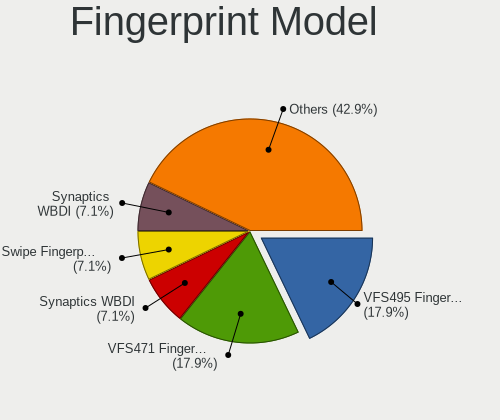

| Model                                      | Computers | Percent |
|--------------------------------------------|-----------|---------|
| Validity Sensors VFS495 Fingerprint Reader | 3         | 20%     |
| Validity Sensors VFS471 Fingerprint Reader | 3         | 20%     |
| Unknown                                    | 3         | 20%     |
| Shenzhen Goodix  FingerPrint Device        | 2         | 13.33%  |
| Validity Sensors Synaptics WBDI            | 1         | 6.67%   |
| Validity Sensors Swipe Fingerprint Sensor  | 1         | 6.67%   |
| LighTuning Fingerprint Reader              | 1         | 6.67%   |
| AuthenTec AES2810                          | 1         | 6.67%   |

Chipcard Vendor
---------------

Chipcard module vendors

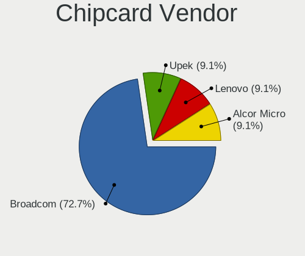

| Vendor      | Computers | Percent |
|-------------|-----------|---------|
| Broadcom    | 2         | 50%     |
| Upek        | 1         | 25%     |
| Alcor Micro | 1         | 25%     |

Chipcard Model
--------------

Chipcard module models

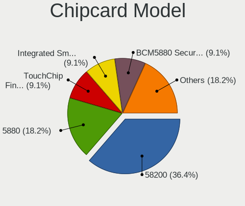

| Model                                                      | Computers | Percent |
|------------------------------------------------------------|-----------|---------|
| Upek TouchChip Fingerprint Coprocessor (WBF advanced mode) | 1         | 25%     |
| Broadcom 5880                                              | 1         | 25%     |
| Broadcom 58200                                             | 1         | 25%     |
| Alcor Micro AU9540 Smartcard Reader                        | 1         | 25%     |

Unsupported
-----------

Unsupported Devices
-------------------

Total unsupported devices on board

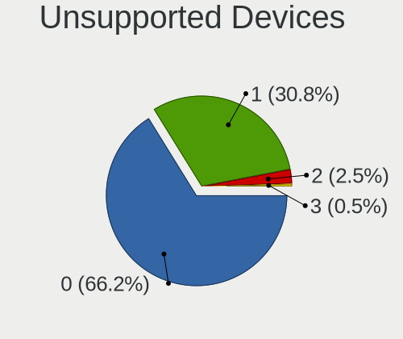

| Total | Computers | Percent |
|-------|-----------|---------|
| 0     | 81        | 69.83%  |
| 1     | 31        | 26.72%  |
| 2     | 3         | 2.59%   |
| 3     | 1         | 0.86%   |

Unsupported Device Types
------------------------

Types of unsupported devices

| Type                  | Computers | Percent |
|-----------------------|-----------|---------|
| Fingerprint reader    | 15        | 39.47%  |
| Graphics card         | 9         | 23.68%  |
| Net/wireless          | 4         | 10.53%  |
| Chipcard              | 4         | 10.53%  |
| Bluetooth             | 3         | 7.89%   |
| Sound                 | 1         | 2.63%   |
| Multimedia controller | 1         | 2.63%   |
| Modem                 | 1         | 2.63%   |

