Linux in Bosnia and Herzegovina - Tested Hardware & Statistics (Desktops)
-------------------------------------------------------------------------

A project to collect tested hardware configurations for Linux in Bosnia and Herzegovina.

Anyone can contribute to this report by the [hw-probe](https://github.com/linuxhw/hw-probe) tool:

    sudo -E hw-probe -all -upload

Please contribute! Especially if your hardware is rare.

Contents
--------

* [ Test Cases ](#test-cases)

* [ System ](#system)
  - [ OS                       ](#os)
  - [ OS Family                ](#os-family)
  - [ Kernel                   ](#kernel)
  - [ Kernel Family            ](#kernel-family)
  - [ Kernel Major Ver.        ](#kernel-major-ver)
  - [ Arch                     ](#arch)
  - [ DE                       ](#de)
  - [ Display Server           ](#display-server)
  - [ Display Manager          ](#display-manager)
  - [ OS Lang                  ](#os-lang)
  - [ Boot Mode                ](#boot-mode)
  - [ Filesystem               ](#filesystem)
  - [ Part. scheme             ](#part-scheme)
  - [ Dual Boot with Linux/BSD ](#dual-boot-with-linuxbsd)
  - [ Dual Boot (Win)          ](#dual-boot-win)

* [ Board ](#board)
  - [ Vendor                   ](#vendor)
  - [ Model                    ](#model)
  - [ Model Family             ](#model-family)
  - [ MFG Year                 ](#mfg-year)
  - [ Form Factor              ](#form-factor)
  - [ Secure Boot              ](#secure-boot)
  - [ Coreboot                 ](#coreboot)
  - [ RAM Size                 ](#ram-size)
  - [ RAM Used                 ](#ram-used)
  - [ Total Drives             ](#total-drives)
  - [ Has CD-ROM               ](#has-cd-rom)
  - [ Has Ethernet             ](#has-ethernet)
  - [ Has WiFi                 ](#has-wifi)
  - [ Has Bluetooth            ](#has-bluetooth)

* [ Location ](#location)
  - [ Country                  ](#country)
  - [ City                     ](#city)

* [ Drives ](#drives)
  - [ Drive Vendor             ](#drive-vendor)
  - [ Drive Model              ](#drive-model)
  - [ HDD Vendor               ](#hdd-vendor)
  - [ SSD Vendor               ](#ssd-vendor)
  - [ Drive Kind               ](#drive-kind)
  - [ Drive Connector          ](#drive-connector)
  - [ Drive Size               ](#drive-size)
  - [ Space Total              ](#space-total)
  - [ Space Used               ](#space-used)
  - [ Malfunc. Drives          ](#malfunc-drives)
  - [ Malfunc. Drive Vendor    ](#malfunc-drive-vendor)
  - [ Malfunc. HDD Vendor      ](#malfunc-hdd-vendor)
  - [ Malfunc. Drive Kind      ](#malfunc-drive-kind)
  - [ Failed Drives            ](#failed-drives)
  - [ Failed Drive Vendor      ](#failed-drive-vendor)
  - [ Drive Status             ](#drive-status)

* [ Storage controller ](#storage-controller)
  - [ Storage Vendor           ](#storage-vendor)
  - [ Storage Model            ](#storage-model)
  - [ Storage Kind             ](#storage-kind)

* [ Processor ](#processor)
  - [ CPU Vendor               ](#cpu-vendor)
  - [ CPU Model                ](#cpu-model)
  - [ CPU Model Family         ](#cpu-model-family)
  - [ CPU Cores                ](#cpu-cores)
  - [ CPU Sockets              ](#cpu-sockets)
  - [ CPU Threads              ](#cpu-threads)
  - [ CPU Op-Modes             ](#cpu-op-modes)
  - [ CPU Microcode            ](#cpu-microcode)
  - [ CPU Microarch            ](#cpu-microarch)

* [ Graphics ](#graphics)
  - [ GPU Vendor               ](#gpu-vendor)
  - [ GPU Model                ](#gpu-model)
  - [ GPU Combo                ](#gpu-combo)
  - [ GPU Driver               ](#gpu-driver)
  - [ GPU Memory               ](#gpu-memory)

* [ Monitor ](#monitor)
  - [ Monitor Vendor           ](#monitor-vendor)
  - [ Monitor Model            ](#monitor-model)
  - [ Monitor Resolution       ](#monitor-resolution)
  - [ Monitor Diagonal         ](#monitor-diagonal)
  - [ Monitor Width            ](#monitor-width)
  - [ Aspect Ratio             ](#aspect-ratio)
  - [ Monitor Area             ](#monitor-area)
  - [ Pixel Density            ](#pixel-density)
  - [ Multiple Monitors        ](#multiple-monitors)

* [ Network ](#network)
  - [ Net Controller Vendor    ](#net-controller-vendor)
  - [ Net Controller Model     ](#net-controller-model)
  - [ Wireless Vendor          ](#wireless-vendor)
  - [ Wireless Model           ](#wireless-model)
  - [ Ethernet Vendor          ](#ethernet-vendor)
  - [ Ethernet Model           ](#ethernet-model)
  - [ Net Controller Kind      ](#net-controller-kind)
  - [ Used Controller          ](#used-controller)
  - [ NICs                     ](#nics)
  - [ IPv6                     ](#ipv6)

* [ Bluetooth ](#bluetooth)
  - [ Bluetooth Vendor         ](#bluetooth-vendor)
  - [ Bluetooth Model          ](#bluetooth-model)

* [ Sound ](#sound)
  - [ Sound Vendor             ](#sound-vendor)
  - [ Sound Model              ](#sound-model)

* [ Memory ](#memory)
  - [ Memory Vendor            ](#memory-vendor)
  - [ Memory Model             ](#memory-model)
  - [ Memory Kind              ](#memory-kind)
  - [ Memory Form Factor       ](#memory-form-factor)
  - [ Memory Size              ](#memory-size)
  - [ Memory Speed             ](#memory-speed)

* [ Printers & scanners ](#printers--scanners)
  - [ Printer Vendor           ](#printer-vendor)
  - [ Printer Model            ](#printer-model)
  - [ Scanner Vendor           ](#scanner-vendor)
  - [ Scanner Model            ](#scanner-model)

* [ Camera ](#camera)
  - [ Camera Vendor            ](#camera-vendor)
  - [ Camera Model             ](#camera-model)

* [ Security ](#security)
  - [ Fingerprint Vendor       ](#fingerprint-vendor)
  - [ Fingerprint Model        ](#fingerprint-model)
  - [ Chipcard Vendor          ](#chipcard-vendor)
  - [ Chipcard Model           ](#chipcard-model)

* [ Unsupported ](#unsupported)
  - [ Unsupported Devices      ](#unsupported-devices)
  - [ Unsupported Device Types ](#unsupported-device-types)

Test Cases
----------

Total: 129

| Vendor        | Model                       | Probe                                                      | Date         |
|---------------|-----------------------------|------------------------------------------------------------|--------------|
| HP            | 845A                        | [8a5bdf4de4](https://linux-hardware.org/?probe=8a5bdf4de4) | Jan 03, 2026 |
| HP            | 845A                        | [a315d4194e](https://linux-hardware.org/?probe=a315d4194e) | Dec 28, 2025 |
| ASUSTek       | PRIME B550M-A               | [cd0599e71d](https://linux-hardware.org/?probe=cd0599e71d) | Dec 06, 2025 |
| ASUSTek       | PRIME Z270-A                | [5ffc253776](https://linux-hardware.org/?probe=5ffc253776) | Nov 26, 2025 |
| ASRock        | B450M-HDV R4.0              | [505c37d57e](https://linux-hardware.org/?probe=505c37d57e) | Nov 24, 2025 |
| Gigabyte      | B550 AORUS ELITE V2         | [163f21bfcb](https://linux-hardware.org/?probe=163f21bfcb) | Nov 20, 2025 |
| Gigabyte      | B75M-D3H                    | [882590b8a3](https://linux-hardware.org/?probe=882590b8a3) | Nov 11, 2025 |
| ASUSTek       | ROG STRIX B550-F GAMING ... | [8f367b4395](https://linux-hardware.org/?probe=8f367b4395) | Nov 09, 2025 |
| ASUSTek       | ROG STRIX B550-F GAMING ... | [9a96e1449e](https://linux-hardware.org/?probe=9a96e1449e) | Nov 09, 2025 |
| Gigabyte      | H610I DDR4                  | [043841861e](https://linux-hardware.org/?probe=043841861e) | Oct 05, 2025 |
| MSI           | MAG Z690 TOMAHAWK WIFI D... | [6714558584](https://linux-hardware.org/?probe=6714558584) | Aug 18, 2025 |
| Biostar       | B650MT                      | [1432788e48](https://linux-hardware.org/?probe=1432788e48) | Aug 10, 2025 |
| HP            | 3647h                       | [e60b01488c](https://linux-hardware.org/?probe=e60b01488c) | Jul 07, 2025 |
| HP            | 1495                        | [e265aac1c3](https://linux-hardware.org/?probe=e265aac1c3) | Jun 11, 2025 |
| HP            | 1495                        | [5f9948dfdd](https://linux-hardware.org/?probe=5f9948dfdd) | Jun 11, 2025 |
| ASUSTek       | PRIME B365-PLUS             | [4645a563c1](https://linux-hardware.org/?probe=4645a563c1) | Jun 01, 2025 |
| Dell          | 0HN7XN A01                  | [0376613c37](https://linux-hardware.org/?probe=0376613c37) | May 01, 2025 |
| Gigabyte      | B550 AORUS ELITE V2         | [84482f9c56](https://linux-hardware.org/?probe=84482f9c56) | Apr 29, 2025 |
| Gigabyte      | B450M DS3H-CF               | [b59448d80d](https://linux-hardware.org/?probe=b59448d80d) | Apr 09, 2025 |
| Gigabyte      | B460M DS3H V2               | [8e5c0e8a8c](https://linux-hardware.org/?probe=8e5c0e8a8c) | Apr 07, 2025 |
| Gigabyte      | A320M-S2H-CF                | [4c4171e5f2](https://linux-hardware.org/?probe=4c4171e5f2) | Apr 04, 2025 |
| ASUSTek       | PRIME B350M-K               | [6b21be7d7c](https://linux-hardware.org/?probe=6b21be7d7c) | Feb 16, 2025 |
| Dell          | 0X9M3X A04                  | [394e03fa0e](https://linux-hardware.org/?probe=394e03fa0e) | Feb 12, 2025 |
| ASUSTek       | PRIME B350M-K               | [774f41d76d](https://linux-hardware.org/?probe=774f41d76d) | Feb 09, 2025 |
| Dell          | 0V8F20 A01                  | [07be2a8da3](https://linux-hardware.org/?probe=07be2a8da3) | Dec 04, 2024 |
| Dell          | 0V8F20 A01                  | [63d611d479](https://linux-hardware.org/?probe=63d611d479) | Dec 04, 2024 |
| ASUSTek       | PRIME B350M-K               | [8e7c6af74e](https://linux-hardware.org/?probe=8e7c6af74e) | Dec 03, 2024 |
| HP            | 3647h                       | [51467508f1](https://linux-hardware.org/?probe=51467508f1) | Nov 23, 2024 |
| ASUSTek       | P5G41T-M LX3                | [4a8c3625a7](https://linux-hardware.org/?probe=4a8c3625a7) | Apr 21, 2024 |
| HP            | ProLiant ML350 G6           | [3a9aaf0732](https://linux-hardware.org/?probe=3a9aaf0732) | Apr 07, 2024 |
| HP            | ProLiant ML350 G6           | [d70516fc56](https://linux-hardware.org/?probe=d70516fc56) | Apr 06, 2024 |
| Gigabyte      | H81M-DS2                    | [db79be4310](https://linux-hardware.org/?probe=db79be4310) | Mar 09, 2024 |
| ASUSTek       | ROG STRIX B560-G GAMING ... | [80e1b72580](https://linux-hardware.org/?probe=80e1b72580) | Jan 22, 2024 |
| ASUSTek       | ROG STRIX B560-G GAMING ... | [4904a2c798](https://linux-hardware.org/?probe=4904a2c798) | Jan 22, 2024 |
| ASUSTek       | P5G41T-M LX3                | [a358114f21](https://linux-hardware.org/?probe=a358114f21) | Jan 12, 2024 |
| Lenovo        | Win8 Pro DPK TPG            | [dc6bb19505](https://linux-hardware.org/?probe=dc6bb19505) | Jan 10, 2024 |
| Lenovo        | Win8 Pro DPK TPG            | [66eedf0a68](https://linux-hardware.org/?probe=66eedf0a68) | Jan 10, 2024 |
| ASUSTek       | P5G41T-M LX3                | [42a7acfe4b](https://linux-hardware.org/?probe=42a7acfe4b) | Dec 09, 2023 |
| Fujitsu       | D3161-A1 S26361-D3161-A1    | [34a16ab09d](https://linux-hardware.org/?probe=34a16ab09d) | Dec 06, 2023 |
| ASUSTek       | PRIME A320M-K               | [5bbcf82cf2](https://linux-hardware.org/?probe=5bbcf82cf2) | Nov 30, 2023 |
| HP            | 1495                        | [cf77f4899b](https://linux-hardware.org/?probe=cf77f4899b) | Nov 29, 2023 |
| HP            | 1495                        | [eafdff069c](https://linux-hardware.org/?probe=eafdff069c) | Nov 29, 2023 |
| Fujitsu       | D3161-A1 S26361-D3161-A1    | [9388f41e11](https://linux-hardware.org/?probe=9388f41e11) | Nov 25, 2023 |
| Pegatron      | IPMIP-GS                    | [fb0f45f5b0](https://linux-hardware.org/?probe=fb0f45f5b0) | Nov 24, 2023 |
| ASUSTek       | P5G41T-M LX3                | [af55920808](https://linux-hardware.org/?probe=af55920808) | Nov 23, 2023 |
| ASUSTek       | P5G41T-M LX3                | [e65cf40bcb](https://linux-hardware.org/?probe=e65cf40bcb) | Nov 19, 2023 |
| ASUSTek       | PRIME A320M-K               | [5ddcb0cf64](https://linux-hardware.org/?probe=5ddcb0cf64) | Nov 15, 2023 |
| ASUSTek       | P5G41T-M LX3                | [8d5332d643](https://linux-hardware.org/?probe=8d5332d643) | Nov 07, 2023 |
| ASUSTek       | PRIME A320M-K               | [99b0c9edcf](https://linux-hardware.org/?probe=99b0c9edcf) | Nov 06, 2023 |
| ASUSTek       | PRIME H610M-A D4            | [665eba904c](https://linux-hardware.org/?probe=665eba904c) | Oct 14, 2023 |
| MSI           | B450 GAMING PLUS MAX        | [805de64f39](https://linux-hardware.org/?probe=805de64f39) | Oct 13, 2023 |
| MSI           | B450 GAMING PLUS MAX        | [7287dcbe60](https://linux-hardware.org/?probe=7287dcbe60) | Oct 13, 2023 |
| Medion        | MS-7800                     | [806b81f839](https://linux-hardware.org/?probe=806b81f839) | Oct 11, 2023 |
| ASUSTek       | PRIME H610M-A D4            | [6f4fb2dff4](https://linux-hardware.org/?probe=6f4fb2dff4) | Oct 10, 2023 |
| ASUSTek       | Z97-P                       | [d72c4b5cce](https://linux-hardware.org/?probe=d72c4b5cce) | Sep 06, 2023 |
| HP            | 1497                        | [8bb03862e2](https://linux-hardware.org/?probe=8bb03862e2) | Aug 24, 2023 |
| ASUSTek       | PRIME H510M-R               | [8a30480f48](https://linux-hardware.org/?probe=8a30480f48) | Jul 26, 2023 |
| ASUSTek       | F1A55-M LX                  | [87b85c2e28](https://linux-hardware.org/?probe=87b85c2e28) | Jul 22, 2023 |
| Gigabyte      | Z77X-UD5H                   | [b0efe96508](https://linux-hardware.org/?probe=b0efe96508) | Jun 04, 2023 |
| ASUSTek       | Z97-P                       | [86d8d7f80f](https://linux-hardware.org/?probe=86d8d7f80f) | Apr 05, 2023 |
| ASUSTek       | Z97-P                       | [24d0950a77](https://linux-hardware.org/?probe=24d0950a77) | Apr 04, 2023 |
| Gigabyte      | H61M-S2PV                   | [76f456d63a](https://linux-hardware.org/?probe=76f456d63a) | Mar 10, 2023 |
| Gigabyte      | H61M-S2PV                   | [319d6a8bc3](https://linux-hardware.org/?probe=319d6a8bc3) | Mar 01, 2023 |
| Gigabyte      | H61M-S2PV                   | [ce63d81075](https://linux-hardware.org/?probe=ce63d81075) | Mar 01, 2023 |
| Gigabyte      | B85M-D2V                    | [03dd6fafbb](https://linux-hardware.org/?probe=03dd6fafbb) | Jan 09, 2023 |
| HP            | 1495                        | [681abdb8a2](https://linux-hardware.org/?probe=681abdb8a2) | Dec 25, 2022 |
| ASUSTek       | P5LD2-VM                    | [b2ae663fec](https://linux-hardware.org/?probe=b2ae663fec) | Dec 16, 2022 |
| ASUSTek       | H110M-K                     | [4241008f07](https://linux-hardware.org/?probe=4241008f07) | Oct 16, 2022 |
| ASRock        | H61M-HVGS                   | [f646dceb7c](https://linux-hardware.org/?probe=f646dceb7c) | Aug 10, 2022 |
| ASUSTek       | Z97-P                       | [eeb9068dca](https://linux-hardware.org/?probe=eeb9068dca) | Jul 27, 2022 |
| HP            | 0A54h                       | [0efed10555](https://linux-hardware.org/?probe=0efed10555) | Mar 29, 2022 |
| ASUSTek       | H61M-K                      | [456ab60c06](https://linux-hardware.org/?probe=456ab60c06) | Feb 22, 2022 |
| ASUSTek       | H81M-R                      | [95ccf112af](https://linux-hardware.org/?probe=95ccf112af) | Feb 14, 2022 |
| Fujitsu Si... | D2811-A1 S26361-D2811-A1    | [bc32230a7f](https://linux-hardware.org/?probe=bc32230a7f) | Feb 09, 2022 |
| HP            | 3396                        | [97720dddd1](https://linux-hardware.org/?probe=97720dddd1) | Jan 10, 2022 |
| MSI           | B150 GAMING M3              | [3514e82b43](https://linux-hardware.org/?probe=3514e82b43) | Jan 07, 2022 |
| ASUSTek       | TUF Gaming X570-PLUS        | [52eb9930ad](https://linux-hardware.org/?probe=52eb9930ad) | Nov 14, 2021 |
| Medion        | MS-7366                     | [da9961f1ee](https://linux-hardware.org/?probe=da9961f1ee) | Nov 04, 2021 |
| Gigabyte      | B450M DS3H-CF               | [63b6ade950](https://linux-hardware.org/?probe=63b6ade950) | Sep 13, 2021 |
| Gigabyte      | GA-990FX-GAMING             | [4206886abb](https://linux-hardware.org/?probe=4206886abb) | Jul 28, 2021 |
| Gigabyte      | GA-990FX-GAMING             | [d244dc6763](https://linux-hardware.org/?probe=d244dc6763) | Jul 28, 2021 |
| HP            | 1497                        | [e68557fd01](https://linux-hardware.org/?probe=e68557fd01) | Jul 07, 2021 |
| Wistron       | ProLiant ML110 G5           | [bc2d293d15](https://linux-hardware.org/?probe=bc2d293d15) | Jun 18, 2021 |
| Wistron       | ProLiant ML110 G5           | [ef21ac93c3](https://linux-hardware.org/?probe=ef21ac93c3) | Jun 18, 2021 |
| ASRock        | H61M-HVGS                   | [3f3962df59](https://linux-hardware.org/?probe=3f3962df59) | May 16, 2021 |
| Gigabyte      | B450M DS3H-CF               | [10dd12b38c](https://linux-hardware.org/?probe=10dd12b38c) | May 15, 2021 |
| ASUSTek       | H81M-A                      | [30aeb41807](https://linux-hardware.org/?probe=30aeb41807) | May 14, 2021 |
| ASUSTek       | H81M-A                      | [bee3da385c](https://linux-hardware.org/?probe=bee3da385c) | Mar 23, 2021 |
| HP            | 198E                        | [85ba542969](https://linux-hardware.org/?probe=85ba542969) | Mar 10, 2021 |
| HP            | 198E                        | [8a79f9e398](https://linux-hardware.org/?probe=8a79f9e398) | Mar 10, 2021 |
| ASUSTek       | P5KPL-AM SE                 | [9b37eaa9f8](https://linux-hardware.org/?probe=9b37eaa9f8) | Feb 02, 2021 |
| ASUSTek       | P5KPL-AM SE                 | [7d18048067](https://linux-hardware.org/?probe=7d18048067) | Jan 26, 2021 |
| HP            | 1496                        | [7d2d9cd210](https://linux-hardware.org/?probe=7d2d9cd210) | Dec 22, 2020 |
| ASUSTek       | H97-PRO                     | [5532ead8e7](https://linux-hardware.org/?probe=5532ead8e7) | Nov 21, 2020 |
| HP            | 3032h                       | [63d3c61c19](https://linux-hardware.org/?probe=63d3c61c19) | Nov 03, 2020 |
| HP            | 3032h                       | [d8cfe55684](https://linux-hardware.org/?probe=d8cfe55684) | Nov 03, 2020 |
| Gigabyte      | X570 AORUS ELITE WIFI       | [1f8e16d74f](https://linux-hardware.org/?probe=1f8e16d74f) | Oct 25, 2020 |
| ASUSTek       | Z170-P                      | [188328b998](https://linux-hardware.org/?probe=188328b998) | Sep 27, 2020 |
| ASUSTek       | PRIME A320M-K               | [35560a3a70](https://linux-hardware.org/?probe=35560a3a70) | Sep 16, 2020 |
| ECS           | G31T-M7                     | [70c5208ec6](https://linux-hardware.org/?probe=70c5208ec6) | Sep 13, 2020 |
| Dell          | 0M858N A01                  | [5b7ae4f768](https://linux-hardware.org/?probe=5b7ae4f768) | Aug 13, 2020 |
| Dell          | 0RF703                      | [e23b194d28](https://linux-hardware.org/?probe=e23b194d28) | Jul 25, 2020 |
| ASUSTek       | Z97-P                       | [d0375fe030](https://linux-hardware.org/?probe=d0375fe030) | Jul 15, 2020 |
| Acer          | Aspire M1200                | [9311c4fa37](https://linux-hardware.org/?probe=9311c4fa37) | Jun 27, 2020 |
| Acer          | Aspire M1200                | [8d9a1aefd5](https://linux-hardware.org/?probe=8d9a1aefd5) | Jun 27, 2020 |
| ASUSTek       | P5G41T-M LX3                | [1a6102d9f3](https://linux-hardware.org/?probe=1a6102d9f3) | Jun 17, 2020 |
| Acer          | Aspire M1200                | [2cbc71cc6f](https://linux-hardware.org/?probe=2cbc71cc6f) | May 24, 2020 |
| ASUSTek       | PRIME H310M-R R2.0          | [c668c517d8](https://linux-hardware.org/?probe=c668c517d8) | Apr 24, 2020 |
| ASUSTek       | PRIME H310M-R R2.0          | [4e3e7a0cca](https://linux-hardware.org/?probe=4e3e7a0cca) | Apr 20, 2020 |
| Gigabyte      | nForce                      | [46e8276491](https://linux-hardware.org/?probe=46e8276491) | Apr 03, 2020 |
| ASUSTek       | P5G41T-M LX2/GB             | [fa5624c697](https://linux-hardware.org/?probe=fa5624c697) | Mar 27, 2020 |
| Wistron       | ProLiant ML110 G5           | [0dbb663114](https://linux-hardware.org/?probe=0dbb663114) | Mar 26, 2020 |
| Wistron       | ProLiant ML110 G5           | [ce73a67dba](https://linux-hardware.org/?probe=ce73a67dba) | Mar 26, 2020 |
| ASUSTek       | P5G41T-M LX2/GB             | [84bed079c2](https://linux-hardware.org/?probe=84bed079c2) | Mar 23, 2020 |
| ASUSTek       | P5G41T-M LX2/GB             | [10793053f1](https://linux-hardware.org/?probe=10793053f1) | Mar 23, 2020 |
| MSI           | GF615M-P33                  | [34605f2e7f](https://linux-hardware.org/?probe=34605f2e7f) | Feb 06, 2020 |
| ASUSTek       | PRIME A320M-K               | [64c7222709](https://linux-hardware.org/?probe=64c7222709) | Dec 22, 2019 |
| Dell          | 0RF703                      | [3cc8664913](https://linux-hardware.org/?probe=3cc8664913) | Nov 09, 2019 |
| Pegatron      | Eureka3                     | [5d42e73d08](https://linux-hardware.org/?probe=5d42e73d08) | Oct 20, 2019 |
| Dell          | 0RF703                      | [e97de552d8](https://linux-hardware.org/?probe=e97de552d8) | Jul 29, 2019 |
| Dell          | 0RF703                      | [08019d8b5f](https://linux-hardware.org/?probe=08019d8b5f) | Jul 29, 2019 |
| Dell          | 0MM599                      | [0b9fef01ec](https://linux-hardware.org/?probe=0b9fef01ec) | Jun 19, 2019 |
| Dell          | 0MM599                      | [8376d2c77c](https://linux-hardware.org/?probe=8376d2c77c) | Jun 19, 2019 |
| ASUSTek       | P8H61-M LX3 R2.0            | [aa5f7a836b](https://linux-hardware.org/?probe=aa5f7a836b) | May 04, 2019 |
| ASUSTek       | PRIME A320M-K               | [3aed29ae25](https://linux-hardware.org/?probe=3aed29ae25) | Apr 27, 2019 |
| HP            | 0A64h                       | [ab563902ff](https://linux-hardware.org/?probe=ab563902ff) | Apr 22, 2019 |
| ASUSTek       | P8H61-M LX3 R2.0            | [3ce6d97f47](https://linux-hardware.org/?probe=3ce6d97f47) | Apr 21, 2019 |
| Gigabyte      | Z390 UD                     | [48041296ca](https://linux-hardware.org/?probe=48041296ca) | Mar 15, 2019 |
| ASUSTek       | M2N-SLI                     | [77800cbaf6](https://linux-hardware.org/?probe=77800cbaf6) | Mar 30, 2018 |

System
------

OS
--

Installed operating systems

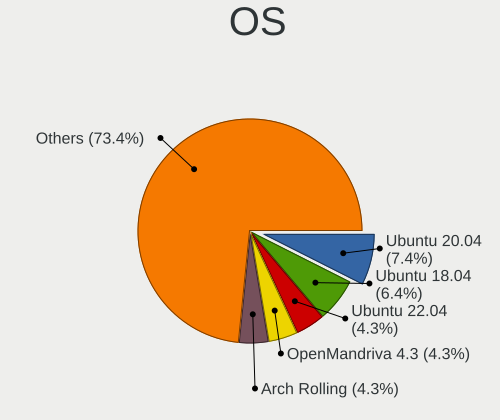

| Name                | Desktops | Percent |
|---------------------|----------|---------|
| Ubuntu 20.04        | 7        | 7.45%   |
| Ubuntu 18.04        | 6        | 6.38%   |
| Ubuntu 22.04        | 4        | 4.26%   |
| OpenMandriva 4.3    | 4        | 4.26%   |
| Arch Rolling        | 4        | 4.26%   |
| OpenMandriva 25.90  | 3        | 3.19%   |
| Nobara 42           | 3        | 3.19%   |
| Linux Mint 19.1     | 3        | 3.19%   |
| Xubuntu 20.04       | 2        | 2.13%   |
| ROSA 12.4           | 2        | 2.13%   |
| MX 23               | 2        | 2.13%   |
| Manjaro             | 2        | 2.13%   |
| LMDE 6              | 2        | 2.13%   |
| Linux Mint 20.1     | 2        | 2.13%   |
| KDE neon 20.04      | 2        | 2.13%   |
| Elementary 7.1      | 2        | 2.13%   |
| Debian 10           | 2        | 2.13%   |
| Bazzite 43          | 2        | 2.13%   |
| Zorin 17            | 1        | 1.06%   |
| Zorin 16            | 1        | 1.06%   |
| Zorin 15            | 1        | 1.06%   |
| Ubuntu Unity 21.10  | 1        | 1.06%   |
| Ubuntu Unity 18.04  | 1        | 1.06%   |
| Ubuntu Studio 20.04 | 1        | 1.06%   |
| ROSA R10            | 1        | 1.06%   |
| ROSA 12.5           | 1        | 1.06%   |
| Rocky Linux 9.3     | 1        | 1.06%   |
| Pop!_OS 22.04       | 1        | 1.06%   |
| Pop!_OS 20.10       | 1        | 1.06%   |
| Pop!_OS 20.04       | 1        | 1.06%   |
| Pika OS 4           | 1        | 1.06%   |
| Parrot 6.0          | 1        | 1.06%   |
| openSUSE Leap-15.5  | 1        | 1.06%   |
| OpenMandriva 6.0    | 1        | 1.06%   |
| OpenMandriva 25.11  | 1        | 1.06%   |
| OpenMandriva 25.04  | 1        | 1.06%   |
| OpenMandriva 24.12  | 1        | 1.06%   |
| OpenMandriva 24.09  | 1        | 1.06%   |
| OpenMandriva 23.01  | 1        | 1.06%   |
| Nobara 41           | 1        | 1.06%   |

OS Family
---------

OS without a version

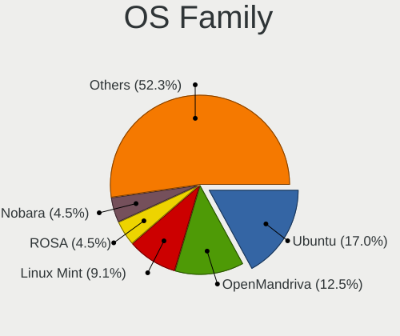

| Name          | Desktops | Percent |
|---------------|----------|---------|
| Ubuntu        | 15       | 17.05%  |
| OpenMandriva  | 11       | 12.5%   |
| Linux Mint    | 8        | 9.09%   |
| ROSA          | 4        | 4.55%   |
| Nobara        | 4        | 4.55%   |
| KDE neon      | 4        | 4.55%   |
| Debian        | 4        | 4.55%   |
| Arch          | 4        | 4.55%   |
| Zorin         | 3        | 3.41%   |
| Pop!_OS       | 3        | 3.41%   |
| Manjaro       | 3        | 3.41%   |
| Xubuntu       | 2        | 2.27%   |
| Ubuntu Unity  | 2        | 2.27%   |
| MX            | 2        | 2.27%   |
| LMDE          | 2        | 2.27%   |
| Kali          | 2        | 2.27%   |
| Fedora        | 2        | 2.27%   |
| Elementary    | 2        | 2.27%   |
| Bazzite       | 2        | 2.27%   |
| Ubuntu Studio | 1        | 1.14%   |
| Rocky Linux   | 1        | 1.14%   |
| Pikaos        | 1        | 1.14%   |
| Parrot        | 1        | 1.14%   |
| openSUSE      | 1        | 1.14%   |
| Lubuntu       | 1        | 1.14%   |
| Endless       | 1        | 1.14%   |
| BunsenLabs    | 1        | 1.14%   |
| ArcoLinux     | 1        | 1.14%   |

Kernel
------

Version of the Linux kernel

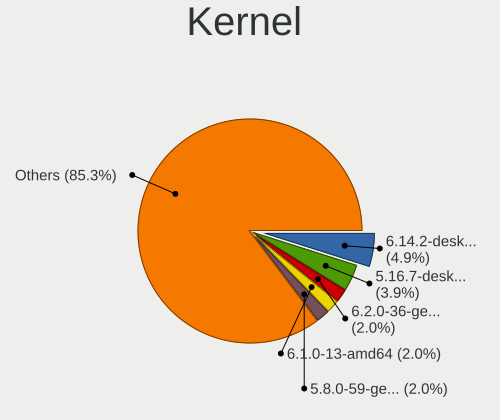

| Version                           | Desktops | Percent |
|-----------------------------------|----------|---------|
| 6.14.2-desktop-3omv2590           | 5        | 4.9%    |
| 5.16.7-desktop-1omv4003           | 4        | 3.92%   |
| 6.2.0-36-generic                  | 2        | 1.96%   |
| 6.1.0-13-amd64                    | 2        | 1.96%   |
| 5.8.0-59-generic                  | 2        | 1.96%   |
| 5.4.0-52-generic                  | 2        | 1.96%   |
| 5.3.0-42-generic                  | 2        | 1.96%   |
| 5.15.0-56-generic                 | 2        | 1.96%   |
| 4.19.0-13-amd64                   | 2        | 1.96%   |
| 4.18.0-15-generic                 | 2        | 1.96%   |
| 4.15.0-94-generic                 | 2        | 1.96%   |
| 4.15.0-47-generic                 | 2        | 1.96%   |
| 4.15.0-20-generic                 | 2        | 1.96%   |
| 6.9.3-76060903-generic            | 1        | 0.98%   |
| 6.8.0-49-generic                  | 1        | 0.98%   |
| 6.6.21-generic-8rosa2021.1-x86_64 | 1        | 0.98%   |
| 6.6.2-arch1-1                     | 1        | 0.98%   |
| 6.5.5-2-liquorix-amd64            | 1        | 0.98%   |
| 6.5.0-14-generic                  | 1        | 0.98%   |
| 6.5.0-13parrot1-amd64             | 1        | 0.98%   |
| 6.4.14-1-liquorix-amd64           | 1        | 0.98%   |
| 6.3.5-zen1-1-zen                  | 1        | 0.98%   |
| 6.2.0-39-generic                  | 1        | 0.98%   |
| 6.2.0-34-generic                  | 1        | 0.98%   |
| 6.2.0-26-generic                  | 1        | 0.98%   |
| 6.17.9-arch1-1                    | 1        | 0.98%   |
| 6.17.7-desktop-1omv2590           | 1        | 0.98%   |
| 6.17.7-ba14.fc43.x86_64           | 1        | 0.98%   |
| 6.17.7-ba01.fc43.x86_64           | 1        | 0.98%   |
| 6.17.7-200.nobara.fc42.x86_64     | 1        | 0.98%   |
| 6.17.5-200.nobara.fc42.x86_64     | 1        | 0.98%   |
| 6.15.9-arch1-1                    | 1        | 0.98%   |
| 6.14.8-200.nobara.fc42.x86_64     | 1        | 0.98%   |
| 6.14.0-pikaos                     | 1        | 0.98%   |
| 6.13.8-arch1-1                    | 1        | 0.98%   |
| 6.13.2-200.nobara.fc41.x86_64     | 1        | 0.98%   |
| 6.12.41-1-MANJARO                 | 1        | 0.98%   |
| 6.12.38+kali-amd64                | 1        | 0.98%   |
| 6.12.25-amd64                     | 1        | 0.98%   |
| 6.12.1-desktop-1omv2490           | 1        | 0.98%   |

Kernel Family
-------------

Linux kernel without a distro release

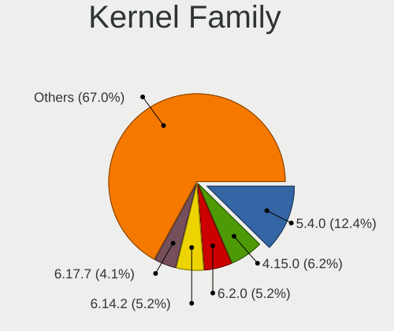

| Version | Desktops | Percent |
|---------|----------|---------|
| 5.4.0   | 12       | 12.37%  |
| 4.15.0  | 6        | 6.19%   |
| 6.2.0   | 5        | 5.15%   |
| 6.14.2  | 5        | 5.15%   |
| 6.17.7  | 4        | 4.12%   |
| 5.16.7  | 4        | 4.12%   |
| 5.15.0  | 4        | 4.12%   |
| 6.1.0   | 3        | 3.09%   |
| 5.8.0   | 3        | 3.09%   |
| 5.3.0   | 3        | 3.09%   |
| 4.18.0  | 3        | 3.09%   |
| 6.5.0   | 2        | 2.06%   |
| 5.11.0  | 2        | 2.06%   |
| 5.10.0  | 2        | 2.06%   |
| 5.0.0   | 2        | 2.06%   |
| 4.19.0  | 2        | 2.06%   |
| 6.9.3   | 1        | 1.03%   |
| 6.8.0   | 1        | 1.03%   |
| 6.6.21  | 1        | 1.03%   |
| 6.6.2   | 1        | 1.03%   |
| 6.5.5   | 1        | 1.03%   |
| 6.4.14  | 1        | 1.03%   |
| 6.3.5   | 1        | 1.03%   |
| 6.17.9  | 1        | 1.03%   |
| 6.17.5  | 1        | 1.03%   |
| 6.15.9  | 1        | 1.03%   |
| 6.14.8  | 1        | 1.03%   |
| 6.14.0  | 1        | 1.03%   |
| 6.13.8  | 1        | 1.03%   |
| 6.13.2  | 1        | 1.03%   |
| 6.12.41 | 1        | 1.03%   |
| 6.12.38 | 1        | 1.03%   |
| 6.12.25 | 1        | 1.03%   |
| 6.12.1  | 1        | 1.03%   |
| 6.11.0  | 1        | 1.03%   |
| 6.1.46  | 1        | 1.03%   |
| 6.1.15  | 1        | 1.03%   |
| 6.1.1   | 1        | 1.03%   |
| 5.9.8   | 1        | 1.03%   |
| 5.8.11  | 1        | 1.03%   |

Kernel Major Ver.
-----------------

Linux kernel major version

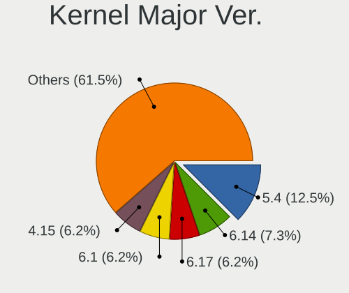

| Version | Desktops | Percent |
|---------|----------|---------|
| 5.4     | 12       | 12.5%   |
| 6.14    | 7        | 7.29%   |
| 6.17    | 6        | 6.25%   |
| 6.1     | 6        | 6.25%   |
| 4.15    | 6        | 6.25%   |
| 6.2     | 5        | 5.21%   |
| 6.12    | 4        | 4.17%   |
| 5.8     | 4        | 4.17%   |
| 5.16    | 4        | 4.17%   |
| 5.15    | 4        | 4.17%   |
| 5.10    | 4        | 4.17%   |
| 6.5     | 3        | 3.13%   |
| 5.3     | 3        | 3.13%   |
| 5.14    | 3        | 3.13%   |
| 5.11    | 3        | 3.13%   |
| 4.18    | 3        | 3.13%   |
| 6.6     | 2        | 2.08%   |
| 6.13    | 2        | 2.08%   |
| 5.0     | 2        | 2.08%   |
| 4.9     | 2        | 2.08%   |
| 4.19    | 2        | 2.08%   |
| 6.9     | 1        | 1.04%   |
| 6.8     | 1        | 1.04%   |
| 6.4     | 1        | 1.04%   |
| 6.3     | 1        | 1.04%   |
| 6.15    | 1        | 1.04%   |
| 6.11    | 1        | 1.04%   |
| 5.9     | 1        | 1.04%   |
| 5.19    | 1        | 1.04%   |
| 5.13    | 1        | 1.04%   |

Arch
----

OS architecture (x86_64, i586, etc.)

| Name   | Desktops | Percent |
|--------|----------|---------|
| x86_64 | 80       | 95.24%  |
| i686   | 4        | 4.76%   |

DE
--

Desktop Environment

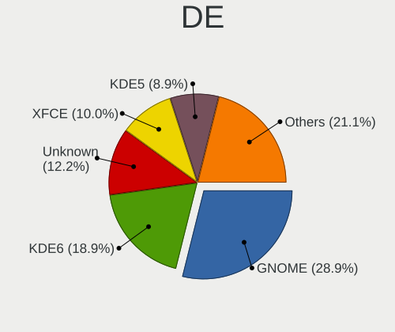

| Name       | Desktops | Percent |
|------------|----------|---------|
| GNOME      | 26       | 28.89%  |
| KDE6       | 17       | 18.89%  |
| Unknown    | 11       | 12.22%  |
| XFCE       | 9        | 10%     |
| KDE5       | 8        | 8.89%   |
| X-Cinnamon | 6        | 6.67%   |
| Unity      | 2        | 2.22%   |
| Pantheon   | 2        | 2.22%   |
| MATE       | 2        | 2.22%   |
| KDE        | 2        | 2.22%   |
| LXDE       | 1        | 1.11%   |
| KDE4       | 1        | 1.11%   |
| i3         | 1        | 1.11%   |
| Hyprland   | 1        | 1.11%   |
| BunsenLabs | 1        | 1.11%   |

Display Server
--------------

X11 or Wayland

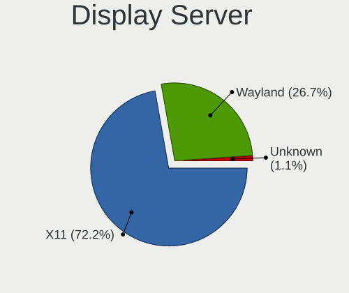

| Name    | Desktops | Percent |
|---------|----------|---------|
| X11     | 65       | 72.22%  |
| Wayland | 24       | 26.67%  |
| Unknown | 1        | 1.11%   |

Display Manager
---------------

SDDM, LightDM, etc.

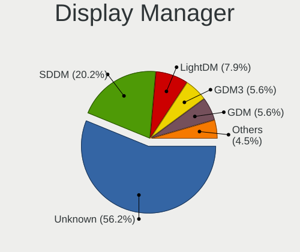

| Name    | Desktops | Percent |
|---------|----------|---------|
| Unknown | 50       | 56.18%  |
| SDDM    | 18       | 20.22%  |
| LightDM | 7        | 7.87%   |
| GDM3    | 5        | 5.62%   |
| GDM     | 5        | 5.62%   |
| TDM     | 3        | 3.37%   |
| KDM     | 1        | 1.12%   |

OS Lang
-------

Language

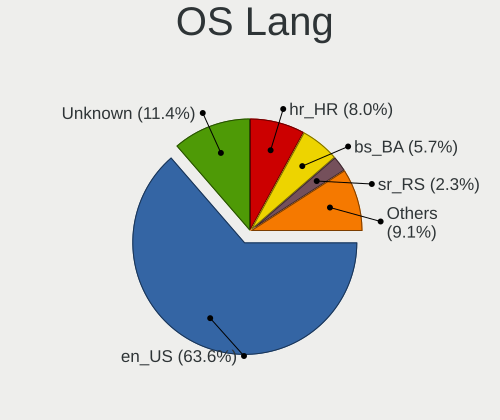

| Lang    | Desktops | Percent |
|---------|----------|---------|
| en_US   | 56       | 63.64%  |
| Unknown | 10       | 11.36%  |
| hr_HR   | 7        | 7.95%   |
| bs_BA   | 5        | 5.68%   |
| sr_RS   | 2        | 2.27%   |
| en_AU   | 2        | 2.27%   |
| de_DE   | 2        | 2.27%   |
| C       | 2        | 2.27%   |
| it_IT   | 1        | 1.14%   |
| en_CA   | 1        | 1.14%   |

Boot Mode
---------

EFI or BIOS

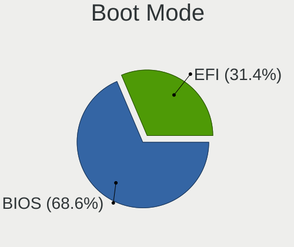

| Mode | Desktops | Percent |
|------|----------|---------|
| BIOS | 59       | 68.6%   |
| EFI  | 27       | 31.4%   |

Filesystem
----------

Type of filesystem

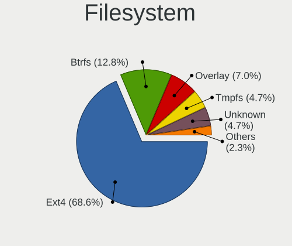

| Type    | Desktops | Percent |
|---------|----------|---------|
| Ext4    | 59       | 68.6%   |
| Btrfs   | 11       | 12.79%  |
| Overlay | 6        | 6.98%   |
| Tmpfs   | 4        | 4.65%   |
| Unknown | 4        | 4.65%   |
| Xfs     | 1        | 1.16%   |
| Ext2    | 1        | 1.16%   |

Part. scheme
------------

Scheme of partitioning

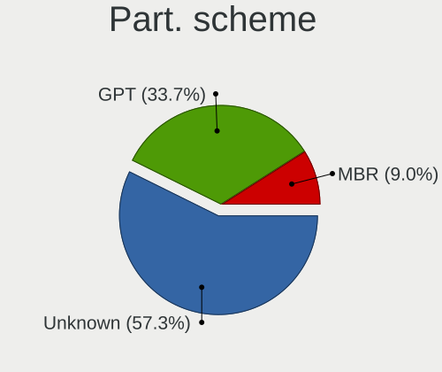

| Type    | Desktops | Percent |
|---------|----------|---------|
| Unknown | 51       | 57.3%   |
| GPT     | 30       | 33.71%  |
| MBR     | 8        | 8.99%   |

Dual Boot with Linux/BSD
------------------------

Hosting more than one Linux/BSD

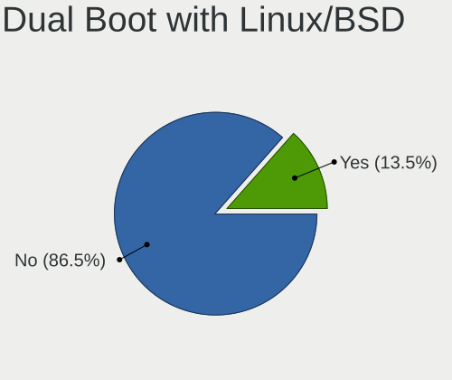

| Dual boot | Desktops | Percent |
|-----------|----------|---------|
| No        | 72       | 85.71%  |
| Yes       | 12       | 14.29%  |

Dual Boot (Win)
---------------

Hosting Linux and Windows

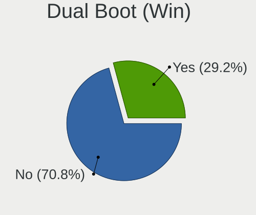

| Dual boot | Desktops | Percent |
|-----------|----------|---------|
| No        | 63       | 70.79%  |
| Yes       | 26       | 29.21%  |

Board
-----

Vendor
------

Motherboard manufacturer

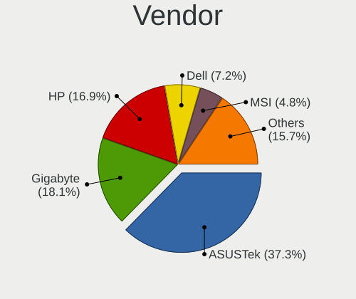

| Name                | Desktops | Percent |
|---------------------|----------|---------|
| ASUSTek Computer    | 31       | 37.35%  |
| Gigabyte Technology | 15       | 18.07%  |
| Hewlett-Packard     | 14       | 16.87%  |
| Dell                | 6        | 7.23%   |
| MSI                 | 4        | 4.82%   |
| Pegatron            | 2        | 2.41%   |
| Medion              | 2        | 2.41%   |
| ASRock              | 2        | 2.41%   |
| Wistron             | 1        | 1.2%    |
| Lenovo              | 1        | 1.2%    |
| Fujitsu Siemens     | 1        | 1.2%    |
| Fujitsu             | 1        | 1.2%    |
| ECS                 | 1        | 1.2%    |
| Biostar             | 1        | 1.2%    |
| Acer                | 1        | 1.2%    |

Model
-----

Motherboard model

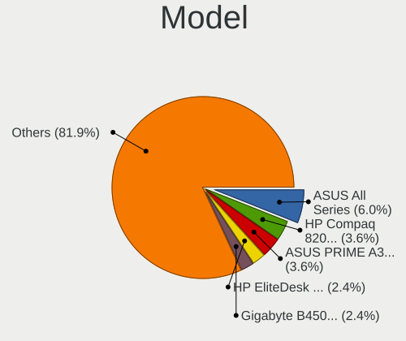

| Name                                   | Desktops | Percent |
|----------------------------------------|----------|---------|
| ASUS All Series                        | 5        | 6.02%   |
| HP Compaq 8200 Elite SFF PC            | 3        | 3.61%   |
| ASUS PRIME A320M-K                     | 3        | 3.61%   |
| HP EliteDesk 800 G4 DM 65W             | 2        | 2.41%   |
| Gigabyte B450M DS3H                    | 2        | 2.41%   |
| Dell OptiPlex 745                      | 2        | 2.41%   |
| ASUS P8H61-M LX3 R2.0                  | 2        | 2.41%   |
| ASUS P5KPL-AM SE                       | 2        | 2.41%   |
| ASUS P5G41T-M LX3                      | 2        | 2.41%   |
| Wistron ProLiant ML110 G5              | 1        | 1.2%    |
| Pegatron VS170AA-UUZ p6244ch           | 1        | 1.2%    |
| Pegatron IPMIP-GS                      | 1        | 1.2%    |
| MSI MS-7D32                            | 1        | 1.2%    |
| MSI MS-7B86                            | 1        | 1.2%    |
| MSI MS-7978                            | 1        | 1.2%    |
| MSI MS-7597                            | 1        | 1.2%    |
| Medion MS-7800                         | 1        | 1.2%    |
| Medion MS-7366                         | 1        | 1.2%    |
| Lenovo ThinkCentre Edge72 3493G6G      | 1        | 1.2%    |
| HP ProLiant ML350 G6                   | 1        | 1.2%    |
| HP ProDesk 400 G2 MT (TPM DP)          | 1        | 1.2%    |
| HP Compaq Elite 8300 CMT               | 1        | 1.2%    |
| HP Compaq dc7900 Convertible Minitower | 1        | 1.2%    |
| HP Compaq dc7700p Small Form Factor    | 1        | 1.2%    |
| HP Compaq dc5750 Small Form Factor     | 1        | 1.2%    |
| HP Compaq 8200 Elite USDT PC           | 1        | 1.2%    |
| HP Compaq 8000 Elite CMT PC            | 1        | 1.2%    |
| HP Compaq 6200 Pro MT PC               | 1        | 1.2%    |
| Gigabyte Z77X-UD5H                     | 1        | 1.2%    |
| Gigabyte Z390 UD                       | 1        | 1.2%    |
| Gigabyte X570 AORUS ELITE WIFI         | 1        | 1.2%    |
| Gigabyte nForce                        | 1        | 1.2%    |
| Gigabyte H81M-DS2                      | 1        | 1.2%    |
| Gigabyte H61M-S2PV                     | 1        | 1.2%    |
| Gigabyte H610I DDR4                    | 1        | 1.2%    |
| Gigabyte GA-990FX-GAMING               | 1        | 1.2%    |
| Gigabyte B85M-D2V                      | 1        | 1.2%    |
| Gigabyte B75M-D3H                      | 1        | 1.2%    |
| Gigabyte B550 AORUS ELITE V2           | 1        | 1.2%    |
| Gigabyte B460MDS3HV2                   | 1        | 1.2%    |

Model Family
------------

Motherboard model prefix

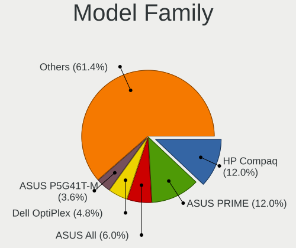

| Name                     | Desktops | Percent |
|--------------------------|----------|---------|
| HP Compaq                | 10       | 12.05%  |
| ASUS PRIME               | 10       | 12.05%  |
| ASUS All                 | 5        | 6.02%   |
| Dell OptiPlex            | 4        | 4.82%   |
| ASUS P5G41T-M            | 3        | 3.61%   |
| HP EliteDesk             | 2        | 2.41%   |
| Gigabyte B450M           | 2        | 2.41%   |
| ASUS ROG                 | 2        | 2.41%   |
| ASUS P8H61-M             | 2        | 2.41%   |
| ASUS P5KPL-AM            | 2        | 2.41%   |
| Wistron ProLiant         | 1        | 1.2%    |
| Pegatron VS170AA-UUZ     | 1        | 1.2%    |
| Pegatron IPMIP-GS        | 1        | 1.2%    |
| MSI MS-7D32              | 1        | 1.2%    |
| MSI MS-7B86              | 1        | 1.2%    |
| MSI MS-7978              | 1        | 1.2%    |
| MSI MS-7597              | 1        | 1.2%    |
| Medion MS-7800           | 1        | 1.2%    |
| Medion MS-7366           | 1        | 1.2%    |
| Lenovo ThinkCentre       | 1        | 1.2%    |
| HP ProLiant              | 1        | 1.2%    |
| HP ProDesk               | 1        | 1.2%    |
| Gigabyte Z77X-UD5H       | 1        | 1.2%    |
| Gigabyte Z390            | 1        | 1.2%    |
| Gigabyte X570            | 1        | 1.2%    |
| Gigabyte nForce          | 1        | 1.2%    |
| Gigabyte H81M-DS2        | 1        | 1.2%    |
| Gigabyte H61M-S2PV       | 1        | 1.2%    |
| Gigabyte H610I           | 1        | 1.2%    |
| Gigabyte GA-990FX-GAMING | 1        | 1.2%    |
| Gigabyte B85M-D2V        | 1        | 1.2%    |
| Gigabyte B75M-D3H        | 1        | 1.2%    |
| Gigabyte B550            | 1        | 1.2%    |
| Gigabyte B460MDS3HV2     | 1        | 1.2%    |
| Gigabyte A320M-S2H       | 1        | 1.2%    |
| Fujitsu Siemens ESPRIMO  | 1        | 1.2%    |
| Fujitsu ESPRIMO          | 1        | 1.2%    |
| ECS G31T-M7              | 1        | 1.2%    |
| Dell Vostro              | 1        | 1.2%    |
| Dell Precision           | 1        | 1.2%    |

MFG Year
--------

Motherboard manufacture year

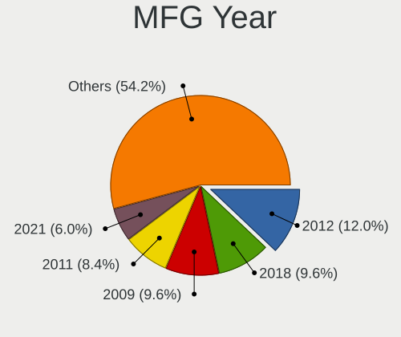

| Year | Desktops | Percent |
|------|----------|---------|
| 2012 | 10       | 12.05%  |
| 2018 | 8        | 9.64%   |
| 2009 | 8        | 9.64%   |
| 2011 | 7        | 8.43%   |
| 2021 | 5        | 6.02%   |
| 2017 | 5        | 6.02%   |
| 2014 | 5        | 6.02%   |
| 2008 | 5        | 6.02%   |
| 2019 | 4        | 4.82%   |
| 2013 | 4        | 4.82%   |
| 2010 | 4        | 4.82%   |
| 2007 | 4        | 4.82%   |
| 2020 | 3        | 3.61%   |
| 2015 | 3        | 3.61%   |
| 2016 | 2        | 2.41%   |
| 2006 | 2        | 2.41%   |
| 2005 | 2        | 2.41%   |
| 2023 | 1        | 1.2%    |
| 2022 | 1        | 1.2%    |

Form Factor
-----------

Physical design of the computer

| Name    | Desktops | Percent |
|---------|----------|---------|
| Desktop | 83       | 100%    |

Secure Boot
-----------

Enabled or disabled

| State    | Desktops | Percent |
|----------|----------|---------|
| Disabled | 83       | 100%    |

Coreboot
--------

Have coreboot on board

| Used | Desktops | Percent |
|------|----------|---------|
| No   | 83       | 100%    |

RAM Size
--------

Total RAM memory

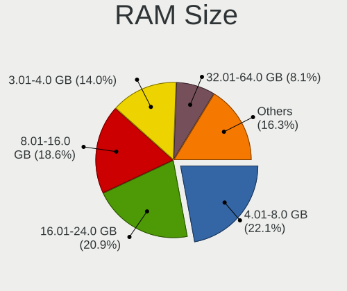

| Size in GB  | Desktops | Percent |
|-------------|----------|---------|
| 4.01-8.0    | 19       | 22.09%  |
| 16.01-24.0  | 18       | 20.93%  |
| 8.01-16.0   | 16       | 18.6%   |
| 3.01-4.0    | 12       | 13.95%  |
| 32.01-64.0  | 7        | 8.14%   |
| 1.01-2.0    | 7        | 8.14%   |
| 2.01-3.0    | 3        | 3.49%   |
| 24.01-32.0  | 1        | 1.16%   |
| 64.01-256.0 | 1        | 1.16%   |
| 0.51-1.0    | 1        | 1.16%   |
| 0.01-0.5    | 1        | 1.16%   |

RAM Used
--------

Used RAM memory

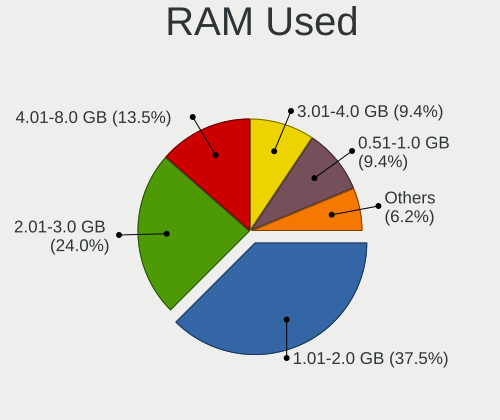

| Used GB   | Desktops | Percent |
|-----------|----------|---------|
| 1.01-2.0  | 36       | 37.5%   |
| 2.01-3.0  | 23       | 23.96%  |
| 4.01-8.0  | 13       | 13.54%  |
| 3.01-4.0  | 9        | 9.38%   |
| 0.51-1.0  | 9        | 9.38%   |
| 8.01-16.0 | 5        | 5.21%   |
| 0.01-0.5  | 1        | 1.04%   |

Total Drives
------------

Number of drives on board

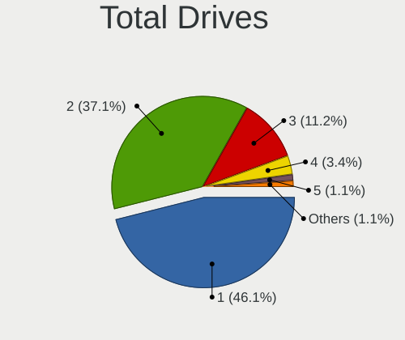

| Drives | Desktops | Percent |
|--------|----------|---------|
| 1      | 41       | 46.07%  |
| 2      | 33       | 37.08%  |
| 3      | 10       | 11.24%  |
| 4      | 3        | 3.37%   |
| 5      | 1        | 1.12%   |
| 0      | 1        | 1.12%   |

Has CD-ROM
----------

Has CD-ROM on board

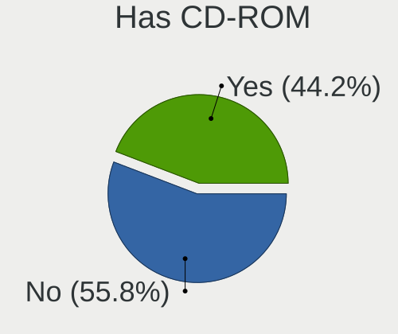

| Presented | Desktops | Percent |
|-----------|----------|---------|
| No        | 48       | 55.81%  |
| Yes       | 38       | 44.19%  |

Has Ethernet
------------

Has Ethernet on board

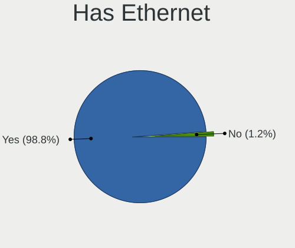

| Presented | Desktops | Percent |
|-----------|----------|---------|
| Yes       | 82       | 98.8%   |
| No        | 1        | 1.2%    |

Has WiFi
--------

Has WiFi module

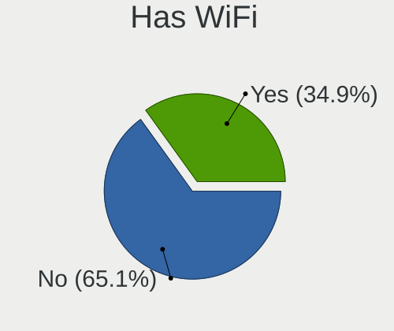

| Presented | Desktops | Percent |
|-----------|----------|---------|
| No        | 54       | 65.06%  |
| Yes       | 29       | 34.94%  |

Has Bluetooth
-------------

Has Bluetooth module

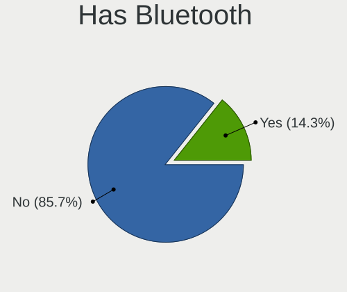

| Presented | Desktops | Percent |
|-----------|----------|---------|
| No        | 72       | 85.71%  |
| Yes       | 12       | 14.29%  |

Location
--------

Country
-------

Geographic location (country)

| Country                | Desktops | Percent |
|------------------------|----------|---------|
| Bosnia and Herzegovina | 83       | 100%    |

City
----

Geographic location (city)

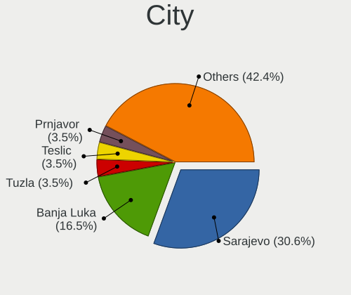

| City            | Desktops | Percent |
|-----------------|----------|---------|
| Sarajevo        | 26       | 30.59%  |
| Banja Luka      | 14       | 16.47%  |
| Tuzla           | 3        | 3.53%   |
| Teslic          | 3        | 3.53%   |
| Prnjavor        | 3        | 3.53%   |
| Gracanica       | 3        | 3.53%   |
| Zenica          | 2        | 2.35%   |
| Vitez           | 2        | 2.35%   |
| Prijedor        | 2        | 2.35%   |
| Gradacac        | 2        | 2.35%   |
| Doboj           | 2        | 2.35%   |
| Cazin           | 2        | 2.35%   |
| Brčko          | 2        | 2.35%   |
| Bijeljina       | 2        | 2.35%   |
| Zvornik         | 1        | 1.18%   |
| Zepce           | 1        | 1.18%   |
| Velika Kladuša | 1        | 1.18%   |
| Trebinje        | 1        | 1.18%   |
| Tarcin          | 1        | 1.18%   |
| Stolac          | 1        | 1.18%   |
| Siroki Brijeg   | 1        | 1.18%   |
| Novi Travnik    | 1        | 1.18%   |
| Nova Topola     | 1        | 1.18%   |
| Mostar          | 1        | 1.18%   |
| Kalesija        | 1        | 1.18%   |
| Jablanica       | 1        | 1.18%   |
| Goražde        | 1        | 1.18%   |
| Foca            | 1        | 1.18%   |
| Drvar           | 1        | 1.18%   |
| Derventa        | 1        | 1.18%   |
| Bosanski Brod   | 1        | 1.18%   |

Drives
------

Drive Vendor
------------

Hard drive vendors

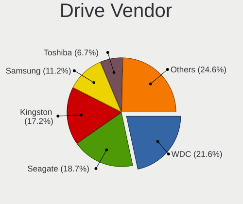

| Vendor                      | Desktops | Drives | Percent |
|-----------------------------|----------|--------|---------|
| WDC                         | 29       | 45     | 21.64%  |
| Seagate                     | 25       | 32     | 18.66%  |
| Kingston                    | 23       | 29     | 17.16%  |
| Samsung Electronics         | 15       | 23     | 11.19%  |
| Toshiba                     | 9        | 10     | 6.72%   |
| Hitachi                     | 6        | 6      | 4.48%   |
| Kingston Technology Company | 5        | 6      | 3.73%   |
| China                       | 4        | 6      | 2.99%   |
| Intel                       | 2        | 2      | 1.49%   |
| Gigabyte Technology         | 2        | 2      | 1.49%   |
| Transcend                   | 1        | 2      | 0.75%   |
| SPCC                        | 1        | 1      | 0.75%   |
| SanDisk                     | 1        | 1      | 0.75%   |
| ORGE                        | 1        | 1      | 0.75%   |
| Micron/Crucial Technology   | 1        | 1      | 0.75%   |
| Maxtor                      | 1        | 1      | 0.75%   |
| GOODRAM                     | 1        | 1      | 0.75%   |
| Fujitsu                     | 1        | 1      | 0.75%   |
| Emtec                       | 1        | 1      | 0.75%   |
| Dahua                       | 1        | 1      | 0.75%   |
| ASMT                        | 1        | 1      | 0.75%   |
| ADATA Technology            | 1        | 1      | 0.75%   |
| A-DATA Technology           | 1        | 1      | 0.75%   |
| Unknown                     | 1        | 1      | 0.75%   |

Drive Model
-----------

Hard drive models

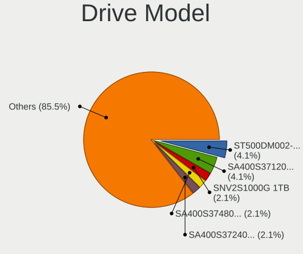

| Model                                             | Desktops | Percent |
|---------------------------------------------------|----------|---------|
| Seagate ST500DM002-1BD142 500GB                   | 6        | 4.14%   |
| Kingston SA400S37120G 120GB SSD                   | 6        | 4.14%   |
| Kingston Company SNV2S1000G 1TB                   | 3        | 2.07%   |
| Kingston SA400S37480G 480GB SSD                   | 3        | 2.07%   |
| Kingston SA400S37240G 240GB SSD                   | 3        | 2.07%   |
| Hitachi HDS721050CLA362 500GB                     | 3        | 2.07%   |
| WDC WD800JD-00MSA1 80GB                           | 2        | 1.38%   |
| WDC WD5000AAKX-00ERMA0 500GB                      | 2        | 1.38%   |
| WDC WD5000AAKX-001CA0 500GB                       | 2        | 1.38%   |
| Toshiba KXG50ZNV256G 256GB                        | 2        | 1.38%   |
| Toshiba HDWD120 2TB                               | 2        | 1.38%   |
| Toshiba DT01ACA050 500GB                          | 2        | 1.38%   |
| Seagate ST3500413AS 500GB                         | 2        | 1.38%   |
| Seagate ST3250318AS 250GB                         | 2        | 1.38%   |
| Seagate ST250LT021-1AF14C 250GB                   | 2        | 1.38%   |
| Samsung SSD 980 500GB                             | 2        | 1.38%   |
| Samsung SSD 860 EVO 250GB                         | 2        | 1.38%   |
| Samsung NVMe SSD Controller SM981/PM981/PM983 1TB | 2        | 1.38%   |
| Gigabyte GP-GSTFS31120GNTD 120GB SSD              | 2        | 1.38%   |
| WDC WDS240G2G0B-00EPW0 240GB SSD                  | 1        | 0.69%   |
| WDC WDS240G2G0A-00JH30 240GB SSD                  | 1        | 0.69%   |
| WDC WDS120G2G0B-00EPW0 120GB SSD                  | 1        | 0.69%   |
| WDC WD800JD-75MSA3 80GB                           | 1        | 0.69%   |
| WDC WD800JD-60LSA5 80GB                           | 1        | 0.69%   |
| WDC WD7500BPVX-22JC3T0 752GB                      | 1        | 0.69%   |
| WDC WD7500AACS-00D6B0 752GB                       | 1        | 0.69%   |
| WDC WD6400AARS-00Y5B1 640GB                       | 1        | 0.69%   |
| WDC WD5000LPVT-22G33T0 500GB                      | 1        | 0.69%   |
| WDC WD5000AZLX-60K2TA0 500GB                      | 1        | 0.69%   |
| WDC WD5000AVDS-73U7B1 500GB                       | 1        | 0.69%   |
| WDC WD40EZRZ-75GXCB0 4TB                          | 1        | 0.69%   |
| WDC WD40EZAZ-00ZGHB0 4TB                          | 1        | 0.69%   |
| WDC WD3200SD-01KNB0 320GB                         | 1        | 0.69%   |
| WDC WD3200LPVT-00G33T0 320GB                      | 1        | 0.69%   |
| WDC WD3200AAJS-00L7A0 320GB                       | 1        | 0.69%   |
| WDC WD3200AAJS-00B4A0 320GB                       | 1        | 0.69%   |
| WDC WD2500AAJS-22B4A0 250GB                       | 1        | 0.69%   |
| WDC WD20EARX-00PASB0 2TB                          | 1        | 0.69%   |
| WDC WD2000JD-00HBB0 200GB                         | 1        | 0.69%   |
| WDC WD1600AAJS-75B4A0 160GB                       | 1        | 0.69%   |

HDD Vendor
----------

Hard disk drive vendors

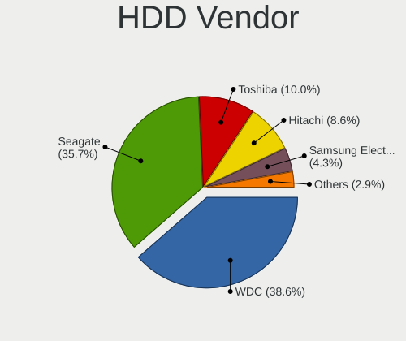

| Vendor              | Desktops | Drives | Percent |
|---------------------|----------|--------|---------|
| WDC                 | 27       | 42     | 38.57%  |
| Seagate             | 25       | 32     | 35.71%  |
| Toshiba             | 7        | 8      | 10%     |
| Hitachi             | 6        | 6      | 8.57%   |
| Samsung Electronics | 3        | 3      | 4.29%   |
| Maxtor              | 1        | 1      | 1.43%   |
| Fujitsu             | 1        | 1      | 1.43%   |

SSD Vendor
----------

Solid state drive vendors

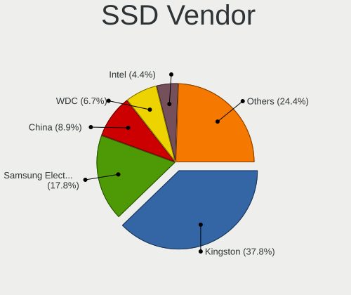

| Vendor              | Desktops | Drives | Percent |
|---------------------|----------|--------|---------|
| Kingston            | 17       | 23     | 37.78%  |
| Samsung Electronics | 8        | 13     | 17.78%  |
| China               | 4        | 6      | 8.89%   |
| WDC                 | 3        | 3      | 6.67%   |
| Intel               | 2        | 2      | 4.44%   |
| Gigabyte Technology | 2        | 2      | 4.44%   |
| Transcend           | 1        | 2      | 2.22%   |
| SPCC                | 1        | 1      | 2.22%   |
| SanDisk             | 1        | 1      | 2.22%   |
| GOODRAM             | 1        | 1      | 2.22%   |
| Emtec               | 1        | 1      | 2.22%   |
| Dahua               | 1        | 1      | 2.22%   |
| ASMT                | 1        | 1      | 2.22%   |
| A-DATA Technology   | 1        | 1      | 2.22%   |
| Unknown             | 1        | 1      | 2.22%   |

Drive Kind
----------

HDD or SSD

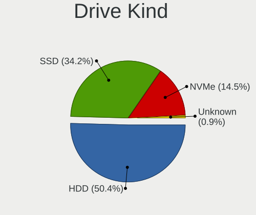

| Kind    | Desktops | Drives | Percent |
|---------|----------|--------|---------|
| HDD     | 59       | 93     | 50.43%  |
| SSD     | 40       | 59     | 34.19%  |
| NVMe    | 17       | 23     | 14.53%  |
| Unknown | 1        | 1      | 0.85%   |

Drive Connector
---------------

SATA, SAS, NVMe, etc.

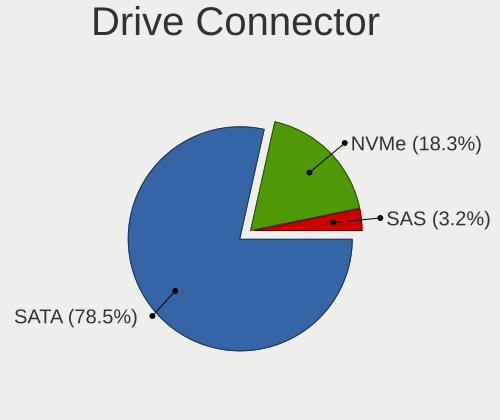

| Type | Desktops | Drives | Percent |
|------|----------|--------|---------|
| SATA | 73       | 150    | 78.49%  |
| NVMe | 17       | 23     | 18.28%  |
| SAS  | 3        | 3      | 3.23%   |

Drive Size
----------

Size of hard drive

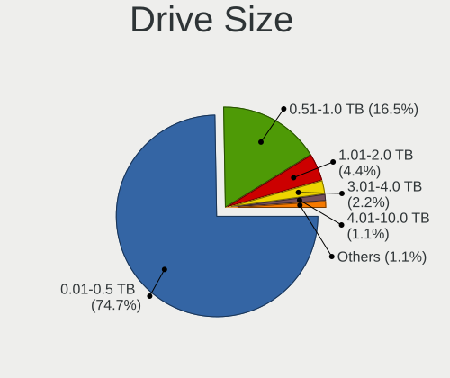

| Size in TB | Desktops | Drives | Percent |
|------------|----------|--------|---------|
| 0.01-0.5   | 68       | 122    | 74.73%  |
| 0.51-1.0   | 15       | 18     | 16.48%  |
| 1.01-2.0   | 4        | 6      | 4.4%    |
| 3.01-4.0   | 2        | 3      | 2.2%    |
| 2.01-3.0   | 1        | 2      | 1.1%    |
| 4.01-10.0  | 1        | 1      | 1.1%    |

Space Total
-----------

Amount of disk space available on the file system

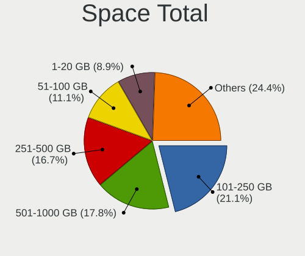

| Size in GB     | Desktops | Percent |
|----------------|----------|---------|
| 101-250        | 19       | 21.11%  |
| 501-1000       | 16       | 17.78%  |
| 251-500        | 15       | 16.67%  |
| 51-100         | 10       | 11.11%  |
| 1-20           | 8        | 8.89%   |
| 1001-2000      | 7        | 7.78%   |
| 21-50          | 5        | 5.56%   |
| 2001-3000      | 4        | 4.44%   |
| More than 3000 | 3        | 3.33%   |
| Unknown        | 3        | 3.33%   |

Space Used
----------

Amount of used disk space

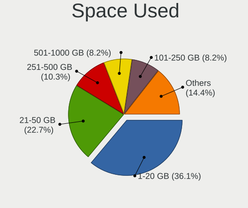

| Used GB   | Desktops | Percent |
|-----------|----------|---------|
| 1-20      | 35       | 36.08%  |
| 21-50     | 22       | 22.68%  |
| 251-500   | 10       | 10.31%  |
| 101-250   | 8        | 8.25%   |
| 501-1000  | 8        | 8.25%   |
| 51-100    | 7        | 7.22%   |
| Unknown   | 3        | 3.09%   |
| 2001-3000 | 2        | 2.06%   |
| 1001-2000 | 2        | 2.06%   |

Malfunc. Drives
---------------

Drive models with a malfunction

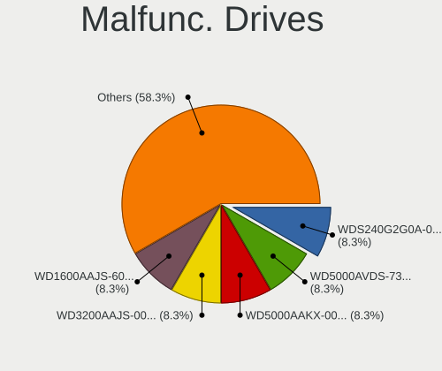

| Model                             | Desktops | Drives | Percent |
|-----------------------------------|----------|--------|---------|
| WDC WDS240G2G0A-00JH30 240GB SSD  | 1        | 1      | 8.33%   |
| WDC WD5000AVDS-73U7B1 500GB       | 1        | 1      | 8.33%   |
| WDC WD5000AAKX-001CA0 500GB       | 1        | 1      | 8.33%   |
| WDC WD3200AAJS-00B4A0 320GB       | 1        | 1      | 8.33%   |
| WDC WD1600AAJS-60WAA0 160GB       | 1        | 2      | 8.33%   |
| Seagate ST500LT012-1DG142 500GB   | 1        | 2      | 8.33%   |
| Seagate ST3120813AS 120GB         | 1        | 1      | 8.33%   |
| Seagate ST3000DM001-1CH166 3TB    | 1        | 2      | 8.33%   |
| Seagate ST250LT021-1AF14C 250GB   | 1        | 1      | 8.33%   |
| Samsung Electronics HD322HJ 320GB | 1        | 1      | 8.33%   |
| Hitachi HDS721050CLA362 500GB     | 1        | 1      | 8.33%   |
| China SATA SSD 240GB              | 1        | 1      | 8.33%   |

Malfunc. Drive Vendor
---------------------

Vendors of faulty drives

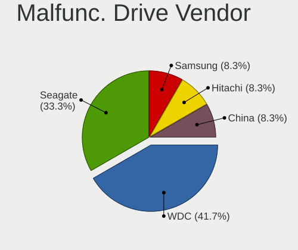

| Vendor              | Desktops | Drives | Percent |
|---------------------|----------|--------|---------|
| WDC                 | 5        | 6      | 41.67%  |
| Seagate             | 4        | 6      | 33.33%  |
| Samsung Electronics | 1        | 1      | 8.33%   |
| Hitachi             | 1        | 1      | 8.33%   |
| China               | 1        | 1      | 8.33%   |

Malfunc. HDD Vendor
-------------------

Vendors of faulty HDD drives

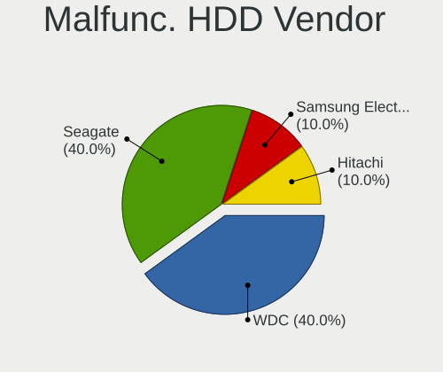

| Vendor              | Desktops | Drives | Percent |
|---------------------|----------|--------|---------|
| WDC                 | 4        | 5      | 40%     |
| Seagate             | 4        | 6      | 40%     |
| Samsung Electronics | 1        | 1      | 10%     |
| Hitachi             | 1        | 1      | 10%     |

Malfunc. Drive Kind
-------------------

Kinds of faulty drives

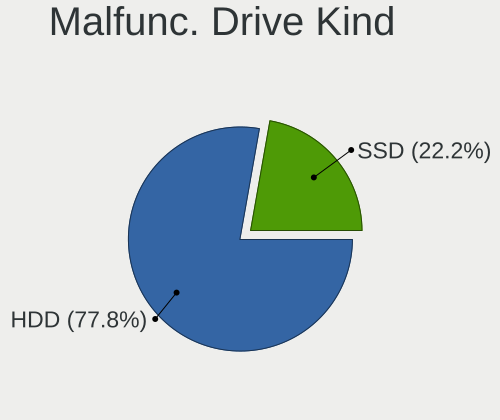

| Kind | Desktops | Drives | Percent |
|------|----------|--------|---------|
| HDD  | 7        | 13     | 77.78%  |
| SSD  | 2        | 2      | 22.22%  |

Failed Drives
-------------

Failed drive models

Zero info for selected period =(

Failed Drive Vendor
-------------------

Failed drive vendors

Zero info for selected period =(

Drive Status
------------

Number of failed and malfunc. drives

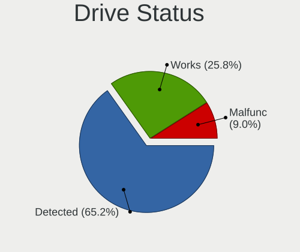

| Status   | Desktops | Drives | Percent |
|----------|----------|--------|---------|
| Detected | 58       | 110    | 65.17%  |
| Works    | 23       | 51     | 25.84%  |
| Malfunc  | 8        | 15     | 8.99%   |

Storage controller
------------------

Storage Vendor
--------------

Storage controller vendors

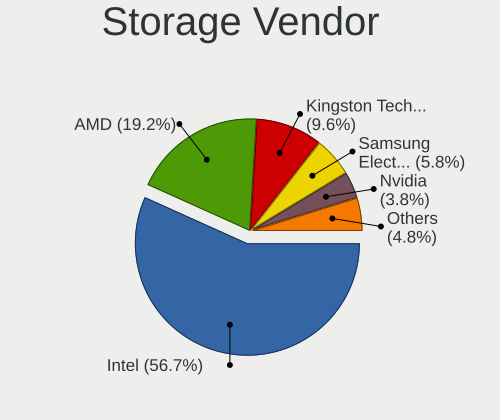

| Vendor                       | Desktops | Percent |
|------------------------------|----------|---------|
| Intel                        | 59       | 56.73%  |
| AMD                          | 20       | 19.23%  |
| Kingston Technology Company  | 10       | 9.62%   |
| Samsung Electronics          | 6        | 5.77%   |
| Nvidia                       | 4        | 3.85%   |
| Toshiba America Info Systems | 2        | 1.92%   |
| Micron/Crucial Technology    | 1        | 0.96%   |
| Marvell Technology Group     | 1        | 0.96%   |
| ADATA Technology             | 1        | 0.96%   |

Storage Model
-------------

Storage controller models

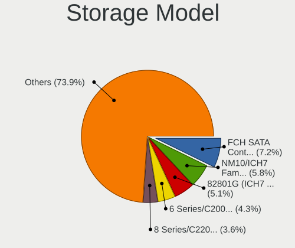

| Model                                                                                   | Desktops | Percent |
|-----------------------------------------------------------------------------------------|----------|---------|
| AMD FCH SATA Controller [AHCI mode]                                                     | 10       | 7.25%   |
| Intel NM10/ICH7 Family SATA Controller [IDE mode]                                       | 8        | 5.8%    |
| Intel 82801G (ICH7 Family) IDE Controller                                               | 7        | 5.07%   |
| Intel 6 Series/C200 Series Chipset Family 6 port Desktop SATA AHCI Controller           | 6        | 4.35%   |
| Intel 8 Series/C220 Series Chipset Family 6-port SATA Controller 1 [AHCI mode]          | 5        | 3.62%   |
| Intel 7 Series/C210 Series Chipset Family 6-port SATA Controller [AHCI mode]            | 5        | 3.62%   |
| Intel 6 Series/C200 Series Chipset Family Desktop SATA Controller (IDE mode, ports 4-5) | 5        | 3.62%   |
| Intel 6 Series/C200 Series Chipset Family Desktop SATA Controller (IDE mode, ports 0-3) | 5        | 3.62%   |
| Samsung NVMe SSD Controller 980 (DRAM-less)                                             | 4        | 2.9%    |
| Kingston Company NV2 NVMe SSD [SM2267XT] (DRAM-less)                                    | 4        | 2.9%    |
| Intel Cannon Lake PCH SATA AHCI Controller                                              | 4        | 2.9%    |
| AMD A320 Chipset SATA Controller [AHCI mode]                                            | 4        | 2.9%    |
| AMD 400 Series Chipset SATA Controller                                                  | 4        | 2.9%    |
| Intel Q170/Q150/B150/H170/H110/Z170/CM236 Chipset SATA Controller [AHCI Mode]           | 3        | 2.17%   |
| Intel Alder Lake-S PCH SATA Controller [AHCI Mode]                                      | 3        | 2.17%   |
| Intel 9 Series Chipset Family SATA Controller [AHCI Mode]                               | 3        | 2.17%   |
| Intel 82801H (ICH8 Family) 4 port SATA Controller [IDE mode]                            | 3        | 2.17%   |
| Intel 200 Series PCH SATA controller [AHCI mode]                                        | 3        | 2.17%   |
| AMD 500 Series Chipset SATA Controller                                                  | 3        | 2.17%   |
| Toshiba America Info Systems XG5 NVMe SSD Controller                                    | 2        | 1.45%   |
| Samsung NVMe SSD Controller SM981/PM981/PM983                                           | 2        | 1.45%   |
| Kingston Company NV1 NVMe SSD [SM2263XT] (DRAM-less)                                    | 2        | 1.45%   |
| Intel 82801JD/DO (ICH10 Family) SATA AHCI Controller                                    | 2        | 1.45%   |
| Intel 82801HR/HO/HH (ICH8R/DO/DH) 2 port SATA Controller [IDE mode]                     | 2        | 1.45%   |
| Nvidia nForce3 Serial ATA Controller                                                    | 1        | 0.72%   |
| Nvidia MCP73 IDE Controller                                                             | 1        | 0.72%   |
| Nvidia MCP61 SATA Controller                                                            | 1        | 0.72%   |
| Nvidia MCP61 IDE                                                                        | 1        | 0.72%   |
| Nvidia GeForce 7100/nForce 630i SATA                                                    | 1        | 0.72%   |
| Nvidia CK8S Parallel ATA Controller (v2.5)                                              | 1        | 0.72%   |
| Nvidia CK804 Serial ATA Controller                                                      | 1        | 0.72%   |
| Nvidia CK804 IDE                                                                        | 1        | 0.72%   |
| Micron/Crucial E100 NVMe PCIe SSD (DRAM-less)                                           | 1        | 0.72%   |
| Marvell Group 88SE9172 SATA 6Gb/s Controller                                            | 1        | 0.72%   |
| Kingston Company OM8PCP Design-In PCIe 3 NVMe SSD (DRAM-less)                           | 1        | 0.72%   |
| Kingston Company KC3000/FURY Renegade NVMe SSD [E18]                                    | 1        | 0.72%   |
| Kingston Company A2000 NVMe SSD [SM2263EN]                                              | 1        | 0.72%   |
| Kingston Company A1000/U-SNS8154P3 x2 NVMe SSD [E8]                                     | 1        | 0.72%   |
| Intel Volume Management Device NVMe RAID Controller                                     | 1        | 0.72%   |
| Intel SATA Controller [RAID mode]                                                       | 1        | 0.72%   |

Storage Kind
------------

Kind of storage controller (IDE, SATA, NVMe, SAS, ...)

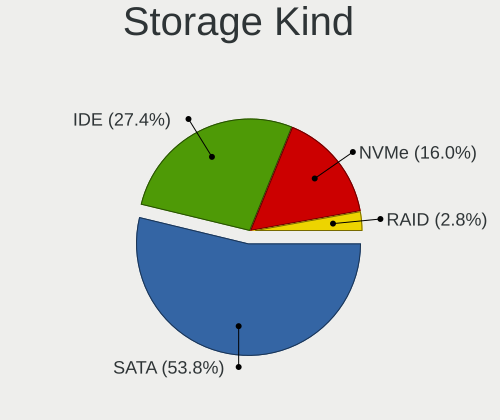

| Kind | Desktops | Percent |
|------|----------|---------|
| SATA | 57       | 53.77%  |
| IDE  | 29       | 27.36%  |
| NVMe | 17       | 16.04%  |
| RAID | 3        | 2.83%   |

Processor
---------

CPU Vendor
----------

Processor vendors

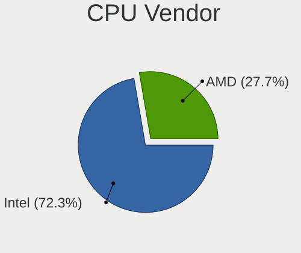

| Vendor | Desktops | Percent |
|--------|----------|---------|
| Intel  | 60       | 72.29%  |
| AMD    | 23       | 27.71%  |

CPU Model
---------

Processor models

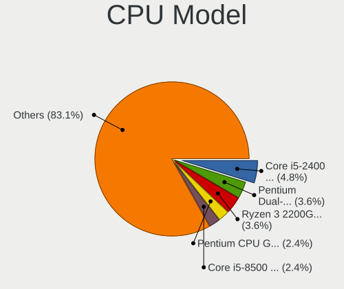

| Model                                       | Desktops | Percent |
|---------------------------------------------|----------|---------|
| Intel Core i5-2400 CPU @ 3.10GHz            | 4        | 4.82%   |
| Intel Pentium Dual-Core CPU E5700 @ 3.00GHz | 3        | 3.61%   |
| AMD Ryzen 3 2200G with Radeon Vega Graphics | 3        | 3.61%   |
| Intel Pentium CPU G630 @ 2.70GHz            | 2        | 2.41%   |
| Intel Core i5-8500 CPU @ 3.00GHz            | 2        | 2.41%   |
| Intel Core i5-4460 CPU @ 3.20GHz            | 2        | 2.41%   |
| Intel Core i5-3470 CPU @ 3.20GHz            | 2        | 2.41%   |
| Intel Core 2 Duo CPU E8400 @ 3.00GHz        | 2        | 2.41%   |
| Intel Celeron CPU 430 @ 1.80GHz             | 2        | 2.41%   |
| AMD Ryzen 5 3600 6-Core Processor           | 2        | 2.41%   |
| Intel Xeon CPU X5650 @ 2.67GHz              | 1        | 1.2%    |
| Intel Xeon CPU X3210 @ 2.13GHz              | 1        | 1.2%    |
| Intel Xeon CPU E3-1270 V2 @ 3.50GHz         | 1        | 1.2%    |
| Intel Pentium Dual-Core CPU E6600 @ 3.06GHz | 1        | 1.2%    |
| Intel Pentium Dual-Core CPU E5300 @ 2.60GHz | 1        | 1.2%    |
| Intel Pentium Dual-Core CPU E5200 @ 2.50GHz | 1        | 1.2%    |
| Intel Pentium 4 CPU 3.00GHz                 | 1        | 1.2%    |
| Intel Core i7-9700K CPU @ 3.60GHz           | 1        | 1.2%    |
| Intel Core i7-8700 CPU @ 3.20GHz            | 1        | 1.2%    |
| Intel Core i7-7700K CPU @ 4.20GHz           | 1        | 1.2%    |
| Intel Core i7-6700 CPU @ 3.40GHz            | 1        | 1.2%    |
| Intel Core i7-4790 CPU @ 3.60GHz            | 1        | 1.2%    |
| Intel Core i7-3770 CPU @ 3.40GHz            | 1        | 1.2%    |
| Intel Core i7-2600 CPU @ 3.40GHz            | 1        | 1.2%    |
| Intel Core i5-9400F CPU @ 2.90GHz           | 1        | 1.2%    |
| Intel Core i5-6600 CPU @ 3.30GHz            | 1        | 1.2%    |
| Intel Core i5-6500 CPU @ 3.20GHz            | 1        | 1.2%    |
| Intel Core i5-4690 CPU @ 3.50GHz            | 1        | 1.2%    |
| Intel Core i5-4590S CPU @ 3.00GHz           | 1        | 1.2%    |
| Intel Core i5-4590 CPU @ 3.30GHz            | 1        | 1.2%    |
| Intel Core i5-3570 CPU @ 3.40GHz            | 1        | 1.2%    |
| Intel Core i5-3550 CPU @ 3.30GHz            | 1        | 1.2%    |
| Intel Core i5-3450 CPU @ 3.10GHz            | 1        | 1.2%    |
| Intel Core i5-10400F CPU @ 2.90GHz          | 1        | 1.2%    |
| Intel Core i5 CPU 650 @ 3.20GHz             | 1        | 1.2%    |
| Intel Core i3-8100 CPU @ 3.60GHz            | 1        | 1.2%    |
| Intel Core i3-4170 CPU @ 3.70GHz            | 1        | 1.2%    |
| Intel Core i3-4160 CPU @ 3.60GHz            | 1        | 1.2%    |
| Intel Core i3-3240 CPU @ 3.40GHz            | 1        | 1.2%    |
| Intel Core i3-2100 CPU @ 3.10GHz            | 1        | 1.2%    |

CPU Model Family
----------------

Processor model prefix

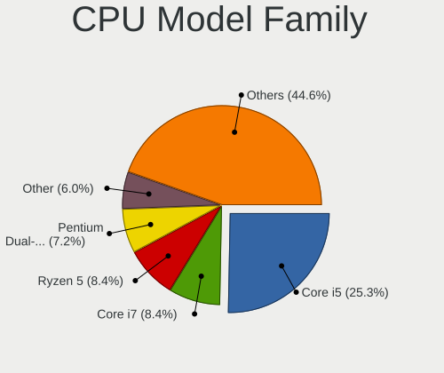

| Model                   | Desktops | Percent |
|-------------------------|----------|---------|
| Intel Core i5           | 21       | 25.3%   |
| Intel Core i7           | 7        | 8.43%   |
| AMD Ryzen 5             | 7        | 8.43%   |
| Intel Pentium Dual-Core | 6        | 7.23%   |
| Other                   | 5        | 6.02%   |
| Intel Core i3           | 5        | 6.02%   |
| AMD Ryzen 3             | 4        | 4.82%   |
| Intel Xeon              | 3        | 3.61%   |
| Intel Core 2 Duo        | 3        | 3.61%   |
| Intel Pentium           | 2        | 2.41%   |
| Intel Core 2 Quad       | 2        | 2.41%   |
| Intel Core 2            | 2        | 2.41%   |
| Intel Celeron           | 2        | 2.41%   |
| AMD Ryzen 7             | 2        | 2.41%   |
| AMD Athlon 64 X2        | 2        | 2.41%   |
| Intel Pentium 4         | 1        | 1.2%    |
| Intel Celeron D         | 1        | 1.2%    |
| AMD Ryzen 9             | 1        | 1.2%    |
| AMD Phenom              | 1        | 1.2%    |
| AMD FX                  | 1        | 1.2%    |
| AMD Athlon X4           | 1        | 1.2%    |
| AMD Athlon II X3        | 1        | 1.2%    |
| AMD Athlon 64           | 1        | 1.2%    |
| AMD A8                  | 1        | 1.2%    |
| AMD A6                  | 1        | 1.2%    |

CPU Cores
---------

Number of processor cores

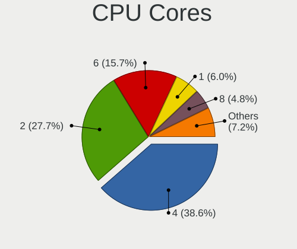

| Number | Desktops | Percent |
|--------|----------|---------|
| 4      | 32       | 38.55%  |
| 2      | 23       | 27.71%  |
| 6      | 13       | 15.66%  |
| 1      | 5        | 6.02%   |
| 8      | 4        | 4.82%   |
| 12     | 3        | 3.61%   |
| 3      | 3        | 3.61%   |

CPU Sockets
-----------

Number of sockets

| Number | Desktops | Percent |
|--------|----------|---------|
| 1      | 82       | 98.8%   |
| 2      | 1        | 1.2%    |

CPU Threads
-----------

Threads per core (Hyper-Threading)

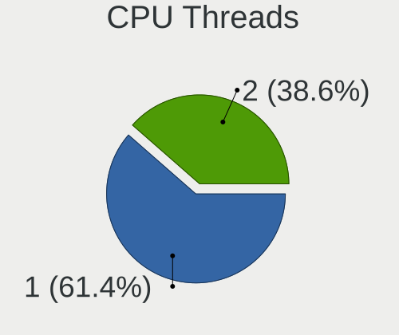

| Number | Desktops | Percent |
|--------|----------|---------|
| 1      | 51       | 61.45%  |
| 2      | 32       | 38.55%  |

CPU Op-Modes
------------

CPU Operation Modes (32-bit, 64-bit)

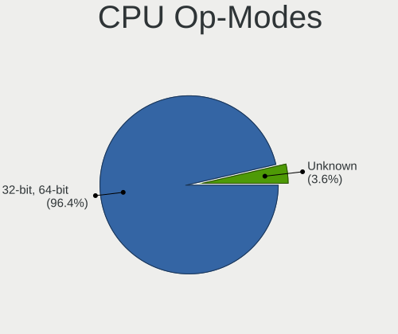

| Op mode        | Desktops | Percent |
|----------------|----------|---------|
| 32-bit, 64-bit | 80       | 96.39%  |
| Unknown        | 3        | 3.61%   |

CPU Microcode
-------------

Microcode number

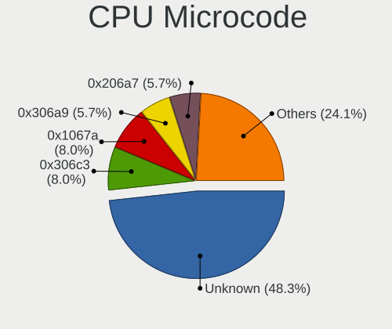

| Number     | Desktops | Percent |
|------------|----------|---------|
| Unknown    | 42       | 48.28%  |
| 0x306c3    | 7        | 8.05%   |
| 0x1067a    | 7        | 8.05%   |
| 0x306a9    | 5        | 5.75%   |
| 0x206a7    | 5        | 5.75%   |
| 0x506e3    | 3        | 3.45%   |
| 0xf65      | 1        | 1.15%   |
| 0xf43      | 1        | 1.15%   |
| 0xa0653    | 1        | 1.15%   |
| 0x906ec    | 1        | 1.15%   |
| 0x906eb    | 1        | 1.15%   |
| 0x6fb      | 1        | 1.15%   |
| 0x6f6      | 1        | 1.15%   |
| 0x6f2      | 1        | 1.15%   |
| 0x10676    | 1        | 1.15%   |
| 0x10661    | 1        | 1.15%   |
| 0x08701021 | 1        | 1.15%   |
| 0x08108109 | 1        | 1.15%   |
| 0x0800820d | 1        | 1.15%   |
| 0x06006118 | 1        | 1.15%   |
| 0x06001116 | 1        | 1.15%   |
| 0x0600063d | 1        | 1.15%   |
| 0x03000027 | 1        | 1.15%   |
| 0x01000083 | 1        | 1.15%   |

CPU Microarch
-------------

Microarchitecture

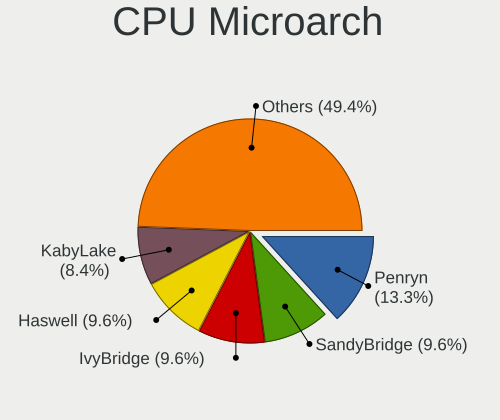

| Name             | Desktops | Percent |
|------------------|----------|---------|
| Penryn           | 11       | 13.25%  |
| SandyBridge      | 8        | 9.64%   |
| IvyBridge        | 8        | 9.64%   |
| Haswell          | 8        | 9.64%   |
| KabyLake         | 7        | 8.43%   |
| Core             | 5        | 6.02%   |
| Zen 2            | 4        | 4.82%   |
| Zen+             | 3        | 3.61%   |
| Zen 3            | 3        | 3.61%   |
| Zen              | 3        | 3.61%   |
| Skylake          | 3        | 3.61%   |
| K8 Hammer        | 3        | 3.61%   |
| Unknown          | 3        | 3.61%   |
| Westmere         | 2        | 2.41%   |
| NetBurst         | 2        | 2.41%   |
| K10              | 2        | 2.41%   |
| Alderlake Hybrid | 2        | 2.41%   |
| Piledriver       | 1        | 1.2%    |
| K10 Llano        | 1        | 1.2%    |
| Icelake          | 1        | 1.2%    |
| Excavator        | 1        | 1.2%    |
| CometLake        | 1        | 1.2%    |
| Bulldozer        | 1        | 1.2%    |

Graphics
--------

GPU Vendor
----------

Vendors of graphics cards

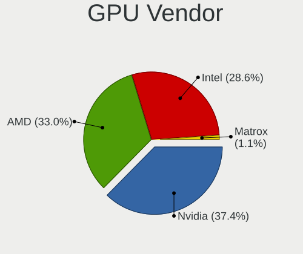

| Vendor                     | Desktops | Percent |
|----------------------------|----------|---------|
| Nvidia                     | 34       | 37.36%  |
| AMD                        | 30       | 32.97%  |
| Intel                      | 26       | 28.57%  |
| Matrox Electronics Systems | 1        | 1.1%    |

GPU Model
---------

Graphics card models

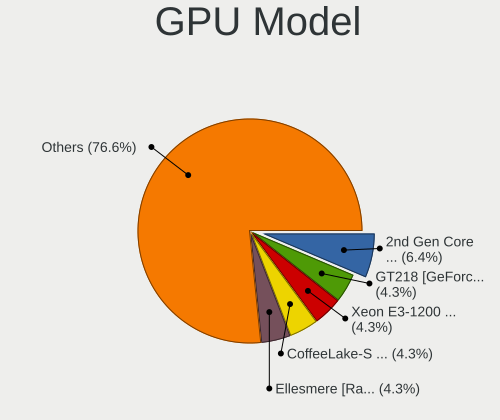

| Model                                                                       | Desktops | Percent |
|-----------------------------------------------------------------------------|----------|---------|
| Intel 2nd Generation Core Processor Family Integrated Graphics Controller   | 6        | 6.38%   |
| Nvidia GT218 [GeForce 210]                                                  | 4        | 4.26%   |
| Intel Xeon E3-1200 v3/4th Gen Core Processor Integrated Graphics Controller | 4        | 4.26%   |
| Intel CoffeeLake-S GT2 [UHD Graphics 630]                                   | 4        | 4.26%   |
| AMD Ellesmere [Radeon RX 470/480/570/570X/580/580X/590]                     | 4        | 4.26%   |
| Nvidia GP107 [GeForce GTX 1050 Ti]                                          | 3        | 3.19%   |
| Intel Xeon E3-1200 v2/3rd Gen Core processor Graphics Controller            | 3        | 3.19%   |
| Nvidia GP108 [GeForce GT 1030]                                              | 2        | 2.13%   |
| Nvidia GK208B [GeForce GT 710]                                              | 2        | 2.13%   |
| Nvidia GK110 [GeForce GTX 780]                                              | 2        | 2.13%   |
| Intel 82G33/G31 Express Integrated Graphics Controller                      | 2        | 2.13%   |
| Intel 4 Series Chipset Integrated Graphics Controller                       | 2        | 2.13%   |
| AMD RV710 [Radeon HD 4350/4550]                                             | 2        | 2.13%   |
| AMD Raven Ridge [Radeon Vega Series / Radeon Vega Mobile Series]            | 2        | 2.13%   |
| AMD Navi 23 [Radeon RX 6600/6600 XT/6600M]                                  | 2        | 2.13%   |
| AMD Cape Verde XT [Radeon HD 7770/8760 / R7 250X]                           | 2        | 2.13%   |
| AMD Baffin [Radeon RX 460/560D / Pro 450/455/460/555/555X/560/560X]         | 2        | 2.13%   |
| Nvidia TU117 [GeForce GTX 1650]                                             | 1        | 1.06%   |
| Nvidia TU116 [GeForce GTX 1660]                                             | 1        | 1.06%   |
| Nvidia TU106 [GeForce GTX 1650]                                             | 1        | 1.06%   |
| Nvidia TU104 [GeForce RTX 2080]                                             | 1        | 1.06%   |
| Nvidia GT216 [GeForce GT 220]                                               | 1        | 1.06%   |
| Nvidia GP106 [GeForce GTX 1060 6GB]                                         | 1        | 1.06%   |
| Nvidia GP104 [GeForce GTX 1070]                                             | 1        | 1.06%   |
| Nvidia GP102 [GeForce GTX 1080 Ti]                                          | 1        | 1.06%   |
| Nvidia GM107 [GeForce GTX 750 Ti]                                           | 1        | 1.06%   |
| Nvidia GK208B [GeForce GT 730]                                              | 1        | 1.06%   |
| Nvidia GF119 [GeForce GT 620 OEM]                                           | 1        | 1.06%   |
| Nvidia GF119 [GeForce GT 610]                                               | 1        | 1.06%   |
| Nvidia GF116 [GeForce GTX 550 Ti]                                           | 1        | 1.06%   |
| Nvidia GF106GL [Quadro 2000]                                                | 1        | 1.06%   |
| Nvidia GF106 [GeForce GT 440]                                               | 1        | 1.06%   |
| Nvidia GB206 [GeForce RTX 5060]                                             | 1        | 1.06%   |
| Nvidia GA106 [GeForce RTX 3060 Lite Hash Rate]                              | 1        | 1.06%   |
| Nvidia GA104 [GeForce RTX 3060]                                             | 1        | 1.06%   |
| Nvidia G96C [GeForce 9500 GT]                                               | 1        | 1.06%   |
| Nvidia G86 [GeForce 8500 GT]                                                | 1        | 1.06%   |
| Nvidia G84 [GeForce 8600 GTS]                                               | 1        | 1.06%   |
| Matrox Electronics Systems MGA G200e [Pilot] ServerEngines (SEP1)           | 1        | 1.06%   |
| Intel Skylake-S GT2 [HD Graphics 530]                                       | 1        | 1.06%   |

GPU Combo
---------

Combinations of graphics cards

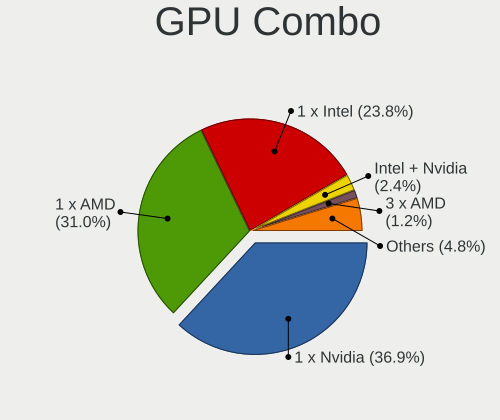

| Name           | Desktops | Percent |
|----------------|----------|---------|
| 1 x Nvidia     | 31       | 36.9%   |
| 1 x AMD        | 26       | 30.95%  |
| 1 x Intel      | 20       | 23.81%  |
| Intel + Nvidia | 2        | 2.38%   |
| 3 x AMD        | 1        | 1.19%   |
| 2 x AMD        | 1        | 1.19%   |
| 1 x Matrox     | 1        | 1.19%   |
| Intel + AMD    | 1        | 1.19%   |
| AMD + Nvidia   | 1        | 1.19%   |

GPU Driver
----------

Free vs proprietary

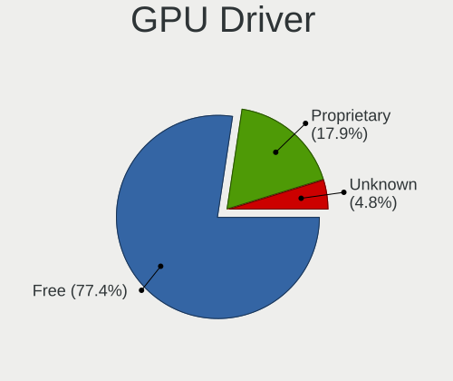

| Driver      | Desktops | Percent |
|-------------|----------|---------|
| Free        | 65       | 77.38%  |
| Proprietary | 15       | 17.86%  |
| Unknown     | 4        | 4.76%   |

GPU Memory
----------

Total video memory

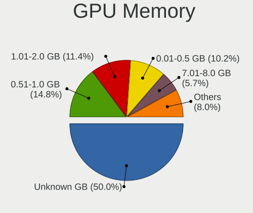

| Size in GB | Desktops | Percent |
|------------|----------|---------|
| Unknown    | 44       | 50%     |
| 0.51-1.0   | 13       | 14.77%  |
| 1.01-2.0   | 10       | 11.36%  |
| 0.01-0.5   | 9        | 10.23%  |
| 7.01-8.0   | 5        | 5.68%   |
| 3.01-4.0   | 3        | 3.41%   |
| 2.01-3.0   | 2        | 2.27%   |
| 5.01-6.0   | 1        | 1.14%   |
| 8.01-16.0  | 1        | 1.14%   |

Monitor
-------

Monitor Vendor
--------------

Monitor vendors

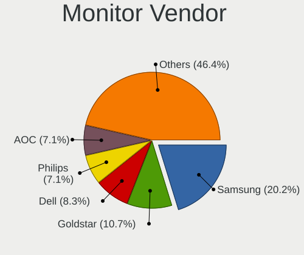

| Vendor               | Desktops | Percent |
|----------------------|----------|---------|
| Samsung Electronics  | 17       | 20.24%  |
| Goldstar             | 9        | 10.71%  |
| Dell                 | 7        | 8.33%   |
| Philips              | 6        | 7.14%   |
| AOC                  | 6        | 7.14%   |
| Fujitsu Siemens      | 5        | 5.95%   |
| Ancor Communications | 4        | 4.76%   |
| Acer                 | 4        | 4.76%   |
| Sony                 | 3        | 3.57%   |
| Hewlett-Packard      | 3        | 3.57%   |
| ASUSTek Computer     | 3        | 3.57%   |
| Unknown              | 2        | 2.38%   |
| Lenovo               | 2        | 2.38%   |
| IBM                  | 2        | 2.38%   |
| Eizo                 | 2        | 2.38%   |
| BenQ                 | 2        | 2.38%   |
| ViewSonic            | 1        | 1.19%   |
| Vestel Elektronik    | 1        | 1.19%   |
| NEC Computers        | 1        | 1.19%   |
| MSI                  | 1        | 1.19%   |
| LTM                  | 1        | 1.19%   |
| CTV                  | 1        | 1.19%   |
| Belinea              | 1        | 1.19%   |

Monitor Model
-------------

Monitor models

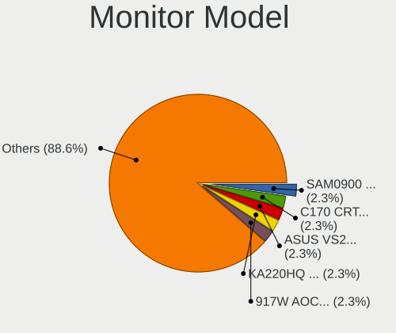

| Model                                                                  | Desktops | Percent |
|------------------------------------------------------------------------|----------|---------|
| Samsung Electronics LCD Monitor SAM0900 1366x768 580x320mm 26.1-inch   | 2        | 2.27%   |
| IBM C170 CRT IBM1A51 1280x1024 310x230mm 15.2-inch                     | 2        | 2.27%   |
| AOC 917W AOC1917 1440x900 410x256mm 19.0-inch                          | 2        | 2.27%   |
| Ancor Communications ASUS VS247 ACI249A 1920x1080 521x293mm 23.5-inch  | 2        | 2.27%   |
| Acer KA220HQ ACR0467 1920x1080 477x268mm 21.5-inch                     | 2        | 2.27%   |
| ViewSonic VA702 VSC1C1C 1280x1024 338x270mm 17.0-inch                  | 1        | 1.14%   |
| Vestel Elektronik 40UHD_LCD_TV VES3700 3840x2160 880x500mm 39.8-inch   | 1        | 1.14%   |
| Unknown LCD Monitor SAMSUNG 1366x768                                   | 1        | 1.14%   |
| Unknown LCD Monitor Maxdata/XXXXXXX B_101920 1280x1024                 | 1        | 1.14%   |
| Sony TV SNY6604 1920x1080                                              | 1        | 1.14%   |
| Sony TV SNY4D04 1920x1080                                              | 1        | 1.14%   |
| Sony TV *00 SNY4904 3840x2160                                          | 1        | 1.14%   |
| Samsung Electronics SyncMaster SAM0564 1360x768 410x230mm 18.5-inch    | 1        | 1.14%   |
| Samsung Electronics SyncMaster SAM03E2 1680x1050 433x271mm 20.1-inch   | 1        | 1.14%   |
| Samsung Electronics SyncMaster SAM01F9 1280x1024 376x301mm 19.0-inch   | 1        | 1.14%   |
| Samsung Electronics SyncMaster SAM0169 1280x1024 380x300mm 19.1-inch   | 1        | 1.14%   |
| Samsung Electronics SAMTRON 50X/V STN0011 1024x768 304x228mm 15.0-inch | 1        | 1.14%   |
| Samsung Electronics S27D590 SAM0B49 1920x1080 598x336mm 27.0-inch      | 1        | 1.14%   |
| Samsung Electronics S24D391 SAM0B87 1920x1080 521x293mm 23.5-inch      | 1        | 1.14%   |
| Samsung Electronics S22E450 SAM0C7C 1680x1050 473x291mm 21.9-inch      | 1        | 1.14%   |
| Samsung Electronics S22D300 SAM0B3F 1920x1080 477x268mm 21.5-inch      | 1        | 1.14%   |
| Samsung Electronics S22B150 SAM08A3 1920x1080 477x268mm 21.5-inch      | 1        | 1.14%   |
| Samsung Electronics LCD Monitor SyncMaster 1680x1050                   | 1        | 1.14%   |
| Samsung Electronics LCD Monitor SAM0DFB 3840x2160 1210x680mm 54.6-inch | 1        | 1.14%   |
| Samsung Electronics LCD Monitor SAM0B30 1920x1080 885x498mm 40.0-inch  | 1        | 1.14%   |
| Samsung Electronics LCD Monitor SAM0678 1360x768                       | 1        | 1.14%   |
| Samsung Electronics LCD Monitor SAM0659 1920x1080                      | 1        | 1.14%   |
| Samsung Electronics C24F390 SAM0D2C 1920x1080 521x293mm 23.5-inch      | 1        | 1.14%   |
| Philips PHL 247E6 PHLC0E7 1920x1080 521x293mm 23.5-inch                | 1        | 1.14%   |
| Philips LCD Monitor FTV                                                | 1        | 1.14%   |
| Philips LCD Monitor 170S 3200x1080                                     | 1        | 1.14%   |
| Philips 226VL PHLC081 1920x1080 480x268mm 21.6-inch                    | 1        | 1.14%   |
| Philips 192EL PHLC04E 1366x768 410x230mm 18.5-inch                     | 1        | 1.14%   |
| Philips 170S PHL0856 1280x1024 338x270mm 17.0-inch                     | 1        | 1.14%   |
| Philips 170S PHL0839 1280x1024 338x270mm 17.0-inch                     | 1        | 1.14%   |
| NEC Computers LCD2170NX NEC6695 1600x1200 432x324mm 21.3-inch          | 1        | 1.14%   |
| MSI G27C4X MSI9CA9 1920x1080 598x336mm 27.0-inch                       | 1        | 1.14%   |
| LTM LONTIUM LTM0401 1920x1080 890x500mm 40.2-inch                      | 1        | 1.14%   |
| Lenovo LEN-M93z-B LEN0093 1920x1080 510x290mm 23.1-inch                | 1        | 1.14%   |
| Lenovo LEN G24-10 LEN65FD 1920x1080 521x293mm 23.5-inch                | 1        | 1.14%   |

Monitor Resolution
------------------

Monitor screen resolution

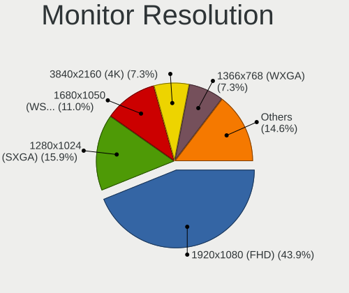

| Resolution         | Desktops | Percent |
|--------------------|----------|---------|
| 1920x1080 (FHD)    | 36       | 43.9%   |
| 1280x1024 (SXGA)   | 13       | 15.85%  |
| 1680x1050 (WSXGA+) | 9        | 10.98%  |
| 3840x2160 (4K)     | 6        | 7.32%   |
| 1366x768 (WXGA)    | 6        | 7.32%   |
| 2560x1440 (QHD)    | 2        | 2.44%   |
| 1440x900 (WXGA+)   | 2        | 2.44%   |
| 1360x768           | 2        | 2.44%   |
| 3200x1080          | 1        | 1.22%   |
| 1920x1200 (WUXGA)  | 1        | 1.22%   |
| 1600x900 (HD+)     | 1        | 1.22%   |
| 1600x1200          | 1        | 1.22%   |
| 1024x768 (XGA)     | 1        | 1.22%   |
| Unknown            | 1        | 1.22%   |

Monitor Diagonal
----------------

Diagonal size in inches

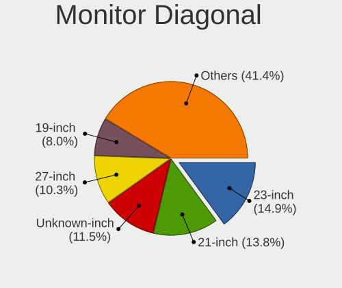

| Inches  | Desktops | Percent |
|---------|----------|---------|
| 23      | 13       | 14.94%  |
| 21      | 12       | 13.79%  |
| Unknown | 10       | 11.49%  |
| 27      | 9        | 10.34%  |
| 19      | 7        | 8.05%   |
| 24      | 6        | 6.9%    |
| 22      | 5        | 5.75%   |
| 17      | 5        | 5.75%   |
| 18      | 4        | 4.6%    |
| 72      | 3        | 3.45%   |
| 31      | 3        | 3.45%   |
| 15      | 3        | 3.45%   |
| 84      | 2        | 2.3%    |
| 20      | 2        | 2.3%    |
| 54      | 1        | 1.15%   |
| 40      | 1        | 1.15%   |
| 26      | 1        | 1.15%   |

Monitor Width
-------------

Physical width

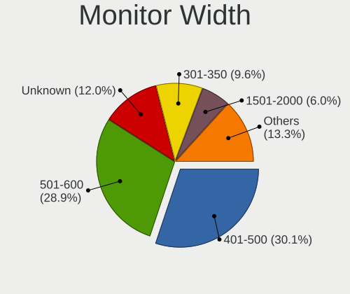

| Width in mm | Desktops | Percent |
|-------------|----------|---------|
| 401-500     | 25       | 30.12%  |
| 501-600     | 24       | 28.92%  |
| Unknown     | 10       | 12.05%  |
| 301-350     | 8        | 9.64%   |
| 351-400     | 5        | 6.02%   |
| 1501-2000   | 5        | 6.02%   |
| 601-700     | 4        | 4.82%   |
| 801-900     | 1        | 1.2%    |
| 1001-1500   | 1        | 1.2%    |

Aspect Ratio
------------

Proportional relationship between the width and the height

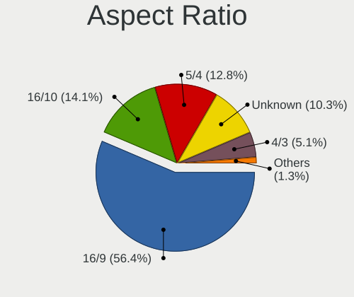

| Ratio   | Desktops | Percent |
|---------|----------|---------|
| 16/9    | 44       | 56.41%  |
| 16/10   | 11       | 14.1%   |
| 5/4     | 10       | 12.82%  |
| Unknown | 8        | 10.26%  |
| 4/3     | 4        | 5.13%   |
| 3/2     | 1        | 1.28%   |

Monitor Area
------------

Area in inch²

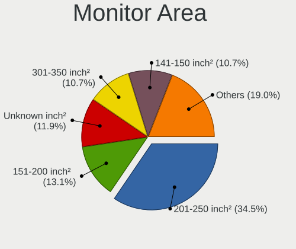

| Area in inch² | Desktops | Percent |
|----------------|----------|---------|
| 201-250        | 29       | 34.52%  |
| 151-200        | 11       | 13.1%   |
| Unknown        | 10       | 11.9%   |
| 301-350        | 9        | 10.71%  |
| 141-150        | 9        | 10.71%  |
| More than 1000 | 6        | 7.14%   |
| 351-500        | 3        | 3.57%   |
| 251-300        | 3        | 3.57%   |
| 111-120        | 2        | 2.38%   |
| 101-110        | 1        | 1.19%   |
| 501-1000       | 1        | 1.19%   |

Pixel Density
-------------

Pixels per inch

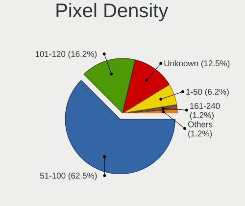

| Density | Desktops | Percent |
|---------|----------|---------|
| 51-100  | 50       | 62.5%   |
| 101-120 | 13       | 16.25%  |
| Unknown | 10       | 12.5%   |
| 1-50    | 5        | 6.25%   |
| 161-240 | 1        | 1.25%   |
| 121-160 | 1        | 1.25%   |

Multiple Monitors
-----------------

Total monitors connected

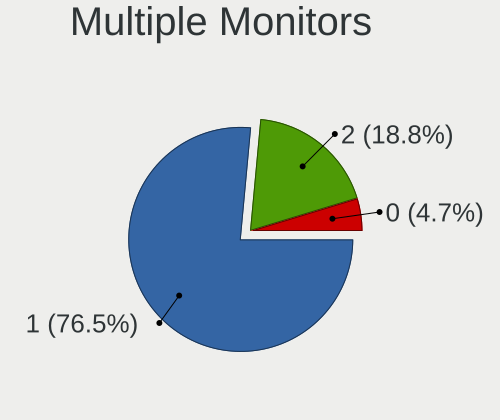

| Total | Desktops | Percent |
|-------|----------|---------|
| 1     | 65       | 76.47%  |
| 2     | 16       | 18.82%  |
| 0     | 4        | 4.71%   |

Network
-------

Net Controller Vendor
---------------------

Controller vendors

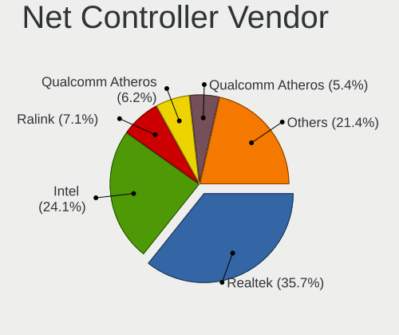

| Vendor                                 | Desktops | Percent |
|----------------------------------------|----------|---------|
| Realtek Semiconductor                  | 40       | 35.71%  |
| Intel                                  | 27       | 24.11%  |
| Ralink Technology                      | 8        | 7.14%   |
| Qualcomm Atheros                       | 7        | 6.25%   |
| Qualcomm Atheros Communications        | 6        | 5.36%   |
| TP-Link                                | 4        | 3.57%   |
| Broadcom                               | 4        | 3.57%   |
| Nvidia                                 | 3        | 2.68%   |
| Sony Ericsson Mobile Communications AB | 2        | 1.79%   |
| Mercucys                               | 2        | 1.79%   |
| ICS Advent                             | 2        | 1.79%   |
| Broadcom Limited                       | 2        | 1.79%   |
| Xiaomi                                 | 1        | 0.89%   |
| Ralink                                 | 1        | 0.89%   |
| MediaTek                               | 1        | 0.89%   |
| Marvell Technology Group               | 1        | 0.89%   |
| ASIX Electronics                       | 1        | 0.89%   |

Net Controller Model
--------------------

Controller models

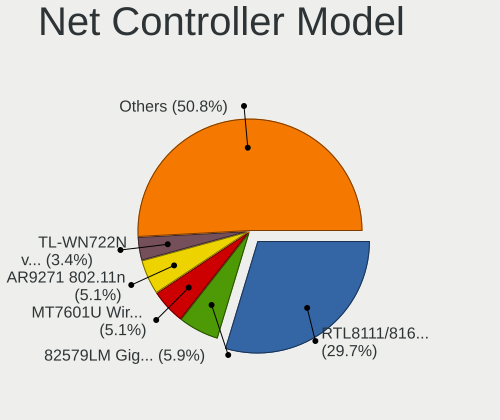

| Model                                                                  | Desktops | Percent |
|------------------------------------------------------------------------|----------|---------|
| Realtek RTL8111/8168/8211/8411 PCI Express Gigabit Ethernet Controller | 35       | 29.66%  |
| Intel 82579LM Gigabit Network Connection (Lewisville)                  | 7        | 5.93%   |
| Ralink MT7601U Wireless Adapter                                        | 6        | 5.08%   |
| Qualcomm Atheros AR9271 802.11n                                        | 6        | 5.08%   |
| TP-Link TL-WN722N v2/v3 [Realtek RTL8188EUS]                           | 4        | 3.39%   |
| Intel 82567LM-3 Gigabit Network Connection                             | 4        | 3.39%   |
| Qualcomm Atheros AR8151 v2.0 Gigabit Ethernet                          | 3        | 2.54%   |
| Intel Ethernet Controller I225-V                                       | 3        | 2.54%   |
| Sony Ericsson Mobile AB D2005                                          | 2        | 1.69%   |
| Realtek 802.11ac NIC                                                   | 2        | 1.69%   |
| Ralink RT5370 Wireless Adapter                                         | 2        | 1.69%   |
| Qualcomm Atheros Killer E2400 Gigabit Ethernet Controller              | 2        | 1.69%   |
| Mercucys 802.11n NIC                                                   | 2        | 1.69%   |
| Intel Ethernet Connection (7) I219-LM                                  | 2        | 1.69%   |
| Intel Ethernet Connection (17) I219-V                                  | 2        | 1.69%   |
| Intel 82579V Gigabit Network Connection                                | 2        | 1.69%   |
| ICS Advent DM9601 Fast Ethernet Adapter                                | 2        | 1.69%   |
| Broadcom NetXtreme BCM5754 Gigabit Ethernet PCI Express                | 2        | 1.69%   |
| Xiaomi Mi/Redmi series (RNDIS)                                         | 1        | 0.85%   |
| Realtek RTL8188CUS 802.11n WLAN Adapter                                | 1        | 0.85%   |
| Realtek RTL8169 PCI Gigabit Ethernet Controller                        | 1        | 0.85%   |
| Realtek RTL8125 2.5GbE Controller                                      | 1        | 0.85%   |
| Realtek RTL-8185 IEEE 802.11a/b/g Wireless LAN Controller              | 1        | 0.85%   |
| Realtek RTL-8100/8101L/8139 PCI Fast Ethernet Adapter                  | 1        | 0.85%   |
| Ralink RT2561/RT61 802.11g PCI                                         | 1        | 0.85%   |
| Qualcomm Atheros Attansic L2 Fast Ethernet                             | 1        | 0.85%   |
| Qualcomm Atheros AR9462 Wireless Network Adapter                       | 1        | 0.85%   |
| Qualcomm Atheros AR2417 Wireless Network Adapter [AR5007G 802.11bg]    | 1        | 0.85%   |
| Nvidia MCP73 Ethernet                                                  | 1        | 0.85%   |
| Nvidia CK8S Ethernet Controller                                        | 1        | 0.85%   |
| Nvidia CK804 Ethernet Controller                                       | 1        | 0.85%   |
| MediaTek MT7921K (RZ608) Wi-Fi 6E 80MHz                                | 1        | 0.85%   |
| Marvell Group 88E8071 PCI-E Gigabit Ethernet Controller                | 1        | 0.85%   |
| Intel Tiger Lake PCH CNVi WiFi                                         | 1        | 0.85%   |
| Intel I211 Gigabit Network Connection                                  | 1        | 0.85%   |
| Intel Ethernet Connection (2) I219-V                                   | 1        | 0.85%   |
| Intel Ethernet Connection (2) I218-V                                   | 1        | 0.85%   |
| Intel Ethernet Connection (11) I219-V                                  | 1        | 0.85%   |
| Intel Dual Band Wireless-AC 3168NGW [Stone Peak]                       | 1        | 0.85%   |
| Intel Alder Lake-S PCH CNVi WiFi                                       | 1        | 0.85%   |

Wireless Vendor
---------------

Wireless vendors

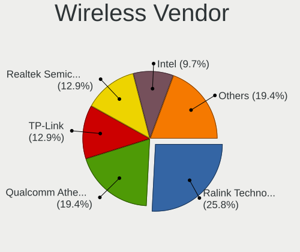

| Vendor                          | Desktops | Percent |
|---------------------------------|----------|---------|
| Ralink Technology               | 8        | 25.81%  |
| Qualcomm Atheros Communications | 6        | 19.35%  |
| TP-Link                         | 4        | 12.9%   |
| Realtek Semiconductor           | 4        | 12.9%   |
| Intel                           | 3        | 9.68%   |
| Qualcomm Atheros                | 2        | 6.45%   |
| Mercucys                        | 2        | 6.45%   |
| Ralink                          | 1        | 3.23%   |
| MediaTek                        | 1        | 3.23%   |

Wireless Model
--------------

Wireless models

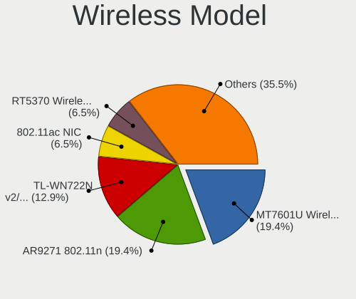

| Model                                                               | Desktops | Percent |
|---------------------------------------------------------------------|----------|---------|
| Ralink MT7601U Wireless Adapter                                     | 6        | 19.35%  |
| Qualcomm Atheros AR9271 802.11n                                     | 6        | 19.35%  |
| TP-Link TL-WN722N v2/v3 [Realtek RTL8188EUS]                        | 4        | 12.9%   |
| Realtek 802.11ac NIC                                                | 2        | 6.45%   |
| Ralink RT5370 Wireless Adapter                                      | 2        | 6.45%   |
| Mercucys 802.11n NIC                                                | 2        | 6.45%   |
| Realtek RTL8188CUS 802.11n WLAN Adapter                             | 1        | 3.23%   |
| Realtek RTL-8185 IEEE 802.11a/b/g Wireless LAN Controller           | 1        | 3.23%   |
| Ralink RT2561/RT61 802.11g PCI                                      | 1        | 3.23%   |
| Qualcomm Atheros AR9462 Wireless Network Adapter                    | 1        | 3.23%   |
| Qualcomm Atheros AR2417 Wireless Network Adapter [AR5007G 802.11bg] | 1        | 3.23%   |
| MediaTek MT7921K (RZ608) Wi-Fi 6E 80MHz                             | 1        | 3.23%   |
| Intel Tiger Lake PCH CNVi WiFi                                      | 1        | 3.23%   |
| Intel Dual Band Wireless-AC 3168NGW [Stone Peak]                    | 1        | 3.23%   |
| Intel Alder Lake-S PCH CNVi WiFi                                    | 1        | 3.23%   |

Ethernet Vendor
---------------

Ethernet vendors

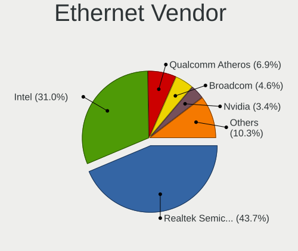

| Vendor                                 | Desktops | Percent |
|----------------------------------------|----------|---------|
| Realtek Semiconductor                  | 38       | 43.68%  |
| Intel                                  | 27       | 31.03%  |
| Qualcomm Atheros                       | 6        | 6.9%    |
| Broadcom                               | 4        | 4.6%    |
| Nvidia                                 | 3        | 3.45%   |
| Sony Ericsson Mobile Communications AB | 2        | 2.3%    |
| ICS Advent                             | 2        | 2.3%    |
| Broadcom Limited                       | 2        | 2.3%    |
| Xiaomi                                 | 1        | 1.15%   |
| Marvell Technology Group               | 1        | 1.15%   |
| ASIX Electronics                       | 1        | 1.15%   |

Ethernet Model
--------------

Ethernet models

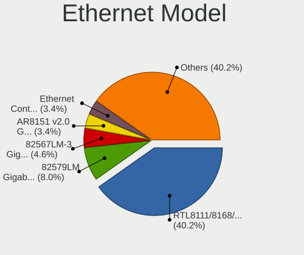

| Model                                                                  | Desktops | Percent |
|------------------------------------------------------------------------|----------|---------|
| Realtek RTL8111/8168/8211/8411 PCI Express Gigabit Ethernet Controller | 35       | 40.23%  |
| Intel 82579LM Gigabit Network Connection (Lewisville)                  | 7        | 8.05%   |
| Intel 82567LM-3 Gigabit Network Connection                             | 4        | 4.6%    |
| Qualcomm Atheros AR8151 v2.0 Gigabit Ethernet                          | 3        | 3.45%   |
| Intel Ethernet Controller I225-V                                       | 3        | 3.45%   |
| Sony Ericsson Mobile AB D2005                                          | 2        | 2.3%    |
| Qualcomm Atheros Killer E2400 Gigabit Ethernet Controller              | 2        | 2.3%    |
| Intel Ethernet Connection (7) I219-LM                                  | 2        | 2.3%    |
| Intel Ethernet Connection (17) I219-V                                  | 2        | 2.3%    |
| Intel 82579V Gigabit Network Connection                                | 2        | 2.3%    |
| ICS Advent DM9601 Fast Ethernet Adapter                                | 2        | 2.3%    |
| Broadcom NetXtreme BCM5754 Gigabit Ethernet PCI Express                | 2        | 2.3%    |
| Xiaomi Mi/Redmi series (RNDIS)                                         | 1        | 1.15%   |
| Realtek RTL8169 PCI Gigabit Ethernet Controller                        | 1        | 1.15%   |
| Realtek RTL8125 2.5GbE Controller                                      | 1        | 1.15%   |
| Realtek RTL-8100/8101L/8139 PCI Fast Ethernet Adapter                  | 1        | 1.15%   |
| Qualcomm Atheros Attansic L2 Fast Ethernet                             | 1        | 1.15%   |
| Nvidia MCP73 Ethernet                                                  | 1        | 1.15%   |
| Nvidia CK8S Ethernet Controller                                        | 1        | 1.15%   |
| Nvidia CK804 Ethernet Controller                                       | 1        | 1.15%   |
| Marvell Group 88E8071 PCI-E Gigabit Ethernet Controller                | 1        | 1.15%   |
| Intel I211 Gigabit Network Connection                                  | 1        | 1.15%   |
| Intel Ethernet Connection (2) I219-V                                   | 1        | 1.15%   |
| Intel Ethernet Connection (2) I218-V                                   | 1        | 1.15%   |
| Intel Ethernet Connection (11) I219-V                                  | 1        | 1.15%   |
| Intel 82578DC Gigabit Network Connection                               | 1        | 1.15%   |
| Intel 82573V Gigabit Ethernet Controller (Copper)                      | 1        | 1.15%   |
| Intel 82566DM Gigabit Network Connection                               | 1        | 1.15%   |
| Broadcom NetXtreme BCM5715 Gigabit Ethernet                            | 1        | 1.15%   |
| Broadcom NetLink BCM57780 Gigabit Ethernet PCIe                        | 1        | 1.15%   |
| Broadcom Limited NetXtreme BCM5755 Gigabit Ethernet PCI Express        | 1        | 1.15%   |
| Broadcom Limited NetXtreme BCM5722 Gigabit Ethernet PCI Express        | 1        | 1.15%   |
| ASIX AX88772B                                                          | 1        | 1.15%   |

Net Controller Kind
-------------------

Ethernet, WiFi or modem

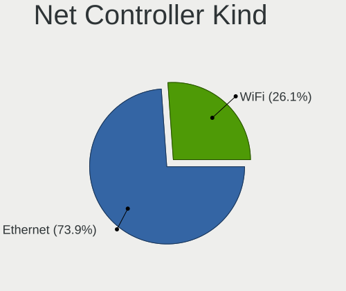

| Kind     | Desktops | Percent |
|----------|----------|---------|
| Ethernet | 82       | 73.87%  |
| WiFi     | 29       | 26.13%  |

Used Controller
---------------

Currently used network controller

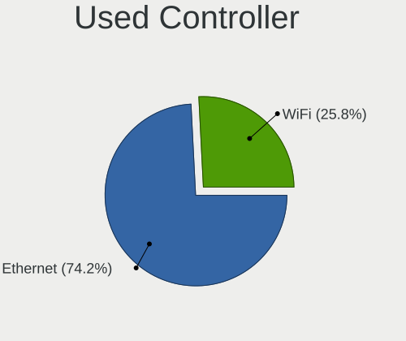

| Kind     | Desktops | Percent |
|----------|----------|---------|
| Ethernet | 62       | 75.61%  |
| WiFi     | 20       | 24.39%  |

NICs
----

Total network controllers on board

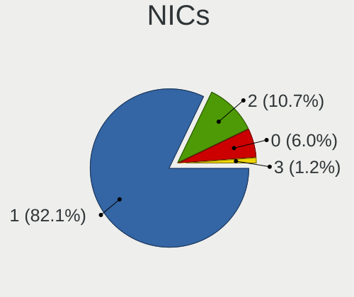

| Total | Desktops | Percent |
|-------|----------|---------|
| 1     | 69       | 82.14%  |
| 2     | 9        | 10.71%  |
| 0     | 5        | 5.95%   |
| 3     | 1        | 1.19%   |

IPv6
----

IPv6 vs IPv4

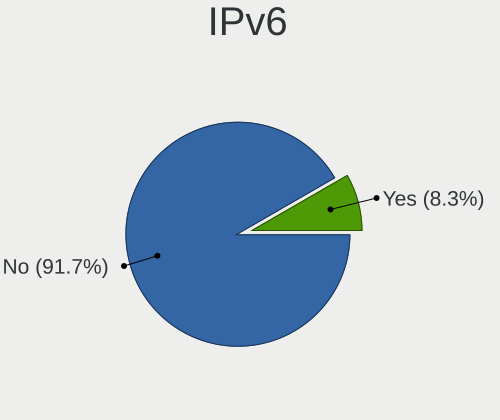

| Used | Desktops | Percent |
|------|----------|---------|
| No   | 77       | 91.67%  |
| Yes  | 7        | 8.33%   |

Bluetooth
---------

Bluetooth Vendor
----------------

Controller vendors

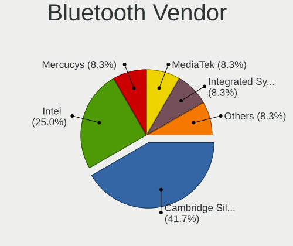

| Vendor                     | Desktops | Percent |
|----------------------------|----------|---------|
| Cambridge Silicon Radio    | 5        | 41.67%  |
| Intel                      | 3        | 25%     |
| Mercucys                   | 1        | 8.33%   |
| MediaTek                   | 1        | 8.33%   |
| Integrated System Solution | 1        | 8.33%   |
| Broadcom                   | 1        | 8.33%   |

Bluetooth Model
---------------

Controller models

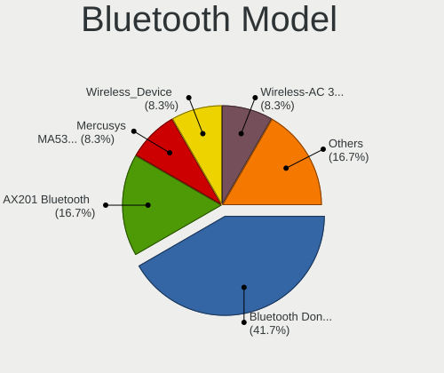

| Model                                               | Desktops | Percent |
|-----------------------------------------------------|----------|---------|
| Cambridge Silicon Radio Bluetooth Dongle (HCI mode) | 5        | 41.67%  |
| Intel AX201 Bluetooth                               | 2        | 16.67%  |
| Mercucys Mercusys MA530 Adapter                     | 1        | 8.33%   |
| MediaTek Wireless_Device                            | 1        | 8.33%   |
| Intel Wireless-AC 3168 Bluetooth                    | 1        | 8.33%   |
| Integrated System Solution Bluetooth Device         | 1        | 8.33%   |
| Broadcom BCM92046DG-CL1ROM Bluetooth 2.1 UHE Dongle | 1        | 8.33%   |

Sound
-----

Sound Vendor
------------

Sound card vendors

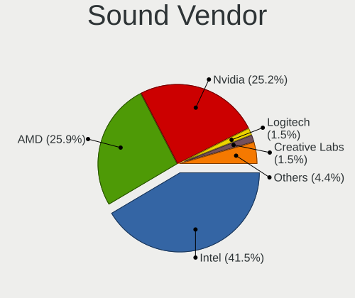

| Vendor                   | Desktops | Percent |
|--------------------------|----------|---------|
| Intel                    | 56       | 41.48%  |
| AMD                      | 35       | 25.93%  |
| Nvidia                   | 34       | 25.19%  |
| Logitech                 | 2        | 1.48%   |
| Creative Labs            | 2        | 1.48%   |
| C-Media Electronics      | 2        | 1.48%   |
| VIA Technologies         | 1        | 0.74%   |
| Micro Star International | 1        | 0.74%   |
| Focusrite-Novation       | 1        | 0.74%   |
| Conexant Systems         | 1        | 0.74%   |

Sound Model
-----------

Sound card models

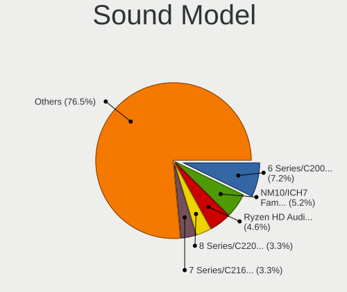

| Model                                                                      | Desktops | Percent |
|----------------------------------------------------------------------------|----------|---------|
| Intel 6 Series/C200 Series Chipset Family High Definition Audio Controller | 11       | 7.19%   |
| Intel NM10/ICH7 Family High Definition Audio Controller                    | 8        | 5.23%   |
| AMD Ryzen HD Audio Controller                                              | 7        | 4.58%   |
| Intel 8 Series/C220 Series Chipset High Definition Audio Controller        | 5        | 3.27%   |
| Intel 7 Series/C216 Chipset Family High Definition Audio Controller        | 5        | 3.27%   |
| AMD Starship/Matisse HD Audio Controller                                   | 5        | 3.27%   |
| Nvidia High Definition Audio Controller                                    | 4        | 2.61%   |
| Intel 82801JD/DO (ICH10 Family) HD Audio Controller                        | 4        | 2.61%   |
| AMD Ellesmere HDMI Audio [Radeon RX 470/480 / 570/580/590]                 | 4        | 2.61%   |
| Nvidia GP107GL High Definition Audio Controller                            | 3        | 1.96%   |
| Nvidia GK208 HDMI/DP Audio Controller                                      | 3        | 1.96%   |
| Intel Xeon E3-1200 v3/4th Gen Core Processor HD Audio Controller           | 3        | 1.96%   |
| Intel Cannon Lake PCH cAVS                                                 | 3        | 1.96%   |
| Intel Alder Lake-S HD Audio Controller                                     | 3        | 1.96%   |
| Intel 9 Series Chipset Family HD Audio Controller                          | 3        | 1.96%   |
| Intel 200 Series PCH HD Audio                                              | 3        | 1.96%   |
| Intel 100 Series/C230 Series Chipset Family HD Audio Controller            | 3        | 1.96%   |
| AMD RV710/730 HDMI Audio [Radeon HD 4000 series]                           | 3        | 1.96%   |
| AMD Raven/Raven2/Fenghuang HDMI/DP Audio Controller                        | 3        | 1.96%   |
| AMD Oland/Hainan/Cape Verde/Pitcairn HDMI Audio [Radeon HD 7000 Series]    | 3        | 1.96%   |
| AMD Navi 21/23 HDMI/DP Audio Controller                                    | 3        | 1.96%   |
| AMD Baffin HDMI/DP Audio [Radeon RX 550 640SP / RX 560/560X]               | 3        | 1.96%   |
| Nvidia GP108 High Definition Audio Controller                              | 2        | 1.31%   |
| Nvidia GK110 High Definition Audio Controller                              | 2        | 1.31%   |
| Nvidia GF119 HDMI Audio Controller                                         | 2        | 1.31%   |
| Nvidia GF106 High Definition Audio Controller                              | 2        | 1.31%   |
| Intel 82801H (ICH8 Family) HD Audio Controller                             | 2        | 1.31%   |
| Creative Labs CA0106/CA0111 [SB Live!/Audigy/X-Fi Series]                  | 2        | 1.31%   |
| AMD SBx00 Azalia (Intel HDA)                                               | 2        | 1.31%   |
| AMD Renoir/Cezanne HDMI/DP Audio Controller                                | 2        | 1.31%   |
| AMD FCH Azalia Controller                                                  | 2        | 1.31%   |
| AMD Family 17h (Models 00h-0fh) HD Audio Controller                        | 2        | 1.31%   |
| AMD Cedar HDMI Audio [Radeon HD 5400/6300/7300 Series]                     | 2        | 1.31%   |
| VIA Technologies ICE1712 [Envy24] PCI Multi-Channel I/O Controller         | 1        | 0.65%   |
| Nvidia TU116 High Definition Audio Controller                              | 1        | 0.65%   |
| Nvidia TU107 GeForce GTX 1650 High Definition Audio Controller             | 1        | 0.65%   |
| Nvidia TU106 High Definition Audio Controller                              | 1        | 0.65%   |
| Nvidia TU104 HD Audio Controller                                           | 1        | 0.65%   |
| Nvidia nForce3 250Gb AC'97 Audio Controller                                | 1        | 0.65%   |
| Nvidia MCP73 High Definition Audio                                         | 1        | 0.65%   |

Memory
------

Memory Vendor
-------------

Memory module vendors

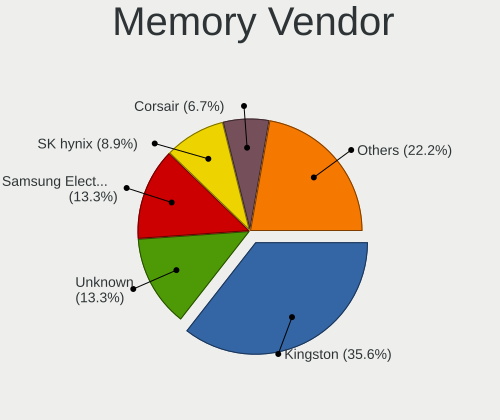

| Vendor              | Desktops | Percent |
|---------------------|----------|---------|
| Kingston            | 16       | 35.56%  |
| Unknown             | 6        | 13.33%  |
| Samsung Electronics | 6        | 13.33%  |
| SK hynix            | 4        | 8.89%   |
| Corsair             | 3        | 6.67%   |
| Patriot             | 2        | 4.44%   |
| Micron Technology   | 2        | 4.44%   |
| Nanya Technology    | 1        | 2.22%   |
| INNOVATION PC       | 1        | 2.22%   |
| G.Skill             | 1        | 2.22%   |
| Crucial             | 1        | 2.22%   |
| Apacer              | 1        | 2.22%   |
| A-DATA Technology   | 1        | 2.22%   |

Memory Model
------------

Memory module models

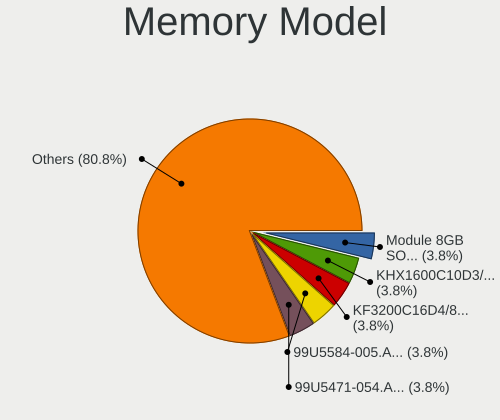

| Model                                                                   | Desktops | Percent |
|-------------------------------------------------------------------------|----------|---------|
| Samsung RAM Module 8GB SODIMM DDR4 2667MT/s                             | 2        | 3.85%   |
| Kingston RAM KHX1600C10D3/8G 8GB DIMM DDR3 2133MT/s                     | 2        | 3.85%   |
| Kingston RAM KF3200C16D4/8GX 8GiB DIMM DDR4 3600MT/s                    | 2        | 3.85%   |
| Kingston RAM 99U5584-005.A00LF 4GB DIMM DDR3 1600MT/s                   | 2        | 3.85%   |
| Kingston RAM 99U5471-054.A00LF 8GB DIMM DDR3 1600MT/s                   | 2        | 3.85%   |
| Unknown RAM Module 4GB DIMM DDR3 1333MT/s                               | 1        | 1.92%   |
| Unknown RAM Module 4GB DIMM 1333MT/s                                    | 1        | 1.92%   |
| Unknown RAM Module 2GB DIMM DDR2 800MT/s                                | 1        | 1.92%   |
| Unknown RAM Module 2048MB DIMM DDR2 333MT/s                             | 1        | 1.92%   |
| Unknown RAM Module 2048MB DIMM 1066MT/s                                 | 1        | 1.92%   |
| Unknown RAM Module 1GB DIMM DDR2 800MT/s                                | 1        | 1.92%   |
| Unknown RAM Module 1024MB DIMM DDR 800MT/s                              | 1        | 1.92%   |
| SK hynix RAM HMT351U6EFR8C-PB 4GB DIMM DDR3 1600MT/s                    | 1        | 1.92%   |
| SK hynix RAM HMT351U6CFR8C 4GB DIMM DDR3 1333MT/s                       | 1        | 1.92%   |
| SK hynix RAM HMT125U6TFR8C-G7 2GB DIMM DDR3 1066MT/s                    | 1        | 1.92%   |
| SK hynix RAM HMT112U6TFR8C-H9 1GB DIMM DDR3 1333MT/s                    | 1        | 1.92%   |
| Samsung RAM Module 2GB DIMM DDR3 1333MT/s                               | 1        | 1.92%   |
| Samsung RAM M378B5273CH0-CK0 4GB DIMM DDR3 2000MT/s                     | 1        | 1.92%   |
| Samsung RAM M378B5273CH0-CH9 4GB DIMM DDR3 1867MT/s                     | 1        | 1.92%   |
| Samsung RAM M378B5173QH0-CK0 4GB DIMM DDR3                              | 1        | 1.92%   |
| Patriot RAM PSD48G266681 8GB DIMM DDR4 2934MT/s                         | 1        | 1.92%   |
| Patriot RAM 2800 C16 Series 8GB DIMM DDR4 3466MT/s                      | 1        | 1.92%   |
| Nanya RAM M2X2G64CB88G7N-DG 2GB DIMM DDR3 1600MT/s                      | 1        | 1.92%   |
| Micron RAM 16JTF25664AZ-1G4F 2GB DIMM DDR3 1333MT/s                     | 1        | 1.92%   |
| Micron RAM 16HTF25664AY-800G1 2GB DIMM DDR2 800MT/s                     | 1        | 1.92%   |
| Kingston RAM KP223C-ELD 2GB DIMM DDR3 1600MT/s                          | 1        | 1.92%   |
| Kingston RAM KHX3200C16D4/8GX 8GB DIMM DDR4 3733MT/s                    | 1        | 1.92%   |
| Kingston RAM KHX2400C15/8G 8GB DIMM DDR4 3400MT/s                       | 1        | 1.92%   |
| Kingston RAM KHX1600C10D3/4G 4GB DIMM DDR3 1866MT/s                     | 1        | 1.92%   |
| Kingston RAM 99U5702-095.A00G 8GB DIMM DDR4 2667MT/s                    | 1        | 1.92%   |
| Kingston RAM 99U5584-010.A00LF 4GB DIMM DDR3 1866MT/s                   | 1        | 1.92%   |
| Kingston RAM 99U5584-009.A00LF 4GB DIMM DDR3 1600MT/s                   | 1        | 1.92%   |
| Kingston RAM 99U5584-007.A 4GB DIMM DDR3 1333MT/s                       | 1        | 1.92%   |
| Kingston RAM 99U5584-003.A00LF 4GB DIMM DDR3 1600MT/s                   | 1        | 1.92%   |
| Kingston RAM 99U5474-016.A00LF 4GB DIMM DDR3 1333MT/s                   | 1        | 1.92%   |
| Kingston RAM 99U5403-067.A00LF 4GB DIMM 1600MT/s                        | 1        | 1.92%   |
| Kingston RAM 9905474-040.A00LF 4GB DIMM DDR3 1600MT/s                   | 1        | 1.92%   |
| Kingston RAM 9905403-511.A00LF 4GB DIMM DDR3 1333MT/s                   | 1        | 1.92%   |
| Kingston RAM 393955353432392D3030372E4130304C4600 2GB DIMM DDR2 800MT/s | 1        | 1.92%   |
| INNOVATION PC RAM INNO104503 8GB DIMM DDR4 2667MT/s                     | 1        | 1.92%   |

Memory Kind
-----------

Memory module kinds

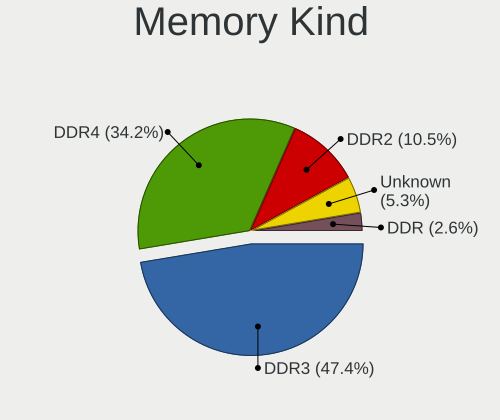

| Kind    | Desktops | Percent |
|---------|----------|---------|
| DDR3    | 18       | 47.37%  |
| DDR4    | 13       | 34.21%  |
| DDR2    | 4        | 10.53%  |
| Unknown | 2        | 5.26%   |
| DDR     | 1        | 2.63%   |

Memory Form Factor
------------------

Physical design of the memory module

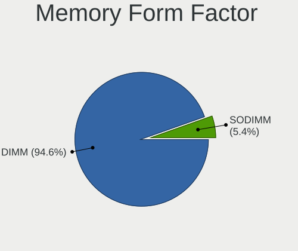

| Name   | Desktops | Percent |
|--------|----------|---------|
| DIMM   | 35       | 94.59%  |
| SODIMM | 2        | 5.41%   |

Memory Size
-----------

Memory module size

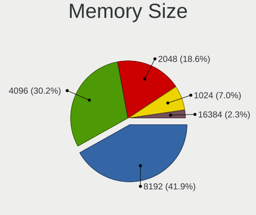

| Size  | Desktops | Percent |
|-------|----------|---------|
| 8192  | 18       | 41.86%  |
| 4096  | 13       | 30.23%  |
| 2048  | 8        | 18.6%   |
| 1024  | 3        | 6.98%   |
| 16384 | 1        | 2.33%   |

Memory Speed
------------

Memory module speed

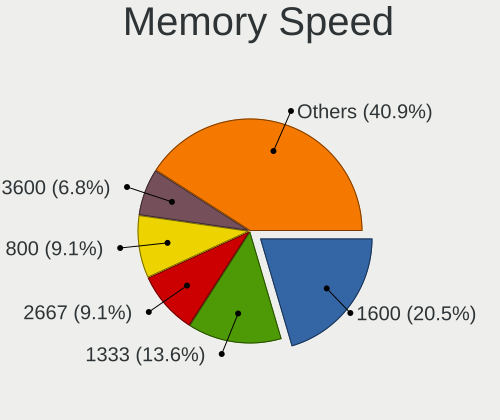

| Speed | Desktops | Percent |
|-------|----------|---------|
| 1600  | 9        | 20.45%  |
| 1333  | 6        | 13.64%  |
| 2667  | 4        | 9.09%   |
| 800   | 4        | 9.09%   |
| 3600  | 3        | 6.82%   |
| 2133  | 3        | 6.82%   |
| 1866  | 3        | 6.82%   |
| 1066  | 2        | 4.55%   |
| 3733  | 1        | 2.27%   |
| 3466  | 1        | 2.27%   |
| 3400  | 1        | 2.27%   |
| 3200  | 1        | 2.27%   |
| 2934  | 1        | 2.27%   |
| 2800  | 1        | 2.27%   |
| 2000  | 1        | 2.27%   |
| 1867  | 1        | 2.27%   |
| 1800  | 1        | 2.27%   |
| 333   | 1        | 2.27%   |

Printers & scanners
-------------------

Printer Vendor
--------------

Printer device vendors

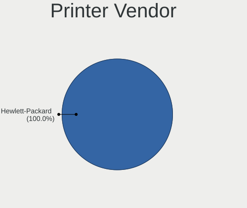

| Vendor          | Desktops | Percent |
|-----------------|----------|---------|
| Hewlett-Packard | 1        | 100%    |

Printer Model
-------------

Printer device models

| Model                           | Desktops | Percent |
|---------------------------------|----------|---------|
| HP DeskJet F2100 Printer series | 1        | 100%    |

Scanner Vendor
--------------

Scanner device vendors

Zero info for selected period =(

Scanner Model
-------------

Scanner device models

Zero info for selected period =(

Camera
------

Camera Vendor
-------------

Camera device vendors

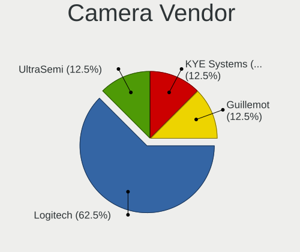

| Vendor                      | Desktops | Percent |
|-----------------------------|----------|---------|
| Logitech                    | 5        | 62.5%   |
| MacroSilicon                | 1        | 12.5%   |
| KYE Systems (Mouse Systems) | 1        | 12.5%   |
| Guillemot                   | 1        | 12.5%   |

Camera Model
------------

Camera device models

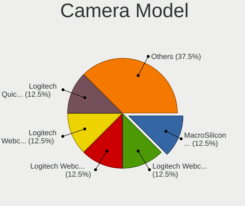

| Model                                          | Desktops | Percent |
|------------------------------------------------|----------|---------|
| MacroSilicon USB3. 0 capture                   | 1        | 12.5%   |
| Logitech Webcam C270                           | 1        | 12.5%   |
| Logitech Webcam C210                           | 1        | 12.5%   |
| Logitech Webcam C170                           | 1        | 12.5%   |
| Logitech QuickCam Vision Pro                   | 1        | 12.5%   |
| Logitech HD Webcam C510                        | 1        | 12.5%   |
| KYE Systems (Mouse Systems) Genius FaceCam 312 | 1        | 12.5%   |
| Guillemot Hercules HD Twist                    | 1        | 12.5%   |

Security
--------

Fingerprint Vendor
------------------

Fingerprint sensor vendors

Zero info for selected period =(

Fingerprint Model
-----------------

Fingerprint sensor models

Zero info for selected period =(

Chipcard Vendor
---------------

Chipcard module vendors

Zero info for selected period =(

Chipcard Model
--------------

Chipcard module models

Zero info for selected period =(

Unsupported
-----------

Unsupported Devices
-------------------

Total unsupported devices on board

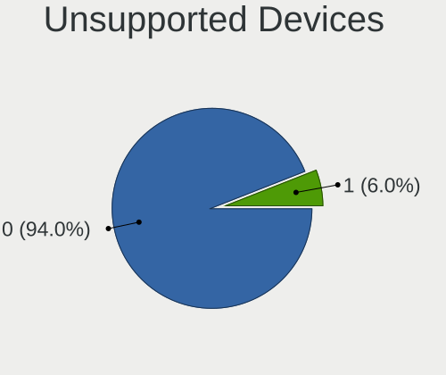

| Total | Desktops | Percent |
|-------|----------|---------|
| 0     | 79       | 94.05%  |
| 1     | 5        | 5.95%   |

Unsupported Device Types
------------------------

Types of unsupported devices

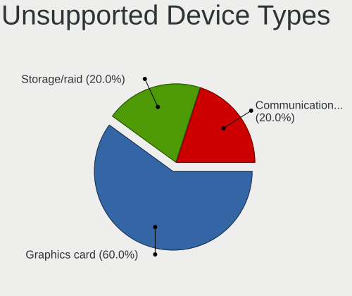

| Type                     | Desktops | Percent |
|--------------------------|----------|---------|
| Graphics card            | 3        | 60%     |
| Storage/raid             | 1        | 20%     |
| Communication controller | 1        | 20%     |

