Linux in Bosnia and Herzegovina - Tested Hardware & Statistics (Desktops)
-------------------------------------------------------------------------

A project to collect tested hardware configurations for Linux in Bosnia and Herzegovina.

Anyone can contribute to this report by the [hw-probe](https://github.com/linuxhw/hw-probe) tool:

    sudo -E hw-probe -all -upload

Please contribute! Especially if your hardware is rare.

Contents
--------

* [ Test Cases ](#test-cases)

* [ System ](#system)
  - [ OS                       ](#os)
  - [ OS Family                ](#os-family)
  - [ Kernel                   ](#kernel)
  - [ Kernel Family            ](#kernel-family)
  - [ Kernel Major Ver.        ](#kernel-major-ver)
  - [ Arch                     ](#arch)
  - [ DE                       ](#de)
  - [ Display Server           ](#display-server)
  - [ Display Manager          ](#display-manager)
  - [ OS Lang                  ](#os-lang)
  - [ Boot Mode                ](#boot-mode)
  - [ Filesystem               ](#filesystem)
  - [ Part. scheme             ](#part-scheme)
  - [ Dual Boot with Linux/BSD ](#dual-boot-with-linuxbsd)
  - [ Dual Boot (Win)          ](#dual-boot-win)

* [ Board ](#board)
  - [ Vendor                   ](#vendor)
  - [ Model                    ](#model)
  - [ Model Family             ](#model-family)
  - [ MFG Year                 ](#mfg-year)
  - [ Form Factor              ](#form-factor)
  - [ Secure Boot              ](#secure-boot)
  - [ Coreboot                 ](#coreboot)
  - [ RAM Size                 ](#ram-size)
  - [ RAM Used                 ](#ram-used)
  - [ Total Drives             ](#total-drives)
  - [ Has CD-ROM               ](#has-cd-rom)
  - [ Has Ethernet             ](#has-ethernet)
  - [ Has WiFi                 ](#has-wifi)
  - [ Has Bluetooth            ](#has-bluetooth)

* [ Location ](#location)
  - [ Country                  ](#country)
  - [ City                     ](#city)

* [ Drives ](#drives)
  - [ Drive Vendor             ](#drive-vendor)
  - [ Drive Model              ](#drive-model)
  - [ HDD Vendor               ](#hdd-vendor)
  - [ SSD Vendor               ](#ssd-vendor)
  - [ Drive Kind               ](#drive-kind)
  - [ Drive Connector          ](#drive-connector)
  - [ Drive Size               ](#drive-size)
  - [ Space Total              ](#space-total)
  - [ Space Used               ](#space-used)
  - [ Malfunc. Drives          ](#malfunc-drives)
  - [ Malfunc. Drive Vendor    ](#malfunc-drive-vendor)
  - [ Malfunc. HDD Vendor      ](#malfunc-hdd-vendor)
  - [ Malfunc. Drive Kind      ](#malfunc-drive-kind)
  - [ Failed Drives            ](#failed-drives)
  - [ Failed Drive Vendor      ](#failed-drive-vendor)
  - [ Drive Status             ](#drive-status)

* [ Storage controller ](#storage-controller)
  - [ Storage Vendor           ](#storage-vendor)
  - [ Storage Model            ](#storage-model)
  - [ Storage Kind             ](#storage-kind)

* [ Processor ](#processor)
  - [ CPU Vendor               ](#cpu-vendor)
  - [ CPU Model                ](#cpu-model)
  - [ CPU Model Family         ](#cpu-model-family)
  - [ CPU Cores                ](#cpu-cores)
  - [ CPU Sockets              ](#cpu-sockets)
  - [ CPU Threads              ](#cpu-threads)
  - [ CPU Op-Modes             ](#cpu-op-modes)
  - [ CPU Microcode            ](#cpu-microcode)
  - [ CPU Microarch            ](#cpu-microarch)

* [ Graphics ](#graphics)
  - [ GPU Vendor               ](#gpu-vendor)
  - [ GPU Model                ](#gpu-model)
  - [ GPU Combo                ](#gpu-combo)
  - [ GPU Driver               ](#gpu-driver)
  - [ GPU Memory               ](#gpu-memory)

* [ Monitor ](#monitor)
  - [ Monitor Vendor           ](#monitor-vendor)
  - [ Monitor Model            ](#monitor-model)
  - [ Monitor Resolution       ](#monitor-resolution)
  - [ Monitor Diagonal         ](#monitor-diagonal)
  - [ Monitor Width            ](#monitor-width)
  - [ Aspect Ratio             ](#aspect-ratio)
  - [ Monitor Area             ](#monitor-area)
  - [ Pixel Density            ](#pixel-density)
  - [ Multiple Monitors        ](#multiple-monitors)

* [ Network ](#network)
  - [ Net Controller Vendor    ](#net-controller-vendor)
  - [ Net Controller Model     ](#net-controller-model)
  - [ Wireless Vendor          ](#wireless-vendor)
  - [ Wireless Model           ](#wireless-model)
  - [ Ethernet Vendor          ](#ethernet-vendor)
  - [ Ethernet Model           ](#ethernet-model)
  - [ Net Controller Kind      ](#net-controller-kind)
  - [ Used Controller          ](#used-controller)
  - [ NICs                     ](#nics)
  - [ IPv6                     ](#ipv6)

* [ Bluetooth ](#bluetooth)
  - [ Bluetooth Vendor         ](#bluetooth-vendor)
  - [ Bluetooth Model          ](#bluetooth-model)

* [ Sound ](#sound)
  - [ Sound Vendor             ](#sound-vendor)
  - [ Sound Model              ](#sound-model)

* [ Memory ](#memory)
  - [ Memory Vendor            ](#memory-vendor)
  - [ Memory Model             ](#memory-model)
  - [ Memory Kind              ](#memory-kind)
  - [ Memory Form Factor       ](#memory-form-factor)
  - [ Memory Size              ](#memory-size)
  - [ Memory Speed             ](#memory-speed)

* [ Printers & scanners ](#printers--scanners)
  - [ Printer Vendor           ](#printer-vendor)
  - [ Printer Model            ](#printer-model)
  - [ Scanner Vendor           ](#scanner-vendor)
  - [ Scanner Model            ](#scanner-model)

* [ Camera ](#camera)
  - [ Camera Vendor            ](#camera-vendor)
  - [ Camera Model             ](#camera-model)

* [ Security ](#security)
  - [ Fingerprint Vendor       ](#fingerprint-vendor)
  - [ Fingerprint Model        ](#fingerprint-model)
  - [ Chipcard Vendor          ](#chipcard-vendor)
  - [ Chipcard Model           ](#chipcard-model)

* [ Unsupported ](#unsupported)
  - [ Unsupported Devices      ](#unsupported-devices)
  - [ Unsupported Device Types ](#unsupported-device-types)

Test Cases
----------

Total: 80

| Vendor        | Model                    | Probe                                                      | Date         |
|---------------|--------------------------|------------------------------------------------------------|--------------|
| ASUSTek       | PRIME H610M-A D4         | [665eba904c](https://linux-hardware.org/?probe=665eba904c) | Oct 14, 2023 |
| MSI           | B450 GAMING PLUS MAX     | [805de64f39](https://linux-hardware.org/?probe=805de64f39) | Oct 13, 2023 |
| MSI           | B450 GAMING PLUS MAX     | [7287dcbe60](https://linux-hardware.org/?probe=7287dcbe60) | Oct 13, 2023 |
| Medion        | MS-7800                  | [806b81f839](https://linux-hardware.org/?probe=806b81f839) | Oct 11, 2023 |
| ASUSTek       | PRIME H610M-A D4         | [6f4fb2dff4](https://linux-hardware.org/?probe=6f4fb2dff4) | Oct 10, 2023 |
| ASUSTek       | Z97-P                    | [d72c4b5cce](https://linux-hardware.org/?probe=d72c4b5cce) | Sep 06, 2023 |
| HP            | 1497                     | [8bb03862e2](https://linux-hardware.org/?probe=8bb03862e2) | Aug 24, 2023 |
| ASUSTek       | PRIME H510M-R            | [8a30480f48](https://linux-hardware.org/?probe=8a30480f48) | Jul 26, 2023 |
| ASUSTek       | F1A55-M LX               | [87b85c2e28](https://linux-hardware.org/?probe=87b85c2e28) | Jul 22, 2023 |
| Gigabyte      | Z77X-UD5H                | [b0efe96508](https://linux-hardware.org/?probe=b0efe96508) | Jun 04, 2023 |
| ASUSTek       | Z97-P                    | [86d8d7f80f](https://linux-hardware.org/?probe=86d8d7f80f) | Apr 05, 2023 |
| ASUSTek       | Z97-P                    | [24d0950a77](https://linux-hardware.org/?probe=24d0950a77) | Apr 04, 2023 |
| Gigabyte      | H61M-S2PV                | [76f456d63a](https://linux-hardware.org/?probe=76f456d63a) | Mar 10, 2023 |
| Gigabyte      | H61M-S2PV                | [319d6a8bc3](https://linux-hardware.org/?probe=319d6a8bc3) | Mar 01, 2023 |
| Gigabyte      | H61M-S2PV                | [ce63d81075](https://linux-hardware.org/?probe=ce63d81075) | Mar 01, 2023 |
| Gigabyte      | B85M-D2V                 | [03dd6fafbb](https://linux-hardware.org/?probe=03dd6fafbb) | Jan 09, 2023 |
| HP            | 1495                     | [681abdb8a2](https://linux-hardware.org/?probe=681abdb8a2) | Dec 25, 2022 |
| ASUSTek       | P5LD2-VM                 | [b2ae663fec](https://linux-hardware.org/?probe=b2ae663fec) | Dec 16, 2022 |
| ASUSTek       | H110M-K                  | [4241008f07](https://linux-hardware.org/?probe=4241008f07) | Oct 16, 2022 |
| ASRock        | H61M-HVGS                | [f646dceb7c](https://linux-hardware.org/?probe=f646dceb7c) | Aug 10, 2022 |
| ASUSTek       | Z97-P                    | [eeb9068dca](https://linux-hardware.org/?probe=eeb9068dca) | Jul 27, 2022 |
| HP            | 0A54h                    | [0efed10555](https://linux-hardware.org/?probe=0efed10555) | Mar 29, 2022 |
| ASUSTek       | H61M-K                   | [456ab60c06](https://linux-hardware.org/?probe=456ab60c06) | Feb 22, 2022 |
| ASUSTek       | H81M-R                   | [95ccf112af](https://linux-hardware.org/?probe=95ccf112af) | Feb 14, 2022 |
| Fujitsu Si... | D2811-A1 S26361-D2811-A1 | [bc32230a7f](https://linux-hardware.org/?probe=bc32230a7f) | Feb 09, 2022 |
| HP            | 3396                     | [97720dddd1](https://linux-hardware.org/?probe=97720dddd1) | Jan 10, 2022 |
| MSI           | B150 GAMING M3           | [3514e82b43](https://linux-hardware.org/?probe=3514e82b43) | Jan 07, 2022 |
| ASUSTek       | TUF Gaming X570-PLUS     | [52eb9930ad](https://linux-hardware.org/?probe=52eb9930ad) | Nov 14, 2021 |
| Medion        | MS-7366                  | [da9961f1ee](https://linux-hardware.org/?probe=da9961f1ee) | Nov 04, 2021 |
| Gigabyte      | B450M DS3H-CF            | [63b6ade950](https://linux-hardware.org/?probe=63b6ade950) | Sep 13, 2021 |
| Gigabyte      | GA-990FX-GAMING          | [4206886abb](https://linux-hardware.org/?probe=4206886abb) | Jul 28, 2021 |
| Gigabyte      | GA-990FX-GAMING          | [d244dc6763](https://linux-hardware.org/?probe=d244dc6763) | Jul 28, 2021 |
| HP            | 1497                     | [e68557fd01](https://linux-hardware.org/?probe=e68557fd01) | Jul 07, 2021 |
| Wistron       | ProLiant ML110 G5        | [bc2d293d15](https://linux-hardware.org/?probe=bc2d293d15) | Jun 18, 2021 |
| Wistron       | ProLiant ML110 G5        | [ef21ac93c3](https://linux-hardware.org/?probe=ef21ac93c3) | Jun 18, 2021 |
| ASRock        | H61M-HVGS                | [3f3962df59](https://linux-hardware.org/?probe=3f3962df59) | May 16, 2021 |
| Gigabyte      | B450M DS3H-CF            | [10dd12b38c](https://linux-hardware.org/?probe=10dd12b38c) | May 15, 2021 |
| ASUSTek       | H81M-A                   | [30aeb41807](https://linux-hardware.org/?probe=30aeb41807) | May 14, 2021 |
| ASUSTek       | H81M-A                   | [bee3da385c](https://linux-hardware.org/?probe=bee3da385c) | Mar 23, 2021 |
| HP            | 198E                     | [85ba542969](https://linux-hardware.org/?probe=85ba542969) | Mar 10, 2021 |
| HP            | 198E                     | [8a79f9e398](https://linux-hardware.org/?probe=8a79f9e398) | Mar 10, 2021 |
| ASUSTek       | P5KPL-AM SE              | [9b37eaa9f8](https://linux-hardware.org/?probe=9b37eaa9f8) | Feb 02, 2021 |
| ASUSTek       | P5KPL-AM SE              | [7d18048067](https://linux-hardware.org/?probe=7d18048067) | Jan 26, 2021 |
| HP            | 1496                     | [7d2d9cd210](https://linux-hardware.org/?probe=7d2d9cd210) | Dec 22, 2020 |
| ASUSTek       | H97-PRO                  | [5532ead8e7](https://linux-hardware.org/?probe=5532ead8e7) | Nov 21, 2020 |
| HP            | 3032h                    | [63d3c61c19](https://linux-hardware.org/?probe=63d3c61c19) | Nov 03, 2020 |
| HP            | 3032h                    | [d8cfe55684](https://linux-hardware.org/?probe=d8cfe55684) | Nov 03, 2020 |
| Gigabyte      | X570 AORUS ELITE WIFI    | [1f8e16d74f](https://linux-hardware.org/?probe=1f8e16d74f) | Oct 25, 2020 |
| ASUSTek       | Z170-P                   | [188328b998](https://linux-hardware.org/?probe=188328b998) | Sep 27, 2020 |
| ASUSTek       | PRIME A320M-K            | [35560a3a70](https://linux-hardware.org/?probe=35560a3a70) | Sep 16, 2020 |
| ECS           | G31T-M7                  | [70c5208ec6](https://linux-hardware.org/?probe=70c5208ec6) | Sep 13, 2020 |
| Dell          | 0M858N A01               | [5b7ae4f768](https://linux-hardware.org/?probe=5b7ae4f768) | Aug 13, 2020 |
| Dell          | 0RF703                   | [e23b194d28](https://linux-hardware.org/?probe=e23b194d28) | Jul 25, 2020 |
| ASUSTek       | Z97-P                    | [d0375fe030](https://linux-hardware.org/?probe=d0375fe030) | Jul 15, 2020 |
| Acer          | Aspire M1200             | [9311c4fa37](https://linux-hardware.org/?probe=9311c4fa37) | Jun 27, 2020 |
| Acer          | Aspire M1200             | [8d9a1aefd5](https://linux-hardware.org/?probe=8d9a1aefd5) | Jun 27, 2020 |
| ASUSTek       | P5G41T-M LX3             | [1a6102d9f3](https://linux-hardware.org/?probe=1a6102d9f3) | Jun 17, 2020 |
| Acer          | Aspire M1200             | [2cbc71cc6f](https://linux-hardware.org/?probe=2cbc71cc6f) | May 24, 2020 |
| ASUSTek       | PRIME H310M-R R2.0       | [c668c517d8](https://linux-hardware.org/?probe=c668c517d8) | Apr 24, 2020 |
| ASUSTek       | PRIME H310M-R R2.0       | [4e3e7a0cca](https://linux-hardware.org/?probe=4e3e7a0cca) | Apr 20, 2020 |
| Gigabyte      | nForce                   | [46e8276491](https://linux-hardware.org/?probe=46e8276491) | Apr 03, 2020 |
| ASUSTek       | P5G41T-M LX2/GB          | [fa5624c697](https://linux-hardware.org/?probe=fa5624c697) | Mar 27, 2020 |
| Wistron       | ProLiant ML110 G5        | [0dbb663114](https://linux-hardware.org/?probe=0dbb663114) | Mar 26, 2020 |
| Wistron       | ProLiant ML110 G5        | [ce73a67dba](https://linux-hardware.org/?probe=ce73a67dba) | Mar 26, 2020 |
| ASUSTek       | P5G41T-M LX2/GB          | [84bed079c2](https://linux-hardware.org/?probe=84bed079c2) | Mar 23, 2020 |
| ASUSTek       | P5G41T-M LX2/GB          | [10793053f1](https://linux-hardware.org/?probe=10793053f1) | Mar 23, 2020 |
| MSI           | GF615M-P33               | [34605f2e7f](https://linux-hardware.org/?probe=34605f2e7f) | Feb 06, 2020 |
| ASUSTek       | PRIME A320M-K            | [64c7222709](https://linux-hardware.org/?probe=64c7222709) | Dec 22, 2019 |
| Dell          | 0RF703                   | [3cc8664913](https://linux-hardware.org/?probe=3cc8664913) | Nov 09, 2019 |
| Pegatron      | Eureka3                  | [5d42e73d08](https://linux-hardware.org/?probe=5d42e73d08) | Oct 20, 2019 |
| Dell          | 0RF703                   | [e97de552d8](https://linux-hardware.org/?probe=e97de552d8) | Jul 29, 2019 |
| Dell          | 0RF703                   | [08019d8b5f](https://linux-hardware.org/?probe=08019d8b5f) | Jul 29, 2019 |
| Dell          | 0MM599                   | [0b9fef01ec](https://linux-hardware.org/?probe=0b9fef01ec) | Jun 19, 2019 |
| Dell          | 0MM599                   | [8376d2c77c](https://linux-hardware.org/?probe=8376d2c77c) | Jun 19, 2019 |
| ASUSTek       | P8H61-M LX3 R2.0         | [aa5f7a836b](https://linux-hardware.org/?probe=aa5f7a836b) | May 04, 2019 |
| ASUSTek       | PRIME A320M-K            | [3aed29ae25](https://linux-hardware.org/?probe=3aed29ae25) | Apr 27, 2019 |
| HP            | 0A64h                    | [ab563902ff](https://linux-hardware.org/?probe=ab563902ff) | Apr 22, 2019 |
| ASUSTek       | P8H61-M LX3 R2.0         | [3ce6d97f47](https://linux-hardware.org/?probe=3ce6d97f47) | Apr 21, 2019 |
| Gigabyte      | Z390 UD                  | [48041296ca](https://linux-hardware.org/?probe=48041296ca) | Mar 15, 2019 |
| ASUSTek       | M2N-SLI                  | [77800cbaf6](https://linux-hardware.org/?probe=77800cbaf6) | Mar 30, 2018 |

System
------

OS
--

Installed operating systems

| Name                | Desktops | Percent |
|---------------------|----------|---------|
| Ubuntu 20.04        | 7        | 12.07%  |
| Ubuntu 18.04        | 6        | 10.34%  |
| OpenMandriva 4.3    | 4        | 6.9%    |
| Ubuntu 22.04        | 3        | 5.17%   |
| Linux Mint 19.1     | 3        | 5.17%   |
| Xubuntu 20.04       | 2        | 3.45%   |
| ROSA 12.4           | 2        | 3.45%   |
| MX 23               | 2        | 3.45%   |
| Linux Mint 20.1     | 2        | 3.45%   |
| KDE neon 20.04      | 2        | 3.45%   |
| Debian 10           | 2        | 3.45%   |
| Zorin 16            | 1        | 1.72%   |
| Zorin 15            | 1        | 1.72%   |
| Ubuntu Unity 21.10  | 1        | 1.72%   |
| Ubuntu Unity 18.04  | 1        | 1.72%   |
| Ubuntu Studio 20.04 | 1        | 1.72%   |
| ROSA R10            | 1        | 1.72%   |
| Pop!_OS 20.10       | 1        | 1.72%   |
| Pop!_OS 20.04       | 1        | 1.72%   |
| OpenMandriva 23.01  | 1        | 1.72%   |
| MX 21               | 1        | 1.72%   |
| Manjaro 20.2        | 1        | 1.72%   |
| Manjaro             | 1        | 1.72%   |
| Lubuntu 18.04       | 1        | 1.72%   |
| Linux Mint 21.1     | 1        | 1.72%   |
| Linux Mint 21       | 1        | 1.72%   |
| Linux Mint 19.3     | 1        | 1.72%   |
| KDE neon 18.04      | 1        | 1.72%   |
| Fedora 33           | 1        | 1.72%   |
| Fedora 32           | 1        | 1.72%   |
| Endless 3.7.8       | 1        | 1.72%   |
| Debian 9            | 1        | 1.72%   |
| Debian 11           | 1        | 1.72%   |
| ArcoLinux Rolling   | 1        | 1.72%   |

OS Family
---------

OS without a version

| Name          | Desktops | Percent |
|---------------|----------|---------|
| Ubuntu        | 14       | 25.45%  |
| Linux Mint    | 8        | 14.55%  |
| OpenMandriva  | 5        | 9.09%   |
| Debian        | 4        | 7.27%   |
| ROSA          | 3        | 5.45%   |
| KDE neon      | 3        | 5.45%   |
| Zorin         | 2        | 3.64%   |
| Xubuntu       | 2        | 3.64%   |
| Ubuntu Unity  | 2        | 3.64%   |
| Pop!_OS       | 2        | 3.64%   |
| MX            | 2        | 3.64%   |
| Manjaro       | 2        | 3.64%   |
| Fedora        | 2        | 3.64%   |
| Ubuntu Studio | 1        | 1.82%   |
| Lubuntu       | 1        | 1.82%   |
| Endless       | 1        | 1.82%   |
| ArcoLinux     | 1        | 1.82%   |

Kernel
------

Version of the Linux kernel

| Version                           | Desktops | Percent |
|-----------------------------------|----------|---------|
| 5.16.7-desktop-1omv4003           | 4        | 6.15%   |
| 5.8.0-59-generic                  | 2        | 3.08%   |
| 5.4.0-52-generic                  | 2        | 3.08%   |
| 5.3.0-42-generic                  | 2        | 3.08%   |
| 5.15.0-56-generic                 | 2        | 3.08%   |
| 4.19.0-13-amd64                   | 2        | 3.08%   |
| 4.18.0-15-generic                 | 2        | 3.08%   |
| 4.15.0-94-generic                 | 2        | 3.08%   |
| 4.15.0-47-generic                 | 2        | 3.08%   |
| 4.15.0-20-generic                 | 2        | 3.08%   |
| 6.5.5-2-liquorix-amd64            | 1        | 1.54%   |
| 6.4.14-1-liquorix-amd64           | 1        | 1.54%   |
| 6.3.5-zen1-1-zen                  | 1        | 1.54%   |
| 6.2.0-34-generic                  | 1        | 1.54%   |
| 6.2.0-26-generic                  | 1        | 1.54%   |
| 6.1.46-generic-2rosa2021.1-x86_64 | 1        | 1.54%   |
| 6.1.15-2-liquorix-amd64           | 1        | 1.54%   |
| 6.1.1-desktop-1omv2290            | 1        | 1.54%   |
| 5.9.8-2-MANJARO                   | 1        | 1.54%   |
| 5.8.11-200.fc32.x86_64            | 1        | 1.54%   |
| 5.8.0-7630-generic                | 1        | 1.54%   |
| 5.4.0-7634-generic                | 1        | 1.54%   |
| 5.4.0-74-generic                  | 1        | 1.54%   |
| 5.4.0-73-generic                  | 1        | 1.54%   |
| 5.4.0-67-generic                  | 1        | 1.54%   |
| 5.4.0-66-generic                  | 1        | 1.54%   |
| 5.4.0-47-generic                  | 1        | 1.54%   |
| 5.4.0-42-generic                  | 1        | 1.54%   |
| 5.4.0-40-generic                  | 1        | 1.54%   |
| 5.4.0-39-generic                  | 1        | 1.54%   |
| 5.4.0-37-generic                  | 1        | 1.54%   |
| 5.4.0-31-generic                  | 1        | 1.54%   |
| 5.4.0-150-generic                 | 1        | 1.54%   |
| 5.3.0-28-generic                  | 1        | 1.54%   |
| 5.19.0-35-generic                 | 1        | 1.54%   |
| 5.15.0-76-generic                 | 1        | 1.54%   |
| 5.15.0-50-generic                 | 1        | 1.54%   |
| 5.14.18-100.fc33.x86_64           | 1        | 1.54%   |
| 5.13.0-23-generic                 | 1        | 1.54%   |
| 5.11.19-200.fc33.x86_64           | 1        | 1.54%   |

Kernel Family
-------------

Linux kernel without a distro release

| Version  | Desktops | Percent |
|----------|----------|---------|
| 5.4.0    | 12       | 19.67%  |
| 4.15.0   | 6        | 9.84%   |
| 5.16.7   | 4        | 6.56%   |
| 5.15.0   | 4        | 6.56%   |
| 5.8.0    | 3        | 4.92%   |
| 5.3.0    | 3        | 4.92%   |
| 4.18.0   | 3        | 4.92%   |
| 6.2.0    | 2        | 3.28%   |
| 5.11.0   | 2        | 3.28%   |
| 5.0.0    | 2        | 3.28%   |
| 4.19.0   | 2        | 3.28%   |
| 6.5.5    | 1        | 1.64%   |
| 6.4.14   | 1        | 1.64%   |
| 6.3.5    | 1        | 1.64%   |
| 6.1.46   | 1        | 1.64%   |
| 6.1.15   | 1        | 1.64%   |
| 6.1.1    | 1        | 1.64%   |
| 5.9.8    | 1        | 1.64%   |
| 5.8.11   | 1        | 1.64%   |
| 5.19.0   | 1        | 1.64%   |
| 5.14.18  | 1        | 1.64%   |
| 5.13.0   | 1        | 1.64%   |
| 5.11.19  | 1        | 1.64%   |
| 5.10.60  | 1        | 1.64%   |
| 5.10.34  | 1        | 1.64%   |
| 5.10.176 | 1        | 1.64%   |
| 5.10.0   | 1        | 1.64%   |
| 4.9.60   | 1        | 1.64%   |
| 4.9.0    | 1        | 1.64%   |

Kernel Major Ver.
-----------------

Linux kernel major version

| Version | Desktops | Percent |
|---------|----------|---------|
| 5.4     | 12       | 20%     |
| 4.15    | 6        | 10%     |
| 5.8     | 4        | 6.67%   |
| 5.16    | 4        | 6.67%   |
| 5.15    | 4        | 6.67%   |
| 6.1     | 3        | 5%      |
| 5.3     | 3        | 5%      |
| 5.11    | 3        | 5%      |
| 5.10    | 3        | 5%      |
| 4.18    | 3        | 5%      |
| 6.2     | 2        | 3.33%   |
| 5.0     | 2        | 3.33%   |
| 4.9     | 2        | 3.33%   |
| 4.19    | 2        | 3.33%   |
| 6.5     | 1        | 1.67%   |
| 6.4     | 1        | 1.67%   |
| 6.3     | 1        | 1.67%   |
| 5.9     | 1        | 1.67%   |
| 5.19    | 1        | 1.67%   |
| 5.14    | 1        | 1.67%   |
| 5.13    | 1        | 1.67%   |

Arch
----

OS architecture (x86_64, i586, etc.)

| Name   | Desktops | Percent |
|--------|----------|---------|
| x86_64 | 49       | 92.45%  |
| i686   | 4        | 7.55%   |

DE
--

Desktop Environment

| Name       | Desktops | Percent |
|------------|----------|---------|
| GNOME      | 20       | 35.71%  |
| Unknown    | 10       | 17.86%  |
| XFCE       | 8        | 14.29%  |
| KDE5       | 6        | 10.71%  |
| X-Cinnamon | 4        | 7.14%   |
| Unity      | 2        | 3.57%   |
| KDE        | 2        | 3.57%   |
| MATE       | 1        | 1.79%   |
| LXDE       | 1        | 1.79%   |
| KDE4       | 1        | 1.79%   |
| i3         | 1        | 1.79%   |

Display Server
--------------

X11 or Wayland

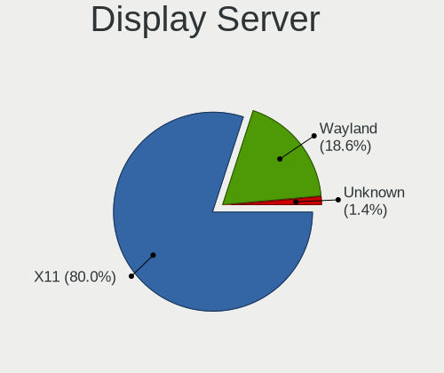

| Name    | Desktops | Percent |
|---------|----------|---------|
| X11     | 47       | 83.93%  |
| Wayland | 8        | 14.29%  |
| Unknown | 1        | 1.79%   |

Display Manager
---------------

SDDM, LightDM, etc.

| Name    | Desktops | Percent |
|---------|----------|---------|
| Unknown | 32       | 58.18%  |
| SDDM    | 7        | 12.73%  |
| LightDM | 5        | 9.09%   |
| GDM     | 4        | 7.27%   |
| TDM     | 3        | 5.45%   |
| GDM3    | 3        | 5.45%   |
| KDM     | 1        | 1.82%   |

OS Lang
-------

Language

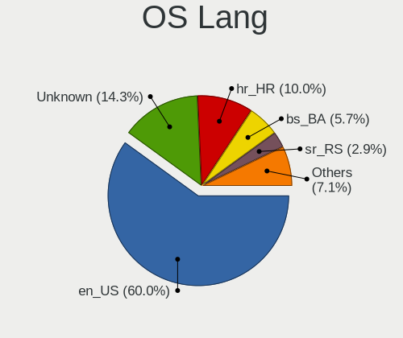

| Lang    | Desktops | Percent |
|---------|----------|---------|
| en_US   | 32       | 56.14%  |
| Unknown | 10       | 17.54%  |
| hr_HR   | 5        | 8.77%   |
| bs_BA   | 4        | 7.02%   |
| sr_RS   | 2        | 3.51%   |
| it_IT   | 1        | 1.75%   |
| en_CA   | 1        | 1.75%   |
| en_AU   | 1        | 1.75%   |
| C       | 1        | 1.75%   |

Boot Mode
---------

EFI or BIOS

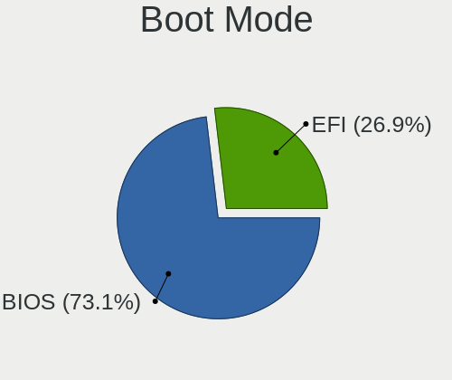

| Mode | Desktops | Percent |
|------|----------|---------|
| BIOS | 36       | 66.67%  |
| EFI  | 18       | 33.33%  |

Filesystem
----------

Type of filesystem

| Type    | Desktops | Percent |
|---------|----------|---------|
| Ext4    | 41       | 75.93%  |
| Overlay | 5        | 9.26%   |
| Unknown | 4        | 7.41%   |
| Tmpfs   | 2        | 3.7%    |
| Ext2    | 1        | 1.85%   |
| Btrfs   | 1        | 1.85%   |

Part. scheme
------------

Scheme of partitioning

| Type    | Desktops | Percent |
|---------|----------|---------|
| Unknown | 33       | 60%     |
| GPT     | 17       | 30.91%  |
| MBR     | 5        | 9.09%   |

Dual Boot with Linux/BSD
------------------------

Hosting more than one Linux/BSD

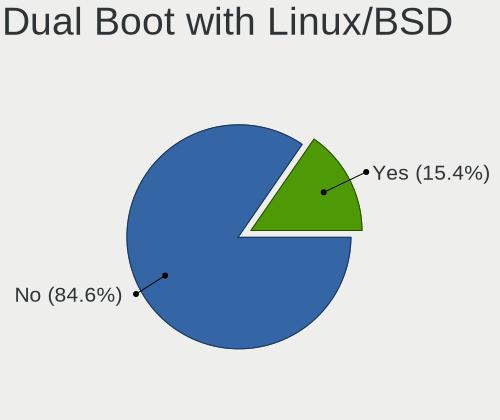

| Dual boot | Desktops | Percent |
|-----------|----------|---------|
| No        | 45       | 86.54%  |
| Yes       | 7        | 13.46%  |

Dual Boot (Win)
---------------

Hosting Linux and Windows

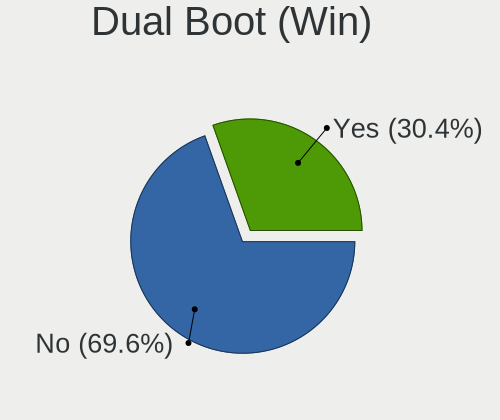

| Dual boot | Desktops | Percent |
|-----------|----------|---------|
| No        | 37       | 68.52%  |
| Yes       | 17       | 31.48%  |

Board
-----

Vendor
------

Motherboard manufacturer

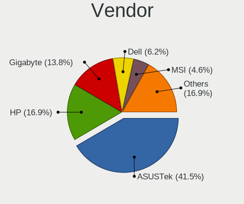

| Name                | Desktops | Percent |
|---------------------|----------|---------|
| ASUSTek Computer    | 22       | 42.31%  |
| Hewlett-Packard     | 8        | 15.38%  |
| Gigabyte Technology | 8        | 15.38%  |
| MSI                 | 3        | 5.77%   |
| Dell                | 3        | 5.77%   |
| Medion              | 2        | 3.85%   |
| Wistron             | 1        | 1.92%   |
| Pegatron            | 1        | 1.92%   |
| Fujitsu Siemens     | 1        | 1.92%   |
| ECS                 | 1        | 1.92%   |
| ASRock              | 1        | 1.92%   |
| Acer                | 1        | 1.92%   |

Model
-----

Motherboard model

| Name                                   | Desktops | Percent |
|----------------------------------------|----------|---------|
| ASUS All Series                        | 5        | 9.62%   |
| Dell OptiPlex 745                      | 2        | 3.85%   |
| ASUS P8H61-M LX3 R2.0                  | 2        | 3.85%   |
| ASUS P5KPL-AM SE                       | 2        | 3.85%   |
| Wistron ProLiant ML110 G5              | 1        | 1.92%   |
| Pegatron VS170AA-UUZ p6244ch           | 1        | 1.92%   |
| MSI MS-7B86                            | 1        | 1.92%   |
| MSI MS-7978                            | 1        | 1.92%   |
| MSI MS-7597                            | 1        | 1.92%   |
| Medion MS-7800                         | 1        | 1.92%   |
| Medion MS-7366                         | 1        | 1.92%   |
| HP ProDesk 400 G2 MT (TPM DP)          | 1        | 1.92%   |
| HP Compaq Elite 8300 CMT               | 1        | 1.92%   |
| HP Compaq dc7900 Convertible Minitower | 1        | 1.92%   |
| HP Compaq dc7700p Small Form Factor    | 1        | 1.92%   |
| HP Compaq dc5750 Small Form Factor     | 1        | 1.92%   |
| HP Compaq 8200 Elite USDT PC           | 1        | 1.92%   |
| HP Compaq 8200 Elite SFF PC            | 1        | 1.92%   |
| HP Compaq 6200 Pro MT PC               | 1        | 1.92%   |
| Gigabyte Z77X-UD5H                     | 1        | 1.92%   |
| Gigabyte Z390 UD                       | 1        | 1.92%   |
| Gigabyte X570 AORUS ELITE WIFI         | 1        | 1.92%   |
| Gigabyte nForce                        | 1        | 1.92%   |
| Gigabyte H61M-S2PV                     | 1        | 1.92%   |
| Gigabyte GA-990FX-GAMING               | 1        | 1.92%   |
| Gigabyte B85M-D2V                      | 1        | 1.92%   |
| Gigabyte B450M DS3H                    | 1        | 1.92%   |
| Fujitsu Siemens ESPRIMO P5730          | 1        | 1.92%   |
| ECS G31T-M7                            | 1        | 1.92%   |
| Dell OptiPlex 760                      | 1        | 1.92%   |
| ASUS Z170-P                            | 1        | 1.92%   |
| ASUS TUF Gaming X570-PLUS              | 1        | 1.92%   |
| ASUS PRIME H610M-A D4                  | 1        | 1.92%   |
| ASUS PRIME H510M-R                     | 1        | 1.92%   |
| ASUS PRIME H310M-R R2.0                | 1        | 1.92%   |
| ASUS PRIME A320M-K                     | 1        | 1.92%   |
| ASUS P5LD2-VM                          | 1        | 1.92%   |
| ASUS P5G41T-M LX3                      | 1        | 1.92%   |
| ASUS P5G41T-M LX2/GB                   | 1        | 1.92%   |
| ASUS M2N-SLI                           | 1        | 1.92%   |

Model Family
------------

Motherboard model prefix

| Name                     | Desktops | Percent |
|--------------------------|----------|---------|
| HP Compaq                | 7        | 13.46%  |
| ASUS All                 | 5        | 9.62%   |
| ASUS PRIME               | 4        | 7.69%   |
| Dell OptiPlex            | 3        | 5.77%   |
| ASUS P8H61-M             | 2        | 3.85%   |
| ASUS P5KPL-AM            | 2        | 3.85%   |
| ASUS P5G41T-M            | 2        | 3.85%   |
| Wistron ProLiant         | 1        | 1.92%   |
| Pegatron VS170AA-UUZ     | 1        | 1.92%   |
| MSI MS-7B86              | 1        | 1.92%   |
| MSI MS-7978              | 1        | 1.92%   |
| MSI MS-7597              | 1        | 1.92%   |
| Medion MS-7800           | 1        | 1.92%   |
| Medion MS-7366           | 1        | 1.92%   |
| HP ProDesk               | 1        | 1.92%   |
| Gigabyte Z77X-UD5H       | 1        | 1.92%   |
| Gigabyte Z390            | 1        | 1.92%   |
| Gigabyte X570            | 1        | 1.92%   |
| Gigabyte nForce          | 1        | 1.92%   |
| Gigabyte H61M-S2PV       | 1        | 1.92%   |
| Gigabyte GA-990FX-GAMING | 1        | 1.92%   |
| Gigabyte B85M-D2V        | 1        | 1.92%   |
| Gigabyte B450M           | 1        | 1.92%   |
| Fujitsu Siemens ESPRIMO  | 1        | 1.92%   |
| ECS G31T-M7              | 1        | 1.92%   |
| ASUS Z170-P              | 1        | 1.92%   |
| ASUS TUF                 | 1        | 1.92%   |
| ASUS P5LD2-VM            | 1        | 1.92%   |
| ASUS M2N-SLI             | 1        | 1.92%   |
| ASUS H61M-K              | 1        | 1.92%   |
| ASUS H110M-K             | 1        | 1.92%   |
| ASUS F1A55-M             | 1        | 1.92%   |
| ASRock H61M-HVGS         | 1        | 1.92%   |
| Acer Aspire              | 1        | 1.92%   |

MFG Year
--------

Motherboard manufacture year

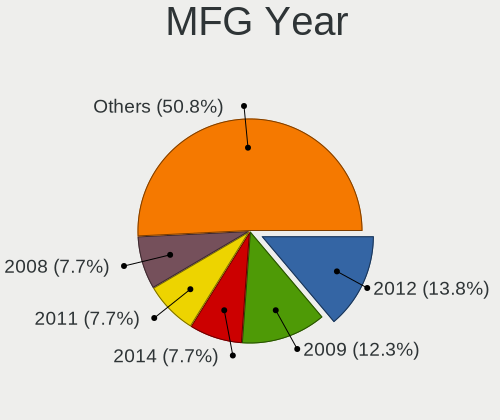

| Year | Desktops | Percent |
|------|----------|---------|
| 2012 | 7        | 13.46%  |
| 2009 | 6        | 11.54%  |
| 2014 | 5        | 9.62%   |
| 2008 | 5        | 9.62%   |
| 2011 | 4        | 7.69%   |
| 2007 | 4        | 7.69%   |
| 2019 | 3        | 5.77%   |
| 2018 | 3        | 5.77%   |
| 2015 | 3        | 5.77%   |
| 2013 | 3        | 5.77%   |
| 2021 | 2        | 3.85%   |
| 2006 | 2        | 3.85%   |
| 2005 | 2        | 3.85%   |
| 2017 | 1        | 1.92%   |
| 2016 | 1        | 1.92%   |
| 2010 | 1        | 1.92%   |

Form Factor
-----------

Physical design of the computer

| Name    | Desktops | Percent |
|---------|----------|---------|
| Desktop | 52       | 100%    |

Secure Boot
-----------

Enabled or disabled

| State    | Desktops | Percent |
|----------|----------|---------|
| Disabled | 52       | 100%    |

Coreboot
--------

Have coreboot on board

| Used | Desktops | Percent |
|------|----------|---------|
| No   | 52       | 100%    |

RAM Size
--------

Total RAM memory

| Size in GB | Desktops | Percent |
|------------|----------|---------|
| 4.01-8.0   | 12       | 22.22%  |
| 8.01-16.0  | 11       | 20.37%  |
| 3.01-4.0   | 9        | 16.67%  |
| 16.01-24.0 | 9        | 16.67%  |
| 1.01-2.0   | 7        | 12.96%  |
| 2.01-3.0   | 3        | 5.56%   |
| 32.01-64.0 | 1        | 1.85%   |
| 0.51-1.0   | 1        | 1.85%   |
| 0.01-0.5   | 1        | 1.85%   |

RAM Used
--------

Used RAM memory

| Used GB   | Desktops | Percent |
|-----------|----------|---------|
| 1.01-2.0  | 29       | 48.33%  |
| 2.01-3.0  | 11       | 18.33%  |
| 4.01-8.0  | 7        | 11.67%  |
| 0.51-1.0  | 7        | 11.67%  |
| 3.01-4.0  | 4        | 6.67%   |
| 8.01-16.0 | 1        | 1.67%   |
| 0.01-0.5  | 1        | 1.67%   |

Total Drives
------------

Number of drives on board

| Drives | Desktops | Percent |
|--------|----------|---------|
| 1      | 30       | 51.72%  |
| 2      | 18       | 31.03%  |
| 3      | 6        | 10.34%  |
| 4      | 2        | 3.45%   |
| 5      | 1        | 1.72%   |
| 0      | 1        | 1.72%   |

Has CD-ROM
----------

Has CD-ROM on board

| Presented | Desktops | Percent |
|-----------|----------|---------|
| Yes       | 28       | 50.91%  |
| No        | 27       | 49.09%  |

Has Ethernet
------------

Has Ethernet on board

| Presented | Desktops | Percent |
|-----------|----------|---------|
| Yes       | 51       | 98.08%  |
| No        | 1        | 1.92%   |

Has WiFi
--------

Has WiFi module

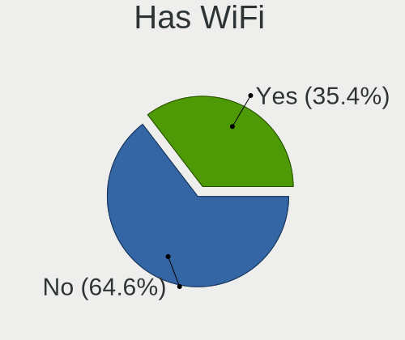

| Presented | Desktops | Percent |
|-----------|----------|---------|
| No        | 34       | 65.38%  |
| Yes       | 18       | 34.62%  |

Has Bluetooth
-------------

Has Bluetooth module

| Presented | Desktops | Percent |
|-----------|----------|---------|
| No        | 47       | 90.38%  |
| Yes       | 5        | 9.62%   |

Location
--------

Country
-------

Geographic location (country)

| Country                | Desktops | Percent |
|------------------------|----------|---------|
| Bosnia and Herzegovina | 52       | 100%    |

City
----

Geographic location (city)

| City          | Desktops | Percent |
|---------------|----------|---------|
| Sarajevo      | 14       | 25.93%  |
| Banja Luka    | 8        | 14.81%  |
| Vitez         | 2        | 3.7%    |
| Tuzla         | 2        | 3.7%    |
| Teslic        | 2        | 3.7%    |
| Prnjavor      | 2        | 3.7%    |
| Prijedor      | 2        | 3.7%    |
| Gradacac      | 2        | 3.7%    |
| Gracanica     | 2        | 3.7%    |
| Cazin         | 2        | 3.7%    |
| Bijeljina     | 2        | 3.7%    |
| Zvornik       | 1        | 1.85%   |
| Zepce         | 1        | 1.85%   |
| Zenica        | 1        | 1.85%   |
| Trebinje      | 1        | 1.85%   |
| Tarcin        | 1        | 1.85%   |
| Novi Travnik  | 1        | 1.85%   |
| Nova Topola   | 1        | 1.85%   |
| Jablanica     | 1        | 1.85%   |
| Goražde      | 1        | 1.85%   |
| Foca          | 1        | 1.85%   |
| Drvar         | 1        | 1.85%   |
| Doboj         | 1        | 1.85%   |
| Brcko         | 1        | 1.85%   |
| Bosanski Brod | 1        | 1.85%   |

Drives
------

Drive Vendor
------------

Hard drive vendors

| Vendor              | Desktops | Drives | Percent |
|---------------------|----------|--------|---------|
| WDC                 | 21       | 34     | 27.27%  |
| Seagate             | 13       | 17     | 16.88%  |
| Kingston            | 12       | 15     | 15.58%  |
| Samsung Electronics | 9        | 16     | 11.69%  |
| Hitachi             | 6        | 6      | 7.79%   |
| Toshiba             | 5        | 6      | 6.49%   |
| China               | 3        | 5      | 3.9%    |
| Transcend           | 1        | 2      | 1.3%    |
| SPCC                | 1        | 1      | 1.3%    |
| ORGE                | 1        | 1      | 1.3%    |
| Maxtor              | 1        | 1      | 1.3%    |
| Intel               | 1        | 1      | 1.3%    |
| Fujitsu             | 1        | 1      | 1.3%    |
| ASMT                | 1        | 1      | 1.3%    |
| Unknown             | 1        | 1      | 1.3%    |

Drive Model
-----------

Hard drive models

| Model                            | Desktops | Percent |
|----------------------------------|----------|---------|
| Kingston SA400S37120G 120GB SSD  | 3        | 3.41%   |
| Hitachi HDS721050CLA362 500GB    | 3        | 3.41%   |
| WDC WD800JD-00MSA1 80GB          | 2        | 2.27%   |
| Toshiba HDWD120 2TB              | 2        | 2.27%   |
| Toshiba DT01ACA050 500GB         | 2        | 2.27%   |
| Seagate ST3500413AS 500GB        | 2        | 2.27%   |
| Seagate ST250LT021-1AF14C 250GB  | 2        | 2.27%   |
| Samsung SSD 980 500GB            | 2        | 2.27%   |
| Samsung SSD 860 EVO 250GB        | 2        | 2.27%   |
| Kingston SA400S37240G 240GB SSD  | 2        | 2.27%   |
| WDC WDS240G2G0B-00EPW0 240GB SSD | 1        | 1.14%   |
| WDC WDS240G2G0A-00JH30 240GB SSD | 1        | 1.14%   |
| WDC WDS120G2G0B-00EPW0 120GB SSD | 1        | 1.14%   |
| WDC WD800JD-75MSA3 80GB          | 1        | 1.14%   |
| WDC WD800JD-60LSA5 80GB          | 1        | 1.14%   |
| WDC WD7500BPVX-22JC3T0 752GB     | 1        | 1.14%   |
| WDC WD7500AACS-00D6B0 752GB      | 1        | 1.14%   |
| WDC WD6400AARS-00Y5B1 640GB      | 1        | 1.14%   |
| WDC WD5000LPVT-22G33T0 500GB     | 1        | 1.14%   |
| WDC WD5000AZLX-60K2TA0 500GB     | 1        | 1.14%   |
| WDC WD5000AVDS-73U7B1 500GB      | 1        | 1.14%   |
| WDC WD5000AAKX-00ERMA0 500GB     | 1        | 1.14%   |
| WDC WD5000AAKX-001CA0 500GB      | 1        | 1.14%   |
| WDC WD40EZRZ-75GXCB0 4TB         | 1        | 1.14%   |
| WDC WD40EZAZ-00ZGHB0 4TB         | 1        | 1.14%   |
| WDC WD3200SD-01KNB0 320GB        | 1        | 1.14%   |
| WDC WD3200AAJS-00L7A0 320GB      | 1        | 1.14%   |
| WDC WD3200AAJS-00B4A0 320GB      | 1        | 1.14%   |
| WDC WD2500AAJS-22B4A0 250GB      | 1        | 1.14%   |
| WDC WD20EARX-00PASB0 2TB         | 1        | 1.14%   |
| WDC WD2000JD-00HBB0 200GB        | 1        | 1.14%   |
| WDC WD1600AAJS-00B4A0 160GB      | 1        | 1.14%   |
| WDC WD15EARS-00S8B1 1TB          | 1        | 1.14%   |
| WDC WD10EZEX-08RKKA0 1TB         | 1        | 1.14%   |
| WDC WD1002FAEX-00Z3A0 1TB        | 1        | 1.14%   |
| Transcend TS120GSSD220S 120GB    | 1        | 1.14%   |
| Toshiba DT01ACA100 1TB           | 1        | 1.14%   |
| SPCC Solid State Disk 120GB      | 1        | 1.14%   |
| Seagate STM3500418AS 500GB       | 1        | 1.14%   |
| Seagate ST980811AS 80GB          | 1        | 1.14%   |

HDD Vendor
----------

Hard disk drive vendors

| Vendor              | Desktops | Drives | Percent |
|---------------------|----------|--------|---------|
| WDC                 | 19       | 31     | 39.58%  |
| Seagate             | 13       | 17     | 27.08%  |
| Hitachi             | 6        | 6      | 12.5%   |
| Toshiba             | 5        | 6      | 10.42%  |
| Samsung Electronics | 3        | 3      | 6.25%   |
| Maxtor              | 1        | 1      | 2.08%   |
| Fujitsu             | 1        | 1      | 2.08%   |

SSD Vendor
----------

Solid state drive vendors

| Vendor              | Desktops | Drives | Percent |
|---------------------|----------|--------|---------|
| Kingston            | 10       | 13     | 37.04%  |
| Samsung Electronics | 6        | 10     | 22.22%  |
| WDC                 | 3        | 3      | 11.11%  |
| China               | 3        | 5      | 11.11%  |
| Transcend           | 1        | 2      | 3.7%    |
| SPCC                | 1        | 1      | 3.7%    |
| Intel               | 1        | 1      | 3.7%    |
| ASMT                | 1        | 1      | 3.7%    |
| Unknown             | 1        | 1      | 3.7%    |

Drive Kind
----------

HDD or SSD

| Kind    | Desktops | Drives | Percent |
|---------|----------|--------|---------|
| HDD     | 41       | 65     | 58.57%  |
| SSD     | 24       | 37     | 34.29%  |
| NVMe    | 4        | 5      | 5.71%   |
| Unknown | 1        | 1      | 1.43%   |

Drive Connector
---------------

SATA, SAS, NVMe, etc.

| Type | Desktops | Drives | Percent |
|------|----------|--------|---------|
| SATA | 49       | 101    | 89.09%  |
| NVMe | 4        | 5      | 7.27%   |
| SAS  | 2        | 2      | 3.64%   |

Drive Size
----------

Size of hard drive

| Size in TB | Desktops | Drives | Percent |
|------------|----------|--------|---------|
| 0.01-0.5   | 47       | 81     | 75.81%  |
| 0.51-1.0   | 9        | 12     | 14.52%  |
| 1.01-2.0   | 3        | 4      | 4.84%   |
| 3.01-4.0   | 1        | 2      | 1.61%   |
| 2.01-3.0   | 1        | 2      | 1.61%   |
| 4.01-10.0  | 1        | 1      | 1.61%   |

Space Total
-----------

Amount of disk space available on the file system

| Size in GB     | Desktops | Percent |
|----------------|----------|---------|
| 101-250        | 12       | 20.69%  |
| 51-100         | 10       | 17.24%  |
| 251-500        | 8        | 13.79%  |
| 1-20           | 7        | 12.07%  |
| 501-1000       | 7        | 12.07%  |
| 21-50          | 5        | 8.62%   |
| 1001-2000      | 3        | 5.17%   |
| More than 3000 | 2        | 3.45%   |
| 2001-3000      | 2        | 3.45%   |
| Unknown        | 2        | 3.45%   |

Space Used
----------

Amount of used disk space

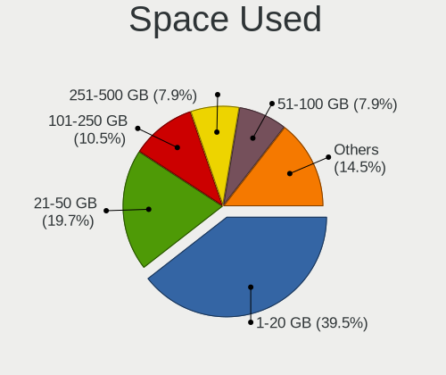

| Used GB   | Desktops | Percent |
|-----------|----------|---------|
| 1-20      | 27       | 44.26%  |
| 21-50     | 10       | 16.39%  |
| 251-500   | 6        | 9.84%   |
| 501-1000  | 5        | 8.2%    |
| 51-100    | 5        | 8.2%    |
| 101-250   | 4        | 6.56%   |
| Unknown   | 2        | 3.28%   |
| 2001-3000 | 1        | 1.64%   |
| 1001-2000 | 1        | 1.64%   |

Malfunc. Drives
---------------

Drive models with a malfunction

| Model                             | Desktops | Drives | Percent |
|-----------------------------------|----------|--------|---------|
| WDC WDS240G2G0A-00JH30 240GB SSD  | 1        | 1      | 11.11%  |
| WDC WD5000AVDS-73U7B1 500GB       | 1        | 1      | 11.11%  |
| WDC WD3200AAJS-00B4A0 320GB       | 1        | 1      | 11.11%  |
| Seagate ST3120813AS 120GB         | 1        | 1      | 11.11%  |
| Seagate ST3000DM001-1CH166 3TB    | 1        | 2      | 11.11%  |
| Seagate ST250LT021-1AF14C 250GB   | 1        | 1      | 11.11%  |
| Samsung Electronics HD322HJ 320GB | 1        | 1      | 11.11%  |
| Hitachi HDS721050CLA362 500GB     | 1        | 1      | 11.11%  |
| China SATA SSD 240GB              | 1        | 1      | 11.11%  |

Malfunc. Drive Vendor
---------------------

Vendors of faulty drives

| Vendor              | Desktops | Drives | Percent |
|---------------------|----------|--------|---------|
| WDC                 | 3        | 3      | 33.33%  |
| Seagate             | 3        | 4      | 33.33%  |
| Samsung Electronics | 1        | 1      | 11.11%  |
| Hitachi             | 1        | 1      | 11.11%  |
| China               | 1        | 1      | 11.11%  |

Malfunc. HDD Vendor
-------------------

Vendors of faulty HDD drives

| Vendor              | Desktops | Drives | Percent |
|---------------------|----------|--------|---------|
| Seagate             | 3        | 4      | 42.86%  |
| WDC                 | 2        | 2      | 28.57%  |
| Samsung Electronics | 1        | 1      | 14.29%  |
| Hitachi             | 1        | 1      | 14.29%  |

Malfunc. Drive Kind
-------------------

Kinds of faulty drives

| Kind | Desktops | Drives | Percent |
|------|----------|--------|---------|
| HDD  | 5        | 8      | 71.43%  |
| SSD  | 2        | 2      | 28.57%  |

Failed Drives
-------------

Failed drive models

Zero info for selected period =(

Failed Drive Vendor
-------------------

Failed drive vendors

Zero info for selected period =(

Drive Status
------------

Number of failed and malfunc. drives

| Status   | Desktops | Drives | Percent |
|----------|----------|--------|---------|
| Detected | 36       | 66     | 65.45%  |
| Works    | 13       | 32     | 23.64%  |
| Malfunc  | 6        | 10     | 10.91%  |

Storage controller
------------------

Storage Vendor
--------------

Storage controller vendors

| Vendor                      | Desktops | Percent |
|-----------------------------|----------|---------|
| Intel                       | 38       | 66.67%  |
| AMD                         | 10       | 17.54%  |
| Nvidia                      | 4        | 7.02%   |
| Samsung Electronics         | 2        | 3.51%   |
| Kingston Technology Company | 2        | 3.51%   |
| Marvell Technology Group    | 1        | 1.75%   |

Storage Model
-------------

Storage controller models

| Model                                                                                   | Desktops | Percent |
|-----------------------------------------------------------------------------------------|----------|---------|
| Intel NM10/ICH7 Family SATA Controller [IDE mode]                                       | 6        | 7.14%   |
| AMD FCH SATA Controller [AHCI mode]                                                     | 6        | 7.14%   |
| Intel 82801G (ICH7 Family) IDE Controller                                               | 5        | 5.95%   |
| Intel 6 Series/C200 Series Chipset Family Desktop SATA Controller (IDE mode, ports 4-5) | 5        | 5.95%   |
| Intel 6 Series/C200 Series Chipset Family Desktop SATA Controller (IDE mode, ports 0-3) | 5        | 5.95%   |
| Intel 8 Series/C220 Series Chipset Family 6-port SATA Controller 1 [AHCI mode]          | 4        | 4.76%   |
| Intel Q170/Q150/B150/H170/H110/Z170/CM236 Chipset SATA Controller [AHCI Mode]           | 3        | 3.57%   |
| Intel 9 Series Chipset Family SATA Controller [AHCI Mode]                               | 3        | 3.57%   |
| Intel 82801H (ICH8 Family) 4 port SATA Controller [IDE mode]                            | 3        | 3.57%   |
| Intel 6 Series/C200 Series Chipset Family 6 port Desktop SATA AHCI Controller           | 3        | 3.57%   |
| Samsung NVMe SSD Controller 980 (DRAM-less)                                             | 2        | 2.38%   |
| Intel 82801HR/HO/HH (ICH8R/DO/DH) 2 port SATA Controller [IDE mode]                     | 2        | 2.38%   |
| Intel 7 Series/C210 Series Chipset Family 6-port SATA Controller [AHCI mode]            | 2        | 2.38%   |
| AMD 400 Series Chipset SATA Controller                                                  | 2        | 2.38%   |
| Nvidia nForce3 Serial ATA Controller                                                    | 1        | 1.19%   |
| Nvidia MCP73 IDE Controller                                                             | 1        | 1.19%   |
| Nvidia MCP61 SATA Controller                                                            | 1        | 1.19%   |
| Nvidia MCP61 IDE                                                                        | 1        | 1.19%   |
| Nvidia GeForce 7100/nForce 630i SATA                                                    | 1        | 1.19%   |
| Nvidia CK8S Parallel ATA Controller (v2.5)                                              | 1        | 1.19%   |
| Nvidia CK804 Serial ATA Controller                                                      | 1        | 1.19%   |
| Nvidia CK804 IDE                                                                        | 1        | 1.19%   |
| Marvell Group 88SE9172 SATA 6Gb/s Controller                                            | 1        | 1.19%   |
| Kingston Company A2000 NVMe SSD SM2263EN                                                | 1        | 1.19%   |
| Kingston Company A1000/U-SNS8154P3 x2 NVMe SSD                                          | 1        | 1.19%   |
| Intel Volume Management Device NVMe RAID Controller                                     | 1        | 1.19%   |
| Intel SATA Controller [RAID mode]                                                       | 1        | 1.19%   |
| Intel Cannon Lake PCH SATA AHCI Controller                                              | 1        | 1.19%   |
| Intel Alder Lake-S PCH SATA Controller [AHCI Mode]                                      | 1        | 1.19%   |
| Intel 82Q963/Q965 PT IDER Controller                                                    | 1        | 1.19%   |
| Intel 82801JI (ICH10 Family) 4 port SATA IDE Controller #1                              | 1        | 1.19%   |
| Intel 82801JD/DO (ICH10 Family) SATA AHCI Controller                                    | 1        | 1.19%   |
| Intel 82801JD/DO (ICH10 Family) 4-port SATA IDE Controller                              | 1        | 1.19%   |
| Intel 82801JD/DO (ICH10 Family) 2-port SATA IDE Controller                              | 1        | 1.19%   |
| Intel 82801IR/IO/IH (ICH9R/DO/DH) 4 port SATA Controller [IDE mode]                     | 1        | 1.19%   |
| Intel 82801I (ICH9 Family) 2 port SATA Controller [IDE mode]                            | 1        | 1.19%   |
| Intel 500 Series Chipset Family SATA AHCI Controller                                    | 1        | 1.19%   |
| Intel 4 Series Chipset PT IDER Controller                                               | 1        | 1.19%   |
| Intel 200 Series PCH SATA controller [AHCI mode]                                        | 1        | 1.19%   |
| AMD SB7x0/SB8x0/SB9x0 SATA Controller [IDE mode]                                        | 1        | 1.19%   |

Storage Kind
------------

Kind of storage controller (IDE, SATA, NVMe, SAS, ...)

| Kind | Desktops | Percent |
|------|----------|---------|
| SATA | 31       | 50%     |
| IDE  | 25       | 40.32%  |
| NVMe | 4        | 6.45%   |
| RAID | 2        | 3.23%   |

Processor
---------

CPU Vendor
----------

Processor vendors

| Vendor | Desktops | Percent |
|--------|----------|---------|
| Intel  | 39       | 75%     |
| AMD    | 13       | 25%     |

CPU Model
---------

Processor models

| Model                                       | Desktops | Percent |
|---------------------------------------------|----------|---------|
| Intel Core i5-2400 CPU @ 3.10GHz            | 3        | 5.77%   |
| Intel Pentium Dual-Core CPU E5700 @ 3.00GHz | 2        | 3.85%   |
| Intel Pentium CPU G630 @ 2.70GHz            | 2        | 3.85%   |
| Intel Core i5-4460 CPU @ 3.20GHz            | 2        | 3.85%   |
| Intel Celeron CPU 430 @ 1.80GHz             | 2        | 3.85%   |
| Intel Xeon CPU X3210 @ 2.13GHz              | 1        | 1.92%   |
| Intel Pentium Dual-Core CPU E5300 @ 2.60GHz | 1        | 1.92%   |
| Intel Pentium Dual-Core CPU E5200 @ 2.50GHz | 1        | 1.92%   |
| Intel Pentium 4 CPU 3.00GHz                 | 1        | 1.92%   |
| Intel Core i7-9700K CPU @ 3.60GHz           | 1        | 1.92%   |
| Intel Core i7-6700 CPU @ 3.40GHz            | 1        | 1.92%   |
| Intel Core i7-4790 CPU @ 3.60GHz            | 1        | 1.92%   |
| Intel Core i7-3770 CPU @ 3.40GHz            | 1        | 1.92%   |
| Intel Core i5-6600 CPU @ 3.30GHz            | 1        | 1.92%   |
| Intel Core i5-6500 CPU @ 3.20GHz            | 1        | 1.92%   |
| Intel Core i5-4690 CPU @ 3.50GHz            | 1        | 1.92%   |
| Intel Core i5-4590S CPU @ 3.00GHz           | 1        | 1.92%   |
| Intel Core i5-4590 CPU @ 3.30GHz            | 1        | 1.92%   |
| Intel Core i5-3470 CPU @ 3.20GHz            | 1        | 1.92%   |
| Intel Core i5-3450 CPU @ 3.10GHz            | 1        | 1.92%   |
| Intel Core i5-10400F CPU @ 2.90GHz          | 1        | 1.92%   |
| Intel Core i3-8100 CPU @ 3.60GHz            | 1        | 1.92%   |
| Intel Core i3-4170 CPU @ 3.70GHz            | 1        | 1.92%   |
| Intel Core i3-3240 CPU @ 3.40GHz            | 1        | 1.92%   |
| Intel Core i3-2100 CPU @ 3.10GHz            | 1        | 1.92%   |
| Intel Core 2 Quad CPU Q9400 @ 2.66GHz       | 1        | 1.92%   |
| Intel Core 2 Quad CPU Q8300 @ 2.50GHz       | 1        | 1.92%   |
| Intel Core 2 Duo CPU E8400 @ 3.00GHz        | 1        | 1.92%   |
| Intel Core 2 Duo CPU E7500 @ 2.93GHz        | 1        | 1.92%   |
| Intel Core 2 CPU 6700 @ 2.66GHz             | 1        | 1.92%   |
| Intel Core 2 CPU 6400 @ 2.13GHz             | 1        | 1.92%   |
| Intel Celeron D CPU 3.33GHz                 | 1        | 1.92%   |
| Intel 12th Gen Core i3-12100F               | 1        | 1.92%   |
| AMD Ryzen 9 3900X 12-Core Processor         | 1        | 1.92%   |
| AMD Ryzen 5 3400G with Radeon Vega Graphics | 1        | 1.92%   |
| AMD Ryzen 5 2600 Six-Core Processor         | 1        | 1.92%   |
| AMD Ryzen 3 1200 Quad-Core Processor        | 1        | 1.92%   |
| AMD Phenom 8650 Triple-Core Processor       | 1        | 1.92%   |
| AMD FX-4100 Quad-Core Processor             | 1        | 1.92%   |
| AMD Athlon X4 950 Quad Core Processor       | 1        | 1.92%   |

CPU Model Family
----------------

Processor model prefix

| Model                   | Desktops | Percent |
|-------------------------|----------|---------|
| Intel Core i5           | 13       | 25%     |
| Intel Pentium Dual-Core | 4        | 7.69%   |
| Intel Core i7           | 4        | 7.69%   |
| Intel Core i3           | 4        | 7.69%   |
| Intel Pentium           | 2        | 3.85%   |
| Intel Core 2 Quad       | 2        | 3.85%   |
| Intel Core 2 Duo        | 2        | 3.85%   |
| Intel Core 2            | 2        | 3.85%   |
| Intel Celeron           | 2        | 3.85%   |
| AMD Ryzen 5             | 2        | 3.85%   |
| AMD Athlon 64 X2        | 2        | 3.85%   |
| Other                   | 1        | 1.92%   |
| Intel Xeon              | 1        | 1.92%   |
| Intel Pentium 4         | 1        | 1.92%   |
| Intel Celeron D         | 1        | 1.92%   |
| AMD Ryzen 9             | 1        | 1.92%   |
| AMD Ryzen 3             | 1        | 1.92%   |
| AMD Phenom              | 1        | 1.92%   |
| AMD FX                  | 1        | 1.92%   |
| AMD Athlon X4           | 1        | 1.92%   |
| AMD Athlon II X3        | 1        | 1.92%   |
| AMD Athlon 64           | 1        | 1.92%   |
| AMD A8                  | 1        | 1.92%   |
| AMD A6                  | 1        | 1.92%   |

CPU Cores
---------

Number of processor cores

| Number | Desktops | Percent |
|--------|----------|---------|
| 4      | 22       | 42.31%  |
| 2      | 18       | 34.62%  |
| 1      | 5        | 9.62%   |
| 3      | 3        | 5.77%   |
| 6      | 2        | 3.85%   |
| 12     | 1        | 1.92%   |
| 8      | 1        | 1.92%   |

CPU Sockets
-----------

Number of sockets

| Number | Desktops | Percent |
|--------|----------|---------|
| 1      | 52       | 100%    |

CPU Threads
-----------

Threads per core (Hyper-Threading)

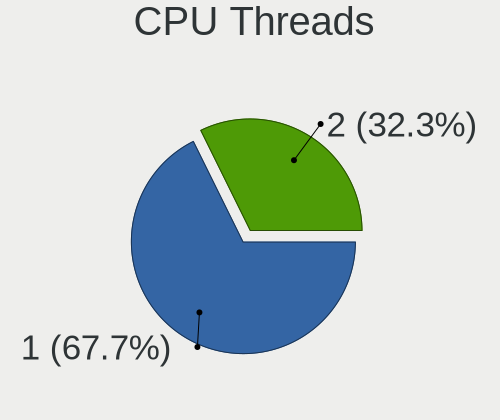

| Number | Desktops | Percent |
|--------|----------|---------|
| 1      | 37       | 71.15%  |
| 2      | 15       | 28.85%  |

CPU Op-Modes
------------

CPU Operation Modes (32-bit, 64-bit)

| Op mode        | Desktops | Percent |
|----------------|----------|---------|
| 32-bit, 64-bit | 49       | 94.23%  |
| Unknown        | 3        | 5.77%   |

CPU Microcode
-------------

Microcode number

| Number     | Desktops | Percent |
|------------|----------|---------|
| Unknown    | 13       | 23.64%  |
| 0x306c3    | 7        | 12.73%  |
| 0x1067a    | 6        | 10.91%  |
| 0x206a7    | 5        | 9.09%   |
| 0x506e3    | 3        | 5.45%   |
| 0x306a9    | 3        | 5.45%   |
| 0xf65      | 1        | 1.82%   |
| 0xf43      | 1        | 1.82%   |
| 0xa0653    | 1        | 1.82%   |
| 0x906ec    | 1        | 1.82%   |
| 0x906eb    | 1        | 1.82%   |
| 0x6fb      | 1        | 1.82%   |
| 0x6f6      | 1        | 1.82%   |
| 0x6f2      | 1        | 1.82%   |
| 0x10676    | 1        | 1.82%   |
| 0x10661    | 1        | 1.82%   |
| 0x08701021 | 1        | 1.82%   |
| 0x08108109 | 1        | 1.82%   |
| 0x0800820d | 1        | 1.82%   |
| 0x06006118 | 1        | 1.82%   |
| 0x06001116 | 1        | 1.82%   |
| 0x0600063d | 1        | 1.82%   |
| 0x03000027 | 1        | 1.82%   |
| 0x01000083 | 1        | 1.82%   |

CPU Microarch
-------------

Microarchitecture

| Name             | Desktops | Percent |
|------------------|----------|---------|
| Penryn           | 8        | 15.38%  |
| Haswell          | 7        | 13.46%  |
| SandyBridge      | 6        | 11.54%  |
| Core             | 5        | 9.62%   |
| IvyBridge        | 4        | 7.69%   |
| Zen+             | 3        | 5.77%   |
| Skylake          | 3        | 5.77%   |
| K8 Hammer        | 3        | 5.77%   |
| NetBurst         | 2        | 3.85%   |
| KabyLake         | 2        | 3.85%   |
| K10              | 2        | 3.85%   |
| Zen 2            | 1        | 1.92%   |
| Piledriver       | 1        | 1.92%   |
| K10 Llano        | 1        | 1.92%   |
| Excavator        | 1        | 1.92%   |
| CometLake        | 1        | 1.92%   |
| Bulldozer        | 1        | 1.92%   |
| Alderlake Hybrid | 1        | 1.92%   |

Graphics
--------

GPU Vendor
----------

Vendors of graphics cards

| Vendor                     | Desktops | Percent |
|----------------------------|----------|---------|
| AMD                        | 19       | 34.55%  |
| Intel                      | 18       | 32.73%  |
| Nvidia                     | 17       | 30.91%  |
| Matrox Electronics Systems | 1        | 1.82%   |

GPU Model
---------

Graphics card models

| Model                                                                       | Desktops | Percent |
|-----------------------------------------------------------------------------|----------|---------|
| Intel 2nd Generation Core Processor Family Integrated Graphics Controller   | 5        | 8.62%   |
| Intel Xeon E3-1200 v3/4th Gen Core Processor Integrated Graphics Controller | 4        | 6.9%    |
| Nvidia GT218 [GeForce 210]                                                  | 2        | 3.45%   |
| Nvidia GK110 [GeForce GTX 780]                                              | 2        | 3.45%   |
| Intel Xeon E3-1200 v2/3rd Gen Core processor Graphics Controller            | 2        | 3.45%   |
| Intel 82G33/G31 Express Integrated Graphics Controller                      | 2        | 3.45%   |
| AMD Cape Verde XT [Radeon HD 7770/8760 / R7 250X]                           | 2        | 3.45%   |
| AMD Baffin [Radeon RX 460/560D / Pro 450/455/460/555/555X/560/560X]         | 2        | 3.45%   |
| Nvidia TU116 [GeForce GTX 1660]                                             | 1        | 1.72%   |
| Nvidia TU104 [GeForce RTX 2080]                                             | 1        | 1.72%   |
| Nvidia GT216 [GeForce GT 220]                                               | 1        | 1.72%   |
| Nvidia GP108 [GeForce GT 1030]                                              | 1        | 1.72%   |
| Nvidia GP107 [GeForce GTX 1050 Ti]                                          | 1        | 1.72%   |
| Nvidia GP106 [GeForce GTX 1060 6GB]                                         | 1        | 1.72%   |
| Nvidia GK208B [GeForce GT 710]                                              | 1        | 1.72%   |
| Nvidia GF119 [GeForce GT 610]                                               | 1        | 1.72%   |
| Nvidia GF116 [GeForce GTX 550 Ti]                                           | 1        | 1.72%   |
| Nvidia GF106 [GeForce GT 440]                                               | 1        | 1.72%   |
| Nvidia GA106 [GeForce RTX 3060 Lite Hash Rate]                              | 1        | 1.72%   |
| Nvidia G86 [GeForce 8500 GT]                                                | 1        | 1.72%   |
| Nvidia G84 [GeForce 8600 GTS]                                               | 1        | 1.72%   |
| Matrox Electronics Systems MGA G200e [Pilot] ServerEngines (SEP1)           | 1        | 1.72%   |
| Intel HD Graphics 530                                                       | 1        | 1.72%   |
| Intel CoffeeLake-S GT2 [UHD Graphics 630]                                   | 1        | 1.72%   |
| Intel 82Q963/Q965 Integrated Graphics Controller                            | 1        | 1.72%   |
| Intel 82945G/GZ Integrated Graphics Controller                              | 1        | 1.72%   |
| Intel 4 Series Chipset Integrated Graphics Controller                       | 1        | 1.72%   |
| AMD Turks PRO [Radeon HD 6570/7570/8550 / R5 230]                           | 1        | 1.72%   |
| AMD Trinity [Radeon HD 7560D]                                               | 1        | 1.72%   |
| AMD Tobago PRO [Radeon R7 360 / R9 360 OEM]                                 | 1        | 1.72%   |
| AMD RV730 PRO [Radeon HD 4650]                                              | 1        | 1.72%   |
| AMD RV710 [Radeon HD 4350/4550]                                             | 1        | 1.72%   |
| AMD RV350 [Radeon 9550] (Secondary)                                         | 1        | 1.72%   |
| AMD RV350 [Radeon 9550]                                                     | 1        | 1.72%   |
| AMD RS482/RS485 [Radeon Xpress 1100/1150]                                   | 1        | 1.72%   |
| AMD RS480 [Radeon Xpress 1150] (Secondary)                                  | 1        | 1.72%   |
| AMD Redwood PRO [Radeon HD 5550/5570/5630/6510/6610/7570]                   | 1        | 1.72%   |
| AMD Picasso/Raven 2 [Radeon Vega Series / Radeon Vega Mobile Series]        | 1        | 1.72%   |
| AMD Park [Mobility Radeon HD 5430]                                          | 1        | 1.72%   |
| AMD Oland PRO [Radeon R7 240/340 / Radeon 520]                              | 1        | 1.72%   |

GPU Combo
---------

Combinations of graphics cards

| Name           | Desktops | Percent |
|----------------|----------|---------|
| 1 x AMD        | 17       | 32.08%  |
| 1 x Nvidia     | 16       | 30.19%  |
| 1 x Intel      | 16       | 30.19%  |
| 3 x AMD        | 1        | 1.89%   |
| 2 x AMD        | 1        | 1.89%   |
| 1 x Matrox     | 1        | 1.89%   |
| Intel + Nvidia | 1        | 1.89%   |

GPU Driver
----------

Free vs proprietary

| Driver      | Desktops | Percent |
|-------------|----------|---------|
| Free        | 40       | 75.47%  |
| Proprietary | 10       | 18.87%  |
| Unknown     | 3        | 5.66%   |

GPU Memory
----------

Total video memory

| Size in GB | Desktops | Percent |
|------------|----------|---------|
| Unknown    | 21       | 38.89%  |
| 1.01-2.0   | 9        | 16.67%  |
| 0.51-1.0   | 9        | 16.67%  |
| 0.01-0.5   | 8        | 14.81%  |
| 3.01-4.0   | 2        | 3.7%    |
| 2.01-3.0   | 2        | 3.7%    |
| 7.01-8.0   | 1        | 1.85%   |
| 5.01-6.0   | 1        | 1.85%   |
| 8.01-16.0  | 1        | 1.85%   |

Monitor
-------

Monitor Vendor
--------------

Monitor vendors

| Vendor               | Desktops | Percent |
|----------------------|----------|---------|
| Samsung Electronics  | 12       | 24.49%  |
| Goldstar             | 6        | 12.24%  |
| Philips              | 5        | 10.2%   |
| AOC                  | 4        | 8.16%   |
| Unknown              | 2        | 4.08%   |
| Sony                 | 2        | 4.08%   |
| IBM                  | 2        | 4.08%   |
| Fujitsu Siemens      | 2        | 4.08%   |
| Dell                 | 2        | 4.08%   |
| BenQ                 | 2        | 4.08%   |
| ASUSTek Computer     | 2        | 4.08%   |
| Ancor Communications | 2        | 4.08%   |
| Acer                 | 2        | 4.08%   |
| ViewSonic            | 1        | 2.04%   |
| Vestel Elektronik    | 1        | 2.04%   |
| CTV                  | 1        | 2.04%   |
| Belinea              | 1        | 2.04%   |

Monitor Model
-------------

Monitor models

| Model                                                                  | Desktops | Percent |
|------------------------------------------------------------------------|----------|---------|
| Samsung Electronics LCD Monitor SAM0900 1366x768 580x320mm 26.1-inch   | 2        | 3.85%   |
| IBM C170 CRT IBM1A51 1280x1024 310x230mm 15.2-inch                     | 2        | 3.85%   |
| AOC 917W AOC1917 1440x900 410x256mm 19.0-inch                          | 2        | 3.85%   |
| Acer KA220HQ ACR0467 1920x1080 477x268mm 21.5-inch                     | 2        | 3.85%   |
| ViewSonic VA702 VSC1C1C 1280x1024 338x270mm 17.0-inch                  | 1        | 1.92%   |
| Vestel Elektronik 42 FHD_LCD-TV VES3700 1920x540                       | 1        | 1.92%   |
| Unknown LCD Monitor SAMSUNG 1366x768                                   | 1        | 1.92%   |
| Unknown LCD Monitor Maxdata/XXXXXXX B_101920 1280x1024                 | 1        | 1.92%   |
| Sony TV SNY4D04 1920x1080 1600x900mm 72.3-inch                         | 1        | 1.92%   |
| Sony TV *00 SNY4904 3840x2160                                          | 1        | 1.92%   |
| Samsung Electronics SyncMaster SAM0564 1360x768 410x230mm 18.5-inch    | 1        | 1.92%   |
| Samsung Electronics SyncMaster SAM03E2 1680x1050 433x271mm 20.1-inch   | 1        | 1.92%   |
| Samsung Electronics SyncMaster SAM01F9 1280x1024 376x301mm 19.0-inch   | 1        | 1.92%   |
| Samsung Electronics SyncMaster SAM0169 1280x1024 376x301mm 19.0-inch   | 1        | 1.92%   |
| Samsung Electronics SAMTRON 50X/V STN0011 1024x768 304x228mm 15.0-inch | 1        | 1.92%   |
| Samsung Electronics S27D590 SAM0B49 1920x1080 598x336mm 27.0-inch      | 1        | 1.92%   |
| Samsung Electronics S24D391 SAM0B87 1920x1080 521x293mm 23.5-inch      | 1        | 1.92%   |
| Samsung Electronics S22D300 SAM0B3F 1920x1080 477x268mm 21.5-inch      | 1        | 1.92%   |
| Samsung Electronics S22B150 SAM08A3 1920x1080 477x268mm 21.5-inch      | 1        | 1.92%   |
| Samsung Electronics LCD Monitor SyncMaster 1680x1050                   | 1        | 1.92%   |
| Samsung Electronics LCD Monitor SAM0659 1920x1080                      | 1        | 1.92%   |
| Philips PHL 247E6 PHLC0E7 1920x1080 521x293mm 23.5-inch                | 1        | 1.92%   |
| Philips LCD Monitor FTV                                                | 1        | 1.92%   |
| Philips LCD Monitor 170S 3200x1080                                     | 1        | 1.92%   |
| Philips 192EL PHLC04E 1366x768 410x230mm 18.5-inch                     | 1        | 1.92%   |
| Philips 170S PHL0856 1280x1024 338x270mm 17.0-inch                     | 1        | 1.92%   |
| Philips 170S PHL0839 1280x1024 338x270mm 17.0-inch                     | 1        | 1.92%   |
| Goldstar W2043 GSM4E9D 1600x900 443x249mm 20.0-inch                    | 1        | 1.92%   |
| Goldstar L227W GSM566F 1680x1050 474x296mm 22.0-inch                   | 1        | 1.92%   |
| Goldstar IPS231 GSM5816 1920x1080 510x290mm 23.1-inch                  | 1        | 1.92%   |
| Goldstar HDR 4K GSM7706 3840x2160 600x340mm 27.2-inch                  | 1        | 1.92%   |
| Goldstar FULL HD GSM5B54 1920x1080 480x270mm 21.7-inch                 | 1        | 1.92%   |
| Goldstar E2242 GSM58BE 1920x1080 477x268mm 21.5-inch                   | 1        | 1.92%   |
| Fujitsu Siemens B22W-6 LED FUS07F3 1680x1050 474x296mm 22.0-inch       | 1        | 1.92%   |
| Fujitsu Siemens A17-1 FUS0565 1280x1024 340x270mm 17.1-inch            | 1        | 1.92%   |
| Dell S2409W DELA038 1920x1080 531x298mm 24.0-inch                      | 1        | 1.92%   |
| Dell 2208WFP DEL403C 1680x1050 473x296mm 22.0-inch                     | 1        | 1.92%   |
| CTV CTV CTV0B01 1366x768 698x393mm 31.5-inch                           | 1        | 1.92%   |
| BenQ XL2411Z BNQ7F31 1920x1080 531x298mm 24.0-inch                     | 1        | 1.92%   |
| BenQ GW2780 BNQ78E6 1920x1080 598x336mm 27.0-inch                      | 1        | 1.92%   |

Monitor Resolution
------------------

Monitor screen resolution

| Resolution         | Desktops | Percent |
|--------------------|----------|---------|
| 1920x1080 (FHD)    | 21       | 42.86%  |
| 1280x1024 (SXGA)   | 9        | 18.37%  |
| 1680x1050 (WSXGA+) | 6        | 12.24%  |
| 3840x2160 (4K)     | 3        | 6.12%   |
| 1366x768 (WXGA)    | 3        | 6.12%   |
| 1440x900 (WXGA+)   | 2        | 4.08%   |
| 3200x1080          | 1        | 2.04%   |
| 1600x900 (HD+)     | 1        | 2.04%   |
| 1360x768           | 1        | 2.04%   |
| 1024x768 (XGA)     | 1        | 2.04%   |
| Unknown            | 1        | 2.04%   |

Monitor Diagonal
----------------

Diagonal size in inches

| Inches  | Desktops | Percent |
|---------|----------|---------|
| Unknown | 8        | 15.69%  |
| 21      | 7        | 13.73%  |
| 23      | 6        | 11.76%  |
| 19      | 4        | 7.84%   |
| 17      | 4        | 7.84%   |
| 31      | 3        | 5.88%   |
| 27      | 3        | 5.88%   |
| 24      | 3        | 5.88%   |
| 22      | 3        | 5.88%   |
| 15      | 3        | 5.88%   |
| 72      | 2        | 3.92%   |
| 20      | 2        | 3.92%   |
| 18      | 2        | 3.92%   |
| 84      | 1        | 1.96%   |

Monitor Width
-------------

Physical width

| Width in mm | Desktops | Percent |
|-------------|----------|---------|
| 401-500     | 16       | 32.65%  |
| 501-600     | 10       | 20.41%  |
| Unknown     | 8        | 16.33%  |
| 301-350     | 7        | 14.29%  |
| 601-700     | 3        | 6.12%   |
| 1501-2000   | 3        | 6.12%   |
| 351-400     | 2        | 4.08%   |

Aspect Ratio
------------

Proportional relationship between the width and the height

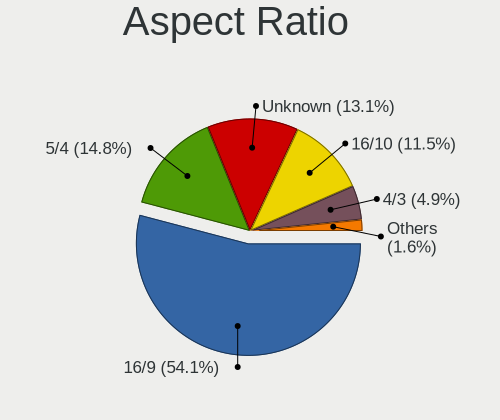

| Ratio   | Desktops | Percent |
|---------|----------|---------|
| 16/9    | 24       | 51.06%  |
| Unknown | 7        | 14.89%  |
| 5/4     | 6        | 12.77%  |
| 16/10   | 6        | 12.77%  |
| 4/3     | 3        | 6.38%   |
| 3/2     | 1        | 2.13%   |

Monitor Area
------------

Area in inch²

| Area in inch² | Desktops | Percent |
|----------------|----------|---------|
| 201-250        | 17       | 34.69%  |
| Unknown        | 8        | 16.33%  |
| 151-200        | 6        | 12.24%  |
| 141-150        | 6        | 12.24%  |
| More than 1000 | 3        | 6.12%   |
| 351-500        | 3        | 6.12%   |
| 301-350        | 3        | 6.12%   |
| 111-120        | 2        | 4.08%   |
| 101-110        | 1        | 2.04%   |

Pixel Density
-------------

Pixels per inch

| Density | Desktops | Percent |
|---------|----------|---------|
| 51-100  | 25       | 54.35%  |
| 101-120 | 9        | 19.57%  |
| Unknown | 8        | 17.39%  |
| 1-50    | 3        | 6.52%   |
| 161-240 | 1        | 2.17%   |

Multiple Monitors
-----------------

Total monitors connected

| Total | Desktops | Percent |
|-------|----------|---------|
| 1     | 43       | 79.63%  |
| 2     | 8        | 14.81%  |
| 0     | 3        | 5.56%   |

Network
-------

Net Controller Vendor
---------------------

Controller vendors

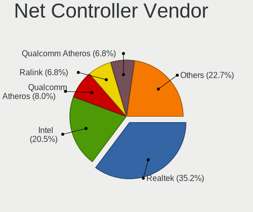

| Vendor                                 | Desktops | Percent |
|----------------------------------------|----------|---------|
| Realtek Semiconductor                  | 26       | 37.68%  |
| Intel                                  | 13       | 18.84%  |
| Qualcomm Atheros                       | 6        | 8.7%    |
| Qualcomm Atheros Communications        | 5        | 7.25%   |
| Ralink Technology                      | 4        | 5.8%    |
| Nvidia                                 | 3        | 4.35%   |
| TP-Link                                | 2        | 2.9%    |
| Sony Ericsson Mobile Communications AB | 2        | 2.9%    |
| Broadcom Limited                       | 2        | 2.9%    |
| Broadcom                               | 2        | 2.9%    |
| Ralink                                 | 1        | 1.45%   |
| Mercucys                               | 1        | 1.45%   |
| Marvell Technology Group               | 1        | 1.45%   |
| ICS Advent                             | 1        | 1.45%   |

Net Controller Model
--------------------

Controller models

| Model                                                               | Desktops | Percent |
|---------------------------------------------------------------------|----------|---------|
| Realtek RTL8111/8168/8411 PCI Express Gigabit Ethernet Controller   | 23       | 31.94%  |
| Qualcomm Atheros AR9271 802.11n                                     | 5        | 6.94%   |
| Intel 82579LM Gigabit Network Connection (Lewisville)               | 4        | 5.56%   |
| Ralink MT7601U Wireless Adapter                                     | 3        | 4.17%   |
| Intel 82567LM-3 Gigabit Network Connection                          | 3        | 4.17%   |
| TP-Link TL-WN722N v2/v3 [Realtek RTL8188EUS]                        | 2        | 2.78%   |
| Sony Ericsson Mobile AB D2005                                       | 2        | 2.78%   |
| Qualcomm Atheros Killer E2400 Gigabit Ethernet Controller           | 2        | 2.78%   |
| Qualcomm Atheros AR8151 v2.0 Gigabit Ethernet                       | 2        | 2.78%   |
| Broadcom NetXtreme BCM5754 Gigabit Ethernet PCI Express             | 2        | 2.78%   |
| Realtek RTL8188CUS 802.11n WLAN Adapter                             | 1        | 1.39%   |
| Realtek RTL8169 PCI Gigabit Ethernet Controller                     | 1        | 1.39%   |
| Realtek RTL-8100/8101L/8139 PCI Fast Ethernet Adapter               | 1        | 1.39%   |
| Realtek 802.11ac NIC                                                | 1        | 1.39%   |
| Ralink RT5370 Wireless Adapter                                      | 1        | 1.39%   |
| Ralink RT2561/RT61 802.11g PCI                                      | 1        | 1.39%   |
| Qualcomm Atheros Attansic L2 Fast Ethernet                          | 1        | 1.39%   |
| Qualcomm Atheros AR9462 Wireless Network Adapter                    | 1        | 1.39%   |
| Qualcomm Atheros AR2417 Wireless Network Adapter [AR5007G 802.11bg] | 1        | 1.39%   |
| Nvidia MCP73 Ethernet                                               | 1        | 1.39%   |
| Nvidia CK8S Ethernet Controller                                     | 1        | 1.39%   |
| Nvidia CK804 Ethernet Controller                                    | 1        | 1.39%   |
| Mercucys 802.11n NIC                                                | 1        | 1.39%   |
| Marvell Group 88E8071 PCI-E Gigabit Ethernet Controller             | 1        | 1.39%   |
| Intel I211 Gigabit Network Connection                               | 1        | 1.39%   |
| Intel Ethernet Connection (2) I218-V                                | 1        | 1.39%   |
| Intel Ethernet Connection (17) I219-V                               | 1        | 1.39%   |
| Intel Dual Band Wireless-AC 3168NGW [Stone Peak]                    | 1        | 1.39%   |
| Intel 82579V Gigabit Network Connection                             | 1        | 1.39%   |
| Intel 82573V Gigabit Ethernet Controller (Copper)                   | 1        | 1.39%   |
| Intel 82566DM Gigabit Network Connection                            | 1        | 1.39%   |
| ICS Advent DM9601 Fast Ethernet Adapter                             | 1        | 1.39%   |
| Broadcom Limited NetXtreme BCM5755 Gigabit Ethernet PCI Express     | 1        | 1.39%   |
| Broadcom Limited NetXtreme BCM5722 Gigabit Ethernet PCI Express     | 1        | 1.39%   |

Wireless Vendor
---------------

Wireless vendors

| Vendor                          | Desktops | Percent |
|---------------------------------|----------|---------|
| Qualcomm Atheros Communications | 5        | 27.78%  |
| Ralink Technology               | 4        | 22.22%  |
| TP-Link                         | 2        | 11.11%  |
| Realtek Semiconductor           | 2        | 11.11%  |
| Qualcomm Atheros                | 2        | 11.11%  |
| Ralink                          | 1        | 5.56%   |
| Mercucys                        | 1        | 5.56%   |
| Intel                           | 1        | 5.56%   |

Wireless Model
--------------

Wireless models

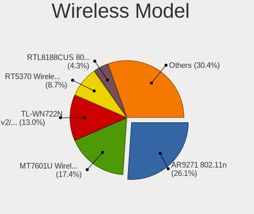

| Model                                                               | Desktops | Percent |
|---------------------------------------------------------------------|----------|---------|
| Qualcomm Atheros AR9271 802.11n                                     | 5        | 27.78%  |
| Ralink MT7601U Wireless Adapter                                     | 3        | 16.67%  |
| TP-Link TL-WN722N v2/v3 [Realtek RTL8188EUS]                        | 2        | 11.11%  |
| Realtek RTL8188CUS 802.11n WLAN Adapter                             | 1        | 5.56%   |
| Realtek 802.11ac NIC                                                | 1        | 5.56%   |
| Ralink RT5370 Wireless Adapter                                      | 1        | 5.56%   |
| Ralink RT2561/RT61 802.11g PCI                                      | 1        | 5.56%   |
| Qualcomm Atheros AR9462 Wireless Network Adapter                    | 1        | 5.56%   |
| Qualcomm Atheros AR2417 Wireless Network Adapter [AR5007G 802.11bg] | 1        | 5.56%   |
| Mercucys 802.11n NIC                                                | 1        | 5.56%   |
| Intel Dual Band Wireless-AC 3168NGW [Stone Peak]                    | 1        | 5.56%   |

Ethernet Vendor
---------------

Ethernet vendors

| Vendor                                 | Desktops | Percent |
|----------------------------------------|----------|---------|
| Realtek Semiconductor                  | 25       | 46.3%   |
| Intel                                  | 13       | 24.07%  |
| Qualcomm Atheros                       | 5        | 9.26%   |
| Nvidia                                 | 3        | 5.56%   |
| Sony Ericsson Mobile Communications AB | 2        | 3.7%    |
| Broadcom Limited                       | 2        | 3.7%    |
| Broadcom                               | 2        | 3.7%    |
| Marvell Technology Group               | 1        | 1.85%   |
| ICS Advent                             | 1        | 1.85%   |

Ethernet Model
--------------

Ethernet models

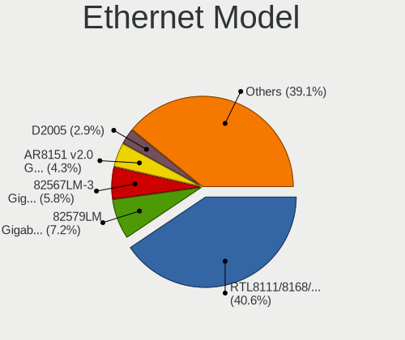

| Model                                                             | Desktops | Percent |
|-------------------------------------------------------------------|----------|---------|
| Realtek RTL8111/8168/8411 PCI Express Gigabit Ethernet Controller | 23       | 42.59%  |
| Intel 82579LM Gigabit Network Connection (Lewisville)             | 4        | 7.41%   |
| Intel 82567LM-3 Gigabit Network Connection                        | 3        | 5.56%   |
| Sony Ericsson Mobile AB D2005                                     | 2        | 3.7%    |
| Qualcomm Atheros Killer E2400 Gigabit Ethernet Controller         | 2        | 3.7%    |
| Qualcomm Atheros AR8151 v2.0 Gigabit Ethernet                     | 2        | 3.7%    |
| Broadcom NetXtreme BCM5754 Gigabit Ethernet PCI Express           | 2        | 3.7%    |
| Realtek RTL8169 PCI Gigabit Ethernet Controller                   | 1        | 1.85%   |
| Realtek RTL-8100/8101L/8139 PCI Fast Ethernet Adapter             | 1        | 1.85%   |
| Qualcomm Atheros Attansic L2 Fast Ethernet                        | 1        | 1.85%   |
| Nvidia MCP73 Ethernet                                             | 1        | 1.85%   |
| Nvidia CK8S Ethernet Controller                                   | 1        | 1.85%   |
| Nvidia CK804 Ethernet Controller                                  | 1        | 1.85%   |
| Marvell Group 88E8071 PCI-E Gigabit Ethernet Controller           | 1        | 1.85%   |
| Intel I211 Gigabit Network Connection                             | 1        | 1.85%   |
| Intel Ethernet Connection (2) I218-V                              | 1        | 1.85%   |
| Intel Ethernet Connection (17) I219-V                             | 1        | 1.85%   |
| Intel 82579V Gigabit Network Connection                           | 1        | 1.85%   |
| Intel 82573V Gigabit Ethernet Controller (Copper)                 | 1        | 1.85%   |
| Intel 82566DM Gigabit Network Connection                          | 1        | 1.85%   |
| ICS Advent DM9601 Fast Ethernet Adapter                           | 1        | 1.85%   |
| Broadcom Limited NetXtreme BCM5755 Gigabit Ethernet PCI Express   | 1        | 1.85%   |
| Broadcom Limited NetXtreme BCM5722 Gigabit Ethernet PCI Express   | 1        | 1.85%   |

Net Controller Kind
-------------------

Ethernet, WiFi or modem

| Kind     | Desktops | Percent |
|----------|----------|---------|
| Ethernet | 51       | 73.91%  |
| WiFi     | 18       | 26.09%  |

Used Controller
---------------

Currently used network controller

| Kind     | Desktops | Percent |
|----------|----------|---------|
| Ethernet | 38       | 73.08%  |
| WiFi     | 14       | 26.92%  |

NICs
----

Total network controllers on board

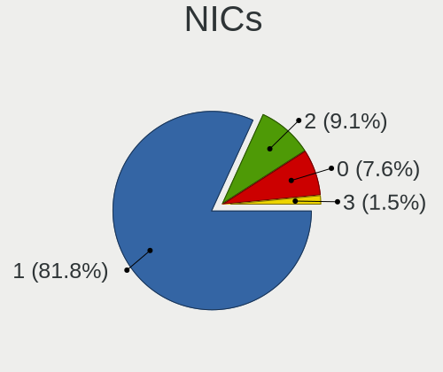

| Total | Desktops | Percent |
|-------|----------|---------|
| 1     | 43       | 81.13%  |
| 2     | 5        | 9.43%   |
| 0     | 4        | 7.55%   |
| 3     | 1        | 1.89%   |

IPv6
----

IPv6 vs IPv4

| Used | Desktops | Percent |
|------|----------|---------|
| No   | 51       | 96.23%  |
| Yes  | 2        | 3.77%   |

Bluetooth
---------

Bluetooth Vendor
----------------

Controller vendors

| Vendor                     | Desktops | Percent |
|----------------------------|----------|---------|
| Cambridge Silicon Radio    | 2        | 40%     |
| Intel                      | 1        | 20%     |
| Integrated System Solution | 1        | 20%     |
| Broadcom                   | 1        | 20%     |

Bluetooth Model
---------------

Controller models

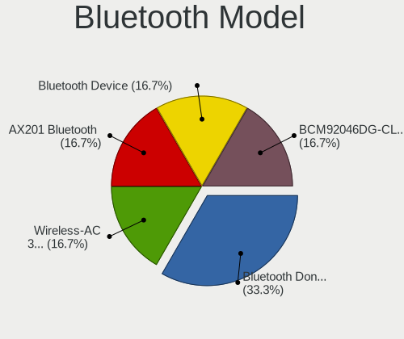

| Model                                               | Desktops | Percent |
|-----------------------------------------------------|----------|---------|
| Cambridge Silicon Radio Bluetooth Dongle (HCI mode) | 2        | 40%     |
| Intel Wireless-AC 3168 Bluetooth                    | 1        | 20%     |
| Integrated System Solution Bluetooth Device         | 1        | 20%     |
| Broadcom BCM92046DG-CL1ROM Bluetooth 2.1 UHE Dongle | 1        | 20%     |

Sound
-----

Sound Vendor
------------

Sound card vendors

| Vendor              | Desktops | Percent |
|---------------------|----------|---------|
| Intel               | 37       | 46.25%  |
| AMD                 | 21       | 26.25%  |
| Nvidia              | 18       | 22.5%   |
| VIA Technologies    | 1        | 1.25%   |
| Logitech            | 1        | 1.25%   |
| Creative Labs       | 1        | 1.25%   |
| C-Media Electronics | 1        | 1.25%   |

Sound Model
-----------

Sound card models

| Model                                                                      | Desktops | Percent |
|----------------------------------------------------------------------------|----------|---------|
| Intel 6 Series/C200 Series Chipset Family High Definition Audio Controller | 8        | 9.09%   |
| Intel NM10/ICH7 Family High Definition Audio Controller                    | 6        | 6.82%   |
| Intel 8 Series/C220 Series Chipset High Definition Audio Controller        | 4        | 4.55%   |
| Intel 9 Series Chipset Family HD Audio Controller                          | 3        | 3.41%   |
| Intel 82801JD/DO (ICH10 Family) HD Audio Controller                        | 3        | 3.41%   |
| Intel 100 Series/C230 Series Chipset Family HD Audio Controller            | 3        | 3.41%   |
| AMD Oland/Hainan/Cape Verde/Pitcairn HDMI Audio [Radeon HD 7000 Series]    | 3        | 3.41%   |
| AMD Baffin HDMI/DP Audio [Radeon RX 550 640SP / RX 560/560X]               | 3        | 3.41%   |
| Nvidia High Definition Audio Controller                                    | 2        | 2.27%   |
| Nvidia GK110 High Definition Audio Controller                              | 2        | 2.27%   |
| Intel Xeon E3-1200 v3/4th Gen Core Processor HD Audio Controller           | 2        | 2.27%   |
| Intel 82801H (ICH8 Family) HD Audio Controller                             | 2        | 2.27%   |
| Intel 7 Series/C216 Chipset Family High Definition Audio Controller        | 2        | 2.27%   |
| AMD SBx00 Azalia (Intel HDA)                                               | 2        | 2.27%   |
| AMD RV710/730 HDMI Audio [Radeon HD 4000 series]                           | 2        | 2.27%   |
| AMD FCH Azalia Controller                                                  | 2        | 2.27%   |
| AMD Family 17h (Models 00h-0fh) HD Audio Controller                        | 2        | 2.27%   |
| AMD Cedar HDMI Audio [Radeon HD 5400/6300/7300 Series]                     | 2        | 2.27%   |
| VIA Technologies ICE1712 [Envy24] PCI Multi-Channel I/O Controller         | 1        | 1.14%   |
| Nvidia TU116 High Definition Audio Controller                              | 1        | 1.14%   |
| Nvidia TU104 HD Audio Controller                                           | 1        | 1.14%   |
| Nvidia nForce3 250Gb AC'97 Audio Controller                                | 1        | 1.14%   |
| Nvidia MCP73 High Definition Audio                                         | 1        | 1.14%   |
| Nvidia MCP61 High Definition Audio                                         | 1        | 1.14%   |
| Nvidia GT216 HDMI Audio Controller                                         | 1        | 1.14%   |
| Nvidia GP108 High Definition Audio Controller                              | 1        | 1.14%   |
| Nvidia GP107GL High Definition Audio Controller                            | 1        | 1.14%   |
| Nvidia GP106 High Definition Audio Controller                              | 1        | 1.14%   |
| Nvidia GK208 HDMI/DP Audio Controller                                      | 1        | 1.14%   |
| Nvidia GF119 HDMI Audio Controller                                         | 1        | 1.14%   |
| Nvidia GF116 High Definition Audio Controller                              | 1        | 1.14%   |
| Nvidia GF106 High Definition Audio Controller                              | 1        | 1.14%   |
| Nvidia GA106 High Definition Audio Controller                              | 1        | 1.14%   |
| Logitech ClearChat Pro USB                                                 | 1        | 1.14%   |
| Intel USB PnP Sound Device                                                 | 1        | 1.14%   |
| Intel Smart Sound Technology (SST) Audio Controller                        | 1        | 1.14%   |
| Intel Cannon Lake PCH cAVS                                                 | 1        | 1.14%   |
| Intel Alder Lake-S HD Audio Controller                                     | 1        | 1.14%   |
| Intel 82801JI (ICH10 Family) HD Audio Controller                           | 1        | 1.14%   |
| Intel 200 Series PCH HD Audio                                              | 1        | 1.14%   |

Memory
------

Memory Vendor
-------------

Memory module vendors

| Vendor              | Desktops | Percent |
|---------------------|----------|---------|
| Kingston            | 13       | 46.43%  |
| Unknown             | 4        | 14.29%  |
| SK hynix            | 3        | 10.71%  |
| Samsung Electronics | 1        | 3.57%   |
| Nanya Technology    | 1        | 3.57%   |
| Micron Technology   | 1        | 3.57%   |
| INNOVATION PC       | 1        | 3.57%   |
| G.Skill             | 1        | 3.57%   |
| Corsair             | 1        | 3.57%   |
| Apacer              | 1        | 3.57%   |
| A-DATA Technology   | 1        | 3.57%   |

Memory Model
------------

Memory module models

| Model                                                                   | Desktops | Percent |
|-------------------------------------------------------------------------|----------|---------|
| Kingston RAM KHX1600C10D3/8G 8GB DIMM DDR3 1648MT/s                     | 2        | 5.88%   |
| Kingston RAM 99U5584-005.A00LF 4GB DIMM DDR3 1600MT/s                   | 2        | 5.88%   |
| Kingston RAM 99U5471-054.A00LF 8GB DIMM DDR3 1600MT/s                   | 2        | 5.88%   |
| Unknown RAM Module 2GB DIMM DDR2 800MT/s                                | 1        | 2.94%   |
| Unknown RAM Module 2048MB DIMM DDR2 333MT/s                             | 1        | 2.94%   |
| Unknown RAM Module 2048MB DIMM 1066MT/s                                 | 1        | 2.94%   |
| Unknown RAM Module 1GB DIMM DDR2 800MT/s                                | 1        | 2.94%   |
| Unknown RAM Module 1024MB DIMM DDR 800MT/s                              | 1        | 2.94%   |
| SK hynix RAM HMT351U6EFR8C-PB 4GB DIMM DDR3 1800MT/s                    | 1        | 2.94%   |
| SK hynix RAM HMT351U6CFR8C 4096MB DIMM DDR3 1333MT/s                    | 1        | 2.94%   |
| SK hynix RAM HMT112U6TFR8C-H9 1GB DIMM DDR3 1333MT/s                    | 1        | 2.94%   |
| Samsung RAM M378B5273CH0-CH9 4GB DIMM DDR3 1867MT/s                     | 1        | 2.94%   |
| Nanya RAM M2X2G64CB88G7N-DG 2GB DIMM DDR3 1600MT/s                      | 1        | 2.94%   |
| Micron RAM 16HTF25664AY-800G1 2GB DIMM DDR2 800MT/s                     | 1        | 2.94%   |
| Kingston RAM KHX3200C16D4/8GX 8GB DIMM DDR4 3733MT/s                    | 1        | 2.94%   |
| Kingston RAM KHX2400C15/8G 8GB DIMM DDR4 3400MT/s                       | 1        | 2.94%   |
| Kingston RAM KHX1600C10D3/4G 4GB DIMM DDR3 1600MT/s                     | 1        | 2.94%   |
| Kingston RAM 99U5584-010.A00LF 4GB DIMM DDR3 1866MT/s                   | 1        | 2.94%   |
| Kingston RAM 99U5584-009.A00LF 4096MB DIMM DDR3 1600MT/s                | 1        | 2.94%   |
| Kingston RAM 99U5584-007.A 4GB DIMM DDR3 1333MT/s                       | 1        | 2.94%   |
| Kingston RAM 99U5584-003.A00LF 4GB DIMM DDR3 1600MT/s                   | 1        | 2.94%   |
| Kingston RAM 99U5474-016.A00LF 4GB DIMM DDR3 1600MT/s                   | 1        | 2.94%   |
| Kingston RAM 99U5403-067.A00LF 4GB DIMM DDR3 1600MT/s                   | 1        | 2.94%   |
| Kingston RAM 9905474-040.A00LF 4GB DIMM DDR3 1600MT/s                   | 1        | 2.94%   |
| Kingston RAM 9905403-511.A00LF 4GB DIMM DDR3 1333MT/s                   | 1        | 2.94%   |
| Kingston RAM 393955353432392D3030372E4130304C4600 2GB DIMM DDR2 800MT/s | 1        | 2.94%   |
| INNOVATION PC RAM INNO104503 8GB DIMM DDR4 2667MT/s                     | 1        | 2.94%   |
| G.Skill RAM F4-2133C15-8GNS 8GB DIMM DDR4 2133MT/s                      | 1        | 2.94%   |
| Corsair RAM CMK16GX4M2B2800C14 8GB DIMM DDR4 2800MT/s                   | 1        | 2.94%   |
| Apacer RAM 78.B1GEP.CP00C 4GB DIMM DDR3 1333MT/s                        | 1        | 2.94%   |
| A-DATA RAM AX4U36008G18I-DW50 8GB DIMM DDR4 3200MT/s                    | 1        | 2.94%   |

Memory Kind
-----------

Memory module kinds

| Kind    | Desktops | Percent |
|---------|----------|---------|
| DDR3    | 13       | 52%     |
| DDR4    | 6        | 24%     |
| DDR2    | 4        | 16%     |
| DDR     | 1        | 4%      |
| Unknown | 1        | 4%      |

Memory Form Factor
------------------

Physical design of the memory module

| Name | Desktops | Percent |
|------|----------|---------|
| DIMM | 24       | 100%    |

Memory Size
-----------

Memory module size

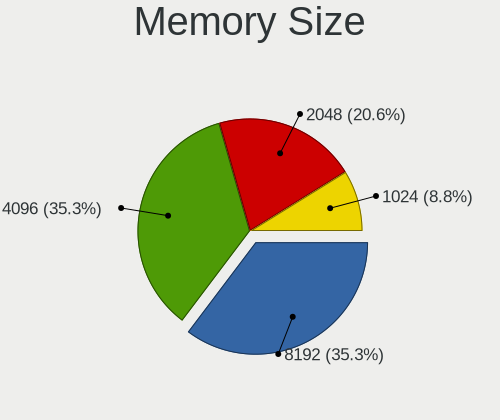

| Size | Desktops | Percent |
|------|----------|---------|
| 8192 | 11       | 39.29%  |
| 4096 | 9        | 32.14%  |
| 2048 | 5        | 17.86%  |
| 1024 | 3        | 10.71%  |

Memory Speed
------------

Memory module speed

| Speed | Desktops | Percent |
|-------|----------|---------|
| 1600  | 8        | 27.59%  |
| 800   | 4        | 13.79%  |
| 1867  | 3        | 10.34%  |
| 1333  | 3        | 10.34%  |
| 1866  | 2        | 6.9%    |
| 3733  | 1        | 3.45%   |
| 3400  | 1        | 3.45%   |
| 3200  | 1        | 3.45%   |
| 2800  | 1        | 3.45%   |
| 2667  | 1        | 3.45%   |
| 2133  | 1        | 3.45%   |
| 1800  | 1        | 3.45%   |
| 1066  | 1        | 3.45%   |
| 333   | 1        | 3.45%   |

Printers & scanners
-------------------

Printer Vendor
--------------

Printer device vendors

| Vendor          | Desktops | Percent |
|-----------------|----------|---------|
| Hewlett-Packard | 1        | 100%    |

Printer Model
-------------

Printer device models

| Model                           | Desktops | Percent |
|---------------------------------|----------|---------|
| HP DeskJet F2100 Printer series | 1        | 100%    |

Scanner Vendor
--------------

Scanner device vendors

Zero info for selected period =(

Scanner Model
-------------

Scanner device models

Zero info for selected period =(

Camera
------

Camera Vendor
-------------

Camera device vendors

| Vendor    | Desktops | Percent |
|-----------|----------|---------|
| Logitech  | 5        | 83.33%  |
| Guillemot | 1        | 16.67%  |

Camera Model
------------

Camera device models

| Model                        | Desktops | Percent |
|------------------------------|----------|---------|
| Logitech Webcam C270         | 1        | 16.67%  |
| Logitech Webcam C210         | 1        | 16.67%  |
| Logitech Webcam C170         | 1        | 16.67%  |
| Logitech QuickCam Vision Pro | 1        | 16.67%  |
| Logitech HD Webcam C510      | 1        | 16.67%  |
| Guillemot Hercules HD Twist  | 1        | 16.67%  |

Security
--------

Fingerprint Vendor
------------------

Fingerprint sensor vendors

Zero info for selected period =(

Fingerprint Model
-----------------

Fingerprint sensor models

Zero info for selected period =(

Chipcard Vendor
---------------

Chipcard module vendors

Zero info for selected period =(

Chipcard Model
--------------

Chipcard module models

Zero info for selected period =(

Unsupported
-----------

Unsupported Devices
-------------------

Total unsupported devices on board

| Total | Desktops | Percent |
|-------|----------|---------|
| 0     | 48       | 90.57%  |
| 1     | 5        | 9.43%   |

Unsupported Device Types
------------------------

Types of unsupported devices

| Type                     | Desktops | Percent |
|--------------------------|----------|---------|
| Graphics card            | 4        | 80%     |
| Communication controller | 1        | 20%     |

