Linux in Bosnia and Herzegovina - Tested Hardware & Statistics (Notebooks)
--------------------------------------------------------------------------

A project to collect tested hardware configurations for Linux in Bosnia and Herzegovina.

Anyone can contribute to this report by the [hw-probe](https://github.com/linuxhw/hw-probe) tool:

    sudo -E hw-probe -all -upload

Please contribute! Especially if your hardware is rare.

Contents
--------

* [ Test Cases ](#test-cases)

* [ System ](#system)
  - [ OS                       ](#os)
  - [ OS Family                ](#os-family)
  - [ Kernel                   ](#kernel)
  - [ Kernel Family            ](#kernel-family)
  - [ Kernel Major Ver.        ](#kernel-major-ver)
  - [ Arch                     ](#arch)
  - [ DE                       ](#de)
  - [ Display Server           ](#display-server)
  - [ Display Manager          ](#display-manager)
  - [ OS Lang                  ](#os-lang)
  - [ Boot Mode                ](#boot-mode)
  - [ Filesystem               ](#filesystem)
  - [ Part. scheme             ](#part-scheme)
  - [ Dual Boot with Linux/BSD ](#dual-boot-with-linuxbsd)
  - [ Dual Boot (Win)          ](#dual-boot-win)

* [ Board ](#board)
  - [ Vendor                   ](#vendor)
  - [ Model                    ](#model)
  - [ Model Family             ](#model-family)
  - [ MFG Year                 ](#mfg-year)
  - [ Form Factor              ](#form-factor)
  - [ Secure Boot              ](#secure-boot)
  - [ Coreboot                 ](#coreboot)
  - [ RAM Size                 ](#ram-size)
  - [ RAM Used                 ](#ram-used)
  - [ Total Drives             ](#total-drives)
  - [ Has CD-ROM               ](#has-cd-rom)
  - [ Has Ethernet             ](#has-ethernet)
  - [ Has WiFi                 ](#has-wifi)
  - [ Has Bluetooth            ](#has-bluetooth)

* [ Location ](#location)
  - [ Country                  ](#country)
  - [ City                     ](#city)

* [ Drives ](#drives)
  - [ Drive Vendor             ](#drive-vendor)
  - [ Drive Model              ](#drive-model)
  - [ HDD Vendor               ](#hdd-vendor)
  - [ SSD Vendor               ](#ssd-vendor)
  - [ Drive Kind               ](#drive-kind)
  - [ Drive Connector          ](#drive-connector)
  - [ Drive Size               ](#drive-size)
  - [ Space Total              ](#space-total)
  - [ Space Used               ](#space-used)
  - [ Malfunc. Drives          ](#malfunc-drives)
  - [ Malfunc. Drive Vendor    ](#malfunc-drive-vendor)
  - [ Malfunc. HDD Vendor      ](#malfunc-hdd-vendor)
  - [ Malfunc. Drive Kind      ](#malfunc-drive-kind)
  - [ Failed Drives            ](#failed-drives)
  - [ Failed Drive Vendor      ](#failed-drive-vendor)
  - [ Drive Status             ](#drive-status)

* [ Storage controller ](#storage-controller)
  - [ Storage Vendor           ](#storage-vendor)
  - [ Storage Model            ](#storage-model)
  - [ Storage Kind             ](#storage-kind)

* [ Processor ](#processor)
  - [ CPU Vendor               ](#cpu-vendor)
  - [ CPU Model                ](#cpu-model)
  - [ CPU Model Family         ](#cpu-model-family)
  - [ CPU Cores                ](#cpu-cores)
  - [ CPU Sockets              ](#cpu-sockets)
  - [ CPU Threads              ](#cpu-threads)
  - [ CPU Op-Modes             ](#cpu-op-modes)
  - [ CPU Microcode            ](#cpu-microcode)
  - [ CPU Microarch            ](#cpu-microarch)

* [ Graphics ](#graphics)
  - [ GPU Vendor               ](#gpu-vendor)
  - [ GPU Model                ](#gpu-model)
  - [ GPU Combo                ](#gpu-combo)
  - [ GPU Driver               ](#gpu-driver)
  - [ GPU Memory               ](#gpu-memory)

* [ Monitor ](#monitor)
  - [ Monitor Vendor           ](#monitor-vendor)
  - [ Monitor Model            ](#monitor-model)
  - [ Monitor Resolution       ](#monitor-resolution)
  - [ Monitor Diagonal         ](#monitor-diagonal)
  - [ Monitor Width            ](#monitor-width)
  - [ Aspect Ratio             ](#aspect-ratio)
  - [ Monitor Area             ](#monitor-area)
  - [ Pixel Density            ](#pixel-density)
  - [ Multiple Monitors        ](#multiple-monitors)

* [ Network ](#network)
  - [ Net Controller Vendor    ](#net-controller-vendor)
  - [ Net Controller Model     ](#net-controller-model)
  - [ Wireless Vendor          ](#wireless-vendor)
  - [ Wireless Model           ](#wireless-model)
  - [ Ethernet Vendor          ](#ethernet-vendor)
  - [ Ethernet Model           ](#ethernet-model)
  - [ Net Controller Kind      ](#net-controller-kind)
  - [ Used Controller          ](#used-controller)
  - [ NICs                     ](#nics)
  - [ IPv6                     ](#ipv6)

* [ Bluetooth ](#bluetooth)
  - [ Bluetooth Vendor         ](#bluetooth-vendor)
  - [ Bluetooth Model          ](#bluetooth-model)

* [ Sound ](#sound)
  - [ Sound Vendor             ](#sound-vendor)
  - [ Sound Model              ](#sound-model)

* [ Memory ](#memory)
  - [ Memory Vendor            ](#memory-vendor)
  - [ Memory Model             ](#memory-model)
  - [ Memory Kind              ](#memory-kind)
  - [ Memory Form Factor       ](#memory-form-factor)
  - [ Memory Size              ](#memory-size)
  - [ Memory Speed             ](#memory-speed)

* [ Printers & scanners ](#printers--scanners)
  - [ Printer Vendor           ](#printer-vendor)
  - [ Printer Model            ](#printer-model)
  - [ Scanner Vendor           ](#scanner-vendor)
  - [ Scanner Model            ](#scanner-model)

* [ Camera ](#camera)
  - [ Camera Vendor            ](#camera-vendor)
  - [ Camera Model             ](#camera-model)

* [ Security ](#security)
  - [ Fingerprint Vendor       ](#fingerprint-vendor)
  - [ Fingerprint Model        ](#fingerprint-model)
  - [ Chipcard Vendor          ](#chipcard-vendor)
  - [ Chipcard Model           ](#chipcard-model)

* [ Unsupported ](#unsupported)
  - [ Unsupported Devices      ](#unsupported-devices)
  - [ Unsupported Device Types ](#unsupported-device-types)

Test Cases
----------

Total: 98

| Vendor        | Model                       | Probe                                                      | Date         |
|---------------|-----------------------------|------------------------------------------------------------|--------------|
| Lenovo        | ThinkPad E15 Gen 2 20TD0... | [fc99c10d57](https://linux-hardware.org/?probe=fc99c10d57) | Jul 13, 2022 |
| Dell          | Latitude E6410              | [cde668d556](https://linux-hardware.org/?probe=cde668d556) | Jul 12, 2022 |
| Dell          | Latitude E6410              | [a15b38ef5e](https://linux-hardware.org/?probe=a15b38ef5e) | Jul 12, 2022 |
| Lenovo        | ThinkPad E15 Gen 2 20TD0... | [b7d2767b67](https://linux-hardware.org/?probe=b7d2767b67) | Jun 23, 2022 |
| HP            | EliteBook 2560p             | [cf8d972149](https://linux-hardware.org/?probe=cf8d972149) | Jun 09, 2022 |
| Lenovo        | ThinkPad X301 277418G       | [0d9a530751](https://linux-hardware.org/?probe=0d9a530751) | May 24, 2022 |
| Acer          | Aspire E5-575G              | [654d58c254](https://linux-hardware.org/?probe=654d58c254) | May 07, 2022 |
| Acer          | Aspire F5-573G              | [26ac9971a3](https://linux-hardware.org/?probe=26ac9971a3) | Apr 13, 2022 |
| Lenovo        | ThinkPad T420 4180WAP       | [1e90438c11](https://linux-hardware.org/?probe=1e90438c11) | Apr 06, 2022 |
| Lenovo        | ThinkPad T420 4180WAP       | [f72ea7fb49](https://linux-hardware.org/?probe=f72ea7fb49) | Apr 06, 2022 |
| Dell          | Inspiron 5323               | [0f8594072f](https://linux-hardware.org/?probe=0f8594072f) | Feb 27, 2022 |
| HP            | Pavilion Gaming Laptop 1... | [d606848435](https://linux-hardware.org/?probe=d606848435) | Feb 27, 2022 |
| Toshiba       | Satellite C850-1GF          | [9ace91eeb9](https://linux-hardware.org/?probe=9ace91eeb9) | Feb 24, 2022 |
| Lenovo        | ThinkPad T430 2349G2G       | [14f905c347](https://linux-hardware.org/?probe=14f905c347) | Feb 19, 2022 |
| HP            | 550                         | [7e286dd830](https://linux-hardware.org/?probe=7e286dd830) | Feb 08, 2022 |
| HP            | EliteBook 850 G8 Noteboo... | [b09926b5fc](https://linux-hardware.org/?probe=b09926b5fc) | Jan 25, 2022 |
| ASUSTek       | VivoBook_ASUSLaptop X509... | [de0a100d06](https://linux-hardware.org/?probe=de0a100d06) | Jan 24, 2022 |
| HP            | EliteBook 8470p             | [1a04f6b354](https://linux-hardware.org/?probe=1a04f6b354) | Dec 26, 2021 |
| Fujitsu Si... | AMILO Li 2727               | [531a29caeb](https://linux-hardware.org/?probe=531a29caeb) | Dec 11, 2021 |
| ASUSTek       | VivoBook_ASUSLaptop X509... | [f6f5b0f374](https://linux-hardware.org/?probe=f6f5b0f374) | Dec 01, 2021 |
| HP            | EliteBook 840 G1            | [b99fd7100e](https://linux-hardware.org/?probe=b99fd7100e) | Nov 28, 2021 |
| Fujitsu Si... | AMILO Li 2727               | [a86286c5da](https://linux-hardware.org/?probe=a86286c5da) | Nov 24, 2021 |
| Acer          | Okinawa                     | [2953f32ed9](https://linux-hardware.org/?probe=2953f32ed9) | Nov 23, 2021 |
| ASUSTek       | VivoBook_ASUSLaptop X509... | [9f4e86b760](https://linux-hardware.org/?probe=9f4e86b760) | Nov 20, 2021 |
| ASUSTek       | VivoBook_ASUSLaptop X509... | [07d8d5b1ae](https://linux-hardware.org/?probe=07d8d5b1ae) | Nov 19, 2021 |
| ASUSTek       | VivoBook_ASUSLaptop X509... | [6c7411070d](https://linux-hardware.org/?probe=6c7411070d) | Nov 19, 2021 |
| HP            | ProBook 470 G0              | [e2c740a317](https://linux-hardware.org/?probe=e2c740a317) | Nov 01, 2021 |
| Acer          | AO725                       | [f6819a066a](https://linux-hardware.org/?probe=f6819a066a) | Oct 31, 2021 |
| ASUSTek       | X540SAA                     | [2ce3b8f43c](https://linux-hardware.org/?probe=2ce3b8f43c) | Oct 27, 2021 |
| Lenovo        | IdeaPad Y570 20091          | [5d292b28e6](https://linux-hardware.org/?probe=5d292b28e6) | Oct 23, 2021 |
| Dell          | G3 3590                     | [caaab11f09](https://linux-hardware.org/?probe=caaab11f09) | Sep 04, 2021 |
| ASUSTek       | ROG Zephyrus G14 GA401QM... | [1f7bf82ef4](https://linux-hardware.org/?probe=1f7bf82ef4) | Aug 10, 2021 |
| eMachines     | eME728                      | [30f7a1ede8](https://linux-hardware.org/?probe=30f7a1ede8) | Jul 27, 2021 |
| eMachines     | eME728                      | [41f6735286](https://linux-hardware.org/?probe=41f6735286) | Jul 27, 2021 |
| HUAWEI        | BOHK-WAX9X                  | [fb1170efa6](https://linux-hardware.org/?probe=fb1170efa6) | Jul 25, 2021 |
| HUAWEI        | BOHK-WAX9X                  | [19f5976aa3](https://linux-hardware.org/?probe=19f5976aa3) | Jul 25, 2021 |
| Dell          | Latitude E7470              | [09cc29de1a](https://linux-hardware.org/?probe=09cc29de1a) | Jun 27, 2021 |
| HP            | EliteBook 8560p             | [c425b0dc44](https://linux-hardware.org/?probe=c425b0dc44) | Jun 01, 2021 |
| HP            | 250 G7 Notebook PC          | [035b3cdc60](https://linux-hardware.org/?probe=035b3cdc60) | May 31, 2021 |
| HP            | 250 G7 Notebook PC          | [e9148788a7](https://linux-hardware.org/?probe=e9148788a7) | May 30, 2021 |
| Acer          | Aspire 8950G                | [7955f23581](https://linux-hardware.org/?probe=7955f23581) | May 18, 2021 |
| HP            | ProBook 4710s               | [7c743eff61](https://linux-hardware.org/?probe=7c743eff61) | May 17, 2021 |
| HP            | ProBook 4710s               | [e0c66c6a52](https://linux-hardware.org/?probe=e0c66c6a52) | May 16, 2021 |
| Dell          | System Inspiron N7110       | [57a865992b](https://linux-hardware.org/?probe=57a865992b) | May 10, 2021 |
| HP            | ProBook 470 G2              | [fc85d1a891](https://linux-hardware.org/?probe=fc85d1a891) | May 08, 2021 |
| HP            | EliteBook 8460p             | [dba745086d](https://linux-hardware.org/?probe=dba745086d) | Apr 09, 2021 |
| HP            | EliteBook 8460p             | [54a2c5f349](https://linux-hardware.org/?probe=54a2c5f349) | Apr 09, 2021 |
| HP            | EliteBook 850 G3            | [f4c0a5e9a8](https://linux-hardware.org/?probe=f4c0a5e9a8) | Mar 25, 2021 |
| Dell          | G3 3590                     | [3576fa9deb](https://linux-hardware.org/?probe=3576fa9deb) | Feb 26, 2021 |
| Dell          | G3 3590                     | [c5592b0bc0](https://linux-hardware.org/?probe=c5592b0bc0) | Feb 26, 2021 |
| Acer          | AO756                       | [d734ecb46e](https://linux-hardware.org/?probe=d734ecb46e) | Jan 05, 2021 |
| Acer          | AO756                       | [be84cd377c](https://linux-hardware.org/?probe=be84cd377c) | Jan 05, 2021 |
| HP            | EliteBook 8460p             | [4914bab0b2](https://linux-hardware.org/?probe=4914bab0b2) | Jan 03, 2021 |
| Lenovo        | IdeaPad 320-15IKB 81BG      | [1cfdffe4cb](https://linux-hardware.org/?probe=1cfdffe4cb) | Dec 22, 2020 |
| Acer          | Aspire 5349                 | [e52d1fe780](https://linux-hardware.org/?probe=e52d1fe780) | Dec 01, 2020 |
| ASUSTek       | TUF Gaming FX705DY_FX705... | [3cd2e0b42b](https://linux-hardware.org/?probe=3cd2e0b42b) | Nov 29, 2020 |
| Dell          | Inspiron 3521               | [d5cb1091b6](https://linux-hardware.org/?probe=d5cb1091b6) | Nov 21, 2020 |
| Dell          | Inspiron 3521               | [092c6bbcaa](https://linux-hardware.org/?probe=092c6bbcaa) | Nov 17, 2020 |
| Dell          | Inspiron 3521               | [2fbaebc961](https://linux-hardware.org/?probe=2fbaebc961) | Nov 16, 2020 |
| Acer          | Aspire 8950G                | [47e8b425f8](https://linux-hardware.org/?probe=47e8b425f8) | Nov 15, 2020 |
| Dell          | Inspiron 3521               | [986307a038](https://linux-hardware.org/?probe=986307a038) | Nov 15, 2020 |
| Acer          | Aspire 8950G                | [bae73407d5](https://linux-hardware.org/?probe=bae73407d5) | Nov 11, 2020 |
| Dell          | XPS 15 9570                 | [78a6736f7b](https://linux-hardware.org/?probe=78a6736f7b) | Nov 07, 2020 |
| Dell          | XPS 15 9570                 | [61f58ab0e6](https://linux-hardware.org/?probe=61f58ab0e6) | Nov 07, 2020 |
| HP            | Laptop 15-rb0xx             | [aaa00c2c2f](https://linux-hardware.org/?probe=aaa00c2c2f) | Nov 05, 2020 |
| Acer          | Aspire 7741                 | [a87b79b8e8](https://linux-hardware.org/?probe=a87b79b8e8) | Oct 01, 2020 |
| Lenovo        | Legion 7 15IMHg05 81YU      | [e8a84ca3be](https://linux-hardware.org/?probe=e8a84ca3be) | Oct 01, 2020 |
| Unknown       | Unknown                     | [c24817ee80](https://linux-hardware.org/?probe=c24817ee80) | Sep 15, 2020 |
| ASUSTek       | X75VBP                      | [2556ede7e8](https://linux-hardware.org/?probe=2556ede7e8) | Aug 14, 2020 |
| Lenovo        | G505 20240                  | [828da8bdbe](https://linux-hardware.org/?probe=828da8bdbe) | Aug 10, 2020 |
| HP            | ENVY 6                      | [a703adc052](https://linux-hardware.org/?probe=a703adc052) | Aug 08, 2020 |
| HP            | ENVY 6                      | [d64f914478](https://linux-hardware.org/?probe=d64f914478) | Aug 08, 2020 |
| HP            | ENVY TS 15                  | [bd072980c8](https://linux-hardware.org/?probe=bd072980c8) | Jun 02, 2020 |
| NEC Comput... | VERSAP550 NN951700753       | [ccd46d5757](https://linux-hardware.org/?probe=ccd46d5757) | May 29, 2020 |
| HP            | EliteBook 8470p             | [05094356e1](https://linux-hardware.org/?probe=05094356e1) | May 22, 2020 |
| HP            | EliteBook 8470p             | [9f6782d583](https://linux-hardware.org/?probe=9f6782d583) | May 14, 2020 |
| HP            | EliteBook 8470p             | [a8fb846d8b](https://linux-hardware.org/?probe=a8fb846d8b) | May 14, 2020 |
| HP            | EliteBook 8470p             | [6935018ae2](https://linux-hardware.org/?probe=6935018ae2) | May 14, 2020 |
| Lenovo        | IdeaPad 330-15IKB 81DE      | [31f5dfadff](https://linux-hardware.org/?probe=31f5dfadff) | May 04, 2020 |
| HP            | Compaq CQ58                 | [82172cc7b5](https://linux-hardware.org/?probe=82172cc7b5) | Apr 21, 2020 |
| ASUSTek       | X550ZE                      | [c3165ccdcd](https://linux-hardware.org/?probe=c3165ccdcd) | Apr 21, 2020 |
| HP            | 255 G2                      | [2e24d05e40](https://linux-hardware.org/?probe=2e24d05e40) | Apr 19, 2020 |
| ASUSTek       | ZenBook UX433FA_UX433FA     | [6e83174540](https://linux-hardware.org/?probe=6e83174540) | Apr 18, 2020 |
| ASUSTek       | ZenBook UX433FA_UX433FA     | [878a9628b9](https://linux-hardware.org/?probe=878a9628b9) | Apr 18, 2020 |
| Acer          | Aspire 9300                 | [de8a03d251](https://linux-hardware.org/?probe=de8a03d251) | Mar 26, 2020 |
| Lenovo        | ThinkPad S1 Yoga 20CD003... | [e8e644cb4c](https://linux-hardware.org/?probe=e8e644cb4c) | Mar 09, 2020 |
| ASUSTek       | X751MD                      | [cdb3c77ebd](https://linux-hardware.org/?probe=cdb3c77ebd) | Feb 07, 2020 |
| Dell          | Inspiron 3521               | [815e8a2b8e](https://linux-hardware.org/?probe=815e8a2b8e) | Jan 04, 2020 |
| Lenovo        | IdeaPad L340-15IWL 81LG     | [5dd5ad47e3](https://linux-hardware.org/?probe=5dd5ad47e3) | Sep 06, 2019 |
| Lenovo        | IdeaPad L340-15IWL 81LG     | [8bce9c814b](https://linux-hardware.org/?probe=8bce9c814b) | Sep 05, 2019 |
| ASUSTek       | VivoBook 15_ASUS Laptop ... | [1db130e5eb](https://linux-hardware.org/?probe=1db130e5eb) | Aug 30, 2019 |
| Lenovo        | IdeaPad 110S-11IBR 80WG     | [761fad2410](https://linux-hardware.org/?probe=761fad2410) | Aug 06, 2019 |
| Sony          | VGN-BX41VN                  | [3a190d628a](https://linux-hardware.org/?probe=3a190d628a) | Dec 02, 2018 |
| Sony          | VGN-BX41VN                  | [7f3d5f5bf2](https://linux-hardware.org/?probe=7f3d5f5bf2) | Dec 02, 2018 |
| Acer          | Aspire A315-31              | [e67c4f6668](https://linux-hardware.org/?probe=e67c4f6668) | Nov 18, 2018 |
| Acer          | Aspire A315-31              | [a46cebd58a](https://linux-hardware.org/?probe=a46cebd58a) | Nov 18, 2018 |
| HP            | 250 G6 Notebook PC          | [e8386ee291](https://linux-hardware.org/?probe=e8386ee291) | Sep 22, 2018 |
| HP            | 250 G6 Notebook PC          | [fa8425dcca](https://linux-hardware.org/?probe=fa8425dcca) | Aug 12, 2018 |

System
------

OS
--

Installed operating systems

| Name                   | Notebooks | Percent |
|------------------------|-----------|---------|
| Ubuntu 20.04           | 13        | 18.31%  |
| Pop!_OS 21.04          | 6         | 8.45%   |
| Ubuntu 18.04           | 4         | 5.63%   |
| Linux Mint 20.2        | 4         | 5.63%   |
| Zorin 16               | 3         | 4.23%   |
| Manjaro                | 3         | 4.23%   |
| Ubuntu 22.04           | 2         | 2.82%   |
| Ubuntu 20.10           | 2         | 2.82%   |
| Ubuntu 19.04           | 2         | 2.82%   |
| Pop!_OS 20.04          | 2         | 2.82%   |
| OpenMandriva 4.3       | 2         | 2.82%   |
| Lubuntu 19.10          | 2         | 2.82%   |
| Linux Mint 19.3        | 2         | 2.82%   |
| ArcoLinux Rolling      | 2         | 2.82%   |
| Zorin 15               | 1         | 1.41%   |
| Xubuntu 20.04          | 1         | 1.41%   |
| Xubuntu 18.04          | 1         | 1.41%   |
| Ubuntu 21.10           | 1         | 1.41%   |
| Ubuntu 21.04           | 1         | 1.41%   |
| Ubuntu 16.04           | 1         | 1.41%   |
| ROSA R10               | 1         | 1.41%   |
| PureOS 9.0             | 1         | 1.41%   |
| Pop!_OS 21.10          | 1         | 1.41%   |
| Pop!_OS 20.10          | 1         | 1.41%   |
| Manjaro 21.2.5         | 1         | 1.41%   |
| Manjaro 21.0.7         | 1         | 1.41%   |
| Linux Mint 20          | 1         | 1.41%   |
| KDE neon 20.04         | 1         | 1.41%   |
| Fedora 32              | 1         | 1.41%   |
| Endless 3.7.8          | 1         | 1.41%   |
| Endless 3.5.1          | 1         | 1.41%   |
| Endless 3.3.19-nexthw1 | 1         | 1.41%   |
| Debian Testing         | 1         | 1.41%   |
| Debian 10              | 1         | 1.41%   |
| Arch Rolling           | 1         | 1.41%   |
| Arch                   | 1         | 1.41%   |

OS Family
---------

OS without a version

| Name         | Notebooks | Percent |
|--------------|-----------|---------|
| Ubuntu       | 25        | 36.23%  |
| Pop!_OS      | 10        | 14.49%  |
| Linux Mint   | 6         | 8.7%    |
| Manjaro      | 5         | 7.25%   |
| Zorin        | 4         | 5.8%    |
| Endless      | 3         | 4.35%   |
| Xubuntu      | 2         | 2.9%    |
| OpenMandriva | 2         | 2.9%    |
| Lubuntu      | 2         | 2.9%    |
| Debian       | 2         | 2.9%    |
| ArcoLinux    | 2         | 2.9%    |
| Arch         | 2         | 2.9%    |
| ROSA         | 1         | 1.45%   |
| PureOS       | 1         | 1.45%   |
| KDE neon     | 1         | 1.45%   |
| Fedora       | 1         | 1.45%   |

Kernel
------

Version of the Linux kernel

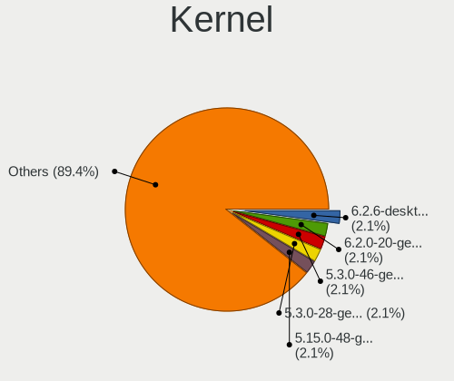

| Version                         | Notebooks | Percent |
|---------------------------------|-----------|---------|
| 5.3.0-46-generic                | 3         | 4.23%   |
| 5.3.0-28-generic                | 3         | 4.23%   |
| 5.4.0-89-generic                | 2         | 2.82%   |
| 5.4.0-52-generic                | 2         | 2.82%   |
| 5.16.7-desktop-1omv4003         | 2         | 2.82%   |
| 5.15.0-39-generic               | 2         | 2.82%   |
| 5.13.0-7620-generic             | 2         | 2.82%   |
| 5.13.0-7614-generic             | 2         | 2.82%   |
| 5.13.0-39-generic               | 2         | 2.82%   |
| 5.11.0-40-generic               | 2         | 2.82%   |
| 5.9.0-3-amd64                   | 1         | 1.41%   |
| 5.8.9-200.fc32.x86_64           | 1         | 1.41%   |
| 5.8.0-7630-generic              | 1         | 1.41%   |
| 5.8.0-53-generic                | 1         | 1.41%   |
| 5.8.0-49-generic                | 1         | 1.41%   |
| 5.8.0-44-generic                | 1         | 1.41%   |
| 5.8.0-34-generic                | 1         | 1.41%   |
| 5.8.0-26-generic                | 1         | 1.41%   |
| 5.7.0-1-librem5                 | 1         | 1.41%   |
| 5.4.52-1-MANJARO                | 1         | 1.41%   |
| 5.4.33-3-MANJARO                | 1         | 1.41%   |
| 5.4.23-1-MANJARO                | 1         | 1.41%   |
| 5.4.0-90-generic                | 1         | 1.41%   |
| 5.4.0-80-generic                | 1         | 1.41%   |
| 5.4.0-7625-generic              | 1         | 1.41%   |
| 5.4.0-72-generic                | 1         | 1.41%   |
| 5.4.0-67-generic                | 1         | 1.41%   |
| 5.4.0-58-generic                | 1         | 1.41%   |
| 5.4.0-54-generic                | 1         | 1.41%   |
| 5.4.0-48-generic                | 1         | 1.41%   |
| 5.4.0-33-generic                | 1         | 1.41%   |
| 5.4.0-26-generic                | 1         | 1.41%   |
| 5.3.0-51-generic                | 1         | 1.41%   |
| 5.16.14-1-MANJARO               | 1         | 1.41%   |
| 5.16.11-arch1-1                 | 1         | 1.41%   |
| 5.15.23-76051523-generic        | 1         | 1.41%   |
| 5.15.11-76051511-generic        | 1         | 1.41%   |
| 5.13.9-arch1-1                  | 1         | 1.41%   |
| 5.13.0-48-generic               | 1         | 1.41%   |
| 5.13.0-30-generic               | 1         | 1.41%   |
| 5.13.0-27-generic               | 1         | 1.41%   |
| 5.13.0-22-generic               | 1         | 1.41%   |
| 5.11.18-hardened1-1-hardened    | 1         | 1.41%   |
| 5.11.0-7633-generic             | 1         | 1.41%   |
| 5.11.0-7614-generic             | 1         | 1.41%   |
| 5.11.0-38-generic               | 1         | 1.41%   |
| 5.11.0-26-generic               | 1         | 1.41%   |
| 5.10.42-1-MANJARO               | 1         | 1.41%   |
| 5.10.37-1-lts                   | 1         | 1.41%   |
| 5.10.0-0.bpo.5-amd64            | 1         | 1.41%   |
| 5.0.0-27-generic                | 1         | 1.41%   |
| 5.0.0-23-generic                | 1         | 1.41%   |
| 5.0.0-13-generic                | 1         | 1.41%   |
| 4.9.60-nrj-desktop-1rosa-x86_64 | 1         | 1.41%   |
| 4.18.0-10-generic               | 1         | 1.41%   |
| 4.15.0-45-generic               | 1         | 1.41%   |
| 4.15.0-39-generic               | 1         | 1.41%   |
| 4.15.0-15-generic               | 1         | 1.41%   |
| 4.15.0-124-generic              | 1         | 1.41%   |

Kernel Family
-------------

Linux kernel without a distro release

| Version | Notebooks | Percent |
|---------|-----------|---------|
| 5.4.0   | 14        | 19.72%  |
| 5.13.0  | 10        | 14.08%  |
| 5.3.0   | 7         | 9.86%   |
| 5.8.0   | 6         | 8.45%   |
| 5.11.0  | 6         | 8.45%   |
| 4.15.0  | 4         | 5.63%   |
| 5.0.0   | 3         | 4.23%   |
| 5.16.7  | 2         | 2.82%   |
| 5.15.0  | 2         | 2.82%   |
| 5.9.0   | 1         | 1.41%   |
| 5.8.9   | 1         | 1.41%   |
| 5.7.0   | 1         | 1.41%   |
| 5.4.52  | 1         | 1.41%   |
| 5.4.33  | 1         | 1.41%   |
| 5.4.23  | 1         | 1.41%   |
| 5.16.14 | 1         | 1.41%   |
| 5.16.11 | 1         | 1.41%   |
| 5.15.23 | 1         | 1.41%   |
| 5.15.11 | 1         | 1.41%   |
| 5.13.9  | 1         | 1.41%   |
| 5.11.18 | 1         | 1.41%   |
| 5.10.42 | 1         | 1.41%   |
| 5.10.37 | 1         | 1.41%   |
| 5.10.0  | 1         | 1.41%   |
| 4.9.60  | 1         | 1.41%   |
| 4.18.0  | 1         | 1.41%   |

Kernel Major Ver.
-----------------

Linux kernel major version

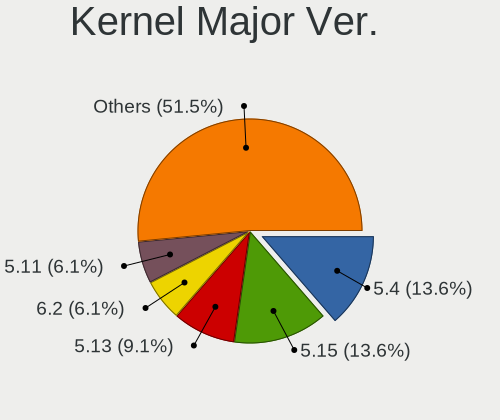

| Version | Notebooks | Percent |
|---------|-----------|---------|
| 5.4     | 17        | 23.94%  |
| 5.13    | 11        | 15.49%  |
| 5.8     | 7         | 9.86%   |
| 5.3     | 7         | 9.86%   |
| 5.11    | 7         | 9.86%   |
| 5.16    | 4         | 5.63%   |
| 5.15    | 4         | 5.63%   |
| 4.15    | 4         | 5.63%   |
| 5.10    | 3         | 4.23%   |
| 5.0     | 3         | 4.23%   |
| 5.9     | 1         | 1.41%   |
| 5.7     | 1         | 1.41%   |
| 4.9     | 1         | 1.41%   |
| 4.18    | 1         | 1.41%   |

Arch
----

OS architecture (x86_64, i586, etc.)

| Name    | Notebooks | Percent |
|---------|-----------|---------|
| x86_64  | 64        | 94.12%  |
| i686    | 3         | 4.41%   |
| aarch64 | 1         | 1.47%   |

DE
--

Desktop Environment

| Name       | Notebooks | Percent |
|------------|-----------|---------|
| GNOME      | 40        | 57.97%  |
| XFCE       | 9         | 13.04%  |
| KDE5       | 6         | 8.7%    |
| Unknown    | 6         | 8.7%    |
| X-Cinnamon | 2         | 2.9%    |
| LXQt       | 2         | 2.9%    |
| MATE       | 1         | 1.45%   |
| KDE4       | 1         | 1.45%   |
| KDE        | 1         | 1.45%   |
| bspwm      | 1         | 1.45%   |

Display Server
--------------

X11 or Wayland

| Name    | Notebooks | Percent |
|---------|-----------|---------|
| X11     | 56        | 81.16%  |
| Wayland | 8         | 11.59%  |
| Unknown | 5         | 7.25%   |

Display Manager
---------------

SDDM, LightDM, etc.

| Name    | Notebooks | Percent |
|---------|-----------|---------|
| Unknown | 46        | 64.79%  |
| SDDM    | 8         | 11.27%  |
| GDM     | 7         | 9.86%   |
| LightDM | 5         | 7.04%   |
| GDM3    | 4         | 5.63%   |
| KDM     | 1         | 1.41%   |

OS Lang
-------

Language

| Lang    | Notebooks | Percent |
|---------|-----------|---------|
| en_US   | 51        | 73.91%  |
| Unknown | 6         | 8.7%    |
| hr_HR   | 4         | 5.8%    |
| bs_BA   | 3         | 4.35%   |
| C       | 2         | 2.9%    |
| en_GB   | 1         | 1.45%   |
| en_AU   | 1         | 1.45%   |
| de_CH   | 1         | 1.45%   |

Boot Mode
---------

EFI or BIOS

| Mode | Notebooks | Percent |
|------|-----------|---------|
| BIOS | 46        | 66.67%  |
| EFI  | 23        | 33.33%  |

Filesystem
----------

Type of filesystem

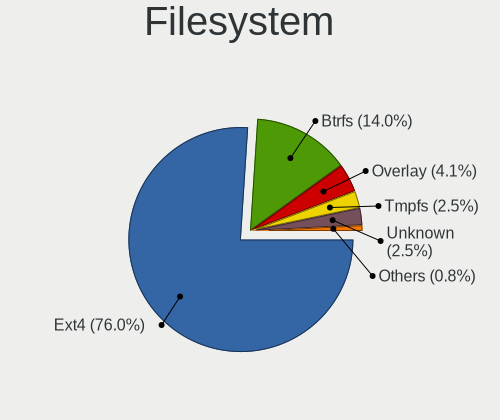

| Type    | Notebooks | Percent |
|---------|-----------|---------|
| Ext4    | 60        | 88.24%  |
| Btrfs   | 3         | 4.41%   |
| Unknown | 3         | 4.41%   |
| Overlay | 2         | 2.94%   |

Part. scheme
------------

Scheme of partitioning

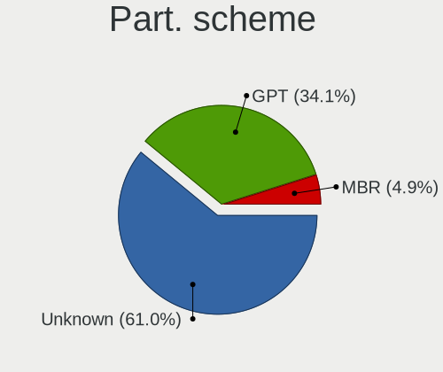

| Type    | Notebooks | Percent |
|---------|-----------|---------|
| Unknown | 51        | 72.86%  |
| GPT     | 13        | 18.57%  |
| MBR     | 6         | 8.57%   |

Dual Boot with Linux/BSD
------------------------

Hosting more than one Linux/BSD

| Dual boot | Notebooks | Percent |
|-----------|-----------|---------|
| No        | 64        | 94.12%  |
| Yes       | 4         | 5.88%   |

Dual Boot (Win)
---------------

Hosting Linux and Windows

| Dual boot | Notebooks | Percent |
|-----------|-----------|---------|
| No        | 56        | 82.35%  |
| Yes       | 12        | 17.65%  |

Board
-----

Vendor
------

Motherboard manufacturer

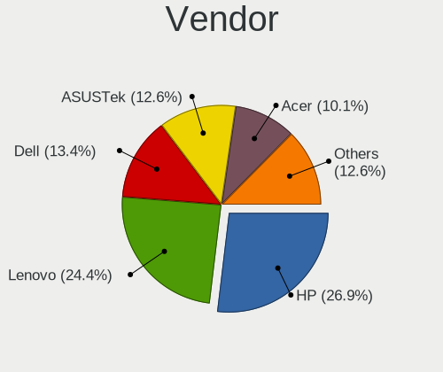

| Name             | Notebooks | Percent |
|------------------|-----------|---------|
| Hewlett-Packard  | 20        | 29.41%  |
| Lenovo           | 12        | 17.65%  |
| ASUSTek Computer | 11        | 16.18%  |
| Acer             | 10        | 14.71%  |
| Dell             | 8         | 11.76%  |
| Toshiba          | 1         | 1.47%   |
| Sony             | 1         | 1.47%   |
| NEC Computers    | 1         | 1.47%   |
| HUAWEI           | 1         | 1.47%   |
| Fujitsu Siemens  | 1         | 1.47%   |
| eMachines        | 1         | 1.47%   |
| Unknown          | 1         | 1.47%   |

Model
-----

Motherboard model

| Name                                   | Notebooks | Percent |
|----------------------------------------|-----------|---------|
| HP EliteBook 8460p                     | 2         | 2.94%   |
| Dell G3 3590                           | 2         | 2.94%   |
| ASUS VivoBook_ASUSLaptop X509DA_D509DA | 2         | 2.94%   |
| Toshiba Satellite C850-1GF             | 1         | 1.47%   |
| Sony VGN-BX41VN                        | 1         | 1.47%   |
| NEC Computers VERSAP550 NN951700753    | 1         | 1.47%   |
| Lenovo ThinkPad X301 277418G           | 1         | 1.47%   |
| Lenovo ThinkPad T430 2349G2G           | 1         | 1.47%   |
| Lenovo ThinkPad T420 4180WAP           | 1         | 1.47%   |
| Lenovo ThinkPad S1 Yoga 20CD0038MZ     | 1         | 1.47%   |
| Lenovo ThinkPad E15 Gen 2 20TD003LSC   | 1         | 1.47%   |
| Lenovo Legion 7 15IMHg05 81YU          | 1         | 1.47%   |
| Lenovo IdeaPad Y570 20091              | 1         | 1.47%   |
| Lenovo IdeaPad L340-15IWL 81LG         | 1         | 1.47%   |
| Lenovo IdeaPad 330-15IKB 81DE          | 1         | 1.47%   |
| Lenovo IdeaPad 320-15IKB 81BG          | 1         | 1.47%   |
| Lenovo IdeaPad 110S-11IBR 80WG         | 1         | 1.47%   |
| Lenovo G505 20240                      | 1         | 1.47%   |
| HUAWEI BOHK-WAX9X                      | 1         | 1.47%   |
| HP ProBook 4710s                       | 1         | 1.47%   |
| HP ProBook 470 G2                      | 1         | 1.47%   |
| HP ProBook 470 G0                      | 1         | 1.47%   |
| HP Pavilion Gaming Laptop 15-dk2xxx    | 1         | 1.47%   |
| HP Laptop 15-rb0xx                     | 1         | 1.47%   |
| HP ENVY TS 15                          | 1         | 1.47%   |
| HP ENVY 6                              | 1         | 1.47%   |
| HP EliteBook 8560p                     | 1         | 1.47%   |
| HP EliteBook 850 G8 Notebook PC        | 1         | 1.47%   |
| HP EliteBook 850 G3                    | 1         | 1.47%   |
| HP EliteBook 8470p                     | 1         | 1.47%   |
| HP EliteBook 840 G1                    | 1         | 1.47%   |
| HP EliteBook 2560p                     | 1         | 1.47%   |
| HP Compaq CQ58                         | 1         | 1.47%   |
| HP 550                                 | 1         | 1.47%   |
| HP 255 G2                              | 1         | 1.47%   |
| HP 250 G7 Notebook PC                  | 1         | 1.47%   |
| HP 250 G6 Notebook PC                  | 1         | 1.47%   |
| Fujitsu Siemens AMILO Li 2727          | 1         | 1.47%   |
| eMachines eME728                       | 1         | 1.47%   |
| Dell XPS 15 9570                       | 1         | 1.47%   |
| Dell System Inspiron N7110             | 1         | 1.47%   |
| Dell Latitude E7470                    | 1         | 1.47%   |
| Dell Latitude E6410                    | 1         | 1.47%   |
| Dell Inspiron 5323                     | 1         | 1.47%   |
| Dell Inspiron 3521                     | 1         | 1.47%   |
| ASUS ZenBook UX433FA_UX433FA           | 1         | 1.47%   |
| ASUS X75VBP                            | 1         | 1.47%   |
| ASUS X751MD                            | 1         | 1.47%   |
| ASUS X550ZE                            | 1         | 1.47%   |
| ASUS X540SAA                           | 1         | 1.47%   |
| ASUS VivoBook_ASUSLaptop X509FA_X509FA | 1         | 1.47%   |
| ASUS VivoBook 15_ASUS Laptop X540UBR   | 1         | 1.47%   |
| ASUS TUF Gaming FX705DY_FX705DY        | 1         | 1.47%   |
| ASUS ROG Zephyrus G14 GA401QM_GA401QM  | 1         | 1.47%   |
| Acer Switch One SW1-011                | 1         | 1.47%   |
| Acer Aspire F5-573G                    | 1         | 1.47%   |
| Acer Aspire E5-575G                    | 1         | 1.47%   |
| Acer Aspire A315-31                    | 1         | 1.47%   |
| Acer Aspire 9300                       | 1         | 1.47%   |
| Acer Aspire 8950G                      | 1         | 1.47%   |

Model Family
------------

Motherboard model prefix

| Name                    | Notebooks | Percent |
|-------------------------|-----------|---------|
| HP EliteBook            | 8         | 11.76%  |
| Acer Aspire             | 7         | 10.29%  |
| Lenovo ThinkPad         | 5         | 7.35%   |
| Lenovo IdeaPad          | 5         | 7.35%   |
| ASUS VivoBook           | 4         | 5.88%   |
| HP ProBook              | 3         | 4.41%   |
| HP ENVY                 | 2         | 2.94%   |
| HP 250                  | 2         | 2.94%   |
| Dell Latitude           | 2         | 2.94%   |
| Dell Inspiron           | 2         | 2.94%   |
| Dell G3                 | 2         | 2.94%   |
| Toshiba Satellite       | 1         | 1.47%   |
| Sony VGN-BX41VN         | 1         | 1.47%   |
| NEC Computers VERSAP550 | 1         | 1.47%   |
| Lenovo Legion           | 1         | 1.47%   |
| Lenovo G505             | 1         | 1.47%   |
| HUAWEI BOHK-WAX9X       | 1         | 1.47%   |
| HP Pavilion             | 1         | 1.47%   |
| HP Laptop               | 1         | 1.47%   |
| HP Compaq               | 1         | 1.47%   |
| HP 550                  | 1         | 1.47%   |
| HP 255                  | 1         | 1.47%   |
| Fujitsu Siemens AMILO   | 1         | 1.47%   |
| eMachines eME728        | 1         | 1.47%   |
| Dell XPS                | 1         | 1.47%   |
| Dell System             | 1         | 1.47%   |
| ASUS ZenBook            | 1         | 1.47%   |
| ASUS X75VBP             | 1         | 1.47%   |
| ASUS X751MD             | 1         | 1.47%   |
| ASUS X550ZE             | 1         | 1.47%   |
| ASUS X540SAA            | 1         | 1.47%   |
| ASUS TUF                | 1         | 1.47%   |
| ASUS ROG                | 1         | 1.47%   |
| Acer Switch             | 1         | 1.47%   |
| Acer AO756              | 1         | 1.47%   |
| Acer AO725              | 1         | 1.47%   |
| Unknown                 | 1         | 1.47%   |

MFG Year
--------

Motherboard manufacture year

| Year    | Notebooks | Percent |
|---------|-----------|---------|
| 2011    | 10        | 14.71%  |
| 2012    | 8         | 11.76%  |
| 2019    | 7         | 10.29%  |
| 2016    | 6         | 8.82%   |
| 2013    | 6         | 8.82%   |
| 2018    | 5         | 7.35%   |
| 2020    | 4         | 5.88%   |
| 2017    | 4         | 5.88%   |
| 2014    | 4         | 5.88%   |
| 2010    | 3         | 4.41%   |
| 2021    | 2         | 2.94%   |
| 2009    | 2         | 2.94%   |
| 2007    | 2         | 2.94%   |
| 2015    | 1         | 1.47%   |
| 2008    | 1         | 1.47%   |
| 2006    | 1         | 1.47%   |
| 2005    | 1         | 1.47%   |
| Unknown | 1         | 1.47%   |

Form Factor
-----------

Physical design of the computer

| Name     | Notebooks | Percent |
|----------|-----------|---------|
| Notebook | 68        | 100%    |

Secure Boot
-----------

Enabled or disabled

| State    | Notebooks | Percent |
|----------|-----------|---------|
| Disabled | 66        | 97.06%  |
| Enabled  | 2         | 2.94%   |

Coreboot
--------

Have coreboot on board

| Used | Notebooks | Percent |
|------|-----------|---------|
| No   | 68        | 100%    |

RAM Size
--------

Total RAM memory

| Size in GB | Notebooks | Percent |
|------------|-----------|---------|
| 4.01-8.0   | 23        | 33.82%  |
| 3.01-4.0   | 16        | 23.53%  |
| 1.01-2.0   | 9         | 13.24%  |
| 16.01-24.0 | 8         | 11.76%  |
| 8.01-16.0  | 8         | 11.76%  |
| 2.01-3.0   | 2         | 2.94%   |
| 32.01-64.0 | 1         | 1.47%   |
| 0.51-1.0   | 1         | 1.47%   |

RAM Used
--------

Used RAM memory

| Used GB   | Notebooks | Percent |
|-----------|-----------|---------|
| 1.01-2.0  | 28        | 40%     |
| 2.01-3.0  | 18        | 25.71%  |
| 0.51-1.0  | 8         | 11.43%  |
| 3.01-4.0  | 7         | 10%     |
| 4.01-8.0  | 6         | 8.57%   |
| 8.01-16.0 | 2         | 2.86%   |
| 0.01-0.5  | 1         | 1.43%   |

Total Drives
------------

Number of drives on board

| Drives | Notebooks | Percent |
|--------|-----------|---------|
| 1      | 55        | 80.88%  |
| 2      | 13        | 19.12%  |

Has CD-ROM
----------

Has CD-ROM on board

| Presented | Notebooks | Percent |
|-----------|-----------|---------|
| No        | 35        | 51.47%  |
| Yes       | 33        | 48.53%  |

Has Ethernet
------------

Has Ethernet on board

| Presented | Notebooks | Percent |
|-----------|-----------|---------|
| Yes       | 56        | 81.16%  |
| No        | 13        | 18.84%  |

Has WiFi
--------

Has WiFi module

| Presented | Notebooks | Percent |
|-----------|-----------|---------|
| Yes       | 65        | 95.59%  |
| No        | 3         | 4.41%   |

Has Bluetooth
-------------

Has Bluetooth module

| Presented | Notebooks | Percent |
|-----------|-----------|---------|
| Yes       | 51        | 73.91%  |
| No        | 18        | 26.09%  |

Location
--------

Country
-------

Geographic location (country)

| Country                | Notebooks | Percent |
|------------------------|-----------|---------|
| Bosnia and Herzegovina | 68        | 100%    |

City
----

Geographic location (city)

| City              | Notebooks | Percent |
|-------------------|-----------|---------|
| Sarajevo          | 25        | 35.71%  |
| Banja Luka        | 12        | 17.14%  |
| Tuzla             | 5         | 7.14%   |
| Gracanica         | 3         | 4.29%   |
| Srebrenik         | 2         | 2.86%   |
| Zivinice          | 1         | 1.43%   |
| Zepce             | 1         | 1.43%   |
| Zenica            | 1         | 1.43%   |
| Velika Kladuša | 1         | 1.43%   |
| Trebinje          | 1         | 1.43%   |
| Teslic            | 1         | 1.43%   |
| Stjepan-Polje     | 1         | 1.43%   |
| Solina            | 1         | 1.43%   |
| Prijedor          | 1         | 1.43%   |
| Posusje           | 1         | 1.43%   |
| Pale              | 1         | 1.43%   |
| Orahovica Donja   | 1         | 1.43%   |
| Novi Travnik      | 1         | 1.43%   |
| Nevesinje         | 1         | 1.43%   |
| Mostar            | 1         | 1.43%   |
| Maglaj            | 1         | 1.43%   |
| Lukavac           | 1         | 1.43%   |
| Ljubuski          | 1         | 1.43%   |
| Ilidza            | 1         | 1.43%   |
| Grude             | 1         | 1.43%   |
| Doboj             | 1         | 1.43%   |
| Brcko             | 1         | 1.43%   |
| Banovici          | 1         | 1.43%   |

Drives
------

Drive Vendor
------------

Hard drive vendors

| Vendor              | Notebooks | Drives | Percent |
|---------------------|-----------|--------|---------|
| Toshiba             | 9         | 9      | 11.39%  |
| SanDisk             | 9         | 11     | 11.39%  |
| Samsung Electronics | 9         | 10     | 11.39%  |
| Kingston            | 9         | 9      | 11.39%  |
| Hitachi             | 8         | 8      | 10.13%  |
| WDC                 | 6         | 7      | 7.59%   |
| Seagate             | 6         | 9      | 7.59%   |
| SK hynix            | 5         | 6      | 6.33%   |
| Unknown             | 3         | 3      | 3.8%    |
| Intel               | 3         | 3      | 3.8%    |
| A-DATA Technology   | 2         | 2      | 2.53%   |
| Vaseky              | 1         | 1      | 1.27%   |
| Team                | 1         | 1      | 1.27%   |
| Patriot             | 1         | 1      | 1.27%   |
| OCZ                 | 1         | 2      | 1.27%   |
| Micron Technology   | 1         | 1      | 1.27%   |
| KIOXIA              | 1         | 1      | 1.27%   |
| Intenso             | 1         | 1      | 1.27%   |
| HGST                | 1         | 1      | 1.27%   |
| GOODRAM             | 1         | 1      | 1.27%   |
| Crucial             | 1         | 1      | 1.27%   |

Drive Model
-----------

Hard drive models

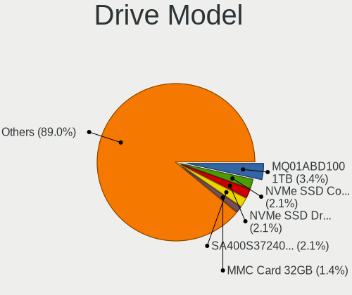

| Model                                    | Notebooks | Percent |
|------------------------------------------|-----------|---------|
| Toshiba MQ01ABD100 1TB                   | 3         | 3.75%   |
| SK hynix NVMe SSD Drive 512GB            | 3         | 3.75%   |
| Kingston SA400S37240G 240GB SSD          | 3         | 3.75%   |
| Unknown MMC Card  32GB                   | 2         | 2.5%    |
| SanDisk NVMe SSD Drive 256GB             | 2         | 2.5%    |
| Kingston SHFS37A120G 120GB SSD           | 2         | 2.5%    |
| WDC WDS240G1G0A-00SS50 240GB SSD         | 1         | 1.25%   |
| WDC WD7500BPVT-75HXZT3 752GB             | 1         | 1.25%   |
| WDC WD7500BPVT-24HXZT3 752GB             | 1         | 1.25%   |
| WDC WD5000LPVT-75G33T0 500GB             | 1         | 1.25%   |
| WDC WD5000BEKT-22KA9T0 500GB             | 1         | 1.25%   |
| WDC WD1600BEVT-22ZCT0 160GB              | 1         | 1.25%   |
| Vaseky V800/128G 128GB                   | 1         | 1.25%   |
| Unknown SD/MMC/MS PRO 64GB               | 1         | 1.25%   |
| Toshiba MQ04ABF100 1TB                   | 1         | 1.25%   |
| Toshiba MQ01ABF050 500GB                 | 1         | 1.25%   |
| Toshiba MK3263GSX 320GB                  | 1         | 1.25%   |
| Toshiba MK3261GSYN 320GB                 | 1         | 1.25%   |
| Toshiba MK3259GSXP 320GB                 | 1         | 1.25%   |
| Toshiba KXG60ZNV512G 512GB               | 1         | 1.25%   |
| Team T253X1120G 120GB SSD                | 1         | 1.25%   |
| SK hynix SC300 M.2 2280 256GB SSD        | 1         | 1.25%   |
| SK hynix HFM001TD3JX013N 1TB             | 1         | 1.25%   |
| SK hynix BC501 NVMe 512GB                | 1         | 1.25%   |
| Seagate ST9120817AS 120GB                | 1         | 1.25%   |
| Seagate ST500LT012-9WS142 500GB          | 1         | 1.25%   |
| Seagate ST500LM000-1EJ162 500GB          | 1         | 1.25%   |
| Seagate ST2000LM007-1R8174 2TB           | 1         | 1.25%   |
| Seagate ST1000LM035-1RK172 1TB           | 1         | 1.25%   |
| Seagate ST1000LM024 HN-M101MBB 1TB       | 1         | 1.25%   |
| SanDisk SSD PLUS 120GB                   | 1         | 1.25%   |
| SanDisk SD9SB8W256G1002 256GB SSD        | 1         | 1.25%   |
| SanDisk SD8SBAT128G1002 128GB SSD        | 1         | 1.25%   |
| SanDisk SD7TB3Q-128G-1006 128GB SSD      | 1         | 1.25%   |
| SanDisk NVMe SSD Drive 512GB             | 1         | 1.25%   |
| SanDisk NVMe SSD Drive 1024GB            | 1         | 1.25%   |
| SanDisk DF4032  32GB                     | 1         | 1.25%   |
| Samsung SSD 830 Series 256GB             | 1         | 1.25%   |
| Samsung NVMe SSD Drive 512GB             | 1         | 1.25%   |
| Samsung MZVLQ512HALU-000H1 512GB         | 1         | 1.25%   |
| Samsung MZVLQ256HAJD-000H1 256GB         | 1         | 1.25%   |
| Samsung MZNLN256HAJQ-000L2 256GB SSD     | 1         | 1.25%   |
| Samsung MZMTE256HMHP-000L1 256GB SSD     | 1         | 1.25%   |
| Samsung MZMPC032HBCD-000H1 32GB SSD      | 1         | 1.25%   |
| Samsung MZ7TD256HAFV-000L9 256GB SSD     | 1         | 1.25%   |
| Samsung MMCRE64G8MPP-0VA 64GB SSD        | 1         | 1.25%   |
| Patriot Burst 240GB SSD                  | 1         | 1.25%   |
| OCZ AGILITY3 480GB SSD                   | 1         | 1.25%   |
| Micron MTFDDAK128MBF-1AN1ZABHA 128GB SSD | 1         | 1.25%   |
| KIOXIA KBG40ZNV512G 512GB                | 1         | 1.25%   |
| Kingston SM2280S3G2240G 240GB SSD        | 1         | 1.25%   |
| Kingston SA400S37120G 120GB SSD          | 1         | 1.25%   |
| Kingston SA400M8240G 240GB SSD           | 1         | 1.25%   |
| Kingston RBUSNS8154P3512GJ 512GB         | 1         | 1.25%   |
| Intenso SSD Sata III 128GB               | 1         | 1.25%   |
| Intel SSDSC2KW256G8L 256GB               | 1         | 1.25%   |
| Intel SSDSC2BF180A4L 180GB               | 1         | 1.25%   |
| Intel NVMe SSD Drive 256GB               | 1         | 1.25%   |
| Hitachi HTS723232A7A364 320GB            | 1         | 1.25%   |
| Hitachi HTS547575A9E384 752GB            | 1         | 1.25%   |

HDD Vendor
----------

Hard disk drive vendors

| Vendor  | Notebooks | Drives | Percent |
|---------|-----------|--------|---------|
| Toshiba | 8         | 8      | 27.59%  |
| Hitachi | 8         | 8      | 27.59%  |
| Seagate | 6         | 9      | 20.69%  |
| WDC     | 5         | 6      | 17.24%  |
| Unknown | 1         | 1      | 3.45%   |
| HGST    | 1         | 1      | 3.45%   |

SSD Vendor
----------

Solid state drive vendors

| Vendor              | Notebooks | Drives | Percent |
|---------------------|-----------|--------|---------|
| Kingston            | 8         | 8      | 25.81%  |
| Samsung Electronics | 6         | 6      | 19.35%  |
| SanDisk             | 4         | 5      | 12.9%   |
| Intel               | 2         | 2      | 6.45%   |
| A-DATA Technology   | 2         | 2      | 6.45%   |
| WDC                 | 1         | 1      | 3.23%   |
| Vaseky              | 1         | 1      | 3.23%   |
| Team                | 1         | 1      | 3.23%   |
| SK hynix            | 1         | 1      | 3.23%   |
| Patriot             | 1         | 1      | 3.23%   |
| OCZ                 | 1         | 2      | 3.23%   |
| Micron Technology   | 1         | 1      | 3.23%   |
| Intenso             | 1         | 1      | 3.23%   |
| GOODRAM             | 1         | 1      | 3.23%   |

Drive Kind
----------

HDD or SSD

| Kind | Notebooks | Drives | Percent |
|------|-----------|--------|---------|
| SSD  | 30        | 33     | 38.46%  |
| HDD  | 29        | 33     | 37.18%  |
| NVMe | 16        | 19     | 20.51%  |
| MMC  | 3         | 3      | 3.85%   |

Drive Connector
---------------

SATA, SAS, NVMe, etc.

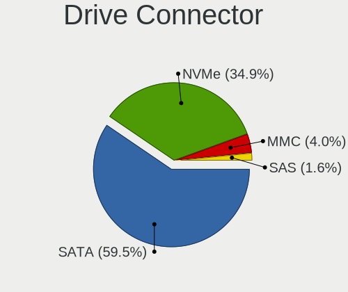

| Type | Notebooks | Drives | Percent |
|------|-----------|--------|---------|
| SATA | 51        | 65     | 71.83%  |
| NVMe | 16        | 19     | 22.54%  |
| MMC  | 3         | 3      | 4.23%   |
| SAS  | 1         | 1      | 1.41%   |

Drive Size
----------

Size of hard drive

| Size in TB | Notebooks | Drives | Percent |
|------------|-----------|--------|---------|
| 0.01-0.5   | 46        | 55     | 82.14%  |
| 0.51-1.0   | 9         | 9      | 16.07%  |
| 1.01-2.0   | 1         | 2      | 1.79%   |

Space Total
-----------

Amount of disk space available on the file system

| Size in GB     | Notebooks | Percent |
|----------------|-----------|---------|
| 101-250        | 28        | 40.58%  |
| 251-500        | 20        | 28.99%  |
| 21-50          | 8         | 11.59%  |
| 51-100         | 5         | 7.25%   |
| 501-1000       | 4         | 5.8%    |
| More than 3000 | 1         | 1.45%   |
| 2001-3000      | 1         | 1.45%   |
| 1-20           | 1         | 1.45%   |
| Unknown        | 1         | 1.45%   |

Space Used
----------

Amount of used disk space

| Used GB  | Notebooks | Percent |
|----------|-----------|---------|
| 1-20     | 29        | 39.73%  |
| 21-50    | 24        | 32.88%  |
| 51-100   | 13        | 17.81%  |
| 101-250  | 4         | 5.48%   |
| 251-500  | 1         | 1.37%   |
| 501-1000 | 1         | 1.37%   |
| Unknown  | 1         | 1.37%   |

Malfunc. Drives
---------------

Drive models with a malfunction

| Model                                         | Notebooks | Drives | Percent |
|-----------------------------------------------|-----------|--------|---------|
| Samsung Electronics MMCRE64G8MPP-0VA 64GB SSD | 1         | 1      | 50%     |
| Crucial CT500P1SSD8 500GB                     | 1         | 1      | 50%     |

Malfunc. Drive Vendor
---------------------

Vendors of faulty drives

| Vendor              | Notebooks | Drives | Percent |
|---------------------|-----------|--------|---------|
| Samsung Electronics | 1         | 1      | 50%     |
| Crucial             | 1         | 1      | 50%     |

Malfunc. HDD Vendor
-------------------

Vendors of faulty HDD drives

Zero info for selected period =(

Malfunc. Drive Kind
-------------------

Kinds of faulty drives

| Kind | Notebooks | Drives | Percent |
|------|-----------|--------|---------|
| NVMe | 1         | 1      | 50%     |
| SSD  | 1         | 1      | 50%     |

Failed Drives
-------------

Failed drive models

Zero info for selected period =(

Failed Drive Vendor
-------------------

Failed drive vendors

Zero info for selected period =(

Drive Status
------------

Number of failed and malfunc. drives

| Status   | Notebooks | Drives | Percent |
|----------|-----------|--------|---------|
| Detected | 52        | 68     | 74.29%  |
| Works    | 16        | 18     | 22.86%  |
| Malfunc  | 2         | 2      | 2.86%   |

Storage controller
------------------

Storage Vendor
--------------

Storage controller vendors

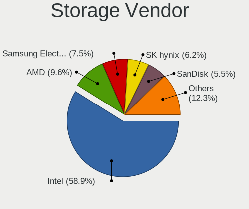

| Vendor                       | Notebooks | Percent |
|------------------------------|-----------|---------|
| Intel                        | 52        | 67.53%  |
| AMD                          | 8         | 10.39%  |
| SK hynix                     | 4         | 5.19%   |
| SanDisk                      | 4         | 5.19%   |
| Samsung Electronics          | 3         | 3.9%    |
| Toshiba America Info Systems | 1         | 1.3%    |
| Nvidia                       | 1         | 1.3%    |
| Micron/Crucial Technology    | 1         | 1.3%    |
| KIOXIA                       | 1         | 1.3%    |
| Kingston Technology Company  | 1         | 1.3%    |
| JMicron Technology           | 1         | 1.3%    |

Storage Model
-------------

Storage controller models

| Model                                                                            | Notebooks | Percent |
|----------------------------------------------------------------------------------|-----------|---------|
| Intel 6 Series/C200 Series Chipset Family 6 port Mobile SATA AHCI Controller     | 9         | 10.98%  |
| Intel Sunrise Point-LP SATA Controller [AHCI mode]                               | 8         | 9.76%   |
| Intel 7 Series Chipset Family 6-port SATA Controller [AHCI mode]                 | 8         | 9.76%   |
| AMD FCH SATA Controller [AHCI mode]                                              | 8         | 9.76%   |
| Intel 82801 Mobile SATA Controller [RAID mode]                                   | 4         | 4.88%   |
| Samsung NVMe SSD Controller 980                                                  | 3         | 3.66%   |
| Intel Cannon Lake Mobile PCH SATA AHCI Controller                                | 3         | 3.66%   |
| Intel 8 Series SATA Controller 1 [AHCI mode]                                     | 3         | 3.66%   |
| SK hynix BC501 NVMe Solid State Drive                                            | 2         | 2.44%   |
| SanDisk WD Blue SN550 NVMe SSD                                                   | 2         | 2.44%   |
| Intel Volume Management Device NVMe RAID Controller                              | 2         | 2.44%   |
| Intel Atom/Celeron/Pentium Processor x5-E8000/J3xxx/N3xxx Series SATA Controller | 2         | 2.44%   |
| Intel 82801IBM/IEM (ICH9M/ICH9M-E) 4 port SATA Controller [AHCI mode]            | 2         | 2.44%   |
| Intel 82801HM/HEM (ICH8M/ICH8M-E) SATA Controller [AHCI mode]                    | 2         | 2.44%   |
| Intel 82801HM/HEM (ICH8M/ICH8M-E) IDE Controller                                 | 2         | 2.44%   |
| Toshiba America Info Systems XG6 NVMe SSD Controller                             | 1         | 1.22%   |
| SK hynix PC401 NVMe Solid State Drive 256GB                                      | 1         | 1.22%   |
| SK hynix Gold P31 SSD                                                            | 1         | 1.22%   |
| SanDisk WD Black SN750 / PC SN730 NVMe SSD                                       | 1         | 1.22%   |
| SanDisk PC SN520 NVMe SSD                                                        | 1         | 1.22%   |
| Nvidia MCP51 Serial ATA Controller                                               | 1         | 1.22%   |
| Nvidia MCP51 IDE                                                                 | 1         | 1.22%   |
| Micron/Crucial P1 NVMe PCIe SSD                                                  | 1         | 1.22%   |
| KIOXIA NVMe SSD Controller BG4                                                   | 1         | 1.22%   |
| Kingston Company U-SNS8154P3 NVMe SSD                                            | 1         | 1.22%   |
| JMicron JMB363 SATA/IDE Controller                                               | 1         | 1.22%   |
| Intel Tiger Lake-LP SATA Controller                                              | 1         | 1.22%   |
| Intel SSD 600P Series                                                            | 1         | 1.22%   |
| Intel Celeron N3350/Pentium N4200/Atom E3900 Series SATA AHCI Controller         | 1         | 1.22%   |
| Intel Cannon Point-LP SATA Controller [AHCI Mode]                                | 1         | 1.22%   |
| Intel Atom Processor E3800 Series SATA AHCI Controller                           | 1         | 1.22%   |
| Intel 82801IBM/IEM (ICH9M/ICH9M-E) 2 port SATA Controller [IDE mode]             | 1         | 1.22%   |
| Intel 82801HM/HEM (ICH8M/ICH8M-E) SATA Controller [IDE mode]                     | 1         | 1.22%   |
| Intel 82801FB/FBM/FR/FW/FRW (ICH6 Family) IDE Controller                         | 1         | 1.22%   |
| Intel 8 Series/C220 Series Chipset Family 6-port SATA Controller 1 [AHCI mode]   | 1         | 1.22%   |
| Intel 5 Series/3400 Series Chipset 6 port SATA AHCI Controller                   | 1         | 1.22%   |
| Intel 5 Series/3400 Series Chipset 4 port SATA AHCI Controller                   | 1         | 1.22%   |

Storage Kind
------------

Kind of storage controller (IDE, SATA, NVMe, SAS, ...)

| Kind | Notebooks | Percent |
|------|-----------|---------|
| SATA | 52        | 65%     |
| NVMe | 16        | 20%     |
| RAID | 6         | 7.5%    |
| IDE  | 6         | 7.5%    |

Processor
---------

CPU Vendor
----------

Processor vendors

| Vendor | Notebooks | Percent |
|--------|-----------|---------|
| Intel  | 55        | 80.88%  |
| AMD    | 12        | 17.65%  |
| ARM    | 1         | 1.47%   |

CPU Model
---------

Processor models

| Model                                           | Notebooks | Percent |
|-------------------------------------------------|-----------|---------|
| Intel Core i5-2540M CPU @ 2.60GHz               | 3         | 4.41%   |
| Intel Core i7-9750H CPU @ 2.60GHz               | 2         | 2.94%   |
| Intel Core i7-8565U CPU @ 1.80GHz               | 2         | 2.94%   |
| Intel Core i7-8550U CPU @ 1.80GHz               | 2         | 2.94%   |
| Intel Core i7-6600U CPU @ 2.60GHz               | 2         | 2.94%   |
| Intel Core i7-2670QM CPU @ 2.20GHz              | 2         | 2.94%   |
| Intel Core i5-3320M CPU @ 2.60GHz               | 2         | 2.94%   |
| Intel Core i3-3227U CPU @ 1.90GHz               | 2         | 2.94%   |
| AMD Ryzen 5 3500U with Radeon Vega Mobile Gfx   | 2         | 2.94%   |
| AMD E1-2100 APU with Radeon HD Graphics         | 2         | 2.94%   |
| Intel Pentium M processor 1.73GHz               | 1         | 1.47%   |
| Intel Pentium Dual-Core CPU T4500 @ 2.30GHz     | 1         | 1.47%   |
| Intel Pentium Dual CPU T2390 @ 1.86GHz          | 1         | 1.47%   |
| Intel Pentium CPU N3540 @ 2.16GHz               | 1         | 1.47%   |
| Intel Core i7-8750H CPU @ 2.20GHz               | 1         | 1.47%   |
| Intel Core i7-7500U CPU @ 2.70GHz               | 1         | 1.47%   |
| Intel Core i7-4702MQ CPU @ 2.20GHz              | 1         | 1.47%   |
| Intel Core i7-4500U CPU @ 1.80GHz               | 1         | 1.47%   |
| Intel Core i7-2640M CPU @ 2.80GHz               | 1         | 1.47%   |
| Intel Core i7-2630QM CPU @ 2.00GHz              | 1         | 1.47%   |
| Intel Core i7-10875H CPU @ 2.30GHz              | 1         | 1.47%   |
| Intel Core i7 CPU Q 720 @ 1.60GHz               | 1         | 1.47%   |
| Intel Core i5-8265U CPU @ 1.60GHz               | 1         | 1.47%   |
| Intel Core i5-8250U CPU @ 1.60GHz               | 1         | 1.47%   |
| Intel Core i5-4300U CPU @ 1.90GHz               | 1         | 1.47%   |
| Intel Core i5-3317U CPU @ 1.70GHz               | 1         | 1.47%   |
| Intel Core i5-3230M CPU @ 2.60GHz               | 1         | 1.47%   |
| Intel Core i5-3210M CPU @ 2.50GHz               | 1         | 1.47%   |
| Intel Core i5-2520M CPU @ 2.50GHz               | 1         | 1.47%   |
| Intel Core i5-1035G1 CPU @ 1.00GHz              | 1         | 1.47%   |
| Intel Core i5 CPU M 560 @ 2.67GHz               | 1         | 1.47%   |
| Intel Core i3-7100U CPU @ 2.40GHz               | 1         | 1.47%   |
| Intel Core i3-6006U CPU @ 2.00GHz               | 1         | 1.47%   |
| Intel Core i3-4030U CPU @ 1.90GHz               | 1         | 1.47%   |
| Intel Core 2 Duo CPU U9400 @ 1.40GHz            | 1         | 1.47%   |
| Intel Core 2 Duo CPU T8300 @ 2.40GHz            | 1         | 1.47%   |
| Intel Core 2 Duo CPU T7300 @ 2.00GHz            | 1         | 1.47%   |
| Intel Core 2 Duo CPU T5870 @ 2.00GHz            | 1         | 1.47%   |
| Intel Celeron CPU N3350 @ 1.10GHz               | 1         | 1.47%   |
| Intel Celeron CPU N3160 @ 1.60GHz               | 1         | 1.47%   |
| Intel Celeron CPU N3060 @ 1.60GHz               | 1         | 1.47%   |
| Intel Celeron CPU B815 @ 1.60GHz                | 1         | 1.47%   |
| Intel Celeron CPU 847 @ 1.10GHz                 | 1         | 1.47%   |
| Intel Celeron CPU 1000M @ 1.80GHz               | 1         | 1.47%   |
| Intel Atom x5-Z8300 CPU @ 1.44GHz               | 1         | 1.47%   |
| Intel 11th Gen Core i7-1165G7 @ 2.80GHz         | 1         | 1.47%   |
| Intel 11th Gen Core i5-1135G7 @ 2.40GHz         | 1         | 1.47%   |
| Intel 11th Gen Core i5-11300H @ 3.10GHz         | 1         | 1.47%   |
| ARM Processor                                   | 1         | 1.47%   |
| AMD Turion 64 Mobile Technology MK-38           | 1         | 1.47%   |
| AMD Ryzen 9 5900HS with Radeon Graphics         | 1         | 1.47%   |
| AMD Ryzen 7 3700U with Radeon Vega Mobile Gfx   | 1         | 1.47%   |
| AMD Ryzen 5 3550H with Radeon Vega Mobile Gfx   | 1         | 1.47%   |
| AMD E2-9000e RADEON R2, 4 COMPUTE CORES 2C+2G   | 1         | 1.47%   |
| AMD E1-1200 APU with Radeon HD Graphics         | 1         | 1.47%   |
| AMD C-60 APU with Radeon HD Graphics            | 1         | 1.47%   |
| AMD A10-7400P Radeon R6, 10 Compute Cores 4C+6G | 1         | 1.47%   |

CPU Model Family
----------------

Processor model prefix

| Model                   | Notebooks | Percent |
|-------------------------|-----------|---------|
| Intel Core i7           | 18        | 26.47%  |
| Intel Core i5           | 14        | 20.59%  |
| Intel Celeron           | 6         | 8.82%   |
| Intel Core i3           | 5         | 7.35%   |
| Other                   | 4         | 5.88%   |
| Intel Core 2 Duo        | 4         | 5.88%   |
| AMD Ryzen 5             | 3         | 4.41%   |
| AMD E1                  | 3         | 4.41%   |
| Intel Pentium M         | 1         | 1.47%   |
| Intel Pentium Dual-Core | 1         | 1.47%   |
| Intel Pentium Dual      | 1         | 1.47%   |
| Intel Pentium           | 1         | 1.47%   |
| Intel Atom              | 1         | 1.47%   |
| AMD Turion 64 Mobile    | 1         | 1.47%   |
| AMD Ryzen 9             | 1         | 1.47%   |
| AMD Ryzen 7             | 1         | 1.47%   |
| AMD E2                  | 1         | 1.47%   |
| AMD C-60                | 1         | 1.47%   |
| AMD A10                 | 1         | 1.47%   |

CPU Cores
---------

Number of processor cores

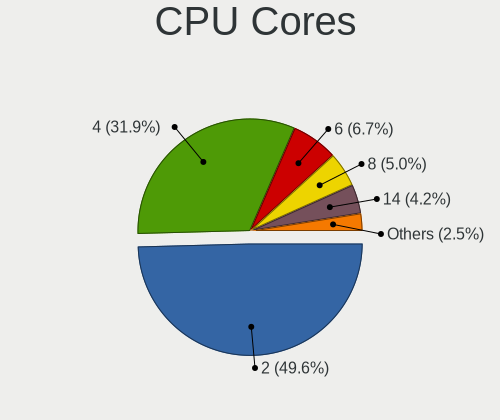

| Number | Notebooks | Percent |
|--------|-----------|---------|
| 2      | 38        | 55.88%  |
| 4      | 23        | 33.82%  |
| 6      | 3         | 4.41%   |
| 8      | 2         | 2.94%   |
| 1      | 2         | 2.94%   |

CPU Sockets
-----------

Number of sockets

| Number | Notebooks | Percent |
|--------|-----------|---------|
| 1      | 68        | 100%    |

CPU Threads
-----------

Threads per core (Hyper-Threading)

| Number | Notebooks | Percent |
|--------|-----------|---------|
| 2      | 46        | 67.65%  |
| 1      | 22        | 32.35%  |

CPU Op-Modes
------------

CPU Operation Modes (32-bit, 64-bit)

| Op mode        | Notebooks | Percent |
|----------------|-----------|---------|
| 32-bit, 64-bit | 64        | 94.12%  |
| Unknown        | 3         | 4.41%   |
| 32-bit         | 1         | 1.47%   |

CPU Microcode
-------------

Microcode number

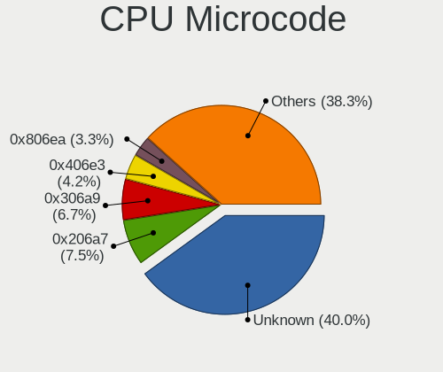

| Number     | Notebooks | Percent |
|------------|-----------|---------|
| Unknown    | 21        | 30.43%  |
| 0x306a9    | 7         | 10.14%  |
| 0x206a7    | 7         | 10.14%  |
| 0x406e3    | 3         | 4.35%   |
| 0x806ea    | 2         | 2.9%    |
| 0x806c1    | 2         | 2.9%    |
| 0x40651    | 2         | 2.9%    |
| 0x10676    | 2         | 2.9%    |
| 0x05000119 | 2         | 2.9%    |
| 0xa0652    | 1         | 1.45%   |
| 0x906ea    | 1         | 1.45%   |
| 0x806ec    | 1         | 1.45%   |
| 0x806eb    | 1         | 1.45%   |
| 0x806e9    | 1         | 1.45%   |
| 0x706e5    | 1         | 1.45%   |
| 0x6fd      | 1         | 1.45%   |
| 0x6fa      | 1         | 1.45%   |
| 0x6d8      | 1         | 1.45%   |
| 0x506c9    | 1         | 1.45%   |
| 0x406c4    | 1         | 1.45%   |
| 0x406c3    | 1         | 1.45%   |
| 0x306c3    | 1         | 1.45%   |
| 0x30678    | 1         | 1.45%   |
| 0x20655    | 1         | 1.45%   |
| 0x106e5    | 1         | 1.45%   |
| 0x1067a    | 1         | 1.45%   |
| 0x0a50000c | 1         | 1.45%   |
| 0x08108109 | 1         | 1.45%   |
| 0x08108102 | 1         | 1.45%   |
| 0x0700010f | 1         | 1.45%   |

CPU Microarch
-------------

Microarchitecture

| Name        | Notebooks | Percent |
|-------------|-----------|---------|
| KabyLake    | 11        | 16.18%  |
| SandyBridge | 10        | 14.71%  |
| IvyBridge   | 8         | 11.76%  |
| Zen+        | 4         | 5.88%   |
| Silvermont  | 4         | 5.88%   |
| Haswell     | 4         | 5.88%   |
| TigerLake   | 3         | 4.41%   |
| Skylake     | 3         | 4.41%   |
| Penryn      | 3         | 4.41%   |
| Core        | 3         | 4.41%   |
| Jaguar      | 2         | 2.94%   |
| Bobcat      | 2         | 2.94%   |
| Zen 3       | 1         | 1.47%   |
| Westmere    | 1         | 1.47%   |
| Steamroller | 1         | 1.47%   |
| P6          | 1         | 1.47%   |
| Nehalem     | 1         | 1.47%   |
| K8 Hammer   | 1         | 1.47%   |
| IceLake     | 1         | 1.47%   |
| Goldmont    | 1         | 1.47%   |
| Excavator   | 1         | 1.47%   |
| CometLake   | 1         | 1.47%   |
| Unknown     | 1         | 1.47%   |

Graphics
--------

GPU Vendor
----------

Vendors of graphics cards

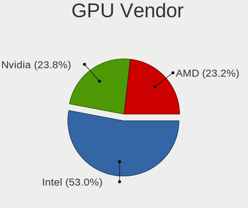

| Vendor | Notebooks | Percent |
|--------|-----------|---------|
| Intel  | 45        | 51.72%  |
| AMD    | 23        | 26.44%  |
| Nvidia | 19        | 21.84%  |

GPU Model
---------

Graphics card models

| Model                                                                                    | Notebooks | Percent |
|------------------------------------------------------------------------------------------|-----------|---------|
| Intel 3rd Gen Core processor Graphics Controller                                         | 7         | 7.78%   |
| Intel 2nd Generation Core Processor Family Integrated Graphics Controller                | 7         | 7.78%   |
| AMD Picasso/Raven 2 [Radeon Vega Series / Radeon Vega Mobile Series]                     | 4         | 4.44%   |
| Intel WhiskeyLake-U GT2 [UHD Graphics 620]                                               | 3         | 3.33%   |
| Intel UHD Graphics 620                                                                   | 3         | 3.33%   |
| Intel TigerLake-LP GT2 [Iris Xe Graphics]                                                | 3         | 3.33%   |
| Intel Skylake GT2 [HD Graphics 520]                                                      | 3         | 3.33%   |
| Intel Haswell-ULT Integrated Graphics Controller                                         | 3         | 3.33%   |
| Intel CoffeeLake-H GT2 [UHD Graphics 630]                                                | 3         | 3.33%   |
| Intel Atom/Celeron/Pentium Processor x5-E8000/J3xxx/N3xxx Integrated Graphics Controller | 3         | 3.33%   |
| Nvidia TU116M [GeForce GTX 1660 Ti Mobile]                                               | 2         | 2.22%   |
| Nvidia GP108M [GeForce MX150]                                                            | 2         | 2.22%   |
| Nvidia GM108M [GeForce MX110]                                                            | 2         | 2.22%   |
| Intel Mobile 4 Series Chipset Integrated Graphics Controller                             | 2         | 2.22%   |
| Intel HD Graphics 620                                                                    | 2         | 2.22%   |
| AMD Thames [Radeon HD 7500M/7600M Series]                                                | 2         | 2.22%   |
| AMD Seymour [Radeon HD 6400M/7400M Series]                                               | 2         | 2.22%   |
| AMD Kabini [Radeon HD 8210]                                                              | 2         | 2.22%   |
| Nvidia TU106BM [GeForce RTX 2070 Mobile]                                                 | 1         | 1.11%   |
| Nvidia GT218M [NVS 3100M]                                                                | 1         | 1.11%   |
| Nvidia GP108M [GeForce MX230]                                                            | 1         | 1.11%   |
| Nvidia GP107M [GeForce GTX 1050 Ti Mobile]                                               | 1         | 1.11%   |
| Nvidia GM107M [GeForce GTX 950M]                                                         | 1         | 1.11%   |
| Nvidia GM107 [GeForce 940MX]                                                             | 1         | 1.11%   |
| Nvidia GK208M [GeForce GT 740M]                                                          | 1         | 1.11%   |
| Nvidia GK107M [GeForce GT 750M]                                                          | 1         | 1.11%   |
| Nvidia GF117M [GeForce 610M/710M/810M/820M / GT 620M/625M/630M/720M]                     | 1         | 1.11%   |
| Nvidia GF108M [GeForce GT 525M]                                                          | 1         | 1.11%   |
| Nvidia GA107M [GeForce RTX 3050 Mobile]                                                  | 1         | 1.11%   |
| Nvidia GA106M [GeForce RTX 3060 Mobile / Max-Q]                                          | 1         | 1.11%   |
| Nvidia C51 [GeForce Go 6100]                                                             | 1         | 1.11%   |
| Intel Mobile GME965/GLE960 Integrated Graphics Controller                                | 1         | 1.11%   |
| Intel Mobile GM965/GL960 Integrated Graphics Controller (secondary)                      | 1         | 1.11%   |
| Intel Mobile GM965/GL960 Integrated Graphics Controller (primary)                        | 1         | 1.11%   |
| Intel Iris Plus Graphics G1 (Ice Lake)                                                   | 1         | 1.11%   |
| Intel HD Graphics 500                                                                    | 1         | 1.11%   |
| Intel Atom Processor Z36xxx/Z37xxx Series Graphics & Display                             | 1         | 1.11%   |
| Intel 4th Gen Core Processor Integrated Graphics Controller                              | 1         | 1.11%   |
| AMD Wrestler [Radeon HD 7310]                                                            | 1         | 1.11%   |
| AMD Wrestler [Radeon HD 6290]                                                            | 1         | 1.11%   |
| AMD Topaz PRO [Radeon R5 M255]                                                           | 1         | 1.11%   |
| AMD Thames [Radeon HD 7550M/7570M/7650M]                                                 | 1         | 1.11%   |
| AMD Stoney [Radeon R2/R3/R4/R5 Graphics]                                                 | 1         | 1.11%   |
| AMD RV710/M92 [Mobility Radeon HD 4330/4350/4550]                                        | 1         | 1.11%   |
| AMD RV550/M71 [Mobility Radeon HD 2300]                                                  | 1         | 1.11%   |
| AMD RV370/M22 [Mobility Radeon X300]                                                     | 1         | 1.11%   |
| AMD Mars [Radeon HD 8670A/8670M/8750M / R7 M370]                                         | 1         | 1.11%   |
| AMD Madison [Mobility Radeon HD 5650/5750 / 6530M/6550M]                                 | 1         | 1.11%   |
| AMD Kaveri [Radeon R6 Graphics]                                                          | 1         | 1.11%   |
| AMD Jet PRO [Radeon R5 M230 / R7 M260DX / Radeon 520 Mobile]                             | 1         | 1.11%   |
| AMD Granville [Radeon HD 6850M/6870M]                                                    | 1         | 1.11%   |
| AMD Cezanne                                                                              | 1         | 1.11%   |
| AMD Baffin [Radeon RX 460/560D / Pro 450/455/460/555/555X/560/560X]                      | 1         | 1.11%   |

GPU Combo
---------

Combinations of graphics cards

| Name           | Notebooks | Percent |
|----------------|-----------|---------|
| 1 x Intel      | 26        | 38.24%  |
| 1 x AMD        | 16        | 23.53%  |
| Intel + Nvidia | 15        | 22.06%  |
| Intel + AMD    | 4         | 5.88%   |
| 1 x Nvidia     | 3         | 4.41%   |
| 2 x AMD        | 2         | 2.94%   |
| Other          | 1         | 1.47%   |
| AMD + Nvidia   | 1         | 1.47%   |

GPU Driver
----------

Free vs proprietary

| Driver      | Notebooks | Percent |
|-------------|-----------|---------|
| Free        | 55        | 80.88%  |
| Proprietary | 11        | 16.18%  |
| Unknown     | 2         | 2.94%   |

GPU Memory
----------

Total video memory

| Size in GB | Notebooks | Percent |
|------------|-----------|---------|
| Unknown    | 38        | 54.29%  |
| 1.01-2.0   | 11        | 15.71%  |
| 0.01-0.5   | 8         | 11.43%  |
| 0.51-1.0   | 7         | 10%     |
| 3.01-4.0   | 3         | 4.29%   |
| 5.01-6.0   | 2         | 2.86%   |
| 7.01-8.0   | 1         | 1.43%   |

Monitor
-------

Monitor Vendor
--------------

Monitor vendors

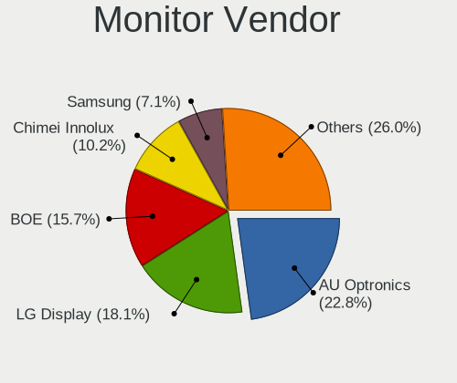

| Vendor                  | Notebooks | Percent |
|-------------------------|-----------|---------|
| LG Display              | 16        | 22.86%  |
| AU Optronics            | 16        | 22.86%  |
| Chimei Innolux          | 9         | 12.86%  |
| BOE                     | 8         | 11.43%  |
| Samsung Electronics     | 6         | 8.57%   |
| Sharp                   | 2         | 2.86%   |
| LG Philips              | 2         | 2.86%   |
| Chi Mei Optoelectronics | 2         | 2.86%   |
| AOC                     | 2         | 2.86%   |
| Philips                 | 1         | 1.43%   |
| PANDA                   | 1         | 1.43%   |
| NEC Computers           | 1         | 1.43%   |
| Mi                      | 1         | 1.43%   |
| Lenovo                  | 1         | 1.43%   |
| Goldstar                | 1         | 1.43%   |
| Dell                    | 1         | 1.43%   |

Monitor Model
-------------

Monitor models

| Model                                                                     | Notebooks | Percent |
|---------------------------------------------------------------------------|-----------|---------|
| Chimei Innolux LCD Monitor CMN15F5 1920x1080 344x193mm 15.5-inch          | 4         | 5.56%   |
| LG Display LCD Monitor LGD0306 1600x900 310x174mm 14.0-inch               | 3         | 4.17%   |
| LG Display LCD Monitor LGD05E4 1920x1080 344x194mm 15.5-inch              | 2         | 2.78%   |
| LG Display LCD Monitor LGD03AB 1366x768 344x194mm 15.5-inch               | 2         | 2.78%   |
| Chimei Innolux LCD Monitor CMN15DB 1366x768 344x193mm 15.5-inch           | 2         | 2.78%   |
| Sharp LQ140M1JW49 SHP1523 1920x1080 309x174mm 14.0-inch                   | 1         | 1.39%   |
| Sharp LCD Monitor SHP149A 1920x1080 344x194mm 15.5-inch                   | 1         | 1.39%   |
| Samsung Electronics SyncMaster SAM0579 1920x1080                          | 1         | 1.39%   |
| Samsung Electronics LCD Monitor SEC4E45 1280x800 331x207mm 15.4-inch      | 1         | 1.39%   |
| Samsung Electronics LCD Monitor SEC4149 1366x768 292x174mm 13.4-inch      | 1         | 1.39%   |
| Samsung Electronics LCD Monitor SEC3554 1600x900 382x215mm 17.3-inch      | 1         | 1.39%   |
| Samsung Electronics LCD Monitor SEC3150 1366x768 344x193mm 15.5-inch      | 1         | 1.39%   |
| Samsung Electronics LCD Monitor SEC314F 1600x900 382x215mm 17.3-inch      | 1         | 1.39%   |
| Philips PHL 243V5 PHLC0D1 1920x1080 521x293mm 23.5-inch                   | 1         | 1.39%   |
| PANDA LCD Monitor NCP0058 1920x1080 344x194mm 15.5-inch                   | 1         | 1.39%   |
| NEC Computers LCD1770NX NEC6664 1280x1024 338x270mm 17.0-inch             | 1         | 1.39%   |
| Mi Monitor XMI3446 3440x1440 797x334mm 34.0-inch                          | 1         | 1.39%   |
| Mi Monitor XMI3445 3440x1440 797x334mm 34.0-inch                          | 1         | 1.39%   |
| LG Philips LCD Monitor LPLA002 1440x900 367x230mm 17.1-inch               | 1         | 1.39%   |
| LG Philips LCD Monitor LPL1E01 1280x800 331x207mm 15.4-inch               | 1         | 1.39%   |
| LG Display LCD Monitor LGD064C 1920x1080 344x194mm 15.5-inch              | 1         | 1.39%   |
| LG Display LCD Monitor LGD04B3 1920x1080 345x194mm 15.6-inch              | 1         | 1.39%   |
| LG Display LCD Monitor LGD0414 1920x1080 276x156mm 12.5-inch              | 1         | 1.39%   |
| LG Display LCD Monitor LGD0384 1366x768 344x194mm 15.5-inch               | 1         | 1.39%   |
| LG Display LCD Monitor LGD034C 1366x768 293x165mm 13.2-inch               | 1         | 1.39%   |
| LG Display LCD Monitor LGD02E2 1600x900 310x174mm 14.0-inch               | 1         | 1.39%   |
| LG Display LCD Monitor LGD02E1 1600x900 382x215mm 17.3-inch               | 1         | 1.39%   |
| LG Display LCD Monitor LGD02DC 1366x768 344x194mm 15.5-inch               | 1         | 1.39%   |
| LG Display LCD Monitor LGD0257 1440x900 304x190mm 14.1-inch               | 1         | 1.39%   |
| Lenovo LCD Monitor LEN4074 1440x900 287x180mm 13.3-inch                   | 1         | 1.39%   |
| Goldstar ULTRAGEAR GSM5BB1 1920x1080 527x296mm 23.8-inch                  | 1         | 1.39%   |
| Dell 1704FPT DEL4004 1280x1024 340x270mm 17.1-inch                        | 1         | 1.39%   |
| Chimei Innolux LCD Monitor CMN1728 1600x900 382x215mm 17.3-inch           | 1         | 1.39%   |
| Chimei Innolux LCD Monitor CMN15D5 1920x1080 344x193mm 15.5-inch          | 1         | 1.39%   |
| Chimei Innolux LCD Monitor CMN15BB 1920x1080 344x194mm 15.5-inch          | 1         | 1.39%   |
| Chi Mei Optoelectronics LCD Monitor CMO1807 1920x1080 408x230mm 18.4-inch | 1         | 1.39%   |
| Chi Mei Optoelectronics LCD Monitor CMO1680 1366x768 344x193mm 15.5-inch  | 1         | 1.39%   |
| BOE LCD Monitor BOE0872 1920x1080 344x194mm 15.5-inch                     | 1         | 1.39%   |
| BOE LCD Monitor BOE085E 1920x1080 344x194mm 15.5-inch                     | 1         | 1.39%   |
| BOE LCD Monitor BOE07A3 1920x1080 344x193mm 15.5-inch                     | 1         | 1.39%   |
| BOE LCD Monitor BOE06BA 1920x1080 344x193mm 15.5-inch                     | 1         | 1.39%   |
| BOE LCD Monitor BOE06A4 1366x768 340x190mm 15.3-inch                      | 1         | 1.39%   |
| BOE LCD Monitor BOE069C 1920x1080 344x193mm 15.5-inch                     | 1         | 1.39%   |
| BOE LCD Monitor BOE0687 1920x1080 344x193mm 15.5-inch                     | 1         | 1.39%   |
| BOE LCD Monitor BOE0609 1366x768 256x144mm 11.6-inch                      | 1         | 1.39%   |
| AU Optronics LCD Monitor AUO71EC 1366x768 344x193mm 15.5-inch             | 1         | 1.39%   |
| AU Optronics LCD Monitor AUO429D 1920x1080 382x215mm 17.3-inch            | 1         | 1.39%   |
| AU Optronics LCD Monitor AUO405C 1366x768 256x144mm 11.6-inch             | 1         | 1.39%   |
| AU Optronics LCD Monitor AUO35ED 1920x1080 344x193mm 15.5-inch            | 1         | 1.39%   |
| AU Optronics LCD Monitor AUO325C 1366x768 256x144mm 11.6-inch             | 1         | 1.39%   |
| AU Optronics LCD Monitor AUO323D 1920x1080 309x174mm 14.0-inch            | 1         | 1.39%   |
| AU Optronics LCD Monitor AUO313C 1366x768 309x173mm 13.9-inch             | 1         | 1.39%   |
| AU Optronics LCD Monitor AUO26EC 1366x768 344x193mm 15.5-inch             | 1         | 1.39%   |
| AU Optronics LCD Monitor AUO22EC 1366x768 344x193mm 15.5-inch             | 1         | 1.39%   |
| AU Optronics LCD Monitor AUO21EC 1366x768 344x193mm 15.5-inch             | 1         | 1.39%   |
| AU Optronics LCD Monitor AUO149E 1600x900 382x214mm 17.2-inch             | 1         | 1.39%   |
| AU Optronics LCD Monitor AUO133D 1920x1080 309x173mm 13.9-inch            | 1         | 1.39%   |
| AU Optronics LCD Monitor AUO123D 1920x1080 309x173mm 13.9-inch            | 1         | 1.39%   |
| AU Optronics LCD Monitor AUO119E 1600x900 382x214mm 17.2-inch             | 1         | 1.39%   |
| AU Optronics LCD Monitor AUO038E 1920x1080 344x193mm 15.5-inch            | 1         | 1.39%   |

Monitor Resolution
------------------

Monitor screen resolution

| Resolution       | Notebooks | Percent |
|------------------|-----------|---------|
| 1920x1080 (FHD)  | 29        | 42.65%  |
| 1366x768 (WXGA)  | 19        | 27.94%  |
| 1600x900 (HD+)   | 11        | 16.18%  |
| 1440x900 (WXGA+) | 3         | 4.41%   |
| 1280x800 (WXGA)  | 2         | 2.94%   |
| 1280x1024 (SXGA) | 2         | 2.94%   |
| 3440x1440        | 1         | 1.47%   |
| 2560x1440 (QHD)  | 1         | 1.47%   |

Monitor Diagonal
----------------

Diagonal size in inches

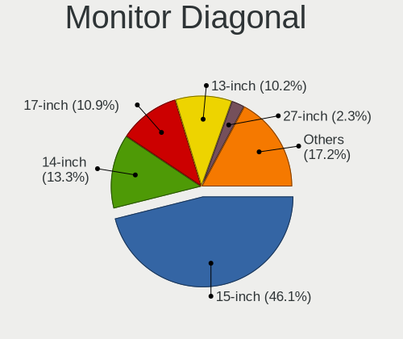

| Inches  | Notebooks | Percent |
|---------|-----------|---------|
| 15      | 36        | 51.43%  |
| 17      | 10        | 14.29%  |
| 14      | 7         | 10%     |
| 13      | 6         | 8.57%   |
| 11      | 3         | 4.29%   |
| 34      | 1         | 1.43%   |
| 33      | 1         | 1.43%   |
| 24      | 1         | 1.43%   |
| 23      | 1         | 1.43%   |
| 21      | 1         | 1.43%   |
| 18      | 1         | 1.43%   |
| 12      | 1         | 1.43%   |
| Unknown | 1         | 1.43%   |

Monitor Width
-------------

Physical width

| Width in mm | Notebooks | Percent |
|-------------|-----------|---------|
| 301-350     | 47        | 68.12%  |
| 351-400     | 8         | 11.59%  |
| 201-300     | 7         | 10.14%  |
| 701-800     | 2         | 2.9%    |
| 501-600     | 2         | 2.9%    |
| 401-500     | 2         | 2.9%    |
| Unknown     | 1         | 1.45%   |

Aspect Ratio
------------

Proportional relationship between the width and the height

| Ratio | Notebooks | Percent |
|-------|-----------|---------|
| 16/9  | 57        | 87.69%  |
| 16/10 | 5         | 7.69%   |
| 5/4   | 2         | 3.08%   |
| 21/9  | 1         | 1.54%   |

Monitor Area
------------

Area in inch²

| Area in inch² | Notebooks | Percent |
|----------------|-----------|---------|
| 101-110        | 35        | 50.72%  |
| 81-90          | 10        | 14.49%  |
| 121-130        | 6         | 8.7%    |
| 71-80          | 3         | 4.35%   |
| 51-60          | 3         | 4.35%   |
| 351-500        | 2         | 2.9%    |
| 201-250        | 2         | 2.9%    |
| 141-150        | 2         | 2.9%    |
| 131-140        | 2         | 2.9%    |
| 61-70          | 1         | 1.45%   |
| 151-200        | 1         | 1.45%   |
| 91-100         | 1         | 1.45%   |
| Unknown        | 1         | 1.45%   |

Pixel Density
-------------

Pixels per inch

| Density | Notebooks | Percent |
|---------|-----------|---------|
| 121-160 | 34        | 49.28%  |
| 101-120 | 24        | 34.78%  |
| 51-100  | 9         | 13.04%  |
| 161-240 | 1         | 1.45%   |
| Unknown | 1         | 1.45%   |

Multiple Monitors
-----------------

Total monitors connected

| Total | Notebooks | Percent |
|-------|-----------|---------|
| 1     | 59        | 86.76%  |
| 2     | 6         | 8.82%   |
| 0     | 2         | 2.94%   |
| 3     | 1         | 1.47%   |

Network
-------

Net Controller Vendor
---------------------

Controller vendors

| Vendor                          | Notebooks | Percent |
|---------------------------------|-----------|---------|
| Realtek Semiconductor           | 34        | 33.01%  |
| Intel                           | 25        | 24.27%  |
| Qualcomm Atheros                | 23        | 22.33%  |
| Broadcom                        | 7         | 6.8%    |
| Ralink                          | 3         | 2.91%   |
| Ralink Technology               | 2         | 1.94%   |
| Marvell Technology Group        | 2         | 1.94%   |
| TP-Link                         | 1         | 0.97%   |
| Qualcomm Atheros Communications | 1         | 0.97%   |
| Nvidia                          | 1         | 0.97%   |
| HTC (High Tech Computer)        | 1         | 0.97%   |
| Hewlett-Packard                 | 1         | 0.97%   |
| D-Link                          | 1         | 0.97%   |
| Broadcom Limited                | 1         | 0.97%   |

Net Controller Model
--------------------

Controller models

| Model                                                                   | Notebooks | Percent |
|-------------------------------------------------------------------------|-----------|---------|
| Realtek RTL8111/8168/8411 PCI Express Gigabit Ethernet Controller       | 21        | 16.15%  |
| Realtek RTL810xE PCI Express Fast Ethernet controller                   | 8         | 6.15%   |
| Qualcomm Atheros QCA9377 802.11ac Wireless Network Adapter              | 7         | 5.38%   |
| Intel 82579LM Gigabit Network Connection (Lewisville)                   | 7         | 5.38%   |
| Realtek RTL8821CE 802.11ac PCIe Wireless Network Adapter                | 6         | 4.62%   |
| Intel Centrino Advanced-N 6205 [Taylor Peak]                            | 6         | 4.62%   |
| Qualcomm Atheros QCA9565 / AR9565 Wireless Network Adapter              | 4         | 3.08%   |
| Ralink RT3290 Wireless 802.11n 1T/1R PCIe                               | 3         | 2.31%   |
| Qualcomm Atheros AR9485 Wireless Network Adapter                        | 3         | 2.31%   |
| Qualcomm Atheros AR9287 Wireless Network Adapter (PCI-Express)          | 3         | 2.31%   |
| Realtek RTL8153 Gigabit Ethernet Adapter                                | 2         | 1.54%   |
| Ralink MT7601U Wireless Adapter                                         | 2         | 1.54%   |
| Qualcomm Atheros AR9285 Wireless Network Adapter (PCI-Express)          | 2         | 1.54%   |
| Intel Wireless 8260                                                     | 2         | 1.54%   |
| Intel Wireless 7260                                                     | 2         | 1.54%   |
| Intel Wi-Fi 6 AX201                                                     | 2         | 1.54%   |
| Intel Ethernet Connection I219-LM                                       | 2         | 1.54%   |
| Broadcom BCM4313 802.11bgn Wireless Network Adapter                     | 2         | 1.54%   |
| TP-Link Archer T2U PLUS [RTL8821AU]                                     | 1         | 0.77%   |
| Realtek RTL8822CE 802.11ac PCIe Wireless Network Adapter                | 1         | 0.77%   |
| Realtek RTL8723DE Wireless Network Adapter                              | 1         | 0.77%   |
| Realtek RTL8723BE PCIe Wireless Network Adapter                         | 1         | 0.77%   |
| Realtek RTL8723AE PCIe Wireless Network Adapter                         | 1         | 0.77%   |
| Realtek RTL8169 PCI Gigabit Ethernet Controller                         | 1         | 0.77%   |
| Realtek RTL8152 Fast Ethernet Adapter                                   | 1         | 0.77%   |
| Realtek Realtek Network controller                                      | 1         | 0.77%   |
| Qualcomm Atheros QCA8172 Fast Ethernet                                  | 1         | 0.77%   |
| Qualcomm Atheros QCA6174 802.11ac Wireless Network Adapter              | 1         | 0.77%   |
| Qualcomm Atheros AR9271 802.11n                                         | 1         | 0.77%   |
| Qualcomm Atheros AR8162 Fast Ethernet                                   | 1         | 0.77%   |
| Qualcomm Atheros AR8161 Gigabit Ethernet                                | 1         | 0.77%   |
| Qualcomm Atheros AR8152 v2.0 Fast Ethernet                              | 1         | 0.77%   |
| Qualcomm Atheros AR8131 Gigabit Ethernet                                | 1         | 0.77%   |
| Qualcomm Atheros AR242x / AR542x Wireless Network Adapter (PCI-Express) | 1         | 0.77%   |
| Nvidia MCP51 Ethernet Controller                                        | 1         | 0.77%   |
| Marvell Group 88E8072 PCI-E Gigabit Ethernet Controller                 | 1         | 0.77%   |
| Marvell Group 88E8055 PCI-E Gigabit Ethernet Controller                 | 1         | 0.77%   |
| Intel Wireless 8265 / 8275                                              | 1         | 0.77%   |
| Intel Wi-Fi 6 AX200                                                     | 1         | 0.77%   |
| Intel PRO/Wireless 5100 AGN [Shiloh] Network Connection                 | 1         | 0.77%   |
| Intel PRO/Wireless 4965 AG or AGN [Kedron] Network Connection           | 1         | 0.77%   |
| Intel PRO/Wireless 3945ABG [Golan] Network Connection                   | 1         | 0.77%   |
| Intel Ethernet Connection I218-LM                                       | 1         | 0.77%   |
| Intel Dual Band Wireless-AC 3168NGW [Stone Peak]                        | 1         | 0.77%   |
| Intel Dual Band Wireless-AC 3165 Plus Bluetooth                         | 1         | 0.77%   |
| Intel Comet Lake PCH CNVi WiFi                                          | 1         | 0.77%   |
| Intel Centrino Wireless-N 2230                                          | 1         | 0.77%   |
| Intel Centrino Ultimate-N 6300                                          | 1         | 0.77%   |
| Intel Centrino Advanced-N 6200                                          | 1         | 0.77%   |
| Intel Cannon Point-LP CNVi [Wireless-AC]                                | 1         | 0.77%   |
| Intel 82801FB/FBM/FR/FW/FRW (ICH6 Family) AC'97 Modem Controller        | 1         | 0.77%   |
| Intel 82577LM Gigabit Network Connection                                | 1         | 0.77%   |
| Intel 82567LM Gigabit Network Connection                                | 1         | 0.77%   |
| Intel 82562GT 10/100 Network Connection                                 | 1         | 0.77%   |
| HTC (High Tech Computer) Desire HD (modem mode)                         | 1         | 0.77%   |
| HP hs2350 HSPA+ MobileBroadband                                         | 1         | 0.77%   |
| D-Link GO-USB-N150 N Adapter                                            | 1         | 0.77%   |
| Broadcom NetLink BCM57785 Gigabit Ethernet PCIe                         | 1         | 0.77%   |
| Broadcom NetLink BCM57780 Gigabit Ethernet PCIe                         | 1         | 0.77%   |
| Broadcom Limited NetLink BCM57781 Gigabit Ethernet PCIe                 | 1         | 0.77%   |

Wireless Vendor
---------------

Wireless vendors

| Vendor                          | Notebooks | Percent |
|---------------------------------|-----------|---------|
| Intel                           | 24        | 34.29%  |
| Qualcomm Atheros                | 21        | 30%     |
| Realtek Semiconductor           | 11        | 15.71%  |
| Broadcom                        | 6         | 8.57%   |
| Ralink                          | 3         | 4.29%   |
| Ralink Technology               | 2         | 2.86%   |
| TP-Link                         | 1         | 1.43%   |
| Qualcomm Atheros Communications | 1         | 1.43%   |
| D-Link                          | 1         | 1.43%   |

Wireless Model
--------------

Wireless models

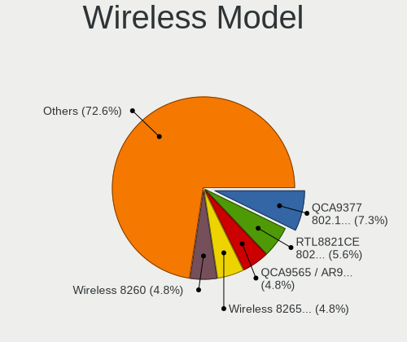

| Model                                                                   | Notebooks | Percent |
|-------------------------------------------------------------------------|-----------|---------|
| Qualcomm Atheros QCA9377 802.11ac Wireless Network Adapter              | 7         | 10%     |
| Realtek RTL8821CE 802.11ac PCIe Wireless Network Adapter                | 6         | 8.57%   |
| Intel Centrino Advanced-N 6205 [Taylor Peak]                            | 6         | 8.57%   |
| Qualcomm Atheros QCA9565 / AR9565 Wireless Network Adapter              | 4         | 5.71%   |
| Ralink RT3290 Wireless 802.11n 1T/1R PCIe                               | 3         | 4.29%   |
| Qualcomm Atheros AR9485 Wireless Network Adapter                        | 3         | 4.29%   |
| Qualcomm Atheros AR9287 Wireless Network Adapter (PCI-Express)          | 3         | 4.29%   |
| Ralink MT7601U Wireless Adapter                                         | 2         | 2.86%   |
| Qualcomm Atheros AR9285 Wireless Network Adapter (PCI-Express)          | 2         | 2.86%   |
| Intel Wireless 8260                                                     | 2         | 2.86%   |
| Intel Wireless 7260                                                     | 2         | 2.86%   |
| Intel Wi-Fi 6 AX201                                                     | 2         | 2.86%   |
| Broadcom BCM4313 802.11bgn Wireless Network Adapter                     | 2         | 2.86%   |
| TP-Link Archer T2U PLUS [RTL8821AU]                                     | 1         | 1.43%   |
| Realtek RTL8822CE 802.11ac PCIe Wireless Network Adapter                | 1         | 1.43%   |
| Realtek RTL8723DE Wireless Network Adapter                              | 1         | 1.43%   |
| Realtek RTL8723BE PCIe Wireless Network Adapter                         | 1         | 1.43%   |
| Realtek RTL8723AE PCIe Wireless Network Adapter                         | 1         | 1.43%   |
| Realtek Realtek Network controller                                      | 1         | 1.43%   |
| Qualcomm Atheros QCA6174 802.11ac Wireless Network Adapter              | 1         | 1.43%   |
| Qualcomm Atheros AR9271 802.11n                                         | 1         | 1.43%   |
| Qualcomm Atheros AR242x / AR542x Wireless Network Adapter (PCI-Express) | 1         | 1.43%   |
| Intel Wireless 8265 / 8275                                              | 1         | 1.43%   |
| Intel Wi-Fi 6 AX200                                                     | 1         | 1.43%   |
| Intel PRO/Wireless 5100 AGN [Shiloh] Network Connection                 | 1         | 1.43%   |
| Intel PRO/Wireless 4965 AG or AGN [Kedron] Network Connection           | 1         | 1.43%   |
| Intel PRO/Wireless 3945ABG [Golan] Network Connection                   | 1         | 1.43%   |
| Intel Dual Band Wireless-AC 3168NGW [Stone Peak]                        | 1         | 1.43%   |
| Intel Dual Band Wireless-AC 3165 Plus Bluetooth                         | 1         | 1.43%   |
| Intel Comet Lake PCH CNVi WiFi                                          | 1         | 1.43%   |
| Intel Centrino Wireless-N 2230                                          | 1         | 1.43%   |
| Intel Centrino Ultimate-N 6300                                          | 1         | 1.43%   |
| Intel Centrino Advanced-N 6200                                          | 1         | 1.43%   |
| Intel Cannon Point-LP CNVi [Wireless-AC]                                | 1         | 1.43%   |
| D-Link GO-USB-N150 N Adapter                                            | 1         | 1.43%   |
| Broadcom BCM43228 802.11a/b/g/n                                         | 1         | 1.43%   |
| Broadcom BCM43142 802.11b/g/n                                           | 1         | 1.43%   |
| Broadcom BCM4312 802.11b/g LP-PHY                                       | 1         | 1.43%   |
| Broadcom BCM4311 802.11b/g WLAN                                         | 1         | 1.43%   |

Ethernet Vendor
---------------

Ethernet vendors

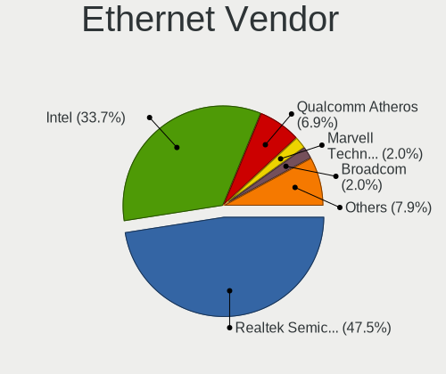

| Vendor                   | Notebooks | Percent |
|--------------------------|-----------|---------|
| Realtek Semiconductor    | 32        | 57.14%  |
| Intel                    | 13        | 23.21%  |
| Qualcomm Atheros         | 5         | 8.93%   |
| Marvell Technology Group | 2         | 3.57%   |
| Broadcom                 | 2         | 3.57%   |
| Nvidia                   | 1         | 1.79%   |
| Broadcom Limited         | 1         | 1.79%   |

Ethernet Model
--------------

Ethernet models

| Model                                                             | Notebooks | Percent |
|-------------------------------------------------------------------|-----------|---------|
| Realtek RTL8111/8168/8411 PCI Express Gigabit Ethernet Controller | 21        | 36.84%  |
| Realtek RTL810xE PCI Express Fast Ethernet controller             | 8         | 14.04%  |
| Intel 82579LM Gigabit Network Connection (Lewisville)             | 7         | 12.28%  |
| Realtek RTL8153 Gigabit Ethernet Adapter                          | 2         | 3.51%   |
| Intel Ethernet Connection I219-LM                                 | 2         | 3.51%   |
| Realtek RTL8169 PCI Gigabit Ethernet Controller                   | 1         | 1.75%   |
| Realtek RTL8152 Fast Ethernet Adapter                             | 1         | 1.75%   |
| Qualcomm Atheros QCA8172 Fast Ethernet                            | 1         | 1.75%   |
| Qualcomm Atheros AR8162 Fast Ethernet                             | 1         | 1.75%   |
| Qualcomm Atheros AR8161 Gigabit Ethernet                          | 1         | 1.75%   |
| Qualcomm Atheros AR8152 v2.0 Fast Ethernet                        | 1         | 1.75%   |
| Qualcomm Atheros AR8131 Gigabit Ethernet                          | 1         | 1.75%   |
| Nvidia MCP51 Ethernet Controller                                  | 1         | 1.75%   |
| Marvell Group 88E8072 PCI-E Gigabit Ethernet Controller           | 1         | 1.75%   |
| Marvell Group 88E8055 PCI-E Gigabit Ethernet Controller           | 1         | 1.75%   |
| Intel Ethernet Connection I218-LM                                 | 1         | 1.75%   |
| Intel 82577LM Gigabit Network Connection                          | 1         | 1.75%   |
| Intel 82567LM Gigabit Network Connection                          | 1         | 1.75%   |
| Intel 82562GT 10/100 Network Connection                           | 1         | 1.75%   |
| Broadcom NetLink BCM57785 Gigabit Ethernet PCIe                   | 1         | 1.75%   |
| Broadcom NetLink BCM57780 Gigabit Ethernet PCIe                   | 1         | 1.75%   |
| Broadcom Limited NetLink BCM57781 Gigabit Ethernet PCIe           | 1         | 1.75%   |

Net Controller Kind
-------------------

Ethernet, WiFi or modem

| Kind     | Notebooks | Percent |
|----------|-----------|---------|
| WiFi     | 65        | 52.42%  |
| Ethernet | 56        | 45.16%  |
| Modem    | 3         | 2.42%   |

Used Controller
---------------

Currently used network controller

| Kind     | Notebooks | Percent |
|----------|-----------|---------|
| WiFi     | 56        | 80%     |
| Ethernet | 13        | 18.57%  |
| Modem    | 1         | 1.43%   |

NICs
----

Total network controllers on board

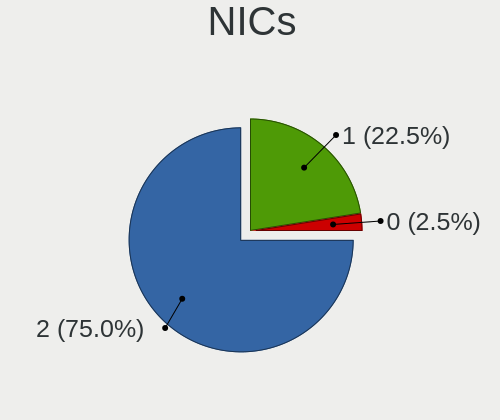

| Total | Notebooks | Percent |
|-------|-----------|---------|
| 2     | 53        | 77.94%  |
| 1     | 13        | 19.12%  |
| 0     | 2         | 2.94%   |

IPv6
----

IPv6 vs IPv4

| Used | Notebooks | Percent |
|------|-----------|---------|
| No   | 65        | 95.59%  |
| Yes  | 3         | 4.41%   |

Bluetooth
---------

Bluetooth Vendor
----------------

Controller vendors

| Vendor                          | Notebooks | Percent |
|---------------------------------|-----------|---------|
| Intel                           | 11        | 21.57%  |
| Qualcomm Atheros Communications | 9         | 17.65%  |
| IMC Networks                    | 7         | 13.73%  |
| Realtek Semiconductor           | 5         | 9.8%    |
| Lite-On Technology              | 4         | 7.84%   |
| Broadcom                        | 4         | 7.84%   |
| Ralink                          | 3         | 5.88%   |
| Hewlett-Packard                 | 2         | 3.92%   |
| Toshiba                         | 1         | 1.96%   |
| Realtek                         | 1         | 1.96%   |
| Foxconn / Hon Hai               | 1         | 1.96%   |
| Dell                            | 1         | 1.96%   |
| Cambridge Silicon Radio         | 1         | 1.96%   |
| Alps Electric                   | 1         | 1.96%   |

Bluetooth Model
---------------

Controller models

| Model                                               | Notebooks | Percent |
|-----------------------------------------------------|-----------|---------|
| Qualcomm Atheros  Bluetooth Device                  | 6         | 11.76%  |
| Intel Bluetooth wireless interface                  | 4         | 7.84%   |
| IMC Networks Bluetooth Radio                        | 4         | 7.84%   |
| Realtek Bluetooth Radio                             | 3         | 5.88%   |
| Ralink RT3290 Bluetooth                             | 3         | 5.88%   |
| Lite-On Qualcomm Atheros QCA9377 Bluetooth          | 3         | 5.88%   |
| Intel AX201 Bluetooth                               | 3         | 5.88%   |
| Realtek  Bluetooth 4.2 Adapter                      | 2         | 3.92%   |
| Qualcomm Atheros AR3011 Bluetooth                   | 2         | 3.92%   |
| IMC Networks Bluetooth Device                       | 2         | 3.92%   |
| HP Bluetooth 2.0 Interface [Broadcom BCM2045]       | 2         | 3.92%   |
| Toshiba RT Bluetooth Radio                          | 1         | 1.96%   |
| Realtek Bluetooth Radio                             | 1         | 1.96%   |
| Qualcomm Atheros Bluetooth USB Host Controller      | 1         | 1.96%   |
| Lite-On Atheros AR3012 Bluetooth                    | 1         | 1.96%   |
| Intel Wireless-AC 3168 Bluetooth                    | 1         | 1.96%   |
| Intel Centrino Bluetooth Wireless Transceiver       | 1         | 1.96%   |
| Intel Bluetooth 9460/9560 Jefferson Peak (JfP)      | 1         | 1.96%   |
| Intel AX200 Bluetooth                               | 1         | 1.96%   |
| IMC Networks Atheros AR3012 Bluetooth 4.0 Adapter   | 1         | 1.96%   |
| Foxconn / Hon Hai Broadcom Bluetooth 2.1 Device     | 1         | 1.96%   |
| Dell DW375 Bluetooth Module                         | 1         | 1.96%   |
| Cambridge Silicon Radio Bluetooth Dongle (HCI mode) | 1         | 1.96%   |
| Broadcom HP Portable Valentine                      | 1         | 1.96%   |
| Broadcom HP Portable SoftSailing                    | 1         | 1.96%   |
| Broadcom BCM20702 Bluetooth 4.0 [ThinkPad]          | 1         | 1.96%   |
| Broadcom BCM2045B (BDC-2.1)                         | 1         | 1.96%   |
| Alps Electric Bluetooth Controller (ALPS/UGPZ6)     | 1         | 1.96%   |

Sound
-----

Sound Vendor
------------

Sound card vendors

| Vendor            | Notebooks | Percent |
|-------------------|-----------|---------|
| Intel             | 54        | 65.85%  |
| AMD               | 17        | 20.73%  |
| Nvidia            | 8         | 9.76%   |
| Logitech          | 2         | 2.44%   |
| Texas Instruments | 1         | 1.22%   |

Sound Model
-----------

Sound card models

| Model                                                                                             | Notebooks | Percent |
|---------------------------------------------------------------------------------------------------|-----------|---------|
| Intel 7 Series/C216 Chipset Family High Definition Audio Controller                               | 9         | 9.28%   |
| Intel 6 Series/C200 Series Chipset Family High Definition Audio Controller                        | 9         | 9.28%   |
| Intel Sunrise Point-LP HD Audio                                                                   | 8         | 8.25%   |
| AMD FCH Azalia Controller                                                                         | 5         | 5.15%   |
| AMD Family 17h/19h HD Audio Controller                                                            | 5         | 5.15%   |
| AMD Raven/Raven2/Fenghuang HDMI/DP Audio Controller                                               | 4         | 4.12%   |
| Intel Tiger Lake-LP Smart Sound Technology Audio Controller                                       | 3         | 3.09%   |
| Intel Haswell-ULT HD Audio Controller                                                             | 3         | 3.09%   |
| Intel Cannon Point-LP High Definition Audio Controller                                            | 3         | 3.09%   |
| Intel Cannon Lake PCH cAVS                                                                        | 3         | 3.09%   |
| Intel 82801I (ICH9 Family) HD Audio Controller                                                    | 3         | 3.09%   |
| Intel 82801H (ICH8 Family) HD Audio Controller                                                    | 3         | 3.09%   |
| Intel 8 Series HD Audio Controller                                                                | 3         | 3.09%   |
| Nvidia TU116 High Definition Audio Controller                                                     | 2         | 2.06%   |
| Intel Atom/Celeron/Pentium Processor x5-E8000/J3xxx/N3xxx Series High Definition Audio Controller | 2         | 2.06%   |
| Intel 5 Series/3400 Series Chipset High Definition Audio                                          | 2         | 2.06%   |
| AMD Wrestler HDMI Audio                                                                           | 2         | 2.06%   |
| AMD Kabini HDMI/DP Audio                                                                          | 2         | 2.06%   |
| AMD Caicos HDMI Audio [Radeon HD 6450 / 7450/8450/8490 OEM / R5 230/235/235X OEM]                 | 2         | 2.06%   |
| Texas Instruments PCM2902C Audio CODEC                                                            | 1         | 1.03%   |
| Nvidia TU106 High Definition Audio Controller                                                     | 1         | 1.03%   |
| Nvidia MCP51 High Definition Audio                                                                | 1         | 1.03%   |
| Nvidia High Definition Audio Controller                                                           | 1         | 1.03%   |
| Nvidia GM107 High Definition Audio Controller [GeForce 940MX]                                     | 1         | 1.03%   |
| Nvidia GF108 High Definition Audio Controller                                                     | 1         | 1.03%   |
| Nvidia GA106 High Definition Audio Controller                                                     | 1         | 1.03%   |
| Logitech USB Headset                                                                              | 1         | 1.03%   |
| Logitech 960 Headset                                                                              | 1         | 1.03%   |
| Intel Xeon E3-1200 v3/4th Gen Core Processor HD Audio Controller                                  | 1         | 1.03%   |
| Intel Ice Lake-LP Smart Sound Technology Audio Controller                                         | 1         | 1.03%   |
| Intel Comet Lake PCH cAVS                                                                         | 1         | 1.03%   |
| Intel Celeron N3350/Pentium N4200/Atom E3900 Series Audio Cluster                                 | 1         | 1.03%   |
| Intel Atom Processor Z36xxx/Z37xxx Series High Definition Audio Controller                        | 1         | 1.03%   |
| Intel 82801FB/FBM/FR/FW/FRW (ICH6 Family) AC'97 Audio Controller                                  | 1         | 1.03%   |
| Intel 8 Series/C220 Series Chipset High Definition Audio Controller                               | 1         | 1.03%   |
| AMD Turks HDMI Audio [Radeon HD 6500/6600 / 6700M Series]                                         | 1         | 1.03%   |
| AMD RV710/730 HDMI Audio [Radeon HD 4000 series]                                                  | 1         | 1.03%   |
| AMD Renoir Radeon High Definition Audio Controller                                                | 1         | 1.03%   |
| AMD Redwood HDMI Audio [Radeon HD 5000 Series]                                                    | 1         | 1.03%   |
| AMD Kaveri HDMI/DP Audio Controller                                                               | 1         | 1.03%   |
| AMD Juniper HDMI Audio [Radeon HD 5700 Series]                                                    | 1         | 1.03%   |
| AMD High Definition Audio Controller                                                              | 1         | 1.03%   |
| AMD Family 15h (Models 60h-6fh) Audio Controller                                                  | 1         | 1.03%   |

Memory
------

Memory Vendor
-------------

Memory module vendors

| Vendor              | Notebooks | Percent |
|---------------------|-----------|---------|
| SK hynix            | 9         | 34.62%  |
| Micron Technology   | 8         | 30.77%  |
| Samsung Electronics | 3         | 11.54%  |
| Kingston            | 2         | 7.69%   |
| A-DATA Technology   | 2         | 7.69%   |
| Crucial             | 1         | 3.85%   |
| Corsair             | 1         | 3.85%   |

Memory Model
------------

Memory module models

| Model                                                          | Notebooks | Percent |
|----------------------------------------------------------------|-----------|---------|
| SK hynix RAM HMT351S6CFR8C-PB 4GB SODIMM DDR3 1600MT/s         | 2         | 6.9%    |
| Micron RAM 16KTF51264HZ-1G6M1 4GB SODIMM DDR3 1600MT/s         | 2         | 6.9%    |
| SK hynix RAM HMT451S6AFR8A-PB 4GB SODIMM DDR3 1600MT/s         | 1         | 3.45%   |
| SK hynix RAM HMT351S6EFR8C-PB 4096MB SODIMM DDR3 1600MT/s      | 1         | 3.45%   |
| SK hynix RAM HMT351S6EFR8A-PB 4GB SODIMM DDR3 1600MT/s         | 1         | 3.45%   |
| SK hynix RAM HMT351S6CFR8C-H9 4096MB SODIMM DDR3 1334MT/s      | 1         | 3.45%   |
| SK hynix RAM HMT325S6CFR8C-PB 2048MB SODIMM DDR3 1600MT/s      | 1         | 3.45%   |
| SK hynix RAM HMA851S6CJR6N-VK 4GB Row Of Chips DDR4 2667MT/s   | 1         | 3.45%   |
| SK hynix RAM HMA851S6AFR6N-UH 4GB SODIMM DDR4 2667MT/s         | 1         | 3.45%   |
| SK hynix RAM HMA81GS6CJR8N-XN 8192MB SODIMM DDR4 3200MT/s      | 1         | 3.45%   |
| SK hynix RAM HMA81GS6CJR8N-VK 8192MB SODIMM DDR4 2667MT/s      | 1         | 3.45%   |
| Samsung RAM Module 16384MB SODIMM DDR4 3200MT/s                | 1         | 3.45%   |
| Samsung RAM M471B5273CH0-CH9 4GB SODIMM DDR3 1334MT/s          | 1         | 3.45%   |
| Samsung RAM M471A1G44AB0-CWE 8192MB SODIMM DDR4 3200MT/s       | 1         | 3.45%   |
| Micron RAM MT52L512M32D2PF-09 4GB Row Of Chips LPDDR3 2133MT/s | 1         | 3.45%   |
| Micron RAM 8KTF51264HZ-1G6E1 4GB SODIMM DDR3 1600MT/s          | 1         | 3.45%   |
| Micron RAM 8JTF51264HZ-1G6D 1 4GB SODIMM DDR3 1600MT/s         | 1         | 3.45%   |
| Micron RAM 4ATF51264HZ-2G3B1 4GB SODIMM DDR4 2400MT/s          | 1         | 3.45%   |
| Micron RAM 16KTF51264HZ-1G4M1 4096MB SODIMM DDR3 1333MT/s      | 1         | 3.45%   |
| Micron RAM 16JSF25664HY-1G1D1 2GB SODIMM DDR3 1066MT/s         | 1         | 3.45%   |
| Micron RAM 16ATF1G64HZ-2G1B1 8GB SODIMM DDR4 2133MT/s          | 1         | 3.45%   |
| Kingston RAM KKN2NM-MIE 4GB SODIMM DDR4 2667MT/s               | 1         | 3.45%   |
| Kingston RAM HP16D3LS1KBG/4G 4096MB SODIMM DDR3 1600MT/s       | 1         | 3.45%   |
| Crucial RAM CT51264BF160BJ.M8F 4GB SODIMM DDR3 1600MT/s        | 1         | 3.45%   |
| Corsair RAM CMSX4GX3M1A1600C9 4GB SODIMM DDR3 1600MT/s         | 1         | 3.45%   |
| A-DATA RAM AO1P24HC8T1-BQXS 8GB SODIMM DDR4 2400MT/s           | 1         | 3.45%   |
| A-DATA RAM AM1U16BC4P2-B19H 4GB SODIMM DDR3 1600MT/s           | 1         | 3.45%   |

Memory Kind
-----------

Memory module kinds

| Kind   | Notebooks | Percent |
|--------|-----------|---------|
| DDR3   | 12        | 52.17%  |
| DDR4   | 9         | 39.13%  |
| LPDDR4 | 1         | 4.35%   |
| LPDDR3 | 1         | 4.35%   |

Memory Form Factor
------------------

Physical design of the memory module

| Name         | Notebooks | Percent |
|--------------|-----------|---------|
| SODIMM       | 21        | 91.3%   |
| Row Of Chips | 2         | 8.7%    |

Memory Size
-----------

Memory module size

| Size  | Notebooks | Percent |
|-------|-----------|---------|
| 4096  | 16        | 66.67%  |
| 8192  | 5         | 20.83%  |
| 2048  | 2         | 8.33%   |
| 16384 | 1         | 4.17%   |

Memory Speed
------------

Memory module speed

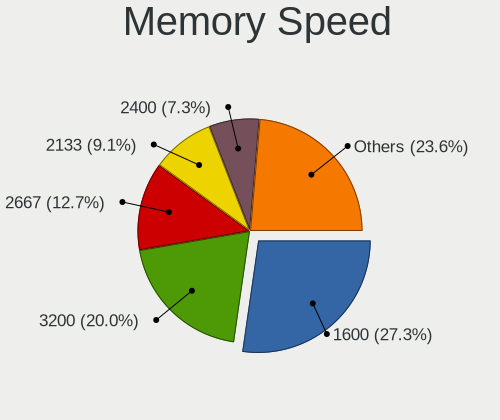

| Speed | Notebooks | Percent |
|-------|-----------|---------|
| 1600  | 10        | 40%     |
| 2667  | 4         | 16%     |
| 3200  | 3         | 12%     |
| 2400  | 2         | 8%      |
| 2133  | 2         | 8%      |
| 1334  | 2         | 8%      |
| 1333  | 1         | 4%      |
| 1066  | 1         | 4%      |

Printers & scanners
-------------------

Printer Vendor
--------------

Printer device vendors

| Vendor                | Notebooks | Percent |
|-----------------------|-----------|---------|
| Lexmark International | 1         | 50%     |
| Hewlett-Packard       | 1         | 50%     |

Printer Model
-------------

Printer device models

| Model                                      | Notebooks | Percent |
|--------------------------------------------|-----------|---------|
| Lexmark International InkJet Color Printer | 1         | 50%     |
| HP LaserJet 1000                           | 1         | 50%     |

Scanner Vendor
--------------

Scanner device vendors

Zero info for selected period =(

Scanner Model
-------------

Scanner device models

Zero info for selected period =(

Camera
------

Camera Vendor
-------------

Camera device vendors

| Vendor                                 | Notebooks | Percent |
|----------------------------------------|-----------|---------|
| Chicony Electronics                    | 15        | 26.32%  |
| Realtek Semiconductor                  | 8         | 14.04%  |
| IMC Networks                           | 7         | 12.28%  |
| Sunplus Innovation Technology          | 4         | 7.02%   |
| Acer                                   | 4         | 7.02%   |
| Suyin                                  | 3         | 5.26%   |
| Quanta                                 | 3         | 5.26%   |
| Microdia                               | 3         | 5.26%   |
| Syntek                                 | 2         | 3.51%   |
| Ricoh                                  | 2         | 3.51%   |
| Cheng Uei Precision Industry (Foxlink) | 2         | 3.51%   |
| Luxvisions Innotech Limited            | 1         | 1.75%   |
| Lite-On Technology                     | 1         | 1.75%   |
| Lenovo                                 | 1         | 1.75%   |
| ALi                                    | 1         | 1.75%   |

Camera Model
------------

Camera device models

| Model                                                       | Notebooks | Percent |
|-------------------------------------------------------------|-----------|---------|
| IMC Networks USB2.0 VGA UVC WebCam                          | 4         | 7.02%   |
| Microdia Integrated_Webcam_HD                               | 3         | 5.26%   |
| Suyin 1.3M WebCam (notebook emachines E730, Acer sub-brand) | 2         | 3.51%   |
| Realtek HD WebCam                                           | 2         | 3.51%   |
| Chicony HP Truevision HD                                    | 2         | 3.51%   |
| Acer EasyCamera                                             | 2         | 3.51%   |
| Syntek Lenovo EasyCamera                                    | 1         | 1.75%   |
| Syntek Integrated Camera                                    | 1         | 1.75%   |
| Suyin HP Truevision HD                                      | 1         | 1.75%   |
| Sunplus Laptop_Integrated_Webcam_HD                         | 1         | 1.75%   |
| Sunplus HP Universal Camera                                 | 1         | 1.75%   |
| Sunplus HP HD Webcam [Fixed]                                | 1         | 1.75%   |
| Sunplus HD WebCam                                           | 1         | 1.75%   |
| Ricoh Visual Communication Camera VGP-VCC6 [R5U870]         | 1         | 1.75%   |
| Ricoh Laptop_Integrated_Webcam_3M                           | 1         | 1.75%   |
| Realtek VGA WebCam                                          | 1         | 1.75%   |
| Realtek USB Camera                                          | 1         | 1.75%   |
| Realtek Laptop_Integrated_Webcam_HD                         | 1         | 1.75%   |
| Realtek Integrated_Webcam_HD                                | 1         | 1.75%   |
| Realtek Integrated Webcam HD                                | 1         | 1.75%   |
| Realtek HP Wide Vision FHD Camera                           | 1         | 1.75%   |
| Quanta HP Wide Vision HD Camera                             | 1         | 1.75%   |
| Quanta HP Webcam                                            | 1         | 1.75%   |
| Quanta HP TrueVision HD Camera                              | 1         | 1.75%   |
| Luxvisions Innotech Limited HP HD Camera                    | 1         | 1.75%   |
| Lite-On HP HD Webcam                                        | 1         | 1.75%   |
| Lenovo UVC Camera                                           | 1         | 1.75%   |
| IMC Networks USB2.0 HD UVC WebCam                           | 1         | 1.75%   |
| IMC Networks USB2.0 HD IR UVC WebCam                        | 1         | 1.75%   |
| IMC Networks ov9734_azurewave_camera                        | 1         | 1.75%   |
| Chicony UVC 1.00 device HD UVC WebCam                       | 1         | 1.75%   |
| Chicony USB2.0 VGA UVC WebCam                               | 1         | 1.75%   |
| Chicony TOSHIBA Web Camera - HD                             | 1         | 1.75%   |
| Chicony thinkpad t430s camera                               | 1         | 1.75%   |
| Chicony Lenovo EasyCamera                                   | 1         | 1.75%   |
| Chicony Integrated HP HD Webcam                             | 1         | 1.75%   |
| Chicony Integrated Camera (1280x720@30)                     | 1         | 1.75%   |
| Chicony integrated camera                                   | 1         | 1.75%   |
| Chicony HP Truevision HD camera                             | 1         | 1.75%   |
| Chicony HP HD Webcam                                        | 1         | 1.75%   |
| Chicony HP HD Camera                                        | 1         | 1.75%   |
| Chicony HD WebCam                                           | 1         | 1.75%   |
| Chicony CNF8243 Webcam                                      | 1         | 1.75%   |
| Cheng Uei Precision Industry (Foxlink) HP Webcam            | 1         | 1.75%   |
| Cheng Uei Precision Industry (Foxlink) HP HD Webcam         | 1         | 1.75%   |
| ALi Gateway Webcam                                          | 1         | 1.75%   |
| Acer Orbicam                                                | 1         | 1.75%   |
| Acer Integrated Camera                                      | 1         | 1.75%   |

Security
--------

Fingerprint Vendor
------------------

Fingerprint sensor vendors

| Vendor                     | Notebooks | Percent |
|----------------------------|-----------|---------|
| Validity Sensors           | 7         | 58.33%  |
| Shenzhen Goodix Technology | 2         | 16.67%  |
| Synaptics                  | 1         | 8.33%   |
| LighTuning Technology      | 1         | 8.33%   |
| AuthenTec                  | 1         | 8.33%   |

Fingerprint Model
-----------------

Fingerprint sensor models

| Model                                      | Notebooks | Percent |
|--------------------------------------------|-----------|---------|
| Validity Sensors VFS495 Fingerprint Reader | 3         | 25%     |
| Validity Sensors VFS471 Fingerprint Reader | 3         | 25%     |
| Shenzhen Goodix  FingerPrint Device        | 2         | 16.67%  |
| Validity Sensors Swipe Fingerprint Sensor  | 1         | 8.33%   |
| LighTuning Fingerprint Reader              | 1         | 8.33%   |
| AuthenTec AES2810                          | 1         | 8.33%   |
| Unknown                                    | 1         | 8.33%   |

Chipcard Vendor
---------------

Chipcard module vendors

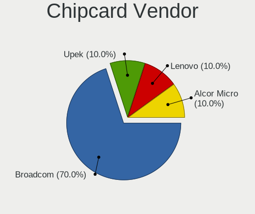

| Vendor      | Notebooks | Percent |
|-------------|-----------|---------|
| Broadcom    | 2         | 50%     |
| Upek        | 1         | 25%     |
| Alcor Micro | 1         | 25%     |

Chipcard Model
--------------

Chipcard module models

| Model                                                                        | Notebooks | Percent |
|------------------------------------------------------------------------------|-----------|---------|
| Upek TouchChip Fingerprint Coprocessor (WBF advanced mode)                   | 1         | 25%     |
| Broadcom BCM5880 Secure Applications Processor with fingerprint swipe sensor | 1         | 25%     |
| Broadcom 5880                                                                | 1         | 25%     |
| Alcor Micro AU9540 Smartcard Reader                                          | 1         | 25%     |

Unsupported
-----------

Unsupported Devices
-------------------

Total unsupported devices on board

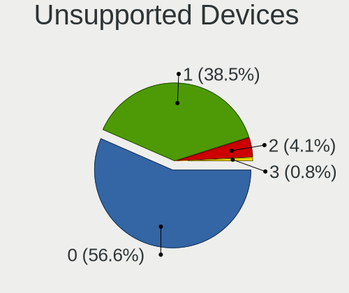

| Total | Notebooks | Percent |
|-------|-----------|---------|
| 0     | 40        | 57.97%  |
| 1     | 25        | 36.23%  |
| 2     | 3         | 4.35%   |
| 3     | 1         | 1.45%   |

Unsupported Device Types
------------------------

Types of unsupported devices

| Type                  | Notebooks | Percent |
|-----------------------|-----------|---------|
| Fingerprint reader    | 12        | 37.5%   |
| Graphics card         | 6         | 18.75%  |
| Net/wireless          | 4         | 12.5%   |
| Chipcard              | 4         | 12.5%   |
| Bluetooth             | 3         | 9.38%   |
| Sound                 | 1         | 3.13%   |
| Multimedia controller | 1         | 3.13%   |
| Modem                 | 1         | 3.13%   |

