Linux in Bosnia and Herzegovina - Tested Hardware & Statistics (Notebooks)
--------------------------------------------------------------------------

A project to collect tested hardware configurations for Linux in Bosnia and Herzegovina.

Anyone can contribute to this report by the [hw-probe](https://github.com/linuxhw/hw-probe) tool:

    sudo -E hw-probe -all -upload

Please contribute! Especially if your hardware is rare.

Contents
--------

* [ Test Cases ](#test-cases)

* [ System ](#system)
  - [ OS                       ](#os)
  - [ OS Family                ](#os-family)
  - [ Kernel                   ](#kernel)
  - [ Kernel Family            ](#kernel-family)
  - [ Kernel Major Ver.        ](#kernel-major-ver)
  - [ Arch                     ](#arch)
  - [ DE                       ](#de)
  - [ Display Server           ](#display-server)
  - [ Display Manager          ](#display-manager)
  - [ OS Lang                  ](#os-lang)
  - [ Boot Mode                ](#boot-mode)
  - [ Filesystem               ](#filesystem)
  - [ Part. scheme             ](#part-scheme)
  - [ Dual Boot with Linux/BSD ](#dual-boot-with-linuxbsd)
  - [ Dual Boot (Win)          ](#dual-boot-win)

* [ Board ](#board)
  - [ Vendor                   ](#vendor)
  - [ Model                    ](#model)
  - [ Model Family             ](#model-family)
  - [ MFG Year                 ](#mfg-year)
  - [ Form Factor              ](#form-factor)
  - [ Secure Boot              ](#secure-boot)
  - [ Coreboot                 ](#coreboot)
  - [ RAM Size                 ](#ram-size)
  - [ RAM Used                 ](#ram-used)
  - [ Total Drives             ](#total-drives)
  - [ Has CD-ROM               ](#has-cd-rom)
  - [ Has Ethernet             ](#has-ethernet)
  - [ Has WiFi                 ](#has-wifi)
  - [ Has Bluetooth            ](#has-bluetooth)

* [ Location ](#location)
  - [ Country                  ](#country)
  - [ City                     ](#city)

* [ Drives ](#drives)
  - [ Drive Vendor             ](#drive-vendor)
  - [ Drive Model              ](#drive-model)
  - [ HDD Vendor               ](#hdd-vendor)
  - [ SSD Vendor               ](#ssd-vendor)
  - [ Drive Kind               ](#drive-kind)
  - [ Drive Connector          ](#drive-connector)
  - [ Drive Size               ](#drive-size)
  - [ Space Total              ](#space-total)
  - [ Space Used               ](#space-used)
  - [ Malfunc. Drives          ](#malfunc-drives)
  - [ Malfunc. Drive Vendor    ](#malfunc-drive-vendor)
  - [ Malfunc. HDD Vendor      ](#malfunc-hdd-vendor)
  - [ Malfunc. Drive Kind      ](#malfunc-drive-kind)
  - [ Failed Drives            ](#failed-drives)
  - [ Failed Drive Vendor      ](#failed-drive-vendor)
  - [ Drive Status             ](#drive-status)

* [ Storage controller ](#storage-controller)
  - [ Storage Vendor           ](#storage-vendor)
  - [ Storage Model            ](#storage-model)
  - [ Storage Kind             ](#storage-kind)

* [ Processor ](#processor)
  - [ CPU Vendor               ](#cpu-vendor)
  - [ CPU Model                ](#cpu-model)
  - [ CPU Model Family         ](#cpu-model-family)
  - [ CPU Cores                ](#cpu-cores)
  - [ CPU Sockets              ](#cpu-sockets)
  - [ CPU Threads              ](#cpu-threads)
  - [ CPU Op-Modes             ](#cpu-op-modes)
  - [ CPU Microcode            ](#cpu-microcode)
  - [ CPU Microarch            ](#cpu-microarch)

* [ Graphics ](#graphics)
  - [ GPU Vendor               ](#gpu-vendor)
  - [ GPU Model                ](#gpu-model)
  - [ GPU Combo                ](#gpu-combo)
  - [ GPU Driver               ](#gpu-driver)
  - [ GPU Memory               ](#gpu-memory)

* [ Monitor ](#monitor)
  - [ Monitor Vendor           ](#monitor-vendor)
  - [ Monitor Model            ](#monitor-model)
  - [ Monitor Resolution       ](#monitor-resolution)
  - [ Monitor Diagonal         ](#monitor-diagonal)
  - [ Monitor Width            ](#monitor-width)
  - [ Aspect Ratio             ](#aspect-ratio)
  - [ Monitor Area             ](#monitor-area)
  - [ Pixel Density            ](#pixel-density)
  - [ Multiple Monitors        ](#multiple-monitors)

* [ Network ](#network)
  - [ Net Controller Vendor    ](#net-controller-vendor)
  - [ Net Controller Model     ](#net-controller-model)
  - [ Wireless Vendor          ](#wireless-vendor)
  - [ Wireless Model           ](#wireless-model)
  - [ Ethernet Vendor          ](#ethernet-vendor)
  - [ Ethernet Model           ](#ethernet-model)
  - [ Net Controller Kind      ](#net-controller-kind)
  - [ Used Controller          ](#used-controller)
  - [ NICs                     ](#nics)
  - [ IPv6                     ](#ipv6)

* [ Bluetooth ](#bluetooth)
  - [ Bluetooth Vendor         ](#bluetooth-vendor)
  - [ Bluetooth Model          ](#bluetooth-model)

* [ Sound ](#sound)
  - [ Sound Vendor             ](#sound-vendor)
  - [ Sound Model              ](#sound-model)

* [ Memory ](#memory)
  - [ Memory Vendor            ](#memory-vendor)
  - [ Memory Model             ](#memory-model)
  - [ Memory Kind              ](#memory-kind)
  - [ Memory Form Factor       ](#memory-form-factor)
  - [ Memory Size              ](#memory-size)
  - [ Memory Speed             ](#memory-speed)

* [ Printers & scanners ](#printers--scanners)
  - [ Printer Vendor           ](#printer-vendor)
  - [ Printer Model            ](#printer-model)
  - [ Scanner Vendor           ](#scanner-vendor)
  - [ Scanner Model            ](#scanner-model)

* [ Camera ](#camera)
  - [ Camera Vendor            ](#camera-vendor)
  - [ Camera Model             ](#camera-model)

* [ Security ](#security)
  - [ Fingerprint Vendor       ](#fingerprint-vendor)
  - [ Fingerprint Model        ](#fingerprint-model)
  - [ Chipcard Vendor          ](#chipcard-vendor)
  - [ Chipcard Model           ](#chipcard-model)

* [ Unsupported ](#unsupported)
  - [ Unsupported Devices      ](#unsupported-devices)
  - [ Unsupported Device Types ](#unsupported-device-types)

Test Cases
----------

Total: 176

| Vendor        | Model                       | Probe                                                      | Date         |
|---------------|-----------------------------|------------------------------------------------------------|--------------|
| Lenovo        | ThinkPad E15 Gen 2 20TD0... | [303ebb0865](https://linux-hardware.org/?probe=303ebb0865) | Apr 23, 2024 |
| HP            | EliteBook 840 G5            | [daefa26759](https://linux-hardware.org/?probe=daefa26759) | Apr 07, 2024 |
| ASUSTek       | N53SM                       | [bcb219bdc4](https://linux-hardware.org/?probe=bcb219bdc4) | Mar 24, 2024 |
| Lenovo        | ThinkPad L14 Gen 1 20U6S... | [55b19ba38d](https://linux-hardware.org/?probe=55b19ba38d) | Mar 12, 2024 |
| Lenovo        | ThinkPad L460 20FVS0F300    | [ded1a91bc6](https://linux-hardware.org/?probe=ded1a91bc6) | Feb 12, 2024 |
| HP            | EliteBook 840 G5            | [289b01375b](https://linux-hardware.org/?probe=289b01375b) | Feb 09, 2024 |
| HP            | EliteBook 840 G5            | [e28911df4d](https://linux-hardware.org/?probe=e28911df4d) | Feb 08, 2024 |
| HP            | EliteBook 840 G5            | [8898fc6264](https://linux-hardware.org/?probe=8898fc6264) | Feb 07, 2024 |
| HP            | EliteBook 840 G5            | [8fb8a8b448](https://linux-hardware.org/?probe=8fb8a8b448) | Feb 07, 2024 |
| Lenovo        | ThinkPad T470s W10DG 20J... | [aa2c5d9a1a](https://linux-hardware.org/?probe=aa2c5d9a1a) | Jan 20, 2024 |
| Notebook      | NL5xRU                      | [8e36b92a02](https://linux-hardware.org/?probe=8e36b92a02) | Jan 08, 2024 |
| Lenovo        | IdeaPad 5 15ALC05 82LN      | [e832f6b336](https://linux-hardware.org/?probe=e832f6b336) | Dec 26, 2023 |
| Lenovo        | IdeaPad 5 15ALC05 82LN      | [b3e3c041d7](https://linux-hardware.org/?probe=b3e3c041d7) | Dec 23, 2023 |
| Lenovo        | IdeaPad 3 15ALC6 82KU       | [cf6dd1eb40](https://linux-hardware.org/?probe=cf6dd1eb40) | Dec 01, 2023 |
| Acer          | Swift SF314-52              | [ed93047829](https://linux-hardware.org/?probe=ed93047829) | Dec 01, 2023 |
| Lenovo        | IdeaPad 3 15ALC6 82KU       | [3aa5e4bed1](https://linux-hardware.org/?probe=3aa5e4bed1) | Nov 30, 2023 |
| Fujitsu       | LIFEBOOK A530               | [d1351ee5be](https://linux-hardware.org/?probe=d1351ee5be) | Nov 22, 2023 |
| Dell          | Latitude E6510              | [1ac84451c5](https://linux-hardware.org/?probe=1ac84451c5) | Nov 21, 2023 |
| Lenovo        | V15 G4 AMN 82YU             | [705aaea029](https://linux-hardware.org/?probe=705aaea029) | Oct 22, 2023 |
| Lenovo        | ThinkPad E15 Gen 2 20TD0... | [452da22731](https://linux-hardware.org/?probe=452da22731) | Oct 13, 2023 |
| Lenovo        | ThinkPad E15 Gen 2 20TD0... | [a9cdcdc284](https://linux-hardware.org/?probe=a9cdcdc284) | Sep 14, 2023 |
| HP            | Pavilion dv9700             | [a747d33ab9](https://linux-hardware.org/?probe=a747d33ab9) | Sep 09, 2023 |
| HP            | EliteBook 8540p             | [ac307135fa](https://linux-hardware.org/?probe=ac307135fa) | Sep 02, 2023 |
| Fujitsu       | LIFEBOOK U904               | [7cf4986142](https://linux-hardware.org/?probe=7cf4986142) | Aug 29, 2023 |
| Lenovo        | ThinkPad E15 Gen 2 20TD0... | [194ec12831](https://linux-hardware.org/?probe=194ec12831) | Aug 09, 2023 |
| HP            | EliteBook 8460p             | [db336dcf75](https://linux-hardware.org/?probe=db336dcf75) | Aug 05, 2023 |
| MSI           | Pulse GL66 12UDK            | [8c9a9eb310](https://linux-hardware.org/?probe=8c9a9eb310) | Jun 06, 2023 |
| Lenovo        | ThinkPad W530 24411M9       | [1094884573](https://linux-hardware.org/?probe=1094884573) | May 19, 2023 |
| Toshiba       | Satellite L850-1HQ          | [d16c26b474](https://linux-hardware.org/?probe=d16c26b474) | May 18, 2023 |
| Dell          | Precision 5570              | [c9e52e6e8c](https://linux-hardware.org/?probe=c9e52e6e8c) | May 18, 2023 |
| HP            | EliteBook 8540p             | [4f5efbc9fe](https://linux-hardware.org/?probe=4f5efbc9fe) | May 16, 2023 |
| HP            | EliteBook 8540p             | [8041b17525](https://linux-hardware.org/?probe=8041b17525) | May 16, 2023 |
| Lenovo        | ThinkPad L440 20ASA09T06    | [48009f1be4](https://linux-hardware.org/?probe=48009f1be4) | May 15, 2023 |
| Lenovo        | ThinkPad L440 20ASA09T06    | [49e6d93eb1](https://linux-hardware.org/?probe=49e6d93eb1) | May 15, 2023 |
| Dell          | Vostro 3500                 | [81f86e6678](https://linux-hardware.org/?probe=81f86e6678) | May 11, 2023 |
| Toshiba       | PORTEGE Z930                | [f87cd6e36c](https://linux-hardware.org/?probe=f87cd6e36c) | May 07, 2023 |
| Toshiba       | Satellite C855              | [775c7346eb](https://linux-hardware.org/?probe=775c7346eb) | May 06, 2023 |
| Lenovo        | Legion 5 Pro 16IAH7H 82R... | [4a8b2ebf8a](https://linux-hardware.org/?probe=4a8b2ebf8a) | Apr 29, 2023 |
| Lenovo        | ThinkPad E15 Gen 2 20TD0... | [5fb905227b](https://linux-hardware.org/?probe=5fb905227b) | Apr 25, 2023 |
| Lenovo        | ThinkPad E15 Gen 2 20TD0... | [bb2041a761](https://linux-hardware.org/?probe=bb2041a761) | Apr 11, 2023 |
| HP            | ZBook 15 G4                 | [816bb7a55c](https://linux-hardware.org/?probe=816bb7a55c) | Apr 06, 2023 |
| Dell          | Latitude 7280               | [e0fcb10ef5](https://linux-hardware.org/?probe=e0fcb10ef5) | Apr 04, 2023 |
| Lenovo        | Legion 5 Pro 16IAH7H 82R... | [71d058eb0e](https://linux-hardware.org/?probe=71d058eb0e) | Mar 24, 2023 |
| HP            | ZBook 15 G4                 | [ebd974c40f](https://linux-hardware.org/?probe=ebd974c40f) | Mar 23, 2023 |
| HP            | 250 G7 Notebook PC          | [149a0b40c6](https://linux-hardware.org/?probe=149a0b40c6) | Mar 09, 2023 |
| Lenovo        | Legion 5 Pro 16IAH7H 82R... | [59bddb27c4](https://linux-hardware.org/?probe=59bddb27c4) | Mar 08, 2023 |
| HP            | ZBook 15 G4                 | [0f1c657481](https://linux-hardware.org/?probe=0f1c657481) | Mar 07, 2023 |
| Lenovo        | Legion 5 Pro 16IAH7H 82R... | [bbbf4112e4](https://linux-hardware.org/?probe=bbbf4112e4) | Mar 06, 2023 |
| HP            | ZBook 15 G4                 | [94f5848c13](https://linux-hardware.org/?probe=94f5848c13) | Mar 05, 2023 |
| HP            | ZBook 15 G4                 | [fa70608ed8](https://linux-hardware.org/?probe=fa70608ed8) | Mar 05, 2023 |
| Lenovo        | IdeaPad 330-15IKB 81DE      | [68ea374074](https://linux-hardware.org/?probe=68ea374074) | Mar 02, 2023 |
| Lenovo        | IdeaPad 330-15IKB 81DE      | [9b4ed72eaa](https://linux-hardware.org/?probe=9b4ed72eaa) | Mar 02, 2023 |
| Lenovo        | Legion 5 Pro 16IAH7H 82R... | [cc8c299b5d](https://linux-hardware.org/?probe=cc8c299b5d) | Mar 01, 2023 |
| Lenovo        | Legion 5 Pro 16IAH7H 82R... | [2e22d32463](https://linux-hardware.org/?probe=2e22d32463) | Feb 18, 2023 |
| Lenovo        | Legion 5 Pro 16IAH7H 82R... | [85bfcb35ff](https://linux-hardware.org/?probe=85bfcb35ff) | Jan 23, 2023 |
| HP            | ZBook 15 G4                 | [81ec9ba8b3](https://linux-hardware.org/?probe=81ec9ba8b3) | Jan 23, 2023 |
| Lenovo        | ThinkPad E15 Gen 2 20TD0... | [d6243ec239](https://linux-hardware.org/?probe=d6243ec239) | Jan 23, 2023 |
| HP            | ZBook 15 G4                 | [9816a244b2](https://linux-hardware.org/?probe=9816a244b2) | Jan 16, 2023 |
| HP            | ZBook 15 G4                 | [3325b8ab60](https://linux-hardware.org/?probe=3325b8ab60) | Jan 14, 2023 |
| Lenovo        | ThinkPad E15 Gen 2 20TD0... | [143bdba9bc](https://linux-hardware.org/?probe=143bdba9bc) | Jan 09, 2023 |
| Lenovo        | ThinkPad E15 Gen 2 20TD0... | [ea19c0ace0](https://linux-hardware.org/?probe=ea19c0ace0) | Jan 04, 2023 |
| HP            | EliteBook 840 G3            | [76f2ef98b9](https://linux-hardware.org/?probe=76f2ef98b9) | Jan 04, 2023 |
| HP            | ZBook 15 G4                 | [669d7e74a2](https://linux-hardware.org/?probe=669d7e74a2) | Dec 19, 2022 |
| HP            | ZBook 15 G4                 | [91391127d1](https://linux-hardware.org/?probe=91391127d1) | Dec 18, 2022 |
| Lenovo        | Legion 5 Pro 16IAH7H 82R... | [4825bcbe78](https://linux-hardware.org/?probe=4825bcbe78) | Nov 27, 2022 |
| Lenovo        | Legion 5 Pro 16IAH7H 82R... | [47d808147c](https://linux-hardware.org/?probe=47d808147c) | Nov 23, 2022 |
| HP            | ZBook 15 G4                 | [3378343bab](https://linux-hardware.org/?probe=3378343bab) | Nov 21, 2022 |
| Lenovo        | Legion 5 Pro 16IAH7H 82R... | [0cdd3b10fc](https://linux-hardware.org/?probe=0cdd3b10fc) | Nov 18, 2022 |
| HP            | ZBook 15 G4                 | [775987aacb](https://linux-hardware.org/?probe=775987aacb) | Nov 04, 2022 |
| Lenovo        | ThinkPad X1 Carbon 2nd 2... | [512acddb70](https://linux-hardware.org/?probe=512acddb70) | Oct 30, 2022 |
| ASUSTek       | X540NA                      | [73799d57b3](https://linux-hardware.org/?probe=73799d57b3) | Oct 22, 2022 |
| ASUSTek       | X540NA                      | [bef64e98af](https://linux-hardware.org/?probe=bef64e98af) | Oct 21, 2022 |
| HP            | ZBook Firefly 14 inch G8... | [b7a5ca0670](https://linux-hardware.org/?probe=b7a5ca0670) | Oct 15, 2022 |
| Lenovo        | ThinkPad E15 Gen 2 20TD0... | [03a74f0a7b](https://linux-hardware.org/?probe=03a74f0a7b) | Oct 06, 2022 |
| HP            | ProBook 650 G1              | [bdcb5090f0](https://linux-hardware.org/?probe=bdcb5090f0) | Sep 26, 2022 |
| HP            | ProBook 6560b               | [96637a94a6](https://linux-hardware.org/?probe=96637a94a6) | Sep 25, 2022 |
| Lenovo        | ThinkPad T14s Gen 1 20UH... | [bbc3c68696](https://linux-hardware.org/?probe=bbc3c68696) | Sep 14, 2022 |
| Dell          | XPS 15 9520                 | [7311161548](https://linux-hardware.org/?probe=7311161548) | Aug 07, 2022 |
| Lenovo        | ThinkPad E15 Gen 2 20TD0... | [fc99c10d57](https://linux-hardware.org/?probe=fc99c10d57) | Jul 13, 2022 |
| Dell          | Latitude E6410              | [cde668d556](https://linux-hardware.org/?probe=cde668d556) | Jul 12, 2022 |
| Dell          | Latitude E6410              | [a15b38ef5e](https://linux-hardware.org/?probe=a15b38ef5e) | Jul 12, 2022 |
| Lenovo        | ThinkPad E15 Gen 2 20TD0... | [b7d2767b67](https://linux-hardware.org/?probe=b7d2767b67) | Jun 23, 2022 |
| HP            | EliteBook 2560p             | [cf8d972149](https://linux-hardware.org/?probe=cf8d972149) | Jun 09, 2022 |
| Lenovo        | ThinkPad X301 277418G       | [0d9a530751](https://linux-hardware.org/?probe=0d9a530751) | May 24, 2022 |
| Acer          | Aspire E5-575G              | [654d58c254](https://linux-hardware.org/?probe=654d58c254) | May 07, 2022 |
| Acer          | Aspire F5-573G              | [26ac9971a3](https://linux-hardware.org/?probe=26ac9971a3) | Apr 13, 2022 |
| Lenovo        | ThinkPad T420 4180WAP       | [1e90438c11](https://linux-hardware.org/?probe=1e90438c11) | Apr 06, 2022 |
| Lenovo        | ThinkPad T420 4180WAP       | [f72ea7fb49](https://linux-hardware.org/?probe=f72ea7fb49) | Apr 06, 2022 |
| Dell          | Inspiron 5323               | [0f8594072f](https://linux-hardware.org/?probe=0f8594072f) | Feb 27, 2022 |
| HP            | Pavilion Gaming Laptop 1... | [d606848435](https://linux-hardware.org/?probe=d606848435) | Feb 27, 2022 |
| Toshiba       | Satellite C850-1GF          | [9ace91eeb9](https://linux-hardware.org/?probe=9ace91eeb9) | Feb 24, 2022 |
| Lenovo        | ThinkPad T430 2349G2G       | [14f905c347](https://linux-hardware.org/?probe=14f905c347) | Feb 19, 2022 |
| HP            | 550                         | [7e286dd830](https://linux-hardware.org/?probe=7e286dd830) | Feb 08, 2022 |
| HP            | EliteBook 850 G8 Noteboo... | [b09926b5fc](https://linux-hardware.org/?probe=b09926b5fc) | Jan 25, 2022 |
| ASUSTek       | VivoBook_ASUSLaptop X509... | [de0a100d06](https://linux-hardware.org/?probe=de0a100d06) | Jan 24, 2022 |
| HP            | EliteBook 8470p             | [1a04f6b354](https://linux-hardware.org/?probe=1a04f6b354) | Dec 26, 2021 |
| Fujitsu Si... | AMILO Li 2727               | [531a29caeb](https://linux-hardware.org/?probe=531a29caeb) | Dec 11, 2021 |
| ASUSTek       | VivoBook_ASUSLaptop X509... | [f6f5b0f374](https://linux-hardware.org/?probe=f6f5b0f374) | Dec 01, 2021 |
| HP            | EliteBook 840 G1            | [b99fd7100e](https://linux-hardware.org/?probe=b99fd7100e) | Nov 28, 2021 |
| Fujitsu Si... | AMILO Li 2727               | [a86286c5da](https://linux-hardware.org/?probe=a86286c5da) | Nov 24, 2021 |
| Acer          | Okinawa                     | [2953f32ed9](https://linux-hardware.org/?probe=2953f32ed9) | Nov 23, 2021 |
| ASUSTek       | VivoBook_ASUSLaptop X509... | [9f4e86b760](https://linux-hardware.org/?probe=9f4e86b760) | Nov 20, 2021 |
| ASUSTek       | VivoBook_ASUSLaptop X509... | [07d8d5b1ae](https://linux-hardware.org/?probe=07d8d5b1ae) | Nov 19, 2021 |
| ASUSTek       | VivoBook_ASUSLaptop X509... | [6c7411070d](https://linux-hardware.org/?probe=6c7411070d) | Nov 19, 2021 |
| HP            | ProBook 470 G0              | [e2c740a317](https://linux-hardware.org/?probe=e2c740a317) | Nov 01, 2021 |
| Acer          | AO725                       | [f6819a066a](https://linux-hardware.org/?probe=f6819a066a) | Oct 31, 2021 |
| ASUSTek       | X540SAA                     | [2ce3b8f43c](https://linux-hardware.org/?probe=2ce3b8f43c) | Oct 27, 2021 |
| Lenovo        | IdeaPad Y570 20091          | [5d292b28e6](https://linux-hardware.org/?probe=5d292b28e6) | Oct 23, 2021 |
| Dell          | G3 3590                     | [caaab11f09](https://linux-hardware.org/?probe=caaab11f09) | Sep 04, 2021 |
| ASUSTek       | ROG Zephyrus G14 GA401QM... | [1f7bf82ef4](https://linux-hardware.org/?probe=1f7bf82ef4) | Aug 10, 2021 |
| eMachines     | eME728                      | [30f7a1ede8](https://linux-hardware.org/?probe=30f7a1ede8) | Jul 27, 2021 |
| eMachines     | eME728                      | [41f6735286](https://linux-hardware.org/?probe=41f6735286) | Jul 27, 2021 |
| HUAWEI        | BOHK-WAX9X                  | [fb1170efa6](https://linux-hardware.org/?probe=fb1170efa6) | Jul 25, 2021 |
| HUAWEI        | BOHK-WAX9X                  | [19f5976aa3](https://linux-hardware.org/?probe=19f5976aa3) | Jul 25, 2021 |
| Dell          | Latitude E7470              | [09cc29de1a](https://linux-hardware.org/?probe=09cc29de1a) | Jun 27, 2021 |
| HP            | EliteBook 8560p             | [c425b0dc44](https://linux-hardware.org/?probe=c425b0dc44) | Jun 01, 2021 |
| HP            | 250 G7 Notebook PC          | [035b3cdc60](https://linux-hardware.org/?probe=035b3cdc60) | May 31, 2021 |
| HP            | 250 G7 Notebook PC          | [e9148788a7](https://linux-hardware.org/?probe=e9148788a7) | May 30, 2021 |
| Acer          | Aspire 8950G                | [7955f23581](https://linux-hardware.org/?probe=7955f23581) | May 18, 2021 |
| HP            | ProBook 4710s               | [7c743eff61](https://linux-hardware.org/?probe=7c743eff61) | May 17, 2021 |
| HP            | ProBook 4710s               | [e0c66c6a52](https://linux-hardware.org/?probe=e0c66c6a52) | May 16, 2021 |
| Dell          | System Inspiron N7110       | [57a865992b](https://linux-hardware.org/?probe=57a865992b) | May 10, 2021 |
| HP            | ProBook 470 G2              | [fc85d1a891](https://linux-hardware.org/?probe=fc85d1a891) | May 08, 2021 |
| HP            | EliteBook 8460p             | [dba745086d](https://linux-hardware.org/?probe=dba745086d) | Apr 09, 2021 |
| HP            | EliteBook 8460p             | [54a2c5f349](https://linux-hardware.org/?probe=54a2c5f349) | Apr 09, 2021 |
| HP            | EliteBook 850 G3            | [f4c0a5e9a8](https://linux-hardware.org/?probe=f4c0a5e9a8) | Mar 25, 2021 |
| Dell          | G3 3590                     | [3576fa9deb](https://linux-hardware.org/?probe=3576fa9deb) | Feb 26, 2021 |
| Dell          | G3 3590                     | [c5592b0bc0](https://linux-hardware.org/?probe=c5592b0bc0) | Feb 26, 2021 |
| Acer          | AO756                       | [d734ecb46e](https://linux-hardware.org/?probe=d734ecb46e) | Jan 05, 2021 |
| Acer          | AO756                       | [be84cd377c](https://linux-hardware.org/?probe=be84cd377c) | Jan 05, 2021 |
| HP            | EliteBook 8460p             | [4914bab0b2](https://linux-hardware.org/?probe=4914bab0b2) | Jan 03, 2021 |
| Lenovo        | IdeaPad 320-15IKB 81BG      | [1cfdffe4cb](https://linux-hardware.org/?probe=1cfdffe4cb) | Dec 22, 2020 |
| Acer          | Aspire 5349                 | [e52d1fe780](https://linux-hardware.org/?probe=e52d1fe780) | Dec 01, 2020 |
| ASUSTek       | TUF Gaming FX705DY_FX705... | [3cd2e0b42b](https://linux-hardware.org/?probe=3cd2e0b42b) | Nov 29, 2020 |
| Dell          | Inspiron 3521               | [d5cb1091b6](https://linux-hardware.org/?probe=d5cb1091b6) | Nov 21, 2020 |
| Dell          | Inspiron 3521               | [092c6bbcaa](https://linux-hardware.org/?probe=092c6bbcaa) | Nov 17, 2020 |
| Dell          | Inspiron 3521               | [2fbaebc961](https://linux-hardware.org/?probe=2fbaebc961) | Nov 16, 2020 |
| Acer          | Aspire 8950G                | [47e8b425f8](https://linux-hardware.org/?probe=47e8b425f8) | Nov 15, 2020 |
| Dell          | Inspiron 3521               | [986307a038](https://linux-hardware.org/?probe=986307a038) | Nov 15, 2020 |
| Acer          | Aspire 8950G                | [bae73407d5](https://linux-hardware.org/?probe=bae73407d5) | Nov 11, 2020 |
| Dell          | XPS 15 9570                 | [78a6736f7b](https://linux-hardware.org/?probe=78a6736f7b) | Nov 07, 2020 |
| Dell          | XPS 15 9570                 | [61f58ab0e6](https://linux-hardware.org/?probe=61f58ab0e6) | Nov 07, 2020 |
| HP            | Laptop 15-rb0xx             | [aaa00c2c2f](https://linux-hardware.org/?probe=aaa00c2c2f) | Nov 05, 2020 |
| Acer          | Aspire 7741                 | [a87b79b8e8](https://linux-hardware.org/?probe=a87b79b8e8) | Oct 01, 2020 |
| Lenovo        | Legion 7 15IMHg05 81YU      | [e8a84ca3be](https://linux-hardware.org/?probe=e8a84ca3be) | Oct 01, 2020 |
| Unknown       | Unknown                     | [c24817ee80](https://linux-hardware.org/?probe=c24817ee80) | Sep 15, 2020 |
| ASUSTek       | X75VBP                      | [2556ede7e8](https://linux-hardware.org/?probe=2556ede7e8) | Aug 14, 2020 |
| Lenovo        | G505 20240                  | [828da8bdbe](https://linux-hardware.org/?probe=828da8bdbe) | Aug 10, 2020 |
| HP            | ENVY 6                      | [a703adc052](https://linux-hardware.org/?probe=a703adc052) | Aug 08, 2020 |
| HP            | ENVY 6                      | [d64f914478](https://linux-hardware.org/?probe=d64f914478) | Aug 08, 2020 |
| HP            | ENVY TS 15                  | [bd072980c8](https://linux-hardware.org/?probe=bd072980c8) | Jun 02, 2020 |
| NEC Comput... | VERSAP550 NN951700753       | [ccd46d5757](https://linux-hardware.org/?probe=ccd46d5757) | May 29, 2020 |
| HP            | EliteBook 8470p             | [05094356e1](https://linux-hardware.org/?probe=05094356e1) | May 22, 2020 |
| HP            | EliteBook 8470p             | [9f6782d583](https://linux-hardware.org/?probe=9f6782d583) | May 14, 2020 |
| HP            | EliteBook 8470p             | [a8fb846d8b](https://linux-hardware.org/?probe=a8fb846d8b) | May 14, 2020 |
| HP            | EliteBook 8470p             | [6935018ae2](https://linux-hardware.org/?probe=6935018ae2) | May 14, 2020 |
| Lenovo        | IdeaPad 330-15IKB 81DE      | [31f5dfadff](https://linux-hardware.org/?probe=31f5dfadff) | May 04, 2020 |
| HP            | Compaq CQ58                 | [82172cc7b5](https://linux-hardware.org/?probe=82172cc7b5) | Apr 21, 2020 |
| ASUSTek       | X550ZE                      | [c3165ccdcd](https://linux-hardware.org/?probe=c3165ccdcd) | Apr 21, 2020 |
| HP            | 255 G2                      | [2e24d05e40](https://linux-hardware.org/?probe=2e24d05e40) | Apr 19, 2020 |
| ASUSTek       | ZenBook UX433FA_UX433FA     | [6e83174540](https://linux-hardware.org/?probe=6e83174540) | Apr 18, 2020 |
| ASUSTek       | ZenBook UX433FA_UX433FA     | [878a9628b9](https://linux-hardware.org/?probe=878a9628b9) | Apr 18, 2020 |
| Acer          | Aspire 9300                 | [de8a03d251](https://linux-hardware.org/?probe=de8a03d251) | Mar 26, 2020 |
| Lenovo        | ThinkPad S1 Yoga 20CD003... | [e8e644cb4c](https://linux-hardware.org/?probe=e8e644cb4c) | Mar 09, 2020 |
| ASUSTek       | X751MD                      | [cdb3c77ebd](https://linux-hardware.org/?probe=cdb3c77ebd) | Feb 07, 2020 |
| Dell          | Inspiron 3521               | [815e8a2b8e](https://linux-hardware.org/?probe=815e8a2b8e) | Jan 04, 2020 |
| Lenovo        | IdeaPad L340-15IWL 81LG     | [5dd5ad47e3](https://linux-hardware.org/?probe=5dd5ad47e3) | Sep 06, 2019 |
| Lenovo        | IdeaPad L340-15IWL 81LG     | [8bce9c814b](https://linux-hardware.org/?probe=8bce9c814b) | Sep 05, 2019 |
| ASUSTek       | VivoBook 15_ASUS Laptop ... | [1db130e5eb](https://linux-hardware.org/?probe=1db130e5eb) | Aug 30, 2019 |
| Lenovo        | IdeaPad 110S-11IBR 80WG     | [761fad2410](https://linux-hardware.org/?probe=761fad2410) | Aug 06, 2019 |
| Sony          | VGN-BX41VN                  | [3a190d628a](https://linux-hardware.org/?probe=3a190d628a) | Dec 02, 2018 |
| Sony          | VGN-BX41VN                  | [7f3d5f5bf2](https://linux-hardware.org/?probe=7f3d5f5bf2) | Dec 02, 2018 |
| Acer          | Aspire A315-31              | [e67c4f6668](https://linux-hardware.org/?probe=e67c4f6668) | Nov 18, 2018 |
| Acer          | Aspire A315-31              | [a46cebd58a](https://linux-hardware.org/?probe=a46cebd58a) | Nov 18, 2018 |
| HP            | 250 G6 Notebook PC          | [e8386ee291](https://linux-hardware.org/?probe=e8386ee291) | Sep 22, 2018 |
| HP            | 250 G6 Notebook PC          | [fa8425dcca](https://linux-hardware.org/?probe=fa8425dcca) | Aug 12, 2018 |

System
------

OS
--

Installed operating systems

| Name                        | Notebooks | Percent |
|-----------------------------|-----------|---------|
| Ubuntu 20.04                | 14        | 11.76%  |
| Ubuntu 22.04                | 7         | 5.88%   |
| Pop!_OS 21.04               | 6         | 5.04%   |
| Zorin 16                    | 4         | 3.36%   |
| Ubuntu 23.04                | 4         | 3.36%   |
| Ubuntu 18.04                | 4         | 3.36%   |
| Linux Mint 20.2             | 4         | 3.36%   |
| Arch Rolling                | 4         | 3.36%   |
| OpenMandriva 23.03          | 3         | 2.52%   |
| Manjaro                     | 3         | 2.52%   |
| Linux Mint 21.1             | 3         | 2.52%   |
| Fedora 39                   | 3         | 2.52%   |
| Zorin 17                    | 2         | 1.68%   |
| Ubuntu 20.10                | 2         | 1.68%   |
| Ubuntu 19.04                | 2         | 1.68%   |
| Pop!_OS 20.04               | 2         | 1.68%   |
| OpenMandriva 4.3            | 2         | 1.68%   |
| Lubuntu 19.10               | 2         | 1.68%   |
| Linux Mint 19.3             | 2         | 1.68%   |
| Kubuntu 22.04               | 2         | 1.68%   |
| Fedora 38                   | 2         | 1.68%   |
| Fedora 37                   | 2         | 1.68%   |
| ArcoLinux Rolling           | 2         | 1.68%   |
| Zorin 15                    | 1         | 0.84%   |
| Xubuntu 20.04               | 1         | 0.84%   |
| Xubuntu 18.04               | 1         | 0.84%   |
| Xero Rolling                | 1         | 0.84%   |
| Ubuntu Budgie 21.10         | 1         | 0.84%   |
| Ubuntu 23.10                | 1         | 0.84%   |
| Ubuntu 22.10                | 1         | 0.84%   |
| Ubuntu 21.10                | 1         | 0.84%   |
| Ubuntu 21.04                | 1         | 0.84%   |
| Ubuntu 16.04                | 1         | 0.84%   |
| TUXEDO OS 22.04             | 1         | 0.84%   |
| ROSA R10                    | 1         | 0.84%   |
| PureOS 9.0                  | 1         | 0.84%   |
| Pop!_OS 21.10               | 1         | 0.84%   |
| Pop!_OS 20.10               | 1         | 0.84%   |
| org.kde.Platform 5.15-21.08 | 1         | 0.84%   |
| Manjaro 21.2.5              | 1         | 0.84%   |

OS Family
---------

OS without a version

| Name             | Notebooks | Percent |
|------------------|-----------|---------|
| Ubuntu           | 34        | 29.82%  |
| Linux Mint       | 12        | 10.53%  |
| Pop!_OS          | 10        | 8.77%   |
| Fedora           | 9         | 7.89%   |
| Zorin            | 7         | 6.14%   |
| OpenMandriva     | 5         | 4.39%   |
| Manjaro          | 5         | 4.39%   |
| Arch             | 5         | 4.39%   |
| Endless          | 4         | 3.51%   |
| Debian           | 3         | 2.63%   |
| Xubuntu          | 2         | 1.75%   |
| Lubuntu          | 2         | 1.75%   |
| Kubuntu          | 2         | 1.75%   |
| ArcoLinux        | 2         | 1.75%   |
| Xero             | 1         | 0.88%   |
| Ubuntu Budgie    | 1         | 0.88%   |
| TUXEDO OS        | 1         | 0.88%   |
| ROSA             | 1         | 0.88%   |
| PureOS           | 1         | 0.88%   |
| org.kde.Platform | 1         | 0.88%   |
| LMDE             | 1         | 0.88%   |
| KDE neon         | 1         | 0.88%   |
| Kali             | 1         | 0.88%   |
| Garuda Linux     | 1         | 0.88%   |
| EndeavourOS      | 1         | 0.88%   |
| Elementary       | 1         | 0.88%   |

Kernel
------

Version of the Linux kernel

| Version                 | Notebooks | Percent |
|-------------------------|-----------|---------|
| 6.2.6-desktop-1omv2390  | 3         | 2.38%   |
| 6.2.0-20-generic        | 3         | 2.38%   |
| 5.3.0-46-generic        | 3         | 2.38%   |
| 5.3.0-28-generic        | 3         | 2.38%   |
| 5.15.0-48-generic       | 3         | 2.38%   |
| 6.2.0-32-generic        | 2         | 1.59%   |
| 5.4.0-89-generic        | 2         | 1.59%   |
| 5.4.0-52-generic        | 2         | 1.59%   |
| 5.16.7-desktop-1omv4003 | 2         | 1.59%   |
| 5.15.0-92-generic       | 2         | 1.59%   |
| 5.15.0-56-generic       | 2         | 1.59%   |
| 5.15.0-39-generic       | 2         | 1.59%   |
| 5.13.0-7620-generic     | 2         | 1.59%   |
| 5.13.0-7614-generic     | 2         | 1.59%   |
| 5.13.0-39-generic       | 2         | 1.59%   |
| 5.11.0-40-generic       | 2         | 1.59%   |
| 6.8.4-200.fc39.x86_64   | 1         | 0.79%   |
| 6.6.8-200.fc39.x86_64   | 1         | 0.79%   |
| 6.6.6-200.fc39.x86_64   | 1         | 0.79%   |
| 6.6.3-zen1-1-zen        | 1         | 0.79%   |
| 6.6.1-arch1-1           | 1         | 0.79%   |
| 6.5.7-200.fc38.x86_64   | 1         | 0.79%   |
| 6.5.0-kali3-amd64       | 1         | 0.79%   |
| 6.5.0-9-generic         | 1         | 0.79%   |
| 6.5.0-28-generic        | 1         | 0.79%   |
| 6.5.0-26-generic        | 1         | 0.79%   |
| 6.5.0-25-generic        | 1         | 0.79%   |
| 6.5.0-14-generic        | 1         | 0.79%   |
| 6.5.0-10008-tuxedo      | 1         | 0.79%   |
| 6.4.8                   | 1         | 0.79%   |
| 6.4.12-arch1-1          | 1         | 0.79%   |
| 6.3.1-arch1-1           | 1         | 0.79%   |
| 6.2.15-300.fc38.x86_64  | 1         | 0.79%   |
| 6.2.0-26-generic        | 1         | 0.79%   |
| 6.1.26-1-lts            | 1         | 0.79%   |
| 6.1.0-0.deb11.7-amd64   | 1         | 0.79%   |
| 6.0.8-arch1-1           | 1         | 0.79%   |
| 6.0.8-300.fc37.x86_64   | 1         | 0.79%   |
| 6.0.15-300.fc37.x86_64  | 1         | 0.79%   |
| 6.0.12-arch1-g14-2      | 1         | 0.79%   |

Kernel Family
-------------

Linux kernel without a distro release

| Version | Notebooks | Percent |
|---------|-----------|---------|
| 5.4.0   | 14        | 11.48%  |
| 5.15.0  | 14        | 11.48%  |
| 5.13.0  | 11        | 9.02%   |
| 5.3.0   | 7         | 5.74%   |
| 5.11.0  | 7         | 5.74%   |
| 6.5.0   | 6         | 4.92%   |
| 5.8.0   | 6         | 4.92%   |
| 6.2.0   | 4         | 3.28%   |
| 5.19.0  | 4         | 3.28%   |
| 4.15.0  | 4         | 3.28%   |
| 6.2.6   | 3         | 2.46%   |
| 5.0.0   | 3         | 2.46%   |
| 6.0.8   | 2         | 1.64%   |
| 5.16.7  | 2         | 1.64%   |
| 5.10.0  | 2         | 1.64%   |
| 6.8.4   | 1         | 0.82%   |
| 6.6.8   | 1         | 0.82%   |
| 6.6.6   | 1         | 0.82%   |
| 6.6.3   | 1         | 0.82%   |
| 6.6.1   | 1         | 0.82%   |
| 6.5.7   | 1         | 0.82%   |
| 6.4.8   | 1         | 0.82%   |
| 6.4.12  | 1         | 0.82%   |
| 6.3.1   | 1         | 0.82%   |
| 6.2.15  | 1         | 0.82%   |
| 6.1.26  | 1         | 0.82%   |
| 6.1.0   | 1         | 0.82%   |
| 6.0.15  | 1         | 0.82%   |
| 6.0.12  | 1         | 0.82%   |
| 5.9.0   | 1         | 0.82%   |
| 5.8.9   | 1         | 0.82%   |
| 5.7.0   | 1         | 0.82%   |
| 5.4.52  | 1         | 0.82%   |
| 5.4.33  | 1         | 0.82%   |
| 5.4.23  | 1         | 0.82%   |
| 5.19.8  | 1         | 0.82%   |
| 5.16.14 | 1         | 0.82%   |
| 5.16.11 | 1         | 0.82%   |
| 5.15.94 | 1         | 0.82%   |
| 5.15.89 | 1         | 0.82%   |

Kernel Major Ver.
-----------------

Linux kernel major version

| Version | Notebooks | Percent |
|---------|-----------|---------|
| 5.4     | 17        | 14.17%  |
| 5.15    | 17        | 14.17%  |
| 5.13    | 12        | 10%     |
| 6.2     | 8         | 6.67%   |
| 5.11    | 8         | 6.67%   |
| 6.5     | 7         | 5.83%   |
| 5.8     | 7         | 5.83%   |
| 5.3     | 7         | 5.83%   |
| 5.19    | 5         | 4.17%   |
| 6.6     | 4         | 3.33%   |
| 5.16    | 4         | 3.33%   |
| 5.10    | 4         | 3.33%   |
| 4.15    | 4         | 3.33%   |
| 6.0     | 3         | 2.5%    |
| 5.0     | 3         | 2.5%    |
| 6.4     | 2         | 1.67%   |
| 6.1     | 2         | 1.67%   |
| 6.8     | 1         | 0.83%   |
| 6.3     | 1         | 0.83%   |
| 5.9     | 1         | 0.83%   |
| 5.7     | 1         | 0.83%   |
| 4.9     | 1         | 0.83%   |
| 4.18    | 1         | 0.83%   |

Arch
----

OS architecture (x86_64, i586, etc.)

| Name    | Notebooks | Percent |
|---------|-----------|---------|
| x86_64  | 104       | 96.3%   |
| i686    | 3         | 2.78%   |
| aarch64 | 1         | 0.93%   |

DE
--

Desktop Environment

| Name       | Notebooks | Percent |
|------------|-----------|---------|
| GNOME      | 62        | 55.36%  |
| KDE5       | 15        | 13.39%  |
| XFCE       | 11        | 9.82%   |
| X-Cinnamon | 7         | 6.25%   |
| Unknown    | 6         | 5.36%   |
| MATE       | 2         | 1.79%   |
| LXQt       | 2         | 1.79%   |
| sway       | 1         | 0.89%   |
| Pantheon   | 1         | 0.89%   |
| KDE4       | 1         | 0.89%   |
| KDE        | 1         | 0.89%   |
| DDE        | 1         | 0.89%   |
| Budgie     | 1         | 0.89%   |
| bspwm      | 1         | 0.89%   |

Display Server
--------------

X11 or Wayland

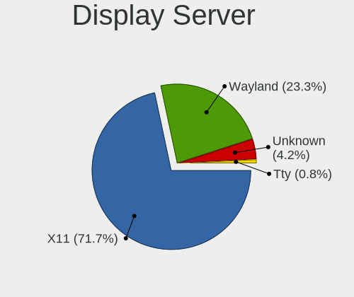

| Name    | Notebooks | Percent |
|---------|-----------|---------|
| X11     | 81        | 74.31%  |
| Wayland | 23        | 21.1%   |
| Unknown | 5         | 4.59%   |

Display Manager
---------------

SDDM, LightDM, etc.

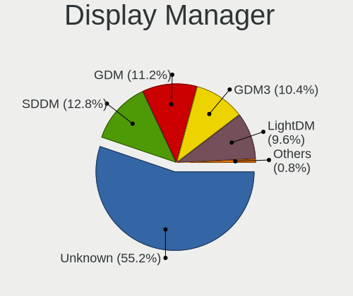

| Name    | Notebooks | Percent |
|---------|-----------|---------|
| Unknown | 62        | 54.39%  |
| SDDM    | 14        | 12.28%  |
| GDM     | 14        | 12.28%  |
| GDM3    | 12        | 10.53%  |
| LightDM | 11        | 9.65%   |
| KDM     | 1         | 0.88%   |

OS Lang
-------

Language

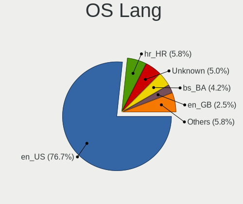

| Lang    | Notebooks | Percent |
|---------|-----------|---------|
| en_US   | 85        | 77.98%  |
| Unknown | 6         | 5.5%    |
| hr_HR   | 5         | 4.59%   |
| bs_BA   | 4         | 3.67%   |
| C       | 3         | 2.75%   |
| en_GB   | 2         | 1.83%   |
| de_CH   | 2         | 1.83%   |
| sr_RS   | 1         | 0.92%   |
| en_AU   | 1         | 0.92%   |

Boot Mode
---------

EFI or BIOS

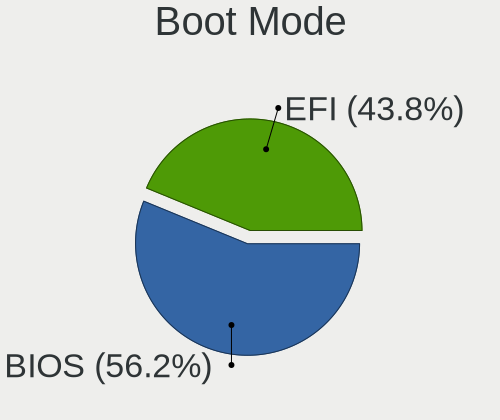

| Mode | Notebooks | Percent |
|------|-----------|---------|
| BIOS | 62        | 56.36%  |
| EFI  | 48        | 43.64%  |

Filesystem
----------

Type of filesystem

| Type    | Notebooks | Percent |
|---------|-----------|---------|
| Ext4    | 86        | 78.18%  |
| Btrfs   | 13        | 11.82%  |
| Overlay | 5         | 4.55%   |
| Unknown | 3         | 2.73%   |
| Tmpfs   | 2         | 1.82%   |
| Zfs     | 1         | 0.91%   |

Part. scheme
------------

Scheme of partitioning

| Type    | Notebooks | Percent |
|---------|-----------|---------|
| Unknown | 69        | 61.61%  |
| GPT     | 37        | 33.04%  |
| MBR     | 6         | 5.36%   |

Dual Boot with Linux/BSD
------------------------

Hosting more than one Linux/BSD

| Dual boot | Notebooks | Percent |
|-----------|-----------|---------|
| No        | 101       | 93.52%  |
| Yes       | 7         | 6.48%   |

Dual Boot (Win)
---------------

Hosting Linux and Windows

| Dual boot | Notebooks | Percent |
|-----------|-----------|---------|
| No        | 88        | 81.48%  |
| Yes       | 20        | 18.52%  |

Board
-----

Vendor
------

Motherboard manufacturer

| Name             | Notebooks | Percent |
|------------------|-----------|---------|
| Hewlett-Packard  | 32        | 29.63%  |
| Lenovo           | 25        | 23.15%  |
| Dell             | 13        | 12.04%  |
| ASUSTek Computer | 13        | 12.04%  |
| Acer             | 11        | 10.19%  |
| Toshiba          | 4         | 3.7%    |
| Fujitsu          | 2         | 1.85%   |
| Sony             | 1         | 0.93%   |
| Notebook         | 1         | 0.93%   |
| NEC Computers    | 1         | 0.93%   |
| MSI              | 1         | 0.93%   |
| HUAWEI           | 1         | 0.93%   |
| Fujitsu Siemens  | 1         | 0.93%   |
| eMachines        | 1         | 0.93%   |
| Unknown          | 1         | 0.93%   |

Model
-----

Motherboard model

| Name                                              | Notebooks | Percent |
|---------------------------------------------------|-----------|---------|
| HP EliteBook 8460p                                | 3         | 2.78%   |
| HP EliteBook 840 G5                               | 3         | 2.78%   |
| Lenovo Legion 5 Pro 16IAH7H 82RF                  | 2         | 1.85%   |
| Lenovo IdeaPad 330-15IKB 81DE                     | 2         | 1.85%   |
| HP 250 G7 Notebook PC                             | 2         | 1.85%   |
| Dell G3 3590                                      | 2         | 1.85%   |
| ASUS VivoBook_ASUSLaptop X509DA_D509DA            | 2         | 1.85%   |
| Toshiba Satellite L850-1HQ                        | 1         | 0.93%   |
| Toshiba Satellite C855                            | 1         | 0.93%   |
| Toshiba Satellite C850-1GF                        | 1         | 0.93%   |
| Toshiba PORTEGE Z930                              | 1         | 0.93%   |
| Sony VGN-BX41VN                                   | 1         | 0.93%   |
| Notebook NL5xRU                                   | 1         | 0.93%   |
| NEC Computers VERSAP550 NN951700753               | 1         | 0.93%   |
| MSI Pulse GL66 12UDK                              | 1         | 0.93%   |
| Lenovo V15 G4 AMN 82YU                            | 1         | 0.93%   |
| Lenovo ThinkPad X301 277418G                      | 1         | 0.93%   |
| Lenovo ThinkPad X1 Carbon 2nd 20A7008AMZ          | 1         | 0.93%   |
| Lenovo ThinkPad W530 24411M9                      | 1         | 0.93%   |
| Lenovo ThinkPad T470s W10DG 20JTS0CJ0E            | 1         | 0.93%   |
| Lenovo ThinkPad T430 2349G2G                      | 1         | 0.93%   |
| Lenovo ThinkPad T420 4180WAP                      | 1         | 0.93%   |
| Lenovo ThinkPad T14s Gen 1 20UH0056SC             | 1         | 0.93%   |
| Lenovo ThinkPad S1 Yoga 20CD0038MZ                | 1         | 0.93%   |
| Lenovo ThinkPad L460 20FVS0F300                   | 1         | 0.93%   |
| Lenovo ThinkPad L440 20ASA09T06                   | 1         | 0.93%   |
| Lenovo ThinkPad L14 Gen 1 20U6S20100              | 1         | 0.93%   |
| Lenovo ThinkPad E15 Gen 2 20TD003LSC              | 1         | 0.93%   |
| Lenovo Legion 7 15IMHg05 81YU                     | 1         | 0.93%   |
| Lenovo IdeaPad Y570 20091                         | 1         | 0.93%   |
| Lenovo IdeaPad L340-15IWL 81LG                    | 1         | 0.93%   |
| Lenovo IdeaPad 5 15ALC05 82LN                     | 1         | 0.93%   |
| Lenovo IdeaPad 320-15IKB 81BG                     | 1         | 0.93%   |
| Lenovo IdeaPad 3 15ALC6 82KU                      | 1         | 0.93%   |
| Lenovo IdeaPad 110S-11IBR 80WG                    | 1         | 0.93%   |
| Lenovo G505 20240                                 | 1         | 0.93%   |
| HUAWEI BOHK-WAX9X                                 | 1         | 0.93%   |
| HP ZBook Firefly 14 inch G8 Mobile Workstation PC | 1         | 0.93%   |
| HP ZBook 15 G4                                    | 1         | 0.93%   |
| HP ProBook 6560b                                  | 1         | 0.93%   |

Model Family
------------

Motherboard model prefix

| Name                    | Notebooks | Percent |
|-------------------------|-----------|---------|
| HP EliteBook            | 14        | 12.96%  |
| Lenovo ThinkPad         | 12        | 11.11%  |
| Lenovo IdeaPad          | 8         | 7.41%   |
| Acer Aspire             | 7         | 6.48%   |
| HP ProBook              | 5         | 4.63%   |
| Dell Latitude           | 4         | 3.7%    |
| ASUS VivoBook           | 4         | 3.7%    |
| Toshiba Satellite       | 3         | 2.78%   |
| Lenovo Legion           | 3         | 2.78%   |
| HP 250                  | 3         | 2.78%   |
| HP ZBook                | 2         | 1.85%   |
| HP Pavilion             | 2         | 1.85%   |
| HP ENVY                 | 2         | 1.85%   |
| Fujitsu LIFEBOOK        | 2         | 1.85%   |
| Dell XPS                | 2         | 1.85%   |
| Dell Inspiron           | 2         | 1.85%   |
| Dell G3                 | 2         | 1.85%   |
| Toshiba PORTEGE         | 1         | 0.93%   |
| Sony VGN-BX41VN         | 1         | 0.93%   |
| Notebook NL5xRU         | 1         | 0.93%   |
| NEC Computers VERSAP550 | 1         | 0.93%   |
| MSI Pulse               | 1         | 0.93%   |
| Lenovo V15              | 1         | 0.93%   |
| Lenovo G505             | 1         | 0.93%   |
| HUAWEI BOHK-WAX9X       | 1         | 0.93%   |
| HP Laptop               | 1         | 0.93%   |
| HP Compaq               | 1         | 0.93%   |
| HP 550                  | 1         | 0.93%   |
| HP 255                  | 1         | 0.93%   |
| Fujitsu Siemens AMILO   | 1         | 0.93%   |
| eMachines eME728        | 1         | 0.93%   |
| Dell Vostro             | 1         | 0.93%   |
| Dell System             | 1         | 0.93%   |
| Dell Precision          | 1         | 0.93%   |
| ASUS ZenBook            | 1         | 0.93%   |
| ASUS X75VBP             | 1         | 0.93%   |
| ASUS X751MD             | 1         | 0.93%   |
| ASUS X550ZE             | 1         | 0.93%   |
| ASUS X540SAA            | 1         | 0.93%   |
| ASUS X540NA             | 1         | 0.93%   |

MFG Year
--------

Motherboard manufacture year

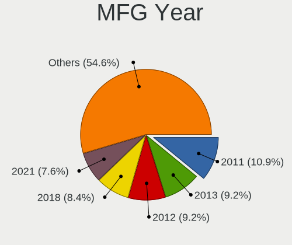

| Year    | Notebooks | Percent |
|---------|-----------|---------|
| 2011    | 13        | 12.04%  |
| 2012    | 11        | 10.19%  |
| 2018    | 10        | 9.26%   |
| 2013    | 9         | 8.33%   |
| 2017    | 8         | 7.41%   |
| 2016    | 8         | 7.41%   |
| 2020    | 7         | 6.48%   |
| 2019    | 7         | 6.48%   |
| 2010    | 7         | 6.48%   |
| 2014    | 6         | 5.56%   |
| 2022    | 5         | 4.63%   |
| 2021    | 5         | 4.63%   |
| 2007    | 3         | 2.78%   |
| 2015    | 2         | 1.85%   |
| 2009    | 2         | 1.85%   |
| 2023    | 1         | 0.93%   |
| 2008    | 1         | 0.93%   |
| 2006    | 1         | 0.93%   |
| 2005    | 1         | 0.93%   |
| Unknown | 1         | 0.93%   |

Form Factor
-----------

Physical design of the computer

| Name     | Notebooks | Percent |
|----------|-----------|---------|
| Notebook | 108       | 100%    |

Secure Boot
-----------

Enabled or disabled

| State    | Notebooks | Percent |
|----------|-----------|---------|
| Disabled | 103       | 94.5%   |
| Enabled  | 6         | 5.5%    |

Coreboot
--------

Have coreboot on board

| Used | Notebooks | Percent |
|------|-----------|---------|
| No   | 108       | 100%    |

RAM Size
--------

Total RAM memory

| Size in GB  | Notebooks | Percent |
|-------------|-----------|---------|
| 4.01-8.0    | 38        | 35.19%  |
| 3.01-4.0    | 18        | 16.67%  |
| 16.01-24.0  | 17        | 15.74%  |
| 8.01-16.0   | 15        | 13.89%  |
| 1.01-2.0    | 9         | 8.33%   |
| 32.01-64.0  | 5         | 4.63%   |
| 2.01-3.0    | 3         | 2.78%   |
| 64.01-256.0 | 2         | 1.85%   |
| 0.51-1.0    | 1         | 0.93%   |

RAM Used
--------

Used RAM memory

| Used GB   | Notebooks | Percent |
|-----------|-----------|---------|
| 1.01-2.0  | 36        | 31.58%  |
| 2.01-3.0  | 35        | 30.7%   |
| 3.01-4.0  | 16        | 14.04%  |
| 4.01-8.0  | 14        | 12.28%  |
| 0.51-1.0  | 8         | 7.02%   |
| 8.01-16.0 | 4         | 3.51%   |
| 0.01-0.5  | 1         | 0.88%   |

Total Drives
------------

Number of drives on board

| Drives | Notebooks | Percent |
|--------|-----------|---------|
| 1      | 85        | 78.7%   |
| 2      | 23        | 21.3%   |

Has CD-ROM
----------

Has CD-ROM on board

| Presented | Notebooks | Percent |
|-----------|-----------|---------|
| No        | 66        | 61.11%  |
| Yes       | 42        | 38.89%  |

Has Ethernet
------------

Has Ethernet on board

| Presented | Notebooks | Percent |
|-----------|-----------|---------|
| Yes       | 91        | 83.49%  |
| No        | 18        | 16.51%  |

Has WiFi
--------

Has WiFi module

| Presented | Notebooks | Percent |
|-----------|-----------|---------|
| Yes       | 104       | 96.3%   |
| No        | 4         | 3.7%    |

Has Bluetooth
-------------

Has Bluetooth module

| Presented | Notebooks | Percent |
|-----------|-----------|---------|
| Yes       | 80        | 73.39%  |
| No        | 29        | 26.61%  |

Location
--------

Country
-------

Geographic location (country)

| Country                | Notebooks | Percent |
|------------------------|-----------|---------|
| Bosnia and Herzegovina | 108       | 100%    |

City
----

Geographic location (city)

| City              | Notebooks | Percent |
|-------------------|-----------|---------|
| Sarajevo          | 40        | 35.71%  |
| Banja Luka        | 17        | 15.18%  |
| Tuzla             | 9         | 8.04%   |
| Doboj             | 4         | 3.57%   |
| Zenica            | 3         | 2.68%   |
| Teslic            | 3         | 2.68%   |
| Gracanica         | 3         | 2.68%   |
| Srebrenik         | 2         | 1.79%   |
| Prijedor          | 2         | 1.79%   |
| Pale              | 2         | 1.79%   |
| Maglaj            | 2         | 1.79%   |
| Banovici          | 2         | 1.79%   |
| Zivinice          | 1         | 0.89%   |
| Zepce             | 1         | 0.89%   |
| Zavidovici        | 1         | 0.89%   |
| Visoko            | 1         | 0.89%   |
| Velika Kladua | 1         | 0.89%   |
| Trebinje          | 1         | 0.89%   |
| Stjepan-Polje     | 1         | 0.89%   |
| Solina            | 1         | 0.89%   |
| Posusje           | 1         | 0.89%   |
| Orahovica Donja   | 1         | 0.89%   |
| Novi Travnik      | 1         | 0.89%   |
| Nevesinje         | 1         | 0.89%   |
| Mostar            | 1         | 0.89%   |
| Lukavica          | 1         | 0.89%   |
| Lukavac           | 1         | 0.89%   |
| Ljubuski          | 1         | 0.89%   |
| Ilidza            | 1         | 0.89%   |
| Grude             | 1         | 0.89%   |
| Gradacac          | 1         | 0.89%   |
| Cazin             | 1         | 0.89%   |
| Brcko             | 1         | 0.89%   |
| Bijeljina         | 1         | 0.89%   |
| Biha            | 1         | 0.89%   |

Drives
------

Drive Vendor
------------

Hard drive vendors

| Vendor              | Notebooks | Drives | Percent |
|---------------------|-----------|--------|---------|
| Samsung Electronics | 26        | 39     | 20.47%  |
| Kingston            | 14        | 18     | 11.02%  |
| Toshiba             | 12        | 12     | 9.45%   |
| Hitachi             | 11        | 12     | 8.66%   |
| WDC                 | 10        | 11     | 7.87%   |
| SK hynix            | 10        | 13     | 7.87%   |
| SanDisk             | 9         | 11     | 7.09%   |
| Seagate             | 7         | 10     | 5.51%   |
| Micron Technology   | 5         | 9      | 3.94%   |
| Unknown             | 4         | 4      | 3.15%   |
| Intel               | 4         | 4      | 3.15%   |
| A-DATA Technology   | 3         | 3      | 2.36%   |
| Vaseky              | 1         | 1      | 0.79%   |
| Union Memory        | 1         | 1      | 0.79%   |
| Team                | 1         | 1      | 0.79%   |
| Patriot             | 1         | 1      | 0.79%   |
| OCZ                 | 1         | 2      | 0.79%   |
| LITEON              | 1         | 1      | 0.79%   |
| KIOXIA              | 1         | 1      | 0.79%   |
| Intenso             | 1         | 1      | 0.79%   |
| HGST                | 1         | 1      | 0.79%   |
| GOODRAM             | 1         | 1      | 0.79%   |
| Crucial             | 1         | 1      | 0.79%   |
| China               | 1         | 1      | 0.79%   |

Drive Model
-----------

Hard drive models

| Model                                             | Notebooks | Percent |
|---------------------------------------------------|-----------|---------|
| Toshiba MQ01ABD100 1TB                            | 5         | 3.82%   |
| SK hynix NVMe SSD Drive 512GB                     | 3         | 2.29%   |
| Samsung NVMe SSD Controller SM961/PM961/SM963 1TB | 3         | 2.29%   |
| Kingston SA400S37240G 240GB SSD                   | 3         | 2.29%   |
| Unknown MMC Card  32GB                            | 2         | 1.53%   |
| SanDisk NVMe SSD Drive 256GB                      | 2         | 1.53%   |
| Samsung MZ7TD256HAFV-000L9 256GB SSD              | 2         | 1.53%   |
| Micron MTFDHBA256TCK-1AS1AABHA 256GB              | 2         | 1.53%   |
| Kingston SHFS37A240G 240GB SSD                    | 2         | 1.53%   |
| Kingston SHFS37A120G 120GB SSD                    | 2         | 1.53%   |
| Hitachi HTS723232A7A364 320GB                     | 2         | 1.53%   |
| Hitachi HTS547575A9E384 752GB                     | 2         | 1.53%   |
| WDC WDS240G1G0A-00SS50 240GB SSD                  | 1         | 0.76%   |
| WDC WD7500BPVT-75HXZT3 752GB                      | 1         | 0.76%   |
| WDC WD7500BPVT-24HXZT3 752GB                      | 1         | 0.76%   |
| WDC WD5000LPVX-75V0TT0 500GB                      | 1         | 0.76%   |
| WDC WD5000LPVT-75G33T0 500GB                      | 1         | 0.76%   |
| WDC WD5000BEKT-22KA9T0 500GB                      | 1         | 0.76%   |
| WDC WD3200BEKT-60V5T1 320GB                       | 1         | 0.76%   |
| WDC WD1600BEVT-22ZCT0 160GB                       | 1         | 0.76%   |
| WDC WD10SPZX-60Z10T0 1TB                          | 1         | 0.76%   |
| WDC PC SN520 SDAPMUW-512G-1101 512GB              | 1         | 0.76%   |
| Vaseky V800/128G 120GB SSD                        | 1         | 0.76%   |
| Unknown SD/MMC/MS PRO 128GB                       | 1         | 0.76%   |
| Unknown MMC Card  1GB                             | 1         | 0.76%   |
| Union Memory UMIS RPJTJ512MEE1OWX 512GB           | 1         | 0.76%   |
| Toshiba THNSNS256GMCP 256GB SSD                   | 1         | 0.76%   |
| Toshiba MQ04ABF100 1TB                            | 1         | 0.76%   |
| Toshiba MQ01ABF050 500GB                          | 1         | 0.76%   |
| Toshiba MK3263GSX 320GB                           | 1         | 0.76%   |
| Toshiba MK3261GSYN 320GB                          | 1         | 0.76%   |
| Toshiba MK3259GSXP 320GB                          | 1         | 0.76%   |
| Toshiba KXG60ZNV512G 512GB                        | 1         | 0.76%   |
| Team T253X1120G 120GB SSD                         | 1         | 0.76%   |
| SK hynix SKHynix_HFS512GDE9X081N 512GB            | 1         | 0.76%   |
| SK hynix SC311 SATA 256GB SSD                     | 1         | 0.76%   |
| SK hynix SC300 M.2 2280 256GB SSD                 | 1         | 0.76%   |
| SK hynix PC801 NVMe 1TB                           | 1         | 0.76%   |
| SK hynix HFM001TD3JX013N 1024GB                   | 1         | 0.76%   |
| SK hynix BC711 NVMe 256GB                         | 1         | 0.76%   |

HDD Vendor
----------

Hard disk drive vendors

| Vendor  | Notebooks | Drives | Percent |
|---------|-----------|--------|---------|
| Hitachi | 11        | 12     | 28.95%  |
| Toshiba | 10        | 10     | 26.32%  |
| WDC     | 8         | 9      | 21.05%  |
| Seagate | 7         | 10     | 18.42%  |
| Unknown | 1         | 1      | 2.63%   |
| HGST    | 1         | 1      | 2.63%   |

SSD Vendor
----------

Solid state drive vendors

| Vendor              | Notebooks | Drives | Percent |
|---------------------|-----------|--------|---------|
| Samsung Electronics | 14        | 15     | 29.79%  |
| Kingston            | 11        | 11     | 23.4%   |
| SanDisk             | 4         | 5      | 8.51%   |
| A-DATA Technology   | 3         | 3      | 6.38%   |
| SK hynix            | 2         | 4      | 4.26%   |
| Intel               | 2         | 2      | 4.26%   |
| WDC                 | 1         | 1      | 2.13%   |
| Vaseky              | 1         | 1      | 2.13%   |
| Toshiba             | 1         | 1      | 2.13%   |
| Team                | 1         | 1      | 2.13%   |
| Patriot             | 1         | 1      | 2.13%   |
| OCZ                 | 1         | 2      | 2.13%   |
| Micron Technology   | 1         | 1      | 2.13%   |
| LITEON              | 1         | 1      | 2.13%   |
| Intenso             | 1         | 1      | 2.13%   |
| GOODRAM             | 1         | 1      | 2.13%   |
| China               | 1         | 1      | 2.13%   |

Drive Kind
----------

HDD or SSD

| Kind | Notebooks | Drives | Percent |
|------|-----------|--------|---------|
| SSD  | 46        | 52     | 37.1%   |
| HDD  | 38        | 43     | 30.65%  |
| NVMe | 36        | 60     | 29.03%  |
| MMC  | 4         | 4      | 3.23%   |

Drive Connector
---------------

SATA, SAS, NVMe, etc.

| Type | Notebooks | Drives | Percent |
|------|-----------|--------|---------|
| SATA | 72        | 94     | 63.16%  |
| NVMe | 36        | 59     | 31.58%  |
| MMC  | 4         | 4      | 3.51%   |
| SAS  | 2         | 2      | 1.75%   |

Drive Size
----------

Size of hard drive

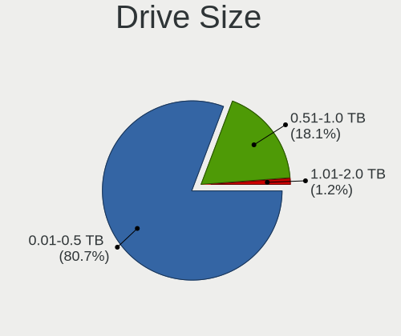

| Size in TB | Notebooks | Drives | Percent |
|------------|-----------|--------|---------|
| 0.01-0.5   | 64        | 78     | 80%     |
| 0.51-1.0   | 15        | 15     | 18.75%  |
| 1.01-2.0   | 1         | 2      | 1.25%   |

Space Total
-----------

Amount of disk space available on the file system

| Size in GB     | Notebooks | Percent |
|----------------|-----------|---------|
| 101-250        | 42        | 37.5%   |
| 251-500        | 31        | 27.68%  |
| 501-1000       | 10        | 8.93%   |
| 21-50          | 9         | 8.04%   |
| 1-20           | 5         | 4.46%   |
| 51-100         | 5         | 4.46%   |
| Unknown        | 4         | 3.57%   |
| More than 3000 | 2         | 1.79%   |
| 2001-3000      | 2         | 1.79%   |
| 1001-2000      | 2         | 1.79%   |

Space Used
----------

Amount of used disk space

| Used GB   | Notebooks | Percent |
|-----------|-----------|---------|
| 1-20      | 45        | 37.82%  |
| 21-50     | 34        | 28.57%  |
| 51-100    | 20        | 16.81%  |
| 101-250   | 8         | 6.72%   |
| 501-1000  | 5         | 4.2%    |
| Unknown   | 4         | 3.36%   |
| 251-500   | 2         | 1.68%   |
| 1001-2000 | 1         | 0.84%   |

Malfunc. Drives
---------------

Drive models with a malfunction

| Model                                                         | Notebooks | Drives | Percent |
|---------------------------------------------------------------|-----------|--------|---------|
| Samsung Electronics SSD 980 500GB                             | 1         | 1      | 14.29%  |
| Samsung Electronics NVMe SSD Controller SM961/PM961/SM963 1TB | 1         | 1      | 14.29%  |
| Samsung Electronics MZVKW512HMJP-000H1 512GB                  | 1         | 1      | 14.29%  |
| Samsung Electronics MMCRE64G8MPP-0VA 64GB SSD                 | 1         | 1      | 14.29%  |
| Hitachi HTS542525K9SA00 250GB                                 | 1         | 2      | 14.29%  |
| Crucial CT500P1SSD8 500GB                                     | 1         | 1      | 14.29%  |
| China SSD 128GB                                               | 1         | 1      | 14.29%  |

Malfunc. Drive Vendor
---------------------

Vendors of faulty drives

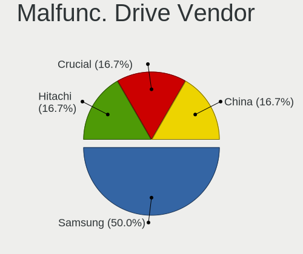

| Vendor              | Notebooks | Drives | Percent |
|---------------------|-----------|--------|---------|
| Samsung Electronics | 3         | 4      | 50%     |
| Hitachi             | 1         | 2      | 16.67%  |
| Crucial             | 1         | 1      | 16.67%  |
| China               | 1         | 1      | 16.67%  |

Malfunc. HDD Vendor
-------------------

Vendors of faulty HDD drives

| Vendor  | Notebooks | Drives | Percent |
|---------|-----------|--------|---------|
| Hitachi | 1         | 2      | 100%    |

Malfunc. Drive Kind
-------------------

Kinds of faulty drives

| Kind | Notebooks | Drives | Percent |
|------|-----------|--------|---------|
| NVMe | 3         | 4      | 50%     |
| SSD  | 2         | 2      | 33.33%  |
| HDD  | 1         | 2      | 16.67%  |

Failed Drives
-------------

Failed drive models

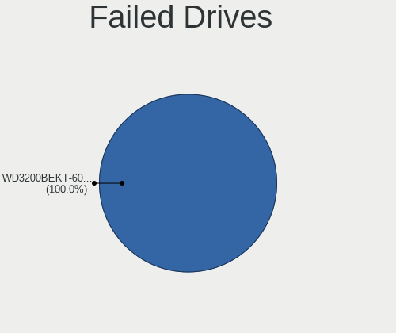

| Model                       | Notebooks | Drives | Percent |
|-----------------------------|-----------|--------|---------|
| WDC WD3200BEKT-60V5T1 320GB | 1         | 1      | 100%    |

Failed Drive Vendor
-------------------

Failed drive vendors

| Vendor | Notebooks | Drives | Percent |
|--------|-----------|--------|---------|
| WDC    | 1         | 1      | 100%    |

Drive Status
------------

Number of failed and malfunc. drives

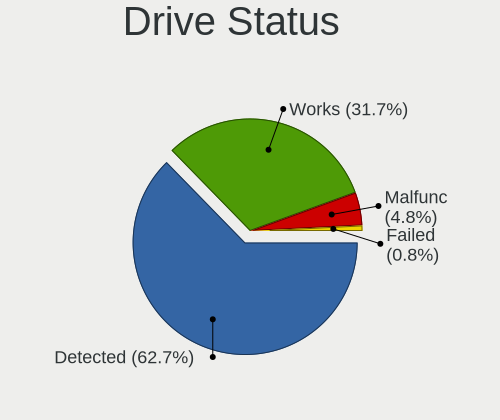

| Status   | Notebooks | Drives | Percent |
|----------|-----------|--------|---------|
| Detected | 71        | 108    | 62.28%  |
| Works    | 36        | 42     | 31.58%  |
| Malfunc  | 6         | 8      | 5.26%   |
| Failed   | 1         | 1      | 0.88%   |

Storage controller
------------------

Storage Vendor
--------------

Storage controller vendors

| Vendor                       | Notebooks | Percent |
|------------------------------|-----------|---------|
| Intel                        | 80        | 62.99%  |
| Samsung Electronics          | 11        | 8.66%   |
| AMD                          | 10        | 7.87%   |
| SK hynix                     | 8         | 6.3%    |
| SanDisk                      | 5         | 3.94%   |
| Micron Technology            | 4         | 3.15%   |
| Kingston Technology Company  | 3         | 2.36%   |
| Union Memory (Shenzhen)      | 1         | 0.79%   |
| Toshiba America Info Systems | 1         | 0.79%   |
| Nvidia                       | 1         | 0.79%   |
| Micron/Crucial Technology    | 1         | 0.79%   |
| KIOXIA                       | 1         | 0.79%   |
| JMicron Technology           | 1         | 0.79%   |

Storage Model
-------------

Storage controller models

| Model                                                                            | Notebooks | Percent |
|----------------------------------------------------------------------------------|-----------|---------|
| Intel Sunrise Point-LP SATA Controller [AHCI mode]                               | 12        | 8.89%   |
| Intel 7 Series Chipset Family 6-port SATA Controller [AHCI mode]                 | 12        | 8.89%   |
| Intel 6 Series/C200 Series Chipset Family 6 port Mobile SATA AHCI Controller     | 12        | 8.89%   |
| AMD FCH SATA Controller [AHCI mode]                                              | 10        | 7.41%   |
| Intel 82801 Mobile SATA Controller [RAID mode]                                   | 6         | 4.44%   |
| Intel Volume Management Device NVMe RAID Controller                              | 5         | 3.7%    |
| Intel 8 Series SATA Controller 1 [AHCI mode]                                     | 5         | 3.7%    |
| Samsung NVMe SSD Controller 980 (DRAM-less)                                      | 4         | 2.96%   |
| SK hynix Gold P31/BC711/PC711 NVMe Solid State Drive                             | 3         | 2.22%   |
| SK hynix BC501 NVMe Solid State Drive                                            | 3         | 2.22%   |
| Samsung NVMe SSD Controller SM961/PM961/SM963                                    | 3         | 2.22%   |
| Intel Cannon Lake Mobile PCH SATA AHCI Controller                                | 3         | 2.22%   |
| Intel 82801HM/HEM (ICH8M/ICH8M-E) SATA Controller [AHCI mode]                    | 3         | 2.22%   |
| Intel 82801HM/HEM (ICH8M/ICH8M-E) IDE Controller                                 | 3         | 2.22%   |
| Intel 8 Series/C220 Series Chipset Family 6-port SATA Controller 1 [AHCI mode]   | 3         | 2.22%   |
| SanDisk Ultra 3D / WD Blue SN550 NVMe SSD                                        | 2         | 1.48%   |
| SanDisk PC SN520 x2 M.2 2242 NVMe SSD                                            | 2         | 1.48%   |
| Samsung NVMe SSD Controller SM981/PM981/PM983                                    | 2         | 1.48%   |
| Samsung NVMe SSD Controller PM9A1/PM9A3/980PRO                                   | 2         | 1.48%   |
| Micron 2200S NVMe SSD [Cassandra]                                                | 2         | 1.48%   |
| Intel Tiger Lake-LP SATA Controller                                              | 2         | 1.48%   |
| Intel SSD 600P Series                                                            | 2         | 1.48%   |
| Intel Celeron N3350/Pentium N4200/Atom E3900 Series SATA AHCI Controller         | 2         | 1.48%   |
| Intel Atom/Celeron/Pentium Processor x5-E8000/J3xxx/N3xxx Series SATA Controller | 2         | 1.48%   |
| Intel 82801IBM/IEM (ICH9M/ICH9M-E) 4 port SATA Controller [AHCI mode]            | 2         | 1.48%   |
| Intel 5 Series/3400 Series Chipset 6 port SATA AHCI Controller                   | 2         | 1.48%   |
| Intel 5 Series/3400 Series Chipset 4 port SATA AHCI Controller                   | 2         | 1.48%   |
| Union Memory (Shenzhen) AM620 PCIe 3.0 NVMe SSD 512GB                            | 1         | 0.74%   |
| Toshiba America Info Systems XG6 NVMe SSD Controller                             | 1         | 0.74%   |
| SK hynix Platinum P41/PC801 NVMe Solid State Drive                               | 1         | 0.74%   |
| SK hynix PC401 NVMe Solid State Drive 256GB                                      | 1         | 0.74%   |
| SanDisk Extreme Pro / WD Black SN750 / PC SN730 / Red SN700 NVMe SSD             | 1         | 0.74%   |
| Samsung NVMe SSD Controller PM9B1 (DRAM-less)                                    | 1         | 0.74%   |
| Nvidia MCP51 Serial ATA Controller                                               | 1         | 0.74%   |
| Nvidia MCP51 IDE                                                                 | 1         | 0.74%   |
| Micron/Crucial P1 NVMe PCIe SSD[Frampton]                                        | 1         | 0.74%   |
| Micron 3400 NVMe SSD [Hendrix]                                                   | 1         | 0.74%   |
| Micron 2450 NVMe SSD [HendrixV] (DRAM-less)                                      | 1         | 0.74%   |
| KIOXIA NVMe SSD Controller BG4 (DRAM-less)                                       | 1         | 0.74%   |
| Kingston Company NV2 NVMe SSD SM2267XT (DRAM-less)                               | 1         | 0.74%   |

Storage Kind
------------

Kind of storage controller (IDE, SATA, NVMe, SAS, ...)

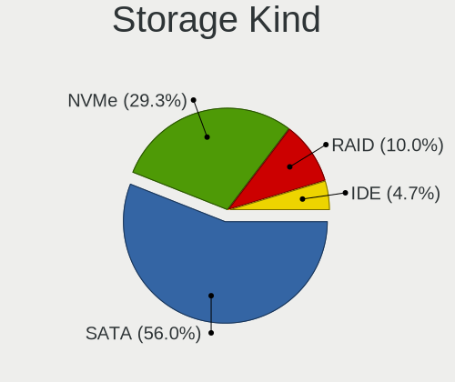

| Kind | Notebooks | Percent |
|------|-----------|---------|
| SATA | 76        | 58.02%  |
| NVMe | 36        | 27.48%  |
| RAID | 12        | 9.16%   |
| IDE  | 7         | 5.34%   |

Processor
---------

CPU Vendor
----------

Processor vendors

| Vendor | Notebooks | Percent |
|--------|-----------|---------|
| Intel  | 89        | 82.41%  |
| AMD    | 18        | 16.67%  |
| ARM    | 1         | 0.93%   |

CPU Model
---------

Processor models

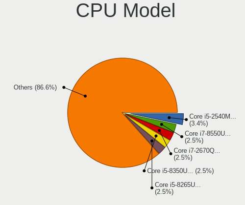

| Model                                         | Notebooks | Percent |
|-----------------------------------------------|-----------|---------|
| Intel Core i5-2540M CPU @ 2.60GHz             | 4         | 3.7%    |
| Intel Core i7-8550U CPU @ 1.80GHz             | 3         | 2.78%   |
| Intel Core i7-2670QM CPU @ 2.20GHz            | 3         | 2.78%   |
| Intel Core i5-8350U CPU @ 1.70GHz             | 3         | 2.78%   |
| Intel 12th Gen Core i7-12700H                 | 3         | 2.78%   |
| Intel Core i7-9750H CPU @ 2.60GHz             | 2         | 1.85%   |
| Intel Core i7-8565U CPU @ 1.80GHz             | 2         | 1.85%   |
| Intel Core i7-6600U CPU @ 2.60GHz             | 2         | 1.85%   |
| Intel Core i5-8265U CPU @ 1.60GHz             | 2         | 1.85%   |
| Intel Core i5-6300U CPU @ 2.40GHz             | 2         | 1.85%   |
| Intel Core i5-3320M CPU @ 2.60GHz             | 2         | 1.85%   |
| Intel Core i5-3210M CPU @ 2.50GHz             | 2         | 1.85%   |
| Intel Core i5-2520M CPU @ 2.50GHz             | 2         | 1.85%   |
| Intel Core i5 CPU M 560 @ 2.67GHz             | 2         | 1.85%   |
| Intel Core i3-3227U CPU @ 1.90GHz             | 2         | 1.85%   |
| Intel Celeron CPU N3350 @ 1.10GHz             | 2         | 1.85%   |
| Intel 11th Gen Core i7-1165G7 @ 2.80GHz       | 2         | 1.85%   |
| Intel 11th Gen Core i5-1135G7 @ 2.40GHz       | 2         | 1.85%   |
| AMD Ryzen 5 PRO 4650U with Radeon Graphics    | 2         | 1.85%   |
| AMD Ryzen 5 5500U with Radeon Graphics        | 2         | 1.85%   |
| AMD Ryzen 5 3500U with Radeon Vega Mobile Gfx | 2         | 1.85%   |
| AMD E1-2100 APU with Radeon HD Graphics       | 2         | 1.85%   |
| Intel Pentium M processor 1.73GHz             | 1         | 0.93%   |
| Intel Pentium Dual-Core CPU T4500 @ 2.30GHz   | 1         | 0.93%   |
| Intel Pentium Dual CPU T2390 @ 1.86GHz        | 1         | 0.93%   |
| Intel Pentium CPU N3540 @ 2.16GHz             | 1         | 0.93%   |
| Intel Core i7-8750H CPU @ 2.20GHz             | 1         | 0.93%   |
| Intel Core i7-7820HQ CPU @ 2.90GHz            | 1         | 0.93%   |
| Intel Core i7-7500U CPU @ 2.70GHz             | 1         | 0.93%   |
| Intel Core i7-4702MQ CPU @ 2.20GHz            | 1         | 0.93%   |
| Intel Core i7-4550U CPU @ 1.50GHz             | 1         | 0.93%   |
| Intel Core i7-4500U CPU @ 1.80GHz             | 1         | 0.93%   |
| Intel Core i7-3840QM CPU @ 2.80GHz            | 1         | 0.93%   |
| Intel Core i7-3667U CPU @ 2.00GHz             | 1         | 0.93%   |
| Intel Core i7-2640M CPU @ 2.80GHz             | 1         | 0.93%   |
| Intel Core i7-2630QM CPU @ 2.00GHz            | 1         | 0.93%   |
| Intel Core i7-10875H CPU @ 2.30GHz            | 1         | 0.93%   |
| Intel Core i7 CPU Q 720 @ 1.60GHz             | 1         | 0.93%   |
| Intel Core i7 CPU M 620 @ 2.67GHz             | 1         | 0.93%   |
| Intel Core i5-8250U CPU @ 1.60GHz             | 1         | 0.93%   |

CPU Model Family
----------------

Processor model prefix

| Model                   | Notebooks | Percent |
|-------------------------|-----------|---------|
| Intel Core i5           | 30        | 27.78%  |
| Intel Core i7           | 25        | 23.15%  |
| Other                   | 11        | 10.19%  |
| Intel Core i3           | 7         | 6.48%   |
| Intel Celeron           | 7         | 6.48%   |
| AMD Ryzen 5             | 6         | 5.56%   |
| Intel Core 2 Duo        | 5         | 4.63%   |
| AMD E1                  | 3         | 2.78%   |
| AMD Ryzen 7             | 2         | 1.85%   |
| AMD Ryzen 5 PRO         | 2         | 1.85%   |
| Intel Pentium M         | 1         | 0.93%   |
| Intel Pentium Dual-Core | 1         | 0.93%   |
| Intel Pentium Dual      | 1         | 0.93%   |
| Intel Pentium           | 1         | 0.93%   |
| Intel Atom              | 1         | 0.93%   |
| AMD Turion 64 Mobile    | 1         | 0.93%   |
| AMD Ryzen 9             | 1         | 0.93%   |
| AMD E2                  | 1         | 0.93%   |
| AMD C-60                | 1         | 0.93%   |
| AMD A10                 | 1         | 0.93%   |

CPU Cores
---------

Number of processor cores

| Number | Notebooks | Percent |
|--------|-----------|---------|
| 2      | 57        | 52.78%  |
| 4      | 34        | 31.48%  |
| 6      | 7         | 6.48%   |
| 14     | 5         | 4.63%   |
| 8      | 3         | 2.78%   |
| 1      | 2         | 1.85%   |

CPU Sockets
-----------

Number of sockets

| Number | Notebooks | Percent |
|--------|-----------|---------|
| 1      | 108       | 100%    |

CPU Threads
-----------

Threads per core (Hyper-Threading)

| Number | Notebooks | Percent |
|--------|-----------|---------|
| 2      | 82        | 75.23%  |
| 1      | 27        | 24.77%  |

CPU Op-Modes
------------

CPU Operation Modes (32-bit, 64-bit)

| Op mode        | Notebooks | Percent |
|----------------|-----------|---------|
| 32-bit, 64-bit | 104       | 96.3%   |
| Unknown        | 3         | 2.78%   |
| 32-bit         | 1         | 0.93%   |

CPU Microcode
-------------

Microcode number

| Number     | Notebooks | Percent |
|------------|-----------|---------|
| Unknown    | 40        | 36.7%   |
| 0x206a7    | 9         | 8.26%   |
| 0x306a9    | 8         | 7.34%   |
| 0x406e3    | 5         | 4.59%   |
| 0x806ea    | 4         | 3.67%   |
| 0x906a3    | 3         | 2.75%   |
| 0x806c1    | 3         | 2.75%   |
| 0x40651    | 3         | 2.75%   |
| 0x806ec    | 2         | 1.83%   |
| 0x506c9    | 2         | 1.83%   |
| 0x306c3    | 2         | 1.83%   |
| 0x20655    | 2         | 1.83%   |
| 0x10676    | 2         | 1.83%   |
| 0x08600106 | 2         | 1.83%   |
| 0x05000119 | 2         | 1.83%   |
| 0xa0652    | 1         | 0.92%   |
| 0x906ea    | 1         | 0.92%   |
| 0x906e9    | 1         | 0.92%   |
| 0x806eb    | 1         | 0.92%   |
| 0x806e9    | 1         | 0.92%   |
| 0x706e5    | 1         | 0.92%   |
| 0x6fd      | 1         | 0.92%   |
| 0x6fa      | 1         | 0.92%   |
| 0x6d8      | 1         | 0.92%   |
| 0x406c4    | 1         | 0.92%   |
| 0x406c3    | 1         | 0.92%   |
| 0x30678    | 1         | 0.92%   |
| 0x106e5    | 1         | 0.92%   |
| 0x1067a    | 1         | 0.92%   |
| 0x0a50000c | 1         | 0.92%   |
| 0x08a00008 | 1         | 0.92%   |
| 0x08608102 | 1         | 0.92%   |
| 0x08108109 | 1         | 0.92%   |
| 0x08108102 | 1         | 0.92%   |
| 0x0700010f | 1         | 0.92%   |

CPU Microarch
-------------

Microarchitecture

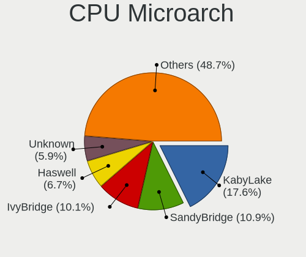

| Name             | Notebooks | Percent |
|------------------|-----------|---------|
| KabyLake         | 19        | 17.59%  |
| SandyBridge      | 13        | 12.04%  |
| IvyBridge        | 12        | 11.11%  |
| Haswell          | 8         | 7.41%   |
| Skylake          | 6         | 5.56%   |
| TigerLake        | 5         | 4.63%   |
| Unknown          | 5         | 4.63%   |
| Zen+             | 4         | 3.7%    |
| Westmere         | 4         | 3.7%    |
| Silvermont       | 4         | 3.7%    |
| Core             | 4         | 3.7%    |
| Alderlake Hybrid | 4         | 3.7%    |
| Zen 2            | 3         | 2.78%   |
| Penryn           | 3         | 2.78%   |
| Jaguar           | 2         | 1.85%   |
| Goldmont         | 2         | 1.85%   |
| Bobcat           | 2         | 1.85%   |
| Zen 3            | 1         | 0.93%   |
| Steamroller      | 1         | 0.93%   |
| P6               | 1         | 0.93%   |
| Nehalem          | 1         | 0.93%   |
| K8 Hammer        | 1         | 0.93%   |
| IceLake          | 1         | 0.93%   |
| Excavator        | 1         | 0.93%   |
| CometLake        | 1         | 0.93%   |

Graphics
--------

GPU Vendor
----------

Vendors of graphics cards

| Vendor | Notebooks | Percent |
|--------|-----------|---------|
| Intel  | 74        | 53.62%  |
| Nvidia | 34        | 24.64%  |
| AMD    | 30        | 21.74%  |

GPU Model
---------

Graphics card models

| Model                                                                                    | Notebooks | Percent |
|------------------------------------------------------------------------------------------|-----------|---------|
| Intel 3rd Gen Core processor Graphics Controller                                         | 10        | 7.09%   |
| Intel 2nd Generation Core Processor Family Integrated Graphics Controller                | 10        | 7.09%   |
| Intel UHD Graphics 620                                                                   | 7         | 4.96%   |
| Intel Skylake GT2 [HD Graphics 520]                                                      | 6         | 4.26%   |
| Intel TigerLake-LP GT2 [Iris Xe Graphics]                                                | 5         | 3.55%   |
| Intel Haswell-ULT Integrated Graphics Controller                                         | 5         | 3.55%   |
| Intel WhiskeyLake-U GT2 [UHD Graphics 620]                                               | 4         | 2.84%   |
| Intel HD Graphics 620                                                                    | 4         | 2.84%   |
| Intel Alder Lake-P GT2 [Iris Xe Graphics]                                                | 4         | 2.84%   |
| AMD Picasso/Raven 2 [Radeon Vega Series / Radeon Vega Mobile Series]                     | 4         | 2.84%   |
| Nvidia GP108M [GeForce MX150]                                                            | 3         | 2.13%   |
| Nvidia GM108M [GeForce MX110]                                                            | 3         | 2.13%   |
| Intel CoffeeLake-H GT2 [UHD Graphics 630]                                                | 3         | 2.13%   |
| Intel Atom/Celeron/Pentium Processor x5-E8000/J3xxx/N3xxx Integrated Graphics Controller | 3         | 2.13%   |
| Intel 4th Gen Core Processor Integrated Graphics Controller                              | 3         | 2.13%   |
| AMD Thames [Radeon HD 7500M/7600M Series]                                                | 3         | 2.13%   |
| AMD Renoir [Radeon RX Vega 6 (Ryzen 4000/5000 Mobile Series)]                            | 3         | 2.13%   |
| Nvidia TU116M [GeForce GTX 1660 Ti Mobile]                                               | 2         | 1.42%   |
| Nvidia GT218M [NVS 3100M]                                                                | 2         | 1.42%   |
| Nvidia GA107M [GeForce RTX 3050 Ti Mobile]                                               | 2         | 1.42%   |
| Intel Mobile 4 Series Chipset Integrated Graphics Controller                             | 2         | 1.42%   |
| Intel HD Graphics 500                                                                    | 2         | 1.42%   |
| AMD Seymour [Radeon HD 6400M/7400M Series]                                               | 2         | 1.42%   |
| AMD Lucienne                                                                             | 2         | 1.42%   |
| AMD Kabini [Radeon HD 8210]                                                              | 2         | 1.42%   |
| Nvidia TU117GLM [Quadro T500 Mobile]                                                     | 1         | 0.71%   |
| Nvidia TU106BM [GeForce RTX 2070 Mobile]                                                 | 1         | 0.71%   |
| Nvidia GT216M [NVS 5100M]                                                                | 1         | 0.71%   |
| Nvidia GP108M [GeForce MX330]                                                            | 1         | 0.71%   |
| Nvidia GP108M [GeForce MX230]                                                            | 1         | 0.71%   |
| Nvidia GP107M [GeForce GTX 1050 Ti Mobile]                                               | 1         | 0.71%   |
| Nvidia GM206GLM [Quadro M2200 Mobile]                                                    | 1         | 0.71%   |
| Nvidia GM107M [GeForce GTX 950M]                                                         | 1         | 0.71%   |
| Nvidia GM107 [GeForce 940MX]                                                             | 1         | 0.71%   |
| Nvidia GK208M [GeForce GT 740M]                                                          | 1         | 0.71%   |
| Nvidia GK107M [GeForce GT 750M]                                                          | 1         | 0.71%   |
| Nvidia GK107GLM [Quadro K1000M]                                                          | 1         | 0.71%   |
| Nvidia GF117M [GeForce 610M/710M/810M/820M / GT 620M/625M/630M/720M]                     | 1         | 0.71%   |
| Nvidia GF108M [GeForce GT 620M/630M/635M/640M LE]                                        | 1         | 0.71%   |
| Nvidia GF108M [GeForce GT 525M]                                                          | 1         | 0.71%   |

GPU Combo
---------

Combinations of graphics cards

| Name           | Notebooks | Percent |
|----------------|-----------|---------|
| 1 x Intel      | 44        | 40.37%  |
| Intel + Nvidia | 26        | 23.85%  |
| 1 x AMD        | 23        | 21.1%   |
| 1 x Nvidia     | 8         | 7.34%   |
| Intel + AMD    | 4         | 3.67%   |
| 2 x AMD        | 2         | 1.83%   |
| Other          | 1         | 0.92%   |
| AMD + Nvidia   | 1         | 0.92%   |

GPU Driver
----------

Free vs proprietary

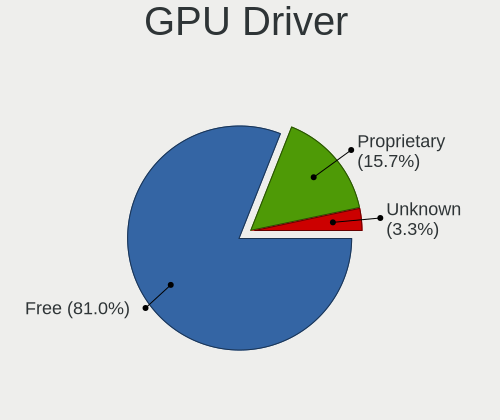

| Driver      | Notebooks | Percent |
|-------------|-----------|---------|
| Free        | 89        | 81.65%  |
| Proprietary | 17        | 15.6%   |
| Unknown     | 3         | 2.75%   |

GPU Memory
----------

Total video memory

| Size in GB | Notebooks | Percent |
|------------|-----------|---------|
| Unknown    | 66        | 58.93%  |
| 1.01-2.0   | 15        | 13.39%  |
| 0.01-0.5   | 12        | 10.71%  |
| 0.51-1.0   | 8         | 7.14%   |
| 3.01-4.0   | 6         | 5.36%   |
| 7.01-8.0   | 3         | 2.68%   |
| 5.01-6.0   | 2         | 1.79%   |

Monitor
-------

Monitor Vendor
--------------

Monitor vendors

| Vendor                  | Notebooks | Percent |
|-------------------------|-----------|---------|
| AU Optronics            | 26        | 22.81%  |
| LG Display              | 23        | 20.18%  |
| BOE                     | 16        | 14.04%  |
| Chimei Innolux          | 12        | 10.53%  |
| Samsung Electronics     | 8         | 7.02%   |
| Dell                    | 5         | 4.39%   |
| Sharp                   | 4         | 3.51%   |
| Chi Mei Optoelectronics | 4         | 3.51%   |
| AOC                     | 3         | 2.63%   |
| Philips                 | 2         | 1.75%   |
| LG Philips              | 2         | 1.75%   |
| InfoVision              | 2         | 1.75%   |
| PANDA                   | 1         | 0.88%   |
| NEC Computers           | 1         | 0.88%   |
| Mi                      | 1         | 0.88%   |
| LGD                     | 1         | 0.88%   |
| Lenovo                  | 1         | 0.88%   |
| Goldstar                | 1         | 0.88%   |
| CSO                     | 1         | 0.88%   |

Monitor Model
-------------

Monitor models

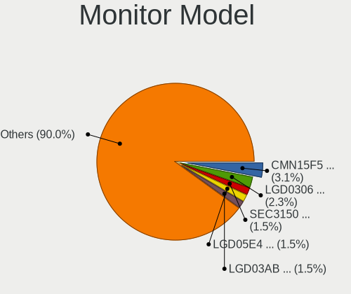

| Model                                                                | Notebooks | Percent |
|----------------------------------------------------------------------|-----------|---------|
| Chimei Innolux LCD Monitor CMN15F5 1920x1080 344x193mm 15.5-inch     | 4         | 3.42%   |
| LG Display LCD Monitor LGD0306 1600x900 310x174mm 14.0-inch          | 3         | 2.56%   |
| Samsung Electronics LCD Monitor SEC3150 1366x768 344x193mm 15.5-inch | 2         | 1.71%   |
| LG Display LCD Monitor LGD05E4 1920x1080 344x194mm 15.5-inch         | 2         | 1.71%   |
| LG Display LCD Monitor LGD03AB 1366x768 344x194mm 15.5-inch          | 2         | 1.71%   |
| InfoVision LCD Monitor IVO057D 1920x1080 309x174mm 14.0-inch         | 2         | 1.71%   |
| Chimei Innolux LCD Monitor CMN15DB 1366x768 344x193mm 15.5-inch      | 2         | 1.71%   |
| BOE LCD Monitor BOE07A3 1920x1080 344x193mm 15.5-inch                | 2         | 1.71%   |
| AU Optronics LCD Monitor AUO35ED 1920x1080 344x193mm 15.5-inch       | 2         | 1.71%   |
| AU Optronics LCD Monitor AUO323D 1920x1080 309x174mm 14.0-inch       | 2         | 1.71%   |
| AU Optronics LCD Monitor AUO123D 1920x1080 309x173mm 13.9-inch       | 2         | 1.71%   |
| Sharp LQ140Z1JW01 SHP1401 3200x1800 310x174mm 14.0-inch              | 1         | 0.85%   |
| Sharp LQ140M1JW49 SHP1523 1920x1080 309x174mm 14.0-inch              | 1         | 0.85%   |
| Sharp LCD Monitor SHP1515 1920x1200 336x210mm 15.6-inch              | 1         | 0.85%   |
| Sharp LCD Monitor SHP149A 1920x1080 344x194mm 15.5-inch              | 1         | 0.85%   |
| Samsung Electronics SyncMaster SAM0579 1920x1080                     | 1         | 0.85%   |
| Samsung Electronics LCD Monitor SEC544B 1600x900 310x174mm 14.0-inch | 1         | 0.85%   |
| Samsung Electronics LCD Monitor SEC4E45 1280x800 331x207mm 15.4-inch | 1         | 0.85%   |
| Samsung Electronics LCD Monitor SEC4149 1366x768 292x174mm 13.4-inch | 1         | 0.85%   |
| Samsung Electronics LCD Monitor SEC3554 1600x900 382x215mm 17.3-inch | 1         | 0.85%   |
| Samsung Electronics LCD Monitor SEC314F 1600x900 382x215mm 17.3-inch | 1         | 0.85%   |
| Philips PHL 243V5 PHLC0D1 1920x1080 521x293mm 23.5-inch              | 1         | 0.85%   |
| Philips 221V PHL0888 1920x1080 477x268mm 21.5-inch                   | 1         | 0.85%   |
| PANDA LCD Monitor NCP0058 1920x1080 344x194mm 15.5-inch              | 1         | 0.85%   |
| NEC Computers LCD1770NX NEC6664 1280x1024 338x270mm 17.0-inch        | 1         | 0.85%   |
| Mi Monitor XMI3446 3440x1440 797x334mm 34.0-inch                     | 1         | 0.85%   |
| Mi Monitor XMI3445 3440x1440 797x334mm 34.0-inch                     | 1         | 0.85%   |
| LGD LCD Monitor 1920x1080                                            | 1         | 0.85%   |
| LG Philips LCD Monitor LPLA002 1440x900 367x230mm 17.1-inch          | 1         | 0.85%   |
| LG Philips LCD Monitor LPL1E01 1280x800 331x207mm 15.4-inch          | 1         | 0.85%   |
| LG Display LCD Monitor LGD069A 1920x1080 344x194mm 15.5-inch         | 1         | 0.85%   |
| LG Display LCD Monitor LGD064C 1920x1080 344x194mm 15.5-inch         | 1         | 0.85%   |
| LG Display LCD Monitor LGD05E5 1920x1080 344x194mm 15.5-inch         | 1         | 0.85%   |
| LG Display LCD Monitor LGD057E 1920x1080 344x194mm 15.5-inch         | 1         | 0.85%   |
| LG Display LCD Monitor LGD04B3 1920x1080 345x194mm 15.6-inch         | 1         | 0.85%   |
| LG Display LCD Monitor LGD0418 2560x1440 310x174mm 14.0-inch         | 1         | 0.85%   |
| LG Display LCD Monitor LGD0414 1920x1080 276x156mm 12.5-inch         | 1         | 0.85%   |
| LG Display LCD Monitor LGD0384 1366x768 340x190mm 15.3-inch          | 1         | 0.85%   |
| LG Display LCD Monitor LGD034C 1366x768 293x165mm 13.2-inch          | 1         | 0.85%   |
| LG Display LCD Monitor LGD02F1 1366x768 344x194mm 15.5-inch          | 1         | 0.85%   |

Monitor Resolution
------------------

Monitor screen resolution

| Resolution        | Notebooks | Percent |
|-------------------|-----------|---------|
| 1920x1080 (FHD)   | 52        | 46.43%  |
| 1366x768 (WXGA)   | 26        | 23.21%  |
| 1600x900 (HD+)    | 13        | 11.61%  |
| 2560x1440 (QHD)   | 5         | 4.46%   |
| 1440x900 (WXGA+)  | 4         | 3.57%   |
| 3840x2160 (4K)    | 2         | 1.79%   |
| 3440x1440         | 2         | 1.79%   |
| 2560x1600         | 2         | 1.79%   |
| 1280x800 (WXGA)   | 2         | 1.79%   |
| 1280x1024 (SXGA)  | 2         | 1.79%   |
| 3200x1800 (QHD+)  | 1         | 0.89%   |
| 1920x1200 (WUXGA) | 1         | 0.89%   |

Monitor Diagonal
----------------

Diagonal size in inches

| Inches  | Notebooks | Percent |
|---------|-----------|---------|
| 15      | 54        | 46.96%  |
| 14      | 16        | 13.91%  |
| 17      | 12        | 10.43%  |
| 13      | 11        | 9.57%   |
| 27      | 3         | 2.61%   |
| 11      | 3         | 2.61%   |
| 34      | 2         | 1.74%   |
| 24      | 2         | 1.74%   |
| 21      | 2         | 1.74%   |
| 16      | 2         | 1.74%   |
| 12      | 2         | 1.74%   |
| Unknown | 2         | 1.74%   |
| 33      | 1         | 0.87%   |
| 31      | 1         | 0.87%   |
| 23      | 1         | 0.87%   |
| 18      | 1         | 0.87%   |

Monitor Width
-------------

Physical width

| Width in mm | Notebooks | Percent |
|-------------|-----------|---------|
| 301-350     | 81        | 71.05%  |
| 351-400     | 10        | 8.77%   |
| 201-300     | 8         | 7.02%   |
| 501-600     | 6         | 5.26%   |
| 701-800     | 3         | 2.63%   |
| 401-500     | 3         | 2.63%   |
| Unknown     | 2         | 1.75%   |
| 601-700     | 1         | 0.88%   |

Aspect Ratio
------------

Proportional relationship between the width and the height

| Ratio   | Notebooks | Percent |
|---------|-----------|---------|
| 16/9    | 91        | 86.67%  |
| 16/10   | 9         | 8.57%   |
| 5/4     | 2         | 1.9%    |
| 21/9    | 2         | 1.9%    |
| Unknown | 1         | 0.95%   |

Monitor Area
------------

Area in inch

| Area in inch | Notebooks | Percent |
|----------------|-----------|---------|
| 101-110        | 52        | 45.61%  |
| 81-90          | 24        | 21.05%  |
| 121-130        | 7         | 6.14%   |
| 71-80          | 4         | 3.51%   |
| 351-500        | 4         | 3.51%   |
| 51-60          | 3         | 2.63%   |
| 301-350        | 3         | 2.63%   |
| 201-250        | 3         | 2.63%   |
| 131-140        | 3         | 2.63%   |
| 111-120        | 3         | 2.63%   |
| 141-150        | 2         | 1.75%   |
| Unknown        | 2         | 1.75%   |
| 61-70          | 1         | 0.88%   |
| 251-300        | 1         | 0.88%   |
| 151-200        | 1         | 0.88%   |
| 91-100         | 1         | 0.88%   |

Pixel Density
-------------

Pixels per inch

| Density       | Notebooks | Percent |
|---------------|-----------|---------|
| 121-160       | 57        | 50.44%  |
| 101-120       | 35        | 30.97%  |
| 51-100        | 13        | 11.5%   |
| 161-240       | 5         | 4.42%   |
| Unknown       | 2         | 1.77%   |
| More than 240 | 1         | 0.88%   |

Multiple Monitors
-----------------

Total monitors connected

| Total | Notebooks | Percent |
|-------|-----------|---------|
| 1     | 92        | 83.64%  |
| 2     | 14        | 12.73%  |
| 0     | 3         | 2.73%   |
| 3     | 1         | 0.91%   |

Network
-------

Net Controller Vendor
---------------------

Controller vendors

| Vendor                            | Notebooks | Percent |
|-----------------------------------|-----------|---------|
| Intel                             | 53        | 31.74%  |
| Realtek Semiconductor             | 52        | 31.14%  |
| Qualcomm Atheros                  | 30        | 17.96%  |
| Broadcom                          | 9         | 5.39%   |
| Ralink                            | 3         | 1.8%    |
| Hewlett-Packard                   | 3         | 1.8%    |
| TP-Link                           | 2         | 1.2%    |
| Sierra Wireless                   | 2         | 1.2%    |
| Ralink Technology                 | 2         | 1.2%    |
| MediaTek                          | 2         | 1.2%    |
| Marvell Technology Group          | 2         | 1.2%    |
| Toshiba                           | 1         | 0.6%    |
| Qualcomm Atheros Communications   | 1         | 0.6%    |
| Nvidia                            | 1         | 0.6%    |
| HTC (High Tech Computer)          | 1         | 0.6%    |
| Ericsson Business Mobile Networks | 1         | 0.6%    |
| D-Link                            | 1         | 0.6%    |
| Broadcom Limited                  | 1         | 0.6%    |

Net Controller Model
--------------------

Controller models

| Model                                                                  | Notebooks | Percent |
|------------------------------------------------------------------------|-----------|---------|
| Realtek RTL8111/8168/8211/8411 PCI Express Gigabit Ethernet Controller | 35        | 16.59%  |
| Intel 82579LM Gigabit Network Connection (Lewisville)                  | 10        | 4.74%   |
| Qualcomm Atheros QCA9377 802.11ac Wireless Network Adapter             | 9         | 4.27%   |
| Realtek RTL810xE PCI Express Fast Ethernet controller                  | 8         | 3.79%   |
| Realtek RTL8821CE 802.11ac PCIe Wireless Network Adapter               | 7         | 3.32%   |
| Intel Wireless 8265 / 8275                                             | 6         | 2.84%   |
| Intel Wireless 8260                                                    | 6         | 2.84%   |
| Intel Centrino Advanced-N 6205 [Taylor Peak]                           | 6         | 2.84%   |
| Intel Alder Lake-P PCH CNVi WiFi                                       | 5         | 2.37%   |
| Qualcomm Atheros QCA9565 / AR9565 Wireless Network Adapter             | 4         | 1.9%    |
| Qualcomm Atheros AR9485 Wireless Network Adapter                       | 4         | 1.9%    |
| Qualcomm Atheros AR9285 Wireless Network Adapter (PCI-Express)         | 4         | 1.9%    |
| Intel Wireless 7260                                                    | 4         | 1.9%    |
| Intel Ethernet Connection I219-LM                                      | 4         | 1.9%    |
| Intel Ethernet Connection (4) I219-LM                                  | 4         | 1.9%    |
| Realtek RTL8822CE 802.11ac PCIe Wireless Network Adapter               | 3         | 1.42%   |
| Realtek RTL8153 Gigabit Ethernet Adapter                               | 3         | 1.42%   |
| Ralink RT3290 Wireless 802.11n 1T/1R PCIe                              | 3         | 1.42%   |
| Qualcomm Atheros AR9287 Wireless Network Adapter (PCI-Express)         | 3         | 1.42%   |
| Intel Wi-Fi 6 AX201                                                    | 3         | 1.42%   |
| Intel Centrino Ultimate-N 6300                                         | 3         | 1.42%   |
| Intel 82577LM Gigabit Network Connection                               | 3         | 1.42%   |
| Broadcom BCM4313 802.11bgn Wireless Network Adapter                    | 3         | 1.42%   |
| Ralink MT7601U Wireless Adapter                                        | 2         | 0.95%   |
| Qualcomm Atheros QCA6174 802.11ac Wireless Network Adapter             | 2         | 0.95%   |
| Qualcomm Atheros AR8162 Fast Ethernet                                  | 2         | 0.95%   |
| Intel Wi-Fi 6 AX200                                                    | 2         | 0.95%   |
| Intel PRO/Wireless 4965 AG or AGN [Kedron] Network Connection          | 2         | 0.95%   |
| Intel Ethernet Connection I218-LM                                      | 2         | 0.95%   |
| Intel Ethernet Connection I217-V                                       | 2         | 0.95%   |
| Intel Centrino Advanced-N 6200                                         | 2         | 0.95%   |
| Broadcom BCM43228 802.11a/b/g/n                                        | 2         | 0.95%   |
| TP-Link TL-WN722N v2/v3 [Realtek RTL8188EUS]                           | 1         | 0.47%   |
| TP-Link Archer T2U PLUS [RTL8821AU]                                    | 1         | 0.47%   |
| Toshiba H5321 gw                                                       | 1         | 0.47%   |
| Sierra Wireless Sierra Wireless EM7345 4G LTE                          | 1         | 0.47%   |
| Sierra Wireless EM7305 Modem                                           | 1         | 0.47%   |
| Realtek RTL8852AE WiFi 6 802.11ax PCIe Adapter                         | 1         | 0.47%   |
| Realtek RTL8723DE Wireless Network Adapter                             | 1         | 0.47%   |
| Realtek RTL8723BE PCIe Wireless Network Adapter                        | 1         | 0.47%   |

Wireless Vendor
---------------

Wireless vendors

| Vendor                          | Notebooks | Percent |
|---------------------------------|-----------|---------|
| Intel                           | 48        | 43.24%  |
| Qualcomm Atheros                | 27        | 24.32%  |
| Realtek Semiconductor           | 16        | 14.41%  |
| Broadcom                        | 8         | 7.21%   |
| Ralink                          | 3         | 2.7%    |
| TP-Link                         | 2         | 1.8%    |
| Sierra Wireless                 | 2         | 1.8%    |
| Ralink Technology               | 2         | 1.8%    |
| Qualcomm Atheros Communications | 1         | 0.9%    |
| MediaTek                        | 1         | 0.9%    |
| D-Link                          | 1         | 0.9%    |

Wireless Model
--------------

Wireless models

| Model                                                                   | Notebooks | Percent |
|-------------------------------------------------------------------------|-----------|---------|
| Qualcomm Atheros QCA9377 802.11ac Wireless Network Adapter              | 9         | 8.04%   |
| Realtek RTL8821CE 802.11ac PCIe Wireless Network Adapter                | 7         | 6.25%   |
| Intel Wireless 8265 / 8275                                              | 6         | 5.36%   |
| Intel Wireless 8260                                                     | 6         | 5.36%   |
| Intel Centrino Advanced-N 6205 [Taylor Peak]                            | 6         | 5.36%   |
| Intel Alder Lake-P PCH CNVi WiFi                                        | 5         | 4.46%   |
| Qualcomm Atheros QCA9565 / AR9565 Wireless Network Adapter              | 4         | 3.57%   |
| Qualcomm Atheros AR9485 Wireless Network Adapter                        | 4         | 3.57%   |
| Qualcomm Atheros AR9285 Wireless Network Adapter (PCI-Express)          | 4         | 3.57%   |
| Intel Wireless 7260                                                     | 4         | 3.57%   |
| Realtek RTL8822CE 802.11ac PCIe Wireless Network Adapter                | 3         | 2.68%   |
| Ralink RT3290 Wireless 802.11n 1T/1R PCIe                               | 3         | 2.68%   |
| Qualcomm Atheros AR9287 Wireless Network Adapter (PCI-Express)          | 3         | 2.68%   |
| Intel Wi-Fi 6 AX201                                                     | 3         | 2.68%   |
| Intel Centrino Ultimate-N 6300                                          | 3         | 2.68%   |
| Broadcom BCM4313 802.11bgn Wireless Network Adapter                     | 3         | 2.68%   |
| Ralink MT7601U Wireless Adapter                                         | 2         | 1.79%   |
| Qualcomm Atheros QCA6174 802.11ac Wireless Network Adapter              | 2         | 1.79%   |
| Intel Wi-Fi 6 AX200                                                     | 2         | 1.79%   |
| Intel PRO/Wireless 4965 AG or AGN [Kedron] Network Connection           | 2         | 1.79%   |
| Intel Centrino Advanced-N 6200                                          | 2         | 1.79%   |
| Broadcom BCM43228 802.11a/b/g/n                                         | 2         | 1.79%   |
| TP-Link TL-WN722N v2/v3 [Realtek RTL8188EUS]                            | 1         | 0.89%   |
| TP-Link Archer T2U PLUS [RTL8821AU]                                     | 1         | 0.89%   |
| Sierra Wireless Sierra Wireless EM7345 4G LTE                           | 1         | 0.89%   |
| Sierra Wireless EM7305 Modem                                            | 1         | 0.89%   |
| Realtek RTL8852AE WiFi 6 802.11ax PCIe Adapter                          | 1         | 0.89%   |
| Realtek RTL8723DE Wireless Network Adapter                              | 1         | 0.89%   |
| Realtek RTL8723BE PCIe Wireless Network Adapter                         | 1         | 0.89%   |
| Realtek RTL8723AE PCIe Wireless Network Adapter                         | 1         | 0.89%   |
| Realtek RTL8192EE PCIe Wireless Network Adapter                         | 1         | 0.89%   |
| Realtek RTL8188CE 802.11b/g/n WiFi Adapter                              | 1         | 0.89%   |
| Realtek 802.11ac NIC                                                    | 1         | 0.89%   |
| Qualcomm Atheros AR9271 802.11n                                         | 1         | 0.89%   |
| Qualcomm Atheros AR242x / AR542x Wireless Network Adapter (PCI-Express) | 1         | 0.89%   |
| MediaTek MT7921 802.11ax PCI Express Wireless Network Adapter           | 1         | 0.89%   |
| Intel Wireless 7265                                                     | 1         | 0.89%   |
| Intel PRO/Wireless 5100 AGN [Shiloh] Network Connection                 | 1         | 0.89%   |
| Intel PRO/Wireless 3945ABG [Golan] Network Connection                   | 1         | 0.89%   |
| Intel Dual Band Wireless-AC 3168NGW [Stone Peak]                        | 1         | 0.89%   |

Ethernet Vendor
---------------

Ethernet vendors

| Vendor                   | Notebooks | Percent |
|--------------------------|-----------|---------|
| Realtek Semiconductor    | 47        | 50.54%  |
| Intel                    | 31        | 33.33%  |
| Qualcomm Atheros         | 6         | 6.45%   |
| Marvell Technology Group | 2         | 2.15%   |
| Broadcom                 | 2         | 2.15%   |
| Nvidia                   | 1         | 1.08%   |
| MediaTek                 | 1         | 1.08%   |
| HTC (High Tech Computer) | 1         | 1.08%   |
| Hewlett-Packard          | 1         | 1.08%   |
| Broadcom Limited         | 1         | 1.08%   |

Ethernet Model
--------------

Ethernet models

| Model                                                                  | Notebooks | Percent |
|------------------------------------------------------------------------|-----------|---------|
| Realtek RTL8111/8168/8211/8411 PCI Express Gigabit Ethernet Controller | 35        | 37.23%  |
| Intel 82579LM Gigabit Network Connection (Lewisville)                  | 10        | 10.64%  |
| Realtek RTL810xE PCI Express Fast Ethernet controller                  | 8         | 8.51%   |
| Intel Ethernet Connection I219-LM                                      | 4         | 4.26%   |
| Intel Ethernet Connection (4) I219-LM                                  | 4         | 4.26%   |
| Realtek RTL8153 Gigabit Ethernet Adapter                               | 3         | 3.19%   |
| Intel 82577LM Gigabit Network Connection                               | 3         | 3.19%   |
| Qualcomm Atheros AR8162 Fast Ethernet                                  | 2         | 2.13%   |
| Intel Ethernet Connection I218-LM                                      | 2         | 2.13%   |
| Intel Ethernet Connection I217-V                                       | 2         | 2.13%   |
| Realtek RTL8169 PCI Gigabit Ethernet Controller                        | 1         | 1.06%   |
| Realtek RTL8152 Fast Ethernet Adapter                                  | 1         | 1.06%   |
| Qualcomm Atheros QCA8172 Fast Ethernet                                 | 1         | 1.06%   |
| Qualcomm Atheros AR8161 Gigabit Ethernet                               | 1         | 1.06%   |
| Qualcomm Atheros AR8152 v2.0 Fast Ethernet                             | 1         | 1.06%   |
| Qualcomm Atheros AR8131 Gigabit Ethernet                               | 1         | 1.06%   |
| Nvidia MCP51 Ethernet Controller                                       | 1         | 1.06%   |
| MediaTek RMX3085                                                       | 1         | 1.06%   |
| Marvell Group 88E8072 PCI-E Gigabit Ethernet Controller                | 1         | 1.06%   |
| Marvell Group 88E8055 PCI-E Gigabit Ethernet Controller                | 1         | 1.06%   |
| Intel Ethernet Connection I219-V                                       | 1         | 1.06%   |
| Intel Ethernet Connection I218-V                                       | 1         | 1.06%   |
| Intel Ethernet Connection (2) I219-LM                                  | 1         | 1.06%   |
| Intel 82579V Gigabit Network Connection                                | 1         | 1.06%   |
| Intel 82567LM Gigabit Network Connection                               | 1         | 1.06%   |
| Intel 82562GT 10/100 Network Connection                                | 1         | 1.06%   |
| HTC (High Tech Computer) Desire HD (modem mode)                        | 1         | 1.06%   |
| HP lt4120 Snapdragon X5 LTE                                            | 1         | 1.06%   |
| Broadcom NetLink BCM57785 Gigabit Ethernet PCIe                        | 1         | 1.06%   |
| Broadcom NetLink BCM57780 Gigabit Ethernet PCIe                        | 1         | 1.06%   |
| Broadcom Limited NetLink BCM57781 Gigabit Ethernet PCIe                | 1         | 1.06%   |

Net Controller Kind
-------------------

Ethernet, WiFi or modem

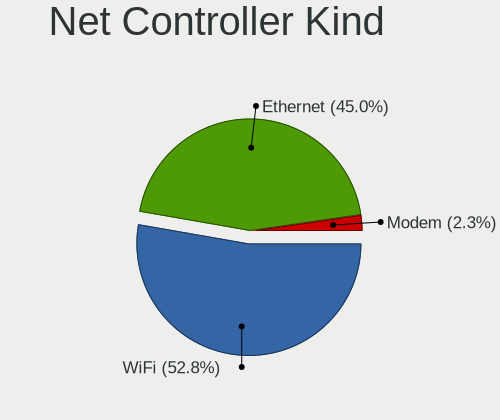

| Kind     | Notebooks | Percent |
|----------|-----------|---------|
| WiFi     | 104       | 52%     |
| Ethernet | 91        | 45.5%   |
| Modem    | 5         | 2.5%    |

Used Controller
---------------

Currently used network controller

| Kind     | Notebooks | Percent |
|----------|-----------|---------|
| WiFi     | 93        | 83.78%  |
| Ethernet | 18        | 16.22%  |

NICs
----

Total network controllers on board

| Total | Notebooks | Percent |
|-------|-----------|---------|
| 2     | 85        | 77.98%  |
| 1     | 21        | 19.27%  |
| 0     | 3         | 2.75%   |

IPv6
----

IPv6 vs IPv4

| Used | Notebooks | Percent |
|------|-----------|---------|
| No   | 101       | 93.52%  |
| Yes  | 7         | 6.48%   |

Bluetooth
---------

Bluetooth Vendor
----------------

Controller vendors

| Vendor                          | Notebooks | Percent |
|---------------------------------|-----------|---------|
| Intel                           | 28        | 35%     |
| Qualcomm Atheros Communications | 13        | 16.25%  |
| Realtek Semiconductor           | 8         | 10%     |
| IMC Networks                    | 7         | 8.75%   |
| Broadcom                        | 5         | 6.25%   |
| Lite-On Technology              | 4         | 5%      |
| Ralink                          | 3         | 3.75%   |
| Hewlett-Packard                 | 3         | 3.75%   |
| Toshiba                         | 2         | 2.5%    |
| Foxconn / Hon Hai               | 2         | 2.5%    |
| Realtek                         | 1         | 1.25%   |
| Dell                            | 1         | 1.25%   |
| Cambridge Silicon Radio         | 1         | 1.25%   |
| Askey Computer                  | 1         | 1.25%   |
| Alps Electric                   | 1         | 1.25%   |

Bluetooth Model
---------------

Controller models

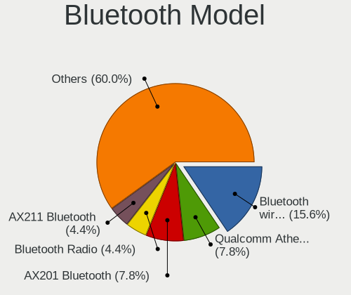

| Model                                               | Notebooks | Percent |
|-----------------------------------------------------|-----------|---------|
| Intel Bluetooth Device                              | 10        | 12.5%   |
| Qualcomm Atheros  Bluetooth Device                  | 7         | 8.75%   |
| Realtek Bluetooth Radio                             | 6         | 7.5%    |
| Intel AX201 Bluetooth                               | 5         | 6.25%   |
| Intel Bluetooth wireless interface                  | 4         | 5%      |
| Intel AX211 Bluetooth                               | 4         | 5%      |
| IMC Networks Bluetooth Radio                        | 4         | 5%      |
| Ralink RT3290 Bluetooth                             | 3         | 3.75%   |
| Qualcomm Atheros AR3011 Bluetooth                   | 3         | 3.75%   |
| Lite-On Qualcomm Atheros QCA9377 Bluetooth          | 3         | 3.75%   |
| Realtek  Bluetooth 4.2 Adapter                      | 2         | 2.5%    |
| Qualcomm Atheros QCA61x4 Bluetooth 4.0              | 2         | 2.5%    |
| Intel AX200 Bluetooth                               | 2         | 2.5%    |
| IMC Networks Bluetooth Device                       | 2         | 2.5%    |
| HP Bluetooth 2.0 Interface [Broadcom BCM2045]       | 2         | 2.5%    |
| Toshiba RT Bluetooth Radio                          | 1         | 1.25%   |
| Toshiba Bluetooth USB Host Controller               | 1         | 1.25%   |
| Realtek Bluetooth Radio                             | 1         | 1.25%   |
| Qualcomm Atheros Bluetooth USB Host Controller      | 1         | 1.25%   |
| Lite-On Atheros AR3012 Bluetooth                    | 1         | 1.25%   |
| Intel Wireless-AC 3168 Bluetooth                    | 1         | 1.25%   |
| Intel Centrino Bluetooth Wireless Transceiver       | 1         | 1.25%   |
| Intel Bluetooth 9460/9560 Jefferson Peak (JfP)      | 1         | 1.25%   |
| IMC Networks Atheros AR3012 Bluetooth 4.0 Adapter   | 1         | 1.25%   |
| HP Broadcom 2070 Bluetooth Combo                    | 1         | 1.25%   |
| Foxconn / Hon Hai MediaTek Bluetooth Adapter        | 1         | 1.25%   |
| Foxconn / Hon Hai Broadcom Bluetooth 2.1 Device     | 1         | 1.25%   |
| Dell DW375 Bluetooth Module                         | 1         | 1.25%   |
| Cambridge Silicon Radio Bluetooth Dongle (HCI mode) | 1         | 1.25%   |
| Broadcom HP Portable Valentine                      | 1         | 1.25%   |
| Broadcom HP Portable SoftSailing                    | 1         | 1.25%   |
| Broadcom HP Portable Bumble Bee                     | 1         | 1.25%   |
| Broadcom BCM20702 Bluetooth 4.0 [ThinkPad]          | 1         | 1.25%   |
| Broadcom BCM2045B (BDC-2.1)                         | 1         | 1.25%   |
| Askey Bluetooth Device                              | 1         | 1.25%   |
| Alps Electric Bluetooth Controller (ALPS/UGPZ6)     | 1         | 1.25%   |

Sound
-----

Sound Vendor
------------

Sound card vendors

| Vendor              | Notebooks | Percent |
|---------------------|-----------|---------|
| Intel               | 88        | 66.67%  |
| AMD                 | 24        | 18.18%  |
| Nvidia              | 15        | 11.36%  |
| Logitech            | 2         | 1.52%   |
| Texas Instruments   | 1         | 0.76%   |
| DSEA A/S            | 1         | 0.76%   |
| C-Media Electronics | 1         | 0.76%   |

Sound Model
-----------

Sound card models

| Model                                                                                             | Notebooks | Percent |
|---------------------------------------------------------------------------------------------------|-----------|---------|
| Intel Sunrise Point-LP HD Audio                                                                   | 17        | 10.83%  |
| Intel 7 Series/C216 Chipset Family High Definition Audio Controller                               | 13        | 8.28%   |
| Intel 6 Series/C200 Series Chipset Family High Definition Audio Controller                        | 12        | 7.64%   |
| AMD Family 17h/19h HD Audio Controller                                                            | 11        | 7.01%   |
| AMD Renoir Radeon High Definition Audio Controller                                                | 6         | 3.82%   |
| Intel Tiger Lake-LP Smart Sound Technology Audio Controller                                       | 5         | 3.18%   |
| Intel Haswell-ULT HD Audio Controller                                                             | 5         | 3.18%   |
| Intel Alder Lake PCH-P High Definition Audio Controller                                           | 5         | 3.18%   |
| Intel 8 Series HD Audio Controller                                                                | 5         | 3.18%   |
| Intel 5 Series/3400 Series Chipset High Definition Audio                                          | 5         | 3.18%   |
| AMD FCH Azalia Controller                                                                         | 5         | 3.18%   |
| Intel Cannon Point-LP High Definition Audio Controller                                            | 4         | 2.55%   |
| Intel 82801H (ICH8 Family) HD Audio Controller                                                    | 4         | 2.55%   |
| AMD Raven/Raven2/Fenghuang HDMI/DP Audio Controller                                               | 4         | 2.55%   |
| Intel Xeon E3-1200 v3/4th Gen Core Processor HD Audio Controller                                  | 3         | 1.91%   |
| Intel Cannon Lake PCH cAVS                                                                        | 3         | 1.91%   |
| Intel 82801I (ICH9 Family) HD Audio Controller                                                    | 3         | 1.91%   |
| Intel 8 Series/C220 Series Chipset High Definition Audio Controller                               | 3         | 1.91%   |
| Nvidia TU116 High Definition Audio Controller                                                     | 2         | 1.27%   |
| Nvidia High Definition Audio Controller                                                           | 2         | 1.27%   |
| Nvidia GF108 High Definition Audio Controller                                                     | 2         | 1.27%   |
| Nvidia GA104 High Definition Audio Controller                                                     | 2         | 1.27%   |
| Intel Celeron N3350/Pentium N4200/Atom E3900 Series Audio Cluster                                 | 2         | 1.27%   |
| Intel Atom/Celeron/Pentium Processor x5-E8000/J3xxx/N3xxx Series High Definition Audio Controller | 2         | 1.27%   |
| AMD Wrestler HDMI Audio                                                                           | 2         | 1.27%   |
| AMD Turks HDMI Audio [Radeon HD 6500/6600 / 6700M Series]                                         | 2         | 1.27%   |
| AMD Kabini HDMI/DP Audio                                                                          | 2         | 1.27%   |
| AMD Caicos HDMI Audio [Radeon HD 6450 / 7450/8450/8490 OEM / R5 230/235/235X OEM]                 | 2         | 1.27%   |
| Texas Instruments PCM2902C Audio CODEC                                                            | 1         | 0.64%   |
| Nvidia TU106 High Definition Audio Controller                                                     | 1         | 0.64%   |
| Nvidia MCP51 High Definition Audio                                                                | 1         | 0.64%   |
| Nvidia GT216 HDMI Audio Controller                                                                | 1         | 0.64%   |
| Nvidia GM206 High Definition Audio Controller                                                     | 1         | 0.64%   |
| Nvidia GM107 High Definition Audio Controller [GeForce 940MX]                                     | 1         | 0.64%   |
| Nvidia GK107 HDMI Audio Controller                                                                | 1         | 0.64%   |
| Nvidia GA106 High Definition Audio Controller                                                     | 1         | 0.64%   |
| Logitech H390 headset with microphone                                                             | 1         | 0.64%   |
| Logitech 960 Headset                                                                              | 1         | 0.64%   |
| Intel Ice Lake-LP Smart Sound Technology Audio Controller                                         | 1         | 0.64%   |
| Intel Comet Lake PCH cAVS                                                                         | 1         | 0.64%   |

Memory
------

Memory Vendor
-------------

Memory module vendors

| Vendor              | Notebooks | Percent |
|---------------------|-----------|---------|
| Samsung Electronics | 17        | 30.36%  |
| SK hynix            | 15        | 26.79%  |
| Micron Technology   | 10        | 17.86%  |
| Kingston            | 8         | 14.29%  |
| Crucial             | 2         | 3.57%   |
| A-DATA Technology   | 2         | 3.57%   |
| Unknown             | 1         | 1.79%   |
| Corsair             | 1         | 1.79%   |

Memory Model
------------

Memory module models

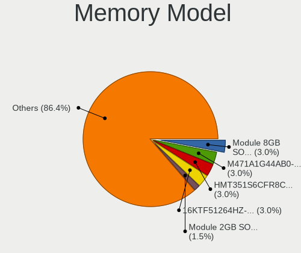

| Model                                                          | Notebooks | Percent |
|----------------------------------------------------------------|-----------|---------|
| SK hynix RAM HMT351S6CFR8C-PB 4GB SODIMM DDR3 1600MT/s         | 2         | 3.23%   |
| Samsung RAM Module 8GB SODIMM DDR4 2133MT/s                    | 2         | 3.23%   |
| Samsung RAM M471A1G44AB0-CWE 8192MB SODIMM DDR4 3200MT/s       | 2         | 3.23%   |
| Micron RAM 16KTF51264HZ-1G6M1 4GB SODIMM DDR3 1600MT/s         | 2         | 3.23%   |
| Unknown RAM Module 2GB SODIMM DDR2 667MT/s                     | 1         | 1.61%   |
| Unknown RAM Module 1GB SODIMM DDR2 667MT/s                     | 1         | 1.61%   |
| SK hynix RAM Module 16GB SODIMM DDR4 2400MT/s                  | 1         | 1.61%   |
| SK hynix RAM Module 16GB SODIMM DDR4 2133MT/s                  | 1         | 1.61%   |
| SK hynix RAM Module 16384MB SODIMM DDR4 2133MT/s               | 1         | 1.61%   |
| SK hynix RAM HMT451S6AFR8A-PB 4096MB SODIMM DDR3 1600MT/s      | 1         | 1.61%   |
| SK hynix RAM HMT41GS6AFR8C-PB 8GB SODIMM DDR3 1600MT/s         | 1         | 1.61%   |
| SK hynix RAM HMT351S6EFR8C-PB 4096MB SODIMM DDR3 1600MT/s      | 1         | 1.61%   |
| SK hynix RAM HMT351S6EFR8A-PB 4GB SODIMM DDR3 1600MT/s         | 1         | 1.61%   |
| SK hynix RAM HMT351S6CFR8C-H9 4096MB SODIMM 1334MT/s           | 1         | 1.61%   |
| SK hynix RAM HMT325S6CFR8C-PB 2GB SODIMM DDR3 1600MT/s         | 1         | 1.61%   |
| SK hynix RAM HMCG66MEBSA092N 8GB SODIMM DDR5 4800MT/s          | 1         | 1.61%   |
| SK hynix RAM HMA851S6CJR6N-VK 4GB Row Of Chips DDR4 2667MT/s   | 1         | 1.61%   |
| SK hynix RAM HMA851S6AFR6N-UH 4GB SODIMM DDR4 2667MT/s         | 1         | 1.61%   |
| SK hynix RAM HMA81GS6JJR8N-VK 8GB SODIMM DDR4 2667MT/s         | 1         | 1.61%   |
| SK hynix RAM HMA81GS6CJR8N-XN 8GB SODIMM DDR4 3200MT/s         | 1         | 1.61%   |
| SK hynix RAM HMA81GS6CJR8N-VK 8GB SODIMM DDR4 2667MT/s         | 1         | 1.61%   |
| SK hynix RAM HMA81GS6AFR8N-UH 8GB SODIMM DDR4 2667MT/s         | 1         | 1.61%   |
| Samsung RAM Module 16GB SODIMM DDR4 2400MT/s                   | 1         | 1.61%   |
| Samsung RAM Module 16384MB SODIMM DDR4 3200MT/s                | 1         | 1.61%   |
| Samsung RAM M471B5273EB0-CK0 4096MB SODIMM DDR3 4199MT/s       | 1         | 1.61%   |
| Samsung RAM M471B5273DH0-CK0 4096MB SODIMM DDR3 1600MT/s       | 1         | 1.61%   |
| Samsung RAM M471B5273CH0-CH9 4GB SODIMM DDR3 1334MT/s          | 1         | 1.61%   |
| Samsung RAM M471B5173BH0-CK0 4GB SODIMM DDR3 1600MT/s          | 1         | 1.61%   |
| Samsung RAM M471B5173BH0-CK0 4096MB DDR3 1600MT/s              | 1         | 1.61%   |
| Samsung RAM M471B1G73DB0-YK0 8GB SODIMM DDR3 1600MT/s          | 1         | 1.61%   |
| Samsung RAM M471A5244CB0-CRC 4GB SODIMM DDR4 2667MT/s          | 1         | 1.61%   |
| Samsung RAM M471A1K43EB1-CWE 8GB SODIMM DDR4 3200MT/s          | 1         | 1.61%   |
| Samsung RAM M471A1K43DB1-CWE 8GB SODIMM DDR4 3200MT/s          | 1         | 1.61%   |
| Samsung RAM M425R4GA3BB0-CQKOL 32GB SODIMM DDR5 4800MT/s       | 1         | 1.61%   |
| Samsung RAM M425R1GB4BB0-CQKOL 8GB SODIMM 4800MT/s             | 1         | 1.61%   |
| Samsung RAM K3LKCKC0BM-MGCP 4GB Row Of Chips LPDDR5 6400MT/s   | 1         | 1.61%   |
| Micron RAM MTC8C1084S1SC48BA1 16GB SODIMM DDR5 4800MT/s        | 1         | 1.61%   |
| Micron RAM MT52L512M32D2PF-09 4GB Row Of Chips LPDDR3 2133MT/s | 1         | 1.61%   |
| Micron RAM Module 8GB SODIMM DDR4 3200MT/s                     | 1         | 1.61%   |
| Micron RAM 8KTF51264HZ-1G6E1 4GB SODIMM DDR3 1600MT/s          | 1         | 1.61%   |

Memory Kind
-----------

Memory module kinds

| Kind   | Notebooks | Percent |
|--------|-----------|---------|
| DDR4   | 22        | 45.83%  |
| DDR3   | 18        | 37.5%   |
| DDR5   | 3         | 6.25%   |
| SDRAM  | 1         | 2.08%   |
| LPDDR5 | 1         | 2.08%   |
| LPDDR4 | 1         | 2.08%   |
| LPDDR3 | 1         | 2.08%   |
| DDR2   | 1         | 2.08%   |

Memory Form Factor
------------------

Physical design of the memory module

| Name         | Notebooks | Percent |
|--------------|-----------|---------|
| SODIMM       | 44        | 91.67%  |
| Row Of Chips | 3         | 6.25%   |
| Unknown      | 1         | 2.08%   |

Memory Size
-----------

Memory module size

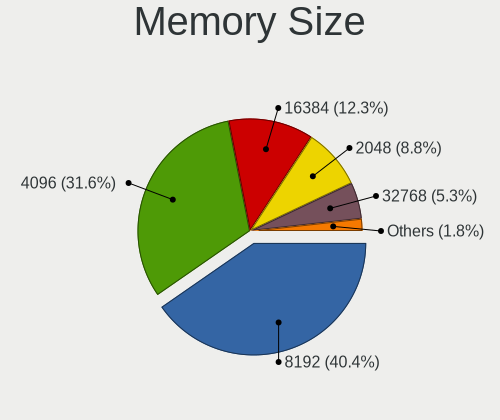

| Size  | Notebooks | Percent |
|-------|-----------|---------|
| 8192  | 21        | 40.38%  |
| 4096  | 17        | 32.69%  |
| 16384 | 7         | 13.46%  |
| 2048  | 4         | 7.69%   |
| 32768 | 2         | 3.85%   |
| 1024  | 1         | 1.92%   |

Memory Speed
------------

Memory module speed

| Speed | Notebooks | Percent |
|-------|-----------|---------|
| 1600  | 15        | 30%     |
| 3200  | 9         | 18%     |
| 2667  | 7         | 14%     |
| 2133  | 5         | 10%     |
| 4800  | 3         | 6%      |
| 2400  | 3         | 6%      |
| 1334  | 3         | 6%      |
| 6400  | 1         | 2%      |
| 4199  | 1         | 2%      |
| 1333  | 1         | 2%      |
| 1067  | 1         | 2%      |
| 667   | 1         | 2%      |

Printers & scanners
-------------------

Printer Vendor
--------------

Printer device vendors

| Vendor                | Notebooks | Percent |
|-----------------------|-----------|---------|
| Lexmark International | 1         | 50%     |
| Hewlett-Packard       | 1         | 50%     |

Printer Model
-------------

Printer device models

| Model                                      | Notebooks | Percent |
|--------------------------------------------|-----------|---------|
| Lexmark International InkJet Color Printer | 1         | 50%     |
| HP LaserJet 1000                           | 1         | 50%     |

Scanner Vendor
--------------

Scanner device vendors

Zero info for selected period =(

Scanner Model
-------------

Scanner device models

Zero info for selected period =(

Camera
------

Camera Vendor
-------------

Camera device vendors

| Vendor                                 | Notebooks | Percent |
|----------------------------------------|-----------|---------|
| Chicony Electronics                    | 23        | 24.21%  |
| Realtek Semiconductor                  | 9         | 9.47%   |
| IMC Networks                           | 9         | 9.47%   |
| Bison Electronics                      | 9         | 9.47%   |
| Sunplus Innovation Technology          | 7         | 7.37%   |
| Quanta                                 | 7         | 7.37%   |
| Microdia                               | 7         | 7.37%   |
| Lite-On Technology                     | 4         | 4.21%   |
| Cheng Uei Precision Industry (Foxlink) | 4         | 4.21%   |
| Syntek                                 | 3         | 3.16%   |
| Suyin                                  | 3         | 3.16%   |
| Ricoh                                  | 3         | 3.16%   |
| Samsung Electronics                    | 1         | 1.05%   |
| Primax Electronics                     | 1         | 1.05%   |
| Luxvisions Innotech Limited            | 1         | 1.05%   |
| Lenovo                                 | 1         | 1.05%   |
| Importek                               | 1         | 1.05%   |
| Apple                                  | 1         | 1.05%   |
| ALi                                    | 1         | 1.05%   |

Camera Model
------------

Camera device models

| Model                                                       | Notebooks | Percent |
|-------------------------------------------------------------|-----------|---------|
| Microdia Integrated_Webcam_HD                               | 7         | 7.37%   |
| Chicony Integrated Camera                                   | 6         | 6.32%   |
| IMC Networks USB2.0 VGA UVC WebCam                          | 5         | 5.26%   |
| Quanta HP HD Camera                                         | 3         | 3.16%   |
| Bison EasyCamera                                            | 3         | 3.16%   |
| Syntek Integrated Camera                                    | 2         | 2.11%   |
| Suyin 1.3M WebCam (notebook emachines E730, Acer sub-brand) | 2         | 2.11%   |
| Sunplus HP Universal Camera                                 | 2         | 2.11%   |
| Realtek HD WebCam                                           | 2         | 2.11%   |
| Lite-On HP HD Webcam                                        | 2         | 2.11%   |
| Chicony TOSHIBA Web Camera - HD                             | 2         | 2.11%   |
| Chicony HP Truevision HD                                    | 2         | 2.11%   |
| Chicony HD WebCam                                           | 2         | 2.11%   |
| Cheng Uei Precision Industry (Foxlink) HP HD Camera         | 2         | 2.11%   |
| Bison Integrated Camera                                     | 2         | 2.11%   |
| Syntek Lenovo EasyCamera                                    | 1         | 1.05%   |
| Suyin HP Truevision HD                                      | 1         | 1.05%   |
| Sunplus TOSHIBA Web Camera - HD                             | 1         | 1.05%   |
| Sunplus Laptop_Integrated_Webcam_HD                         | 1         | 1.05%   |
| Sunplus HP HD Webcam [Fixed]                                | 1         | 1.05%   |
| Sunplus HD WebCam                                           | 1         | 1.05%   |
| Sunplus ASUS Webcam                                         | 1         | 1.05%   |
| Samsung Galaxy series, misc. (MTP mode)                     | 1         | 1.05%   |
| Ricoh Visual Communication Camera VGP-VCC6 [R5U870]         | 1         | 1.05%   |
| Ricoh Pavilion Webcam                                       | 1         | 1.05%   |
| Ricoh Laptop_Integrated_Webcam_3M                           | 1         | 1.05%   |
| Realtek VGA WebCam                                          | 1         | 1.05%   |
| Realtek USB Camera                                          | 1         | 1.05%   |
| Realtek Lenovo EasyCamera                                   | 1         | 1.05%   |
| Realtek Laptop_Integrated_Webcam_HD                         | 1         | 1.05%   |
| Realtek Integrated_Webcam_HD                                | 1         | 1.05%   |
| Realtek Integrated Webcam HD                                | 1         | 1.05%   |
| Realtek FJ Camera                                           | 1         | 1.05%   |
| Quanta USB Webcam                                           | 1         | 1.05%   |
| Quanta HP Wide Vision HD Camera                             | 1         | 1.05%   |
| Quanta HP Webcam                                            | 1         | 1.05%   |
| Quanta HP TrueVision HD Camera                              | 1         | 1.05%   |
| Primax HP HD Webcam [Fixed]                                 | 1         | 1.05%   |
| Luxvisions Innotech Limited HP HD Camera                    | 1         | 1.05%   |
| Lite-On HP Webcam                                           | 1         | 1.05%   |

Security
--------

Fingerprint Vendor
------------------

Fingerprint sensor vendors

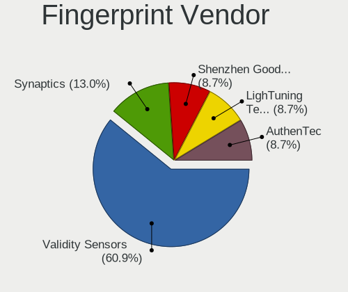

| Vendor                     | Notebooks | Percent |
|----------------------------|-----------|---------|
| Validity Sensors           | 14        | 60.87%  |
| Synaptics                  | 3         | 13.04%  |
| Shenzhen Goodix Technology | 2         | 8.7%    |
| LighTuning Technology      | 2         | 8.7%    |
| AuthenTec                  | 2         | 8.7%    |

Fingerprint Model
-----------------

Fingerprint sensor models

| Model                                                    | Notebooks | Percent |
|----------------------------------------------------------|-----------|---------|
| Validity Sensors VFS495 Fingerprint Reader               | 5         | 21.74%  |
| Validity Sensors VFS471 Fingerprint Reader               | 5         | 21.74%  |
| Validity Sensors Swipe Fingerprint Sensor                | 2         | 8.7%    |
| Synaptics FS7604 Touch Fingerprint Sensor with PurePrint | 2         | 8.7%    |
| Shenzhen Goodix  FingerPrint Device                      | 2         | 8.7%    |
| Validity Sensors VFS 5011 fingerprint sensor             | 1         | 4.35%   |
| Validity Sensors Synaptics WBDI                          | 1         | 4.35%   |
| Synaptics Prometheus MIS Touch Fingerprint Reader        | 1         | 4.35%   |
| LighTuning Fingerprint Reader                            | 1         | 4.35%   |
| LighTuning EgisTec Touch Fingerprint Sensor              | 1         | 4.35%   |
| AuthenTec Fingerprint Sensor                             | 1         | 4.35%   |
| AuthenTec AES2810                                        | 1         | 4.35%   |

Chipcard Vendor
---------------

Chipcard module vendors

| Vendor      | Notebooks | Percent |
|-------------|-----------|---------|
| Broadcom    | 4         | 57.14%  |
| Upek        | 1         | 14.29%  |
| Lenovo      | 1         | 14.29%  |
| Alcor Micro | 1         | 14.29%  |

Chipcard Model
--------------

Chipcard module models

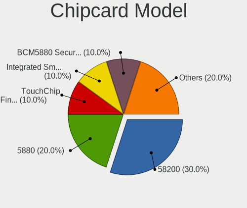

| Model                                                                        | Notebooks | Percent |
|------------------------------------------------------------------------------|-----------|---------|
| Broadcom 5880                                                                | 2         | 28.57%  |
| Upek TouchChip Fingerprint Coprocessor (WBF advanced mode)                   | 1         | 14.29%  |
| Lenovo Integrated Smart Card Reader                                          | 1         | 14.29%  |
| Broadcom BCM5880 Secure Applications Processor with fingerprint swipe sensor | 1         | 14.29%  |
| Broadcom BCM5880 Secure Applications Processor                               | 1         | 14.29%  |
| Alcor Micro AU9540 Smartcard Reader                                          | 1         | 14.29%  |

Unsupported
-----------

Unsupported Devices
-------------------

Total unsupported devices on board

| Total | Notebooks | Percent |
|-------|-----------|---------|
| 0     | 61        | 54.95%  |
| 1     | 45        | 40.54%  |
| 2     | 4         | 3.6%    |
| 3     | 1         | 0.9%    |

Unsupported Device Types
------------------------

Types of unsupported devices

| Type                  | Notebooks | Percent |
|-----------------------|-----------|---------|
| Fingerprint reader    | 23        | 42.59%  |
| Net/wireless          | 7         | 12.96%  |
| Graphics card         | 7         | 12.96%  |
| Chipcard              | 7         | 12.96%  |
| Multimedia controller | 3         | 5.56%   |
| Bluetooth             | 3         | 5.56%   |
| Sound                 | 2         | 3.7%    |
| Modem                 | 1         | 1.85%   |
| Firewire controller   | 1         | 1.85%   |

