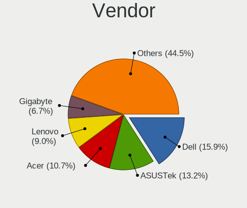
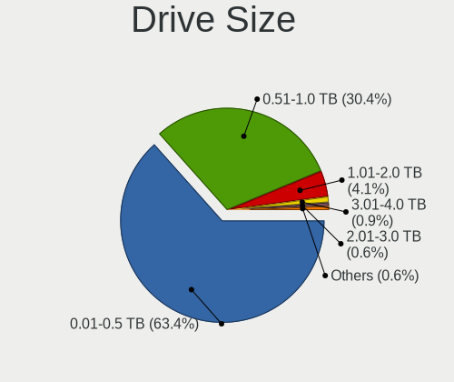
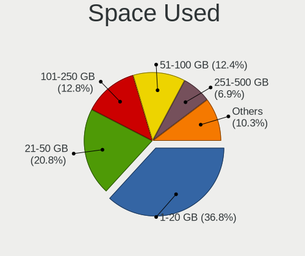
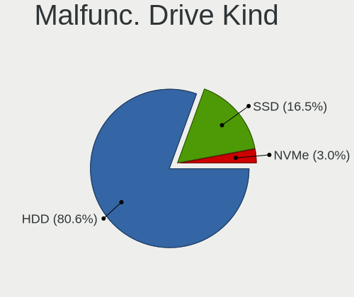
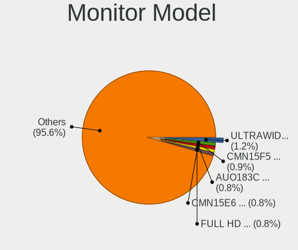
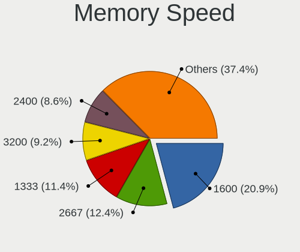

Linux in Brazil - Tested Hardware & Statistics
----------------------------------------------

A project to collect tested hardware configurations for Linux in Brazil.

Anyone can contribute to this report by the [hw-probe](https://github.com/linuxhw/hw-probe) tool:

    sudo -E hw-probe -all -upload

Please contribute! Especially if your hardware is rare.

This is a report for all computer types. See also reports for [desktops](/Location/Brazil/Desktop/README.md) and [notebooks](/Location/Brazil/Notebook/README.md).

Contents
--------

* [ Test Cases ](#test-cases)

* [ System ](#system)
  - [ OS                       ](#os)
  - [ OS Family                ](#os-family)
  - [ Kernel                   ](#kernel)
  - [ Kernel Family            ](#kernel-family)
  - [ Kernel Major Ver.        ](#kernel-major-ver)
  - [ Arch                     ](#arch)
  - [ DE                       ](#de)
  - [ Display Server           ](#display-server)
  - [ Display Manager          ](#display-manager)
  - [ OS Lang                  ](#os-lang)
  - [ Boot Mode                ](#boot-mode)
  - [ Filesystem               ](#filesystem)
  - [ Part. scheme             ](#part-scheme)
  - [ Dual Boot with Linux/BSD ](#dual-boot-with-linuxbsd)
  - [ Dual Boot (Win)          ](#dual-boot-win)

* [ Board ](#board)
  - [ Vendor                   ](#vendor)
  - [ Model                    ](#model)
  - [ Model Family             ](#model-family)
  - [ MFG Year                 ](#mfg-year)
  - [ Form Factor              ](#form-factor)
  - [ Secure Boot              ](#secure-boot)
  - [ Coreboot                 ](#coreboot)
  - [ RAM Size                 ](#ram-size)
  - [ RAM Used                 ](#ram-used)
  - [ Total Drives             ](#total-drives)
  - [ Has CD-ROM               ](#has-cd-rom)
  - [ Has Ethernet             ](#has-ethernet)
  - [ Has WiFi                 ](#has-wifi)
  - [ Has Bluetooth            ](#has-bluetooth)

* [ Location ](#location)
  - [ Country                  ](#country)
  - [ City                     ](#city)

* [ Drives ](#drives)
  - [ Drive Vendor             ](#drive-vendor)
  - [ Drive Model              ](#drive-model)
  - [ HDD Vendor               ](#hdd-vendor)
  - [ SSD Vendor               ](#ssd-vendor)
  - [ Drive Kind               ](#drive-kind)
  - [ Drive Connector          ](#drive-connector)
  - [ Drive Size               ](#drive-size)
  - [ Space Total              ](#space-total)
  - [ Space Used               ](#space-used)
  - [ Malfunc. Drives          ](#malfunc-drives)
  - [ Malfunc. Drive Vendor    ](#malfunc-drive-vendor)
  - [ Malfunc. HDD Vendor      ](#malfunc-hdd-vendor)
  - [ Malfunc. Drive Kind      ](#malfunc-drive-kind)
  - [ Failed Drives            ](#failed-drives)
  - [ Failed Drive Vendor      ](#failed-drive-vendor)
  - [ Drive Status             ](#drive-status)

* [ Storage controller ](#storage-controller)
  - [ Storage Vendor           ](#storage-vendor)
  - [ Storage Model            ](#storage-model)
  - [ Storage Kind             ](#storage-kind)

* [ Processor ](#processor)
  - [ CPU Vendor               ](#cpu-vendor)
  - [ CPU Model                ](#cpu-model)
  - [ CPU Model Family         ](#cpu-model-family)
  - [ CPU Cores                ](#cpu-cores)
  - [ CPU Sockets              ](#cpu-sockets)
  - [ CPU Threads              ](#cpu-threads)
  - [ CPU Op-Modes             ](#cpu-op-modes)
  - [ CPU Microcode            ](#cpu-microcode)
  - [ CPU Microarch            ](#cpu-microarch)

* [ Graphics ](#graphics)
  - [ GPU Vendor               ](#gpu-vendor)
  - [ GPU Model                ](#gpu-model)
  - [ GPU Combo                ](#gpu-combo)
  - [ GPU Driver               ](#gpu-driver)
  - [ GPU Memory               ](#gpu-memory)

* [ Monitor ](#monitor)
  - [ Monitor Vendor           ](#monitor-vendor)
  - [ Monitor Model            ](#monitor-model)
  - [ Monitor Resolution       ](#monitor-resolution)
  - [ Monitor Diagonal         ](#monitor-diagonal)
  - [ Monitor Width            ](#monitor-width)
  - [ Aspect Ratio             ](#aspect-ratio)
  - [ Monitor Area             ](#monitor-area)
  - [ Pixel Density            ](#pixel-density)
  - [ Multiple Monitors        ](#multiple-monitors)

* [ Network ](#network)
  - [ Net Controller Vendor    ](#net-controller-vendor)
  - [ Net Controller Model     ](#net-controller-model)
  - [ Wireless Vendor          ](#wireless-vendor)
  - [ Wireless Model           ](#wireless-model)
  - [ Ethernet Vendor          ](#ethernet-vendor)
  - [ Ethernet Model           ](#ethernet-model)
  - [ Net Controller Kind      ](#net-controller-kind)
  - [ Used Controller          ](#used-controller)
  - [ NICs                     ](#nics)
  - [ IPv6                     ](#ipv6)

* [ Bluetooth ](#bluetooth)
  - [ Bluetooth Vendor         ](#bluetooth-vendor)
  - [ Bluetooth Model          ](#bluetooth-model)

* [ Sound ](#sound)
  - [ Sound Vendor             ](#sound-vendor)
  - [ Sound Model              ](#sound-model)

* [ Memory ](#memory)
  - [ Memory Vendor            ](#memory-vendor)
  - [ Memory Model             ](#memory-model)
  - [ Memory Kind              ](#memory-kind)
  - [ Memory Form Factor       ](#memory-form-factor)
  - [ Memory Size              ](#memory-size)
  - [ Memory Speed             ](#memory-speed)

* [ Printers & scanners ](#printers--scanners)
  - [ Printer Vendor           ](#printer-vendor)
  - [ Printer Model            ](#printer-model)
  - [ Scanner Vendor           ](#scanner-vendor)
  - [ Scanner Model            ](#scanner-model)

* [ Camera ](#camera)
  - [ Camera Vendor            ](#camera-vendor)
  - [ Camera Model             ](#camera-model)

* [ Security ](#security)
  - [ Fingerprint Vendor       ](#fingerprint-vendor)
  - [ Fingerprint Model        ](#fingerprint-model)
  - [ Chipcard Vendor          ](#chipcard-vendor)
  - [ Chipcard Model           ](#chipcard-model)

* [ Unsupported ](#unsupported)
  - [ Unsupported Devices      ](#unsupported-devices)
  - [ Unsupported Device Types ](#unsupported-device-types)

Test Cases
----------

Total: 15911

| Vendor        | Model                       | Form-Factor | Probe                                                      | Date         |
|---------------|-----------------------------|-------------|------------------------------------------------------------|--------------|
| Positivo      | Mobile                      | Notebook    | [640bc1a962](https://linux-hardware.org/?probe=640bc1a962) | Oct 01, 2022 |
| Positivo      | POS-PIH81DL                 | Desktop     | [c17fe23ea7](https://linux-hardware.org/?probe=c17fe23ea7) | Oct 01, 2022 |
| Sony          | VPCCA15FX                   | Notebook    | [5063ea411b](https://linux-hardware.org/?probe=5063ea411b) | Oct 01, 2022 |
| ASUSTek       | A78M-A                      | Desktop     | [5ad2e5f2a6](https://linux-hardware.org/?probe=5ad2e5f2a6) | Oct 01, 2022 |
| Itautec       | Infoway a7420               | Notebook    | [bb52fe66cf](https://linux-hardware.org/?probe=bb52fe66cf) | Oct 01, 2022 |
| Sony          | VPCCA15FX                   | Notebook    | [96eb3d8cf7](https://linux-hardware.org/?probe=96eb3d8cf7) | Oct 01, 2022 |
| Lenovo        | G400s VILG1                 | Notebook    | [e666344187](https://linux-hardware.org/?probe=e666344187) | Oct 01, 2022 |
| Dell          | Inspiron 5420               | Notebook    | [71f7e67ca7](https://linux-hardware.org/?probe=71f7e67ca7) | Oct 01, 2022 |
| Dell          | 0PV3YR A05                  | Server      | [27bb1c39eb](https://linux-hardware.org/?probe=27bb1c39eb) | Oct 01, 2022 |
| Biostar       | B350ET2                     | Desktop     | [d7c5b1ad40](https://linux-hardware.org/?probe=d7c5b1ad40) | Oct 01, 2022 |
| Lenovo        | IdeaPad 330-15IKB 81FE      | Notebook    | [b62ddbdab0](https://linux-hardware.org/?probe=b62ddbdab0) | Oct 01, 2022 |
| Biostar       | A320MH                      | Desktop     | [b07b6c4fc5](https://linux-hardware.org/?probe=b07b6c4fc5) | Oct 01, 2022 |
| Lenovo        | G480 20149                  | Notebook    | [9a047ee214](https://linux-hardware.org/?probe=9a047ee214) | Oct 01, 2022 |
| Lenovo        | G480 20149                  | Notebook    | [4c0a153a12](https://linux-hardware.org/?probe=4c0a153a12) | Oct 01, 2022 |
| Notebook      | NJx0MU                      | Notebook    | [5df0554ade](https://linux-hardware.org/?probe=5df0554ade) | Oct 01, 2022 |
| Gigabyte      | H110M-H DDR3-CF             | Desktop     | [8169fe8dbd](https://linux-hardware.org/?probe=8169fe8dbd) | Oct 01, 2022 |
| Notebook      | NJx0MU                      | Notebook    | [9eba2a1ed4](https://linux-hardware.org/?probe=9eba2a1ed4) | Oct 01, 2022 |
| Dell          | 01XK1W A00                  | Desktop     | [29c4292c62](https://linux-hardware.org/?probe=29c4292c62) | Oct 01, 2022 |
| Raspberry ... | Raspberry Pi 3 Model B P... | Soc         | [3edc4043a3](https://linux-hardware.org/?probe=3edc4043a3) | Oct 01, 2022 |
| Biostar       | B350ET2                     | Desktop     | [2b7bea0eda](https://linux-hardware.org/?probe=2b7bea0eda) | Sep 30, 2022 |
| Intel         | H61                         | Desktop     | [37af3b0cdb](https://linux-hardware.org/?probe=37af3b0cdb) | Sep 30, 2022 |
| Dell          | 07PR60 A01                  | Desktop     | [812cb18129](https://linux-hardware.org/?probe=812cb18129) | Sep 30, 2022 |
| Chuwi         | HeroBook Air                | Notebook    | [1f142c7087](https://linux-hardware.org/?probe=1f142c7087) | Sep 30, 2022 |
| Chuwi         | HeroBook Air                | Notebook    | [263313ef38](https://linux-hardware.org/?probe=263313ef38) | Sep 30, 2022 |
| ASUSTek       | TUF Gaming Z490-PLUS        | Desktop     | [2c08befa41](https://linux-hardware.org/?probe=2c08befa41) | Sep 30, 2022 |
| Positivo      | Mobile                      | Notebook    | [dcf8b09bec](https://linux-hardware.org/?probe=dcf8b09bec) | Sep 30, 2022 |
| Dell          | 0PV3YR A05                  | Server      | [3c0e0b12ee](https://linux-hardware.org/?probe=3c0e0b12ee) | Sep 30, 2022 |
| Positivo      | Mobile                      | Notebook    | [6d2584bcb8](https://linux-hardware.org/?probe=6d2584bcb8) | Sep 30, 2022 |
| Positivo      | POS-PIQ67CG POSITIVO        | Desktop     | [5cdce489b9](https://linux-hardware.org/?probe=5cdce489b9) | Sep 30, 2022 |
| Positivo      | POS-PIQ67CG POSITIVO        | Desktop     | [3bfbb3744e](https://linux-hardware.org/?probe=3bfbb3744e) | Sep 30, 2022 |
| Acer          | Nitro AN515-44              | Notebook    | [149337514c](https://linux-hardware.org/?probe=149337514c) | Sep 30, 2022 |
| ASUSTek       | VivoBook_ASUSLaptop X513... | Notebook    | [fa00f3d0ca](https://linux-hardware.org/?probe=fa00f3d0ca) | Sep 30, 2022 |
| Dell          | Vostro 5402                 | Notebook    | [57995ec944](https://linux-hardware.org/?probe=57995ec944) | Sep 30, 2022 |
| Positivo B... | VJFE42F11X-XXXXXX           | Notebook    | [fdcdf06f55](https://linux-hardware.org/?probe=fdcdf06f55) | Sep 29, 2022 |
| Avell High... | A60 MUV                     | Notebook    | [888e375356](https://linux-hardware.org/?probe=888e375356) | Sep 29, 2022 |
| Dell          | 0PV3YR A05                  | Server      | [64a7e86e22](https://linux-hardware.org/?probe=64a7e86e22) | Sep 29, 2022 |
| HP            | Laptop 15-db0xxx            | Notebook    | [067b155d9b](https://linux-hardware.org/?probe=067b155d9b) | Sep 29, 2022 |
| HP            | Laptop 15-db0xxx            | Notebook    | [058aa145d3](https://linux-hardware.org/?probe=058aa145d3) | Sep 29, 2022 |
| ASRock        | A320M-HD                    | Desktop     | [a674def12d](https://linux-hardware.org/?probe=a674def12d) | Sep 29, 2022 |
| Apple         | Mac-F4208EC8 PVT            | Mini pc     | [62d808a3e5](https://linux-hardware.org/?probe=62d808a3e5) | Sep 28, 2022 |
| Dell          | Inspiron 5447               | Notebook    | [b30346135b](https://linux-hardware.org/?probe=b30346135b) | Sep 28, 2022 |
| Gigabyte      | B450M AORUS ELITE           | Desktop     | [513d236a1f](https://linux-hardware.org/?probe=513d236a1f) | Sep 28, 2022 |
| Dell          | Inspiron 3442               | Notebook    | [8272a6655b](https://linux-hardware.org/?probe=8272a6655b) | Sep 28, 2022 |
| Dell          | Inspiron 3442               | Notebook    | [be9d7b3e42](https://linux-hardware.org/?probe=be9d7b3e42) | Sep 28, 2022 |
| ASUSTek       | P5K Premium                 | Desktop     | [ec3962c685](https://linux-hardware.org/?probe=ec3962c685) | Sep 28, 2022 |
| Dell          | Vostro 15 3515              | Notebook    | [7e4413a053](https://linux-hardware.org/?probe=7e4413a053) | Sep 28, 2022 |
| Lenovo        | IdeaPad 3 15ALC6 82MF       | Notebook    | [bbd715eb5a](https://linux-hardware.org/?probe=bbd715eb5a) | Sep 28, 2022 |
| ASUSTek       | P5GC-MX/CKD/SI              | Desktop     | [72bb90ea71](https://linux-hardware.org/?probe=72bb90ea71) | Sep 28, 2022 |
| Dell          | Vostro 15 5510              | Notebook    | [973307d03b](https://linux-hardware.org/?probe=973307d03b) | Sep 28, 2022 |
| Notebook      | NJx0MU                      | Notebook    | [91c0e46209](https://linux-hardware.org/?probe=91c0e46209) | Sep 28, 2022 |
| Acer          | Aspire E5-573               | Notebook    | [f7e628a5a1](https://linux-hardware.org/?probe=f7e628a5a1) | Sep 28, 2022 |
| Positivo      | S14CT01                     | Notebook    | [66e0c53646](https://linux-hardware.org/?probe=66e0c53646) | Sep 28, 2022 |
| Unknown       | Unknown                     | Notebook    | [3e450900da](https://linux-hardware.org/?probe=3e450900da) | Sep 28, 2022 |
| LG Electro... | C400-G.BC22P1               | Notebook    | [a325f5eb86](https://linux-hardware.org/?probe=a325f5eb86) | Sep 28, 2022 |
| Acer          | Aspire A315-23G             | Notebook    | [3eaaf54d1b](https://linux-hardware.org/?probe=3eaaf54d1b) | Sep 28, 2022 |
| Dell          | Inspiron 5566               | Notebook    | [a4b44081c2](https://linux-hardware.org/?probe=a4b44081c2) | Sep 27, 2022 |
| ASUSTek       | B85M-E/BR                   | Desktop     | [5116d1cae9](https://linux-hardware.org/?probe=5116d1cae9) | Sep 27, 2022 |
| Dell          | Vostro 15 5510              | Notebook    | [730653ea29](https://linux-hardware.org/?probe=730653ea29) | Sep 27, 2022 |
| Lenovo        | G40-80 80JE                 | Notebook    | [a6347449b3](https://linux-hardware.org/?probe=a6347449b3) | Sep 27, 2022 |
| Dell          | 0YGYJY A01                  | Desktop     | [73e69debd9](https://linux-hardware.org/?probe=73e69debd9) | Sep 27, 2022 |
| Philco        | PNB14.1AC14S128W10          | Notebook    | [ee4bc98535](https://linux-hardware.org/?probe=ee4bc98535) | Sep 27, 2022 |
| Lenovo        | ThinkPad T410 2537AT9       | Notebook    | [553490bb4c](https://linux-hardware.org/?probe=553490bb4c) | Sep 27, 2022 |
| Standard      | AHV                         | Notebook    | [a80b2d344d](https://linux-hardware.org/?probe=a80b2d344d) | Sep 27, 2022 |
| ASUSTek       | ROG STRIX Z590-A GAMING ... | Desktop     | [88f0d42935](https://linux-hardware.org/?probe=88f0d42935) | Sep 27, 2022 |
| Intel         | H55                         | Desktop     | [a155052bce](https://linux-hardware.org/?probe=a155052bce) | Sep 26, 2022 |
| Acer          | Nitro AN515-45              | Notebook    | [8579eba471](https://linux-hardware.org/?probe=8579eba471) | Sep 26, 2022 |
| Dell          | Latitude 5420               | Notebook    | [bd81c07917](https://linux-hardware.org/?probe=bd81c07917) | Sep 26, 2022 |
| Lenovo        | IdeaPad S145-15IWL 81S9     | Notebook    | [d9187e470e](https://linux-hardware.org/?probe=d9187e470e) | Sep 26, 2022 |
| Lenovo        | ThinkPad T480 20L6SCWK00    | Notebook    | [60933ed48b](https://linux-hardware.org/?probe=60933ed48b) | Sep 26, 2022 |
| Acer          | Aspire A514-54              | Notebook    | [bab009e0b7](https://linux-hardware.org/?probe=bab009e0b7) | Sep 26, 2022 |
| Positivo      | S14CT01                     | Notebook    | [2191cd2dd1](https://linux-hardware.org/?probe=2191cd2dd1) | Sep 26, 2022 |
| HP            | G42                         | Notebook    | [39a4836398](https://linux-hardware.org/?probe=39a4836398) | Sep 26, 2022 |
| Samsung       | 670Z5E                      | Notebook    | [6bce247e38](https://linux-hardware.org/?probe=6bce247e38) | Sep 26, 2022 |
| Dell          | 01XK1W A00                  | Desktop     | [4e228116be](https://linux-hardware.org/?probe=4e228116be) | Sep 25, 2022 |
| Positivo      | S14SL01                     | Notebook    | [a6b3c260f4](https://linux-hardware.org/?probe=a6b3c260f4) | Sep 25, 2022 |
| ASUSTek       | P7H55-M LX                  | Desktop     | [8d3b235d4c](https://linux-hardware.org/?probe=8d3b235d4c) | Sep 25, 2022 |
| CCE           | Capella & IbexPeak-M Chi... | Notebook    | [07554a7a2b](https://linux-hardware.org/?probe=07554a7a2b) | Sep 25, 2022 |
| Lenovo        | IdeaPad 310-14ISK 80UG      | Notebook    | [d8b270de2b](https://linux-hardware.org/?probe=d8b270de2b) | Sep 25, 2022 |
| Notebook      | NJx0MU                      | Notebook    | [09411a9eb9](https://linux-hardware.org/?probe=09411a9eb9) | Sep 25, 2022 |
| ASRock        | A320M-HD                    | Desktop     | [b26f7bf9f5](https://linux-hardware.org/?probe=b26f7bf9f5) | Sep 25, 2022 |
| Positivo      | S14SL01                     | Notebook    | [e09fcd6e38](https://linux-hardware.org/?probe=e09fcd6e38) | Sep 25, 2022 |
| Dell          | Inspiron 15 7000 Gaming     | Notebook    | [2e96ddfdd1](https://linux-hardware.org/?probe=2e96ddfdd1) | Sep 25, 2022 |
| ASRock        | FM2A88X Extreme4+           | Desktop     | [2d44b203f9](https://linux-hardware.org/?probe=2d44b203f9) | Sep 25, 2022 |
| Dell          | 0PV3YR A05                  | Server      | [107011cb20](https://linux-hardware.org/?probe=107011cb20) | Sep 25, 2022 |
| Samsung       | RV411/RV511/E3511/S3511/... | Notebook    | [939bba43d1](https://linux-hardware.org/?probe=939bba43d1) | Sep 25, 2022 |
| Avell High... | A70 MOB                     | Notebook    | [b867406b76](https://linux-hardware.org/?probe=b867406b76) | Sep 25, 2022 |
| Acer          | AO532h                      | Notebook    | [383ce70d97](https://linux-hardware.org/?probe=383ce70d97) | Sep 25, 2022 |
| Dell          | Inspiron 3442               | Notebook    | [7fb024bb5d](https://linux-hardware.org/?probe=7fb024bb5d) | Sep 25, 2022 |
| Dell          | Inspiron 3442               | Notebook    | [1190ad2886](https://linux-hardware.org/?probe=1190ad2886) | Sep 24, 2022 |
| Samsung       | RV411/RV511/E3511/S3511/... | Notebook    | [118cf21173](https://linux-hardware.org/?probe=118cf21173) | Sep 24, 2022 |
| Dell          | Latitude E5400              | Notebook    | [09be905a45](https://linux-hardware.org/?probe=09be905a45) | Sep 24, 2022 |
| ASUSTek       | M5A78L-M/USB3               | Desktop     | [a2b3fd8ea8](https://linux-hardware.org/?probe=a2b3fd8ea8) | Sep 24, 2022 |
| Notebook      | NJx0MU                      | Notebook    | [25b9bc1637](https://linux-hardware.org/?probe=25b9bc1637) | Sep 24, 2022 |
| Dell          | Latitude 3410               | Notebook    | [ba10ea9fc5](https://linux-hardware.org/?probe=ba10ea9fc5) | Sep 24, 2022 |
| Lenovo        | ThinkPad E480 20KQ000EBR    | Notebook    | [5c39bdf4ab](https://linux-hardware.org/?probe=5c39bdf4ab) | Sep 24, 2022 |
| Samsung       | RV411/RV511/E3511/S3511/... | Notebook    | [2322475867](https://linux-hardware.org/?probe=2322475867) | Sep 24, 2022 |
| ASUSTek       | PRIME B450M-GAMING/BR       | Desktop     | [2a7c09d404](https://linux-hardware.org/?probe=2a7c09d404) | Sep 24, 2022 |
| Intel         | X99 V1.0                    | Desktop     | [7565f85860](https://linux-hardware.org/?probe=7565f85860) | Sep 24, 2022 |
| Dell          | Latitude 5420               | Notebook    | [170a3248f6](https://linux-hardware.org/?probe=170a3248f6) | Sep 24, 2022 |
| Dell          | 0PV3YR A05                  | Server      | [4658ef6703](https://linux-hardware.org/?probe=4658ef6703) | Sep 24, 2022 |
| Notebook      | NJx0MU                      | Notebook    | [0cfbd1e652](https://linux-hardware.org/?probe=0cfbd1e652) | Sep 24, 2022 |
| Unknown       | WZBTDT1 R110                | Desktop     | [8b6b5af31a](https://linux-hardware.org/?probe=8b6b5af31a) | Sep 24, 2022 |
| Gigabyte      | 970A-DS3P                   | Desktop     | [1e9a7dd793](https://linux-hardware.org/?probe=1e9a7dd793) | Sep 24, 2022 |
| ASUSTek       | M2N68                       | Desktop     | [4b23dadbca](https://linux-hardware.org/?probe=4b23dadbca) | Sep 23, 2022 |
| Samsung       | 550XBE/350XBE               | Notebook    | [dec88709ee](https://linux-hardware.org/?probe=dec88709ee) | Sep 23, 2022 |
| Samsung       | 550XBE/350XBE               | Notebook    | [e17fb419bd](https://linux-hardware.org/?probe=e17fb419bd) | Sep 23, 2022 |
| Foxconn       | Q77M                        | Desktop     | [63d0fe0c57](https://linux-hardware.org/?probe=63d0fe0c57) | Sep 23, 2022 |
| Dell          | Inspiron 5566               | Notebook    | [4ed9eae431](https://linux-hardware.org/?probe=4ed9eae431) | Sep 23, 2022 |
| Biostar       | TA75MH2                     | Desktop     | [e76fb13311](https://linux-hardware.org/?probe=e76fb13311) | Sep 23, 2022 |
| ASRock        | G31M-S                      | Desktop     | [76d9b33c76](https://linux-hardware.org/?probe=76d9b33c76) | Sep 23, 2022 |
| Dell          | 0M5DCD A00                  | Desktop     | [991137f04f](https://linux-hardware.org/?probe=991137f04f) | Sep 23, 2022 |
| Acer          | Nitro AN515-44              | Notebook    | [b02d161acb](https://linux-hardware.org/?probe=b02d161acb) | Sep 23, 2022 |
| ASUSTek       | M2N68-AM SE2                | Desktop     | [412f70b76b](https://linux-hardware.org/?probe=412f70b76b) | Sep 23, 2022 |
| Dell          | 0PV3YR A05                  | Server      | [c05619dc16](https://linux-hardware.org/?probe=c05619dc16) | Sep 23, 2022 |
| Dell          | Vostro 15 5510              | Notebook    | [5488a2b9ff](https://linux-hardware.org/?probe=5488a2b9ff) | Sep 22, 2022 |
| Gigabyte      | H110M-S2H DDR3-CF           | Desktop     | [fef79bcff4](https://linux-hardware.org/?probe=fef79bcff4) | Sep 22, 2022 |
| Foxconn       | H61M-S/H61M                 | Desktop     | [039b5cff54](https://linux-hardware.org/?probe=039b5cff54) | Sep 22, 2022 |
| Dell          | Vostro 15 5510              | Notebook    | [630b3877c4](https://linux-hardware.org/?probe=630b3877c4) | Sep 22, 2022 |
| Gigabyte      | 945GM-S2                    | Desktop     | [9fcea940e6](https://linux-hardware.org/?probe=9fcea940e6) | Sep 22, 2022 |
| Samsung       | 340XAA/350XAA/550XAA        | Notebook    | [d852d9e0dd](https://linux-hardware.org/?probe=d852d9e0dd) | Sep 22, 2022 |
| Dell          | 0PV3YR A05                  | Server      | [fb451b6d7d](https://linux-hardware.org/?probe=fb451b6d7d) | Sep 22, 2022 |
| Avell High... | B.ON                        | Notebook    | [95c7e35ef3](https://linux-hardware.org/?probe=95c7e35ef3) | Sep 22, 2022 |
| Lenovo        | IdeaPad 3 15ALC6 82MF       | Notebook    | [3c93753c6c](https://linux-hardware.org/?probe=3c93753c6c) | Sep 22, 2022 |
| Sony          | SVE15125CBW                 | Notebook    | [50b65906b1](https://linux-hardware.org/?probe=50b65906b1) | Sep 22, 2022 |
| OEM           | B75 Ver:1.41                | Desktop     | [e22d2bac17](https://linux-hardware.org/?probe=e22d2bac17) | Sep 22, 2022 |
| Dell          | Inspiron 5566               | Notebook    | [183f486a54](https://linux-hardware.org/?probe=183f486a54) | Sep 21, 2022 |
| Intel         | DN2800MT AAG23738-801       | Desktop     | [0019b51cff](https://linux-hardware.org/?probe=0019b51cff) | Sep 21, 2022 |
| Avell High... | B.ON                        | Notebook    | [aaebcf57bb](https://linux-hardware.org/?probe=aaebcf57bb) | Sep 21, 2022 |
| Lenovo        | IdeaPad 320-15IKB 80YH      | Notebook    | [74d69dbd69](https://linux-hardware.org/?probe=74d69dbd69) | Sep 21, 2022 |
| Dell          | 0PV3YR A05                  | Server      | [5c6ebb2cfe](https://linux-hardware.org/?probe=5c6ebb2cfe) | Sep 21, 2022 |
| Acer          | Aspire A515-54              | Notebook    | [8116705a81](https://linux-hardware.org/?probe=8116705a81) | Sep 21, 2022 |
| Digiboard     | NM70-TI                     | Desktop     | [84e21c8253](https://linux-hardware.org/?probe=84e21c8253) | Sep 21, 2022 |
| ASUSTek       | X451CA                      | Notebook    | [bdfe92eb66](https://linux-hardware.org/?probe=bdfe92eb66) | Sep 21, 2022 |
| LG Electro... | C400-G.BC22P1               | Notebook    | [b5aad7f903](https://linux-hardware.org/?probe=b5aad7f903) | Sep 20, 2022 |
| ASUSTek       | K46CB                       | Notebook    | [88cbbeaee6](https://linux-hardware.org/?probe=88cbbeaee6) | Sep 20, 2022 |
| Digiboard     | NM70-TI                     | Desktop     | [ace83d527c](https://linux-hardware.org/?probe=ace83d527c) | Sep 20, 2022 |
| MSI           | Z390-A PRO                  | Desktop     | [9b0dd73d61](https://linux-hardware.org/?probe=9b0dd73d61) | Sep 20, 2022 |
| Dell          | 0KY237 A01                  | Desktop     | [e1258b712e](https://linux-hardware.org/?probe=e1258b712e) | Sep 20, 2022 |
| Dell          | 0KY237 A01                  | Desktop     | [6f2ce8e794](https://linux-hardware.org/?probe=6f2ce8e794) | Sep 20, 2022 |
| ASUSTek       | TUF Gaming X570-PLUS        | Desktop     | [9d0697ec96](https://linux-hardware.org/?probe=9d0697ec96) | Sep 20, 2022 |
| ASUSTek       | PRIME A320M-K/BR            | Desktop     | [38234e238c](https://linux-hardware.org/?probe=38234e238c) | Sep 20, 2022 |
| Dell          | 0PV3YR A05                  | Server      | [14351cab57](https://linux-hardware.org/?probe=14351cab57) | Sep 20, 2022 |
| Notebook      | NJx0MU                      | Notebook    | [c89ed0e55a](https://linux-hardware.org/?probe=c89ed0e55a) | Sep 20, 2022 |
| Gigabyte      | B450M DS3H-CF               | Desktop     | [54d0318e27](https://linux-hardware.org/?probe=54d0318e27) | Sep 20, 2022 |
| Notebook      | NJx0MU                      | Notebook    | [0a1fb0cc40](https://linux-hardware.org/?probe=0a1fb0cc40) | Sep 20, 2022 |
| Supermicro    | SKAGIT09                    | Desktop     | [b7dcf8a06c](https://linux-hardware.org/?probe=b7dcf8a06c) | Sep 20, 2022 |
| Dell          | 0D883F A06                  | Desktop     | [55f97310c8](https://linux-hardware.org/?probe=55f97310c8) | Sep 20, 2022 |
| LG Electro... | C400-G.BC31P1               | Notebook    | [66c8977810](https://linux-hardware.org/?probe=66c8977810) | Sep 19, 2022 |
| Intel         | X99 V1.0                    | Desktop     | [02bfe94d24](https://linux-hardware.org/?probe=02bfe94d24) | Sep 19, 2022 |
| Samsung       | 300E5K/300E5Q               | Notebook    | [aaedf90f31](https://linux-hardware.org/?probe=aaedf90f31) | Sep 19, 2022 |
| Apple         | MacBookPro9,2               | Notebook    | [a681a7cab8](https://linux-hardware.org/?probe=a681a7cab8) | Sep 19, 2022 |
| Intel         | X99 V1.0                    | Desktop     | [94dad1a250](https://linux-hardware.org/?probe=94dad1a250) | Sep 19, 2022 |
| Lenovo        | G50-80 80R0                 | Notebook    | [f04ed15344](https://linux-hardware.org/?probe=f04ed15344) | Sep 19, 2022 |
| Gigabyte      | A520M DS3H                  | Desktop     | [bf7318e65e](https://linux-hardware.org/?probe=bf7318e65e) | Sep 19, 2022 |
| Gigabyte      | B450 AORUS M                | Desktop     | [136eca7e32](https://linux-hardware.org/?probe=136eca7e32) | Sep 19, 2022 |
| ASUSTek       | M5A78L-M PLUS/USB3          | Desktop     | [908ad5ef27](https://linux-hardware.org/?probe=908ad5ef27) | Sep 19, 2022 |
| Lenovo        | Legion 5 15ACH6 82QJ        | Notebook    | [e2c5e4775c](https://linux-hardware.org/?probe=e2c5e4775c) | Sep 19, 2022 |
| Dell          | 0PV3YR A05                  | Server      | [37fc6237e2](https://linux-hardware.org/?probe=37fc6237e2) | Sep 19, 2022 |
| Notebook      | NJx0MU                      | Notebook    | [47d871031b](https://linux-hardware.org/?probe=47d871031b) | Sep 19, 2022 |
| ASUSTek       | M5A78L-M PLUS/USB3          | Desktop     | [25f87932c7](https://linux-hardware.org/?probe=25f87932c7) | Sep 19, 2022 |
| Lenovo        | IdeaPad S145-15IWL 81S9     | Notebook    | [40629d6fbc](https://linux-hardware.org/?probe=40629d6fbc) | Sep 19, 2022 |
| Acer          | Aspire E1-571               | Notebook    | [b98206a5fb](https://linux-hardware.org/?probe=b98206a5fb) | Sep 19, 2022 |
| Acer          | Aspire A515-45              | Notebook    | [41b1b790fd](https://linux-hardware.org/?probe=41b1b790fd) | Sep 19, 2022 |
| Positivo      | C14CR21                     | Notebook    | [e72ef2677b](https://linux-hardware.org/?probe=e72ef2677b) | Sep 19, 2022 |
| ASUSTek       | TUF Gaming B550M-PLUS       | Desktop     | [8468466b2a](https://linux-hardware.org/?probe=8468466b2a) | Sep 19, 2022 |
| Dell          | Inspiron 5566               | Notebook    | [58d84150d6](https://linux-hardware.org/?probe=58d84150d6) | Sep 18, 2022 |
| Samsung       | 370E4K                      | Notebook    | [1a297b75f9](https://linux-hardware.org/?probe=1a297b75f9) | Sep 18, 2022 |
| MSI           | A68HM-E33                   | Desktop     | [2905913e7e](https://linux-hardware.org/?probe=2905913e7e) | Sep 18, 2022 |
| Dell          | 0KY237 A01                  | Desktop     | [c639777548](https://linux-hardware.org/?probe=c639777548) | Sep 18, 2022 |
| Dell          | 0KY237 A01                  | Desktop     | [8b2d50f5d1](https://linux-hardware.org/?probe=8b2d50f5d1) | Sep 18, 2022 |
| Lenovo        | IdeaPad 3 15ALC6 82MF       | Notebook    | [cd1441d5a4](https://linux-hardware.org/?probe=cd1441d5a4) | Sep 18, 2022 |
| PCWare        | IPMH110G                    | Desktop     | [6ba309be15](https://linux-hardware.org/?probe=6ba309be15) | Sep 18, 2022 |
| Acer          | Aspire A315-23G             | Notebook    | [9e3edc5b61](https://linux-hardware.org/?probe=9e3edc5b61) | Sep 18, 2022 |
| ASUSTek       | M4A785-M                    | Desktop     | [411449bc6d](https://linux-hardware.org/?probe=411449bc6d) | Sep 18, 2022 |
| Intel         | H61                         | Desktop     | [923e50e023](https://linux-hardware.org/?probe=923e50e023) | Sep 18, 2022 |
| Notebook      | NJx0MU                      | Notebook    | [f27d1aacb6](https://linux-hardware.org/?probe=f27d1aacb6) | Sep 18, 2022 |
| Gateway       | NV55C                       | Notebook    | [e00587af22](https://linux-hardware.org/?probe=e00587af22) | Sep 18, 2022 |
| Dell          | Vostro 3500                 | Notebook    | [08bd4157a3](https://linux-hardware.org/?probe=08bd4157a3) | Sep 18, 2022 |
| Dell          | 0PV3YR A05                  | Server      | [7b918ebeb8](https://linux-hardware.org/?probe=7b918ebeb8) | Sep 18, 2022 |
| Samsung       | 670Z5E                      | Notebook    | [50758a53dd](https://linux-hardware.org/?probe=50758a53dd) | Sep 18, 2022 |
| MSI           | J1800I                      | Desktop     | [ff28c29a3e](https://linux-hardware.org/?probe=ff28c29a3e) | Sep 18, 2022 |
| Notebook      | NJx0MU                      | Notebook    | [2f9a798b3b](https://linux-hardware.org/?probe=2f9a798b3b) | Sep 18, 2022 |
| Lenovo        | ThinkPad T430 23501M2       | Notebook    | [b9503c9c28](https://linux-hardware.org/?probe=b9503c9c28) | Sep 18, 2022 |
| MSI           | B360M MORTAR                | Desktop     | [cdcff8c15d](https://linux-hardware.org/?probe=cdcff8c15d) | Sep 18, 2022 |
| ASUSTek       | M5A78L-M/USB3               | Desktop     | [753fc77941](https://linux-hardware.org/?probe=753fc77941) | Sep 18, 2022 |
| HP            | ProBook 6470b               | Notebook    | [3821322b95](https://linux-hardware.org/?probe=3821322b95) | Sep 18, 2022 |
| Dell          | Inspiron 15 7000 Gaming     | Notebook    | [edc0c871cb](https://linux-hardware.org/?probe=edc0c871cb) | Sep 17, 2022 |
| Acer          | Aspire A315-23G             | Notebook    | [3de0a6e725](https://linux-hardware.org/?probe=3de0a6e725) | Sep 17, 2022 |
| Samsung       | 275E4E/275E5E               | Notebook    | [89706d3dac](https://linux-hardware.org/?probe=89706d3dac) | Sep 17, 2022 |
| ASUSTek       | M5A78L-M PLUS/USB3          | Desktop     | [0e007748d1](https://linux-hardware.org/?probe=0e007748d1) | Sep 17, 2022 |
| Intel         | X79M-S                      | Desktop     | [91e75d3183](https://linux-hardware.org/?probe=91e75d3183) | Sep 17, 2022 |
| Intel         | X79M-S                      | Desktop     | [48c5f5ed77](https://linux-hardware.org/?probe=48c5f5ed77) | Sep 17, 2022 |
| ASUSTek       | ROG Zephyrus G15 GA503QR... | Notebook    | [44a3455d48](https://linux-hardware.org/?probe=44a3455d48) | Sep 17, 2022 |
| Intel         | X99 V1.0                    | Desktop     | [735c794db9](https://linux-hardware.org/?probe=735c794db9) | Sep 17, 2022 |
| Dell          | Vostro 15 3510              | Notebook    | [d70dc7ab47](https://linux-hardware.org/?probe=d70dc7ab47) | Sep 16, 2022 |
| Dell          | Vostro 15 3510              | Notebook    | [0bcb975501](https://linux-hardware.org/?probe=0bcb975501) | Sep 16, 2022 |
| Intel         | H61                         | Desktop     | [d1b17183d7](https://linux-hardware.org/?probe=d1b17183d7) | Sep 16, 2022 |
| Lenovo        | G480 20149                  | Notebook    | [8fed7863dd](https://linux-hardware.org/?probe=8fed7863dd) | Sep 16, 2022 |
| Dell          | Inspiron 5547               | Notebook    | [d66cbae64b](https://linux-hardware.org/?probe=d66cbae64b) | Sep 16, 2022 |
| Acer          | Aspire A515-51              | Notebook    | [59811273b4](https://linux-hardware.org/?probe=59811273b4) | Sep 16, 2022 |
| ASUSTek       | M5A97 LE R2.0               | Desktop     | [52fe410fe3](https://linux-hardware.org/?probe=52fe410fe3) | Sep 16, 2022 |
| Daten Tecn... | DT02-M4                     | Notebook    | [0096dc6b88](https://linux-hardware.org/?probe=0096dc6b88) | Sep 16, 2022 |
| Daten Tecn... | DT02-M4                     | Notebook    | [09e9990a2f](https://linux-hardware.org/?probe=09e9990a2f) | Sep 16, 2022 |
| Unknown       | Unknown                     | Notebook    | [d391ace7f8](https://linux-hardware.org/?probe=d391ace7f8) | Sep 16, 2022 |
| Dell          | G7 7588                     | Notebook    | [583c4a4c91](https://linux-hardware.org/?probe=583c4a4c91) | Sep 16, 2022 |
| Acer          | Aspire A315-23G             | Notebook    | [283a38bb80](https://linux-hardware.org/?probe=283a38bb80) | Sep 16, 2022 |
| HP            | Compaq Presario CQ50        | Notebook    | [41dcd9ffc4](https://linux-hardware.org/?probe=41dcd9ffc4) | Sep 16, 2022 |
| HP            | ProBook 4530s               | Notebook    | [821a6eda47](https://linux-hardware.org/?probe=821a6eda47) | Sep 16, 2022 |
| Unknown       | Unknown                     | Desktop     | [c292f41bc5](https://linux-hardware.org/?probe=c292f41bc5) | Sep 15, 2022 |
| Dell          | Inspiron 11-3168            | Notebook    | [29241bb609](https://linux-hardware.org/?probe=29241bb609) | Sep 15, 2022 |
| MACHINIST     | X99-RS9 V3.0                | Desktop     | [3f9fc3fc62](https://linux-hardware.org/?probe=3f9fc3fc62) | Sep 15, 2022 |
| Samsung       | 340XAA/350XAA/550XAA        | Notebook    | [13cd2039a1](https://linux-hardware.org/?probe=13cd2039a1) | Sep 15, 2022 |
| Acer          | Aspire E5-571G              | Notebook    | [0a02b8ef94](https://linux-hardware.org/?probe=0a02b8ef94) | Sep 15, 2022 |
| ASUSTek       | Maximus VII HERO            | Desktop     | [6d40add21a](https://linux-hardware.org/?probe=6d40add21a) | Sep 15, 2022 |
| ASUSTek       | TUF Gaming B550M-PLUS       | Desktop     | [6de8f25119](https://linux-hardware.org/?probe=6de8f25119) | Sep 15, 2022 |
| Positivo      | Mobile                      | Notebook    | [f0f7335929](https://linux-hardware.org/?probe=f0f7335929) | Sep 15, 2022 |
| Positivo      | Mobile                      | Notebook    | [ef02cc05aa](https://linux-hardware.org/?probe=ef02cc05aa) | Sep 15, 2022 |
| Notebook      | NJx0MU                      | Notebook    | [43264d7e6e](https://linux-hardware.org/?probe=43264d7e6e) | Sep 15, 2022 |
| Raspberry ... | Raspberry Pi 4 Model B R... | Soc         | [24ba1c9bc3](https://linux-hardware.org/?probe=24ba1c9bc3) | Sep 15, 2022 |
| Dell          | Latitude 3420               | Notebook    | [5c00a1875c](https://linux-hardware.org/?probe=5c00a1875c) | Sep 14, 2022 |
| ASUSTek       | TUF Gaming X570-PLUS_BR     | Desktop     | [9c97b9e2c1](https://linux-hardware.org/?probe=9c97b9e2c1) | Sep 14, 2022 |
| Dell          | Inspiron 11-3168            | Notebook    | [763b0fced4](https://linux-hardware.org/?probe=763b0fced4) | Sep 14, 2022 |
| ASUSTek       | M5A78L-M PLUS/USB3          | Desktop     | [64d4d4b3bc](https://linux-hardware.org/?probe=64d4d4b3bc) | Sep 14, 2022 |
| ASUSTek       | TUF Gaming B550M-PLUS       | Desktop     | [3557099732](https://linux-hardware.org/?probe=3557099732) | Sep 14, 2022 |
| Gigabyte      | F2A88X-D3H                  | Desktop     | [06d4572f5e](https://linux-hardware.org/?probe=06d4572f5e) | Sep 14, 2022 |
| Dell          | 0TW904 A01                  | Desktop     | [141188a631](https://linux-hardware.org/?probe=141188a631) | Sep 14, 2022 |
| Dell          | 0PV3YR A05                  | Server      | [8ec7217b7d](https://linux-hardware.org/?probe=8ec7217b7d) | Sep 14, 2022 |
| ASUSTek       | H81M-A/BR                   | Desktop     | [daab24c8b6](https://linux-hardware.org/?probe=daab24c8b6) | Sep 14, 2022 |
| ASUSTek       | PRIME B350M-A               | Desktop     | [47b0975057](https://linux-hardware.org/?probe=47b0975057) | Sep 13, 2022 |
| HP            | 1000                        | Notebook    | [65024f3d7a](https://linux-hardware.org/?probe=65024f3d7a) | Sep 13, 2022 |
| Gigabyte      | Z690 UD AX DDR4             | Desktop     | [70aa78efc6](https://linux-hardware.org/?probe=70aa78efc6) | Sep 13, 2022 |
| Positivo      | POS-PQ45AU                  | Desktop     | [0879f8d9ce](https://linux-hardware.org/?probe=0879f8d9ce) | Sep 13, 2022 |
| Dell          | Vostro 15 5510              | Notebook    | [e63dd14c21](https://linux-hardware.org/?probe=e63dd14c21) | Sep 13, 2022 |
| Dell          | Vostro 15 5510              | Notebook    | [16942cfd78](https://linux-hardware.org/?probe=16942cfd78) | Sep 13, 2022 |
| Lenovo        | B40-70 80F30005BR           | Notebook    | [b899f1b7da](https://linux-hardware.org/?probe=b899f1b7da) | Sep 13, 2022 |
| Lenovo        | B40-70 80F30005BR           | Notebook    | [99be4451df](https://linux-hardware.org/?probe=99be4451df) | Sep 13, 2022 |
| MACHINIST     | X99-RS9 V3.0                | Desktop     | [64795f6f69](https://linux-hardware.org/?probe=64795f6f69) | Sep 13, 2022 |
| ASUSTek       | VivoBook_ASUSLaptop X515... | Notebook    | [16cf967fc8](https://linux-hardware.org/?probe=16cf967fc8) | Sep 13, 2022 |
| Dell          | 04YP6J A00                  | Desktop     | [ef4ae2baac](https://linux-hardware.org/?probe=ef4ae2baac) | Sep 13, 2022 |
| Dell          | 0PV3YR A05                  | Server      | [47ff6a8255](https://linux-hardware.org/?probe=47ff6a8255) | Sep 13, 2022 |
| Positivo      | POS-EINM10CB POSITIVO       | Desktop     | [7c876e560b](https://linux-hardware.org/?probe=7c876e560b) | Sep 13, 2022 |
| Acer          | Aspire 5050                 | Notebook    | [1961d1c468](https://linux-hardware.org/?probe=1961d1c468) | Sep 13, 2022 |
| Notebook      | NJx0MU                      | Notebook    | [a72ef6cb0b](https://linux-hardware.org/?probe=a72ef6cb0b) | Sep 13, 2022 |
| ASRock        | FM2A55M-HD+ R2.0            | Desktop     | [1faad914c6](https://linux-hardware.org/?probe=1faad914c6) | Sep 13, 2022 |
| ASUSTek       | M5A78L-M PLUS/USB3          | Desktop     | [ac722c6dcc](https://linux-hardware.org/?probe=ac722c6dcc) | Sep 13, 2022 |
| Unknown       | X99H                        | Desktop     | [9fb8886110](https://linux-hardware.org/?probe=9fb8886110) | Sep 13, 2022 |
| Compal        | NCL60/61                    | Notebook    | [f1f5499af8](https://linux-hardware.org/?probe=f1f5499af8) | Sep 12, 2022 |
| Dell          | Inspiron 5458               | Notebook    | [bd26475724](https://linux-hardware.org/?probe=bd26475724) | Sep 12, 2022 |
| Dell          | Inspiron 15 7000 Gaming     | Notebook    | [ca9a099cf6](https://linux-hardware.org/?probe=ca9a099cf6) | Sep 12, 2022 |
| Samsung       | RV415/RV515                 | Notebook    | [bc83707f72](https://linux-hardware.org/?probe=bc83707f72) | Sep 12, 2022 |
| HP            | EliteBook 2530p             | Notebook    | [4bae06f3d0](https://linux-hardware.org/?probe=4bae06f3d0) | Sep 12, 2022 |
| PCWare        | IPMH61R3                    | Desktop     | [2312ab0f92](https://linux-hardware.org/?probe=2312ab0f92) | Sep 12, 2022 |
| Intel         | H61                         | Desktop     | [d805e24841](https://linux-hardware.org/?probe=d805e24841) | Sep 12, 2022 |
| Dell          | Inspiron 5548               | Notebook    | [341b48f953](https://linux-hardware.org/?probe=341b48f953) | Sep 12, 2022 |
| Avell High... | B.ON                        | Notebook    | [f30bca74ab](https://linux-hardware.org/?probe=f30bca74ab) | Sep 12, 2022 |
| ASRock        | B450M-HDV R4.0              | Desktop     | [73684f0e47](https://linux-hardware.org/?probe=73684f0e47) | Sep 12, 2022 |
| Chuwi         | UBook                       | Tablet      | [89a54f0af1](https://linux-hardware.org/?probe=89a54f0af1) | Sep 12, 2022 |
| Dell          | 01XK1W A00                  | Desktop     | [09d0fcce0e](https://linux-hardware.org/?probe=09d0fcce0e) | Sep 12, 2022 |
| ASUSTek       | TUF Gaming B450M-PRO S      | Desktop     | [94c783f944](https://linux-hardware.org/?probe=94c783f944) | Sep 11, 2022 |
| Intel         | X79G V2.x                   | Desktop     | [3cb7aa6549](https://linux-hardware.org/?probe=3cb7aa6549) | Sep 11, 2022 |
| ASRock        | A320M-HDV R4.0              | Desktop     | [afbb849b02](https://linux-hardware.org/?probe=afbb849b02) | Sep 11, 2022 |
| ASRock        | A320M-HDV R4.0              | Desktop     | [5e98f641f1](https://linux-hardware.org/?probe=5e98f641f1) | Sep 11, 2022 |
| ASUSTek       | M5A78L-M PLUS/USB3          | Desktop     | [aa4d90c7e7](https://linux-hardware.org/?probe=aa4d90c7e7) | Sep 11, 2022 |
| Acer          | Aspire ES1-411              | Notebook    | [064b2bd5f2](https://linux-hardware.org/?probe=064b2bd5f2) | Sep 11, 2022 |
| Dell          | 0PV3YR A05                  | Server      | [7aad54fefa](https://linux-hardware.org/?probe=7aad54fefa) | Sep 11, 2022 |
| Acer          | Aspire A315-42G             | Notebook    | [34964d8e2d](https://linux-hardware.org/?probe=34964d8e2d) | Sep 11, 2022 |
| Dell          | Inspiron 15 7000 Gaming     | Notebook    | [4c6d525103](https://linux-hardware.org/?probe=4c6d525103) | Sep 11, 2022 |
| ASUSTek       | K46CA                       | Notebook    | [9e730cbd6a](https://linux-hardware.org/?probe=9e730cbd6a) | Sep 11, 2022 |
| Toshiba       | IS 1413G                    | Notebook    | [fab48b6c15](https://linux-hardware.org/?probe=fab48b6c15) | Sep 10, 2022 |
| Acer          | Aspire ES1-411              | Notebook    | [6bbebcbcb1](https://linux-hardware.org/?probe=6bbebcbcb1) | Sep 10, 2022 |
| Dell          | 01XK1W A00                  | Desktop     | [41b9796681](https://linux-hardware.org/?probe=41b9796681) | Sep 10, 2022 |
| ASUSTek       | K53E                        | Notebook    | [d39f35f5d9](https://linux-hardware.org/?probe=d39f35f5d9) | Sep 10, 2022 |
| MSI           | A320M GAMING PRO            | Desktop     | [6ce0fb28ee](https://linux-hardware.org/?probe=6ce0fb28ee) | Sep 10, 2022 |
| Dell          | Inspiron 15 7000 Gaming     | Notebook    | [c027a7cf99](https://linux-hardware.org/?probe=c027a7cf99) | Sep 10, 2022 |
| MSI           | A320M GAMING PRO            | Desktop     | [5cce5f5ade](https://linux-hardware.org/?probe=5cce5f5ade) | Sep 10, 2022 |
| PCWare        | IPMH61R1                    | Desktop     | [d79e449b58](https://linux-hardware.org/?probe=d79e449b58) | Sep 10, 2022 |
| Lenovo        | ThinkPad T460 20FMS271BR    | Notebook    | [f2f2786b99](https://linux-hardware.org/?probe=f2f2786b99) | Sep 10, 2022 |
| Dell          | G15 5511                    | Notebook    | [b971c27fae](https://linux-hardware.org/?probe=b971c27fae) | Sep 10, 2022 |
| ASUSTek       | ROG CROSSHAIR VIII HERO     | Desktop     | [5cfe072b9c](https://linux-hardware.org/?probe=5cfe072b9c) | Sep 10, 2022 |
| Dell          | 0PV3YR A05                  | Server      | [b8a5448c05](https://linux-hardware.org/?probe=b8a5448c05) | Sep 10, 2022 |
| PCWare        | IPMH61R1                    | Desktop     | [1d6ec4fb3b](https://linux-hardware.org/?probe=1d6ec4fb3b) | Sep 10, 2022 |
| Acer          | Nitro AN515-44              | Notebook    | [9f5bc258b6](https://linux-hardware.org/?probe=9f5bc258b6) | Sep 10, 2022 |
| Notebook      | NJx0MU                      | Notebook    | [8c6f7ca8a0](https://linux-hardware.org/?probe=8c6f7ca8a0) | Sep 10, 2022 |
| LG Electro... | U560-G.BG31P1               | Notebook    | [741c3eddbe](https://linux-hardware.org/?probe=741c3eddbe) | Sep 10, 2022 |
| Lenovo        | ThinkPad L14 Gen 1 20U6S... | Notebook    | [823dbe2390](https://linux-hardware.org/?probe=823dbe2390) | Sep 10, 2022 |
| Intel         | Unknown                     | Desktop     | [74059aa424](https://linux-hardware.org/?probe=74059aa424) | Sep 10, 2022 |
| Gigabyte      | X570 AORUS PRO              | Desktop     | [8d1d861b1c](https://linux-hardware.org/?probe=8d1d861b1c) | Sep 09, 2022 |
| Acer          | Aspire E1-572               | Notebook    | [1cfbfd9b91](https://linux-hardware.org/?probe=1cfbfd9b91) | Sep 09, 2022 |
| HP            | ProBook 640 G1              | Notebook    | [e6c0d3de61](https://linux-hardware.org/?probe=e6c0d3de61) | Sep 09, 2022 |
| Gigabyte      | H110M-S2V-CF                | Desktop     | [944fa39fb6](https://linux-hardware.org/?probe=944fa39fb6) | Sep 09, 2022 |
| Intel         | X79G V2.x                   | Desktop     | [8efdbea978](https://linux-hardware.org/?probe=8efdbea978) | Sep 09, 2022 |
| Gigabyte      | H110M-S2V-CF                | Desktop     | [c716a6bba5](https://linux-hardware.org/?probe=c716a6bba5) | Sep 09, 2022 |
| Avell High... | A70 MOB                     | Notebook    | [1cc84e9a0d](https://linux-hardware.org/?probe=1cc84e9a0d) | Sep 09, 2022 |
| Acer          | Aspire A515-54              | Notebook    | [745c098d8a](https://linux-hardware.org/?probe=745c098d8a) | Sep 09, 2022 |
| ASUSTek       | VivoBook_ASUSLaptop X515... | Notebook    | [cc0a825c8e](https://linux-hardware.org/?probe=cc0a825c8e) | Sep 09, 2022 |
| Dell          | Inspiron 5566               | Notebook    | [7d9ebaa4f8](https://linux-hardware.org/?probe=7d9ebaa4f8) | Sep 09, 2022 |
| Dell          | Vostro 3500                 | Notebook    | [92ae6811fa](https://linux-hardware.org/?probe=92ae6811fa) | Sep 09, 2022 |
| Positivo      | H14BT58                     | Notebook    | [669a466b1c](https://linux-hardware.org/?probe=669a466b1c) | Sep 09, 2022 |
| Supermicro    | SKAGIT09                    | Desktop     | [d3f42d0c24](https://linux-hardware.org/?probe=d3f42d0c24) | Sep 08, 2022 |
| Intel         | X99                         | Desktop     | [9ebaa38244](https://linux-hardware.org/?probe=9ebaa38244) | Sep 08, 2022 |
| Lenovo        | IdeaPad S400 20195          | Notebook    | [6bd3292f42](https://linux-hardware.org/?probe=6bd3292f42) | Sep 08, 2022 |
| Dell          | Vostro 3500                 | Notebook    | [d37b0f4483](https://linux-hardware.org/?probe=d37b0f4483) | Sep 08, 2022 |
| Dell          | Inspiron 5457               | Notebook    | [e44e9d3a85](https://linux-hardware.org/?probe=e44e9d3a85) | Sep 08, 2022 |
| Dell          | Vostro 3550                 | Notebook    | [f04353bb0e](https://linux-hardware.org/?probe=f04353bb0e) | Sep 08, 2022 |
| ASUSTek       | K46CB                       | Notebook    | [9449630b6a](https://linux-hardware.org/?probe=9449630b6a) | Sep 08, 2022 |
| Samsung       | 300E5M/300E5L               | Notebook    | [1d73ebcfb8](https://linux-hardware.org/?probe=1d73ebcfb8) | Sep 08, 2022 |
| Acer          | Aspire ES1-411              | Notebook    | [d3df9a2592](https://linux-hardware.org/?probe=d3df9a2592) | Sep 08, 2022 |
| Digibras      | US41II1                     | Notebook    | [890a4894cf](https://linux-hardware.org/?probe=890a4894cf) | Sep 08, 2022 |
| Samsung       | 300E5M/300E5L               | Notebook    | [de1ddd77dd](https://linux-hardware.org/?probe=de1ddd77dd) | Sep 08, 2022 |
| Gigabyte      | H110M-S2H DDR3-CF           | Desktop     | [4942b09228](https://linux-hardware.org/?probe=4942b09228) | Sep 08, 2022 |
| Lenovo        | ThinkPad E480 20KQ000EBR    | Notebook    | [09e8283762](https://linux-hardware.org/?probe=09e8283762) | Sep 08, 2022 |
| Intel         | D33217CK G76541-301         | Desktop     | [1f1e6e67ab](https://linux-hardware.org/?probe=1f1e6e67ab) | Sep 07, 2022 |
| Lenovo        | ThinkPad E480 20KQ000EBR    | Notebook    | [e73c83b5c7](https://linux-hardware.org/?probe=e73c83b5c7) | Sep 07, 2022 |
| Biostar       | G41D3C                      | Desktop     | [2825db69bf](https://linux-hardware.org/?probe=2825db69bf) | Sep 07, 2022 |
| Positivo      | POS-PQ45AU                  | Desktop     | [2770dcd81a](https://linux-hardware.org/?probe=2770dcd81a) | Sep 07, 2022 |
| Unknown       | GSUO H61V10C                | Desktop     | [4eeb38bb0a](https://linux-hardware.org/?probe=4eeb38bb0a) | Sep 07, 2022 |
| Positivo      | Mobile                      | Notebook    | [1378222b07](https://linux-hardware.org/?probe=1378222b07) | Sep 07, 2022 |
| Lenovo        | ThinkPad T400 2767E53       | Notebook    | [104331cf4c](https://linux-hardware.org/?probe=104331cf4c) | Sep 07, 2022 |
| Gigabyte      | Z390 AORUS PRO WIFI-CF      | Desktop     | [f547e07cca](https://linux-hardware.org/?probe=f547e07cca) | Sep 07, 2022 |
| Gigabyte      | VM900M                      | Desktop     | [c6eefaabf9](https://linux-hardware.org/?probe=c6eefaabf9) | Sep 07, 2022 |
| Positivo      | Smash                       | Notebook    | [0051f458c6](https://linux-hardware.org/?probe=0051f458c6) | Sep 07, 2022 |
| Lenovo        | ThinkPad L14 Gen 1 20U6S... | Notebook    | [c0e98bf9e5](https://linux-hardware.org/?probe=c0e98bf9e5) | Sep 06, 2022 |
| LG Electro... | A530-T.BE76P1               | Notebook    | [46161b573f](https://linux-hardware.org/?probe=46161b573f) | Sep 06, 2022 |
| Lenovo        | ThinkPad T420 4236PNP       | Notebook    | [7c3dc0af20](https://linux-hardware.org/?probe=7c3dc0af20) | Sep 06, 2022 |
| Dell          | Inspiron N5010              | Notebook    | [b12a6d2146](https://linux-hardware.org/?probe=b12a6d2146) | Sep 06, 2022 |
| Dell          | Inspiron N5010              | Notebook    | [48a1236943](https://linux-hardware.org/?probe=48a1236943) | Sep 06, 2022 |
| Gigabyte      | H110M-S2H DDR3-CF           | Desktop     | [ad861a3bb2](https://linux-hardware.org/?probe=ad861a3bb2) | Sep 06, 2022 |
| ASUSTek       | TUF Gaming B450M-PRO II     | Desktop     | [b1bdd1703e](https://linux-hardware.org/?probe=b1bdd1703e) | Sep 06, 2022 |
| Dell          | 0PV3YR A05                  | Server      | [1020dfb637](https://linux-hardware.org/?probe=1020dfb637) | Sep 06, 2022 |
| Lenovo        | G400s VILG1                 | Notebook    | [44c27d1083](https://linux-hardware.org/?probe=44c27d1083) | Sep 06, 2022 |
| Lenovo        | G400s VILG1                 | Notebook    | [ec3283d49b](https://linux-hardware.org/?probe=ec3283d49b) | Sep 06, 2022 |
| ASUSTek       | M5A78L-M/USB3               | Desktop     | [f61f170b4c](https://linux-hardware.org/?probe=f61f170b4c) | Sep 06, 2022 |
| Notebook      | NJx0MU                      | Notebook    | [4ac227c8fe](https://linux-hardware.org/?probe=4ac227c8fe) | Sep 06, 2022 |
| HP            | Stream Laptop 14-cb0XX      | Notebook    | [6f848cd309](https://linux-hardware.org/?probe=6f848cd309) | Sep 06, 2022 |
| Dell          | Vostro 14-5480              | Notebook    | [fb3ae25db8](https://linux-hardware.org/?probe=fb3ae25db8) | Sep 06, 2022 |
| Intel         | H61                         | Desktop     | [b2d888f266](https://linux-hardware.org/?probe=b2d888f266) | Sep 05, 2022 |
| Positivo B... | VJFE52F11X-B0611H           | Notebook    | [93d596fc4f](https://linux-hardware.org/?probe=93d596fc4f) | Sep 05, 2022 |
| ASUSTek       | P5GZ-MX                     | Desktop     | [883739db23](https://linux-hardware.org/?probe=883739db23) | Sep 05, 2022 |
| Multilaser    | PC112                       | Convertible | [b4a0a8d399](https://linux-hardware.org/?probe=b4a0a8d399) | Sep 05, 2022 |
| Dell          | Vostro 15 5510              | Notebook    | [beb1aeb4ad](https://linux-hardware.org/?probe=beb1aeb4ad) | Sep 05, 2022 |
| Alienware     | m15 R7                      | Notebook    | [c9d5bcb40f](https://linux-hardware.org/?probe=c9d5bcb40f) | Sep 05, 2022 |
| Intel         | B75                         | Desktop     | [eca0b46101](https://linux-hardware.org/?probe=eca0b46101) | Sep 05, 2022 |
| Dell          | 0PV3YR A05                  | Server      | [f44a7ef51c](https://linux-hardware.org/?probe=f44a7ef51c) | Sep 05, 2022 |
| Samsung       | 550P5C/550P7C               | Notebook    | [9d9451305b](https://linux-hardware.org/?probe=9d9451305b) | Sep 05, 2022 |
| ASUSTek       | X45C                        | Notebook    | [7267b251b6](https://linux-hardware.org/?probe=7267b251b6) | Sep 05, 2022 |
| Notebook      | NJx0MU                      | Notebook    | [928ba60e7e](https://linux-hardware.org/?probe=928ba60e7e) | Sep 05, 2022 |
| Positivo B... | VJFE52F11X-B0611H           | Notebook    | [0e3fd8d374](https://linux-hardware.org/?probe=0e3fd8d374) | Sep 05, 2022 |
| ASUSTek       | P5KPL-AM-CKD-VISUM-SI       | Desktop     | [1f5b368c96](https://linux-hardware.org/?probe=1f5b368c96) | Sep 05, 2022 |
| PCWare        | IPMH61R3                    | Desktop     | [1cbe0ee116](https://linux-hardware.org/?probe=1cbe0ee116) | Sep 04, 2022 |
| Lenovo        | G40-80 80JE                 | Notebook    | [c876beae17](https://linux-hardware.org/?probe=c876beae17) | Sep 04, 2022 |
| Gigabyte      | B560M AORUS ELITE           | Desktop     | [078680a25d](https://linux-hardware.org/?probe=078680a25d) | Sep 04, 2022 |
| Lenovo        | IdeaPad 330S-15IKB 81F5     | Notebook    | [61e1164988](https://linux-hardware.org/?probe=61e1164988) | Sep 04, 2022 |
| Gigabyte      | H110M-S2H DDR3-CF           | Desktop     | [d7bb9415b1](https://linux-hardware.org/?probe=d7bb9415b1) | Sep 04, 2022 |
| Lenovo        | G40-80 80JE                 | Notebook    | [e6fa43e12e](https://linux-hardware.org/?probe=e6fa43e12e) | Sep 04, 2022 |
| Lenovo        | IdeaPad 3 15ALC6 82MF       | Notebook    | [920bfdae34](https://linux-hardware.org/?probe=920bfdae34) | Sep 04, 2022 |
| Lenovo        | IdeaPad S145-15API 81V7     | Notebook    | [db5a53a31c](https://linux-hardware.org/?probe=db5a53a31c) | Sep 03, 2022 |
| Timi          | TM1701                      | Notebook    | [740d59830a](https://linux-hardware.org/?probe=740d59830a) | Sep 03, 2022 |
| Samsung       | 300E5M/300E5L               | Notebook    | [3d542c8484](https://linux-hardware.org/?probe=3d542c8484) | Sep 03, 2022 |
| Samsung       | 550P5C/550P7C               | Notebook    | [6aac0a8c6c](https://linux-hardware.org/?probe=6aac0a8c6c) | Sep 03, 2022 |
| Intel         | DX58SO AAE29331-702         | Desktop     | [24c48ddc3e](https://linux-hardware.org/?probe=24c48ddc3e) | Sep 03, 2022 |
| Intel         | H61                         | Desktop     | [af78b53f51](https://linux-hardware.org/?probe=af78b53f51) | Sep 03, 2022 |
| ASUSTek       | P8B75-V                     | Desktop     | [2ae6d7c950](https://linux-hardware.org/?probe=2ae6d7c950) | Sep 03, 2022 |
| Itautec       | Infoway                     | Notebook    | [d207af3252](https://linux-hardware.org/?probe=d207af3252) | Sep 03, 2022 |
| Itautec       | Infoway                     | Notebook    | [737122a0d1](https://linux-hardware.org/?probe=737122a0d1) | Sep 03, 2022 |
| ASUSTek       | PRIME Z270-A                | Desktop     | [e742b2e06c](https://linux-hardware.org/?probe=e742b2e06c) | Sep 03, 2022 |
| Daten Tecn... | DT02-M4                     | Notebook    | [b697980a15](https://linux-hardware.org/?probe=b697980a15) | Sep 03, 2022 |
| Acer          | Aspire A315-23G             | Notebook    | [9a2200f8f8](https://linux-hardware.org/?probe=9a2200f8f8) | Sep 03, 2022 |
| Lenovo        | ThinkPad E14 20RBS25S00     | Notebook    | [a4290c0678](https://linux-hardware.org/?probe=a4290c0678) | Sep 03, 2022 |
| Dell          | 07PR60 A01                  | Desktop     | [d37a4374eb](https://linux-hardware.org/?probe=d37a4374eb) | Sep 02, 2022 |
| ECS           | H61H2-M2                    | Desktop     | [11dd923e56](https://linux-hardware.org/?probe=11dd923e56) | Sep 02, 2022 |
| Intel         | DP55WB AAE64798-206         | Desktop     | [548332086b](https://linux-hardware.org/?probe=548332086b) | Sep 02, 2022 |
| MSI           | H97 GAMING 3                | Desktop     | [a5fb8d7651](https://linux-hardware.org/?probe=a5fb8d7651) | Sep 02, 2022 |
| Gigabyte      | H61M-S1                     | Desktop     | [b54a09966b](https://linux-hardware.org/?probe=b54a09966b) | Sep 02, 2022 |
| AMI           | T3 MRD                      | Desktop     | [d0a254e1b7](https://linux-hardware.org/?probe=d0a254e1b7) | Sep 02, 2022 |
| Samsung       | 670Z5E                      | Notebook    | [0e65ce891e](https://linux-hardware.org/?probe=0e65ce891e) | Sep 02, 2022 |
| Samsung       | 670Z5E                      | Notebook    | [595f13e0b9](https://linux-hardware.org/?probe=595f13e0b9) | Sep 02, 2022 |
| Samsung       | 550XBE/350XBE               | Notebook    | [0104e26464](https://linux-hardware.org/?probe=0104e26464) | Sep 02, 2022 |
| Gigabyte      | H110M-S2H DDR3-CF           | Desktop     | [9525064f53](https://linux-hardware.org/?probe=9525064f53) | Sep 02, 2022 |
| Dell          | 0PV3YR A05                  | Server      | [f42a136e4f](https://linux-hardware.org/?probe=f42a136e4f) | Sep 02, 2022 |
| Notebook      | NJx0MU                      | Notebook    | [fd02bdd474](https://linux-hardware.org/?probe=fd02bdd474) | Sep 02, 2022 |
| Samsung       | 270E5G/270E5U               | Notebook    | [7ef3570396](https://linux-hardware.org/?probe=7ef3570396) | Sep 02, 2022 |
| Dell          | G15 5510                    | Notebook    | [78f2f5c95a](https://linux-hardware.org/?probe=78f2f5c95a) | Sep 01, 2022 |
| Dell          | G3 3590                     | Notebook    | [cbe6c26276](https://linux-hardware.org/?probe=cbe6c26276) | Sep 01, 2022 |
| Dell          | Vostro 15 5510              | Notebook    | [1c58d69316](https://linux-hardware.org/?probe=1c58d69316) | Sep 01, 2022 |
| Dell          | Vostro 15 5510              | Notebook    | [e14cc69370](https://linux-hardware.org/?probe=e14cc69370) | Sep 01, 2022 |
| Lenovo        | 3168 NOK                    | Desktop     | [58c82b01e2](https://linux-hardware.org/?probe=58c82b01e2) | Sep 01, 2022 |
| Positivo      | C14CR01                     | Notebook    | [ff4d1d45b7](https://linux-hardware.org/?probe=ff4d1d45b7) | Sep 01, 2022 |
| Positivo      | C14CR01                     | Notebook    | [d1fc217886](https://linux-hardware.org/?probe=d1fc217886) | Sep 01, 2022 |
| Avell High... | C62 MOB                     | Notebook    | [ab93c1f314](https://linux-hardware.org/?probe=ab93c1f314) | Sep 01, 2022 |
| Daten Tecn... | DT02-M4                     | Notebook    | [6e337cb132](https://linux-hardware.org/?probe=6e337cb132) | Sep 01, 2022 |
| Daten Tecn... | DT02-M4                     | Notebook    | [cdac9cafaf](https://linux-hardware.org/?probe=cdac9cafaf) | Sep 01, 2022 |
| Dell          | 0PV3YR A05                  | Server      | [ad36524b16](https://linux-hardware.org/?probe=ad36524b16) | Sep 01, 2022 |
| Acer          | Aspire E5-571               | Notebook    | [7759e41b1d](https://linux-hardware.org/?probe=7759e41b1d) | Sep 01, 2022 |
| ASRock        | FM2A55M-HD+                 | Desktop     | [2f96c73efb](https://linux-hardware.org/?probe=2f96c73efb) | Sep 01, 2022 |
| ASRock        | N68-GS4 FX R2.0             | Desktop     | [ea730c9b2d](https://linux-hardware.org/?probe=ea730c9b2d) | Sep 01, 2022 |
| Lenovo        | IdeaPad S145-15API 81V7     | Notebook    | [838e09c9cf](https://linux-hardware.org/?probe=838e09c9cf) | Sep 01, 2022 |
| Samsung       | 340XAA/350XAA/550XAA        | Notebook    | [c1d60c7b0b](https://linux-hardware.org/?probe=c1d60c7b0b) | Aug 31, 2022 |
| Samsung       | 340XAA/350XAA/550XAA        | Notebook    | [dafd789095](https://linux-hardware.org/?probe=dafd789095) | Aug 31, 2022 |
| ASRock        | B550M-ITX/ac                | Desktop     | [7850c07cdc](https://linux-hardware.org/?probe=7850c07cdc) | Aug 31, 2022 |
| Dell          | 0PV3YR A05                  | Server      | [e9386667fa](https://linux-hardware.org/?probe=e9386667fa) | Aug 31, 2022 |
| Notebook      | NJx0MU                      | Notebook    | [169efa4465](https://linux-hardware.org/?probe=169efa4465) | Aug 31, 2022 |
| Acer          | Aspire E1-571               | Notebook    | [4db54180a8](https://linux-hardware.org/?probe=4db54180a8) | Aug 31, 2022 |
| Dell          | Vostro 3550                 | Notebook    | [c26bf23cdd](https://linux-hardware.org/?probe=c26bf23cdd) | Aug 31, 2022 |
| Samsung       | 670Z5E                      | Notebook    | [c72797ddaa](https://linux-hardware.org/?probe=c72797ddaa) | Aug 31, 2022 |
| Samsung       | 930QDB                      | Convertible | [90bcd97cbb](https://linux-hardware.org/?probe=90bcd97cbb) | Aug 31, 2022 |
| Samsung       | 930QDB                      | Convertible | [fec5bf86f1](https://linux-hardware.org/?probe=fec5bf86f1) | Aug 31, 2022 |
| Lenovo        | ThinkPad T400 2767E53       | Notebook    | [454c7382bd](https://linux-hardware.org/?probe=454c7382bd) | Aug 31, 2022 |
| Notebook      | NJx0MU                      | Notebook    | [81d8e17fed](https://linux-hardware.org/?probe=81d8e17fed) | Aug 31, 2022 |
| Lenovo        | IdeaPad S145-15API 81V7     | Notebook    | [988032b933](https://linux-hardware.org/?probe=988032b933) | Aug 31, 2022 |
| Positivo      | W942SW_SW1                  | Notebook    | [bec76a1474](https://linux-hardware.org/?probe=bec76a1474) | Aug 30, 2022 |
| Dell          | Inspiron N5110              | Notebook    | [9fe8c04ec6](https://linux-hardware.org/?probe=9fe8c04ec6) | Aug 30, 2022 |
| Gigabyte      | VM900M                      | Desktop     | [f446d835da](https://linux-hardware.org/?probe=f446d835da) | Aug 30, 2022 |
| Dell          | Vostro 15 5510              | Notebook    | [c89b1e69f4](https://linux-hardware.org/?probe=c89b1e69f4) | Aug 30, 2022 |
| Avell High... | B.ON                        | Notebook    | [dbc18dad43](https://linux-hardware.org/?probe=dbc18dad43) | Aug 30, 2022 |
| ASUSTek       | ROG Maximus XII EXTREME     | Desktop     | [a77d5e141e](https://linux-hardware.org/?probe=a77d5e141e) | Aug 30, 2022 |
| Dell          | 0PV3YR A05                  | Server      | [251b320d54](https://linux-hardware.org/?probe=251b320d54) | Aug 30, 2022 |
| Notebook      | NJx0MU                      | Notebook    | [5103a6fa3d](https://linux-hardware.org/?probe=5103a6fa3d) | Aug 30, 2022 |
| Gigabyte      | Z97X-Gaming 7               | Desktop     | [1c993db964](https://linux-hardware.org/?probe=1c993db964) | Aug 30, 2022 |
| Gigabyte      | Z97X-Gaming 7               | Desktop     | [91438fc6b5](https://linux-hardware.org/?probe=91438fc6b5) | Aug 30, 2022 |
| Positivo      | W942SW_SW1                  | Notebook    | [b74260aeaf](https://linux-hardware.org/?probe=b74260aeaf) | Aug 30, 2022 |
| Samsung       | 300E5M/300E5L               | Notebook    | [6f920f9002](https://linux-hardware.org/?probe=6f920f9002) | Aug 29, 2022 |
| Intel         | NUC7JYB M37316-500          | Mini pc     | [0d75ce63f8](https://linux-hardware.org/?probe=0d75ce63f8) | Aug 29, 2022 |
| Positivo B... | VJFE52F11X-B0611H           | Notebook    | [eedd8fa1eb](https://linux-hardware.org/?probe=eedd8fa1eb) | Aug 29, 2022 |
| Supermicro    | SKAGIT09                    | Desktop     | [3f4c6a4d48](https://linux-hardware.org/?probe=3f4c6a4d48) | Aug 29, 2022 |
| Samsung       | 670Z5E                      | Notebook    | [59959102e0](https://linux-hardware.org/?probe=59959102e0) | Aug 29, 2022 |
| Positivo      | W942SW_SW1                  | Notebook    | [62dcad10f0](https://linux-hardware.org/?probe=62dcad10f0) | Aug 29, 2022 |
| Sony          | VPCEB36GM                   | Notebook    | [4495872308](https://linux-hardware.org/?probe=4495872308) | Aug 29, 2022 |
| Lenovo        | ThinkPad T400 2767E53       | Notebook    | [ee3156dfc5](https://linux-hardware.org/?probe=ee3156dfc5) | Aug 29, 2022 |
| Gigabyte      | X470 AORUS GAMING 7 WIFI... | Desktop     | [c7ace10271](https://linux-hardware.org/?probe=c7ace10271) | Aug 28, 2022 |
| Lenovo        | ThinkPad L440 20ASA1V8BP    | Notebook    | [64f71278c7](https://linux-hardware.org/?probe=64f71278c7) | Aug 28, 2022 |
| Google        | Eve                         | Notebook    | [4c83027c9a](https://linux-hardware.org/?probe=4c83027c9a) | Aug 28, 2022 |
| Acer          | Nitro AN515-54              | Notebook    | [211edd7b18](https://linux-hardware.org/?probe=211edd7b18) | Aug 28, 2022 |
| Acer          | Aspire A315-53              | Notebook    | [6ba36ee616](https://linux-hardware.org/?probe=6ba36ee616) | Aug 28, 2022 |
| Samsung       | 670Z5E                      | Notebook    | [8d86f689b4](https://linux-hardware.org/?probe=8d86f689b4) | Aug 28, 2022 |
| Dell          | Inspiron 5567               | Notebook    | [09d8066f44](https://linux-hardware.org/?probe=09d8066f44) | Aug 28, 2022 |
| Gigabyte      | F2A68HM-S1                  | Desktop     | [420036f4d6](https://linux-hardware.org/?probe=420036f4d6) | Aug 28, 2022 |
| HP            | ProBook 650 G1              | Notebook    | [7738c266d6](https://linux-hardware.org/?probe=7738c266d6) | Aug 28, 2022 |
| HP            | ENVY dv7                    | Notebook    | [cbd3824347](https://linux-hardware.org/?probe=cbd3824347) | Aug 28, 2022 |
| MSI           | B560M PRO-VDH               | Desktop     | [d8a638184b](https://linux-hardware.org/?probe=d8a638184b) | Aug 28, 2022 |
| Dell          | Inspiron 3442               | Notebook    | [46a68b981e](https://linux-hardware.org/?probe=46a68b981e) | Aug 27, 2022 |
| Intel         | H61                         | Desktop     | [c829101789](https://linux-hardware.org/?probe=c829101789) | Aug 27, 2022 |
| Gigabyte      | H61M-S1                     | Desktop     | [6bf1dafdbc](https://linux-hardware.org/?probe=6bf1dafdbc) | Aug 27, 2022 |
| Acer          | Nitro AN515-44              | Notebook    | [7d3e13cfa9](https://linux-hardware.org/?probe=7d3e13cfa9) | Aug 27, 2022 |
| Lenovo        | IdeaPad 3 15ALC6 82MF       | Notebook    | [c155c4b324](https://linux-hardware.org/?probe=c155c4b324) | Aug 27, 2022 |
| Acer          | Nitro AN515-54              | Notebook    | [975f6a801d](https://linux-hardware.org/?probe=975f6a801d) | Aug 27, 2022 |
| Lenovo        | IdeaPad Flex-14API 81SS     | Notebook    | [85e0bc5d57](https://linux-hardware.org/?probe=85e0bc5d57) | Aug 27, 2022 |
| Gigabyte      | GA-78LMT-USB3 SEx           | Desktop     | [7642980e6e](https://linux-hardware.org/?probe=7642980e6e) | Aug 27, 2022 |
| Dell          | Vostro 15 5510              | Notebook    | [c3d134ca75](https://linux-hardware.org/?probe=c3d134ca75) | Aug 27, 2022 |
| Positivo      | C14CR01                     | Notebook    | [bb9a4c427a](https://linux-hardware.org/?probe=bb9a4c427a) | Aug 27, 2022 |
| Alienware     | m15 R6                      | Notebook    | [d39642f1ce](https://linux-hardware.org/?probe=d39642f1ce) | Aug 26, 2022 |
| ASUSTek       | X541NA                      | Notebook    | [4755f121e3](https://linux-hardware.org/?probe=4755f121e3) | Aug 26, 2022 |
| Dell          | 01XK1W A00                  | Desktop     | [7728612d53](https://linux-hardware.org/?probe=7728612d53) | Aug 26, 2022 |
| Dell          | Vostro 1520                 | Notebook    | [b51f7dfba6](https://linux-hardware.org/?probe=b51f7dfba6) | Aug 26, 2022 |
| Dell          | 01XK1W A00                  | Desktop     | [ee6cec5f61](https://linux-hardware.org/?probe=ee6cec5f61) | Aug 26, 2022 |
| Daten Tecn... | DT02-M4                     | Notebook    | [c8d0dcb323](https://linux-hardware.org/?probe=c8d0dcb323) | Aug 26, 2022 |
| Samsung       | 3570R/370R/470R/450R/510... | Notebook    | [8aa6fdef16](https://linux-hardware.org/?probe=8aa6fdef16) | Aug 26, 2022 |
| Dell          | 0PV3YR A05                  | Server      | [84b14ba399](https://linux-hardware.org/?probe=84b14ba399) | Aug 26, 2022 |
| Daten Tecn... | DT02-M4                     | Notebook    | [f2de49c59b](https://linux-hardware.org/?probe=f2de49c59b) | Aug 26, 2022 |
| Acer          | Aspire A315-34              | Notebook    | [d71a1ce240](https://linux-hardware.org/?probe=d71a1ce240) | Aug 26, 2022 |
| Notebook      | NJx0MU                      | Notebook    | [d9d556aea3](https://linux-hardware.org/?probe=d9d556aea3) | Aug 26, 2022 |
| Daten Tecn... | DT02-M4                     | Notebook    | [21e69486fd](https://linux-hardware.org/?probe=21e69486fd) | Aug 26, 2022 |
| Dell          | Inspiron 1525               | Notebook    | [46512c691b](https://linux-hardware.org/?probe=46512c691b) | Aug 26, 2022 |
| Dell          | Inspiron 1525               | Notebook    | [47efe2482f](https://linux-hardware.org/?probe=47efe2482f) | Aug 25, 2022 |
| Dell          | Inspiron 5537               | Notebook    | [d05888c5bc](https://linux-hardware.org/?probe=d05888c5bc) | Aug 25, 2022 |
| Lenovo        | IdeaPad 3 15ALC6 82MF       | Notebook    | [843ee79f1b](https://linux-hardware.org/?probe=843ee79f1b) | Aug 25, 2022 |
| Samsung       | 550XDA                      | Notebook    | [505f5100d0](https://linux-hardware.org/?probe=505f5100d0) | Aug 25, 2022 |
| ASUSTek       | PRIME A320M-K/BR            | Desktop     | [da0b51aa63](https://linux-hardware.org/?probe=da0b51aa63) | Aug 25, 2022 |
| Positivo B... | VJFE52F11X-B0611H           | Notebook    | [635925265e](https://linux-hardware.org/?probe=635925265e) | Aug 25, 2022 |
| MSI           | B560M PRO-VDH               | Desktop     | [437118237f](https://linux-hardware.org/?probe=437118237f) | Aug 25, 2022 |
| Foxconn       | H61M/H61M-S                 | Desktop     | [18e7da32e9](https://linux-hardware.org/?probe=18e7da32e9) | Aug 25, 2022 |
| Dell          | 0PV3YR A05                  | Server      | [0b0b30459b](https://linux-hardware.org/?probe=0b0b30459b) | Aug 25, 2022 |
| Notebook      | NJx0MU                      | Notebook    | [90476bcf5e](https://linux-hardware.org/?probe=90476bcf5e) | Aug 25, 2022 |
| Lenovo        | ThinkPad T480 20L6S9WY00    | Notebook    | [dfb0ad63df](https://linux-hardware.org/?probe=dfb0ad63df) | Aug 25, 2022 |
| OEM           | A320                        | Desktop     | [4dffd629cf](https://linux-hardware.org/?probe=4dffd629cf) | Aug 25, 2022 |
| Dell          | 01XK1W A00                  | Desktop     | [604a0a7789](https://linux-hardware.org/?probe=604a0a7789) | Aug 25, 2022 |
| HP            | 3397                        | Desktop     | [f65d0fdb85](https://linux-hardware.org/?probe=f65d0fdb85) | Aug 24, 2022 |
| Dell          | Inspiron 3583               | Notebook    | [37c79f953b](https://linux-hardware.org/?probe=37c79f953b) | Aug 24, 2022 |
| Dell          | Latitude 5400               | Notebook    | [fce2c90c7e](https://linux-hardware.org/?probe=fce2c90c7e) | Aug 24, 2022 |
| Acer          | Nitro AN515-44              | Notebook    | [b456a14fe0](https://linux-hardware.org/?probe=b456a14fe0) | Aug 24, 2022 |
| ASUSTek       | X202E                       | Notebook    | [b814b9f427](https://linux-hardware.org/?probe=b814b9f427) | Aug 24, 2022 |
| Lenovo        | IdeaPad 320-15IAP 81A3      | Notebook    | [81b42d221d](https://linux-hardware.org/?probe=81b42d221d) | Aug 24, 2022 |
| Lenovo        | IdeaPad S145-15API 81V7     | Notebook    | [8b346ab142](https://linux-hardware.org/?probe=8b346ab142) | Aug 24, 2022 |
| Acer          | Aspire A315-42G             | Notebook    | [d5b057d1c9](https://linux-hardware.org/?probe=d5b057d1c9) | Aug 23, 2022 |
| Samsung       | RV411/RV511/E3511/S3511/... | Notebook    | [3507cf3eab](https://linux-hardware.org/?probe=3507cf3eab) | Aug 23, 2022 |
| ASUSTek       | H81M-A/BR                   | Desktop     | [b9ac5d4051](https://linux-hardware.org/?probe=b9ac5d4051) | Aug 23, 2022 |
| Dell          | Inspiron 3583               | Notebook    | [dfbced302f](https://linux-hardware.org/?probe=dfbced302f) | Aug 23, 2022 |
| Dell          | Inspiron 3583               | Notebook    | [d394d086d9](https://linux-hardware.org/?probe=d394d086d9) | Aug 23, 2022 |
| Acer          | Aspire A315-54K             | Notebook    | [685d6acc51](https://linux-hardware.org/?probe=685d6acc51) | Aug 23, 2022 |
| LG Electro... | S430-G.BC33P1               | Notebook    | [d0b4cf47fe](https://linux-hardware.org/?probe=d0b4cf47fe) | Aug 23, 2022 |
| Dell          | Inspiron 3501               | Notebook    | [514172ddcc](https://linux-hardware.org/?probe=514172ddcc) | Aug 23, 2022 |
| HP            | Laptop 14-dq4xxx            | Notebook    | [8171eb84c2](https://linux-hardware.org/?probe=8171eb84c2) | Aug 23, 2022 |
| ASUSTek       | P8H61-M LX2 R2.0            | Desktop     | [5754d37860](https://linux-hardware.org/?probe=5754d37860) | Aug 23, 2022 |
| ASUSTek       | Zenbook UX5401ZA_UX5401Z... | Notebook    | [dd86526296](https://linux-hardware.org/?probe=dd86526296) | Aug 23, 2022 |
| Positivo      | W942SV_SV1                  | Notebook    | [24ad2b387d](https://linux-hardware.org/?probe=24ad2b387d) | Aug 23, 2022 |
| AMI           | Cherry Trail Tablet         | Desktop     | [8cdf70d6e3](https://linux-hardware.org/?probe=8cdf70d6e3) | Aug 23, 2022 |
| Acer          | Nitro AN515-44              | Notebook    | [092dcdf5b7](https://linux-hardware.org/?probe=092dcdf5b7) | Aug 23, 2022 |
| Dell          | Vostro 15 5510              | Notebook    | [3224d8bdcc](https://linux-hardware.org/?probe=3224d8bdcc) | Aug 23, 2022 |
| ASUSTek       | VivoBook_ASUSLaptop X515... | Notebook    | [3c41ecc4e0](https://linux-hardware.org/?probe=3c41ecc4e0) | Aug 23, 2022 |
| Acer          | Aspire E1-571               | Notebook    | [b2c1a1b4ff](https://linux-hardware.org/?probe=b2c1a1b4ff) | Aug 23, 2022 |
| Samsung       | 340XAA/350XAA/550XAA        | Notebook    | [323faca611](https://linux-hardware.org/?probe=323faca611) | Aug 22, 2022 |
| ASUSTek       | P5KPL-CM                    | Desktop     | [53a4b425d3](https://linux-hardware.org/?probe=53a4b425d3) | Aug 22, 2022 |
| Raspberry ... | Raspberry Pi 3 Model B R... | Soc         | [ea0218b031](https://linux-hardware.org/?probe=ea0218b031) | Aug 22, 2022 |
| AMI           | Unknown                     | Notebook    | [b6004987ab](https://linux-hardware.org/?probe=b6004987ab) | Aug 22, 2022 |
| ASUSTek       | PRIME H410M-E               | Desktop     | [5270930555](https://linux-hardware.org/?probe=5270930555) | Aug 22, 2022 |
| ASUSTek       | X45U                        | Notebook    | [3efe835653](https://linux-hardware.org/?probe=3efe835653) | Aug 22, 2022 |
| ASUSTek       | K53E                        | Notebook    | [65ddd1bb6f](https://linux-hardware.org/?probe=65ddd1bb6f) | Aug 22, 2022 |
| Dell          | Inspiron 13-5368            | Notebook    | [9d0f972a5f](https://linux-hardware.org/?probe=9d0f972a5f) | Aug 22, 2022 |
| Biostar       | A68N-5100                   | Desktop     | [2c6df92279](https://linux-hardware.org/?probe=2c6df92279) | Aug 22, 2022 |
| Dell          | Inspiron 3501               | Notebook    | [2f3937854b](https://linux-hardware.org/?probe=2f3937854b) | Aug 22, 2022 |
| Supermicro    | SKAGIT09                    | Desktop     | [1ae2767db3](https://linux-hardware.org/?probe=1ae2767db3) | Aug 22, 2022 |
| Lenovo        | IdeaPad S145-15IIL 82DJ     | Notebook    | [64b9832653](https://linux-hardware.org/?probe=64b9832653) | Aug 22, 2022 |
| Notebook      | NJx0MU                      | Notebook    | [7a86bdf14e](https://linux-hardware.org/?probe=7a86bdf14e) | Aug 22, 2022 |
| Unknown       | GSUO H61V10C                | Desktop     | [1e7ccd0999](https://linux-hardware.org/?probe=1e7ccd0999) | Aug 22, 2022 |
| HP            | Mini 110-3100               | Notebook    | [1e27123078](https://linux-hardware.org/?probe=1e27123078) | Aug 22, 2022 |
| ASUSTek       | J1800I-C/BR                 | Desktop     | [f2f76737ad](https://linux-hardware.org/?probe=f2f76737ad) | Aug 22, 2022 |
| Acer          | Unknown                     | Notebook    | [c35afdde00](https://linux-hardware.org/?probe=c35afdde00) | Aug 21, 2022 |
| Dell          | Inspiron 3583               | Notebook    | [d9ab8accea](https://linux-hardware.org/?probe=d9ab8accea) | Aug 21, 2022 |
| Dell          | Inspiron 3583               | Notebook    | [6ff066abac](https://linux-hardware.org/?probe=6ff066abac) | Aug 21, 2022 |
| Positivo      | C14RV01                     | Notebook    | [818c67da93](https://linux-hardware.org/?probe=818c67da93) | Aug 21, 2022 |
| Dell          | Inspiron 5547               | Notebook    | [f67221bd42](https://linux-hardware.org/?probe=f67221bd42) | Aug 21, 2022 |
| MACHINIST     | H81M-PRO S1 V2.0            | Desktop     | [12be75fa90](https://linux-hardware.org/?probe=12be75fa90) | Aug 21, 2022 |
| ASRock        | X370 Taichi                 | Desktop     | [8f952ff258](https://linux-hardware.org/?probe=8f952ff258) | Aug 21, 2022 |
| Samsung       | 550XCJ/550XCR               | Notebook    | [cae0d518ee](https://linux-hardware.org/?probe=cae0d518ee) | Aug 21, 2022 |
| Intel         | DH61WW AAG23116-203         | Desktop     | [43a16c5e88](https://linux-hardware.org/?probe=43a16c5e88) | Aug 21, 2022 |
| Biostar       | G31-M7 TE                   | Desktop     | [aaacebef4a](https://linux-hardware.org/?probe=aaacebef4a) | Aug 21, 2022 |
| Positivo      | C14CU51                     | Notebook    | [288c810d97](https://linux-hardware.org/?probe=288c810d97) | Aug 21, 2022 |
| Gigabyte      | M68MT-S2P                   | Desktop     | [23c07b5d2b](https://linux-hardware.org/?probe=23c07b5d2b) | Aug 21, 2022 |
| Acer          | Aspire A315-23G             | Notebook    | [e31fb3f3cf](https://linux-hardware.org/?probe=e31fb3f3cf) | Aug 21, 2022 |
| Positivo      | Mobile                      | Notebook    | [8678ddf7ac](https://linux-hardware.org/?probe=8678ddf7ac) | Aug 20, 2022 |
| Positivo      | Mobile                      | Notebook    | [d1cf6b8c9e](https://linux-hardware.org/?probe=d1cf6b8c9e) | Aug 20, 2022 |
| Dell          | Vostro 15 5510              | Notebook    | [9f5e59e0b9](https://linux-hardware.org/?probe=9f5e59e0b9) | Aug 20, 2022 |
| Gigabyte      | B75M-D3H                    | Desktop     | [6503feb8b7](https://linux-hardware.org/?probe=6503feb8b7) | Aug 20, 2022 |
| Positivo      | Q4128C-S                    | Notebook    | [abe16f9b0c](https://linux-hardware.org/?probe=abe16f9b0c) | Aug 19, 2022 |
| ASUSTek       | TUF H310M-PLUS GAMING/BR    | Desktop     | [2e1445b2c8](https://linux-hardware.org/?probe=2e1445b2c8) | Aug 19, 2022 |
| Dell          | 0TVR1F A01                  | Desktop     | [1b8906bb20](https://linux-hardware.org/?probe=1b8906bb20) | Aug 19, 2022 |
| Dell          | Vostro 3400                 | Notebook    | [3b7d550ab9](https://linux-hardware.org/?probe=3b7d550ab9) | Aug 19, 2022 |
| Dell          | Vostro 3400                 | Notebook    | [9b438d4bbf](https://linux-hardware.org/?probe=9b438d4bbf) | Aug 19, 2022 |
| MACHINIST     | X99-RS9 V2.0                | Desktop     | [ffb095f0c3](https://linux-hardware.org/?probe=ffb095f0c3) | Aug 19, 2022 |
| Lenovo        | IdeaPad 110-14IBR 80UJ      | Notebook    | [ec1b67985f](https://linux-hardware.org/?probe=ec1b67985f) | Aug 19, 2022 |
| Gateway       | NV55C                       | Notebook    | [37dc8b6dd5](https://linux-hardware.org/?probe=37dc8b6dd5) | Aug 19, 2022 |
| Acer          | Nitro AN515-43              | Notebook    | [59f87a8821](https://linux-hardware.org/?probe=59f87a8821) | Aug 18, 2022 |
| Gateway       | NV55C                       | Notebook    | [377412b832](https://linux-hardware.org/?probe=377412b832) | Aug 18, 2022 |
| ASUSTek       | K45A                        | Notebook    | [b007d7ae1d](https://linux-hardware.org/?probe=b007d7ae1d) | Aug 18, 2022 |
| ASUSTek       | B150M-C/BR                  | Desktop     | [b15c721e4c](https://linux-hardware.org/?probe=b15c721e4c) | Aug 18, 2022 |
| Arquimedes... | 760GM                       | Desktop     | [5f653afdff](https://linux-hardware.org/?probe=5f653afdff) | Aug 18, 2022 |
| Acer          | Aspire A515-51G             | Notebook    | [d29438c201](https://linux-hardware.org/?probe=d29438c201) | Aug 18, 2022 |
| Acer          | Aspire A515-52G             | Notebook    | [00a40c053e](https://linux-hardware.org/?probe=00a40c053e) | Aug 18, 2022 |
| ASUSTek       | M5A78L-M/USB3               | Desktop     | [4242f8b9c2](https://linux-hardware.org/?probe=4242f8b9c2) | Aug 18, 2022 |
| ASUSTek       | M5A78L-M/USB3               | Desktop     | [bac870dd75](https://linux-hardware.org/?probe=bac870dd75) | Aug 18, 2022 |
| ASUSTek       | M5A78L-M LX/BR              | Desktop     | [52b9313de4](https://linux-hardware.org/?probe=52b9313de4) | Aug 18, 2022 |
| Positivo B... | S14SL03                     | Notebook    | [558f5a2f24](https://linux-hardware.org/?probe=558f5a2f24) | Aug 18, 2022 |
| ASUSTek       | P8B75-V                     | Desktop     | [a37b0b7e18](https://linux-hardware.org/?probe=a37b0b7e18) | Aug 18, 2022 |
| Intel         | Unknown                     | Desktop     | [23f3bdae8a](https://linux-hardware.org/?probe=23f3bdae8a) | Aug 18, 2022 |
| Acer          | Nitro AN515-44              | Notebook    | [aa18fee893](https://linux-hardware.org/?probe=aa18fee893) | Aug 18, 2022 |
| Samsung       | 670Z5E                      | Notebook    | [039ab9ead1](https://linux-hardware.org/?probe=039ab9ead1) | Aug 17, 2022 |
| HP            | 14                          | Notebook    | [0f2cde73bb](https://linux-hardware.org/?probe=0f2cde73bb) | Aug 17, 2022 |
| Positivo      | S14CT01                     | Notebook    | [22d8d4f3a2](https://linux-hardware.org/?probe=22d8d4f3a2) | Aug 17, 2022 |
| Positivo      | S14CT01                     | Notebook    | [2b561def97](https://linux-hardware.org/?probe=2b561def97) | Aug 17, 2022 |
| ASUSTek       | K45A                        | Notebook    | [cbbc0ff58a](https://linux-hardware.org/?probe=cbbc0ff58a) | Aug 17, 2022 |
| HP            | 2215                        | Desktop     | [71a33dc713](https://linux-hardware.org/?probe=71a33dc713) | Aug 17, 2022 |
| HP            | 2215                        | Desktop     | [aa386126ad](https://linux-hardware.org/?probe=aa386126ad) | Aug 17, 2022 |
| ASUSTek       | Z550SA                      | Notebook    | [03ef043fd9](https://linux-hardware.org/?probe=03ef043fd9) | Aug 17, 2022 |
| TPVAOC        | AA183M                      | Notebook    | [089472ea13](https://linux-hardware.org/?probe=089472ea13) | Aug 16, 2022 |
| Lenovo        | ThinkPad T460 20FMS271BR    | Notebook    | [a2c5089e9a](https://linux-hardware.org/?probe=a2c5089e9a) | Aug 16, 2022 |
| ASRock        | AB350M-HDV                  | Desktop     | [3e3ab3842f](https://linux-hardware.org/?probe=3e3ab3842f) | Aug 16, 2022 |
| ASUSTek       | H170M-PLUS/BR               | Desktop     | [feb4e50ec5](https://linux-hardware.org/?probe=feb4e50ec5) | Aug 16, 2022 |
| Dell          | 0PV3YR A05                  | Server      | [3e7b575743](https://linux-hardware.org/?probe=3e7b575743) | Aug 16, 2022 |
| VS Company    | H61H2                       | Desktop     | [a0b88242a4](https://linux-hardware.org/?probe=a0b88242a4) | Aug 16, 2022 |
| Intel         | B75                         | Desktop     | [8eb918ea53](https://linux-hardware.org/?probe=8eb918ea53) | Aug 16, 2022 |
| Lenovo        | IdeaPad S145-15IWL 81S9     | Notebook    | [35cd057234](https://linux-hardware.org/?probe=35cd057234) | Aug 16, 2022 |
| Gigabyte      | B550M DS3H                  | Desktop     | [6ef5e022c7](https://linux-hardware.org/?probe=6ef5e022c7) | Aug 15, 2022 |
| AMI           | Unknown                     | Notebook    | [a1a8c0b2c5](https://linux-hardware.org/?probe=a1a8c0b2c5) | Aug 15, 2022 |
| Acer          | Aspire A515-51G             | Notebook    | [9ee5f23f82](https://linux-hardware.org/?probe=9ee5f23f82) | Aug 15, 2022 |
| ASUSTek       | J1800I-C/BR                 | Desktop     | [01beed2be8](https://linux-hardware.org/?probe=01beed2be8) | Aug 15, 2022 |
| Sony          | VGN-NR230AE                 | Notebook    | [ba78970975](https://linux-hardware.org/?probe=ba78970975) | Aug 15, 2022 |
| PCWare        | IPMH61R3                    | Desktop     | [4470bf9f2c](https://linux-hardware.org/?probe=4470bf9f2c) | Aug 15, 2022 |
| Avell High... | A70 HYB                     | Notebook    | [c0e0f2d0a4](https://linux-hardware.org/?probe=c0e0f2d0a4) | Aug 15, 2022 |
| Dell          | 0PV3YR A05                  | Server      | [bfcafd66de](https://linux-hardware.org/?probe=bfcafd66de) | Aug 15, 2022 |
| ASRock        | B450M Steel Legend          | Desktop     | [1e198f7c54](https://linux-hardware.org/?probe=1e198f7c54) | Aug 15, 2022 |
| Positivo B... | VJFE52F11X-B0611H           | Notebook    | [3a6b82f27f](https://linux-hardware.org/?probe=3a6b82f27f) | Aug 15, 2022 |
| ASUSTek       | K84C                        | Notebook    | [c19b238bcf](https://linux-hardware.org/?probe=c19b238bcf) | Aug 15, 2022 |
| Itautec       | Infoway W7425               | Notebook    | [64b3153e8a](https://linux-hardware.org/?probe=64b3153e8a) | Aug 15, 2022 |
| Dell          | Vostro 5490                 | Notebook    | [3de3bd4b06](https://linux-hardware.org/?probe=3de3bd4b06) | Aug 15, 2022 |
| Lenovo        | G470 20078                  | Notebook    | [cafdc06a51](https://linux-hardware.org/?probe=cafdc06a51) | Aug 14, 2022 |
| ASRock        | FM2A55M-HD+                 | Desktop     | [dc086ed32c](https://linux-hardware.org/?probe=dc086ed32c) | Aug 14, 2022 |
| ASUSTek       | P8H61-M LX3                 | Desktop     | [7c37c2a6d7](https://linux-hardware.org/?probe=7c37c2a6d7) | Aug 14, 2022 |
| ASRock        | FM2A55M-HD+                 | Desktop     | [6c7f56d3cd](https://linux-hardware.org/?probe=6c7f56d3cd) | Aug 14, 2022 |
| Gigabyte      | 970A-DS3P                   | Desktop     | [47632d043c](https://linux-hardware.org/?probe=47632d043c) | Aug 14, 2022 |
| Acer          | Aspire A515-54G             | Notebook    | [e9c64a8a5c](https://linux-hardware.org/?probe=e9c64a8a5c) | Aug 14, 2022 |
| Lenovo        | IdeaPad 3 15ALC6 82MF       | Notebook    | [7209cc1bd4](https://linux-hardware.org/?probe=7209cc1bd4) | Aug 14, 2022 |
| ASUSTek       | H61M-A/BR                   | Desktop     | [4443a6c129](https://linux-hardware.org/?probe=4443a6c129) | Aug 14, 2022 |
| ASUSTek       | H61M-A/BR                   | Desktop     | [082a5297bd](https://linux-hardware.org/?probe=082a5297bd) | Aug 14, 2022 |
| Dell          | Inspiron 5420               | Notebook    | [83b14f40e6](https://linux-hardware.org/?probe=83b14f40e6) | Aug 14, 2022 |
| Gigabyte      | Z77M-D3H                    | Desktop     | [15633ed7b1](https://linux-hardware.org/?probe=15633ed7b1) | Aug 14, 2022 |
| Biostar       | G31-M7 TE                   | Desktop     | [c5737e52bd](https://linux-hardware.org/?probe=c5737e52bd) | Aug 14, 2022 |
| Dell          | Inspiron 15-3567            | Notebook    | [42223a802a](https://linux-hardware.org/?probe=42223a802a) | Aug 14, 2022 |
| Acer          | Aspire A315-23G             | Notebook    | [cdba281a27](https://linux-hardware.org/?probe=cdba281a27) | Aug 13, 2022 |
| ASUSTek       | Z97-A                       | Desktop     | [14fa58515f](https://linux-hardware.org/?probe=14fa58515f) | Aug 13, 2022 |
| HP            | ProBook 640 G1              | Notebook    | [7f8289a8f3](https://linux-hardware.org/?probe=7f8289a8f3) | Aug 13, 2022 |
| Positivo      | EC10IS1                     | Notebook    | [b66cd42f99](https://linux-hardware.org/?probe=b66cd42f99) | Aug 13, 2022 |
| Samsung       | 340XAA/350XAA/550XAA        | Notebook    | [3ad1413aaa](https://linux-hardware.org/?probe=3ad1413aaa) | Aug 13, 2022 |
| Samsung       | 300E5M/300E5L               | Notebook    | [e39c1b59a6](https://linux-hardware.org/?probe=e39c1b59a6) | Aug 13, 2022 |
| HP            | EliteBook 8460p             | Notebook    | [b7418c601b](https://linux-hardware.org/?probe=b7418c601b) | Aug 13, 2022 |
| ASUSTek       | TUF Gaming B450M-PRO II     | Desktop     | [f17b91fcb8](https://linux-hardware.org/?probe=f17b91fcb8) | Aug 13, 2022 |
| ASUSTek       | VivoBook_ASUSLaptop X515... | Notebook    | [837e6e891d](https://linux-hardware.org/?probe=837e6e891d) | Aug 13, 2022 |
| Positivo      | Mobile                      | Notebook    | [bddf3b59d4](https://linux-hardware.org/?probe=bddf3b59d4) | Aug 12, 2022 |
| Samsung       | 550XDA                      | Notebook    | [4964cf32aa](https://linux-hardware.org/?probe=4964cf32aa) | Aug 12, 2022 |
| Acer          | Aspire A514-54              | Notebook    | [be52876050](https://linux-hardware.org/?probe=be52876050) | Aug 12, 2022 |
| Chuwi         | HeroBook Air                | Notebook    | [dcf4a63c1e](https://linux-hardware.org/?probe=dcf4a63c1e) | Aug 12, 2022 |
| Samsung       | R430/R480/R440              | Notebook    | [39323c99dc](https://linux-hardware.org/?probe=39323c99dc) | Aug 12, 2022 |
| Lenovo        | IdeaPad 330S-15IKB 81F5     | Notebook    | [5e0a6f08b1](https://linux-hardware.org/?probe=5e0a6f08b1) | Aug 12, 2022 |
| Positivo      | Q4128C-S                    | Notebook    | [4f8b07c958](https://linux-hardware.org/?probe=4f8b07c958) | Aug 12, 2022 |
| Acer          | Aspire 4330 V1.22           | Notebook    | [dee8895134](https://linux-hardware.org/?probe=dee8895134) | Aug 12, 2022 |
| ASUSTek       | VivoBook_ASUSLaptop X515... | Notebook    | [074b25e3a3](https://linux-hardware.org/?probe=074b25e3a3) | Aug 12, 2022 |
| Positivo      | C14CR21                     | Notebook    | [6e7b0da365](https://linux-hardware.org/?probe=6e7b0da365) | Aug 12, 2022 |
| HP            | OMEN by Laptop 15-dc0xxx    | Notebook    | [31a967ba05](https://linux-hardware.org/?probe=31a967ba05) | Aug 12, 2022 |
| Positivo      | POS-PARS760GCD POSITIVO     | Desktop     | [dc6e65929f](https://linux-hardware.org/?probe=dc6e65929f) | Aug 12, 2022 |
| ASUSTek       | P8H61-M LX3 R2.0            | Desktop     | [98cc4a3075](https://linux-hardware.org/?probe=98cc4a3075) | Aug 12, 2022 |
| Gigabyte      | H61M-S1                     | Desktop     | [18f3dd56e8](https://linux-hardware.org/?probe=18f3dd56e8) | Aug 11, 2022 |
| MSI           | X370 SLI PLUS               | Desktop     | [8b4bc6f127](https://linux-hardware.org/?probe=8b4bc6f127) | Aug 11, 2022 |
| Foxconn       | 2ADA                        | Desktop     | [9aae49b54c](https://linux-hardware.org/?probe=9aae49b54c) | Aug 11, 2022 |
| HP            | OMEN by Laptop 15-dc0xxx    | Notebook    | [ff6370169f](https://linux-hardware.org/?probe=ff6370169f) | Aug 11, 2022 |
| Gigabyte      | G31M-S2C                    | Desktop     | [3f67c470be](https://linux-hardware.org/?probe=3f67c470be) | Aug 11, 2022 |
| Avell High... | B.ON                        | Notebook    | [b057c64850](https://linux-hardware.org/?probe=b057c64850) | Aug 11, 2022 |
| Dell          | Vostro 15 3515              | Notebook    | [087818a904](https://linux-hardware.org/?probe=087818a904) | Aug 11, 2022 |
| Dell          | Vostro 3460                 | Notebook    | [fbaf8208cb](https://linux-hardware.org/?probe=fbaf8208cb) | Aug 11, 2022 |
| Acer          | Aspire 4736Z                | Notebook    | [16cf1afc2a](https://linux-hardware.org/?probe=16cf1afc2a) | Aug 11, 2022 |
| ASUSTek       | J1800I-C/BR                 | Desktop     | [41cd4b02f1](https://linux-hardware.org/?probe=41cd4b02f1) | Aug 11, 2022 |
| ASUSTek       | M5A78L-M LX/BR              | Desktop     | [c66de39c4c](https://linux-hardware.org/?probe=c66de39c4c) | Aug 11, 2022 |
| ASUSTek       | X510UR                      | Notebook    | [3faeed2cc1](https://linux-hardware.org/?probe=3faeed2cc1) | Aug 11, 2022 |
| Samsung       | 340XAA/350XAA/550XAA        | Notebook    | [abb938b917](https://linux-hardware.org/?probe=abb938b917) | Aug 10, 2022 |
| ASUSTek       | H170M-PLUS/BR               | Desktop     | [d081204e0a](https://linux-hardware.org/?probe=d081204e0a) | Aug 10, 2022 |
| Dell          | G3 3590                     | Notebook    | [6284e4a400](https://linux-hardware.org/?probe=6284e4a400) | Aug 10, 2022 |
| CCE           | Capella & IbexPeak-M Chi... | Notebook    | [defafd4f0b](https://linux-hardware.org/?probe=defafd4f0b) | Aug 10, 2022 |
| CCE           | Capella & IbexPeak-M Chi... | Notebook    | [389bef188c](https://linux-hardware.org/?probe=389bef188c) | Aug 10, 2022 |
| Foxconn       | 2ABF                        | Desktop     | [3b20387bcc](https://linux-hardware.org/?probe=3b20387bcc) | Aug 10, 2022 |
| ASUSTek       | VivoBook 15_ASUS Laptop ... | Notebook    | [19c10fbafb](https://linux-hardware.org/?probe=19c10fbafb) | Aug 10, 2022 |
| Lenovo        | ThinkPad E14 Gen 2 20TB0... | Notebook    | [84453db535](https://linux-hardware.org/?probe=84453db535) | Aug 10, 2022 |
| Lenovo        | IdeaPad S145-15IWL 81S9     | Notebook    | [3151f7847e](https://linux-hardware.org/?probe=3151f7847e) | Aug 10, 2022 |
| Lenovo        | ThinkPad E14 Gen 2 20TB0... | Notebook    | [87e84c988f](https://linux-hardware.org/?probe=87e84c988f) | Aug 10, 2022 |
| Lenovo        | IdeaPad 110-14IBR 80UJ      | Notebook    | [2f4a79e056](https://linux-hardware.org/?probe=2f4a79e056) | Aug 10, 2022 |
| Intel         | W7650                       | Notebook    | [1c8a9fd64b](https://linux-hardware.org/?probe=1c8a9fd64b) | Aug 10, 2022 |
| Lenovo        | IdeaPad Gaming 3 15IMH05... | Notebook    | [72cfcef1a6](https://linux-hardware.org/?probe=72cfcef1a6) | Aug 10, 2022 |
| Lenovo        | 3111 SDK0J40697 WIN 3305... | Mini pc     | [3aa3a0b4ee](https://linux-hardware.org/?probe=3aa3a0b4ee) | Aug 10, 2022 |
| Compaq        | Presario CQ-31              | Notebook    | [d22794a255](https://linux-hardware.org/?probe=d22794a255) | Aug 09, 2022 |
| ASUSTek       | TUF Gaming X570-PLUS        | Desktop     | [e54e09e3cf](https://linux-hardware.org/?probe=e54e09e3cf) | Aug 09, 2022 |
| ASUSTek       | VivoBook_ASUSLaptop X515... | Notebook    | [d34fcfc4f7](https://linux-hardware.org/?probe=d34fcfc4f7) | Aug 09, 2022 |
| ASUSTek       | H81M-CS/BR                  | Desktop     | [8c2dc32c37](https://linux-hardware.org/?probe=8c2dc32c37) | Aug 09, 2022 |
| ASUSTek       | TUF Gaming X570-PLUS        | Desktop     | [5a84fd5a16](https://linux-hardware.org/?probe=5a84fd5a16) | Aug 09, 2022 |
| ASUSTek       | VivoBook_ASUSLaptop X515... | Notebook    | [350a6d8583](https://linux-hardware.org/?probe=350a6d8583) | Aug 09, 2022 |
| Dell          | 0PV3YR A05                  | Server      | [a24a03a6dd](https://linux-hardware.org/?probe=a24a03a6dd) | Aug 09, 2022 |
| Alienware     | x15 R1                      | Notebook    | [59b6412e2f](https://linux-hardware.org/?probe=59b6412e2f) | Aug 09, 2022 |
| ASUSTek       | Z97M-PLUS/BR                | Desktop     | [b66253f362](https://linux-hardware.org/?probe=b66253f362) | Aug 09, 2022 |
| Dell          | Inspiron 11-3168            | Notebook    | [11beb61f79](https://linux-hardware.org/?probe=11beb61f79) | Aug 09, 2022 |
| Acer          | Aspire A315-56              | Notebook    | [95de2fe5b3](https://linux-hardware.org/?probe=95de2fe5b3) | Aug 08, 2022 |
| Acer          | Aspire A315-56              | Notebook    | [742452483f](https://linux-hardware.org/?probe=742452483f) | Aug 08, 2022 |
| Lenovo        | ThinkPad L450 20DSS0DH1N    | Notebook    | [1aa79c3fef](https://linux-hardware.org/?probe=1aa79c3fef) | Aug 08, 2022 |
| Dell          | Inspiron 5447               | Notebook    | [65b4e485ad](https://linux-hardware.org/?probe=65b4e485ad) | Aug 08, 2022 |
| Acer          | Nitro AN515-54              | Notebook    | [221d7636db](https://linux-hardware.org/?probe=221d7636db) | Aug 08, 2022 |
| Dell          | 0PV3YR A05                  | Server      | [7bb5745101](https://linux-hardware.org/?probe=7bb5745101) | Aug 08, 2022 |
| Intel         | H61                         | Desktop     | [eabc8be629](https://linux-hardware.org/?probe=eabc8be629) | Aug 08, 2022 |
| Acer          | Aspire A315-23G             | Notebook    | [46b74e61f0](https://linux-hardware.org/?probe=46b74e61f0) | Aug 08, 2022 |
| ASUSTek       | PRIME H310M-E R2.0/BR       | Desktop     | [aada9001dd](https://linux-hardware.org/?probe=aada9001dd) | Aug 08, 2022 |
| HP            | Mini 110-3100               | Notebook    | [f91eefcb06](https://linux-hardware.org/?probe=f91eefcb06) | Aug 07, 2022 |
| Dell          | Inspiron 11-3168            | Notebook    | [7a3c91b14a](https://linux-hardware.org/?probe=7a3c91b14a) | Aug 07, 2022 |
| Avell High... | B.ON                        | Notebook    | [d16f62f2b9](https://linux-hardware.org/?probe=d16f62f2b9) | Aug 07, 2022 |
| ASUSTek       | VivoBook 15_ASUS Laptop ... | Notebook    | [0564acfb6c](https://linux-hardware.org/?probe=0564acfb6c) | Aug 07, 2022 |
| HP            | 1998                        | Desktop     | [1ae818eb7c](https://linux-hardware.org/?probe=1ae818eb7c) | Aug 07, 2022 |
| Dell          | XPS 13 9310                 | Notebook    | [7e9a6b9e85](https://linux-hardware.org/?probe=7e9a6b9e85) | Aug 06, 2022 |
| Toshiba       | STI 006998G                 | Desktop     | [3de3fa77fc](https://linux-hardware.org/?probe=3de3fa77fc) | Aug 06, 2022 |
| PCWare        | IPX3060E                    | Desktop     | [3fc0886f3b](https://linux-hardware.org/?probe=3fc0886f3b) | Aug 06, 2022 |
| Positivo      | Mobile                      | Notebook    | [017b8eeb6b](https://linux-hardware.org/?probe=017b8eeb6b) | Aug 06, 2022 |
| Positivo      | Mobile                      | Notebook    | [fe169d2119](https://linux-hardware.org/?probe=fe169d2119) | Aug 06, 2022 |
| Sony          | VPCSB35FB                   | Notebook    | [edbd7a9cb8](https://linux-hardware.org/?probe=edbd7a9cb8) | Aug 06, 2022 |
| Gigabyte      | F2A55M-S1                   | Desktop     | [cf3ed2131f](https://linux-hardware.org/?probe=cf3ed2131f) | Aug 06, 2022 |
| Lenovo        | Legion 5 15IMH05H 82CF      | Notebook    | [2f96d2d61a](https://linux-hardware.org/?probe=2f96d2d61a) | Aug 06, 2022 |
| Lenovo        | ThinkPad E470 20H2A02NBR    | Notebook    | [6e4a76904c](https://linux-hardware.org/?probe=6e4a76904c) | Aug 06, 2022 |
| Acer          | Swift SF314-511             | Notebook    | [39b2c17704](https://linux-hardware.org/?probe=39b2c17704) | Aug 06, 2022 |
| Toshiba       | PORTEGE Z930                | Notebook    | [6cec3fa330](https://linux-hardware.org/?probe=6cec3fa330) | Aug 06, 2022 |
| MACHINIST     | X79 (INTEL Xeon E5/Corei... | Desktop     | [a722bef081](https://linux-hardware.org/?probe=a722bef081) | Aug 06, 2022 |
| Lenovo        | IdeaPad S145-15IIL 82DJ     | Notebook    | [a711d41e0d](https://linux-hardware.org/?probe=a711d41e0d) | Aug 05, 2022 |
| Dell          | Inspiron 5402               | Notebook    | [5373247b06](https://linux-hardware.org/?probe=5373247b06) | Aug 05, 2022 |
| Supermicro    | X9DRi-LN4+/X9DR3-LN4+       | Desktop     | [169fcf7943](https://linux-hardware.org/?probe=169fcf7943) | Aug 05, 2022 |
| Compaq        | 430                         | Notebook    | [581a8bbf00](https://linux-hardware.org/?probe=581a8bbf00) | Aug 05, 2022 |
| Dell          | 0PV3YR A05                  | Server      | [3f1ac55a4b](https://linux-hardware.org/?probe=3f1ac55a4b) | Aug 05, 2022 |
| Gigabyte      | AX370-Gaming 5              | Desktop     | [46f109ed37](https://linux-hardware.org/?probe=46f109ed37) | Aug 05, 2022 |
| HP            | ProBook 4440s               | Notebook    | [cb7b9336ac](https://linux-hardware.org/?probe=cb7b9336ac) | Aug 04, 2022 |
| MSI           | Katana GF66 11UC            | Notebook    | [8d210c5007](https://linux-hardware.org/?probe=8d210c5007) | Aug 04, 2022 |
| PCWare        | IPX3060E                    | Desktop     | [d5045f1364](https://linux-hardware.org/?probe=d5045f1364) | Aug 04, 2022 |
| Dell          | Inspiron 3583               | Notebook    | [508f6ab592](https://linux-hardware.org/?probe=508f6ab592) | Aug 04, 2022 |
| HP            | ProBook 645 G1              | Notebook    | [0183d60d2c](https://linux-hardware.org/?probe=0183d60d2c) | Aug 04, 2022 |
| Positivo      | POS-PIQ77CL POSITIVO        | Desktop     | [2030bc92d7](https://linux-hardware.org/?probe=2030bc92d7) | Aug 04, 2022 |
| Dell          | Latitude E5470              | Notebook    | [9e78351999](https://linux-hardware.org/?probe=9e78351999) | Aug 04, 2022 |
| Lenovo        | IdeaPad S145-15API 81V7     | Notebook    | [0ef9fef16d](https://linux-hardware.org/?probe=0ef9fef16d) | Aug 04, 2022 |
| Lenovo        | IdeaPad S145-15API 81V7     | Notebook    | [1be0869985](https://linux-hardware.org/?probe=1be0869985) | Aug 04, 2022 |
| Dell          | 0PV3YR A05                  | Server      | [5fe90b268d](https://linux-hardware.org/?probe=5fe90b268d) | Aug 04, 2022 |
| Samsung       | 300E4C/300E5C/300E7C        | Notebook    | [8bd9c2f957](https://linux-hardware.org/?probe=8bd9c2f957) | Aug 04, 2022 |
| Positivo      | S14BW01                     | Notebook    | [28c70dfa85](https://linux-hardware.org/?probe=28c70dfa85) | Aug 04, 2022 |
| Sony          | VPCCW13FB                   | Notebook    | [34db85d2d4](https://linux-hardware.org/?probe=34db85d2d4) | Aug 04, 2022 |
| Lenovo        | IdeaPad 330-15IKB 81FE      | Notebook    | [32a99db93e](https://linux-hardware.org/?probe=32a99db93e) | Aug 04, 2022 |
| Dell          | Inspiron 5566               | Notebook    | [91ecf4a05f](https://linux-hardware.org/?probe=91ecf4a05f) | Aug 04, 2022 |
| Dell          | System Inspiron N4110       | Notebook    | [22938e2e62](https://linux-hardware.org/?probe=22938e2e62) | Aug 03, 2022 |
| Acer          | Aspire A315-23G             | Notebook    | [52e4d5e94f](https://linux-hardware.org/?probe=52e4d5e94f) | Aug 03, 2022 |
| Dell          | Inspiron 5502               | Notebook    | [28dcf01e88](https://linux-hardware.org/?probe=28dcf01e88) | Aug 03, 2022 |
| Acer          | Aspire A315-56              | Notebook    | [aed4690a47](https://linux-hardware.org/?probe=aed4690a47) | Aug 03, 2022 |
| Apple         | MacBookPro9,2               | Notebook    | [a1eb69af2d](https://linux-hardware.org/?probe=a1eb69af2d) | Aug 03, 2022 |
| Clevo         | W240BU                      | Notebook    | [df5302b1c3](https://linux-hardware.org/?probe=df5302b1c3) | Aug 03, 2022 |
| MSI           | Boston                      | Desktop     | [32021cecf7](https://linux-hardware.org/?probe=32021cecf7) | Aug 03, 2022 |
| Positivo      | Smash                       | Notebook    | [fd44d353d3](https://linux-hardware.org/?probe=fd44d353d3) | Aug 03, 2022 |
| Daten Tecn... | DT02-M4                     | Notebook    | [1dfd4fe5ba](https://linux-hardware.org/?probe=1dfd4fe5ba) | Aug 03, 2022 |
| Biostar       | G41D3C                      | Desktop     | [8a5b81e472](https://linux-hardware.org/?probe=8a5b81e472) | Aug 03, 2022 |
| Sony          | VPCCW13FB                   | Notebook    | [2d36ec46e0](https://linux-hardware.org/?probe=2d36ec46e0) | Aug 03, 2022 |
| ASUSTek       | VivoBook_ASUSLaptop X515... | Notebook    | [03770f280e](https://linux-hardware.org/?probe=03770f280e) | Aug 02, 2022 |
| Dell          | Inspiron 5547               | Notebook    | [cd42712c4c](https://linux-hardware.org/?probe=cd42712c4c) | Aug 02, 2022 |
| Lenovo        | IdeaPad Gaming 3 15IHU6 ... | Notebook    | [8a4208caa8](https://linux-hardware.org/?probe=8a4208caa8) | Aug 02, 2022 |
| Dell          | Inspiron 5547               | Notebook    | [be6e34d630](https://linux-hardware.org/?probe=be6e34d630) | Aug 02, 2022 |
| Apple         | MacBook7,1                  | Notebook    | [84efbc858e](https://linux-hardware.org/?probe=84efbc858e) | Aug 02, 2022 |
| Dell          | G15 5510                    | Notebook    | [f3406b36e3](https://linux-hardware.org/?probe=f3406b36e3) | Aug 02, 2022 |
| HP            | 3047h                       | Desktop     | [a8301b8155](https://linux-hardware.org/?probe=a8301b8155) | Aug 02, 2022 |
| HP            | Laptop 15-db0xxx            | Notebook    | [ec7e5864c2](https://linux-hardware.org/?probe=ec7e5864c2) | Aug 02, 2022 |
| Foxconn       | 2ABF                        | Desktop     | [4f1fca6662](https://linux-hardware.org/?probe=4f1fca6662) | Aug 02, 2022 |
| Samsung       | 300E4C/300E5C/300E7C        | Notebook    | [ed743724e7](https://linux-hardware.org/?probe=ed743724e7) | Aug 02, 2022 |
| Dell          | 0PV3YR A05                  | Server      | [73658d3308](https://linux-hardware.org/?probe=73658d3308) | Aug 02, 2022 |
| ASUSTek       | M5A78L-M/USB3               | Desktop     | [8e816dc600](https://linux-hardware.org/?probe=8e816dc600) | Aug 01, 2022 |
| Positivo      | Q232A                       | Notebook    | [da99b8ab1e](https://linux-hardware.org/?probe=da99b8ab1e) | Aug 01, 2022 |
| Positivo      | Q232A                       | Notebook    | [7d860e8f5d](https://linux-hardware.org/?probe=7d860e8f5d) | Aug 01, 2022 |
| Dell          | 0PV3YR A05                  | Server      | [2c00e0e66e](https://linux-hardware.org/?probe=2c00e0e66e) | Aug 01, 2022 |
| ASUSTek       | VivoBook_ASUSLaptop X512... | Notebook    | [4e2361dd88](https://linux-hardware.org/?probe=4e2361dd88) | Aug 01, 2022 |
| Unknown       | 1.0                         | All in one  | [8145704100](https://linux-hardware.org/?probe=8145704100) | Aug 01, 2022 |
| PCWare        | IPMH61R1                    | Desktop     | [0843909534](https://linux-hardware.org/?probe=0843909534) | Aug 01, 2022 |
| Unknown       | Unknown                     | Notebook    | [50153bd9ff](https://linux-hardware.org/?probe=50153bd9ff) | Aug 01, 2022 |
| HP            | Pavilion dv2600             | Notebook    | [87651d6efc](https://linux-hardware.org/?probe=87651d6efc) | Jul 31, 2022 |
| Sony          | VPCCW13FB                   | Notebook    | [453d0f75cc](https://linux-hardware.org/?probe=453d0f75cc) | Jul 31, 2022 |
| Dell          | Inspiron 5590               | Notebook    | [4d91f51698](https://linux-hardware.org/?probe=4d91f51698) | Jul 31, 2022 |
| Clevo         | W240BU                      | Notebook    | [7f4a0b1995](https://linux-hardware.org/?probe=7f4a0b1995) | Jul 31, 2022 |
| PCWare        | IPMH61R1                    | Desktop     | [7da7204a12](https://linux-hardware.org/?probe=7da7204a12) | Jul 31, 2022 |
| Unknown       | Unknown                     | Notebook    | [aa0c007709](https://linux-hardware.org/?probe=aa0c007709) | Jul 31, 2022 |
| Dell          | 0PV3YR A05                  | Server      | [47310a6478](https://linux-hardware.org/?probe=47310a6478) | Jul 31, 2022 |
| Compaq        | Presario CQ-23              | Notebook    | [76ea82c314](https://linux-hardware.org/?probe=76ea82c314) | Jul 30, 2022 |
| ASUSTek       | M5A78L-M/USB3               | Desktop     | [16f64b6f1a](https://linux-hardware.org/?probe=16f64b6f1a) | Jul 30, 2022 |
| ASUSTek       | TUF Gaming B550M-E WIFI     | Desktop     | [01bcafef3c](https://linux-hardware.org/?probe=01bcafef3c) | Jul 30, 2022 |
| Acer          | Nitro AN515-44              | Notebook    | [1c907403d4](https://linux-hardware.org/?probe=1c907403d4) | Jul 30, 2022 |
| ECS           | H61H2-M12                   | Desktop     | [6761a8774d](https://linux-hardware.org/?probe=6761a8774d) | Jul 30, 2022 |
| ASUSTek       | M5A78L-M/USB3               | Desktop     | [f6ecfb2a51](https://linux-hardware.org/?probe=f6ecfb2a51) | Jul 30, 2022 |
| MSI           | A320M-A PRO MAX             | Desktop     | [3249abb411](https://linux-hardware.org/?probe=3249abb411) | Jul 30, 2022 |
| Dell          | 0PV3YR A05                  | Server      | [33ffdbbe27](https://linux-hardware.org/?probe=33ffdbbe27) | Jul 30, 2022 |
| ASUSTek       | M5A78L-M/USB3               | Desktop     | [7ceff6f032](https://linux-hardware.org/?probe=7ceff6f032) | Jul 30, 2022 |
| MSI           | A320M-A PRO MAX             | Desktop     | [5a750a1294](https://linux-hardware.org/?probe=5a750a1294) | Jul 30, 2022 |
| HP            | 3047h                       | Desktop     | [a9b59b34f9](https://linux-hardware.org/?probe=a9b59b34f9) | Jul 29, 2022 |
| Positivo      | C4128E-S                    | Notebook    | [03150bf5fa](https://linux-hardware.org/?probe=03150bf5fa) | Jul 29, 2022 |
| Acer          | Aspire A514-54              | Notebook    | [9a18d7476f](https://linux-hardware.org/?probe=9a18d7476f) | Jul 29, 2022 |
| Samsung       | 340XAA/350XAA/550XAA        | Notebook    | [c8609ab506](https://linux-hardware.org/?probe=c8609ab506) | Jul 29, 2022 |
| Acer          | Aspire E1-531               | Notebook    | [e9161d7c33](https://linux-hardware.org/?probe=e9161d7c33) | Jul 29, 2022 |
| ASUSTek       | TUF B360M-PLUS GAMING/BR    | Desktop     | [8c57fbc9e8](https://linux-hardware.org/?probe=8c57fbc9e8) | Jul 29, 2022 |
| ASUSTek       | ROG STRIX B550-F GAMING     | Desktop     | [51893f2237](https://linux-hardware.org/?probe=51893f2237) | Jul 29, 2022 |
| Intel         | H61                         | Desktop     | [7bb7deaca9](https://linux-hardware.org/?probe=7bb7deaca9) | Jul 29, 2022 |
| PCWare        | IPMH61R2                    | Desktop     | [b3245af28d](https://linux-hardware.org/?probe=b3245af28d) | Jul 29, 2022 |
| Lenovo        | ThinkPad T480 20L6S9WY00    | Notebook    | [af8fd9ae70](https://linux-hardware.org/?probe=af8fd9ae70) | Jul 29, 2022 |
| Positivo      | C4128E-S                    | Notebook    | [a06c799159](https://linux-hardware.org/?probe=a06c799159) | Jul 29, 2022 |
| Lenovo        | Yoga S740-14IIL 81RM        | Notebook    | [a308d89f1f](https://linux-hardware.org/?probe=a308d89f1f) | Jul 29, 2022 |
| ASUSTek       | ROG STRIX B450-F GAMING     | Desktop     | [e99805635f](https://linux-hardware.org/?probe=e99805635f) | Jul 29, 2022 |
| Dell          | 0PV3YR A05                  | Server      | [06e863c8c6](https://linux-hardware.org/?probe=06e863c8c6) | Jul 29, 2022 |
| ASUSTek       | TUF Gaming X570-PLUS_BR     | Desktop     | [e1d666e84a](https://linux-hardware.org/?probe=e1d666e84a) | Jul 29, 2022 |
| Digiboard     | NM70-TI                     | Desktop     | [007a69093c](https://linux-hardware.org/?probe=007a69093c) | Jul 29, 2022 |
| Dell          | Inspiron 5402               | Notebook    | [90df51f92b](https://linux-hardware.org/?probe=90df51f92b) | Jul 29, 2022 |
| Dell          | Inspiron 5402               | Notebook    | [ecdd9197a8](https://linux-hardware.org/?probe=ecdd9197a8) | Jul 29, 2022 |
| ASUSTek       | P5G41T-M LX2/BR             | Desktop     | [e84f999c94](https://linux-hardware.org/?probe=e84f999c94) | Jul 29, 2022 |
| ASUSTek       | PRIME B450M-GAMING II       | Desktop     | [0cc1bc9401](https://linux-hardware.org/?probe=0cc1bc9401) | Jul 29, 2022 |
| Dell          | Inspiron 15-3567            | Notebook    | [ceb521429a](https://linux-hardware.org/?probe=ceb521429a) | Jul 29, 2022 |
| Acer          | Aspire 5750                 | Notebook    | [e3f2dd0271](https://linux-hardware.org/?probe=e3f2dd0271) | Jul 29, 2022 |
| Biostar       | B350GTN                     | Desktop     | [75d6302ab0](https://linux-hardware.org/?probe=75d6302ab0) | Jul 29, 2022 |
| Dell          | Inspiron 7460               | Notebook    | [9f3420ac40](https://linux-hardware.org/?probe=9f3420ac40) | Jul 29, 2022 |
| Dell          | Inspiron 3501               | Notebook    | [be3c46490f](https://linux-hardware.org/?probe=be3c46490f) | Jul 29, 2022 |
| Samsung       | 340XAA/350XAA/550XAA        | Notebook    | [fdb481a551](https://linux-hardware.org/?probe=fdb481a551) | Jul 28, 2022 |
| Acer          | Aspire A514-54              | Notebook    | [4a6c9ef157](https://linux-hardware.org/?probe=4a6c9ef157) | Jul 28, 2022 |
| Lenovo        | IdeaPad S145-15API 81V7     | Notebook    | [adb71c8acc](https://linux-hardware.org/?probe=adb71c8acc) | Jul 28, 2022 |
| A14CR         | Unknown                     | Notebook    | [6315deeec1](https://linux-hardware.org/?probe=6315deeec1) | Jul 28, 2022 |
| Dell          | Latitude 5420               | Notebook    | [3e0d6fec55](https://linux-hardware.org/?probe=3e0d6fec55) | Jul 28, 2022 |
| Pegatron      | IPM41-D3                    | Desktop     | [ce24b0bab7](https://linux-hardware.org/?probe=ce24b0bab7) | Jul 28, 2022 |
| Positivo      | POS-RIB360EE 11158935       | Desktop     | [1c687dcef7](https://linux-hardware.org/?probe=1c687dcef7) | Jul 28, 2022 |
| Sony          | VPCEG27FM                   | Notebook    | [b8c840d19a](https://linux-hardware.org/?probe=b8c840d19a) | Jul 28, 2022 |
| Acer          | Aspire 5742                 | Notebook    | [4e2290847d](https://linux-hardware.org/?probe=4e2290847d) | Jul 28, 2022 |
| ASRock        | B450M Steel Legend          | Desktop     | [db492973ec](https://linux-hardware.org/?probe=db492973ec) | Jul 28, 2022 |
| Dell          | 0PV3YR A05                  | Server      | [13d33e8cbc](https://linux-hardware.org/?probe=13d33e8cbc) | Jul 28, 2022 |
| Positivo      | Mobile                      | Notebook    | [a8719171ea](https://linux-hardware.org/?probe=a8719171ea) | Jul 28, 2022 |
| Dell          | Vostro 3550                 | Notebook    | [db7097f5f3](https://linux-hardware.org/?probe=db7097f5f3) | Jul 28, 2022 |
| Digibras      | NH4CU03                     | Notebook    | [bf8a8c589a](https://linux-hardware.org/?probe=bf8a8c589a) | Jul 28, 2022 |
| Positivo      | Mobile                      | Notebook    | [422b663a21](https://linux-hardware.org/?probe=422b663a21) | Jul 28, 2022 |
| Intel         | X99 V1.0                    | Desktop     | [da677f5a3b](https://linux-hardware.org/?probe=da677f5a3b) | Jul 28, 2022 |
| Unknown       | Unknown                     | Notebook    | [f14e834c32](https://linux-hardware.org/?probe=f14e834c32) | Jul 28, 2022 |
| Dell          | Inspiron 3421               | Notebook    | [67e0e7d1ba](https://linux-hardware.org/?probe=67e0e7d1ba) | Jul 28, 2022 |
| Lenovo        | IdeaPad 320-15IKB 80YH      | Notebook    | [0439161423](https://linux-hardware.org/?probe=0439161423) | Jul 28, 2022 |
| Positivo      | H14BT58                     | Notebook    | [7f271e5d68](https://linux-hardware.org/?probe=7f271e5d68) | Jul 28, 2022 |
| Intel         | B75                         | Desktop     | [0620ffff20](https://linux-hardware.org/?probe=0620ffff20) | Jul 27, 2022 |
| MSI           | X470 GAMING PLUS            | Desktop     | [722aa0951d](https://linux-hardware.org/?probe=722aa0951d) | Jul 27, 2022 |
| PCWare        | IPMH61R1                    | Desktop     | [18610dd9f0](https://linux-hardware.org/?probe=18610dd9f0) | Jul 27, 2022 |
| Samsung       | 550XBE/350XBE               | Notebook    | [b7fabad758](https://linux-hardware.org/?probe=b7fabad758) | Jul 27, 2022 |
| Gigabyte      | GA-78LMT-USB3 SEx           | Desktop     | [32e82dc9ae](https://linux-hardware.org/?probe=32e82dc9ae) | Jul 27, 2022 |
| Dell          | Vostro 5470                 | Notebook    | [82192dcb1d](https://linux-hardware.org/?probe=82192dcb1d) | Jul 27, 2022 |
| PCWare        | PW-945GCX                   | Desktop     | [128aafe763](https://linux-hardware.org/?probe=128aafe763) | Jul 27, 2022 |
| Dell          | Latitude 7480               | Notebook    | [86fd278e6d](https://linux-hardware.org/?probe=86fd278e6d) | Jul 27, 2022 |
| Lenovo        | IdeaPad 120S-11IAP 81A4     | Notebook    | [c872c322dc](https://linux-hardware.org/?probe=c872c322dc) | Jul 27, 2022 |
| Lenovo        | IdeaPad 3 15ALC6 82MF       | Notebook    | [87f0eb95eb](https://linux-hardware.org/?probe=87f0eb95eb) | Jul 27, 2022 |
| Dell          | G5 5590                     | Notebook    | [ae478a8f82](https://linux-hardware.org/?probe=ae478a8f82) | Jul 27, 2022 |
| Dell          | Inspiron 5402               | Notebook    | [6735eaf093](https://linux-hardware.org/?probe=6735eaf093) | Jul 27, 2022 |
| MSI           | 2A9C                        | Desktop     | [de5a8c7ecd](https://linux-hardware.org/?probe=de5a8c7ecd) | Jul 27, 2022 |
| HP            | Pavilion g4                 | Notebook    | [c9aa5e235c](https://linux-hardware.org/?probe=c9aa5e235c) | Jul 27, 2022 |
| Dell          | 01XK1W A00                  | Desktop     | [68159d9d39](https://linux-hardware.org/?probe=68159d9d39) | Jul 26, 2022 |
| Avell High... | B.ON                        | Notebook    | [182df5e0c6](https://linux-hardware.org/?probe=182df5e0c6) | Jul 26, 2022 |
| Huanan        | X99-F8                      | Desktop     | [3ba1885fb4](https://linux-hardware.org/?probe=3ba1885fb4) | Jul 26, 2022 |
| Intel         | powered classmate PC        | Notebook    | [5ef3ce99dc](https://linux-hardware.org/?probe=5ef3ce99dc) | Jul 26, 2022 |
| Intel         | powered classmate PC        | Notebook    | [53e2fcbd36](https://linux-hardware.org/?probe=53e2fcbd36) | Jul 26, 2022 |
| Gigabyte      | Z370N WIFI-CF               | Desktop     | [eb3c3fceb3](https://linux-hardware.org/?probe=eb3c3fceb3) | Jul 26, 2022 |
| Dell          | Latitude 131L               | Notebook    | [ec8717bc3f](https://linux-hardware.org/?probe=ec8717bc3f) | Jul 26, 2022 |
| Toshiba       | IS 1413G                    | Notebook    | [adfacec492](https://linux-hardware.org/?probe=adfacec492) | Jul 26, 2022 |
| ASRock        | B450M Steel Legend          | Desktop     | [30fd52a2a5](https://linux-hardware.org/?probe=30fd52a2a5) | Jul 26, 2022 |
| Gigabyte      | H110M-S2H DDR3-CF           | Desktop     | [e471e3ed10](https://linux-hardware.org/?probe=e471e3ed10) | Jul 26, 2022 |
| Login Info... | LOG-H310M-G                 | Desktop     | [f02a0ed6dd](https://linux-hardware.org/?probe=f02a0ed6dd) | Jul 26, 2022 |
| Dell          | Inspiron 14-3467            | Notebook    | [1c2babaa0a](https://linux-hardware.org/?probe=1c2babaa0a) | Jul 26, 2022 |
| Acer          | Aspire 5050                 | Notebook    | [59d8bb1e10](https://linux-hardware.org/?probe=59d8bb1e10) | Jul 26, 2022 |
| Acer          | Aspire 5050                 | Notebook    | [a8bcc56e78](https://linux-hardware.org/?probe=a8bcc56e78) | Jul 26, 2022 |
| ASUSTek       | VivoBook_ASUSLaptop X515... | Notebook    | [2a9595e780](https://linux-hardware.org/?probe=2a9595e780) | Jul 26, 2022 |
| ASUSTek       | PRIME B450M-GAMING/BR       | Desktop     | [e33f8c0a93](https://linux-hardware.org/?probe=e33f8c0a93) | Jul 26, 2022 |
| Lenovo        | IdeaPad S145-15API 81V7     | Notebook    | [7005989783](https://linux-hardware.org/?probe=7005989783) | Jul 26, 2022 |
| Daten Tecn... | DT02-M4                     | Notebook    | [8719e60f77](https://linux-hardware.org/?probe=8719e60f77) | Jul 25, 2022 |
| Dell          | 0PV3YR A05                  | Server      | [b7caa2c8e5](https://linux-hardware.org/?probe=b7caa2c8e5) | Jul 25, 2022 |
| Positivo      | C14CU51                     | Notebook    | [1bc38897f0](https://linux-hardware.org/?probe=1bc38897f0) | Jul 25, 2022 |
| Acer          | Aspire A315-23G             | Notebook    | [df57effbc5](https://linux-hardware.org/?probe=df57effbc5) | Jul 25, 2022 |
| Samsung       | 300E4C/300E5C/300E7C        | Notebook    | [ff4dba6b3e](https://linux-hardware.org/?probe=ff4dba6b3e) | Jul 24, 2022 |
| Dell          | G15 5515                    | Notebook    | [2d7ddd400c](https://linux-hardware.org/?probe=2d7ddd400c) | Jul 24, 2022 |
| ASRock        | H61M-DGS                    | Desktop     | [0dc55c5b73](https://linux-hardware.org/?probe=0dc55c5b73) | Jul 24, 2022 |
| Acer          | Aspire F5-573               | Notebook    | [922044b473](https://linux-hardware.org/?probe=922044b473) | Jul 24, 2022 |
| Dell          | 0PV3YR A05                  | Server      | [3d21a6de4b](https://linux-hardware.org/?probe=3d21a6de4b) | Jul 24, 2022 |
| Lenovo        | IdeaPad 3 15IGL05 82BU      | Notebook    | [252eb862c0](https://linux-hardware.org/?probe=252eb862c0) | Jul 24, 2022 |
| ASUSTek       | Z87M-PLUS                   | Desktop     | [0efc94e34d](https://linux-hardware.org/?probe=0efc94e34d) | Jul 24, 2022 |
| PCWare        | IPX1800E2                   | Desktop     | [4426727633](https://linux-hardware.org/?probe=4426727633) | Jul 24, 2022 |
| Lenovo        | IdeaPad 330-15IKB 81FE      | Notebook    | [c1515e724a](https://linux-hardware.org/?probe=c1515e724a) | Jul 24, 2022 |
| Toshiba       | IS-1253                     | Notebook    | [d7bfcb65bf](https://linux-hardware.org/?probe=d7bfcb65bf) | Jul 23, 2022 |
| Intel         | DH61WW AAG23116-203         | Desktop     | [cfd6e87e09](https://linux-hardware.org/?probe=cfd6e87e09) | Jul 23, 2022 |
| Dell          | 01XK1W A00                  | Desktop     | [5c8a6b6f90](https://linux-hardware.org/?probe=5c8a6b6f90) | Jul 23, 2022 |
| Lenovo        | IdeaPad S400 VIUS3          | Notebook    | [2f8b49e4f8](https://linux-hardware.org/?probe=2f8b49e4f8) | Jul 23, 2022 |
| ASUSTek       | Z87M-PLUS                   | Desktop     | [c30806c628](https://linux-hardware.org/?probe=c30806c628) | Jul 23, 2022 |
| ASUSTek       | Z87M-PLUS                   | Desktop     | [b805fa0cd8](https://linux-hardware.org/?probe=b805fa0cd8) | Jul 23, 2022 |
| Apple         | MacBookAir7,1               | Notebook    | [51d002e1b7](https://linux-hardware.org/?probe=51d002e1b7) | Jul 23, 2022 |
| Apple         | MacBookAir7,1               | Notebook    | [41d0e95039](https://linux-hardware.org/?probe=41d0e95039) | Jul 23, 2022 |
| Dell          | 0PV3YR A05                  | Server      | [7002f5be12](https://linux-hardware.org/?probe=7002f5be12) | Jul 23, 2022 |
| ASUSTek       | PRIME B550M-K               | Desktop     | [df5bd62f9a](https://linux-hardware.org/?probe=df5bd62f9a) | Jul 23, 2022 |
| Lenovo        | IdeaPad 330-15IKB 81FD      | Notebook    | [6b6a156202](https://linux-hardware.org/?probe=6b6a156202) | Jul 23, 2022 |
| Lenovo        | Z40-70 80E6                 | Notebook    | [e77b84e593](https://linux-hardware.org/?probe=e77b84e593) | Jul 22, 2022 |
| MSI           | B450 GAMING PLUS MAX        | Desktop     | [edcecb5e13](https://linux-hardware.org/?probe=edcecb5e13) | Jul 22, 2022 |
| Dell          | Vostro 5470                 | Notebook    | [95c9916b84](https://linux-hardware.org/?probe=95c9916b84) | Jul 22, 2022 |
| Gigabyte      | GA-78LMT-S2P                | Desktop     | [f90d74f5b5](https://linux-hardware.org/?probe=f90d74f5b5) | Jul 22, 2022 |
| ASUSTek       | X450LCP                     | Notebook    | [0617861116](https://linux-hardware.org/?probe=0617861116) | Jul 22, 2022 |
| Dell          | 01XK1W A00                  | Desktop     | [91ce7c78ee](https://linux-hardware.org/?probe=91ce7c78ee) | Jul 22, 2022 |
| Unknown       | Unknown                     | Notebook    | [a93e6b77ec](https://linux-hardware.org/?probe=a93e6b77ec) | Jul 22, 2022 |
| Dell          | 0PV3YR A05                  | Server      | [bf7916cfe0](https://linux-hardware.org/?probe=bf7916cfe0) | Jul 22, 2022 |
| Positivo      | J14AL11                     | Notebook    | [7510e905d8](https://linux-hardware.org/?probe=7510e905d8) | Jul 22, 2022 |
| ASUSTek       | P7H55-M                     | Desktop     | [d7ba204d31](https://linux-hardware.org/?probe=d7ba204d31) | Jul 22, 2022 |
| Acer          | Aspire A315-54              | Notebook    | [9e0bbc26f4](https://linux-hardware.org/?probe=9e0bbc26f4) | Jul 22, 2022 |
| ASUSTek       | M2N68                       | Desktop     | [e8b27563a2](https://linux-hardware.org/?probe=e8b27563a2) | Jul 22, 2022 |
| Lenovo        | IdeaPad S145-15IWL 81S9     | Notebook    | [b8ce5a0377](https://linux-hardware.org/?probe=b8ce5a0377) | Jul 22, 2022 |
| Samsung       | 270E5K/270E5Q/271E5K/257... | Notebook    | [2c8cd53533](https://linux-hardware.org/?probe=2c8cd53533) | Jul 22, 2022 |
| Samsung       | 550XBE/350XBE               | Notebook    | [b23cfb57cf](https://linux-hardware.org/?probe=b23cfb57cf) | Jul 21, 2022 |
| Biostar       | B450MH                      | Desktop     | [f69c4e3a03](https://linux-hardware.org/?probe=f69c4e3a03) | Jul 21, 2022 |
| Biostar       | B450MH                      | Desktop     | [79084ef4c9](https://linux-hardware.org/?probe=79084ef4c9) | Jul 21, 2022 |
| Dell          | 0PV3YR A05                  | Server      | [1dcc22ccf4](https://linux-hardware.org/?probe=1dcc22ccf4) | Jul 21, 2022 |
| PCWare        | IPMH81G1                    | Desktop     | [cb66716a63](https://linux-hardware.org/?probe=cb66716a63) | Jul 21, 2022 |
| ASUSTek       | P8H61-M LX3 R2.0            | Desktop     | [2af5596c9e](https://linux-hardware.org/?probe=2af5596c9e) | Jul 21, 2022 |
| Dell          | Vostro 5470                 | Notebook    | [e73fa302e0](https://linux-hardware.org/?probe=e73fa302e0) | Jul 21, 2022 |
| Dell          | Vostro 5470                 | Notebook    | [c6dcb4ffa6](https://linux-hardware.org/?probe=c6dcb4ffa6) | Jul 21, 2022 |
| ASRock        | H81M-HG4 R4.0               | Desktop     | [4628e310fd](https://linux-hardware.org/?probe=4628e310fd) | Jul 20, 2022 |
| ECS           | H61H2-M2                    | Desktop     | [c1d1e739cf](https://linux-hardware.org/?probe=c1d1e739cf) | Jul 20, 2022 |
| Dell          | Latitude 3420               | Notebook    | [07c70a9430](https://linux-hardware.org/?probe=07c70a9430) | Jul 20, 2022 |
| PCChips       | A15G                        | Desktop     | [4cdd689308](https://linux-hardware.org/?probe=4cdd689308) | Jul 20, 2022 |
| Gigabyte      | B360M AORUS Gaming 3-CF     | Desktop     | [e0ffe80869](https://linux-hardware.org/?probe=e0ffe80869) | Jul 20, 2022 |
| Intel         | Unknown                     | Desktop     | [19327f830a](https://linux-hardware.org/?probe=19327f830a) | Jul 20, 2022 |
| Dell          | 0PV3YR A05                  | Server      | [03ce6d28fd](https://linux-hardware.org/?probe=03ce6d28fd) | Jul 20, 2022 |
| Avell High... | A40 LIV                     | Notebook    | [7a685eedd0](https://linux-hardware.org/?probe=7a685eedd0) | Jul 20, 2022 |
| Positivo      | POS-PIQ77CL                 | Desktop     | [ce9a0fdbbc](https://linux-hardware.org/?probe=ce9a0fdbbc) | Jul 20, 2022 |
| Dell          | Vostro 15 3510              | Notebook    | [8327d57f7b](https://linux-hardware.org/?probe=8327d57f7b) | Jul 20, 2022 |
| ASUSTek       | EX-A320M-GAMING             | Desktop     | [a6f87d56db](https://linux-hardware.org/?probe=a6f87d56db) | Jul 20, 2022 |
| Gigabyte      | B450 AORUS M                | Desktop     | [fdaa3bac93](https://linux-hardware.org/?probe=fdaa3bac93) | Jul 20, 2022 |
| Dell          | Inspiron 5447               | Notebook    | [a0b16f7a10](https://linux-hardware.org/?probe=a0b16f7a10) | Jul 19, 2022 |
| Dell          | Inspiron 5447               | Notebook    | [e5b80a7f5e](https://linux-hardware.org/?probe=e5b80a7f5e) | Jul 19, 2022 |
| Intel         | Unknown                     | Desktop     | [8c87f55927](https://linux-hardware.org/?probe=8c87f55927) | Jul 19, 2022 |
| Dell          | Latitude 3450               | Notebook    | [970985b513](https://linux-hardware.org/?probe=970985b513) | Jul 19, 2022 |
| Avell High... | B.ON                        | Notebook    | [6bd67d621f](https://linux-hardware.org/?probe=6bd67d621f) | Jul 19, 2022 |
| ECS           | A990FXM-A                   | Desktop     | [6351c9023d](https://linux-hardware.org/?probe=6351c9023d) | Jul 19, 2022 |
| HP            | EliteBook 2530p             | Notebook    | [8dd11387c6](https://linux-hardware.org/?probe=8dd11387c6) | Jul 19, 2022 |
| Samsung       | 270E5G/270E5U               | Notebook    | [c26ed846e9](https://linux-hardware.org/?probe=c26ed846e9) | Jul 19, 2022 |
| MSI           | G31M3-L V2                  | Desktop     | [cd6d617e34](https://linux-hardware.org/?probe=cd6d617e34) | Jul 19, 2022 |
| Dell          | Inspiron 5566               | Notebook    | [f653a494f3](https://linux-hardware.org/?probe=f653a494f3) | Jul 18, 2022 |
| Samsung       | 270E5G/270E5U               | Notebook    | [d1f2245fb4](https://linux-hardware.org/?probe=d1f2245fb4) | Jul 18, 2022 |
| MSI           | G31M3-L V2                  | Desktop     | [aaa3013f66](https://linux-hardware.org/?probe=aaa3013f66) | Jul 18, 2022 |
| Intel         | H55                         | Desktop     | [b58f7300e1](https://linux-hardware.org/?probe=b58f7300e1) | Jul 18, 2022 |
| Gigabyte      | H61M-S2PH                   | Desktop     | [554f6e65ed](https://linux-hardware.org/?probe=554f6e65ed) | Jul 18, 2022 |
| Dell          | Vostro 15 3510              | Notebook    | [bcb8dbf459](https://linux-hardware.org/?probe=bcb8dbf459) | Jul 18, 2022 |
| Dell          | Inspiron 3583               | Notebook    | [6f281be47b](https://linux-hardware.org/?probe=6f281be47b) | Jul 18, 2022 |
| Gigabyte      | B450 AORUS M                | Desktop     | [aca8d98967](https://linux-hardware.org/?probe=aca8d98967) | Jul 18, 2022 |
| Acer          | Aspire ES1-411              | Notebook    | [5d551a94bd](https://linux-hardware.org/?probe=5d551a94bd) | Jul 18, 2022 |
| Acer          | Aspire A315-23G             | Notebook    | [268d2145ff](https://linux-hardware.org/?probe=268d2145ff) | Jul 17, 2022 |
| ASUSTek       | PRIME B450M-GAMING/BR       | Desktop     | [39fd39c3b0](https://linux-hardware.org/?probe=39fd39c3b0) | Jul 17, 2022 |
| Intel         | NUC11TNBi3 M11908-403       | Mini pc     | [a3a42d9ae3](https://linux-hardware.org/?probe=a3a42d9ae3) | Jul 17, 2022 |
| Dell          | 08NPPY A00                  | Desktop     | [23d9101cd2](https://linux-hardware.org/?probe=23d9101cd2) | Jul 17, 2022 |
| ASUSTek       | EX-B150M-V3                 | Desktop     | [f8585ad958](https://linux-hardware.org/?probe=f8585ad958) | Jul 17, 2022 |
| ASUSTek       | EX-B150M-V3                 | Desktop     | [f2372286e0](https://linux-hardware.org/?probe=f2372286e0) | Jul 17, 2022 |
| Acer          | Aspire E5-575G              | Notebook    | [78023056af](https://linux-hardware.org/?probe=78023056af) | Jul 17, 2022 |
| Intel         | NUC11TNBi3 M11908-403       | Mini pc     | [1d4583cea8](https://linux-hardware.org/?probe=1d4583cea8) | Jul 17, 2022 |
| Huanan        | B75                         | Desktop     | [0580a5a948](https://linux-hardware.org/?probe=0580a5a948) | Jul 17, 2022 |
| Huanan        | B75                         | Desktop     | [e1788853ec](https://linux-hardware.org/?probe=e1788853ec) | Jul 17, 2022 |
| GALAX         | A320M Ver1.0 G10f           | Desktop     | [7bc0a0fe3a](https://linux-hardware.org/?probe=7bc0a0fe3a) | Jul 17, 2022 |
| ASUSTek       | X541NA                      | Notebook    | [3caa5cc13d](https://linux-hardware.org/?probe=3caa5cc13d) | Jul 17, 2022 |
| LG Electro... | 22V280 FAB1                 | All in one  | [ec3010a13f](https://linux-hardware.org/?probe=ec3010a13f) | Jul 17, 2022 |
| ASUSTek       | X510UAR                     | Notebook    | [56298c2c32](https://linux-hardware.org/?probe=56298c2c32) | Jul 17, 2022 |
| ASUSTek       | BM6820_BM6620_BP6320-8      | Desktop     | [8d8c845646](https://linux-hardware.org/?probe=8d8c845646) | Jul 17, 2022 |
| Dell          | 0F428D A00                  | Desktop     | [fb8a6009f7](https://linux-hardware.org/?probe=fb8a6009f7) | Jul 16, 2022 |
| Digibras      | NH4CU03                     | Notebook    | [803b7d3211](https://linux-hardware.org/?probe=803b7d3211) | Jul 16, 2022 |
| Dell          | Inspiron 5482               | Convertible | [5d4f4ba0de](https://linux-hardware.org/?probe=5d4f4ba0de) | Jul 16, 2022 |
| Dell          | Inspiron 5482               | Convertible | [aab7583472](https://linux-hardware.org/?probe=aab7583472) | Jul 16, 2022 |
| Gigabyte      | H97M-Gaming 3               | Desktop     | [a72ad8ba14](https://linux-hardware.org/?probe=a72ad8ba14) | Jul 16, 2022 |
| Digibras      | NH4CU53                     | Notebook    | [f6b402afe8](https://linux-hardware.org/?probe=f6b402afe8) | Jul 16, 2022 |
| Lenovo        | IdeaPad 330-15IKB 81FE      | Notebook    | [79b4ccf8b3](https://linux-hardware.org/?probe=79b4ccf8b3) | Jul 16, 2022 |
| Lenovo        | IdeaPad 330-15IKB 81FE      | Notebook    | [99f294736d](https://linux-hardware.org/?probe=99f294736d) | Jul 16, 2022 |
| MACHINIST     | X99-RS9 V2.0                | Desktop     | [36ad4a7384](https://linux-hardware.org/?probe=36ad4a7384) | Jul 16, 2022 |
| ASUSTek       | ROG STRIX Z490-I GAMING     | Desktop     | [34a905d705](https://linux-hardware.org/?probe=34a905d705) | Jul 16, 2022 |
| Gigabyte      | AB350-Gaming 3-CF           | Desktop     | [2e73a9947c](https://linux-hardware.org/?probe=2e73a9947c) | Jul 15, 2022 |
| LG Electro... | V720                        | All in one  | [15d027d68f](https://linux-hardware.org/?probe=15d027d68f) | Jul 15, 2022 |
| Intel         | H61                         | Desktop     | [8865d7959a](https://linux-hardware.org/?probe=8865d7959a) | Jul 15, 2022 |
| Avell High... | B.ON                        | Notebook    | [54cb0cfd97](https://linux-hardware.org/?probe=54cb0cfd97) | Jul 15, 2022 |
| ASUSTek       | TUF Gaming B550M-PLUS       | Desktop     | [c9ff108124](https://linux-hardware.org/?probe=c9ff108124) | Jul 15, 2022 |
| Gigabyte      | A520M S2H                   | Desktop     | [dfc64d417f](https://linux-hardware.org/?probe=dfc64d417f) | Jul 15, 2022 |
| Positivo      | S14CT01                     | Notebook    | [eac9cd386b](https://linux-hardware.org/?probe=eac9cd386b) | Jul 15, 2022 |
| Lenovo        | IdeaPad 330-15IKB 81FD      | Notebook    | [2ee086df64](https://linux-hardware.org/?probe=2ee086df64) | Jul 15, 2022 |
| ASUSTek       | X541NA                      | Notebook    | [b9476b6cf9](https://linux-hardware.org/?probe=b9476b6cf9) | Jul 15, 2022 |
| Intel         | X79 V2.72B                  | Desktop     | [f244f6157b](https://linux-hardware.org/?probe=f244f6157b) | Jul 15, 2022 |
| AMI           | Unknown                     | Notebook    | [2d15648f33](https://linux-hardware.org/?probe=2d15648f33) | Jul 14, 2022 |
| Compaq        | Presario CQ-23              | Notebook    | [589a41e629](https://linux-hardware.org/?probe=589a41e629) | Jul 14, 2022 |
| Intel         | H55                         | Desktop     | [f8e7b20a53](https://linux-hardware.org/?probe=f8e7b20a53) | Jul 14, 2022 |
| ASUSTek       | P8B75-M LE                  | Desktop     | [a4246a1ea8](https://linux-hardware.org/?probe=a4246a1ea8) | Jul 14, 2022 |
| ASUSTek       | M5A97 PRO                   | Desktop     | [e963ba85db](https://linux-hardware.org/?probe=e963ba85db) | Jul 14, 2022 |
| ASUSTek       | UX301LA                     | Notebook    | [3d4655e7cf](https://linux-hardware.org/?probe=3d4655e7cf) | Jul 14, 2022 |
| Intel         | H55                         | Desktop     | [b199ed9707](https://linux-hardware.org/?probe=b199ed9707) | Jul 14, 2022 |
| Acer          | Aspire A315-23G             | Notebook    | [09f86c23ae](https://linux-hardware.org/?probe=09f86c23ae) | Jul 14, 2022 |
| Gigabyte      | Z690 GAMING X               | Desktop     | [7babf837f9](https://linux-hardware.org/?probe=7babf837f9) | Jul 14, 2022 |
| Dell          | Inspiron 5437               | Notebook    | [1f59d159c7](https://linux-hardware.org/?probe=1f59d159c7) | Jul 14, 2022 |
| Gigabyte      | GA-MA770T-UD3               | Desktop     | [eebcfac8a3](https://linux-hardware.org/?probe=eebcfac8a3) | Jul 14, 2022 |
| ASUSTek       | STRIX B250F GAMING          | Desktop     | [4355281f8e](https://linux-hardware.org/?probe=4355281f8e) | Jul 13, 2022 |
| Avell High... | B.ON                        | Notebook    | [1e954ba2ad](https://linux-hardware.org/?probe=1e954ba2ad) | Jul 13, 2022 |
| ASUSTek       | STRIX B250F GAMING          | Desktop     | [36f96a4ef6](https://linux-hardware.org/?probe=36f96a4ef6) | Jul 13, 2022 |
| Lenovo        | G400s VILG1                 | Notebook    | [fbaf6e2d8f](https://linux-hardware.org/?probe=fbaf6e2d8f) | Jul 13, 2022 |
| Lenovo        | G400s VILG1                 | Notebook    | [33853365fd](https://linux-hardware.org/?probe=33853365fd) | Jul 13, 2022 |
| ASUSTek       | P8H61-M LX3 PLUS R2.0       | Desktop     | [44638b5241](https://linux-hardware.org/?probe=44638b5241) | Jul 13, 2022 |
| PCWare        | IPMH61R3                    | Desktop     | [6d92dfd343](https://linux-hardware.org/?probe=6d92dfd343) | Jul 13, 2022 |
| ASRock        | B450M Steel Legend          | Desktop     | [3732c0ad0c](https://linux-hardware.org/?probe=3732c0ad0c) | Jul 13, 2022 |
| PCWare        | IPMH61R3                    | Desktop     | [ac21298dd8](https://linux-hardware.org/?probe=ac21298dd8) | Jul 13, 2022 |
| ASUSTek       | M5A78L-M/USB3               | Desktop     | [c056ac9f1d](https://linux-hardware.org/?probe=c056ac9f1d) | Jul 13, 2022 |
| Lenovo        | ThinkPad E480 20KQ000EBR    | Notebook    | [399639e6a0](https://linux-hardware.org/?probe=399639e6a0) | Jul 12, 2022 |
| Acer          | Nitro AN517-52              | Notebook    | [5379fd7508](https://linux-hardware.org/?probe=5379fd7508) | Jul 12, 2022 |
| ASUSTek       | VivoBook_ASUSLaptop X513... | Notebook    | [1b31625c12](https://linux-hardware.org/?probe=1b31625c12) | Jul 12, 2022 |
| Dell          | 0PV3YR A05                  | Server      | [7f4fad6e47](https://linux-hardware.org/?probe=7f4fad6e47) | Jul 12, 2022 |
| Dell          | Inspiron 14-3467            | Notebook    | [0b8175d706](https://linux-hardware.org/?probe=0b8175d706) | Jul 12, 2022 |
| Dell          | Latitude E7440              | Notebook    | [4b1c881401](https://linux-hardware.org/?probe=4b1c881401) | Jul 12, 2022 |
| Dell          | Latitude E7440              | Notebook    | [2124e3c599](https://linux-hardware.org/?probe=2124e3c599) | Jul 12, 2022 |
| ASUSTek       | X202E                       | Notebook    | [102f50d1a3](https://linux-hardware.org/?probe=102f50d1a3) | Jul 12, 2022 |
| Intel         | X99 V1.0                    | Desktop     | [f60857de09](https://linux-hardware.org/?probe=f60857de09) | Jul 12, 2022 |
| Dell          | Vostro 5470                 | Notebook    | [aedb7a18da](https://linux-hardware.org/?probe=aedb7a18da) | Jul 11, 2022 |
| Lenovo        | ThinkPad E14 Gen 3 20Y70... | Notebook    | [1bbf224b5c](https://linux-hardware.org/?probe=1bbf224b5c) | Jul 11, 2022 |
| Dell          | Precision 5750              | Notebook    | [213817ad67](https://linux-hardware.org/?probe=213817ad67) | Jul 11, 2022 |
| LG Electro... | 22V280 FAB1                 | All in one  | [315403b304](https://linux-hardware.org/?probe=315403b304) | Jul 11, 2022 |
| Dell          | 02YYK5 A00                  | Desktop     | [6592ae8873](https://linux-hardware.org/?probe=6592ae8873) | Jul 11, 2022 |
| Dell          | 0PV3YR A05                  | Server      | [dd8cd4809a](https://linux-hardware.org/?probe=dd8cd4809a) | Jul 11, 2022 |
| Positivo      | C14CU51                     | Notebook    | [5888159062](https://linux-hardware.org/?probe=5888159062) | Jul 11, 2022 |
| MSI           | B450 GAMING PLUS MAX        | Desktop     | [8739a403bc](https://linux-hardware.org/?probe=8739a403bc) | Jul 11, 2022 |
| ASUSTek       | VivoBook_ASUSLaptop X515... | Notebook    | [3ac0019f4e](https://linux-hardware.org/?probe=3ac0019f4e) | Jul 11, 2022 |
| Positivo      | POS-MI945AA                 | Desktop     | [ab451b5409](https://linux-hardware.org/?probe=ab451b5409) | Jul 11, 2022 |
| Dell          | Inspiron 14-3467            | Notebook    | [6f6ccba766](https://linux-hardware.org/?probe=6f6ccba766) | Jul 10, 2022 |
| Sony          | VGN-NW270F                  | Notebook    | [81c369f3c6](https://linux-hardware.org/?probe=81c369f3c6) | Jul 10, 2022 |
| Dell          | Inspiron 5421               | Notebook    | [8fda6f0cbc](https://linux-hardware.org/?probe=8fda6f0cbc) | Jul 10, 2022 |
| TPVAOC        | AA183M                      | Notebook    | [a2dcc0c977](https://linux-hardware.org/?probe=a2dcc0c977) | Jul 10, 2022 |
| ASUSTek       | VivoBook 15_ASUS Laptop ... | Notebook    | [ec2174a329](https://linux-hardware.org/?probe=ec2174a329) | Jul 10, 2022 |
| ASUSTek       | H81M-A/BR                   | Desktop     | [851a8e12f8](https://linux-hardware.org/?probe=851a8e12f8) | Jul 10, 2022 |
| ASUSTek       | STRIX B250F GAMING          | Desktop     | [012a999377](https://linux-hardware.org/?probe=012a999377) | Jul 10, 2022 |
| Acer          | Aspire A315-23G             | Notebook    | [a2ef844aef](https://linux-hardware.org/?probe=a2ef844aef) | Jul 10, 2022 |
| Acer          | Aspire A515-52              | Notebook    | [9dc5c32b9f](https://linux-hardware.org/?probe=9dc5c32b9f) | Jul 09, 2022 |
| Lenovo        | IdeaPad 320-15IKB 80YH      | Notebook    | [d8d42d690f](https://linux-hardware.org/?probe=d8d42d690f) | Jul 09, 2022 |
| Lenovo        | IdeaPad 320-15IKB 80YH      | Notebook    | [2d5d0efe6d](https://linux-hardware.org/?probe=2d5d0efe6d) | Jul 09, 2022 |
| ASUSTek       | TUF Gaming B460M-PLUS       | Desktop     | [ee629832da](https://linux-hardware.org/?probe=ee629832da) | Jul 09, 2022 |
| Acer          | Aspire E5-574               | Notebook    | [6565916b6f](https://linux-hardware.org/?probe=6565916b6f) | Jul 09, 2022 |
| Gigabyte      | Z390 AORUS ULTRA-CF         | Desktop     | [8ac6704c06](https://linux-hardware.org/?probe=8ac6704c06) | Jul 09, 2022 |
| Gigabyte      | B450 AORUS M                | Desktop     | [5d50b40871](https://linux-hardware.org/?probe=5d50b40871) | Jul 09, 2022 |
| PCWare        | IPX4005G                    | Desktop     | [2e447eb751](https://linux-hardware.org/?probe=2e447eb751) | Jul 09, 2022 |
| Acer          | Predator PH315-53           | Notebook    | [b6c6516360](https://linux-hardware.org/?probe=b6c6516360) | Jul 09, 2022 |
| ASRock        | A320M-HDV R4.0              | Desktop     | [a39b9bab73](https://linux-hardware.org/?probe=a39b9bab73) | Jul 09, 2022 |
| Dell          | Latitude 3400               | Notebook    | [6a36fb9dd9](https://linux-hardware.org/?probe=6a36fb9dd9) | Jul 09, 2022 |
| ASUSTek       | M5A78L-M/USB3               | Desktop     | [833f3df27a](https://linux-hardware.org/?probe=833f3df27a) | Jul 09, 2022 |
| Coradir       | Coradir/ES10IS5             | Notebook    | [f6e9e6fb39](https://linux-hardware.org/?probe=f6e9e6fb39) | Jul 09, 2022 |
| ASUSTek       | M5A78L-M/USB3               | Desktop     | [199e7db55a](https://linux-hardware.org/?probe=199e7db55a) | Jul 09, 2022 |
| Acer          | Aspire A315-23              | Notebook    | [304f750248](https://linux-hardware.org/?probe=304f750248) | Jul 08, 2022 |
| MSI           | 2A9C                        | Desktop     | [40457980de](https://linux-hardware.org/?probe=40457980de) | Jul 08, 2022 |
| Positivo      | POS-PIQ77CL                 | Desktop     | [1a40c954fc](https://linux-hardware.org/?probe=1a40c954fc) | Jul 08, 2022 |
| Acer          | Predator PH315-53           | Notebook    | [69b6f2bdad](https://linux-hardware.org/?probe=69b6f2bdad) | Jul 08, 2022 |

...

See full list of test cases in the file [Test_Cases.md](</Location/Brazil/All/Test_Cases.md>).

System
------

OS
--

Installed operating systems

| Name              | Computers | Percent |
|-------------------|-----------|---------|
| Ubuntu 20.04      | 1492      | 13.16%  |
| Ubuntu 18.04      | 1022      | 9.01%   |
| OpenMandriva 4.2  | 333       | 2.94%   |
| Pop!_OS 20.04     | 316       | 2.79%   |
| Linux Mint 20     | 313       | 2.76%   |
| Linux Mint 19.3   | 280       | 2.47%   |
| Linux Mint 19.1   | 235       | 2.07%   |
| OpenMandriva 4.3  | 219       | 1.93%   |
| Ubuntu 19.04      | 218       | 1.92%   |
| KDE neon 20.04    | 205       | 1.81%   |
| Linux Mint 20.1   | 202       | 1.78%   |
| Ubuntu 22.04      | 192       | 1.69%   |
| Arch              | 189       | 1.67%   |
| Linux Mint 20.3   | 185       | 1.63%   |
| Linux Mint 20.2   | 177       | 1.56%   |
| Ubuntu 19.10      | 173       | 1.53%   |
| Debian 10         | 155       | 1.37%   |
| Manjaro           | 154       | 1.36%   |
| Zorin 15          | 146       | 1.29%   |
| Zorin 16          | 133       | 1.17%   |
| Pop!_OS 21.04     | 127       | 1.12%   |
| Pop!_OS 20.10     | 127       | 1.12%   |
| Fedora 34         | 119       | 1.05%   |
| Debian 11         | 119       | 1.05%   |
| Xubuntu 20.04     | 113       | 1%      |
| Fedora 32         | 111       | 0.98%   |
| Pop!_OS 21.10     | 110       | 0.97%   |
| Fedora 35         | 107       | 0.94%   |
| Fedora 33         | 105       | 0.93%   |
| Linux Mint 19.2   | 101       | 0.89%   |
| Kubuntu 20.04     | 101       | 0.89%   |
| Ubuntu 20.10      | 98        | 0.86%   |
| Ubuntu MATE 20.04 | 96        | 0.85%   |
| Fedora 36         | 94        | 0.83%   |
| Pop!_OS 22.04     | 91        | 0.8%    |
| Arch Rolling      | 84        | 0.74%   |
| Ubuntu 18.10      | 83        | 0.73%   |
| Endless 3.7.8     | 77        | 0.68%   |
| Ubuntu 21.10      | 76        | 0.67%   |
| Endless 3.9.5     | 72        | 0.64%   |

OS Family
---------

OS without a version

| Name          | Computers | Percent |
|---------------|-----------|---------|
| Ubuntu        | 3377      | 31.08%  |
| Linux Mint    | 1502      | 13.83%  |
| Endless       | 977       | 8.99%   |
| Pop!_OS       | 743       | 6.84%   |
| OpenMandriva  | 604       | 5.56%   |
| Fedora        | 589       | 5.42%   |
| Debian        | 362       | 3.33%   |
| Manjaro       | 324       | 2.98%   |
| Zorin         | 288       | 2.65%   |
| Arch          | 262       | 2.41%   |
| KDE neon      | 237       | 2.18%   |
| Xubuntu       | 206       | 1.9%    |
| Kubuntu       | 185       | 1.7%    |
| Ubuntu MATE   | 128       | 1.18%   |
| ROSA          | 120       | 1.1%    |
| Lubuntu       | 94        | 0.87%   |
| openSUSE      | 87        | 0.8%    |
| Elementary    | 83        | 0.76%   |
| Ubuntu Unity  | 77        | 0.71%   |
| LMDE          | 56        | 0.52%   |
| Kali          | 45        | 0.41%   |
| Deepin        | 45        | 0.41%   |
| LinuxFX       | 40        | 0.37%   |
| ArcoLinux     | 38        | 0.35%   |
| Ubuntu Budgie | 37        | 0.34%   |
| Clear Linux   | 33        | 0.3%    |
| BlackPanther  | 30        | 0.28%   |
| CentOS        | 28        | 0.26%   |
| BigLinux      | 19        | 0.17%   |
| EndeavourOS   | 17        | 0.16%   |
| Peppermint    | 14        | 0.13%   |
| Parrot        | 14        | 0.13%   |
| Gentoo        | 14        | 0.13%   |
| UbuntuDDE     | 12        | 0.11%   |
| MX            | 12        | 0.11%   |
| Solus         | 11        | 0.1%    |
| Linux Lite    | 11        | 0.1%    |
| Garuda Linux  | 11        | 0.1%    |
| Reborn OS     | 10        | 0.09%   |
| Void Linux    | 7         | 0.06%   |

Kernel
------

Version of the Linux kernel

| Version                  | Computers | Percent |
|--------------------------|-----------|---------|
| 5.4.0-42-generic         | 707       | 5.79%   |
| 5.10.14-desktop-1omv4002 | 322       | 2.64%   |
| 5.8.0-14-generic         | 295       | 2.42%   |
| 5.16.7-desktop-1omv4003  | 212       | 1.74%   |
| 4.15.0-46-generic        | 156       | 1.28%   |
| 5.3.0-28-generic         | 145       | 1.19%   |
| 5.4.0-48-generic         | 138       | 1.13%   |
| 5.4.0-19-generic         | 138       | 1.13%   |
| 5.4.0-7634-generic       | 123       | 1.01%   |
| 5.4.0-40-generic         | 111       | 0.91%   |
| 5.4.0-58-generic         | 108       | 0.88%   |
| 5.4.0-26-generic         | 105       | 0.86%   |
| 5.4.0-52-generic         | 101       | 0.83%   |
| 4.18.0-15-generic        | 97        | 0.79%   |
| 5.4.0-47-generic         | 96        | 0.79%   |
| 5.3.0-40-generic         | 89        | 0.73%   |
| 5.11.0-35-generic        | 84        | 0.69%   |
| 5.11.0-7620-generic      | 78        | 0.64%   |
| 5.3.0-46-generic         | 77        | 0.63%   |
| 5.0.0-32-generic         | 77        | 0.63%   |
| 5.0.0-37-generic         | 72        | 0.59%   |
| 4.15.0-20-generic        | 72        | 0.59%   |
| 5.4.0-70-generic         | 71        | 0.58%   |
| 5.4.0-72-generic         | 68        | 0.56%   |
| 5.4.0-80-generic         | 63        | 0.52%   |
| 5.3.0-23-generic         | 63        | 0.52%   |
| 5.4.0-29-generic         | 62        | 0.51%   |
| 5.15.0-46-generic        | 62        | 0.51%   |
| 4.18.0-16-generic        | 62        | 0.51%   |
| 5.4.0-65-generic         | 61        | 0.5%    |
| 5.4.0-37-generic         | 61        | 0.5%    |
| 5.4.0-91-generic         | 60        | 0.49%   |
| 5.4.0-39-generic         | 60        | 0.49%   |
| 5.0.0-25-generic         | 60        | 0.49%   |
| 5.8.0-7630-generic       | 58        | 0.47%   |
| 5.4.0-74-generic         | 58        | 0.47%   |
| 5.3.0-19-generic         | 58        | 0.47%   |
| 5.11.0-37-generic        | 58        | 0.47%   |
| 5.11.0-27-generic        | 58        | 0.47%   |
| 5.3.0-51-generic         | 57        | 0.47%   |

Kernel Family
-------------

Linux kernel without a distro release

| Version | Computers | Percent |
|---------|-----------|---------|
| 5.4.0   | 2965      | 25.68%  |
| 4.15.0  | 936       | 8.11%   |
| 5.8.0   | 875       | 7.58%   |
| 5.3.0   | 798       | 6.91%   |
| 5.11.0  | 669       | 5.79%   |
| 5.0.0   | 560       | 4.85%   |
| 5.13.0  | 449       | 3.89%   |
| 4.18.0  | 415       | 3.59%   |
| 5.15.0  | 328       | 2.84%   |
| 5.10.14 | 324       | 2.81%   |
| 5.16.7  | 212       | 1.84%   |
| 4.19.0  | 184       | 1.59%   |
| 5.10.0  | 164       | 1.42%   |
| 5.17.5  | 54        | 0.47%   |
| 5.7.9   | 47        | 0.41%   |
| 4.4.0   | 45        | 0.39%   |
| 5.16.11 | 40        | 0.35%   |
| 4.9.0   | 38        | 0.33%   |
| 5.19.0  | 33        | 0.29%   |
| 5.14.0  | 32        | 0.28%   |
| 5.15.5  | 31        | 0.27%   |
| 5.7.0   | 30        | 0.26%   |
| 5.15.15 | 30        | 0.26%   |
| 5.9.16  | 28        | 0.24%   |
| 5.6.19  | 27        | 0.23%   |
| 4.9.60  | 27        | 0.23%   |
| 5.3.18  | 25        | 0.22%   |
| 4.18.16 | 25        | 0.22%   |
| 5.13.19 | 24        | 0.21%   |
| 5.7.10  | 22        | 0.19%   |
| 5.11.12 | 22        | 0.19%   |
| 5.16.15 | 21        | 0.18%   |
| 5.18.10 | 20        | 0.17%   |
| 5.15.8  | 20        | 0.17%   |
| 5.18.12 | 19        | 0.16%   |
| 5.12.4  | 19        | 0.16%   |
| 5.9.11  | 18        | 0.16%   |
| 5.6.15  | 18        | 0.16%   |
| 5.16.0  | 18        | 0.16%   |
| 4.9.20  | 18        | 0.16%   |

Kernel Major Ver.
-----------------

Linux kernel major version

| Version | Computers | Percent |
|---------|-----------|---------|
| 5.4     | 3088      | 27.06%  |
| 5.8     | 988       | 8.66%   |
| 4.15    | 936       | 8.2%    |
| 5.3     | 869       | 7.62%   |
| 5.11    | 763       | 6.69%   |
| 5.10    | 677       | 5.93%   |
| 5.0     | 602       | 5.28%   |
| 5.15    | 548       | 4.8%    |
| 5.13    | 541       | 4.74%   |
| 4.18    | 448       | 3.93%   |
| 5.16    | 385       | 3.37%   |
| 4.19    | 220       | 1.93%   |
| 5.7     | 172       | 1.51%   |
| 5.17    | 143       | 1.25%   |
| 5.6     | 126       | 1.1%    |
| 5.18    | 126       | 1.1%    |
| 5.14    | 120       | 1.05%   |
| 5.12    | 113       | 0.99%   |
| 5.9     | 110       | 0.96%   |
| 4.9     | 103       | 0.9%    |
| 5.19    | 90        | 0.79%   |
| 5.5     | 50        | 0.44%   |
| 4.4     | 50        | 0.44%   |
| 5.1     | 39        | 0.34%   |
| 5.2     | 29        | 0.25%   |
| 3.10    | 14        | 0.12%   |
| 4.13    | 13        | 0.11%   |
| 4.1     | 12        | 0.11%   |
| 4.20    | 10        | 0.09%   |
| 4.10    | 8         | 0.07%   |
| 4.12    | 6         | 0.05%   |
| 4.14    | 5         | 0.04%   |
| 4.8     | 3         | 0.03%   |
| 4.17    | 2         | 0.02%   |
| 6.0     | 1         | 0.01%   |
| Unknown | 1         | 0.01%   |

Arch
----

OS architecture (x86_64, i586, etc.)

| Name    | Computers | Percent |
|---------|-----------|---------|
| x86_64  | 10113     | 96.98%  |
| i686    | 291       | 2.79%   |
| aarch64 | 13        | 0.12%   |
| armv7l  | 11        | 0.11%   |

DE
--

Desktop Environment

| Name                     | Computers | Percent |
|--------------------------|-----------|---------|
| GNOME                    | 4956      | 45.53%  |
| Unknown                  | 1777      | 16.33%  |
| KDE5                     | 1191      | 10.94%  |
| X-Cinnamon               | 856       | 7.86%   |
| XFCE                     | 717       | 6.59%   |
| MATE                     | 319       | 2.93%   |
| KDE                      | 310       | 2.85%   |
| Cinnamon                 | 214       | 1.97%   |
| LXQt                     | 85        | 0.78%   |
| Unity                    | 79        | 0.73%   |
| Pantheon                 | 71        | 0.65%   |
| KDE4                     | 66        | 0.61%   |
| Deepin                   | 56        | 0.51%   |
| Budgie                   | 54        | 0.5%    |
| LXDE                     | 48        | 0.44%   |
| i3                       | 26        | 0.24%   |
| GNOME Flashback          | 16        | 0.15%   |
| GNOME Classic            | 11        | 0.1%    |
| awesome                  | 9         | 0.08%   |
| Enlightenment            | 5         | 0.05%   |
| sway                     | 4         | 0.04%   |
| Openbox                  | 4         | 0.04%   |
| bspwm                    | 3         | 0.03%   |
| qtile                    | 2         | 0.02%   |
| xmonad                   | 1         | 0.01%   |
| Trinity                  | 1         | 0.01%   |
| jwm                      | 1         | 0.01%   |
| icewm                    | 1         | 0.01%   |
| 03WindowMaker            | 1         | 0.01%   |
| /usr/bin/openbox-session | 1         | 0.01%   |

Display Server
--------------

X11 or Wayland

| Name    | Computers | Percent |
|---------|-----------|---------|
| X11     | 8835      | 82.87%  |
| Wayland | 888       | 8.33%   |
| Unknown | 867       | 8.13%   |
| Tty     | 69        | 0.65%   |
| Web     | 2         | 0.02%   |

Display Manager
---------------

SDDM, LightDM, etc.

| Name    | Computers | Percent |
|---------|-----------|---------|
| Unknown | 7029      | 65.36%  |
| GDM     | 1115      | 10.37%  |
| SDDM    | 1090      | 10.14%  |
| TDM     | 538       | 5%      |
| LightDM | 464       | 4.31%   |
| GDM3    | 433       | 4.03%   |
| KDM     | 66        | 0.61%   |
| XDM     | 8         | 0.07%   |
| SLiM    | 5         | 0.05%   |
| LXDM    | 3         | 0.03%   |
| MDM     | 2         | 0.02%   |
| SLIMSKI | 1         | 0.01%   |

OS Lang
-------

Language

| Lang        | Computers | Percent |
|-------------|-----------|---------|
| pt_BR       | 6961      | 65.3%   |
| en_US       | 1737      | 16.29%  |
| Unknown     | 1691      | 15.86%  |
| C           | 147       | 1.38%   |
| en_GB       | 40        | 0.38%   |
| pt_PT       | 37        | 0.35%   |
| es_ES       | 14        | 0.13%   |
| en_CA       | 6         | 0.06%   |
| de_DE       | 5         | 0.05%   |
| fr_FR       | 4         | 0.04%   |
| POSIX       | 3         | 0.03%   |
| ru_RU       | 1         | 0.01%   |
| pt_BR.UTF8  | 1         | 0.01%   |
| ja_JP       | 1         | 0.01%   |
| it_IT       | 1         | 0.01%   |
| es_MX       | 1         | 0.01%   |
| es_CL       | 1         | 0.01%   |
| es_AR       | 1         | 0.01%   |
| eo          | 1         | 0.01%   |
| en_US.utf-8 | 1         | 0.01%   |
| en_US.UFT-8 | 1         | 0.01%   |
| en_IN       | 1         | 0.01%   |
| en_AG       | 1         | 0.01%   |
| em_US       | 1         | 0.01%   |
| C.UTF8      | 1         | 0.01%   |
| ar_EG       | 1         | 0.01%   |

Boot Mode
---------

EFI or BIOS

| Mode | Computers | Percent |
|------|-----------|---------|
| BIOS | 6113      | 57.36%  |
| EFI  | 4544      | 42.64%  |

Filesystem
----------

Type of filesystem

| Type    | Computers | Percent |
|---------|-----------|---------|
| Ext4    | 8395      | 78.86%  |
| Overlay | 763       | 7.17%   |
| Unknown | 702       | 6.59%   |
| Btrfs   | 600       | 5.64%   |
| Xfs     | 74        | 0.7%    |
| Zfs     | 37        | 0.35%   |
| Tmpfs   | 23        | 0.22%   |
| Ext3    | 21        | 0.2%    |
| Ext2    | 16        | 0.15%   |
| F2fs    | 11        | 0.1%    |
| Aufs    | 3         | 0.03%   |

Part. scheme
------------

Scheme of partitioning

| Type    | Computers | Percent |
|---------|-----------|---------|
| Unknown | 7416      | 69.67%  |
| GPT     | 2078      | 19.52%  |
| MBR     | 1150      | 10.8%   |

Dual Boot with Linux/BSD
------------------------

Hosting more than one Linux/BSD

| Dual boot | Computers | Percent |
|-----------|-----------|---------|
| No        | 9379      | 88.75%  |
| Yes       | 1189      | 11.25%  |

Dual Boot (Win)
---------------

Hosting Linux and Windows

| Dual boot | Computers | Percent |
|-----------|-----------|---------|
| No        | 7835      | 73.98%  |
| Yes       | 2755      | 26.02%  |

Board
-----

Vendor
------

Motherboard manufacturer

| Name                    | Computers | Percent |
|-------------------------|-----------|---------|
| Dell                    | 1690      | 16.22%  |
| ASUSTek Computer        | 1392      | 13.36%  |
| Acer                    | 1262      | 12.11%  |
| Lenovo                  | 870       | 8.35%   |
| Gigabyte Technology     | 682       | 6.54%   |
| Positivo                | 615       | 5.9%    |
| Hewlett-Packard         | 572       | 5.49%   |
| Samsung Electronics     | 532       | 5.1%    |
| Intel                   | 366       | 3.51%   |
| ASRock                  | 343       | 3.29%   |
| Unknown                 | 203       | 1.95%   |
| MSI                     | 181       | 1.74%   |
| Sony                    | 141       | 1.35%   |
| LG Electronics          | 113       | 1.08%   |
| Apple                   | 100       | 0.96%   |
| PCWare                  | 98        | 0.94%   |
| Itautec                 | 98        | 0.94%   |
| Semp Toshiba            | 97        | 0.93%   |
| Biostar                 | 78        | 0.75%   |
| Digibras                | 62        | 0.59%   |
| Avell High Performance  | 62        | 0.59%   |
| Pegatron                | 61        | 0.59%   |
| ECS                     | 58        | 0.56%   |
| OEM                     | 45        | 0.43%   |
| Philco                  | 43        | 0.41%   |
| Multilaser              | 39        | 0.37%   |
| Toshiba                 | 33        | 0.32%   |
| Compaq                  | 31        | 0.3%    |
| Positivo Bahia - VAIO   | 28        | 0.27%   |
| Megaware                | 28        | 0.27%   |
| Foxconn                 | 27        | 0.26%   |
| Notebook                | 24        | 0.23%   |
| Huanan                  | 23        | 0.22%   |
| Clevo                   | 21        | 0.2%    |
| Gateway                 | 19        | 0.18%   |
| Login Informatica       | 18        | 0.17%   |
| Compal                  | 18        | 0.17%   |
| Raspberry Pi Foundation | 16        | 0.15%   |
| Supermicro              | 14        | 0.13%   |
| Qbex                    | 14        | 0.13%   |

Model
-----

Motherboard model

| Name                                        | Computers | Percent |
|---------------------------------------------|-----------|---------|
| Unknown                                     | 257       | 2.47%   |
| Acer Nitro AN515-54                         | 132       | 1.27%   |
| ASUS All Series                             | 130       | 1.25%   |
| Positivo Mobile                             | 113       | 1.08%   |
| Acer Nitro AN515-44                         | 70        | 0.67%   |
| Acer Aspire A315-53                         | 66        | 0.63%   |
| Samsung 340XAA/350XAA/550XAA                | 64        | 0.61%   |
| Intel H61                                   | 62        | 0.59%   |
| Dell Inspiron 5566                          | 54        | 0.52%   |
| Lenovo IdeaPad S145-15API 81V7              | 53        | 0.51%   |
| Dell Inspiron 3583                          | 53        | 0.51%   |
| ASUS PRIME B450M-GAMING/BR                  | 53        | 0.51%   |
| Lenovo IdeaPad 330-15IKB 81FE               | 51        | 0.49%   |
| Acer Aspire A315-34                         | 51        | 0.49%   |
| Acer Nitro AN517-51                         | 50        | 0.48%   |
| Lenovo IdeaPad S145-15IWL 81S9              | 47        | 0.45%   |
| Dell Inspiron 15-3567                       | 47        | 0.45%   |
| ASUS PRIME A320M-K/BR                       | 46        | 0.44%   |
| ASRock A320M-HD                             | 46        | 0.44%   |
| Acer Nitro AN515-43                         | 44        | 0.42%   |
| Acer Aspire A515-51                         | 44        | 0.42%   |
| ASUS M5A78L-M LX/BR                         | 41        | 0.39%   |
| Semp Toshiba STI                            | 40        | 0.38%   |
| HP G42                                      | 39        | 0.37%   |
| Intel H55                                   | 38        | 0.36%   |
| Itautec Infoway                             | 37        | 0.36%   |
| Samsung 300E5M/300E5L                       | 36        | 0.35%   |
| Positivo S14CT01                            | 36        | 0.35%   |
| Lenovo IdeaPad 320-15IKB 80YH               | 35        | 0.34%   |
| Dell Inspiron 3421                          | 35        | 0.34%   |
| Acer Nitro AN515-52                         | 35        | 0.34%   |
| Gigabyte H61M-S1                            | 34        | 0.33%   |
| Dell Inspiron 3442                          | 34        | 0.33%   |
| Dell Inspiron N4050                         | 32        | 0.31%   |
| Dell Inspiron 7520                          | 31        | 0.3%    |
| Samsung RV411/RV511/E3511/S3511/RV711/E3411 | 30        | 0.29%   |
| HP Pavilion g4                              | 30        | 0.29%   |
| Dell Inspiron 1545                          | 30        | 0.29%   |
| ASUS P8H61-M LX3 R2.0                       | 30        | 0.29%   |
| Gigabyte B75M-D3H                           | 29        | 0.28%   |

Model Family
------------

Motherboard model prefix

| Name               | Computers | Percent |
|--------------------|-----------|---------|
| Dell Inspiron      | 987       | 9.47%   |
| Acer Aspire        | 813       | 7.8%    |
| Lenovo IdeaPad     | 416       | 3.99%   |
| Acer Nitro         | 361       | 3.46%   |
| Unknown            | 257       | 2.47%   |
| Dell Vostro        | 208       | 2%      |
| ASUS PRIME         | 198       | 1.9%    |
| Lenovo ThinkPad    | 181       | 1.74%   |
| HP Pavilion        | 178       | 1.71%   |
| Dell Latitude      | 150       | 1.44%   |
| Dell OptiPlex      | 138       | 1.32%   |
| ASUS All           | 130       | 1.25%   |
| Positivo Mobile    | 113       | 1.08%   |
| ASUS M5A78L-M      | 108       | 1.04%   |
| Itautec Infoway    | 95        | 0.91%   |
| HP Compaq          | 88        | 0.84%   |
| ASUS TUF           | 83        | 0.8%    |
| ASUS VivoBook      | 76        | 0.73%   |
| ASUS P8H61-M       | 74        | 0.71%   |
| Samsung 340XAA     | 64        | 0.61%   |
| Intel H61          | 64        | 0.61%   |
| Lenovo ThinkCentre | 51        | 0.49%   |
| Dell G3            | 48        | 0.46%   |
| Semp Toshiba STI   | 47        | 0.45%   |
| ASRock A320M-HD    | 47        | 0.45%   |
| ASUS ROG           | 45        | 0.43%   |
| HP ProBook         | 44        | 0.42%   |
| Dell XPS           | 44        | 0.42%   |
| Samsung RV411      | 42        | 0.4%    |
| HP G42             | 39        | 0.37%   |
| Intel H55          | 38        | 0.36%   |
| Samsung 300E5M     | 36        | 0.35%   |
| Positivo S14CT01   | 36        | 0.35%   |
| Dell System        | 36        | 0.35%   |
| Gigabyte H61M-S1   | 34        | 0.33%   |
| HP EliteBook       | 33        | 0.32%   |
| Gigabyte B75M-D3H  | 29        | 0.28%   |
| Gigabyte A320M-S2H | 29        | 0.28%   |
| Acer Predator      | 29        | 0.28%   |
| Gigabyte B450M     | 28        | 0.27%   |

MFG Year
--------

Motherboard manufacture year

| Year    | Computers | Percent |
|---------|-----------|---------|
| 2019    | 1116      | 10.71%  |
| 2012    | 1091      | 10.47%  |
| 2011    | 1018      | 9.77%   |
| 2018    | 997       | 9.57%   |
| 2017    | 840       | 8.06%   |
| 2013    | 827       | 7.94%   |
| 2010    | 705       | 6.76%   |
| 2016    | 659       | 6.32%   |
| 2014    | 635       | 6.09%   |
| 2020    | 502       | 4.82%   |
| 2009    | 459       | 4.4%    |
| 2008    | 450       | 4.32%   |
| 2015    | 406       | 3.9%    |
| 2007    | 271       | 2.6%    |
| 2021    | 254       | 2.44%   |
| 2006    | 92        | 0.88%   |
| Unknown | 42        | 0.4%    |
| 2005    | 26        | 0.25%   |
| 2022    | 22        | 0.21%   |
| 2004    | 9         | 0.09%   |
| 2003    | 1         | 0.01%   |

Form Factor
-----------

Physical design of the computer

| Name           | Computers | Percent |
|----------------|-----------|---------|
| Notebook       | 6239      | 59.86%  |
| Desktop        | 3922      | 37.63%  |
| All in one     | 80        | 0.77%   |
| Convertible    | 70        | 0.67%   |
| Mini pc        | 38        | 0.36%   |
| Server         | 32        | 0.31%   |
| System on chip | 21        | 0.2%    |
| Tablet         | 19        | 0.18%   |
| Firewall       | 1         | 0.01%   |

Secure Boot
-----------

Enabled or disabled

| State    | Computers | Percent |
|----------|-----------|---------|
| Disabled | 9392      | 89.6%   |
| Enabled  | 1090      | 10.4%   |

Coreboot
--------

Have coreboot on board

| Used | Computers | Percent |
|------|-----------|---------|
| No   | 10406     | 99.85%  |
| Yes  | 16        | 0.15%   |

RAM Size
--------

Total RAM memory

| Size in GB      | Computers | Percent |
|-----------------|-----------|---------|
| 3.01-4.0        | 2862      | 27.02%  |
| 4.01-8.0        | 2840      | 26.81%  |
| 8.01-16.0       | 1848      | 17.45%  |
| 16.01-24.0      | 1547      | 14.61%  |
| 1.01-2.0        | 750       | 7.08%   |
| 32.01-64.0      | 291       | 2.75%   |
| 2.01-3.0        | 241       | 2.28%   |
| 24.01-32.0      | 78        | 0.74%   |
| 64.01-256.0     | 67        | 0.63%   |
| 0.51-1.0        | 58        | 0.55%   |
| More than 256.0 | 6         | 0.06%   |
| 0.01-0.5        | 2         | 0.02%   |
| Unknown         | 2         | 0.02%   |

RAM Used
--------

Used RAM memory

| Used GB     | Computers | Percent |
|-------------|-----------|---------|
| 1.01-2.0    | 4366      | 38.02%  |
| 2.01-3.0    | 3095      | 26.96%  |
| 3.01-4.0    | 1423      | 12.39%  |
| 4.01-8.0    | 1286      | 11.2%   |
| 0.51-1.0    | 917       | 7.99%   |
| 8.01-16.0   | 249       | 2.17%   |
| 0.01-0.5    | 108       | 0.94%   |
| 16.01-24.0  | 23        | 0.2%    |
| 24.01-32.0  | 5         | 0.04%   |
| Unknown     | 5         | 0.04%   |
| 32.01-64.0  | 3         | 0.03%   |
| 64.01-256.0 | 2         | 0.02%   |

Total Drives
------------

Number of drives on board

| Drives  | Computers | Percent |
|---------|-----------|---------|
| 1       | 6669      | 62.47%  |
| 2       | 2921      | 27.36%  |
| 3       | 619       | 5.8%    |
| 4       | 229       | 2.14%   |
| 0       | 100       | 0.94%   |
| 5       | 70        | 0.66%   |
| 6       | 43        | 0.4%    |
| 7       | 10        | 0.09%   |
| 8       | 6         | 0.06%   |
| 9       | 5         | 0.05%   |
| 18      | 1         | 0.01%   |
| 15      | 1         | 0.01%   |
| 10      | 1         | 0.01%   |
| Unknown | 1         | 0.01%   |

Has CD-ROM
----------

Has CD-ROM on board

| Presented | Computers | Percent |
|-----------|-----------|---------|
| No        | 6356      | 60.55%  |
| Yes       | 4141      | 39.45%  |

Has Ethernet
------------

Has Ethernet on board

| Presented | Computers | Percent |
|-----------|-----------|---------|
| Yes       | 9639      | 92.37%  |
| No        | 796       | 7.63%   |

Has WiFi
--------

Has WiFi module

| Presented | Computers | Percent |
|-----------|-----------|---------|
| Yes       | 7632      | 72.76%  |
| No        | 2858      | 27.24%  |

Has Bluetooth
-------------

Has Bluetooth module

| Presented | Computers | Percent |
|-----------|-----------|---------|
| No        | 5316      | 50.54%  |
| Yes       | 5202      | 49.46%  |

Location
--------

Country
-------

Geographic location (country)

| Country | Computers | Percent |
|---------|-----------|---------|
| Brazil  | 10422     | 100%    |

City
----

Geographic location (city)

| City                 | Computers | Percent |
|----------------------|-----------|---------|
| Sao Paulo            | 1373      | 12.61%  |
| Rio de Janeiro       | 619       | 5.68%   |
| Braslia            | 345       | 3.17%   |
| Belo Horizonte       | 296       | 2.72%   |
| Curitiba             | 294       | 2.7%    |
| Porto Alegre         | 235       | 2.16%   |
| Fortaleza            | 228       | 2.09%   |
| Salvador             | 164       | 1.51%   |
| Campinas             | 153       | 1.4%    |
| Recife               | 144       | 1.32%   |
| Goinia             | 125       | 1.15%   |
| Santo Andr         | 116       | 1.07%   |
| Florianpolis       | 116       | 1.07%   |
| Natal                | 91        | 0.84%   |
| Manaus               | 89        | 0.82%   |
| Osasco               | 85        | 0.78%   |
| Guarulhos            | 83        | 0.76%   |
| Campo Grande         | 82        | 0.75%   |
| Niteri             | 81        | 0.74%   |
| Sao Jos dos Campos | 80        | 0.73%   |
| Sao Lus            | 72        | 0.66%   |
| Belm               | 72        | 0.66%   |
| Maring             | 70        | 0.64%   |
| Joinville            | 69        | 0.63%   |
| Sorocaba             | 67        | 0.62%   |
| Teresina             | 66        | 0.61%   |
| Londrina             | 59        | 0.54%   |
| Joao Pessoa          | 57        | 0.52%   |
| Ribeirao Preto       | 56        | 0.51%   |
| Uberlndia          | 55        | 0.51%   |
| Juiz de Fora         | 55        | 0.51%   |
| Aracaju              | 55        | 0.51%   |
| Serra                | 51        | 0.47%   |
| Sao Jose             | 51        | 0.47%   |
| Macei              | 51        | 0.47%   |
| Vitria             | 49        | 0.45%   |
| Cuiab              | 48        | 0.44%   |
| Sao Carlos           | 46        | 0.42%   |
| Duque de Caxias      | 46        | 0.42%   |
| Canoas               | 45        | 0.41%   |

Drives
------

Drive Vendor
------------

Hard drive vendors

| Vendor                         | Computers | Drives | Percent |
|--------------------------------|-----------|--------|---------|
| WDC                            | 3008      | 3832   | 21.09%  |
| Seagate                        | 2877      | 4019   | 20.17%  |
| Samsung Electronics            | 1463      | 2000   | 10.26%  |
| Kingston                       | 1430      | 1836   | 10.02%  |
| Toshiba                        | 863       | 1008   | 6.05%   |
| SanDisk                        | 730       | 974    | 5.12%   |
| Unknown                        | 432       | 589    | 3.03%   |
| A-DATA Technology              | 372       | 461    | 2.61%   |
| Hitachi                        | 348       | 425    | 2.44%   |
| Intel                          | 290       | 349    | 2.03%   |
| China                          | 258       | 303    | 1.81%   |
| Crucial                        | 250       | 324    | 1.75%   |
| Silicon Motion                 | 136       | 172    | 0.95%   |
| HGST                           | 123       | 146    | 0.86%   |
| ADATA Technology               | 120       | 145    | 0.84%   |
| Maxtor                         | 114       | 133    | 0.8%    |
| LITEON                         | 114       | 131    | 0.8%    |
| SK hynix                       | 111       | 149    | 0.78%   |
| Lexar                          | 78        | 91     | 0.55%   |
| KingSpec                       | 78        | 89     | 0.55%   |
| Phison                         | 62        | 83     | 0.43%   |
| Corsair                        | 58        | 69     | 0.41%   |
| XPG                            | 53        | 66     | 0.37%   |
| Realtek Semiconductor          | 53        | 66     | 0.37%   |
| JMicron Technology             | 53        | 62     | 0.37%   |
| Fujitsu                        | 51        | 59     | 0.36%   |
| Hewlett-Packard                | 38        | 46     | 0.27%   |
| PNY                            | 37        | 43     | 0.26%   |
| Netac                          | 35        | 45     | 0.25%   |
| Apple                          | 33        | 49     | 0.23%   |
| Patriot                        | 32        | 42     | 0.22%   |
| Gigabyte Technology            | 30        | 42     | 0.21%   |
| Solid State Storage Technology | 29        | 38     | 0.2%    |
| SSSTC                          | 28        | 29     | 0.2%    |
| Smart                          | 26        | 29     | 0.18%   |
| KingDian                       | 26        | 33     | 0.18%   |
| Unknown                        | 23        | 23     | 0.16%   |
| KIOXIA                         | 21        | 24     | 0.15%   |
| XrayDisk                       | 19        | 24     | 0.13%   |
| Micron/Crucial Technology      | 16        | 21     | 0.11%   |

Drive Model
-----------

Hard drive models

| Model                               | Computers | Percent |
|-------------------------------------|-----------|---------|
| Kingston SA400S37240G 240GB SSD     | 487       | 3.2%    |
| WDC WD10SPZX-21Z10T0 1TB            | 455       | 2.99%   |
| Seagate ST1000LM024 HN-M101MBB 1TB  | 286       | 1.88%   |
| Kingston SA400S37120G 120GB SSD     | 266       | 1.75%   |
| Seagate ST500LM012 HN-M500MBB 500GB | 261       | 1.72%   |
| Kingston SA400S37480G 480GB SSD     | 234       | 1.54%   |
| Seagate ST500DM002-1BD142 500GB     | 227       | 1.49%   |
| Seagate ST1000DM010-2EP102 1TB      | 182       | 1.2%    |
| Toshiba MQ01ABD100 1TB              | 137       | 0.9%    |
| SanDisk SSD PLUS 240GB              | 128       | 0.84%   |
| Kingston SV300S37A120G 120GB SSD    | 125       | 0.82%   |
| Unknown MMC Card  32GB              | 124       | 0.82%   |
| WDC WD10SPZX-24Z10 1TB              | 121       | 0.8%    |
| Samsung HD322HJ 320GB               | 109       | 0.72%   |
| Seagate Expansion 1TB               | 106       | 0.7%    |
| Intel NVMe SSD Drive 512GB          | 103       | 0.68%   |
| Seagate ST1000LM035-1RK172 1TB      | 100       | 0.66%   |
| WDC WDS240G2G0A-00JH30 240GB SSD    | 95        | 0.62%   |
| WDC WD10JPVX-22JC3T0 1TB            | 94        | 0.62%   |
| Samsung HM321HI 320GB               | 94        | 0.62%   |
| SanDisk SSD PLUS 120GB              | 92        | 0.6%    |
| Samsung HD161HJ 160GB               | 92        | 0.6%    |
| Seagate ST1000DM003-1ER162 1TB      | 88        | 0.58%   |
| Samsung HD502HJ 500GB               | 88        | 0.58%   |
| Samsung HD502HI 500GB               | 88        | 0.58%   |
| A-DATA IM2S3338-128GD2 128GB SSD    | 87        | 0.57%   |
| Seagate ST1000DM003-1CH162 1TB      | 83        | 0.55%   |
| Seagate ST9500325AS 500GB           | 82        | 0.54%   |
| Crucial CT240BX500SSD1 240GB        | 80        | 0.53%   |
| WDC WD10SPZX-75Z10T2 1TB            | 78        | 0.51%   |
| SanDisk SDSSDA240G 240GB            | 75        | 0.49%   |
| WDC WD5000AAKX-003CA0 500GB         | 73        | 0.48%   |
| Toshiba MQ01ABF050 500GB            | 71        | 0.47%   |
| Intel SSDPEKKW256G7 256GB           | 71        | 0.47%   |
| SanDisk NVMe SSD Drive 512GB        | 69        | 0.45%   |
| Toshiba MQ04ABF100 1TB              | 68        | 0.45%   |
| Seagate ST320LM001 HN-M320MBB 320GB | 67        | 0.44%   |
| ADATA NVMe SSD Drive 256GB          | 67        | 0.44%   |
| Seagate ST3500418AS 500GB           | 66        | 0.43%   |
| WDC WD10EARS-00Y5B1 1TB             | 63        | 0.41%   |

HDD Vendor
----------

Hard disk drive vendors

| Vendor              | Computers | Drives | Percent |
|---------------------|-----------|--------|---------|
| Seagate             | 2866      | 3992   | 35.3%   |
| WDC                 | 2704      | 3359   | 33.31%  |
| Samsung Electronics | 1020      | 1329   | 12.56%  |
| Toshiba             | 819       | 958    | 10.09%  |
| Hitachi             | 348       | 425    | 4.29%   |
| HGST                | 123       | 146    | 1.52%   |
| Maxtor              | 106       | 124    | 1.31%   |
| Fujitsu             | 50        | 57     | 0.62%   |
| Unknown             | 26        | 28     | 0.32%   |
| Apple               | 15        | 26     | 0.18%   |
| Hewlett-Packard     | 13        | 15     | 0.16%   |
| ExcelStor           | 9         | 10     | 0.11%   |
| JMicron Technology  | 5         | 6      | 0.06%   |
| SAGE                | 3         | 4      | 0.04%   |
| USB3.0              | 1         | 1      | 0.01%   |
| MDT                 | 1         | 1      | 0.01%   |
| Maxtor 6            | 1         | 1      | 0.01%   |
| Lenovo              | 1         | 1      | 0.01%   |
| Intenso             | 1         | 1      | 0.01%   |
| IBM/Hitachi         | 1         | 2      | 0.01%   |
| IBM                 | 1         | 3      | 0.01%   |
| FEASSO              | 1         | 2      | 0.01%   |
| CLOVER              | 1         | 1      | 0.01%   |
| China               | 1         | 1      | 0.01%   |
| Unknown             | 1         | 1      | 0.01%   |

SSD Vendor
----------

Solid state drive vendors

| Vendor              | Computers | Drives | Percent |
|---------------------|-----------|--------|---------|
| Kingston            | 1390      | 1768   | 33.29%  |
| SanDisk             | 562       | 782    | 13.46%  |
| WDC                 | 317       | 390    | 7.59%   |
| Samsung Electronics | 309       | 462    | 7.4%    |
| China               | 257       | 302    | 6.15%   |
| A-DATA Technology   | 244       | 293    | 5.84%   |
| Crucial             | 239       | 309    | 5.72%   |
| LITEON              | 100       | 116    | 2.39%   |
| Lexar               | 77        | 90     | 1.84%   |
| KingSpec            | 77        | 88     | 1.84%   |
| Intel               | 47        | 59     | 1.13%   |
| Corsair             | 46        | 54     | 1.1%    |
| PNY                 | 35        | 41     | 0.84%   |
| Patriot             | 30        | 39     | 0.72%   |
| Netac               | 30        | 39     | 0.72%   |
| Smart               | 26        | 29     | 0.62%   |
| KingDian            | 25        | 32     | 0.6%    |
| Gigabyte Technology | 25        | 36     | 0.6%    |
| Unknown             | 22        | 24     | 0.53%   |
| SK hynix            | 19        | 23     | 0.45%   |
| Hewlett-Packard     | 18        | 22     | 0.43%   |
| Apple               | 18        | 21     | 0.43%   |
| Unknown             | 16        | 16     | 0.38%   |
| Toshiba             | 15        | 18     | 0.36%   |
| OCZ                 | 14        | 14     | 0.34%   |
| Seagate             | 13        | 16     | 0.31%   |
| LITEONIT            | 12        | 18     | 0.29%   |
| BHT                 | 12        | 16     | 0.29%   |
| Micron Technology   | 10        | 12     | 0.24%   |
| Maxtor              | 8         | 9      | 0.19%   |
| Team                | 7         | 13     | 0.17%   |
| RZX                 | 7         | 10     | 0.17%   |
| Plextor             | 7         | 8      | 0.17%   |
| XrayDisk            | 6         | 7      | 0.14%   |
| S3+                 | 6         | 6      | 0.14%   |
| BIWIN               | 6         | 6      | 0.14%   |
| Win Memory          | 5         | 5      | 0.12%   |
| Pichau              | 5         | 5      | 0.12%   |
| KINGBANK            | 5         | 8      | 0.12%   |
| HS-SSD-C100         | 5         | 5      | 0.12%   |

Drive Kind
----------

HDD or SSD

| Kind    | Computers | Drives | Percent |
|---------|-----------|--------|---------|
| HDD     | 7226      | 10494  | 55.51%  |
| SSD     | 3810      | 5337   | 29.27%  |
| NVMe    | 1546      | 2040   | 11.88%  |
| MMC     | 325       | 469    | 2.5%    |
| Unknown | 110       | 144    | 0.85%   |

Drive Connector
---------------

SATA, SAS, NVMe, etc.

| Type | Computers | Drives | Percent |
|------|-----------|--------|---------|
| SATA | 9299      | 15610  | 81.3%   |
| NVMe | 1505      | 1986   | 13.16%  |
| MMC  | 325       | 469    | 2.84%   |
| SAS  | 309       | 419    | 2.7%    |

Drive Size
----------

Size of hard drive

| Size in TB | Computers | Drives | Percent |
|------------|-----------|--------|---------|
| 0.01-0.5   | 7036      | 10451  | 63.88%  |
| 0.51-1.0   | 3400      | 4512   | 30.87%  |
| 1.01-2.0   | 420       | 588    | 3.81%   |
| 3.01-4.0   | 69        | 138    | 0.63%   |
| 2.01-3.0   | 62        | 92     | 0.56%   |
| 4.01-10.0  | 24        | 44     | 0.22%   |
| 10.01-20.0 | 4         | 6      | 0.04%   |

Space Total
-----------

Amount of disk space available on the file system

| Size in GB     | Computers | Percent |
|----------------|-----------|---------|
| 101-250        | 3068      | 27.95%  |
| 251-500        | 2689      | 24.5%   |
| 501-1000       | 1839      | 16.75%  |
| 1-20           | 782       | 7.12%   |
| 1001-2000      | 761       | 6.93%   |
| 51-100         | 732       | 6.67%   |
| 21-50          | 520       | 4.74%   |
| 2001-3000      | 215       | 1.96%   |
| Unknown        | 191       | 1.74%   |
| More than 3000 | 179       | 1.63%   |

Space Used
----------

Amount of used disk space

| Used GB        | Computers | Percent |
|----------------|-----------|---------|
| 1-20           | 4381      | 38.63%  |
| 21-50          | 2428      | 21.41%  |
| 101-250        | 1397      | 12.32%  |
| 51-100         | 1370      | 12.08%  |
| 251-500        | 742       | 6.54%   |
| 501-1000       | 509       | 4.49%   |
| 1001-2000      | 218       | 1.92%   |
| Unknown        | 191       | 1.68%   |
| 2001-3000      | 58        | 0.51%   |
| More than 3000 | 48        | 0.42%   |

Malfunc. Drives
---------------

Drive models with a malfunction

| Model                               | Computers | Drives | Percent |
|-------------------------------------|-----------|--------|---------|
| Seagate ST500DM002-1BD142 500GB     | 39        | 42     | 3.67%   |
| Seagate ST1000LM024 HN-M101MBB 1TB  | 34        | 37     | 3.2%    |
| Seagate ST500LM012 HN-M500MBB 500GB | 25        | 27     | 2.35%   |
| WDC WD5000AAKX-003CA0 500GB         | 24        | 24     | 2.26%   |
| Seagate ST9500325AS 500GB           | 21        | 23     | 1.97%   |
| Samsung Electronics HD322HJ 320GB   | 18        | 21     | 1.69%   |
| Samsung Electronics HD161HJ 160GB   | 17        | 18     | 1.6%    |
| Samsung Electronics HD502HI 500GB   | 16        | 18     | 1.5%    |
| Toshiba MQ01ABD100 1TB              | 12        | 12     | 1.13%   |
| WDC WD10EARS-00Y5B1 1TB             | 11        | 13     | 1.03%   |
| Toshiba MQ01ABD050 500GB            | 11        | 11     | 1.03%   |
| Seagate ST1000LM035-1RK172 1TB      | 11        | 11     | 1.03%   |
| Samsung Electronics HD502HJ 500GB   | 11        | 11     | 1.03%   |
| Kingston SV300S37A120G 120GB SSD    | 11        | 12     | 1.03%   |
| Seagate ST9320325AS 320GB           | 10        | 10     | 0.94%   |
| Seagate ST3500418AS 500GB           | 10        | 14     | 0.94%   |
| Samsung Electronics HD080HJ/ 80GB   | 9         | 11     | 0.85%   |
| Maxtor STM3160215AS 160GB           | 9         | 10     | 0.85%   |
| WDC WD3200AAJS-00L7A0 320GB         | 8         | 8      | 0.75%   |
| Seagate ST1000DM010-2EP102 1TB      | 8         | 11     | 0.75%   |
| Samsung Electronics HM321HI 320GB   | 8         | 8      | 0.75%   |
| Samsung Electronics HD103SJ 1TB     | 8         | 10     | 0.75%   |
| Kingston SA400S37240G 240GB SSD     | 8         | 8      | 0.75%   |
| Kingston SA400S37120G 120GB SSD     | 8         | 12     | 0.75%   |
| WDC WD5000AAKX-00U6AA0 500GB        | 7         | 8      | 0.66%   |
| Toshiba MQ02ABD100H 1TB             | 7         | 10     | 0.66%   |
| Seagate ST500LT012-9WS142 500GB     | 7         | 9      | 0.66%   |
| Seagate ST500LT012-1DG142 500GB     | 7         | 8      | 0.66%   |
| Seagate ST3320418AS 320GB           | 7         | 11     | 0.66%   |
| Seagate ST1500DL003-9VT16L 1TB      | 7         | 7      | 0.66%   |
| Seagate ST1000DM003-1CH162 1TB      | 7         | 9      | 0.66%   |
| Samsung Electronics HD250HJ 250GB   | 7         | 8      | 0.66%   |
| Kingston SA400S37480G 480GB SSD     | 7         | 8      | 0.66%   |
| Toshiba MQ01ABF050 500GB            | 6         | 6      | 0.56%   |
| Toshiba MQ01ABD032 320GB            | 6         | 7      | 0.56%   |
| Seagate ST2000DM001-1CH164 2TB      | 6         | 7      | 0.56%   |
| Seagate ST1000DM003-9YN162 1TB      | 6         | 6      | 0.56%   |
| Samsung Electronics HM160HI 160GB   | 6         | 6      | 0.56%   |
| WDC WDS240G2G0A-00JH30 240GB SSD    | 5         | 5      | 0.47%   |
| WDC WD5000LPVX-22V0TT0 500GB        | 5         | 5      | 0.47%   |

Malfunc. Drive Vendor
---------------------

Vendors of faulty drives

| Vendor              | Computers | Drives | Percent |
|---------------------|-----------|--------|---------|
| Seagate             | 339       | 403    | 33.33%  |
| WDC                 | 230       | 257    | 22.62%  |
| Samsung Electronics | 155       | 193    | 15.24%  |
| Toshiba             | 94        | 102    | 9.24%   |
| Hitachi             | 51        | 54     | 5.01%   |
| Kingston            | 42        | 50     | 4.13%   |
| Maxtor              | 18        | 19     | 1.77%   |
| SanDisk             | 17        | 17     | 1.67%   |
| China               | 13        | 16     | 1.28%   |
| A-DATA Technology   | 7         | 7      | 0.69%   |
| Intel               | 6         | 6      | 0.59%   |
| HGST                | 6         | 6      | 0.59%   |
| Fujitsu             | 5         | 6      | 0.49%   |
| XPG                 | 4         | 4      | 0.39%   |
| PNY                 | 4         | 4      | 0.39%   |
| Crucial             | 4         | 4      | 0.39%   |
| OCZ                 | 3         | 3      | 0.29%   |
| Apple               | 3         | 3      | 0.29%   |
| LITEON              | 2         | 2      | 0.2%    |
| Corsair             | 2         | 2      | 0.2%    |
| SK hynix            | 1         | 1      | 0.1%    |
| ShiJi               | 1         | 1      | 0.1%    |
| QIANGHE             | 1         | 1      | 0.1%    |
| Plextor             | 1         | 1      | 0.1%    |
| OCZ-VERTEX3         | 1         | 1      | 0.1%    |
| Mushkin             | 1         | 1      | 0.1%    |
| Micron Technology   | 1         | 1      | 0.1%    |
| LITEONIT            | 1         | 2      | 0.1%    |
| Hewlett-Packard     | 1         | 1      | 0.1%    |
| FEASSO              | 1         | 2      | 0.1%    |
| ExcelStor           | 1         | 2      | 0.1%    |
| Unknown             | 1         | 1      | 0.1%    |

Malfunc. HDD Vendor
-------------------

Vendors of faulty HDD drives

| Vendor              | Computers | Drives | Percent |
|---------------------|-----------|--------|---------|
| Seagate             | 339       | 403    | 38.22%  |
| WDC                 | 219       | 246    | 24.69%  |
| Samsung Electronics | 151       | 189    | 17.02%  |
| Toshiba             | 93        | 101    | 10.48%  |
| Hitachi             | 51        | 54     | 5.75%   |
| Maxtor              | 18        | 19     | 2.03%   |
| HGST                | 6         | 6      | 0.68%   |
| Fujitsu             | 5         | 6      | 0.56%   |
| Apple               | 2         | 2      | 0.23%   |
| Hewlett-Packard     | 1         | 1      | 0.11%   |
| FEASSO              | 1         | 2      | 0.11%   |
| ExcelStor           | 1         | 2      | 0.11%   |

Malfunc. Drive Kind
-------------------

Kinds of faulty drives

| Kind | Computers | Drives | Percent |
|------|-----------|--------|---------|
| HDD  | 816       | 1031   | 86.35%  |
| SSD  | 116       | 129    | 12.28%  |
| NVMe | 13        | 13     | 1.38%   |

Failed Drives
-------------

Failed drive models

| Model                                            | Computers | Drives | Percent |
|--------------------------------------------------|-----------|--------|---------|
| Seagate ST500DM002-1BD142 500GB                  | 2         | 2      | 8.33%   |
| Samsung Electronics HM321HI 320GB                | 2         | 2      | 8.33%   |
| WDC WD1600BEVT-22ZCT0 160GB                      | 1         | 1      | 4.17%   |
| WDC WD10SPZX-75Z10T1 1TB                         | 1         | 1      | 4.17%   |
| WDC WD10SPZX-22Z10T0 1TB                         | 1         | 1      | 4.17%   |
| Toshiba MQ01ABD100 1TB                           | 1         | 1      | 4.17%   |
| Toshiba MK5065GSXN 500GB                         | 1         | 1      | 4.17%   |
| Toshiba DT01ACA100 1TB                           | 1         | 1      | 4.17%   |
| Seagate ST500LM012 HN-M500MBB 500GB              | 1         | 1      | 4.17%   |
| Seagate ST3320613AS 320GB                        | 1         | 1      | 4.17%   |
| Seagate ST31000528AS 1TB                         | 1         | 1      | 4.17%   |
| Seagate ST31000340NS 1TB                         | 1         | 1      | 4.17%   |
| Seagate ST1000LM024 HN-M101MBB 1TB               | 1         | 1      | 4.17%   |
| Samsung Electronics MZNTY128HDHP-000H1 128GB SSD | 1         | 1      | 4.17%   |
| Samsung Electronics HM320JI 320GB                | 1         | 1      | 4.17%   |
| Samsung Electronics HM250HI 250GB                | 1         | 1      | 4.17%   |
| Samsung Electronics HD502HJ 500GB                | 1         | 3      | 4.17%   |
| Samsung Electronics HD322GJ 320GB                | 1         | 1      | 4.17%   |
| Samsung Electronics HD103SJ 1TB                  | 1         | 1      | 4.17%   |
| Samsung Electronics HD080HJ/ 80GB                | 1         | 1      | 4.17%   |
| Maxtor STM380215AS 80GB                          | 1         | 1      | 4.17%   |
| Hitachi HDS721050DLE630 500GB                    | 1         | 1      | 4.17%   |

Failed Drive Vendor
-------------------

Failed drive vendors

| Vendor              | Computers | Drives | Percent |
|---------------------|-----------|--------|---------|
| Samsung Electronics | 9         | 11     | 37.5%   |
| Seagate             | 7         | 7      | 29.17%  |
| WDC                 | 3         | 3      | 12.5%   |
| Toshiba             | 3         | 3      | 12.5%   |
| Maxtor              | 1         | 1      | 4.17%   |
| Hitachi             | 1         | 1      | 4.17%   |

Drive Status
------------

Number of failed and malfunc. drives

| Status   | Computers | Drives | Percent |
|----------|-----------|--------|---------|
| Detected | 7526      | 13192  | 68.17%  |
| Works    | 2573      | 4093   | 23.31%  |
| Malfunc  | 917       | 1173   | 8.31%   |
| Failed   | 24        | 26     | 0.22%   |

Storage controller
------------------

Storage Vendor
--------------

Storage controller vendors

| Vendor                           | Computers | Percent |
|----------------------------------|-----------|---------|
| Intel                            | 8001      | 68.63%  |
| AMD                              | 1650      | 14.15%  |
| ADATA Technology                 | 278       | 2.38%   |
| Nvidia                           | 240       | 2.06%   |
| SanDisk                          | 207       | 1.78%   |
| Samsung Electronics              | 180       | 1.54%   |
| Silicon Motion                   | 155       | 1.33%   |
| Silicon Integrated Systems [SiS] | 100       | 0.86%   |
| SK hynix                         | 86        | 0.74%   |
| Realtek Semiconductor            | 85        | 0.73%   |
| Phison Electronics               | 84        | 0.72%   |
| Solid State Storage Technology   | 81        | 0.69%   |
| Marvell Technology Group         | 76        | 0.65%   |
| JMicron Technology               | 75        | 0.64%   |
| VIA Technologies                 | 69        | 0.59%   |
| ASMedia Technology               | 59        | 0.51%   |
| Kingston Technology Company      | 50        | 0.43%   |
| Micron/Crucial Technology        | 27        | 0.23%   |
| Lite-On Technology               | 25        | 0.21%   |
| Toshiba America Info Systems     | 23        | 0.2%    |
| KIOXIA                           | 21        | 0.18%   |
| LSI Logic / Symbios Logic        | 18        | 0.15%   |
| Broadcom / LSI                   | 12        | 0.1%    |
| Union Memory (Shenzhen)          | 6         | 0.05%   |
| Silicon Image                    | 6         | 0.05%   |
| MAXIO Technology (Hangzhou)      | 6         | 0.05%   |
| Seagate Technology               | 5         | 0.04%   |
| Micron Technology                | 5         | 0.04%   |
| Shenzhen Longsys Electronics     | 4         | 0.03%   |
| OCZ Technology Group             | 4         | 0.03%   |
| Adaptec                          | 4         | 0.03%   |
| Hewlett-Packard                  | 3         | 0.03%   |
| Lenovo                           | 2         | 0.02%   |
| Dell                             | 2         | 0.02%   |
| Beijing Starblaze Technology     | 2         | 0.02%   |
| Apple                            | 2         | 0.02%   |
| ULi Electronics                  | 1         | 0.01%   |
| Promise Technology               | 1         | 0.01%   |
| Netac Technology                 | 1         | 0.01%   |
| Broadcom                         | 1         | 0.01%   |

Storage Model
-------------

Storage controller models

| Model                                                                                   | Computers | Percent |
|-----------------------------------------------------------------------------------------|-----------|---------|
| AMD FCH SATA Controller [AHCI mode]                                                     | 989       | 6.89%   |
| Intel Sunrise Point-LP SATA Controller [AHCI mode]                                      | 900       | 6.27%   |
| Intel 7 Series Chipset Family 6-port SATA Controller [AHCI mode]                        | 765       | 5.33%   |
| Intel 82801 Mobile SATA Controller [RAID mode]                                          | 582       | 4.05%   |
| Intel NM10/ICH7 Family SATA Controller [IDE mode]                                       | 539       | 3.75%   |
| Intel 6 Series/C200 Series Chipset Family 6 port Mobile SATA AHCI Controller            | 430       | 2.99%   |
| Intel 82801G (ICH7 Family) IDE Controller                                               | 421       | 2.93%   |
| Intel 6 Series/C200 Series Chipset Family 6 port Desktop SATA AHCI Controller           | 364       | 2.53%   |
| Intel 8 Series SATA Controller 1 [AHCI mode]                                            | 344       | 2.4%    |
| Intel 8 Series/C220 Series Chipset Family 6-port SATA Controller 1 [AHCI mode]          | 336       | 2.34%   |
| AMD SB7x0/SB8x0/SB9x0 IDE Controller                                                    | 295       | 2.05%   |
| Intel Wildcat Point-LP SATA Controller [AHCI Mode]                                      | 287       | 2%      |
| Intel 5 Series/3400 Series Chipset 4 port SATA AHCI Controller                          | 282       | 1.96%   |
| AMD SB7x0/SB8x0/SB9x0 SATA Controller [AHCI mode]                                       | 276       | 1.92%   |
| AMD SB7x0/SB8x0/SB9x0 SATA Controller [IDE mode]                                        | 229       | 1.59%   |
| Intel 82801IBM/IEM (ICH9M/ICH9M-E) 4 port SATA Controller [AHCI mode]                   | 224       | 1.56%   |
| Intel 6 Series/C200 Series Chipset Family Desktop SATA Controller (IDE mode, ports 4-5) | 221       | 1.54%   |
| Intel 6 Series/C200 Series Chipset Family Desktop SATA Controller (IDE mode, ports 0-3) | 221       | 1.54%   |
| ADATA Non-Volatile memory controller                                                    | 213       | 1.48%   |
| Intel PROSet/Wireless WiFi Software extension                                           | 200       | 1.39%   |
| AMD FCH SATA Controller D                                                               | 196       | 1.36%   |
| Intel Cannon Point-LP SATA Controller [AHCI Mode]                                       | 195       | 1.36%   |
| AMD 400 Series Chipset SATA Controller                                                  | 187       | 1.3%    |
| Nvidia MCP61 SATA Controller                                                            | 168       | 1.17%   |
| Intel Q170/Q150/B150/H170/H110/Z170/CM236 Chipset SATA Controller [AHCI Mode]           | 150       | 1.04%   |
| Intel Atom Processor E3800 Series SATA AHCI Controller                                  | 147       | 1.02%   |
| Silicon Motion SM2263EN/SM2263XT SSD Controller                                         | 140       | 0.97%   |
| Intel 7 Series/C210 Series Chipset Family 6-port SATA Controller [AHCI mode]            | 139       | 0.97%   |
| Nvidia MCP61 IDE                                                                        | 137       | 0.95%   |
| Intel 82801HM/HEM (ICH8M/ICH8M-E) IDE Controller                                        | 136       | 0.95%   |
| Intel Cannon Lake Mobile PCH SATA AHCI Controller                                       | 132       | 0.92%   |
| Intel 5 Series/3400 Series Chipset 6 port SATA AHCI Controller                          | 128       | 0.89%   |
| Intel 5 Series/3400 Series Chipset 4 port SATA IDE Controller                           | 126       | 0.88%   |
| Intel Celeron/Pentium Silver Processor SATA Controller                                  | 123       | 0.86%   |
| Intel Comet Lake SATA AHCI Controller                                                   | 121       | 0.84%   |
| Intel 82801HM/HEM (ICH8M/ICH8M-E) SATA Controller [AHCI mode]                           | 117       | 0.81%   |
| Intel 5 Series/3400 Series Chipset 2 port SATA IDE Controller                           | 117       | 0.81%   |
| Samsung NVMe SSD Controller SM981/PM981/PM983                                           | 113       | 0.79%   |
| Intel HM170/QM170 Chipset SATA Controller [AHCI Mode]                                   | 112       | 0.78%   |
| Intel Cannon Lake PCH SATA AHCI Controller                                              | 106       | 0.74%   |

Storage Kind
------------

Kind of storage controller (IDE, SATA, NVMe, SAS, ...)

| Kind | Computers | Percent |
|------|-----------|---------|
| SATA | 7965      | 64.91%  |
| IDE  | 2169      | 17.68%  |
| NVMe | 1517      | 12.36%  |
| RAID | 600       | 4.89%   |
| SCSI | 12        | 0.1%    |
| SAS  | 7         | 0.06%   |

Processor
---------

CPU Vendor
----------

Processor vendors

| Vendor       | Computers | Percent |
|--------------|-----------|---------|
| Intel        | 8507      | 81.63%  |
| AMD          | 1885      | 18.09%  |
| ARM          | 24        | 0.23%   |
| CentaurHauls | 5         | 0.05%   |
| Unknown      | 1         | 0.01%   |

CPU Model
---------

Processor models

| Model                                         | Computers | Percent |
|-----------------------------------------------|-----------|---------|
| Intel Core i5-7200U CPU @ 2.50GHz             | 226       | 2.16%   |
| Intel Core i5-9300H CPU @ 2.40GHz             | 158       | 1.51%   |
| Intel Core i7-8565U CPU @ 1.80GHz             | 132       | 1.26%   |
| Intel Core i3-6006U CPU @ 2.00GHz             | 132       | 1.26%   |
| Intel Core i7-7500U CPU @ 2.70GHz             | 125       | 1.2%    |
| Intel Core i5-8265U CPU @ 1.60GHz             | 119       | 1.14%   |
| Intel Core i5-5200U CPU @ 2.20GHz             | 117       | 1.12%   |
| Intel Core i5-8250U CPU @ 1.60GHz             | 113       | 1.08%   |
| Intel Core i7-9750H CPU @ 2.60GHz             | 110       | 1.05%   |
| Intel Core i7-8550U CPU @ 1.80GHz             | 107       | 1.02%   |
| Intel Atom x5-Z8350 CPU @ 1.44GHz             | 102       | 0.98%   |
| AMD FX-6300 Six-Core Processor                | 87        | 0.83%   |
| Intel Core i7-5500U CPU @ 2.40GHz             | 86        | 0.82%   |
| Intel Core i5-2450M CPU @ 2.50GHz             | 83        | 0.79%   |
| Intel Core i5-4210U CPU @ 1.70GHz             | 81        | 0.78%   |
| Intel Core i5-3230M CPU @ 2.60GHz             | 80        | 0.77%   |
| Intel Core i7-10510U CPU @ 1.80GHz            | 79        | 0.76%   |
| Intel Core i5-3210M CPU @ 2.50GHz             | 78        | 0.75%   |
| Intel Core i3-3110M CPU @ 2.40GHz             | 78        | 0.75%   |
| Intel Core i3-7020U CPU @ 2.30GHz             | 76        | 0.73%   |
| Intel Core i5-2410M CPU @ 2.30GHz             | 73        | 0.7%    |
| Intel Core i5-4200U CPU @ 1.60GHz             | 72        | 0.69%   |
| Intel Core i3-3217U CPU @ 1.80GHz             | 72        | 0.69%   |
| Intel Core 2 Duo CPU E7500 @ 2.93GHz          | 71        | 0.68%   |
| Intel Core i7-7700HQ CPU @ 2.80GHz            | 70        | 0.67%   |
| Intel Core i5-3470 CPU @ 3.20GHz              | 68        | 0.65%   |
| Intel 11th Gen Core i7-1165G7 @ 2.80GHz       | 68        | 0.65%   |
| AMD Ryzen 5 3500U with Radeon Vega Mobile Gfx | 68        | 0.65%   |
| Intel Core i3-2100 CPU @ 3.10GHz              | 66        | 0.63%   |
| Intel Core i5-10210U CPU @ 1.60GHz            | 65        | 0.62%   |
| Intel Core i3 CPU M 370 @ 2.40GHz             | 61        | 0.58%   |
| Intel Core i5-3337U CPU @ 1.80GHz             | 60        | 0.57%   |
| Intel Core i5-6200U CPU @ 2.30GHz             | 59        | 0.56%   |
| Intel Celeron CPU 847 @ 1.10GHz               | 58        | 0.56%   |
| Intel Core i5-3330 CPU @ 3.00GHz              | 57        | 0.55%   |
| Intel Core i3-5005U CPU @ 2.00GHz             | 57        | 0.55%   |
| Intel Core i3-2310M CPU @ 2.10GHz             | 57        | 0.55%   |
| Intel Core i5 CPU 650 @ 3.20GHz               | 56        | 0.54%   |
| Intel Core i5 CPU M 480 @ 2.67GHz             | 55        | 0.53%   |
| Intel Core i3-4005U CPU @ 1.70GHz             | 55        | 0.53%   |

CPU Model Family
----------------

Processor model prefix

| Model                   | Computers | Percent |
|-------------------------|-----------|---------|
| Intel Core i5           | 2589      | 24.79%  |
| Intel Core i7           | 1695      | 16.23%  |
| Intel Core i3           | 1452      | 13.91%  |
| Intel Celeron           | 711       | 6.81%   |
| Intel Core 2 Duo        | 471       | 4.51%   |
| AMD Ryzen 5             | 431       | 4.13%   |
| Intel Pentium Dual-Core | 297       | 2.84%   |
| Intel Atom              | 270       | 2.59%   |
| AMD Ryzen 7             | 255       | 2.44%   |
| Intel Pentium           | 242       | 2.32%   |
| AMD FX                  | 240       | 2.3%    |
| Intel Xeon              | 189       | 1.81%   |
| Other                   | 185       | 1.77%   |
| Intel Pentium Dual      | 139       | 1.33%   |
| AMD Ryzen 3             | 95        | 0.91%   |
| Intel Core 2 Quad       | 88        | 0.84%   |
| AMD Phenom II X4        | 69        | 0.66%   |
| AMD Athlon II X2        | 64        | 0.61%   |
| AMD A4                  | 58        | 0.56%   |
| AMD A10                 | 55        | 0.53%   |
| AMD E                   | 53        | 0.51%   |
| Intel Core 2            | 51        | 0.49%   |
| AMD Athlon 64 X2        | 45        | 0.43%   |
| AMD A6                  | 43        | 0.41%   |
| AMD A8                  | 42        | 0.4%    |
| AMD C-60                | 41        | 0.39%   |
| Intel Genuine           | 40        | 0.38%   |
| AMD Athlon              | 38        | 0.36%   |
| AMD E1                  | 32        | 0.31%   |
| AMD Sempron             | 31        | 0.3%    |
| Intel Pentium 4         | 29        | 0.28%   |
| AMD Ryzen 9             | 29        | 0.28%   |
| AMD Phenom II X6        | 25        | 0.24%   |
| AMD C-70                | 24        | 0.23%   |
| Intel Pentium Gold      | 21        | 0.2%    |
| Intel Core i9           | 19        | 0.18%   |
| AMD Athlon II X4        | 18        | 0.17%   |
| AMD Phenom II X2        | 17        | 0.16%   |
| AMD C-50                | 16        | 0.15%   |
| Intel Celeron Dual-Core | 15        | 0.14%   |

CPU Cores
---------

Number of processor cores

| Number  | Computers | Percent |
|---------|-----------|---------|
| 2       | 5693      | 54.52%  |
| 4       | 3275      | 31.36%  |
| 6       | 649       | 6.22%   |
| 1       | 311       | 2.98%   |
| 8       | 292       | 2.8%    |
| 3       | 128       | 1.23%   |
| 12      | 36        | 0.34%   |
| Unknown | 15        | 0.14%   |
| 10      | 14        | 0.13%   |
| 16      | 13        | 0.12%   |
| 20      | 6         | 0.06%   |
| 14      | 5         | 0.05%   |
| 24      | 2         | 0.02%   |
| 32      | 1         | 0.01%   |
| 28      | 1         | 0.01%   |
| 5       | 1         | 0.01%   |

CPU Sockets
-----------

Number of sockets

| Number  | Computers | Percent |
|---------|-----------|---------|
| 1       | 10384     | 99.63%  |
| 2       | 36        | 0.35%   |
| Unknown | 2         | 0.02%   |
| 4       | 1         | 0.01%   |

CPU Threads
-----------

Threads per core (Hyper-Threading)

| Number  | Computers | Percent |
|---------|-----------|---------|
| 2       | 6687      | 64.1%   |
| 1       | 3729      | 35.75%  |
| Unknown | 15        | 0.14%   |
| 8       | 1         | 0.01%   |

CPU Op-Modes
------------

CPU Operation Modes (32-bit, 64-bit)

| Op mode        | Computers | Percent |
|----------------|-----------|---------|
| 32-bit, 64-bit | 9837      | 93.81%  |
| Unknown        | 541       | 5.16%   |
| 32-bit         | 61        | 0.58%   |
| 64-bit         | 47        | 0.45%   |

CPU Microcode
-------------

Microcode number

| Number     | Computers | Percent |
|------------|-----------|---------|
| Unknown    | 1886      | 17.52%  |
| 0x306a9    | 912       | 8.47%   |
| 0x206a7    | 897       | 8.33%   |
| 0x1067a    | 591       | 5.49%   |
| 0x906ea    | 386       | 3.59%   |
| 0x806e9    | 370       | 3.44%   |
| 0x20655    | 339       | 3.15%   |
| 0x306c3    | 336       | 3.12%   |
| 0x40651    | 313       | 2.91%   |
| 0x806ec    | 302       | 2.81%   |
| 0x406e3    | 262       | 2.43%   |
| 0x306d4    | 258       | 2.4%    |
| 0x806ea    | 242       | 2.25%   |
| 0x6fd      | 233       | 2.16%   |
| 0x906e9    | 199       | 1.85%   |
| 0x406c4    | 155       | 1.44%   |
| 0x06000852 | 146       | 1.36%   |
| 0x08108109 | 126       | 1.17%   |
| 0x30678    | 123       | 1.14%   |
| 0x010000c8 | 123       | 1.14%   |
| 0x806c1    | 119       | 1.11%   |
| 0x05000119 | 92        | 0.85%   |
| 0x20652    | 88        | 0.82%   |
| 0x906ed    | 83        | 0.77%   |
| 0x10676    | 73        | 0.68%   |
| 0x08600103 | 73        | 0.68%   |
| 0x08108102 | 73        | 0.68%   |
| 0x0800820d | 72        | 0.67%   |
| 0x706a1    | 68        | 0.63%   |
| 0x506e3    | 66        | 0.61%   |
| 0x6fb      | 65        | 0.6%    |
| 0x08701021 | 65        | 0.6%    |
| 0x706e5    | 60        | 0.56%   |
| 0x106ca    | 59        | 0.55%   |
| 0x806eb    | 52        | 0.48%   |
| 0x08701013 | 50        | 0.46%   |
| 0x406c3    | 47        | 0.44%   |
| 0x10661    | 47        | 0.44%   |
| 0x706a8    | 46        | 0.43%   |
| 0x0810100b | 44        | 0.41%   |

CPU Microarch
-------------

Microarchitecture

| Name             | Computers | Percent |
|------------------|-----------|---------|
| KabyLake         | 1964      | 18.83%  |
| IvyBridge        | 1105      | 10.59%  |
| SandyBridge      | 1055      | 10.11%  |
| Haswell          | 802       | 7.69%   |
| Penryn           | 760       | 7.29%   |
| Westmere         | 503       | 4.82%   |
| Core             | 445       | 4.27%   |
| Silvermont       | 402       | 3.85%   |
| Skylake          | 388       | 3.72%   |
| Zen+             | 348       | 3.34%   |
| Broadwell        | 305       | 2.92%   |
| K10              | 276       | 2.65%   |
| Piledriver       | 258       | 2.47%   |
| Zen 2            | 227       | 2.18%   |
| Zen              | 203       | 1.95%   |
| Bobcat           | 157       | 1.5%    |
| TigerLake        | 147       | 1.41%   |
| Goldmont plus    | 125       | 1.2%    |
| CometLake        | 116       | 1.11%   |
| Bonnell          | 116       | 1.11%   |
| K8 Hammer        | 101       | 0.97%   |
| Icelake          | 83        | 0.8%    |
| Excavator        | 67        | 0.64%   |
| Nehalem          | 65        | 0.62%   |
| Zen 3            | 58        | 0.56%   |
| Unknown          | 58        | 0.56%   |
| NetBurst         | 49        | 0.47%   |
| Goldmont         | 45        | 0.43%   |
| K10 Llano        | 42        | 0.4%    |
| Bulldozer        | 39        | 0.37%   |
| Steamroller      | 38        | 0.36%   |
| Jaguar           | 37        | 0.35%   |
| P6               | 26        | 0.25%   |
| K8 & K10 hybrid  | 10        | 0.1%    |
| Puma             | 7         | 0.07%   |
| Alderlake Hybrid | 4         | 0.04%   |
| K6               | 1         | 0.01%   |

Graphics
--------

GPU Vendor
----------

Vendors of graphics cards

| Vendor                           | Computers | Percent |
|----------------------------------|-----------|---------|
| Intel                            | 7067      | 56.57%  |
| Nvidia                           | 3086      | 24.7%   |
| AMD                              | 2152      | 17.23%  |
| Silicon Integrated Systems [SiS] | 97        | 0.78%   |
| VIA Technologies                 | 53        | 0.42%   |
| Matrox Electronics Systems       | 22        | 0.18%   |
| ASPEED Technology                | 7         | 0.06%   |
| Silicon Motion                   | 4         | 0.03%   |
| ATI Technologies                 | 3         | 0.02%   |
| S3 Graphics                      | 1         | 0.01%   |

GPU Model
---------

Graphics card models

| Model                                                                                    | Computers | Percent |
|------------------------------------------------------------------------------------------|-----------|---------|
| Intel 2nd Generation Core Processor Family Integrated Graphics Controller                | 870       | 6.8%    |
| Intel 3rd Gen Core processor Graphics Controller                                         | 668       | 5.22%   |
| Intel Core Processor Integrated Graphics Controller                                      | 436       | 3.41%   |
| Intel HD Graphics 620                                                                    | 427       | 3.34%   |
| Intel Haswell-ULT Integrated Graphics Controller                                         | 360       | 2.81%   |
| Intel CoffeeLake-H GT2 [UHD Graphics 630]                                                | 354       | 2.77%   |
| Intel HD Graphics 5500                                                                   | 278       | 2.17%   |
| Intel UHD Graphics 620                                                                   | 273       | 2.13%   |
| Intel Skylake GT2 [HD Graphics 520]                                                      | 265       | 2.07%   |
| Intel WhiskeyLake-U GT2 [UHD Graphics 620]                                               | 264       | 2.06%   |
| Nvidia TU117M [GeForce GTX 1650 Mobile / Max-Q]                                          | 253       | 1.98%   |
| Intel Atom/Celeron/Pentium Processor x5-E8000/J3xxx/N3xxx Integrated Graphics Controller | 241       | 1.88%   |
| Intel Mobile 4 Series Chipset Integrated Graphics Controller                             | 236       | 1.84%   |
| AMD Picasso/Raven 2 [Radeon Vega Series / Radeon Vega Mobile Series]                     | 228       | 1.78%   |
| Intel Xeon E3-1200 v2/3rd Gen Core processor Graphics Controller                         | 214       | 1.67%   |
| Intel Atom Processor Z36xxx/Z37xxx Series Graphics & Display                             | 161       | 1.26%   |
| AMD Ellesmere [Radeon RX 470/480/570/570X/580/580X/590]                                  | 161       | 1.26%   |
| Intel HD Graphics 630                                                                    | 159       | 1.24%   |
| Intel Xeon E3-1200 v3/4th Gen Core Processor Integrated Graphics Controller              | 153       | 1.2%    |
| Intel 82G33/G31 Express Integrated Graphics Controller                                   | 147       | 1.15%   |
| Intel CometLake-U GT2 [UHD Graphics]                                                     | 146       | 1.14%   |
| Intel 4 Series Chipset Integrated Graphics Controller                                    | 142       | 1.11%   |
| Nvidia GT218 [GeForce 210]                                                               | 134       | 1.05%   |
| AMD Topaz XT [Radeon R7 M260/M265 / M340/M360 / M440/M445 / 530/535 / 620/625 Mobile]    | 133       | 1.04%   |
| Intel TigerLake-LP GT2 [Iris Xe Graphics]                                                | 129       | 1.01%   |
| Intel GeminiLake [UHD Graphics 600]                                                      | 125       | 0.98%   |
| Intel Mobile GM965/GL960 Integrated Graphics Controller (secondary)                      | 124       | 0.97%   |
| Intel Mobile GM965/GL960 Integrated Graphics Controller (primary)                        | 124       | 0.97%   |
| Nvidia GP107 [GeForce GTX 1050 Ti]                                                       | 96        | 0.75%   |
| Intel 82945G/GZ Integrated Graphics Controller                                           | 93        | 0.73%   |
| Silicon Integrated Systems [SiS] 771/671 PCIE VGA Display Adapter                        | 91        | 0.71%   |
| Nvidia GP108M [GeForce MX150]                                                            | 91        | 0.71%   |
| AMD Raven Ridge [Radeon Vega Series / Radeon Vega Mobile Series]                         | 91        | 0.71%   |
| AMD Renoir                                                                               | 87        | 0.68%   |
| Nvidia GP107M [GeForce GTX 1050 Mobile]                                                  | 83        | 0.65%   |
| Nvidia GM108M [GeForce 940MX]                                                            | 82        | 0.64%   |
| Nvidia TU117M                                                                            | 80        | 0.63%   |
| Nvidia GM108M [GeForce MX110]                                                            | 78        | 0.61%   |
| Nvidia GF117M [GeForce 610M/710M/810M/820M / GT 620M/625M/630M/720M]                     | 78        | 0.61%   |
| AMD RS780L [Radeon 3000]                                                                 | 73        | 0.57%   |

GPU Combo
---------

Combinations of graphics cards

| Name                    | Computers | Percent |
|-------------------------|-----------|---------|
| 1 x Intel               | 5184      | 49.43%  |
| 1 x AMD                 | 1540      | 14.68%  |
| 1 x Nvidia              | 1479      | 14.1%   |
| Intel + Nvidia          | 1442      | 13.75%  |
| Intel + AMD             | 378       | 3.6%    |
| AMD + Nvidia            | 139       | 1.33%   |
| 2 x AMD                 | 98        | 0.93%   |
| 1 x SiS                 | 97        | 0.92%   |
| 1 x VIA                 | 52        | 0.5%    |
| Other                   | 27        | 0.26%   |
| 1 x Matrox              | 21        | 0.2%    |
| 2 x Nvidia              | 13        | 0.12%   |
| 1 x ASPEED              | 6         | 0.06%   |
| 2 x Intel               | 2         | 0.02%   |
| Intel + Silicon Motion  | 2         | 0.02%   |
| 1 x Silicon Motion      | 1         | 0.01%   |
| 1 x S3 Graphics         | 1         | 0.01%   |
| Nvidia + Silicon Motion | 1         | 0.01%   |
| Nvidia + ASPEED         | 1         | 0.01%   |
| Intel + 2 x AMD         | 1         | 0.01%   |
| AMD + 2 x Nvidia        | 1         | 0.01%   |
| AMD + Matrox            | 1         | 0.01%   |

GPU Driver
----------

Free vs proprietary

| Driver      | Computers | Percent |
|-------------|-----------|---------|
| Free        | 8322      | 78.95%  |
| Proprietary | 1807      | 17.14%  |
| Unknown     | 412       | 3.91%   |

GPU Memory
----------

Total video memory

| Size in GB | Computers | Percent |
|------------|-----------|---------|
| Unknown    | 6326      | 59.27%  |
| 1.01-2.0   | 1588      | 14.88%  |
| 0.01-0.5   | 940       | 8.81%   |
| 0.51-1.0   | 738       | 6.91%   |
| 3.01-4.0   | 690       | 6.46%   |
| 5.01-6.0   | 160       | 1.5%    |
| 7.01-8.0   | 157       | 1.47%   |
| 2.01-3.0   | 54        | 0.51%   |
| 8.01-16.0  | 17        | 0.16%   |
| 4.01-5.0   | 2         | 0.02%   |
| 16.01-24.0 | 2         | 0.02%   |

Monitor
-------

Monitor Vendor
--------------

Monitor vendors

| Vendor                  | Computers | Percent |
|-------------------------|-----------|---------|
| Samsung Electronics     | 1651      | 14.69%  |
| Goldstar                | 1441      | 12.82%  |
| AU Optronics            | 1399      | 12.45%  |
| BOE                     | 1304      | 11.6%   |
| Chimei Innolux          | 1038      | 9.24%   |
| LG Display              | 1021      | 9.09%   |
| AOC                     | 743       | 6.61%   |
| Dell                    | 471       | 4.19%   |
| Philips                 | 292       | 2.6%    |
| Acer                    | 169       | 1.5%    |
| Chi Mei Optoelectronics | 141       | 1.25%   |
| LG Electronics          | 140       | 1.25%   |
| InfoVision              | 110       | 0.98%   |
| Hewlett-Packard         | 108       | 0.96%   |
| Lenovo                  | 96        | 0.85%   |
| PANDA                   | 93        | 0.83%   |
| Apple                   | 86        | 0.77%   |
| Sony                    | 75        | 0.67%   |
| BenQ                    | 62        | 0.55%   |
| Unknown                 | 54        | 0.48%   |
| HannStar                | 48        | 0.43%   |
| CPT                     | 45        | 0.4%    |
| RTK                     | 41        | 0.36%   |
| Positivo                | 38        | 0.34%   |
| LG Philips              | 33        | 0.29%   |
| Panasonic               | 30        | 0.27%   |
| InnoLux Display         | 28        | 0.25%   |
| Ancor Communications    | 24        | 0.21%   |
| ASUSTek Computer        | 21        | 0.19%   |
| Sharp                   | 20        | 0.18%   |
| SLD                     | 19        | 0.17%   |
| Toshiba                 | 18        | 0.16%   |
| GDH                     | 18        | 0.16%   |
| NCS                     | 16        | 0.14%   |
| MTD                     | 16        | 0.14%   |
| HB@                     | 15        | 0.13%   |
| Envision                | 13        | 0.12%   |
| AGO                     | 13        | 0.12%   |
| STA                     | 12        | 0.11%   |
| SKY                     | 12        | 0.11%   |

Monitor Model
-------------

Monitor models

| Model                                                                | Computers | Percent |
|----------------------------------------------------------------------|-----------|---------|
| Goldstar ULTRAWIDE GSM59F1 2560x1080 673x284mm 28.8-inch             | 155       | 1.34%   |
| Chimei Innolux LCD Monitor CMN15DC 1366x768 344x193mm 15.5-inch      | 109       | 0.94%   |
| AU Optronics LCD Monitor AUO183C 1366x768 309x173mm 13.9-inch        | 105       | 0.91%   |
| AU Optronics LCD Monitor AUO71EC 1366x768 344x193mm 15.5-inch        | 99        | 0.86%   |
| AU Optronics LCD Monitor AUO21ED 1920x1080 344x193mm 15.5-inch       | 96        | 0.83%   |
| Samsung Electronics LCD Monitor SEC5441 1366x768 353x198mm 15.9-inch | 93        | 0.81%   |
| LG Display LCD Monitor LGD02E9 1366x768 309x174mm 14.0-inch          | 93        | 0.81%   |
| Chimei Innolux LCD Monitor CMN15E6 1366x768 344x193mm 15.5-inch      | 92        | 0.8%    |
| Chimei Innolux LCD Monitor CMN15DB 1366x768 344x193mm 15.5-inch      | 89        | 0.77%   |
| AU Optronics LCD Monitor AUO61ED 1920x1080 344x194mm 15.5-inch       | 77        | 0.67%   |
| BOE LCD Monitor BOE0672 1366x768 344x194mm 15.5-inch                 | 73        | 0.63%   |
| Goldstar FULL HD GSM5B55 1920x1080 480x270mm 21.7-inch               | 69        | 0.6%    |
| AU Optronics LCD Monitor AUO38ED 1920x1080 344x193mm 15.5-inch       | 69        | 0.6%    |
| AU Optronics LCD Monitor AUO81EC 1366x768 344x193mm 15.5-inch        | 62        | 0.54%   |
| AOC 1970W AOC1970 1366x768 410x230mm 18.5-inch                       | 62        | 0.54%   |
| BOE LCD Monitor BOE0818 1920x1080 344x194mm 15.5-inch                | 61        | 0.53%   |
| BOE LCD Monitor BOE0757 1366x768 344x194mm 15.5-inch                 | 59        | 0.51%   |
| Chimei Innolux LCD Monitor CMN14D4 1920x1080 309x173mm 13.9-inch     | 56        | 0.48%   |
| LG Display LCD Monitor LGD0385 1366x768 309x174mm 14.0-inch          | 54        | 0.47%   |
| Goldstar HD GSM5ACB 1366x768 410x230mm 18.5-inch                     | 54        | 0.47%   |
| Samsung Electronics LCD Monitor SEC4542 1366x768 309x174mm 14.0-inch | 53        | 0.46%   |
| AU Optronics LCD Monitor AUO303C 1366x768 309x173mm 13.9-inch        | 53        | 0.46%   |
| BOE LCD Monitor BOE07CE 1366x768 344x193mm 15.5-inch                 | 52        | 0.45%   |
| LG Display LCD Monitor LGD02DC 1366x768 344x194mm 15.5-inch          | 51        | 0.44%   |
| BOE LCD Monitor BOE0812 1920x1080 344x194mm 15.5-inch                | 51        | 0.44%   |
| Goldstar HDR WFHD GSM7714 2560x1080 798x334mm 34.1-inch              | 50        | 0.43%   |
| Goldstar 23MP55 GSM5A23 1920x1080 510x290mm 23.1-inch                | 50        | 0.43%   |
| InfoVision LCD Monitor IVO057A 1366x768 309x174mm 14.0-inch          | 48        | 0.42%   |
| Chimei Innolux LCD Monitor CMN15CA 1366x768 344x193mm 15.5-inch      | 48        | 0.42%   |
| Goldstar LG ULTRAWIDE GSM76F9 2560x1080 800x340mm 34.2-inch          | 47        | 0.41%   |
| Chimei Innolux LCD Monitor CMN15F5 1920x1080 344x193mm 15.5-inch     | 46        | 0.4%    |
| PANDA LCD Monitor NCP004D 1920x1080 344x194mm 15.5-inch              | 45        | 0.39%   |
| BOE LCD Monitor BOE05B1 1366x768 309x173mm 13.9-inch                 | 44        | 0.38%   |
| AOC F19 AOC1900 1366x768 410x230mm 18.5-inch                         | 44        | 0.38%   |
| LG Display LCD Monitor LGD065A 1920x1080 344x194mm 15.5-inch         | 43        | 0.37%   |
| LG Display LCD Monitor LGD033C 1366x768 309x174mm 14.0-inch          | 40        | 0.35%   |
| BOE LCD Monitor BOE0696 1366x768 309x173mm 13.9-inch                 | 40        | 0.35%   |
| Chimei Innolux LCD Monitor CMN1470 1366x768 309x174mm 14.0-inch      | 39        | 0.34%   |
| BOE LCD Monitor BOE0808 1366x768 344x194mm 15.5-inch                 | 37        | 0.32%   |
| BOE LCD Monitor BOE0671 1366x768 344x194mm 15.5-inch                 | 37        | 0.32%   |

Monitor Resolution
------------------

Monitor screen resolution

| Resolution         | Computers | Percent |
|--------------------|-----------|---------|
| 1366x768 (WXGA)    | 4488      | 40.99%  |
| 1920x1080 (FHD)    | 3381      | 30.88%  |
| 1600x900 (HD+)     | 463       | 4.23%   |
| 1440x900 (WXGA+)   | 367       | 3.35%   |
| 2560x1080          | 338       | 3.09%   |
| 1360x768           | 304       | 2.78%   |
| 1280x1024 (SXGA)   | 300       | 2.74%   |
| 1280x800 (WXGA)    | 277       | 2.53%   |
| 3840x2160 (4K)     | 234       | 2.14%   |
| 1680x1050 (WSXGA+) | 170       | 1.55%   |
| 1024x768 (XGA)     | 113       | 1.03%   |
| Unknown            | 93        | 0.85%   |
| 2560x1440 (QHD)    | 82        | 0.75%   |
| 1920x1200 (WUXGA)  | 52        | 0.47%   |
| 1280x720 (HD)      | 45        | 0.41%   |
| 1024x600           | 40        | 0.37%   |
| 1920x540           | 30        | 0.27%   |
| 3840x1080          | 25        | 0.23%   |
| 2288x1287          | 20        | 0.18%   |
| 3440x1440          | 11        | 0.1%    |
| 1152x864           | 9         | 0.08%   |
| 2560x1600          | 7         | 0.06%   |
| 4480x1080          | 5         | 0.05%   |
| 3286x1080          | 5         | 0.05%   |
| 1600x1200          | 5         | 0.05%   |
| 1280x960           | 5         | 0.05%   |
| 5760x1080          | 4         | 0.04%   |
| 3360x1080          | 4         | 0.04%   |
| 3200x1080          | 4         | 0.04%   |
| 2736x1824          | 4         | 0.04%   |
| 3840x2400          | 3         | 0.03%   |
| 3200x1800 (QHD+)   | 3         | 0.03%   |
| 2880x1800          | 3         | 0.03%   |
| 2732x768           | 3         | 0.03%   |
| 6400x1080          | 2         | 0.02%   |
| 3600x1080          | 2         | 0.02%   |
| 3520x1080          | 2         | 0.02%   |
| 3360x1050          | 2         | 0.02%   |
| 2800x900           | 2         | 0.02%   |
| 2720x1024          | 2         | 0.02%   |

Monitor Diagonal
----------------

Diagonal size in inches

| Inches  | Computers | Percent |
|---------|-----------|---------|
| 15      | 3350      | 29.69%  |
| 14      | 1389      | 12.31%  |
| 13      | 1209      | 10.72%  |
| 18      | 746       | 6.61%   |
| 21      | 700       | 6.2%    |
| 23      | 645       | 5.72%   |
| 17      | 466       | 4.13%   |
| Unknown | 465       | 4.12%   |
| 24      | 316       | 2.8%    |
| 34      | 292       | 2.59%   |
| 20      | 274       | 2.43%   |
| 19      | 265       | 2.35%   |
| 27      | 244       | 2.16%   |
| 31      | 116       | 1.03%   |
| 22      | 106       | 0.94%   |
| 11      | 106       | 0.94%   |
| 12      | 69        | 0.61%   |
| 72      | 53        | 0.47%   |
| 40      | 53        | 0.47%   |
| 32      | 49        | 0.43%   |
| 10      | 46        | 0.41%   |
| 28      | 42        | 0.37%   |
| 54      | 40        | 0.35%   |
| 84      | 39        | 0.35%   |
| 16      | 33        | 0.29%   |
| 26      | 31        | 0.27%   |
| 52      | 29        | 0.26%   |
| 46      | 25        | 0.22%   |
| 47      | 15        | 0.13%   |
| 142     | 9         | 0.08%   |
| 48      | 9         | 0.08%   |
| 37      | 9         | 0.08%   |
| 65      | 5         | 0.04%   |
| 39      | 5         | 0.04%   |
| 25      | 5         | 0.04%   |
| 43      | 4         | 0.04%   |
| 41      | 4         | 0.04%   |
| 50      | 3         | 0.03%   |
| 60      | 2         | 0.02%   |
| 55      | 2         | 0.02%   |

Monitor Width
-------------

Physical width

| Width in mm    | Computers | Percent |
|----------------|-----------|---------|
| 301-350        | 5864      | 52.74%  |
| 401-500        | 1984      | 17.84%  |
| 501-600        | 1151      | 10.35%  |
| Unknown        | 465       | 4.18%   |
| 201-300        | 411       | 3.7%    |
| 351-400        | 399       | 3.59%   |
| 701-800        | 341       | 3.07%   |
| 601-700        | 191       | 1.72%   |
| 1001-1500      | 132       | 1.19%   |
| 1501-2000      | 93        | 0.84%   |
| 801-900        | 68        | 0.61%   |
| 901-1000       | 10        | 0.09%   |
| More than 2000 | 9         | 0.08%   |
| 101-200        | 1         | 0.01%   |

Aspect Ratio
------------

Proportional relationship between the width and the height

| Ratio   | Computers | Percent |
|---------|-----------|---------|
| 16/9    | 8124      | 79.73%  |
| 16/10   | 824       | 8.09%   |
| Unknown | 400       | 3.93%   |
| 21/9    | 318       | 3.12%   |
| 5/4     | 296       | 2.91%   |
| 4/3     | 166       | 1.63%   |
| 3/2     | 49        | 0.48%   |
| 1.00    | 9         | 0.09%   |
| 32/9    | 2         | 0.02%   |
| 6/5     | 1         | 0.01%   |

Monitor Area
------------

Area in inch

| Area in inch | Computers | Percent |
|----------------|-----------|---------|
| 101-110        | 3309      | 29.49%  |
| 81-90          | 2448      | 21.82%  |
| 201-250        | 1485      | 13.23%  |
| 141-150        | 905       | 8.07%   |
| 151-200        | 794       | 7.08%   |
| 351-500        | 471       | 4.2%    |
| Unknown        | 465       | 4.14%   |
| 301-350        | 251       | 2.24%   |
| More than 1000 | 192       | 1.71%   |
| 71-80          | 152       | 1.35%   |
| 121-130        | 126       | 1.12%   |
| 501-1000       | 121       | 1.08%   |
| 251-300        | 119       | 1.06%   |
| 131-140        | 107       | 0.95%   |
| 51-60          | 106       | 0.94%   |
| 91-100         | 47        | 0.42%   |
| 41-50          | 46        | 0.41%   |
| 61-70          | 39        | 0.35%   |
| 111-120        | 37        | 0.33%   |
| 1-40           | 1         | 0.01%   |

Pixel Density
-------------

Pixels per inch

| Density       | Computers | Percent |
|---------------|-----------|---------|
| 101-120       | 4643      | 42.58%  |
| 51-100        | 3554      | 32.6%   |
| 121-160       | 1803      | 16.54%  |
| Unknown       | 466       | 4.27%   |
| 1-50          | 286       | 2.62%   |
| 161-240       | 129       | 1.18%   |
| More than 240 | 22        | 0.2%    |

Multiple Monitors
-----------------

Total monitors connected

| Total | Computers | Percent |
|-------|-----------|---------|
| 1     | 8483      | 79.7%   |
| 2     | 1643      | 15.44%  |
| 0     | 432       | 4.06%   |
| 3     | 83        | 0.78%   |
| 4     | 3         | 0.03%   |

Network
-------

Net Controller Vendor
---------------------

Controller vendors

| Vendor                            | Computers | Percent |
|-----------------------------------|-----------|---------|
| Realtek Semiconductor             | 7410      | 44.59%  |
| Qualcomm Atheros                  | 3365      | 20.25%  |
| Intel                             | 2728      | 16.42%  |
| Broadcom                          | 773       | 4.65%   |
| Ralink Technology                 | 379       | 2.28%   |
| Marvell Technology Group          | 216       | 1.3%    |
| Nvidia                            | 200       | 1.2%    |
| Ralink                            | 194       | 1.17%   |
| JMicron Technology                | 193       | 1.16%   |
| Broadcom Limited                  | 170       | 1.02%   |
| TP-Link                           | 159       | 0.96%   |
| Qualcomm Atheros Communications   | 117       | 0.7%    |
| Samsung Electronics               | 100       | 0.6%    |
| Silicon Integrated Systems [SiS]  | 98        | 0.59%   |
| VIA Technologies                  | 67        | 0.4%    |
| D-Link                            | 65        | 0.39%   |
| Motorola PCS                      | 43        | 0.26%   |
| Xiaomi                            | 39        | 0.23%   |
| Microsoft                         | 39        | 0.23%   |
| D-Link System                     | 35        | 0.21%   |
| ASIX Electronics                  | 27        | 0.16%   |
| MediaTek                          | 20        | 0.12%   |
| ICS Advent                        | 15        | 0.09%   |
| Motorola                          | 13        | 0.08%   |
| DisplayLink                       | 10        | 0.06%   |
| ASUSTek Computer                  | 7         | 0.04%   |
| Microchip Technology              | 6         | 0.04%   |
| Mercucys                          | 6         | 0.04%   |
| LG Electronics                    | 6         | 0.04%   |
| Edimax Technology                 | 6         | 0.04%   |
| Dell                              | 6         | 0.04%   |
| Qualcomm                          | 5         | 0.03%   |
| Huawei Technologies               | 5         | 0.03%   |
| 3Com                              | 5         | 0.03%   |
| Sundance Technology Inc / IC Plus | 4         | 0.02%   |
| Lenovo                            | 4         | 0.02%   |
| Attansic Technology               | 4         | 0.02%   |
| Arduino SA                        | 4         | 0.02%   |
| AMD                               | 4         | 0.02%   |
| Accton Technology                 | 4         | 0.02%   |

Net Controller Model
--------------------

Controller models

| Model                                                             | Computers | Percent |
|-------------------------------------------------------------------|-----------|---------|
| Realtek RTL8111/8168/8411 PCI Express Gigabit Ethernet Controller | 4880      | 26.89%  |
| Realtek RTL810xE PCI Express Fast Ethernet controller             | 1651      | 9.1%    |
| Qualcomm Atheros QCA9377 802.11ac Wireless Network Adapter        | 779       | 4.29%   |
| Qualcomm Atheros QCA9565 / AR9565 Wireless Network Adapter        | 673       | 3.71%   |
| Qualcomm Atheros AR9485 Wireless Network Adapter                  | 609       | 3.36%   |
| Intel Wi-Fi 6 AX200                                               | 335       | 1.85%   |
| Qualcomm Atheros AR9285 Wireless Network Adapter (PCI-Express)    | 296       | 1.63%   |
| Qualcomm Atheros QCA6174 802.11ac Wireless Network Adapter        | 289       | 1.59%   |
| Realtek RTL8188CE 802.11b/g/n WiFi Adapter                        | 287       | 1.58%   |
| Ralink MT7601U Wireless Adapter                                   | 212       | 1.17%   |
| Broadcom BCM4313 802.11bgn Wireless Network Adapter               | 200       | 1.1%    |
| Intel 82579LM Gigabit Network Connection (Lewisville)             | 160       | 0.88%   |
| Intel Wireless 7265                                               | 154       | 0.85%   |
| Intel Dual Band Wireless-AC 3165 Plus Bluetooth                   | 153       | 0.84%   |
| Nvidia MCP61 Ethernet                                             | 148       | 0.82%   |
| Qualcomm Atheros AR8151 v2.0 Gigabit Ethernet                     | 140       | 0.77%   |
| JMicron JMC250 PCI Express Gigabit Ethernet Controller            | 136       | 0.75%   |
| Intel Wi-Fi 6 AX201                                               | 134       | 0.74%   |
| Intel Cannon Point-LP CNVi [Wireless-AC]                          | 131       | 0.72%   |
| Realtek RTL8188EE Wireless Network Adapter                        | 111       | 0.61%   |
| Realtek RTL8187B Wireless 802.11g 54Mbps Network Adapter          | 108       | 0.6%    |
| Realtek RTL-8100/8101L/8139 PCI Fast Ethernet Adapter             | 105       | 0.58%   |
| Qualcomm Atheros AR9271 802.11n                                   | 104       | 0.57%   |
| Intel Comet Lake PCH-LP CNVi WiFi                                 | 100       | 0.55%   |
| Intel Cannon Lake PCH CNVi WiFi                                   | 98        | 0.54%   |
| Intel Wireless 7260                                               | 93        | 0.51%   |
| Silicon Integrated Systems [SiS] 191 Gigabit Ethernet Adapter     | 91        | 0.5%    |
| Realtek RTL8188FTV 802.11b/g/n 1T1R 2.4G WLAN Adapter             | 91        | 0.5%    |
| Qualcomm Atheros AR8152 v2.0 Fast Ethernet                        | 91        | 0.5%    |
| Realtek RTL8188EUS 802.11n Wireless Network Adapter               | 89        | 0.49%   |
| Broadcom NetLink BCM57785 Gigabit Ethernet PCIe                   | 89        | 0.49%   |
| Intel Wireless 3165                                               | 88        | 0.48%   |
| Intel Ethernet Connection (2) I219-V                              | 81        | 0.45%   |
| Ralink RT5370 Wireless Adapter                                    | 80        | 0.44%   |
| Realtek Killer E2600 Gigabit Ethernet Controller                  | 79        | 0.44%   |
| Realtek RTL8723BE PCIe Wireless Network Adapter                   | 75        | 0.41%   |
| Realtek 802.11ac NIC                                              | 75        | 0.41%   |
| Samsung Galaxy series, misc. (tethering mode)                     | 74        | 0.41%   |
| Qualcomm Atheros AR8131 Gigabit Ethernet                          | 73        | 0.4%    |
| Broadcom BCM4312 802.11b/g LP-PHY                                 | 73        | 0.4%    |

Wireless Vendor
---------------

Wireless vendors

| Vendor                                | Computers | Percent |
|---------------------------------------|-----------|---------|
| Qualcomm Atheros                      | 2937      | 37%     |
| Intel                                 | 2078      | 26.18%  |
| Realtek Semiconductor                 | 1313      | 16.54%  |
| Broadcom                              | 486       | 6.12%   |
| Ralink Technology                     | 379       | 4.78%   |
| Ralink                                | 194       | 2.44%   |
| TP-Link                               | 146       | 1.84%   |
| Qualcomm Atheros Communications       | 117       | 1.47%   |
| Broadcom Limited                      | 95        | 1.2%    |
| D-Link                                | 65        | 0.82%   |
| Microsoft                             | 39        | 0.49%   |
| D-Link System                         | 24        | 0.3%    |
| MediaTek                              | 14        | 0.18%   |
| Marvell Technology Group              | 7         | 0.09%   |
| Mercucys                              | 6         | 0.08%   |
| Edimax Technology                     | 6         | 0.08%   |
| NetGear                               | 3         | 0.04%   |
| Micro Star International              | 3         | 0.04%   |
| Linksys                               | 3         | 0.04%   |
| Encore Electronics                    | 3         | 0.04%   |
| Dell                                  | 3         | 0.04%   |
| Sierra Wireless                       | 2         | 0.03%   |
| Philips (or NXP)                      | 2         | 0.03%   |
| IMC Networks                          | 2         | 0.03%   |
| ASUSTek Computer                      | 2         | 0.03%   |
| Accton Technology                     | 2         | 0.03%   |
| 802.11g Adapter [Linksys WUSB54GC v3] | 2         | 0.03%   |
| Texas Instruments                     | 1         | 0.01%   |
| Samsung Electronics                   | 1         | 0.01%   |
| Pegatron                              | 1         | 0.01%   |
| Guillemot                             | 1         | 0.01%   |

Wireless Model
--------------

Wireless models

| Model                                                                   | Computers | Percent |
|-------------------------------------------------------------------------|-----------|---------|
| Qualcomm Atheros QCA9377 802.11ac Wireless Network Adapter              | 779       | 9.76%   |
| Qualcomm Atheros QCA9565 / AR9565 Wireless Network Adapter              | 673       | 8.43%   |
| Qualcomm Atheros AR9485 Wireless Network Adapter                        | 609       | 7.63%   |
| Intel Wi-Fi 6 AX200                                                     | 335       | 4.2%    |
| Qualcomm Atheros AR9285 Wireless Network Adapter (PCI-Express)          | 296       | 3.71%   |
| Qualcomm Atheros QCA6174 802.11ac Wireless Network Adapter              | 289       | 3.62%   |
| Realtek RTL8188CE 802.11b/g/n WiFi Adapter                              | 287       | 3.59%   |
| Ralink MT7601U Wireless Adapter                                         | 212       | 2.66%   |
| Broadcom BCM4313 802.11bgn Wireless Network Adapter                     | 200       | 2.51%   |
| Intel Wireless 7265                                                     | 154       | 1.93%   |
| Intel Dual Band Wireless-AC 3165 Plus Bluetooth                         | 153       | 1.92%   |
| Intel Wi-Fi 6 AX201                                                     | 134       | 1.68%   |
| Intel Cannon Point-LP CNVi [Wireless-AC]                                | 131       | 1.64%   |
| Realtek RTL8188EE Wireless Network Adapter                              | 111       | 1.39%   |
| Realtek RTL8187B Wireless 802.11g 54Mbps Network Adapter                | 108       | 1.35%   |
| Qualcomm Atheros AR9271 802.11n                                         | 104       | 1.3%    |
| Intel Comet Lake PCH-LP CNVi WiFi                                       | 100       | 1.25%   |
| Intel Cannon Lake PCH CNVi WiFi                                         | 98        | 1.23%   |
| Intel Wireless 7260                                                     | 93        | 1.16%   |
| Realtek RTL8188FTV 802.11b/g/n 1T1R 2.4G WLAN Adapter                   | 91        | 1.14%   |
| Realtek RTL8188EUS 802.11n Wireless Network Adapter                     | 89        | 1.11%   |
| Intel Wireless 3165                                                     | 88        | 1.1%    |
| Ralink RT5370 Wireless Adapter                                          | 80        | 1%      |
| Realtek RTL8723BE PCIe Wireless Network Adapter                         | 75        | 0.94%   |
| Realtek 802.11ac NIC                                                    | 75        | 0.94%   |
| Broadcom BCM4312 802.11b/g LP-PHY                                       | 73        | 0.91%   |
| Qualcomm Atheros AR9287 Wireless Network Adapter (PCI-Express)          | 72        | 0.9%    |
| Intel Wireless 3160                                                     | 69        | 0.86%   |
| Intel Dual Band Wireless-AC 3168NGW [Stone Peak]                        | 67        | 0.84%   |
| Realtek RTL8191SEvB Wireless LAN Controller                             | 62        | 0.78%   |
| Ralink RT3090 Wireless 802.11n 1T/1R PCIe                               | 61        | 0.76%   |
| Intel Centrino Advanced-N 6205 [Taylor Peak]                            | 60        | 0.75%   |
| Intel Centrino Advanced-N 6235                                          | 55        | 0.69%   |
| Realtek RTL8191SEvA Wireless LAN Controller                             | 54        | 0.68%   |
| Intel Wireless 8265 / 8275                                              | 54        | 0.68%   |
| Intel Comet Lake PCH CNVi WiFi                                          | 52        | 0.65%   |
| Realtek RTL8723BU 802.11b/g/n WLAN Adapter                              | 50        | 0.63%   |
| Qualcomm Atheros AR242x / AR542x Wireless Network Adapter (PCI-Express) | 50        | 0.63%   |
| Broadcom Limited BCM4312 802.11b/g LP-PHY                               | 50        | 0.63%   |
| Realtek RTL8821CE 802.11ac PCIe Wireless Network Adapter                | 48        | 0.6%    |

Ethernet Vendor
---------------

Ethernet vendors

| Vendor                            | Computers | Percent |
|-----------------------------------|-----------|---------|
| Realtek Semiconductor             | 6840      | 68.56%  |
| Intel                             | 962       | 9.64%   |
| Qualcomm Atheros                  | 659       | 6.61%   |
| Broadcom                          | 355       | 3.56%   |
| Marvell Technology Group          | 209       | 2.1%    |
| Nvidia                            | 199       | 1.99%   |
| JMicron Technology                | 193       | 1.93%   |
| Samsung Electronics               | 99        | 0.99%   |
| Silicon Integrated Systems [SiS]  | 98        | 0.98%   |
| Broadcom Limited                  | 81        | 0.81%   |
| VIA Technologies                  | 66        | 0.66%   |
| Xiaomi                            | 39        | 0.39%   |
| Motorola PCS                      | 32        | 0.32%   |
| ASIX Electronics                  | 27        | 0.27%   |
| ICS Advent                        | 15        | 0.15%   |
| TP-Link                           | 13        | 0.13%   |
| D-Link System                     | 11        | 0.11%   |
| DisplayLink                       | 10        | 0.1%    |
| Microchip Technology              | 5         | 0.05%   |
| MediaTek                          | 5         | 0.05%   |
| ASUSTek Computer                  | 5         | 0.05%   |
| 3Com                              | 5         | 0.05%   |
| Sundance Technology Inc / IC Plus | 4         | 0.04%   |
| Qualcomm                          | 4         | 0.04%   |
| LG Electronics                    | 4         | 0.04%   |
| Lenovo                            | 4         | 0.04%   |
| Attansic Technology               | 4         | 0.04%   |
| OPPO Electronics                  | 3         | 0.03%   |
| Hangzhou Silan Microelectronics   | 3         | 0.03%   |
| ZTE WCDMA Technologies MSM        | 2         | 0.02%   |
| T & A Mobile Phones               | 2         | 0.02%   |
| Huawei Technologies               | 2         | 0.02%   |
| Aquantia                          | 2         | 0.02%   |
| Apple                             | 2         | 0.02%   |
| Accton Technology                 | 2         | 0.02%   |
| Standard Microsystems             | 1         | 0.01%   |
| Spreadtrum Communications         | 1         | 0.01%   |
| SK hynix                          | 1         | 0.01%   |
| OnePlus Technology (Shenzhen)     | 1         | 0.01%   |
| NetXen Incorporated               | 1         | 0.01%   |

Ethernet Model
--------------

Ethernet models

| Model                                                             | Computers | Percent |
|-------------------------------------------------------------------|-----------|---------|
| Realtek RTL8111/8168/8411 PCI Express Gigabit Ethernet Controller | 4880      | 48.36%  |
| Realtek RTL810xE PCI Express Fast Ethernet controller             | 1651      | 16.36%  |
| Intel 82579LM Gigabit Network Connection (Lewisville)             | 160       | 1.59%   |
| Nvidia MCP61 Ethernet                                             | 148       | 1.47%   |
| Qualcomm Atheros AR8151 v2.0 Gigabit Ethernet                     | 140       | 1.39%   |
| JMicron JMC250 PCI Express Gigabit Ethernet Controller            | 136       | 1.35%   |
| Realtek RTL-8100/8101L/8139 PCI Fast Ethernet Adapter             | 105       | 1.04%   |
| Silicon Integrated Systems [SiS] 191 Gigabit Ethernet Adapter     | 91        | 0.9%    |
| Qualcomm Atheros AR8152 v2.0 Fast Ethernet                        | 91        | 0.9%    |
| Broadcom NetLink BCM57785 Gigabit Ethernet PCIe                   | 89        | 0.88%   |
| Intel Ethernet Connection (2) I219-V                              | 81        | 0.8%    |
| Realtek Killer E2600 Gigabit Ethernet Controller                  | 79        | 0.78%   |
| Samsung Galaxy series, misc. (tethering mode)                     | 74        | 0.73%   |
| Qualcomm Atheros AR8131 Gigabit Ethernet                          | 73        | 0.72%   |
| Marvell Group 88E8040 PCI-E Fast Ethernet Controller              | 72        | 0.71%   |
| Intel I211 Gigabit Network Connection                             | 71        | 0.7%    |
| Intel Ethernet Connection (7) I219-V                              | 70        | 0.69%   |
| Intel 82579V Gigabit Network Connection                           | 65        | 0.64%   |
| Qualcomm Atheros AR8162 Fast Ethernet                             | 64        | 0.63%   |
| Realtek RTL8153 Gigabit Ethernet Adapter                          | 62        | 0.61%   |
| Qualcomm Atheros AR8161 Gigabit Ethernet                          | 62        | 0.61%   |
| JMicron JMC260 PCI Express Fast Ethernet Controller               | 57        | 0.56%   |
| Realtek RTL8125 2.5GbE Controller                                 | 51        | 0.51%   |
| Intel Ethernet Connection I217-LM                                 | 51        | 0.51%   |
| VIA VT6102/VT6103 [Rhine-II]                                      | 49        | 0.49%   |
| Qualcomm Atheros Attansic L2 Fast Ethernet                        | 46        | 0.46%   |
| Broadcom NetLink BCM57780 Gigabit Ethernet PCIe                   | 43        | 0.43%   |
| Broadcom NetXtreme BCM57765 Gigabit Ethernet PCIe                 | 38        | 0.38%   |
| Qualcomm Atheros AR8132 Fast Ethernet                             | 37        | 0.37%   |
| Broadcom NetXtreme BCM5761 Gigabit Ethernet PCIe                  | 37        | 0.37%   |
| Xiaomi Mi/Redmi series (RNDIS)                                    | 32        | 0.32%   |
| Motorola PCS Moto G (5) Plus                                      | 32        | 0.32%   |
| Intel 82578DC Gigabit Network Connection                          | 32        | 0.32%   |
| Intel 82567LM-3 Gigabit Network Connection                        | 32        | 0.32%   |
| Realtek RTL8169 PCI Gigabit Ethernet Controller                   | 30        | 0.3%    |
| Intel Ethernet Connection (2) I218-V                              | 29        | 0.29%   |
| Broadcom NetXtreme BCM57786 Gigabit Ethernet PCIe                 | 29        | 0.29%   |
| Marvell Group 88E8055 PCI-E Gigabit Ethernet Controller           | 28        | 0.28%   |
| Samsung GT-I9070 (network tethering, USB debugging enabled)       | 26        | 0.26%   |
| Qualcomm Atheros QCA8171 Gigabit Ethernet                         | 26        | 0.26%   |

Net Controller Kind
-------------------

Ethernet, WiFi or modem

| Kind     | Computers | Percent |
|----------|-----------|---------|
| Ethernet | 9631      | 55.55%  |
| WiFi     | 7631      | 44.02%  |
| Modem    | 50        | 0.29%   |
| Unknown  | 25        | 0.14%   |

Used Controller
---------------

Currently used network controller

| Kind     | Computers | Percent |
|----------|-----------|---------|
| WiFi     | 6301      | 58.26%  |
| Ethernet | 4511      | 41.71%  |
| Unknown  | 4         | 0.04%   |

NICs
----

Total network controllers on board

| Total | Computers | Percent |
|-------|-----------|---------|
| 2     | 6125      | 58.56%  |
| 1     | 3944      | 37.71%  |
| 0     | 304       | 2.91%   |
| 3     | 65        | 0.62%   |
| 4     | 16        | 0.15%   |
| 10    | 3         | 0.03%   |
| 8     | 1         | 0.01%   |
| 6     | 1         | 0.01%   |
| 5     | 1         | 0.01%   |

IPv6
----

IPv6 vs IPv4

| Used | Computers | Percent |
|------|-----------|---------|
| No   | 8640      | 81%     |
| Yes  | 2027      | 19%     |

Bluetooth
---------

Bluetooth Vendor
----------------

Controller vendors

| Vendor                          | Computers | Percent |
|---------------------------------|-----------|---------|
| Intel                           | 1753      | 33.51%  |
| Qualcomm Atheros Communications | 1404      | 26.83%  |
| Lite-On Technology              | 595       | 11.37%  |
| Cambridge Silicon Radio         | 436       | 8.33%   |
| Broadcom                        | 214       | 4.09%   |
| Realtek Semiconductor           | 183       | 3.5%    |
| Foxconn / Hon Hai               | 110       | 2.1%    |
| IMC Networks                    | 105       | 2.01%   |
| Apple                           | 103       | 1.97%   |
| Dell                            | 69        | 1.32%   |
| Ralink                          | 46        | 0.88%   |
| Hewlett-Packard                 | 46        | 0.88%   |
| Unknown                         | 41        | 0.78%   |
| Qcom                            | 25        | 0.48%   |
| ASUSTek Computer                | 21        | 0.4%    |
| Ralink Technology               | 16        | 0.31%   |
| Alps Electric                   | 13        | 0.25%   |
| Foxconn International           | 12        | 0.23%   |
| Integrated System Solution      | 8         | 0.15%   |
| Askey Computer                  | 7         | 0.13%   |
| Toshiba                         | 4         | 0.08%   |
| Micro Star International        | 4         | 0.08%   |
| MediaTek                        | 4         | 0.08%   |
| Conwise Technology              | 3         | 0.06%   |
| Marvell Semiconductor           | 2         | 0.04%   |
| Unknown                         | 2         | 0.04%   |
| Syntek                          | 1         | 0.02%   |
| SINO WEALTH                     | 1         | 0.02%   |
| Realtek                         | 1         | 0.02%   |
| Opticis                         | 1         | 0.02%   |
| Motorola PCS                    | 1         | 0.02%   |
| D-Link                          | 1         | 0.02%   |

Bluetooth Model
---------------

Controller models

| Model                                                                               | Computers | Percent |
|-------------------------------------------------------------------------------------|-----------|---------|
| Qualcomm Atheros  Bluetooth Device                                                  | 792       | 15.13%  |
| Intel Bluetooth wireless interface                                                  | 615       | 11.75%  |
| Cambridge Silicon Radio Bluetooth Dongle (HCI mode)                                 | 436       | 8.33%   |
| Intel Bluetooth 9460/9560 Jefferson Peak (JfP)                                      | 435       | 8.31%   |
| Lite-On Qualcomm Atheros QCA9377 Bluetooth                                          | 348       | 6.65%   |
| Intel AX200 Bluetooth                                                               | 326       | 6.23%   |
| Qualcomm Atheros AR3012 Bluetooth 4.0                                               | 217       | 4.15%   |
| Qualcomm Atheros Bluetooth USB Host Controller                                      | 141       | 2.69%   |
| Intel AX201 Bluetooth                                                               | 132       | 2.52%   |
| Realtek Bluetooth Radio                                                             | 130       | 2.48%   |
| Qualcomm Atheros AR9462 Bluetooth                                                   | 126       | 2.41%   |
| Qualcomm Atheros AR3011 Bluetooth                                                   | 111       | 2.12%   |
| Lite-On Bluetooth Device                                                            | 82        | 1.57%   |
| Lite-On Atheros AR3012 Bluetooth                                                    | 81        | 1.55%   |
| Intel Centrino Bluetooth Wireless Transceiver                                       | 79        | 1.51%   |
| Intel Wireless-AC 3168 Bluetooth                                                    | 65        | 1.24%   |
| Lite-On Qualcomm Atheros Bluetooth                                                  | 56        | 1.07%   |
| Broadcom BCM2070 Bluetooth Device                                                   | 56        | 1.07%   |
| Intel Centrino Advanced-N 6230 Bluetooth adapter                                    | 54        | 1.03%   |
| Broadcom BCM2070 Bluetooth 2.1 + EDR                                                | 54        | 1.03%   |
| Ralink RT3290 Bluetooth                                                             | 46        | 0.88%   |
| Unknown Bluetooth Device                                                            | 41        | 0.78%   |
| IMC Networks Bluetooth Radio                                                        | 39        | 0.75%   |
| Apple Bluetooth Host Controller                                                     | 39        | 0.75%   |
| Intel Wireless-AC 9260 Bluetooth Adapter                                            | 34        | 0.65%   |
| Dell Wireless 365 Bluetooth                                                         | 31        | 0.59%   |
| Apple Bluetooth USB Host Controller                                                 | 31        | 0.59%   |
| IMC Networks Bluetooth Device                                                       | 30        | 0.57%   |
| Foxconn / Hon Hai Bluetooth Device                                                  | 29        | 0.55%   |
| Foxconn / Hon Hai Foxconn T77H114 BCM2070 [Single-Chip Bluetooth 2.1 + EDR Adapter] | 28        | 0.54%   |
| HP Broadcom 2070 Bluetooth Combo                                                    | 24        | 0.46%   |
| Lite-On Atheros Bluetooth                                                           | 22        | 0.42%   |
| Foxconn / Hon Hai Bluetooth USB Host Controller                                     | 21        | 0.4%    |
| Realtek RTL8822BE Bluetooth 4.2 Adapter                                             | 20        | 0.38%   |
| Apple Built-in Bluetooth 2.0+EDR HCI                                                | 17        | 0.32%   |
| HP Bluetooth 2.0 Interface [Broadcom BCM2045]                                       | 16        | 0.31%   |
| Realtek RTL8723A Bluetooth                                                          | 15        | 0.29%   |
| Ralink Motorola BC4 Bluetooth 3.0+HS Adapter                                        | 15        | 0.29%   |
| Foxconn / Hon Hai Broadcom Bluetooth 2.1 Device                                     | 15        | 0.29%   |
| Broadcom BCM2045B (BDC-2.1)                                                         | 15        | 0.29%   |

Sound
-----

Sound Vendor
------------

Sound card vendors

| Vendor                                          | Computers | Percent |
|-------------------------------------------------|-----------|---------|
| Intel                                           | 8090      | 60.91%  |
| AMD                                             | 2085      | 15.7%   |
| Nvidia                                          | 2053      | 15.46%  |
| C-Media Electronics                             | 220       | 1.66%   |
| Generalplus Technology                          | 105       | 0.79%   |
| Silicon Integrated Systems [SiS]                | 99        | 0.75%   |
| Logitech                                        | 73        | 0.55%   |
| VIA Technologies                                | 71        | 0.53%   |
| JMTek                                           | 57        | 0.43%   |
| Kingston Technology                             | 39        | 0.29%   |
| Creative Labs                                   | 35        | 0.26%   |
| Texas Instruments                               | 32        | 0.24%   |
| Corsair                                         | 25        | 0.19%   |
| Microsoft                                       | 21        | 0.16%   |
| Plantronics                                     | 18        | 0.14%   |
| Licensed by Sony Computer Entertainment America | 15        | 0.11%   |
| Tenx Technology                                 | 14        | 0.11%   |
| Razer USA                                       | 14        | 0.11%   |
| GN Netcom                                       | 14        | 0.11%   |
| BEHRINGER International                         | 13        | 0.1%    |
| Sony                                            | 9         | 0.07%   |
| Realtek Semiconductor                           | 9         | 0.07%   |
| M-Audio                                         | 8         | 0.06%   |
| Focusrite-Novation                              | 8         | 0.06%   |
| Dell                                            | 8         | 0.06%   |
| Goldvish                                        | 7         | 0.05%   |
| BY EDIFIER                                      | 7         | 0.05%   |
| SteelSeries ApS                                 | 6         | 0.05%   |
| Philips (or NXP)                                | 6         | 0.05%   |
| JBL                                             | 6         | 0.05%   |
| Fry's Electronics                               | 6         | 0.05%   |
| Creative Technology                             | 6         | 0.05%   |
| Samsung Electronics                             | 5         | 0.04%   |
| Cirrus Logic                                    | 5         | 0.04%   |
| Turtle Beach                                    | 4         | 0.03%   |
| Tdlasunnic                                      | 4         | 0.03%   |
| Lenovo                                          | 4         | 0.03%   |
| Elite Silicon                                   | 4         | 0.03%   |
| Astro Gaming                                    | 4         | 0.03%   |
| UCQ01000                                        | 3         | 0.02%   |

Sound Model
-----------

Sound card models

| Model                                                                                             | Computers | Percent |
|---------------------------------------------------------------------------------------------------|-----------|---------|
| Intel 7 Series/C216 Chipset Family High Definition Audio Controller                               | 1077      | 6.98%   |
| Intel Sunrise Point-LP HD Audio                                                                   | 1033      | 6.7%    |
| Intel 6 Series/C200 Series Chipset Family High Definition Audio Controller                        | 1032      | 6.69%   |
| Intel NM10/ICH7 Family High Definition Audio Controller                                           | 637       | 4.13%   |
| Intel 5 Series/3400 Series Chipset High Definition Audio                                          | 531       | 3.44%   |
| AMD SBx00 Azalia (Intel HDA)                                                                      | 506       | 3.28%   |
| AMD Family 17h/19h HD Audio Controller                                                            | 491       | 3.18%   |
| Intel Cannon Lake PCH cAVS                                                                        | 485       | 3.14%   |
| Intel 8 Series HD Audio Controller                                                                | 360       | 2.33%   |
| Intel 8 Series/C220 Series Chipset High Definition Audio Controller                               | 358       | 2.32%   |
| Intel Haswell-ULT HD Audio Controller                                                             | 356       | 2.31%   |
| Nvidia TU107 GeForce GTX 1650 High Definition Audio Controller                                    | 324       | 2.1%    |
| AMD Raven/Raven2/Fenghuang HDMI/DP Audio Controller                                               | 317       | 2.05%   |
| Intel 82801I (ICH9 Family) HD Audio Controller                                                    | 297       | 1.93%   |
| Intel Broadwell-U Audio Controller                                                                | 295       | 1.91%   |
| Intel Wildcat Point-LP High Definition Audio Controller                                           | 294       | 1.91%   |
| Intel Cannon Point-LP High Definition Audio Controller                                            | 281       | 1.82%   |
| Nvidia GP107GL High Definition Audio Controller                                                   | 269       | 1.74%   |
| AMD FCH Azalia Controller                                                                         | 236       | 1.53%   |
| Intel Xeon E3-1200 v3/4th Gen Core Processor HD Audio Controller                                  | 235       | 1.52%   |
| Nvidia High Definition Audio Controller                                                           | 215       | 1.39%   |
| AMD Family 17h (Models 00h-0fh) HD Audio Controller                                               | 193       | 1.25%   |
| Intel 100 Series/C230 Series Chipset Family HD Audio Controller                                   | 181       | 1.17%   |
| Nvidia GF108 High Definition Audio Controller                                                     | 168       | 1.09%   |
| AMD Starship/Matisse HD Audio Controller                                                          | 167       | 1.08%   |
| AMD Ellesmere HDMI Audio [Radeon RX 470/480 / 570/580/590]                                        | 163       | 1.06%   |
| Nvidia MCP61 High Definition Audio                                                                | 162       | 1.05%   |
| Intel Comet Lake PCH-LP cAVS                                                                      | 161       | 1.04%   |
| Intel 82801H (ICH8 Family) HD Audio Controller                                                    | 157       | 1.02%   |
| Intel Atom Processor Z36xxx/Z37xxx Series High Definition Audio Controller                        | 152       | 0.99%   |
| Intel Tiger Lake-LP Smart Sound Technology Audio Controller                                       | 146       | 0.95%   |
| AMD Wrestler HDMI Audio                                                                           | 141       | 0.91%   |
| AMD Baffin HDMI/DP Audio [Radeon RX 550 640SP / RX 560/560X]                                      | 131       | 0.85%   |
| Nvidia GK208 HDMI/DP Audio Controller                                                             | 126       | 0.82%   |
| Intel Celeron/Pentium Silver Processor High Definition Audio                                      | 125       | 0.81%   |
| Intel 200 Series PCH HD Audio                                                                     | 122       | 0.79%   |
| AMD Oland/Hainan/Cape Verde/Pitcairn HDMI Audio [Radeon HD 7000 Series]                           | 107       | 0.69%   |
| Generalplus Technology Usb Audio Device                                                           | 105       | 0.68%   |
| Nvidia GP106 High Definition Audio Controller                                                     | 100       | 0.65%   |
| Intel Atom/Celeron/Pentium Processor x5-E8000/J3xxx/N3xxx Series High Definition Audio Controller | 97        | 0.63%   |

Memory
------

Memory Vendor
-------------

Memory module vendors

| Vendor              | Computers | Percent |
|---------------------|-----------|---------|
| Unknown             | 762       | 18.11%  |
| Kingston            | 688       | 16.35%  |
| Smart               | 571       | 13.57%  |
| Samsung Electronics | 391       | 9.29%   |
| SK hynix            | 284       | 6.75%   |
| A-DATA Technology   | 230       | 5.47%   |
| Corsair             | 206       | 4.9%    |
| Teikon              | 156       | 3.71%   |
| Crucial             | 145       | 3.45%   |
| Micron Technology   | 134       | 3.18%   |
| Smart Brazil        | 88        | 2.09%   |
| High Bridge         | 55        | 1.31%   |
| Elpida              | 43        | 1.02%   |
| Multilaser          | 40        | 0.95%   |
| Team                | 37        | 0.88%   |
| G.Skill             | 33        | 0.78%   |
| Unknown             | 30        | 0.71%   |
| Apacer              | 28        | 0.67%   |
| Patriot             | 23        | 0.55%   |
| Unknown (ABCD)      | 22        | 0.52%   |
| Nanya Technology    | 20        | 0.48%   |
| Kllisre             | 14        | 0.33%   |
| Ramaxel Technology  | 11        | 0.26%   |
| Avant               | 11        | 0.26%   |
| Atermiter           | 11        | 0.26%   |
| HT Micron           | 10        | 0.24%   |
| Smart Modular       | 9         | 0.21%   |
| Kreton              | 9         | 0.21%   |
| RZX                 | 8         | 0.19%   |
| HBS                 | 8         | 0.19%   |
| GeIL                | 7         | 0.17%   |
| CSX                 | 7         | 0.17%   |
| PUSKILL             | 6         | 0.14%   |
| Kingmax             | 6         | 0.14%   |
| Carry               | 6         | 0.14%   |
| Unknown (82B5)      | 5         | 0.12%   |
| Positivo            | 5         | 0.12%   |
| MemoWise            | 4         | 0.1%    |
| GLOWAY              | 4         | 0.1%    |
| Walton Chaintech    | 3         | 0.07%   |

Memory Model
------------

Memory module models

| Model                                                            | Computers | Percent |
|------------------------------------------------------------------|-----------|---------|
| Smart Brazil RAM SMS4TDC3C0K0446SCG 4GB SODIMM DDR4 2667MT/s     | 68        | 1.47%   |
| Smart RAM SH564128FJ8NWRNSQG 4GB SODIMM DDR3 1600MT/s            | 48        | 1.04%   |
| Smart RAM SH564568FH8NZPHSCR 2GB SODIMM DDR3 1333MT/s            | 43        | 0.93%   |
| Kingston RAM KHX2400C15/8G 8GB DIMM DDR4 2933MT/s                | 42        | 0.91%   |
| Samsung RAM M471A5244CB0-CRC 4GB SODIMM DDR4 2667MT/s            | 40        | 0.86%   |
| Smart RAM SH564128FH8NZQNSCG 4096MB SODIMM DDR3 1600MT/s         | 36        | 0.78%   |
| Smart RAM SH564128FH8NZPHSCG 4096MB SODIMM DDR3 1334MT/s         | 36        | 0.78%   |
| Smart RAM SF4641G8CK8IEHLSBG 8GB SODIMM DDR4 2667MT/s            | 34        | 0.74%   |
| Smart RAM SH564128FH8NZPHSCR 4GB SODIMM DDR3 1333MT/s            | 31        | 0.67%   |
| Unknown RAM Module 4096MB DIMM DDR3 1333MT/s                     | 30        | 0.65%   |
| Kingston RAM KHX1600C10D3/8G 8GB DIMM DDR3 1600MT/s              | 30        | 0.65%   |
| Unknown                                                          | 30        | 0.65%   |
| Unknown RAM Module 2048MB DIMM SDRAM                             | 29        | 0.63%   |
| Smart RAM SMS4TDC3C0K0446SCG 4GB SODIMM DDR4 2667MT/s            | 28        | 0.61%   |
| Smart RAM SH564128FJ8NWRNSQR 4GB SODIMM DDR3 1600MT/s            | 28        | 0.61%   |
| Samsung RAM M471B5773CHS-CH9 2GB SODIMM DDR3 4199MT/s            | 28        | 0.61%   |
| Kingston RAM KHX2666C16/8G 8GB DIMM DDR4 3466MT/s                | 27        | 0.58%   |
| Unknown RAM Module 4096MB DIMM 1333MT/s                          | 26        | 0.56%   |
| Unknown RAM Module 4GB DIMM DDR3 1333MT/s                        | 25        | 0.54%   |
| Unknown RAM Module 2GB DIMM SDRAM                                | 25        | 0.54%   |
| Unknown RAM Module 4096MB SODIMM DDR3                            | 23        | 0.5%    |
| Smart RAM SH564128FJ8NZRNSDG 4GB SODIMM DDR3 1600MT/s            | 23        | 0.5%    |
| Unknown (ABCD) RAM 123456789012345678 1GB SODIMM LPDDR4 2400MT/s | 20        | 0.43%   |
| A-DATA RAM AE4S240038G17-BHYA 8GB SODIMM DDR4 2400MT/s           | 20        | 0.43%   |
| Smart RAM SH564568FH8NZPHSCG 2GB SODIMM DDR3 1333MT/s            | 19        | 0.41%   |
| Samsung RAM M471B5273CH0-CH9 4GB SODIMM DDR3 1334MT/s            | 19        | 0.41%   |
| Teikon RAM TMA81GS6AFR8N-UHSC 8192MB SODIMM DDR4 2400MT/s        | 18        | 0.39%   |
| Smart RAM SH5641G8FJ8NWRNSQG 8GB SODIMM DDR3 1600MT/s            | 18        | 0.39%   |
| Micron RAM 4ATF51264HZ-2G6E1 4GB SODIMM DDR4 2667MT/s            | 18        | 0.39%   |
| A-DATA RAM DDR4 3000 8GB DIMM DDR4 3600MT/s                      | 17        | 0.37%   |
| Smart RAM SH564568FH8NWPHSFG 2GB SODIMM DDR3 1333MT/s            | 16        | 0.35%   |
| Smart RAM SG564568FG8NWKF-Z1 2GB SODIMM DDR2 800MT/s             | 16        | 0.35%   |
| Unknown RAM Module 4GB DIMM 1333MT/s                             | 15        | 0.32%   |
| Unknown RAM Module 2GB DIMM DDR2 800MT/s                         | 15        | 0.32%   |
| Unknown RAM Module 2GB DIMM 800MT/s                              | 15        | 0.32%   |
| Unknown RAM Module 2048MB DIMM DDR2 800MT/s                      | 15        | 0.32%   |
| Smart RAM SH564128FJ8NZRNSDR 4096MB SODIMM DDR3 1600MT/s         | 15        | 0.32%   |
| Micron RAM 4ATF51264HZ-2G3B1 4GB SODIMM DDR4 2400MT/s            | 15        | 0.32%   |
| Kingston RAM KHX2400C15D4/4G 4GB DIMM DDR4 3151MT/s              | 15        | 0.32%   |
| Unknown RAM Module 2GB DIMM DDR2                                 | 14        | 0.3%    |

Memory Kind
-----------

Memory module kinds

| Kind         | Computers | Percent |
|--------------|-----------|---------|
| DDR3         | 1578      | 43.96%  |
| DDR4         | 1270      | 35.38%  |
| DDR2         | 253       | 7.05%   |
| Unknown      | 178       | 4.96%   |
| SDRAM        | 162       | 4.51%   |
| LPDDR4       | 59        | 1.64%   |
| DDR          | 42        | 1.17%   |
| LPDDR3       | 26        | 0.72%   |
| DRAM         | 18        | 0.5%    |
| RAM          | 1         | 0.03%   |
| LPDDR5       | 1         | 0.03%   |
| DDR5         | 1         | 0.03%   |
| DDR2 FB-DIMM | 1         | 0.03%   |

Memory Form Factor
------------------

Physical design of the memory module

| Name         | Computers | Percent |
|--------------|-----------|---------|
| SODIMM       | 1934      | 54.46%  |
| DIMM         | 1533      | 43.17%  |
| Row Of Chips | 67        | 1.89%   |
| Unknown      | 9         | 0.25%   |
| RIMM         | 3         | 0.08%   |
| FB-DIMM      | 3         | 0.08%   |
| Chip         | 2         | 0.06%   |

Memory Size
-----------

Memory module size

| Size  | Computers | Percent |
|-------|-----------|---------|
| 4096  | 1538      | 38.02%  |
| 8192  | 1107      | 27.37%  |
| 2048  | 853       | 21.09%  |
| 16384 | 329       | 8.13%   |
| 1024  | 143       | 3.54%   |
| 32768 | 55        | 1.36%   |
| 512   | 16        | 0.4%    |
| 256   | 2         | 0.05%   |
| 1536  | 1         | 0.02%   |
| 16    | 1         | 0.02%   |

Memory Speed
------------

Memory module speed

| Speed   | Computers | Percent |
|---------|-----------|---------|
| 1600    | 874       | 21.79%  |
| 1333    | 550       | 13.71%  |
| 2667    | 505       | 12.59%  |
| 2400    | 388       | 9.67%   |
| Unknown | 213       | 5.31%   |
| 1334    | 204       | 5.09%   |
| 3200    | 153       | 3.81%   |
| 800     | 144       | 3.59%   |
| 2133    | 133       | 3.32%   |
| 667     | 128       | 3.19%   |
| 2933    | 59        | 1.47%   |
| 1067    | 55        | 1.37%   |
| 3000    | 53        | 1.32%   |
| 1066    | 53        | 1.32%   |
| 3600    | 52        | 1.3%    |
| 1867    | 47        | 1.17%   |
| 4199    | 35        | 0.87%   |
| 1866    | 32        | 0.8%    |
| 3466    | 30        | 0.75%   |
| 533     | 29        | 0.72%   |
| 4267    | 26        | 0.65%   |
| 2800    | 23        | 0.57%   |
| 2666    | 20        | 0.5%    |
| 2048    | 20        | 0.5%    |
| 975     | 19        | 0.47%   |
| 400     | 16        | 0.4%    |
| 3151    | 15        | 0.37%   |
| 3733    | 13        | 0.32%   |
| 3400    | 13        | 0.32%   |
| 333     | 13        | 0.32%   |
| 3266    | 12        | 0.3%    |
| 3334    | 8         | 0.2%    |
| 8400    | 6         | 0.15%   |
| 3333    | 6         | 0.15%   |
| 1200    | 5         | 0.12%   |
| 41632   | 4         | 0.1%    |
| 3066    | 3         | 0.07%   |
| 2733    | 3         | 0.07%   |
| 2132    | 3         | 0.07%   |
| 1400    | 3         | 0.07%   |

Printers & scanners
-------------------

Printer Vendor
--------------

Printer device vendors

| Vendor                | Computers | Percent |
|-----------------------|-----------|---------|
| Hewlett-Packard       | 105       | 45.26%  |
| Seiko Epson           | 60        | 25.86%  |
| Samsung Electronics   | 21        | 9.05%   |
| Canon                 | 18        | 7.76%   |
| Brother Industries    | 16        | 6.9%    |
| QinHeng Electronics   | 2         | 0.86%   |
| Lexmark International | 2         | 0.86%   |
| Apple                 | 2         | 0.86%   |
| Xerox                 | 1         | 0.43%   |
| Ricoh                 | 1         | 0.43%   |
| Prolific Technology   | 1         | 0.43%   |
| Oki Data              | 1         | 0.43%   |
| MIIIW                 | 1         | 0.43%   |
| ARGOX                 | 1         | 0.43%   |

Printer Model
-------------

Printer device models

| Model                                        | Computers | Percent |
|----------------------------------------------|-----------|---------|
| Seiko Epson ET-2710 Series                   | 12        | 5.15%   |
| Seiko Epson L395 Series                      | 10        | 4.29%   |
| HP Ink Tank Wireless 410 series              | 8         | 3.43%   |
| HP DeskJet 2130 series                       | 8         | 3.43%   |
| HP Deskjet 3050 J610 series                  | 7         | 3%      |
| HP Deskjet 2540 series                       | 7         | 3%      |
| Seiko Epson L365 Series                      | 6         | 2.58%   |
| Seiko Epson L355 Series                      | 6         | 2.58%   |
| Samsung SCX-4200 series                      | 5         | 2.15%   |
| HP LaserJet Professional P1102w              | 5         | 2.15%   |
| HP LaserJet 1020                             | 5         | 2.15%   |
| HP DeskJet F4100 Printer series              | 5         | 2.15%   |
| HP DeskJet 2700 series                       | 5         | 2.15%   |
| Canon G3010 series                           | 5         | 2.15%   |
| Samsung M2070 Series                         | 4         | 1.72%   |
| HP LaserJet P1005                            | 4         | 1.72%   |
| HP DeskJet F4200 series                      | 4         | 1.72%   |
| HP DeskJet 3630 series                       | 4         | 1.72%   |
| HP DeskJet 2620 All-in-One Printer           | 4         | 1.72%   |
| HP Deskjet 2050 J510                         | 4         | 1.72%   |
| Seiko Epson L210 Series                      | 3         | 1.29%   |
| Samsung M2020 Series                         | 3         | 1.29%   |
| HP LaserJet 1018                             | 3         | 1.29%   |
| HP Deskjet F4400 series                      | 3         | 1.29%   |
| Brother HL-1200 series                       | 3         | 1.29%   |
| Seiko Epson XP-243 245 247 Series            | 2         | 0.86%   |
| Seiko Epson ME 320/330 Series [Stylus SX125] | 2         | 0.86%   |
| Seiko Epson L4150 Series                     | 2         | 0.86%   |
| Seiko Epson L375 Series                      | 2         | 0.86%   |
| Seiko Epson L3110 Series                     | 2         | 0.86%   |
| Seiko Epson L222 Series                      | 2         | 0.86%   |
| Seiko Epson ET-3750 Series                   | 2         | 0.86%   |
| Samsung SCX-3200 Series                      | 2         | 0.86%   |
| Samsung ML-216x Series Laser Printer         | 2         | 0.86%   |
| QinHeng CH340S                               | 2         | 0.86%   |
| HP Printing Support                          | 2         | 0.86%   |
| HP DeskJet D1360                             | 2         | 0.86%   |
| HP Deskjet 4620 series                       | 2         | 0.86%   |
| HP DeskJet 2300 series                       | 2         | 0.86%   |
| Canon PIXMA MG3000 series                    | 2         | 0.86%   |

Scanner Vendor
--------------

Scanner device vendors

| Vendor          | Computers | Percent |
|-----------------|-----------|---------|
| Hewlett-Packard | 8         | 42.11%  |
| Canon           | 8         | 42.11%  |
| Seiko Epson     | 2         | 10.53%  |
| Mustek Systems  | 1         | 5.26%   |

Scanner Model
-------------

Scanner device models

| Model                                                   | Computers | Percent |
|---------------------------------------------------------|-----------|---------|
| HP ScanJet 2400c                                        | 5         | 26.32%  |
| Canon CanoScan LIDE 25                                  | 4         | 21.05%  |
| Seiko Epson GT-F730 [GT-S630/Perfection V33/V330 Photo] | 1         | 5.26%   |
| Seiko Epson GT-F720 [GT-S620/Perfection V30/V300 Photo] | 1         | 5.26%   |
| Mustek Systems ScanExpress 1200 UB                      | 1         | 5.26%   |
| HP ScanJet G4050                                        | 1         | 5.26%   |
| HP ScanJet 3800c                                        | 1         | 5.26%   |
| HP Scanjet 200                                          | 1         | 5.26%   |
| Canon CanoScan N670U/N676U/LiDE 20                      | 1         | 5.26%   |
| Canon CanoScan N1240U/LiDE 30                           | 1         | 5.26%   |
| Canon CanoScan LiDE 210                                 | 1         | 5.26%   |
| Canon CanoScan LiDE 110                                 | 1         | 5.26%   |

Camera
------

Camera Vendor
-------------

Camera device vendors

| Vendor                                 | Computers | Percent |
|----------------------------------------|-----------|---------|
| Chicony Electronics                    | 1287      | 20%     |
| Microdia                               | 718       | 11.16%  |
| Realtek Semiconductor                  | 595       | 9.25%   |
| Quanta                                 | 543       | 8.44%   |
| Silicon Motion                         | 488       | 7.58%   |
| Sunplus Innovation Technology          | 454       | 7.06%   |
| Acer                                   | 415       | 6.45%   |
| IMC Networks                           | 258       | 4.01%   |
| Suyin                                  | 251       | 3.9%    |
| Logitech                               | 230       | 3.57%   |
| Syntek                                 | 181       | 2.81%   |
| Alcor Micro                            | 130       | 2.02%   |
| Apple                                  | 91        | 1.41%   |
| Samsung Electronics                    | 81        | 1.26%   |
| Cheng Uei Precision Industry (Foxlink) | 76        | 1.18%   |
| Z-Star Microelectronics                | 56        | 0.87%   |
| Generalplus Technology                 | 52        | 0.81%   |
| Microsoft                              | 49        | 0.76%   |
| Ricoh                                  | 44        | 0.68%   |
| ALi                                    | 41        | 0.64%   |
| Unknown                                | 28        | 0.44%   |
| Aveo Technology                        | 25        | 0.39%   |
| Lite-On Technology                     | 22        | 0.34%   |
| OmniVision Technologies                | 21        | 0.33%   |
| Importek                               | 21        | 0.33%   |
| GEMBIRD                                | 20        | 0.31%   |
| Pixart Imaging                         | 19        | 0.3%    |
| LG Electronics                         | 17        | 0.26%   |
| Jieli Technology                       | 16        | 0.25%   |
| Lenovo                                 | 15        | 0.23%   |
| Cubeternet                             | 14        | 0.22%   |
| Sonix Technology                       | 10        | 0.16%   |
| Intel                                  | 10        | 0.16%   |
| icSpring                               | 10        | 0.16%   |
| Genesys Logic                          | 10        | 0.16%   |
| Sunplus Technology                     | 9         | 0.14%   |
| Camera                                 | 8         | 0.12%   |
| Y Media                                | 7         | 0.11%   |
| SunplusIT                              | 7         | 0.11%   |
| MacroSilicon                           | 7         | 0.11%   |

Camera Model
------------

Camera device models

| Model                                     | Computers | Percent |
|-------------------------------------------|-----------|---------|
| Microdia Integrated_Webcam_HD             | 282       | 4.38%   |
| Realtek Integrated_Webcam_HD              | 254       | 3.94%   |
| Quanta HD User Facing                     | 226       | 3.51%   |
| Chicony HD User Facing                    | 191       | 2.96%   |
| Chicony HD Webcam                         | 187       | 2.9%    |
| Silicon Motion Web Camera                 | 177       | 2.75%   |
| Sunplus Integrated_Webcam_HD              | 174       | 2.7%    |
| Quanta VGA WebCam                         | 169       | 2.62%   |
| Chicony USB 2.0 Camera                    | 138       | 2.14%   |
| Chicony VGA WebCam                        | 130       | 2.02%   |
| Chicony Integrated Camera                 | 125       | 1.94%   |
| Syntek Integrated Camera                  | 97        | 1.51%   |
| Realtek Integrated Webcam                 | 97        | 1.51%   |
| Sunplus HD WebCam                         | 93        | 1.44%   |
| Quanta HD Webcam                          | 93        | 1.44%   |
| Logitech Webcam C270                      | 90        | 1.4%    |
| Alcor Micro SHUNCCM2MP                    | 81        | 1.26%   |
| Samsung Galaxy A5 (MTP)                   | 80        | 1.24%   |
| Microdia Laptop_Integrated_Webcam_HD      | 75        | 1.16%   |
| Acer BisonCam, NB Pro                     | 69        | 1.07%   |
| Acer EasyCamera                           | 63        | 0.98%   |
| Acer Lenovo EasyCamera                    | 59        | 0.92%   |
| Realtek USB Camera                        | 54        | 0.84%   |
| Microdia Dell Laptop Integrated Webcam HD | 53        | 0.82%   |
| Acer HD Webcam                            | 51        | 0.79%   |
| Logitech HD Pro Webcam C920               | 49        | 0.76%   |
| Silicon Motion WebCam SC-10HDD12636N      | 46        | 0.71%   |
| Acer VGA WebCam                           | 42        | 0.65%   |
| Realtek HD WebCam                         | 40        | 0.62%   |
| IMC Networks Integrated Camera            | 40        | 0.62%   |
| Chicony EasyCamera                        | 40        | 0.62%   |
| Silicon Motion WebCam SCB-1100N           | 39        | 0.61%   |
| Generalplus GENERAL WEBCAM                | 39        | 0.61%   |
| IMC Networks USB2.0 VGA UVC WebCam        | 38        | 0.59%   |
| Silicon Motion WebCam SC-13HDL11939N      | 36        | 0.56%   |
| Syntek EasyCamera                         | 34        | 0.53%   |
| Silicon Motion WebCam SC-0311139N         | 33        | 0.51%   |
| Suyin Integrated_Webcam_HD                | 32        | 0.5%    |
| Silicon Motion WebCam SCB-0385N           | 32        | 0.5%    |
| Chicony Lenovo EasyCamera                 | 32        | 0.5%    |

Security
--------

Fingerprint Vendor
------------------

Fingerprint sensor vendors

| Vendor                     | Computers | Percent |
|----------------------------|-----------|---------|
| Validity Sensors           | 261       | 47.71%  |
| Synaptics                  | 64        | 11.7%   |
| Shenzhen Goodix Technology | 58        | 10.6%   |
| AuthenTec                  | 53        | 9.69%   |
| Upek                       | 52        | 9.51%   |
| LighTuning Technology      | 28        | 5.12%   |
| Samsung Electronics        | 15        | 2.74%   |
| Elan Microelectronics      | 8         | 1.46%   |
| STMicroelectronics         | 3         | 0.55%   |
| Dell                       | 2         | 0.37%   |
| Futronic Technology        | 1         | 0.18%   |
| Focal-systems.Corp         | 1         | 0.18%   |
| DigitalPersona             | 1         | 0.18%   |

Fingerprint Model
-----------------

Fingerprint sensor models

| Model                                                                      | Computers | Percent |
|----------------------------------------------------------------------------|-----------|---------|
| Validity Sensors VFS5011 Fingerprint Reader                                | 98        | 17.92%  |
| Upek Biometric Touchchip/Touchstrip Fingerprint Sensor                     | 44        | 8.04%   |
| Shenzhen Goodix Fingerprint Reader                                         | 40        | 7.31%   |
| Validity Sensors VFS495 Fingerprint Reader                                 | 26        | 4.75%   |
| Synaptics Metallica MOH Touch Fingerprint Reader                           | 26        | 4.75%   |
| LighTuning ES603 Swipe Fingerprint Sensor                                  | 23        | 4.2%    |
| Validity Sensors VFS471 Fingerprint Reader                                 | 21        | 3.84%   |
| Validity Sensors VFS 5011 fingerprint sensor                               | 21        | 3.84%   |
| Validity Sensors Fingerprint scanner                                       | 21        | 3.84%   |
| AuthenTec AES1660 Fingerprint Sensor                                       | 18        | 3.29%   |
| Validity Sensors VFS301 Fingerprint Reader                                 | 15        | 2.74%   |
| Synaptics  WBDI                                                            | 15        | 2.74%   |
| Samsung Fingerprint Device                                                 | 15        | 2.74%   |
| Shenzhen Goodix  FingerPrint Device                                        | 14        | 2.56%   |
| AuthenTec AES2501 Fingerprint Sensor                                       | 13        | 2.38%   |
| Validity Sensors VFS101 Fingerprint Reader                                 | 12        | 2.19%   |
| Validity Sensors VFS491                                                    | 11        | 2.01%   |
| AuthenTec AES2810                                                          | 11        | 2.01%   |
| Validity Sensors VFS451 Fingerprint Reader                                 | 10        | 1.83%   |
| AuthenTec Fingerprint Sensor                                               | 9         | 1.65%   |
| Validity Sensors VFS300 Fingerprint Reader                                 | 8         | 1.46%   |
| Synaptics Prometheus MIS Touch Fingerprint Reader                          | 8         | 1.46%   |
| Elan ELAN:Fingerprint                                                      | 8         | 1.46%   |
| Upek TCS5B Fingerprint sensor                                              | 7         | 1.28%   |
| Unknown                                                                    | 7         | 1.28%   |
| Validity Sensors Synaptics WBDI                                            | 6         | 1.1%    |
| Validity Sensors Swipe Fingerprint Sensor                                  | 6         | 1.1%    |
| Synaptics Metallica MIS Touch Fingerprint Reader                           | 5         | 0.91%   |
| LighTuning EgisTec Touch Fingerprint Sensor                                | 5         | 0.91%   |
| Shenzhen Goodix FingerPrint                                                | 4         | 0.73%   |
| Validity Sensors VFS7552 Touch Fingerprint Sensor                          | 3         | 0.55%   |
| STMicroelectronics Fingerprint Reader                                      | 3         | 0.55%   |
| Synaptics  VFS7552 Touch Fingerprint Sensor with PurePrint                 | 2         | 0.37%   |
| Dell MS819 Wired Mouse With Fingerprint Reader                             | 2         | 0.37%   |
| AuthenTec AES1600                                                          | 2         | 0.37%   |
| Validity Sensors VFS7500 Touch Fingerprint Sensor                          | 1         | 0.18%   |
| Validity Sensors VFS Fingerprint sensor                                    | 1         | 0.18%   |
| Validity Sensors Synaptics VFS7552 Touch Fingerprint Sensor with PurePrint | 1         | 0.18%   |
| Upek TouchStrip Fingerprint Sensor                                         | 1         | 0.18%   |
| Synaptics  WBDI Fingerprint Reader - USB 052                               | 1         | 0.18%   |

Chipcard Vendor
---------------

Chipcard module vendors

| Vendor                            | Computers | Percent |
|-----------------------------------|-----------|---------|
| Broadcom                          | 70        | 41.42%  |
| Alcor Micro                       | 27        | 15.98%  |
| Lenovo                            | 13        | 7.69%   |
| Gemalto (was Gemplus)             | 13        | 7.69%   |
| Giesecke & Devrient               | 11        | 6.51%   |
| Upek                              | 8         | 4.73%   |
| Watchdata                         | 6         | 3.55%   |
| Aladdin Knowledge Systems         | 6         | 3.55%   |
| SCM Microsystems                  | 3         | 1.78%   |
| OmniKey                           | 3         | 1.78%   |
| O2 Micro                          | 3         | 1.78%   |
| Chicony Electronics               | 3         | 1.78%   |
| VASCO Data Security International | 1         | 0.59%   |
| Realtek Semiconductor             | 1         | 0.59%   |
| Advanced Card Systems             | 1         | 0.59%   |

Chipcard Model
--------------

Chipcard module models

| Model                                                                        | Computers | Percent |
|------------------------------------------------------------------------------|-----------|---------|
| Alcor Micro AU9540 Smartcard Reader                                          | 27        | 15.98%  |
| Broadcom BCM5880 Secure Applications Processor                               | 19        | 11.24%  |
| Broadcom 58200                                                               | 18        | 10.65%  |
| Broadcom 5880                                                                | 17        | 10.06%  |
| Broadcom BCM5880 Secure Applications Processor with fingerprint swipe sensor | 16        | 9.47%   |
| Lenovo Integrated Smart Card Reader                                          | 13        | 7.69%   |
| Gemalto (was Gemplus) GemPC Twin SmartCard Reader                            | 12        | 7.1%    |
| Upek TouchChip Fingerprint Coprocessor (WBF advanced mode)                   | 8         | 4.73%   |
| Watchdata USB Key                                                            | 6         | 3.55%   |
| Giesecke & Devrient StarSign CUT                                             | 6         | 3.55%   |
| Aladdin Knowledge Systems Token JC                                           | 6         | 3.55%   |
| Giesecke & Devrient StarSign CUT S                                           | 5         | 2.96%   |
| Chicony Electronics HP Skylab USB Smartcard Keyboard                         | 3         | 1.78%   |
| SCM Microsystems SCR35xx Smart Card Reader                                   | 2         | 1.18%   |
| OmniKey CardMan 3021 / 3121                                                  | 2         | 1.18%   |
| O2 Micro OZ776 CCID Smartcard Reader                                         | 2         | 1.18%   |
| VASCO Data Security International Digipass 905 SmartCard Reader              | 1         | 0.59%   |
| SCM Microsystems SCR331-LC1 / SCR3310 SmartCard Reader                       | 1         | 0.59%   |
| Realtek Semiconductor Smart Card Reader Interface                            | 1         | 0.59%   |
| OmniKey CardMan Smart@Link                                                   | 1         | 0.59%   |
| O2 Micro Oz776 SmartCard Reader                                              | 1         | 0.59%   |
| Gemalto (was Gemplus) GemPC Key SmartCard Reader                             | 1         | 0.59%   |
| Advanced Card Systems ACR38 SmartCard Reader                                 | 1         | 0.59%   |

Unsupported
-----------

Unsupported Devices
-------------------

Total unsupported devices on board

| Total | Computers | Percent |
|-------|-----------|---------|
| 0     | 8472      | 80.06%  |
| 1     | 1845      | 17.44%  |
| 2     | 216       | 2.04%   |
| 3     | 30        | 0.28%   |
| 4     | 12        | 0.11%   |
| 7     | 3         | 0.03%   |
| 8     | 2         | 0.02%   |
| 5     | 2         | 0.02%   |

Unsupported Device Types
------------------------

Types of unsupported devices

| Type                     | Computers | Percent |
|--------------------------|-----------|---------|
| Graphics card            | 700       | 29.62%  |
| Fingerprint reader       | 543       | 22.98%  |
| Net/wireless             | 302       | 12.78%  |
| Multimedia controller    | 193       | 8.17%   |
| Chipcard                 | 145       | 6.14%   |
| Communication controller | 92        | 3.89%   |
| Bluetooth                | 80        | 3.39%   |
| Camera                   | 66        | 2.79%   |
| Sound                    | 50        | 2.12%   |
| Unassigned class         | 48        | 2.03%   |
| Storage                  | 36        | 1.52%   |
| Net/ethernet             | 28        | 1.18%   |
| Modem                    | 23        | 0.97%   |
| Flash memory             | 20        | 0.85%   |
| Card reader              | 13        | 0.55%   |
| Network                  | 8         | 0.34%   |
| Firewire controller      | 5         | 0.21%   |
| Storage/ide              | 4         | 0.17%   |
| Storage/raid             | 3         | 0.13%   |
| Video                    | 1         | 0.04%   |
| Storage/nvme             | 1         | 0.04%   |
| Storage/ata              | 1         | 0.04%   |
| Dvb card                 | 1         | 0.04%   |

