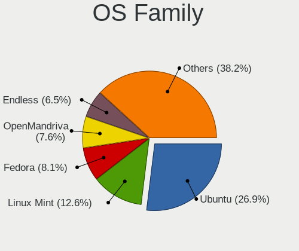
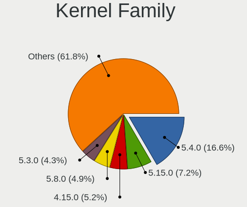
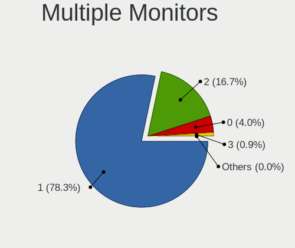

Linux in Brazil - Tested Hardware & Statistics
----------------------------------------------

A project to collect tested hardware configurations for Linux in Brazil.

Anyone can contribute to this report by the [hw-probe](https://github.com/linuxhw/hw-probe) tool:

    sudo -E hw-probe -all -upload

Please contribute! Especially if your hardware is rare.

This is a report for all computer types. See also reports for [desktops](/Location/Brazil/Desktop/README.md) and [notebooks](/Location/Brazil/Notebook/README.md).

Contents
--------

* [ Test Cases ](#test-cases)

* [ System ](#system)
  - [ OS                       ](#os)
  - [ OS Family                ](#os-family)
  - [ Kernel                   ](#kernel)
  - [ Kernel Family            ](#kernel-family)
  - [ Kernel Major Ver.        ](#kernel-major-ver)
  - [ Arch                     ](#arch)
  - [ DE                       ](#de)
  - [ Display Server           ](#display-server)
  - [ Display Manager          ](#display-manager)
  - [ OS Lang                  ](#os-lang)
  - [ Boot Mode                ](#boot-mode)
  - [ Filesystem               ](#filesystem)
  - [ Part. scheme             ](#part-scheme)
  - [ Dual Boot with Linux/BSD ](#dual-boot-with-linuxbsd)
  - [ Dual Boot (Win)          ](#dual-boot-win)

* [ Board ](#board)
  - [ Vendor                   ](#vendor)
  - [ Model                    ](#model)
  - [ Model Family             ](#model-family)
  - [ MFG Year                 ](#mfg-year)
  - [ Form Factor              ](#form-factor)
  - [ Secure Boot              ](#secure-boot)
  - [ Coreboot                 ](#coreboot)
  - [ RAM Size                 ](#ram-size)
  - [ RAM Used                 ](#ram-used)
  - [ Total Drives             ](#total-drives)
  - [ Has CD-ROM               ](#has-cd-rom)
  - [ Has Ethernet             ](#has-ethernet)
  - [ Has WiFi                 ](#has-wifi)
  - [ Has Bluetooth            ](#has-bluetooth)

* [ Location ](#location)
  - [ Country                  ](#country)
  - [ City                     ](#city)

* [ Drives ](#drives)
  - [ Drive Vendor             ](#drive-vendor)
  - [ Drive Model              ](#drive-model)
  - [ HDD Vendor               ](#hdd-vendor)
  - [ SSD Vendor               ](#ssd-vendor)
  - [ Drive Kind               ](#drive-kind)
  - [ Drive Connector          ](#drive-connector)
  - [ Drive Size               ](#drive-size)
  - [ Space Total              ](#space-total)
  - [ Space Used               ](#space-used)
  - [ Malfunc. Drives          ](#malfunc-drives)
  - [ Malfunc. Drive Vendor    ](#malfunc-drive-vendor)
  - [ Malfunc. HDD Vendor      ](#malfunc-hdd-vendor)
  - [ Malfunc. Drive Kind      ](#malfunc-drive-kind)
  - [ Failed Drives            ](#failed-drives)
  - [ Failed Drive Vendor      ](#failed-drive-vendor)
  - [ Drive Status             ](#drive-status)

* [ Storage controller ](#storage-controller)
  - [ Storage Vendor           ](#storage-vendor)
  - [ Storage Model            ](#storage-model)
  - [ Storage Kind             ](#storage-kind)

* [ Processor ](#processor)
  - [ CPU Vendor               ](#cpu-vendor)
  - [ CPU Model                ](#cpu-model)
  - [ CPU Model Family         ](#cpu-model-family)
  - [ CPU Cores                ](#cpu-cores)
  - [ CPU Sockets              ](#cpu-sockets)
  - [ CPU Threads              ](#cpu-threads)
  - [ CPU Op-Modes             ](#cpu-op-modes)
  - [ CPU Microcode            ](#cpu-microcode)
  - [ CPU Microarch            ](#cpu-microarch)

* [ Graphics ](#graphics)
  - [ GPU Vendor               ](#gpu-vendor)
  - [ GPU Model                ](#gpu-model)
  - [ GPU Combo                ](#gpu-combo)
  - [ GPU Driver               ](#gpu-driver)
  - [ GPU Memory               ](#gpu-memory)

* [ Monitor ](#monitor)
  - [ Monitor Vendor           ](#monitor-vendor)
  - [ Monitor Model            ](#monitor-model)
  - [ Monitor Resolution       ](#monitor-resolution)
  - [ Monitor Diagonal         ](#monitor-diagonal)
  - [ Monitor Width            ](#monitor-width)
  - [ Aspect Ratio             ](#aspect-ratio)
  - [ Monitor Area             ](#monitor-area)
  - [ Pixel Density            ](#pixel-density)
  - [ Multiple Monitors        ](#multiple-monitors)

* [ Network ](#network)
  - [ Net Controller Vendor    ](#net-controller-vendor)
  - [ Net Controller Model     ](#net-controller-model)
  - [ Wireless Vendor          ](#wireless-vendor)
  - [ Wireless Model           ](#wireless-model)
  - [ Ethernet Vendor          ](#ethernet-vendor)
  - [ Ethernet Model           ](#ethernet-model)
  - [ Net Controller Kind      ](#net-controller-kind)
  - [ Used Controller          ](#used-controller)
  - [ NICs                     ](#nics)
  - [ IPv6                     ](#ipv6)

* [ Bluetooth ](#bluetooth)
  - [ Bluetooth Vendor         ](#bluetooth-vendor)
  - [ Bluetooth Model          ](#bluetooth-model)

* [ Sound ](#sound)
  - [ Sound Vendor             ](#sound-vendor)
  - [ Sound Model              ](#sound-model)

* [ Memory ](#memory)
  - [ Memory Vendor            ](#memory-vendor)
  - [ Memory Model             ](#memory-model)
  - [ Memory Kind              ](#memory-kind)
  - [ Memory Form Factor       ](#memory-form-factor)
  - [ Memory Size              ](#memory-size)
  - [ Memory Speed             ](#memory-speed)

* [ Printers & scanners ](#printers--scanners)
  - [ Printer Vendor           ](#printer-vendor)
  - [ Printer Model            ](#printer-model)
  - [ Scanner Vendor           ](#scanner-vendor)
  - [ Scanner Model            ](#scanner-model)

* [ Camera ](#camera)
  - [ Camera Vendor            ](#camera-vendor)
  - [ Camera Model             ](#camera-model)

* [ Security ](#security)
  - [ Fingerprint Vendor       ](#fingerprint-vendor)
  - [ Fingerprint Model        ](#fingerprint-model)
  - [ Chipcard Vendor          ](#chipcard-vendor)
  - [ Chipcard Model           ](#chipcard-model)

* [ Unsupported ](#unsupported)
  - [ Unsupported Devices      ](#unsupported-devices)
  - [ Unsupported Device Types ](#unsupported-device-types)

Test Cases
----------

Total: 15188

| Vendor        | Model                       | Form-Factor | Probe                                                      | Date         |
|---------------|-----------------------------|-------------|------------------------------------------------------------|--------------|
| ASUSTek       | M5A78L-M/USB3               | Desktop     | [8e816dc600](https://linux-hardware.org/?probe=8e816dc600) | Aug 01, 2022 |
| Positivo      | Q232A                       | Notebook    | [da99b8ab1e](https://linux-hardware.org/?probe=da99b8ab1e) | Aug 01, 2022 |
| Positivo      | Q232A                       | Notebook    | [7d860e8f5d](https://linux-hardware.org/?probe=7d860e8f5d) | Aug 01, 2022 |
| Dell          | 0PV3YR A05                  | Server      | [2c00e0e66e](https://linux-hardware.org/?probe=2c00e0e66e) | Aug 01, 2022 |
| ASUSTek       | VivoBook_ASUSLaptop X512... | Notebook    | [4e2361dd88](https://linux-hardware.org/?probe=4e2361dd88) | Aug 01, 2022 |
| Unknown       | 1.0                         | All in one  | [8145704100](https://linux-hardware.org/?probe=8145704100) | Aug 01, 2022 |
| PCWare        | IPMH61R1                    | Desktop     | [0843909534](https://linux-hardware.org/?probe=0843909534) | Aug 01, 2022 |
| Unknown       | Unknown                     | Notebook    | [50153bd9ff](https://linux-hardware.org/?probe=50153bd9ff) | Aug 01, 2022 |
| HP            | Pavilion dv2600             | Notebook    | [87651d6efc](https://linux-hardware.org/?probe=87651d6efc) | Jul 31, 2022 |
| Sony          | VPCCW13FB                   | Notebook    | [453d0f75cc](https://linux-hardware.org/?probe=453d0f75cc) | Jul 31, 2022 |
| Dell          | Inspiron 5590               | Notebook    | [4d91f51698](https://linux-hardware.org/?probe=4d91f51698) | Jul 31, 2022 |
| Clevo         | W240BU                      | Notebook    | [7f4a0b1995](https://linux-hardware.org/?probe=7f4a0b1995) | Jul 31, 2022 |
| PCWare        | IPMH61R1                    | Desktop     | [7da7204a12](https://linux-hardware.org/?probe=7da7204a12) | Jul 31, 2022 |
| Unknown       | Unknown                     | Notebook    | [aa0c007709](https://linux-hardware.org/?probe=aa0c007709) | Jul 31, 2022 |
| Dell          | 0PV3YR A05                  | Server      | [47310a6478](https://linux-hardware.org/?probe=47310a6478) | Jul 31, 2022 |
| Compaq        | Presario CQ-23              | Notebook    | [76ea82c314](https://linux-hardware.org/?probe=76ea82c314) | Jul 30, 2022 |
| ASUSTek       | M5A78L-M/USB3               | Desktop     | [16f64b6f1a](https://linux-hardware.org/?probe=16f64b6f1a) | Jul 30, 2022 |
| ASUSTek       | TUF Gaming B550M-E WIFI     | Desktop     | [01bcafef3c](https://linux-hardware.org/?probe=01bcafef3c) | Jul 30, 2022 |
| Acer          | Nitro AN515-44              | Notebook    | [1c907403d4](https://linux-hardware.org/?probe=1c907403d4) | Jul 30, 2022 |
| ECS           | H61H2-M12                   | Desktop     | [6761a8774d](https://linux-hardware.org/?probe=6761a8774d) | Jul 30, 2022 |
| ASUSTek       | M5A78L-M/USB3               | Desktop     | [f6ecfb2a51](https://linux-hardware.org/?probe=f6ecfb2a51) | Jul 30, 2022 |
| MSI           | A320M-A PRO MAX             | Desktop     | [3249abb411](https://linux-hardware.org/?probe=3249abb411) | Jul 30, 2022 |
| Dell          | 0PV3YR A05                  | Server      | [33ffdbbe27](https://linux-hardware.org/?probe=33ffdbbe27) | Jul 30, 2022 |
| ASUSTek       | M5A78L-M/USB3               | Desktop     | [7ceff6f032](https://linux-hardware.org/?probe=7ceff6f032) | Jul 30, 2022 |
| MSI           | A320M-A PRO MAX             | Desktop     | [5a750a1294](https://linux-hardware.org/?probe=5a750a1294) | Jul 30, 2022 |
| HP            | 3047h                       | Desktop     | [a9b59b34f9](https://linux-hardware.org/?probe=a9b59b34f9) | Jul 29, 2022 |
| Positivo      | C4128E-S                    | Notebook    | [03150bf5fa](https://linux-hardware.org/?probe=03150bf5fa) | Jul 29, 2022 |
| Acer          | Aspire A514-54              | Notebook    | [9a18d7476f](https://linux-hardware.org/?probe=9a18d7476f) | Jul 29, 2022 |
| Samsung       | 340XAA/350XAA/550XAA        | Notebook    | [c8609ab506](https://linux-hardware.org/?probe=c8609ab506) | Jul 29, 2022 |
| Acer          | Aspire E1-531               | Notebook    | [e9161d7c33](https://linux-hardware.org/?probe=e9161d7c33) | Jul 29, 2022 |
| ASUSTek       | TUF B360M-PLUS GAMING/BR    | Desktop     | [8c57fbc9e8](https://linux-hardware.org/?probe=8c57fbc9e8) | Jul 29, 2022 |
| ASUSTek       | ROG STRIX B550-F GAMING     | Desktop     | [51893f2237](https://linux-hardware.org/?probe=51893f2237) | Jul 29, 2022 |
| Intel         | H61                         | Desktop     | [7bb7deaca9](https://linux-hardware.org/?probe=7bb7deaca9) | Jul 29, 2022 |
| PCWare        | IPMH61R2                    | Desktop     | [b3245af28d](https://linux-hardware.org/?probe=b3245af28d) | Jul 29, 2022 |
| Lenovo        | ThinkPad T480 20L6S9WY00    | Notebook    | [af8fd9ae70](https://linux-hardware.org/?probe=af8fd9ae70) | Jul 29, 2022 |
| Positivo      | C4128E-S                    | Notebook    | [a06c799159](https://linux-hardware.org/?probe=a06c799159) | Jul 29, 2022 |
| Lenovo        | Yoga S740-14IIL 81RM        | Notebook    | [a308d89f1f](https://linux-hardware.org/?probe=a308d89f1f) | Jul 29, 2022 |
| ASUSTek       | ROG STRIX B450-F GAMING     | Desktop     | [e99805635f](https://linux-hardware.org/?probe=e99805635f) | Jul 29, 2022 |
| Dell          | 0PV3YR A05                  | Server      | [06e863c8c6](https://linux-hardware.org/?probe=06e863c8c6) | Jul 29, 2022 |
| ASUSTek       | TUF Gaming X570-PLUS_BR     | Desktop     | [e1d666e84a](https://linux-hardware.org/?probe=e1d666e84a) | Jul 29, 2022 |
| Digiboard     | NM70-TI                     | Desktop     | [007a69093c](https://linux-hardware.org/?probe=007a69093c) | Jul 29, 2022 |
| Dell          | Inspiron 5402               | Notebook    | [90df51f92b](https://linux-hardware.org/?probe=90df51f92b) | Jul 29, 2022 |
| Dell          | Inspiron 5402               | Notebook    | [ecdd9197a8](https://linux-hardware.org/?probe=ecdd9197a8) | Jul 29, 2022 |
| ASUSTek       | P5G41T-M LX2/BR             | Desktop     | [e84f999c94](https://linux-hardware.org/?probe=e84f999c94) | Jul 29, 2022 |
| ASUSTek       | PRIME B450M-GAMING II       | Desktop     | [0cc1bc9401](https://linux-hardware.org/?probe=0cc1bc9401) | Jul 29, 2022 |
| Dell          | Inspiron 15-3567            | Notebook    | [ceb521429a](https://linux-hardware.org/?probe=ceb521429a) | Jul 29, 2022 |
| Acer          | Aspire 5750                 | Notebook    | [e3f2dd0271](https://linux-hardware.org/?probe=e3f2dd0271) | Jul 29, 2022 |
| Biostar       | B350GTN                     | Desktop     | [75d6302ab0](https://linux-hardware.org/?probe=75d6302ab0) | Jul 29, 2022 |
| Dell          | Inspiron 7460               | Notebook    | [9f3420ac40](https://linux-hardware.org/?probe=9f3420ac40) | Jul 29, 2022 |
| Dell          | Inspiron 3501               | Notebook    | [be3c46490f](https://linux-hardware.org/?probe=be3c46490f) | Jul 29, 2022 |
| Samsung       | 340XAA/350XAA/550XAA        | Notebook    | [fdb481a551](https://linux-hardware.org/?probe=fdb481a551) | Jul 28, 2022 |
| Acer          | Aspire A514-54              | Notebook    | [4a6c9ef157](https://linux-hardware.org/?probe=4a6c9ef157) | Jul 28, 2022 |
| Lenovo        | IdeaPad S145-15API 81V7     | Notebook    | [adb71c8acc](https://linux-hardware.org/?probe=adb71c8acc) | Jul 28, 2022 |
| A14CR         | Unknown                     | Notebook    | [6315deeec1](https://linux-hardware.org/?probe=6315deeec1) | Jul 28, 2022 |
| Dell          | Latitude 5420               | Notebook    | [3e0d6fec55](https://linux-hardware.org/?probe=3e0d6fec55) | Jul 28, 2022 |
| Pegatron      | IPM41-D3                    | Desktop     | [ce24b0bab7](https://linux-hardware.org/?probe=ce24b0bab7) | Jul 28, 2022 |
| Positivo      | POS-RIB360EE 11158935       | Desktop     | [1c687dcef7](https://linux-hardware.org/?probe=1c687dcef7) | Jul 28, 2022 |
| Sony          | VPCEG27FM                   | Notebook    | [b8c840d19a](https://linux-hardware.org/?probe=b8c840d19a) | Jul 28, 2022 |
| Acer          | Aspire 5742                 | Notebook    | [4e2290847d](https://linux-hardware.org/?probe=4e2290847d) | Jul 28, 2022 |
| ASRock        | B450M Steel Legend          | Desktop     | [db492973ec](https://linux-hardware.org/?probe=db492973ec) | Jul 28, 2022 |
| Dell          | 0PV3YR A05                  | Server      | [13d33e8cbc](https://linux-hardware.org/?probe=13d33e8cbc) | Jul 28, 2022 |
| Positivo      | Mobile                      | Notebook    | [a8719171ea](https://linux-hardware.org/?probe=a8719171ea) | Jul 28, 2022 |
| Dell          | Vostro 3550                 | Notebook    | [db7097f5f3](https://linux-hardware.org/?probe=db7097f5f3) | Jul 28, 2022 |
| Digibras      | NH4CU03                     | Notebook    | [bf8a8c589a](https://linux-hardware.org/?probe=bf8a8c589a) | Jul 28, 2022 |
| Positivo      | Mobile                      | Notebook    | [422b663a21](https://linux-hardware.org/?probe=422b663a21) | Jul 28, 2022 |
| Intel         | X99 V1.0                    | Desktop     | [da677f5a3b](https://linux-hardware.org/?probe=da677f5a3b) | Jul 28, 2022 |
| Unknown       | Unknown                     | Notebook    | [f14e834c32](https://linux-hardware.org/?probe=f14e834c32) | Jul 28, 2022 |
| Dell          | Inspiron 3421               | Notebook    | [67e0e7d1ba](https://linux-hardware.org/?probe=67e0e7d1ba) | Jul 28, 2022 |
| Lenovo        | IdeaPad 320-15IKB 80YH      | Notebook    | [0439161423](https://linux-hardware.org/?probe=0439161423) | Jul 28, 2022 |
| Positivo      | H14BT58                     | Notebook    | [7f271e5d68](https://linux-hardware.org/?probe=7f271e5d68) | Jul 28, 2022 |
| Intel         | B75                         | Desktop     | [0620ffff20](https://linux-hardware.org/?probe=0620ffff20) | Jul 27, 2022 |
| MSI           | X470 GAMING PLUS            | Desktop     | [722aa0951d](https://linux-hardware.org/?probe=722aa0951d) | Jul 27, 2022 |
| PCWare        | IPMH61R1                    | Desktop     | [18610dd9f0](https://linux-hardware.org/?probe=18610dd9f0) | Jul 27, 2022 |
| Samsung       | 550XBE/350XBE               | Notebook    | [b7fabad758](https://linux-hardware.org/?probe=b7fabad758) | Jul 27, 2022 |
| Gigabyte      | GA-78LMT-USB3 SEx           | Desktop     | [32e82dc9ae](https://linux-hardware.org/?probe=32e82dc9ae) | Jul 27, 2022 |
| Dell          | Vostro 5470                 | Notebook    | [82192dcb1d](https://linux-hardware.org/?probe=82192dcb1d) | Jul 27, 2022 |
| PCWare        | PW-945GCX                   | Desktop     | [128aafe763](https://linux-hardware.org/?probe=128aafe763) | Jul 27, 2022 |
| Dell          | Latitude 7480               | Notebook    | [86fd278e6d](https://linux-hardware.org/?probe=86fd278e6d) | Jul 27, 2022 |
| Lenovo        | IdeaPad 120S-11IAP 81A4     | Notebook    | [c872c322dc](https://linux-hardware.org/?probe=c872c322dc) | Jul 27, 2022 |
| Lenovo        | IdeaPad 3 15ALC6 82MF       | Notebook    | [87f0eb95eb](https://linux-hardware.org/?probe=87f0eb95eb) | Jul 27, 2022 |
| Dell          | G5 5590                     | Notebook    | [ae478a8f82](https://linux-hardware.org/?probe=ae478a8f82) | Jul 27, 2022 |
| Dell          | Inspiron 5402               | Notebook    | [6735eaf093](https://linux-hardware.org/?probe=6735eaf093) | Jul 27, 2022 |
| MSI           | 2A9C                        | Desktop     | [de5a8c7ecd](https://linux-hardware.org/?probe=de5a8c7ecd) | Jul 27, 2022 |
| HP            | Pavilion g4                 | Notebook    | [c9aa5e235c](https://linux-hardware.org/?probe=c9aa5e235c) | Jul 27, 2022 |
| Dell          | 01XK1W A00                  | Desktop     | [68159d9d39](https://linux-hardware.org/?probe=68159d9d39) | Jul 26, 2022 |
| Avell High... | B.ON                        | Notebook    | [182df5e0c6](https://linux-hardware.org/?probe=182df5e0c6) | Jul 26, 2022 |
| Huanan        | X99-F8                      | Desktop     | [3ba1885fb4](https://linux-hardware.org/?probe=3ba1885fb4) | Jul 26, 2022 |
| Intel         | powered classmate PC        | Notebook    | [5ef3ce99dc](https://linux-hardware.org/?probe=5ef3ce99dc) | Jul 26, 2022 |
| Intel         | powered classmate PC        | Notebook    | [53e2fcbd36](https://linux-hardware.org/?probe=53e2fcbd36) | Jul 26, 2022 |
| Gigabyte      | Z370N WIFI-CF               | Desktop     | [eb3c3fceb3](https://linux-hardware.org/?probe=eb3c3fceb3) | Jul 26, 2022 |
| Dell          | Latitude 131L               | Notebook    | [ec8717bc3f](https://linux-hardware.org/?probe=ec8717bc3f) | Jul 26, 2022 |
| Toshiba       | IS 1413G                    | Notebook    | [adfacec492](https://linux-hardware.org/?probe=adfacec492) | Jul 26, 2022 |
| ASRock        | B450M Steel Legend          | Desktop     | [30fd52a2a5](https://linux-hardware.org/?probe=30fd52a2a5) | Jul 26, 2022 |
| Gigabyte      | H110M-S2H DDR3-CF           | Desktop     | [e471e3ed10](https://linux-hardware.org/?probe=e471e3ed10) | Jul 26, 2022 |
| Login Info... | LOG-H310M-G                 | Desktop     | [f02a0ed6dd](https://linux-hardware.org/?probe=f02a0ed6dd) | Jul 26, 2022 |
| Dell          | Inspiron 14-3467            | Notebook    | [1c2babaa0a](https://linux-hardware.org/?probe=1c2babaa0a) | Jul 26, 2022 |
| Acer          | Aspire 5050                 | Notebook    | [59d8bb1e10](https://linux-hardware.org/?probe=59d8bb1e10) | Jul 26, 2022 |
| Acer          | Aspire 5050                 | Notebook    | [a8bcc56e78](https://linux-hardware.org/?probe=a8bcc56e78) | Jul 26, 2022 |
| ASUSTek       | VivoBook_ASUSLaptop X515... | Notebook    | [2a9595e780](https://linux-hardware.org/?probe=2a9595e780) | Jul 26, 2022 |
| ASUSTek       | PRIME B450M-GAMING/BR       | Desktop     | [e33f8c0a93](https://linux-hardware.org/?probe=e33f8c0a93) | Jul 26, 2022 |
| Lenovo        | IdeaPad S145-15API 81V7     | Notebook    | [7005989783](https://linux-hardware.org/?probe=7005989783) | Jul 26, 2022 |
| Daten Tecn... | DT02-M4                     | Notebook    | [8719e60f77](https://linux-hardware.org/?probe=8719e60f77) | Jul 25, 2022 |
| Dell          | 0PV3YR A05                  | Server      | [b7caa2c8e5](https://linux-hardware.org/?probe=b7caa2c8e5) | Jul 25, 2022 |
| Positivo      | C14CU51                     | Notebook    | [1bc38897f0](https://linux-hardware.org/?probe=1bc38897f0) | Jul 25, 2022 |
| Acer          | Aspire A315-23G             | Notebook    | [df57effbc5](https://linux-hardware.org/?probe=df57effbc5) | Jul 25, 2022 |
| Samsung       | 300E4C/300E5C/300E7C        | Notebook    | [ff4dba6b3e](https://linux-hardware.org/?probe=ff4dba6b3e) | Jul 24, 2022 |
| Dell          | G15 5515                    | Notebook    | [2d7ddd400c](https://linux-hardware.org/?probe=2d7ddd400c) | Jul 24, 2022 |
| ASRock        | H61M-DGS                    | Desktop     | [0dc55c5b73](https://linux-hardware.org/?probe=0dc55c5b73) | Jul 24, 2022 |
| Acer          | Aspire F5-573               | Notebook    | [922044b473](https://linux-hardware.org/?probe=922044b473) | Jul 24, 2022 |
| Dell          | 0PV3YR A05                  | Server      | [3d21a6de4b](https://linux-hardware.org/?probe=3d21a6de4b) | Jul 24, 2022 |
| Lenovo        | IdeaPad 3 15IGL05 82BU      | Notebook    | [252eb862c0](https://linux-hardware.org/?probe=252eb862c0) | Jul 24, 2022 |
| ASUSTek       | Z87M-PLUS                   | Desktop     | [0efc94e34d](https://linux-hardware.org/?probe=0efc94e34d) | Jul 24, 2022 |
| PCWare        | IPX1800E2                   | Desktop     | [4426727633](https://linux-hardware.org/?probe=4426727633) | Jul 24, 2022 |
| Lenovo        | IdeaPad 330-15IKB 81FE      | Notebook    | [c1515e724a](https://linux-hardware.org/?probe=c1515e724a) | Jul 24, 2022 |
| Toshiba       | IS-1253                     | Notebook    | [d7bfcb65bf](https://linux-hardware.org/?probe=d7bfcb65bf) | Jul 23, 2022 |
| Intel         | DH61WW AAG23116-203         | Desktop     | [cfd6e87e09](https://linux-hardware.org/?probe=cfd6e87e09) | Jul 23, 2022 |
| Dell          | 01XK1W A00                  | Desktop     | [5c8a6b6f90](https://linux-hardware.org/?probe=5c8a6b6f90) | Jul 23, 2022 |
| Lenovo        | IdeaPad S400 VIUS3          | Notebook    | [2f8b49e4f8](https://linux-hardware.org/?probe=2f8b49e4f8) | Jul 23, 2022 |
| ASUSTek       | Z87M-PLUS                   | Desktop     | [c30806c628](https://linux-hardware.org/?probe=c30806c628) | Jul 23, 2022 |
| ASUSTek       | Z87M-PLUS                   | Desktop     | [b805fa0cd8](https://linux-hardware.org/?probe=b805fa0cd8) | Jul 23, 2022 |
| Apple         | MacBookAir7,1               | Notebook    | [51d002e1b7](https://linux-hardware.org/?probe=51d002e1b7) | Jul 23, 2022 |
| Apple         | MacBookAir7,1               | Notebook    | [41d0e95039](https://linux-hardware.org/?probe=41d0e95039) | Jul 23, 2022 |
| Dell          | 0PV3YR A05                  | Server      | [7002f5be12](https://linux-hardware.org/?probe=7002f5be12) | Jul 23, 2022 |
| ASUSTek       | PRIME B550M-K               | Desktop     | [df5bd62f9a](https://linux-hardware.org/?probe=df5bd62f9a) | Jul 23, 2022 |
| Lenovo        | IdeaPad 330-15IKB 81FD      | Notebook    | [6b6a156202](https://linux-hardware.org/?probe=6b6a156202) | Jul 23, 2022 |
| Lenovo        | Z40-70 80E6                 | Notebook    | [e77b84e593](https://linux-hardware.org/?probe=e77b84e593) | Jul 22, 2022 |
| MSI           | B450 GAMING PLUS MAX        | Desktop     | [edcecb5e13](https://linux-hardware.org/?probe=edcecb5e13) | Jul 22, 2022 |
| Dell          | Vostro 5470                 | Notebook    | [95c9916b84](https://linux-hardware.org/?probe=95c9916b84) | Jul 22, 2022 |
| Gigabyte      | GA-78LMT-S2P                | Desktop     | [f90d74f5b5](https://linux-hardware.org/?probe=f90d74f5b5) | Jul 22, 2022 |
| ASUSTek       | X450LCP                     | Notebook    | [0617861116](https://linux-hardware.org/?probe=0617861116) | Jul 22, 2022 |
| Dell          | 01XK1W A00                  | Desktop     | [91ce7c78ee](https://linux-hardware.org/?probe=91ce7c78ee) | Jul 22, 2022 |
| Unknown       | Unknown                     | Notebook    | [a93e6b77ec](https://linux-hardware.org/?probe=a93e6b77ec) | Jul 22, 2022 |
| Dell          | 0PV3YR A05                  | Server      | [bf7916cfe0](https://linux-hardware.org/?probe=bf7916cfe0) | Jul 22, 2022 |
| Positivo      | J14AL11                     | Notebook    | [7510e905d8](https://linux-hardware.org/?probe=7510e905d8) | Jul 22, 2022 |
| ASUSTek       | P7H55-M                     | Desktop     | [d7ba204d31](https://linux-hardware.org/?probe=d7ba204d31) | Jul 22, 2022 |
| Acer          | Aspire A315-54              | Notebook    | [9e0bbc26f4](https://linux-hardware.org/?probe=9e0bbc26f4) | Jul 22, 2022 |
| ASUSTek       | M2N68                       | Desktop     | [e8b27563a2](https://linux-hardware.org/?probe=e8b27563a2) | Jul 22, 2022 |
| Lenovo        | IdeaPad S145-15IWL 81S9     | Notebook    | [b8ce5a0377](https://linux-hardware.org/?probe=b8ce5a0377) | Jul 22, 2022 |
| Samsung       | 270E5K/270E5Q/271E5K/257... | Notebook    | [2c8cd53533](https://linux-hardware.org/?probe=2c8cd53533) | Jul 22, 2022 |
| Samsung       | 550XBE/350XBE               | Notebook    | [b23cfb57cf](https://linux-hardware.org/?probe=b23cfb57cf) | Jul 21, 2022 |
| Biostar       | B450MH                      | Desktop     | [f69c4e3a03](https://linux-hardware.org/?probe=f69c4e3a03) | Jul 21, 2022 |
| Biostar       | B450MH                      | Desktop     | [79084ef4c9](https://linux-hardware.org/?probe=79084ef4c9) | Jul 21, 2022 |
| Dell          | 0PV3YR A05                  | Server      | [1dcc22ccf4](https://linux-hardware.org/?probe=1dcc22ccf4) | Jul 21, 2022 |
| PCWare        | IPMH81G1                    | Desktop     | [cb66716a63](https://linux-hardware.org/?probe=cb66716a63) | Jul 21, 2022 |
| ASUSTek       | P8H61-M LX3 R2.0            | Desktop     | [2af5596c9e](https://linux-hardware.org/?probe=2af5596c9e) | Jul 21, 2022 |
| Dell          | Vostro 5470                 | Notebook    | [e73fa302e0](https://linux-hardware.org/?probe=e73fa302e0) | Jul 21, 2022 |
| Dell          | Vostro 5470                 | Notebook    | [c6dcb4ffa6](https://linux-hardware.org/?probe=c6dcb4ffa6) | Jul 21, 2022 |
| ASRock        | H81M-HG4 R4.0               | Desktop     | [4628e310fd](https://linux-hardware.org/?probe=4628e310fd) | Jul 20, 2022 |
| ECS           | H61H2-M2                    | Desktop     | [c1d1e739cf](https://linux-hardware.org/?probe=c1d1e739cf) | Jul 20, 2022 |
| Dell          | Latitude 3420               | Notebook    | [07c70a9430](https://linux-hardware.org/?probe=07c70a9430) | Jul 20, 2022 |
| PCChips       | A15G                        | Desktop     | [4cdd689308](https://linux-hardware.org/?probe=4cdd689308) | Jul 20, 2022 |
| Gigabyte      | B360M AORUS Gaming 3-CF     | Desktop     | [e0ffe80869](https://linux-hardware.org/?probe=e0ffe80869) | Jul 20, 2022 |
| Intel         | Unknown                     | Desktop     | [19327f830a](https://linux-hardware.org/?probe=19327f830a) | Jul 20, 2022 |
| Dell          | 0PV3YR A05                  | Server      | [03ce6d28fd](https://linux-hardware.org/?probe=03ce6d28fd) | Jul 20, 2022 |
| Avell High... | A40 LIV                     | Notebook    | [7a685eedd0](https://linux-hardware.org/?probe=7a685eedd0) | Jul 20, 2022 |
| Positivo      | POS-PIQ77CL                 | Desktop     | [ce9a0fdbbc](https://linux-hardware.org/?probe=ce9a0fdbbc) | Jul 20, 2022 |
| Dell          | Vostro 15 3510              | Notebook    | [8327d57f7b](https://linux-hardware.org/?probe=8327d57f7b) | Jul 20, 2022 |
| ASUSTek       | EX-A320M-GAMING             | Desktop     | [a6f87d56db](https://linux-hardware.org/?probe=a6f87d56db) | Jul 20, 2022 |
| Gigabyte      | B450 AORUS M                | Desktop     | [fdaa3bac93](https://linux-hardware.org/?probe=fdaa3bac93) | Jul 20, 2022 |
| Dell          | Inspiron 5447               | Notebook    | [a0b16f7a10](https://linux-hardware.org/?probe=a0b16f7a10) | Jul 19, 2022 |
| Dell          | Inspiron 5447               | Notebook    | [e5b80a7f5e](https://linux-hardware.org/?probe=e5b80a7f5e) | Jul 19, 2022 |
| Intel         | Unknown                     | Desktop     | [8c87f55927](https://linux-hardware.org/?probe=8c87f55927) | Jul 19, 2022 |
| Dell          | Latitude 3450               | Notebook    | [970985b513](https://linux-hardware.org/?probe=970985b513) | Jul 19, 2022 |
| Avell High... | B.ON                        | Notebook    | [6bd67d621f](https://linux-hardware.org/?probe=6bd67d621f) | Jul 19, 2022 |
| ECS           | A990FXM-A                   | Desktop     | [6351c9023d](https://linux-hardware.org/?probe=6351c9023d) | Jul 19, 2022 |
| HP            | EliteBook 2530p             | Notebook    | [8dd11387c6](https://linux-hardware.org/?probe=8dd11387c6) | Jul 19, 2022 |
| Samsung       | 270E5G/270E5U               | Notebook    | [c26ed846e9](https://linux-hardware.org/?probe=c26ed846e9) | Jul 19, 2022 |
| MSI           | G31M3-L V2                  | Desktop     | [cd6d617e34](https://linux-hardware.org/?probe=cd6d617e34) | Jul 19, 2022 |
| Dell          | Inspiron 5566               | Notebook    | [f653a494f3](https://linux-hardware.org/?probe=f653a494f3) | Jul 18, 2022 |
| Samsung       | 270E5G/270E5U               | Notebook    | [d1f2245fb4](https://linux-hardware.org/?probe=d1f2245fb4) | Jul 18, 2022 |
| MSI           | G31M3-L V2                  | Desktop     | [aaa3013f66](https://linux-hardware.org/?probe=aaa3013f66) | Jul 18, 2022 |
| Intel         | H55                         | Desktop     | [b58f7300e1](https://linux-hardware.org/?probe=b58f7300e1) | Jul 18, 2022 |
| Gigabyte      | H61M-S2PH                   | Desktop     | [554f6e65ed](https://linux-hardware.org/?probe=554f6e65ed) | Jul 18, 2022 |
| Dell          | Vostro 15 3510              | Notebook    | [bcb8dbf459](https://linux-hardware.org/?probe=bcb8dbf459) | Jul 18, 2022 |
| Dell          | Inspiron 3583               | Notebook    | [6f281be47b](https://linux-hardware.org/?probe=6f281be47b) | Jul 18, 2022 |
| Gigabyte      | B450 AORUS M                | Desktop     | [aca8d98967](https://linux-hardware.org/?probe=aca8d98967) | Jul 18, 2022 |
| Acer          | Aspire ES1-411              | Notebook    | [5d551a94bd](https://linux-hardware.org/?probe=5d551a94bd) | Jul 18, 2022 |
| Acer          | Aspire A315-23G             | Notebook    | [268d2145ff](https://linux-hardware.org/?probe=268d2145ff) | Jul 17, 2022 |
| ASUSTek       | PRIME B450M-GAMING/BR       | Desktop     | [39fd39c3b0](https://linux-hardware.org/?probe=39fd39c3b0) | Jul 17, 2022 |
| Intel         | NUC11TNBi3 M11908-403       | Mini pc     | [a3a42d9ae3](https://linux-hardware.org/?probe=a3a42d9ae3) | Jul 17, 2022 |
| Dell          | 08NPPY A00                  | Desktop     | [23d9101cd2](https://linux-hardware.org/?probe=23d9101cd2) | Jul 17, 2022 |
| ASUSTek       | EX-B150M-V3                 | Desktop     | [f8585ad958](https://linux-hardware.org/?probe=f8585ad958) | Jul 17, 2022 |
| ASUSTek       | EX-B150M-V3                 | Desktop     | [f2372286e0](https://linux-hardware.org/?probe=f2372286e0) | Jul 17, 2022 |
| Acer          | Aspire E5-575G              | Notebook    | [78023056af](https://linux-hardware.org/?probe=78023056af) | Jul 17, 2022 |
| Intel         | NUC11TNBi3 M11908-403       | Mini pc     | [1d4583cea8](https://linux-hardware.org/?probe=1d4583cea8) | Jul 17, 2022 |
| Huanan        | B75                         | Desktop     | [0580a5a948](https://linux-hardware.org/?probe=0580a5a948) | Jul 17, 2022 |
| Huanan        | B75                         | Desktop     | [e1788853ec](https://linux-hardware.org/?probe=e1788853ec) | Jul 17, 2022 |
| GALAX         | A320M Ver1.0 G10f           | Desktop     | [7bc0a0fe3a](https://linux-hardware.org/?probe=7bc0a0fe3a) | Jul 17, 2022 |
| ASUSTek       | X541NA                      | Notebook    | [3caa5cc13d](https://linux-hardware.org/?probe=3caa5cc13d) | Jul 17, 2022 |
| LG Electro... | 22V280 FAB1                 | All in one  | [ec3010a13f](https://linux-hardware.org/?probe=ec3010a13f) | Jul 17, 2022 |
| ASUSTek       | X510UAR                     | Notebook    | [56298c2c32](https://linux-hardware.org/?probe=56298c2c32) | Jul 17, 2022 |
| ASUSTek       | BM6820_BM6620_BP6320-8      | Desktop     | [8d8c845646](https://linux-hardware.org/?probe=8d8c845646) | Jul 17, 2022 |
| Dell          | 0F428D A00                  | Desktop     | [fb8a6009f7](https://linux-hardware.org/?probe=fb8a6009f7) | Jul 16, 2022 |
| Digibras      | NH4CU03                     | Notebook    | [803b7d3211](https://linux-hardware.org/?probe=803b7d3211) | Jul 16, 2022 |
| Dell          | Inspiron 5482               | Convertible | [5d4f4ba0de](https://linux-hardware.org/?probe=5d4f4ba0de) | Jul 16, 2022 |
| Dell          | Inspiron 5482               | Convertible | [aab7583472](https://linux-hardware.org/?probe=aab7583472) | Jul 16, 2022 |
| Gigabyte      | H97M-Gaming 3               | Desktop     | [a72ad8ba14](https://linux-hardware.org/?probe=a72ad8ba14) | Jul 16, 2022 |
| Digibras      | NH4CU53                     | Notebook    | [f6b402afe8](https://linux-hardware.org/?probe=f6b402afe8) | Jul 16, 2022 |
| Lenovo        | IdeaPad 330-15IKB 81FE      | Notebook    | [79b4ccf8b3](https://linux-hardware.org/?probe=79b4ccf8b3) | Jul 16, 2022 |
| Lenovo        | IdeaPad 330-15IKB 81FE      | Notebook    | [99f294736d](https://linux-hardware.org/?probe=99f294736d) | Jul 16, 2022 |
| MACHINIST     | X99-RS9 V2.0                | Desktop     | [36ad4a7384](https://linux-hardware.org/?probe=36ad4a7384) | Jul 16, 2022 |
| ASUSTek       | ROG STRIX Z490-I GAMING     | Desktop     | [34a905d705](https://linux-hardware.org/?probe=34a905d705) | Jul 16, 2022 |
| Gigabyte      | AB350-Gaming 3-CF           | Desktop     | [2e73a9947c](https://linux-hardware.org/?probe=2e73a9947c) | Jul 15, 2022 |
| LG Electro... | V720                        | All in one  | [15d027d68f](https://linux-hardware.org/?probe=15d027d68f) | Jul 15, 2022 |
| Intel         | H61                         | Desktop     | [8865d7959a](https://linux-hardware.org/?probe=8865d7959a) | Jul 15, 2022 |
| Avell High... | B.ON                        | Notebook    | [54cb0cfd97](https://linux-hardware.org/?probe=54cb0cfd97) | Jul 15, 2022 |
| ASUSTek       | TUF Gaming B550M-PLUS       | Desktop     | [c9ff108124](https://linux-hardware.org/?probe=c9ff108124) | Jul 15, 2022 |
| Gigabyte      | A520M S2H                   | Desktop     | [dfc64d417f](https://linux-hardware.org/?probe=dfc64d417f) | Jul 15, 2022 |
| Positivo      | S14CT01                     | Notebook    | [eac9cd386b](https://linux-hardware.org/?probe=eac9cd386b) | Jul 15, 2022 |
| Lenovo        | IdeaPad 330-15IKB 81FD      | Notebook    | [2ee086df64](https://linux-hardware.org/?probe=2ee086df64) | Jul 15, 2022 |
| ASUSTek       | X541NA                      | Notebook    | [b9476b6cf9](https://linux-hardware.org/?probe=b9476b6cf9) | Jul 15, 2022 |
| Intel         | X79 V2.72B                  | Desktop     | [f244f6157b](https://linux-hardware.org/?probe=f244f6157b) | Jul 15, 2022 |
| AMI           | Unknown                     | Notebook    | [2d15648f33](https://linux-hardware.org/?probe=2d15648f33) | Jul 14, 2022 |
| Compaq        | Presario CQ-23              | Notebook    | [589a41e629](https://linux-hardware.org/?probe=589a41e629) | Jul 14, 2022 |
| Intel         | H55                         | Desktop     | [f8e7b20a53](https://linux-hardware.org/?probe=f8e7b20a53) | Jul 14, 2022 |
| ASUSTek       | P8B75-M LE                  | Desktop     | [a4246a1ea8](https://linux-hardware.org/?probe=a4246a1ea8) | Jul 14, 2022 |
| ASUSTek       | M5A97 PRO                   | Desktop     | [e963ba85db](https://linux-hardware.org/?probe=e963ba85db) | Jul 14, 2022 |
| ASUSTek       | UX301LA                     | Notebook    | [3d4655e7cf](https://linux-hardware.org/?probe=3d4655e7cf) | Jul 14, 2022 |
| Intel         | H55                         | Desktop     | [b199ed9707](https://linux-hardware.org/?probe=b199ed9707) | Jul 14, 2022 |
| Acer          | Aspire A315-23G             | Notebook    | [09f86c23ae](https://linux-hardware.org/?probe=09f86c23ae) | Jul 14, 2022 |
| Gigabyte      | Z690 GAMING X               | Desktop     | [7babf837f9](https://linux-hardware.org/?probe=7babf837f9) | Jul 14, 2022 |
| Dell          | Inspiron 5437               | Notebook    | [1f59d159c7](https://linux-hardware.org/?probe=1f59d159c7) | Jul 14, 2022 |
| Gigabyte      | GA-MA770T-UD3               | Desktop     | [eebcfac8a3](https://linux-hardware.org/?probe=eebcfac8a3) | Jul 14, 2022 |
| ASUSTek       | STRIX B250F GAMING          | Desktop     | [4355281f8e](https://linux-hardware.org/?probe=4355281f8e) | Jul 13, 2022 |
| Avell High... | B.ON                        | Notebook    | [1e954ba2ad](https://linux-hardware.org/?probe=1e954ba2ad) | Jul 13, 2022 |
| ASUSTek       | STRIX B250F GAMING          | Desktop     | [36f96a4ef6](https://linux-hardware.org/?probe=36f96a4ef6) | Jul 13, 2022 |
| Lenovo        | G400s VILG1                 | Notebook    | [fbaf6e2d8f](https://linux-hardware.org/?probe=fbaf6e2d8f) | Jul 13, 2022 |
| Lenovo        | G400s VILG1                 | Notebook    | [33853365fd](https://linux-hardware.org/?probe=33853365fd) | Jul 13, 2022 |
| ASUSTek       | P8H61-M LX3 PLUS R2.0       | Desktop     | [44638b5241](https://linux-hardware.org/?probe=44638b5241) | Jul 13, 2022 |
| PCWare        | IPMH61R3                    | Desktop     | [6d92dfd343](https://linux-hardware.org/?probe=6d92dfd343) | Jul 13, 2022 |
| ASRock        | B450M Steel Legend          | Desktop     | [3732c0ad0c](https://linux-hardware.org/?probe=3732c0ad0c) | Jul 13, 2022 |
| PCWare        | IPMH61R3                    | Desktop     | [ac21298dd8](https://linux-hardware.org/?probe=ac21298dd8) | Jul 13, 2022 |
| ASUSTek       | M5A78L-M/USB3               | Desktop     | [c056ac9f1d](https://linux-hardware.org/?probe=c056ac9f1d) | Jul 13, 2022 |
| Lenovo        | ThinkPad E480 20KQ000EBR    | Notebook    | [399639e6a0](https://linux-hardware.org/?probe=399639e6a0) | Jul 12, 2022 |
| Acer          | Nitro AN517-52              | Notebook    | [5379fd7508](https://linux-hardware.org/?probe=5379fd7508) | Jul 12, 2022 |
| ASUSTek       | VivoBook_ASUSLaptop X513... | Notebook    | [1b31625c12](https://linux-hardware.org/?probe=1b31625c12) | Jul 12, 2022 |
| Dell          | 0PV3YR A05                  | Server      | [7f4fad6e47](https://linux-hardware.org/?probe=7f4fad6e47) | Jul 12, 2022 |
| Dell          | Inspiron 14-3467            | Notebook    | [0b8175d706](https://linux-hardware.org/?probe=0b8175d706) | Jul 12, 2022 |
| Dell          | Latitude E7440              | Notebook    | [4b1c881401](https://linux-hardware.org/?probe=4b1c881401) | Jul 12, 2022 |
| Dell          | Latitude E7440              | Notebook    | [2124e3c599](https://linux-hardware.org/?probe=2124e3c599) | Jul 12, 2022 |
| ASUSTek       | X202E                       | Notebook    | [102f50d1a3](https://linux-hardware.org/?probe=102f50d1a3) | Jul 12, 2022 |
| Intel         | X99 V1.0                    | Desktop     | [f60857de09](https://linux-hardware.org/?probe=f60857de09) | Jul 12, 2022 |
| Dell          | Vostro 5470                 | Notebook    | [aedb7a18da](https://linux-hardware.org/?probe=aedb7a18da) | Jul 11, 2022 |
| Lenovo        | ThinkPad E14 Gen 3 20Y70... | Notebook    | [1bbf224b5c](https://linux-hardware.org/?probe=1bbf224b5c) | Jul 11, 2022 |
| Dell          | Precision 5750              | Notebook    | [213817ad67](https://linux-hardware.org/?probe=213817ad67) | Jul 11, 2022 |
| LG Electro... | 22V280 FAB1                 | All in one  | [315403b304](https://linux-hardware.org/?probe=315403b304) | Jul 11, 2022 |
| Dell          | 02YYK5 A00                  | Desktop     | [6592ae8873](https://linux-hardware.org/?probe=6592ae8873) | Jul 11, 2022 |
| Dell          | 0PV3YR A05                  | Server      | [dd8cd4809a](https://linux-hardware.org/?probe=dd8cd4809a) | Jul 11, 2022 |
| Positivo      | C14CU51                     | Notebook    | [5888159062](https://linux-hardware.org/?probe=5888159062) | Jul 11, 2022 |
| MSI           | B450 GAMING PLUS MAX        | Desktop     | [8739a403bc](https://linux-hardware.org/?probe=8739a403bc) | Jul 11, 2022 |
| ASUSTek       | VivoBook_ASUSLaptop X515... | Notebook    | [3ac0019f4e](https://linux-hardware.org/?probe=3ac0019f4e) | Jul 11, 2022 |
| Positivo      | POS-MI945AA                 | Desktop     | [ab451b5409](https://linux-hardware.org/?probe=ab451b5409) | Jul 11, 2022 |
| Dell          | Inspiron 14-3467            | Notebook    | [6f6ccba766](https://linux-hardware.org/?probe=6f6ccba766) | Jul 10, 2022 |
| Sony          | VGN-NW270F                  | Notebook    | [81c369f3c6](https://linux-hardware.org/?probe=81c369f3c6) | Jul 10, 2022 |
| Dell          | Inspiron 5421               | Notebook    | [8fda6f0cbc](https://linux-hardware.org/?probe=8fda6f0cbc) | Jul 10, 2022 |
| TPVAOC        | AA183M                      | Notebook    | [a2dcc0c977](https://linux-hardware.org/?probe=a2dcc0c977) | Jul 10, 2022 |
| ASUSTek       | VivoBook 15_ASUS Laptop ... | Notebook    | [ec2174a329](https://linux-hardware.org/?probe=ec2174a329) | Jul 10, 2022 |
| ASUSTek       | H81M-A/BR                   | Desktop     | [851a8e12f8](https://linux-hardware.org/?probe=851a8e12f8) | Jul 10, 2022 |
| ASUSTek       | STRIX B250F GAMING          | Desktop     | [012a999377](https://linux-hardware.org/?probe=012a999377) | Jul 10, 2022 |
| Acer          | Aspire A315-23G             | Notebook    | [a2ef844aef](https://linux-hardware.org/?probe=a2ef844aef) | Jul 10, 2022 |
| Acer          | Aspire A515-52              | Notebook    | [9dc5c32b9f](https://linux-hardware.org/?probe=9dc5c32b9f) | Jul 09, 2022 |
| Lenovo        | IdeaPad 320-15IKB 80YH      | Notebook    | [d8d42d690f](https://linux-hardware.org/?probe=d8d42d690f) | Jul 09, 2022 |
| Lenovo        | IdeaPad 320-15IKB 80YH      | Notebook    | [2d5d0efe6d](https://linux-hardware.org/?probe=2d5d0efe6d) | Jul 09, 2022 |
| ASUSTek       | TUF Gaming B460M-PLUS       | Desktop     | [ee629832da](https://linux-hardware.org/?probe=ee629832da) | Jul 09, 2022 |
| Acer          | Aspire E5-574               | Notebook    | [6565916b6f](https://linux-hardware.org/?probe=6565916b6f) | Jul 09, 2022 |
| Gigabyte      | Z390 AORUS ULTRA-CF         | Desktop     | [8ac6704c06](https://linux-hardware.org/?probe=8ac6704c06) | Jul 09, 2022 |
| Gigabyte      | B450 AORUS M                | Desktop     | [5d50b40871](https://linux-hardware.org/?probe=5d50b40871) | Jul 09, 2022 |
| PCWare        | IPX4005G                    | Desktop     | [2e447eb751](https://linux-hardware.org/?probe=2e447eb751) | Jul 09, 2022 |
| Acer          | Predator PH315-53           | Notebook    | [b6c6516360](https://linux-hardware.org/?probe=b6c6516360) | Jul 09, 2022 |
| ASRock        | A320M-HDV R4.0              | Desktop     | [a39b9bab73](https://linux-hardware.org/?probe=a39b9bab73) | Jul 09, 2022 |
| Dell          | Latitude 3400               | Notebook    | [6a36fb9dd9](https://linux-hardware.org/?probe=6a36fb9dd9) | Jul 09, 2022 |
| ASUSTek       | M5A78L-M/USB3               | Desktop     | [833f3df27a](https://linux-hardware.org/?probe=833f3df27a) | Jul 09, 2022 |
| Coradir       | Coradir/ES10IS5             | Notebook    | [f6e9e6fb39](https://linux-hardware.org/?probe=f6e9e6fb39) | Jul 09, 2022 |
| ASUSTek       | M5A78L-M/USB3               | Desktop     | [199e7db55a](https://linux-hardware.org/?probe=199e7db55a) | Jul 09, 2022 |
| Acer          | Aspire A315-23              | Notebook    | [304f750248](https://linux-hardware.org/?probe=304f750248) | Jul 08, 2022 |
| MSI           | 2A9C                        | Desktop     | [40457980de](https://linux-hardware.org/?probe=40457980de) | Jul 08, 2022 |
| Positivo      | POS-PIQ77CL                 | Desktop     | [1a40c954fc](https://linux-hardware.org/?probe=1a40c954fc) | Jul 08, 2022 |
| Acer          | Predator PH315-53           | Notebook    | [69b6f2bdad](https://linux-hardware.org/?probe=69b6f2bdad) | Jul 08, 2022 |
| Dell          | Inspiron 3583               | Notebook    | [f413588311](https://linux-hardware.org/?probe=f413588311) | Jul 07, 2022 |
| Dell          | Inspiron 1440               | Notebook    | [cb9b1dda1f](https://linux-hardware.org/?probe=cb9b1dda1f) | Jul 07, 2022 |
| Samsung       | 300E4A/300E5A/300E7A/343... | Notebook    | [e850b43a12](https://linux-hardware.org/?probe=e850b43a12) | Jul 07, 2022 |
| Acer          | Aspire 5750Z                | Notebook    | [28c94adfea](https://linux-hardware.org/?probe=28c94adfea) | Jul 07, 2022 |
| Dell          | Vostro 15 3510              | Notebook    | [bb44d4f6ba](https://linux-hardware.org/?probe=bb44d4f6ba) | Jul 07, 2022 |
| Dell          | Latitude 5420               | Notebook    | [9601fde79c](https://linux-hardware.org/?probe=9601fde79c) | Jul 07, 2022 |
| Dell          | Inspiron 7572               | Notebook    | [e249d01b2b](https://linux-hardware.org/?probe=e249d01b2b) | Jul 06, 2022 |
| Samsung       | 550XDA                      | Notebook    | [74bcded10f](https://linux-hardware.org/?probe=74bcded10f) | Jul 06, 2022 |
| Acer          | Aspire E5-571               | Notebook    | [2225f70ee7](https://linux-hardware.org/?probe=2225f70ee7) | Jul 06, 2022 |
| congatec      | TS170 B.0                   | Desktop     | [b9469e26f8](https://linux-hardware.org/?probe=b9469e26f8) | Jul 06, 2022 |
| Samsung       | R430/R480/R440              | Notebook    | [70260c78a2](https://linux-hardware.org/?probe=70260c78a2) | Jul 06, 2022 |
| Gateway       | NE56R                       | Notebook    | [69f2805432](https://linux-hardware.org/?probe=69f2805432) | Jul 06, 2022 |
| Samsung       | R430/R480/R440              | Notebook    | [347519269f](https://linux-hardware.org/?probe=347519269f) | Jul 06, 2022 |
| Acer          | Nitro AN515-44              | Notebook    | [d52a3dc4ed](https://linux-hardware.org/?probe=d52a3dc4ed) | Jul 06, 2022 |
| Dell          | Inspiron 7560               | Notebook    | [d9e6fd6bc2](https://linux-hardware.org/?probe=d9e6fd6bc2) | Jul 06, 2022 |
| MSI           | Boston                      | Desktop     | [3dfcd01115](https://linux-hardware.org/?probe=3dfcd01115) | Jul 06, 2022 |
| Samsung       | 500R5M/500R5W/501R5M        | Notebook    | [17607e5f03](https://linux-hardware.org/?probe=17607e5f03) | Jul 06, 2022 |
| ASUSTek       | H110M-E/M.2                 | Desktop     | [cfe354b7b2](https://linux-hardware.org/?probe=cfe354b7b2) | Jul 06, 2022 |
| Lenovo        | IdeaPad 5 15ARE05 81YQ      | Notebook    | [5afb466a35](https://linux-hardware.org/?probe=5afb466a35) | Jul 06, 2022 |
| Lenovo        | IdeaPad 5 15ARE05 81YQ      | Notebook    | [162080ffcf](https://linux-hardware.org/?probe=162080ffcf) | Jul 06, 2022 |
| Megaware      | Mega netbook IP-M10.6F.2... | Notebook    | [286852aacb](https://linux-hardware.org/?probe=286852aacb) | Jul 06, 2022 |
| HP            | G42                         | Notebook    | [4a57fd54c6](https://linux-hardware.org/?probe=4a57fd54c6) | Jul 06, 2022 |
| Positivo      | POS-MIG31AG                 | Desktop     | [3a03195633](https://linux-hardware.org/?probe=3a03195633) | Jul 06, 2022 |
| Gigabyte      | B450 AORUS M                | Desktop     | [12e48a7c0a](https://linux-hardware.org/?probe=12e48a7c0a) | Jul 06, 2022 |
| Dell          | Vostro 3460                 | Notebook    | [b8795fc256](https://linux-hardware.org/?probe=b8795fc256) | Jul 06, 2022 |
| Lenovo        | 312D NOK                    | Mini pc     | [a03e04d76a](https://linux-hardware.org/?probe=a03e04d76a) | Jul 05, 2022 |
| HP            | Compaq Presario CQ40        | Notebook    | [ca07c0428a](https://linux-hardware.org/?probe=ca07c0428a) | Jul 05, 2022 |
| HP            | Notebook                    | Notebook    | [2bf65688ab](https://linux-hardware.org/?probe=2bf65688ab) | Jul 05, 2022 |
| Acer          | Nitro AN515-54              | Notebook    | [2292096a08](https://linux-hardware.org/?probe=2292096a08) | Jul 05, 2022 |
| Sony          | VJF153                      | Notebook    | [a1efa9107c](https://linux-hardware.org/?probe=a1efa9107c) | Jul 05, 2022 |
| Samsung       | 300E5M/300E5L               | Notebook    | [03926dc548](https://linux-hardware.org/?probe=03926dc548) | Jul 05, 2022 |
| ASUSTek       | CROSSHAIR VI HERO           | Desktop     | [f5e7afea43](https://linux-hardware.org/?probe=f5e7afea43) | Jul 05, 2022 |
| Dell          | Inspiron 14-3467            | Notebook    | [b9a61ec06d](https://linux-hardware.org/?probe=b9a61ec06d) | Jul 05, 2022 |
| Intel         | H61                         | Desktop     | [da6d35599a](https://linux-hardware.org/?probe=da6d35599a) | Jul 04, 2022 |
| Samsung       | RV411/RV511/E3511/S3511/... | Notebook    | [bc1f4a78a2](https://linux-hardware.org/?probe=bc1f4a78a2) | Jul 04, 2022 |
| Positivo      | DC8CR01TV POSITIVO          | All in one  | [36f69dfd5f](https://linux-hardware.org/?probe=36f69dfd5f) | Jul 04, 2022 |
| Lenovo        | 312D NOK                    | Mini pc     | [47ee319e1b](https://linux-hardware.org/?probe=47ee319e1b) | Jul 04, 2022 |
| HP            | 3048h                       | Desktop     | [a007a37d76](https://linux-hardware.org/?probe=a007a37d76) | Jul 04, 2022 |
| ASUSTek       | PRIME B350-PLUS             | Desktop     | [729fab1a51](https://linux-hardware.org/?probe=729fab1a51) | Jul 04, 2022 |
| HP            | Unknown                     | Notebook    | [4c05aaaab8](https://linux-hardware.org/?probe=4c05aaaab8) | Jul 04, 2022 |
| ECS           | H61H2-M12                   | Desktop     | [e450395aeb](https://linux-hardware.org/?probe=e450395aeb) | Jul 04, 2022 |
| HP            | Unknown                     | Notebook    | [ed13c5f0f5](https://linux-hardware.org/?probe=ed13c5f0f5) | Jul 04, 2022 |
| Multilaser    | PC150                       | Notebook    | [b6fcf6d507](https://linux-hardware.org/?probe=b6fcf6d507) | Jul 04, 2022 |
| Dell          | Vostro 15 3515              | Notebook    | [129ffffad2](https://linux-hardware.org/?probe=129ffffad2) | Jul 03, 2022 |
| Notebook      | P65xHP                      | Notebook    | [2b81391bb4](https://linux-hardware.org/?probe=2b81391bb4) | Jul 03, 2022 |
| Dell          | Vostro 3460                 | Notebook    | [ad605672fd](https://linux-hardware.org/?probe=ad605672fd) | Jul 03, 2022 |
| Unknown       | Unknown                     | Notebook    | [78e8133c88](https://linux-hardware.org/?probe=78e8133c88) | Jul 03, 2022 |
| Gigabyte      | B360M AORUS Gaming 3-CF     | Desktop     | [eb89cf02af](https://linux-hardware.org/?probe=eb89cf02af) | Jul 03, 2022 |
| Positivo      | POS-EIH61CE POSITIVO        | Desktop     | [2d040c142f](https://linux-hardware.org/?probe=2d040c142f) | Jul 03, 2022 |
| Positivo      | POS-EIH61CE POSITIVO        | Desktop     | [bc149c173f](https://linux-hardware.org/?probe=bc149c173f) | Jul 03, 2022 |
| Lenovo        | IdeaPad S145-15API 81V7     | Notebook    | [c02e6b91bf](https://linux-hardware.org/?probe=c02e6b91bf) | Jul 03, 2022 |
| Dell          | Inspiron 3501               | Notebook    | [6b6b2abba6](https://linux-hardware.org/?probe=6b6b2abba6) | Jul 03, 2022 |
| Samsung       | 370E4K                      | Notebook    | [a6512c1606](https://linux-hardware.org/?probe=a6512c1606) | Jul 03, 2022 |
| ECS           | H61H2-M12                   | Desktop     | [33b81dcd60](https://linux-hardware.org/?probe=33b81dcd60) | Jul 03, 2022 |
| ASRock        | A320M-HDV R4.0              | Desktop     | [a746300279](https://linux-hardware.org/?probe=a746300279) | Jul 03, 2022 |
| Lenovo        | IdeaPad 3 15ALC6 82MF       | Notebook    | [a8c5e48dc8](https://linux-hardware.org/?probe=a8c5e48dc8) | Jul 03, 2022 |
| Intel         | HuronRiver Platform         | Notebook    | [c0d79569d8](https://linux-hardware.org/?probe=c0d79569d8) | Jul 03, 2022 |
| Lenovo        | IdeaPad Z460 0913           | Notebook    | [90ea533adb](https://linux-hardware.org/?probe=90ea533adb) | Jul 02, 2022 |
| Lenovo        | IdeaPad Z460 0913           | Notebook    | [2d50c0ffab](https://linux-hardware.org/?probe=2d50c0ffab) | Jul 02, 2022 |
| Acer          | Aspire VX5-591G             | Notebook    | [5393a13046](https://linux-hardware.org/?probe=5393a13046) | Jul 02, 2022 |
| Lenovo        | IdeaPad 3 15ALC6 82MF       | Notebook    | [75f07cbe46](https://linux-hardware.org/?probe=75f07cbe46) | Jul 02, 2022 |
| eMachines     | E725                        | Notebook    | [531d170b09](https://linux-hardware.org/?probe=531d170b09) | Jul 02, 2022 |
| Dell          | 0PV3YR A05                  | Server      | [0d0e2b31b7](https://linux-hardware.org/?probe=0d0e2b31b7) | Jul 02, 2022 |
| ASRock        | N68-VS3 UCC                 | Desktop     | [dd43bf961c](https://linux-hardware.org/?probe=dd43bf961c) | Jul 02, 2022 |
| Samsung       | 300E5M/300E5L               | Notebook    | [497939c649](https://linux-hardware.org/?probe=497939c649) | Jul 02, 2022 |
| Lenovo        | ThinkPad T420 4180M8P       | Notebook    | [8a94c5bc15](https://linux-hardware.org/?probe=8a94c5bc15) | Jul 02, 2022 |
| Acer          | Aspire A315-23G             | Notebook    | [6fc80d8654](https://linux-hardware.org/?probe=6fc80d8654) | Jul 02, 2022 |
| Samsung       | RV420/RV520/RV720/E3530/... | Notebook    | [affc21d7de](https://linux-hardware.org/?probe=affc21d7de) | Jul 02, 2022 |
| Pegatron      | IPM41-D3                    | Desktop     | [a7cc8d2654](https://linux-hardware.org/?probe=a7cc8d2654) | Jul 01, 2022 |
| Gigabyte      | X570 AORUS PRO WIFI         | Desktop     | [2f0ac248ed](https://linux-hardware.org/?probe=2f0ac248ed) | Jul 01, 2022 |
| Gigabyte      | X570 AORUS PRO WIFI         | Desktop     | [5a6d827ebe](https://linux-hardware.org/?probe=5a6d827ebe) | Jul 01, 2022 |
| Lenovo        | 312D NOK                    | Mini pc     | [97dfd06a92](https://linux-hardware.org/?probe=97dfd06a92) | Jul 01, 2022 |
| ASUSTek       | VivoBook_ASUSLaptop X515... | Notebook    | [81fff806a4](https://linux-hardware.org/?probe=81fff806a4) | Jul 01, 2022 |
| ASUSTek       | VivoBook_ASUSLaptop X515... | Notebook    | [294f501cdd](https://linux-hardware.org/?probe=294f501cdd) | Jul 01, 2022 |
| Lenovo        | 312D NOK                    | Mini pc     | [8803c535a9](https://linux-hardware.org/?probe=8803c535a9) | Jul 01, 2022 |
| Lenovo        | 312D NOK                    | Mini pc     | [e46c1314b2](https://linux-hardware.org/?probe=e46c1314b2) | Jul 01, 2022 |
| Dell          | 0PV3YR A05                  | Server      | [bae33da030](https://linux-hardware.org/?probe=bae33da030) | Jul 01, 2022 |
| ASUSTek       | VivoBook_ASUSLaptop X513... | Notebook    | [af946ca10b](https://linux-hardware.org/?probe=af946ca10b) | Jul 01, 2022 |
| OEM           | S20II1                      | Notebook    | [bcaac39dde](https://linux-hardware.org/?probe=bcaac39dde) | Jul 01, 2022 |
| Chuwi         | HeroBook Air                | Notebook    | [217dcb770c](https://linux-hardware.org/?probe=217dcb770c) | Jul 01, 2022 |
| ASUSTek       | M5A78L-M/USB3               | Desktop     | [00e1806ce1](https://linux-hardware.org/?probe=00e1806ce1) | Jul 01, 2022 |
| Dell          | Inspiron 5547               | Notebook    | [c2a91cc81e](https://linux-hardware.org/?probe=c2a91cc81e) | Jul 01, 2022 |
| ASUSTek       | VivoBook_ASUSLaptop X515... | Notebook    | [d68cd17ca2](https://linux-hardware.org/?probe=d68cd17ca2) | Jun 30, 2022 |
| LG Electro... | A410-G.BC48P1               | Notebook    | [41e6b25be5](https://linux-hardware.org/?probe=41e6b25be5) | Jun 30, 2022 |
| ASUSTek       | PRIME H310M-E R2.0          | Desktop     | [a40fb66860](https://linux-hardware.org/?probe=a40fb66860) | Jun 30, 2022 |
| Acer          | Nitro AN515-44              | Notebook    | [2112b8aff3](https://linux-hardware.org/?probe=2112b8aff3) | Jun 30, 2022 |
| Acer          | Nitro AN515-44              | Notebook    | [09659e3083](https://linux-hardware.org/?probe=09659e3083) | Jun 30, 2022 |
| Dell          | Inspiron 7572               | Notebook    | [a6c34895e2](https://linux-hardware.org/?probe=a6c34895e2) | Jun 30, 2022 |
| Dell          | 0PV3YR A05                  | Server      | [14f548c649](https://linux-hardware.org/?probe=14f548c649) | Jun 30, 2022 |
| Positivo      | CHT14B                      | Notebook    | [7aaac075a6](https://linux-hardware.org/?probe=7aaac075a6) | Jun 30, 2022 |
| Acer          | Aspire A315-23G             | Notebook    | [f5ca75e65b](https://linux-hardware.org/?probe=f5ca75e65b) | Jun 30, 2022 |
| ASUSTek       | B85M-E/BR                   | Desktop     | [adfbbd03b6](https://linux-hardware.org/?probe=adfbbd03b6) | Jun 29, 2022 |
| Standard      | Unknown                     | Notebook    | [1a94acbc05](https://linux-hardware.org/?probe=1a94acbc05) | Jun 29, 2022 |
| HP            | Pavilion x360 Convertibl... | Convertible | [eb884aa3ca](https://linux-hardware.org/?probe=eb884aa3ca) | Jun 29, 2022 |
| ASUSTek       | TUF Gaming X570-PLUS_BR     | Desktop     | [3bceb0a396](https://linux-hardware.org/?probe=3bceb0a396) | Jun 29, 2022 |
| Dell          | 072XWF A03                  | Server      | [d083ad669a](https://linux-hardware.org/?probe=d083ad669a) | Jun 29, 2022 |
| PCWare        | IPMH61R3                    | Desktop     | [5622f8ecd0](https://linux-hardware.org/?probe=5622f8ecd0) | Jun 29, 2022 |
| PCWare        | IPMH61R3                    | Desktop     | [492951e8cf](https://linux-hardware.org/?probe=492951e8cf) | Jun 29, 2022 |
| Dell          | Inspiron 1525               | Notebook    | [8f507b2e8c](https://linux-hardware.org/?probe=8f507b2e8c) | Jun 29, 2022 |
| Dell          | Inspiron 7460               | Notebook    | [c5e8b7f098](https://linux-hardware.org/?probe=c5e8b7f098) | Jun 29, 2022 |
| Gigabyte      | H81M-S1                     | Desktop     | [6dfee96211](https://linux-hardware.org/?probe=6dfee96211) | Jun 29, 2022 |
| Dell          | 0PV3YR A05                  | Server      | [82f4bd4a6d](https://linux-hardware.org/?probe=82f4bd4a6d) | Jun 29, 2022 |
| Acer          | Aspire M5-582PT             | Notebook    | [e159de9f3e](https://linux-hardware.org/?probe=e159de9f3e) | Jun 28, 2022 |
| Intel         | DP43BF AAE78171-302         | Desktop     | [0115160101](https://linux-hardware.org/?probe=0115160101) | Jun 28, 2022 |
| Acer          | Predator G3-572             | Notebook    | [505efe3b72](https://linux-hardware.org/?probe=505efe3b72) | Jun 28, 2022 |
| ASUSTek       | M5A78L-M/USB3               | Desktop     | [a9ddf668c4](https://linux-hardware.org/?probe=a9ddf668c4) | Jun 28, 2022 |
| Login Info... | LOG-MB47II7                 | Notebook    | [332f799fe9](https://linux-hardware.org/?probe=332f799fe9) | Jun 28, 2022 |
| BenQ          | Joybook Lite U102           | Notebook    | [49bbad20bd](https://linux-hardware.org/?probe=49bbad20bd) | Jun 27, 2022 |
| ASUSTek       | P5KPL-AM                    | Desktop     | [f9a3a492d9](https://linux-hardware.org/?probe=f9a3a492d9) | Jun 27, 2022 |
| Positivo      | Q232A                       | Notebook    | [c297e38afb](https://linux-hardware.org/?probe=c297e38afb) | Jun 27, 2022 |
| Positivo      | Q232A                       | Notebook    | [8774fcf3a2](https://linux-hardware.org/?probe=8774fcf3a2) | Jun 27, 2022 |
| Standard      | Unknown                     | Notebook    | [93ac825a25](https://linux-hardware.org/?probe=93ac825a25) | Jun 27, 2022 |
| Acer          | Aspire A515-41G             | Notebook    | [cbb6f48321](https://linux-hardware.org/?probe=cbb6f48321) | Jun 27, 2022 |
| Dell          | 0J3C2F A03                  | Desktop     | [6f5f6a7417](https://linux-hardware.org/?probe=6f5f6a7417) | Jun 26, 2022 |
| Compaq        | Presario CQ-23              | Notebook    | [f55fd14f61](https://linux-hardware.org/?probe=f55fd14f61) | Jun 26, 2022 |
| Apple         | MacBook5,2                  | Notebook    | [11aefd7938](https://linux-hardware.org/?probe=11aefd7938) | Jun 26, 2022 |
| Acer          | Nitro AN515-44              | Notebook    | [694f0baf86](https://linux-hardware.org/?probe=694f0baf86) | Jun 26, 2022 |
| ASRock        | N68-VS3 UCC                 | Desktop     | [2c7959c607](https://linux-hardware.org/?probe=2c7959c607) | Jun 26, 2022 |
| ASUSTek       | PRIME H410M-E               | Desktop     | [3eb97735b3](https://linux-hardware.org/?probe=3eb97735b3) | Jun 26, 2022 |
| MSI           | H55M-E33                    | Desktop     | [035cfe1a5b](https://linux-hardware.org/?probe=035cfe1a5b) | Jun 26, 2022 |
| Positivo      | S14CT01                     | Notebook    | [b973795a61](https://linux-hardware.org/?probe=b973795a61) | Jun 26, 2022 |
| Acer          | Aspire E5-573G              | Notebook    | [9f14a273b0](https://linux-hardware.org/?probe=9f14a273b0) | Jun 26, 2022 |
| Intel         | X99                         | Desktop     | [4322217bc5](https://linux-hardware.org/?probe=4322217bc5) | Jun 26, 2022 |
| ASUSTek       | PRIME Z270-A                | Desktop     | [8c2de24375](https://linux-hardware.org/?probe=8c2de24375) | Jun 26, 2022 |
| Gigabyte      | B450 AORUS M                | Desktop     | [6262e08c1f](https://linux-hardware.org/?probe=6262e08c1f) | Jun 26, 2022 |
| Samsung       | 300E5K/300E5Q               | Notebook    | [6fdcfe2be7](https://linux-hardware.org/?probe=6fdcfe2be7) | Jun 26, 2022 |
| Dell          | Inspiron 3442               | Notebook    | [72286bac00](https://linux-hardware.org/?probe=72286bac00) | Jun 26, 2022 |
| Samsung       | 300E5K/300E5Q               | Notebook    | [1b7010c05b](https://linux-hardware.org/?probe=1b7010c05b) | Jun 26, 2022 |
| Gigabyte      | G31M-ES2L                   | Desktop     | [fc35cfc7f6](https://linux-hardware.org/?probe=fc35cfc7f6) | Jun 25, 2022 |
| Acer          | Aspire E5-571G              | Notebook    | [f8c41984c9](https://linux-hardware.org/?probe=f8c41984c9) | Jun 25, 2022 |
| ASUSTek       | VivoBook_ASUSLaptop X515... | Notebook    | [87f6da99c4](https://linux-hardware.org/?probe=87f6da99c4) | Jun 25, 2022 |
| Dell          | Inspiron 5437               | Notebook    | [e206b319a2](https://linux-hardware.org/?probe=e206b319a2) | Jun 25, 2022 |
| Dell          | Vostro 3460                 | Notebook    | [90c701411f](https://linux-hardware.org/?probe=90c701411f) | Jun 25, 2022 |
| Dell          | Vostro 3460                 | Notebook    | [fb02c13e80](https://linux-hardware.org/?probe=fb02c13e80) | Jun 25, 2022 |
| ASUSTek       | TUF Gaming X570-PLUS_BR     | Desktop     | [8f2b511688](https://linux-hardware.org/?probe=8f2b511688) | Jun 25, 2022 |
| ASUSTek       | TUF Gaming X570-PLUS_BR     | Desktop     | [ace55b44d7](https://linux-hardware.org/?probe=ace55b44d7) | Jun 25, 2022 |
| Intel         | X99 V1.0                    | Desktop     | [17e64443b0](https://linux-hardware.org/?probe=17e64443b0) | Jun 25, 2022 |
| Huanan        | X99-F8 GAMING V5.0          | Desktop     | [2688876fc9](https://linux-hardware.org/?probe=2688876fc9) | Jun 25, 2022 |
| Gigabyte      | B450 AORUS M                | Desktop     | [0297d9c8c1](https://linux-hardware.org/?probe=0297d9c8c1) | Jun 25, 2022 |
| Dell          | Vostro 3460                 | Notebook    | [f3c9818cba](https://linux-hardware.org/?probe=f3c9818cba) | Jun 25, 2022 |
| Lenovo        | IdeaPad L340-15IRH Gamin... | Notebook    | [3b84529124](https://linux-hardware.org/?probe=3b84529124) | Jun 24, 2022 |
| Acer          | Nitro AN515-54              | Notebook    | [7559b1f8fa](https://linux-hardware.org/?probe=7559b1f8fa) | Jun 24, 2022 |
| ASUSTek       | X551MA                      | Notebook    | [e5780aff8c](https://linux-hardware.org/?probe=e5780aff8c) | Jun 24, 2022 |
| Lenovo        | IdeaPad S145-15API 81V7     | Notebook    | [289b09bf25](https://linux-hardware.org/?probe=289b09bf25) | Jun 24, 2022 |
| Samsung       | 370E4K                      | Notebook    | [d930d75576](https://linux-hardware.org/?probe=d930d75576) | Jun 24, 2022 |
| Acer          | Aspire E5-571G              | Notebook    | [6eb35edbfd](https://linux-hardware.org/?probe=6eb35edbfd) | Jun 24, 2022 |
| Intel         | H61                         | Desktop     | [e5a2c316f3](https://linux-hardware.org/?probe=e5a2c316f3) | Jun 24, 2022 |
| Intel         | H61                         | Desktop     | [d3b87d18d8](https://linux-hardware.org/?probe=d3b87d18d8) | Jun 24, 2022 |
| Intel         | H55                         | Desktop     | [853a94f10d](https://linux-hardware.org/?probe=853a94f10d) | Jun 23, 2022 |
| ASUSTek       | PRIME A320M-K/BR            | Desktop     | [c44391986b](https://linux-hardware.org/?probe=c44391986b) | Jun 23, 2022 |
| Gigabyte      | B360M AORUS Gaming 3-CF     | Desktop     | [167acd417b](https://linux-hardware.org/?probe=167acd417b) | Jun 23, 2022 |
| Megaware      | MW-HDC-M 02/24/2012 - ME... | Desktop     | [da57ce522d](https://linux-hardware.org/?probe=da57ce522d) | Jun 23, 2022 |
| Acer          | Nitro AN515-54              | Notebook    | [eb8dbfaa92](https://linux-hardware.org/?probe=eb8dbfaa92) | Jun 23, 2022 |
| Megaware      | MW-HDC-M 02/24/2012 - ME... | Desktop     | [3747f62fa6](https://linux-hardware.org/?probe=3747f62fa6) | Jun 23, 2022 |
| ASUSTek       | K46CB                       | Notebook    | [65344cb089](https://linux-hardware.org/?probe=65344cb089) | Jun 23, 2022 |
| Raspberry ... | Raspberry Pi 3 Model B R... | Soc         | [61d1ba2ba0](https://linux-hardware.org/?probe=61d1ba2ba0) | Jun 23, 2022 |
| ASUSTek       | TUF Gaming B550M-PLUS WI... | Desktop     | [914da7c9a4](https://linux-hardware.org/?probe=914da7c9a4) | Jun 23, 2022 |
| Acer          | Aspire ES1-572              | Notebook    | [584216bcad](https://linux-hardware.org/?probe=584216bcad) | Jun 23, 2022 |
| Dell          | Vostro 5470                 | Notebook    | [592f0a2f63](https://linux-hardware.org/?probe=592f0a2f63) | Jun 23, 2022 |
| Teclast       | F7S                         | Notebook    | [dba66e9d34](https://linux-hardware.org/?probe=dba66e9d34) | Jun 22, 2022 |
| Acer          | Aspire E1-531               | Notebook    | [415b93724e](https://linux-hardware.org/?probe=415b93724e) | Jun 22, 2022 |
| Acer          | Aspire R5-571T              | Convertible | [cb5a658b44](https://linux-hardware.org/?probe=cb5a658b44) | Jun 22, 2022 |
| Dell          | Vostro 5470                 | Notebook    | [9a5e42fa6f](https://linux-hardware.org/?probe=9a5e42fa6f) | Jun 22, 2022 |
| Acer          | Aspire E1-571               | Notebook    | [d863d34426](https://linux-hardware.org/?probe=d863d34426) | Jun 22, 2022 |
| ASUSTek       | VivoBook_ASUSLaptop X513... | Notebook    | [5eaea4e568](https://linux-hardware.org/?probe=5eaea4e568) | Jun 22, 2022 |
| Dell          | Inspiron 7560               | Notebook    | [a65b832b57](https://linux-hardware.org/?probe=a65b832b57) | Jun 22, 2022 |
| ASUSTek       | PRIME Z270-A                | Desktop     | [463b7612de](https://linux-hardware.org/?probe=463b7612de) | Jun 22, 2022 |
| Dell          | Inspiron 5537               | Notebook    | [6b549dfe09](https://linux-hardware.org/?probe=6b549dfe09) | Jun 22, 2022 |
| Dell          | 042P49 A01                  | Desktop     | [836efa773c](https://linux-hardware.org/?probe=836efa773c) | Jun 22, 2022 |
| Dell          | 042P49 A01                  | Desktop     | [380b66353e](https://linux-hardware.org/?probe=380b66353e) | Jun 21, 2022 |
| PCWare        | IPMH61R1                    | Desktop     | [130bb25912](https://linux-hardware.org/?probe=130bb25912) | Jun 21, 2022 |
| ASUSTek       | P7H55-M LX                  | Desktop     | [f747d1bfd3](https://linux-hardware.org/?probe=f747d1bfd3) | Jun 21, 2022 |
| Dell          | Inspiron 15 7000 Gaming     | Notebook    | [d98d060a72](https://linux-hardware.org/?probe=d98d060a72) | Jun 21, 2022 |
| Lenovo        | V14 G2 ITL 82NM             | Notebook    | [8c6cc60dc6](https://linux-hardware.org/?probe=8c6cc60dc6) | Jun 21, 2022 |
| ASUSTek       | M2NPV-VM                    | Desktop     | [818e78cbe0](https://linux-hardware.org/?probe=818e78cbe0) | Jun 21, 2022 |
| Acer          | Nitro AN515-55              | Notebook    | [b3b8a4d0c8](https://linux-hardware.org/?probe=b3b8a4d0c8) | Jun 21, 2022 |
| Intel         | MAHOBAY                     | Desktop     | [f615165669](https://linux-hardware.org/?probe=f615165669) | Jun 21, 2022 |
| ASUSTek       | M5A97 PLUS                  | Desktop     | [bef449f943](https://linux-hardware.org/?probe=bef449f943) | Jun 20, 2022 |
| Philco        | OEM                         | Notebook    | [bee7961704](https://linux-hardware.org/?probe=bee7961704) | Jun 20, 2022 |
| ASUSTek       | TUF Gaming Z590-PLUS        | Desktop     | [520f9b42b8](https://linux-hardware.org/?probe=520f9b42b8) | Jun 20, 2022 |
| ASUSTek       | M5A78L-M PLUS/USB3          | Desktop     | [1bd776020e](https://linux-hardware.org/?probe=1bd776020e) | Jun 20, 2022 |
| ASUSTek       | PRIME B450M-GAMING/BR       | Desktop     | [a0d16e2b3c](https://linux-hardware.org/?probe=a0d16e2b3c) | Jun 20, 2022 |
| Acer          | Predator G3-572             | Notebook    | [10466efc20](https://linux-hardware.org/?probe=10466efc20) | Jun 20, 2022 |
| ASUSTek       | TUF Gaming B550M-PLUS       | Desktop     | [3fad3e1c0b](https://linux-hardware.org/?probe=3fad3e1c0b) | Jun 19, 2022 |
| A14CR         | Unknown                     | Notebook    | [8ecee0a59e](https://linux-hardware.org/?probe=8ecee0a59e) | Jun 19, 2022 |
| Samsung       | 300E5M/300E5L               | Notebook    | [9191469ae0](https://linux-hardware.org/?probe=9191469ae0) | Jun 19, 2022 |
| Dell          | Inspiron 5537               | Notebook    | [2b31dedd45](https://linux-hardware.org/?probe=2b31dedd45) | Jun 19, 2022 |
| HP            | ProBook 4440s               | Notebook    | [14d2048e71](https://linux-hardware.org/?probe=14d2048e71) | Jun 19, 2022 |
| Acer          | Aspire E1-571               | Notebook    | [7e2a57a9a2](https://linux-hardware.org/?probe=7e2a57a9a2) | Jun 19, 2022 |
| ASRock        | H81M-HG4 R4.0               | Desktop     | [6446ac4750](https://linux-hardware.org/?probe=6446ac4750) | Jun 18, 2022 |
| Acer          | Aspire A315-53              | Notebook    | [cdaacd4b95](https://linux-hardware.org/?probe=cdaacd4b95) | Jun 18, 2022 |
| Acer          | Aspire A315-23G             | Notebook    | [2ec41b35a4](https://linux-hardware.org/?probe=2ec41b35a4) | Jun 18, 2022 |
| Dell          | 0D883F A06                  | Desktop     | [6296a553c6](https://linux-hardware.org/?probe=6296a553c6) | Jun 18, 2022 |
| Dell          | 0PV3YR A05                  | Server      | [912464698f](https://linux-hardware.org/?probe=912464698f) | Jun 18, 2022 |
| T-bao         | MINI PC                     | Desktop     | [6b18c66487](https://linux-hardware.org/?probe=6b18c66487) | Jun 18, 2022 |
| Intel         | H61                         | Desktop     | [358da63cbc](https://linux-hardware.org/?probe=358da63cbc) | Jun 18, 2022 |
| ASUSTek       | H110M-CS/BR                 | Desktop     | [35cfc3daf7](https://linux-hardware.org/?probe=35cfc3daf7) | Jun 18, 2022 |
| HP            | Pavilion dv7                | Notebook    | [7b7e3113e0](https://linux-hardware.org/?probe=7b7e3113e0) | Jun 17, 2022 |
| ASRock        | FM2A68M-DG3+                | Desktop     | [494419a571](https://linux-hardware.org/?probe=494419a571) | Jun 17, 2022 |
| ASUSTek       | H110M-CS/BR                 | Desktop     | [47e88dae48](https://linux-hardware.org/?probe=47e88dae48) | Jun 17, 2022 |
| ASUSTek       | H110M-CS/BR                 | Desktop     | [772bf458a3](https://linux-hardware.org/?probe=772bf458a3) | Jun 17, 2022 |
| Lenovo        | IdeaPad S145-15IIL 82DJ     | Notebook    | [e0b7e5c636](https://linux-hardware.org/?probe=e0b7e5c636) | Jun 17, 2022 |
| Acer          | Nitro AN515-44              | Notebook    | [9ed8b5c759](https://linux-hardware.org/?probe=9ed8b5c759) | Jun 17, 2022 |
| Acer          | Aspire E5-574G              | Notebook    | [23c2dd37fe](https://linux-hardware.org/?probe=23c2dd37fe) | Jun 17, 2022 |
| Dell          | 0PV3YR A05                  | Server      | [92cad662a4](https://linux-hardware.org/?probe=92cad662a4) | Jun 17, 2022 |
| Chuwi         | HeroBook Air                | Notebook    | [e2bfe7dd8f](https://linux-hardware.org/?probe=e2bfe7dd8f) | Jun 17, 2022 |
| Samsung       | 500R5M/500R5W/501R5M        | Notebook    | [91f1df8a58](https://linux-hardware.org/?probe=91f1df8a58) | Jun 17, 2022 |
| Intel         | MAHOBAY                     | Desktop     | [755ead951d](https://linux-hardware.org/?probe=755ead951d) | Jun 17, 2022 |
| Acer          | Predator PH315-53           | Notebook    | [7e65c001a5](https://linux-hardware.org/?probe=7e65c001a5) | Jun 17, 2022 |
| Lenovo        | G400s VILG1                 | Notebook    | [e27b84df4b](https://linux-hardware.org/?probe=e27b84df4b) | Jun 17, 2022 |
| Acer          | Aspire 4741                 | Notebook    | [9f25816784](https://linux-hardware.org/?probe=9f25816784) | Jun 16, 2022 |
| Intel         | MAHOBAY                     | Desktop     | [91039940ea](https://linux-hardware.org/?probe=91039940ea) | Jun 16, 2022 |
| Dell          | Studio 1537                 | Notebook    | [12a651ebd2](https://linux-hardware.org/?probe=12a651ebd2) | Jun 16, 2022 |
| ASUSTek       | K46CA                       | Notebook    | [51480da29e](https://linux-hardware.org/?probe=51480da29e) | Jun 16, 2022 |
| Dell          | 01XK1W A00                  | Desktop     | [f73ae16c57](https://linux-hardware.org/?probe=f73ae16c57) | Jun 16, 2022 |
| Acer          | Nitro AN515-44              | Notebook    | [5b70211c3a](https://linux-hardware.org/?probe=5b70211c3a) | Jun 16, 2022 |
| Samsung       | 530U3C/530U4C/532U3C        | Notebook    | [b07048db74](https://linux-hardware.org/?probe=b07048db74) | Jun 16, 2022 |
| Lenovo        | IdeaPad Gaming 3 15IMH05... | Notebook    | [cc0719c813](https://linux-hardware.org/?probe=cc0719c813) | Jun 16, 2022 |
| Unknown       | Unknown                     | Notebook    | [2c6bf60a83](https://linux-hardware.org/?probe=2c6bf60a83) | Jun 16, 2022 |
| Itautec       | Infoway w7430               | Notebook    | [776d876064](https://linux-hardware.org/?probe=776d876064) | Jun 16, 2022 |
| Dell          | Inspiron 7520               | Notebook    | [a8f3b0235a](https://linux-hardware.org/?probe=a8f3b0235a) | Jun 16, 2022 |
| Dell          | Inspiron 7520               | Notebook    | [d6e4d7642d](https://linux-hardware.org/?probe=d6e4d7642d) | Jun 16, 2022 |
| Positivo      | S14CT01                     | Notebook    | [8305005ba5](https://linux-hardware.org/?probe=8305005ba5) | Jun 16, 2022 |
| AMI           | Aptio CRB                   | Mini pc     | [8932d07801](https://linux-hardware.org/?probe=8932d07801) | Jun 16, 2022 |
| Acer          | Nitro AN515-44              | Notebook    | [edf78ac5ae](https://linux-hardware.org/?probe=edf78ac5ae) | Jun 15, 2022 |
| Dell          | Latitude 3420               | Notebook    | [b10330b427](https://linux-hardware.org/?probe=b10330b427) | Jun 15, 2022 |
| Acer          | Predator PH315-53           | Notebook    | [155af690bd](https://linux-hardware.org/?probe=155af690bd) | Jun 15, 2022 |
| ECS           | 945GZ/CT-M                  | Desktop     | [ca6bdad27e](https://linux-hardware.org/?probe=ca6bdad27e) | Jun 15, 2022 |
| Dell          | Inspiron 7472               | Notebook    | [788b7856ca](https://linux-hardware.org/?probe=788b7856ca) | Jun 15, 2022 |
| Positivo      | W540EU                      | Notebook    | [d3a4747118](https://linux-hardware.org/?probe=d3a4747118) | Jun 15, 2022 |
| Acer          | Nitro AN515-44              | Notebook    | [ce3588c536](https://linux-hardware.org/?probe=ce3588c536) | Jun 15, 2022 |
| Dell          | Inspiron 15-3567            | Notebook    | [16168604f0](https://linux-hardware.org/?probe=16168604f0) | Jun 15, 2022 |
| Positivo      | W540EU                      | Notebook    | [f11b5a9607](https://linux-hardware.org/?probe=f11b5a9607) | Jun 15, 2022 |
| ASUSTek       | Z550SA                      | Notebook    | [c1c96fa0a4](https://linux-hardware.org/?probe=c1c96fa0a4) | Jun 14, 2022 |
| Foxconn       | nT-i1000 Series PCB         | Desktop     | [e61344b416](https://linux-hardware.org/?probe=e61344b416) | Jun 14, 2022 |
| Lenovo        | IdeaPad Z460 0913           | Notebook    | [8e6757afda](https://linux-hardware.org/?probe=8e6757afda) | Jun 14, 2022 |
| Lenovo        | IdeaPad Z460 0913           | Notebook    | [40b40205cd](https://linux-hardware.org/?probe=40b40205cd) | Jun 14, 2022 |
| Avell High... | B.ON                        | Notebook    | [dc7a4710c5](https://linux-hardware.org/?probe=dc7a4710c5) | Jun 14, 2022 |
| Dell          | 0PV3YR A05                  | Server      | [bd57c8fb7b](https://linux-hardware.org/?probe=bd57c8fb7b) | Jun 14, 2022 |
| ASUSTek       | G751JT                      | Notebook    | [208fe1ea69](https://linux-hardware.org/?probe=208fe1ea69) | Jun 14, 2022 |
| Acer          | Aspire A315-23G             | Notebook    | [b7223cfa1f](https://linux-hardware.org/?probe=b7223cfa1f) | Jun 14, 2022 |
| Samsung       | RV411                       | Notebook    | [ce2e4a5a04](https://linux-hardware.org/?probe=ce2e4a5a04) | Jun 13, 2022 |
| ASRock        | B75M-DGS R2.0               | Desktop     | [457047ad06](https://linux-hardware.org/?probe=457047ad06) | Jun 13, 2022 |
| Positivo      | Q464C                       | Notebook    | [1cb4cb4da1](https://linux-hardware.org/?probe=1cb4cb4da1) | Jun 13, 2022 |
| Positivo      | Q464C                       | Notebook    | [a772cd7eae](https://linux-hardware.org/?probe=a772cd7eae) | Jun 13, 2022 |
| Samsung       | 930QDB                      | Convertible | [1028196372](https://linux-hardware.org/?probe=1028196372) | Jun 13, 2022 |
| Lenovo        | ThinkPad E14 Gen 2 20TB0... | Notebook    | [b8b4869fa1](https://linux-hardware.org/?probe=b8b4869fa1) | Jun 13, 2022 |
| Samsung       | 670Z5E                      | Notebook    | [049e305b33](https://linux-hardware.org/?probe=049e305b33) | Jun 13, 2022 |
| ASUSTek       | ROG STRIX B350-F GAMING     | Desktop     | [f3cb75acef](https://linux-hardware.org/?probe=f3cb75acef) | Jun 13, 2022 |
| Lenovo        | IdeaPad 110-14IBR 80UJ      | Notebook    | [9baa7ce30e](https://linux-hardware.org/?probe=9baa7ce30e) | Jun 13, 2022 |
| Dell          | 0PV3YR A05                  | Server      | [e4f61a0a11](https://linux-hardware.org/?probe=e4f61a0a11) | Jun 13, 2022 |
| Dell          | Inspiron 7520               | Notebook    | [e678cd4f8e](https://linux-hardware.org/?probe=e678cd4f8e) | Jun 13, 2022 |
| Dell          | Inspiron 1428               | Notebook    | [e47c98983f](https://linux-hardware.org/?probe=e47c98983f) | Jun 13, 2022 |
| Acer          | Aspire E1-421               | Notebook    | [7cbe6cfc8f](https://linux-hardware.org/?probe=7cbe6cfc8f) | Jun 13, 2022 |
| Acer          | Aspire E1-421               | Notebook    | [8ac8a79ce1](https://linux-hardware.org/?probe=8ac8a79ce1) | Jun 13, 2022 |
| Positivo      | W540EU                      | Notebook    | [4f2ffc5663](https://linux-hardware.org/?probe=4f2ffc5663) | Jun 13, 2022 |
| Dell          | Inspiron N4050              | Notebook    | [32f413134f](https://linux-hardware.org/?probe=32f413134f) | Jun 12, 2022 |
| Daten Tecn... | DT02-M4                     | Notebook    | [3b6da08af2](https://linux-hardware.org/?probe=3b6da08af2) | Jun 12, 2022 |
| Intel         | DH61CR AAG14064-207         | Desktop     | [a840bbb5a3](https://linux-hardware.org/?probe=a840bbb5a3) | Jun 12, 2022 |
| Dell          | Inspiron 15 7000 Gaming     | Notebook    | [7a52f63b9e](https://linux-hardware.org/?probe=7a52f63b9e) | Jun 12, 2022 |
| Dell          | Inspiron 1545               | Notebook    | [ac1f1fe24f](https://linux-hardware.org/?probe=ac1f1fe24f) | Jun 12, 2022 |
| ASUSTek       | TUF Gaming X570-PLUS_BR     | Desktop     | [2a772cecf4](https://linux-hardware.org/?probe=2a772cecf4) | Jun 12, 2022 |
| Unknown       | X99-GT                      | Desktop     | [6a36412f6d](https://linux-hardware.org/?probe=6a36412f6d) | Jun 12, 2022 |
| Dell          | Vostro 3500                 | Notebook    | [1eda18f249](https://linux-hardware.org/?probe=1eda18f249) | Jun 12, 2022 |
| Unknown       | X99-GT                      | Desktop     | [0e1115fdc9](https://linux-hardware.org/?probe=0e1115fdc9) | Jun 12, 2022 |
| Samsung       | 300E5K/300E5Q               | Notebook    | [d327f4dd9d](https://linux-hardware.org/?probe=d327f4dd9d) | Jun 12, 2022 |
| Biostar       | B450MX-S                    | Desktop     | [be9e9c5a99](https://linux-hardware.org/?probe=be9e9c5a99) | Jun 11, 2022 |
| Dell          | G3 3500                     | Notebook    | [3b770a574b](https://linux-hardware.org/?probe=3b770a574b) | Jun 11, 2022 |
| MSI           | 2A9C                        | Desktop     | [c2007961e1](https://linux-hardware.org/?probe=c2007961e1) | Jun 11, 2022 |
| Dell          | Vostro 5470                 | Notebook    | [8268a00416](https://linux-hardware.org/?probe=8268a00416) | Jun 11, 2022 |
| Intel         | H61                         | Desktop     | [bf862f44d2](https://linux-hardware.org/?probe=bf862f44d2) | Jun 11, 2022 |
| Positivo      | C4500D                      | Notebook    | [70dc4735fa](https://linux-hardware.org/?probe=70dc4735fa) | Jun 11, 2022 |
| Toshiba       | Satellite C845              | Notebook    | [12d9cc2076](https://linux-hardware.org/?probe=12d9cc2076) | Jun 11, 2022 |
| Dell          | Inspiron 7520               | Notebook    | [4916232f15](https://linux-hardware.org/?probe=4916232f15) | Jun 11, 2022 |
| Acer          | Aspire 4349                 | Notebook    | [7c8c3427a9](https://linux-hardware.org/?probe=7c8c3427a9) | Jun 11, 2022 |
| Dell          | 0TDG4V A01                  | Desktop     | [3da09dbe5d](https://linux-hardware.org/?probe=3da09dbe5d) | Jun 10, 2022 |
| Dell          | Vostro 14-5480              | Notebook    | [823fc39be6](https://linux-hardware.org/?probe=823fc39be6) | Jun 10, 2022 |
| Gigabyte      | GA-78LMT-S2P                | Desktop     | [ec2e52372f](https://linux-hardware.org/?probe=ec2e52372f) | Jun 10, 2022 |
| Samsung       | RV411                       | Notebook    | [d547fdc1ff](https://linux-hardware.org/?probe=d547fdc1ff) | Jun 10, 2022 |
| PCWare        | IPX4105G Pro                | Desktop     | [72ac2cedad](https://linux-hardware.org/?probe=72ac2cedad) | Jun 10, 2022 |
| ASUSTek       | P8P67-M                     | Desktop     | [619b49a078](https://linux-hardware.org/?probe=619b49a078) | Jun 10, 2022 |
| ASRock        | B450M Steel Legend          | Desktop     | [9744f09d7e](https://linux-hardware.org/?probe=9744f09d7e) | Jun 09, 2022 |
| ASRock        | B450M Steel Legend          | Desktop     | [75510afde6](https://linux-hardware.org/?probe=75510afde6) | Jun 09, 2022 |
| Dell          | G3 3500                     | Notebook    | [6bd6190df7](https://linux-hardware.org/?probe=6bd6190df7) | Jun 09, 2022 |
| Dell          | Inspiron 1545               | Notebook    | [7ed42ed0a1](https://linux-hardware.org/?probe=7ed42ed0a1) | Jun 09, 2022 |
| Samsung       | 340XAA/350XAA/550XAA        | Notebook    | [642d9c06bc](https://linux-hardware.org/?probe=642d9c06bc) | Jun 09, 2022 |
| Acer          | Aspire A315-56              | Notebook    | [013eee2829](https://linux-hardware.org/?probe=013eee2829) | Jun 09, 2022 |
| Dell          | Inspiron 5567               | Notebook    | [ca630dadfe](https://linux-hardware.org/?probe=ca630dadfe) | Jun 09, 2022 |
| Dell          | Inspiron 7520               | Notebook    | [ebbea30b2b](https://linux-hardware.org/?probe=ebbea30b2b) | Jun 09, 2022 |
| Lenovo        | ThinkPad E14 Gen 2 20TB0... | Notebook    | [e934effe87](https://linux-hardware.org/?probe=e934effe87) | Jun 09, 2022 |
| ASUSTek       | TUF Gaming X570-PLUS_BR     | Desktop     | [d0fa25e5f0](https://linux-hardware.org/?probe=d0fa25e5f0) | Jun 08, 2022 |
| Dell          | Vostro 3560                 | Notebook    | [4faa4230bd](https://linux-hardware.org/?probe=4faa4230bd) | Jun 08, 2022 |
| Dell          | G7 7588                     | Notebook    | [fee04ee1cb](https://linux-hardware.org/?probe=fee04ee1cb) | Jun 08, 2022 |
| Positivo      | C464C                       | Convertible | [d0c96c42e7](https://linux-hardware.org/?probe=d0c96c42e7) | Jun 08, 2022 |
| Dell          | Vostro 3560                 | Notebook    | [9eb42db4b8](https://linux-hardware.org/?probe=9eb42db4b8) | Jun 08, 2022 |
| Gigabyte      | 970A-DS3P                   | Desktop     | [a68fb9489c](https://linux-hardware.org/?probe=a68fb9489c) | Jun 08, 2022 |
| Standard      | Unknown                     | Notebook    | [1806e7f770](https://linux-hardware.org/?probe=1806e7f770) | Jun 08, 2022 |
| Multilaser    | PC150                       | Notebook    | [ee0a35cc62](https://linux-hardware.org/?probe=ee0a35cc62) | Jun 08, 2022 |
| Samsung       | 270E5K/270E5Q/271E5K/257... | Notebook    | [ce022cae76](https://linux-hardware.org/?probe=ce022cae76) | Jun 08, 2022 |
| Positivo      | J14GL11                     | Notebook    | [62ab2ad5f4](https://linux-hardware.org/?probe=62ab2ad5f4) | Jun 08, 2022 |
| HP            | 1998                        | Desktop     | [362416dfc1](https://linux-hardware.org/?probe=362416dfc1) | Jun 08, 2022 |
| Dell          | Inspiron 5458               | Notebook    | [39ebbf309c](https://linux-hardware.org/?probe=39ebbf309c) | Jun 08, 2022 |
| Dell          | Inspiron 3583               | Notebook    | [c9368800c7](https://linux-hardware.org/?probe=c9368800c7) | Jun 08, 2022 |
| PCWare        | IPX4105G Pro                | Desktop     | [ffccee6734](https://linux-hardware.org/?probe=ffccee6734) | Jun 07, 2022 |
| ASUSTek       | Maximus VII HERO            | Desktop     | [064492c64d](https://linux-hardware.org/?probe=064492c64d) | Jun 07, 2022 |
| Dell          | Vostro 15 3510              | Notebook    | [471dc7f2db](https://linux-hardware.org/?probe=471dc7f2db) | Jun 07, 2022 |
| Positivo      | NP11G-ER4                   | Convertible | [3faead76ab](https://linux-hardware.org/?probe=3faead76ab) | Jun 07, 2022 |
| Avell High... | A62 LIV                     | Notebook    | [5a7be822e3](https://linux-hardware.org/?probe=5a7be822e3) | Jun 07, 2022 |
| Gigabyte      | B360M AORUS Gaming 3-CF     | Desktop     | [5407d4a1f6](https://linux-hardware.org/?probe=5407d4a1f6) | Jun 07, 2022 |
| LG Electro... | 15Z970-E.BH71P1             | Notebook    | [cc464203ff](https://linux-hardware.org/?probe=cc464203ff) | Jun 07, 2022 |
| Dell          | 0PV3YR A05                  | Server      | [ae8d18e8a2](https://linux-hardware.org/?probe=ae8d18e8a2) | Jun 07, 2022 |
| ASRock        | H110M-HG4                   | Desktop     | [a25254d5c3](https://linux-hardware.org/?probe=a25254d5c3) | Jun 07, 2022 |
| ASUSTek       | PRIME A320M-K/BR            | Desktop     | [f23f59523b](https://linux-hardware.org/?probe=f23f59523b) | Jun 07, 2022 |
| ASUSTek       | PRIME A320M-K/BR            | Desktop     | [2e5071518f](https://linux-hardware.org/?probe=2e5071518f) | Jun 07, 2022 |
| Dell          | Inspiron 5537               | Notebook    | [7bb51064db](https://linux-hardware.org/?probe=7bb51064db) | Jun 07, 2022 |
| Dell          | Inspiron N4050              | Notebook    | [ee7e6966f5](https://linux-hardware.org/?probe=ee7e6966f5) | Jun 07, 2022 |
| Dell          | Inspiron 7520               | Notebook    | [5e9bacbd4e](https://linux-hardware.org/?probe=5e9bacbd4e) | Jun 06, 2022 |
| Intel         | W7650                       | Notebook    | [fd4abd788b](https://linux-hardware.org/?probe=fd4abd788b) | Jun 06, 2022 |
| Kllisre       | B75 V1.1                    | Desktop     | [d9a9aa6243](https://linux-hardware.org/?probe=d9a9aa6243) | Jun 06, 2022 |
| Dell          | 0JW6C6 A01                  | Desktop     | [34d9fc3968](https://linux-hardware.org/?probe=34d9fc3968) | Jun 06, 2022 |
| Dell          | Inspiron 15 3515            | Notebook    | [c1aa502d9d](https://linux-hardware.org/?probe=c1aa502d9d) | Jun 06, 2022 |
| Dell          | Inspiron 15 3515            | Notebook    | [14f8f1c91b](https://linux-hardware.org/?probe=14f8f1c91b) | Jun 06, 2022 |
| Lenovo        | IdeaPad 110-14IBR 80UJ      | Notebook    | [96ed2caf25](https://linux-hardware.org/?probe=96ed2caf25) | Jun 06, 2022 |
| Dell          | 0PV3YR A05                  | Server      | [5e26488e5e](https://linux-hardware.org/?probe=5e26488e5e) | Jun 06, 2022 |
| Dell          | Inspiron 3583               | Notebook    | [40a0e3f1a6](https://linux-hardware.org/?probe=40a0e3f1a6) | Jun 06, 2022 |
| Gigabyte      | H81M-S1                     | Desktop     | [6a2b3dfc3e](https://linux-hardware.org/?probe=6a2b3dfc3e) | Jun 06, 2022 |
| Lenovo        | IdeaPad S145-15IWL 81S9     | Notebook    | [f4dcc8e7a1](https://linux-hardware.org/?probe=f4dcc8e7a1) | Jun 06, 2022 |
| Dell          | Inspiron 3583               | Notebook    | [3d3fc96968](https://linux-hardware.org/?probe=3d3fc96968) | Jun 06, 2022 |
| Samsung       | 550XDA                      | Notebook    | [f9dd232329](https://linux-hardware.org/?probe=f9dd232329) | Jun 06, 2022 |
| Samsung       | 300E5EV/300E4EV/270E5EV/... | Notebook    | [4af3ead1a7](https://linux-hardware.org/?probe=4af3ead1a7) | Jun 06, 2022 |
| Positivo      | Q464C                       | Notebook    | [e00b91e529](https://linux-hardware.org/?probe=e00b91e529) | Jun 06, 2022 |
| OEM           | H110                        | Desktop     | [d9bb28c841](https://linux-hardware.org/?probe=d9bb28c841) | Jun 05, 2022 |
| Dell          | 0YXT71 A02                  | Desktop     | [4dd5ceef26](https://linux-hardware.org/?probe=4dd5ceef26) | Jun 05, 2022 |
| Lenovo        | IdeaPad S145-15IKB 81XM     | Notebook    | [4f9d7a297e](https://linux-hardware.org/?probe=4f9d7a297e) | Jun 05, 2022 |
| Dell          | G7 7588                     | Notebook    | [b3081f079f](https://linux-hardware.org/?probe=b3081f079f) | Jun 05, 2022 |
| Samsung       | 550XBE/350XBE               | Notebook    | [4746fe546b](https://linux-hardware.org/?probe=4746fe546b) | Jun 05, 2022 |
| Dell          | 0YKWK2 A00                  | All in one  | [f373c43a01](https://linux-hardware.org/?probe=f373c43a01) | Jun 05, 2022 |
| Positivo      | S14CT01                     | Notebook    | [5ba1c09b38](https://linux-hardware.org/?probe=5ba1c09b38) | Jun 05, 2022 |
| Dell          | Inspiron 5437               | Notebook    | [aa1cb0d7c3](https://linux-hardware.org/?probe=aa1cb0d7c3) | Jun 05, 2022 |
| ASUSTek       | X541NA                      | Notebook    | [0c40d3f3d2](https://linux-hardware.org/?probe=0c40d3f3d2) | Jun 05, 2022 |
| Positivo      | CHT14B                      | Notebook    | [95566d3625](https://linux-hardware.org/?probe=95566d3625) | Jun 05, 2022 |
| Itautec       | Infoway w7430               | Notebook    | [51234f2d08](https://linux-hardware.org/?probe=51234f2d08) | Jun 04, 2022 |
| MSI           | B85M-E45                    | Desktop     | [4446978a6f](https://linux-hardware.org/?probe=4446978a6f) | Jun 04, 2022 |
| Positivo      | POS-PIH55BO                 | Desktop     | [cffe8043b8](https://linux-hardware.org/?probe=cffe8043b8) | Jun 04, 2022 |
| Positivo      | C4120F-AX                   | Notebook    | [3d98e9959e](https://linux-hardware.org/?probe=3d98e9959e) | Jun 04, 2022 |
| Timi          | RedmiBook Pro 14S           | Notebook    | [f729442cad](https://linux-hardware.org/?probe=f729442cad) | Jun 04, 2022 |
| Acer          | Aspire E1-571               | Notebook    | [9920f1203b](https://linux-hardware.org/?probe=9920f1203b) | Jun 04, 2022 |
| Dell          | Vostro 3480                 | Notebook    | [31825ebb84](https://linux-hardware.org/?probe=31825ebb84) | Jun 04, 2022 |
| Dell          | Inspiron 15-3567            | Notebook    | [fd246079ad](https://linux-hardware.org/?probe=fd246079ad) | Jun 04, 2022 |
| HP            | 3029h                       | Desktop     | [6bbd8d0ebe](https://linux-hardware.org/?probe=6bbd8d0ebe) | Jun 03, 2022 |
| ASUSTek       | PRIME B450M-GAMING/BR       | Desktop     | [95db56a864](https://linux-hardware.org/?probe=95db56a864) | Jun 03, 2022 |
| Samsung       | 530XBB                      | Notebook    | [485a99ca42](https://linux-hardware.org/?probe=485a99ca42) | Jun 03, 2022 |
| Acer          | Aspire A315-23G             | Notebook    | [7b3b8ff142](https://linux-hardware.org/?probe=7b3b8ff142) | Jun 03, 2022 |
| Acer          | Aspire A315-23G             | Notebook    | [cfb73d2727](https://linux-hardware.org/?probe=cfb73d2727) | Jun 02, 2022 |
| LG Electro... | P420-G.BC43P1               | Notebook    | [79d3401930](https://linux-hardware.org/?probe=79d3401930) | Jun 02, 2022 |
| ASUSTek       | PRIME Z270-A                | Desktop     | [5b481a2d9f](https://linux-hardware.org/?probe=5b481a2d9f) | Jun 02, 2022 |
| Acer          | Nitro AN517-52              | Notebook    | [599f42ff1a](https://linux-hardware.org/?probe=599f42ff1a) | Jun 02, 2022 |
| ASRock        | 760GM-HDV                   | Desktop     | [b72f6362e5](https://linux-hardware.org/?probe=b72f6362e5) | Jun 02, 2022 |
| Dell          | Inspiron 7520               | Notebook    | [ce5fd575ee](https://linux-hardware.org/?probe=ce5fd575ee) | Jun 02, 2022 |
| LG Electro... | 15Z970-E.BH71P1             | Notebook    | [e073539ce5](https://linux-hardware.org/?probe=e073539ce5) | Jun 02, 2022 |
| LG Electro... | 15Z970-E.BH71P1             | Notebook    | [3b5f142164](https://linux-hardware.org/?probe=3b5f142164) | Jun 02, 2022 |
| Dell          | Inspiron 7520               | Notebook    | [9e55bb8c5b](https://linux-hardware.org/?probe=9e55bb8c5b) | Jun 02, 2022 |
| ASUSTek       | K43E                        | Notebook    | [fae9f12beb](https://linux-hardware.org/?probe=fae9f12beb) | Jun 02, 2022 |
| ASUSTek       | PRIME Z270-A                | Desktop     | [d1cd1862cf](https://linux-hardware.org/?probe=d1cd1862cf) | Jun 02, 2022 |
| Dell          | 0PV3YR A05                  | Server      | [a887526016](https://linux-hardware.org/?probe=a887526016) | Jun 02, 2022 |
| LG Electro... | P420-G.BC43P1               | Notebook    | [a7ea71d295](https://linux-hardware.org/?probe=a7ea71d295) | Jun 02, 2022 |
| ASUSTek       | PRIME A320M-K/BR            | Desktop     | [9f4aa60f60](https://linux-hardware.org/?probe=9f4aa60f60) | Jun 02, 2022 |
| Avell High... | 1513                        | Notebook    | [d2088a55fb](https://linux-hardware.org/?probe=d2088a55fb) | Jun 02, 2022 |
| Acer          | Aspire E1-571               | Notebook    | [6ccdc6dda4](https://linux-hardware.org/?probe=6ccdc6dda4) | Jun 02, 2022 |
| ASRock        | H81M-HG4 R4.0               | Desktop     | [2a09c108e5](https://linux-hardware.org/?probe=2a09c108e5) | Jun 02, 2022 |
| ASRock        | 760GM-HDV                   | Desktop     | [e116b2ed29](https://linux-hardware.org/?probe=e116b2ed29) | Jun 01, 2022 |
| Avell High... | B.ON                        | Notebook    | [25890a0c50](https://linux-hardware.org/?probe=25890a0c50) | Jun 01, 2022 |
| HP            | ProBook 640 G1              | Notebook    | [a1c25fad70](https://linux-hardware.org/?probe=a1c25fad70) | Jun 01, 2022 |
| Positivo      | Mobile                      | Notebook    | [96a729443e](https://linux-hardware.org/?probe=96a729443e) | Jun 01, 2022 |
| Positivo      | Mobile                      | Notebook    | [f1346a5d99](https://linux-hardware.org/?probe=f1346a5d99) | Jun 01, 2022 |
| Acer          | Aspire ES1-572              | Notebook    | [6f6e6c038a](https://linux-hardware.org/?probe=6f6e6c038a) | Jun 01, 2022 |
| Lenovo        | G450 2949                   | Notebook    | [081d9f0387](https://linux-hardware.org/?probe=081d9f0387) | Jun 01, 2022 |
| Samsung       | 300E5M/300E5L               | Notebook    | [baa12d722c](https://linux-hardware.org/?probe=baa12d722c) | Jun 01, 2022 |
| ASUSTek       | ROG STRIX Z490-H GAMING     | Desktop     | [0d91ffc3e9](https://linux-hardware.org/?probe=0d91ffc3e9) | Jun 01, 2022 |
| Dell          | 0PV3YR A05                  | Server      | [f77e0018cf](https://linux-hardware.org/?probe=f77e0018cf) | Jun 01, 2022 |
| ASUSTek       | ROG STRIX Z490-H GAMING     | Desktop     | [6190087942](https://linux-hardware.org/?probe=6190087942) | Jun 01, 2022 |
| Dell          | Inspiron 1525               | Notebook    | [246387e9bc](https://linux-hardware.org/?probe=246387e9bc) | Jun 01, 2022 |
| Dell          | Inspiron 1525               | Notebook    | [1b82b95b9a](https://linux-hardware.org/?probe=1b82b95b9a) | Jun 01, 2022 |
| Dell          | Inspiron 5537               | Notebook    | [506d3fb361](https://linux-hardware.org/?probe=506d3fb361) | Jun 01, 2022 |
| Dell          | 0NK5PH A00                  | Desktop     | [960e8817bf](https://linux-hardware.org/?probe=960e8817bf) | Jun 01, 2022 |
| ASUSTek       | VivoBook_ASUSLaptop X515... | Notebook    | [ce70b34b9e](https://linux-hardware.org/?probe=ce70b34b9e) | May 31, 2022 |
| ASUSTek       | X541NA                      | Notebook    | [3d32754542](https://linux-hardware.org/?probe=3d32754542) | May 31, 2022 |
| Samsung       | RF511/RF411/RF711           | Notebook    | [ddafd23ad4](https://linux-hardware.org/?probe=ddafd23ad4) | May 31, 2022 |
| Lenovo        | G450 2949                   | Notebook    | [20a00b739f](https://linux-hardware.org/?probe=20a00b739f) | May 31, 2022 |
| Dell          | Latitude 3420               | Notebook    | [70b898ae27](https://linux-hardware.org/?probe=70b898ae27) | May 31, 2022 |
| Positivo      | C14CR21TV                   | Notebook    | [caf01d40f1](https://linux-hardware.org/?probe=caf01d40f1) | May 31, 2022 |
| Positivo      | POS-PIG41BAG                | Desktop     | [7bfeaeb75b](https://linux-hardware.org/?probe=7bfeaeb75b) | May 31, 2022 |
| Dell          | 0PV3YR A05                  | Server      | [43d826eb72](https://linux-hardware.org/?probe=43d826eb72) | May 31, 2022 |
| Positivo      | POS-PIG41BAG                | Desktop     | [3ca7484fcf](https://linux-hardware.org/?probe=3ca7484fcf) | May 31, 2022 |
| Acer          | Aspire A315-34              | Notebook    | [8b9190338e](https://linux-hardware.org/?probe=8b9190338e) | May 31, 2022 |
| ASUSTek       | X450LD                      | Notebook    | [b77a4297da](https://linux-hardware.org/?probe=b77a4297da) | May 31, 2022 |
| Philco        | 10D                         | Notebook    | [b4fc893791](https://linux-hardware.org/?probe=b4fc893791) | May 31, 2022 |
| Gigabyte      | H410M H V3                  | Desktop     | [1dbf357f4f](https://linux-hardware.org/?probe=1dbf357f4f) | May 30, 2022 |
| Lenovo        | ThinkPad X240 20AM0040BR    | Notebook    | [e0ff07b590](https://linux-hardware.org/?probe=e0ff07b590) | May 30, 2022 |
| Dell          | Inspiron 15-3567            | Notebook    | [3299abfc78](https://linux-hardware.org/?probe=3299abfc78) | May 30, 2022 |
| Acer          | Aspire E5-573               | Notebook    | [467494fb1a](https://linux-hardware.org/?probe=467494fb1a) | May 30, 2022 |
| ASUSTek       | X541NA                      | Notebook    | [c1fd0c2d4f](https://linux-hardware.org/?probe=c1fd0c2d4f) | May 30, 2022 |
| Dell          | 0PV3YR A05                  | Server      | [9a53f74b70](https://linux-hardware.org/?probe=9a53f74b70) | May 30, 2022 |
| Intel         | H61                         | Desktop     | [7f87ff703e](https://linux-hardware.org/?probe=7f87ff703e) | May 30, 2022 |
| Acer          | Nitro AN515-44              | Notebook    | [c3c66e49ab](https://linux-hardware.org/?probe=c3c66e49ab) | May 30, 2022 |
| Intel         | DG43GT AAE62768-300         | Desktop     | [643ebac3b3](https://linux-hardware.org/?probe=643ebac3b3) | May 29, 2022 |
| Acer          | Aspire A515-51              | Notebook    | [4c1c5915bc](https://linux-hardware.org/?probe=4c1c5915bc) | May 29, 2022 |
| Acer          | Aspire A515-51              | Notebook    | [443f0579bb](https://linux-hardware.org/?probe=443f0579bb) | May 29, 2022 |
| Dell          | Inspiron 7472               | Notebook    | [7d8d96d851](https://linux-hardware.org/?probe=7d8d96d851) | May 29, 2022 |
| HP            | Pavilion g4                 | Notebook    | [39cdebfff4](https://linux-hardware.org/?probe=39cdebfff4) | May 29, 2022 |
| Acer          | Aspire A515-45              | Notebook    | [72b7fc79d4](https://linux-hardware.org/?probe=72b7fc79d4) | May 29, 2022 |
| HP            | 240 G2                      | Notebook    | [6fc3a4bb99](https://linux-hardware.org/?probe=6fc3a4bb99) | May 29, 2022 |
| Dell          | Inspiron 3420               | Notebook    | [2e79e10052](https://linux-hardware.org/?probe=2e79e10052) | May 29, 2022 |
| Dell          | Vostro V130                 | Notebook    | [abefbba5b8](https://linux-hardware.org/?probe=abefbba5b8) | May 29, 2022 |
| Lenovo        | IdeaPad S145-15IWL 81S9     | Notebook    | [c908e08818](https://linux-hardware.org/?probe=c908e08818) | May 29, 2022 |
| Lenovo        | IdeaPad S145-15IWL 81S9     | Notebook    | [b8a514c650](https://linux-hardware.org/?probe=b8a514c650) | May 29, 2022 |
| Positivo B... | VJFE51F11X-B0111H           | Notebook    | [68a3e8d432](https://linux-hardware.org/?probe=68a3e8d432) | May 29, 2022 |
| Acer          | Nitro AN515-44              | Notebook    | [fd8554b3de](https://linux-hardware.org/?probe=fd8554b3de) | May 29, 2022 |
| ASRock        | A320M-HD                    | Desktop     | [b9b89a0256](https://linux-hardware.org/?probe=b9b89a0256) | May 29, 2022 |
| ASUSTek       | AM1M-A/BR                   | Desktop     | [c8532fbb66](https://linux-hardware.org/?probe=c8532fbb66) | May 29, 2022 |
| Dell          | 0PV3YR A05                  | Server      | [37f53be1d7](https://linux-hardware.org/?probe=37f53be1d7) | May 29, 2022 |
| Acer          | Nitro AN515-44              | Notebook    | [2383d77ab9](https://linux-hardware.org/?probe=2383d77ab9) | May 29, 2022 |
| Acer          | Aspire 4349                 | Notebook    | [3d1051c72e](https://linux-hardware.org/?probe=3d1051c72e) | May 29, 2022 |
| Gigabyte      | H310M H                     | Desktop     | [60e8f2017c](https://linux-hardware.org/?probe=60e8f2017c) | May 29, 2022 |
| Lenovo        | IdeaPad S145-15IWL 81S9     | Notebook    | [09aa4c998d](https://linux-hardware.org/?probe=09aa4c998d) | May 28, 2022 |
| Dell          | G3 3590                     | Notebook    | [59b0590542](https://linux-hardware.org/?probe=59b0590542) | May 28, 2022 |
| Dell          | Inspiron 15-3567            | Notebook    | [ba66fccfa1](https://linux-hardware.org/?probe=ba66fccfa1) | May 28, 2022 |
| Dell          | Inspiron 5566               | Notebook    | [88c420d481](https://linux-hardware.org/?probe=88c420d481) | May 28, 2022 |
| Toshiba       | IS 1413G                    | Notebook    | [c7a5f5eef3](https://linux-hardware.org/?probe=c7a5f5eef3) | May 28, 2022 |
| ASUSTek       | H61M-K                      | Desktop     | [1001d81aa0](https://linux-hardware.org/?probe=1001d81aa0) | May 28, 2022 |
| Supermicro    | X9DRi-LN4+/X9DR3-LN4+       | Desktop     | [e2e854cde1](https://linux-hardware.org/?probe=e2e854cde1) | May 28, 2022 |
| Dell          | 0PV3YR A05                  | Server      | [2accc22366](https://linux-hardware.org/?probe=2accc22366) | May 28, 2022 |
| Dell          | Vostro 5490                 | Notebook    | [56ffa50c5b](https://linux-hardware.org/?probe=56ffa50c5b) | May 28, 2022 |
| Intel         | Greencity                   | Server      | [841df68a54](https://linux-hardware.org/?probe=841df68a54) | May 28, 2022 |
| Dell          | Vostro 5402                 | Notebook    | [323fc36eb6](https://linux-hardware.org/?probe=323fc36eb6) | May 27, 2022 |
| Positivo      | POS-PIQ57BQA                | Desktop     | [f33ecab5de](https://linux-hardware.org/?probe=f33ecab5de) | May 27, 2022 |
| Login Info... | LOG-QAL30                   | Notebook    | [5643c9fb9b](https://linux-hardware.org/?probe=5643c9fb9b) | May 27, 2022 |
| Login Info... | LOG-QAL30                   | Notebook    | [644f3a8dbc](https://linux-hardware.org/?probe=644f3a8dbc) | May 27, 2022 |
| Dell          | Inspiron 7460               | Notebook    | [3171915433](https://linux-hardware.org/?probe=3171915433) | May 27, 2022 |
| Positivo      | S14CT01                     | Notebook    | [6f98caeed5](https://linux-hardware.org/?probe=6f98caeed5) | May 27, 2022 |
| Positivo      | S14CT01                     | Notebook    | [955a228d56](https://linux-hardware.org/?probe=955a228d56) | May 27, 2022 |
| LG Electro... | 22V280 FAB1                 | All in one  | [d61829e715](https://linux-hardware.org/?probe=d61829e715) | May 26, 2022 |
| Dell          | Inspiron 5423               | Notebook    | [bd9cd24b2d](https://linux-hardware.org/?probe=bd9cd24b2d) | May 26, 2022 |
| HP            | Pavilion TS 14              | Notebook    | [b7b3d504e2](https://linux-hardware.org/?probe=b7b3d504e2) | May 26, 2022 |
| Dell          | Inspiron 5502               | Notebook    | [90ee31b219](https://linux-hardware.org/?probe=90ee31b219) | May 26, 2022 |
| Intel         | MAHOBAY                     | Desktop     | [1eddee7bcd](https://linux-hardware.org/?probe=1eddee7bcd) | May 26, 2022 |
| Positivo      | POS-PIQ57BQA                | Desktop     | [2175bbae83](https://linux-hardware.org/?probe=2175bbae83) | May 26, 2022 |
| Dell          | Inspiron 3420               | Notebook    | [a3509450fc](https://linux-hardware.org/?probe=a3509450fc) | May 26, 2022 |
| Dell          | Inspiron 3420               | Notebook    | [63592b1c26](https://linux-hardware.org/?probe=63592b1c26) | May 26, 2022 |
| Lenovo        | IdeaPad 110-14IBR 80UJ      | Notebook    | [ba19793a38](https://linux-hardware.org/?probe=ba19793a38) | May 26, 2022 |
| Lenovo        | IdeaPad 310-14ISK 80UG      | Notebook    | [2eb4f98b37](https://linux-hardware.org/?probe=2eb4f98b37) | May 26, 2022 |
| ASUSTek       | H81M-A/BR                   | Desktop     | [5df43d2ecd](https://linux-hardware.org/?probe=5df43d2ecd) | May 26, 2022 |
| Sony          | VPCCA17FX                   | Notebook    | [4ced9d5222](https://linux-hardware.org/?probe=4ced9d5222) | May 26, 2022 |
| ASUSTek       | B85M-E                      | Desktop     | [d153ce4509](https://linux-hardware.org/?probe=d153ce4509) | May 26, 2022 |
| HP            | Pavilion tx2500             | Notebook    | [4f5faea87f](https://linux-hardware.org/?probe=4f5faea87f) | May 26, 2022 |
| Samsung       | 550XDA                      | Notebook    | [807781d70e](https://linux-hardware.org/?probe=807781d70e) | May 26, 2022 |
| Intel         | H55                         | Desktop     | [fa014a938e](https://linux-hardware.org/?probe=fa014a938e) | May 25, 2022 |
| AMI           | Intel                       | Notebook    | [ee3b1abf63](https://linux-hardware.org/?probe=ee3b1abf63) | May 25, 2022 |
| Samsung       | 550XDA                      | Notebook    | [6a497c5971](https://linux-hardware.org/?probe=6a497c5971) | May 25, 2022 |
| Intel         | D946GZIS AAD66165-301       | Desktop     | [24c058da74](https://linux-hardware.org/?probe=24c058da74) | May 25, 2022 |
| Acer          | Aspire E5-553G              | Notebook    | [2d4c950e2f](https://linux-hardware.org/?probe=2d4c950e2f) | May 25, 2022 |
| Acer          | Aspire E5-553G              | Notebook    | [73139cdb17](https://linux-hardware.org/?probe=73139cdb17) | May 25, 2022 |
| Acer          | Aspire A315-56              | Notebook    | [8a2f221830](https://linux-hardware.org/?probe=8a2f221830) | May 25, 2022 |
| Itautec       | Infoway w7430               | Notebook    | [876a0fae15](https://linux-hardware.org/?probe=876a0fae15) | May 25, 2022 |
| ASUSTek       | M5A78L/USB3                 | Desktop     | [852a292ba3](https://linux-hardware.org/?probe=852a292ba3) | May 25, 2022 |
| HP            | Unknown                     | Notebook    | [c6b346ecc6](https://linux-hardware.org/?probe=c6b346ecc6) | May 25, 2022 |
| Lenovo        | IdeaPad 310-14ISK 80UG      | Notebook    | [4b23940919](https://linux-hardware.org/?probe=4b23940919) | May 25, 2022 |
| Toshiba       | IS 1413G                    | Notebook    | [a34eaa3e4a](https://linux-hardware.org/?probe=a34eaa3e4a) | May 24, 2022 |
| Lenovo        | IdeaPad S145-15IWL 81S9     | Notebook    | [3ecc5b8b4c](https://linux-hardware.org/?probe=3ecc5b8b4c) | May 24, 2022 |
| Lenovo        | IdeaPad S145-15IWL 81S9     | Notebook    | [75d95076eb](https://linux-hardware.org/?probe=75d95076eb) | May 24, 2022 |
| ASUSTek       | Z97M-PLUS/BR                | Desktop     | [66b8c4e68c](https://linux-hardware.org/?probe=66b8c4e68c) | May 24, 2022 |
| Toshiba       | IS 1413G                    | Notebook    | [e6e080d6e0](https://linux-hardware.org/?probe=e6e080d6e0) | May 24, 2022 |
| Dell          | Vostro 3480                 | Notebook    | [7c5c6aa985](https://linux-hardware.org/?probe=7c5c6aa985) | May 24, 2022 |
| Dell          | Inspiron 5557               | Notebook    | [1b07902e70](https://linux-hardware.org/?probe=1b07902e70) | May 24, 2022 |
| Dell          | Vostro 3550                 | Notebook    | [eb16993291](https://linux-hardware.org/?probe=eb16993291) | May 24, 2022 |
| Dell          | Vostro 3550                 | Notebook    | [b40dbcb6e4](https://linux-hardware.org/?probe=b40dbcb6e4) | May 23, 2022 |
| Dell          | Latitude 5410               | Notebook    | [3fce888577](https://linux-hardware.org/?probe=3fce888577) | May 23, 2022 |
| ASUSTek       | TUF B360M-PLUS GAMING/BR    | Desktop     | [7fae2860ed](https://linux-hardware.org/?probe=7fae2860ed) | May 23, 2022 |
| Intel         | DH55HC AAE70933-505         | Desktop     | [6c27613f85](https://linux-hardware.org/?probe=6c27613f85) | May 23, 2022 |
| Lenovo        | IdeaPad 330-15IKB 81FD      | Notebook    | [77ff0216c6](https://linux-hardware.org/?probe=77ff0216c6) | May 23, 2022 |
| Intel         | H55                         | Desktop     | [8dd80b1c9d](https://linux-hardware.org/?probe=8dd80b1c9d) | May 23, 2022 |
| Intel         | H55                         | Desktop     | [c383403505](https://linux-hardware.org/?probe=c383403505) | May 23, 2022 |
| Dell          | Latitude 5400               | Notebook    | [fdfa7356be](https://linux-hardware.org/?probe=fdfa7356be) | May 23, 2022 |
| Acer          | Nitro AN515-54              | Notebook    | [5408aee890](https://linux-hardware.org/?probe=5408aee890) | May 23, 2022 |
| Unknown       | P4M800Pro-8237              | Desktop     | [31c80b1ea7](https://linux-hardware.org/?probe=31c80b1ea7) | May 23, 2022 |
| Acer          | Aspire A315-23              | Notebook    | [b5d37bf4f2](https://linux-hardware.org/?probe=b5d37bf4f2) | May 22, 2022 |
| Acer          | Aspire E1-530               | Notebook    | [48747611a5](https://linux-hardware.org/?probe=48747611a5) | May 22, 2022 |
| Lenovo        | B490 37722FP                | Notebook    | [ec2c933c63](https://linux-hardware.org/?probe=ec2c933c63) | May 22, 2022 |
| ASRock        | 760GM-HDV                   | Desktop     | [a7c99d7f14](https://linux-hardware.org/?probe=a7c99d7f14) | May 22, 2022 |
| ASRock        | 760GM-HDV                   | Desktop     | [a37dd040cc](https://linux-hardware.org/?probe=a37dd040cc) | May 22, 2022 |
| Apple         | MacBookPro5,5               | Notebook    | [8d2abc6eb8](https://linux-hardware.org/?probe=8d2abc6eb8) | May 22, 2022 |
| Dell          | 0PV3YR A05                  | Server      | [76925ad5ca](https://linux-hardware.org/?probe=76925ad5ca) | May 22, 2022 |
| ASUSTek       | H81M-CS/BR                  | Desktop     | [d7908e91b2](https://linux-hardware.org/?probe=d7908e91b2) | May 22, 2022 |
| LG Electro... | A410-G.BC48P1               | Notebook    | [fb2344f915](https://linux-hardware.org/?probe=fb2344f915) | May 22, 2022 |
| ASUSTek       | H170M-PLUS/BR               | Desktop     | [da237b1570](https://linux-hardware.org/?probe=da237b1570) | May 21, 2022 |
| Samsung       | 550XDA                      | Notebook    | [37cd026470](https://linux-hardware.org/?probe=37cd026470) | May 21, 2022 |
| Samsung       | 550XDA                      | Notebook    | [dc90dc647b](https://linux-hardware.org/?probe=dc90dc647b) | May 21, 2022 |
| HP            | Unknown                     | Notebook    | [2277c14d4d](https://linux-hardware.org/?probe=2277c14d4d) | May 21, 2022 |
| ASUSTek       | X510UR                      | Notebook    | [40b1695a67](https://linux-hardware.org/?probe=40b1695a67) | May 21, 2022 |
| ASUSTek       | X510UR                      | Notebook    | [e7cea85f09](https://linux-hardware.org/?probe=e7cea85f09) | May 21, 2022 |
| Standard      | B14HM21                     | Notebook    | [cc85dd7b32](https://linux-hardware.org/?probe=cc85dd7b32) | May 21, 2022 |
| Dell          | 0PV3YR A05                  | Server      | [484739016d](https://linux-hardware.org/?probe=484739016d) | May 21, 2022 |
| AMI           | Intel                       | Notebook    | [6c571e79d0](https://linux-hardware.org/?probe=6c571e79d0) | May 21, 2022 |
| Positivo      | CHT14B                      | Notebook    | [435bbd3b75](https://linux-hardware.org/?probe=435bbd3b75) | May 20, 2022 |
| ASUSTek       | P7H55-M LX                  | Desktop     | [72a96fc8a3](https://linux-hardware.org/?probe=72a96fc8a3) | May 20, 2022 |
| HP            | Pavilion g4                 | Notebook    | [b29455a037](https://linux-hardware.org/?probe=b29455a037) | May 20, 2022 |
| HP            | Pavilion g4                 | Notebook    | [001f7d91d2](https://linux-hardware.org/?probe=001f7d91d2) | May 20, 2022 |
| Positivo      | S15KL                       | Notebook    | [71fffe977a](https://linux-hardware.org/?probe=71fffe977a) | May 20, 2022 |
| Dell          | Inspiron 5452               | Notebook    | [16cb0f8cab](https://linux-hardware.org/?probe=16cb0f8cab) | May 20, 2022 |
| Dell          | Inspiron 5452               | Notebook    | [6d7d7710a8](https://linux-hardware.org/?probe=6d7d7710a8) | May 20, 2022 |
| HP            | Mini 210-1000               | Notebook    | [f4d6735690](https://linux-hardware.org/?probe=f4d6735690) | May 20, 2022 |
| Acer          | Aspire A315-56              | Notebook    | [7ee53cbe1b](https://linux-hardware.org/?probe=7ee53cbe1b) | May 20, 2022 |
| Positivo      | POS-MI945AA                 | Desktop     | [0f9875e8fc](https://linux-hardware.org/?probe=0f9875e8fc) | May 19, 2022 |
| Samsung       | 550XDA                      | Notebook    | [1f77e9f8f6](https://linux-hardware.org/?probe=1f77e9f8f6) | May 19, 2022 |
| Samsung       | 550XDA                      | Notebook    | [8c31783747](https://linux-hardware.org/?probe=8c31783747) | May 19, 2022 |
| Positivo      | S14CT01                     | Notebook    | [66c43e49bf](https://linux-hardware.org/?probe=66c43e49bf) | May 19, 2022 |
| Lenovo        | IdeaPad S145-15IGM 81WT     | Notebook    | [08052ba55e](https://linux-hardware.org/?probe=08052ba55e) | May 19, 2022 |
| Lenovo        | ThinkCentre M57 9181A28     | Desktop     | [51ec46a243](https://linux-hardware.org/?probe=51ec46a243) | May 19, 2022 |
| Compaq        | Presario CQ-25              | Notebook    | [4412b90950](https://linux-hardware.org/?probe=4412b90950) | May 19, 2022 |
| ASUSTek       | PRIME Z270-A                | Desktop     | [f11849c880](https://linux-hardware.org/?probe=f11849c880) | May 19, 2022 |
| Positivo      | Mobile                      | Notebook    | [1ef43bb988](https://linux-hardware.org/?probe=1ef43bb988) | May 19, 2022 |
| Dell          | Inspiron 3437               | Notebook    | [fcd1a7ae14](https://linux-hardware.org/?probe=fcd1a7ae14) | May 19, 2022 |
| Intel         | X79 (INTEL Xeon E5/Corei... | Desktop     | [9254de4361](https://linux-hardware.org/?probe=9254de4361) | May 18, 2022 |
| ECS           | GF7050VT-M5                 | Desktop     | [485f780320](https://linux-hardware.org/?probe=485f780320) | May 18, 2022 |
| ASUSTek       | P5G41T-M LX2/BR             | Desktop     | [9044b2e4e2](https://linux-hardware.org/?probe=9044b2e4e2) | May 18, 2022 |
| ASRock        | B450M Steel Legend          | Desktop     | [82304dff79](https://linux-hardware.org/?probe=82304dff79) | May 18, 2022 |
| Raspberry ... | Raspberry Pi 2 Model B R... | Soc         | [0d06f313d8](https://linux-hardware.org/?probe=0d06f313d8) | May 18, 2022 |
| Gateway       | NV55C                       | Notebook    | [16404d222a](https://linux-hardware.org/?probe=16404d222a) | May 18, 2022 |
| Lenovo        | IdeaPad 330S-14IKB 81JM     | Notebook    | [3b3d6ba1e3](https://linux-hardware.org/?probe=3b3d6ba1e3) | May 18, 2022 |
| Gateway       | NV55C                       | Notebook    | [82fcde80bb](https://linux-hardware.org/?probe=82fcde80bb) | May 18, 2022 |
| HP            | ProBook 445 G7 Notebook ... | Notebook    | [e85e2e6559](https://linux-hardware.org/?probe=e85e2e6559) | May 18, 2022 |
| Gigabyte      | A520M AORUS ELITE           | Desktop     | [959370d8dc](https://linux-hardware.org/?probe=959370d8dc) | May 18, 2022 |
| Gigabyte      | A520M AORUS ELITE           | Desktop     | [3f7443585b](https://linux-hardware.org/?probe=3f7443585b) | May 18, 2022 |
| ASUSTek       | X550LA                      | Notebook    | [9f7a5277ee](https://linux-hardware.org/?probe=9f7a5277ee) | May 18, 2022 |
| ASUSTek       | X550LA                      | Notebook    | [49cdc2a458](https://linux-hardware.org/?probe=49cdc2a458) | May 18, 2022 |
| Acer          | Nitro AN515-44              | Notebook    | [82a239d311](https://linux-hardware.org/?probe=82a239d311) | May 18, 2022 |
| Samsung       | 270E5G/270E5U               | Notebook    | [8d8783e43f](https://linux-hardware.org/?probe=8d8783e43f) | May 18, 2022 |
| Samsung       | 270E5G/270E5U               | Notebook    | [6e01c5c9f5](https://linux-hardware.org/?probe=6e01c5c9f5) | May 18, 2022 |
| Gigabyte      | GA-78LMT-USB3               | Desktop     | [b93895e03f](https://linux-hardware.org/?probe=b93895e03f) | May 17, 2022 |
| Dell          | Inspiron 3442               | Notebook    | [5c9ce47f76](https://linux-hardware.org/?probe=5c9ce47f76) | May 17, 2022 |
| Acer          | Aspire 5750                 | Notebook    | [4c6bbffcae](https://linux-hardware.org/?probe=4c6bbffcae) | May 17, 2022 |
| Gigabyte      | GA-78LMT-USB3               | Desktop     | [b9f903a680](https://linux-hardware.org/?probe=b9f903a680) | May 17, 2022 |
| Samsung       | 550XCJ/550XCR               | Notebook    | [5bc959890b](https://linux-hardware.org/?probe=5bc959890b) | May 17, 2022 |
| Samsung       | RV411/RV511/E3511/S3511/... | Notebook    | [e4bf8d23b8](https://linux-hardware.org/?probe=e4bf8d23b8) | May 17, 2022 |
| ASUSTek       | AM1M-A/BR                   | Desktop     | [e23e8291e0](https://linux-hardware.org/?probe=e23e8291e0) | May 17, 2022 |
| Acer          | Nitro AN515-44              | Notebook    | [d93d2fe653](https://linux-hardware.org/?probe=d93d2fe653) | May 17, 2022 |
| Acer          | Nitro AN515-44              | Notebook    | [1752fe60cc](https://linux-hardware.org/?probe=1752fe60cc) | May 17, 2022 |
| Sony          | VPCEB23FM                   | Notebook    | [4d73e73cf8](https://linux-hardware.org/?probe=4d73e73cf8) | May 17, 2022 |
| Sony          | VPCEB23FM                   | Notebook    | [07d2cadefb](https://linux-hardware.org/?probe=07d2cadefb) | May 17, 2022 |
| Acer          | Aspire V3-571G              | Notebook    | [e7e00fe579](https://linux-hardware.org/?probe=e7e00fe579) | May 17, 2022 |
| Multilaser    | PC130                       | Notebook    | [eeca6caff7](https://linux-hardware.org/?probe=eeca6caff7) | May 17, 2022 |
| Dell          | 08HPGT A01                  | Desktop     | [aa8b5a4aec](https://linux-hardware.org/?probe=aa8b5a4aec) | May 17, 2022 |
| Gigabyte      | M61PME-S2P                  | Desktop     | [7ab57b617f](https://linux-hardware.org/?probe=7ab57b617f) | May 17, 2022 |
| Dell          | 08HPGT A01                  | Desktop     | [4b277b05bb](https://linux-hardware.org/?probe=4b277b05bb) | May 17, 2022 |
| Intel         | B75 V124                    | Desktop     | [fe86136319](https://linux-hardware.org/?probe=fe86136319) | May 17, 2022 |
| Gigabyte      | G31M-ES2L                   | Desktop     | [06d20940b6](https://linux-hardware.org/?probe=06d20940b6) | May 17, 2022 |
| Acer          | Nitro AN515-44              | Notebook    | [a9e249f407](https://linux-hardware.org/?probe=a9e249f407) | May 16, 2022 |
| Dell          | System Vostro 3450          | Notebook    | [b2a981160c](https://linux-hardware.org/?probe=b2a981160c) | May 16, 2022 |
| Dell          | System Vostro 3450          | Notebook    | [e311d7c4c2](https://linux-hardware.org/?probe=e311d7c4c2) | May 16, 2022 |
| Gigabyte      | B75M-D3H                    | Desktop     | [b16118393d](https://linux-hardware.org/?probe=b16118393d) | May 16, 2022 |
| Dell          | Inspiron 15-3567            | Notebook    | [6d5340f5fa](https://linux-hardware.org/?probe=6d5340f5fa) | May 16, 2022 |
| Intel         | D946GZIS AAD66165-301       | Desktop     | [4555cff448](https://linux-hardware.org/?probe=4555cff448) | May 16, 2022 |
| Samsung       | RV411/RV511/E3511/S3511/... | Notebook    | [b7466ace8a](https://linux-hardware.org/?probe=b7466ace8a) | May 16, 2022 |
| Samsung       | 530XBB                      | Notebook    | [97c9209a74](https://linux-hardware.org/?probe=97c9209a74) | May 16, 2022 |
| Gigabyte      | X570 I AORUS PRO WIFI       | Desktop     | [5e9289dcf5](https://linux-hardware.org/?probe=5e9289dcf5) | May 16, 2022 |
| ASUSTek       | PRIME A320M-K/BR            | Desktop     | [ef49485481](https://linux-hardware.org/?probe=ef49485481) | May 16, 2022 |
| Gigabyte      | X38-DQ6                     | Desktop     | [653ffc4014](https://linux-hardware.org/?probe=653ffc4014) | May 16, 2022 |
| ASUSTek       | PRIME A320M-K/BR            | Desktop     | [e2b0f10f58](https://linux-hardware.org/?probe=e2b0f10f58) | May 15, 2022 |
| Avell High... | A70 MOB                     | Notebook    | [c8900ed973](https://linux-hardware.org/?probe=c8900ed973) | May 15, 2022 |
| Avell High... | A62 LIV                     | Notebook    | [8b912c2c4f](https://linux-hardware.org/?probe=8b912c2c4f) | May 15, 2022 |
| Gigabyte      | B75M-D3H                    | Desktop     | [285fd45173](https://linux-hardware.org/?probe=285fd45173) | May 15, 2022 |
| Dell          | Latitude 5420               | Notebook    | [5cf4c006b2](https://linux-hardware.org/?probe=5cf4c006b2) | May 15, 2022 |
| Positivo      | H14BU08                     | Notebook    | [ba7d402358](https://linux-hardware.org/?probe=ba7d402358) | May 15, 2022 |
| Acer          | Nitro AN515-44              | Notebook    | [412fd25cbf](https://linux-hardware.org/?probe=412fd25cbf) | May 15, 2022 |
| HP            | Folio 13                    | Notebook    | [9c9cd2aa91](https://linux-hardware.org/?probe=9c9cd2aa91) | May 15, 2022 |
| Lenovo        | 3111 SDK0J40697 WIN 3305... | Mini pc     | [e56c4ee7c8](https://linux-hardware.org/?probe=e56c4ee7c8) | May 15, 2022 |
| Lenovo        | 3132 SDK0J40697 WIN 3305... | Desktop     | [903b5a7b61](https://linux-hardware.org/?probe=903b5a7b61) | May 15, 2022 |
| Samsung       | 340XAA/350XAA/550XAA        | Notebook    | [3d2e586d03](https://linux-hardware.org/?probe=3d2e586d03) | May 15, 2022 |
| Dell          | Inspiron 5557               | Notebook    | [b0f50a8bcb](https://linux-hardware.org/?probe=b0f50a8bcb) | May 15, 2022 |
| Dell          | Inspiron 5566               | Notebook    | [d01652f69f](https://linux-hardware.org/?probe=d01652f69f) | May 15, 2022 |
| ASUSTek       | CROSSHAIR VI HERO           | Desktop     | [803d13c6ca](https://linux-hardware.org/?probe=803d13c6ca) | May 15, 2022 |
| ASUSTek       | VivoBook_ASUSLaptop X515... | Notebook    | [ad5bd78c6e](https://linux-hardware.org/?probe=ad5bd78c6e) | May 15, 2022 |
| ASUSTek       | K52De                       | Notebook    | [83206ce723](https://linux-hardware.org/?probe=83206ce723) | May 14, 2022 |
| Positivo      | POS-PIH81DI                 | Desktop     | [2e519d3320](https://linux-hardware.org/?probe=2e519d3320) | May 14, 2022 |
| Intel         | X99 V1.0                    | Desktop     | [554b088978](https://linux-hardware.org/?probe=554b088978) | May 14, 2022 |
| Toshiba       | IS 1413G                    | Notebook    | [6c320568d0](https://linux-hardware.org/?probe=6c320568d0) | May 14, 2022 |
| Samsung       | 270E5J/2570EJ               | Notebook    | [3eaceb3a18](https://linux-hardware.org/?probe=3eaceb3a18) | May 14, 2022 |
| Samsung       | 270E5J/2570EJ               | Notebook    | [1fbf8759b0](https://linux-hardware.org/?probe=1fbf8759b0) | May 14, 2022 |
| ASUSTek       | P8H61-M LX3 R2.0            | Desktop     | [cb7b6b9cde](https://linux-hardware.org/?probe=cb7b6b9cde) | May 14, 2022 |
| Avell High... | B.ON                        | Notebook    | [9069ca4c66](https://linux-hardware.org/?probe=9069ca4c66) | May 13, 2022 |
| Positivo      | POS-PIH77CM POSITIVO        | Desktop     | [8dbd7b8e3a](https://linux-hardware.org/?probe=8dbd7b8e3a) | May 13, 2022 |
| ASRock        | H61M-HVS                    | Desktop     | [a9ee15a4d2](https://linux-hardware.org/?probe=a9ee15a4d2) | May 13, 2022 |
| Dell          | Latitude 3400               | Notebook    | [caa5d59cbd](https://linux-hardware.org/?probe=caa5d59cbd) | May 13, 2022 |
| ASRock        | H61M-HP4                    | Desktop     | [f0bda638ba](https://linux-hardware.org/?probe=f0bda638ba) | May 13, 2022 |
| Pegatron      | IPMIP-GS                    | Desktop     | [76783b5ce4](https://linux-hardware.org/?probe=76783b5ce4) | May 12, 2022 |
| Pegatron      | IPMIP-GS                    | Desktop     | [1f60b52d11](https://linux-hardware.org/?probe=1f60b52d11) | May 12, 2022 |
| Lenovo        | IdeaPad 3 15ALC6 82MF       | Notebook    | [8431edf013](https://linux-hardware.org/?probe=8431edf013) | May 12, 2022 |
| Samsung       | 340XAA/350XAA/550XAA        | Notebook    | [c5f3dd19f8](https://linux-hardware.org/?probe=c5f3dd19f8) | May 12, 2022 |
| Acer          | Aspire 5750                 | Notebook    | [008e256981](https://linux-hardware.org/?probe=008e256981) | May 12, 2022 |
| Samsung       | 550XDA                      | Notebook    | [c65f7949af](https://linux-hardware.org/?probe=c65f7949af) | May 12, 2022 |
| Acer          | Nitro AN515-44              | Notebook    | [fe8e3837f4](https://linux-hardware.org/?probe=fe8e3837f4) | May 12, 2022 |
| Lenovo        | ThinkPad E14 20RBS25S00     | Notebook    | [beaf18770e](https://linux-hardware.org/?probe=beaf18770e) | May 12, 2022 |
| Acer          | Aspire A514-54              | Notebook    | [372742938a](https://linux-hardware.org/?probe=372742938a) | May 12, 2022 |
| Toshiba       | IS 1413G                    | Notebook    | [d4fa91d7b4](https://linux-hardware.org/?probe=d4fa91d7b4) | May 12, 2022 |
| ASUSTek       | VivoBook_ASUSLaptop X515... | Notebook    | [47e5498b35](https://linux-hardware.org/?probe=47e5498b35) | May 12, 2022 |
| Biostar       | G31M+                       | Desktop     | [7440220607](https://linux-hardware.org/?probe=7440220607) | May 12, 2022 |
| Compaq        | Presario CQ-25              | Notebook    | [581b490f0c](https://linux-hardware.org/?probe=581b490f0c) | May 12, 2022 |
| Dell          | Inspiron N4050              | Notebook    | [6f91dbbb6b](https://linux-hardware.org/?probe=6f91dbbb6b) | May 12, 2022 |
| ASUSTek       | PRIME B350M-E               | Desktop     | [c1c97167a7](https://linux-hardware.org/?probe=c1c97167a7) | May 11, 2022 |
| Samsung       | 550XCJ/550XCR               | Notebook    | [2dd9e88806](https://linux-hardware.org/?probe=2dd9e88806) | May 11, 2022 |
| Positivo      | DA18HV1 POSITIVO            | Desktop     | [9d5e3583e2](https://linux-hardware.org/?probe=9d5e3583e2) | May 11, 2022 |
| Intel         | B75                         | Desktop     | [d2a9132d48](https://linux-hardware.org/?probe=d2a9132d48) | May 11, 2022 |
| MSI           | G31M3-L V2                  | Desktop     | [29d45c64bb](https://linux-hardware.org/?probe=29d45c64bb) | May 11, 2022 |
| Positivo      | C41TB                       | Notebook    | [2df08b295b](https://linux-hardware.org/?probe=2df08b295b) | May 11, 2022 |
| Positivo      | C41TB                       | Notebook    | [164d3a45c4](https://linux-hardware.org/?probe=164d3a45c4) | May 11, 2022 |
| Lenovo        | B40-70 80F30017BR           | Notebook    | [352c705bf3](https://linux-hardware.org/?probe=352c705bf3) | May 11, 2022 |
| Gigabyte      | Q35M-S2                     | Desktop     | [784ac96428](https://linux-hardware.org/?probe=784ac96428) | May 11, 2022 |
| Acer          | Nitro AN515-44              | Notebook    | [e3b90bb036](https://linux-hardware.org/?probe=e3b90bb036) | May 11, 2022 |
| Lenovo        | B40-70 80F30017BR           | Notebook    | [cb100c3884](https://linux-hardware.org/?probe=cb100c3884) | May 11, 2022 |
| Gigabyte      | H97M-HD3                    | Desktop     | [5b0d379b54](https://linux-hardware.org/?probe=5b0d379b54) | May 11, 2022 |
| Acer          | Nitro AN515-44              | Notebook    | [241c777ac9](https://linux-hardware.org/?probe=241c777ac9) | May 11, 2022 |
| Raspberry ... | Raspberry Pi 3 Model B R... | Soc         | [18a02b79c6](https://linux-hardware.org/?probe=18a02b79c6) | May 10, 2022 |
| Compaq        | 420                         | Notebook    | [1525a9b616](https://linux-hardware.org/?probe=1525a9b616) | May 10, 2022 |
| ASUSTek       | TUF Gaming B560M-PLUS       | Desktop     | [2091818d85](https://linux-hardware.org/?probe=2091818d85) | May 10, 2022 |
| Lenovo        | IdeaPad Z400 Touch VIWZ1    | Notebook    | [d15f71eff4](https://linux-hardware.org/?probe=d15f71eff4) | May 10, 2022 |
| Positivo B... | VJFE43F11X-XXXXXX           | Notebook    | [6b22a6e3db](https://linux-hardware.org/?probe=6b22a6e3db) | May 10, 2022 |
| ASUSTek       | VivoBook_ASUSLaptop X515... | Notebook    | [2c069935d3](https://linux-hardware.org/?probe=2c069935d3) | May 10, 2022 |
| ASUSTek       | PRIME B350M-E               | Desktop     | [11a6c9f35a](https://linux-hardware.org/?probe=11a6c9f35a) | May 10, 2022 |
| ASRock        | FM2A55M-VG3+                | Desktop     | [43c813fe70](https://linux-hardware.org/?probe=43c813fe70) | May 10, 2022 |
| Positivo      | POS-PIQ57BQA                | Desktop     | [f3abe22dd6](https://linux-hardware.org/?probe=f3abe22dd6) | May 09, 2022 |
| Intel         | H61                         | Desktop     | [3f5d8ae941](https://linux-hardware.org/?probe=3f5d8ae941) | May 09, 2022 |
| Dell          | 0RW203                      | Desktop     | [fc3e449b4d](https://linux-hardware.org/?probe=fc3e449b4d) | May 09, 2022 |
| Acer          | Aspire 5750                 | Notebook    | [200ac122e9](https://linux-hardware.org/?probe=200ac122e9) | May 09, 2022 |
| Gigabyte      | GA-990X-Gaming SLI-CF       | Desktop     | [be0cecd40a](https://linux-hardware.org/?probe=be0cecd40a) | May 09, 2022 |
| ASUSTek       | ZenBook UX435EA_UX435EA     | Notebook    | [ca8143d6eb](https://linux-hardware.org/?probe=ca8143d6eb) | May 09, 2022 |
| ASUSTek       | P8H61-M LX2 R2.0            | Desktop     | [344bc071a2](https://linux-hardware.org/?probe=344bc071a2) | May 09, 2022 |
| Dell          | Inspiron 3501               | Notebook    | [e7ed86ad09](https://linux-hardware.org/?probe=e7ed86ad09) | May 09, 2022 |
| Toshiba       | IS 1413G                    | Notebook    | [fbb3e61ebf](https://linux-hardware.org/?probe=fbb3e61ebf) | May 09, 2022 |
| Positivo      | C41TB                       | Notebook    | [6ba90f69f3](https://linux-hardware.org/?probe=6ba90f69f3) | May 09, 2022 |
| Samsung       | 550XDA                      | Notebook    | [d3d7a64817](https://linux-hardware.org/?probe=d3d7a64817) | May 08, 2022 |
| Intel         | X79M-S                      | Desktop     | [770b00ef16](https://linux-hardware.org/?probe=770b00ef16) | May 08, 2022 |
| Lenovo        | ThinkPad T480 MFG_IN_GO     | Notebook    | [9792863fc7](https://linux-hardware.org/?probe=9792863fc7) | May 08, 2022 |
| Lenovo        | ThinkPad T480 MFG_IN_GO     | Notebook    | [bba77106b4](https://linux-hardware.org/?probe=bba77106b4) | May 08, 2022 |
| Samsung       | 800G5M/800G5W               | Notebook    | [057ea02fdb](https://linux-hardware.org/?probe=057ea02fdb) | May 08, 2022 |
| ASUSTek       | TUF Gaming B450M-PRO S      | Desktop     | [c5c38a0da4](https://linux-hardware.org/?probe=c5c38a0da4) | May 08, 2022 |
| Positivo      | POS-PIG41BA                 | Desktop     | [40a9a00430](https://linux-hardware.org/?probe=40a9a00430) | May 08, 2022 |
| Gigabyte      | H410M H V3                  | Desktop     | [c401229392](https://linux-hardware.org/?probe=c401229392) | May 08, 2022 |
| Lenovo        | IdeaPad S145-15API 81V7     | Notebook    | [89ecde894a](https://linux-hardware.org/?probe=89ecde894a) | May 07, 2022 |
| Samsung       | 550XDA                      | Notebook    | [271c745a5a](https://linux-hardware.org/?probe=271c745a5a) | May 07, 2022 |
| Gigabyte      | H410M H V3                  | Desktop     | [4c6f4d04bb](https://linux-hardware.org/?probe=4c6f4d04bb) | May 07, 2022 |
| ASUSTek       | ROG STRIX Z490-G GAMING     | Desktop     | [d4e02db7d2](https://linux-hardware.org/?probe=d4e02db7d2) | May 07, 2022 |
| HP            | 250 G5 Notebook PC          | Notebook    | [a21e01fec5](https://linux-hardware.org/?probe=a21e01fec5) | May 07, 2022 |
| ASUSTek       | Z97M-PLUS/BR                | Desktop     | [4c2b573647](https://linux-hardware.org/?probe=4c2b573647) | May 07, 2022 |
| HP            | Pavilion 11 x360 PC         | Notebook    | [a1271c4465](https://linux-hardware.org/?probe=a1271c4465) | May 07, 2022 |
| Positivo      | POS-MI945AA                 | Desktop     | [dffab0e390](https://linux-hardware.org/?probe=dffab0e390) | May 07, 2022 |
| Apple         | Mac-35C5E08120C7EEAF Mac... | Mini pc     | [5790e8a0cb](https://linux-hardware.org/?probe=5790e8a0cb) | May 07, 2022 |
| ASUSTek       | PRIME A320M-K               | Desktop     | [39beda4841](https://linux-hardware.org/?probe=39beda4841) | May 07, 2022 |
| Samsung       | 670Z5E                      | Notebook    | [3ded76a717](https://linux-hardware.org/?probe=3ded76a717) | May 07, 2022 |
| HP            | ProBook 645 G1              | Notebook    | [c8bd8caf2f](https://linux-hardware.org/?probe=c8bd8caf2f) | May 07, 2022 |
| Apple         | Mac-35C5E08120C7EEAF Mac... | Mini pc     | [632a2af548](https://linux-hardware.org/?probe=632a2af548) | May 07, 2022 |
| Samsung       | 550XDA                      | Notebook    | [a616d83a41](https://linux-hardware.org/?probe=a616d83a41) | May 07, 2022 |
| MSI           | 880GMA-E35                  | Desktop     | [a2998f652e](https://linux-hardware.org/?probe=a2998f652e) | May 07, 2022 |
| Intel         | W7650                       | Notebook    | [bd5d159229](https://linux-hardware.org/?probe=bd5d159229) | May 07, 2022 |
| Positivo      | POS-PIH81DI                 | Desktop     | [f7b64e05f8](https://linux-hardware.org/?probe=f7b64e05f8) | May 06, 2022 |
| Lenovo        | V14 G2 ITL 82NM             | Notebook    | [6a3cbcae26](https://linux-hardware.org/?probe=6a3cbcae26) | May 06, 2022 |
| MSI           | 880GMA-E35                  | Desktop     | [862de68566](https://linux-hardware.org/?probe=862de68566) | May 06, 2022 |
| Gateway       | NV55C                       | Notebook    | [2cbbfa9c42](https://linux-hardware.org/?probe=2cbbfa9c42) | May 06, 2022 |
| Intel         | H55                         | Desktop     | [138637d12c](https://linux-hardware.org/?probe=138637d12c) | May 06, 2022 |
| MSI           | B550M PRO-DASH              | Desktop     | [585987ecf7](https://linux-hardware.org/?probe=585987ecf7) | May 06, 2022 |
| Dell          | Vostro 15 5510              | Notebook    | [e2b06a4a28](https://linux-hardware.org/?probe=e2b06a4a28) | May 05, 2022 |
| Positivo      | POS-PARS760GCD              | Desktop     | [dfc00dfd71](https://linux-hardware.org/?probe=dfc00dfd71) | May 05, 2022 |
| Gigabyte      | H410M H V3                  | Desktop     | [ddc4d88d20](https://linux-hardware.org/?probe=ddc4d88d20) | May 05, 2022 |
| Intel         | H61                         | Desktop     | [ef0e75557e](https://linux-hardware.org/?probe=ef0e75557e) | May 05, 2022 |
| Philco        | 10D                         | Notebook    | [d2f71d99cd](https://linux-hardware.org/?probe=d2f71d99cd) | May 05, 2022 |
| Philco        | 10D                         | Notebook    | [9882f4ca80](https://linux-hardware.org/?probe=9882f4ca80) | May 05, 2022 |
| ASUSTek       | Z97-K                       | Desktop     | [f03b0f28ef](https://linux-hardware.org/?probe=f03b0f28ef) | May 05, 2022 |
| Acer          | Aspire A315-41G             | Notebook    | [af3af97b7d](https://linux-hardware.org/?probe=af3af97b7d) | May 05, 2022 |
| Toshiba       | IS 1413G                    | Notebook    | [8ca57528af](https://linux-hardware.org/?probe=8ca57528af) | May 04, 2022 |
| Acer          | Aspire E1-532               | Notebook    | [a7305e2070](https://linux-hardware.org/?probe=a7305e2070) | May 04, 2022 |
| Toshiba       | IS 1413G                    | Notebook    | [3bc61ca207](https://linux-hardware.org/?probe=3bc61ca207) | May 04, 2022 |
| ASRock        | FM2A55M-HD+ R2.0            | Desktop     | [8d41e2310f](https://linux-hardware.org/?probe=8d41e2310f) | May 04, 2022 |
| Dell          | Inspiron N4010              | Notebook    | [f1e24327ba](https://linux-hardware.org/?probe=f1e24327ba) | May 04, 2022 |
| Gigabyte      | B450 I AORUS PRO WIFI-CF    | Desktop     | [8c34e423f4](https://linux-hardware.org/?probe=8c34e423f4) | May 04, 2022 |
| Lenovo        | IdeaPad S145-15IWL 81S9     | Notebook    | [3c081a7012](https://linux-hardware.org/?probe=3c081a7012) | May 04, 2022 |
| Dell          | Inspiron 5558               | Notebook    | [3cab561b32](https://linux-hardware.org/?probe=3cab561b32) | May 04, 2022 |
| Dell          | Inspiron 3501               | Notebook    | [2b5958e2dd](https://linux-hardware.org/?probe=2b5958e2dd) | May 04, 2022 |
| Samsung       | 740U3M                      | Convertible | [4ba9324ca5](https://linux-hardware.org/?probe=4ba9324ca5) | May 04, 2022 |
| Samsung       | RV415/RV515                 | Notebook    | [bc88bd7582](https://linux-hardware.org/?probe=bc88bd7582) | May 04, 2022 |
| Dell          | Inspiron 3583               | Notebook    | [f5e954ea5e](https://linux-hardware.org/?probe=f5e954ea5e) | May 04, 2022 |
| Lenovo        | ThinkPad T480s 20L8S2N70... | Notebook    | [9da4b1ddc5](https://linux-hardware.org/?probe=9da4b1ddc5) | May 03, 2022 |
| Acer          | Aspire F5-573G              | Notebook    | [2136362d58](https://linux-hardware.org/?probe=2136362d58) | May 03, 2022 |
| Lenovo        | ThinkPad P15 Gen 1 20STS... | Notebook    | [1d4b493814](https://linux-hardware.org/?probe=1d4b493814) | May 03, 2022 |
| Lenovo        | SDK0E50515 STD              | Desktop     | [9a67a9ecfe](https://linux-hardware.org/?probe=9a67a9ecfe) | May 03, 2022 |
| Lenovo        | ThinkPad E15 Gen 2 20T80... | Notebook    | [f9db97e5d3](https://linux-hardware.org/?probe=f9db97e5d3) | May 03, 2022 |
| Dell          | Inspiron 3583               | Notebook    | [bd62b32976](https://linux-hardware.org/?probe=bd62b32976) | May 03, 2022 |
| ASUSTek       | VivoBook_ASUSLaptop X515... | Notebook    | [4516542417](https://linux-hardware.org/?probe=4516542417) | May 03, 2022 |
| ASUSTek       | PRIME B450M-GAMING/BR       | Desktop     | [489d69a9ee](https://linux-hardware.org/?probe=489d69a9ee) | May 03, 2022 |
| Raspberry ... | Raspberry Pi 3 Model B R... | Soc         | [fd6a65f99a](https://linux-hardware.org/?probe=fd6a65f99a) | May 03, 2022 |
| ASUSTek       | PRIME B450M-GAMING/BR       | Desktop     | [914e422e76](https://linux-hardware.org/?probe=914e422e76) | May 03, 2022 |
| Gigabyte      | H110M-S2V-CF                | Desktop     | [f2de7ca21b](https://linux-hardware.org/?probe=f2de7ca21b) | May 03, 2022 |
| Lenovo        | IdeaPad 330-15IKB 81FE      | Notebook    | [ff291ff9e3](https://linux-hardware.org/?probe=ff291ff9e3) | May 03, 2022 |
| Acer          | Aspire A315-23G             | Notebook    | [f749343aee](https://linux-hardware.org/?probe=f749343aee) | May 03, 2022 |
| HP            | Pavilion dv6                | Notebook    | [7587fe8761](https://linux-hardware.org/?probe=7587fe8761) | May 03, 2022 |
| HP            | Pavilion dv6                | Notebook    | [bf79099573](https://linux-hardware.org/?probe=bf79099573) | May 03, 2022 |
| Acer          | Aspire E1-531               | Notebook    | [ab72c3ae3f](https://linux-hardware.org/?probe=ab72c3ae3f) | May 03, 2022 |
| Dell          | Inspiron 3583               | Notebook    | [c47758f125](https://linux-hardware.org/?probe=c47758f125) | May 03, 2022 |
| Dell          | Inspiron 5566               | Notebook    | [ba926f40d8](https://linux-hardware.org/?probe=ba926f40d8) | May 02, 2022 |
| Apple         | Mac-F2268DC8                | All in one  | [2b340d6955](https://linux-hardware.org/?probe=2b340d6955) | May 02, 2022 |
| JINGSHA       | Unknown                     | Desktop     | [94dd890d71](https://linux-hardware.org/?probe=94dd890d71) | May 02, 2022 |
| Avell High... | B.ON                        | Notebook    | [5de402efe5](https://linux-hardware.org/?probe=5de402efe5) | May 02, 2022 |
| Intel         | H61M-DS2                    | Desktop     | [78f738c029](https://linux-hardware.org/?probe=78f738c029) | May 02, 2022 |
| Acer          | Aspire F5-573               | Notebook    | [f571b0dc6f](https://linux-hardware.org/?probe=f571b0dc6f) | May 02, 2022 |
| Intel         | H61M-DS2                    | Desktop     | [10c3d8c8a0](https://linux-hardware.org/?probe=10c3d8c8a0) | May 02, 2022 |
| Acer          | Aspire E1-532               | Notebook    | [88080c45b1](https://linux-hardware.org/?probe=88080c45b1) | May 02, 2022 |
| Dell          | Vostro 5470                 | Notebook    | [8fbdd05b2a](https://linux-hardware.org/?probe=8fbdd05b2a) | May 02, 2022 |
| Toshiba       | Satellite M55               | Notebook    | [9d5733c6fc](https://linux-hardware.org/?probe=9d5733c6fc) | May 02, 2022 |
| Lenovo        | IdeaPad 310-14ISK 80UG      | Notebook    | [72f6ebfc11](https://linux-hardware.org/?probe=72f6ebfc11) | May 01, 2022 |
| Lenovo        | IdeaPad 310-14ISK 80UG      | Notebook    | [0205c9da07](https://linux-hardware.org/?probe=0205c9da07) | May 01, 2022 |
| Pegatron      | 2AB5                        | Desktop     | [5ad527dcd2](https://linux-hardware.org/?probe=5ad527dcd2) | May 01, 2022 |
| Dell          | Vostro 5470                 | Notebook    | [85d403928b](https://linux-hardware.org/?probe=85d403928b) | May 01, 2022 |
| Lenovo        | IdeaPad 3 15ALC6 82MF       | Notebook    | [414334d8e3](https://linux-hardware.org/?probe=414334d8e3) | May 01, 2022 |
| Avell High... | A70 MOB                     | Notebook    | [cb532b211e](https://linux-hardware.org/?probe=cb532b211e) | May 01, 2022 |
| LG Electro... | P430-G.BC41P1               | Notebook    | [527905ca3b](https://linux-hardware.org/?probe=527905ca3b) | May 01, 2022 |
| Intel         | DG31PR AAE58249-306         | Desktop     | [53f6946eba](https://linux-hardware.org/?probe=53f6946eba) | May 01, 2022 |
| Toshiba       | IS 1413G                    | Notebook    | [6d0ad0b8f2](https://linux-hardware.org/?probe=6d0ad0b8f2) | May 01, 2022 |
| Acer          | F5-573                      | Notebook    | [47c8b0dd51](https://linux-hardware.org/?probe=47c8b0dd51) | May 01, 2022 |
| Positivo      | POS-EIBTPDC                 | Desktop     | [a9a49f094d](https://linux-hardware.org/?probe=a9a49f094d) | May 01, 2022 |
| Dell          | 0PV3YR A05                  | Server      | [e91d9c480d](https://linux-hardware.org/?probe=e91d9c480d) | May 01, 2022 |
| Positivo      | POS-EIH110EA                | Desktop     | [d0a20e98ac](https://linux-hardware.org/?probe=d0a20e98ac) | May 01, 2022 |
| Acer          | Aspire 5741                 | Notebook    | [f82c315ff4](https://linux-hardware.org/?probe=f82c315ff4) | May 01, 2022 |
| HP            | EliteBook 8440p             | Notebook    | [31fdda39b1](https://linux-hardware.org/?probe=31fdda39b1) | May 01, 2022 |
| Pegatron      | 2AB5                        | Desktop     | [534476ac99](https://linux-hardware.org/?probe=534476ac99) | Apr 30, 2022 |
| Dell          | Inspiron 15-3567            | Notebook    | [589f58c857](https://linux-hardware.org/?probe=589f58c857) | Apr 30, 2022 |
| HP            | EliteBook 8440p             | Notebook    | [3782e39a43](https://linux-hardware.org/?probe=3782e39a43) | Apr 30, 2022 |
| Positivo      | POS-ECIG41BSA               | Desktop     | [b622f7f43f](https://linux-hardware.org/?probe=b622f7f43f) | Apr 30, 2022 |
| Acer          | V5-171                      | Notebook    | [a07ba20ff0](https://linux-hardware.org/?probe=a07ba20ff0) | Apr 30, 2022 |
| Dell          | System XPS L502X            | Notebook    | [77e1846d8d](https://linux-hardware.org/?probe=77e1846d8d) | Apr 30, 2022 |
| Itautec       | Infoway w7535               | Notebook    | [ac87d9e508](https://linux-hardware.org/?probe=ac87d9e508) | Apr 30, 2022 |
| Positivo      | S14CT01                     | Notebook    | [7260e4f199](https://linux-hardware.org/?probe=7260e4f199) | Apr 30, 2022 |
| Lenovo        | G40-70 80GA                 | Notebook    | [fcd20cb250](https://linux-hardware.org/?probe=fcd20cb250) | Apr 30, 2022 |
| Positivo      | S14CT01                     | Notebook    | [dec0b170c2](https://linux-hardware.org/?probe=dec0b170c2) | Apr 30, 2022 |
| Toshiba       | IS 1413G                    | Notebook    | [8074a86bc7](https://linux-hardware.org/?probe=8074a86bc7) | Apr 30, 2022 |
| ASRock        | Z68 Extreme4 Gen3           | Desktop     | [6afc1a0af8](https://linux-hardware.org/?probe=6afc1a0af8) | Apr 30, 2022 |
| Supermicro    | X9DRi-LN4+/X9DR3-LN4+       | Desktop     | [89def966af](https://linux-hardware.org/?probe=89def966af) | Apr 30, 2022 |
| Dell          | 0PV3YR A05                  | Server      | [627cbf0981](https://linux-hardware.org/?probe=627cbf0981) | Apr 30, 2022 |
| JINGSHA       | Unknown                     | Desktop     | [e1b9c4eab0](https://linux-hardware.org/?probe=e1b9c4eab0) | Apr 30, 2022 |
| Acer          | Aspire A514-54              | Notebook    | [70efbbb6c7](https://linux-hardware.org/?probe=70efbbb6c7) | Apr 30, 2022 |
| Huanan        | X99-BD4 V/OPCZAO            | Desktop     | [2f215a330a](https://linux-hardware.org/?probe=2f215a330a) | Apr 30, 2022 |
| Philco        | 14I                         | Notebook    | [03bb0fdeef](https://linux-hardware.org/?probe=03bb0fdeef) | Apr 30, 2022 |
| Acer          | V5-171                      | Notebook    | [8500a1c376](https://linux-hardware.org/?probe=8500a1c376) | Apr 30, 2022 |
| Dell          | Inspiron N4010              | Notebook    | [e1369b0428](https://linux-hardware.org/?probe=e1369b0428) | Apr 29, 2022 |
| Avell High... | B.ON                        | Notebook    | [eb3d4d0f78](https://linux-hardware.org/?probe=eb3d4d0f78) | Apr 29, 2022 |
| Unknown       | Intel X79                   | Desktop     | [95d09d79ca](https://linux-hardware.org/?probe=95d09d79ca) | Apr 29, 2022 |
| Huanan        | X99-BD4 V/OPCZAO            | Desktop     | [a5743a1922](https://linux-hardware.org/?probe=a5743a1922) | Apr 29, 2022 |
| PCWare        | IPX4105G Pro                | Desktop     | [073d789fc4](https://linux-hardware.org/?probe=073d789fc4) | Apr 29, 2022 |
| Gigabyte      | B360M AORUS Gaming 3-CF     | Desktop     | [6a5bc03a3a](https://linux-hardware.org/?probe=6a5bc03a3a) | Apr 29, 2022 |
| Dell          | Inspiron 3421               | Notebook    | [15a2c261da](https://linux-hardware.org/?probe=15a2c261da) | Apr 29, 2022 |
| Lenovo        | IdeaPad 330-15IKB 81FE      | Notebook    | [6ace557278](https://linux-hardware.org/?probe=6ace557278) | Apr 29, 2022 |
| Dell          | Inspiron 5547               | Notebook    | [a5d8e73a23](https://linux-hardware.org/?probe=a5d8e73a23) | Apr 28, 2022 |
| Dell          | Inspiron 5547               | Notebook    | [be4ab0fd27](https://linux-hardware.org/?probe=be4ab0fd27) | Apr 28, 2022 |
| Acer          | Aspire A515-54              | Notebook    | [4ff968ef61](https://linux-hardware.org/?probe=4ff968ef61) | Apr 28, 2022 |
| Intel         | MAHOBAY                     | Desktop     | [ca65be05f0](https://linux-hardware.org/?probe=ca65be05f0) | Apr 28, 2022 |
| Toshiba       | IS 1413G                    | Notebook    | [995f77010e](https://linux-hardware.org/?probe=995f77010e) | Apr 28, 2022 |
| Toshiba       | IS 1413G                    | Notebook    | [e2293170b3](https://linux-hardware.org/?probe=e2293170b3) | Apr 28, 2022 |
| Acer          | Aspire E5-553G              | Notebook    | [00a648bda6](https://linux-hardware.org/?probe=00a648bda6) | Apr 28, 2022 |
| Acer          | Aspire E5-553G              | Notebook    | [4646f6cd23](https://linux-hardware.org/?probe=4646f6cd23) | Apr 28, 2022 |
| Dell          | Inspiron 5570               | Notebook    | [8105c6bf09](https://linux-hardware.org/?probe=8105c6bf09) | Apr 28, 2022 |
| Acer          | Nitro AN515-44              | Notebook    | [11b568f82d](https://linux-hardware.org/?probe=11b568f82d) | Apr 28, 2022 |
| ASRock        | A320M-HDV R4.0              | Desktop     | [0b88a7422d](https://linux-hardware.org/?probe=0b88a7422d) | Apr 28, 2022 |
| Toshiba       | IS 1413G                    | Notebook    | [a63dc69025](https://linux-hardware.org/?probe=a63dc69025) | Apr 28, 2022 |
| Samsung       | 670Z5E                      | Notebook    | [39efe61675](https://linux-hardware.org/?probe=39efe61675) | Apr 28, 2022 |
| Dell          | Vostro 3560                 | Notebook    | [56d52ea265](https://linux-hardware.org/?probe=56d52ea265) | Apr 28, 2022 |
| Dell          | Inspiron 5566               | Notebook    | [49396d0706](https://linux-hardware.org/?probe=49396d0706) | Apr 28, 2022 |
| Dell          | Inspiron 3583               | Notebook    | [740919a383](https://linux-hardware.org/?probe=740919a383) | Apr 28, 2022 |
| Dell          | Inspiron 5566               | Notebook    | [695d362d8f](https://linux-hardware.org/?probe=695d362d8f) | Apr 27, 2022 |
| Dell          | XPS 13 9310                 | Notebook    | [d394f4e0d9](https://linux-hardware.org/?probe=d394f4e0d9) | Apr 27, 2022 |
| ASUSTek       | Z97M-PLUS/BR                | Desktop     | [c82cd4f476](https://linux-hardware.org/?probe=c82cd4f476) | Apr 27, 2022 |
| Dell          | Vostro 15 3515              | Notebook    | [7c99d7d4c5](https://linux-hardware.org/?probe=7c99d7d4c5) | Apr 27, 2022 |
| Unknown       | Unknown                     | Notebook    | [e77a313003](https://linux-hardware.org/?probe=e77a313003) | Apr 27, 2022 |
| Lenovo        | ThinkPad T480 20L6SJN400    | Notebook    | [294a5ef80c](https://linux-hardware.org/?probe=294a5ef80c) | Apr 27, 2022 |
| Lenovo        | IdeaPad S145-15API 81V7     | Notebook    | [b7ac79ff8f](https://linux-hardware.org/?probe=b7ac79ff8f) | Apr 27, 2022 |
| Lenovo        | IdeaPad 330-15IKB 81FE      | Notebook    | [593ee8ccf3](https://linux-hardware.org/?probe=593ee8ccf3) | Apr 27, 2022 |
| Lenovo        | IdeaPad S145-15API 81V7     | Notebook    | [9e7c77d251](https://linux-hardware.org/?probe=9e7c77d251) | Apr 27, 2022 |
| Acer          | Aspire A315-34              | Notebook    | [a49e25f2b8](https://linux-hardware.org/?probe=a49e25f2b8) | Apr 27, 2022 |
| ASUSTek       | Z97M-PLUS/BR                | Desktop     | [8dafe7350b](https://linux-hardware.org/?probe=8dafe7350b) | Apr 27, 2022 |
| Positivo      | S14SL01                     | Notebook    | [f8bdbe707d](https://linux-hardware.org/?probe=f8bdbe707d) | Apr 27, 2022 |
| Dell          | Latitude 5410               | Notebook    | [1a67b58656](https://linux-hardware.org/?probe=1a67b58656) | Apr 27, 2022 |
| MSI           | Z97-G45 GAMING              | Desktop     | [6660cb5133](https://linux-hardware.org/?probe=6660cb5133) | Apr 27, 2022 |
| Samsung       | RV411/RV511/E3511/S3511/... | Notebook    | [f3c9dd19da](https://linux-hardware.org/?probe=f3c9dd19da) | Apr 26, 2022 |
| Dell          | Inspiron 3583               | Notebook    | [bca722d45d](https://linux-hardware.org/?probe=bca722d45d) | Apr 26, 2022 |
| Itautec       | NT 2030                     | Desktop     | [ce556d6808](https://linux-hardware.org/?probe=ce556d6808) | Apr 26, 2022 |
| Google        | Relm                        | Notebook    | [edd0a8864b](https://linux-hardware.org/?probe=edd0a8864b) | Apr 26, 2022 |
| Dell          | Inspiron 3442               | Notebook    | [d4b7580074](https://linux-hardware.org/?probe=d4b7580074) | Apr 26, 2022 |
| Dell          | Inspiron 3442               | Notebook    | [d994ff2a13](https://linux-hardware.org/?probe=d994ff2a13) | Apr 26, 2022 |
| MSI           | MS-6701                     | Desktop     | [8853d92523](https://linux-hardware.org/?probe=8853d92523) | Apr 26, 2022 |
| Lenovo        | IdeaPad 330-15IKB 81FE      | Notebook    | [64cd863479](https://linux-hardware.org/?probe=64cd863479) | Apr 26, 2022 |
| MSI           | MS-6701                     | Desktop     | [0bde2af604](https://linux-hardware.org/?probe=0bde2af604) | Apr 26, 2022 |
| Acer          | Aspire A315-41              | Notebook    | [a42b1cda2c](https://linux-hardware.org/?probe=a42b1cda2c) | Apr 26, 2022 |
| Apple         | MacBookPro9,1               | Notebook    | [35b3b3ae30](https://linux-hardware.org/?probe=35b3b3ae30) | Apr 26, 2022 |
| Acer          | Aspire A515-45              | Notebook    | [128cdc0a61](https://linux-hardware.org/?probe=128cdc0a61) | Apr 26, 2022 |
| Dell          | Inspiron 5447               | Notebook    | [0adfe1cfb9](https://linux-hardware.org/?probe=0adfe1cfb9) | Apr 25, 2022 |
| Toshiba       | Satellite S55-C             | Notebook    | [05afb55e10](https://linux-hardware.org/?probe=05afb55e10) | Apr 25, 2022 |
| ASRock        | A320M-HD                    | Desktop     | [f99a1a0591](https://linux-hardware.org/?probe=f99a1a0591) | Apr 25, 2022 |
| Lenovo        | ThinkPad E14 20RBS25S00     | Notebook    | [89debf3e0e](https://linux-hardware.org/?probe=89debf3e0e) | Apr 25, 2022 |
| Dell          | Inspiron 1525               | Notebook    | [47a349b8db](https://linux-hardware.org/?probe=47a349b8db) | Apr 25, 2022 |
| Unknown       | Unknown                     | Notebook    | [8f76034215](https://linux-hardware.org/?probe=8f76034215) | Apr 25, 2022 |
| Acer          | Nitro AN515-44              | Notebook    | [319cbc94dd](https://linux-hardware.org/?probe=319cbc94dd) | Apr 25, 2022 |
| Sony          | SVS13A25PBS                 | Notebook    | [c1be74b619](https://linux-hardware.org/?probe=c1be74b619) | Apr 25, 2022 |
| Dell          | Inspiron N4050              | Notebook    | [7b82407cba](https://linux-hardware.org/?probe=7b82407cba) | Apr 25, 2022 |
| ASRock        | B450M Steel Legend          | Desktop     | [06ecfd2026](https://linux-hardware.org/?probe=06ecfd2026) | Apr 25, 2022 |
| Samsung       | 340XAA/350XAA/550XAA        | Notebook    | [7423afe5a1](https://linux-hardware.org/?probe=7423afe5a1) | Apr 25, 2022 |
| Dell          | Inspiron 7460               | Notebook    | [6a67f6de58](https://linux-hardware.org/?probe=6a67f6de58) | Apr 25, 2022 |
| Supermicro    | X7DWT                       | Desktop     | [d7d46c682c](https://linux-hardware.org/?probe=d7d46c682c) | Apr 25, 2022 |
| Supermicro    | X7DWT                       | Desktop     | [4570a2caf7](https://linux-hardware.org/?probe=4570a2caf7) | Apr 25, 2022 |
| Google        | Bobba                       | Notebook    | [008afa9913](https://linux-hardware.org/?probe=008afa9913) | Apr 25, 2022 |
| Sony          | VPCEH25FM                   | Notebook    | [bceedddb01](https://linux-hardware.org/?probe=bceedddb01) | Apr 24, 2022 |
| Gigabyte      | AB350M-DS3H V2-CF           | Desktop     | [b0a2546f9f](https://linux-hardware.org/?probe=b0a2546f9f) | Apr 24, 2022 |
| Positivo      | POS-EIBTDB                  | Desktop     | [2b6822eb50](https://linux-hardware.org/?probe=2b6822eb50) | Apr 24, 2022 |
| Raspberry ... | Raspberry Pi 3 Model B R... | Soc         | [4d499dd1d3](https://linux-hardware.org/?probe=4d499dd1d3) | Apr 24, 2022 |
| Apple         | MacBookPro9,1               | Notebook    | [faf447a067](https://linux-hardware.org/?probe=faf447a067) | Apr 24, 2022 |
| Biostar       | NM70I-1017U                 | Desktop     | [c27061c8f4](https://linux-hardware.org/?probe=c27061c8f4) | Apr 24, 2022 |
| Gigabyte      | B450 AORUS M                | Desktop     | [20d9884cb6](https://linux-hardware.org/?probe=20d9884cb6) | Apr 24, 2022 |
| Gigabyte      | B450 AORUS M                | Desktop     | [dac092d7bc](https://linux-hardware.org/?probe=dac092d7bc) | Apr 24, 2022 |
| Avell High... | C65 MOB                     | Notebook    | [b8e185c194](https://linux-hardware.org/?probe=b8e185c194) | Apr 24, 2022 |
| MSI           | H81M-E33                    | Desktop     | [a56e939c9f](https://linux-hardware.org/?probe=a56e939c9f) | Apr 23, 2022 |
| Samsung       | 550XCJ/550XCR               | Notebook    | [4f5bd4cb03](https://linux-hardware.org/?probe=4f5bd4cb03) | Apr 23, 2022 |
| ASUSTek       | VivoBook 15_ASUS Laptop ... | Notebook    | [3e3f727deb](https://linux-hardware.org/?probe=3e3f727deb) | Apr 23, 2022 |
| Pegatron      | IPMH61P1                    | Desktop     | [73ac7e5e3e](https://linux-hardware.org/?probe=73ac7e5e3e) | Apr 23, 2022 |
| Raspberry ... | Raspberry Pi 3 Model B R... | Soc         | [e4d563d75b](https://linux-hardware.org/?probe=e4d563d75b) | Apr 23, 2022 |
| MSI           | G41M-S01                    | Desktop     | [cd81f73a4d](https://linux-hardware.org/?probe=cd81f73a4d) | Apr 23, 2022 |
| Acer          | Nitro AN515-44              | Notebook    | [6e05fa6a88](https://linux-hardware.org/?probe=6e05fa6a88) | Apr 23, 2022 |
| Intel         | H81                         | Desktop     | [9720e797c4](https://linux-hardware.org/?probe=9720e797c4) | Apr 23, 2022 |
| Intel         | H81                         | Desktop     | [2c89989829](https://linux-hardware.org/?probe=2c89989829) | Apr 23, 2022 |
| Gateway       | NE570                       | Notebook    | [1cb22c0c86](https://linux-hardware.org/?probe=1cb22c0c86) | Apr 23, 2022 |
| Lenovo        | ThinkPad P50 20EQS64N1N     | Notebook    | [c3d792a237](https://linux-hardware.org/?probe=c3d792a237) | Apr 23, 2022 |
| Pegatron      | IPMH61P1                    | Desktop     | [26a1791ea4](https://linux-hardware.org/?probe=26a1791ea4) | Apr 22, 2022 |
| Google        | Bobba                       | Notebook    | [5ad66cbf53](https://linux-hardware.org/?probe=5ad66cbf53) | Apr 22, 2022 |
| Lenovo        | IdeaPad S145-15IWL 81S9     | Notebook    | [e97ab3fc6c](https://linux-hardware.org/?probe=e97ab3fc6c) | Apr 22, 2022 |
| Acer          | Aspire A515-54G             | Notebook    | [9eeb0ced39](https://linux-hardware.org/?probe=9eeb0ced39) | Apr 22, 2022 |
| Samsung       | 550XDA                      | Notebook    | [379e724ba3](https://linux-hardware.org/?probe=379e724ba3) | Apr 22, 2022 |
| ASUSTek       | P7H55-M BR                  | Desktop     | [e3c7a6ade9](https://linux-hardware.org/?probe=e3c7a6ade9) | Apr 22, 2022 |
| Samsung       | 300E4C/300E5C/300E7C        | Notebook    | [f3e50d22aa](https://linux-hardware.org/?probe=f3e50d22aa) | Apr 22, 2022 |
| Positivo      | W942SW_SW1                  | Notebook    | [36b0510bae](https://linux-hardware.org/?probe=36b0510bae) | Apr 22, 2022 |
| Samsung       | 300E4C/300E5C/300E7C        | Notebook    | [d90f38b2ad](https://linux-hardware.org/?probe=d90f38b2ad) | Apr 22, 2022 |
| Samsung       | 550XDA                      | Notebook    | [a3011752e2](https://linux-hardware.org/?probe=a3011752e2) | Apr 22, 2022 |
| Acer          | Aspire F5-573G              | Notebook    | [c4cfcaf69e](https://linux-hardware.org/?probe=c4cfcaf69e) | Apr 22, 2022 |
| Dell          | Inspiron 1525               | Notebook    | [b5dbaddd84](https://linux-hardware.org/?probe=b5dbaddd84) | Apr 22, 2022 |
| Lenovo        | IdeaPad 320-15IKB 80YH      | Notebook    | [f5f36d1c44](https://linux-hardware.org/?probe=f5f36d1c44) | Apr 22, 2022 |
| Gigabyte      | G31M-ES2L                   | Desktop     | [0150424029](https://linux-hardware.org/?probe=0150424029) | Apr 22, 2022 |
| Dell          | 073MMW A03                  | Desktop     | [f3ecf74145](https://linux-hardware.org/?probe=f3ecf74145) | Apr 22, 2022 |
| Raspberry ... | Raspberry Pi 3 Model B R... | Soc         | [83c11db3f8](https://linux-hardware.org/?probe=83c11db3f8) | Apr 22, 2022 |
| Lenovo        | IdeaPad 320-15IKB 80YH      | Notebook    | [05dfaaa5c7](https://linux-hardware.org/?probe=05dfaaa5c7) | Apr 21, 2022 |
| Acer          | Nitro AN515-51              | Notebook    | [6a3938aa9c](https://linux-hardware.org/?probe=6a3938aa9c) | Apr 21, 2022 |
| Acer          | Nitro AN515-51              | Notebook    | [db446247f1](https://linux-hardware.org/?probe=db446247f1) | Apr 21, 2022 |
| Intel         | X99                         | Desktop     | [f7410bb2fd](https://linux-hardware.org/?probe=f7410bb2fd) | Apr 21, 2022 |
| ASUSTek       | PRIME H310M-D R2.0          | Desktop     | [9c06485301](https://linux-hardware.org/?probe=9c06485301) | Apr 21, 2022 |
| Dell          | Inspiron 5447               | Notebook    | [b5f1325640](https://linux-hardware.org/?probe=b5f1325640) | Apr 21, 2022 |
| Dell          | Inspiron 5447               | Notebook    | [f68123a23d](https://linux-hardware.org/?probe=f68123a23d) | Apr 21, 2022 |
| Acer          | Aspire 1410                 | Notebook    | [703c2ec84a](https://linux-hardware.org/?probe=703c2ec84a) | Apr 21, 2022 |
| Acer          | Nitro AN515-55              | Notebook    | [49bb0bd1ff](https://linux-hardware.org/?probe=49bb0bd1ff) | Apr 21, 2022 |
| Positivo      | W940TU                      | Notebook    | [4d03effd28](https://linux-hardware.org/?probe=4d03effd28) | Apr 20, 2022 |
| Positivo      | W940TU                      | Notebook    | [971493b883](https://linux-hardware.org/?probe=971493b883) | Apr 20, 2022 |
| Philco        | Unknown                     | Notebook    | [16719246ff](https://linux-hardware.org/?probe=16719246ff) | Apr 20, 2022 |
| ASUSTek       | PRIME B450M-GAMING/BR       | Desktop     | [c568c44d81](https://linux-hardware.org/?probe=c568c44d81) | Apr 20, 2022 |
| Samsung       | 550XDA                      | Notebook    | [66cb0691e0](https://linux-hardware.org/?probe=66cb0691e0) | Apr 20, 2022 |
| Dell          | 0200DY A01                  | Desktop     | [5cb77cb68e](https://linux-hardware.org/?probe=5cb77cb68e) | Apr 20, 2022 |
| HP            | Pavilion dv6                | Notebook    | [8a3a510921](https://linux-hardware.org/?probe=8a3a510921) | Apr 20, 2022 |
| Acer          | Aspire A315-23              | Notebook    | [5593faa826](https://linux-hardware.org/?probe=5593faa826) | Apr 20, 2022 |
| Acer          | Nitro AN515-44              | Notebook    | [5549666ce7](https://linux-hardware.org/?probe=5549666ce7) | Apr 20, 2022 |
| Intel         | W7650                       | Notebook    | [edb281c81e](https://linux-hardware.org/?probe=edb281c81e) | Apr 20, 2022 |
| HP            | ElitePad 1000 G2            | Notebook    | [05daf3f64b](https://linux-hardware.org/?probe=05daf3f64b) | Apr 20, 2022 |
| Intel         | W7650                       | Notebook    | [cdf0885f07](https://linux-hardware.org/?probe=cdf0885f07) | Apr 20, 2022 |
| Positivo      | Q464C                       | Notebook    | [b68073fbe4](https://linux-hardware.org/?probe=b68073fbe4) | Apr 20, 2022 |
| ASRock        | N68-GS4 FX R2.0             | Desktop     | [d126b742fe](https://linux-hardware.org/?probe=d126b742fe) | Apr 20, 2022 |
| Positivo      | Q464C                       | Notebook    | [31c6ba5157](https://linux-hardware.org/?probe=31c6ba5157) | Apr 20, 2022 |
| ASRock        | N68-GS4 FX R2.0             | Desktop     | [888cf862fc](https://linux-hardware.org/?probe=888cf862fc) | Apr 20, 2022 |
| ASUSTek       | PRIME A520M-E               | Desktop     | [0aa2639b59](https://linux-hardware.org/?probe=0aa2639b59) | Apr 20, 2022 |
| HP            | ProBook 440 G5              | Notebook    | [288c8e99b2](https://linux-hardware.org/?probe=288c8e99b2) | Apr 20, 2022 |
| Acer          | Aspire E5-574               | Notebook    | [6f1f7031bb](https://linux-hardware.org/?probe=6f1f7031bb) | Apr 19, 2022 |
| HP            | Pavilion Laptop 14-bk0xx    | Notebook    | [61ebff551a](https://linux-hardware.org/?probe=61ebff551a) | Apr 19, 2022 |
| Acer          | Aspire A315-23              | Notebook    | [4b9d2c67fe](https://linux-hardware.org/?probe=4b9d2c67fe) | Apr 19, 2022 |
| Dell          | Latitude 3410               | Notebook    | [d932874d9c](https://linux-hardware.org/?probe=d932874d9c) | Apr 19, 2022 |
| Positivo      | N1250                       | Notebook    | [c2dfeaab53](https://linux-hardware.org/?probe=c2dfeaab53) | Apr 19, 2022 |
| Dell          | XPS 13 9310                 | Notebook    | [0f924d06d6](https://linux-hardware.org/?probe=0f924d06d6) | Apr 19, 2022 |
| Acer          | Aspire A315-42G             | Notebook    | [3654d1f0fa](https://linux-hardware.org/?probe=3654d1f0fa) | Apr 19, 2022 |
| Samsung       | 370E4K                      | Notebook    | [b3d7575f01](https://linux-hardware.org/?probe=b3d7575f01) | Apr 18, 2022 |
| Lenovo        | IdeaPad S145-15API 81V7     | Notebook    | [746e2ea0d2](https://linux-hardware.org/?probe=746e2ea0d2) | Apr 18, 2022 |
| MSI           | Boston                      | Desktop     | [ee1d487c1e](https://linux-hardware.org/?probe=ee1d487c1e) | Apr 18, 2022 |
| Unknown       | Unknown                     | Notebook    | [b903351314](https://linux-hardware.org/?probe=b903351314) | Apr 18, 2022 |
| Dell          | Inspiron 5567               | Notebook    | [e9f6594677](https://linux-hardware.org/?probe=e9f6594677) | Apr 18, 2022 |
| Dell          | Inspiron 5567               | Notebook    | [d6b72a0160](https://linux-hardware.org/?probe=d6b72a0160) | Apr 18, 2022 |
| Avell High... | B.ON                        | Notebook    | [6f37e0aabc](https://linux-hardware.org/?probe=6f37e0aabc) | Apr 18, 2022 |
| Toshiba       | IS 1413G                    | Notebook    | [1b3267b605](https://linux-hardware.org/?probe=1b3267b605) | Apr 18, 2022 |
| Lenovo        | ThinkPad T480s 20L8S2N70... | Notebook    | [db5f56be25](https://linux-hardware.org/?probe=db5f56be25) | Apr 18, 2022 |
| HP            | ElitePad 1000 G2            | Notebook    | [f7888cc252](https://linux-hardware.org/?probe=f7888cc252) | Apr 18, 2022 |
| Gigabyte      | G41MT-ES2L                  | Desktop     | [fbeec44852](https://linux-hardware.org/?probe=fbeec44852) | Apr 18, 2022 |
| Intel         | Unknown                     | Desktop     | [b734cf3221](https://linux-hardware.org/?probe=b734cf3221) | Apr 17, 2022 |
| Samsung       | RV415/RV515                 | Notebook    | [e2462a2328](https://linux-hardware.org/?probe=e2462a2328) | Apr 17, 2022 |
| Positivo      | Mobile                      | Notebook    | [0cfa1a5e22](https://linux-hardware.org/?probe=0cfa1a5e22) | Apr 17, 2022 |
| Gateway       | NE570                       | Notebook    | [d4b1bdce70](https://linux-hardware.org/?probe=d4b1bdce70) | Apr 17, 2022 |
| Gigabyte      | 970A-UD3                    | Desktop     | [7128f5f2b4](https://linux-hardware.org/?probe=7128f5f2b4) | Apr 17, 2022 |
| Apple         | MacBookPro7,1               | Notebook    | [4def2a51dc](https://linux-hardware.org/?probe=4def2a51dc) | Apr 17, 2022 |
| ASRock        | N68-GS4 FX R2.0             | Desktop     | [8f8f3b74e6](https://linux-hardware.org/?probe=8f8f3b74e6) | Apr 16, 2022 |
| Lenovo        | G40-80 80JE                 | Notebook    | [28c58e21e0](https://linux-hardware.org/?probe=28c58e21e0) | Apr 16, 2022 |
| MSI           | MS-7438 100                 | Desktop     | [bac261ba9a](https://linux-hardware.org/?probe=bac261ba9a) | Apr 16, 2022 |
| Positivo      | H14BU08                     | Notebook    | [43d44df3d2](https://linux-hardware.org/?probe=43d44df3d2) | Apr 16, 2022 |
| MSI           | A320M PRO-M2 V2             | Desktop     | [7a3fa3e4a4](https://linux-hardware.org/?probe=7a3fa3e4a4) | Apr 16, 2022 |
| Gigabyte      | H61M-S1                     | Desktop     | [dfd89c6a60](https://linux-hardware.org/?probe=dfd89c6a60) | Apr 16, 2022 |
| Dell          | Inspiron 5458               | Notebook    | [5f7dafa5b9](https://linux-hardware.org/?probe=5f7dafa5b9) | Apr 16, 2022 |
| Toshiba       | IS 1413G                    | Notebook    | [e9e45e7f91](https://linux-hardware.org/?probe=e9e45e7f91) | Apr 16, 2022 |
| Toshiba       | IS 1413G                    | Notebook    | [e51d0544a1](https://linux-hardware.org/?probe=e51d0544a1) | Apr 16, 2022 |
| Dell          | Inspiron 15 7000 Gaming     | Notebook    | [b07e7e9974](https://linux-hardware.org/?probe=b07e7e9974) | Apr 16, 2022 |
| Positivo B... | VJC141F11X-B0111L           | Notebook    | [5ea499eca7](https://linux-hardware.org/?probe=5ea499eca7) | Apr 16, 2022 |
| Unknown       | Unknown                     | Soc         | [478b3488e7](https://linux-hardware.org/?probe=478b3488e7) | Apr 16, 2022 |
| Dell          | 0VHXCD A03                  | Desktop     | [290987223e](https://linux-hardware.org/?probe=290987223e) | Apr 16, 2022 |
| Acer          | Aspire E1-572               | Notebook    | [27d5f97167](https://linux-hardware.org/?probe=27d5f97167) | Apr 16, 2022 |
| HP            | Pavilion dv6                | Notebook    | [639a7422d8](https://linux-hardware.org/?probe=639a7422d8) | Apr 16, 2022 |
| Positivo      | C464C                       | Convertible | [c4bf224f57](https://linux-hardware.org/?probe=c4bf224f57) | Apr 15, 2022 |
| Compaq        | Presario CQ-29              | Notebook    | [4c37a60084](https://linux-hardware.org/?probe=4c37a60084) | Apr 15, 2022 |
| Lenovo        | ThinkPad E14 Gen 2 20TB0... | Notebook    | [3b30ef3d55](https://linux-hardware.org/?probe=3b30ef3d55) | Apr 15, 2022 |
| Lenovo        | ThinkCentre M58p 6234CZ6    | Desktop     | [0a8d0e5302](https://linux-hardware.org/?probe=0a8d0e5302) | Apr 15, 2022 |
| Intel         | W7650                       | Notebook    | [9144ca0d30](https://linux-hardware.org/?probe=9144ca0d30) | Apr 15, 2022 |
| Dell          | Inspiron 7559               | Notebook    | [5302420f94](https://linux-hardware.org/?probe=5302420f94) | Apr 15, 2022 |
| Dell          | Latitude 5420               | Notebook    | [7b97392ed4](https://linux-hardware.org/?probe=7b97392ed4) | Apr 15, 2022 |
| Lenovo        | IdeaPad S145-15API 81V7     | Notebook    | [0646755403](https://linux-hardware.org/?probe=0646755403) | Apr 15, 2022 |
| Dell          | Latitude 5420               | Notebook    | [7ef3e515d9](https://linux-hardware.org/?probe=7ef3e515d9) | Apr 15, 2022 |
| Dell          | Inspiron 3481               | Notebook    | [69d336ac59](https://linux-hardware.org/?probe=69d336ac59) | Apr 15, 2022 |
| Unknown       | Unknown                     | Desktop     | [3e2989ae49](https://linux-hardware.org/?probe=3e2989ae49) | Apr 15, 2022 |
| ASRock        | N68-GS4 FX R2.0             | Desktop     | [172be13d6d](https://linux-hardware.org/?probe=172be13d6d) | Apr 15, 2022 |
| GALAX         | A320M G10g                  | Desktop     | [958fc1bf94](https://linux-hardware.org/?probe=958fc1bf94) | Apr 14, 2022 |
| Itautec       | ST 4262 ST-4262 Padrao 0... | Desktop     | [1dd8e2f31b](https://linux-hardware.org/?probe=1dd8e2f31b) | Apr 14, 2022 |
| Dell          | XPS L322X                   | Notebook    | [eee5065a27](https://linux-hardware.org/?probe=eee5065a27) | Apr 14, 2022 |
| Dell          | 0NW6H5 A00                  | Desktop     | [dd5d897f4c](https://linux-hardware.org/?probe=dd5d897f4c) | Apr 14, 2022 |
| Dell          | 0YR541 A01                  | Desktop     | [f206c3667e](https://linux-hardware.org/?probe=f206c3667e) | Apr 14, 2022 |
| Dell          | Inspiron N4010              | Notebook    | [d29ff8a54e](https://linux-hardware.org/?probe=d29ff8a54e) | Apr 14, 2022 |
| Acer          | Aspire A514-54              | Notebook    | [8c6aae59db](https://linux-hardware.org/?probe=8c6aae59db) | Apr 14, 2022 |
| ASUSTek       | M5A78L-M LX/BR              | Desktop     | [83dda83cdf](https://linux-hardware.org/?probe=83dda83cdf) | Apr 14, 2022 |
| ASUSTek       | M5A78L-M LX/BR              | Desktop     | [92eaa72b3c](https://linux-hardware.org/?probe=92eaa72b3c) | Apr 14, 2022 |
| HP            | G42                         | Notebook    | [e717533860](https://linux-hardware.org/?probe=e717533860) | Apr 14, 2022 |
| Dell          | Inspiron 15 7000 Gaming     | Notebook    | [a7f25c6027](https://linux-hardware.org/?probe=a7f25c6027) | Apr 14, 2022 |
| Toshiba       | IS 1413G                    | Notebook    | [f8f13d5514](https://linux-hardware.org/?probe=f8f13d5514) | Apr 14, 2022 |
| Lenovo        | IdeaPad S145-15IWL 81S9     | Notebook    | [3752ecab33](https://linux-hardware.org/?probe=3752ecab33) | Apr 14, 2022 |
| ASUSTek       | PRIME B360M-C               | Desktop     | [417d3ab696](https://linux-hardware.org/?probe=417d3ab696) | Apr 14, 2022 |
| Gateway       | NE570                       | Notebook    | [3635e5c663](https://linux-hardware.org/?probe=3635e5c663) | Apr 14, 2022 |
| Gigabyte      | A320M-S2H-CF                | Desktop     | [a5c9b7fc78](https://linux-hardware.org/?probe=a5c9b7fc78) | Apr 14, 2022 |
| Acer          | Aspire A514-54G             | Notebook    | [af418a6f28](https://linux-hardware.org/?probe=af418a6f28) | Apr 13, 2022 |
| Dell          | Inspiron 7560               | Notebook    | [1bb75ffe05](https://linux-hardware.org/?probe=1bb75ffe05) | Apr 13, 2022 |
| ASUSTek       | PRIME B450M-GAMING/BR       | Desktop     | [645c74ef90](https://linux-hardware.org/?probe=645c74ef90) | Apr 13, 2022 |
| Megaware      | MW-G31T-M7                  | Desktop     | [3ac4860cb3](https://linux-hardware.org/?probe=3ac4860cb3) | Apr 13, 2022 |
| Samsung       | 270E5J/2570EJ               | Notebook    | [4aeb8de6f6](https://linux-hardware.org/?probe=4aeb8de6f6) | Apr 13, 2022 |
| Lenovo        | BS145-15IIL 82HB            | Notebook    | [e595769424](https://linux-hardware.org/?probe=e595769424) | Apr 13, 2022 |
| Toshiba       | Satellite U845W             | Notebook    | [c8b77c70a6](https://linux-hardware.org/?probe=c8b77c70a6) | Apr 13, 2022 |
| Megaware      | MW-G31T-M7                  | Desktop     | [ce643cbdcd](https://linux-hardware.org/?probe=ce643cbdcd) | Apr 13, 2022 |
| Gigabyte      | B150M-D3H-CF                | Desktop     | [33cce38b5e](https://linux-hardware.org/?probe=33cce38b5e) | Apr 13, 2022 |
| Multilaser    | M11W                        | Notebook    | [4be432c77a](https://linux-hardware.org/?probe=4be432c77a) | Apr 13, 2022 |
| Avell High... | B.ON                        | Notebook    | [0e81f76e2b](https://linux-hardware.org/?probe=0e81f76e2b) | Apr 13, 2022 |
| Gateway       | NE570                       | Notebook    | [068d4c39f2](https://linux-hardware.org/?probe=068d4c39f2) | Apr 13, 2022 |
| Acer          | Aspire E5-553G              | Notebook    | [abebd4506d](https://linux-hardware.org/?probe=abebd4506d) | Apr 13, 2022 |
| Apple         | MacBookPro8,1               | Notebook    | [fad4436356](https://linux-hardware.org/?probe=fad4436356) | Apr 13, 2022 |
| Dell          | Inspiron N4010              | Notebook    | [9fa510fc02](https://linux-hardware.org/?probe=9fa510fc02) | Apr 13, 2022 |
| Dell          | Vostro 3500                 | Notebook    | [080cbf45eb](https://linux-hardware.org/?probe=080cbf45eb) | Apr 13, 2022 |
| Lenovo        | IdeaPad 320-15IKB 80YH      | Notebook    | [85062520f7](https://linux-hardware.org/?probe=85062520f7) | Apr 13, 2022 |
| Dell          | Vostro 5470                 | Notebook    | [e79417a89e](https://linux-hardware.org/?probe=e79417a89e) | Apr 13, 2022 |
| Positivo      | Mobile                      | Notebook    | [1bd294322c](https://linux-hardware.org/?probe=1bd294322c) | Apr 12, 2022 |
| ASRock        | N68-VS3 UCC                 | Desktop     | [1ca06f94c7](https://linux-hardware.org/?probe=1ca06f94c7) | Apr 12, 2022 |
| Lenovo        | IdeaPad L340-15IRH Gamin... | Notebook    | [24545103f4](https://linux-hardware.org/?probe=24545103f4) | Apr 12, 2022 |
| ASUSTek       | SABERTOOTH 990FX R3.0       | Desktop     | [4f5a780267](https://linux-hardware.org/?probe=4f5a780267) | Apr 12, 2022 |
| Dell          | Vostro 5490                 | Notebook    | [0e748100fa](https://linux-hardware.org/?probe=0e748100fa) | Apr 12, 2022 |
| Lenovo        | IdeaPad L340-15IRH Gamin... | Notebook    | [73bb0eeab0](https://linux-hardware.org/?probe=73bb0eeab0) | Apr 12, 2022 |
| ASUSTek       | X451CA                      | Notebook    | [865aec543f](https://linux-hardware.org/?probe=865aec543f) | Apr 12, 2022 |
| Toshiba       | STI 010433                  | Desktop     | [9eb114e523](https://linux-hardware.org/?probe=9eb114e523) | Apr 12, 2022 |
| ASUSTek       | P5KPL-AM-CKD-VISUM-SI       | Desktop     | [f4cb39e804](https://linux-hardware.org/?probe=f4cb39e804) | Apr 12, 2022 |
| ASUSTek       | P5KPL-AM-CKD-VISUM-SI       | Desktop     | [80c51dad27](https://linux-hardware.org/?probe=80c51dad27) | Apr 12, 2022 |
| MSI           | G31TM-P21                   | Desktop     | [8879fa758a](https://linux-hardware.org/?probe=8879fa758a) | Apr 11, 2022 |
| ASUSTek       | H81M-CS/BR                  | Desktop     | [e2452fa831](https://linux-hardware.org/?probe=e2452fa831) | Apr 11, 2022 |
| Intel         | W7650                       | Notebook    | [4bd778e810](https://linux-hardware.org/?probe=4bd778e810) | Apr 11, 2022 |
| Dell          | Latitude 5420               | Notebook    | [8f23343086](https://linux-hardware.org/?probe=8f23343086) | Apr 11, 2022 |
| MSI           | A320M PRO-M2 V2             | Desktop     | [4f13d38f2e](https://linux-hardware.org/?probe=4f13d38f2e) | Apr 11, 2022 |
| MSI           | A320M PRO-M2 V2             | Desktop     | [0a89a1b47b](https://linux-hardware.org/?probe=0a89a1b47b) | Apr 11, 2022 |
| Acer          | Nitro AN515-44              | Notebook    | [6748a96716](https://linux-hardware.org/?probe=6748a96716) | Apr 11, 2022 |
| PCWare        | IPMH61R1                    | Desktop     | [4f465b1b2d](https://linux-hardware.org/?probe=4f465b1b2d) | Apr 11, 2022 |
| Gigabyte      | B450 AORUS ELITE            | Desktop     | [5738641fc9](https://linux-hardware.org/?probe=5738641fc9) | Apr 11, 2022 |
| Samsung       | 300V3A/300V4A/300V5A/200... | Notebook    | [e6adfda5ec](https://linux-hardware.org/?probe=e6adfda5ec) | Apr 11, 2022 |
| Intel         | W7650                       | Notebook    | [7c970783e1](https://linux-hardware.org/?probe=7c970783e1) | Apr 11, 2022 |
| Lenovo        | ThinkCentre A62 7057A77     | Desktop     | [a751b63d6b](https://linux-hardware.org/?probe=a751b63d6b) | Apr 11, 2022 |
| Dell          | Latitude E5400              | Notebook    | [0ac76c891f](https://linux-hardware.org/?probe=0ac76c891f) | Apr 11, 2022 |
| Positivo      | POS-MI945AA                 | Desktop     | [581272b7c1](https://linux-hardware.org/?probe=581272b7c1) | Apr 11, 2022 |
| Dell          | 0JP3NX A01                  | Desktop     | [266d7d3a62](https://linux-hardware.org/?probe=266d7d3a62) | Apr 11, 2022 |
| Itautec       | ST 4265                     | Desktop     | [b2facb728e](https://linux-hardware.org/?probe=b2facb728e) | Apr 10, 2022 |
| Dell          | 08NPPY A00                  | Desktop     | [5c2b30a7e1](https://linux-hardware.org/?probe=5c2b30a7e1) | Apr 10, 2022 |
| Pegatron      | IPMH61P1                    | Desktop     | [1adcf74c4f](https://linux-hardware.org/?probe=1adcf74c4f) | Apr 10, 2022 |
| Gigabyte      | H55M-S2HP                   | Desktop     | [f394924315](https://linux-hardware.org/?probe=f394924315) | Apr 10, 2022 |
| Gigabyte      | H55M-S2HP                   | Desktop     | [9edb3bbc43](https://linux-hardware.org/?probe=9edb3bbc43) | Apr 10, 2022 |
| Samsung       | 530U3C/530U4C/532U3C        | Notebook    | [50f8111e57](https://linux-hardware.org/?probe=50f8111e57) | Apr 10, 2022 |
| ASUSTek       | P8B75-V                     | Desktop     | [218db09adf](https://linux-hardware.org/?probe=218db09adf) | Apr 10, 2022 |
| ASRock        | G31M-S                      | Desktop     | [e02bbd85b4](https://linux-hardware.org/?probe=e02bbd85b4) | Apr 10, 2022 |
| LG Electro... | U460-G.BG51P1               | Notebook    | [33afe2c679](https://linux-hardware.org/?probe=33afe2c679) | Apr 10, 2022 |
| Unknown       | Amlogic Meson GXL (S905X... | Soc         | [65d6ffe591](https://linux-hardware.org/?probe=65d6ffe591) | Apr 09, 2022 |
| Unknown       | TIGD-CI4                    | Desktop     | [266aef8b2e](https://linux-hardware.org/?probe=266aef8b2e) | Apr 09, 2022 |
| Dell          | Inspiron 5458               | Notebook    | [7b3a49ec3c](https://linux-hardware.org/?probe=7b3a49ec3c) | Apr 09, 2022 |
| Dell          | Inspiron 15-3567            | Notebook    | [3ffa339c32](https://linux-hardware.org/?probe=3ffa339c32) | Apr 09, 2022 |
| ASUSTek       | P8H61-M LX3 R2.0            | Desktop     | [8a07adc0f8](https://linux-hardware.org/?probe=8a07adc0f8) | Apr 09, 2022 |
| Positivo      | N1250                       | Notebook    | [c64a47d6fc](https://linux-hardware.org/?probe=c64a47d6fc) | Apr 09, 2022 |
| Acer          | Aspire E1-531               | Notebook    | [9dbe75c090](https://linux-hardware.org/?probe=9dbe75c090) | Apr 09, 2022 |
| HP            | G42                         | Notebook    | [32fad98d60](https://linux-hardware.org/?probe=32fad98d60) | Apr 09, 2022 |
| Positivo      | S14CT01                     | Notebook    | [a98fcbb9f2](https://linux-hardware.org/?probe=a98fcbb9f2) | Apr 08, 2022 |
| LG Electro... | S430-G.BC33P1               | Notebook    | [95f8d514d6](https://linux-hardware.org/?probe=95f8d514d6) | Apr 08, 2022 |
| Intel         | H81                         | Desktop     | [ffcfab5f12](https://linux-hardware.org/?probe=ffcfab5f12) | Apr 08, 2022 |
| Apple         | Mac-8ED6AF5B48C039E1 Mac... | Mini pc     | [d9c54563b1](https://linux-hardware.org/?probe=d9c54563b1) | Apr 08, 2022 |
| Acer          | Aspire E5-553G              | Notebook    | [cdc96ed221](https://linux-hardware.org/?probe=cdc96ed221) | Apr 08, 2022 |
| Lenovo        | IdeaPad 320-15IAP 81A3      | Notebook    | [ca8d7c1137](https://linux-hardware.org/?probe=ca8d7c1137) | Apr 08, 2022 |
| ASRock        | N68-S3 FX                   | Desktop     | [ca818bd06d](https://linux-hardware.org/?probe=ca818bd06d) | Apr 08, 2022 |
| Intel         | Unknown                     | Desktop     | [28f0edef8f](https://linux-hardware.org/?probe=28f0edef8f) | Apr 08, 2022 |
| Samsung       | 340XAA/350XAA/550XAA        | Notebook    | [cd93e2fd82](https://linux-hardware.org/?probe=cd93e2fd82) | Apr 08, 2022 |
| Lenovo        | ThinkCentre A62 7057A77     | Desktop     | [fe36e7827a](https://linux-hardware.org/?probe=fe36e7827a) | Apr 08, 2022 |
| Positivo      | NB50TH                      | Notebook    | [8b6dbaa2a6](https://linux-hardware.org/?probe=8b6dbaa2a6) | Apr 08, 2022 |
| Dell          | Latitude 5420               | Notebook    | [b107483192](https://linux-hardware.org/?probe=b107483192) | Apr 07, 2022 |
| ASUSTek       | P8H61-M LX3 R2.0            | Desktop     | [1c357065cb](https://linux-hardware.org/?probe=1c357065cb) | Apr 07, 2022 |
| HP            | ProBook 445 G7 Notebook ... | Notebook    | [0d15f8a702](https://linux-hardware.org/?probe=0d15f8a702) | Apr 07, 2022 |
| Unknown       | Unknown                     | Desktop     | [a78f13de9e](https://linux-hardware.org/?probe=a78f13de9e) | Apr 07, 2022 |
| ASUSTek       | M5A78L-M PLUS/USB3          | Desktop     | [3c17fb0db4](https://linux-hardware.org/?probe=3c17fb0db4) | Apr 07, 2022 |
| ASUSTek       | VivoBook_ASUSLaptop X515... | Notebook    | [54bc7d6864](https://linux-hardware.org/?probe=54bc7d6864) | Apr 07, 2022 |
| Dell          | Vostro 3560                 | Notebook    | [f29ab972e7](https://linux-hardware.org/?probe=f29ab972e7) | Apr 07, 2022 |
| Lenovo        | IdeaPad S145-15IWL 81S9     | Notebook    | [297454c537](https://linux-hardware.org/?probe=297454c537) | Apr 07, 2022 |
| HP            | ZBook 15 G6                 | Notebook    | [d98ca9a688](https://linux-hardware.org/?probe=d98ca9a688) | Apr 07, 2022 |
| Lenovo        | IdeaPad 330-15IKB 81FD      | Notebook    | [0f8f2d9229](https://linux-hardware.org/?probe=0f8f2d9229) | Apr 07, 2022 |
| Lenovo        | ThinkPad E490 20N9001MBR    | Notebook    | [1b041100a3](https://linux-hardware.org/?probe=1b041100a3) | Apr 07, 2022 |
| Positivo      | S14SL01                     | Notebook    | [092f7c7d2b](https://linux-hardware.org/?probe=092f7c7d2b) | Apr 07, 2022 |
| Intel         | X99                         | Desktop     | [4b1591958f](https://linux-hardware.org/?probe=4b1591958f) | Apr 06, 2022 |
| Acer          | Aspire XC-605               | Desktop     | [201896f70b](https://linux-hardware.org/?probe=201896f70b) | Apr 06, 2022 |
| Intel         | Shark Bay Client platfor... | Notebook    | [8b1a97afe3](https://linux-hardware.org/?probe=8b1a97afe3) | Apr 06, 2022 |
| ASUSTek       | PRIME B450M-GAMING/BR       | Notebook    | [a6c37e7ee4](https://linux-hardware.org/?probe=a6c37e7ee4) | Apr 06, 2022 |
| Positivo      | Mobile                      | Notebook    | [024848f840](https://linux-hardware.org/?probe=024848f840) | Apr 06, 2022 |
| Positivo B... | VJFE41F11X-XXXXXX           | Notebook    | [7ba2d85c09](https://linux-hardware.org/?probe=7ba2d85c09) | Apr 06, 2022 |
| Lenovo        | IdeaPad 3 15ALC6 82MF       | Notebook    | [3719a80289](https://linux-hardware.org/?probe=3719a80289) | Apr 06, 2022 |
| Acer          | Nitro AN515-44              | Notebook    | [8c8679b57b](https://linux-hardware.org/?probe=8c8679b57b) | Apr 06, 2022 |
| Samsung       | 270E5J/2570EJ               | Notebook    | [0887c85f98](https://linux-hardware.org/?probe=0887c85f98) | Apr 06, 2022 |
| Dell          | Inspiron 5458               | Notebook    | [6caf8b778d](https://linux-hardware.org/?probe=6caf8b778d) | Apr 06, 2022 |
| Acer          | Aspire E5-576               | Notebook    | [520cbf0afa](https://linux-hardware.org/?probe=520cbf0afa) | Apr 06, 2022 |
| ASRock        | FM2A78M-ITX+                | Desktop     | [63799d0adb](https://linux-hardware.org/?probe=63799d0adb) | Apr 06, 2022 |
| Dell          | Inspiron 5458               | Notebook    | [d430c4bae4](https://linux-hardware.org/?probe=d430c4bae4) | Apr 06, 2022 |
| LG Electro... | C400-G.BC22P1               | Notebook    | [652cd5fc07](https://linux-hardware.org/?probe=652cd5fc07) | Apr 06, 2022 |
| HP            | 3047h                       | Desktop     | [6766d428ef](https://linux-hardware.org/?probe=6766d428ef) | Apr 05, 2022 |
| Gigabyte      | B450M DS3H-CF               | Desktop     | [adf960d914](https://linux-hardware.org/?probe=adf960d914) | Apr 05, 2022 |
| ASUSTek       | 1015PE                      | Notebook    | [0643abbf5b](https://linux-hardware.org/?probe=0643abbf5b) | Apr 05, 2022 |
| Multilaser    | PC121                       | Notebook    | [f93e89718f](https://linux-hardware.org/?probe=f93e89718f) | Apr 05, 2022 |
| Dell          | Inspiron 15-3567            | Notebook    | [a5e25a491a](https://linux-hardware.org/?probe=a5e25a491a) | Apr 05, 2022 |
| Lenovo        | Yoga 920-13IKB 80Y7         | Convertible | [ac27863283](https://linux-hardware.org/?probe=ac27863283) | Apr 05, 2022 |
| Acer          | Nitro AN515-44              | Notebook    | [e007605c2c](https://linux-hardware.org/?probe=e007605c2c) | Apr 05, 2022 |
| ASUSTek       | GL502VT                     | Notebook    | [7f0692eb54](https://linux-hardware.org/?probe=7f0692eb54) | Apr 05, 2022 |
| Multilaser    | PC121                       | Notebook    | [31f2c02434](https://linux-hardware.org/?probe=31f2c02434) | Apr 05, 2022 |
| Intel         | H61                         | Desktop     | [d378493561](https://linux-hardware.org/?probe=d378493561) | Apr 05, 2022 |
| Dell          | 02YRK5 A03                  | Desktop     | [8f30fb0a3f](https://linux-hardware.org/?probe=8f30fb0a3f) | Apr 04, 2022 |
| Dell          | 02YRK5 A03                  | Desktop     | [4014bf184c](https://linux-hardware.org/?probe=4014bf184c) | Apr 04, 2022 |
| Philco        | 14H                         | Notebook    | [4408057803](https://linux-hardware.org/?probe=4408057803) | Apr 04, 2022 |
| Acer          | Aspire A515-45              | Notebook    | [eb69a7978b](https://linux-hardware.org/?probe=eb69a7978b) | Apr 04, 2022 |
| Gigabyte      | H55M-S2HP                   | Desktop     | [5079856030](https://linux-hardware.org/?probe=5079856030) | Apr 04, 2022 |
| Dell          | Inspiron 5448               | Notebook    | [b8e5b302de](https://linux-hardware.org/?probe=b8e5b302de) | Apr 04, 2022 |
| Gigabyte      | H110M-H-CF                  | Desktop     | [9ca082be16](https://linux-hardware.org/?probe=9ca082be16) | Apr 04, 2022 |
| Lenovo        | IdeaPad 320-14IKB 80YF      | Notebook    | [4fdc33f1a2](https://linux-hardware.org/?probe=4fdc33f1a2) | Apr 04, 2022 |
| HP            | ElitePad 1000 G2            | Notebook    | [d479e2ae4a](https://linux-hardware.org/?probe=d479e2ae4a) | Apr 04, 2022 |
| Acer          | Nitro AN515-52              | Notebook    | [08491e74ef](https://linux-hardware.org/?probe=08491e74ef) | Apr 04, 2022 |
| HP            | 1998                        | Desktop     | [d30791d695](https://linux-hardware.org/?probe=d30791d695) | Apr 04, 2022 |
| Lenovo        | G400s VILG1                 | Notebook    | [93c2d9ec80](https://linux-hardware.org/?probe=93c2d9ec80) | Apr 03, 2022 |
| Lenovo        | IdeaPad S145-15IWL 81S9     | Notebook    | [ecdd532a2c](https://linux-hardware.org/?probe=ecdd532a2c) | Apr 03, 2022 |
| Acer          | Nitro AN515-44              | Notebook    | [ab77f43b05](https://linux-hardware.org/?probe=ab77f43b05) | Apr 03, 2022 |
| Gigabyte      | 970A-DS3P                   | Desktop     | [5bbc4cbbf5](https://linux-hardware.org/?probe=5bbc4cbbf5) | Apr 03, 2022 |
| HP            | ProBook 445 G8 Notebook ... | Notebook    | [2f79554fe5](https://linux-hardware.org/?probe=2f79554fe5) | Apr 03, 2022 |
| HP            | Pavilion dm1                | Notebook    | [6b26166587](https://linux-hardware.org/?probe=6b26166587) | Apr 03, 2022 |
| Gigabyte      | GA-78LMT-USB3               | Desktop     | [40077b3761](https://linux-hardware.org/?probe=40077b3761) | Apr 03, 2022 |
| Samsung       | 270E5J/2570EJ               | Notebook    | [2911dea3f0](https://linux-hardware.org/?probe=2911dea3f0) | Apr 02, 2022 |
| Dell          | Inspiron 7559               | Notebook    | [312811bfc3](https://linux-hardware.org/?probe=312811bfc3) | Apr 02, 2022 |
| Positivo      | S14CT01                     | Notebook    | [93170d0c1b](https://linux-hardware.org/?probe=93170d0c1b) | Apr 02, 2022 |
| Dell          | Inspiron 7559               | Notebook    | [a4c9ba22ca](https://linux-hardware.org/?probe=a4c9ba22ca) | Apr 02, 2022 |
| Gigabyte      | B450M DS3H-CF               | Desktop     | [63408907f1](https://linux-hardware.org/?probe=63408907f1) | Apr 02, 2022 |
| ASUSTek       | P9X79 DELUXE                | Desktop     | [a8425c2df8](https://linux-hardware.org/?probe=a8425c2df8) | Apr 02, 2022 |
| ASUSTek       | P9X79 DELUXE                | Desktop     | [6655399773](https://linux-hardware.org/?probe=6655399773) | Apr 02, 2022 |
| Gigabyte      | B450M DS3H-CF               | Desktop     | [37394c9815](https://linux-hardware.org/?probe=37394c9815) | Apr 02, 2022 |
| Supermicro    | X9DRi-LN4+/X9DR3-LN4+       | Desktop     | [eedbf6a10e](https://linux-hardware.org/?probe=eedbf6a10e) | Apr 02, 2022 |
| ASUSTek       | P5KPL-AM-CKD-VISUM-SI       | Desktop     | [42038ab400](https://linux-hardware.org/?probe=42038ab400) | Apr 02, 2022 |
| Dell          | Inspiron 5481               | Convertible | [e364cee660](https://linux-hardware.org/?probe=e364cee660) | Apr 02, 2022 |
| Intel         | DG41WV AAE90316-101         | Desktop     | [5d3d268c96](https://linux-hardware.org/?probe=5d3d268c96) | Apr 02, 2022 |
| Intel         | DG41WV AAE90316-101         | Desktop     | [3dac9f017e](https://linux-hardware.org/?probe=3dac9f017e) | Apr 02, 2022 |
| Dell          | Inspiron 5402               | Notebook    | [039209129c](https://linux-hardware.org/?probe=039209129c) | Apr 02, 2022 |
| ASUSTek       | P5KPL-AM-CKD-VISUM-SI       | Desktop     | [ba7a9c106a](https://linux-hardware.org/?probe=ba7a9c106a) | Apr 02, 2022 |
| Dell          | Inspiron 5402               | Notebook    | [45b26abf42](https://linux-hardware.org/?probe=45b26abf42) | Apr 02, 2022 |
| ASUSTek       | P8H61-M LX3 R2.0            | Desktop     | [a8331ec187](https://linux-hardware.org/?probe=a8331ec187) | Apr 02, 2022 |
| Toshiba       | STI 010433                  | Desktop     | [daa5ae86bc](https://linux-hardware.org/?probe=daa5ae86bc) | Apr 01, 2022 |
| ASUSTek       | P8H61-M LX3 R2.0            | Desktop     | [c6f1665499](https://linux-hardware.org/?probe=c6f1665499) | Apr 01, 2022 |
| Acer          | Nitro AN515-44              | Notebook    | [53c0c6467d](https://linux-hardware.org/?probe=53c0c6467d) | Apr 01, 2022 |
| Itautec       | SM 3330 SM-3330 Padrao 0... | Desktop     | [47e5e82b88](https://linux-hardware.org/?probe=47e5e82b88) | Apr 01, 2022 |
| Samsung       | 340XAA/350XAA/550XAA        | Notebook    | [9173259aed](https://linux-hardware.org/?probe=9173259aed) | Apr 01, 2022 |
| Avell High... | C62 MOB                     | Notebook    | [ca7d796269](https://linux-hardware.org/?probe=ca7d796269) | Apr 01, 2022 |
| HP            | G42                         | Notebook    | [4768d00265](https://linux-hardware.org/?probe=4768d00265) | Apr 01, 2022 |
| Dell          | Inspiron 15-3567            | Notebook    | [47059c6626](https://linux-hardware.org/?probe=47059c6626) | Apr 01, 2022 |
| HP            | ElitePad 1000 G2            | Notebook    | [b6da5f9629](https://linux-hardware.org/?probe=b6da5f9629) | Apr 01, 2022 |
| Acer          | Nitro AN515-44              | Notebook    | [6a7bc096c0](https://linux-hardware.org/?probe=6a7bc096c0) | Apr 01, 2022 |
| ASUSTek       | PRIME B450M-GAMING/BR       | Desktop     | [0b849ce682](https://linux-hardware.org/?probe=0b849ce682) | Apr 01, 2022 |
| ASUSTek       | P8H61-M LX3 R2.0            | Desktop     | [c7cd058399](https://linux-hardware.org/?probe=c7cd058399) | Apr 01, 2022 |
| Multilaser    | PC13X                       | Notebook    | [d62e1676c3](https://linux-hardware.org/?probe=d62e1676c3) | Apr 01, 2022 |
| Dell          | Inspiron N5110              | Notebook    | [6b0cd44dbb](https://linux-hardware.org/?probe=6b0cd44dbb) | Apr 01, 2022 |
| Avell High... | A70 MOB                     | Notebook    | [9e095642f0](https://linux-hardware.org/?probe=9e095642f0) | Apr 01, 2022 |
| HP            | 1998                        | Desktop     | [23ca5d6703](https://linux-hardware.org/?probe=23ca5d6703) | Apr 01, 2022 |
| Samsung       | 300E5EV/300E4EV/270E5EV/... | Notebook    | [21a9f5c811](https://linux-hardware.org/?probe=21a9f5c811) | Apr 01, 2022 |
| ASUSTek       | X102BA                      | Notebook    | [78ecf202d2](https://linux-hardware.org/?probe=78ecf202d2) | Apr 01, 2022 |
| Acer          | Nitro AN515-51              | Notebook    | [61a7788bfa](https://linux-hardware.org/?probe=61a7788bfa) | Mar 31, 2022 |
| Raspberry ... | Raspberry Pi                | Soc         | [4dccfefe8a](https://linux-hardware.org/?probe=4dccfefe8a) | Mar 31, 2022 |
| Raspberry ... | Raspberry Pi                | Soc         | [c226f684e8](https://linux-hardware.org/?probe=c226f684e8) | Mar 31, 2022 |
| ASRock        | H510M-HVS R2.0              | Desktop     | [a4ad860e3d](https://linux-hardware.org/?probe=a4ad860e3d) | Mar 31, 2022 |
| Gigabyte      | H77N-WIFI                   | Desktop     | [a8c1be0abd](https://linux-hardware.org/?probe=a8c1be0abd) | Mar 31, 2022 |
| Positivo      | POS-PIG41BO                 | Desktop     | [865f71148c](https://linux-hardware.org/?probe=865f71148c) | Mar 31, 2022 |
| Avell High... | B.ON                        | Notebook    | [d2628705e8](https://linux-hardware.org/?probe=d2628705e8) | Mar 31, 2022 |
| Multilaser    | PC13X                       | Notebook    | [e0e93fcf81](https://linux-hardware.org/?probe=e0e93fcf81) | Mar 30, 2022 |
| Gigabyte      | M68MT-S2P                   | Desktop     | [c2daebfd60](https://linux-hardware.org/?probe=c2daebfd60) | Mar 30, 2022 |
| Acer          | Aspire 5050                 | Notebook    | [d01eb61b5a](https://linux-hardware.org/?probe=d01eb61b5a) | Mar 30, 2022 |
| Lenovo        | G40-80 80JE                 | Notebook    | [47c1543863](https://linux-hardware.org/?probe=47c1543863) | Mar 30, 2022 |
| Pegatron      | SM 3322                     | Desktop     | [5f56bb615a](https://linux-hardware.org/?probe=5f56bb615a) | Mar 30, 2022 |
| HP            | Pavilion dv5                | Notebook    | [29096b57ad](https://linux-hardware.org/?probe=29096b57ad) | Mar 30, 2022 |
| Samsung       | 530XBB                      | Notebook    | [cf7f06b3fe](https://linux-hardware.org/?probe=cf7f06b3fe) | Mar 30, 2022 |
| Dell          | Vostro 15 3515              | Notebook    | [b61b3e31e7](https://linux-hardware.org/?probe=b61b3e31e7) | Mar 30, 2022 |
| Dell          | Inspiron 15-3567            | Notebook    | [323f2d9a1c](https://linux-hardware.org/?probe=323f2d9a1c) | Mar 30, 2022 |
| Lenovo        | IdeaPad S145-15IIL 82DJ     | Notebook    | [af894bb443](https://linux-hardware.org/?probe=af894bb443) | Mar 30, 2022 |
| Dell          | Vostro 5402                 | Notebook    | [9fde02b49a](https://linux-hardware.org/?probe=9fde02b49a) | Mar 30, 2022 |
| Philco        | 14I                         | Notebook    | [f49a55854c](https://linux-hardware.org/?probe=f49a55854c) | Mar 30, 2022 |
| Dell          | 0FR6WH A01                  | Desktop     | [3ebf09bc41](https://linux-hardware.org/?probe=3ebf09bc41) | Mar 30, 2022 |
| Avell High... | B.ON                        | Notebook    | [697fc1d4ec](https://linux-hardware.org/?probe=697fc1d4ec) | Mar 29, 2022 |
| ASUSTek       | PRIME B460M-A               | Desktop     | [519c65be70](https://linux-hardware.org/?probe=519c65be70) | Mar 29, 2022 |
| ASUSTek       | PRIME B460M-A               | Desktop     | [f21f3af1ca](https://linux-hardware.org/?probe=f21f3af1ca) | Mar 29, 2022 |
| Lenovo        | ThinkPad T440p 20AW002VB... | Notebook    | [e3ec03ac31](https://linux-hardware.org/?probe=e3ec03ac31) | Mar 29, 2022 |
| Apple         | Mac-35C5E08120C7EEAF Mac... | Mini pc     | [4601e5231f](https://linux-hardware.org/?probe=4601e5231f) | Mar 29, 2022 |
| Multilaser    | PC112                       | Convertible | [d272117426](https://linux-hardware.org/?probe=d272117426) | Mar 28, 2022 |
| Acer          | Nitro AN515-44              | Notebook    | [36681f4a2f](https://linux-hardware.org/?probe=36681f4a2f) | Mar 28, 2022 |
| HP            | Pavilion g4                 | Notebook    | [5f8c09baeb](https://linux-hardware.org/?probe=5f8c09baeb) | Mar 28, 2022 |
| Dell          | Inspiron N5110              | Notebook    | [23eba220fc](https://linux-hardware.org/?probe=23eba220fc) | Mar 28, 2022 |
| Positivo      | Q464C                       | Notebook    | [16e296228a](https://linux-hardware.org/?probe=16e296228a) | Mar 28, 2022 |
| Dell          | 0JP3NX A01                  | Desktop     | [a50c8cdd0d](https://linux-hardware.org/?probe=a50c8cdd0d) | Mar 28, 2022 |
| Intel         | W7650                       | Notebook    | [67d43b2ee4](https://linux-hardware.org/?probe=67d43b2ee4) | Mar 28, 2022 |
| ASUSTek       | PRIME H510M-D               | Desktop     | [1e0a28c8f3](https://linux-hardware.org/?probe=1e0a28c8f3) | Mar 28, 2022 |
| Dell          | 0JP3NX A01                  | Desktop     | [5f779f4af0](https://linux-hardware.org/?probe=5f779f4af0) | Mar 27, 2022 |
| Multilaser    | PC13X_DS                    | Notebook    | [7f7481d038](https://linux-hardware.org/?probe=7f7481d038) | Mar 27, 2022 |
| Acer          | Aspire A315-41              | Notebook    | [1c9b405e1b](https://linux-hardware.org/?probe=1c9b405e1b) | Mar 27, 2022 |
| ASUSTek       | B85-PRO GAMER               | Desktop     | [44913af0e4](https://linux-hardware.org/?probe=44913af0e4) | Mar 27, 2022 |
| Acer          | Aspire A515-51              | Notebook    | [94cfb244c9](https://linux-hardware.org/?probe=94cfb244c9) | Mar 27, 2022 |
| Acer          | Aspire A515-51              | Notebook    | [b596ec9c95](https://linux-hardware.org/?probe=b596ec9c95) | Mar 27, 2022 |
| Toshiba       | Satellite A135              | Notebook    | [cf23c9bdb5](https://linux-hardware.org/?probe=cf23c9bdb5) | Mar 27, 2022 |
| Lenovo        | IdeaPad S145-15IIL 82DJ     | Notebook    | [f457ad3a65](https://linux-hardware.org/?probe=f457ad3a65) | Mar 27, 2022 |
| Dell          | Latitude 3410               | Notebook    | [503bb0a712](https://linux-hardware.org/?probe=503bb0a712) | Mar 27, 2022 |
| Acer          | Aspire A515-54G             | Notebook    | [b4864a1611](https://linux-hardware.org/?probe=b4864a1611) | Mar 27, 2022 |
| Gigabyte      | B450 AORUS M                | Desktop     | [51c0f63296](https://linux-hardware.org/?probe=51c0f63296) | Mar 27, 2022 |
| MSI           | B450M PRO-M2                | Desktop     | [e269e3b44e](https://linux-hardware.org/?probe=e269e3b44e) | Mar 27, 2022 |
| Dell          | Latitude E6430              | Notebook    | [1e9495c4f6](https://linux-hardware.org/?probe=1e9495c4f6) | Mar 27, 2022 |
| Dell          | Inspiron 5548               | Notebook    | [710ec26531](https://linux-hardware.org/?probe=710ec26531) | Mar 27, 2022 |
| Positivo      | Q232A                       | Notebook    | [fe29ba6b10](https://linux-hardware.org/?probe=fe29ba6b10) | Mar 27, 2022 |
| ASUSTek       | PRIME B350M-A               | Desktop     | [3839ca9677](https://linux-hardware.org/?probe=3839ca9677) | Mar 27, 2022 |
| ASUSTek       | H81M-C/BR                   | Desktop     | [4d07e31cee](https://linux-hardware.org/?probe=4d07e31cee) | Mar 27, 2022 |
| Acer          | Aspire ES1-572              | Notebook    | [06ef38ab3e](https://linux-hardware.org/?probe=06ef38ab3e) | Mar 26, 2022 |
| ASUSTek       | VivoBook_ASUSLaptop X570... | Notebook    | [d4655e802a](https://linux-hardware.org/?probe=d4655e802a) | Mar 26, 2022 |
| Samsung       | 700Z3A/700Z4A/700Z5A/700... | Notebook    | [081389ed06](https://linux-hardware.org/?probe=081389ed06) | Mar 26, 2022 |
| Dell          | 0PV3YR A05                  | Server      | [d23f0ea2dc](https://linux-hardware.org/?probe=d23f0ea2dc) | Mar 26, 2022 |
| ASUSTek       | P8H61-M LE/BR               | Desktop     | [732876bdd8](https://linux-hardware.org/?probe=732876bdd8) | Mar 26, 2022 |
| ASUSTek       | STRIX B250F GAMING          | Desktop     | [c8acfed97a](https://linux-hardware.org/?probe=c8acfed97a) | Mar 26, 2022 |
| HP            | ElitePad 1000 G2            | Notebook    | [5861c8e75a](https://linux-hardware.org/?probe=5861c8e75a) | Mar 26, 2022 |
| Acer          | Aspire E5-573G              | Notebook    | [b78f0137ba](https://linux-hardware.org/?probe=b78f0137ba) | Mar 26, 2022 |
| Lenovo        | IdeaPad 330-15IKB 81FE      | Notebook    | [a7d9a4a0de](https://linux-hardware.org/?probe=a7d9a4a0de) | Mar 26, 2022 |
| Positivo      | Q432A                       | Convertible | [754afa9c8c](https://linux-hardware.org/?probe=754afa9c8c) | Mar 25, 2022 |
| Apple         | MacBookPro7,1               | Notebook    | [ca93a32a4b](https://linux-hardware.org/?probe=ca93a32a4b) | Mar 25, 2022 |
| Gigabyte      | X570 I AORUS PRO WIFI       | Desktop     | [c4986f3f81](https://linux-hardware.org/?probe=c4986f3f81) | Mar 25, 2022 |
| Alienware     | m15 R6                      | Notebook    | [5505410995](https://linux-hardware.org/?probe=5505410995) | Mar 25, 2022 |
| Dell          | Vostro 7590                 | Notebook    | [1a15d49b97](https://linux-hardware.org/?probe=1a15d49b97) | Mar 25, 2022 |
| Gigabyte      | GA-78LMT-USB3 R2            | Desktop     | [d1e5c0bc9f](https://linux-hardware.org/?probe=d1e5c0bc9f) | Mar 25, 2022 |
| Acer          | Nitro AN515-44              | Notebook    | [1ab1216e5b](https://linux-hardware.org/?probe=1ab1216e5b) | Mar 25, 2022 |
| Dell          | Vostro 5402                 | Notebook    | [b47655a721](https://linux-hardware.org/?probe=b47655a721) | Mar 25, 2022 |
| Acer          | Nitro AN515-44              | Notebook    | [29d034d804](https://linux-hardware.org/?probe=29d034d804) | Mar 25, 2022 |
| Sony          | VGN-FW180D                  | Notebook    | [9bbcb3d0ac](https://linux-hardware.org/?probe=9bbcb3d0ac) | Mar 25, 2022 |
| Acer          | Nitro AN515-44              | Notebook    | [ca13a081ff](https://linux-hardware.org/?probe=ca13a081ff) | Mar 25, 2022 |
| Samsung       | 550XDA                      | Notebook    | [3b0cca4251](https://linux-hardware.org/?probe=3b0cca4251) | Mar 25, 2022 |
| Login Info... | LOG-H110M-G3                | Desktop     | [30a691b952](https://linux-hardware.org/?probe=30a691b952) | Mar 25, 2022 |
| ASRock        | H61M-HVS                    | Desktop     | [7ebb094ad8](https://linux-hardware.org/?probe=7ebb094ad8) | Mar 25, 2022 |
| Avell High... | B.ON                        | Notebook    | [19b689aa12](https://linux-hardware.org/?probe=19b689aa12) | Mar 25, 2022 |
| Dell          | Latitude 7380               | Notebook    | [d3302e2138](https://linux-hardware.org/?probe=d3302e2138) | Mar 24, 2022 |
| Dell          | Vostro 5490                 | Notebook    | [1017a921d7](https://linux-hardware.org/?probe=1017a921d7) | Mar 24, 2022 |
| Unknown       | Unknown                     | Desktop     | [e22336384e](https://linux-hardware.org/?probe=e22336384e) | Mar 24, 2022 |
| HP            | Pavilion 11 x360 PC         | Notebook    | [7c506671a1](https://linux-hardware.org/?probe=7c506671a1) | Mar 24, 2022 |
| HP            | ProBook 6465b               | Notebook    | [2e1792442b](https://linux-hardware.org/?probe=2e1792442b) | Mar 24, 2022 |
| HP            | ProBook 6465b               | Notebook    | [51a296abf8](https://linux-hardware.org/?probe=51a296abf8) | Mar 24, 2022 |
| Lenovo        | V15 G2 ITL 82ME             | Notebook    | [f89824dbc7](https://linux-hardware.org/?probe=f89824dbc7) | Mar 24, 2022 |
| Positivo      | Q432A                       | Convertible | [883395b0e7](https://linux-hardware.org/?probe=883395b0e7) | Mar 24, 2022 |
| Lenovo        | IdeaPad S145-15API 81V7     | Notebook    | [9612c1e4bd](https://linux-hardware.org/?probe=9612c1e4bd) | Mar 24, 2022 |
| Acer          | Aspire E5-553G              | Notebook    | [930cc740b2](https://linux-hardware.org/?probe=930cc740b2) | Mar 24, 2022 |
| Lenovo        | IdeaPad S145-15API 81V7     | Notebook    | [08c4b3b7a5](https://linux-hardware.org/?probe=08c4b3b7a5) | Mar 24, 2022 |
| Dell          | Vostro 5490                 | Notebook    | [bc18447c4b](https://linux-hardware.org/?probe=bc18447c4b) | Mar 24, 2022 |
| ASUSTek       | H81M-CS/BR                  | Desktop     | [17a0a5394e](https://linux-hardware.org/?probe=17a0a5394e) | Mar 24, 2022 |
| HP            | Pavilion g4                 | Notebook    | [bbb464378e](https://linux-hardware.org/?probe=bbb464378e) | Mar 23, 2022 |
| HP            | Laptop 15-db0xxx            | Notebook    | [ef1af7bbae](https://linux-hardware.org/?probe=ef1af7bbae) | Mar 23, 2022 |
| AMI           | Cherry Trail CR             | Notebook    | [af80d44a27](https://linux-hardware.org/?probe=af80d44a27) | Mar 23, 2022 |
| Dell          | Inspiron 3442               | Notebook    | [687fcb0605](https://linux-hardware.org/?probe=687fcb0605) | Mar 23, 2022 |
| Dell          | Vostro 5481                 | Notebook    | [82934a5fbf](https://linux-hardware.org/?probe=82934a5fbf) | Mar 23, 2022 |
| Positivo      | H14BT58                     | Notebook    | [3380c2e20d](https://linux-hardware.org/?probe=3380c2e20d) | Mar 23, 2022 |
| Acer          | Nitro AN515-44              | Notebook    | [4e75dbe2d2](https://linux-hardware.org/?probe=4e75dbe2d2) | Mar 23, 2022 |
| Dell          | 0D883F A06                  | Desktop     | [7966cb4145](https://linux-hardware.org/?probe=7966cb4145) | Mar 23, 2022 |
| MSI           | 2A9C                        | Desktop     | [5789a9614f](https://linux-hardware.org/?probe=5789a9614f) | Mar 23, 2022 |
| Acer          | Aspire 5750                 | Notebook    | [ef32f1be04](https://linux-hardware.org/?probe=ef32f1be04) | Mar 23, 2022 |
| Positivo      | C14CU51                     | Notebook    | [1ca3c10e9b](https://linux-hardware.org/?probe=1ca3c10e9b) | Mar 23, 2022 |
| Biostar       | H61MLV2                     | Desktop     | [1bce4dc771](https://linux-hardware.org/?probe=1bce4dc771) | Mar 22, 2022 |
| Biostar       | H61MLV2                     | Desktop     | [4d97559516](https://linux-hardware.org/?probe=4d97559516) | Mar 22, 2022 |
| Acer          | Nitro AN515-44              | Notebook    | [d2733b3c95](https://linux-hardware.org/?probe=d2733b3c95) | Mar 22, 2022 |
| Lenovo        | IdeaPad 3 15IML05 82BS      | Notebook    | [edaf75da5f](https://linux-hardware.org/?probe=edaf75da5f) | Mar 22, 2022 |
| Gigabyte      | X470 AORUS GAMING 7 WIFI... | Desktop     | [e3d131ff9a](https://linux-hardware.org/?probe=e3d131ff9a) | Mar 22, 2022 |
| Avell High... | B.ON                        | Notebook    | [28dd4cfea0](https://linux-hardware.org/?probe=28dd4cfea0) | Mar 22, 2022 |
| Digiboard     | MPxx                        | Desktop     | [b3bb9ff288](https://linux-hardware.org/?probe=b3bb9ff288) | Mar 22, 2022 |
| ASUSTek       | P5KC                        | Desktop     | [b4511f91a2](https://linux-hardware.org/?probe=b4511f91a2) | Mar 22, 2022 |
| Colorful T... | A320M-K PRO YV14            | Desktop     | [94393a4d0a](https://linux-hardware.org/?probe=94393a4d0a) | Mar 22, 2022 |
| Sony          | VPCEH10EB                   | Notebook    | [921d432c3c](https://linux-hardware.org/?probe=921d432c3c) | Mar 22, 2022 |
| Dell          | Inspiron 5437               | Notebook    | [3b5a987609](https://linux-hardware.org/?probe=3b5a987609) | Mar 22, 2022 |
| Dell          | Inspiron 5566               | Notebook    | [de3d4db2c5](https://linux-hardware.org/?probe=de3d4db2c5) | Mar 22, 2022 |
| LG Electro... | R480-L.B211P1               | Notebook    | [0ab46e5aba](https://linux-hardware.org/?probe=0ab46e5aba) | Mar 22, 2022 |
| Dell          | Inspiron 5423               | Notebook    | [ea335b5e3b](https://linux-hardware.org/?probe=ea335b5e3b) | Mar 21, 2022 |
| ASUSTek       | K40IJ                       | Notebook    | [dbc0e61f47](https://linux-hardware.org/?probe=dbc0e61f47) | Mar 21, 2022 |
| Lenovo        | IdeaPad 3 15ALC6 82MF       | Notebook    | [6b216c3e7c](https://linux-hardware.org/?probe=6b216c3e7c) | Mar 21, 2022 |
| Dell          | Latitude 3410               | Notebook    | [6d78749bd6](https://linux-hardware.org/?probe=6d78749bd6) | Mar 21, 2022 |
| Multilaser    | MLSH1H LINUX                | Notebook    | [fcf20188d2](https://linux-hardware.org/?probe=fcf20188d2) | Mar 21, 2022 |
| Lenovo        | IdeaPad S145-15IWL 81S9     | Notebook    | [0626cf6142](https://linux-hardware.org/?probe=0626cf6142) | Mar 21, 2022 |
| Positivo      | POS-EIH61CR POSITIVO        | Desktop     | [b789768b64](https://linux-hardware.org/?probe=b789768b64) | Mar 21, 2022 |
| ASUSTek       | P5KC                        | Desktop     | [b2fd45aebb](https://linux-hardware.org/?probe=b2fd45aebb) | Mar 21, 2022 |
| Acer          | Aspire A515-51G             | Notebook    | [aaf1f9eb09](https://linux-hardware.org/?probe=aaf1f9eb09) | Mar 20, 2022 |
| LG Electro... | A410-G.BC51P1               | Notebook    | [9054ee5a3d](https://linux-hardware.org/?probe=9054ee5a3d) | Mar 20, 2022 |
| Apple         | MacBook5,2                  | Notebook    | [26c6fa4da4](https://linux-hardware.org/?probe=26c6fa4da4) | Mar 20, 2022 |
| Dell          | Latitude E6430              | Notebook    | [50348e45ec](https://linux-hardware.org/?probe=50348e45ec) | Mar 20, 2022 |
| MSI           | B250M PRO-VH                | Desktop     | [d3885311bc](https://linux-hardware.org/?probe=d3885311bc) | Mar 20, 2022 |
| Acer          | Aspire E1-571               | Notebook    | [ef43a1dac3](https://linux-hardware.org/?probe=ef43a1dac3) | Mar 20, 2022 |
| Dell          | Inspiron 7520               | Notebook    | [3617d07720](https://linux-hardware.org/?probe=3617d07720) | Mar 20, 2022 |
| Biostar       | B460GTQ                     | Desktop     | [7c912f57c6](https://linux-hardware.org/?probe=7c912f57c6) | Mar 20, 2022 |
| Acer          | Nitro AN515-44              | Notebook    | [519b33398d](https://linux-hardware.org/?probe=519b33398d) | Mar 20, 2022 |
| Samsung       | 550XDA                      | Notebook    | [a5d8eebb8c](https://linux-hardware.org/?probe=a5d8eebb8c) | Mar 20, 2022 |
| ASRock        | N68-S3 FX                   | Desktop     | [f3e67de15e](https://linux-hardware.org/?probe=f3e67de15e) | Mar 20, 2022 |
| ASRock        | N68-S3 FX                   | Desktop     | [78676e017b](https://linux-hardware.org/?probe=78676e017b) | Mar 19, 2022 |
| Lenovo        | G550 2958                   | Notebook    | [ada99ba65e](https://linux-hardware.org/?probe=ada99ba65e) | Mar 19, 2022 |
| Compal        | NCL60/61                    | Notebook    | [39c9e97e85](https://linux-hardware.org/?probe=39c9e97e85) | Mar 19, 2022 |
| Dell          | Inspiron 5502               | Notebook    | [9719c4cdeb](https://linux-hardware.org/?probe=9719c4cdeb) | Mar 19, 2022 |
| Lenovo        | Legion 5 Pro 16ACH6H 82J... | Notebook    | [be18e33911](https://linux-hardware.org/?probe=be18e33911) | Mar 19, 2022 |
| Dell          | 0VRWRC A01                  | Desktop     | [48a73bd70f](https://linux-hardware.org/?probe=48a73bd70f) | Mar 19, 2022 |
| ECS           | A990FXM-A                   | Desktop     | [32deb5b6a1](https://linux-hardware.org/?probe=32deb5b6a1) | Mar 19, 2022 |
| ASUSTek       | K46CM                       | Notebook    | [8366f92538](https://linux-hardware.org/?probe=8366f92538) | Mar 19, 2022 |
| ASUSTek       | K46CM                       | Notebook    | [8f96005683](https://linux-hardware.org/?probe=8f96005683) | Mar 19, 2022 |
| ASUSTek       | J1800I-C/BR                 | Desktop     | [4d11bb964b](https://linux-hardware.org/?probe=4d11bb964b) | Mar 19, 2022 |
| Lenovo        | IdeaPad 330-15IKB 81FE      | Notebook    | [3693169add](https://linux-hardware.org/?probe=3693169add) | Mar 19, 2022 |
| Digibras      | NH4CU03                     | Notebook    | [7970a8e8d2](https://linux-hardware.org/?probe=7970a8e8d2) | Mar 19, 2022 |
| ASUSTek       | P8H61-M LX2 R2.0            | Desktop     | [6c60e6d6af](https://linux-hardware.org/?probe=6c60e6d6af) | Mar 19, 2022 |
| ASUSTek       | PRIME H310M-E R2.0/BR       | Desktop     | [e7534ca823](https://linux-hardware.org/?probe=e7534ca823) | Mar 19, 2022 |
| Positivo      | Mobile                      | Notebook    | [a1eb18d712](https://linux-hardware.org/?probe=a1eb18d712) | Mar 18, 2022 |
| Dell          | Inspiron 5566               | Notebook    | [7ab3aba611](https://linux-hardware.org/?probe=7ab3aba611) | Mar 18, 2022 |
| Philco        | 14I                         | Notebook    | [ceefb7fc2f](https://linux-hardware.org/?probe=ceefb7fc2f) | Mar 18, 2022 |
| Itautec       | Infoway w7535               | Notebook    | [e963149321](https://linux-hardware.org/?probe=e963149321) | Mar 18, 2022 |
| Biostar       | N68S3B                      | Desktop     | [736799fe08](https://linux-hardware.org/?probe=736799fe08) | Mar 18, 2022 |
| Gigabyte      | B360M AORUS Gaming 3-CF     | Desktop     | [7cafe0766c](https://linux-hardware.org/?probe=7cafe0766c) | Mar 18, 2022 |
| Gigabyte      | Z68MA-D2H-B3                | Desktop     | [6f4835e78d](https://linux-hardware.org/?probe=6f4835e78d) | Mar 18, 2022 |
| Acer          | Aspire A514-54G             | Notebook    | [9dc0d76053](https://linux-hardware.org/?probe=9dc0d76053) | Mar 17, 2022 |
| MSI           | J1900I                      | Desktop     | [991f20b3b8](https://linux-hardware.org/?probe=991f20b3b8) | Mar 17, 2022 |
| Gigabyte      | G31M-S2C                    | Desktop     | [a56fb721dd](https://linux-hardware.org/?probe=a56fb721dd) | Mar 17, 2022 |
| Lenovo        | G40-80 80JE                 | Notebook    | [c41639222f](https://linux-hardware.org/?probe=c41639222f) | Mar 17, 2022 |
| Lenovo        | IdeaPad S145-15IIL 82DJ     | Notebook    | [47a984d336](https://linux-hardware.org/?probe=47a984d336) | Mar 17, 2022 |
| ASUSTek       | M5A78L-M LX3                | Desktop     | [24b9866304](https://linux-hardware.org/?probe=24b9866304) | Mar 17, 2022 |
| Lenovo        | IdeaPad 320-15IKB 81G3      | Notebook    | [75909ee2fc](https://linux-hardware.org/?probe=75909ee2fc) | Mar 17, 2022 |
| Acer          | Nitro AN515-44              | Notebook    | [be2d436df6](https://linux-hardware.org/?probe=be2d436df6) | Mar 17, 2022 |
| ASUSTek       | M5A78L-M PLUS/USB3          | Desktop     | [9ebb2a429f](https://linux-hardware.org/?probe=9ebb2a429f) | Mar 17, 2022 |
| ASUSTek       | PRIME A320M-K               | Desktop     | [cb5c244ae1](https://linux-hardware.org/?probe=cb5c244ae1) | Mar 17, 2022 |
| ASUSTek       | M5A78L/USB3                 | Desktop     | [15a04898a4](https://linux-hardware.org/?probe=15a04898a4) | Mar 17, 2022 |
| Unknown       | Unknown                     | Desktop     | [1aaee68ff4](https://linux-hardware.org/?probe=1aaee68ff4) | Mar 16, 2022 |
| HP            | 83E2                        | Desktop     | [d39e85ed10](https://linux-hardware.org/?probe=d39e85ed10) | Mar 16, 2022 |
| Acer          | Nitro AN515-44              | Notebook    | [05d071af74](https://linux-hardware.org/?probe=05d071af74) | Mar 16, 2022 |
| Acer          | Nitro AN515-44              | Notebook    | [83d37bb724](https://linux-hardware.org/?probe=83d37bb724) | Mar 16, 2022 |
| Positivo      | W942SW_SW1                  | Notebook    | [bd035566a4](https://linux-hardware.org/?probe=bd035566a4) | Mar 16, 2022 |
| Acer          | Nitro AN515-44              | Notebook    | [e5d7cda06b](https://linux-hardware.org/?probe=e5d7cda06b) | Mar 16, 2022 |
| Intel         | X99 V1.0                    | Desktop     | [3e1b96fe9f](https://linux-hardware.org/?probe=3e1b96fe9f) | Mar 16, 2022 |
| Dell          | Inspiron 5502               | Notebook    | [09340e0b12](https://linux-hardware.org/?probe=09340e0b12) | Mar 16, 2022 |
| ASUSTek       | M4N68T-M LE                 | Desktop     | [8d26cd120c](https://linux-hardware.org/?probe=8d26cd120c) | Mar 15, 2022 |
| ASUSTek       | M4N68T-M LE                 | Desktop     | [2ba5a37abd](https://linux-hardware.org/?probe=2ba5a37abd) | Mar 15, 2022 |
| Lenovo        | IdeaPad 3 15ALC6 82MF       | Notebook    | [be15e65580](https://linux-hardware.org/?probe=be15e65580) | Mar 15, 2022 |
| Dell          | Vostro 5402                 | Notebook    | [62038e09e8](https://linux-hardware.org/?probe=62038e09e8) | Mar 15, 2022 |
| Dell          | Vostro 5402                 | Notebook    | [cbebb0b476](https://linux-hardware.org/?probe=cbebb0b476) | Mar 15, 2022 |
| Intel         | powered classmate PC        | Notebook    | [6938945c70](https://linux-hardware.org/?probe=6938945c70) | Mar 15, 2022 |
| ASUSTek       | ROG STRIX B350-F GAMING     | Desktop     | [220c4f69b0](https://linux-hardware.org/?probe=220c4f69b0) | Mar 15, 2022 |
| Lenovo        | IdeaPad S145-15IIL 82DJ     | Notebook    | [c95c5598af](https://linux-hardware.org/?probe=c95c5598af) | Mar 15, 2022 |
| Positivo      | POS-PIH77CM POSITIVO        | Desktop     | [8420ad7ef2](https://linux-hardware.org/?probe=8420ad7ef2) | Mar 14, 2022 |
| Lenovo        | ThinkPad R61 7733B46        | Notebook    | [d2220c6c2e](https://linux-hardware.org/?probe=d2220c6c2e) | Mar 14, 2022 |
| Dell          | G3 3500                     | Notebook    | [7c50a4be17](https://linux-hardware.org/?probe=7c50a4be17) | Mar 14, 2022 |
| Acer          | Aspire E5-553G              | Notebook    | [ebeea29eda](https://linux-hardware.org/?probe=ebeea29eda) | Mar 14, 2022 |
| Dell          | 08YDFF A01                  | Desktop     | [322d01a111](https://linux-hardware.org/?probe=322d01a111) | Mar 14, 2022 |
| HP            | ProBook 6465b               | Notebook    | [95ecc6cdbd](https://linux-hardware.org/?probe=95ecc6cdbd) | Mar 14, 2022 |
| Dell          | G3 3500                     | Notebook    | [65879fdfa3](https://linux-hardware.org/?probe=65879fdfa3) | Mar 14, 2022 |
| ASUSTek       | M5A78L-M LX/BR              | Desktop     | [2e828331f3](https://linux-hardware.org/?probe=2e828331f3) | Mar 14, 2022 |
| HP            | ENVY Pro 4-b000 Ultraboo... | Notebook    | [38f9d1058f](https://linux-hardware.org/?probe=38f9d1058f) | Mar 14, 2022 |
| Positivo      | C14RV01                     | Notebook    | [c3bea5a62d](https://linux-hardware.org/?probe=c3bea5a62d) | Mar 14, 2022 |
| Dell          | Inspiron 3421               | Notebook    | [9636a8d68a](https://linux-hardware.org/?probe=9636a8d68a) | Mar 14, 2022 |
| Dell          | 0PV3YR A05                  | Server      | [7b964bbd1f](https://linux-hardware.org/?probe=7b964bbd1f) | Mar 14, 2022 |
| Positivo      | Q232A                       | Notebook    | [87c79b8f05](https://linux-hardware.org/?probe=87c79b8f05) | Mar 13, 2022 |
| Positivo      | N1250                       | Notebook    | [e0ac8b69f1](https://linux-hardware.org/?probe=e0ac8b69f1) | Mar 13, 2022 |
| Acer          | Aspire E5-571               | Notebook    | [824c5eb97d](https://linux-hardware.org/?probe=824c5eb97d) | Mar 13, 2022 |
| Intel         | DH61WW AAG23116-303         | Desktop     | [8cc21d5508](https://linux-hardware.org/?probe=8cc21d5508) | Mar 13, 2022 |
| Samsung       | 340XAA/350XAA/550XAA        | Notebook    | [6b62eaea48](https://linux-hardware.org/?probe=6b62eaea48) | Mar 13, 2022 |
| Acer          | Aspire A515-52G             | Notebook    | [e86cb3194d](https://linux-hardware.org/?probe=e86cb3194d) | Mar 13, 2022 |
| Visum         | A6VMX 0A                    | Desktop     | [82a79d1b3c](https://linux-hardware.org/?probe=82a79d1b3c) | Mar 13, 2022 |
| ASUSTek       | TUF B360M-PLUS GAMING/BR    | Desktop     | [9391de1a74](https://linux-hardware.org/?probe=9391de1a74) | Mar 12, 2022 |
| Positivo      | S14CT01                     | Notebook    | [198fc329a3](https://linux-hardware.org/?probe=198fc329a3) | Mar 12, 2022 |
| Itautec       | ST 4271 ST-4271 Padrao 0... | Desktop     | [f8ef0e1c18](https://linux-hardware.org/?probe=f8ef0e1c18) | Mar 12, 2022 |
| Avell High... | B.ON                        | Notebook    | [3632f15fda](https://linux-hardware.org/?probe=3632f15fda) | Mar 12, 2022 |
| Dell          | Inspiron N4030              | Notebook    | [7828723d3d](https://linux-hardware.org/?probe=7828723d3d) | Mar 12, 2022 |
| Dell          | Inspiron N4030              | Notebook    | [22c9e04b22](https://linux-hardware.org/?probe=22c9e04b22) | Mar 12, 2022 |
| Dell          | Inspiron 5590               | Notebook    | [30f82f9c0a](https://linux-hardware.org/?probe=30f82f9c0a) | Mar 12, 2022 |
| ASRock        | FM2A55M-VG3+                | Desktop     | [ebf747ad50](https://linux-hardware.org/?probe=ebf747ad50) | Mar 12, 2022 |
| ECS           | H81H3-M4                    | Desktop     | [40de48af24](https://linux-hardware.org/?probe=40de48af24) | Mar 12, 2022 |
| Philco        | 10D                         | Notebook    | [c983be3bb0](https://linux-hardware.org/?probe=c983be3bb0) | Mar 11, 2022 |
| Lenovo        | 3130 SDK0J40700 WIN 3258... | Mini pc     | [8df8132490](https://linux-hardware.org/?probe=8df8132490) | Mar 11, 2022 |
| Lenovo        | IdeaPad Gaming 3 15IMH05... | Notebook    | [a6ec683476](https://linux-hardware.org/?probe=a6ec683476) | Mar 11, 2022 |
| HP            | 1000                        | Notebook    | [c43fd3bfa5](https://linux-hardware.org/?probe=c43fd3bfa5) | Mar 11, 2022 |
| Acer          | Aspire A515-54              | Notebook    | [e5242e79bd](https://linux-hardware.org/?probe=e5242e79bd) | Mar 11, 2022 |
| Samsung       | 270E5K/270E5Q/271E5K/257... | Notebook    | [734698831b](https://linux-hardware.org/?probe=734698831b) | Mar 11, 2022 |
| Acer          | Aspire 5250                 | Notebook    | [a3f9e83752](https://linux-hardware.org/?probe=a3f9e83752) | Mar 11, 2022 |
| Dell          | 01XK1W A00                  | Desktop     | [036df95c28](https://linux-hardware.org/?probe=036df95c28) | Mar 11, 2022 |
| Dell          | Vostro 5471                 | Notebook    | [8248b17f01](https://linux-hardware.org/?probe=8248b17f01) | Mar 11, 2022 |
| ASUSTek       | X451CAP                     | Notebook    | [9a92c2571b](https://linux-hardware.org/?probe=9a92c2571b) | Mar 11, 2022 |
| ASUSTek       | H61M-A/BR                   | Desktop     | [f3a97cad04](https://linux-hardware.org/?probe=f3a97cad04) | Mar 11, 2022 |
| Lenovo        | IdeaPad 330-15IKB 81FE      | Notebook    | [22452f39c2](https://linux-hardware.org/?probe=22452f39c2) | Mar 11, 2022 |
| ASUSTek       | P8H61-M LX2 R2.0            | Desktop     | [9de4c6210f](https://linux-hardware.org/?probe=9de4c6210f) | Mar 11, 2022 |
| Intel         | H61                         | Desktop     | [8ce8958b88](https://linux-hardware.org/?probe=8ce8958b88) | Mar 10, 2022 |
| Megaware      | MW-H61M-2H                  | Desktop     | [ceb5a251e7](https://linux-hardware.org/?probe=ceb5a251e7) | Mar 10, 2022 |
| MSI           | G31M3-L V2                  | Desktop     | [4c15ba6fb9](https://linux-hardware.org/?probe=4c15ba6fb9) | Mar 10, 2022 |
| Acer          | Nitro AN515-54              | Notebook    | [cca64bfd46](https://linux-hardware.org/?probe=cca64bfd46) | Mar 10, 2022 |
| ASUSTek       | PRIME B450M-GAMING/BR       | Desktop     | [ef2e2e6872](https://linux-hardware.org/?probe=ef2e2e6872) | Mar 10, 2022 |
| Dell          | Inspiron 7520               | Notebook    | [2e4bdb96fa](https://linux-hardware.org/?probe=2e4bdb96fa) | Mar 10, 2022 |
| Lenovo        | G400s VILG1                 | Notebook    | [d20ef03d37](https://linux-hardware.org/?probe=d20ef03d37) | Mar 10, 2022 |
| Chuwi         | HeroBook Air                | Notebook    | [674a4fbede](https://linux-hardware.org/?probe=674a4fbede) | Mar 10, 2022 |
| ASUSTek       | M5A78L-M/USB3               | Desktop     | [7b7cf41624](https://linux-hardware.org/?probe=7b7cf41624) | Mar 10, 2022 |
| ASUSTek       | M5A78L-M/USB3               | Desktop     | [418dc14fe7](https://linux-hardware.org/?probe=418dc14fe7) | Mar 10, 2022 |
| Intel         | H61                         | Desktop     | [cb91470ea7](https://linux-hardware.org/?probe=cb91470ea7) | Mar 10, 2022 |
| Dell          | Latitude E5430 non-vPro     | Notebook    | [282f0e1f65](https://linux-hardware.org/?probe=282f0e1f65) | Mar 10, 2022 |
| Acer          | Aspire A315-56              | Notebook    | [dbc222289c](https://linux-hardware.org/?probe=dbc222289c) | Mar 10, 2022 |
| Dell          | Inspiron 3583               | Notebook    | [7280c9c630](https://linux-hardware.org/?probe=7280c9c630) | Mar 10, 2022 |
| ONDA          | A68V+                       | Desktop     | [2c4c04ae22](https://linux-hardware.org/?probe=2c4c04ae22) | Mar 10, 2022 |
| Positivo      | S14CT01                     | Notebook    | [89ff3431e1](https://linux-hardware.org/?probe=89ff3431e1) | Mar 09, 2022 |
| Sony          | VJF153                      | Notebook    | [5aa5f532b7](https://linux-hardware.org/?probe=5aa5f532b7) | Mar 09, 2022 |
| Dell          | Inspiron 15-3567            | Notebook    | [490da26167](https://linux-hardware.org/?probe=490da26167) | Mar 09, 2022 |
| Acer          | Spin SP314-54N              | Convertible | [84bc5f3382](https://linux-hardware.org/?probe=84bc5f3382) | Mar 09, 2022 |
| Dell          | Inspiron 15 7000 Gaming     | Notebook    | [849f4141ce](https://linux-hardware.org/?probe=849f4141ce) | Mar 09, 2022 |
| Dell          | Inspiron 15 7000 Gaming     | Notebook    | [49503537f5](https://linux-hardware.org/?probe=49503537f5) | Mar 09, 2022 |
| Positivo      | CHT12CP                     | Notebook    | [fa7f40245b](https://linux-hardware.org/?probe=fa7f40245b) | Mar 09, 2022 |
| Lenovo        | IdeaPad C340-14IWL 81RL     | Convertible | [17f7f8858f](https://linux-hardware.org/?probe=17f7f8858f) | Mar 09, 2022 |
| Dell          | Latitude 5420               | Notebook    | [81bcf5ce9c](https://linux-hardware.org/?probe=81bcf5ce9c) | Mar 09, 2022 |
| Gigabyte      | B450 AORUS M                | Desktop     | [a5c7569f3c](https://linux-hardware.org/?probe=a5c7569f3c) | Mar 09, 2022 |
| Gigabyte      | H510M H                     | Desktop     | [78d900b185](https://linux-hardware.org/?probe=78d900b185) | Mar 09, 2022 |
| Acer          | Predator G3-572             | Notebook    | [56f568ccef](https://linux-hardware.org/?probe=56f568ccef) | Mar 08, 2022 |
| Lenovo        | IdeaPad S145-15IIL 82DJ     | Notebook    | [e1e3698dbc](https://linux-hardware.org/?probe=e1e3698dbc) | Mar 08, 2022 |
| Samsung       | 550XDA                      | Notebook    | [cca05024ce](https://linux-hardware.org/?probe=cca05024ce) | Mar 08, 2022 |
| Lenovo        | IdeaPad S145-15IIL 82DJ     | Notebook    | [c7025ac75e](https://linux-hardware.org/?probe=c7025ac75e) | Mar 08, 2022 |
| Dell          | Vostro 3550                 | Notebook    | [25951f4351](https://linux-hardware.org/?probe=25951f4351) | Mar 08, 2022 |
| Dell          | Inspiron 5458               | Notebook    | [16f5e2d856](https://linux-hardware.org/?probe=16f5e2d856) | Mar 08, 2022 |
| ASUSTek       | VivoBook_ASUSLaptop X513... | Notebook    | [f118a17b6e](https://linux-hardware.org/?probe=f118a17b6e) | Mar 08, 2022 |
| Gigabyte      | A520M DS3H                  | Desktop     | [1e28e34bca](https://linux-hardware.org/?probe=1e28e34bca) | Mar 08, 2022 |
| System76      | Lemur Pro                   | Notebook    | [69ce23b9f3](https://linux-hardware.org/?probe=69ce23b9f3) | Mar 07, 2022 |
| ASUSTek       | M2N-SLI                     | Desktop     | [675f15b6db](https://linux-hardware.org/?probe=675f15b6db) | Mar 07, 2022 |
| Acer          | Predator G3-572             | Notebook    | [156e7734be](https://linux-hardware.org/?probe=156e7734be) | Mar 07, 2022 |
| Samsung       | 340XAA/350XAA/550XAA        | Notebook    | [88c5f71c1d](https://linux-hardware.org/?probe=88c5f71c1d) | Mar 07, 2022 |
| Intel         | H61                         | Desktop     | [5198074ef6](https://linux-hardware.org/?probe=5198074ef6) | Mar 07, 2022 |
| Sony          | SVE15111EBS                 | Notebook    | [5e2a00d875](https://linux-hardware.org/?probe=5e2a00d875) | Mar 07, 2022 |
| HP            | G42                         | Notebook    | [a6ea4c70b4](https://linux-hardware.org/?probe=a6ea4c70b4) | Mar 07, 2022 |
| Samsung       | 767XCL                      | Notebook    | [7685cdcfb9](https://linux-hardware.org/?probe=7685cdcfb9) | Mar 07, 2022 |
| HP            | G42                         | Notebook    | [77c16390cc](https://linux-hardware.org/?probe=77c16390cc) | Mar 07, 2022 |
| Sony          | SVE15111EBS                 | Notebook    | [49294d3345](https://linux-hardware.org/?probe=49294d3345) | Mar 06, 2022 |
| Avell High... | 1513                        | Notebook    | [c2a1be9b32](https://linux-hardware.org/?probe=c2a1be9b32) | Mar 06, 2022 |
| Sony          | SVE15111EBS                 | Notebook    | [f6c420fad1](https://linux-hardware.org/?probe=f6c420fad1) | Mar 06, 2022 |
| Lenovo        | G40-80 80JE                 | Notebook    | [2bf4890b1b](https://linux-hardware.org/?probe=2bf4890b1b) | Mar 06, 2022 |
| Dell          | Inspiron 5547               | Notebook    | [45abb29457](https://linux-hardware.org/?probe=45abb29457) | Mar 06, 2022 |
| Sony          | SVE15111EBS                 | Notebook    | [2a9bee0a38](https://linux-hardware.org/?probe=2a9bee0a38) | Mar 06, 2022 |
| Acer          | Aspire 4745Z                | Notebook    | [a3021ea674](https://linux-hardware.org/?probe=a3021ea674) | Mar 06, 2022 |
| ASUSTek       | Crosshair V Formula         | Desktop     | [060ea89f97](https://linux-hardware.org/?probe=060ea89f97) | Mar 06, 2022 |
| Samsung       | 270E5K/270E5Q/271E5K/257... | Notebook    | [632b62bd7c](https://linux-hardware.org/?probe=632b62bd7c) | Mar 06, 2022 |
| Dell          | Inspiron 5547               | Notebook    | [d7c3e61995](https://linux-hardware.org/?probe=d7c3e61995) | Mar 06, 2022 |
| Gigabyte      | G31M-S2C                    | Desktop     | [d419223147](https://linux-hardware.org/?probe=d419223147) | Mar 06, 2022 |
| Positivo      | C14RV01                     | Notebook    | [2ac19f368f](https://linux-hardware.org/?probe=2ac19f368f) | Mar 06, 2022 |
| Dell          | Inspiron 5437               | Notebook    | [6b892c83ff](https://linux-hardware.org/?probe=6b892c83ff) | Mar 06, 2022 |
| Samsung       | 767XCL                      | Notebook    | [a45c6cfda9](https://linux-hardware.org/?probe=a45c6cfda9) | Mar 05, 2022 |
| Acer          | Aspire 5733                 | Notebook    | [79a1d21f1e](https://linux-hardware.org/?probe=79a1d21f1e) | Mar 05, 2022 |
| Lenovo        | IdeaPad 320-15IKB 80YH      | Notebook    | [54a840498f](https://linux-hardware.org/?probe=54a840498f) | Mar 05, 2022 |
| Positivo B... | VJC141F11X-B0111L           | Notebook    | [5699a5d3e2](https://linux-hardware.org/?probe=5699a5d3e2) | Mar 05, 2022 |
| ASUSTek       | VivoBook_ASUSLaptop X515... | Notebook    | [14fc889e5f](https://linux-hardware.org/?probe=14fc889e5f) | Mar 05, 2022 |
| ASUSTek       | TUF Gaming B550M-PLUS       | Desktop     | [97eedd34f4](https://linux-hardware.org/?probe=97eedd34f4) | Mar 05, 2022 |
| Dell          | Inspiron N4030              | Notebook    | [ac4c492fcf](https://linux-hardware.org/?probe=ac4c492fcf) | Mar 05, 2022 |
| ASUSTek       | Maximus VII FORMULA         | Desktop     | [7fd2e4885c](https://linux-hardware.org/?probe=7fd2e4885c) | Mar 05, 2022 |
| Dell          | Inspiron N4030              | Notebook    | [e5e17e5138](https://linux-hardware.org/?probe=e5e17e5138) | Mar 05, 2022 |
| Acer          | Aspire A515-51G             | Notebook    | [a578472a20](https://linux-hardware.org/?probe=a578472a20) | Mar 05, 2022 |
| Avell High... | A40 LIV                     | Notebook    | [6056996dfb](https://linux-hardware.org/?probe=6056996dfb) | Mar 05, 2022 |
| Positivo      | Q232A                       | Notebook    | [0244ef1064](https://linux-hardware.org/?probe=0244ef1064) | Mar 05, 2022 |
| Positivo      | Q232A                       | Notebook    | [1f2ae579f6](https://linux-hardware.org/?probe=1f2ae579f6) | Mar 05, 2022 |
| Acer          | Aspire A515-54              | Notebook    | [5119ee3a39](https://linux-hardware.org/?probe=5119ee3a39) | Mar 05, 2022 |
| Samsung       | 767XCL                      | Notebook    | [fddef2f8df](https://linux-hardware.org/?probe=fddef2f8df) | Mar 05, 2022 |
| Acer          | Aspire A315-42G             | Notebook    | [d08f8cbc35](https://linux-hardware.org/?probe=d08f8cbc35) | Mar 05, 2022 |
| Intel         | DG31PR AAE58249-302         | Desktop     | [fb8b615012](https://linux-hardware.org/?probe=fb8b615012) | Mar 04, 2022 |
| Positivo B... | VJFE42F11X-XXXXXX           | Notebook    | [be345eb07f](https://linux-hardware.org/?probe=be345eb07f) | Mar 04, 2022 |
| Positivo B... | VJFE42F11X-XXXXXX           | Notebook    | [779a3314fd](https://linux-hardware.org/?probe=779a3314fd) | Mar 04, 2022 |
| Positivo B... | VJFE52F11X-XXXXXX           | Notebook    | [d40ec33f5e](https://linux-hardware.org/?probe=d40ec33f5e) | Mar 04, 2022 |
| Dell          | 0HN7XN A00                  | Desktop     | [ac36138ae4](https://linux-hardware.org/?probe=ac36138ae4) | Mar 04, 2022 |
| Avell High... | C62 MOB                     | Notebook    | [7557a0afed](https://linux-hardware.org/?probe=7557a0afed) | Mar 03, 2022 |
| Acer          | Aspire E5-553G              | Notebook    | [5597750b89](https://linux-hardware.org/?probe=5597750b89) | Mar 03, 2022 |
| Acer          | V5-171                      | Notebook    | [8c620eae72](https://linux-hardware.org/?probe=8c620eae72) | Mar 03, 2022 |
| Acer          | Aspire A515-51              | Notebook    | [77e4345afe](https://linux-hardware.org/?probe=77e4345afe) | Mar 03, 2022 |
| Kllisre       | B75 V1.1                    | Desktop     | [f29cfed3d4](https://linux-hardware.org/?probe=f29cfed3d4) | Mar 03, 2022 |
| Intel         | H61                         | Desktop     | [86f2038ab2](https://linux-hardware.org/?probe=86f2038ab2) | Mar 03, 2022 |
| Sony          | VPCCW2UFX                   | Notebook    | [47587383d1](https://linux-hardware.org/?probe=47587383d1) | Mar 03, 2022 |
| Raspberry ... | Raspberry Pi                | Soc         | [72a9d60f1b](https://linux-hardware.org/?probe=72a9d60f1b) | Mar 03, 2022 |
| Avell High... | A70 MOB                     | Notebook    | [09b1cd7548](https://linux-hardware.org/?probe=09b1cd7548) | Mar 03, 2022 |
| Dell          | Inspiron 3583               | Notebook    | [f87b97e105](https://linux-hardware.org/?probe=f87b97e105) | Mar 03, 2022 |
| MSI           | A68HM-E33 V2                | Desktop     | [0875be36f0](https://linux-hardware.org/?probe=0875be36f0) | Mar 03, 2022 |
| Intel         | DG31PR AAE58249-302         | Desktop     | [71344b6640](https://linux-hardware.org/?probe=71344b6640) | Mar 03, 2022 |
| OEM           | I42IL1                      | Notebook    | [0920ee7ed1](https://linux-hardware.org/?probe=0920ee7ed1) | Mar 03, 2022 |
| MSI           | MS-7255 V2.0                | Desktop     | [5874b1887d](https://linux-hardware.org/?probe=5874b1887d) | Mar 03, 2022 |
| Dell          | 0HN7XN A00                  | Desktop     | [1da1f4ab04](https://linux-hardware.org/?probe=1da1f4ab04) | Mar 03, 2022 |
| ECS           | A785GM-AD3                  | Desktop     | [43c3e7c4a0](https://linux-hardware.org/?probe=43c3e7c4a0) | Mar 02, 2022 |
| Positivo      | POS-RIQ370ED                | Desktop     | [0fa80fe8c0](https://linux-hardware.org/?probe=0fa80fe8c0) | Mar 02, 2022 |
| Positivo      | H14BT58                     | Notebook    | [5bcf783e8d](https://linux-hardware.org/?probe=5bcf783e8d) | Mar 02, 2022 |
| Positivo      | S14SL01                     | Notebook    | [7cea537f9c](https://linux-hardware.org/?probe=7cea537f9c) | Mar 02, 2022 |
| Lenovo        | IdeaPad S145-15IIL 82DJ     | Notebook    | [35507d8b67](https://linux-hardware.org/?probe=35507d8b67) | Mar 02, 2022 |
| Positivo      | S14SL01                     | Notebook    | [066bae4a89](https://linux-hardware.org/?probe=066bae4a89) | Mar 02, 2022 |
| Lenovo        | IdeaPad 3 15ALC6 82MF       | Notebook    | [9444d52862](https://linux-hardware.org/?probe=9444d52862) | Mar 02, 2022 |
| Lenovo        | G40-80 80JE                 | Notebook    | [476396ef7c](https://linux-hardware.org/?probe=476396ef7c) | Mar 02, 2022 |
| ASUSTek       | H81M-CS/BR                  | Desktop     | [7fb5d56fdd](https://linux-hardware.org/?probe=7fb5d56fdd) | Mar 02, 2022 |
| Samsung       | 670Z5E                      | Notebook    | [fd7ddf8a96](https://linux-hardware.org/?probe=fd7ddf8a96) | Mar 01, 2022 |
| Lenovo        | IdeaPad S145-15IIL 82DJ     | Notebook    | [8c1bcab1d9](https://linux-hardware.org/?probe=8c1bcab1d9) | Mar 01, 2022 |
| Unknown       | Phitronics G31VS-M          | Desktop     | [0a32bd76ae](https://linux-hardware.org/?probe=0a32bd76ae) | Mar 01, 2022 |
| ASUSTek       | P5KPL-AM-CKD-VISUM-SI       | Desktop     | [6a159a891a](https://linux-hardware.org/?probe=6a159a891a) | Mar 01, 2022 |
| Lenovo        | IdeaPad S145-15API 81V7     | Notebook    | [ecd28158cc](https://linux-hardware.org/?probe=ecd28158cc) | Mar 01, 2022 |
| Lenovo        | IdeaPad S145-15API 81V7     | Notebook    | [2d76cb0d68](https://linux-hardware.org/?probe=2d76cb0d68) | Mar 01, 2022 |
| Samsung       | 370E4K                      | Notebook    | [2aaabbb5c7](https://linux-hardware.org/?probe=2aaabbb5c7) | Mar 01, 2022 |
| Philco        | O E M                       | Notebook    | [47cc99022d](https://linux-hardware.org/?probe=47cc99022d) | Mar 01, 2022 |
| Gigabyte      | H370 AORUS GAMING 3-CF      | Desktop     | [4448b7c526](https://linux-hardware.org/?probe=4448b7c526) | Mar 01, 2022 |
| Acer          | Aspire E5-553G              | Notebook    | [f38fb6bf3f](https://linux-hardware.org/?probe=f38fb6bf3f) | Feb 28, 2022 |
| Acer          | Aspire 5050                 | Notebook    | [38a96041fa](https://linux-hardware.org/?probe=38a96041fa) | Feb 28, 2022 |
| Dell          | Inspiron 5566               | Notebook    | [f0c13794e9](https://linux-hardware.org/?probe=f0c13794e9) | Feb 28, 2022 |
| Toshiba       | Satellite S55-C             | Notebook    | [e194d9993d](https://linux-hardware.org/?probe=e194d9993d) | Feb 28, 2022 |
| Positivo B... | VJFE42F11X-XXXXXX           | Notebook    | [122a25202d](https://linux-hardware.org/?probe=122a25202d) | Feb 28, 2022 |
| Positivo B... | VJFE42F11X-XXXXXX           | Notebook    | [846c33b65f](https://linux-hardware.org/?probe=846c33b65f) | Feb 28, 2022 |
| Acer          | Aspire A315-23G             | Notebook    | [21165232d6](https://linux-hardware.org/?probe=21165232d6) | Feb 28, 2022 |
| Intel         | H55                         | Desktop     | [2f52a73f85](https://linux-hardware.org/?probe=2f52a73f85) | Feb 27, 2022 |
| Lenovo        | IdeaPad 330-15IKB 81FE      | Notebook    | [cc638e722f](https://linux-hardware.org/?probe=cc638e722f) | Feb 27, 2022 |
| LG Electro... | C400-G.BC22P1               | Notebook    | [fb656318f6](https://linux-hardware.org/?probe=fb656318f6) | Feb 27, 2022 |
| Positivo B... | VJFE42F11X-XXXXXX           | Notebook    | [7cc9909959](https://linux-hardware.org/?probe=7cc9909959) | Feb 27, 2022 |
| ASUSTek       | B85M-E                      | Desktop     | [c607041591](https://linux-hardware.org/?probe=c607041591) | Feb 27, 2022 |
| Positivo      | C14CU41TV                   | Notebook    | [7cabe0e07c](https://linux-hardware.org/?probe=7cabe0e07c) | Feb 27, 2022 |
| Digiboard     | MPxx                        | Desktop     | [9ad44a5962](https://linux-hardware.org/?probe=9ad44a5962) | Feb 26, 2022 |
| Lenovo        | IdeaPad 320-15IKB 80YH      | Notebook    | [e65c4dc3c7](https://linux-hardware.org/?probe=e65c4dc3c7) | Feb 26, 2022 |
| ASUSTek       | X451CAP                     | Notebook    | [733cc22d43](https://linux-hardware.org/?probe=733cc22d43) | Feb 26, 2022 |
| Samsung       | 550XDA                      | Notebook    | [460d65857c](https://linux-hardware.org/?probe=460d65857c) | Feb 26, 2022 |
| Samsung       | 550XDA                      | Notebook    | [a41870c5b7](https://linux-hardware.org/?probe=a41870c5b7) | Feb 26, 2022 |
| ASRock        | A320M-HDV R4.0              | Desktop     | [f5ae3c9897](https://linux-hardware.org/?probe=f5ae3c9897) | Feb 26, 2022 |
| ASRock        | A320M-HDV R4.0              | Desktop     | [d55cc6eae3](https://linux-hardware.org/?probe=d55cc6eae3) | Feb 26, 2022 |
| Samsung       | RF511/RF411/RF711           | Notebook    | [567a2d4073](https://linux-hardware.org/?probe=567a2d4073) | Feb 26, 2022 |
| HP            | Pavilion g4                 | Notebook    | [0e40990ec2](https://linux-hardware.org/?probe=0e40990ec2) | Feb 26, 2022 |
| Positivo B... | VJFE52F11X-B1111S           | Notebook    | [893011f788](https://linux-hardware.org/?probe=893011f788) | Feb 26, 2022 |
| Lenovo        | IdeaPad 110-14IBR 80UJ      | Notebook    | [dfea927361](https://linux-hardware.org/?probe=dfea927361) | Feb 26, 2022 |
| Dell          | Inspiron 5537               | Notebook    | [72d6263861](https://linux-hardware.org/?probe=72d6263861) | Feb 26, 2022 |
| Acer          | Aspire E5-553G              | Notebook    | [17586d38de](https://linux-hardware.org/?probe=17586d38de) | Feb 26, 2022 |
| Biostar       | NM70I-1017U                 | Desktop     | [f35ed03897](https://linux-hardware.org/?probe=f35ed03897) | Feb 25, 2022 |
| Dell          | Inspiron 5448               | Notebook    | [2458e07e0d](https://linux-hardware.org/?probe=2458e07e0d) | Feb 25, 2022 |
| ASUSTek       | P5KPL-AM-CKD-VISUM-SI       | Desktop     | [ac581c6a60](https://linux-hardware.org/?probe=ac581c6a60) | Feb 25, 2022 |
| Acer          | Aspire A315-42G             | Notebook    | [75830af7ff](https://linux-hardware.org/?probe=75830af7ff) | Feb 25, 2022 |
| Dell          | 0KRXWM A02                  | Desktop     | [01a5ebd96b](https://linux-hardware.org/?probe=01a5ebd96b) | Feb 25, 2022 |
| Lenovo        | IdeaPad 310-15ISK 80UH      | Notebook    | [9e276a3e5b](https://linux-hardware.org/?probe=9e276a3e5b) | Feb 25, 2022 |
| MSI           | H110M PRO-VH PLUS           | Desktop     | [6754afe86b](https://linux-hardware.org/?probe=6754afe86b) | Feb 25, 2022 |
| Acer          | Nitro AN515-44              | Notebook    | [8340571f28](https://linux-hardware.org/?probe=8340571f28) | Feb 25, 2022 |
| ASUSTek       | H81M-C/BR                   | Desktop     | [7e14c1aa3b](https://linux-hardware.org/?probe=7e14c1aa3b) | Feb 25, 2022 |
| Acer          | Aspire A315-53              | Notebook    | [903ce0415a](https://linux-hardware.org/?probe=903ce0415a) | Feb 25, 2022 |
| Lenovo        | G40-80 80JE                 | Notebook    | [c55ba8cab2](https://linux-hardware.org/?probe=c55ba8cab2) | Feb 25, 2022 |
| Positivo      | POS-AG31AP                  | Desktop     | [87841e3821](https://linux-hardware.org/?probe=87841e3821) | Feb 24, 2022 |
| LG Electro... | 22V240 FAB3                 | All in one  | [23b20c26f2](https://linux-hardware.org/?probe=23b20c26f2) | Feb 24, 2022 |
| Acer          | Aspire A315-34              | Notebook    | [d02db54216](https://linux-hardware.org/?probe=d02db54216) | Feb 24, 2022 |
| LG Electro... | S425-G.BC31P1               | Notebook    | [d08e9c2b6c](https://linux-hardware.org/?probe=d08e9c2b6c) | Feb 24, 2022 |
| Gigabyte      | B450 AORUS M                | Desktop     | [b94d0c6e20](https://linux-hardware.org/?probe=b94d0c6e20) | Feb 24, 2022 |
| Lenovo        | ThinkPad E14 Gen 2 20TB0... | Notebook    | [cbdc973c33](https://linux-hardware.org/?probe=cbdc973c33) | Feb 24, 2022 |
| Lenovo        | IdeaPad S145-15API 81V7     | Notebook    | [b1354ad7df](https://linux-hardware.org/?probe=b1354ad7df) | Feb 24, 2022 |
| Samsung       | RV411/RV511/E3511/S3511/... | Notebook    | [7f2fc1617a](https://linux-hardware.org/?probe=7f2fc1617a) | Feb 24, 2022 |
| Samsung       | 530XBB                      | Notebook    | [88ec5ad0c4](https://linux-hardware.org/?probe=88ec5ad0c4) | Feb 24, 2022 |
| HP            | Pavilion dv4 2055br         | Notebook    | [11dee71ccf](https://linux-hardware.org/?probe=11dee71ccf) | Feb 24, 2022 |
| HP            | Pavilion dm1                | Notebook    | [cc944526a3](https://linux-hardware.org/?probe=cc944526a3) | Feb 24, 2022 |
| HP            | Pavilion dm1                | Notebook    | [6553871bc1](https://linux-hardware.org/?probe=6553871bc1) | Feb 24, 2022 |
| Toshiba       | IS 1412                     | Notebook    | [3621d1064d](https://linux-hardware.org/?probe=3621d1064d) | Feb 24, 2022 |
| Intel         | S1200SP H57533-210          | Server      | [7c1fa00b21](https://linux-hardware.org/?probe=7c1fa00b21) | Feb 23, 2022 |
| Positivo      | POS-AG31AP                  | Desktop     | [cbca5bf3a8](https://linux-hardware.org/?probe=cbca5bf3a8) | Feb 23, 2022 |
| Lenovo        | MAHOBAY 0B98401 PRO         | Desktop     | [2f53cef399](https://linux-hardware.org/?probe=2f53cef399) | Feb 23, 2022 |
| Intel         | H55                         | Desktop     | [39bf688b34](https://linux-hardware.org/?probe=39bf688b34) | Feb 23, 2022 |
| ASUSTek       | M4N68T-M LE                 | Desktop     | [da3e382cd2](https://linux-hardware.org/?probe=da3e382cd2) | Feb 23, 2022 |
| ASUSTek       | H81M-CS/BR                  | Desktop     | [7cd7c3a4ab](https://linux-hardware.org/?probe=7cd7c3a4ab) | Feb 23, 2022 |
| ASUSTek       | H81M-CS/BR                  | Desktop     | [b460bc4c34](https://linux-hardware.org/?probe=b460bc4c34) | Feb 23, 2022 |
| Lenovo        | IdeaPad 310-14ISK 80UG      | Notebook    | [19a31feaf4](https://linux-hardware.org/?probe=19a31feaf4) | Feb 22, 2022 |
| Lenovo        | ThinkCentre M90p 5485AG8    | Desktop     | [413a69681a](https://linux-hardware.org/?probe=413a69681a) | Feb 22, 2022 |
| ASUSTek       | VivoBook 15_ASUS Laptop ... | Notebook    | [34efccbe97](https://linux-hardware.org/?probe=34efccbe97) | Feb 22, 2022 |
| Acer          | V5-171                      | Notebook    | [2ef877834d](https://linux-hardware.org/?probe=2ef877834d) | Feb 22, 2022 |
| Dell          | Latitude 3420               | Notebook    | [fb586744c3](https://linux-hardware.org/?probe=fb586744c3) | Feb 22, 2022 |
| LG Electro... | R410-L.D211P1               | Notebook    | [db073c90fd](https://linux-hardware.org/?probe=db073c90fd) | Feb 22, 2022 |
| Positivo      | Mobile                      | Notebook    | [5192d94c20](https://linux-hardware.org/?probe=5192d94c20) | Feb 22, 2022 |
| Lenovo        | IdeaPad S145-15IWL 81S9     | Notebook    | [c4ba00804b](https://linux-hardware.org/?probe=c4ba00804b) | Feb 22, 2022 |
| Dell          | 057XR4 A00                  | All in one  | [6d6980bc69](https://linux-hardware.org/?probe=6d6980bc69) | Feb 21, 2022 |
| Lenovo        | ThinkPad T420 4180LVP       | Notebook    | [f044c1a44d](https://linux-hardware.org/?probe=f044c1a44d) | Feb 21, 2022 |
| Acer          | Aspire E5-553G              | Notebook    | [750e864bf2](https://linux-hardware.org/?probe=750e864bf2) | Feb 21, 2022 |
| Acer          | Aspire E5-553G              | Notebook    | [c84d38d52f](https://linux-hardware.org/?probe=c84d38d52f) | Feb 21, 2022 |
| Unknown       | PCWARE APMCP68              | Desktop     | [4a123c183a](https://linux-hardware.org/?probe=4a123c183a) | Feb 21, 2022 |
| Lenovo        | ThinkPad X1 Carbon 5th 2... | Notebook    | [d8c0892058](https://linux-hardware.org/?probe=d8c0892058) | Feb 21, 2022 |
| Lenovo        | ThinkPad X1 Carbon 5th 2... | Notebook    | [fa1b42a476](https://linux-hardware.org/?probe=fa1b42a476) | Feb 21, 2022 |
| Gigabyte      | AB350M-DS3H V2-CF           | Desktop     | [c671dad477](https://linux-hardware.org/?probe=c671dad477) | Feb 21, 2022 |
| Gigabyte      | AB350M-DS3H V2-CF           | Desktop     | [6e37f69275](https://linux-hardware.org/?probe=6e37f69275) | Feb 21, 2022 |
| Gigabyte      | AB350M-DS3H V2-CF           | Desktop     | [5031241166](https://linux-hardware.org/?probe=5031241166) | Feb 21, 2022 |
| Positivo      | Smash                       | Notebook    | [68fd957c2e](https://linux-hardware.org/?probe=68fd957c2e) | Feb 21, 2022 |
| Acer          | Aspire A315-54              | Notebook    | [1a5f1021df](https://linux-hardware.org/?probe=1a5f1021df) | Feb 21, 2022 |
| ASUSTek       | P5G41T-M LX2/BR             | Desktop     | [d6b6cbe6c9](https://linux-hardware.org/?probe=d6b6cbe6c9) | Feb 21, 2022 |
| ASUSTek       | P5G41T-M LX2/BR             | Desktop     | [5431dfb2ef](https://linux-hardware.org/?probe=5431dfb2ef) | Feb 21, 2022 |
| ASUSTek       | PRIME B450M-GAMING/BR       | Desktop     | [73b31ddab0](https://linux-hardware.org/?probe=73b31ddab0) | Feb 20, 2022 |
| Gigabyte      | B560M AORUS ELITE           | Desktop     | [9264e93f98](https://linux-hardware.org/?probe=9264e93f98) | Feb 20, 2022 |
| Gigabyte      | A320M-S2H-CF                | Desktop     | [558ef9e9d4](https://linux-hardware.org/?probe=558ef9e9d4) | Feb 20, 2022 |
| Acer          | Aspire A515-54G             | Notebook    | [388a17923c](https://linux-hardware.org/?probe=388a17923c) | Feb 20, 2022 |
| ASUSTek       | P8H61-M LX3 R2.0            | Desktop     | [b9e6d11567](https://linux-hardware.org/?probe=b9e6d11567) | Feb 20, 2022 |
| ASUSTek       | P8H61-M LX3 R2.0            | Desktop     | [5d16d8202f](https://linux-hardware.org/?probe=5d16d8202f) | Feb 20, 2022 |
| Multilaser    | PC130                       | Notebook    | [4a49294d21](https://linux-hardware.org/?probe=4a49294d21) | Feb 20, 2022 |
| Multilaser    | PC130                       | Notebook    | [4681b7ae9e](https://linux-hardware.org/?probe=4681b7ae9e) | Feb 20, 2022 |
| Acer          | Aspire 5250                 | Notebook    | [65c44b63d6](https://linux-hardware.org/?probe=65c44b63d6) | Feb 20, 2022 |
| Acer          | Aspire 5250                 | Notebook    | [d8c4226f82](https://linux-hardware.org/?probe=d8c4226f82) | Feb 20, 2022 |
| Positivo B... | VJFE42F11X-XXXXXX           | Notebook    | [e844adcca1](https://linux-hardware.org/?probe=e844adcca1) | Feb 20, 2022 |
| HP            | Pavilion dv4 2055br         | Notebook    | [726c38b448](https://linux-hardware.org/?probe=726c38b448) | Feb 20, 2022 |
| Dell          | 07N90W A02                  | Desktop     | [caa8d90509](https://linux-hardware.org/?probe=caa8d90509) | Feb 20, 2022 |
| Acer          | Aspire A315-34              | Notebook    | [642e1f0705](https://linux-hardware.org/?probe=642e1f0705) | Feb 20, 2022 |
| Acer          | Aspire A315-34              | Notebook    | [8c976c5259](https://linux-hardware.org/?probe=8c976c5259) | Feb 20, 2022 |
| Acer          | Nitro AN515-44              | Notebook    | [198452fc15](https://linux-hardware.org/?probe=198452fc15) | Feb 20, 2022 |
| Digitron      | G31T-M7                     | Desktop     | [8c83de382a](https://linux-hardware.org/?probe=8c83de382a) | Feb 19, 2022 |
| Dell          | Inspiron 15 7000 Gaming     | Notebook    | [8a64c8dde8](https://linux-hardware.org/?probe=8a64c8dde8) | Feb 19, 2022 |
| Acer          | Aspire A515-54G             | Notebook    | [5d973743c8](https://linux-hardware.org/?probe=5d973743c8) | Feb 19, 2022 |
| Acer          | Nitro AN515-44              | Notebook    | [c73dc0aa9f](https://linux-hardware.org/?probe=c73dc0aa9f) | Feb 19, 2022 |
| Dell          | Inspiron 5590               | Notebook    | [f1f8a3c656](https://linux-hardware.org/?probe=f1f8a3c656) | Feb 19, 2022 |
| LG Electro... | U460-G.BG51P1               | Notebook    | [493da7c326](https://linux-hardware.org/?probe=493da7c326) | Feb 19, 2022 |
| ASRock        | N68-S3 FX                   | Desktop     | [00427ca464](https://linux-hardware.org/?probe=00427ca464) | Feb 19, 2022 |
| ASUSTek       | VivoBook_ASUSLaptop X515... | Notebook    | [86af1dc736](https://linux-hardware.org/?probe=86af1dc736) | Feb 19, 2022 |
| Acer          | Aspire 4738                 | Notebook    | [f4b2c409f4](https://linux-hardware.org/?probe=f4b2c409f4) | Feb 19, 2022 |
| Positivo      | CHT14B                      | Notebook    | [c2f39e4414](https://linux-hardware.org/?probe=c2f39e4414) | Feb 19, 2022 |
| Positivo      | CHT14B                      | Notebook    | [674256dc2a](https://linux-hardware.org/?probe=674256dc2a) | Feb 19, 2022 |
| Samsung       | RC420/RC520/RC720           | Notebook    | [0b554c2d97](https://linux-hardware.org/?probe=0b554c2d97) | Feb 19, 2022 |
| Positivo      | S14CT01                     | Notebook    | [eac3e2cb5d](https://linux-hardware.org/?probe=eac3e2cb5d) | Feb 19, 2022 |
| Lenovo        | ThinkPad T440 20B7008ABR    | Notebook    | [b690de8548](https://linux-hardware.org/?probe=b690de8548) | Feb 19, 2022 |
| Acer          | Nitro AN515-44              | Notebook    | [cce1f45d54](https://linux-hardware.org/?probe=cce1f45d54) | Feb 19, 2022 |
| ASRock        | FM2A55M-VG3+                | Desktop     | [546d09f207](https://linux-hardware.org/?probe=546d09f207) | Feb 19, 2022 |
| Lenovo        | Yoga 500-14IBD 80NE         | Notebook    | [8b199e2a77](https://linux-hardware.org/?probe=8b199e2a77) | Feb 19, 2022 |
| Lenovo        | IdeaPad S145-15API 81V7     | Notebook    | [ef345f036b](https://linux-hardware.org/?probe=ef345f036b) | Feb 19, 2022 |
| Acer          | Aspire V5-471               | Notebook    | [700b7ea8e8](https://linux-hardware.org/?probe=700b7ea8e8) | Feb 18, 2022 |
| Avell High... | B.ON                        | Notebook    | [9ef94d96d1](https://linux-hardware.org/?probe=9ef94d96d1) | Feb 18, 2022 |
| Acer          | Aspire 5741Z                | Notebook    | [93f3b53e77](https://linux-hardware.org/?probe=93f3b53e77) | Feb 18, 2022 |
| ASUSTek       | TUF X470-PLUS GAMING        | Desktop     | [59a321d574](https://linux-hardware.org/?probe=59a321d574) | Feb 18, 2022 |
| ASUSTek       | PRIME B350M-E               | Desktop     | [70f555009e](https://linux-hardware.org/?probe=70f555009e) | Feb 18, 2022 |
| Samsung       | 300E4A/300E5A/300E7A/343... | Notebook    | [c2df5bb692](https://linux-hardware.org/?probe=c2df5bb692) | Feb 18, 2022 |
| Intel         | W7650                       | Notebook    | [df2f2041d1](https://linux-hardware.org/?probe=df2f2041d1) | Feb 18, 2022 |
| Dell          | Latitude E5430 non-vPro     | Notebook    | [e0837f8e22](https://linux-hardware.org/?probe=e0837f8e22) | Feb 18, 2022 |
| Lenovo        | ThinkPad T440 20B7003LBR    | Notebook    | [74fa6de20d](https://linux-hardware.org/?probe=74fa6de20d) | Feb 18, 2022 |
| Compaq        | Presario CQ-17              | Notebook    | [02d0a5926f](https://linux-hardware.org/?probe=02d0a5926f) | Feb 18, 2022 |
| Avell High... | B.ON                        | Notebook    | [3b3e1a7730](https://linux-hardware.org/?probe=3b3e1a7730) | Feb 18, 2022 |
| Intel         | HURONRIVER                  | Desktop     | [d0372ba4af](https://linux-hardware.org/?probe=d0372ba4af) | Feb 18, 2022 |
| ATI           | BONEFISH                    | Notebook    | [caa7c41c75](https://linux-hardware.org/?probe=caa7c41c75) | Feb 17, 2022 |
| ASUSTek       | Z97-A                       | Desktop     | [b1ab92368d](https://linux-hardware.org/?probe=b1ab92368d) | Feb 17, 2022 |
| Positivo      | W942SW_SW1                  | Notebook    | [4a66255bed](https://linux-hardware.org/?probe=4a66255bed) | Feb 17, 2022 |
| Avell High... | B.ON                        | Notebook    | [26b25d67d6](https://linux-hardware.org/?probe=26b25d67d6) | Feb 17, 2022 |
| Intel         | DH55PJ AAE93812-302         | Desktop     | [491016ec7c](https://linux-hardware.org/?probe=491016ec7c) | Feb 16, 2022 |
| HP            | 2B2F MVB,A                  | All in one  | [06be58f9b6](https://linux-hardware.org/?probe=06be58f9b6) | Feb 16, 2022 |
| HP            | 3048h                       | Desktop     | [6f448e856a](https://linux-hardware.org/?probe=6f448e856a) | Feb 16, 2022 |
| Lenovo        | IdeaPad 110-14IBR 80UJ      | Notebook    | [311429d9ef](https://linux-hardware.org/?probe=311429d9ef) | Feb 16, 2022 |
| Lenovo        | IdeaPad S145-15API 81V7     | Notebook    | [e03bf2b8a8](https://linux-hardware.org/?probe=e03bf2b8a8) | Feb 16, 2022 |
| Acer          | Nitro AN515-44              | Notebook    | [21d0529167](https://linux-hardware.org/?probe=21d0529167) | Feb 16, 2022 |
| Intel         | H55                         | Desktop     | [b890b6f13e](https://linux-hardware.org/?probe=b890b6f13e) | Feb 16, 2022 |
| Huanan        | X79-ZD3 V2.3                | Desktop     | [c20523ee1f](https://linux-hardware.org/?probe=c20523ee1f) | Feb 15, 2022 |
| Dell          | Inspiron 5468               | Notebook    | [06eaa64926](https://linux-hardware.org/?probe=06eaa64926) | Feb 15, 2022 |
| ASUSTek       | P8H61-M LX3 R2.0            | Desktop     | [f84382df07](https://linux-hardware.org/?probe=f84382df07) | Feb 15, 2022 |
| ASUSTek       | P8H61-M LX3 R2.0            | Desktop     | [32b28f79c9](https://linux-hardware.org/?probe=32b28f79c9) | Feb 15, 2022 |
| Centrium      | C2014-H81H3-M4              | Desktop     | [6b0be9c067](https://linux-hardware.org/?probe=6b0be9c067) | Feb 15, 2022 |
| Gigabyte      | H110M-M2-CF                 | Desktop     | [b36ee90ac0](https://linux-hardware.org/?probe=b36ee90ac0) | Feb 15, 2022 |
| ASUSTek       | P5KPL-AM-CKD-VISUM-SI       | Desktop     | [2504c5ff16](https://linux-hardware.org/?probe=2504c5ff16) | Feb 15, 2022 |
| Intel         | W7650                       | Notebook    | [16cb290b88](https://linux-hardware.org/?probe=16cb290b88) | Feb 15, 2022 |
| Gigabyte      | H77N-WIFI                   | Desktop     | [19c20b4b30](https://linux-hardware.org/?probe=19c20b4b30) | Feb 15, 2022 |
| LG Electro... | C400-G.BC22P1               | Notebook    | [e202260efb](https://linux-hardware.org/?probe=e202260efb) | Feb 14, 2022 |
| Avell High... | B.ON                        | Notebook    | [736bab4e42](https://linux-hardware.org/?probe=736bab4e42) | Feb 14, 2022 |
| Lenovo        | IdeaPad Z400 Touch VIWZ1    | Notebook    | [dfe8d18c8d](https://linux-hardware.org/?probe=dfe8d18c8d) | Feb 14, 2022 |
| Positivo      | CHT12CP                     | Notebook    | [d0d94ff35a](https://linux-hardware.org/?probe=d0d94ff35a) | Feb 14, 2022 |
| System76      | Galago Pro                  | Notebook    | [6ecd530026](https://linux-hardware.org/?probe=6ecd530026) | Feb 14, 2022 |
| Samsung       | 550XBE/350XBE               | Notebook    | [6846e14550](https://linux-hardware.org/?probe=6846e14550) | Feb 14, 2022 |
| Acer          | V5-171                      | Notebook    | [0200220f80](https://linux-hardware.org/?probe=0200220f80) | Feb 14, 2022 |
| Philco        | 10D                         | Desktop     | [2efb7555a1](https://linux-hardware.org/?probe=2efb7555a1) | Feb 14, 2022 |
| System76      | Galago Pro                  | Notebook    | [b3b3e5cfa0](https://linux-hardware.org/?probe=b3b3e5cfa0) | Feb 14, 2022 |
| Lenovo        | IdeaPad 330S-14IKB 81JM     | Notebook    | [aa3ec329c6](https://linux-hardware.org/?probe=aa3ec329c6) | Feb 14, 2022 |
| Dell          | Inspiron 1525               | Notebook    | [3db88da0ec](https://linux-hardware.org/?probe=3db88da0ec) | Feb 13, 2022 |
| Positivo      | POS-PIH81DI                 | Desktop     | [64c37730f6](https://linux-hardware.org/?probe=64c37730f6) | Feb 13, 2022 |
| Sony          | VGN-Z550N                   | Notebook    | [2ea7027f87](https://linux-hardware.org/?probe=2ea7027f87) | Feb 13, 2022 |
| HP            | 250 G7 Notebook PC          | Notebook    | [f2968206ac](https://linux-hardware.org/?probe=f2968206ac) | Feb 13, 2022 |
| Dell          | Latitude E7440              | Notebook    | [a43b6273dd](https://linux-hardware.org/?probe=a43b6273dd) | Feb 13, 2022 |
| Apple         | MacBookAir6,2               | Notebook    | [d7da9b2ff3](https://linux-hardware.org/?probe=d7da9b2ff3) | Feb 13, 2022 |
| Acer          | Aspire E5-553G              | Notebook    | [0303c5a132](https://linux-hardware.org/?probe=0303c5a132) | Feb 13, 2022 |
| Acer          | Aspire A315-53              | Notebook    | [2a2ca89607](https://linux-hardware.org/?probe=2a2ca89607) | Feb 13, 2022 |
| Dell          | Latitude E5450              | Notebook    | [09fa63b2aa](https://linux-hardware.org/?probe=09fa63b2aa) | Feb 13, 2022 |
| Acer          | Aspire A514-54              | Notebook    | [1f5dd04a09](https://linux-hardware.org/?probe=1f5dd04a09) | Feb 13, 2022 |
| Acer          | Aspire A315-23              | Notebook    | [2e9d58f492](https://linux-hardware.org/?probe=2e9d58f492) | Feb 13, 2022 |
| Dell          | Inspiron 3421               | Notebook    | [dd5c587aaa](https://linux-hardware.org/?probe=dd5c587aaa) | Feb 13, 2022 |
| Lenovo        | IdeaPad 110-15IBR 80W2      | Notebook    | [045c989217](https://linux-hardware.org/?probe=045c989217) | Feb 13, 2022 |
| ASUSTek       | K84C                        | Notebook    | [4ca657e962](https://linux-hardware.org/?probe=4ca657e962) | Feb 12, 2022 |
| Dell          | Latitude 5490               | Notebook    | [4de050de9d](https://linux-hardware.org/?probe=4de050de9d) | Feb 12, 2022 |
| ASUSTek       | P7H55-M                     | Desktop     | [295d9daf15](https://linux-hardware.org/?probe=295d9daf15) | Feb 12, 2022 |
| Dell          | 0DT097 A00                  | Server      | [ca96304cac](https://linux-hardware.org/?probe=ca96304cac) | Feb 12, 2022 |
| ECS           | A785GM-AD3                  | Desktop     | [b6459dbb39](https://linux-hardware.org/?probe=b6459dbb39) | Feb 12, 2022 |
| Lenovo        | G40-80 80JE                 | Notebook    | [efb0663602](https://linux-hardware.org/?probe=efb0663602) | Feb 12, 2022 |
| ASUSTek       | X540NA                      | Notebook    | [a9271fbd9f](https://linux-hardware.org/?probe=a9271fbd9f) | Feb 12, 2022 |
| ASUSTek       | P8Z77-M                     | Desktop     | [2662081a67](https://linux-hardware.org/?probe=2662081a67) | Feb 12, 2022 |
| Positivo      | N4340                       | Notebook    | [45302cfd33](https://linux-hardware.org/?probe=45302cfd33) | Feb 12, 2022 |
| Dell          | Inspiron 1545               | Notebook    | [037faea8f6](https://linux-hardware.org/?probe=037faea8f6) | Feb 12, 2022 |
| Acer          | Aspire 5738                 | Notebook    | [5124a5816c](https://linux-hardware.org/?probe=5124a5816c) | Feb 12, 2022 |
| Samsung       | 530XBB                      | Notebook    | [4da9be49c4](https://linux-hardware.org/?probe=4da9be49c4) | Feb 12, 2022 |
| ASUSTek       | K84C                        | Notebook    | [338aea772f](https://linux-hardware.org/?probe=338aea772f) | Feb 11, 2022 |
| Positivo      | POS-EAA75DE                 | Desktop     | [1b14cace5c](https://linux-hardware.org/?probe=1b14cace5c) | Feb 11, 2022 |
| Philco        | 10D                         | Notebook    | [562bb178d4](https://linux-hardware.org/?probe=562bb178d4) | Feb 11, 2022 |
| Positivo      | POS-EIBTPDC                 | Desktop     | [ff7b84fe78](https://linux-hardware.org/?probe=ff7b84fe78) | Feb 11, 2022 |
| Dell          | 0K240Y A04                  | Desktop     | [4342c15fb0](https://linux-hardware.org/?probe=4342c15fb0) | Feb 11, 2022 |
| Gigabyte      | H270-Gaming 3               | Desktop     | [98a3f252a8](https://linux-hardware.org/?probe=98a3f252a8) | Feb 11, 2022 |
| Gigabyte      | B75M-HD3                    | Desktop     | [81fb0bce4d](https://linux-hardware.org/?probe=81fb0bce4d) | Feb 11, 2022 |
| Acer          | Nitro AN515-44              | Notebook    | [dbacdb1c14](https://linux-hardware.org/?probe=dbacdb1c14) | Feb 11, 2022 |
| ASUSTek       | X102BA                      | Notebook    | [401e015fff](https://linux-hardware.org/?probe=401e015fff) | Feb 11, 2022 |
| ASUSTek       | TUF B450-PLUS GAMING        | Desktop     | [2885a7e3ed](https://linux-hardware.org/?probe=2885a7e3ed) | Feb 11, 2022 |
| Acer          | Nitro AN515-44              | Notebook    | [f886f43d19](https://linux-hardware.org/?probe=f886f43d19) | Feb 11, 2022 |
| Samsung       | 670Z5E                      | Notebook    | [d6a821dc5b](https://linux-hardware.org/?probe=d6a821dc5b) | Feb 11, 2022 |
| Intel         | H61                         | Desktop     | [e06357425a](https://linux-hardware.org/?probe=e06357425a) | Feb 11, 2022 |
| Lenovo        | IdeaPad 330S-14IKB 81JM     | Notebook    | [c400d6b3f2](https://linux-hardware.org/?probe=c400d6b3f2) | Feb 11, 2022 |
| PCWare        | IPMH61R3 8MB                | Desktop     | [58a0a81447](https://linux-hardware.org/?probe=58a0a81447) | Feb 11, 2022 |
| Digibras      | CL341                       | Notebook    | [f3b678924d](https://linux-hardware.org/?probe=f3b678924d) | Feb 11, 2022 |
| HP            | ProBook 640 G4              | Notebook    | [c155b2bd06](https://linux-hardware.org/?probe=c155b2bd06) | Feb 10, 2022 |
| Lenovo        | IdeaPad 310-15ISK 80UH      | Notebook    | [bd8513dc66](https://linux-hardware.org/?probe=bd8513dc66) | Feb 10, 2022 |
| Lenovo        | IdeaPad 330-15IKB 81FE      | Notebook    | [6a4a06344a](https://linux-hardware.org/?probe=6a4a06344a) | Feb 10, 2022 |
| HP            | 829A                        | Mini pc     | [67a56e0954](https://linux-hardware.org/?probe=67a56e0954) | Feb 10, 2022 |
| Positivo      | POS-EIBTPDC                 | Desktop     | [5b9ae01006](https://linux-hardware.org/?probe=5b9ae01006) | Feb 10, 2022 |
| ASUSTek       | Z450UAK                     | Notebook    | [d619483cc3](https://linux-hardware.org/?probe=d619483cc3) | Feb 10, 2022 |
| Sony          | VGN-Z550N                   | Notebook    | [9d1ed43ea9](https://linux-hardware.org/?probe=9d1ed43ea9) | Feb 10, 2022 |
| ASUSTek       | STRIX B250F GAMING          | Desktop     | [1b903af2df](https://linux-hardware.org/?probe=1b903af2df) | Feb 10, 2022 |
| Lenovo        | V14 G2 ITL 82NM             | Notebook    | [b53861af9b](https://linux-hardware.org/?probe=b53861af9b) | Feb 09, 2022 |
| Gigabyte      | Z77X-D3H                    | Desktop     | [62d5812547](https://linux-hardware.org/?probe=62d5812547) | Feb 09, 2022 |
| Avell High... | B.ON                        | Notebook    | [299d30a86c](https://linux-hardware.org/?probe=299d30a86c) | Feb 09, 2022 |
| ASUSTek       | X200MA                      | Notebook    | [dfb7099c69](https://linux-hardware.org/?probe=dfb7099c69) | Feb 09, 2022 |
| Intel         | DH55HC AAE70933-502         | Desktop     | [daabbb468a](https://linux-hardware.org/?probe=daabbb468a) | Feb 09, 2022 |
| Gigabyte      | H310M M.2                   | Desktop     | [41502e29af](https://linux-hardware.org/?probe=41502e29af) | Feb 09, 2022 |
| Positivo B... | VJFE52F11X-B1111S           | Notebook    | [75e404cde1](https://linux-hardware.org/?probe=75e404cde1) | Feb 09, 2022 |
| Acer          | Nitro AN515-54              | Notebook    | [3f2bbe863b](https://linux-hardware.org/?probe=3f2bbe863b) | Feb 09, 2022 |
| Lenovo        | IdeaPad G485 QAWGE          | Notebook    | [6e92f61334](https://linux-hardware.org/?probe=6e92f61334) | Feb 09, 2022 |
| Lenovo        | IdeaPad Gaming 3 15IMH05... | Notebook    | [6e83303f73](https://linux-hardware.org/?probe=6e83303f73) | Feb 09, 2022 |
| ASUSTek       | H61M-A/BR                   | Desktop     | [48e68c86d6](https://linux-hardware.org/?probe=48e68c86d6) | Feb 09, 2022 |
| Dell          | XPS L421X                   | Notebook    | [f84aa1d978](https://linux-hardware.org/?probe=f84aa1d978) | Feb 09, 2022 |
| Samsung       | RV411/RV511/E3511/S3511/... | Notebook    | [6140bf02fa](https://linux-hardware.org/?probe=6140bf02fa) | Feb 09, 2022 |
| Positivo      | POS-EINM70CS POSITIVO       | Desktop     | [28b687e587](https://linux-hardware.org/?probe=28b687e587) | Feb 09, 2022 |
| Dell          | XPS L421X                   | Notebook    | [e869731d45](https://linux-hardware.org/?probe=e869731d45) | Feb 09, 2022 |
| Compaq        | TL009                       | All in one  | [f97345c4f4](https://linux-hardware.org/?probe=f97345c4f4) | Feb 09, 2022 |
| Lenovo        | IdeaPad S145-15API 81V7     | Notebook    | [0d09c987ef](https://linux-hardware.org/?probe=0d09c987ef) | Feb 09, 2022 |
| Samsung       | 340XAA/350XAA/550XAA        | Notebook    | [3dffdcc5d3](https://linux-hardware.org/?probe=3dffdcc5d3) | Feb 09, 2022 |
| Razer         | Blade                       | Notebook    | [688d6b74bc](https://linux-hardware.org/?probe=688d6b74bc) | Feb 09, 2022 |
| ASUSTek       | TUF Gaming B550M-PLUS       | Desktop     | [b6402a0817](https://linux-hardware.org/?probe=b6402a0817) | Feb 09, 2022 |
| Kennex        | POS-PIG41BA                 | Desktop     | [54cfa11e20](https://linux-hardware.org/?probe=54cfa11e20) | Feb 09, 2022 |
| SUPoX COMP... | B250A-BTC PRO               | Desktop     | [780b5cb42e](https://linux-hardware.org/?probe=780b5cb42e) | Feb 09, 2022 |
| ASUSTek       | M5A97 EVO R2.0              | Desktop     | [1dac9367c9](https://linux-hardware.org/?probe=1dac9367c9) | Feb 08, 2022 |
| ASUSTek       | P8H61-M LX2 R2.0            | Desktop     | [9f8ac3fe7f](https://linux-hardware.org/?probe=9f8ac3fe7f) | Feb 08, 2022 |
| Positivo      | N600                        | Notebook    | [0181f9186d](https://linux-hardware.org/?probe=0181f9186d) | Feb 08, 2022 |
| Intel         | H61                         | Desktop     | [71ed0d632b](https://linux-hardware.org/?probe=71ed0d632b) | Feb 08, 2022 |
| PCChips       | A51G                        | Desktop     | [c3b2b7a8a3](https://linux-hardware.org/?probe=c3b2b7a8a3) | Feb 08, 2022 |
| Dell          | 0KWVT8 A02                  | Desktop     | [d48b27d912](https://linux-hardware.org/?probe=d48b27d912) | Feb 08, 2022 |
| PCChips       | A51G                        | Desktop     | [7f3ae0e392](https://linux-hardware.org/?probe=7f3ae0e392) | Feb 08, 2022 |
| Supermicro    | X9DAi                       | Desktop     | [ea3cbb18b7](https://linux-hardware.org/?probe=ea3cbb18b7) | Feb 08, 2022 |
| Supermicro    | X9DAi                       | Desktop     | [f4ce79a016](https://linux-hardware.org/?probe=f4ce79a016) | Feb 08, 2022 |
| Acer          | Nitro AN515-44              | Notebook    | [74eb28f4a3](https://linux-hardware.org/?probe=74eb28f4a3) | Feb 08, 2022 |
| Dell          | Inspiron 15-3567            | Notebook    | [c5f7e8a1d6](https://linux-hardware.org/?probe=c5f7e8a1d6) | Feb 08, 2022 |
| Positivo B... | VJFE42F11X-XXXXXX           | Notebook    | [9aa6cb1e41](https://linux-hardware.org/?probe=9aa6cb1e41) | Feb 08, 2022 |
| Samsung       | 340XAA/350XAA/550XAA        | Notebook    | [4b3eedcd91](https://linux-hardware.org/?probe=4b3eedcd91) | Feb 08, 2022 |
| Samsung       | 550XDA                      | Notebook    | [ec92003cdd](https://linux-hardware.org/?probe=ec92003cdd) | Feb 08, 2022 |
| Gigabyte      | GA-990XA-UD3                | Desktop     | [6bb9884c12](https://linux-hardware.org/?probe=6bb9884c12) | Feb 08, 2022 |
| ASRock        | N68-GS4 FX                  | Desktop     | [d08f0c4b79](https://linux-hardware.org/?probe=d08f0c4b79) | Feb 08, 2022 |
| Digiboard     | NM70-TI                     | Desktop     | [94fb04410f](https://linux-hardware.org/?probe=94fb04410f) | Feb 08, 2022 |
| Samsung       | 550XCJ/550XCR               | Notebook    | [36b7150c17](https://linux-hardware.org/?probe=36b7150c17) | Feb 08, 2022 |
| ASUSTek       | H81M-A/BR                   | Desktop     | [5195720c69](https://linux-hardware.org/?probe=5195720c69) | Feb 08, 2022 |
| Dell          | Inspiron 5481               | Convertible | [1f266a5183](https://linux-hardware.org/?probe=1f266a5183) | Feb 08, 2022 |
| Sony          | VPCF236FM                   | Notebook    | [08bf40800a](https://linux-hardware.org/?probe=08bf40800a) | Feb 08, 2022 |
| Gigabyte      | Z390 M GAMING-CF            | Desktop     | [cdab54c6de](https://linux-hardware.org/?probe=cdab54c6de) | Feb 07, 2022 |
| Dell          | Inspiron 3542               | Notebook    | [9d53729c91](https://linux-hardware.org/?probe=9d53729c91) | Feb 07, 2022 |
| Gigabyte      | B550M AORUS PRO-P           | Desktop     | [4ceccc2e76](https://linux-hardware.org/?probe=4ceccc2e76) | Feb 07, 2022 |
| Dell          | Inspiron 11-3168            | Notebook    | [c4ed40f38f](https://linux-hardware.org/?probe=c4ed40f38f) | Feb 07, 2022 |
| HP            | 859C                        | Desktop     | [e984dd6733](https://linux-hardware.org/?probe=e984dd6733) | Feb 07, 2022 |
| Gigabyte      | Z97X-SLI-CF                 | Desktop     | [733ee79a8f](https://linux-hardware.org/?probe=733ee79a8f) | Feb 07, 2022 |
| ASRock        | 970A-G                      | Desktop     | [de12500bf9](https://linux-hardware.org/?probe=de12500bf9) | Feb 07, 2022 |
| Gateway       | NV55C                       | Notebook    | [27fd1ff7f1](https://linux-hardware.org/?probe=27fd1ff7f1) | Feb 07, 2022 |
| Gigabyte      | A320M-S2H-CF                | Desktop     | [c8c77fd622](https://linux-hardware.org/?probe=c8c77fd622) | Feb 07, 2022 |
| Acer          | Nitro AN515-54              | Notebook    | [38aadf36ea](https://linux-hardware.org/?probe=38aadf36ea) | Feb 07, 2022 |
| Intel         | X79G V2.x                   | Desktop     | [a6b95e1220](https://linux-hardware.org/?probe=a6b95e1220) | Feb 07, 2022 |
| Biostar       | H81A                        | Desktop     | [e045b16856](https://linux-hardware.org/?probe=e045b16856) | Feb 07, 2022 |
| ASUSTek       | TUF Gaming B460M-PLUS       | Desktop     | [cec6148a23](https://linux-hardware.org/?probe=cec6148a23) | Feb 07, 2022 |
| Lenovo        | ThinkPad E490 20N9A02FBR    | Notebook    | [f7c6505e86](https://linux-hardware.org/?probe=f7c6505e86) | Feb 07, 2022 |
| Dell          | Inspiron 11-3168            | Notebook    | [2178360bbd](https://linux-hardware.org/?probe=2178360bbd) | Feb 07, 2022 |
| Acer          | Aspire E1-571               | Notebook    | [37a64d4872](https://linux-hardware.org/?probe=37a64d4872) | Feb 06, 2022 |
| Gigabyte      | H310M M.2 x.x               | Desktop     | [824af874a4](https://linux-hardware.org/?probe=824af874a4) | Feb 06, 2022 |
| Lenovo        | G40-80 80JE                 | Notebook    | [dd6e3f3a64](https://linux-hardware.org/?probe=dd6e3f3a64) | Feb 06, 2022 |
| Positivo      | C14CU51                     | Notebook    | [c3d5c7e4a7](https://linux-hardware.org/?probe=c3d5c7e4a7) | Feb 06, 2022 |
| Gigabyte      | GA-990XA-UD3                | Desktop     | [74ebb0645d](https://linux-hardware.org/?probe=74ebb0645d) | Feb 06, 2022 |
| Acer          | Aspire E5-553G              | Notebook    | [d6f8f41bc5](https://linux-hardware.org/?probe=d6f8f41bc5) | Feb 06, 2022 |
| Samsung       | 550XDA                      | Notebook    | [9c9b8d6672](https://linux-hardware.org/?probe=9c9b8d6672) | Feb 06, 2022 |
| Gigabyte      | B550M AORUS PRO-P           | Desktop     | [9ac652a7bf](https://linux-hardware.org/?probe=9ac652a7bf) | Feb 06, 2022 |
| Gigabyte      | Z97X-SLI-CF                 | Desktop     | [7030f02dfa](https://linux-hardware.org/?probe=7030f02dfa) | Feb 06, 2022 |
| Acer          | Aspire E5-553G              | Notebook    | [1f5badca6e](https://linux-hardware.org/?probe=1f5badca6e) | Feb 06, 2022 |
| ASUSTek       | K42F                        | Notebook    | [8bab320535](https://linux-hardware.org/?probe=8bab320535) | Feb 06, 2022 |
| Acer          | Aspire A315-53              | Notebook    | [345a864747](https://linux-hardware.org/?probe=345a864747) | Feb 06, 2022 |
| ASUSTek       | VivoBook_ASUSLaptop X515... | Notebook    | [a41632fc91](https://linux-hardware.org/?probe=a41632fc91) | Feb 05, 2022 |
| Gigabyte      | A320M-H-CF                  | Desktop     | [a07e2de32a](https://linux-hardware.org/?probe=a07e2de32a) | Feb 05, 2022 |
| Acer          | Nitro AN515-43              | Notebook    | [bf8d058c93](https://linux-hardware.org/?probe=bf8d058c93) | Feb 05, 2022 |
| ASRock        | B450M Steel Legend          | Desktop     | [e3bbffb77b](https://linux-hardware.org/?probe=e3bbffb77b) | Feb 05, 2022 |
| ASUSTek       | H110M-CS/BR                 | Desktop     | [f4319bd379](https://linux-hardware.org/?probe=f4319bd379) | Feb 05, 2022 |
| Dell          | Inspiron 5537               | Notebook    | [79e02b1ade](https://linux-hardware.org/?probe=79e02b1ade) | Feb 05, 2022 |
| ASUSTek       | ROG STRIX Z490-H GAMING     | Desktop     | [8aab9e3d48](https://linux-hardware.org/?probe=8aab9e3d48) | Feb 05, 2022 |
| ASUSTek       | Maximus VII FORMULA         | Desktop     | [36c52eaf3d](https://linux-hardware.org/?probe=36c52eaf3d) | Feb 05, 2022 |
| Samsung       | 530XBB                      | Notebook    | [ccc2c811de](https://linux-hardware.org/?probe=ccc2c811de) | Feb 05, 2022 |
| ASUSTek       | H110M-K                     | Desktop     | [10c9ca0b26](https://linux-hardware.org/?probe=10c9ca0b26) | Feb 05, 2022 |
| Itautec       | Infoway w7730               | Notebook    | [c3d571b041](https://linux-hardware.org/?probe=c3d571b041) | Feb 05, 2022 |
| ASUSTek       | PRIME A320M-K               | Desktop     | [802fcebea6](https://linux-hardware.org/?probe=802fcebea6) | Feb 04, 2022 |
| HP            | Pavilion dm1                | Notebook    | [4b0fcd3df5](https://linux-hardware.org/?probe=4b0fcd3df5) | Feb 04, 2022 |
| Acer          | Nitro AN515-44              | Notebook    | [37c0fc9564](https://linux-hardware.org/?probe=37c0fc9564) | Feb 04, 2022 |
| Acer          | Nitro AN515-44              | Notebook    | [417bb2f526](https://linux-hardware.org/?probe=417bb2f526) | Feb 04, 2022 |
| Gigabyte      | GA-990FXA-UD3               | Desktop     | [cab5335d99](https://linux-hardware.org/?probe=cab5335d99) | Feb 04, 2022 |
| Positivo      | Mobile                      | Notebook    | [762406b308](https://linux-hardware.org/?probe=762406b308) | Feb 04, 2022 |
| Acer          | Aspire V3-571               | Notebook    | [9a2365cd5c](https://linux-hardware.org/?probe=9a2365cd5c) | Feb 04, 2022 |
| Lenovo        | ThinkPad E14 20RBS25S00     | Notebook    | [1f4e97ac28](https://linux-hardware.org/?probe=1f4e97ac28) | Feb 04, 2022 |
| Gigabyte      | 970A-DS3P                   | Desktop     | [e799f33b3f](https://linux-hardware.org/?probe=e799f33b3f) | Feb 04, 2022 |
| Dell          | Inspiron 7520               | Notebook    | [9b5cf9015f](https://linux-hardware.org/?probe=9b5cf9015f) | Feb 04, 2022 |
| Dell          | Latitude 5420               | Notebook    | [bbf52a52c3](https://linux-hardware.org/?probe=bbf52a52c3) | Feb 03, 2022 |
| ASUSTek       | VivoBook_ASUSLaptop X540... | Notebook    | [a720c94820](https://linux-hardware.org/?probe=a720c94820) | Feb 03, 2022 |
| Dell          | Latitude 5420               | Notebook    | [29b1f9a6d4](https://linux-hardware.org/?probe=29b1f9a6d4) | Feb 03, 2022 |
| Acer          | Aspire 5738                 | Notebook    | [fc543d0d57](https://linux-hardware.org/?probe=fc543d0d57) | Feb 03, 2022 |
| Gigabyte      | B460M DS3H                  | Desktop     | [4524a07e84](https://linux-hardware.org/?probe=4524a07e84) | Feb 03, 2022 |
| Biostar       | H510MH                      | Desktop     | [2058cb6d56](https://linux-hardware.org/?probe=2058cb6d56) | Feb 03, 2022 |
| Gigabyte      | 970A-DS3P                   | Desktop     | [9da6b947f5](https://linux-hardware.org/?probe=9da6b947f5) | Feb 03, 2022 |
| ASRock        | FM2A68M-HD+ R2.0            | Desktop     | [2f5f68141f](https://linux-hardware.org/?probe=2f5f68141f) | Feb 03, 2022 |
| Dell          | Inspiron 7520               | Notebook    | [f260feda72](https://linux-hardware.org/?probe=f260feda72) | Feb 03, 2022 |
| Gigabyte      | A520M S2H                   | Desktop     | [08ea66be77](https://linux-hardware.org/?probe=08ea66be77) | Feb 03, 2022 |
| ASRock        | FM2A68M-HD+ R2.0            | Desktop     | [d0ba3786b2](https://linux-hardware.org/?probe=d0ba3786b2) | Feb 03, 2022 |
| Dell          | Inspiron N4050              | Notebook    | [1add69d20a](https://linux-hardware.org/?probe=1add69d20a) | Feb 03, 2022 |
| Dell          | 0XCR8D A01                  | Desktop     | [a68034b1e8](https://linux-hardware.org/?probe=a68034b1e8) | Feb 03, 2022 |
| Gigabyte      | M61SME-S2L                  | Desktop     | [67e8645c04](https://linux-hardware.org/?probe=67e8645c04) | Feb 03, 2022 |
| Multilaser    | PC024                       | Tablet      | [9ad6a77447](https://linux-hardware.org/?probe=9ad6a77447) | Feb 03, 2022 |
| Multilaser    | PC024                       | Tablet      | [bd6cbc4c5e](https://linux-hardware.org/?probe=bd6cbc4c5e) | Feb 03, 2022 |
| ASUSTek       | CROSSHAIR VI HERO           | Desktop     | [39dcd3854f](https://linux-hardware.org/?probe=39dcd3854f) | Feb 03, 2022 |
| Samsung       | RV415/RV515                 | Notebook    | [1762291c98](https://linux-hardware.org/?probe=1762291c98) | Feb 02, 2022 |
| Acer          | Aspire E5-553G              | Notebook    | [a7b8841235](https://linux-hardware.org/?probe=a7b8841235) | Feb 02, 2022 |
| Acer          | Aspire E5-553G              | Notebook    | [f8f690a2b4](https://linux-hardware.org/?probe=f8f690a2b4) | Feb 02, 2022 |
| Samsung       | RV415/RV515                 | Notebook    | [1fc021cf65](https://linux-hardware.org/?probe=1fc021cf65) | Feb 02, 2022 |
| LG Electro... | S425-G.BC31P1               | Notebook    | [fa414c50c0](https://linux-hardware.org/?probe=fa414c50c0) | Feb 02, 2022 |
| Intel         | W7650                       | Notebook    | [930e8f9b6a](https://linux-hardware.org/?probe=930e8f9b6a) | Feb 02, 2022 |
| Intel         | W7650                       | Notebook    | [5ea44e43ef](https://linux-hardware.org/?probe=5ea44e43ef) | Feb 02, 2022 |
| Lenovo        | IdeaPad S145-15IWL 81S9     | Notebook    | [6ad31c02f7](https://linux-hardware.org/?probe=6ad31c02f7) | Feb 02, 2022 |
| Dell          | Inspiron 5423               | Notebook    | [087f6b0b86](https://linux-hardware.org/?probe=087f6b0b86) | Feb 02, 2022 |
| Gigabyte      | A520M S2H                   | Desktop     | [285fd7e214](https://linux-hardware.org/?probe=285fd7e214) | Feb 02, 2022 |
| ASUSTek       | TUF Gaming X570-PLUS_BR     | Desktop     | [554e7f33b4](https://linux-hardware.org/?probe=554e7f33b4) | Feb 02, 2022 |
| Acer          | Aspire E5-553G              | Notebook    | [9d8d2dafa1](https://linux-hardware.org/?probe=9d8d2dafa1) | Feb 02, 2022 |
| Gigabyte      | B150M-D3H-CF                | Desktop     | [14d778971f](https://linux-hardware.org/?probe=14d778971f) | Feb 02, 2022 |
| Gigabyte      | B450M DS3H-CF               | Desktop     | [466673ab1c](https://linux-hardware.org/?probe=466673ab1c) | Feb 02, 2022 |
| Dell          | 0Y1861 A00                  | Desktop     | [cb60a2e337](https://linux-hardware.org/?probe=cb60a2e337) | Feb 02, 2022 |
| Acer          | Nitro AN515-55              | Notebook    | [f12174ddb8](https://linux-hardware.org/?probe=f12174ddb8) | Feb 02, 2022 |
| ASRock        | A320M-HD R4.0               | Desktop     | [f2dfa50076](https://linux-hardware.org/?probe=f2dfa50076) | Feb 02, 2022 |
| Samsung       | 670Z5E                      | Notebook    | [874f163f65](https://linux-hardware.org/?probe=874f163f65) | Feb 02, 2022 |
| ASUSTek       | M5A78L-M LX                 | Desktop     | [154ca59694](https://linux-hardware.org/?probe=154ca59694) | Feb 01, 2022 |
| Notebook      | W35xSTQ_370ST               | Notebook    | [7b278e62d8](https://linux-hardware.org/?probe=7b278e62d8) | Feb 01, 2022 |
| Notebook      | W35xSTQ_370ST               | Notebook    | [5cc8e8f8d3](https://linux-hardware.org/?probe=5cc8e8f8d3) | Feb 01, 2022 |
| Samsung       | 270E5J/2570EJ               | Notebook    | [ac0fd77d33](https://linux-hardware.org/?probe=ac0fd77d33) | Feb 01, 2022 |
| HP            | ProBook 6465b               | Notebook    | [aca95b9f2d](https://linux-hardware.org/?probe=aca95b9f2d) | Feb 01, 2022 |
| Avell High... | B.ON                        | Notebook    | [845b25e77d](https://linux-hardware.org/?probe=845b25e77d) | Feb 01, 2022 |
| Dell          | 0Y1861 A00                  | Desktop     | [1a05a6ca0e](https://linux-hardware.org/?probe=1a05a6ca0e) | Feb 01, 2022 |
| ASUSTek       | VivoBook_ASUSLaptop X515... | Notebook    | [d3a9e62b95](https://linux-hardware.org/?probe=d3a9e62b95) | Feb 01, 2022 |
| ASUSTek       | TUF Gaming X570-PLUS_BR     | Desktop     | [38e6b543ca](https://linux-hardware.org/?probe=38e6b543ca) | Feb 01, 2022 |
| Digiboard     | MPxx                        | Desktop     | [1ea5e5205c](https://linux-hardware.org/?probe=1ea5e5205c) | Feb 01, 2022 |
| Gigabyte      | B75M-D3H                    | Desktop     | [18717f0712](https://linux-hardware.org/?probe=18717f0712) | Feb 01, 2022 |
| ASUSTek       | N53Ta                       | Notebook    | [7b343f4dfd](https://linux-hardware.org/?probe=7b343f4dfd) | Feb 01, 2022 |
| Acer          | Aspire E5-553G              | Notebook    | [93038a58a7](https://linux-hardware.org/?probe=93038a58a7) | Feb 01, 2022 |
| Lenovo        | ThinkPad Edge 05782GP       | Notebook    | [fc49fcb2f6](https://linux-hardware.org/?probe=fc49fcb2f6) | Jan 31, 2022 |
| Dell          | Inspiron 3576               | Notebook    | [4ea07fe50a](https://linux-hardware.org/?probe=4ea07fe50a) | Jan 31, 2022 |
| Apple         | Mac-942B5BF58194151B        | All in one  | [829c0b88a2](https://linux-hardware.org/?probe=829c0b88a2) | Jan 31, 2022 |
| ASUSTek       | Maximus VII FORMULA         | Desktop     | [07de603a4a](https://linux-hardware.org/?probe=07de603a4a) | Jan 31, 2022 |
| Lenovo        | IdeaPad S145-15IWL 81S9     | Notebook    | [54b9aa9f99](https://linux-hardware.org/?probe=54b9aa9f99) | Jan 31, 2022 |
| Itautec       | Infoway a7420               | Notebook    | [b58a27017b](https://linux-hardware.org/?probe=b58a27017b) | Jan 31, 2022 |
| Sony          | SVF15213CBW                 | Notebook    | [cf01ca64c3](https://linux-hardware.org/?probe=cf01ca64c3) | Jan 31, 2022 |
| Samsung       | R430/P430/R480              | Notebook    | [b08c9147e6](https://linux-hardware.org/?probe=b08c9147e6) | Jan 31, 2022 |
| Sony          | SVF15213CBW                 | Notebook    | [17015b4fbe](https://linux-hardware.org/?probe=17015b4fbe) | Jan 30, 2022 |
| Dell          | 0TW904 A01                  | Desktop     | [f80a01d518](https://linux-hardware.org/?probe=f80a01d518) | Jan 30, 2022 |
| Acer          | Aspire A315-23              | Notebook    | [7cf619e5e4](https://linux-hardware.org/?probe=7cf619e5e4) | Jan 30, 2022 |
| Intel         | X99 V1.0                    | Desktop     | [c342bd0bba](https://linux-hardware.org/?probe=c342bd0bba) | Jan 30, 2022 |
| Acer          | Aspire A515-51              | Notebook    | [d38f4418f9](https://linux-hardware.org/?probe=d38f4418f9) | Jan 30, 2022 |
| ASUSTek       | TUF Gaming X570-PLUS_BR     | Desktop     | [dc652a6ac4](https://linux-hardware.org/?probe=dc652a6ac4) | Jan 30, 2022 |
| Acer          | Aspire A515-51              | Notebook    | [f1987d67dc](https://linux-hardware.org/?probe=f1987d67dc) | Jan 30, 2022 |
| Intel         | H81                         | Desktop     | [c1763fe2cf](https://linux-hardware.org/?probe=c1763fe2cf) | Jan 29, 2022 |
| Acer          | Aspire A514-54              | Notebook    | [094fd8e853](https://linux-hardware.org/?probe=094fd8e853) | Jan 29, 2022 |
| Positivo      | H14BT58                     | Notebook    | [1469696155](https://linux-hardware.org/?probe=1469696155) | Jan 29, 2022 |
| ECS           | G31T-M                      | Desktop     | [3820396d91](https://linux-hardware.org/?probe=3820396d91) | Jan 29, 2022 |
| Acer          | Nitro AN515-44              | Notebook    | [313d4824d2](https://linux-hardware.org/?probe=313d4824d2) | Jan 29, 2022 |
| ASUSTek       | TUF B360M-PLUS GAMING/BR    | Desktop     | [8840e8dbd1](https://linux-hardware.org/?probe=8840e8dbd1) | Jan 29, 2022 |
| Lenovo        | IdeaPad Gaming 3 15IMH05... | Notebook    | [479381fba6](https://linux-hardware.org/?probe=479381fba6) | Jan 29, 2022 |
| ASUSTek       | TUF B360M-PLUS GAMING/BR    | Desktop     | [ea20e32cbd](https://linux-hardware.org/?probe=ea20e32cbd) | Jan 29, 2022 |
| Lenovo        | IdeaPad L340-15IRH Gamin... | Notebook    | [4a98af8b6c](https://linux-hardware.org/?probe=4a98af8b6c) | Jan 29, 2022 |
| ASRock        | B450M Steel Legend          | Desktop     | [37a1f0912e](https://linux-hardware.org/?probe=37a1f0912e) | Jan 29, 2022 |
| ASUSTek       | H110M-CS/BR                 | Desktop     | [a3f76dfb23](https://linux-hardware.org/?probe=a3f76dfb23) | Jan 29, 2022 |
| ASRock        | B450M Steel Legend          | Desktop     | [fc189e6c81](https://linux-hardware.org/?probe=fc189e6c81) | Jan 29, 2022 |
| Acer          | Aspire A315-53              | Notebook    | [e0b0cbe190](https://linux-hardware.org/?probe=e0b0cbe190) | Jan 29, 2022 |
| Dell          | Inspiron 1525               | Notebook    | [cf0c5309ad](https://linux-hardware.org/?probe=cf0c5309ad) | Jan 29, 2022 |
| Toshiba       | Satellite S55-C             | Notebook    | [467509424b](https://linux-hardware.org/?probe=467509424b) | Jan 28, 2022 |
| Samsung       | 340XAA/350XAA/550XAA        | Notebook    | [95423d6649](https://linux-hardware.org/?probe=95423d6649) | Jan 28, 2022 |
| Positivo      | Mobile                      | Notebook    | [c461425f95](https://linux-hardware.org/?probe=c461425f95) | Jan 28, 2022 |
| Acer          | Aspire 5738                 | Notebook    | [f35d941d2a](https://linux-hardware.org/?probe=f35d941d2a) | Jan 28, 2022 |
| ASUSTek       | X550CA                      | Notebook    | [81cfc7fba7](https://linux-hardware.org/?probe=81cfc7fba7) | Jan 28, 2022 |
| Dell          | Inspiron 7560               | Notebook    | [ce1c4e39c2](https://linux-hardware.org/?probe=ce1c4e39c2) | Jan 28, 2022 |
| Acer          | Aspire E5-553G              | Notebook    | [6e72e70430](https://linux-hardware.org/?probe=6e72e70430) | Jan 28, 2022 |
| Acer          | Nitro AN515-53              | Notebook    | [dfcbe10351](https://linux-hardware.org/?probe=dfcbe10351) | Jan 28, 2022 |
| Dell          | Inspiron 15 3515            | Notebook    | [22a2219833](https://linux-hardware.org/?probe=22a2219833) | Jan 27, 2022 |
| Intel         | H61                         | Desktop     | [c2f4b3c4d8](https://linux-hardware.org/?probe=c2f4b3c4d8) | Jan 27, 2022 |
| Lenovo        | ThinkPad Edge E431 62779... | Notebook    | [622d718c89](https://linux-hardware.org/?probe=622d718c89) | Jan 27, 2022 |
| Positivo      | S14BW01                     | Notebook    | [b406634127](https://linux-hardware.org/?probe=b406634127) | Jan 27, 2022 |
| Dell          | Vostro 3500                 | Notebook    | [a952a9ecbb](https://linux-hardware.org/?probe=a952a9ecbb) | Jan 27, 2022 |
| Sony          | SVE14A15FBP                 | Notebook    | [df5205f4d5](https://linux-hardware.org/?probe=df5205f4d5) | Jan 27, 2022 |
| ASUSTek       | TUF Gaming A520M-PLUS II    | Desktop     | [ad887e6da9](https://linux-hardware.org/?probe=ad887e6da9) | Jan 27, 2022 |
| ASRock        | H61M-HG4                    | Desktop     | [442847292d](https://linux-hardware.org/?probe=442847292d) | Jan 27, 2022 |
| Positivo      | Harrison                    | Notebook    | [320f20f33d](https://linux-hardware.org/?probe=320f20f33d) | Jan 27, 2022 |
| Alienware     | x15 R1                      | Notebook    | [4d82c0e97f](https://linux-hardware.org/?probe=4d82c0e97f) | Jan 26, 2022 |
| PCWare        | IPMH110G                    | Desktop     | [82ee6777f1](https://linux-hardware.org/?probe=82ee6777f1) | Jan 26, 2022 |
| Positivo B... | VJFE43F11X-XXXXXX           | Notebook    | [ef86245dd3](https://linux-hardware.org/?probe=ef86245dd3) | Jan 26, 2022 |
| Dell          | Inspiron 5502               | Notebook    | [d3df4ed8e6](https://linux-hardware.org/?probe=d3df4ed8e6) | Jan 26, 2022 |
| Gigabyte      | M68MT-S2P                   | Desktop     | [8a951a4419](https://linux-hardware.org/?probe=8a951a4419) | Jan 26, 2022 |
| ASRock        | ION3D-HT                    | Desktop     | [dc36b83c20](https://linux-hardware.org/?probe=dc36b83c20) | Jan 26, 2022 |
| ASRock        | G31M-S                      | Desktop     | [e579ce1757](https://linux-hardware.org/?probe=e579ce1757) | Jan 26, 2022 |
| ASUSTek       | CM6330_CM6630_CM6730_CM6... | Desktop     | [a23be61a14](https://linux-hardware.org/?probe=a23be61a14) | Jan 26, 2022 |
| Acer          | Aspire E5-574G              | Notebook    | [0dab243a9d](https://linux-hardware.org/?probe=0dab243a9d) | Jan 26, 2022 |
| Acer          | Aspire E5-574G              | Notebook    | [eedcd1e054](https://linux-hardware.org/?probe=eedcd1e054) | Jan 26, 2022 |
| Lenovo        | IdeaPad S145-15API 81V7     | Notebook    | [3e03426280](https://linux-hardware.org/?probe=3e03426280) | Jan 26, 2022 |
| Lenovo        | IdeaPad S145-15IWL 81S9     | Notebook    | [4a3755734e](https://linux-hardware.org/?probe=4a3755734e) | Jan 26, 2022 |
| Lenovo        | IdeaPad S145-15API 81V7     | Notebook    | [4283316d8a](https://linux-hardware.org/?probe=4283316d8a) | Jan 26, 2022 |
| GALAX         | B365M G10b                  | Desktop     | [bd83b31919](https://linux-hardware.org/?probe=bd83b31919) | Jan 26, 2022 |
| Acer          | Aspire 4741                 | Notebook    | [bb695da9c9](https://linux-hardware.org/?probe=bb695da9c9) | Jan 26, 2022 |
| Intel         | DH55PJ AAE93812-303         | Desktop     | [2c70e74055](https://linux-hardware.org/?probe=2c70e74055) | Jan 26, 2022 |
| Intel         | DH55PJ AAE93812-303         | Desktop     | [6a692a4e11](https://linux-hardware.org/?probe=6a692a4e11) | Jan 26, 2022 |
| Acer          | Aspire A515-52G             | Notebook    | [57a443437c](https://linux-hardware.org/?probe=57a443437c) | Jan 26, 2022 |
| Acer          | Aspire V3-772               | Notebook    | [52bad055e2](https://linux-hardware.org/?probe=52bad055e2) | Jan 26, 2022 |
| Samsung       | 550XCJ/550XCR               | Notebook    | [934887404f](https://linux-hardware.org/?probe=934887404f) | Jan 26, 2022 |
| Lenovo        | IdeaPad 320-15IKB 80YH      | Notebook    | [8f09e74061](https://linux-hardware.org/?probe=8f09e74061) | Jan 26, 2022 |
| MSI           | H97 GAMING 3                | Desktop     | [75f4b47111](https://linux-hardware.org/?probe=75f4b47111) | Jan 26, 2022 |
| Acer          | Nitro AN515-52              | Notebook    | [e9f06efa7a](https://linux-hardware.org/?probe=e9f06efa7a) | Jan 26, 2022 |
| Lenovo        | IdeaPad L340-15IRH Gamin... | Notebook    | [041c78217d](https://linux-hardware.org/?probe=041c78217d) | Jan 26, 2022 |
| Sony          | SVS13125PBB                 | Notebook    | [ad2c655a36](https://linux-hardware.org/?probe=ad2c655a36) | Jan 25, 2022 |
| Lenovo        | V14 G2 ITL 82NM             | Notebook    | [1816cd81d3](https://linux-hardware.org/?probe=1816cd81d3) | Jan 25, 2022 |
| HP            | G42                         | Notebook    | [3d3f5f2d07](https://linux-hardware.org/?probe=3d3f5f2d07) | Jan 25, 2022 |
| Compal        | Unknown                     | Notebook    | [d1d374e6df](https://linux-hardware.org/?probe=d1d374e6df) | Jan 25, 2022 |
| Dell          | G3 3500                     | Notebook    | [57dd97e7c8](https://linux-hardware.org/?probe=57dd97e7c8) | Jan 25, 2022 |
| ASUSTek       | PRIME B450M-GAMING/BR       | Desktop     | [df150bfd87](https://linux-hardware.org/?probe=df150bfd87) | Jan 25, 2022 |
| Itautec       | Infoway N8755               | Notebook    | [34a8012b59](https://linux-hardware.org/?probe=34a8012b59) | Jan 25, 2022 |
| Gigabyte      | AX370-Gaming-CF se1         | Desktop     | [768e6d18dd](https://linux-hardware.org/?probe=768e6d18dd) | Jan 25, 2022 |
| Dell          | Inspiron 5567               | Notebook    | [e0eb175311](https://linux-hardware.org/?probe=e0eb175311) | Jan 25, 2022 |
| Positivo      | Mobile                      | Notebook    | [9b53719e46](https://linux-hardware.org/?probe=9b53719e46) | Jan 25, 2022 |
| Dell          | 07N90W A02                  | Desktop     | [e31441d515](https://linux-hardware.org/?probe=e31441d515) | Jan 25, 2022 |
| Dell          | Inspiron 5566               | Notebook    | [184ff94e21](https://linux-hardware.org/?probe=184ff94e21) | Jan 25, 2022 |
| Dell          | Latitude 5420               | Notebook    | [3aad8f46c6](https://linux-hardware.org/?probe=3aad8f46c6) | Jan 24, 2022 |
| HP            | 250 G7 Notebook PC          | Notebook    | [032ee6d6c0](https://linux-hardware.org/?probe=032ee6d6c0) | Jan 24, 2022 |
| Dell          | Inspiron 3583               | Notebook    | [9ea2007217](https://linux-hardware.org/?probe=9ea2007217) | Jan 24, 2022 |
| MSI           | MEG Z390 GODLIKE            | Desktop     | [dd33a742c9](https://linux-hardware.org/?probe=dd33a742c9) | Jan 24, 2022 |
| Intel         | DH61WW AAG23116-206         | Desktop     | [8cf26e383a](https://linux-hardware.org/?probe=8cf26e383a) | Jan 24, 2022 |
| Intel         | DH61WW AAG23116-206         | Desktop     | [d753eb21e8](https://linux-hardware.org/?probe=d753eb21e8) | Jan 24, 2022 |
| Gigabyte      | M68MT-S2P                   | Desktop     | [9a38c32175](https://linux-hardware.org/?probe=9a38c32175) | Jan 24, 2022 |
| Intel         | H61                         | Desktop     | [aa29a62d0d](https://linux-hardware.org/?probe=aa29a62d0d) | Jan 23, 2022 |
| Acer          | Aspire A315-34              | Notebook    | [8a843419b7](https://linux-hardware.org/?probe=8a843419b7) | Jan 23, 2022 |
| Huanan        | X99-BD4 V/OPCZAO            | Desktop     | [d9cbf7e314](https://linux-hardware.org/?probe=d9cbf7e314) | Jan 23, 2022 |
| Apple         | Mac-942B5BF58194151B        | All in one  | [9164aa7783](https://linux-hardware.org/?probe=9164aa7783) | Jan 23, 2022 |
| ASRock        | A320M-HD                    | Desktop     | [215b5c3802](https://linux-hardware.org/?probe=215b5c3802) | Jan 23, 2022 |
| Positivo      | Q464C                       | Notebook    | [c5fa0e3561](https://linux-hardware.org/?probe=c5fa0e3561) | Jan 23, 2022 |
| Acer          | Nitro AN515-44              | Notebook    | [a74c254bb3](https://linux-hardware.org/?probe=a74c254bb3) | Jan 23, 2022 |
| ASUSTek       | TUF Gaming A520M-PLUS II    | Desktop     | [f950d7e322](https://linux-hardware.org/?probe=f950d7e322) | Jan 23, 2022 |
| ASRock        | N68-S3 FX                   | Desktop     | [9597313782](https://linux-hardware.org/?probe=9597313782) | Jan 23, 2022 |
| Gigabyte      | AX370-Gaming-CF se1         | Desktop     | [f6a03580c7](https://linux-hardware.org/?probe=f6a03580c7) | Jan 22, 2022 |
| Gigabyte      | AX370-Gaming-CF se1         | Desktop     | [6ff572331c](https://linux-hardware.org/?probe=6ff572331c) | Jan 22, 2022 |
| Dell          | Vostro 1014                 | Notebook    | [16809ca9dd](https://linux-hardware.org/?probe=16809ca9dd) | Jan 22, 2022 |
| Acer          | Aspire A315-54              | Notebook    | [5eb9b9e574](https://linux-hardware.org/?probe=5eb9b9e574) | Jan 22, 2022 |
| MSI           | Z77A-G45                    | Desktop     | [a397ea4233](https://linux-hardware.org/?probe=a397ea4233) | Jan 22, 2022 |
| ASUSTek       | M5A78L-M PLUS/USB3          | Desktop     | [1c15058d91](https://linux-hardware.org/?probe=1c15058d91) | Jan 22, 2022 |
| Dell          | Latitude 3420               | Notebook    | [5cb8ff854b](https://linux-hardware.org/?probe=5cb8ff854b) | Jan 21, 2022 |
| HP            | 250 G7 Notebook PC          | Notebook    | [44abfe4d29](https://linux-hardware.org/?probe=44abfe4d29) | Jan 21, 2022 |
| Lenovo        | G400s VILG1                 | Notebook    | [4a721e7678](https://linux-hardware.org/?probe=4a721e7678) | Jan 21, 2022 |
| Dell          | Latitude 3420               | Notebook    | [2882c1a5d4](https://linux-hardware.org/?probe=2882c1a5d4) | Jan 21, 2022 |
| Sony          | SVS13125PBB                 | Notebook    | [6f5c214fe0](https://linux-hardware.org/?probe=6f5c214fe0) | Jan 21, 2022 |
| Acer          | Nitro AN515-44              | Notebook    | [e9a3d35409](https://linux-hardware.org/?probe=e9a3d35409) | Jan 21, 2022 |
| ASUSTek       | TUF B360M-PLUS GAMING/BR    | Desktop     | [b7b49a4994](https://linux-hardware.org/?probe=b7b49a4994) | Jan 21, 2022 |
| Philco        | 14I                         | Notebook    | [5006ca52e2](https://linux-hardware.org/?probe=5006ca52e2) | Jan 21, 2022 |
| Dell          | 019KMN A03                  | All in one  | [0b0f9a42cd](https://linux-hardware.org/?probe=0b0f9a42cd) | Jan 21, 2022 |
| Avell High... | C62 MOB                     | Notebook    | [11de4173b1](https://linux-hardware.org/?probe=11de4173b1) | Jan 21, 2022 |
| ASUSTek       | M5A78L-M PLUS/USB3          | Desktop     | [6d6c1565b7](https://linux-hardware.org/?probe=6d6c1565b7) | Jan 21, 2022 |
| Positivo      | ES10IS2                     | Notebook    | [c4980689e4](https://linux-hardware.org/?probe=c4980689e4) | Jan 21, 2022 |
| Dell          | Vostro 3500                 | Notebook    | [3bf6b408ee](https://linux-hardware.org/?probe=3bf6b408ee) | Jan 21, 2022 |
| ASUSTek       | VivoBook 15_ASUS Laptop ... | Notebook    | [f5e870f95b](https://linux-hardware.org/?probe=f5e870f95b) | Jan 21, 2022 |
| Sony          | VPCYB15AB                   | Notebook    | [1d7c8aa76a](https://linux-hardware.org/?probe=1d7c8aa76a) | Jan 21, 2022 |
| ASUSTek       | PRIME H310M-E/BR            | Desktop     | [56c6a8b68d](https://linux-hardware.org/?probe=56c6a8b68d) | Jan 21, 2022 |
| Acer          | Aspire A315-41G             | Notebook    | [03a8c77758](https://linux-hardware.org/?probe=03a8c77758) | Jan 20, 2022 |
| Acer          | Aspire A315-41G             | Notebook    | [df698a1427](https://linux-hardware.org/?probe=df698a1427) | Jan 20, 2022 |
| Dell          | Inspiron 3583               | Notebook    | [1ab15ca104](https://linux-hardware.org/?probe=1ab15ca104) | Jan 20, 2022 |
| Lenovo        | B490 37722QP                | Notebook    | [6b32b6b8ef](https://linux-hardware.org/?probe=6b32b6b8ef) | Jan 20, 2022 |
| ASRock        | N68-GS4 FX R2.0             | Desktop     | [14d9303d1d](https://linux-hardware.org/?probe=14d9303d1d) | Jan 20, 2022 |
| Samsung       | 930QDB                      | Convertible | [e498435120](https://linux-hardware.org/?probe=e498435120) | Jan 20, 2022 |
| Multilaser    | UB32X                       | Notebook    | [bd6f4152df](https://linux-hardware.org/?probe=bd6f4152df) | Jan 20, 2022 |
| Toshiba       | STI 014348                  | Desktop     | [91c7d3cbf1](https://linux-hardware.org/?probe=91c7d3cbf1) | Jan 20, 2022 |
| Dell          | Latitude E6330              | Notebook    | [c7b076f945](https://linux-hardware.org/?probe=c7b076f945) | Jan 20, 2022 |
| ASRock        | A320M-HD                    | Desktop     | [f6598e8ab2](https://linux-hardware.org/?probe=f6598e8ab2) | Jan 20, 2022 |
| ASRock        | A320M-HD                    | Desktop     | [d6927e8d81](https://linux-hardware.org/?probe=d6927e8d81) | Jan 20, 2022 |
| MSI           | H61M-P31                    | Desktop     | [495cb0d09b](https://linux-hardware.org/?probe=495cb0d09b) | Jan 20, 2022 |
| Samsung       | 340XAA/350XAA/550XAA        | Notebook    | [6a311bab4a](https://linux-hardware.org/?probe=6a311bab4a) | Jan 19, 2022 |
| Positivo      | H14BU08                     | Notebook    | [8fb0d7e730](https://linux-hardware.org/?probe=8fb0d7e730) | Jan 19, 2022 |
| Samsung       | 270E5K/270E5Q/271E5K/257... | Notebook    | [0779d5bf00](https://linux-hardware.org/?probe=0779d5bf00) | Jan 19, 2022 |
| Dell          | 0KV62T A02                  | Desktop     | [f315491f5a](https://linux-hardware.org/?probe=f315491f5a) | Jan 19, 2022 |
| Acer          | Nitro AN517-51              | Notebook    | [fbcf7fffa8](https://linux-hardware.org/?probe=fbcf7fffa8) | Jan 19, 2022 |
| Samsung       | 550XDA                      | Notebook    | [cf44d057a0](https://linux-hardware.org/?probe=cf44d057a0) | Jan 19, 2022 |
| ASRock        | B450M Steel Legend          | Desktop     | [11d9077e60](https://linux-hardware.org/?probe=11d9077e60) | Jan 19, 2022 |
| Samsung       | 930QDB                      | Convertible | [0ed7b7e65d](https://linux-hardware.org/?probe=0ed7b7e65d) | Jan 19, 2022 |
| ASUSTek       | AM1M-A/BR                   | Desktop     | [0fe0867d33](https://linux-hardware.org/?probe=0fe0867d33) | Jan 18, 2022 |
| Lenovo        | B490 37722QP                | Notebook    | [3113fb2078](https://linux-hardware.org/?probe=3113fb2078) | Jan 18, 2022 |
| ASUSTek       | N46VM                       | Notebook    | [0a88f88571](https://linux-hardware.org/?probe=0a88f88571) | Jan 18, 2022 |
| Acer          | Nitro AN515-54              | Notebook    | [b6d4b36704](https://linux-hardware.org/?probe=b6d4b36704) | Jan 18, 2022 |
| Positivo      | S14SL01                     | Notebook    | [01a64fab08](https://linux-hardware.org/?probe=01a64fab08) | Jan 18, 2022 |
| ASUSTek       | N46VM                       | Notebook    | [4d85d5ff13](https://linux-hardware.org/?probe=4d85d5ff13) | Jan 18, 2022 |
| Lenovo        | IdeaPad S145-15API 81V7     | Notebook    | [839a67f960](https://linux-hardware.org/?probe=839a67f960) | Jan 18, 2022 |
| HP            | 1489                        | All in one  | [f321eccadc](https://linux-hardware.org/?probe=f321eccadc) | Jan 18, 2022 |
| Positivo      | Mobile                      | Notebook    | [5f360ec080](https://linux-hardware.org/?probe=5f360ec080) | Jan 18, 2022 |
| Dell          | Inspiron 3421               | Notebook    | [1f699a9a4d](https://linux-hardware.org/?probe=1f699a9a4d) | Jan 17, 2022 |
| Gigabyte      | G31M-S2C                    | Desktop     | [88d5bd947a](https://linux-hardware.org/?probe=88d5bd947a) | Jan 17, 2022 |
| HP            | 2B2F MVB,A                  | All in one  | [f6f22d94e8](https://linux-hardware.org/?probe=f6f22d94e8) | Jan 17, 2022 |
| Samsung       | RV411/RV511/E3511/S3511/... | Notebook    | [92d72ff4a1](https://linux-hardware.org/?probe=92d72ff4a1) | Jan 17, 2022 |
| LG Electro... | U460-G.BK51P1               | Notebook    | [de3d27183a](https://linux-hardware.org/?probe=de3d27183a) | Jan 17, 2022 |
| Unknown       | X79                         | Desktop     | [b3d66e7462](https://linux-hardware.org/?probe=b3d66e7462) | Jan 17, 2022 |
| PCWare        | IPMH61R1                    | Desktop     | [9bad24f3d9](https://linux-hardware.org/?probe=9bad24f3d9) | Jan 17, 2022 |
| Compal        | NBLBX                       | Notebook    | [87344a7bf7](https://linux-hardware.org/?probe=87344a7bf7) | Jan 16, 2022 |
| Toshiba       | STI 010433                  | Desktop     | [55f81b7b7c](https://linux-hardware.org/?probe=55f81b7b7c) | Jan 16, 2022 |
| ASUSTek       | PRIME A320M-K/BR            | Desktop     | [e68efc018a](https://linux-hardware.org/?probe=e68efc018a) | Jan 16, 2022 |
| ASUSTek       | M5A78L-M/USB3               | Desktop     | [940b702411](https://linux-hardware.org/?probe=940b702411) | Jan 16, 2022 |
| Apple         | Mac-942B5BF58194151B        | All in one  | [5145582e04](https://linux-hardware.org/?probe=5145582e04) | Jan 16, 2022 |
| Lenovo        | IdeaPad 330-15IKB 81FE      | Notebook    | [7a5ba5f560](https://linux-hardware.org/?probe=7a5ba5f560) | Jan 16, 2022 |
| Gigabyte      | G31M-S2C                    | Desktop     | [07f1a949ab](https://linux-hardware.org/?probe=07f1a949ab) | Jan 16, 2022 |
| Dell          | Inspiron 5490               | Notebook    | [b3a3cf01c7](https://linux-hardware.org/?probe=b3a3cf01c7) | Jan 16, 2022 |
| Acer          | Aspire A315-53              | Notebook    | [4bcdec655f](https://linux-hardware.org/?probe=4bcdec655f) | Jan 16, 2022 |
| Lenovo        | IdeaPad L340-15IRH Gamin... | Notebook    | [30c9fe2f5f](https://linux-hardware.org/?probe=30c9fe2f5f) | Jan 16, 2022 |
| Lenovo        | ThinkPad T420 4180AG3       | Notebook    | [2c3cd27ad2](https://linux-hardware.org/?probe=2c3cd27ad2) | Jan 16, 2022 |
| Samsung       | 550XDA                      | Notebook    | [14e342e56d](https://linux-hardware.org/?probe=14e342e56d) | Jan 16, 2022 |
| Samsung       | 550XDA                      | Notebook    | [6c0b2cc195](https://linux-hardware.org/?probe=6c0b2cc195) | Jan 16, 2022 |
| HP            | 8266                        | Desktop     | [c2cbb29774](https://linux-hardware.org/?probe=c2cbb29774) | Jan 15, 2022 |
| Dell          | Vostro 5470                 | Notebook    | [1e97f26a27](https://linux-hardware.org/?probe=1e97f26a27) | Jan 15, 2022 |
| Lenovo        | IdeaPad 330-15IKB 81FE      | Notebook    | [5ede90aefe](https://linux-hardware.org/?probe=5ede90aefe) | Jan 15, 2022 |
| AZW           | GK mini                     | Mini pc     | [7fb0a9b2e9](https://linux-hardware.org/?probe=7fb0a9b2e9) | Jan 15, 2022 |
| Dell          | Inspiron 1420               | Notebook    | [35d076d3df](https://linux-hardware.org/?probe=35d076d3df) | Jan 15, 2022 |
| Intel         | X79G V2.x                   | Desktop     | [8e0e9f89bd](https://linux-hardware.org/?probe=8e0e9f89bd) | Jan 15, 2022 |
| ASRock        | N68-GS4 FX R2.0             | Desktop     | [891e984a74](https://linux-hardware.org/?probe=891e984a74) | Jan 15, 2022 |
| Multilaser    | UB32X                       | Notebook    | [f65b37d922](https://linux-hardware.org/?probe=f65b37d922) | Jan 15, 2022 |
| Positivo      | C464C                       | Convertible | [cbc3e3ed97](https://linux-hardware.org/?probe=cbc3e3ed97) | Jan 15, 2022 |
| ASUSTek       | P8H61-M LX3 R2.0            | Desktop     | [a76b9e67bb](https://linux-hardware.org/?probe=a76b9e67bb) | Jan 14, 2022 |
| Gigabyte      | X570 I AORUS PRO WIFI       | Desktop     | [daa65dc7ef](https://linux-hardware.org/?probe=daa65dc7ef) | Jan 14, 2022 |
| Dell          | 01XK1W A00                  | Desktop     | [eafa397038](https://linux-hardware.org/?probe=eafa397038) | Jan 14, 2022 |
| Samsung       | RV411/RV511/E3511/S3511/... | Notebook    | [c52da73717](https://linux-hardware.org/?probe=c52da73717) | Jan 14, 2022 |
| Acer          | Aspire A515-54              | Notebook    | [3ea50d80ec](https://linux-hardware.org/?probe=3ea50d80ec) | Jan 14, 2022 |
| Samsung       | RV411/RV511/E3511/S3511/... | Notebook    | [2d1fa4cb30](https://linux-hardware.org/?probe=2d1fa4cb30) | Jan 14, 2022 |
| LG Electro... | R580-G.BP21P1               | Notebook    | [925fe25a7c](https://linux-hardware.org/?probe=925fe25a7c) | Jan 13, 2022 |
| Unknown       | X99-GT                      | Desktop     | [4562aa0142](https://linux-hardware.org/?probe=4562aa0142) | Jan 13, 2022 |
| HP            | 240 G6 Notebook PC          | Notebook    | [792a79c2fb](https://linux-hardware.org/?probe=792a79c2fb) | Jan 13, 2022 |
| Dell          | Vostro 3300                 | Notebook    | [d9ee3ea8d1](https://linux-hardware.org/?probe=d9ee3ea8d1) | Jan 13, 2022 |
| Wistron       | ProLiant ML110 G5           | Server      | [311d594372](https://linux-hardware.org/?probe=311d594372) | Jan 13, 2022 |
| Lenovo        | G40-70 80GA                 | Notebook    | [6321546415](https://linux-hardware.org/?probe=6321546415) | Jan 12, 2022 |
| Dell          | Inspiron 1545               | Notebook    | [f598674489](https://linux-hardware.org/?probe=f598674489) | Jan 12, 2022 |
| Dell          | Inspiron 1545               | Notebook    | [2a29726d59](https://linux-hardware.org/?probe=2a29726d59) | Jan 12, 2022 |
| ASUSTek       | TUF B360M-PLUS GAMING/BR    | Desktop     | [b04bda9800](https://linux-hardware.org/?probe=b04bda9800) | Jan 12, 2022 |
| Positivo      | POS-MIG31AG                 | Desktop     | [bd893c6368](https://linux-hardware.org/?probe=bd893c6368) | Jan 12, 2022 |
| Acer          | Aspire A515-51              | Notebook    | [b4c83278e2](https://linux-hardware.org/?probe=b4c83278e2) | Jan 12, 2022 |
| Dell          | Inspiron 7348               | Notebook    | [acd1da8f35](https://linux-hardware.org/?probe=acd1da8f35) | Jan 12, 2022 |
| Compal        | NCL60/61                    | Notebook    | [3f71d0d088](https://linux-hardware.org/?probe=3f71d0d088) | Jan 12, 2022 |
| Positivo      | POS-PIH81DI                 | Desktop     | [0bbfacaaea](https://linux-hardware.org/?probe=0bbfacaaea) | Jan 11, 2022 |
| ASUSTek       | Z550SA                      | Notebook    | [322fa160ae](https://linux-hardware.org/?probe=322fa160ae) | Jan 11, 2022 |
| Dell          | Inspiron 5402               | Notebook    | [6b764029b7](https://linux-hardware.org/?probe=6b764029b7) | Jan 11, 2022 |
| Dell          | Inspiron 5402               | Notebook    | [60f264617e](https://linux-hardware.org/?probe=60f264617e) | Jan 11, 2022 |
| Acer          | Aspire V5-471               | Notebook    | [7411a4cc5e](https://linux-hardware.org/?probe=7411a4cc5e) | Jan 11, 2022 |
| Dell          | Vostro 3300                 | Notebook    | [5ed8f41517](https://linux-hardware.org/?probe=5ed8f41517) | Jan 11, 2022 |
| Dell          | Vostro 3300                 | Notebook    | [f67eed490e](https://linux-hardware.org/?probe=f67eed490e) | Jan 11, 2022 |
| Apple         | MacBookPro9,2               | Notebook    | [34acf9099a](https://linux-hardware.org/?probe=34acf9099a) | Jan 11, 2022 |
| Acer          | Aspire A315-34              | Notebook    | [52197b0dea](https://linux-hardware.org/?probe=52197b0dea) | Jan 11, 2022 |
| MSI           | B450M MORTAR MAX            | Desktop     | [76cb68e427](https://linux-hardware.org/?probe=76cb68e427) | Jan 11, 2022 |
| Lenovo        | IdeaPad S145-15API 81V7     | Notebook    | [12077557be](https://linux-hardware.org/?probe=12077557be) | Jan 11, 2022 |
| Lenovo        | IdeaPad S145-15API 81V7     | Notebook    | [73dbecedf2](https://linux-hardware.org/?probe=73dbecedf2) | Jan 11, 2022 |
| Lenovo        | SHARKBAY 0B98401 PRO        | Desktop     | [20cc8ef2ea](https://linux-hardware.org/?probe=20cc8ef2ea) | Jan 11, 2022 |
| Dell          | Vostro 1520                 | Notebook    | [2278a225cd](https://linux-hardware.org/?probe=2278a225cd) | Jan 11, 2022 |
| Wistron       | ProLiant ML110 G5           | Server      | [ea55ac1aab](https://linux-hardware.org/?probe=ea55ac1aab) | Jan 11, 2022 |
| Dell          | Inspiron N5110              | Notebook    | [c9765c772f](https://linux-hardware.org/?probe=c9765c772f) | Jan 11, 2022 |
| Positivo      | N600                        | Notebook    | [2088081d6e](https://linux-hardware.org/?probe=2088081d6e) | Jan 10, 2022 |
| Acer          | Nitro AN515-55              | Notebook    | [33159068d9](https://linux-hardware.org/?probe=33159068d9) | Jan 10, 2022 |
| ASUSTek       | K53SD                       | Notebook    | [dfa3a6df3f](https://linux-hardware.org/?probe=dfa3a6df3f) | Jan 10, 2022 |
| ASUSTek       | K53SD                       | Notebook    | [c7ec6cce32](https://linux-hardware.org/?probe=c7ec6cce32) | Jan 10, 2022 |
| Lenovo        | IdeaPadFlex 5 14ITL05 82... | Convertible | [dcf0799dd1](https://linux-hardware.org/?probe=dcf0799dd1) | Jan 10, 2022 |
| Lenovo        | IdeaPadFlex 5 14ITL05 82... | Convertible | [fb3838c0db](https://linux-hardware.org/?probe=fb3838c0db) | Jan 10, 2022 |
| Lenovo        | B490 37722LP                | Notebook    | [c36fa4c158](https://linux-hardware.org/?probe=c36fa4c158) | Jan 10, 2022 |
| Acidanther... | Mac-27AD2F918AE68F61 Mac... | Desktop     | [936bd6bf44](https://linux-hardware.org/?probe=936bd6bf44) | Jan 10, 2022 |
| LG Electro... | A530-T.BE76P1               | Notebook    | [9fdbf19ebf](https://linux-hardware.org/?probe=9fdbf19ebf) | Jan 09, 2022 |
| Acer          | Aspire A315-34              | Notebook    | [609662084d](https://linux-hardware.org/?probe=609662084d) | Jan 09, 2022 |
| Dell          | 05CNYF A01                  | Desktop     | [c197ba435d](https://linux-hardware.org/?probe=c197ba435d) | Jan 09, 2022 |
| Dell          | Inspiron 7560               | Notebook    | [18daf15e61](https://linux-hardware.org/?probe=18daf15e61) | Jan 09, 2022 |
| MSI           | H110M PRO-VH PLUS           | Desktop     | [9fefdda545](https://linux-hardware.org/?probe=9fefdda545) | Jan 09, 2022 |
| Lenovo        | IdeaPad 330-15IKB 81FD      | Notebook    | [6b6c84515a](https://linux-hardware.org/?probe=6b6c84515a) | Jan 09, 2022 |
| Dell          | Latitude E5400              | Notebook    | [4f72d3dae0](https://linux-hardware.org/?probe=4f72d3dae0) | Jan 09, 2022 |
| Phitronics    | P33G                        | Desktop     | [d21245c1ea](https://linux-hardware.org/?probe=d21245c1ea) | Jan 09, 2022 |
| ASUSTek       | P5Q                         | Desktop     | [b2e4fe050c](https://linux-hardware.org/?probe=b2e4fe050c) | Jan 09, 2022 |
| HP            | ProBook 6450b               | Notebook    | [cf1a585619](https://linux-hardware.org/?probe=cf1a585619) | Jan 09, 2022 |
| Dell          | Inspiron 5557               | Notebook    | [fb29216e68](https://linux-hardware.org/?probe=fb29216e68) | Jan 09, 2022 |
| ASRock        | G31M-S                      | Desktop     | [b33a983889](https://linux-hardware.org/?probe=b33a983889) | Jan 08, 2022 |
| Gigabyte      | B85M-D3PH                   | Desktop     | [5602ba99c2](https://linux-hardware.org/?probe=5602ba99c2) | Jan 08, 2022 |
| Lenovo        | IdeaPad 330-15IKB 81FD      | Notebook    | [ceb31a41b4](https://linux-hardware.org/?probe=ceb31a41b4) | Jan 08, 2022 |
| ASUSTek       | H61M-A/BR                   | Desktop     | [82aa762a97](https://linux-hardware.org/?probe=82aa762a97) | Jan 08, 2022 |
| Lenovo        | G460 20041                  | Notebook    | [feff8775da](https://linux-hardware.org/?probe=feff8775da) | Jan 08, 2022 |
| ASUSTek       | P5K Deluxe                  | Desktop     | [4d2a0c8d41](https://linux-hardware.org/?probe=4d2a0c8d41) | Jan 08, 2022 |
| ASRock        | FM2A55M-HD+                 | Desktop     | [91c54ce00a](https://linux-hardware.org/?probe=91c54ce00a) | Jan 08, 2022 |
| Dell          | Inspiron 7560               | Notebook    | [a17707c45d](https://linux-hardware.org/?probe=a17707c45d) | Jan 08, 2022 |
| ASRock        | B450M Steel Legend          | Desktop     | [86efdd34c0](https://linux-hardware.org/?probe=86efdd34c0) | Jan 08, 2022 |
| Lenovo        | IdeaPad S145-15API 81V7     | Notebook    | [6c9118e320](https://linux-hardware.org/?probe=6c9118e320) | Jan 08, 2022 |
| Lenovo        | IdeaPad S145-15API 81V7     | Notebook    | [103f52795a](https://linux-hardware.org/?probe=103f52795a) | Jan 08, 2022 |
| Lenovo        | IdeaPad S145-15API 81V7     | Notebook    | [c87cec55bd](https://linux-hardware.org/?probe=c87cec55bd) | Jan 07, 2022 |
| HP            | Compaq 6910p (GX316UC#AB... | Notebook    | [0ffa23c15e](https://linux-hardware.org/?probe=0ffa23c15e) | Jan 07, 2022 |
| Intel         | H61                         | Desktop     | [aceeadad0e](https://linux-hardware.org/?probe=aceeadad0e) | Jan 07, 2022 |
| HP            | 240 G6 Notebook PC          | Notebook    | [079d91dda3](https://linux-hardware.org/?probe=079d91dda3) | Jan 07, 2022 |
| MSI           | MS-B0961                    | All in one  | [3136ced425](https://linux-hardware.org/?probe=3136ced425) | Jan 07, 2022 |
| Dell          | Inspiron One 2320           | All in one  | [6008fda2ad](https://linux-hardware.org/?probe=6008fda2ad) | Jan 07, 2022 |
| Dell          | Latitude 5420               | Notebook    | [ab3973e74b](https://linux-hardware.org/?probe=ab3973e74b) | Jan 07, 2022 |
| Dell          | Latitude 5420               | Notebook    | [517adf10a8](https://linux-hardware.org/?probe=517adf10a8) | Jan 06, 2022 |
| Gigabyte      | B360 AORUS GAMING 3-CF      | Desktop     | [bb252bbd37](https://linux-hardware.org/?probe=bb252bbd37) | Jan 06, 2022 |
| ASRock        | A320M-HD                    | Desktop     | [610072e219](https://linux-hardware.org/?probe=610072e219) | Jan 06, 2022 |
| Intel         | DG41RQ AAE54511-203         | Desktop     | [2cb2bbbfc6](https://linux-hardware.org/?probe=2cb2bbbfc6) | Jan 06, 2022 |
| Positivo      | POS-PQ45AU                  | Desktop     | [9293dfdb4d](https://linux-hardware.org/?probe=9293dfdb4d) | Jan 06, 2022 |
| Gigabyte      | B360 AORUS GAMING 3-CF      | Desktop     | [179cf54d82](https://linux-hardware.org/?probe=179cf54d82) | Jan 06, 2022 |
| AMD           | A88K                        | Desktop     | [9c664dd81f](https://linux-hardware.org/?probe=9c664dd81f) | Jan 05, 2022 |
| Acer          | Aspire A315-42              | Notebook    | [5222b66726](https://linux-hardware.org/?probe=5222b66726) | Jan 05, 2022 |
| Samsung       | 550XDA                      | Notebook    | [1bdf544285](https://linux-hardware.org/?probe=1bdf544285) | Jan 05, 2022 |
| Lenovo        | Y720-15IKB 81CQ             | Notebook    | [13cbd87036](https://linux-hardware.org/?probe=13cbd87036) | Jan 05, 2022 |
| Dell          | Inspiron 5566               | Notebook    | [8355b9f07c](https://linux-hardware.org/?probe=8355b9f07c) | Jan 05, 2022 |
| ASUSTek       | B85-A R2.0                  | Desktop     | [de3800071c](https://linux-hardware.org/?probe=de3800071c) | Jan 05, 2022 |
| ASRock        | A320M-HD                    | Desktop     | [75a92c6550](https://linux-hardware.org/?probe=75a92c6550) | Jan 05, 2022 |
| ASUSTek       | VivoBook 15_ASUS Laptop ... | Notebook    | [bcc46e9fcb](https://linux-hardware.org/?probe=bcc46e9fcb) | Jan 05, 2022 |
| ASUSTek       | TUF Gaming B460M-PLUS       | Desktop     | [32d0fda197](https://linux-hardware.org/?probe=32d0fda197) | Jan 05, 2022 |
| HP            | ProBook 4430s               | Notebook    | [aafb807fc2](https://linux-hardware.org/?probe=aafb807fc2) | Jan 04, 2022 |
| Dell          | Inspiron One 2320           | All in one  | [5ad8eee194](https://linux-hardware.org/?probe=5ad8eee194) | Jan 04, 2022 |
| HP            | ProBook 4430s               | Notebook    | [f534b0dd91](https://linux-hardware.org/?probe=f534b0dd91) | Jan 04, 2022 |
| Lenovo        | IdeaPad Z470                | Notebook    | [b6c0836e89](https://linux-hardware.org/?probe=b6c0836e89) | Jan 04, 2022 |
| Lenovo        | G400s VILG1                 | Notebook    | [1cd4b24f16](https://linux-hardware.org/?probe=1cd4b24f16) | Jan 04, 2022 |
| ASUSTek       | K46CA                       | Notebook    | [61978f9418](https://linux-hardware.org/?probe=61978f9418) | Jan 04, 2022 |
| Dell          | Vostro 5402                 | Notebook    | [c66b09770b](https://linux-hardware.org/?probe=c66b09770b) | Jan 04, 2022 |
| Dell          | Vostro 5402                 | Notebook    | [e41a208158](https://linux-hardware.org/?probe=e41a208158) | Jan 04, 2022 |
| Lenovo        | Legion Y530-15ICH 81GT      | Notebook    | [c694c358f9](https://linux-hardware.org/?probe=c694c358f9) | Jan 04, 2022 |
| Positivo      | POS-PIH81DI                 | Desktop     | [c2f06752f5](https://linux-hardware.org/?probe=c2f06752f5) | Jan 04, 2022 |
| HP            | Pavilion dv2700             | Notebook    | [c8aafbbc8d](https://linux-hardware.org/?probe=c8aafbbc8d) | Jan 04, 2022 |
| Dell          | Inspiron 5402               | Notebook    | [3cae008c9d](https://linux-hardware.org/?probe=3cae008c9d) | Jan 04, 2022 |
| Dell          | 0KWVT8 A02                  | Desktop     | [fe5ca696c8](https://linux-hardware.org/?probe=fe5ca696c8) | Jan 04, 2022 |
| Samsung       | RV411/RV511/E3511/S3511/... | Notebook    | [9d4bddea4d](https://linux-hardware.org/?probe=9d4bddea4d) | Jan 03, 2022 |
| Intel         | H55                         | Desktop     | [aa361d5399](https://linux-hardware.org/?probe=aa361d5399) | Jan 03, 2022 |
| HP            | 1495                        | Desktop     | [6298747a55](https://linux-hardware.org/?probe=6298747a55) | Jan 03, 2022 |
| Samsung       | 750XBE/730XBE               | Notebook    | [5608016bcb](https://linux-hardware.org/?probe=5608016bcb) | Jan 03, 2022 |
| HP            | ENVY TS 15                  | Notebook    | [bb57e8f3b9](https://linux-hardware.org/?probe=bb57e8f3b9) | Jan 03, 2022 |
| Dell          | Inspiron 15-3567            | Notebook    | [8bec3c5b12](https://linux-hardware.org/?probe=8bec3c5b12) | Jan 03, 2022 |
| ASRock        | H81M-HG4 R4.0               | Desktop     | [282277fa58](https://linux-hardware.org/?probe=282277fa58) | Jan 02, 2022 |
| ASUSTek       | PRIME H310M-E R2.0/BR       | Desktop     | [b4049969e7](https://linux-hardware.org/?probe=b4049969e7) | Jan 02, 2022 |
| Dell          | Inspiron 5458               | Notebook    | [47887a95e0](https://linux-hardware.org/?probe=47887a95e0) | Jan 02, 2022 |
| ASUSTek       | PRIME H310M-E R2.0/BR       | Desktop     | [c5e569b5c7](https://linux-hardware.org/?probe=c5e569b5c7) | Jan 02, 2022 |
| Positivo      | Q464C                       | Notebook    | [6b04ee9d48](https://linux-hardware.org/?probe=6b04ee9d48) | Jan 02, 2022 |
| Dell          | Inspiron 3583               | Notebook    | [4b12ee93be](https://linux-hardware.org/?probe=4b12ee93be) | Jan 02, 2022 |
| HP            | Compaq Presario CQ43        | Notebook    | [af69f165f8](https://linux-hardware.org/?probe=af69f165f8) | Jan 02, 2022 |
| HP            | Compaq Presario CQ43        | Notebook    | [6e0b499d88](https://linux-hardware.org/?probe=6e0b499d88) | Jan 02, 2022 |
| Samsung       | 300E5M/300E5L               | Notebook    | [3d96bb9bc2](https://linux-hardware.org/?probe=3d96bb9bc2) | Jan 02, 2022 |
| Dell          | Inspiron 1428               | Notebook    | [29a20cfbd9](https://linux-hardware.org/?probe=29a20cfbd9) | Jan 02, 2022 |
| ASRock        | B75M-DGS R2.0               | Desktop     | [6a0f1a65c1](https://linux-hardware.org/?probe=6a0f1a65c1) | Jan 02, 2022 |
| Apple         | MacBookPro9,2               | Notebook    | [d70ae1191d](https://linux-hardware.org/?probe=d70ae1191d) | Jan 02, 2022 |
| Dell          | Inspiron 15-3567            | Notebook    | [355b4fcf61](https://linux-hardware.org/?probe=355b4fcf61) | Jan 02, 2022 |
| Digibras      | NH4CU03                     | Notebook    | [ffd9717d80](https://linux-hardware.org/?probe=ffd9717d80) | Jan 02, 2022 |
| Acer          | Nitro AN515-44              | Notebook    | [be76922082](https://linux-hardware.org/?probe=be76922082) | Jan 02, 2022 |
| ASUSTek       | ROG Zephyrus M16 GU603HM... | Notebook    | [f6393f5788](https://linux-hardware.org/?probe=f6393f5788) | Jan 01, 2022 |
| Lenovo        | IdeaPad S145-15IIL 82DJ     | Notebook    | [e0415c1970](https://linux-hardware.org/?probe=e0415c1970) | Jan 01, 2022 |
| Samsung       | 340XAA/350XAA/550XAA        | Notebook    | [d7774870db](https://linux-hardware.org/?probe=d7774870db) | Jan 01, 2022 |
| Dell          | Inspiron 5480               | Notebook    | [cf92148eac](https://linux-hardware.org/?probe=cf92148eac) | Jan 01, 2022 |
| HP            | G60                         | Notebook    | [08350a2b75](https://linux-hardware.org/?probe=08350a2b75) | Jan 01, 2022 |
| Toshiba       | AS 1301                     | Notebook    | [8617f80de9](https://linux-hardware.org/?probe=8617f80de9) | Jan 01, 2022 |
| Dell          | Inspiron 7560               | Notebook    | [1521c2f202](https://linux-hardware.org/?probe=1521c2f202) | Jan 01, 2022 |
| Gigabyte      | A320M-S2H-CF                | Desktop     | [4ec2105ead](https://linux-hardware.org/?probe=4ec2105ead) | Jan 01, 2022 |
| ASUSTek       | ROG Zephyrus M16 GU603HM... | Notebook    | [74de092c5f](https://linux-hardware.org/?probe=74de092c5f) | Jan 01, 2022 |
| Positivo      | SW6H                        | Notebook    | [a7566e6187](https://linux-hardware.org/?probe=a7566e6187) | Jan 01, 2022 |
| Gigabyte      | Z77X-D3H                    | Desktop     | [3ebf180dc4](https://linux-hardware.org/?probe=3ebf180dc4) | Jan 01, 2022 |
| Acer          | Aspire VX5-591G             | Notebook    | [0a7a64e88d](https://linux-hardware.org/?probe=0a7a64e88d) | Dec 31, 2021 |
| Samsung       | 300E4C/300E5C/300E7C        | Notebook    | [0bfa74fa9f](https://linux-hardware.org/?probe=0bfa74fa9f) | Dec 31, 2021 |
| Dell          | Latitude E6230              | Notebook    | [fd4e9c6d43](https://linux-hardware.org/?probe=fd4e9c6d43) | Dec 31, 2021 |
| Lenovo        | IdeaPad S145-15IIL 82DJ     | Notebook    | [2ddd424f94](https://linux-hardware.org/?probe=2ddd424f94) | Dec 31, 2021 |
| Lenovo        | G460 20041                  | Notebook    | [65aab50b2c](https://linux-hardware.org/?probe=65aab50b2c) | Dec 31, 2021 |
| Dell          | Inspiron 5458on             | Notebook    | [265cd0c910](https://linux-hardware.org/?probe=265cd0c910) | Dec 31, 2021 |
| Intel         | H61                         | Desktop     | [9743103ac6](https://linux-hardware.org/?probe=9743103ac6) | Dec 31, 2021 |
| Samsung       | 270E5G/270E5U               | Notebook    | [0f92fab3db](https://linux-hardware.org/?probe=0f92fab3db) | Dec 31, 2021 |
| Huanan        | X79 INTEL (INTEL Xeon E5... | Desktop     | [d7b37cd814](https://linux-hardware.org/?probe=d7b37cd814) | Dec 31, 2021 |
| Dell          | Inspiron 5447               | Notebook    | [0012b60e04](https://linux-hardware.org/?probe=0012b60e04) | Dec 31, 2021 |
| Dell          | Inspiron 5447               | Notebook    | [ee494391f7](https://linux-hardware.org/?probe=ee494391f7) | Dec 31, 2021 |
| Samsung       | 550XDA                      | Notebook    | [8f01f7ab00](https://linux-hardware.org/?probe=8f01f7ab00) | Dec 30, 2021 |
| ASUSTek       | TUF B360M-PLUS GAMING/BR    | Desktop     | [512091cd1c](https://linux-hardware.org/?probe=512091cd1c) | Dec 30, 2021 |
| Dell          | XPS 13 9370                 | Notebook    | [17548c6fc7](https://linux-hardware.org/?probe=17548c6fc7) | Dec 30, 2021 |
| HP            | Unknown                     | Notebook    | [e1eb3d8838](https://linux-hardware.org/?probe=e1eb3d8838) | Dec 30, 2021 |
| Lenovo        | IdeaPad 320-15IKB 81G3      | Notebook    | [c076e4939e](https://linux-hardware.org/?probe=c076e4939e) | Dec 30, 2021 |
| Samsung       | 930QDB                      | Convertible | [10ba767052](https://linux-hardware.org/?probe=10ba767052) | Dec 30, 2021 |
| Lenovo        | ThinkPad E480 20KQ000EBR    | Notebook    | [e4d3f29412](https://linux-hardware.org/?probe=e4d3f29412) | Dec 30, 2021 |
| Intel         | H61                         | Desktop     | [e2b49aa759](https://linux-hardware.org/?probe=e2b49aa759) | Dec 30, 2021 |
| Dell          | 01XK1W A00                  | Desktop     | [5407438c6e](https://linux-hardware.org/?probe=5407438c6e) | Dec 30, 2021 |
| Dell          | 01XK1W A00                  | Desktop     | [0b80d9da29](https://linux-hardware.org/?probe=0b80d9da29) | Dec 30, 2021 |
| Acer          | Nitro AN515-54              | Notebook    | [deb4e10a41](https://linux-hardware.org/?probe=deb4e10a41) | Dec 29, 2021 |
| ASUSTek       | P8H61-M LX3 R2.0            | Desktop     | [b699cbc873](https://linux-hardware.org/?probe=b699cbc873) | Dec 29, 2021 |
| Positivo      | POS-EINM70CS POSITIVO       | Desktop     | [a4a22cd651](https://linux-hardware.org/?probe=a4a22cd651) | Dec 29, 2021 |
| Pegatron      | IPMIP-GS                    | Desktop     | [0fe3445de4](https://linux-hardware.org/?probe=0fe3445de4) | Dec 29, 2021 |
| ASUSTek       | M5A78L-M/USB3               | Desktop     | [03802bfda7](https://linux-hardware.org/?probe=03802bfda7) | Dec 29, 2021 |
| Dell          | Latitude 5420               | Notebook    | [42e63fd746](https://linux-hardware.org/?probe=42e63fd746) | Dec 29, 2021 |
| Dell          | Latitude 5420               | Notebook    | [ae4bf2544b](https://linux-hardware.org/?probe=ae4bf2544b) | Dec 29, 2021 |
| Acer          | Nitro AN515-44              | Notebook    | [0ba9ee7a74](https://linux-hardware.org/?probe=0ba9ee7a74) | Dec 29, 2021 |
| Dell          | Inspiron 5490               | Notebook    | [863f8366a7](https://linux-hardware.org/?probe=863f8366a7) | Dec 29, 2021 |
| Dell          | Inspiron 5490               | Notebook    | [6214557268](https://linux-hardware.org/?probe=6214557268) | Dec 29, 2021 |
| Acer          | Aspire A315-34              | Notebook    | [93ddeaab25](https://linux-hardware.org/?probe=93ddeaab25) | Dec 29, 2021 |
| Apple         | MacBookPro9,2               | Notebook    | [18a966b290](https://linux-hardware.org/?probe=18a966b290) | Dec 29, 2021 |
| Samsung       | RF511/RF411/RF711           | Notebook    | [7c247b0c9f](https://linux-hardware.org/?probe=7c247b0c9f) | Dec 29, 2021 |
| Unknown       | Phitronics G31VS-M          | Desktop     | [9a7cac43e9](https://linux-hardware.org/?probe=9a7cac43e9) | Dec 28, 2021 |
| Acer          | Aspire A315-54K             | Notebook    | [b662c9c046](https://linux-hardware.org/?probe=b662c9c046) | Dec 28, 2021 |
| Samsung       | RF511/RF411/RF711           | Notebook    | [5cff8b82d5](https://linux-hardware.org/?probe=5cff8b82d5) | Dec 28, 2021 |
| Gigabyte      | H81M-H                      | Desktop     | [cdb6614961](https://linux-hardware.org/?probe=cdb6614961) | Dec 28, 2021 |
| ASUSTek       | P5KPL-AM SE                 | Desktop     | [95b7ad1e07](https://linux-hardware.org/?probe=95b7ad1e07) | Dec 28, 2021 |
| Gigabyte      | G31M-ES2C                   | Desktop     | [aa4ac7f9c8](https://linux-hardware.org/?probe=aa4ac7f9c8) | Dec 28, 2021 |
| Acer          | Aspire A315-34              | Notebook    | [af582ea780](https://linux-hardware.org/?probe=af582ea780) | Dec 28, 2021 |
| ASUSTek       | P5KPL-AM SE                 | Desktop     | [86223c6744](https://linux-hardware.org/?probe=86223c6744) | Dec 28, 2021 |
| ASUSTek       | X555UB                      | Notebook    | [e0844450ac](https://linux-hardware.org/?probe=e0844450ac) | Dec 28, 2021 |
| Dell          | Inspiron 15-3567            | Notebook    | [be839fd24d](https://linux-hardware.org/?probe=be839fd24d) | Dec 28, 2021 |
| Dell          | Inspiron 7560               | Notebook    | [5ad630b5e5](https://linux-hardware.org/?probe=5ad630b5e5) | Dec 28, 2021 |
| Positivo      | POS-PARS760GCD POSITIVO     | Desktop     | [4a81b51d58](https://linux-hardware.org/?probe=4a81b51d58) | Dec 28, 2021 |
| ASUSTek       | G74Sx                       | Notebook    | [7ae1568f36](https://linux-hardware.org/?probe=7ae1568f36) | Dec 27, 2021 |
| Dell          | Inspiron 5537               | Notebook    | [f4878864ec](https://linux-hardware.org/?probe=f4878864ec) | Dec 27, 2021 |
| Avell High... | A70 MOB                     | Notebook    | [dac7555e81](https://linux-hardware.org/?probe=dac7555e81) | Dec 27, 2021 |
| ASUSTek       | X45U                        | Notebook    | [55d2da3313](https://linux-hardware.org/?probe=55d2da3313) | Dec 27, 2021 |
| Acer          | Aspire A315-53              | Notebook    | [eaee471d35](https://linux-hardware.org/?probe=eaee471d35) | Dec 27, 2021 |
| Wistron       | ProLiant ML110 G5           | Server      | [8526295a2f](https://linux-hardware.org/?probe=8526295a2f) | Dec 27, 2021 |
| Dell          | Inspiron 5570               | Notebook    | [d0059fcd5a](https://linux-hardware.org/?probe=d0059fcd5a) | Dec 27, 2021 |
| Sony          | SVT11125CBS                 | Notebook    | [961f242a60](https://linux-hardware.org/?probe=961f242a60) | Dec 27, 2021 |
| Unknown       | Unknown                     | Desktop     | [bc09325848](https://linux-hardware.org/?probe=bc09325848) | Dec 27, 2021 |
| ASUSTek       | P8H61-M LE/BR               | Desktop     | [01c5633412](https://linux-hardware.org/?probe=01c5633412) | Dec 27, 2021 |
| Acer          | Aspire A315-53              | Notebook    | [5e78de369f](https://linux-hardware.org/?probe=5e78de369f) | Dec 27, 2021 |
| Acer          | Aspire A315-53              | Notebook    | [8cf9037edf](https://linux-hardware.org/?probe=8cf9037edf) | Dec 27, 2021 |
| Intel         | MAHOBAY                     | Desktop     | [e3c3ae36a2](https://linux-hardware.org/?probe=e3c3ae36a2) | Dec 27, 2021 |
| Dell          | Inspiron 3583               | Notebook    | [adcf14bf31](https://linux-hardware.org/?probe=adcf14bf31) | Dec 27, 2021 |
| Positivo      | V142N_4G                    | Notebook    | [fb167e6518](https://linux-hardware.org/?probe=fb167e6518) | Dec 27, 2021 |
| OEM           | I38II                       | Notebook    | [52bc5190dd](https://linux-hardware.org/?probe=52bc5190dd) | Dec 27, 2021 |
| Positivo      | POS-MIH61CF                 | Desktop     | [a8fd13db4c](https://linux-hardware.org/?probe=a8fd13db4c) | Dec 27, 2021 |
| Lenovo        | ThinkPad T430 23501M2       | Notebook    | [2645817d64](https://linux-hardware.org/?probe=2645817d64) | Dec 26, 2021 |
| Acer          | Nitro AN515-44              | Notebook    | [d0bf339bdf](https://linux-hardware.org/?probe=d0bf339bdf) | Dec 26, 2021 |
| Gigabyte      | GA-970A-D3                  | Desktop     | [135d34c579](https://linux-hardware.org/?probe=135d34c579) | Dec 26, 2021 |
| ASUSTek       | PRIME Z270-A                | Desktop     | [9f25d765b2](https://linux-hardware.org/?probe=9f25d765b2) | Dec 26, 2021 |
| Dell          | Inspiron 7572               | Notebook    | [661d4c5b99](https://linux-hardware.org/?probe=661d4c5b99) | Dec 26, 2021 |
| Dell          | Inspiron 5502               | Notebook    | [42837842b9](https://linux-hardware.org/?probe=42837842b9) | Dec 26, 2021 |
| Lenovo        | IdeaPad S145-15API 81V7     | Notebook    | [9a6b436bcb](https://linux-hardware.org/?probe=9a6b436bcb) | Dec 26, 2021 |
| ASUSTek       | P5KPL-AM-CKD-VISUM-SI       | Desktop     | [28aad352f5](https://linux-hardware.org/?probe=28aad352f5) | Dec 26, 2021 |
| Avell High... | A62 LIV                     | Notebook    | [06de3a03ad](https://linux-hardware.org/?probe=06de3a03ad) | Dec 26, 2021 |
| HP            | Compaq Presario CQ43        | Notebook    | [19fc1f14de](https://linux-hardware.org/?probe=19fc1f14de) | Dec 26, 2021 |
| Acer          | Aspire M5-481T              | Notebook    | [2515a869a5](https://linux-hardware.org/?probe=2515a869a5) | Dec 26, 2021 |
| Dell          | 0W1MP6 A07                  | Server      | [d95ea030ff](https://linux-hardware.org/?probe=d95ea030ff) | Dec 26, 2021 |
| Acer          | Aspire M5-481T              | Notebook    | [1ef9b940b2](https://linux-hardware.org/?probe=1ef9b940b2) | Dec 26, 2021 |
| Dell          | 0W1MP6 A07                  | Server      | [295b978781](https://linux-hardware.org/?probe=295b978781) | Dec 26, 2021 |
| MSI           | H97M-G43                    | Desktop     | [9befbf0087](https://linux-hardware.org/?probe=9befbf0087) | Dec 25, 2021 |
| Acer          | Aspire A315-42G             | Notebook    | [453f75585c](https://linux-hardware.org/?probe=453f75585c) | Dec 25, 2021 |
| Biostar       | G31-M7 TE                   | Desktop     | [abb80ccd85](https://linux-hardware.org/?probe=abb80ccd85) | Dec 25, 2021 |
| ASUSTek       | M2N-E                       | Desktop     | [3a08145f4b](https://linux-hardware.org/?probe=3a08145f4b) | Dec 24, 2021 |
| Dell          | 057XR4 A00                  | All in one  | [c266e20519](https://linux-hardware.org/?probe=c266e20519) | Dec 24, 2021 |
| ASUSTek       | M5A78L-M LX                 | Desktop     | [74de11b348](https://linux-hardware.org/?probe=74de11b348) | Dec 24, 2021 |
| Positivo      | POS-MIH61CF                 | Desktop     | [f10e90bd72](https://linux-hardware.org/?probe=f10e90bd72) | Dec 24, 2021 |
| ASRock        | FM2A55M-HD+                 | Desktop     | [d76ed454c1](https://linux-hardware.org/?probe=d76ed454c1) | Dec 24, 2021 |
| LG Electro... | A410-G.BC51P1               | Notebook    | [b231405a63](https://linux-hardware.org/?probe=b231405a63) | Dec 24, 2021 |
| 16216-BM-2... | Z97M GAMING 14655-BV-171... | Desktop     | [c432df16c9](https://linux-hardware.org/?probe=c432df16c9) | Dec 24, 2021 |
| Lenovo        | V470 439627U                | Notebook    | [7c44d560dc](https://linux-hardware.org/?probe=7c44d560dc) | Dec 24, 2021 |
| Samsung       | RV411/RV511/E3511/S3511/... | Notebook    | [6eec25d058](https://linux-hardware.org/?probe=6eec25d058) | Dec 24, 2021 |
| MSI           | MEG Z390 GODLIKE            | Desktop     | [f1e535b5ba](https://linux-hardware.org/?probe=f1e535b5ba) | Dec 24, 2021 |
| Acer          | Aspire 5250                 | Notebook    | [bef8e4334a](https://linux-hardware.org/?probe=bef8e4334a) | Dec 23, 2021 |
| Positivo B... | VJFE42F11X-XXXXXX           | Notebook    | [f6beaa3bcc](https://linux-hardware.org/?probe=f6beaa3bcc) | Dec 23, 2021 |
| Megaware      | G41T-M7                     | Desktop     | [0962b3b7b4](https://linux-hardware.org/?probe=0962b3b7b4) | Dec 23, 2021 |
| Dell          | System Vostro 3450          | Notebook    | [9499015c46](https://linux-hardware.org/?probe=9499015c46) | Dec 23, 2021 |
| Gigabyte      | G31M-ES2C                   | Desktop     | [5afa9a7018](https://linux-hardware.org/?probe=5afa9a7018) | Dec 23, 2021 |
| Gigabyte      | H61M-S1                     | Desktop     | [0ac81fb221](https://linux-hardware.org/?probe=0ac81fb221) | Dec 23, 2021 |
| Acer          | Nitro AN515-54              | Notebook    | [3a101db74b](https://linux-hardware.org/?probe=3a101db74b) | Dec 23, 2021 |
| Gigabyte      | H110M-S2PH-CF               | Desktop     | [c1c7140811](https://linux-hardware.org/?probe=c1c7140811) | Dec 23, 2021 |
| Acer          | Aspire A315-34              | Notebook    | [40e8ac4ece](https://linux-hardware.org/?probe=40e8ac4ece) | Dec 23, 2021 |
| Lenovo        | V470 439627U                | Notebook    | [71387b4f47](https://linux-hardware.org/?probe=71387b4f47) | Dec 23, 2021 |
| Positivo      | CHT14B                      | Notebook    | [ae9f7801cf](https://linux-hardware.org/?probe=ae9f7801cf) | Dec 23, 2021 |
| Positivo      | CHT14B                      | Notebook    | [3efc353498](https://linux-hardware.org/?probe=3efc353498) | Dec 23, 2021 |
| HP            | ENVY x360 Convertible 15... | Convertible | [197e469eb4](https://linux-hardware.org/?probe=197e469eb4) | Dec 23, 2021 |
| HP            | ENVY x360 Convertible 15... | Convertible | [3c497749b6](https://linux-hardware.org/?probe=3c497749b6) | Dec 23, 2021 |
| Dell          | Vostro 3480                 | Notebook    | [99e4c4339b](https://linux-hardware.org/?probe=99e4c4339b) | Dec 22, 2021 |
| Dell          | Inspiron 5447               | Notebook    | [83331a9c7c](https://linux-hardware.org/?probe=83331a9c7c) | Dec 22, 2021 |
| Lenovo        | ThinkPad E14 20RBS3LV00     | Notebook    | [c3ff7fe60b](https://linux-hardware.org/?probe=c3ff7fe60b) | Dec 22, 2021 |
| Lenovo        | ThinkPad E14 20RBS3LV00     | Notebook    | [4a65927165](https://linux-hardware.org/?probe=4a65927165) | Dec 22, 2021 |
| Dell          | Inspiron 5547               | Notebook    | [605e3df140](https://linux-hardware.org/?probe=605e3df140) | Dec 22, 2021 |
| ASUSTek       | G74Sx                       | Notebook    | [ac5f615cbd](https://linux-hardware.org/?probe=ac5f615cbd) | Dec 22, 2021 |
| ASRock        | AM1B-MH                     | Desktop     | [7f05b603cc](https://linux-hardware.org/?probe=7f05b603cc) | Dec 22, 2021 |
| Dell          | 0NW6H5 A00                  | Desktop     | [146165d8d1](https://linux-hardware.org/?probe=146165d8d1) | Dec 22, 2021 |
| Dell          | Inspiron 5437               | Notebook    | [c44547da71](https://linux-hardware.org/?probe=c44547da71) | Dec 22, 2021 |
| OEM           | B14HM21                     | Notebook    | [8b8a787f86](https://linux-hardware.org/?probe=8b8a787f86) | Dec 22, 2021 |
| Acer          | Aspire E1-571               | Notebook    | [8b94542162](https://linux-hardware.org/?probe=8b94542162) | Dec 22, 2021 |
| Biostar       | A68N-5600E                  | Desktop     | [9ed7856f41](https://linux-hardware.org/?probe=9ed7856f41) | Dec 22, 2021 |
| Gigabyte      | H61M-DS2H                   | Desktop     | [86396d9983](https://linux-hardware.org/?probe=86396d9983) | Dec 22, 2021 |
| Lenovo        | IdeaPad S145-15IWL 81S9     | Notebook    | [985fc37716](https://linux-hardware.org/?probe=985fc37716) | Dec 22, 2021 |
| Gigabyte      | H110M-S2PH-CF               | Desktop     | [fb84715d28](https://linux-hardware.org/?probe=fb84715d28) | Dec 22, 2021 |
| Gigabyte      | H270M-Gaming3-CF            | Desktop     | [bf6a8005bc](https://linux-hardware.org/?probe=bf6a8005bc) | Dec 22, 2021 |
| ASUSTek       | TUF Gaming B550M-PLUS       | Desktop     | [6c55617f07](https://linux-hardware.org/?probe=6c55617f07) | Dec 22, 2021 |
| Gigabyte      | X470 AORUS ULTRA GAMING-... | Desktop     | [351cfa4f12](https://linux-hardware.org/?probe=351cfa4f12) | Dec 22, 2021 |
| Apple         | MacBookPro7,1               | Notebook    | [5994dbd498](https://linux-hardware.org/?probe=5994dbd498) | Dec 21, 2021 |
| HP            | Compaq Mini 311-1100        | Notebook    | [d1aaa6b464](https://linux-hardware.org/?probe=d1aaa6b464) | Dec 21, 2021 |
| ASUSTek       | X55U                        | Notebook    | [6c10bfc423](https://linux-hardware.org/?probe=6c10bfc423) | Dec 21, 2021 |
| Apple         | MacBookPro7,1               | Notebook    | [5f47284626](https://linux-hardware.org/?probe=5f47284626) | Dec 21, 2021 |
| Dell          | Inspiron 15-3567            | Notebook    | [6c17de2a03](https://linux-hardware.org/?probe=6c17de2a03) | Dec 21, 2021 |
| Apple         | MacBookPro4,1               | Notebook    | [855e5ba65d](https://linux-hardware.org/?probe=855e5ba65d) | Dec 21, 2021 |
| ASUSTek       | VivoBook 15_ASUS Laptop ... | Notebook    | [9775119696](https://linux-hardware.org/?probe=9775119696) | Dec 21, 2021 |
| ASUSTek       | VivoBook 15_ASUS Laptop ... | Notebook    | [148afb76d9](https://linux-hardware.org/?probe=148afb76d9) | Dec 21, 2021 |
| Intel         | DH61BF AAG81311-101         | Desktop     | [4ef2bfbf6d](https://linux-hardware.org/?probe=4ef2bfbf6d) | Dec 21, 2021 |
| Avell High... | A62 LIV                     | Notebook    | [b2108dd133](https://linux-hardware.org/?probe=b2108dd133) | Dec 21, 2021 |
| HP            | G42                         | Notebook    | [9253a8caf5](https://linux-hardware.org/?probe=9253a8caf5) | Dec 20, 2021 |
| ASUSTek       | P8H61-M LE/BR               | Desktop     | [133dc63868](https://linux-hardware.org/?probe=133dc63868) | Dec 20, 2021 |
| Itautec       | AL 2022 AL 2022 Padrao 0... | All in one  | [9defc41ed2](https://linux-hardware.org/?probe=9defc41ed2) | Dec 20, 2021 |
| Gigabyte      | H55M-S2HP                   | Desktop     | [24bb32f99c](https://linux-hardware.org/?probe=24bb32f99c) | Dec 20, 2021 |
| ASUSTek       | X555UB                      | Notebook    | [32b9121efc](https://linux-hardware.org/?probe=32b9121efc) | Dec 20, 2021 |
| Dell          | Inspiron 15-3567            | Notebook    | [44d2768522](https://linux-hardware.org/?probe=44d2768522) | Dec 20, 2021 |
| Dell          | Inspiron N4030              | Notebook    | [f5b5166d80](https://linux-hardware.org/?probe=f5b5166d80) | Dec 20, 2021 |
| Intel         | B75                         | Desktop     | [9178fa9053](https://linux-hardware.org/?probe=9178fa9053) | Dec 19, 2021 |
| Digibras      | NH4CU03                     | Notebook    | [517425552d](https://linux-hardware.org/?probe=517425552d) | Dec 19, 2021 |
| Samsung       | 270E5J/2570EJ               | Notebook    | [a15986fe04](https://linux-hardware.org/?probe=a15986fe04) | Dec 19, 2021 |
| Dell          | Inspiron N4050              | Notebook    | [069b0b5d94](https://linux-hardware.org/?probe=069b0b5d94) | Dec 19, 2021 |
| Acer          | Unknown                     | Notebook    | [21b566f81d](https://linux-hardware.org/?probe=21b566f81d) | Dec 19, 2021 |
| Lenovo        | IdeaPad S145-15IWL 81S9     | Notebook    | [fbd0755545](https://linux-hardware.org/?probe=fbd0755545) | Dec 19, 2021 |
| MSI           | GT80 2QC                    | Notebook    | [68b70c6ff9](https://linux-hardware.org/?probe=68b70c6ff9) | Dec 19, 2021 |
| HP            | Compaq Presario CQ43        | Notebook    | [7841090d93](https://linux-hardware.org/?probe=7841090d93) | Dec 18, 2021 |
| Apple         | MacBookPro8,1               | Notebook    | [44b1bbbb9c](https://linux-hardware.org/?probe=44b1bbbb9c) | Dec 18, 2021 |
| Unknown       | Unknown                     | Desktop     | [de9ccde374](https://linux-hardware.org/?probe=de9ccde374) | Dec 18, 2021 |
| Acer          | Nitro AN515-53              | Notebook    | [a9affc8e28](https://linux-hardware.org/?probe=a9affc8e28) | Dec 18, 2021 |
| Dell          | Inspiron 5490               | Notebook    | [861cccd79f](https://linux-hardware.org/?probe=861cccd79f) | Dec 18, 2021 |
| Gigabyte      | B75M-D3H                    | Desktop     | [2fe6c83103](https://linux-hardware.org/?probe=2fe6c83103) | Dec 18, 2021 |
| Gigabyte      | B360M AORUS Gaming 3-CF     | Desktop     | [0b0904b925](https://linux-hardware.org/?probe=0b0904b925) | Dec 18, 2021 |
| Samsung       | 550XDA                      | Notebook    | [6b3fd04b47](https://linux-hardware.org/?probe=6b3fd04b47) | Dec 18, 2021 |
| Acer          | Aspire 5733                 | Notebook    | [3854ed74f2](https://linux-hardware.org/?probe=3854ed74f2) | Dec 17, 2021 |
| ASRock        | H61M-VG3                    | Desktop     | [392a957541](https://linux-hardware.org/?probe=392a957541) | Dec 17, 2021 |
| Positivo      | POS-EIBTPDC                 | Desktop     | [f568afeb8c](https://linux-hardware.org/?probe=f568afeb8c) | Dec 17, 2021 |
| Lenovo        | IdeaPad S145-15IGM 81WT     | Notebook    | [57431951a3](https://linux-hardware.org/?probe=57431951a3) | Dec 17, 2021 |
| Acer          | V5-171                      | Notebook    | [2058672bcf](https://linux-hardware.org/?probe=2058672bcf) | Dec 17, 2021 |
| Intel         | X99 V1.0                    | Desktop     | [49bca842a4](https://linux-hardware.org/?probe=49bca842a4) | Dec 17, 2021 |
| Positivo      | POS-EIBTPDC                 | Desktop     | [882c4d6758](https://linux-hardware.org/?probe=882c4d6758) | Dec 17, 2021 |
| Positivo      | C14CR21TV                   | Notebook    | [e9cbfcb4b8](https://linux-hardware.org/?probe=e9cbfcb4b8) | Dec 17, 2021 |
| HP            | Pavilion 14                 | Notebook    | [be9e6368e4](https://linux-hardware.org/?probe=be9e6368e4) | Dec 17, 2021 |
| Acer          | Aspire A515-52              | Notebook    | [c21343c233](https://linux-hardware.org/?probe=c21343c233) | Dec 17, 2021 |
| ASUSTek       | VivoBook_ASUSLaptop X515... | Notebook    | [d3de4858ff](https://linux-hardware.org/?probe=d3de4858ff) | Dec 16, 2021 |
| Login Info... | LOG-MB47II7                 | Notebook    | [58eb588f8b](https://linux-hardware.org/?probe=58eb588f8b) | Dec 16, 2021 |
| Login Info... | LOG-MB47II7                 | Notebook    | [84cabc70f7](https://linux-hardware.org/?probe=84cabc70f7) | Dec 16, 2021 |
| ASUSTek       | VivoBook 15_ASUS Laptop ... | Notebook    | [ecf858d3fa](https://linux-hardware.org/?probe=ecf858d3fa) | Dec 16, 2021 |
| Lenovo        | Legion 5 15IMH05H 82CF      | Notebook    | [7ca51b2384](https://linux-hardware.org/?probe=7ca51b2384) | Dec 16, 2021 |
| Samsung       | 340XAA/350XAA/550XAA        | Notebook    | [49692045a2](https://linux-hardware.org/?probe=49692045a2) | Dec 16, 2021 |
| ASUSTek       | P5QD TURBO                  | Desktop     | [eab6a0aed6](https://linux-hardware.org/?probe=eab6a0aed6) | Dec 16, 2021 |
| Positivo      | S14BW01                     | Notebook    | [94de31910c](https://linux-hardware.org/?probe=94de31910c) | Dec 16, 2021 |
| Apple         | Mac-35C5E08120C7EEAF Mac... | Mini pc     | [e5268abe79](https://linux-hardware.org/?probe=e5268abe79) | Dec 16, 2021 |
| Acer          | Aspire E1-571               | Notebook    | [27923678bd](https://linux-hardware.org/?probe=27923678bd) | Dec 16, 2021 |
| Acer          | Aspire 5750Z                | Notebook    | [6a4339303f](https://linux-hardware.org/?probe=6a4339303f) | Dec 15, 2021 |
| Dell          | 0290HC A00                  | All in one  | [3f067e729f](https://linux-hardware.org/?probe=3f067e729f) | Dec 15, 2021 |
| Samsung       | 275E4E/275E5E               | Notebook    | [3d01509464](https://linux-hardware.org/?probe=3d01509464) | Dec 15, 2021 |
| Dell          | Inspiron N5010              | Notebook    | [061faf00df](https://linux-hardware.org/?probe=061faf00df) | Dec 15, 2021 |
| ASUSTek       | M4N68T-M LE                 | Desktop     | [7d281d21d7](https://linux-hardware.org/?probe=7d281d21d7) | Dec 15, 2021 |
| Acer          | Aspire A315-34              | Notebook    | [c76d68c4fd](https://linux-hardware.org/?probe=c76d68c4fd) | Dec 15, 2021 |
| ASUSTek       | K43U                        | Notebook    | [d7df2cd94e](https://linux-hardware.org/?probe=d7df2cd94e) | Dec 15, 2021 |
| Dell          | Vostro 5402                 | Notebook    | [e57dc7794c](https://linux-hardware.org/?probe=e57dc7794c) | Dec 15, 2021 |
| Dell          | Vostro 5402                 | Notebook    | [2cc6e5b35b](https://linux-hardware.org/?probe=2cc6e5b35b) | Dec 15, 2021 |
| Unknown       | Unknown                     | Notebook    | [9e4b4af367](https://linux-hardware.org/?probe=9e4b4af367) | Dec 15, 2021 |
| Apple         | MacBook4,1                  | Notebook    | [661e7dae0c](https://linux-hardware.org/?probe=661e7dae0c) | Dec 15, 2021 |
| Apple         | MacBook4,1                  | Notebook    | [b682cee818](https://linux-hardware.org/?probe=b682cee818) | Dec 15, 2021 |
| Pegatron      | IPPPV-D3G                   | Desktop     | [bcdd9529a6](https://linux-hardware.org/?probe=bcdd9529a6) | Dec 15, 2021 |
| Acer          | Nitro AN517-51              | Notebook    | [214ea4e512](https://linux-hardware.org/?probe=214ea4e512) | Dec 15, 2021 |
| ASRock        | H61M-HVS                    | Desktop     | [bd9653afdd](https://linux-hardware.org/?probe=bd9653afdd) | Dec 15, 2021 |
| Dell          | Vostro 3583                 | Notebook    | [ce55356c09](https://linux-hardware.org/?probe=ce55356c09) | Dec 15, 2021 |
| Positivo      | W942SW_SW1                  | Notebook    | [8022ee0ceb](https://linux-hardware.org/?probe=8022ee0ceb) | Dec 14, 2021 |
| Acer          | Nitro AN515-44              | Notebook    | [4a44000cf0](https://linux-hardware.org/?probe=4a44000cf0) | Dec 14, 2021 |
| Positivo      | POS-MIH61CF                 | Desktop     | [20ecdbd153](https://linux-hardware.org/?probe=20ecdbd153) | Dec 14, 2021 |
| Acer          | Nitro AN517-51              | Notebook    | [9002ea7794](https://linux-hardware.org/?probe=9002ea7794) | Dec 14, 2021 |
| Login Info... | LOG-H81H3-M4                | Desktop     | [08da3d865e](https://linux-hardware.org/?probe=08da3d865e) | Dec 14, 2021 |
| Login Info... | LOG-H81H3-M4                | Desktop     | [3a3571dba2](https://linux-hardware.org/?probe=3a3571dba2) | Dec 14, 2021 |
| Gigabyte      | B360M AORUS Gaming 3-CF     | Desktop     | [67ee599ec8](https://linux-hardware.org/?probe=67ee599ec8) | Dec 14, 2021 |
| Intel         | H55                         | Desktop     | [7debbb77f2](https://linux-hardware.org/?probe=7debbb77f2) | Dec 14, 2021 |
| Pegatron      | IPMH61P1                    | Desktop     | [1ba6ea2ee9](https://linux-hardware.org/?probe=1ba6ea2ee9) | Dec 14, 2021 |
| Dell          | Inspiron 15 5510            | Notebook    | [dd29feeb10](https://linux-hardware.org/?probe=dd29feeb10) | Dec 14, 2021 |
| Digibras      | NH4CU03                     | Notebook    | [97b0f21219](https://linux-hardware.org/?probe=97b0f21219) | Dec 14, 2021 |
| Pegatron      | 2AB5                        | Desktop     | [60710b379b](https://linux-hardware.org/?probe=60710b379b) | Dec 13, 2021 |
| Acer          | Nitro AN515-44              | Notebook    | [44d2be94f6](https://linux-hardware.org/?probe=44d2be94f6) | Dec 13, 2021 |
| Samsung       | RV415/RV515                 | Notebook    | [16af5a00db](https://linux-hardware.org/?probe=16af5a00db) | Dec 13, 2021 |
| ECS           | G41T-M7                     | Desktop     | [5a8641a9aa](https://linux-hardware.org/?probe=5a8641a9aa) | Dec 13, 2021 |
| Acer          | Aspire A515-52              | Notebook    | [ef791632cf](https://linux-hardware.org/?probe=ef791632cf) | Dec 13, 2021 |
| Dell          | Vostro 5402                 | Notebook    | [2074bdb7a5](https://linux-hardware.org/?probe=2074bdb7a5) | Dec 13, 2021 |
| Intel         | B75                         | Desktop     | [652828f7b9](https://linux-hardware.org/?probe=652828f7b9) | Dec 13, 2021 |
| Lenovo        | IdeaPad S145-15IGM 81WT     | Notebook    | [770a0db869](https://linux-hardware.org/?probe=770a0db869) | Dec 13, 2021 |
| Digibras      | NH4CU03                     | Notebook    | [5ffb383677](https://linux-hardware.org/?probe=5ffb383677) | Dec 13, 2021 |
| Sony          | VPCYB15AB                   | Notebook    | [780ef18db3](https://linux-hardware.org/?probe=780ef18db3) | Dec 13, 2021 |
| Avell High... | A70 LIV                     | Notebook    | [3930fc87b1](https://linux-hardware.org/?probe=3930fc87b1) | Dec 12, 2021 |
| Lenovo        | IdeaPad S145-15IWL 81S9     | Notebook    | [499d539995](https://linux-hardware.org/?probe=499d539995) | Dec 12, 2021 |
| Dell          | 0HJ781                      | Desktop     | [acac78cc8a](https://linux-hardware.org/?probe=acac78cc8a) | Dec 12, 2021 |
| ASUSTek       | TUF Gaming B550M-PLUS       | Desktop     | [1ee5ab4347](https://linux-hardware.org/?probe=1ee5ab4347) | Dec 12, 2021 |
| MSI           | Katana GF66 11UC            | Notebook    | [4160ab78a5](https://linux-hardware.org/?probe=4160ab78a5) | Dec 12, 2021 |
| ASRock        | N68-S3 FX                   | Desktop     | [3cbe6d3002](https://linux-hardware.org/?probe=3cbe6d3002) | Dec 12, 2021 |
| Acer          | Aspire A515-52              | Notebook    | [d9958d2f46](https://linux-hardware.org/?probe=d9958d2f46) | Dec 12, 2021 |
| Positivo      | CHT14B                      | Notebook    | [6ebdfd7b1f](https://linux-hardware.org/?probe=6ebdfd7b1f) | Dec 12, 2021 |
| ASUSTek       | M4N68T-M LE                 | Desktop     | [1c751e7ed7](https://linux-hardware.org/?probe=1c751e7ed7) | Dec 12, 2021 |
| Acer          | Nitro AN515-44              | Notebook    | [f5ae8cd0ac](https://linux-hardware.org/?probe=f5ae8cd0ac) | Dec 12, 2021 |
| ASRock        | A320M-HD                    | Desktop     | [411bdbd3ed](https://linux-hardware.org/?probe=411bdbd3ed) | Dec 12, 2021 |
| Lenovo        | Yoga 910-13IKB 80VF         | Convertible | [a46fba1154](https://linux-hardware.org/?probe=a46fba1154) | Dec 12, 2021 |
| Positivo      | POS-MI945AA                 | Desktop     | [d41df45a2d](https://linux-hardware.org/?probe=d41df45a2d) | Dec 11, 2021 |
| ASUSTek       | P5G41T-M LX2/BR             | Desktop     | [e1ad26f0df](https://linux-hardware.org/?probe=e1ad26f0df) | Dec 11, 2021 |
| ASUSTek       | M5A78L LE                   | Desktop     | [52573eec91](https://linux-hardware.org/?probe=52573eec91) | Dec 11, 2021 |
| Dell          | Inspiron 3421               | Notebook    | [b18adbf17f](https://linux-hardware.org/?probe=b18adbf17f) | Dec 11, 2021 |
| Dell          | Vostro 3550                 | Notebook    | [ffd4903a50](https://linux-hardware.org/?probe=ffd4903a50) | Dec 11, 2021 |
| ASUSTek       | ZenBook UX325JA_UX325JA     | Notebook    | [7d7873b658](https://linux-hardware.org/?probe=7d7873b658) | Dec 11, 2021 |
| Dell          | Vostro 3550                 | Notebook    | [8fa258429d](https://linux-hardware.org/?probe=8fa258429d) | Dec 11, 2021 |
| Acer          | Nitro AN515-44              | Notebook    | [1acc5eb194](https://linux-hardware.org/?probe=1acc5eb194) | Dec 10, 2021 |
| Acer          | Aspire A514-53              | Notebook    | [eb51cb66cb](https://linux-hardware.org/?probe=eb51cb66cb) | Dec 10, 2021 |
| ASUSTek       | EX-B150M-V3                 | Desktop     | [b999617124](https://linux-hardware.org/?probe=b999617124) | Dec 10, 2021 |
| Lenovo        | IdeaPad 300-15ISK 80RS      | Notebook    | [1c9ca21f4e](https://linux-hardware.org/?probe=1c9ca21f4e) | Dec 10, 2021 |
| ASUSTek       | PRIME H310M-E R2.0/BR       | Desktop     | [e80b991fb4](https://linux-hardware.org/?probe=e80b991fb4) | Dec 10, 2021 |
| Acer          | Aspire A315-23              | Notebook    | [ed02327600](https://linux-hardware.org/?probe=ed02327600) | Dec 10, 2021 |
| Lenovo        | V14 G2 ITL 82NM             | Notebook    | [939be3ba51](https://linux-hardware.org/?probe=939be3ba51) | Dec 10, 2021 |
| ASUSTek       | VivoBook_ASUSLaptop X513... | Notebook    | [176194b06f](https://linux-hardware.org/?probe=176194b06f) | Dec 10, 2021 |
| Huanan        | X79 V2.3 249PC              | Desktop     | [486dfd146e](https://linux-hardware.org/?probe=486dfd146e) | Dec 10, 2021 |
| Acer          | Aspire A315-34              | Notebook    | [862ca9280c](https://linux-hardware.org/?probe=862ca9280c) | Dec 10, 2021 |
| Acer          | Aspire A514-53              | Notebook    | [90975ac5a8](https://linux-hardware.org/?probe=90975ac5a8) | Dec 09, 2021 |
| Lenovo        | IdeaPad 300-15ISK 80RS      | Notebook    | [17d73377a6](https://linux-hardware.org/?probe=17d73377a6) | Dec 09, 2021 |
| ASUSTek       | ROG STRIX B550-E GAMING     | Desktop     | [33d0a5b33b](https://linux-hardware.org/?probe=33d0a5b33b) | Dec 09, 2021 |
| ASUSTek       | ROG STRIX B550-E GAMING     | Desktop     | [1c34027340](https://linux-hardware.org/?probe=1c34027340) | Dec 09, 2021 |
| MSI           | MAG B560M MORTAR WIFI       | Desktop     | [0e19f8e2ae](https://linux-hardware.org/?probe=0e19f8e2ae) | Dec 09, 2021 |
| MSI           | MAG B560M MORTAR WIFI       | Desktop     | [a37d2cc42f](https://linux-hardware.org/?probe=a37d2cc42f) | Dec 09, 2021 |
| LG Electro... | A410-G.BC49P1               | Notebook    | [5f952dc625](https://linux-hardware.org/?probe=5f952dc625) | Dec 09, 2021 |
| Dell          | Inspiron 7472               | Notebook    | [64b7b3a797](https://linux-hardware.org/?probe=64b7b3a797) | Dec 09, 2021 |
| Gigabyte      | Z370M AORUS Gaming-CF       | Desktop     | [1a64f6d9ca](https://linux-hardware.org/?probe=1a64f6d9ca) | Dec 09, 2021 |
| Unknown       | MT6771V/CT (DT)             | Soc         | [8fc4d20686](https://linux-hardware.org/?probe=8fc4d20686) | Dec 09, 2021 |
| Lenovo        | ThinkPad SL400 2743A37      | Notebook    | [d32c954439](https://linux-hardware.org/?probe=d32c954439) | Dec 09, 2021 |
| Lenovo        | IdeaPad 320-15IKB 80YH      | Notebook    | [24da5b4ebe](https://linux-hardware.org/?probe=24da5b4ebe) | Dec 08, 2021 |
| Lenovo        | IdeaPad 320-15IKB 80YH      | Notebook    | [eff62b036a](https://linux-hardware.org/?probe=eff62b036a) | Dec 08, 2021 |
| Razer         | Blade 15 Advanced Model ... | Notebook    | [ccc253bb9a](https://linux-hardware.org/?probe=ccc253bb9a) | Dec 08, 2021 |
| Intel         | H55                         | Desktop     | [ee970ff7cd](https://linux-hardware.org/?probe=ee970ff7cd) | Dec 08, 2021 |
| Gigabyte      | B360M AORUS Gaming 3-CF     | Desktop     | [9312862519](https://linux-hardware.org/?probe=9312862519) | Dec 08, 2021 |
| Acer          | Spin SP315-51               | Convertible | [b0024d427d](https://linux-hardware.org/?probe=b0024d427d) | Dec 08, 2021 |
| Lenovo        | IdeaPad S145-15IIL 82DJ     | Notebook    | [b8c7e334d0](https://linux-hardware.org/?probe=b8c7e334d0) | Dec 08, 2021 |
| Dell          | Vostro 3583                 | Notebook    | [5c12c4090b](https://linux-hardware.org/?probe=5c12c4090b) | Dec 08, 2021 |
| HP            | Unknown                     | Notebook    | [33ca2db025](https://linux-hardware.org/?probe=33ca2db025) | Dec 07, 2021 |
| Positivo      | POS-EINM70CS POSITIVO       | Desktop     | [692ab16355](https://linux-hardware.org/?probe=692ab16355) | Dec 07, 2021 |
| Dell          | Vostro 5481                 | Notebook    | [aff3262599](https://linux-hardware.org/?probe=aff3262599) | Dec 07, 2021 |
| Avell High... | B.ON                        | Notebook    | [5bfb9e677a](https://linux-hardware.org/?probe=5bfb9e677a) | Dec 07, 2021 |
| Avell High... | B.ON                        | Notebook    | [d2b832ea0a](https://linux-hardware.org/?probe=d2b832ea0a) | Dec 07, 2021 |
| Dell          | Inspiron 5566               | Notebook    | [9fa66d6287](https://linux-hardware.org/?probe=9fa66d6287) | Dec 07, 2021 |
| Dell          | Inspiron 5566               | Notebook    | [4bc9eb7cea](https://linux-hardware.org/?probe=4bc9eb7cea) | Dec 07, 2021 |
| Lenovo        | ThinkPad T14s Gen 1 20T1... | Notebook    | [ad406a6f63](https://linux-hardware.org/?probe=ad406a6f63) | Dec 07, 2021 |
| Dell          | Inspiron 7520               | Notebook    | [d4b308c0c8](https://linux-hardware.org/?probe=d4b308c0c8) | Dec 07, 2021 |
| ASUSTek       | M5A78L-M LX/BR              | Desktop     | [5c46f5e832](https://linux-hardware.org/?probe=5c46f5e832) | Dec 07, 2021 |
| Intel         | HuronRiver Platform         | Notebook    | [95d3387e6c](https://linux-hardware.org/?probe=95d3387e6c) | Dec 07, 2021 |
| OEM           | B75                         | Desktop     | [d6a1e29a32](https://linux-hardware.org/?probe=d6a1e29a32) | Dec 07, 2021 |
| Samsung       | 550XDA                      | Notebook    | [948f6de494](https://linux-hardware.org/?probe=948f6de494) | Dec 07, 2021 |
| Lenovo        | IdeaPad 330-15IKB 81FE      | Notebook    | [1b7cc00c10](https://linux-hardware.org/?probe=1b7cc00c10) | Dec 07, 2021 |
| Acer          | Aspire A315-34              | Notebook    | [7fe252c0cd](https://linux-hardware.org/?probe=7fe252c0cd) | Dec 07, 2021 |
| Acer          | Nitro AN515-44              | Notebook    | [88d9ee29b4](https://linux-hardware.org/?probe=88d9ee29b4) | Dec 07, 2021 |
| Gigabyte      | AX370-Gaming-CF se1         | Desktop     | [7cb1ebd6c9](https://linux-hardware.org/?probe=7cb1ebd6c9) | Dec 07, 2021 |
| Dell          | Latitude 3420               | Notebook    | [4885c88ddc](https://linux-hardware.org/?probe=4885c88ddc) | Dec 06, 2021 |
| Positivo      | J14AL11                     | Notebook    | [2e5fd22945](https://linux-hardware.org/?probe=2e5fd22945) | Dec 06, 2021 |
| Unknown       | Unknown                     | Tablet      | [8bc0024182](https://linux-hardware.org/?probe=8bc0024182) | Dec 06, 2021 |
| Gigabyte      | GA-970A-D3                  | Desktop     | [543f25da6d](https://linux-hardware.org/?probe=543f25da6d) | Dec 06, 2021 |
| Unknown       | Phitronics PN73PVS-M        | Desktop     | [f64b92d5b2](https://linux-hardware.org/?probe=f64b92d5b2) | Dec 06, 2021 |
| Gigabyte      | B450 AORUS M                | Desktop     | [1493fa959b](https://linux-hardware.org/?probe=1493fa959b) | Dec 06, 2021 |
| ASUSTek       | VivoBook 15_ASUS Laptop ... | Notebook    | [059c42fd1a](https://linux-hardware.org/?probe=059c42fd1a) | Dec 06, 2021 |
| Acer          | Aspire E1-421               | Notebook    | [a7c18d534d](https://linux-hardware.org/?probe=a7c18d534d) | Dec 06, 2021 |
| Acer          | Nitro AN515-54              | Notebook    | [7763d72707](https://linux-hardware.org/?probe=7763d72707) | Dec 06, 2021 |
| Toshiba       | IS-1253                     | Notebook    | [0b8914d4c8](https://linux-hardware.org/?probe=0b8914d4c8) | Dec 06, 2021 |
| Dell          | Inspiron 5482               | Convertible | [03eafd14da](https://linux-hardware.org/?probe=03eafd14da) | Dec 05, 2021 |
| Gigabyte      | G31M-S2C                    | Desktop     | [1d0798ca73](https://linux-hardware.org/?probe=1d0798ca73) | Dec 05, 2021 |
| Dell          | Inspiron 5482               | Convertible | [c1bb3c51d7](https://linux-hardware.org/?probe=c1bb3c51d7) | Dec 05, 2021 |
| Lenovo        | ThinkPad T14 Gen 1 20UES... | Notebook    | [ed493cd76f](https://linux-hardware.org/?probe=ed493cd76f) | Dec 05, 2021 |
| ASUSTek       | VivoBook 15_ASUS Laptop ... | Notebook    | [a838b63586](https://linux-hardware.org/?probe=a838b63586) | Dec 05, 2021 |
| INTELBRAS     | IE-G41T-M7                  | Desktop     | [ff7f8750ea](https://linux-hardware.org/?probe=ff7f8750ea) | Dec 05, 2021 |
| ASUSTek       | P8H61                       | Desktop     | [bf5b172c0f](https://linux-hardware.org/?probe=bf5b172c0f) | Dec 05, 2021 |
| Acer          | Aspire E1-572               | Notebook    | [a3524e5c56](https://linux-hardware.org/?probe=a3524e5c56) | Dec 05, 2021 |
| Gigabyte      | GA-970A-D3                  | Desktop     | [f4b7b56b1b](https://linux-hardware.org/?probe=f4b7b56b1b) | Dec 05, 2021 |
| ASUSTek       | M5A78L/USB3                 | Desktop     | [81a9718a11](https://linux-hardware.org/?probe=81a9718a11) | Dec 05, 2021 |
| Acer          | Aspire A315-34              | Notebook    | [b4382c3b38](https://linux-hardware.org/?probe=b4382c3b38) | Dec 04, 2021 |
| Positivo      | NB50TH                      | Notebook    | [705bae2d39](https://linux-hardware.org/?probe=705bae2d39) | Dec 04, 2021 |
| Acer          | Aspire A514-54G             | Notebook    | [ff52dd520c](https://linux-hardware.org/?probe=ff52dd520c) | Dec 04, 2021 |
| ASUSTek       | ROG STRIX B460-I GAMING     | Desktop     | [a3209e0ed1](https://linux-hardware.org/?probe=a3209e0ed1) | Dec 04, 2021 |
| Acer          | Nitro AN515-54              | Notebook    | [cda3dbe636](https://linux-hardware.org/?probe=cda3dbe636) | Dec 04, 2021 |
| Avell High... | B.ON                        | Notebook    | [91a81934ed](https://linux-hardware.org/?probe=91a81934ed) | Dec 04, 2021 |
| Acer          | Aspire A315-34              | Notebook    | [bc211e09fd](https://linux-hardware.org/?probe=bc211e09fd) | Dec 04, 2021 |
| Lenovo        | IdeaPad 330-15IKB 81FE      | Notebook    | [2b7412b23b](https://linux-hardware.org/?probe=2b7412b23b) | Dec 04, 2021 |
| Intel         | B75                         | Desktop     | [42982cfe94](https://linux-hardware.org/?probe=42982cfe94) | Dec 04, 2021 |
| Dell          | Inspiron 5490               | Notebook    | [21da3b7e37](https://linux-hardware.org/?probe=21da3b7e37) | Dec 03, 2021 |
| Samsung       | 300E4C/300E5C/300E7C        | Notebook    | [58020d3b39](https://linux-hardware.org/?probe=58020d3b39) | Dec 03, 2021 |
| Intel         | B75                         | Desktop     | [c76a831e54](https://linux-hardware.org/?probe=c76a831e54) | Dec 03, 2021 |
| Gigabyte      | B360M AORUS Gaming 3-CF     | Desktop     | [e9247c2fb2](https://linux-hardware.org/?probe=e9247c2fb2) | Dec 03, 2021 |
| Sony          | SVE14A15FBP                 | Notebook    | [4a5895c643](https://linux-hardware.org/?probe=4a5895c643) | Dec 03, 2021 |
| Pegatron      | 2AD2A                       | Desktop     | [62775fc64d](https://linux-hardware.org/?probe=62775fc64d) | Dec 03, 2021 |
| Lenovo        | IdeaPad S145-15API 81V7     | Notebook    | [29ff3edb05](https://linux-hardware.org/?probe=29ff3edb05) | Dec 03, 2021 |
| Gigabyte      | AX370-Gaming-CF se1         | Desktop     | [313d4d0bd8](https://linux-hardware.org/?probe=313d4d0bd8) | Dec 03, 2021 |
| Lenovo        | IdeaPad Gaming 3 15IMH05... | Notebook    | [59795a80ef](https://linux-hardware.org/?probe=59795a80ef) | Dec 03, 2021 |
| Dell          | Inspiron 15-3567            | Notebook    | [4012763f85](https://linux-hardware.org/?probe=4012763f85) | Dec 03, 2021 |
| Sony          | VPCEA47FX                   | Notebook    | [088fab187c](https://linux-hardware.org/?probe=088fab187c) | Dec 03, 2021 |
| Sony          | VPCEA47FX                   | Notebook    | [2f6f3b14de](https://linux-hardware.org/?probe=2f6f3b14de) | Dec 03, 2021 |
| LG Electro... | S460-G.BG31P1               | Notebook    | [bbdfd3b78e](https://linux-hardware.org/?probe=bbdfd3b78e) | Dec 02, 2021 |
| Dell          | 0Y2MRG A00                  | Desktop     | [945995abf6](https://linux-hardware.org/?probe=945995abf6) | Dec 02, 2021 |
| Dell          | 0Y2MRG A00                  | Desktop     | [35a82530fb](https://linux-hardware.org/?probe=35a82530fb) | Dec 02, 2021 |
| MSI           | MEG Z390 GODLIKE            | Desktop     | [ca1727f54a](https://linux-hardware.org/?probe=ca1727f54a) | Dec 02, 2021 |
| Positivo      | H14BT58                     | Notebook    | [7e692b3a7a](https://linux-hardware.org/?probe=7e692b3a7a) | Dec 02, 2021 |
| Itautec       | ST 4271 ST-4271 Padrao 0... | Desktop     | [c82a34a915](https://linux-hardware.org/?probe=c82a34a915) | Dec 02, 2021 |
| Acer          | Nitro AN515-44              | Notebook    | [a824747d21](https://linux-hardware.org/?probe=a824747d21) | Dec 02, 2021 |
| Dell          | Inspiron 15-3567            | Notebook    | [6491dbee12](https://linux-hardware.org/?probe=6491dbee12) | Dec 02, 2021 |
| Dell          | Inspiron N4050              | Notebook    | [46f1d21cbc](https://linux-hardware.org/?probe=46f1d21cbc) | Dec 02, 2021 |
| ASUSTek       | PRIME H510M-E               | Desktop     | [6432830846](https://linux-hardware.org/?probe=6432830846) | Dec 02, 2021 |
| ASUSTek       | P8H61                       | Desktop     | [3d6f1cb094](https://linux-hardware.org/?probe=3d6f1cb094) | Dec 02, 2021 |
| Acer          | Aspire A315-23              | Notebook    | [5c74762b22](https://linux-hardware.org/?probe=5c74762b22) | Dec 02, 2021 |
| Dell          | 0D8312 A00                  | Desktop     | [806ae8b9e6](https://linux-hardware.org/?probe=806ae8b9e6) | Dec 02, 2021 |
| Apple         | MacBookPro9,1               | Notebook    | [4f46a6c92a](https://linux-hardware.org/?probe=4f46a6c92a) | Dec 02, 2021 |
| Apple         | MacBookPro9,1               | Notebook    | [1521941a87](https://linux-hardware.org/?probe=1521941a87) | Dec 02, 2021 |
| Apple         | MacBookAir6,2               | Notebook    | [4a21fcd64f](https://linux-hardware.org/?probe=4a21fcd64f) | Dec 02, 2021 |
| Philco        | 14F                         | Notebook    | [ab69e64295](https://linux-hardware.org/?probe=ab69e64295) | Dec 02, 2021 |
| Avell High... | B.ON                        | Notebook    | [a7513f22ee](https://linux-hardware.org/?probe=a7513f22ee) | Dec 02, 2021 |
| Acer          | Aspire A315-34              | Notebook    | [9bbfd01bca](https://linux-hardware.org/?probe=9bbfd01bca) | Dec 01, 2021 |
| Acer          | Aspire A315-53              | Notebook    | [18d91295e1](https://linux-hardware.org/?probe=18d91295e1) | Dec 01, 2021 |
| ASUSTek       | ROG STRIX Z490-F GAMING     | Desktop     | [6807edf501](https://linux-hardware.org/?probe=6807edf501) | Dec 01, 2021 |
| ASRock        | H310M-HG4                   | Desktop     | [8668ab4a0b](https://linux-hardware.org/?probe=8668ab4a0b) | Dec 01, 2021 |
| Dell          | Inspiron 5502               | Notebook    | [6522739036](https://linux-hardware.org/?probe=6522739036) | Dec 01, 2021 |
| Dell          | Inspiron 5502               | Notebook    | [3438f86ded](https://linux-hardware.org/?probe=3438f86ded) | Dec 01, 2021 |
| ASUSTek       | ROG STRIX Z490-F GAMING     | Desktop     | [500f9c8851](https://linux-hardware.org/?probe=500f9c8851) | Dec 01, 2021 |
| Biostar       | H310MHC2                    | Desktop     | [1a5c78c192](https://linux-hardware.org/?probe=1a5c78c192) | Dec 01, 2021 |
| Biostar       | H310MHC2                    | Desktop     | [9671ad8fd0](https://linux-hardware.org/?probe=9671ad8fd0) | Dec 01, 2021 |
| Samsung       | 550XDA                      | Notebook    | [30c24b17f4](https://linux-hardware.org/?probe=30c24b17f4) | Dec 01, 2021 |
| Gigabyte      | G31M-ES2L                   | Desktop     | [960a8d5f25](https://linux-hardware.org/?probe=960a8d5f25) | Dec 01, 2021 |
| Toshiba       | STI 007467                  | Desktop     | [ac036e6dd5](https://linux-hardware.org/?probe=ac036e6dd5) | Nov 30, 2021 |
| ASUSTek       | H110M-A/M.2                 | Desktop     | [7fe28eead2](https://linux-hardware.org/?probe=7fe28eead2) | Nov 30, 2021 |
| Acer          | Nitro AN515-54              | Notebook    | [991967c2ff](https://linux-hardware.org/?probe=991967c2ff) | Nov 30, 2021 |
| ASUSTek       | VivoBook_ASUSLaptop X513... | Notebook    | [74ce8e4fbe](https://linux-hardware.org/?probe=74ce8e4fbe) | Nov 30, 2021 |
| Dell          | 072J5G A00                  | Server      | [2cb0bf19f0](https://linux-hardware.org/?probe=2cb0bf19f0) | Nov 30, 2021 |
| Dell          | Inspiron 7460               | Notebook    | [0a6feb58e7](https://linux-hardware.org/?probe=0a6feb58e7) | Nov 30, 2021 |
| Huanan        | X99-F8 V2.0                 | Desktop     | [1b4de261b3](https://linux-hardware.org/?probe=1b4de261b3) | Nov 30, 2021 |
| Dell          | Vostro 5471                 | Notebook    | [3da13c5e1b](https://linux-hardware.org/?probe=3da13c5e1b) | Nov 30, 2021 |
| Acer          | Nitro AN515-44              | Notebook    | [7edf9fe1b5](https://linux-hardware.org/?probe=7edf9fe1b5) | Nov 30, 2021 |
| Dell          | XPS 13 9365                 | Convertible | [e62e98d46d](https://linux-hardware.org/?probe=e62e98d46d) | Nov 30, 2021 |
| Acer          | Aspire A515-51G             | Notebook    | [6ee6a2bc49](https://linux-hardware.org/?probe=6ee6a2bc49) | Nov 30, 2021 |
| Intel         | H61                         | Desktop     | [9191bc7b9c](https://linux-hardware.org/?probe=9191bc7b9c) | Nov 30, 2021 |
| Acer          | Nitro AN517-51              | Notebook    | [e7af37db76](https://linux-hardware.org/?probe=e7af37db76) | Nov 30, 2021 |
| Lenovo        | IdeaPad S145-15API 81V7     | Notebook    | [ecc61836da](https://linux-hardware.org/?probe=ecc61836da) | Nov 30, 2021 |
| Gigabyte      | H61M-DS2                    | Desktop     | [59da226d80](https://linux-hardware.org/?probe=59da226d80) | Nov 30, 2021 |
| Huanan        | X99-F8 GAMING V2.0          | Desktop     | [12d13db993](https://linux-hardware.org/?probe=12d13db993) | Nov 29, 2021 |
| Dell          | G5 5590                     | Notebook    | [e569e56450](https://linux-hardware.org/?probe=e569e56450) | Nov 29, 2021 |
| Huanan        | X99 F8D V2.2                | Desktop     | [dcd5217827](https://linux-hardware.org/?probe=dcd5217827) | Nov 29, 2021 |
| HP            | Compaq Presario CQ40        | Notebook    | [677782bf59](https://linux-hardware.org/?probe=677782bf59) | Nov 29, 2021 |
| Lenovo        | ThinkPad SL400 2743A37      | Notebook    | [26cba9b931](https://linux-hardware.org/?probe=26cba9b931) | Nov 29, 2021 |
| Dell          | Inspiron 15-3567            | Notebook    | [3a2bf12582](https://linux-hardware.org/?probe=3a2bf12582) | Nov 29, 2021 |
| Acer          | Nitro AN515-43              | Notebook    | [10754c360e](https://linux-hardware.org/?probe=10754c360e) | Nov 29, 2021 |
| Acer          | Nitro AN515-44              | Notebook    | [71e47d66a9](https://linux-hardware.org/?probe=71e47d66a9) | Nov 28, 2021 |
| Huanan        | X99-F8 GAMING V2.0          | Desktop     | [44a2f22839](https://linux-hardware.org/?probe=44a2f22839) | Nov 28, 2021 |
| Acer          | Nitro AN515-44              | Notebook    | [7add4c45f0](https://linux-hardware.org/?probe=7add4c45f0) | Nov 28, 2021 |
| Dell          | Vostro 5402                 | Notebook    | [aa9b2c7788](https://linux-hardware.org/?probe=aa9b2c7788) | Nov 28, 2021 |
| Acer          | Nitro AN515-44              | Notebook    | [c3ac874c98](https://linux-hardware.org/?probe=c3ac874c98) | Nov 28, 2021 |
| Huanan        | X79 249PC V2.2              | Desktop     | [9fa5442062](https://linux-hardware.org/?probe=9fa5442062) | Nov 28, 2021 |
| LG Electro... | 22V240 FAB3                 | All in one  | [07bc131da8](https://linux-hardware.org/?probe=07bc131da8) | Nov 28, 2021 |
| Gigabyte      | G31M-ES2L                   | Desktop     | [cd296f933b](https://linux-hardware.org/?probe=cd296f933b) | Nov 28, 2021 |
| Gigabyte      | G31M-ES2L                   | Desktop     | [44c0cf428f](https://linux-hardware.org/?probe=44c0cf428f) | Nov 28, 2021 |
| Philco        | OEM                         | Notebook    | [3d13f6a539](https://linux-hardware.org/?probe=3d13f6a539) | Nov 28, 2021 |
| Dell          | Inspiron 5447               | Notebook    | [bbdd9f0b69](https://linux-hardware.org/?probe=bbdd9f0b69) | Nov 28, 2021 |
| Acer          | Aspire 5050                 | Notebook    | [7935d8067b](https://linux-hardware.org/?probe=7935d8067b) | Nov 28, 2021 |
| ASUSTek       | B85M-G                      | Desktop     | [9993e59d59](https://linux-hardware.org/?probe=9993e59d59) | Nov 28, 2021 |
| Acer          | Nitro AN515-44              | Notebook    | [02b7a680cd](https://linux-hardware.org/?probe=02b7a680cd) | Nov 28, 2021 |
| Gigabyte      | AB350M-DS3H V2-CF           | Desktop     | [5d5d624d8c](https://linux-hardware.org/?probe=5d5d624d8c) | Nov 27, 2021 |
| Dell          | Inspiron 5421               | Notebook    | [2bf059f608](https://linux-hardware.org/?probe=2bf059f608) | Nov 27, 2021 |
| Acer          | Nitro AN515-54              | Notebook    | [b63d468197](https://linux-hardware.org/?probe=b63d468197) | Nov 27, 2021 |
| Login Info... | LOG-MB47II7                 | Notebook    | [1c2d866625](https://linux-hardware.org/?probe=1c2d866625) | Nov 27, 2021 |
| Lenovo        | SHARKBAY SDK0E50510 WIN     | Desktop     | [69b74ce687](https://linux-hardware.org/?probe=69b74ce687) | Nov 27, 2021 |
| Acer          | Aspire A515-51              | Notebook    | [942114b7ed](https://linux-hardware.org/?probe=942114b7ed) | Nov 27, 2021 |
| Dell          | Inspiron 7572               | Notebook    | [08c282da3a](https://linux-hardware.org/?probe=08c282da3a) | Nov 27, 2021 |
| Samsung       | 300E4C/300E5C/300E7C        | Notebook    | [16be623c84](https://linux-hardware.org/?probe=16be623c84) | Nov 27, 2021 |
| ASRock        | H77M                        | Desktop     | [c606652163](https://linux-hardware.org/?probe=c606652163) | Nov 27, 2021 |
| Dell          | Inspiron 7559               | Notebook    | [e2b7b798a8](https://linux-hardware.org/?probe=e2b7b798a8) | Nov 27, 2021 |
| ASRock        | H81M-HG4 R4.0               | Desktop     | [c23e7e890b](https://linux-hardware.org/?probe=c23e7e890b) | Nov 27, 2021 |
| Gigabyte      | AB350M-Gaming 3-CF          | Desktop     | [1e4799819e](https://linux-hardware.org/?probe=1e4799819e) | Nov 26, 2021 |
| PCWare        | IPMH61R3                    | Desktop     | [9d69282e7a](https://linux-hardware.org/?probe=9d69282e7a) | Nov 26, 2021 |
| Samsung       | 300E5EV/300E4EV/270E5EV/... | Notebook    | [8a5475fd42](https://linux-hardware.org/?probe=8a5475fd42) | Nov 26, 2021 |
| LG Electro... | Z430-G.BE41P1               | Notebook    | [d2a91c1633](https://linux-hardware.org/?probe=d2a91c1633) | Nov 26, 2021 |
| LG Electro... | Z430-G.BE41P1               | Notebook    | [10770dac94](https://linux-hardware.org/?probe=10770dac94) | Nov 26, 2021 |
| ASRock        | H110M-HG4                   | Desktop     | [7a9a5a1f00](https://linux-hardware.org/?probe=7a9a5a1f00) | Nov 26, 2021 |
| Positivo      | Mobile                      | Notebook    | [f67e7cf244](https://linux-hardware.org/?probe=f67e7cf244) | Nov 25, 2021 |
| Avell High... | B.ON                        | Notebook    | [5fd318217e](https://linux-hardware.org/?probe=5fd318217e) | Nov 25, 2021 |
| Positivo      | Mobile                      | Notebook    | [aa89357d9f](https://linux-hardware.org/?probe=aa89357d9f) | Nov 25, 2021 |
| Unknown       | Unknown                     | Desktop     | [9048aa2348](https://linux-hardware.org/?probe=9048aa2348) | Nov 25, 2021 |
| Lenovo        | ThinkPad Edge E431 62779... | Notebook    | [1ec79ee5e6](https://linux-hardware.org/?probe=1ec79ee5e6) | Nov 25, 2021 |
| Lenovo        | ThinkPad SL400 2743A37      | Notebook    | [cd408c48d0](https://linux-hardware.org/?probe=cd408c48d0) | Nov 25, 2021 |
| Dell          | Inspiron 5437               | Notebook    | [3c089ce814](https://linux-hardware.org/?probe=3c089ce814) | Nov 25, 2021 |
| Dell          | Vostro 5402                 | Notebook    | [a10a19ecfb](https://linux-hardware.org/?probe=a10a19ecfb) | Nov 25, 2021 |
| Samsung       | RF511/RF411/RF711           | Notebook    | [df371e2ae6](https://linux-hardware.org/?probe=df371e2ae6) | Nov 25, 2021 |
| Dell          | Inspiron 5537               | Notebook    | [be435b0de0](https://linux-hardware.org/?probe=be435b0de0) | Nov 25, 2021 |
| Dell          | Inspiron 5537               | Notebook    | [d09709c348](https://linux-hardware.org/?probe=d09709c348) | Nov 25, 2021 |
| HP            | ProBook 6460b               | Notebook    | [a072a6246d](https://linux-hardware.org/?probe=a072a6246d) | Nov 25, 2021 |
| Acer          | Nitro AN515-54              | Notebook    | [4766af9ef7](https://linux-hardware.org/?probe=4766af9ef7) | Nov 25, 2021 |
| Multilaser    | PC024                       | Notebook    | [7979d1f6b5](https://linux-hardware.org/?probe=7979d1f6b5) | Nov 25, 2021 |
| LG Electro... | S425-L.BC24P1               | Notebook    | [6d6d4fca9b](https://linux-hardware.org/?probe=6d6d4fca9b) | Nov 24, 2021 |
| Dell          | Inspiron 1564               | Notebook    | [7cb7c080e6](https://linux-hardware.org/?probe=7cb7c080e6) | Nov 24, 2021 |
| HP            | 1998                        | Desktop     | [96a848eddc](https://linux-hardware.org/?probe=96a848eddc) | Nov 24, 2021 |
| Toshiba       | STI NA 1401                 | Notebook    | [e2440e4557](https://linux-hardware.org/?probe=e2440e4557) | Nov 24, 2021 |
| Positivo B... | VJFE43F11X-XXXXXX           | Notebook    | [64e0d3193c](https://linux-hardware.org/?probe=64e0d3193c) | Nov 24, 2021 |
| Acer          | Aspire A515-54              | Notebook    | [35daf15c62](https://linux-hardware.org/?probe=35daf15c62) | Nov 24, 2021 |
| MSI           | H310M PRO-M2 PLUS           | Desktop     | [4c71ba1902](https://linux-hardware.org/?probe=4c71ba1902) | Nov 24, 2021 |
| ASUSTek       | VivoBook_ASUSLaptop X512... | Notebook    | [b6bfa4b827](https://linux-hardware.org/?probe=b6bfa4b827) | Nov 24, 2021 |
| ASRock        | N68-GS4 FX R2.0             | Desktop     | [d5f31eb76e](https://linux-hardware.org/?probe=d5f31eb76e) | Nov 24, 2021 |
| ASRock        | N68-GS4 FX R2.0             | Desktop     | [d61128f6f4](https://linux-hardware.org/?probe=d61128f6f4) | Nov 24, 2021 |
| Acer          | Aspire A315-53              | Notebook    | [9dcd5129ea](https://linux-hardware.org/?probe=9dcd5129ea) | Nov 24, 2021 |
| Acer          | Aspire E5-511               | Notebook    | [d4bfc15ece](https://linux-hardware.org/?probe=d4bfc15ece) | Nov 24, 2021 |
| Samsung       | RV419                       | Notebook    | [61ed787e01](https://linux-hardware.org/?probe=61ed787e01) | Nov 24, 2021 |
| ASUSTek       | ROG STRIX Z370-I GAMING     | Desktop     | [670534d1c1](https://linux-hardware.org/?probe=670534d1c1) | Nov 24, 2021 |
| Acer          | Aspire A515-54              | Notebook    | [ba05aeb5fe](https://linux-hardware.org/?probe=ba05aeb5fe) | Nov 23, 2021 |
| Toshiba       | STI 012887                  | Desktop     | [f021a9f7a7](https://linux-hardware.org/?probe=f021a9f7a7) | Nov 23, 2021 |
| ASUSTek       | P5KPL-AM-CKD-VISUM-SI       | Desktop     | [1e54dd310c](https://linux-hardware.org/?probe=1e54dd310c) | Nov 23, 2021 |
| HP            | ENVY 17                     | Notebook    | [55408e2f19](https://linux-hardware.org/?probe=55408e2f19) | Nov 23, 2021 |
| Acer          | Aspire 5338                 | Notebook    | [db097f4f70](https://linux-hardware.org/?probe=db097f4f70) | Nov 23, 2021 |
| Dell          | Inspiron 11-3168            | Notebook    | [b7b3b8ef38](https://linux-hardware.org/?probe=b7b3b8ef38) | Nov 23, 2021 |
| Dell          | Vostro 1510                 | Notebook    | [3eb9def4af](https://linux-hardware.org/?probe=3eb9def4af) | Nov 23, 2021 |
| Acer          | Nitro AN515-44              | Notebook    | [9fd987e7d8](https://linux-hardware.org/?probe=9fd987e7d8) | Nov 23, 2021 |
| Dell          | 0C2KJT A00                  | Desktop     | [b4fb255866](https://linux-hardware.org/?probe=b4fb255866) | Nov 23, 2021 |
| Dell          | Inspiron 7560               | Notebook    | [8a73006911](https://linux-hardware.org/?probe=8a73006911) | Nov 23, 2021 |
| Lenovo        | B40-70 80F30006BR           | Notebook    | [d29d6c2f61](https://linux-hardware.org/?probe=d29d6c2f61) | Nov 23, 2021 |
| Unknown       | Unknown                     | Desktop     | [57364e93b2](https://linux-hardware.org/?probe=57364e93b2) | Nov 23, 2021 |
| Lenovo        | B40-70 80F30006BR           | Notebook    | [6e361a8715](https://linux-hardware.org/?probe=6e361a8715) | Nov 23, 2021 |
| Acer          | Nitro AN515-43              | Notebook    | [457a2ff293](https://linux-hardware.org/?probe=457a2ff293) | Nov 23, 2021 |
| Lenovo        | IdeaPad S145-15IWL 81S9     | Notebook    | [ef65932064](https://linux-hardware.org/?probe=ef65932064) | Nov 23, 2021 |
| Pegatron      | IPM41-D3                    | Desktop     | [9d5c38a0f0](https://linux-hardware.org/?probe=9d5c38a0f0) | Nov 22, 2021 |
| MSI           | H97M-G43                    | Desktop     | [72386930d0](https://linux-hardware.org/?probe=72386930d0) | Nov 22, 2021 |
| ASUSTek       | A68HM-K                     | Desktop     | [0188a0770d](https://linux-hardware.org/?probe=0188a0770d) | Nov 22, 2021 |
| ASRock        | A320M-HDV R4.0              | Desktop     | [1c1aa18fb7](https://linux-hardware.org/?probe=1c1aa18fb7) | Nov 22, 2021 |
| Unknown       | Unknown                     | Desktop     | [ebc991da95](https://linux-hardware.org/?probe=ebc991da95) | Nov 22, 2021 |
| Sony          | VGN-FZ480E                  | Notebook    | [18898ae0ab](https://linux-hardware.org/?probe=18898ae0ab) | Nov 21, 2021 |
| Daten Tecn... | DQ77PRO                     | Desktop     | [43a566e5c5](https://linux-hardware.org/?probe=43a566e5c5) | Nov 21, 2021 |
| MEGA          | G41T-M7 LGT                 | Desktop     | [7238b4cd22](https://linux-hardware.org/?probe=7238b4cd22) | Nov 21, 2021 |
| Samsung       | 300E5EV/300E4EV/270E5EV/... | Notebook    | [423bdd7d74](https://linux-hardware.org/?probe=423bdd7d74) | Nov 21, 2021 |
| Samsung       | RV411/RV511/E3511/S3511/... | Notebook    | [bb0a461d82](https://linux-hardware.org/?probe=bb0a461d82) | Nov 21, 2021 |
| ASUSTek       | M5A78L-M PLUS/USB3          | Desktop     | [500749d948](https://linux-hardware.org/?probe=500749d948) | Nov 21, 2021 |
| ASUSTek       | K43E                        | Notebook    | [5d93c9b5e1](https://linux-hardware.org/?probe=5d93c9b5e1) | Nov 20, 2021 |
| ASRock        | N68-VS3 UCC                 | Desktop     | [09039121c2](https://linux-hardware.org/?probe=09039121c2) | Nov 20, 2021 |
| Positivo      | CHT12CP                     | Notebook    | [53054c8f7a](https://linux-hardware.org/?probe=53054c8f7a) | Nov 20, 2021 |
| Positivo      | POS-EINM70CS POSITIVO       | Desktop     | [54ef64d5fd](https://linux-hardware.org/?probe=54ef64d5fd) | Nov 20, 2021 |
| Megaware      | MW-H61H2-M2                 | Desktop     | [5c6dcdd573](https://linux-hardware.org/?probe=5c6dcdd573) | Nov 20, 2021 |
| Dell          | Inspiron 5566               | Notebook    | [c5dc9a3bde](https://linux-hardware.org/?probe=c5dc9a3bde) | Nov 20, 2021 |
| Toshiba       | IS 1462B                    | Notebook    | [682a8f788c](https://linux-hardware.org/?probe=682a8f788c) | Nov 20, 2021 |
| ASRock        | B450M Steel Legend          | Desktop     | [9a5752b5a6](https://linux-hardware.org/?probe=9a5752b5a6) | Nov 19, 2021 |
| ASUSTek       | M5A78L-M PLUS/USB3          | Desktop     | [1717b35b87](https://linux-hardware.org/?probe=1717b35b87) | Nov 19, 2021 |
| ASUSTek       | VivoBook_ASUS Laptop E51... | Notebook    | [31cebd4e96](https://linux-hardware.org/?probe=31cebd4e96) | Nov 19, 2021 |
| ASUSTek       | VivoBook_ASUS Laptop E51... | Notebook    | [0be43eb710](https://linux-hardware.org/?probe=0be43eb710) | Nov 19, 2021 |
| Positivo      | C14CR21                     | Notebook    | [a771171160](https://linux-hardware.org/?probe=a771171160) | Nov 19, 2021 |
| Acer          | Aspire 4745                 | Notebook    | [9edc4a1dd4](https://linux-hardware.org/?probe=9edc4a1dd4) | Nov 19, 2021 |
| Dell          | Inspiron 5402               | Notebook    | [495017ce96](https://linux-hardware.org/?probe=495017ce96) | Nov 19, 2021 |
| Unknown       | Unknown                     | Desktop     | [c33849e45a](https://linux-hardware.org/?probe=c33849e45a) | Nov 19, 2021 |
| LG Electro... | S460-G.BG31P1               | Notebook    | [96d8266022](https://linux-hardware.org/?probe=96d8266022) | Nov 19, 2021 |
| ASUSTek       | P5VD2-MX SE                 | Desktop     | [bf34c9fbca](https://linux-hardware.org/?probe=bf34c9fbca) | Nov 19, 2021 |
| HP            | Compaq Presario CQ50        | Notebook    | [75700ea22a](https://linux-hardware.org/?probe=75700ea22a) | Nov 19, 2021 |
| Positivo      | POS-EIBTPDC                 | Desktop     | [1e36050d80](https://linux-hardware.org/?probe=1e36050d80) | Nov 18, 2021 |
| Dell          | 0C27VV A01                  | Desktop     | [4383599975](https://linux-hardware.org/?probe=4383599975) | Nov 18, 2021 |
| Dell          | 0C27VV A01                  | Desktop     | [34aff3ab72](https://linux-hardware.org/?probe=34aff3ab72) | Nov 18, 2021 |
| Acer          | Aspire F5-573G              | Notebook    | [ac573c69d3](https://linux-hardware.org/?probe=ac573c69d3) | Nov 18, 2021 |
| ASRock        | G31M-VS2                    | Desktop     | [8bc6042d3f](https://linux-hardware.org/?probe=8bc6042d3f) | Nov 17, 2021 |
| Samsung       | 550XCJ/550XCR               | Notebook    | [d850875f62](https://linux-hardware.org/?probe=d850875f62) | Nov 17, 2021 |
| SZMZ          | X99M-G2                     | Desktop     | [14cf409f74](https://linux-hardware.org/?probe=14cf409f74) | Nov 17, 2021 |
| Samsung       | 550XCJ/550XCR               | Notebook    | [e4919b1254](https://linux-hardware.org/?probe=e4919b1254) | Nov 17, 2021 |
| Login Info... | LOG-QAL30                   | Notebook    | [585419cd38](https://linux-hardware.org/?probe=585419cd38) | Nov 17, 2021 |
| Login Info... | LOG-QAL30                   | Notebook    | [9dff5423c9](https://linux-hardware.org/?probe=9dff5423c9) | Nov 17, 2021 |
| Lenovo        | ThinkPad Edge E431 62779... | Notebook    | [30520d2f19](https://linux-hardware.org/?probe=30520d2f19) | Nov 17, 2021 |
| Acer          | Nitro AN515-44              | Notebook    | [d71fa6378d](https://linux-hardware.org/?probe=d71fa6378d) | Nov 17, 2021 |
| Positivo      | Mobile                      | Notebook    | [9b83c09ad3](https://linux-hardware.org/?probe=9b83c09ad3) | Nov 17, 2021 |
| MSI           | Boston                      | Desktop     | [6e0d850a8e](https://linux-hardware.org/?probe=6e0d850a8e) | Nov 17, 2021 |
| Dell          | Inspiron 5437               | Notebook    | [dc16c3ef7d](https://linux-hardware.org/?probe=dc16c3ef7d) | Nov 17, 2021 |
| Samsung       | 550XDA                      | Notebook    | [607bff4b5f](https://linux-hardware.org/?probe=607bff4b5f) | Nov 17, 2021 |
| Acer          | Aspire F5-573G              | Notebook    | [217880cca8](https://linux-hardware.org/?probe=217880cca8) | Nov 17, 2021 |
| Dell          | Inspiron 7560               | Notebook    | [84b417f9d3](https://linux-hardware.org/?probe=84b417f9d3) | Nov 17, 2021 |
| Dell          | 0GXM1W A02                  | Desktop     | [0631623e1e](https://linux-hardware.org/?probe=0631623e1e) | Nov 17, 2021 |
| Lenovo        | ThinkPad E14 20RBS2D100     | Notebook    | [f3a3d2668d](https://linux-hardware.org/?probe=f3a3d2668d) | Nov 17, 2021 |
| HP            | 0A58h                       | Desktop     | [caecb0c75f](https://linux-hardware.org/?probe=caecb0c75f) | Nov 17, 2021 |
| Gigabyte      | VM900M                      | Desktop     | [80536ac6e5](https://linux-hardware.org/?probe=80536ac6e5) | Nov 16, 2021 |
| Gigabyte      | VM900M                      | Desktop     | [7cd9a0a1ca](https://linux-hardware.org/?probe=7cd9a0a1ca) | Nov 16, 2021 |
| Lenovo        | ThinkPad E14 20RBS2D100     | Notebook    | [e0a279ef7e](https://linux-hardware.org/?probe=e0a279ef7e) | Nov 16, 2021 |
| Acer          | Aspire E1-421               | Notebook    | [52cc14391a](https://linux-hardware.org/?probe=52cc14391a) | Nov 16, 2021 |
| Positivo      | POS-PIQ67CG POSITIVO        | Desktop     | [bcec39d0de](https://linux-hardware.org/?probe=bcec39d0de) | Nov 16, 2021 |
| Lenovo        | IdeaPad Z460 0913           | Notebook    | [0bb3eea006](https://linux-hardware.org/?probe=0bb3eea006) | Nov 16, 2021 |
| ASUSTek       | EX-A320M-GAMING             | Desktop     | [ce6fcda189](https://linux-hardware.org/?probe=ce6fcda189) | Nov 16, 2021 |
| ASUSTek       | P8Z68-V PRO                 | Desktop     | [223642cd17](https://linux-hardware.org/?probe=223642cd17) | Nov 16, 2021 |
| ASUSTek       | M5A78L-M LX/BR              | Desktop     | [8a16729060](https://linux-hardware.org/?probe=8a16729060) | Nov 16, 2021 |
| Acer          | Aspire E1-572               | Notebook    | [dbaa27643e](https://linux-hardware.org/?probe=dbaa27643e) | Nov 16, 2021 |
| Acer          | Aspire E1-572               | Notebook    | [aad4a92e0e](https://linux-hardware.org/?probe=aad4a92e0e) | Nov 16, 2021 |
| LG Electro... | X140-G.BG12P1               | Notebook    | [337924a30c](https://linux-hardware.org/?probe=337924a30c) | Nov 16, 2021 |
| LG Electro... | X140-G.BG12P1               | Notebook    | [abe339e912](https://linux-hardware.org/?probe=abe339e912) | Nov 16, 2021 |
| Gigabyte      | H61M-S1                     | Desktop     | [c5764c10dc](https://linux-hardware.org/?probe=c5764c10dc) | Nov 16, 2021 |
| ASUSTek       | H110M-CS/BR                 | Desktop     | [203c43fc12](https://linux-hardware.org/?probe=203c43fc12) | Nov 15, 2021 |
| Positivo      | POS-PIQ67CG POSITIVO        | Desktop     | [8f7dd03e2d](https://linux-hardware.org/?probe=8f7dd03e2d) | Nov 15, 2021 |
| ASUSTek       | X751LJ                      | Notebook    | [79030e87e9](https://linux-hardware.org/?probe=79030e87e9) | Nov 15, 2021 |
| ASUSTek       | M2N-E                       | Desktop     | [8da42387a5](https://linux-hardware.org/?probe=8da42387a5) | Nov 15, 2021 |
| Dell          | Inspiron 3442               | Notebook    | [b6630ba66c](https://linux-hardware.org/?probe=b6630ba66c) | Nov 15, 2021 |
| ASUSTek       | VivoBook_ASUSLaptop X512... | Notebook    | [74ce7d98c6](https://linux-hardware.org/?probe=74ce7d98c6) | Nov 15, 2021 |
| MSI           | MS-7529                     | Desktop     | [d6f55ff177](https://linux-hardware.org/?probe=d6f55ff177) | Nov 15, 2021 |
| ASUSTek       | VivoBook_ASUSLaptop X512... | Notebook    | [180bbba91c](https://linux-hardware.org/?probe=180bbba91c) | Nov 15, 2021 |
| Gigabyte      | H61M-S1                     | Desktop     | [3028a32b5d](https://linux-hardware.org/?probe=3028a32b5d) | Nov 15, 2021 |
| Dell          | Inspiron 7520               | Notebook    | [ca5c253749](https://linux-hardware.org/?probe=ca5c253749) | Nov 14, 2021 |
| Gigabyte      | B450M DS3H-CF               | Desktop     | [b0f479b5b3](https://linux-hardware.org/?probe=b0f479b5b3) | Nov 14, 2021 |
| ASRock        | Z590M Phantom Gaming 4      | Desktop     | [f5df2fd431](https://linux-hardware.org/?probe=f5df2fd431) | Nov 14, 2021 |
| Lenovo        | G470 20078                  | Notebook    | [cd92d6030e](https://linux-hardware.org/?probe=cd92d6030e) | Nov 14, 2021 |
| Acer          | Nitro AN515-44              | Notebook    | [328668f616](https://linux-hardware.org/?probe=328668f616) | Nov 14, 2021 |
| Dell          | 0VRWRC A01                  | Desktop     | [e202cef308](https://linux-hardware.org/?probe=e202cef308) | Nov 14, 2021 |
| Acer          | Aspire A315-34              | Notebook    | [29d6ad8b6f](https://linux-hardware.org/?probe=29d6ad8b6f) | Nov 14, 2021 |
| Dell          | Inspiron 3442               | Notebook    | [832b5007b0](https://linux-hardware.org/?probe=832b5007b0) | Nov 14, 2021 |
| Dell          | Vostro 3460                 | Notebook    | [3a6a636384](https://linux-hardware.org/?probe=3a6a636384) | Nov 14, 2021 |
| OEM           | I38II                       | Notebook    | [0b2d349414](https://linux-hardware.org/?probe=0b2d349414) | Nov 14, 2021 |
| Positivo      | H14SU08                     | Notebook    | [5e9259bbd3](https://linux-hardware.org/?probe=5e9259bbd3) | Nov 14, 2021 |
| Samsung       | RF511/RF411/RF711           | Notebook    | [ffbf11ec7f](https://linux-hardware.org/?probe=ffbf11ec7f) | Nov 14, 2021 |
| Samsung       | RF511/RF411/RF711           | Notebook    | [8968b7142d](https://linux-hardware.org/?probe=8968b7142d) | Nov 14, 2021 |
| Samsung       | 270E5J/2570EJ               | Notebook    | [bb0216f047](https://linux-hardware.org/?probe=bb0216f047) | Nov 13, 2021 |
| Lenovo        | IdeaPad S145-15IWL 81S9     | Notebook    | [ed343e426b](https://linux-hardware.org/?probe=ed343e426b) | Nov 13, 2021 |
| Login Info... | LOG-MB47II7                 | Notebook    | [4a568a9bdf](https://linux-hardware.org/?probe=4a568a9bdf) | Nov 13, 2021 |
| HP            | Pavilion 11 x360 PC         | Notebook    | [3eaabe505d](https://linux-hardware.org/?probe=3eaabe505d) | Nov 13, 2021 |
| ASUSTek       | M5A78L-M LX/BR              | Desktop     | [cfd9893fd8](https://linux-hardware.org/?probe=cfd9893fd8) | Nov 13, 2021 |
| HP            | Pavilion 11 x360 PC         | Notebook    | [8f763c3644](https://linux-hardware.org/?probe=8f763c3644) | Nov 13, 2021 |
| Lenovo        | IdeaPad S145-15API 81V7     | Notebook    | [06699211b6](https://linux-hardware.org/?probe=06699211b6) | Nov 13, 2021 |
| HP            | ProLiant DL360 G5           | Server      | [59421fdcd1](https://linux-hardware.org/?probe=59421fdcd1) | Nov 13, 2021 |
| Acer          | Aspire A515-54              | Notebook    | [7f5b5d0c7a](https://linux-hardware.org/?probe=7f5b5d0c7a) | Nov 13, 2021 |
| Gigabyte      | B75M-D3H                    | Desktop     | [0e2bb34878](https://linux-hardware.org/?probe=0e2bb34878) | Nov 13, 2021 |
| Acer          | Aspire A315-34              | Notebook    | [e9840b2a27](https://linux-hardware.org/?probe=e9840b2a27) | Nov 13, 2021 |
| SUPoX COMP... | B250A-BTC PRO               | Desktop     | [523a272559](https://linux-hardware.org/?probe=523a272559) | Nov 13, 2021 |
| Positivo      | V142N_4G                    | Notebook    | [6afdf02b96](https://linux-hardware.org/?probe=6afdf02b96) | Nov 13, 2021 |
| Acer          | Nitro AN515-54              | Notebook    | [2a98c5ad7b](https://linux-hardware.org/?probe=2a98c5ad7b) | Nov 13, 2021 |
| Samsung       | 550XDA                      | Notebook    | [69fe372895](https://linux-hardware.org/?probe=69fe372895) | Nov 12, 2021 |
| Samsung       | 550XDA                      | Notebook    | [61a4dbe6b6](https://linux-hardware.org/?probe=61a4dbe6b6) | Nov 12, 2021 |
| ASUSTek       | X541UAK                     | Notebook    | [7d4b51e485](https://linux-hardware.org/?probe=7d4b51e485) | Nov 12, 2021 |
| Samsung       | RV411/RV511/E3511/S3511/... | Notebook    | [3bbda8b194](https://linux-hardware.org/?probe=3bbda8b194) | Nov 12, 2021 |
| ASUSTek       | SABERTOOTH 990FX R2.0       | Desktop     | [5a9d6ba46e](https://linux-hardware.org/?probe=5a9d6ba46e) | Nov 12, 2021 |
| Positivo      | POS-PIH81DI                 | Desktop     | [4280461eea](https://linux-hardware.org/?probe=4280461eea) | Nov 12, 2021 |
| Dell          | Inspiron 15-3567            | Notebook    | [e8879e98df](https://linux-hardware.org/?probe=e8879e98df) | Nov 12, 2021 |
| Pegatron      | 2AD2A                       | Desktop     | [5e251eb093](https://linux-hardware.org/?probe=5e251eb093) | Nov 12, 2021 |
| Positivo      | POS-PIH81DI                 | Desktop     | [0844d91e6b](https://linux-hardware.org/?probe=0844d91e6b) | Nov 12, 2021 |
| Gigabyte      | H110M-S2V-CF                | Desktop     | [de57dceaea](https://linux-hardware.org/?probe=de57dceaea) | Nov 12, 2021 |
| Samsung       | 370E4K                      | Notebook    | [f076dae1f9](https://linux-hardware.org/?probe=f076dae1f9) | Nov 12, 2021 |
| Intel         | H61                         | Desktop     | [dfd13362dc](https://linux-hardware.org/?probe=dfd13362dc) | Nov 12, 2021 |
| Dell          | 0F428D A00                  | Desktop     | [b676f351e0](https://linux-hardware.org/?probe=b676f351e0) | Nov 12, 2021 |
| Dell          | G5 5590                     | Notebook    | [5965461af0](https://linux-hardware.org/?probe=5965461af0) | Nov 12, 2021 |
| Dell          | G5 5590                     | Notebook    | [42c0049b50](https://linux-hardware.org/?probe=42c0049b50) | Nov 12, 2021 |
| Intel         | DP55WB AAE64798-207         | Desktop     | [f806b413c5](https://linux-hardware.org/?probe=f806b413c5) | Nov 11, 2021 |
| Dell          | Latitude 3420               | Notebook    | [d58aa8a60c](https://linux-hardware.org/?probe=d58aa8a60c) | Nov 11, 2021 |
| Positivo      | POS-PQ45AU                  | Desktop     | [65766d4a35](https://linux-hardware.org/?probe=65766d4a35) | Nov 11, 2021 |
| Dell          | Vostro 5402                 | Notebook    | [db067048aa](https://linux-hardware.org/?probe=db067048aa) | Nov 11, 2021 |
| Positivo      | POS-PQ45AU                  | Desktop     | [2118b60781](https://linux-hardware.org/?probe=2118b60781) | Nov 11, 2021 |
| Dell          | Inspiron 5584               | Notebook    | [ae7c7124b8](https://linux-hardware.org/?probe=ae7c7124b8) | Nov 11, 2021 |
| Acer          | Aspire A515-52              | Notebook    | [665fa7f7f2](https://linux-hardware.org/?probe=665fa7f7f2) | Nov 11, 2021 |
| Acer          | Nitro AN515-55              | Notebook    | [b0556699a5](https://linux-hardware.org/?probe=b0556699a5) | Nov 11, 2021 |
| MSI           | MS-7276                     | Desktop     | [c3450557eb](https://linux-hardware.org/?probe=c3450557eb) | Nov 11, 2021 |
| Samsung       | 370E4K                      | Notebook    | [a296e36d75](https://linux-hardware.org/?probe=a296e36d75) | Nov 11, 2021 |
| Lenovo        | ThinkPad Edge E431 62779... | Notebook    | [0d059f1720](https://linux-hardware.org/?probe=0d059f1720) | Nov 11, 2021 |
| Dell          | G3 3579                     | Notebook    | [de2e21fc7d](https://linux-hardware.org/?probe=de2e21fc7d) | Nov 11, 2021 |
| Acidanther... | Mac-27AD2F918AE68F61 Mac... | Desktop     | [7b125e4ba6](https://linux-hardware.org/?probe=7b125e4ba6) | Nov 11, 2021 |
| Acidanther... | Mac-27AD2F918AE68F61 Mac... | Desktop     | [b11f112034](https://linux-hardware.org/?probe=b11f112034) | Nov 11, 2021 |
| Toshiba       | NA 1402                     | Notebook    | [a32237ae56](https://linux-hardware.org/?probe=a32237ae56) | Nov 11, 2021 |
| INTELBRAS     | IE-G31TM7                   | Desktop     | [1b854398a1](https://linux-hardware.org/?probe=1b854398a1) | Nov 11, 2021 |
| ASUSTek       | PRIME B450M-GAMING/BR       | Desktop     | [694ece3b3f](https://linux-hardware.org/?probe=694ece3b3f) | Nov 11, 2021 |
| Dell          | Vostro 3480                 | Notebook    | [25a0c10009](https://linux-hardware.org/?probe=25a0c10009) | Nov 11, 2021 |
| Gigabyte      | H61M-S1                     | Desktop     | [2bea44827f](https://linux-hardware.org/?probe=2bea44827f) | Nov 11, 2021 |
| Dell          | Inspiron 3501               | Notebook    | [f5eba44619](https://linux-hardware.org/?probe=f5eba44619) | Nov 11, 2021 |
| Dell          | Vostro 3480                 | Notebook    | [a4167ceb73](https://linux-hardware.org/?probe=a4167ceb73) | Nov 11, 2021 |
| Intel         | H55                         | Desktop     | [7fc34476de](https://linux-hardware.org/?probe=7fc34476de) | Nov 10, 2021 |
| Intel         | H55                         | Desktop     | [0364a82ed9](https://linux-hardware.org/?probe=0364a82ed9) | Nov 10, 2021 |
| HP            | Pavilion 14                 | Notebook    | [1ed6c4bf90](https://linux-hardware.org/?probe=1ed6c4bf90) | Nov 10, 2021 |
| HP            | Pavilion 14                 | Notebook    | [4772b8de9b](https://linux-hardware.org/?probe=4772b8de9b) | Nov 10, 2021 |
| Dell          | Vostro 3500                 | Notebook    | [5842108f8f](https://linux-hardware.org/?probe=5842108f8f) | Nov 10, 2021 |
| Samsung       | 550XCJ/550XCR               | Notebook    | [3fad218eef](https://linux-hardware.org/?probe=3fad218eef) | Nov 10, 2021 |
| ASUSTek       | SABERTOOTH 990FX R2.0       | Desktop     | [d0f30ab5d2](https://linux-hardware.org/?probe=d0f30ab5d2) | Nov 10, 2021 |
| Acer          | AOD257                      | Notebook    | [f9faa5980e](https://linux-hardware.org/?probe=f9faa5980e) | Nov 10, 2021 |
| Acer          | AOD257                      | Notebook    | [3ecb22f1c0](https://linux-hardware.org/?probe=3ecb22f1c0) | Nov 10, 2021 |
| ASRock        | N68-GS4 FX R2.0             | Desktop     | [544e219f00](https://linux-hardware.org/?probe=544e219f00) | Nov 10, 2021 |
| Acer          | Nitro AN515-55              | Notebook    | [d3b67380f0](https://linux-hardware.org/?probe=d3b67380f0) | Nov 10, 2021 |
| ECS           | G41T-R3                     | Desktop     | [13f3059141](https://linux-hardware.org/?probe=13f3059141) | Nov 10, 2021 |
| ASRock        | A320M-HD                    | Desktop     | [9a8f9d0864](https://linux-hardware.org/?probe=9a8f9d0864) | Nov 10, 2021 |
| Centrium      | C2018-H310CH5-M2            | Desktop     | [fef88de583](https://linux-hardware.org/?probe=fef88de583) | Nov 10, 2021 |
| Samsung       | 370E4K                      | Notebook    | [0e84b827bd](https://linux-hardware.org/?probe=0e84b827bd) | Nov 10, 2021 |
| ASUSTek       | Z97M-PLUS/BR                | Desktop     | [4427467cb5](https://linux-hardware.org/?probe=4427467cb5) | Nov 10, 2021 |
| ASRock        | A320M-HDV R4.0              | Desktop     | [44cbd7d741](https://linux-hardware.org/?probe=44cbd7d741) | Nov 10, 2021 |
| ASUSTek       | TUF Gaming B550M-PLUS       | Desktop     | [763f863266](https://linux-hardware.org/?probe=763f863266) | Nov 09, 2021 |
| ASUSTek       | M5A78L-M/USB3               | Desktop     | [98e7d0e41c](https://linux-hardware.org/?probe=98e7d0e41c) | Nov 09, 2021 |
| Samsung       | 550XBE/350XBE               | Notebook    | [0597be3c31](https://linux-hardware.org/?probe=0597be3c31) | Nov 09, 2021 |
| Samsung       | 550XBE/350XBE               | Notebook    | [3dcebc581d](https://linux-hardware.org/?probe=3dcebc581d) | Nov 09, 2021 |
| Lenovo        | IdeaPad 330-15IKB 81FE      | Notebook    | [bc08546f3f](https://linux-hardware.org/?probe=bc08546f3f) | Nov 09, 2021 |
| ASRock        | H61M-HVS                    | Desktop     | [32ffc2e9a5](https://linux-hardware.org/?probe=32ffc2e9a5) | Nov 09, 2021 |
| Lenovo        | ThinkPad E14 20RBS25S00     | Notebook    | [ac46929783](https://linux-hardware.org/?probe=ac46929783) | Nov 09, 2021 |
| Dell          | Vostro 5402                 | Notebook    | [6d46de50cb](https://linux-hardware.org/?probe=6d46de50cb) | Nov 09, 2021 |
| ASUSTek       | TUF X470-PLUS GAMING        | Desktop     | [5b51071e3f](https://linux-hardware.org/?probe=5b51071e3f) | Nov 09, 2021 |
| Lenovo        | IdeaPad 330-15IKB 81FE      | Notebook    | [325cc5e53a](https://linux-hardware.org/?probe=325cc5e53a) | Nov 09, 2021 |
| Centrium      | C2018-H310CH5-M2            | Desktop     | [c06bb3991d](https://linux-hardware.org/?probe=c06bb3991d) | Nov 09, 2021 |
| ASUSTek       | TUF X470-PLUS GAMING        | Desktop     | [bf353c530a](https://linux-hardware.org/?probe=bf353c530a) | Nov 09, 2021 |
| Lenovo        | ThinkPad E470 20H2A02NBR    | Notebook    | [fc450330af](https://linux-hardware.org/?probe=fc450330af) | Nov 09, 2021 |
| ASUSTek       | M5A78L-M LX/BR              | Desktop     | [2458e67cf5](https://linux-hardware.org/?probe=2458e67cf5) | Nov 09, 2021 |
| Samsung       | R430/R480/R440              | Notebook    | [04996a81f4](https://linux-hardware.org/?probe=04996a81f4) | Nov 08, 2021 |
| ASUSTek       | H110M-E/M.2                 | Desktop     | [4abd5bf630](https://linux-hardware.org/?probe=4abd5bf630) | Nov 08, 2021 |
| Gigabyte      | B75M-D2V                    | Desktop     | [49de67bc9e](https://linux-hardware.org/?probe=49de67bc9e) | Nov 08, 2021 |
| Gigabyte      | B75M-D3H                    | Desktop     | [886c08185e](https://linux-hardware.org/?probe=886c08185e) | Nov 08, 2021 |
| Gigabyte      | B75M-D3H                    | Desktop     | [e141b2d36a](https://linux-hardware.org/?probe=e141b2d36a) | Nov 08, 2021 |
| HP            | Pavilion dv7                | Notebook    | [a19e73fd27](https://linux-hardware.org/?probe=a19e73fd27) | Nov 08, 2021 |
| Lenovo        | IdeaPadFlex 5 14ITL05 82... | Convertible | [76d6e63da5](https://linux-hardware.org/?probe=76d6e63da5) | Nov 07, 2021 |
| ASUSTek       | K42F                        | Notebook    | [a0fc0b335f](https://linux-hardware.org/?probe=a0fc0b335f) | Nov 07, 2021 |
| Dell          | Inspiron 5490               | Notebook    | [abf9aa4a6c](https://linux-hardware.org/?probe=abf9aa4a6c) | Nov 07, 2021 |
| ABIT          | AX78                        | Desktop     | [3d56ae3738](https://linux-hardware.org/?probe=3d56ae3738) | Nov 06, 2021 |
| Lenovo        | IdeaPad S145-15IIL 82DJ     | Notebook    | [4b98da95b0](https://linux-hardware.org/?probe=4b98da95b0) | Nov 06, 2021 |
| Positivo      | Mobile                      | Notebook    | [17b00479c7](https://linux-hardware.org/?probe=17b00479c7) | Nov 06, 2021 |
| ASUSTek       | M5A78L-M LX                 | Desktop     | [e6e813115f](https://linux-hardware.org/?probe=e6e813115f) | Nov 06, 2021 |
| ASRock        | B550M Steel Legend          | Desktop     | [ec20c8a0b6](https://linux-hardware.org/?probe=ec20c8a0b6) | Nov 06, 2021 |
| Dell          | Inspiron 15-3567            | Notebook    | [9c14e4d461](https://linux-hardware.org/?probe=9c14e4d461) | Nov 06, 2021 |
| Positivo      | W942SW_SW1                  | Notebook    | [3a8406ec90](https://linux-hardware.org/?probe=3a8406ec90) | Nov 06, 2021 |
| Lenovo        | G50-80 80R0                 | Notebook    | [a24e6b4e38](https://linux-hardware.org/?probe=a24e6b4e38) | Nov 06, 2021 |
| Lenovo        | G50-80 80R0                 | Notebook    | [94d7421e0c](https://linux-hardware.org/?probe=94d7421e0c) | Nov 06, 2021 |
| Acer          | Aspire 5250                 | Notebook    | [effc5cc35d](https://linux-hardware.org/?probe=effc5cc35d) | Nov 06, 2021 |
| Dell          | G3 3590                     | Notebook    | [aa237dfc61](https://linux-hardware.org/?probe=aa237dfc61) | Nov 06, 2021 |
| Acer          | Aspire XXXX                 | Notebook    | [2e486fd092](https://linux-hardware.org/?probe=2e486fd092) | Nov 05, 2021 |
| Avell High... | A70 LIV                     | Notebook    | [b4d7b0e021](https://linux-hardware.org/?probe=b4d7b0e021) | Nov 05, 2021 |
| Unknown       | Unknown                     | Desktop     | [348e52abbd](https://linux-hardware.org/?probe=348e52abbd) | Nov 05, 2021 |
| Huanan        | X99-BD4 V1.3                | Desktop     | [8e6aa7adcd](https://linux-hardware.org/?probe=8e6aa7adcd) | Nov 05, 2021 |
| Dell          | Inspiron 5547               | Notebook    | [6ebd71080f](https://linux-hardware.org/?probe=6ebd71080f) | Nov 04, 2021 |
| HP            | Pavilion dv4                | Notebook    | [d37c348339](https://linux-hardware.org/?probe=d37c348339) | Nov 04, 2021 |
| ASRock        | H310CM-HG4                  | Desktop     | [89e6c09611](https://linux-hardware.org/?probe=89e6c09611) | Nov 04, 2021 |

...

See full list of test cases in the file [Test_Cases.md](</Location/Brazil/All/Test_Cases.md>).

System
------

OS
--

Installed operating systems

| Name                         | Computers | Percent |
|------------------------------|-----------|---------|
| Ubuntu 20.04                 | 1479      | 13.61%  |
| Ubuntu 18.04                 | 1032      | 9.49%   |
| OpenMandriva 4.2             | 328       | 3.02%   |
| Pop!_OS 20.04                | 316       | 2.91%   |
| Linux Mint 20                | 313       | 2.88%   |
| Linux Mint 19.3              | 278       | 2.56%   |
| Linux Mint 19.1              | 235       | 2.16%   |
| Ubuntu 19.04                 | 218       | 2.01%   |
| Linux Mint 20.1              | 202       | 1.86%   |
| KDE neon 20.04               | 199       | 1.83%   |
| Arch                         | 177       | 1.63%   |
| OpenMandriva 4.3             | 176       | 1.62%   |
| Ubuntu 19.10                 | 173       | 1.59%   |
| Linux Mint 20.2              | 171       | 1.57%   |
| Linux Mint 20.3              | 167       | 1.54%   |
| Debian 10                    | 154       | 1.42%   |
| Manjaro                      | 146       | 1.34%   |
| Zorin 15                     | 144       | 1.32%   |
| Pop!_OS 21.04                | 127       | 1.17%   |
| Pop!_OS 20.10                | 127       | 1.17%   |
| Zorin 16                     | 120       | 1.1%    |
| Fedora 34                    | 119       | 1.09%   |
| Ubuntu 22.04                 | 114       | 1.05%   |
| Fedora 32                    | 111       | 1.02%   |
| Xubuntu 20.04                | 110       | 1.01%   |
| Pop!_OS 21.10                | 109       | 1%      |
| Fedora 35                    | 106       | 0.98%   |
| Fedora 33                    | 105       | 0.97%   |
| Debian 11                    | 104       | 0.96%   |
| Ubuntu 16.04                 | 101       | 0.93%   |
| Linux Mint 19.2              | 101       | 0.93%   |
| Kubuntu 20.04                | 99        | 0.91%   |
| Ubuntu 20.10                 | 98        | 0.9%    |
| Ubuntu MATE 20.04            | 96        | 0.88%   |
| Ubuntu 18.10                 | 83        | 0.76%   |
| Arch Rolling                 | 79        | 0.73%   |
| Endless 3.7.8                | 77        | 0.71%   |
| Ubuntu 21.10                 | 76        | 0.7%    |
| Endless 3.9.5                | 72        | 0.66%   |
| Xubuntu 18.04                | 71        | 0.65%   |
| Ubuntu 21.04                 | 67        | 0.62%   |
| Fedora 36                    | 65        | 0.6%    |
| Fedora 31                    | 59        | 0.54%   |
| Pop!_OS 22.04                | 57        | 0.52%   |
| Endless 3.9.1                | 57        | 0.52%   |
| Endless 3.8.6                | 55        | 0.51%   |
| Endless 3.8.7                | 53        | 0.49%   |
| Endless 3.9.4                | 48        | 0.44%   |
| Endless 3.8.4                | 48        | 0.44%   |
| Endless 3.7.4                | 46        | 0.42%   |
| openSUSE Tumbleweed-XXXXXXXX | 45        | 0.41%   |
| Endless 3.9.3                | 45        | 0.41%   |
| Debian Testing               | 45        | 0.41%   |
| LMDE 4                       | 42        | 0.39%   |
| Debian 9                     | 41        | 0.38%   |
| Manjaro 20.0.3               | 39        | 0.36%   |
| Lubuntu 20.04                | 39        | 0.36%   |
| Endless 3.8.3                | 38        | 0.35%   |
| Fedora 30                    | 37        | 0.34%   |
| Linux Mint 19                | 36        | 0.33%   |

OS Family
---------

OS without a version

| Name          | Computers | Percent |
|---------------|-----------|---------|
| Ubuntu        | 3352      | 32.12%  |
| Linux Mint    | 1455      | 13.94%  |
| Endless       | 956       | 9.16%   |
| Pop!_OS       | 711       | 6.81%   |
| Fedora        | 561       | 5.38%   |
| OpenMandriva  | 542       | 5.19%   |
| Debian        | 342       | 3.28%   |
| Manjaro       | 313       | 3%      |
| Zorin         | 273       | 2.62%   |
| Arch          | 247       | 2.37%   |
| KDE neon      | 229       | 2.19%   |
| Xubuntu       | 203       | 1.95%   |
| Kubuntu       | 173       | 1.66%   |
| Ubuntu MATE   | 126       | 1.21%   |
| ROSA          | 117       | 1.12%   |
| Lubuntu       | 92        | 0.88%   |
| openSUSE      | 84        | 0.8%    |
| Elementary    | 77        | 0.74%   |
| LMDE          | 52        | 0.5%    |
| Deepin        | 45        | 0.43%   |
| Kali          | 44        | 0.42%   |
| LinuxFX       | 40        | 0.38%   |
| Ubuntu Budgie | 36        | 0.34%   |
| ArcoLinux     | 33        | 0.32%   |
| Clear Linux   | 32        | 0.31%   |
| BlackPanther  | 30        | 0.29%   |
| CentOS        | 28        | 0.27%   |
| BigLinux      | 16        | 0.15%   |
| Peppermint    | 14        | 0.13%   |
| EndeavourOS   | 14        | 0.13%   |
| Parrot        | 13        | 0.12%   |
| UbuntuDDE     | 12        | 0.11%   |
| Gentoo        | 12        | 0.11%   |
| Solus         | 11        | 0.11%   |
| MX            | 11        | 0.11%   |
| Linux Lite    | 11        | 0.11%   |
| Reborn OS     | 10        | 0.1%    |
| Void Linux    | 7         | 0.07%   |
| Ubuntu Studio | 7         | 0.07%   |
| Slackware     | 7         | 0.07%   |
| Garuda Linux  | 6         | 0.06%   |
| Devuan        | 6         | 0.06%   |
| Artix         | 5         | 0.05%   |
| Raspbian      | 4         | 0.04%   |
| PureOS        | 4         | 0.04%   |
| PCLinuxOS     | 4         | 0.04%   |
| Mageia        | 4         | 0.04%   |
| Sparky        | 3         | 0.03%   |
| RHEL          | 3         | 0.03%   |
| PostmarketOS  | 3         | 0.03%   |
| Oracle Linux  | 3         | 0.03%   |
| GNOME OS      | 3         | 0.03%   |
| Chrome OS     | 3         | 0.03%   |
| BunsenLabs    | 3         | 0.03%   |
| SteamOS       | 2         | 0.02%   |
| Regata OS     | 2         | 0.02%   |
| Q4OS          | 2         | 0.02%   |
| Makulu        | 2         | 0.02%   |
| Funtoo        | 2         | 0.02%   |
| Feren OS      | 2         | 0.02%   |

Kernel
------

Version of the Linux kernel

| Version                  | Computers | Percent |
|--------------------------|-----------|---------|
| 5.4.0-42-generic         | 707       | 6.04%   |
| 5.10.14-desktop-1omv4002 | 317       | 2.71%   |
| 5.8.0-14-generic         | 290       | 2.48%   |
| 5.16.7-desktop-1omv4003  | 173       | 1.48%   |
| 4.15.0-46-generic        | 156       | 1.33%   |
| 5.3.0-28-generic         | 145       | 1.24%   |
| 5.4.0-48-generic         | 138       | 1.18%   |
| 5.4.0-19-generic         | 137       | 1.17%   |
| 5.4.0-7634-generic       | 123       | 1.05%   |
| 5.4.0-40-generic         | 111       | 0.95%   |
| 5.4.0-58-generic         | 108       | 0.92%   |
| 5.4.0-26-generic         | 105       | 0.9%    |
| 5.4.0-52-generic         | 101       | 0.86%   |
| 4.18.0-15-generic        | 97        | 0.83%   |
| 5.4.0-47-generic         | 96        | 0.82%   |
| 5.3.0-40-generic         | 89        | 0.76%   |
| 5.11.0-7620-generic      | 78        | 0.67%   |
| 5.3.0-46-generic         | 77        | 0.66%   |
| 5.0.0-32-generic         | 77        | 0.66%   |
| 5.0.0-37-generic         | 72        | 0.62%   |
| 4.15.0-20-generic        | 72        | 0.62%   |
| 5.4.0-70-generic         | 71        | 0.61%   |
| 5.11.0-35-generic        | 71        | 0.61%   |
| 5.4.0-72-generic         | 67        | 0.57%   |
| 5.4.0-80-generic         | 63        | 0.54%   |
| 5.3.0-23-generic         | 63        | 0.54%   |
| 5.4.0-29-generic         | 62        | 0.53%   |
| 4.18.0-16-generic        | 62        | 0.53%   |
| 5.4.0-37-generic         | 61        | 0.52%   |
| 5.4.0-65-generic         | 60        | 0.51%   |
| 5.4.0-39-generic         | 60        | 0.51%   |
| 5.0.0-25-generic         | 60        | 0.51%   |
| 5.4.0-91-generic         | 59        | 0.5%    |
| 5.8.0-7630-generic       | 58        | 0.5%    |
| 5.3.0-19-generic         | 58        | 0.5%    |
| 5.11.0-37-generic        | 58        | 0.5%    |
| 5.11.0-27-generic        | 58        | 0.5%    |
| 5.4.0-74-generic         | 57        | 0.49%   |
| 5.3.0-51-generic         | 57        | 0.49%   |
| 5.13.0-30-generic        | 55        | 0.47%   |
| 5.0.0-13-generic         | 55        | 0.47%   |
| 5.4.0-54-generic         | 54        | 0.46%   |
| 5.3.0-53-generic         | 54        | 0.46%   |
| 5.4.0-45-generic         | 53        | 0.45%   |
| 4.18.0-17-generic        | 53        | 0.45%   |
| 4.15.0-47-generic        | 53        | 0.45%   |
| 5.4.0-66-generic         | 52        | 0.44%   |
| 5.8.0-43-generic         | 51        | 0.44%   |
| 5.4.0-33-generic         | 51        | 0.44%   |
| 4.15.0-54-generic        | 51        | 0.44%   |
| 5.8.0-50-generic         | 50        | 0.43%   |
| 5.13.0-39-generic        | 50        | 0.43%   |
| 5.0.0-23-generic         | 49        | 0.42%   |
| 4.18.0-25-generic        | 48        | 0.41%   |
| 5.4.0-7642-generic       | 47        | 0.4%    |
| 5.8.0-44-generic         | 46        | 0.39%   |
| 5.4.0-73-generic         | 46        | 0.39%   |
| 5.8.0-7642-generic       | 45        | 0.38%   |
| 5.4.0-56-generic         | 45        | 0.38%   |
| 5.3.0-42-generic         | 43        | 0.37%   |

Kernel Family
-------------

Linux kernel without a distro release

| Version | Computers | Percent |
|---------|-----------|---------|
| 5.4.0   | 2932      | 26.5%   |
| 4.15.0  | 933       | 8.43%   |
| 5.8.0   | 869       | 7.85%   |
| 5.3.0   | 798       | 7.21%   |
| 5.11.0  | 655       | 5.92%   |
| 5.0.0   | 560       | 5.06%   |
| 5.13.0  | 448       | 4.05%   |
| 4.18.0  | 415       | 3.75%   |
| 5.10.14 | 319       | 2.88%   |
| 4.19.0  | 183       | 1.65%   |
| 5.16.7  | 173       | 1.56%   |
| 5.15.0  | 156       | 1.41%   |
| 5.10.0  | 144       | 1.3%    |
| 5.17.5  | 52        | 0.47%   |
| 5.7.9   | 47        | 0.42%   |
| 4.4.0   | 45        | 0.41%   |
| 5.16.11 | 40        | 0.36%   |
| 4.9.0   | 38        | 0.34%   |
| 5.15.5  | 31        | 0.28%   |
| 5.7.0   | 30        | 0.27%   |
| 5.15.15 | 30        | 0.27%   |
| 5.14.0  | 29        | 0.26%   |
| 5.9.16  | 28        | 0.25%   |
| 5.6.19  | 27        | 0.24%   |
| 4.9.60  | 27        | 0.24%   |
| 5.3.18  | 25        | 0.23%   |
| 4.18.16 | 25        | 0.23%   |
| 5.13.19 | 24        | 0.22%   |
| 5.7.10  | 22        | 0.2%    |
| 5.11.12 | 22        | 0.2%    |
| 5.16.15 | 21        | 0.19%   |
| 5.15.8  | 20        | 0.18%   |
| 5.12.4  | 19        | 0.17%   |
| 5.9.11  | 18        | 0.16%   |
| 5.6.15  | 18        | 0.16%   |
| 5.16.0  | 18        | 0.16%   |
| 4.9.20  | 18        | 0.16%   |
| 5.6.0   | 17        | 0.15%   |
| 5.15.11 | 17        | 0.15%   |
| 5.8.18  | 16        | 0.14%   |
| 5.16.19 | 16        | 0.14%   |
| 5.13.13 | 16        | 0.14%   |
| 5.17.15 | 14        | 0.13%   |
| 5.9.0   | 13        | 0.12%   |
| 5.8.15  | 13        | 0.12%   |
| 5.6.14  | 13        | 0.12%   |
| 5.3.7   | 13        | 0.12%   |
| 5.13.12 | 13        | 0.12%   |
| 5.12.13 | 13        | 0.12%   |
| 5.9.1   | 12        | 0.11%   |
| 5.8.10  | 12        | 0.11%   |
| 5.4.52  | 12        | 0.11%   |
| 5.18.12 | 12        | 0.11%   |
| 5.17.1  | 12        | 0.11%   |
| 5.12.9  | 12        | 0.11%   |
| 4.13.0  | 12        | 0.11%   |
| 5.8.16  | 11        | 0.1%    |
| 5.7.8   | 11        | 0.1%    |
| 5.7.7   | 11        | 0.1%    |
| 5.4.50  | 11        | 0.1%    |

Kernel Major Ver.
-----------------

Linux kernel major version

| Version | Computers | Percent |
|---------|-----------|---------|
| 5.4     | 3054      | 27.91%  |
| 5.8     | 982       | 8.97%   |
| 4.15    | 933       | 8.53%   |
| 5.3     | 869       | 7.94%   |
| 5.11    | 749       | 6.85%   |
| 5.10    | 646       | 5.9%    |
| 5.0     | 602       | 5.5%    |
| 5.13    | 540       | 4.94%   |
| 4.18    | 448       | 4.09%   |
| 5.15    | 360       | 3.29%   |
| 5.16    | 342       | 3.13%   |
| 4.19    | 219       | 2%      |
| 5.7     | 172       | 1.57%   |
| 5.17    | 135       | 1.23%   |
| 5.6     | 126       | 1.15%   |
| 5.14    | 117       | 1.07%   |
| 5.12    | 113       | 1.03%   |
| 5.9     | 110       | 1.01%   |
| 4.9     | 103       | 0.94%   |
| 5.18    | 79        | 0.72%   |
| 5.5     | 50        | 0.46%   |
| 4.4     | 50        | 0.46%   |
| 5.1     | 39        | 0.36%   |
| 5.2     | 29        | 0.27%   |
| 3.10    | 14        | 0.13%   |
| 4.13    | 13        | 0.12%   |
| 4.1     | 12        | 0.11%   |
| 4.20    | 10        | 0.09%   |
| 4.10    | 8         | 0.07%   |
| 4.12    | 6         | 0.05%   |
| 4.14    | 5         | 0.05%   |
| 4.8     | 3         | 0.03%   |
| 4.17    | 2         | 0.02%   |
| 5.19    | 1         | 0.01%   |
| Unknown | 1         | 0.01%   |

Arch
----

OS architecture (x86_64, i586, etc.)

| Name    | Computers | Percent |
|---------|-----------|---------|
| x86_64  | 9731      | 96.94%  |
| i686    | 286       | 2.85%   |
| aarch64 | 12        | 0.12%   |
| armv7l  | 9         | 0.09%   |

DE
--

Desktop Environment

| Name                     | Computers | Percent |
|--------------------------|-----------|---------|
| GNOME                    | 4753      | 45.4%   |
| Unknown                  | 1771      | 16.91%  |
| KDE5                     | 1079      | 10.31%  |
| X-Cinnamon               | 820       | 7.83%   |
| XFCE                     | 691       | 6.6%    |
| KDE                      | 310       | 2.96%   |
| MATE                     | 309       | 2.95%   |
| Cinnamon                 | 208       | 1.99%   |
| LXQt                     | 82        | 0.78%   |
| Unity                    | 79        | 0.75%   |
| KDE4                     | 66        | 0.63%   |
| Pantheon                 | 65        | 0.62%   |
| Deepin                   | 55        | 0.53%   |
| Budgie                   | 53        | 0.51%   |
| LXDE                     | 47        | 0.45%   |
| i3                       | 26        | 0.25%   |
| GNOME Flashback          | 15        | 0.14%   |
| GNOME Classic            | 11        | 0.11%   |
| awesome                  | 9         | 0.09%   |
| sway                     | 4         | 0.04%   |
| openbox                  | 4         | 0.04%   |
| Enlightenment            | 4         | 0.04%   |
| qtile                    | 2         | 0.02%   |
| bspwm                    | 2         | 0.02%   |
| xmonad                   | 1         | 0.01%   |
| Trinity                  | 1         | 0.01%   |
| icewm                    | 1         | 0.01%   |
| 03WindowMaker            | 1         | 0.01%   |
| /usr/bin/openbox-session | 1         | 0.01%   |

Display Server
--------------

X11 or Wayland

| Name    | Computers | Percent |
|---------|-----------|---------|
| X11     | 8536      | 83.28%  |
| Unknown | 863       | 8.42%   |
| Wayland | 785       | 7.66%   |
| Tty     | 64        | 0.62%   |
| Web     | 2         | 0.02%   |

Display Manager
---------------

SDDM, LightDM, etc.

| Name    | Computers | Percent |
|---------|-----------|---------|
| Unknown | 6871      | 66.48%  |
| GDM     | 1082      | 10.47%  |
| SDDM    | 1002      | 9.7%    |
| TDM     | 540       | 5.22%   |
| LightDM | 414       | 4.01%   |
| GDM3    | 343       | 3.32%   |
| KDM     | 66        | 0.64%   |
| XDM     | 6         | 0.06%   |
| SLiM    | 5         | 0.05%   |
| LXDM    | 3         | 0.03%   |
| MDM     | 2         | 0.02%   |
| SLIMSKI | 1         | 0.01%   |

OS Lang
-------

Language

| Lang        | Computers | Percent |
|-------------|-----------|---------|
| pt_BR       | 6667      | 64.97%  |
| Unknown     | 1689      | 16.46%  |
| en_US       | 1644      | 16.02%  |
| C           | 143       | 1.39%   |
| en_GB       | 37        | 0.36%   |
| pt_PT       | 35        | 0.34%   |
| es_ES       | 14        | 0.14%   |
| en_CA       | 6         | 0.06%   |
| de_DE       | 5         | 0.05%   |
| fr_FR       | 4         | 0.04%   |
| POSIX       | 3         | 0.03%   |
| ru_RU       | 1         | 0.01%   |
| pt_BR.UTF8  | 1         | 0.01%   |
| ja_JP       | 1         | 0.01%   |
| it_IT       | 1         | 0.01%   |
| es_MX       | 1         | 0.01%   |
| es_CL       | 1         | 0.01%   |
| es_AR       | 1         | 0.01%   |
| eo          | 1         | 0.01%   |
| en_US.utf-8 | 1         | 0.01%   |
| en_US.UFT-8 | 1         | 0.01%   |
| en_IN       | 1         | 0.01%   |
| em_US       | 1         | 0.01%   |
| C.UTF8      | 1         | 0.01%   |
| ar_EG       | 1         | 0.01%   |

Boot Mode
---------

EFI or BIOS

| Mode | Computers | Percent |
|------|-----------|---------|
| BIOS | 5880      | 57.38%  |
| EFI  | 4367      | 42.62%  |

Filesystem
----------

Type of filesystem

| Type    | Computers | Percent |
|---------|-----------|---------|
| Ext4    | 8118      | 79.29%  |
| Overlay | 704       | 6.88%   |
| Unknown | 702       | 6.86%   |
| Btrfs   | 539       | 5.26%   |
| Xfs     | 70        | 0.68%   |
| Zfs     | 36        | 0.35%   |
| Tmpfs   | 22        | 0.21%   |
| Ext3    | 18        | 0.18%   |
| Ext2    | 16        | 0.16%   |
| F2fs    | 10        | 0.1%    |
| Aufs    | 3         | 0.03%   |

Part. scheme
------------

Scheme of partitioning

| Type    | Computers | Percent |
|---------|-----------|---------|
| Unknown | 7193      | 70.24%  |
| GPT     | 1952      | 19.06%  |
| MBR     | 1096      | 10.7%   |

Dual Boot with Linux/BSD
------------------------

Hosting more than one Linux/BSD

| Dual boot | Computers | Percent |
|-----------|-----------|---------|
| No        | 9038      | 88.83%  |
| Yes       | 1137      | 11.17%  |

Dual Boot (Win)
---------------

Hosting Linux and Windows

| Dual boot | Computers | Percent |
|-----------|-----------|---------|
| No        | 7547      | 74.06%  |
| Yes       | 2644      | 25.94%  |

Board
-----

Vendor
------

Motherboard manufacturer

| Name                    | Computers | Percent |
|-------------------------|-----------|---------|
| Dell                    | 1639      | 16.34%  |
| ASUSTek Computer        | 1332      | 13.28%  |
| Acer                    | 1228      | 12.24%  |
| Lenovo                  | 835       | 8.32%   |
| Gigabyte Technology     | 657       | 6.55%   |
| Positivo                | 586       | 5.84%   |
| Hewlett-Packard         | 556       | 5.54%   |
| Samsung Electronics     | 511       | 5.09%   |
| Intel                   | 349       | 3.48%   |
| ASRock                  | 334       | 3.33%   |
| Unknown                 | 196       | 1.95%   |
| MSI                     | 174       | 1.73%   |
| Sony                    | 136       | 1.36%   |
| LG Electronics          | 109       | 1.09%   |
| Semp Toshiba            | 96        | 0.96%   |
| Apple                   | 96        | 0.96%   |
| Itautec                 | 95        | 0.95%   |
| PCWare                  | 94        | 0.94%   |
| Biostar                 | 70        | 0.7%    |
| Pegatron                | 61        | 0.61%   |
| Digibras                | 61        | 0.61%   |
| ECS                     | 57        | 0.57%   |
| Avell High Performance  | 57        | 0.57%   |
| OEM                     | 43        | 0.43%   |
| Philco                  | 42        | 0.42%   |
| Multilaser              | 39        | 0.39%   |
| Toshiba                 | 32        | 0.32%   |
| Compaq                  | 29        | 0.29%   |
| Megaware                | 28        | 0.28%   |
| Positivo Bahia - VAIO   | 26        | 0.26%   |
| Notebook                | 23        | 0.23%   |
| Huanan                  | 23        | 0.23%   |
| Foxconn                 | 21        | 0.21%   |
| Clevo                   | 21        | 0.21%   |
| Login Informatica       | 18        | 0.18%   |
| Gateway                 | 18        | 0.18%   |
| Compal                  | 17        | 0.17%   |
| Qbex                    | 14        | 0.14%   |
| Supermicro              | 13        | 0.13%   |
| Raspberry Pi Foundation | 13        | 0.13%   |
| Google                  | 13        | 0.13%   |
| CCE                     | 11        | 0.11%   |
| Quanta                  | 10        | 0.1%    |
| PCChips                 | 10        | 0.1%    |
| eMachines               | 10        | 0.1%    |
| Daten Tecnologia        | 10        | 0.1%    |
| Digiboard               | 9         | 0.09%   |
| AMI                     | 9         | 0.09%   |
| AMD                     | 8         | 0.08%   |
| VS Company              | 7         | 0.07%   |
| Standard                | 7         | 0.07%   |
| Microsoft               | 7         | 0.07%   |
| Digitron                | 7         | 0.07%   |
| Alienware               | 7         | 0.07%   |
| Phitronics              | 6         | 0.06%   |
| INTELBRAS               | 6         | 0.06%   |
| Timi                    | 5         | 0.05%   |
| LNV                     | 5         | 0.05%   |
| IBM                     | 5         | 0.05%   |
| Centrium                | 5         | 0.05%   |

Model
-----

Motherboard model

| Name                                        | Computers | Percent |
|---------------------------------------------|-----------|---------|
| Unknown                                     | 250       | 2.49%   |
| Acer Nitro AN515-54                         | 131       | 1.31%   |
| ASUS All Series                             | 125       | 1.25%   |
| Positivo Mobile                             | 108       | 1.08%   |
| Acer Aspire A315-53                         | 65        | 0.65%   |
| Acer Nitro AN515-44                         | 63        | 0.63%   |
| Samsung 340XAA/350XAA/550XAA                | 62        | 0.62%   |
| Intel H61                                   | 57        | 0.57%   |
| Lenovo IdeaPad S145-15API 81V7              | 52        | 0.52%   |
| Dell Inspiron 3583                          | 52        | 0.52%   |
| ASUS PRIME B450M-GAMING/BR                  | 52        | 0.52%   |
| Dell Inspiron 5566                          | 51        | 0.51%   |
| Acer Nitro AN517-51                         | 50        | 0.5%    |
| Acer Aspire A315-34                         | 50        | 0.5%    |
| Lenovo IdeaPad 330-15IKB 81FE               | 49        | 0.49%   |
| Dell Inspiron 15-3567                       | 46        | 0.46%   |
| Lenovo IdeaPad S145-15IWL 81S9              | 45        | 0.45%   |
| ASUS PRIME A320M-K/BR                       | 44        | 0.44%   |
| ASRock A320M-HD                             | 44        | 0.44%   |
| Acer Nitro AN515-43                         | 44        | 0.44%   |
| Acer Aspire A515-51                         | 43        | 0.43%   |
| Semp Toshiba STI                            | 39        | 0.39%   |
| HP G42                                      | 39        | 0.39%   |
| ASUS M5A78L-M LX/BR                         | 39        | 0.39%   |
| Intel H55                                   | 37        | 0.37%   |
| Itautec Infoway                             | 36        | 0.36%   |
| Dell Inspiron 3421                          | 35        | 0.35%   |
| Acer Nitro AN515-52                         | 35        | 0.35%   |
| Lenovo IdeaPad 320-15IKB 80YH               | 34        | 0.34%   |
| Positivo S14CT01                            | 33        | 0.33%   |
| Samsung 300E5M/300E5L                       | 32        | 0.32%   |
| Dell Inspiron N4050                         | 32        | 0.32%   |
| Dell Inspiron 3442                          | 32        | 0.32%   |
| Gigabyte H61M-S1                            | 31        | 0.31%   |
| Dell Inspiron 7520                          | 31        | 0.31%   |
| HP Pavilion g4                              | 30        | 0.3%    |
| Dell Inspiron 1545                          | 30        | 0.3%    |
| Gigabyte B75M-D3H                           | 29        | 0.29%   |
| Gigabyte A320M-S2H                          | 29        | 0.29%   |
| ASUS P8H61-M LX3 R2.0                       | 29        | 0.29%   |
| Samsung RV411/RV511/E3511/S3511/RV711/E3411 | 28        | 0.28%   |
| Dell Inspiron 5437                          | 28        | 0.28%   |
| ASUS M5A78L-M PLUS/USB3                     | 28        | 0.28%   |
| Acer Aspire E1-571                          | 28        | 0.28%   |
| Digibras NH4CU03                            | 27        | 0.27%   |
| Digibras NH4CU53                            | 26        | 0.26%   |
| ASRock N68-S3 FX                            | 26        | 0.26%   |
| Acer Aspire E5-571                          | 26        | 0.26%   |
| Dell Inspiron 5458                          | 25        | 0.25%   |
| Dell Inspiron 1525                          | 25        | 0.25%   |
| Dell G3 3590                                | 25        | 0.25%   |
| ASRock B450M Steel Legend                   | 25        | 0.25%   |
| Dell Inspiron 5423                          | 24        | 0.24%   |
| Acer Aspire A515-54G                        | 24        | 0.24%   |
| Dell Inspiron 5557                          | 23        | 0.23%   |
| Dell Inspiron 15 7000 Gaming                | 23        | 0.23%   |
| Acer Nitro AN515-51                         | 23        | 0.23%   |
| Acer Aspire A515-51G                        | 23        | 0.23%   |
| Samsung 550XDA                              | 22        | 0.22%   |
| Samsung 370E4K                              | 22        | 0.22%   |

Model Family
------------

Motherboard model prefix

| Name                   | Computers | Percent |
|------------------------|-----------|---------|
| Dell Inspiron          | 964       | 9.61%   |
| Acer Aspire            | 790       | 7.87%   |
| Lenovo IdeaPad         | 399       | 3.98%   |
| Acer Nitro             | 352       | 3.51%   |
| Unknown                | 250       | 2.49%   |
| Dell Vostro            | 196       | 1.95%   |
| ASUS PRIME             | 192       | 1.91%   |
| HP Pavilion            | 178       | 1.77%   |
| Lenovo ThinkPad        | 172       | 1.71%   |
| Dell Latitude          | 145       | 1.45%   |
| Dell OptiPlex          | 133       | 1.33%   |
| ASUS All               | 125       | 1.25%   |
| Positivo Mobile        | 108       | 1.08%   |
| ASUS M5A78L-M          | 104       | 1.04%   |
| Itautec Infoway        | 92        | 0.92%   |
| HP Compaq              | 85        | 0.85%   |
| ASUS TUF               | 74        | 0.74%   |
| ASUS P8H61-M           | 71        | 0.71%   |
| ASUS VivoBook          | 67        | 0.67%   |
| Samsung 340XAA         | 62        | 0.62%   |
| Intel H61              | 59        | 0.59%   |
| Lenovo ThinkCentre     | 49        | 0.49%   |
| Dell G3                | 47        | 0.47%   |
| Semp Toshiba STI       | 46        | 0.46%   |
| ASRock A320M-HD        | 45        | 0.45%   |
| Dell XPS               | 44        | 0.44%   |
| ASUS ROG               | 42        | 0.42%   |
| Samsung RV411          | 40        | 0.4%    |
| HP ProBook             | 40        | 0.4%    |
| HP G42                 | 39        | 0.39%   |
| Intel H55              | 37        | 0.37%   |
| Dell System            | 35        | 0.35%   |
| Positivo S14CT01       | 33        | 0.33%   |
| Samsung 300E5M         | 32        | 0.32%   |
| HP EliteBook           | 32        | 0.32%   |
| Gigabyte H61M-S1       | 31        | 0.31%   |
| Gigabyte B75M-D3H      | 29        | 0.29%   |
| Gigabyte A320M-S2H     | 29        | 0.29%   |
| Acer Predator          | 29        | 0.29%   |
| Toshiba Satellite      | 27        | 0.27%   |
| Semp Toshiba IS        | 27        | 0.27%   |
| Digibras NH4CU03       | 27        | 0.27%   |
| Dell Precision         | 27        | 0.27%   |
| ASRock N68-S3          | 27        | 0.27%   |
| Gigabyte B450M         | 26        | 0.26%   |
| Digibras NH4CU53       | 26        | 0.26%   |
| Compaq Presario        | 26        | 0.26%   |
| Gigabyte GA-78LMT-USB3 | 25        | 0.25%   |
| ASRock B450M           | 25        | 0.25%   |
| Lenovo Yoga            | 23        | 0.23%   |
| ASUS P5G41T-M          | 23        | 0.23%   |
| Samsung RV415          | 22        | 0.22%   |
| Samsung 550XDA         | 22        | 0.22%   |
| Samsung 370E4K         | 22        | 0.22%   |
| HP EliteDesk           | 22        | 0.22%   |
| ASUS H61M-A            | 22        | 0.22%   |
| Samsung 300E5EV        | 21        | 0.21%   |
| Samsung 270E5J         | 21        | 0.21%   |
| Positivo Q232A         | 21        | 0.21%   |
| Samsung 550XBE         | 20        | 0.2%    |

MFG Year
--------

Motherboard manufacture year

| Year    | Computers | Percent |
|---------|-----------|---------|
| 2019    | 1087      | 10.84%  |
| 2012    | 1050      | 10.47%  |
| 2011    | 993       | 9.9%    |
| 2018    | 972       | 9.69%   |
| 2017    | 814       | 8.11%   |
| 2013    | 799       | 7.96%   |
| 2010    | 681       | 6.79%   |
| 2016    | 633       | 6.31%   |
| 2014    | 597       | 5.95%   |
| 2020    | 457       | 4.56%   |
| 2009    | 447       | 4.46%   |
| 2008    | 443       | 4.42%   |
| 2015    | 411       | 4.1%    |
| 2007    | 266       | 2.65%   |
| 2021    | 210       | 2.09%   |
| 2006    | 83        | 0.83%   |
| Unknown | 43        | 0.43%   |
| 2005    | 26        | 0.26%   |
| 2022    | 10        | 0.1%    |
| 2004    | 9         | 0.09%   |
| 2003    | 1         | 0.01%   |

Form Factor
-----------

Physical design of the computer

| Name           | Computers | Percent |
|----------------|-----------|---------|
| Notebook       | 6008      | 59.89%  |
| Desktop        | 3771      | 37.59%  |
| All in one     | 80        | 0.8%    |
| Convertible    | 69        | 0.69%   |
| Mini pc        | 35        | 0.35%   |
| Server         | 32        | 0.32%   |
| System on chip | 18        | 0.18%   |
| Tablet         | 18        | 0.18%   |
| Firewall       | 1         | 0.01%   |

Secure Boot
-----------

Enabled or disabled

| State    | Computers | Percent |
|----------|-----------|---------|
| Disabled | 9027      | 89.52%  |
| Enabled  | 1057      | 10.48%  |

Coreboot
--------

Have coreboot on board

| Used | Computers | Percent |
|------|-----------|---------|
| No   | 10017     | 99.85%  |
| Yes  | 15        | 0.15%   |

RAM Size
--------

Total RAM memory

| Size in GB      | Computers | Percent |
|-----------------|-----------|---------|
| 3.01-4.0        | 2769      | 27.17%  |
| 4.01-8.0        | 2722      | 26.71%  |
| 8.01-16.0       | 1792      | 17.58%  |
| 16.01-24.0      | 1474      | 14.46%  |
| 1.01-2.0        | 733       | 7.19%   |
| 32.01-64.0      | 269       | 2.64%   |
| 2.01-3.0        | 233       | 2.29%   |
| 24.01-32.0      | 75        | 0.74%   |
| 64.01-256.0     | 61        | 0.6%    |
| 0.51-1.0        | 54        | 0.53%   |
| More than 256.0 | 6         | 0.06%   |
| 0.01-0.5        | 2         | 0.02%   |
| Unknown         | 2         | 0.02%   |

RAM Used
--------

Used RAM memory

| Used GB     | Computers | Percent |
|-------------|-----------|---------|
| 1.01-2.0    | 4203      | 38.13%  |
| 2.01-3.0    | 2974      | 26.98%  |
| 3.01-4.0    | 1354      | 12.28%  |
| 4.01-8.0    | 1227      | 11.13%  |
| 0.51-1.0    | 897       | 8.14%   |
| 8.01-16.0   | 230       | 2.09%   |
| 0.01-0.5    | 103       | 0.93%   |
| 16.01-24.0  | 20        | 0.18%   |
| 24.01-32.0  | 5         | 0.05%   |
| Unknown     | 5         | 0.05%   |
| 32.01-64.0  | 3         | 0.03%   |
| 64.01-256.0 | 2         | 0.02%   |

Total Drives
------------

Number of drives on board

| Drives  | Computers | Percent |
|---------|-----------|---------|
| 1       | 6412      | 62.45%  |
| 2       | 2824      | 27.5%   |
| 3       | 590       | 5.75%   |
| 4       | 220       | 2.14%   |
| 0       | 94        | 0.92%   |
| 5       | 64        | 0.62%   |
| 6       | 40        | 0.39%   |
| 7       | 9         | 0.09%   |
| 8       | 6         | 0.06%   |
| 9       | 5         | 0.05%   |
| 18      | 1         | 0.01%   |
| 15      | 1         | 0.01%   |
| 10      | 1         | 0.01%   |
| Unknown | 1         | 0.01%   |

Has CD-ROM
----------

Has CD-ROM on board

| Presented | Computers | Percent |
|-----------|-----------|---------|
| No        | 6055      | 59.92%  |
| Yes       | 4050      | 40.08%  |

Has Ethernet
------------

Has Ethernet on board

| Presented | Computers | Percent |
|-----------|-----------|---------|
| Yes       | 9295      | 92.54%  |
| No        | 749       | 7.46%   |

Has WiFi
--------

Has WiFi module

| Presented | Computers | Percent |
|-----------|-----------|---------|
| Yes       | 7351      | 72.8%   |
| No        | 2746      | 27.2%   |

Has Bluetooth
-------------

Has Bluetooth module

| Presented | Computers | Percent |
|-----------|-----------|---------|
| No        | 5135      | 50.75%  |
| Yes       | 4984      | 49.25%  |

Location
--------

Country
-------

Geographic location (country)

| Country | Computers | Percent |
|---------|-----------|---------|
| Brazil  | 10032     | 100%    |

City
----

Geographic location (city)

| City                  | Computers | Percent |
|-----------------------|-----------|---------|
| Sao Paulo             | 1333      | 12.74%  |
| Rio de Janeiro        | 590       | 5.64%   |
| Braslia             | 334       | 3.19%   |
| Curitiba              | 290       | 2.77%   |
| Belo Horizonte        | 285       | 2.72%   |
| Porto Alegre          | 230       | 2.2%    |
| Fortaleza             | 209       | 2%      |
| Salvador              | 156       | 1.49%   |
| Campinas              | 150       | 1.43%   |
| Recife                | 141       | 1.35%   |
| Goinia              | 122       | 1.17%   |
| Santo Andr          | 113       | 1.08%   |
| Florianpolis        | 112       | 1.07%   |
| Natal                 | 88        | 0.84%   |
| Manaus                | 86        | 0.82%   |
| Osasco                | 85        | 0.81%   |
| Guarulhos             | 81        | 0.77%   |
| Niteri              | 78        | 0.75%   |
| Sao Jos dos Campos  | 77        | 0.74%   |
| Campo Grande          | 77        | 0.74%   |
| Maring              | 68        | 0.65%   |
| Sao Lus             | 67        | 0.64%   |
| Belm                | 67        | 0.64%   |
| Sorocaba              | 66        | 0.63%   |
| Joinville             | 66        | 0.63%   |
| Teresina              | 64        | 0.61%   |
| Londrina              | 56        | 0.54%   |
| Joao Pessoa           | 56        | 0.54%   |
| Aracaju               | 54        | 0.52%   |
| Uberlndia           | 53        | 0.51%   |
| Juiz de Fora          | 52        | 0.5%    |
| Serra                 | 51        | 0.49%   |
| Ribeirao Preto        | 51        | 0.49%   |
| Macei               | 51        | 0.49%   |
| Sao Jose              | 47        | 0.45%   |
| Vitria              | 46        | 0.44%   |
| Sao Carlos            | 46        | 0.44%   |
| Duque de Caxias       | 46        | 0.44%   |
| Cuiab               | 44        | 0.42%   |
| Canoas                | 44        | 0.42%   |
| Blumenau              | 43        | 0.41%   |
| Jundia              | 41        | 0.39%   |
| Sao Bernardo do Campo | 40        | 0.38%   |
| Americana             | 39        | 0.37%   |
| Vila Velha            | 36        | 0.34%   |
| Sao Goncalo           | 34        | 0.32%   |
| Contagem              | 33        | 0.32%   |
| Taubate               | 32        | 0.31%   |
| Santos                | 32        | 0.31%   |
| Praia Grande          | 31        | 0.3%    |
| Caxias do Sul         | 29        | 0.28%   |
| Araraquara            | 29        | 0.28%   |
| Sao Caetano do Sul    | 28        | 0.27%   |
| Pelotas               | 28        | 0.27%   |
| Novo Hamburgo         | 28        | 0.27%   |
| Petrpolis           | 27        | 0.26%   |
| Palmas                | 27        | 0.26%   |
| Bauru                 | 27        | 0.26%   |
| Barueri               | 27        | 0.26%   |
| Porto Velho           | 26        | 0.25%   |

Drives
------

Drive Vendor
------------

Hard drive vendors

| Vendor                         | Computers | Drives | Percent |
|--------------------------------|-----------|--------|---------|
| WDC                            | 2916      | 3700   | 21.29%  |
| Seagate                        | 2789      | 3881   | 20.36%  |
| Samsung Electronics            | 1418      | 1928   | 10.35%  |
| Kingston                       | 1370      | 1762   | 10%     |
| Toshiba                        | 840       | 974    | 6.13%   |
| SanDisk                        | 702       | 938    | 5.13%   |
| Unknown                        | 414       | 569    | 3.02%   |
| A-DATA Technology              | 348       | 427    | 2.54%   |
| Hitachi                        | 335       | 410    | 2.45%   |
| Intel                          | 285       | 340    | 2.08%   |
| China                          | 240       | 278    | 1.75%   |
| Crucial                        | 238       | 303    | 1.74%   |
| Silicon Motion                 | 126       | 156    | 0.92%   |
| HGST                           | 115       | 137    | 0.84%   |
| LITEON                         | 113       | 129    | 0.83%   |
| Maxtor                         | 112       | 131    | 0.82%   |
| ADATA Technology               | 106       | 127    | 0.77%   |
| SK hynix                       | 103       | 134    | 0.75%   |
| Lexar                          | 75        | 87     | 0.55%   |
| KingSpec                       | 69        | 77     | 0.5%    |
| Phison                         | 58        | 78     | 0.42%   |
| Corsair                        | 55        | 66     | 0.4%    |
| XPG                            | 51        | 63     | 0.37%   |
| JMicron Technology             | 51        | 59     | 0.37%   |
| Realtek Semiconductor          | 50        | 62     | 0.37%   |
| Fujitsu                        | 50        | 58     | 0.37%   |
| Hewlett-Packard                | 37        | 45     | 0.27%   |
| PNY                            | 36        | 42     | 0.26%   |
| Apple                          | 33        | 49     | 0.24%   |
| Patriot                        | 28        | 36     | 0.2%    |
| Netac                          | 28        | 37     | 0.2%    |
| Solid State Storage Technology | 27        | 33     | 0.2%    |
| Gigabyte Technology            | 27        | 38     | 0.2%    |
| Smart                          | 26        | 29     | 0.19%   |
| KingDian                       | 26        | 33     | 0.19%   |
| SSSTC                          | 25        | 25     | 0.18%   |
| KIOXIA                         | 18        | 21     | 0.13%   |
| XrayDisk                       | 17        | 22     | 0.12%   |
| Unknown                        | 17        | 17     | 0.12%   |
| OCZ                            | 14        | 14     | 0.1%    |
| Micron/Crucial Technology      | 14        | 18     | 0.1%    |
| Micron Technology              | 13        | 15     | 0.09%   |
| LITEONIT                       | 12        | 18     | 0.09%   |
| Lite-On                        | 12        | 13     | 0.09%   |
| Solid State Storage            | 11        | 11     | 0.08%   |
| BHT                            | 11        | 15     | 0.08%   |
| ExcelStor                      | 9         | 10     | 0.07%   |
| RZX                            | 7         | 10     | 0.05%   |
| Plextor                        | 7         | 8      | 0.05%   |
| HS-SSD-C100                    | 7         | 11     | 0.05%   |
| Team                           | 6         | 10     | 0.04%   |
| BIWIN                          | 6         | 6      | 0.04%   |
| SPCC                           | 5         | 9      | 0.04%   |
| S3+                            | 5         | 5      | 0.04%   |
| Pichau                         | 5         | 5      | 0.04%   |
| AFOX                           | 5         | 8      | 0.04%   |
| Zheino                         | 4         | 7      | 0.03%   |
| WALRAM                         | 4         | 4      | 0.03%   |
| Vaseky                         | 4         | 4      | 0.03%   |
| Union Memory                   | 4         | 5      | 0.03%   |

Drive Model
-----------

Hard drive models

| Model                               | Computers | Percent |
|-------------------------------------|-----------|---------|
| Kingston SA400S37240G 240GB SSD     | 471       | 3.23%   |
| WDC WD10SPZX-21Z10T0 1TB            | 449       | 3.07%   |
| Seagate ST1000LM024 HN-M101MBB 1TB  | 281       | 1.92%   |
| Seagate ST500LM012 HN-M500MBB 500GB | 254       | 1.74%   |
| Kingston SA400S37120G 120GB SSD     | 253       | 1.73%   |
| Kingston SA400S37480G 480GB SSD     | 219       | 1.5%    |
| Seagate ST500DM002-1BD142 500GB     | 217       | 1.49%   |
| Seagate ST1000DM010-2EP102 1TB      | 174       | 1.19%   |
| Toshiba MQ01ABD100 1TB              | 134       | 0.92%   |
| SanDisk SSD PLUS 240GB              | 124       | 0.85%   |
| Unknown MMC Card  32GB              | 121       | 0.83%   |
| Kingston SV300S37A120G 120GB SSD    | 121       | 0.83%   |
| WDC WD10SPZX-24Z10 1TB              | 115       | 0.79%   |
| Samsung HD322HJ 320GB               | 105       | 0.72%   |
| Seagate Expansion 1TB               | 102       | 0.7%    |
| Intel NVMe SSD Drive 512GB          | 101       | 0.69%   |
| Seagate ST1000LM035-1RK172 1TB      | 99        | 0.68%   |
| WDC WDS240G2G0A-00JH30 240GB SSD    | 92        | 0.63%   |
| WDC WD10JPVX-22JC3T0 1TB            | 92        | 0.63%   |
| Samsung HM321HI 320GB               | 92        | 0.63%   |
| SanDisk SSD PLUS 120GB              | 91        | 0.62%   |
| Samsung HD161HJ 160GB               | 88        | 0.6%    |
| Samsung HD502HI 500GB               | 87        | 0.6%    |
| A-DATA IM2S3338-128GD2 128GB SSD    | 87        | 0.6%    |
| Seagate ST1000DM003-1ER162 1TB      | 86        | 0.59%   |
| Samsung HD502HJ 500GB               | 84        | 0.58%   |
| Seagate ST1000DM003-1CH162 1TB      | 82        | 0.56%   |
| Seagate ST9500325AS 500GB           | 79        | 0.54%   |
| WDC WD10SPZX-75Z10T2 1TB            | 77        | 0.53%   |
| Crucial CT240BX500SSD1 240GB        | 77        | 0.53%   |
| SanDisk SDSSDA240G 240GB            | 75        | 0.51%   |
| Intel SSDPEKKW256G7 256GB           | 71        | 0.49%   |
| WDC WD5000AAKX-003CA0 500GB         | 69        | 0.47%   |
| Toshiba MQ01ABF050 500GB            | 69        | 0.47%   |
| Toshiba MQ04ABF100 1TB              | 66        | 0.45%   |
| Seagate ST320LM001 HN-M320MBB 320GB | 65        | 0.45%   |
| Seagate ST3500418AS 500GB           | 64        | 0.44%   |
| SanDisk NVMe SSD Drive 512GB        | 64        | 0.44%   |
| WDC WD10EARS-00Y5B1 1TB             | 62        | 0.42%   |
| WDC WDS240G2G0B-00EPW0 240GB SSD    | 58        | 0.4%    |
| WDC WD10JPVX-75JC3T0 1TB            | 58        | 0.4%    |
| SanDisk SDSSDA120G 120GB            | 58        | 0.4%    |
| ADATA NVMe SSD Drive 256GB          | 58        | 0.4%    |
| SanDisk SSD PLUS 480GB              | 57        | 0.39%   |
| Kingston SV300S37A240G 240GB SSD    | 56        | 0.38%   |
| WDC WD5000LPVX-22V0TT0 500GB        | 54        | 0.37%   |
| Toshiba MQ01ABD050 500GB            | 52        | 0.36%   |
| Seagate ST2000LM007-1R8174 2TB      | 52        | 0.36%   |
| Seagate ST3500312CS 500GB           | 51        | 0.35%   |
| WDC WD10EZEX-00BN5A0 1TB            | 50        | 0.34%   |
| Toshiba DT01ACA050 500GB            | 50        | 0.34%   |
| Seagate ST2000DM006-2DM164 2TB      | 50        | 0.34%   |
| Seagate ST31000524AS 1TB            | 49        | 0.34%   |
| WDC WD5000AAKX-00U6AA0 500GB        | 48        | 0.33%   |
| Seagate ST500LT012-9WS142 500GB     | 48        | 0.33%   |
| WDC WD10EZEX-00WN4A0 1TB            | 46        | 0.31%   |
| Kingston SUV400S37240G 240GB SSD    | 46        | 0.31%   |
| Toshiba HDWD110 1TB                 | 45        | 0.31%   |
| WDC WDS120G2G0A-00JH30 120GB SSD    | 44        | 0.3%    |
| Seagate ST3320418AS 320GB           | 43        | 0.29%   |

HDD Vendor
----------

Hard disk drive vendors

| Vendor              | Computers | Drives | Percent |
|---------------------|-----------|--------|---------|
| Seagate             | 2779      | 3856   | 35.29%  |
| WDC                 | 2621      | 3242   | 33.28%  |
| Samsung Electronics | 998       | 1293   | 12.67%  |
| Toshiba             | 796       | 924    | 10.11%  |
| Hitachi             | 335       | 410    | 4.25%   |
| HGST                | 115       | 137    | 1.46%   |
| Maxtor              | 104       | 122    | 1.32%   |
| Fujitsu             | 49        | 56     | 0.62%   |
| Unknown             | 23        | 25     | 0.29%   |
| Apple               | 15        | 26     | 0.19%   |
| Hewlett-Packard     | 13        | 15     | 0.17%   |
| ExcelStor           | 9         | 10     | 0.11%   |
| SAGE                | 3         | 4      | 0.04%   |
| ASMT                | 3         | 3      | 0.04%   |
| USB3.0              | 1         | 1      | 0.01%   |
| SABRENT             | 1         | 1      | 0.01%   |
| MDT                 | 1         | 1      | 0.01%   |
| Maxtor 6            | 1         | 1      | 0.01%   |
| Lenovo              | 1         | 1      | 0.01%   |
| Intenso             | 1         | 1      | 0.01%   |
| IBM/Hitachi         | 1         | 2      | 0.01%   |
| IBM                 | 1         | 3      | 0.01%   |
| FEASSO              | 1         | 2      | 0.01%   |
| CLOVER              | 1         | 1      | 0.01%   |
| China               | 1         | 1      | 0.01%   |
| Unknown             | 1         | 1      | 0.01%   |

SSD Vendor
----------

Solid state drive vendors

| Vendor              | Computers | Drives | Percent |
|---------------------|-----------|--------|---------|
| Kingston            | 1333      | 1699   | 33.32%  |
| SanDisk             | 549       | 763    | 13.72%  |
| WDC                 | 311       | 380    | 7.77%   |
| Samsung Electronics | 301       | 450    | 7.52%   |
| China               | 239       | 277    | 5.97%   |
| A-DATA Technology   | 237       | 284    | 5.92%   |
| Crucial             | 228       | 289    | 5.7%    |
| LITEON              | 99        | 114    | 2.47%   |
| Lexar               | 74        | 86     | 1.85%   |
| KingSpec            | 68        | 76     | 1.7%    |
| Corsair             | 45        | 53     | 1.12%   |
| Intel               | 44        | 56     | 1.1%    |
| PNY                 | 34        | 40     | 0.85%   |
| Smart               | 26        | 29     | 0.65%   |
| Patriot             | 26        | 33     | 0.65%   |
| Netac               | 25        | 33     | 0.62%   |
| KingDian            | 25        | 32     | 0.62%   |
| Gigabyte Technology | 24        | 34     | 0.6%    |
| Unknown             | 22        | 24     | 0.55%   |
| SK hynix            | 19        | 23     | 0.47%   |
| Apple               | 18        | 21     | 0.45%   |
| Hewlett-Packard     | 17        | 21     | 0.42%   |
| Toshiba             | 15        | 18     | 0.37%   |
| OCZ                 | 14        | 14     | 0.35%   |
| Unknown             | 13        | 13     | 0.32%   |
| Seagate             | 12        | 15     | 0.3%    |
| LITEONIT            | 12        | 18     | 0.3%    |
| BHT                 | 11        | 15     | 0.27%   |
| Micron Technology   | 9         | 11     | 0.22%   |
| Maxtor              | 8         | 9      | 0.2%    |
| RZX                 | 7         | 10     | 0.17%   |
| Plextor             | 7         | 8      | 0.17%   |
| Team                | 6         | 10     | 0.15%   |
| XrayDisk            | 5         | 6      | 0.12%   |
| S3+                 | 5         | 5      | 0.12%   |
| Pichau              | 5         | 5      | 0.12%   |
| BIWIN               | 5         | 5      | 0.12%   |
| Transcend           | 4         | 4      | 0.1%    |
| KINGBANK            | 4         | 6      | 0.1%    |
| JMicron Technology  | 4         | 5      | 0.1%    |
| HS-SSD-C100         | 4         | 4      | 0.1%    |
| Colorful            | 4         | 4      | 0.1%    |
| Apacer              | 4         | 4      | 0.1%    |
| Zheino              | 3         | 6      | 0.07%   |
| Vaseky              | 3         | 3      | 0.07%   |
| TSA                 | 3         | 3      | 0.07%   |
| TO Exter            | 3         | 4      | 0.07%   |
| SuperSSpeed         | 3         | 4      | 0.07%   |
| NGFF                | 3         | 3      | 0.07%   |
| Mushkin             | 3         | 4      | 0.07%   |
| Win Memory          | 2         | 2      | 0.05%   |
| WDC WDS2            | 2         | 2      | 0.05%   |
| SPCC                | 2         | 5      | 0.05%   |
| Ramsta              | 2         | 2      | 0.05%   |
| MGS                 | 2         | 3      | 0.05%   |
| HUSKY               | 2         | 2      | 0.05%   |
| GLOWAY              | 2         | 2      | 0.05%   |
| FORESEE             | 2         | 2      | 0.05%   |
| Emtec               | 2         | 2      | 0.05%   |
| Dell                | 2         | 2      | 0.05%   |

Drive Kind
----------

HDD or SSD

| Kind    | Computers | Drives | Percent |
|---------|-----------|--------|---------|
| HDD     | 7028      | 10139  | 56.14%  |
| SSD     | 3643      | 5102   | 29.1%   |
| NVMe    | 1442      | 1866   | 11.52%  |
| MMC     | 308       | 449    | 2.46%   |
| Unknown | 97        | 132    | 0.77%   |

Drive Connector
---------------

SATA, SAS, NVMe, etc.

| Type | Computers | Drives | Percent |
|------|-----------|--------|---------|
| SATA | 8995      | 15027  | 81.77%  |
| NVMe | 1403      | 1815   | 12.75%  |
| MMC  | 308       | 449    | 2.8%    |
| SAS  | 294       | 397    | 2.67%   |

Drive Size
----------

Size of hard drive

| Size in TB | Computers | Drives | Percent |
|------------|-----------|--------|---------|
| 0.01-0.5   | 6786      | 10018  | 63.63%  |
| 0.51-1.0   | 3321      | 4398   | 31.14%  |
| 1.01-2.0   | 388       | 543    | 3.64%   |
| 3.01-4.0   | 87        | 148    | 0.82%   |
| 2.01-3.0   | 59        | 88     | 0.55%   |
| 4.01-10.0  | 20        | 40     | 0.19%   |
| 10.01-20.0 | 4         | 6      | 0.04%   |

Space Total
-----------

Amount of disk space available on the file system

| Size in GB     | Computers | Percent |
|----------------|-----------|---------|
| 101-250        | 2933      | 27.8%   |
| 251-500        | 2601      | 24.65%  |
| 501-1000       | 1781      | 16.88%  |
| 1-20           | 738       | 6.99%   |
| 1001-2000      | 723       | 6.85%   |
| 51-100         | 716       | 6.79%   |
| 21-50          | 501       | 4.75%   |
| 2001-3000      | 202       | 1.91%   |
| Unknown        | 184       | 1.74%   |
| More than 3000 | 172       | 1.63%   |

Space Used
----------

Amount of used disk space

| Used GB        | Computers | Percent |
|----------------|-----------|---------|
| 1-20           | 4206      | 38.65%  |
| 21-50          | 2333      | 21.44%  |
| 101-250        | 1340      | 12.31%  |
| 51-100         | 1314      | 12.07%  |
| 251-500        | 709       | 6.52%   |
| 501-1000       | 487       | 4.48%   |
| 1001-2000      | 206       | 1.89%   |
| Unknown        | 184       | 1.69%   |
| 2001-3000      | 57        | 0.52%   |
| More than 3000 | 46        | 0.42%   |

Malfunc. Drives
---------------

Drive models with a malfunction

| Model                               | Computers | Drives | Percent |
|-------------------------------------|-----------|--------|---------|
| Seagate ST500DM002-1BD142 500GB     | 35        | 37     | 3.52%   |
| Seagate ST1000LM024 HN-M101MBB 1TB  | 33        | 35     | 3.32%   |
| Seagate ST500LM012 HN-M500MBB 500GB | 23        | 25     | 2.31%   |
| WDC WD5000AAKX-003CA0 500GB         | 22        | 22     | 2.21%   |
| Seagate ST9500325AS 500GB           | 21        | 23     | 2.11%   |
| Samsung Electronics HD322HJ 320GB   | 18        | 19     | 1.81%   |
| Samsung Electronics HD502HI 500GB   | 16        | 18     | 1.61%   |
| Samsung Electronics HD161HJ 160GB   | 16        | 17     | 1.61%   |
| Toshiba MQ01ABD100 1TB              | 11        | 11     | 1.11%   |
| Seagate ST1000LM035-1RK172 1TB      | 11        | 11     | 1.11%   |
| Samsung Electronics HD502HJ 500GB   | 11        | 11     | 1.11%   |
| Kingston SV300S37A120G 120GB SSD    | 11        | 11     | 1.11%   |
| WDC WD10EARS-00Y5B1 1TB             | 10        | 12     | 1.01%   |
| Seagate ST9320325AS 320GB           | 10        | 10     | 1.01%   |
| Toshiba MQ01ABD050 500GB            | 9         | 9      | 0.91%   |
| Seagate ST3500418AS 500GB           | 9         | 13     | 0.91%   |
| Samsung Electronics HD080HJ/ 80GB   | 9         | 11     | 0.91%   |
| Maxtor STM3160215AS 160GB           | 9         | 10     | 0.91%   |
| Seagate ST1000DM010-2EP102 1TB      | 8         | 11     | 0.8%    |
| Samsung Electronics HD103SJ 1TB     | 8         | 10     | 0.8%    |
| WDC WD3200AAJS-00L7A0 320GB         | 7         | 7      | 0.7%    |
| Toshiba MQ02ABD100H 1TB             | 7         | 10     | 0.7%    |
| Seagate ST500LT012-9WS142 500GB     | 7         | 9      | 0.7%    |
| Seagate ST500LT012-1DG142 500GB     | 7         | 8      | 0.7%    |
| Seagate ST3320418AS 320GB           | 7         | 11     | 0.7%    |
| Seagate ST1500DL003-9VT16L 1TB      | 7         | 7      | 0.7%    |
| Seagate ST1000DM003-1CH162 1TB      | 7         | 9      | 0.7%    |
| Samsung Electronics HM321HI 320GB   | 7         | 7      | 0.7%    |
| Samsung Electronics HD250HJ 250GB   | 7         | 8      | 0.7%    |
| Kingston SA400S37480G 480GB SSD     | 7         | 8      | 0.7%    |
| Kingston SA400S37240G 240GB SSD     | 7         | 7      | 0.7%    |
| Kingston SA400S37120G 120GB SSD     | 7         | 11     | 0.7%    |
| WDC WD5000AAKX-00U6AA0 500GB        | 6         | 7      | 0.6%    |
| Toshiba MQ01ABF050 500GB            | 6         | 6      | 0.6%    |
| Toshiba MQ01ABD032 320GB            | 6         | 7      | 0.6%    |
| Seagate ST2000DM001-1CH164 2TB      | 6         | 7      | 0.6%    |
| Seagate ST1000DM003-9YN162 1TB      | 6         | 6      | 0.6%    |
| Samsung Electronics HM160HI 160GB   | 6         | 6      | 0.6%    |
| WDC WDS240G2G0A-00JH30 240GB SSD    | 5         | 5      | 0.5%    |
| WDC WD5000LPCX-24C6HT0 500GB        | 5         | 6      | 0.5%    |
| WDC WD5000AAKX-083CA1 500GB         | 5         | 5      | 0.5%    |
| WDC WD10JPCX-24UE4T0 1TB            | 5         | 7      | 0.5%    |
| Toshiba DT01ACA050 500GB            | 5         | 5      | 0.5%    |
| Seagate ST3250318AS 250GB           | 5         | 5      | 0.5%    |
| Seagate ST31000528AS 1TB            | 5         | 8      | 0.5%    |
| SanDisk SSD PLUS 480GB              | 5         | 5      | 0.5%    |
| SanDisk SSD PLUS 240GB              | 5         | 5      | 0.5%    |
| Samsung Electronics HD103SI 1TB     | 5         | 6      | 0.5%    |
| Hitachi HTS547550A9E384 500GB       | 5         | 5      | 0.5%    |
| WDC WD5000LPVX-22V0TT0 500GB        | 4         | 4      | 0.4%    |
| WDC WD5000AAKX-00ERMA0 500GB        | 4         | 5      | 0.4%    |
| WDC WD10EZEX-00BN5A0 1TB            | 4         | 4      | 0.4%    |
| Toshiba MK3259GSXP 320GB            | 4         | 4      | 0.4%    |
| Seagate ST9500423AS 500GB           | 4         | 4      | 0.4%    |
| Seagate ST500LM030-2E717D 500GB     | 4         | 4      | 0.4%    |
| Seagate ST4000DM000-1F2168 4TB      | 4         | 4      | 0.4%    |
| Seagate ST3500413AS 500GB           | 4         | 5      | 0.4%    |
| Seagate ST3500312CS 500GB           | 4         | 4      | 0.4%    |
| Seagate ST320LT007-9ZV142 320GB     | 4         | 4      | 0.4%    |
| Seagate ST3160318AS 160GB           | 4         | 4      | 0.4%    |

Malfunc. Drive Vendor
---------------------

Vendors of faulty drives

| Vendor              | Computers | Drives | Percent |
|---------------------|-----------|--------|---------|
| Seagate             | 319       | 379    | 33.54%  |
| WDC                 | 212       | 236    | 22.29%  |
| Samsung Electronics | 150       | 184    | 15.77%  |
| Toshiba             | 86        | 94     | 9.04%   |
| Hitachi             | 47        | 49     | 4.94%   |
| Kingston            | 39        | 46     | 4.1%    |
| Maxtor              | 18        | 19     | 1.89%   |
| SanDisk             | 16        | 16     | 1.68%   |
| China               | 11        | 12     | 1.16%   |
| A-DATA Technology   | 7         | 7      | 0.74%   |
| Intel               | 6         | 6      | 0.63%   |
| Fujitsu             | 5         | 6      | 0.53%   |
| XPG                 | 4         | 4      | 0.42%   |
| PNY                 | 3         | 3      | 0.32%   |
| OCZ                 | 3         | 3      | 0.32%   |
| Crucial             | 3         | 3      | 0.32%   |
| Corsair             | 3         | 3      | 0.32%   |
| Apple               | 3         | 3      | 0.32%   |
| LITEON              | 2         | 2      | 0.21%   |
| HGST                | 2         | 2      | 0.21%   |
| SK hynix            | 1         | 1      | 0.11%   |
| ShiJi               | 1         | 1      | 0.11%   |
| QIANGHE             | 1         | 1      | 0.11%   |
| Plextor             | 1         | 1      | 0.11%   |
| OCZ-VERTEX3         | 1         | 1      | 0.11%   |
| Mushkin             | 1         | 1      | 0.11%   |
| Micron Technology   | 1         | 1      | 0.11%   |
| LITEONIT            | 1         | 2      | 0.11%   |
| Hewlett-Packard     | 1         | 1      | 0.11%   |
| FEASSO              | 1         | 2      | 0.11%   |
| ExcelStor           | 1         | 2      | 0.11%   |
| Unknown             | 1         | 1      | 0.11%   |

Malfunc. HDD Vendor
-------------------

Vendors of faulty HDD drives

| Vendor              | Computers | Drives | Percent |
|---------------------|-----------|--------|---------|
| Seagate             | 319       | 379    | 38.43%  |
| WDC                 | 201       | 225    | 24.22%  |
| Samsung Electronics | 148       | 182    | 17.83%  |
| Toshiba             | 85        | 93     | 10.24%  |
| Hitachi             | 47        | 49     | 5.66%   |
| Maxtor              | 18        | 19     | 2.17%   |
| Fujitsu             | 5         | 6      | 0.6%    |
| HGST                | 2         | 2      | 0.24%   |
| Apple               | 2         | 2      | 0.24%   |
| Hewlett-Packard     | 1         | 1      | 0.12%   |
| FEASSO              | 1         | 2      | 0.12%   |
| ExcelStor           | 1         | 2      | 0.12%   |

Malfunc. Drive Kind
-------------------

Kinds of faulty drives

| Kind | Computers | Drives | Percent |
|------|-----------|--------|---------|
| HDD  | 765       | 962    | 86.44%  |
| SSD  | 107       | 117    | 12.09%  |
| NVMe | 13        | 13     | 1.47%   |

Failed Drives
-------------

Failed drive models

| Model                                            | Computers | Drives | Percent |
|--------------------------------------------------|-----------|--------|---------|
| WDC WD1600BEVT-22ZCT0 160GB                      | 1         | 1      | 4.76%   |
| WDC WD10SPZX-75Z10T1 1TB                         | 1         | 1      | 4.76%   |
| WDC WD10SPZX-22Z10T0 1TB                         | 1         | 1      | 4.76%   |
| Toshiba MQ01ABD100 1TB                           | 1         | 1      | 4.76%   |
| Toshiba MK5065GSXN 500GB                         | 1         | 1      | 4.76%   |
| Toshiba DT01ACA100 1TB                           | 1         | 1      | 4.76%   |
| Seagate ST500LM012 HN-M500MBB 500GB              | 1         | 1      | 4.76%   |
| Seagate ST500DM002-1BD142 500GB                  | 1         | 1      | 4.76%   |
| Seagate ST3320613AS 320GB                        | 1         | 1      | 4.76%   |
| Seagate ST31000340NS 1TB                         | 1         | 1      | 4.76%   |
| Seagate ST1000LM024 HN-M101MBB 1TB               | 1         | 1      | 4.76%   |
| Samsung Electronics MZNTY128HDHP-000H1 128GB SSD | 1         | 1      | 4.76%   |
| Samsung Electronics HM321HI 320GB                | 1         | 1      | 4.76%   |
| Samsung Electronics HM320JI 320GB                | 1         | 1      | 4.76%   |
| Samsung Electronics HM250HI 250GB                | 1         | 1      | 4.76%   |
| Samsung Electronics HD502HJ 500GB                | 1         | 3      | 4.76%   |
| Samsung Electronics HD322GJ 320GB                | 1         | 1      | 4.76%   |
| Samsung Electronics HD103SJ 1TB                  | 1         | 1      | 4.76%   |
| Samsung Electronics HD080HJ/ 80GB                | 1         | 1      | 4.76%   |
| Maxtor STM380215AS 80GB                          | 1         | 1      | 4.76%   |
| Hitachi HDS721050DLE630 500GB                    | 1         | 1      | 4.76%   |

Failed Drive Vendor
-------------------

Failed drive vendors

| Vendor              | Computers | Drives | Percent |
|---------------------|-----------|--------|---------|
| Samsung Electronics | 8         | 10     | 38.1%   |
| Seagate             | 5         | 5      | 23.81%  |
| WDC                 | 3         | 3      | 14.29%  |
| Toshiba             | 3         | 3      | 14.29%  |
| Maxtor              | 1         | 1      | 4.76%   |
| Hitachi             | 1         | 1      | 4.76%   |

Drive Status
------------

Number of failed and malfunc. drives

| Status   | Computers | Drives | Percent |
|----------|-----------|--------|---------|
| Detected | 7288      | 12721  | 68.75%  |
| Works    | 2434      | 3852   | 22.96%  |
| Malfunc  | 858       | 1092   | 8.09%   |
| Failed   | 21        | 23     | 0.2%    |

Storage controller
------------------

Storage Vendor
--------------

Storage controller vendors

| Vendor                           | Computers | Percent |
|----------------------------------|-----------|---------|
| Intel                            | 7724      | 69.08%  |
| AMD                              | 1575      | 14.09%  |
| ADATA Technology                 | 251       | 2.24%   |
| Nvidia                           | 237       | 2.12%   |
| SanDisk                          | 191       | 1.71%   |
| Samsung Electronics              | 164       | 1.47%   |
| Silicon Motion                   | 145       | 1.3%    |
| Silicon Integrated Systems [SiS] | 98        | 0.88%   |
| SK hynix                         | 78        | 0.7%    |
| Realtek Semiconductor            | 78        | 0.7%    |
| Solid State Storage Technology   | 76        | 0.68%   |
| JMicron Technology               | 75        | 0.67%   |
| Phison Electronics               | 74        | 0.66%   |
| Marvell Technology Group         | 74        | 0.66%   |
| VIA Technologies                 | 67        | 0.6%    |
| ASMedia Technology               | 56        | 0.5%    |
| Kingston Technology Company      | 47        | 0.42%   |
| Micron/Crucial Technology        | 26        | 0.23%   |
| Lite-On Technology               | 24        | 0.21%   |
| Toshiba America Info Systems     | 23        | 0.21%   |
| KIOXIA                           | 19        | 0.17%   |
| LSI Logic / Symbios Logic        | 17        | 0.15%   |
| Broadcom / LSI                   | 12        | 0.11%   |
| Union Memory (Shenzhen)          | 6         | 0.05%   |
| Silicon Image                    | 5         | 0.04%   |
| Seagate Technology               | 5         | 0.04%   |
| MAXIO Technology (Hangzhou)      | 5         | 0.04%   |
| Shenzhen Longsys Electronics     | 4         | 0.04%   |
| OCZ Technology Group             | 4         | 0.04%   |
| Micron Technology                | 4         | 0.04%   |
| Adaptec                          | 4         | 0.04%   |
| Hewlett-Packard                  | 3         | 0.03%   |
| Lenovo                           | 2         | 0.02%   |
| Dell                             | 2         | 0.02%   |
| Beijing Starblaze Technology     | 2         | 0.02%   |
| Apple                            | 2         | 0.02%   |
| Promise Technology               | 1         | 0.01%   |
| Broadcom                         | 1         | 0.01%   |
| Biwin Storage Technology         | 1         | 0.01%   |

Storage Model
-------------

Storage controller models

| Model                                                                                   | Computers | Percent |
|-----------------------------------------------------------------------------------------|-----------|---------|
| AMD FCH SATA Controller [AHCI mode]                                                     | 939       | 6.81%   |
| Intel Sunrise Point-LP SATA Controller [AHCI mode]                                      | 873       | 6.33%   |
| Intel 7 Series Chipset Family 6-port SATA Controller [AHCI mode]                        | 734       | 5.32%   |
| Intel 82801 Mobile SATA Controller [RAID mode]                                          | 574       | 4.16%   |
| Intel NM10/ICH7 Family SATA Controller [IDE mode]                                       | 526       | 3.81%   |
| Intel 6 Series/C200 Series Chipset Family 6 port Mobile SATA AHCI Controller            | 419       | 3.04%   |
| Intel 82801G (ICH7 Family) IDE Controller                                               | 408       | 2.96%   |
| Intel 6 Series/C200 Series Chipset Family 6 port Desktop SATA AHCI Controller           | 351       | 2.54%   |
| Intel 8 Series SATA Controller 1 [AHCI mode]                                            | 336       | 2.44%   |
| Intel 8 Series/C220 Series Chipset Family 6-port SATA Controller 1 [AHCI mode]          | 324       | 2.35%   |
| AMD SB7x0/SB8x0/SB9x0 IDE Controller                                                    | 286       | 2.07%   |
| Intel Wildcat Point-LP SATA Controller [AHCI Mode]                                      | 278       | 2.02%   |
| Intel 5 Series/3400 Series Chipset 4 port SATA AHCI Controller                          | 272       | 1.97%   |
| AMD SB7x0/SB8x0/SB9x0 SATA Controller [AHCI mode]                                       | 269       | 1.95%   |
| AMD SB7x0/SB8x0/SB9x0 SATA Controller [IDE mode]                                        | 221       | 1.6%    |
| Intel 82801IBM/IEM (ICH9M/ICH9M-E) 4 port SATA Controller [AHCI mode]                   | 217       | 1.57%   |
| Intel 6 Series/C200 Series Chipset Family Desktop SATA Controller (IDE mode, ports 4-5) | 207       | 1.5%    |
| Intel 6 Series/C200 Series Chipset Family Desktop SATA Controller (IDE mode, ports 0-3) | 207       | 1.5%    |
| Intel PROSet/Wireless WiFi Software extension                                           | 199       | 1.44%   |
| ADATA Non-Volatile memory controller                                                    | 193       | 1.4%    |
| Intel Cannon Point-LP SATA Controller [AHCI Mode]                                       | 190       | 1.38%   |
| AMD FCH SATA Controller D                                                               | 188       | 1.36%   |
| AMD 400 Series Chipset SATA Controller                                                  | 180       | 1.31%   |
| Nvidia MCP61 SATA Controller                                                            | 166       | 1.2%    |
| Intel Q170/Q150/B150/H170/H110/Z170/CM236 Chipset SATA Controller [AHCI Mode]           | 145       | 1.05%   |
| Intel Atom Processor E3800 Series SATA AHCI Controller                                  | 142       | 1.03%   |
| Nvidia MCP61 IDE                                                                        | 135       | 0.98%   |
| Intel 82801HM/HEM (ICH8M/ICH8M-E) IDE Controller                                        | 134       | 0.97%   |
| Intel 7 Series/C210 Series Chipset Family 6-port SATA Controller [AHCI mode]            | 134       | 0.97%   |
| Silicon Motion SM2263EN/SM2263XT SSD Controller                                         | 133       | 0.96%   |
| Intel Cannon Lake Mobile PCH SATA AHCI Controller                                       | 127       | 0.92%   |
| Intel 5 Series/3400 Series Chipset 6 port SATA AHCI Controller                          | 125       | 0.91%   |
| Intel 5 Series/3400 Series Chipset 4 port SATA IDE Controller                           | 124       | 0.9%    |
| Intel Celeron/Pentium Silver Processor SATA Controller                                  | 115       | 0.83%   |
| Intel 82801HM/HEM (ICH8M/ICH8M-E) SATA Controller [AHCI mode]                           | 115       | 0.83%   |
| Intel 5 Series/3400 Series Chipset 2 port SATA IDE Controller                           | 115       | 0.83%   |
| Intel Comet Lake SATA AHCI Controller                                                   | 113       | 0.82%   |
| Intel HM170/QM170 Chipset SATA Controller [AHCI Mode]                                   | 110       | 0.8%    |
| Samsung NVMe SSD Controller SM981/PM981/PM983                                           | 108       | 0.78%   |
| Intel Cannon Lake PCH SATA AHCI Controller                                              | 102       | 0.74%   |
| Intel 200 Series PCH SATA controller [AHCI mode]                                        | 98        | 0.71%   |
| Silicon Integrated Systems [SiS] 5513 IDE Controller                                    | 97        | 0.7%    |
| Intel SATA Controller [RAID mode]                                                       | 79        | 0.57%   |
| Silicon Integrated Systems [SiS] SATA Controller / IDE mode                             | 78        | 0.57%   |
| Solid State Storage Non-Volatile memory controller                                      | 76        | 0.55%   |
| SanDisk WD Blue SN550 NVMe SSD                                                          | 74        | 0.54%   |
| Intel NM10/ICH7 Family SATA Controller [AHCI mode]                                      | 73        | 0.53%   |
| AMD 300 Series Chipset SATA Controller                                                  | 72        | 0.52%   |
| Intel Tiger Lake-LP SATA Controller                                                     | 67        | 0.49%   |
| Intel Atom/Celeron/Pentium Processor x5-E8000/J3xxx/N3xxx Series SATA Controller        | 67        | 0.49%   |
| Intel 400 Series Chipset Family SATA AHCI Controller                                    | 60        | 0.44%   |
| VIA VT82C586A/B/VT82C686/A/B/VT823x/A/C PIPC Bus Master IDE                             | 58        | 0.42%   |
| Intel 7 Series Chipset Family 4-port SATA Controller [IDE mode]                         | 56        | 0.41%   |
| Intel 7 Series Chipset Family 2-port SATA Controller [IDE mode]                         | 56        | 0.41%   |
| ASMedia ASM1062 Serial ATA Controller                                                   | 56        | 0.41%   |
| ADATA XPG SX8200 Pro PCIe Gen3x4 M.2 2280 Solid State Drive                             | 56        | 0.41%   |
| Intel Volume Management Device NVMe RAID Controller                                     | 50        | 0.36%   |
| Intel 7 Series/C210 Series Chipset Family 4-port SATA Controller [IDE mode]             | 48        | 0.35%   |
| Intel 7 Series/C210 Series Chipset Family 2-port SATA Controller [IDE mode]             | 48        | 0.35%   |
| AMD FCH IDE Controller                                                                  | 47        | 0.34%   |

Storage Kind
------------

Kind of storage controller (IDE, SATA, NVMe, SAS, ...)

| Kind | Computers | Percent |
|------|-----------|---------|
| SATA | 7699      | 65.35%  |
| IDE  | 2102      | 17.84%  |
| NVMe | 1416      | 12.02%  |
| RAID | 545       | 4.63%   |
| SCSI | 12        | 0.1%    |
| SAS  | 7         | 0.06%   |

Processor
---------

CPU Vendor
----------

Processor vendors

| Vendor       | Computers | Percent |
|--------------|-----------|---------|
| Intel        | 8200      | 81.74%  |
| AMD          | 1805      | 17.99%  |
| ARM          | 21        | 0.21%   |
| CentaurHauls | 5         | 0.05%   |
| Unknown      | 1         | 0.01%   |

CPU Model
---------

Processor models

| Model                                         | Computers | Percent |
|-----------------------------------------------|-----------|---------|
| Intel Core i5-7200U CPU @ 2.50GHz             | 216       | 2.15%   |
| Intel Core i5-9300H CPU @ 2.40GHz             | 156       | 1.55%   |
| Intel Core i7-8565U CPU @ 1.80GHz             | 131       | 1.3%    |
| Intel Core i3-6006U CPU @ 2.00GHz             | 128       | 1.27%   |
| Intel Core i7-7500U CPU @ 2.70GHz             | 121       | 1.2%    |
| Intel Core i5-8265U CPU @ 1.60GHz             | 116       | 1.15%   |
| Intel Core i5-5200U CPU @ 2.20GHz             | 114       | 1.13%   |
| Intel Core i7-9750H CPU @ 2.60GHz             | 109       | 1.08%   |
| Intel Core i7-8550U CPU @ 1.80GHz             | 107       | 1.06%   |
| Intel Core i5-8250U CPU @ 1.60GHz             | 107       | 1.06%   |
| Intel Atom x5-Z8350 CPU @ 1.44GHz             | 97        | 0.96%   |
| AMD FX-6300 Six-Core Processor                | 85        | 0.85%   |
| Intel Core i7-5500U CPU @ 2.40GHz             | 83        | 0.83%   |
| Intel Core i5-4210U CPU @ 1.70GHz             | 79        | 0.79%   |
| Intel Core i5-2450M CPU @ 2.50GHz             | 79        | 0.79%   |
| Intel Core i7-10510U CPU @ 1.80GHz            | 78        | 0.78%   |
| Intel Core i3-3110M CPU @ 2.40GHz             | 76        | 0.76%   |
| Intel Core i5-3230M CPU @ 2.60GHz             | 75        | 0.75%   |
| Intel Core i5-3210M CPU @ 2.50GHz             | 75        | 0.75%   |
| Intel Core i3-7020U CPU @ 2.30GHz             | 75        | 0.75%   |
| Intel Core i5-2410M CPU @ 2.30GHz             | 72        | 0.72%   |
| Intel Core i5-4200U CPU @ 1.60GHz             | 71        | 0.71%   |
| Intel Core 2 Duo CPU E7500 @ 2.93GHz          | 71        | 0.71%   |
| Intel Core i3-3217U CPU @ 1.80GHz             | 70        | 0.7%    |
| Intel Core i7-7700HQ CPU @ 2.80GHz            | 69        | 0.69%   |
| Intel Core i5-3470 CPU @ 3.20GHz              | 64        | 0.64%   |
| AMD Ryzen 5 3500U with Radeon Vega Mobile Gfx | 64        | 0.64%   |
| Intel Core i3-2100 CPU @ 3.10GHz              | 63        | 0.63%   |
| Intel Core i5-3337U CPU @ 1.80GHz             | 60        | 0.6%    |
| Intel Core i5-10210U CPU @ 1.60GHz            | 60        | 0.6%    |
| Intel Core i3 CPU M 370 @ 2.40GHz             | 60        | 0.6%    |
| Intel Core i5-6200U CPU @ 2.30GHz             | 58        | 0.58%   |
| Intel 11th Gen Core i7-1165G7 @ 2.80GHz       | 58        | 0.58%   |
| Intel Celeron CPU 847 @ 1.10GHz               | 57        | 0.57%   |
| Intel Core i5-3330 CPU @ 3.00GHz              | 55        | 0.55%   |
| Intel Core i5 CPU M 480 @ 2.67GHz             | 54        | 0.54%   |
| Intel Core i5 CPU 650 @ 3.20GHz               | 54        | 0.54%   |
| Intel Core i3-5005U CPU @ 2.00GHz             | 54        | 0.54%   |
| Intel Core i3-4005U CPU @ 1.70GHz             | 54        | 0.54%   |
| Intel Core i3-2310M CPU @ 2.10GHz             | 54        | 0.54%   |
| Intel Pentium Dual-Core CPU T4500 @ 2.30GHz   | 53        | 0.53%   |
| Intel Core i7-4500U CPU @ 1.80GHz             | 51        | 0.51%   |
| AMD Ryzen 5 3600 6-Core Processor             | 50        | 0.5%    |
| Intel Core i3-3240 CPU @ 3.40GHz              | 49        | 0.49%   |
| Intel Core i7-6500U CPU @ 2.50GHz             | 48        | 0.48%   |
| Intel Core i3-3220 CPU @ 3.30GHz              | 48        | 0.48%   |
| AMD Ryzen 5 1600 Six-Core Processor           | 48        | 0.48%   |
| Intel Core i3-2120 CPU @ 3.30GHz              | 46        | 0.46%   |
| Intel Celeron CPU J1800 @ 2.41GHz             | 46        | 0.46%   |
| AMD Ryzen 5 3400G with Radeon Vega Graphics   | 45        | 0.45%   |
| Intel Core i7-8750H CPU @ 2.20GHz             | 44        | 0.44%   |
| Intel Core i7-4510U CPU @ 2.00GHz             | 44        | 0.44%   |
| Intel Core i7-2600 CPU @ 3.40GHz              | 44        | 0.44%   |
| AMD Ryzen 7 4800H with Radeon Graphics        | 43        | 0.43%   |
| AMD Ryzen 3 2200G with Radeon Vega Graphics   | 43        | 0.43%   |
| Intel Core i5-3317U CPU @ 1.70GHz             | 42        | 0.42%   |
| Intel Celeron CPU N3060 @ 1.60GHz             | 42        | 0.42%   |
| Intel Core i7-4790 CPU @ 3.60GHz              | 41        | 0.41%   |
| Intel Core i5-2400 CPU @ 3.10GHz              | 41        | 0.41%   |
| Intel Core i3-6100U CPU @ 2.30GHz             | 41        | 0.41%   |

CPU Model Family
----------------

Processor model prefix

| Model                          | Computers | Percent |
|--------------------------------|-----------|---------|
| Intel Core i5                  | 2506      | 24.93%  |
| Intel Core i7                  | 1651      | 16.42%  |
| Intel Core i3                  | 1398      | 13.91%  |
| Intel Celeron                  | 682       | 6.78%   |
| Intel Core 2 Duo               | 455       | 4.53%   |
| AMD Ryzen 5                    | 415       | 4.13%   |
| Intel Pentium Dual-Core        | 293       | 2.91%   |
| Intel Atom                     | 254       | 2.53%   |
| Intel Pentium                  | 234       | 2.33%   |
| AMD Ryzen 7                    | 234       | 2.33%   |
| AMD FX                         | 234       | 2.33%   |
| Intel Xeon                     | 179       | 1.78%   |
| Other                          | 157       | 1.56%   |
| Intel Pentium Dual             | 136       | 1.35%   |
| AMD Ryzen 3                    | 92        | 0.92%   |
| Intel Core 2 Quad              | 86        | 0.86%   |
| AMD Phenom II X4               | 68        | 0.68%   |
| AMD Athlon II X2               | 63        | 0.63%   |
| AMD A4                         | 54        | 0.54%   |
| AMD E                          | 52        | 0.52%   |
| AMD A10                        | 51        | 0.51%   |
| Intel Core 2                   | 49        | 0.49%   |
| AMD Athlon 64 X2               | 45        | 0.45%   |
| AMD C-60                       | 40        | 0.4%    |
| AMD A8                         | 40        | 0.4%    |
| AMD A6                         | 40        | 0.4%    |
| Intel Genuine                  | 37        | 0.37%   |
| AMD Athlon                     | 37        | 0.37%   |
| AMD Sempron                    | 31        | 0.31%   |
| AMD E1                         | 31        | 0.31%   |
| Intel Pentium 4                | 28        | 0.28%   |
| AMD Ryzen 9                    | 24        | 0.24%   |
| AMD Phenom II X6               | 24        | 0.24%   |
| AMD C-70                       | 24        | 0.24%   |
| Intel Pentium Gold             | 19        | 0.19%   |
| Intel Core i9                  | 17        | 0.17%   |
| AMD Athlon II X4               | 17        | 0.17%   |
| AMD C-50                       | 16        | 0.16%   |
| AMD Phenom II X2               | 15        | 0.15%   |
| Intel Celeron Dual-Core        | 14        | 0.14%   |
| AMD Phenom                     | 13        | 0.13%   |
| Intel Pentium D                | 12        | 0.12%   |
| Intel Celeron M                | 12        | 0.12%   |
| AMD Mobile Sempron             | 12        | 0.12%   |
| AMD Athlon II X3               | 12        | 0.12%   |
| AMD A12                        | 11        | 0.11%   |
| AMD Athlon II                  | 10        | 0.1%    |
| AMD Ryzen 3 PRO                | 7         | 0.07%   |
| AMD Turion X2 Dual-Core Mobile | 6         | 0.06%   |
| AMD Turion 64 Mobile           | 6         | 0.06%   |
| AMD E2                         | 6         | 0.06%   |
| CentaurHauls VIA C7            | 5         | 0.05%   |
| ARM BCM                        | 5         | 0.05%   |
| AMD Turion II                  | 5         | 0.05%   |
| AMD Turion 64 X2 Mobile        | 5         | 0.05%   |
| AMD Ryzen 5 PRO                | 5         | 0.05%   |
| AMD Phenom II X3               | 5         | 0.05%   |
| AMD Phenom II                  | 5         | 0.05%   |
| AMD Athlon Dual Core           | 5         | 0.05%   |
| Intel Pentium M                | 4         | 0.04%   |

CPU Cores
---------

Number of processor cores

| Number  | Computers | Percent |
|---------|-----------|---------|
| 2       | 5501      | 54.73%  |
| 4       | 3163      | 31.47%  |
| 6       | 626       | 6.23%   |
| 1       | 297       | 2.95%   |
| 8       | 260       | 2.59%   |
| 3       | 124       | 1.23%   |
| 12      | 33        | 0.33%   |
| Unknown | 15        | 0.15%   |
| 16      | 11        | 0.11%   |
| 10      | 8         | 0.08%   |
| 20      | 6         | 0.06%   |
| 24      | 2         | 0.02%   |
| 14      | 2         | 0.02%   |
| 32      | 1         | 0.01%   |
| 28      | 1         | 0.01%   |
| 5       | 1         | 0.01%   |

CPU Sockets
-----------

Number of sockets

| Number  | Computers | Percent |
|---------|-----------|---------|
| 1       | 9994      | 99.61%  |
| 2       | 36        | 0.36%   |
| Unknown | 2         | 0.02%   |
| 4       | 1         | 0.01%   |

CPU Threads
-----------

Threads per core (Hyper-Threading)

| Number  | Computers | Percent |
|---------|-----------|---------|
| 2       | 6415      | 63.88%  |
| 1       | 3611      | 35.96%  |
| Unknown | 15        | 0.15%   |
| 8       | 1         | 0.01%   |

CPU Op-Modes
------------

CPU Operation Modes (32-bit, 64-bit)

| Op mode        | Computers | Percent |
|----------------|-----------|---------|
| 32-bit, 64-bit | 9449      | 93.6%   |
| Unknown        | 539       | 5.34%   |
| 32-bit         | 60        | 0.59%   |
| 64-bit         | 47        | 0.47%   |

CPU Microcode
-------------

Microcode number

| Number     | Computers | Percent |
|------------|-----------|---------|
| Unknown    | 1746      | 16.88%  |
| 0x306a9    | 884       | 8.55%   |
| 0x206a7    | 866       | 8.37%   |
| 0x1067a    | 579       | 5.6%    |
| 0x906ea    | 382       | 3.69%   |
| 0x806e9    | 360       | 3.48%   |
| 0x20655    | 330       | 3.19%   |
| 0x306c3    | 326       | 3.15%   |
| 0x40651    | 306       | 2.96%   |
| 0x806ec    | 295       | 2.85%   |
| 0x406e3    | 256       | 2.48%   |
| 0x306d4    | 253       | 2.45%   |
| 0x806ea    | 237       | 2.29%   |
| 0x6fd      | 225       | 2.18%   |
| 0x906e9    | 195       | 1.89%   |
| 0x406c4    | 145       | 1.4%    |
| 0x06000852 | 145       | 1.4%    |
| 0x08108109 | 123       | 1.19%   |
| 0x010000c8 | 121       | 1.17%   |
| 0x30678    | 119       | 1.15%   |
| 0x806c1    | 105       | 1.02%   |
| 0x05000119 | 91        | 0.88%   |
| 0x20652    | 86        | 0.83%   |
| 0x906ed    | 80        | 0.77%   |
| 0x10676    | 72        | 0.7%    |
| 0x08108102 | 72        | 0.7%    |
| 0x0800820d | 68        | 0.66%   |
| 0x706a1    | 67        | 0.65%   |
| 0x08600103 | 65        | 0.63%   |
| 0x6fb      | 64        | 0.62%   |
| 0x506e3    | 64        | 0.62%   |
| 0x08701021 | 63        | 0.61%   |
| 0x106ca    | 56        | 0.54%   |
| 0x706e5    | 55        | 0.53%   |
| 0x806eb    | 50        | 0.48%   |
| 0x08701013 | 47        | 0.45%   |
| 0x406c3    | 46        | 0.44%   |
| 0x10661    | 46        | 0.44%   |
| 0x106e5    | 43        | 0.42%   |
| 0x0810100b | 43        | 0.42%   |
| 0x06001119 | 41        | 0.4%    |
| 0x706a8    | 40        | 0.39%   |
| 0x0600611a | 40        | 0.39%   |
| 0x08101016 | 37        | 0.36%   |
| 0xa0652    | 35        | 0.34%   |
| 0x506c9    | 35        | 0.34%   |
| 0x03000027 | 34        | 0.33%   |
| 0x306f2    | 32        | 0.31%   |
| 0x30661    | 32        | 0.31%   |
| 0x05000029 | 32        | 0.31%   |
| 0x08001138 | 30        | 0.29%   |
| 0x010000db | 30        | 0.29%   |
| 0x06003106 | 28        | 0.27%   |
| 0x0700010f | 27        | 0.26%   |
| 0x906eb    | 26        | 0.25%   |
| 0x6f6      | 26        | 0.25%   |
| 0xa0653    | 25        | 0.24%   |
| 0x306e4    | 25        | 0.24%   |
| 0x010000dc | 24        | 0.23%   |
| 0x6f2      | 23        | 0.22%   |

CPU Microarch
-------------

Microarchitecture

| Name             | Computers | Percent |
|------------------|-----------|---------|
| KabyLake         | 1914      | 19.06%  |
| IvyBridge        | 1061      | 10.57%  |
| SandyBridge      | 1017      | 10.13%  |
| Haswell          | 777       | 7.74%   |
| Penryn           | 742       | 7.39%   |
| Westmere         | 488       | 4.86%   |
| Core             | 432       | 4.3%    |
| Silvermont       | 383       | 3.81%   |
| Skylake          | 377       | 3.75%   |
| Zen+             | 336       | 3.35%   |
| Broadwell        | 296       | 2.95%   |
| K10              | 269       | 2.68%   |
| Piledriver       | 245       | 2.44%   |
| Zen 2            | 208       | 2.07%   |
| Zen              | 198       | 1.97%   |
| Bobcat           | 154       | 1.53%   |
| TigerLake        | 127       | 1.26%   |
| Goldmont plus    | 117       | 1.17%   |
| Bonnell          | 109       | 1.09%   |
| CometLake        | 108       | 1.08%   |
| K8 Hammer        | 100       | 1%      |
| IceLake          | 70        | 0.7%    |
| Nehalem          | 64        | 0.64%   |
| Excavator        | 64        | 0.64%   |
| Zen 3            | 50        | 0.5%    |
| NetBurst         | 48        | 0.48%   |
| Unknown          | 47        | 0.47%   |
| Goldmont         | 43        | 0.43%   |
| K10 Llano        | 42        | 0.42%   |
| Bulldozer        | 39        | 0.39%   |
| Jaguar           | 36        | 0.36%   |
| Steamroller      | 35        | 0.35%   |
| P6               | 25        | 0.25%   |
| K8 & K10 hybrid  | 10        | 0.1%    |
| Puma             | 7         | 0.07%   |
| K6               | 1         | 0.01%   |
| Alderlake Hybrid | 1         | 0.01%   |

Graphics
--------

GPU Vendor
----------

Vendors of graphics cards

| Vendor                           | Computers | Percent |
|----------------------------------|-----------|---------|
| Intel                            | 6811      | 56.6%   |
| Nvidia                           | 2982      | 24.78%  |
| AMD                              | 2059      | 17.11%  |
| Silicon Integrated Systems [SiS] | 95        | 0.79%   |
| VIA Technologies                 | 51        | 0.42%   |
| Matrox Electronics Systems       | 21        | 0.17%   |
| ASPEED Technology                | 7         | 0.06%   |
| Silicon Motion                   | 4         | 0.03%   |
| ATI Technologies                 | 3         | 0.02%   |
| S3 Graphics                      | 1         | 0.01%   |

GPU Model
---------

Graphics card models

| Model                                                                                    | Computers | Percent |
|------------------------------------------------------------------------------------------|-----------|---------|
| Intel 2nd Generation Core Processor Family Integrated Graphics Controller                | 838       | 6.8%    |
| Intel 3rd Gen Core processor Graphics Controller                                         | 644       | 5.22%   |
| Intel Core Processor Integrated Graphics Controller                                      | 423       | 3.43%   |
| Intel HD Graphics 620                                                                    | 412       | 3.34%   |
| Intel Haswell-ULT Integrated Graphics Controller                                         | 352       | 2.85%   |
| Intel CoffeeLake-H GT2 [UHD Graphics 630]                                                | 349       | 2.83%   |
| Intel HD Graphics 5500                                                                   | 269       | 2.18%   |
| Intel UHD Graphics 620                                                                   | 266       | 2.16%   |
| Intel WhiskeyLake-U GT2 [UHD Graphics 620]                                               | 260       | 2.11%   |
| Intel Skylake GT2 [HD Graphics 520]                                                      | 259       | 2.1%    |
| Nvidia TU117M [GeForce GTX 1650 Mobile / Max-Q]                                          | 249       | 2.02%   |
| Intel Mobile 4 Series Chipset Integrated Graphics Controller                             | 228       | 1.85%   |
| Intel Atom/Celeron/Pentium Processor x5-E8000/J3xxx/N3xxx Integrated Graphics Controller | 227       | 1.84%   |
| AMD Picasso/Raven 2 [Radeon Vega Series / Radeon Vega Mobile Series]                     | 220       | 1.78%   |
| Intel Xeon E3-1200 v2/3rd Gen Core processor Graphics Controller                         | 203       | 1.65%   |
| Intel HD Graphics 630                                                                    | 156       | 1.27%   |
| Intel Atom Processor Z36xxx/Z37xxx Series Graphics & Display                             | 156       | 1.27%   |
| AMD Ellesmere [Radeon RX 470/480/570/570X/580/580X/590]                                  | 155       | 1.26%   |
| Intel Xeon E3-1200 v3/4th Gen Core Processor Integrated Graphics Controller              | 153       | 1.24%   |
| Intel 82G33/G31 Express Integrated Graphics Controller                                   | 144       | 1.17%   |
| Intel CometLake-U GT2 [UHD Graphics]                                                     | 140       | 1.14%   |
| Intel 4 Series Chipset Integrated Graphics Controller                                    | 139       | 1.13%   |
| Nvidia GT218 [GeForce 210]                                                               | 128       | 1.04%   |
| AMD Topaz XT [Radeon R7 M260/M265 / M340/M360 / M440/M445 / 530/535 / 620/625 Mobile]    | 126       | 1.02%   |
| Intel Mobile GM965/GL960 Integrated Graphics Controller (secondary)                      | 122       | 0.99%   |
| Intel Mobile GM965/GL960 Integrated Graphics Controller (primary)                        | 122       | 0.99%   |
| Intel GeminiLake [UHD Graphics 600]                                                      | 117       | 0.95%   |
| Intel TigerLake-LP GT2 [Iris Xe Graphics]                                                | 111       | 0.9%    |
| Nvidia GP108M [GeForce MX150]                                                            | 90        | 0.73%   |
| Nvidia GP107 [GeForce GTX 1050 Ti]                                                       | 90        | 0.73%   |
| Intel 82945G/GZ Integrated Graphics Controller                                           | 90        | 0.73%   |
| AMD Raven Ridge [Radeon Vega Series / Radeon Vega Mobile Series]                         | 90        | 0.73%   |
| Silicon Integrated Systems [SiS] 771/671 PCIE VGA Display Adapter                        | 89        | 0.72%   |
| Nvidia GP107M [GeForce GTX 1050 Mobile]                                                  | 83        | 0.67%   |
| Nvidia GM108M [GeForce 940MX]                                                            | 80        | 0.65%   |
| AMD Renoir                                                                               | 77        | 0.62%   |
| Nvidia GF117M [GeForce 610M/710M/810M/820M / GT 620M/625M/630M/720M]                     | 76        | 0.62%   |
| Nvidia GM108M [GeForce MX110]                                                            | 74        | 0.6%    |
| Nvidia TU117M                                                                            | 73        | 0.59%   |
| AMD RS780L [Radeon 3000]                                                                 | 72        | 0.58%   |
| AMD Cedar [Radeon HD 5000/6000/7350/8350 Series]                                         | 68        | 0.55%   |
| Nvidia GK208B [GeForce GT 710]                                                           | 66        | 0.54%   |
| Intel CoffeeLake-S GT2 [UHD Graphics 630]                                                | 66        | 0.54%   |
| Nvidia GP107M [GeForce GTX 1050 Ti Mobile]                                               | 63        | 0.51%   |
| AMD Lexa PRO [Radeon 540/540X/550/550X / RX 540X/550/550X]                               | 62        | 0.5%    |
| Intel 4th Gen Core Processor Integrated Graphics Controller                              | 61        | 0.49%   |
| Intel Atom Processor D4xx/D5xx/N4xx/N5xx Integrated Graphics Controller                  | 60        | 0.49%   |
| Nvidia C61 [GeForce 7025 / nForce 630a]                                                  | 56        | 0.45%   |
| Nvidia GT218 [GeForce 8400 GS Rev. 3]                                                    | 53        | 0.43%   |
| Intel Iris Plus Graphics G1 (Ice Lake)                                                   | 52        | 0.42%   |
| AMD Baffin [Radeon RX 550 640SP / RX 560/560X]                                           | 52        | 0.42%   |
| Nvidia GP108M [GeForce MX250]                                                            | 50        | 0.41%   |
| AMD Wrestler [Radeon HD 6310]                                                            | 47        | 0.38%   |
| AMD Wani [Radeon R5/R6/R7 Graphics]                                                      | 47        | 0.38%   |
| Nvidia GP106 [GeForce GTX 1060 6GB]                                                      | 46        | 0.37%   |
| Intel HD Graphics 530                                                                    | 44        | 0.36%   |
| Intel CometLake-H GT2 [UHD Graphics]                                                     | 43        | 0.35%   |
| Nvidia GM107 [GeForce GTX 750 Ti]                                                        | 42        | 0.34%   |
| Intel 4th Generation Core Processor Family Integrated Graphics Controller                | 42        | 0.34%   |
| Nvidia G96C [GeForce 9500 GT]                                                            | 41        | 0.33%   |

GPU Combo
---------

Combinations of graphics cards

| Name                    | Computers | Percent |
|-------------------------|-----------|---------|
| 1 x Intel               | 4981      | 49.37%  |
| 1 x AMD                 | 1473      | 14.6%   |
| 1 x Nvidia              | 1424      | 14.11%  |
| Intel + Nvidia          | 1404      | 13.92%  |
| Intel + AMD             | 366       | 3.63%   |
| AMD + Nvidia            | 128       | 1.27%   |
| 2 x AMD                 | 96        | 0.95%   |
| 1 x SiS                 | 95        | 0.94%   |
| 1 x VIA                 | 50        | 0.5%    |
| Other                   | 24        | 0.24%   |
| 1 x Matrox              | 21        | 0.21%   |
| 2 x Nvidia              | 13        | 0.13%   |
| 1 x ASPEED              | 6         | 0.06%   |
| Intel + Silicon Motion  | 2         | 0.02%   |
| 1 x Silicon Motion      | 1         | 0.01%   |
| 1 x S3 Graphics         | 1         | 0.01%   |
| Nvidia + Silicon Motion | 1         | 0.01%   |
| Nvidia + ASPEED         | 1         | 0.01%   |
| Intel + 2 x AMD         | 1         | 0.01%   |
| AMD + 2 x Nvidia        | 1         | 0.01%   |

GPU Driver
----------

Free vs proprietary

| Driver      | Computers | Percent |
|-------------|-----------|---------|
| Free        | 7992      | 78.81%  |
| Proprietary | 1756      | 17.32%  |
| Unknown     | 393       | 3.88%   |

GPU Memory
----------

Total video memory

| Size in GB | Computers | Percent |
|------------|-----------|---------|
| Unknown    | 6031      | 58.79%  |
| 1.01-2.0   | 1554      | 15.15%  |
| 0.01-0.5   | 912       | 8.89%   |
| 0.51-1.0   | 723       | 7.05%   |
| 3.01-4.0   | 668       | 6.51%   |
| 5.01-6.0   | 156       | 1.52%   |
| 7.01-8.0   | 145       | 1.41%   |
| 2.01-3.0   | 53        | 0.52%   |
| 8.01-16.0  | 13        | 0.13%   |
| 4.01-5.0   | 2         | 0.02%   |
| 16.01-24.0 | 1         | 0.01%   |

Monitor
-------

Monitor Vendor
--------------

Monitor vendors

| Vendor                  | Computers | Percent |
|-------------------------|-----------|---------|
| Samsung Electronics     | 1595      | 14.76%  |
| Goldstar                | 1391      | 12.87%  |
| AU Optronics            | 1354      | 12.53%  |
| BOE                     | 1239      | 11.46%  |
| Chimei Innolux          | 998       | 9.23%   |
| LG Display              | 988       | 9.14%   |
| AOC                     | 709       | 6.56%   |
| Dell                    | 456       | 4.22%   |
| Philips                 | 278       | 2.57%   |
| Acer                    | 157       | 1.45%   |
| Chi Mei Optoelectronics | 137       | 1.27%   |
| LG Electronics          | 136       | 1.26%   |
| Hewlett-Packard         | 107       | 0.99%   |
| InfoVision              | 103       | 0.95%   |
| Lenovo                  | 94        | 0.87%   |
| PANDA                   | 89        | 0.82%   |
| Apple                   | 83        | 0.77%   |
| Sony                    | 73        | 0.68%   |
| BenQ                    | 62        | 0.57%   |
| Unknown                 | 51        | 0.47%   |
| HannStar                | 47        | 0.43%   |
| CPT                     | 44        | 0.41%   |
| RTK                     | 40        | 0.37%   |
| Positivo                | 36        | 0.33%   |
| LG Philips              | 33        | 0.31%   |
| Panasonic               | 27        | 0.25%   |
| InnoLux Display         | 27        | 0.25%   |
| Ancor Communications    | 24        | 0.22%   |
| ASUSTek Computer        | 20        | 0.19%   |
| Sharp                   | 19        | 0.18%   |
| Toshiba                 | 17        | 0.16%   |
| GDH                     | 17        | 0.16%   |
| SLD                     | 16        | 0.15%   |
| NCS                     | 16        | 0.15%   |
| MTD                     | 16        | 0.15%   |
| HB@                     | 14        | 0.13%   |
| Envision                | 13        | 0.12%   |
| SKY                     | 12        | 0.11%   |
| Daewoo                  | 12        | 0.11%   |
| AGO                     | 12        | 0.11%   |
| TXD                     | 11        | 0.1%    |
| STA                     | 11        | 0.1%    |
| Unknown (XXX)           | 10        | 0.09%   |
| MStar                   | 10        | 0.09%   |
| KDC                     | 10        | 0.09%   |
| VIE                     | 9         | 0.08%   |
| MSI                     | 9         | 0.08%   |
| JRY                     | 8         | 0.07%   |
| PZG                     | 7         | 0.06%   |
| ___                     | 6         | 0.06%   |
| Quanta Display          | 6         | 0.06%   |
| Proview                 | 6         | 0.06%   |
| CVT                     | 6         | 0.06%   |
| LGD                     | 5         | 0.05%   |
| ITE                     | 5         | 0.05%   |
| Envision Peripherals    | 5         | 0.05%   |
| Semp Toshiba            | 4         | 0.04%   |
| Seiko/Epson             | 4         | 0.04%   |
| Philco                  | 4         | 0.04%   |
| CCE                     | 4         | 0.04%   |

Monitor Model
-------------

Monitor models

| Model                                                                | Computers | Percent |
|----------------------------------------------------------------------|-----------|---------|
| Goldstar ULTRAWIDE GSM59F1 2560x1080 673x284mm 28.8-inch             | 152       | 1.37%   |
| Chimei Innolux LCD Monitor CMN15DC 1366x768 344x193mm 15.5-inch      | 107       | 0.96%   |
| AU Optronics LCD Monitor AUO183C 1366x768 309x173mm 13.9-inch        | 104       | 0.94%   |
| AU Optronics LCD Monitor AUO21ED 1920x1080 344x194mm 15.5-inch       | 96        | 0.86%   |
| AU Optronics LCD Monitor AUO71EC 1366x768 344x193mm 15.5-inch        | 95        | 0.86%   |
| LG Display LCD Monitor LGD02E9 1366x768 309x174mm 14.0-inch          | 90        | 0.81%   |
| Samsung Electronics LCD Monitor SEC5441 1366x768 344x194mm 15.5-inch | 89        | 0.8%    |
| Chimei Innolux LCD Monitor CMN15E6 1366x768 344x193mm 15.5-inch      | 87        | 0.78%   |
| Chimei Innolux LCD Monitor CMN15DB 1366x768 344x193mm 15.5-inch      | 85        | 0.77%   |
| AU Optronics LCD Monitor AUO61ED 1920x1080 344x193mm 15.5-inch       | 76        | 0.68%   |
| BOE LCD Monitor BOE0672 1366x768 344x194mm 15.5-inch                 | 72        | 0.65%   |
| Goldstar FULL HD GSM5B55 1920x1080 480x270mm 21.7-inch               | 69        | 0.62%   |
| AU Optronics LCD Monitor AUO38ED 1920x1080 344x193mm 15.5-inch       | 68        | 0.61%   |
| BOE LCD Monitor BOE0818 1920x1080 344x194mm 15.5-inch                | 60        | 0.54%   |
| AOC 1970W AOC1970 1366x768 410x230mm 18.5-inch                       | 59        | 0.53%   |
| AU Optronics LCD Monitor AUO81EC 1366x768 344x193mm 15.5-inch        | 58        | 0.52%   |
| BOE LCD Monitor BOE0757 1366x768 344x194mm 15.5-inch                 | 57        | 0.51%   |
| Chimei Innolux LCD Monitor CMN14D4 1920x1080 309x173mm 13.9-inch     | 54        | 0.49%   |
| Samsung Electronics LCD Monitor SEC4542 1366x768 309x174mm 14.0-inch | 52        | 0.47%   |
| LG Display LCD Monitor LGD0385 1366x768 309x174mm 14.0-inch          | 52        | 0.47%   |
| BOE LCD Monitor BOE07CE 1366x768 344x193mm 15.5-inch                 | 52        | 0.47%   |
| LG Display LCD Monitor LGD02DC 1366x768 344x194mm 15.5-inch          | 50        | 0.45%   |
| Goldstar HD GSM5ACB 1366x768 410x230mm 18.5-inch                     | 50        | 0.45%   |
| Goldstar 23MP55 GSM5A23 1920x1080 510x290mm 23.1-inch                | 50        | 0.45%   |
| BOE LCD Monitor BOE0812 1920x1080 344x194mm 15.5-inch                | 49        | 0.44%   |
| AU Optronics LCD Monitor AUO303C 1366x768 309x173mm 13.9-inch        | 48        | 0.43%   |
| Chimei Innolux LCD Monitor CMN15CA 1366x768 344x193mm 15.5-inch      | 47        | 0.42%   |
| Goldstar HDR WFHD GSM7714 2560x1080 798x334mm 34.1-inch              | 46        | 0.41%   |
| InfoVision LCD Monitor IVO057A 1366x768 309x174mm 14.0-inch          | 44        | 0.4%    |
| LG Display LCD Monitor LGD065A 1920x1080 344x194mm 15.5-inch         | 43        | 0.39%   |
| BOE LCD Monitor BOE05B1 1366x768 309x173mm 13.9-inch                 | 43        | 0.39%   |
| Goldstar ULTRAWIDE GSM76F9 2560x1080 531x298mm 24.0-inch             | 42        | 0.38%   |
| PANDA LCD Monitor NCP004D 1920x1080 344x194mm 15.5-inch              | 41        | 0.37%   |
| AOC F19 AOC1900 1366x768 410x230mm 18.5-inch                         | 41        | 0.37%   |
| LG Display LCD Monitor LGD033C 1366x768 309x174mm 14.0-inch          | 40        | 0.36%   |
| Chimei Innolux LCD Monitor CMN15F5 1920x1080 344x193mm 15.5-inch     | 38        | 0.34%   |
| BOE LCD Monitor BOE0696 1366x768 309x173mm 13.9-inch                 | 38        | 0.34%   |
| BOE LCD Monitor BOE0808 1366x768 344x194mm 15.5-inch                 | 37        | 0.33%   |
| Chimei Innolux LCD Monitor CMN1470 1366x768 309x174mm 14.0-inch      | 36        | 0.32%   |
| Dell 1708FP DEL4023 1280x1024 338x270mm 17.0-inch                    | 34        | 0.31%   |
| Chimei Innolux LCD Monitor CMN14C3 1366x768 309x173mm 13.9-inch      | 34        | 0.31%   |
| Chimei Innolux LCD Monitor CMN1493 1366x768 309x173mm 13.9-inch      | 34        | 0.31%   |
| BOE LCD Monitor BOE0671 1366x768 344x194mm 15.5-inch                 | 34        | 0.31%   |
| AU Optronics LCD Monitor AUO40EC 1366x768 344x193mm 15.5-inch        | 34        | 0.31%   |
| AU Optronics LCD Monitor AUO193C 1366x768 309x173mm 13.9-inch        | 34        | 0.31%   |
| Chimei Innolux LCD Monitor CMN1476 1366x768 309x174mm 14.0-inch      | 33        | 0.3%    |
| AU Optronics LCD Monitor AUO48EC 1366x768 344x193mm 15.5-inch        | 33        | 0.3%    |
| AU Optronics LCD Monitor AUO26EC 1366x768 344x193mm 15.5-inch        | 33        | 0.3%    |
| Goldstar W2043 GSM4E9D 1600x900 443x249mm 20.0-inch                  | 32        | 0.29%   |
| Goldstar W1943 GSM4BAD 1360x768 406x229mm 18.4-inch                  | 32        | 0.29%   |
| Goldstar 20EN33 GSM4EE1 1600x900 443x249mm 20.0-inch                 | 32        | 0.29%   |
| BOE LCD Monitor BOE0839 1920x1080 382x215mm 17.3-inch                | 32        | 0.29%   |
| Samsung Electronics SyncMaster SAM02E3 1440x900 367x229mm 17.0-inch  | 31        | 0.28%   |
| Samsung Electronics SMB1930N SAM0632 1366x768 410x230mm 18.5-inch    | 31        | 0.28%   |
| Goldstar W1752 GSM4490 1440x900 370x232mm 17.2-inch                  | 31        | 0.28%   |
| BOE LCD Monitor BOE05F0 1366x768 309x173mm 13.9-inch                 | 31        | 0.28%   |
| AU Optronics LCD Monitor AUO323C 1366x768 309x173mm 13.9-inch        | 31        | 0.28%   |
| AU Optronics LCD Monitor AUO22EC 1366x768 344x193mm 15.5-inch        | 31        | 0.28%   |
| AU Optronics LCD Monitor AUO103C 1366x768 309x173mm 13.9-inch        | 31        | 0.28%   |
| AOC 1950w AOC1950 1366x768 410x230mm 18.5-inch                       | 31        | 0.28%   |

Monitor Resolution
------------------

Monitor screen resolution

| Resolution         | Computers | Percent |
|--------------------|-----------|---------|
| 1366x768 (WXGA)    | 4327      | 41.08%  |
| 1920x1080 (FHD)    | 3241      | 30.77%  |
| 1600x900 (HD+)     | 449       | 4.26%   |
| 1440x900 (WXGA+)   | 355       | 3.37%   |
| 2560x1080          | 321       | 3.05%   |
| 1280x1024 (SXGA)   | 293       | 2.78%   |
| 1360x768           | 292       | 2.77%   |
| 1280x800 (WXGA)    | 269       | 2.55%   |
| 3840x2160 (4K)     | 227       | 2.16%   |
| 1680x1050 (WSXGA+) | 164       | 1.56%   |
| 1024x768 (XGA)     | 111       | 1.05%   |
| Unknown            | 91        | 0.86%   |
| 2560x1440 (QHD)    | 73        | 0.69%   |
| 1920x1200 (WUXGA)  | 48        | 0.46%   |
| 1280x720 (HD)      | 42        | 0.4%    |
| 1024x600           | 39        | 0.37%   |
| 1920x540           | 26        | 0.25%   |
| 3840x1080          | 23        | 0.22%   |
| 2288x1287          | 18        | 0.17%   |
| 3440x1440          | 11        | 0.1%    |
| 1152x864           | 9         | 0.09%   |
| 2560x1600          | 7         | 0.07%   |
| 4480x1080          | 5         | 0.05%   |
| 3286x1080          | 5         | 0.05%   |
| 1600x1200          | 5         | 0.05%   |
| 5760x1080          | 4         | 0.04%   |
| 3360x1080          | 4         | 0.04%   |
| 3200x1080          | 4         | 0.04%   |
| 2736x1824          | 4         | 0.04%   |
| 1280x960           | 4         | 0.04%   |
| 3840x2400          | 3         | 0.03%   |
| 3200x1800 (QHD+)   | 3         | 0.03%   |
| 2732x768           | 3         | 0.03%   |
| 6400x1080          | 2         | 0.02%   |
| 3600x1080          | 2         | 0.02%   |
| 3520x1080          | 2         | 0.02%   |
| 3360x1050          | 2         | 0.02%   |
| 2880x1800          | 2         | 0.02%   |
| 2800x900           | 2         | 0.02%   |
| 2720x1024          | 2         | 0.02%   |
| 2646x768           | 2         | 0.02%   |
| 2646x1024          | 2         | 0.02%   |
| 1360x765           | 2         | 0.02%   |
| 640x480            | 1         | 0.01%   |
| 6400x2160          | 1         | 0.01%   |
| 5760x2160          | 1         | 0.01%   |
| 5440x1080          | 1         | 0.01%   |
| 5120x1440          | 1         | 0.01%   |
| 5120x1080          | 1         | 0.01%   |
| 4160x1080          | 1         | 0.01%   |
| 3640x1920          | 1         | 0.01%   |
| 3360x1200          | 1         | 0.01%   |
| 3280x1080          | 1         | 0.01%   |
| 3200x900           | 1         | 0.01%   |
| 3040x900           | 1         | 0.01%   |
| 2966x900           | 1         | 0.01%   |
| 2960x900           | 1         | 0.01%   |
| 2944x1080          | 1         | 0.01%   |
| 2880x900           | 1         | 0.01%   |
| 2726x768           | 1         | 0.01%   |

Monitor Diagonal
----------------

Diagonal size in inches

| Inches  | Computers | Percent |
|---------|-----------|---------|
| 15      | 3215      | 29.63%  |
| 14      | 1342      | 12.37%  |
| 13      | 1166      | 10.75%  |
| 18      | 720       | 6.64%   |
| 21      | 669       | 6.17%   |
| 23      | 629       | 5.8%    |
| 17      | 454       | 4.18%   |
| Unknown | 452       | 4.17%   |
| 24      | 303       | 2.79%   |
| 34      | 279       | 2.57%   |
| 20      | 267       | 2.46%   |
| 19      | 251       | 2.31%   |
| 27      | 224       | 2.06%   |
| 31      | 105       | 0.97%   |
| 11      | 104       | 0.96%   |
| 22      | 102       | 0.94%   |
| 12      | 66        | 0.61%   |
| 40      | 52        | 0.48%   |
| 72      | 51        | 0.47%   |
| 32      | 47        | 0.43%   |
| 10      | 45        | 0.41%   |
| 28      | 40        | 0.37%   |
| 84      | 39        | 0.36%   |
| 54      | 38        | 0.35%   |
| 16      | 32        | 0.29%   |
| 26      | 30        | 0.28%   |
| 52      | 28        | 0.26%   |
| 46      | 24        | 0.22%   |
| 47      | 15        | 0.14%   |
| 37      | 8         | 0.07%   |
| 142     | 7         | 0.06%   |
| 48      | 7         | 0.06%   |
| 65      | 5         | 0.05%   |
| 39      | 5         | 0.05%   |
| 25      | 5         | 0.05%   |
| 41      | 4         | 0.04%   |
| 50      | 3         | 0.03%   |
| 43      | 3         | 0.03%   |
| 60      | 2         | 0.02%   |
| 55      | 2         | 0.02%   |
| 42      | 2         | 0.02%   |
| 29      | 2         | 0.02%   |
| 75      | 1         | 0.01%   |
| 64      | 1         | 0.01%   |
| 57      | 1         | 0.01%   |
| 49      | 1         | 0.01%   |
| 38      | 1         | 0.01%   |
| 36      | 1         | 0.01%   |
| 30      | 1         | 0.01%   |

Monitor Width
-------------

Physical width

| Width in mm    | Computers | Percent |
|----------------|-----------|---------|
| 301-350        | 5641      | 52.74%  |
| 401-500        | 1905      | 17.81%  |
| 501-600        | 1106      | 10.34%  |
| Unknown        | 452       | 4.23%   |
| 201-300        | 401       | 3.75%   |
| 351-400        | 388       | 3.63%   |
| 701-800        | 326       | 3.05%   |
| 601-700        | 177       | 1.65%   |
| 1001-1500      | 126       | 1.18%   |
| 1501-2000      | 91        | 0.85%   |
| 801-900        | 66        | 0.62%   |
| 901-1000       | 9         | 0.08%   |
| More than 2000 | 7         | 0.07%   |

Aspect Ratio
------------

Proportional relationship between the width and the height

| Ratio   | Computers | Percent |
|---------|-----------|---------|
| 16/9    | 7815      | 79.66%  |
| 16/10   | 797       | 8.12%   |
| Unknown | 391       | 3.99%   |
| 21/9    | 303       | 3.09%   |
| 5/4     | 288       | 2.94%   |
| 4/3     | 161       | 1.64%   |
| 3/2     | 46        | 0.47%   |
| 1.00    | 7         | 0.07%   |
| 6/5     | 1         | 0.01%   |
| 32/9    | 1         | 0.01%   |

Monitor Area
------------

Area in inch

| Area in inch | Computers | Percent |
|----------------|-----------|---------|
| 101-110        | 3177      | 29.42%  |
| 81-90          | 2359      | 21.85%  |
| 201-250        | 1440      | 13.34%  |
| 141-150        | 873       | 8.09%   |
| 151-200        | 761       | 7.05%   |
| Unknown        | 452       | 4.19%   |
| 351-500        | 445       | 4.12%   |
| 301-350        | 231       | 2.14%   |
| More than 1000 | 184       | 1.7%    |
| 71-80          | 150       | 1.39%   |
| 121-130        | 123       | 1.14%   |
| 251-300        | 116       | 1.07%   |
| 501-1000       | 116       | 1.07%   |
| 131-140        | 105       | 0.97%   |
| 51-60          | 104       | 0.96%   |
| 41-50          | 45        | 0.42%   |
| 91-100         | 44        | 0.41%   |
| 61-70          | 37        | 0.34%   |
| 111-120        | 35        | 0.32%   |

Pixel Density
-------------

Pixels per inch

| Density       | Computers | Percent |
|---------------|-----------|---------|
| 101-120       | 4470      | 42.62%  |
| 51-100        | 3425      | 32.66%  |
| 121-160       | 1727      | 16.47%  |
| Unknown       | 453       | 4.32%   |
| 1-50          | 275       | 2.62%   |
| 161-240       | 117       | 1.12%   |
| More than 240 | 21        | 0.2%    |

Multiple Monitors
-----------------

Total monitors connected

| Total | Computers | Percent |
|-------|-----------|---------|
| 1     | 8165      | 79.76%  |
| 2     | 1577      | 15.4%   |
| 0     | 419       | 4.09%   |
| 3     | 74        | 0.72%   |
| 4     | 2         | 0.02%   |

Network
-------

Net Controller Vendor
---------------------

Controller vendors

| Vendor                                | Computers | Percent |
|---------------------------------------|-----------|---------|
| Realtek Semiconductor                 | 7123      | 44.49%  |
| Qualcomm Atheros                      | 3264      | 20.39%  |
| Intel                                 | 2607      | 16.28%  |
| Broadcom                              | 754       | 4.71%   |
| Ralink Technology                     | 371       | 2.32%   |
| Marvell Technology Group              | 210       | 1.31%   |
| Nvidia                                | 197       | 1.23%   |
| Ralink                                | 189       | 1.18%   |
| JMicron Technology                    | 185       | 1.16%   |
| Broadcom Limited                      | 166       | 1.04%   |
| TP-Link                               | 151       | 0.94%   |
| Qualcomm Atheros Communications       | 113       | 0.71%   |
| Silicon Integrated Systems [SiS]      | 96        | 0.6%    |
| Samsung Electronics                   | 89        | 0.56%   |
| VIA Technologies                      | 65        | 0.41%   |
| D-Link                                | 64        | 0.4%    |
| Motorola PCS                          | 41        | 0.26%   |
| Xiaomi                                | 38        | 0.24%   |
| Microsoft                             | 37        | 0.23%   |
| D-Link System                         | 34        | 0.21%   |
| ASIX Electronics                      | 25        | 0.16%   |
| MediaTek                              | 16        | 0.1%    |
| ICS Advent                            | 14        | 0.09%   |
| Motorola                              | 13        | 0.08%   |
| DisplayLink                           | 9         | 0.06%   |
| ASUSTek Computer                      | 7         | 0.04%   |
| LG Electronics                        | 6         | 0.04%   |
| Edimax Technology                     | 6         | 0.04%   |
| Dell                                  | 6         | 0.04%   |
| Qualcomm                              | 5         | 0.03%   |
| Microchip Technology                  | 5         | 0.03%   |
| Mercucys                              | 5         | 0.03%   |
| Huawei Technologies                   | 5         | 0.03%   |
| 3Com                                  | 5         | 0.03%   |
| Sundance Technology Inc / IC Plus     | 4         | 0.02%   |
| Lenovo                                | 4         | 0.02%   |
| Attansic Technology                   | 4         | 0.02%   |
| Arduino SA                            | 4         | 0.02%   |
| AMD                                   | 4         | 0.02%   |
| Accton Technology                     | 4         | 0.02%   |
| ZTE WCDMA Technologies MSM            | 3         | 0.02%   |
| OPPO Electronics                      | 3         | 0.02%   |
| NetGear                               | 3         | 0.02%   |
| Micro Star International              | 3         | 0.02%   |
| Hangzhou Silan Microelectronics       | 3         | 0.02%   |
| Ericsson Business Mobile Networks     | 3         | 0.02%   |
| Encore Electronics                    | 3         | 0.02%   |
| 802.11g Adapter [Linksys WUSB54GC v3] | 3         | 0.02%   |
| Sierra Wireless                       | 2         | 0.01%   |
| Philips (or NXP)                      | 2         | 0.01%   |
| Manta                                 | 2         | 0.01%   |
| Linksys                               | 2         | 0.01%   |
| IMC Networks                          | 2         | 0.01%   |
| Apple                                 | 2         | 0.01%   |
| Xilinx                                | 1         | 0.01%   |
| Unknown                               | 1         | 0.01%   |
| Texas Instruments                     | 1         | 0.01%   |
| T & A Mobile Phones                   | 1         | 0.01%   |
| Spreadtrum Communications             | 1         | 0.01%   |
| SK hynix                              | 1         | 0.01%   |

Net Controller Model
--------------------

Controller models

| Model                                                             | Computers | Percent |
|-------------------------------------------------------------------|-----------|---------|
| Realtek RTL8111/8168/8411 PCI Express Gigabit Ethernet Controller | 4705      | 26.91%  |
| Realtek RTL810xE PCI Express Fast Ethernet controller             | 1598      | 9.14%   |
| Qualcomm Atheros QCA9377 802.11ac Wireless Network Adapter        | 757       | 4.33%   |
| Qualcomm Atheros QCA9565 / AR9565 Wireless Network Adapter        | 651       | 3.72%   |
| Qualcomm Atheros AR9485 Wireless Network Adapter                  | 593       | 3.39%   |
| Intel Wi-Fi 6 AX200                                               | 320       | 1.83%   |
| Qualcomm Atheros QCA6174 802.11ac Wireless Network Adapter        | 284       | 1.62%   |
| Qualcomm Atheros AR9285 Wireless Network Adapter (PCI-Express)    | 282       | 1.61%   |
| Realtek RTL8188CE 802.11b/g/n WiFi Adapter                        | 275       | 1.57%   |
| Ralink MT7601U Wireless Adapter                                   | 208       | 1.19%   |
| Broadcom BCM4313 802.11bgn Wireless Network Adapter               | 195       | 1.12%   |
| Intel 82579LM Gigabit Network Connection (Lewisville)             | 152       | 0.87%   |
| Intel Wireless 7265                                               | 149       | 0.85%   |
| Intel Dual Band Wireless-AC 3165 Plus Bluetooth                   | 149       | 0.85%   |
| Nvidia MCP61 Ethernet                                             | 146       | 0.83%   |
| Qualcomm Atheros AR8151 v2.0 Gigabit Ethernet                     | 134       | 0.77%   |
| JMicron JMC250 PCI Express Gigabit Ethernet Controller            | 130       | 0.74%   |
| Intel Cannon Point-LP CNVi [Wireless-AC]                          | 129       | 0.74%   |
| Intel Wi-Fi 6 AX201                                               | 117       | 0.67%   |
| Realtek RTL8188EE Wireless Network Adapter                        | 107       | 0.61%   |
| Realtek RTL8187B Wireless 802.11g 54Mbps Network Adapter          | 106       | 0.61%   |
| Realtek RTL-8100/8101L/8139 PCI Fast Ethernet Adapter             | 101       | 0.58%   |
| Qualcomm Atheros AR9271 802.11n                                   | 100       | 0.57%   |
| Intel Comet Lake PCH-LP CNVi WiFi                                 | 97        | 0.55%   |
| Intel Cannon Lake PCH CNVi WiFi                                   | 96        | 0.55%   |
| Intel Wireless 7260                                               | 90        | 0.51%   |
| Silicon Integrated Systems [SiS] 191 Gigabit Ethernet Adapter     | 89        | 0.51%   |
| Qualcomm Atheros AR8152 v2.0 Fast Ethernet                        | 88        | 0.5%    |
| Broadcom NetLink BCM57785 Gigabit Ethernet PCIe                   | 88        | 0.5%    |
| Realtek RTL8188FTV 802.11b/g/n 1T1R 2.4G WLAN Adapter             | 87        | 0.5%    |
| Realtek RTL8188EUS 802.11n Wireless Network Adapter               | 86        | 0.49%   |
| Intel Wireless 3165                                               | 85        | 0.49%   |
| Intel Ethernet Connection (2) I219-V                              | 79        | 0.45%   |
| Ralink RT5370 Wireless Adapter                                    | 78        | 0.45%   |
| Realtek RTL8723BE PCIe Wireless Network Adapter                   | 73        | 0.42%   |
| Qualcomm Atheros AR8131 Gigabit Ethernet                          | 73        | 0.42%   |
| Broadcom BCM4312 802.11b/g LP-PHY                                 | 72        | 0.41%   |
| Qualcomm Atheros AR9287 Wireless Network Adapter (PCI-Express)    | 70        | 0.4%    |
| Marvell Group 88E8040 PCI-E Fast Ethernet Controller              | 70        | 0.4%    |
| Realtek Killer E2600 Gigabit Ethernet Controller                  | 69        | 0.39%   |
| Intel I211 Gigabit Network Connection                             | 69        | 0.39%   |
| Intel Wireless 3160                                               | 67        | 0.38%   |
| Samsung Galaxy series, misc. (tethering mode)                     | 66        | 0.38%   |
| Intel Ethernet Connection (7) I219-V                              | 66        | 0.38%   |
| Intel 82579V Gigabit Network Connection                           | 65        | 0.37%   |
| Intel Dual Band Wireless-AC 3168NGW [Stone Peak]                  | 63        | 0.36%   |
| Realtek RTL8191SEvB Wireless LAN Controller                       | 62        | 0.35%   |
| Qualcomm Atheros AR8161 Gigabit Ethernet                          | 62        | 0.35%   |
| Qualcomm Atheros AR8162 Fast Ethernet                             | 60        | 0.34%   |
| Ralink RT3090 Wireless 802.11n 1T/1R PCIe                         | 59        | 0.34%   |
| Intel Centrino Advanced-N 6205 [Taylor Peak]                      | 57        | 0.33%   |
| Realtek RTL8153 Gigabit Ethernet Adapter                          | 56        | 0.32%   |
| JMicron JMC260 PCI Express Fast Ethernet Controller               | 55        | 0.31%   |
| Realtek RTL8191SEvA Wireless LAN Controller                       | 54        | 0.31%   |
| Intel Wireless 8265 / 8275                                        | 53        | 0.3%    |
| Intel Centrino Advanced-N 6235                                    | 51        | 0.29%   |
| Intel Ethernet Connection I217-LM                                 | 49        | 0.28%   |
| Realtek RTL8723BU 802.11b/g/n WLAN Adapter                        | 48        | 0.27%   |
| Broadcom Limited BCM4312 802.11b/g LP-PHY                         | 48        | 0.27%   |
| VIA VT6102/VT6103 [Rhine-II]                                      | 47        | 0.27%   |

Wireless Vendor
---------------

Wireless vendors

| Vendor                                | Computers | Percent |
|---------------------------------------|-----------|---------|
| Qualcomm Atheros                      | 2849      | 37.27%  |
| Intel                                 | 1980      | 25.9%   |
| Realtek Semiconductor                 | 1253      | 16.39%  |
| Broadcom                              | 474       | 6.2%    |
| Ralink Technology                     | 371       | 4.85%   |
| Ralink                                | 189       | 2.47%   |
| TP-Link                               | 139       | 1.82%   |
| Qualcomm Atheros Communications       | 113       | 1.48%   |
| Broadcom Limited                      | 93        | 1.22%   |
| D-Link                                | 64        | 0.84%   |
| Microsoft                             | 37        | 0.48%   |
| D-Link System                         | 23        | 0.3%    |
| MediaTek                              | 10        | 0.13%   |
| Marvell Technology Group              | 7         | 0.09%   |
| Edimax Technology                     | 6         | 0.08%   |
| Mercucys                              | 5         | 0.07%   |
| NetGear                               | 3         | 0.04%   |
| Micro Star International              | 3         | 0.04%   |
| Encore Electronics                    | 3         | 0.04%   |
| Dell                                  | 3         | 0.04%   |
| 802.11g Adapter [Linksys WUSB54GC v3] | 3         | 0.04%   |
| Sierra Wireless                       | 2         | 0.03%   |
| Philips (or NXP)                      | 2         | 0.03%   |
| Linksys                               | 2         | 0.03%   |
| IMC Networks                          | 2         | 0.03%   |
| ASUSTek Computer                      | 2         | 0.03%   |
| Accton Technology                     | 2         | 0.03%   |
| Texas Instruments                     | 1         | 0.01%   |
| Samsung Electronics                   | 1         | 0.01%   |
| Pegatron                              | 1         | 0.01%   |
| Guillemot                             | 1         | 0.01%   |

Wireless Model
--------------

Wireless models

| Model                                                                   | Computers | Percent |
|-------------------------------------------------------------------------|-----------|---------|
| Qualcomm Atheros QCA9377 802.11ac Wireless Network Adapter              | 757       | 9.84%   |
| Qualcomm Atheros QCA9565 / AR9565 Wireless Network Adapter              | 651       | 8.46%   |
| Qualcomm Atheros AR9485 Wireless Network Adapter                        | 593       | 7.71%   |
| Intel Wi-Fi 6 AX200                                                     | 320       | 4.16%   |
| Qualcomm Atheros QCA6174 802.11ac Wireless Network Adapter              | 284       | 3.69%   |
| Qualcomm Atheros AR9285 Wireless Network Adapter (PCI-Express)          | 282       | 3.67%   |
| Realtek RTL8188CE 802.11b/g/n WiFi Adapter                              | 275       | 3.58%   |
| Ralink MT7601U Wireless Adapter                                         | 208       | 2.7%    |
| Broadcom BCM4313 802.11bgn Wireless Network Adapter                     | 195       | 2.54%   |
| Intel Wireless 7265                                                     | 149       | 1.94%   |
| Intel Dual Band Wireless-AC 3165 Plus Bluetooth                         | 149       | 1.94%   |
| Intel Cannon Point-LP CNVi [Wireless-AC]                                | 129       | 1.68%   |
| Intel Wi-Fi 6 AX201                                                     | 117       | 1.52%   |
| Realtek RTL8188EE Wireless Network Adapter                              | 107       | 1.39%   |
| Realtek RTL8187B Wireless 802.11g 54Mbps Network Adapter                | 106       | 1.38%   |
| Qualcomm Atheros AR9271 802.11n                                         | 100       | 1.3%    |
| Intel Comet Lake PCH-LP CNVi WiFi                                       | 97        | 1.26%   |
| Intel Cannon Lake PCH CNVi WiFi                                         | 96        | 1.25%   |
| Intel Wireless 7260                                                     | 90        | 1.17%   |
| Realtek RTL8188FTV 802.11b/g/n 1T1R 2.4G WLAN Adapter                   | 87        | 1.13%   |
| Realtek RTL8188EUS 802.11n Wireless Network Adapter                     | 86        | 1.12%   |
| Intel Wireless 3165                                                     | 85        | 1.11%   |
| Ralink RT5370 Wireless Adapter                                          | 78        | 1.01%   |
| Realtek RTL8723BE PCIe Wireless Network Adapter                         | 73        | 0.95%   |
| Broadcom BCM4312 802.11b/g LP-PHY                                       | 72        | 0.94%   |
| Qualcomm Atheros AR9287 Wireless Network Adapter (PCI-Express)          | 70        | 0.91%   |
| Intel Wireless 3160                                                     | 67        | 0.87%   |
| Intel Dual Band Wireless-AC 3168NGW [Stone Peak]                        | 63        | 0.82%   |
| Realtek RTL8191SEvB Wireless LAN Controller                             | 62        | 0.81%   |
| Ralink RT3090 Wireless 802.11n 1T/1R PCIe                               | 59        | 0.77%   |
| Intel Centrino Advanced-N 6205 [Taylor Peak]                            | 57        | 0.74%   |
| Realtek RTL8191SEvA Wireless LAN Controller                             | 54        | 0.7%    |
| Intel Wireless 8265 / 8275                                              | 53        | 0.69%   |
| Intel Centrino Advanced-N 6235                                          | 51        | 0.66%   |
| Realtek RTL8723BU 802.11b/g/n WLAN Adapter                              | 48        | 0.62%   |
| Broadcom Limited BCM4312 802.11b/g LP-PHY                               | 48        | 0.62%   |
| Intel Comet Lake PCH CNVi WiFi                                          | 47        | 0.61%   |
| Ralink RT3290 Wireless 802.11n 1T/1R PCIe                               | 46        | 0.6%    |
| Qualcomm Atheros AR242x / AR542x Wireless Network Adapter (PCI-Express) | 46        | 0.6%    |
| Intel Centrino Wireless-N 1030 [Rainbow Peak]                           | 44        | 0.57%   |
| Realtek RTL8821CE 802.11ac PCIe Wireless Network Adapter                | 41        | 0.53%   |
| Realtek 802.11ac NIC                                                    | 39        | 0.51%   |
| Ralink RT2870/RT3070 Wireless Adapter                                   | 37        | 0.48%   |
| Intel PRO/Wireless 3945ABG [Golan] Network Connection                   | 37        | 0.48%   |
| Realtek RTL8822BE 802.11a/b/g/n/ac WiFi adapter                         | 36        | 0.47%   |
| Intel WiFi Link 5100                                                    | 36        | 0.47%   |
| Broadcom BCM43142 802.11b/g/n                                           | 36        | 0.47%   |
| Qualcomm Atheros AR928X Wireless Network Adapter (PCI-Express)          | 34        | 0.44%   |
| Realtek RTL88x2bu [AC1200 Techkey]                                      | 33        | 0.43%   |
| Intel Wireless-AC 9260                                                  | 33        | 0.43%   |
| TP-Link TL-WN823N v2/v3 [Realtek RTL8192EU]                             | 32        | 0.42%   |
| Qualcomm Atheros AR9462 Wireless Network Adapter                        | 32        | 0.42%   |
| Microsoft Xbox 360 Wireless Adapter                                     | 32        | 0.42%   |
| Intel Ice Lake-LP PCH CNVi WiFi                                         | 32        | 0.42%   |
| Intel Wireless 8260                                                     | 30        | 0.39%   |
| Broadcom BCM4331 802.11a/b/g/n                                          | 30        | 0.39%   |
| Realtek RTL8192CU 802.11n WLAN Adapter                                  | 29        | 0.38%   |
| Realtek RTL8723AE PCIe Wireless Network Adapter                         | 28        | 0.36%   |
| Intel Centrino Wireless-N 1000 [Condor Peak]                            | 27        | 0.35%   |
| Intel Centrino Advanced-N 6200                                          | 27        | 0.35%   |

Ethernet Vendor
---------------

Ethernet vendors

| Vendor                            | Computers | Percent |
|-----------------------------------|-----------|---------|
| Realtek Semiconductor             | 6586      | 68.53%  |
| Intel                             | 922       | 9.59%   |
| Qualcomm Atheros                  | 640       | 6.66%   |
| Broadcom                          | 347       | 3.61%   |
| Marvell Technology Group          | 203       | 2.11%   |
| Nvidia                            | 196       | 2.04%   |
| JMicron Technology                | 185       | 1.93%   |
| Silicon Integrated Systems [SiS]  | 96        | 1%      |
| Samsung Electronics               | 88        | 0.92%   |
| Broadcom Limited                  | 79        | 0.82%   |
| VIA Technologies                  | 64        | 0.67%   |
| Xiaomi                            | 38        | 0.4%    |
| Motorola PCS                      | 31        | 0.32%   |
| ASIX Electronics                  | 25        | 0.26%   |
| ICS Advent                        | 14        | 0.15%   |
| TP-Link                           | 12        | 0.12%   |
| D-Link System                     | 11        | 0.11%   |
| DisplayLink                       | 9         | 0.09%   |
| MediaTek                          | 5         | 0.05%   |
| ASUSTek Computer                  | 5         | 0.05%   |
| 3Com                              | 5         | 0.05%   |
| Sundance Technology Inc / IC Plus | 4         | 0.04%   |
| Qualcomm                          | 4         | 0.04%   |
| Microchip Technology              | 4         | 0.04%   |
| LG Electronics                    | 4         | 0.04%   |
| Lenovo                            | 4         | 0.04%   |
| Attansic Technology               | 4         | 0.04%   |
| OPPO Electronics                  | 3         | 0.03%   |
| Hangzhou Silan Microelectronics   | 3         | 0.03%   |
| ZTE WCDMA Technologies MSM        | 2         | 0.02%   |
| Huawei Technologies               | 2         | 0.02%   |
| Apple                             | 2         | 0.02%   |
| Accton Technology                 | 2         | 0.02%   |
| T & A Mobile Phones               | 1         | 0.01%   |
| Spreadtrum Communications         | 1         | 0.01%   |
| SK hynix                          | 1         | 0.01%   |
| OnePlus Technology (Shenzhen)     | 1         | 0.01%   |
| NetXen Incorporated               | 1         | 0.01%   |
| Netchip Technology                | 1         | 0.01%   |
| MosChip Semiconductor             | 1         | 0.01%   |
| IBM                               | 1         | 0.01%   |
| Chelsio Communications            | 1         | 0.01%   |
| Aquantia                          | 1         | 0.01%   |
| AMD                               | 1         | 0.01%   |

Ethernet Model
--------------

Ethernet models

| Model                                                                          | Computers | Percent |
|--------------------------------------------------------------------------------|-----------|---------|
| Realtek RTL8111/8168/8411 PCI Express Gigabit Ethernet Controller              | 4705      | 48.41%  |
| Realtek RTL810xE PCI Express Fast Ethernet controller                          | 1598      | 16.44%  |
| Intel 82579LM Gigabit Network Connection (Lewisville)                          | 152       | 1.56%   |
| Nvidia MCP61 Ethernet                                                          | 146       | 1.5%    |
| Qualcomm Atheros AR8151 v2.0 Gigabit Ethernet                                  | 134       | 1.38%   |
| JMicron JMC250 PCI Express Gigabit Ethernet Controller                         | 130       | 1.34%   |
| Realtek RTL-8100/8101L/8139 PCI Fast Ethernet Adapter                          | 101       | 1.04%   |
| Silicon Integrated Systems [SiS] 191 Gigabit Ethernet Adapter                  | 89        | 0.92%   |
| Qualcomm Atheros AR8152 v2.0 Fast Ethernet                                     | 88        | 0.91%   |
| Broadcom NetLink BCM57785 Gigabit Ethernet PCIe                                | 88        | 0.91%   |
| Intel Ethernet Connection (2) I219-V                                           | 79        | 0.81%   |
| Qualcomm Atheros AR8131 Gigabit Ethernet                                       | 73        | 0.75%   |
| Marvell Group 88E8040 PCI-E Fast Ethernet Controller                           | 70        | 0.72%   |
| Realtek Killer E2600 Gigabit Ethernet Controller                               | 69        | 0.71%   |
| Intel I211 Gigabit Network Connection                                          | 69        | 0.71%   |
| Samsung Galaxy series, misc. (tethering mode)                                  | 66        | 0.68%   |
| Intel Ethernet Connection (7) I219-V                                           | 66        | 0.68%   |
| Intel 82579V Gigabit Network Connection                                        | 65        | 0.67%   |
| Qualcomm Atheros AR8161 Gigabit Ethernet                                       | 62        | 0.64%   |
| Qualcomm Atheros AR8162 Fast Ethernet                                          | 60        | 0.62%   |
| Realtek RTL8153 Gigabit Ethernet Adapter                                       | 56        | 0.58%   |
| JMicron JMC260 PCI Express Fast Ethernet Controller                            | 55        | 0.57%   |
| Intel Ethernet Connection I217-LM                                              | 49        | 0.5%    |
| VIA VT6102/VT6103 [Rhine-II]                                                   | 47        | 0.48%   |
| Qualcomm Atheros Attansic L2 Fast Ethernet                                     | 45        | 0.46%   |
| Realtek RTL8125 2.5GbE Controller                                              | 43        | 0.44%   |
| Broadcom NetLink BCM57780 Gigabit Ethernet PCIe                                | 42        | 0.43%   |
| Qualcomm Atheros AR8132 Fast Ethernet                                          | 36        | 0.37%   |
| Broadcom NetXtreme BCM57765 Gigabit Ethernet PCIe                              | 36        | 0.37%   |
| Broadcom NetXtreme BCM5761 Gigabit Ethernet PCIe                               | 36        | 0.37%   |
| Intel 82578DC Gigabit Network Connection                                       | 32        | 0.33%   |
| Xiaomi Mi/Redmi series (RNDIS)                                                 | 31        | 0.32%   |
| Motorola PCS moto g(9) play                                                    | 31        | 0.32%   |
| Realtek RTL8169 PCI Gigabit Ethernet Controller                                | 30        | 0.31%   |
| Intel 82567LM-3 Gigabit Network Connection                                     | 30        | 0.31%   |
| Marvell Group 88E8055 PCI-E Gigabit Ethernet Controller                        | 28        | 0.29%   |
| Intel Ethernet Connection (2) I218-V                                           | 28        | 0.29%   |
| Broadcom NetXtreme BCM57786 Gigabit Ethernet PCIe                              | 28        | 0.29%   |
| Qualcomm Atheros QCA8171 Gigabit Ethernet                                      | 26        | 0.27%   |
| Intel Ethernet Connection (4) I219-LM                                          | 26        | 0.27%   |
| Qualcomm Atheros Killer E220x Gigabit Ethernet Controller                      | 25        | 0.26%   |
| Intel Ethernet Connection I217-V                                               | 25        | 0.26%   |
| Samsung GT-I9070 (network tethering, USB debugging enabled)                    | 23        | 0.24%   |
| Intel 82578DM Gigabit Network Connection                                       | 23        | 0.24%   |
| Broadcom Limited NetLink BCM57780 Gigabit Ethernet PCIe                        | 23        | 0.24%   |
| Marvell Group 88E8039 PCI-E Fast Ethernet Controller                           | 22        | 0.23%   |
| Intel 82577LM Gigabit Network Connection                                       | 21        | 0.22%   |
| Intel Ethernet Connection I219-LM                                              | 20        | 0.21%   |
| Realtek RTL-8110SC/8169SC Gigabit Ethernet                                     | 19        | 0.2%    |
| Qualcomm Atheros Killer E2500 Gigabit Ethernet Controller                      | 19        | 0.2%    |
| ASIX AX88179 Gigabit Ethernet                                                  | 19        | 0.2%    |
| Qualcomm Atheros Killer E2400 Gigabit Ethernet Controller                      | 18        | 0.19%   |
| Marvell Group Yukon Optima 88E8059 [PCIe Gigabit Ethernet Controller with AVB] | 18        | 0.19%   |
| Intel Ethernet Connection I218-LM                                              | 18        | 0.19%   |
| Realtek RTL8152 Fast Ethernet Adapter                                          | 16        | 0.16%   |
| Realtek Killer E2500 Gigabit Ethernet Controller                               | 16        | 0.16%   |
| Marvell Group 88E8056 PCI-E Gigabit Ethernet Controller                        | 16        | 0.16%   |
| Qualcomm Atheros AR8121/AR8113/AR8114 Gigabit or Fast Ethernet                 | 14        | 0.14%   |
| Nvidia MCP79 Ethernet                                                          | 14        | 0.14%   |
| Intel 82566DM-2 Gigabit Network Connection                                     | 14        | 0.14%   |

Net Controller Kind
-------------------

Ethernet, WiFi or modem

| Kind     | Computers | Percent |
|----------|-----------|---------|
| Ethernet | 9287      | 55.57%  |
| WiFi     | 7350      | 43.98%  |
| Modem    | 50        | 0.3%    |
| Unknown  | 24        | 0.14%   |

Used Controller
---------------

Currently used network controller

| Kind     | Computers | Percent |
|----------|-----------|---------|
| WiFi     | 6072      | 58.26%  |
| Ethernet | 4346      | 41.7%   |
| Unknown  | 4         | 0.04%   |

NICs
----

Total network controllers on board

| Total | Computers | Percent |
|-------|-----------|---------|
| 2     | 5911      | 58.71%  |
| 1     | 3783      | 37.57%  |
| 0     | 288       | 2.86%   |
| 3     | 64        | 0.64%   |
| 4     | 16        | 0.16%   |
| 10    | 3         | 0.03%   |
| 8     | 1         | 0.01%   |
| 6     | 1         | 0.01%   |
| 5     | 1         | 0.01%   |

IPv6
----

IPv6 vs IPv4

| Used | Computers | Percent |
|------|-----------|---------|
| No   | 8407      | 82.01%  |
| Yes  | 1844      | 17.99%  |

Bluetooth
---------

Bluetooth Vendor
----------------

Controller vendors

| Vendor                          | Computers | Percent |
|---------------------------------|-----------|---------|
| Intel                           | 1662      | 33.16%  |
| Qualcomm Atheros Communications | 1363      | 27.19%  |
| Lite-On Technology              | 579       | 11.55%  |
| Cambridge Silicon Radio         | 418       | 8.34%   |
| Broadcom                        | 204       | 4.07%   |
| Realtek Semiconductor           | 163       | 3.25%   |
| Foxconn / Hon Hai               | 108       | 2.15%   |
| Apple                           | 98        | 1.96%   |
| IMC Networks                    | 97        | 1.94%   |
| Dell                            | 67        | 1.34%   |
| Ralink                          | 46        | 0.92%   |
| Hewlett-Packard                 | 45        | 0.9%    |
| Unknown                         | 41        | 0.82%   |
| Qcom                            | 25        | 0.5%    |
| ASUSTek Computer                | 19        | 0.38%   |
| Ralink Technology               | 16        | 0.32%   |
| Foxconn International           | 12        | 0.24%   |
| Alps Electric                   | 12        | 0.24%   |
| Integrated System Solution      | 8         | 0.16%   |
| Askey Computer                  | 7         | 0.14%   |
| Toshiba                         | 4         | 0.08%   |
| Micro Star International        | 4         | 0.08%   |
| Conwise Technology              | 3         | 0.06%   |
| MediaTek                        | 2         | 0.04%   |
| Marvell Semiconductor           | 2         | 0.04%   |
| Unknown                         | 2         | 0.04%   |
| Syntek                          | 1         | 0.02%   |
| SINO WEALTH                     | 1         | 0.02%   |
| Opticis                         | 1         | 0.02%   |
| Motorola PCS                    | 1         | 0.02%   |
| D-Link                          | 1         | 0.02%   |

Bluetooth Model
---------------

Controller models

| Model                                                                               | Computers | Percent |
|-------------------------------------------------------------------------------------|-----------|---------|
| Qualcomm Atheros  Bluetooth Device                                                  | 778       | 15.52%  |
| Intel Bluetooth wireless interface                                                  | 595       | 11.87%  |
| Cambridge Silicon Radio Bluetooth Dongle (HCI mode)                                 | 418       | 8.34%   |
| Intel Bluetooth 9460/9560 Jefferson Peak (JfP)                                      | 417       | 8.32%   |
| Lite-On Qualcomm Atheros QCA9377 Bluetooth                                          | 340       | 6.78%   |
| Intel AX200 Bluetooth                                                               | 311       | 6.2%    |
| Qualcomm Atheros AR3012 Bluetooth 4.0                                               | 211       | 4.21%   |
| Qualcomm Atheros Bluetooth USB Host Controller                                      | 140       | 2.79%   |
| Qualcomm Atheros AR9462 Bluetooth                                                   | 123       | 2.45%   |
| Intel AX201 Bluetooth                                                               | 112       | 2.23%   |
| Realtek Bluetooth Radio                                                             | 111       | 2.21%   |
| Qualcomm Atheros AR3011 Bluetooth                                                   | 107       | 2.13%   |
| Intel Bluetooth Device                                                              | 84        | 1.68%   |
| Lite-On Bluetooth Device                                                            | 82        | 1.64%   |
| Lite-On Atheros AR3012 Bluetooth                                                    | 76        | 1.52%   |
| Intel Centrino Bluetooth Wireless Transceiver                                       | 75        | 1.5%    |
| Intel Wireless-AC 3168 Bluetooth                                                    | 61        | 1.22%   |
| Lite-On Qualcomm Atheros Bluetooth                                                  | 56        | 1.12%   |
| Broadcom BCM2070 Bluetooth Device                                                   | 55        | 1.1%    |
| Broadcom BCM2070 Bluetooth 2.1 + EDR                                                | 52        | 1.04%   |
| Ralink RT3290 Bluetooth                                                             | 46        | 0.92%   |
| Unknown Bluetooth Device                                                            | 41        | 0.82%   |
| Apple Bluetooth Host Controller                                                     | 38        | 0.76%   |
| IMC Networks Bluetooth Radio                                                        | 34        | 0.68%   |
| IMC Networks Bluetooth Device                                                       | 29        | 0.58%   |
| Foxconn / Hon Hai Bluetooth Device                                                  | 29        | 0.58%   |
| Dell Wireless 365 Bluetooth                                                         | 29        | 0.58%   |
| Foxconn / Hon Hai Foxconn T77H114 BCM2070 [Single-Chip Bluetooth 2.1 + EDR Adapter] | 28        | 0.56%   |
| Apple Bluetooth USB Host Controller                                                 | 28        | 0.56%   |
| HP Broadcom 2070 Bluetooth Combo                                                    | 24        | 0.48%   |
| Lite-On Atheros Bluetooth                                                           | 21        | 0.42%   |
| Foxconn / Hon Hai Bluetooth USB Host Controller                                     | 20        | 0.4%    |
| Realtek RTL8822BE Bluetooth 4.2 Adapter                                             | 19        | 0.38%   |
| Apple Built-in Bluetooth 2.0+EDR HCI                                                | 17        | 0.34%   |
| Ralink Motorola BC4 Bluetooth 3.0+HS Adapter                                        | 15        | 0.3%    |
| HP Bluetooth 2.0 Interface [Broadcom BCM2045]                                       | 15        | 0.3%    |
| Realtek RTL8723A Bluetooth                                                          | 14        | 0.28%   |
| Qcom Broadcom Bluetooth USB                                                         | 14        | 0.28%   |
| Foxconn / Hon Hai Broadcom Bluetooth 2.1 Device                                     | 14        | 0.28%   |
| Dell DW375 Bluetooth Module                                                         | 14        | 0.28%   |
| Broadcom BCM2045B (BDC-2.1)                                                         | 14        | 0.28%   |
| Apple Bluetooth HCI                                                                 | 14        | 0.28%   |
| Broadcom BCM20702 Bluetooth 4.0 [ThinkPad]                                          | 13        | 0.26%   |
| IMC Networks Atheros AR3012 Bluetooth 4.0 Adapter                                   | 12        | 0.24%   |
| Foxconn International BCM43142A0 Bluetooth module                                   | 12        | 0.24%   |
| Foxconn / Hon Hai BCM43142A0                                                        | 12        | 0.24%   |
| Qcom Bluetooth USB                                                                  | 11        | 0.22%   |
| IMC Networks Bluetooth                                                              | 10        | 0.2%    |
| Realtek  Bluetooth 4.2 Adapter                                                      | 9         | 0.18%   |
| Dell Wireless 355 Bluetooth                                                         | 9         | 0.18%   |
| Dell BCM20702A0 Bluetooth Module                                                    | 9         | 0.18%   |
| Intel AX210 Bluetooth                                                               | 8         | 0.16%   |
| Broadcom BCM20702A0                                                                 | 8         | 0.16%   |
| Alps Electric BCM2046 Bluetooth Device                                              | 8         | 0.16%   |
| Broadcom BCM2045 Bluetooth                                                          | 7         | 0.14%   |
| Askey Bluetooth Device                                                              | 7         | 0.14%   |
| Broadcom HP Portable SoftSailing                                                    | 6         | 0.12%   |
| Realtek RTL8723B Bluetooth                                                          | 5         | 0.1%    |
| Broadcom BCM2045B (BDC-2.1) [Bluetooth Controller]                                  | 5         | 0.1%    |
| Broadcom BCM2045B (BDC-2) [Bluetooth Controller]                                    | 5         | 0.1%    |

Sound
-----

Sound Vendor
------------

Sound card vendors

| Vendor                                          | Computers | Percent |
|-------------------------------------------------|-----------|---------|
| Intel                                           | 7800      | 61.12%  |
| AMD                                             | 1991      | 15.6%   |
| Nvidia                                          | 1974      | 15.47%  |
| C-Media Electronics                             | 213       | 1.67%   |
| Generalplus Technology                          | 99        | 0.78%   |
| Silicon Integrated Systems [SiS]                | 97        | 0.76%   |
| VIA Technologies                                | 69        | 0.54%   |
| Logitech                                        | 69        | 0.54%   |
| JMTek                                           | 54        | 0.42%   |
| Kingston Technology                             | 35        | 0.27%   |
| Creative Labs                                   | 33        | 0.26%   |
| Texas Instruments                               | 28        | 0.22%   |
| Corsair                                         | 24        | 0.19%   |
| Microsoft                                       | 19        | 0.15%   |
| Plantronics                                     | 18        | 0.14%   |
| Licensed by Sony Computer Entertainment America | 15        | 0.12%   |
| Razer USA                                       | 14        | 0.11%   |
| Tenx Technology                                 | 13        | 0.1%    |
| GN Netcom                                       | 13        | 0.1%    |
| BEHRINGER International                         | 12        | 0.09%   |
| Sony                                            | 9         | 0.07%   |
| Realtek Semiconductor                           | 9         | 0.07%   |
| Focusrite-Novation                              | 8         | 0.06%   |
| Dell                                            | 8         | 0.06%   |
| SteelSeries ApS                                 | 6         | 0.05%   |
| Philips (or NXP)                                | 6         | 0.05%   |
| M-Audio                                         | 6         | 0.05%   |
| Goldvish                                        | 6         | 0.05%   |
| Fry's Electronics                               | 6         | 0.05%   |
| BY EDIFIER                                      | 6         | 0.05%   |
| JBL                                             | 5         | 0.04%   |
| Creative Technology                             | 5         | 0.04%   |
| Turtle Beach                                    | 4         | 0.03%   |
| Tdlasunnic                                      | 4         | 0.03%   |
| Samsung Electronics                             | 4         | 0.03%   |
| Lenovo                                          | 4         | 0.03%   |
| Elite Silicon                                   | 4         | 0.03%   |
| Cirrus Logic                                    | 4         | 0.03%   |
| UCQ01000                                        | 3         | 0.02%   |
| FIFINE Microphones                              | 3         | 0.02%   |
| ATI Technologies                                | 3         | 0.02%   |
| Astro Gaming                                    | 3         | 0.02%   |
| Syntek                                          | 2         | 0.02%   |
| SOMIC Industrial                                | 2         | 0.02%   |
| Samson Technologies                             | 2         | 0.02%   |
| QinHeng Electronics                             | 2         | 0.02%   |
| Meizu                                           | 2         | 0.02%   |
| LG Electronics                                  | 2         | 0.02%   |
| Jieli Technology                                | 2         | 0.02%   |
| Edifier Technology                              | 2         | 0.02%   |
| Conexant Systems                                | 2         | 0.02%   |
| Casio Computer                                  | 2         | 0.02%   |
| Cambridge Silicon Radio                         | 2         | 0.02%   |
| Barco Display Systems                           | 2         | 0.02%   |
| ZOOM                                            | 1         | 0.01%   |
| Winbond Electronics                             | 1         | 0.01%   |
| USB-MIC                                         | 1         | 0.01%   |
| Unknown                                         | 1         | 0.01%   |
| Trident Microsystems                            | 1         | 0.01%   |
| Shenzhen Rapoo Technology                       | 1         | 0.01%   |

Sound Model
-----------

Sound card models

| Model                                                                                             | Computers | Percent |
|---------------------------------------------------------------------------------------------------|-----------|---------|
| Intel 7 Series/C216 Chipset Family High Definition Audio Controller                               | 1035      | 6.98%   |
| Intel Sunrise Point-LP HD Audio                                                                   | 1002      | 6.76%   |
| Intel 6 Series/C200 Series Chipset Family High Definition Audio Controller                        | 993       | 6.7%    |
| Intel NM10/ICH7 Family High Definition Audio Controller                                           | 617       | 4.16%   |
| Intel 5 Series/3400 Series Chipset High Definition Audio                                          | 516       | 3.48%   |
| AMD SBx00 Azalia (Intel HDA)                                                                      | 491       | 3.31%   |
| Intel Cannon Lake PCH cAVS                                                                        | 476       | 3.21%   |
| AMD Family 17h/19h HD Audio Controller                                                            | 458       | 3.09%   |
| Intel 8 Series HD Audio Controller                                                                | 352       | 2.37%   |
| Intel Haswell-ULT HD Audio Controller                                                             | 348       | 2.35%   |
| Intel 8 Series/C220 Series Chipset High Definition Audio Controller                               | 344       | 2.32%   |
| Nvidia TU107 GeForce GTX 1650 High Definition Audio Controller                                    | 311       | 2.1%    |
| AMD Raven/Raven2/Fenghuang HDMI/DP Audio Controller                                               | 308       | 2.08%   |
| Intel 82801I (ICH9 Family) HD Audio Controller                                                    | 289       | 1.95%   |
| Intel Broadwell-U Audio Controller                                                                | 286       | 1.93%   |
| Intel Wildcat Point-LP High Definition Audio Controller                                           | 285       | 1.92%   |
| Intel Cannon Point-LP High Definition Audio Controller                                            | 276       | 1.86%   |
| Nvidia GP107GL High Definition Audio Controller                                                   | 258       | 1.74%   |
| Intel Xeon E3-1200 v3/4th Gen Core Processor HD Audio Controller                                  | 228       | 1.54%   |
| AMD FCH Azalia Controller                                                                         | 225       | 1.52%   |
| Nvidia High Definition Audio Controller                                                           | 207       | 1.4%    |
| AMD Family 17h (Models 00h-0fh) HD Audio Controller                                               | 186       | 1.25%   |
| Intel 100 Series/C230 Series Chipset Family HD Audio Controller                                   | 174       | 1.17%   |
| Nvidia MCP61 High Definition Audio                                                                | 160       | 1.08%   |
| Nvidia GF108 High Definition Audio Controller                                                     | 160       | 1.08%   |
| AMD Starship/Matisse HD Audio Controller                                                          | 157       | 1.06%   |
| AMD Ellesmere HDMI Audio [Radeon RX 470/480 / 570/580/590]                                        | 157       | 1.06%   |
| Intel Comet Lake PCH-LP cAVS                                                                      | 155       | 1.05%   |
| Intel 82801H (ICH8 Family) HD Audio Controller                                                    | 155       | 1.05%   |
| Intel Atom Processor Z36xxx/Z37xxx Series High Definition Audio Controller                        | 147       | 0.99%   |
| AMD Wrestler HDMI Audio                                                                           | 138       | 0.93%   |
| Intel Tiger Lake-LP Smart Sound Technology Audio Controller                                       | 126       | 0.85%   |
| Nvidia GK208 HDMI/DP Audio Controller                                                             | 125       | 0.84%   |
| AMD Baffin HDMI/DP Audio [Radeon RX 550 640SP / RX 560/560X]                                      | 124       | 0.84%   |
| Intel 200 Series PCH HD Audio                                                                     | 120       | 0.81%   |
| Intel Celeron/Pentium Silver Processor High Definition Audio                                      | 117       | 0.79%   |
| AMD Oland/Hainan/Cape Verde/Pitcairn HDMI Audio [Radeon HD 7000 Series]                           | 104       | 0.7%    |
| Generalplus Technology USB Audio Device                                                           | 99        | 0.67%   |
| Nvidia GP106 High Definition Audio Controller                                                     | 98        | 0.66%   |
| Intel CM238 HD Audio Controller                                                                   | 93        | 0.63%   |
| Intel Atom/Celeron/Pentium Processor x5-E8000/J3xxx/N3xxx Series High Definition Audio Controller | 92        | 0.62%   |
| Silicon Integrated Systems [SiS] Azalia Audio Controller                                          | 89        | 0.6%    |
| AMD Kabini HDMI/DP Audio                                                                          | 84        | 0.57%   |
| Nvidia GM107 High Definition Audio Controller [GeForce 940MX]                                     | 81        | 0.55%   |
| AMD Cedar HDMI Audio [Radeon HD 5400/6300/7300 Series]                                            | 80        | 0.54%   |
| Nvidia TU116 High Definition Audio Controller                                                     | 68        | 0.46%   |
| Intel Ice Lake-LP Smart Sound Technology Audio Controller                                         | 61        | 0.41%   |
| Nvidia TU106 High Definition Audio Controller                                                     | 58        | 0.39%   |
| Nvidia GK107 HDMI Audio Controller                                                                | 58        | 0.39%   |
| AMD Family 15h (Models 60h-6fh) Audio Controller                                                  | 56        | 0.38%   |
| Intel Comet Lake PCH cAVS                                                                         | 55        | 0.37%   |
| C-Media Electronics USB Audio Device                                                              | 48        | 0.32%   |
| AMD Renoir Radeon High Definition Audio Controller                                                | 47        | 0.32%   |
| AMD Caicos HDMI Audio [Radeon HD 6450 / 7450/8450/8490 OEM / R5 230/235/235X OEM]                 | 47        | 0.32%   |
| Nvidia GP104 High Definition Audio Controller                                                     | 46        | 0.31%   |
| Nvidia GF119 HDMI Audio Controller                                                                | 46        | 0.31%   |
| AMD Turks HDMI Audio [Radeon HD 6500/6600 / 6700M Series]                                         | 46        | 0.31%   |
| AMD RV710/730 HDMI Audio [Radeon HD 4000 series]                                                  | 46        | 0.31%   |
| AMD RS780 HDMI Audio [Radeon 3000/3100 / HD 3200/3300]                                            | 45        | 0.3%    |
| VIA Technologies VX900/VT8xxx High Definition Audio Controller                                    | 44        | 0.3%    |

Memory
------

Memory Vendor
-------------

Memory module vendors

| Vendor              | Computers | Percent |
|---------------------|-----------|---------|
| Unknown             | 728       | 18.25%  |
| Kingston            | 660       | 16.55%  |
| Smart               | 533       | 13.36%  |
| Samsung Electronics | 375       | 9.4%    |
| SK hynix            | 271       | 6.79%   |
| A-DATA Technology   | 211       | 5.29%   |
| Corsair             | 197       | 4.94%   |
| Teikon              | 149       | 3.74%   |
| Crucial             | 138       | 3.46%   |
| Micron Technology   | 126       | 3.16%   |
| Smart Brazil        | 87        | 2.18%   |
| High Bridge         | 53        | 1.33%   |
| Elpida              | 43        | 1.08%   |
| Multilaser          | 35        | 0.88%   |
| Team                | 34        | 0.85%   |
| G.Skill             | 31        | 0.78%   |
| Apacer              | 26        | 0.65%   |
| Unknown             | 24        | 0.6%    |
| Patriot             | 22        | 0.55%   |
| Unknown (ABCD)      | 19        | 0.48%   |
| Nanya Technology    | 18        | 0.45%   |
| Kllisre             | 13        | 0.33%   |
| Avant               | 11        | 0.28%   |
| Ramaxel Technology  | 10        | 0.25%   |
| HT Micron           | 10        | 0.25%   |
| Smart Modular       | 9         | 0.23%   |
| Atermiter           | 9         | 0.23%   |
| RZX                 | 8         | 0.2%    |
| Kreton              | 8         | 0.2%    |
| HBS                 | 8         | 0.2%    |
| GeIL                | 7         | 0.18%   |
| CSX                 | 7         | 0.18%   |
| PUSKILL             | 6         | 0.15%   |
| Kingmax             | 6         | 0.15%   |
| Carry               | 6         | 0.15%   |
| Positivo            | 5         | 0.13%   |
| Unknown (82B5)      | 4         | 0.1%    |
| MemoWise            | 4         | 0.1%    |
| GLOWAY              | 4         | 0.1%    |
| Unknown (898F)      | 3         | 0.08%   |
| Transcend           | 3         | 0.08%   |
| Silicon Power       | 3         | 0.08%   |
| Qbex                | 3         | 0.08%   |
| Hewlett-Packard     | 3         | 0.08%   |
| Goldkey             | 3         | 0.08%   |
| AMD                 | 3         | 0.08%   |
| Walton Chaintech    | 2         | 0.05%   |
| Unknown (8A02)      | 2         | 0.05%   |
| Unknown (0x0194)    | 2         | 0.05%   |
| Super Talent        | 2         | 0.05%   |
| SanDisk             | 2         | 0.05%   |
| Qimonda             | 2         | 0.05%   |
| pqi                 | 2         | 0.05%   |
| Lexar               | 2         | 0.05%   |
| Golden Empire       | 2         | 0.05%   |
| Catalyst            | 2         | 0.05%   |
| Apogee              | 2         | 0.05%   |
| ZIFEI               | 1         | 0.03%   |
| Veineda             | 1         | 0.03%   |
| Uroad               | 1         | 0.03%   |

Memory Model
------------

Memory module models

| Model                                                            | Computers | Percent |
|------------------------------------------------------------------|-----------|---------|
| Smart Brazil RAM SMS4TDC3C0K0446SCG 4GB SODIMM DDR4 2667MT/s     | 68        | 1.55%   |
| Smart RAM SH564128FJ8NWRNSQG 4GB SODIMM DDR3 1600MT/s            | 46        | 1.05%   |
| Kingston RAM KHX2400C15/8G 8GB DIMM DDR4 2933MT/s                | 42        | 0.96%   |
| Smart RAM SH564568FH8NZPHSCR 2048MB SODIMM DDR3 1333MT/s         | 41        | 0.94%   |
| Samsung RAM M471A5244CB0-CRC 4GB SODIMM DDR4 2667MT/s            | 39        | 0.89%   |
| Smart RAM SH564128FH8NZPHSCG 4GB SODIMM DDR3 1334MT/s            | 33        | 0.75%   |
| Smart RAM SH564128FH8NZQNSCG 4GB SODIMM DDR3 1600MT/s            | 32        | 0.73%   |
| Smart RAM SF4641G8CK8IEHLSBG 8GB SODIMM DDR4 2667MT/s            | 32        | 0.73%   |
| Unknown RAM Module 4096MB DIMM DDR3 1333MT/s                     | 30        | 0.68%   |
| Smart RAM SH564128FH8NZPHSCR 4GB SODIMM DDR3 1333MT/s            | 30        | 0.68%   |
| Unknown RAM Module 2048MB DIMM SDRAM                             | 29        | 0.66%   |
| Kingston RAM KHX1600C10D3/8G 4096MB DIMM DDR3 1600MT/s           | 29        | 0.66%   |
| Smart RAM SMS4TDC3C0K0446SCG 4GB SODIMM DDR4 2667MT/s            | 27        | 0.62%   |
| Kingston RAM KHX2666C16/8G 8GB DIMM DDR4 3466MT/s                | 27        | 0.62%   |
| Unknown RAM Module 4096MB DIMM 1333MT/s                          | 26        | 0.59%   |
| Smart RAM SH564128FJ8NWRNSQR 4GB SODIMM DDR3 1600MT/s            | 26        | 0.59%   |
| Samsung RAM M471B5773CHS-CH9 2GB SODIMM DDR3 4199MT/s            | 26        | 0.59%   |
| Unknown RAM Module 4GB DIMM DDR3 1333MT/s                        | 24        | 0.55%   |
| Unknown                                                          | 24        | 0.55%   |
| Unknown RAM Module 4096MB SODIMM DDR3                            | 23        | 0.52%   |
| Unknown RAM Module 2GB DIMM SDRAM                                | 23        | 0.52%   |
| Smart RAM SH564128FJ8NZRNSDG 4GB SODIMM DDR3 1600MT/s            | 23        | 0.52%   |
| A-DATA RAM AE4S240038G17-BHYA 8GB SODIMM DDR4 2400MT/s           | 20        | 0.46%   |
| Teikon RAM TMA81GS6AFR8N-UHSC 8192MB SODIMM DDR4 2400MT/s        | 18        | 0.41%   |
| Samsung RAM M471B5273CH0-CH9 4GB SODIMM DDR3 1334MT/s            | 18        | 0.41%   |
| Unknown (ABCD) RAM 123456789012345678 4GB SODIMM LPDDR4 2400MT/s | 17        | 0.39%   |
| Smart RAM SH564568FH8NZPHSCG 2GB SODIMM DDR3 1333MT/s            | 17        | 0.39%   |
| Micron RAM 4ATF51264HZ-2G6E1 4GB SODIMM DDR4 2667MT/s            | 17        | 0.39%   |
| A-DATA RAM DDR4 3000 8GB DIMM DDR4 3600MT/s                      | 17        | 0.39%   |
| Smart RAM SH5641G8FJ8NWRNSQG 8GB SODIMM DDR3 1600MT/s            | 16        | 0.36%   |
| Unknown RAM Module 4GB DIMM 1333MT/s                             | 15        | 0.34%   |
| Unknown RAM Module 2GB DIMM DDR2 800MT/s                         | 15        | 0.34%   |
| Unknown RAM Module 2GB DIMM 800MT/s                              | 15        | 0.34%   |
| Unknown RAM Module 2048MB DIMM DDR2 800MT/s                      | 15        | 0.34%   |
| Smart RAM SH564568FH8NWPHSFG 2048MB SODIMM DDR3 1333MT/s         | 15        | 0.34%   |
| Smart RAM SH564128FJ8NZRNSDR 4GB SODIMM DDR3 1600MT/s            | 15        | 0.34%   |
| Smart RAM SG564568FG8NWKF-Z1 2GB SODIMM DDR2 800MT/s             | 15        | 0.34%   |
| Micron RAM 4ATF51264HZ-2G3B1 4GB SODIMM DDR4 2400MT/s            | 15        | 0.34%   |
| Unknown RAM Module 2GB DIMM DDR2                                 | 14        | 0.32%   |
| Samsung RAM M471A1K43CB1-CRC 8GB SODIMM DDR4 2667MT/s            | 14        | 0.32%   |
| Kingston RAM KHX2400C15D4/4G 4GB DIMM DDR4 3151MT/s              | 14        | 0.32%   |
| Teikon RAM TMT451S6BFR8A-PBHJ 4GB SODIMM DDR3 1600MT/s           | 13        | 0.3%    |
| Smart RAM SH564568FJ8NZRNSDR 2GB SODIMM DDR3 1600MT/s            | 13        | 0.3%    |
| SK hynix RAM HYMP125S64CP8-S6 2GB SODIMM DDR 800MT/s             | 13        | 0.3%    |
| Kingston RAM 99U5428-018.A00LF 8GB SODIMM DDR3 1600MT/s          | 13        | 0.3%    |
| A-DATA RAM AM1P24HC4U1-BBGS 4GB SODIMM DDR4 2400MT/s             | 13        | 0.3%    |
| Unknown RAM Module 2048MB DIMM 667MT/s                           | 12        | 0.27%   |
| Smart RAM SH564128FH8N6TNSQG 4GB DIMM DDR3                       | 12        | 0.27%   |
| Multilaser RAM MS3512NSZ-CA3G1 4GB SODIMM DDR3 1600MT/s          | 12        | 0.27%   |
| Micron RAM 53E1G32D4NQ-046 2GB Row Of Chips LPDDR4 4267MT/s      | 12        | 0.27%   |
| Unknown RAM Module 4GB SODIMM DDR3 1333MT/s                      | 11        | 0.25%   |
| Unknown RAM Module 4GB SODIMM DDR3                               | 11        | 0.25%   |
| Unknown RAM Module 4096MB SODIMM DDR3 1333MT/s                   | 11        | 0.25%   |
| Unknown RAM Module 4096MB DIMM SDRAM                             | 11        | 0.25%   |
| Unknown RAM Module 2GB DIMM DDR3 1333MT/s                        | 11        | 0.25%   |
| Unknown RAM Module 2048MB SODIMM DDR2 667MT/s                    | 11        | 0.25%   |
| Unknown RAM Module 2048MB DIMM DDR2                              | 11        | 0.25%   |
| Smart RAM SMS4WEC8C1K0446FCG 8GB SODIMM DDR4 3200MT/s            | 11        | 0.25%   |
| Smart RAM SF564128CJ8NWMNSEG 4GB SODIMM DDR3 1600MT/s            | 11        | 0.25%   |
| SK hynix RAM HMA82GS6AFR8N-UH 16GB SODIMM DDR4 2667MT/s          | 11        | 0.25%   |

Memory Kind
-----------

Memory module kinds

| Kind         | Computers | Percent |
|--------------|-----------|---------|
| DDR3         | 1497      | 43.91%  |
| DDR4         | 1207      | 35.41%  |
| DDR2         | 243       | 7.13%   |
| Unknown      | 175       | 5.13%   |
| SDRAM        | 152       | 4.46%   |
| LPDDR4       | 50        | 1.47%   |
| DDR          | 40        | 1.17%   |
| LPDDR3       | 26        | 0.76%   |
| DRAM         | 17        | 0.5%    |
| RAM          | 1         | 0.03%   |
| DDR2 FB-DIMM | 1         | 0.03%   |

Memory Form Factor
------------------

Physical design of the memory module

| Name         | Computers | Percent |
|--------------|-----------|---------|
| SODIMM       | 1833      | 54.38%  |
| DIMM         | 1462      | 43.37%  |
| Row Of Chips | 60        | 1.78%   |
| Unknown      | 8         | 0.24%   |
| RIMM         | 3         | 0.09%   |
| FB-DIMM      | 3         | 0.09%   |
| Chip         | 2         | 0.06%   |

Memory Size
-----------

Memory module size

| Size  | Computers | Percent |
|-------|-----------|---------|
| 4096  | 1462      | 38.09%  |
| 8192  | 1055      | 27.49%  |
| 2048  | 818       | 21.31%  |
| 16384 | 298       | 7.76%   |
| 1024  | 139       | 3.62%   |
| 32768 | 48        | 1.25%   |
| 512   | 15        | 0.39%   |
| 256   | 2         | 0.05%   |
| 16    | 1         | 0.03%   |

Memory Speed
------------

Memory module speed

| Speed   | Computers | Percent |
|---------|-----------|---------|
| 1600    | 812       | 21.4%   |
| 1333    | 539       | 14.2%   |
| 2667    | 483       | 12.73%  |
| 2400    | 372       | 9.8%    |
| Unknown | 203       | 5.35%   |
| 1334    | 186       | 4.9%    |
| 800     | 143       | 3.77%   |
| 3200    | 133       | 3.5%    |
| 2133    | 129       | 3.4%    |
| 667     | 120       | 3.16%   |
| 2933    | 56        | 1.48%   |
| 1067    | 53        | 1.4%    |
| 3600    | 51        | 1.34%   |
| 1066    | 51        | 1.34%   |
| 3000    | 50        | 1.32%   |
| 1867    | 44        | 1.16%   |
| 4199    | 32        | 0.84%   |
| 1866    | 32        | 0.84%   |
| 3466    | 31        | 0.82%   |
| 533     | 29        | 0.76%   |
| 2800    | 23        | 0.61%   |
| 4267    | 21        | 0.55%   |
| 2666    | 19        | 0.5%    |
| 2048    | 17        | 0.45%   |
| 975     | 17        | 0.45%   |
| 400     | 15        | 0.4%    |
| 3151    | 14        | 0.37%   |
| 3733    | 12        | 0.32%   |
| 333     | 12        | 0.32%   |
| 3266    | 11        | 0.29%   |
| 3400    | 10        | 0.26%   |
| 3334    | 8         | 0.21%   |
| 8400    | 6         | 0.16%   |
| 3333    | 5         | 0.13%   |
| 1200    | 5         | 0.13%   |
| 3066    | 3         | 0.08%   |
| 2132    | 3         | 0.08%   |
| 1400    | 3         | 0.08%   |
| 49926   | 2         | 0.05%   |
| 41632   | 2         | 0.05%   |
| 5354    | 2         | 0.05%   |
| 3100    | 2         | 0.05%   |
| 3007    | 2         | 0.05%   |
| 2733    | 2         | 0.05%   |
| 1639    | 2         | 0.05%   |
| 1332    | 2         | 0.05%   |
| 133     | 2         | 0.05%   |
| 65535   | 1         | 0.03%   |
| 52217   | 1         | 0.03%   |
| 4133    | 1         | 0.03%   |
| 4000    | 1         | 0.03%   |
| 3800    | 1         | 0.03%   |
| 3533    | 1         | 0.03%   |
| 3500    | 1         | 0.03%   |
| 3067    | 1         | 0.03%   |
| 2866    | 1         | 0.03%   |
| 2747    | 1         | 0.03%   |
| 2267    | 1         | 0.03%   |
| 2200    | 1         | 0.03%   |
| 2134    | 1         | 0.03%   |

Printers & scanners
-------------------

Printer Vendor
--------------

Printer device vendors

| Vendor                | Computers | Percent |
|-----------------------|-----------|---------|
| Hewlett-Packard       | 102       | 45.13%  |
| Seiko Epson           | 59        | 26.11%  |
| Samsung Electronics   | 20        | 8.85%   |
| Canon                 | 17        | 7.52%   |
| Brother Industries    | 16        | 7.08%   |
| QinHeng Electronics   | 2         | 0.88%   |
| Lexmark International | 2         | 0.88%   |
| Apple                 | 2         | 0.88%   |
| Xerox                 | 1         | 0.44%   |
| Ricoh                 | 1         | 0.44%   |
| Prolific Technology   | 1         | 0.44%   |
| Oki Data              | 1         | 0.44%   |
| MIIIW                 | 1         | 0.44%   |
| ARGOX                 | 1         | 0.44%   |

Printer Model
-------------

Printer device models

| Model                                        | Computers | Percent |
|----------------------------------------------|-----------|---------|
| Seiko Epson L3150 Series                     | 12        | 5.31%   |
| Seiko Epson L395 Series                      | 10        | 4.42%   |
| HP DeskJet 2130 series                       | 8         | 3.54%   |
| HP Deskjet 3050 J610 series                  | 7         | 3.1%    |
| HP Deskjet 2540 series                       | 7         | 3.1%    |
| Seiko Epson L365 Series                      | 6         | 2.65%   |
| Seiko Epson L355 Series                      | 6         | 2.65%   |
| HP Ink Tank Wireless 410 series              | 6         | 2.65%   |
| Samsung SCX-4200 series                      | 5         | 2.21%   |
| HP LaserJet Professional P1102w              | 5         | 2.21%   |
| HP LaserJet 1020                             | 5         | 2.21%   |
| HP DeskJet F4100 Printer series              | 5         | 2.21%   |
| Samsung M2070 Series                         | 4         | 1.77%   |
| HP LaserJet P1005                            | 4         | 1.77%   |
| HP DeskJet F4200 series                      | 4         | 1.77%   |
| HP DeskJet 3630 series                       | 4         | 1.77%   |
| HP DeskJet 2700 series                       | 4         | 1.77%   |
| HP DeskJet 2620 All-in-One Printer           | 4         | 1.77%   |
| HP Deskjet 2050 J510                         | 4         | 1.77%   |
| Canon G3010 series                           | 4         | 1.77%   |
| Seiko Epson L210 Series                      | 3         | 1.33%   |
| Samsung M2020 Series                         | 3         | 1.33%   |
| HP LaserJet 1018                             | 3         | 1.33%   |
| HP Deskjet F4400 series                      | 3         | 1.33%   |
| Brother HL-1200 series                       | 3         | 1.33%   |
| Seiko Epson XP-243 245 247 Series            | 2         | 0.88%   |
| Seiko Epson ME 320/330 Series [Stylus SX125] | 2         | 0.88%   |
| Seiko Epson L4150 Series                     | 2         | 0.88%   |
| Seiko Epson L375 Series                      | 2         | 0.88%   |
| Seiko Epson L220 Series                      | 2         | 0.88%   |
| Seiko Epson ET-3750 Series                   | 2         | 0.88%   |
| Samsung SCX-3200 Series                      | 2         | 0.88%   |
| QinHeng CH340S                               | 2         | 0.88%   |
| HP Printing Support                          | 2         | 0.88%   |
| HP DeskJet D1360                             | 2         | 0.88%   |
| HP Deskjet 4620 series                       | 2         | 0.88%   |
| HP DeskJet 2300 series                       | 2         | 0.88%   |
| Canon PIXMA MG3000 series                    | 2         | 0.88%   |
| Canon G3000 series                           | 2         | 0.88%   |
| Brother HL-1210W series                      | 2         | 0.88%   |
| Brother DCP-7055 scanner/printer             | 2         | 0.88%   |
| Apple Gamesir-T1s 2.0b                       | 2         | 0.88%   |
| Xerox Phaser 3040                            | 1         | 0.44%   |
| Seiko Epson XP-230 Series                    | 1         | 0.44%   |
| Seiko Epson XP-211 214 216 Series            | 1         | 0.44%   |
| Seiko Epson Printer                          | 1         | 0.44%   |
| Seiko Epson L805 Series                      | 1         | 0.44%   |
| Seiko Epson L380 Series                      | 1         | 0.44%   |
| Seiko Epson L3210 Series                     | 1         | 0.44%   |
| Seiko Epson L3110 Series                     | 1         | 0.44%   |
| Seiko Epson L1300 Series                     | 1         | 0.44%   |
| Seiko Epson L120 Series                      | 1         | 0.44%   |
| Seiko Epson Epson Stylus T25 Series          | 1         | 0.44%   |
| Samsung SCX-4623 Series                      | 1         | 0.44%   |
| Samsung SCX-4600 Series                      | 1         | 0.44%   |
| Samsung SCX-3400 Series                      | 1         | 0.44%   |
| Samsung ML-216x Series Laser Printer         | 1         | 0.44%   |
| Samsung ML-1865W Series                      | 1         | 0.44%   |
| Samsung M332x 382x 402x Series               | 1         | 0.44%   |
| Ricoh Printing Support                       | 1         | 0.44%   |

Scanner Vendor
--------------

Scanner device vendors

| Vendor          | Computers | Percent |
|-----------------|-----------|---------|
| Hewlett-Packard | 8         | 42.11%  |
| Canon           | 8         | 42.11%  |
| Seiko Epson     | 2         | 10.53%  |
| Mustek Systems  | 1         | 5.26%   |

Scanner Model
-------------

Scanner device models

| Model                                                   | Computers | Percent |
|---------------------------------------------------------|-----------|---------|
| HP ScanJet 2400c                                        | 5         | 26.32%  |
| Canon CanoScan LIDE 25                                  | 4         | 21.05%  |
| Seiko Epson GT-F730 [GT-S630/Perfection V33/V330 Photo] | 1         | 5.26%   |
| Seiko Epson GT-F720 [GT-S620/Perfection V30/V300 Photo] | 1         | 5.26%   |
| Mustek Systems ScanExpress 1200 UB                      | 1         | 5.26%   |
| HP ScanJet G4050                                        | 1         | 5.26%   |
| HP ScanJet 3800c                                        | 1         | 5.26%   |
| HP Scanjet 200                                          | 1         | 5.26%   |
| Canon CanoScan N670U/N676U/LiDE 20                      | 1         | 5.26%   |
| Canon CanoScan N1240U/LiDE 30                           | 1         | 5.26%   |
| Canon CanoScan LiDE 210                                 | 1         | 5.26%   |
| Canon CanoScan LiDE 110                                 | 1         | 5.26%   |

Camera
------

Camera Vendor
-------------

Camera device vendors

| Vendor                                 | Computers | Percent |
|----------------------------------------|-----------|---------|
| Chicony Electronics                    | 1241      | 20.08%  |
| Microdia                               | 688       | 11.13%  |
| Realtek Semiconductor                  | 571       | 9.24%   |
| Quanta                                 | 524       | 8.48%   |
| Silicon Motion                         | 471       | 7.62%   |
| Sunplus Innovation Technology          | 438       | 7.09%   |
| Acer                                   | 405       | 6.55%   |
| Suyin                                  | 245       | 3.96%   |
| IMC Networks                           | 241       | 3.9%    |
| Logitech                               | 216       | 3.49%   |
| Syntek                                 | 175       | 2.83%   |
| Alcor Micro                            | 126       | 2.04%   |
| Apple                                  | 87        | 1.41%   |
| Samsung Electronics                    | 81        | 1.31%   |
| Cheng Uei Precision Industry (Foxlink) | 75        | 1.21%   |
| Z-Star Microelectronics                | 54        | 0.87%   |
| Generalplus Technology                 | 50        | 0.81%   |
| Microsoft                              | 47        | 0.76%   |
| Ricoh                                  | 43        | 0.7%    |
| ALi                                    | 40        | 0.65%   |
| Unknown                                | 27        | 0.44%   |
| Aveo Technology                        | 23        | 0.37%   |
| Importek                               | 21        | 0.34%   |
| OmniVision Technologies                | 20        | 0.32%   |
| Lite-On Technology                     | 20        | 0.32%   |
| GEMBIRD                                | 20        | 0.32%   |
| Pixart Imaging                         | 19        | 0.31%   |
| LG Electronics                         | 17        | 0.28%   |
| Cubeternet                             | 14        | 0.23%   |
| Lenovo                                 | 13        | 0.21%   |
| Jieli Technology                       | 13        | 0.21%   |
| Intel                                  | 10        | 0.16%   |
| Genesys Logic                          | 10        | 0.16%   |
| Sunplus Technology                     | 9         | 0.15%   |
| Camera                                 | 8         | 0.13%   |
| SunplusIT                              | 7         | 0.11%   |
| MacroSilicon                           | 7         | 0.11%   |
| Arkmicro Technologies                  | 7         | 0.11%   |
| Sonix Technology                       | 6         | 0.1%    |
| KYE Systems (Mouse Systems)            | 6         | 0.1%    |
| icSpring                               | 6         | 0.1%    |
| Image Processor                        | 5         | 0.08%   |
| Hewlett-Packard                        | 5         | 0.08%   |
| DigiTech                               | 5         | 0.08%   |
| Y Media                                | 4         | 0.06%   |
| Philips (or NXP)                       | 4         | 0.06%   |
| JMicron Technology                     | 4         | 0.06%   |
| GenesysLogic Technology                | 4         | 0.06%   |
| Foxconn / Hon Hai                      | 4         | 0.06%   |
| Primax Electronics                     | 3         | 0.05%   |
| Luxvisions Innotech Limited            | 3         | 0.05%   |
| Fitipower Integrated Technology        | 3         | 0.05%   |
| A4Tech                                 | 3         | 0.05%   |
| YGTek                                  | 2         | 0.03%   |
| Xiongmai                               | 2         | 0.03%   |
| WCM_USB                                | 2         | 0.03%   |
| Mimaki Engineering                     | 2         | 0.03%   |
| Huawei Technologies                    | 2         | 0.03%   |
| Denron                                 | 2         | 0.03%   |
| Creative Technology                    | 2         | 0.03%   |

Camera Model
------------

Camera device models

| Model                                     | Computers | Percent |
|-------------------------------------------|-----------|---------|
| Realtek Integrated_Webcam_HD              | 240       | 3.88%   |
| Chicony HD WebCam                         | 230       | 3.72%   |
| Microdia Integrated_Webcam_HD             | 227       | 3.67%   |
| Quanta HD User Facing                     | 215       | 3.47%   |
| Chicony HD User Facing                    | 186       | 3.01%   |
| Sunplus Integrated_Webcam_HD              | 179       | 2.89%   |
| Silicon Motion Web Camera                 | 169       | 2.73%   |
| Quanta VGA WebCam                         | 165       | 2.67%   |
| Chicony VGA WebCam                        | 124       | 2%      |
| Chicony Integrated Camera                 | 114       | 1.84%   |
| Realtek Integrated Webcam                 | 97        | 1.57%   |
| Sunplus HD WebCam                         | 92        | 1.49%   |
| Syntek Integrated Camera                  | 91        | 1.47%   |
| Quanta HD Webcam                          | 90        | 1.45%   |
| Logitech Webcam C270                      | 85        | 1.37%   |
| Chicony USB 2.0 Camera                    | 81        | 1.31%   |
| Samsung Galaxy A5 (MTP)                   | 80        | 1.29%   |
| Alcor Micro USB 2.0 PC cam                | 79        | 1.28%   |
| Microdia Laptop_Integrated_Webcam_HD      | 71        | 1.15%   |
| Acer BisonCam, NB Pro                     | 68        | 1.1%    |
| Acer EasyCamera                           | 63        | 1.02%   |
| Acer Lenovo EasyCamera                    | 57        | 0.92%   |
| Microdia Dell Laptop Integrated Webcam HD | 53        | 0.86%   |
| Acer HD Webcam                            | 50        | 0.81%   |
| Logitech HD Pro Webcam C920               | 46        | 0.74%   |
| Silicon Motion WebCam SC-10HDD12636N      | 44        | 0.71%   |
| Microdia Integrated Webcam HD             | 43        | 0.69%   |
| IMC Networks Integrated Camera            | 43        | 0.69%   |
| Realtek USB Camera                        | 42        | 0.68%   |
| Realtek HD WebCam                         | 40        | 0.65%   |
| Chicony EasyCamera                        | 40        | 0.65%   |
| Acer VGA WebCam                           | 40        | 0.65%   |
| Silicon Motion WebCam SCB-1100N           | 39        | 0.63%   |
| Generalplus WEB CAM                       | 36        | 0.58%   |
| Syntek EasyCamera                         | 34        | 0.55%   |
| Silicon Motion WebCam SC-13HDL11939N      | 34        | 0.55%   |
| IMC Networks USB2.0 VGA UVC WebCam        | 34        | 0.55%   |
| Silicon Motion WebCam SCB-0385N           | 32        | 0.52%   |
| Chicony Lenovo EasyCamera                 | 32        | 0.52%   |
| Suyin Integrated_Webcam_HD                | 31        | 0.5%    |
| Silicon Motion WebCam SC-0311139N         | 30        | 0.48%   |
| IMC Networks USB2.0 HD UVC WebCam         | 30        | 0.48%   |
| Chicony USB2.0 HD UVC WebCam              | 30        | 0.48%   |
| Microdia Integrated Webcam                | 29        | 0.47%   |
| Acer Integrated Camera                    | 29        | 0.47%   |
| Microdia Sonix USB 2.0 Camera             | 28        | 0.45%   |
| Realtek Lenovo easy camera                | 27        | 0.44%   |
| Chicony HP TrueVision HD                  | 27        | 0.44%   |
| Chicony HD WebCam (Acer)                  | 27        | 0.44%   |
| Chicony USB2.0 VGA UVC WebCam             | 26        | 0.42%   |
| Suyin HP Webcam-101                       | 25        | 0.4%    |
| Sunplus Laptop_Integrated_Webcam_FHD      | 25        | 0.4%    |
| Silicon Motion ATIV VGA Camera            | 25        | 0.4%    |
| Apple FaceTime HD Camera                  | 25        | 0.4%    |
| Chicony Integrated Camera (1280x720@30)   | 24        | 0.39%   |
| Apple iPhone 5/5C/5S/6/SE                 | 24        | 0.39%   |
| Microdia Integrated_Webcam_1.3M           | 23        | 0.37%   |
| Chicony USB2.0 Camera                     | 23        | 0.37%   |
| Sunplus Integrated Webcam                 | 22        | 0.36%   |
| Apple Built-in iSight                     | 22        | 0.36%   |

Security
--------

Fingerprint Vendor
------------------

Fingerprint sensor vendors

| Vendor                     | Computers | Percent |
|----------------------------|-----------|---------|
| Validity Sensors           | 252       | 47.82%  |
| Synaptics                  | 64        | 12.14%  |
| Shenzhen Goodix Technology | 55        | 10.44%  |
| Upek                       | 51        | 9.68%   |
| AuthenTec                  | 48        | 9.11%   |
| LighTuning Technology      | 27        | 5.12%   |
| Samsung Electronics        | 15        | 2.85%   |
| Elan Microelectronics      | 7         | 1.33%   |
| STMicroelectronics         | 3         | 0.57%   |
| Dell                       | 2         | 0.38%   |
| Futronic Technology        | 1         | 0.19%   |
| Focal-systems.Corp         | 1         | 0.19%   |
| DigitalPersona             | 1         | 0.19%   |

Fingerprint Model
-----------------

Fingerprint sensor models

| Model                                                                      | Computers | Percent |
|----------------------------------------------------------------------------|-----------|---------|
| Validity Sensors VFS5011 Fingerprint Reader                                | 93        | 17.65%  |
| Upek Biometric Touchchip/Touchstrip Fingerprint Sensor                     | 43        | 8.16%   |
| Shenzhen Goodix Fingerprint Reader                                         | 38        | 7.21%   |
| Synaptics Metallica MOH Touch Fingerprint Reader                           | 26        | 4.93%   |
| Validity Sensors VFS495 Fingerprint Reader                                 | 25        | 4.74%   |
| LighTuning ES603 Swipe Fingerprint Sensor                                  | 22        | 4.17%   |
| Validity Sensors VFS 5011 fingerprint sensor                               | 21        | 3.98%   |
| Validity Sensors VFS471 Fingerprint Reader                                 | 20        | 3.8%    |
| Validity Sensors Fingerprint scanner                                       | 20        | 3.8%    |
| AuthenTec AES1660 Fingerprint Sensor                                       | 17        | 3.23%   |
| Validity Sensors VFS301 Fingerprint Reader                                 | 15        | 2.85%   |
| Synaptics  WBDI                                                            | 15        | 2.85%   |
| Samsung Fingerprint Device                                                 | 15        | 2.85%   |
| Shenzhen Goodix  FingerPrint Device                                        | 13        | 2.47%   |
| AuthenTec AES2501 Fingerprint Sensor                                       | 13        | 2.47%   |
| Validity Sensors VFS101 Fingerprint Reader                                 | 12        | 2.28%   |
| Validity Sensors VFS491                                                    | 10        | 1.9%    |
| Validity Sensors VFS451 Fingerprint Reader                                 | 10        | 1.9%    |
| AuthenTec AES2810                                                          | 9         | 1.71%   |
| Validity Sensors VFS300 Fingerprint Reader                                 | 8         | 1.52%   |
| Synaptics Prometheus MIS Touch Fingerprint Reader                          | 8         | 1.52%   |
| Upek TCS5B Fingerprint sensor                                              | 7         | 1.33%   |
| Elan ELAN:Fingerprint                                                      | 7         | 1.33%   |
| AuthenTec Fingerprint Sensor                                               | 7         | 1.33%   |
| Unknown                                                                    | 7         | 1.33%   |
| Validity Sensors Synaptics WBDI                                            | 6         | 1.14%   |
| Validity Sensors Swipe Fingerprint Sensor                                  | 6         | 1.14%   |
| Synaptics Metallica MIS Touch Fingerprint Reader                           | 5         | 0.95%   |
| LighTuning EgisTec Touch Fingerprint Sensor                                | 5         | 0.95%   |
| Shenzhen Goodix FingerPrint                                                | 4         | 0.76%   |
| Validity Sensors VFS7552 Touch Fingerprint Sensor                          | 3         | 0.57%   |
| STMicroelectronics Fingerprint Reader                                      | 3         | 0.57%   |
| Synaptics  VFS7552 Touch Fingerprint Sensor with PurePrint                 | 2         | 0.38%   |
| Dell MS819 Wired Mouse With Fingerprint Reader                             | 2         | 0.38%   |
| AuthenTec AES1600                                                          | 2         | 0.38%   |
| Validity Sensors VFS7500 Touch Fingerprint Sensor                          | 1         | 0.19%   |
| Validity Sensors VFS Fingerprint sensor                                    | 1         | 0.19%   |
| Validity Sensors Synaptics VFS7552 Touch Fingerprint Sensor with PurePrint | 1         | 0.19%   |
| Upek TouchStrip Fingerprint Sensor                                         | 1         | 0.19%   |
| Synaptics  WBDI Fingerprint Reader - USB 052                               | 1         | 0.19%   |
| Futronic FS81 Fingerprint Scanner Module                                   | 1         | 0.19%   |
| Focal-systems.Corp FT9201Fingerprint.                                      | 1         | 0.19%   |
| DigitalPersona Fingerprint Reader                                          | 1         | 0.19%   |

Chipcard Vendor
---------------

Chipcard module vendors

| Vendor                            | Computers | Percent |
|-----------------------------------|-----------|---------|
| Broadcom                          | 67        | 42.14%  |
| Alcor Micro                       | 25        | 15.72%  |
| Gemalto (was Gemplus)             | 13        | 8.18%   |
| Lenovo                            | 11        | 6.92%   |
| Giesecke & Devrient               | 11        | 6.92%   |
| Upek                              | 8         | 5.03%   |
| Watchdata                         | 5         | 3.14%   |
| Aladdin Knowledge Systems         | 5         | 3.14%   |
| SCM Microsystems                  | 3         | 1.89%   |
| OmniKey                           | 3         | 1.89%   |
| Chicony Electronics               | 3         | 1.89%   |
| O2 Micro                          | 2         | 1.26%   |
| VASCO Data Security International | 1         | 0.63%   |
| Realtek Semiconductor             | 1         | 0.63%   |
| Advanced Card Systems             | 1         | 0.63%   |

Chipcard Model
--------------

Chipcard module models

| Model                                                                        | Computers | Percent |
|------------------------------------------------------------------------------|-----------|---------|
| Alcor Micro AU9540 Smartcard Reader                                          | 25        | 15.72%  |
| Broadcom BCM5880 Secure Applications Processor                               | 19        | 11.95%  |
| Broadcom BCM5880 Secure Applications Processor with fingerprint swipe sensor | 16        | 10.06%  |
| Broadcom 5880                                                                | 16        | 10.06%  |
| Broadcom 58200                                                               | 16        | 10.06%  |
| Gemalto (was Gemplus) GemPC Twin SmartCard Reader                            | 12        | 7.55%   |
| Lenovo Integrated Smart Card Reader                                          | 11        | 6.92%   |
| Upek TouchChip Fingerprint Coprocessor (WBF advanced mode)                   | 8         | 5.03%   |
| Giesecke & Devrient StarSign CUT                                             | 6         | 3.77%   |
| Watchdata USB Key                                                            | 5         | 3.14%   |
| Giesecke & Devrient StarSign CUT S                                           | 5         | 3.14%   |
| Aladdin Knowledge Systems Token JC                                           | 5         | 3.14%   |
| Chicony Electronics HP Skylab USB Smartcard Keyboard                         | 3         | 1.89%   |
| SCM Microsystems SCR35xx Smart Card Reader                                   | 2         | 1.26%   |
| OmniKey CardMan 3021 / 3121                                                  | 2         | 1.26%   |
| VASCO Data Security International Digipass 905 SmartCard Reader              | 1         | 0.63%   |
| SCM Microsystems SCR331-LC1 / SCR3310 SmartCard Reader                       | 1         | 0.63%   |
| Realtek Semiconductor Smart Card Reader Interface                            | 1         | 0.63%   |
| OmniKey CardMan Smart@Link                                                   | 1         | 0.63%   |
| O2 Micro Oz776 SmartCard Reader                                              | 1         | 0.63%   |
| O2 Micro OZ776 CCID Smartcard Reader                                         | 1         | 0.63%   |
| Gemalto (was Gemplus) GemPC Key SmartCard Reader                             | 1         | 0.63%   |
| Advanced Card Systems ACR38 SmartCard Reader                                 | 1         | 0.63%   |

Unsupported
-----------

Unsupported Devices
-------------------

Total unsupported devices on board

| Total | Computers | Percent |
|-------|-----------|---------|
| 0     | 8176      | 80.31%  |
| 1     | 1760      | 17.29%  |
| 2     | 198       | 1.94%   |
| 3     | 27        | 0.27%   |
| 4     | 12        | 0.12%   |
| 7     | 3         | 0.03%   |
| 8     | 2         | 0.02%   |
| 5     | 2         | 0.02%   |

Unsupported Device Types
------------------------

Types of unsupported devices

| Type                     | Computers | Percent |
|--------------------------|-----------|---------|
| Graphics card            | 654       | 29.22%  |
| Fingerprint reader       | 523       | 23.37%  |
| Net/wireless             | 287       | 12.82%  |
| Multimedia controller    | 175       | 7.82%   |
| Chipcard                 | 137       | 6.12%   |
| Communication controller | 87        | 3.89%   |
| Bluetooth                | 80        | 3.57%   |
| Camera                   | 63        | 2.82%   |
| Sound                    | 49        | 2.19%   |
| Unassigned class         | 47        | 2.1%    |
| Storage                  | 34        | 1.52%   |
| Net/ethernet             | 25        | 1.12%   |
| Modem                    | 23        | 1.03%   |
| Flash memory             | 20        | 0.89%   |
| Card reader              | 12        | 0.54%   |
| Network                  | 7         | 0.31%   |
| Firewire controller      | 5         | 0.22%   |
| Storage/ide              | 4         | 0.18%   |
| Storage/raid             | 3         | 0.13%   |
| Video                    | 1         | 0.04%   |
| Storage/ata              | 1         | 0.04%   |
| Dvb card                 | 1         | 0.04%   |

