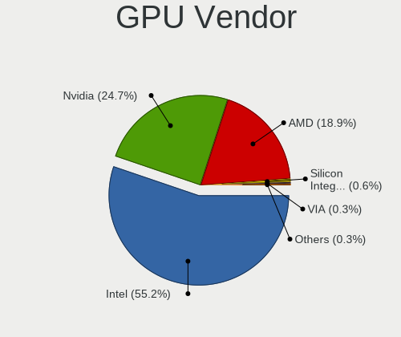
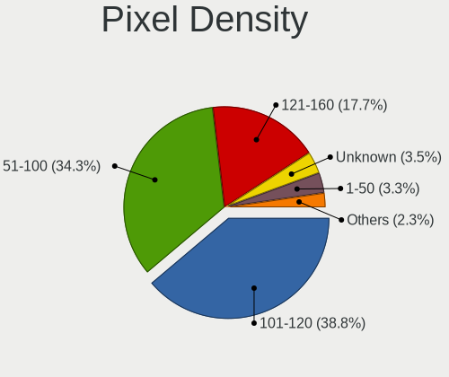
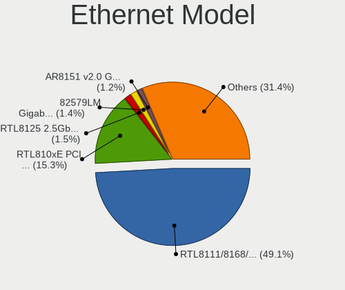
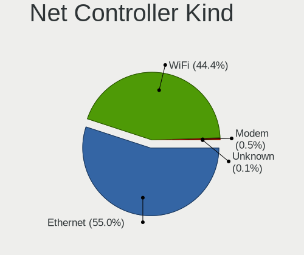

Linux in Brazil - Tested Hardware & Statistics
----------------------------------------------

A project to collect tested hardware configurations for Linux in Brazil.

Anyone can contribute to this report by the [hw-probe](https://github.com/linuxhw/hw-probe) tool:

    sudo -E hw-probe -all -upload

Please contribute! Especially if your hardware is rare.

This is a report for all computer types. See also reports for [desktops](/Location/Brazil/Desktop/README.md) and [notebooks](/Location/Brazil/Notebook/README.md).

Contents
--------

* [ Test Cases ](#test-cases)

* [ System ](#system)
  - [ OS                       ](#os)
  - [ OS Family                ](#os-family)
  - [ Kernel                   ](#kernel)
  - [ Kernel Family            ](#kernel-family)
  - [ Kernel Major Ver.        ](#kernel-major-ver)
  - [ Arch                     ](#arch)
  - [ DE                       ](#de)
  - [ Display Server           ](#display-server)
  - [ Display Manager          ](#display-manager)
  - [ OS Lang                  ](#os-lang)
  - [ Boot Mode                ](#boot-mode)
  - [ Filesystem               ](#filesystem)
  - [ Part. scheme             ](#part-scheme)
  - [ Dual Boot with Linux/BSD ](#dual-boot-with-linuxbsd)
  - [ Dual Boot (Win)          ](#dual-boot-win)

* [ Board ](#board)
  - [ Vendor                   ](#vendor)
  - [ Model                    ](#model)
  - [ Model Family             ](#model-family)
  - [ MFG Year                 ](#mfg-year)
  - [ Form Factor              ](#form-factor)
  - [ Secure Boot              ](#secure-boot)
  - [ Coreboot                 ](#coreboot)
  - [ RAM Size                 ](#ram-size)
  - [ RAM Used                 ](#ram-used)
  - [ Total Drives             ](#total-drives)
  - [ Has CD-ROM               ](#has-cd-rom)
  - [ Has Ethernet             ](#has-ethernet)
  - [ Has WiFi                 ](#has-wifi)
  - [ Has Bluetooth            ](#has-bluetooth)

* [ Location ](#location)
  - [ Country                  ](#country)
  - [ City                     ](#city)

* [ Drives ](#drives)
  - [ Drive Vendor             ](#drive-vendor)
  - [ Drive Model              ](#drive-model)
  - [ HDD Vendor               ](#hdd-vendor)
  - [ SSD Vendor               ](#ssd-vendor)
  - [ Drive Kind               ](#drive-kind)
  - [ Drive Connector          ](#drive-connector)
  - [ Drive Size               ](#drive-size)
  - [ Space Total              ](#space-total)
  - [ Space Used               ](#space-used)
  - [ Malfunc. Drives          ](#malfunc-drives)
  - [ Malfunc. Drive Vendor    ](#malfunc-drive-vendor)
  - [ Malfunc. HDD Vendor      ](#malfunc-hdd-vendor)
  - [ Malfunc. Drive Kind      ](#malfunc-drive-kind)
  - [ Failed Drives            ](#failed-drives)
  - [ Failed Drive Vendor      ](#failed-drive-vendor)
  - [ Drive Status             ](#drive-status)

* [ Storage controller ](#storage-controller)
  - [ Storage Vendor           ](#storage-vendor)
  - [ Storage Model            ](#storage-model)
  - [ Storage Kind             ](#storage-kind)

* [ Processor ](#processor)
  - [ CPU Vendor               ](#cpu-vendor)
  - [ CPU Model                ](#cpu-model)
  - [ CPU Model Family         ](#cpu-model-family)
  - [ CPU Cores                ](#cpu-cores)
  - [ CPU Sockets              ](#cpu-sockets)
  - [ CPU Threads              ](#cpu-threads)
  - [ CPU Op-Modes             ](#cpu-op-modes)
  - [ CPU Microcode            ](#cpu-microcode)
  - [ CPU Microarch            ](#cpu-microarch)

* [ Graphics ](#graphics)
  - [ GPU Vendor               ](#gpu-vendor)
  - [ GPU Model                ](#gpu-model)
  - [ GPU Combo                ](#gpu-combo)
  - [ GPU Driver               ](#gpu-driver)
  - [ GPU Memory               ](#gpu-memory)

* [ Monitor ](#monitor)
  - [ Monitor Vendor           ](#monitor-vendor)
  - [ Monitor Model            ](#monitor-model)
  - [ Monitor Resolution       ](#monitor-resolution)
  - [ Monitor Diagonal         ](#monitor-diagonal)
  - [ Monitor Width            ](#monitor-width)
  - [ Aspect Ratio             ](#aspect-ratio)
  - [ Monitor Area             ](#monitor-area)
  - [ Pixel Density            ](#pixel-density)
  - [ Multiple Monitors        ](#multiple-monitors)

* [ Network ](#network)
  - [ Net Controller Vendor    ](#net-controller-vendor)
  - [ Net Controller Model     ](#net-controller-model)
  - [ Wireless Vendor          ](#wireless-vendor)
  - [ Wireless Model           ](#wireless-model)
  - [ Ethernet Vendor          ](#ethernet-vendor)
  - [ Ethernet Model           ](#ethernet-model)
  - [ Net Controller Kind      ](#net-controller-kind)
  - [ Used Controller          ](#used-controller)
  - [ NICs                     ](#nics)
  - [ IPv6                     ](#ipv6)

* [ Bluetooth ](#bluetooth)
  - [ Bluetooth Vendor         ](#bluetooth-vendor)
  - [ Bluetooth Model          ](#bluetooth-model)

* [ Sound ](#sound)
  - [ Sound Vendor             ](#sound-vendor)
  - [ Sound Model              ](#sound-model)

* [ Memory ](#memory)
  - [ Memory Vendor            ](#memory-vendor)
  - [ Memory Model             ](#memory-model)
  - [ Memory Kind              ](#memory-kind)
  - [ Memory Form Factor       ](#memory-form-factor)
  - [ Memory Size              ](#memory-size)
  - [ Memory Speed             ](#memory-speed)

* [ Printers & scanners ](#printers--scanners)
  - [ Printer Vendor           ](#printer-vendor)
  - [ Printer Model            ](#printer-model)
  - [ Scanner Vendor           ](#scanner-vendor)
  - [ Scanner Model            ](#scanner-model)

* [ Camera ](#camera)
  - [ Camera Vendor            ](#camera-vendor)
  - [ Camera Model             ](#camera-model)

* [ Security ](#security)
  - [ Fingerprint Vendor       ](#fingerprint-vendor)
  - [ Fingerprint Model        ](#fingerprint-model)
  - [ Chipcard Vendor          ](#chipcard-vendor)
  - [ Chipcard Model           ](#chipcard-model)

* [ Unsupported ](#unsupported)
  - [ Unsupported Devices      ](#unsupported-devices)
  - [ Unsupported Device Types ](#unsupported-device-types)

Test Cases
----------

Total: 18866

| Vendor        | Model                       | Form-Factor | Probe                                                      | Date         |
|---------------|-----------------------------|-------------|------------------------------------------------------------|--------------|
| Notebook      | NJx0MU                      | Notebook    | [88d3849db5](https://linux-hardware.org/?probe=88d3849db5) | Jun 10, 2023 |
| Acer          | Aspire E5-574G              | Notebook    | [8ca78da386](https://linux-hardware.org/?probe=8ca78da386) | Jun 10, 2023 |
| Acer          | Aspire E1-572               | Notebook    | [532d86f9e6](https://linux-hardware.org/?probe=532d86f9e6) | Jun 10, 2023 |
| Dell          | 0PV3YR A05                  | Server      | [ba4527394e](https://linux-hardware.org/?probe=ba4527394e) | Jun 10, 2023 |
| Samsung       | 550XCJ/550XCR               | Notebook    | [d8dac01c79](https://linux-hardware.org/?probe=d8dac01c79) | Jun 10, 2023 |
| Valve         | Jupiter                     | Notebook    | [c1e32f24ee](https://linux-hardware.org/?probe=c1e32f24ee) | Jun 10, 2023 |
| Acer          | Nitro AN515-44              | Notebook    | [b3531502a8](https://linux-hardware.org/?probe=b3531502a8) | Jun 10, 2023 |
| Intel         | H81                         | Desktop     | [6a51c76e81](https://linux-hardware.org/?probe=6a51c76e81) | Jun 09, 2023 |
| Lenovo        | IdeaPad S145-15IWL 81S9     | Notebook    | [0b0c11a052](https://linux-hardware.org/?probe=0b0c11a052) | Jun 09, 2023 |
| Dell          | Vostro 3460                 | Notebook    | [e8ed8e8b1e](https://linux-hardware.org/?probe=e8ed8e8b1e) | Jun 09, 2023 |
| Dell          | Vostro 1310                 | Notebook    | [05fc6f167c](https://linux-hardware.org/?probe=05fc6f167c) | Jun 09, 2023 |
| Digibras      | NH4CU03                     | Notebook    | [c66d30943e](https://linux-hardware.org/?probe=c66d30943e) | Jun 09, 2023 |
| Gigabyte      | 970A-DS3P                   | Desktop     | [1bae25f67b](https://linux-hardware.org/?probe=1bae25f67b) | Jun 09, 2023 |
| Gigabyte      | GA-78LMT-USB3 R2 sex        | Desktop     | [bcad738da6](https://linux-hardware.org/?probe=bcad738da6) | Jun 09, 2023 |
| ASUSTek       | P8H61-M LX                  | Desktop     | [28d0a897d3](https://linux-hardware.org/?probe=28d0a897d3) | Jun 09, 2023 |
| ASUSTek       | STRIX B250F GAMING          | Desktop     | [c0fd33b9cc](https://linux-hardware.org/?probe=c0fd33b9cc) | Jun 09, 2023 |
| Dell          | Latitude E7240              | Notebook    | [1d8eb4fce4](https://linux-hardware.org/?probe=1d8eb4fce4) | Jun 09, 2023 |
| Dell          | Latitude E7240              | Notebook    | [da22551dca](https://linux-hardware.org/?probe=da22551dca) | Jun 09, 2023 |
| ASUSTek       | STRIX B250F GAMING          | Desktop     | [76c3e6625b](https://linux-hardware.org/?probe=76c3e6625b) | Jun 09, 2023 |
| Unknown       | GSUO H61V10C                | Desktop     | [0daf816953](https://linux-hardware.org/?probe=0daf816953) | Jun 09, 2023 |
| ASRock        | A320M-HD                    | Desktop     | [9e88454384](https://linux-hardware.org/?probe=9e88454384) | Jun 09, 2023 |
| Acer          | TravelMate P449-G2-M        | Notebook    | [6b42200bee](https://linux-hardware.org/?probe=6b42200bee) | Jun 09, 2023 |
| Acer          | TravelMate P449-G2-M        | Notebook    | [0fa009ad04](https://linux-hardware.org/?probe=0fa009ad04) | Jun 08, 2023 |
| MSI           | X470 GAMING PLUS MAX        | Desktop     | [a8724dfd68](https://linux-hardware.org/?probe=a8724dfd68) | Jun 08, 2023 |
| Dell          | G15 5520                    | Notebook    | [2410d016d6](https://linux-hardware.org/?probe=2410d016d6) | Jun 08, 2023 |
| Multilaser    | UB820                       | All in one  | [7a1e5beb6e](https://linux-hardware.org/?probe=7a1e5beb6e) | Jun 08, 2023 |
| Dell          | G15 5520                    | Notebook    | [8d48df5869](https://linux-hardware.org/?probe=8d48df5869) | Jun 07, 2023 |
| Gigabyte      | H610M H DDR4                | Desktop     | [e7cdd7e89b](https://linux-hardware.org/?probe=e7cdd7e89b) | Jun 07, 2023 |
| Dell          | Inspiron 15 5510            | Notebook    | [98d7cb7ea7](https://linux-hardware.org/?probe=98d7cb7ea7) | Jun 07, 2023 |
| Toshiba       | Satellite C855-233          | Notebook    | [fb90f9aa02](https://linux-hardware.org/?probe=fb90f9aa02) | Jun 07, 2023 |
| TYAN Compu... | S7020                       | Server      | [6b39aa397f](https://linux-hardware.org/?probe=6b39aa397f) | Jun 07, 2023 |
| Dell          | Inspiron 5548               | Notebook    | [e67581e121](https://linux-hardware.org/?probe=e67581e121) | Jun 07, 2023 |
| Dell          | Vostro 15 3510              | Notebook    | [b661a14644](https://linux-hardware.org/?probe=b661a14644) | Jun 07, 2023 |
| Google        | Chell                       | Notebook    | [cace26f9f9](https://linux-hardware.org/?probe=cace26f9f9) | Jun 07, 2023 |
| Toshiba       | IS 1413G                    | Notebook    | [cc023db7a9](https://linux-hardware.org/?probe=cc023db7a9) | Jun 07, 2023 |
| Acer          | Aspire A315-23              | Notebook    | [cbb39d8d29](https://linux-hardware.org/?probe=cbb39d8d29) | Jun 07, 2023 |
| Acer          | Aspire A315-23              | Notebook    | [47fd407976](https://linux-hardware.org/?probe=47fd407976) | Jun 07, 2023 |
| Acer          | Predator PH315-52           | Notebook    | [f7178495c7](https://linux-hardware.org/?probe=f7178495c7) | Jun 07, 2023 |
| DIEBOLD       | B85H3-M5                    | Desktop     | [7e56b1fd68](https://linux-hardware.org/?probe=7e56b1fd68) | Jun 07, 2023 |
| Positivo      | Mobile                      | Notebook    | [12d5c3248c](https://linux-hardware.org/?probe=12d5c3248c) | Jun 06, 2023 |
| ASRock        | B450M Steel Legend          | Desktop     | [5d75bba35e](https://linux-hardware.org/?probe=5d75bba35e) | Jun 06, 2023 |
| ASRock        | H310M-HG4                   | Desktop     | [47b2817d31](https://linux-hardware.org/?probe=47b2817d31) | Jun 06, 2023 |
| Samsung       | 300E5M/300E5L               | Notebook    | [e066300eac](https://linux-hardware.org/?probe=e066300eac) | Jun 06, 2023 |
| Dell          | 0NW6H5 A00                  | Desktop     | [631e6bba84](https://linux-hardware.org/?probe=631e6bba84) | Jun 06, 2023 |
| Dell          | 0PV3YR A05                  | Server      | [c685007aa8](https://linux-hardware.org/?probe=c685007aa8) | Jun 06, 2023 |
| Lenovo        | IdeaPad Z500 20202          | Notebook    | [2f138401f6](https://linux-hardware.org/?probe=2f138401f6) | Jun 06, 2023 |
| HP            | Laptop 14s-dq1xxx           | Notebook    | [8f99826bf1](https://linux-hardware.org/?probe=8f99826bf1) | Jun 06, 2023 |
| Intel         | DP55WB AAE64798-204         | Desktop     | [fe09edbecc](https://linux-hardware.org/?probe=fe09edbecc) | Jun 06, 2023 |
| Unknown       | Unknown                     | Desktop     | [e8df83921f](https://linux-hardware.org/?probe=e8df83921f) | Jun 06, 2023 |
| Notebook      | NJx0MU                      | Notebook    | [0f91c977f0](https://linux-hardware.org/?probe=0f91c977f0) | Jun 06, 2023 |
| Apple         | MacBookAir7,2               | Notebook    | [44cf28ec0e](https://linux-hardware.org/?probe=44cf28ec0e) | Jun 05, 2023 |
| ASUSTek       | M5A88-M                     | Desktop     | [bb29b433c0](https://linux-hardware.org/?probe=bb29b433c0) | Jun 05, 2023 |
| Compaq        | CQ-27                       | Notebook    | [ae3d9bce8c](https://linux-hardware.org/?probe=ae3d9bce8c) | Jun 05, 2023 |
| Acer          | Nitro AN515-52              | Notebook    | [e9d79e576b](https://linux-hardware.org/?probe=e9d79e576b) | Jun 05, 2023 |
| ASUSTek       | VX7SX                       | Notebook    | [ddf3010e73](https://linux-hardware.org/?probe=ddf3010e73) | Jun 05, 2023 |
| Intel         | DP965LT AAD41694-301        | Desktop     | [f72bcbf0a2](https://linux-hardware.org/?probe=f72bcbf0a2) | Jun 05, 2023 |
| Dell          | 0PV3YR A05                  | Server      | [da03bf4e08](https://linux-hardware.org/?probe=da03bf4e08) | Jun 05, 2023 |
| Biostar       | B350GT3                     | Desktop     | [b425f8d45a](https://linux-hardware.org/?probe=b425f8d45a) | Jun 05, 2023 |
| Samsung       | 950XEE                      | Notebook    | [cc47fd0df0](https://linux-hardware.org/?probe=cc47fd0df0) | Jun 05, 2023 |
| Notebook      | NJx0MU                      | Notebook    | [ce1569ee48](https://linux-hardware.org/?probe=ce1569ee48) | Jun 05, 2023 |
| Acer          | Aspire A315-42G             | Notebook    | [eb67866c74](https://linux-hardware.org/?probe=eb67866c74) | Jun 05, 2023 |
| Huanan        | X99-F8 GAMING V5.0          | Desktop     | [8cbfe4cdf0](https://linux-hardware.org/?probe=8cbfe4cdf0) | Jun 05, 2023 |
| ASUSTek       | PRIME B350M-A               | Desktop     | [3a0576b177](https://linux-hardware.org/?probe=3a0576b177) | Jun 05, 2023 |
| ASUSTek       | M5A88-M                     | Desktop     | [e750392f99](https://linux-hardware.org/?probe=e750392f99) | Jun 04, 2023 |
| Dell          | Latitude 3410               | Notebook    | [820e62c9d3](https://linux-hardware.org/?probe=820e62c9d3) | Jun 04, 2023 |
| Dell          | Latitude 3410               | Notebook    | [12515d41c8](https://linux-hardware.org/?probe=12515d41c8) | Jun 04, 2023 |
| Dell          | Inspiron N4030              | Notebook    | [4d82d8bf8b](https://linux-hardware.org/?probe=4d82d8bf8b) | Jun 04, 2023 |
| Toshiba       | IS 1412                     | Notebook    | [b1b0369688](https://linux-hardware.org/?probe=b1b0369688) | Jun 04, 2023 |
| Dell          | 09D7F7 A00                  | Desktop     | [9b80703b01](https://linux-hardware.org/?probe=9b80703b01) | Jun 04, 2023 |
| Gigabyte      | X570 AORUS PRO WIFI         | Desktop     | [f71eae78c5](https://linux-hardware.org/?probe=f71eae78c5) | Jun 04, 2023 |
| MSI           | MAG B550M MORTAR WIFI       | Desktop     | [aafda7cf63](https://linux-hardware.org/?probe=aafda7cf63) | Jun 04, 2023 |
| Dell          | 01XK1W A00                  | Desktop     | [8690705151](https://linux-hardware.org/?probe=8690705151) | Jun 04, 2023 |
| Huanan        | X99-F8 GAMING V2.0          | Desktop     | [8b790b76a6](https://linux-hardware.org/?probe=8b790b76a6) | Jun 03, 2023 |
| Dell          | Inspiron 5437               | Notebook    | [d805b4ec1f](https://linux-hardware.org/?probe=d805b4ec1f) | Jun 03, 2023 |
| Biostar       | B450MX-S                    | Desktop     | [ccc6b5c4b5](https://linux-hardware.org/?probe=ccc6b5c4b5) | Jun 03, 2023 |
| Biostar       | B450MX-S                    | Desktop     | [6a01df1d69](https://linux-hardware.org/?probe=6a01df1d69) | Jun 03, 2023 |
| Compaq        | 420                         | Notebook    | [cf7a8f5641](https://linux-hardware.org/?probe=cf7a8f5641) | Jun 03, 2023 |
| Toshiba       | IS 1412                     | Notebook    | [6ea1bc7e6a](https://linux-hardware.org/?probe=6ea1bc7e6a) | Jun 03, 2023 |
| Positivo      | POS-EINM70CS POS            | Desktop     | [80260b495c](https://linux-hardware.org/?probe=80260b495c) | Jun 03, 2023 |
| Positivo      | POS-PIG41BA                 | Desktop     | [f630c0b9cd](https://linux-hardware.org/?probe=f630c0b9cd) | Jun 03, 2023 |
| Intel         | B75                         | Desktop     | [2387f30645](https://linux-hardware.org/?probe=2387f30645) | Jun 03, 2023 |
| Positivo      | POS-RIB360EE 11144907       | Desktop     | [7837922f5b](https://linux-hardware.org/?probe=7837922f5b) | Jun 02, 2023 |
| Dell          | 0GX832 A01                  | Desktop     | [19b718a96c](https://linux-hardware.org/?probe=19b718a96c) | Jun 02, 2023 |
| Samsung       | 670Z5E                      | Notebook    | [647589cbbd](https://linux-hardware.org/?probe=647589cbbd) | Jun 02, 2023 |
| Dell          | Inspiron N4030              | Notebook    | [3c92b81349](https://linux-hardware.org/?probe=3c92b81349) | Jun 02, 2023 |
| Dell          | Inspiron N4030              | Notebook    | [1aca93ba38](https://linux-hardware.org/?probe=1aca93ba38) | Jun 02, 2023 |
| Unknown       | X99                         | Desktop     | [0ffca5934a](https://linux-hardware.org/?probe=0ffca5934a) | Jun 02, 2023 |
| Samsung       | 730QED                      | Convertible | [f447d7526c](https://linux-hardware.org/?probe=f447d7526c) | Jun 02, 2023 |
| Gigabyte      | Z590 UD AC                  | Desktop     | [da5b2056e4](https://linux-hardware.org/?probe=da5b2056e4) | Jun 02, 2023 |
| Positivo      | POS-RIB360EE 11144907       | Desktop     | [b4ba7702cb](https://linux-hardware.org/?probe=b4ba7702cb) | Jun 02, 2023 |
| Dell          | Inspiron 15 7000 Gaming     | Notebook    | [664282cc84](https://linux-hardware.org/?probe=664282cc84) | Jun 02, 2023 |
| Samsung       | 730QED                      | Convertible | [ca8f4d1ff7](https://linux-hardware.org/?probe=ca8f4d1ff7) | Jun 02, 2023 |
| Dell          | G15 5520                    | Notebook    | [5880c98c54](https://linux-hardware.org/?probe=5880c98c54) | Jun 02, 2023 |
| Acer          | Nitro AN515-51              | Notebook    | [2dc3c08466](https://linux-hardware.org/?probe=2dc3c08466) | Jun 02, 2023 |
| Lenovo        | IdeaPad 320-15IKB 80YH      | Notebook    | [55c7d4b615](https://linux-hardware.org/?probe=55c7d4b615) | Jun 02, 2023 |
| HP            | 420                         | Notebook    | [0e369b273b](https://linux-hardware.org/?probe=0e369b273b) | Jun 02, 2023 |
| Positivo B... | VJFE43F11X-XXXXXX           | Notebook    | [ea337d3d2a](https://linux-hardware.org/?probe=ea337d3d2a) | Jun 02, 2023 |
| Dell          | 01XK1W A00                  | Desktop     | [5846820609](https://linux-hardware.org/?probe=5846820609) | Jun 02, 2023 |
| ASUSTek       | PRIME X570-P                | Desktop     | [cde4aaef3e](https://linux-hardware.org/?probe=cde4aaef3e) | Jun 01, 2023 |
| Portwell      | RuggedBookJ10               | Tablet      | [828336f149](https://linux-hardware.org/?probe=828336f149) | Jun 01, 2023 |
| Itautec       | ST 4265 ST-4265 Padrao 0... | Desktop     | [7ac5ec7c05](https://linux-hardware.org/?probe=7ac5ec7c05) | Jun 01, 2023 |
| Lenovo        | G400s VILG1                 | Notebook    | [fee541ee18](https://linux-hardware.org/?probe=fee541ee18) | Jun 01, 2023 |
| Lenovo        | IdeaPad 330-15IKB 81FD      | Notebook    | [33e440f44f](https://linux-hardware.org/?probe=33e440f44f) | Jun 01, 2023 |
| HP            | Pavilion dv6600             | Notebook    | [5e2867ee61](https://linux-hardware.org/?probe=5e2867ee61) | Jun 01, 2023 |
| Acer          | Aspire A515-45              | Notebook    | [17621fb846](https://linux-hardware.org/?probe=17621fb846) | Jun 01, 2023 |
| Dell          | 0PV3YR A05                  | Server      | [a4363d8242](https://linux-hardware.org/?probe=a4363d8242) | Jun 01, 2023 |
| Apple         | MacBookPro11,1              | Notebook    | [fd232702db](https://linux-hardware.org/?probe=fd232702db) | Jun 01, 2023 |
| Notebook      | NJx0MU                      | Notebook    | [46f5148174](https://linux-hardware.org/?probe=46f5148174) | Jun 01, 2023 |
| Samsung       | 300E5K/300E5Q               | Notebook    | [00d2d07850](https://linux-hardware.org/?probe=00d2d07850) | May 31, 2023 |
| Unknown       | Unknown                     | Notebook    | [412c6d4af8](https://linux-hardware.org/?probe=412c6d4af8) | May 31, 2023 |
| HP            | Pavilion dv4                | Notebook    | [75797b5ec9](https://linux-hardware.org/?probe=75797b5ec9) | May 31, 2023 |
| Dell          | 0PV3YR A05                  | Server      | [aad1baf686](https://linux-hardware.org/?probe=aad1baf686) | May 31, 2023 |
| Apple         | MacBookPro7,1               | Notebook    | [4fc174a983](https://linux-hardware.org/?probe=4fc174a983) | May 31, 2023 |
| Toshiba       | IS 1413G                    | Notebook    | [d950f8b732](https://linux-hardware.org/?probe=d950f8b732) | May 31, 2023 |
| Acer          | TravelMate P449-G2-M        | Notebook    | [41177ef027](https://linux-hardware.org/?probe=41177ef027) | May 31, 2023 |
| Notebook      | NJx0MU                      | Notebook    | [dab4e98680](https://linux-hardware.org/?probe=dab4e98680) | May 31, 2023 |
| Lenovo        | IdeaPad 320-15IKB 80YH      | Notebook    | [1b457302ec](https://linux-hardware.org/?probe=1b457302ec) | May 31, 2023 |
| AZW           | GTR V02                     | Desktop     | [bd1740c7b2](https://linux-hardware.org/?probe=bd1740c7b2) | May 31, 2023 |
| AZW           | GTR V02                     | Desktop     | [cab90f1838](https://linux-hardware.org/?probe=cab90f1838) | May 31, 2023 |
| Dell          | 01XK1W A00                  | Desktop     | [8a18b7bada](https://linux-hardware.org/?probe=8a18b7bada) | May 31, 2023 |
| Dell          | 01XK1W A00                  | Desktop     | [611cf59f44](https://linux-hardware.org/?probe=611cf59f44) | May 31, 2023 |
| MSI           | B450M MORTAR MAX            | Desktop     | [1d0c56937c](https://linux-hardware.org/?probe=1d0c56937c) | May 31, 2023 |
| Acer          | Nitro AN515-51              | Notebook    | [d3ee3757e0](https://linux-hardware.org/?probe=d3ee3757e0) | May 30, 2023 |
| Notebook      | P15SM-A/SM1-A               | Notebook    | [e71d8e3bc0](https://linux-hardware.org/?probe=e71d8e3bc0) | May 30, 2023 |
| Dell          | Inspiron 15-3567            | Notebook    | [e51e0ef0da](https://linux-hardware.org/?probe=e51e0ef0da) | May 30, 2023 |
| Apple         | MacBookPro11,1              | Notebook    | [ac2f40b972](https://linux-hardware.org/?probe=ac2f40b972) | May 30, 2023 |
| ASRock        | H310CM-HG4                  | Desktop     | [9fa8d9d320](https://linux-hardware.org/?probe=9fa8d9d320) | May 30, 2023 |
| Unknown       | Unknown                     | Notebook    | [9390923473](https://linux-hardware.org/?probe=9390923473) | May 30, 2023 |
| Apple         | MacBookPro11,1              | Notebook    | [f45bc9a282](https://linux-hardware.org/?probe=f45bc9a282) | May 30, 2023 |
| Lenovo        | 3098 SDK0E50510 WIN         | Desktop     | [2334995ee9](https://linux-hardware.org/?probe=2334995ee9) | May 30, 2023 |
| Samsung       | RV419/RV420                 | Notebook    | [ddab046bd5](https://linux-hardware.org/?probe=ddab046bd5) | May 30, 2023 |
| Dell          | 0GXM1W A02                  | Desktop     | [9c252c8688](https://linux-hardware.org/?probe=9c252c8688) | May 30, 2023 |
| Dell          | 0PV3YR A05                  | Server      | [dd6ecadb7e](https://linux-hardware.org/?probe=dd6ecadb7e) | May 30, 2023 |
| Notebook      | NJx0MU                      | Notebook    | [c0ec67e3b1](https://linux-hardware.org/?probe=c0ec67e3b1) | May 30, 2023 |
| Dell          | Inspiron 1525               | Notebook    | [29d2e377ad](https://linux-hardware.org/?probe=29d2e377ad) | May 29, 2023 |
| Acer          | Aspire A515-57              | Notebook    | [e9f91331b2](https://linux-hardware.org/?probe=e9f91331b2) | May 29, 2023 |
| Itautec       | ST 4265                     | Desktop     | [8814373cb4](https://linux-hardware.org/?probe=8814373cb4) | May 29, 2023 |
| ASUSTek       | TUF Gaming B650M-PLUS WI... | Desktop     | [e29eb3dfcc](https://linux-hardware.org/?probe=e29eb3dfcc) | May 29, 2023 |
| Avell High... | A70 MOB                     | Notebook    | [70e4c12911](https://linux-hardware.org/?probe=70e4c12911) | May 29, 2023 |
| Dell          | Inspiron 1525               | Notebook    | [7adfc9796d](https://linux-hardware.org/?probe=7adfc9796d) | May 29, 2023 |
| Sony          | VPCSA25GB                   | Notebook    | [981a09e39a](https://linux-hardware.org/?probe=981a09e39a) | May 29, 2023 |
| Sony          | VPCSA25GB                   | Notebook    | [e36e944a92](https://linux-hardware.org/?probe=e36e944a92) | May 29, 2023 |
| Itautec       | ST 4265                     | Desktop     | [b89c45a31d](https://linux-hardware.org/?probe=b89c45a31d) | May 29, 2023 |
| Dell          | 0NM64V A01                  | Desktop     | [a109a924f0](https://linux-hardware.org/?probe=a109a924f0) | May 29, 2023 |
| Dell          | Inspiron 5447               | Notebook    | [270e3cd993](https://linux-hardware.org/?probe=270e3cd993) | May 29, 2023 |
| Dell          | 0PV3YR A05                  | Server      | [54afc82ebc](https://linux-hardware.org/?probe=54afc82ebc) | May 29, 2023 |
| HP            | Pavilion g4                 | Notebook    | [12bef484db](https://linux-hardware.org/?probe=12bef484db) | May 29, 2023 |
| Notebook      | NJx0MU                      | Notebook    | [f46b9b1b6a](https://linux-hardware.org/?probe=f46b9b1b6a) | May 29, 2023 |
| Lenovo        | IdeaPad 320-15IKB 80YH      | Notebook    | [14e5763b6f](https://linux-hardware.org/?probe=14e5763b6f) | May 29, 2023 |
| Apple         | MacBookAir5,1               | Notebook    | [4fc496bcc4](https://linux-hardware.org/?probe=4fc496bcc4) | May 29, 2023 |
| Acer          | Aspire VX5-591G             | Notebook    | [1db96272fe](https://linux-hardware.org/?probe=1db96272fe) | May 29, 2023 |
| Dell          | Inspiron 1525               | Notebook    | [99540846c4](https://linux-hardware.org/?probe=99540846c4) | May 28, 2023 |
| Dell          | Inspiron 1525               | Notebook    | [99c9a792f5](https://linux-hardware.org/?probe=99c9a792f5) | May 28, 2023 |
| ASRock        | B450M Steel Legend          | Desktop     | [b8436530b0](https://linux-hardware.org/?probe=b8436530b0) | May 28, 2023 |
| Lenovo        | IdeaPad Gaming 3 15IMH05... | Notebook    | [95793a85de](https://linux-hardware.org/?probe=95793a85de) | May 28, 2023 |
| Lenovo        | IdeaPad Gaming 3 15IMH05... | Notebook    | [7c9addaf1c](https://linux-hardware.org/?probe=7c9addaf1c) | May 28, 2023 |
| Lenovo        | IdeaPad 320-15IKB 80YH      | Notebook    | [1b4eb11af8](https://linux-hardware.org/?probe=1b4eb11af8) | May 28, 2023 |
| ASUSTek       | TUF Gaming B650M-PLUS WI... | Desktop     | [40ba623a3e](https://linux-hardware.org/?probe=40ba623a3e) | May 28, 2023 |
| Lenovo        | IdeaPad Gaming 3 15IHU6 ... | Notebook    | [77e5b682ff](https://linux-hardware.org/?probe=77e5b682ff) | May 28, 2023 |
| MSI           | A520M-A PRO                 | Desktop     | [c78b5e28f1](https://linux-hardware.org/?probe=c78b5e28f1) | May 28, 2023 |
| Unknown       | Unknown                     | Notebook    | [9051961e40](https://linux-hardware.org/?probe=9051961e40) | May 28, 2023 |
| Positivo      | N1250                       | Notebook    | [f014b93eba](https://linux-hardware.org/?probe=f014b93eba) | May 28, 2023 |
| ASRock        | H510M-HVS R2.0              | Desktop     | [c4ee84b38e](https://linux-hardware.org/?probe=c4ee84b38e) | May 28, 2023 |
| Dell          | Inspiron 5421               | Notebook    | [c559e851a2](https://linux-hardware.org/?probe=c559e851a2) | May 28, 2023 |
| Dell          | 01XK1W A00                  | Desktop     | [a81daffe89](https://linux-hardware.org/?probe=a81daffe89) | May 28, 2023 |
| Samsung       | 270E5J/2570EJ               | Notebook    | [f90f831805](https://linux-hardware.org/?probe=f90f831805) | May 28, 2023 |
| Intel         | X99                         | Desktop     | [6826d78921](https://linux-hardware.org/?probe=6826d78921) | May 28, 2023 |
| Dell          | 01XK1W A00                  | Desktop     | [ef918dfbfa](https://linux-hardware.org/?probe=ef918dfbfa) | May 28, 2023 |
| Dell          | Vostro 5402                 | Notebook    | [41a9c1dcf2](https://linux-hardware.org/?probe=41a9c1dcf2) | May 28, 2023 |
| Intel         | X58M                        | Desktop     | [912addab98](https://linux-hardware.org/?probe=912addab98) | May 27, 2023 |
| Intel         | DH77EB AAG39073-304         | Desktop     | [8310aaaa78](https://linux-hardware.org/?probe=8310aaaa78) | May 27, 2023 |
| ASUSTek       | TUF Gaming B460M-PLUS       | Desktop     | [ad8e3ea3ea](https://linux-hardware.org/?probe=ad8e3ea3ea) | May 27, 2023 |
| Wistron       | ProLiant ML110 G6           | Desktop     | [bc1c76bb8f](https://linux-hardware.org/?probe=bc1c76bb8f) | May 27, 2023 |
| Intel         | DH77EB AAG39073-304         | Desktop     | [86545c89c0](https://linux-hardware.org/?probe=86545c89c0) | May 27, 2023 |
| Intel         | B75                         | Desktop     | [8dba7fa195](https://linux-hardware.org/?probe=8dba7fa195) | May 27, 2023 |
| Acer          | Aspire A515-45              | Notebook    | [e429db5b0b](https://linux-hardware.org/?probe=e429db5b0b) | May 27, 2023 |
| Dell          | Latitude 7490               | Notebook    | [fbad4c1a53](https://linux-hardware.org/?probe=fbad4c1a53) | May 27, 2023 |
| Dell          | Latitude 7490               | Notebook    | [00c44ed00c](https://linux-hardware.org/?probe=00c44ed00c) | May 27, 2023 |
| Positivo      | C14CR21TV                   | Notebook    | [f3907d940d](https://linux-hardware.org/?probe=f3907d940d) | May 27, 2023 |
| HP            | 1000                        | Notebook    | [f3b014fa71](https://linux-hardware.org/?probe=f3b014fa71) | May 27, 2023 |
| Lenovo        | IdeaPad Gaming 3 15IMH05... | Notebook    | [82cad47c63](https://linux-hardware.org/?probe=82cad47c63) | May 27, 2023 |
| Lenovo        | IdeaPad Gaming 3 15IMH05... | Notebook    | [09cc59aa19](https://linux-hardware.org/?probe=09cc59aa19) | May 27, 2023 |
| HP            | Pavilion dm4                | Notebook    | [708daa02e2](https://linux-hardware.org/?probe=708daa02e2) | May 26, 2023 |
| Lenovo        | IdeaPad 320-14IKB 80YF      | Notebook    | [8b93a6ab33](https://linux-hardware.org/?probe=8b93a6ab33) | May 26, 2023 |
| ASUSTek       | PRIME B450M-GAMING/BR       | Desktop     | [1cbedc352f](https://linux-hardware.org/?probe=1cbedc352f) | May 26, 2023 |
| Lenovo        | IdeaPad 3 15ALC6 82MF       | Notebook    | [2b9c4431c2](https://linux-hardware.org/?probe=2b9c4431c2) | May 26, 2023 |
| Lenovo        | IdeaPad 3 15ALC6 82MF       | Notebook    | [f5b571be32](https://linux-hardware.org/?probe=f5b571be32) | May 26, 2023 |
| Itautec       | Infoway                     | Notebook    | [03be6afc10](https://linux-hardware.org/?probe=03be6afc10) | May 26, 2023 |
| Dell          | Inspiron 15-3567            | Notebook    | [0f79b43742](https://linux-hardware.org/?probe=0f79b43742) | May 26, 2023 |
| ASUSTek       | P8H61-M LX3 R2.0            | Desktop     | [4fedff68f1](https://linux-hardware.org/?probe=4fedff68f1) | May 26, 2023 |
| Gigabyte      | B450 AORUS M                | Desktop     | [40af2d79f9](https://linux-hardware.org/?probe=40af2d79f9) | May 26, 2023 |
| Samsung       | 550XDA                      | Notebook    | [6cc9f3cbe4](https://linux-hardware.org/?probe=6cc9f3cbe4) | May 26, 2023 |
| ASUSTek       | PRIME A320M-K/BR            | Desktop     | [248bd35ba0](https://linux-hardware.org/?probe=248bd35ba0) | May 26, 2023 |
| ASUSTek       | H110M-C/BR                  | Desktop     | [1c272c65dc](https://linux-hardware.org/?probe=1c272c65dc) | May 26, 2023 |
| ASRock        | A320M-HDV R4.0              | Desktop     | [c897394a34](https://linux-hardware.org/?probe=c897394a34) | May 26, 2023 |
| Acer          | Predator PT316-51s          | Notebook    | [0242988287](https://linux-hardware.org/?probe=0242988287) | May 26, 2023 |
| Toshiba       | STI 005492G                 | Desktop     | [4f161f4ed0](https://linux-hardware.org/?probe=4f161f4ed0) | May 26, 2023 |
| LG Electro... | V720                        | All in one  | [5dbe7c937c](https://linux-hardware.org/?probe=5dbe7c937c) | May 26, 2023 |
| HP            | ProBook 645 G1              | Notebook    | [347779f3bf](https://linux-hardware.org/?probe=347779f3bf) | May 26, 2023 |
| A14CR         | Unknown                     | Notebook    | [a504061244](https://linux-hardware.org/?probe=a504061244) | May 25, 2023 |
| Clevo         | P150HMx                     | Notebook    | [d6c90a2c0c](https://linux-hardware.org/?probe=d6c90a2c0c) | May 25, 2023 |
| LG Electro... | 22V280 FAB1                 | All in one  | [0df1994f25](https://linux-hardware.org/?probe=0df1994f25) | May 25, 2023 |
| ASUSTek       | TUF Gaming B560M-PLUS       | Desktop     | [a49bd1dd26](https://linux-hardware.org/?probe=a49bd1dd26) | May 25, 2023 |
| ASUSTek       | VivoBook 15_ASUS Laptop ... | Notebook    | [0ffdb62c45](https://linux-hardware.org/?probe=0ffdb62c45) | May 25, 2023 |
| Lenovo        | IdeaPad 330-15IKB 81FE      | Notebook    | [fcecd714d6](https://linux-hardware.org/?probe=fcecd714d6) | May 25, 2023 |
| Lenovo        | IdeaPad 330-15IGM 81FN      | Notebook    | [3304e68c39](https://linux-hardware.org/?probe=3304e68c39) | May 25, 2023 |
| ASUSTek       | PRIME B450M-GAMING/BR       | Desktop     | [2a3382aa0c](https://linux-hardware.org/?probe=2a3382aa0c) | May 25, 2023 |
| PCWare        | IPMH110G                    | Desktop     | [33b6fce5ff](https://linux-hardware.org/?probe=33b6fce5ff) | May 25, 2023 |
| Fujitsu       | LIFEBOOK AH530              | Notebook    | [c885a13922](https://linux-hardware.org/?probe=c885a13922) | May 25, 2023 |
| Fujitsu       | LIFEBOOK AH530              | Notebook    | [897b688aba](https://linux-hardware.org/?probe=897b688aba) | May 25, 2023 |
| Biostar       | A68MHE                      | Desktop     | [d1ef52da36](https://linux-hardware.org/?probe=d1ef52da36) | May 25, 2023 |
| PHILCO ELE... | PNB15.6AP34H1W10            | Notebook    | [dc91cb92af](https://linux-hardware.org/?probe=dc91cb92af) | May 25, 2023 |
| LG Electro... | V720                        | All in one  | [686e013b62](https://linux-hardware.org/?probe=686e013b62) | May 25, 2023 |
| ASUSTek       | PRIME B760M-A D4            | Desktop     | [95321eedeb](https://linux-hardware.org/?probe=95321eedeb) | May 25, 2023 |
| Biostar       | A68MHE                      | Desktop     | [e2244a8ed0](https://linux-hardware.org/?probe=e2244a8ed0) | May 25, 2023 |
| ASUSTek       | PRIME B450M-GAMING/BR       | Desktop     | [2c31d88fa2](https://linux-hardware.org/?probe=2c31d88fa2) | May 25, 2023 |
| ASUSTek       | PRIME B450M-GAMING/BR       | Desktop     | [efb5aa9bfc](https://linux-hardware.org/?probe=efb5aa9bfc) | May 24, 2023 |
| ASUSTek       | PRIME H510M-E               | Desktop     | [1247209c34](https://linux-hardware.org/?probe=1247209c34) | May 24, 2023 |
| Biostar       | N61PB-M2S                   | Desktop     | [e4669affdb](https://linux-hardware.org/?probe=e4669affdb) | May 24, 2023 |
| AZW           | SEi                         | Desktop     | [bc0c7a512f](https://linux-hardware.org/?probe=bc0c7a512f) | May 24, 2023 |
| ASRock        | A320M-HDV R4.0              | Desktop     | [bce76b90ef](https://linux-hardware.org/?probe=bce76b90ef) | May 24, 2023 |
| ASUSTek       | VivoBook_ASUSLaptop X515... | Notebook    | [86666c3371](https://linux-hardware.org/?probe=86666c3371) | May 24, 2023 |
| ASUSTek       | TUF Gaming B650M-PLUS WI... | Desktop     | [44861be08c](https://linux-hardware.org/?probe=44861be08c) | May 24, 2023 |
| Avell High... | A72 HYB                     | Notebook    | [c6f131b8b1](https://linux-hardware.org/?probe=c6f131b8b1) | May 24, 2023 |
| Avell High... | A72 HYB                     | Notebook    | [d54fb61d87](https://linux-hardware.org/?probe=d54fb61d87) | May 24, 2023 |
| AZW           | SEi                         | Desktop     | [825fbaebcd](https://linux-hardware.org/?probe=825fbaebcd) | May 23, 2023 |
| Dell          | XPS 13 9300                 | Notebook    | [255811069a](https://linux-hardware.org/?probe=255811069a) | May 23, 2023 |
| ASUSTek       | B85M-E/BR                   | Desktop     | [ed20b84824](https://linux-hardware.org/?probe=ed20b84824) | May 23, 2023 |
| Intel         | H61                         | Desktop     | [794ecc6c43](https://linux-hardware.org/?probe=794ecc6c43) | May 23, 2023 |
| Dell          | Inspiron 3583               | Notebook    | [7f5d36cc34](https://linux-hardware.org/?probe=7f5d36cc34) | May 23, 2023 |
| Dell          | Vostro 5402                 | Notebook    | [e6834866ba](https://linux-hardware.org/?probe=e6834866ba) | May 23, 2023 |
| Dell          | 0H19HD A06                  | Server      | [25975db1c4](https://linux-hardware.org/?probe=25975db1c4) | May 23, 2023 |
| Gigabyte      | 970A-DS3P FX                | Desktop     | [9063693561](https://linux-hardware.org/?probe=9063693561) | May 23, 2023 |
| Dell          | Inspiron 1525               | Notebook    | [a92437f5aa](https://linux-hardware.org/?probe=a92437f5aa) | May 23, 2023 |
| Gigabyte      | A320M-S2H-CF SE1            | Desktop     | [61ede8f95d](https://linux-hardware.org/?probe=61ede8f95d) | May 23, 2023 |
| Chuwi         | HeroBook Air                | Notebook    | [724db856f3](https://linux-hardware.org/?probe=724db856f3) | May 23, 2023 |
| Dell          | 0PV3YR A05                  | Server      | [db6ba1c42e](https://linux-hardware.org/?probe=db6ba1c42e) | May 23, 2023 |
| Notebook      | NJx0MU                      | Notebook    | [1ff1bde0f0](https://linux-hardware.org/?probe=1ff1bde0f0) | May 23, 2023 |
| Dell          | Inspiron 1525               | Notebook    | [2afda2396c](https://linux-hardware.org/?probe=2afda2396c) | May 22, 2023 |
| Intel         | DP55WB AAE64798-205         | Desktop     | [91bb4c8e5d](https://linux-hardware.org/?probe=91bb4c8e5d) | May 22, 2023 |
| ASUSTek       | VivoBook_ASUSLaptop X515... | Notebook    | [84717aefdf](https://linux-hardware.org/?probe=84717aefdf) | May 22, 2023 |
| Acer          | Swift SF514-56T             | Notebook    | [81a0e002b7](https://linux-hardware.org/?probe=81a0e002b7) | May 22, 2023 |
| Dell          | Inspiron 3443               | Notebook    | [35923f74b5](https://linux-hardware.org/?probe=35923f74b5) | May 22, 2023 |
| ASUSTek       | P8H61-M LX3 R2.0            | Desktop     | [2f1b921a18](https://linux-hardware.org/?probe=2f1b921a18) | May 22, 2023 |
| Dell          | Inspiron 7520               | Notebook    | [eeca18ff12](https://linux-hardware.org/?probe=eeca18ff12) | May 22, 2023 |
| Dell          | 0PV3YR A05                  | Server      | [17d027794e](https://linux-hardware.org/?probe=17d027794e) | May 22, 2023 |
| Samsung       | 300E5M/300E5L               | Notebook    | [ebd65238d8](https://linux-hardware.org/?probe=ebd65238d8) | May 22, 2023 |
| Notebook      | NJx0MU                      | Notebook    | [98473b6b1e](https://linux-hardware.org/?probe=98473b6b1e) | May 22, 2023 |
| Philco        | 14H                         | Notebook    | [5dbb0cb3b7](https://linux-hardware.org/?probe=5dbb0cb3b7) | May 21, 2023 |
| Dell          | XPS 13 9310                 | Notebook    | [19be933f8a](https://linux-hardware.org/?probe=19be933f8a) | May 21, 2023 |
| Gigabyte      | A320M-S2H-CF                | Desktop     | [7ff619a028](https://linux-hardware.org/?probe=7ff619a028) | May 21, 2023 |
| Apple         | Mac-77F17D7DA9285301 iMa... | All in one  | [f20160cf5b](https://linux-hardware.org/?probe=f20160cf5b) | May 21, 2023 |
| Apple         | Mac-77F17D7DA9285301 iMa... | All in one  | [1b8a739f9a](https://linux-hardware.org/?probe=1b8a739f9a) | May 21, 2023 |
| Positivo      | POS-EIQ87CY POSITIVO        | Desktop     | [2a95b22ac3](https://linux-hardware.org/?probe=2a95b22ac3) | May 21, 2023 |
| ASRock        | H310CM-HG4                  | Desktop     | [6f698f47d8](https://linux-hardware.org/?probe=6f698f47d8) | May 21, 2023 |
| Unknown       | GSUO H61V10C                | Desktop     | [8e1037e4c1](https://linux-hardware.org/?probe=8e1037e4c1) | May 20, 2023 |
| Toshiba       | IS 1413G                    | Notebook    | [4c5dce3a01](https://linux-hardware.org/?probe=4c5dce3a01) | May 20, 2023 |
| ASRock        | 970A-G                      | Desktop     | [fd39b2185b](https://linux-hardware.org/?probe=fd39b2185b) | May 20, 2023 |
| Gigabyte      | B660M AORUS PRO DDR4        | Desktop     | [6a3afbb593](https://linux-hardware.org/?probe=6a3afbb593) | May 20, 2023 |
| Dell          | 0VTJVC A00                  | Desktop     | [1acd938f30](https://linux-hardware.org/?probe=1acd938f30) | May 20, 2023 |
| ASRock        | 970A-G                      | Desktop     | [fac3e3c961](https://linux-hardware.org/?probe=fac3e3c961) | May 20, 2023 |
| Acer          | Nitro AN517-54              | Notebook    | [105fb43fc1](https://linux-hardware.org/?probe=105fb43fc1) | May 20, 2023 |
| Samsung       | 300E5EV/300E4EV/270E5EV/... | Notebook    | [42ab4c7e67](https://linux-hardware.org/?probe=42ab4c7e67) | May 20, 2023 |
| ASRock        | A320M-HD                    | Desktop     | [1a05e80ee5](https://linux-hardware.org/?probe=1a05e80ee5) | May 20, 2023 |
| MSI           | X99S SLI PLUS               | Desktop     | [35b5231ed2](https://linux-hardware.org/?probe=35b5231ed2) | May 20, 2023 |
| Daten Tecn... | DA320MXV DC                 | Desktop     | [0b7e1e51b9](https://linux-hardware.org/?probe=0b7e1e51b9) | May 20, 2023 |
| Acer          | Nitro AN515-54              | Notebook    | [4f27fb9c64](https://linux-hardware.org/?probe=4f27fb9c64) | May 20, 2023 |
| Lenovo        | IdeaPad 320-15IKB 80YH      | Notebook    | [2cde0cc93d](https://linux-hardware.org/?probe=2cde0cc93d) | May 19, 2023 |
| ASUSTek       | PRIME A320M-K/BR            | Desktop     | [986792e4f0](https://linux-hardware.org/?probe=986792e4f0) | May 19, 2023 |
| Acer          | Aspire A315-42G             | Notebook    | [1125a4111e](https://linux-hardware.org/?probe=1125a4111e) | May 19, 2023 |
| ASRock        | Z590M Pro4                  | Desktop     | [d039ed90c5](https://linux-hardware.org/?probe=d039ed90c5) | May 19, 2023 |
| Dell          | Inspiron 3442               | Notebook    | [a8bb37c78e](https://linux-hardware.org/?probe=a8bb37c78e) | May 19, 2023 |
| Gigabyte      | H510M H                     | Desktop     | [39725fefa4](https://linux-hardware.org/?probe=39725fefa4) | May 19, 2023 |
| Avell High... | A40 LIV                     | Notebook    | [d1e00e62c4](https://linux-hardware.org/?probe=d1e00e62c4) | May 19, 2023 |
| Samsung       | 300E5EV/300E4EV/270E5EV/... | Notebook    | [9475bc847b](https://linux-hardware.org/?probe=9475bc847b) | May 19, 2023 |
| MSI           | H110M PRO-VH PLUS           | Desktop     | [14985fd04f](https://linux-hardware.org/?probe=14985fd04f) | May 18, 2023 |
| Dell          | Vostro 15 3515              | Notebook    | [6b5bc55aeb](https://linux-hardware.org/?probe=6b5bc55aeb) | May 18, 2023 |
| Dell          | Vostro 15 3515              | Notebook    | [e26f4ecf2f](https://linux-hardware.org/?probe=e26f4ecf2f) | May 18, 2023 |
| Lenovo        | ThinkPad T400 2767E53       | Notebook    | [5cd6c87b7e](https://linux-hardware.org/?probe=5cd6c87b7e) | May 18, 2023 |
| Dell          | Vostro 15 3510              | Notebook    | [e5e7213107](https://linux-hardware.org/?probe=e5e7213107) | May 18, 2023 |
| Megaware      | MW-H61M-2H v1.3 - 17/07/... | Desktop     | [72303201a3](https://linux-hardware.org/?probe=72303201a3) | May 18, 2023 |
| Lenovo        | ThinkPad T490s 20NXS01Y0... | Notebook    | [277ed003ce](https://linux-hardware.org/?probe=277ed003ce) | May 18, 2023 |
| Dell          | Inspiron 3583               | Notebook    | [1edee9f902](https://linux-hardware.org/?probe=1edee9f902) | May 18, 2023 |
| Lenovo        | ThinkPad T480s 20L8S8EG0... | Notebook    | [0735cab104](https://linux-hardware.org/?probe=0735cab104) | May 18, 2023 |
| PCWare        | IPX1800E2                   | Desktop     | [f19d94af88](https://linux-hardware.org/?probe=f19d94af88) | May 18, 2023 |
| PCWare        | IPX1800E2                   | Desktop     | [a75df73ade](https://linux-hardware.org/?probe=a75df73ade) | May 18, 2023 |
| Clevo         | P150HMx                     | Notebook    | [17e11751ef](https://linux-hardware.org/?probe=17e11751ef) | May 18, 2023 |
| Clevo         | P150HMx                     | Notebook    | [f749300168](https://linux-hardware.org/?probe=f749300168) | May 18, 2023 |
| Lenovo        | IdeaPad Z470                | Notebook    | [158feeb98d](https://linux-hardware.org/?probe=158feeb98d) | May 18, 2023 |
| ASUSTek       | TUF Gaming X570-PLUS_BR     | Desktop     | [be46da6480](https://linux-hardware.org/?probe=be46da6480) | May 18, 2023 |
| Lenovo        | ThinkPad Edge E430 3254T... | Notebook    | [681fd36c12](https://linux-hardware.org/?probe=681fd36c12) | May 18, 2023 |
| Dell          | Inspiron 15 3511            | Notebook    | [255961cb74](https://linux-hardware.org/?probe=255961cb74) | May 18, 2023 |
| Lenovo        | IdeaPad 320-15IKB 80YH      | Notebook    | [a167afa608](https://linux-hardware.org/?probe=a167afa608) | May 17, 2023 |
| ASUSTek       | H81M-A/BR                   | Desktop     | [0982e8a637](https://linux-hardware.org/?probe=0982e8a637) | May 17, 2023 |
| Acer          | Nitro AN517-54              | Notebook    | [9372615767](https://linux-hardware.org/?probe=9372615767) | May 17, 2023 |
| Dell          | Latitude E7240              | Notebook    | [1990186432](https://linux-hardware.org/?probe=1990186432) | May 17, 2023 |
| ASUSTek       | P7H55D-M PRO                | Desktop     | [2c423cf3e9](https://linux-hardware.org/?probe=2c423cf3e9) | May 17, 2023 |
| Dell          | Inspiron 15-7568            | Notebook    | [77675ecccd](https://linux-hardware.org/?probe=77675ecccd) | May 17, 2023 |
| Pegatron      | Yangtze                     | Desktop     | [4e3ce38e7b](https://linux-hardware.org/?probe=4e3ce38e7b) | May 17, 2023 |
| ASUSTek       | P7H55D-M PRO                | Desktop     | [dc1bf86813](https://linux-hardware.org/?probe=dc1bf86813) | May 17, 2023 |
| ASUSTek       | TUF B450M-PRO GAMING        | Desktop     | [dc2f3b9cdc](https://linux-hardware.org/?probe=dc2f3b9cdc) | May 17, 2023 |
| Acer          | Spin SP315-51               | Convertible | [e4b64c42b7](https://linux-hardware.org/?probe=e4b64c42b7) | May 16, 2023 |
| Intel         | DG41WV AAE90316-101         | Desktop     | [9bef3b952d](https://linux-hardware.org/?probe=9bef3b952d) | May 16, 2023 |
| Positivo      | W2150G                      | All in one  | [abe3331aac](https://linux-hardware.org/?probe=abe3331aac) | May 16, 2023 |
| Dell          | Latitude 5420               | Notebook    | [ddd072b69c](https://linux-hardware.org/?probe=ddd072b69c) | May 16, 2023 |
| Acer          | Aspire 5050                 | Notebook    | [44f9abca04](https://linux-hardware.org/?probe=44f9abca04) | May 16, 2023 |
| Dell          | Latitude 7420               | Notebook    | [4e1680877b](https://linux-hardware.org/?probe=4e1680877b) | May 16, 2023 |
| Samsung       | 550XDA                      | Notebook    | [75bc1cdfb3](https://linux-hardware.org/?probe=75bc1cdfb3) | May 16, 2023 |
| Acer          | Aspire E5-571               | Notebook    | [6094f7a191](https://linux-hardware.org/?probe=6094f7a191) | May 16, 2023 |
| Lenovo        | IdeaPad Gaming 3 15IMH05... | Notebook    | [055aae99b8](https://linux-hardware.org/?probe=055aae99b8) | May 16, 2023 |
| Intel         | X79 (INTEL Xeon E5/Corei... | Desktop     | [9dd2c4cbee](https://linux-hardware.org/?probe=9dd2c4cbee) | May 16, 2023 |
| Intel         | X79 (INTEL Xeon E5/Corei... | Desktop     | [dfc49eb820](https://linux-hardware.org/?probe=dfc49eb820) | May 16, 2023 |
| Toshiba       | IS 1413G                    | Notebook    | [df01be5efd](https://linux-hardware.org/?probe=df01be5efd) | May 16, 2023 |
| Gigabyte      | GA-78LMT-S2P                | Desktop     | [3f5bade9b8](https://linux-hardware.org/?probe=3f5bade9b8) | May 16, 2023 |
| Intel         | H61                         | Desktop     | [c54c89a4b1](https://linux-hardware.org/?probe=c54c89a4b1) | May 16, 2023 |
| PHILCO ELE... | PNB15.6AP34H1W10            | Notebook    | [4c4c7467ec](https://linux-hardware.org/?probe=4c4c7467ec) | May 16, 2023 |
| Huanan        | X99-F8 GAMING V5.0          | Desktop     | [377fe6aa67](https://linux-hardware.org/?probe=377fe6aa67) | May 16, 2023 |
| Positivo      | Q4128C-S                    | Notebook    | [05c0522fe3](https://linux-hardware.org/?probe=05c0522fe3) | May 16, 2023 |
| Lenovo        | IdeaPad 320-15IKB 80YH      | Notebook    | [fe4f47ccc9](https://linux-hardware.org/?probe=fe4f47ccc9) | May 15, 2023 |
| Gigabyte      | 970A-DS3P FX                | Desktop     | [b25434cdf3](https://linux-hardware.org/?probe=b25434cdf3) | May 15, 2023 |
| Dell          | Inspiron 3542               | Notebook    | [a6ffd0df31](https://linux-hardware.org/?probe=a6ffd0df31) | May 15, 2023 |
| Dell          | G3 3590                     | Notebook    | [75a6a8a107](https://linux-hardware.org/?probe=75a6a8a107) | May 15, 2023 |
| ASUSTek       | Z97M-PLUS/BR                | Desktop     | [dc06cb0aba](https://linux-hardware.org/?probe=dc06cb0aba) | May 15, 2023 |
| Acer          | Aspire A515-45              | Notebook    | [2375fac142](https://linux-hardware.org/?probe=2375fac142) | May 15, 2023 |
| Gigabyte      | Z170X-UD5-CF                | Desktop     | [429dc207a6](https://linux-hardware.org/?probe=429dc207a6) | May 15, 2023 |
| Dell          | G3 3590                     | Notebook    | [b19462038d](https://linux-hardware.org/?probe=b19462038d) | May 15, 2023 |
| ASUSTek       | ZenBook UX325JA_UX325JA     | Notebook    | [f199f11aa5](https://linux-hardware.org/?probe=f199f11aa5) | May 15, 2023 |
| Acer          | AO532h                      | Notebook    | [6cfe2a58cc](https://linux-hardware.org/?probe=6cfe2a58cc) | May 15, 2023 |
| Dell          | Inspiron N5010              | Notebook    | [98f448ed70](https://linux-hardware.org/?probe=98f448ed70) | May 15, 2023 |
| Gigabyte      | Z170X-UD5-CF                | Desktop     | [f887e6f037](https://linux-hardware.org/?probe=f887e6f037) | May 15, 2023 |
| Lenovo        | IdeaPad S145-15IWL 81S9     | Notebook    | [5dadcb24d0](https://linux-hardware.org/?probe=5dadcb24d0) | May 15, 2023 |
| Dell          | 024JD7 A00                  | Desktop     | [904e4e2a0d](https://linux-hardware.org/?probe=904e4e2a0d) | May 15, 2023 |
| Dell          | 0PV3YR A05                  | Server      | [3e839501e9](https://linux-hardware.org/?probe=3e839501e9) | May 15, 2023 |
| ASUSTek       | M5A78L-M LX/BR              | Desktop     | [58f493d242](https://linux-hardware.org/?probe=58f493d242) | May 15, 2023 |
| Valve         | Jupiter                     | Notebook    | [dca8b16469](https://linux-hardware.org/?probe=dca8b16469) | May 15, 2023 |
| ASUSTek       | K45VM                       | Notebook    | [eaef457c8a](https://linux-hardware.org/?probe=eaef457c8a) | May 15, 2023 |
| Dell          | G15 5510                    | Notebook    | [5624d414be](https://linux-hardware.org/?probe=5624d414be) | May 15, 2023 |
| Notebook      | NJx0MU                      | Notebook    | [7feff56d1d](https://linux-hardware.org/?probe=7feff56d1d) | May 15, 2023 |
| Dell          | Inspiron 3583               | Notebook    | [3d3bfc28a6](https://linux-hardware.org/?probe=3d3bfc28a6) | May 14, 2023 |
| Gigabyte      | 970A-DS3P FX                | Desktop     | [7fe35591e7](https://linux-hardware.org/?probe=7fe35591e7) | May 14, 2023 |
| Lenovo        | ThinkPad T420 4236PJ2       | Notebook    | [22a9e8213e](https://linux-hardware.org/?probe=22a9e8213e) | May 14, 2023 |
| Intel         | W7650                       | Notebook    | [a672f7199c](https://linux-hardware.org/?probe=a672f7199c) | May 14, 2023 |
| Notebook      | NJx0MU                      | Notebook    | [41c5120619](https://linux-hardware.org/?probe=41c5120619) | May 14, 2023 |
| Dell          | Vostro 5471                 | Notebook    | [745ae69749](https://linux-hardware.org/?probe=745ae69749) | May 14, 2023 |
| Toshiba       | IS 1413G                    | Notebook    | [821d79dc3f](https://linux-hardware.org/?probe=821d79dc3f) | May 14, 2023 |
| Dell          | System Inspiron N4120       | Notebook    | [c7f1c9e542](https://linux-hardware.org/?probe=c7f1c9e542) | May 14, 2023 |
| Dell          | 0PV3YR A05                  | Server      | [e887133fce](https://linux-hardware.org/?probe=e887133fce) | May 14, 2023 |
| Acer          | Aspire A315-23              | Notebook    | [64237b5d6e](https://linux-hardware.org/?probe=64237b5d6e) | May 14, 2023 |
| ASUSTek       | PRIME B350-PLUS             | Desktop     | [38b6dd7b3f](https://linux-hardware.org/?probe=38b6dd7b3f) | May 14, 2023 |
| ASUSTek       | M5A78L-M LX/BR              | Desktop     | [65374a707a](https://linux-hardware.org/?probe=65374a707a) | May 14, 2023 |
| Gigabyte      | 970A-DS3P FX                | Desktop     | [4e208c9155](https://linux-hardware.org/?probe=4e208c9155) | May 14, 2023 |
| Intel         | X79F1 V2.0                  | Desktop     | [a2446b63b3](https://linux-hardware.org/?probe=a2446b63b3) | May 14, 2023 |
| Intel         | H61 V1.1                    | Desktop     | [f5cbf650c3](https://linux-hardware.org/?probe=f5cbf650c3) | May 14, 2023 |
| Lenovo        | Legion Y540-15IRH 81RJ      | Notebook    | [9eb38c956d](https://linux-hardware.org/?probe=9eb38c956d) | May 14, 2023 |
| Daten Tecn... | DH110MXV                    | Desktop     | [4fd655c0aa](https://linux-hardware.org/?probe=4fd655c0aa) | May 13, 2023 |
| HP            | Compaq Presario CQ40        | Notebook    | [22d379cd2f](https://linux-hardware.org/?probe=22d379cd2f) | May 13, 2023 |
| Huanan        | X99-F8 GAMING V5.0          | Desktop     | [2c03c64f49](https://linux-hardware.org/?probe=2c03c64f49) | May 13, 2023 |
| Huanan        | X99-F8 GAMING V5.0          | Desktop     | [e5dbe4c6f4](https://linux-hardware.org/?probe=e5dbe4c6f4) | May 13, 2023 |
| Samsung       | 730QED                      | Convertible | [d1dc669b1f](https://linux-hardware.org/?probe=d1dc669b1f) | May 13, 2023 |
| Dell          | 0PV3YR A05                  | Server      | [036fd352bf](https://linux-hardware.org/?probe=036fd352bf) | May 13, 2023 |
| Intel         | B75                         | Desktop     | [da0a89cf17](https://linux-hardware.org/?probe=da0a89cf17) | May 13, 2023 |
| Samsung       | 550XDA                      | Notebook    | [5f562807be](https://linux-hardware.org/?probe=5f562807be) | May 13, 2023 |
| Dell          | 01XK1W A00                  | Desktop     | [b15a6ee63f](https://linux-hardware.org/?probe=b15a6ee63f) | May 13, 2023 |
| Toshiba       | STI 007567                  | Desktop     | [579ec5bb2b](https://linux-hardware.org/?probe=579ec5bb2b) | May 13, 2023 |
| Notebook      | NJx0MU                      | Notebook    | [b14b7c3725](https://linux-hardware.org/?probe=b14b7c3725) | May 13, 2023 |
| Notebook      | NJx0MU                      | Notebook    | [9759b380bb](https://linux-hardware.org/?probe=9759b380bb) | May 13, 2023 |
| Dell          | Inspiron 7580               | Notebook    | [01d9730a88](https://linux-hardware.org/?probe=01d9730a88) | May 12, 2023 |
| Gigabyte      | B450M AORUS ELITE           | Desktop     | [3a0e10e849](https://linux-hardware.org/?probe=3a0e10e849) | May 12, 2023 |
| Toshiba       | STI NA 1401                 | Notebook    | [c9aa3a7539](https://linux-hardware.org/?probe=c9aa3a7539) | May 12, 2023 |
| Huanan        | B75 V10.1 376               | Desktop     | [3293d10187](https://linux-hardware.org/?probe=3293d10187) | May 12, 2023 |
| ASUSTek       | TUF Gaming FX504GD_FX80G... | Notebook    | [ee8fe21e76](https://linux-hardware.org/?probe=ee8fe21e76) | May 12, 2023 |
| Dell          | 0PV3YR A05                  | Server      | [c686c521dd](https://linux-hardware.org/?probe=c686c521dd) | May 12, 2023 |
| Gigabyte      | GA-78LMT-S2P                | Desktop     | [7b966568cc](https://linux-hardware.org/?probe=7b966568cc) | May 12, 2023 |
| Dell          | Inspiron 15-7568            | Notebook    | [bb8fe2215b](https://linux-hardware.org/?probe=bb8fe2215b) | May 12, 2023 |
| Positivo      | J14GL11                     | Notebook    | [bfdf0df9b8](https://linux-hardware.org/?probe=bfdf0df9b8) | May 12, 2023 |
| Multilaser    | PC150                       | Notebook    | [0a59946a8f](https://linux-hardware.org/?probe=0a59946a8f) | May 12, 2023 |
| Biostar       | A320MH                      | Desktop     | [d30baf9379](https://linux-hardware.org/?probe=d30baf9379) | May 12, 2023 |
| MSI           | H61M-P20/W8                 | Desktop     | [b727300be6](https://linux-hardware.org/?probe=b727300be6) | May 11, 2023 |
| Huanan        | B75 V10.1 376               | Desktop     | [3c8b5aefd8](https://linux-hardware.org/?probe=3c8b5aefd8) | May 11, 2023 |
| Gigabyte      | H61M-S1                     | Desktop     | [db910d4ee1](https://linux-hardware.org/?probe=db910d4ee1) | May 11, 2023 |
| Gigabyte      | B75M-D3H                    | Desktop     | [dbf711a2f5](https://linux-hardware.org/?probe=dbf711a2f5) | May 11, 2023 |
| ASUSTek       | TUF Gaming A520M-PLUS II    | Desktop     | [3cccf183d9](https://linux-hardware.org/?probe=3cccf183d9) | May 11, 2023 |
| Apple         | Mac-F2218EC8                | All in one  | [6cab4970b0](https://linux-hardware.org/?probe=6cab4970b0) | May 11, 2023 |
| Positivo      | J14GL11                     | Notebook    | [9594837399](https://linux-hardware.org/?probe=9594837399) | May 11, 2023 |
| ASUSTek       | PRIME B450M-GAMING/BR       | Desktop     | [1b0cd4f3e1](https://linux-hardware.org/?probe=1b0cd4f3e1) | May 11, 2023 |
| Itautec       | Infoway w7440               | Notebook    | [41eee30825](https://linux-hardware.org/?probe=41eee30825) | May 11, 2023 |
| Alienware     | m15 R6                      | Notebook    | [bfa28cc7bd](https://linux-hardware.org/?probe=bfa28cc7bd) | May 11, 2023 |
| Dell          | 076VHM A02                  | Desktop     | [7f1984ec16](https://linux-hardware.org/?probe=7f1984ec16) | May 10, 2023 |
| Dell          | 0GDG8Y A00                  | Desktop     | [e9e13fa531](https://linux-hardware.org/?probe=e9e13fa531) | May 10, 2023 |
| Alienware     | m15 R7                      | Notebook    | [d481f5a70d](https://linux-hardware.org/?probe=d481f5a70d) | May 10, 2023 |
| ASRock        | H110M-HG4                   | Desktop     | [7995d3740a](https://linux-hardware.org/?probe=7995d3740a) | May 10, 2023 |
| Dell          | Inspiron 5590               | Notebook    | [117a2b318d](https://linux-hardware.org/?probe=117a2b318d) | May 10, 2023 |
| Gigabyte      | GA-78LMT-USB3 x.x           | Desktop     | [cb4250603d](https://linux-hardware.org/?probe=cb4250603d) | May 10, 2023 |
| ASRock        | H110M-HG4                   | Desktop     | [2864ff8227](https://linux-hardware.org/?probe=2864ff8227) | May 10, 2023 |
| HP            | 0A60h                       | Desktop     | [972820a864](https://linux-hardware.org/?probe=972820a864) | May 10, 2023 |
| ASRock        | N68-S3 FX                   | Desktop     | [0ed94fe810](https://linux-hardware.org/?probe=0ed94fe810) | May 10, 2023 |
| Dell          | Inspiron 5590               | Notebook    | [9c53d54cae](https://linux-hardware.org/?probe=9c53d54cae) | May 10, 2023 |
| ASUSTek       | PRIME A320M-K/BR            | Desktop     | [6ddb2fa975](https://linux-hardware.org/?probe=6ddb2fa975) | May 10, 2023 |
| ASUSTek       | PRIME A320M-K/BR            | Desktop     | [16bdfe6490](https://linux-hardware.org/?probe=16bdfe6490) | May 10, 2023 |
| Positivo      | Q432BP                      | Convertible | [dbf8652c6c](https://linux-hardware.org/?probe=dbf8652c6c) | May 10, 2023 |
| HP            | ENVY 15                     | Notebook    | [ba0636efe5](https://linux-hardware.org/?probe=ba0636efe5) | May 10, 2023 |
| Dell          | Inspiron 5566               | Notebook    | [e1e22ae448](https://linux-hardware.org/?probe=e1e22ae448) | May 10, 2023 |
| Dell          | 0D883F A06                  | Desktop     | [18afa7a07b](https://linux-hardware.org/?probe=18afa7a07b) | May 10, 2023 |
| Dell          | Inspiron 15 5510            | Notebook    | [174505e46f](https://linux-hardware.org/?probe=174505e46f) | May 10, 2023 |
| Apple         | Mac-F2218EC8                | All in one  | [a4a673b42a](https://linux-hardware.org/?probe=a4a673b42a) | May 09, 2023 |
| Dell          | 0VXN67 A01                  | Desktop     | [0985b52dee](https://linux-hardware.org/?probe=0985b52dee) | May 09, 2023 |
| Dell          | 0VXN67 A01                  | Desktop     | [b7fd2a3e2f](https://linux-hardware.org/?probe=b7fd2a3e2f) | May 09, 2023 |
| Notebook      | NJx0MU                      | Notebook    | [af88b26379](https://linux-hardware.org/?probe=af88b26379) | May 09, 2023 |
| Alienware     | m15 R7                      | Notebook    | [cfd5f51d93](https://linux-hardware.org/?probe=cfd5f51d93) | May 09, 2023 |
| Unknown       | Unknown                     | Phone       | [993a299610](https://linux-hardware.org/?probe=993a299610) | May 09, 2023 |
| Acer          | Aspire A515-45              | Notebook    | [922a0d7b9e](https://linux-hardware.org/?probe=922a0d7b9e) | May 09, 2023 |
| Acer          | Aspire A515-45              | Notebook    | [4df8233d54](https://linux-hardware.org/?probe=4df8233d54) | May 09, 2023 |
| Avell High... | A40 LIV                     | Notebook    | [c4c4a1fe74](https://linux-hardware.org/?probe=c4c4a1fe74) | May 09, 2023 |
| Dell          | 0PV3YR A05                  | Server      | [d9681f2d77](https://linux-hardware.org/?probe=d9681f2d77) | May 09, 2023 |
| Acer          | Aspire A514-54              | Notebook    | [dafa2886a3](https://linux-hardware.org/?probe=dafa2886a3) | May 09, 2023 |
| Dell          | Inspiron 3442               | Notebook    | [e858474ff0](https://linux-hardware.org/?probe=e858474ff0) | May 09, 2023 |
| ASRock        | H310CM-HG4                  | Desktop     | [756ed502db](https://linux-hardware.org/?probe=756ed502db) | May 09, 2023 |
| Lenovo        | IdeaPad 3 15ALC6 82MF       | Notebook    | [205b8a8ca7](https://linux-hardware.org/?probe=205b8a8ca7) | May 08, 2023 |
| ASUSTek       | VivoBook_ASUSLaptop X515... | Notebook    | [e0fc6f7617](https://linux-hardware.org/?probe=e0fc6f7617) | May 08, 2023 |
| Samsung       | 550XBE/350XBE               | Notebook    | [479ad5c021](https://linux-hardware.org/?probe=479ad5c021) | May 08, 2023 |
| Avell High... | A65 MOB                     | Notebook    | [d6c6781535](https://linux-hardware.org/?probe=d6c6781535) | May 08, 2023 |
| Gigabyte      | GA-78LMT-S2                 | Desktop     | [631317f909](https://linux-hardware.org/?probe=631317f909) | May 08, 2023 |
| Avell High... | 1513                        | Notebook    | [6e383641d6](https://linux-hardware.org/?probe=6e383641d6) | May 08, 2023 |
| Dell          | 0PV3YR A05                  | Server      | [83c0f8e7e5](https://linux-hardware.org/?probe=83c0f8e7e5) | May 08, 2023 |
| Gigabyte      | F2A68HM-H                   | Desktop     | [97986b63ad](https://linux-hardware.org/?probe=97986b63ad) | May 08, 2023 |
| Gigabyte      | G41MT-S2                    | Desktop     | [0458d9f44b](https://linux-hardware.org/?probe=0458d9f44b) | May 08, 2023 |
| Notebook      | NJx0MU                      | Notebook    | [9e877e8df9](https://linux-hardware.org/?probe=9e877e8df9) | May 08, 2023 |
| Apple         | Mac-F2218EC8                | All in one  | [d7b87b2b8c](https://linux-hardware.org/?probe=d7b87b2b8c) | May 08, 2023 |
| Samsung       | 530XBB                      | Notebook    | [4d039b72a7](https://linux-hardware.org/?probe=4d039b72a7) | May 08, 2023 |
| Dell          | Latitude 7490               | Notebook    | [c871c848b9](https://linux-hardware.org/?probe=c871c848b9) | May 08, 2023 |
| Positivo      | S14CT01                     | Notebook    | [63a129c031](https://linux-hardware.org/?probe=63a129c031) | May 08, 2023 |
| Toshiba       | IS 1413G                    | Notebook    | [c437a16a33](https://linux-hardware.org/?probe=c437a16a33) | May 07, 2023 |
| Unknown       | Unknown                     | Desktop     | [68e1c1b5a4](https://linux-hardware.org/?probe=68e1c1b5a4) | May 07, 2023 |
| ASUSTek       | M4N68T-M LE                 | Desktop     | [0c3f2af7ad](https://linux-hardware.org/?probe=0c3f2af7ad) | May 07, 2023 |
| Biostar       | A320MH                      | Notebook    | [5b240feaed](https://linux-hardware.org/?probe=5b240feaed) | May 07, 2023 |
| Itautec       | Infoway a7420               | Notebook    | [52788f2c92](https://linux-hardware.org/?probe=52788f2c92) | May 07, 2023 |
| Intel         | H61                         | Desktop     | [c359f42a22](https://linux-hardware.org/?probe=c359f42a22) | May 07, 2023 |
| HP            | Pavilion dm4                | Notebook    | [8f79a54339](https://linux-hardware.org/?probe=8f79a54339) | May 07, 2023 |
| Intel         | D946GZIS AAD66165-301       | Desktop     | [c350f5ed12](https://linux-hardware.org/?probe=c350f5ed12) | May 06, 2023 |
| Dell          | Vostro 14-3468              | Notebook    | [0a096de0e1](https://linux-hardware.org/?probe=0a096de0e1) | May 06, 2023 |
| ASUSTek       | VivoBook_ASUSLaptop X515... | Notebook    | [619dc53d25](https://linux-hardware.org/?probe=619dc53d25) | May 06, 2023 |
| Lenovo        | NO DPK                      | Desktop     | [15e77c1f0a](https://linux-hardware.org/?probe=15e77c1f0a) | May 06, 2023 |
| Dell          | Inspiron 15-3567            | Notebook    | [9a510bb01b](https://linux-hardware.org/?probe=9a510bb01b) | May 06, 2023 |
| Positivo      | POS-EIQ87CY POSITIVO        | Desktop     | [812ae9a763](https://linux-hardware.org/?probe=812ae9a763) | May 06, 2023 |
| Lenovo        | IdeaPad S145-15IIL 82DJ     | Notebook    | [696525cf17](https://linux-hardware.org/?probe=696525cf17) | May 06, 2023 |
| ASUSTek       | X441BA                      | Notebook    | [326309c1f1](https://linux-hardware.org/?probe=326309c1f1) | May 06, 2023 |
| Gigabyte      | GA-970A-UD3                 | Desktop     | [05c9e752a5](https://linux-hardware.org/?probe=05c9e752a5) | May 06, 2023 |
| ASUSTek       | X441BA                      | Notebook    | [dee3bc2cdb](https://linux-hardware.org/?probe=dee3bc2cdb) | May 06, 2023 |
| Acer          | Nitro AN517-54              | Notebook    | [0a66f5d4e4](https://linux-hardware.org/?probe=0a66f5d4e4) | May 06, 2023 |
| Timi          | Redmi Book Pro 14 2022      | Notebook    | [384cc356fc](https://linux-hardware.org/?probe=384cc356fc) | May 06, 2023 |
| Avell High... | A70 HYB                     | Notebook    | [0d871806d1](https://linux-hardware.org/?probe=0d871806d1) | May 05, 2023 |
| Avell High... | A70 HYB                     | Notebook    | [9519eef96f](https://linux-hardware.org/?probe=9519eef96f) | May 05, 2023 |
| HP            | 1998                        | Desktop     | [59c2c05cdb](https://linux-hardware.org/?probe=59c2c05cdb) | May 05, 2023 |
| ASUSTek       | VivoBook_ASUSLaptop X515... | Notebook    | [f2c390eb7e](https://linux-hardware.org/?probe=f2c390eb7e) | May 05, 2023 |
| ASUSTek       | K45VM                       | Notebook    | [09e73cade8](https://linux-hardware.org/?probe=09e73cade8) | May 05, 2023 |
| Biostar       | G41D3C                      | Desktop     | [15680367e1](https://linux-hardware.org/?probe=15680367e1) | May 05, 2023 |
| ASUSTek       | VivoBook_ASUSLaptop X515... | Notebook    | [f7046c6c99](https://linux-hardware.org/?probe=f7046c6c99) | May 05, 2023 |
| ASRock        | A320M-HDV R4.0              | Desktop     | [d27392828f](https://linux-hardware.org/?probe=d27392828f) | May 05, 2023 |
| Positivo      | N4350                       | Notebook    | [ec0df546f9](https://linux-hardware.org/?probe=ec0df546f9) | May 05, 2023 |
| Dell          | Inspiron 7520               | Notebook    | [2ae295d2a0](https://linux-hardware.org/?probe=2ae295d2a0) | May 05, 2023 |
| Acer          | Aspire E1-421               | Notebook    | [45bca26278](https://linux-hardware.org/?probe=45bca26278) | May 05, 2023 |
| Dell          | Inspiron 5490               | Notebook    | [a6c9c8b3b5](https://linux-hardware.org/?probe=a6c9c8b3b5) | May 05, 2023 |
| Avell High... | A40 LIV                     | Notebook    | [5745ae021d](https://linux-hardware.org/?probe=5745ae021d) | May 05, 2023 |
| ASRock        | H81M-HG4 R4.0               | Desktop     | [cc6641b5d9](https://linux-hardware.org/?probe=cc6641b5d9) | May 04, 2023 |
| Dell          | Inspiron 5402               | Notebook    | [bac25fa124](https://linux-hardware.org/?probe=bac25fa124) | May 04, 2023 |
| Avell High... | C62 LIV                     | Notebook    | [b53a07f1a3](https://linux-hardware.org/?probe=b53a07f1a3) | May 04, 2023 |
| Acer          | Aspire A515-52G             | Notebook    | [4f2fbcc26f](https://linux-hardware.org/?probe=4f2fbcc26f) | May 04, 2023 |
| Unknown       | E450                        | Notebook    | [a3261aab47](https://linux-hardware.org/?probe=a3261aab47) | May 04, 2023 |
| Dell          | Latitude 3470               | Notebook    | [532cd0124e](https://linux-hardware.org/?probe=532cd0124e) | May 04, 2023 |
| Lenovo        | B490 37722XP                | Notebook    | [62808a2dee](https://linux-hardware.org/?probe=62808a2dee) | May 04, 2023 |
| Lenovo        | IdeaPad 3 15IGL05 82BU      | Notebook    | [42c07a1fe0](https://linux-hardware.org/?probe=42c07a1fe0) | May 03, 2023 |
| Lenovo        | IdeaPad 3 15IGL05 82BU      | Notebook    | [bbe569dff7](https://linux-hardware.org/?probe=bbe569dff7) | May 03, 2023 |
| ASUSTek       | X751LJ                      | Notebook    | [708ac49447](https://linux-hardware.org/?probe=708ac49447) | May 03, 2023 |
| ASUSTek       | X751LJ                      | Notebook    | [66e45eac2c](https://linux-hardware.org/?probe=66e45eac2c) | May 03, 2023 |
| Lenovo        | ThinkPad T495 20NK000XBR    | Notebook    | [c7ca4b1477](https://linux-hardware.org/?probe=c7ca4b1477) | May 03, 2023 |
| Unknown       | Unknown                     | Desktop     | [93a11302fb](https://linux-hardware.org/?probe=93a11302fb) | May 03, 2023 |
| Acer          | Nitro AN517-54              | Notebook    | [c26b48854d](https://linux-hardware.org/?probe=c26b48854d) | May 03, 2023 |
| MSI           | MEG Z390 GODLIKE            | Desktop     | [89a9759dfb](https://linux-hardware.org/?probe=89a9759dfb) | May 03, 2023 |
| Gigabyte      | B560M AORUS ELITE           | Desktop     | [f4678817a9](https://linux-hardware.org/?probe=f4678817a9) | May 03, 2023 |
| Toshiba       | IS 1413G                    | Notebook    | [81a4d2ac8b](https://linux-hardware.org/?probe=81a4d2ac8b) | May 03, 2023 |
| Adreamer      | PN1308P                     | Notebook    | [8ae75bc5a0](https://linux-hardware.org/?probe=8ae75bc5a0) | May 02, 2023 |
| Positivo      | W2150G                      | All in one  | [38c2a94baa](https://linux-hardware.org/?probe=38c2a94baa) | May 02, 2023 |
| Dell          | Inspiron 3501               | Notebook    | [6e70e21e58](https://linux-hardware.org/?probe=6e70e21e58) | May 02, 2023 |
| HP            | 83E2                        | Desktop     | [7facfe6465](https://linux-hardware.org/?probe=7facfe6465) | May 02, 2023 |
| Gigabyte      | Z170X-Gaming 7              | Desktop     | [d817c9a53f](https://linux-hardware.org/?probe=d817c9a53f) | May 02, 2023 |
| Lenovo        | IdeaPad 310-15ISK 80UH      | Notebook    | [143b75f514](https://linux-hardware.org/?probe=143b75f514) | May 02, 2023 |
| Gigabyte      | Z170X-Gaming 7              | Desktop     | [a14544f923](https://linux-hardware.org/?probe=a14544f923) | May 02, 2023 |
| Dell          | 0PV3YR A05                  | Server      | [7ae18f770d](https://linux-hardware.org/?probe=7ae18f770d) | May 02, 2023 |
| Samsung       | 550XDA                      | Notebook    | [4bea46787f](https://linux-hardware.org/?probe=4bea46787f) | May 02, 2023 |
| Unknown       | Phitronics N68C-M           | Desktop     | [77747ce79b](https://linux-hardware.org/?probe=77747ce79b) | May 02, 2023 |
| ASUSTek       | PRIME A520M-E               | Desktop     | [f149f8c9fb](https://linux-hardware.org/?probe=f149f8c9fb) | May 02, 2023 |
| Apple         | Mac-F4208DC8 PVT            | Desktop     | [16cac427e3](https://linux-hardware.org/?probe=16cac427e3) | May 02, 2023 |
| Apple         | Mac-F4208DC8 PVT            | Desktop     | [45f6915427](https://linux-hardware.org/?probe=45f6915427) | May 02, 2023 |
| ASUSTek       | M5A78L-M LX3 PLUS           | Desktop     | [a41adc3f79](https://linux-hardware.org/?probe=a41adc3f79) | May 02, 2023 |
| Intel         | H61                         | Desktop     | [aa4606c36c](https://linux-hardware.org/?probe=aa4606c36c) | May 02, 2023 |
| Intel         | D946GZIS AAD66165-301       | Desktop     | [e61e22863f](https://linux-hardware.org/?probe=e61e22863f) | May 02, 2023 |
| Notebook      | NJx0MU                      | Notebook    | [b7ff999133](https://linux-hardware.org/?probe=b7ff999133) | May 02, 2023 |
| Lenovo        | IdeaPad S145-15IWL 81S9     | Notebook    | [a5ac1bf5b4](https://linux-hardware.org/?probe=a5ac1bf5b4) | May 01, 2023 |
| Notebook      | NJx0MU                      | Notebook    | [c56afa707e](https://linux-hardware.org/?probe=c56afa707e) | May 01, 2023 |
| MSI           | MEG Z390 GODLIKE            | Desktop     | [9ff86ca1f1](https://linux-hardware.org/?probe=9ff86ca1f1) | May 01, 2023 |
| Intel         | H55                         | Desktop     | [04dd5e834e](https://linux-hardware.org/?probe=04dd5e834e) | May 01, 2023 |
| Dell          | Inspiron 5458               | Notebook    | [c38d3e6513](https://linux-hardware.org/?probe=c38d3e6513) | May 01, 2023 |
| Daten Tecn... | DH110MXV                    | Desktop     | [96402fa64a](https://linux-hardware.org/?probe=96402fa64a) | May 01, 2023 |
| Dell          | Inspiron 7460               | Notebook    | [696014fc68](https://linux-hardware.org/?probe=696014fc68) | May 01, 2023 |
| Notebook      | NJx0MU                      | Notebook    | [99a39f6696](https://linux-hardware.org/?probe=99a39f6696) | May 01, 2023 |
| Lenovo        | NO DPK                      | Desktop     | [6997ff96eb](https://linux-hardware.org/?probe=6997ff96eb) | May 01, 2023 |
| Dell          | 0PV3YR A05                  | Server      | [f5f4abd1f3](https://linux-hardware.org/?probe=f5f4abd1f3) | May 01, 2023 |
| Acer          | Nitro AN517-54              | Notebook    | [593a6b247f](https://linux-hardware.org/?probe=593a6b247f) | May 01, 2023 |
| MSI           | A520M-A PRO                 | Desktop     | [aa8e8397f6](https://linux-hardware.org/?probe=aa8e8397f6) | May 01, 2023 |
| Notebook      | NJx0MU                      | Notebook    | [66a3f8bc3a](https://linux-hardware.org/?probe=66a3f8bc3a) | May 01, 2023 |
| Unknown       | Unknown                     | Notebook    | [8978b9aa5f](https://linux-hardware.org/?probe=8978b9aa5f) | May 01, 2023 |
| Lenovo        | IdeaPad 310-15ISK 80UH      | Notebook    | [a7d6d782b2](https://linux-hardware.org/?probe=a7d6d782b2) | May 01, 2023 |
| PCWare        | IPMH410E                    | Desktop     | [9be4314a33](https://linux-hardware.org/?probe=9be4314a33) | May 01, 2023 |
| Notebook      | NJx0MU                      | Notebook    | [193fb3ba91](https://linux-hardware.org/?probe=193fb3ba91) | Apr 30, 2023 |
| Unknown       | Unknown                     | Notebook    | [070854df6b](https://linux-hardware.org/?probe=070854df6b) | Apr 30, 2023 |
| DIEBOLD       | NM70-I                      | Desktop     | [c01a40d58c](https://linux-hardware.org/?probe=c01a40d58c) | Apr 30, 2023 |
| Lenovo        | IdeaPad 3 15ALC6 82MF       | Notebook    | [bd460bdc62](https://linux-hardware.org/?probe=bd460bdc62) | Apr 30, 2023 |
| Lenovo        | IdeaPad 3 15ALC6 82MF       | Notebook    | [edfcd7daa6](https://linux-hardware.org/?probe=edfcd7daa6) | Apr 30, 2023 |
| ASRock        | B550M Steel Legend          | Desktop     | [68d85dd28f](https://linux-hardware.org/?probe=68d85dd28f) | Apr 30, 2023 |
| ASRock        | B550M Steel Legend          | Desktop     | [5166f820a6](https://linux-hardware.org/?probe=5166f820a6) | Apr 30, 2023 |
| ASRock        | 760GM-HD                    | Desktop     | [db79e93331](https://linux-hardware.org/?probe=db79e93331) | Apr 30, 2023 |
| MSI           | MEG Z390 GODLIKE            | Desktop     | [9109b0a7ed](https://linux-hardware.org/?probe=9109b0a7ed) | Apr 30, 2023 |
| Positivo      | Q464C                       | Notebook    | [8e41593bd3](https://linux-hardware.org/?probe=8e41593bd3) | Apr 30, 2023 |
| Notebook      | NJx0MU                      | Notebook    | [5fd8f6db6e](https://linux-hardware.org/?probe=5fd8f6db6e) | Apr 30, 2023 |
| Samsung       | 730QED                      | Convertible | [f29e3300d2](https://linux-hardware.org/?probe=f29e3300d2) | Apr 30, 2023 |
| Positivo      | POS-EIQ87CY POSITIVO        | Desktop     | [2e2b57b3ae](https://linux-hardware.org/?probe=2e2b57b3ae) | Apr 30, 2023 |
| ASRock        | B450M Steel Legend          | Desktop     | [fed083feba](https://linux-hardware.org/?probe=fed083feba) | Apr 30, 2023 |
| Dell          | 0PV3YR A05                  | Server      | [7804689b38](https://linux-hardware.org/?probe=7804689b38) | Apr 30, 2023 |
| Intel         | H61                         | Desktop     | [167616bc61](https://linux-hardware.org/?probe=167616bc61) | Apr 30, 2023 |
| Intel         | H81                         | Desktop     | [c70b10516b](https://linux-hardware.org/?probe=c70b10516b) | Apr 30, 2023 |
| Acer          | Nitro AN515-45              | Notebook    | [9b28e69254](https://linux-hardware.org/?probe=9b28e69254) | Apr 30, 2023 |
| Positivo      | S14CT01                     | Notebook    | [b11ef938e1](https://linux-hardware.org/?probe=b11ef938e1) | Apr 29, 2023 |
| Lenovo        | ThinkPad T14 Gen 2i 20W1... | Notebook    | [0a9a85f5f0](https://linux-hardware.org/?probe=0a9a85f5f0) | Apr 29, 2023 |
| Lenovo        | ThinkPad T14 Gen 2i 20W1... | Notebook    | [83b10185e8](https://linux-hardware.org/?probe=83b10185e8) | Apr 29, 2023 |
| ASUSTek       | PRIME H410M-E               | Desktop     | [44a08af32f](https://linux-hardware.org/?probe=44a08af32f) | Apr 29, 2023 |
| ASUSTek       | H81M-C/BR                   | Desktop     | [32942be783](https://linux-hardware.org/?probe=32942be783) | Apr 29, 2023 |
| Lenovo        | IdeaPad 320-15IKB 80YH      | Notebook    | [af0c1ea83c](https://linux-hardware.org/?probe=af0c1ea83c) | Apr 29, 2023 |
| Lenovo        | IdeaPad 320-15IKB 80YH      | Notebook    | [7c8c5a4668](https://linux-hardware.org/?probe=7c8c5a4668) | Apr 29, 2023 |
| HP            | Pavilion dm4                | Notebook    | [3473d4b312](https://linux-hardware.org/?probe=3473d4b312) | Apr 29, 2023 |
| Gigabyte      | G41MT-S2                    | Desktop     | [ba5c65f4e3](https://linux-hardware.org/?probe=ba5c65f4e3) | Apr 29, 2023 |
| ASUSTek       | P8H61-M LE/BR               | Desktop     | [425f1a3e08](https://linux-hardware.org/?probe=425f1a3e08) | Apr 29, 2023 |
| Apple         | MacBookPro9,2               | Notebook    | [1e75efbfab](https://linux-hardware.org/?probe=1e75efbfab) | Apr 29, 2023 |
| Positivo      | S14CT01                     | Notebook    | [58988f4876](https://linux-hardware.org/?probe=58988f4876) | Apr 29, 2023 |
| Dell          | Inspiron 15-3567            | Notebook    | [33e30c562d](https://linux-hardware.org/?probe=33e30c562d) | Apr 29, 2023 |
| Gigabyte      | GA-78LMT-S2                 | Desktop     | [16b28befee](https://linux-hardware.org/?probe=16b28befee) | Apr 28, 2023 |
| ASUSTek       | Z550SA                      | Notebook    | [7c6c0c9599](https://linux-hardware.org/?probe=7c6c0c9599) | Apr 28, 2023 |
| Acer          | Aspire E5-571               | Notebook    | [1d36dafa86](https://linux-hardware.org/?probe=1d36dafa86) | Apr 28, 2023 |
| ASRock        | A320M-HD                    | Desktop     | [43b57e5088](https://linux-hardware.org/?probe=43b57e5088) | Apr 28, 2023 |
| HP            | 158B                        | Desktop     | [ee0297b0ba](https://linux-hardware.org/?probe=ee0297b0ba) | Apr 28, 2023 |
| Intel         | H61 V124                    | Desktop     | [1fa0b34b3c](https://linux-hardware.org/?probe=1fa0b34b3c) | Apr 28, 2023 |
| Lenovo        | NO DPK                      | Desktop     | [d3442220b0](https://linux-hardware.org/?probe=d3442220b0) | Apr 28, 2023 |
| Intel         | H61                         | Desktop     | [b8f0acdf61](https://linux-hardware.org/?probe=b8f0acdf61) | Apr 28, 2023 |
| Multilaser    | UB820                       | All in one  | [3796d857b1](https://linux-hardware.org/?probe=3796d857b1) | Apr 28, 2023 |
| HP            | Presario CQ43               | Notebook    | [c14c79b3cf](https://linux-hardware.org/?probe=c14c79b3cf) | Apr 28, 2023 |
| Lenovo        | IdeaPad S145-15IWL 81S9     | Notebook    | [6926565982](https://linux-hardware.org/?probe=6926565982) | Apr 27, 2023 |
| Dell          | Inspiron 5482               | Convertible | [530ed5285a](https://linux-hardware.org/?probe=530ed5285a) | Apr 27, 2023 |
| Toshiba       | IS 1413G                    | Notebook    | [f96c9382bd](https://linux-hardware.org/?probe=f96c9382bd) | Apr 27, 2023 |
| Dell          | Latitude D520               | Notebook    | [a643e2e424](https://linux-hardware.org/?probe=a643e2e424) | Apr 27, 2023 |
| ASUSTek       | Z97M-PLUS/BR                | Desktop     | [3255acf414](https://linux-hardware.org/?probe=3255acf414) | Apr 27, 2023 |
| Lenovo        | V14 G2 ITL 82NM             | Notebook    | [6a56164bfd](https://linux-hardware.org/?probe=6a56164bfd) | Apr 27, 2023 |
| Dell          | 0PV3YR A05                  | Server      | [475e46f565](https://linux-hardware.org/?probe=475e46f565) | Apr 27, 2023 |
| ASUSTek       | TUF Gaming B450M-PLUS II    | Desktop     | [9211d42ee3](https://linux-hardware.org/?probe=9211d42ee3) | Apr 27, 2023 |
| Acer          | Aspire A315-54              | Notebook    | [8137aa9008](https://linux-hardware.org/?probe=8137aa9008) | Apr 27, 2023 |
| Dell          | Inspiron 5558               | Notebook    | [9f3b8c952d](https://linux-hardware.org/?probe=9f3b8c952d) | Apr 27, 2023 |
| Notebook      | NJx0MU                      | Notebook    | [2306f31aa2](https://linux-hardware.org/?probe=2306f31aa2) | Apr 27, 2023 |
| Lenovo        | IdeaPad 3 15ALC6 82MF       | Notebook    | [393c7b06d5](https://linux-hardware.org/?probe=393c7b06d5) | Apr 26, 2023 |
| HP            | 3047h                       | Desktop     | [3e6dada8a9](https://linux-hardware.org/?probe=3e6dada8a9) | Apr 26, 2023 |
| Pegatron      | IPM41-D3                    | Desktop     | [faf8704eb3](https://linux-hardware.org/?probe=faf8704eb3) | Apr 26, 2023 |
| MSI           | MAG B550M MORTAR            | Desktop     | [f91ac46cfd](https://linux-hardware.org/?probe=f91ac46cfd) | Apr 26, 2023 |
| ASUSTek       | TUF Gaming Z690-PLUS D4     | Desktop     | [8f417742d1](https://linux-hardware.org/?probe=8f417742d1) | Apr 26, 2023 |
| Dell          | Inspiron 7580               | Notebook    | [d9fe7034bd](https://linux-hardware.org/?probe=d9fe7034bd) | Apr 26, 2023 |
| Biostar       | H610MH                      | Desktop     | [935928c60d](https://linux-hardware.org/?probe=935928c60d) | Apr 26, 2023 |
| Gigabyte      | B550M DS3H                  | Desktop     | [208a0fc365](https://linux-hardware.org/?probe=208a0fc365) | Apr 26, 2023 |
| Intel         | B75                         | Desktop     | [72a3677ac2](https://linux-hardware.org/?probe=72a3677ac2) | Apr 26, 2023 |
| Dell          | G15 5510                    | Notebook    | [9dcb76f7c1](https://linux-hardware.org/?probe=9dcb76f7c1) | Apr 26, 2023 |
| Dell          | G15 5510                    | Notebook    | [4030b4f936](https://linux-hardware.org/?probe=4030b4f936) | Apr 26, 2023 |
| Lenovo        | IdeaPad 3 15ALC6 82MF       | Notebook    | [84bc235979](https://linux-hardware.org/?probe=84bc235979) | Apr 26, 2023 |
| ASUSTek       | PRIME H610M-A D4            | Desktop     | [a7e77375d4](https://linux-hardware.org/?probe=a7e77375d4) | Apr 26, 2023 |
| Dell          | 0PV3YR A05                  | Server      | [23571a99b1](https://linux-hardware.org/?probe=23571a99b1) | Apr 26, 2023 |
| Intel         | H81                         | Desktop     | [9a14132581](https://linux-hardware.org/?probe=9a14132581) | Apr 26, 2023 |
| Apple         | MacBookAir7,2               | Notebook    | [7cbf188375](https://linux-hardware.org/?probe=7cbf188375) | Apr 26, 2023 |
| Apple         | MacBookAir7,2               | Notebook    | [b94d783285](https://linux-hardware.org/?probe=b94d783285) | Apr 26, 2023 |
| Notebook      | NJx0MU                      | Notebook    | [a660a768ce](https://linux-hardware.org/?probe=a660a768ce) | Apr 26, 2023 |
| Dell          | Inspiron N4030              | Notebook    | [a0f1823b8e](https://linux-hardware.org/?probe=a0f1823b8e) | Apr 26, 2023 |
| Acer          | Nitro AN517-54              | Notebook    | [9fe0f33003](https://linux-hardware.org/?probe=9fe0f33003) | Apr 26, 2023 |
| Toshiba       | IS 1413G                    | Notebook    | [a24f74af8e](https://linux-hardware.org/?probe=a24f74af8e) | Apr 26, 2023 |
| Samsung       | 300E5EV/300E4EV/270E5EV/... | Notebook    | [5c79032176](https://linux-hardware.org/?probe=5c79032176) | Apr 25, 2023 |
| HP            | Pavilion g4                 | Notebook    | [5e2040a91f](https://linux-hardware.org/?probe=5e2040a91f) | Apr 25, 2023 |
| ASRock        | AB350M-HDV                  | Desktop     | [44ac797451](https://linux-hardware.org/?probe=44ac797451) | Apr 25, 2023 |
| Login Info... | LOG-S14BW01-CD              | Notebook    | [5f6e2a61f2](https://linux-hardware.org/?probe=5f6e2a61f2) | Apr 25, 2023 |
| Biostar       | B450MX-S                    | Desktop     | [5ac7debff3](https://linux-hardware.org/?probe=5ac7debff3) | Apr 25, 2023 |
| Dell          | G15 5515                    | Notebook    | [a0dd3f2003](https://linux-hardware.org/?probe=a0dd3f2003) | Apr 25, 2023 |
| Avell High... | A70 HYB BS                  | Notebook    | [c7b5f9ef04](https://linux-hardware.org/?probe=c7b5f9ef04) | Apr 25, 2023 |
| Acer          | Nitro AN515-51              | Notebook    | [48e88f7bd1](https://linux-hardware.org/?probe=48e88f7bd1) | Apr 25, 2023 |
| Dell          | Vostro 3550                 | Notebook    | [653c3c4650](https://linux-hardware.org/?probe=653c3c4650) | Apr 25, 2023 |
| Samsung       | RV411/RV511/E3511/S3511/... | Notebook    | [afcce1c52c](https://linux-hardware.org/?probe=afcce1c52c) | Apr 25, 2023 |
| Gigabyte      | H87-D3H-CF                  | Desktop     | [b3a3115f0c](https://linux-hardware.org/?probe=b3a3115f0c) | Apr 25, 2023 |
| OEM           | HN B85 Ver:1.4              | Desktop     | [1da5934b27](https://linux-hardware.org/?probe=1da5934b27) | Apr 25, 2023 |
| Dell          | G3 3500                     | Notebook    | [46996524d0](https://linux-hardware.org/?probe=46996524d0) | Apr 25, 2023 |
| Purism        | Librem 14                   | Notebook    | [8462dbaccb](https://linux-hardware.org/?probe=8462dbaccb) | Apr 25, 2023 |
| HP            | 2B21 A01                    | All in one  | [2eec2836c7](https://linux-hardware.org/?probe=2eec2836c7) | Apr 25, 2023 |
| Lenovo        | V130-15IKB 81HN             | Notebook    | [1b26b3f89b](https://linux-hardware.org/?probe=1b26b3f89b) | Apr 24, 2023 |
| Lenovo        | SHARKBAY 0B98401 PRO        | Desktop     | [342918aa38](https://linux-hardware.org/?probe=342918aa38) | Apr 24, 2023 |
| Notebook      | N85_N87HCHNHZ               | Notebook    | [ecb3270b4a](https://linux-hardware.org/?probe=ecb3270b4a) | Apr 24, 2023 |
| Dell          | Vostro 15 3515              | Notebook    | [13c75fa32e](https://linux-hardware.org/?probe=13c75fa32e) | Apr 24, 2023 |
| AMD           | Inagua CRB                  | Desktop     | [085d0aa051](https://linux-hardware.org/?probe=085d0aa051) | Apr 24, 2023 |
| Gigabyte      | GA-78LMT-USB3               | Desktop     | [9bab79728a](https://linux-hardware.org/?probe=9bab79728a) | Apr 24, 2023 |
| Intel         | D946GZIS AAD66165-301       | Desktop     | [9d5ada0fc4](https://linux-hardware.org/?probe=9d5ada0fc4) | Apr 24, 2023 |
| Apple         | MacBookPro8,1               | Notebook    | [2f1eb3e6ee](https://linux-hardware.org/?probe=2f1eb3e6ee) | Apr 24, 2023 |
| Dell          | 0VTJVC A00                  | Desktop     | [da7d66917d](https://linux-hardware.org/?probe=da7d66917d) | Apr 24, 2023 |
| Gateway       | NV55C                       | Notebook    | [3c560a28cf](https://linux-hardware.org/?probe=3c560a28cf) | Apr 24, 2023 |
| Lenovo        | IdeaPad 3 15ALC6 82MF       | Notebook    | [2e7585d261](https://linux-hardware.org/?probe=2e7585d261) | Apr 24, 2023 |
| Gigabyte      | G41MT-S2                    | Desktop     | [de1981f9e6](https://linux-hardware.org/?probe=de1981f9e6) | Apr 24, 2023 |
| Dell          | Inspiron 11-3168            | Notebook    | [5ac6392b05](https://linux-hardware.org/?probe=5ac6392b05) | Apr 24, 2023 |
| Huanan        | X99-8M-F V1.1               | Desktop     | [0621d00b73](https://linux-hardware.org/?probe=0621d00b73) | Apr 24, 2023 |
| Lenovo        | IdeaPad 330-15IKB 81FE      | Notebook    | [e562ba35c6](https://linux-hardware.org/?probe=e562ba35c6) | Apr 23, 2023 |
| Biostar       | B350ET2                     | Desktop     | [47289e48eb](https://linux-hardware.org/?probe=47289e48eb) | Apr 23, 2023 |
| Dell          | G15 5520                    | Notebook    | [d2cc8527a5](https://linux-hardware.org/?probe=d2cc8527a5) | Apr 23, 2023 |
| ASUSTek       | AM1M-A/BR                   | Desktop     | [0b29ee62f9](https://linux-hardware.org/?probe=0b29ee62f9) | Apr 23, 2023 |
| ASUSTek       | M5A78L-M LX/BR              | Desktop     | [0e85243397](https://linux-hardware.org/?probe=0e85243397) | Apr 23, 2023 |
| HP            | G42                         | Notebook    | [1d5b2eefc3](https://linux-hardware.org/?probe=1d5b2eefc3) | Apr 23, 2023 |
| HP            | 18E7                        | Desktop     | [c5bc4d9c7f](https://linux-hardware.org/?probe=c5bc4d9c7f) | Apr 23, 2023 |
| MACHINIST     | E5-MR9A PRO V1.1            | Desktop     | [eebce73217](https://linux-hardware.org/?probe=eebce73217) | Apr 23, 2023 |
| ASUSTek       | H81M-C/BR                   | Desktop     | [46a27a7551](https://linux-hardware.org/?probe=46a27a7551) | Apr 23, 2023 |
| ASUSTek       | X45C                        | Notebook    | [759ed58d76](https://linux-hardware.org/?probe=759ed58d76) | Apr 23, 2023 |
| Gigabyte      | GA-78LMT-S2P                | Desktop     | [793e094165](https://linux-hardware.org/?probe=793e094165) | Apr 23, 2023 |
| Pegatron      | IPMH61P1                    | Desktop     | [b71d5b1a48](https://linux-hardware.org/?probe=b71d5b1a48) | Apr 23, 2023 |
| Unknown       | G41                         | Desktop     | [cbe978cc34](https://linux-hardware.org/?probe=cbe978cc34) | Apr 23, 2023 |
| Lenovo        | ThinkPad E480 20KQ000EBR    | Notebook    | [90b7213592](https://linux-hardware.org/?probe=90b7213592) | Apr 23, 2023 |
| ASUSTek       | VivoBook_ASUSLaptop X515... | Notebook    | [9a92345b08](https://linux-hardware.org/?probe=9a92345b08) | Apr 23, 2023 |
| Gigabyte      | VM900M Rev2.0               | Desktop     | [284ada7211](https://linux-hardware.org/?probe=284ada7211) | Apr 23, 2023 |
| PCWare        | IPX1800G2                   | Desktop     | [f63cf0fe51](https://linux-hardware.org/?probe=f63cf0fe51) | Apr 23, 2023 |
| Lenovo        | IdeaPad Gaming 3 15IMH05... | Notebook    | [0e798db6a8](https://linux-hardware.org/?probe=0e798db6a8) | Apr 23, 2023 |
| ASUSTek       | TUF Gaming B550M-PLUS       | Desktop     | [1b475eaa99](https://linux-hardware.org/?probe=1b475eaa99) | Apr 23, 2023 |
| Acer          | Spin SP315-51               | Convertible | [42da7880dd](https://linux-hardware.org/?probe=42da7880dd) | Apr 23, 2023 |
| ASUSTek       | ROG STRIX X570-E GAMING ... | Desktop     | [dfb9f87dad](https://linux-hardware.org/?probe=dfb9f87dad) | Apr 22, 2023 |
| Dell          | G15 5520                    | Notebook    | [238c8f53aa](https://linux-hardware.org/?probe=238c8f53aa) | Apr 22, 2023 |
| LG Electro... | A530-T.BE76P1               | Notebook    | [8bb0353706](https://linux-hardware.org/?probe=8bb0353706) | Apr 22, 2023 |
| LG Electro... | A530-T.BE76P1               | Notebook    | [b699c8ed48](https://linux-hardware.org/?probe=b699c8ed48) | Apr 22, 2023 |
| LG Electro... | A530-T.BE76P1               | Notebook    | [f5c282ca6c](https://linux-hardware.org/?probe=f5c282ca6c) | Apr 22, 2023 |
| Gigabyte      | B560M AORUS ELITE           | Desktop     | [ea8fb664a3](https://linux-hardware.org/?probe=ea8fb664a3) | Apr 22, 2023 |
| Dell          | G15 5520                    | Notebook    | [07751c950a](https://linux-hardware.org/?probe=07751c950a) | Apr 22, 2023 |
| Acer          | Spin SP314-51               | Convertible | [5fd72bcee7](https://linux-hardware.org/?probe=5fd72bcee7) | Apr 22, 2023 |
| Acer          | Nitro AN515-54              | Notebook    | [452177f9a5](https://linux-hardware.org/?probe=452177f9a5) | Apr 21, 2023 |
| ASRock        | H310CM-HG4                  | Desktop     | [6f49f4b883](https://linux-hardware.org/?probe=6f49f4b883) | Apr 21, 2023 |
| ASRock        | H510M-HVS R2.0              | Desktop     | [1de5b776a3](https://linux-hardware.org/?probe=1de5b776a3) | Apr 21, 2023 |
| Dell          | 0GDG8Y A00                  | Desktop     | [a315eaa776](https://linux-hardware.org/?probe=a315eaa776) | Apr 21, 2023 |
| Digibras      | NH4CU53                     | Notebook    | [d6571e3d78](https://linux-hardware.org/?probe=d6571e3d78) | Apr 21, 2023 |
| MSI           | 970 GAMING                  | Desktop     | [cb295448b6](https://linux-hardware.org/?probe=cb295448b6) | Apr 21, 2023 |
| Multilaser    | PC13X                       | Notebook    | [d1144e31a1](https://linux-hardware.org/?probe=d1144e31a1) | Apr 21, 2023 |
| Positivo      | N6440                       | Notebook    | [b0a1fe417d](https://linux-hardware.org/?probe=b0a1fe417d) | Apr 21, 2023 |
| ASUSTek       | M5A78L-M PLUS/USB3          | Desktop     | [5f1a1c6abd](https://linux-hardware.org/?probe=5f1a1c6abd) | Apr 20, 2023 |
| Dell          | Inspiron 3501               | Notebook    | [e09f00bead](https://linux-hardware.org/?probe=e09f00bead) | Apr 20, 2023 |
| HP            | Pavilion g4                 | Notebook    | [96a0210940](https://linux-hardware.org/?probe=96a0210940) | Apr 20, 2023 |
| Dell          | XPS 13 9310                 | Notebook    | [55685c168f](https://linux-hardware.org/?probe=55685c168f) | Apr 20, 2023 |
| Gigabyte      | G31M-S2C                    | Desktop     | [0c45fc6929](https://linux-hardware.org/?probe=0c45fc6929) | Apr 20, 2023 |
| ASRock        | FM2A68M-DG3+                | Desktop     | [f8519c5a20](https://linux-hardware.org/?probe=f8519c5a20) | Apr 20, 2023 |
| Intel         | H61S                        | Desktop     | [e29d71587a](https://linux-hardware.org/?probe=e29d71587a) | Apr 20, 2023 |
| Samsung       | 550P5C/550P7C               | Notebook    | [3648dd39f8](https://linux-hardware.org/?probe=3648dd39f8) | Apr 20, 2023 |
| Dell          | Inspiron 7460               | Notebook    | [bbfe51bf3c](https://linux-hardware.org/?probe=bbfe51bf3c) | Apr 19, 2023 |
| Lenovo        | Yoga 510-14ISK 80UK         | Convertible | [649afe5f77](https://linux-hardware.org/?probe=649afe5f77) | Apr 19, 2023 |
| ASRock        | FM2A68M-DG3+                | Desktop     | [701110cf4e](https://linux-hardware.org/?probe=701110cf4e) | Apr 19, 2023 |
| ASUSTek       | PRIME B250M-PLUS/BR         | Desktop     | [c0a82bb35a](https://linux-hardware.org/?probe=c0a82bb35a) | Apr 19, 2023 |
| Intel         | X79M-S                      | Desktop     | [0c51f5a0e0](https://linux-hardware.org/?probe=0c51f5a0e0) | Apr 19, 2023 |
| Samsung       | 730QED                      | Convertible | [5897b751da](https://linux-hardware.org/?probe=5897b751da) | Apr 18, 2023 |
| Samsung       | 730QED                      | Convertible | [84ce1adcfe](https://linux-hardware.org/?probe=84ce1adcfe) | Apr 18, 2023 |
| Acer          | AO722                       | Notebook    | [5fe24a9991](https://linux-hardware.org/?probe=5fe24a9991) | Apr 18, 2023 |
| LG Electro... | White Tip Mountain FAB3     | All in one  | [5f73a9e985](https://linux-hardware.org/?probe=5f73a9e985) | Apr 18, 2023 |
| ASUSTek       | PRIME B250M-PLUS/BR         | Desktop     | [8bb9dc2419](https://linux-hardware.org/?probe=8bb9dc2419) | Apr 18, 2023 |
| Dell          | Vostro 5402                 | Notebook    | [e492c87b46](https://linux-hardware.org/?probe=e492c87b46) | Apr 18, 2023 |
| Dell          | Vostro 5402                 | Notebook    | [b15f47258b](https://linux-hardware.org/?probe=b15f47258b) | Apr 18, 2023 |
| AMD           | Inagua CRB                  | Desktop     | [8d2ce37fca](https://linux-hardware.org/?probe=8d2ce37fca) | Apr 18, 2023 |
| Dell          | 08NPPY A00                  | Desktop     | [7fcc7d1b34](https://linux-hardware.org/?probe=7fcc7d1b34) | Apr 18, 2023 |
| Dell          | Vostro 3480                 | Notebook    | [f2f48756e6](https://linux-hardware.org/?probe=f2f48756e6) | Apr 18, 2023 |
| Lenovo        | IdeaPad S145-15API 81V7     | Notebook    | [90c4ba9f6e](https://linux-hardware.org/?probe=90c4ba9f6e) | Apr 17, 2023 |
| HP            | 240 G4 Notebook PC          | Notebook    | [6410232c86](https://linux-hardware.org/?probe=6410232c86) | Apr 17, 2023 |
| Dell          | Latitude E5430 non-vPro     | Notebook    | [961e1f1908](https://linux-hardware.org/?probe=961e1f1908) | Apr 17, 2023 |
| Gigabyte      | B550I AORUS PRO AX          | Desktop     | [bbbc9206b4](https://linux-hardware.org/?probe=bbbc9206b4) | Apr 17, 2023 |
| Avell High... | A70 MOB                     | Notebook    | [869b1ae79b](https://linux-hardware.org/?probe=869b1ae79b) | Apr 17, 2023 |
| Dell          | Inspiron 5566               | Notebook    | [5e9ebca163](https://linux-hardware.org/?probe=5e9ebca163) | Apr 17, 2023 |
| Samsung       | 700Z3A/700Z4A/700Z5A/700... | Notebook    | [acd0161868](https://linux-hardware.org/?probe=acd0161868) | Apr 17, 2023 |
| Multilaser    | PC13X                       | Notebook    | [3b755838a2](https://linux-hardware.org/?probe=3b755838a2) | Apr 16, 2023 |
| Lenovo        | IdeaPad 3 15ALC6 82MF       | Notebook    | [beac478abb](https://linux-hardware.org/?probe=beac478abb) | Apr 16, 2023 |
| HP            | 240 G2                      | Notebook    | [ca6ae60a2b](https://linux-hardware.org/?probe=ca6ae60a2b) | Apr 16, 2023 |
| ASUSTek       | VivoBook_ASUSLaptop X515... | Notebook    | [482a8c29cc](https://linux-hardware.org/?probe=482a8c29cc) | Apr 16, 2023 |
| Valve         | Jupiter                     | Notebook    | [6c83afd9b3](https://linux-hardware.org/?probe=6c83afd9b3) | Apr 16, 2023 |
| Dell          | Inspiron 1525               | Notebook    | [3b20856ccc](https://linux-hardware.org/?probe=3b20856ccc) | Apr 16, 2023 |
| Acer          | Aspire A515-45              | Notebook    | [5ce7874f2e](https://linux-hardware.org/?probe=5ce7874f2e) | Apr 16, 2023 |
| Itautec       | Infoway                     | Notebook    | [c046d6e093](https://linux-hardware.org/?probe=c046d6e093) | Apr 16, 2023 |
| Positivo      | C14CR01                     | Notebook    | [a5fc85315a](https://linux-hardware.org/?probe=a5fc85315a) | Apr 16, 2023 |
| Lenovo        | IdeaPad 330-15IKB 81FE      | Notebook    | [f7cf140a28](https://linux-hardware.org/?probe=f7cf140a28) | Apr 16, 2023 |
| Acer          | Nitro AN515-54              | Notebook    | [73c46e2901](https://linux-hardware.org/?probe=73c46e2901) | Apr 15, 2023 |
| Dell          | Inspiron 5566               | Notebook    | [3decfdc1f6](https://linux-hardware.org/?probe=3decfdc1f6) | Apr 15, 2023 |
| Intel         | B75                         | Desktop     | [18dce6805d](https://linux-hardware.org/?probe=18dce6805d) | Apr 15, 2023 |
| AMD           | A88F2EKS                    | Desktop     | [48cef621bd](https://linux-hardware.org/?probe=48cef621bd) | Apr 15, 2023 |
| ASUSTek       | M4A785TD-M EVO              | Desktop     | [dd2d3443a9](https://linux-hardware.org/?probe=dd2d3443a9) | Apr 15, 2023 |
| Lenovo        | ThinkCentre M58p 6234CZ6    | Desktop     | [e412c388d8](https://linux-hardware.org/?probe=e412c388d8) | Apr 15, 2023 |
| Lenovo        | V14 G2 ITL 82NM             | Notebook    | [dfed605628](https://linux-hardware.org/?probe=dfed605628) | Apr 15, 2023 |
| QIYIDA        | X99-H9 V2.0                 | Desktop     | [fcfa1ed488](https://linux-hardware.org/?probe=fcfa1ed488) | Apr 14, 2023 |
| Dell          | Inspiron 7460               | Notebook    | [ae861b54cd](https://linux-hardware.org/?probe=ae861b54cd) | Apr 14, 2023 |
| Lenovo        | IdeaPad 320-15IKB 80YH      | Notebook    | [a34f2e065b](https://linux-hardware.org/?probe=a34f2e065b) | Apr 14, 2023 |
| ASRock        | B550M Pro4                  | Desktop     | [ec08193576](https://linux-hardware.org/?probe=ec08193576) | Apr 14, 2023 |
| Gigabyte      | 970A-DS3P                   | Desktop     | [e2f136f068](https://linux-hardware.org/?probe=e2f136f068) | Apr 14, 2023 |
| PCWare        | IPMH61R3                    | Desktop     | [776a2824c5](https://linux-hardware.org/?probe=776a2824c5) | Apr 14, 2023 |
| Avell High... | B.ON                        | Notebook    | [0ac252a73b](https://linux-hardware.org/?probe=0ac252a73b) | Apr 14, 2023 |
| OEM           | H110                        | Desktop     | [60e8c50cdd](https://linux-hardware.org/?probe=60e8c50cdd) | Apr 14, 2023 |
| ASUSTek       | Maximus IX APEX             | Desktop     | [f4a7db0c2a](https://linux-hardware.org/?probe=f4a7db0c2a) | Apr 14, 2023 |
| Positivo      | Q4128C-S                    | Notebook    | [8dc2eb7738](https://linux-hardware.org/?probe=8dc2eb7738) | Apr 14, 2023 |
| HP            | 1589                        | Desktop     | [b5309b9a82](https://linux-hardware.org/?probe=b5309b9a82) | Apr 14, 2023 |
| Samsung       | 670Z5E                      | Notebook    | [96bcf536e6](https://linux-hardware.org/?probe=96bcf536e6) | Apr 14, 2023 |
| Samsung       | 670Z5E                      | Notebook    | [dff09c0918](https://linux-hardware.org/?probe=dff09c0918) | Apr 14, 2023 |
| Acer          | Nitro AN515-54              | Notebook    | [07a2ba2393](https://linux-hardware.org/?probe=07a2ba2393) | Apr 13, 2023 |
| Gigabyte      | GA-78LMT-USB3               | Desktop     | [4267100894](https://linux-hardware.org/?probe=4267100894) | Apr 13, 2023 |
| Dell          | Inspiron 5515               | Notebook    | [e7306b2521](https://linux-hardware.org/?probe=e7306b2521) | Apr 13, 2023 |
| Dell          | Inspiron 15-3567            | Notebook    | [c200475e1f](https://linux-hardware.org/?probe=c200475e1f) | Apr 13, 2023 |
| ASUSTek       | TUF Gaming X570-PLUS_BR     | Desktop     | [5e9f89e556](https://linux-hardware.org/?probe=5e9f89e556) | Apr 13, 2023 |
| Acer          | Aspire A515-54G             | Notebook    | [eedb55e1ba](https://linux-hardware.org/?probe=eedb55e1ba) | Apr 13, 2023 |
| Dell          | Inspiron 15-3567            | Notebook    | [ae928fe177](https://linux-hardware.org/?probe=ae928fe177) | Apr 13, 2023 |
| ASUSTek       | PRIME B450M-GAMING/BR       | Desktop     | [89a7f8f7e7](https://linux-hardware.org/?probe=89a7f8f7e7) | Apr 13, 2023 |
| ASUSTek       | TUF Gaming B550M-E WIFI     | Desktop     | [d72e78c1b0](https://linux-hardware.org/?probe=d72e78c1b0) | Apr 13, 2023 |
| Toshiba       | IS 1413G                    | Notebook    | [f57cf8ddf4](https://linux-hardware.org/?probe=f57cf8ddf4) | Apr 13, 2023 |
| Dell          | Inspiron 5482               | Convertible | [2d1dbac3cf](https://linux-hardware.org/?probe=2d1dbac3cf) | Apr 13, 2023 |
| Samsung       | 270E5G/270E5U               | Notebook    | [ea58c893c1](https://linux-hardware.org/?probe=ea58c893c1) | Apr 13, 2023 |
| OEM           | Intel H81                   | Desktop     | [1a73452d73](https://linux-hardware.org/?probe=1a73452d73) | Apr 13, 2023 |
| Positivo      | H14SU08                     | Notebook    | [8e8d14728f](https://linux-hardware.org/?probe=8e8d14728f) | Apr 13, 2023 |
| Lenovo        | IdeaPad S145-15API 81V7     | Notebook    | [c53ec6a9c0](https://linux-hardware.org/?probe=c53ec6a9c0) | Apr 13, 2023 |
| Positivo      | Q4128C-S                    | Notebook    | [a46ba9bff2](https://linux-hardware.org/?probe=a46ba9bff2) | Apr 12, 2023 |
| Positivo      | Q4128C-S                    | Notebook    | [3b5a11f774](https://linux-hardware.org/?probe=3b5a11f774) | Apr 12, 2023 |
| Intel         | powered classmate PC        | Notebook    | [79b262de52](https://linux-hardware.org/?probe=79b262de52) | Apr 12, 2023 |
| Acer          | Nitro AN515-44              | Notebook    | [12ca37afd3](https://linux-hardware.org/?probe=12ca37afd3) | Apr 12, 2023 |
| Intel         | H61 V1.1                    | Desktop     | [1b97e4ffc5](https://linux-hardware.org/?probe=1b97e4ffc5) | Apr 12, 2023 |
| Intel         | H61 V1.1                    | Desktop     | [402a94b1c0](https://linux-hardware.org/?probe=402a94b1c0) | Apr 12, 2023 |
| Acer          | Nitro AN515-45              | Notebook    | [7b4e6e07cf](https://linux-hardware.org/?probe=7b4e6e07cf) | Apr 12, 2023 |
| Win elemen... | M600                        | Desktop     | [4268d36ca4](https://linux-hardware.org/?probe=4268d36ca4) | Apr 12, 2023 |
| ASUSTek       | TUF Gaming Z690-PLUS D4     | Desktop     | [065d244d4b](https://linux-hardware.org/?probe=065d244d4b) | Apr 12, 2023 |
| Intel         | H61 V124                    | Desktop     | [28b73b97b3](https://linux-hardware.org/?probe=28b73b97b3) | Apr 12, 2023 |
| Dell          | G3 3579                     | Notebook    | [24d10a8497](https://linux-hardware.org/?probe=24d10a8497) | Apr 12, 2023 |
| Dell          | 01XK1W A00                  | Desktop     | [4eb8c9f372](https://linux-hardware.org/?probe=4eb8c9f372) | Apr 12, 2023 |
| Daten Tecn... | DH110MXV                    | Desktop     | [6a1c34f539](https://linux-hardware.org/?probe=6a1c34f539) | Apr 12, 2023 |
| Samsung       | 550XCJ/550XCR               | Notebook    | [c074d665d9](https://linux-hardware.org/?probe=c074d665d9) | Apr 11, 2023 |
| ABIT          | NF-M2S                      | Desktop     | [30e3a2e8c4](https://linux-hardware.org/?probe=30e3a2e8c4) | Apr 11, 2023 |
| ASUSTek       | P5LD2-X/1333                | Desktop     | [e0e655f63c](https://linux-hardware.org/?probe=e0e655f63c) | Apr 11, 2023 |
| Samsung       | 550XCJ/550XCR               | Notebook    | [845a04c326](https://linux-hardware.org/?probe=845a04c326) | Apr 11, 2023 |
| Intel         | W7650                       | Notebook    | [3e4c54a5f0](https://linux-hardware.org/?probe=3e4c54a5f0) | Apr 11, 2023 |
| HP            | Unknown                     | Notebook    | [abc7d95b62](https://linux-hardware.org/?probe=abc7d95b62) | Apr 11, 2023 |
| Acer          | Aspire E5-471               | Notebook    | [6e44530b23](https://linux-hardware.org/?probe=6e44530b23) | Apr 11, 2023 |
| Intel         | NUC11PABi5 K90634-305       | Mini pc     | [7232d92c69](https://linux-hardware.org/?probe=7232d92c69) | Apr 11, 2023 |
| HP            | 250 G8 Notebook PC          | Notebook    | [a60609df80](https://linux-hardware.org/?probe=a60609df80) | Apr 11, 2023 |
| Acer          | Aspire A515-57              | Notebook    | [f577606375](https://linux-hardware.org/?probe=f577606375) | Apr 11, 2023 |
| Acer          | Aspire E5-471               | Notebook    | [dbcbf972e5](https://linux-hardware.org/?probe=dbcbf972e5) | Apr 11, 2023 |
| Dell          | Inspiron N5110              | Notebook    | [4506c94bfd](https://linux-hardware.org/?probe=4506c94bfd) | Apr 11, 2023 |
| Avell High... | A52 HYB                     | Notebook    | [0795bca947](https://linux-hardware.org/?probe=0795bca947) | Apr 11, 2023 |
| Samsung       | 550XDA                      | Notebook    | [e1d5d2f193](https://linux-hardware.org/?probe=e1d5d2f193) | Apr 11, 2023 |
| Dell          | 0PV3YR A05                  | Server      | [a3062022a3](https://linux-hardware.org/?probe=a3062022a3) | Apr 10, 2023 |
| Acer          | Aspire E5-511               | Notebook    | [f66d23c175](https://linux-hardware.org/?probe=f66d23c175) | Apr 10, 2023 |
| Dell          | Inspiron 3583               | Notebook    | [502c993dfd](https://linux-hardware.org/?probe=502c993dfd) | Apr 10, 2023 |
| ECS           | H61H2-M12                   | Desktop     | [f3e8f5eb22](https://linux-hardware.org/?probe=f3e8f5eb22) | Apr 10, 2023 |
| Notebook      | NJx0MU                      | Notebook    | [2bb9767ca7](https://linux-hardware.org/?probe=2bb9767ca7) | Apr 10, 2023 |
| Biostar       | A320MH                      | Desktop     | [a2aef00c0c](https://linux-hardware.org/?probe=a2aef00c0c) | Apr 09, 2023 |
| Notebook      | NJx0MU                      | Notebook    | [681be67c93](https://linux-hardware.org/?probe=681be67c93) | Apr 09, 2023 |
| Acer          | Aspire 5538                 | Notebook    | [3128c45dbc](https://linux-hardware.org/?probe=3128c45dbc) | Apr 09, 2023 |
| Gigabyte      | F2A68HM-H                   | Desktop     | [249b3e78ed](https://linux-hardware.org/?probe=249b3e78ed) | Apr 09, 2023 |
| Intel         | H61 V1.1                    | Desktop     | [1c3cfd94a3](https://linux-hardware.org/?probe=1c3cfd94a3) | Apr 09, 2023 |
| Samsung       | RV419                       | Notebook    | [88985a3d0d](https://linux-hardware.org/?probe=88985a3d0d) | Apr 09, 2023 |
| Lenovo        | ThinkPad E490 20N9001RBR    | Notebook    | [779e8396d6](https://linux-hardware.org/?probe=779e8396d6) | Apr 09, 2023 |
| Gigabyte      | F2A68HM-H                   | Desktop     | [8d36d0bfeb](https://linux-hardware.org/?probe=8d36d0bfeb) | Apr 09, 2023 |
| Lenovo        | ThinkPad Edge E431 62779... | Notebook    | [19fd2b6d0d](https://linux-hardware.org/?probe=19fd2b6d0d) | Apr 09, 2023 |
| Toshiba       | IS 1413G                    | Notebook    | [be9d1636a7](https://linux-hardware.org/?probe=be9d1636a7) | Apr 09, 2023 |
| Dell          | Inspiron N5110              | Notebook    | [6514811aaf](https://linux-hardware.org/?probe=6514811aaf) | Apr 09, 2023 |
| Avell High... | A52 HYB                     | Notebook    | [7da3b9f780](https://linux-hardware.org/?probe=7da3b9f780) | Apr 09, 2023 |
| Dell          | 0PV3YR A05                  | Server      | [085d715399](https://linux-hardware.org/?probe=085d715399) | Apr 09, 2023 |
| Acer          | Aspire A515-57              | Notebook    | [e04fc7e8e8](https://linux-hardware.org/?probe=e04fc7e8e8) | Apr 09, 2023 |
| Lenovo        | ThinkPad Edge E431 62779... | Notebook    | [bc402eee2e](https://linux-hardware.org/?probe=bc402eee2e) | Apr 09, 2023 |
| HP            | 829E                        | Mini pc     | [8111885092](https://linux-hardware.org/?probe=8111885092) | Apr 08, 2023 |
| Intel         | H61 V1.1                    | Desktop     | [e553db41a3](https://linux-hardware.org/?probe=e553db41a3) | Apr 08, 2023 |
| Lenovo        | 500w Gen 3 82J3             | Convertible | [63945c445c](https://linux-hardware.org/?probe=63945c445c) | Apr 08, 2023 |
| HP            | ProBook 6470b               | Notebook    | [9926dac4aa](https://linux-hardware.org/?probe=9926dac4aa) | Apr 08, 2023 |
| ASUSTek       | A68HM-K                     | Desktop     | [55d971a67f](https://linux-hardware.org/?probe=55d971a67f) | Apr 08, 2023 |
| OEM           | X99-Turbo                   | Desktop     | [52723223af](https://linux-hardware.org/?probe=52723223af) | Apr 08, 2023 |
| Acer          | Aspire A515-51G             | Notebook    | [34d03fbbcd](https://linux-hardware.org/?probe=34d03fbbcd) | Apr 08, 2023 |
| Sony          | VJF155F11X-B0811B           | Notebook    | [89f9cc86a7](https://linux-hardware.org/?probe=89f9cc86a7) | Apr 08, 2023 |
| Biostar       | A520MH                      | Desktop     | [9cf296886b](https://linux-hardware.org/?probe=9cf296886b) | Apr 07, 2023 |
| MSI           | Katana GF76 11UD            | Notebook    | [6f9a54256f](https://linux-hardware.org/?probe=6f9a54256f) | Apr 07, 2023 |
| Acer          | Aspire 5517                 | Notebook    | [bbedb2d88e](https://linux-hardware.org/?probe=bbedb2d88e) | Apr 07, 2023 |
| HP            | EliteBook 2530p             | Notebook    | [66ec38445f](https://linux-hardware.org/?probe=66ec38445f) | Apr 07, 2023 |
| Acer          | Aspire A515-52              | Notebook    | [3d9e5a4546](https://linux-hardware.org/?probe=3d9e5a4546) | Apr 07, 2023 |
| Dell          | 01XK1W A00                  | Desktop     | [023a578b76](https://linux-hardware.org/?probe=023a578b76) | Apr 07, 2023 |
| ASUSTek       | B85M-E/BR                   | Desktop     | [66efb7f634](https://linux-hardware.org/?probe=66efb7f634) | Apr 07, 2023 |
| HP            | 0B54h D                     | Desktop     | [59e9cd0741](https://linux-hardware.org/?probe=59e9cd0741) | Apr 06, 2023 |
| Apple         | Mac-35C5E08120C7EEAF Mac... | Mini pc     | [acb6eb17ad](https://linux-hardware.org/?probe=acb6eb17ad) | Apr 06, 2023 |
| Dell          | 0C2KJT A00                  | Desktop     | [1f006c081e](https://linux-hardware.org/?probe=1f006c081e) | Apr 06, 2023 |
| Positivo      | H14BT58                     | Notebook    | [135bb6e61a](https://linux-hardware.org/?probe=135bb6e61a) | Apr 06, 2023 |
| Intel         | X99H                        | Desktop     | [b91cbf41c0](https://linux-hardware.org/?probe=b91cbf41c0) | Apr 06, 2023 |
| Dell          | Inspiron 3584               | Notebook    | [50f052ef1c](https://linux-hardware.org/?probe=50f052ef1c) | Apr 06, 2023 |
| ASUSTek       | VivoBook_ASUSLaptop X515... | Notebook    | [cd6431fbf5](https://linux-hardware.org/?probe=cd6431fbf5) | Apr 05, 2023 |
| Biostar       | N68S3B                      | Desktop     | [3b25aad650](https://linux-hardware.org/?probe=3b25aad650) | Apr 05, 2023 |
| Gigabyte      | H87M-D3H                    | Desktop     | [b9c169025d](https://linux-hardware.org/?probe=b9c169025d) | Apr 05, 2023 |
| Lenovo        | ThinkPad E14 Gen 2 20TBC... | Notebook    | [f4dd5b1a73](https://linux-hardware.org/?probe=f4dd5b1a73) | Apr 05, 2023 |
| Multilaser    | PC13X                       | Notebook    | [85579abbc9](https://linux-hardware.org/?probe=85579abbc9) | Apr 05, 2023 |
| ASUSTek       | TUF Gaming B460M-PLUS       | Desktop     | [5f9965b18e](https://linux-hardware.org/?probe=5f9965b18e) | Apr 05, 2023 |
| Evolute       | B14HM21                     | Notebook    | [be41163512](https://linux-hardware.org/?probe=be41163512) | Apr 05, 2023 |
| MSI           | MS-7529                     | Desktop     | [2c6cdf6397](https://linux-hardware.org/?probe=2c6cdf6397) | Apr 04, 2023 |
| ASUSTek       | PRIME A320M-C R2.0          | Desktop     | [70b2a73996](https://linux-hardware.org/?probe=70b2a73996) | Apr 04, 2023 |
| HP            | Compaq nx9420 (RH457EA#A... | Notebook    | [473898ff0e](https://linux-hardware.org/?probe=473898ff0e) | Apr 04, 2023 |
| Intel         | B75                         | Desktop     | [8d116f68cf](https://linux-hardware.org/?probe=8d116f68cf) | Apr 04, 2023 |
| Dell          | 07PR60 A02                  | Desktop     | [c41c1c9ead](https://linux-hardware.org/?probe=c41c1c9ead) | Apr 04, 2023 |
| Acer          | Aspire 4349                 | Notebook    | [43ae04b9c3](https://linux-hardware.org/?probe=43ae04b9c3) | Apr 04, 2023 |
| Itautec       | ST 4265 ST-4265 Padrao 0... | Desktop     | [26e8d46d94](https://linux-hardware.org/?probe=26e8d46d94) | Apr 03, 2023 |
| Intel         | DZ87KLT75K AAG74721-304     | Desktop     | [4f97ce0a4b](https://linux-hardware.org/?probe=4f97ce0a4b) | Apr 03, 2023 |
| Dell          | Inspiron 5402               | Notebook    | [5035f094da](https://linux-hardware.org/?probe=5035f094da) | Apr 03, 2023 |
| Gigabyte      | H110M-S2H DDR3-CF           | Desktop     | [22cc49b906](https://linux-hardware.org/?probe=22cc49b906) | Apr 03, 2023 |
| Gigabyte      | B460M AORUS PRO             | Desktop     | [72dc18dacb](https://linux-hardware.org/?probe=72dc18dacb) | Apr 03, 2023 |
| Samsung       | 767XCL                      | Notebook    | [b5a44d9194](https://linux-hardware.org/?probe=b5a44d9194) | Apr 03, 2023 |
| Lenovo        | IdeaPad 330-15IKB 81FE      | Notebook    | [777f7d0fc4](https://linux-hardware.org/?probe=777f7d0fc4) | Apr 03, 2023 |
| ASUSTek       | PRIME B450M-GAMING/BR       | Desktop     | [65668a06ad](https://linux-hardware.org/?probe=65668a06ad) | Apr 03, 2023 |
| ASUSTek       | VivoBook_ASUSLaptop X513... | Notebook    | [8a7681ab18](https://linux-hardware.org/?probe=8a7681ab18) | Apr 03, 2023 |
| Gigabyte      | H110M-S2H DDR3-CF           | Desktop     | [f0de4366f7](https://linux-hardware.org/?probe=f0de4366f7) | Apr 03, 2023 |
| ASUSTek       | ROG Strix G513QY_G513QY     | Notebook    | [fc6e550ca1](https://linux-hardware.org/?probe=fc6e550ca1) | Apr 03, 2023 |
| MSI           | MEG Z390 GODLIKE            | Desktop     | [d447871547](https://linux-hardware.org/?probe=d447871547) | Apr 03, 2023 |
| Lenovo        | IdeaPadFlex 5 14IIL05 81... | Convertible | [54c83490dc](https://linux-hardware.org/?probe=54c83490dc) | Apr 03, 2023 |
| ASUSTek       | P8H61-M LX3 R2.0            | Desktop     | [e3845b9610](https://linux-hardware.org/?probe=e3845b9610) | Apr 02, 2023 |
| Timi          | RedmiBook Pro 14S           | Notebook    | [e3eb0fe882](https://linux-hardware.org/?probe=e3eb0fe882) | Apr 02, 2023 |
| Lenovo        | 30D0 SDK0J40705 WIN 3425... | Desktop     | [6bac6aa095](https://linux-hardware.org/?probe=6bac6aa095) | Apr 02, 2023 |
| Gigabyte      | B460M AORUS PRO             | Desktop     | [12647b9601](https://linux-hardware.org/?probe=12647b9601) | Apr 02, 2023 |
| Samsung       | 550P5C/550P7C               | Notebook    | [8e6191f4bb](https://linux-hardware.org/?probe=8e6191f4bb) | Apr 02, 2023 |
| Dell          | Venue 11 Pro 7130 vPro      | Notebook    | [e42bc1dd05](https://linux-hardware.org/?probe=e42bc1dd05) | Apr 02, 2023 |
| ULTRATOP      | C2017-LIVA-ZE               | Desktop     | [96d0c389b8](https://linux-hardware.org/?probe=96d0c389b8) | Apr 02, 2023 |
| Intel         | B75                         | Desktop     | [caad7f240a](https://linux-hardware.org/?probe=caad7f240a) | Apr 02, 2023 |
| Dell          | 0PV3YR A05                  | Server      | [15e027637f](https://linux-hardware.org/?probe=15e027637f) | Apr 02, 2023 |
| HOUTER        | IPMIP-GS                    | Desktop     | [4ef0c7aaaa](https://linux-hardware.org/?probe=4ef0c7aaaa) | Apr 02, 2023 |
| ASUSTek       | X451CA                      | Notebook    | [81002767d0](https://linux-hardware.org/?probe=81002767d0) | Apr 02, 2023 |
| ASRock        | FM2A68M-HD+ R2.0            | Desktop     | [b2051ee32b](https://linux-hardware.org/?probe=b2051ee32b) | Apr 02, 2023 |
| Multilaser    | PC150                       | Notebook    | [0bcb0ca7ba](https://linux-hardware.org/?probe=0bcb0ca7ba) | Apr 02, 2023 |
| Toshiba       | IS 1413G                    | Notebook    | [76a94d8c87](https://linux-hardware.org/?probe=76a94d8c87) | Apr 02, 2023 |
| Alienware     | m15 R7                      | Notebook    | [68b2947cdb](https://linux-hardware.org/?probe=68b2947cdb) | Apr 02, 2023 |
| Dell          | Latitude E5400              | Notebook    | [4b69d7d67c](https://linux-hardware.org/?probe=4b69d7d67c) | Apr 02, 2023 |
| Lenovo        | 3102 NOK                    | Desktop     | [3707e05f16](https://linux-hardware.org/?probe=3707e05f16) | Apr 01, 2023 |
| Unknown       | Unknown                     | Desktop     | [089fc02d40](https://linux-hardware.org/?probe=089fc02d40) | Apr 01, 2023 |
| Dell          | Inspiron 5458               | Notebook    | [38b9db2538](https://linux-hardware.org/?probe=38b9db2538) | Apr 01, 2023 |
| Samsung       | 767XCL                      | Notebook    | [a3167908c0](https://linux-hardware.org/?probe=a3167908c0) | Apr 01, 2023 |
| Gigabyte      | H410M DS2V                  | Desktop     | [67b081e859](https://linux-hardware.org/?probe=67b081e859) | Apr 01, 2023 |
| Notebook      | NJx0MU                      | Notebook    | [207edc0a25](https://linux-hardware.org/?probe=207edc0a25) | Apr 01, 2023 |
| Notebook      | NJx0MU                      | Notebook    | [14751f18b3](https://linux-hardware.org/?probe=14751f18b3) | Apr 01, 2023 |
| ASUSTek       | M5A97 EVO R2.0              | Desktop     | [3f218796ae](https://linux-hardware.org/?probe=3f218796ae) | Apr 01, 2023 |
| Dell          | 0PV3YR A05                  | Server      | [2175527bda](https://linux-hardware.org/?probe=2175527bda) | Apr 01, 2023 |
| Itautec       | Infoway w7535               | Notebook    | [48a539f108](https://linux-hardware.org/?probe=48a539f108) | Apr 01, 2023 |
| Gigabyte      | B560M AORUS ELITE           | Desktop     | [ee536703f8](https://linux-hardware.org/?probe=ee536703f8) | Apr 01, 2023 |
| Valve         | Jupiter                     | Notebook    | [816e9cb6f6](https://linux-hardware.org/?probe=816e9cb6f6) | Apr 01, 2023 |
| MSI           | B450M PRO-M2 MAX            | Desktop     | [5a83c18a3e](https://linux-hardware.org/?probe=5a83c18a3e) | Apr 01, 2023 |
| MSI           | B450M PRO-M2 MAX            | Desktop     | [94f75ee798](https://linux-hardware.org/?probe=94f75ee798) | Apr 01, 2023 |
| Samsung       | 340XAA/350XAA/550XAA        | Notebook    | [93ef0bb287](https://linux-hardware.org/?probe=93ef0bb287) | Apr 01, 2023 |
| Intel         | H61 V1.1                    | Desktop     | [e670f092d7](https://linux-hardware.org/?probe=e670f092d7) | Mar 31, 2023 |
| Samsung       | 270E5G/270E5U               | Notebook    | [67b91e463a](https://linux-hardware.org/?probe=67b91e463a) | Mar 31, 2023 |
| Acer          | Aspire A315-54K             | Notebook    | [d325177071](https://linux-hardware.org/?probe=d325177071) | Mar 31, 2023 |
| Positivo      | S14CT01                     | Notebook    | [a47919fcc4](https://linux-hardware.org/?probe=a47919fcc4) | Mar 31, 2023 |
| Quanta        | QL3 TBD                     | Notebook    | [21673aecac](https://linux-hardware.org/?probe=21673aecac) | Mar 31, 2023 |
| ASUSTek       | B85M-G R2.0                 | Desktop     | [4434a1266b](https://linux-hardware.org/?probe=4434a1266b) | Mar 31, 2023 |
| ASUSTek       | A58M-A/BR                   | Desktop     | [90724dc86e](https://linux-hardware.org/?probe=90724dc86e) | Mar 31, 2023 |
| ASUSTek       | B85M-G R2.0                 | Desktop     | [fbef2fe274](https://linux-hardware.org/?probe=fbef2fe274) | Mar 31, 2023 |
| Dell          | Vostro V131                 | Notebook    | [53538c2ae9](https://linux-hardware.org/?probe=53538c2ae9) | Mar 31, 2023 |
| ASUSTek       | VivoBook_ASUSLaptop X515... | Notebook    | [7597a96654](https://linux-hardware.org/?probe=7597a96654) | Mar 31, 2023 |
| Dell          | Inspiron 5567               | Notebook    | [fe5578a96e](https://linux-hardware.org/?probe=fe5578a96e) | Mar 31, 2023 |
| ASUSTek       | M5A78L-M LX/BR              | Desktop     | [1fa3e0934f](https://linux-hardware.org/?probe=1fa3e0934f) | Mar 31, 2023 |
| ASUSTek       | TUF Gaming B660M-PLUS D4    | Desktop     | [ebd6135034](https://linux-hardware.org/?probe=ebd6135034) | Mar 31, 2023 |
| ASUSTek       | TUF Gaming B660M-PLUS D4    | Desktop     | [88864f0e2d](https://linux-hardware.org/?probe=88864f0e2d) | Mar 31, 2023 |
| Acer          | Swift SFA16-41              | Notebook    | [e110fbb7d6](https://linux-hardware.org/?probe=e110fbb7d6) | Mar 31, 2023 |
| Gigabyte      | B360M AORUS Gaming 3-CF     | Desktop     | [c346cf16d3](https://linux-hardware.org/?probe=c346cf16d3) | Mar 30, 2023 |
| Gigabyte      | A320M-S2H-CF                | Desktop     | [3aac57dfbd](https://linux-hardware.org/?probe=3aac57dfbd) | Mar 30, 2023 |
| Acer          | Aspire A515-56              | Notebook    | [bf846cebb9](https://linux-hardware.org/?probe=bf846cebb9) | Mar 30, 2023 |
| Positivo      | S14SL01                     | Notebook    | [e1c79f71b7](https://linux-hardware.org/?probe=e1c79f71b7) | Mar 30, 2023 |
| Acer          | Prespa M                    | Notebook    | [a6541a27d9](https://linux-hardware.org/?probe=a6541a27d9) | Mar 30, 2023 |
| Dell          | Vostro 5402                 | Notebook    | [27b9c84cbe](https://linux-hardware.org/?probe=27b9c84cbe) | Mar 30, 2023 |
| Dell          | Inspiron 3421               | Notebook    | [5418efd855](https://linux-hardware.org/?probe=5418efd855) | Mar 30, 2023 |
| Lenovo        | Yoga 510-14ISK 80UK         | Notebook    | [722c1e9d68](https://linux-hardware.org/?probe=722c1e9d68) | Mar 30, 2023 |
| Gigabyte      | H61M-S1                     | Desktop     | [76e79f5f19](https://linux-hardware.org/?probe=76e79f5f19) | Mar 30, 2023 |
| Gigabyte      | H61M-S1                     | Desktop     | [78d1316a55](https://linux-hardware.org/?probe=78d1316a55) | Mar 30, 2023 |
| Dell          | Latitude 3490               | Notebook    | [16d4f0954b](https://linux-hardware.org/?probe=16d4f0954b) | Mar 30, 2023 |
| Toshiba       | IS 1413G                    | Notebook    | [13f35137bd](https://linux-hardware.org/?probe=13f35137bd) | Mar 30, 2023 |
| Dell          | Vostro 3480                 | Notebook    | [83cb13ffb4](https://linux-hardware.org/?probe=83cb13ffb4) | Mar 30, 2023 |
| AZW           | SER V1.0                    | Mini pc     | [1b8dc51444](https://linux-hardware.org/?probe=1b8dc51444) | Mar 30, 2023 |
| Intel         | X99 V1.0                    | Desktop     | [13c66b0e69](https://linux-hardware.org/?probe=13c66b0e69) | Mar 30, 2023 |
| Multilaser    | MLSH1H LINUX                | Notebook    | [7ee1845d96](https://linux-hardware.org/?probe=7ee1845d96) | Mar 30, 2023 |
| Multilaser    | MLSH1H LINUX                | Notebook    | [bb80f561a2](https://linux-hardware.org/?probe=bb80f561a2) | Mar 30, 2023 |
| Apple         | MacBookAir9,1               | Notebook    | [1fe20bdfcb](https://linux-hardware.org/?probe=1fe20bdfcb) | Mar 30, 2023 |
| Positivo      | Q232A                       | Notebook    | [2282c5ce96](https://linux-hardware.org/?probe=2282c5ce96) | Mar 30, 2023 |
| Dell          | Inspiron 5566               | Notebook    | [7b53b4da78](https://linux-hardware.org/?probe=7b53b4da78) | Mar 29, 2023 |
| Positivo      | Q232A                       | Notebook    | [98e6b249af](https://linux-hardware.org/?probe=98e6b249af) | Mar 29, 2023 |
| HOUTER        | ORO-PC                      | Desktop     | [9547c4bdac](https://linux-hardware.org/?probe=9547c4bdac) | Mar 29, 2023 |
| Apple         | MacBookPro8,1               | Notebook    | [6023df2b8b](https://linux-hardware.org/?probe=6023df2b8b) | Mar 29, 2023 |
| Dell          | 0KWVT8 A02                  | Desktop     | [a46eb24b2a](https://linux-hardware.org/?probe=a46eb24b2a) | Mar 29, 2023 |
| Lenovo        | IdeaPad 3 15ALC6 82MF       | Notebook    | [854490056d](https://linux-hardware.org/?probe=854490056d) | Mar 29, 2023 |
| ASUSTek       | X751LJ                      | Notebook    | [cf5d71e2b3](https://linux-hardware.org/?probe=cf5d71e2b3) | Mar 29, 2023 |
| Samsung       | 370E4K                      | Notebook    | [68e9294ac9](https://linux-hardware.org/?probe=68e9294ac9) | Mar 29, 2023 |
| Acer          | Nitro AN515-43              | Notebook    | [47c758c261](https://linux-hardware.org/?probe=47c758c261) | Mar 29, 2023 |
| Samsung       | 670Z5E                      | Notebook    | [2bf528dfb1](https://linux-hardware.org/?probe=2bf528dfb1) | Mar 29, 2023 |
| Daten Tecn... | DQ77PRO                     | Desktop     | [86885bfc03](https://linux-hardware.org/?probe=86885bfc03) | Mar 29, 2023 |
| Intel         | B75                         | Desktop     | [2bddb84c2e](https://linux-hardware.org/?probe=2bddb84c2e) | Mar 29, 2023 |
| HOUTER        | IPMH61R1                    | Desktop     | [bcabc2573c](https://linux-hardware.org/?probe=bcabc2573c) | Mar 29, 2023 |
| Samsung       | 300E5M/300E5L               | Notebook    | [9d48f53259](https://linux-hardware.org/?probe=9d48f53259) | Mar 29, 2023 |
| ASUSTek       | H81M-A/BR                   | Desktop     | [c994f20b64](https://linux-hardware.org/?probe=c994f20b64) | Mar 29, 2023 |
| Acer          | Aspire A315-23G             | Notebook    | [5c6734f5e6](https://linux-hardware.org/?probe=5c6734f5e6) | Mar 29, 2023 |
| Dell          | 01XK1W A00                  | Desktop     | [bf9252a1ac](https://linux-hardware.org/?probe=bf9252a1ac) | Mar 29, 2023 |
| Dell          | Inspiron 7520               | Notebook    | [8258074853](https://linux-hardware.org/?probe=8258074853) | Mar 28, 2023 |
| HP            | Compaq Presario CQ40        | Notebook    | [7f2e65257c](https://linux-hardware.org/?probe=7f2e65257c) | Mar 28, 2023 |
| HP            | Compaq Presario CQ40        | Notebook    | [9ee954843e](https://linux-hardware.org/?probe=9ee954843e) | Mar 28, 2023 |
| Intel         | H61 V1.1                    | Desktop     | [497266ad29](https://linux-hardware.org/?probe=497266ad29) | Mar 28, 2023 |
| Gigabyte      | H110M-S2H DDR3-CF           | Desktop     | [7ec74ffcfa](https://linux-hardware.org/?probe=7ec74ffcfa) | Mar 28, 2023 |
| MSI           | B560M-A PRO                 | Desktop     | [62bfea11fe](https://linux-hardware.org/?probe=62bfea11fe) | Mar 28, 2023 |
| Positivo      | Mobile                      | Notebook    | [60fd382fbf](https://linux-hardware.org/?probe=60fd382fbf) | Mar 28, 2023 |
| Dell          | Vostro 14-5480              | Notebook    | [b1ef6303a6](https://linux-hardware.org/?probe=b1ef6303a6) | Mar 28, 2023 |
| Gigabyte      | H110M-S2H DDR3-CF           | Desktop     | [7e5cb33850](https://linux-hardware.org/?probe=7e5cb33850) | Mar 28, 2023 |
| Positivo      | Mobile                      | Notebook    | [b08c430903](https://linux-hardware.org/?probe=b08c430903) | Mar 28, 2023 |
| Dell          | G3 3579                     | Notebook    | [55b5db4326](https://linux-hardware.org/?probe=55b5db4326) | Mar 28, 2023 |
| ASRock        | H510M-HVS                   | Desktop     | [97744fad07](https://linux-hardware.org/?probe=97744fad07) | Mar 28, 2023 |
| Toshiba       | IS 1413G                    | Notebook    | [635309aff4](https://linux-hardware.org/?probe=635309aff4) | Mar 28, 2023 |
| Gigabyte      | X470 AORUS GAMING 7 WIFI... | Desktop     | [9c9e155f84](https://linux-hardware.org/?probe=9c9e155f84) | Mar 28, 2023 |
| Intel         | H61                         | Desktop     | [56437a0e05](https://linux-hardware.org/?probe=56437a0e05) | Mar 28, 2023 |
| Gigabyte      | A320M-H-CF                  | Desktop     | [6b4122e888](https://linux-hardware.org/?probe=6b4122e888) | Mar 28, 2023 |
| MACHINIST     | E5-MR9A PRO V1.1            | Desktop     | [727f980b20](https://linux-hardware.org/?probe=727f980b20) | Mar 27, 2023 |
| Notebook      | NJx0MU                      | Notebook    | [bd4eec08fb](https://linux-hardware.org/?probe=bd4eec08fb) | Mar 27, 2023 |
| Dell          | Inspiron 5448               | Notebook    | [b800b24cbd](https://linux-hardware.org/?probe=b800b24cbd) | Mar 27, 2023 |
| Dell          | 0PV3YR A05                  | Server      | [46fbf61289](https://linux-hardware.org/?probe=46fbf61289) | Mar 27, 2023 |
| Dell          | G15 5515                    | Notebook    | [9c13066534](https://linux-hardware.org/?probe=9c13066534) | Mar 27, 2023 |
| Lenovo        | ThinkCentre Edge71 1577K... | Desktop     | [ec1f547743](https://linux-hardware.org/?probe=ec1f547743) | Mar 27, 2023 |
| Dell          | 07PR60 A01                  | Desktop     | [f312d049e0](https://linux-hardware.org/?probe=f312d049e0) | Mar 27, 2023 |
| Acer          | Aspire A515-41G             | Notebook    | [33bccb2234](https://linux-hardware.org/?probe=33bccb2234) | Mar 27, 2023 |
| ASRock        | FM2A55M-HD+ R2.0            | Desktop     | [a45bc637c9](https://linux-hardware.org/?probe=a45bc637c9) | Mar 27, 2023 |
| PCWare        | IPMH61R3                    | Desktop     | [2fbd1f3f64](https://linux-hardware.org/?probe=2fbd1f3f64) | Mar 26, 2023 |
| Dell          | Venue 11 Pro 7130 vPro      | Notebook    | [d1f406ffe7](https://linux-hardware.org/?probe=d1f406ffe7) | Mar 26, 2023 |
| Positivo      | Smash2                      | Notebook    | [b61791c478](https://linux-hardware.org/?probe=b61791c478) | Mar 26, 2023 |
| MSI           | CR620                       | Notebook    | [2fce81cc28](https://linux-hardware.org/?probe=2fce81cc28) | Mar 26, 2023 |
| Notebook      | NJx0MU                      | Notebook    | [5a95cd6ad5](https://linux-hardware.org/?probe=5a95cd6ad5) | Mar 26, 2023 |
| Dell          | Inspiron 15-3567            | Notebook    | [5c3f0186de](https://linux-hardware.org/?probe=5c3f0186de) | Mar 26, 2023 |
| Dell          | 0PV3YR A05                  | Server      | [f0d9554e41](https://linux-hardware.org/?probe=f0d9554e41) | Mar 26, 2023 |
| Dell          | G3 3590                     | Notebook    | [db70257507](https://linux-hardware.org/?probe=db70257507) | Mar 26, 2023 |
| Sony          | SVF14215CXB                 | Notebook    | [624af23eb4](https://linux-hardware.org/?probe=624af23eb4) | Mar 26, 2023 |
| BESSTAR Te... | F6BFC                       | Desktop     | [881c531ee5](https://linux-hardware.org/?probe=881c531ee5) | Mar 25, 2023 |
| Acer          | Nitro AN515-54              | Notebook    | [2163c72a12](https://linux-hardware.org/?probe=2163c72a12) | Mar 25, 2023 |
| Digibras      | NH4CU03                     | Notebook    | [4262f0e159](https://linux-hardware.org/?probe=4262f0e159) | Mar 25, 2023 |
| Dell          | Vostro 15 3515              | Notebook    | [a999580cf7](https://linux-hardware.org/?probe=a999580cf7) | Mar 25, 2023 |
| Samsung       | 550XDA                      | Notebook    | [058982f7d8](https://linux-hardware.org/?probe=058982f7d8) | Mar 25, 2023 |
| AZW           | MINI S                      | Desktop     | [f3381963ae](https://linux-hardware.org/?probe=f3381963ae) | Mar 25, 2023 |
| ASUSTek       | VivoBook_ASUSLaptop X515... | Notebook    | [2df4a612b4](https://linux-hardware.org/?probe=2df4a612b4) | Mar 25, 2023 |
| Intel         | H61 V1.1                    | Desktop     | [e678dd580c](https://linux-hardware.org/?probe=e678dd580c) | Mar 25, 2023 |
| Acer          | Aspire 4740                 | Notebook    | [c4e47e53dc](https://linux-hardware.org/?probe=c4e47e53dc) | Mar 25, 2023 |
| ASUSTek       | VivoBook 15_ASUS Laptop ... | Notebook    | [27ff485a92](https://linux-hardware.org/?probe=27ff485a92) | Mar 25, 2023 |
| Acer          | Aspire ES1-411              | Notebook    | [1a4caa9a83](https://linux-hardware.org/?probe=1a4caa9a83) | Mar 24, 2023 |
| MSI           | A520M-A PRO                 | Desktop     | [f2a2593a06](https://linux-hardware.org/?probe=f2a2593a06) | Mar 24, 2023 |
| Gigabyte      | H170-D3H-CF                 | Desktop     | [0bcd7ee5e8](https://linux-hardware.org/?probe=0bcd7ee5e8) | Mar 24, 2023 |
| Acer          | Aspire E5-574               | Notebook    | [51a085fb56](https://linux-hardware.org/?probe=51a085fb56) | Mar 24, 2023 |
| Intel         | X99 V1.x                    | Desktop     | [391a73b307](https://linux-hardware.org/?probe=391a73b307) | Mar 24, 2023 |
| ASUSTek       | TUF Gaming X570-PLUS_BR     | Desktop     | [cce19de050](https://linux-hardware.org/?probe=cce19de050) | Mar 24, 2023 |
| Dell          | Latitude 5420               | Notebook    | [e6afbbee47](https://linux-hardware.org/?probe=e6afbbee47) | Mar 24, 2023 |
| QIYIDA        | X99-H9 V2.0                 | Desktop     | [ce9cdcc598](https://linux-hardware.org/?probe=ce9cdcc598) | Mar 24, 2023 |
| Dell          | Inspiron 7348               | Notebook    | [4011322039](https://linux-hardware.org/?probe=4011322039) | Mar 24, 2023 |
| Lenovo        | IdeaPad S145-15IWL 81S9     | Notebook    | [56942672e1](https://linux-hardware.org/?probe=56942672e1) | Mar 24, 2023 |
| ASUSTek       | VivoBook_ASUSLaptop X515... | Notebook    | [a9ffd21a7f](https://linux-hardware.org/?probe=a9ffd21a7f) | Mar 24, 2023 |
| ASUSTek       | M5A78L-M LX/BR              | Desktop     | [4e2b8b9de9](https://linux-hardware.org/?probe=4e2b8b9de9) | Mar 24, 2023 |
| Dell          | Latitude 5420               | Notebook    | [42d5b573c4](https://linux-hardware.org/?probe=42d5b573c4) | Mar 24, 2023 |
| PCWare        | IPMH310G                    | Desktop     | [3cc2e91e56](https://linux-hardware.org/?probe=3cc2e91e56) | Mar 24, 2023 |
| Itautec       | ST 4265                     | Desktop     | [4671d7c30e](https://linux-hardware.org/?probe=4671d7c30e) | Mar 23, 2023 |
| Dell          | Latitude 5420               | Notebook    | [9e55d83acd](https://linux-hardware.org/?probe=9e55d83acd) | Mar 23, 2023 |
| Gigabyte      | A520M S2H                   | Desktop     | [50931f533e](https://linux-hardware.org/?probe=50931f533e) | Mar 23, 2023 |
| Samsung       | 530XBB                      | Notebook    | [2bb5946ee7](https://linux-hardware.org/?probe=2bb5946ee7) | Mar 23, 2023 |
| ASUSTek       | PRIME B450M-GAMING/BR       | Desktop     | [2536217d87](https://linux-hardware.org/?probe=2536217d87) | Mar 23, 2023 |
| Itautec       | ST 4254 ST-4254 Padrao 0... | Desktop     | [cd3e7fa4e5](https://linux-hardware.org/?probe=cd3e7fa4e5) | Mar 23, 2023 |
| Intel         | DH87RL AAG74240-401         | Desktop     | [3465e562e8](https://linux-hardware.org/?probe=3465e562e8) | Mar 23, 2023 |
| Avell High... | B.ON                        | Notebook    | [0fe36e1e74](https://linux-hardware.org/?probe=0fe36e1e74) | Mar 23, 2023 |
| Toshiba       | IS 1413G                    | Notebook    | [3a75d7fb8d](https://linux-hardware.org/?probe=3a75d7fb8d) | Mar 23, 2023 |
| MACHINIST     | E5-MR9A PRO V1.1            | Desktop     | [7d303a08d4](https://linux-hardware.org/?probe=7d303a08d4) | Mar 23, 2023 |
| Lenovo        | SHARKBAY NOK                | Desktop     | [84f93bfcf1](https://linux-hardware.org/?probe=84f93bfcf1) | Mar 23, 2023 |
| Lenovo        | ThinkPad L450 20DSA25V01    | Notebook    | [68b1ae2c5d](https://linux-hardware.org/?probe=68b1ae2c5d) | Mar 23, 2023 |
| ASRock        | FM2A68M-DG3+                | Desktop     | [204b7c3324](https://linux-hardware.org/?probe=204b7c3324) | Mar 23, 2023 |
| Lenovo        | 500w Gen 3 82J3             | Convertible | [26ca87e272](https://linux-hardware.org/?probe=26ca87e272) | Mar 23, 2023 |
| Digiboard     | NM70-TI                     | Desktop     | [d654b9738a](https://linux-hardware.org/?probe=d654b9738a) | Mar 23, 2023 |
| Intel         | H61 V1.1                    | Desktop     | [f1292785cd](https://linux-hardware.org/?probe=f1292785cd) | Mar 23, 2023 |
| Samsung       | 530U3C/530U4C/532U3C        | Notebook    | [64c4a47e0e](https://linux-hardware.org/?probe=64c4a47e0e) | Mar 23, 2023 |
| Multilaser    | UB820                       | All in one  | [9d056bd8e0](https://linux-hardware.org/?probe=9d056bd8e0) | Mar 23, 2023 |
| HPE           | ProLiant MicroServer Gen... | Server      | [01d2615c22](https://linux-hardware.org/?probe=01d2615c22) | Mar 23, 2023 |
| Intel         | X79 (INTEL Xeon E5/Corei... | Desktop     | [299072c37e](https://linux-hardware.org/?probe=299072c37e) | Mar 22, 2023 |
| Acer          | Nitro AN515-44              | Notebook    | [fca39bd9eb](https://linux-hardware.org/?probe=fca39bd9eb) | Mar 22, 2023 |
| Gigabyte      | H110M-S2H DDR3-CF           | Desktop     | [47b661fcb3](https://linux-hardware.org/?probe=47b661fcb3) | Mar 22, 2023 |
| Samsung       | 550XDA                      | Notebook    | [b145c438d7](https://linux-hardware.org/?probe=b145c438d7) | Mar 22, 2023 |
| Gigabyte      | H110M-S2H DDR3-CF           | Desktop     | [f848ecf9cf](https://linux-hardware.org/?probe=f848ecf9cf) | Mar 22, 2023 |
| ASUSTek       | M5A78L-M PLUS/USB3          | Desktop     | [568fac441d](https://linux-hardware.org/?probe=568fac441d) | Mar 22, 2023 |
| Acer          | Nitro AN515-44              | Notebook    | [e07e3320b1](https://linux-hardware.org/?probe=e07e3320b1) | Mar 22, 2023 |
| Acer          | Nitro AN517-54              | Notebook    | [ebe6cc115e](https://linux-hardware.org/?probe=ebe6cc115e) | Mar 22, 2023 |
| HP            | Pavilion dv4                | Notebook    | [20adc36857](https://linux-hardware.org/?probe=20adc36857) | Mar 22, 2023 |
| Gigabyte      | A320M-S2H-CF                | Desktop     | [2e6307252f](https://linux-hardware.org/?probe=2e6307252f) | Mar 22, 2023 |
| Lenovo        | ThinkPad X200 7459L61       | Notebook    | [42742477e3](https://linux-hardware.org/?probe=42742477e3) | Mar 22, 2023 |
| Gigabyte      | GA-970A-UD3                 | Desktop     | [982f47fec3](https://linux-hardware.org/?probe=982f47fec3) | Mar 22, 2023 |
| MSI           | MAG B650M MORTAR WIFI       | Desktop     | [1e299101d8](https://linux-hardware.org/?probe=1e299101d8) | Mar 22, 2023 |
| ASUSTek       | VivoBook_ASUSLaptop X515... | Notebook    | [1165b3734c](https://linux-hardware.org/?probe=1165b3734c) | Mar 21, 2023 |
| Avell High... | A62 LIV                     | Notebook    | [14dab05208](https://linux-hardware.org/?probe=14dab05208) | Mar 21, 2023 |
| Toshiba       | Satellite A305              | Notebook    | [ed7bc92488](https://linux-hardware.org/?probe=ed7bc92488) | Mar 21, 2023 |
| Dell          | Vostro 14-5480              | Notebook    | [ee892df403](https://linux-hardware.org/?probe=ee892df403) | Mar 21, 2023 |
| Dell          | Inspiron 15 7000 Gaming     | Notebook    | [b6b5eb415f](https://linux-hardware.org/?probe=b6b5eb415f) | Mar 21, 2023 |
| HP            | EliteBook 8460p             | Notebook    | [e0ec2e73be](https://linux-hardware.org/?probe=e0ec2e73be) | Mar 21, 2023 |
| Dell          | Inspiron 7520               | Notebook    | [330f307e06](https://linux-hardware.org/?probe=330f307e06) | Mar 21, 2023 |
| CCE           | NM70-I                      | Desktop     | [3e99b6e12d](https://linux-hardware.org/?probe=3e99b6e12d) | Mar 21, 2023 |
| ASUSTek       | G74Sx                       | Notebook    | [d2b90b7d2f](https://linux-hardware.org/?probe=d2b90b7d2f) | Mar 21, 2023 |

...

See full list of test cases in the file [Test_Cases.md](</Location/Brazil/All/Test_Cases.md>).

System
------

OS
--

Installed operating systems

| Name               | Computers | Percent |
|--------------------|-----------|---------|
| Ubuntu 20.04       | 1520      | 11.35%  |
| Ubuntu 18.04       | 1033      | 7.71%   |
| Ubuntu 22.04       | 498       | 3.72%   |
| OpenMandriva 4.2   | 339       | 2.53%   |
| Pop!_OS 20.04      | 318       | 2.37%   |
| Linux Mint 20      | 314       | 2.34%   |
| OpenMandriva 4.3   | 289       | 2.16%   |
| Linux Mint 19.3    | 285       | 2.13%   |
| Linux Mint 19.1    | 235       | 1.75%   |
| Ubuntu 19.04       | 218       | 1.63%   |
| Linux Mint 20.3    | 217       | 1.62%   |
| KDE neon 20.04     | 215       | 1.61%   |
| Manjaro            | 210       | 1.57%   |
| Linux Mint 20.1    | 209       | 1.56%   |
| Pop!_OS 22.04      | 204       | 1.52%   |
| Zorin 16           | 196       | 1.46%   |
| Arch               | 189       | 1.41%   |
| Debian 11          | 187       | 1.4%    |
| Linux Mint 20.2    | 182       | 1.36%   |
| Ubuntu 19.10       | 173       | 1.29%   |
| Debian 10          | 155       | 1.16%   |
| Arch Rolling       | 154       | 1.15%   |
| Zorin 15           | 149       | 1.11%   |
| Pop!_OS 21.04      | 127       | 0.95%   |
| Pop!_OS 20.10      | 127       | 0.95%   |
| OpenMandriva 23.01 | 125       | 0.93%   |
| Fedora 37          | 123       | 0.92%   |
| Fedora 34          | 120       | 0.9%    |
| Fedora 36          | 119       | 0.89%   |
| Xubuntu 20.04      | 116       | 0.87%   |
| Linux Mint 21.1    | 112       | 0.84%   |
| Fedora 32          | 111       | 0.83%   |
| Pop!_OS 21.10      | 110       | 0.82%   |
| Fedora 35          | 110       | 0.82%   |
| Fedora 33          | 105       | 0.78%   |
| Linux Mint 21      | 103       | 0.77%   |
| Linux Mint 19.2    | 103       | 0.77%   |
| Kubuntu 20.04      | 101       | 0.75%   |
| Ubuntu MATE 20.04  | 100       | 0.75%   |
| Ubuntu 20.10       | 99        | 0.74%   |

OS Family
---------

OS without a version

| Name          | Computers | Percent |
|---------------|-----------|---------|
| Ubuntu        | 3777      | 29.61%  |
| Linux Mint    | 1727      | 13.54%  |
| Endless       | 1042      | 8.17%   |
| OpenMandriva  | 866       | 6.79%   |
| Pop!_OS       | 852       | 6.68%   |
| Fedora        | 782       | 6.13%   |
| Debian        | 448       | 3.51%   |
| Manjaro       | 392       | 3.07%   |
| Zorin         | 354       | 2.78%   |
| Arch          | 330       | 2.59%   |
| KDE neon      | 275       | 2.16%   |
| Xubuntu       | 228       | 1.79%   |
| Kubuntu       | 215       | 1.69%   |
| Ubuntu MATE   | 138       | 1.08%   |
| ROSA          | 131       | 1.03%   |
| openSUSE      | 123       | 0.96%   |
| Lubuntu       | 106       | 0.83%   |
| Elementary    | 98        | 0.77%   |
| Ubuntu Unity  | 88        | 0.69%   |
| LMDE          | 69        | 0.54%   |
| Kali          | 63        | 0.49%   |
| ArcoLinux     | 51        | 0.4%    |
| Deepin        | 47        | 0.37%   |
| Ubuntu Budgie | 44        | 0.34%   |
| LinuxFX       | 40        | 0.31%   |
| Clear Linux   | 36        | 0.28%   |
| BigLinux      | 34        | 0.27%   |
| CentOS        | 30        | 0.24%   |
| BlackPanther  | 30        | 0.24%   |
| EndeavourOS   | 25        | 0.2%    |
| Gentoo        | 19        | 0.15%   |
| Parrot        | 16        | 0.13%   |
| Garuda Linux  | 15        | 0.12%   |
| Peppermint    | 14        | 0.11%   |
| Nobara        | 14        | 0.11%   |
| MX            | 14        | 0.11%   |
| SteamOS       | 13        | 0.1%    |
| UbuntuDDE     | 12        | 0.09%   |
| Linux Lite    | 12        | 0.09%   |
| Solus         | 11        | 0.09%   |

Kernel
------

Version of the Linux kernel

| Version                  | Computers | Percent |
|--------------------------|-----------|---------|
| 5.4.0-42-generic         | 710       | 4.92%   |
| 5.10.14-desktop-1omv4002 | 328       | 2.27%   |
| 5.8.0-14-generic         | 316       | 2.19%   |
| 5.16.7-desktop-1omv4003  | 273       | 1.89%   |
| 4.15.0-46-generic        | 156       | 1.08%   |
| 5.3.0-28-generic         | 146       | 1.01%   |
| 5.4.0-48-generic         | 138       | 0.96%   |
| 5.4.0-19-generic         | 138       | 0.96%   |
| 5.4.0-7634-generic       | 123       | 0.85%   |
| 6.1.1-desktop-1omv2290   | 116       | 0.8%    |
| 5.11.0-35-generic        | 112       | 0.78%   |
| 5.4.0-40-generic         | 111       | 0.77%   |
| 5.4.0-58-generic         | 110       | 0.76%   |
| 5.15.0-56-generic        | 108       | 0.75%   |
| 5.4.0-26-generic         | 105       | 0.73%   |
| 5.4.0-52-generic         | 101       | 0.7%    |
| 4.18.0-15-generic        | 97        | 0.67%   |
| 5.4.0-47-generic         | 96        | 0.66%   |
| 5.3.0-40-generic         | 89        | 0.62%   |
| 6.2.6-desktop-1omv2390   | 80        | 0.55%   |
| 5.11.0-7620-generic      | 78        | 0.54%   |
| 5.0.0-32-generic         | 78        | 0.54%   |
| 5.3.0-46-generic         | 77        | 0.53%   |
| 5.0.0-37-generic         | 72        | 0.5%    |
| 4.15.0-20-generic        | 72        | 0.5%    |
| 5.4.0-70-generic         | 71        | 0.49%   |
| 5.4.0-72-generic         | 68        | 0.47%   |
| 5.15.0-46-generic        | 67        | 0.46%   |
| 5.4.0-91-generic         | 66        | 0.46%   |
| 5.15.0-52-generic        | 66        | 0.46%   |
| 5.4.0-80-generic         | 63        | 0.44%   |
| 5.3.0-23-generic         | 63        | 0.44%   |
| 5.4.0-29-generic         | 62        | 0.43%   |
| 4.18.0-16-generic        | 62        | 0.43%   |
| 5.4.0-65-generic         | 61        | 0.42%   |
| 5.4.0-37-generic         | 61        | 0.42%   |
| 5.4.0-39-generic         | 60        | 0.42%   |
| 5.15.0-58-generic        | 60        | 0.42%   |
| 5.15.0-43-generic        | 60        | 0.42%   |
| 5.0.0-25-generic         | 60        | 0.42%   |

Kernel Family
-------------

Linux kernel without a distro release

| Version | Computers | Percent |
|---------|-----------|---------|
| 5.4.0   | 3032      | 22.17%  |
| 4.15.0  | 946       | 6.92%   |
| 5.8.0   | 900       | 6.58%   |
| 5.15.0  | 848       | 6.2%    |
| 5.3.0   | 799       | 5.84%   |
| 5.11.0  | 708       | 5.18%   |
| 5.0.0   | 564       | 4.12%   |
| 5.13.0  | 466       | 3.41%   |
| 4.18.0  | 416       | 3.04%   |
| 5.10.14 | 330       | 2.41%   |
| 5.19.0  | 286       | 2.09%   |
| 5.16.7  | 273       | 2%      |
| 5.10.0  | 243       | 1.78%   |
| 4.19.0  | 184       | 1.35%   |
| 6.1.1   | 126       | 0.92%   |
| 6.2.6   | 120       | 0.88%   |
| 5.17.5  | 59        | 0.43%   |
| 4.4.0   | 48        | 0.35%   |
| 5.7.9   | 47        | 0.34%   |
| 6.0.12  | 46        | 0.34%   |
| 4.9.0   | 41        | 0.3%    |
| 5.16.11 | 40        | 0.29%   |
| 5.14.0  | 40        | 0.29%   |
| 6.2.0   | 34        | 0.25%   |
| 5.15.5  | 31        | 0.23%   |
| 5.7.0   | 30        | 0.22%   |
| 5.15.15 | 30        | 0.22%   |
| 6.1.0   | 29        | 0.21%   |
| 5.9.16  | 28        | 0.2%    |
| 5.6.19  | 27        | 0.2%    |
| 4.9.60  | 27        | 0.2%    |
| 5.3.18  | 25        | 0.18%   |
| 5.11.12 | 25        | 0.18%   |
| 4.18.16 | 25        | 0.18%   |
| 6.0.0   | 24        | 0.18%   |
| 5.18.12 | 24        | 0.18%   |
| 5.16.13 | 24        | 0.18%   |
| 5.13.19 | 24        | 0.18%   |
| 5.7.10  | 22        | 0.16%   |
| 6.2.15  | 21        | 0.15%   |

Kernel Major Ver.
-----------------

Linux kernel major version

| Version | Computers | Percent |
|---------|-----------|---------|
| 5.4     | 3158      | 23.39%  |
| 5.15    | 1127      | 8.35%   |
| 5.8     | 1013      | 7.5%    |
| 4.15    | 946       | 7.01%   |
| 5.3     | 870       | 6.44%   |
| 5.11    | 806       | 5.97%   |
| 5.10    | 767       | 5.68%   |
| 5.0     | 606       | 4.49%   |
| 5.13    | 558       | 4.13%   |
| 5.16    | 459       | 3.4%    |
| 4.18    | 449       | 3.33%   |
| 5.19    | 385       | 2.85%   |
| 6.2     | 298       | 2.21%   |
| 6.1     | 295       | 2.19%   |
| 4.19    | 220       | 1.63%   |
| 6.0     | 195       | 1.44%   |
| 5.7     | 172       | 1.27%   |
| 5.17    | 156       | 1.16%   |
| 5.18    | 139       | 1.03%   |
| 5.14    | 132       | 0.98%   |
| 5.6     | 126       | 0.93%   |
| 5.12    | 113       | 0.84%   |
| 5.9     | 110       | 0.81%   |
| 4.9     | 107       | 0.79%   |
| 4.4     | 54        | 0.4%    |
| 5.5     | 50        | 0.37%   |
| 6.3     | 42        | 0.31%   |
| 5.1     | 39        | 0.29%   |
| 5.2     | 29        | 0.21%   |
| 3.10    | 15        | 0.11%   |
| 4.13    | 13        | 0.1%    |
| 4.1     | 12        | 0.09%   |
| 4.20    | 10        | 0.07%   |
| 4.10    | 9         | 0.07%   |
| 4.12    | 6         | 0.04%   |
| 4.14    | 5         | 0.04%   |
| 4.8     | 3         | 0.02%   |
| 4.17    | 2         | 0.01%   |
| 6.4     | 1         | 0.01%   |
| 6       | 1         | 0.01%   |

Arch
----

OS architecture (x86_64, i586, etc.)

| Name    | Computers | Percent |
|---------|-----------|---------|
| x86_64  | 11860     | 97.26%  |
| i686    | 302       | 2.48%   |
| aarch64 | 19        | 0.16%   |
| armv7l  | 13        | 0.11%   |

DE
--

Desktop Environment

| Name                     | Computers | Percent |
|--------------------------|-----------|---------|
| GNOME                    | 5853      | 45.89%  |
| Unknown                  | 1822      | 14.28%  |
| KDE5                     | 1663      | 13.04%  |
| X-Cinnamon               | 1037      | 8.13%   |
| XFCE                     | 842       | 6.6%    |
| MATE                     | 363       | 2.85%   |
| KDE                      | 311       | 2.44%   |
| Cinnamon                 | 226       | 1.77%   |
| LXQt                     | 108       | 0.85%   |
| Unity                    | 90        | 0.71%   |
| Pantheon                 | 86        | 0.67%   |
| KDE4                     | 66        | 0.52%   |
| Budgie                   | 62        | 0.49%   |
| Deepin                   | 60        | 0.47%   |
| LXDE                     | 53        | 0.42%   |
| i3                       | 33        | 0.26%   |
| GNOME Flashback          | 16        | 0.13%   |
| GNOME Classic            | 14        | 0.11%   |
| awesome                  | 10        | 0.08%   |
| sway                     | 8         | 0.06%   |
| Enlightenment            | 6         | 0.05%   |
| Openbox                  | 5         | 0.04%   |
| Hyprland                 | 4         | 0.03%   |
| icewm                    | 3         | 0.02%   |
| bspwm                    | 3         | 0.02%   |
| qtile                    | 2         | 0.02%   |
| xmonad                   | 1         | 0.01%   |
| Trinity                  | 1         | 0.01%   |
| jwm                      | 1         | 0.01%   |
| GNUstep                  | 1         | 0.01%   |
| GNOME:Phosh              | 1         | 0.01%   |
| fluxbox                  | 1         | 0.01%   |
| DDE                      | 1         | 0.01%   |
| 03WindowMaker            | 1         | 0.01%   |
| /usr/bin/openbox-session | 1         | 0.01%   |

Display Server
--------------

X11 or Wayland

| Name    | Computers | Percent |
|---------|-----------|---------|
| X11     | 10119     | 80.88%  |
| Wayland | 1407      | 11.25%  |
| Unknown | 899       | 7.19%   |
| Tty     | 84        | 0.67%   |
| Web     | 2         | 0.02%   |

Display Manager
---------------

SDDM, LightDM, etc.

| Name    | Computers | Percent |
|---------|-----------|---------|
| Unknown | 7807      | 61.79%  |
| SDDM    | 1437      | 11.37%  |
| GDM     | 1255      | 9.93%   |
| GDM3    | 851       | 6.74%   |
| LightDM | 657       | 5.2%    |
| TDM     | 538       | 4.26%   |
| KDM     | 66        | 0.52%   |
| XDM     | 10        | 0.08%   |
| SLiM    | 6         | 0.05%   |
| LXDM    | 3         | 0.02%   |
| SLIMSKI | 2         | 0.02%   |
| MDM     | 2         | 0.02%   |
| Ly      | 1         | 0.01%   |

OS Lang
-------

Language

| Lang        | Computers | Percent |
|-------------|-----------|---------|
| pt_BR       | 8213      | 65.81%  |
| en_US       | 2210      | 17.71%  |
| Unknown     | 1702      | 13.64%  |
| C           | 183       | 1.47%   |
| en_GB       | 54        | 0.43%   |
| pt_PT       | 48        | 0.38%   |
| es_ES       | 19        | 0.15%   |
| en_CA       | 11        | 0.09%   |
| fr_FR       | 6         | 0.05%   |
| de_DE       | 5         | 0.04%   |
| POSIX       | 3         | 0.02%   |
| C.UTF8      | 3         | 0.02%   |
| pt_BRutf8   | 2         | 0.02%   |
| ja_JP       | 2         | 0.02%   |
| it_IT       | 2         | 0.02%   |
| en_AG       | 2         | 0.02%   |
| ru_RU       | 1         | 0.01%   |
| pt_BR.UTF8  | 1         | 0.01%   |
| es_MX       | 1         | 0.01%   |
| es_CL       | 1         | 0.01%   |
| es_AR       | 1         | 0.01%   |
| eo          | 1         | 0.01%   |
| en_US.utf-8 | 1         | 0.01%   |
| en_US.UFT-8 | 1         | 0.01%   |
| en_IN       | 1         | 0.01%   |
| en_IE.UTF8  | 1         | 0.01%   |
| en_DK       | 1         | 0.01%   |
| en-US       | 1         | 0.01%   |
| em_US       | 1         | 0.01%   |
| de_CH       | 1         | 0.01%   |
| ar_EG       | 1         | 0.01%   |

Boot Mode
---------

EFI or BIOS

| Mode | Computers | Percent |
|------|-----------|---------|
| BIOS | 7045      | 56.41%  |
| EFI  | 5444      | 43.59%  |

Filesystem
----------

Type of filesystem

| Type    | Computers | Percent |
|---------|-----------|---------|
| Ext4    | 9580      | 76.58%  |
| Overlay | 1008      | 8.06%   |
| Btrfs   | 936       | 7.48%   |
| Unknown | 706       | 5.64%   |
| Xfs     | 93        | 0.74%   |
| Tmpfs   | 80        | 0.64%   |
| Zfs     | 47        | 0.38%   |
| Ext3    | 21        | 0.17%   |
| Ext2    | 19        | 0.15%   |
| F2fs    | 15        | 0.12%   |
| Aufs    | 4         | 0.03%   |
| XXXXXXX | 1         | 0.01%   |

Part. scheme
------------

Scheme of partitioning

| Type    | Computers | Percent |
|---------|-----------|---------|
| Unknown | 8154      | 65.13%  |
| GPT     | 2976      | 23.77%  |
| MBR     | 1389      | 11.1%   |

Dual Boot with Linux/BSD
------------------------

Hosting more than one Linux/BSD

| Dual boot | Computers | Percent |
|-----------|-----------|---------|
| No        | 10928     | 88.23%  |
| Yes       | 1458      | 11.77%  |

Dual Boot (Win)
---------------

Hosting Linux and Windows

| Dual boot | Computers | Percent |
|-----------|-----------|---------|
| No        | 9170      | 73.96%  |
| Yes       | 3228      | 26.04%  |

Board
-----

Vendor
------

Motherboard manufacturer

| Name                    | Computers | Percent |
|-------------------------|-----------|---------|
| Dell                    | 1976      | 16.21%  |
| ASUSTek Computer        | 1622      | 13.31%  |
| Acer                    | 1425      | 11.69%  |
| Lenovo                  | 1041      | 8.54%   |
| Gigabyte Technology     | 788       | 6.47%   |
| Positivo                | 693       | 5.69%   |
| Hewlett-Packard         | 654       | 5.37%   |
| Samsung Electronics     | 622       | 5.1%    |
| Intel                   | 451       | 3.7%    |
| ASRock                  | 404       | 3.32%   |
| Unknown                 | 230       | 1.89%   |
| MSI                     | 215       | 1.76%   |
| Sony                    | 155       | 1.27%   |
| LG Electronics          | 128       | 1.05%   |
| Apple                   | 128       | 1.05%   |
| Itautec                 | 114       | 0.94%   |
| PCWare                  | 113       | 0.93%   |
| Semp Toshiba            | 109       | 0.89%   |
| Biostar                 | 95        | 0.78%   |
| Avell High Performance  | 86        | 0.71%   |
| Pegatron                | 73        | 0.6%    |
| Digibras                | 71        | 0.58%   |
| ECS                     | 62        | 0.51%   |
| OEM                     | 52        | 0.43%   |
| Multilaser              | 51        | 0.42%   |
| Philco                  | 50        | 0.41%   |
| Compaq                  | 42        | 0.34%   |
| Positivo Bahia - VAIO   | 37        | 0.3%    |
| Toshiba                 | 35        | 0.29%   |
| Huanan                  | 33        | 0.27%   |
| Megaware                | 30        | 0.25%   |
| Notebook                | 27        | 0.22%   |
| Foxconn                 | 27        | 0.22%   |
| Clevo                   | 24        | 0.2%    |
| Login Informatica       | 22        | 0.18%   |
| Gateway                 | 21        | 0.17%   |
| Compal                  | 19        | 0.16%   |
| Google                  | 18        | 0.15%   |
| Daten Tecnologia        | 18        | 0.15%   |
| Raspberry Pi Foundation | 17        | 0.14%   |

Model
-----

Motherboard model

| Name                           | Computers | Percent |
|--------------------------------|-----------|---------|
| Unknown                        | 290       | 2.38%   |
| ASUS All Series                | 148       | 1.21%   |
| Acer Nitro AN515-54            | 138       | 1.13%   |
| Positivo Mobile                | 121       | 0.99%   |
| Acer Nitro AN515-44            | 84        | 0.69%   |
| Intel H61                      | 83        | 0.68%   |
| Acer Aspire A315-53            | 68        | 0.56%   |
| Samsung 340XAA/350XAA/550XAA   | 67        | 0.55%   |
| Dell Inspiron 5566             | 66        | 0.54%   |
| ASUS PRIME B450M-GAMING/BR     | 63        | 0.52%   |
| Lenovo IdeaPad S145-15API 81V7 | 61        | 0.5%    |
| Dell Inspiron 3583             | 59        | 0.48%   |
| Dell Inspiron 15-3567          | 57        | 0.47%   |
| Lenovo IdeaPad 330-15IKB 81FE  | 56        | 0.46%   |
| Acer Aspire A315-34            | 54        | 0.44%   |
| Lenovo IdeaPad S145-15IWL 81S9 | 53        | 0.43%   |
| ASRock A320M-HD                | 52        | 0.43%   |
| ASUS PRIME A320M-K/BR          | 51        | 0.42%   |
| Acer Nitro AN517-51            | 51        | 0.42%   |
| ASUS M5A78L-M LX/BR            | 50        | 0.41%   |
| Acer Aspire A515-51            | 50        | 0.41%   |
| Lenovo IdeaPad 320-15IKB 80YH  | 49        | 0.4%    |
| Semp Toshiba STI               | 45        | 0.37%   |
| Intel H55                      | 45        | 0.37%   |
| Acer Nitro AN515-43            | 45        | 0.37%   |
| Samsung 300E5M/300E5L          | 43        | 0.35%   |
| HP G42                         | 41        | 0.34%   |
| Dell Inspiron 3442             | 41        | 0.34%   |
| Samsung 550XDA                 | 40        | 0.33%   |
| Positivo S14CT01               | 40        | 0.33%   |
| Gigabyte H61M-S1               | 39        | 0.32%   |
| Itautec Infoway                | 38        | 0.31%   |
| Dell Inspiron N4050            | 38        | 0.31%   |
| Dell Inspiron 3421             | 38        | 0.31%   |
| Acer Nitro AN515-52            | 37        | 0.3%    |
| Gigabyte A320M-S2H             | 36        | 0.3%    |
| ASRock B450M Steel Legend      | 36        | 0.3%    |
| Lenovo IdeaPad 3 15ALC6 82MF   | 35        | 0.29%   |
| ASUS P8H61-M LX3 R2.0          | 35        | 0.29%   |
| Gigabyte B75M-D3H              | 34        | 0.28%   |

Model Family
------------

Motherboard model prefix

| Name               | Computers | Percent |
|--------------------|-----------|---------|
| Dell Inspiron      | 1122      | 9.21%   |
| Acer Aspire        | 918       | 7.53%   |
| Lenovo IdeaPad     | 513       | 4.21%   |
| Acer Nitro         | 399       | 3.27%   |
| Unknown            | 290       | 2.38%   |
| Dell Vostro        | 250       | 2.05%   |
| ASUS PRIME         | 240       | 1.97%   |
| Lenovo ThinkPad    | 206       | 1.69%   |
| HP Pavilion        | 196       | 1.61%   |
| Dell Latitude      | 180       | 1.48%   |
| Dell OptiPlex      | 162       | 1.33%   |
| ASUS All           | 148       | 1.21%   |
| ASUS VivoBook      | 125       | 1.03%   |
| ASUS M5A78L-M      | 122       | 1%      |
| Positivo Mobile    | 121       | 0.99%   |
| ASUS TUF           | 112       | 0.92%   |
| Itautec Infoway    | 107       | 0.88%   |
| HP Compaq          | 102       | 0.84%   |
| Intel H61          | 87        | 0.71%   |
| ASUS P8H61-M       | 87        | 0.71%   |
| Samsung 340XAA     | 67        | 0.55%   |
| Lenovo ThinkCentre | 65        | 0.53%   |
| Dell G3            | 56        | 0.46%   |
| Dell XPS           | 55        | 0.45%   |
| Semp Toshiba STI   | 53        | 0.43%   |
| ASUS ROG           | 53        | 0.43%   |
| ASRock A320M-HD    | 53        | 0.43%   |
| HP ProBook         | 49        | 0.4%    |
| Samsung RV411      | 46        | 0.38%   |
| Intel H55          | 45        | 0.37%   |
| Samsung 300E5M     | 43        | 0.35%   |
| HP G42             | 41        | 0.34%   |
| Samsung 550XDA     | 40        | 0.33%   |
| Positivo S14CT01   | 40        | 0.33%   |
| Gigabyte H61M-S1   | 39        | 0.32%   |
| Dell System        | 38        | 0.31%   |
| ASRock B450M       | 38        | 0.31%   |
| Gigabyte A320M-S2H | 36        | 0.3%    |
| Acer Predator      | 36        | 0.3%    |
| HP EliteBook       | 35        | 0.29%   |

MFG Year
--------

Motherboard manufacture year

| Year    | Computers | Percent |
|---------|-----------|---------|
| 2019    | 1287      | 10.56%  |
| 2012    | 1224      | 10.04%  |
| 2011    | 1143      | 9.38%   |
| 2018    | 1133      | 9.3%    |
| 2017    | 983       | 8.07%   |
| 2013    | 923       | 7.57%   |
| 2010    | 775       | 6.36%   |
| 2016    | 748       | 6.14%   |
| 2014    | 719       | 5.9%    |
| 2020    | 663       | 5.44%   |
| 2009    | 519       | 4.26%   |
| 2008    | 501       | 4.11%   |
| 2021    | 488       | 4%      |
| 2015    | 469       | 3.85%   |
| 2007    | 291       | 2.39%   |
| 2022    | 126       | 1.03%   |
| 2006    | 99        | 0.81%   |
| Unknown | 54        | 0.44%   |
| 2005    | 26        | 0.21%   |
| 2004    | 9         | 0.07%   |
| 2023    | 6         | 0.05%   |
| 2003    | 1         | 0.01%   |

Form Factor
-----------

Physical design of the computer

| Name           | Computers | Percent |
|----------------|-----------|---------|
| Notebook       | 7243      | 59.43%  |
| Desktop        | 4614      | 37.86%  |
| All in one     | 105       | 0.86%   |
| Convertible    | 90        | 0.74%   |
| Mini pc        | 46        | 0.38%   |
| Server         | 37        | 0.3%    |
| System on chip | 28        | 0.23%   |
| Tablet         | 21        | 0.17%   |
| Phone          | 2         | 0.02%   |
| Firewall       | 1         | 0.01%   |

Secure Boot
-----------

Enabled or disabled

| State    | Computers | Percent |
|----------|-----------|---------|
| Disabled | 11033     | 89.88%  |
| Enabled  | 1242      | 10.12%  |

Coreboot
--------

Have coreboot on board

| Used | Computers | Percent |
|------|-----------|---------|
| No   | 12165     | 99.82%  |
| Yes  | 22        | 0.18%   |

RAM Size
--------

Total RAM memory

| Size in GB      | Computers | Percent |
|-----------------|-----------|---------|
| 4.01-8.0        | 3354      | 27.02%  |
| 3.01-4.0        | 3221      | 25.94%  |
| 8.01-16.0       | 2168      | 17.46%  |
| 16.01-24.0      | 1918      | 15.45%  |
| 1.01-2.0        | 810       | 6.52%   |
| 32.01-64.0      | 399       | 3.21%   |
| 2.01-3.0        | 270       | 2.17%   |
| 24.01-32.0      | 116       | 0.93%   |
| 64.01-256.0     | 89        | 0.72%   |
| 0.51-1.0        | 60        | 0.48%   |
| More than 256.0 | 6         | 0.05%   |
| 0.01-0.5        | 2         | 0.02%   |
| Unknown         | 2         | 0.02%   |

RAM Used
--------

Used RAM memory

| Used GB     | Computers | Percent |
|-------------|-----------|---------|
| 1.01-2.0    | 4985      | 36.98%  |
| 2.01-3.0    | 3646      | 27.05%  |
| 3.01-4.0    | 1732      | 12.85%  |
| 4.01-8.0    | 1636      | 12.14%  |
| 0.51-1.0    | 992       | 7.36%   |
| 8.01-16.0   | 319       | 2.37%   |
| 0.01-0.5    | 122       | 0.91%   |
| 16.01-24.0  | 29        | 0.22%   |
| 24.01-32.0  | 6         | 0.04%   |
| 32.01-64.0  | 5         | 0.04%   |
| Unknown     | 5         | 0.04%   |
| 64.01-256.0 | 2         | 0.01%   |

Total Drives
------------

Number of drives on board

| Drives  | Computers | Percent |
|---------|-----------|---------|
| 1       | 7765      | 62.01%  |
| 2       | 3418      | 27.3%   |
| 3       | 753       | 6.01%   |
| 4       | 291       | 2.32%   |
| 0       | 122       | 0.97%   |
| 5       | 89        | 0.71%   |
| 6       | 56        | 0.45%   |
| 7       | 11        | 0.09%   |
| 8       | 7         | 0.06%   |
| 9       | 6         | 0.05%   |
| 18      | 1         | 0.01%   |
| 15      | 1         | 0.01%   |
| 10      | 1         | 0.01%   |
| Unknown | 1         | 0.01%   |

Has CD-ROM
----------

Has CD-ROM on board

| Presented | Computers | Percent |
|-----------|-----------|---------|
| No        | 7684      | 62.57%  |
| Yes       | 4597      | 37.43%  |

Has Ethernet
------------

Has Ethernet on board

| Presented | Computers | Percent |
|-----------|-----------|---------|
| Yes       | 11165     | 91.46%  |
| No        | 1043      | 8.54%   |

Has WiFi
--------

Has WiFi module

| Presented | Computers | Percent |
|-----------|-----------|---------|
| Yes       | 8920      | 72.64%  |
| No        | 3360      | 27.36%  |

Has Bluetooth
-------------

Has Bluetooth module

| Presented | Computers | Percent |
|-----------|-----------|---------|
| Yes       | 6214      | 50.45%  |
| No        | 6104      | 49.55%  |

Location
--------

Country
-------

Geographic location (country)

| Country | Computers | Percent |
|---------|-----------|---------|
| Brazil  | 12187     | 100%    |

City
----

Geographic location (city)

| City                  | Computers | Percent |
|-----------------------|-----------|---------|
| Sao Paulo             | 1583      | 12.38%  |
| Rio de Janeiro        | 748       | 5.85%   |
| Braslia             | 389       | 3.04%   |
| Belo Horizonte        | 353       | 2.76%   |
| Curitiba              | 344       | 2.69%   |
| Porto Alegre          | 279       | 2.18%   |
| Fortaleza             | 272       | 2.13%   |
| Campinas              | 192       | 1.5%    |
| Salvador              | 185       | 1.45%   |
| Recife                | 164       | 1.28%   |
| Goinia              | 146       | 1.14%   |
| Santo Andr          | 138       | 1.08%   |
| Florianpolis        | 138       | 1.08%   |
| Natal                 | 112       | 0.88%   |
| Manaus                | 103       | 0.81%   |
| Osasco                | 100       | 0.78%   |
| Niteri              | 98        | 0.77%   |
| Sao Jos dos Campos  | 97        | 0.76%   |
| Guarulhos             | 95        | 0.74%   |
| Campo Grande          | 91        | 0.71%   |
| Sao Lus             | 84        | 0.66%   |
| Belm                | 83        | 0.65%   |
| Maring              | 81        | 0.63%   |
| Sorocaba              | 80        | 0.63%   |
| Joao Pessoa           | 80        | 0.63%   |
| Londrina              | 77        | 0.6%    |
| Joinville             | 76        | 0.59%   |
| Teresina              | 75        | 0.59%   |
| Uberlndia           | 71        | 0.56%   |
| Juiz de Fora          | 66        | 0.52%   |
| Aracaju               | 66        | 0.52%   |
| Ribeirao Preto        | 65        | 0.51%   |
| Macei               | 62        | 0.49%   |
| Serra                 | 56        | 0.44%   |
| Sao Jose              | 56        | 0.44%   |
| Cuiab               | 56        | 0.44%   |
| Duque de Caxias       | 55        | 0.43%   |
| Vitria              | 54        | 0.42%   |
| Sao Bernardo do Campo | 54        | 0.42%   |
| Blumenau              | 54        | 0.42%   |

Drives
------

Drive Vendor
------------

Hard drive vendors

| Vendor                         | Computers | Drives | Percent |
|--------------------------------|-----------|--------|---------|
| WDC                            | 3439      | 4415   | 20.3%   |
| Seagate                        | 3262      | 4604   | 19.26%  |
| Kingston                       | 1731      | 2233   | 10.22%  |
| Samsung Electronics            | 1658      | 2304   | 9.79%   |
| Toshiba                        | 970       | 1136   | 5.73%   |
| SanDisk                        | 865       | 1167   | 5.11%   |
| Unknown                        | 521       | 711    | 3.08%   |
| A-DATA Technology              | 476       | 605    | 2.81%   |
| China                          | 395       | 468    | 2.33%   |
| Hitachi                        | 384       | 472    | 2.27%   |
| Crucial                        | 320       | 413    | 1.89%   |
| Intel                          | 308       | 377    | 1.82%   |
| ADATA Technology               | 185       | 217    | 1.09%   |
| Silicon Motion                 | 177       | 228    | 1.04%   |
| SK hynix                       | 143       | 194    | 0.84%   |
| HGST                           | 139       | 165    | 0.82%   |
| LITEON                         | 128       | 150    | 0.76%   |
| Maxtor                         | 121       | 142    | 0.71%   |
| KingSpec                       | 113       | 129    | 0.67%   |
| Lexar                          | 96        | 111    | 0.57%   |
| Realtek Semiconductor          | 85        | 103    | 0.5%    |
| Phison                         | 69        | 91     | 0.41%   |
| JMicron Technology             | 68        | 77     | 0.4%    |
| Corsair                        | 62        | 74     | 0.37%   |
| Netac                          | 61        | 78     | 0.36%   |
| XPG                            | 60        | 75     | 0.35%   |
| Fujitsu                        | 54        | 62     | 0.32%   |
| PNY                            | 49        | 60     | 0.29%   |
| SSSTC                          | 48        | 49     | 0.28%   |
| Hewlett-Packard                | 48        | 57     | 0.28%   |
| Patriot                        | 46        | 63     | 0.27%   |
| Apple                          | 43        | 63     | 0.25%   |
| XrayDisk                       | 39        | 52     | 0.23%   |
| Gigabyte Technology            | 36        | 49     | 0.21%   |
| Solid State Storage Technology | 35        | 46     | 0.21%   |
| Unknown                        | 35        | 39     | 0.21%   |
| KIOXIA                         | 34        | 40     | 0.2%    |
| Solid State Storage            | 33        | 38     | 0.19%   |
| Micron Technology              | 29        | 32     | 0.17%   |
| KingDian                       | 29        | 36     | 0.17%   |

Drive Model
-----------

Hard drive models

| Model                               | Computers | Percent |
|-------------------------------------|-----------|---------|
| Kingston SA400S37240G 240GB SSD     | 593       | 3.28%   |
| WDC WD10SPZX-21Z10T0 1TB            | 483       | 2.67%   |
| Seagate ST1000LM024 HN-M101MBB 1TB  | 310       | 1.71%   |
| Kingston SA400S37120G 120GB SSD     | 310       | 1.71%   |
| Kingston SA400S37480G 480GB SSD     | 304       | 1.68%   |
| Seagate ST500LM012 HN-M500MBB 500GB | 292       | 1.62%   |
| Seagate ST500DM002-1BD142 500GB     | 256       | 1.42%   |
| Seagate ST1000DM010-2EP102 1TB      | 221       | 1.22%   |
| Toshiba MQ01ABD100 1TB              | 155       | 0.86%   |
| Kingston SV300S37A120G 120GB SSD    | 146       | 0.81%   |
| Unknown MMC Card  32GB              | 144       | 0.8%    |
| WDC WD10SPZX-24Z10 1TB              | 139       | 0.77%   |
| SanDisk SSD PLUS 240GB              | 139       | 0.77%   |
| Seagate Expansion 1TB               | 123       | 0.68%   |
| Samsung HD322HJ 320GB               | 122       | 0.67%   |
| Seagate ST1000LM035-1RK172 1TB      | 121       | 0.67%   |
| WDC WD10JPVX-22JC3T0 1TB            | 111       | 0.61%   |
| Crucial CT240BX500SSD1 240GB        | 108       | 0.6%    |
| WDC WDS240G2G0A-00JH30 240GB SSD    | 107       | 0.59%   |
| Samsung HD502HJ 500GB               | 104       | 0.58%   |
| Samsung HM321HI 320GB               | 103       | 0.57%   |
| Samsung HD161HJ 160GB               | 103       | 0.57%   |
| Intel NVMe SSD Drive 512GB          | 103       | 0.57%   |
| SanDisk SSD PLUS 120GB              | 101       | 0.56%   |
| Samsung HD502HI 500GB               | 101       | 0.56%   |
| Seagate ST1000DM003-1ER162 1TB      | 99        | 0.55%   |
| Seagate ST9500325AS 500GB           | 92        | 0.51%   |
| Seagate ST1000DM003-1CH162 1TB      | 92        | 0.51%   |
| A-DATA IM2S3338-128GD2 128GB SSD    | 90        | 0.5%    |
| WDC WD10SPZX-75Z10T2 1TB            | 83        | 0.46%   |
| Toshiba MQ04ABF100 1TB              | 80        | 0.44%   |
| Toshiba MQ01ABF050 500GB            | 80        | 0.44%   |
| SanDisk SDSSDA240G 240GB            | 80        | 0.44%   |
| WDC WD5000AAKX-003CA0 500GB         | 77        | 0.43%   |
| Seagate ST3500418AS 500GB           | 73        | 0.4%    |
| Seagate ST320LM001 HN-M320MBB 320GB | 73        | 0.4%    |
| SanDisk NVMe SSD Drive 512GB        | 72        | 0.4%    |
| Intel SSDPEKKW256G7 256GB           | 71        | 0.39%   |
| WDC WD10JPVX-75JC3T0 1TB            | 69        | 0.38%   |
| WDC WD10EARS-00Y5B1 1TB             | 69        | 0.38%   |

HDD Vendor
----------

Hard disk drive vendors

| Vendor              | Computers | Drives | Percent |
|---------------------|-----------|--------|---------|
| Seagate             | 3246      | 4569   | 35.43%  |
| WDC                 | 3064      | 3837   | 33.44%  |
| Samsung Electronics | 1134      | 1488   | 12.38%  |
| Toshiba             | 918       | 1074   | 10.02%  |
| Hitachi             | 384       | 472    | 4.19%   |
| HGST                | 139       | 165    | 1.52%   |
| Maxtor              | 112       | 131    | 1.22%   |
| Fujitsu             | 53        | 60     | 0.58%   |
| Unknown             | 34        | 39     | 0.37%   |
| Apple               | 18        | 30     | 0.2%    |
| Hewlett-Packard     | 17        | 20     | 0.19%   |
| ExcelStor           | 10        | 11     | 0.11%   |
| SAGE                | 7         | 12     | 0.08%   |
| JMicron Technology  | 5         | 6      | 0.05%   |
| HPE                 | 5         | 5      | 0.05%   |
| USB3.0              | 3         | 3      | 0.03%   |
| External            | 2         | 2      | 0.02%   |
| Phison              | 1         | 1      | 0.01%   |
| MDT                 | 1         | 1      | 0.01%   |
| Maxtor 6            | 1         | 1      | 0.01%   |
| Lenovo              | 1         | 1      | 0.01%   |
| Intenso             | 1         | 1      | 0.01%   |
| IBM/Hitachi         | 1         | 2      | 0.01%   |
| IBM                 | 1         | 3      | 0.01%   |
| HGST HTS            | 1         | 1      | 0.01%   |
| FEASSO              | 1         | 2      | 0.01%   |
| CLOVER              | 1         | 1      | 0.01%   |
| China               | 1         | 1      | 0.01%   |
| Unknown             | 1         | 1      | 0.01%   |

SSD Vendor
----------

Solid state drive vendors

| Vendor              | Computers | Drives | Percent |
|---------------------|-----------|--------|---------|
| Kingston            | 1658      | 2125   | 32.31%  |
| SanDisk             | 638       | 885    | 12.43%  |
| China               | 394       | 467    | 7.68%   |
| WDC                 | 374       | 467    | 7.29%   |
| Samsung Electronics | 338       | 524    | 6.59%   |
| Crucial             | 305       | 394    | 5.94%   |
| A-DATA Technology   | 273       | 333    | 5.32%   |
| LITEON              | 114       | 135    | 2.22%   |
| KingSpec            | 108       | 124    | 2.1%    |
| Lexar               | 93        | 108    | 1.81%   |
| JMicron Technology  | 55        | 63     | 1.07%   |
| Intel               | 50        | 62     | 0.97%   |
| Corsair             | 50        | 59     | 0.97%   |
| PNY                 | 47        | 58     | 0.92%   |
| Netac               | 47        | 59     | 0.92%   |
| Patriot             | 43        | 59     | 0.84%   |
| Gigabyte Technology | 29        | 41     | 0.57%   |
| KingDian            | 28        | 35     | 0.55%   |
| Smart               | 27        | 31     | 0.53%   |
| Hewlett-Packard     | 23        | 27     | 0.45%   |
| Apple               | 23        | 29     | 0.45%   |
| XrayDisk            | 22        | 26     | 0.43%   |
| Unknown             | 22        | 24     | 0.43%   |
| SK hynix            | 22        | 26     | 0.43%   |
| Toshiba             | 20        | 23     | 0.39%   |
| Unknown             | 19        | 20     | 0.37%   |
| Seagate             | 18        | 22     | 0.35%   |
| OCZ                 | 15        | 16     | 0.29%   |
| BHT                 | 14        | 19     | 0.27%   |
| LITEONIT            | 13        | 20     | 0.25%   |
| Micron Technology   | 11        | 14     | 0.21%   |
| HUSKY               | 10        | 11     | 0.19%   |
| Team                | 9         | 23     | 0.18%   |
| Maxtor              | 9         | 11     | 0.18%   |
| Win Memory          | 8         | 9      | 0.16%   |
| WALRAM              | 8         | 8      | 0.16%   |
| RZX                 | 7         | 13     | 0.14%   |
| Plextor             | 7         | 8      | 0.14%   |
| Pichau              | 7         | 7      | 0.14%   |
| HS-SSD-C100         | 7         | 7      | 0.14%   |

Drive Kind
----------

HDD or SSD

| Kind    | Computers | Drives | Percent |
|---------|-----------|--------|---------|
| HDD     | 8134      | 11940  | 52.95%  |
| SSD     | 4615      | 6595   | 30.04%  |
| NVMe    | 2059      | 2785   | 13.4%   |
| MMC     | 401       | 571    | 2.61%   |
| Unknown | 153       | 208    | 1%      |

Drive Connector
---------------

SATA, SAS, NVMe, etc.

| Type | Computers | Drives | Percent |
|------|-----------|--------|---------|
| SATA | 10652     | 18211  | 78.87%  |
| NVMe | 2058      | 2783   | 15.24%  |
| MMC  | 401       | 571    | 2.97%   |
| SAS  | 394       | 534    | 2.92%   |

Drive Size
----------

Size of hard drive

| Size in TB | Computers | Drives | Percent |
|------------|-----------|--------|---------|
| 0.01-0.5   | 8103      | 12185  | 63.65%  |
| 0.51-1.0   | 3926      | 5287   | 30.84%  |
| 1.01-2.0   | 492       | 679    | 3.86%   |
| 3.01-4.0   | 102       | 219    | 0.8%    |
| 2.01-3.0   | 69        | 101    | 0.54%   |
| 4.01-10.0  | 32        | 55     | 0.25%   |
| 10.01-20.0 | 6         | 8      | 0.05%   |
| 0          | 1         | 1      | 0.01%   |

Space Total
-----------

Amount of disk space available on the file system

| Size in GB     | Computers | Percent |
|----------------|-----------|---------|
| 101-250        | 3596      | 27.83%  |
| 251-500        | 3124      | 24.18%  |
| 501-1000       | 2105      | 16.29%  |
| 1-20           | 1009      | 7.81%   |
| 1001-2000      | 942       | 7.29%   |
| 51-100         | 818       | 6.33%   |
| 21-50          | 594       | 4.6%    |
| 2001-3000      | 260       | 2.01%   |
| Unknown        | 240       | 1.86%   |
| More than 3000 | 231       | 1.79%   |

Space Used
----------

Amount of used disk space

| Used GB        | Computers | Percent |
|----------------|-----------|---------|
| 1-20           | 5090      | 38.14%  |
| 21-50          | 2833      | 21.23%  |
| 101-250        | 1664      | 12.47%  |
| 51-100         | 1623      | 12.16%  |
| 251-500        | 890       | 6.67%   |
| 501-1000       | 614       | 4.6%    |
| 1001-2000      | 264       | 1.98%   |
| Unknown        | 240       | 1.8%    |
| 2001-3000      | 67        | 0.5%    |
| More than 3000 | 60        | 0.45%   |
| 0              | 1         | 0.01%   |

Malfunc. Drives
---------------

Drive models with a malfunction

| Model                               | Computers | Drives | Percent |
|-------------------------------------|-----------|--------|---------|
| Seagate ST500DM002-1BD142 500GB     | 46        | 50     | 3.48%   |
| Seagate ST1000LM024 HN-M101MBB 1TB  | 43        | 49     | 3.26%   |
| Seagate ST500LM012 HN-M500MBB 500GB | 30        | 32     | 2.27%   |
| Seagate ST9500325AS 500GB           | 25        | 27     | 1.89%   |
| WDC WD5000AAKX-003CA0 500GB         | 24        | 24     | 1.82%   |
| Samsung Electronics HD322HJ 320GB   | 22        | 30     | 1.67%   |
| Samsung Electronics HD161HJ 160GB   | 21        | 22     | 1.59%   |
| Samsung Electronics HD502HI 500GB   | 19        | 23     | 1.44%   |
| Seagate ST1000LM035-1RK172 1TB      | 14        | 14     | 1.06%   |
| Samsung Electronics HD502HJ 500GB   | 14        | 14     | 1.06%   |
| Toshiba MQ01ABD100 1TB              | 13        | 13     | 0.98%   |
| WDC WD10EARS-00Y5B1 1TB             | 12        | 14     | 0.91%   |
| Seagate ST9320325AS 320GB           | 12        | 12     | 0.91%   |
| Seagate ST1000DM010-2EP102 1TB      | 12        | 15     | 0.91%   |
| Kingston SV300S37A120G 120GB SSD    | 12        | 13     | 0.91%   |
| Toshiba MQ01ABD050 500GB            | 11        | 11     | 0.83%   |
| Seagate ST500LT012-9WS142 500GB     | 11        | 13     | 0.83%   |
| Seagate ST3500418AS 500GB           | 11        | 16     | 0.83%   |
| WDC WD3200AAJS-00L7A0 320GB         | 10        | 10     | 0.76%   |
| Samsung Electronics HM321HI 320GB   | 10        | 10     | 0.76%   |
| Maxtor STM3160215AS 160GB           | 10        | 11     | 0.76%   |
| Seagate ST3320418AS 320GB           | 9         | 13     | 0.68%   |
| Samsung Electronics HD250HJ 250GB   | 9         | 10     | 0.68%   |
| Samsung Electronics HD080HJ/ 80GB   | 9         | 11     | 0.68%   |
| Kingston SA400S37480G 480GB SSD     | 9         | 10     | 0.68%   |
| Kingston SA400S37240G 240GB SSD     | 9         | 9      | 0.68%   |
| Seagate ST31000524AS 1TB            | 8         | 8      | 0.61%   |
| Seagate ST1000DM003-1CH162 1TB      | 8         | 10     | 0.61%   |
| Samsung Electronics HD103SJ 1TB     | 8         | 10     | 0.61%   |
| Kingston SA400S37120G 120GB SSD     | 8         | 12     | 0.61%   |
| WDC WDS240G2G0A-00JH30 240GB SSD    | 7         | 8      | 0.53%   |
| Toshiba MQ02ABD100H 1TB             | 7         | 10     | 0.53%   |
| Toshiba MQ01ABF050 500GB            | 7         | 7      | 0.53%   |
| Toshiba MQ01ABD032 320GB            | 7         | 8      | 0.53%   |
| Seagate ST500LT012-1DG142 500GB     | 7         | 8      | 0.53%   |
| Seagate ST3500312CS 500GB           | 7         | 7      | 0.53%   |
| Seagate ST320LM001 HN-M320MBB 320GB | 7         | 8      | 0.53%   |
| Seagate ST2000DM001-1CH164 2TB      | 7         | 9      | 0.53%   |
| Seagate ST1500DL003-9VT16L 1TB      | 7         | 8      | 0.53%   |
| Samsung Electronics HM160HI 160GB   | 7         | 7      | 0.53%   |

Malfunc. Drive Vendor
---------------------

Vendors of faulty drives

| Vendor              | Computers | Drives | Percent |
|---------------------|-----------|--------|---------|
| Seagate             | 418       | 500    | 33.17%  |
| WDC                 | 279       | 321    | 22.14%  |
| Samsung Electronics | 189       | 237    | 15%     |
| Toshiba             | 105       | 115    | 8.33%   |
| Hitachi             | 65        | 69     | 5.16%   |
| Kingston            | 48        | 56     | 3.81%   |
| China               | 24        | 26     | 1.9%    |
| Maxtor              | 21        | 23     | 1.67%   |
| SanDisk             | 20        | 21     | 1.59%   |
| A-DATA Technology   | 11        | 12     | 0.87%   |
| HGST                | 10        | 10     | 0.79%   |
| XPG                 | 7         | 7      | 0.56%   |
| Intel               | 6         | 6      | 0.48%   |
| Fujitsu             | 5         | 6      | 0.4%    |
| PNY                 | 4         | 6      | 0.32%   |
| LITEON              | 4         | 4      | 0.32%   |
| Crucial             | 4         | 4      | 0.32%   |
| OCZ                 | 3         | 3      | 0.24%   |
| KingSpec            | 3         | 3      | 0.24%   |
| Apple               | 3         | 3      | 0.24%   |
| Unknown             | 3         | 3      | 0.24%   |
| XrayDisk            | 2         | 3      | 0.16%   |
| walram              | 2         | 2      | 0.16%   |
| Netac               | 2         | 2      | 0.16%   |
| Hewlett-Packard     | 2         | 2      | 0.16%   |
| Corsair             | 2         | 2      | 0.16%   |
| SSSTC               | 1         | 1      | 0.08%   |
| SK hynix            | 1         | 1      | 0.08%   |
| Silicon Motion      | 1         | 1      | 0.08%   |
| ShiJi               | 1         | 2      | 0.08%   |
| QIANGHE             | 1         | 1      | 0.08%   |
| Plextor             | 1         | 1      | 0.08%   |
| OCZ-VERTEX3         | 1         | 1      | 0.08%   |
| Mushkin             | 1         | 1      | 0.08%   |
| Micron Technology   | 1         | 1      | 0.08%   |
| LITEONIT            | 1         | 2      | 0.08%   |
| Kross Elegance      | 1         | 1      | 0.08%   |
| JMicron Technology  | 1         | 1      | 0.08%   |
| Initio              | 1         | 1      | 0.08%   |
| FEASSO              | 1         | 2      | 0.08%   |

Malfunc. HDD Vendor
-------------------

Vendors of faulty HDD drives

| Vendor              | Computers | Drives | Percent |
|---------------------|-----------|--------|---------|
| Seagate             | 418       | 500    | 38.81%  |
| WDC                 | 265       | 305    | 24.61%  |
| Samsung Electronics | 183       | 231    | 16.99%  |
| Toshiba             | 104       | 114    | 9.66%   |
| Hitachi             | 65        | 69     | 6.04%   |
| Maxtor              | 21        | 23     | 1.95%   |
| HGST                | 10        | 10     | 0.93%   |
| Fujitsu             | 5         | 6      | 0.46%   |
| Hewlett-Packard     | 2         | 2      | 0.19%   |
| Apple               | 2         | 2      | 0.19%   |
| FEASSO              | 1         | 2      | 0.09%   |
| ExcelStor           | 1         | 2      | 0.09%   |

Malfunc. Drive Kind
-------------------

Kinds of faulty drives

| Kind | Computers | Drives | Percent |
|------|-----------|--------|---------|
| HDD  | 988       | 1266   | 84.37%  |
| SSD  | 158       | 175    | 13.49%  |
| NVMe | 25        | 27     | 2.13%   |

Failed Drives
-------------

Failed drive models

| Model                                            | Computers | Drives | Percent |
|--------------------------------------------------|-----------|--------|---------|
| Seagate ST500DM002-1BD142 500GB                  | 4         | 4      | 14.29%  |
| Samsung Electronics HM321HI 320GB                | 2         | 2      | 7.14%   |
| Samsung Electronics HD502HJ 500GB                | 2         | 4      | 7.14%   |
| WDC WD5000AAKS-00C8A0 500GB                      | 1         | 1      | 3.57%   |
| WDC WD1600BEVT-22ZCT0 160GB                      | 1         | 1      | 3.57%   |
| WDC WD10SPZX-75Z10T1 1TB                         | 1         | 1      | 3.57%   |
| WDC WD10SPZX-22Z10T0 1TB                         | 1         | 1      | 3.57%   |
| Toshiba MQ01ABD100 1TB                           | 1         | 1      | 3.57%   |
| Toshiba MK5065GSXN 500GB                         | 1         | 1      | 3.57%   |
| Toshiba DT01ACA100 1TB                           | 1         | 1      | 3.57%   |
| Seagate ST500LM012 HN-M500MBB 500GB              | 1         | 1      | 3.57%   |
| Seagate ST3320613AS 320GB                        | 1         | 1      | 3.57%   |
| Seagate ST31000528AS 1TB                         | 1         | 1      | 3.57%   |
| Seagate ST31000340NS 1TB                         | 1         | 1      | 3.57%   |
| Seagate ST1000LM024 HN-M101MBB 1TB               | 1         | 1      | 3.57%   |
| Samsung Electronics MZNTY128HDHP-000H1 128GB SSD | 1         | 1      | 3.57%   |
| Samsung Electronics HM320JI 320GB                | 1         | 1      | 3.57%   |
| Samsung Electronics HM250HI 250GB                | 1         | 1      | 3.57%   |
| Samsung Electronics HD322GJ 320GB                | 1         | 1      | 3.57%   |
| Samsung Electronics HD103SJ 1TB                  | 1         | 1      | 3.57%   |
| Samsung Electronics HD080HJ/ 80GB                | 1         | 1      | 3.57%   |
| Maxtor STM380215AS 80GB                          | 1         | 1      | 3.57%   |
| Hitachi HDS721050DLE630 500GB                    | 1         | 1      | 3.57%   |

Failed Drive Vendor
-------------------

Failed drive vendors

| Vendor              | Computers | Drives | Percent |
|---------------------|-----------|--------|---------|
| Samsung Electronics | 10        | 12     | 35.71%  |
| Seagate             | 9         | 9      | 32.14%  |
| WDC                 | 4         | 4      | 14.29%  |
| Toshiba             | 3         | 3      | 10.71%  |
| Maxtor              | 1         | 1      | 3.57%   |
| Hitachi             | 1         | 1      | 3.57%   |

Drive Status
------------

Number of failed and malfunc. drives

| Status   | Computers | Drives | Percent |
|----------|-----------|--------|---------|
| Detected | 8627      | 15374  | 66.32%  |
| Works    | 3219      | 5226   | 24.75%  |
| Malfunc  | 1133      | 1468   | 8.71%   |
| Failed   | 28        | 30     | 0.22%   |
| Limited  | 1         | 1      | 0.01%   |

Storage controller
------------------

Storage Vendor
--------------

Storage controller vendors

| Vendor                           | Computers | Percent |
|----------------------------------|-----------|---------|
| Intel                            | 9255      | 66.56%  |
| AMD                              | 1992      | 14.33%  |
| ADATA Technology                 | 416       | 2.99%   |
| SanDisk                          | 289       | 2.08%   |
| Nvidia                           | 264       | 1.9%    |
| Samsung Electronics              | 234       | 1.68%   |
| Silicon Motion                   | 201       | 1.45%   |
| Solid State Storage Technology   | 128       | 0.92%   |
| Realtek Semiconductor            | 119       | 0.86%   |
| SK hynix                         | 114       | 0.82%   |
| Phison Electronics               | 106       | 0.76%   |
| Kingston Technology Company      | 103       | 0.74%   |
| Silicon Integrated Systems [SiS] | 102       | 0.73%   |
| Marvell Technology Group         | 88        | 0.63%   |
| JMicron Technology               | 82        | 0.59%   |
| VIA Technologies                 | 74        | 0.53%   |
| ASMedia Technology               | 73        | 0.52%   |
| Micron/Crucial Technology        | 40        | 0.29%   |
| KIOXIA                           | 33        | 0.24%   |
| Toshiba America Info Systems     | 26        | 0.19%   |
| Lite-On Technology               | 26        | 0.19%   |
| LSI Logic / Symbios Logic        | 22        | 0.16%   |
| MAXIO Technology (Hangzhou)      | 20        | 0.14%   |
| Micron Technology                | 18        | 0.13%   |
| Broadcom / LSI                   | 13        | 0.09%   |
| Union Memory (Shenzhen)          | 9         | 0.06%   |
| Netac Technology                 | 7         | 0.05%   |
| Silicon Image                    | 6         | 0.04%   |
| Shenzhen Longsys Electronics     | 6         | 0.04%   |
| Beijing Starblaze Technology     | 6         | 0.04%   |
| Seagate Technology               | 5         | 0.04%   |
| OCZ Technology Group             | 4         | 0.03%   |
| Adaptec                          | 4         | 0.03%   |
| INNOGRIT                         | 3         | 0.02%   |
| Hewlett-Packard                  | 3         | 0.02%   |
| Apple                            | 3         | 0.02%   |
| TenaFe                           | 2         | 0.01%   |
| Lenovo                           | 2         | 0.01%   |
| Dell                             | 2         | 0.01%   |
| ULi Electronics                  | 1         | 0.01%   |

Storage Model
-------------

Storage controller models

| Model                                                                                   | Computers | Percent |
|-----------------------------------------------------------------------------------------|-----------|---------|
| AMD FCH SATA Controller [AHCI mode]                                                     | 1213      | 7.15%   |
| Intel Sunrise Point-LP SATA Controller [AHCI mode]                                      | 1018      | 6%      |
| Intel 7 Series Chipset Family 6-port SATA Controller [AHCI mode]                        | 858       | 5.05%   |
| Intel 82801 Mobile SATA Controller [RAID mode]                                          | 647       | 3.81%   |
| Intel NM10/ICH7 Family SATA Controller [IDE mode]                                       | 589       | 3.47%   |
| Intel 6 Series/C200 Series Chipset Family 6 port Mobile SATA AHCI Controller            | 488       | 2.87%   |
| Intel 82801G (ICH7 Family) IDE Controller                                               | 456       | 2.69%   |
| Intel 6 Series/C200 Series Chipset Family 6 port Desktop SATA AHCI Controller           | 419       | 2.47%   |
| Intel 8 Series/C220 Series Chipset Family 6-port SATA Controller 1 [AHCI mode]          | 402       | 2.37%   |
| Intel 8 Series SATA Controller 1 [AHCI mode]                                            | 392       | 2.31%   |
| AMD SB7x0/SB8x0/SB9x0 IDE Controller                                                    | 335       | 1.97%   |
| Intel Wildcat Point-LP SATA Controller [AHCI Mode]                                      | 327       | 1.93%   |
| Intel 5 Series/3400 Series Chipset 4 port SATA AHCI Controller                          | 313       | 1.84%   |
| AMD SB7x0/SB8x0/SB9x0 SATA Controller [AHCI mode]                                       | 307       | 1.81%   |
| AMD SB7x0/SB8x0/SB9x0 SATA Controller [IDE mode]                                        | 256       | 1.51%   |
| Intel 6 Series/C200 Series Chipset Family Desktop SATA Controller (IDE mode, ports 4-5) | 251       | 1.48%   |
| Intel 6 Series/C200 Series Chipset Family Desktop SATA Controller (IDE mode, ports 0-3) | 251       | 1.48%   |
| Intel 82801IBM/IEM (ICH9M/ICH9M-E) 4 port SATA Controller [AHCI mode]                   | 245       | 1.44%   |
| AMD FCH SATA Controller D                                                               | 233       | 1.37%   |
| AMD 400 Series Chipset SATA Controller                                                  | 229       | 1.35%   |
| Intel Cannon Point-LP SATA Controller [AHCI Mode]                                       | 218       | 1.28%   |
| Intel PROSet/Wireless WiFi Software extension                                           | 206       | 1.21%   |
| Nvidia MCP61 SATA Controller                                                            | 183       | 1.08%   |
| Silicon Motion SM2263EN/SM2263XT SSD Controller                                         | 181       | 1.07%   |
| Intel Q170/Q150/B150/H170/H110/Z170/CM236 Chipset SATA Controller [AHCI Mode]           | 180       | 1.06%   |
| Intel 7 Series/C210 Series Chipset Family 6-port SATA Controller [AHCI mode]            | 174       | 1.03%   |
| Intel Atom Processor E3800 Series SATA AHCI Controller                                  | 160       | 0.94%   |
| Intel Celeron/Pentium Silver Processor SATA Controller                                  | 159       | 0.94%   |
| Intel Cannon Lake Mobile PCH SATA AHCI Controller                                       | 152       | 0.9%    |
| Intel 82801HM/HEM (ICH8M/ICH8M-E) IDE Controller                                        | 152       | 0.9%    |
| Nvidia MCP61 IDE                                                                        | 150       | 0.88%   |
| Intel 5 Series/3400 Series Chipset 6 port SATA AHCI Controller                          | 148       | 0.87%   |
| Intel 5 Series/3400 Series Chipset 4 port SATA IDE Controller                           | 143       | 0.84%   |
| Intel Comet Lake SATA AHCI Controller                                                   | 142       | 0.84%   |
| ADATA Non-Volatile memory controller                                                    | 142       | 0.84%   |
| ADATA IM2P33F8ABR1 NVMe SSD                                                             | 142       | 0.84%   |
| Intel Tiger Lake-LP SATA Controller                                                     | 140       | 0.82%   |
| Intel 82801HM/HEM (ICH8M/ICH8M-E) SATA Controller [AHCI mode]                           | 133       | 0.78%   |
| Intel 5 Series/3400 Series Chipset 2 port SATA IDE Controller                           | 132       | 0.78%   |
| Samsung NVMe SSD Controller SM981/PM981/PM983                                           | 129       | 0.76%   |

Storage Kind
------------

Kind of storage controller (IDE, SATA, NVMe, SAS, ...)

| Kind | Computers | Percent |
|------|-----------|---------|
| SATA | 9211      | 63.05%  |
| IDE  | 2408      | 16.48%  |
| NVMe | 2071      | 14.18%  |
| RAID | 896       | 6.13%   |
| SCSI | 15        | 0.1%    |
| SAS  | 9         | 0.06%   |

Processor
---------

CPU Vendor
----------

Processor vendors

| Vendor       | Computers | Percent |
|--------------|-----------|---------|
| Intel        | 9884      | 81.1%   |
| AMD          | 2266      | 18.59%  |
| ARM          | 30        | 0.25%   |
| CentaurHauls | 5         | 0.04%   |
| Qualcomm     | 1         | 0.01%   |
| Unknown      | 1         | 0.01%   |

CPU Model
---------

Processor models

| Model                                         | Computers | Percent |
|-----------------------------------------------|-----------|---------|
| Intel Core i5-7200U CPU @ 2.50GHz             | 268       | 2.19%   |
| Intel Core i5-9300H CPU @ 2.40GHz             | 164       | 1.34%   |
| Intel Core i3-6006U CPU @ 2.00GHz             | 149       | 1.22%   |
| Intel Core i7-8565U CPU @ 1.80GHz             | 148       | 1.21%   |
| Intel Core i7-7500U CPU @ 2.70GHz             | 140       | 1.15%   |
| Intel Core i5-5200U CPU @ 2.20GHz             | 133       | 1.09%   |
| Intel Core i5-8265U CPU @ 1.60GHz             | 132       | 1.08%   |
| Intel Atom x5-Z8350 CPU @ 1.44GHz             | 126       | 1.03%   |
| Intel Core i5-8250U CPU @ 1.60GHz             | 122       | 1%      |
| Intel Core i7-9750H CPU @ 2.60GHz             | 121       | 0.99%   |
| Intel Core i7-8550U CPU @ 1.80GHz             | 112       | 0.92%   |
| AMD FX-6300 Six-Core Processor                | 97        | 0.79%   |
| Intel 11th Gen Core i7-1165G7 @ 2.80GHz       | 96        | 0.79%   |
| Intel Core i7-5500U CPU @ 2.40GHz             | 95        | 0.78%   |
| AMD Ryzen 5 3500U with Radeon Vega Mobile Gfx | 95        | 0.78%   |
| Intel Core i5-4210U CPU @ 1.70GHz             | 92        | 0.75%   |
| Intel Core i7-10510U CPU @ 1.80GHz            | 91        | 0.74%   |
| Intel Core i5-2450M CPU @ 2.50GHz             | 91        | 0.74%   |
| Intel Core i3-7020U CPU @ 2.30GHz             | 91        | 0.74%   |
| Intel Core i5-3230M CPU @ 2.60GHz             | 88        | 0.72%   |
| Intel Core i3-3110M CPU @ 2.40GHz             | 87        | 0.71%   |
| Intel Core i5-3210M CPU @ 2.50GHz             | 85        | 0.7%    |
| Intel Core i3-3217U CPU @ 1.80GHz             | 84        | 0.69%   |
| Intel Core 2 Duo CPU E7500 @ 2.93GHz          | 82        | 0.67%   |
| Intel Core i5-3470 CPU @ 3.20GHz              | 81        | 0.66%   |
| Intel Core i5-2410M CPU @ 2.30GHz             | 80        | 0.65%   |
| Intel Core i7-7700HQ CPU @ 2.80GHz            | 78        | 0.64%   |
| Intel Core i3-2100 CPU @ 3.10GHz              | 78        | 0.64%   |
| Intel Core i5-4200U CPU @ 1.60GHz             | 75        | 0.61%   |
| Intel Core i5-10210U CPU @ 1.60GHz            | 74        | 0.61%   |
| Intel Core i3-5005U CPU @ 2.00GHz             | 70        | 0.57%   |
| Intel Core i3-4005U CPU @ 1.70GHz             | 69        | 0.56%   |
| Intel Core i5-3330 CPU @ 3.00GHz              | 68        | 0.56%   |
| Intel Core i3-2310M CPU @ 2.10GHz             | 68        | 0.56%   |
| Intel Core i3 CPU M 370 @ 2.40GHz             | 67        | 0.55%   |
| Intel 11th Gen Core i5-1135G7 @ 2.40GHz       | 67        | 0.55%   |
| Intel Core i5-3337U CPU @ 1.80GHz             | 66        | 0.54%   |
| Intel Core i5-1035G1 CPU @ 1.00GHz            | 64        | 0.52%   |
| Intel Core i5-6200U CPU @ 2.30GHz             | 63        | 0.52%   |
| Intel Core i5 CPU 650 @ 3.20GHz               | 61        | 0.5%    |

CPU Model Family
----------------

Processor model prefix

| Model                   | Computers | Percent |
|-------------------------|-----------|---------|
| Intel Core i5           | 2961      | 24.24%  |
| Intel Core i7           | 1918      | 15.7%   |
| Intel Core i3           | 1694      | 13.87%  |
| Intel Celeron           | 830       | 6.79%   |
| AMD Ryzen 5             | 565       | 4.63%   |
| Intel Core 2 Duo        | 525       | 4.3%    |
| Other                   | 371       | 3.04%   |
| AMD Ryzen 7             | 330       | 2.7%    |
| Intel Pentium Dual-Core | 322       | 2.64%   |
| Intel Atom              | 312       | 2.55%   |
| Intel Pentium           | 287       | 2.35%   |
| AMD FX                  | 270       | 2.21%   |
| Intel Xeon              | 243       | 1.99%   |
| Intel Pentium Dual      | 147       | 1.2%    |
| AMD Ryzen 3             | 109       | 0.89%   |
| Intel Core 2 Quad       | 100       | 0.82%   |
| AMD Phenom II X4        | 80        | 0.65%   |
| AMD Athlon II X2        | 74        | 0.61%   |
| AMD A4                  | 65        | 0.53%   |
| AMD A10                 | 59        | 0.48%   |
| AMD E                   | 58        | 0.47%   |
| Intel Core 2            | 56        | 0.46%   |
| AMD A6                  | 53        | 0.43%   |
| AMD Athlon 64 X2        | 50        | 0.41%   |
| AMD A8                  | 49        | 0.4%    |
| AMD Athlon              | 48        | 0.39%   |
| AMD Ryzen 9             | 45        | 0.37%   |
| Intel Genuine           | 41        | 0.34%   |
| AMD C-60                | 41        | 0.34%   |
| AMD E1                  | 35        | 0.29%   |
| AMD Sempron             | 32        | 0.26%   |
| AMD Phenom II X6        | 30        | 0.25%   |
| Intel Pentium 4         | 29        | 0.24%   |
| AMD C-70                | 27        | 0.22%   |
| Intel Pentium Gold      | 24        | 0.2%    |
| Intel Core i9           | 22        | 0.18%   |
| AMD Phenom II X2        | 19        | 0.16%   |
| AMD C-50                | 19        | 0.16%   |
| AMD Athlon II X4        | 18        | 0.15%   |
| Intel Celeron Dual-Core | 17        | 0.14%   |

CPU Cores
---------

Number of processor cores

| Number  | Computers | Percent |
|---------|-----------|---------|
| 2       | 6457      | 52.87%  |
| 4       | 3858      | 31.59%  |
| 6       | 841       | 6.89%   |
| 8       | 402       | 3.29%   |
| 1       | 343       | 2.81%   |
| 3       | 144       | 1.18%   |
| 12      | 67        | 0.55%   |
| 10      | 33        | 0.27%   |
| 16      | 19        | 0.16%   |
| 14      | 17        | 0.14%   |
| Unknown | 16        | 0.13%   |
| 20      | 6         | 0.05%   |
| 24      | 4         | 0.03%   |
| 5       | 2         | 0.02%   |
| 32      | 1         | 0.01%   |
| 28      | 1         | 0.01%   |
| 22      | 1         | 0.01%   |

CPU Sockets
-----------

Number of sockets

| Number  | Computers | Percent |
|---------|-----------|---------|
| 1       | 12142     | 99.62%  |
| 2       | 42        | 0.34%   |
| Unknown | 3         | 0.02%   |
| 4       | 1         | 0.01%   |

CPU Threads
-----------

Threads per core (Hyper-Threading)

| Number  | Computers | Percent |
|---------|-----------|---------|
| 2       | 7911      | 64.83%  |
| 1       | 4273      | 35.02%  |
| Unknown | 16        | 0.13%   |
| 4       | 2         | 0.02%   |
| 8       | 1         | 0.01%   |

CPU Op-Modes
------------

CPU Operation Modes (32-bit, 64-bit)

| Op mode        | Computers | Percent |
|----------------|-----------|---------|
| 32-bit, 64-bit | 11600     | 94.66%  |
| Unknown        | 545       | 4.45%   |
| 32-bit         | 62        | 0.51%   |
| 64-bit         | 48        | 0.39%   |

CPU Microcode
-------------

Microcode number

| Number     | Computers | Percent |
|------------|-----------|---------|
| Unknown    | 2632      | 20.81%  |
| 0x306a9    | 1012      | 8%      |
| 0x206a7    | 986       | 7.8%    |
| 0x1067a    | 646       | 5.11%   |
| 0x806e9    | 417       | 3.3%    |
| 0x906ea    | 412       | 3.26%   |
| 0x306c3    | 374       | 2.96%   |
| 0x20655    | 369       | 2.92%   |
| 0x40651    | 345       | 2.73%   |
| 0x806ec    | 328       | 2.59%   |
| 0x306d4    | 287       | 2.27%   |
| 0x406e3    | 278       | 2.2%    |
| 0x806ea    | 253       | 2%      |
| 0x6fd      | 248       | 1.96%   |
| 0x906e9    | 218       | 1.72%   |
| 0x806c1    | 187       | 1.48%   |
| 0x406c4    | 184       | 1.45%   |
| 0x08108109 | 166       | 1.31%   |
| 0x06000852 | 154       | 1.22%   |
| 0x010000c8 | 134       | 1.06%   |
| 0x30678    | 129       | 1.02%   |
| 0x05000119 | 96        | 0.76%   |
| 0x20652    | 95        | 0.75%   |
| 0x906ed    | 87        | 0.69%   |
| 0x08600103 | 86        | 0.68%   |
| 0x0800820d | 83        | 0.66%   |
| 0x10676    | 81        | 0.64%   |
| 0x706e5    | 80        | 0.63%   |
| 0x08108102 | 80        | 0.63%   |
| 0x706a1    | 77        | 0.61%   |
| 0x506e3    | 77        | 0.61%   |
| 0x08701021 | 75        | 0.59%   |
| 0x6fb      | 65        | 0.51%   |
| 0x106ca    | 63        | 0.5%    |
| 0x706a8    | 60        | 0.47%   |
| 0x406c3    | 59        | 0.47%   |
| 0x806eb    | 58        | 0.46%   |
| 0x306f2    | 56        | 0.44%   |
| 0x08701013 | 55        | 0.43%   |
| 0x0600611a | 54        | 0.43%   |

CPU Microarch
-------------

Microarchitecture

| Name             | Computers | Percent |
|------------------|-----------|---------|
| KabyLake         | 2218      | 18.18%  |
| IvyBridge        | 1260      | 10.33%  |
| SandyBridge      | 1199      | 9.83%   |
| Haswell          | 936       | 7.67%   |
| Penryn           | 845       | 6.93%   |
| Westmere         | 567       | 4.65%   |
| Core             | 479       | 3.93%   |
| Silvermont       | 468       | 3.84%   |
| Skylake          | 446       | 3.66%   |
| Zen+             | 417       | 3.42%   |
| Broadwell        | 352       | 2.89%   |
| K10              | 306       | 2.51%   |
| Piledriver       | 290       | 2.38%   |
| Zen 2            | 274       | 2.25%   |
| TigerLake        | 241       | 1.98%   |
| Zen              | 234       | 1.92%   |
| Bobcat           | 171       | 1.4%    |
| CometLake        | 167       | 1.37%   |
| Goldmont plus    | 161       | 1.32%   |
| Unknown          | 156       | 1.28%   |
| IceLake          | 132       | 1.08%   |
| Bonnell          | 128       | 1.05%   |
| Zen 3            | 116       | 0.95%   |
| K8 Hammer        | 110       | 0.9%    |
| Excavator        | 84        | 0.69%   |
| Nehalem          | 79        | 0.65%   |
| NetBurst         | 50        | 0.41%   |
| Goldmont         | 49        | 0.4%    |
| K10 Llano        | 46        | 0.38%   |
| Bulldozer        | 46        | 0.38%   |
| Steamroller      | 43        | 0.35%   |
| Jaguar           | 40        | 0.33%   |
| Alderlake Hybrid | 38        | 0.31%   |
| P6               | 26        | 0.21%   |
| K8 & K10 hybrid  | 11        | 0.09%   |
| Puma             | 7         | 0.06%   |
| Tremont          | 6         | 0.05%   |
| K6               | 1         | 0.01%   |

Graphics
--------

GPU Vendor
----------

Vendors of graphics cards

| Vendor                           | Computers | Percent |
|----------------------------------|-----------|---------|
| Intel                            | 8213      | 56.39%  |
| Nvidia                           | 3577      | 24.56%  |
| AMD                              | 2578      | 17.7%   |
| Silicon Integrated Systems [SiS] | 99        | 0.68%   |
| VIA Technologies                 | 56        | 0.38%   |
| Matrox Electronics Systems       | 24        | 0.16%   |
| ASPEED Technology                | 8         | 0.05%   |
| Silicon Motion                   | 4         | 0.03%   |
| ATI Technologies                 | 4         | 0.03%   |
| S3 Graphics                      | 1         | 0.01%   |

GPU Model
---------

Graphics card models

| Model                                                                                    | Computers | Percent |
|------------------------------------------------------------------------------------------|-----------|---------|
| Intel 2nd Generation Core Processor Family Integrated Graphics Controller                | 995       | 6.67%   |
| Intel 3rd Gen Core processor Graphics Controller                                         | 749       | 5.02%   |
| Intel HD Graphics 620                                                                    | 530       | 3.55%   |
| Intel Core Processor Integrated Graphics Controller                                      | 486       | 3.26%   |
| Intel Haswell-ULT Integrated Graphics Controller                                         | 408       | 2.74%   |
| Intel CoffeeLake-H GT2 [UHD Graphics 630]                                                | 379       | 2.54%   |
| Intel HD Graphics 5500                                                                   | 318       | 2.13%   |
| Intel Skylake GT2 [HD Graphics 520]                                                      | 295       | 1.98%   |
| Intel WhiskeyLake-U GT2 [UHD Graphics 620]                                               | 294       | 1.97%   |
| Intel UHD Graphics 620                                                                   | 292       | 1.96%   |
| Intel Atom/Celeron/Pentium Processor x5-E8000/J3xxx/N3xxx Integrated Graphics Controller | 292       | 1.96%   |
| Nvidia TU117M [GeForce GTX 1650 Mobile / Max-Q]                                          | 281       | 1.88%   |
| AMD Picasso/Raven 2 [Radeon Vega Series / Radeon Vega Mobile Series]                     | 281       | 1.88%   |
| Intel Mobile 4 Series Chipset Integrated Graphics Controller                             | 259       | 1.74%   |
| Intel Xeon E3-1200 v2/3rd Gen Core processor Graphics Controller                         | 249       | 1.67%   |
| Intel TigerLake-LP GT2 [Iris Xe Graphics]                                                | 202       | 1.35%   |
| AMD Ellesmere [Radeon RX 470/480/570/570X/580/580X/590]                                  | 195       | 1.31%   |
| Intel HD Graphics 630                                                                    | 181       | 1.21%   |
| Intel Xeon E3-1200 v3/4th Gen Core Processor Integrated Graphics Controller              | 178       | 1.19%   |
| Intel Atom Processor Z36xxx/Z37xxx Series Graphics & Display                             | 176       | 1.18%   |
| Intel CometLake-U GT2 [UHD Graphics]                                                     | 168       | 1.13%   |
| Intel 4 Series Chipset Integrated Graphics Controller                                    | 163       | 1.09%   |
| Intel GeminiLake [UHD Graphics 600]                                                      | 161       | 1.08%   |
| Intel 82G33/G31 Express Integrated Graphics Controller                                   | 160       | 1.07%   |
| Nvidia GT218 [GeForce 210]                                                               | 148       | 0.99%   |
| AMD Topaz XT [Radeon R7 M260/M265 / M340/M360 / M440/M445 / 530/535 / 620/625 Mobile]    | 146       | 0.98%   |
| Intel Mobile GM965/GL960 Integrated Graphics Controller (secondary)                      | 137       | 0.92%   |
| Intel Mobile GM965/GL960 Integrated Graphics Controller (primary)                        | 137       | 0.92%   |
| AMD Renoir                                                                               | 108       | 0.72%   |
| Nvidia GP107 [GeForce GTX 1050 Ti]                                                       | 107       | 0.72%   |
| Nvidia TU117M                                                                            | 102       | 0.68%   |
| AMD Raven Ridge [Radeon Vega Series / Radeon Vega Mobile Series]                         | 101       | 0.68%   |
| Nvidia GP108M [GeForce MX150]                                                            | 97        | 0.65%   |
| Intel 82945G/GZ Integrated Graphics Controller                                           | 96        | 0.64%   |
| Nvidia GM108M [GeForce 940MX]                                                            | 95        | 0.64%   |
| Silicon Integrated Systems [SiS] 771/671 PCIE VGA Display Adapter                        | 93        | 0.62%   |
| Nvidia GP107M [GeForce GTX 1050 Mobile]                                                  | 89        | 0.6%    |
| Nvidia GM108M [GeForce MX110]                                                            | 89        | 0.6%    |
| AMD Cedar [Radeon HD 5000/6000/7350/8350 Series]                                         | 88        | 0.59%   |
| Intel Iris Plus Graphics G1 (Ice Lake)                                                   | 87        | 0.58%   |

GPU Combo
---------

Combinations of graphics cards

| Name                    | Computers | Percent |
|-------------------------|-----------|---------|
| 1 x Intel               | 6048      | 49.3%   |
| 1 x AMD                 | 1889      | 15.4%   |
| 1 x Nvidia              | 1716      | 13.99%  |
| Intel + Nvidia          | 1659      | 13.52%  |
| Intel + AMD             | 417       | 3.4%    |
| AMD + Nvidia            | 169       | 1.38%   |
| 2 x AMD                 | 110       | 0.9%    |
| 1 x SiS                 | 99        | 0.81%   |
| 1 x VIA                 | 55        | 0.45%   |
| Other                   | 34        | 0.28%   |
| 1 x Matrox              | 23        | 0.19%   |
| 2 x Nvidia              | 17        | 0.14%   |
| 2 x Intel               | 16        | 0.13%   |
| 1 x ASPEED              | 7         | 0.06%   |
| Intel + Silicon Motion  | 2         | 0.02%   |
| 1 x Silicon Motion      | 1         | 0.01%   |
| 1 x S3 Graphics         | 1         | 0.01%   |
| Nvidia + Silicon Motion | 1         | 0.01%   |
| Nvidia + ASPEED         | 1         | 0.01%   |
| Intel + 2 x AMD         | 1         | 0.01%   |
| AMD + 2 x Nvidia        | 1         | 0.01%   |
| AMD + Matrox            | 1         | 0.01%   |

GPU Driver
----------

Free vs proprietary

| Driver      | Computers | Percent |
|-------------|-----------|---------|
| Free        | 9789      | 79.34%  |
| Proprietary | 2073      | 16.8%   |
| Unknown     | 476       | 3.86%   |

GPU Memory
----------

Total video memory

| Size in GB | Computers | Percent |
|------------|-----------|---------|
| Unknown    | 7584      | 60.69%  |
| 1.01-2.0   | 1764      | 14.12%  |
| 0.01-0.5   | 1066      | 8.53%   |
| 0.51-1.0   | 811       | 6.49%   |
| 3.01-4.0   | 788       | 6.31%   |
| 7.01-8.0   | 204       | 1.63%   |
| 5.01-6.0   | 189       | 1.51%   |
| 2.01-3.0   | 63        | 0.5%    |
| 8.01-16.0  | 24        | 0.19%   |
| 4.01-5.0   | 2         | 0.02%   |
| 16.01-24.0 | 2         | 0.02%   |

Monitor
-------

Monitor Vendor
--------------

Monitor vendors

| Vendor                  | Computers | Percent |
|-------------------------|-----------|---------|
| Samsung Electronics     | 1898      | 14.47%  |
| Goldstar                | 1708      | 13.02%  |
| BOE                     | 1572      | 11.99%  |
| AU Optronics            | 1529      | 11.66%  |
| Chimei Innolux          | 1235      | 9.42%   |
| LG Display              | 1148      | 8.75%   |
| AOC                     | 869       | 6.63%   |
| Dell                    | 543       | 4.14%   |
| Philips                 | 353       | 2.69%   |
| Acer                    | 208       | 1.59%   |
| Chi Mei Optoelectronics | 160       | 1.22%   |
| LG Electronics          | 156       | 1.19%   |
| Hewlett-Packard         | 131       | 1%      |
| InfoVision              | 125       | 0.95%   |
| PANDA                   | 117       | 0.89%   |
| Apple                   | 111       | 0.85%   |
| Lenovo                  | 108       | 0.82%   |
| Sony                    | 87        | 0.66%   |
| BenQ                    | 66        | 0.5%    |
| Unknown                 | 63        | 0.48%   |
| HannStar                | 49        | 0.37%   |
| CPT                     | 49        | 0.37%   |
| RTK                     | 48        | 0.37%   |
| Positivo                | 46        | 0.35%   |
| LG Philips              | 38        | 0.29%   |
| Panasonic               | 35        | 0.27%   |
| SLD                     | 32        | 0.24%   |
| InnoLux Display         | 32        | 0.24%   |
| ASUSTek Computer        | 30        | 0.23%   |
| Sharp                   | 26        | 0.2%    |
| GDH                     | 26        | 0.2%    |
| Ancor Communications    | 26        | 0.2%    |
| NCS                     | 20        | 0.15%   |
| Unknown (XXX)           | 19        | 0.14%   |
| Toshiba                 | 19        | 0.14%   |
| MTD                     | 19        | 0.14%   |
| VIE                     | 17        | 0.13%   |
| HB@                     | 17        | 0.13%   |
| STA                     | 16        | 0.12%   |
| SKY                     | 16        | 0.12%   |

Monitor Model
-------------

Monitor models

| Model                                                                | Computers | Percent |
|----------------------------------------------------------------------|-----------|---------|
| Goldstar ULTRAWIDE GSM59F1 2560x1080 673x284mm 28.8-inch             | 175       | 1.3%    |
| AU Optronics LCD Monitor AUO183C 1366x768 309x173mm 13.9-inch        | 121       | 0.9%    |
| Chimei Innolux LCD Monitor CMN15DC 1366x768 344x193mm 15.5-inch      | 119       | 0.88%   |
| AU Optronics LCD Monitor AUO71EC 1366x768 344x193mm 15.5-inch        | 114       | 0.85%   |
| Chimei Innolux LCD Monitor CMN15E6 1366x768 344x193mm 15.5-inch      | 109       | 0.81%   |
| Chimei Innolux LCD Monitor CMN15DB 1366x768 344x193mm 15.5-inch      | 103       | 0.76%   |
| Samsung Electronics LCD Monitor SEC5441 1280x800 331x207mm 15.4-inch | 102       | 0.76%   |
| AU Optronics LCD Monitor AUO21ED 1920x1080 344x194mm 15.5-inch       | 101       | 0.75%   |
| LG Display LCD Monitor LGD02E9 1366x768 309x174mm 14.0-inch          | 98        | 0.73%   |
| Goldstar FULL HD GSM5B55 1920x1080 480x270mm 21.7-inch               | 87        | 0.65%   |
| Chimei Innolux LCD Monitor CMN15F5 1920x1080 344x193mm 15.5-inch     | 82        | 0.61%   |
| BOE LCD Monitor BOE0672 1366x768 344x194mm 15.5-inch                 | 75        | 0.56%   |
| BOE LCD Monitor BOE0812 1920x1080 344x194mm 15.5-inch                | 73        | 0.54%   |
| AU Optronics LCD Monitor AUO38ED 1920x1080 344x193mm 15.5-inch       | 73        | 0.54%   |
| Goldstar HDR WFHD GSM7714 2560x1080 798x334mm 34.1-inch              | 72        | 0.53%   |
| AOC 1970W AOC1970 1366x768 410x230mm 18.5-inch                       | 72        | 0.53%   |
| AU Optronics LCD Monitor AUO81EC 1366x768 344x193mm 15.5-inch        | 70        | 0.52%   |
| Chimei Innolux LCD Monitor CMN14D4 1920x1080 309x173mm 13.9-inch     | 65        | 0.48%   |
| BOE LCD Monitor BOE0757 1366x768 344x194mm 15.5-inch                 | 64        | 0.47%   |
| Goldstar HD GSM5ACB 1366x768 410x230mm 18.5-inch                     | 63        | 0.47%   |
| BOE LCD Monitor BOE0818 1920x1080 344x194mm 15.5-inch                | 62        | 0.46%   |
| LG Display LCD Monitor LGD0385 1366x768 309x174mm 14.0-inch          | 60        | 0.44%   |
| LG Display LCD Monitor LGD02DC 1366x768 344x194mm 15.5-inch          | 58        | 0.43%   |
| AU Optronics LCD Monitor AUO303C 1366x768 309x173mm 13.9-inch        | 58        | 0.43%   |
| BOE LCD Monitor BOE07CE 1366x768 344x193mm 15.5-inch                 | 57        | 0.42%   |
| PANDA LCD Monitor NCP004D 1920x1080 344x194mm 15.5-inch              | 55        | 0.41%   |
| Goldstar 23MP55 GSM5A23 1920x1080 510x290mm 23.1-inch                | 55        | 0.41%   |
| Samsung Electronics LCD Monitor SEC4542 1366x768 309x174mm 14.0-inch | 54        | 0.4%    |
| InfoVision LCD Monitor IVO057A 1366x768 309x174mm 14.0-inch          | 54        | 0.4%    |
| Goldstar ULTRAWIDE GSM76F9 2560x1080 531x298mm 24.0-inch             | 53        | 0.39%   |
| Chimei Innolux LCD Monitor CMN15CA 1366x768 344x193mm 15.5-inch      | 53        | 0.39%   |
| BOE LCD Monitor BOE0671 1366x768 344x194mm 15.5-inch                 | 48        | 0.36%   |
| LG Display LCD Monitor LGD065A 1920x1080 344x194mm 15.5-inch         | 47        | 0.35%   |
| Chimei Innolux LCD Monitor CMN1470 1366x768 309x174mm 14.0-inch      | 47        | 0.35%   |
| AOC F19 AOC1900 1366x768 410x230mm 18.5-inch                         | 47        | 0.35%   |
| BOE LCD Monitor BOE05B1 1366x768 309x173mm 13.9-inch                 | 46        | 0.34%   |
| BOE LCD Monitor BOE0696 1366x768 309x173mm 13.9-inch                 | 45        | 0.33%   |
| AU Optronics LCD Monitor AUO40EC 1366x768 344x193mm 15.5-inch        | 45        | 0.33%   |
| LG Display LCD Monitor LGD033C 1366x768 309x174mm 14.0-inch          | 42        | 0.31%   |
| Goldstar 2D HD TV GSM59CA 1366x768 509x286mm 23.0-inch               | 42        | 0.31%   |

Monitor Resolution
------------------

Monitor screen resolution

| Resolution         | Computers | Percent |
|--------------------|-----------|---------|
| 1366x768 (WXGA)    | 5107      | 40%     |
| 1920x1080 (FHD)    | 4015      | 31.45%  |
| 1600x900 (HD+)     | 535       | 4.19%   |
| 2560x1080          | 412       | 3.23%   |
| 1440x900 (WXGA+)   | 412       | 3.23%   |
| 1360x768           | 356       | 2.79%   |
| 1280x1024 (SXGA)   | 348       | 2.73%   |
| 1280x800 (WXGA)    | 314       | 2.46%   |
| 3840x2160 (4K)     | 301       | 2.36%   |
| 1680x1050 (WSXGA+) | 195       | 1.53%   |
| 2560x1440 (QHD)    | 127       | 0.99%   |
| 1024x768 (XGA)     | 121       | 0.95%   |
| Unknown            | 106       | 0.83%   |
| 1920x1200 (WUXGA)  | 68        | 0.53%   |
| 1280x720 (HD)      | 48        | 0.38%   |
| 1024x600           | 43        | 0.34%   |
| 1920x540           | 37        | 0.29%   |
| 3840x1080          | 29        | 0.23%   |
| 2288x1287          | 23        | 0.18%   |
| 3440x1440          | 18        | 0.14%   |
| 2560x1600          | 17        | 0.13%   |
| 1152x864           | 9         | 0.07%   |
| 1600x1200          | 7         | 0.05%   |
| 800x1280           | 6         | 0.05%   |
| 5760x1080          | 6         | 0.05%   |
| 4480x1080          | 6         | 0.05%   |
| 3840x2400          | 6         | 0.05%   |
| 3360x1080          | 5         | 0.04%   |
| 3286x1080          | 5         | 0.04%   |
| 3200x1080          | 5         | 0.04%   |
| 1280x960           | 5         | 0.04%   |
| 2880x1800          | 4         | 0.03%   |
| 2736x1824          | 4         | 0.03%   |
| 3520x1080          | 3         | 0.02%   |
| 3200x1800 (QHD+)   | 3         | 0.02%   |
| 2732x768           | 3         | 0.02%   |
| 6400x1080          | 2         | 0.02%   |
| 3600x1080          | 2         | 0.02%   |
| 3360x1050          | 2         | 0.02%   |
| 2800x900           | 2         | 0.02%   |

Monitor Diagonal
----------------

Diagonal size in inches

| Inches  | Computers | Percent |
|---------|-----------|---------|
| 15      | 3836      | 29.14%  |
| 14      | 1596      | 12.12%  |
| 13      | 1387      | 10.54%  |
| 18      | 877       | 6.66%   |
| 21      | 833       | 6.33%   |
| 23      | 768       | 5.83%   |
| 17      | 534       | 4.06%   |
| Unknown | 518       | 3.93%   |
| 24      | 390       | 2.96%   |
| 34      | 355       | 2.7%    |
| 20      | 329       | 2.5%    |
| 19      | 310       | 2.35%   |
| 27      | 303       | 2.3%    |
| 31      | 144       | 1.09%   |
| 11      | 121       | 0.92%   |
| 22      | 117       | 0.89%   |
| 12      | 79        | 0.6%    |
| 40      | 76        | 0.58%   |
| 72      | 65        | 0.49%   |
| 28      | 63        | 0.48%   |
| 32      | 57        | 0.43%   |
| 54      | 51        | 0.39%   |
| 84      | 50        | 0.38%   |
| 10      | 48        | 0.36%   |
| 16      | 41        | 0.31%   |
| 52      | 37        | 0.28%   |
| 26      | 36        | 0.27%   |
| 46      | 29        | 0.22%   |
| 47      | 16        | 0.12%   |
| 142     | 12        | 0.09%   |
| 37      | 12        | 0.09%   |
| 48      | 11        | 0.08%   |
| 25      | 8         | 0.06%   |
| 58      | 6         | 0.05%   |
| 7       | 6         | 0.05%   |
| 65      | 5         | 0.04%   |
| 43      | 5         | 0.04%   |
| 39      | 5         | 0.04%   |
| 41      | 4         | 0.03%   |
| 60      | 3         | 0.02%   |

Monitor Width
-------------

Physical width

| Width in mm    | Computers | Percent |
|----------------|-----------|---------|
| 301-350        | 6710      | 51.74%  |
| 401-500        | 2334      | 18%     |
| 501-600        | 1394      | 10.75%  |
| Unknown        | 518       | 3.99%   |
| 201-300        | 485       | 3.74%   |
| 351-400        | 461       | 3.55%   |
| 701-800        | 413       | 3.18%   |
| 601-700        | 245       | 1.89%   |
| 1001-1500      | 166       | 1.28%   |
| 1501-2000      | 116       | 0.89%   |
| 801-900        | 97        | 0.75%   |
| More than 2000 | 12        | 0.09%   |
| 901-1000       | 11        | 0.08%   |
| 1-100          | 6         | 0.05%   |

Aspect Ratio
------------

Proportional relationship between the width and the height

| Ratio   | Computers | Percent |
|---------|-----------|---------|
| 16/9    | 9459      | 79.78%  |
| 16/10   | 952       | 8.03%   |
| Unknown | 437       | 3.69%   |
| 21/9    | 397       | 3.35%   |
| 5/4     | 341       | 2.88%   |
| 4/3     | 182       | 1.54%   |
| 3/2     | 60        | 0.51%   |
| 1.00    | 14        | 0.12%   |
| 0.67    | 6         | 0.05%   |
| 32/9    | 4         | 0.03%   |
| 6/5     | 1         | 0.01%   |
| 2.00    | 1         | 0.01%   |
| 0.56    | 1         | 0.01%   |
| 0.31    | 1         | 0.01%   |

Monitor Area
------------

Area in inch

| Area in inch | Computers | Percent |
|----------------|-----------|---------|
| 101-110        | 3796      | 28.99%  |
| 81-90          | 2796      | 21.35%  |
| 201-250        | 1792      | 13.68%  |
| 141-150        | 1065      | 8.13%   |
| 151-200        | 911       | 6.96%   |
| 351-500        | 576       | 4.4%    |
| Unknown        | 518       | 3.96%   |
| 301-350        | 312       | 2.38%   |
| More than 1000 | 247       | 1.89%   |
| 71-80          | 189       | 1.44%   |
| 501-1000       | 156       | 1.19%   |
| 251-300        | 153       | 1.17%   |
| 121-130        | 146       | 1.11%   |
| 131-140        | 123       | 0.94%   |
| 51-60          | 121       | 0.92%   |
| 91-100         | 52        | 0.4%    |
| 41-50          | 48        | 0.37%   |
| 61-70          | 44        | 0.34%   |
| 111-120        | 44        | 0.34%   |
| 1-40           | 6         | 0.05%   |

Pixel Density
-------------

Pixels per inch

| Density       | Computers | Percent |
|---------------|-----------|---------|
| 101-120       | 5335      | 41.94%  |
| 51-100        | 4195      | 32.97%  |
| 121-160       | 2109      | 16.58%  |
| Unknown       | 519       | 4.08%   |
| 1-50          | 352       | 2.77%   |
| 161-240       | 185       | 1.45%   |
| More than 240 | 27        | 0.21%   |

Multiple Monitors
-----------------

Total monitors connected

| Total | Computers | Percent |
|-------|-----------|---------|
| 1     | 9888      | 79.38%  |
| 2     | 1975      | 15.85%  |
| 0     | 489       | 3.93%   |
| 3     | 99        | 0.79%   |
| 4     | 6         | 0.05%   |

Network
-------

Net Controller Vendor
---------------------

Controller vendors

| Vendor                            | Computers | Percent |
|-----------------------------------|-----------|---------|
| Realtek Semiconductor             | 8705      | 44.98%  |
| Qualcomm Atheros                  | 3759      | 19.42%  |
| Intel                             | 3303      | 17.07%  |
| Broadcom                          | 881       | 4.55%   |
| Ralink Technology                 | 426       | 2.2%    |
| Marvell Technology Group          | 238       | 1.23%   |
| JMicron Technology                | 224       | 1.16%   |
| Nvidia                            | 220       | 1.14%   |
| Ralink                            | 218       | 1.13%   |
| Broadcom Limited                  | 193       | 1%      |
| TP-Link                           | 190       | 0.98%   |
| Qualcomm Atheros Communications   | 136       | 0.7%    |
| Samsung Electronics               | 117       | 0.6%    |
| Silicon Integrated Systems [SiS]  | 100       | 0.52%   |
| D-Link                            | 73        | 0.38%   |
| VIA Technologies                  | 71        | 0.37%   |
| Xiaomi                            | 53        | 0.27%   |
| MediaTek                          | 49        | 0.25%   |
| Motorola PCS                      | 48        | 0.25%   |
| Microsoft                         | 48        | 0.25%   |
| D-Link System                     | 41        | 0.21%   |
| ASIX Electronics                  | 39        | 0.2%    |
| ICS Advent                        | 18        | 0.09%   |
| Motorola                          | 14        | 0.07%   |
| DisplayLink                       | 14        | 0.07%   |
| Huawei Technologies               | 12        | 0.06%   |
| Edimax Technology                 | 9         | 0.05%   |
| LG Electronics                    | 8         | 0.04%   |
| Dell                              | 8         | 0.04%   |
| Qualcomm                          | 7         | 0.04%   |
| ASUSTek Computer                  | 7         | 0.04%   |
| Microchip Technology              | 6         | 0.03%   |
| Mercucys                          | 6         | 0.03%   |
| Lenovo                            | 5         | 0.03%   |
| Arduino SA                        | 5         | 0.03%   |
| Accton Technology                 | 5         | 0.03%   |
| 3Com                              | 5         | 0.03%   |
| Sundance Technology Inc / IC Plus | 4         | 0.02%   |
| OPPO Electronics                  | 4         | 0.02%   |
| Micro Star International          | 4         | 0.02%   |

Net Controller Model
--------------------

Controller models

| Model                                                             | Computers | Percent |
|-------------------------------------------------------------------|-----------|---------|
| Realtek RTL8111/8168/8411 PCI Express Gigabit Ethernet Controller | 5704      | 26.96%  |
| Realtek RTL810xE PCI Express Fast Ethernet controller             | 1865      | 8.81%   |
| Qualcomm Atheros QCA9377 802.11ac Wireless Network Adapter        | 876       | 4.14%   |
| Qualcomm Atheros QCA9565 / AR9565 Wireless Network Adapter        | 775       | 3.66%   |
| Qualcomm Atheros AR9485 Wireless Network Adapter                  | 665       | 3.14%   |
| Intel Wi-Fi 6 AX200                                               | 382       | 1.81%   |
| Qualcomm Atheros AR9285 Wireless Network Adapter (PCI-Express)    | 333       | 1.57%   |
| Realtek RTL8188CE 802.11b/g/n WiFi Adapter                        | 323       | 1.53%   |
| Qualcomm Atheros QCA6174 802.11ac Wireless Network Adapter        | 315       | 1.49%   |
| Ralink MT7601U Wireless Adapter                                   | 239       | 1.13%   |
| Intel Wi-Fi 6 AX201                                               | 224       | 1.06%   |
| Broadcom BCM4313 802.11bgn Wireless Network Adapter               | 220       | 1.04%   |
| Intel 82579LM Gigabit Network Connection (Lewisville)             | 182       | 0.86%   |
| Intel Wireless 7265                                               | 180       | 0.85%   |
| Intel Dual Band Wireless-AC 3165 Plus Bluetooth                   | 170       | 0.8%    |
| Nvidia MCP61 Ethernet                                             | 162       | 0.77%   |
| JMicron JMC250 PCI Express Gigabit Ethernet Controller            | 160       | 0.76%   |
| Qualcomm Atheros AR8151 v2.0 Gigabit Ethernet                     | 155       | 0.73%   |
| Intel Cannon Point-LP CNVi [Wireless-AC]                          | 142       | 0.67%   |
| Realtek RTL8188EE Wireless Network Adapter                        | 122       | 0.58%   |
| Qualcomm Atheros AR9271 802.11n                                   | 121       | 0.57%   |
| Intel Comet Lake PCH-LP CNVi WiFi                                 | 121       | 0.57%   |
| Realtek RTL8187B Wireless 802.11g 54Mbps Network Adapter          | 115       | 0.54%   |
| Realtek RTL8188EUS 802.11n Wireless Network Adapter               | 113       | 0.53%   |
| Realtek RTL-8100/8101L/8139 PCI Fast Ethernet Adapter             | 113       | 0.53%   |
| Realtek Killer E2600 Gigabit Ethernet Controller                  | 110       | 0.52%   |
| Intel Wireless 7260                                               | 108       | 0.51%   |
| Intel Cannon Lake PCH CNVi WiFi                                   | 106       | 0.5%    |
| Realtek RTL8188FTV 802.11b/g/n 1T1R 2.4G WLAN Adapter             | 102       | 0.48%   |
| Realtek RTL8125 2.5GbE Controller                                 | 101       | 0.48%   |
| Qualcomm Atheros AR8152 v2.0 Fast Ethernet                        | 101       | 0.48%   |
| Broadcom NetLink BCM57785 Gigabit Ethernet PCIe                   | 98        | 0.46%   |
| Intel Wireless 3165                                               | 97        | 0.46%   |
| Intel Ethernet Connection (2) I219-V                              | 94        | 0.44%   |
| Silicon Integrated Systems [SiS] 191 Gigabit Ethernet Adapter     | 93        | 0.44%   |
| Samsung Galaxy series, misc. (tethering mode)                     | 88        | 0.42%   |
| Ralink RT5370 Wireless Adapter                                    | 88        | 0.42%   |
| Realtek RTL8723BE PCIe Wireless Network Adapter                   | 86        | 0.41%   |
| Realtek RTL8821CE 802.11ac PCIe Wireless Network Adapter          | 84        | 0.4%    |
| Broadcom BCM4312 802.11b/g LP-PHY                                 | 84        | 0.4%    |

Wireless Vendor
---------------

Wireless vendors

| Vendor                                | Computers | Percent |
|---------------------------------------|-----------|---------|
| Qualcomm Atheros                      | 3290      | 35.42%  |
| Intel                                 | 2546      | 27.41%  |
| Realtek Semiconductor                 | 1608      | 17.31%  |
| Broadcom                              | 546       | 5.88%   |
| Ralink Technology                     | 426       | 4.59%   |
| Ralink                                | 218       | 2.35%   |
| TP-Link                               | 164       | 1.77%   |
| Qualcomm Atheros Communications       | 136       | 1.46%   |
| Broadcom Limited                      | 108       | 1.16%   |
| D-Link                                | 73        | 0.79%   |
| Microsoft                             | 48        | 0.52%   |
| MediaTek                              | 40        | 0.43%   |
| D-Link System                         | 28        | 0.3%    |
| Edimax Technology                     | 9         | 0.1%    |
| Marvell Technology Group              | 8         | 0.09%   |
| Mercucys                              | 6         | 0.06%   |
| Dell                                  | 5         | 0.05%   |
| Micro Star International              | 4         | 0.04%   |
| Encore Electronics                    | 4         | 0.04%   |
| NetGear                               | 3         | 0.03%   |
| 802.11g Adapter [Linksys WUSB54GC v3] | 3         | 0.03%   |
| Sierra Wireless                       | 2         | 0.02%   |
| Philips (or NXP)                      | 2         | 0.02%   |
| Linksys                               | 2         | 0.02%   |
| IMC Networks                          | 2         | 0.02%   |
| ASUSTek Computer                      | 2         | 0.02%   |
| Accton Technology                     | 2         | 0.02%   |
| Texas Instruments                     | 1         | 0.01%   |
| Samsung Electronics                   | 1         | 0.01%   |
| Pegatron                              | 1         | 0.01%   |
| Guillemot                             | 1         | 0.01%   |

Wireless Model
--------------

Wireless models

| Model                                                                   | Computers | Percent |
|-------------------------------------------------------------------------|-----------|---------|
| Qualcomm Atheros QCA9377 802.11ac Wireless Network Adapter              | 876       | 9.37%   |
| Qualcomm Atheros QCA9565 / AR9565 Wireless Network Adapter              | 775       | 8.29%   |
| Qualcomm Atheros AR9485 Wireless Network Adapter                        | 665       | 7.11%   |
| Intel Wi-Fi 6 AX200                                                     | 382       | 4.09%   |
| Qualcomm Atheros AR9285 Wireless Network Adapter (PCI-Express)          | 333       | 3.56%   |
| Realtek RTL8188CE 802.11b/g/n WiFi Adapter                              | 323       | 3.45%   |
| Qualcomm Atheros QCA6174 802.11ac Wireless Network Adapter              | 315       | 3.37%   |
| Ralink MT7601U Wireless Adapter                                         | 239       | 2.56%   |
| Intel Wi-Fi 6 AX201                                                     | 224       | 2.4%    |
| Broadcom BCM4313 802.11bgn Wireless Network Adapter                     | 220       | 2.35%   |
| Intel Wireless 7265                                                     | 180       | 1.93%   |
| Intel Dual Band Wireless-AC 3165 Plus Bluetooth                         | 170       | 1.82%   |
| Intel Cannon Point-LP CNVi [Wireless-AC]                                | 142       | 1.52%   |
| Realtek RTL8188EE Wireless Network Adapter                              | 122       | 1.3%    |
| Qualcomm Atheros AR9271 802.11n                                         | 121       | 1.29%   |
| Intel Comet Lake PCH-LP CNVi WiFi                                       | 121       | 1.29%   |
| Realtek RTL8187B Wireless 802.11g 54Mbps Network Adapter                | 115       | 1.23%   |
| Realtek RTL8188EUS 802.11n Wireless Network Adapter                     | 113       | 1.21%   |
| Intel Wireless 7260                                                     | 108       | 1.16%   |
| Intel Cannon Lake PCH CNVi WiFi                                         | 106       | 1.13%   |
| Realtek RTL8188FTV 802.11b/g/n 1T1R 2.4G WLAN Adapter                   | 102       | 1.09%   |
| Intel Wireless 3165                                                     | 97        | 1.04%   |
| Ralink RT5370 Wireless Adapter                                          | 88        | 0.94%   |
| Realtek RTL8723BE PCIe Wireless Network Adapter                         | 86        | 0.92%   |
| Realtek RTL8821CE 802.11ac PCIe Wireless Network Adapter                | 84        | 0.9%    |
| Broadcom BCM4312 802.11b/g LP-PHY                                       | 84        | 0.9%    |
| Intel Wireless 3160                                                     | 83        | 0.89%   |
| Intel Dual Band Wireless-AC 3168NGW [Stone Peak]                        | 82        | 0.88%   |
| Qualcomm Atheros AR9287 Wireless Network Adapter (PCI-Express)          | 78        | 0.83%   |
| Realtek 802.11ac NIC                                                    | 77        | 0.82%   |
| Intel Comet Lake PCH CNVi WiFi                                          | 74        | 0.79%   |
| Realtek RTL8723BU 802.11b/g/n WLAN Adapter                              | 71        | 0.76%   |
| Intel Centrino Advanced-N 6205 [Taylor Peak]                            | 70        | 0.75%   |
| Ralink RT3090 Wireless 802.11n 1T/1R PCIe                               | 68        | 0.73%   |
| Intel Centrino Advanced-N 6235                                          | 68        | 0.73%   |
| Realtek RTL8191SEvB Wireless LAN Controller                             | 67        | 0.72%   |
| Intel Wireless 8265 / 8275                                              | 65        | 0.7%    |
| Realtek RTL8191SEvA Wireless LAN Controller                             | 60        | 0.64%   |
| Qualcomm Atheros AR242x / AR542x Wireless Network Adapter (PCI-Express) | 56        | 0.6%    |
| Intel Ice Lake-LP PCH CNVi WiFi                                         | 54        | 0.58%   |

Ethernet Vendor
---------------

Ethernet vendors

| Vendor                            | Computers | Percent |
|-----------------------------------|-----------|---------|
| Realtek Semiconductor             | 7980      | 69.08%  |
| Intel                             | 1129      | 9.77%   |
| Qualcomm Atheros                  | 719       | 6.22%   |
| Broadcom                          | 415       | 3.59%   |
| Marvell Technology Group          | 230       | 1.99%   |
| JMicron Technology                | 224       | 1.94%   |
| Nvidia                            | 219       | 1.9%    |
| Silicon Integrated Systems [SiS]  | 100       | 0.87%   |
| Broadcom Limited                  | 91        | 0.79%   |
| Samsung Electronics               | 88        | 0.76%   |
| VIA Technologies                  | 70        | 0.61%   |
| Xiaomi                            | 53        | 0.46%   |
| ASIX Electronics                  | 39        | 0.34%   |
| Motorola PCS                      | 37        | 0.32%   |
| TP-Link                           | 26        | 0.23%   |
| ICS Advent                        | 18        | 0.16%   |
| DisplayLink                       | 14        | 0.12%   |
| D-Link System                     | 13        | 0.11%   |
| MediaTek                          | 8         | 0.07%   |
| Huawei Technologies               | 7         | 0.06%   |
| Qualcomm                          | 6         | 0.05%   |
| LG Electronics                    | 6         | 0.05%   |
| Microchip Technology              | 5         | 0.04%   |
| Lenovo                            | 5         | 0.04%   |
| ASUSTek Computer                  | 5         | 0.04%   |
| 3Com                              | 5         | 0.04%   |
| Sundance Technology Inc / IC Plus | 4         | 0.03%   |
| OPPO Electronics                  | 4         | 0.03%   |
| Attansic Technology               | 4         | 0.03%   |
| Hangzhou Silan Microelectronics   | 3         | 0.03%   |
| Apple                             | 3         | 0.03%   |
| Accton Technology                 | 3         | 0.03%   |
| ZTE WCDMA Technologies MSM        | 2         | 0.02%   |
| T & A Mobile Phones               | 2         | 0.02%   |
| Spreadtrum Communications         | 2         | 0.02%   |
| Dell                              | 2         | 0.02%   |
| Aquantia                          | 2         | 0.02%   |
| Standard Microsystems             | 1         | 0.01%   |
| SK hynix                          | 1         | 0.01%   |
| OnePlus Technology (Shenzhen)     | 1         | 0.01%   |

Ethernet Model
--------------

Ethernet models

| Model                                                             | Computers | Percent |
|-------------------------------------------------------------------|-----------|---------|
| Realtek RTL8111/8168/8411 PCI Express Gigabit Ethernet Controller | 5704      | 48.77%  |
| Realtek RTL810xE PCI Express Fast Ethernet controller             | 1865      | 15.95%  |
| Intel 82579LM Gigabit Network Connection (Lewisville)             | 182       | 1.56%   |
| Nvidia MCP61 Ethernet                                             | 162       | 1.39%   |
| JMicron JMC250 PCI Express Gigabit Ethernet Controller            | 160       | 1.37%   |
| Qualcomm Atheros AR8151 v2.0 Gigabit Ethernet                     | 155       | 1.33%   |
| Realtek RTL-8100/8101L/8139 PCI Fast Ethernet Adapter             | 113       | 0.97%   |
| Realtek Killer E2600 Gigabit Ethernet Controller                  | 110       | 0.94%   |
| Realtek RTL8125 2.5GbE Controller                                 | 101       | 0.86%   |
| Qualcomm Atheros AR8152 v2.0 Fast Ethernet                        | 101       | 0.86%   |
| Broadcom NetLink BCM57785 Gigabit Ethernet PCIe                   | 98        | 0.84%   |
| Intel Ethernet Connection (2) I219-V                              | 94        | 0.8%    |
| Silicon Integrated Systems [SiS] 191 Gigabit Ethernet Adapter     | 93        | 0.8%    |
| Samsung Galaxy series, misc. (tethering mode)                     | 88        | 0.75%   |
| Intel I211 Gigabit Network Connection                             | 81        | 0.69%   |
| Intel Ethernet Connection (7) I219-V                              | 81        | 0.69%   |
| Realtek RTL8153 Gigabit Ethernet Adapter                          | 80        | 0.68%   |
| Marvell Group 88E8040 PCI-E Fast Ethernet Controller              | 79        | 0.68%   |
| Qualcomm Atheros AR8131 Gigabit Ethernet                          | 76        | 0.65%   |
| Qualcomm Atheros AR8162 Fast Ethernet                             | 72        | 0.62%   |
| Intel 82579V Gigabit Network Connection                           | 69        | 0.59%   |
| Qualcomm Atheros AR8161 Gigabit Ethernet                          | 67        | 0.57%   |
| JMicron JMC260 PCI Express Fast Ethernet Controller               | 64        | 0.55%   |
| Intel Ethernet Connection I217-LM                                 | 60        | 0.51%   |
| VIA VT6102/VT6103 [Rhine-II]                                      | 53        | 0.45%   |
| Qualcomm Atheros Attansic L2 Fast Ethernet                        | 49        | 0.42%   |
| Broadcom NetLink BCM57780 Gigabit Ethernet PCIe                   | 48        | 0.41%   |
| Broadcom NetXtreme BCM57765 Gigabit Ethernet PCIe                 | 46        | 0.39%   |
| Xiaomi Mi/Redmi series (RNDIS)                                    | 43        | 0.37%   |
| Qualcomm Atheros AR8132 Fast Ethernet                             | 41        | 0.35%   |
| Broadcom NetXtreme BCM5761 Gigabit Ethernet PCIe                  | 41        | 0.35%   |
| Intel 82578DC Gigabit Network Connection                          | 38        | 0.32%   |
| Motorola PCS moto g(40) fusion                                    | 37        | 0.32%   |
| Intel 82567LM-3 Gigabit Network Connection                        | 37        | 0.32%   |
| Broadcom NetXtreme BCM57786 Gigabit Ethernet PCIe                 | 36        | 0.31%   |
| Realtek RTL8169 PCI Gigabit Ethernet Controller                   | 35        | 0.3%    |
| Intel Ethernet Connection (4) I219-LM                             | 33        | 0.28%   |
| Intel Ethernet Connection (2) I218-V                              | 32        | 0.27%   |
| ASIX AX88179 Gigabit Ethernet                                     | 32        | 0.27%   |
| Marvell Group 88E8055 PCI-E Gigabit Ethernet Controller           | 31        | 0.27%   |

Net Controller Kind
-------------------

Ethernet, WiFi or modem

| Kind     | Computers | Percent |
|----------|-----------|---------|
| Ethernet | 11153     | 55.26%  |
| WiFi     | 8916      | 44.18%  |
| Modem    | 90        | 0.45%   |
| Unknown  | 24        | 0.12%   |

Used Controller
---------------

Currently used network controller

| Kind     | Computers | Percent |
|----------|-----------|---------|
| WiFi     | 7320      | 57.92%  |
| Ethernet | 5314      | 42.04%  |
| Modem    | 3         | 0.02%   |
| Unknown  | 2         | 0.02%   |

NICs
----

Total network controllers on board

| Total | Computers | Percent |
|-------|-----------|---------|
| 2     | 7045      | 57.56%  |
| 1     | 4712      | 38.5%   |
| 0     | 375       | 3.06%   |
| 3     | 84        | 0.69%   |
| 4     | 18        | 0.15%   |
| 10    | 3         | 0.02%   |
| 8     | 1         | 0.01%   |
| 6     | 1         | 0.01%   |
| 5     | 1         | 0.01%   |

IPv6
----

IPv6 vs IPv4

| Used | Computers | Percent |
|------|-----------|---------|
| No   | 9576      | 76.51%  |
| Yes  | 2940      | 23.49%  |

Bluetooth
---------

Bluetooth Vendor
----------------

Controller vendors

| Vendor                          | Computers | Percent |
|---------------------------------|-----------|---------|
| Intel                           | 2185      | 34.92%  |
| Qualcomm Atheros Communications | 1596      | 25.5%   |
| Lite-On Technology              | 671       | 10.72%  |
| Cambridge Silicon Radio         | 525       | 8.39%   |
| Realtek Semiconductor           | 259       | 4.14%   |
| Broadcom                        | 228       | 3.64%   |
| IMC Networks                    | 145       | 2.32%   |
| Apple                           | 132       | 2.11%   |
| Foxconn / Hon Hai               | 124       | 1.98%   |
| Dell                            | 79        | 1.26%   |
| Hewlett-Packard                 | 57        | 0.91%   |
| Ralink                          | 48        | 0.77%   |
| Smart Modular Technologies      | 46        | 0.74%   |
| Qcom                            | 27        | 0.43%   |
| ASUSTek Computer                | 22        | 0.35%   |
| Ralink Technology               | 17        | 0.27%   |
| MediaTek                        | 15        | 0.24%   |
| Foxconn International           | 13        | 0.21%   |
| Alps Electric                   | 13        | 0.21%   |
| Askey Computer                  | 10        | 0.16%   |
| Integrated System Solution      | 8         | 0.13%   |
| Micro Star International        | 6         | 0.1%    |
| Toshiba                         | 5         | 0.08%   |
| Opticis                         | 5         | 0.08%   |
| ISSC                            | 4         | 0.06%   |
| Conwise Technology              | 3         | 0.05%   |
| Actions                         | 3         | 0.05%   |
| Unknown                         | 3         | 0.05%   |
| SINO WEALTH                     | 2         | 0.03%   |
| Marvell Semiconductor           | 2         | 0.03%   |
| Syntek                          | 1         | 0.02%   |
| Realtek                         | 1         | 0.02%   |
| Motorola PCS                    | 1         | 0.02%   |
| Fujitsu                         | 1         | 0.02%   |
| D-Link                          | 1         | 0.02%   |

Bluetooth Model
---------------

Controller models

| Model                                                                               | Computers | Percent |
|-------------------------------------------------------------------------------------|-----------|---------|
| Qualcomm Atheros  Bluetooth Device                                                  | 913       | 14.58%  |
| Intel Bluetooth wireless interface                                                  | 707       | 11.29%  |
| Intel Bluetooth 9460/9560 Jefferson Peak (JfP)                                      | 554       | 8.85%   |
| Cambridge Silicon Radio Bluetooth Dongle (HCI mode)                                 | 525       | 8.39%   |
| Lite-On Qualcomm Atheros QCA9377 Bluetooth                                          | 379       | 6.05%   |
| Intel AX200 Bluetooth                                                               | 371       | 5.93%   |
| Qualcomm Atheros AR3012 Bluetooth 4.0                                               | 246       | 3.93%   |
| Intel AX201 Bluetooth                                                               | 230       | 3.67%   |
| Realtek Bluetooth Radio                                                             | 192       | 3.07%   |
| Qualcomm Atheros Bluetooth USB Host Controller                                      | 152       | 2.43%   |
| Qualcomm Atheros AR9462 Bluetooth                                                   | 141       | 2.25%   |
| Qualcomm Atheros AR3011 Bluetooth                                                   | 125       | 2%      |
| Intel Centrino Bluetooth Wireless Transceiver                                       | 98        | 1.57%   |
| Lite-On Atheros AR3012 Bluetooth                                                    | 95        | 1.52%   |
| Lite-On Bluetooth Device                                                            | 91        | 1.45%   |
| Intel Wireless-AC 3168 Bluetooth                                                    | 81        | 1.29%   |
| Intel Bluetooth Device                                                              | 79        | 1.26%   |
| IMC Networks Bluetooth Radio                                                        | 73        | 1.17%   |
| Lite-On Qualcomm Atheros Bluetooth                                                  | 63        | 1.01%   |
| Broadcom BCM2070 Bluetooth Device                                                   | 59        | 0.94%   |
| Broadcom BCM2070 Bluetooth 2.1 + EDR                                                | 59        | 0.94%   |
| Apple Bluetooth Host Controller                                                     | 56        | 0.89%   |
| Ralink RT3290 Bluetooth                                                             | 48        | 0.77%   |
| Smart Modular Bluetooth Device                                                      | 46        | 0.73%   |
| Intel Wireless-AC 9260 Bluetooth Adapter                                            | 41        | 0.65%   |
| Dell Wireless 365 Bluetooth                                                         | 34        | 0.54%   |
| Foxconn / Hon Hai Foxconn T77H114 BCM2070 [Single-Chip Bluetooth 2.1 + EDR Adapter] | 33        | 0.53%   |
| Apple Bluetooth USB Host Controller                                                 | 33        | 0.53%   |
| IMC Networks Bluetooth Device                                                       | 32        | 0.51%   |
| HP Broadcom 2070 Bluetooth Combo                                                    | 30        | 0.48%   |
| Foxconn / Hon Hai Bluetooth Device                                                  | 30        | 0.48%   |
| Intel AX210 Bluetooth                                                               | 26        | 0.42%   |
| Lite-On Atheros Bluetooth                                                           | 24        | 0.38%   |
| Foxconn / Hon Hai Bluetooth USB Host Controller                                     | 24        | 0.38%   |
| Apple Built-in Bluetooth 2.0+EDR HCI                                                | 24        | 0.38%   |
| Realtek RTL8822BE Bluetooth 4.2 Adapter                                             | 21        | 0.34%   |
| HP Bluetooth 2.0 Interface [Broadcom BCM2045]                                       | 20        | 0.32%   |
| Foxconn / Hon Hai Broadcom Bluetooth 2.1 Device                                     | 18        | 0.29%   |
| Apple Bluetooth HCI                                                                 | 18        | 0.29%   |
| Lite-On Wireless_Device                                                             | 17        | 0.27%   |

Sound
-----

Sound Vendor
------------

Sound card vendors

| Vendor                                          | Computers | Percent |
|-------------------------------------------------|-----------|---------|
| Intel                                           | 9425      | 60.2%   |
| AMD                                             | 2539      | 16.22%  |
| Nvidia                                          | 2423      | 15.48%  |
| C-Media Electronics                             | 256       | 1.64%   |
| Generalplus Technology                          | 128       | 0.82%   |
| Silicon Integrated Systems [SiS]                | 101       | 0.65%   |
| Logitech                                        | 97        | 0.62%   |
| VIA Technologies                                | 76        | 0.49%   |
| JMTek                                           | 68        | 0.43%   |
| Kingston Technology                             | 56        | 0.36%   |
| Texas Instruments                               | 42        | 0.27%   |
| Creative Labs                                   | 39        | 0.25%   |
| Corsair                                         | 30        | 0.19%   |
| Microsoft                                       | 27        | 0.17%   |
| Plantronics                                     | 19        | 0.12%   |
| GN Netcom                                       | 17        | 0.11%   |
| Razer USA                                       | 16        | 0.1%    |
| Licensed by Sony Computer Entertainment America | 16        | 0.1%    |
| BEHRINGER International                         | 16        | 0.1%    |
| Tenx Technology                                 | 15        | 0.1%    |
| Realtek Semiconductor                           | 14        | 0.09%   |
| Sony                                            | 13        | 0.08%   |
| Goldvish                                        | 10        | 0.06%   |
| Focusrite-Novation                              | 9         | 0.06%   |
| Dell                                            | 9         | 0.06%   |
| Samson Technologies                             | 8         | 0.05%   |
| M-Audio                                         | 8         | 0.05%   |
| JBL                                             | 8         | 0.05%   |
| BY EDIFIER                                      | 8         | 0.05%   |
| SteelSeries ApS                                 | 7         | 0.04%   |
| Samsung Electronics                             | 6         | 0.04%   |
| Philips (or NXP)                                | 6         | 0.04%   |
| Fry's Electronics                               | 6         | 0.04%   |
| Creative Technology                             | 6         | 0.04%   |
| Tdlasunnic                                      | 5         | 0.03%   |
| FIFINE Microphones                              | 5         | 0.03%   |
| Elite Silicon                                   | 5         | 0.03%   |
| Cirrus Logic                                    | 5         | 0.03%   |
| BR23                                            | 5         | 0.03%   |
| Turtle Beach                                    | 4         | 0.03%   |

Sound Model
-----------

Sound card models

| Model                                                                                             | Computers | Percent |
|---------------------------------------------------------------------------------------------------|-----------|---------|
| Intel 7 Series/C216 Chipset Family High Definition Audio Controller                               | 1223      | 6.72%   |
| Intel 6 Series/C200 Series Chipset Family High Definition Audio Controller                        | 1182      | 6.49%   |
| Intel Sunrise Point-LP HD Audio                                                                   | 1170      | 6.43%   |
| Intel NM10/ICH7 Family High Definition Audio Controller                                           | 698       | 3.83%   |
| AMD Family 17h/19h HD Audio Controller                                                            | 666       | 3.66%   |
| Intel 5 Series/3400 Series Chipset High Definition Audio                                          | 600       | 3.3%    |
| AMD SBx00 Azalia (Intel HDA)                                                                      | 564       | 3.1%    |
| Intel Cannon Lake PCH cAVS                                                                        | 534       | 2.93%   |
| Intel 8 Series/C220 Series Chipset High Definition Audio Controller                               | 431       | 2.37%   |
| Intel 8 Series HD Audio Controller                                                                | 410       | 2.25%   |
| Intel Haswell-ULT HD Audio Controller                                                             | 406       | 2.23%   |
| AMD Raven/Raven2/Fenghuang HDMI/DP Audio Controller                                               | 380       | 2.09%   |
| Nvidia TU107 GeForce GTX 1650 High Definition Audio Controller                                    | 377       | 2.07%   |
| Intel Broadwell-U Audio Controller                                                                | 338       | 1.86%   |
| Intel Wildcat Point-LP High Definition Audio Controller                                           | 335       | 1.84%   |
| Intel 82801I (ICH9 Family) HD Audio Controller                                                    | 325       | 1.79%   |
| Intel Cannon Point-LP High Definition Audio Controller                                            | 316       | 1.74%   |
| Nvidia GP107GL High Definition Audio Controller                                                   | 296       | 1.63%   |
| Intel Xeon E3-1200 v3/4th Gen Core Processor HD Audio Controller                                  | 266       | 1.46%   |
| AMD FCH Azalia Controller                                                                         | 265       | 1.46%   |
| Nvidia High Definition Audio Controller                                                           | 241       | 1.32%   |
| Intel Tiger Lake-LP Smart Sound Technology Audio Controller                                       | 240       | 1.32%   |
| AMD Family 17h (Models 00h-0fh) HD Audio Controller                                               | 221       | 1.21%   |
| AMD Starship/Matisse HD Audio Controller                                                          | 214       | 1.18%   |
| Intel 100 Series/C230 Series Chipset Family HD Audio Controller                                   | 213       | 1.17%   |
| AMD Ellesmere HDMI Audio [Radeon RX 470/480 / 570/580/590]                                        | 208       | 1.14%   |
| Intel Comet Lake PCH-LP cAVS                                                                      | 188       | 1.03%   |
| Nvidia GF108 High Definition Audio Controller                                                     | 184       | 1.01%   |
| Intel 82801H (ICH8 Family) HD Audio Controller                                                    | 178       | 0.98%   |
| Nvidia MCP61 High Definition Audio                                                                | 177       | 0.97%   |
| Intel Atom Processor Z36xxx/Z37xxx Series High Definition Audio Controller                        | 165       | 0.91%   |
| Intel Celeron/Pentium Silver Processor High Definition Audio                                      | 161       | 0.88%   |
| AMD Wrestler HDMI Audio                                                                           | 152       | 0.84%   |
| Intel 200 Series PCH HD Audio                                                                     | 149       | 0.82%   |
| Nvidia GK208 HDMI/DP Audio Controller                                                             | 147       | 0.81%   |
| AMD Baffin HDMI/DP Audio [Radeon RX 550 640SP / RX 560/560X]                                      | 147       | 0.81%   |
| AMD Renoir Radeon High Definition Audio Controller                                                | 136       | 0.75%   |
| Generalplus Technology USB Audio Device                                                           | 128       | 0.7%    |
| AMD Oland/Hainan/Cape Verde/Pitcairn HDMI Audio [Radeon HD 7000 Series]                           | 121       | 0.66%   |
| Intel Atom/Celeron/Pentium Processor x5-E8000/J3xxx/N3xxx Series High Definition Audio Controller | 120       | 0.66%   |

Memory
------

Memory Vendor
-------------

Memory module vendors

| Vendor              | Computers | Percent |
|---------------------|-----------|---------|
| Unknown             | 912       | 17.34%  |
| Kingston            | 838       | 15.93%  |
| Smart               | 708       | 13.46%  |
| Samsung Electronics | 495       | 9.41%   |
| SK hynix            | 354       | 6.73%   |
| A-DATA Technology   | 316       | 6.01%   |
| Corsair             | 240       | 4.56%   |
| Teikon              | 184       | 3.5%    |
| Crucial             | 182       | 3.46%   |
| Micron Technology   | 176       | 3.35%   |
| Smart Brazil        | 110       | 2.09%   |
| High Bridge         | 63        | 1.2%    |
| Unknown             | 58        | 1.1%    |
| Team                | 54        | 1.03%   |
| Elpida              | 51        | 0.97%   |
| Multilaser          | 47        | 0.89%   |
| G.Skill             | 39        | 0.74%   |
| Unknown (ABCD)      | 38        | 0.72%   |
| Apacer              | 29        | 0.55%   |
| Patriot             | 28        | 0.53%   |
| Nanya Technology    | 22        | 0.42%   |
| Kllisre             | 19        | 0.36%   |
| Atermiter           | 19        | 0.36%   |
| Avant               | 16        | 0.3%    |
| Ramaxel Technology  | 14        | 0.27%   |
| PUSKILL             | 13        | 0.25%   |
| Kreton              | 12        | 0.23%   |
| Smart Modular       | 11        | 0.21%   |
| HT Micron           | 11        | 0.21%   |
| RZX                 | 10        | 0.19%   |
| CSX                 | 10        | 0.19%   |
| HBS                 | 9         | 0.17%   |
| GeIL                | 9         | 0.17%   |
| Kingmax             | 7         | 0.13%   |
| Unknown (82B5)      | 6         | 0.11%   |
| Positivo            | 6         | 0.11%   |
| Hewlett-Packard     | 6         | 0.11%   |
| Carry               | 6         | 0.11%   |
| Unknown (0x0B5E)    | 5         | 0.1%    |
| Qimonda             | 5         | 0.1%    |

Memory Model
------------

Memory module models

| Model                                                            | Computers | Percent |
|------------------------------------------------------------------|-----------|---------|
| Smart Brazil RAM SMS4TDC3C0K0446SCG 4GB SODIMM DDR4 2667MT/s     | 78        | 1.35%   |
| Unknown                                                          | 58        | 1.01%   |
| Smart RAM SH564128FJ8NWRNSQG 4GB SODIMM DDR3 1600MT/s            | 55        | 0.95%   |
| Smart RAM SH564568FH8NZPHSCR 2GB SODIMM DDR3 1333MT/s            | 51        | 0.88%   |
| Samsung RAM M471A5244CB0-CRC 4GB SODIMM DDR4 2667MT/s            | 49        | 0.85%   |
| Kingston RAM KHX2400C15/8G 8192MB DIMM DDR4 3400MT/s             | 48        | 0.83%   |
| Smart RAM SH564128FH8NZPHSCG 4GB SODIMM DDR3 1334MT/s            | 45        | 0.78%   |
| Smart RAM SH564128FH8NZQNSCG 4GB SODIMM DDR3 1600MT/s            | 43        | 0.75%   |
| Smart RAM SH564128FJ8NWRNSQR 4GB SODIMM DDR3 1600MT/s            | 40        | 0.69%   |
| Smart RAM SF4641G8CK8IEHLSBG 8GB SODIMM DDR4 2667MT/s            | 40        | 0.69%   |
| Smart RAM SH564128FH8NZPHSCR 4GB SODIMM DDR3 1333MT/s            | 35        | 0.61%   |
| Unknown (ABCD) RAM 123456789012345678 2GB SODIMM LPDDR4 2400MT/s | 34        | 0.59%   |
| Unknown RAM Module 2GB DIMM SDRAM                                | 33        | 0.57%   |
| Kingston RAM KHX1600C10D3/8G 8GB DIMM DDR3 1600MT/s              | 33        | 0.57%   |
| Unknown RAM Module 4GB DIMM DDR3 1333MT/s                        | 32        | 0.55%   |
| Smart RAM SMS4TDC3C0K0446SCG 4GB SODIMM DDR4 2667MT/s            | 32        | 0.55%   |
| Kingston RAM KHX2666C16/8G 8GB DIMM DDR4 3466MT/s                | 32        | 0.55%   |
| Samsung RAM M471B5773CHS-CH9 2GB SODIMM DDR3 4199MT/s            | 31        | 0.54%   |
| Unknown RAM Module 4096MB DIMM DDR3 1333MT/s                     | 30        | 0.52%   |
| Unknown RAM Module 2048MB DIMM SDRAM                             | 29        | 0.5%    |
| Smart RAM SH564128FJ8NZRNSDG 4GB SODIMM DDR3 1600MT/s            | 27        | 0.47%   |
| Unknown RAM Module 4096MB DIMM 1333MT/s                          | 26        | 0.45%   |
| Unknown RAM Module 4096MB SODIMM DDR3                            | 24        | 0.42%   |
| A-DATA RAM AM1P26KC8T1-BAAS 8GB SODIMM DDR4 2667MT/s             | 24        | 0.42%   |
| Smart RAM SH564128FJ8NZRNSDR 4GB SODIMM DDR3 1600MT/s            | 23        | 0.4%    |
| Teikon RAM TMA81GS6AFR8N-UHSC 8GB SODIMM DDR4 2400MT/s           | 22        | 0.38%   |
| Smart RAM SH564568FH8NZPHSCG 2GB SODIMM DDR3 1333MT/s            | 22        | 0.38%   |
| Smart RAM SH5641G8FJ8NWRNSQG 8GB SODIMM DDR3 1600MT/s            | 22        | 0.38%   |
| Micron RAM 4ATF51264HZ-2G3B1 4GB SODIMM DDR4 2400MT/s            | 22        | 0.38%   |
| A-DATA RAM AE4S240038G17-BHYA 8GB SODIMM DDR4 2400MT/s           | 22        | 0.38%   |
| Smart RAM SH564568FH8NWPHSFG 2GB SODIMM DDR3 1333MT/s            | 20        | 0.35%   |
| Samsung RAM M471B5273CH0-CH9 4GB SODIMM DDR3 1334MT/s            | 20        | 0.35%   |
| Unknown RAM Module 2GB DIMM DDR2 800MT/s                         | 19        | 0.33%   |
| Smart RAM SH564128FH8N6TNSQG 4GB DIMM DDR3 1600MT/s              | 19        | 0.33%   |
| Smart RAM SG564568FG8NWKF-Z1 2GB SODIMM DDR2 800MT/s             | 19        | 0.33%   |
| Smart RAM SH564568FJ8NZRNSDR 2GB SODIMM DDR3 1600MT/s            | 18        | 0.31%   |
| Micron RAM 4ATF51264HZ-2G6E1 4GB SODIMM DDR4 2667MT/s            | 18        | 0.31%   |
| Teikon RAM TMT451S6BFR8A-PBHJ 4GB SODIMM DDR3 1600MT/s           | 17        | 0.29%   |
| SK hynix RAM HYMP125S64CP8-S6 2GB SODIMM DDR2 800MT/s            | 17        | 0.29%   |
| Multilaser RAM MS3512NSZ-CA3G1 4GB SODIMM DDR3 1600MT/s          | 17        | 0.29%   |

Memory Kind
-----------

Memory module kinds

| Kind         | Computers | Percent |
|--------------|-----------|---------|
| DDR3         | 1905      | 42.74%  |
| DDR4         | 1652      | 37.07%  |
| DDR2         | 296       | 6.64%   |
| Unknown      | 201       | 4.51%   |
| SDRAM        | 189       | 4.24%   |
| LPDDR4       | 89        | 2%      |
| DDR          | 46        | 1.03%   |
| LPDDR3       | 32        | 0.72%   |
| DDR5         | 21        | 0.47%   |
| DRAM         | 19        | 0.43%   |
| LPDDR5       | 5         | 0.11%   |
| RAM          | 1         | 0.02%   |
| DDR2 FB-DIMM | 1         | 0.02%   |

Memory Form Factor
------------------

Physical design of the memory module

| Name         | Computers | Percent |
|--------------|-----------|---------|
| SODIMM       | 2435      | 54.97%  |
| DIMM         | 1859      | 41.96%  |
| Row Of Chips | 112       | 2.53%   |
| Unknown      | 14        | 0.32%   |
| RIMM         | 4         | 0.09%   |
| FB-DIMM      | 4         | 0.09%   |
| Chip         | 2         | 0.05%   |

Memory Size
-----------

Memory module size

| Size  | Computers | Percent |
|-------|-----------|---------|
| 4096  | 1850      | 36.74%  |
| 8192  | 1466      | 29.12%  |
| 2048  | 996       | 19.78%  |
| 16384 | 449       | 8.92%   |
| 1024  | 161       | 3.2%    |
| 32768 | 93        | 1.85%   |
| 512   | 16        | 0.32%   |
| 256   | 2         | 0.04%   |
| 1536  | 1         | 0.02%   |
| 16    | 1         | 0.02%   |

Memory Speed
------------

Memory module speed

| Speed   | Computers | Percent |
|---------|-----------|---------|
| 1600    | 1095      | 21.97%  |
| 2667    | 630       | 12.64%  |
| 1333    | 620       | 12.44%  |
| 2400    | 475       | 9.53%   |
| 3200    | 281       | 5.64%   |
| Unknown | 253       | 5.08%   |
| 1334    | 241       | 4.83%   |
| 800     | 163       | 3.27%   |
| 2133    | 158       | 3.17%   |
| 667     | 152       | 3.05%   |
| 1066    | 78        | 1.56%   |
| 3600    | 71        | 1.42%   |
| 3000    | 64        | 1.28%   |
| 3400    | 62        | 1.24%   |
| 1067    | 62        | 1.24%   |
| 1867    | 54        | 1.08%   |
| 4199    | 40        | 0.8%    |
| 3466    | 36        | 0.72%   |
| 533     | 36        | 0.72%   |
| 4267    | 35        | 0.7%    |
| 1866    | 34        | 0.68%   |
| 2800    | 30        | 0.6%    |
| 2933    | 26        | 0.52%   |
| 2666    | 23        | 0.46%   |
| 3733    | 22        | 0.44%   |
| 975     | 22        | 0.44%   |
| 2048    | 21        | 0.42%   |
| 400     | 21        | 0.42%   |
| 4800    | 18        | 0.36%   |
| 3151    | 17        | 0.34%   |
| 333     | 16        | 0.32%   |
| 3800    | 14        | 0.28%   |
| 3266    | 12        | 0.24%   |
| 3334    | 9         | 0.18%   |
| 8400    | 6         | 0.12%   |
| 3333    | 6         | 0.12%   |
| 6400    | 5         | 0.1%    |
| 1200    | 5         | 0.1%    |
| 41632   | 4         | 0.08%   |
| 3933    | 4         | 0.08%   |

Printers & scanners
-------------------

Printer Vendor
--------------

Printer device vendors

| Vendor                | Computers | Percent |
|-----------------------|-----------|---------|
| Hewlett-Packard       | 116       | 43.45%  |
| Seiko Epson           | 76        | 28.46%  |
| Samsung Electronics   | 24        | 8.99%   |
| Canon                 | 20        | 7.49%   |
| Brother Industries    | 18        | 6.74%   |
| Lexmark International | 3         | 1.12%   |
| QinHeng Electronics   | 2         | 0.75%   |
| Apple                 | 2         | 0.75%   |
| Xerox                 | 1         | 0.37%   |
| Ricoh                 | 1         | 0.37%   |
| Prolific Technology   | 1         | 0.37%   |
| Oki Data              | 1         | 0.37%   |
| MIIIW                 | 1         | 0.37%   |
| ARGOX                 | 1         | 0.37%   |

Printer Model
-------------

Printer device models

| Model                                        | Computers | Percent |
|----------------------------------------------|-----------|---------|
| Seiko Epson ET-2710 Series                   | 14        | 5.2%    |
| Seiko Epson L396 Series                      | 11        | 4.09%   |
| Seiko Epson L355 Series                      | 9         | 3.35%   |
| HP Ink Tank Wireless 410 series              | 9         | 3.35%   |
| HP DeskJet 2130 series                       | 9         | 3.35%   |
| Seiko Epson L365 Series                      | 7         | 2.6%    |
| HP Deskjet 3050 J610 series                  | 7         | 2.6%    |
| HP DeskJet 2700 series                       | 7         | 2.6%    |
| HP Deskjet 2540 series                       | 7         | 2.6%    |
| Canon G3010 series                           | 7         | 2.6%    |
| HP LaserJet 1020                             | 6         | 2.23%   |
| Samsung SCX-4200 series                      | 5         | 1.86%   |
| HP LaserJet Professional P1102w              | 5         | 1.86%   |
| HP DeskJet F4100 Printer series              | 5         | 1.86%   |
| HP Deskjet 2050 J510                         | 5         | 1.86%   |
| Seiko Epson L220 Series                      | 4         | 1.49%   |
| Samsung M2070 Series                         | 4         | 1.49%   |
| Samsung M2020 Series                         | 4         | 1.49%   |
| HP LaserJet P1005                            | 4         | 1.49%   |
| HP DeskJet F4200 series                      | 4         | 1.49%   |
| HP DeskJet 3630 series                       | 4         | 1.49%   |
| HP DeskJet 2600 series                       | 4         | 1.49%   |
| Seiko Epson L375 Series                      | 3         | 1.12%   |
| Seiko Epson L3110 Series                     | 3         | 1.12%   |
| Seiko Epson L210 Series                      | 3         | 1.12%   |
| Samsung SCX-3200 Series                      | 3         | 1.12%   |
| HP LaserJet 1018                             | 3         | 1.12%   |
| HP Deskjet F4400 series                      | 3         | 1.12%   |
| Brother HL-1200 series                       | 3         | 1.12%   |
| Seiko Epson XP-243 245 247 Series            | 2         | 0.74%   |
| Seiko Epson ME 320/330 Series [Stylus SX125] | 2         | 0.74%   |
| Seiko Epson L6160 Series                     | 2         | 0.74%   |
| Seiko Epson L120 Series                      | 2         | 0.74%   |
| Seiko Epson ET-2700 Series                   | 2         | 0.74%   |
| Samsung SCX-3400 Series                      | 2         | 0.74%   |
| Samsung ML-216x Series Laser Printer         | 2         | 0.74%   |
| QinHeng CH340S                               | 2         | 0.74%   |
| HP PSC-1315/PSC-1317                         | 2         | 0.74%   |
| HP Printing Support                          | 2         | 0.74%   |
| HP DeskJet D1360                             | 2         | 0.74%   |

Scanner Vendor
--------------

Scanner device vendors

| Vendor          | Computers | Percent |
|-----------------|-----------|---------|
| Canon           | 9         | 45%     |
| Hewlett-Packard | 8         | 40%     |
| Seiko Epson     | 2         | 10%     |
| Mustek Systems  | 1         | 5%      |

Scanner Model
-------------

Scanner device models

| Model                                                   | Computers | Percent |
|---------------------------------------------------------|-----------|---------|
| HP ScanJet 2400c                                        | 5         | 25%     |
| Canon CanoScan LIDE 25                                  | 4         | 20%     |
| Canon CanoScan LiDE 110                                 | 2         | 10%     |
| Seiko Epson GT-F730 [GT-S630/Perfection V33/V330 Photo] | 1         | 5%      |
| Seiko Epson GT-F720 [GT-S620/Perfection V30/V300 Photo] | 1         | 5%      |
| Mustek Systems ScanExpress 1200 UB                      | 1         | 5%      |
| HP ScanJet G4050                                        | 1         | 5%      |
| HP ScanJet 3800c                                        | 1         | 5%      |
| HP Scanjet 200                                          | 1         | 5%      |
| Canon CanoScan N670U/N676U/LiDE 20                      | 1         | 5%      |
| Canon CanoScan N1240U/LiDE 30                           | 1         | 5%      |
| Canon CanoScan LiDE 210                                 | 1         | 5%      |

Camera
------

Camera Vendor
-------------

Camera device vendors

| Vendor                                 | Computers | Percent |
|----------------------------------------|-----------|---------|
| Chicony Electronics                    | 1463      | 19.36%  |
| Microdia                               | 859       | 11.37%  |
| Realtek Semiconductor                  | 695       | 9.2%    |
| Quanta                                 | 618       | 8.18%   |
| Silicon Motion                         | 554       | 7.33%   |
| Sunplus Innovation Technology          | 524       | 6.93%   |
| IMC Networks                           | 316       | 4.18%   |
| Bison Electronics                      | 305       | 4.04%   |
| Logitech                               | 283       | 3.74%   |
| Suyin                                  | 282       | 3.73%   |
| Syntek                                 | 217       | 2.87%   |
| Acer                                   | 174       | 2.3%    |
| Alcor Micro                            | 150       | 1.98%   |
| Apple                                  | 121       | 1.6%    |
| Samsung Electronics                    | 95        | 1.26%   |
| Cheng Uei Precision Industry (Foxlink) | 86        | 1.14%   |
| Generalplus Technology                 | 69        | 0.91%   |
| Z-Star Microelectronics                | 64        | 0.85%   |
| Microsoft                              | 59        | 0.78%   |
| Ricoh                                  | 50        | 0.66%   |
| ALi                                    | 45        | 0.6%    |
| Sonix Technology                       | 39        | 0.52%   |
| Aveo Technology                        | 28        | 0.37%   |
| GEMBIRD                                | 26        | 0.34%   |
| OmniVision Technologies                | 24        | 0.32%   |
| Lite-On Technology                     | 24        | 0.32%   |
| Importek                               | 24        | 0.32%   |
| SunplusIT                              | 23        | 0.3%    |
| Unknown                                | 21        | 0.28%   |
| Jieli Technology                       | 21        | 0.28%   |
| Pixart Imaging                         | 20        | 0.26%   |
| icSpring                               | 19        | 0.25%   |
| LG Electronics                         | 18        | 0.24%   |
| Cubeternet                             | 17        | 0.22%   |
| Lenovo                                 | 16        | 0.21%   |
| Y Media                                | 13        | 0.17%   |
| Genesys Logic                          | 11        | 0.15%   |
| Shenzhen Kingcome Optoelectronic       | 10        | 0.13%   |
| Intel                                  | 10        | 0.13%   |
| Sunplus Technology                     | 9         | 0.12%   |

Camera Model
------------

Camera device models

| Model                                     | Computers | Percent |
|-------------------------------------------|-----------|---------|
| Microdia Integrated_Webcam_HD             | 314       | 4.15%   |
| Realtek Integrated_Webcam_HD              | 306       | 4.04%   |
| Quanta HD User Facing                     | 267       | 3.53%   |
| Chicony HD WebCam                         | 267       | 3.53%   |
| Chicony HD User Facing                    | 215       | 2.84%   |
| Sunplus Integrated_Webcam_HD              | 203       | 2.68%   |
| Silicon Motion Web Camera                 | 201       | 2.65%   |
| Quanta VGA WebCam                         | 194       | 2.56%   |
| Chicony Integrated Camera                 | 154       | 2.03%   |
| Chicony VGA WebCam                        | 140       | 1.85%   |
| Syntek Integrated Camera                  | 122       | 1.61%   |
| Realtek Integrated Webcam                 | 108       | 1.43%   |
| Sunplus HD WebCam                         | 105       | 1.39%   |
| Logitech Webcam C270                      | 104       | 1.37%   |
| Chicony USB 2.0 Camera                    | 96        | 1.27%   |
| Samsung Galaxy series, misc. (MTP mode)   | 94        | 1.24%   |
| Alcor Micro USB 2.0 Camera                | 93        | 1.23%   |
| Quanta HD Webcam                          | 87        | 1.15%   |
| Microdia Laptop_Integrated_Webcam_HD      | 78        | 1.03%   |
| Logitech HD Pro Webcam C920               | 68        | 0.9%    |
| Realtek USB Camera                        | 58        | 0.77%   |
| Bison EasyCamera                          | 58        | 0.77%   |
| Microdia Dell Laptop Integrated Webcam HD | 56        | 0.74%   |
| IMC Networks Integrated Camera            | 56        | 0.74%   |
| Silicon Motion WebCam SC-10HDD12636N      | 53        | 0.7%    |
| Generalplus GENERAL WEBCAM                | 50        | 0.66%   |
| Acer BisonCam, NB Pro                     | 50        | 0.66%   |
| Microdia Integrated Webcam HD             | 49        | 0.65%   |
| IMC Networks USB2.0 VGA UVC WebCam        | 48        | 0.63%   |
| Suyin Integrated_Webcam_HD                | 45        | 0.59%   |
| Bison VGA WebCam                          | 45        | 0.59%   |
| Chicony EasyCamera                        | 44        | 0.58%   |
| Silicon Motion WebCam SCB-1100N           | 41        | 0.54%   |
| Silicon Motion WebCam SC-13HDL11939N      | 41        | 0.54%   |
| Realtek HD WebCam                         | 41        | 0.54%   |
| Bison Integrated Camera                   | 41        | 0.54%   |
| Syntek EasyCamera                         | 40        | 0.53%   |
| Silicon Motion WebCam SC-0311139N         | 39        | 0.52%   |
| IMC Networks USB2.0 HD UVC WebCam         | 39        | 0.52%   |
| Bison Lenovo EasyCamera                   | 37        | 0.49%   |

Security
--------

Fingerprint Vendor
------------------

Fingerprint sensor vendors

| Vendor                     | Computers | Percent |
|----------------------------|-----------|---------|
| Validity Sensors           | 289       | 46.76%  |
| Synaptics                  | 73        | 11.81%  |
| Shenzhen Goodix Technology | 68        | 11%     |
| AuthenTec                  | 60        | 9.71%   |
| Upek                       | 57        | 9.22%   |
| LighTuning Technology      | 33        | 5.34%   |
| Samsung Electronics        | 17        | 2.75%   |
| Elan Microelectronics      | 9         | 1.46%   |
| STMicroelectronics         | 4         | 0.65%   |
| Futronic Technology        | 2         | 0.32%   |
| Focal-systems.Corp         | 2         | 0.32%   |
| Dell                       | 2         | 0.32%   |
| Next Biometrics            | 1         | 0.16%   |
| DigitalPersona             | 1         | 0.16%   |

Fingerprint Model
-----------------

Fingerprint sensor models

| Model                                                                      | Computers | Percent |
|----------------------------------------------------------------------------|-----------|---------|
| Validity Sensors VFS5011 Fingerprint Reader                                | 110       | 17.8%   |
| Upek Biometric Touchchip/Touchstrip Fingerprint Sensor                     | 48        | 7.77%   |
| Shenzhen Goodix Fingerprint Reader                                         | 44        | 7.12%   |
| Validity Sensors VFS495 Fingerprint Reader                                 | 28        | 4.53%   |
| Synaptics Metallica MOH Touch Fingerprint Reader                           | 27        | 4.37%   |
| LighTuning ES603 Swipe Fingerprint Sensor                                  | 26        | 4.21%   |
| Validity Sensors VFS471 Fingerprint Reader                                 | 24        | 3.88%   |
| Validity Sensors VFS 5011 fingerprint sensor                               | 23        | 3.72%   |
| Validity Sensors Fingerprint scanner                                       | 22        | 3.56%   |
| Validity Sensors VFS301 Fingerprint Reader                                 | 19        | 3.07%   |
| AuthenTec AES1660 Fingerprint Sensor                                       | 19        | 3.07%   |
| Shenzhen Goodix  FingerPrint Device                                        | 17        | 2.75%   |
| Samsung Fingerprint Device                                                 | 17        | 2.75%   |
| Synaptics  WBDI                                                            | 15        | 2.43%   |
| Synaptics Prometheus MIS Touch Fingerprint Reader                          | 14        | 2.27%   |
| AuthenTec AES2810                                                          | 14        | 2.27%   |
| AuthenTec AES2501 Fingerprint Sensor                                       | 14        | 2.27%   |
| Validity Sensors VFS101 Fingerprint Reader                                 | 13        | 2.1%    |
| Validity Sensors VFS491                                                    | 11        | 1.78%   |
| Validity Sensors VFS451 Fingerprint Reader                                 | 11        | 1.78%   |
| AuthenTec Fingerprint Sensor                                               | 11        | 1.78%   |
| Elan ELAN:Fingerprint                                                      | 9         | 1.46%   |
| Validity Sensors VFS300 Fingerprint Reader                                 | 8         | 1.29%   |
| Validity Sensors Swipe Fingerprint Sensor                                  | 8         | 1.29%   |
| Upek TCS5B Fingerprint sensor                                              | 8         | 1.29%   |
| Synaptics Metallica MIS Touch Fingerprint Reader                           | 7         | 1.13%   |
| Shenzhen Goodix FingerPrint                                                | 7         | 1.13%   |
| Validity Sensors Synaptics WBDI                                            | 6         | 0.97%   |
| LighTuning EgisTec Touch Fingerprint Sensor                                | 6         | 0.97%   |
| Synaptics WBDI                                                             | 5         | 0.81%   |
| STMicroelectronics Fingerprint Reader                                      | 4         | 0.65%   |
| Validity Sensors VFS7552 Touch Fingerprint Sensor                          | 3         | 0.49%   |
| Synaptics  VFS7552 Touch Fingerprint Sensor with PurePrint                 | 2         | 0.32%   |
| Futronic FS81 Fingerprint Scanner Module                                   | 2         | 0.32%   |
| Focal-systems.Corp FT9201Fingerprint.                                      | 2         | 0.32%   |
| Dell MS819 Wired Mouse With Fingerprint Reader                             | 2         | 0.32%   |
| AuthenTec AES1600                                                          | 2         | 0.32%   |
| Validity Sensors VFS7500 Touch Fingerprint Sensor                          | 1         | 0.16%   |
| Validity Sensors VFS Fingerprint sensor                                    | 1         | 0.16%   |
| Validity Sensors Synaptics VFS7552 Touch Fingerprint Sensor with PurePrint | 1         | 0.16%   |

Chipcard Vendor
---------------

Chipcard module vendors

| Vendor                            | Computers | Percent |
|-----------------------------------|-----------|---------|
| Broadcom                          | 83        | 42.78%  |
| Alcor Micro                       | 28        | 14.43%  |
| Gemalto (was Gemplus)             | 16        | 8.25%   |
| Lenovo                            | 13        | 6.7%    |
| Giesecke & Devrient               | 13        | 6.7%    |
| Upek                              | 10        | 5.15%   |
| Watchdata                         | 7         | 3.61%   |
| Aladdin Knowledge Systems         | 6         | 3.09%   |
| SCM Microsystems                  | 4         | 2.06%   |
| OmniKey                           | 3         | 1.55%   |
| O2 Micro                          | 3         | 1.55%   |
| Chicony Electronics               | 3         | 1.55%   |
| Castles Technology                | 2         | 1.03%   |
| VASCO Data Security International | 1         | 0.52%   |
| Realtek Semiconductor             | 1         | 0.52%   |
| Advanced Card Systems             | 1         | 0.52%   |

Chipcard Model
--------------

Chipcard module models

| Model                                                                        | Computers | Percent |
|------------------------------------------------------------------------------|-----------|---------|
| Alcor Micro AU9540 Smartcard Reader                                          | 28        | 14.43%  |
| Broadcom 58200                                                               | 23        | 11.86%  |
| Broadcom BCM5880 Secure Applications Processor                               | 21        | 10.82%  |
| Broadcom 5880                                                                | 21        | 10.82%  |
| Broadcom BCM5880 Secure Applications Processor with fingerprint swipe sensor | 18        | 9.28%   |
| Gemalto (was Gemplus) GemPC Twin SmartCard Reader                            | 15        | 7.73%   |
| Lenovo Integrated Smart Card Reader                                          | 13        | 6.7%    |
| Upek TouchChip Fingerprint Coprocessor (WBF advanced mode)                   | 10        | 5.15%   |
| Watchdata USB Key                                                            | 7         | 3.61%   |
| Giesecke & Devrient StarSign CUT                                             | 7         | 3.61%   |
| Giesecke & Devrient StarSign CUT S                                           | 6         | 3.09%   |
| Aladdin Knowledge Systems Token JC                                           | 6         | 3.09%   |
| Chicony Electronics HP Skylab USB Smartcard Keyboard                         | 3         | 1.55%   |
| SCM Microsystems SCR35xx Smart Card Reader                                   | 2         | 1.03%   |
| SCM Microsystems SCR331-LC1 / SCR3310 SmartCard Reader                       | 2         | 1.03%   |
| OmniKey CardMan 3021 / 3121                                                  | 2         | 1.03%   |
| O2 Micro OZ776 CCID Smartcard Reader                                         | 2         | 1.03%   |
| Castles Technology EZCCID Smart Card Reader                                  | 2         | 1.03%   |
| VASCO Data Security International Digipass 905 SmartCard Reader              | 1         | 0.52%   |
| Realtek Semiconductor Smart Card Reader Interface                            | 1         | 0.52%   |
| OmniKey CardMan Smart@Link                                                   | 1         | 0.52%   |
| O2 Micro Oz776 SmartCard Reader                                              | 1         | 0.52%   |
| Gemalto (was Gemplus) GemPC Key SmartCard Reader                             | 1         | 0.52%   |
| Advanced Card Systems ACR38 SmartCard Reader                                 | 1         | 0.52%   |

Unsupported
-----------

Unsupported Devices
-------------------

Total unsupported devices on board

| Total | Computers | Percent |
|-------|-----------|---------|
| 0     | 9844      | 79.38%  |
| 1     | 2234      | 18.01%  |
| 2     | 257       | 2.07%   |
| 3     | 38        | 0.31%   |
| 4     | 18        | 0.15%   |
| 7     | 4         | 0.03%   |
| 5     | 3         | 0.02%   |
| 8     | 2         | 0.02%   |
| 6     | 1         | 0.01%   |

Unsupported Device Types
------------------------

Types of unsupported devices

| Type                     | Computers | Percent |
|--------------------------|-----------|---------|
| Graphics card            | 891       | 31.11%  |
| Fingerprint reader       | 614       | 21.44%  |
| Net/wireless             | 374       | 13.06%  |
| Multimedia controller    | 261       | 9.11%   |
| Chipcard                 | 162       | 5.66%   |
| Communication controller | 108       | 3.77%   |
| Bluetooth                | 88        | 3.07%   |
| Camera                   | 78        | 2.72%   |
| Sound                    | 61        | 2.13%   |
| Unassigned class         | 58        | 2.03%   |
| Storage                  | 43        | 1.5%    |
| Net/ethernet             | 35        | 1.22%   |
| Modem                    | 24        | 0.84%   |
| Flash memory             | 21        | 0.73%   |
| Card reader              | 14        | 0.49%   |
| Network                  | 9         | 0.31%   |
| Storage/ide              | 7         | 0.24%   |
| Firewire controller      | 6         | 0.21%   |
| Storage/raid             | 4         | 0.14%   |
| Storage/nvme             | 2         | 0.07%   |
| Wireless                 | 1         | 0.03%   |
| Video                    | 1         | 0.03%   |
| Storage/ata              | 1         | 0.03%   |
| Dvb card                 | 1         | 0.03%   |

