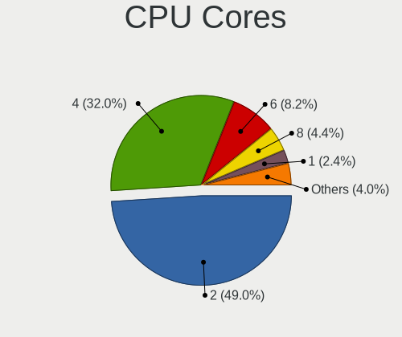
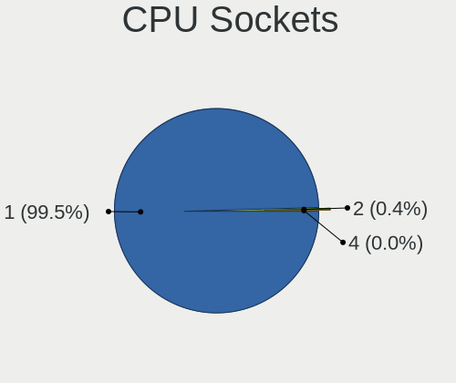
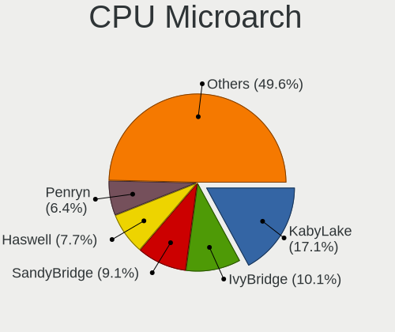
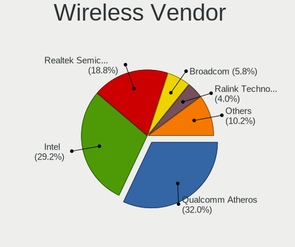
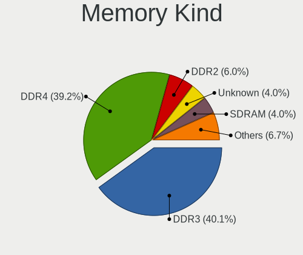

Linux in Brazil - Tested Hardware & Statistics
----------------------------------------------

A project to collect tested hardware configurations for Linux in Brazil.

Anyone can contribute to this report by the [hw-probe](https://github.com/linuxhw/hw-probe) tool:

    sudo -E hw-probe -all -upload

Please contribute! Especially if your hardware is rare.

This is a report for all computer types. See also reports for [desktops](/Location/Brazil/Desktop/README.md) and [notebooks](/Location/Brazil/Notebook/README.md).

Contents
--------

* [ Test Cases ](#test-cases)

* [ System ](#system)
  - [ OS                       ](#os)
  - [ OS Family                ](#os-family)
  - [ Kernel                   ](#kernel)
  - [ Kernel Family            ](#kernel-family)
  - [ Kernel Major Ver.        ](#kernel-major-ver)
  - [ Arch                     ](#arch)
  - [ DE                       ](#de)
  - [ Display Server           ](#display-server)
  - [ Display Manager          ](#display-manager)
  - [ OS Lang                  ](#os-lang)
  - [ Boot Mode                ](#boot-mode)
  - [ Filesystem               ](#filesystem)
  - [ Part. scheme             ](#part-scheme)
  - [ Dual Boot with Linux/BSD ](#dual-boot-with-linuxbsd)
  - [ Dual Boot (Win)          ](#dual-boot-win)

* [ Board ](#board)
  - [ Vendor                   ](#vendor)
  - [ Model                    ](#model)
  - [ Model Family             ](#model-family)
  - [ MFG Year                 ](#mfg-year)
  - [ Form Factor              ](#form-factor)
  - [ Secure Boot              ](#secure-boot)
  - [ Coreboot                 ](#coreboot)
  - [ RAM Size                 ](#ram-size)
  - [ RAM Used                 ](#ram-used)
  - [ Total Drives             ](#total-drives)
  - [ Has CD-ROM               ](#has-cd-rom)
  - [ Has Ethernet             ](#has-ethernet)
  - [ Has WiFi                 ](#has-wifi)
  - [ Has Bluetooth            ](#has-bluetooth)

* [ Location ](#location)
  - [ Country                  ](#country)
  - [ City                     ](#city)

* [ Drives ](#drives)
  - [ Drive Vendor             ](#drive-vendor)
  - [ Drive Model              ](#drive-model)
  - [ HDD Vendor               ](#hdd-vendor)
  - [ SSD Vendor               ](#ssd-vendor)
  - [ Drive Kind               ](#drive-kind)
  - [ Drive Connector          ](#drive-connector)
  - [ Drive Size               ](#drive-size)
  - [ Space Total              ](#space-total)
  - [ Space Used               ](#space-used)
  - [ Malfunc. Drives          ](#malfunc-drives)
  - [ Malfunc. Drive Vendor    ](#malfunc-drive-vendor)
  - [ Malfunc. HDD Vendor      ](#malfunc-hdd-vendor)
  - [ Malfunc. Drive Kind      ](#malfunc-drive-kind)
  - [ Failed Drives            ](#failed-drives)
  - [ Failed Drive Vendor      ](#failed-drive-vendor)
  - [ Drive Status             ](#drive-status)

* [ Storage controller ](#storage-controller)
  - [ Storage Vendor           ](#storage-vendor)
  - [ Storage Model            ](#storage-model)
  - [ Storage Kind             ](#storage-kind)

* [ Processor ](#processor)
  - [ CPU Vendor               ](#cpu-vendor)
  - [ CPU Model                ](#cpu-model)
  - [ CPU Model Family         ](#cpu-model-family)
  - [ CPU Cores                ](#cpu-cores)
  - [ CPU Sockets              ](#cpu-sockets)
  - [ CPU Threads              ](#cpu-threads)
  - [ CPU Op-Modes             ](#cpu-op-modes)
  - [ CPU Microcode            ](#cpu-microcode)
  - [ CPU Microarch            ](#cpu-microarch)

* [ Graphics ](#graphics)
  - [ GPU Vendor               ](#gpu-vendor)
  - [ GPU Model                ](#gpu-model)
  - [ GPU Combo                ](#gpu-combo)
  - [ GPU Driver               ](#gpu-driver)
  - [ GPU Memory               ](#gpu-memory)

* [ Monitor ](#monitor)
  - [ Monitor Vendor           ](#monitor-vendor)
  - [ Monitor Model            ](#monitor-model)
  - [ Monitor Resolution       ](#monitor-resolution)
  - [ Monitor Diagonal         ](#monitor-diagonal)
  - [ Monitor Width            ](#monitor-width)
  - [ Aspect Ratio             ](#aspect-ratio)
  - [ Monitor Area             ](#monitor-area)
  - [ Pixel Density            ](#pixel-density)
  - [ Multiple Monitors        ](#multiple-monitors)

* [ Network ](#network)
  - [ Net Controller Vendor    ](#net-controller-vendor)
  - [ Net Controller Model     ](#net-controller-model)
  - [ Wireless Vendor          ](#wireless-vendor)
  - [ Wireless Model           ](#wireless-model)
  - [ Ethernet Vendor          ](#ethernet-vendor)
  - [ Ethernet Model           ](#ethernet-model)
  - [ Net Controller Kind      ](#net-controller-kind)
  - [ Used Controller          ](#used-controller)
  - [ NICs                     ](#nics)
  - [ IPv6                     ](#ipv6)

* [ Bluetooth ](#bluetooth)
  - [ Bluetooth Vendor         ](#bluetooth-vendor)
  - [ Bluetooth Model          ](#bluetooth-model)

* [ Sound ](#sound)
  - [ Sound Vendor             ](#sound-vendor)
  - [ Sound Model              ](#sound-model)

* [ Memory ](#memory)
  - [ Memory Vendor            ](#memory-vendor)
  - [ Memory Model             ](#memory-model)
  - [ Memory Kind              ](#memory-kind)
  - [ Memory Form Factor       ](#memory-form-factor)
  - [ Memory Size              ](#memory-size)
  - [ Memory Speed             ](#memory-speed)

* [ Printers & scanners ](#printers--scanners)
  - [ Printer Vendor           ](#printer-vendor)
  - [ Printer Model            ](#printer-model)
  - [ Scanner Vendor           ](#scanner-vendor)
  - [ Scanner Model            ](#scanner-model)

* [ Camera ](#camera)
  - [ Camera Vendor            ](#camera-vendor)
  - [ Camera Model             ](#camera-model)

* [ Security ](#security)
  - [ Fingerprint Vendor       ](#fingerprint-vendor)
  - [ Fingerprint Model        ](#fingerprint-model)
  - [ Chipcard Vendor          ](#chipcard-vendor)
  - [ Chipcard Model           ](#chipcard-model)

* [ Unsupported ](#unsupported)
  - [ Unsupported Devices      ](#unsupported-devices)
  - [ Unsupported Device Types ](#unsupported-device-types)

Test Cases
----------

Total: 18361

| Vendor        | Model                       | Form-Factor | Probe                                                      | Date         |
|---------------|-----------------------------|-------------|------------------------------------------------------------|--------------|
| Dell          | 0PV3YR A05                  | Server      | [f5f4abd1f3](https://linux-hardware.org/?probe=f5f4abd1f3) | May 01, 2023 |
| Acer          | Nitro AN517-54              | Notebook    | [593a6b247f](https://linux-hardware.org/?probe=593a6b247f) | May 01, 2023 |
| MSI           | A520M-A PRO                 | Desktop     | [aa8e8397f6](https://linux-hardware.org/?probe=aa8e8397f6) | May 01, 2023 |
| Notebook      | NJx0MU                      | Notebook    | [66a3f8bc3a](https://linux-hardware.org/?probe=66a3f8bc3a) | May 01, 2023 |
| Unknown       | Unknown                     | Notebook    | [8978b9aa5f](https://linux-hardware.org/?probe=8978b9aa5f) | May 01, 2023 |
| Lenovo        | IdeaPad 310-15ISK 80UH      | Notebook    | [a7d6d782b2](https://linux-hardware.org/?probe=a7d6d782b2) | May 01, 2023 |
| PCWare        | IPMH410E                    | Desktop     | [9be4314a33](https://linux-hardware.org/?probe=9be4314a33) | May 01, 2023 |
| Notebook      | NJx0MU                      | Notebook    | [193fb3ba91](https://linux-hardware.org/?probe=193fb3ba91) | Apr 30, 2023 |
| Unknown       | Unknown                     | Notebook    | [070854df6b](https://linux-hardware.org/?probe=070854df6b) | Apr 30, 2023 |
| DIEBOLD       | NM70-I                      | Desktop     | [c01a40d58c](https://linux-hardware.org/?probe=c01a40d58c) | Apr 30, 2023 |
| Lenovo        | IdeaPad 3 15ALC6 82MF       | Notebook    | [bd460bdc62](https://linux-hardware.org/?probe=bd460bdc62) | Apr 30, 2023 |
| Lenovo        | IdeaPad 3 15ALC6 82MF       | Notebook    | [edfcd7daa6](https://linux-hardware.org/?probe=edfcd7daa6) | Apr 30, 2023 |
| ASRock        | B550M Steel Legend          | Desktop     | [68d85dd28f](https://linux-hardware.org/?probe=68d85dd28f) | Apr 30, 2023 |
| ASRock        | B550M Steel Legend          | Desktop     | [5166f820a6](https://linux-hardware.org/?probe=5166f820a6) | Apr 30, 2023 |
| ASRock        | 760GM-HD                    | Desktop     | [db79e93331](https://linux-hardware.org/?probe=db79e93331) | Apr 30, 2023 |
| MSI           | MEG Z390 GODLIKE            | Desktop     | [9109b0a7ed](https://linux-hardware.org/?probe=9109b0a7ed) | Apr 30, 2023 |
| Positivo      | Q464C                       | Notebook    | [8e41593bd3](https://linux-hardware.org/?probe=8e41593bd3) | Apr 30, 2023 |
| Notebook      | NJx0MU                      | Notebook    | [5fd8f6db6e](https://linux-hardware.org/?probe=5fd8f6db6e) | Apr 30, 2023 |
| Samsung       | 730QED                      | Convertible | [f29e3300d2](https://linux-hardware.org/?probe=f29e3300d2) | Apr 30, 2023 |
| Positivo      | POS-EIQ87CY POSITIVO        | Desktop     | [2e2b57b3ae](https://linux-hardware.org/?probe=2e2b57b3ae) | Apr 30, 2023 |
| ASRock        | B450M Steel Legend          | Desktop     | [fed083feba](https://linux-hardware.org/?probe=fed083feba) | Apr 30, 2023 |
| Dell          | 0PV3YR A05                  | Server      | [7804689b38](https://linux-hardware.org/?probe=7804689b38) | Apr 30, 2023 |
| Intel         | H61                         | Desktop     | [167616bc61](https://linux-hardware.org/?probe=167616bc61) | Apr 30, 2023 |
| Intel         | H81                         | Desktop     | [c70b10516b](https://linux-hardware.org/?probe=c70b10516b) | Apr 30, 2023 |
| Acer          | Nitro AN515-45              | Notebook    | [9b28e69254](https://linux-hardware.org/?probe=9b28e69254) | Apr 30, 2023 |
| Positivo      | S14CT01                     | Notebook    | [b11ef938e1](https://linux-hardware.org/?probe=b11ef938e1) | Apr 29, 2023 |
| Lenovo        | ThinkPad T14 Gen 2i 20W1... | Notebook    | [0a9a85f5f0](https://linux-hardware.org/?probe=0a9a85f5f0) | Apr 29, 2023 |
| Lenovo        | ThinkPad T14 Gen 2i 20W1... | Notebook    | [83b10185e8](https://linux-hardware.org/?probe=83b10185e8) | Apr 29, 2023 |
| ASUSTek       | PRIME H410M-E               | Desktop     | [44a08af32f](https://linux-hardware.org/?probe=44a08af32f) | Apr 29, 2023 |
| ASUSTek       | H81M-C/BR                   | Desktop     | [32942be783](https://linux-hardware.org/?probe=32942be783) | Apr 29, 2023 |
| Lenovo        | IdeaPad 320-15IKB 80YH      | Notebook    | [af0c1ea83c](https://linux-hardware.org/?probe=af0c1ea83c) | Apr 29, 2023 |
| Lenovo        | IdeaPad 320-15IKB 80YH      | Notebook    | [7c8c5a4668](https://linux-hardware.org/?probe=7c8c5a4668) | Apr 29, 2023 |
| HP            | Pavilion dm4                | Notebook    | [3473d4b312](https://linux-hardware.org/?probe=3473d4b312) | Apr 29, 2023 |
| Gigabyte      | G41MT-S2                    | Desktop     | [ba5c65f4e3](https://linux-hardware.org/?probe=ba5c65f4e3) | Apr 29, 2023 |
| ASUSTek       | P8H61-M LE/BR               | Desktop     | [425f1a3e08](https://linux-hardware.org/?probe=425f1a3e08) | Apr 29, 2023 |
| Apple         | MacBookPro9,2               | Notebook    | [1e75efbfab](https://linux-hardware.org/?probe=1e75efbfab) | Apr 29, 2023 |
| Positivo      | S14CT01                     | Notebook    | [58988f4876](https://linux-hardware.org/?probe=58988f4876) | Apr 29, 2023 |
| Dell          | Inspiron 15-3567            | Notebook    | [33e30c562d](https://linux-hardware.org/?probe=33e30c562d) | Apr 29, 2023 |
| Gigabyte      | GA-78LMT-S2                 | Desktop     | [16b28befee](https://linux-hardware.org/?probe=16b28befee) | Apr 28, 2023 |
| ASUSTek       | Z550SA                      | Notebook    | [7c6c0c9599](https://linux-hardware.org/?probe=7c6c0c9599) | Apr 28, 2023 |
| Acer          | Aspire E5-571               | Notebook    | [1d36dafa86](https://linux-hardware.org/?probe=1d36dafa86) | Apr 28, 2023 |
| ASRock        | A320M-HD                    | Desktop     | [43b57e5088](https://linux-hardware.org/?probe=43b57e5088) | Apr 28, 2023 |
| HP            | 158B                        | Desktop     | [ee0297b0ba](https://linux-hardware.org/?probe=ee0297b0ba) | Apr 28, 2023 |
| Intel         | H61 V124                    | Desktop     | [1fa0b34b3c](https://linux-hardware.org/?probe=1fa0b34b3c) | Apr 28, 2023 |
| Lenovo        | NO DPK                      | Desktop     | [d3442220b0](https://linux-hardware.org/?probe=d3442220b0) | Apr 28, 2023 |
| Intel         | H61                         | Desktop     | [b8f0acdf61](https://linux-hardware.org/?probe=b8f0acdf61) | Apr 28, 2023 |
| Multilaser    | UB820                       | All in one  | [3796d857b1](https://linux-hardware.org/?probe=3796d857b1) | Apr 28, 2023 |
| HP            | Presario CQ43               | Notebook    | [c14c79b3cf](https://linux-hardware.org/?probe=c14c79b3cf) | Apr 28, 2023 |
| Lenovo        | IdeaPad S145-15IWL 81S9     | Notebook    | [6926565982](https://linux-hardware.org/?probe=6926565982) | Apr 27, 2023 |
| Dell          | Inspiron 5482               | Convertible | [530ed5285a](https://linux-hardware.org/?probe=530ed5285a) | Apr 27, 2023 |
| Toshiba       | IS 1413G                    | Notebook    | [f96c9382bd](https://linux-hardware.org/?probe=f96c9382bd) | Apr 27, 2023 |
| Dell          | Latitude D520               | Notebook    | [a643e2e424](https://linux-hardware.org/?probe=a643e2e424) | Apr 27, 2023 |
| ASUSTek       | Z97M-PLUS/BR                | Desktop     | [3255acf414](https://linux-hardware.org/?probe=3255acf414) | Apr 27, 2023 |
| Lenovo        | V14 G2 ITL 82NM             | Notebook    | [6a56164bfd](https://linux-hardware.org/?probe=6a56164bfd) | Apr 27, 2023 |
| Dell          | 0PV3YR A05                  | Server      | [475e46f565](https://linux-hardware.org/?probe=475e46f565) | Apr 27, 2023 |
| ASUSTek       | TUF Gaming B450M-PLUS II    | Desktop     | [9211d42ee3](https://linux-hardware.org/?probe=9211d42ee3) | Apr 27, 2023 |
| Acer          | Aspire A315-54              | Notebook    | [8137aa9008](https://linux-hardware.org/?probe=8137aa9008) | Apr 27, 2023 |
| Dell          | Inspiron 5558               | Notebook    | [9f3b8c952d](https://linux-hardware.org/?probe=9f3b8c952d) | Apr 27, 2023 |
| Notebook      | NJx0MU                      | Notebook    | [2306f31aa2](https://linux-hardware.org/?probe=2306f31aa2) | Apr 27, 2023 |
| Lenovo        | IdeaPad 3 15ALC6 82MF       | Notebook    | [393c7b06d5](https://linux-hardware.org/?probe=393c7b06d5) | Apr 26, 2023 |
| HP            | 3047h                       | Desktop     | [3e6dada8a9](https://linux-hardware.org/?probe=3e6dada8a9) | Apr 26, 2023 |
| Pegatron      | IPM41-D3                    | Desktop     | [faf8704eb3](https://linux-hardware.org/?probe=faf8704eb3) | Apr 26, 2023 |
| MSI           | MAG B550M MORTAR            | Desktop     | [f91ac46cfd](https://linux-hardware.org/?probe=f91ac46cfd) | Apr 26, 2023 |
| ASUSTek       | TUF Gaming Z690-PLUS D4     | Desktop     | [8f417742d1](https://linux-hardware.org/?probe=8f417742d1) | Apr 26, 2023 |
| Dell          | Inspiron 7580               | Notebook    | [d9fe7034bd](https://linux-hardware.org/?probe=d9fe7034bd) | Apr 26, 2023 |
| Biostar       | H610MH                      | Desktop     | [935928c60d](https://linux-hardware.org/?probe=935928c60d) | Apr 26, 2023 |
| Gigabyte      | B550M DS3H                  | Desktop     | [208a0fc365](https://linux-hardware.org/?probe=208a0fc365) | Apr 26, 2023 |
| Intel         | B75                         | Desktop     | [72a3677ac2](https://linux-hardware.org/?probe=72a3677ac2) | Apr 26, 2023 |
| Dell          | G15 5510                    | Notebook    | [9dcb76f7c1](https://linux-hardware.org/?probe=9dcb76f7c1) | Apr 26, 2023 |
| Dell          | G15 5510                    | Notebook    | [4030b4f936](https://linux-hardware.org/?probe=4030b4f936) | Apr 26, 2023 |
| Lenovo        | IdeaPad 3 15ALC6 82MF       | Notebook    | [84bc235979](https://linux-hardware.org/?probe=84bc235979) | Apr 26, 2023 |
| ASUSTek       | PRIME H610M-A D4            | Desktop     | [a7e77375d4](https://linux-hardware.org/?probe=a7e77375d4) | Apr 26, 2023 |
| Dell          | 0PV3YR A05                  | Server      | [23571a99b1](https://linux-hardware.org/?probe=23571a99b1) | Apr 26, 2023 |
| Intel         | H81                         | Desktop     | [9a14132581](https://linux-hardware.org/?probe=9a14132581) | Apr 26, 2023 |
| Apple         | MacBookAir7,2               | Notebook    | [7cbf188375](https://linux-hardware.org/?probe=7cbf188375) | Apr 26, 2023 |
| Apple         | MacBookAir7,2               | Notebook    | [b94d783285](https://linux-hardware.org/?probe=b94d783285) | Apr 26, 2023 |
| Notebook      | NJx0MU                      | Notebook    | [a660a768ce](https://linux-hardware.org/?probe=a660a768ce) | Apr 26, 2023 |
| Dell          | Inspiron N4030              | Notebook    | [a0f1823b8e](https://linux-hardware.org/?probe=a0f1823b8e) | Apr 26, 2023 |
| Acer          | Nitro AN517-54              | Notebook    | [9fe0f33003](https://linux-hardware.org/?probe=9fe0f33003) | Apr 26, 2023 |
| Toshiba       | IS 1413G                    | Notebook    | [a24f74af8e](https://linux-hardware.org/?probe=a24f74af8e) | Apr 26, 2023 |
| Samsung       | 300E5EV/300E4EV/270E5EV/... | Notebook    | [5c79032176](https://linux-hardware.org/?probe=5c79032176) | Apr 25, 2023 |
| HP            | Pavilion g4                 | Notebook    | [5e2040a91f](https://linux-hardware.org/?probe=5e2040a91f) | Apr 25, 2023 |
| ASRock        | AB350M-HDV                  | Desktop     | [44ac797451](https://linux-hardware.org/?probe=44ac797451) | Apr 25, 2023 |
| Login Info... | LOG-S14BW01-CD              | Notebook    | [5f6e2a61f2](https://linux-hardware.org/?probe=5f6e2a61f2) | Apr 25, 2023 |
| Biostar       | B450MX-S                    | Desktop     | [5ac7debff3](https://linux-hardware.org/?probe=5ac7debff3) | Apr 25, 2023 |
| Dell          | G15 5515                    | Notebook    | [a0dd3f2003](https://linux-hardware.org/?probe=a0dd3f2003) | Apr 25, 2023 |
| Avell High... | A70 HYB BS                  | Notebook    | [c7b5f9ef04](https://linux-hardware.org/?probe=c7b5f9ef04) | Apr 25, 2023 |
| Acer          | Nitro AN515-51              | Notebook    | [48e88f7bd1](https://linux-hardware.org/?probe=48e88f7bd1) | Apr 25, 2023 |
| Dell          | Vostro 3550                 | Notebook    | [653c3c4650](https://linux-hardware.org/?probe=653c3c4650) | Apr 25, 2023 |
| Samsung       | RV411/RV511/E3511/S3511/... | Notebook    | [afcce1c52c](https://linux-hardware.org/?probe=afcce1c52c) | Apr 25, 2023 |
| Gigabyte      | H87-D3H-CF                  | Desktop     | [b3a3115f0c](https://linux-hardware.org/?probe=b3a3115f0c) | Apr 25, 2023 |
| OEM           | HN B85 Ver:1.4              | Desktop     | [1da5934b27](https://linux-hardware.org/?probe=1da5934b27) | Apr 25, 2023 |
| Dell          | G3 3500                     | Notebook    | [46996524d0](https://linux-hardware.org/?probe=46996524d0) | Apr 25, 2023 |
| Purism        | Librem 14                   | Notebook    | [8462dbaccb](https://linux-hardware.org/?probe=8462dbaccb) | Apr 25, 2023 |
| HP            | 2B21 A01                    | All in one  | [2eec2836c7](https://linux-hardware.org/?probe=2eec2836c7) | Apr 25, 2023 |
| Lenovo        | V130-15IKB 81HN             | Notebook    | [1b26b3f89b](https://linux-hardware.org/?probe=1b26b3f89b) | Apr 24, 2023 |
| Lenovo        | SHARKBAY 0B98401 PRO        | Desktop     | [342918aa38](https://linux-hardware.org/?probe=342918aa38) | Apr 24, 2023 |
| Notebook      | N85_N87HCHNHZ               | Notebook    | [ecb3270b4a](https://linux-hardware.org/?probe=ecb3270b4a) | Apr 24, 2023 |
| Dell          | Vostro 15 3515              | Notebook    | [13c75fa32e](https://linux-hardware.org/?probe=13c75fa32e) | Apr 24, 2023 |
| AMD           | Inagua CRB                  | Desktop     | [085d0aa051](https://linux-hardware.org/?probe=085d0aa051) | Apr 24, 2023 |
| Gigabyte      | GA-78LMT-USB3               | Desktop     | [9bab79728a](https://linux-hardware.org/?probe=9bab79728a) | Apr 24, 2023 |
| Intel         | D946GZIS AAD66165-301       | Desktop     | [9d5ada0fc4](https://linux-hardware.org/?probe=9d5ada0fc4) | Apr 24, 2023 |
| Apple         | MacBookPro8,1               | Notebook    | [2f1eb3e6ee](https://linux-hardware.org/?probe=2f1eb3e6ee) | Apr 24, 2023 |
| Dell          | 0VTJVC A00                  | Desktop     | [da7d66917d](https://linux-hardware.org/?probe=da7d66917d) | Apr 24, 2023 |
| Gateway       | NV55C                       | Notebook    | [3c560a28cf](https://linux-hardware.org/?probe=3c560a28cf) | Apr 24, 2023 |
| Lenovo        | IdeaPad 3 15ALC6 82MF       | Notebook    | [2e7585d261](https://linux-hardware.org/?probe=2e7585d261) | Apr 24, 2023 |
| Gigabyte      | G41MT-S2                    | Desktop     | [de1981f9e6](https://linux-hardware.org/?probe=de1981f9e6) | Apr 24, 2023 |
| Dell          | Inspiron 11-3168            | Notebook    | [5ac6392b05](https://linux-hardware.org/?probe=5ac6392b05) | Apr 24, 2023 |
| Huanan        | X99-8M-F V1.1               | Desktop     | [0621d00b73](https://linux-hardware.org/?probe=0621d00b73) | Apr 24, 2023 |
| Lenovo        | IdeaPad 330-15IKB 81FE      | Notebook    | [e562ba35c6](https://linux-hardware.org/?probe=e562ba35c6) | Apr 23, 2023 |
| Biostar       | B350ET2                     | Desktop     | [47289e48eb](https://linux-hardware.org/?probe=47289e48eb) | Apr 23, 2023 |
| Dell          | G15 5520                    | Notebook    | [d2cc8527a5](https://linux-hardware.org/?probe=d2cc8527a5) | Apr 23, 2023 |
| ASUSTek       | AM1M-A/BR                   | Desktop     | [0b29ee62f9](https://linux-hardware.org/?probe=0b29ee62f9) | Apr 23, 2023 |
| ASUSTek       | M5A78L-M LX/BR              | Desktop     | [0e85243397](https://linux-hardware.org/?probe=0e85243397) | Apr 23, 2023 |
| HP            | G42                         | Notebook    | [1d5b2eefc3](https://linux-hardware.org/?probe=1d5b2eefc3) | Apr 23, 2023 |
| HP            | 18E7                        | Desktop     | [c5bc4d9c7f](https://linux-hardware.org/?probe=c5bc4d9c7f) | Apr 23, 2023 |
| MACHINIST     | E5-MR9A PRO V1.1            | Desktop     | [eebce73217](https://linux-hardware.org/?probe=eebce73217) | Apr 23, 2023 |
| ASUSTek       | H81M-C/BR                   | Desktop     | [46a27a7551](https://linux-hardware.org/?probe=46a27a7551) | Apr 23, 2023 |
| ASUSTek       | X45C                        | Notebook    | [759ed58d76](https://linux-hardware.org/?probe=759ed58d76) | Apr 23, 2023 |
| Gigabyte      | GA-78LMT-S2P                | Desktop     | [793e094165](https://linux-hardware.org/?probe=793e094165) | Apr 23, 2023 |
| Pegatron      | IPMH61P1                    | Desktop     | [b71d5b1a48](https://linux-hardware.org/?probe=b71d5b1a48) | Apr 23, 2023 |
| Unknown       | G41                         | Desktop     | [cbe978cc34](https://linux-hardware.org/?probe=cbe978cc34) | Apr 23, 2023 |
| Lenovo        | ThinkPad E480 20KQ000EBR    | Notebook    | [90b7213592](https://linux-hardware.org/?probe=90b7213592) | Apr 23, 2023 |
| ASUSTek       | VivoBook_ASUSLaptop X515... | Notebook    | [9a92345b08](https://linux-hardware.org/?probe=9a92345b08) | Apr 23, 2023 |
| Gigabyte      | VM900M Rev2.0               | Desktop     | [284ada7211](https://linux-hardware.org/?probe=284ada7211) | Apr 23, 2023 |
| PCWare        | IPX1800G2                   | Desktop     | [f63cf0fe51](https://linux-hardware.org/?probe=f63cf0fe51) | Apr 23, 2023 |
| Lenovo        | IdeaPad Gaming 3 15IMH05... | Notebook    | [0e798db6a8](https://linux-hardware.org/?probe=0e798db6a8) | Apr 23, 2023 |
| ASUSTek       | TUF Gaming B550M-PLUS       | Desktop     | [1b475eaa99](https://linux-hardware.org/?probe=1b475eaa99) | Apr 23, 2023 |
| Acer          | Spin SP315-51               | Convertible | [42da7880dd](https://linux-hardware.org/?probe=42da7880dd) | Apr 23, 2023 |
| ASUSTek       | ROG STRIX X570-E GAMING ... | Desktop     | [dfb9f87dad](https://linux-hardware.org/?probe=dfb9f87dad) | Apr 22, 2023 |
| Dell          | G15 5520                    | Notebook    | [238c8f53aa](https://linux-hardware.org/?probe=238c8f53aa) | Apr 22, 2023 |
| LG Electro... | A530-T.BE76P1               | Notebook    | [8bb0353706](https://linux-hardware.org/?probe=8bb0353706) | Apr 22, 2023 |
| LG Electro... | A530-T.BE76P1               | Notebook    | [b699c8ed48](https://linux-hardware.org/?probe=b699c8ed48) | Apr 22, 2023 |
| LG Electro... | A530-T.BE76P1               | Notebook    | [f5c282ca6c](https://linux-hardware.org/?probe=f5c282ca6c) | Apr 22, 2023 |
| Gigabyte      | B560M AORUS ELITE           | Desktop     | [ea8fb664a3](https://linux-hardware.org/?probe=ea8fb664a3) | Apr 22, 2023 |
| Dell          | G15 5520                    | Notebook    | [07751c950a](https://linux-hardware.org/?probe=07751c950a) | Apr 22, 2023 |
| Acer          | Spin SP314-51               | Convertible | [5fd72bcee7](https://linux-hardware.org/?probe=5fd72bcee7) | Apr 22, 2023 |
| Acer          | Nitro AN515-54              | Notebook    | [452177f9a5](https://linux-hardware.org/?probe=452177f9a5) | Apr 21, 2023 |
| ASRock        | H310CM-HG4                  | Desktop     | [6f49f4b883](https://linux-hardware.org/?probe=6f49f4b883) | Apr 21, 2023 |
| ASRock        | H510M-HVS R2.0              | Desktop     | [1de5b776a3](https://linux-hardware.org/?probe=1de5b776a3) | Apr 21, 2023 |
| Dell          | 0GDG8Y A00                  | Desktop     | [a315eaa776](https://linux-hardware.org/?probe=a315eaa776) | Apr 21, 2023 |
| Digibras      | NH4CU53                     | Notebook    | [d6571e3d78](https://linux-hardware.org/?probe=d6571e3d78) | Apr 21, 2023 |
| MSI           | 970 GAMING                  | Desktop     | [cb295448b6](https://linux-hardware.org/?probe=cb295448b6) | Apr 21, 2023 |
| Multilaser    | PC13X                       | Notebook    | [d1144e31a1](https://linux-hardware.org/?probe=d1144e31a1) | Apr 21, 2023 |
| Positivo      | N6440                       | Notebook    | [b0a1fe417d](https://linux-hardware.org/?probe=b0a1fe417d) | Apr 21, 2023 |
| ASUSTek       | M5A78L-M PLUS/USB3          | Desktop     | [5f1a1c6abd](https://linux-hardware.org/?probe=5f1a1c6abd) | Apr 20, 2023 |
| Dell          | Inspiron 3501               | Notebook    | [e09f00bead](https://linux-hardware.org/?probe=e09f00bead) | Apr 20, 2023 |
| HP            | Pavilion g4                 | Notebook    | [96a0210940](https://linux-hardware.org/?probe=96a0210940) | Apr 20, 2023 |
| Dell          | XPS 13 9310                 | Notebook    | [55685c168f](https://linux-hardware.org/?probe=55685c168f) | Apr 20, 2023 |
| Gigabyte      | G31M-S2C                    | Desktop     | [0c45fc6929](https://linux-hardware.org/?probe=0c45fc6929) | Apr 20, 2023 |
| ASRock        | FM2A68M-DG3+                | Desktop     | [f8519c5a20](https://linux-hardware.org/?probe=f8519c5a20) | Apr 20, 2023 |
| Intel         | H61S                        | Desktop     | [e29d71587a](https://linux-hardware.org/?probe=e29d71587a) | Apr 20, 2023 |
| Samsung       | 550P5C/550P7C               | Notebook    | [3648dd39f8](https://linux-hardware.org/?probe=3648dd39f8) | Apr 20, 2023 |
| Dell          | Inspiron 7460               | Notebook    | [bbfe51bf3c](https://linux-hardware.org/?probe=bbfe51bf3c) | Apr 19, 2023 |
| Lenovo        | Yoga 510-14ISK 80UK         | Convertible | [649afe5f77](https://linux-hardware.org/?probe=649afe5f77) | Apr 19, 2023 |
| ASRock        | FM2A68M-DG3+                | Desktop     | [701110cf4e](https://linux-hardware.org/?probe=701110cf4e) | Apr 19, 2023 |
| ASUSTek       | PRIME B250M-PLUS/BR         | Desktop     | [c0a82bb35a](https://linux-hardware.org/?probe=c0a82bb35a) | Apr 19, 2023 |
| Intel         | X79M-S                      | Desktop     | [0c51f5a0e0](https://linux-hardware.org/?probe=0c51f5a0e0) | Apr 19, 2023 |
| Samsung       | 730QED                      | Convertible | [5897b751da](https://linux-hardware.org/?probe=5897b751da) | Apr 18, 2023 |
| Samsung       | 730QED                      | Convertible | [84ce1adcfe](https://linux-hardware.org/?probe=84ce1adcfe) | Apr 18, 2023 |
| Acer          | AO722                       | Notebook    | [5fe24a9991](https://linux-hardware.org/?probe=5fe24a9991) | Apr 18, 2023 |
| LG Electro... | White Tip Mountain FAB3     | All in one  | [5f73a9e985](https://linux-hardware.org/?probe=5f73a9e985) | Apr 18, 2023 |
| ASUSTek       | PRIME B250M-PLUS/BR         | Desktop     | [8bb9dc2419](https://linux-hardware.org/?probe=8bb9dc2419) | Apr 18, 2023 |
| Dell          | Vostro 5402                 | Notebook    | [e492c87b46](https://linux-hardware.org/?probe=e492c87b46) | Apr 18, 2023 |
| Dell          | Vostro 5402                 | Notebook    | [b15f47258b](https://linux-hardware.org/?probe=b15f47258b) | Apr 18, 2023 |
| AMD           | Inagua CRB                  | Desktop     | [8d2ce37fca](https://linux-hardware.org/?probe=8d2ce37fca) | Apr 18, 2023 |
| Dell          | 08NPPY A00                  | Desktop     | [7fcc7d1b34](https://linux-hardware.org/?probe=7fcc7d1b34) | Apr 18, 2023 |
| Dell          | Vostro 3480                 | Notebook    | [f2f48756e6](https://linux-hardware.org/?probe=f2f48756e6) | Apr 18, 2023 |
| Lenovo        | IdeaPad S145-15API 81V7     | Notebook    | [90c4ba9f6e](https://linux-hardware.org/?probe=90c4ba9f6e) | Apr 17, 2023 |
| HP            | 240 G4 Notebook PC          | Notebook    | [6410232c86](https://linux-hardware.org/?probe=6410232c86) | Apr 17, 2023 |
| Dell          | Latitude E5430 non-vPro     | Notebook    | [961e1f1908](https://linux-hardware.org/?probe=961e1f1908) | Apr 17, 2023 |
| Gigabyte      | B550I AORUS PRO AX          | Desktop     | [bbbc9206b4](https://linux-hardware.org/?probe=bbbc9206b4) | Apr 17, 2023 |
| Avell High... | A70 MOB                     | Notebook    | [869b1ae79b](https://linux-hardware.org/?probe=869b1ae79b) | Apr 17, 2023 |
| Dell          | Inspiron 5566               | Notebook    | [5e9ebca163](https://linux-hardware.org/?probe=5e9ebca163) | Apr 17, 2023 |
| Samsung       | 700Z3A/700Z4A/700Z5A/700... | Notebook    | [acd0161868](https://linux-hardware.org/?probe=acd0161868) | Apr 17, 2023 |
| Multilaser    | PC13X                       | Notebook    | [3b755838a2](https://linux-hardware.org/?probe=3b755838a2) | Apr 16, 2023 |
| Lenovo        | IdeaPad 3 15ALC6 82MF       | Notebook    | [beac478abb](https://linux-hardware.org/?probe=beac478abb) | Apr 16, 2023 |
| HP            | 240 G2                      | Notebook    | [ca6ae60a2b](https://linux-hardware.org/?probe=ca6ae60a2b) | Apr 16, 2023 |
| ASUSTek       | VivoBook_ASUSLaptop X515... | Notebook    | [482a8c29cc](https://linux-hardware.org/?probe=482a8c29cc) | Apr 16, 2023 |
| Valve         | Jupiter                     | Notebook    | [6c83afd9b3](https://linux-hardware.org/?probe=6c83afd9b3) | Apr 16, 2023 |
| Dell          | Inspiron 1525               | Notebook    | [3b20856ccc](https://linux-hardware.org/?probe=3b20856ccc) | Apr 16, 2023 |
| Acer          | Aspire A515-45              | Notebook    | [5ce7874f2e](https://linux-hardware.org/?probe=5ce7874f2e) | Apr 16, 2023 |
| Itautec       | Infoway                     | Notebook    | [c046d6e093](https://linux-hardware.org/?probe=c046d6e093) | Apr 16, 2023 |
| Positivo      | C14CR01                     | Notebook    | [a5fc85315a](https://linux-hardware.org/?probe=a5fc85315a) | Apr 16, 2023 |
| Lenovo        | IdeaPad 330-15IKB 81FE      | Notebook    | [f7cf140a28](https://linux-hardware.org/?probe=f7cf140a28) | Apr 16, 2023 |
| Acer          | Nitro AN515-54              | Notebook    | [73c46e2901](https://linux-hardware.org/?probe=73c46e2901) | Apr 15, 2023 |
| Dell          | Inspiron 5566               | Notebook    | [3decfdc1f6](https://linux-hardware.org/?probe=3decfdc1f6) | Apr 15, 2023 |
| Intel         | B75                         | Desktop     | [18dce6805d](https://linux-hardware.org/?probe=18dce6805d) | Apr 15, 2023 |
| AMD           | A88F2EKS                    | Desktop     | [48cef621bd](https://linux-hardware.org/?probe=48cef621bd) | Apr 15, 2023 |
| ASUSTek       | M4A785TD-M EVO              | Desktop     | [dd2d3443a9](https://linux-hardware.org/?probe=dd2d3443a9) | Apr 15, 2023 |
| Lenovo        | ThinkCentre M58p 6234CZ6    | Desktop     | [e412c388d8](https://linux-hardware.org/?probe=e412c388d8) | Apr 15, 2023 |
| Lenovo        | V14 G2 ITL 82NM             | Notebook    | [dfed605628](https://linux-hardware.org/?probe=dfed605628) | Apr 15, 2023 |
| QIYIDA        | X99-H9 V2.0                 | Desktop     | [fcfa1ed488](https://linux-hardware.org/?probe=fcfa1ed488) | Apr 14, 2023 |
| Dell          | Inspiron 7460               | Notebook    | [ae861b54cd](https://linux-hardware.org/?probe=ae861b54cd) | Apr 14, 2023 |
| Lenovo        | IdeaPad 320-15IKB 80YH      | Notebook    | [a34f2e065b](https://linux-hardware.org/?probe=a34f2e065b) | Apr 14, 2023 |
| ASRock        | B550M Pro4                  | Desktop     | [ec08193576](https://linux-hardware.org/?probe=ec08193576) | Apr 14, 2023 |
| Gigabyte      | 970A-DS3P                   | Desktop     | [e2f136f068](https://linux-hardware.org/?probe=e2f136f068) | Apr 14, 2023 |
| PCWare        | IPMH61R3                    | Desktop     | [776a2824c5](https://linux-hardware.org/?probe=776a2824c5) | Apr 14, 2023 |
| Avell High... | B.ON                        | Notebook    | [0ac252a73b](https://linux-hardware.org/?probe=0ac252a73b) | Apr 14, 2023 |
| OEM           | H110                        | Desktop     | [60e8c50cdd](https://linux-hardware.org/?probe=60e8c50cdd) | Apr 14, 2023 |
| ASUSTek       | Maximus IX APEX             | Desktop     | [f4a7db0c2a](https://linux-hardware.org/?probe=f4a7db0c2a) | Apr 14, 2023 |
| Positivo      | Q4128C-S                    | Notebook    | [8dc2eb7738](https://linux-hardware.org/?probe=8dc2eb7738) | Apr 14, 2023 |
| HP            | 1589                        | Desktop     | [b5309b9a82](https://linux-hardware.org/?probe=b5309b9a82) | Apr 14, 2023 |
| Samsung       | 670Z5E                      | Notebook    | [96bcf536e6](https://linux-hardware.org/?probe=96bcf536e6) | Apr 14, 2023 |
| Samsung       | 670Z5E                      | Notebook    | [dff09c0918](https://linux-hardware.org/?probe=dff09c0918) | Apr 14, 2023 |
| Acer          | Nitro AN515-54              | Notebook    | [07a2ba2393](https://linux-hardware.org/?probe=07a2ba2393) | Apr 13, 2023 |
| Gigabyte      | GA-78LMT-USB3               | Desktop     | [4267100894](https://linux-hardware.org/?probe=4267100894) | Apr 13, 2023 |
| Dell          | Inspiron 5515               | Notebook    | [e7306b2521](https://linux-hardware.org/?probe=e7306b2521) | Apr 13, 2023 |
| Dell          | Inspiron 15-3567            | Notebook    | [c200475e1f](https://linux-hardware.org/?probe=c200475e1f) | Apr 13, 2023 |
| ASUSTek       | TUF Gaming X570-PLUS_BR     | Desktop     | [5e9f89e556](https://linux-hardware.org/?probe=5e9f89e556) | Apr 13, 2023 |
| Acer          | Aspire A515-54G             | Notebook    | [eedb55e1ba](https://linux-hardware.org/?probe=eedb55e1ba) | Apr 13, 2023 |
| Dell          | Inspiron 15-3567            | Notebook    | [ae928fe177](https://linux-hardware.org/?probe=ae928fe177) | Apr 13, 2023 |
| ASUSTek       | PRIME B450M-GAMING/BR       | Desktop     | [89a7f8f7e7](https://linux-hardware.org/?probe=89a7f8f7e7) | Apr 13, 2023 |
| ASUSTek       | TUF Gaming B550M-E WIFI     | Desktop     | [d72e78c1b0](https://linux-hardware.org/?probe=d72e78c1b0) | Apr 13, 2023 |
| Toshiba       | IS 1413G                    | Notebook    | [f57cf8ddf4](https://linux-hardware.org/?probe=f57cf8ddf4) | Apr 13, 2023 |
| Dell          | Inspiron 5482               | Convertible | [2d1dbac3cf](https://linux-hardware.org/?probe=2d1dbac3cf) | Apr 13, 2023 |
| Samsung       | 270E5G/270E5U               | Notebook    | [ea58c893c1](https://linux-hardware.org/?probe=ea58c893c1) | Apr 13, 2023 |
| OEM           | Intel H81                   | Desktop     | [1a73452d73](https://linux-hardware.org/?probe=1a73452d73) | Apr 13, 2023 |
| Positivo      | H14SU08                     | Notebook    | [8e8d14728f](https://linux-hardware.org/?probe=8e8d14728f) | Apr 13, 2023 |
| Lenovo        | IdeaPad S145-15API 81V7     | Notebook    | [c53ec6a9c0](https://linux-hardware.org/?probe=c53ec6a9c0) | Apr 13, 2023 |
| Positivo      | Q4128C-S                    | Notebook    | [a46ba9bff2](https://linux-hardware.org/?probe=a46ba9bff2) | Apr 12, 2023 |
| Positivo      | Q4128C-S                    | Notebook    | [3b5a11f774](https://linux-hardware.org/?probe=3b5a11f774) | Apr 12, 2023 |
| Intel         | powered classmate PC        | Notebook    | [79b262de52](https://linux-hardware.org/?probe=79b262de52) | Apr 12, 2023 |
| Acer          | Nitro AN515-44              | Notebook    | [12ca37afd3](https://linux-hardware.org/?probe=12ca37afd3) | Apr 12, 2023 |
| Intel         | H61 V1.1                    | Desktop     | [1b97e4ffc5](https://linux-hardware.org/?probe=1b97e4ffc5) | Apr 12, 2023 |
| Intel         | H61 V1.1                    | Desktop     | [402a94b1c0](https://linux-hardware.org/?probe=402a94b1c0) | Apr 12, 2023 |
| Acer          | Nitro AN515-45              | Notebook    | [7b4e6e07cf](https://linux-hardware.org/?probe=7b4e6e07cf) | Apr 12, 2023 |
| Win elemen... | M600                        | Desktop     | [4268d36ca4](https://linux-hardware.org/?probe=4268d36ca4) | Apr 12, 2023 |
| ASUSTek       | TUF Gaming Z690-PLUS D4     | Desktop     | [065d244d4b](https://linux-hardware.org/?probe=065d244d4b) | Apr 12, 2023 |
| Intel         | H61 V124                    | Desktop     | [28b73b97b3](https://linux-hardware.org/?probe=28b73b97b3) | Apr 12, 2023 |
| Dell          | G3 3579                     | Notebook    | [24d10a8497](https://linux-hardware.org/?probe=24d10a8497) | Apr 12, 2023 |
| Dell          | 01XK1W A00                  | Desktop     | [4eb8c9f372](https://linux-hardware.org/?probe=4eb8c9f372) | Apr 12, 2023 |
| Daten Tecn... | DH110MXV                    | Desktop     | [6a1c34f539](https://linux-hardware.org/?probe=6a1c34f539) | Apr 12, 2023 |
| Samsung       | 550XCJ/550XCR               | Notebook    | [c074d665d9](https://linux-hardware.org/?probe=c074d665d9) | Apr 11, 2023 |
| ABIT          | NF-M2S                      | Desktop     | [30e3a2e8c4](https://linux-hardware.org/?probe=30e3a2e8c4) | Apr 11, 2023 |
| ASUSTek       | P5LD2-X/1333                | Desktop     | [e0e655f63c](https://linux-hardware.org/?probe=e0e655f63c) | Apr 11, 2023 |
| Samsung       | 550XCJ/550XCR               | Notebook    | [845a04c326](https://linux-hardware.org/?probe=845a04c326) | Apr 11, 2023 |
| Intel         | W7650                       | Notebook    | [3e4c54a5f0](https://linux-hardware.org/?probe=3e4c54a5f0) | Apr 11, 2023 |
| HP            | Unknown                     | Notebook    | [abc7d95b62](https://linux-hardware.org/?probe=abc7d95b62) | Apr 11, 2023 |
| Acer          | Aspire E5-471               | Notebook    | [6e44530b23](https://linux-hardware.org/?probe=6e44530b23) | Apr 11, 2023 |
| Intel         | NUC11PABi5 K90634-305       | Mini pc     | [7232d92c69](https://linux-hardware.org/?probe=7232d92c69) | Apr 11, 2023 |
| HP            | 250 G8 Notebook PC          | Notebook    | [a60609df80](https://linux-hardware.org/?probe=a60609df80) | Apr 11, 2023 |
| Acer          | Aspire A515-57              | Notebook    | [f577606375](https://linux-hardware.org/?probe=f577606375) | Apr 11, 2023 |
| Acer          | Aspire E5-471               | Notebook    | [dbcbf972e5](https://linux-hardware.org/?probe=dbcbf972e5) | Apr 11, 2023 |
| Dell          | Inspiron N5110              | Notebook    | [4506c94bfd](https://linux-hardware.org/?probe=4506c94bfd) | Apr 11, 2023 |
| Avell High... | A52 HYB                     | Notebook    | [0795bca947](https://linux-hardware.org/?probe=0795bca947) | Apr 11, 2023 |
| Samsung       | 550XDA                      | Notebook    | [e1d5d2f193](https://linux-hardware.org/?probe=e1d5d2f193) | Apr 11, 2023 |
| Dell          | 0PV3YR A05                  | Server      | [a3062022a3](https://linux-hardware.org/?probe=a3062022a3) | Apr 10, 2023 |
| Acer          | Aspire E5-511               | Notebook    | [f66d23c175](https://linux-hardware.org/?probe=f66d23c175) | Apr 10, 2023 |
| Dell          | Inspiron 3583               | Notebook    | [502c993dfd](https://linux-hardware.org/?probe=502c993dfd) | Apr 10, 2023 |
| ECS           | H61H2-M12                   | Desktop     | [f3e8f5eb22](https://linux-hardware.org/?probe=f3e8f5eb22) | Apr 10, 2023 |
| Notebook      | NJx0MU                      | Notebook    | [2bb9767ca7](https://linux-hardware.org/?probe=2bb9767ca7) | Apr 10, 2023 |
| Biostar       | A320MH                      | Desktop     | [a2aef00c0c](https://linux-hardware.org/?probe=a2aef00c0c) | Apr 09, 2023 |
| Notebook      | NJx0MU                      | Notebook    | [681be67c93](https://linux-hardware.org/?probe=681be67c93) | Apr 09, 2023 |
| Acer          | Aspire 5538                 | Notebook    | [3128c45dbc](https://linux-hardware.org/?probe=3128c45dbc) | Apr 09, 2023 |
| Gigabyte      | F2A68HM-H                   | Desktop     | [249b3e78ed](https://linux-hardware.org/?probe=249b3e78ed) | Apr 09, 2023 |
| Intel         | H61 V1.1                    | Desktop     | [1c3cfd94a3](https://linux-hardware.org/?probe=1c3cfd94a3) | Apr 09, 2023 |
| Samsung       | RV419                       | Notebook    | [88985a3d0d](https://linux-hardware.org/?probe=88985a3d0d) | Apr 09, 2023 |
| Lenovo        | ThinkPad E490 20N9001RBR    | Notebook    | [779e8396d6](https://linux-hardware.org/?probe=779e8396d6) | Apr 09, 2023 |
| Gigabyte      | F2A68HM-H                   | Desktop     | [8d36d0bfeb](https://linux-hardware.org/?probe=8d36d0bfeb) | Apr 09, 2023 |
| Lenovo        | ThinkPad Edge E431 62779... | Notebook    | [19fd2b6d0d](https://linux-hardware.org/?probe=19fd2b6d0d) | Apr 09, 2023 |
| Toshiba       | IS 1413G                    | Notebook    | [be9d1636a7](https://linux-hardware.org/?probe=be9d1636a7) | Apr 09, 2023 |
| Dell          | Inspiron N5110              | Notebook    | [6514811aaf](https://linux-hardware.org/?probe=6514811aaf) | Apr 09, 2023 |
| Avell High... | A52 HYB                     | Notebook    | [7da3b9f780](https://linux-hardware.org/?probe=7da3b9f780) | Apr 09, 2023 |
| Dell          | 0PV3YR A05                  | Server      | [085d715399](https://linux-hardware.org/?probe=085d715399) | Apr 09, 2023 |
| Acer          | Aspire A515-57              | Notebook    | [e04fc7e8e8](https://linux-hardware.org/?probe=e04fc7e8e8) | Apr 09, 2023 |
| Lenovo        | ThinkPad Edge E431 62779... | Notebook    | [bc402eee2e](https://linux-hardware.org/?probe=bc402eee2e) | Apr 09, 2023 |
| HP            | 829E                        | Mini pc     | [8111885092](https://linux-hardware.org/?probe=8111885092) | Apr 08, 2023 |
| Intel         | H61 V1.1                    | Desktop     | [e553db41a3](https://linux-hardware.org/?probe=e553db41a3) | Apr 08, 2023 |
| Lenovo        | 500w Gen 3 82J3             | Convertible | [63945c445c](https://linux-hardware.org/?probe=63945c445c) | Apr 08, 2023 |
| HP            | ProBook 6470b               | Notebook    | [9926dac4aa](https://linux-hardware.org/?probe=9926dac4aa) | Apr 08, 2023 |
| ASUSTek       | A68HM-K                     | Desktop     | [55d971a67f](https://linux-hardware.org/?probe=55d971a67f) | Apr 08, 2023 |
| OEM           | X99-Turbo                   | Desktop     | [52723223af](https://linux-hardware.org/?probe=52723223af) | Apr 08, 2023 |
| Acer          | Aspire A515-51G             | Notebook    | [34d03fbbcd](https://linux-hardware.org/?probe=34d03fbbcd) | Apr 08, 2023 |
| Sony          | VJF155F11X-B0811B           | Notebook    | [89f9cc86a7](https://linux-hardware.org/?probe=89f9cc86a7) | Apr 08, 2023 |
| Biostar       | A520MH                      | Desktop     | [9cf296886b](https://linux-hardware.org/?probe=9cf296886b) | Apr 07, 2023 |
| MSI           | Katana GF76 11UD            | Notebook    | [6f9a54256f](https://linux-hardware.org/?probe=6f9a54256f) | Apr 07, 2023 |
| Acer          | Aspire 5517                 | Notebook    | [bbedb2d88e](https://linux-hardware.org/?probe=bbedb2d88e) | Apr 07, 2023 |
| HP            | EliteBook 2530p             | Notebook    | [66ec38445f](https://linux-hardware.org/?probe=66ec38445f) | Apr 07, 2023 |
| Acer          | Aspire A515-52              | Notebook    | [3d9e5a4546](https://linux-hardware.org/?probe=3d9e5a4546) | Apr 07, 2023 |
| Dell          | 01XK1W A00                  | Desktop     | [023a578b76](https://linux-hardware.org/?probe=023a578b76) | Apr 07, 2023 |
| ASUSTek       | B85M-E/BR                   | Desktop     | [66efb7f634](https://linux-hardware.org/?probe=66efb7f634) | Apr 07, 2023 |
| HP            | 0B54h D                     | Desktop     | [59e9cd0741](https://linux-hardware.org/?probe=59e9cd0741) | Apr 06, 2023 |
| Apple         | Mac-35C5E08120C7EEAF Mac... | Mini pc     | [acb6eb17ad](https://linux-hardware.org/?probe=acb6eb17ad) | Apr 06, 2023 |
| Dell          | 0C2KJT A00                  | Desktop     | [1f006c081e](https://linux-hardware.org/?probe=1f006c081e) | Apr 06, 2023 |
| Positivo      | H14BT58                     | Notebook    | [135bb6e61a](https://linux-hardware.org/?probe=135bb6e61a) | Apr 06, 2023 |
| Intel         | X99H                        | Desktop     | [b91cbf41c0](https://linux-hardware.org/?probe=b91cbf41c0) | Apr 06, 2023 |
| Dell          | Inspiron 3584               | Notebook    | [50f052ef1c](https://linux-hardware.org/?probe=50f052ef1c) | Apr 06, 2023 |
| ASUSTek       | VivoBook_ASUSLaptop X515... | Notebook    | [cd6431fbf5](https://linux-hardware.org/?probe=cd6431fbf5) | Apr 05, 2023 |
| Biostar       | N68S3B                      | Desktop     | [3b25aad650](https://linux-hardware.org/?probe=3b25aad650) | Apr 05, 2023 |
| Gigabyte      | H87M-D3H                    | Desktop     | [b9c169025d](https://linux-hardware.org/?probe=b9c169025d) | Apr 05, 2023 |
| Lenovo        | ThinkPad E14 Gen 2 20TBC... | Notebook    | [f4dd5b1a73](https://linux-hardware.org/?probe=f4dd5b1a73) | Apr 05, 2023 |
| Multilaser    | PC13X                       | Notebook    | [85579abbc9](https://linux-hardware.org/?probe=85579abbc9) | Apr 05, 2023 |
| ASUSTek       | TUF Gaming B460M-PLUS       | Desktop     | [5f9965b18e](https://linux-hardware.org/?probe=5f9965b18e) | Apr 05, 2023 |
| Evolute       | B14HM21                     | Notebook    | [be41163512](https://linux-hardware.org/?probe=be41163512) | Apr 05, 2023 |
| MSI           | MS-7529                     | Desktop     | [2c6cdf6397](https://linux-hardware.org/?probe=2c6cdf6397) | Apr 04, 2023 |
| ASUSTek       | PRIME A320M-C R2.0          | Desktop     | [70b2a73996](https://linux-hardware.org/?probe=70b2a73996) | Apr 04, 2023 |
| HP            | Compaq nx9420 (RH457EA#A... | Notebook    | [473898ff0e](https://linux-hardware.org/?probe=473898ff0e) | Apr 04, 2023 |
| Intel         | B75                         | Desktop     | [8d116f68cf](https://linux-hardware.org/?probe=8d116f68cf) | Apr 04, 2023 |
| Dell          | 07PR60 A02                  | Desktop     | [c41c1c9ead](https://linux-hardware.org/?probe=c41c1c9ead) | Apr 04, 2023 |
| Acer          | Aspire 4349                 | Notebook    | [43ae04b9c3](https://linux-hardware.org/?probe=43ae04b9c3) | Apr 04, 2023 |
| Itautec       | ST 4265 ST-4265 Padrao 0... | Desktop     | [26e8d46d94](https://linux-hardware.org/?probe=26e8d46d94) | Apr 03, 2023 |
| Intel         | DZ87KLT75K AAG74721-304     | Desktop     | [4f97ce0a4b](https://linux-hardware.org/?probe=4f97ce0a4b) | Apr 03, 2023 |
| Dell          | Inspiron 5402               | Notebook    | [5035f094da](https://linux-hardware.org/?probe=5035f094da) | Apr 03, 2023 |
| Gigabyte      | H110M-S2H DDR3-CF           | Desktop     | [22cc49b906](https://linux-hardware.org/?probe=22cc49b906) | Apr 03, 2023 |
| Gigabyte      | B460M AORUS PRO             | Desktop     | [72dc18dacb](https://linux-hardware.org/?probe=72dc18dacb) | Apr 03, 2023 |
| Samsung       | 767XCL                      | Notebook    | [b5a44d9194](https://linux-hardware.org/?probe=b5a44d9194) | Apr 03, 2023 |
| Lenovo        | IdeaPad 330-15IKB 81FE      | Notebook    | [777f7d0fc4](https://linux-hardware.org/?probe=777f7d0fc4) | Apr 03, 2023 |
| ASUSTek       | PRIME B450M-GAMING/BR       | Desktop     | [65668a06ad](https://linux-hardware.org/?probe=65668a06ad) | Apr 03, 2023 |
| ASUSTek       | VivoBook_ASUSLaptop X513... | Notebook    | [8a7681ab18](https://linux-hardware.org/?probe=8a7681ab18) | Apr 03, 2023 |
| Gigabyte      | H110M-S2H DDR3-CF           | Desktop     | [f0de4366f7](https://linux-hardware.org/?probe=f0de4366f7) | Apr 03, 2023 |
| ASUSTek       | ROG Strix G513QY_G513QY     | Notebook    | [fc6e550ca1](https://linux-hardware.org/?probe=fc6e550ca1) | Apr 03, 2023 |
| MSI           | MEG Z390 GODLIKE            | Desktop     | [d447871547](https://linux-hardware.org/?probe=d447871547) | Apr 03, 2023 |
| Lenovo        | IdeaPadFlex 5 14IIL05 81... | Convertible | [54c83490dc](https://linux-hardware.org/?probe=54c83490dc) | Apr 03, 2023 |
| ASUSTek       | P8H61-M LX3 R2.0            | Desktop     | [e3845b9610](https://linux-hardware.org/?probe=e3845b9610) | Apr 02, 2023 |
| Timi          | RedmiBook Pro 14S           | Notebook    | [e3eb0fe882](https://linux-hardware.org/?probe=e3eb0fe882) | Apr 02, 2023 |
| Lenovo        | 30D0 SDK0J40705 WIN 3425... | Desktop     | [6bac6aa095](https://linux-hardware.org/?probe=6bac6aa095) | Apr 02, 2023 |
| Gigabyte      | B460M AORUS PRO             | Desktop     | [12647b9601](https://linux-hardware.org/?probe=12647b9601) | Apr 02, 2023 |
| Samsung       | 550P5C/550P7C               | Notebook    | [8e6191f4bb](https://linux-hardware.org/?probe=8e6191f4bb) | Apr 02, 2023 |
| Dell          | Venue 11 Pro 7130 vPro      | Notebook    | [e42bc1dd05](https://linux-hardware.org/?probe=e42bc1dd05) | Apr 02, 2023 |
| ULTRATOP      | C2017-LIVA-ZE               | Desktop     | [96d0c389b8](https://linux-hardware.org/?probe=96d0c389b8) | Apr 02, 2023 |
| Intel         | B75                         | Desktop     | [caad7f240a](https://linux-hardware.org/?probe=caad7f240a) | Apr 02, 2023 |
| Dell          | 0PV3YR A05                  | Server      | [15e027637f](https://linux-hardware.org/?probe=15e027637f) | Apr 02, 2023 |
| HOUTER        | IPMIP-GS                    | Desktop     | [4ef0c7aaaa](https://linux-hardware.org/?probe=4ef0c7aaaa) | Apr 02, 2023 |
| ASUSTek       | X451CA                      | Notebook    | [81002767d0](https://linux-hardware.org/?probe=81002767d0) | Apr 02, 2023 |
| ASRock        | FM2A68M-HD+ R2.0            | Desktop     | [b2051ee32b](https://linux-hardware.org/?probe=b2051ee32b) | Apr 02, 2023 |
| Multilaser    | PC150                       | Notebook    | [0bcb0ca7ba](https://linux-hardware.org/?probe=0bcb0ca7ba) | Apr 02, 2023 |
| Toshiba       | IS 1413G                    | Notebook    | [76a94d8c87](https://linux-hardware.org/?probe=76a94d8c87) | Apr 02, 2023 |
| Alienware     | m15 R7                      | Notebook    | [68b2947cdb](https://linux-hardware.org/?probe=68b2947cdb) | Apr 02, 2023 |
| Dell          | Latitude E5400              | Notebook    | [4b69d7d67c](https://linux-hardware.org/?probe=4b69d7d67c) | Apr 02, 2023 |
| Lenovo        | 3102 NOK                    | Desktop     | [3707e05f16](https://linux-hardware.org/?probe=3707e05f16) | Apr 01, 2023 |
| Unknown       | Unknown                     | Desktop     | [089fc02d40](https://linux-hardware.org/?probe=089fc02d40) | Apr 01, 2023 |
| Dell          | Inspiron 5458               | Notebook    | [38b9db2538](https://linux-hardware.org/?probe=38b9db2538) | Apr 01, 2023 |
| Samsung       | 767XCL                      | Notebook    | [a3167908c0](https://linux-hardware.org/?probe=a3167908c0) | Apr 01, 2023 |
| Gigabyte      | H410M DS2V                  | Desktop     | [67b081e859](https://linux-hardware.org/?probe=67b081e859) | Apr 01, 2023 |
| Notebook      | NJx0MU                      | Notebook    | [207edc0a25](https://linux-hardware.org/?probe=207edc0a25) | Apr 01, 2023 |
| Notebook      | NJx0MU                      | Notebook    | [14751f18b3](https://linux-hardware.org/?probe=14751f18b3) | Apr 01, 2023 |
| ASUSTek       | M5A97 EVO R2.0              | Desktop     | [3f218796ae](https://linux-hardware.org/?probe=3f218796ae) | Apr 01, 2023 |
| Dell          | 0PV3YR A05                  | Server      | [2175527bda](https://linux-hardware.org/?probe=2175527bda) | Apr 01, 2023 |
| Itautec       | Infoway w7535               | Notebook    | [48a539f108](https://linux-hardware.org/?probe=48a539f108) | Apr 01, 2023 |
| Gigabyte      | B560M AORUS ELITE           | Desktop     | [ee536703f8](https://linux-hardware.org/?probe=ee536703f8) | Apr 01, 2023 |
| Valve         | Jupiter                     | Notebook    | [816e9cb6f6](https://linux-hardware.org/?probe=816e9cb6f6) | Apr 01, 2023 |
| MSI           | B450M PRO-M2 MAX            | Desktop     | [5a83c18a3e](https://linux-hardware.org/?probe=5a83c18a3e) | Apr 01, 2023 |
| MSI           | B450M PRO-M2 MAX            | Desktop     | [94f75ee798](https://linux-hardware.org/?probe=94f75ee798) | Apr 01, 2023 |
| Samsung       | 340XAA/350XAA/550XAA        | Notebook    | [93ef0bb287](https://linux-hardware.org/?probe=93ef0bb287) | Apr 01, 2023 |
| Intel         | H61 V1.1                    | Desktop     | [e670f092d7](https://linux-hardware.org/?probe=e670f092d7) | Mar 31, 2023 |
| Samsung       | 270E5G/270E5U               | Notebook    | [67b91e463a](https://linux-hardware.org/?probe=67b91e463a) | Mar 31, 2023 |
| Acer          | Aspire A315-54K             | Notebook    | [d325177071](https://linux-hardware.org/?probe=d325177071) | Mar 31, 2023 |
| Positivo      | S14CT01                     | Notebook    | [a47919fcc4](https://linux-hardware.org/?probe=a47919fcc4) | Mar 31, 2023 |
| Quanta        | QL3 TBD                     | Notebook    | [21673aecac](https://linux-hardware.org/?probe=21673aecac) | Mar 31, 2023 |
| ASUSTek       | B85M-G R2.0                 | Desktop     | [4434a1266b](https://linux-hardware.org/?probe=4434a1266b) | Mar 31, 2023 |
| ASUSTek       | A58M-A/BR                   | Desktop     | [90724dc86e](https://linux-hardware.org/?probe=90724dc86e) | Mar 31, 2023 |
| ASUSTek       | B85M-G R2.0                 | Desktop     | [fbef2fe274](https://linux-hardware.org/?probe=fbef2fe274) | Mar 31, 2023 |
| Dell          | Vostro V131                 | Notebook    | [53538c2ae9](https://linux-hardware.org/?probe=53538c2ae9) | Mar 31, 2023 |
| ASUSTek       | VivoBook_ASUSLaptop X515... | Notebook    | [7597a96654](https://linux-hardware.org/?probe=7597a96654) | Mar 31, 2023 |
| Dell          | Inspiron 5567               | Notebook    | [fe5578a96e](https://linux-hardware.org/?probe=fe5578a96e) | Mar 31, 2023 |
| ASUSTek       | M5A78L-M LX/BR              | Desktop     | [1fa3e0934f](https://linux-hardware.org/?probe=1fa3e0934f) | Mar 31, 2023 |
| ASUSTek       | TUF Gaming B660M-PLUS D4    | Desktop     | [ebd6135034](https://linux-hardware.org/?probe=ebd6135034) | Mar 31, 2023 |
| ASUSTek       | TUF Gaming B660M-PLUS D4    | Desktop     | [88864f0e2d](https://linux-hardware.org/?probe=88864f0e2d) | Mar 31, 2023 |
| Acer          | Swift SFA16-41              | Notebook    | [e110fbb7d6](https://linux-hardware.org/?probe=e110fbb7d6) | Mar 31, 2023 |
| Gigabyte      | B360M AORUS Gaming 3-CF     | Desktop     | [c346cf16d3](https://linux-hardware.org/?probe=c346cf16d3) | Mar 30, 2023 |
| Gigabyte      | A320M-S2H-CF                | Desktop     | [3aac57dfbd](https://linux-hardware.org/?probe=3aac57dfbd) | Mar 30, 2023 |
| Acer          | Aspire A515-56              | Notebook    | [bf846cebb9](https://linux-hardware.org/?probe=bf846cebb9) | Mar 30, 2023 |
| Positivo      | S14SL01                     | Notebook    | [e1c79f71b7](https://linux-hardware.org/?probe=e1c79f71b7) | Mar 30, 2023 |
| Acer          | Prespa M                    | Notebook    | [a6541a27d9](https://linux-hardware.org/?probe=a6541a27d9) | Mar 30, 2023 |
| Dell          | Vostro 5402                 | Notebook    | [27b9c84cbe](https://linux-hardware.org/?probe=27b9c84cbe) | Mar 30, 2023 |
| Dell          | Inspiron 3421               | Notebook    | [5418efd855](https://linux-hardware.org/?probe=5418efd855) | Mar 30, 2023 |
| Lenovo        | Yoga 510-14ISK 80UK         | Notebook    | [722c1e9d68](https://linux-hardware.org/?probe=722c1e9d68) | Mar 30, 2023 |
| Gigabyte      | H61M-S1                     | Desktop     | [76e79f5f19](https://linux-hardware.org/?probe=76e79f5f19) | Mar 30, 2023 |
| Gigabyte      | H61M-S1                     | Desktop     | [78d1316a55](https://linux-hardware.org/?probe=78d1316a55) | Mar 30, 2023 |
| Dell          | Latitude 3490               | Notebook    | [16d4f0954b](https://linux-hardware.org/?probe=16d4f0954b) | Mar 30, 2023 |
| Toshiba       | IS 1413G                    | Notebook    | [13f35137bd](https://linux-hardware.org/?probe=13f35137bd) | Mar 30, 2023 |
| Dell          | Vostro 3480                 | Notebook    | [83cb13ffb4](https://linux-hardware.org/?probe=83cb13ffb4) | Mar 30, 2023 |
| AZW           | SER V1.0                    | Mini pc     | [1b8dc51444](https://linux-hardware.org/?probe=1b8dc51444) | Mar 30, 2023 |
| Intel         | X99 V1.0                    | Desktop     | [13c66b0e69](https://linux-hardware.org/?probe=13c66b0e69) | Mar 30, 2023 |
| Multilaser    | MLSH1H LINUX                | Notebook    | [7ee1845d96](https://linux-hardware.org/?probe=7ee1845d96) | Mar 30, 2023 |
| Multilaser    | MLSH1H LINUX                | Notebook    | [bb80f561a2](https://linux-hardware.org/?probe=bb80f561a2) | Mar 30, 2023 |
| Apple         | MacBookAir9,1               | Notebook    | [1fe20bdfcb](https://linux-hardware.org/?probe=1fe20bdfcb) | Mar 30, 2023 |
| Positivo      | Q232A                       | Notebook    | [2282c5ce96](https://linux-hardware.org/?probe=2282c5ce96) | Mar 30, 2023 |
| Dell          | Inspiron 5566               | Notebook    | [7b53b4da78](https://linux-hardware.org/?probe=7b53b4da78) | Mar 29, 2023 |
| Positivo      | Q232A                       | Notebook    | [98e6b249af](https://linux-hardware.org/?probe=98e6b249af) | Mar 29, 2023 |
| HOUTER        | ORO-PC                      | Desktop     | [9547c4bdac](https://linux-hardware.org/?probe=9547c4bdac) | Mar 29, 2023 |
| Apple         | MacBookPro8,1               | Notebook    | [6023df2b8b](https://linux-hardware.org/?probe=6023df2b8b) | Mar 29, 2023 |
| Dell          | 0KWVT8 A02                  | Desktop     | [a46eb24b2a](https://linux-hardware.org/?probe=a46eb24b2a) | Mar 29, 2023 |
| Lenovo        | IdeaPad 3 15ALC6 82MF       | Notebook    | [854490056d](https://linux-hardware.org/?probe=854490056d) | Mar 29, 2023 |
| ASUSTek       | X751LJ                      | Notebook    | [cf5d71e2b3](https://linux-hardware.org/?probe=cf5d71e2b3) | Mar 29, 2023 |
| Samsung       | 370E4K                      | Notebook    | [68e9294ac9](https://linux-hardware.org/?probe=68e9294ac9) | Mar 29, 2023 |
| Acer          | Nitro AN515-43              | Notebook    | [47c758c261](https://linux-hardware.org/?probe=47c758c261) | Mar 29, 2023 |
| Samsung       | 670Z5E                      | Notebook    | [2bf528dfb1](https://linux-hardware.org/?probe=2bf528dfb1) | Mar 29, 2023 |
| Daten Tecn... | DQ77PRO                     | Desktop     | [86885bfc03](https://linux-hardware.org/?probe=86885bfc03) | Mar 29, 2023 |
| Intel         | B75                         | Desktop     | [2bddb84c2e](https://linux-hardware.org/?probe=2bddb84c2e) | Mar 29, 2023 |
| HOUTER        | IPMH61R1                    | Desktop     | [bcabc2573c](https://linux-hardware.org/?probe=bcabc2573c) | Mar 29, 2023 |
| Samsung       | 300E5M/300E5L               | Notebook    | [9d48f53259](https://linux-hardware.org/?probe=9d48f53259) | Mar 29, 2023 |
| ASUSTek       | H81M-A/BR                   | Desktop     | [c994f20b64](https://linux-hardware.org/?probe=c994f20b64) | Mar 29, 2023 |
| Acer          | Aspire A315-23G             | Notebook    | [5c6734f5e6](https://linux-hardware.org/?probe=5c6734f5e6) | Mar 29, 2023 |
| Dell          | 01XK1W A00                  | Desktop     | [bf9252a1ac](https://linux-hardware.org/?probe=bf9252a1ac) | Mar 29, 2023 |
| Dell          | Inspiron 7520               | Notebook    | [8258074853](https://linux-hardware.org/?probe=8258074853) | Mar 28, 2023 |
| HP            | Compaq Presario CQ40        | Notebook    | [7f2e65257c](https://linux-hardware.org/?probe=7f2e65257c) | Mar 28, 2023 |
| HP            | Compaq Presario CQ40        | Notebook    | [9ee954843e](https://linux-hardware.org/?probe=9ee954843e) | Mar 28, 2023 |
| Intel         | H61 V1.1                    | Desktop     | [497266ad29](https://linux-hardware.org/?probe=497266ad29) | Mar 28, 2023 |
| Gigabyte      | H110M-S2H DDR3-CF           | Desktop     | [7ec74ffcfa](https://linux-hardware.org/?probe=7ec74ffcfa) | Mar 28, 2023 |
| MSI           | B560M-A PRO                 | Desktop     | [62bfea11fe](https://linux-hardware.org/?probe=62bfea11fe) | Mar 28, 2023 |
| Positivo      | Mobile                      | Notebook    | [60fd382fbf](https://linux-hardware.org/?probe=60fd382fbf) | Mar 28, 2023 |
| Dell          | Vostro 14-5480              | Notebook    | [b1ef6303a6](https://linux-hardware.org/?probe=b1ef6303a6) | Mar 28, 2023 |
| Gigabyte      | H110M-S2H DDR3-CF           | Desktop     | [7e5cb33850](https://linux-hardware.org/?probe=7e5cb33850) | Mar 28, 2023 |
| Positivo      | Mobile                      | Notebook    | [b08c430903](https://linux-hardware.org/?probe=b08c430903) | Mar 28, 2023 |
| Dell          | G3 3579                     | Notebook    | [55b5db4326](https://linux-hardware.org/?probe=55b5db4326) | Mar 28, 2023 |
| ASRock        | H510M-HVS                   | Desktop     | [97744fad07](https://linux-hardware.org/?probe=97744fad07) | Mar 28, 2023 |
| Toshiba       | IS 1413G                    | Notebook    | [635309aff4](https://linux-hardware.org/?probe=635309aff4) | Mar 28, 2023 |
| Gigabyte      | X470 AORUS GAMING 7 WIFI... | Desktop     | [9c9e155f84](https://linux-hardware.org/?probe=9c9e155f84) | Mar 28, 2023 |
| Intel         | H61                         | Desktop     | [56437a0e05](https://linux-hardware.org/?probe=56437a0e05) | Mar 28, 2023 |
| Gigabyte      | A320M-H-CF                  | Desktop     | [6b4122e888](https://linux-hardware.org/?probe=6b4122e888) | Mar 28, 2023 |
| MACHINIST     | E5-MR9A PRO V1.1            | Desktop     | [727f980b20](https://linux-hardware.org/?probe=727f980b20) | Mar 27, 2023 |
| Notebook      | NJx0MU                      | Notebook    | [bd4eec08fb](https://linux-hardware.org/?probe=bd4eec08fb) | Mar 27, 2023 |
| Dell          | Inspiron 5448               | Notebook    | [b800b24cbd](https://linux-hardware.org/?probe=b800b24cbd) | Mar 27, 2023 |
| Dell          | 0PV3YR A05                  | Server      | [46fbf61289](https://linux-hardware.org/?probe=46fbf61289) | Mar 27, 2023 |
| Dell          | G15 5515                    | Notebook    | [9c13066534](https://linux-hardware.org/?probe=9c13066534) | Mar 27, 2023 |
| Lenovo        | ThinkCentre Edge71 1577K... | Desktop     | [ec1f547743](https://linux-hardware.org/?probe=ec1f547743) | Mar 27, 2023 |
| Dell          | 07PR60 A01                  | Desktop     | [f312d049e0](https://linux-hardware.org/?probe=f312d049e0) | Mar 27, 2023 |
| Acer          | Aspire A515-41G             | Notebook    | [33bccb2234](https://linux-hardware.org/?probe=33bccb2234) | Mar 27, 2023 |
| ASRock        | FM2A55M-HD+ R2.0            | Desktop     | [a45bc637c9](https://linux-hardware.org/?probe=a45bc637c9) | Mar 27, 2023 |
| PCWare        | IPMH61R3                    | Desktop     | [2fbd1f3f64](https://linux-hardware.org/?probe=2fbd1f3f64) | Mar 26, 2023 |
| Dell          | Venue 11 Pro 7130 vPro      | Notebook    | [d1f406ffe7](https://linux-hardware.org/?probe=d1f406ffe7) | Mar 26, 2023 |
| Positivo      | Smash2                      | Notebook    | [b61791c478](https://linux-hardware.org/?probe=b61791c478) | Mar 26, 2023 |
| MSI           | CR620                       | Notebook    | [2fce81cc28](https://linux-hardware.org/?probe=2fce81cc28) | Mar 26, 2023 |
| Notebook      | NJx0MU                      | Notebook    | [5a95cd6ad5](https://linux-hardware.org/?probe=5a95cd6ad5) | Mar 26, 2023 |
| Dell          | Inspiron 15-3567            | Notebook    | [5c3f0186de](https://linux-hardware.org/?probe=5c3f0186de) | Mar 26, 2023 |
| Dell          | 0PV3YR A05                  | Server      | [f0d9554e41](https://linux-hardware.org/?probe=f0d9554e41) | Mar 26, 2023 |
| Dell          | G3 3590                     | Notebook    | [db70257507](https://linux-hardware.org/?probe=db70257507) | Mar 26, 2023 |
| Sony          | SVF14215CXB                 | Notebook    | [624af23eb4](https://linux-hardware.org/?probe=624af23eb4) | Mar 26, 2023 |
| BESSTAR Te... | F6BFC                       | Desktop     | [881c531ee5](https://linux-hardware.org/?probe=881c531ee5) | Mar 25, 2023 |
| Acer          | Nitro AN515-54              | Notebook    | [2163c72a12](https://linux-hardware.org/?probe=2163c72a12) | Mar 25, 2023 |
| Digibras      | NH4CU03                     | Notebook    | [4262f0e159](https://linux-hardware.org/?probe=4262f0e159) | Mar 25, 2023 |
| Dell          | Vostro 15 3515              | Notebook    | [a999580cf7](https://linux-hardware.org/?probe=a999580cf7) | Mar 25, 2023 |
| Samsung       | 550XDA                      | Notebook    | [058982f7d8](https://linux-hardware.org/?probe=058982f7d8) | Mar 25, 2023 |
| AZW           | MINI S                      | Desktop     | [f3381963ae](https://linux-hardware.org/?probe=f3381963ae) | Mar 25, 2023 |
| ASUSTek       | VivoBook_ASUSLaptop X515... | Notebook    | [2df4a612b4](https://linux-hardware.org/?probe=2df4a612b4) | Mar 25, 2023 |
| Intel         | H61 V1.1                    | Desktop     | [e678dd580c](https://linux-hardware.org/?probe=e678dd580c) | Mar 25, 2023 |
| Acer          | Aspire 4740                 | Notebook    | [c4e47e53dc](https://linux-hardware.org/?probe=c4e47e53dc) | Mar 25, 2023 |
| ASUSTek       | VivoBook 15_ASUS Laptop ... | Notebook    | [27ff485a92](https://linux-hardware.org/?probe=27ff485a92) | Mar 25, 2023 |
| Acer          | Aspire ES1-411              | Notebook    | [1a4caa9a83](https://linux-hardware.org/?probe=1a4caa9a83) | Mar 24, 2023 |
| MSI           | A520M-A PRO                 | Desktop     | [f2a2593a06](https://linux-hardware.org/?probe=f2a2593a06) | Mar 24, 2023 |
| Gigabyte      | H170-D3H-CF                 | Desktop     | [0bcd7ee5e8](https://linux-hardware.org/?probe=0bcd7ee5e8) | Mar 24, 2023 |
| Acer          | Aspire E5-574               | Notebook    | [51a085fb56](https://linux-hardware.org/?probe=51a085fb56) | Mar 24, 2023 |
| Intel         | X99 V1.x                    | Desktop     | [391a73b307](https://linux-hardware.org/?probe=391a73b307) | Mar 24, 2023 |
| ASUSTek       | TUF Gaming X570-PLUS_BR     | Desktop     | [cce19de050](https://linux-hardware.org/?probe=cce19de050) | Mar 24, 2023 |
| Dell          | Latitude 5420               | Notebook    | [e6afbbee47](https://linux-hardware.org/?probe=e6afbbee47) | Mar 24, 2023 |
| QIYIDA        | X99-H9 V2.0                 | Desktop     | [ce9cdcc598](https://linux-hardware.org/?probe=ce9cdcc598) | Mar 24, 2023 |
| Dell          | Inspiron 7348               | Notebook    | [4011322039](https://linux-hardware.org/?probe=4011322039) | Mar 24, 2023 |
| Lenovo        | IdeaPad S145-15IWL 81S9     | Notebook    | [56942672e1](https://linux-hardware.org/?probe=56942672e1) | Mar 24, 2023 |
| ASUSTek       | VivoBook_ASUSLaptop X515... | Notebook    | [a9ffd21a7f](https://linux-hardware.org/?probe=a9ffd21a7f) | Mar 24, 2023 |
| ASUSTek       | M5A78L-M LX/BR              | Desktop     | [4e2b8b9de9](https://linux-hardware.org/?probe=4e2b8b9de9) | Mar 24, 2023 |
| Dell          | Latitude 5420               | Notebook    | [42d5b573c4](https://linux-hardware.org/?probe=42d5b573c4) | Mar 24, 2023 |
| PCWare        | IPMH310G                    | Desktop     | [3cc2e91e56](https://linux-hardware.org/?probe=3cc2e91e56) | Mar 24, 2023 |
| Itautec       | ST 4265                     | Desktop     | [4671d7c30e](https://linux-hardware.org/?probe=4671d7c30e) | Mar 23, 2023 |
| Dell          | Latitude 5420               | Notebook    | [9e55d83acd](https://linux-hardware.org/?probe=9e55d83acd) | Mar 23, 2023 |
| Gigabyte      | A520M S2H                   | Desktop     | [50931f533e](https://linux-hardware.org/?probe=50931f533e) | Mar 23, 2023 |
| Samsung       | 530XBB                      | Notebook    | [2bb5946ee7](https://linux-hardware.org/?probe=2bb5946ee7) | Mar 23, 2023 |
| ASUSTek       | PRIME B450M-GAMING/BR       | Desktop     | [2536217d87](https://linux-hardware.org/?probe=2536217d87) | Mar 23, 2023 |
| Itautec       | ST 4254 ST-4254 Padrao 0... | Desktop     | [cd3e7fa4e5](https://linux-hardware.org/?probe=cd3e7fa4e5) | Mar 23, 2023 |
| Intel         | DH87RL AAG74240-401         | Desktop     | [3465e562e8](https://linux-hardware.org/?probe=3465e562e8) | Mar 23, 2023 |
| Avell High... | B.ON                        | Notebook    | [0fe36e1e74](https://linux-hardware.org/?probe=0fe36e1e74) | Mar 23, 2023 |
| Toshiba       | IS 1413G                    | Notebook    | [3a75d7fb8d](https://linux-hardware.org/?probe=3a75d7fb8d) | Mar 23, 2023 |
| MACHINIST     | E5-MR9A PRO V1.1            | Desktop     | [7d303a08d4](https://linux-hardware.org/?probe=7d303a08d4) | Mar 23, 2023 |
| Lenovo        | SHARKBAY NOK                | Desktop     | [84f93bfcf1](https://linux-hardware.org/?probe=84f93bfcf1) | Mar 23, 2023 |
| Lenovo        | ThinkPad L450 20DSA25V01    | Notebook    | [68b1ae2c5d](https://linux-hardware.org/?probe=68b1ae2c5d) | Mar 23, 2023 |
| ASRock        | FM2A68M-DG3+                | Desktop     | [204b7c3324](https://linux-hardware.org/?probe=204b7c3324) | Mar 23, 2023 |
| Lenovo        | 500w Gen 3 82J3             | Convertible | [26ca87e272](https://linux-hardware.org/?probe=26ca87e272) | Mar 23, 2023 |
| Digiboard     | NM70-TI                     | Desktop     | [d654b9738a](https://linux-hardware.org/?probe=d654b9738a) | Mar 23, 2023 |
| Intel         | H61 V1.1                    | Desktop     | [f1292785cd](https://linux-hardware.org/?probe=f1292785cd) | Mar 23, 2023 |
| Samsung       | 530U3C/530U4C/532U3C        | Notebook    | [64c4a47e0e](https://linux-hardware.org/?probe=64c4a47e0e) | Mar 23, 2023 |
| Multilaser    | UB820                       | All in one  | [9d056bd8e0](https://linux-hardware.org/?probe=9d056bd8e0) | Mar 23, 2023 |
| HPE           | ProLiant MicroServer Gen... | Server      | [01d2615c22](https://linux-hardware.org/?probe=01d2615c22) | Mar 23, 2023 |
| Intel         | X79 (INTEL Xeon E5/Corei... | Desktop     | [299072c37e](https://linux-hardware.org/?probe=299072c37e) | Mar 22, 2023 |
| Acer          | Nitro AN515-44              | Notebook    | [fca39bd9eb](https://linux-hardware.org/?probe=fca39bd9eb) | Mar 22, 2023 |
| Gigabyte      | H110M-S2H DDR3-CF           | Desktop     | [47b661fcb3](https://linux-hardware.org/?probe=47b661fcb3) | Mar 22, 2023 |
| Samsung       | 550XDA                      | Notebook    | [b145c438d7](https://linux-hardware.org/?probe=b145c438d7) | Mar 22, 2023 |
| Gigabyte      | H110M-S2H DDR3-CF           | Desktop     | [f848ecf9cf](https://linux-hardware.org/?probe=f848ecf9cf) | Mar 22, 2023 |
| ASUSTek       | M5A78L-M PLUS/USB3          | Desktop     | [568fac441d](https://linux-hardware.org/?probe=568fac441d) | Mar 22, 2023 |
| Acer          | Nitro AN515-44              | Notebook    | [e07e3320b1](https://linux-hardware.org/?probe=e07e3320b1) | Mar 22, 2023 |
| Acer          | Nitro AN517-54              | Notebook    | [ebe6cc115e](https://linux-hardware.org/?probe=ebe6cc115e) | Mar 22, 2023 |
| HP            | Pavilion dv4                | Notebook    | [20adc36857](https://linux-hardware.org/?probe=20adc36857) | Mar 22, 2023 |
| Gigabyte      | A320M-S2H-CF                | Desktop     | [2e6307252f](https://linux-hardware.org/?probe=2e6307252f) | Mar 22, 2023 |
| Lenovo        | ThinkPad X200 7459L61       | Notebook    | [42742477e3](https://linux-hardware.org/?probe=42742477e3) | Mar 22, 2023 |
| Gigabyte      | GA-970A-UD3                 | Desktop     | [982f47fec3](https://linux-hardware.org/?probe=982f47fec3) | Mar 22, 2023 |
| MSI           | MAG B650M MORTAR WIFI       | Desktop     | [1e299101d8](https://linux-hardware.org/?probe=1e299101d8) | Mar 22, 2023 |
| ASUSTek       | VivoBook_ASUSLaptop X515... | Notebook    | [1165b3734c](https://linux-hardware.org/?probe=1165b3734c) | Mar 21, 2023 |
| Avell High... | A62 LIV                     | Notebook    | [14dab05208](https://linux-hardware.org/?probe=14dab05208) | Mar 21, 2023 |
| Toshiba       | Satellite A305              | Notebook    | [ed7bc92488](https://linux-hardware.org/?probe=ed7bc92488) | Mar 21, 2023 |
| Dell          | Vostro 14-5480              | Notebook    | [ee892df403](https://linux-hardware.org/?probe=ee892df403) | Mar 21, 2023 |
| Dell          | Inspiron 15 7000 Gaming     | Notebook    | [b6b5eb415f](https://linux-hardware.org/?probe=b6b5eb415f) | Mar 21, 2023 |
| HP            | EliteBook 8460p             | Notebook    | [e0ec2e73be](https://linux-hardware.org/?probe=e0ec2e73be) | Mar 21, 2023 |
| Dell          | Inspiron 7520               | Notebook    | [330f307e06](https://linux-hardware.org/?probe=330f307e06) | Mar 21, 2023 |
| CCE           | NM70-I                      | Desktop     | [3e99b6e12d](https://linux-hardware.org/?probe=3e99b6e12d) | Mar 21, 2023 |
| ASUSTek       | G74Sx                       | Notebook    | [d2b90b7d2f](https://linux-hardware.org/?probe=d2b90b7d2f) | Mar 21, 2023 |
| HP            | ProBook 440 G3              | Notebook    | [217e9242da](https://linux-hardware.org/?probe=217e9242da) | Mar 20, 2023 |
| HP            | ProBook 440 G3              | Notebook    | [b011027d1a](https://linux-hardware.org/?probe=b011027d1a) | Mar 20, 2023 |
| Dell          | 03NVJ6 A01                  | Desktop     | [2060b57720](https://linux-hardware.org/?probe=2060b57720) | Mar 20, 2023 |
| Dell          | 0KWVT8 A00                  | Desktop     | [b15061e252](https://linux-hardware.org/?probe=b15061e252) | Mar 20, 2023 |
| Gigabyte      | GA-78LMT-USB3 SEx           | Desktop     | [4483bfa54d](https://linux-hardware.org/?probe=4483bfa54d) | Mar 20, 2023 |
| Win elemen... | M600                        | Desktop     | [eb40c2a7fc](https://linux-hardware.org/?probe=eb40c2a7fc) | Mar 20, 2023 |
| ASRock        | H81M-HG4 R4.0               | Desktop     | [ef87ac1a64](https://linux-hardware.org/?probe=ef87ac1a64) | Mar 20, 2023 |
| ASUSTek       | PRIME A320M-K/BR            | Desktop     | [32d80303b6](https://linux-hardware.org/?probe=32d80303b6) | Mar 20, 2023 |
| Dell          | Inspiron 5423               | Notebook    | [70f51cbfcb](https://linux-hardware.org/?probe=70f51cbfcb) | Mar 19, 2023 |
| Dell          | G15 5511                    | Notebook    | [ddb34b9c1f](https://linux-hardware.org/?probe=ddb34b9c1f) | Mar 19, 2023 |
| ASUSTek       | G74Sx                       | Notebook    | [f7f92408dc](https://linux-hardware.org/?probe=f7f92408dc) | Mar 19, 2023 |
| Avell High... | B.ON                        | Notebook    | [b215c2fd75](https://linux-hardware.org/?probe=b215c2fd75) | Mar 19, 2023 |
| ASUSTek       | VivoBook_ASUSLaptop X515... | Notebook    | [1292539ef0](https://linux-hardware.org/?probe=1292539ef0) | Mar 19, 2023 |
| Samsung       | 550XDA                      | Notebook    | [5f14b733bb](https://linux-hardware.org/?probe=5f14b733bb) | Mar 19, 2023 |
| Dell          | 0PV3YR A05                  | Server      | [22bd6400f6](https://linux-hardware.org/?probe=22bd6400f6) | Mar 19, 2023 |
| Dell          | Inspiron 7520               | Notebook    | [f587cfd0f1](https://linux-hardware.org/?probe=f587cfd0f1) | Mar 19, 2023 |
| HP            | Pavilion Sleekbook 14 PC    | Notebook    | [964d71f3f2](https://linux-hardware.org/?probe=964d71f3f2) | Mar 19, 2023 |
| Notebook      | NJx0MU                      | Notebook    | [cd8f53a887](https://linux-hardware.org/?probe=cd8f53a887) | Mar 19, 2023 |
| Gigabyte      | Z270M-D3H-CF                | Desktop     | [6e6c326058](https://linux-hardware.org/?probe=6e6c326058) | Mar 18, 2023 |
| Intel         | D525MW AAE93082-401         | Desktop     | [590309a32b](https://linux-hardware.org/?probe=590309a32b) | Mar 18, 2023 |
| MSI           | 970 GAMING                  | Desktop     | [99e92fa4df](https://linux-hardware.org/?probe=99e92fa4df) | Mar 18, 2023 |
| Avell High... | C62 MOB                     | Notebook    | [7eaededaac](https://linux-hardware.org/?probe=7eaededaac) | Mar 18, 2023 |
| Clevo         | W340EU                      | Notebook    | [fb9df7f581](https://linux-hardware.org/?probe=fb9df7f581) | Mar 18, 2023 |
| Gigabyte      | Z270M-D3H-CF                | Desktop     | [1a93d601d7](https://linux-hardware.org/?probe=1a93d601d7) | Mar 18, 2023 |
| Clevo         | W340EU                      | Notebook    | [176b7d75bf](https://linux-hardware.org/?probe=176b7d75bf) | Mar 18, 2023 |
| Acer          | Aspire A315-54              | Notebook    | [49b005770d](https://linux-hardware.org/?probe=49b005770d) | Mar 18, 2023 |
| ASRock        | FM2A68M-DG3+                | Desktop     | [00b550c606](https://linux-hardware.org/?probe=00b550c606) | Mar 18, 2023 |
| Acer          | Aspire A315-54              | Notebook    | [6af556d727](https://linux-hardware.org/?probe=6af556d727) | Mar 18, 2023 |
| Lenovo        | ThinkPad T14 Gen 2i 20W1... | Notebook    | [8c8a87616c](https://linux-hardware.org/?probe=8c8a87616c) | Mar 18, 2023 |
| Notebook      | NJx0MU                      | Notebook    | [45a412e241](https://linux-hardware.org/?probe=45a412e241) | Mar 18, 2023 |
| Positivo      | C14CU51                     | Notebook    | [02fe8f2e3b](https://linux-hardware.org/?probe=02fe8f2e3b) | Mar 18, 2023 |
| Itautec       | Infoway w7440               | Notebook    | [c1e90dd1a3](https://linux-hardware.org/?probe=c1e90dd1a3) | Mar 18, 2023 |
| Dell          | 0PV3YR A05                  | Server      | [252cd1ff88](https://linux-hardware.org/?probe=252cd1ff88) | Mar 18, 2023 |
| Intel         | H61                         | Desktop     | [10b44e8f3e](https://linux-hardware.org/?probe=10b44e8f3e) | Mar 18, 2023 |
| Clevo         | W340EU                      | Notebook    | [b90ad98b0a](https://linux-hardware.org/?probe=b90ad98b0a) | Mar 18, 2023 |
| ASUSTek       | K84C                        | Notebook    | [1c6b73b907](https://linux-hardware.org/?probe=1c6b73b907) | Mar 18, 2023 |
| Samsung       | 550XDA                      | Notebook    | [210e5d9e14](https://linux-hardware.org/?probe=210e5d9e14) | Mar 17, 2023 |
| Acer          | Aspire V7-482PG             | Notebook    | [9ba6bdc643](https://linux-hardware.org/?probe=9ba6bdc643) | Mar 17, 2023 |
| ASRock        | FM2A68M-DG3+                | Desktop     | [16b1b61892](https://linux-hardware.org/?probe=16b1b61892) | Mar 17, 2023 |
| Positivo      | POS-EIH61CE SIM             | Desktop     | [19a69ab150](https://linux-hardware.org/?probe=19a69ab150) | Mar 17, 2023 |
| Lenovo        | IdeaPad S145-15IWL 81S9     | Notebook    | [fc0e66fc8a](https://linux-hardware.org/?probe=fc0e66fc8a) | Mar 17, 2023 |
| HP            | 8266                        | Desktop     | [8bac7f79e8](https://linux-hardware.org/?probe=8bac7f79e8) | Mar 17, 2023 |
| ASUSTek       | PRIME A320M-K/BR            | Desktop     | [452349c032](https://linux-hardware.org/?probe=452349c032) | Mar 17, 2023 |
| HP            | 871A                        | Mini pc     | [b4b1c552ad](https://linux-hardware.org/?probe=b4b1c552ad) | Mar 17, 2023 |
| Gigabyte      | A320M-S2H-CF                | Desktop     | [35505ab2bf](https://linux-hardware.org/?probe=35505ab2bf) | Mar 17, 2023 |
| Intel         | X99 V1.x                    | Desktop     | [9b471dcdcf](https://linux-hardware.org/?probe=9b471dcdcf) | Mar 17, 2023 |
| Lenovo        | IdeaPad S145-15IIL 82DJ     | Notebook    | [353d82cd61](https://linux-hardware.org/?probe=353d82cd61) | Mar 17, 2023 |
| ASUSTek       | M2N-E SLI                   | Desktop     | [bf5b0c4406](https://linux-hardware.org/?probe=bf5b0c4406) | Mar 17, 2023 |
| Positivo      | N1250                       | Notebook    | [e5ee22876a](https://linux-hardware.org/?probe=e5ee22876a) | Mar 17, 2023 |
| Acer          | Nitro AN515-44              | Notebook    | [dd12b2101e](https://linux-hardware.org/?probe=dd12b2101e) | Mar 17, 2023 |
| ASUSTek       | ROG STRIX X570-I GAMING     | Desktop     | [2215bc867b](https://linux-hardware.org/?probe=2215bc867b) | Mar 17, 2023 |
| Lenovo        | G40-80 80JE                 | Notebook    | [a7a6cc1ab5](https://linux-hardware.org/?probe=a7a6cc1ab5) | Mar 17, 2023 |
| Lenovo        | G40-80 80JE                 | Notebook    | [204994be7f](https://linux-hardware.org/?probe=204994be7f) | Mar 17, 2023 |
| Intel         | X99                         | Desktop     | [e7d23adc36](https://linux-hardware.org/?probe=e7d23adc36) | Mar 17, 2023 |
| Dell          | Inspiron 7520               | Notebook    | [1cedff3f90](https://linux-hardware.org/?probe=1cedff3f90) | Mar 17, 2023 |
| Clevo         | W340EU                      | Notebook    | [240779648a](https://linux-hardware.org/?probe=240779648a) | Mar 17, 2023 |
| ASUSTek       | H81M-K                      | Desktop     | [9ca1015389](https://linux-hardware.org/?probe=9ca1015389) | Mar 16, 2023 |
| Dell          | XPS 13 9310                 | Notebook    | [0d1834afd1](https://linux-hardware.org/?probe=0d1834afd1) | Mar 16, 2023 |
| HP            | 8266                        | Desktop     | [90ee08c208](https://linux-hardware.org/?probe=90ee08c208) | Mar 16, 2023 |
| Avell High... | STORM TWO                   | Notebook    | [e6b20084b5](https://linux-hardware.org/?probe=e6b20084b5) | Mar 16, 2023 |
| Acer          | Aspire A315-34              | Notebook    | [63676e7012](https://linux-hardware.org/?probe=63676e7012) | Mar 16, 2023 |
| Intel         | X99 V1.0                    | Desktop     | [1e1b3b6542](https://linux-hardware.org/?probe=1e1b3b6542) | Mar 16, 2023 |
| LG Electro... | 15Z980-G.BH72P1             | Notebook    | [0bba01d850](https://linux-hardware.org/?probe=0bba01d850) | Mar 16, 2023 |
| Samsung       | 550XBE/350XBE               | Notebook    | [3f7d27d637](https://linux-hardware.org/?probe=3f7d27d637) | Mar 16, 2023 |
| Samsung       | 550XBE/350XBE               | Notebook    | [e670ea3583](https://linux-hardware.org/?probe=e670ea3583) | Mar 16, 2023 |
| Lenovo        | IdeaPad 330-15IGM 81FN      | Notebook    | [5f48c46d68](https://linux-hardware.org/?probe=5f48c46d68) | Mar 16, 2023 |
| Intel         | H61 V1.1                    | Desktop     | [175eb36378](https://linux-hardware.org/?probe=175eb36378) | Mar 16, 2023 |
| Samsung       | RV411/RV511/E3511/S3511/... | Notebook    | [f4374c5a2b](https://linux-hardware.org/?probe=f4374c5a2b) | Mar 15, 2023 |
| HP            | 8299                        | Desktop     | [d76d2b1088](https://linux-hardware.org/?probe=d76d2b1088) | Mar 15, 2023 |
| Lenovo        | IdeaPad S145-15IIL 82DJ     | Notebook    | [3028035868](https://linux-hardware.org/?probe=3028035868) | Mar 15, 2023 |
| PCWare        | IPX4105G Pro                | Desktop     | [f685771047](https://linux-hardware.org/?probe=f685771047) | Mar 15, 2023 |
| Intel         | H61 V1.1                    | Desktop     | [eaa24cb538](https://linux-hardware.org/?probe=eaa24cb538) | Mar 15, 2023 |
| ASUSTek       | PRIME Z270-A                | Desktop     | [1451ae2f05](https://linux-hardware.org/?probe=1451ae2f05) | Mar 15, 2023 |
| Acer          | Aspire A515-51              | Notebook    | [6e1d22df26](https://linux-hardware.org/?probe=6e1d22df26) | Mar 15, 2023 |
| ASUSTek       | PRIME Z270-A                | Desktop     | [26971576bb](https://linux-hardware.org/?probe=26971576bb) | Mar 14, 2023 |
| Gigabyte      | Z390 M GAMING-CF            | Desktop     | [7649d9be35](https://linux-hardware.org/?probe=7649d9be35) | Mar 14, 2023 |
| Huanan        | X99-QD4 V1.0                | Desktop     | [800c597040](https://linux-hardware.org/?probe=800c597040) | Mar 14, 2023 |
| ASRock        | A320M-HDV R4.0              | Desktop     | [8d2ca6cedc](https://linux-hardware.org/?probe=8d2ca6cedc) | Mar 14, 2023 |
| Motorola      | Moto G4 Play (harpia)       | Soc         | [2d1a7ffdd5](https://linux-hardware.org/?probe=2d1a7ffdd5) | Mar 14, 2023 |
| Acer          | Aspire E1-421               | Notebook    | [bb1dca9ea3](https://linux-hardware.org/?probe=bb1dca9ea3) | Mar 14, 2023 |
| Positivo      | Q464B                       | Notebook    | [5bd9649f43](https://linux-hardware.org/?probe=5bd9649f43) | Mar 14, 2023 |
| Acer          | Aspire A315-34              | Notebook    | [bbb4128793](https://linux-hardware.org/?probe=bbb4128793) | Mar 14, 2023 |
| Dell          | Inspiron 5423               | Notebook    | [4987f344f2](https://linux-hardware.org/?probe=4987f344f2) | Mar 14, 2023 |
| ASUSTek       | PRIME B350M-K               | Desktop     | [ae6352dc35](https://linux-hardware.org/?probe=ae6352dc35) | Mar 13, 2023 |
| Biostar       | A320MH                      | Desktop     | [6fbd813bc2](https://linux-hardware.org/?probe=6fbd813bc2) | Mar 13, 2023 |
| Google        | Celes                       | Notebook    | [4fd0271747](https://linux-hardware.org/?probe=4fd0271747) | Mar 13, 2023 |
| Lenovo        | Yoga 300-11IBR 80M1         | Notebook    | [7ffbc62c94](https://linux-hardware.org/?probe=7ffbc62c94) | Mar 13, 2023 |
| Lenovo        | ThinkPad T14 Gen 2i 20W1... | Notebook    | [4c6424525e](https://linux-hardware.org/?probe=4c6424525e) | Mar 13, 2023 |
| Dell          | Inspiron 13 5320            | Notebook    | [efbe50cd5c](https://linux-hardware.org/?probe=efbe50cd5c) | Mar 13, 2023 |
| HP            | ProBook 6460b               | Notebook    | [c6b7f1ec98](https://linux-hardware.org/?probe=c6b7f1ec98) | Mar 13, 2023 |
| Toshiba       | IS 1413G                    | Notebook    | [b93a4bdcbb](https://linux-hardware.org/?probe=b93a4bdcbb) | Mar 13, 2023 |
| Apple         | Mac-F226BEC8 PVT            | All in one  | [0a83a62b1c](https://linux-hardware.org/?probe=0a83a62b1c) | Mar 13, 2023 |
| HP            | Pavilion dm1                | Notebook    | [9ed7d80abb](https://linux-hardware.org/?probe=9ed7d80abb) | Mar 13, 2023 |
| Samsung       | 300E5M/300E5L               | Notebook    | [8567b21f41](https://linux-hardware.org/?probe=8567b21f41) | Mar 13, 2023 |
| ASUSTek       | TUF Gaming B550M-PLUS       | Desktop     | [89e2967e3c](https://linux-hardware.org/?probe=89e2967e3c) | Mar 12, 2023 |
| Acer          | Nitro AN515-55              | Notebook    | [60bc8c1ef5](https://linux-hardware.org/?probe=60bc8c1ef5) | Mar 12, 2023 |
| Pegatron      | SM3330B 0500B               | Desktop     | [1ece615e2d](https://linux-hardware.org/?probe=1ece615e2d) | Mar 12, 2023 |
| Dell          | Inspiron 5452               | Notebook    | [2c8ca0e296](https://linux-hardware.org/?probe=2c8ca0e296) | Mar 12, 2023 |
| Samsung       | 730QED                      | Convertible | [2479585a5b](https://linux-hardware.org/?probe=2479585a5b) | Mar 12, 2023 |
| Dell          | Vostro 14-5480              | Notebook    | [3ea64e75d4](https://linux-hardware.org/?probe=3ea64e75d4) | Mar 12, 2023 |
| HP            | Pavilion Laptop 15-cc6xx    | Notebook    | [bd0af3660b](https://linux-hardware.org/?probe=bd0af3660b) | Mar 12, 2023 |
| Dell          | 0PV3YR A05                  | Server      | [2e839dd9f0](https://linux-hardware.org/?probe=2e839dd9f0) | Mar 12, 2023 |
| Positivo      | P5VD2-MX                    | Desktop     | [50b7084313](https://linux-hardware.org/?probe=50b7084313) | Mar 12, 2023 |
| Dell          | 0HHV7N A00                  | Desktop     | [75e9243247](https://linux-hardware.org/?probe=75e9243247) | Mar 12, 2023 |
| Samsung       | 550XDA                      | Notebook    | [c42ead0ecf](https://linux-hardware.org/?probe=c42ead0ecf) | Mar 12, 2023 |
| ASUSTek       | PRIME A520M-E               | Desktop     | [d2b4cffe84](https://linux-hardware.org/?probe=d2b4cffe84) | Mar 11, 2023 |
| Gigabyte      | AB350M-Gaming 3-CF          | Desktop     | [3e9c39ec40](https://linux-hardware.org/?probe=3e9c39ec40) | Mar 11, 2023 |
| Positivo      | Q464B                       | Notebook    | [513b08857c](https://linux-hardware.org/?probe=513b08857c) | Mar 11, 2023 |
| Positivo B... | VJFE41F11X-XXXXXX           | Notebook    | [99f410d801](https://linux-hardware.org/?probe=99f410d801) | Mar 11, 2023 |
| Acer          | Aspire A515-51G             | Notebook    | [757a62eff0](https://linux-hardware.org/?probe=757a62eff0) | Mar 11, 2023 |
| Dell          | System XPS L502X            | Notebook    | [b3f35673e6](https://linux-hardware.org/?probe=b3f35673e6) | Mar 11, 2023 |
| Intel         | H61                         | Desktop     | [0a38ec61cc](https://linux-hardware.org/?probe=0a38ec61cc) | Mar 11, 2023 |
| Notebook      | NJx0MU                      | Notebook    | [d5426d5f1e](https://linux-hardware.org/?probe=d5426d5f1e) | Mar 11, 2023 |
| Xunlong       | Orange Pi PC Plus           | Soc         | [ac565d5d7d](https://linux-hardware.org/?probe=ac565d5d7d) | Mar 11, 2023 |
| Notebook      | NJx0MU                      | Notebook    | [729d9395f0](https://linux-hardware.org/?probe=729d9395f0) | Mar 11, 2023 |
| Gigabyte      | H81M-H                      | Desktop     | [fd3c999c22](https://linux-hardware.org/?probe=fd3c999c22) | Mar 11, 2023 |
| Toshiba       | IS 1413G                    | Notebook    | [39cc207ce7](https://linux-hardware.org/?probe=39cc207ce7) | Mar 11, 2023 |
| Dell          | 0PV3YR A05                  | Server      | [92e7dacbc6](https://linux-hardware.org/?probe=92e7dacbc6) | Mar 11, 2023 |
| Positivo      | C14CU51                     | Notebook    | [0cc5053d97](https://linux-hardware.org/?probe=0cc5053d97) | Mar 11, 2023 |
| Dell          | 01XK1W A00                  | Desktop     | [f8e050789f](https://linux-hardware.org/?probe=f8e050789f) | Mar 11, 2023 |
| ASUSTek       | VivoBook_ASUSLaptop X515... | Notebook    | [15dd4409fc](https://linux-hardware.org/?probe=15dd4409fc) | Mar 11, 2023 |
| Intel         | X99H                        | Desktop     | [a89ad204c8](https://linux-hardware.org/?probe=a89ad204c8) | Mar 11, 2023 |
| Dell          | Inspiron 5420               | Notebook    | [9e6843fe2e](https://linux-hardware.org/?probe=9e6843fe2e) | Mar 10, 2023 |
| Dell          | Latitude E6420              | Notebook    | [514c8548aa](https://linux-hardware.org/?probe=514c8548aa) | Mar 10, 2023 |
| Positivo      | POS-PIB150DT                | Desktop     | [0842fc186b](https://linux-hardware.org/?probe=0842fc186b) | Mar 10, 2023 |
| Lenovo        | IdeaPad 320-15IKB 80YH      | Notebook    | [0d8d93d401](https://linux-hardware.org/?probe=0d8d93d401) | Mar 10, 2023 |
| Lenovo        | NOK                         | Desktop     | [2e90ce2e87](https://linux-hardware.org/?probe=2e90ce2e87) | Mar 10, 2023 |
| Dell          | 0G2DM9 A02                  | Desktop     | [e6d8fa1563](https://linux-hardware.org/?probe=e6d8fa1563) | Mar 10, 2023 |
| Dell          | Inspiron 5420               | Notebook    | [77d13c9c12](https://linux-hardware.org/?probe=77d13c9c12) | Mar 10, 2023 |
| ASUSTek       | TUF Gaming X570-PLUS_BR     | Desktop     | [5a1af5afcf](https://linux-hardware.org/?probe=5a1af5afcf) | Mar 10, 2023 |
| HP            | Stream Laptop 14-cb0XX      | Notebook    | [b8dffd9bd3](https://linux-hardware.org/?probe=b8dffd9bd3) | Mar 10, 2023 |
| Dell          | Vostro 5490                 | Notebook    | [d524e6c586](https://linux-hardware.org/?probe=d524e6c586) | Mar 10, 2023 |
| ASUSTek       | VivoBook_ASUSLaptop X513... | Notebook    | [6ae7081970](https://linux-hardware.org/?probe=6ae7081970) | Mar 10, 2023 |
| Dell          | Vostro 5490                 | Notebook    | [2d75f5ea8b](https://linux-hardware.org/?probe=2d75f5ea8b) | Mar 10, 2023 |
| Colorful T... | BATTLE-AX B660M-HD DELUX... | Desktop     | [8b2c5b902c](https://linux-hardware.org/?probe=8b2c5b902c) | Mar 10, 2023 |
| Positivo      | POS-PIQ77CL                 | Desktop     | [789838055a](https://linux-hardware.org/?probe=789838055a) | Mar 10, 2023 |
| Colorful T... | BATTLE-AX B660M-HD DELUX... | Desktop     | [3a0c1c2237](https://linux-hardware.org/?probe=3a0c1c2237) | Mar 10, 2023 |
| Xunlong       | Orange Pi PC Plus           | Soc         | [ad41e0e370](https://linux-hardware.org/?probe=ad41e0e370) | Mar 09, 2023 |
| HP            | 1905                        | Desktop     | [dc86818199](https://linux-hardware.org/?probe=dc86818199) | Mar 09, 2023 |
| Dell          | 0TW904                      | Desktop     | [19f37f2901](https://linux-hardware.org/?probe=19f37f2901) | Mar 09, 2023 |
| HP            | Pavilion Laptop 15-cc6xx    | Notebook    | [12d1ccac8d](https://linux-hardware.org/?probe=12d1ccac8d) | Mar 09, 2023 |
| Dell          | Vostro 1310                 | Notebook    | [a5677d37dc](https://linux-hardware.org/?probe=a5677d37dc) | Mar 09, 2023 |
| Multilaser    | PC130                       | Notebook    | [37212994df](https://linux-hardware.org/?probe=37212994df) | Mar 09, 2023 |
| ASUSTek       | VivoBook 15_ASUS Laptop ... | Notebook    | [e7429f9be3](https://linux-hardware.org/?probe=e7429f9be3) | Mar 09, 2023 |
| MSI           | B450M PRO-VDH PLUS          | Desktop     | [a05bd1ffa7](https://linux-hardware.org/?probe=a05bd1ffa7) | Mar 09, 2023 |
| HP            | Laptop 15-dy2xxx            | Notebook    | [97698bd9a9](https://linux-hardware.org/?probe=97698bd9a9) | Mar 09, 2023 |
| Intel         | D525MW AAE93082-401         | Desktop     | [bc847b4586](https://linux-hardware.org/?probe=bc847b4586) | Mar 09, 2023 |
| Dell          | XPS 13 9310 2-in-1          | Convertible | [7c99e05792](https://linux-hardware.org/?probe=7c99e05792) | Mar 08, 2023 |
| Gigabyte      | A320M-S2H-CF                | Desktop     | [daf758d941](https://linux-hardware.org/?probe=daf758d941) | Mar 08, 2023 |
| Intel         | B75 V124                    | Desktop     | [8a643c9a04](https://linux-hardware.org/?probe=8a643c9a04) | Mar 08, 2023 |
| Itautec       | Infoway w7440               | Notebook    | [3f6f0bc1a2](https://linux-hardware.org/?probe=3f6f0bc1a2) | Mar 08, 2023 |
| Itautec       | Infoway w7440               | Notebook    | [04d6eb5847](https://linux-hardware.org/?probe=04d6eb5847) | Mar 08, 2023 |
| Dell          | 0TW904                      | Desktop     | [20e3b7cc23](https://linux-hardware.org/?probe=20e3b7cc23) | Mar 08, 2023 |
| Intel         | B75 V124                    | Desktop     | [777cb32ba1](https://linux-hardware.org/?probe=777cb32ba1) | Mar 08, 2023 |
| Samsung       | 550XDA                      | Notebook    | [65093a6cf5](https://linux-hardware.org/?probe=65093a6cf5) | Mar 08, 2023 |
| Dell          | Inspiron 3442               | Notebook    | [8900b65d0b](https://linux-hardware.org/?probe=8900b65d0b) | Mar 08, 2023 |
| Samsung       | 530U3C/530U4C/532U3C        | Notebook    | [4b82b56d82](https://linux-hardware.org/?probe=4b82b56d82) | Mar 08, 2023 |
| MACHINIST     | X99-RS9 V2.0                | Desktop     | [d7ac4c2edb](https://linux-hardware.org/?probe=d7ac4c2edb) | Mar 08, 2023 |
| ASRock        | B450M Pro4-F                | Desktop     | [5f93500136](https://linux-hardware.org/?probe=5f93500136) | Mar 08, 2023 |
| Sony          | VPCEA23FB                   | Notebook    | [d6618b65cf](https://linux-hardware.org/?probe=d6618b65cf) | Mar 08, 2023 |
| ASRock        | B450M Pro4-F                | Desktop     | [fdba382132](https://linux-hardware.org/?probe=fdba382132) | Mar 08, 2023 |
| Gigabyte      | 970A-DS3P FX                | Desktop     | [1ef5bb11d6](https://linux-hardware.org/?probe=1ef5bb11d6) | Mar 08, 2023 |
| Dell          | Vostro 3550                 | Notebook    | [30d171ddbc](https://linux-hardware.org/?probe=30d171ddbc) | Mar 08, 2023 |
| Gigabyte      | 970A-DS3P FX                | Desktop     | [0bad20c48c](https://linux-hardware.org/?probe=0bad20c48c) | Mar 08, 2023 |
| Dell          | XPS 13 9380                 | Notebook    | [1edca5142c](https://linux-hardware.org/?probe=1edca5142c) | Mar 07, 2023 |
| Lenovo        | ThinkPad T460 20FMS49100    | Notebook    | [285589b568](https://linux-hardware.org/?probe=285589b568) | Mar 07, 2023 |
| Lenovo        | IdeaPad C340-14IWL 81RL     | Convertible | [9625716631](https://linux-hardware.org/?probe=9625716631) | Mar 07, 2023 |
| Lenovo        | ThinkPad T430 234424P       | Notebook    | [f9d41f9054](https://linux-hardware.org/?probe=f9d41f9054) | Mar 07, 2023 |
| ASUSTek       | M5A78L-M/USB3               | Desktop     | [4ca3d88758](https://linux-hardware.org/?probe=4ca3d88758) | Mar 07, 2023 |
| Toshiba       | IS 1413G                    | Notebook    | [12954ccbdb](https://linux-hardware.org/?probe=12954ccbdb) | Mar 07, 2023 |
| Dell          | 0PV3YR A05                  | Server      | [242bd44f0c](https://linux-hardware.org/?probe=242bd44f0c) | Mar 07, 2023 |
| Notebook      | NJx0MU                      | Notebook    | [cb7ac03a2a](https://linux-hardware.org/?probe=cb7ac03a2a) | Mar 07, 2023 |
| Dell          | Vostro 3550                 | Notebook    | [cb9468fb01](https://linux-hardware.org/?probe=cb9468fb01) | Mar 07, 2023 |
| HP            | EliteBook 8460p             | Notebook    | [3519073f46](https://linux-hardware.org/?probe=3519073f46) | Mar 07, 2023 |
| HP            | ENVY TS 17                  | Notebook    | [c915d51f5e](https://linux-hardware.org/?probe=c915d51f5e) | Mar 07, 2023 |
| LG Electro... | A530-U.BE54P1               | Notebook    | [c0260c82db](https://linux-hardware.org/?probe=c0260c82db) | Mar 07, 2023 |
| ASUSTek       | TUF Gaming X570-PLUS_BR     | Desktop     | [955e69578c](https://linux-hardware.org/?probe=955e69578c) | Mar 07, 2023 |
| ASUSTek       | TUF Gaming X570-PLUS_BR     | Desktop     | [22273fa42e](https://linux-hardware.org/?probe=22273fa42e) | Mar 06, 2023 |
| Lenovo        | ThinkCentre M91P 4518NR1    | Desktop     | [dfea3b8d9f](https://linux-hardware.org/?probe=dfea3b8d9f) | Mar 06, 2023 |
| ASUSTek       | PRIME H310M-E R2.0/BR       | Desktop     | [349f7731c8](https://linux-hardware.org/?probe=349f7731c8) | Mar 06, 2023 |
| Samsung       | 550XDA                      | Notebook    | [f73f29bd0b](https://linux-hardware.org/?probe=f73f29bd0b) | Mar 06, 2023 |
| Digibras      | NH4CU03                     | Notebook    | [ff8a1d6dc3](https://linux-hardware.org/?probe=ff8a1d6dc3) | Mar 06, 2023 |
| Acer          | Aspire A515-51              | Notebook    | [ebf75e7be8](https://linux-hardware.org/?probe=ebf75e7be8) | Mar 06, 2023 |
| Acer          | Aspire A515-51              | Notebook    | [ef186545cb](https://linux-hardware.org/?probe=ef186545cb) | Mar 06, 2023 |
| ASUSTek       | VivoBook_ASUSLaptop X515... | Notebook    | [7fb36218d9](https://linux-hardware.org/?probe=7fb36218d9) | Mar 06, 2023 |
| Gigabyte      | B450 AORUS M                | Desktop     | [e67eb9d235](https://linux-hardware.org/?probe=e67eb9d235) | Mar 06, 2023 |
| Dell          | G15 5520                    | Notebook    | [0322e7d38c](https://linux-hardware.org/?probe=0322e7d38c) | Mar 06, 2023 |
| Dell          | 0PV3YR A05                  | Server      | [4a0130d910](https://linux-hardware.org/?probe=4a0130d910) | Mar 06, 2023 |
| Samsung       | 730QED                      | Convertible | [227d50ccd3](https://linux-hardware.org/?probe=227d50ccd3) | Mar 06, 2023 |
| ASUSTek       | VivoBook_ASUSLaptop X513... | Notebook    | [2e4f2069e8](https://linux-hardware.org/?probe=2e4f2069e8) | Mar 06, 2023 |
| Digibras      | NH4CU03                     | Notebook    | [9bfa331a22](https://linux-hardware.org/?probe=9bfa331a22) | Mar 06, 2023 |
| Intel         | Crestline & ICH8M Chipse... | Notebook    | [c9e67a9174](https://linux-hardware.org/?probe=c9e67a9174) | Mar 06, 2023 |
| Lenovo        | IdeaPad S145-15IKB 81XM     | Notebook    | [a6c7741454](https://linux-hardware.org/?probe=a6c7741454) | Mar 06, 2023 |
| MSI           | 970 GAMING                  | Desktop     | [ca2ad0edee](https://linux-hardware.org/?probe=ca2ad0edee) | Mar 05, 2023 |
| Acer          | Aspire A515-54              | Notebook    | [a544ef69d8](https://linux-hardware.org/?probe=a544ef69d8) | Mar 05, 2023 |
| Lenovo        | IdeaPad L340-15IRH Gamin... | Notebook    | [96738d19ab](https://linux-hardware.org/?probe=96738d19ab) | Mar 05, 2023 |
| Acer          | Aspire A515-54              | Notebook    | [6c190c594b](https://linux-hardware.org/?probe=6c190c594b) | Mar 05, 2023 |
| Dell          | Vostro 3550                 | Notebook    | [973f97d171](https://linux-hardware.org/?probe=973f97d171) | Mar 05, 2023 |
| Samsung       | 730QED                      | Convertible | [e97442a97b](https://linux-hardware.org/?probe=e97442a97b) | Mar 05, 2023 |
| Avell High... | A70 MOB                     | Notebook    | [79d3147035](https://linux-hardware.org/?probe=79d3147035) | Mar 05, 2023 |
| Lenovo        | G50-80 80R0                 | Notebook    | [6d4a93e1d8](https://linux-hardware.org/?probe=6d4a93e1d8) | Mar 05, 2023 |
| Avell High... | A70 MOB                     | Notebook    | [38bf7fda89](https://linux-hardware.org/?probe=38bf7fda89) | Mar 05, 2023 |
| Lenovo        | G50-80 80R0                 | Notebook    | [5e640d57d8](https://linux-hardware.org/?probe=5e640d57d8) | Mar 05, 2023 |
| Dell          | Inspiron 5557               | Notebook    | [7950f8f750](https://linux-hardware.org/?probe=7950f8f750) | Mar 05, 2023 |
| Google        | Lillipup                    | Notebook    | [6c7cf4cd9e](https://linux-hardware.org/?probe=6c7cf4cd9e) | Mar 05, 2023 |
| Gigabyte      | B450M DS3H V2               | Desktop     | [d1a55c59a3](https://linux-hardware.org/?probe=d1a55c59a3) | Mar 05, 2023 |
| ASUSTek       | TUF Gaming X570-PLUS_BR     | Desktop     | [a21f4171f1](https://linux-hardware.org/?probe=a21f4171f1) | Mar 05, 2023 |
| ASUSTek       | TUF Gaming X570-PLUS_BR     | Desktop     | [7e9b335ee0](https://linux-hardware.org/?probe=7e9b335ee0) | Mar 05, 2023 |
| Toshiba       | IS 1413G                    | Notebook    | [a655c49d8b](https://linux-hardware.org/?probe=a655c49d8b) | Mar 05, 2023 |
| Notebook      | NJx0MU                      | Notebook    | [48cf9d748f](https://linux-hardware.org/?probe=48cf9d748f) | Mar 05, 2023 |
| Acer          | Spin SP315-51               | Convertible | [d61c6e3f41](https://linux-hardware.org/?probe=d61c6e3f41) | Mar 04, 2023 |
| Acer          | Aspire VX5-591G             | Notebook    | [e5e134cc80](https://linux-hardware.org/?probe=e5e134cc80) | Mar 04, 2023 |
| PCWare        | APM-A320G                   | Desktop     | [2bc24b8935](https://linux-hardware.org/?probe=2bc24b8935) | Mar 04, 2023 |
| Gigabyte      | GA-78LMT-S2P                | Desktop     | [62309a2dac](https://linux-hardware.org/?probe=62309a2dac) | Mar 04, 2023 |
| Dell          | Inspiron 5566               | Notebook    | [a067a3c4a6](https://linux-hardware.org/?probe=a067a3c4a6) | Mar 04, 2023 |
| MSI           | MEG Z390 GODLIKE            | Desktop     | [b61241e05e](https://linux-hardware.org/?probe=b61241e05e) | Mar 04, 2023 |
| Valve         | Jupiter                     | Notebook    | [05dc2f9352](https://linux-hardware.org/?probe=05dc2f9352) | Mar 04, 2023 |
| Dell          | 0PV3YR A05                  | Server      | [10c4eda3a2](https://linux-hardware.org/?probe=10c4eda3a2) | Mar 04, 2023 |
| MSI           | MEG Z390 GODLIKE            | Desktop     | [871c72708d](https://linux-hardware.org/?probe=871c72708d) | Mar 04, 2023 |
| Notebook      | NJx0MU                      | Notebook    | [05934ca860](https://linux-hardware.org/?probe=05934ca860) | Mar 04, 2023 |
| Acer          | Nitro AN515-54              | Notebook    | [463de722cd](https://linux-hardware.org/?probe=463de722cd) | Mar 04, 2023 |
| Dell          | G15 5520                    | Notebook    | [1e3dcc41d3](https://linux-hardware.org/?probe=1e3dcc41d3) | Mar 04, 2023 |
| Lenovo        | ThinkPad T430 234424P       | Notebook    | [54a25c6e4b](https://linux-hardware.org/?probe=54a25c6e4b) | Mar 04, 2023 |
| Lenovo        | IdeaPad 3 15ITL6 82MD       | Notebook    | [b7d678deee](https://linux-hardware.org/?probe=b7d678deee) | Mar 04, 2023 |
| Lenovo        | IdeaPad 3 15ITL6 82MD       | Notebook    | [d7b1fc0c9d](https://linux-hardware.org/?probe=d7b1fc0c9d) | Mar 04, 2023 |
| OEM           | Unknown                     | Desktop     | [d0f1ae246c](https://linux-hardware.org/?probe=d0f1ae246c) | Mar 03, 2023 |
| Acer          | Nitro AN515-45              | Notebook    | [c3043c0cba](https://linux-hardware.org/?probe=c3043c0cba) | Mar 03, 2023 |
| Positivo      | POS-PIH55BO POSITIVO        | Desktop     | [6396907447](https://linux-hardware.org/?probe=6396907447) | Mar 03, 2023 |
| Acer          | Aspire A315-53              | Notebook    | [d16e7dcded](https://linux-hardware.org/?probe=d16e7dcded) | Mar 03, 2023 |
| Biostar       | B450MX-S                    | Desktop     | [7dfed91b1f](https://linux-hardware.org/?probe=7dfed91b1f) | Mar 03, 2023 |
| Digibras      | NH4CU03                     | Notebook    | [a5939aa47c](https://linux-hardware.org/?probe=a5939aa47c) | Mar 03, 2023 |
| Notebook      | NJx0MU                      | Notebook    | [be909f0882](https://linux-hardware.org/?probe=be909f0882) | Mar 03, 2023 |
| Gigabyte      | Z87M-D3H                    | Desktop     | [4f279ee581](https://linux-hardware.org/?probe=4f279ee581) | Mar 03, 2023 |
| Dell          | 0PV3YR A05                  | Server      | [845ed95f72](https://linux-hardware.org/?probe=845ed95f72) | Mar 03, 2023 |
| ASUSTek       | M5A78L-M/USB3               | Desktop     | [1e039a31d1](https://linux-hardware.org/?probe=1e039a31d1) | Mar 03, 2023 |
| Acer          | Aspire 5750                 | Notebook    | [d1e6cecff5](https://linux-hardware.org/?probe=d1e6cecff5) | Mar 03, 2023 |
| Dell          | Inspiron N5010              | Notebook    | [5043ee2124](https://linux-hardware.org/?probe=5043ee2124) | Mar 03, 2023 |
| Dell          | Inspiron N5010              | Notebook    | [1139097eb7](https://linux-hardware.org/?probe=1139097eb7) | Mar 03, 2023 |
| ASUSTek       | M2N68-AM SE2                | Desktop     | [f4292f5622](https://linux-hardware.org/?probe=f4292f5622) | Mar 03, 2023 |
| HP            | Compaq Presario CQ42        | Notebook    | [f8cfeeb2d9](https://linux-hardware.org/?probe=f8cfeeb2d9) | Mar 03, 2023 |
| Intel         | W7650                       | Notebook    | [30bde4c2d8](https://linux-hardware.org/?probe=30bde4c2d8) | Mar 03, 2023 |
| Intel         | D525MW AAE93082-401         | Desktop     | [d02959f9ad](https://linux-hardware.org/?probe=d02959f9ad) | Mar 02, 2023 |
| Dell          | Latitude 3490               | Notebook    | [e23ef8765b](https://linux-hardware.org/?probe=e23ef8765b) | Mar 02, 2023 |
| HP            | Pavilion dv7                | Notebook    | [534da84bd1](https://linux-hardware.org/?probe=534da84bd1) | Mar 02, 2023 |
| Dell          | Vostro 3550                 | Notebook    | [1427d9ce74](https://linux-hardware.org/?probe=1427d9ce74) | Mar 02, 2023 |
| HP            | Pavilion dv7                | Notebook    | [4a0bc37c58](https://linux-hardware.org/?probe=4a0bc37c58) | Mar 02, 2023 |
| DIEBOLD       | H55H-CM                     | Desktop     | [fadb939dd7](https://linux-hardware.org/?probe=fadb939dd7) | Mar 02, 2023 |
| Dell          | Vostro 3550                 | Notebook    | [eebbe0447e](https://linux-hardware.org/?probe=eebbe0447e) | Mar 02, 2023 |
| ASRock        | 970A-G                      | Desktop     | [4a8ff8612a](https://linux-hardware.org/?probe=4a8ff8612a) | Mar 02, 2023 |
| Positivo      | POS-PIH55BO POSITIVO        | Desktop     | [ab9ad1a310](https://linux-hardware.org/?probe=ab9ad1a310) | Mar 02, 2023 |
| Dell          | Inspiron 3442               | Notebook    | [3a56892391](https://linux-hardware.org/?probe=3a56892391) | Mar 02, 2023 |
| Gigabyte      | B550M AORUS ELITE           | Desktop     | [85456379c1](https://linux-hardware.org/?probe=85456379c1) | Mar 02, 2023 |
| Gigabyte      | A320M-S2H-CF                | Desktop     | [b6930e4615](https://linux-hardware.org/?probe=b6930e4615) | Mar 01, 2023 |
| Supermicro    | X8DAH                       | Server      | [71610ce997](https://linux-hardware.org/?probe=71610ce997) | Mar 01, 2023 |
| Gigabyte      | B365M GAMING HD             | Desktop     | [1b3d15d8f6](https://linux-hardware.org/?probe=1b3d15d8f6) | Mar 01, 2023 |
| Gigabyte      | B365M GAMING HD             | Desktop     | [0485a3d508](https://linux-hardware.org/?probe=0485a3d508) | Mar 01, 2023 |
| Sony          | VPCEH10EB                   | Notebook    | [9c8bb09559](https://linux-hardware.org/?probe=9c8bb09559) | Mar 01, 2023 |
| Pegatron      | SM3330B 0500B               | Desktop     | [7ec6d4d881](https://linux-hardware.org/?probe=7ec6d4d881) | Mar 01, 2023 |
| Positivo      | S14CT01                     | Notebook    | [312e70e158](https://linux-hardware.org/?probe=312e70e158) | Mar 01, 2023 |
| ASUSTek       | M5A78L-M LX/BR              | Desktop     | [44e24e77eb](https://linux-hardware.org/?probe=44e24e77eb) | Mar 01, 2023 |
| Dell          | 0PV3YR A05                  | Server      | [a91c417b74](https://linux-hardware.org/?probe=a91c417b74) | Mar 01, 2023 |
| HP            | Compaq Presario CQ42        | Notebook    | [5118aed3c9](https://linux-hardware.org/?probe=5118aed3c9) | Mar 01, 2023 |
| Apple         | Mac-942B5BF58194151B        | All in one  | [be4fb3d705](https://linux-hardware.org/?probe=be4fb3d705) | Mar 01, 2023 |
| Notebook      | NJx0MU                      | Notebook    | [884979d592](https://linux-hardware.org/?probe=884979d592) | Mar 01, 2023 |
| Dell          | Vostro 3500                 | Notebook    | [4e540e33b1](https://linux-hardware.org/?probe=4e540e33b1) | Mar 01, 2023 |
| Positivo      | C14CR21                     | Notebook    | [d0041f93e1](https://linux-hardware.org/?probe=d0041f93e1) | Mar 01, 2023 |
| Toshiba       | IS 1413G                    | Notebook    | [05ad6c694b](https://linux-hardware.org/?probe=05ad6c694b) | Mar 01, 2023 |
| ASUSTek       | P8H61-M LX                  | Desktop     | [5721cbc403](https://linux-hardware.org/?probe=5721cbc403) | Feb 28, 2023 |
| Philco        | 10D                         | Notebook    | [dd709d35db](https://linux-hardware.org/?probe=dd709d35db) | Feb 28, 2023 |
| Samsung       | 370E4K                      | Notebook    | [aba5535c2a](https://linux-hardware.org/?probe=aba5535c2a) | Feb 28, 2023 |
| Notebook      | NJx0MU                      | Notebook    | [fd4d00d935](https://linux-hardware.org/?probe=fd4d00d935) | Feb 28, 2023 |
| Dell          | 0PV3YR A05                  | Server      | [3948048a11](https://linux-hardware.org/?probe=3948048a11) | Feb 28, 2023 |
| Lenovo        | IdeaPad S145-15IWL 81S9     | Notebook    | [915fc4d913](https://linux-hardware.org/?probe=915fc4d913) | Feb 28, 2023 |
| Dell          | G15 5510                    | Notebook    | [77ff8fd545](https://linux-hardware.org/?probe=77ff8fd545) | Feb 28, 2023 |
| ASRock        | H81M-HG4 R4.0               | Desktop     | [47ed7baef0](https://linux-hardware.org/?probe=47ed7baef0) | Feb 28, 2023 |
| Dell          | G15 5510                    | Notebook    | [2c8f883abe](https://linux-hardware.org/?probe=2c8f883abe) | Feb 28, 2023 |
| Gigabyte      | H61M-S1                     | Desktop     | [ee8e20d95e](https://linux-hardware.org/?probe=ee8e20d95e) | Feb 27, 2023 |
| PCWare        | IPMH61R2                    | Desktop     | [52a17bf9c1](https://linux-hardware.org/?probe=52a17bf9c1) | Feb 27, 2023 |
| Samsung       | 370E4K                      | Notebook    | [d66bcd2bc8](https://linux-hardware.org/?probe=d66bcd2bc8) | Feb 27, 2023 |
| Dell          | Inspiron 1525               | Notebook    | [264f8cb6db](https://linux-hardware.org/?probe=264f8cb6db) | Feb 27, 2023 |
| Gigabyte      | H110M-S2V-CF                | Desktop     | [509c2a6e57](https://linux-hardware.org/?probe=509c2a6e57) | Feb 27, 2023 |
| Toshiba       | IS 1413G                    | Notebook    | [c361aabb21](https://linux-hardware.org/?probe=c361aabb21) | Feb 27, 2023 |
| Toshiba       | IS 1413G                    | Notebook    | [17338cbd01](https://linux-hardware.org/?probe=17338cbd01) | Feb 27, 2023 |
| Acer          | Aspire E5-571               | Notebook    | [04c721038a](https://linux-hardware.org/?probe=04c721038a) | Feb 27, 2023 |
| HP            | EliteBook 8460p             | Notebook    | [83cb442ad5](https://linux-hardware.org/?probe=83cb442ad5) | Feb 27, 2023 |
| Dell          | 07PR60 A01                  | Desktop     | [c071b7ef1c](https://linux-hardware.org/?probe=c071b7ef1c) | Feb 27, 2023 |
| Acer          | Aspire A515-56              | Notebook    | [97e3001416](https://linux-hardware.org/?probe=97e3001416) | Feb 26, 2023 |
| HP            | 430                         | Notebook    | [f90c967f06](https://linux-hardware.org/?probe=f90c967f06) | Feb 26, 2023 |
| ASUSTek       | VivoBook_ASUSLaptop X515... | Notebook    | [86fac430ca](https://linux-hardware.org/?probe=86fac430ca) | Feb 26, 2023 |
| Samsung       | 370E4K                      | Notebook    | [7b769eb33e](https://linux-hardware.org/?probe=7b769eb33e) | Feb 26, 2023 |
| Gigabyte      | B560M DS3H V2               | Desktop     | [31f6d9e11d](https://linux-hardware.org/?probe=31f6d9e11d) | Feb 26, 2023 |
| Dell          | Inspiron 3584               | Notebook    | [47eff629e0](https://linux-hardware.org/?probe=47eff629e0) | Feb 26, 2023 |
| Digibras      | NH4CU03                     | Notebook    | [8bfe7e434d](https://linux-hardware.org/?probe=8bfe7e434d) | Feb 26, 2023 |
| FIC           | PTM33 PCB                   | Desktop     | [b70b076cda](https://linux-hardware.org/?probe=b70b076cda) | Feb 26, 2023 |
| Intel         | HuronRiver Platform         | Notebook    | [2168c2bb5c](https://linux-hardware.org/?probe=2168c2bb5c) | Feb 26, 2023 |
| Gigabyte      | B560M AORUS ELITE           | Desktop     | [066cc238c4](https://linux-hardware.org/?probe=066cc238c4) | Feb 26, 2023 |
| Dell          | G15 5520                    | Notebook    | [d68c28ea8d](https://linux-hardware.org/?probe=d68c28ea8d) | Feb 26, 2023 |
| Acer          | Nitro AN517-54              | Notebook    | [d3d04b2a1e](https://linux-hardware.org/?probe=d3d04b2a1e) | Feb 26, 2023 |
| MACHINIST     | X99-RS9 V2.0                | Desktop     | [f991f0e9df](https://linux-hardware.org/?probe=f991f0e9df) | Feb 26, 2023 |
| ASRock        | H110M-HG4                   | Desktop     | [0a5dfbb9e6](https://linux-hardware.org/?probe=0a5dfbb9e6) | Feb 26, 2023 |
| Lenovo        | IdeaPad 3 15IGL05 82BU      | Notebook    | [75e601b927](https://linux-hardware.org/?probe=75e601b927) | Feb 26, 2023 |
| Dell          | Inspiron 3576               | Notebook    | [5911354b82](https://linux-hardware.org/?probe=5911354b82) | Feb 26, 2023 |
| Gigabyte      | M68MT-S2P                   | Desktop     | [d205de771a](https://linux-hardware.org/?probe=d205de771a) | Feb 26, 2023 |
| ASRock        | B450M Steel Legend          | Desktop     | [f80e5503fc](https://linux-hardware.org/?probe=f80e5503fc) | Feb 25, 2023 |
| ASUSTek       | P7P55D EVO                  | Desktop     | [336a7cad31](https://linux-hardware.org/?probe=336a7cad31) | Feb 25, 2023 |
| Dell          | G7 7588                     | Notebook    | [82f1398a69](https://linux-hardware.org/?probe=82f1398a69) | Feb 25, 2023 |
| Acer          | Acadia V1.45                | Notebook    | [faee032e6c](https://linux-hardware.org/?probe=faee032e6c) | Feb 25, 2023 |
| Lenovo        | IdeaPad 3 15ALC6 82MF       | Notebook    | [af95b24466](https://linux-hardware.org/?probe=af95b24466) | Feb 25, 2023 |
| Samsung       | 300E4A/300E5A/300E7A/343... | Notebook    | [eca93ca661](https://linux-hardware.org/?probe=eca93ca661) | Feb 25, 2023 |
| MSI           | 970 GAMING                  | Desktop     | [37bcb5eb45](https://linux-hardware.org/?probe=37bcb5eb45) | Feb 25, 2023 |
| Samsung       | 550XBE/350XBE               | Notebook    | [d9f49e98fd](https://linux-hardware.org/?probe=d9f49e98fd) | Feb 25, 2023 |
| ASUSTek       | VivoBook_ASUSLaptop X515... | Notebook    | [5c3d39f884](https://linux-hardware.org/?probe=5c3d39f884) | Feb 25, 2023 |
| ASUSTek       | M5A78L-M PLUS/USB3          | Desktop     | [30afdb56c5](https://linux-hardware.org/?probe=30afdb56c5) | Feb 25, 2023 |
| ASUSTek       | M5A78L-M PLUS/USB3          | Desktop     | [bfa5623f15](https://linux-hardware.org/?probe=bfa5623f15) | Feb 25, 2023 |
| Notebook      | NJx0MU                      | Notebook    | [ec82e38ab0](https://linux-hardware.org/?probe=ec82e38ab0) | Feb 25, 2023 |
| HP            | 2AA2                        | Desktop     | [b9411eadb7](https://linux-hardware.org/?probe=b9411eadb7) | Feb 25, 2023 |
| ASUSTek       | Z450LA                      | Notebook    | [304be04748](https://linux-hardware.org/?probe=304be04748) | Feb 25, 2023 |
| ASUSTek       | A88XM-A                     | Desktop     | [dff66700c0](https://linux-hardware.org/?probe=dff66700c0) | Feb 25, 2023 |
| Dell          | 0PV3YR A05                  | Server      | [15b5511875](https://linux-hardware.org/?probe=15b5511875) | Feb 25, 2023 |
| ASUSTek       | P7P55D EVO                  | Desktop     | [3f931a7600](https://linux-hardware.org/?probe=3f931a7600) | Feb 25, 2023 |
| Samsung       | RV415/RV515                 | Notebook    | [23c0509d46](https://linux-hardware.org/?probe=23c0509d46) | Feb 25, 2023 |
| Sony          | VPCCW13FB                   | Notebook    | [1772a3987b](https://linux-hardware.org/?probe=1772a3987b) | Feb 25, 2023 |
| ASUSTek       | B150I PRO GAMING/WIFI/AU... | Desktop     | [eb1e211b0f](https://linux-hardware.org/?probe=eb1e211b0f) | Feb 25, 2023 |
| ASRock        | N68-GS4 FX R2.0             | Desktop     | [6d03ea4905](https://linux-hardware.org/?probe=6d03ea4905) | Feb 24, 2023 |
| Acer          | Aspire A515-56              | Notebook    | [517a6211c9](https://linux-hardware.org/?probe=517a6211c9) | Feb 24, 2023 |
| Samsung       | 340XAA/350XAA/550XAA        | Notebook    | [9cbbaaf012](https://linux-hardware.org/?probe=9cbbaaf012) | Feb 24, 2023 |
| Lenovo        | IdeaPad 3 15ALC6 82MF       | Notebook    | [d3354bd88c](https://linux-hardware.org/?probe=d3354bd88c) | Feb 24, 2023 |
| Digibras      | NH4CU03                     | Notebook    | [85ea6dded1](https://linux-hardware.org/?probe=85ea6dded1) | Feb 24, 2023 |
| Digibras      | NH4CU03                     | Notebook    | [1fb9cfd7d4](https://linux-hardware.org/?probe=1fb9cfd7d4) | Feb 24, 2023 |
| PCWare        | IPMH61R2                    | Desktop     | [eda674b9a5](https://linux-hardware.org/?probe=eda674b9a5) | Feb 24, 2023 |
| Toshiba       | IS 1412                     | Notebook    | [c2ca1fb2f3](https://linux-hardware.org/?probe=c2ca1fb2f3) | Feb 24, 2023 |
| ASUSTek       | A68HM-K                     | Desktop     | [5c7e454884](https://linux-hardware.org/?probe=5c7e454884) | Feb 24, 2023 |
| ASUSTek       | VivoBook_ASUSLaptop X515... | Notebook    | [6dd01c6a20](https://linux-hardware.org/?probe=6dd01c6a20) | Feb 24, 2023 |
| ASUSTek       | VivoBook_ASUSLaptop X515... | Notebook    | [1b5b668cea](https://linux-hardware.org/?probe=1b5b668cea) | Feb 24, 2023 |
| Dell          | 0PV3YR A05                  | Server      | [e3f8cf325d](https://linux-hardware.org/?probe=e3f8cf325d) | Feb 24, 2023 |
| Gigabyte      | AB350M-Gaming 3-CF          | Desktop     | [2a8b727725](https://linux-hardware.org/?probe=2a8b727725) | Feb 24, 2023 |
| Notebook      | NJx0MU                      | Notebook    | [2cc3513ca3](https://linux-hardware.org/?probe=2cc3513ca3) | Feb 24, 2023 |
| Lenovo        | IdeaPad S145-15IIL 82DJ     | Notebook    | [c0af9c8bdb](https://linux-hardware.org/?probe=c0af9c8bdb) | Feb 24, 2023 |
| Positivo      | N1103                       | Notebook    | [b89c4551aa](https://linux-hardware.org/?probe=b89c4551aa) | Feb 24, 2023 |
| Positivo      | Q464C-O                     | Notebook    | [cda1faecb1](https://linux-hardware.org/?probe=cda1faecb1) | Feb 24, 2023 |
| Dell          | Inspiron 5423               | Notebook    | [7cf47f3118](https://linux-hardware.org/?probe=7cf47f3118) | Feb 23, 2023 |
| Avell High... | A70 MOB                     | Notebook    | [1bf7d82ab3](https://linux-hardware.org/?probe=1bf7d82ab3) | Feb 23, 2023 |
| MSI           | MEG Z390 GODLIKE            | Desktop     | [5f091de01b](https://linux-hardware.org/?probe=5f091de01b) | Feb 23, 2023 |
| MSI           | H110M PRO-VH PLUS           | Desktop     | [de05d0d3f6](https://linux-hardware.org/?probe=de05d0d3f6) | Feb 23, 2023 |
| ASUSTek       | B85M-E/BR                   | Desktop     | [e60b570c27](https://linux-hardware.org/?probe=e60b570c27) | Feb 23, 2023 |
| Positivo      | POS-EIH61CE POSITIVO        | Desktop     | [f3bb3aa940](https://linux-hardware.org/?probe=f3bb3aa940) | Feb 23, 2023 |
| Dell          | Inspiron N5010              | Notebook    | [5b4def0870](https://linux-hardware.org/?probe=5b4def0870) | Feb 23, 2023 |
| Positivo      | POS-EIH61CE POSITIVO        | Desktop     | [7d1b0e3db5](https://linux-hardware.org/?probe=7d1b0e3db5) | Feb 23, 2023 |
| Dell          | Latitude 3420               | Notebook    | [86fd73d1e3](https://linux-hardware.org/?probe=86fd73d1e3) | Feb 23, 2023 |
| Lenovo        | IdeaPad S145-15IWL 81S9     | Notebook    | [d74903e764](https://linux-hardware.org/?probe=d74903e764) | Feb 23, 2023 |
| Intel         | H61                         | Desktop     | [5e26cd7b85](https://linux-hardware.org/?probe=5e26cd7b85) | Feb 23, 2023 |
| System76      | Gazelle                     | Notebook    | [609f452af9](https://linux-hardware.org/?probe=609f452af9) | Feb 23, 2023 |
| Acer          | Nitro AN515-52              | Notebook    | [05f7c375b7](https://linux-hardware.org/?probe=05f7c375b7) | Feb 23, 2023 |
| Positivo      | POS-PQ45AU POSITIVO         | Desktop     | [8ed6dacaa7](https://linux-hardware.org/?probe=8ed6dacaa7) | Feb 23, 2023 |
| Huanan        | X99-QD4 V1.0                | Desktop     | [205f7c6f50](https://linux-hardware.org/?probe=205f7c6f50) | Feb 23, 2023 |
| ASUSTek       | PRIME A320M-K/BR            | Desktop     | [fd084cb513](https://linux-hardware.org/?probe=fd084cb513) | Feb 23, 2023 |
| Intel         | H61                         | Desktop     | [de757dd659](https://linux-hardware.org/?probe=de757dd659) | Feb 23, 2023 |
| ASUSTek       | VivoBook_ASUSLaptop X515... | Notebook    | [fe9944c457](https://linux-hardware.org/?probe=fe9944c457) | Feb 23, 2023 |
| Lenovo        | IdeaPad S145-15API 81V7     | Notebook    | [e23562af05](https://linux-hardware.org/?probe=e23562af05) | Feb 23, 2023 |
| Gigabyte      | B560M AORUS ELITE           | Desktop     | [789bcfe82f](https://linux-hardware.org/?probe=789bcfe82f) | Feb 22, 2023 |
| MSI           | MPG X570 GAMING PLUS        | Desktop     | [b82d73c832](https://linux-hardware.org/?probe=b82d73c832) | Feb 22, 2023 |
| Positivo      | Q464C                       | Notebook    | [1b08f16a08](https://linux-hardware.org/?probe=1b08f16a08) | Feb 22, 2023 |
| Sony          | SVE15125CBW                 | Notebook    | [5b173518b5](https://linux-hardware.org/?probe=5b173518b5) | Feb 22, 2023 |
| Sony          | SVE15125CBW                 | Notebook    | [107bd5b235](https://linux-hardware.org/?probe=107bd5b235) | Feb 22, 2023 |
| PCWare        | IPMH61R2                    | Desktop     | [f02c3d5895](https://linux-hardware.org/?probe=f02c3d5895) | Feb 22, 2023 |
| ASUSTek       | VivoBook_ASUSLaptop X515... | Notebook    | [c99d1595ec](https://linux-hardware.org/?probe=c99d1595ec) | Feb 22, 2023 |
| MSI           | MEG Z390 GODLIKE            | Desktop     | [974ae4135b](https://linux-hardware.org/?probe=974ae4135b) | Feb 22, 2023 |
| MSI           | B350 TOMAHAWK               | Desktop     | [71aa647a28](https://linux-hardware.org/?probe=71aa647a28) | Feb 22, 2023 |
| Lenovo        | IdeaPad 3 15ITL6 82MD       | Notebook    | [d16dd6d1f3](https://linux-hardware.org/?probe=d16dd6d1f3) | Feb 22, 2023 |
| Positivo      | S14SL01                     | Notebook    | [914a9e691e](https://linux-hardware.org/?probe=914a9e691e) | Feb 22, 2023 |
| Dell          | Inspiron 3421               | Notebook    | [fd899aea79](https://linux-hardware.org/?probe=fd899aea79) | Feb 22, 2023 |
| Dell          | Inspiron 3583               | Notebook    | [ad766a4190](https://linux-hardware.org/?probe=ad766a4190) | Feb 22, 2023 |
| Positivo      | Q232A                       | Notebook    | [71c020b7e4](https://linux-hardware.org/?probe=71c020b7e4) | Feb 22, 2023 |
| Positivo      | S14CT01                     | Notebook    | [af73fc0481](https://linux-hardware.org/?probe=af73fc0481) | Feb 22, 2023 |
| Samsung       | 767XCL                      | Notebook    | [3fb09fb626](https://linux-hardware.org/?probe=3fb09fb626) | Feb 22, 2023 |
| Dell          | Inspiron 5547               | Notebook    | [ff88bcbafc](https://linux-hardware.org/?probe=ff88bcbafc) | Feb 22, 2023 |
| ASUSTek       | PRIME A320M-K/BR            | Desktop     | [aa39c9a471](https://linux-hardware.org/?probe=aa39c9a471) | Feb 22, 2023 |
| Acer          | Nitro AN515-55              | Notebook    | [acb8644ede](https://linux-hardware.org/?probe=acb8644ede) | Feb 21, 2023 |
| Timi          | Redmi Book Pro 15 2022      | Notebook    | [818012d7ef](https://linux-hardware.org/?probe=818012d7ef) | Feb 21, 2023 |
| ASUSTek       | AM1M-A/BR                   | Desktop     | [d1c356a1c7](https://linux-hardware.org/?probe=d1c356a1c7) | Feb 21, 2023 |
| INET          | Z12B                        | Mini pc     | [0baa359181](https://linux-hardware.org/?probe=0baa359181) | Feb 21, 2023 |
| INET          | Z12B                        | Mini pc     | [cc6d503d94](https://linux-hardware.org/?probe=cc6d503d94) | Feb 21, 2023 |
| ASUSTek       | TUF Gaming B460M-PLUS       | Desktop     | [ae2e7a22a0](https://linux-hardware.org/?probe=ae2e7a22a0) | Feb 21, 2023 |
| Unknown       | Unknown                     | Notebook    | [08eab2bac4](https://linux-hardware.org/?probe=08eab2bac4) | Feb 21, 2023 |
| Avell High... | 1513                        | Notebook    | [0b46cb6de1](https://linux-hardware.org/?probe=0b46cb6de1) | Feb 21, 2023 |
| ASUSTek       | VivoBook_ASUSLaptop X515... | Notebook    | [caccb434d2](https://linux-hardware.org/?probe=caccb434d2) | Feb 21, 2023 |
| Compaq        | 430                         | Notebook    | [4bd84653a5](https://linux-hardware.org/?probe=4bd84653a5) | Feb 21, 2023 |
| HP            | 1000                        | Notebook    | [91faf9460d](https://linux-hardware.org/?probe=91faf9460d) | Feb 21, 2023 |
| Lenovo        | IdeaPad 320-15IKB 80YH      | Notebook    | [7ac4bb7d51](https://linux-hardware.org/?probe=7ac4bb7d51) | Feb 20, 2023 |
| ASRock        | AM1B-MH                     | Desktop     | [d67d348d90](https://linux-hardware.org/?probe=d67d348d90) | Feb 20, 2023 |
| Lenovo        | IdeaPad 320-15IKB 80YH      | Notebook    | [19e03ac7b2](https://linux-hardware.org/?probe=19e03ac7b2) | Feb 20, 2023 |
| Win elemen... | M600                        | Desktop     | [76c26f5ebb](https://linux-hardware.org/?probe=76c26f5ebb) | Feb 20, 2023 |
| Lenovo        | G40-80 80JE                 | Notebook    | [e7e12370af](https://linux-hardware.org/?probe=e7e12370af) | Feb 20, 2023 |
| Dell          | Inspiron N4050              | Notebook    | [115fa87a77](https://linux-hardware.org/?probe=115fa87a77) | Feb 20, 2023 |
| Unknown       | Unknown                     | Notebook    | [cccf0ea7f3](https://linux-hardware.org/?probe=cccf0ea7f3) | Feb 20, 2023 |
| AMD           | A78FX VER                   | Desktop     | [36eb566c26](https://linux-hardware.org/?probe=36eb566c26) | Feb 20, 2023 |
| Intel         | H55                         | Desktop     | [6102979c67](https://linux-hardware.org/?probe=6102979c67) | Feb 20, 2023 |
| Acer          | Aspire E1-572               | Notebook    | [234358d23e](https://linux-hardware.org/?probe=234358d23e) | Feb 20, 2023 |
| Acer          | Aspire E1-572               | Notebook    | [1b75d34b95](https://linux-hardware.org/?probe=1b75d34b95) | Feb 20, 2023 |
| ASUSTek       | M5A99X EVO R2.0             | Desktop     | [8c8ae38704](https://linux-hardware.org/?probe=8c8ae38704) | Feb 19, 2023 |
| Dell          | 04YP6J A03                  | Desktop     | [696cc9b57a](https://linux-hardware.org/?probe=696cc9b57a) | Feb 19, 2023 |
| Acer          | Predator PH315-52           | Notebook    | [7432db815e](https://linux-hardware.org/?probe=7432db815e) | Feb 19, 2023 |
| Acer          | Predator PH315-52           | Notebook    | [aaee9da394](https://linux-hardware.org/?probe=aaee9da394) | Feb 19, 2023 |
| HP            | Compaq Presario CQ42        | Notebook    | [001f2f1a86](https://linux-hardware.org/?probe=001f2f1a86) | Feb 19, 2023 |
| Acer          | Aspire A515-51G             | Notebook    | [ca537a9b24](https://linux-hardware.org/?probe=ca537a9b24) | Feb 19, 2023 |
| Acer          | Aspire A515-51G             | Notebook    | [d5dbc5770a](https://linux-hardware.org/?probe=d5dbc5770a) | Feb 19, 2023 |
| HOUTER        | ORO-PC                      | Desktop     | [09aad96389](https://linux-hardware.org/?probe=09aad96389) | Feb 19, 2023 |
| Notebook      | NJx0MU                      | Notebook    | [76d6c3ad48](https://linux-hardware.org/?probe=76d6c3ad48) | Feb 19, 2023 |
| Multilaser    | PC130                       | Notebook    | [3526846c1f](https://linux-hardware.org/?probe=3526846c1f) | Feb 19, 2023 |
| Acer          | Aspire A515-41G             | Notebook    | [e06b3509f1](https://linux-hardware.org/?probe=e06b3509f1) | Feb 19, 2023 |
| Gigabyte      | F2A68HM-H                   | Desktop     | [6be03ad579](https://linux-hardware.org/?probe=6be03ad579) | Feb 19, 2023 |
| Dell          | Inspiron N4050              | Notebook    | [16350a9c3b](https://linux-hardware.org/?probe=16350a9c3b) | Feb 19, 2023 |
| HOUTER        | ORO-PC                      | Desktop     | [af7ffdc7a9](https://linux-hardware.org/?probe=af7ffdc7a9) | Feb 18, 2023 |
| Lenovo        | 3178 SDK0J40697 WIN 3305... | Desktop     | [34681494ec](https://linux-hardware.org/?probe=34681494ec) | Feb 18, 2023 |
| Avell High... | B.ON                        | Notebook    | [d7f2dafd5e](https://linux-hardware.org/?probe=d7f2dafd5e) | Feb 18, 2023 |
| Acer          | Spin SP315-51               | Convertible | [7a3814b168](https://linux-hardware.org/?probe=7a3814b168) | Feb 18, 2023 |
| Samsung       | 300E4A/300E5A/300E7A/343... | Notebook    | [215ae5796f](https://linux-hardware.org/?probe=215ae5796f) | Feb 18, 2023 |
| Login Info... | LOG-H61H2-M2                | Desktop     | [889231ad64](https://linux-hardware.org/?probe=889231ad64) | Feb 18, 2023 |
| Dell          | 0PV3YR A05                  | Server      | [a782ccbba9](https://linux-hardware.org/?probe=a782ccbba9) | Feb 18, 2023 |
| ASUSTek       | VivoBook_ASUSLaptop X515... | Notebook    | [beff031939](https://linux-hardware.org/?probe=beff031939) | Feb 18, 2023 |
| Lenovo        | 3178 SDK0J40697 WIN 3305... | Desktop     | [a2cdf7d471](https://linux-hardware.org/?probe=a2cdf7d471) | Feb 18, 2023 |
| Intel         | H61                         | Desktop     | [c1a0ccd450](https://linux-hardware.org/?probe=c1a0ccd450) | Feb 17, 2023 |
| Acer          | Aspire A515-51              | Notebook    | [9be992efd0](https://linux-hardware.org/?probe=9be992efd0) | Feb 17, 2023 |
| ASUSTek       | TUF Gaming X570-PLUS_BR     | Desktop     | [f3c66a583b](https://linux-hardware.org/?probe=f3c66a583b) | Feb 17, 2023 |
| Samsung       | 270E5G/270E5U               | Notebook    | [daf6a78f6f](https://linux-hardware.org/?probe=daf6a78f6f) | Feb 17, 2023 |
| MSI           | B350 TOMAHAWK               | Desktop     | [de9c98193e](https://linux-hardware.org/?probe=de9c98193e) | Feb 17, 2023 |
| ASUSTek       | TUF Gaming X570-PLUS_BR     | Desktop     | [9d88e03390](https://linux-hardware.org/?probe=9d88e03390) | Feb 17, 2023 |
| Samsung       | 550XDA                      | Notebook    | [d7f1482689](https://linux-hardware.org/?probe=d7f1482689) | Feb 17, 2023 |
| Dell          | 0PV3YR A05                  | Server      | [423c7bb57a](https://linux-hardware.org/?probe=423c7bb57a) | Feb 17, 2023 |
| Notebook      | NJx0MU                      | Notebook    | [90fb04bc05](https://linux-hardware.org/?probe=90fb04bc05) | Feb 17, 2023 |
| Intel         | B75                         | All in one  | [5d2d67dec2](https://linux-hardware.org/?probe=5d2d67dec2) | Feb 17, 2023 |
| Dell          | Inspiron 5566               | Notebook    | [502adcba49](https://linux-hardware.org/?probe=502adcba49) | Feb 17, 2023 |
| Lenovo        | 3164 NOK                    | Desktop     | [f69ff4a8c8](https://linux-hardware.org/?probe=f69ff4a8c8) | Feb 16, 2023 |
| Dell          | Inspiron 3583               | Notebook    | [9200702bb7](https://linux-hardware.org/?probe=9200702bb7) | Feb 16, 2023 |
| ASUSTek       | M4N68T-M LE                 | Desktop     | [7b5fe965fd](https://linux-hardware.org/?probe=7b5fe965fd) | Feb 16, 2023 |
| Apple         | Mac-942B59F58194171B iMa... | All in one  | [ebca46331e](https://linux-hardware.org/?probe=ebca46331e) | Feb 16, 2023 |
| DIEBOLD       | H55H-CM                     | Desktop     | [fdfc5c5e92](https://linux-hardware.org/?probe=fdfc5c5e92) | Feb 16, 2023 |
| Apple         | Mac-942B59F58194171B iMa... | All in one  | [f3d6e20575](https://linux-hardware.org/?probe=f3d6e20575) | Feb 16, 2023 |
| Dell          | Inspiron 13-5378            | Notebook    | [cf5749e5be](https://linux-hardware.org/?probe=cf5749e5be) | Feb 16, 2023 |
| Positivo      | S14BW01                     | Notebook    | [c14428167e](https://linux-hardware.org/?probe=c14428167e) | Feb 16, 2023 |
| Philco        | DTC-A55                     | Desktop     | [e957b8f1cf](https://linux-hardware.org/?probe=e957b8f1cf) | Feb 16, 2023 |
| Positivo      | CHT14B                      | Notebook    | [49eff89b98](https://linux-hardware.org/?probe=49eff89b98) | Feb 16, 2023 |
| ASUSTek       | H61M-K                      | Desktop     | [b66ca441a7](https://linux-hardware.org/?probe=b66ca441a7) | Feb 16, 2023 |
| HP            | EliteBook 8460p             | Notebook    | [6c7f73c4a5](https://linux-hardware.org/?probe=6c7f73c4a5) | Feb 16, 2023 |
| Pegatron      | SM3330B 0500B               | Desktop     | [701fdae932](https://linux-hardware.org/?probe=701fdae932) | Feb 16, 2023 |
| ASUSTek       | H81M-A/BR                   | Desktop     | [37674ee96e](https://linux-hardware.org/?probe=37674ee96e) | Feb 16, 2023 |
| Lenovo        | ThinkPad L470 20J4CTO1WW    | Notebook    | [7d55f655bb](https://linux-hardware.org/?probe=7d55f655bb) | Feb 15, 2023 |
| Acer          | Nitro AN515-54              | Notebook    | [4e0f0e0310](https://linux-hardware.org/?probe=4e0f0e0310) | Feb 15, 2023 |
| Itautec       | ST 4265                     | Desktop     | [84023fa8ac](https://linux-hardware.org/?probe=84023fa8ac) | Feb 15, 2023 |
| HP            | 8434 11                     | Desktop     | [2f4023e5f3](https://linux-hardware.org/?probe=2f4023e5f3) | Feb 15, 2023 |
| Intel         | X99 V1.x                    | Desktop     | [31da77bea8](https://linux-hardware.org/?probe=31da77bea8) | Feb 15, 2023 |
| Lenovo        | IdeaPad 3 15ALC6 82MF       | Notebook    | [e42ed53dcf](https://linux-hardware.org/?probe=e42ed53dcf) | Feb 15, 2023 |
| ASRock        | A320M-HD                    | Desktop     | [35fcd679e5](https://linux-hardware.org/?probe=35fcd679e5) | Feb 15, 2023 |
| Lenovo        | G470 20078                  | Notebook    | [8385999199](https://linux-hardware.org/?probe=8385999199) | Feb 15, 2023 |
| Lenovo        | IdeaPad Gaming 3 15IHU6 ... | Notebook    | [1ca19c3d1d](https://linux-hardware.org/?probe=1ca19c3d1d) | Feb 14, 2023 |
| HP            | EliteBook 8460p             | Notebook    | [92ab9b2e0d](https://linux-hardware.org/?probe=92ab9b2e0d) | Feb 14, 2023 |
| Samsung       | RV419/RV420                 | Notebook    | [7ec9e518c4](https://linux-hardware.org/?probe=7ec9e518c4) | Feb 14, 2023 |
| Apple         | MacBook2,1                  | Notebook    | [915e87767b](https://linux-hardware.org/?probe=915e87767b) | Feb 14, 2023 |
| Acer          | Predator G3-572             | Notebook    | [410a9aae8c](https://linux-hardware.org/?probe=410a9aae8c) | Feb 14, 2023 |
| Daten Tecn... | DCM4D-4 v4                  | Notebook    | [d576d16c25](https://linux-hardware.org/?probe=d576d16c25) | Feb 14, 2023 |
| ASRock        | N68-S3 FX                   | Desktop     | [a401dfe086](https://linux-hardware.org/?probe=a401dfe086) | Feb 14, 2023 |
| HP            | ProLiant ML310e Gen8 v2     | Desktop     | [3569214674](https://linux-hardware.org/?probe=3569214674) | Feb 14, 2023 |
| ASRock        | N68-S3 FX                   | Desktop     | [5fefbd2419](https://linux-hardware.org/?probe=5fefbd2419) | Feb 14, 2023 |
| Lenovo        | 312A NOK                    | Desktop     | [0b0a816ecc](https://linux-hardware.org/?probe=0b0a816ecc) | Feb 14, 2023 |
| Lenovo        | 312A NOK                    | Desktop     | [4785d6d596](https://linux-hardware.org/?probe=4785d6d596) | Feb 14, 2023 |
| Lenovo        | 312A NOK                    | Desktop     | [60794bd7c3](https://linux-hardware.org/?probe=60794bd7c3) | Feb 14, 2023 |
| Gigabyte      | B450M DS3H V2               | Desktop     | [92fc220243](https://linux-hardware.org/?probe=92fc220243) | Feb 14, 2023 |
| ASUSTek       | VivoBook_ASUSLaptop X515... | Notebook    | [03f90da8d3](https://linux-hardware.org/?probe=03f90da8d3) | Feb 14, 2023 |
| Lenovo        | G50-80 80R0                 | Notebook    | [86422b9261](https://linux-hardware.org/?probe=86422b9261) | Feb 14, 2023 |
| Samsung       | 305E4A/305E5A/305E7A        | Notebook    | [832920f31b](https://linux-hardware.org/?probe=832920f31b) | Feb 14, 2023 |
| Samsung       | 305E4A/305E5A/305E7A        | Notebook    | [e6f972234b](https://linux-hardware.org/?probe=e6f972234b) | Feb 14, 2023 |
| DIEBOLD       | NM70-I                      | Desktop     | [ed4d687c32](https://linux-hardware.org/?probe=ed4d687c32) | Feb 14, 2023 |
| Dell          | Inspiron 5402               | Notebook    | [805931ad5f](https://linux-hardware.org/?probe=805931ad5f) | Feb 14, 2023 |
| ASRock        | FM2A55M-HD+ R2.0            | Desktop     | [39564bbf72](https://linux-hardware.org/?probe=39564bbf72) | Feb 13, 2023 |
| Positivo      | CHT14B                      | Notebook    | [859e8a3c17](https://linux-hardware.org/?probe=859e8a3c17) | Feb 13, 2023 |
| Positivo      | CHT14B                      | Notebook    | [2d5b910ed3](https://linux-hardware.org/?probe=2d5b910ed3) | Feb 13, 2023 |
| Sony          | VPCEG27FM                   | Notebook    | [748a67669f](https://linux-hardware.org/?probe=748a67669f) | Feb 13, 2023 |
| ASUSTek       | PRIME B560-PLUS             | Desktop     | [348fef3dbb](https://linux-hardware.org/?probe=348fef3dbb) | Feb 13, 2023 |
| Lenovo        | ThinkCentre M57p 6073AG7    | Desktop     | [56411004d4](https://linux-hardware.org/?probe=56411004d4) | Feb 13, 2023 |
| ASUSTek       | M5A88-M                     | Desktop     | [e4b1d6656b](https://linux-hardware.org/?probe=e4b1d6656b) | Feb 13, 2023 |
| Samsung       | 550XDA                      | Notebook    | [0c3e0dd389](https://linux-hardware.org/?probe=0c3e0dd389) | Feb 13, 2023 |
| Intel         | H61                         | Desktop     | [f220565e36](https://linux-hardware.org/?probe=f220565e36) | Feb 12, 2023 |
| Toshiba       | IS 1413G                    | Notebook    | [75f2859a68](https://linux-hardware.org/?probe=75f2859a68) | Feb 12, 2023 |
| Toshiba       | IS 1413G                    | Notebook    | [ec0e0c6dc2](https://linux-hardware.org/?probe=ec0e0c6dc2) | Feb 12, 2023 |
| Dell          | 0PV3YR A05                  | Server      | [9fa2cd7dfb](https://linux-hardware.org/?probe=9fa2cd7dfb) | Feb 12, 2023 |
| Unknown       | Unknown                     | Desktop     | [df52d514c9](https://linux-hardware.org/?probe=df52d514c9) | Feb 12, 2023 |
| Intel         | H61                         | Desktop     | [800d3a961c](https://linux-hardware.org/?probe=800d3a961c) | Feb 12, 2023 |
| Intel         | H61                         | Desktop     | [7a6e4d8211](https://linux-hardware.org/?probe=7a6e4d8211) | Feb 12, 2023 |
| ASUSTek       | M5A88-M                     | Desktop     | [f1b285512e](https://linux-hardware.org/?probe=f1b285512e) | Feb 12, 2023 |
| Pegatron      | SM3330B 0500B               | Desktop     | [d2fec952ae](https://linux-hardware.org/?probe=d2fec952ae) | Feb 12, 2023 |
| Colorful T... | CVN B450M GAMING V14        | Desktop     | [fdedcd0d4a](https://linux-hardware.org/?probe=fdedcd0d4a) | Feb 11, 2023 |
| ASRock        | FM2A55M-HD+ R2.0            | Desktop     | [1623076357](https://linux-hardware.org/?probe=1623076357) | Feb 11, 2023 |
| Compaq        | Presario CQ-14              | Desktop     | [515b629bbc](https://linux-hardware.org/?probe=515b629bbc) | Feb 11, 2023 |
| Samsung       | 767XCL                      | Notebook    | [8a62be0577](https://linux-hardware.org/?probe=8a62be0577) | Feb 11, 2023 |
| ASUSTek       | M5A78L-M/USB3               | Desktop     | [43e0c40499](https://linux-hardware.org/?probe=43e0c40499) | Feb 11, 2023 |
| Dell          | Vostro 1520                 | Notebook    | [698006ab18](https://linux-hardware.org/?probe=698006ab18) | Feb 11, 2023 |
| Notebook      | NJx0MU                      | Notebook    | [9565a9f43b](https://linux-hardware.org/?probe=9565a9f43b) | Feb 11, 2023 |
| Toshiba       | IS 1413G                    | Notebook    | [e32070b494](https://linux-hardware.org/?probe=e32070b494) | Feb 11, 2023 |
| Dell          | 0PV3YR A05                  | Server      | [5b2605691d](https://linux-hardware.org/?probe=5b2605691d) | Feb 11, 2023 |
| Notebook      | NJx0MU                      | Notebook    | [8a16d2e4bb](https://linux-hardware.org/?probe=8a16d2e4bb) | Feb 11, 2023 |
| Unknown       | Unknown                     | Notebook    | [31d099a8db](https://linux-hardware.org/?probe=31d099a8db) | Feb 11, 2023 |
| Dell          | Inspiron 5590               | Notebook    | [594e3be773](https://linux-hardware.org/?probe=594e3be773) | Feb 11, 2023 |
| Lenovo        | IdeaPad S145-15IIL 82DJ     | Notebook    | [1a1760b638](https://linux-hardware.org/?probe=1a1760b638) | Feb 11, 2023 |
| Lenovo        | IdeaPad S145-15IIL 82DJ     | Notebook    | [2dca851444](https://linux-hardware.org/?probe=2dca851444) | Feb 11, 2023 |
| Acer          | Aspire A315-23              | Notebook    | [f56c83d6dd](https://linux-hardware.org/?probe=f56c83d6dd) | Feb 11, 2023 |
| ASUSTek       | M5A78L-M LX/BR              | Desktop     | [d85a564e73](https://linux-hardware.org/?probe=d85a564e73) | Feb 11, 2023 |

...

See full list of test cases in the file [Test_Cases.md](</Location/Brazil/All/Test_Cases.md>).

System
------

OS
--

Installed operating systems

| Name               | Computers | Percent |
|--------------------|-----------|---------|
| Ubuntu 20.04       | 1516      | 11.61%  |
| Ubuntu 18.04       | 1033      | 7.91%   |
| Ubuntu 22.04       | 453       | 3.47%   |
| OpenMandriva 4.2   | 339       | 2.6%    |
| Pop!_OS 20.04      | 318       | 2.44%   |
| Linux Mint 20      | 314       | 2.41%   |
| OpenMandriva 4.3   | 287       | 2.2%    |
| Linux Mint 19.3    | 285       | 2.18%   |
| Linux Mint 19.1    | 235       | 1.8%    |
| Ubuntu 19.04       | 218       | 1.67%   |
| Linux Mint 20.3    | 213       | 1.63%   |
| KDE neon 20.04     | 213       | 1.63%   |
| Linux Mint 20.1    | 209       | 1.6%    |
| Manjaro            | 197       | 1.51%   |
| Zorin 16           | 190       | 1.46%   |
| Arch               | 189       | 1.45%   |
| Pop!_OS 22.04      | 187       | 1.43%   |
| Linux Mint 20.2    | 182       | 1.39%   |
| Ubuntu 19.10       | 173       | 1.33%   |
| Debian 11          | 172       | 1.32%   |
| Debian 10          | 155       | 1.19%   |
| Zorin 15           | 149       | 1.14%   |
| Arch Rolling       | 143       | 1.1%    |
| Pop!_OS 21.04      | 127       | 0.97%   |
| Pop!_OS 20.10      | 127       | 0.97%   |
| OpenMandriva 23.01 | 122       | 0.93%   |
| Fedora 37          | 121       | 0.93%   |
| Fedora 34          | 120       | 0.92%   |
| Fedora 36          | 117       | 0.9%    |
| Xubuntu 20.04      | 115       | 0.88%   |
| Fedora 32          | 111       | 0.85%   |
| Pop!_OS 21.10      | 110       | 0.84%   |
| Fedora 35          | 110       | 0.84%   |
| Fedora 33          | 105       | 0.8%    |
| Linux Mint 19.2    | 103       | 0.79%   |
| Linux Mint 21      | 102       | 0.78%   |
| Kubuntu 20.04      | 101       | 0.77%   |
| Ubuntu MATE 20.04  | 99        | 0.76%   |
| Ubuntu 20.10       | 99        | 0.76%   |
| Ubuntu 18.10       | 83        | 0.64%   |

OS Family
---------

OS without a version

| Name          | Computers | Percent |
|---------------|-----------|---------|
| Ubuntu        | 3717      | 29.87%  |
| Linux Mint    | 1692      | 13.6%   |
| Endless       | 1035      | 8.32%   |
| OpenMandriva  | 842       | 6.77%   |
| Pop!_OS       | 835       | 6.71%   |
| Fedora        | 730       | 5.87%   |
| Debian        | 432       | 3.47%   |
| Manjaro       | 376       | 3.02%   |
| Zorin         | 348       | 2.8%    |
| Arch          | 319       | 2.56%   |
| KDE neon      | 266       | 2.14%   |
| Xubuntu       | 225       | 1.81%   |
| Kubuntu       | 211       | 1.7%    |
| Ubuntu MATE   | 135       | 1.08%   |
| ROSA          | 128       | 1.03%   |
| openSUSE      | 116       | 0.93%   |
| Lubuntu       | 104       | 0.84%   |
| Elementary    | 97        | 0.78%   |
| Ubuntu Unity  | 86        | 0.69%   |
| LMDE          | 66        | 0.53%   |
| Kali          | 59        | 0.47%   |
| Deepin        | 46        | 0.37%   |
| ArcoLinux     | 45        | 0.36%   |
| Ubuntu Budgie | 42        | 0.34%   |
| LinuxFX       | 40        | 0.32%   |
| Clear Linux   | 36        | 0.29%   |
| BigLinux      | 31        | 0.25%   |
| CentOS        | 30        | 0.24%   |
| BlackPanther  | 30        | 0.24%   |
| EndeavourOS   | 22        | 0.18%   |
| Gentoo        | 18        | 0.14%   |
| Parrot        | 16        | 0.13%   |
| Garuda Linux  | 15        | 0.12%   |
| Peppermint    | 14        | 0.11%   |
| MX            | 14        | 0.11%   |
| Nobara        | 13        | 0.1%    |
| UbuntuDDE     | 12        | 0.1%    |
| Linux Lite    | 12        | 0.1%    |
| Solus         | 11        | 0.09%   |
| Reborn OS     | 11        | 0.09%   |

Kernel
------

Version of the Linux kernel

| Version                  | Computers | Percent |
|--------------------------|-----------|---------|
| 5.4.0-42-generic         | 710       | 5.05%   |
| 5.10.14-desktop-1omv4002 | 328       | 2.33%   |
| 5.8.0-14-generic         | 314       | 2.23%   |
| 5.16.7-desktop-1omv4003  | 271       | 1.93%   |
| 4.15.0-46-generic        | 156       | 1.11%   |
| 5.3.0-28-generic         | 146       | 1.04%   |
| 5.4.0-48-generic         | 138       | 0.98%   |
| 5.4.0-19-generic         | 138       | 0.98%   |
| 5.4.0-7634-generic       | 123       | 0.87%   |
| 6.1.1-desktop-1omv2290   | 113       | 0.8%    |
| 5.4.0-40-generic         | 111       | 0.79%   |
| 5.11.0-35-generic        | 111       | 0.79%   |
| 5.4.0-58-generic         | 110       | 0.78%   |
| 5.4.0-26-generic         | 105       | 0.75%   |
| 5.15.0-56-generic        | 102       | 0.72%   |
| 5.4.0-52-generic         | 101       | 0.72%   |
| 4.18.0-15-generic        | 97        | 0.69%   |
| 5.4.0-47-generic         | 96        | 0.68%   |
| 5.3.0-40-generic         | 89        | 0.63%   |
| 5.11.0-7620-generic      | 78        | 0.55%   |
| 5.0.0-32-generic         | 78        | 0.55%   |
| 5.3.0-46-generic         | 77        | 0.55%   |
| 5.0.0-37-generic         | 72        | 0.51%   |
| 4.15.0-20-generic        | 72        | 0.51%   |
| 5.4.0-70-generic         | 71        | 0.5%    |
| 5.4.0-72-generic         | 68        | 0.48%   |
| 5.15.0-52-generic        | 66        | 0.47%   |
| 5.15.0-46-generic        | 66        | 0.47%   |
| 5.4.0-91-generic         | 65        | 0.46%   |
| 5.4.0-80-generic         | 63        | 0.45%   |
| 5.3.0-23-generic         | 63        | 0.45%   |
| 5.4.0-29-generic         | 62        | 0.44%   |
| 4.18.0-16-generic        | 62        | 0.44%   |
| 5.4.0-65-generic         | 61        | 0.43%   |
| 5.4.0-37-generic         | 61        | 0.43%   |
| 5.4.0-39-generic         | 60        | 0.43%   |
| 5.15.0-58-generic        | 60        | 0.43%   |
| 5.0.0-25-generic         | 60        | 0.43%   |
| 6.2.6-desktop-1omv2390   | 59        | 0.42%   |
| 5.4.0-74-generic         | 59        | 0.42%   |

Kernel Family
-------------

Linux kernel without a distro release

| Version | Computers | Percent |
|---------|-----------|---------|
| 5.4.0   | 3028      | 22.73%  |
| 4.15.0  | 945       | 7.09%   |
| 5.8.0   | 898       | 6.74%   |
| 5.3.0   | 799       | 6%      |
| 5.15.0  | 789       | 5.92%   |
| 5.11.0  | 707       | 5.31%   |
| 5.0.0   | 564       | 4.23%   |
| 5.13.0  | 463       | 3.48%   |
| 4.18.0  | 416       | 3.12%   |
| 5.10.14 | 330       | 2.48%   |
| 5.16.7  | 271       | 2.03%   |
| 5.10.0  | 228       | 1.71%   |
| 5.19.0  | 227       | 1.7%    |
| 4.19.0  | 184       | 1.38%   |
| 6.1.1   | 123       | 0.92%   |
| 6.2.6   | 82        | 0.62%   |
| 5.17.5  | 59        | 0.44%   |
| 5.7.9   | 47        | 0.35%   |
| 4.4.0   | 47        | 0.35%   |
| 6.0.12  | 46        | 0.35%   |
| 4.9.0   | 41        | 0.31%   |
| 5.16.11 | 40        | 0.3%    |
| 5.14.0  | 40        | 0.3%    |
| 5.15.5  | 31        | 0.23%   |
| 5.7.0   | 30        | 0.23%   |
| 5.15.15 | 30        | 0.23%   |
| 5.9.16  | 28        | 0.21%   |
| 5.6.19  | 27        | 0.2%    |
| 4.9.60  | 27        | 0.2%    |
| 5.3.18  | 25        | 0.19%   |
| 5.11.12 | 25        | 0.19%   |
| 4.18.16 | 25        | 0.19%   |
| 6.0.0   | 24        | 0.18%   |
| 5.16.13 | 24        | 0.18%   |
| 5.13.19 | 24        | 0.18%   |
| 5.18.12 | 23        | 0.17%   |
| 5.7.10  | 22        | 0.17%   |
| 6.1.0   | 21        | 0.16%   |
| 6.0.6   | 21        | 0.16%   |
| 5.16.15 | 21        | 0.16%   |

Kernel Major Ver.
-----------------

Linux kernel major version

| Version | Computers | Percent |
|---------|-----------|---------|
| 5.4     | 3154      | 23.97%  |
| 5.15    | 1064      | 8.09%   |
| 5.8     | 1011      | 7.68%   |
| 4.15    | 945       | 7.18%   |
| 5.3     | 870       | 6.61%   |
| 5.11    | 805       | 6.12%   |
| 5.10    | 751       | 5.71%   |
| 5.0     | 606       | 4.61%   |
| 5.13    | 555       | 4.22%   |
| 5.16    | 457       | 3.47%   |
| 4.18    | 449       | 3.41%   |
| 5.19    | 326       | 2.48%   |
| 6.1     | 261       | 1.98%   |
| 4.19    | 220       | 1.67%   |
| 6.0     | 193       | 1.47%   |
| 6.2     | 189       | 1.44%   |
| 5.7     | 172       | 1.31%   |
| 5.17    | 156       | 1.19%   |
| 5.18    | 137       | 1.04%   |
| 5.14    | 132       | 1%      |
| 5.6     | 126       | 0.96%   |
| 5.12    | 113       | 0.86%   |
| 5.9     | 110       | 0.84%   |
| 4.9     | 107       | 0.81%   |
| 4.4     | 53        | 0.4%    |
| 5.5     | 50        | 0.38%   |
| 5.1     | 39        | 0.3%    |
| 5.2     | 29        | 0.22%   |
| 3.10    | 15        | 0.11%   |
| 4.13    | 13        | 0.1%    |
| 4.1     | 12        | 0.09%   |
| 4.20    | 10        | 0.08%   |
| 4.10    | 8         | 0.06%   |
| 4.12    | 6         | 0.05%   |
| 4.14    | 5         | 0.04%   |
| 4.8     | 3         | 0.02%   |
| 4.17    | 2         | 0.02%   |
| 6       | 1         | 0.01%   |
| Unknown | 1         | 0.01%   |

Arch
----

OS architecture (x86_64, i586, etc.)

| Name    | Computers | Percent |
|---------|-----------|---------|
| x86_64  | 11569     | 97.22%  |
| i686    | 300       | 2.52%   |
| aarch64 | 19        | 0.16%   |
| armv7l  | 12        | 0.1%    |

DE
--

Desktop Environment

| Name                     | Computers | Percent |
|--------------------------|-----------|---------|
| GNOME                    | 5703      | 45.81%  |
| Unknown                  | 1814      | 14.57%  |
| KDE5                     | 1591      | 12.78%  |
| X-Cinnamon               | 1009      | 8.11%   |
| XFCE                     | 823       | 6.61%   |
| MATE                     | 352       | 2.83%   |
| KDE                      | 311       | 2.5%    |
| Cinnamon                 | 222       | 1.78%   |
| LXQt                     | 105       | 0.84%   |
| Unity                    | 89        | 0.71%   |
| Pantheon                 | 85        | 0.68%   |
| KDE4                     | 66        | 0.53%   |
| Deepin                   | 60        | 0.48%   |
| Budgie                   | 60        | 0.48%   |
| LXDE                     | 52        | 0.42%   |
| i3                       | 32        | 0.26%   |
| GNOME Flashback          | 16        | 0.13%   |
| GNOME Classic            | 14        | 0.11%   |
| awesome                  | 10        | 0.08%   |
| sway                     | 8         | 0.06%   |
| Enlightenment            | 6         | 0.05%   |
| openbox                  | 4         | 0.03%   |
| bspwm                    | 3         | 0.02%   |
| qtile                    | 2         | 0.02%   |
| icewm                    | 2         | 0.02%   |
| Hyprland                 | 2         | 0.02%   |
| xmonad                   | 1         | 0.01%   |
| Trinity                  | 1         | 0.01%   |
| jwm                      | 1         | 0.01%   |
| GNUstep                  | 1         | 0.01%   |
| GNOME:Phosh              | 1         | 0.01%   |
| fluxbox                  | 1         | 0.01%   |
| 03WindowMaker            | 1         | 0.01%   |
| /usr/bin/openbox-session | 1         | 0.01%   |

Display Server
--------------

X11 or Wayland

| Name    | Computers | Percent |
|---------|-----------|---------|
| X11     | 9927      | 81.33%  |
| Wayland | 1303      | 10.68%  |
| Unknown | 892       | 7.31%   |
| Tty     | 82        | 0.67%   |
| Web     | 2         | 0.02%   |

Display Manager
---------------

SDDM, LightDM, etc.

| Name    | Computers | Percent |
|---------|-----------|---------|
| Unknown | 7660      | 62.16%  |
| SDDM    | 1391      | 11.29%  |
| GDM     | 1238      | 10.05%  |
| GDM3    | 788       | 6.39%   |
| LightDM | 621       | 5.04%   |
| TDM     | 538       | 4.37%   |
| KDM     | 66        | 0.54%   |
| XDM     | 10        | 0.08%   |
| SLiM    | 5         | 0.04%   |
| LXDM    | 3         | 0.02%   |
| MDM     | 2         | 0.02%   |
| SLIMSKI | 1         | 0.01%   |
| Ly      | 1         | 0.01%   |

OS Lang
-------

Language

| Lang        | Computers | Percent |
|-------------|-----------|---------|
| pt_BR       | 8017      | 65.83%  |
| en_US       | 2123      | 17.43%  |
| Unknown     | 1700      | 13.96%  |
| C           | 175       | 1.44%   |
| en_GB       | 50        | 0.41%   |
| pt_PT       | 46        | 0.38%   |
| es_ES       | 18        | 0.15%   |
| en_CA       | 11        | 0.09%   |
| fr_FR       | 6         | 0.05%   |
| de_DE       | 5         | 0.04%   |
| POSIX       | 3         | 0.02%   |
| pt_BRutf8   | 2         | 0.02%   |
| ja_JP       | 2         | 0.02%   |
| it_IT       | 2         | 0.02%   |
| en_AG       | 2         | 0.02%   |
| C.UTF8      | 2         | 0.02%   |
| ru_RU       | 1         | 0.01%   |
| pt_BR.UTF8  | 1         | 0.01%   |
| es_MX       | 1         | 0.01%   |
| es_CL       | 1         | 0.01%   |
| es_AR       | 1         | 0.01%   |
| eo          | 1         | 0.01%   |
| en_US.utf-8 | 1         | 0.01%   |
| en_US.UFT-8 | 1         | 0.01%   |
| en_IN       | 1         | 0.01%   |
| en_IE.UTF8  | 1         | 0.01%   |
| en_DK       | 1         | 0.01%   |
| em_US       | 1         | 0.01%   |
| de_CH       | 1         | 0.01%   |
| ar_EG       | 1         | 0.01%   |

Boot Mode
---------

EFI or BIOS

| Mode | Computers | Percent |
|------|-----------|---------|
| BIOS | 6899      | 56.6%   |
| EFI  | 5291      | 43.4%   |

Filesystem
----------

Type of filesystem

| Type    | Computers | Percent |
|---------|-----------|---------|
| Ext4    | 9402      | 77.08%  |
| Overlay | 986       | 8.08%   |
| Btrfs   | 870       | 7.13%   |
| Unknown | 705       | 5.78%   |
| Xfs     | 89        | 0.73%   |
| Zfs     | 46        | 0.38%   |
| Tmpfs   | 41        | 0.34%   |
| Ext3    | 21        | 0.17%   |
| Ext2    | 18        | 0.15%   |
| F2fs    | 15        | 0.12%   |
| Aufs    | 4         | 0.03%   |

Part. scheme
------------

Scheme of partitioning

| Type    | Computers | Percent |
|---------|-----------|---------|
| Unknown | 8013      | 65.64%  |
| GPT     | 2836      | 23.23%  |
| MBR     | 1359      | 11.13%  |

Dual Boot with Linux/BSD
------------------------

Hosting more than one Linux/BSD

| Dual boot | Computers | Percent |
|-----------|-----------|---------|
| No        | 10661     | 88.22%  |
| Yes       | 1423      | 11.78%  |

Dual Boot (Win)
---------------

Hosting Linux and Windows

| Dual boot | Computers | Percent |
|-----------|-----------|---------|
| No        | 8947      | 73.95%  |
| Yes       | 3152      | 26.05%  |

Board
-----

Vendor
------

Motherboard manufacturer

| Name                    | Computers | Percent |
|-------------------------|-----------|---------|
| Dell                    | 1918      | 16.13%  |
| ASUSTek Computer        | 1584      | 13.32%  |
| Acer                    | 1401      | 11.78%  |
| Lenovo                  | 1016      | 8.54%   |
| Gigabyte Technology     | 774       | 6.51%   |
| Positivo                | 682       | 5.73%   |
| Hewlett-Packard         | 641       | 5.39%   |
| Samsung Electronics     | 610       | 5.13%   |
| Intel                   | 436       | 3.67%   |
| ASRock                  | 391       | 3.29%   |
| Unknown                 | 221       | 1.86%   |
| MSI                     | 209       | 1.76%   |
| Sony                    | 154       | 1.29%   |
| LG Electronics          | 126       | 1.06%   |
| Apple                   | 121       | 1.02%   |
| PCWare                  | 111       | 0.93%   |
| Itautec                 | 111       | 0.93%   |
| Semp Toshiba            | 105       | 0.88%   |
| Biostar                 | 90        | 0.76%   |
| Avell High Performance  | 81        | 0.68%   |
| Pegatron                | 72        | 0.61%   |
| Digibras                | 70        | 0.59%   |
| ECS                     | 62        | 0.52%   |
| OEM                     | 52        | 0.44%   |
| Multilaser              | 51        | 0.43%   |
| Philco                  | 49        | 0.41%   |
| Compaq                  | 40        | 0.34%   |
| Positivo Bahia - VAIO   | 36        | 0.3%    |
| Toshiba                 | 35        | 0.29%   |
| Huanan                  | 31        | 0.26%   |
| Megaware                | 30        | 0.25%   |
| Foxconn                 | 27        | 0.23%   |
| Notebook                | 26        | 0.22%   |
| Clevo                   | 23        | 0.19%   |
| Login Informatica       | 22        | 0.18%   |
| Gateway                 | 21        | 0.18%   |
| Compal                  | 19        | 0.16%   |
| Raspberry Pi Foundation | 17        | 0.14%   |
| Google                  | 17        | 0.14%   |
| Daten Tecnologia        | 17        | 0.14%   |

Model
-----

Motherboard model

| Name                                        | Computers | Percent |
|---------------------------------------------|-----------|---------|
| Unknown                                     | 280       | 2.35%   |
| ASUS All Series                             | 146       | 1.23%   |
| Acer Nitro AN515-54                         | 137       | 1.15%   |
| Positivo Mobile                             | 120       | 1.01%   |
| Acer Nitro AN515-44                         | 83        | 0.7%    |
| Intel H61                                   | 80        | 0.67%   |
| Acer Aspire A315-53                         | 68        | 0.57%   |
| Samsung 340XAA/350XAA/550XAA                | 67        | 0.56%   |
| Dell Inspiron 5566                          | 65        | 0.55%   |
| Lenovo IdeaPad S145-15API 81V7              | 61        | 0.51%   |
| ASUS PRIME B450M-GAMING/BR                  | 60        | 0.5%    |
| Dell Inspiron 3583                          | 59        | 0.5%    |
| Lenovo IdeaPad 330-15IKB 81FE               | 55        | 0.46%   |
| Dell Inspiron 15-3567                       | 55        | 0.46%   |
| Acer Aspire A315-34                         | 54        | 0.45%   |
| Lenovo IdeaPad S145-15IWL 81S9              | 52        | 0.44%   |
| ASRock A320M-HD                             | 51        | 0.43%   |
| Acer Nitro AN517-51                         | 51        | 0.43%   |
| Acer Aspire A515-51                         | 50        | 0.42%   |
| ASUS PRIME A320M-K/BR                       | 49        | 0.41%   |
| ASUS M5A78L-M LX/BR                         | 48        | 0.4%    |
| Lenovo IdeaPad 320-15IKB 80YH               | 45        | 0.38%   |
| Acer Nitro AN515-43                         | 45        | 0.38%   |
| Intel H55                                   | 44        | 0.37%   |
| Semp Toshiba STI                            | 43        | 0.36%   |
| Samsung 300E5M/300E5L                       | 41        | 0.34%   |
| HP G42                                      | 41        | 0.34%   |
| Positivo S14CT01                            | 39        | 0.33%   |
| Dell Inspiron 3442                          | 39        | 0.33%   |
| Itautec Infoway                             | 38        | 0.32%   |
| Gigabyte H61M-S1                            | 38        | 0.32%   |
| Dell Inspiron N4050                         | 38        | 0.32%   |
| Dell Inspiron 3421                          | 38        | 0.32%   |
| Samsung 550XDA                              | 37        | 0.31%   |
| Acer Nitro AN515-52                         | 36        | 0.3%    |
| Gigabyte A320M-S2H                          | 35        | 0.29%   |
| ASRock B450M Steel Legend                   | 34        | 0.29%   |
| Samsung RV411/RV511/E3511/S3511/RV711/E3411 | 33        | 0.28%   |
| Lenovo IdeaPad 3 15ALC6 82MF                | 33        | 0.28%   |
| Gigabyte B75M-D3H                           | 33        | 0.28%   |

Model Family
------------

Motherboard model prefix

| Name               | Computers | Percent |
|--------------------|-----------|---------|
| Dell Inspiron      | 1096      | 9.22%   |
| Acer Aspire        | 906       | 7.62%   |
| Lenovo IdeaPad     | 496       | 4.17%   |
| Acer Nitro         | 392       | 3.3%    |
| Unknown            | 280       | 2.35%   |
| Dell Vostro        | 238       | 2%      |
| ASUS PRIME         | 229       | 1.93%   |
| Lenovo ThinkPad    | 201       | 1.69%   |
| HP Pavilion        | 192       | 1.61%   |
| Dell Latitude      | 173       | 1.45%   |
| Dell OptiPlex      | 155       | 1.3%    |
| ASUS All           | 146       | 1.23%   |
| Positivo Mobile    | 120       | 1.01%   |
| ASUS VivoBook      | 119       | 1%      |
| ASUS M5A78L-M      | 119       | 1%      |
| ASUS TUF           | 107       | 0.9%    |
| Itautec Infoway    | 105       | 0.88%   |
| HP Compaq          | 100       | 0.84%   |
| Intel H61          | 84        | 0.71%   |
| ASUS P8H61-M       | 84        | 0.71%   |
| Samsung 340XAA     | 67        | 0.56%   |
| Lenovo ThinkCentre | 64        | 0.54%   |
| Dell G3            | 55        | 0.46%   |
| Dell XPS           | 54        | 0.45%   |
| ASUS ROG           | 53        | 0.45%   |
| ASRock A320M-HD    | 52        | 0.44%   |
| Semp Toshiba STI   | 50        | 0.42%   |
| HP ProBook         | 48        | 0.4%    |
| Samsung RV411      | 46        | 0.39%   |
| Intel H55          | 44        | 0.37%   |
| Samsung 300E5M     | 41        | 0.34%   |
| HP G42             | 41        | 0.34%   |
| Positivo S14CT01   | 39        | 0.33%   |
| Gigabyte H61M-S1   | 38        | 0.32%   |
| Dell System        | 38        | 0.32%   |
| Samsung 550XDA     | 37        | 0.31%   |
| ASRock B450M       | 36        | 0.3%    |
| HP EliteBook       | 35        | 0.29%   |
| Gigabyte A320M-S2H | 35        | 0.29%   |
| Acer Predator      | 34        | 0.29%   |

MFG Year
--------

Motherboard manufacture year

| Year    | Computers | Percent |
|---------|-----------|---------|
| 2019    | 1252      | 10.53%  |
| 2012    | 1202      | 10.11%  |
| 2011    | 1129      | 9.49%   |
| 2018    | 1109      | 9.32%   |
| 2017    | 950       | 7.99%   |
| 2013    | 912       | 7.67%   |
| 2010    | 761       | 6.4%    |
| 2016    | 738       | 6.21%   |
| 2014    | 704       | 5.92%   |
| 2020    | 641       | 5.39%   |
| 2009    | 512       | 4.31%   |
| 2008    | 496       | 4.17%   |
| 2015    | 461       | 3.88%   |
| 2021    | 449       | 3.78%   |
| 2007    | 288       | 2.42%   |
| 2022    | 101       | 0.85%   |
| 2006    | 98        | 0.82%   |
| Unknown | 53        | 0.45%   |
| 2005    | 26        | 0.22%   |
| 2004    | 9         | 0.08%   |
| 2023    | 1         | 0.01%   |
| 2003    | 1         | 0.01%   |

Form Factor
-----------

Physical design of the computer

| Name           | Computers | Percent |
|----------------|-----------|---------|
| Notebook       | 7078      | 59.51%  |
| Desktop        | 4499      | 37.83%  |
| All in one     | 99        | 0.83%   |
| Convertible    | 86        | 0.72%   |
| Mini pc        | 46        | 0.39%   |
| Server         | 35        | 0.29%   |
| System on chip | 28        | 0.24%   |
| Tablet         | 20        | 0.17%   |
| Phone          | 1         | 0.01%   |
| Firewall       | 1         | 0.01%   |

Secure Boot
-----------

Enabled or disabled

| State    | Computers | Percent |
|----------|-----------|---------|
| Disabled | 10753     | 89.79%  |
| Enabled  | 1223      | 10.21%  |

Coreboot
--------

Have coreboot on board

| Used | Computers | Percent |
|------|-----------|---------|
| No   | 11872     | 99.82%  |
| Yes  | 21        | 0.18%   |

RAM Size
--------

Total RAM memory

| Size in GB      | Computers | Percent |
|-----------------|-----------|---------|
| 4.01-8.0        | 3276      | 27.06%  |
| 3.01-4.0        | 3174      | 26.22%  |
| 8.01-16.0       | 2106      | 17.39%  |
| 16.01-24.0      | 1848      | 15.26%  |
| 1.01-2.0        | 803       | 6.63%   |
| 32.01-64.0      | 375       | 3.1%    |
| 2.01-3.0        | 265       | 2.19%   |
| 24.01-32.0      | 107       | 0.88%   |
| 64.01-256.0     | 83        | 0.69%   |
| 0.51-1.0        | 60        | 0.5%    |
| More than 256.0 | 6         | 0.05%   |
| 0.01-0.5        | 2         | 0.02%   |
| Unknown         | 2         | 0.02%   |

RAM Used
--------

Used RAM memory

| Used GB     | Computers | Percent |
|-------------|-----------|---------|
| 1.01-2.0    | 4891      | 37.22%  |
| 2.01-3.0    | 3561      | 27.1%   |
| 3.01-4.0    | 1673      | 12.73%  |
| 4.01-8.0    | 1566      | 11.92%  |
| 0.51-1.0    | 983       | 7.48%   |
| 8.01-16.0   | 303       | 2.31%   |
| 0.01-0.5    | 121       | 0.92%   |
| 16.01-24.0  | 27        | 0.21%   |
| 32.01-64.0  | 5         | 0.04%   |
| 24.01-32.0  | 5         | 0.04%   |
| Unknown     | 5         | 0.04%   |
| 64.01-256.0 | 2         | 0.02%   |

Total Drives
------------

Number of drives on board

| Drives  | Computers | Percent |
|---------|-----------|---------|
| 1       | 7579      | 62.05%  |
| 2       | 3337      | 27.32%  |
| 3       | 730       | 5.98%   |
| 4       | 284       | 2.33%   |
| 0       | 119       | 0.97%   |
| 5       | 85        | 0.7%    |
| 6       | 54        | 0.44%   |
| 7       | 11        | 0.09%   |
| 8       | 7         | 0.06%   |
| 9       | 5         | 0.04%   |
| 18      | 1         | 0.01%   |
| 15      | 1         | 0.01%   |
| 10      | 1         | 0.01%   |
| Unknown | 1         | 0.01%   |

Has CD-ROM
----------

Has CD-ROM on board

| Presented | Computers | Percent |
|-----------|-----------|---------|
| No        | 7450      | 62.16%  |
| Yes       | 4536      | 37.84%  |

Has Ethernet
------------

Has Ethernet on board

| Presented | Computers | Percent |
|-----------|-----------|---------|
| Yes       | 10902     | 91.52%  |
| No        | 1010      | 8.48%   |

Has WiFi
--------

Has WiFi module

| Presented | Computers | Percent |
|-----------|-----------|---------|
| Yes       | 8709      | 72.73%  |
| No        | 3266      | 27.27%  |

Has Bluetooth
-------------

Has Bluetooth module

| Presented | Computers | Percent |
|-----------|-----------|---------|
| Yes       | 6042      | 50.28%  |
| No        | 5974      | 49.72%  |

Location
--------

Country
-------

Geographic location (country)

| Country | Computers | Percent |
|---------|-----------|---------|
| Brazil  | 11893     | 100%    |

City
----

Geographic location (city)

| City                  | Computers | Percent |
|-----------------------|-----------|---------|
| Sao Paulo             | 1542      | 12.36%  |
| Rio de Janeiro        | 717       | 5.75%   |
| Braslia             | 382       | 3.06%   |
| Belo Horizonte        | 345       | 2.77%   |
| Curitiba              | 336       | 2.69%   |
| Porto Alegre          | 275       | 2.2%    |
| Fortaleza             | 261       | 2.09%   |
| Campinas              | 185       | 1.48%   |
| Salvador              | 183       | 1.47%   |
| Recife                | 162       | 1.3%    |
| Goinia              | 140       | 1.12%   |
| Florianpolis        | 136       | 1.09%   |
| Santo Andr          | 133       | 1.07%   |
| Natal                 | 107       | 0.86%   |
| Manaus                | 99        | 0.79%   |
| Niteri              | 97        | 0.78%   |
| Sao Jos dos Campos  | 96        | 0.77%   |
| Osasco                | 93        | 0.75%   |
| Guarulhos             | 93        | 0.75%   |
| Campo Grande          | 90        | 0.72%   |
| Sao Lus             | 83        | 0.67%   |
| Maring              | 82        | 0.66%   |
| Sorocaba              | 81        | 0.65%   |
| Belm                | 79        | 0.63%   |
| Joao Pessoa           | 78        | 0.63%   |
| Joinville             | 75        | 0.6%    |
| Londrina              | 74        | 0.59%   |
| Teresina              | 73        | 0.59%   |
| Uberlndia           | 68        | 0.55%   |
| Ribeirao Preto        | 63        | 0.51%   |
| Juiz de Fora          | 63        | 0.51%   |
| Aracaju               | 63        | 0.51%   |
| Macei               | 61        | 0.49%   |
| Serra                 | 56        | 0.45%   |
| Sao Bernardo do Campo | 56        | 0.45%   |
| Sao Jose              | 55        | 0.44%   |
| Cuiab               | 55        | 0.44%   |
| Duque de Caxias       | 54        | 0.43%   |
| Vitria              | 52        | 0.42%   |
| Blumenau              | 51        | 0.41%   |

Drives
------

Drive Vendor
------------

Hard drive vendors

| Vendor                         | Computers | Drives | Percent |
|--------------------------------|-----------|--------|---------|
| WDC                            | 3381      | 4337   | 20.5%   |
| Seagate                        | 3203      | 4503   | 19.42%  |
| Kingston                       | 1675      | 2167   | 10.16%  |
| Samsung Electronics            | 1628      | 2260   | 9.87%   |
| Toshiba                        | 953       | 1114   | 5.78%   |
| SanDisk                        | 848       | 1143   | 5.14%   |
| Unknown                        | 509       | 696    | 3.09%   |
| A-DATA Technology              | 459       | 585    | 2.78%   |
| Hitachi                        | 381       | 468    | 2.31%   |
| China                          | 367       | 433    | 2.23%   |
| Intel                          | 306       | 374    | 1.86%   |
| Crucial                        | 303       | 392    | 1.84%   |
| ADATA Technology               | 176       | 207    | 1.07%   |
| Silicon Motion                 | 166       | 214    | 1.01%   |
| HGST                           | 137       | 163    | 0.83%   |
| SK hynix                       | 135       | 182    | 0.82%   |
| LITEON                         | 124       | 146    | 0.75%   |
| Maxtor                         | 120       | 140    | 0.73%   |
| KingSpec                       | 107       | 122    | 0.65%   |
| Lexar                          | 92        | 107    | 0.56%   |
| Realtek Semiconductor          | 79        | 96     | 0.48%   |
| Phison                         | 67        | 89     | 0.41%   |
| JMicron Technology             | 67        | 76     | 0.41%   |
| Corsair                        | 62        | 74     | 0.38%   |
| XPG                            | 59        | 73     | 0.36%   |
| Netac                          | 55        | 70     | 0.33%   |
| Fujitsu                        | 54        | 62     | 0.33%   |
| PNY                            | 47        | 57     | 0.29%   |
| SSSTC                          | 46        | 47     | 0.28%   |
| Patriot                        | 44        | 60     | 0.27%   |
| Hewlett-Packard                | 44        | 52     | 0.27%   |
| Apple                          | 38        | 57     | 0.23%   |
| XrayDisk                       | 36        | 47     | 0.22%   |
| Gigabyte Technology            | 36        | 49     | 0.22%   |
| Unknown                        | 34        | 36     | 0.21%   |
| Solid State Storage Technology | 33        | 44     | 0.2%    |
| KIOXIA                         | 31        | 37     | 0.19%   |
| Solid State Storage            | 29        | 34     | 0.18%   |
| KingDian                       | 29        | 36     | 0.18%   |
| Smart                          | 26        | 30     | 0.16%   |

Drive Model
-----------

Hard drive models

| Model                               | Computers | Percent |
|-------------------------------------|-----------|---------|
| Kingston SA400S37240G 240GB SSD     | 571       | 3.24%   |
| WDC WD10SPZX-21Z10T0 1TB            | 481       | 2.73%   |
| Seagate ST1000LM024 HN-M101MBB 1TB  | 308       | 1.75%   |
| Kingston SA400S37120G 120GB SSD     | 303       | 1.72%   |
| Kingston SA400S37480G 480GB SSD     | 292       | 1.66%   |
| Seagate ST500LM012 HN-M500MBB 500GB | 288       | 1.64%   |
| Seagate ST500DM002-1BD142 500GB     | 255       | 1.45%   |
| Seagate ST1000DM010-2EP102 1TB      | 215       | 1.22%   |
| Toshiba MQ01ABD100 1TB              | 154       | 0.87%   |
| Kingston SV300S37A120G 120GB SSD    | 145       | 0.82%   |
| Unknown MMC Card  32GB              | 142       | 0.81%   |
| SanDisk SSD PLUS 240GB              | 138       | 0.78%   |
| WDC WD10SPZX-24Z10 1TB              | 137       | 0.78%   |
| Seagate Expansion 4TB               | 120       | 0.68%   |
| Samsung HD322HJ 320GB               | 120       | 0.68%   |
| Seagate ST1000LM035-1RK172 970GB    | 119       | 0.68%   |
| WDC WD10JPVX-22JC3T0 1TB            | 109       | 0.62%   |
| WDC WDS240G2G0A-00JH30 240GB SSD    | 106       | 0.6%    |
| Intel NVMe SSD Drive 512GB          | 103       | 0.59%   |
| Crucial CT240BX500SSD1 240GB        | 103       | 0.59%   |
| Samsung HD161HJ 160GB               | 102       | 0.58%   |
| SanDisk SSD PLUS 120GB              | 101       | 0.57%   |
| Samsung HM321HI 320GB               | 101       | 0.57%   |
| Samsung HD502HJ 500GB               | 101       | 0.57%   |
| Samsung HD502HI 500GB               | 98        | 0.56%   |
| Seagate ST1000DM003-1ER162 1TB      | 97        | 0.55%   |
| Seagate ST9500325AS 500GB           | 91        | 0.52%   |
| Seagate ST1000DM003-1CH162 1TB      | 90        | 0.51%   |
| A-DATA IM2S3338-128GD2 128GB SSD    | 89        | 0.51%   |
| WDC WD10SPZX-75Z10T2 1TB            | 81        | 0.46%   |
| Toshiba MQ01ABF050 500GB            | 80        | 0.45%   |
| SanDisk SDSSDA240G 240GB            | 79        | 0.45%   |
| Toshiba MQ04ABF100 1TB              | 78        | 0.44%   |
| WDC WD5000AAKX-003CA0 500GB         | 77        | 0.44%   |
| Seagate ST320LM001 HN-M320MBB 320GB | 72        | 0.41%   |
| Seagate ST3500418AS 500GB           | 71        | 0.4%    |
| SanDisk NVMe SSD Drive 512GB        | 71        | 0.4%    |
| Intel SSDPEKKW256G7 256GB           | 71        | 0.4%    |
| WDC WD10EARS-00Y5B1 1TB             | 69        | 0.39%   |
| ADATA NVMe SSD Drive 256GB          | 69        | 0.39%   |

HDD Vendor
----------

Hard disk drive vendors

| Vendor              | Computers | Drives | Percent |
|---------------------|-----------|--------|---------|
| Seagate             | 3187      | 4468   | 35.16%  |
| WDC                 | 3016      | 3773   | 33.27%  |
| Samsung Electronics | 1114      | 1463   | 12.29%  |
| Toshiba             | 903       | 1055   | 9.96%   |
| Hitachi             | 381       | 468    | 4.2%    |
| HGST                | 137       | 163    | 1.51%   |
| Maxtor              | 111       | 130    | 1.22%   |
| JMicron Technology  | 60        | 69     | 0.66%   |
| Fujitsu             | 53        | 60     | 0.58%   |
| Unknown             | 34        | 39     | 0.38%   |
| Hewlett-Packard     | 17        | 19     | 0.19%   |
| Apple               | 17        | 29     | 0.19%   |
| ExcelStor           | 10        | 11     | 0.11%   |
| SAGE                | 5         | 9      | 0.06%   |
| HPE                 | 5         | 5      | 0.06%   |
| USB3.0              | 3         | 3      | 0.03%   |
| Phison              | 1         | 1      | 0.01%   |
| MDT                 | 1         | 1      | 0.01%   |
| Maxtor 6            | 1         | 1      | 0.01%   |
| Lenovo              | 1         | 1      | 0.01%   |
| Intenso             | 1         | 1      | 0.01%   |
| IBM/Hitachi         | 1         | 2      | 0.01%   |
| IBM                 | 1         | 3      | 0.01%   |
| HGST HTS            | 1         | 1      | 0.01%   |
| FEASSO              | 1         | 2      | 0.01%   |
| CLOVER              | 1         | 1      | 0.01%   |
| China               | 1         | 1      | 0.01%   |
| Unknown             | 1         | 1      | 0.01%   |

SSD Vendor
----------

Solid state drive vendors

| Vendor              | Computers | Drives | Percent |
|---------------------|-----------|--------|---------|
| Kingston            | 1608      | 2066   | 32.73%  |
| SanDisk             | 631       | 876    | 12.84%  |
| WDC                 | 366       | 457    | 7.45%   |
| China               | 366       | 432    | 7.45%   |
| Samsung Electronics | 332       | 512    | 6.76%   |
| Crucial             | 289       | 374    | 5.88%   |
| A-DATA Technology   | 270       | 330    | 5.5%    |
| LITEON              | 110       | 131    | 2.24%   |
| KingSpec            | 103       | 118    | 2.1%    |
| Lexar               | 89        | 104    | 1.81%   |
| Intel               | 50        | 62     | 1.02%   |
| Corsair             | 50        | 59     | 1.02%   |
| PNY                 | 45        | 55     | 0.92%   |
| Patriot             | 42        | 57     | 0.85%   |
| Netac               | 42        | 54     | 0.85%   |
| Gigabyte Technology | 29        | 41     | 0.59%   |
| KingDian            | 28        | 35     | 0.57%   |
| Smart               | 26        | 30     | 0.53%   |
| Unknown             | 22        | 24     | 0.45%   |
| SK hynix            | 21        | 25     | 0.43%   |
| XrayDisk            | 20        | 24     | 0.41%   |
| Hewlett-Packard     | 20        | 24     | 0.41%   |
| Apple               | 20        | 25     | 0.41%   |
| Toshiba             | 19        | 22     | 0.39%   |
| Seagate             | 18        | 22     | 0.37%   |
| Unknown             | 18        | 19     | 0.37%   |
| OCZ                 | 15        | 16     | 0.31%   |
| BHT                 | 14        | 18     | 0.28%   |
| LITEONIT            | 13        | 19     | 0.26%   |
| Micron Technology   | 11        | 13     | 0.22%   |
| HUSKY               | 10        | 11     | 0.2%    |
| Maxtor              | 9         | 10     | 0.18%   |
| WALRAM              | 8         | 8      | 0.16%   |
| Team                | 8         | 21     | 0.16%   |
| Win Memory          | 7         | 8      | 0.14%   |
| RZX                 | 7         | 13     | 0.14%   |
| Plextor             | 7         | 8      | 0.14%   |
| HS-SSD-C100         | 7         | 7      | 0.14%   |
| S3+                 | 6         | 6      | 0.12%   |
| Pichau              | 6         | 6      | 0.12%   |

Drive Kind
----------

HDD or SSD

| Kind    | Computers | Drives | Percent |
|---------|-----------|--------|---------|
| HDD     | 8029      | 11780  | 53.67%  |
| SSD     | 4440      | 6327   | 29.68%  |
| NVMe    | 1960      | 2641   | 13.1%   |
| MMC     | 391       | 558    | 2.61%   |
| Unknown | 141       | 191    | 0.94%   |

Drive Connector
---------------

SATA, SAS, NVMe, etc.

| Type | Computers | Drives | Percent |
|------|-----------|--------|---------|
| SATA | 10425     | 17782  | 79.24%  |
| NVMe | 1958      | 2638   | 14.88%  |
| MMC  | 391       | 558    | 2.97%   |
| SAS  | 382       | 519    | 2.9%    |

Drive Size
----------

Size of hard drive

| Size in TB | Computers | Drives | Percent |
|------------|-----------|--------|---------|
| 0.01-0.5   | 7909      | 11868  | 63.17%  |
| 0.51-1.0   | 3802      | 5033   | 30.37%  |
| 1.01-2.0   | 487       | 677    | 3.89%   |
| 3.01-4.0   | 198       | 346    | 1.58%   |
| 2.01-3.0   | 67        | 99     | 0.54%   |
| 4.01-10.0  | 51        | 76     | 0.41%   |
| 10.01-20.0 | 5         | 7      | 0.04%   |
| 0          | 1         | 1      | 0.01%   |

Space Total
-----------

Amount of disk space available on the file system

| Size in GB     | Computers | Percent |
|----------------|-----------|---------|
| 101-250        | 3503      | 27.82%  |
| 251-500        | 3057      | 24.28%  |
| 501-1000       | 2057      | 16.33%  |
| 1-20           | 984       | 7.81%   |
| 1001-2000      | 905       | 7.19%   |
| 51-100         | 795       | 6.31%   |
| 21-50          | 583       | 4.63%   |
| 2001-3000      | 253       | 2.01%   |
| Unknown        | 232       | 1.84%   |
| More than 3000 | 224       | 1.78%   |

Space Used
----------

Amount of used disk space

| Used GB        | Computers | Percent |
|----------------|-----------|---------|
| 1-20           | 4975      | 38.22%  |
| 21-50          | 2771      | 21.29%  |
| 101-250        | 1617      | 12.42%  |
| 51-100         | 1581      | 12.14%  |
| 251-500        | 871       | 6.69%   |
| 501-1000       | 589       | 4.52%   |
| 1001-2000      | 258       | 1.98%   |
| Unknown        | 232       | 1.78%   |
| 2001-3000      | 65        | 0.5%    |
| More than 3000 | 59        | 0.45%   |

Malfunc. Drives
---------------

Drive models with a malfunction

| Model                               | Computers | Drives | Percent |
|-------------------------------------|-----------|--------|---------|
| Seagate ST500DM002-1BD142 500GB     | 46        | 49     | 3.59%   |
| Seagate ST1000LM024 HN-M101MBB 1TB  | 42        | 46     | 3.27%   |
| Seagate ST500LM012 HN-M500MBB 500GB | 30        | 32     | 2.34%   |
| Seagate ST9500325AS 500GB           | 25        | 27     | 1.95%   |
| WDC WD5000AAKX-003CA0 500GB         | 24        | 24     | 1.87%   |
| Samsung Electronics HD322HJ 320GB   | 22        | 30     | 1.71%   |
| Samsung Electronics HD161HJ 160GB   | 20        | 21     | 1.56%   |
| Samsung Electronics HD502HI 500GB   | 17        | 21     | 1.33%   |
| Samsung Electronics HD502HJ 500GB   | 14        | 14     | 1.09%   |
| Toshiba MQ01ABD100 1TB              | 13        | 13     | 1.01%   |
| Seagate ST1000LM035-1RK172 970GB    | 13        | 13     | 1.01%   |
| WDC WD10EARS-00Y5B1 1TB             | 12        | 15     | 0.94%   |
| Kingston SV300S37A120G 120GB SSD    | 12        | 13     | 0.94%   |
| Toshiba MQ01ABD050 500GB            | 11        | 11     | 0.86%   |
| Seagate ST9320325AS 320GB           | 11        | 11     | 0.86%   |
| Seagate ST500LT012-9WS142 500GB     | 11        | 13     | 0.86%   |
| Seagate ST3500418AS 500GB           | 11        | 16     | 0.86%   |
| WDC WD3200AAJS-00L7A0 320GB         | 10        | 10     | 0.78%   |
| Seagate ST1000DM010-2EP102 1TB      | 10        | 13     | 0.78%   |
| Maxtor STM3160215AS 160GB           | 10        | 11     | 0.78%   |
| Seagate ST3320418AS 320GB           | 9         | 13     | 0.7%    |
| Samsung Electronics HM321HI 320GB   | 9         | 9      | 0.7%    |
| Samsung Electronics HD250HJ 250GB   | 9         | 10     | 0.7%    |
| Samsung Electronics HD080HJ 80GB    | 9         | 11     | 0.7%    |
| Kingston SA400S37480G 480GB SSD     | 9         | 10     | 0.7%    |
| Seagate ST31000524AS 1TB            | 8         | 8      | 0.62%   |
| Seagate ST1000DM003-1CH162 1TB      | 8         | 10     | 0.62%   |
| Samsung Electronics HD103SJ 1TB     | 8         | 10     | 0.62%   |
| Kingston SA400S37240G 240GB SSD     | 8         | 8      | 0.62%   |
| Kingston SA400S37120G 120GB SSD     | 8         | 12     | 0.62%   |
| WDC WDS240G2G0A-00JH30 240GB SSD    | 7         | 8      | 0.55%   |
| Toshiba MQ02ABD100H 1TB             | 7         | 10     | 0.55%   |
| Toshiba MQ01ABF050 500GB            | 7         | 7      | 0.55%   |
| Toshiba MQ01ABD032 320GB            | 7         | 8      | 0.55%   |
| Seagate ST500LT012-1DG142 500GB     | 7         | 8      | 0.55%   |
| Seagate ST320LM001 HN-M320MBB 320GB | 7         | 8      | 0.55%   |
| Seagate ST2000DM001-1CH164 2TB      | 7         | 9      | 0.55%   |
| Seagate ST1500DL003-9VT16L 1TB      | 7         | 8      | 0.55%   |
| Samsung Electronics HM160HI 160GB   | 7         | 7      | 0.55%   |
| Samsung Electronics HD103SI 1TB     | 7         | 8      | 0.55%   |

Malfunc. Drive Vendor
---------------------

Vendors of faulty drives

| Vendor              | Computers | Drives | Percent |
|---------------------|-----------|--------|---------|
| Seagate             | 409       | 487    | 33.39%  |
| WDC                 | 273       | 313    | 22.29%  |
| Samsung Electronics | 185       | 232    | 15.1%   |
| Toshiba             | 102       | 112    | 8.33%   |
| Hitachi             | 65        | 69     | 5.31%   |
| Kingston            | 46        | 54     | 3.76%   |
| Maxtor              | 21        | 23     | 1.71%   |
| SanDisk             | 20        | 21     | 1.63%   |
| China               | 18        | 20     | 1.47%   |
| A-DATA Technology   | 11        | 11     | 0.9%    |
| HGST                | 10        | 10     | 0.82%   |
| XPG                 | 6         | 6      | 0.49%   |
| Intel               | 6         | 6      | 0.49%   |
| Fujitsu             | 5         | 6      | 0.41%   |
| PNY                 | 4         | 6      | 0.33%   |
| Crucial             | 4         | 4      | 0.33%   |
| OCZ                 | 3         | 3      | 0.24%   |
| KingSpec            | 3         | 3      | 0.24%   |
| Apple               | 3         | 3      | 0.24%   |
| Unknown             | 3         | 3      | 0.24%   |
| XrayDisk            | 2         | 3      | 0.16%   |
| WALRAM              | 2         | 2      | 0.16%   |
| LITEON              | 2         | 2      | 0.16%   |
| Hewlett-Packard     | 2         | 2      | 0.16%   |
| Corsair             | 2         | 2      | 0.16%   |
| SSSTC               | 1         | 1      | 0.08%   |
| SK hynix            | 1         | 1      | 0.08%   |
| ShiJi               | 1         | 1      | 0.08%   |
| QIANGHE             | 1         | 1      | 0.08%   |
| Plextor             | 1         | 1      | 0.08%   |
| OCZ-VERTEX3         | 1         | 1      | 0.08%   |
| Netac               | 1         | 1      | 0.08%   |
| Mushkin             | 1         | 1      | 0.08%   |
| Micron Technology   | 1         | 1      | 0.08%   |
| LITEONIT            | 1         | 2      | 0.08%   |
| Kross Elegance      | 1         | 1      | 0.08%   |
| JMicron Technology  | 1         | 1      | 0.08%   |
| Initio              | 1         | 1      | 0.08%   |
| FEASSO              | 1         | 2      | 0.08%   |
| Fanxiang            | 1         | 1      | 0.08%   |

Malfunc. HDD Vendor
-------------------

Vendors of faulty HDD drives

| Vendor              | Computers | Drives | Percent |
|---------------------|-----------|--------|---------|
| Seagate             | 409       | 487    | 38.73%  |
| WDC                 | 259       | 297    | 24.53%  |
| Samsung Electronics | 179       | 226    | 16.95%  |
| Toshiba             | 101       | 111    | 9.56%   |
| Hitachi             | 65        | 69     | 6.16%   |
| Maxtor              | 21        | 23     | 1.99%   |
| HGST                | 10        | 10     | 0.95%   |
| Fujitsu             | 5         | 6      | 0.47%   |
| Hewlett-Packard     | 2         | 2      | 0.19%   |
| Apple               | 2         | 2      | 0.19%   |
| JMicron Technology  | 1         | 1      | 0.09%   |
| FEASSO              | 1         | 2      | 0.09%   |
| ExcelStor           | 1         | 2      | 0.09%   |

Malfunc. Drive Kind
-------------------

Kinds of faulty drives

| Kind | Computers | Drives | Percent |
|------|-----------|--------|---------|
| HDD  | 968       | 1238   | 85.14%  |
| SSD  | 146       | 163    | 12.84%  |
| NVMe | 23        | 23     | 2.02%   |

Failed Drives
-------------

Failed drive models

| Model                                            | Computers | Drives | Percent |
|--------------------------------------------------|-----------|--------|---------|
| Seagate ST500DM002-1BD142 500GB                  | 4         | 4      | 14.29%  |
| Samsung Electronics HM321HI 320GB                | 2         | 2      | 7.14%   |
| Samsung Electronics HD502HJ 500GB                | 2         | 4      | 7.14%   |
| WDC WD5000AAKS-00C8A0 500GB                      | 1         | 1      | 3.57%   |
| WDC WD1600BEVT-22ZCT0 160GB                      | 1         | 1      | 3.57%   |
| WDC WD10SPZX-75Z10T1 1TB                         | 1         | 1      | 3.57%   |
| WDC WD10SPZX-22Z10T0 1TB                         | 1         | 1      | 3.57%   |
| Toshiba MQ01ABD100 1TB                           | 1         | 1      | 3.57%   |
| Toshiba MK5065GSXN 500GB                         | 1         | 1      | 3.57%   |
| Toshiba DT01ACA100 1TB                           | 1         | 1      | 3.57%   |
| Seagate ST500LM012 HN-M500MBB 500GB              | 1         | 1      | 3.57%   |
| Seagate ST3320613AS 320GB                        | 1         | 1      | 3.57%   |
| Seagate ST31000528AS 1TB                         | 1         | 1      | 3.57%   |
| Seagate ST31000340NS 1TB                         | 1         | 1      | 3.57%   |
| Seagate ST1000LM024 HN-M101MBB 1TB               | 1         | 1      | 3.57%   |
| Samsung Electronics MZNTY128HDHP-000H1 128GB SSD | 1         | 1      | 3.57%   |
| Samsung Electronics HM320JI 320GB                | 1         | 1      | 3.57%   |
| Samsung Electronics HM250HI 250GB                | 1         | 1      | 3.57%   |
| Samsung Electronics HD322GJ 320GB                | 1         | 1      | 3.57%   |
| Samsung Electronics HD103SJ 1TB                  | 1         | 1      | 3.57%   |
| Samsung Electronics HD080HJ 80GB                 | 1         | 1      | 3.57%   |
| Maxtor STM380215AS 80GB                          | 1         | 1      | 3.57%   |
| Hitachi HDS721050DLE630 500GB                    | 1         | 1      | 3.57%   |

Failed Drive Vendor
-------------------

Failed drive vendors

| Vendor              | Computers | Drives | Percent |
|---------------------|-----------|--------|---------|
| Samsung Electronics | 10        | 12     | 35.71%  |
| Seagate             | 9         | 9      | 32.14%  |
| WDC                 | 4         | 4      | 14.29%  |
| Toshiba             | 3         | 3      | 10.71%  |
| Maxtor              | 1         | 1      | 3.57%   |
| Hitachi             | 1         | 1      | 3.57%   |

Drive Status
------------

Number of failed and malfunc. drives

| Status   | Computers | Drives | Percent |
|----------|-----------|--------|---------|
| Detected | 8435      | 14998  | 66.54%  |
| Works    | 3113      | 5044   | 24.56%  |
| Malfunc  | 1099      | 1424   | 8.67%   |
| Failed   | 28        | 30     | 0.22%   |
| Limited  | 1         | 1      | 0.01%   |

Storage controller
------------------

Storage Vendor
--------------

Storage controller vendors

| Vendor                           | Computers | Percent |
|----------------------------------|-----------|---------|
| Intel                            | 9047      | 66.91%  |
| AMD                              | 1936      | 14.32%  |
| ADATA Technology                 | 395       | 2.92%   |
| SanDisk                          | 276       | 2.04%   |
| Nvidia                           | 259       | 1.92%   |
| Samsung Electronics              | 228       | 1.69%   |
| Silicon Motion                   | 190       | 1.41%   |
| Solid State Storage Technology   | 120       | 0.89%   |
| Realtek Semiconductor            | 113       | 0.84%   |
| SK hynix                         | 107       | 0.79%   |
| Silicon Integrated Systems [SiS] | 102       | 0.75%   |
| Phison Electronics               | 102       | 0.75%   |
| Kingston Technology Company      | 92        | 0.68%   |
| Marvell Technology Group         | 84        | 0.62%   |
| JMicron Technology               | 81        | 0.6%    |
| VIA Technologies                 | 74        | 0.55%   |
| ASMedia Technology               | 70        | 0.52%   |
| Micron/Crucial Technology        | 38        | 0.28%   |
| KIOXIA                           | 30        | 0.22%   |
| Lite-On Technology               | 26        | 0.19%   |
| Toshiba America Info Systems     | 25        | 0.18%   |
| LSI Logic / Symbios Logic        | 21        | 0.16%   |
| MAXIO Technology (Hangzhou)      | 16        | 0.12%   |
| Micron Technology                | 13        | 0.1%    |
| Broadcom / LSI                   | 13        | 0.1%    |
| Union Memory (Shenzhen)          | 9         | 0.07%   |
| Silicon Image                    | 6         | 0.04%   |
| Shenzhen Longsys Electronics     | 6         | 0.04%   |
| Netac Technology                 | 6         | 0.04%   |
| Beijing Starblaze Technology     | 6         | 0.04%   |
| Seagate Technology               | 5         | 0.04%   |
| OCZ Technology Group             | 4         | 0.03%   |
| Adaptec                          | 4         | 0.03%   |
| Hewlett-Packard                  | 3         | 0.02%   |
| Apple                            | 3         | 0.02%   |
| Lenovo                           | 2         | 0.01%   |
| INNOGRIT                         | 2         | 0.01%   |
| Dell                             | 2         | 0.01%   |
| ULi Electronics                  | 1         | 0.01%   |
| TenaFe                           | 1         | 0.01%   |

Storage Model
-------------

Storage controller models

| Model                                                                                   | Computers | Percent |
|-----------------------------------------------------------------------------------------|-----------|---------|
| AMD FCH SATA Controller [AHCI mode]                                                     | 1178      | 7.12%   |
| Intel Sunrise Point-LP SATA Controller [AHCI mode]                                      | 1000      | 6.05%   |
| Intel 7 Series Chipset Family 6-port SATA Controller [AHCI mode]                        | 844       | 5.1%    |
| Intel 82801 Mobile SATA Controller [RAID mode]                                          | 633       | 3.83%   |
| Intel NM10/ICH7 Family SATA Controller [IDE mode]                                       | 586       | 3.54%   |
| Intel 6 Series/C200 Series Chipset Family 6 port Mobile SATA AHCI Controller            | 482       | 2.92%   |
| Intel 82801G (ICH7 Family) IDE Controller                                               | 454       | 2.75%   |
| Intel 6 Series/C200 Series Chipset Family 6 port Desktop SATA AHCI Controller           | 411       | 2.49%   |
| Intel 8 Series/C220 Series Chipset Family 6-port SATA Controller 1 [AHCI mode]          | 395       | 2.39%   |
| Intel 8 Series SATA Controller 1 [AHCI mode]                                            | 385       | 2.33%   |
| AMD SB7x0/SB8x0/SB9x0 IDE Controller                                                    | 328       | 1.98%   |
| Intel Wildcat Point-LP SATA Controller [AHCI Mode]                                      | 320       | 1.94%   |
| Intel 5 Series/3400 Series Chipset 4 port SATA AHCI Controller                          | 311       | 1.88%   |
| AMD SB7x0/SB8x0/SB9x0 SATA Controller [AHCI mode]                                       | 302       | 1.83%   |
| AMD SB7x0/SB8x0/SB9x0 SATA Controller [IDE mode]                                        | 250       | 1.51%   |
| Intel 6 Series/C200 Series Chipset Family Desktop SATA Controller (IDE mode, ports 4-5) | 248       | 1.5%    |
| Intel 6 Series/C200 Series Chipset Family Desktop SATA Controller (IDE mode, ports 0-3) | 248       | 1.5%    |
| Intel 82801IBM/IEM (ICH9M/ICH9M-E) 4 port SATA Controller [AHCI mode]                   | 241       | 1.46%   |
| AMD FCH SATA Controller D                                                               | 224       | 1.35%   |
| AMD 400 Series Chipset SATA Controller                                                  | 220       | 1.33%   |
| Intel Cannon Point-LP SATA Controller [AHCI Mode]                                       | 214       | 1.29%   |
| Intel PROSet/Wireless WiFi Software extension                                           | 206       | 1.25%   |
| Nvidia MCP61 SATA Controller                                                            | 181       | 1.09%   |
| Silicon Motion SM2263EN/SM2263XT SSD Controller                                         | 173       | 1.05%   |
| Intel Q170/Q150/B150/H170/H110/Z170/CM236 Chipset SATA Controller [AHCI Mode]           | 172       | 1.04%   |
| Intel 7 Series/C210 Series Chipset Family 6-port SATA Controller [AHCI mode]            | 168       | 1.02%   |
| Intel Atom Processor E3800 Series SATA AHCI Controller                                  | 159       | 0.96%   |
| Intel Celeron/Pentium Silver Processor SATA Controller                                  | 150       | 0.91%   |
| Intel Cannon Lake Mobile PCH SATA AHCI Controller                                       | 149       | 0.9%    |
| Intel 82801HM/HEM (ICH8M/ICH8M-E) IDE Controller                                        | 149       | 0.9%    |
| Nvidia MCP61 IDE                                                                        | 148       | 0.9%    |
| Intel 5 Series/3400 Series Chipset 6 port SATA AHCI Controller                          | 144       | 0.87%   |
| Intel Comet Lake SATA AHCI Controller                                                   | 139       | 0.84%   |
| Intel 5 Series/3400 Series Chipset 4 port SATA IDE Controller                           | 139       | 0.84%   |
| ADATA Non-Volatile memory controller                                                    | 137       | 0.83%   |
| ADATA IM2P33F8ABR1 NVMe SSD                                                             | 134       | 0.81%   |
| Intel Tiger Lake-LP SATA Controller                                                     | 131       | 0.79%   |
| Intel 82801HM/HEM (ICH8M/ICH8M-E) SATA Controller [AHCI mode]                           | 130       | 0.79%   |
| Samsung NVMe SSD Controller SM981/PM981/PM983                                           | 129       | 0.78%   |
| Intel 5 Series/3400 Series Chipset 2 port SATA IDE Controller                           | 128       | 0.77%   |

Storage Kind
------------

Kind of storage controller (IDE, SATA, NVMe, SAS, ...)

| Kind | Computers | Percent |
|------|-----------|---------|
| SATA | 9010      | 63.37%  |
| IDE  | 2377      | 16.72%  |
| NVMe | 1971      | 13.86%  |
| RAID | 837       | 5.89%   |
| SCSI | 14        | 0.1%    |
| SAS  | 9         | 0.06%   |

Processor
---------

CPU Vendor
----------

Processor vendors

| Vendor       | Computers | Percent |
|--------------|-----------|---------|
| Intel        | 9655      | 81.18%  |
| AMD          | 2202      | 18.52%  |
| ARM          | 29        | 0.24%   |
| CentaurHauls | 5         | 0.04%   |
| Qualcomm     | 1         | 0.01%   |
| Unknown      | 1         | 0.01%   |

CPU Model
---------

Processor models

| Model                                         | Computers | Percent |
|-----------------------------------------------|-----------|---------|
| Intel Core i5-7200U CPU @ 2.50GHz             | 262       | 2.2%    |
| Intel Core i5-9300H CPU @ 2.40GHz             | 162       | 1.36%   |
| Intel Core i7-8565U CPU @ 1.80GHz             | 147       | 1.23%   |
| Intel Core i3-6006U CPU @ 2.00GHz             | 147       | 1.23%   |
| Intel Core i7-7500U CPU @ 2.70GHz             | 138       | 1.16%   |
| Intel Core i5-8265U CPU @ 1.60GHz             | 130       | 1.09%   |
| Intel Core i5-5200U CPU @ 2.20GHz             | 130       | 1.09%   |
| Intel Atom x5-Z8350 CPU @ 1.44GHz             | 124       | 1.04%   |
| Intel Core i7-9750H CPU @ 2.60GHz             | 120       | 1.01%   |
| Intel Core i5-8250U CPU @ 1.60GHz             | 120       | 1.01%   |
| Intel Core i7-8550U CPU @ 1.80GHz             | 111       | 0.93%   |
| Intel Core i7-5500U CPU @ 2.40GHz             | 94        | 0.79%   |
| AMD FX-6300 Six-Core Processor                | 94        | 0.79%   |
| Intel 11th Gen Core i7-1165G7 @ 2.80GHz       | 92        | 0.77%   |
| AMD Ryzen 5 3500U with Radeon Vega Mobile Gfx | 92        | 0.77%   |
| Intel Core i5-2450M CPU @ 2.50GHz             | 91        | 0.76%   |
| Intel Core i7-10510U CPU @ 1.80GHz            | 90        | 0.75%   |
| Intel Core i5-4210U CPU @ 1.70GHz             | 89        | 0.75%   |
| Intel Core i3-7020U CPU @ 2.30GHz             | 89        | 0.75%   |
| Intel Core i5-3230M CPU @ 2.60GHz             | 86        | 0.72%   |
| Intel Core i5-3210M CPU @ 2.50GHz             | 84        | 0.7%    |
| Intel Core i3-3110M CPU @ 2.40GHz             | 84        | 0.7%    |
| Intel Core i3-3217U CPU @ 1.80GHz             | 83        | 0.7%    |
| Intel Core 2 Duo CPU E7500 @ 2.93GHz          | 82        | 0.69%   |
| Intel Core i5-3470 CPU @ 3.20GHz              | 80        | 0.67%   |
| Intel Core i5-2410M CPU @ 2.30GHz             | 79        | 0.66%   |
| Intel Core i3-2100 CPU @ 3.10GHz              | 77        | 0.65%   |
| Intel Core i5-4200U CPU @ 1.60GHz             | 75        | 0.63%   |
| Intel Core i7-7700HQ CPU @ 2.80GHz            | 74        | 0.62%   |
| Intel Core i5-10210U CPU @ 1.60GHz            | 73        | 0.61%   |
| Intel Core i3-5005U CPU @ 2.00GHz             | 67        | 0.56%   |
| Intel Core i3-4005U CPU @ 1.70GHz             | 67        | 0.56%   |
| Intel Core i3-2310M CPU @ 2.10GHz             | 67        | 0.56%   |
| Intel Core i5-3337U CPU @ 1.80GHz             | 66        | 0.55%   |
| Intel Core i3 CPU M 370 @ 2.40GHz             | 65        | 0.55%   |
| Intel Core i5-3330 CPU @ 3.00GHz              | 63        | 0.53%   |
| Intel 11th Gen Core i5-1135G7 @ 2.40GHz       | 63        | 0.53%   |
| Intel Core i5-6200U CPU @ 2.30GHz             | 62        | 0.52%   |
| Intel Core i5 CPU 650 @ 3.20GHz               | 61        | 0.51%   |
| Intel Celeron CPU 847 @ 1.10GHz               | 61        | 0.51%   |

CPU Model Family
----------------

Processor model prefix

| Model                   | Computers | Percent |
|-------------------------|-----------|---------|
| Intel Core i5           | 2895      | 24.29%  |
| Intel Core i7           | 1879      | 15.76%  |
| Intel Core i3           | 1659      | 13.92%  |
| Intel Celeron           | 811       | 6.8%    |
| AMD Ryzen 5             | 546       | 4.58%   |
| Intel Core 2 Duo        | 518       | 4.35%   |
| Other                   | 337       | 2.83%   |
| AMD Ryzen 7             | 318       | 2.67%   |
| Intel Pentium Dual-Core | 317       | 2.66%   |
| Intel Atom              | 306       | 2.57%   |
| Intel Pentium           | 282       | 2.37%   |
| AMD FX                  | 262       | 2.2%    |
| Intel Xeon              | 233       | 1.95%   |
| Intel Pentium Dual      | 147       | 1.23%   |
| AMD Ryzen 3             | 104       | 0.87%   |
| Intel Core 2 Quad       | 98        | 0.82%   |
| AMD Phenom II X4        | 79        | 0.66%   |
| AMD Athlon II X2        | 73        | 0.61%   |
| AMD A4                  | 65        | 0.55%   |
| AMD E                   | 58        | 0.49%   |
| AMD A10                 | 58        | 0.49%   |
| Intel Core 2            | 55        | 0.46%   |
| AMD A6                  | 50        | 0.42%   |
| AMD Athlon 64 X2        | 49        | 0.41%   |
| AMD A8                  | 49        | 0.41%   |
| AMD Athlon              | 45        | 0.38%   |
| AMD Ryzen 9             | 43        | 0.36%   |
| Intel Genuine           | 41        | 0.34%   |
| AMD C-60                | 41        | 0.34%   |
| AMD E1                  | 34        | 0.29%   |
| AMD Sempron             | 32        | 0.27%   |
| Intel Pentium 4         | 29        | 0.24%   |
| AMD Phenom II X6        | 29        | 0.24%   |
| AMD C-70                | 26        | 0.22%   |
| Intel Pentium Gold      | 23        | 0.19%   |
| Intel Core i9           | 22        | 0.18%   |
| AMD Phenom II X2        | 19        | 0.16%   |
| AMD C-50                | 18        | 0.15%   |
| AMD Athlon II X4        | 18        | 0.15%   |
| Intel Celeron Dual-Core | 16        | 0.13%   |

CPU Cores
---------

Number of processor cores

| Number  | Computers | Percent |
|---------|-----------|---------|
| 2       | 6348      | 53.26%  |
| 4       | 3747      | 31.44%  |
| 6       | 807       | 6.77%   |
| 8       | 387       | 3.25%   |
| 1       | 339       | 2.84%   |
| 3       | 139       | 1.17%   |
| 12      | 61        | 0.51%   |
| 10      | 28        | 0.23%   |
| 16      | 19        | 0.16%   |
| Unknown | 16        | 0.13%   |
| 14      | 13        | 0.11%   |
| 20      | 6         | 0.05%   |
| 24      | 4         | 0.03%   |
| 5       | 2         | 0.02%   |
| 32      | 1         | 0.01%   |
| 28      | 1         | 0.01%   |

CPU Sockets
-----------

Number of sockets

| Number  | Computers | Percent |
|---------|-----------|---------|
| 1       | 11849     | 99.62%  |
| 2       | 41        | 0.34%   |
| Unknown | 3         | 0.03%   |
| 4       | 1         | 0.01%   |

CPU Threads
-----------

Threads per core (Hyper-Threading)

| Number  | Computers | Percent |
|---------|-----------|---------|
| 2       | 7706      | 64.72%  |
| 1       | 4182      | 35.12%  |
| Unknown | 16        | 0.13%   |
| 4       | 2         | 0.02%   |
| 8       | 1         | 0.01%   |

CPU Op-Modes
------------

CPU Operation Modes (32-bit, 64-bit)

| Op mode        | Computers | Percent |
|----------------|-----------|---------|
| 32-bit, 64-bit | 11307     | 94.53%  |
| Unknown        | 544       | 4.55%   |
| 32-bit         | 62        | 0.52%   |
| 64-bit         | 48        | 0.4%    |

CPU Microcode
-------------

Microcode number

| Number     | Computers | Percent |
|------------|-----------|---------|
| Unknown    | 2448      | 19.85%  |
| 0x306a9    | 1005      | 8.15%   |
| 0x206a7    | 978       | 7.93%   |
| 0x1067a    | 640       | 5.19%   |
| 0x806e9    | 410       | 3.32%   |
| 0x906ea    | 409       | 3.32%   |
| 0x306c3    | 372       | 3.02%   |
| 0x20655    | 366       | 2.97%   |
| 0x40651    | 343       | 2.78%   |
| 0x806ec    | 326       | 2.64%   |
| 0x306d4    | 283       | 2.29%   |
| 0x406e3    | 277       | 2.25%   |
| 0x806ea    | 250       | 2.03%   |
| 0x6fd      | 247       | 2%      |
| 0x906e9    | 217       | 1.76%   |
| 0x406c4    | 183       | 1.48%   |
| 0x806c1    | 180       | 1.46%   |
| 0x08108109 | 156       | 1.26%   |
| 0x06000852 | 152       | 1.23%   |
| 0x010000c8 | 133       | 1.08%   |
| 0x30678    | 129       | 1.05%   |
| 0x20652    | 94        | 0.76%   |
| 0x05000119 | 94        | 0.76%   |
| 0x906ed    | 87        | 0.71%   |
| 0x08600103 | 85        | 0.69%   |
| 0x0800820d | 82        | 0.66%   |
| 0x10676    | 81        | 0.66%   |
| 0x08108102 | 80        | 0.65%   |
| 0x506e3    | 77        | 0.62%   |
| 0x706e5    | 76        | 0.62%   |
| 0x706a1    | 75        | 0.61%   |
| 0x08701021 | 74        | 0.6%    |
| 0x6fb      | 65        | 0.53%   |
| 0x106ca    | 61        | 0.49%   |
| 0x706a8    | 58        | 0.47%   |
| 0x406c3    | 58        | 0.47%   |
| 0x806eb    | 56        | 0.45%   |
| 0x306f2    | 54        | 0.44%   |
| 0x08701013 | 54        | 0.44%   |
| 0x0600611a | 54        | 0.44%   |

CPU Microarch
-------------

Microarchitecture

| Name             | Computers | Percent |
|------------------|-----------|---------|
| KabyLake         | 2170      | 18.23%  |
| IvyBridge        | 1238      | 10.4%   |
| SandyBridge      | 1181      | 9.92%   |
| Haswell          | 916       | 7.69%   |
| Penryn           | 835       | 7.01%   |
| Westmere         | 558       | 4.69%   |
| Core             | 472       | 3.97%   |
| Silvermont       | 463       | 3.89%   |
| Skylake          | 437       | 3.67%   |
| Zen+             | 404       | 3.39%   |
| Broadwell        | 343       | 2.88%   |
| K10              | 303       | 2.55%   |
| Piledriver       | 282       | 2.37%   |
| Zen 2            | 267       | 2.24%   |
| Zen              | 226       | 1.9%    |
| TigerLake        | 226       | 1.9%    |
| Bobcat           | 168       | 1.41%   |
| CometLake        | 154       | 1.29%   |
| Goldmont plus    | 152       | 1.28%   |
| Unknown          | 136       | 1.14%   |
| Bonnell          | 125       | 1.05%   |
| IceLake          | 121       | 1.02%   |
| Zen 3            | 109       | 0.92%   |
| K8 Hammer        | 109       | 0.92%   |
| Excavator        | 82        | 0.69%   |
| Nehalem          | 75        | 0.63%   |
| NetBurst         | 50        | 0.42%   |
| Goldmont         | 49        | 0.41%   |
| K10 Llano        | 46        | 0.39%   |
| Bulldozer        | 44        | 0.37%   |
| Steamroller      | 43        | 0.36%   |
| Jaguar           | 40        | 0.34%   |
| Alderlake Hybrid | 30        | 0.25%   |
| P6               | 26        | 0.22%   |
| K8 & K10 hybrid  | 11        | 0.09%   |
| Puma             | 7         | 0.06%   |
| Tremont          | 5         | 0.04%   |
| K6               | 1         | 0.01%   |

Graphics
--------

GPU Vendor
----------

Vendors of graphics cards

| Vendor                           | Computers | Percent |
|----------------------------------|-----------|---------|
| Intel                            | 8027      | 56.45%  |
| Nvidia                           | 3485      | 24.51%  |
| AMD                              | 2512      | 17.67%  |
| Silicon Integrated Systems [SiS] | 99        | 0.7%    |
| VIA Technologies                 | 56        | 0.39%   |
| Matrox Electronics Systems       | 24        | 0.17%   |
| ASPEED Technology                | 7         | 0.05%   |
| Silicon Motion                   | 4         | 0.03%   |
| ATI Technologies                 | 4         | 0.03%   |
| S3 Graphics                      | 1         | 0.01%   |

GPU Model
---------

Graphics card models

| Model                                                                                    | Computers | Percent |
|------------------------------------------------------------------------------------------|-----------|---------|
| Intel 2nd Generation Core Processor Family Integrated Graphics Controller                | 983       | 6.75%   |
| Intel 3rd Gen Core processor Graphics Controller                                         | 736       | 5.06%   |
| Intel HD Graphics 620                                                                    | 518       | 3.56%   |
| Intel Core Processor Integrated Graphics Controller                                      | 480       | 3.3%    |
| Intel Haswell-ULT Integrated Graphics Controller                                         | 400       | 2.75%   |
| Intel CoffeeLake-H GT2 [UHD Graphics 630]                                                | 375       | 2.58%   |
| Intel HD Graphics 5500                                                                   | 311       | 2.14%   |
| Intel WhiskeyLake-U GT2 [UHD Graphics 620]                                               | 291       | 2%      |
| Intel Skylake GT2 [HD Graphics 520]                                                      | 291       | 2%      |
| Intel Atom/Celeron/Pentium Processor x5-E8000/J3xxx/N3xxx Integrated Graphics Controller | 288       | 1.98%   |
| Intel UHD Graphics 620                                                                   | 287       | 1.97%   |
| Nvidia TU117M [GeForce GTX 1650 Mobile / Max-Q]                                          | 278       | 1.91%   |
| AMD Picasso/Raven 2 [Radeon Vega Series / Radeon Vega Mobile Series]                     | 269       | 1.85%   |
| Intel Mobile 4 Series Chipset Integrated Graphics Controller                             | 254       | 1.74%   |
| Intel Xeon E3-1200 v2/3rd Gen Core processor Graphics Controller                         | 244       | 1.68%   |
| Intel TigerLake-LP GT2 [Iris Xe Graphics]                                                | 188       | 1.29%   |
| AMD Ellesmere [Radeon RX 470/480/570/570X/580/580X/590]                                  | 188       | 1.29%   |
| Intel Xeon E3-1200 v3/4th Gen Core Processor Integrated Graphics Controller              | 175       | 1.2%    |
| Intel HD Graphics 630                                                                    | 175       | 1.2%    |
| Intel Atom Processor Z36xxx/Z37xxx Series Graphics & Display                             | 175       | 1.2%    |
| Intel CometLake-U GT2 [UHD Graphics]                                                     | 166       | 1.14%   |
| Intel 4 Series Chipset Integrated Graphics Controller                                    | 161       | 1.11%   |
| Intel 82G33/G31 Express Integrated Graphics Controller                                   | 160       | 1.1%    |
| Intel GeminiLake [UHD Graphics 600]                                                      | 152       | 1.04%   |
| Nvidia GT218 [GeForce 210]                                                               | 144       | 0.99%   |
| AMD Topaz XT [Radeon R7 M260/M265 / M340/M360 / M440/M445 / 530/535 / 620/625 Mobile]    | 143       | 0.98%   |
| Intel Mobile GM965/GL960 Integrated Graphics Controller (secondary)                      | 134       | 0.92%   |
| Intel Mobile GM965/GL960 Integrated Graphics Controller (primary)                        | 134       | 0.92%   |
| AMD Renoir                                                                               | 106       | 0.73%   |
| Nvidia GP107 [GeForce GTX 1050 Ti]                                                       | 105       | 0.72%   |
| Nvidia TU117M                                                                            | 98        | 0.67%   |
| AMD Raven Ridge [Radeon Vega Series / Radeon Vega Mobile Series]                         | 98        | 0.67%   |
| Nvidia GP108M [GeForce MX150]                                                            | 96        | 0.66%   |
| Intel 82945G/GZ Integrated Graphics Controller                                           | 96        | 0.66%   |
| Silicon Integrated Systems [SiS] 771/671 PCIE VGA Display Adapter                        | 93        | 0.64%   |
| Nvidia GM108M [GeForce 940MX]                                                            | 92        | 0.63%   |
| Nvidia GM108M [GeForce MX110]                                                            | 89        | 0.61%   |
| Nvidia GP107M [GeForce GTX 1050 Mobile]                                                  | 87        | 0.6%    |
| AMD Cedar [Radeon HD 5000/6000/7350/8350 Series]                                         | 86        | 0.59%   |
| Nvidia GF117M [GeForce 610M/710M/810M/820M / GT 620M/625M/630M/720M]                     | 84        | 0.58%   |

GPU Combo
---------

Combinations of graphics cards

| Name                    | Computers | Percent |
|-------------------------|-----------|---------|
| 1 x Intel               | 5910      | 49.37%  |
| 1 x AMD                 | 1831      | 15.29%  |
| 1 x Nvidia              | 1667      | 13.92%  |
| Intel + Nvidia          | 1618      | 13.51%  |
| Intel + AMD             | 411       | 3.43%   |
| AMD + Nvidia            | 168       | 1.4%    |
| 2 x AMD                 | 109       | 0.91%   |
| 1 x SiS                 | 99        | 0.83%   |
| 1 x VIA                 | 55        | 0.46%   |
| Other                   | 33        | 0.28%   |
| 1 x Matrox              | 23        | 0.19%   |
| 2 x Nvidia              | 17        | 0.14%   |
| 2 x Intel               | 16        | 0.13%   |
| 1 x ASPEED              | 6         | 0.05%   |
| Intel + Silicon Motion  | 2         | 0.02%   |
| 1 x Silicon Motion      | 1         | 0.01%   |
| 1 x S3 Graphics         | 1         | 0.01%   |
| Nvidia + Silicon Motion | 1         | 0.01%   |
| Nvidia + ASPEED         | 1         | 0.01%   |
| Intel + 2 x AMD         | 1         | 0.01%   |
| AMD + 2 x Nvidia        | 1         | 0.01%   |
| AMD + Matrox            | 1         | 0.01%   |

GPU Driver
----------

Free vs proprietary

| Driver      | Computers | Percent |
|-------------|-----------|---------|
| Free        | 9551      | 79.35%  |
| Proprietary | 2019      | 16.77%  |
| Unknown     | 466       | 3.87%   |

GPU Memory
----------

Total video memory

| Size in GB | Computers | Percent |
|------------|-----------|---------|
| Unknown    | 7365      | 60.41%  |
| 1.01-2.0   | 1735      | 14.23%  |
| 0.01-0.5   | 1055      | 8.65%   |
| 0.51-1.0   | 799       | 6.55%   |
| 3.01-4.0   | 768       | 6.3%    |
| 7.01-8.0   | 197       | 1.62%   |
| 5.01-6.0   | 184       | 1.51%   |
| 2.01-3.0   | 60        | 0.49%   |
| 8.01-16.0  | 24        | 0.2%    |
| 4.01-5.0   | 2         | 0.02%   |
| 16.01-24.0 | 2         | 0.02%   |

Monitor
-------

Monitor Vendor
--------------

Monitor vendors

| Vendor                  | Computers | Percent |
|-------------------------|-----------|---------|
| Samsung Electronics     | 1854      | 14.53%  |
| Goldstar                | 1654      | 12.96%  |
| BOE                     | 1531      | 12%     |
| AU Optronics            | 1492      | 11.69%  |
| Chimei Innolux          | 1198      | 9.39%   |
| LG Display              | 1126      | 8.82%   |
| AOC                     | 845       | 6.62%   |
| Dell                    | 523       | 4.1%    |
| Philips                 | 339       | 2.66%   |
| Acer                    | 199       | 1.56%   |
| Chi Mei Optoelectronics | 158       | 1.24%   |
| LG Electronics          | 154       | 1.21%   |
| Hewlett-Packard         | 125       | 0.98%   |
| InfoVision              | 123       | 0.96%   |
| PANDA                   | 115       | 0.9%    |
| Lenovo                  | 106       | 0.83%   |
| Apple                   | 105       | 0.82%   |
| Sony                    | 85        | 0.67%   |
| BenQ                    | 65        | 0.51%   |
| Unknown                 | 62        | 0.49%   |
| CPT                     | 49        | 0.38%   |
| HannStar                | 48        | 0.38%   |
| RTK                     | 47        | 0.37%   |
| Positivo                | 43        | 0.34%   |
| LG Philips              | 37        | 0.29%   |
| Panasonic               | 35        | 0.27%   |
| InnoLux Display         | 31        | 0.24%   |
| SLD                     | 30        | 0.24%   |
| ASUSTek Computer        | 30        | 0.24%   |
| Ancor Communications    | 26        | 0.2%    |
| Sharp                   | 25        | 0.2%    |
| GDH                     | 24        | 0.19%   |
| NCS                     | 20        | 0.16%   |
| Toshiba                 | 19        | 0.15%   |
| Unknown (XXX)           | 18        | 0.14%   |
| MTD                     | 18        | 0.14%   |
| HB@                     | 17        | 0.13%   |
| STA                     | 16        | 0.13%   |
| VIE                     | 15        | 0.12%   |
| SKY                     | 15        | 0.12%   |

Monitor Model
-------------

Monitor models

| Model                                                                | Computers | Percent |
|----------------------------------------------------------------------|-----------|---------|
| Goldstar ULTRAWIDE GSM59F1 2560x1080 673x284mm 28.8-inch             | 168       | 1.28%   |
| Chimei Innolux LCD Monitor CMN15DC 1366x768 344x193mm 15.5-inch      | 119       | 0.91%   |
| AU Optronics LCD Monitor AUO183C 1366x768 309x173mm 13.9-inch        | 119       | 0.91%   |
| AU Optronics LCD Monitor AUO71EC 1366x768 344x193mm 15.5-inch        | 111       | 0.85%   |
| Chimei Innolux LCD Monitor CMN15E6 1366x768 344x193mm 15.5-inch      | 106       | 0.81%   |
| Chimei Innolux LCD Monitor CMN15DB 1366x768 344x193mm 15.5-inch      | 101       | 0.77%   |
| AU Optronics LCD Monitor AUO21ED 1920x1080 344x193mm 15.5-inch       | 101       | 0.77%   |
| Samsung Electronics LCD Monitor SEC5441 1366x768 344x194mm 15.5-inch | 100       | 0.76%   |
| LG Display LCD Monitor LGD02E9 1366x768 309x174mm 14.0-inch          | 97        | 0.74%   |
| Chimei Innolux LCD Monitor CMN15F5 1920x1080 344x193mm 15.5-inch     | 80        | 0.61%   |
| Goldstar FULL HD GSM5B55 1920x1080 480x270mm 21.7-inch               | 79        | 0.6%    |
| BOE LCD Monitor BOE0672 1366x768 344x194mm 15.5-inch                 | 75        | 0.57%   |
| AU Optronics LCD Monitor AUO38ED 1920x1080 344x193mm 15.5-inch       | 72        | 0.55%   |
| AOC 1970W-1 AOC1970 1366x768 410x230mm 18.5-inch                     | 70        | 0.53%   |
| Goldstar HDR WFHD GSM7714 2560x1080 798x334mm 34.1-inch              | 69        | 0.53%   |
| BOE LCD Monitor BOE0812 1920x1080 344x194mm 15.5-inch                | 68        | 0.52%   |
| AU Optronics LCD Monitor AUO81EC 1366x768 344x193mm 15.5-inch        | 67        | 0.51%   |
| BOE LCD Monitor BOE0757 1366x768 344x194mm 15.5-inch                 | 64        | 0.49%   |
| Chimei Innolux LCD Monitor CMN14D4 1920x1080 309x173mm 13.9-inch     | 62        | 0.47%   |
| BOE LCD Monitor BOE0818 1920x1080 344x194mm 15.5-inch                | 62        | 0.47%   |
| Goldstar HD GSM5ACB 1366x768 410x230mm 18.5-inch                     | 61        | 0.46%   |
| LG Display LCD Monitor LGD0385 1366x768 309x174mm 14.0-inch          | 58        | 0.44%   |
| LG Display LCD Monitor LGD02DC 1366x768 344x194mm 15.5-inch          | 57        | 0.43%   |
| AU Optronics LCD Monitor AUO303C 1366x768 309x173mm 13.9-inch        | 57        | 0.43%   |
| BOE LCD Monitor BOE07CE 1366x768 344x193mm 15.5-inch                 | 56        | 0.43%   |
| Samsung Electronics LCD Monitor SEC4542 1280x800 303x190mm 14.1-inch | 54        | 0.41%   |
| PANDA LCD Monitor NCP004D 1920x1080 344x194mm 15.5-inch              | 54        | 0.41%   |
| InfoVision LCD Monitor IVO057A 1366x768 309x174mm 14.0-inch          | 54        | 0.41%   |
| Goldstar 23MP55 GSM5A23 1920x1080 510x290mm 23.1-inch                | 54        | 0.41%   |
| Goldstar ULTRAWIDE GSM76F9 2560x1080 798x334mm 34.1-inch             | 52        | 0.4%    |
| Chimei Innolux LCD Monitor CMN15CA 1366x768 344x193mm 15.5-inch      | 52        | 0.4%    |
| AOC F19 AOC1900 1366x768 410x230mm 18.5-inch                         | 47        | 0.36%   |
| LG Display LCD Monitor LGD065A 1920x1080 344x194mm 15.5-inch         | 46        | 0.35%   |
| BOE LCD Monitor BOE0671 1366x768 344x194mm 15.5-inch                 | 46        | 0.35%   |
| Chimei Innolux LCD Monitor CMN1470 1366x768 309x174mm 14.0-inch      | 45        | 0.34%   |
| BOE LCD Monitor BOE0696 1366x768 309x173mm 13.9-inch                 | 45        | 0.34%   |
| BOE LCD Monitor BOE05B1 1366x768 309x173mm 13.9-inch                 | 45        | 0.34%   |
| AU Optronics LCD Monitor AUO40EC 1366x768 344x193mm 15.5-inch        | 43        | 0.33%   |
| BOE LCD Monitor BOE0808 1366x768 344x194mm 15.5-inch                 | 42        | 0.32%   |
| LG Display LCD Monitor LGD033C 1366x768 309x174mm 14.0-inch          | 41        | 0.31%   |

Monitor Resolution
------------------

Monitor screen resolution

| Resolution         | Computers | Percent |
|--------------------|-----------|---------|
| 1366x768 (WXGA)    | 5019      | 40.37%  |
| 1920x1080 (FHD)    | 3888      | 31.27%  |
| 1600x900 (HD+)     | 521       | 4.19%   |
| 1440x900 (WXGA+)   | 402       | 3.23%   |
| 2560x1080          | 394       | 3.17%   |
| 1360x768           | 349       | 2.81%   |
| 1280x1024 (SXGA)   | 341       | 2.74%   |
| 1280x800 (WXGA)    | 307       | 2.47%   |
| 3840x2160 (4K)     | 283       | 2.28%   |
| 1680x1050 (WSXGA+) | 191       | 1.54%   |
| 1024x768 (XGA)     | 119       | 0.96%   |
| 2560x1440 (QHD)    | 109       | 0.88%   |
| Unknown            | 104       | 0.84%   |
| 1920x1200 (WUXGA)  | 66        | 0.53%   |
| 1280x720 (HD)      | 48        | 0.39%   |
| 1024x600           | 42        | 0.34%   |
| 1920x540           | 37        | 0.3%    |
| 3840x1080          | 29        | 0.23%   |
| 2288x1287          | 22        | 0.18%   |
| 3440x1440          | 17        | 0.14%   |
| 2560x1600          | 13        | 0.1%    |
| 1152x864           | 9         | 0.07%   |
| 1600x1200          | 7         | 0.06%   |
| 4480x1080          | 6         | 0.05%   |
| 800x1280           | 5         | 0.04%   |
| 5760x1080          | 5         | 0.04%   |
| 3360x1080          | 5         | 0.04%   |
| 3286x1080          | 5         | 0.04%   |
| 3200x1080          | 5         | 0.04%   |
| 1280x960           | 5         | 0.04%   |
| 3840x2400          | 4         | 0.03%   |
| 2880x1800          | 4         | 0.03%   |
| 2736x1824          | 4         | 0.03%   |
| 3520x1080          | 3         | 0.02%   |
| 3200x1800 (QHD+)   | 3         | 0.02%   |
| 2732x768           | 3         | 0.02%   |
| 6400x1080          | 2         | 0.02%   |
| 3600x1080          | 2         | 0.02%   |
| 3360x1050          | 2         | 0.02%   |
| 2800x900           | 2         | 0.02%   |

Monitor Diagonal
----------------

Diagonal size in inches

| Inches  | Computers | Percent |
|---------|-----------|---------|
| 15      | 3744      | 29.21%  |
| 14      | 1557      | 12.15%  |
| 13      | 1356      | 10.58%  |
| 18      | 854       | 6.66%   |
| 21      | 793       | 6.19%   |
| 23      | 750       | 5.85%   |
| 17      | 528       | 4.12%   |
| Unknown | 511       | 3.99%   |
| 24      | 370       | 2.89%   |
| 34      | 342       | 2.67%   |
| 20      | 317       | 2.47%   |
| 19      | 301       | 2.35%   |
| 27      | 290       | 2.26%   |
| 31      | 142       | 1.11%   |
| 22      | 121       | 0.94%   |
| 11      | 119       | 0.93%   |
| 12      | 78        | 0.61%   |
| 40      | 70        | 0.55%   |
| 72      | 64        | 0.5%    |
| 32      | 57        | 0.44%   |
| 28      | 57        | 0.44%   |
| 54      | 50        | 0.39%   |
| 84      | 49        | 0.38%   |
| 10      | 47        | 0.37%   |
| 16      | 40        | 0.31%   |
| 52      | 36        | 0.28%   |
| 26      | 35        | 0.27%   |
| 46      | 29        | 0.23%   |
| 47      | 16        | 0.12%   |
| 37      | 12        | 0.09%   |
| 142     | 11        | 0.09%   |
| 48      | 11        | 0.09%   |
| 25      | 7         | 0.05%   |
| 58      | 6         | 0.05%   |
| 65      | 5         | 0.04%   |
| 39      | 5         | 0.04%   |
| 7       | 5         | 0.04%   |
| 43      | 4         | 0.03%   |
| 41      | 4         | 0.03%   |
| 55      | 3         | 0.02%   |

Monitor Width
-------------

Physical width

| Width in mm    | Computers | Percent |
|----------------|-----------|---------|
| 301-350        | 6558      | 51.95%  |
| 401-500        | 2257      | 17.88%  |
| 501-600        | 1351      | 10.7%   |
| Unknown        | 511       | 4.05%   |
| 201-300        | 471       | 3.73%   |
| 351-400        | 449       | 3.56%   |
| 701-800        | 400       | 3.17%   |
| 601-700        | 233       | 1.85%   |
| 1001-1500      | 163       | 1.29%   |
| 1501-2000      | 114       | 0.9%    |
| 801-900        | 91        | 0.72%   |
| More than 2000 | 11        | 0.09%   |
| 901-1000       | 10        | 0.08%   |
| 1-100          | 5         | 0.04%   |

Aspect Ratio
------------

Proportional relationship between the width and the height

| Ratio   | Computers | Percent |
|---------|-----------|---------|
| 16/9    | 9221      | 79.8%   |
| 16/10   | 929       | 8.04%   |
| Unknown | 432       | 3.74%   |
| 21/9    | 379       | 3.28%   |
| 5/4     | 335       | 2.9%    |
| 4/3     | 179       | 1.55%   |
| 3/2     | 54        | 0.47%   |
| 1.00    | 13        | 0.11%   |
| 0.67    | 5         | 0.04%   |
| 32/9    | 4         | 0.03%   |
| 6/5     | 1         | 0.01%   |
| 2.00    | 1         | 0.01%   |
| 0.56    | 1         | 0.01%   |
| 0.31    | 1         | 0.01%   |

Monitor Area
------------

Area in inch

| Area in inch | Computers | Percent |
|----------------|-----------|---------|
| 101-110        | 3703      | 29.05%  |
| 81-90          | 2734      | 21.45%  |
| 201-250        | 1726      | 13.54%  |
| 141-150        | 1046      | 8.21%   |
| 151-200        | 878       | 6.89%   |
| 351-500        | 559       | 4.39%   |
| Unknown        | 511       | 4.01%   |
| 301-350        | 299       | 2.35%   |
| More than 1000 | 241       | 1.89%   |
| 71-80          | 182       | 1.43%   |
| 501-1000       | 149       | 1.17%   |
| 251-300        | 145       | 1.14%   |
| 121-130        | 144       | 1.13%   |
| 131-140        | 120       | 0.94%   |
| 51-60          | 119       | 0.93%   |
| 91-100         | 52        | 0.41%   |
| 41-50          | 47        | 0.37%   |
| 61-70          | 43        | 0.34%   |
| 111-120        | 43        | 0.34%   |
| 1-40           | 5         | 0.04%   |

Pixel Density
-------------

Pixels per inch

| Density       | Computers | Percent |
|---------------|-----------|---------|
| 101-120       | 5217      | 42.12%  |
| 51-100        | 4084      | 32.97%  |
| 121-160       | 2033      | 16.41%  |
| Unknown       | 512       | 4.13%   |
| 1-50          | 347       | 2.8%    |
| 161-240       | 169       | 1.36%   |
| More than 240 | 25        | 0.2%    |

Multiple Monitors
-----------------

Total monitors connected

| Total | Computers | Percent |
|-------|-----------|---------|
| 1     | 9673      | 79.58%  |
| 2     | 1899      | 15.62%  |
| 0     | 485       | 3.99%   |
| 3     | 92        | 0.76%   |
| 4     | 6         | 0.05%   |

Network
-------

Net Controller Vendor
---------------------

Controller vendors

| Vendor                            | Computers | Percent |
|-----------------------------------|-----------|---------|
| Realtek Semiconductor             | 8480      | 44.92%  |
| Qualcomm Atheros                  | 3703      | 19.61%  |
| Intel                             | 3199      | 16.94%  |
| Broadcom                          | 860       | 4.56%   |
| Ralink Technology                 | 420       | 2.22%   |
| Marvell Technology Group          | 235       | 1.24%   |
| Nvidia                            | 216       | 1.14%   |
| JMicron Technology                | 216       | 1.14%   |
| Ralink                            | 214       | 1.13%   |
| Broadcom Limited                  | 188       | 1%      |
| TP-Link                           | 187       | 0.99%   |
| Qualcomm Atheros Communications   | 132       | 0.7%    |
| Samsung Electronics               | 113       | 0.6%    |
| Silicon Integrated Systems [SiS]  | 100       | 0.53%   |
| D-Link                            | 73        | 0.39%   |
| VIA Technologies                  | 71        | 0.38%   |
| Xiaomi                            | 49        | 0.26%   |
| Motorola PCS                      | 48        | 0.25%   |
| MediaTek                          | 45        | 0.24%   |
| Microsoft                         | 44        | 0.23%   |
| D-Link System                     | 40        | 0.21%   |
| ASIX Electronics                  | 35        | 0.19%   |
| ICS Advent                        | 18        | 0.1%    |
| Motorola                          | 14        | 0.07%   |
| DisplayLink                       | 13        | 0.07%   |
| Huawei Technologies               | 11        | 0.06%   |
| Edimax Technology                 | 8         | 0.04%   |
| Dell                              | 8         | 0.04%   |
| Qualcomm                          | 7         | 0.04%   |
| LG Electronics                    | 7         | 0.04%   |
| ASUSTek Computer                  | 7         | 0.04%   |
| Microchip Technology              | 6         | 0.03%   |
| Mercucys                          | 6         | 0.03%   |
| Lenovo                            | 5         | 0.03%   |
| Arduino SA                        | 5         | 0.03%   |
| 3Com                              | 5         | 0.03%   |
| Sundance Technology Inc / IC Plus | 4         | 0.02%   |
| Micro Star International          | 4         | 0.02%   |
| Ericsson Business Mobile Networks | 4         | 0.02%   |
| Attansic Technology               | 4         | 0.02%   |

Net Controller Model
--------------------

Controller models

| Model                                                             | Computers | Percent |
|-------------------------------------------------------------------|-----------|---------|
| Realtek RTL8111/8168/8411 PCI Express Gigabit Ethernet Controller | 5564      | 26.95%  |
| Realtek RTL810xE PCI Express Fast Ethernet controller             | 1830      | 8.86%   |
| Qualcomm Atheros QCA9377 802.11ac Wireless Network Adapter        | 861       | 4.17%   |
| Qualcomm Atheros QCA9565 / AR9565 Wireless Network Adapter        | 764       | 3.7%    |
| Qualcomm Atheros AR9485 Wireless Network Adapter                  | 657       | 3.18%   |
| Intel Wi-Fi 6 AX200                                               | 379       | 1.84%   |
| Qualcomm Atheros AR9285 Wireless Network Adapter (PCI-Express)    | 330       | 1.6%    |
| Realtek RTL8188CE 802.11b/g/n WiFi Adapter                        | 319       | 1.54%   |
| Qualcomm Atheros QCA6174 802.11ac Wireless Network Adapter        | 309       | 1.5%    |
| Ralink MT7601U Wireless Adapter                                   | 236       | 1.14%   |
| Broadcom BCM4313 802.11bgn Wireless Network Adapter               | 215       | 1.04%   |
| Intel Wi-Fi 6 AX201                                               | 210       | 1.02%   |
| Intel 82579LM Gigabit Network Connection (Lewisville)             | 180       | 0.87%   |
| Intel Wireless 7265                                               | 174       | 0.84%   |
| Intel Dual Band Wireless-AC 3165 Plus Bluetooth                   | 167       | 0.81%   |
| Nvidia MCP61 Ethernet                                             | 160       | 0.77%   |
| JMicron JMC250 PCI Express Gigabit Ethernet Controller            | 155       | 0.75%   |
| Qualcomm Atheros AR8151 v2.0 Gigabit Ethernet                     | 153       | 0.74%   |
| Intel Cannon Point-LP CNVi [Wireless-AC]                          | 141       | 0.68%   |
| Realtek RTL8188EE Wireless Network Adapter                        | 120       | 0.58%   |
| Intel Comet Lake PCH-LP CNVi WiFi                                 | 118       | 0.57%   |
| Qualcomm Atheros AR9271 802.11n                                   | 117       | 0.57%   |
| Realtek RTL8187B Wireless 802.11g 54Mbps Network Adapter          | 114       | 0.55%   |
| Realtek RTL-8100/8101L/8139 PCI Fast Ethernet Adapter             | 112       | 0.54%   |
| Realtek RTL8188EUS 802.11n Wireless Network Adapter               | 108       | 0.52%   |
| Realtek Killer E2600 Gigabit Ethernet Controller                  | 106       | 0.51%   |
| Intel Wireless 7260                                               | 106       | 0.51%   |
| Intel Cannon Lake PCH CNVi WiFi                                   | 104       | 0.5%    |
| Realtek RTL8188FTV 802.11b/g/n 1T1R 2.4G WLAN Adapter             | 99        | 0.48%   |
| Qualcomm Atheros AR8152 v2.0 Fast Ethernet                        | 98        | 0.47%   |
| Broadcom NetLink BCM57785 Gigabit Ethernet PCIe                   | 98        | 0.47%   |
| Intel Wireless 3165                                               | 96        | 0.46%   |
| Silicon Integrated Systems [SiS] 191 Gigabit Ethernet Adapter     | 93        | 0.45%   |
| Intel Ethernet Connection (2) I219-V                              | 92        | 0.45%   |
| Realtek RTL8125 2.5GbE Controller                                 | 91        | 0.44%   |
| Ralink RT5370 Wireless Adapter                                    | 86        | 0.42%   |
| Samsung Galaxy series, misc. (tethering mode)                     | 85        | 0.41%   |
| Realtek RTL8723BE PCIe Wireless Network Adapter                   | 85        | 0.41%   |
| Intel Wireless 3160                                               | 81        | 0.39%   |
| Intel Ethernet Connection (7) I219-V                              | 81        | 0.39%   |

Wireless Vendor
---------------

Wireless vendors

| Vendor                                | Computers | Percent |
|---------------------------------------|-----------|---------|
| Qualcomm Atheros                      | 3244      | 35.77%  |
| Intel                                 | 2463      | 27.16%  |
| Realtek Semiconductor                 | 1559      | 17.19%  |
| Broadcom                              | 528       | 5.82%   |
| Ralink Technology                     | 420       | 4.63%   |
| Ralink                                | 214       | 2.36%   |
| TP-Link                               | 170       | 1.87%   |
| Qualcomm Atheros Communications       | 132       | 1.46%   |
| Broadcom Limited                      | 104       | 1.15%   |
| D-Link                                | 73        | 0.8%    |
| Microsoft                             | 44        | 0.49%   |
| MediaTek                              | 36        | 0.4%    |
| D-Link System                         | 27        | 0.3%    |
| Edimax Technology                     | 8         | 0.09%   |
| Marvell Technology Group              | 7         | 0.08%   |
| Mercucys                              | 6         | 0.07%   |
| Dell                                  | 5         | 0.06%   |
| Micro Star International              | 4         | 0.04%   |
| NetGear                               | 3         | 0.03%   |
| Encore Electronics                    | 3         | 0.03%   |
| 802.11g Adapter [Linksys WUSB54GC v3] | 3         | 0.03%   |
| Sierra Wireless                       | 2         | 0.02%   |
| Philips (or NXP)                      | 2         | 0.02%   |
| Linksys                               | 2         | 0.02%   |
| IMC Networks                          | 2         | 0.02%   |
| ASUSTek Computer                      | 2         | 0.02%   |
| Accton Technology                     | 2         | 0.02%   |
| Texas Instruments                     | 1         | 0.01%   |
| Samsung Electronics                   | 1         | 0.01%   |
| Pegatron                              | 1         | 0.01%   |
| Guillemot                             | 1         | 0.01%   |

Wireless Model
--------------

Wireless models

| Model                                                                   | Computers | Percent |
|-------------------------------------------------------------------------|-----------|---------|
| Qualcomm Atheros QCA9377 802.11ac Wireless Network Adapter              | 861       | 9.43%   |
| Qualcomm Atheros QCA9565 / AR9565 Wireless Network Adapter              | 764       | 8.37%   |
| Qualcomm Atheros AR9485 Wireless Network Adapter                        | 657       | 7.2%    |
| Intel Wi-Fi 6 AX200                                                     | 379       | 4.15%   |
| Qualcomm Atheros AR9285 Wireless Network Adapter (PCI-Express)          | 330       | 3.62%   |
| Realtek RTL8188CE 802.11b/g/n WiFi Adapter                              | 319       | 3.49%   |
| Qualcomm Atheros QCA6174 802.11ac Wireless Network Adapter              | 309       | 3.39%   |
| Ralink MT7601U Wireless Adapter                                         | 236       | 2.59%   |
| Broadcom BCM4313 802.11bgn Wireless Network Adapter                     | 215       | 2.36%   |
| Intel Wi-Fi 6 AX201                                                     | 210       | 2.3%    |
| Intel Wireless 7265                                                     | 174       | 1.91%   |
| Intel Dual Band Wireless-AC 3165 Plus Bluetooth                         | 167       | 1.83%   |
| Intel Cannon Point-LP CNVi [Wireless-AC]                                | 141       | 1.54%   |
| Realtek RTL8188EE Wireless Network Adapter                              | 120       | 1.31%   |
| Intel Comet Lake PCH-LP CNVi WiFi                                       | 118       | 1.29%   |
| Qualcomm Atheros AR9271 802.11n                                         | 117       | 1.28%   |
| Realtek RTL8187B Wireless 802.11g 54Mbps Network Adapter                | 114       | 1.25%   |
| Realtek RTL8188EUS 802.11n Wireless Network Adapter                     | 108       | 1.18%   |
| Intel Wireless 7260                                                     | 106       | 1.16%   |
| Intel Cannon Lake PCH CNVi WiFi                                         | 104       | 1.14%   |
| Realtek RTL8188FTV 802.11b/g/n 1T1R 2.4G WLAN Adapter                   | 99        | 1.08%   |
| Intel Wireless 3165                                                     | 96        | 1.05%   |
| Ralink RT5370 Wireless Adapter                                          | 86        | 0.94%   |
| Realtek RTL8723BE PCIe Wireless Network Adapter                         | 85        | 0.93%   |
| Intel Wireless 3160                                                     | 81        | 0.89%   |
| Intel Dual Band Wireless-AC 3168NGW [Stone Peak]                        | 79        | 0.87%   |
| Broadcom BCM4312 802.11b/g LP-PHY                                       | 79        | 0.87%   |
| Qualcomm Atheros AR9287 Wireless Network Adapter (PCI-Express)          | 78        | 0.85%   |
| Realtek RTL8821CE 802.11ac PCIe Wireless Network Adapter                | 75        | 0.82%   |
| Realtek 802.11ac NIC                                                    | 74        | 0.81%   |
| Intel Comet Lake PCH CNVi WiFi                                          | 69        | 0.76%   |
| Intel Centrino Advanced-N 6235                                          | 68        | 0.74%   |
| Intel Centrino Advanced-N 6205 [Taylor Peak]                            | 68        | 0.74%   |
| Ralink RT3090 Wireless 802.11n 1T/1R PCIe                               | 67        | 0.73%   |
| Realtek RTL8723BU 802.11b/g/n WLAN Adapter                              | 65        | 0.71%   |
| Realtek RTL8191SEvB Wireless LAN Controller                             | 65        | 0.71%   |
| Intel Wireless 8265 / 8275                                              | 62        | 0.68%   |
| Realtek RTL8191SEvA Wireless LAN Controller                             | 59        | 0.65%   |
| Qualcomm Atheros AR242x / AR542x Wireless Network Adapter (PCI-Express) | 56        | 0.61%   |
| Broadcom Limited BCM4312 802.11b/g LP-PHY                               | 52        | 0.57%   |

Ethernet Vendor
---------------

Ethernet vendors

| Vendor                            | Computers | Percent |
|-----------------------------------|-----------|---------|
| Realtek Semiconductor             | 7784      | 69.07%  |
| Intel                             | 1099      | 9.75%   |
| Qualcomm Atheros                  | 707       | 6.27%   |
| Broadcom                          | 410       | 3.64%   |
| Marvell Technology Group          | 228       | 2.02%   |
| JMicron Technology                | 216       | 1.92%   |
| Nvidia                            | 215       | 1.91%   |
| Silicon Integrated Systems [SiS]  | 100       | 0.89%   |
| Broadcom Limited                  | 90        | 0.8%    |
| Samsung Electronics               | 85        | 0.75%   |
| VIA Technologies                  | 70        | 0.62%   |
| Xiaomi                            | 49        | 0.43%   |
| Motorola PCS                      | 37        | 0.33%   |
| ASIX Electronics                  | 35        | 0.31%   |
| ICS Advent                        | 18        | 0.16%   |
| TP-Link                           | 17        | 0.15%   |
| DisplayLink                       | 13        | 0.12%   |
| D-Link System                     | 13        | 0.12%   |
| MediaTek                          | 8         | 0.07%   |
| Qualcomm                          | 6         | 0.05%   |
| Huawei Technologies               | 6         | 0.05%   |
| Microchip Technology              | 5         | 0.04%   |
| LG Electronics                    | 5         | 0.04%   |
| Lenovo                            | 5         | 0.04%   |
| ASUSTek Computer                  | 5         | 0.04%   |
| 3Com                              | 5         | 0.04%   |
| Sundance Technology Inc / IC Plus | 4         | 0.04%   |
| Attansic Technology               | 4         | 0.04%   |
| OPPO Electronics                  | 3         | 0.03%   |
| Hangzhou Silan Microelectronics   | 3         | 0.03%   |
| Apple                             | 3         | 0.03%   |
| ZTE WCDMA Technologies MSM        | 2         | 0.02%   |
| T & A Mobile Phones               | 2         | 0.02%   |
| Spreadtrum Communications         | 2         | 0.02%   |
| Dell                              | 2         | 0.02%   |
| Aquantia                          | 2         | 0.02%   |
| Accton Technology                 | 2         | 0.02%   |
| Standard Microsystems             | 1         | 0.01%   |
| SK hynix                          | 1         | 0.01%   |
| OnePlus Technology (Shenzhen)     | 1         | 0.01%   |

Ethernet Model
--------------

Ethernet models

| Model                                                             | Computers | Percent |
|-------------------------------------------------------------------|-----------|---------|
| Realtek RTL8111/8168/8411 PCI Express Gigabit Ethernet Controller | 5564      | 48.77%  |
| Realtek RTL810xE PCI Express Fast Ethernet controller             | 1830      | 16.04%  |
| Intel 82579LM Gigabit Network Connection (Lewisville)             | 180       | 1.58%   |
| Nvidia MCP61 Ethernet                                             | 160       | 1.4%    |
| JMicron JMC250 PCI Express Gigabit Ethernet Controller            | 155       | 1.36%   |
| Qualcomm Atheros AR8151 v2.0 Gigabit Ethernet                     | 153       | 1.34%   |
| Realtek RTL-8100/8101L/8139 PCI Fast Ethernet Adapter             | 112       | 0.98%   |
| Realtek Killer E2600 Gigabit Ethernet Controller                  | 106       | 0.93%   |
| Qualcomm Atheros AR8152 v2.0 Fast Ethernet                        | 98        | 0.86%   |
| Broadcom NetLink BCM57785 Gigabit Ethernet PCIe                   | 98        | 0.86%   |
| Silicon Integrated Systems [SiS] 191 Gigabit Ethernet Adapter     | 93        | 0.82%   |
| Intel Ethernet Connection (2) I219-V                              | 92        | 0.81%   |
| Realtek RTL8125 2.5GbE Controller                                 | 91        | 0.8%    |
| Samsung Galaxy series, misc. (tethering mode)                     | 85        | 0.75%   |
| Intel Ethernet Connection (7) I219-V                              | 81        | 0.71%   |
| Intel I211 Gigabit Network Connection                             | 80        | 0.7%    |
| Marvell Group 88E8040 PCI-E Fast Ethernet Controller              | 77        | 0.67%   |
| Qualcomm Atheros AR8131 Gigabit Ethernet                          | 76        | 0.67%   |
| Realtek RTL8153 Gigabit Ethernet Adapter                          | 75        | 0.66%   |
| Qualcomm Atheros AR8162 Fast Ethernet                             | 71        | 0.62%   |
| Intel 82579V Gigabit Network Connection                           | 69        | 0.6%    |
| Qualcomm Atheros AR8161 Gigabit Ethernet                          | 66        | 0.58%   |
| JMicron JMC260 PCI Express Fast Ethernet Controller               | 61        | 0.53%   |
| Intel Ethernet Connection I217-LM                                 | 59        | 0.52%   |
| VIA VT6102/VT6103 [Rhine-II]                                      | 53        | 0.46%   |
| Qualcomm Atheros Attansic L2 Fast Ethernet                        | 49        | 0.43%   |
| Broadcom NetLink BCM57780 Gigabit Ethernet PCIe                   | 48        | 0.42%   |
| Broadcom NetXtreme BCM57765 Gigabit Ethernet PCIe                 | 46        | 0.4%    |
| Broadcom NetXtreme BCM5761 Gigabit Ethernet PCIe                  | 41        | 0.36%   |
| Xiaomi Mi/Redmi series (RNDIS)                                    | 39        | 0.34%   |
| Qualcomm Atheros AR8132 Fast Ethernet                             | 39        | 0.34%   |
| Motorola PCS motorola razr 2022                                   | 37        | 0.32%   |
| Intel 82567LM-3 Gigabit Network Connection                        | 37        | 0.32%   |
| Intel 82578DC Gigabit Network Connection                          | 36        | 0.32%   |
| Broadcom NetXtreme BCM57786 Gigabit Ethernet PCIe                 | 36        | 0.32%   |
| Realtek RTL8169 PCI Gigabit Ethernet Controller                   | 34        | 0.3%    |
| Marvell Group 88E8055 PCI-E Gigabit Ethernet Controller           | 31        | 0.27%   |
| Intel Ethernet Connection (4) I219-LM                             | 31        | 0.27%   |
| Intel Ethernet Connection (2) I218-V                              | 30        | 0.26%   |
| Intel Ethernet Connection I217-V                                  | 29        | 0.25%   |

Net Controller Kind
-------------------

Ethernet, WiFi or modem

| Kind     | Computers | Percent |
|----------|-----------|---------|
| Ethernet | 10890     | 55.26%  |
| WiFi     | 8705      | 44.17%  |
| Modem    | 87        | 0.44%   |
| Unknown  | 24        | 0.12%   |

Used Controller
---------------

Currently used network controller

| Kind     | Computers | Percent |
|----------|-----------|---------|
| WiFi     | 7155      | 58.07%  |
| Ethernet | 5162      | 41.89%  |
| Modem    | 3         | 0.02%   |
| Unknown  | 2         | 0.02%   |

NICs
----

Total network controllers on board

| Total | Computers | Percent |
|-------|-----------|---------|
| 2     | 6890      | 57.71%  |
| 1     | 4581      | 38.37%  |
| 0     | 365       | 3.06%   |
| 3     | 81        | 0.68%   |
| 4     | 17        | 0.14%   |
| 10    | 3         | 0.03%   |
| 8     | 1         | 0.01%   |
| 6     | 1         | 0.01%   |
| 5     | 1         | 0.01%   |

IPv6
----

IPv6 vs IPv4

| Used | Computers | Percent |
|------|-----------|---------|
| No   | 9411      | 77.09%  |
| Yes  | 2797      | 22.91%  |

Bluetooth
---------

Bluetooth Vendor
----------------

Controller vendors

| Vendor                          | Computers | Percent |
|---------------------------------|-----------|---------|
| Intel                           | 2106      | 34.62%  |
| Qualcomm Atheros Communications | 1566      | 25.74%  |
| Lite-On Technology              | 663       | 10.9%   |
| Cambridge Silicon Radio         | 512       | 8.42%   |
| Realtek Semiconductor           | 246       | 4.04%   |
| Broadcom                        | 228       | 3.75%   |
| IMC Networks                    | 138       | 2.27%   |
| Apple                           | 124       | 2.04%   |
| Foxconn / Hon Hai               | 122       | 2.01%   |
| Dell                            | 78        | 1.28%   |
| Hewlett-Packard                 | 56        | 0.92%   |
| Ralink                          | 48        | 0.79%   |
| Smart Modular Technologies      | 43        | 0.71%   |
| Qcom                            | 27        | 0.44%   |
| ASUSTek Computer                | 22        | 0.36%   |
| Ralink Technology               | 17        | 0.28%   |
| MediaTek                        | 14        | 0.23%   |
| Alps Electric                   | 13        | 0.21%   |
| Foxconn International           | 12        | 0.2%    |
| Askey Computer                  | 9         | 0.15%   |
| Integrated System Solution      | 8         | 0.13%   |
| Micro Star International        | 6         | 0.1%    |
| Toshiba                         | 4         | 0.07%   |
| Opticis                         | 4         | 0.07%   |
| Conwise Technology              | 3         | 0.05%   |
| Actions                         | 3         | 0.05%   |
| Unknown                         | 3         | 0.05%   |
| SINO WEALTH                     | 2         | 0.03%   |
| Marvell Semiconductor           | 2         | 0.03%   |
| Syntek                          | 1         | 0.02%   |
| Realtek                         | 1         | 0.02%   |
| Motorola PCS                    | 1         | 0.02%   |
| D-Link                          | 1         | 0.02%   |

Bluetooth Model
---------------

Controller models

| Model                                                                               | Computers | Percent |
|-------------------------------------------------------------------------------------|-----------|---------|
| Qualcomm Atheros  Bluetooth Device                                                  | 905       | 14.87%  |
| Intel Bluetooth wireless interface                                                  | 690       | 11.34%  |
| Intel Bluetooth 9460/9560 Jefferson Peak (JfP)                                      | 532       | 8.74%   |
| Cambridge Silicon Radio Bluetooth Dongle (HCI mode)                                 | 512       | 8.41%   |
| Lite-On Qualcomm Atheros QCA9377 Bluetooth                                          | 376       | 6.18%   |
| Intel AX200 Bluetooth                                                               | 368       | 6.05%   |
| Qualcomm Atheros AR3012 Bluetooth 4.0                                               | 243       | 3.99%   |
| Intel AX201 Bluetooth                                                               | 211       | 3.47%   |
| Realtek Bluetooth Radio                                                             | 181       | 2.97%   |
| Qualcomm Atheros Bluetooth USB Host Controller                                      | 150       | 2.47%   |
| Qualcomm Atheros AR9462 Bluetooth                                                   | 137       | 2.25%   |
| Qualcomm Atheros AR3011 Bluetooth                                                   | 125       | 2.05%   |
| Intel Centrino Bluetooth Wireless Transceiver                                       | 95        | 1.56%   |
| Lite-On Atheros AR3012 Bluetooth                                                    | 94        | 1.54%   |
| Lite-On Bluetooth Device                                                            | 90        | 1.48%   |
| Intel Wireless-AC 3168 Bluetooth                                                    | 77        | 1.27%   |
| IMC Networks Bluetooth Radio                                                        | 66        | 1.08%   |
| Lite-On Qualcomm Atheros Bluetooth                                                  | 63        | 1.04%   |
| Broadcom BCM2070 Bluetooth Device                                                   | 59        | 0.97%   |
| Intel Centrino Advanced-N 6230 Bluetooth adapter                                    | 58        | 0.95%   |
| Broadcom BCM2070 Bluetooth 2.1 + EDR                                                | 58        | 0.95%   |
| Apple Bluetooth Host Controller                                                     | 53        | 0.87%   |
| Ralink RT3290 Bluetooth                                                             | 48        | 0.79%   |
| Smart Modular Bluetooth Device                                                      | 43        | 0.71%   |
| Intel Wireless-AC 9260 Bluetooth Adapter                                            | 39        | 0.64%   |
| Dell Wireless 365 Bluetooth                                                         | 34        | 0.56%   |
| IMC Networks Bluetooth Device                                                       | 32        | 0.53%   |
| Foxconn / Hon Hai Foxconn T77H114 BCM2070 [Single-Chip Bluetooth 2.1 + EDR Adapter] | 32        | 0.53%   |
| Apple Bluetooth USB Host Controller                                                 | 31        | 0.51%   |
| Foxconn / Hon Hai Bluetooth Device                                                  | 30        | 0.49%   |
| HP Broadcom 2070 Bluetooth Combo                                                    | 29        | 0.48%   |
| Lite-On Atheros Bluetooth                                                           | 24        | 0.39%   |
| Foxconn / Hon Hai Bluetooth USB Host Controller                                     | 24        | 0.39%   |
| Intel AX210 Bluetooth                                                               | 23        | 0.38%   |
| Apple Built-in Bluetooth 2.0+EDR HCI                                                | 22        | 0.36%   |
| Realtek RTL8822BE Bluetooth 4.2 Adapter                                             | 21        | 0.35%   |
| HP Bluetooth 2.0 Interface [Broadcom BCM2045]                                       | 20        | 0.33%   |
| Foxconn / Hon Hai Broadcom Bluetooth 2.1 Device                                     | 17        | 0.28%   |
| Dell DW375 Bluetooth Module                                                         | 17        | 0.28%   |
| Apple Bluetooth HCI                                                                 | 17        | 0.28%   |

Sound
-----

Sound Vendor
------------

Sound card vendors

| Vendor                                          | Computers | Percent |
|-------------------------------------------------|-----------|---------|
| Intel                                           | 9202      | 60.39%  |
| AMD                                             | 2463      | 16.16%  |
| Nvidia                                          | 2351      | 15.43%  |
| C-Media Electronics                             | 248       | 1.63%   |
| Generalplus Technology                          | 124       | 0.81%   |
| Silicon Integrated Systems [SiS]                | 101       | 0.66%   |
| Logitech                                        | 86        | 0.56%   |
| VIA Technologies                                | 76        | 0.5%    |
| JMTek                                           | 68        | 0.45%   |
| Kingston Technology                             | 54        | 0.35%   |
| Texas Instruments                               | 42        | 0.28%   |
| Creative Labs                                   | 37        | 0.24%   |
| Corsair                                         | 30        | 0.2%    |
| Microsoft                                       | 25        | 0.16%   |
| Plantronics                                     | 19        | 0.12%   |
| Razer USA                                       | 16        | 0.11%   |
| Licensed by Sony Computer Entertainment America | 16        | 0.11%   |
| GN Netcom                                       | 16        | 0.11%   |
| Tenx Technology                                 | 15        | 0.1%    |
| BEHRINGER International                         | 14        | 0.09%   |
| Sony                                            | 12        | 0.08%   |
| Realtek Semiconductor                           | 12        | 0.08%   |
| Goldvish                                        | 9         | 0.06%   |
| Dell                                            | 9         | 0.06%   |
| Samson Technologies                             | 8         | 0.05%   |
| M-Audio                                         | 8         | 0.05%   |
| JBL                                             | 8         | 0.05%   |
| HECATE G30 GAMING HEADSET                       | 8         | 0.05%   |
| Focusrite-Novation                              | 8         | 0.05%   |
| SteelSeries ApS                                 | 7         | 0.05%   |
| Samsung Electronics                             | 6         | 0.04%   |
| Philips (or NXP)                                | 6         | 0.04%   |
| Fry's Electronics                               | 6         | 0.04%   |
| Creative Technology                             | 6         | 0.04%   |
| Tdlasunnic                                      | 5         | 0.03%   |
| FIFINE Microphones                              | 5         | 0.03%   |
| Elite Silicon                                   | 5         | 0.03%   |
| Cirrus Logic                                    | 5         | 0.03%   |
| Turtle Beach                                    | 4         | 0.03%   |
| Meizu                                           | 4         | 0.03%   |

Sound Model
-----------

Sound card models

| Model                                                                                             | Computers | Percent |
|---------------------------------------------------------------------------------------------------|-----------|---------|
| Intel 7 Series/C216 Chipset Family High Definition Audio Controller                               | 1201      | 6.78%   |
| Intel 6 Series/C200 Series Chipset Family High Definition Audio Controller                        | 1164      | 6.57%   |
| Intel Sunrise Point-LP HD Audio                                                                   | 1146      | 6.47%   |
| Intel NM10/ICH7 Family High Definition Audio Controller                                           | 692       | 3.91%   |
| AMD Family 17h/19h HD Audio Controller                                                            | 635       | 3.58%   |
| Intel 5 Series/3400 Series Chipset High Definition Audio                                          | 590       | 3.33%   |
| AMD SBx00 Azalia (Intel HDA)                                                                      | 554       | 3.13%   |
| Intel Cannon Lake PCH cAVS                                                                        | 525       | 2.96%   |
| Intel 8 Series/C220 Series Chipset High Definition Audio Controller                               | 423       | 2.39%   |
| Intel 8 Series HD Audio Controller                                                                | 402       | 2.27%   |
| Intel Haswell-ULT HD Audio Controller                                                             | 398       | 2.25%   |
| Nvidia TU107 GeForce GTX 1650 High Definition Audio Controller                                    | 368       | 2.08%   |
| AMD Raven/Raven2/Fenghuang HDMI/DP Audio Controller                                               | 365       | 2.06%   |
| Intel Broadwell-U Audio Controller                                                                | 330       | 1.86%   |
| Intel Wildcat Point-LP High Definition Audio Controller                                           | 329       | 1.86%   |
| Intel 82801I (ICH9 Family) HD Audio Controller                                                    | 320       | 1.81%   |
| Intel Cannon Point-LP High Definition Audio Controller                                            | 310       | 1.75%   |
| Nvidia GP107GL High Definition Audio Controller                                                   | 289       | 1.63%   |
| Intel Xeon E3-1200 v3/4th Gen Core Processor HD Audio Controller                                  | 261       | 1.47%   |
| AMD FCH Azalia Controller                                                                         | 261       | 1.47%   |
| Nvidia High Definition Audio Controller                                                           | 236       | 1.33%   |
| Intel Tiger Lake-LP Smart Sound Technology Audio Controller                                       | 225       | 1.27%   |
| AMD Family 17h (Models 00h-0fh) HD Audio Controller                                               | 216       | 1.22%   |
| AMD Starship/Matisse HD Audio Controller                                                          | 207       | 1.17%   |
| Intel 100 Series/C230 Series Chipset Family HD Audio Controller                                   | 205       | 1.16%   |
| AMD Ellesmere HDMI Audio [Radeon RX 470/480 / 570/580/590]                                        | 201       | 1.13%   |
| Intel Comet Lake PCH-LP cAVS                                                                      | 185       | 1.04%   |
| Nvidia GF108 High Definition Audio Controller                                                     | 182       | 1.03%   |
| Nvidia MCP61 High Definition Audio                                                                | 175       | 0.99%   |
| Intel 82801H (ICH8 Family) HD Audio Controller                                                    | 172       | 0.97%   |
| Intel Atom Processor Z36xxx/Z37xxx Series High Definition Audio Controller                        | 164       | 0.93%   |
| Intel Celeron/Pentium Silver Processor High Definition Audio                                      | 152       | 0.86%   |
| AMD Wrestler HDMI Audio                                                                           | 149       | 0.84%   |
| Intel 200 Series PCH HD Audio                                                                     | 145       | 0.82%   |
| AMD Baffin HDMI/DP Audio [Radeon RX 550 640SP / RX 560/560X]                                      | 145       | 0.82%   |
| Nvidia GK208 HDMI/DP Audio Controller                                                             | 141       | 0.8%    |
| AMD Renoir Radeon High Definition Audio Controller                                                | 125       | 0.71%   |
| Generalplus Technology USB Audio Device                                                           | 124       | 0.7%    |
| Intel Atom/Celeron/Pentium Processor x5-E8000/J3xxx/N3xxx Series High Definition Audio Controller | 119       | 0.67%   |
| AMD Oland/Hainan/Cape Verde/Pitcairn HDMI Audio [Radeon HD 7000 Series]                           | 117       | 0.66%   |

Memory
------

Memory Vendor
-------------

Memory module vendors

| Vendor              | Computers | Percent |
|---------------------|-----------|---------|
| Unknown             | 896       | 17.54%  |
| Kingston            | 817       | 15.99%  |
| Smart               | 690       | 13.51%  |
| Samsung Electronics | 476       | 9.32%   |
| SK hynix            | 344       | 6.73%   |
| A-DATA Technology   | 305       | 5.97%   |
| Corsair             | 235       | 4.6%    |
| Teikon              | 180       | 3.52%   |
| Crucial             | 173       | 3.39%   |
| Micron Technology   | 169       | 3.31%   |
| Smart Brazil        | 109       | 2.13%   |
| High Bridge         | 62        | 1.21%   |
| Unknown             | 54        | 1.06%   |
| Elpida              | 51        | 1%      |
| Team                | 50        | 0.98%   |
| Multilaser          | 47        | 0.92%   |
| G.Skill             | 37        | 0.72%   |
| Unknown (ABCD)      | 34        | 0.67%   |
| Patriot             | 28        | 0.55%   |
| Apacer              | 28        | 0.55%   |
| Nanya Technology    | 22        | 0.43%   |
| Kllisre             | 19        | 0.37%   |
| Atermiter           | 18        | 0.35%   |
| Avant               | 16        | 0.31%   |
| Ramaxel Technology  | 13        | 0.25%   |
| PUSKILL             | 13        | 0.25%   |
| Smart Modular       | 11        | 0.22%   |
| HT Micron           | 11        | 0.22%   |
| RZX                 | 10        | 0.2%    |
| Kreton              | 10        | 0.2%    |
| CSX                 | 10        | 0.2%    |
| HBS                 | 9         | 0.18%   |
| GeIL                | 8         | 0.16%   |
| Kingmax             | 7         | 0.14%   |
| Unknown (82B5)      | 6         | 0.12%   |
| Positivo            | 6         | 0.12%   |
| Hewlett-Packard     | 6         | 0.12%   |
| Carry               | 6         | 0.12%   |
| Qimonda             | 5         | 0.1%    |
| GLOWAY              | 5         | 0.1%    |

Memory Model
------------

Memory module models

| Model                                                            | Computers | Percent |
|------------------------------------------------------------------|-----------|---------|
| Smart Brazil RAM SMS4TDC3C0K0446SCG 4GB SODIMM DDR4 2667MT/s     | 78        | 1.39%   |
| Smart RAM SH564128FJ8NWRNSQG 4GB SODIMM DDR3 1600MT/s            | 55        | 0.98%   |
| Unknown                                                          | 54        | 0.96%   |
| Smart RAM SH564568FH8NZPHSCR 2GB SODIMM DDR3 1333MT/s            | 50        | 0.89%   |
| Samsung RAM M471A5244CB0-CRC 4GB SODIMM DDR4 2667MT/s            | 47        | 0.84%   |
| Kingston RAM KHX2400C15/8G 8GB DIMM DDR4 3400MT/s                | 47        | 0.84%   |
| Smart RAM SH564128FH8NZQNSCG 4GB SODIMM DDR3 1600MT/s            | 42        | 0.75%   |
| Smart RAM SH564128FH8NZPHSCG 4GB SODIMM DDR3 1334MT/s            | 42        | 0.75%   |
| Smart RAM SH564128FJ8NWRNSQR 4GB SODIMM DDR3 1600MT/s            | 39        | 0.7%    |
| Smart RAM SF4641G8CK8IEHLSBG 8GB SODIMM DDR4 2667MT/s            | 38        | 0.68%   |
| Smart RAM SH564128FH8NZPHSCR 4GB SODIMM DDR3 1333MT/s            | 35        | 0.63%   |
| Kingston RAM KHX1600C10D3/8G 8GB DIMM DDR3 1600MT/s              | 33        | 0.59%   |
| Unknown RAM Module 2GB DIMM SDRAM                                | 32        | 0.57%   |
| Unknown (ABCD) RAM 123456789012345678 3GB SODIMM LPDDR4 2400MT/s | 32        | 0.57%   |
| Smart RAM SMS4TDC3C0K0446SCG 4GB SODIMM DDR4 2667MT/s            | 32        | 0.57%   |
| Kingston RAM KHX2666C16/8G 8GB DIMM DDR4 3466MT/s                | 32        | 0.57%   |
| Samsung RAM M471B5773CHS-CH9 2GB SODIMM DDR3 4199MT/s            | 31        | 0.55%   |
| Unknown RAM Module 4GB DIMM DDR3 1333MT/s                        | 30        | 0.54%   |
| Unknown RAM Module 4096MB DIMM DDR3 1333MT/s                     | 30        | 0.54%   |
| Unknown RAM Module 2048MB DIMM SDRAM                             | 29        | 0.52%   |
| Smart RAM SH564128FJ8NZRNSDG 4GB SODIMM DDR3 1600MT/s            | 27        | 0.48%   |
| Unknown RAM Module 4096MB DIMM 1333MT/s                          | 26        | 0.46%   |
| Unknown RAM Module 4096MB SODIMM DDR3                            | 24        | 0.43%   |
| Smart RAM SH564128FJ8NZRNSDR 4GB SODIMM DDR3 1600MT/s            | 23        | 0.41%   |
| A-DATA RAM AM1P26KC8T1-BAAS 8GB SODIMM DDR4 2667MT/s             | 23        | 0.41%   |
| Smart RAM SH564568FH8NZPHSCG 2GB SODIMM DDR3 1333MT/s            | 22        | 0.39%   |
| Micron RAM 4ATF51264HZ-2G3B1 4GB SODIMM DDR4 2400MT/s            | 21        | 0.38%   |
| A-DATA RAM AE4S240038G17-BHYA 8GB SODIMM DDR4 2400MT/s           | 21        | 0.38%   |
| Teikon RAM TMA81GS6AFR8N-UHSC 8GB SODIMM DDR4 2400MT/s           | 20        | 0.36%   |
| Smart RAM SH564568FH8NWPHSFG 2GB SODIMM DDR3 1333MT/s            | 20        | 0.36%   |
| Smart RAM SH5641G8FJ8NWRNSQG 8GB SODIMM DDR3 1600MT/s            | 20        | 0.36%   |
| Samsung RAM M471B5273CH0-CH9 4GB SODIMM DDR3 1334MT/s            | 20        | 0.36%   |
| Unknown RAM Module 2GB DIMM DDR2 800MT/s                         | 19        | 0.34%   |
| Smart RAM SH564128FH8N6TNSQG 4GB DIMM DDR3 1600MT/s              | 19        | 0.34%   |
| Smart RAM SH564568FJ8NZRNSDR 2GB SODIMM DDR3 1600MT/s            | 18        | 0.32%   |
| Smart RAM SG564568FG8NWKF-Z1 2GB SODIMM DDR2 800MT/s             | 18        | 0.32%   |
| Micron RAM 4ATF51264HZ-2G6E1 4GB SODIMM DDR4 2667MT/s            | 18        | 0.32%   |
| Teikon RAM TMT451S6BFR8A-PBHJ 4GB SODIMM DDR3 1600MT/s           | 17        | 0.3%    |
| Multilaser RAM MS3512NSZ-CA3G1 4GB SODIMM DDR3 1600MT/s          | 17        | 0.3%    |
| Kingston RAM KHX2400C15D4/4G 4GB DIMM DDR4 3151MT/s              | 17        | 0.3%    |

Memory Kind
-----------

Memory module kinds

| Kind         | Computers | Percent |
|--------------|-----------|---------|
| DDR3         | 1865      | 43.11%  |
| DDR4         | 1585      | 36.64%  |
| DDR2         | 291       | 6.73%   |
| Unknown      | 199       | 4.6%    |
| SDRAM        | 186       | 4.3%    |
| LPDDR4       | 83        | 1.92%   |
| DDR          | 44        | 1.02%   |
| LPDDR3       | 31        | 0.72%   |
| DRAM         | 19        | 0.44%   |
| DDR5         | 16        | 0.37%   |
| LPDDR5       | 5         | 0.12%   |
| RAM          | 1         | 0.02%   |
| DDR2 FB-DIMM | 1         | 0.02%   |

Memory Form Factor
------------------

Physical design of the memory module

| Name         | Computers | Percent |
|--------------|-----------|---------|
| SODIMM       | 2365      | 55.01%  |
| DIMM         | 1804      | 41.96%  |
| Row Of Chips | 109       | 2.54%   |
| Unknown      | 12        | 0.28%   |
| RIMM         | 4         | 0.09%   |
| FB-DIMM      | 3         | 0.07%   |
| Chip         | 2         | 0.05%   |

Memory Size
-----------

Memory module size

| Size  | Computers | Percent |
|-------|-----------|---------|
| 4096  | 1804      | 36.91%  |
| 8192  | 1414      | 28.93%  |
| 2048  | 982       | 20.09%  |
| 16384 | 421       | 8.61%   |
| 1024  | 160       | 3.27%   |
| 32768 | 86        | 1.76%   |
| 512   | 16        | 0.33%   |
| 256   | 2         | 0.04%   |
| 1536  | 1         | 0.02%   |
| 16    | 1         | 0.02%   |

Memory Speed
------------

Memory module speed

| Speed   | Computers | Percent |
|---------|-----------|---------|
| 1600    | 1071      | 22.15%  |
| 1333    | 611       | 12.64%  |
| 2667    | 608       | 12.57%  |
| 2400    | 453       | 9.37%   |
| 3200    | 261       | 5.4%    |
| Unknown | 248       | 5.13%   |
| 1334    | 234       | 4.84%   |
| 800     | 160       | 3.31%   |
| 2133    | 154       | 3.19%   |
| 667     | 148       | 3.06%   |
| 1066    | 78        | 1.61%   |
| 3600    | 67        | 1.39%   |
| 3000    | 64        | 1.32%   |
| 1067    | 62        | 1.28%   |
| 3400    | 61        | 1.26%   |
| 1867    | 52        | 1.08%   |
| 4199    | 40        | 0.83%   |
| 3466    | 36        | 0.74%   |
| 533     | 36        | 0.74%   |
| 4267    | 33        | 0.68%   |
| 1866    | 33        | 0.68%   |
| 2800    | 30        | 0.62%   |
| 975     | 22        | 0.46%   |
| 3733    | 21        | 0.43%   |
| 2933    | 21        | 0.43%   |
| 2048    | 21        | 0.43%   |
| 2666    | 20        | 0.41%   |
| 400     | 20        | 0.41%   |
| 3151    | 17        | 0.35%   |
| 333     | 16        | 0.33%   |
| 4800    | 14        | 0.29%   |
| 3800    | 13        | 0.27%   |
| 3266    | 11        | 0.23%   |
| 3334    | 9         | 0.19%   |
| 8400    | 6         | 0.12%   |
| 3333    | 6         | 0.12%   |
| 6400    | 5         | 0.1%    |
| 1200    | 5         | 0.1%    |
| 41632   | 4         | 0.08%   |
| 2448    | 4         | 0.08%   |

Printers & scanners
-------------------

Printer Vendor
--------------

Printer device vendors

| Vendor                | Computers | Percent |
|-----------------------|-----------|---------|
| Hewlett-Packard       | 114       | 44.36%  |
| Seiko Epson           | 70        | 27.24%  |
| Samsung Electronics   | 23        | 8.95%   |
| Canon                 | 19        | 7.39%   |
| Brother Industries    | 18        | 7%      |
| Lexmark International | 3         | 1.17%   |
| QinHeng Electronics   | 2         | 0.78%   |
| Apple                 | 2         | 0.78%   |
| Xerox                 | 1         | 0.39%   |
| Ricoh                 | 1         | 0.39%   |
| Prolific Technology   | 1         | 0.39%   |
| Oki Data              | 1         | 0.39%   |
| MIIIW                 | 1         | 0.39%   |
| ARGOX                 | 1         | 0.39%   |

Printer Model
-------------

Printer device models

| Model                                        | Computers | Percent |
|----------------------------------------------|-----------|---------|
| Seiko Epson L3150 Series                     | 14        | 5.41%   |
| Seiko Epson L396 Series                      | 11        | 4.25%   |
| Seiko Epson L355 Series                      | 9         | 3.47%   |
| HP Ink Tank Wireless 410 series              | 9         | 3.47%   |
| HP DeskJet 2130 series                       | 9         | 3.47%   |
| Seiko Epson L365 Series                      | 7         | 2.7%    |
| HP Deskjet 3050 J610 series                  | 7         | 2.7%    |
| HP DeskJet 2700 series                       | 7         | 2.7%    |
| HP Deskjet 2540 series                       | 7         | 2.7%    |
| HP LaserJet 1020                             | 6         | 2.32%   |
| Canon G3010 series                           | 6         | 2.32%   |
| Samsung SCX-4200 series                      | 5         | 1.93%   |
| HP LaserJet Professional P1102w              | 5         | 1.93%   |
| HP DeskJet F4100 Printer series              | 5         | 1.93%   |
| Samsung M2070 Series                         | 4         | 1.54%   |
| Samsung M2020 Series                         | 4         | 1.54%   |
| HP LaserJet P1005                            | 4         | 1.54%   |
| HP DeskJet F4200 series                      | 4         | 1.54%   |
| HP DeskJet 3630 series                       | 4         | 1.54%   |
| HP DeskJet 2620 All-in-One Printer           | 4         | 1.54%   |
| HP Deskjet 2050 J510                         | 4         | 1.54%   |
| Seiko Epson L222 Series                      | 3         | 1.16%   |
| Seiko Epson L210 Series                      | 3         | 1.16%   |
| HP LaserJet 1018                             | 3         | 1.16%   |
| HP Deskjet F4400 series                      | 3         | 1.16%   |
| Brother HL-1200 series                       | 3         | 1.16%   |
| Seiko Epson XP-243 245 247 Series            | 2         | 0.77%   |
| Seiko Epson ME 320/330 Series [Stylus SX125] | 2         | 0.77%   |
| Seiko Epson L6160 Series                     | 2         | 0.77%   |
| Seiko Epson L375 Series                      | 2         | 0.77%   |
| Seiko Epson L3110 Series                     | 2         | 0.77%   |
| Seiko Epson ET-2700 Series                   | 2         | 0.77%   |
| Samsung SCX-3400 Series                      | 2         | 0.77%   |
| Samsung SCX-3200 Series                      | 2         | 0.77%   |
| Samsung ML-216x Series Laser Printer         | 2         | 0.77%   |
| QinHeng CH340S                               | 2         | 0.77%   |
| HP Printing Support                          | 2         | 0.77%   |
| HP DeskJet D1360                             | 2         | 0.77%   |
| HP Deskjet 4620 series                       | 2         | 0.77%   |
| HP DeskJet 2300 series                       | 2         | 0.77%   |

Scanner Vendor
--------------

Scanner device vendors

| Vendor          | Computers | Percent |
|-----------------|-----------|---------|
| Canon           | 9         | 45%     |
| Hewlett-Packard | 8         | 40%     |
| Seiko Epson     | 2         | 10%     |
| Mustek Systems  | 1         | 5%      |

Scanner Model
-------------

Scanner device models

| Model                                                   | Computers | Percent |
|---------------------------------------------------------|-----------|---------|
| HP ScanJet 2400c                                        | 5         | 25%     |
| Canon CanoScan LIDE 25                                  | 4         | 20%     |
| Canon CanoScan LiDE 110                                 | 2         | 10%     |
| Seiko Epson GT-F730 [GT-S630/Perfection V33/V330 Photo] | 1         | 5%      |
| Seiko Epson GT-F720 [GT-S620/Perfection V30/V300 Photo] | 1         | 5%      |
| Mustek Systems ScanExpress 1200 UB                      | 1         | 5%      |
| HP ScanJet G4050                                        | 1         | 5%      |
| HP ScanJet 3800c                                        | 1         | 5%      |
| HP Scanjet 200                                          | 1         | 5%      |
| Canon CanoScan N670U/N676U/LiDE 20                      | 1         | 5%      |
| Canon CanoScan N1240U/LiDE 30                           | 1         | 5%      |
| Canon CanoScan LiDE 210                                 | 1         | 5%      |

Camera
------

Camera Vendor
-------------

Camera device vendors

| Vendor                                 | Computers | Percent |
|----------------------------------------|-----------|---------|
| Chicony Electronics                    | 1437      | 19.5%   |
| Microdia                               | 827       | 11.22%  |
| Realtek Semiconductor                  | 673       | 9.13%   |
| Quanta                                 | 602       | 8.17%   |
| Silicon Motion                         | 548       | 7.44%   |
| Sunplus Innovation Technology          | 516       | 7%      |
| IMC Networks                           | 305       | 4.14%   |
| Acer                                   | 290       | 3.93%   |
| Suyin                                  | 280       | 3.8%    |
| Logitech                               | 271       | 3.68%   |
| Syntek                                 | 211       | 2.86%   |
| Bison Electronics                      | 182       | 2.47%   |
| Alcor Micro                            | 148       | 2.01%   |
| Apple                                  | 115       | 1.56%   |
| Samsung Electronics                    | 93        | 1.26%   |
| Cheng Uei Precision Industry (Foxlink) | 84        | 1.14%   |
| Generalplus Technology                 | 66        | 0.9%    |
| Z-Star Microelectronics                | 63        | 0.85%   |
| Microsoft                              | 56        | 0.76%   |
| Ricoh                                  | 49        | 0.66%   |
| ALi                                    | 44        | 0.6%    |
| Sonix Technology                       | 35        | 0.47%   |
| Aveo Technology                        | 28        | 0.38%   |
| GEMBIRD                                | 26        | 0.35%   |
| Lite-On Technology                     | 24        | 0.33%   |
| OmniVision Technologies                | 23        | 0.31%   |
| Importek                               | 23        | 0.31%   |
| Unknown                                | 21        | 0.28%   |
| Jieli Technology                       | 21        | 0.28%   |
| Pixart Imaging                         | 20        | 0.27%   |
| SunplusIT                              | 19        | 0.26%   |
| LG Electronics                         | 18        | 0.24%   |
| Cubeternet                             | 17        | 0.23%   |
| Lenovo                                 | 16        | 0.22%   |
| icSpring                               | 16        | 0.22%   |
| Y Media                                | 13        | 0.18%   |
| Genesys Logic                          | 11        | 0.15%   |
| Shenzhen Kingcome Optoelectronic       | 10        | 0.14%   |
| Intel                                  | 10        | 0.14%   |
| Sunplus Technology                     | 9         | 0.12%   |

Camera Model
------------

Camera device models

| Model                                     | Computers | Percent |
|-------------------------------------------|-----------|---------|
| Microdia Integrated_Webcam_HD             | 315       | 4.27%   |
| Realtek Integrated_Webcam_HD              | 293       | 3.97%   |
| Chicony HD WebCam                         | 269       | 3.64%   |
| Quanta HD User Facing                     | 257       | 3.48%   |
| Chicony HD User Facing                    | 214       | 2.9%    |
| Sunplus Integrated_Webcam_HD              | 199       | 2.7%    |
| Silicon Motion Web Camera                 | 197       | 2.67%   |
| Quanta VGA WebCam                         | 178       | 2.41%   |
| Chicony Integrated Camera                 | 152       | 2.06%   |
| Chicony VGA WebCam                        | 139       | 1.88%   |
| Syntek Integrated Camera                  | 120       | 1.63%   |
| Realtek Integrated Webcam                 | 107       | 1.45%   |
| Sunplus HD Webcam                         | 104       | 1.41%   |
| Logitech Webcam C270                      | 102       | 1.38%   |
| Quanta HD Webcam                          | 100       | 1.35%   |
| Chicony USB 2.0 Camera                    | 96        | 1.3%    |
| Samsung Galaxy series, misc. (MTP mode)   | 92        | 1.25%   |
| Alcor Micro SHUNCCM2MP                    | 92        | 1.25%   |
| Microdia Laptop_Integrated_Webcam_HD      | 79        | 1.07%   |
| Acer BisonCam, NB Pro                     | 72        | 0.98%   |
| Bison EasyCamera                          | 60        | 0.81%   |
| Logitech HD Pro Webcam C920               | 56        | 0.76%   |
| Microdia Dell Laptop Integrated Webcam HD | 55        | 0.74%   |
| IMC Networks Integrated Camera            | 53        | 0.72%   |
| Silicon Motion WebCam SC-10HDD12636N      | 52        | 0.7%    |
| Microdia Integrated Webcam HD             | 49        | 0.66%   |
| Realtek USB Camera                        | 47        | 0.64%   |
| Suyin Integrated_Webcam_HD                | 45        | 0.61%   |
| IMC Networks USB2.0 VGA UVC WebCam        | 45        | 0.61%   |
| Generalplus GENERAL WEBCAM                | 45        | 0.61%   |
| Acer VGA WebCam                           | 44        | 0.6%    |
| Chicony EasyCamera                        | 43        | 0.58%   |
| Bison HD Webcam                           | 43        | 0.58%   |
| Silicon Motion WebCam SCB-1100N           | 41        | 0.56%   |
| Silicon Motion WebCam SC-13HDL11939N      | 41        | 0.56%   |
| Realtek HD WebCam                         | 41        | 0.56%   |
| Syntek EasyCamera                         | 38        | 0.51%   |
| Silicon Motion WebCam SC-0311139N         | 38        | 0.51%   |
| IMC Networks USB2.0 HD UVC WebCam         | 38        | 0.51%   |
| Acer Lenovo EasyCamera                    | 37        | 0.5%    |

Security
--------

Fingerprint Vendor
------------------

Fingerprint sensor vendors

| Vendor                     | Computers | Percent |
|----------------------------|-----------|---------|
| Validity Sensors           | 284       | 47.1%   |
| Synaptics                  | 71        | 11.77%  |
| Shenzhen Goodix Technology | 67        | 11.11%  |
| AuthenTec                  | 59        | 9.78%   |
| Upek                       | 54        | 8.96%   |
| LighTuning Technology      | 30        | 4.98%   |
| Samsung Electronics        | 17        | 2.82%   |
| Elan Microelectronics      | 9         | 1.49%   |
| STMicroelectronics         | 4         | 0.66%   |
| Futronic Technology        | 2         | 0.33%   |
| Focal-systems.Corp         | 2         | 0.33%   |
| Dell                       | 2         | 0.33%   |
| Next Biometrics            | 1         | 0.17%   |
| DigitalPersona             | 1         | 0.17%   |

Fingerprint Model
-----------------

Fingerprint sensor models

| Model                                                                      | Computers | Percent |
|----------------------------------------------------------------------------|-----------|---------|
| Validity Sensors VFS5011 Fingerprint Reader                                | 109       | 18.08%  |
| Upek Biometric Touchchip/Touchstrip Fingerprint Sensor                     | 46        | 7.63%   |
| Shenzhen Goodix Fingerprint Reader                                         | 44        | 7.3%    |
| Validity Sensors VFS495 Fingerprint Reader                                 | 27        | 4.48%   |
| Synaptics Metallica MOH Touch Fingerprint Reader                           | 27        | 4.48%   |
| LighTuning ES603 Swipe Fingerprint Sensor                                  | 25        | 4.15%   |
| Validity Sensors VFS471 Fingerprint Reader                                 | 24        | 3.98%   |
| Validity Sensors VFS 5011 fingerprint sensor                               | 23        | 3.81%   |
| Validity Sensors Fingerprint scanner                                       | 21        | 3.48%   |
| Validity Sensors VFS301 Fingerprint Reader                                 | 19        | 3.15%   |
| AuthenTec AES1660 Fingerprint Sensor                                       | 18        | 2.99%   |
| Shenzhen Goodix  FingerPrint Device                                        | 17        | 2.82%   |
| Samsung Fingerprint Device                                                 | 17        | 2.82%   |
| Synaptics  WBDI                                                            | 15        | 2.49%   |
| AuthenTec AES2810                                                          | 14        | 2.32%   |
| AuthenTec AES2501 Fingerprint Sensor                                       | 14        | 2.32%   |
| Validity Sensors VFS101 Fingerprint Reader                                 | 12        | 1.99%   |
| Synaptics Prometheus MIS Touch Fingerprint Reader                          | 12        | 1.99%   |
| Validity Sensors VFS491                                                    | 11        | 1.82%   |
| Validity Sensors VFS451 Fingerprint Reader                                 | 11        | 1.82%   |
| AuthenTec Fingerprint Sensor                                               | 11        | 1.82%   |
| Elan ELAN:Fingerprint                                                      | 9         | 1.49%   |
| Validity Sensors VFS300 Fingerprint Reader                                 | 8         | 1.33%   |
| Validity Sensors Swipe Fingerprint Sensor                                  | 7         | 1.16%   |
| Upek TCS5B Fingerprint sensor                                              | 7         | 1.16%   |
| Synaptics Metallica MIS Touch Fingerprint Reader                           | 7         | 1.16%   |
| Validity Sensors Synaptics WBDI                                            | 6         | 1%      |
| Shenzhen Goodix FingerPrint                                                | 6         | 1%      |
| Synaptics WBDI                                                             | 5         | 0.83%   |
| LighTuning EgisTec Touch Fingerprint Sensor                                | 5         | 0.83%   |
| STMicroelectronics Fingerprint Reader                                      | 4         | 0.66%   |
| Validity Sensors VFS7552 Touch Fingerprint Sensor                          | 3         | 0.5%    |
| Synaptics  VFS7552 Touch Fingerprint Sensor with PurePrint                 | 2         | 0.33%   |
| Futronic FS81 Fingerprint Scanner Module                                   | 2         | 0.33%   |
| Focal-systems.Corp FT9201Fingerprint.                                      | 2         | 0.33%   |
| Dell MS819 Wired Mouse With Fingerprint Reader                             | 2         | 0.33%   |
| AuthenTec AES1600                                                          | 2         | 0.33%   |
| Validity Sensors VFS7500 Touch Fingerprint Sensor                          | 1         | 0.17%   |
| Validity Sensors VFS Fingerprint sensor                                    | 1         | 0.17%   |
| Validity Sensors Synaptics VFS7552 Touch Fingerprint Sensor with PurePrint | 1         | 0.17%   |

Chipcard Vendor
---------------

Chipcard module vendors

| Vendor                            | Computers | Percent |
|-----------------------------------|-----------|---------|
| Broadcom                          | 81        | 43.09%  |
| Alcor Micro                       | 27        | 14.36%  |
| Gemalto (was Gemplus)             | 15        | 7.98%   |
| Lenovo                            | 13        | 6.91%   |
| Giesecke & Devrient               | 12        | 6.38%   |
| Upek                              | 10        | 5.32%   |
| Watchdata                         | 7         | 3.72%   |
| Aladdin Knowledge Systems         | 6         | 3.19%   |
| SCM Microsystems                  | 4         | 2.13%   |
| OmniKey                           | 3         | 1.6%    |
| O2 Micro                          | 3         | 1.6%    |
| Chicony Electronics               | 3         | 1.6%    |
| VASCO Data Security International | 1         | 0.53%   |
| Realtek Semiconductor             | 1         | 0.53%   |
| Castles Technology                | 1         | 0.53%   |
| Advanced Card Systems             | 1         | 0.53%   |

Chipcard Model
--------------

Chipcard module models

| Model                                                                        | Computers | Percent |
|------------------------------------------------------------------------------|-----------|---------|
| Alcor Micro AU9540 Smartcard Reader                                          | 27        | 14.36%  |
| Broadcom 58200                                                               | 22        | 11.7%   |
| Broadcom BCM5880 Secure Applications Processor                               | 21        | 11.17%  |
| Broadcom 5880                                                                | 20        | 10.64%  |
| Broadcom BCM5880 Secure Applications Processor with fingerprint swipe sensor | 18        | 9.57%   |
| Gemalto (was Gemplus) GemPC Twin SmartCard Reader                            | 14        | 7.45%   |
| Lenovo Integrated Smart Card Reader                                          | 13        | 6.91%   |
| Upek TouchChip Fingerprint Coprocessor (WBF advanced mode)                   | 10        | 5.32%   |
| Watchdata USB Key                                                            | 7         | 3.72%   |
| Giesecke & Devrient StarSign CUT                                             | 7         | 3.72%   |
| Aladdin Knowledge Systems Token JC                                           | 6         | 3.19%   |
| Giesecke & Devrient StarSign CUT S                                           | 5         | 2.66%   |
| Chicony Electronics HP Skylab USB Smartcard Keyboard                         | 3         | 1.6%    |
| SCM Microsystems SCR35xx Smart Card Reader                                   | 2         | 1.06%   |
| SCM Microsystems SCR331-LC1 / SCR3310 SmartCard Reader                       | 2         | 1.06%   |
| OmniKey CardMan 3021 / 3121                                                  | 2         | 1.06%   |
| O2 Micro OZ776 CCID Smartcard Reader                                         | 2         | 1.06%   |
| VASCO Data Security International Digipass 905 SmartCard Reader              | 1         | 0.53%   |
| Realtek Semiconductor Smart Card Reader Interface                            | 1         | 0.53%   |
| OmniKey CardMan Smart@Link                                                   | 1         | 0.53%   |
| O2 Micro Oz776 SmartCard Reader                                              | 1         | 0.53%   |
| Gemalto (was Gemplus) GemPC Key SmartCard Reader                             | 1         | 0.53%   |
| Castles Technology EZC                                                       | 1         | 0.53%   |
| Advanced Card Systems ACR38 SmartCard Reader                                 | 1         | 0.53%   |

Unsupported
-----------

Unsupported Devices
-------------------

Total unsupported devices on board

| Total | Computers | Percent |
|-------|-----------|---------|
| 0     | 9582      | 79.19%  |
| 1     | 2189      | 18.09%  |
| 2     | 265       | 2.19%   |
| 3     | 37        | 0.31%   |
| 4     | 18        | 0.15%   |
| 7     | 4         | 0.03%   |
| 5     | 3         | 0.02%   |
| 8     | 2         | 0.02%   |

Unsupported Device Types
------------------------

Types of unsupported devices

| Type                     | Computers | Percent |
|--------------------------|-----------|---------|
| Graphics card            | 905       | 32.01%  |
| Fingerprint reader       | 599       | 21.19%  |
| Net/wireless             | 364       | 12.88%  |
| Multimedia controller    | 250       | 8.84%   |
| Chipcard                 | 158       | 5.59%   |
| Communication controller | 106       | 3.75%   |
| Bluetooth                | 87        | 3.08%   |
| Camera                   | 78        | 2.76%   |
| Sound                    | 60        | 2.12%   |
| Unassigned class         | 53        | 1.87%   |
| Storage                  | 42        | 1.49%   |
| Net/ethernet             | 34        | 1.2%    |
| Modem                    | 24        | 0.85%   |
| Flash memory             | 21        | 0.74%   |
| Card reader              | 14        | 0.5%    |
| Network                  | 9         | 0.32%   |
| Storage/ide              | 7         | 0.25%   |
| Firewire controller      | 6         | 0.21%   |
| Storage/raid             | 4         | 0.14%   |
| Storage/nvme             | 2         | 0.07%   |
| Wireless                 | 1         | 0.04%   |
| Video                    | 1         | 0.04%   |
| Storage/ata              | 1         | 0.04%   |
| Dvb card                 | 1         | 0.04%   |

