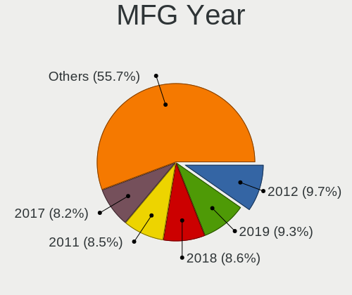
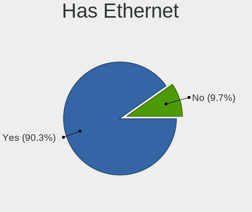
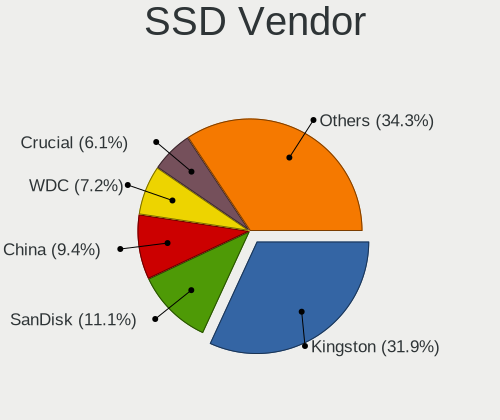
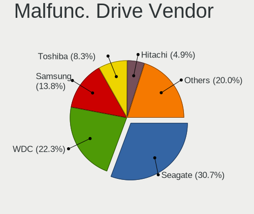
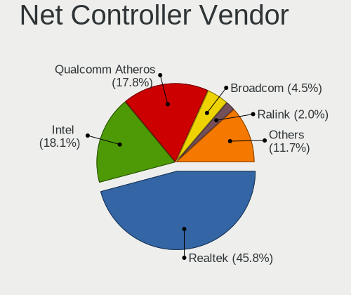
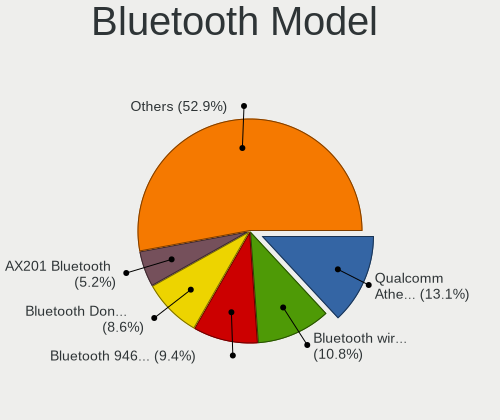
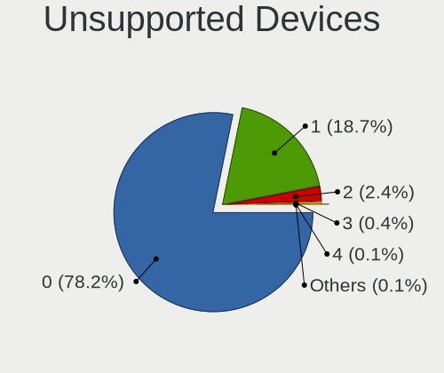

Linux in Brazil - Tested Hardware & Statistics
----------------------------------------------

A project to collect tested hardware configurations for Linux in Brazil.

Anyone can contribute to this report by the [hw-probe](https://github.com/linuxhw/hw-probe) tool:

    sudo -E hw-probe -all -upload

Please contribute! Especially if your hardware is rare.

This is a report for all computer types. See also reports for [desktops](/Location/Brazil/Desktop/README.md) and [notebooks](/Location/Brazil/Notebook/README.md).

Contents
--------

* [ Test Cases ](#test-cases)

* [ System ](#system)
  - [ OS                       ](#os)
  - [ OS Family                ](#os-family)
  - [ Kernel                   ](#kernel)
  - [ Kernel Family            ](#kernel-family)
  - [ Kernel Major Ver.        ](#kernel-major-ver)
  - [ Arch                     ](#arch)
  - [ DE                       ](#de)
  - [ Display Server           ](#display-server)
  - [ Display Manager          ](#display-manager)
  - [ OS Lang                  ](#os-lang)
  - [ Boot Mode                ](#boot-mode)
  - [ Filesystem               ](#filesystem)
  - [ Part. scheme             ](#part-scheme)
  - [ Dual Boot with Linux/BSD ](#dual-boot-with-linuxbsd)
  - [ Dual Boot (Win)          ](#dual-boot-win)

* [ Board ](#board)
  - [ Vendor                   ](#vendor)
  - [ Model                    ](#model)
  - [ Model Family             ](#model-family)
  - [ MFG Year                 ](#mfg-year)
  - [ Form Factor              ](#form-factor)
  - [ Secure Boot              ](#secure-boot)
  - [ Coreboot                 ](#coreboot)
  - [ RAM Size                 ](#ram-size)
  - [ RAM Used                 ](#ram-used)
  - [ Total Drives             ](#total-drives)
  - [ Has CD-ROM               ](#has-cd-rom)
  - [ Has Ethernet             ](#has-ethernet)
  - [ Has WiFi                 ](#has-wifi)
  - [ Has Bluetooth            ](#has-bluetooth)

* [ Location ](#location)
  - [ Country                  ](#country)
  - [ City                     ](#city)

* [ Drives ](#drives)
  - [ Drive Vendor             ](#drive-vendor)
  - [ Drive Model              ](#drive-model)
  - [ HDD Vendor               ](#hdd-vendor)
  - [ SSD Vendor               ](#ssd-vendor)
  - [ Drive Kind               ](#drive-kind)
  - [ Drive Connector          ](#drive-connector)
  - [ Drive Size               ](#drive-size)
  - [ Space Total              ](#space-total)
  - [ Space Used               ](#space-used)
  - [ Malfunc. Drives          ](#malfunc-drives)
  - [ Malfunc. Drive Vendor    ](#malfunc-drive-vendor)
  - [ Malfunc. HDD Vendor      ](#malfunc-hdd-vendor)
  - [ Malfunc. Drive Kind      ](#malfunc-drive-kind)
  - [ Failed Drives            ](#failed-drives)
  - [ Failed Drive Vendor      ](#failed-drive-vendor)
  - [ Drive Status             ](#drive-status)

* [ Storage controller ](#storage-controller)
  - [ Storage Vendor           ](#storage-vendor)
  - [ Storage Model            ](#storage-model)
  - [ Storage Kind             ](#storage-kind)

* [ Processor ](#processor)
  - [ CPU Vendor               ](#cpu-vendor)
  - [ CPU Model                ](#cpu-model)
  - [ CPU Model Family         ](#cpu-model-family)
  - [ CPU Cores                ](#cpu-cores)
  - [ CPU Sockets              ](#cpu-sockets)
  - [ CPU Threads              ](#cpu-threads)
  - [ CPU Op-Modes             ](#cpu-op-modes)
  - [ CPU Microcode            ](#cpu-microcode)
  - [ CPU Microarch            ](#cpu-microarch)

* [ Graphics ](#graphics)
  - [ GPU Vendor               ](#gpu-vendor)
  - [ GPU Model                ](#gpu-model)
  - [ GPU Combo                ](#gpu-combo)
  - [ GPU Driver               ](#gpu-driver)
  - [ GPU Memory               ](#gpu-memory)

* [ Monitor ](#monitor)
  - [ Monitor Vendor           ](#monitor-vendor)
  - [ Monitor Model            ](#monitor-model)
  - [ Monitor Resolution       ](#monitor-resolution)
  - [ Monitor Diagonal         ](#monitor-diagonal)
  - [ Monitor Width            ](#monitor-width)
  - [ Aspect Ratio             ](#aspect-ratio)
  - [ Monitor Area             ](#monitor-area)
  - [ Pixel Density            ](#pixel-density)
  - [ Multiple Monitors        ](#multiple-monitors)

* [ Network ](#network)
  - [ Net Controller Vendor    ](#net-controller-vendor)
  - [ Net Controller Model     ](#net-controller-model)
  - [ Wireless Vendor          ](#wireless-vendor)
  - [ Wireless Model           ](#wireless-model)
  - [ Ethernet Vendor          ](#ethernet-vendor)
  - [ Ethernet Model           ](#ethernet-model)
  - [ Net Controller Kind      ](#net-controller-kind)
  - [ Used Controller          ](#used-controller)
  - [ NICs                     ](#nics)
  - [ IPv6                     ](#ipv6)

* [ Bluetooth ](#bluetooth)
  - [ Bluetooth Vendor         ](#bluetooth-vendor)
  - [ Bluetooth Model          ](#bluetooth-model)

* [ Sound ](#sound)
  - [ Sound Vendor             ](#sound-vendor)
  - [ Sound Model              ](#sound-model)

* [ Memory ](#memory)
  - [ Memory Vendor            ](#memory-vendor)
  - [ Memory Model             ](#memory-model)
  - [ Memory Kind              ](#memory-kind)
  - [ Memory Form Factor       ](#memory-form-factor)
  - [ Memory Size              ](#memory-size)
  - [ Memory Speed             ](#memory-speed)

* [ Printers & scanners ](#printers--scanners)
  - [ Printer Vendor           ](#printer-vendor)
  - [ Printer Model            ](#printer-model)
  - [ Scanner Vendor           ](#scanner-vendor)
  - [ Scanner Model            ](#scanner-model)

* [ Camera ](#camera)
  - [ Camera Vendor            ](#camera-vendor)
  - [ Camera Model             ](#camera-model)

* [ Security ](#security)
  - [ Fingerprint Vendor       ](#fingerprint-vendor)
  - [ Fingerprint Model        ](#fingerprint-model)
  - [ Chipcard Vendor          ](#chipcard-vendor)
  - [ Chipcard Model           ](#chipcard-model)

* [ Unsupported ](#unsupported)
  - [ Unsupported Devices      ](#unsupported-devices)
  - [ Unsupported Device Types ](#unsupported-device-types)

Test Cases
----------

Total: 17243

| Vendor        | Model                       | Form-Factor | Probe                                                      | Date         |
|---------------|-----------------------------|-------------|------------------------------------------------------------|--------------|
| Dell          | Inspiron 5566               | Notebook    | [b2dd8d93c7](https://linux-hardware.org/?probe=b2dd8d93c7) | Feb 01, 2023 |
| Gigabyte      | GA-78LMT-USB3 SEx           | Desktop     | [6aa10285fe](https://linux-hardware.org/?probe=6aa10285fe) | Feb 01, 2023 |
| Lenovo        | IdeaPad S145-15API 81V7     | Notebook    | [7e78833b8b](https://linux-hardware.org/?probe=7e78833b8b) | Feb 01, 2023 |
| Lenovo        | IdeaPad S145-15IWL 81S9     | Notebook    | [2be076637c](https://linux-hardware.org/?probe=2be076637c) | Feb 01, 2023 |
| Dell          | Vostro 3500                 | Notebook    | [fa4104f438](https://linux-hardware.org/?probe=fa4104f438) | Feb 01, 2023 |
| Dell          | Vostro 3500                 | Notebook    | [ec80fcb8a5](https://linux-hardware.org/?probe=ec80fcb8a5) | Feb 01, 2023 |
| Notebook      | NJx0MU                      | Notebook    | [c402e9c063](https://linux-hardware.org/?probe=c402e9c063) | Feb 01, 2023 |
| Acer          | Nitro AN515-54              | Notebook    | [9aee0a798c](https://linux-hardware.org/?probe=9aee0a798c) | Feb 01, 2023 |
| PCWare        | IPX525R2-D3                 | Desktop     | [20868d90a7](https://linux-hardware.org/?probe=20868d90a7) | Feb 01, 2023 |
| PCWare        | IPX525R2-D3                 | Desktop     | [d67831dc82](https://linux-hardware.org/?probe=d67831dc82) | Feb 01, 2023 |
| Gigabyte      | B550 AORUS ELITE V2         | Desktop     | [aa3b7e2dc8](https://linux-hardware.org/?probe=aa3b7e2dc8) | Feb 01, 2023 |
| Dell          | 0PV3YR A05                  | Server      | [f2b211ff3a](https://linux-hardware.org/?probe=f2b211ff3a) | Feb 01, 2023 |
| Dell          | Vostro 1520                 | Notebook    | [3fab7107b7](https://linux-hardware.org/?probe=3fab7107b7) | Feb 01, 2023 |
| Dell          | Inspiron 15-3567            | Notebook    | [2f6f4bc8c7](https://linux-hardware.org/?probe=2f6f4bc8c7) | Feb 01, 2023 |
| AZW           | U59                         | Desktop     | [9b73123be3](https://linux-hardware.org/?probe=9b73123be3) | Feb 01, 2023 |
| Notebook      | NJx0MU                      | Notebook    | [eb152c7d4e](https://linux-hardware.org/?probe=eb152c7d4e) | Feb 01, 2023 |
| AZW           | U59                         | Desktop     | [74f028454a](https://linux-hardware.org/?probe=74f028454a) | Feb 01, 2023 |
| Samsung       | RV415/RV515                 | Notebook    | [ea50188d5c](https://linux-hardware.org/?probe=ea50188d5c) | Jan 31, 2023 |
| Lenovo        | IdeaPad S145-15API 81V7     | Notebook    | [ebbe861495](https://linux-hardware.org/?probe=ebbe861495) | Jan 31, 2023 |
| AMD           | Inagua CRB                  | Desktop     | [3f497311dd](https://linux-hardware.org/?probe=3f497311dd) | Jan 31, 2023 |
| Lenovo        | IdeaPad S145-15IIL 82DJ     | Notebook    | [3803fd2405](https://linux-hardware.org/?probe=3803fd2405) | Jan 31, 2023 |
| Lenovo        | IdeaPad S145-15API 81V7     | Notebook    | [949ea399fb](https://linux-hardware.org/?probe=949ea399fb) | Jan 31, 2023 |
| Dell          | 06HR05 A00                  | Desktop     | [b80c55d90d](https://linux-hardware.org/?probe=b80c55d90d) | Jan 31, 2023 |
| ASUSTek       | M5A78L-M LX/BR              | Desktop     | [d8d386cb1d](https://linux-hardware.org/?probe=d8d386cb1d) | Jan 31, 2023 |
| Gigabyte      | 945GCM-S2C                  | Desktop     | [41ad246a0b](https://linux-hardware.org/?probe=41ad246a0b) | Jan 31, 2023 |
| Notebook      | NJx0MU                      | Notebook    | [58d5bdaa2d](https://linux-hardware.org/?probe=58d5bdaa2d) | Jan 31, 2023 |
| Lenovo        | G40-80 80JE                 | Notebook    | [bb5d758714](https://linux-hardware.org/?probe=bb5d758714) | Jan 31, 2023 |
| Dell          | 0PV3YR A05                  | Server      | [d8f44aeb4c](https://linux-hardware.org/?probe=d8f44aeb4c) | Jan 31, 2023 |
| Lenovo        | G40-80 80JE                 | Notebook    | [e5dc585024](https://linux-hardware.org/?probe=e5dc585024) | Jan 31, 2023 |
| Samsung       | 550XCJ/550XCR               | Notebook    | [75fad3daf3](https://linux-hardware.org/?probe=75fad3daf3) | Jan 31, 2023 |
| Lenovo        | IdeaPad S145-15API 81V7     | Notebook    | [2474b4641c](https://linux-hardware.org/?probe=2474b4641c) | Jan 30, 2023 |
| Acer          | Aspire A315-56              | Notebook    | [93f5ac8f6d](https://linux-hardware.org/?probe=93f5ac8f6d) | Jan 30, 2023 |
| Lenovo        | ThinkPad Edge E431 62779... | Notebook    | [8d7c1dbf4d](https://linux-hardware.org/?probe=8d7c1dbf4d) | Jan 30, 2023 |
| Acer          | Aspire A315-56              | Notebook    | [bacea93055](https://linux-hardware.org/?probe=bacea93055) | Jan 30, 2023 |
| ASUSTek       | H61M-A/BR                   | Desktop     | [b6a73bd22e](https://linux-hardware.org/?probe=b6a73bd22e) | Jan 30, 2023 |
| ASUSTek       | H61M-A/BR                   | Desktop     | [0ae96c2bbc](https://linux-hardware.org/?probe=0ae96c2bbc) | Jan 30, 2023 |
| PCWare        | IPMH110G                    | Desktop     | [95fe94d9f4](https://linux-hardware.org/?probe=95fe94d9f4) | Jan 30, 2023 |
| Acer          | Aspire A515-41G             | Notebook    | [88db10e257](https://linux-hardware.org/?probe=88db10e257) | Jan 30, 2023 |
| Dell          | 0PV3YR A05                  | Server      | [79e7fde988](https://linux-hardware.org/?probe=79e7fde988) | Jan 30, 2023 |
| Avell High... | B11 MOB                     | Notebook    | [dd9d29ddc7](https://linux-hardware.org/?probe=dd9d29ddc7) | Jan 30, 2023 |
| Avell High... | B.ON                        | Notebook    | [721fbbdeb2](https://linux-hardware.org/?probe=721fbbdeb2) | Jan 30, 2023 |
| Acer          | Aspire A515-45              | Notebook    | [42405a6a0c](https://linux-hardware.org/?probe=42405a6a0c) | Jan 30, 2023 |
| Lenovo        | IdeaPad S145-15IWL 81S9     | Notebook    | [1c62beb905](https://linux-hardware.org/?probe=1c62beb905) | Jan 29, 2023 |
| Samsung       | RV415/RV515                 | Notebook    | [c5999dc406](https://linux-hardware.org/?probe=c5999dc406) | Jan 29, 2023 |
| ASUSTek       | H81M-CS/BR                  | Desktop     | [ca82a3e5a7](https://linux-hardware.org/?probe=ca82a3e5a7) | Jan 29, 2023 |
| Lenovo        | IdeaPad Gaming 3 15IMH05... | Notebook    | [51245400df](https://linux-hardware.org/?probe=51245400df) | Jan 29, 2023 |
| Intel         | H61                         | Desktop     | [87a72c61f2](https://linux-hardware.org/?probe=87a72c61f2) | Jan 29, 2023 |
| Dell          | Inspiron 3542               | Notebook    | [42a753536d](https://linux-hardware.org/?probe=42a753536d) | Jan 29, 2023 |
| Dell          | 0VRWRC A01                  | Desktop     | [0e6a170715](https://linux-hardware.org/?probe=0e6a170715) | Jan 29, 2023 |
| Intel         | H61                         | Desktop     | [0ce404915f](https://linux-hardware.org/?probe=0ce404915f) | Jan 29, 2023 |
| Notebook      | NJx0MU                      | Notebook    | [10cdf2558f](https://linux-hardware.org/?probe=10cdf2558f) | Jan 29, 2023 |
| Notebook      | NJx0MU                      | Notebook    | [09bbe80125](https://linux-hardware.org/?probe=09bbe80125) | Jan 29, 2023 |
| Dell          | 0PV3YR A05                  | Server      | [351106d7e5](https://linux-hardware.org/?probe=351106d7e5) | Jan 29, 2023 |
| Positivo      | Q464C-O                     | Notebook    | [e61f2d0622](https://linux-hardware.org/?probe=e61f2d0622) | Jan 29, 2023 |
| Acer          | Aspire 5733                 | Notebook    | [da753d74a1](https://linux-hardware.org/?probe=da753d74a1) | Jan 29, 2023 |
| Toshiba       | STI 010433                  | Desktop     | [fead488cf1](https://linux-hardware.org/?probe=fead488cf1) | Jan 29, 2023 |
| ASUSTek       | PRIME Z690-A                | Desktop     | [8dee7ae6ec](https://linux-hardware.org/?probe=8dee7ae6ec) | Jan 28, 2023 |
| Dell          | G15 5520                    | Notebook    | [a0c269c5b1](https://linux-hardware.org/?probe=a0c269c5b1) | Jan 28, 2023 |
| ASUSTek       | H81M-A/BR                   | Desktop     | [ca72045652](https://linux-hardware.org/?probe=ca72045652) | Jan 28, 2023 |
| Gigabyte      | H77M-D3H                    | Desktop     | [a9367f87d4](https://linux-hardware.org/?probe=a9367f87d4) | Jan 28, 2023 |
| ASRock        | N68C-S UCC                  | Desktop     | [de8739d9d5](https://linux-hardware.org/?probe=de8739d9d5) | Jan 28, 2023 |
| ASUSTek       | A58M-A/BR                   | Desktop     | [2e6e55e6ea](https://linux-hardware.org/?probe=2e6e55e6ea) | Jan 28, 2023 |
| ASUSTek       | PRIME B660M-A D4            | Desktop     | [41ff395299](https://linux-hardware.org/?probe=41ff395299) | Jan 28, 2023 |
| ASUSTek       | VivoBook_ASUSLaptop X515... | Notebook    | [f1f5def619](https://linux-hardware.org/?probe=f1f5def619) | Jan 28, 2023 |
| Samsung       | RV415/RV515                 | Notebook    | [fd9d67e4b8](https://linux-hardware.org/?probe=fd9d67e4b8) | Jan 27, 2023 |
| Gigabyte      | B75M-D3H                    | Desktop     | [3ee2e6ab56](https://linux-hardware.org/?probe=3ee2e6ab56) | Jan 27, 2023 |
| Lenovo        | ThinkPad P15 Gen 1 20SUS... | Notebook    | [c74ea31148](https://linux-hardware.org/?probe=c74ea31148) | Jan 27, 2023 |
| Intel         | DH77EB AAG39073-304         | Desktop     | [8965805130](https://linux-hardware.org/?probe=8965805130) | Jan 27, 2023 |
| HP            | Compaq 6530b                | Notebook    | [15b987981b](https://linux-hardware.org/?probe=15b987981b) | Jan 27, 2023 |
| Acer          | Aspire ES1-572              | Notebook    | [9f745ecc18](https://linux-hardware.org/?probe=9f745ecc18) | Jan 27, 2023 |
| Lenovo        | IdeaPad 320-15IKB 80YH      | Notebook    | [5a32be51f4](https://linux-hardware.org/?probe=5a32be51f4) | Jan 27, 2023 |
| ASUSTek       | TUF Gaming X570-PLUS_BR     | Desktop     | [e7b74c9ad4](https://linux-hardware.org/?probe=e7b74c9ad4) | Jan 27, 2023 |
| Acer          | Aspire E5-553G              | Notebook    | [e851efaf39](https://linux-hardware.org/?probe=e851efaf39) | Jan 27, 2023 |
| Philco        | 14E                         | Notebook    | [1c069ed627](https://linux-hardware.org/?probe=1c069ed627) | Jan 27, 2023 |
| Philco        | 14E                         | Notebook    | [cfb283e599](https://linux-hardware.org/?probe=cfb283e599) | Jan 27, 2023 |
| Lenovo        | IdeaPad 3 15ALC6 82MF       | Notebook    | [93be3d62c4](https://linux-hardware.org/?probe=93be3d62c4) | Jan 27, 2023 |
| Compaq        | 430                         | Notebook    | [069fa715b9](https://linux-hardware.org/?probe=069fa715b9) | Jan 27, 2023 |
| Samsung       | 340XAA/350XAA/550XAA        | Notebook    | [b4d0bbaf56](https://linux-hardware.org/?probe=b4d0bbaf56) | Jan 27, 2023 |
| Dell          | Inspiron 5468               | Notebook    | [d155136857](https://linux-hardware.org/?probe=d155136857) | Jan 27, 2023 |
| Samsung       | 340XAA/350XAA/550XAA        | Notebook    | [05dac90dec](https://linux-hardware.org/?probe=05dac90dec) | Jan 27, 2023 |
| Lenovo        | IdeaPad S145-15IIL 82DJ     | Notebook    | [0697311f5f](https://linux-hardware.org/?probe=0697311f5f) | Jan 27, 2023 |
| Positivo      | POS-PIB150DT                | Desktop     | [5a333d4e71](https://linux-hardware.org/?probe=5a333d4e71) | Jan 26, 2023 |
| Gigabyte      | GA-78LMT-USB3 SEx           | Desktop     | [90de00d686](https://linux-hardware.org/?probe=90de00d686) | Jan 26, 2023 |
| Dell          | G3 3500                     | Notebook    | [ea11767144](https://linux-hardware.org/?probe=ea11767144) | Jan 26, 2023 |
| HP            | 225E                        | Desktop     | [bace147a01](https://linux-hardware.org/?probe=bace147a01) | Jan 26, 2023 |
| HP            | 8299                        | Desktop     | [d73eaeeb81](https://linux-hardware.org/?probe=d73eaeeb81) | Jan 26, 2023 |
| HP            | 8299                        | Desktop     | [47b5f3fdef](https://linux-hardware.org/?probe=47b5f3fdef) | Jan 26, 2023 |
| ASUSTek       | TUF Gaming X570-PLUS_BR     | Desktop     | [951bfcd626](https://linux-hardware.org/?probe=951bfcd626) | Jan 26, 2023 |
| Dell          | Vostro 3458                 | Notebook    | [3beffe6710](https://linux-hardware.org/?probe=3beffe6710) | Jan 26, 2023 |
| Dell          | 0PV3YR A05                  | Server      | [d632bd0c9f](https://linux-hardware.org/?probe=d632bd0c9f) | Jan 26, 2023 |
| ASUSTek       | Z550SA                      | Notebook    | [f5ac147c1e](https://linux-hardware.org/?probe=f5ac147c1e) | Jan 26, 2023 |
| Multilaser    | PC150                       | Notebook    | [1c4ace00d1](https://linux-hardware.org/?probe=1c4ace00d1) | Jan 26, 2023 |
| ASRock        | B450M Steel Legend          | Desktop     | [f69047309d](https://linux-hardware.org/?probe=f69047309d) | Jan 26, 2023 |
| Dell          | Latitude 5490               | Notebook    | [b392e71ce5](https://linux-hardware.org/?probe=b392e71ce5) | Jan 26, 2023 |
| Dell          | G3 3590                     | Notebook    | [8a7e4e4db0](https://linux-hardware.org/?probe=8a7e4e4db0) | Jan 26, 2023 |
| Notebook      | NJx0MU                      | Notebook    | [26e692f7de](https://linux-hardware.org/?probe=26e692f7de) | Jan 26, 2023 |
| Gigabyte      | B75M-D3H                    | Desktop     | [6eafb4ceab](https://linux-hardware.org/?probe=6eafb4ceab) | Jan 25, 2023 |
| ASUSTek       | P8H67-M LX                  | Desktop     | [b8045702e2](https://linux-hardware.org/?probe=b8045702e2) | Jan 25, 2023 |
| Gigabyte      | M68MT-S2P                   | Desktop     | [5e044ca68b](https://linux-hardware.org/?probe=5e044ca68b) | Jan 25, 2023 |
| HP            | G60                         | Notebook    | [8fe616c588](https://linux-hardware.org/?probe=8fe616c588) | Jan 25, 2023 |
| Intel         | DG31PR AAE58249-306         | Desktop     | [a123c38d76](https://linux-hardware.org/?probe=a123c38d76) | Jan 25, 2023 |
| MSI           | 2A9C                        | Desktop     | [cea7204c4b](https://linux-hardware.org/?probe=cea7204c4b) | Jan 25, 2023 |
| HP            | Folio 13                    | Notebook    | [214197bef4](https://linux-hardware.org/?probe=214197bef4) | Jan 25, 2023 |
| Dell          | 0PV3YR A05                  | Server      | [8780aceeec](https://linux-hardware.org/?probe=8780aceeec) | Jan 25, 2023 |
| Notebook      | NJx0MU                      | Notebook    | [7c19df8c01](https://linux-hardware.org/?probe=7c19df8c01) | Jan 25, 2023 |
| Dell          | Vostro 5470                 | Notebook    | [bfd4198155](https://linux-hardware.org/?probe=bfd4198155) | Jan 25, 2023 |
| Dell          | Inspiron 5468               | Notebook    | [3e59c1f38b](https://linux-hardware.org/?probe=3e59c1f38b) | Jan 25, 2023 |
| Gigabyte      | H310M M.2                   | Desktop     | [2fbe64570f](https://linux-hardware.org/?probe=2fbe64570f) | Jan 25, 2023 |
| Lenovo        | IdeaPad 3 15ALC6 82MF       | Notebook    | [0ef51b9eda](https://linux-hardware.org/?probe=0ef51b9eda) | Jan 25, 2023 |
| Digibras      | NH4CU03                     | Notebook    | [7de7df58a3](https://linux-hardware.org/?probe=7de7df58a3) | Jan 24, 2023 |
| Digibras      | NH4CU03                     | Notebook    | [fce5f618d8](https://linux-hardware.org/?probe=fce5f618d8) | Jan 24, 2023 |
| Dell          | Inspiron 3421               | Notebook    | [02491de92f](https://linux-hardware.org/?probe=02491de92f) | Jan 24, 2023 |
| Compaq        | 420                         | Notebook    | [9ed9e081c4](https://linux-hardware.org/?probe=9ed9e081c4) | Jan 24, 2023 |
| Dell          | 0PV3YR A05                  | Server      | [fe1a2d7fc6](https://linux-hardware.org/?probe=fe1a2d7fc6) | Jan 24, 2023 |
| Acer          | Aspire A515-51              | Notebook    | [418e5a2787](https://linux-hardware.org/?probe=418e5a2787) | Jan 24, 2023 |
| Notebook      | NJx0MU                      | Notebook    | [54d0592fb2](https://linux-hardware.org/?probe=54d0592fb2) | Jan 24, 2023 |
| Insyde        | Braswell                    | Notebook    | [6abab0adc1](https://linux-hardware.org/?probe=6abab0adc1) | Jan 24, 2023 |
| Positivo      | N1240                       | Notebook    | [e938a6c0b0](https://linux-hardware.org/?probe=e938a6c0b0) | Jan 24, 2023 |
| ASUSTek       | K46CB                       | Notebook    | [62aa75f57a](https://linux-hardware.org/?probe=62aa75f57a) | Jan 23, 2023 |
| Gigabyte      | H310M M.2                   | Desktop     | [30967bc549](https://linux-hardware.org/?probe=30967bc549) | Jan 23, 2023 |
| Lenovo        | IdeaPad Gaming 3 15IHU6 ... | Notebook    | [4a97e29245](https://linux-hardware.org/?probe=4a97e29245) | Jan 23, 2023 |
| Lenovo        | IdeaPad Gaming 3 15IHU6 ... | Notebook    | [54ebd7c5f8](https://linux-hardware.org/?probe=54ebd7c5f8) | Jan 23, 2023 |
| Dell          | Latitude 3420               | Notebook    | [d2a8b9657a](https://linux-hardware.org/?probe=d2a8b9657a) | Jan 23, 2023 |
| Dell          | Inspiron 7472               | Notebook    | [6395ea422c](https://linux-hardware.org/?probe=6395ea422c) | Jan 23, 2023 |
| Gigabyte      | A520M S2H                   | Desktop     | [08f11b861b](https://linux-hardware.org/?probe=08f11b861b) | Jan 23, 2023 |
| Notebook      | NJx0MU                      | Notebook    | [206e04bc7d](https://linux-hardware.org/?probe=206e04bc7d) | Jan 23, 2023 |
| ASRock        | B450M Steel Legend          | Desktop     | [c87ce45f84](https://linux-hardware.org/?probe=c87ce45f84) | Jan 23, 2023 |
| Dell          | 0PV3YR A05                  | Server      | [e7f0c7e0be](https://linux-hardware.org/?probe=e7f0c7e0be) | Jan 23, 2023 |
| Alienware     | m15 R7                      | Notebook    | [e57302bf60](https://linux-hardware.org/?probe=e57302bf60) | Jan 23, 2023 |
| HP            | 540                         | Notebook    | [a4a7b26f42](https://linux-hardware.org/?probe=a4a7b26f42) | Jan 23, 2023 |
| Intel         | DG31PR AAE58249-306         | Desktop     | [885f180987](https://linux-hardware.org/?probe=885f180987) | Jan 23, 2023 |
| MSI           | MAG B550 TOMAHAWK           | Desktop     | [6597dd71bc](https://linux-hardware.org/?probe=6597dd71bc) | Jan 23, 2023 |
| Unknown       | G41T-M7                     | Desktop     | [026810c423](https://linux-hardware.org/?probe=026810c423) | Jan 22, 2023 |
| Lenovo        | IdeaPad S145-15API 81V7     | Notebook    | [7d4406c9bc](https://linux-hardware.org/?probe=7d4406c9bc) | Jan 22, 2023 |
| HP            | Pavilion dv4                | Notebook    | [9fd79086c8](https://linux-hardware.org/?probe=9fd79086c8) | Jan 22, 2023 |
| Biostar       | A320MH                      | Desktop     | [4c75d6c079](https://linux-hardware.org/?probe=4c75d6c079) | Jan 22, 2023 |
| Notebook      | NJx0MU                      | Notebook    | [9e9dcb9883](https://linux-hardware.org/?probe=9e9dcb9883) | Jan 22, 2023 |
| Notebook      | NJx0MU                      | Notebook    | [fdca7d69cd](https://linux-hardware.org/?probe=fdca7d69cd) | Jan 22, 2023 |
| Gigabyte      | A320M-H-CF                  | Desktop     | [14a5fa99db](https://linux-hardware.org/?probe=14a5fa99db) | Jan 22, 2023 |
| Dell          | 0PV3YR A05                  | Server      | [e7afed6351](https://linux-hardware.org/?probe=e7afed6351) | Jan 22, 2023 |
| Dell          | G3 3579                     | Notebook    | [63298dcee9](https://linux-hardware.org/?probe=63298dcee9) | Jan 22, 2023 |
| Dell          | Vostro 3460                 | Notebook    | [569626e023](https://linux-hardware.org/?probe=569626e023) | Jan 22, 2023 |
| Dell          | G3 3500                     | Notebook    | [b3a545ee30](https://linux-hardware.org/?probe=b3a545ee30) | Jan 22, 2023 |
| ASUSTek       | H61M-A/BR                   | Desktop     | [43aaf27a04](https://linux-hardware.org/?probe=43aaf27a04) | Jan 22, 2023 |
| Itautec       | Infoway w7430               | Notebook    | [b33318e6e0](https://linux-hardware.org/?probe=b33318e6e0) | Jan 22, 2023 |
| Lenovo        | IdeaPad 3 15ALC6 82MF       | Notebook    | [697fbcd8d1](https://linux-hardware.org/?probe=697fbcd8d1) | Jan 22, 2023 |
| Dell          | G3 3500                     | Notebook    | [e81b4d5e46](https://linux-hardware.org/?probe=e81b4d5e46) | Jan 22, 2023 |
| ASUSTek       | PRIME H310M-K               | Desktop     | [b066912bf8](https://linux-hardware.org/?probe=b066912bf8) | Jan 21, 2023 |
| ASUSTek       | TUF Gaming X570-PLUS_BR     | Desktop     | [90ad82dcac](https://linux-hardware.org/?probe=90ad82dcac) | Jan 21, 2023 |
| ASUSTek       | M5A78L-M PLUS/USB3          | Desktop     | [76a4c34a41](https://linux-hardware.org/?probe=76a4c34a41) | Jan 21, 2023 |
| Intel         | DG31PR AAE58249-306         | Desktop     | [e5fff0ebe0](https://linux-hardware.org/?probe=e5fff0ebe0) | Jan 21, 2023 |
| ASUSTek       | PRIME H510M-A               | Desktop     | [42e0ba4db2](https://linux-hardware.org/?probe=42e0ba4db2) | Jan 21, 2023 |
| Intel         | DG31PR AAE58249-306         | Desktop     | [8a3035382a](https://linux-hardware.org/?probe=8a3035382a) | Jan 21, 2023 |
| Dell          | Inspiron N4050              | Notebook    | [6ddc2793d7](https://linux-hardware.org/?probe=6ddc2793d7) | Jan 21, 2023 |
| Dell          | Inspiron N4050              | Notebook    | [ae4c9eaa9c](https://linux-hardware.org/?probe=ae4c9eaa9c) | Jan 21, 2023 |
| ASUSTek       | VivoBook_ASUSLaptop X515... | Notebook    | [ed9d60d9b7](https://linux-hardware.org/?probe=ed9d60d9b7) | Jan 21, 2023 |
| Positivo      | S14BW01                     | Notebook    | [241b637096](https://linux-hardware.org/?probe=241b637096) | Jan 21, 2023 |
| Positivo      | S14BW01                     | Notebook    | [c818b70b5b](https://linux-hardware.org/?probe=c818b70b5b) | Jan 21, 2023 |
| ASUSTek       | TUF Gaming X570-PLUS_BR     | Desktop     | [9579ec96bc](https://linux-hardware.org/?probe=9579ec96bc) | Jan 21, 2023 |
| Philco        | OEM                         | Notebook    | [a39f50ccfd](https://linux-hardware.org/?probe=a39f50ccfd) | Jan 21, 2023 |
| Dell          | 0PV3YR A05                  | Server      | [e7f94d5172](https://linux-hardware.org/?probe=e7f94d5172) | Jan 21, 2023 |
| Lenovo        | 3148 SDK0L22692 WIN 3792... | Desktop     | [f66c33020e](https://linux-hardware.org/?probe=f66c33020e) | Jan 21, 2023 |
| Notebook      | NJx0MU                      | Notebook    | [edee5aee7a](https://linux-hardware.org/?probe=edee5aee7a) | Jan 21, 2023 |
| Lenovo        | IdeaPad 320-15IKB 80YH      | Notebook    | [fa251ca13c](https://linux-hardware.org/?probe=fa251ca13c) | Jan 21, 2023 |
| Lenovo        | IdeaPad 320-15IKB 80YH      | Notebook    | [965d1fa09f](https://linux-hardware.org/?probe=965d1fa09f) | Jan 20, 2023 |
| Acer          | Aspire E5-571               | Notebook    | [a37e873516](https://linux-hardware.org/?probe=a37e873516) | Jan 20, 2023 |
| Dell          | 0VC8RJ X02                  | Desktop     | [313ea92e9c](https://linux-hardware.org/?probe=313ea92e9c) | Jan 20, 2023 |
| Positivo B... | VJFE43F11X-XXXXXX           | Notebook    | [138a9b3b0c](https://linux-hardware.org/?probe=138a9b3b0c) | Jan 20, 2023 |
| Intel         | B75                         | Desktop     | [40da372747](https://linux-hardware.org/?probe=40da372747) | Jan 20, 2023 |
| Lenovo        | IdeaPad Gaming 3 15IHU6 ... | Notebook    | [6364be5249](https://linux-hardware.org/?probe=6364be5249) | Jan 20, 2023 |
| Dell          | Inspiron N4050              | Notebook    | [46e35da681](https://linux-hardware.org/?probe=46e35da681) | Jan 20, 2023 |
| Lenovo        | IdeaPad 330-15IKB 81FD      | Notebook    | [31698019a3](https://linux-hardware.org/?probe=31698019a3) | Jan 20, 2023 |
| ASUSTek       | P8H61-M LX2 R2.0            | Desktop     | [2d420c3acb](https://linux-hardware.org/?probe=2d420c3acb) | Jan 20, 2023 |
| Dell          | Vostro 3400                 | Notebook    | [c158cd6095](https://linux-hardware.org/?probe=c158cd6095) | Jan 20, 2023 |
| Gigabyte      | H61M-S1                     | Desktop     | [97987f88e7](https://linux-hardware.org/?probe=97987f88e7) | Jan 20, 2023 |
| Lenovo        | IdeaPad S145-15IWL 81S9     | Notebook    | [169ba5d31f](https://linux-hardware.org/?probe=169ba5d31f) | Jan 20, 2023 |
| Dell          | Venue 8 Pro 5830            | Notebook    | [4f815d5b4f](https://linux-hardware.org/?probe=4f815d5b4f) | Jan 20, 2023 |
| Notebook      | NJx0MU                      | Notebook    | [c7ab1c1990](https://linux-hardware.org/?probe=c7ab1c1990) | Jan 20, 2023 |
| AZW           | SEi                         | Desktop     | [257b104c3a](https://linux-hardware.org/?probe=257b104c3a) | Jan 20, 2023 |
| AZW           | SEi                         | Desktop     | [481932390b](https://linux-hardware.org/?probe=481932390b) | Jan 20, 2023 |
| Dell          | Inspiron 15-3567            | Notebook    | [33a3aac223](https://linux-hardware.org/?probe=33a3aac223) | Jan 20, 2023 |
| Dell          | 0PV3YR A05                  | Server      | [3447d19b00](https://linux-hardware.org/?probe=3447d19b00) | Jan 20, 2023 |
| ASUSTek       | P8H61-M LX3 PLUS R2.0       | Desktop     | [1320f35331](https://linux-hardware.org/?probe=1320f35331) | Jan 20, 2023 |
| Acer          | Aspire A515-45              | Notebook    | [9d5faff505](https://linux-hardware.org/?probe=9d5faff505) | Jan 20, 2023 |
| Positivo B... | VJFE43F11X-XXXXXX           | Notebook    | [cc9e6f8862](https://linux-hardware.org/?probe=cc9e6f8862) | Jan 19, 2023 |
| Positivo      | POS-PIQ77CL POSITIVO        | Desktop     | [c2f25e54e6](https://linux-hardware.org/?probe=c2f25e54e6) | Jan 19, 2023 |
| Lenovo        | IdeaPad 320-15IKB 80YH      | Notebook    | [440ff298e7](https://linux-hardware.org/?probe=440ff298e7) | Jan 19, 2023 |
| Unknown       | Unknown                     | Desktop     | [d4480b6267](https://linux-hardware.org/?probe=d4480b6267) | Jan 19, 2023 |
| Intel         | H110                        | Desktop     | [532f2a340e](https://linux-hardware.org/?probe=532f2a340e) | Jan 19, 2023 |
| Lenovo        | IdeaPad S145-15IWL 81S9     | Notebook    | [890980b6a9](https://linux-hardware.org/?probe=890980b6a9) | Jan 19, 2023 |
| Sony          | VPCCA15FX                   | Notebook    | [41138327da](https://linux-hardware.org/?probe=41138327da) | Jan 19, 2023 |
| ASUSTek       | VivoBook_ASUSLaptop X515... | Notebook    | [183de4d0f6](https://linux-hardware.org/?probe=183de4d0f6) | Jan 19, 2023 |
| ASUSTek       | VivoBook_ASUSLaptop X515... | Notebook    | [62aa341472](https://linux-hardware.org/?probe=62aa341472) | Jan 19, 2023 |
| Sony          | VPCF236FM                   | Notebook    | [c2ed0fe829](https://linux-hardware.org/?probe=c2ed0fe829) | Jan 19, 2023 |
| Digitron      | G31T-M7                     | Desktop     | [ee9978ae25](https://linux-hardware.org/?probe=ee9978ae25) | Jan 19, 2023 |
| ASUSTek       | H110M-C/BR                  | Desktop     | [58bed7db63](https://linux-hardware.org/?probe=58bed7db63) | Jan 19, 2023 |
| Compal        | Unknown                     | Notebook    | [81abfdb7d5](https://linux-hardware.org/?probe=81abfdb7d5) | Jan 19, 2023 |
| Dell          | Inspiron N5110              | Notebook    | [fd8b8416ea](https://linux-hardware.org/?probe=fd8b8416ea) | Jan 19, 2023 |
| Compal        | Unknown                     | Notebook    | [14cc4178d9](https://linux-hardware.org/?probe=14cc4178d9) | Jan 18, 2023 |
| Acer          | Aspire A315-53              | Notebook    | [fd498f882b](https://linux-hardware.org/?probe=fd498f882b) | Jan 18, 2023 |
| Intel         | H61                         | Desktop     | [be9b2384b0](https://linux-hardware.org/?probe=be9b2384b0) | Jan 18, 2023 |
| Gigabyte      | H61M-S1                     | Desktop     | [80022afba6](https://linux-hardware.org/?probe=80022afba6) | Jan 18, 2023 |
| Lenovo        | IdeaPad 3 15ALC6 82MF       | Notebook    | [3f0d644eaf](https://linux-hardware.org/?probe=3f0d644eaf) | Jan 18, 2023 |
| Acer          | Aspire A515-51              | Notebook    | [1aac8c57f8](https://linux-hardware.org/?probe=1aac8c57f8) | Jan 18, 2023 |
| Dell          | 0PV3YR A05                  | Server      | [84479cfc00](https://linux-hardware.org/?probe=84479cfc00) | Jan 18, 2023 |
| ASUSTek       | VivoBook_ASUSLaptop X515... | Notebook    | [22d07dfddf](https://linux-hardware.org/?probe=22d07dfddf) | Jan 18, 2023 |
| Toshiba       | STI 014293                  | Desktop     | [8e47b89089](https://linux-hardware.org/?probe=8e47b89089) | Jan 18, 2023 |
| Notebook      | NJx0MU                      | Notebook    | [98f8255c15](https://linux-hardware.org/?probe=98f8255c15) | Jan 18, 2023 |
| ASUSTek       | VivoBook_ASUSLaptop X515... | Notebook    | [009adbd75c](https://linux-hardware.org/?probe=009adbd75c) | Jan 18, 2023 |
| ASRock        | H510M-HVS R2.0              | Desktop     | [3ee772766c](https://linux-hardware.org/?probe=3ee772766c) | Jan 18, 2023 |
| Lenovo        | IdeaPad 330-15IKB 81FE      | Notebook    | [032ac1d52e](https://linux-hardware.org/?probe=032ac1d52e) | Jan 18, 2023 |
| Gigabyte      | X470 AORUS GAMING 7 WIFI... | Desktop     | [1a8a1eea59](https://linux-hardware.org/?probe=1a8a1eea59) | Jan 17, 2023 |
| Login Info... | LOG-H110M-G3                | Desktop     | [74defcfa62](https://linux-hardware.org/?probe=74defcfa62) | Jan 17, 2023 |
| AZW           | SER V01                     | Mini pc     | [6048d12291](https://linux-hardware.org/?probe=6048d12291) | Jan 17, 2023 |
| Lenovo        | IdeaPad 3 15IML05 82BS      | Notebook    | [18d3c84771](https://linux-hardware.org/?probe=18d3c84771) | Jan 17, 2023 |
| Lenovo        | IdeaPad 3 15IML05 82BS      | Notebook    | [bd0bc47120](https://linux-hardware.org/?probe=bd0bc47120) | Jan 17, 2023 |
| ASUSTek       | PRIME A320M-K/BR            | Desktop     | [0b7d83316f](https://linux-hardware.org/?probe=0b7d83316f) | Jan 17, 2023 |
| Huanan        | B75 V10.1 376               | Desktop     | [2703c87348](https://linux-hardware.org/?probe=2703c87348) | Jan 17, 2023 |
| HP            | Pavilion Notebook           | Notebook    | [c2dd87db86](https://linux-hardware.org/?probe=c2dd87db86) | Jan 17, 2023 |
| Digibras      | NH4CU03                     | Notebook    | [cd9cdce064](https://linux-hardware.org/?probe=cd9cdce064) | Jan 17, 2023 |
| Notebook      | NJx0MU                      | Notebook    | [e76a4c32dc](https://linux-hardware.org/?probe=e76a4c32dc) | Jan 17, 2023 |
| ASUSTek       | M2N68-AM                    | Desktop     | [e08287f623](https://linux-hardware.org/?probe=e08287f623) | Jan 17, 2023 |
| ASUSTek       | M2N68-AM                    | Desktop     | [c4dbd0f9fe](https://linux-hardware.org/?probe=c4dbd0f9fe) | Jan 17, 2023 |
| Dell          | 0PV3YR A05                  | Server      | [a35e962cca](https://linux-hardware.org/?probe=a35e962cca) | Jan 17, 2023 |
| Positivo      | N1103                       | Notebook    | [e5b41b9ed2](https://linux-hardware.org/?probe=e5b41b9ed2) | Jan 17, 2023 |
| Dell          | Inspiron 5406 2n1           | Convertible | [f680ea1d22](https://linux-hardware.org/?probe=f680ea1d22) | Jan 17, 2023 |
| Acer          | Aspire E1-572P              | Notebook    | [72afaf995e](https://linux-hardware.org/?probe=72afaf995e) | Jan 17, 2023 |
| Gigabyte      | 945GCM-S2C                  | Desktop     | [23a3b53ebd](https://linux-hardware.org/?probe=23a3b53ebd) | Jan 17, 2023 |
| Dell          | Inspiron 3583               | Notebook    | [69e87b6d65](https://linux-hardware.org/?probe=69e87b6d65) | Jan 17, 2023 |
| ASUSTek       | PRIME H410M-E               | Desktop     | [57aec688e4](https://linux-hardware.org/?probe=57aec688e4) | Jan 17, 2023 |
| Gigabyte      | H61M-S1                     | Desktop     | [a7970f0c50](https://linux-hardware.org/?probe=a7970f0c50) | Jan 16, 2023 |
| Gigabyte      | H61M-S1                     | Desktop     | [bf5d9763f7](https://linux-hardware.org/?probe=bf5d9763f7) | Jan 16, 2023 |
| Dell          | Inspiron N4050              | Notebook    | [2de561e7f5](https://linux-hardware.org/?probe=2de561e7f5) | Jan 16, 2023 |
| Toshiba       | STI 007030                  | Desktop     | [c0eb39ae66](https://linux-hardware.org/?probe=c0eb39ae66) | Jan 16, 2023 |
| Lenovo        | IdeaPad 3 15ALC6 82MF       | Notebook    | [b53dd87f87](https://linux-hardware.org/?probe=b53dd87f87) | Jan 16, 2023 |
| Unknown       | X133                        | Notebook    | [8d28e5a95e](https://linux-hardware.org/?probe=8d28e5a95e) | Jan 16, 2023 |
| Positivo      | CHT14B                      | Notebook    | [ab4518f121](https://linux-hardware.org/?probe=ab4518f121) | Jan 16, 2023 |
| Biostar       | A320MH                      | Desktop     | [1736406da7](https://linux-hardware.org/?probe=1736406da7) | Jan 16, 2023 |
| Dell          | Inspiron 5502               | Notebook    | [9403074843](https://linux-hardware.org/?probe=9403074843) | Jan 16, 2023 |
| Intel         | JSL MRD                     | Desktop     | [edbaf7bb5d](https://linux-hardware.org/?probe=edbaf7bb5d) | Jan 16, 2023 |
| MSI           | 2A9C                        | Desktop     | [7a4c26c267](https://linux-hardware.org/?probe=7a4c26c267) | Jan 15, 2023 |
| Lenovo        | ThinkCentre M58e 7303BZ2    | Desktop     | [af99ffb577](https://linux-hardware.org/?probe=af99ffb577) | Jan 15, 2023 |
| Lenovo        | ThinkPad E14 Gen 2 20TB0... | Notebook    | [a4ec4fedeb](https://linux-hardware.org/?probe=a4ec4fedeb) | Jan 15, 2023 |
| Lenovo        | ThinkPad E14 Gen 2 20TB0... | Notebook    | [e7b345f3e0](https://linux-hardware.org/?probe=e7b345f3e0) | Jan 15, 2023 |
| Multilaser    | UB23X LINUX                 | Notebook    | [34a7d43639](https://linux-hardware.org/?probe=34a7d43639) | Jan 15, 2023 |
| Multilaser    | UB23X LINUX                 | Notebook    | [029812488b](https://linux-hardware.org/?probe=029812488b) | Jan 15, 2023 |
| ASUSTek       | X45C                        | Notebook    | [677c0ac809](https://linux-hardware.org/?probe=677c0ac809) | Jan 15, 2023 |
| Lenovo        | IdeaPad S145-15IIL 82DJ     | Notebook    | [1dab471d62](https://linux-hardware.org/?probe=1dab471d62) | Jan 15, 2023 |
| Acer          | Aspire A315-34              | Notebook    | [656b21ed21](https://linux-hardware.org/?probe=656b21ed21) | Jan 14, 2023 |
| Biostar       | A320MH                      | Desktop     | [3fb3a04230](https://linux-hardware.org/?probe=3fb3a04230) | Jan 14, 2023 |
| Gigabyte      | H310M M.2                   | Desktop     | [4eecdbd79d](https://linux-hardware.org/?probe=4eecdbd79d) | Jan 14, 2023 |
| MAXSUN        | MS-TZZ B460M                | Desktop     | [14758fc3e7](https://linux-hardware.org/?probe=14758fc3e7) | Jan 14, 2023 |
| Lenovo        | SKYBAY 31900002 WIN 1801... | All in one  | [9fb52e1195](https://linux-hardware.org/?probe=9fb52e1195) | Jan 14, 2023 |
| ASUSTek       | TUF Gaming B460M-PLUS       | Desktop     | [d1e2f08907](https://linux-hardware.org/?probe=d1e2f08907) | Jan 14, 2023 |
| MACHINIST     | B75 PRO V1.0                | Desktop     | [c0728b5e41](https://linux-hardware.org/?probe=c0728b5e41) | Jan 14, 2023 |
| Samsung       | 300E4C/300E5C/300E7C        | Notebook    | [f862a7e702](https://linux-hardware.org/?probe=f862a7e702) | Jan 14, 2023 |
| Dell          | 0PV3YR A05                  | Server      | [df889b6674](https://linux-hardware.org/?probe=df889b6674) | Jan 14, 2023 |
| Dell          | Inspiron 7580               | Notebook    | [99f51ba1ef](https://linux-hardware.org/?probe=99f51ba1ef) | Jan 14, 2023 |
| Notebook      | NJx0MU                      | Notebook    | [cdd815de42](https://linux-hardware.org/?probe=cdd815de42) | Jan 14, 2023 |
| Sony          | VPCEH10EB                   | Notebook    | [c9127c6375](https://linux-hardware.org/?probe=c9127c6375) | Jan 14, 2023 |
| Pegatron      | IPM41-D3                    | Desktop     | [23a918874b](https://linux-hardware.org/?probe=23a918874b) | Jan 14, 2023 |
| Intel         | H55                         | Desktop     | [4fdea85eec](https://linux-hardware.org/?probe=4fdea85eec) | Jan 14, 2023 |
| Intel         | H55                         | Desktop     | [d875a18037](https://linux-hardware.org/?probe=d875a18037) | Jan 14, 2023 |
| ASUSTek       | PRIME H410M-E               | Desktop     | [0c15b80c58](https://linux-hardware.org/?probe=0c15b80c58) | Jan 13, 2023 |
| PCWare        | IPX1800E2                   | Desktop     | [57e454fc85](https://linux-hardware.org/?probe=57e454fc85) | Jan 13, 2023 |
| Samsung       | 530XBB                      | Notebook    | [99a0fe43da](https://linux-hardware.org/?probe=99a0fe43da) | Jan 13, 2023 |
| ASUSTek       | STRIX B250F GAMING          | Desktop     | [40acaf3525](https://linux-hardware.org/?probe=40acaf3525) | Jan 13, 2023 |
| Gigabyte      | AB350M-DS3H V2-CF           | Desktop     | [dc7954e720](https://linux-hardware.org/?probe=dc7954e720) | Jan 13, 2023 |
| Dell          | Latitude 3490               | Notebook    | [facb8b4852](https://linux-hardware.org/?probe=facb8b4852) | Jan 13, 2023 |
| Acer          | Nitro AN515-44              | Notebook    | [b2c96e31d9](https://linux-hardware.org/?probe=b2c96e31d9) | Jan 13, 2023 |
| Acer          | Aspire M5-481T              | Notebook    | [e2030307c8](https://linux-hardware.org/?probe=e2030307c8) | Jan 13, 2023 |
| Toshiba       | STI NA 1401                 | Notebook    | [8ac3087e41](https://linux-hardware.org/?probe=8ac3087e41) | Jan 13, 2023 |
| Apple         | MacBookAir4,1               | Notebook    | [7b8d494edb](https://linux-hardware.org/?probe=7b8d494edb) | Jan 13, 2023 |
| Notebook      | NJx0MU                      | Notebook    | [ff52c2505f](https://linux-hardware.org/?probe=ff52c2505f) | Jan 13, 2023 |
| Intel         | H61                         | Desktop     | [fde46524d3](https://linux-hardware.org/?probe=fde46524d3) | Jan 13, 2023 |
| Dell          | 0PV3YR A05                  | Server      | [07a70b62af](https://linux-hardware.org/?probe=07a70b62af) | Jan 13, 2023 |
| ASUSTek       | A88XM-A                     | Desktop     | [06851118fe](https://linux-hardware.org/?probe=06851118fe) | Jan 13, 2023 |
| Acer          | Aspire E1-421               | Notebook    | [ebfd029f41](https://linux-hardware.org/?probe=ebfd029f41) | Jan 13, 2023 |
| ASUSTek       | X450LD                      | Notebook    | [859eb05149](https://linux-hardware.org/?probe=859eb05149) | Jan 13, 2023 |
| ASUSTek       | X45C                        | Notebook    | [0cf650bc7b](https://linux-hardware.org/?probe=0cf650bc7b) | Jan 13, 2023 |
| Positivo      | Smash2                      | Notebook    | [d160522fb3](https://linux-hardware.org/?probe=d160522fb3) | Jan 13, 2023 |
| MSI           | A68HM-E33                   | Desktop     | [8e81067cd2](https://linux-hardware.org/?probe=8e81067cd2) | Jan 13, 2023 |
| Lenovo        | IdeaPad 3 15ALC6 82MF       | Notebook    | [e4912e6bfc](https://linux-hardware.org/?probe=e4912e6bfc) | Jan 12, 2023 |
| Pegatron      | IPM31G                      | Desktop     | [04e04dc57b](https://linux-hardware.org/?probe=04e04dc57b) | Jan 12, 2023 |
| HP            | 3047h                       | Desktop     | [5eb46c9039](https://linux-hardware.org/?probe=5eb46c9039) | Jan 12, 2023 |
| Dell          | G15 5520                    | Notebook    | [1aeaf74f9a](https://linux-hardware.org/?probe=1aeaf74f9a) | Jan 12, 2023 |
| HP            | 3047h                       | Desktop     | [0c035c1a04](https://linux-hardware.org/?probe=0c035c1a04) | Jan 12, 2023 |
| Dell          | 01W9FG A01                  | Server      | [1a2ee8a8d5](https://linux-hardware.org/?probe=1a2ee8a8d5) | Jan 12, 2023 |
| Acer          | Nitro AN515-44              | Notebook    | [66d71f6da1](https://linux-hardware.org/?probe=66d71f6da1) | Jan 12, 2023 |
| ASRock        | H110M-HG4                   | Desktop     | [e14d589500](https://linux-hardware.org/?probe=e14d589500) | Jan 12, 2023 |
| ADVANSUS      | 945G                        | Desktop     | [3a9bdd2358](https://linux-hardware.org/?probe=3a9bdd2358) | Jan 12, 2023 |
| HP            | Compaq 6530b                | Notebook    | [8ebd66e8e6](https://linux-hardware.org/?probe=8ebd66e8e6) | Jan 12, 2023 |
| Lenovo        | ThinkPad X230 2325AH7       | Notebook    | [c1080083c4](https://linux-hardware.org/?probe=c1080083c4) | Jan 12, 2023 |
| Samsung       | 270E5J/2570EJ               | Notebook    | [22f9a03d68](https://linux-hardware.org/?probe=22f9a03d68) | Jan 12, 2023 |
| Lenovo        | IdeaPad S145-15IIL 82DJ     | Notebook    | [b106ffdf11](https://linux-hardware.org/?probe=b106ffdf11) | Jan 12, 2023 |
| Pegatron      | 2AC3                        | Desktop     | [3cfb7d9e7c](https://linux-hardware.org/?probe=3cfb7d9e7c) | Jan 12, 2023 |
| Dell          | Inspiron 3421               | Notebook    | [055d61383e](https://linux-hardware.org/?probe=055d61383e) | Jan 12, 2023 |
| Dell          | Inspiron 3583               | Notebook    | [6081f3b43a](https://linux-hardware.org/?probe=6081f3b43a) | Jan 11, 2023 |
| Dell          | Inspiron 3583               | Notebook    | [e2c3a94f39](https://linux-hardware.org/?probe=e2c3a94f39) | Jan 11, 2023 |
| ASRock        | FM2A68M-DG3+                | Desktop     | [acc9ea9c40](https://linux-hardware.org/?probe=acc9ea9c40) | Jan 11, 2023 |
| Dell          | Vostro 3550                 | Notebook    | [28e0a94885](https://linux-hardware.org/?probe=28e0a94885) | Jan 11, 2023 |
| Acer          | Aspire E1-572               | Notebook    | [43c14a1e54](https://linux-hardware.org/?probe=43c14a1e54) | Jan 11, 2023 |
| HP            | Presario C700               | Notebook    | [3674a9a180](https://linux-hardware.org/?probe=3674a9a180) | Jan 11, 2023 |
| Samsung       | 270E5G/270E5U               | Notebook    | [0ddeecd2b8](https://linux-hardware.org/?probe=0ddeecd2b8) | Jan 11, 2023 |
| Daten Tecn... | DA3UP DC                    | Mini pc     | [bf33d14564](https://linux-hardware.org/?probe=bf33d14564) | Jan 11, 2023 |
| HP            | 82A2                        | Desktop     | [21321971f7](https://linux-hardware.org/?probe=21321971f7) | Jan 11, 2023 |
| ASUSTek       | VivoBook_ASUSLaptop X512... | Notebook    | [c79ad1fc10](https://linux-hardware.org/?probe=c79ad1fc10) | Jan 11, 2023 |
| ADVANSUS      | 945G                        | Desktop     | [db0f184e3f](https://linux-hardware.org/?probe=db0f184e3f) | Jan 11, 2023 |
| Gigabyte      | B450 AORUS M                | Desktop     | [0851440887](https://linux-hardware.org/?probe=0851440887) | Jan 11, 2023 |
| Dell          | 01XK1W A00                  | Desktop     | [54793acf7e](https://linux-hardware.org/?probe=54793acf7e) | Jan 11, 2023 |
| Gigabyte      | M68MT-S2P                   | Desktop     | [97f4c3c67a](https://linux-hardware.org/?probe=97f4c3c67a) | Jan 11, 2023 |
| LG Electro... | P420-G.BC44P1               | Notebook    | [7dd7c0d6e8](https://linux-hardware.org/?probe=7dd7c0d6e8) | Jan 11, 2023 |
| Sony          | VPCEA23FB                   | Notebook    | [d6a7454695](https://linux-hardware.org/?probe=d6a7454695) | Jan 11, 2023 |
| Acer          | Aspire E1-571               | Notebook    | [77e844abaf](https://linux-hardware.org/?probe=77e844abaf) | Jan 11, 2023 |
| Compaq        | 420                         | Notebook    | [65070f85d5](https://linux-hardware.org/?probe=65070f85d5) | Jan 11, 2023 |
| ASUSTek       | VivoBook_ASUSLaptop X513... | Notebook    | [a33cdf7213](https://linux-hardware.org/?probe=a33cdf7213) | Jan 11, 2023 |
| Gigabyte      | B450M AORUS ELITE           | Desktop     | [f4d9052764](https://linux-hardware.org/?probe=f4d9052764) | Jan 10, 2023 |
| ASUSTek       | VivoBook_ASUSLaptop X513... | Notebook    | [83f2f14d5c](https://linux-hardware.org/?probe=83f2f14d5c) | Jan 10, 2023 |
| ASUSTek       | X510UAR                     | Notebook    | [dc3e0fffe7](https://linux-hardware.org/?probe=dc3e0fffe7) | Jan 10, 2023 |
| ASUSTek       | P8Z77-V LX                  | Desktop     | [0239336b7c](https://linux-hardware.org/?probe=0239336b7c) | Jan 10, 2023 |
| Acer          | Aspire A515-41G             | Notebook    | [e5ef8ca744](https://linux-hardware.org/?probe=e5ef8ca744) | Jan 10, 2023 |
| HP            | Mini 110-1000               | Notebook    | [05c4656700](https://linux-hardware.org/?probe=05c4656700) | Jan 10, 2023 |
| ASUSTek       | X510UAR                     | Notebook    | [53d6bec0e8](https://linux-hardware.org/?probe=53d6bec0e8) | Jan 10, 2023 |
| ASUSTek       | H81M-CS/BR                  | Desktop     | [26747becd2](https://linux-hardware.org/?probe=26747becd2) | Jan 10, 2023 |
| ASUSTek       | M2A-VM HDMI                 | Desktop     | [02524a1989](https://linux-hardware.org/?probe=02524a1989) | Jan 10, 2023 |
| Dell          | Inspiron N5010              | Notebook    | [f5d1f04d89](https://linux-hardware.org/?probe=f5d1f04d89) | Jan 10, 2023 |
| Positivo B... | VJFE52F11X-B0611H           | Notebook    | [91caa09e7b](https://linux-hardware.org/?probe=91caa09e7b) | Jan 10, 2023 |
| ASUSTek       | ROG Flow X13 GV301QE_GV3... | Notebook    | [d679fb0fd0](https://linux-hardware.org/?probe=d679fb0fd0) | Jan 10, 2023 |
| Acer          | Aspire A315-56              | Notebook    | [b89e68d5ab](https://linux-hardware.org/?probe=b89e68d5ab) | Jan 10, 2023 |
| ASUSTek       | TUF B360M-PLUS GAMING/BR    | Desktop     | [52164aa403](https://linux-hardware.org/?probe=52164aa403) | Jan 10, 2023 |
| Gigabyte      | A520M DS3H                  | Desktop     | [d4ea636610](https://linux-hardware.org/?probe=d4ea636610) | Jan 10, 2023 |
| Avell High... | B.ON                        | Notebook    | [23b5b8565e](https://linux-hardware.org/?probe=23b5b8565e) | Jan 10, 2023 |
| Clevo         | W240HU/W250HUQ              | Notebook    | [b572e2679d](https://linux-hardware.org/?probe=b572e2679d) | Jan 10, 2023 |
| ASUSTek       | TUF H310M-PLUS GAMING/BR    | Desktop     | [0a5f45ca97](https://linux-hardware.org/?probe=0a5f45ca97) | Jan 10, 2023 |
| Acer          | Aspire A514-54              | Notebook    | [a786a0640f](https://linux-hardware.org/?probe=a786a0640f) | Jan 10, 2023 |
| Acer          | Nitro AN517-54              | Notebook    | [8ea20821c8](https://linux-hardware.org/?probe=8ea20821c8) | Jan 10, 2023 |
| Dell          | Inspiron 3442               | Notebook    | [f540a5f964](https://linux-hardware.org/?probe=f540a5f964) | Jan 09, 2023 |
| Intel         | B75                         | Desktop     | [ec08587a4a](https://linux-hardware.org/?probe=ec08587a4a) | Jan 09, 2023 |
| ASUSTek       | TUF Gaming B550M-E WIFI     | Desktop     | [6c7320f939](https://linux-hardware.org/?probe=6c7320f939) | Jan 09, 2023 |
| Dell          | Inspiron N4050              | Notebook    | [fbb23cdb65](https://linux-hardware.org/?probe=fbb23cdb65) | Jan 09, 2023 |
| Dell          | 0VRWRC A01                  | Desktop     | [45e73c7052](https://linux-hardware.org/?probe=45e73c7052) | Jan 09, 2023 |
| ASUSTek       | P8H61-M LX3 R2.0            | Desktop     | [699eb66c12](https://linux-hardware.org/?probe=699eb66c12) | Jan 09, 2023 |
| Dell          | 0PV3YR A05                  | Server      | [395c417f92](https://linux-hardware.org/?probe=395c417f92) | Jan 09, 2023 |
| Samsung       | 550XBE/350XBE               | Notebook    | [0f91e4728c](https://linux-hardware.org/?probe=0f91e4728c) | Jan 09, 2023 |
| ASUSTek       | VivoBook_ASUSLaptop X515... | Notebook    | [ee26fd6a5c](https://linux-hardware.org/?probe=ee26fd6a5c) | Jan 09, 2023 |
| ASUSTek       | M4A88T-M                    | Desktop     | [4c3d063774](https://linux-hardware.org/?probe=4c3d063774) | Jan 09, 2023 |
| Itautec       | Infoway w7535               | Notebook    | [36f64a3242](https://linux-hardware.org/?probe=36f64a3242) | Jan 09, 2023 |
| Acer          | Aspire 5750                 | Notebook    | [54ad46d626](https://linux-hardware.org/?probe=54ad46d626) | Jan 09, 2023 |
| Notebook      | NJx0MU                      | Notebook    | [03505c402c](https://linux-hardware.org/?probe=03505c402c) | Jan 08, 2023 |
| Notebook      | NJx0MU                      | Notebook    | [7ee7875a97](https://linux-hardware.org/?probe=7ee7875a97) | Jan 08, 2023 |
| HP            | ProBook 6465b               | Notebook    | [336f10e70b](https://linux-hardware.org/?probe=336f10e70b) | Jan 08, 2023 |
| ASUSTek       | X555LF                      | Notebook    | [0ff44cdd4f](https://linux-hardware.org/?probe=0ff44cdd4f) | Jan 08, 2023 |
| Apple         | MacBook6,1                  | Notebook    | [1f38721115](https://linux-hardware.org/?probe=1f38721115) | Jan 08, 2023 |
| Itautec       | Infoway w7535               | Notebook    | [6b8430c407](https://linux-hardware.org/?probe=6b8430c407) | Jan 08, 2023 |
| Dell          | 0PV3YR A05                  | Server      | [76c7287e2e](https://linux-hardware.org/?probe=76c7287e2e) | Jan 08, 2023 |
| Dell          | Inspiron 5567               | Notebook    | [a43647cad6](https://linux-hardware.org/?probe=a43647cad6) | Jan 08, 2023 |
| Dell          | 0N820C A02                  | Desktop     | [6fa7639fd2](https://linux-hardware.org/?probe=6fa7639fd2) | Jan 07, 2023 |
| Gateway       | NE570                       | Notebook    | [3f65734a89](https://linux-hardware.org/?probe=3f65734a89) | Jan 07, 2023 |
| Standard      | MB40II                      | Notebook    | [4abb5712cc](https://linux-hardware.org/?probe=4abb5712cc) | Jan 07, 2023 |
| Lenovo        | IdeaPad 3 15ALC6 82MF       | Notebook    | [f33ea77f0b](https://linux-hardware.org/?probe=f33ea77f0b) | Jan 07, 2023 |
| Dell          | Inspiron 15-3567            | Notebook    | [e9dadf5a23](https://linux-hardware.org/?probe=e9dadf5a23) | Jan 07, 2023 |
| ASUSTek       | X45C                        | Notebook    | [6366228fb2](https://linux-hardware.org/?probe=6366228fb2) | Jan 07, 2023 |
| Dell          | Inspiron 15-3567            | Notebook    | [173b427c35](https://linux-hardware.org/?probe=173b427c35) | Jan 07, 2023 |
| Notebook      | P17SM                       | Notebook    | [1822a60f02](https://linux-hardware.org/?probe=1822a60f02) | Jan 07, 2023 |
| Notebook      | NJx0MU                      | Notebook    | [efd4eaee02](https://linux-hardware.org/?probe=efd4eaee02) | Jan 07, 2023 |
| Dell          | 0VXN67 A01                  | Desktop     | [843a02520e](https://linux-hardware.org/?probe=843a02520e) | Jan 07, 2023 |
| Dell          | 0PV3YR A05                  | Server      | [dcca84c5eb](https://linux-hardware.org/?probe=dcca84c5eb) | Jan 07, 2023 |
| Notebook      | NJx0MU                      | Notebook    | [8b7d2f1a46](https://linux-hardware.org/?probe=8b7d2f1a46) | Jan 07, 2023 |
| ASUSTek       | VivoBook_ASUSLaptop X513... | Notebook    | [313f5897bd](https://linux-hardware.org/?probe=313f5897bd) | Jan 07, 2023 |
| Dell          | G15 5510                    | Notebook    | [210d9c1c73](https://linux-hardware.org/?probe=210d9c1c73) | Jan 07, 2023 |
| Dell          | G15 5510                    | Notebook    | [7009360ecf](https://linux-hardware.org/?probe=7009360ecf) | Jan 07, 2023 |
| Lenovo        | IdeaPad 330-15IKB 81FE      | Notebook    | [7f2254139c](https://linux-hardware.org/?probe=7f2254139c) | Jan 07, 2023 |
| LG Electro... | U460-G.BG31P1               | Notebook    | [dea7419ce8](https://linux-hardware.org/?probe=dea7419ce8) | Jan 07, 2023 |
| ASUSTek       | VivoBook_ASUSLaptop X515... | Notebook    | [79c60c460a](https://linux-hardware.org/?probe=79c60c460a) | Jan 07, 2023 |
| LG Electro... | A530-U.BE54P1               | Notebook    | [39c702d864](https://linux-hardware.org/?probe=39c702d864) | Jan 06, 2023 |
| Acer          | Aspire E5-574               | Notebook    | [511e5df827](https://linux-hardware.org/?probe=511e5df827) | Jan 06, 2023 |
| Acer          | Nitro AN515-44              | Notebook    | [1e24b872bd](https://linux-hardware.org/?probe=1e24b872bd) | Jan 06, 2023 |
| Biostar       | G31-M7 TE                   | Desktop     | [16dd478d1e](https://linux-hardware.org/?probe=16dd478d1e) | Jan 06, 2023 |
| LG Electro... | 24V570 FAB1                 | All in one  | [994158f4ce](https://linux-hardware.org/?probe=994158f4ce) | Jan 06, 2023 |
| Dell          | G15 5515                    | Notebook    | [f5a10999c3](https://linux-hardware.org/?probe=f5a10999c3) | Jan 06, 2023 |
| MSI           | H61M-E22/W8                 | Desktop     | [92280cb6ae](https://linux-hardware.org/?probe=92280cb6ae) | Jan 06, 2023 |
| Dell          | 0PV3YR A05                  | Server      | [999663daee](https://linux-hardware.org/?probe=999663daee) | Jan 06, 2023 |
| ASUSTek       | M5A78L-M LX/BR              | Desktop     | [122079f900](https://linux-hardware.org/?probe=122079f900) | Jan 06, 2023 |
| Notebook      | NJx0MU                      | Notebook    | [05c69304bb](https://linux-hardware.org/?probe=05c69304bb) | Jan 06, 2023 |
| Acer          | Nitro AN515-44              | Notebook    | [758acf54ff](https://linux-hardware.org/?probe=758acf54ff) | Jan 06, 2023 |
| Multilaser    | PC024                       | Notebook    | [006690ac84](https://linux-hardware.org/?probe=006690ac84) | Jan 06, 2023 |
| Acer          | Nitro AN515-44              | Notebook    | [caa3df2f1c](https://linux-hardware.org/?probe=caa3df2f1c) | Jan 05, 2023 |
| Acer          | Nitro AN515-44              | Notebook    | [c1375455dc](https://linux-hardware.org/?probe=c1375455dc) | Jan 05, 2023 |
| Lenovo        | ThinkPad T460 20FMS49100    | Notebook    | [28af5637ef](https://linux-hardware.org/?probe=28af5637ef) | Jan 05, 2023 |
| Lenovo        | ThinkBook 15 G2 ITL 20VE    | Notebook    | [1d25f1df44](https://linux-hardware.org/?probe=1d25f1df44) | Jan 05, 2023 |
| Lenovo        | ThinkPad T460 20FMS49100    | Notebook    | [4605f322cb](https://linux-hardware.org/?probe=4605f322cb) | Jan 05, 2023 |
| Acer          | Aspire A315-54              | Notebook    | [22b6517ed2](https://linux-hardware.org/?probe=22b6517ed2) | Jan 05, 2023 |
| Notebook      | NJx0MU                      | Notebook    | [fc365670d0](https://linux-hardware.org/?probe=fc365670d0) | Jan 05, 2023 |
| Dell          | G15 5510                    | Notebook    | [e0282d77f8](https://linux-hardware.org/?probe=e0282d77f8) | Jan 05, 2023 |
| Dell          | 0PV3YR A05                  | Server      | [a84ac79f2b](https://linux-hardware.org/?probe=a84ac79f2b) | Jan 05, 2023 |
| Avell High... | B.ON                        | Notebook    | [99a8cc2270](https://linux-hardware.org/?probe=99a8cc2270) | Jan 05, 2023 |
| Multilaser    | PC024                       | Notebook    | [8d9a2a1304](https://linux-hardware.org/?probe=8d9a2a1304) | Jan 05, 2023 |
| Pegatron      | 2AC3                        | Desktop     | [4ce129e600](https://linux-hardware.org/?probe=4ce129e600) | Jan 05, 2023 |
| Dell          | 01XK1W A00                  | Desktop     | [bb487db79f](https://linux-hardware.org/?probe=bb487db79f) | Jan 05, 2023 |
| ASUSTek       | X510UAR                     | Notebook    | [39f45e87d1](https://linux-hardware.org/?probe=39f45e87d1) | Jan 04, 2023 |
| ASUSTek       | X510UAR                     | Notebook    | [2f4bb5b17d](https://linux-hardware.org/?probe=2f4bb5b17d) | Jan 04, 2023 |
| Positivo      | POS-PIQ57BQA                | Desktop     | [4453ef0d86](https://linux-hardware.org/?probe=4453ef0d86) | Jan 04, 2023 |
| Gigabyte      | H87-D3H-CF                  | Desktop     | [5b13eb0dad](https://linux-hardware.org/?probe=5b13eb0dad) | Jan 04, 2023 |
| Acer          | Nitro AN515-54              | Notebook    | [26165b2acb](https://linux-hardware.org/?probe=26165b2acb) | Jan 04, 2023 |
| Acer          | Nitro AN515-54              | Notebook    | [1fd86a44c5](https://linux-hardware.org/?probe=1fd86a44c5) | Jan 04, 2023 |
| Unknown       | Unknown                     | Desktop     | [1e69c79d74](https://linux-hardware.org/?probe=1e69c79d74) | Jan 04, 2023 |
| Acer          | Aspire A315-58              | Notebook    | [3629e42dc4](https://linux-hardware.org/?probe=3629e42dc4) | Jan 04, 2023 |
| Sony          | VJF153                      | Notebook    | [f3643923cc](https://linux-hardware.org/?probe=f3643923cc) | Jan 04, 2023 |
| Positivo      | POS-PIQ57BQA                | Desktop     | [e03b53cc0e](https://linux-hardware.org/?probe=e03b53cc0e) | Jan 04, 2023 |
| HP            | G42                         | Notebook    | [a1e6624ba4](https://linux-hardware.org/?probe=a1e6624ba4) | Jan 03, 2023 |
| Dell          | 0P99M4 A01                  | Desktop     | [0b6a911c16](https://linux-hardware.org/?probe=0b6a911c16) | Jan 03, 2023 |
| Dell          | 0VTJVC A00                  | Desktop     | [8a502c849f](https://linux-hardware.org/?probe=8a502c849f) | Jan 03, 2023 |
| Lenovo        | ThinkPad E550 20DF0030US    | Notebook    | [31d3e37e7f](https://linux-hardware.org/?probe=31d3e37e7f) | Jan 03, 2023 |
| ASUSTek       | VivoBook_ASUSLaptop X515... | Notebook    | [37cbf7c1a4](https://linux-hardware.org/?probe=37cbf7c1a4) | Jan 03, 2023 |
| Dell          | Inspiron 5566               | Notebook    | [258412ac0a](https://linux-hardware.org/?probe=258412ac0a) | Jan 03, 2023 |
| Positivo      | POS-EIB85CZ                 | Desktop     | [639f5a2bf7](https://linux-hardware.org/?probe=639f5a2bf7) | Jan 03, 2023 |
| Dell          | Inspiron 5423               | Notebook    | [14aa07b144](https://linux-hardware.org/?probe=14aa07b144) | Jan 02, 2023 |
| Dell          | Inspiron 5423               | Notebook    | [0c30f220cb](https://linux-hardware.org/?probe=0c30f220cb) | Jan 02, 2023 |
| Dell          | Latitude 3410               | Notebook    | [0a4720ef85](https://linux-hardware.org/?probe=0a4720ef85) | Jan 02, 2023 |
| ASUSTek       | B85M-E/BR                   | Desktop     | [88f7654113](https://linux-hardware.org/?probe=88f7654113) | Jan 02, 2023 |
| MSI           | A520M-A PRO                 | Desktop     | [28a0c6dda9](https://linux-hardware.org/?probe=28a0c6dda9) | Jan 02, 2023 |
| JGINYUE       | B85I PLUS V2.0              | Desktop     | [28a07cbbe1](https://linux-hardware.org/?probe=28a07cbbe1) | Jan 02, 2023 |
| JGINYUE       | B85I PLUS V2.0              | Desktop     | [3cde9738e7](https://linux-hardware.org/?probe=3cde9738e7) | Jan 02, 2023 |
| PCWare        | IPMH110G                    | Desktop     | [a795f33f7a](https://linux-hardware.org/?probe=a795f33f7a) | Jan 02, 2023 |
| Apple         | Mac-F2238BAE iMac11,3       | All in one  | [4b4ca0ec08](https://linux-hardware.org/?probe=4b4ca0ec08) | Jan 02, 2023 |
| Positivo      | POS-AG31AP                  | Desktop     | [a0ef7524c6](https://linux-hardware.org/?probe=a0ef7524c6) | Jan 02, 2023 |
| Positivo      | POS-AG31AP                  | Desktop     | [4cc8fbf002](https://linux-hardware.org/?probe=4cc8fbf002) | Jan 02, 2023 |
| Gigabyte      | A320M-S2H-CF                | Desktop     | [e26cc7285f](https://linux-hardware.org/?probe=e26cc7285f) | Jan 02, 2023 |
| Positivo      | H14CU01                     | Notebook    | [f668eee758](https://linux-hardware.org/?probe=f668eee758) | Jan 02, 2023 |
| Notebook      | NJx0MU                      | Notebook    | [0eb54f1078](https://linux-hardware.org/?probe=0eb54f1078) | Jan 01, 2023 |
| Dell          | 0PV3YR A05                  | Server      | [073d682146](https://linux-hardware.org/?probe=073d682146) | Jan 01, 2023 |
| Dell          | Inspiron 5566               | Notebook    | [9eadf42d31](https://linux-hardware.org/?probe=9eadf42d31) | Jan 01, 2023 |
| Notebook      | NJx0MU                      | Notebook    | [43923d1e98](https://linux-hardware.org/?probe=43923d1e98) | Jan 01, 2023 |
| Lenovo        | IdeaPad 3 15ALC6 82MF       | Notebook    | [4d7f89dc6d](https://linux-hardware.org/?probe=4d7f89dc6d) | Dec 31, 2022 |
| ASUSTek       | TUF Z390-PRO GAMING         | Desktop     | [de65f4b654](https://linux-hardware.org/?probe=de65f4b654) | Dec 31, 2022 |
| Valve         | Jupiter                     | Notebook    | [97da60caa9](https://linux-hardware.org/?probe=97da60caa9) | Dec 31, 2022 |
| HP            | Folio 13                    | Notebook    | [9f00cfe432](https://linux-hardware.org/?probe=9f00cfe432) | Dec 31, 2022 |
| HP            | Folio 13                    | Notebook    | [3ed5b405cb](https://linux-hardware.org/?probe=3ed5b405cb) | Dec 31, 2022 |
| Dell          | 0VR8V9 A01                  | Desktop     | [0e7d4ac326](https://linux-hardware.org/?probe=0e7d4ac326) | Dec 31, 2022 |
| Unknown       | Unknown                     | Notebook    | [10496680a5](https://linux-hardware.org/?probe=10496680a5) | Dec 31, 2022 |
| ASUSTek       | M5A78L-M/USB3               | Desktop     | [2508c5972e](https://linux-hardware.org/?probe=2508c5972e) | Dec 31, 2022 |
| Lenovo        | ThinkPad E470 20H2A02NBR    | Notebook    | [18827f3f77](https://linux-hardware.org/?probe=18827f3f77) | Dec 31, 2022 |
| ASRock        | B360M Performance           | Desktop     | [679d25f9be](https://linux-hardware.org/?probe=679d25f9be) | Dec 31, 2022 |
| Dell          | 0PV3YR A05                  | Server      | [3710331d81](https://linux-hardware.org/?probe=3710331d81) | Dec 31, 2022 |
| Gigabyte      | G31M-S2C                    | Desktop     | [39f08657f8](https://linux-hardware.org/?probe=39f08657f8) | Dec 31, 2022 |
| Acer          | Predator G3-572             | Notebook    | [ab03199a79](https://linux-hardware.org/?probe=ab03199a79) | Dec 30, 2022 |
| Compaq        | CQ-27                       | Notebook    | [fc5b98e1db](https://linux-hardware.org/?probe=fc5b98e1db) | Dec 30, 2022 |
| Apple         | MacBookPro7,1               | Notebook    | [db4379ed1e](https://linux-hardware.org/?probe=db4379ed1e) | Dec 30, 2022 |
| Notebook      | NJx0MU                      | Notebook    | [8540c1c554](https://linux-hardware.org/?probe=8540c1c554) | Dec 30, 2022 |
| Notebook      | NJx0MU                      | Notebook    | [b4c615f28c](https://linux-hardware.org/?probe=b4c615f28c) | Dec 30, 2022 |
| HOUTER        | IPMIP-GS                    | Desktop     | [6fddf7d035](https://linux-hardware.org/?probe=6fddf7d035) | Dec 30, 2022 |
| HP            | Pavilion dv6                | Notebook    | [12a8186204](https://linux-hardware.org/?probe=12a8186204) | Dec 30, 2022 |
| Dell          | 0PV3YR A05                  | Server      | [a295f18c9f](https://linux-hardware.org/?probe=a295f18c9f) | Dec 30, 2022 |
| Lenovo        | IdeaPad 330-15IKB 81FE      | Notebook    | [d048930c78](https://linux-hardware.org/?probe=d048930c78) | Dec 30, 2022 |
| Gigabyte      | AB350M-DS3H V2-CF           | Desktop     | [1c7a329282](https://linux-hardware.org/?probe=1c7a329282) | Dec 30, 2022 |
| Dell          | G5 5590                     | Notebook    | [dada63bf04](https://linux-hardware.org/?probe=dada63bf04) | Dec 30, 2022 |
| Acer          | Predator G3-572             | Notebook    | [f99480426f](https://linux-hardware.org/?probe=f99480426f) | Dec 29, 2022 |
| Samsung       | 550XBE/350XBE               | Notebook    | [33c4b80d0a](https://linux-hardware.org/?probe=33c4b80d0a) | Dec 29, 2022 |
| Dell          | Inspiron N4050              | Notebook    | [b34f09894d](https://linux-hardware.org/?probe=b34f09894d) | Dec 29, 2022 |
| Dell          | Inspiron 3583               | Notebook    | [35f6da18cc](https://linux-hardware.org/?probe=35f6da18cc) | Dec 29, 2022 |
| HP            | 250 G8 Notebook PC          | Notebook    | [754ba4696d](https://linux-hardware.org/?probe=754ba4696d) | Dec 29, 2022 |
| HP            | Pavilion Sleekbook 14 PC    | Notebook    | [11d4e1f9a1](https://linux-hardware.org/?probe=11d4e1f9a1) | Dec 29, 2022 |
| Acer          | Aspire A515-55              | Notebook    | [296961ae2d](https://linux-hardware.org/?probe=296961ae2d) | Dec 29, 2022 |
| HP            | Pavilion Sleekbook 14 PC    | Notebook    | [b60b954dc4](https://linux-hardware.org/?probe=b60b954dc4) | Dec 29, 2022 |
| Dell          | 0PV3YR A05                  | Server      | [4239e2fa3c](https://linux-hardware.org/?probe=4239e2fa3c) | Dec 29, 2022 |
| Notebook      | NJx0MU                      | Notebook    | [4a26556b6b](https://linux-hardware.org/?probe=4a26556b6b) | Dec 29, 2022 |
| Acer          | Predator PH315-53           | Notebook    | [d5d0e740c1](https://linux-hardware.org/?probe=d5d0e740c1) | Dec 29, 2022 |
| PCWare        | IPMH61R1                    | Desktop     | [a221946f02](https://linux-hardware.org/?probe=a221946f02) | Dec 29, 2022 |
| Dell          | G5 5590                     | Notebook    | [58bd69f40b](https://linux-hardware.org/?probe=58bd69f40b) | Dec 28, 2022 |
| Gigabyte      | A320M-H-CF                  | Desktop     | [83608f4248](https://linux-hardware.org/?probe=83608f4248) | Dec 28, 2022 |
| Dell          | Inspiron 5458               | Notebook    | [269d455191](https://linux-hardware.org/?probe=269d455191) | Dec 28, 2022 |
| Dell          | 0PV3YR A05                  | Server      | [ec0ad4d293](https://linux-hardware.org/?probe=ec0ad4d293) | Dec 28, 2022 |
| Lenovo        | 100-14IBY 80R7              | Notebook    | [92b2614ac2](https://linux-hardware.org/?probe=92b2614ac2) | Dec 28, 2022 |
| Gigabyte      | AB350M-DS3H V2-CF           | Desktop     | [2522f716da](https://linux-hardware.org/?probe=2522f716da) | Dec 28, 2022 |
| Samsung       | 550XDA                      | Notebook    | [6d744c7602](https://linux-hardware.org/?probe=6d744c7602) | Dec 28, 2022 |
| Samsung       | 550XDA                      | Notebook    | [b463fa7a54](https://linux-hardware.org/?probe=b463fa7a54) | Dec 28, 2022 |
| Samsung       | 340XAA/350XAA/550XAA        | Notebook    | [5383fb814b](https://linux-hardware.org/?probe=5383fb814b) | Dec 28, 2022 |
| Positivo      | Hendrix                     | Notebook    | [55aa2f92d7](https://linux-hardware.org/?probe=55aa2f92d7) | Dec 27, 2022 |
| Acer          | Aspire E5-574               | Notebook    | [15e48d4c24](https://linux-hardware.org/?probe=15e48d4c24) | Dec 27, 2022 |
| Itautec       | ST 4265                     | Desktop     | [38e4a07f9a](https://linux-hardware.org/?probe=38e4a07f9a) | Dec 27, 2022 |
| Acer          | Nitro AN515-54              | Notebook    | [5205b7c248](https://linux-hardware.org/?probe=5205b7c248) | Dec 27, 2022 |
| Acer          | Aspire 5741                 | Notebook    | [22540f4247](https://linux-hardware.org/?probe=22540f4247) | Dec 27, 2022 |
| Acer          | Aspire 5741                 | Notebook    | [b47449f70f](https://linux-hardware.org/?probe=b47449f70f) | Dec 27, 2022 |
| ASRock        | H61M-HG4                    | Desktop     | [8658fa0fa3](https://linux-hardware.org/?probe=8658fa0fa3) | Dec 27, 2022 |
| ASRock        | H61M-HG4                    | Desktop     | [cf7ba71c5e](https://linux-hardware.org/?probe=cf7ba71c5e) | Dec 27, 2022 |
| Unknown       | Unknown                     | Phone       | [1bf74daa90](https://linux-hardware.org/?probe=1bf74daa90) | Dec 27, 2022 |
| Megaware      | MW-H61M-2H v1.3 - 17/07/... | Desktop     | [868a87a1f8](https://linux-hardware.org/?probe=868a87a1f8) | Dec 27, 2022 |
| Dell          | Inspiron N4050              | Notebook    | [542b5ae2f6](https://linux-hardware.org/?probe=542b5ae2f6) | Dec 27, 2022 |
| Dell          | Vostro 5490                 | Notebook    | [d32b30987a](https://linux-hardware.org/?probe=d32b30987a) | Dec 27, 2022 |
| Chuwi         | HeroBook Air                | Notebook    | [2c6e8a0c9f](https://linux-hardware.org/?probe=2c6e8a0c9f) | Dec 27, 2022 |
| Chuwi         | HeroBook Air                | Notebook    | [b3db56361b](https://linux-hardware.org/?probe=b3db56361b) | Dec 27, 2022 |
| Notebook      | NJx0MU                      | Notebook    | [db1c25cde3](https://linux-hardware.org/?probe=db1c25cde3) | Dec 27, 2022 |
| Samsung       | 300E5M/300E5L               | Notebook    | [669e014ee6](https://linux-hardware.org/?probe=669e014ee6) | Dec 27, 2022 |
| Dell          | Inspiron 15-3567            | Notebook    | [2f5381fa26](https://linux-hardware.org/?probe=2f5381fa26) | Dec 26, 2022 |
| Itautec       | ST 4265                     | Desktop     | [8323542129](https://linux-hardware.org/?probe=8323542129) | Dec 26, 2022 |
| Dell          | Inspiron 7580               | Notebook    | [a1638729b2](https://linux-hardware.org/?probe=a1638729b2) | Dec 26, 2022 |
| Dell          | Vostro 5490                 | Notebook    | [97677e7c79](https://linux-hardware.org/?probe=97677e7c79) | Dec 26, 2022 |
| Dell          | Inspiron 5458               | Notebook    | [4e393c7334](https://linux-hardware.org/?probe=4e393c7334) | Dec 26, 2022 |
| Dell          | 0PV3YR A05                  | Server      | [67fee9ab39](https://linux-hardware.org/?probe=67fee9ab39) | Dec 26, 2022 |
| Avell High... | C62 MOB                     | Notebook    | [658f34e70d](https://linux-hardware.org/?probe=658f34e70d) | Dec 26, 2022 |
| ASUSTek       | T100TAS                     | Notebook    | [25894bb300](https://linux-hardware.org/?probe=25894bb300) | Dec 26, 2022 |
| Lenovo        | IdeaPad S145-15API 81V7     | Notebook    | [46687a6be3](https://linux-hardware.org/?probe=46687a6be3) | Dec 26, 2022 |
| Sony          | SVF15213CBB                 | Notebook    | [f8a95f249c](https://linux-hardware.org/?probe=f8a95f249c) | Dec 26, 2022 |
| HP            | ProBook 6465b               | Notebook    | [d0f5218f72](https://linux-hardware.org/?probe=d0f5218f72) | Dec 25, 2022 |
| LG Electro... | 22V270 2                    | All in one  | [04d33628a1](https://linux-hardware.org/?probe=04d33628a1) | Dec 25, 2022 |
| LG Electro... | 22V270 2                    | All in one  | [8408ee3692](https://linux-hardware.org/?probe=8408ee3692) | Dec 25, 2022 |
| Notebook      | NJx0MU                      | Notebook    | [037841f71c](https://linux-hardware.org/?probe=037841f71c) | Dec 25, 2022 |
| ASUSTek       | PRIME B450M-GAMING/BR       | Desktop     | [e12a45a65f](https://linux-hardware.org/?probe=e12a45a65f) | Dec 25, 2022 |
| ASUSTek       | PRIME B450M-GAMING/BR       | Desktop     | [4f28247dcb](https://linux-hardware.org/?probe=4f28247dcb) | Dec 25, 2022 |
| Dell          | 0PV3YR A05                  | Server      | [5977afc830](https://linux-hardware.org/?probe=5977afc830) | Dec 25, 2022 |
| Toshiba       | PORTEGE Z930                | Notebook    | [4a77067c41](https://linux-hardware.org/?probe=4a77067c41) | Dec 25, 2022 |
| Chuwi         | HeroBook Air                | Notebook    | [ccd5d4bac3](https://linux-hardware.org/?probe=ccd5d4bac3) | Dec 25, 2022 |
| Notebook      | NJx0MU                      | Notebook    | [cc49bb2ef6](https://linux-hardware.org/?probe=cc49bb2ef6) | Dec 25, 2022 |
| MSI           | MAG B650M MORTAR WIFI       | Desktop     | [d66db29328](https://linux-hardware.org/?probe=d66db29328) | Dec 25, 2022 |
| HP            | Pavilion g4                 | Notebook    | [a5d26c4498](https://linux-hardware.org/?probe=a5d26c4498) | Dec 24, 2022 |
| Lenovo        | IdeaPad S145-15API 81V7     | Notebook    | [c95a4418f0](https://linux-hardware.org/?probe=c95a4418f0) | Dec 24, 2022 |
| Dell          | Vostro 3500                 | Notebook    | [0d59e2b098](https://linux-hardware.org/?probe=0d59e2b098) | Dec 24, 2022 |
| ASUSTek       | VivoBook_ASUSLaptop X515... | Notebook    | [28b89e2321](https://linux-hardware.org/?probe=28b89e2321) | Dec 24, 2022 |
| Notebook      | NJx0MU                      | Notebook    | [838eb1f6fa](https://linux-hardware.org/?probe=838eb1f6fa) | Dec 24, 2022 |
| ASUSTek       | PRIME B450M-GAMING/BR       | Desktop     | [c7d8ce8f80](https://linux-hardware.org/?probe=c7d8ce8f80) | Dec 24, 2022 |
| Dell          | XPS L322X                   | Notebook    | [c127721464](https://linux-hardware.org/?probe=c127721464) | Dec 24, 2022 |
| MACHINIST     | X99-RS9 V2.0                | Desktop     | [27612d2f72](https://linux-hardware.org/?probe=27612d2f72) | Dec 24, 2022 |
| Samsung       | RF511/RF411/RF711           | Notebook    | [b0a9f1ed91](https://linux-hardware.org/?probe=b0a9f1ed91) | Dec 24, 2022 |
| Dell          | 0PV3YR A05                  | Server      | [39f35288d4](https://linux-hardware.org/?probe=39f35288d4) | Dec 24, 2022 |
| Valve         | Jupiter                     | Notebook    | [a38f241e2e](https://linux-hardware.org/?probe=a38f241e2e) | Dec 24, 2022 |
| Acer          | Aspire A514-54              | Notebook    | [ea57f4aa3a](https://linux-hardware.org/?probe=ea57f4aa3a) | Dec 24, 2022 |
| Samsung       | 550XBE/350XBE               | Notebook    | [4ea620705d](https://linux-hardware.org/?probe=4ea620705d) | Dec 24, 2022 |
| Notebook      | NJx0MU                      | Notebook    | [2995a5ea20](https://linux-hardware.org/?probe=2995a5ea20) | Dec 24, 2022 |
| Intel         | H61                         | Desktop     | [8d5eb236e1](https://linux-hardware.org/?probe=8d5eb236e1) | Dec 24, 2022 |
| Positivo      | Mobile                      | Notebook    | [6031910e64](https://linux-hardware.org/?probe=6031910e64) | Dec 24, 2022 |
| MSI           | MAG B650M MORTAR WIFI       | Desktop     | [2979740651](https://linux-hardware.org/?probe=2979740651) | Dec 24, 2022 |
| Avell High... | B.ON                        | Notebook    | [ea8a4babbf](https://linux-hardware.org/?probe=ea8a4babbf) | Dec 24, 2022 |
| Dell          | Latitude 5420               | Notebook    | [201e81d0ed](https://linux-hardware.org/?probe=201e81d0ed) | Dec 23, 2022 |
| Samsung       | 550P5C/550P7C               | Notebook    | [780cc47e7f](https://linux-hardware.org/?probe=780cc47e7f) | Dec 23, 2022 |
| Positivo      | H14BT58                     | Notebook    | [9914219613](https://linux-hardware.org/?probe=9914219613) | Dec 23, 2022 |
| Chuwi         | HeroBook Air                | Notebook    | [8f4eea6be8](https://linux-hardware.org/?probe=8f4eea6be8) | Dec 23, 2022 |
| Dell          | Vostro 3501                 | Notebook    | [8a3788aa78](https://linux-hardware.org/?probe=8a3788aa78) | Dec 23, 2022 |
| Samsung       | 300E4A/300E5A/300E7A/343... | Notebook    | [6b2cd55178](https://linux-hardware.org/?probe=6b2cd55178) | Dec 23, 2022 |
| Dell          | Inspiron 3501               | Notebook    | [297651d437](https://linux-hardware.org/?probe=297651d437) | Dec 23, 2022 |
| Samsung       | 730QED                      | Convertible | [0c36621efa](https://linux-hardware.org/?probe=0c36621efa) | Dec 23, 2022 |
| Dell          | 0PV3YR A05                  | Server      | [d5625e9592](https://linux-hardware.org/?probe=d5625e9592) | Dec 23, 2022 |
| Dell          | Inspiron 3501               | Notebook    | [958ee9d145](https://linux-hardware.org/?probe=958ee9d145) | Dec 23, 2022 |
| Dell          | Vostro 3501                 | Notebook    | [258dc5c40d](https://linux-hardware.org/?probe=258dc5c40d) | Dec 23, 2022 |
| Dell          | G3 3590                     | Notebook    | [d75d9e6663](https://linux-hardware.org/?probe=d75d9e6663) | Dec 23, 2022 |
| Acer          | Aspire M5-481T              | Notebook    | [22eafd12e4](https://linux-hardware.org/?probe=22eafd12e4) | Dec 23, 2022 |
| Acer          | Aspire M5-481T              | Notebook    | [f250052dff](https://linux-hardware.org/?probe=f250052dff) | Dec 23, 2022 |
| Positivo      | C4128E-S                    | Notebook    | [2fce43e57f](https://linux-hardware.org/?probe=2fce43e57f) | Dec 23, 2022 |
| Samsung       | 270E5J/2570EJ               | Notebook    | [7efb2defb9](https://linux-hardware.org/?probe=7efb2defb9) | Dec 23, 2022 |
| LG Electro... | White Tip Mountain FAB3     | All in one  | [a847e86a17](https://linux-hardware.org/?probe=a847e86a17) | Dec 22, 2022 |
| ASRock        | A320M-HD                    | Desktop     | [5307c53c91](https://linux-hardware.org/?probe=5307c53c91) | Dec 22, 2022 |
| Acer          | Nitro AN515-51              | Notebook    | [9dca0f7674](https://linux-hardware.org/?probe=9dca0f7674) | Dec 22, 2022 |
| Dell          | Vostro 5490                 | Notebook    | [2d85a576e1](https://linux-hardware.org/?probe=2d85a576e1) | Dec 22, 2022 |
| Notebook      | NJx0MU                      | Notebook    | [c1d47a051f](https://linux-hardware.org/?probe=c1d47a051f) | Dec 22, 2022 |
| Notebook      | NJx0MU                      | Notebook    | [0410be2105](https://linux-hardware.org/?probe=0410be2105) | Dec 22, 2022 |
| Dell          | 0PV3YR A05                  | Server      | [3a87279be6](https://linux-hardware.org/?probe=3a87279be6) | Dec 22, 2022 |
| Notebook      | NJx0MU                      | Notebook    | [d1dc69cc49](https://linux-hardware.org/?probe=d1dc69cc49) | Dec 22, 2022 |
| Lenovo        | IdeaPad S145-15IIL 82DJ     | Notebook    | [37f100cf13](https://linux-hardware.org/?probe=37f100cf13) | Dec 22, 2022 |
| LG Electro... | White Tip Mountain FAB3     | All in one  | [a582c04486](https://linux-hardware.org/?probe=a582c04486) | Dec 22, 2022 |
| Dell          | Inspiron 5590               | Notebook    | [4e4cf63a0a](https://linux-hardware.org/?probe=4e4cf63a0a) | Dec 22, 2022 |
| Acer          | Nitro AN517-54              | Notebook    | [08539171a8](https://linux-hardware.org/?probe=08539171a8) | Dec 22, 2022 |
| Dell          | System XPS L502X            | Notebook    | [db4f93ae82](https://linux-hardware.org/?probe=db4f93ae82) | Dec 22, 2022 |
| Dell          | G3 3590                     | Notebook    | [8038491eb0](https://linux-hardware.org/?probe=8038491eb0) | Dec 22, 2022 |
| PERTOSA       | IPMSBA                      | Desktop     | [8cd4fff2ce](https://linux-hardware.org/?probe=8cd4fff2ce) | Dec 22, 2022 |
| Positivo      | S14SL01                     | Notebook    | [476e8a784c](https://linux-hardware.org/?probe=476e8a784c) | Dec 21, 2022 |
| Positivo      | S14SL01                     | Notebook    | [08e3a4d7f2](https://linux-hardware.org/?probe=08e3a4d7f2) | Dec 21, 2022 |
| ASUSTek       | X450CA                      | Notebook    | [5b793f14ff](https://linux-hardware.org/?probe=5b793f14ff) | Dec 21, 2022 |
| Multilaser    | MLSH1H LINUX                | Notebook    | [70695e9f3b](https://linux-hardware.org/?probe=70695e9f3b) | Dec 21, 2022 |
| Dell          | Vostro 3583                 | Notebook    | [cf3c6eb18b](https://linux-hardware.org/?probe=cf3c6eb18b) | Dec 21, 2022 |
| LG Electro... | 22V270 2                    | All in one  | [f743a68647](https://linux-hardware.org/?probe=f743a68647) | Dec 21, 2022 |
| Positivo B... | VJFE41F11X-XXXXXX           | Notebook    | [77c9275988](https://linux-hardware.org/?probe=77c9275988) | Dec 21, 2022 |
| Positivo      | C14CR21                     | Notebook    | [be49c26bb4](https://linux-hardware.org/?probe=be49c26bb4) | Dec 21, 2022 |
| Lenovo        | ThinkPad E14 Gen 2 20TB0... | Notebook    | [ec20f98178](https://linux-hardware.org/?probe=ec20f98178) | Dec 21, 2022 |
| PCWare        | IPMH310 PRO 1.0             | Desktop     | [c4dea5edbb](https://linux-hardware.org/?probe=c4dea5edbb) | Dec 21, 2022 |
| PERTOSA       | GA-H110TN-M                 | Desktop     | [048d8cca49](https://linux-hardware.org/?probe=048d8cca49) | Dec 21, 2022 |
| Dell          | 0PV3YR A05                  | Server      | [428c861575](https://linux-hardware.org/?probe=428c861575) | Dec 21, 2022 |
| Intel         | X99 V1.0                    | Desktop     | [20c96ed6dd](https://linux-hardware.org/?probe=20c96ed6dd) | Dec 21, 2022 |
| Notebook      | NJx0MU                      | Notebook    | [ae1cc3b6c0](https://linux-hardware.org/?probe=ae1cc3b6c0) | Dec 21, 2022 |
| Dell          | Inspiron 3501               | Notebook    | [449e38a14d](https://linux-hardware.org/?probe=449e38a14d) | Dec 21, 2022 |
| Gigabyte      | M68MT-S2P                   | Desktop     | [363c106fa2](https://linux-hardware.org/?probe=363c106fa2) | Dec 21, 2022 |
| Dell          | G3 3590                     | Notebook    | [8272655600](https://linux-hardware.org/?probe=8272655600) | Dec 21, 2022 |
| Gigabyte      | M68MT-S2P                   | Desktop     | [ed29442d39](https://linux-hardware.org/?probe=ed29442d39) | Dec 21, 2022 |
| Intel         | B75                         | Desktop     | [368e71afd7](https://linux-hardware.org/?probe=368e71afd7) | Dec 21, 2022 |
| Intel         | X99 V1.x                    | Desktop     | [5e961d12dc](https://linux-hardware.org/?probe=5e961d12dc) | Dec 21, 2022 |
| PCWare        | IPMH81G1                    | Desktop     | [3dc25592eb](https://linux-hardware.org/?probe=3dc25592eb) | Dec 20, 2022 |
| Dell          | Latitude 3420               | Notebook    | [99d501d768](https://linux-hardware.org/?probe=99d501d768) | Dec 20, 2022 |
| Intel         | H81                         | Desktop     | [747dd5e27a](https://linux-hardware.org/?probe=747dd5e27a) | Dec 20, 2022 |
| Samsung       | 300E5M/300E5L               | Notebook    | [4c6ab7c16e](https://linux-hardware.org/?probe=4c6ab7c16e) | Dec 20, 2022 |
| Positivo B... | VJFE41F11X-XXXXXX           | Notebook    | [383b0f3311](https://linux-hardware.org/?probe=383b0f3311) | Dec 20, 2022 |
| Positivo      | Master N8340                | Notebook    | [643f2e00e0](https://linux-hardware.org/?probe=643f2e00e0) | Dec 20, 2022 |
| Dell          | Inspiron 15 5510            | Notebook    | [e1d9b06871](https://linux-hardware.org/?probe=e1d9b06871) | Dec 20, 2022 |
| Notebook      | NJx0MU                      | Notebook    | [2f3edb2954](https://linux-hardware.org/?probe=2f3edb2954) | Dec 20, 2022 |
| Acer          | Extensa 5230                | Notebook    | [0cfe897a2b](https://linux-hardware.org/?probe=0cfe897a2b) | Dec 20, 2022 |
| Dell          | 0PV3YR A05                  | Server      | [68731f4d29](https://linux-hardware.org/?probe=68731f4d29) | Dec 20, 2022 |
| Gigabyte      | F2A68HM-H                   | Desktop     | [79cf1b618f](https://linux-hardware.org/?probe=79cf1b618f) | Dec 20, 2022 |
| Notebook      | NJx0MU                      | Notebook    | [5542739f1e](https://linux-hardware.org/?probe=5542739f1e) | Dec 20, 2022 |
| Notebook      | NJx0MU                      | Notebook    | [0d03f7978b](https://linux-hardware.org/?probe=0d03f7978b) | Dec 20, 2022 |
| Multilaser    | UB23X LINUX                 | Notebook    | [9f7503d89d](https://linux-hardware.org/?probe=9f7503d89d) | Dec 20, 2022 |
| ECS           | G31T-M7                     | Desktop     | [327ac25b68](https://linux-hardware.org/?probe=327ac25b68) | Dec 20, 2022 |
| Acer          | Aspire A315-23G             | Notebook    | [b7999f8a61](https://linux-hardware.org/?probe=b7999f8a61) | Dec 20, 2022 |
| ASUSTek       | VivoBook_ASUSLaptop X515... | Notebook    | [751834957d](https://linux-hardware.org/?probe=751834957d) | Dec 20, 2022 |
| Acer          | Aspire A315-23G             | Notebook    | [04b9163920](https://linux-hardware.org/?probe=04b9163920) | Dec 19, 2022 |
| Multilaser    | UB23X LINUX                 | Notebook    | [502d9cd6ce](https://linux-hardware.org/?probe=502d9cd6ce) | Dec 19, 2022 |
| ASUSTek       | M5A78L-M/USB3               | Desktop     | [533bf9eafc](https://linux-hardware.org/?probe=533bf9eafc) | Dec 19, 2022 |
| Sony          | VPCEA23FB                   | Notebook    | [a374bedbed](https://linux-hardware.org/?probe=a374bedbed) | Dec 19, 2022 |
| Acer          | Extensa 5230                | Notebook    | [dfe70c9fdc](https://linux-hardware.org/?probe=dfe70c9fdc) | Dec 19, 2022 |
| HP            | ProBook 4530s               | Notebook    | [2c6a27a08d](https://linux-hardware.org/?probe=2c6a27a08d) | Dec 19, 2022 |
| HP            | ProBook 4530s               | Notebook    | [19892439d6](https://linux-hardware.org/?probe=19892439d6) | Dec 19, 2022 |
| Acer          | Nitro AN515-54              | Notebook    | [5254697dbb](https://linux-hardware.org/?probe=5254697dbb) | Dec 19, 2022 |
| Alienware     | m15 R7                      | Notebook    | [56fbeff19d](https://linux-hardware.org/?probe=56fbeff19d) | Dec 18, 2022 |
| Dell          | Inspiron 3501               | Notebook    | [956aaecbb9](https://linux-hardware.org/?probe=956aaecbb9) | Dec 18, 2022 |
| ASUSTek       | X451CAP                     | Notebook    | [358fa50e0c](https://linux-hardware.org/?probe=358fa50e0c) | Dec 18, 2022 |
| Dell          | Inspiron 3501               | Notebook    | [d5ceb48450](https://linux-hardware.org/?probe=d5ceb48450) | Dec 18, 2022 |
| Gigabyte      | 970A-DS3P                   | Desktop     | [6870f7c47f](https://linux-hardware.org/?probe=6870f7c47f) | Dec 18, 2022 |
| Intel         | HM570                       | Desktop     | [627a39bc3f](https://linux-hardware.org/?probe=627a39bc3f) | Dec 18, 2022 |
| Intel         | HM570                       | Desktop     | [303e68f585](https://linux-hardware.org/?probe=303e68f585) | Dec 18, 2022 |
| ASUSTek       | VivoBook_ASUSLaptop X515... | Notebook    | [7b1655d054](https://linux-hardware.org/?probe=7b1655d054) | Dec 18, 2022 |
| Dell          | 0UY894 A02                  | Desktop     | [904ee2bb12](https://linux-hardware.org/?probe=904ee2bb12) | Dec 18, 2022 |
| Lenovo        | IdeaPad 3 15ALC6 82MF       | Notebook    | [c45ca502c5](https://linux-hardware.org/?probe=c45ca502c5) | Dec 18, 2022 |
| Lenovo        | IdeaPad 3 15ALC6 82MF       | Notebook    | [0d67c53553](https://linux-hardware.org/?probe=0d67c53553) | Dec 18, 2022 |
| ASUSTek       | VivoBook_ASUSLaptop X515... | Notebook    | [07ae580adc](https://linux-hardware.org/?probe=07ae580adc) | Dec 18, 2022 |
| Dell          | 0PV3YR A05                  | Server      | [a80a6922d4](https://linux-hardware.org/?probe=a80a6922d4) | Dec 18, 2022 |
| Lenovo        | ThinkPad Edge E430 62718... | Notebook    | [92fede3d5a](https://linux-hardware.org/?probe=92fede3d5a) | Dec 18, 2022 |
| Gateway       | NV55C                       | Notebook    | [150f4e3dbc](https://linux-hardware.org/?probe=150f4e3dbc) | Dec 18, 2022 |
| ASUSTek       | VivoBook_ASUSLaptop X515... | Notebook    | [5c0150b6ae](https://linux-hardware.org/?probe=5c0150b6ae) | Dec 17, 2022 |
| Samsung       | RV415/RV515                 | Notebook    | [dcf4e8200b](https://linux-hardware.org/?probe=dcf4e8200b) | Dec 17, 2022 |
| Sony          | VPCCW21FX                   | Notebook    | [9d82e3655b](https://linux-hardware.org/?probe=9d82e3655b) | Dec 17, 2022 |
| ASRock        | 960GC-GS FX                 | Desktop     | [a61b5c0129](https://linux-hardware.org/?probe=a61b5c0129) | Dec 17, 2022 |
| Samsung       | 730QED                      | Convertible | [8ac065bd83](https://linux-hardware.org/?probe=8ac065bd83) | Dec 17, 2022 |
| Avell High... | B.ON                        | Notebook    | [9661ece374](https://linux-hardware.org/?probe=9661ece374) | Dec 17, 2022 |
| Dell          | 0PV3YR A05                  | Server      | [96ae6bc093](https://linux-hardware.org/?probe=96ae6bc093) | Dec 17, 2022 |
| Notebook      | NJx0MU                      | Notebook    | [e3ac894e13](https://linux-hardware.org/?probe=e3ac894e13) | Dec 17, 2022 |
| Gigabyte      | X570 AORUS ELITE            | Desktop     | [dec0d049f7](https://linux-hardware.org/?probe=dec0d049f7) | Dec 17, 2022 |
| Notebook      | NJx0MU                      | Notebook    | [987d96714a](https://linux-hardware.org/?probe=987d96714a) | Dec 17, 2022 |
| Dell          | Inspiron 5547               | Notebook    | [9dede41c5d](https://linux-hardware.org/?probe=9dede41c5d) | Dec 17, 2022 |
| Dell          | Inspiron 3583               | Notebook    | [5629961182](https://linux-hardware.org/?probe=5629961182) | Dec 17, 2022 |
| Biostar       | X470GTN                     | Desktop     | [7c067277b2](https://linux-hardware.org/?probe=7c067277b2) | Dec 17, 2022 |
| Apple         | MacBookPro8,1               | Notebook    | [a30cdfc558](https://linux-hardware.org/?probe=a30cdfc558) | Dec 16, 2022 |
| Digibras      | US41II1                     | Notebook    | [6b1d584ff8](https://linux-hardware.org/?probe=6b1d584ff8) | Dec 16, 2022 |
| Chuwi         | HeroBook Air                | Notebook    | [6da143680b](https://linux-hardware.org/?probe=6da143680b) | Dec 16, 2022 |
| Dell          | Inspiron 5458               | Notebook    | [8ed4687f2f](https://linux-hardware.org/?probe=8ed4687f2f) | Dec 16, 2022 |
| Intel         | H55                         | Desktop     | [c034f3b3db](https://linux-hardware.org/?probe=c034f3b3db) | Dec 16, 2022 |
| Dell          | Latitude 5480               | Notebook    | [43e6598fd7](https://linux-hardware.org/?probe=43e6598fd7) | Dec 16, 2022 |
| ASUSTek       | PRIME H310M-E R2.0          | Desktop     | [0b1367de2f](https://linux-hardware.org/?probe=0b1367de2f) | Dec 16, 2022 |
| Dell          | Inspiron 5566               | Notebook    | [ccfc358303](https://linux-hardware.org/?probe=ccfc358303) | Dec 16, 2022 |
| Dell          | 0PV3YR A05                  | Server      | [4676cf2979](https://linux-hardware.org/?probe=4676cf2979) | Dec 16, 2022 |
| Notebook      | NJx0MU                      | Notebook    | [7f2f68d436](https://linux-hardware.org/?probe=7f2f68d436) | Dec 16, 2022 |
| Lenovo        | IdeaPad Gaming 3 15ACH6 ... | Notebook    | [0f73c873b1](https://linux-hardware.org/?probe=0f73c873b1) | Dec 16, 2022 |
| ASUSTek       | PRIME A320M-K/BR            | Desktop     | [60848aa48e](https://linux-hardware.org/?probe=60848aa48e) | Dec 16, 2022 |
| Toshiba       | IS 1442                     | Notebook    | [c028a09103](https://linux-hardware.org/?probe=c028a09103) | Dec 15, 2022 |
| Samsung       | 530U3C/530U4C/532U3C        | Notebook    | [87f99a0bb2](https://linux-hardware.org/?probe=87f99a0bb2) | Dec 15, 2022 |
| Apple         | Mac-4BC72D62AD45599E Mac... | Mini pc     | [30078817fb](https://linux-hardware.org/?probe=30078817fb) | Dec 15, 2022 |
| ASUSTek       | VivoBook_ASUSLaptop X515... | Notebook    | [0da6ba8094](https://linux-hardware.org/?probe=0da6ba8094) | Dec 15, 2022 |
| Avell High... | A60 MUV                     | Notebook    | [204d35bad7](https://linux-hardware.org/?probe=204d35bad7) | Dec 15, 2022 |
| Pegatron      | IPM41-D3                    | Desktop     | [a41e0d92a7](https://linux-hardware.org/?probe=a41e0d92a7) | Dec 15, 2022 |
| ASUSTek       | VivoBook_ASUSLaptop X513... | Notebook    | [f5a317963c](https://linux-hardware.org/?probe=f5a317963c) | Dec 15, 2022 |
| Dell          | 0FR6WH A01                  | Desktop     | [46d6c645fe](https://linux-hardware.org/?probe=46d6c645fe) | Dec 15, 2022 |
| Dell          | G15 5511                    | Notebook    | [8454bbb59e](https://linux-hardware.org/?probe=8454bbb59e) | Dec 15, 2022 |
| Acer          | Nitro AN517-51              | Notebook    | [a621dbb00e](https://linux-hardware.org/?probe=a621dbb00e) | Dec 15, 2022 |
| Dell          | 0PV3YR A05                  | Server      | [b184d02286](https://linux-hardware.org/?probe=b184d02286) | Dec 15, 2022 |
| Lenovo        | ThinkPad X230 23245QP       | Notebook    | [e525a77c95](https://linux-hardware.org/?probe=e525a77c95) | Dec 15, 2022 |
| ASUSTek       | EX-A320M-GAMING             | Desktop     | [6bd184b75a](https://linux-hardware.org/?probe=6bd184b75a) | Dec 15, 2022 |
| Lenovo        | G460 20041                  | Notebook    | [b76fa704f7](https://linux-hardware.org/?probe=b76fa704f7) | Dec 15, 2022 |
| Dell          | Latitude 3490               | Notebook    | [af008f69f1](https://linux-hardware.org/?probe=af008f69f1) | Dec 14, 2022 |
| Biostar       | B460GTQ                     | Desktop     | [7f3836bddf](https://linux-hardware.org/?probe=7f3836bddf) | Dec 14, 2022 |
| Dell          | 0M5DCD A00                  | Desktop     | [61c4e63c2d](https://linux-hardware.org/?probe=61c4e63c2d) | Dec 14, 2022 |
| ASUSTek       | TUF Gaming B460M-PLUS       | Desktop     | [bed03c8f85](https://linux-hardware.org/?probe=bed03c8f85) | Dec 14, 2022 |
| ASUSTek       | TUF Gaming B460M-PLUS       | Desktop     | [d6244def87](https://linux-hardware.org/?probe=d6244def87) | Dec 14, 2022 |
| Notebook      | NJx0MU                      | Notebook    | [2c5167b360](https://linux-hardware.org/?probe=2c5167b360) | Dec 14, 2022 |
| MSI           | X370 SLI PLUS               | Desktop     | [7c32d0f453](https://linux-hardware.org/?probe=7c32d0f453) | Dec 14, 2022 |
| Dell          | 0PV3YR A05                  | Server      | [2afff07992](https://linux-hardware.org/?probe=2afff07992) | Dec 14, 2022 |
| LG Electro... | 22V280 FAB1                 | All in one  | [ec912efb6f](https://linux-hardware.org/?probe=ec912efb6f) | Dec 14, 2022 |
| Notebook      | NJx0MU                      | Notebook    | [ca7464eb3f](https://linux-hardware.org/?probe=ca7464eb3f) | Dec 14, 2022 |
| ASUSTek       | M4N78 SE                    | Desktop     | [e37cb274ff](https://linux-hardware.org/?probe=e37cb274ff) | Dec 14, 2022 |
| Gigabyte      | B75M-D3H                    | Desktop     | [f522fb6cbd](https://linux-hardware.org/?probe=f522fb6cbd) | Dec 13, 2022 |
| Gigabyte      | B75M-D3H                    | Desktop     | [4de5804244](https://linux-hardware.org/?probe=4de5804244) | Dec 13, 2022 |
| LG Electro... | 22V240 FAB3                 | All in one  | [eea5c9c900](https://linux-hardware.org/?probe=eea5c9c900) | Dec 13, 2022 |
| Intel         | X79 (INTEL Xeon E5/Corei... | Desktop     | [70506a428c](https://linux-hardware.org/?probe=70506a428c) | Dec 13, 2022 |
| PCWare        | IPMH110G                    | Desktop     | [baa0f26af0](https://linux-hardware.org/?probe=baa0f26af0) | Dec 13, 2022 |
| Dell          | Inspiron 5584               | Notebook    | [274fa56da6](https://linux-hardware.org/?probe=274fa56da6) | Dec 13, 2022 |
| Acer          | Aspire A514-54              | Notebook    | [6aa836cfc6](https://linux-hardware.org/?probe=6aa836cfc6) | Dec 13, 2022 |
| Samsung       | 730QED                      | Convertible | [b2c224e73a](https://linux-hardware.org/?probe=b2c224e73a) | Dec 13, 2022 |
| ASUSTek       | VivoBook_ASUSLaptop X515... | Notebook    | [726380956e](https://linux-hardware.org/?probe=726380956e) | Dec 13, 2022 |
| Apple         | MacBookPro8,2               | Notebook    | [05ef133104](https://linux-hardware.org/?probe=05ef133104) | Dec 12, 2022 |
| ASUSTek       | PRIME H310M-E R2.0/BR       | Desktop     | [51acd303f0](https://linux-hardware.org/?probe=51acd303f0) | Dec 12, 2022 |
| Positivo B... | VJFE44F11X-B2111H           | Notebook    | [903b25c77f](https://linux-hardware.org/?probe=903b25c77f) | Dec 12, 2022 |
| Lenovo        | IdeaPad S145-15IWL 81S9     | Notebook    | [304bad9c19](https://linux-hardware.org/?probe=304bad9c19) | Dec 12, 2022 |
| Dell          | 042P49 A01                  | Desktop     | [fc5be35686](https://linux-hardware.org/?probe=fc5be35686) | Dec 12, 2022 |
| ASUSTek       | VivoBook 15_ASUS Laptop ... | Notebook    | [ce1ae34933](https://linux-hardware.org/?probe=ce1ae34933) | Dec 12, 2022 |
| ASUSTek       | SABERTOOTH X99              | Desktop     | [c0bf1336d5](https://linux-hardware.org/?probe=c0bf1336d5) | Dec 12, 2022 |
| Braview       | BRW-BSWI-D2                 | Desktop     | [1568a74103](https://linux-hardware.org/?probe=1568a74103) | Dec 11, 2022 |
| ECS           | H61H2-M3                    | Desktop     | [dcd96a2b45](https://linux-hardware.org/?probe=dcd96a2b45) | Dec 11, 2022 |
| ECS           | H61H2-M3                    | Desktop     | [9f9fafa75b](https://linux-hardware.org/?probe=9f9fafa75b) | Dec 11, 2022 |
| ASRock        | 760GM-HD                    | Desktop     | [03fdf6453b](https://linux-hardware.org/?probe=03fdf6453b) | Dec 11, 2022 |
| Dell          | Inspiron 15 3511            | Notebook    | [db4a92dae2](https://linux-hardware.org/?probe=db4a92dae2) | Dec 11, 2022 |
| Intel         | DX58SO AAE29331-702         | Desktop     | [685274600b](https://linux-hardware.org/?probe=685274600b) | Dec 10, 2022 |
| Dell          | Inspiron 1545               | Notebook    | [31ad9ff6a7](https://linux-hardware.org/?probe=31ad9ff6a7) | Dec 10, 2022 |
| Dell          | Inspiron 1545               | Notebook    | [f147df85e6](https://linux-hardware.org/?probe=f147df85e6) | Dec 10, 2022 |
| ASUSTek       | PRIME B450M-GAMING/BR       | Desktop     | [a64decb842](https://linux-hardware.org/?probe=a64decb842) | Dec 10, 2022 |
| Acer          | Predator PH315-52           | Notebook    | [e80dfca4a8](https://linux-hardware.org/?probe=e80dfca4a8) | Dec 10, 2022 |
| QIYIDA        | X99-H9 V2.0                 | Desktop     | [830ec0e7be](https://linux-hardware.org/?probe=830ec0e7be) | Dec 10, 2022 |
| Acer          | Predator PH315-52           | Notebook    | [72f0e70b26](https://linux-hardware.org/?probe=72f0e70b26) | Dec 10, 2022 |
| Samsung       | 270E5K                      | Notebook    | [9164b7d324](https://linux-hardware.org/?probe=9164b7d324) | Dec 09, 2022 |
| Dell          | Inspiron 3583               | Notebook    | [93934b74f5](https://linux-hardware.org/?probe=93934b74f5) | Dec 09, 2022 |
| Samsung       | 730QED                      | Convertible | [1c1a65cd12](https://linux-hardware.org/?probe=1c1a65cd12) | Dec 09, 2022 |
| ASUSTek       | Z170M-PLUS/BR               | Desktop     | [62779a600c](https://linux-hardware.org/?probe=62779a600c) | Dec 09, 2022 |
| Dell          | 0PV3YR A05                  | Server      | [c09429d3ad](https://linux-hardware.org/?probe=c09429d3ad) | Dec 09, 2022 |
| Samsung       | 530U3C/530U4C/532U3C        | Notebook    | [63e4c154a2](https://linux-hardware.org/?probe=63e4c154a2) | Dec 09, 2022 |
| ASUSTek       | Z170M-PLUS/BR               | Desktop     | [ac8d321e9a](https://linux-hardware.org/?probe=ac8d321e9a) | Dec 09, 2022 |
| ASRock        | A320M-HD                    | Desktop     | [aea1c7da95](https://linux-hardware.org/?probe=aea1c7da95) | Dec 09, 2022 |
| ASUSTek       | TUF Gaming B550M-PLUS       | Desktop     | [bddf744d58](https://linux-hardware.org/?probe=bddf744d58) | Dec 09, 2022 |
| Gigabyte      | B450 AORUS M                | Desktop     | [b1ac2fbabe](https://linux-hardware.org/?probe=b1ac2fbabe) | Dec 09, 2022 |
| Positivo      | Mobile                      | Notebook    | [bc5f4e6c85](https://linux-hardware.org/?probe=bc5f4e6c85) | Dec 09, 2022 |
| Notebook      | NJx0MU                      | Notebook    | [345eb47090](https://linux-hardware.org/?probe=345eb47090) | Dec 09, 2022 |
| Gigabyte      | GA-78LMT-USB3 SEx           | Desktop     | [42f14a38dd](https://linux-hardware.org/?probe=42f14a38dd) | Dec 09, 2022 |
| Dell          | Inspiron 5566               | Notebook    | [3a1ec09d8a](https://linux-hardware.org/?probe=3a1ec09d8a) | Dec 08, 2022 |
| Dell          | Latitude 3400               | Notebook    | [d01726a4d0](https://linux-hardware.org/?probe=d01726a4d0) | Dec 08, 2022 |
| Digibras      | US41II1                     | Notebook    | [b4651a173e](https://linux-hardware.org/?probe=b4651a173e) | Dec 08, 2022 |
| Apple         | Mac-F4238CC8 PVT            | All in one  | [f9629ee2d7](https://linux-hardware.org/?probe=f9629ee2d7) | Dec 08, 2022 |
| PCWare        | IPMH61R3                    | Desktop     | [d216c11fea](https://linux-hardware.org/?probe=d216c11fea) | Dec 08, 2022 |
| Dell          | 0PV3YR A05                  | Server      | [9cf6cede24](https://linux-hardware.org/?probe=9cf6cede24) | Dec 08, 2022 |
| Dell          | Inspiron 5566               | Notebook    | [dcf5539e74](https://linux-hardware.org/?probe=dcf5539e74) | Dec 08, 2022 |
| Gigabyte      | G41MT-S2                    | Desktop     | [f69d93aece](https://linux-hardware.org/?probe=f69d93aece) | Dec 08, 2022 |
| Gigabyte      | B450M AORUS ELITE           | Desktop     | [7f45781139](https://linux-hardware.org/?probe=7f45781139) | Dec 08, 2022 |
| Notebook      | NJx0MU                      | Notebook    | [bb704e1b90](https://linux-hardware.org/?probe=bb704e1b90) | Dec 08, 2022 |
| Positivo      | DC8BT11                     | All in one  | [8184754bde](https://linux-hardware.org/?probe=8184754bde) | Dec 07, 2022 |
| Avell High... | A62 LIV                     | Notebook    | [a4f96694c4](https://linux-hardware.org/?probe=a4f96694c4) | Dec 07, 2022 |
| Unknown       | Unknown                     | Soc         | [3eae2be077](https://linux-hardware.org/?probe=3eae2be077) | Dec 07, 2022 |
| Lenovo        | V14 G2 ITL 82NM             | Notebook    | [00995baaae](https://linux-hardware.org/?probe=00995baaae) | Dec 07, 2022 |
| ASUSTek       | ROG STRIX B550-E GAMING     | Desktop     | [c376825cca](https://linux-hardware.org/?probe=c376825cca) | Dec 07, 2022 |
| Positivo B... | VJFE42F11X-XXXXXX           | Notebook    | [8575adb47e](https://linux-hardware.org/?probe=8575adb47e) | Dec 07, 2022 |
| Digibras      | US41II1                     | Notebook    | [eafbffa1b4](https://linux-hardware.org/?probe=eafbffa1b4) | Dec 07, 2022 |
| Unknown       | PCWARE APMCP68              | Desktop     | [bf85f27d83](https://linux-hardware.org/?probe=bf85f27d83) | Dec 07, 2022 |
| ASUSTek       | VivoBook 15_ASUS Laptop ... | Notebook    | [db53a5df72](https://linux-hardware.org/?probe=db53a5df72) | Dec 07, 2022 |
| Positivo      | H14BT58                     | Notebook    | [c038df5c8c](https://linux-hardware.org/?probe=c038df5c8c) | Dec 07, 2022 |
| Gigabyte      | B75M-D3H                    | Desktop     | [33472ea902](https://linux-hardware.org/?probe=33472ea902) | Dec 06, 2022 |
| Gigabyte      | B75M-D3H                    | Desktop     | [f4f7580aff](https://linux-hardware.org/?probe=f4f7580aff) | Dec 06, 2022 |
| Dell          | Latitude E6420              | Notebook    | [e87ced9ea4](https://linux-hardware.org/?probe=e87ced9ea4) | Dec 06, 2022 |
| Dell          | Latitude E6420              | Notebook    | [17c9263444](https://linux-hardware.org/?probe=17c9263444) | Dec 06, 2022 |
| HP            | 3397                        | Desktop     | [efcd9d806e](https://linux-hardware.org/?probe=efcd9d806e) | Dec 06, 2022 |
| Lenovo        | IdeaPad 320-15IKB 80YH      | Notebook    | [87d3ead3ba](https://linux-hardware.org/?probe=87d3ead3ba) | Dec 06, 2022 |
| Lenovo        | IdeaPad Gaming 3 15ACH6 ... | Notebook    | [4eaf92f82b](https://linux-hardware.org/?probe=4eaf92f82b) | Dec 06, 2022 |
| Lenovo        | IdeaPad Gaming 3 15ACH6 ... | Notebook    | [abe6a39746](https://linux-hardware.org/?probe=abe6a39746) | Dec 06, 2022 |
| Lenovo        | IdeaPad 3 15ITL6 82MD       | Notebook    | [7ef192d30d](https://linux-hardware.org/?probe=7ef192d30d) | Dec 06, 2022 |
| Dell          | 0HN7XN A01                  | Desktop     | [72203965d8](https://linux-hardware.org/?probe=72203965d8) | Dec 06, 2022 |
| Acer          | Aspire F5-573               | Notebook    | [c5f8c3ee20](https://linux-hardware.org/?probe=c5f8c3ee20) | Dec 06, 2022 |
| ASUSTek       | VivoBook_ASUSLaptop X512... | Notebook    | [0e42e5cbeb](https://linux-hardware.org/?probe=0e42e5cbeb) | Dec 06, 2022 |
| Dell          | 01XK1W A00                  | Desktop     | [e2ec28bd7c](https://linux-hardware.org/?probe=e2ec28bd7c) | Dec 06, 2022 |
| ASUSTek       | PRIME B450M-GAMING/BR       | Desktop     | [97595fe5a1](https://linux-hardware.org/?probe=97595fe5a1) | Dec 05, 2022 |
| ASUSTek       | ROG STRIX B550-E GAMING     | Desktop     | [69cc6b3ad3](https://linux-hardware.org/?probe=69cc6b3ad3) | Dec 05, 2022 |
| Intel         | HURONRIVER                  | Desktop     | [d8a4f4a923](https://linux-hardware.org/?probe=d8a4f4a923) | Dec 05, 2022 |
| Acer          | Aspire A515-56              | Notebook    | [9cb1b48840](https://linux-hardware.org/?probe=9cb1b48840) | Dec 05, 2022 |
| Acer          | Aspire A515-56              | Notebook    | [5108572656](https://linux-hardware.org/?probe=5108572656) | Dec 05, 2022 |
| PCWare        | IPMH110G                    | Desktop     | [0574aeace9](https://linux-hardware.org/?probe=0574aeace9) | Dec 05, 2022 |
| MSI           | X370 SLI PLUS               | Desktop     | [e6941ba491](https://linux-hardware.org/?probe=e6941ba491) | Dec 05, 2022 |
| Acer          | Aspire A315-23G             | Notebook    | [41e6f6a3fa](https://linux-hardware.org/?probe=41e6f6a3fa) | Dec 05, 2022 |
| Gigabyte      | GA-78LMT-S2                 | Desktop     | [fa3aeacc17](https://linux-hardware.org/?probe=fa3aeacc17) | Dec 05, 2022 |
| Positivo      | DC8BT11                     | All in one  | [6acc2c8663](https://linux-hardware.org/?probe=6acc2c8663) | Dec 05, 2022 |
| Lenovo        | IdeaPad 320-15IKB 80YH      | Notebook    | [2ee93ad61d](https://linux-hardware.org/?probe=2ee93ad61d) | Dec 05, 2022 |
| Dell          | Vostro 1310                 | Notebook    | [60bdc28f50](https://linux-hardware.org/?probe=60bdc28f50) | Dec 04, 2022 |
| Positivo      | POS-PIQ77CL POSITIVO        | Desktop     | [e98fcde376](https://linux-hardware.org/?probe=e98fcde376) | Dec 04, 2022 |
| ASUSTek       | P8Z77-V PRO                 | Desktop     | [b5c74add87](https://linux-hardware.org/?probe=b5c74add87) | Dec 04, 2022 |
| Acer          | Aspire 5750                 | Notebook    | [bfe28498bd](https://linux-hardware.org/?probe=bfe28498bd) | Dec 04, 2022 |
| MSI           | MAG B550M MORTAR            | Desktop     | [ad81cbb6e4](https://linux-hardware.org/?probe=ad81cbb6e4) | Dec 04, 2022 |
| Dell          | Inspiron 5566               | Notebook    | [fb9c1854a2](https://linux-hardware.org/?probe=fb9c1854a2) | Dec 04, 2022 |
| Acer          | Aspire A515-45              | Notebook    | [48d98f5da4](https://linux-hardware.org/?probe=48d98f5da4) | Dec 04, 2022 |
| Acer          | Aspire 4736Z                | Notebook    | [05ae64c1b8](https://linux-hardware.org/?probe=05ae64c1b8) | Dec 04, 2022 |
| Acer          | Aspire 4736Z                | Notebook    | [ae6745045a](https://linux-hardware.org/?probe=ae6745045a) | Dec 04, 2022 |
| Samsung       | 270E5J/2570EJ               | Notebook    | [084c39f0b7](https://linux-hardware.org/?probe=084c39f0b7) | Dec 04, 2022 |
| MACHINIST     | E5-MR9A PRO V1.0            | Desktop     | [67fa9fb5aa](https://linux-hardware.org/?probe=67fa9fb5aa) | Dec 03, 2022 |
| MSI           | 2A9C                        | Desktop     | [d7b2898f42](https://linux-hardware.org/?probe=d7b2898f42) | Dec 03, 2022 |
| Intel         | H61                         | Desktop     | [4050e46b94](https://linux-hardware.org/?probe=4050e46b94) | Dec 03, 2022 |
| MSI           | 2A9C                        | Desktop     | [52ab7bcdde](https://linux-hardware.org/?probe=52ab7bcdde) | Dec 03, 2022 |
| Acer          | Swift SF514-56T             | Notebook    | [07e72975a2](https://linux-hardware.org/?probe=07e72975a2) | Dec 03, 2022 |
| Unknown       | DH61BR G32662-203           | Desktop     | [c22d1caae4](https://linux-hardware.org/?probe=c22d1caae4) | Dec 03, 2022 |
| Dell          | Inspiron 5567               | Notebook    | [d64c6bc6f4](https://linux-hardware.org/?probe=d64c6bc6f4) | Dec 03, 2022 |
| Dell          | Inspiron 5567               | Notebook    | [a9f812a233](https://linux-hardware.org/?probe=a9f812a233) | Dec 03, 2022 |
| Sony          | SVE14A18ECH                 | Notebook    | [4ea36d0512](https://linux-hardware.org/?probe=4ea36d0512) | Dec 03, 2022 |
| ASUSTek       | TUF Gaming B550M-PLUS       | Desktop     | [c2c53a959d](https://linux-hardware.org/?probe=c2c53a959d) | Dec 03, 2022 |
| Notebook      | NJx0MU                      | Notebook    | [bd06d3a448](https://linux-hardware.org/?probe=bd06d3a448) | Dec 03, 2022 |
| Lenovo        | ThinkPad X280 20KE0015BR    | Notebook    | [4c65d4e572](https://linux-hardware.org/?probe=4c65d4e572) | Dec 03, 2022 |
| Acer          | Aspire A515-54G             | Notebook    | [0bcc1e2664](https://linux-hardware.org/?probe=0bcc1e2664) | Dec 02, 2022 |
| Raspberry ... | Raspberry Pi 4 Model B R... | Soc         | [1bbcc81ed0](https://linux-hardware.org/?probe=1bbcc81ed0) | Dec 02, 2022 |
| Raspberry ... | Raspberry Pi 4 Model B R... | Soc         | [29ed5ae0ed](https://linux-hardware.org/?probe=29ed5ae0ed) | Dec 02, 2022 |
| Intel         | X99                         | Desktop     | [bd1d84cf82](https://linux-hardware.org/?probe=bd1d84cf82) | Dec 02, 2022 |
| Multilaser    | M8WPlus                     | Tablet      | [a9f6d5ecfe](https://linux-hardware.org/?probe=a9f6d5ecfe) | Dec 02, 2022 |
| Intel         | X99                         | Desktop     | [4051f684d8](https://linux-hardware.org/?probe=4051f684d8) | Dec 02, 2022 |
| HP            | EliteBook 830 G5            | Notebook    | [d42891d37b](https://linux-hardware.org/?probe=d42891d37b) | Dec 02, 2022 |
| ABIT          | I-45CV                      | Desktop     | [54b95d7794](https://linux-hardware.org/?probe=54b95d7794) | Dec 02, 2022 |
| Lenovo        | IdeaPadFlex 5 14IIL05 81... | Convertible | [9dba4f3ef1](https://linux-hardware.org/?probe=9dba4f3ef1) | Dec 02, 2022 |
| Dell          | 0PV3YR A05                  | Server      | [767ac17f22](https://linux-hardware.org/?probe=767ac17f22) | Dec 02, 2022 |
| Lenovo        | 3102 NOK                    | Desktop     | [8bfdcedec6](https://linux-hardware.org/?probe=8bfdcedec6) | Dec 02, 2022 |
| ASUSTek       | VivoBook_ASUSLaptop X515... | Notebook    | [2bde4950e9](https://linux-hardware.org/?probe=2bde4950e9) | Dec 02, 2022 |
| Acer          | Aspire A515-45              | Notebook    | [495abda40a](https://linux-hardware.org/?probe=495abda40a) | Dec 02, 2022 |
| Lenovo        | IdeaPad S145-15IWL 81S9     | Notebook    | [ae8f8361c1](https://linux-hardware.org/?probe=ae8f8361c1) | Dec 02, 2022 |
| Itautec       | ST 4265                     | Desktop     | [6c18ee8479](https://linux-hardware.org/?probe=6c18ee8479) | Dec 02, 2022 |
| Itautec       | ST 4265                     | Desktop     | [d31a6b4c0f](https://linux-hardware.org/?probe=d31a6b4c0f) | Dec 01, 2022 |
| Positivo      | POS-PIQ57BQA                | Desktop     | [8403658c27](https://linux-hardware.org/?probe=8403658c27) | Dec 01, 2022 |
| ASUSTek       | TUF Gaming X570-PLUS_BR     | Desktop     | [7ff54a3b05](https://linux-hardware.org/?probe=7ff54a3b05) | Dec 01, 2022 |
| Positivo B... | VJFE53F11X-B0511H           | Notebook    | [24b1be97d6](https://linux-hardware.org/?probe=24b1be97d6) | Dec 01, 2022 |
| Positivo B... | VJFE53F11X-B0511H           | Notebook    | [a2e91cba31](https://linux-hardware.org/?probe=a2e91cba31) | Dec 01, 2022 |
| Lenovo        | IdeaPad 3 15ALC6 82MF       | Notebook    | [c8ef49d294](https://linux-hardware.org/?probe=c8ef49d294) | Dec 01, 2022 |
| Dell          | 0PV3YR A05                  | Server      | [3131016a26](https://linux-hardware.org/?probe=3131016a26) | Dec 01, 2022 |
| Dell          | Inspiron 13-5378            | Notebook    | [9d25b2f6e0](https://linux-hardware.org/?probe=9d25b2f6e0) | Dec 01, 2022 |
| ASUSTek       | PRIME B450M-GAMING/BR       | Desktop     | [8a4813eec4](https://linux-hardware.org/?probe=8a4813eec4) | Nov 30, 2022 |
| Colorful T... | DJ H310M-E V20              | Desktop     | [ef8cb053dc](https://linux-hardware.org/?probe=ef8cb053dc) | Nov 30, 2022 |
| Colorful T... | DJ H310M-E V20              | Desktop     | [9831bd75b9](https://linux-hardware.org/?probe=9831bd75b9) | Nov 30, 2022 |
| Samsung       | 300E5K/300E5Q               | Notebook    | [f6bb652f5a](https://linux-hardware.org/?probe=f6bb652f5a) | Nov 30, 2022 |
| Samsung       | 550XDA                      | Notebook    | [7614fde301](https://linux-hardware.org/?probe=7614fde301) | Nov 30, 2022 |
| Unknown       | X99H                        | Desktop     | [b9e2236de7](https://linux-hardware.org/?probe=b9e2236de7) | Nov 30, 2022 |
| ASUSTek       | P8H61-M LX3                 | Desktop     | [87d3950072](https://linux-hardware.org/?probe=87d3950072) | Nov 30, 2022 |
| Samsung       | 530U3C/530U4C/532U3C        | Notebook    | [d95adc01a7](https://linux-hardware.org/?probe=d95adc01a7) | Nov 30, 2022 |
| GALAX         | B365M G10b                  | Desktop     | [9eabacd766](https://linux-hardware.org/?probe=9eabacd766) | Nov 30, 2022 |
| GALAX         | B365M G10b                  | Desktop     | [9f7438d5a3](https://linux-hardware.org/?probe=9f7438d5a3) | Nov 30, 2022 |
| Notebook      | NJx0MU                      | Notebook    | [d53007b0b3](https://linux-hardware.org/?probe=d53007b0b3) | Nov 30, 2022 |
| Philco        | 14H                         | Notebook    | [8d29065667](https://linux-hardware.org/?probe=8d29065667) | Nov 30, 2022 |
| Lenovo        | IdeaPad S145-15API 81V7     | Notebook    | [53ee9a8fb9](https://linux-hardware.org/?probe=53ee9a8fb9) | Nov 30, 2022 |
| Dell          | Inspiron 5423               | Notebook    | [db57850733](https://linux-hardware.org/?probe=db57850733) | Nov 29, 2022 |
| Positivo B... | S14SL03                     | Notebook    | [a42ebacec4](https://linux-hardware.org/?probe=a42ebacec4) | Nov 29, 2022 |
| Dell          | Vostro 5470                 | Notebook    | [15c504a6ef](https://linux-hardware.org/?probe=15c504a6ef) | Nov 29, 2022 |
| Lenovo        | Legion 5 15IMH05H 82CF      | Notebook    | [adb0404576](https://linux-hardware.org/?probe=adb0404576) | Nov 29, 2022 |
| Acer          | Nitro AN515-51              | Notebook    | [ba6d4f20e7](https://linux-hardware.org/?probe=ba6d4f20e7) | Nov 29, 2022 |
| Dell          | Inspiron 5566               | Notebook    | [a130766490](https://linux-hardware.org/?probe=a130766490) | Nov 29, 2022 |
| Biostar       | H81MHV3 5.0                 | Desktop     | [d89a05dd31](https://linux-hardware.org/?probe=d89a05dd31) | Nov 29, 2022 |
| Intel         | H61                         | Desktop     | [42f943bc9c](https://linux-hardware.org/?probe=42f943bc9c) | Nov 28, 2022 |
| PCWare        | IPMH61R1                    | Desktop     | [7872d8f10f](https://linux-hardware.org/?probe=7872d8f10f) | Nov 28, 2022 |
| Acer          | TravelMate B113             | Notebook    | [567c2d2e20](https://linux-hardware.org/?probe=567c2d2e20) | Nov 28, 2022 |
| Samsung       | 3570R/370R/470R/450R/510... | Notebook    | [51d2b67ca3](https://linux-hardware.org/?probe=51d2b67ca3) | Nov 28, 2022 |
| Gigabyte      | B450 AORUS M                | Desktop     | [8263c8ba6f](https://linux-hardware.org/?probe=8263c8ba6f) | Nov 28, 2022 |
| Dell          | G15 5520                    | Notebook    | [251078d1b4](https://linux-hardware.org/?probe=251078d1b4) | Nov 28, 2022 |
| Dell          | Inspiron 5458               | Notebook    | [624e6b243c](https://linux-hardware.org/?probe=624e6b243c) | Nov 28, 2022 |
| Dell          | Inspiron 5458               | Notebook    | [54e985a956](https://linux-hardware.org/?probe=54e985a956) | Nov 28, 2022 |
| Acer          | Aspire A515-57              | Notebook    | [984e01118e](https://linux-hardware.org/?probe=984e01118e) | Nov 28, 2022 |
| HOUTER        | IPMIP-GS                    | Desktop     | [cbc472e6df](https://linux-hardware.org/?probe=cbc472e6df) | Nov 28, 2022 |
| Acer          | Nitro AN517-54              | Notebook    | [a9b90b8910](https://linux-hardware.org/?probe=a9b90b8910) | Nov 27, 2022 |
| Acer          | Nitro AN517-54              | Notebook    | [445583d2bb](https://linux-hardware.org/?probe=445583d2bb) | Nov 27, 2022 |
| Acer          | Aspire V3-571               | Notebook    | [ab9e6cc193](https://linux-hardware.org/?probe=ab9e6cc193) | Nov 27, 2022 |
| CompuLab      | Intense-PC                  | Mini pc     | [25e327c3f1](https://linux-hardware.org/?probe=25e327c3f1) | Nov 27, 2022 |
| Acer          | Aspire V3-571               | Notebook    | [a4d6ce5fa1](https://linux-hardware.org/?probe=a4d6ce5fa1) | Nov 27, 2022 |
| Dell          | Inspiron 5566               | Notebook    | [99e1d10484](https://linux-hardware.org/?probe=99e1d10484) | Nov 27, 2022 |
| Dell          | Inspiron 5566               | Notebook    | [7d3bf460f7](https://linux-hardware.org/?probe=7d3bf460f7) | Nov 27, 2022 |
| AMD           | 58514                       | Desktop     | [7558bc36a0](https://linux-hardware.org/?probe=7558bc36a0) | Nov 27, 2022 |
| ASUSTek       | H81M-K                      | Desktop     | [4de72d3d12](https://linux-hardware.org/?probe=4de72d3d12) | Nov 26, 2022 |
| MSI           | P55-CD53                    | Desktop     | [a602949484](https://linux-hardware.org/?probe=a602949484) | Nov 26, 2022 |
| Dell          | Inspiron 1545               | Notebook    | [5b13c289e1](https://linux-hardware.org/?probe=5b13c289e1) | Nov 26, 2022 |
| Samsung       | 530U3C/530U4C/532U3C        | Notebook    | [c41d8da6ac](https://linux-hardware.org/?probe=c41d8da6ac) | Nov 26, 2022 |
| Megaware      | MW-NM70HD-MI 01/13/2013 ... | Desktop     | [95b48709fd](https://linux-hardware.org/?probe=95b48709fd) | Nov 26, 2022 |
| Huanan        | X99-8M-F V1.1               | Desktop     | [88db74df98](https://linux-hardware.org/?probe=88db74df98) | Nov 26, 2022 |
| Lenovo        | G40-80 80JE                 | Notebook    | [47d9a5f1ca](https://linux-hardware.org/?probe=47d9a5f1ca) | Nov 26, 2022 |
| Lenovo        | G40-80 80JE                 | Notebook    | [5d324af4d0](https://linux-hardware.org/?probe=5d324af4d0) | Nov 26, 2022 |
| ASUSTek       | VivoBook_ASUSLaptop X515... | Notebook    | [c3e10b2149](https://linux-hardware.org/?probe=c3e10b2149) | Nov 26, 2022 |
| ASUSTek       | B150M-C                     | Desktop     | [bbbdc2b291](https://linux-hardware.org/?probe=bbbdc2b291) | Nov 26, 2022 |
| ASUSTek       | ROG Flow X13 GV301QE_GV3... | Notebook    | [e784cdc15d](https://linux-hardware.org/?probe=e784cdc15d) | Nov 26, 2022 |
| Samsung       | RV410/RV510/S3510/E3510     | Notebook    | [cd5eb0566d](https://linux-hardware.org/?probe=cd5eb0566d) | Nov 26, 2022 |
| Unknown       | PCWARE APMCP68              | Desktop     | [0cb03d53bb](https://linux-hardware.org/?probe=0cb03d53bb) | Nov 26, 2022 |
| Lenovo        | IdeaPad S145-15API 81V7     | Notebook    | [3e969e8aa0](https://linux-hardware.org/?probe=3e969e8aa0) | Nov 26, 2022 |
| Huanan        | X99-8M-F V1.1               | Desktop     | [3ca25803b5](https://linux-hardware.org/?probe=3ca25803b5) | Nov 25, 2022 |
| Intel         | Unknown                     | Desktop     | [bcf46201bc](https://linux-hardware.org/?probe=bcf46201bc) | Nov 25, 2022 |
| Lenovo        | IdeaPad S145-15API 81V7     | Notebook    | [2965050f1a](https://linux-hardware.org/?probe=2965050f1a) | Nov 25, 2022 |
| ASRock        | B460M-HDV                   | Desktop     | [00c07e7aa9](https://linux-hardware.org/?probe=00c07e7aa9) | Nov 25, 2022 |
| Intel         | H61                         | Desktop     | [76825e4753](https://linux-hardware.org/?probe=76825e4753) | Nov 25, 2022 |
| ASUSTek       | Z450LA                      | Notebook    | [ffd2220d21](https://linux-hardware.org/?probe=ffd2220d21) | Nov 25, 2022 |
| HP            | 18E7                        | Desktop     | [048d4bd3ae](https://linux-hardware.org/?probe=048d4bd3ae) | Nov 25, 2022 |
| Positivo      | P5VD2-MX                    | Desktop     | [c9d4c5ea2b](https://linux-hardware.org/?probe=c9d4c5ea2b) | Nov 25, 2022 |
| Dell          | 0PV3YR A05                  | Server      | [618ea5fb0e](https://linux-hardware.org/?probe=618ea5fb0e) | Nov 25, 2022 |
| ASUSTek       | J1800I-C/BR                 | Desktop     | [9cfe40fa0b](https://linux-hardware.org/?probe=9cfe40fa0b) | Nov 25, 2022 |
| Notebook      | NJx0MU                      | Notebook    | [05d0bf9d8d](https://linux-hardware.org/?probe=05d0bf9d8d) | Nov 25, 2022 |
| Acer          | Nitro AN515-52              | Notebook    | [c639db74cb](https://linux-hardware.org/?probe=c639db74cb) | Nov 25, 2022 |
| Gigabyte      | H110M-H-CF                  | Desktop     | [c43b60c09b](https://linux-hardware.org/?probe=c43b60c09b) | Nov 25, 2022 |
| PCWare        | APM-A320G                   | Desktop     | [a56cdcbd3b](https://linux-hardware.org/?probe=a56cdcbd3b) | Nov 24, 2022 |
| Lenovo        | IdeaPad 3 15IML05 82BS      | Notebook    | [418849100f](https://linux-hardware.org/?probe=418849100f) | Nov 24, 2022 |
| Avell High... | STORM TWO                   | Notebook    | [d8a406b26c](https://linux-hardware.org/?probe=d8a406b26c) | Nov 24, 2022 |
| ASRock        | X570M Pro4                  | Desktop     | [2b2778b81a](https://linux-hardware.org/?probe=2b2778b81a) | Nov 24, 2022 |
| Wistron       | ProLiant ML110 G6           | Desktop     | [7d448ab5cc](https://linux-hardware.org/?probe=7d448ab5cc) | Nov 24, 2022 |
| Sony          | VPCEA23FB                   | Notebook    | [187f57793d](https://linux-hardware.org/?probe=187f57793d) | Nov 24, 2022 |
| Lenovo        | IdeaPad Gaming 3 15IHU6 ... | Notebook    | [96a68d5d80](https://linux-hardware.org/?probe=96a68d5d80) | Nov 24, 2022 |
| Dell          | 0PV3YR A05                  | Server      | [93e1fc870a](https://linux-hardware.org/?probe=93e1fc870a) | Nov 24, 2022 |
| Supermicro    | PDSMi+                      | Desktop     | [3a70b82d42](https://linux-hardware.org/?probe=3a70b82d42) | Nov 24, 2022 |
| Intel         | B75                         | Desktop     | [a8932d4a21](https://linux-hardware.org/?probe=a8932d4a21) | Nov 24, 2022 |
| ASUSTek       | VivoBook_ASUSLaptop X513... | Notebook    | [47116ddd3e](https://linux-hardware.org/?probe=47116ddd3e) | Nov 24, 2022 |
| Toshiba       | IS 1442                     | Notebook    | [8a2d7b5a48](https://linux-hardware.org/?probe=8a2d7b5a48) | Nov 23, 2022 |
| HP            | 0266                        | Desktop     | [13e2e10478](https://linux-hardware.org/?probe=13e2e10478) | Nov 23, 2022 |
| Notebook      | NJx0MU                      | Notebook    | [bc690a128e](https://linux-hardware.org/?probe=bc690a128e) | Nov 23, 2022 |
| Dell          | System Vostro 3460          | Notebook    | [4f9fb6602d](https://linux-hardware.org/?probe=4f9fb6602d) | Nov 23, 2022 |
| Samsung       | 270E5K                      | Notebook    | [871e23c67c](https://linux-hardware.org/?probe=871e23c67c) | Nov 23, 2022 |
| Samsung       | 270E5K                      | Notebook    | [398893bbd1](https://linux-hardware.org/?probe=398893bbd1) | Nov 23, 2022 |
| MSI           | 2A9C                        | Desktop     | [ee8683a595](https://linux-hardware.org/?probe=ee8683a595) | Nov 23, 2022 |
| MSI           | 2A9C                        | Desktop     | [77dd7e3fbc](https://linux-hardware.org/?probe=77dd7e3fbc) | Nov 23, 2022 |
| Positivo      | Mobile                      | Notebook    | [609b7ff8c9](https://linux-hardware.org/?probe=609b7ff8c9) | Nov 22, 2022 |
| Positivo      | Mobile                      | Notebook    | [5e1d512269](https://linux-hardware.org/?probe=5e1d512269) | Nov 22, 2022 |
| Lenovo        | IdeaPad 3 15ITL6 82MD       | Notebook    | [0fd3b230e0](https://linux-hardware.org/?probe=0fd3b230e0) | Nov 22, 2022 |
| Intel         | B75                         | Desktop     | [24b64d225a](https://linux-hardware.org/?probe=24b64d225a) | Nov 22, 2022 |
| PCWare        | IPMH61R2                    | Desktop     | [93db11744b](https://linux-hardware.org/?probe=93db11744b) | Nov 22, 2022 |
| PCWare        | IPMH110G                    | Desktop     | [7d952c2b0d](https://linux-hardware.org/?probe=7d952c2b0d) | Nov 22, 2022 |
| Dell          | Vostro 3501                 | Notebook    | [ea7c3c0cc4](https://linux-hardware.org/?probe=ea7c3c0cc4) | Nov 22, 2022 |
| Acer          | Aspire E5-574G              | Notebook    | [703b6ee54d](https://linux-hardware.org/?probe=703b6ee54d) | Nov 22, 2022 |
| Acer          | Aspire A515-45              | Notebook    | [0dcdb72cd6](https://linux-hardware.org/?probe=0dcdb72cd6) | Nov 22, 2022 |
| Acer          | Nitro AN515-52              | Notebook    | [57b2e84560](https://linux-hardware.org/?probe=57b2e84560) | Nov 22, 2022 |
| Dell          | Latitude 5480               | Notebook    | [5b9f1e717c](https://linux-hardware.org/?probe=5b9f1e717c) | Nov 21, 2022 |
| ASUSTek       | X541NA                      | Notebook    | [8c624c76fa](https://linux-hardware.org/?probe=8c624c76fa) | Nov 21, 2022 |
| Dell          | Inspiron 5548               | Notebook    | [8d8a193e7b](https://linux-hardware.org/?probe=8d8a193e7b) | Nov 21, 2022 |
| Biostar       | A320MH                      | Desktop     | [79eeacd665](https://linux-hardware.org/?probe=79eeacd665) | Nov 21, 2022 |
| Dell          | Inspiron 3442               | Notebook    | [d9678fb5a7](https://linux-hardware.org/?probe=d9678fb5a7) | Nov 21, 2022 |
| Gigabyte      | B75M-D3H                    | Desktop     | [ac4a817e75](https://linux-hardware.org/?probe=ac4a817e75) | Nov 21, 2022 |
| ASRock        | H310CM-HG4                  | Desktop     | [d4f3608765](https://linux-hardware.org/?probe=d4f3608765) | Nov 21, 2022 |
| Apple         | Mac-F2268DAE                | All in one  | [b2f3b998a2](https://linux-hardware.org/?probe=b2f3b998a2) | Nov 21, 2022 |
| Acer          | Nitro AN515-52              | Notebook    | [308968646b](https://linux-hardware.org/?probe=308968646b) | Nov 21, 2022 |
| Toshiba       | IS 1422                     | Notebook    | [aa59e6576d](https://linux-hardware.org/?probe=aa59e6576d) | Nov 21, 2022 |
| ASUSTek       | X541NA                      | Notebook    | [aa4d9601ee](https://linux-hardware.org/?probe=aa4d9601ee) | Nov 21, 2022 |
| ASUSTek       | P8H61-M LX2 R2.0            | Desktop     | [4599b81a6b](https://linux-hardware.org/?probe=4599b81a6b) | Nov 21, 2022 |
| Acer          | Aspire A515-45              | Notebook    | [5739045caa](https://linux-hardware.org/?probe=5739045caa) | Nov 20, 2022 |
| Lenovo        | IdeaPad 3 15ALC6 82MF       | Notebook    | [18f301f8c5](https://linux-hardware.org/?probe=18f301f8c5) | Nov 20, 2022 |
| Dell          | Vostro 3458                 | Notebook    | [9f05e54f99](https://linux-hardware.org/?probe=9f05e54f99) | Nov 20, 2022 |
| Gigabyte      | Z68X-UD3H-B3                | Desktop     | [cd0f904ca4](https://linux-hardware.org/?probe=cd0f904ca4) | Nov 20, 2022 |
| Gigabyte      | Z68X-UD3H-B3                | Desktop     | [c4bd142690](https://linux-hardware.org/?probe=c4bd142690) | Nov 20, 2022 |
| ASRock        | B450M Steel Legend          | Desktop     | [93bb909388](https://linux-hardware.org/?probe=93bb909388) | Nov 20, 2022 |
| Acer          | Aspire A515-45              | Notebook    | [11e00d597d](https://linux-hardware.org/?probe=11e00d597d) | Nov 20, 2022 |
| Acer          | Nitro AN515-44              | Notebook    | [c6b85f956a](https://linux-hardware.org/?probe=c6b85f956a) | Nov 20, 2022 |
| ASRock        | B450M Steel Legend          | Desktop     | [0735dabc9b](https://linux-hardware.org/?probe=0735dabc9b) | Nov 20, 2022 |
| Acer          | Aspire E1-571               | Notebook    | [35fc3411ec](https://linux-hardware.org/?probe=35fc3411ec) | Nov 20, 2022 |
| Samsung       | RV411/RV511/E3511/S3511/... | Notebook    | [1253590f60](https://linux-hardware.org/?probe=1253590f60) | Nov 20, 2022 |
| Samsung       | 767XCL                      | Notebook    | [729f4f303e](https://linux-hardware.org/?probe=729f4f303e) | Nov 20, 2022 |
| ASUSTek       | VivoBook_ASUSLaptop X513... | Notebook    | [e777561ba5](https://linux-hardware.org/?probe=e777561ba5) | Nov 19, 2022 |
| MSI           | Z77A-G43                    | Desktop     | [2033b97419](https://linux-hardware.org/?probe=2033b97419) | Nov 19, 2022 |
| HP            | ProBook 6450b               | Notebook    | [10c8ec5d4c](https://linux-hardware.org/?probe=10c8ec5d4c) | Nov 19, 2022 |
| Lenovo        | IdeaPad Gaming 3 15IMH05... | Notebook    | [496647cddb](https://linux-hardware.org/?probe=496647cddb) | Nov 19, 2022 |
| MSI           | H61M-P21                    | Desktop     | [a91ee7dc9d](https://linux-hardware.org/?probe=a91ee7dc9d) | Nov 19, 2022 |
| Dell          | Inspiron 15-3567            | Notebook    | [5d6f9e57c5](https://linux-hardware.org/?probe=5d6f9e57c5) | Nov 19, 2022 |
| Dell          | Vostro 3501                 | Notebook    | [39ecfb673f](https://linux-hardware.org/?probe=39ecfb673f) | Nov 19, 2022 |
| Lenovo        | IdeaPad 3 15ALC6 82MF       | Notebook    | [1d527a6849](https://linux-hardware.org/?probe=1d527a6849) | Nov 18, 2022 |
| Dell          | Inspiron 7348               | Notebook    | [6a46a84480](https://linux-hardware.org/?probe=6a46a84480) | Nov 18, 2022 |
| ASUSTek       | P8H61-M PLUS V2             | Desktop     | [ff279b1860](https://linux-hardware.org/?probe=ff279b1860) | Nov 18, 2022 |
| Dell          | 0KWVT8 A02                  | Desktop     | [e1b586a15a](https://linux-hardware.org/?probe=e1b586a15a) | Nov 18, 2022 |
| Gigabyte      | G31M-S2L                    | Desktop     | [bc588177c4](https://linux-hardware.org/?probe=bc588177c4) | Nov 18, 2022 |
| HP            | 14                          | Notebook    | [958eb656f2](https://linux-hardware.org/?probe=958eb656f2) | Nov 18, 2022 |
| AMD           | A88                         | Desktop     | [4f23ffbfe2](https://linux-hardware.org/?probe=4f23ffbfe2) | Nov 18, 2022 |
| HP            | 14                          | Notebook    | [8e4d001eb6](https://linux-hardware.org/?probe=8e4d001eb6) | Nov 18, 2022 |
| Huanan        | X99-8M-F V1.1               | Desktop     | [b1d1b0ad4c](https://linux-hardware.org/?probe=b1d1b0ad4c) | Nov 18, 2022 |
| HP            | Presario CQ43               | Notebook    | [0ed80872c0](https://linux-hardware.org/?probe=0ed80872c0) | Nov 18, 2022 |
| Samsung       | 270E5K/270E5Q/271E5K/257... | Notebook    | [f796cfccaa](https://linux-hardware.org/?probe=f796cfccaa) | Nov 17, 2022 |
| Lenovo        | IdeaPad S145-15IWL 81S9     | Notebook    | [873552cfae](https://linux-hardware.org/?probe=873552cfae) | Nov 17, 2022 |
| Compaq        | 420                         | Notebook    | [07ab1c2b0f](https://linux-hardware.org/?probe=07ab1c2b0f) | Nov 17, 2022 |
| Dell          | 0PV3YR A05                  | Server      | [d71e1be6dc](https://linux-hardware.org/?probe=d71e1be6dc) | Nov 17, 2022 |
| Notebook      | NJx0MU                      | Notebook    | [f2e60e58dc](https://linux-hardware.org/?probe=f2e60e58dc) | Nov 17, 2022 |
| PCWare        | IPX4005G                    | Desktop     | [9989340108](https://linux-hardware.org/?probe=9989340108) | Nov 17, 2022 |
| Toshiba       | IS 1413G                    | Notebook    | [7d7f4061fa](https://linux-hardware.org/?probe=7d7f4061fa) | Nov 17, 2022 |
| Toshiba       | IS 1413G                    | Notebook    | [d36317c3be](https://linux-hardware.org/?probe=d36317c3be) | Nov 17, 2022 |
| Login Info... | LOG-H61H2-M2                | Desktop     | [aff41de38e](https://linux-hardware.org/?probe=aff41de38e) | Nov 17, 2022 |
| ASUSTek       | P5KPL/1600                  | Desktop     | [24b13d1967](https://linux-hardware.org/?probe=24b13d1967) | Nov 16, 2022 |
| Dell          | G15 5510                    | Notebook    | [5d9d96d71e](https://linux-hardware.org/?probe=5d9d96d71e) | Nov 16, 2022 |
| Huanan        | X99-8M-F V1.1               | Desktop     | [0a623c060a](https://linux-hardware.org/?probe=0a623c060a) | Nov 16, 2022 |
| Intel         | H61                         | Desktop     | [faeac27433](https://linux-hardware.org/?probe=faeac27433) | Nov 16, 2022 |
| Acer          | Aspire V3-571               | Notebook    | [7aa6773734](https://linux-hardware.org/?probe=7aa6773734) | Nov 16, 2022 |
| Acer          | Aspire V3-571               | Notebook    | [d5c4a2f02e](https://linux-hardware.org/?probe=d5c4a2f02e) | Nov 16, 2022 |
| Lenovo        | IdeaPad 300-15ISK 80RS      | Notebook    | [16dc745785](https://linux-hardware.org/?probe=16dc745785) | Nov 16, 2022 |
| Dell          | Inspiron 3583               | Notebook    | [1dc59dc45d](https://linux-hardware.org/?probe=1dc59dc45d) | Nov 16, 2022 |
| Sony          | SVE14A15FBB                 | Notebook    | [1b368520d1](https://linux-hardware.org/?probe=1b368520d1) | Nov 16, 2022 |
| ALDO          | C2016-BSWI-D2               | Desktop     | [0e4c4c6806](https://linux-hardware.org/?probe=0e4c4c6806) | Nov 16, 2022 |
| Dell          | 0PV3YR A05                  | Server      | [41a49817ef](https://linux-hardware.org/?probe=41a49817ef) | Nov 16, 2022 |
| Positivo B... | VJFE44F11X-B2111H           | Notebook    | [070af1bd42](https://linux-hardware.org/?probe=070af1bd42) | Nov 16, 2022 |
| Notebook      | NJx0MU                      | Notebook    | [fe43edb930](https://linux-hardware.org/?probe=fe43edb930) | Nov 16, 2022 |
| Acer          | Aspire E5-571               | Notebook    | [3e04c315ee](https://linux-hardware.org/?probe=3e04c315ee) | Nov 15, 2022 |
| Daten Tecn... | DT02-M4                     | Notebook    | [783a9a5607](https://linux-hardware.org/?probe=783a9a5607) | Nov 15, 2022 |
| Gateway       | NV55C                       | Notebook    | [64d8e467d4](https://linux-hardware.org/?probe=64d8e467d4) | Nov 15, 2022 |
| Dell          | 0RW199                      | Desktop     | [df40ccbcdb](https://linux-hardware.org/?probe=df40ccbcdb) | Nov 15, 2022 |
| ASUSTek       | PRIME B450M-GAMING/BR       | Desktop     | [e7f05e6eac](https://linux-hardware.org/?probe=e7f05e6eac) | Nov 15, 2022 |
| Acer          | Aspire A315-23G             | Notebook    | [16e5672a66](https://linux-hardware.org/?probe=16e5672a66) | Nov 15, 2022 |
| Acer          | Aspire ES1-572              | Notebook    | [a21cf96dd6](https://linux-hardware.org/?probe=a21cf96dd6) | Nov 15, 2022 |
| Acer          | Aspire ES1-572              | Notebook    | [14e272fe11](https://linux-hardware.org/?probe=14e272fe11) | Nov 15, 2022 |
| Intel         | NUC7JYB M37316-500          | Mini pc     | [fba07c4e71](https://linux-hardware.org/?probe=fba07c4e71) | Nov 14, 2022 |
| Samsung       | RV411                       | Notebook    | [ded212573f](https://linux-hardware.org/?probe=ded212573f) | Nov 14, 2022 |
| Huanan        | X99-F8                      | Desktop     | [0e3b4121ea](https://linux-hardware.org/?probe=0e3b4121ea) | Nov 14, 2022 |
| Dell          | Inspiron 5502               | Notebook    | [c6b6ee8cc8](https://linux-hardware.org/?probe=c6b6ee8cc8) | Nov 14, 2022 |
| Dell          | Inspiron 5502               | Notebook    | [e751f32d49](https://linux-hardware.org/?probe=e751f32d49) | Nov 14, 2022 |
| Dell          | Inspiron 7560               | Notebook    | [45474958e5](https://linux-hardware.org/?probe=45474958e5) | Nov 14, 2022 |
| Lenovo        | G50-80 80R0                 | Notebook    | [35193d2431](https://linux-hardware.org/?probe=35193d2431) | Nov 14, 2022 |
| Dell          | Vostro 5470                 | Notebook    | [5b542891b7](https://linux-hardware.org/?probe=5b542891b7) | Nov 14, 2022 |
| Multilaser    | PC121                       | Notebook    | [5870f0d565](https://linux-hardware.org/?probe=5870f0d565) | Nov 14, 2022 |
| Gigabyte      | A320M-S2H-CF                | Desktop     | [5b9f10af19](https://linux-hardware.org/?probe=5b9f10af19) | Nov 14, 2022 |
| Gigabyte      | Z370XP SLI-CF               | Desktop     | [3b6d611387](https://linux-hardware.org/?probe=3b6d611387) | Nov 14, 2022 |
| Gigabyte      | B75M-D3H                    | Desktop     | [62348f8b41](https://linux-hardware.org/?probe=62348f8b41) | Nov 13, 2022 |
| Acer          | Nitro AN517-54              | Notebook    | [b5c1404ef7](https://linux-hardware.org/?probe=b5c1404ef7) | Nov 13, 2022 |
| PCWare        | IPMH61R3                    | Desktop     | [7b7925f93d](https://linux-hardware.org/?probe=7b7925f93d) | Nov 13, 2022 |
| ASUSTek       | TUF B360-PLUS GAMING        | Desktop     | [d29245dafc](https://linux-hardware.org/?probe=d29245dafc) | Nov 13, 2022 |
| Gigabyte      | B75M-D3H                    | Desktop     | [7de064ae3a](https://linux-hardware.org/?probe=7de064ae3a) | Nov 13, 2022 |
| Gigabyte      | B75M-D3H                    | Desktop     | [bf79743ff5](https://linux-hardware.org/?probe=bf79743ff5) | Nov 13, 2022 |
| Dell          | G15 5510                    | Notebook    | [641a09f9cc](https://linux-hardware.org/?probe=641a09f9cc) | Nov 13, 2022 |
| HP            | EliteBook 8460p             | Notebook    | [8cb389e68e](https://linux-hardware.org/?probe=8cb389e68e) | Nov 13, 2022 |
| Google        | Celes                       | Notebook    | [4b15e527d5](https://linux-hardware.org/?probe=4b15e527d5) | Nov 12, 2022 |
| Google        | Celes                       | Notebook    | [68323b0e01](https://linux-hardware.org/?probe=68323b0e01) | Nov 12, 2022 |
| Intel         | H55                         | Desktop     | [b3cbb34a98](https://linux-hardware.org/?probe=b3cbb34a98) | Nov 12, 2022 |
| ASUSTek       | M5A78L-M PLUS/USB3          | Desktop     | [95f38cc8d9](https://linux-hardware.org/?probe=95f38cc8d9) | Nov 12, 2022 |
| Intel         | H55                         | Desktop     | [c4171c6957](https://linux-hardware.org/?probe=c4171c6957) | Nov 12, 2022 |
| Dell          | 0PV3YR A05                  | Server      | [d9dd29ce39](https://linux-hardware.org/?probe=d9dd29ce39) | Nov 12, 2022 |
| Notebook      | NJx0MU                      | Notebook    | [2dc75b76f4](https://linux-hardware.org/?probe=2dc75b76f4) | Nov 12, 2022 |
| Colorful T... | DJ H310M-E V20              | Desktop     | [6ac470070c](https://linux-hardware.org/?probe=6ac470070c) | Nov 12, 2022 |
| Gigabyte      | Z370XP SLI-CF               | Desktop     | [4e0b0368b8](https://linux-hardware.org/?probe=4e0b0368b8) | Nov 12, 2022 |
| Standard      | MB40II                      | Notebook    | [c95529c90a](https://linux-hardware.org/?probe=c95529c90a) | Nov 12, 2022 |
| Sony          | VGN-CR120E                  | Notebook    | [99def76c59](https://linux-hardware.org/?probe=99def76c59) | Nov 12, 2022 |
| Sony          | VGN-CR120E                  | Notebook    | [d3b618e418](https://linux-hardware.org/?probe=d3b618e418) | Nov 12, 2022 |
| Intel         | H61                         | Desktop     | [7d93f12ac4](https://linux-hardware.org/?probe=7d93f12ac4) | Nov 11, 2022 |
| Apple         | MacBookPro6,2               | Notebook    | [3c63d3fb1e](https://linux-hardware.org/?probe=3c63d3fb1e) | Nov 11, 2022 |

...

See full list of test cases in the file [Test_Cases.md](</Location/Brazil/All/Test_Cases.md>).

System
------

OS
--

Installed operating systems

| Name              | Computers | Percent |
|-------------------|-----------|---------|
| Ubuntu 20.04      | 1506      | 12.25%  |
| Ubuntu 18.04      | 1028      | 8.36%   |
| OpenMandriva 4.2  | 337       | 2.74%   |
| Ubuntu 22.04      | 336       | 2.73%   |
| Pop!_OS 20.04     | 318       | 2.59%   |
| Linux Mint 20     | 313       | 2.55%   |
| Linux Mint 19.3   | 284       | 2.31%   |
| OpenMandriva 4.3  | 276       | 2.25%   |
| Linux Mint 19.1   | 235       | 1.91%   |
| Ubuntu 19.04      | 218       | 1.77%   |
| KDE neon 20.04    | 213       | 1.73%   |
| Linux Mint 20.1   | 205       | 1.67%   |
| Linux Mint 20.3   | 204       | 1.66%   |
| Arch              | 189       | 1.54%   |
| Linux Mint 20.2   | 181       | 1.47%   |
| Ubuntu 19.10      | 173       | 1.41%   |
| Manjaro           | 171       | 1.39%   |
| Zorin 16          | 164       | 1.33%   |
| Debian 10         | 155       | 1.26%   |
| Pop!_OS 22.04     | 152       | 1.24%   |
| Debian 11         | 152       | 1.24%   |
| Zorin 15          | 149       | 1.21%   |
| Pop!_OS 21.04     | 127       | 1.03%   |
| Pop!_OS 20.10     | 127       | 1.03%   |
| Fedora 34         | 120       | 0.98%   |
| Fedora 36         | 117       | 0.95%   |
| Arch Rolling      | 117       | 0.95%   |
| Xubuntu 20.04     | 115       | 0.94%   |
| Fedora 32         | 111       | 0.9%    |
| Pop!_OS 21.10     | 110       | 0.9%    |
| Fedora 35         | 110       | 0.9%    |
| Fedora 33         | 105       | 0.85%   |
| Linux Mint 19.2   | 103       | 0.84%   |
| Kubuntu 20.04     | 101       | 0.82%   |
| Ubuntu MATE 20.04 | 99        | 0.81%   |
| Ubuntu 20.10      | 98        | 0.8%    |
| Linux Mint 21     | 95        | 0.77%   |
| Ubuntu 18.10      | 83        | 0.68%   |
| Endless 3.7.8     | 78        | 0.63%   |
| Ubuntu 21.10      | 76        | 0.62%   |

OS Family
---------

OS without a version

| Name          | Computers | Percent |
|---------------|-----------|---------|
| Ubuntu        | 3557      | 30.25%  |
| Linux Mint    | 1619      | 13.77%  |
| Endless       | 1011      | 8.6%    |
| Pop!_OS       | 800       | 6.8%    |
| OpenMandriva  | 754       | 6.41%   |
| Fedora        | 669       | 5.69%   |
| Debian        | 401       | 3.41%   |
| Manjaro       | 346       | 2.94%   |
| Zorin         | 322       | 2.74%   |
| Arch          | 293       | 2.49%   |
| KDE neon      | 259       | 2.2%    |
| Xubuntu       | 218       | 1.85%   |
| Kubuntu       | 197       | 1.68%   |
| Ubuntu MATE   | 132       | 1.12%   |
| ROSA          | 125       | 1.06%   |
| openSUSE      | 105       | 0.89%   |
| Lubuntu       | 99        | 0.84%   |
| Elementary    | 91        | 0.77%   |
| Ubuntu Unity  | 82        | 0.7%    |
| LMDE          | 63        | 0.54%   |
| Kali          | 52        | 0.44%   |
| Deepin        | 45        | 0.38%   |
| Ubuntu Budgie | 40        | 0.34%   |
| LinuxFX       | 40        | 0.34%   |
| ArcoLinux     | 40        | 0.34%   |
| Clear Linux   | 35        | 0.3%    |
| CentOS        | 30        | 0.26%   |
| BlackPanther  | 30        | 0.26%   |
| BigLinux      | 23        | 0.2%    |
| EndeavourOS   | 20        | 0.17%   |
| Gentoo        | 16        | 0.14%   |
| Parrot        | 15        | 0.13%   |
| Peppermint    | 14        | 0.12%   |
| Garuda Linux  | 14        | 0.12%   |
| MX            | 13        | 0.11%   |
| UbuntuDDE     | 12        | 0.1%    |
| Linux Lite    | 12        | 0.1%    |
| Solus         | 11        | 0.09%   |
| Reborn OS     | 10        | 0.09%   |
| Slackware     | 8         | 0.07%   |

Kernel
------

Version of the Linux kernel

| Version                  | Computers | Percent |
|--------------------------|-----------|---------|
| 5.4.0-42-generic         | 710       | 5.36%   |
| 5.10.14-desktop-1omv4002 | 326       | 2.46%   |
| 5.8.0-14-generic         | 308       | 2.33%   |
| 5.16.7-desktop-1omv4003  | 263       | 1.99%   |
| 4.15.0-46-generic        | 156       | 1.18%   |
| 5.3.0-28-generic         | 146       | 1.1%    |
| 5.4.0-48-generic         | 138       | 1.04%   |
| 5.4.0-19-generic         | 138       | 1.04%   |
| 5.4.0-7634-generic       | 123       | 0.93%   |
| 5.4.0-40-generic         | 111       | 0.84%   |
| 5.4.0-58-generic         | 108       | 0.82%   |
| 5.4.0-26-generic         | 105       | 0.79%   |
| 5.11.0-35-generic        | 102       | 0.77%   |
| 5.4.0-52-generic         | 101       | 0.76%   |
| 4.18.0-15-generic        | 97        | 0.73%   |
| 5.4.0-47-generic         | 96        | 0.73%   |
| 5.15.0-56-generic        | 92        | 0.7%    |
| 5.3.0-40-generic         | 89        | 0.67%   |
| 5.11.0-7620-generic      | 78        | 0.59%   |
| 5.0.0-32-generic         | 78        | 0.59%   |
| 5.3.0-46-generic         | 77        | 0.58%   |
| 6.1.1-desktop-1omv2290   | 75        | 0.57%   |
| 5.0.0-37-generic         | 72        | 0.54%   |
| 4.15.0-20-generic        | 72        | 0.54%   |
| 5.4.0-70-generic         | 71        | 0.54%   |
| 5.4.0-72-generic         | 68        | 0.51%   |
| 5.15.0-46-generic        | 66        | 0.5%    |
| 5.4.0-91-generic         | 65        | 0.49%   |
| 5.4.0-80-generic         | 63        | 0.48%   |
| 5.3.0-23-generic         | 63        | 0.48%   |
| 5.15.0-52-generic        | 63        | 0.48%   |
| 5.4.0-29-generic         | 62        | 0.47%   |
| 4.18.0-16-generic        | 62        | 0.47%   |
| 5.4.0-65-generic         | 61        | 0.46%   |
| 5.4.0-37-generic         | 61        | 0.46%   |
| 5.4.0-39-generic         | 60        | 0.45%   |
| 5.0.0-25-generic         | 60        | 0.45%   |
| 5.4.0-74-generic         | 59        | 0.45%   |
| 5.8.0-7630-generic       | 58        | 0.44%   |
| 5.3.0-19-generic         | 58        | 0.44%   |

Kernel Family
-------------

Linux kernel without a distro release

| Version | Computers | Percent |
|---------|-----------|---------|
| 5.4.0   | 3007      | 24.01%  |
| 4.15.0  | 940       | 7.5%    |
| 5.8.0   | 890       | 7.11%   |
| 5.3.0   | 799       | 6.38%   |
| 5.11.0  | 692       | 5.52%   |
| 5.15.0  | 637       | 5.09%   |
| 5.0.0   | 563       | 4.5%    |
| 5.13.0  | 457       | 3.65%   |
| 4.18.0  | 415       | 3.31%   |
| 5.10.14 | 328       | 2.62%   |
| 5.16.7  | 263       | 2.1%    |
| 5.10.0  | 205       | 1.64%   |
| 4.19.0  | 184       | 1.47%   |
| 5.19.0  | 89        | 0.71%   |
| 6.1.1   | 84        | 0.67%   |
| 5.17.5  | 59        | 0.47%   |
| 5.7.9   | 47        | 0.38%   |
| 4.4.0   | 45        | 0.36%   |
| 5.16.11 | 40        | 0.32%   |
| 5.14.0  | 38        | 0.3%    |
| 4.9.0   | 38        | 0.3%    |
| 6.0.12  | 33        | 0.26%   |
| 5.15.5  | 31        | 0.25%   |
| 5.7.0   | 30        | 0.24%   |
| 5.15.15 | 30        | 0.24%   |
| 5.9.16  | 28        | 0.22%   |
| 5.6.19  | 27        | 0.22%   |
| 4.9.60  | 27        | 0.22%   |
| 5.3.18  | 25        | 0.2%    |
| 4.18.16 | 25        | 0.2%    |
| 5.13.19 | 24        | 0.19%   |
| 5.18.12 | 23        | 0.18%   |
| 5.7.10  | 22        | 0.18%   |
| 5.11.12 | 22        | 0.18%   |
| 6.0.6   | 21        | 0.17%   |
| 5.16.15 | 21        | 0.17%   |
| 5.18.10 | 20        | 0.16%   |
| 5.15.8  | 20        | 0.16%   |
| 5.16.13 | 19        | 0.15%   |
| 5.16.0  | 19        | 0.15%   |

Kernel Major Ver.
-----------------

Linux kernel major version

| Version | Computers | Percent |
|---------|-----------|---------|
| 5.4     | 3132      | 25.32%  |
| 5.8     | 1003      | 8.11%   |
| 4.15    | 940       | 7.6%    |
| 5.15    | 890       | 7.2%    |
| 5.3     | 870       | 7.03%   |
| 5.11    | 786       | 6.35%   |
| 5.10    | 724       | 5.85%   |
| 5.0     | 605       | 4.89%   |
| 5.13    | 549       | 4.44%   |
| 4.18    | 448       | 3.62%   |
| 5.16    | 446       | 3.61%   |
| 4.19    | 220       | 1.78%   |
| 5.19    | 184       | 1.49%   |
| 5.7     | 172       | 1.39%   |
| 6.0     | 167       | 1.35%   |
| 5.17    | 154       | 1.25%   |
| 5.18    | 135       | 1.09%   |
| 5.14    | 129       | 1.04%   |
| 5.6     | 126       | 1.02%   |
| 6.1     | 116       | 0.94%   |
| 5.12    | 113       | 0.91%   |
| 5.9     | 110       | 0.89%   |
| 4.9     | 104       | 0.84%   |
| 4.4     | 51        | 0.41%   |
| 5.5     | 50        | 0.4%    |
| 5.1     | 39        | 0.32%   |
| 5.2     | 29        | 0.23%   |
| 3.10    | 15        | 0.12%   |
| 4.13    | 13        | 0.11%   |
| 4.1     | 12        | 0.1%    |
| 4.20    | 10        | 0.08%   |
| 4.10    | 8         | 0.06%   |
| 4.12    | 6         | 0.05%   |
| 4.14    | 5         | 0.04%   |
| 4.8     | 3         | 0.02%   |
| 4.17    | 2         | 0.02%   |
| 6.2     | 1         | 0.01%   |
| 6       | 1         | 0.01%   |
| Unknown | 1         | 0.01%   |

Arch
----

OS architecture (x86_64, i586, etc.)

| Name    | Computers | Percent |
|---------|-----------|---------|
| x86_64  | 10938     | 97.1%   |
| i686    | 298       | 2.65%   |
| aarch64 | 18        | 0.16%   |
| armv7l  | 11        | 0.1%    |

DE
--

Desktop Environment

| Name                     | Computers | Percent |
|--------------------------|-----------|---------|
| GNOME                    | 5373      | 45.66%  |
| Unknown                  | 1795      | 15.25%  |
| KDE5                     | 1423      | 12.09%  |
| X-Cinnamon               | 955       | 8.12%   |
| XFCE                     | 771       | 6.55%   |
| MATE                     | 336       | 2.86%   |
| KDE                      | 310       | 2.63%   |
| Cinnamon                 | 221       | 1.88%   |
| LXQt                     | 95        | 0.81%   |
| Unity                    | 84        | 0.71%   |
| Pantheon                 | 79        | 0.67%   |
| KDE4                     | 66        | 0.56%   |
| Budgie                   | 58        | 0.49%   |
| Deepin                   | 57        | 0.48%   |
| LXDE                     | 50        | 0.42%   |
| i3                       | 30        | 0.25%   |
| GNOME Flashback          | 16        | 0.14%   |
| GNOME Classic            | 12        | 0.1%    |
| awesome                  | 10        | 0.08%   |
| sway                     | 5         | 0.04%   |
| Enlightenment            | 5         | 0.04%   |
| Openbox                  | 4         | 0.03%   |
| bspwm                    | 3         | 0.03%   |
| qtile                    | 2         | 0.02%   |
| xmonad                   | 1         | 0.01%   |
| Trinity                  | 1         | 0.01%   |
| jwm                      | 1         | 0.01%   |
| icewm                    | 1         | 0.01%   |
| GNUstep                  | 1         | 0.01%   |
| 03WindowMaker            | 1         | 0.01%   |
| /usr/bin/openbox-session | 1         | 0.01%   |

Display Server
--------------

X11 or Wayland

| Name    | Computers | Percent |
|---------|-----------|---------|
| X11     | 9478      | 82.2%   |
| Wayland | 1096      | 9.5%    |
| Unknown | 880       | 7.63%   |
| Tty     | 75        | 0.65%   |
| Web     | 2         | 0.02%   |

Display Manager
---------------

SDDM, LightDM, etc.

| Name    | Computers | Percent |
|---------|-----------|---------|
| Unknown | 7376      | 63.36%  |
| SDDM    | 1263      | 10.85%  |
| GDM     | 1189      | 10.21%  |
| GDM3    | 630       | 5.41%   |
| LightDM | 560       | 4.81%   |
| TDM     | 538       | 4.62%   |
| KDM     | 66        | 0.57%   |
| XDM     | 9         | 0.08%   |
| SLiM    | 5         | 0.04%   |
| LXDM    | 3         | 0.03%   |
| MDM     | 2         | 0.02%   |
| SLIMSKI | 1         | 0.01%   |

OS Lang
-------

Language

| Lang        | Computers | Percent |
|-------------|-----------|---------|
| pt_BR       | 7562      | 65.65%  |
| en_US       | 1956      | 16.98%  |
| Unknown     | 1694      | 14.71%  |
| C           | 162       | 1.41%   |
| en_GB       | 46        | 0.4%    |
| pt_PT       | 42        | 0.36%   |
| es_ES       | 16        | 0.14%   |
| en_CA       | 7         | 0.06%   |
| fr_FR       | 5         | 0.04%   |
| de_DE       | 5         | 0.04%   |
| POSIX       | 3         | 0.03%   |
| pt_BRutf8   | 2         | 0.02%   |
| ja_JP       | 2         | 0.02%   |
| it_IT       | 2         | 0.02%   |
| en_AG       | 2         | 0.02%   |
| ru_RU       | 1         | 0.01%   |
| pt_BR.UTF8  | 1         | 0.01%   |
| es_MX       | 1         | 0.01%   |
| es_CL       | 1         | 0.01%   |
| es_AR       | 1         | 0.01%   |
| eo          | 1         | 0.01%   |
| en_US.utf-8 | 1         | 0.01%   |
| en_US.UFT-8 | 1         | 0.01%   |
| en_IN       | 1         | 0.01%   |
| em_US       | 1         | 0.01%   |
| C.UTF8      | 1         | 0.01%   |
| ar_EG       | 1         | 0.01%   |

Boot Mode
---------

EFI or BIOS

| Mode | Computers | Percent |
|------|-----------|---------|
| BIOS | 6575      | 57.07%  |
| EFI  | 4946      | 42.93%  |

Filesystem
----------

Type of filesystem

| Type    | Computers | Percent |
|---------|-----------|---------|
| Ext4    | 8955      | 77.77%  |
| Overlay | 915       | 7.95%   |
| Btrfs   | 741       | 6.44%   |
| Unknown | 703       | 6.11%   |
| Xfs     | 80        | 0.69%   |
| Zfs     | 41        | 0.36%   |
| Tmpfs   | 24        | 0.21%   |
| Ext3    | 21        | 0.18%   |
| Ext2    | 17        | 0.15%   |
| F2fs    | 13        | 0.11%   |
| Aufs    | 4         | 0.03%   |

Part. scheme
------------

Scheme of partitioning

| Type    | Computers | Percent |
|---------|-----------|---------|
| Unknown | 7747      | 67.17%  |
| GPT     | 2506      | 21.73%  |
| MBR     | 1280      | 11.1%   |

Dual Boot with Linux/BSD
------------------------

Hosting more than one Linux/BSD

| Dual boot | Computers | Percent |
|-----------|-----------|---------|
| No        | 10097     | 88.4%   |
| Yes       | 1325      | 11.6%   |

Dual Boot (Win)
---------------

Hosting Linux and Windows

| Dual boot | Computers | Percent |
|-----------|-----------|---------|
| No        | 8466      | 73.98%  |
| Yes       | 2978      | 26.02%  |

Board
-----

Vendor
------

Motherboard manufacturer

| Name                    | Computers | Percent |
|-------------------------|-----------|---------|
| Dell                    | 1828      | 16.24%  |
| ASUSTek Computer        | 1501      | 13.33%  |
| Acer                    | 1344      | 11.94%  |
| Lenovo                  | 953       | 8.47%   |
| Gigabyte Technology     | 734       | 6.52%   |
| Positivo                | 649       | 5.76%   |
| Hewlett-Packard         | 604       | 5.37%   |
| Samsung Electronics     | 577       | 5.13%   |
| Intel                   | 402       | 3.57%   |
| ASRock                  | 370       | 3.29%   |
| Unknown                 | 216       | 1.92%   |
| MSI                     | 197       | 1.75%   |
| Sony                    | 150       | 1.33%   |
| LG Electronics          | 123       | 1.09%   |
| Apple                   | 114       | 1.01%   |
| PCWare                  | 107       | 0.95%   |
| Semp Toshiba            | 104       | 0.92%   |
| Itautec                 | 104       | 0.92%   |
| Biostar                 | 84        | 0.75%   |
| Avell High Performance  | 70        | 0.62%   |
| Pegatron                | 69        | 0.61%   |
| Digibras                | 65        | 0.58%   |
| ECS                     | 60        | 0.53%   |
| Philco                  | 47        | 0.42%   |
| OEM                     | 47        | 0.42%   |
| Multilaser              | 45        | 0.4%    |
| Compaq                  | 38        | 0.34%   |
| Positivo Bahia - VAIO   | 35        | 0.31%   |
| Toshiba                 | 33        | 0.29%   |
| Megaware                | 30        | 0.27%   |
| Huanan                  | 28        | 0.25%   |
| Foxconn                 | 27        | 0.24%   |
| Notebook                | 25        | 0.22%   |
| Clevo                   | 22        | 0.2%    |
| Gateway                 | 21        | 0.19%   |
| Login Informatica       | 20        | 0.18%   |
| Compal                  | 19        | 0.17%   |
| Raspberry Pi Foundation | 17        | 0.15%   |
| Supermicro              | 15        | 0.13%   |
| Google                  | 15        | 0.13%   |

Model
-----

Motherboard model

| Name                                        | Computers | Percent |
|---------------------------------------------|-----------|---------|
| Unknown                                     | 272       | 2.42%   |
| ASUS All Series                             | 137       | 1.22%   |
| Acer Nitro AN515-54                         | 135       | 1.2%    |
| Positivo Mobile                             | 118       | 1.05%   |
| Acer Nitro AN515-44                         | 79        | 0.7%    |
| Intel H61                                   | 70        | 0.62%   |
| Acer Aspire A315-53                         | 68        | 0.6%    |
| Samsung 340XAA/350XAA/550XAA                | 66        | 0.59%   |
| Dell Inspiron 5566                          | 60        | 0.53%   |
| ASUS PRIME B450M-GAMING/BR                  | 59        | 0.52%   |
| Lenovo IdeaPad S145-15API 81V7              | 58        | 0.52%   |
| Dell Inspiron 3583                          | 57        | 0.51%   |
| Lenovo IdeaPad 330-15IKB 81FE               | 53        | 0.47%   |
| Acer Aspire A315-34                         | 53        | 0.47%   |
| Dell Inspiron 15-3567                       | 52        | 0.46%   |
| Lenovo IdeaPad S145-15IWL 81S9              | 51        | 0.45%   |
| Acer Nitro AN517-51                         | 51        | 0.45%   |
| ASRock A320M-HD                             | 49        | 0.44%   |
| ASUS PRIME A320M-K/BR                       | 47        | 0.42%   |
| Acer Aspire A515-51                         | 46        | 0.41%   |
| Acer Nitro AN515-43                         | 45        | 0.4%    |
| Intel H55                                   | 44        | 0.39%   |
| Semp Toshiba STI                            | 43        | 0.38%   |
| ASUS M5A78L-M LX/BR                         | 43        | 0.38%   |
| Lenovo IdeaPad 320-15IKB 80YH               | 41        | 0.36%   |
| HP G42                                      | 40        | 0.36%   |
| Samsung 300E5M/300E5L                       | 39        | 0.35%   |
| Positivo S14CT01                            | 37        | 0.33%   |
| Itautec Infoway                             | 37        | 0.33%   |
| Dell Inspiron N4050                         | 37        | 0.33%   |
| Dell Inspiron 3442                          | 37        | 0.33%   |
| Dell Inspiron 3421                          | 37        | 0.33%   |
| Gigabyte H61M-S1                            | 36        | 0.32%   |
| Acer Nitro AN515-52                         | 36        | 0.32%   |
| Gigabyte B75M-D3H                           | 33        | 0.29%   |
| Dell Inspiron 7520                          | 33        | 0.29%   |
| Samsung RV411/RV511/E3511/S3511/RV711/E3411 | 32        | 0.28%   |
| Gigabyte A320M-S2H                          | 32        | 0.28%   |
| Dell Inspiron 1545                          | 32        | 0.28%   |
| ASUS P8H61-M LX3 R2.0                       | 32        | 0.28%   |

Model Family
------------

Motherboard model prefix

| Name               | Computers | Percent |
|--------------------|-----------|---------|
| Dell Inspiron      | 1053      | 9.35%   |
| Acer Aspire        | 870       | 7.73%   |
| Lenovo IdeaPad     | 467       | 4.15%   |
| Acer Nitro         | 380       | 3.38%   |
| Unknown            | 272       | 2.42%   |
| Dell Vostro        | 227       | 2.02%   |
| ASUS PRIME         | 219       | 1.95%   |
| Lenovo ThinkPad    | 191       | 1.7%    |
| HP Pavilion        | 186       | 1.65%   |
| Dell Latitude      | 165       | 1.47%   |
| Dell OptiPlex      | 150       | 1.33%   |
| ASUS All           | 137       | 1.22%   |
| Positivo Mobile    | 118       | 1.05%   |
| ASUS M5A78L-M      | 112       | 0.99%   |
| Itautec Infoway    | 100       | 0.89%   |
| ASUS VivoBook      | 100       | 0.89%   |
| ASUS TUF           | 94        | 0.83%   |
| HP Compaq          | 93        | 0.83%   |
| ASUS P8H61-M       | 81        | 0.72%   |
| Intel H61          | 72        | 0.64%   |
| Samsung 340XAA     | 66        | 0.59%   |
| Lenovo ThinkCentre | 54        | 0.48%   |
| Dell G3            | 53        | 0.47%   |
| Semp Toshiba STI   | 50        | 0.44%   |
| ASUS ROG           | 50        | 0.44%   |
| ASRock A320M-HD    | 50        | 0.44%   |
| Dell XPS           | 49        | 0.44%   |
| HP ProBook         | 46        | 0.41%   |
| Samsung RV411      | 45        | 0.4%    |
| Intel H55          | 44        | 0.39%   |
| HP G42             | 40        | 0.36%   |
| Samsung 300E5M     | 39        | 0.35%   |
| Positivo S14CT01   | 37        | 0.33%   |
| Dell System        | 37        | 0.33%   |
| Gigabyte H61M-S1   | 36        | 0.32%   |
| HP EliteBook       | 34        | 0.3%    |
| Gigabyte B75M-D3H  | 33        | 0.29%   |
| Gigabyte B450M     | 32        | 0.28%   |
| Gigabyte A320M-S2H | 32        | 0.28%   |
| ASRock B450M       | 31        | 0.28%   |

MFG Year
--------

Motherboard manufacture year

| Year    | Computers | Percent |
|---------|-----------|---------|
| 2019    | 1197      | 10.63%  |
| 2012    | 1166      | 10.36%  |
| 2011    | 1073      | 9.53%   |
| 2018    | 1061      | 9.42%   |
| 2017    | 896       | 7.96%   |
| 2013    | 876       | 7.78%   |
| 2010    | 735       | 6.53%   |
| 2016    | 708       | 6.29%   |
| 2014    | 677       | 6.01%   |
| 2020    | 585       | 5.2%    |
| 2009    | 497       | 4.41%   |
| 2008    | 478       | 4.25%   |
| 2015    | 435       | 3.86%   |
| 2021    | 362       | 3.22%   |
| 2007    | 281       | 2.5%    |
| 2006    | 95        | 0.84%   |
| 2022    | 53        | 0.47%   |
| Unknown | 47        | 0.42%   |
| 2005    | 26        | 0.23%   |
| 2004    | 9         | 0.08%   |
| 2003    | 1         | 0.01%   |

Form Factor
-----------

Physical design of the computer

| Name           | Computers | Percent |
|----------------|-----------|---------|
| Notebook       | 6726      | 59.74%  |
| Desktop        | 4244      | 37.7%   |
| All in one     | 92        | 0.82%   |
| Convertible    | 74        | 0.66%   |
| Mini pc        | 41        | 0.36%   |
| Server         | 33        | 0.29%   |
| System on chip | 26        | 0.23%   |
| Tablet         | 20        | 0.18%   |
| Phone          | 1         | 0.01%   |
| Firewall       | 1         | 0.01%   |

Secure Boot
-----------

Enabled or disabled

| State    | Computers | Percent |
|----------|-----------|---------|
| Disabled | 10164     | 89.7%   |
| Enabled  | 1167      | 10.3%   |

Coreboot
--------

Have coreboot on board

| Used | Computers | Percent |
|------|-----------|---------|
| No   | 11240     | 99.84%  |
| Yes  | 18        | 0.16%   |

RAM Size
--------

Total RAM memory

| Size in GB      | Computers | Percent |
|-----------------|-----------|---------|
| 4.01-8.0        | 3096      | 27.05%  |
| 3.01-4.0        | 3057      | 26.71%  |
| 8.01-16.0       | 1991      | 17.39%  |
| 16.01-24.0      | 1703      | 14.88%  |
| 1.01-2.0        | 777       | 6.79%   |
| 32.01-64.0      | 336       | 2.94%   |
| 2.01-3.0        | 251       | 2.19%   |
| 24.01-32.0      | 91        | 0.79%   |
| 64.01-256.0     | 76        | 0.66%   |
| 0.51-1.0        | 59        | 0.52%   |
| More than 256.0 | 6         | 0.05%   |
| 0.01-0.5        | 2         | 0.02%   |
| Unknown         | 2         | 0.02%   |

RAM Used
--------

Used RAM memory

| Used GB     | Computers | Percent |
|-------------|-----------|---------|
| 1.01-2.0    | 4694      | 37.82%  |
| 2.01-3.0    | 3335      | 26.87%  |
| 3.01-4.0    | 1565      | 12.61%  |
| 4.01-8.0    | 1430      | 11.52%  |
| 0.51-1.0    | 949       | 7.65%   |
| 8.01-16.0   | 278       | 2.24%   |
| 0.01-0.5    | 118       | 0.95%   |
| 16.01-24.0  | 25        | 0.2%    |
| 32.01-64.0  | 5         | 0.04%   |
| 24.01-32.0  | 5         | 0.04%   |
| Unknown     | 5         | 0.04%   |
| 64.01-256.0 | 2         | 0.02%   |

Total Drives
------------

Number of drives on board

| Drives  | Computers | Percent |
|---------|-----------|---------|
| 1       | 7205      | 62.46%  |
| 2       | 3142      | 27.24%  |
| 3       | 673       | 5.83%   |
| 4       | 255       | 2.21%   |
| 0       | 112       | 0.97%   |
| 5       | 78        | 0.68%   |
| 6       | 45        | 0.39%   |
| 7       | 10        | 0.09%   |
| 8       | 7         | 0.06%   |
| 9       | 5         | 0.04%   |
| 18      | 1         | 0.01%   |
| 15      | 1         | 0.01%   |
| 10      | 1         | 0.01%   |
| Unknown | 1         | 0.01%   |

Has CD-ROM
----------

Has CD-ROM on board

| Presented | Computers | Percent |
|-----------|-----------|---------|
| No        | 6956      | 61.32%  |
| Yes       | 4387      | 38.68%  |

Has Ethernet
------------

Has Ethernet on board

| Presented | Computers | Percent |
|-----------|-----------|---------|
| Yes       | 10360     | 91.88%  |
| No        | 916       | 8.12%   |

Has WiFi
--------

Has WiFi module

| Presented | Computers | Percent |
|-----------|-----------|---------|
| Yes       | 8256      | 72.85%  |
| No        | 3077      | 27.15%  |

Has Bluetooth
-------------

Has Bluetooth module

| Presented | Computers | Percent |
|-----------|-----------|---------|
| Yes       | 5687      | 50.02%  |
| No        | 5682      | 49.98%  |

Location
--------

Country
-------

Geographic location (country)

| Country | Computers | Percent |
|---------|-----------|---------|
| Brazil  | 11258     | 100%    |

City
----

Geographic location (city)

| City                  | Computers | Percent |
|-----------------------|-----------|---------|
| Sao Paulo             | 1474      | 12.52%  |
| Rio de Janeiro        | 669       | 5.68%   |
| Braslia             | 360       | 3.06%   |
| Belo Horizonte        | 327       | 2.78%   |
| Curitiba              | 320       | 2.72%   |
| Porto Alegre          | 255       | 2.17%   |
| Fortaleza             | 249       | 2.11%   |
| Salvador              | 177       | 1.5%    |
| Campinas              | 167       | 1.42%   |
| Recife                | 153       | 1.3%    |
| Goinia              | 135       | 1.15%   |
| Florianpolis        | 125       | 1.06%   |
| Santo Andr          | 123       | 1.04%   |
| Natal                 | 104       | 0.88%   |
| Manaus                | 93        | 0.79%   |
| Osasco                | 88        | 0.75%   |
| Niteri              | 87        | 0.74%   |
| Guarulhos             | 87        | 0.74%   |
| Campo Grande          | 87        | 0.74%   |
| Sao Jos dos Campos  | 86        | 0.73%   |
| Sao Lus             | 79        | 0.67%   |
| Maring              | 78        | 0.66%   |
| Belm                | 76        | 0.65%   |
| Sorocaba              | 75        | 0.64%   |
| Joinville             | 73        | 0.62%   |
| Teresina              | 69        | 0.59%   |
| Londrina              | 68        | 0.58%   |
| Joao Pessoa           | 63        | 0.53%   |
| Ribeirao Preto        | 62        | 0.53%   |
| Uberlndia           | 61        | 0.52%   |
| Macei               | 60        | 0.51%   |
| Juiz de Fora          | 59        | 0.5%    |
| Aracaju               | 58        | 0.49%   |
| Sao Jose              | 55        | 0.47%   |
| Serra                 | 54        | 0.46%   |
| Cuiab               | 54        | 0.46%   |
| Vitria              | 51        | 0.43%   |
| Duque de Caxias       | 51        | 0.43%   |
| Sao Carlos            | 50        | 0.42%   |
| Sao Bernardo do Campo | 50        | 0.42%   |

Drives
------

Drive Vendor
------------

Hard drive vendors

| Vendor                         | Computers | Drives | Percent |
|--------------------------------|-----------|--------|---------|
| WDC                            | 3214      | 4097   | 20.76%  |
| Seagate                        | 3050      | 4269   | 19.7%   |
| Kingston                       | 1574      | 2022   | 10.16%  |
| Samsung Electronics            | 1558      | 2139   | 10.06%  |
| Toshiba                        | 915       | 1069   | 5.91%   |
| SanDisk                        | 794       | 1063   | 5.13%   |
| Unknown                        | 469       | 636    | 3.03%   |
| A-DATA Technology              | 428       | 536    | 2.76%   |
| Hitachi                        | 371       | 456    | 2.4%    |
| China                          | 316       | 370    | 2.04%   |
| Intel                          | 301       | 367    | 1.94%   |
| Crucial                        | 279       | 365    | 1.8%    |
| Silicon Motion                 | 154       | 195    | 0.99%   |
| ADATA Technology               | 145       | 173    | 0.94%   |
| HGST                           | 130       | 155    | 0.84%   |
| SK hynix                       | 125       | 167    | 0.81%   |
| Maxtor                         | 119       | 139    | 0.77%   |
| LITEON                         | 119       | 139    | 0.77%   |
| KingSpec                       | 93        | 107    | 0.6%    |
| Lexar                          | 88        | 102    | 0.57%   |
| Realtek Semiconductor          | 65        | 81     | 0.42%   |
| Phison                         | 65        | 87     | 0.42%   |
| Corsair                        | 60        | 72     | 0.39%   |
| XPG                            | 56        | 69     | 0.36%   |
| JMicron Technology             | 56        | 65     | 0.36%   |
| Fujitsu                        | 53        | 61     | 0.34%   |
| Netac                          | 46        | 57     | 0.3%    |
| PNY                            | 40        | 48     | 0.26%   |
| Hewlett-Packard                | 39        | 47     | 0.25%   |
| Patriot                        | 38        | 50     | 0.25%   |
| Apple                          | 37        | 53     | 0.24%   |
| SSSTC                          | 34        | 35     | 0.22%   |
| Gigabyte Technology            | 33        | 45     | 0.21%   |
| Solid State Storage Technology | 32        | 43     | 0.21%   |
| KIOXIA                         | 29        | 33     | 0.19%   |
| Unknown                        | 28        | 28     | 0.18%   |
| XrayDisk                       | 27        | 33     | 0.17%   |
| KingDian                       | 27        | 34     | 0.17%   |
| Smart                          | 26        | 30     | 0.17%   |
| Solid State Storage            | 25        | 27     | 0.16%   |

Drive Model
-----------

Hard drive models

| Model                               | Computers | Percent |
|-------------------------------------|-----------|---------|
| Kingston SA400S37240G 240GB SSD     | 540       | 3.27%   |
| WDC WD10SPZX-21Z10T0 1TB            | 469       | 2.84%   |
| Seagate ST1000LM024 HN-M101MBB 1TB  | 299       | 1.81%   |
| Kingston SA400S37120G 120GB SSD     | 284       | 1.72%   |
| Seagate ST500LM012 HN-M500MBB 500GB | 272       | 1.65%   |
| Kingston SA400S37480G 480GB SSD     | 266       | 1.61%   |
| Seagate ST500DM002-1BD142 500GB     | 244       | 1.48%   |
| Seagate ST1000DM010-2EP102 1TB      | 195       | 1.18%   |
| Toshiba MQ01ABD100 1TB              | 148       | 0.9%    |
| Kingston SV300S37A120G 120GB SSD    | 138       | 0.84%   |
| Unknown MMC Card  32GB              | 134       | 0.81%   |
| SanDisk SSD PLUS 240GB              | 133       | 0.81%   |
| WDC WD10SPZX-24Z10 1TB              | 130       | 0.79%   |
| Samsung HD322HJ 320GB               | 116       | 0.7%    |
| Seagate ST1000LM035-1RK172 1TB      | 111       | 0.67%   |
| Seagate Expansion 240GB             | 111       | 0.67%   |
| WDC WD10JPVX-22JC3T0 1TB            | 106       | 0.64%   |
| Intel NVMe SSD Drive 512GB          | 103       | 0.62%   |
| WDC WDS240G2G0A-00JH30 240GB SSD    | 101       | 0.61%   |
| Samsung HD161HJ 160GB               | 101       | 0.61%   |
| Samsung HM321HI 320GB               | 99        | 0.6%    |
| Samsung HD502HJ 500GB               | 98        | 0.59%   |
| SanDisk SSD PLUS 120GB              | 96        | 0.58%   |
| Samsung HD502HI 500GB               | 94        | 0.57%   |
| Seagate ST1000DM003-1ER162 1TB      | 93        | 0.56%   |
| Crucial CT240BX500SSD1 240GB        | 93        | 0.56%   |
| A-DATA IM2S3338-128GD2 128GB SSD    | 88        | 0.53%   |
| Seagate ST9500325AS 500GB           | 87        | 0.53%   |
| Seagate ST1000DM003-1CH162 1TB      | 86        | 0.52%   |
| Toshiba MQ01ABF050 500GB            | 80        | 0.48%   |
| WDC WD10SPZX-75Z10T2 1TB            | 79        | 0.48%   |
| SanDisk SDSSDA240G 240GB            | 77        | 0.47%   |
| WDC WD5000AAKX-003CA0 500GB         | 76        | 0.46%   |
| Toshiba MQ04ABF100 1TB              | 74        | 0.45%   |
| Intel SSDPEKKW256G7 256GB           | 71        | 0.43%   |
| Seagate ST320LM001 HN-M320MBB 320GB | 69        | 0.42%   |
| SanDisk NVMe SSD Drive 512GB        | 69        | 0.42%   |
| Seagate ST3500418AS 500GB           | 68        | 0.41%   |
| ADATA NVMe SSD Drive 256GB          | 68        | 0.41%   |
| WDC WD10EARS-00Y5B1 1TB             | 66        | 0.4%    |

HDD Vendor
----------

Hard disk drive vendors

| Vendor              | Computers | Drives | Percent |
|---------------------|-----------|--------|---------|
| Seagate             | 3036      | 4238   | 35.22%  |
| WDC                 | 2873      | 3578   | 33.33%  |
| Samsung Electronics | 1078      | 1404   | 12.51%  |
| Toshiba             | 870       | 1015   | 10.09%  |
| Hitachi             | 371       | 456    | 4.3%    |
| HGST                | 130       | 155    | 1.51%   |
| Maxtor              | 110       | 129    | 1.28%   |
| Fujitsu             | 52        | 59     | 0.6%    |
| Unknown             | 31        | 34     | 0.36%   |
| Apple               | 17        | 28     | 0.2%    |
| Hewlett-Packard     | 14        | 16     | 0.16%   |
| ExcelStor           | 10        | 11     | 0.12%   |
| SAGE                | 5         | 9      | 0.06%   |
| JMicron Technology  | 5         | 6      | 0.06%   |
| ASMT                | 3         | 3      | 0.03%   |
| USB3.0              | 1         | 1      | 0.01%   |
| SABRENT             | 1         | 1      | 0.01%   |
| Phison              | 1         | 1      | 0.01%   |
| MDT                 | 1         | 1      | 0.01%   |
| Maxtor 6            | 1         | 1      | 0.01%   |
| Lenovo              | 1         | 1      | 0.01%   |
| Intenso             | 1         | 1      | 0.01%   |
| IBM/Hitachi         | 1         | 2      | 0.01%   |
| IBM                 | 1         | 3      | 0.01%   |
| HGST HTS            | 1         | 1      | 0.01%   |
| FEASSO              | 1         | 2      | 0.01%   |
| CLOVER              | 1         | 1      | 0.01%   |
| China               | 1         | 1      | 0.01%   |
| Unknown             | 1         | 1      | 0.01%   |

SSD Vendor
----------

Solid state drive vendors

| Vendor              | Computers | Drives | Percent |
|---------------------|-----------|--------|---------|
| Kingston            | 1521      | 1938   | 32.91%  |
| SanDisk             | 601       | 833    | 13.01%  |
| WDC                 | 343       | 420    | 7.42%   |
| Samsung Electronics | 321       | 485    | 6.95%   |
| China               | 315       | 369    | 6.82%   |
| Crucial             | 265       | 347    | 5.73%   |
| A-DATA Technology   | 258       | 311    | 5.58%   |
| LITEON              | 105       | 124    | 2.27%   |
| KingSpec            | 92        | 106    | 1.99%   |
| Lexar               | 87        | 101    | 1.88%   |
| Intel               | 49        | 61     | 1.06%   |
| Corsair             | 48        | 57     | 1.04%   |
| JMicron Technology  | 45        | 53     | 0.97%   |
| PNY                 | 38        | 46     | 0.82%   |
| Patriot             | 36        | 47     | 0.78%   |
| Netac               | 36        | 46     | 0.78%   |
| Smart               | 26        | 30     | 0.56%   |
| KingDian            | 26        | 33     | 0.56%   |
| Gigabyte Technology | 26        | 37     | 0.56%   |
| Unknown             | 22        | 24     | 0.48%   |
| SK hynix            | 20        | 24     | 0.43%   |
| Apple               | 20        | 23     | 0.43%   |
| Hewlett-Packard     | 18        | 22     | 0.39%   |
| Unknown             | 17        | 17     | 0.37%   |
| Toshiba             | 16        | 19     | 0.35%   |
| Seagate             | 16        | 19     | 0.35%   |
| OCZ                 | 14        | 14     | 0.3%    |
| LITEONIT            | 13        | 19     | 0.28%   |
| BHT                 | 13        | 17     | 0.28%   |
| XrayDisk            | 12        | 13     | 0.26%   |
| Micron Technology   | 10        | 12     | 0.22%   |
| Maxtor              | 9         | 10     | 0.19%   |
| WALRAM              | 7         | 7      | 0.15%   |
| Team                | 7         | 17     | 0.15%   |
| RZX                 | 7         | 11     | 0.15%   |
| Plextor             | 7         | 8      | 0.15%   |
| S3+                 | 6         | 6      | 0.13%   |
| HUSKY               | 6         | 6      | 0.13%   |
| HS-SSD-C100         | 6         | 6      | 0.13%   |
| Colorful            | 6         | 6      | 0.13%   |

Drive Kind
----------

HDD or SSD

| Kind    | Computers | Drives | Percent |
|---------|-----------|--------|---------|
| HDD     | 7660      | 11159  | 54.4%   |
| SSD     | 4179      | 5904   | 29.68%  |
| NVMe    | 1758      | 2346   | 12.49%  |
| MMC     | 355       | 507    | 2.52%   |
| Unknown | 128       | 166    | 0.91%   |

Drive Connector
---------------

SATA, SAS, NVMe, etc.

| Type | Computers | Drives | Percent |
|------|-----------|--------|---------|
| SATA | 9940      | 16776  | 80.25%  |
| NVMe | 1756      | 2343   | 14.18%  |
| MMC  | 355       | 507    | 2.87%   |
| SAS  | 335       | 456    | 2.7%    |

Drive Size
----------

Size of hard drive

| Size in TB | Computers | Drives | Percent |
|------------|-----------|--------|---------|
| 0.01-0.5   | 7570      | 11394  | 64.19%  |
| 0.51-1.0   | 3578      | 4696   | 30.34%  |
| 1.01-2.0   | 452       | 634    | 3.83%   |
| 3.01-4.0   | 75        | 164    | 0.64%   |
| 2.01-3.0   | 65        | 96     | 0.55%   |
| 4.01-10.0  | 48        | 72     | 0.41%   |
| 10.01-20.0 | 4         | 6      | 0.03%   |
| 0          | 1         | 1      | 0.01%   |

Space Total
-----------

Amount of disk space available on the file system

| Size in GB     | Computers | Percent |
|----------------|-----------|---------|
| 101-250        | 3325      | 27.98%  |
| 251-500        | 2882      | 24.26%  |
| 501-1000       | 1967      | 16.55%  |
| 1-20           | 908       | 7.64%   |
| 1001-2000      | 831       | 6.99%   |
| 51-100         | 765       | 6.44%   |
| 21-50          | 551       | 4.64%   |
| 2001-3000      | 233       | 1.96%   |
| Unknown        | 216       | 1.82%   |
| More than 3000 | 204       | 1.72%   |

Space Used
----------

Amount of used disk space

| Used GB        | Computers | Percent |
|----------------|-----------|---------|
| 1-20           | 4744      | 38.63%  |
| 21-50          | 2607      | 21.23%  |
| 101-250        | 1525      | 12.42%  |
| 51-100         | 1478      | 12.03%  |
| 251-500        | 810       | 6.6%    |
| 501-1000       | 544       | 4.43%   |
| 1001-2000      | 240       | 1.95%   |
| Unknown        | 216       | 1.76%   |
| 2001-3000      | 63        | 0.51%   |
| More than 3000 | 54        | 0.44%   |

Malfunc. Drives
---------------

Drive models with a malfunction

| Model                               | Computers | Drives | Percent |
|-------------------------------------|-----------|--------|---------|
| Seagate ST500DM002-1BD142 500GB     | 44        | 47     | 3.7%    |
| Seagate ST1000LM024 HN-M101MBB 1TB  | 38        | 41     | 3.2%    |
| Seagate ST500LM012 HN-M500MBB 500GB | 28        | 30     | 2.36%   |
| WDC WD5000AAKX-003CA0 500GB         | 24        | 24     | 2.02%   |
| Seagate ST9500325AS 500GB           | 24        | 26     | 2.02%   |
| Samsung Electronics HD322HJ 320GB   | 21        | 27     | 1.77%   |
| Samsung Electronics HD161HJ 160GB   | 19        | 20     | 1.6%    |
| Samsung Electronics HD502HI 500GB   | 16        | 19     | 1.35%   |
| Samsung Electronics HD502HJ 500GB   | 14        | 14     | 1.18%   |
| Toshiba MQ01ABD100 1TB              | 13        | 13     | 1.09%   |
| Seagate ST1000LM035-1RK172 1TB      | 13        | 13     | 1.09%   |
| WDC WD10EARS-00Y5B1 1TB             | 11        | 13     | 0.93%   |
| Toshiba MQ01ABD050 500GB            | 11        | 11     | 0.93%   |
| Kingston SV300S37A120G 120GB SSD    | 11        | 12     | 0.93%   |
| Seagate ST9320325AS 320GB           | 10        | 10     | 0.84%   |
| Seagate ST3500418AS 500GB           | 10        | 14     | 0.84%   |
| Maxtor STM3160215AS 160GB           | 10        | 11     | 0.84%   |
| WDC WD3200AAJS-00L7A0 320GB         | 9         | 9      | 0.76%   |
| Seagate ST500LT012-9WS142 500GB     | 9         | 11     | 0.76%   |
| Seagate ST3320418AS 320GB           | 9         | 13     | 0.76%   |
| Seagate ST1000DM010-2EP102 1TB      | 9         | 12     | 0.76%   |
| Samsung Electronics HD250HJ 250GB   | 9         | 10     | 0.76%   |
| Samsung Electronics HD080HJ 80GB    | 9         | 11     | 0.76%   |
| Kingston SA400S37480G 480GB SSD     | 9         | 10     | 0.76%   |
| Samsung Electronics HM321HI 320GB   | 8         | 8      | 0.67%   |
| Samsung Electronics HD103SJ 1TB     | 8         | 10     | 0.67%   |
| Kingston SA400S37240G 240GB SSD     | 8         | 8      | 0.67%   |
| Kingston SA400S37120G 120GB SSD     | 8         | 12     | 0.67%   |
| Toshiba MQ02ABD100H 1TB             | 7         | 10     | 0.59%   |
| Toshiba MQ01ABF050 500GB            | 7         | 7      | 0.59%   |
| Seagate ST500LT012-1DG142 500GB     | 7         | 8      | 0.59%   |
| Seagate ST31000524AS 1TB            | 7         | 7      | 0.59%   |
| Seagate ST1500DL003-9VT16L 1TB      | 7         | 8      | 0.59%   |
| Seagate ST1000DM003-1CH162 1TB      | 7         | 9      | 0.59%   |
| WDC WDS240G2G0A-00JH30 240GB SSD    | 6         | 6      | 0.51%   |
| WDC WD5000AAKX-083CA1 500GB         | 6         | 6      | 0.51%   |
| WDC WD5000AAKX-00U6AA0 500GB        | 6         | 7      | 0.51%   |
| Toshiba MQ01ABD032 320GB            | 6         | 7      | 0.51%   |
| Seagate ST3500413AS 500GB           | 6         | 7      | 0.51%   |
| Seagate ST320LM001 HN-M320MBB 320GB | 6         | 7      | 0.51%   |

Malfunc. Drive Vendor
---------------------

Vendors of faulty drives

| Vendor              | Computers | Drives | Percent |
|---------------------|-----------|--------|---------|
| Seagate             | 381       | 453    | 33.57%  |
| WDC                 | 250       | 282    | 22.03%  |
| Samsung Electronics | 172       | 214    | 15.15%  |
| Toshiba             | 98        | 106    | 8.63%   |
| Hitachi             | 60        | 63     | 5.29%   |
| Kingston            | 45        | 53     | 3.96%   |
| Maxtor              | 21        | 23     | 1.85%   |
| SanDisk             | 17        | 17     | 1.5%    |
| China               | 15        | 16     | 1.32%   |
| A-DATA Technology   | 10        | 10     | 0.88%   |
| HGST                | 9         | 9      | 0.79%   |
| Intel               | 6         | 6      | 0.53%   |
| XPG                 | 5         | 5      | 0.44%   |
| Fujitsu             | 5         | 6      | 0.44%   |
| PNY                 | 4         | 6      | 0.35%   |
| Crucial             | 4         | 4      | 0.35%   |
| OCZ                 | 3         | 3      | 0.26%   |
| Apple               | 3         | 3      | 0.26%   |
| XrayDisk            | 2         | 2      | 0.18%   |
| WALRAM              | 2         | 2      | 0.18%   |
| LITEON              | 2         | 2      | 0.18%   |
| KingSpec            | 2         | 2      | 0.18%   |
| Corsair             | 2         | 2      | 0.18%   |
| Unknown             | 2         | 2      | 0.18%   |
| SK hynix            | 1         | 1      | 0.09%   |
| ShiJi               | 1         | 1      | 0.09%   |
| QIANGHE             | 1         | 1      | 0.09%   |
| Plextor             | 1         | 1      | 0.09%   |
| OCZ-VERTEX3         | 1         | 1      | 0.09%   |
| Netac               | 1         | 1      | 0.09%   |
| Mushkin             | 1         | 1      | 0.09%   |
| Micron Technology   | 1         | 1      | 0.09%   |
| LITEONIT            | 1         | 2      | 0.09%   |
| Initio              | 1         | 1      | 0.09%   |
| Hewlett-Packard     | 1         | 1      | 0.09%   |
| FEASSO              | 1         | 2      | 0.09%   |
| ExcelStor           | 1         | 2      | 0.09%   |
| EGON                | 1         | 1      | 0.09%   |
| ADATA Technology    | 1         | 1      | 0.09%   |

Malfunc. HDD Vendor
-------------------

Vendors of faulty HDD drives

| Vendor              | Computers | Drives | Percent |
|---------------------|-----------|--------|---------|
| Seagate             | 381       | 453    | 38.8%   |
| WDC                 | 237       | 269    | 24.13%  |
| Samsung Electronics | 167       | 209    | 17.01%  |
| Toshiba             | 97        | 105    | 9.88%   |
| Hitachi             | 60        | 63     | 6.11%   |
| Maxtor              | 21        | 23     | 2.14%   |
| HGST                | 9         | 9      | 0.92%   |
| Fujitsu             | 5         | 6      | 0.51%   |
| Apple               | 2         | 2      | 0.2%    |
| Hewlett-Packard     | 1         | 1      | 0.1%    |
| FEASSO              | 1         | 2      | 0.1%    |
| ExcelStor           | 1         | 2      | 0.1%    |

Malfunc. Drive Kind
-------------------

Kinds of faulty drives

| Kind | Computers | Drives | Percent |
|------|-----------|--------|---------|
| HDD  | 898       | 1144   | 85.52%  |
| SSD  | 133       | 146    | 12.67%  |
| NVMe | 19        | 19     | 1.81%   |

Failed Drives
-------------

Failed drive models

| Model                                            | Computers | Drives | Percent |
|--------------------------------------------------|-----------|--------|---------|
| Seagate ST500DM002-1BD142 500GB                  | 3         | 3      | 11.11%  |
| Samsung Electronics HM321HI 320GB                | 2         | 2      | 7.41%   |
| Samsung Electronics HD502HJ 500GB                | 2         | 4      | 7.41%   |
| WDC WD5000AAKS-00C8A0 500GB                      | 1         | 1      | 3.7%    |
| WDC WD1600BEVT-22ZCT0 160GB                      | 1         | 1      | 3.7%    |
| WDC WD10SPZX-75Z10T1 1TB                         | 1         | 1      | 3.7%    |
| WDC WD10SPZX-22Z10T0 1TB                         | 1         | 1      | 3.7%    |
| Toshiba MQ01ABD100 1TB                           | 1         | 1      | 3.7%    |
| Toshiba MK5065GSXN 500GB                         | 1         | 1      | 3.7%    |
| Toshiba DT01ACA100 1TB                           | 1         | 1      | 3.7%    |
| Seagate ST500LM012 HN-M500MBB 500GB              | 1         | 1      | 3.7%    |
| Seagate ST3320613AS 320GB                        | 1         | 1      | 3.7%    |
| Seagate ST31000528AS 1TB                         | 1         | 1      | 3.7%    |
| Seagate ST31000340NS 1TB                         | 1         | 1      | 3.7%    |
| Seagate ST1000LM024 HN-M101MBB 1TB               | 1         | 1      | 3.7%    |
| Samsung Electronics MZNTY128HDHP-000H1 128GB SSD | 1         | 1      | 3.7%    |
| Samsung Electronics HM320JI 320GB                | 1         | 1      | 3.7%    |
| Samsung Electronics HM250HI 250GB                | 1         | 1      | 3.7%    |
| Samsung Electronics HD322GJ 320GB                | 1         | 1      | 3.7%    |
| Samsung Electronics HD103SJ 1TB                  | 1         | 1      | 3.7%    |
| Samsung Electronics HD080HJ 80GB                 | 1         | 1      | 3.7%    |
| Maxtor STM380215AS 80GB                          | 1         | 1      | 3.7%    |
| Hitachi HDS721050DLE630 500GB                    | 1         | 1      | 3.7%    |

Failed Drive Vendor
-------------------

Failed drive vendors

| Vendor              | Computers | Drives | Percent |
|---------------------|-----------|--------|---------|
| Samsung Electronics | 10        | 12     | 37.04%  |
| Seagate             | 8         | 8      | 29.63%  |
| WDC                 | 4         | 4      | 14.81%  |
| Toshiba             | 3         | 3      | 11.11%  |
| Maxtor              | 1         | 1      | 3.7%    |
| Hitachi             | 1         | 1      | 3.7%    |

Drive Status
------------

Number of failed and malfunc. drives

| Status   | Computers | Drives | Percent |
|----------|-----------|--------|---------|
| Detected | 8041      | 14159  | 67.27%  |
| Works    | 2867      | 4584   | 23.99%  |
| Malfunc  | 1017      | 1309   | 8.51%   |
| Failed   | 27        | 29     | 0.23%   |
| Limited  | 1         | 1      | 0.01%   |

Storage controller
------------------

Storage Vendor
--------------

Storage controller vendors

| Vendor                           | Computers | Percent |
|----------------------------------|-----------|---------|
| Intel                            | 8626      | 67.8%   |
| AMD                              | 1793      | 14.09%  |
| ADATA Technology                 | 343       | 2.7%    |
| Nvidia                           | 253       | 1.99%   |
| SanDisk                          | 245       | 1.93%   |
| Samsung Electronics              | 205       | 1.61%   |
| Silicon Motion                   | 177       | 1.39%   |
| Solid State Storage Technology   | 104       | 0.82%   |
| Silicon Integrated Systems [SiS] | 102       | 0.8%    |
| Realtek Semiconductor            | 99        | 0.78%   |
| SK hynix                         | 98        | 0.77%   |
| Phison Electronics               | 95        | 0.75%   |
| Marvell Technology Group         | 80        | 0.63%   |
| JMicron Technology               | 78        | 0.61%   |
| VIA Technologies                 | 72        | 0.57%   |
| Kingston Technology Company      | 69        | 0.54%   |
| ASMedia Technology               | 65        | 0.51%   |
| Micron/Crucial Technology        | 34        | 0.27%   |
| KIOXIA                           | 29        | 0.23%   |
| Lite-On Technology               | 26        | 0.2%    |
| Toshiba America Info Systems     | 23        | 0.18%   |
| LSI Logic / Symbios Logic        | 21        | 0.17%   |
| Broadcom / LSI                   | 12        | 0.09%   |
| Micron Technology                | 11        | 0.09%   |
| MAXIO Technology (Hangzhou)      | 9         | 0.07%   |
| Union Memory (Shenzhen)          | 6         | 0.05%   |
| Silicon Image                    | 6         | 0.05%   |
| Seagate Technology               | 5         | 0.04%   |
| Beijing Starblaze Technology     | 5         | 0.04%   |
| Shenzhen Longsys Electronics     | 4         | 0.03%   |
| OCZ Technology Group             | 4         | 0.03%   |
| Netac Technology                 | 4         | 0.03%   |
| Adaptec                          | 4         | 0.03%   |
| Hewlett-Packard                  | 3         | 0.02%   |
| Lenovo                           | 2         | 0.02%   |
| INNOGRIT                         | 2         | 0.02%   |
| Dell                             | 2         | 0.02%   |
| Apple                            | 2         | 0.02%   |
| ULi Electronics                  | 1         | 0.01%   |
| Promise Technology               | 1         | 0.01%   |

Storage Model
-------------

Storage controller models

| Model                                                                                   | Computers | Percent |
|-----------------------------------------------------------------------------------------|-----------|---------|
| AMD FCH SATA Controller [AHCI mode]                                                     | 1090      | 6.98%   |
| Intel Sunrise Point-LP SATA Controller [AHCI mode]                                      | 953       | 6.11%   |
| Intel 7 Series Chipset Family 6-port SATA Controller [AHCI mode]                        | 815       | 5.22%   |
| Intel 82801 Mobile SATA Controller [RAID mode]                                          | 613       | 3.93%   |
| Intel NM10/ICH7 Family SATA Controller [IDE mode]                                       | 575       | 3.68%   |
| Intel 6 Series/C200 Series Chipset Family 6 port Mobile SATA AHCI Controller            | 459       | 2.94%   |
| Intel 82801G (ICH7 Family) IDE Controller                                               | 446       | 2.86%   |
| Intel 6 Series/C200 Series Chipset Family 6 port Desktop SATA AHCI Controller           | 390       | 2.5%    |
| Intel 8 Series SATA Controller 1 [AHCI mode]                                            | 371       | 2.38%   |
| Intel 8 Series/C220 Series Chipset Family 6-port SATA Controller 1 [AHCI mode]          | 362       | 2.32%   |
| AMD SB7x0/SB8x0/SB9x0 IDE Controller                                                    | 308       | 1.97%   |
| Intel Wildcat Point-LP SATA Controller [AHCI Mode]                                      | 305       | 1.95%   |
| Intel 5 Series/3400 Series Chipset 4 port SATA AHCI Controller                          | 302       | 1.94%   |
| AMD SB7x0/SB8x0/SB9x0 SATA Controller [AHCI mode]                                       | 284       | 1.82%   |
| Intel 6 Series/C200 Series Chipset Family Desktop SATA Controller (IDE mode, ports 4-5) | 238       | 1.52%   |
| Intel 6 Series/C200 Series Chipset Family Desktop SATA Controller (IDE mode, ports 0-3) | 238       | 1.52%   |
| AMD SB7x0/SB8x0/SB9x0 SATA Controller [IDE mode]                                        | 237       | 1.52%   |
| Intel 82801IBM/IEM (ICH9M/ICH9M-E) 4 port SATA Controller [AHCI mode]                   | 233       | 1.49%   |
| AMD FCH SATA Controller D                                                               | 213       | 1.36%   |
| Intel Cannon Point-LP SATA Controller [AHCI Mode]                                       | 210       | 1.35%   |
| AMD 400 Series Chipset SATA Controller                                                  | 205       | 1.31%   |
| Intel PROSet/Wireless WiFi Software extension                                           | 204       | 1.31%   |
| Nvidia MCP61 SATA Controller                                                            | 175       | 1.12%   |
| Intel Q170/Q150/B150/H170/H110/Z170/CM236 Chipset SATA Controller [AHCI Mode]           | 165       | 1.06%   |
| Silicon Motion SM2263EN/SM2263XT SSD Controller                                         | 160       | 1.03%   |
| Intel 7 Series/C210 Series Chipset Family 6-port SATA Controller [AHCI mode]            | 158       | 1.01%   |
| Intel Atom Processor E3800 Series SATA AHCI Controller                                  | 156       | 1%      |
| Nvidia MCP61 IDE                                                                        | 143       | 0.92%   |
| Intel Cannon Lake Mobile PCH SATA AHCI Controller                                       | 142       | 0.91%   |
| Intel Celeron/Pentium Silver Processor SATA Controller                                  | 141       | 0.9%    |
| Intel 82801HM/HEM (ICH8M/ICH8M-E) IDE Controller                                        | 141       | 0.9%    |
| Intel 5 Series/3400 Series Chipset 6 port SATA AHCI Controller                          | 140       | 0.9%    |
| Intel Comet Lake SATA AHCI Controller                                                   | 133       | 0.85%   |
| Intel 5 Series/3400 Series Chipset 4 port SATA IDE Controller                           | 133       | 0.85%   |
| ADATA Non-Volatile memory controller                                                    | 129       | 0.83%   |
| Intel 5 Series/3400 Series Chipset 2 port SATA IDE Controller                           | 123       | 0.79%   |
| Intel 82801HM/HEM (ICH8M/ICH8M-E) SATA Controller [AHCI mode]                           | 122       | 0.78%   |
| Samsung NVMe SSD Controller SM981/PM981/PM983                                           | 121       | 0.78%   |
| ADATA IM2P33F8ABR1 NVMe SSD                                                             | 121       | 0.78%   |
| Intel HM170/QM170 Chipset SATA Controller [AHCI Mode]                                   | 116       | 0.74%   |

Storage Kind
------------

Kind of storage controller (IDE, SATA, NVMe, SAS, ...)

| Kind | Computers | Percent |
|------|-----------|---------|
| SATA | 8642      | 64.56%  |
| IDE  | 2291      | 17.12%  |
| NVMe | 1768      | 13.21%  |
| RAID | 663       | 4.95%   |
| SCSI | 14        | 0.1%    |
| SAS  | 7         | 0.05%   |

Processor
---------

CPU Vendor
----------

Processor vendors

| Vendor       | Computers | Percent |
|--------------|-----------|---------|
| Intel        | 9179      | 81.53%  |
| AMD          | 2045      | 18.16%  |
| ARM          | 27        | 0.24%   |
| CentaurHauls | 5         | 0.04%   |
| Qualcomm     | 1         | 0.01%   |
| Unknown      | 1         | 0.01%   |

CPU Model
---------

Processor models

| Model                                         | Computers | Percent |
|-----------------------------------------------|-----------|---------|
| Intel Core i5-7200U CPU @ 2.50GHz             | 246       | 2.18%   |
| Intel Core i5-9300H CPU @ 2.40GHz             | 160       | 1.42%   |
| Intel Core i3-6006U CPU @ 2.00GHz             | 144       | 1.28%   |
| Intel Core i7-8565U CPU @ 1.80GHz             | 142       | 1.26%   |
| Intel Core i7-7500U CPU @ 2.70GHz             | 130       | 1.15%   |
| Intel Core i5-8265U CPU @ 1.60GHz             | 126       | 1.12%   |
| Intel Core i5-5200U CPU @ 2.20GHz             | 125       | 1.11%   |
| Intel Core i7-9750H CPU @ 2.60GHz             | 118       | 1.05%   |
| Intel Core i5-8250U CPU @ 1.60GHz             | 116       | 1.03%   |
| Intel Core i7-8550U CPU @ 1.80GHz             | 110       | 0.97%   |
| Intel Atom x5-Z8350 CPU @ 1.44GHz             | 110       | 0.97%   |
| Intel Core i7-5500U CPU @ 2.40GHz             | 91        | 0.81%   |
| Intel Core i5-2450M CPU @ 2.50GHz             | 90        | 0.8%    |
| AMD FX-6300 Six-Core Processor                | 90        | 0.8%    |
| Intel Core i5-4210U CPU @ 1.70GHz             | 88        | 0.78%   |
| Intel Core i7-10510U CPU @ 1.80GHz            | 86        | 0.76%   |
| Intel Core i5-3230M CPU @ 2.60GHz             | 83        | 0.74%   |
| Intel Core i5-3210M CPU @ 2.50GHz             | 83        | 0.74%   |
| Intel Core i3-7020U CPU @ 2.30GHz             | 82        | 0.73%   |
| Intel 11th Gen Core i7-1165G7 @ 2.80GHz       | 82        | 0.73%   |
| Intel Core 2 Duo CPU E7500 @ 2.93GHz          | 80        | 0.71%   |
| AMD Ryzen 5 3500U with Radeon Vega Mobile Gfx | 80        | 0.71%   |
| Intel Core i3-3217U CPU @ 1.80GHz             | 79        | 0.7%    |
| Intel Core i3-3110M CPU @ 2.40GHz             | 79        | 0.7%    |
| Intel Core i5-2410M CPU @ 2.30GHz             | 78        | 0.69%   |
| Intel Core i5-3470 CPU @ 3.20GHz              | 76        | 0.67%   |
| Intel Core i5-4200U CPU @ 1.60GHz             | 74        | 0.66%   |
| Intel Core i3-2100 CPU @ 3.10GHz              | 74        | 0.66%   |
| Intel Core i7-7700HQ CPU @ 2.80GHz            | 72        | 0.64%   |
| Intel Core i5-10210U CPU @ 1.60GHz            | 71        | 0.63%   |
| Intel Core i5-3337U CPU @ 1.80GHz             | 63        | 0.56%   |
| Intel Core i3-4005U CPU @ 1.70GHz             | 63        | 0.56%   |
| Intel Core i3-2310M CPU @ 2.10GHz             | 63        | 0.56%   |
| Intel Core i3 CPU M 370 @ 2.40GHz             | 63        | 0.56%   |
| Intel Core i3-5005U CPU @ 2.00GHz             | 62        | 0.55%   |
| Intel Core i5-6200U CPU @ 2.30GHz             | 61        | 0.54%   |
| Intel Core i5 CPU 650 @ 3.20GHz               | 60        | 0.53%   |
| Intel Celeron CPU 847 @ 1.10GHz               | 60        | 0.53%   |
| Intel Core i5-3330 CPU @ 3.00GHz              | 59        | 0.52%   |
| Intel Core i5 CPU M 480 @ 2.67GHz             | 57        | 0.51%   |

CPU Model Family
----------------

Processor model prefix

| Model                   | Computers | Percent |
|-------------------------|-----------|---------|
| Intel Core i5           | 2773      | 24.58%  |
| Intel Core i7           | 1809      | 16.04%  |
| Intel Core i3           | 1575      | 13.96%  |
| Intel Celeron           | 771       | 6.84%   |
| Intel Core 2 Duo        | 501       | 4.44%   |
| AMD Ryzen 5             | 494       | 4.38%   |
| Intel Pentium Dual-Core | 308       | 2.73%   |
| AMD Ryzen 7             | 289       | 2.56%   |
| Intel Atom              | 287       | 2.54%   |
| Intel Pentium           | 266       | 2.36%   |
| Other                   | 263       | 2.33%   |
| AMD FX                  | 248       | 2.2%    |
| Intel Xeon              | 210       | 1.86%   |
| Intel Pentium Dual      | 144       | 1.28%   |
| AMD Ryzen 3             | 101       | 0.9%    |
| Intel Core 2 Quad       | 96        | 0.85%   |
| AMD Phenom II X4        | 75        | 0.66%   |
| AMD Athlon II X2        | 68        | 0.6%    |
| AMD A4                  | 59        | 0.52%   |
| AMD A10                 | 57        | 0.51%   |
| AMD E                   | 54        | 0.48%   |
| Intel Core 2            | 51        | 0.45%   |
| AMD Athlon 64 X2        | 48        | 0.43%   |
| AMD A6                  | 48        | 0.43%   |
| AMD A8                  | 45        | 0.4%    |
| Intel Genuine           | 41        | 0.36%   |
| AMD C-60                | 41        | 0.36%   |
| AMD Athlon              | 39        | 0.35%   |
| AMD Ryzen 9             | 36        | 0.32%   |
| AMD E1                  | 34        | 0.3%    |
| AMD Sempron             | 31        | 0.27%   |
| Intel Pentium 4         | 29        | 0.26%   |
| AMD Phenom II X6        | 26        | 0.23%   |
| AMD C-70                | 25        | 0.22%   |
| Intel Pentium Gold      | 23        | 0.2%    |
| Intel Core i9           | 20        | 0.18%   |
| AMD Athlon II X4        | 18        | 0.16%   |
| AMD Phenom II X2        | 17        | 0.15%   |
| AMD C-50                | 17        | 0.15%   |
| Intel Celeron Dual-Core | 15        | 0.13%   |

CPU Cores
---------

Number of processor cores

| Number  | Computers | Percent |
|---------|-----------|---------|
| 2       | 6078      | 53.88%  |
| 4       | 3549      | 31.46%  |
| 6       | 734       | 6.51%   |
| 8       | 336       | 2.98%   |
| 1       | 325       | 2.88%   |
| 3       | 133       | 1.18%   |
| 12      | 50        | 0.44%   |
| 10      | 21        | 0.19%   |
| 16      | 17        | 0.15%   |
| Unknown | 15        | 0.13%   |
| 14      | 9         | 0.08%   |
| 20      | 6         | 0.05%   |
| 24      | 3         | 0.03%   |
| 5       | 2         | 0.02%   |
| 32      | 1         | 0.01%   |
| 28      | 1         | 0.01%   |

CPU Sockets
-----------

Number of sockets

| Number  | Computers | Percent |
|---------|-----------|---------|
| 1       | 11218     | 99.64%  |
| 2       | 38        | 0.34%   |
| Unknown | 2         | 0.02%   |
| 4       | 1         | 0.01%   |

CPU Threads
-----------

Threads per core (Hyper-Threading)

| Number  | Computers | Percent |
|---------|-----------|---------|
| 2       | 7263      | 64.46%  |
| 1       | 3988      | 35.39%  |
| Unknown | 15        | 0.13%   |
| 8       | 1         | 0.01%   |
| 4       | 1         | 0.01%   |

CPU Op-Modes
------------

CPU Operation Modes (32-bit, 64-bit)

| Op mode        | Computers | Percent |
|----------------|-----------|---------|
| 32-bit, 64-bit | 10673     | 94.24%  |
| Unknown        | 542       | 4.79%   |
| 32-bit         | 62        | 0.55%   |
| 64-bit         | 48        | 0.42%   |

CPU Microcode
-------------

Microcode number

| Number     | Computers | Percent |
|------------|-----------|---------|
| Unknown    | 2158      | 18.54%  |
| 0x306a9    | 975       | 8.38%   |
| 0x206a7    | 950       | 8.16%   |
| 0x1067a    | 624       | 5.36%   |
| 0x906ea    | 402       | 3.45%   |
| 0x806e9    | 391       | 3.36%   |
| 0x20655    | 358       | 3.08%   |
| 0x306c3    | 355       | 3.05%   |
| 0x40651    | 332       | 2.85%   |
| 0x806ec    | 320       | 2.75%   |
| 0x406e3    | 272       | 2.34%   |
| 0x306d4    | 272       | 2.34%   |
| 0x806ea    | 247       | 2.12%   |
| 0x6fd      | 243       | 2.09%   |
| 0x906e9    | 211       | 1.81%   |
| 0x406c4    | 169       | 1.45%   |
| 0x806c1    | 152       | 1.31%   |
| 0x06000852 | 148       | 1.27%   |
| 0x08108109 | 142       | 1.22%   |
| 0x30678    | 128       | 1.1%    |
| 0x010000c8 | 127       | 1.09%   |
| 0x20652    | 93        | 0.8%    |
| 0x05000119 | 93        | 0.8%    |
| 0x906ed    | 87        | 0.75%   |
| 0x08600103 | 81        | 0.7%    |
| 0x0800820d | 78        | 0.67%   |
| 0x10676    | 77        | 0.66%   |
| 0x08108102 | 76        | 0.65%   |
| 0x706a1    | 73        | 0.63%   |
| 0x506e3    | 73        | 0.63%   |
| 0x08701021 | 71        | 0.61%   |
| 0x706e5    | 70        | 0.6%    |
| 0x6fb      | 65        | 0.56%   |
| 0x106ca    | 61        | 0.52%   |
| 0x806eb    | 55        | 0.47%   |
| 0x406c3    | 55        | 0.47%   |
| 0x706a8    | 53        | 0.46%   |
| 0x08701013 | 52        | 0.45%   |
| 0x10661    | 49        | 0.42%   |
| 0x0600611a | 48        | 0.41%   |

CPU Microarch
-------------

Microarchitecture

| Name             | Computers | Percent |
|------------------|-----------|---------|
| KabyLake         | 2083      | 18.49%  |
| IvyBridge        | 1186      | 10.53%  |
| SandyBridge      | 1129      | 10.02%  |
| Haswell          | 863       | 7.66%   |
| Penryn           | 809       | 7.18%   |
| Westmere         | 539       | 4.78%   |
| Core             | 460       | 4.08%   |
| Silvermont       | 436       | 3.87%   |
| Skylake          | 421       | 3.74%   |
| Zen+             | 381       | 3.38%   |
| Broadwell        | 326       | 2.89%   |
| K10              | 289       | 2.56%   |
| Piledriver       | 267       | 2.37%   |
| Zen 2            | 253       | 2.25%   |
| Zen              | 213       | 1.89%   |
| TigerLake        | 190       | 1.69%   |
| Bobcat           | 162       | 1.44%   |
| Goldmont plus    | 143       | 1.27%   |
| CometLake        | 137       | 1.22%   |
| Bonnell          | 122       | 1.08%   |
| IceLake          | 107       | 0.95%   |
| K8 Hammer        | 104       | 0.92%   |
| Unknown          | 100       | 0.89%   |
| Zen 3            | 81        | 0.72%   |
| Excavator        | 74        | 0.66%   |
| Nehalem          | 73        | 0.65%   |
| NetBurst         | 50        | 0.44%   |
| Goldmont         | 48        | 0.43%   |
| K10 Llano        | 44        | 0.39%   |
| Steamroller      | 41        | 0.36%   |
| Bulldozer        | 40        | 0.35%   |
| Jaguar           | 37        | 0.33%   |
| P6               | 26        | 0.23%   |
| Alderlake Hybrid | 13        | 0.12%   |
| K8 & K10 hybrid  | 11        | 0.1%    |
| Puma             | 7         | 0.06%   |
| Tremont          | 2         | 0.02%   |
| K6               | 1         | 0.01%   |

Graphics
--------

GPU Vendor
----------

Vendors of graphics cards

| Vendor                           | Computers | Percent |
|----------------------------------|-----------|---------|
| Intel                            | 7634      | 56.64%  |
| Nvidia                           | 3319      | 24.63%  |
| AMD                              | 2333      | 17.31%  |
| Silicon Integrated Systems [SiS] | 99        | 0.73%   |
| VIA Technologies                 | 55        | 0.41%   |
| Matrox Electronics Systems       | 23        | 0.17%   |
| ASPEED Technology                | 7         | 0.05%   |
| Silicon Motion                   | 4         | 0.03%   |
| ATI Technologies                 | 3         | 0.02%   |
| S3 Graphics                      | 1         | 0.01%   |

GPU Model
---------

Graphics card models

| Model                                                                                    | Computers | Percent |
|------------------------------------------------------------------------------------------|-----------|---------|
| Intel 2nd Generation Core Processor Family Integrated Graphics Controller                | 939       | 6.8%    |
| Intel 3rd Gen Core processor Graphics Controller                                         | 708       | 5.13%   |
| Intel HD Graphics 620                                                                    | 484       | 3.51%   |
| Intel Core Processor Integrated Graphics Controller                                      | 466       | 3.38%   |
| Intel Haswell-ULT Integrated Graphics Controller                                         | 388       | 2.81%   |
| Intel CoffeeLake-H GT2 [UHD Graphics 630]                                                | 367       | 2.66%   |
| Intel HD Graphics 5500                                                                   | 297       | 2.15%   |
| Intel WhiskeyLake-U GT2 [UHD Graphics 620]                                               | 282       | 2.04%   |
| Intel Skylake GT2 [HD Graphics 520]                                                      | 282       | 2.04%   |
| Intel UHD Graphics 620                                                                   | 281       | 2.04%   |
| Nvidia TU117M [GeForce GTX 1650 Mobile / Max-Q]                                          | 267       | 1.93%   |
| Intel Atom/Celeron/Pentium Processor x5-E8000/J3xxx/N3xxx Integrated Graphics Controller | 264       | 1.91%   |
| AMD Picasso/Raven 2 [Radeon Vega Series / Radeon Vega Mobile Series]                     | 252       | 1.83%   |
| Intel Mobile 4 Series Chipset Integrated Graphics Controller                             | 246       | 1.78%   |
| Intel Xeon E3-1200 v2/3rd Gen Core processor Graphics Controller                         | 234       | 1.7%    |
| AMD Ellesmere [Radeon RX 470/480/570/570X/580/580X/590]                                  | 175       | 1.27%   |
| Intel Atom Processor Z36xxx/Z37xxx Series Graphics & Display                             | 172       | 1.25%   |
| Intel HD Graphics 630                                                                    | 169       | 1.22%   |
| Intel Xeon E3-1200 v3/4th Gen Core Processor Integrated Graphics Controller              | 161       | 1.17%   |
| Intel TigerLake-LP GT2 [Iris Xe Graphics]                                                | 161       | 1.17%   |
| Intel CometLake-U GT2 [UHD Graphics]                                                     | 159       | 1.15%   |
| Intel 82G33/G31 Express Integrated Graphics Controller                                   | 156       | 1.13%   |
| Intel 4 Series Chipset Integrated Graphics Controller                                    | 154       | 1.12%   |
| Intel GeminiLake [UHD Graphics 600]                                                      | 143       | 1.04%   |
| Nvidia GT218 [GeForce 210]                                                               | 141       | 1.02%   |
| AMD Topaz XT [Radeon R7 M260/M265 / M340/M360 / M440/M445 / 530/535 / 620/625 Mobile]    | 141       | 1.02%   |
| Intel Mobile GM965/GL960 Integrated Graphics Controller (secondary)                      | 129       | 0.93%   |
| Intel Mobile GM965/GL960 Integrated Graphics Controller (primary)                        | 129       | 0.93%   |
| AMD Renoir                                                                               | 100       | 0.72%   |
| Nvidia GP107 [GeForce GTX 1050 Ti]                                                       | 99        | 0.72%   |
| Intel 82945G/GZ Integrated Graphics Controller                                           | 96        | 0.7%    |
| AMD Raven Ridge [Radeon Vega Series / Radeon Vega Mobile Series]                         | 96        | 0.7%    |
| Nvidia GP108M [GeForce MX150]                                                            | 95        | 0.69%   |
| Silicon Integrated Systems [SiS] 771/671 PCIE VGA Display Adapter                        | 93        | 0.67%   |
| Nvidia TU117M                                                                            | 93        | 0.67%   |
| Nvidia GP107M [GeForce GTX 1050 Mobile]                                                  | 87        | 0.63%   |
| Nvidia GM108M [GeForce 940MX]                                                            | 87        | 0.63%   |
| Nvidia GM108M [GeForce MX110]                                                            | 86        | 0.62%   |
| Nvidia GF117M [GeForce 610M/710M/810M/820M / GT 620M/625M/630M/720M]                     | 83        | 0.6%    |
| AMD RS780L [Radeon 3000]                                                                 | 79        | 0.57%   |

GPU Combo
---------

Combinations of graphics cards

| Name                    | Computers | Percent |
|-------------------------|-----------|---------|
| 1 x Intel               | 5614      | 49.55%  |
| 1 x AMD                 | 1679      | 14.82%  |
| 1 x Nvidia              | 1589      | 14.03%  |
| Intel + Nvidia          | 1545      | 13.64%  |
| Intel + AMD             | 397       | 3.5%    |
| AMD + Nvidia            | 157       | 1.39%   |
| 2 x AMD                 | 105       | 0.93%   |
| 1 x SiS                 | 99        | 0.87%   |
| 1 x VIA                 | 54        | 0.48%   |
| Other                   | 31        | 0.27%   |
| 1 x Matrox              | 22        | 0.19%   |
| 2 x Nvidia              | 14        | 0.12%   |
| 2 x Intel               | 8         | 0.07%   |
| 1 x ASPEED              | 6         | 0.05%   |
| Intel + Silicon Motion  | 2         | 0.02%   |
| 1 x Silicon Motion      | 1         | 0.01%   |
| 1 x S3 Graphics         | 1         | 0.01%   |
| Nvidia + Silicon Motion | 1         | 0.01%   |
| Nvidia + ASPEED         | 1         | 0.01%   |
| Intel + 2 x AMD         | 1         | 0.01%   |
| AMD + 2 x Nvidia        | 1         | 0.01%   |
| AMD + Matrox            | 1         | 0.01%   |

GPU Driver
----------

Free vs proprietary

| Driver      | Computers | Percent |
|-------------|-----------|---------|
| Free        | 9013      | 79.14%  |
| Proprietary | 1928      | 16.93%  |
| Unknown     | 448       | 3.93%   |

GPU Memory
----------

Total video memory

| Size in GB | Computers | Percent |
|------------|-----------|---------|
| Unknown    | 6929      | 60.1%   |
| 1.01-2.0   | 1671      | 14.49%  |
| 0.01-0.5   | 1003      | 8.7%    |
| 0.51-1.0   | 771       | 6.69%   |
| 3.01-4.0   | 726       | 6.3%    |
| 5.01-6.0   | 177       | 1.54%   |
| 7.01-8.0   | 173       | 1.5%    |
| 2.01-3.0   | 56        | 0.49%   |
| 8.01-16.0  | 20        | 0.17%   |
| 4.01-5.0   | 2         | 0.02%   |
| 16.01-24.0 | 2         | 0.02%   |

Monitor
-------

Monitor Vendor
--------------

Monitor vendors

| Vendor                  | Computers | Percent |
|-------------------------|-----------|---------|
| Samsung Electronics     | 1755      | 14.44%  |
| Goldstar                | 1564      | 12.87%  |
| AU Optronics            | 1493      | 12.29%  |
| BOE                     | 1436      | 11.82%  |
| Chimei Innolux          | 1131      | 9.31%   |
| LG Display              | 1085      | 8.93%   |
| AOC                     | 803       | 6.61%   |
| Dell                    | 505       | 4.16%   |
| Philips                 | 319       | 2.63%   |
| Acer                    | 185       | 1.52%   |
| Chi Mei Optoelectronics | 152       | 1.25%   |
| LG Electronics          | 146       | 1.2%    |
| InfoVision              | 120       | 0.99%   |
| Hewlett-Packard         | 119       | 0.98%   |
| PANDA                   | 109       | 0.9%    |
| Lenovo                  | 101       | 0.83%   |
| Apple                   | 98        | 0.81%   |
| Sony                    | 82        | 0.67%   |
| BenQ                    | 64        | 0.53%   |
| Unknown                 | 58        | 0.48%   |
| HannStar                | 48        | 0.4%    |
| CPT                     | 46        | 0.38%   |
| RTK                     | 45        | 0.37%   |
| Positivo                | 41        | 0.34%   |
| LG Philips              | 35        | 0.29%   |
| Panasonic               | 32        | 0.26%   |
| InnoLux Display         | 29        | 0.24%   |
| SLD                     | 25        | 0.21%   |
| ASUSTek Computer        | 24        | 0.2%    |
| Ancor Communications    | 24        | 0.2%    |
| Sharp                   | 23        | 0.19%   |
| NCS                     | 20        | 0.16%   |
| GDH                     | 19        | 0.16%   |
| Toshiba                 | 18        | 0.15%   |
| MTD                     | 17        | 0.14%   |
| HB@                     | 17        | 0.14%   |
| STA                     | 15        | 0.12%   |
| SKY                     | 15        | 0.12%   |
| AGO                     | 14        | 0.12%   |
| VIE                     | 13        | 0.11%   |

Monitor Model
-------------

Monitor models

| Model                                                                | Computers | Percent |
|----------------------------------------------------------------------|-----------|---------|
| Goldstar LG ULTRAWIDE GSM59F1 2560x1080 670x280mm 28.6-inch          | 163       | 1.31%   |
| Chimei Innolux LCD Monitor CMN15DC 1366x768 344x193mm 15.5-inch      | 115       | 0.92%   |
| AU Optronics LCD Monitor AUO183C 1366x768 309x173mm 13.9-inch        | 111       | 0.89%   |
| AU Optronics LCD Monitor AUO71EC 1366x768 344x193mm 15.5-inch        | 105       | 0.84%   |
| Chimei Innolux LCD Monitor CMN15E6 1366x768 344x193mm 15.5-inch      | 102       | 0.82%   |
| AU Optronics LCD Monitor AUO21ED 1920x1080 344x194mm 15.5-inch       | 101       | 0.81%   |
| Samsung Electronics LCD Monitor SEC5441 1366x768 344x194mm 15.5-inch | 96        | 0.77%   |
| LG Display LCD Monitor LGD02E9 1366x768 310x170mm 13.9-inch          | 96        | 0.77%   |
| Chimei Innolux LCD Monitor CMN15DB 1366x768 344x193mm 15.5-inch      | 96        | 0.77%   |
| AU Optronics LCD Monitor AUO61ED 1920x1080 344x194mm 15.5-inch       | 78        | 0.62%   |
| Goldstar FULL HD GSM5B55 1920x1080 480x270mm 21.7-inch               | 74        | 0.59%   |
| BOE LCD Monitor BOE0672 1366x768 344x194mm 15.5-inch                 | 73        | 0.58%   |
| AU Optronics LCD Monitor AUO38ED 1920x1080 344x193mm 15.5-inch       | 71        | 0.57%   |
| Chimei Innolux LCD Monitor CMN15F5 1920x1080 344x193mm 15.5-inch     | 67        | 0.54%   |
| AOC 1970W AOC1970 1366x768 410x230mm 18.5-inch                       | 67        | 0.54%   |
| AU Optronics LCD Monitor AUO81EC 1366x768 344x193mm 15.5-inch        | 65        | 0.52%   |
| Goldstar HDR WFHD GSM7714 2560x1080 798x334mm 34.1-inch              | 62        | 0.5%    |
| BOE LCD Monitor BOE0818 1920x1080 344x194mm 15.5-inch                | 62        | 0.5%    |
| BOE LCD Monitor BOE0757 1366x768 344x194mm 15.5-inch                 | 61        | 0.49%   |
| Chimei Innolux LCD Monitor CMN14D4 1920x1080 309x173mm 13.9-inch     | 60        | 0.48%   |
| BOE LCD Monitor BOE0812 1920x1080 344x194mm 15.5-inch                | 60        | 0.48%   |
| Goldstar HD GSM5ACB 1366x768 410x230mm 18.5-inch                     | 58        | 0.46%   |
| LG Display LCD Monitor LGD02DC 1366x768 344x194mm 15.5-inch          | 57        | 0.46%   |
| LG Display LCD Monitor LGD0385 1366x768 309x174mm 14.0-inch          | 55        | 0.44%   |
| AU Optronics LCD Monitor AUO303C 1366x768 309x173mm 13.9-inch        | 55        | 0.44%   |
| Samsung Electronics LCD Monitor SEC4542 1366x768 309x174mm 14.0-inch | 54        | 0.43%   |
| InfoVision M140NWR2 R1 IVO057A 1366x768 309x174mm 14.0-inch          | 54        | 0.43%   |
| BOE LCD Monitor BOE07CE 1366x768 344x193mm 15.5-inch                 | 54        | 0.43%   |
| PANDA LCD Monitor NCP004D 1920x1080 344x194mm 15.5-inch              | 51        | 0.41%   |
| Goldstar 23MP55 GSM5A23 1920x1080 510x290mm 23.1-inch                | 51        | 0.41%   |
| Goldstar ULTRAWIDE GSM76F9 2560x1080 531x298mm 24.0-inch             | 50        | 0.4%    |
| Chimei Innolux LCD Monitor CMN15CA 1366x768 344x193mm 15.5-inch      | 50        | 0.4%    |
| AOC F19 AOC1900 1366x768 410x230mm 18.5-inch                         | 46        | 0.37%   |
| LG Display LCD Monitor LGD065A 1920x1080 344x194mm 15.5-inch         | 44        | 0.35%   |
| BOE LCD Monitor BOE05B1 1366x768 309x173mm 13.9-inch                 | 44        | 0.35%   |
| BOE LCD Monitor BOE0671 1366x768 344x194mm 15.5-inch                 | 43        | 0.34%   |
| Chimei Innolux LCD Monitor CMN1470 1366x768 309x174mm 14.0-inch      | 42        | 0.34%   |
| BOE LCD Monitor BOE0696 1366x768 309x173mm 13.9-inch                 | 42        | 0.34%   |
| LG Display LCD Monitor LGD033C 1366x768 309x174mm 14.0-inch          | 40        | 0.32%   |
| BOE LCD Monitor BOE0808 1366x768 344x194mm 15.5-inch                 | 40        | 0.32%   |

Monitor Resolution
------------------

Monitor screen resolution

| Resolution         | Computers | Percent |
|--------------------|-----------|---------|
| 1366x768 (WXGA)    | 4797      | 40.55%  |
| 1920x1080 (FHD)    | 3703      | 31.3%   |
| 1600x900 (HD+)     | 495       | 4.18%   |
| 1440x900 (WXGA+)   | 389       | 3.29%   |
| 2560x1080          | 375       | 3.17%   |
| 1360x768           | 329       | 2.78%   |
| 1280x1024 (SXGA)   | 319       | 2.7%    |
| 1280x800 (WXGA)    | 292       | 2.47%   |
| 3840x2160 (4K)     | 261       | 2.21%   |
| 1680x1050 (WSXGA+) | 183       | 1.55%   |
| 1024x768 (XGA)     | 115       | 0.97%   |
| Unknown            | 102       | 0.86%   |
| 2560x1440 (QHD)    | 94        | 0.79%   |
| 1920x1200 (WUXGA)  | 61        | 0.52%   |
| 1280x720 (HD)      | 46        | 0.39%   |
| 1024x600           | 41        | 0.35%   |
| 1920x540           | 36        | 0.3%    |
| 3840x1080          | 29        | 0.25%   |
| 2288x1287          | 20        | 0.17%   |
| 3440x1440          | 12        | 0.1%    |
| 2560x1600          | 11        | 0.09%   |
| 1152x864           | 9         | 0.08%   |
| 4480x1080          | 6         | 0.05%   |
| 5760x1080          | 5         | 0.04%   |
| 3360x1080          | 5         | 0.04%   |
| 3286x1080          | 5         | 0.04%   |
| 1600x1200          | 5         | 0.04%   |
| 1280x960           | 5         | 0.04%   |
| 3200x1080          | 4         | 0.03%   |
| 2880x1800          | 4         | 0.03%   |
| 2736x1824          | 4         | 0.03%   |
| 3840x2400          | 3         | 0.03%   |
| 3520x1080          | 3         | 0.03%   |
| 3200x1800 (QHD+)   | 3         | 0.03%   |
| 2732x768           | 3         | 0.03%   |
| 800x1280           | 2         | 0.02%   |
| 6400x1080          | 2         | 0.02%   |
| 3600x1080          | 2         | 0.02%   |
| 3360x1050          | 2         | 0.02%   |
| 2800x900           | 2         | 0.02%   |

Monitor Diagonal
----------------

Diagonal size in inches

| Inches  | Computers | Percent |
|---------|-----------|---------|
| 15      | 3623      | 29.7%   |
| 14      | 1473      | 12.08%  |
| 13      | 1297      | 10.63%  |
| 18      | 812       | 6.66%   |
| 21      | 753       | 6.17%   |
| 23      | 708       | 5.8%    |
| 17      | 496       | 4.07%   |
| Unknown | 490       | 4.02%   |
| 24      | 343       | 2.81%   |
| 34      | 322       | 2.64%   |
| 20      | 298       | 2.44%   |
| 19      | 283       | 2.32%   |
| 27      | 267       | 2.19%   |
| 31      | 127       | 1.04%   |
| 22      | 114       | 0.93%   |
| 11      | 112       | 0.92%   |
| 12      | 76        | 0.62%   |
| 40      | 67        | 0.55%   |
| 72      | 60        | 0.49%   |
| 32      | 56        | 0.46%   |
| 28      | 53        | 0.43%   |
| 10      | 47        | 0.39%   |
| 84      | 45        | 0.37%   |
| 54      | 43        | 0.35%   |
| 16      | 39        | 0.32%   |
| 26      | 33        | 0.27%   |
| 52      | 31        | 0.25%   |
| 46      | 28        | 0.23%   |
| 47      | 16        | 0.13%   |
| 37      | 12        | 0.1%    |
| 142     | 9         | 0.07%   |
| 48      | 9         | 0.07%   |
| 58      | 6         | 0.05%   |
| 25      | 6         | 0.05%   |
| 65      | 5         | 0.04%   |
| 39      | 5         | 0.04%   |
| 43      | 4         | 0.03%   |
| 41      | 4         | 0.03%   |
| 50      | 3         | 0.02%   |
| 38      | 3         | 0.02%   |

Monitor Width
-------------

Physical width

| Width in mm    | Computers | Percent |
|----------------|-----------|---------|
| 301-350        | 6301      | 52.43%  |
| 401-500        | 2142      | 17.82%  |
| 501-600        | 1263      | 10.51%  |
| Unknown        | 490       | 4.08%   |
| 201-300        | 444       | 3.69%   |
| 351-400        | 424       | 3.53%   |
| 701-800        | 378       | 3.15%   |
| 601-700        | 212       | 1.76%   |
| 1001-1500      | 148       | 1.23%   |
| 1501-2000      | 106       | 0.88%   |
| 801-900        | 87        | 0.72%   |
| 901-1000       | 10        | 0.08%   |
| More than 2000 | 9         | 0.07%   |
| 101-200        | 2         | 0.02%   |
| 1-100          | 2         | 0.02%   |

Aspect Ratio
------------

Proportional relationship between the width and the height

| Ratio   | Computers | Percent |
|---------|-----------|---------|
| 16/9    | 8791      | 79.9%   |
| 16/10   | 882       | 8.02%   |
| Unknown | 416       | 3.78%   |
| 21/9    | 356       | 3.24%   |
| 5/4     | 317       | 2.88%   |
| 4/3     | 172       | 1.56%   |
| 3/2     | 51        | 0.46%   |
| 1.00    | 9         | 0.08%   |
| 32/9    | 4         | 0.04%   |
| 0.67    | 2         | 0.02%   |
| 6/5     | 1         | 0.01%   |
| 2.00    | 1         | 0.01%   |
| 0.31    | 1         | 0.01%   |

Monitor Area
------------

Area in inch

| Area in inch | Computers | Percent |
|----------------|-----------|---------|
| 101-110        | 3581      | 29.51%  |
| 81-90          | 2607      | 21.49%  |
| 201-250        | 1621      | 13.36%  |
| 141-150        | 990       | 8.16%   |
| 151-200        | 836       | 6.89%   |
| 351-500        | 521       | 4.29%   |
| Unknown        | 490       | 4.04%   |
| 301-350        | 274       | 2.26%   |
| More than 1000 | 216       | 1.78%   |
| 71-80          | 168       | 1.38%   |
| 501-1000       | 145       | 1.2%    |
| 251-300        | 140       | 1.15%   |
| 121-130        | 135       | 1.11%   |
| 51-60          | 112       | 0.92%   |
| 131-140        | 112       | 0.92%   |
| 91-100         | 50        | 0.41%   |
| 41-50          | 47        | 0.39%   |
| 61-70          | 42        | 0.35%   |
| 111-120        | 42        | 0.35%   |
| 1-40           | 4         | 0.03%   |

Pixel Density
-------------

Pixels per inch

| Density       | Computers | Percent |
|---------------|-----------|---------|
| 101-120       | 4969      | 42.11%  |
| 51-100        | 3864      | 32.75%  |
| 121-160       | 1981      | 16.79%  |
| Unknown       | 491       | 4.16%   |
| 1-50          | 317       | 2.69%   |
| 161-240       | 154       | 1.31%   |
| More than 240 | 23        | 0.19%   |

Multiple Monitors
-----------------

Total monitors connected

| Total | Computers | Percent |
|-------|-----------|---------|
| 1     | 9150      | 79.58%  |
| 2     | 1791      | 15.58%  |
| 0     | 463       | 4.03%   |
| 3     | 88        | 0.77%   |
| 4     | 6         | 0.05%   |

Network
-------

Net Controller Vendor
---------------------

Controller vendors

| Vendor                            | Computers | Percent |
|-----------------------------------|-----------|---------|
| Realtek Semiconductor             | 8021      | 44.79%  |
| Qualcomm Atheros                  | 3565      | 19.91%  |
| Intel                             | 2981      | 16.64%  |
| Broadcom                          | 829       | 4.63%   |
| Ralink Technology                 | 404       | 2.26%   |
| Marvell Technology Group          | 229       | 1.28%   |
| Nvidia                            | 211       | 1.18%   |
| Ralink                            | 209       | 1.17%   |
| JMicron Technology                | 207       | 1.16%   |
| Broadcom Limited                  | 184       | 1.03%   |
| TP-Link                           | 171       | 0.95%   |
| Qualcomm Atheros Communications   | 127       | 0.71%   |
| Samsung Electronics               | 106       | 0.59%   |
| Silicon Integrated Systems [SiS]  | 100       | 0.56%   |
| D-Link                            | 70        | 0.39%   |
| VIA Technologies                  | 69        | 0.39%   |
| Motorola PCS                      | 47        | 0.26%   |
| Xiaomi                            | 42        | 0.23%   |
| Microsoft                         | 41        | 0.23%   |
| D-Link System                     | 39        | 0.22%   |
| MediaTek                          | 32        | 0.18%   |
| ASIX Electronics                  | 31        | 0.17%   |
| ICS Advent                        | 17        | 0.09%   |
| Motorola                          | 13        | 0.07%   |
| DisplayLink                       | 11        | 0.06%   |
| Huawei Technologies               | 8         | 0.04%   |
| Edimax Technology                 | 7         | 0.04%   |
| ASUSTek Computer                  | 7         | 0.04%   |
| Qualcomm                          | 6         | 0.03%   |
| Microchip Technology              | 6         | 0.03%   |
| Mercucys                          | 6         | 0.03%   |
| LG Electronics                    | 6         | 0.03%   |
| Dell                              | 6         | 0.03%   |
| Lenovo                            | 5         | 0.03%   |
| Arduino SA                        | 5         | 0.03%   |
| 3Com                              | 5         | 0.03%   |
| Sundance Technology Inc / IC Plus | 4         | 0.02%   |
| Attansic Technology               | 4         | 0.02%   |
| AMD                               | 4         | 0.02%   |
| Accton Technology                 | 4         | 0.02%   |

Net Controller Model
--------------------

Controller models

| Model                                                             | Computers | Percent |
|-------------------------------------------------------------------|-----------|---------|
| Realtek RTL8111/8168/8411 PCI Express Gigabit Ethernet Controller | 5272      | 26.93%  |
| Realtek RTL810xE PCI Express Fast Ethernet controller             | 1759      | 8.98%   |
| Qualcomm Atheros QCA9377 802.11ac Wireless Network Adapter        | 824       | 4.21%   |
| Qualcomm Atheros QCA9565 / AR9565 Wireless Network Adapter        | 734       | 3.75%   |
| Qualcomm Atheros AR9485 Wireless Network Adapter                  | 635       | 3.24%   |
| Intel Wi-Fi 6 AX200                                               | 360       | 1.84%   |
| Qualcomm Atheros AR9285 Wireless Network Adapter (PCI-Express)    | 318       | 1.62%   |
| Realtek RTL8188CE 802.11b/g/n WiFi Adapter                        | 308       | 1.57%   |
| Qualcomm Atheros QCA6174 802.11ac Wireless Network Adapter        | 299       | 1.53%   |
| Ralink MT7601U Wireless Adapter                                   | 227       | 1.16%   |
| Broadcom BCM4313 802.11bgn Wireless Network Adapter               | 210       | 1.07%   |
| Intel Wi-Fi 6 AX201                                               | 175       | 0.89%   |
| Intel 82579LM Gigabit Network Connection (Lewisville)             | 170       | 0.87%   |
| Intel Wireless 7265                                               | 164       | 0.84%   |
| Intel Dual Band Wireless-AC 3165 Plus Bluetooth                   | 162       | 0.83%   |
| Nvidia MCP61 Ethernet                                             | 155       | 0.79%   |
| Qualcomm Atheros AR8151 v2.0 Gigabit Ethernet                     | 147       | 0.75%   |
| JMicron JMC250 PCI Express Gigabit Ethernet Controller            | 146       | 0.75%   |
| Intel Cannon Point-LP CNVi [Wireless-AC]                          | 138       | 0.7%    |
| Realtek RTL8188EE Wireless Network Adapter                        | 114       | 0.58%   |
| Qualcomm Atheros AR9271 802.11n                                   | 114       | 0.58%   |
| Intel Comet Lake PCH-LP CNVi WiFi                                 | 113       | 0.58%   |
| Realtek RTL8187B Wireless 802.11g 54Mbps Network Adapter          | 112       | 0.57%   |
| Realtek RTL-8100/8101L/8139 PCI Fast Ethernet Adapter             | 109       | 0.56%   |
| Realtek RTL8188EUS 802.11n Wireless Network Adapter               | 101       | 0.52%   |
| Intel Cannon Lake PCH CNVi WiFi                                   | 101       | 0.52%   |
| Realtek RTL8188FTV 802.11b/g/n 1T1R 2.4G WLAN Adapter             | 99        | 0.51%   |
| Intel Wireless 7260                                               | 97        | 0.5%    |
| Broadcom NetLink BCM57785 Gigabit Ethernet PCIe                   | 97        | 0.5%    |
| Qualcomm Atheros AR8152 v2.0 Fast Ethernet                        | 95        | 0.49%   |
| Realtek Killer E2600 Gigabit Ethernet Controller                  | 94        | 0.48%   |
| Silicon Integrated Systems [SiS] 191 Gigabit Ethernet Adapter     | 93        | 0.48%   |
| Intel Wireless 3165                                               | 93        | 0.48%   |
| Intel Ethernet Connection (2) I219-V                              | 87        | 0.44%   |
| Realtek RTL8723BE PCIe Wireless Network Adapter                   | 83        | 0.42%   |
| Ralink RT5370 Wireless Adapter                                    | 83        | 0.42%   |
| Samsung Galaxy series, misc. (tethering mode)                     | 80        | 0.41%   |
| Intel I211 Gigabit Network Connection                             | 78        | 0.4%    |
| Qualcomm Atheros AR9287 Wireless Network Adapter (PCI-Express)    | 77        | 0.39%   |
| Intel Wireless 3160                                               | 76        | 0.39%   |

Wireless Vendor
---------------

Wireless vendors

| Vendor                                | Computers | Percent |
|---------------------------------------|-----------|---------|
| Qualcomm Atheros                      | 3120      | 36.33%  |
| Intel                                 | 2290      | 26.66%  |
| Realtek Semiconductor                 | 1454      | 16.93%  |
| Broadcom                              | 513       | 5.97%   |
| Ralink Technology                     | 404       | 4.7%    |
| Ralink                                | 209       | 2.43%   |
| TP-Link                               | 157       | 1.83%   |
| Qualcomm Atheros Communications       | 127       | 1.48%   |
| Broadcom Limited                      | 103       | 1.2%    |
| D-Link                                | 70        | 0.81%   |
| Microsoft                             | 41        | 0.48%   |
| D-Link System                         | 26        | 0.3%    |
| MediaTek                              | 24        | 0.28%   |
| Marvell Technology Group              | 7         | 0.08%   |
| Edimax Technology                     | 7         | 0.08%   |
| Mercucys                              | 6         | 0.07%   |
| NetGear                               | 3         | 0.03%   |
| Micro Star International              | 3         | 0.03%   |
| Linksys                               | 3         | 0.03%   |
| Encore Electronics                    | 3         | 0.03%   |
| Dell                                  | 3         | 0.03%   |
| Sierra Wireless                       | 2         | 0.02%   |
| Philips (or NXP)                      | 2         | 0.02%   |
| IMC Networks                          | 2         | 0.02%   |
| ASUSTek Computer                      | 2         | 0.02%   |
| Accton Technology                     | 2         | 0.02%   |
| 802.11g Adapter [Linksys WUSB54GC v3] | 2         | 0.02%   |
| Texas Instruments                     | 1         | 0.01%   |
| Samsung Electronics                   | 1         | 0.01%   |
| Pegatron                              | 1         | 0.01%   |
| Guillemot                             | 1         | 0.01%   |

Wireless Model
--------------

Wireless models

| Model                                                                   | Computers | Percent |
|-------------------------------------------------------------------------|-----------|---------|
| Qualcomm Atheros QCA9377 802.11ac Wireless Network Adapter              | 824       | 9.53%   |
| Qualcomm Atheros QCA9565 / AR9565 Wireless Network Adapter              | 734       | 8.49%   |
| Qualcomm Atheros AR9485 Wireless Network Adapter                        | 635       | 7.34%   |
| Intel Wi-Fi 6 AX200                                                     | 360       | 4.16%   |
| Qualcomm Atheros AR9285 Wireless Network Adapter (PCI-Express)          | 318       | 3.68%   |
| Realtek RTL8188CE 802.11b/g/n WiFi Adapter                              | 308       | 3.56%   |
| Qualcomm Atheros QCA6174 802.11ac Wireless Network Adapter              | 299       | 3.46%   |
| Ralink MT7601U Wireless Adapter                                         | 227       | 2.63%   |
| Broadcom BCM4313 802.11bgn Wireless Network Adapter                     | 210       | 2.43%   |
| Intel Wi-Fi 6 AX201                                                     | 175       | 2.02%   |
| Intel Wireless 7265                                                     | 164       | 1.9%    |
| Intel Dual Band Wireless-AC 3165 Plus Bluetooth                         | 162       | 1.87%   |
| Intel Cannon Point-LP CNVi [Wireless-AC]                                | 138       | 1.6%    |
| Realtek RTL8188EE Wireless Network Adapter                              | 114       | 1.32%   |
| Qualcomm Atheros AR9271 802.11n                                         | 114       | 1.32%   |
| Intel Comet Lake PCH-LP CNVi WiFi                                       | 113       | 1.31%   |
| Realtek RTL8187B Wireless 802.11g 54Mbps Network Adapter                | 112       | 1.3%    |
| Realtek RTL8188EUS 802.11n Wireless Network Adapter                     | 101       | 1.17%   |
| Intel Cannon Lake PCH CNVi WiFi                                         | 101       | 1.17%   |
| Realtek RTL8188FTV 802.11b/g/n 1T1R 2.4G WLAN Adapter                   | 99        | 1.15%   |
| Intel Wireless 7260                                                     | 97        | 1.12%   |
| Intel Wireless 3165                                                     | 93        | 1.08%   |
| Realtek RTL8723BE PCIe Wireless Network Adapter                         | 83        | 0.96%   |
| Ralink RT5370 Wireless Adapter                                          | 83        | 0.96%   |
| Qualcomm Atheros AR9287 Wireless Network Adapter (PCI-Express)          | 77        | 0.89%   |
| Intel Wireless 3160                                                     | 76        | 0.88%   |
| Broadcom BCM4312 802.11b/g LP-PHY                                       | 76        | 0.88%   |
| Intel Dual Band Wireless-AC 3168NGW [Stone Peak]                        | 74        | 0.86%   |
| Ralink RT3090 Wireless 802.11n 1T/1R PCIe                               | 65        | 0.75%   |
| Intel Centrino Advanced-N 6205 [Taylor Peak]                            | 65        | 0.75%   |
| Realtek RTL8191SEvB Wireless LAN Controller                             | 63        | 0.73%   |
| Intel Comet Lake PCH CNVi WiFi                                          | 63        | 0.73%   |
| Intel Centrino Advanced-N 6235                                          | 62        | 0.72%   |
| Realtek RTL8821CE 802.11ac PCIe Wireless Network Adapter                | 61        | 0.71%   |
| Realtek RTL8723BU 802.11b/g/n WLAN Adapter                              | 61        | 0.71%   |
| Realtek 802.11ac NIC                                                    | 59        | 0.68%   |
| Intel Wireless 8265 / 8275                                              | 59        | 0.68%   |
| Realtek RTL8191SEvA Wireless LAN Controller                             | 55        | 0.64%   |
| Qualcomm Atheros AR242x / AR542x Wireless Network Adapter (PCI-Express) | 52        | 0.6%    |
| Broadcom Limited BCM4312 802.11b/g LP-PHY                               | 52        | 0.6%    |

Ethernet Vendor
---------------

Ethernet vendors

| Vendor                            | Computers | Percent |
|-----------------------------------|-----------|---------|
| Realtek Semiconductor             | 7378      | 68.8%   |
| Intel                             | 1028      | 9.59%   |
| Qualcomm Atheros                  | 687       | 6.41%   |
| Broadcom                          | 392       | 3.66%   |
| Marvell Technology Group          | 222       | 2.07%   |
| Nvidia                            | 210       | 1.96%   |
| JMicron Technology                | 207       | 1.93%   |
| Samsung Electronics               | 105       | 0.98%   |
| Silicon Integrated Systems [SiS]  | 100       | 0.93%   |
| Broadcom Limited                  | 87        | 0.81%   |
| VIA Technologies                  | 68        | 0.63%   |
| Xiaomi                            | 42        | 0.39%   |
| Motorola PCS                      | 36        | 0.34%   |
| ASIX Electronics                  | 31        | 0.29%   |
| ICS Advent                        | 17        | 0.16%   |
| TP-Link                           | 14        | 0.13%   |
| D-Link System                     | 13        | 0.12%   |
| DisplayLink                       | 11        | 0.1%    |
| MediaTek                          | 7         | 0.07%   |
| Qualcomm                          | 5         | 0.05%   |
| Microchip Technology              | 5         | 0.05%   |
| Lenovo                            | 5         | 0.05%   |
| ASUSTek Computer                  | 5         | 0.05%   |
| 3Com                              | 5         | 0.05%   |
| Sundance Technology Inc / IC Plus | 4         | 0.04%   |
| LG Electronics                    | 4         | 0.04%   |
| Attansic Technology               | 4         | 0.04%   |
| OPPO Electronics                  | 3         | 0.03%   |
| Huawei Technologies               | 3         | 0.03%   |
| Hangzhou Silan Microelectronics   | 3         | 0.03%   |
| ZTE WCDMA Technologies MSM        | 2         | 0.02%   |
| T & A Mobile Phones               | 2         | 0.02%   |
| Spreadtrum Communications         | 2         | 0.02%   |
| Dell                              | 2         | 0.02%   |
| Aquantia                          | 2         | 0.02%   |
| Apple                             | 2         | 0.02%   |
| Accton Technology                 | 2         | 0.02%   |
| Standard Microsystems             | 1         | 0.01%   |
| SK hynix                          | 1         | 0.01%   |
| OnePlus Technology (Shenzhen)     | 1         | 0.01%   |

Ethernet Model
--------------

Ethernet models

| Model                                                             | Computers | Percent |
|-------------------------------------------------------------------|-----------|---------|
| Realtek RTL8111/8168/8411 PCI Express Gigabit Ethernet Controller | 5272      | 48.58%  |
| Realtek RTL810xE PCI Express Fast Ethernet controller             | 1759      | 16.21%  |
| Intel 82579LM Gigabit Network Connection (Lewisville)             | 170       | 1.57%   |
| Nvidia MCP61 Ethernet                                             | 155       | 1.43%   |
| Qualcomm Atheros AR8151 v2.0 Gigabit Ethernet                     | 147       | 1.35%   |
| JMicron JMC250 PCI Express Gigabit Ethernet Controller            | 146       | 1.35%   |
| Realtek RTL-8100/8101L/8139 PCI Fast Ethernet Adapter             | 109       | 1%      |
| Broadcom NetLink BCM57785 Gigabit Ethernet PCIe                   | 97        | 0.89%   |
| Qualcomm Atheros AR8152 v2.0 Fast Ethernet                        | 95        | 0.88%   |
| Realtek Killer E2600 Gigabit Ethernet Controller                  | 94        | 0.87%   |
| Silicon Integrated Systems [SiS] 191 Gigabit Ethernet Adapter     | 93        | 0.86%   |
| Intel Ethernet Connection (2) I219-V                              | 87        | 0.8%    |
| Samsung Galaxy series, misc. (tethering mode)                     | 80        | 0.74%   |
| Intel I211 Gigabit Network Connection                             | 78        | 0.72%   |
| Intel Ethernet Connection (7) I219-V                              | 76        | 0.7%    |
| Qualcomm Atheros AR8131 Gigabit Ethernet                          | 75        | 0.69%   |
| Marvell Group 88E8040 PCI-E Fast Ethernet Controller              | 75        | 0.69%   |
| Realtek RTL8153 Gigabit Ethernet Adapter                          | 73        | 0.67%   |
| Intel 82579V Gigabit Network Connection                           | 69        | 0.64%   |
| Qualcomm Atheros AR8162 Fast Ethernet                             | 67        | 0.62%   |
| Realtek RTL8125 2.5GbE Controller                                 | 65        | 0.6%    |
| Qualcomm Atheros AR8161 Gigabit Ethernet                          | 65        | 0.6%    |
| JMicron JMC260 PCI Express Fast Ethernet Controller               | 61        | 0.56%   |
| Intel Ethernet Connection I217-LM                                 | 52        | 0.48%   |
| VIA VT6102/VT6103 [Rhine-II]                                      | 51        | 0.47%   |
| Qualcomm Atheros Attansic L2 Fast Ethernet                        | 48        | 0.44%   |
| Broadcom NetLink BCM57780 Gigabit Ethernet PCIe                   | 47        | 0.43%   |
| Broadcom NetXtreme BCM57765 Gigabit Ethernet PCIe                 | 42        | 0.39%   |
| Broadcom NetXtreme BCM5761 Gigabit Ethernet PCIe                  | 40        | 0.37%   |
| Qualcomm Atheros AR8132 Fast Ethernet                             | 38        | 0.35%   |
| Motorola PCS motorola one 5G ace                                  | 36        | 0.33%   |
| Xiaomi Mi/Redmi series (RNDIS)                                    | 34        | 0.31%   |
| Intel 82567LM-3 Gigabit Network Connection                        | 34        | 0.31%   |
| Intel 82578DC Gigabit Network Connection                          | 33        | 0.3%    |
| Broadcom NetXtreme BCM57786 Gigabit Ethernet PCIe                 | 33        | 0.3%    |
| Realtek RTL8169 PCI Gigabit Ethernet Controller                   | 32        | 0.29%   |
| Intel Ethernet Connection (4) I219-LM                             | 30        | 0.28%   |
| Marvell Group 88E8055 PCI-E Gigabit Ethernet Controller           | 29        | 0.27%   |
| Intel Ethernet Connection (2) I218-V                              | 29        | 0.27%   |
| Qualcomm Atheros QCA8171 Gigabit Ethernet                         | 27        | 0.25%   |

Net Controller Kind
-------------------

Ethernet, WiFi or modem

| Kind     | Computers | Percent |
|----------|-----------|---------|
| Ethernet | 10349     | 55.4%   |
| WiFi     | 8252      | 44.18%  |
| Modem    | 56        | 0.3%    |
| Unknown  | 23        | 0.12%   |

Used Controller
---------------

Currently used network controller

| Kind     | Computers | Percent |
|----------|-----------|---------|
| WiFi     | 6787      | 58.14%  |
| Ethernet | 4884      | 41.84%  |
| Unknown  | 2         | 0.02%   |

NICs
----

Total network controllers on board

| Total | Computers | Percent |
|-------|-----------|---------|
| 2     | 6565      | 58.1%   |
| 1     | 4305      | 38.1%   |
| 0     | 337       | 2.98%   |
| 3     | 70        | 0.62%   |
| 4     | 17        | 0.15%   |
| 10    | 3         | 0.03%   |
| 8     | 1         | 0.01%   |
| 6     | 1         | 0.01%   |
| 5     | 1         | 0.01%   |

IPv6
----

IPv6 vs IPv4

| Used | Computers | Percent |
|------|-----------|---------|
| No   | 9068      | 78.63%  |
| Yes  | 2465      | 21.37%  |

Bluetooth
---------

Bluetooth Vendor
----------------

Controller vendors

| Vendor                          | Computers | Percent |
|---------------------------------|-----------|---------|
| Intel                           | 1951      | 34.09%  |
| Qualcomm Atheros Communications | 1505      | 26.3%   |
| Lite-On Technology              | 633       | 11.06%  |
| Cambridge Silicon Radio         | 478       | 8.35%   |
| Broadcom                        | 224       | 3.91%   |
| Realtek Semiconductor           | 220       | 3.84%   |
| IMC Networks                    | 123       | 2.15%   |
| Foxconn / Hon Hai               | 118       | 2.06%   |
| Apple                           | 118       | 2.06%   |
| Dell                            | 75        | 1.31%   |
| Hewlett-Packard                 | 52        | 0.91%   |
| Ralink                          | 48        | 0.84%   |
| Unknown                         | 42        | 0.73%   |
| Qcom                            | 25        | 0.44%   |
| ASUSTek Computer                | 21        | 0.37%   |
| Ralink Technology               | 16        | 0.28%   |
| Alps Electric                   | 13        | 0.23%   |
| Foxconn International           | 12        | 0.21%   |
| MediaTek                        | 9         | 0.16%   |
| Integrated System Solution      | 8         | 0.14%   |
| Askey Computer                  | 8         | 0.14%   |
| Toshiba                         | 4         | 0.07%   |
| Micro Star International        | 4         | 0.07%   |
| Conwise Technology              | 3         | 0.05%   |
| Unknown                         | 3         | 0.05%   |
| SIN                             | 2         | 0.03%   |
| Opticis                         | 2         | 0.03%   |
| Marvell Semiconductor           | 2         | 0.03%   |
| Syntek                          | 1         | 0.02%   |
| Realtek                         | 1         | 0.02%   |
| Motorola PCS                    | 1         | 0.02%   |
| D-Link                          | 1         | 0.02%   |

Bluetooth Model
---------------

Controller models

| Model                                                                               | Computers | Percent |
|-------------------------------------------------------------------------------------|-----------|---------|
| Qualcomm Atheros  Bluetooth Device                                                  | 854       | 14.92%  |
| Intel Bluetooth wireless interface                                                  | 657       | 11.48%  |
| Intel Bluetooth 9460/9560 Jefferson Peak (JfP)                                      | 495       | 8.65%   |
| Cambridge Silicon Radio Bluetooth Dongle (HCI mode)                                 | 478       | 8.35%   |
| Lite-On Bluetooth Device                                                            | 448       | 7.83%   |
| Intel AX200 Bluetooth                                                               | 349       | 6.1%    |
| Qualcomm Atheros AR3012 Bluetooth 4.0                                               | 234       | 4.09%   |
| Intel Bluetooth Device                                                              | 182       | 3.18%   |
| Realtek Bluetooth Radio                                                             | 159       | 2.78%   |
| Qualcomm Atheros Bluetooth USB Host Controller                                      | 145       | 2.53%   |
| Qualcomm Atheros AR9462 Bluetooth                                                   | 135       | 2.36%   |
| Qualcomm Atheros AR3011 Bluetooth                                                   | 119       | 2.08%   |
| Intel Centrino Bluetooth Wireless Transceiver                                       | 88        | 1.54%   |
| Lite-On Atheros AR3012 Bluetooth                                                    | 87        | 1.52%   |
| Intel Wireless-AC 3168 Bluetooth                                                    | 72        | 1.26%   |
| Lite-On Qualcomm Atheros Bluetooth                                                  | 63        | 1.1%    |
| Broadcom BCM2070 Bluetooth Device                                                   | 59        | 1.03%   |
| Broadcom BCM2070 Bluetooth 2.1 + EDR                                                | 56        | 0.98%   |
| Intel Centrino Advanced-N 6230 Bluetooth adapter                                    | 55        | 0.96%   |
| IMC Networks Bluetooth Radio                                                        | 53        | 0.93%   |
| Ralink RT3290 Bluetooth                                                             | 48        | 0.84%   |
| Apple Bluetooth Host Controller                                                     | 44        | 0.77%   |
| Unknown Bluetooth Device                                                            | 42        | 0.73%   |
| Intel Wireless-AC 9260 Bluetooth Adapter                                            | 38        | 0.66%   |
| Apple Bluetooth USB Host Controller                                                 | 37        | 0.65%   |
| Dell Wireless 365 Bluetooth                                                         | 33        | 0.58%   |
| IMC Networks Bluetooth Device                                                       | 32        | 0.56%   |
| Foxconn / Hon Hai Foxconn T77H114 BCM2070 [Single-Chip Bluetooth 2.1 + EDR Adapter] | 32        | 0.56%   |
| Foxconn / Hon Hai Bluetooth Device                                                  | 29        | 0.51%   |
| HP Broadcom 2070 Bluetooth Combo                                                    | 26        | 0.45%   |
| Lite-On Atheros Bluetooth                                                           | 24        | 0.42%   |
| Foxconn / Hon Hai Bluetooth USB Host Controller                                     | 23        | 0.4%    |
| Realtek RTL8822BE Bluetooth 4.2 Adapter                                             | 20        | 0.35%   |
| Apple Built-in Bluetooth 2.0+EDR HCI                                                | 20        | 0.35%   |
| HP Bluetooth 2.0 Interface [Broadcom BCM2045]                                       | 19        | 0.33%   |
| Intel AX210 Bluetooth                                                               | 17        | 0.3%    |
| Foxconn / Hon Hai Broadcom Bluetooth 2.1 Device                                     | 17        | 0.3%    |
| Dell DW375 Bluetooth Module                                                         | 16        | 0.28%   |
| Apple Bluetooth HCI                                                                 | 16        | 0.28%   |
| Realtek RTL8723A Bluetooth                                                          | 15        | 0.26%   |

Sound
-----

Sound Vendor
------------

Sound card vendors

| Vendor                                          | Computers | Percent |
|-------------------------------------------------|-----------|---------|
| Intel                                           | 8742      | 60.76%  |
| AMD                                             | 2269      | 15.77%  |
| Nvidia                                          | 2223      | 15.45%  |
| C-Media Electronics                             | 242       | 1.68%   |
| Generalplus Technology                          | 114       | 0.79%   |
| Silicon Integrated Systems [SiS]                | 101       | 0.7%    |
| Logitech                                        | 82        | 0.57%   |
| VIA Technologies                                | 73        | 0.51%   |
| JMTek                                           | 64        | 0.44%   |
| Kingston Technology                             | 47        | 0.33%   |
| Texas Instruments                               | 38        | 0.26%   |
| Creative Labs                                   | 37        | 0.26%   |
| Corsair                                         | 25        | 0.17%   |
| Microsoft                                       | 23        | 0.16%   |
| Plantronics                                     | 19        | 0.13%   |
| Licensed by Sony Computer Entertainment America | 16        | 0.11%   |
| GN Netcom                                       | 16        | 0.11%   |
| Tenx Technology                                 | 14        | 0.1%    |
| Razer USA                                       | 14        | 0.1%    |
| BEHRINGER International                         | 14        | 0.1%    |
| Sony                                            | 12        | 0.08%   |
| Realtek Semiconductor                           | 11        | 0.08%   |
| Dell                                            | 9         | 0.06%   |
| M-Audio                                         | 8         | 0.06%   |
| Goldvish                                        | 8         | 0.06%   |
| Focusrite-Novation                              | 8         | 0.06%   |
| SteelSeries ApS                                 | 7         | 0.05%   |
| JBL                                             | 7         | 0.05%   |
| BY EDIFIER                                      | 7         | 0.05%   |
| Samsung Electronics                             | 6         | 0.04%   |
| Samson Technologies                             | 6         | 0.04%   |
| Philips (or NXP)                                | 6         | 0.04%   |
| Fry's Electronics                               | 6         | 0.04%   |
| Creative Technology                             | 6         | 0.04%   |
| Cirrus Logic                                    | 5         | 0.03%   |
| Turtle Beach                                    | 4         | 0.03%   |
| Tdlasunnic                                      | 4         | 0.03%   |
| Meizu                                           | 4         | 0.03%   |
| Lenovo                                          | 4         | 0.03%   |
| Elite Silicon                                   | 4         | 0.03%   |

Sound Model
-----------

Sound card models

| Model                                                                                             | Computers | Percent |
|---------------------------------------------------------------------------------------------------|-----------|---------|
| Intel 7 Series/C216 Chipset Family High Definition Audio Controller                               | 1156      | 6.92%   |
| Intel 6 Series/C200 Series Chipset Family High Definition Audio Controller                        | 1107      | 6.63%   |
| Intel Sunrise Point-LP HD Audio                                                                   | 1095      | 6.56%   |
| Intel NM10/ICH7 Family High Definition Audio Controller                                           | 676       | 4.05%   |
| Intel 5 Series/3400 Series Chipset High Definition Audio                                          | 571       | 3.42%   |
| AMD Family 17h/19h HD Audio Controller                                                            | 568       | 3.4%    |
| AMD SBx00 Azalia (Intel HDA)                                                                      | 523       | 3.13%   |
| Intel Cannon Lake PCH cAVS                                                                        | 510       | 3.05%   |
| Intel 8 Series/C220 Series Chipset High Definition Audio Controller                               | 388       | 2.32%   |
| Intel 8 Series HD Audio Controller                                                                | 388       | 2.32%   |
| Intel Haswell-ULT HD Audio Controller                                                             | 384       | 2.3%    |
| Nvidia TU107 GeForce GTX 1650 High Definition Audio Controller                                    | 350       | 2.1%    |
| AMD Raven/Raven2/Fenghuang HDMI/DP Audio Controller                                               | 346       | 2.07%   |
| Intel Broadwell-U Audio Controller                                                                | 315       | 1.89%   |
| Intel Wildcat Point-LP High Definition Audio Controller                                           | 314       | 1.88%   |
| Intel 82801I (ICH9 Family) HD Audio Controller                                                    | 309       | 1.85%   |
| Intel Cannon Point-LP High Definition Audio Controller                                            | 300       | 1.8%    |
| Nvidia GP107GL High Definition Audio Controller                                                   | 276       | 1.65%   |
| AMD FCH Azalia Controller                                                                         | 247       | 1.48%   |
| Intel Xeon E3-1200 v3/4th Gen Core Processor HD Audio Controller                                  | 246       | 1.47%   |
| Nvidia High Definition Audio Controller                                                           | 228       | 1.36%   |
| AMD Family 17h (Models 00h-0fh) HD Audio Controller                                               | 204       | 1.22%   |
| Intel 100 Series/C230 Series Chipset Family HD Audio Controller                                   | 198       | 1.19%   |
| AMD Starship/Matisse HD Audio Controller                                                          | 193       | 1.16%   |
| Intel Tiger Lake-LP Smart Sound Technology Audio Controller                                       | 189       | 1.13%   |
| AMD Ellesmere HDMI Audio [Radeon RX 470/480 / 570/580/590]                                        | 178       | 1.07%   |
| Intel Comet Lake PCH-LP cAVS                                                                      | 176       | 1.05%   |
| Nvidia GF108 High Definition Audio Controller                                                     | 175       | 1.05%   |
| Nvidia MCP61 High Definition Audio                                                                | 169       | 1.01%   |
| Intel 82801H (ICH8 Family) HD Audio Controller                                                    | 164       | 0.98%   |
| Intel Atom Processor Z36xxx/Z37xxx Series High Definition Audio Controller                        | 161       | 0.96%   |
| AMD Wrestler HDMI Audio                                                                           | 144       | 0.86%   |
| Intel Celeron/Pentium Silver Processor High Definition Audio                                      | 143       | 0.86%   |
| AMD Baffin HDMI/DP Audio [Radeon RX 550 640SP / RX 560/560X]                                      | 137       | 0.82%   |
| Nvidia GK208 HDMI/DP Audio Controller                                                             | 135       | 0.81%   |
| Intel 200 Series PCH HD Audio                                                                     | 134       | 0.8%    |
| Generalplus Technology USB Audio Device                                                           | 114       | 0.68%   |
| AMD Oland/Hainan/Cape Verde/Pitcairn HDMI Audio [Radeon HD 7000 Series]                           | 112       | 0.67%   |
| Intel Atom/Celeron/Pentium Processor x5-E8000/J3xxx/N3xxx Series High Definition Audio Controller | 111       | 0.66%   |
| Nvidia GP106 High Definition Audio Controller                                                     | 107       | 0.64%   |

Memory
------

Memory Vendor
-------------

Memory module vendors

| Vendor              | Computers | Percent |
|---------------------|-----------|---------|
| Unknown             | 841       | 17.83%  |
| Kingston            | 764       | 16.2%   |
| Smart               | 641       | 13.59%  |
| Samsung Electronics | 428       | 9.08%   |
| SK hynix            | 310       | 6.57%   |
| A-DATA Technology   | 273       | 5.79%   |
| Corsair             | 226       | 4.79%   |
| Teikon              | 170       | 3.6%    |
| Crucial             | 163       | 3.46%   |
| Micron Technology   | 155       | 3.29%   |
| Smart Brazil        | 102       | 2.16%   |
| High Bridge         | 60        | 1.27%   |
| Elpida              | 47        | 1%      |
| Unknown             | 46        | 0.98%   |
| Team                | 45        | 0.95%   |
| Multilaser          | 42        | 0.89%   |
| G.Skill             | 36        | 0.76%   |
| Unknown (ABCD)      | 30        | 0.64%   |
| Apacer              | 28        | 0.59%   |
| Patriot             | 26        | 0.55%   |
| Nanya Technology    | 20        | 0.42%   |
| Kllisre             | 15        | 0.32%   |
| Atermiter           | 14        | 0.3%    |
| Ramaxel Technology  | 13        | 0.28%   |
| Avant               | 12        | 0.25%   |
| PUSKILL             | 11        | 0.23%   |
| HT Micron           | 11        | 0.23%   |
| RZX                 | 10        | 0.21%   |
| Kreton              | 10        | 0.21%   |
| Smart Modular       | 9         | 0.19%   |
| HBS                 | 9         | 0.19%   |
| CSX                 | 8         | 0.17%   |
| Kingmax             | 7         | 0.15%   |
| GeIL                | 7         | 0.15%   |
| Unknown (82B5)      | 6         | 0.13%   |
| Positivo            | 6         | 0.13%   |
| Carry               | 6         | 0.13%   |
| GLOWAY              | 5         | 0.11%   |
| Transcend           | 4         | 0.08%   |
| Qimonda             | 4         | 0.08%   |

Memory Model
------------

Memory module models

| Model                                                            | Computers | Percent |
|------------------------------------------------------------------|-----------|---------|
| Smart Brazil RAM SMS4TDC3C0K0446SCG 4GB SODIMM DDR4 2667MT/s     | 74        | 1.43%   |
| Smart RAM SH564128FJ8NWRNSQG 4GB SODIMM DDR3 1600MT/s            | 52        | 1.01%   |
| Smart RAM SH564568FH8NZPHSCR 2GB SODIMM DDR3 1333MT/s            | 47        | 0.91%   |
| Unknown                                                          | 46        | 0.89%   |
| Kingston RAM KHX2400C15/8G 8GB DIMM DDR4 3400MT/s                | 43        | 0.83%   |
| Samsung RAM M471A5244CB0-CRC 4GB SODIMM DDR4 2667MT/s            | 42        | 0.81%   |
| Smart RAM SH564128FH8NZQNSCG 4GB SODIMM DDR3 1600MT/s            | 40        | 0.77%   |
| Smart RAM SH564128FH8NZPHSCG 4GB SODIMM DDR3 1334MT/s            | 38        | 0.74%   |
| Smart RAM SH564128FJ8NWRNSQR 4GB SODIMM DDR3 1600MT/s            | 35        | 0.68%   |
| Smart RAM SH564128FH8NZPHSCR 4GB SODIMM DDR3 1333MT/s            | 35        | 0.68%   |
| Smart RAM SF4641G8CK8IEHLSBG 8192MB SODIMM DDR4 2667MT/s         | 35        | 0.68%   |
| Unknown RAM Module 2GB DIMM SDRAM                                | 32        | 0.62%   |
| Smart RAM SMS4TDC3C0K0446SCG 4GB SODIMM DDR4 2667MT/s            | 31        | 0.6%    |
| Kingston RAM KHX2666C16/8G 8GB DIMM DDR4 3466MT/s                | 31        | 0.6%    |
| Kingston RAM KHX1600C10D3/8G 8GB DIMM DDR3                       | 31        | 0.6%    |
| Unknown RAM Module 4096MB DIMM DDR3 1333MT/s                     | 30        | 0.58%   |
| Unknown RAM Module 2048MB DIMM SDRAM                             | 29        | 0.56%   |
| Samsung RAM M471B5773CHS-CH9 2GB SODIMM DDR3 4199MT/s            | 29        | 0.56%   |
| Unknown RAM Module 4GB DIMM DDR3 1333MT/s                        | 28        | 0.54%   |
| Unknown (ABCD) RAM 123456789012345678 2GB SODIMM LPDDR4 2400MT/s | 28        | 0.54%   |
| Unknown RAM Module 4096MB DIMM 1333MT/s                          | 26        | 0.5%    |
| Smart RAM SH564128FJ8NZRNSDG 4GB SODIMM DDR3 1600MT/s            | 25        | 0.48%   |
| Unknown RAM Module 4096MB SODIMM DDR3                            | 24        | 0.46%   |
| Smart RAM SH564568FH8NZPHSCG 2GB SODIMM DDR3 1333MT/s            | 21        | 0.41%   |
| A-DATA RAM AM1P26KC8T1-BAAS 8GB SODIMM DDR4 2667MT/s             | 21        | 0.41%   |
| Smart RAM SH564568FH8NWPHSFG 2GB SODIMM DDR3 1333MT/s            | 20        | 0.39%   |
| Samsung RAM M471B5273CH0-CH9 4GB SODIMM DDR3 1334MT/s            | 20        | 0.39%   |
| A-DATA RAM AE4S240038G17-BHYA 8GB SODIMM DDR4 2400MT/s           | 20        | 0.39%   |
| Teikon RAM TMA81GS6AFR8N-UHSC 8GB SODIMM DDR4 2400MT/s           | 19        | 0.37%   |
| Smart RAM SH5641G8FJ8NWRNSQG 8GB SODIMM DDR3 1600MT/s            | 19        | 0.37%   |
| Smart RAM SH564128FJ8NZRNSDR 4GB SODIMM DDR3 1600MT/s            | 19        | 0.37%   |
| Unknown RAM Module 2GB DIMM DDR2 800MT/s                         | 18        | 0.35%   |
| Smart RAM SG564568FG8NWKF-Z1 2GB SODIMM DDR2 800MT/s             | 18        | 0.35%   |
| Micron RAM 4ATF51264HZ-2G6E1 4GB SODIMM DDR4 2667MT/s            | 18        | 0.35%   |
| Smart RAM SH564568FJ8NZRNSDR 2GB SODIMM DDR3 1600MT/s            | 17        | 0.33%   |
| Micron RAM 4ATF51264HZ-2G3B1 4GB SODIMM DDR4 2400MT/s            | 17        | 0.33%   |
| A-DATA RAM DDR4 3000 8GB DIMM DDR4 3600MT/s                      | 17        | 0.33%   |
| Unknown RAM Module 4GB DIMM 1333MT/s                             | 16        | 0.31%   |
| Unknown RAM Module 2GB DIMM DDR2                                 | 16        | 0.31%   |
| Teikon RAM TMT451S6BFR8A-PBHJ 4GB SODIMM DDR3 1600MT/s           | 16        | 0.31%   |

Memory Kind
-----------

Memory module kinds

| Kind         | Computers | Percent |
|--------------|-----------|---------|
| DDR3         | 1746      | 43.62%  |
| DDR4         | 1438      | 35.92%  |
| DDR2         | 274       | 6.84%   |
| Unknown      | 192       | 4.8%    |
| SDRAM        | 179       | 4.47%   |
| LPDDR4       | 70        | 1.75%   |
| DDR          | 44        | 1.1%    |
| LPDDR3       | 28        | 0.7%    |
| DRAM         | 19        | 0.47%   |
| DDR5         | 9         | 0.22%   |
| LPDDR5       | 2         | 0.05%   |
| RAM          | 1         | 0.02%   |
| DDR2 FB-DIMM | 1         | 0.02%   |

Memory Form Factor
------------------

Physical design of the memory module

| Name         | Computers | Percent |
|--------------|-----------|---------|
| SODIMM       | 2177      | 54.84%  |
| DIMM         | 1691      | 42.59%  |
| Row Of Chips | 84        | 2.12%   |
| Unknown      | 10        | 0.25%   |
| RIMM         | 3         | 0.08%   |
| FB-DIMM      | 3         | 0.08%   |
| Chip         | 2         | 0.05%   |

Memory Size
-----------

Memory module size

| Size  | Computers | Percent |
|-------|-----------|---------|
| 4096  | 1694      | 37.44%  |
| 8192  | 1276      | 28.2%   |
| 2048  | 929       | 20.53%  |
| 16384 | 381       | 8.42%   |
| 1024  | 152       | 3.36%   |
| 32768 | 73        | 1.61%   |
| 512   | 16        | 0.35%   |
| 256   | 2         | 0.04%   |
| 1536  | 1         | 0.02%   |
| 16    | 1         | 0.02%   |

Memory Speed
------------

Memory module speed

| Speed   | Computers | Percent |
|---------|-----------|---------|
| 1600    | 987       | 22.07%  |
| 1333    | 594       | 13.28%  |
| 2667    | 561       | 12.54%  |
| 2400    | 424       | 9.48%   |
| Unknown | 240       | 5.37%   |
| 1334    | 226       | 5.05%   |
| 3200    | 204       | 4.56%   |
| 800     | 154       | 3.44%   |
| 2133    | 140       | 3.13%   |
| 667     | 133       | 2.97%   |
| 1066    | 67        | 1.5%    |
| 3400    | 64        | 1.43%   |
| 3000    | 59        | 1.32%   |
| 1067    | 58        | 1.3%    |
| 3600    | 54        | 1.21%   |
| 1867    | 49        | 1.1%    |
| 4199    | 38        | 0.85%   |
| 3466    | 34        | 0.76%   |
| 533     | 34        | 0.76%   |
| 1866    | 32        | 0.72%   |
| 4267    | 28        | 0.63%   |
| 2800    | 28        | 0.63%   |
| 975     | 21        | 0.47%   |
| 2933    | 20        | 0.45%   |
| 2666    | 20        | 0.45%   |
| 2048    | 20        | 0.45%   |
| 400     | 19        | 0.42%   |
| 3733    | 18        | 0.4%    |
| 3151    | 16        | 0.36%   |
| 333     | 14        | 0.31%   |
| 3800    | 12        | 0.27%   |
| 3266    | 10        | 0.22%   |
| 4800    | 9         | 0.2%    |
| 3334    | 8         | 0.18%   |
| 8400    | 6         | 0.13%   |
| 3333    | 6         | 0.13%   |
| 1200    | 5         | 0.11%   |
| 41632   | 4         | 0.09%   |
| 3066    | 3         | 0.07%   |
| 2733    | 3         | 0.07%   |

Printers & scanners
-------------------

Printer Vendor
--------------

Printer device vendors

| Vendor                | Computers | Percent |
|-----------------------|-----------|---------|
| Hewlett-Packard       | 110       | 44.53%  |
| Seiko Epson           | 67        | 27.13%  |
| Samsung Electronics   | 22        | 8.91%   |
| Canon                 | 19        | 7.69%   |
| Brother Industries    | 16        | 6.48%   |
| Lexmark International | 3         | 1.21%   |
| QinHeng Electronics   | 2         | 0.81%   |
| Apple                 | 2         | 0.81%   |
| Xerox                 | 1         | 0.4%    |
| Ricoh                 | 1         | 0.4%    |
| Prolific Technology   | 1         | 0.4%    |
| Oki Data              | 1         | 0.4%    |
| MIIIW                 | 1         | 0.4%    |
| ARGOX                 | 1         | 0.4%    |

Printer Model
-------------

Printer device models

| Model                                        | Computers | Percent |
|----------------------------------------------|-----------|---------|
| Seiko Epson ET-2710 Series                   | 13        | 5.24%   |
| Seiko Epson L396 Series                      | 11        | 4.44%   |
| Seiko Epson L355 Series                      | 9         | 3.63%   |
| HP DeskJet 2130 series                       | 9         | 3.63%   |
| HP Ink Tank Wireless 410 series              | 8         | 3.23%   |
| Seiko Epson L365 Series                      | 7         | 2.82%   |
| HP Deskjet 3050 J610 series                  | 7         | 2.82%   |
| HP DeskJet 2700 series                       | 7         | 2.82%   |
| HP Deskjet 2540 series                       | 7         | 2.82%   |
| HP LaserJet 1020                             | 6         | 2.42%   |
| Canon G3010 series                           | 6         | 2.42%   |
| Samsung SCX-4200 series                      | 5         | 2.02%   |
| HP LaserJet Professional P1102w              | 5         | 2.02%   |
| HP DeskJet F4100 Printer series              | 5         | 2.02%   |
| Samsung M2070 Series                         | 4         | 1.61%   |
| Samsung M2020 Series                         | 4         | 1.61%   |
| HP LaserJet P1005                            | 4         | 1.61%   |
| HP DeskJet F4200 series                      | 4         | 1.61%   |
| HP DeskJet 3630 series                       | 4         | 1.61%   |
| HP DeskJet 2600 series                       | 4         | 1.61%   |
| HP Deskjet 2050 J510                         | 4         | 1.61%   |
| Seiko Epson L220 Series                      | 3         | 1.21%   |
| Seiko Epson L210 Series                      | 3         | 1.21%   |
| HP LaserJet 1018                             | 3         | 1.21%   |
| HP Deskjet F4400 series                      | 3         | 1.21%   |
| Brother HL-1200 series                       | 3         | 1.21%   |
| Seiko Epson XP-243 245 247 Series            | 2         | 0.81%   |
| Seiko Epson ME 320/330 Series [Stylus SX125] | 2         | 0.81%   |
| Seiko Epson L375 Series                      | 2         | 0.81%   |
| Seiko Epson L3110 Series                     | 2         | 0.81%   |
| Seiko Epson ET-3750 Series                   | 2         | 0.81%   |
| Seiko Epson ET-2700 Series                   | 2         | 0.81%   |
| Samsung SCX-3200 Series                      | 2         | 0.81%   |
| Samsung ML-216x Series Laser Printer         | 2         | 0.81%   |
| QinHeng CH340S                               | 2         | 0.81%   |
| HP Printing Support                          | 2         | 0.81%   |
| HP DeskJet D1360                             | 2         | 0.81%   |
| HP Deskjet 4620 series                       | 2         | 0.81%   |
| HP DeskJet 2300 series                       | 2         | 0.81%   |
| Canon PIXMA MG3000 series                    | 2         | 0.81%   |

Scanner Vendor
--------------

Scanner device vendors

| Vendor          | Computers | Percent |
|-----------------|-----------|---------|
| Hewlett-Packard | 8         | 42.11%  |
| Canon           | 8         | 42.11%  |
| Seiko Epson     | 2         | 10.53%  |
| Mustek Systems  | 1         | 5.26%   |

Scanner Model
-------------

Scanner device models

| Model                                                   | Computers | Percent |
|---------------------------------------------------------|-----------|---------|
| HP ScanJet 2400c                                        | 5         | 26.32%  |
| Canon CanoScan LIDE 25                                  | 4         | 21.05%  |
| Seiko Epson GT-F730 [GT-S630/Perfection V33/V330 Photo] | 1         | 5.26%   |
| Seiko Epson GT-F720 [GT-S620/Perfection V30/V300 Photo] | 1         | 5.26%   |
| Mustek Systems ScanExpress 1200 UB                      | 1         | 5.26%   |
| HP ScanJet G4050                                        | 1         | 5.26%   |
| HP ScanJet 3800c                                        | 1         | 5.26%   |
| HP Scanjet 200                                          | 1         | 5.26%   |
| Canon CanoScan N670U/N676U/LiDE 20                      | 1         | 5.26%   |
| Canon CanoScan N1240U/LiDE 30                           | 1         | 5.26%   |
| Canon CanoScan LiDE 210                                 | 1         | 5.26%   |
| Canon CanoScan LiDE 110                                 | 1         | 5.26%   |

Camera
------

Camera Vendor
-------------

Camera device vendors

| Vendor                                 | Computers | Percent |
|----------------------------------------|-----------|---------|
| Chicony Electronics                    | 1369      | 19.63%  |
| Microdia                               | 787       | 11.28%  |
| Realtek Semiconductor                  | 646       | 9.26%   |
| Quanta                                 | 580       | 8.32%   |
| Silicon Motion                         | 522       | 7.48%   |
| Sunplus Innovation Technology          | 484       | 6.94%   |
| Acer                                   | 444       | 6.37%   |
| IMC Networks                           | 291       | 4.17%   |
| Suyin                                  | 270       | 3.87%   |
| Logitech                               | 258       | 3.7%    |
| Syntek                                 | 201       | 2.88%   |
| Alcor Micro                            | 138       | 1.98%   |
| Apple                                  | 108       | 1.55%   |
| Samsung Electronics                    | 85        | 1.22%   |
| Cheng Uei Precision Industry (Foxlink) | 78        | 1.12%   |
| Z-Star Microelectronics                | 59        | 0.85%   |
| Generalplus Technology                 | 57        | 0.82%   |
| Microsoft                              | 51        | 0.73%   |
| Ricoh                                  | 47        | 0.67%   |
| ALi                                    | 43        | 0.62%   |
| Unknown                                | 31        | 0.44%   |
| Aveo Technology                        | 27        | 0.39%   |
| Sonix Technology                       | 24        | 0.34%   |
| GEMBIRD                                | 23        | 0.33%   |
| Lite-On Technology                     | 22        | 0.32%   |
| Importek                               | 22        | 0.32%   |
| OmniVision Technologies                | 21        | 0.3%    |
| Pixart Imaging                         | 19        | 0.27%   |
| LG Electronics                         | 18        | 0.26%   |
| Jieli Technology                       | 18        | 0.26%   |
| Cubeternet                             | 17        | 0.24%   |
| SunplusIT                              | 16        | 0.23%   |
| Lenovo                                 | 16        | 0.23%   |
| icSpring                               | 14        | 0.2%    |
| Y Media                                | 10        | 0.14%   |
| Intel                                  | 10        | 0.14%   |
| Genesys Logic                          | 10        | 0.14%   |
| Sunplus Technology                     | 9         | 0.13%   |
| Camera                                 | 9         | 0.13%   |
| MacroSilicon                           | 7         | 0.1%    |

Camera Model
------------

Camera device models

| Model                                     | Computers | Percent |
|-------------------------------------------|-----------|---------|
| Microdia Integrated_Webcam_HD             | 290       | 4.15%   |
| Realtek Integrated_Webcam_HD              | 282       | 4.04%   |
| Chicony HD Webcam                         | 251       | 3.59%   |
| Quanta HD User Facing                     | 246       | 3.52%   |
| Chicony HD User Facing                    | 205       | 2.93%   |
| Silicon Motion Web Camera                 | 190       | 2.72%   |
| Sunplus Integrated_Webcam_HD              | 188       | 2.69%   |
| Quanta VGA WebCam                         | 175       | 2.5%    |
| Chicony Integrated Camera                 | 139       | 1.99%   |
| Chicony VGA Webcam                        | 136       | 1.95%   |
| Syntek Integrated Camera                  | 113       | 1.62%   |
| Realtek Integrated Webcam                 | 100       | 1.43%   |
| Sunplus HD WebCam                         | 99        | 1.42%   |
| Quanta HD Webcam                          | 98        | 1.4%    |
| Logitech Webcam C270                      | 96        | 1.37%   |
| Chicony USB 2.0 Camera                    | 90        | 1.29%   |
| Alcor Micro USB Camera                    | 85        | 1.22%   |
| Samsung Galaxy A5 (MTP)                   | 84        | 1.2%    |
| Microdia Laptop_Integrated_Webcam_HD      | 80        | 1.14%   |
| Acer Lenovo EasyCamera                    | 80        | 1.14%   |
| Acer BisonCam, NB Pro                     | 72        | 1.03%   |
| Acer EasyCamera                           | 65        | 0.93%   |
| Realtek USB Camera                        | 61        | 0.87%   |
| Microdia Dell Laptop Integrated Webcam HD | 54        | 0.77%   |
| Logitech HD Pro Webcam C920               | 54        | 0.77%   |
| IMC Networks Integrated Camera            | 52        | 0.74%   |
| Silicon Motion WebCam SC-10HDD12636N      | 49        | 0.7%    |
| Microdia Integrated Webcam HD             | 47        | 0.67%   |
| Acer VGA WebCam                           | 43        | 0.62%   |
| Acer Integrated Camera                    | 42        | 0.6%    |
| Realtek HD WebCam                         | 41        | 0.59%   |
| IMC Networks USB2.0 VGA UVC WebCam        | 41        | 0.59%   |
| Chicony EasyCamera                        | 41        | 0.59%   |
| Silicon Motion WebCam SCB-1100N           | 40        | 0.57%   |
| Generalplus GENERAL WEBCAM                | 40        | 0.57%   |
| Silicon Motion WebCam SC-13HDL11939N      | 39        | 0.56%   |
| Suyin Integrated_Webcam_HD                | 38        | 0.54%   |
| Syntek EasyCamera                         | 37        | 0.53%   |
| Acer HD Webcam                            | 37        | 0.53%   |
| Silicon Motion WebCam SC-0311139N         | 36        | 0.52%   |

Security
--------

Fingerprint Vendor
------------------

Fingerprint sensor vendors

| Vendor                     | Computers | Percent |
|----------------------------|-----------|---------|
| Validity Sensors           | 272       | 46.98%  |
| Synaptics                  | 67        | 11.57%  |
| Shenzhen Goodix Technology | 63        | 10.88%  |
| AuthenTec                  | 58        | 10.02%  |
| Upek                       | 54        | 9.33%   |
| LighTuning Technology      | 29        | 5.01%   |
| Samsung Electronics        | 16        | 2.76%   |
| Elan Microelectronics      | 8         | 1.38%   |
| STMicroelectronics         | 4         | 0.69%   |
| Futronic Technology        | 2         | 0.35%   |
| Focal-systems.Corp         | 2         | 0.35%   |
| Dell                       | 2         | 0.35%   |
| Next Biometrics            | 1         | 0.17%   |
| DigitalPersona             | 1         | 0.17%   |

Fingerprint Model
-----------------

Fingerprint sensor models

| Model                                                                      | Computers | Percent |
|----------------------------------------------------------------------------|-----------|---------|
| Validity Sensors VFS5011 Fingerprint Reader                                | 104       | 17.96%  |
| Upek Biometric Touchchip/Touchstrip Fingerprint Sensor                     | 46        | 7.94%   |
| Shenzhen Goodix Fingerprint Reader                                         | 42        | 7.25%   |
| Validity Sensors VFS495 Fingerprint Reader                                 | 26        | 4.49%   |
| Synaptics Metallica MOH Touch Fingerprint Reader                           | 26        | 4.49%   |
| LighTuning ES603 Swipe Fingerprint Sensor                                  | 24        | 4.15%   |
| Validity Sensors VFS471 Fingerprint Reader                                 | 23        | 3.97%   |
| Validity Sensors VFS 5011 fingerprint sensor                               | 22        | 3.8%    |
| Validity Sensors Fingerprint scanner                                       | 21        | 3.63%   |
| AuthenTec AES1660 Fingerprint Sensor                                       | 18        | 3.11%   |
| Validity Sensors VFS301 Fingerprint Reader                                 | 16        | 2.76%   |
| Shenzhen Goodix  FingerPrint Device                                        | 16        | 2.76%   |
| Samsung Fingerprint Device                                                 | 16        | 2.76%   |
| Synaptics  WBDI                                                            | 15        | 2.59%   |
| AuthenTec AES2810                                                          | 14        | 2.42%   |
| AuthenTec AES2501 Fingerprint Sensor                                       | 14        | 2.42%   |
| Validity Sensors VFS101 Fingerprint Reader                                 | 12        | 2.07%   |
| Validity Sensors VFS491                                                    | 11        | 1.9%    |
| Validity Sensors VFS451 Fingerprint Reader                                 | 11        | 1.9%    |
| AuthenTec Fingerprint Sensor                                               | 10        | 1.73%   |
| Synaptics Prometheus MIS Touch Fingerprint Reader                          | 9         | 1.55%   |
| Validity Sensors VFS300 Fingerprint Reader                                 | 8         | 1.38%   |
| Elan ELAN:Fingerprint                                                      | 8         | 1.38%   |
| Upek TCS5B Fingerprint sensor                                              | 7         | 1.21%   |
| Synaptics Metallica MIS Touch Fingerprint Reader                           | 7         | 1.21%   |
| Unknown                                                                    | 7         | 1.21%   |
| Validity Sensors Synaptics WBDI                                            | 6         | 1.04%   |
| Validity Sensors Swipe Fingerprint Sensor                                  | 6         | 1.04%   |
| Shenzhen Goodix FingerPrint                                                | 5         | 0.86%   |
| LighTuning EgisTec Touch Fingerprint Sensor                                | 5         | 0.86%   |
| STMicroelectronics Fingerprint Reader                                      | 4         | 0.69%   |
| Validity Sensors VFS7552 Touch Fingerprint Sensor                          | 3         | 0.52%   |
| Synaptics  VFS7552 Touch Fingerprint Sensor with PurePrint                 | 2         | 0.35%   |
| Futronic FS81 Fingerprint Scanner Module                                   | 2         | 0.35%   |
| Focal-systems.Corp FT9201Fingerprint.                                      | 2         | 0.35%   |
| Dell MS819 Wired Mouse With Fingerprint Reader                             | 2         | 0.35%   |
| AuthenTec AES1600                                                          | 2         | 0.35%   |
| Validity Sensors VFS7500 Touch Fingerprint Sensor                          | 1         | 0.17%   |
| Validity Sensors VFS Fingerprint sensor                                    | 1         | 0.17%   |
| Validity Sensors Synaptics VFS7552 Touch Fingerprint Sensor with PurePrint | 1         | 0.17%   |

Chipcard Vendor
---------------

Chipcard module vendors

| Vendor                            | Computers | Percent |
|-----------------------------------|-----------|---------|
| Broadcom                          | 76        | 42.7%   |
| Alcor Micro                       | 27        | 15.17%  |
| Gemalto (was Gemplus)             | 15        | 8.43%   |
| Lenovo                            | 13        | 7.3%    |
| Giesecke & Devrient               | 11        | 6.18%   |
| Upek                              | 9         | 5.06%   |
| Watchdata                         | 6         | 3.37%   |
| Aladdin Knowledge Systems         | 6         | 3.37%   |
| SCM Microsystems                  | 3         | 1.69%   |
| OmniKey                           | 3         | 1.69%   |
| O2 Micro                          | 3         | 1.69%   |
| Chicony Electronics               | 3         | 1.69%   |
| VASCO Data Security International | 1         | 0.56%   |
| Realtek Semiconductor             | 1         | 0.56%   |
| Advanced Card Systems             | 1         | 0.56%   |

Chipcard Model
--------------

Chipcard module models

| Model                                                                        | Computers | Percent |
|------------------------------------------------------------------------------|-----------|---------|
| Alcor Micro AU9540 Smartcard Reader                                          | 27        | 15.17%  |
| Broadcom BCM5880 Secure Applications Processor                               | 20        | 11.24%  |
| Broadcom 58200                                                               | 20        | 11.24%  |
| Broadcom 5880                                                                | 19        | 10.67%  |
| Broadcom BCM5880 Secure Applications Processor with fingerprint swipe sensor | 17        | 9.55%   |
| Gemalto (was Gemplus) GemPC Twin SmartCard Reader                            | 14        | 7.87%   |
| Lenovo Integrated Smart Card Reader                                          | 13        | 7.3%    |
| Upek TouchChip Fingerprint Coprocessor (WBF advanced mode)                   | 9         | 5.06%   |
| Watchdata USB Key                                                            | 6         | 3.37%   |
| Giesecke & Devrient StarSign CUT                                             | 6         | 3.37%   |
| Aladdin Knowledge Systems Token JC                                           | 6         | 3.37%   |
| Giesecke & Devrient StarSign CUT S                                           | 5         | 2.81%   |
| Chicony Electronics HP Skylab USB Smartcard Keyboard                         | 3         | 1.69%   |
| SCM Microsystems SCR35xx Smart Card Reader                                   | 2         | 1.12%   |
| OmniKey CardMan 3021 / 3121                                                  | 2         | 1.12%   |
| O2 Micro OZ776 CCID Smartcard Reader                                         | 2         | 1.12%   |
| VASCO Data Security International Digipass 905 SmartCard Reader              | 1         | 0.56%   |
| SCM Microsystems SCR331-LC1 / SCR3310 SmartCard Reader                       | 1         | 0.56%   |
| Realtek Semiconductor Smart Card Reader Interface                            | 1         | 0.56%   |
| OmniKey CardMan Smart@Link                                                   | 1         | 0.56%   |
| O2 Micro Oz776 SmartCard Reader                                              | 1         | 0.56%   |
| Gemalto (was Gemplus) GemPC Key SmartCard Reader                             | 1         | 0.56%   |
| Advanced Card Systems ACR38 SmartCard Reader                                 | 1         | 0.56%   |

Unsupported
-----------

Unsupported Devices
-------------------

Total unsupported devices on board

| Total | Computers | Percent |
|-------|-----------|---------|
| 0     | 9088      | 79.41%  |
| 1     | 2062      | 18.02%  |
| 2     | 238       | 2.08%   |
| 3     | 31        | 0.27%   |
| 4     | 17        | 0.15%   |
| 7     | 4         | 0.03%   |
| 8     | 2         | 0.02%   |
| 5     | 2         | 0.02%   |

Unsupported Device Types
------------------------

Types of unsupported devices

| Type                     | Computers | Percent |
|--------------------------|-----------|---------|
| Graphics card            | 822       | 31.22%  |
| Fingerprint reader       | 575       | 21.84%  |
| Net/wireless             | 340       | 12.91%  |
| Multimedia controller    | 223       | 8.47%   |
| Chipcard                 | 151       | 5.73%   |
| Communication controller | 101       | 3.84%   |
| Bluetooth                | 85        | 3.23%   |
| Camera                   | 71        | 2.7%    |
| Sound                    | 57        | 2.16%   |
| Unassigned class         | 51        | 1.94%   |
| Storage                  | 40        | 1.52%   |
| Net/ethernet             | 33        | 1.25%   |
| Modem                    | 23        | 0.87%   |
| Flash memory             | 20        | 0.76%   |
| Card reader              | 14        | 0.53%   |
| Network                  | 8         | 0.3%    |
| Storage/ide              | 6         | 0.23%   |
| Firewire controller      | 5         | 0.19%   |
| Storage/raid             | 4         | 0.15%   |
| Video                    | 1         | 0.04%   |
| Storage/nvme             | 1         | 0.04%   |
| Storage/ata              | 1         | 0.04%   |
| Dvb card                 | 1         | 0.04%   |

