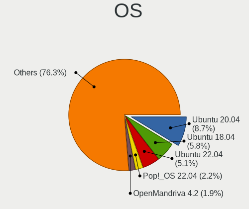
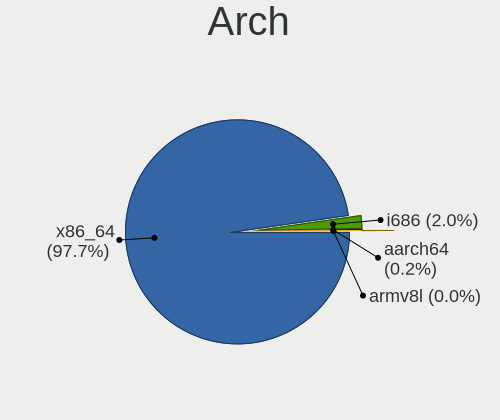
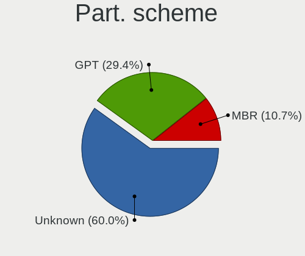
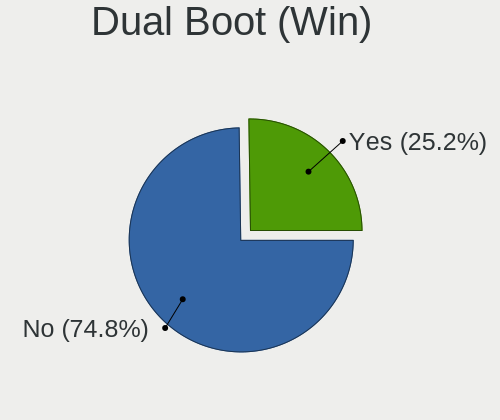
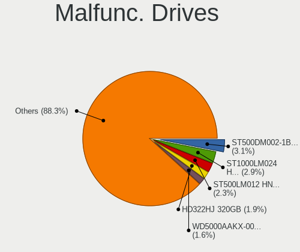

Linux in Brazil - Tested Hardware & Statistics
----------------------------------------------

A project to collect tested hardware configurations for Linux in Brazil.

Anyone can contribute to this report by the [hw-probe](https://github.com/linuxhw/hw-probe) tool:

    sudo -E hw-probe -all -upload

Please contribute! Especially if your hardware is rare.

This is a report for all computer types. See also reports for [desktops](/Location/Brazil/Desktop/README.md) and [notebooks](/Location/Brazil/Notebook/README.md).

Contents
--------

* [ Test Cases ](#test-cases)

* [ System ](#system)
  - [ OS                       ](#os)
  - [ OS Family                ](#os-family)
  - [ Kernel                   ](#kernel)
  - [ Kernel Family            ](#kernel-family)
  - [ Kernel Major Ver.        ](#kernel-major-ver)
  - [ Arch                     ](#arch)
  - [ DE                       ](#de)
  - [ Display Server           ](#display-server)
  - [ Display Manager          ](#display-manager)
  - [ OS Lang                  ](#os-lang)
  - [ Boot Mode                ](#boot-mode)
  - [ Filesystem               ](#filesystem)
  - [ Part. scheme             ](#part-scheme)
  - [ Dual Boot with Linux/BSD ](#dual-boot-with-linuxbsd)
  - [ Dual Boot (Win)          ](#dual-boot-win)

* [ Board ](#board)
  - [ Vendor                   ](#vendor)
  - [ Model                    ](#model)
  - [ Model Family             ](#model-family)
  - [ MFG Year                 ](#mfg-year)
  - [ Form Factor              ](#form-factor)
  - [ Secure Boot              ](#secure-boot)
  - [ Coreboot                 ](#coreboot)
  - [ RAM Size                 ](#ram-size)
  - [ RAM Used                 ](#ram-used)
  - [ Total Drives             ](#total-drives)
  - [ Has CD-ROM               ](#has-cd-rom)
  - [ Has Ethernet             ](#has-ethernet)
  - [ Has WiFi                 ](#has-wifi)
  - [ Has Bluetooth            ](#has-bluetooth)

* [ Location ](#location)
  - [ Country                  ](#country)
  - [ City                     ](#city)

* [ Drives ](#drives)
  - [ Drive Vendor             ](#drive-vendor)
  - [ Drive Model              ](#drive-model)
  - [ HDD Vendor               ](#hdd-vendor)
  - [ SSD Vendor               ](#ssd-vendor)
  - [ Drive Kind               ](#drive-kind)
  - [ Drive Connector          ](#drive-connector)
  - [ Drive Size               ](#drive-size)
  - [ Space Total              ](#space-total)
  - [ Space Used               ](#space-used)
  - [ Malfunc. Drives          ](#malfunc-drives)
  - [ Malfunc. Drive Vendor    ](#malfunc-drive-vendor)
  - [ Malfunc. HDD Vendor      ](#malfunc-hdd-vendor)
  - [ Malfunc. Drive Kind      ](#malfunc-drive-kind)
  - [ Failed Drives            ](#failed-drives)
  - [ Failed Drive Vendor      ](#failed-drive-vendor)
  - [ Drive Status             ](#drive-status)

* [ Storage controller ](#storage-controller)
  - [ Storage Vendor           ](#storage-vendor)
  - [ Storage Model            ](#storage-model)
  - [ Storage Kind             ](#storage-kind)

* [ Processor ](#processor)
  - [ CPU Vendor               ](#cpu-vendor)
  - [ CPU Model                ](#cpu-model)
  - [ CPU Model Family         ](#cpu-model-family)
  - [ CPU Cores                ](#cpu-cores)
  - [ CPU Sockets              ](#cpu-sockets)
  - [ CPU Threads              ](#cpu-threads)
  - [ CPU Op-Modes             ](#cpu-op-modes)
  - [ CPU Microcode            ](#cpu-microcode)
  - [ CPU Microarch            ](#cpu-microarch)

* [ Graphics ](#graphics)
  - [ GPU Vendor               ](#gpu-vendor)
  - [ GPU Model                ](#gpu-model)
  - [ GPU Combo                ](#gpu-combo)
  - [ GPU Driver               ](#gpu-driver)
  - [ GPU Memory               ](#gpu-memory)

* [ Monitor ](#monitor)
  - [ Monitor Vendor           ](#monitor-vendor)
  - [ Monitor Model            ](#monitor-model)
  - [ Monitor Resolution       ](#monitor-resolution)
  - [ Monitor Diagonal         ](#monitor-diagonal)
  - [ Monitor Width            ](#monitor-width)
  - [ Aspect Ratio             ](#aspect-ratio)
  - [ Monitor Area             ](#monitor-area)
  - [ Pixel Density            ](#pixel-density)
  - [ Multiple Monitors        ](#multiple-monitors)

* [ Network ](#network)
  - [ Net Controller Vendor    ](#net-controller-vendor)
  - [ Net Controller Model     ](#net-controller-model)
  - [ Wireless Vendor          ](#wireless-vendor)
  - [ Wireless Model           ](#wireless-model)
  - [ Ethernet Vendor          ](#ethernet-vendor)
  - [ Ethernet Model           ](#ethernet-model)
  - [ Net Controller Kind      ](#net-controller-kind)
  - [ Used Controller          ](#used-controller)
  - [ NICs                     ](#nics)
  - [ IPv6                     ](#ipv6)

* [ Bluetooth ](#bluetooth)
  - [ Bluetooth Vendor         ](#bluetooth-vendor)
  - [ Bluetooth Model          ](#bluetooth-model)

* [ Sound ](#sound)
  - [ Sound Vendor             ](#sound-vendor)
  - [ Sound Model              ](#sound-model)

* [ Memory ](#memory)
  - [ Memory Vendor            ](#memory-vendor)
  - [ Memory Model             ](#memory-model)
  - [ Memory Kind              ](#memory-kind)
  - [ Memory Form Factor       ](#memory-form-factor)
  - [ Memory Size              ](#memory-size)
  - [ Memory Speed             ](#memory-speed)

* [ Printers & scanners ](#printers--scanners)
  - [ Printer Vendor           ](#printer-vendor)
  - [ Printer Model            ](#printer-model)
  - [ Scanner Vendor           ](#scanner-vendor)
  - [ Scanner Model            ](#scanner-model)

* [ Camera ](#camera)
  - [ Camera Vendor            ](#camera-vendor)
  - [ Camera Model             ](#camera-model)

* [ Security ](#security)
  - [ Fingerprint Vendor       ](#fingerprint-vendor)
  - [ Fingerprint Model        ](#fingerprint-model)
  - [ Chipcard Vendor          ](#chipcard-vendor)
  - [ Chipcard Model           ](#chipcard-model)

* [ Unsupported ](#unsupported)
  - [ Unsupported Devices      ](#unsupported-devices)
  - [ Unsupported Device Types ](#unsupported-device-types)

Test Cases
----------

Total: 25383

| Vendor        | Model                       | Form-Factor | Probe                                                      | Date         |
|---------------|-----------------------------|-------------|------------------------------------------------------------|--------------|
| Lenovo        | ThinkPad SL400 2743A48      | Notebook    | [0c0f6ef206](https://linux-hardware.org/?probe=0c0f6ef206) | Jan 06, 2025 |
| Dell          | 0PV3YR A05                  | Server      | [48e00d403a](https://linux-hardware.org/?probe=48e00d403a) | Jan 06, 2025 |
| Notebook      | NJx0MU                      | Notebook    | [1a436745ab](https://linux-hardware.org/?probe=1a436745ab) | Jan 06, 2025 |
| Positivo B... | VJFE59F11X-B1011H           | Notebook    | [eeea3c518d](https://linux-hardware.org/?probe=eeea3c518d) | Jan 06, 2025 |
| ASRock        | B360M Performance           | Desktop     | [1e63738abb](https://linux-hardware.org/?probe=1e63738abb) | Jan 06, 2025 |
| Notebook      | NJx0MU                      | Notebook    | [67d6f124c9](https://linux-hardware.org/?probe=67d6f124c9) | Jan 06, 2025 |
| Positivo      | C464C                       | Convertible | [d7de8bee56](https://linux-hardware.org/?probe=d7de8bee56) | Jan 06, 2025 |
| Dell          | Vostro 14-5480              | Notebook    | [30963b610d](https://linux-hardware.org/?probe=30963b610d) | Jan 06, 2025 |
| Lenovo        | Yoga 520-14IKB 80YM         | Convertible | [f0c2f6b640](https://linux-hardware.org/?probe=f0c2f6b640) | Jan 06, 2025 |
| Dell          | Vostro 14-5480              | Notebook    | [5232467681](https://linux-hardware.org/?probe=5232467681) | Jan 05, 2025 |
| Lenovo        | IdeaPad Z400 VIWZ1          | Notebook    | [516947871e](https://linux-hardware.org/?probe=516947871e) | Jan 05, 2025 |
| MSI           | B450M PRO-VDH MAX           | Desktop     | [c88a64dee7](https://linux-hardware.org/?probe=c88a64dee7) | Jan 05, 2025 |
| Dell          | 0HY9JP A00                  | Desktop     | [3047d18f75](https://linux-hardware.org/?probe=3047d18f75) | Jan 05, 2025 |
| Lenovo        | IdeaPad S145-15API 81V7     | Notebook    | [1df5680b90](https://linux-hardware.org/?probe=1df5680b90) | Jan 05, 2025 |
| ASUSTek       | M5A78L-M LX V2              | Desktop     | [02a12f94e1](https://linux-hardware.org/?probe=02a12f94e1) | Jan 05, 2025 |
| MAXSUN        | MS-Challenger B760M         | Desktop     | [d0da8b89ac](https://linux-hardware.org/?probe=d0da8b89ac) | Jan 05, 2025 |
| Dell          | G3 3500                     | Notebook    | [5c6b757b24](https://linux-hardware.org/?probe=5c6b757b24) | Jan 05, 2025 |
| Gigabyte      | B450 AORUS PRO WIFI-CF      | Desktop     | [38b497d193](https://linux-hardware.org/?probe=38b497d193) | Jan 05, 2025 |
| Gigabyte      | B450 AORUS PRO WIFI-CF      | Desktop     | [394cfdc261](https://linux-hardware.org/?probe=394cfdc261) | Jan 05, 2025 |
| Lenovo        | B490 377222P                | Notebook    | [4e6cc04345](https://linux-hardware.org/?probe=4e6cc04345) | Jan 04, 2025 |
| LG Electro... | 22V280 FAB1                 | All in one  | [a595c7b829](https://linux-hardware.org/?probe=a595c7b829) | Jan 04, 2025 |
| ASUSTek       | TUF Gaming B550M-PLUS WI... | Desktop     | [bbc74e0c64](https://linux-hardware.org/?probe=bbc74e0c64) | Jan 04, 2025 |
| Sony          | SVF15213CBW                 | Notebook    | [2a3349eb69](https://linux-hardware.org/?probe=2a3349eb69) | Jan 04, 2025 |
| Gigabyte      | X470 AORUS ULTRA GAMING-... | Desktop     | [f77ddc1d4e](https://linux-hardware.org/?probe=f77ddc1d4e) | Jan 04, 2025 |
| Gigabyte      | X470 AORUS ULTRA GAMING-... | Desktop     | [0eb5d3fd27](https://linux-hardware.org/?probe=0eb5d3fd27) | Jan 04, 2025 |
| MAXSUN        | MS-Challenger B760M         | Desktop     | [468fb150c0](https://linux-hardware.org/?probe=468fb150c0) | Jan 04, 2025 |
| ASUSTek       | VivoBook_ASUSLaptop X515... | Notebook    | [3eeaef91d5](https://linux-hardware.org/?probe=3eeaef91d5) | Jan 04, 2025 |
| ASUSTek       | VivoBook_ASUSLaptop X515... | Notebook    | [ca47c65b3a](https://linux-hardware.org/?probe=ca47c65b3a) | Jan 04, 2025 |
| Dell          | Inspiron 5566               | Notebook    | [9653ac70bc](https://linux-hardware.org/?probe=9653ac70bc) | Jan 04, 2025 |
| MACHINIST     | E5-MR9A V1.0                | Desktop     | [2cd6888290](https://linux-hardware.org/?probe=2cd6888290) | Jan 04, 2025 |
| Intel         | H61                         | Desktop     | [2a8ff4b81a](https://linux-hardware.org/?probe=2a8ff4b81a) | Jan 03, 2025 |
| Intel         | H61                         | Desktop     | [bb2c7db34e](https://linux-hardware.org/?probe=bb2c7db34e) | Jan 03, 2025 |
| MSI           | A520M-A PRO                 | Desktop     | [89075d3dce](https://linux-hardware.org/?probe=89075d3dce) | Jan 03, 2025 |
| Alienware     | m16 R1                      | Notebook    | [a61a1d8c59](https://linux-hardware.org/?probe=a61a1d8c59) | Jan 03, 2025 |
| Gigabyte      | B550I AORUS PRO AX          | Desktop     | [465d7bcabe](https://linux-hardware.org/?probe=465d7bcabe) | Jan 03, 2025 |
| JGINYUE       | X99-D8 Server V1.0          | Desktop     | [686b22c79f](https://linux-hardware.org/?probe=686b22c79f) | Jan 03, 2025 |
| HP            | ProBook 640 G1              | Notebook    | [f901f7b9aa](https://linux-hardware.org/?probe=f901f7b9aa) | Jan 03, 2025 |
| Lenovo        | ThinkPad E14 Gen 2 20TB0... | Notebook    | [a301b43994](https://linux-hardware.org/?probe=a301b43994) | Jan 03, 2025 |
| ASUSTek       | VivoBook_ASUSLaptop X515... | Notebook    | [ac0b2b8219](https://linux-hardware.org/?probe=ac0b2b8219) | Jan 03, 2025 |
| Avell High... | Avell G1513 MUV / A52 MU... | Notebook    | [ca3162cf4a](https://linux-hardware.org/?probe=ca3162cf4a) | Jan 03, 2025 |
| Sony          | VPCF236FM                   | Notebook    | [1c0abb00b2](https://linux-hardware.org/?probe=1c0abb00b2) | Jan 03, 2025 |
| Intel         | H55                         | Desktop     | [aada843724](https://linux-hardware.org/?probe=aada843724) | Jan 03, 2025 |
| Dell          | Inspiron 3583               | Notebook    | [d2423ded38](https://linux-hardware.org/?probe=d2423ded38) | Jan 03, 2025 |
| ASRock        | Z170 Extreme4               | Desktop     | [cec21335ef](https://linux-hardware.org/?probe=cec21335ef) | Jan 03, 2025 |
| Positivo B... | VJFE52F11X-B2511H           | Notebook    | [4ee757e2c0](https://linux-hardware.org/?probe=4ee757e2c0) | Jan 03, 2025 |
| Lenovo        | ThinkPad Z16 Gen 1 21D50... | Notebook    | [821891b6b6](https://linux-hardware.org/?probe=821891b6b6) | Jan 02, 2025 |
| Unknown       | MZ-B75-S                    | Desktop     | [81ac458db0](https://linux-hardware.org/?probe=81ac458db0) | Jan 02, 2025 |
| Intel         | H61                         | Desktop     | [0f76193421](https://linux-hardware.org/?probe=0f76193421) | Jan 02, 2025 |
| Acer          | Aspire A315-510P            | Notebook    | [f3fd803275](https://linux-hardware.org/?probe=f3fd803275) | Jan 01, 2025 |
| ASRock        | H310CM-HG4                  | Desktop     | [ea045be01b](https://linux-hardware.org/?probe=ea045be01b) | Jan 01, 2025 |
| Intel         | B75                         | Desktop     | [e0b305feae](https://linux-hardware.org/?probe=e0b305feae) | Jan 01, 2025 |
| Dell          | 0PV3YR A05                  | Server      | [0252731c50](https://linux-hardware.org/?probe=0252731c50) | Jan 01, 2025 |
| Dell          | Latitude 7490               | Notebook    | [5781936456](https://linux-hardware.org/?probe=5781936456) | Dec 31, 2024 |
| Samsung       | 550XDA                      | Notebook    | [f23c082843](https://linux-hardware.org/?probe=f23c082843) | Dec 31, 2024 |
| Acer          | Aspire ES1-572              | Notebook    | [419ddbb177](https://linux-hardware.org/?probe=419ddbb177) | Dec 31, 2024 |
| ASUSTek       | S451LA                      | Notebook    | [3da156f5be](https://linux-hardware.org/?probe=3da156f5be) | Dec 31, 2024 |
| Samsung       | 370E4K                      | Notebook    | [ba2171b4e3](https://linux-hardware.org/?probe=ba2171b4e3) | Dec 31, 2024 |
| ASUSTek       | S451LA                      | Notebook    | [9837408f80](https://linux-hardware.org/?probe=9837408f80) | Dec 31, 2024 |
| Acer          | Aspire ES1-572              | Notebook    | [dc58f6466e](https://linux-hardware.org/?probe=dc58f6466e) | Dec 31, 2024 |
| ASUSTek       | 1005HA                      | Notebook    | [334101d338](https://linux-hardware.org/?probe=334101d338) | Dec 31, 2024 |
| Lenovo        | G400s VILG1                 | Notebook    | [5363dba88d](https://linux-hardware.org/?probe=5363dba88d) | Dec 31, 2024 |
| Acer          | Aspire E1-531               | Notebook    | [dcd279939a](https://linux-hardware.org/?probe=dcd279939a) | Dec 31, 2024 |
| Digiboard     | NM70-TI                     | Desktop     | [1a10dd8daf](https://linux-hardware.org/?probe=1a10dd8daf) | Dec 31, 2024 |
| Acer          | Aspire A315-42              | Notebook    | [734fd13848](https://linux-hardware.org/?probe=734fd13848) | Dec 31, 2024 |
| Acer          | Nitro AN517-54              | Notebook    | [8461425ec1](https://linux-hardware.org/?probe=8461425ec1) | Dec 31, 2024 |
| ASUSTek       | M5A78L-M LX V2              | Desktop     | [d995e98eb4](https://linux-hardware.org/?probe=d995e98eb4) | Dec 31, 2024 |
| Dell          | 0PV3YR A05                  | Server      | [05ae3d9e19](https://linux-hardware.org/?probe=05ae3d9e19) | Dec 31, 2024 |
| MSI           | MPG B550 GAMING PLUS        | Desktop     | [c720ec722a](https://linux-hardware.org/?probe=c720ec722a) | Dec 31, 2024 |
| Intel         | H81                         | Desktop     | [00453f1bb7](https://linux-hardware.org/?probe=00453f1bb7) | Dec 31, 2024 |
| Lenovo        | G460 20041                  | Notebook    | [f5b6aed89d](https://linux-hardware.org/?probe=f5b6aed89d) | Dec 31, 2024 |
| Acer          | Aspire A315-510P            | Notebook    | [b079131625](https://linux-hardware.org/?probe=b079131625) | Dec 30, 2024 |
| Apple         | MacBookPro9,2               | Notebook    | [a509973046](https://linux-hardware.org/?probe=a509973046) | Dec 30, 2024 |
| Apple         | MacBookPro9,2               | Notebook    | [1e4cb7054c](https://linux-hardware.org/?probe=1e4cb7054c) | Dec 30, 2024 |
| Acer          | Aspire A315-510P            | Notebook    | [ede893e1e1](https://linux-hardware.org/?probe=ede893e1e1) | Dec 30, 2024 |
| Lenovo        | Yoga 7 2-in-1 14AHP9 83D... | Convertible | [5b8d5f9b70](https://linux-hardware.org/?probe=5b8d5f9b70) | Dec 30, 2024 |
| Lenovo        | ThinkPad L14 Gen 1 20U60... | Notebook    | [031c8d3940](https://linux-hardware.org/?probe=031c8d3940) | Dec 30, 2024 |
| Acer          | Aspire A515-57              | Notebook    | [d2483d4bb8](https://linux-hardware.org/?probe=d2483d4bb8) | Dec 30, 2024 |
| Intel         | H81                         | Desktop     | [68678771e5](https://linux-hardware.org/?probe=68678771e5) | Dec 30, 2024 |
| ASUSTek       | A78M-A                      | Desktop     | [1c59a39f39](https://linux-hardware.org/?probe=1c59a39f39) | Dec 30, 2024 |
| Intel         | H81                         | Desktop     | [523d01d6a7](https://linux-hardware.org/?probe=523d01d6a7) | Dec 30, 2024 |
| Positivo B... | VJFE52F11X-B2291H           | Notebook    | [3c5b6bf03a](https://linux-hardware.org/?probe=3c5b6bf03a) | Dec 30, 2024 |
| Lenovo        | ThinkCentre M90p 5536P79    | Desktop     | [e13ed7c057](https://linux-hardware.org/?probe=e13ed7c057) | Dec 30, 2024 |
| Unknown       | MZ-B75-S                    | Desktop     | [b0af06f0f4](https://linux-hardware.org/?probe=b0af06f0f4) | Dec 30, 2024 |
| Unknown       | MZ-B75-S                    | Desktop     | [9b5c7009ad](https://linux-hardware.org/?probe=9b5c7009ad) | Dec 30, 2024 |
| Apple         | MacBookAir6,2               | Notebook    | [f8255d3c15](https://linux-hardware.org/?probe=f8255d3c15) | Dec 30, 2024 |
| Samsung       | RV411/RV511/E3511/S3511/... | Notebook    | [89094bd2df](https://linux-hardware.org/?probe=89094bd2df) | Dec 30, 2024 |
| Biostar       | B350GTX                     | Desktop     | [89a7676684](https://linux-hardware.org/?probe=89a7676684) | Dec 30, 2024 |
| Acer          | Nitro AN515-45              | Notebook    | [cf19396a9a](https://linux-hardware.org/?probe=cf19396a9a) | Dec 30, 2024 |
| Gigabyte      | B560M AORUS ELITE           | Desktop     | [408b834306](https://linux-hardware.org/?probe=408b834306) | Dec 29, 2024 |
| Dell          | 076VHM A02                  | Desktop     | [9bee0be731](https://linux-hardware.org/?probe=9bee0be731) | Dec 29, 2024 |
| Lenovo        | Legion 5 15IAH7H 82TB       | Notebook    | [37b8fbc02a](https://linux-hardware.org/?probe=37b8fbc02a) | Dec 29, 2024 |
| Intel         | H55                         | Desktop     | [608b05160e](https://linux-hardware.org/?probe=608b05160e) | Dec 29, 2024 |
| Lenovo        | LOQ 16APH8 82XU             | Notebook    | [1a6aebd2e4](https://linux-hardware.org/?probe=1a6aebd2e4) | Dec 29, 2024 |
| Acer          | Aspire 5253                 | Notebook    | [8129d03feb](https://linux-hardware.org/?probe=8129d03feb) | Dec 29, 2024 |
| Lenovo        | V14 G2 ITL 82NM             | Notebook    | [079c56ceab](https://linux-hardware.org/?probe=079c56ceab) | Dec 28, 2024 |
| Dell          | Latitude E5470              | Notebook    | [e7d5673567](https://linux-hardware.org/?probe=e7d5673567) | Dec 28, 2024 |
| Intel         | H61 V1.6B                   | Desktop     | [a60c63d4f8](https://linux-hardware.org/?probe=a60c63d4f8) | Dec 28, 2024 |
| Acer          | Aspire VX5-591G             | Notebook    | [723f61dbcf](https://linux-hardware.org/?probe=723f61dbcf) | Dec 27, 2024 |
| Acer          | Aspire VX5-591G             | Notebook    | [773ac488ff](https://linux-hardware.org/?probe=773ac488ff) | Dec 27, 2024 |
| Lenovo        | V15 G2 ITL 82ME             | Notebook    | [4c710eefac](https://linux-hardware.org/?probe=4c710eefac) | Dec 27, 2024 |
| Acer          | Swift SF314-511             | Notebook    | [f0e61d80d6](https://linux-hardware.org/?probe=f0e61d80d6) | Dec 27, 2024 |
| Positivo B... | VJFE52F11X-XXXXXX           | Notebook    | [83dc0c4a71](https://linux-hardware.org/?probe=83dc0c4a71) | Dec 27, 2024 |
| Unknown       | SKYBAY                      | Desktop     | [2f832d51f3](https://linux-hardware.org/?probe=2f832d51f3) | Dec 27, 2024 |
| ASUSTek       | ASUS TUF Gaming F15 FX50... | Notebook    | [4bfed8719e](https://linux-hardware.org/?probe=4bfed8719e) | Dec 27, 2024 |
| Avell High... | A70 HYB                     | Notebook    | [aea76220df](https://linux-hardware.org/?probe=aea76220df) | Dec 26, 2024 |
| Huanan        | X99-4MF V1.0                | Desktop     | [86a5a82a39](https://linux-hardware.org/?probe=86a5a82a39) | Dec 26, 2024 |
| ASUSTek       | H81M-A/BR                   | Desktop     | [37badc0cfd](https://linux-hardware.org/?probe=37badc0cfd) | Dec 26, 2024 |
| Gateway       | NV55C                       | Notebook    | [060f326f5d](https://linux-hardware.org/?probe=060f326f5d) | Dec 26, 2024 |
| Gateway       | NV55C                       | Notebook    | [3cacf3568a](https://linux-hardware.org/?probe=3cacf3568a) | Dec 26, 2024 |
| ASUSTek       | VivoBook_ASUSLaptop K360... | Notebook    | [4c2cba015f](https://linux-hardware.org/?probe=4c2cba015f) | Dec 26, 2024 |
| ASUSTek       | BM1AF_BP1AF_BM6AF           | Desktop     | [622f9ae7f4](https://linux-hardware.org/?probe=622f9ae7f4) | Dec 25, 2024 |
| ASUSTek       | VivoBook_ASUSLaptop K360... | Notebook    | [fcb6f7fe6c](https://linux-hardware.org/?probe=fcb6f7fe6c) | Dec 25, 2024 |
| Gigabyte      | B450M DS3H V2               | Desktop     | [9bb72b7cbd](https://linux-hardware.org/?probe=9bb72b7cbd) | Dec 25, 2024 |
| Acer          | Nitro ANV15-51              | Notebook    | [652451b779](https://linux-hardware.org/?probe=652451b779) | Dec 25, 2024 |
| Acer          | Nitro ANV15-51              | Notebook    | [ce85c5a816](https://linux-hardware.org/?probe=ce85c5a816) | Dec 25, 2024 |
| Lenovo        | SHARKBAY SDK0E50510 WIN     | Desktop     | [002375d8d5](https://linux-hardware.org/?probe=002375d8d5) | Dec 25, 2024 |
| Lenovo        | ThinkPad T480 20L6SA0X00    | Notebook    | [89c4986258](https://linux-hardware.org/?probe=89c4986258) | Dec 25, 2024 |
| ASUSTek       | TUF Gaming A520M-PLUS WI... | Desktop     | [9943ac6fda](https://linux-hardware.org/?probe=9943ac6fda) | Dec 25, 2024 |
| Intel         | X99-H5 V2.0                 | Desktop     | [2261903b1d](https://linux-hardware.org/?probe=2261903b1d) | Dec 25, 2024 |
| Apple         | MacBookPro8,1               | Notebook    | [19e759cb83](https://linux-hardware.org/?probe=19e759cb83) | Dec 25, 2024 |
| Acer          | Aspire A315-41              | Notebook    | [fe6c49574a](https://linux-hardware.org/?probe=fe6c49574a) | Dec 24, 2024 |
| Gigabyte      | B450M DS3H V2               | Desktop     | [ad7ff9155c](https://linux-hardware.org/?probe=ad7ff9155c) | Dec 24, 2024 |
| Dell          | Inspiron 5458               | Notebook    | [463ab8c7ce](https://linux-hardware.org/?probe=463ab8c7ce) | Dec 24, 2024 |
| ASUSTek       | TUF Gaming B550M-PLUS       | Desktop     | [d64a12a02a](https://linux-hardware.org/?probe=d64a12a02a) | Dec 24, 2024 |
| Gigabyte      | B360 AORUS GAMING 3 WIFI... | Desktop     | [89e8e5ad41](https://linux-hardware.org/?probe=89e8e5ad41) | Dec 24, 2024 |
| Intel         | B75A                        | Desktop     | [dd337bfe58](https://linux-hardware.org/?probe=dd337bfe58) | Dec 23, 2024 |
| Dell          | Latitude 5430               | Notebook    | [cc52da1214](https://linux-hardware.org/?probe=cc52da1214) | Dec 23, 2024 |
| MACHINIST     | X99 PR9                     | Desktop     | [74d2e10d43](https://linux-hardware.org/?probe=74d2e10d43) | Dec 23, 2024 |
| Positivo      | W940TU                      | Notebook    | [b5cb158e93](https://linux-hardware.org/?probe=b5cb158e93) | Dec 23, 2024 |
| Dell          | 08NPPY A00                  | Desktop     | [f28b57cc48](https://linux-hardware.org/?probe=f28b57cc48) | Dec 23, 2024 |
| Samsung       | 370E4K                      | Notebook    | [b2200db0dc](https://linux-hardware.org/?probe=b2200db0dc) | Dec 23, 2024 |
| HP            | ProBook 645 G2              | Notebook    | [fdd8177594](https://linux-hardware.org/?probe=fdd8177594) | Dec 23, 2024 |
| HP            | ProBook 645 G2              | Notebook    | [6042ac6425](https://linux-hardware.org/?probe=6042ac6425) | Dec 23, 2024 |
| Avell         | B.ON                        | Notebook    | [8a06f2de3b](https://linux-hardware.org/?probe=8a06f2de3b) | Dec 23, 2024 |
| Intel         | B75                         | Desktop     | [94459409d1](https://linux-hardware.org/?probe=94459409d1) | Dec 23, 2024 |
| Dell          | 08NPPY A00                  | Desktop     | [80ca496f75](https://linux-hardware.org/?probe=80ca496f75) | Dec 23, 2024 |
| ASUSTek       | VivoBook_ASUSLaptop K360... | Notebook    | [8690e3274f](https://linux-hardware.org/?probe=8690e3274f) | Dec 23, 2024 |
| ASUSTek       | VivoBook_ASUSLaptop K360... | Notebook    | [5a779ffa7e](https://linux-hardware.org/?probe=5a779ffa7e) | Dec 23, 2024 |
| Samsung       | 370E4K                      | Notebook    | [6c1eff379e](https://linux-hardware.org/?probe=6c1eff379e) | Dec 23, 2024 |
| Acer          | Aspire F5-573G              | Notebook    | [b5e37804c4](https://linux-hardware.org/?probe=b5e37804c4) | Dec 23, 2024 |
| Acer          | Aspire F5-573G              | Notebook    | [29bad5d443](https://linux-hardware.org/?probe=29bad5d443) | Dec 23, 2024 |
| Lenovo        | Legion Slim 5 16APH8 82Y... | Notebook    | [26b810b462](https://linux-hardware.org/?probe=26b810b462) | Dec 22, 2024 |
| ASRock        | B550M-HDV                   | Desktop     | [820e985b85](https://linux-hardware.org/?probe=820e985b85) | Dec 22, 2024 |
| Acer          | Aspire A315-510P            | Notebook    | [e373d8aef5](https://linux-hardware.org/?probe=e373d8aef5) | Dec 22, 2024 |
| ASUSTek       | M5A78L-M PLUS/USB3          | Desktop     | [9d9a451905](https://linux-hardware.org/?probe=9d9a451905) | Dec 22, 2024 |
| Digibras      | NH4CU53                     | Notebook    | [d9869c203b](https://linux-hardware.org/?probe=d9869c203b) | Dec 22, 2024 |
| ASUSTek       | M5A78L-M PLUS/USB3          | Desktop     | [a7dd685d33](https://linux-hardware.org/?probe=a7dd685d33) | Dec 22, 2024 |
| Notebook      | NJx0MU                      | Notebook    | [0f16f634ba](https://linux-hardware.org/?probe=0f16f634ba) | Dec 22, 2024 |
| Lenovo        | ThinkPad T430 2347G2P       | Notebook    | [31c6e468d6](https://linux-hardware.org/?probe=31c6e468d6) | Dec 22, 2024 |
| Intel         | H61                         | Desktop     | [3b41c83d54](https://linux-hardware.org/?probe=3b41c83d54) | Dec 22, 2024 |
| Dell          | Latitude 5175               | Notebook    | [50e07a5bed](https://linux-hardware.org/?probe=50e07a5bed) | Dec 22, 2024 |
| Intel         | X99                         | Desktop     | [4018709a31](https://linux-hardware.org/?probe=4018709a31) | Dec 22, 2024 |
| Gigabyte      | B550M DS3H                  | Desktop     | [c0781aa880](https://linux-hardware.org/?probe=c0781aa880) | Dec 21, 2024 |
| Avell         | B.ON                        | Notebook    | [4cdfce4d81](https://linux-hardware.org/?probe=4cdfce4d81) | Dec 21, 2024 |
| Lenovo        | ThinkPad T430 2347G2P       | Notebook    | [76ea7c137e](https://linux-hardware.org/?probe=76ea7c137e) | Dec 21, 2024 |
| MSI           | MEG Z390 GODLIKE            | Desktop     | [16741176a8](https://linux-hardware.org/?probe=16741176a8) | Dec 21, 2024 |
| ASUSTek       | A78M-A                      | Desktop     | [efa5a4e952](https://linux-hardware.org/?probe=efa5a4e952) | Dec 21, 2024 |
| Acer          | Nitro AN515-54              | Notebook    | [6c1a9f6cda](https://linux-hardware.org/?probe=6c1a9f6cda) | Dec 21, 2024 |
| MACHINIST     | E5-MR9A V1.0                | Desktop     | [f14a3b5ccf](https://linux-hardware.org/?probe=f14a3b5ccf) | Dec 20, 2024 |
| Dell          | Inspiron 3442               | Notebook    | [cfc2614cfb](https://linux-hardware.org/?probe=cfc2614cfb) | Dec 20, 2024 |
| Lenovo        | IdeaPad S145-15IIL 82DJ     | Notebook    | [69da2b0a14](https://linux-hardware.org/?probe=69da2b0a14) | Dec 20, 2024 |
| MACHINIST     | X99 PR9                     | Desktop     | [6721f17c3e](https://linux-hardware.org/?probe=6721f17c3e) | Dec 20, 2024 |
| Lenovo        | Yoga 510-14ISK 80UK         | Notebook    | [4fa862c4fc](https://linux-hardware.org/?probe=4fa862c4fc) | Dec 20, 2024 |
| Biostar       | B450MX-S                    | Desktop     | [298f913b02](https://linux-hardware.org/?probe=298f913b02) | Dec 20, 2024 |
| ASUSTek       | M5A78L LE                   | Desktop     | [99441ad0df](https://linux-hardware.org/?probe=99441ad0df) | Dec 20, 2024 |
| Timi          | RedmiBook Pro 14            | Notebook    | [e53024745e](https://linux-hardware.org/?probe=e53024745e) | Dec 20, 2024 |
| Unknown       | Unknown                     | Soc         | [6e6b939c62](https://linux-hardware.org/?probe=6e6b939c62) | Dec 19, 2024 |
| Lenovo        | IdeaPad 3 15ALC6 82MF       | Notebook    | [ec99b76d7b](https://linux-hardware.org/?probe=ec99b76d7b) | Dec 19, 2024 |
| Gigabyte      | Z370M AORUS Gaming-CF       | Desktop     | [da0b69e009](https://linux-hardware.org/?probe=da0b69e009) | Dec 19, 2024 |
| ASUSTek       | P8H61-M LX2 R2.0            | Desktop     | [f50786aff4](https://linux-hardware.org/?probe=f50786aff4) | Dec 19, 2024 |
| ASUSTek       | P5G41T-M LX3                | Desktop     | [1edf9902dd](https://linux-hardware.org/?probe=1edf9902dd) | Dec 19, 2024 |
| ASUSTek       | P8H61-M LX3 R2.0            | Desktop     | [dcfafc889c](https://linux-hardware.org/?probe=dcfafc889c) | Dec 19, 2024 |
| Samsung       | 960XGL                      | Notebook    | [020d5b8c25](https://linux-hardware.org/?probe=020d5b8c25) | Dec 19, 2024 |
| Samsung       | 960XGL                      | Notebook    | [e6a4a30978](https://linux-hardware.org/?probe=e6a4a30978) | Dec 19, 2024 |
| Apple         | MacBookAir6,1               | Notebook    | [ec57f00f41](https://linux-hardware.org/?probe=ec57f00f41) | Dec 19, 2024 |
| Apple         | MacBookAir6,1               | Notebook    | [16547e9167](https://linux-hardware.org/?probe=16547e9167) | Dec 19, 2024 |
| Lenovo        | IdeaPad 1 15AMN7 82X5       | Notebook    | [cbf8e95fa9](https://linux-hardware.org/?probe=cbf8e95fa9) | Dec 19, 2024 |
| Samsung       | 300E4C/300E5C/300E7C        | Notebook    | [00d3503d79](https://linux-hardware.org/?probe=00d3503d79) | Dec 18, 2024 |
| Samsung       | 300E4C/300E5C/300E7C        | Notebook    | [45dea0b50b](https://linux-hardware.org/?probe=45dea0b50b) | Dec 18, 2024 |
| Gigabyte      | B550I AORUS PRO AX          | Desktop     | [9c8b89e00a](https://linux-hardware.org/?probe=9c8b89e00a) | Dec 18, 2024 |
| Lenovo        | IdeaPad 330-15IKB 81FD      | Notebook    | [bc07631f18](https://linux-hardware.org/?probe=bc07631f18) | Dec 18, 2024 |
| Dell          | Latitude 5175               | Tablet      | [31a3c7af1e](https://linux-hardware.org/?probe=31a3c7af1e) | Dec 18, 2024 |
| Positivo      | R516256AI-15                | Notebook    | [9a731a05a6](https://linux-hardware.org/?probe=9a731a05a6) | Dec 18, 2024 |
| Lenovo        | IdeaPad 3 15IML05 82BS      | Notebook    | [b55322dd58](https://linux-hardware.org/?probe=b55322dd58) | Dec 18, 2024 |
| Lenovo        | S10-3                       | Notebook    | [3ba705e8e3](https://linux-hardware.org/?probe=3ba705e8e3) | Dec 18, 2024 |
| ASUSTek       | TUF Gaming B550M-PLUS       | Desktop     | [8fa24df745](https://linux-hardware.org/?probe=8fa24df745) | Dec 18, 2024 |
| Apple         | MacBookPro7,1               | Notebook    | [47aa54e827](https://linux-hardware.org/?probe=47aa54e827) | Dec 18, 2024 |
| ASRock        | B450M-HDV R4.0              | Desktop     | [12470525ef](https://linux-hardware.org/?probe=12470525ef) | Dec 18, 2024 |
| Positivo      | R516256AI-15                | Notebook    | [19cb460e74](https://linux-hardware.org/?probe=19cb460e74) | Dec 18, 2024 |
| Dell          | 076VHM A02                  | Desktop     | [eb059e22c7](https://linux-hardware.org/?probe=eb059e22c7) | Dec 17, 2024 |
| Samsung       | 550XDA                      | Notebook    | [d1b77b4082](https://linux-hardware.org/?probe=d1b77b4082) | Dec 17, 2024 |
| Samsung       | 550XDA                      | Notebook    | [d986e68aed](https://linux-hardware.org/?probe=d986e68aed) | Dec 17, 2024 |
| ASUSTek       | TUF Gaming B550M-PLUS       | Desktop     | [49455691cb](https://linux-hardware.org/?probe=49455691cb) | Dec 17, 2024 |
| HP            | 240 G4 Notebook PC          | Notebook    | [1e82cc2079](https://linux-hardware.org/?probe=1e82cc2079) | Dec 17, 2024 |
| Samsung       | 940XGK                      | Notebook    | [9e997ae718](https://linux-hardware.org/?probe=9e997ae718) | Dec 17, 2024 |
| Samsung       | 940XGK                      | Notebook    | [9cb3541052](https://linux-hardware.org/?probe=9cb3541052) | Dec 17, 2024 |
| Acer          | Nitro AN517-54              | Notebook    | [2a5849148d](https://linux-hardware.org/?probe=2a5849148d) | Dec 17, 2024 |
| Intel         | H61                         | Desktop     | [e4a1f6b371](https://linux-hardware.org/?probe=e4a1f6b371) | Dec 17, 2024 |
| ASUSTek       | H81M-CS/BR                  | Desktop     | [5f38363403](https://linux-hardware.org/?probe=5f38363403) | Dec 17, 2024 |
| Dell          | Inspiron 15 5510            | Notebook    | [2ec814c4a6](https://linux-hardware.org/?probe=2ec814c4a6) | Dec 17, 2024 |
| Dell          | XPS 13 9340                 | Notebook    | [914be0c9e8](https://linux-hardware.org/?probe=914be0c9e8) | Dec 17, 2024 |
| Lenovo        | IdeaPad S145-15IWL 81S9     | Notebook    | [c3141e65eb](https://linux-hardware.org/?probe=c3141e65eb) | Dec 17, 2024 |
| Samsung       | 800G5M/800G5W               | Notebook    | [f721641c6c](https://linux-hardware.org/?probe=f721641c6c) | Dec 17, 2024 |
| Intel         | H61                         | Desktop     | [c4217d24f6](https://linux-hardware.org/?probe=c4217d24f6) | Dec 17, 2024 |
| Apple         | MacBookPro8,1               | Notebook    | [d898ddc5ac](https://linux-hardware.org/?probe=d898ddc5ac) | Dec 17, 2024 |
| Apple         | MacBookPro8,1               | Notebook    | [1dab55d205](https://linux-hardware.org/?probe=1dab55d205) | Dec 17, 2024 |
| ASUSTek       | G750JS                      | Notebook    | [f33b8f1749](https://linux-hardware.org/?probe=f33b8f1749) | Dec 17, 2024 |
| Dell          | G15 5515                    | Notebook    | [7e4b127e3e](https://linux-hardware.org/?probe=7e4b127e3e) | Dec 17, 2024 |
| Positivo      | C464F                       | Notebook    | [6ba50c5c35](https://linux-hardware.org/?probe=6ba50c5c35) | Dec 17, 2024 |
| Multilaser    | UB820                       | All in one  | [ec8a440630](https://linux-hardware.org/?probe=ec8a440630) | Dec 16, 2024 |
| Dell          | G15 5530                    | Notebook    | [348b21d35f](https://linux-hardware.org/?probe=348b21d35f) | Dec 16, 2024 |
| Lenovo        | ThinkBook 14 G6 IRL 21NQ    | Notebook    | [5c45e2bfee](https://linux-hardware.org/?probe=5c45e2bfee) | Dec 16, 2024 |
| Gigabyte      | Z270XP-SLI-CF               | Desktop     | [103d7b2046](https://linux-hardware.org/?probe=103d7b2046) | Dec 16, 2024 |
| Gigabyte      | B450 AORUS M                | Desktop     | [5b288ec021](https://linux-hardware.org/?probe=5b288ec021) | Dec 16, 2024 |
| Lenovo        | ThinkPad MFG_IN_GO          | Notebook    | [3c0105bc7f](https://linux-hardware.org/?probe=3c0105bc7f) | Dec 16, 2024 |
| Acer          | Aspire A515-54              | Notebook    | [6fa352739e](https://linux-hardware.org/?probe=6fa352739e) | Dec 16, 2024 |
| ASUSTek       | M4A77T/USB3                 | Desktop     | [53b1dd4b1d](https://linux-hardware.org/?probe=53b1dd4b1d) | Dec 15, 2024 |
| Gigabyte      | 990FXA-UD3                  | Desktop     | [695e646513](https://linux-hardware.org/?probe=695e646513) | Dec 15, 2024 |
| Gigabyte      | 990FXA-UD3                  | Desktop     | [00a730597f](https://linux-hardware.org/?probe=00a730597f) | Dec 15, 2024 |
| Compaq        | Presario CQ-23              | Notebook    | [6def2d2a1a](https://linux-hardware.org/?probe=6def2d2a1a) | Dec 15, 2024 |
| Unknown       | Unknown                     | Soc         | [b7bda3fcc4](https://linux-hardware.org/?probe=b7bda3fcc4) | Dec 15, 2024 |
| Acer          | Aspire A315-56              | Notebook    | [139641552f](https://linux-hardware.org/?probe=139641552f) | Dec 15, 2024 |
| PCWare        | IPMH110G-DDR3               | Desktop     | [80df541384](https://linux-hardware.org/?probe=80df541384) | Dec 15, 2024 |
| Acer          | Aspire A315-24P             | Notebook    | [0b3d428148](https://linux-hardware.org/?probe=0b3d428148) | Dec 15, 2024 |
| HP            | Pavilion dv6500             | Notebook    | [0e780e73a8](https://linux-hardware.org/?probe=0e780e73a8) | Dec 15, 2024 |
| Acer          | Aspire A315-34              | Notebook    | [6c8d585d0b](https://linux-hardware.org/?probe=6c8d585d0b) | Dec 15, 2024 |
| AZW           | GK mini                     | Desktop     | [9d7ad4d5ec](https://linux-hardware.org/?probe=9d7ad4d5ec) | Dec 15, 2024 |
| WTM           | W-N95-R B0                  | Desktop     | [07e55b1b4f](https://linux-hardware.org/?probe=07e55b1b4f) | Dec 15, 2024 |
| Positivo      | POS-PIB150DT 11132270       | Desktop     | [c3a85ea71c](https://linux-hardware.org/?probe=c3a85ea71c) | Dec 15, 2024 |
| Intel         | X99-P4 V5.1                 | Notebook    | [1b51ac4e5f](https://linux-hardware.org/?probe=1b51ac4e5f) | Dec 15, 2024 |
| ASUSTek       | P7P55D-E                    | Desktop     | [5eedc626d9](https://linux-hardware.org/?probe=5eedc626d9) | Dec 15, 2024 |
| Dell          | Inspiron 3583               | Notebook    | [06f46f7744](https://linux-hardware.org/?probe=06f46f7744) | Dec 15, 2024 |
| Gigabyte      | B550M AORUS ELITE           | Desktop     | [ea5d5a1d8f](https://linux-hardware.org/?probe=ea5d5a1d8f) | Dec 14, 2024 |
| Gigabyte      | B550M AORUS ELITE           | Desktop     | [37def171f5](https://linux-hardware.org/?probe=37def171f5) | Dec 14, 2024 |
| AZW           | U59                         | Desktop     | [cfcb774dd7](https://linux-hardware.org/?probe=cfcb774dd7) | Dec 14, 2024 |
| Acer          | Nitro AN515-55              | Notebook    | [e322fbd405](https://linux-hardware.org/?probe=e322fbd405) | Dec 14, 2024 |
| Samsung       | 950XDB/951XDB/950XDY        | Notebook    | [a53cca0335](https://linux-hardware.org/?probe=a53cca0335) | Dec 14, 2024 |
| Dell          | Inspiron 15 3520            | Notebook    | [ef79faf01a](https://linux-hardware.org/?probe=ef79faf01a) | Dec 14, 2024 |
| Dell          | Inspiron 5547               | Notebook    | [4427bcded0](https://linux-hardware.org/?probe=4427bcded0) | Dec 14, 2024 |
| Dell          | Inspiron 5566               | Notebook    | [05c31ee89d](https://linux-hardware.org/?probe=05c31ee89d) | Dec 14, 2024 |
| Dell          | Inspiron 5547               | Notebook    | [5641fb7941](https://linux-hardware.org/?probe=5641fb7941) | Dec 14, 2024 |
| Dell          | Inspiron 5566               | Notebook    | [f5a22b54ca](https://linux-hardware.org/?probe=f5a22b54ca) | Dec 14, 2024 |
| Positivo      | Mobile                      | Notebook    | [3ffa6c7d77](https://linux-hardware.org/?probe=3ffa6c7d77) | Dec 14, 2024 |
| Gigabyte      | B550M AORUS ELITE           | Desktop     | [12b3f9b280](https://linux-hardware.org/?probe=12b3f9b280) | Dec 14, 2024 |
| Acer          | Aspire A515-51              | Notebook    | [ce7759feac](https://linux-hardware.org/?probe=ce7759feac) | Dec 14, 2024 |
| ASUSTek       | VivoBook_ASUSLaptop X540... | Notebook    | [188828cb26](https://linux-hardware.org/?probe=188828cb26) | Dec 14, 2024 |
| HP            | EliteBook 745 G3            | Notebook    | [7384d01ae6](https://linux-hardware.org/?probe=7384d01ae6) | Dec 14, 2024 |
| Acer          | Aspire A515-45              | Notebook    | [12ef38498b](https://linux-hardware.org/?probe=12ef38498b) | Dec 13, 2024 |
| Samsung       | 550XDA                      | Notebook    | [6013fd585a](https://linux-hardware.org/?probe=6013fd585a) | Dec 13, 2024 |
| Dell          | Inspiron 3443               | Notebook    | [ba6daf3a46](https://linux-hardware.org/?probe=ba6daf3a46) | Dec 13, 2024 |
| HP            | 304Ah                       | Desktop     | [f4ecd569d3](https://linux-hardware.org/?probe=f4ecd569d3) | Dec 13, 2024 |
| AZW           | GK mini                     | Desktop     | [084b1d007c](https://linux-hardware.org/?probe=084b1d007c) | Dec 13, 2024 |
| ASRock        | A320M-HD                    | Desktop     | [4f161aae09](https://linux-hardware.org/?probe=4f161aae09) | Dec 13, 2024 |
| Lenovo        | G400s VILG1                 | Notebook    | [f5eca00369](https://linux-hardware.org/?probe=f5eca00369) | Dec 13, 2024 |
| Dell          | Inspiron 15 3520            | Notebook    | [c6c434f6db](https://linux-hardware.org/?probe=c6c434f6db) | Dec 13, 2024 |
| Dell          | Inspiron 15 3520            | Notebook    | [a9a0bade6e](https://linux-hardware.org/?probe=a9a0bade6e) | Dec 13, 2024 |
| Dell          | Inspiron 15 3520            | Notebook    | [157197d70c](https://linux-hardware.org/?probe=157197d70c) | Dec 13, 2024 |
| Gigabyte      | B450M GAMING                | Desktop     | [d79d1b80e5](https://linux-hardware.org/?probe=d79d1b80e5) | Dec 13, 2024 |
| Dell          | Inspiron 15 5510            | Notebook    | [6c7232c77d](https://linux-hardware.org/?probe=6c7232c77d) | Dec 13, 2024 |
| Lenovo        | 310B SDK0J40697 WIN 3305... | Mini pc     | [b53a9b97fc](https://linux-hardware.org/?probe=b53a9b97fc) | Dec 13, 2024 |
| Dell          | Latitude E6430              | Notebook    | [200bed6a55](https://linux-hardware.org/?probe=200bed6a55) | Dec 13, 2024 |
| AMD           | A88                         | Desktop     | [f6e719736c](https://linux-hardware.org/?probe=f6e719736c) | Dec 12, 2024 |
| Dell          | Inspiron 15 3511            | Notebook    | [e584837d78](https://linux-hardware.org/?probe=e584837d78) | Dec 12, 2024 |
| Samsung       | 530U3BI/530U4BI/530U4BH     | Notebook    | [8fab92cc9d](https://linux-hardware.org/?probe=8fab92cc9d) | Dec 12, 2024 |
| ASUSTek       | X45C                        | Notebook    | [4d8d6df206](https://linux-hardware.org/?probe=4d8d6df206) | Dec 12, 2024 |
| Gigabyte      | GA-78LMT-USB3 x.x           | Desktop     | [093ab9d71c](https://linux-hardware.org/?probe=093ab9d71c) | Dec 12, 2024 |
| Acer          | Aspire A515-51              | Notebook    | [615b9706b0](https://linux-hardware.org/?probe=615b9706b0) | Dec 12, 2024 |
| Dell          | Vostro 3550                 | Notebook    | [3b5445782a](https://linux-hardware.org/?probe=3b5445782a) | Dec 12, 2024 |
| Gigabyte      | B550M AORUS ELITE           | Desktop     | [e88c90c07d](https://linux-hardware.org/?probe=e88c90c07d) | Dec 12, 2024 |
| Dell          | Inspiron 15-3567            | Notebook    | [587f8ef283](https://linux-hardware.org/?probe=587f8ef283) | Dec 12, 2024 |
| Apple         | MacBookPro8,1               | Notebook    | [802c98fd5c](https://linux-hardware.org/?probe=802c98fd5c) | Dec 12, 2024 |
| Lenovo        | IdeaPad 320-15IKB 80YH      | Notebook    | [5979a585ea](https://linux-hardware.org/?probe=5979a585ea) | Dec 12, 2024 |
| Intel         | H55                         | Desktop     | [9d104d8648](https://linux-hardware.org/?probe=9d104d8648) | Dec 11, 2024 |
| ASRock        | A320M-HDV R4.0              | Desktop     | [6df6bce660](https://linux-hardware.org/?probe=6df6bce660) | Dec 11, 2024 |
| Dell          | Inspiron 15 3515            | Notebook    | [c8c7a8be17](https://linux-hardware.org/?probe=c8c7a8be17) | Dec 11, 2024 |
| Samsung       | 550XDA                      | Notebook    | [aaef6e9779](https://linux-hardware.org/?probe=aaef6e9779) | Dec 11, 2024 |
| wpc           | zrd616                      | Desktop     | [f00be7af29](https://linux-hardware.org/?probe=f00be7af29) | Dec 11, 2024 |
| AZW           | SER V1.0                    | Mini pc     | [eee3f08a38](https://linux-hardware.org/?probe=eee3f08a38) | Dec 11, 2024 |
| Dell          | Inspiron 3584               | Notebook    | [3a3f027b1e](https://linux-hardware.org/?probe=3a3f027b1e) | Dec 11, 2024 |
| Dell          | Vostro 3550                 | Notebook    | [c45c7e2e64](https://linux-hardware.org/?probe=c45c7e2e64) | Dec 11, 2024 |
| ASUSTek       | M5A78L-M LX V2              | Desktop     | [6d9e060ae1](https://linux-hardware.org/?probe=6d9e060ae1) | Dec 11, 2024 |
| Dell          | Inspiron 5437               | Notebook    | [3df37e9946](https://linux-hardware.org/?probe=3df37e9946) | Dec 11, 2024 |
| Notebook      | N85_N87,HJ,HJ1,HK1          | Notebook    | [c252814d3e](https://linux-hardware.org/?probe=c252814d3e) | Dec 11, 2024 |
| Dell          | Vostro 1320                 | Notebook    | [af0ef0c04a](https://linux-hardware.org/?probe=af0ef0c04a) | Dec 11, 2024 |
| Notebook      | 14M2                        | Notebook    | [30b428ea7b](https://linux-hardware.org/?probe=30b428ea7b) | Dec 11, 2024 |
| ASUSTek       | P5KPL-AM-CKD-VISUM-SI       | Desktop     | [07da9c9689](https://linux-hardware.org/?probe=07da9c9689) | Dec 11, 2024 |
| ASUSTek       | P5KPL-AM-CKD-VISUM-SI       | Desktop     | [30c1252fa2](https://linux-hardware.org/?probe=30c1252fa2) | Dec 10, 2024 |
| Lenovo        | IdeaPad 320-15IKB 80YH      | Notebook    | [d595bcedb4](https://linux-hardware.org/?probe=d595bcedb4) | Dec 10, 2024 |
| Intel         | H55                         | Desktop     | [05559a903b](https://linux-hardware.org/?probe=05559a903b) | Dec 10, 2024 |
| ASUSTek       | K46CA                       | Notebook    | [3f1038d713](https://linux-hardware.org/?probe=3f1038d713) | Dec 10, 2024 |
| Dell          | G15 5530                    | Notebook    | [f2e8fbbc50](https://linux-hardware.org/?probe=f2e8fbbc50) | Dec 10, 2024 |
| HP            | ProLiant ML350 G5           | Desktop     | [55eec713db](https://linux-hardware.org/?probe=55eec713db) | Dec 10, 2024 |
| MACHINIST     | X99-MR9S V6.1               | Desktop     | [54ecfa8caf](https://linux-hardware.org/?probe=54ecfa8caf) | Dec 10, 2024 |
| ASUSTek       | G750JM                      | Notebook    | [3b9ba01301](https://linux-hardware.org/?probe=3b9ba01301) | Dec 10, 2024 |
| Biostar       | B350GT3                     | Desktop     | [9ba0340067](https://linux-hardware.org/?probe=9ba0340067) | Dec 10, 2024 |
| Lenovo        | Yoga Slim 6 14IAP8 83C7     | Notebook    | [90bb1c3ab1](https://linux-hardware.org/?probe=90bb1c3ab1) | Dec 10, 2024 |
| Unknown       | T3 MRD                      | Desktop     | [13efe7a6a3](https://linux-hardware.org/?probe=13efe7a6a3) | Dec 10, 2024 |
| Samsung       | 550XCJ/550XCR               | Notebook    | [4367cfa222](https://linux-hardware.org/?probe=4367cfa222) | Dec 10, 2024 |
| Acer          | Aspire A315-41G             | Notebook    | [36adcc0875](https://linux-hardware.org/?probe=36adcc0875) | Dec 10, 2024 |
| HP            | ProBook 640 G1              | Notebook    | [9a57299146](https://linux-hardware.org/?probe=9a57299146) | Dec 09, 2024 |
| ASUSTek       | X555UB                      | Notebook    | [48b994930e](https://linux-hardware.org/?probe=48b994930e) | Dec 09, 2024 |
| ASUSTek       | VivoBook_ASUSLaptop K360... | Notebook    | [8169d4ab51](https://linux-hardware.org/?probe=8169d4ab51) | Dec 09, 2024 |
| Intel         | H61                         | Desktop     | [9182c98522](https://linux-hardware.org/?probe=9182c98522) | Dec 09, 2024 |
| Dell          | XPS 13 9310                 | Notebook    | [f7daee63db](https://linux-hardware.org/?probe=f7daee63db) | Dec 09, 2024 |
| Dell          | Inspiron 5502               | Notebook    | [7bac372167](https://linux-hardware.org/?probe=7bac372167) | Dec 09, 2024 |
| Samsung       | 550XDA                      | Notebook    | [c9233c6566](https://linux-hardware.org/?probe=c9233c6566) | Dec 08, 2024 |
| Dell          | G15 5515                    | Notebook    | [c8e7750350](https://linux-hardware.org/?probe=c8e7750350) | Dec 08, 2024 |
| ASUSTek       | ASUS Zenbook S 14 UX5406... | Notebook    | [a92beb8e79](https://linux-hardware.org/?probe=a92beb8e79) | Dec 08, 2024 |
| ASUSTek       | VivoBook_ASUSLaptop X515... | Notebook    | [183432796c](https://linux-hardware.org/?probe=183432796c) | Dec 08, 2024 |
| Intel         | B85                         | Desktop     | [319a350c09](https://linux-hardware.org/?probe=319a350c09) | Dec 08, 2024 |
| ASUSTek       | Z450LA                      | Notebook    | [2281fa41ae](https://linux-hardware.org/?probe=2281fa41ae) | Dec 08, 2024 |
| Gigabyte      | Z370M AORUS Gaming-CF       | Desktop     | [69c691cfcf](https://linux-hardware.org/?probe=69c691cfcf) | Dec 08, 2024 |
| MACHINIST     | X99-MR9S V6.1               | Desktop     | [09f9de1bfd](https://linux-hardware.org/?probe=09f9de1bfd) | Dec 08, 2024 |
| Dell          | Inspiron N4050              | Notebook    | [7194f36c08](https://linux-hardware.org/?probe=7194f36c08) | Dec 08, 2024 |
| Positivo B... | VJFE52F11X-B2511H           | Notebook    | [3bba6aad86](https://linux-hardware.org/?probe=3bba6aad86) | Dec 08, 2024 |
| Biostar       | B450MX-S                    | Desktop     | [821e6039db](https://linux-hardware.org/?probe=821e6039db) | Dec 08, 2024 |
| Positivo      | POS-PIH81DL                 | Desktop     | [898e87127f](https://linux-hardware.org/?probe=898e87127f) | Dec 08, 2024 |
| Gigabyte      | Z370M AORUS Gaming-CF       | Desktop     | [20a6efe175](https://linux-hardware.org/?probe=20a6efe175) | Dec 08, 2024 |
| Intel         | B85                         | Desktop     | [7cbfefe75c](https://linux-hardware.org/?probe=7cbfefe75c) | Dec 07, 2024 |
| Dell          | Inspiron 15 5510            | Notebook    | [bd969c198e](https://linux-hardware.org/?probe=bd969c198e) | Dec 07, 2024 |
| ASUSTek       | TUF Gaming B650M-E WIFI     | Desktop     | [be9f438709](https://linux-hardware.org/?probe=be9f438709) | Dec 07, 2024 |
| Acer          | Nitro AN515-54              | Notebook    | [a1ca34ba37](https://linux-hardware.org/?probe=a1ca34ba37) | Dec 07, 2024 |
| Dell          | Inspiron 15-3567            | Notebook    | [31df2faf94](https://linux-hardware.org/?probe=31df2faf94) | Dec 07, 2024 |
| Positivo B... | VJFE52F11X-B2511H           | Notebook    | [749e89dab5](https://linux-hardware.org/?probe=749e89dab5) | Dec 07, 2024 |
| Gigabyte      | B85M-D3PH                   | Desktop     | [bd43ad3f6e](https://linux-hardware.org/?probe=bd43ad3f6e) | Dec 07, 2024 |
| ASRock        | A320M-HD                    | Desktop     | [ac1057440a](https://linux-hardware.org/?probe=ac1057440a) | Dec 07, 2024 |
| Philco        | DTC-A55                     | Desktop     | [84d0368e0e](https://linux-hardware.org/?probe=84d0368e0e) | Dec 07, 2024 |
| ASUSTek       | S550CA                      | Notebook    | [82763191e1](https://linux-hardware.org/?probe=82763191e1) | Dec 06, 2024 |
| Daten Tecn... | DB85PRO                     | Desktop     | [eb235e849d](https://linux-hardware.org/?probe=eb235e849d) | Dec 06, 2024 |
| MSI           | PRO B760M-P DDR4            | Desktop     | [3af5d27c3e](https://linux-hardware.org/?probe=3af5d27c3e) | Dec 06, 2024 |
| MSI           | PRO B760M-P DDR4            | Desktop     | [5ca31295b1](https://linux-hardware.org/?probe=5ca31295b1) | Dec 06, 2024 |
| Gigabyte      | B450M H                     | Desktop     | [930e73d68c](https://linux-hardware.org/?probe=930e73d68c) | Dec 06, 2024 |
| ASUSTek       | H61M-A/BR                   | Desktop     | [7eae96418c](https://linux-hardware.org/?probe=7eae96418c) | Dec 06, 2024 |
| ASUSTek       | S550CA                      | Notebook    | [4092156aab](https://linux-hardware.org/?probe=4092156aab) | Dec 06, 2024 |
| Dell          | Inspiron 15 3520            | Notebook    | [58cfe39a15](https://linux-hardware.org/?probe=58cfe39a15) | Dec 06, 2024 |
| ASUSTek       | H81M-A/BR                   | Desktop     | [5e9219a165](https://linux-hardware.org/?probe=5e9219a165) | Dec 06, 2024 |
| ASUSTek       | VivoBook_ASUSLaptop X512... | Notebook    | [d80d3ac983](https://linux-hardware.org/?probe=d80d3ac983) | Dec 05, 2024 |
| ASUSTek       | VivoBook_ASUSLaptop X512... | Notebook    | [7b16195c49](https://linux-hardware.org/?probe=7b16195c49) | Dec 05, 2024 |
| Positivo      | R516256AI-15                | Notebook    | [5e090ab777](https://linux-hardware.org/?probe=5e090ab777) | Dec 05, 2024 |
| Positivo      | Q4128C                      | Notebook    | [866dca1d74](https://linux-hardware.org/?probe=866dca1d74) | Dec 05, 2024 |
| Avell         | B.ON                        | Notebook    | [257abe1dc4](https://linux-hardware.org/?probe=257abe1dc4) | Dec 05, 2024 |
| Intel         | B75                         | Desktop     | [69a652cb51](https://linux-hardware.org/?probe=69a652cb51) | Dec 05, 2024 |
| HP            | Pavilion g4                 | Notebook    | [bb26b30a98](https://linux-hardware.org/?probe=bb26b30a98) | Dec 05, 2024 |
| Dell          | 0FDY5C A00                  | Desktop     | [9850cbe351](https://linux-hardware.org/?probe=9850cbe351) | Dec 05, 2024 |
| Lenovo        | ThinkPad E480 20KQA01PBR    | Notebook    | [f38bbbfa9a](https://linux-hardware.org/?probe=f38bbbfa9a) | Dec 05, 2024 |
| ASRock        | B450M Steel Legend          | Desktop     | [0f249c16e0](https://linux-hardware.org/?probe=0f249c16e0) | Dec 05, 2024 |
| MSI           | MAG B550 TOMAHAWK           | Desktop     | [4ec5a1bec9](https://linux-hardware.org/?probe=4ec5a1bec9) | Dec 05, 2024 |
| DUEX          | H310C Ver:1.00              | Desktop     | [573063f9f1](https://linux-hardware.org/?probe=573063f9f1) | Dec 05, 2024 |
| DUEX          | H310C Ver:1.00              | Desktop     | [8642c9deed](https://linux-hardware.org/?probe=8642c9deed) | Dec 05, 2024 |
| ASRock        | B650M Pro RS                | Desktop     | [3e546a0c36](https://linux-hardware.org/?probe=3e546a0c36) | Dec 05, 2024 |
| MSI           | Raider GE68 HX 14VGG        | Notebook    | [0e76370025](https://linux-hardware.org/?probe=0e76370025) | Dec 05, 2024 |
| Dell          | Inspiron 15-3567            | Notebook    | [8abc9fa20f](https://linux-hardware.org/?probe=8abc9fa20f) | Dec 05, 2024 |
| Avell High... | A70 MOB                     | Notebook    | [96b305b64c](https://linux-hardware.org/?probe=96b305b64c) | Dec 05, 2024 |
| HP            | 14                          | Notebook    | [28802b9b1c](https://linux-hardware.org/?probe=28802b9b1c) | Dec 04, 2024 |
| Gigabyte      | G31M-S2L                    | Desktop     | [a8795f3981](https://linux-hardware.org/?probe=a8795f3981) | Dec 04, 2024 |
| ASUSTek       | ASUS Zenbook S 14 UX5406... | Notebook    | [624864b56b](https://linux-hardware.org/?probe=624864b56b) | Dec 04, 2024 |
| ASUSTek       | TUF Gaming B550M-PLUS       | Desktop     | [554febc693](https://linux-hardware.org/?probe=554febc693) | Dec 04, 2024 |
| DUEX          | A520 Ver:1.00               | Desktop     | [00b00a6926](https://linux-hardware.org/?probe=00b00a6926) | Dec 04, 2024 |
| Login Info... | LOG-BAT-I                   | Desktop     | [c5ba631810](https://linux-hardware.org/?probe=c5ba631810) | Dec 04, 2024 |
| Philco        | DTC-A55                     | Desktop     | [2dd74c4efa](https://linux-hardware.org/?probe=2dd74c4efa) | Dec 04, 2024 |
| Positivo      | POS-EIH61CQ                 | Desktop     | [d4fad86c11](https://linux-hardware.org/?probe=d4fad86c11) | Dec 04, 2024 |
| Dell          | Inspiron 3583               | Notebook    | [21db2dc4ce](https://linux-hardware.org/?probe=21db2dc4ce) | Dec 03, 2024 |
| Positivo B... | VJFE59F11X-B1811H           | Notebook    | [606d4eb856](https://linux-hardware.org/?probe=606d4eb856) | Dec 03, 2024 |
| Lenovo        | 32E1 NOK                    | Desktop     | [d0dfc91320](https://linux-hardware.org/?probe=d0dfc91320) | Dec 03, 2024 |
| Lenovo        | 32E1 NOK                    | Desktop     | [6fc2968464](https://linux-hardware.org/?probe=6fc2968464) | Dec 03, 2024 |
| Lenovo        | IdeaPad S145-15API 81V7     | Notebook    | [30e11ead8d](https://linux-hardware.org/?probe=30e11ead8d) | Dec 03, 2024 |
| Lenovo        | IdeaPad S145-15API 81V7     | Notebook    | [8f1919da6d](https://linux-hardware.org/?probe=8f1919da6d) | Dec 03, 2024 |
| Unknown       | Unknown                     | Phone       | [4053e1fddc](https://linux-hardware.org/?probe=4053e1fddc) | Dec 03, 2024 |
| Lenovo        | ThinkPad T450 20BUS0EJ10    | Notebook    | [8f280e1d31](https://linux-hardware.org/?probe=8f280e1d31) | Dec 03, 2024 |
| ASUSTek       | TUF Gaming X570-PLUS_BR     | Desktop     | [bc07acd161](https://linux-hardware.org/?probe=bc07acd161) | Dec 03, 2024 |
| Intel         | H61                         | Desktop     | [a7db65f6c6](https://linux-hardware.org/?probe=a7db65f6c6) | Dec 03, 2024 |
| Dell          | Latitude 3550               | Notebook    | [fe2494f626](https://linux-hardware.org/?probe=fe2494f626) | Dec 03, 2024 |
| ASUSTek       | TUF Gaming B550M-PLUS       | Desktop     | [959bb88eae](https://linux-hardware.org/?probe=959bb88eae) | Dec 03, 2024 |
| ASUSTek       | TUF Gaming B550M-PLUS       | Desktop     | [b1af910648](https://linux-hardware.org/?probe=b1af910648) | Dec 03, 2024 |
| Gigabyte      | B85M-D3PH                   | Desktop     | [a6ffab773f](https://linux-hardware.org/?probe=a6ffab773f) | Dec 03, 2024 |
| Samsung       | 550XDA                      | Notebook    | [f698576590](https://linux-hardware.org/?probe=f698576590) | Dec 03, 2024 |
| ASRock        | B450M Steel Legend          | Desktop     | [b4a0a64ac0](https://linux-hardware.org/?probe=b4a0a64ac0) | Dec 03, 2024 |
| ASUSTek       | PRIME X470-PRO              | Desktop     | [ac393451de](https://linux-hardware.org/?probe=ac393451de) | Dec 03, 2024 |
| Lenovo        | IdeaPad 3 15ALC6 82MF       | Notebook    | [59d4f74fbf](https://linux-hardware.org/?probe=59d4f74fbf) | Dec 03, 2024 |
| Unknown       | Unknown                     | Notebook    | [26f56c98be](https://linux-hardware.org/?probe=26f56c98be) | Dec 03, 2024 |
| Dell          | Inspiron N4050              | Notebook    | [e313259fca](https://linux-hardware.org/?probe=e313259fca) | Dec 03, 2024 |
| Pegatron      | IPM31G                      | Desktop     | [a94a211e70](https://linux-hardware.org/?probe=a94a211e70) | Dec 03, 2024 |
| Acer          | Aspire VN7-792G             | Notebook    | [3b6cf51a19](https://linux-hardware.org/?probe=3b6cf51a19) | Dec 02, 2024 |
| Unknown       | T3 MRD                      | Desktop     | [f55dd77b94](https://linux-hardware.org/?probe=f55dd77b94) | Dec 02, 2024 |
| HP            | ProBook 4320s               | Notebook    | [9bfc564078](https://linux-hardware.org/?probe=9bfc564078) | Dec 02, 2024 |
| Lenovo        | 310B SDK0J40697 WIN 3305... | Mini pc     | [0787086502](https://linux-hardware.org/?probe=0787086502) | Dec 02, 2024 |
| Gigabyte      | B550M DS3H                  | Desktop     | [146d9d897a](https://linux-hardware.org/?probe=146d9d897a) | Dec 02, 2024 |
| Acer          | Nitro ANV15-51              | Notebook    | [ac43db5c18](https://linux-hardware.org/?probe=ac43db5c18) | Dec 02, 2024 |
| Intel         | H61                         | Desktop     | [1202ad97f8](https://linux-hardware.org/?probe=1202ad97f8) | Dec 02, 2024 |
| Intel         | B75/Q75/Q77                 | Desktop     | [2462350161](https://linux-hardware.org/?probe=2462350161) | Dec 02, 2024 |
| Dell          | XPS 13 9380                 | Notebook    | [265dad936c](https://linux-hardware.org/?probe=265dad936c) | Dec 01, 2024 |
| MAXSUN        | MS-Challenger B760M         | Desktop     | [10aebd8daf](https://linux-hardware.org/?probe=10aebd8daf) | Dec 01, 2024 |
| Dell          | Latitude 5420               | Notebook    | [5002efd6a5](https://linux-hardware.org/?probe=5002efd6a5) | Dec 01, 2024 |
| ASRock        | N68C-S UCC                  | Desktop     | [b6fe1f4374](https://linux-hardware.org/?probe=b6fe1f4374) | Dec 01, 2024 |
| ASUSTek       | TUF Gaming A620M-PLUS       | Desktop     | [b2a46b17d9](https://linux-hardware.org/?probe=b2a46b17d9) | Dec 01, 2024 |
| LG Electro... | S425-G.BC34P1               | Notebook    | [abbae32be1](https://linux-hardware.org/?probe=abbae32be1) | Dec 01, 2024 |
| LG Electro... | 14Z980-G.BH51P1             | Notebook    | [c7c214def1](https://linux-hardware.org/?probe=c7c214def1) | Dec 01, 2024 |
| ASRock        | H310CM-HG4                  | Desktop     | [86f4d79f62](https://linux-hardware.org/?probe=86f4d79f62) | Dec 01, 2024 |
| Acer          | Nitro AN515-45              | Notebook    | [0188b1df97](https://linux-hardware.org/?probe=0188b1df97) | Nov 30, 2024 |
| Acer          | Nitro AN515-45              | Notebook    | [01f38573f1](https://linux-hardware.org/?probe=01f38573f1) | Nov 30, 2024 |
| Gigabyte      | Q77M-D2H                    | Desktop     | [344a0d242e](https://linux-hardware.org/?probe=344a0d242e) | Nov 30, 2024 |
| Itautec       | ST 4271 ST-4271 Padrao 0... | Desktop     | [d12f73db12](https://linux-hardware.org/?probe=d12f73db12) | Nov 30, 2024 |
| Itautec       | ST 4271 ST-4271 Padrao 0... | Desktop     | [76954bf317](https://linux-hardware.org/?probe=76954bf317) | Nov 30, 2024 |
| Lenovo        | IdeaPad 1 15AMN7 82X5       | Notebook    | [ef069e335b](https://linux-hardware.org/?probe=ef069e335b) | Nov 29, 2024 |
| ASUSTek       | TUF Gaming B550M-PLUS       | Desktop     | [ca35a1e151](https://linux-hardware.org/?probe=ca35a1e151) | Nov 29, 2024 |
| Acer          | Predator PT316-51s          | Notebook    | [01e433bc5b](https://linux-hardware.org/?probe=01e433bc5b) | Nov 29, 2024 |
| Lenovo        | 0B98401 WIN                 | Desktop     | [31e83bac44](https://linux-hardware.org/?probe=31e83bac44) | Nov 29, 2024 |
| Gigabyte      | B550M AORUS ELITE           | Desktop     | [39b6cb411f](https://linux-hardware.org/?probe=39b6cb411f) | Nov 29, 2024 |
| Dell          | Latitude E5430 non-vPro     | Notebook    | [f0a42c0331](https://linux-hardware.org/?probe=f0a42c0331) | Nov 29, 2024 |
| Intel         | H61                         | Desktop     | [9884456ecc](https://linux-hardware.org/?probe=9884456ecc) | Nov 29, 2024 |
| ASRock        | B450M-HDV R4.0              | Desktop     | [5368752126](https://linux-hardware.org/?probe=5368752126) | Nov 28, 2024 |
| ASUSTek       | PRIME H510M-A WIFI          | Desktop     | [7274537c40](https://linux-hardware.org/?probe=7274537c40) | Nov 28, 2024 |
| Lenovo        | NOK                         | Desktop     | [a761e22d35](https://linux-hardware.org/?probe=a761e22d35) | Nov 28, 2024 |
| Lenovo        | NOK                         | Desktop     | [7b4b2dc9f5](https://linux-hardware.org/?probe=7b4b2dc9f5) | Nov 28, 2024 |
| HP            | 8054                        | Desktop     | [9e20fcd26a](https://linux-hardware.org/?probe=9e20fcd26a) | Nov 28, 2024 |
| Lenovo        | ThinkPad E14 Gen 2 20T7S... | Notebook    | [eedc1ae95c](https://linux-hardware.org/?probe=eedc1ae95c) | Nov 28, 2024 |
| Gigabyte      | A320M-S2H V2-CF             | Desktop     | [03d2028f02](https://linux-hardware.org/?probe=03d2028f02) | Nov 28, 2024 |
| Lenovo        | IdeaPad Gaming 3 15IMH05... | Notebook    | [85f38c21b8](https://linux-hardware.org/?probe=85f38c21b8) | Nov 28, 2024 |
| MSI           | PRO H410M-B                 | Desktop     | [afd2fab87d](https://linux-hardware.org/?probe=afd2fab87d) | Nov 27, 2024 |
| Intel         | JSL MRD                     | Desktop     | [d5b5938271](https://linux-hardware.org/?probe=d5b5938271) | Nov 27, 2024 |
| Dell          | Inspiron 7580               | Notebook    | [8d6ab843cc](https://linux-hardware.org/?probe=8d6ab843cc) | Nov 27, 2024 |
| Gigabyte      | X470 AORUS ULTRA GAMING-... | Desktop     | [90a508fb91](https://linux-hardware.org/?probe=90a508fb91) | Nov 27, 2024 |
| Lenovo        | IdeaPad S145-15IWL 81S9     | Notebook    | [29af941409](https://linux-hardware.org/?probe=29af941409) | Nov 27, 2024 |
| ASUSTek       | K54L                        | Notebook    | [be228218d5](https://linux-hardware.org/?probe=be228218d5) | Nov 27, 2024 |
| Lenovo        | IdeaPad Gaming 3 15ACH6 ... | Notebook    | [afdf6ad9bd](https://linux-hardware.org/?probe=afdf6ad9bd) | Nov 27, 2024 |
| Lenovo        | IdeaPad Gaming 3 15ACH6 ... | Notebook    | [970d25268e](https://linux-hardware.org/?probe=970d25268e) | Nov 27, 2024 |
| Positivo      | R516256AI-15                | Notebook    | [f5ea887fec](https://linux-hardware.org/?probe=f5ea887fec) | Nov 27, 2024 |
| Gigabyte      | A320M-S2H V2-CF             | Desktop     | [0ba3e39d3f](https://linux-hardware.org/?probe=0ba3e39d3f) | Nov 27, 2024 |
| HP            | 2B0D A01                    | All in one  | [1fea98fbc3](https://linux-hardware.org/?probe=1fea98fbc3) | Nov 27, 2024 |
| Gigabyte      | Z370M AORUS Gaming-CF       | Desktop     | [67a0eec53d](https://linux-hardware.org/?probe=67a0eec53d) | Nov 27, 2024 |
| ASUSTek       | M4A87TD EVO                 | Desktop     | [0e6018751e](https://linux-hardware.org/?probe=0e6018751e) | Nov 26, 2024 |
| Dell          | Inspiron 3583               | Notebook    | [a8954557d8](https://linux-hardware.org/?probe=a8954557d8) | Nov 26, 2024 |
| Samsung       | 940XGK                      | Notebook    | [6d9574a7ed](https://linux-hardware.org/?probe=6d9574a7ed) | Nov 26, 2024 |
| Samsung       | 940XGK                      | Notebook    | [2cd0f44890](https://linux-hardware.org/?probe=2cd0f44890) | Nov 26, 2024 |
| ASRock        | B450M-HDV R4.0              | Desktop     | [42f36d7dfa](https://linux-hardware.org/?probe=42f36d7dfa) | Nov 26, 2024 |
| Dell          | Latitude E5430 non-vPro     | Notebook    | [819377ad01](https://linux-hardware.org/?probe=819377ad01) | Nov 26, 2024 |
| Samsung       | RV411/RV511/E3511/S3511/... | Notebook    | [5dd1a2b1ec](https://linux-hardware.org/?probe=5dd1a2b1ec) | Nov 26, 2024 |
| Acer          | Aspire ES1-572              | Notebook    | [612f5558b5](https://linux-hardware.org/?probe=612f5558b5) | Nov 26, 2024 |
| Samsung       | 550XDA                      | Notebook    | [489626fc5e](https://linux-hardware.org/?probe=489626fc5e) | Nov 25, 2024 |
| Acer          | AO722                       | Notebook    | [15b4d05c90](https://linux-hardware.org/?probe=15b4d05c90) | Nov 25, 2024 |
| Acer          | AO722                       | Notebook    | [f5300839f0](https://linux-hardware.org/?probe=f5300839f0) | Nov 25, 2024 |
| Gigabyte      | B450M DS3H WIFI-CF          | Desktop     | [322feab71d](https://linux-hardware.org/?probe=322feab71d) | Nov 25, 2024 |
| Gigabyte      | AB350M-DS3H V2-CF           | Desktop     | [07ef34a01f](https://linux-hardware.org/?probe=07ef34a01f) | Nov 25, 2024 |
| Samsung       | 550XCJ/550XCR               | Notebook    | [16d18461fa](https://linux-hardware.org/?probe=16d18461fa) | Nov 25, 2024 |
| Positivo B... | VJFE59F11X-B1011H           | Notebook    | [3d6118cb75](https://linux-hardware.org/?probe=3d6118cb75) | Nov 25, 2024 |
| HP            | ProBook 445 14 inch G9 N... | Notebook    | [5cb01fc1b2](https://linux-hardware.org/?probe=5cb01fc1b2) | Nov 25, 2024 |
| Samsung       | 550XDA                      | Notebook    | [ff7f8d5657](https://linux-hardware.org/?probe=ff7f8d5657) | Nov 25, 2024 |
| ASUSTek       | TUF Gaming B650M-E WIFI     | Desktop     | [3f0f090b8f](https://linux-hardware.org/?probe=3f0f090b8f) | Nov 25, 2024 |
| ASUSTek       | TUF B450M-PLUS GAMING       | Desktop     | [db153eb240](https://linux-hardware.org/?probe=db153eb240) | Nov 25, 2024 |
| Lenovo        | IdeaPad 1 15AMN7 82X5       | Notebook    | [ce9660e165](https://linux-hardware.org/?probe=ce9660e165) | Nov 25, 2024 |
| Intel         | H61                         | Desktop     | [06e926278d](https://linux-hardware.org/?probe=06e926278d) | Nov 25, 2024 |
| ASUSTek       | TUF Gaming B450M-PRO II     | Desktop     | [546df1ba94](https://linux-hardware.org/?probe=546df1ba94) | Nov 24, 2024 |
| JGINYUE       | X99-D8 Server V1.0          | Desktop     | [3f50efb197](https://linux-hardware.org/?probe=3f50efb197) | Nov 24, 2024 |
| Daten Tecn... | DT1800Z                     | Desktop     | [5e3cb6ad18](https://linux-hardware.org/?probe=5e3cb6ad18) | Nov 24, 2024 |
| Daten Tecn... | DT1800Z                     | Desktop     | [2e4bcb8ea6](https://linux-hardware.org/?probe=2e4bcb8ea6) | Nov 24, 2024 |
| Notebook      | NJx0MU                      | Notebook    | [20e57b7eca](https://linux-hardware.org/?probe=20e57b7eca) | Nov 24, 2024 |
| HP            | 2AA2                        | Desktop     | [ad8688b30a](https://linux-hardware.org/?probe=ad8688b30a) | Nov 24, 2024 |
| HP            | Pavilion dv6500             | Notebook    | [0ce3102aaa](https://linux-hardware.org/?probe=0ce3102aaa) | Nov 24, 2024 |
| Huanan        | X99-8M-F V1.1               | Desktop     | [10d9ba5f68](https://linux-hardware.org/?probe=10d9ba5f68) | Nov 24, 2024 |
| Dell          | 0PV3YR A05                  | Server      | [cffdcb4ab7](https://linux-hardware.org/?probe=cffdcb4ab7) | Nov 24, 2024 |
| MSI           | B450M-A PRO MAX             | Desktop     | [65cc02c24b](https://linux-hardware.org/?probe=65cc02c24b) | Nov 23, 2024 |
| Lenovo        | IdeaPad 1 15IAU7 82VY       | Notebook    | [5e869e5fb0](https://linux-hardware.org/?probe=5e869e5fb0) | Nov 23, 2024 |
| Intel         | NUC12WSBi5 M63398-302       | Mini pc     | [6fa809d194](https://linux-hardware.org/?probe=6fa809d194) | Nov 23, 2024 |
| Notebook      | NJx0MU                      | Notebook    | [76c5e79d46](https://linux-hardware.org/?probe=76c5e79d46) | Nov 23, 2024 |
| Acer          | Aspire E1-572               | Notebook    | [9b7ef062c2](https://linux-hardware.org/?probe=9b7ef062c2) | Nov 23, 2024 |
| Gigabyte      | H370 AORUS GAMING 3-CF      | Desktop     | [56651b3fbf](https://linux-hardware.org/?probe=56651b3fbf) | Nov 23, 2024 |
| Samsung       | R430/R480/R440              | Notebook    | [c1d927ad2a](https://linux-hardware.org/?probe=c1d927ad2a) | Nov 23, 2024 |
| Lenovo        | IdeaPad 3 15ALC6 82MF       | Notebook    | [f39fbc4af3](https://linux-hardware.org/?probe=f39fbc4af3) | Nov 23, 2024 |
| Dell          | 0PV3YR A05                  | Server      | [4ef4381808](https://linux-hardware.org/?probe=4ef4381808) | Nov 23, 2024 |
| Philco        | DTC-A55                     | Desktop     | [18420c562a](https://linux-hardware.org/?probe=18420c562a) | Nov 23, 2024 |
| MSI           | B360 GAMING PRO CARBON      | Desktop     | [30f00266c7](https://linux-hardware.org/?probe=30f00266c7) | Nov 23, 2024 |
| AMD           | A320                        | Desktop     | [281dbcb2a5](https://linux-hardware.org/?probe=281dbcb2a5) | Nov 23, 2024 |
| Lenovo        | IdeaPad 3 15ITL6 82MD       | Notebook    | [fd49240dd9](https://linux-hardware.org/?probe=fd49240dd9) | Nov 23, 2024 |
| Acer          | Aspire A515-45              | Notebook    | [2a8023af67](https://linux-hardware.org/?probe=2a8023af67) | Nov 22, 2024 |
| LG Electro... | V720                        | All in one  | [83a2f4a1f0](https://linux-hardware.org/?probe=83a2f4a1f0) | Nov 22, 2024 |
| Lenovo        | ThinkPad T530 2392ASU       | Notebook    | [c822bcb2e0](https://linux-hardware.org/?probe=c822bcb2e0) | Nov 22, 2024 |
| Samsung       | 550XBE/350XBE               | Notebook    | [99c04f555b](https://linux-hardware.org/?probe=99c04f555b) | Nov 22, 2024 |
| ASUSTek       | M4A87TD EVO                 | Desktop     | [efba9eab5e](https://linux-hardware.org/?probe=efba9eab5e) | Nov 22, 2024 |
| Samsung       | 550XBE/350XBE               | Notebook    | [036cea56a5](https://linux-hardware.org/?probe=036cea56a5) | Nov 22, 2024 |
| ASUSTek       | M4A87TD EVO                 | Desktop     | [0df6911269](https://linux-hardware.org/?probe=0df6911269) | Nov 22, 2024 |
| Itautec       | ST 4271 ST-4271 Padrao 0... | Desktop     | [88f77c55ad](https://linux-hardware.org/?probe=88f77c55ad) | Nov 22, 2024 |
| Positivo B... | VJFE41F11X-XXXXXX           | Notebook    | [0efd10fc40](https://linux-hardware.org/?probe=0efd10fc40) | Nov 21, 2024 |
| Avell         | 147                         | Notebook    | [a2a7b90a9e](https://linux-hardware.org/?probe=a2a7b90a9e) | Nov 21, 2024 |
| Avell         | 147                         | Notebook    | [4c903739e3](https://linux-hardware.org/?probe=4c903739e3) | Nov 21, 2024 |
| ASRock        | 945GCM-S                    | Desktop     | [c1060979e3](https://linux-hardware.org/?probe=c1060979e3) | Nov 21, 2024 |
| Gigabyte      | H81M-S1                     | Desktop     | [51524c7cfd](https://linux-hardware.org/?probe=51524c7cfd) | Nov 21, 2024 |
| Itautec       | Infoway                     | Notebook    | [466651a218](https://linux-hardware.org/?probe=466651a218) | Nov 21, 2024 |
| Intel         | DH67BL AAG10189-206         | Desktop     | [db9eac8915](https://linux-hardware.org/?probe=db9eac8915) | Nov 21, 2024 |
| Dell          | 0FR6WH A01                  | Desktop     | [8ea0baf186](https://linux-hardware.org/?probe=8ea0baf186) | Nov 21, 2024 |
| Alienware     | 15 R2                       | Notebook    | [e19cff46a5](https://linux-hardware.org/?probe=e19cff46a5) | Nov 21, 2024 |
| Positivo B... | VJFE41F11X-XXXXXX           | Notebook    | [67ea5dfb8d](https://linux-hardware.org/?probe=67ea5dfb8d) | Nov 21, 2024 |
| Samsung       | 340XAA/350XAA/550XAA        | Notebook    | [02d7d6b714](https://linux-hardware.org/?probe=02d7d6b714) | Nov 21, 2024 |
| Dell          | G15 5530                    | Notebook    | [0b025aca7b](https://linux-hardware.org/?probe=0b025aca7b) | Nov 20, 2024 |
| Apple         | MacBookPro9,2               | Notebook    | [5137bf2d70](https://linux-hardware.org/?probe=5137bf2d70) | Nov 20, 2024 |
| Lenovo        | Legion 5 15IAH7H 82TB       | Notebook    | [7c177a6a4a](https://linux-hardware.org/?probe=7c177a6a4a) | Nov 20, 2024 |
| Dell          | Latitude 3420               | Notebook    | [a2738a5c7c](https://linux-hardware.org/?probe=a2738a5c7c) | Nov 20, 2024 |
| Apple         | MacBookPro8,1               | Notebook    | [0b4c64ff80](https://linux-hardware.org/?probe=0b4c64ff80) | Nov 20, 2024 |
| Dell          | Inspiron 5570               | Notebook    | [f000fe5bb8](https://linux-hardware.org/?probe=f000fe5bb8) | Nov 19, 2024 |
| ASUSTek       | Vivobook Go E1504FA_E150... | Notebook    | [0b8343fcb0](https://linux-hardware.org/?probe=0b8343fcb0) | Nov 19, 2024 |
| Timi          | Redmi Book Pro 15 2022      | Notebook    | [be60b887e5](https://linux-hardware.org/?probe=be60b887e5) | Nov 19, 2024 |
| Gigabyte      | AB350M-DS3H V2-CF           | Desktop     | [c7a500dd7a](https://linux-hardware.org/?probe=c7a500dd7a) | Nov 19, 2024 |
| Lenovo        | ThinkPad E14 Gen 2 20TB0... | Notebook    | [35c0e60566](https://linux-hardware.org/?probe=35c0e60566) | Nov 19, 2024 |
| Intel         | H110                        | Desktop     | [d246e22138](https://linux-hardware.org/?probe=d246e22138) | Nov 19, 2024 |
| Samsung       | 550XBE/350XBE               | Notebook    | [a59631d657](https://linux-hardware.org/?probe=a59631d657) | Nov 19, 2024 |
| Biostar       | B450MX-S                    | Desktop     | [867b43aac2](https://linux-hardware.org/?probe=867b43aac2) | Nov 19, 2024 |
| ASUSTek       | TUF Gaming B760M-PLUS WI... | Desktop     | [1f8a9bf724](https://linux-hardware.org/?probe=1f8a9bf724) | Nov 18, 2024 |
| Lenovo        | IdeaPad 1 15AMN7 82X5       | Notebook    | [e3e7e1634f](https://linux-hardware.org/?probe=e3e7e1634f) | Nov 18, 2024 |
| Lenovo        | IdeaPad 1 15AMN7 82X5       | Notebook    | [4bca41e041](https://linux-hardware.org/?probe=4bca41e041) | Nov 18, 2024 |
| Dell          | System Inspiron N4110       | Notebook    | [9337d58c59](https://linux-hardware.org/?probe=9337d58c59) | Nov 18, 2024 |
| Gigabyte      | H110-D3A-CF                 | Desktop     | [1ef77ddfc1](https://linux-hardware.org/?probe=1ef77ddfc1) | Nov 18, 2024 |
| ASUSTek       | PRIME B250M-C               | Desktop     | [962a207744](https://linux-hardware.org/?probe=962a207744) | Nov 18, 2024 |
| Login Info... | LOG-BAT-I                   | Desktop     | [2c0e29b140](https://linux-hardware.org/?probe=2c0e29b140) | Nov 18, 2024 |
| Lenovo        | ThinkPad X1 Carbon 4th 2... | Notebook    | [0f00e2c895](https://linux-hardware.org/?probe=0f00e2c895) | Nov 18, 2024 |
| ASUSTek       | BM1AF_BP1AF_BM6AF           | Desktop     | [1b4a636ed3](https://linux-hardware.org/?probe=1b4a636ed3) | Nov 18, 2024 |
| AMD           | A88                         | Desktop     | [9203b9c5a1](https://linux-hardware.org/?probe=9203b9c5a1) | Nov 18, 2024 |
| Acer          | Aspire VN7-792G             | Notebook    | [b857c2f69b](https://linux-hardware.org/?probe=b857c2f69b) | Nov 18, 2024 |
| Lenovo        | IdeaPad 3 15ITL6 82MD       | Notebook    | [fd53276193](https://linux-hardware.org/?probe=fd53276193) | Nov 18, 2024 |
| Dell          | Latitude E5440              | Notebook    | [7a042d3cd2](https://linux-hardware.org/?probe=7a042d3cd2) | Nov 17, 2024 |
| Acer          | Aspire A515-45              | Notebook    | [a10f9b0aa6](https://linux-hardware.org/?probe=a10f9b0aa6) | Nov 17, 2024 |
| Dell          | Latitude E5440              | Notebook    | [4bd6ecbf70](https://linux-hardware.org/?probe=4bd6ecbf70) | Nov 17, 2024 |
| Intel         | H55                         | Desktop     | [94637fbbfe](https://linux-hardware.org/?probe=94637fbbfe) | Nov 17, 2024 |
| ASUSTek       | B150 PRO GAMING             | Desktop     | [e17a913175](https://linux-hardware.org/?probe=e17a913175) | Nov 17, 2024 |
| ASUSTek       | B150 PRO GAMING             | Desktop     | [03c8253d85](https://linux-hardware.org/?probe=03c8253d85) | Nov 17, 2024 |
| Samsung       | 550XDA                      | Notebook    | [01ef3193ec](https://linux-hardware.org/?probe=01ef3193ec) | Nov 17, 2024 |
| Gigabyte      | AB350M-DS3H V2-CF           | Desktop     | [a386e4310c](https://linux-hardware.org/?probe=a386e4310c) | Nov 17, 2024 |
| ASRock        | 760GM-HD                    | Desktop     | [663f2190fd](https://linux-hardware.org/?probe=663f2190fd) | Nov 17, 2024 |
| Gigabyte      | B650M GAMING WIFI           | Desktop     | [5c450345a6](https://linux-hardware.org/?probe=5c450345a6) | Nov 17, 2024 |
| Avell         | B.ON                        | Notebook    | [886931da84](https://linux-hardware.org/?probe=886931da84) | Nov 16, 2024 |
| Acer          | Aspire M5-481T              | Notebook    | [c77edf8a80](https://linux-hardware.org/?probe=c77edf8a80) | Nov 16, 2024 |
| ASUSTek       | ROG STRIX B550-E GAMING     | Desktop     | [087f372f3b](https://linux-hardware.org/?probe=087f372f3b) | Nov 16, 2024 |
| Compaq        | Presario CQ-23              | Notebook    | [a89bbf6c2d](https://linux-hardware.org/?probe=a89bbf6c2d) | Nov 16, 2024 |
| Compaq        | Presario CQ-14              | Desktop     | [30684eb29e](https://linux-hardware.org/?probe=30684eb29e) | Nov 16, 2024 |
| Compaq        | Presario CQ-14              | Desktop     | [6727371af6](https://linux-hardware.org/?probe=6727371af6) | Nov 16, 2024 |
| Toshiba       | K201                        | Notebook    | [ea9c66694d](https://linux-hardware.org/?probe=ea9c66694d) | Nov 16, 2024 |
| ASUSTek       | ROG STRIX B550-E GAMING     | Desktop     | [28e20675ef](https://linux-hardware.org/?probe=28e20675ef) | Nov 16, 2024 |
| Samsung       | 340XAA/350XAA/550XAA        | Notebook    | [0cc613be0d](https://linux-hardware.org/?probe=0cc613be0d) | Nov 16, 2024 |
| MSI           | H510M-A PRO                 | Desktop     | [1391f30b16](https://linux-hardware.org/?probe=1391f30b16) | Nov 16, 2024 |
| Lenovo        | IdeaPad 3 15ITL6 82MD       | Notebook    | [7767925a13](https://linux-hardware.org/?probe=7767925a13) | Nov 16, 2024 |
| Unknown       | Unknown                     | Notebook    | [1b2213821a](https://linux-hardware.org/?probe=1b2213821a) | Nov 16, 2024 |
| Apple         | MacBookPro8,1               | Notebook    | [1d9eb9584a](https://linux-hardware.org/?probe=1d9eb9584a) | Nov 16, 2024 |
| Dell          | 0KWVT8 A00                  | Desktop     | [06e7604e5a](https://linux-hardware.org/?probe=06e7604e5a) | Nov 16, 2024 |
| ASUSTek       | TUF B450M-PLUS GAMING       | Desktop     | [ad30ba36ce](https://linux-hardware.org/?probe=ad30ba36ce) | Nov 16, 2024 |
| ASUSTek       | F2A85-M2                    | Desktop     | [b6e3dbb57a](https://linux-hardware.org/?probe=b6e3dbb57a) | Nov 15, 2024 |
| Dell          | Inspiron 15-3567            | Notebook    | [a835751386](https://linux-hardware.org/?probe=a835751386) | Nov 15, 2024 |
| Dell          | 02W4W1 A00                  | Desktop     | [88e09c6069](https://linux-hardware.org/?probe=88e09c6069) | Nov 15, 2024 |
| Intel         | H61                         | Desktop     | [20c75adfe1](https://linux-hardware.org/?probe=20c75adfe1) | Nov 15, 2024 |
| ASUSTek       | VivoBook_ASUSLaptop X515... | Notebook    | [32b8993767](https://linux-hardware.org/?probe=32b8993767) | Nov 15, 2024 |
| Gigabyte      | 990FXA-UD3                  | Desktop     | [cc64e22524](https://linux-hardware.org/?probe=cc64e22524) | Nov 15, 2024 |
| Positivo      | POS-EIBTPDC                 | Desktop     | [ae191dc5a0](https://linux-hardware.org/?probe=ae191dc5a0) | Nov 14, 2024 |
| Lenovo        | IdeaPad 320-15IKB 80YH      | Notebook    | [bdda320b36](https://linux-hardware.org/?probe=bdda320b36) | Nov 14, 2024 |
| Lenovo        | ThinkPad P16 Gen 1 21D6C... | Notebook    | [ec728fd727](https://linux-hardware.org/?probe=ec728fd727) | Nov 14, 2024 |
| Dell          | 0P99M4 A01                  | Desktop     | [4c43c80afc](https://linux-hardware.org/?probe=4c43c80afc) | Nov 14, 2024 |
| HP            | ZBook 15 G2                 | Notebook    | [2fa525d5ec](https://linux-hardware.org/?probe=2fa525d5ec) | Nov 14, 2024 |
| HP            | ZBook 15 G2                 | Notebook    | [5a642bf273](https://linux-hardware.org/?probe=5a642bf273) | Nov 14, 2024 |
| Huanan        | X99-F8 GAMING V5.0          | Desktop     | [4ff8ae9294](https://linux-hardware.org/?probe=4ff8ae9294) | Nov 14, 2024 |
| ASUSTek       | PRIME A320M-K/BR            | Desktop     | [ae7a9190fc](https://linux-hardware.org/?probe=ae7a9190fc) | Nov 14, 2024 |
| Samsung       | 550XED                      | Notebook    | [b2bbc1a516](https://linux-hardware.org/?probe=b2bbc1a516) | Nov 14, 2024 |
| Positivo      | C8256AI-14                  | Notebook    | [509c3d8d69](https://linux-hardware.org/?probe=509c3d8d69) | Nov 14, 2024 |
| Lenovo        | ThinkPad P1 20TJS2F42V      | Notebook    | [6d7dd4ff42](https://linux-hardware.org/?probe=6d7dd4ff42) | Nov 14, 2024 |
| Acer          | Aspire A114-31              | Notebook    | [f5c25ddebd](https://linux-hardware.org/?probe=f5c25ddebd) | Nov 14, 2024 |
| Lenovo        | IdeaPad 3 15ALC6 82MF       | Notebook    | [84de7f4342](https://linux-hardware.org/?probe=84de7f4342) | Nov 13, 2024 |
| Acer          | Nitro AN515-51              | Notebook    | [b4bf8cdee4](https://linux-hardware.org/?probe=b4bf8cdee4) | Nov 13, 2024 |
| HP            | ProBook 6475b               | Notebook    | [808603ce16](https://linux-hardware.org/?probe=808603ce16) | Nov 13, 2024 |
| Gigabyte      | Z790 UD AX                  | Desktop     | [e7d2ae557b](https://linux-hardware.org/?probe=e7d2ae557b) | Nov 13, 2024 |
| Apple         | MacBookPro8,1               | Notebook    | [019e5470dc](https://linux-hardware.org/?probe=019e5470dc) | Nov 13, 2024 |
| ASUSTek       | TUF Gaming B760M-PLUS WI... | Desktop     | [99d4eb3f64](https://linux-hardware.org/?probe=99d4eb3f64) | Nov 13, 2024 |
| ASRock        | X570 Phantom Gaming 4       | Desktop     | [eeaf3d5f73](https://linux-hardware.org/?probe=eeaf3d5f73) | Nov 13, 2024 |
| Dell          | Inspiron 5420               | Notebook    | [00ddbfabc2](https://linux-hardware.org/?probe=00ddbfabc2) | Nov 13, 2024 |
| Dell          | G15 5510                    | Notebook    | [ba5b004636](https://linux-hardware.org/?probe=ba5b004636) | Nov 13, 2024 |
| Dell          | G15 5510                    | Notebook    | [4db7ad1e83](https://linux-hardware.org/?probe=4db7ad1e83) | Nov 13, 2024 |
| Samsung       | 270E5G/270E5U               | Notebook    | [d4eba09088](https://linux-hardware.org/?probe=d4eba09088) | Nov 13, 2024 |
| Intel         | B75                         | Desktop     | [3702d043f1](https://linux-hardware.org/?probe=3702d043f1) | Nov 13, 2024 |
| Intel         | B75                         | Desktop     | [b9f5a481dc](https://linux-hardware.org/?probe=b9f5a481dc) | Nov 13, 2024 |
| Samsung       | RV410/RV510/S3510/E3510     | Notebook    | [dc0261731f](https://linux-hardware.org/?probe=dc0261731f) | Nov 13, 2024 |
| Dell          | 0HN7XN A01                  | Desktop     | [cb494ef824](https://linux-hardware.org/?probe=cb494ef824) | Nov 13, 2024 |
| HP            | NOTEBOOK-HP Pavilion 11-... | Notebook    | [a56e457bf4](https://linux-hardware.org/?probe=a56e457bf4) | Nov 13, 2024 |
| HP            | 339A                        | Desktop     | [85906d9468](https://linux-hardware.org/?probe=85906d9468) | Nov 13, 2024 |
| Gigabyte      | P35-DS3                     | Desktop     | [781f667e83](https://linux-hardware.org/?probe=781f667e83) | Nov 13, 2024 |
| Acer          | Aspire A515-56              | Notebook    | [c9c09f75b4](https://linux-hardware.org/?probe=c9c09f75b4) | Nov 13, 2024 |
| OEM           | OEM                         | Desktop     | [cc5aef742e](https://linux-hardware.org/?probe=cc5aef742e) | Nov 12, 2024 |
| Samsung       | 730QED                      | Convertible | [ed0a340998](https://linux-hardware.org/?probe=ed0a340998) | Nov 12, 2024 |
| Gigabyte      | H61M-S1                     | Desktop     | [53a7db0de1](https://linux-hardware.org/?probe=53a7db0de1) | Nov 12, 2024 |
| Lenovo        | 81JQ                        | Notebook    | [0c4b1551bf](https://linux-hardware.org/?probe=0c4b1551bf) | Nov 12, 2024 |
| ASRock        | H310CM-HG4                  | Desktop     | [947520025d](https://linux-hardware.org/?probe=947520025d) | Nov 12, 2024 |
| ASRock        | H310CM-HG4                  | Desktop     | [11021e8d32](https://linux-hardware.org/?probe=11021e8d32) | Nov 12, 2024 |
| ASRock        | H310CM-HG4                  | Desktop     | [63b0d341db](https://linux-hardware.org/?probe=63b0d341db) | Nov 12, 2024 |
| MSI           | H61M-P31                    | Desktop     | [f2177ab377](https://linux-hardware.org/?probe=f2177ab377) | Nov 12, 2024 |
| MACHINIST     | X99 PR9-H                   | Desktop     | [3f5cc1b3f9](https://linux-hardware.org/?probe=3f5cc1b3f9) | Nov 12, 2024 |
| Timi          | Redmi Book Pro 15 2022      | Notebook    | [1d38109046](https://linux-hardware.org/?probe=1d38109046) | Nov 11, 2024 |
| Lenovo        | IdeaPad 320-15IKB 80YH      | Notebook    | [d39f3e11a8](https://linux-hardware.org/?probe=d39f3e11a8) | Nov 11, 2024 |
| Dell          | Vostro 1320                 | Notebook    | [b6f385727c](https://linux-hardware.org/?probe=b6f385727c) | Nov 11, 2024 |
| OEM           | Unknown                     | Notebook    | [da6c715062](https://linux-hardware.org/?probe=da6c715062) | Nov 11, 2024 |
| Dell          | Vostro 1310                 | Notebook    | [add2298606](https://linux-hardware.org/?probe=add2298606) | Nov 11, 2024 |
| Dell          | G5 5590                     | Notebook    | [b797a36b4c](https://linux-hardware.org/?probe=b797a36b4c) | Nov 10, 2024 |
| Acer          | Aspire 5050                 | Notebook    | [eac5cc26a2](https://linux-hardware.org/?probe=eac5cc26a2) | Nov 10, 2024 |
| Valve         | Jupiter                     | Notebook    | [bc6dab074b](https://linux-hardware.org/?probe=bc6dab074b) | Nov 10, 2024 |
| Positivo      | C4128A-14                   | Notebook    | [50f4d77aed](https://linux-hardware.org/?probe=50f4d77aed) | Nov 10, 2024 |
| Positivo      | C4128A-14                   | Notebook    | [49eddb2601](https://linux-hardware.org/?probe=49eddb2601) | Nov 10, 2024 |
| Lenovo        | 330B SDK0T76530 WIN 3556... | Mini pc     | [e10a7d71ab](https://linux-hardware.org/?probe=e10a7d71ab) | Nov 10, 2024 |
| MSI           | MAG B760M MORTAR DDR4       | Desktop     | [bac58a0444](https://linux-hardware.org/?probe=bac58a0444) | Nov 09, 2024 |
| Intel         | B75                         | Desktop     | [642d00ab68](https://linux-hardware.org/?probe=642d00ab68) | Nov 09, 2024 |
| ASUSTek       | TUF Gaming B550M-PLUS       | Desktop     | [56a7d1166d](https://linux-hardware.org/?probe=56a7d1166d) | Nov 09, 2024 |
| ASRock        | B450M Steel Legend          | Desktop     | [143a2f7ed5](https://linux-hardware.org/?probe=143a2f7ed5) | Nov 09, 2024 |
| MSI           | Z270 KRAIT GAMING           | Desktop     | [0888231bc3](https://linux-hardware.org/?probe=0888231bc3) | Nov 09, 2024 |
| Dell          | Inspiron 5482               | Convertible | [9583c4e71b](https://linux-hardware.org/?probe=9583c4e71b) | Nov 09, 2024 |
| Gigabyte      | X470 AORUS GAMING 7 WIFI... | Desktop     | [ce62db7f6c](https://linux-hardware.org/?probe=ce62db7f6c) | Nov 09, 2024 |
| Apple         | MacBookPro8,1               | Notebook    | [d4fcd6e635](https://linux-hardware.org/?probe=d4fcd6e635) | Nov 09, 2024 |
| MSI           | A520M-A PRO                 | Desktop     | [a9064436dc](https://linux-hardware.org/?probe=a9064436dc) | Nov 09, 2024 |
| Dell          | 01XK1W A00                  | Desktop     | [a66d7f6087](https://linux-hardware.org/?probe=a66d7f6087) | Nov 09, 2024 |
| Acer          | Nitro AN517-55              | Notebook    | [1ef6262fa9](https://linux-hardware.org/?probe=1ef6262fa9) | Nov 08, 2024 |
| Valve         | Jupiter                     | Notebook    | [e121f7e4c8](https://linux-hardware.org/?probe=e121f7e4c8) | Nov 08, 2024 |
| Lenovo        | NO DPK                      | Desktop     | [bc3bb9ceab](https://linux-hardware.org/?probe=bc3bb9ceab) | Nov 08, 2024 |
| HP            | Presario CQ42               | Notebook    | [afee708cb6](https://linux-hardware.org/?probe=afee708cb6) | Nov 08, 2024 |
| HP            | Presario CQ42               | Notebook    | [a71192175b](https://linux-hardware.org/?probe=a71192175b) | Nov 08, 2024 |
| BAZAM & PI... | Pichau Alphard B560M-T      | Desktop     | [fe924e8134](https://linux-hardware.org/?probe=fe924e8134) | Nov 08, 2024 |
| Samsung       | 550XDA                      | Notebook    | [db43fa9eb9](https://linux-hardware.org/?probe=db43fa9eb9) | Nov 08, 2024 |
| Acer          | Aspire A515-57              | Notebook    | [fa767a7ead](https://linux-hardware.org/?probe=fa767a7ead) | Nov 08, 2024 |
| Acer          | Aspire A515-57              | Notebook    | [dbda1c37ac](https://linux-hardware.org/?probe=dbda1c37ac) | Nov 08, 2024 |
| Dell          | Inspiron 5590               | Notebook    | [7ff5741bda](https://linux-hardware.org/?probe=7ff5741bda) | Nov 07, 2024 |
| Lenovo        | 0B98401 WIN                 | Desktop     | [b9b7250eff](https://linux-hardware.org/?probe=b9b7250eff) | Nov 07, 2024 |
| Dell          | 06HKRH A02                  | Desktop     | [04aec39088](https://linux-hardware.org/?probe=04aec39088) | Nov 07, 2024 |
| Dell          | 06HKRH A02                  | Desktop     | [da6767c9b3](https://linux-hardware.org/?probe=da6767c9b3) | Nov 07, 2024 |
| Dell          | Inspiron 7520               | Notebook    | [a1002f437d](https://linux-hardware.org/?probe=a1002f437d) | Nov 07, 2024 |
| Lenovo        | 0B98401 WIN                 | Desktop     | [e0f904d9db](https://linux-hardware.org/?probe=e0f904d9db) | Nov 07, 2024 |
| Dell          | Inspiron 5590               | Notebook    | [38356e5d93](https://linux-hardware.org/?probe=38356e5d93) | Nov 07, 2024 |
| Gigabyte      | B760M AORUS ELITE           | Desktop     | [52a1a63a06](https://linux-hardware.org/?probe=52a1a63a06) | Nov 07, 2024 |
| Valve         | Jupiter                     | Notebook    | [f53913cff8](https://linux-hardware.org/?probe=f53913cff8) | Nov 07, 2024 |
| Dell          | G15 5530                    | Notebook    | [159f7e0af4](https://linux-hardware.org/?probe=159f7e0af4) | Nov 07, 2024 |
| ASUSTek       | BM1AF_BP1AF_BM6AF           | Desktop     | [eca8a968d1](https://linux-hardware.org/?probe=eca8a968d1) | Nov 07, 2024 |
| ASUSTek       | ROG Flow X13 GV301QE_GV3... | Notebook    | [65d7d0e79d](https://linux-hardware.org/?probe=65d7d0e79d) | Nov 07, 2024 |
| ASUSTek       | P5G41T-M LX2/BR             | Desktop     | [2afa99e24b](https://linux-hardware.org/?probe=2afa99e24b) | Nov 07, 2024 |
| Dell          | 0P99M4 A01                  | Desktop     | [47e8d6d3b4](https://linux-hardware.org/?probe=47e8d6d3b4) | Nov 06, 2024 |
| Positivo      | C14CU51                     | Notebook    | [910164dc5c](https://linux-hardware.org/?probe=910164dc5c) | Nov 06, 2024 |
| ASUSTek       | P5G41T-M LX2/BR             | Desktop     | [e7a2bc3d5e](https://linux-hardware.org/?probe=e7a2bc3d5e) | Nov 06, 2024 |
| Dell          | 0P096C A01                  | Desktop     | [67d0f27de8](https://linux-hardware.org/?probe=67d0f27de8) | Nov 06, 2024 |
| Lenovo        | ThinkPad T14s Gen 2i 20W... | Notebook    | [98f109bd42](https://linux-hardware.org/?probe=98f109bd42) | Nov 06, 2024 |
| Unknown       | Unknown                     | Notebook    | [9e2dbb429e](https://linux-hardware.org/?probe=9e2dbb429e) | Nov 06, 2024 |
| Dell          | Vostro 3401                 | Notebook    | [219518f971](https://linux-hardware.org/?probe=219518f971) | Nov 06, 2024 |
| Gigabyte      | Z68X-UD3-B3                 | Desktop     | [f7ae922544](https://linux-hardware.org/?probe=f7ae922544) | Nov 06, 2024 |
| Gigabyte      | Z68X-UD3-B3                 | Desktop     | [3dee17dba4](https://linux-hardware.org/?probe=3dee17dba4) | Nov 06, 2024 |
| Lenovo        | G40-70 80GA                 | Notebook    | [ba688aca3d](https://linux-hardware.org/?probe=ba688aca3d) | Nov 05, 2024 |
| Lenovo        | G40-70 80GA                 | Notebook    | [5f8395be15](https://linux-hardware.org/?probe=5f8395be15) | Nov 05, 2024 |
| Unknown       | Unknown                     | Notebook    | [8f55981d0c](https://linux-hardware.org/?probe=8f55981d0c) | Nov 05, 2024 |
| MSI           | MEG Z390 GODLIKE            | Desktop     | [863dcd6675](https://linux-hardware.org/?probe=863dcd6675) | Nov 05, 2024 |
| BESSTAR Te... | UM350                       | Desktop     | [59b3471a89](https://linux-hardware.org/?probe=59b3471a89) | Nov 05, 2024 |
| Dell          | 0VTJVC A00                  | Desktop     | [e95dd1e5ab](https://linux-hardware.org/?probe=e95dd1e5ab) | Nov 05, 2024 |
| Positivo      | H14CU01                     | Notebook    | [e4176402e3](https://linux-hardware.org/?probe=e4176402e3) | Nov 04, 2024 |
| ASUSTek       | VivoBook_ASUSLaptop K360... | Notebook    | [a3816ce6d3](https://linux-hardware.org/?probe=a3816ce6d3) | Nov 04, 2024 |
| Lenovo        | IdeaPad S145-15API 81V7     | Notebook    | [c76a75684d](https://linux-hardware.org/?probe=c76a75684d) | Nov 04, 2024 |
| Acer          | Nitro AN515-58              | Notebook    | [49b45e8170](https://linux-hardware.org/?probe=49b45e8170) | Nov 04, 2024 |
| Samsung       | 340XAA/350XAA/550XAA        | Notebook    | [b846b291d3](https://linux-hardware.org/?probe=b846b291d3) | Nov 04, 2024 |
| Lenovo        | IdeaPad 3 15ALC6 82MF       | Notebook    | [773b8e9b23](https://linux-hardware.org/?probe=773b8e9b23) | Nov 04, 2024 |
| ASUSTek       | VivoBook_ASUSLaptop X515... | Notebook    | [efd17d10c5](https://linux-hardware.org/?probe=efd17d10c5) | Nov 04, 2024 |
| ASUSTek       | VivoBook_ASUSLaptop K650... | Notebook    | [565bce4e4f](https://linux-hardware.org/?probe=565bce4e4f) | Nov 04, 2024 |
| ASUSTek       | TUF B350M-PLUS GAMING       | Desktop     | [8ccdac4e4c](https://linux-hardware.org/?probe=8ccdac4e4c) | Nov 04, 2024 |
| Dell          | 0JP3NX A01                  | Desktop     | [dc2c04bda9](https://linux-hardware.org/?probe=dc2c04bda9) | Nov 03, 2024 |
| Sony          | SVE14A18ECH                 | Notebook    | [121ce83647](https://linux-hardware.org/?probe=121ce83647) | Nov 03, 2024 |
| HP            | Pavilion dv6500             | Notebook    | [116231ed5e](https://linux-hardware.org/?probe=116231ed5e) | Nov 03, 2024 |
| Sony          | VPCF132FX                   | Notebook    | [b584189661](https://linux-hardware.org/?probe=b584189661) | Nov 03, 2024 |
| Dell          | 0VTJVC A00                  | Desktop     | [01b2ef1315](https://linux-hardware.org/?probe=01b2ef1315) | Nov 03, 2024 |
| Lenovo        | LOQ 15IRH8 83EU             | Notebook    | [78e8d0380e](https://linux-hardware.org/?probe=78e8d0380e) | Nov 03, 2024 |
| Apple         | MacBookAir6,1               | Notebook    | [35fac455c0](https://linux-hardware.org/?probe=35fac455c0) | Nov 03, 2024 |
| Apple         | MacBookAir6,1               | Notebook    | [7421a8ebc1](https://linux-hardware.org/?probe=7421a8ebc1) | Nov 03, 2024 |
| Intel         | B75 V1.1                    | Desktop     | [ff18644511](https://linux-hardware.org/?probe=ff18644511) | Nov 03, 2024 |
| Lenovo        | IdeaPad S145-15API 81V7     | Notebook    | [0f0375d12d](https://linux-hardware.org/?probe=0f0375d12d) | Nov 02, 2024 |
| wpc           | zrd616                      | Desktop     | [1002f7593c](https://linux-hardware.org/?probe=1002f7593c) | Nov 02, 2024 |
| Lenovo        | IdeaPad 3 15ITL6 82MD       | Notebook    | [3a42e83092](https://linux-hardware.org/?probe=3a42e83092) | Nov 02, 2024 |
| ASUSTek       | H81M-A/BR                   | Desktop     | [12ead7a428](https://linux-hardware.org/?probe=12ead7a428) | Nov 02, 2024 |
| ASUSTek       | VivoBook_ASUSLaptop X515... | Notebook    | [4c355fc31c](https://linux-hardware.org/?probe=4c355fc31c) | Nov 02, 2024 |
| ASUSTek       | SABERTOOTH 990FX R2.0       | Desktop     | [81d667c44a](https://linux-hardware.org/?probe=81d667c44a) | Nov 02, 2024 |
| Dell          | Vostro 15 3510              | Notebook    | [c0c5246557](https://linux-hardware.org/?probe=c0c5246557) | Nov 02, 2024 |
| Intel         | X99 V1.0                    | Desktop     | [41c10ad1c4](https://linux-hardware.org/?probe=41c10ad1c4) | Nov 01, 2024 |
| Lenovo        | 32E1 NOK                    | Desktop     | [a041aa7834](https://linux-hardware.org/?probe=a041aa7834) | Nov 01, 2024 |
| Positivo      | POS-RIH470EM 11176553       | Desktop     | [41354d001f](https://linux-hardware.org/?probe=41354d001f) | Nov 01, 2024 |
| Dell          | Inspiron 15-3567            | Notebook    | [1a0c9fb790](https://linux-hardware.org/?probe=1a0c9fb790) | Nov 01, 2024 |
| Dell          | 0P096C A01                  | Desktop     | [a3a653274c](https://linux-hardware.org/?probe=a3a653274c) | Nov 01, 2024 |
| ASUSTek       | PRIME H610M-E D4            | Desktop     | [e96c0b7bfb](https://linux-hardware.org/?probe=e96c0b7bfb) | Nov 01, 2024 |
| Gigabyte      | H61M-S1                     | Desktop     | [5c9b330685](https://linux-hardware.org/?probe=5c9b330685) | Nov 01, 2024 |
| Gigabyte      | H61M-S1                     | Desktop     | [3d257bfc82](https://linux-hardware.org/?probe=3d257bfc82) | Nov 01, 2024 |
| Lenovo        | ThinkPad W520 4282A34       | Notebook    | [9c2a644e93](https://linux-hardware.org/?probe=9c2a644e93) | Nov 01, 2024 |
| Valve         | Jupiter                     | Notebook    | [21f659115d](https://linux-hardware.org/?probe=21f659115d) | Nov 01, 2024 |
| MACHINIST     | E5-MR9A V1.0                | Desktop     | [54d4d9d3ba](https://linux-hardware.org/?probe=54d4d9d3ba) | Oct 31, 2024 |
| Intel         | H61                         | Desktop     | [66d0c733e5](https://linux-hardware.org/?probe=66d0c733e5) | Oct 31, 2024 |
| Intel         | B75                         | Desktop     | [c48a602eae](https://linux-hardware.org/?probe=c48a602eae) | Oct 31, 2024 |
| Positivo      | C14CU51                     | Notebook    | [d4ad968066](https://linux-hardware.org/?probe=d4ad968066) | Oct 31, 2024 |
| MSI           | MEG Z390 GODLIKE            | Desktop     | [962c1085a3](https://linux-hardware.org/?probe=962c1085a3) | Oct 30, 2024 |
| ASUSTek       | ROG STRIX Z590-A GAMING ... | Desktop     | [fe9518b8e3](https://linux-hardware.org/?probe=fe9518b8e3) | Oct 30, 2024 |
| Dell          | 0C2KJT A00                  | Desktop     | [fa78df9177](https://linux-hardware.org/?probe=fa78df9177) | Oct 30, 2024 |
| ASUSTek       | P5Q                         | Desktop     | [da83835b83](https://linux-hardware.org/?probe=da83835b83) | Oct 30, 2024 |
| Acer          | Aspire A515-54G             | Notebook    | [8b1abbd55e](https://linux-hardware.org/?probe=8b1abbd55e) | Oct 30, 2024 |
| PCWare        | IPX847P1                    | Desktop     | [fc7aeb019e](https://linux-hardware.org/?probe=fc7aeb019e) | Oct 30, 2024 |
| Gigabyte      | B660M AORUS PRO AX DDR4     | Desktop     | [a0cf793a11](https://linux-hardware.org/?probe=a0cf793a11) | Oct 30, 2024 |
| Dell          | Inspiron 15-3567            | Notebook    | [dda32fb9f7](https://linux-hardware.org/?probe=dda32fb9f7) | Oct 29, 2024 |
| Positivo      | DA18HV1 POSITIVO            | Desktop     | [c341735f00](https://linux-hardware.org/?probe=c341735f00) | Oct 29, 2024 |
| Dell          | Vostro 3550                 | Notebook    | [2dfbdb4cc3](https://linux-hardware.org/?probe=2dfbdb4cc3) | Oct 29, 2024 |
| Dell          | Vostro 3550                 | Notebook    | [a488480949](https://linux-hardware.org/?probe=a488480949) | Oct 29, 2024 |
| Acer          | Aspire A315-53              | Notebook    | [7210c6bb41](https://linux-hardware.org/?probe=7210c6bb41) | Oct 29, 2024 |
| LG Electro... | X110-L.B7BLP1               | Notebook    | [a71f31873d](https://linux-hardware.org/?probe=a71f31873d) | Oct 29, 2024 |
| AZW           | MINI S                      | Desktop     | [a4c35429d9](https://linux-hardware.org/?probe=a4c35429d9) | Oct 29, 2024 |
| AZW           | MINI S                      | Desktop     | [ca35bc061f](https://linux-hardware.org/?probe=ca35bc061f) | Oct 29, 2024 |
| MSI           | H61M-E22/W8                 | Desktop     | [a908f6b789](https://linux-hardware.org/?probe=a908f6b789) | Oct 29, 2024 |
| wpc           | A520WPC 1001                | Desktop     | [337022e1f5](https://linux-hardware.org/?probe=337022e1f5) | Oct 29, 2024 |
| ASUSTek       | P8H67-M PRO                 | Desktop     | [a7aeb69157](https://linux-hardware.org/?probe=a7aeb69157) | Oct 28, 2024 |
| ASUSTek       | P8H67-M PRO                 | Desktop     | [87f35bbeb2](https://linux-hardware.org/?probe=87f35bbeb2) | Oct 28, 2024 |
| Samsung       | 550XDA                      | Notebook    | [73f1e82856](https://linux-hardware.org/?probe=73f1e82856) | Oct 28, 2024 |
| Positivo      | N6440                       | Notebook    | [11f3656786](https://linux-hardware.org/?probe=11f3656786) | Oct 28, 2024 |
| Unknown       | Unknown                     | Notebook    | [5e2c531d43](https://linux-hardware.org/?probe=5e2c531d43) | Oct 28, 2024 |
| ASUSTek       | P5G41T-M LX2/BR             | Desktop     | [f714c9c792](https://linux-hardware.org/?probe=f714c9c792) | Oct 28, 2024 |
| MSI           | H61M-E22/W8                 | Desktop     | [d419bafc55](https://linux-hardware.org/?probe=d419bafc55) | Oct 28, 2024 |
| MSI           | H61M-E22/W8                 | Desktop     | [b5b1f9726a](https://linux-hardware.org/?probe=b5b1f9726a) | Oct 28, 2024 |
| HP            | Pavilion G4-2265BR NB PC    | Notebook    | [8a01da4323](https://linux-hardware.org/?probe=8a01da4323) | Oct 28, 2024 |
| HP            | Pavilion G4-2265BR NB PC    | Notebook    | [0fc9859e9e](https://linux-hardware.org/?probe=0fc9859e9e) | Oct 28, 2024 |
| Daten Tecn... | DH3UP DC                    | Mini pc     | [94bcd25b76](https://linux-hardware.org/?probe=94bcd25b76) | Oct 28, 2024 |
| Dell          | Latitude 5400               | Notebook    | [772d666dab](https://linux-hardware.org/?probe=772d666dab) | Oct 27, 2024 |
| Positivo      | POS-EIH61CQ POSITIVO        | Desktop     | [1cdf6bce40](https://linux-hardware.org/?probe=1cdf6bce40) | Oct 27, 2024 |
| Gigabyte      | B550M DS3H AC               | Desktop     | [686f542a07](https://linux-hardware.org/?probe=686f542a07) | Oct 27, 2024 |
| Dell          | Inspiron N4020              | Notebook    | [11fefb4d88](https://linux-hardware.org/?probe=11fefb4d88) | Oct 27, 2024 |
| Gigabyte      | B650M H                     | Desktop     | [a11796658a](https://linux-hardware.org/?probe=a11796658a) | Oct 27, 2024 |
| Avell High... | Avell G1750 MUV / C65 MU... | Notebook    | [5efedd5ac9](https://linux-hardware.org/?probe=5efedd5ac9) | Oct 27, 2024 |
| ASRock        | X670E Taichi Carrara        | Desktop     | [bb8f80dc95](https://linux-hardware.org/?probe=bb8f80dc95) | Oct 27, 2024 |
| Acer          | Aspire A515-57              | Notebook    | [17d9cf69ee](https://linux-hardware.org/?probe=17d9cf69ee) | Oct 27, 2024 |
| Dell          | 01XK1W A00                  | Desktop     | [5226011358](https://linux-hardware.org/?probe=5226011358) | Oct 27, 2024 |
| Intel         | H61                         | Desktop     | [cfba56ae78](https://linux-hardware.org/?probe=cfba56ae78) | Oct 27, 2024 |
| Intel         | H61                         | Desktop     | [8460791859](https://linux-hardware.org/?probe=8460791859) | Oct 27, 2024 |
| Samsung       | 370E4K                      | Notebook    | [9ad45ccd8d](https://linux-hardware.org/?probe=9ad45ccd8d) | Oct 26, 2024 |
| Dell          | 0VHXCD A03                  | Desktop     | [4f37b03a6f](https://linux-hardware.org/?probe=4f37b03a6f) | Oct 26, 2024 |
| Dell          | 0VHXCD A03                  | Desktop     | [16dc51573c](https://linux-hardware.org/?probe=16dc51573c) | Oct 26, 2024 |
| ASUSTek       | B150M-C/BR                  | Desktop     | [2a32e77ae0](https://linux-hardware.org/?probe=2a32e77ae0) | Oct 26, 2024 |
| Gigabyte      | B450 AORUS M                | Desktop     | [028685c0a9](https://linux-hardware.org/?probe=028685c0a9) | Oct 26, 2024 |
| Gigabyte      | X570S AORUS ELITE           | Desktop     | [6b160040a8](https://linux-hardware.org/?probe=6b160040a8) | Oct 26, 2024 |
| Gigabyte      | X570S AORUS ELITE           | Desktop     | [382f5df6c1](https://linux-hardware.org/?probe=382f5df6c1) | Oct 26, 2024 |
| MSI           | G41M-S01                    | Desktop     | [34344c8186](https://linux-hardware.org/?probe=34344c8186) | Oct 26, 2024 |
| OEM           | I42IL1                      | Notebook    | [3a9938d946](https://linux-hardware.org/?probe=3a9938d946) | Oct 26, 2024 |
| Gigabyte      | Z390 M GAMING-CF            | Desktop     | [f8b163024f](https://linux-hardware.org/?probe=f8b163024f) | Oct 25, 2024 |
| ASUSTek       | PRIME H410M-E               | Desktop     | [9920ca2b17](https://linux-hardware.org/?probe=9920ca2b17) | Oct 25, 2024 |
| Alienware     | m16 R1                      | Notebook    | [da15c91477](https://linux-hardware.org/?probe=da15c91477) | Oct 25, 2024 |
| Alienware     | m16 R1                      | Notebook    | [1e49172947](https://linux-hardware.org/?probe=1e49172947) | Oct 25, 2024 |
| Dell          | Inspiron 15 3520            | Notebook    | [4a89653f44](https://linux-hardware.org/?probe=4a89653f44) | Oct 25, 2024 |
| Lenovo        | G470 20078                  | Notebook    | [f2b0a607fe](https://linux-hardware.org/?probe=f2b0a607fe) | Oct 25, 2024 |
| Intel         | X99-D4 V2.0                 | Desktop     | [7275a5dadd](https://linux-hardware.org/?probe=7275a5dadd) | Oct 25, 2024 |
| Dell          | 055H3G A01                  | Desktop     | [d650e5606d](https://linux-hardware.org/?probe=d650e5606d) | Oct 25, 2024 |
| Gigabyte      | Z690 UD AX DDR4             | Desktop     | [3e7437eeb1](https://linux-hardware.org/?probe=3e7437eeb1) | Oct 25, 2024 |
| Gigabyte      | B760M AORUS ELITE           | Desktop     | [4a5d835af7](https://linux-hardware.org/?probe=4a5d835af7) | Oct 25, 2024 |
| Dell          | 055H3G A01                  | Desktop     | [32011bd5d1](https://linux-hardware.org/?probe=32011bd5d1) | Oct 24, 2024 |
| ASUSTek       | K53E                        | Notebook    | [d27b0b2eee](https://linux-hardware.org/?probe=d27b0b2eee) | Oct 24, 2024 |
| HP            | ProBook 640 G8 Notebook ... | Notebook    | [233ef06f43](https://linux-hardware.org/?probe=233ef06f43) | Oct 24, 2024 |
| Unknown       | Unknown                     | Notebook    | [98d6d0497e](https://linux-hardware.org/?probe=98d6d0497e) | Oct 24, 2024 |
| Gigabyte      | B450M GAMING                | Desktop     | [6a0c4cb72f](https://linux-hardware.org/?probe=6a0c4cb72f) | Oct 24, 2024 |
| ASUSTek       | M5A78L-M LX/BR              | Desktop     | [a79a107ba7](https://linux-hardware.org/?probe=a79a107ba7) | Oct 24, 2024 |
| Dell          | Inspiron 15-3567            | Notebook    | [4379516edc](https://linux-hardware.org/?probe=4379516edc) | Oct 24, 2024 |
| ASUSTek       | ASUS TUF Gaming F15 FX50... | Notebook    | [0a783a20c1](https://linux-hardware.org/?probe=0a783a20c1) | Oct 24, 2024 |
| ASUSTek       | TUF Gaming B550M-PLUS       | Desktop     | [bead7affc6](https://linux-hardware.org/?probe=bead7affc6) | Oct 24, 2024 |
| Gigabyte      | H310M M.2                   | Desktop     | [2172d12593](https://linux-hardware.org/?probe=2172d12593) | Oct 23, 2024 |
| Itautec       | Infoway w7730               | Notebook    | [031ee64761](https://linux-hardware.org/?probe=031ee64761) | Oct 23, 2024 |
| HP            | ProBook 6465b               | Notebook    | [3afb9ebed6](https://linux-hardware.org/?probe=3afb9ebed6) | Oct 23, 2024 |
| Gigabyte      | GA-78LMT-S2P                | Desktop     | [9922262da5](https://linux-hardware.org/?probe=9922262da5) | Oct 23, 2024 |
| Gigabyte      | H310M M.2                   | Desktop     | [10acadc6ea](https://linux-hardware.org/?probe=10acadc6ea) | Oct 23, 2024 |
| Positivo B... | VJFE55F11X-B0211H           | Notebook    | [e018b67f9b](https://linux-hardware.org/?probe=e018b67f9b) | Oct 23, 2024 |
| Positivo      | C464C                       | Convertible | [3c54c0d07a](https://linux-hardware.org/?probe=3c54c0d07a) | Oct 23, 2024 |
| MACHINIST     | X79 S7                      | Desktop     | [4f757539eb](https://linux-hardware.org/?probe=4f757539eb) | Oct 23, 2024 |
| MSI           | MAG B650M MORTAR WIFI       | Desktop     | [15b278bc6b](https://linux-hardware.org/?probe=15b278bc6b) | Oct 23, 2024 |
| Dell          | Inspiron 15 3535            | Notebook    | [54b7377997](https://linux-hardware.org/?probe=54b7377997) | Oct 23, 2024 |
| Dell          | Inspiron 15 3535            | Notebook    | [c38ffd4514](https://linux-hardware.org/?probe=c38ffd4514) | Oct 23, 2024 |
| Dell          | Vostro 3550                 | Notebook    | [e9bb2708b0](https://linux-hardware.org/?probe=e9bb2708b0) | Oct 23, 2024 |
| Dell          | Vostro 3550                 | Notebook    | [e8577f4996](https://linux-hardware.org/?probe=e8577f4996) | Oct 23, 2024 |
| Dell          | Inspiron 5448               | Notebook    | [e8dba1a869](https://linux-hardware.org/?probe=e8dba1a869) | Oct 23, 2024 |
| ASUSTek       | VivoBook_ASUSLaptop K650... | Notebook    | [8ac43abbf3](https://linux-hardware.org/?probe=8ac43abbf3) | Oct 22, 2024 |
| Intel         | DG31PR AAE58249-306         | Desktop     | [29d5c95cb2](https://linux-hardware.org/?probe=29d5c95cb2) | Oct 22, 2024 |
| Gigabyte      | B550M AORUS ELITE           | Desktop     | [258537d343](https://linux-hardware.org/?probe=258537d343) | Oct 22, 2024 |
| Lenovo        | ThinkPad T440 20B7A1BRBR    | Notebook    | [e6b3d99057](https://linux-hardware.org/?probe=e6b3d99057) | Oct 22, 2024 |
| AZW           | SER V1.0                    | Mini pc     | [77e4dad328](https://linux-hardware.org/?probe=77e4dad328) | Oct 22, 2024 |
| Gigabyte      | B450M DS3H-CF               | Desktop     | [2264fc4808](https://linux-hardware.org/?probe=2264fc4808) | Oct 22, 2024 |
| Dell          | Inspiron 5448               | Notebook    | [339f0b99dc](https://linux-hardware.org/?probe=339f0b99dc) | Oct 22, 2024 |
| Dell          | XPS 13 9340                 | Notebook    | [cbda962c33](https://linux-hardware.org/?probe=cbda962c33) | Oct 22, 2024 |
| Itautec       | Infoway n8645               | Notebook    | [007a56a3ba](https://linux-hardware.org/?probe=007a56a3ba) | Oct 22, 2024 |
| Lenovo        | ThinkPad E14 Gen 2 20TB0... | Notebook    | [c2f01e3b64](https://linux-hardware.org/?probe=c2f01e3b64) | Oct 22, 2024 |
| Dell          | System Inspiron N4110       | Notebook    | [fe7c181867](https://linux-hardware.org/?probe=fe7c181867) | Oct 22, 2024 |
| Dell          | 02YRK5 A03                  | Desktop     | [7db7a21af0](https://linux-hardware.org/?probe=7db7a21af0) | Oct 22, 2024 |
| Lenovo        | ThinkPad T440 20B7A1BRBR    | Notebook    | [ca303af007](https://linux-hardware.org/?probe=ca303af007) | Oct 22, 2024 |
| Acer          | Nitro AN517-51              | Notebook    | [9f8c8540d3](https://linux-hardware.org/?probe=9f8c8540d3) | Oct 21, 2024 |
| ASUSTek       | Z97M-PLUS/BR                | Desktop     | [f610cef4b5](https://linux-hardware.org/?probe=f610cef4b5) | Oct 21, 2024 |
| Gigabyte      | B450M DS3H-CF               | Desktop     | [95aef083a3](https://linux-hardware.org/?probe=95aef083a3) | Oct 21, 2024 |
| HP            | EliteBook 8460p             | Notebook    | [5bb585061d](https://linux-hardware.org/?probe=5bb585061d) | Oct 21, 2024 |
| GPU Compan... | GGNC51518                   | Notebook    | [b267b34e26](https://linux-hardware.org/?probe=b267b34e26) | Oct 21, 2024 |
| HP            | 225E                        | Desktop     | [942662301f](https://linux-hardware.org/?probe=942662301f) | Oct 21, 2024 |
| Intel         | HM570                       | Desktop     | [f6d537fbb8](https://linux-hardware.org/?probe=f6d537fbb8) | Oct 21, 2024 |
| Avell High... | A70 HYB                     | Notebook    | [1db3351fb7](https://linux-hardware.org/?probe=1db3351fb7) | Oct 21, 2024 |
| Avell High... | A70 HYB                     | Notebook    | [3563c980ba](https://linux-hardware.org/?probe=3563c980ba) | Oct 21, 2024 |
| Daten Tecn... | DH4M DC                     | Desktop     | [fd43b97e33](https://linux-hardware.org/?probe=fd43b97e33) | Oct 20, 2024 |
| Gigabyte      | B450M DS3H WIFI-CF          | Desktop     | [16e02815db](https://linux-hardware.org/?probe=16e02815db) | Oct 20, 2024 |
| Positivo      | POS-EIB75CO POSITIVO        | Desktop     | [9d6bc3b022](https://linux-hardware.org/?probe=9d6bc3b022) | Oct 20, 2024 |
| Apple         | MacBookAir7,2               | Notebook    | [7f72600a21](https://linux-hardware.org/?probe=7f72600a21) | Oct 20, 2024 |
| ASUSTek       | TUF Gaming X570-PLUS_BR     | Desktop     | [f961bd7765](https://linux-hardware.org/?probe=f961bd7765) | Oct 20, 2024 |
| ASUSTek       | ROG Ally RC71L_RC71L        | Tablet      | [25fe668ad6](https://linux-hardware.org/?probe=25fe668ad6) | Oct 20, 2024 |
| Acer          | Aspire V5-123               | Notebook    | [a47bf6ca57](https://linux-hardware.org/?probe=a47bf6ca57) | Oct 20, 2024 |
| ASUSTek       | ROG Ally RC71L_RC71L        | Tablet      | [b97c634165](https://linux-hardware.org/?probe=b97c634165) | Oct 20, 2024 |
| Dell          | System Inspiron N4110       | Notebook    | [826dbd78ff](https://linux-hardware.org/?probe=826dbd78ff) | Oct 19, 2024 |
| ASRock        | N68-VS3 FX                  | Desktop     | [4d2774fcb7](https://linux-hardware.org/?probe=4d2774fcb7) | Oct 19, 2024 |
| Samsung       | 370E4K                      | Notebook    | [5316144029](https://linux-hardware.org/?probe=5316144029) | Oct 19, 2024 |
| ASUSTek       | PRIME B450M-GAMING/BR       | Desktop     | [4a640a3c83](https://linux-hardware.org/?probe=4a640a3c83) | Oct 19, 2024 |
| Samsung       | 530U3BI/530U4BI/530U4BH     | Notebook    | [e041b45976](https://linux-hardware.org/?probe=e041b45976) | Oct 19, 2024 |
| Samsung       | 530U3BI/530U4BI/530U4BH     | Notebook    | [b56d767db4](https://linux-hardware.org/?probe=b56d767db4) | Oct 19, 2024 |
| Dell          | Vostro 15 3510              | Notebook    | [29c3d00679](https://linux-hardware.org/?probe=29c3d00679) | Oct 19, 2024 |
| MACHINIST     | E5-MR9A PRO V1.2            | Desktop     | [97782da76f](https://linux-hardware.org/?probe=97782da76f) | Oct 19, 2024 |
| Samsung       | 370E4K                      | Notebook    | [72b8154d51](https://linux-hardware.org/?probe=72b8154d51) | Oct 19, 2024 |
| Dell          | Inspiron 5437               | Notebook    | [3bc123ae62](https://linux-hardware.org/?probe=3bc123ae62) | Oct 19, 2024 |
| Dell          | 0M5DCD A00                  | Desktop     | [2ffaa28849](https://linux-hardware.org/?probe=2ffaa28849) | Oct 19, 2024 |
| ASUSTek       | PRIME B250M-PLUS/BR         | Desktop     | [a1a7f94c44](https://linux-hardware.org/?probe=a1a7f94c44) | Oct 19, 2024 |
| Lenovo        | IdeaPad 1 15IGL7 82VX       | Notebook    | [40864646b0](https://linux-hardware.org/?probe=40864646b0) | Oct 19, 2024 |
| MSI           | B550M PRO-VDH WIFI          | Desktop     | [d9354dab8d](https://linux-hardware.org/?probe=d9354dab8d) | Oct 19, 2024 |
| Positivo      | C14CR21                     | Notebook    | [9712b3c674](https://linux-hardware.org/?probe=9712b3c674) | Oct 19, 2024 |
| MACHINIST     | X99-MR9A PRO MAX V1.2       | Desktop     | [6a3b145dbc](https://linux-hardware.org/?probe=6a3b145dbc) | Oct 19, 2024 |
| MACHINIST     | X99-MR9A PRO MAX V1.2       | Desktop     | [464acfecba](https://linux-hardware.org/?probe=464acfecba) | Oct 19, 2024 |
| Dell          | XPS 13 9310                 | Notebook    | [5fc84cbd5e](https://linux-hardware.org/?probe=5fc84cbd5e) | Oct 19, 2024 |
| Avell         | A52 HYB NEW                 | Notebook    | [625d67538f](https://linux-hardware.org/?probe=625d67538f) | Oct 19, 2024 |
| Acer          | Aspire A515-45              | Notebook    | [681059ba90](https://linux-hardware.org/?probe=681059ba90) | Oct 19, 2024 |
| Login Info... | LOG-H61H2-M2                | Desktop     | [fff0c5c6f2](https://linux-hardware.org/?probe=fff0c5c6f2) | Oct 19, 2024 |
| Itautec       | ST 4265 ST-4265 Padrao 0... | Desktop     | [e94c0aeb78](https://linux-hardware.org/?probe=e94c0aeb78) | Oct 18, 2024 |
| ASUSTek       | P5G41-M LX                  | Desktop     | [02f29e0739](https://linux-hardware.org/?probe=02f29e0739) | Oct 18, 2024 |
| Lenovo        | IdeaPad Gaming 3 15ACH6 ... | Notebook    | [bba754ffb3](https://linux-hardware.org/?probe=bba754ffb3) | Oct 18, 2024 |
| Lenovo        | IdeaPad Gaming 3 15ACH6 ... | Notebook    | [8cfcab6740](https://linux-hardware.org/?probe=8cfcab6740) | Oct 18, 2024 |
| ASRock        | B450M Steel Legend          | Desktop     | [b976af4144](https://linux-hardware.org/?probe=b976af4144) | Oct 18, 2024 |
| Gigabyte      | AB350M-Gaming 3-CF          | Desktop     | [f5d05ce104](https://linux-hardware.org/?probe=f5d05ce104) | Oct 18, 2024 |
| Lenovo        | IdeaPad 310-15ISK 80UH      | Notebook    | [065239fc07](https://linux-hardware.org/?probe=065239fc07) | Oct 18, 2024 |
| Dell          | XPS 13 9310                 | Notebook    | [b8119f542b](https://linux-hardware.org/?probe=b8119f542b) | Oct 18, 2024 |
| Dell          | XPS 13 9310                 | Notebook    | [92736b8de6](https://linux-hardware.org/?probe=92736b8de6) | Oct 18, 2024 |
| LG Electro... | S425-G.BE35P1               | Notebook    | [31259d6063](https://linux-hardware.org/?probe=31259d6063) | Oct 18, 2024 |
| Lenovo        | 3098 0B98401 WIN            | Desktop     | [572eb7839d](https://linux-hardware.org/?probe=572eb7839d) | Oct 17, 2024 |
| ASUSTek       | VivoBook_ASUSLaptop X150... | Notebook    | [69ce6b81ca](https://linux-hardware.org/?probe=69ce6b81ca) | Oct 17, 2024 |
| Gigabyte      | B360M GAMING HD             | Desktop     | [82d4e1568c](https://linux-hardware.org/?probe=82d4e1568c) | Oct 17, 2024 |
| Lenovo        | IdeaPad S145-15IWL 81S9     | Notebook    | [7b11e20229](https://linux-hardware.org/?probe=7b11e20229) | Oct 17, 2024 |
| Dell          | Latitude E5440              | Notebook    | [e910be9ef4](https://linux-hardware.org/?probe=e910be9ef4) | Oct 17, 2024 |
| Lenovo        | IdeaPad S145-15IWL 81S9     | Notebook    | [dfd3357305](https://linux-hardware.org/?probe=dfd3357305) | Oct 17, 2024 |
| ASUSTek       | TUF Gaming A520M-PLUS       | Desktop     | [240270535b](https://linux-hardware.org/?probe=240270535b) | Oct 17, 2024 |
| Lenovo        | Yoga 520-14IKB 80YM         | Convertible | [122e1b0416](https://linux-hardware.org/?probe=122e1b0416) | Oct 17, 2024 |
| Positivo      | C4500D                      | Notebook    | [8cc65dc6f7](https://linux-hardware.org/?probe=8cc65dc6f7) | Oct 17, 2024 |
| AMD           | A520                        | Desktop     | [e10a74a5bc](https://linux-hardware.org/?probe=e10a74a5bc) | Oct 16, 2024 |
| Positivo      | C8256AI-15                  | Notebook    | [c3bad33452](https://linux-hardware.org/?probe=c3bad33452) | Oct 16, 2024 |
| Daten Tecn... | DCM3A-4                     | Notebook    | [60ec088768](https://linux-hardware.org/?probe=60ec088768) | Oct 16, 2024 |
| Lenovo        | IdeaPad 330S-15IKB 81F5     | Notebook    | [be67857435](https://linux-hardware.org/?probe=be67857435) | Oct 16, 2024 |
| Lenovo        | SHARKBAY 0B98401 WIN        | Desktop     | [11f2b266b3](https://linux-hardware.org/?probe=11f2b266b3) | Oct 16, 2024 |
| ASRock        | B450M Steel Legend          | Desktop     | [7cc9d84ebc](https://linux-hardware.org/?probe=7cc9d84ebc) | Oct 16, 2024 |
| Lenovo        | IdeaPad 330S-15IKB 81F5     | Notebook    | [4ef504c41a](https://linux-hardware.org/?probe=4ef504c41a) | Oct 16, 2024 |
| Dell          | Inspiron 3583               | Notebook    | [0f4eaa8a55](https://linux-hardware.org/?probe=0f4eaa8a55) | Oct 16, 2024 |
| Intel         | H61                         | Desktop     | [a4dc63e432](https://linux-hardware.org/?probe=a4dc63e432) | Oct 16, 2024 |
| Dell          | 033FF6 A00                  | Desktop     | [eb7537a3dd](https://linux-hardware.org/?probe=eb7537a3dd) | Oct 15, 2024 |
| Intel         | DH67BL AAG10189-211         | Desktop     | [9006333f2b](https://linux-hardware.org/?probe=9006333f2b) | Oct 15, 2024 |
| ASUSTek       | ROG Flow X13 GV301QE_GV3... | Notebook    | [a813c0f99d](https://linux-hardware.org/?probe=a813c0f99d) | Oct 15, 2024 |
| ASUSTek       | P8B75-M LX PLUS             | Desktop     | [b4b50a0e63](https://linux-hardware.org/?probe=b4b50a0e63) | Oct 15, 2024 |
| ASUSTek       | VivoBook_ASUSLaptop X513... | Notebook    | [51728519a7](https://linux-hardware.org/?probe=51728519a7) | Oct 15, 2024 |
| Dell          | Inspiron 3583               | Notebook    | [593ebb6a9e](https://linux-hardware.org/?probe=593ebb6a9e) | Oct 15, 2024 |
| Lenovo        | IdeaPad 3 15ALC6 82MF       | Notebook    | [7fda70977b](https://linux-hardware.org/?probe=7fda70977b) | Oct 15, 2024 |
| Lenovo        | IdeaPad 3 15ALC6 82MF       | Notebook    | [cae2546635](https://linux-hardware.org/?probe=cae2546635) | Oct 15, 2024 |
| Dell          | System Inspiron N4110       | Notebook    | [d8eb051a4d](https://linux-hardware.org/?probe=d8eb051a4d) | Oct 15, 2024 |
| ASUSTek       | Q525UAR                     | Convertible | [322026070c](https://linux-hardware.org/?probe=322026070c) | Oct 15, 2024 |
| Acer          | Aspire A515-51G             | Notebook    | [60faadeb76](https://linux-hardware.org/?probe=60faadeb76) | Oct 15, 2024 |
| Lenovo        | IdeaPad S145-15API 81V7     | Notebook    | [9ae59f6ed9](https://linux-hardware.org/?probe=9ae59f6ed9) | Oct 14, 2024 |
| HP            | Pavilion dv6500             | Notebook    | [b2277e71e1](https://linux-hardware.org/?probe=b2277e71e1) | Oct 14, 2024 |
| ECS           | G31T-M7                     | Desktop     | [d78678a20d](https://linux-hardware.org/?probe=d78678a20d) | Oct 14, 2024 |
| Samsung       | 300E5EV/300E4EV/270E5EV/... | Notebook    | [0df65229e7](https://linux-hardware.org/?probe=0df65229e7) | Oct 14, 2024 |
| Acer          | Aspire V5-471               | Notebook    | [47d623d405](https://linux-hardware.org/?probe=47d623d405) | Oct 14, 2024 |
| Daten Tecn... | DT1800Z                     | Desktop     | [56e64925df](https://linux-hardware.org/?probe=56e64925df) | Oct 14, 2024 |
| ASUSTek       | A78M-A                      | Desktop     | [1eb695071c](https://linux-hardware.org/?probe=1eb695071c) | Oct 14, 2024 |
| Apple         | MacBook7,1                  | Notebook    | [bbc1331626](https://linux-hardware.org/?probe=bbc1331626) | Oct 14, 2024 |
| Gigabyte      | Z690 UD DDR4                | Desktop     | [7c2fed3e80](https://linux-hardware.org/?probe=7c2fed3e80) | Oct 14, 2024 |
| Dell          | 0HF12H A01                  | Desktop     | [affc1a329f](https://linux-hardware.org/?probe=affc1a329f) | Oct 14, 2024 |
| Apple         | MacBookPro9,2               | Notebook    | [2408ee5d67](https://linux-hardware.org/?probe=2408ee5d67) | Oct 14, 2024 |
| Gigabyte      | M68MT-S2P                   | Desktop     | [4364777496](https://linux-hardware.org/?probe=4364777496) | Oct 13, 2024 |
| Gigabyte      | Z690 UD AX DDR4             | Desktop     | [85ce264729](https://linux-hardware.org/?probe=85ce264729) | Oct 13, 2024 |
| Valve         | Jupiter                     | Notebook    | [2e2320aaa0](https://linux-hardware.org/?probe=2e2320aaa0) | Oct 13, 2024 |
| Dell          | 0PV3YR A05                  | Server      | [ebc65fd478](https://linux-hardware.org/?probe=ebc65fd478) | Oct 13, 2024 |
| ASUSTek       | H110M-C/BR                  | Desktop     | [e0bf2cc58a](https://linux-hardware.org/?probe=e0bf2cc58a) | Oct 13, 2024 |
| ASUSTek       | PRIME B450M-GAMING/BR       | Desktop     | [ee6df68e2a](https://linux-hardware.org/?probe=ee6df68e2a) | Oct 13, 2024 |
| ASUSTek       | A78M-A                      | Desktop     | [5629586c09](https://linux-hardware.org/?probe=5629586c09) | Oct 13, 2024 |
| ASUSTek       | H81M-A/BR                   | Desktop     | [fd9bb1acd3](https://linux-hardware.org/?probe=fd9bb1acd3) | Oct 13, 2024 |
| ASUSTek       | P8H61-M LX3 PLUS R2.0       | Desktop     | [99ccff3193](https://linux-hardware.org/?probe=99ccff3193) | Oct 12, 2024 |
| Notebook      | NJx0MU                      | Notebook    | [78a5ceba6e](https://linux-hardware.org/?probe=78a5ceba6e) | Oct 12, 2024 |
| Lenovo        | ThinkPad E14 Gen 2 20TB0... | Notebook    | [2991edd87b](https://linux-hardware.org/?probe=2991edd87b) | Oct 12, 2024 |
| MSI           | B360 GAMING PRO CARBON      | Desktop     | [daf4aa5e4b](https://linux-hardware.org/?probe=daf4aa5e4b) | Oct 12, 2024 |
| Samsung       | 270E5G/270E5U               | Notebook    | [5c391c318b](https://linux-hardware.org/?probe=5c391c318b) | Oct 12, 2024 |
| Gigabyte      | B450M DS3H WIFI-CF          | Desktop     | [b08b982f26](https://linux-hardware.org/?probe=b08b982f26) | Oct 12, 2024 |
| Acer          | Nitro AN515-52              | Notebook    | [7700aaaef5](https://linux-hardware.org/?probe=7700aaaef5) | Oct 12, 2024 |
| Positivo      | C14CU51                     | Notebook    | [a50a121b61](https://linux-hardware.org/?probe=a50a121b61) | Oct 12, 2024 |
| Dell          | 0PV3YR A05                  | Server      | [cb6beff66b](https://linux-hardware.org/?probe=cb6beff66b) | Oct 12, 2024 |
| Gigabyte      | M68MT-S2P                   | Desktop     | [8ec2ec3822](https://linux-hardware.org/?probe=8ec2ec3822) | Oct 12, 2024 |
| Positivo      | N3240                       | Notebook    | [9c315c6ddb](https://linux-hardware.org/?probe=9c315c6ddb) | Oct 12, 2024 |
| ASUSTek       | B85M-E/BR                   | Desktop     | [bd4f53dc99](https://linux-hardware.org/?probe=bd4f53dc99) | Oct 12, 2024 |
| BRX           | H110 Ver:2.33               | Desktop     | [512a987dc0](https://linux-hardware.org/?probe=512a987dc0) | Oct 12, 2024 |
| Lenovo        | IdeaPad S145-15IIL 82DJ     | Notebook    | [1be67f0437](https://linux-hardware.org/?probe=1be67f0437) | Oct 12, 2024 |
| Gigabyte      | B360M AORUS Gaming 3-CF     | Desktop     | [c6f7d068aa](https://linux-hardware.org/?probe=c6f7d068aa) | Oct 12, 2024 |
| ASUSTek       | B85M-E/BR                   | Desktop     | [09155b5aa1](https://linux-hardware.org/?probe=09155b5aa1) | Oct 11, 2024 |
| Dell          | 0N13T1 A01                  | Desktop     | [32ccd62950](https://linux-hardware.org/?probe=32ccd62950) | Oct 11, 2024 |
| Dell          | Inspiron 1545               | Notebook    | [817fd73eeb](https://linux-hardware.org/?probe=817fd73eeb) | Oct 11, 2024 |
| ASUSTek       | TUF Gaming X570-PLUS_BR     | Desktop     | [58437e1c7b](https://linux-hardware.org/?probe=58437e1c7b) | Oct 11, 2024 |
| ECS           | G31T-M7                     | Desktop     | [ed1b8174fc](https://linux-hardware.org/?probe=ed1b8174fc) | Oct 11, 2024 |
| Dell          | G15 5530                    | Notebook    | [48e59eadf1](https://linux-hardware.org/?probe=48e59eadf1) | Oct 11, 2024 |
| Samsung       | 370E4K                      | Notebook    | [a2b6c4cb49](https://linux-hardware.org/?probe=a2b6c4cb49) | Oct 11, 2024 |
| Acer          | Aspire A515-57              | Notebook    | [4e4e4b33ec](https://linux-hardware.org/?probe=4e4e4b33ec) | Oct 11, 2024 |
| Lenovo        | 3000 G530 4151/200          | Notebook    | [ed19617c56](https://linux-hardware.org/?probe=ed19617c56) | Oct 11, 2024 |
| HP            | Pavilion g4                 | Notebook    | [5b973e5e00](https://linux-hardware.org/?probe=5b973e5e00) | Oct 11, 2024 |
| Dell          | Inspiron 3501               | Notebook    | [aee223eca2](https://linux-hardware.org/?probe=aee223eca2) | Oct 11, 2024 |
| Notebook      | NJx0MU                      | Notebook    | [4a7041c67c](https://linux-hardware.org/?probe=4a7041c67c) | Oct 11, 2024 |
| Acer          | Aspire A515-47              | Notebook    | [ebd23b3fc4](https://linux-hardware.org/?probe=ebd23b3fc4) | Oct 11, 2024 |
| OEM           | Unknown                     | Notebook    | [ceb87bcdba](https://linux-hardware.org/?probe=ceb87bcdba) | Oct 11, 2024 |
| Intel         | B75 V124                    | Desktop     | [70dfc72b14](https://linux-hardware.org/?probe=70dfc72b14) | Oct 11, 2024 |
| Positivo      | POS-PIG43BC POSITIVO        | Desktop     | [55003e3041](https://linux-hardware.org/?probe=55003e3041) | Oct 11, 2024 |
| Samsung       | 550XBE/350XBE               | Notebook    | [f6303aadd6](https://linux-hardware.org/?probe=f6303aadd6) | Oct 11, 2024 |
| Samsung       | 550XED                      | Notebook    | [aa44e7c959](https://linux-hardware.org/?probe=aa44e7c959) | Oct 11, 2024 |
| Samsung       | 550XED                      | Notebook    | [80d9bb413f](https://linux-hardware.org/?probe=80d9bb413f) | Oct 11, 2024 |
| Positivo      | A14CR6A                     | Notebook    | [0ec3226457](https://linux-hardware.org/?probe=0ec3226457) | Oct 11, 2024 |
| Gigabyte      | B450M DS3H-CF               | Desktop     | [750d19e330](https://linux-hardware.org/?probe=750d19e330) | Oct 10, 2024 |
| Dell          | Inspiron 3583               | Notebook    | [f2fd99c3f0](https://linux-hardware.org/?probe=f2fd99c3f0) | Oct 10, 2024 |
| ASUSTek       | VivoBook_ASUSLaptop K360... | Notebook    | [8dd84b85fa](https://linux-hardware.org/?probe=8dd84b85fa) | Oct 10, 2024 |
| Gigabyte      | AB350M-Gaming 3-CF          | Desktop     | [26a9598044](https://linux-hardware.org/?probe=26a9598044) | Oct 10, 2024 |
| Positivo      | S14BW01                     | Notebook    | [ee0cddf586](https://linux-hardware.org/?probe=ee0cddf586) | Oct 10, 2024 |
| Acer          | Nitro ANV15-51              | Notebook    | [7a65e38a37](https://linux-hardware.org/?probe=7a65e38a37) | Oct 10, 2024 |
| MANCER        | A520MDX                     | Desktop     | [b2d4fca05f](https://linux-hardware.org/?probe=b2d4fca05f) | Oct 10, 2024 |
| Positivo      | N3240                       | Notebook    | [ce2105487f](https://linux-hardware.org/?probe=ce2105487f) | Oct 10, 2024 |
| Positivo      | J14GL11                     | Notebook    | [8978098dbf](https://linux-hardware.org/?probe=8978098dbf) | Oct 10, 2024 |
| Apple         | MacBookPro11,3              | Notebook    | [46acb8c4d7](https://linux-hardware.org/?probe=46acb8c4d7) | Oct 10, 2024 |
| Gigabyte      | A520M AORUS ELITE           | Desktop     | [ba7781d62a](https://linux-hardware.org/?probe=ba7781d62a) | Oct 10, 2024 |
| HP            | Laptop 15-db0xxx            | Notebook    | [677ed88457](https://linux-hardware.org/?probe=677ed88457) | Oct 10, 2024 |
| Gigabyte      | X570S AORUS ELITE           | Desktop     | [a38ba22c21](https://linux-hardware.org/?probe=a38ba22c21) | Oct 10, 2024 |
| Acer          | Aspire A515-57              | Notebook    | [1e73b44291](https://linux-hardware.org/?probe=1e73b44291) | Oct 10, 2024 |
| eMachines     | eMD732                      | Notebook    | [0eb906c266](https://linux-hardware.org/?probe=0eb906c266) | Oct 09, 2024 |
| Acer          | Aspire A515-51G             | Notebook    | [7f75b94b8a](https://linux-hardware.org/?probe=7f75b94b8a) | Oct 09, 2024 |
| Toshiba       | STI 007030                  | Desktop     | [b02b9d666b](https://linux-hardware.org/?probe=b02b9d666b) | Oct 09, 2024 |
| Dell          | 0P99M4 A01                  | Desktop     | [37d35d1647](https://linux-hardware.org/?probe=37d35d1647) | Oct 09, 2024 |
| Gigabyte      | AB350M-Gaming 3-CF          | Desktop     | [564884a276](https://linux-hardware.org/?probe=564884a276) | Oct 09, 2024 |
| Google        | Atlas                       | Notebook    | [86f42628c5](https://linux-hardware.org/?probe=86f42628c5) | Oct 09, 2024 |
| Google        | Atlas                       | Notebook    | [3816e06fdc](https://linux-hardware.org/?probe=3816e06fdc) | Oct 09, 2024 |
| ASUSTek       | X555UB                      | Notebook    | [670b796747](https://linux-hardware.org/?probe=670b796747) | Oct 09, 2024 |
| ASUSTek       | VivoBook_ASUSLaptop X515... | Notebook    | [f53a768cc3](https://linux-hardware.org/?probe=f53a768cc3) | Oct 09, 2024 |
| Acer          | Nitro AN515-58              | Notebook    | [ed859cf79b](https://linux-hardware.org/?probe=ed859cf79b) | Oct 09, 2024 |
| Intel         | H55                         | Desktop     | [78fc8c6353](https://linux-hardware.org/?probe=78fc8c6353) | Oct 09, 2024 |
| Dell          | 02YRK5 A03                  | Desktop     | [5f62947254](https://linux-hardware.org/?probe=5f62947254) | Oct 09, 2024 |
| Itautec       | W7655                       | Notebook    | [b423f7e91d](https://linux-hardware.org/?probe=b423f7e91d) | Oct 09, 2024 |
| ASUSTek       | VivoBook_ASUSLaptop M150... | Notebook    | [8260fb5b8b](https://linux-hardware.org/?probe=8260fb5b8b) | Oct 08, 2024 |
| BAZAM & PI... | B450M-DA                    | Desktop     | [bed89cd999](https://linux-hardware.org/?probe=bed89cd999) | Oct 08, 2024 |
| ASRock        | B450M Steel Legend          | Desktop     | [7dfd17a2f6](https://linux-hardware.org/?probe=7dfd17a2f6) | Oct 08, 2024 |
| Dell          | 07N90W A02                  | Desktop     | [54206fe2ae](https://linux-hardware.org/?probe=54206fe2ae) | Oct 08, 2024 |
| Gigabyte      | A320M-DS2-CF                | Desktop     | [34b35bf53d](https://linux-hardware.org/?probe=34b35bf53d) | Oct 08, 2024 |
| Acer          | Aspire A515-54              | Notebook    | [cb6a0fb6b2](https://linux-hardware.org/?probe=cb6a0fb6b2) | Oct 08, 2024 |
| Dell          | 0NVFV9 A00                  | All in one  | [2fe91b25be](https://linux-hardware.org/?probe=2fe91b25be) | Oct 08, 2024 |
| Lenovo        | IdeaPad S145-15API 81V7     | Notebook    | [e30072cbc9](https://linux-hardware.org/?probe=e30072cbc9) | Oct 08, 2024 |
| Lenovo        | IdeaPad 3 15ALC6 82MF       | Notebook    | [746a5763bf](https://linux-hardware.org/?probe=746a5763bf) | Oct 08, 2024 |
| MSI           | B360 GAMING PRO CARBON      | Desktop     | [4f51efa27b](https://linux-hardware.org/?probe=4f51efa27b) | Oct 08, 2024 |
| Intel         | X99                         | Desktop     | [bc3b51e513](https://linux-hardware.org/?probe=bc3b51e513) | Oct 08, 2024 |
| ASUSTek       | TUF Gaming X570-PLUS_BR     | Desktop     | [26ed25b3cd](https://linux-hardware.org/?probe=26ed25b3cd) | Oct 08, 2024 |
| ASUSTek       | VivoBook_ASUSLaptop M150... | Notebook    | [b9166248c4](https://linux-hardware.org/?probe=b9166248c4) | Oct 08, 2024 |
| Dell          | 07N90W A02                  | Desktop     | [6892fb15fb](https://linux-hardware.org/?probe=6892fb15fb) | Oct 07, 2024 |
| Acer          | Aspire A315-42G             | Notebook    | [ae30736d7d](https://linux-hardware.org/?probe=ae30736d7d) | Oct 07, 2024 |
| Firebat_Co... | T8_Plus                     | Desktop     | [7b0c62125c](https://linux-hardware.org/?probe=7b0c62125c) | Oct 07, 2024 |
| Dell          | Inspiron 5537               | Notebook    | [ae9d9a4bb9](https://linux-hardware.org/?probe=ae9d9a4bb9) | Oct 07, 2024 |
| Lenovo        | IdeaPad Gaming 3 15IMH05... | Notebook    | [3b75796061](https://linux-hardware.org/?probe=3b75796061) | Oct 07, 2024 |
| Dell          | G15 5530                    | Notebook    | [10ffd756e1](https://linux-hardware.org/?probe=10ffd756e1) | Oct 07, 2024 |
| Gigabyte      | B550M AORUS ELITE           | Desktop     | [a6659ae060](https://linux-hardware.org/?probe=a6659ae060) | Oct 07, 2024 |
| Samsung       | 370E4K                      | Notebook    | [f87816505c](https://linux-hardware.org/?probe=f87816505c) | Oct 07, 2024 |
| BAZAM & PI... | B450M-DA                    | Desktop     | [3a5a65da6a](https://linux-hardware.org/?probe=3a5a65da6a) | Oct 07, 2024 |
| ASRock        | FM2A68M-HD+ R2.0            | Desktop     | [46e93e3163](https://linux-hardware.org/?probe=46e93e3163) | Oct 07, 2024 |
| Intel         | H61                         | Desktop     | [f7d3219060](https://linux-hardware.org/?probe=f7d3219060) | Oct 07, 2024 |
| ASUSTek       | PRIME B450M-GAMING/BR       | Desktop     | [1604e77dfb](https://linux-hardware.org/?probe=1604e77dfb) | Oct 07, 2024 |
| Intel         | H61                         | Desktop     | [bac391f6ce](https://linux-hardware.org/?probe=bac391f6ce) | Oct 07, 2024 |
| ASUSTek       | ASUS TUF Gaming F15 FX50... | Notebook    | [b71b9be2da](https://linux-hardware.org/?probe=b71b9be2da) | Oct 06, 2024 |
| ASUSTek       | ASUS TUF Gaming F15 FX50... | Notebook    | [81ebaca48f](https://linux-hardware.org/?probe=81ebaca48f) | Oct 06, 2024 |
| ECS           | G31T-M7                     | Desktop     | [50504962e9](https://linux-hardware.org/?probe=50504962e9) | Oct 06, 2024 |
| MSI           | MEG Z390 GODLIKE            | Desktop     | [001d619d80](https://linux-hardware.org/?probe=001d619d80) | Oct 06, 2024 |
| ASUSTek       | P8H61-M LX3 R2.0            | Desktop     | [ba48a4c7b5](https://linux-hardware.org/?probe=ba48a4c7b5) | Oct 06, 2024 |
| Dell          | Vostro 5470                 | Notebook    | [983e045a8a](https://linux-hardware.org/?probe=983e045a8a) | Oct 06, 2024 |
| Positivo      | POS-EIB75CO POSITIVO        | Desktop     | [b97f1c178e](https://linux-hardware.org/?probe=b97f1c178e) | Oct 06, 2024 |
| ASRock        | B550M-HDV                   | Desktop     | [f0ff453f6e](https://linux-hardware.org/?probe=f0ff453f6e) | Oct 06, 2024 |
| Lenovo        | LOQ 15IRH8 83EU             | Notebook    | [a7b0ff3425](https://linux-hardware.org/?probe=a7b0ff3425) | Oct 05, 2024 |
| Lenovo        | LOQ 15IRH8 83EU             | Notebook    | [f16315d3be](https://linux-hardware.org/?probe=f16315d3be) | Oct 05, 2024 |
| Gigabyte      | H55M-S2HP                   | Desktop     | [38eb2cbe94](https://linux-hardware.org/?probe=38eb2cbe94) | Oct 05, 2024 |
| ASRock        | B450M Steel Legend          | Desktop     | [d2a70ab01d](https://linux-hardware.org/?probe=d2a70ab01d) | Oct 05, 2024 |
| ASRock        | B450M Steel Legend          | Desktop     | [387c0d4399](https://linux-hardware.org/?probe=387c0d4399) | Oct 05, 2024 |
| Lenovo        | ThinkPad L14 Gen 1 20U60... | Notebook    | [1734e91761](https://linux-hardware.org/?probe=1734e91761) | Oct 05, 2024 |
| Dell          | G15 5530                    | Notebook    | [ed22a9795e](https://linux-hardware.org/?probe=ed22a9795e) | Oct 05, 2024 |
| Unknown       | Phitronics G31VS2-M         | Desktop     | [be8e11b99f](https://linux-hardware.org/?probe=be8e11b99f) | Oct 05, 2024 |
| Unknown       | Phitronics G31VS2-M         | Desktop     | [06bf813490](https://linux-hardware.org/?probe=06bf813490) | Oct 05, 2024 |
| Toshiba       | STI 005056G                 | Desktop     | [b434c46e08](https://linux-hardware.org/?probe=b434c46e08) | Oct 05, 2024 |
| Intel         | B75                         | Desktop     | [af5a2821c0](https://linux-hardware.org/?probe=af5a2821c0) | Oct 05, 2024 |
| HP            | Pavilion g4                 | Notebook    | [f4e0ac0658](https://linux-hardware.org/?probe=f4e0ac0658) | Oct 05, 2024 |
| HP            | Pavilion g4                 | Notebook    | [934cf2a99b](https://linux-hardware.org/?probe=934cf2a99b) | Oct 05, 2024 |
| Dell          | Inspiron 5566               | Notebook    | [b6a6b14505](https://linux-hardware.org/?probe=b6a6b14505) | Oct 05, 2024 |
| Dell          | Inspiron 5566               | Notebook    | [3d3887c4a0](https://linux-hardware.org/?probe=3d3887c4a0) | Oct 05, 2024 |
| Dell          | Latitude 5420               | Notebook    | [e65d154af3](https://linux-hardware.org/?probe=e65d154af3) | Oct 05, 2024 |
| Intel         | H55                         | Desktop     | [3780d022a7](https://linux-hardware.org/?probe=3780d022a7) | Oct 05, 2024 |
| Gigabyte      | A320M-S2H-CF SE1            | Desktop     | [7308a75756](https://linux-hardware.org/?probe=7308a75756) | Oct 05, 2024 |
| Lenovo        | IdeaPad 3 15ALC6 82MF       | Notebook    | [1f98a2157c](https://linux-hardware.org/?probe=1f98a2157c) | Oct 04, 2024 |
| Samsung       | 550XED                      | Notebook    | [da76a0e07b](https://linux-hardware.org/?probe=da76a0e07b) | Oct 04, 2024 |
| Samsung       | 550XED                      | Notebook    | [d8bebe5591](https://linux-hardware.org/?probe=d8bebe5591) | Oct 04, 2024 |
| Dell          | Inspiron 7520               | Notebook    | [b222dbff7d](https://linux-hardware.org/?probe=b222dbff7d) | Oct 04, 2024 |
| Avell         | 145                         | Notebook    | [dcc42c4f78](https://linux-hardware.org/?probe=dcc42c4f78) | Oct 04, 2024 |
| Acer          | Nitro AN517-54              | Notebook    | [6d3f1a9cac](https://linux-hardware.org/?probe=6d3f1a9cac) | Oct 04, 2024 |
| AFOX          | B550-MA-V4 Ver:1.18         | Desktop     | [f32b9040da](https://linux-hardware.org/?probe=f32b9040da) | Oct 04, 2024 |
| Lenovo        | ThinkPad E15 Gen 4 21E70... | Notebook    | [28caf4f8a8](https://linux-hardware.org/?probe=28caf4f8a8) | Oct 04, 2024 |
| Positivo      | W2150G-V2 11184041          | All in one  | [ddf5e843a5](https://linux-hardware.org/?probe=ddf5e843a5) | Oct 03, 2024 |
| Multilaser    | PC28X                       | Notebook    | [4be19dd4d5](https://linux-hardware.org/?probe=4be19dd4d5) | Oct 03, 2024 |
| Avell         | 145                         | Notebook    | [bbc1c79572](https://linux-hardware.org/?probe=bbc1c79572) | Oct 03, 2024 |
| Pegatron      | 2AB5                        | Desktop     | [5e1831ce63](https://linux-hardware.org/?probe=5e1831ce63) | Oct 03, 2024 |

...

See full list of test cases in the file [Test_Cases.md](</Location/Brazil/All/Test_Cases.md>).

System
------

OS
--

Installed operating systems

| Name                         | Computers | Percent |
|------------------------------|-----------|---------|
| Ubuntu 20.04                 | 1576      | 8.73%   |
| Ubuntu 18.04                 | 1050      | 5.81%   |
| Ubuntu 22.04                 | 914       | 5.06%   |
| Pop!_OS 22.04                | 403       | 2.23%   |
| OpenMandriva 4.2             | 345       | 1.91%   |
| Arch Rolling                 | 332       | 1.84%   |
| Pop!_OS 20.04                | 319       | 1.77%   |
| Linux Mint 20                | 317       | 1.75%   |
| OpenMandriva 4.3             | 311       | 1.72%   |
| Linux Mint 19.3              | 290       | 1.61%   |
| Manjaro                      | 275       | 1.52%   |
| Zorin 16                     | 251       | 1.39%   |
| Linux Mint 20.3              | 248       | 1.37%   |
| Fedora 40                    | 242       | 1.34%   |
| Ubuntu 24.04                 | 239       | 1.32%   |
| Zorin 17                     | 237       | 1.31%   |
| Linux Mint 19.1              | 235       | 1.3%    |
| Debian 11                    | 223       | 1.23%   |
| Debian 12                    | 220       | 1.22%   |
| Ubuntu 19.04                 | 218       | 1.21%   |
| Linux Mint 20.1              | 216       | 1.2%    |
| KDE neon 20.04               | 216       | 1.2%    |
| OpenMandriva 23.08           | 214       | 1.18%   |
| Fedora 38                    | 211       | 1.17%   |
| Fedora 39                    | 203       | 1.12%   |
| Linux Mint 21.1              | 192       | 1.06%   |
| Arch                         | 189       | 1.05%   |
| Linux Mint 20.2              | 186       | 1.03%   |
| Ubuntu 19.10                 | 173       | 0.96%   |
| Debian 10                    | 157       | 0.87%   |
| Zorin 15                     | 152       | 0.84%   |
| Linux Mint 21.2              | 143       | 0.79%   |
| openSUSE Tumbleweed-XXXXXXXX | 141       | 0.78%   |
| OpenMandriva 23.01           | 138       | 0.76%   |
| Fedora 37                    | 132       | 0.73%   |
| OpenMandriva 23.03           | 130       | 0.72%   |
| Pop!_OS 21.04                | 127       | 0.7%    |
| Pop!_OS 20.10                | 127       | 0.7%    |
| Xubuntu 20.04                | 122       | 0.68%   |
| Fedora 34                    | 120       | 0.66%   |

OS Family
---------

OS without a version

| Name          | Computers | Percent |
|---------------|-----------|---------|
| Ubuntu        | 4607      | 26.94%  |
| Linux Mint    | 2154      | 12.59%  |
| Fedora        | 1382      | 8.08%   |
| OpenMandriva  | 1308      | 7.65%   |
| Endless       | 1119      | 6.54%   |
| Pop!_OS       | 1056      | 6.17%   |
| Debian        | 711       | 4.16%   |
| Zorin         | 645       | 3.77%   |
| Arch          | 508       | 2.97%   |
| Manjaro       | 485       | 2.84%   |
| KDE neon      | 330       | 1.93%   |
| Kubuntu       | 296       | 1.73%   |
| Xubuntu       | 275       | 1.61%   |
| openSUSE      | 215       | 1.26%   |
| Ubuntu MATE   | 152       | 0.89%   |
| ROSA          | 146       | 0.85%   |
| Lubuntu       | 139       | 0.81%   |
| Elementary    | 135       | 0.79%   |
| BigLinux      | 128       | 0.75%   |
| ArcoLinux     | 120       | 0.7%    |
| Ubuntu Unity  | 94        | 0.55%   |
| LMDE          | 91        | 0.53%   |
| Kali          | 91        | 0.53%   |
| Ubuntu Budgie | 55        | 0.32%   |
| Deepin        | 50        | 0.29%   |
| SteamOS       | 48        | 0.28%   |
| Nobara        | 46        | 0.27%   |
| EndeavourOS   | 44        | 0.26%   |
| CentOS        | 43        | 0.25%   |
| LinuxFX       | 41        | 0.24%   |
| Clear Linux   | 41        | 0.24%   |
| Gentoo        | 31        | 0.18%   |
| BlackPanther  | 31        | 0.18%   |
| MX            | 29        | 0.17%   |
| Garuda Linux  | 28        | 0.16%   |
| Parrot        | 21        | 0.12%   |
| Peppermint    | 17        | 0.1%    |
| NixOS         | 17        | 0.1%    |
| Devuan        | 17        | 0.1%    |
| Bazzite       | 17        | 0.1%    |

Kernel
------

Version of the Linux kernel

| Version                  | Computers | Percent |
|--------------------------|-----------|---------|
| 5.4.0-42-generic         | 711       | 3.63%   |
| 5.10.14-desktop-1omv4002 | 334       | 1.7%    |
| 5.8.0-14-generic         | 319       | 1.63%   |
| 5.16.7-desktop-1omv4003  | 290       | 1.48%   |
| 6.4.11-desktop-1omv2390  | 174       | 0.89%   |
| 4.15.0-46-generic        | 156       | 0.8%    |
| 5.3.0-28-generic         | 146       | 0.74%   |
| 5.4.0-48-generic         | 138       | 0.7%    |
| 5.4.0-19-generic         | 138       | 0.7%    |
| 6.2.6-desktop-1omv2390   | 128       | 0.65%   |
| 6.1.1-desktop-1omv2290   | 128       | 0.65%   |
| 5.4.0-7634-generic       | 123       | 0.63%   |
| 5.15.0-56-generic        | 123       | 0.63%   |
| 5.11.0-35-generic        | 119       | 0.61%   |
| 5.4.0-58-generic         | 111       | 0.57%   |
| 5.4.0-40-generic         | 111       | 0.57%   |
| 5.4.0-26-generic         | 105       | 0.54%   |
| 5.4.0-52-generic         | 101       | 0.52%   |
| 4.18.0-15-generic        | 97        | 0.49%   |
| 5.4.0-47-generic         | 96        | 0.49%   |
| 5.3.0-40-generic         | 89        | 0.45%   |
| 5.0.0-32-generic         | 79        | 0.4%    |
| 5.11.0-7620-generic      | 78        | 0.4%    |
| 5.3.0-46-generic         | 77        | 0.39%   |
| 6.8.0-45-generic         | 73        | 0.37%   |
| 5.15.0-47-generic        | 73        | 0.37%   |
| 4.15.0-20-generic        | 73        | 0.37%   |
| 5.0.0-37-generic         | 72        | 0.37%   |
| 6.2.6-76060206-generic   | 71        | 0.36%   |
| 5.4.0-91-generic         | 71        | 0.36%   |
| 5.4.0-70-generic         | 71        | 0.36%   |
| 6.8.0-40-generic         | 70        | 0.36%   |
| 5.15.0-46-generic        | 70        | 0.36%   |
| 5.4.0-72-generic         | 69        | 0.35%   |
| 5.15.0-52-generic        | 69        | 0.35%   |
| 6.8.0-49-generic         | 64        | 0.33%   |
| 6.6.2-desktop-1omv2390   | 63        | 0.32%   |
| 5.3.0-23-generic         | 63        | 0.32%   |
| 5.4.0-80-generic         | 62        | 0.32%   |
| 5.4.0-74-generic         | 62        | 0.32%   |

Kernel Family
-------------

Linux kernel without a distro release

| Version | Computers | Percent |
|---------|-----------|---------|
| 5.4.0   | 3094      | 16.62%  |
| 5.15.0  | 1345      | 7.23%   |
| 4.15.0  | 962       | 5.17%   |
| 5.8.0   | 905       | 4.86%   |
| 5.3.0   | 799       | 4.29%   |
| 5.11.0  | 739       | 3.97%   |
| 5.0.0   | 569       | 3.06%   |
| 6.5.0   | 525       | 2.82%   |
| 6.8.0   | 523       | 2.81%   |
| 5.13.0  | 475       | 2.55%   |
| 4.18.0  | 421       | 2.26%   |
| 5.19.0  | 381       | 2.05%   |
| 5.10.14 | 336       | 1.8%    |
| 6.2.0   | 327       | 1.76%   |
| 5.16.7  | 290       | 1.56%   |
| 5.10.0  | 284       | 1.53%   |
| 6.1.0   | 276       | 1.48%   |
| 6.2.6   | 205       | 1.1%    |
| 6.4.11  | 192       | 1.03%   |
| 4.19.0  | 187       | 1%      |
| 6.1.1   | 138       | 0.74%   |
| 6.6.2   | 82        | 0.44%   |
| 6.9.3   | 70        | 0.38%   |
| 6.10.0  | 66        | 0.35%   |
| 5.17.5  | 59        | 0.32%   |
| 6.5.6   | 57        | 0.31%   |
| 5.14.0  | 57        | 0.31%   |
| 6.4.8   | 53        | 0.28%   |
| 6.11.0  | 53        | 0.28%   |
| 6.0.12  | 49        | 0.26%   |
| 4.4.0   | 49        | 0.26%   |
| 6.6.10  | 47        | 0.25%   |
| 5.7.9   | 47        | 0.25%   |
| 4.9.0   | 43        | 0.23%   |
| 6.8.5   | 41        | 0.22%   |
| 5.16.11 | 41        | 0.22%   |
| 6.5.5   | 40        | 0.21%   |
| 6.4.6   | 37        | 0.2%    |
| 5.14.21 | 37        | 0.2%    |
| 6.2.9   | 35        | 0.19%   |

Kernel Major Ver.
-----------------

Linux kernel major version

| Version | Computers | Percent |
|---------|-----------|---------|
| 5.4     | 3222      | 17.55%  |
| 5.15    | 1640      | 8.93%   |
| 5.8     | 1018      | 5.55%   |
| 4.15    | 962       | 5.24%   |
| 5.3     | 870       | 4.74%   |
| 5.11    | 837       | 4.56%   |
| 5.10    | 821       | 4.47%   |
| 6.8     | 732       | 3.99%   |
| 6.5     | 729       | 3.97%   |
| 6.2     | 705       | 3.84%   |
| 6.1     | 662       | 3.61%   |
| 5.0     | 611       | 3.33%   |
| 5.13    | 568       | 3.09%   |
| 5.19    | 485       | 2.64%   |
| 5.16    | 482       | 2.63%   |
| 4.18    | 455       | 2.48%   |
| 6.4     | 406       | 2.21%   |
| 6.6     | 381       | 2.08%   |
| 4.19    | 223       | 1.21%   |
| 6.9     | 221       | 1.2%    |
| 6.0     | 210       | 1.14%   |
| 6.10    | 202       | 1.1%    |
| 6.11    | 196       | 1.07%   |
| 5.7     | 172       | 0.94%   |
| 5.14    | 171       | 0.93%   |
| 5.17    | 157       | 0.86%   |
| 6.7     | 149       | 0.81%   |
| 5.18    | 142       | 0.77%   |
| 5.6     | 128       | 0.7%    |
| 6.3     | 125       | 0.68%   |
| 5.12    | 113       | 0.62%   |
| 4.9     | 112       | 0.61%   |
| 5.9     | 111       | 0.6%    |
| 6.12    | 76        | 0.41%   |
| 4.4     | 57        | 0.31%   |
| 5.5     | 50        | 0.27%   |
| 5.1     | 39        | 0.21%   |
| 5.2     | 29        | 0.16%   |
| 3.10    | 21        | 0.11%   |
| 4.13    | 13        | 0.07%   |

Arch
----

OS architecture (x86_64, i586, etc.)

| Name    | Computers | Percent |
|---------|-----------|---------|
| x86_64  | 15903     | 97.72%  |
| i686    | 320       | 1.97%   |
| aarch64 | 32        | 0.2%    |
| armv7l  | 18        | 0.11%   |
| armv8l  | 1         | 0.01%   |

DE
--

Desktop Environment

| Name             | Computers | Percent |
|------------------|-----------|---------|
| GNOME            | 7971      | 46.61%  |
| KDE5             | 2365      | 13.83%  |
| Unknown          | 2015      | 11.78%  |
| X-Cinnamon       | 1395      | 8.16%   |
| XFCE             | 1145      | 6.7%    |
| MATE             | 439       | 2.57%   |
| KDE              | 326       | 1.91%   |
| KDE6             | 262       | 1.53%   |
| Cinnamon         | 255       | 1.49%   |
| LXQt             | 186       | 1.09%   |
| Pantheon         | 124       | 0.73%   |
| Unity            | 97        | 0.57%   |
| Budgie           | 86        | 0.5%    |
| KDE4             | 72        | 0.42%   |
| Deepin           | 71        | 0.42%   |
| LXDE             | 60        | 0.35%   |
| i3               | 49        | 0.29%   |
| Endless:GNOME    | 34        | 0.2%    |
| GNOME Classic    | 21        | 0.12%   |
| GNOME Flashback  | 20        | 0.12%   |
| Hyprland         | 18        | 0.11%   |
| sway             | 15        | 0.09%   |
| awesome          | 11        | 0.06%   |
| Enlightenment    | 10        | 0.06%   |
| Openbox          | 9         | 0.05%   |
| DDE              | 6         | 0.04%   |
| COSMIC           | 5         | 0.03%   |
| bspwm            | 5         | 0.03%   |
| icewm            | 4         | 0.02%   |
| qtile            | 3         | 0.02%   |
| trinity          | 2         | 0.01%   |
| xmonad           | 1         | 0.01%   |
| WindowMaker      | 1         | 0.01%   |
| UKUI             | 1         | 0.01%   |
| Phosh:GNOME      | 1         | 0.01%   |
| niri             | 1         | 0.01%   |
| Lubuntu          | 1         | 0.01%   |
| lightdm-xsession | 1         | 0.01%   |
| jwm              | 1         | 0.01%   |
| i3-with-shmlog   | 1         | 0.01%   |

Display Server
--------------

X11 or Wayland

| Name    | Computers | Percent |
|---------|-----------|---------|
| X11     | 12271     | 72.93%  |
| Wayland | 3463      | 20.58%  |
| Unknown | 960       | 5.71%   |
| Tty     | 126       | 0.75%   |
| Web     | 5         | 0.03%   |

Display Manager
---------------

SDDM, LightDM, etc.

| Name    | Computers | Percent |
|---------|-----------|---------|
| Unknown | 9790      | 57.82%  |
| SDDM    | 2189      | 12.93%  |
| GDM3    | 1707      | 10.08%  |
| GDM     | 1491      | 8.81%   |
| LightDM | 1110      | 6.56%   |
| TDM     | 540       | 3.19%   |
| KDM     | 67        | 0.4%    |
| XDM     | 13        | 0.08%   |
| SLiM    | 10        | 0.06%   |
| LXDM    | 4         | 0.02%   |
| SLIMSKI | 3         | 0.02%   |
| MDM     | 2         | 0.01%   |
| LY-DM   | 2         | 0.01%   |
| Ly      | 2         | 0.01%   |
| GREETD  | 1         | 0.01%   |

OS Lang
-------

Language

| Lang        | Computers | Percent |
|-------------|-----------|---------|
| pt_BR       | 11141     | 66.81%  |
| en_US       | 3259      | 19.54%  |
| Unknown     | 1730      | 10.37%  |
| C           | 295       | 1.77%   |
| en_GB       | 79        | 0.47%   |
| pt_PT       | 67        | 0.4%    |
| es_ES       | 26        | 0.16%   |
| en_CA       | 13        | 0.08%   |
| de_DE       | 9         | 0.05%   |
| en_DK       | 7         | 0.04%   |
| fr_FR       | 6         | 0.04%   |
| POSIX       | 5         | 0.03%   |
| it_IT       | 4         | 0.02%   |
| C.UTF8      | 3         | 0.02%   |
| pt_BRutf8   | 2         | 0.01%   |
| pt_BR.UTF8  | 2         | 0.01%   |
| ja_JP       | 2         | 0.01%   |
| es_VE       | 2         | 0.01%   |
| es_CL       | 2         | 0.01%   |
| en_ZA       | 2         | 0.01%   |
| en_AG       | 2         | 0.01%   |
| UTF-8       | 1         | 0.01%   |
| ru_RU       | 1         | 0.01%   |
| pt_BR~      | 1         | 0.01%   |
| it_CH       | 1         | 0.01%   |
| es_US       | 1         | 0.01%   |
| es_PY       | 1         | 0.01%   |
| es_MX       | 1         | 0.01%   |
| es_AR       | 1         | 0.01%   |
| eo          | 1         | 0.01%   |
| en_US.UTF8  | 1         | 0.01%   |
| en_US.utf-8 | 1         | 0.01%   |
| en_US.UFT-8 | 1         | 0.01%   |
| en_IN       | 1         | 0.01%   |
| en_IE.UTF8  | 1         | 0.01%   |
| en-US       | 1         | 0.01%   |
| em_US       | 1         | 0.01%   |
| de_CH       | 1         | 0.01%   |
| ar_EG       | 1         | 0.01%   |

Boot Mode
---------

EFI or BIOS

| Mode | Computers | Percent |
|------|-----------|---------|
| BIOS | 9529      | 56.98%  |
| EFI  | 7193      | 43.02%  |

Filesystem
----------

Type of filesystem

| Type     | Computers | Percent |
|----------|-----------|---------|
| Ext4     | 11818     | 70.21%  |
| Btrfs    | 1943      | 11.54%  |
| Overlay  | 1336      | 7.94%   |
| Tmpfs    | 723       | 4.3%    |
| Unknown  | 710       | 4.22%   |
| Xfs      | 153       | 0.91%   |
| Zfs      | 68        | 0.4%    |
| F2fs     | 25        | 0.15%   |
| Ext3     | 24        | 0.14%   |
| Ext2     | 24        | 0.14%   |
| Aufs     | 4         | 0.02%   |
| XXXXXXX  | 1         | 0.01%   |
| XXXXX    | 1         | 0.01%   |
| Reiserfs | 1         | 0.01%   |
| Jfs      | 1         | 0.01%   |

Part. scheme
------------

Scheme of partitioning

| Type    | Computers | Percent |
|---------|-----------|---------|
| Unknown | 10059     | 59.96%  |
| GPT     | 4930      | 29.39%  |
| MBR     | 1788      | 10.66%  |

Dual Boot with Linux/BSD
------------------------

Hosting more than one Linux/BSD

| Dual boot | Computers | Percent |
|-----------|-----------|---------|
| No        | 14579     | 87.9%   |
| Yes       | 2006      | 12.1%   |

Dual Boot (Win)
---------------

Hosting Linux and Windows

| Dual boot | Computers | Percent |
|-----------|-----------|---------|
| No        | 12406     | 74.77%  |
| Yes       | 4186      | 25.23%  |

Board
-----

Vendor
------

Motherboard manufacturer

| Name                   | Computers | Percent |
|------------------------|-----------|---------|
| Dell                   | 2587      | 15.9%   |
| ASUSTek Computer       | 2151      | 13.22%  |
| Acer                   | 1748      | 10.75%  |
| Lenovo                 | 1462      | 8.99%   |
| Gigabyte Technology    | 1082      | 6.65%   |
| Positivo               | 880       | 5.41%   |
| Hewlett-Packard        | 836       | 5.14%   |
| Samsung Electronics    | 820       | 5.04%   |
| Intel                  | 698       | 4.29%   |
| ASRock                 | 531       | 3.26%   |
| MSI                    | 327       | 2.01%   |
| Unknown                | 296       | 1.82%   |
| Apple                  | 214       | 1.32%   |
| Sony                   | 186       | 1.14%   |
| LG Electronics         | 156       | 0.96%   |
| Itautec                | 151       | 0.93%   |
| PCWare                 | 138       | 0.85%   |
| Semp Toshiba           | 136       | 0.84%   |
| Biostar                | 133       | 0.82%   |
| Avell High Performance | 106       | 0.65%   |
| Pegatron               | 91        | 0.56%   |
| Digibras               | 87        | 0.53%   |
| ECS                    | 78        | 0.48%   |
| Multilaser             | 68        | 0.42%   |
| OEM                    | 65        | 0.4%    |
| Positivo Bahia - VAIO  | 63        | 0.39%   |
| Compaq                 | 61        | 0.37%   |
| Philco                 | 59        | 0.36%   |
| Huanan                 | 55        | 0.34%   |
| MACHINIST              | 53        | 0.33%   |
| Toshiba                | 44        | 0.27%   |
| Daten Tecnologia       | 40        | 0.25%   |
| Megaware               | 36        | 0.22%   |
| Foxconn                | 34        | 0.21%   |
| Notebook               | 33        | 0.2%    |
| Valve                  | 31        | 0.19%   |
| Alienware              | 30        | 0.18%   |
| Clevo                  | 27        | 0.17%   |
| AZW                    | 26        | 0.16%   |
| AMD                    | 26        | 0.16%   |

Model
-----

Motherboard model

| Name                           | Computers | Percent |
|--------------------------------|-----------|---------|
| Unknown                        | 375       | 2.31%   |
| ASUS All Series                | 174       | 1.07%   |
| Positivo Mobile                | 144       | 0.89%   |
| Intel H61                      | 143       | 0.88%   |
| Acer Nitro AN515-54            | 143       | 0.88%   |
| Acer Nitro AN515-44            | 98        | 0.6%    |
| Samsung 340XAA/350XAA/550XAA   | 81        | 0.5%    |
| ASUS PRIME B450M-GAMING/BR     | 80        | 0.49%   |
| Lenovo IdeaPad 3 15ALC6 82MF   | 79        | 0.49%   |
| Dell Inspiron 5566             | 79        | 0.49%   |
| Lenovo IdeaPad S145-15API 81V7 | 78        | 0.48%   |
| Dell Inspiron 15-3567          | 75        | 0.46%   |
| Dell Inspiron 3583             | 74        | 0.45%   |
| Acer Aspire A315-53            | 74        | 0.45%   |
| Lenovo IdeaPad S145-15IWL 81S9 | 68        | 0.42%   |
| Lenovo IdeaPad 330-15IKB 81FE  | 68        | 0.42%   |
| Intel H55                      | 68        | 0.42%   |
| Intel B75                      | 68        | 0.42%   |
| ASRock A320M-HD                | 66        | 0.41%   |
| ASUS PRIME A320M-K/BR          | 65        | 0.4%    |
| Samsung 550XDA                 | 64        | 0.39%   |
| Lenovo IdeaPad 320-15IKB 80YH  | 60        | 0.37%   |
| Semp Toshiba STI               | 59        | 0.36%   |
| Acer Aspire A515-51            | 57        | 0.35%   |
| Acer Aspire A315-34            | 56        | 0.34%   |
| Acer Nitro AN517-51            | 55        | 0.34%   |
| ASUS M5A78L-M LX/BR            | 54        | 0.33%   |
| Samsung 300E5M/300E5L          | 53        | 0.33%   |
| ASRock B450M Steel Legend      | 52        | 0.32%   |
| Dell Inspiron 3442             | 51        | 0.31%   |
| Positivo S14CT01               | 50        | 0.31%   |
| Acer Nitro AN515-43            | 49        | 0.3%    |
| Itautec Infoway                | 48        | 0.3%    |
| Gigabyte A320M-S2H             | 48        | 0.3%    |
| HP G42                         | 47        | 0.29%   |
| Dell Inspiron N4050            | 47        | 0.29%   |
| Gigabyte H61M-S1               | 45        | 0.28%   |
| Dell Inspiron 3421             | 44        | 0.27%   |
| HP Pavilion g4                 | 42        | 0.26%   |
| Acer Nitro AN515-52            | 42        | 0.26%   |

Model Family
------------

Motherboard model prefix

| Name               | Computers | Percent |
|--------------------|-----------|---------|
| Dell Inspiron      | 1409      | 8.66%   |
| Acer Aspire        | 1125      | 6.92%   |
| Lenovo IdeaPad     | 734       | 4.51%   |
| Acer Nitro         | 489       | 3.01%   |
| Unknown            | 375       | 2.31%   |
| ASUS PRIME         | 326       | 2%      |
| Dell Vostro        | 317       | 1.95%   |
| Lenovo ThinkPad    | 284       | 1.75%   |
| Dell Latitude      | 267       | 1.64%   |
| HP Pavilion        | 247       | 1.52%   |
| ASUS VivoBook      | 234       | 1.44%   |
| Dell OptiPlex      | 215       | 1.32%   |
| ASUS TUF           | 196       | 1.2%    |
| ASUS All           | 174       | 1.07%   |
| Intel H61          | 152       | 0.93%   |
| Positivo Mobile    | 144       | 0.89%   |
| ASUS M5A78L-M      | 139       | 0.85%   |
| Itautec Infoway    | 138       | 0.85%   |
| HP Compaq          | 130       | 0.8%    |
| Lenovo ThinkCentre | 100       | 0.61%   |
| ASUS P8H61-M       | 100       | 0.61%   |
| ASUS ROG           | 87        | 0.53%   |
| Dell XPS           | 86        | 0.53%   |
| Samsung 340XAA     | 81        | 0.5%    |
| Semp Toshiba STI   | 73        | 0.45%   |
| Intel B75          | 73        | 0.45%   |
| ASRock A320M-HD    | 72        | 0.44%   |
| Dell G3            | 69        | 0.42%   |
| Intel H55          | 68        | 0.42%   |
| Samsung 550XDA     | 64        | 0.39%   |
| HP ProBook         | 62        | 0.38%   |
| Dell G15           | 61        | 0.37%   |
| Gigabyte B450M     | 59        | 0.36%   |
| ASRock B450M       | 54        | 0.33%   |
| Samsung 300E5M     | 53        | 0.33%   |
| Samsung RV411      | 52        | 0.32%   |
| Positivo S14CT01   | 50        | 0.31%   |
| Gigabyte A320M-S2H | 50        | 0.31%   |
| Acer Predator      | 50        | 0.31%   |
| HP G42             | 47        | 0.29%   |

MFG Year
--------

Motherboard manufacture year

| Year    | Computers | Percent |
|---------|-----------|---------|
| 2012    | 1577      | 9.69%   |
| 2019    | 1520      | 9.34%   |
| 2018    | 1394      | 8.57%   |
| 2011    | 1378      | 8.47%   |
| 2017    | 1337      | 8.22%   |
| 2013    | 1223      | 7.52%   |
| 2020    | 1000      | 6.15%   |
| 2010    | 964       | 5.93%   |
| 2016    | 944       | 5.8%    |
| 2021    | 941       | 5.78%   |
| 2014    | 921       | 5.66%   |
| 2009    | 633       | 3.89%   |
| 2008    | 595       | 3.66%   |
| 2015    | 542       | 3.33%   |
| 2022    | 425       | 2.61%   |
| 2007    | 341       | 2.1%    |
| 2023    | 255       | 1.57%   |
| 2006    | 106       | 0.65%   |
| Unknown | 70        | 0.43%   |
| 2024    | 64        | 0.39%   |
| 2005    | 26        | 0.16%   |
| 2004    | 9         | 0.06%   |
| 2003    | 1         | 0.01%   |
| 2002    | 1         | 0.01%   |

Form Factor
-----------

Physical design of the computer

| Name           | Computers | Percent |
|----------------|-----------|---------|
| Notebook       | 9470      | 58.22%  |
| Desktop        | 6304      | 38.75%  |
| All in one     | 134       | 0.82%   |
| Convertible    | 126       | 0.77%   |
| Mini pc        | 85        | 0.52%   |
| Server         | 62        | 0.38%   |
| System on chip | 44        | 0.27%   |
| Tablet         | 35        | 0.22%   |
| Phone          | 4         | 0.02%   |
| Other          | 2         | 0.01%   |
| Firewall       | 1         | 0.01%   |

Secure Boot
-----------

Enabled or disabled

| State    | Computers | Percent |
|----------|-----------|---------|
| Disabled | 14924     | 91.01%  |
| Enabled  | 1474      | 8.99%   |

Coreboot
--------

Have coreboot on board

| Used | Computers | Percent |
|------|-----------|---------|
| No   | 16238     | 99.82%  |
| Yes  | 29        | 0.18%   |

RAM Size
--------

Total RAM memory

| Size in GB      | Computers | Percent |
|-----------------|-----------|---------|
| 4.01-8.0        | 4442      | 26.69%  |
| 3.01-4.0        | 3908      | 23.48%  |
| 16.01-24.0      | 2885      | 17.34%  |
| 8.01-16.0       | 2879      | 17.3%   |
| 1.01-2.0        | 932       | 5.6%    |
| 32.01-64.0      | 791       | 4.75%   |
| 2.01-3.0        | 327       | 1.97%   |
| 24.01-32.0      | 218       | 1.31%   |
| 64.01-256.0     | 177       | 1.06%   |
| 0.51-1.0        | 68        | 0.41%   |
| More than 256.0 | 9         | 0.05%   |
| 0.01-0.5        | 3         | 0.02%   |
| Unknown         | 2         | 0.01%   |

RAM Used
--------

Used RAM memory

| Used GB     | Computers | Percent |
|-------------|-----------|---------|
| 1.01-2.0    | 6122      | 33.74%  |
| 2.01-3.0    | 4910      | 27.06%  |
| 4.01-8.0    | 2650      | 14.6%   |
| 3.01-4.0    | 2493      | 13.74%  |
| 0.51-1.0    | 1174      | 6.47%   |
| 8.01-16.0   | 554       | 3.05%   |
| 0.01-0.5    | 152       | 0.84%   |
| 16.01-24.0  | 57        | 0.31%   |
| 24.01-32.0  | 15        | 0.08%   |
| 32.01-64.0  | 9         | 0.05%   |
| Unknown     | 7         | 0.04%   |
| 64.01-256.0 | 3         | 0.02%   |

Total Drives
------------

Number of drives on board

| Drives  | Computers | Percent |
|---------|-----------|---------|
| 1       | 10174     | 60.64%  |
| 2       | 4628      | 27.59%  |
| 3       | 1126      | 6.71%   |
| 4       | 442       | 2.63%   |
| 0       | 150       | 0.89%   |
| 5       | 141       | 0.84%   |
| 6       | 71        | 0.42%   |
| 7       | 16        | 0.1%    |
| 8       | 12        | 0.07%   |
| 9       | 8         | 0.05%   |
| 10      | 2         | 0.01%   |
| 26      | 1         | 0.01%   |
| 25      | 1         | 0.01%   |
| 20      | 1         | 0.01%   |
| 18      | 1         | 0.01%   |
| 15      | 1         | 0.01%   |
| 14      | 1         | 0.01%   |
| Unknown | 1         | 0.01%   |

Has CD-ROM
----------

Has CD-ROM on board

| Presented | Computers | Percent |
|-----------|-----------|---------|
| No        | 10813     | 65.9%   |
| Yes       | 5596      | 34.1%   |

Has Ethernet
------------

Has Ethernet on board

| Presented | Computers | Percent |
|-----------|-----------|---------|
| Yes       | 14712     | 90.26%  |
| No        | 1587      | 9.74%   |

Has WiFi
--------

Has WiFi module

| Presented | Computers | Percent |
|-----------|-----------|---------|
| Yes       | 11881     | 72.38%  |
| No        | 4534      | 27.62%  |

Has Bluetooth
-------------

Has Bluetooth module

| Presented | Computers | Percent |
|-----------|-----------|---------|
| Yes       | 8634      | 52.41%  |
| No        | 7840      | 47.59%  |

Location
--------

Country
-------

Geographic location (country)

| Country | Computers | Percent |
|---------|-----------|---------|
| Brazil  | 16267     | 100%    |

City
----

Geographic location (city)

| City                  | Computers | Percent |
|-----------------------|-----------|---------|
| Sao Paulo             | 2028      | 11.88%  |
| Rio de Janeiro        | 1009      | 5.91%   |
| Braslia             | 535       | 3.14%   |
| Curitiba              | 467       | 2.74%   |
| Belo Horizonte        | 449       | 2.63%   |
| Porto Alegre          | 380       | 2.23%   |
| Fortaleza             | 373       | 2.19%   |
| Campinas              | 265       | 1.55%   |
| Salvador              | 248       | 1.45%   |
| Recife                | 218       | 1.28%   |
| Florianpolis        | 191       | 1.12%   |
| Goinia              | 183       | 1.07%   |
| Santo Andr          | 173       | 1.01%   |
| Manaus                | 148       | 0.87%   |
| Osasco                | 137       | 0.8%    |
| Natal                 | 134       | 0.79%   |
| Sao Jos dos Campos  | 130       | 0.76%   |
| Guarulhos             | 127       | 0.74%   |
| Niteri              | 125       | 0.73%   |
| Belm                | 125       | 0.73%   |
| Maring              | 116       | 0.68%   |
| Joao Pessoa           | 116       | 0.68%   |
| Campo Grande          | 116       | 0.68%   |
| Sao Lus             | 108       | 0.63%   |
| Sorocaba              | 104       | 0.61%   |
| Joinville             | 103       | 0.6%    |
| Ribeirao Preto        | 100       | 0.59%   |
| Londrina              | 97        | 0.57%   |
| Aracaju               | 96        | 0.56%   |
| Uberlndia           | 91        | 0.53%   |
| Teresina              | 90        | 0.53%   |
| Juiz de Fora          | 78        | 0.46%   |
| Sao Carlos            | 76        | 0.45%   |
| Macei               | 75        | 0.44%   |
| Palmas                | 71        | 0.42%   |
| Sao Bernardo do Campo | 70        | 0.41%   |
| Serra                 | 69        | 0.4%    |
| Sao Goncalo           | 69        | 0.4%    |
| Duque de Caxias       | 69        | 0.4%    |
| Cuiab               | 66        | 0.39%   |

Drives
------

Drive Vendor
------------

Hard drive vendors

| Vendor                         | Computers | Drives | Percent |
|--------------------------------|-----------|--------|---------|
| WDC                            | 4282      | 5616   | 18.4%   |
| Seagate                        | 4067      | 5942   | 17.47%  |
| Kingston                       | 2484      | 3285   | 10.67%  |
| Samsung Electronics            | 2121      | 3019   | 9.11%   |
| Toshiba                        | 1201      | 1440   | 5.16%   |
| SanDisk                        | 1201      | 1641   | 5.16%   |
| Unknown                        | 684       | 940    | 2.94%   |
| China                          | 681       | 837    | 2.93%   |
| A-DATA Technology              | 677       | 872    | 2.91%   |
| Crucial                        | 464       | 598    | 1.99%   |
| Hitachi                        | 457       | 567    | 1.96%   |
| ADATA Technology               | 380       | 449    | 1.63%   |
| Intel                          | 366       | 459    | 1.57%   |
| Silicon Motion                 | 298       | 390    | 1.28%   |
| SK hynix                       | 243       | 339    | 1.04%   |
| KingSpec                       | 190       | 216    | 0.82%   |
| HGST                           | 189       | 231    | 0.81%   |
| LITEON                         | 166       | 204    | 0.71%   |
| Kingston Technology Company    | 151       | 185    | 0.65%   |
| Realtek Semiconductor          | 148       | 197    | 0.64%   |
| Maxtor                         | 144       | 169    | 0.62%   |
| Lexar                          | 139       | 168    | 0.6%    |
| JMicron Technology             | 118       | 129    | 0.51%   |
| Unknown                        | 111       | 126    | 0.48%   |
| MAXIO Technology (Hangzhou)    | 108       | 147    | 0.46%   |
| Netac                          | 107       | 148    | 0.46%   |
| XrayDisk                       | 99        | 130    | 0.43%   |
| Patriot                        | 82        | 109    | 0.35%   |
| SSSTC                          | 81        | 86     | 0.35%   |
| Apple                          | 81        | 110    | 0.35%   |
| Micron Technology              | 80        | 92     | 0.34%   |
| Solid State Storage            | 79        | 97     | 0.34%   |
| Solid State Storage Technology | 77        | 103    | 0.33%   |
| Corsair                        | 77        | 91     | 0.33%   |
| PNY                            | 73        | 99     | 0.31%   |
| Phison                         | 73        | 95     | 0.31%   |
| Phison Electronics             | 72        | 110    | 0.31%   |
| Fujitsu                        | 72        | 86     | 0.31%   |
| XPG                            | 71        | 87     | 0.31%   |
| KIOXIA                         | 66        | 81     | 0.28%   |

Drive Model
-----------

Hard drive models

| Model                                                 | Computers | Percent |
|-------------------------------------------------------|-----------|---------|
| Kingston SA400S37240G 240GB SSD                       | 810       | 3.26%   |
| WDC WD10SPZX-21Z10T0 1TB                              | 533       | 2.14%   |
| Kingston SA400S37480G 480GB SSD                       | 479       | 1.93%   |
| Kingston SA400S37120G 120GB SSD                       | 397       | 1.6%    |
| Seagate ST500LM012 HN-M500MBB 500GB                   | 370       | 1.49%   |
| Seagate ST1000LM024 HN-M101MBB 1TB                    | 362       | 1.45%   |
| Seagate ST500DM002-1BD142 500GB                       | 305       | 1.23%   |
| Seagate ST1000DM010-2EP102 1TB                        | 301       | 1.21%   |
| Toshiba MQ01ABD100 1TB                                | 181       | 0.73%   |
| Kingston SV300S37A120G 120GB SSD                      | 181       | 0.73%   |
| WDC WD10SPZX-24Z10 1TB                                | 180       | 0.72%   |
| Unknown MMC Card  32GB                                | 176       | 0.71%   |
| SanDisk SSD PLUS 240GB                                | 176       | 0.71%   |
| Seagate Expansion 1TB                                 | 163       | 0.66%   |
| Samsung HD322HJ 320GB                                 | 152       | 0.61%   |
| Crucial CT240BX500SSD1 240GB                          | 147       | 0.59%   |
| Seagate ST1000LM035-1RK172 1TB                        | 146       | 0.59%   |
| WDC WDS240G2G0A-00JH30 240GB SSD                      | 142       | 0.57%   |
| WDC WD10JPVX-22JC3T0 1TB                              | 138       | 0.55%   |
| Samsung HD502HJ 500GB                                 | 125       | 0.5%    |
| Samsung HD161HJ 160GB                                 | 124       | 0.5%    |
| Samsung HM321HI 320GB                                 | 122       | 0.49%   |
| Silicon Motion SM2263EN/SM2263XT SSD Controller 256GB | 120       | 0.48%   |
| Seagate ST1000DM003-1ER162 1TB                        | 120       | 0.48%   |
| SanDisk SSD PLUS 120GB                                | 119       | 0.48%   |
| Seagate ST1000DM003-1CH162 1TB                        | 117       | 0.47%   |
| Samsung HD502HI 500GB                                 | 115       | 0.46%   |
| Toshiba MQ04ABF100 1TB                                | 112       | 0.45%   |
| Unknown                                               | 111       | 0.45%   |
| Seagate ST9500325AS 500GB                             | 109       | 0.44%   |
| Toshiba MQ01ABF050 500GB                              | 104       | 0.42%   |
| Intel NVMe SSD Drive 512GB                            | 103       | 0.41%   |
| A-DATA IM2S3338-128GD2 128GB SSD                      | 98        | 0.39%   |
| WDC WD10SPZX-75Z10T2 1TB                              | 97        | 0.39%   |
| SanDisk SSD PLUS 480GB                                | 95        | 0.38%   |
| WDC WD5000AAKX-003CA0 500GB                           | 92        | 0.37%   |
| WDC WD10JPVX-75JC3T0 1TB                              | 91        | 0.37%   |
| JMicron Generic 500GB                                 | 90        | 0.36%   |
| SanDisk SDSSDA240G 240GB                              | 89        | 0.36%   |
| Seagate ST320LM001 HN-M320MBB 320GB                   | 88        | 0.35%   |

HDD Vendor
----------

Hard disk drive vendors

| Vendor              | Computers | Drives | Percent |
|---------------------|-----------|--------|---------|
| Seagate             | 4040      | 5893   | 35.47%  |
| WDC                 | 3760      | 4802   | 33.01%  |
| Samsung Electronics | 1346      | 1784   | 11.82%  |
| Toshiba             | 1138      | 1360   | 9.99%   |
| Hitachi             | 457       | 567    | 4.01%   |
| HGST                | 188       | 230    | 1.65%   |
| Maxtor              | 132       | 155    | 1.16%   |
| JMicron Technology  | 96        | 107    | 0.84%   |
| Fujitsu             | 70        | 83     | 0.61%   |
| Unknown             | 38        | 46     | 0.33%   |
| Hewlett-Packard     | 27        | 37     | 0.24%   |
| Apple               | 26        | 38     | 0.23%   |
| ExcelStor           | 12        | 13     | 0.11%   |
| SAGE                | 10        | 15     | 0.09%   |
| XrayDisk            | 7         | 8      | 0.06%   |
| HPE                 | 6         | 6      | 0.05%   |
| External            | 6         | 6      | 0.05%   |
| ASMT                | 5         | 5      | 0.04%   |
| TO Exter            | 4         | 6      | 0.04%   |
| WALRAM              | 3         | 3      | 0.03%   |
| Initio              | 2         | 2      | 0.02%   |
| DELLBOSS            | 2         | 2      | 0.02%   |
| USB3.0              | 1         | 1      | 0.01%   |
| SABRENT             | 1         | 1      | 0.01%   |
| Phison              | 1         | 1      | 0.01%   |
| NETAPP              | 1         | 3      | 0.01%   |
| MDT                 | 1         | 1      | 0.01%   |
| Maxtor 6            | 1         | 1      | 0.01%   |
| Lenovo              | 1         | 1      | 0.01%   |
| Intenso             | 1         | 1      | 0.01%   |
| IBM/Hitachi         | 1         | 2      | 0.01%   |
| IBM                 | 1         | 3      | 0.01%   |
| HGST HTS            | 1         | 1      | 0.01%   |
| FEASSO              | 1         | 2      | 0.01%   |
| CLOVER              | 1         | 1      | 0.01%   |
| China               | 1         | 2      | 0.01%   |
| Unknown             | 1         | 1      | 0.01%   |

SSD Vendor
----------

Solid state drive vendors

| Vendor              | Computers | Drives | Percent |
|---------------------|-----------|--------|---------|
| Kingston            | 2310      | 3015   | 31.87%  |
| SanDisk             | 807       | 1118   | 11.13%  |
| China               | 679       | 834    | 9.37%   |
| WDC                 | 521       | 668    | 7.19%   |
| Crucial             | 442       | 568    | 6.1%    |
| Samsung Electronics | 425       | 685    | 5.86%   |
| A-DATA Technology   | 366       | 445    | 5.05%   |
| KingSpec            | 184       | 210    | 2.54%   |
| LITEON              | 151       | 188    | 2.08%   |
| Lexar               | 128       | 156    | 1.77%   |
| Netac               | 75        | 97     | 1.03%   |
| Patriot             | 74        | 100    | 1.02%   |
| PNY                 | 71        | 97     | 0.98%   |
| Intel               | 62        | 77     | 0.86%   |
| Unknown             | 61        | 68     | 0.84%   |
| Corsair             | 58        | 69     | 0.8%    |
| XrayDisk            | 56        | 67     | 0.77%   |
| Apple               | 48        | 59     | 0.66%   |
| Gigabyte Technology | 38        | 54     | 0.52%   |
| KingDian            | 32        | 43     | 0.44%   |
| Smart               | 30        | 34     | 0.41%   |
| HUSKY               | 28        | 44     | 0.39%   |
| Hewlett-Packard     | 27        | 31     | 0.37%   |
| SK hynix            | 26        | 30     | 0.36%   |
| Unknown             | 25        | 27     | 0.34%   |
| Toshiba             | 24        | 31     | 0.33%   |
| Seagate             | 23        | 28     | 0.32%   |
| Team                | 21        | 55     | 0.29%   |
| OCZ                 | 19        | 20     | 0.26%   |
| Win Memory          | 17        | 21     | 0.23%   |
| Micron Technology   | 17        | 24     | 0.23%   |
| BHT                 | 17        | 23     | 0.23%   |
| WALRAM              | 15        | 17     | 0.21%   |
| LITEONIT            | 15        | 23     | 0.21%   |
| RZX                 | 14        | 22     | 0.19%   |
| HS-SSD-C100         | 13        | 14     | 0.18%   |
| Maxtor              | 12        | 14     | 0.17%   |
| BIWIN               | 11        | 12     | 0.15%   |
| USB3.0              | 10        | 11     | 0.14%   |
| Pichau              | 10        | 10     | 0.14%   |

Drive Kind
----------

HDD or SSD

| Kind    | Computers | Drives | Percent |
|---------|-----------|--------|---------|
| HDD     | 9987      | 15190  | 47.78%  |
| SSD     | 6480      | 9461   | 31%     |
| NVMe    | 3607      | 5205   | 17.26%  |
| MMC     | 539       | 755    | 2.58%   |
| Unknown | 288       | 387    | 1.38%   |

Drive Connector
---------------

SATA, SAS, NVMe, etc.

| Type | Computers | Drives | Percent |
|------|-----------|--------|---------|
| SATA | 13682     | 24218  | 74.23%  |
| NVMe | 3603      | 5190   | 19.55%  |
| SAS  | 608       | 835    | 3.3%    |
| MMC  | 539       | 755    | 2.92%   |

Drive Size
----------

Size of hard drive

| Size in TB | Computers | Drives | Percent |
|------------|-----------|--------|---------|
| 0.01-0.5   | 10436     | 16041  | 63.4%   |
| 0.51-1.0   | 4996      | 6906   | 30.35%  |
| 1.01-2.0   | 677       | 968    | 4.11%   |
| 3.01-4.0   | 152       | 367    | 0.92%   |
| 2.01-3.0   | 97        | 142    | 0.59%   |
| 4.01-10.0  | 77        | 164    | 0.47%   |
| 10.01-20.0 | 25        | 62     | 0.15%   |
| 0          | 1         | 1      | 0.01%   |

Space Total
-----------

Amount of disk space available on the file system

| Size in GB     | Computers | Percent |
|----------------|-----------|---------|
| 101-250        | 4790      | 27.55%  |
| 251-500        | 4099      | 23.58%  |
| 501-1000       | 2782      | 16%     |
| 1001-2000      | 1425      | 8.2%    |
| 1-20           | 1364      | 7.85%   |
| 51-100         | 1038      | 5.97%   |
| 21-50          | 719       | 4.14%   |
| More than 3000 | 420       | 2.42%   |
| 2001-3000      | 407       | 2.34%   |
| Unknown        | 341       | 1.96%   |

Space Used
----------

Amount of used disk space

| Used GB        | Computers | Percent |
|----------------|-----------|---------|
| 1-20           | 6617      | 36.79%  |
| 21-50          | 3739      | 20.79%  |
| 101-250        | 2306      | 12.82%  |
| 51-100         | 2227      | 12.38%  |
| 251-500        | 1246      | 6.93%   |
| 501-1000       | 891       | 4.95%   |
| 1001-2000      | 395       | 2.2%    |
| Unknown        | 341       | 1.9%    |
| More than 3000 | 112       | 0.62%   |
| 2001-3000      | 105       | 0.58%   |
| 0              | 6         | 0.03%   |

Malfunc. Drives
---------------

Drive models with a malfunction

| Model                               | Computers | Drives | Percent |
|-------------------------------------|-----------|--------|---------|
| Seagate ST500DM002-1BD142 500GB     | 56        | 60     | 3.07%   |
| Seagate ST1000LM024 HN-M101MBB 1TB  | 53        | 60     | 2.9%    |
| Seagate ST500LM012 HN-M500MBB 500GB | 42        | 46     | 2.3%    |
| Samsung Electronics HD322HJ 320GB   | 34        | 50     | 1.86%   |
| WDC WD5000AAKX-003CA0 500GB         | 29        | 32     | 1.59%   |
| Seagate ST9500325AS 500GB           | 27        | 29     | 1.48%   |
| Samsung Electronics HD161HJ 160GB   | 26        | 28     | 1.42%   |
| Samsung Electronics HD502HI 500GB   | 23        | 29     | 1.26%   |
| WDC WD10EARS-00Y5B1 1TB             | 18        | 20     | 0.99%   |
| Toshiba MQ01ABD100 1TB              | 18        | 19     | 0.99%   |
| Samsung Electronics HD502HJ 500GB   | 18        | 19     | 0.99%   |
| Toshiba MQ01ABD050 500GB            | 17        | 17     | 0.93%   |
| Seagate ST1000LM035-1RK172 1TB      | 17        | 18     | 0.93%   |
| Seagate ST500LT012-9WS142 500GB     | 16        | 19     | 0.88%   |
| Seagate ST1000DM010-2EP102 1TB      | 16        | 22     | 0.88%   |
| Kingston SV300S37A120G 120GB SSD    | 15        | 16     | 0.82%   |
| Seagate ST9320325AS 320GB           | 13        | 13     | 0.71%   |
| Seagate ST3500418AS 500GB           | 13        | 18     | 0.71%   |
| Maxtor STM3160215AS 160GB           | 13        | 16     | 0.71%   |
| Seagate ST3500312CS 500GB           | 12        | 13     | 0.66%   |
| Samsung Electronics HM321HI 320GB   | 12        | 12     | 0.66%   |
| Kingston SA400S37480G 480GB SSD     | 12        | 13     | 0.66%   |
| Kingston SA400S37120G 120GB SSD     | 12        | 19     | 0.66%   |
| WDC WDS240G2G0A-00JH30 240GB SSD    | 11        | 12     | 0.6%    |
| WDC WD3200AAJS-00L7A0 320GB         | 11        | 11     | 0.6%    |
| Seagate ST3320418AS 320GB           | 11        | 15     | 0.6%    |
| Seagate ST1000DM003-1CH162 1TB      | 11        | 16     | 0.6%    |
| Samsung Electronics HM160HI 160GB   | 11        | 11     | 0.6%    |
| Samsung Electronics HD250HJ 250GB   | 11        | 12     | 0.6%    |
| Samsung Electronics HD080HJ/ 80GB   | 11        | 13     | 0.6%    |
| Kingston SA400S37240G 240GB SSD     | 11        | 11     | 0.6%    |
| Seagate ST31000524AS 1TB            | 10        | 10     | 0.55%   |
| SanDisk SSD PLUS 240GB              | 10        | 11     | 0.55%   |
| Samsung Electronics HD103SI 1TB     | 10        | 15     | 0.55%   |
| WDC WD5000AAKX-083CA1 500GB         | 9         | 9      | 0.49%   |
| Toshiba MQ01ABF050 500GB            | 9         | 10     | 0.49%   |
| Seagate ST500LT012-1DG142 500GB     | 9         | 10     | 0.49%   |
| Seagate ST320LM001 HN-M320MBB 320GB | 9         | 10     | 0.49%   |
| Seagate ST2000LM007-1R8174 2TB      | 9         | 9      | 0.49%   |
| Seagate ST2000DM001-1CH164 2TB      | 9         | 17     | 0.49%   |

Malfunc. Drive Vendor
---------------------

Vendors of faulty drives

| Vendor                      | Computers | Drives | Percent |
|-----------------------------|-----------|--------|---------|
| Seagate                     | 538       | 655    | 30.69%  |
| WDC                         | 391       | 452    | 22.3%   |
| Samsung Electronics         | 242       | 312    | 13.8%   |
| Toshiba                     | 145       | 161    | 8.27%   |
| Hitachi                     | 86        | 94     | 4.91%   |
| Kingston                    | 75        | 87     | 4.28%   |
| China                       | 47        | 51     | 2.68%   |
| SanDisk                     | 34        | 38     | 1.94%   |
| Maxtor                      | 29        | 34     | 1.65%   |
| A-DATA Technology           | 20        | 25     | 1.14%   |
| HGST                        | 19        | 20     | 1.08%   |
| XPG                         | 9         | 9      | 0.51%   |
| Netac                       | 9         | 11     | 0.51%   |
| Fujitsu                     | 9         | 10     | 0.51%   |
| Intel                       | 8         | 8      | 0.46%   |
| Crucial                     | 7         | 7      | 0.4%    |
| LITEON                      | 6         | 7      | 0.34%   |
| Unknown                     | 6         | 6      | 0.34%   |
| Realtek Semiconductor       | 5         | 7      | 0.29%   |
| PNY                         | 5         | 7      | 0.29%   |
| KingSpec                    | 5         | 5      | 0.29%   |
| XrayDisk                    | 3         | 5      | 0.17%   |
| Silicon Motion              | 3         | 4      | 0.17%   |
| OCZ                         | 3         | 3      | 0.17%   |
| Micron Technology           | 3         | 3      | 0.17%   |
| JMicron Technology          | 3         | 3      | 0.17%   |
| Hewlett-Packard             | 3         | 4      | 0.17%   |
| Corsair                     | 3         | 3      | 0.17%   |
| Apple                       | 3         | 3      | 0.17%   |
| walram                      | 2         | 2      | 0.11%   |
| SK hynix                    | 2         | 2      | 0.11%   |
| ShiJi                       | 2         | 8      | 0.11%   |
| SAGE                        | 2         | 2      | 0.11%   |
| Mushkin                     | 2         | 2      | 0.11%   |
| MAXIO Technology (Hangzhou) | 2         | 2      | 0.11%   |
| ExcelStor                   | 2         | 3      | 0.11%   |
| ADATA Technology            | 2         | 2      | 0.11%   |
| Team                        | 1         | 1      | 0.06%   |
| SSSTC                       | 1         | 1      | 0.06%   |
| Reeinno                     | 1         | 2      | 0.06%   |

Malfunc. HDD Vendor
-------------------

Vendors of faulty HDD drives

| Vendor              | Computers | Drives | Percent |
|---------------------|-----------|--------|---------|
| Seagate             | 538       | 655    | 37.47%  |
| WDC                 | 361       | 418    | 25.14%  |
| Samsung Electronics | 236       | 304    | 16.43%  |
| Toshiba             | 144       | 160    | 10.03%  |
| Hitachi             | 86        | 94     | 5.99%   |
| Maxtor              | 29        | 34     | 2.02%   |
| HGST                | 19        | 20     | 1.32%   |
| Fujitsu             | 9         | 10     | 0.63%   |
| JMicron Technology  | 3         | 3      | 0.21%   |
| Hewlett-Packard     | 3         | 4      | 0.21%   |
| SAGE                | 2         | 2      | 0.14%   |
| ExcelStor           | 2         | 3      | 0.14%   |
| Apple               | 2         | 2      | 0.14%   |
| Initio              | 1         | 1      | 0.07%   |
| FEASSO              | 1         | 2      | 0.07%   |

Malfunc. Drive Kind
-------------------

Kinds of faulty drives

| Kind | Computers | Drives | Percent |
|------|-----------|--------|---------|
| HDD  | 1309      | 1712   | 80.55%  |
| SSD  | 268       | 302    | 16.49%  |
| NVMe | 48        | 64     | 2.95%   |

Failed Drives
-------------

Failed drive models

| Model                                            | Computers | Drives | Percent |
|--------------------------------------------------|-----------|--------|---------|
| Seagate ST500DM002-1BD142 500GB                  | 4         | 4      | 9.3%    |
| Samsung Electronics HD502HJ 500GB                | 3         | 7      | 6.98%   |
| Samsung Electronics HM321HI 320GB                | 2         | 2      | 4.65%   |
| Samsung Electronics HM250HI 250GB                | 2         | 2      | 4.65%   |
| Samsung Electronics HD103SJ 1TB                  | 2         | 2      | 4.65%   |
| WDC WD5000BPVT-22HXZT1 500GB                     | 1         | 1      | 2.33%   |
| WDC WD5000AAKS-00C8A0 500GB                      | 1         | 1      | 2.33%   |
| WDC WD3200BPVT-22JJ5T0 320GB                     | 1         | 1      | 2.33%   |
| WDC WD3200BPVT-00JJ5T0 320GB                     | 1         | 1      | 2.33%   |
| WDC WD1600BEVT-22ZCT0 160GB                      | 1         | 1      | 2.33%   |
| WDC WD10SPZX-75Z10T1 1TB                         | 1         | 1      | 2.33%   |
| WDC WD10SPZX-22Z10T0 1TB                         | 1         | 1      | 2.33%   |
| Toshiba MQ01ABD100 1TB                           | 1         | 1      | 2.33%   |
| Toshiba MQ01ABD050 500GB                         | 1         | 1      | 2.33%   |
| Toshiba MK5065GSXN 500GB                         | 1         | 1      | 2.33%   |
| Toshiba DT01ACA100 1TB                           | 1         | 1      | 2.33%   |
| SK hynix BC501 NVMe Solid State Drive 512GB      | 1         | 1      | 2.33%   |
| Seagate ST500LM012 HN-M500MBB 500GB              | 1         | 1      | 2.33%   |
| Seagate ST3320613AS 320GB                        | 1         | 1      | 2.33%   |
| Seagate ST3320418AS 320GB                        | 1         | 1      | 2.33%   |
| Seagate ST3250318AS 250GB                        | 1         | 1      | 2.33%   |
| Seagate ST31000528AS 1TB                         | 1         | 1      | 2.33%   |
| Seagate ST31000340NS 1TB                         | 1         | 1      | 2.33%   |
| Seagate ST1000LM024 HN-M101MBB 1TB               | 1         | 1      | 2.33%   |
| Samsung Electronics MZNTY128HDHP-000H1 128GB SSD | 1         | 1      | 2.33%   |
| Samsung Electronics MZMPC032HBCD-000H1 32GB SSD  | 1         | 1      | 2.33%   |
| Samsung Electronics HM641JI 640GB                | 1         | 1      | 2.33%   |
| Samsung Electronics HM320JI 320GB                | 1         | 1      | 2.33%   |
| Samsung Electronics HD322GJ 320GB                | 1         | 1      | 2.33%   |
| Samsung Electronics HD080HJ/ 80GB                | 1         | 1      | 2.33%   |
| Maxtor STM380215AS 80GB                          | 1         | 1      | 2.33%   |
| Hitachi HTS545032B9A300 320GB                    | 1         | 1      | 2.33%   |
| Hitachi HDS721050DLE630 500GB                    | 1         | 1      | 2.33%   |
| HGST HTS541010A9E680 1TB                         | 1         | 1      | 2.33%   |
| ADATA Technology SX6000LNP 256GB                 | 1         | 1      | 2.33%   |

Failed Drive Vendor
-------------------

Failed drive vendors

| Vendor              | Computers | Drives | Percent |
|---------------------|-----------|--------|---------|
| Samsung Electronics | 15        | 19     | 34.88%  |
| Seagate             | 11        | 11     | 25.58%  |
| WDC                 | 7         | 7      | 16.28%  |
| Toshiba             | 4         | 4      | 9.3%    |
| Hitachi             | 2         | 2      | 4.65%   |
| SK hynix            | 1         | 1      | 2.33%   |
| Maxtor              | 1         | 1      | 2.33%   |
| HGST                | 1         | 1      | 2.33%   |
| ADATA Technology    | 1         | 1      | 2.33%   |

Drive Status
------------

Number of failed and malfunc. drives

| Status   | Computers | Drives | Percent |
|----------|-----------|--------|---------|
| Detected | 11327     | 20920  | 64.59%  |
| Works    | 4607      | 7952   | 26.27%  |
| Malfunc  | 1560      | 2078   | 8.89%   |
| Failed   | 43        | 47     | 0.25%   |
| Limited  | 1         | 1      | 0.01%   |

Storage controller
------------------

Storage Vendor
--------------

Storage controller vendors

| Vendor                           | Computers | Percent |
|----------------------------------|-----------|---------|
| Intel                            | 12090     | 62.35%  |
| AMD                              | 2771      | 14.29%  |
| ADATA Technology                 | 726       | 3.74%   |
| SanDisk                          | 485       | 2.5%    |
| Samsung Electronics              | 420       | 2.17%   |
| Kingston Technology Company      | 344       | 1.77%   |
| Silicon Motion                   | 334       | 1.72%   |
| Nvidia                           | 294       | 1.52%   |
| Solid State Storage Technology   | 241       | 1.24%   |
| SK hynix                         | 209       | 1.08%   |
| Realtek Semiconductor            | 186       | 0.96%   |
| Phison Electronics               | 169       | 0.87%   |
| MAXIO Technology (Hangzhou)      | 127       | 0.66%   |
| Marvell Technology Group         | 125       | 0.64%   |
| Silicon Integrated Systems [SiS] | 117       | 0.6%    |
| ASMedia Technology               | 109       | 0.56%   |
| JMicron Technology               | 104       | 0.54%   |
| VIA Technologies                 | 78        | 0.4%    |
| Micron/Crucial Technology        | 67        | 0.35%   |
| Micron Technology                | 64        | 0.33%   |
| KIOXIA                           | 63        | 0.32%   |
| Toshiba America Info Systems     | 35        | 0.18%   |
| LSI Logic / Symbios Logic        | 35        | 0.18%   |
| Lite-On Technology               | 34        | 0.18%   |
| Netac Technology                 | 27        | 0.14%   |
| Broadcom / LSI                   | 19        | 0.1%    |
| Shenzhen Longsys Electronics     | 18        | 0.09%   |
| INNOGRIT                         | 15        | 0.08%   |
| Union Memory (Shenzhen)          | 11        | 0.06%   |
| Hosin Global Electronics         | 9         | 0.05%   |
| Apple                            | 9         | 0.05%   |
| Silicon Image                    | 7         | 0.04%   |
| Beijing Starblaze Technology     | 7         | 0.04%   |
| Seagate Technology               | 6         | 0.03%   |
| O2 Micro                         | 6         | 0.03%   |
| Hewlett-Packard                  | 5         | 0.03%   |
| Adaptec                          | 5         | 0.03%   |
| OCZ Technology Group             | 4         | 0.02%   |
| Dell                             | 4         | 0.02%   |
| TenaFe                           | 2         | 0.01%   |

Storage Model
-------------

Storage controller models

| Model                                                                                   | Computers | Percent |
|-----------------------------------------------------------------------------------------|-----------|---------|
| AMD FCH SATA Controller [AHCI mode]                                                     | 1616      | 6.95%   |
| Intel Sunrise Point-LP SATA Controller [AHCI mode]                                      | 1272      | 5.47%   |
| Intel 7 Series Chipset Family 6-port SATA Controller [AHCI mode]                        | 1058      | 4.55%   |
| Intel 82801 Mobile SATA Controller [RAID mode]                                          | 755       | 3.25%   |
| Intel NM10/ICH7 Family SATA Controller [IDE mode]                                       | 709       | 3.05%   |
| Intel 6 Series/C200 Series Chipset Family 6 port Mobile SATA AHCI Controller            | 601       | 2.58%   |
| Intel 6 Series/C200 Series Chipset Family 6 port Desktop SATA AHCI Controller           | 567       | 2.44%   |
| Intel 8 Series/C220 Series Chipset Family 6-port SATA Controller 1 [AHCI mode]          | 561       | 2.41%   |
| Intel 82801G (ICH7 Family) IDE Controller                                               | 551       | 2.37%   |
| Intel 8 Series SATA Controller 1 [AHCI mode]                                            | 491       | 2.11%   |
| AMD SB7x0/SB8x0/SB9x0 IDE Controller                                                    | 394       | 1.69%   |
| Intel Wildcat Point-LP SATA Controller [AHCI Mode]                                      | 388       | 1.67%   |
| AMD SB7x0/SB8x0/SB9x0 SATA Controller [AHCI mode]                                       | 378       | 1.63%   |
| Intel 5 Series/3400 Series Chipset 4 port SATA AHCI Controller                          | 375       | 1.61%   |
| AMD 400 Series Chipset SATA Controller                                                  | 347       | 1.49%   |
| AMD A320 Chipset SATA Controller [AHCI mode]                                            | 318       | 1.37%   |
| Silicon Motion SM2263EN/SM2263XT (DRAM-less) NVMe SSD Controllers                       | 300       | 1.29%   |
| Intel 82801IBM/IEM (ICH9M/ICH9M-E) 4 port SATA Controller [AHCI mode]                   | 299       | 1.29%   |
| AMD SB7x0/SB8x0/SB9x0 SATA Controller [IDE mode]                                        | 297       | 1.28%   |
| Intel 6 Series/C200 Series Chipset Family Desktop SATA Controller (IDE mode, ports 4-5) | 296       | 1.27%   |
| Intel 6 Series/C200 Series Chipset Family Desktop SATA Controller (IDE mode, ports 0-3) | 296       | 1.27%   |
| Intel Tiger Lake-LP SATA Controller                                                     | 286       | 1.23%   |
| Intel Volume Management Device NVMe RAID Controller                                     | 285       | 1.23%   |
| Intel 7 Series/C210 Series Chipset Family 6-port SATA Controller [AHCI mode]            | 283       | 1.22%   |
| Intel Cannon Point-LP SATA Controller [AHCI Mode]                                       | 269       | 1.16%   |
| Intel Q170/Q150/B150/H170/H110/Z170/CM236 Chipset SATA Controller [AHCI Mode]           | 237       | 1.02%   |
| AMD 500 Series Chipset SATA Controller                                                  | 229       | 0.98%   |
| Intel Celeron/Pentium Silver Processor SATA Controller                                  | 220       | 0.95%   |
| Intel Comet Lake SATA AHCI Controller                                                   | 212       | 0.91%   |
| Intel PROSet/Wireless WiFi Software extension                                           | 211       | 0.91%   |
| Intel 5 Series/3400 Series Chipset 6 port SATA AHCI Controller                          | 205       | 0.88%   |
| ADATA IM2P33F8 series NVMe SSD (DRAM-less)                                              | 202       | 0.87%   |
| Nvidia MCP61 SATA Controller                                                            | 200       | 0.86%   |
| ADATA IM2P33F3 NVMe SSD (DRAM-less)                                                     | 195       | 0.84%   |
| Intel Atom Processor E3800 Series SATA AHCI Controller                                  | 194       | 0.83%   |
| Intel Cannon Lake Mobile PCH SATA AHCI Controller                                       | 190       | 0.82%   |
| Solid State Storage CL1-3D256-Q11 NVMe SSD M.2                                          | 187       | 0.8%    |
| Intel 82801HM/HEM (ICH8M/ICH8M-E) IDE Controller                                        | 185       | 0.8%    |
| Intel 200 Series PCH SATA controller [AHCI mode]                                        | 181       | 0.78%   |
| Intel 5 Series/3400 Series Chipset 4 port SATA IDE Controller                           | 179       | 0.77%   |

Storage Kind
------------

Kind of storage controller (IDE, SATA, NVMe, SAS, ...)

| Kind | Computers | Percent |
|------|-----------|---------|
| SATA | 12326     | 61.22%  |
| NVMe | 3616      | 17.96%  |
| IDE  | 2851      | 14.16%  |
| RAID | 1310      | 6.51%   |
| SCSI | 17        | 0.08%   |
| SAS  | 15        | 0.07%   |

Processor
---------

CPU Vendor
----------

Processor vendors

| Vendor       | Computers | Percent |
|--------------|-----------|---------|
| Intel        | 13004     | 79.94%  |
| AMD          | 3208      | 19.72%  |
| ARM          | 48        | 0.3%    |
| CentaurHauls | 5         | 0.03%   |
| Qualcomm     | 2         | 0.01%   |
| Unknown      | 1         | 0.01%   |

CPU Model
---------

Processor models

| Model                                         | Computers | Percent |
|-----------------------------------------------|-----------|---------|
| Intel Core i5-7200U CPU @ 2.50GHz             | 328       | 2.01%   |
| Intel Core i3-6006U CPU @ 2.00GHz             | 182       | 1.12%   |
| Intel Core i5-9300H CPU @ 2.40GHz             | 177       | 1.08%   |
| Intel Core i7-7500U CPU @ 2.70GHz             | 173       | 1.06%   |
| Intel Core i7-8565U CPU @ 1.80GHz             | 169       | 1.04%   |
| Intel Core i5-8250U CPU @ 1.60GHz             | 166       | 1.02%   |
| Intel Core i5-8265U CPU @ 1.60GHz             | 163       | 1%      |
| Intel Core i5-5200U CPU @ 2.20GHz             | 159       | 0.97%   |
| Intel Atom x5-Z8350 CPU @ 1.44GHz             | 149       | 0.91%   |
| Intel 11th Gen Core i5-1135G7 @ 2.40GHz       | 147       | 0.9%    |
| Intel Core i7-8550U CPU @ 1.80GHz             | 140       | 0.86%   |
| Intel 11th Gen Core i7-1165G7 @ 2.80GHz       | 138       | 0.85%   |
| Intel Core i7-9750H CPU @ 2.60GHz             | 136       | 0.83%   |
| AMD Ryzen 5 3500U with Radeon Vega Mobile Gfx | 131       | 0.8%    |
| Intel Core i5-3470 CPU @ 3.20GHz              | 123       | 0.75%   |
| Intel Core i5-3210M CPU @ 2.50GHz             | 112       | 0.69%   |
| Intel Core i3-7020U CPU @ 2.30GHz             | 112       | 0.69%   |
| Intel Core i7-5500U CPU @ 2.40GHz             | 110       | 0.67%   |
| Intel Core i5-4210U CPU @ 1.70GHz             | 110       | 0.67%   |
| Intel Core i3-3110M CPU @ 2.40GHz             | 110       | 0.67%   |
| AMD FX-6300 Six-Core Processor                | 110       | 0.67%   |
| Intel Core i5-3230M CPU @ 2.60GHz             | 109       | 0.67%   |
| Intel Core i7-10510U CPU @ 1.80GHz            | 107       | 0.66%   |
| Intel Core i5-2450M CPU @ 2.50GHz             | 105       | 0.64%   |
| Intel Core i5-10210U CPU @ 1.60GHz            | 105       | 0.64%   |
| Intel Core 2 Duo CPU E7500 @ 2.93GHz          | 105       | 0.64%   |
| Intel Core i5-4200U CPU @ 1.60GHz             | 101       | 0.62%   |
| Intel Core i7-7700HQ CPU @ 2.80GHz            | 100       | 0.61%   |
| Intel Core i5-2410M CPU @ 2.30GHz             | 97        | 0.59%   |
| Intel Core i3-3217U CPU @ 1.80GHz             | 97        | 0.59%   |
| Intel Core i5-3330 CPU @ 3.00GHz              | 95        | 0.58%   |
| Intel Core i3-2100 CPU @ 3.10GHz              | 93        | 0.57%   |
| Intel Core i5-1035G1 CPU @ 1.00GHz            | 91        | 0.56%   |
| Intel Core i5 CPU 650 @ 3.20GHz               | 91        | 0.56%   |
| Intel Core i7-3770 CPU @ 3.40GHz              | 90        | 0.55%   |
| Intel Celeron N4020 CPU @ 1.10GHz             | 90        | 0.55%   |
| AMD Ryzen 5 3600 6-Core Processor             | 87        | 0.53%   |
| Intel Celeron CPU 847 @ 1.10GHz               | 85        | 0.52%   |
| Intel Core i3-4005U CPU @ 1.70GHz             | 84        | 0.51%   |
| Intel Core i5-3337U CPU @ 1.80GHz             | 82        | 0.5%    |

CPU Model Family
----------------

Processor model prefix

| Model                   | Computers | Percent |
|-------------------------|-----------|---------|
| Intel Core i5           | 3871      | 23.73%  |
| Intel Core i7           | 2420      | 14.84%  |
| Intel Core i3           | 2099      | 12.87%  |
| Intel Celeron           | 1074      | 6.58%   |
| AMD Ryzen 5             | 952       | 5.84%   |
| Other                   | 899       | 5.51%   |
| Intel Core 2 Duo        | 660       | 4.05%   |
| AMD Ryzen 7             | 528       | 3.24%   |
| Intel Xeon              | 408       | 2.5%    |
| Intel Atom              | 380       | 2.33%   |
| Intel Pentium Dual-Core | 375       | 2.3%    |
| Intel Pentium           | 357       | 2.19%   |
| AMD FX                  | 315       | 1.93%   |
| Intel Pentium Dual      | 166       | 1.02%   |
| AMD Ryzen 3             | 157       | 0.96%   |
| Intel Core 2 Quad       | 121       | 0.74%   |
| AMD Phenom II X4        | 100       | 0.61%   |
| AMD Ryzen 9             | 83        | 0.51%   |
| AMD Athlon II X2        | 83        | 0.51%   |
| AMD E                   | 79        | 0.48%   |
| AMD A4                  | 76        | 0.47%   |
| AMD A10                 | 72        | 0.44%   |
| AMD A6                  | 67        | 0.41%   |
| Intel Core 2            | 63        | 0.39%   |
| AMD Athlon              | 63        | 0.39%   |
| AMD A8                  | 63        | 0.39%   |
| AMD Athlon 64 X2        | 52        | 0.32%   |
| Intel Genuine           | 49        | 0.3%    |
| AMD C-60                | 49        | 0.3%    |
| AMD E1                  | 41        | 0.25%   |
| AMD Phenom II X6        | 36        | 0.22%   |
| AMD Sempron             | 33        | 0.2%    |
| Intel Core i9           | 32        | 0.2%    |
| Intel Pentium Gold      | 29        | 0.18%   |
| Intel Pentium 4         | 29        | 0.18%   |
| AMD C-70                | 29        | 0.18%   |
| AMD Phenom II X2        | 26        | 0.16%   |
| AMD Ryzen 5 PRO         | 25        | 0.15%   |
| AMD C-50                | 21        | 0.13%   |
| AMD Athlon II X4        | 21        | 0.13%   |

CPU Cores
---------

Number of processor cores

| Number  | Computers | Percent |
|---------|-----------|---------|
| 2       | 7991      | 48.99%  |
| 4       | 5221      | 32.01%  |
| 6       | 1332      | 8.17%   |
| 8       | 722       | 4.43%   |
| 1       | 395       | 2.42%   |
| 3       | 162       | 0.99%   |
| 12      | 150       | 0.92%   |
| 10      | 140       | 0.86%   |
| 14      | 79        | 0.48%   |
| 16      | 50        | 0.31%   |
| Unknown | 21        | 0.13%   |
| 24      | 20        | 0.12%   |
| 20      | 11        | 0.07%   |
| 18      | 6         | 0.04%   |
| 28      | 4         | 0.02%   |
| 5       | 3         | 0.02%   |
| 44      | 2         | 0.01%   |
| 40      | 1         | 0.01%   |
| 36      | 1         | 0.01%   |
| 32      | 1         | 0.01%   |
| 22      | 1         | 0.01%   |

CPU Sockets
-----------

Number of sockets

| Number  | Computers | Percent |
|---------|-----------|---------|
| 1       | 16195     | 99.55%  |
| 2       | 64        | 0.39%   |
| Unknown | 8         | 0.05%   |
| 16      | 1         | 0.01%   |
| 4       | 1         | 0.01%   |

CPU Threads
-----------

Threads per core (Hyper-Threading)

| Number  | Computers | Percent |
|---------|-----------|---------|
| 2       | 10794     | 66.23%  |
| 1       | 5480      | 33.62%  |
| Unknown | 21        | 0.13%   |
| 4       | 2         | 0.01%   |
| 8       | 1         | 0.01%   |

CPU Op-Modes
------------

CPU Operation Modes (32-bit, 64-bit)

| Op mode        | Computers | Percent |
|----------------|-----------|---------|
| 32-bit, 64-bit | 15662     | 95.87%  |
| Unknown        | 553       | 3.38%   |
| 32-bit         | 67        | 0.41%   |
| 64-bit         | 55        | 0.34%   |

CPU Microcode
-------------

Microcode number

| Number     | Computers | Percent |
|------------|-----------|---------|
| Unknown    | 5837      | 34.34%  |
| 0x306a9    | 1100      | 6.47%   |
| 0x206a7    | 1059      | 6.23%   |
| 0x1067a    | 703       | 4.14%   |
| 0x806e9    | 444       | 2.61%   |
| 0x906ea    | 430       | 2.53%   |
| 0x306c3    | 406       | 2.39%   |
| 0x20655    | 403       | 2.37%   |
| 0x40651    | 376       | 2.21%   |
| 0x806ec    | 348       | 2.05%   |
| 0x306d4    | 302       | 1.78%   |
| 0x406e3    | 293       | 1.72%   |
| 0x806ea    | 267       | 1.57%   |
| 0x6fd      | 259       | 1.52%   |
| 0x806c1    | 241       | 1.42%   |
| 0x906e9    | 231       | 1.36%   |
| 0x08108109 | 215       | 1.26%   |
| 0x406c4    | 196       | 1.15%   |
| 0x06000852 | 171       | 1.01%   |
| 0x010000c8 | 144       | 0.85%   |
| 0x30678    | 138       | 0.81%   |
| 0x05000119 | 106       | 0.62%   |
| 0x20652    | 105       | 0.62%   |
| 0x08600103 | 96        | 0.56%   |
| 0x706e5    | 94        | 0.55%   |
| 0x0800820d | 94        | 0.55%   |
| 0x906ed    | 93        | 0.55%   |
| 0x08108102 | 90        | 0.53%   |
| 0x10676    | 87        | 0.51%   |
| 0x08701021 | 87        | 0.51%   |
| 0x506e3    | 83        | 0.49%   |
| 0x706a1    | 82        | 0.48%   |
| 0x306f2    | 72        | 0.42%   |
| 0x406c3    | 70        | 0.41%   |
| 0x6fb      | 69        | 0.41%   |
| 0x706a8    | 67        | 0.39%   |
| 0x106ca    | 66        | 0.39%   |
| 0x0600611a | 60        | 0.35%   |
| 0x806eb    | 58        | 0.34%   |
| 0xa0652    | 57        | 0.34%   |

CPU Microarch
-------------

Microarchitecture

| Name              | Computers | Percent |
|-------------------|-----------|---------|
| KabyLake          | 2781      | 17.06%  |
| IvyBridge         | 1643      | 10.08%  |
| SandyBridge       | 1490      | 9.14%   |
| Haswell           | 1261      | 7.73%   |
| Penryn            | 1038      | 6.37%   |
| Westmere          | 704       | 4.32%   |
| Silvermont        | 580       | 3.56%   |
| Skylake           | 573       | 3.51%   |
| Zen+              | 560       | 3.43%   |
| Core              | 553       | 3.39%   |
| Unknown           | 519       | 3.18%   |
| Broadwell         | 461       | 2.83%   |
| TigerLake         | 438       | 2.69%   |
| Zen 2             | 412       | 2.53%   |
| K10               | 356       | 2.18%   |
| Piledriver        | 340       | 2.09%   |
| Zen 3             | 329       | 2.02%   |
| Zen               | 292       | 1.79%   |
| CometLake         | 270       | 1.66%   |
| Goldmont plus     | 223       | 1.37%   |
| IceLake           | 210       | 1.29%   |
| Bobcat            | 206       | 1.26%   |
| Alderlake Hybrid  | 177       | 1.09%   |
| Bonnell           | 157       | 0.96%   |
| K8 Hammer         | 118       | 0.72%   |
| Excavator         | 109       | 0.67%   |
| Nehalem           | 100       | 0.61%   |
| Goldmont          | 67        | 0.41%   |
| K10 Llano         | 57        | 0.35%   |
| Steamroller       | 56        | 0.34%   |
| NetBurst          | 54        | 0.33%   |
| Bulldozer         | 50        | 0.31%   |
| Jaguar            | 47        | 0.29%   |
| P6                | 27        | 0.17%   |
| Tremont           | 14        | 0.09%   |
| K8 & K10 hybrid   | 11        | 0.07%   |
| Puma              | 8         | 0.05%   |
| Gracemont         | 7         | 0.04%   |
| Meteorlake Hybrid | 5         | 0.03%   |
| Lunarlake Hybrid  | 1         | 0.01%   |

Graphics
--------

GPU Vendor
----------

Vendors of graphics cards

| Vendor                           | Computers | Percent |
|----------------------------------|-----------|---------|
| Intel                            | 10721     | 55.22%  |
| Nvidia                           | 4797      | 24.71%  |
| AMD                              | 3667      | 18.89%  |
| Silicon Integrated Systems [SiS] | 114       | 0.59%   |
| VIA Technologies                 | 58        | 0.3%    |
| Matrox Electronics Systems       | 37        | 0.19%   |
| ASPEED Technology                | 12        | 0.06%   |
| Silicon Motion                   | 4         | 0.02%   |
| ATI Technologies                 | 4         | 0.02%   |
| S3 Graphics                      | 1         | 0.01%   |
| Red Hat                          | 1         | 0.01%   |

GPU Model
---------

Graphics card models

| Model                                                                                    | Computers | Percent |
|------------------------------------------------------------------------------------------|-----------|---------|
| Intel 2nd Generation Core Processor Family Integrated Graphics Controller                | 1225      | 6.16%   |
| Intel 3rd Gen Core processor Graphics Controller                                         | 921       | 4.63%   |
| Intel HD Graphics 620                                                                    | 652       | 3.28%   |
| Intel Core Processor Integrated Graphics Controller                                      | 599       | 3.01%   |
| Intel Haswell-ULT Integrated Graphics Controller                                         | 522       | 2.63%   |
| Nvidia TU117M [GeForce GTX 1650 Mobile / Max-Q]                                          | 463       | 2.33%   |
| Intel CoffeeLake-H GT2 [UHD Graphics 630]                                                | 425       | 2.14%   |
| AMD Picasso/Raven 2 [Radeon Vega Series / Radeon Vega Mobile Series]                     | 379       | 1.91%   |
| Intel UHD Graphics 620                                                                   | 378       | 1.9%    |
| Intel HD Graphics 5500                                                                   | 373       | 1.88%   |
| Intel Atom/Celeron/Pentium Processor x5-E8000/J3xxx/N3xxx Integrated Graphics Controller | 367       | 1.85%   |
| Intel Skylake GT2 [HD Graphics 520]                                                      | 361       | 1.82%   |
| Intel TigerLake-LP GT2 [Iris Xe Graphics]                                                | 356       | 1.79%   |
| Intel WhiskeyLake-U GT2 [UHD Graphics 620]                                               | 352       | 1.77%   |
| Intel Xeon E3-1200 v2/3rd Gen Core processor Graphics Controller                         | 339       | 1.71%   |
| Intel Mobile 4 Series Chipset Integrated Graphics Controller                             | 315       | 1.58%   |
| Intel Xeon E3-1200 v3/4th Gen Core Processor Integrated Graphics Controller              | 249       | 1.25%   |
| AMD Ellesmere [Radeon RX 470/480/570/570X/580/580X/590]                                  | 244       | 1.23%   |
| Intel HD Graphics 630                                                                    | 235       | 1.18%   |
| Intel GeminiLake [UHD Graphics 600]                                                      | 223       | 1.12%   |
| Intel CometLake-U GT2 [UHD Graphics]                                                     | 220       | 1.11%   |
| Intel 4 Series Chipset Integrated Graphics Controller                                    | 214       | 1.08%   |
| Intel Atom Processor Z36xxx/Z37xxx Series Graphics & Display                             | 213       | 1.07%   |
| Intel 82G33/G31 Express Integrated Graphics Controller                                   | 191       | 0.96%   |
| Nvidia GT218 [GeForce 210]                                                               | 184       | 0.93%   |
| AMD Topaz XT [Radeon R7 M260/M265 / M340/M360 / M440/M445 / 530/535 / 620/625 Mobile]    | 184       | 0.93%   |
| AMD Renoir [Radeon Vega Series / Radeon Vega Mobile Series]                              | 170       | 0.86%   |
| Intel Mobile GM965/GL960 Integrated Graphics Controller (secondary)                      | 166       | 0.84%   |
| Intel Mobile GM965/GL960 Integrated Graphics Controller (primary)                        | 166       | 0.84%   |
| AMD Cezanne [Radeon Vega Series / Radeon Vega Mobile Series]                             | 151       | 0.76%   |
| Nvidia GP107 [GeForce GTX 1050 Ti]                                                       | 141       | 0.71%   |
| AMD Raven Ridge [Radeon Vega Series / Radeon Vega Mobile Series]                         | 134       | 0.67%   |
| Intel CoffeeLake-S GT2 [UHD Graphics 630]                                                | 133       | 0.67%   |
| AMD Lucienne                                                                             | 131       | 0.66%   |
| Intel Iris Plus Graphics G1 (Ice Lake)                                                   | 125       | 0.63%   |
| Nvidia GP108M [GeForce MX150]                                                            | 120       | 0.6%    |
| Nvidia GM108M [GeForce 940MX]                                                            | 119       | 0.6%    |
| AMD Cedar [Radeon HD 5000/6000/7350/8350 Series]                                         | 117       | 0.59%   |
| Nvidia GM108M [GeForce MX110]                                                            | 115       | 0.58%   |
| Nvidia GF117M [GeForce 610M/710M/810M/820M / GT 620M/625M/630M/720M]                     | 110       | 0.55%   |

GPU Combo
---------

Combinations of graphics cards

| Name                     | Computers | Percent |
|--------------------------|-----------|---------|
| 1 x Intel                | 7851      | 47.87%  |
| 1 x AMD                  | 2752      | 16.78%  |
| 1 x Nvidia               | 2316      | 14.12%  |
| Intel + Nvidia           | 2193      | 13.37%  |
| Intel + AMD              | 519       | 3.16%   |
| AMD + Nvidia             | 253       | 1.54%   |
| 2 x AMD                  | 154       | 0.94%   |
| 1 x SiS                  | 114       | 0.7%    |
| 2 x Intel                | 57        | 0.35%   |
| 1 x VIA                  | 57        | 0.35%   |
| Other                    | 54        | 0.33%   |
| 1 x Matrox               | 36        | 0.22%   |
| 2 x Nvidia               | 21        | 0.13%   |
| 1 x ASPEED               | 11        | 0.07%   |
| Intel + Silicon Motion   | 2         | 0.01%   |
| 1 x Silicon Motion       | 1         | 0.01%   |
| 1 x S3 Graphics          | 1         | 0.01%   |
| 1 x Red Hat              | 1         | 0.01%   |
| Nvidia + Silicon Motion  | 1         | 0.01%   |
| Nvidia + ASPEED          | 1         | 0.01%   |
| Intel + 2 x AMD          | 1         | 0.01%   |
| Intel + AMD + 1 x Nvidia | 1         | 0.01%   |
| AMD + 2 x Nvidia         | 1         | 0.01%   |
| AMD + Matrox             | 1         | 0.01%   |

GPU Driver
----------

Free vs proprietary

| Driver      | Computers | Percent |
|-------------|-----------|---------|
| Free        | 13087     | 79.33%  |
| Proprietary | 2702      | 16.38%  |
| Unknown     | 707       | 4.29%   |

GPU Memory
----------

Total video memory

| Size in GB | Computers | Percent |
|------------|-----------|---------|
| Unknown    | 10698     | 63.89%  |
| 1.01-2.0   | 2081      | 12.43%  |
| 0.01-0.5   | 1292      | 7.72%   |
| 0.51-1.0   | 980       | 5.85%   |
| 3.01-4.0   | 951       | 5.68%   |
| 7.01-8.0   | 343       | 2.05%   |
| 5.01-6.0   | 248       | 1.48%   |
| 2.01-3.0   | 71        | 0.42%   |
| 8.01-16.0  | 69        | 0.41%   |
| 16.01-24.0 | 8         | 0.05%   |
| 4.01-5.0   | 3         | 0.02%   |

Monitor
-------

Monitor Vendor
--------------

Monitor vendors

| Vendor                  | Computers | Percent |
|-------------------------|-----------|---------|
| Samsung Electronics     | 2540      | 14.3%   |
| Goldstar                | 2368      | 13.33%  |
| BOE                     | 2129      | 11.99%  |
| AU Optronics            | 2004      | 11.28%  |
| Chimei Innolux          | 1658      | 9.34%   |
| LG Display              | 1418      | 7.98%   |
| AOC                     | 1185      | 6.67%   |
| Dell                    | 737       | 4.15%   |
| Philips                 | 472       | 2.66%   |
| Acer                    | 288       | 1.62%   |
| Chi Mei Optoelectronics | 189       | 1.06%   |
| Hewlett-Packard         | 187       | 1.05%   |
| Apple                   | 184       | 1.04%   |
| LG Electronics          | 176       | 0.99%   |
| PANDA                   | 166       | 0.93%   |
| InfoVision              | 161       | 0.91%   |
| Lenovo                  | 152       | 0.86%   |
| Sony                    | 124       | 0.7%    |
| Unknown                 | 92        | 0.52%   |
| BenQ                    | 81        | 0.46%   |
| RTK                     | 65        | 0.37%   |
| HannStar                | 56        | 0.32%   |
| Positivo                | 55        | 0.31%   |
| VIE                     | 53        | 0.3%    |
| CPT                     | 53        | 0.3%    |
| ASUSTek Computer        | 53        | 0.3%    |
| LG Philips              | 49        | 0.28%   |
| Panasonic               | 46        | 0.26%   |
| GDH                     | 44        | 0.25%   |
| Unknown (XXX)           | 43        | 0.24%   |
| SLD                     | 40        | 0.23%   |
| Sharp                   | 39        | 0.22%   |
| InnoLux Display         | 39        | 0.22%   |
| Ancor Communications    | 33        | 0.19%   |
| Valve                   | 30        | 0.17%   |
| NCS                     | 29        | 0.16%   |
| STA                     | 26        | 0.15%   |
| Toshiba                 | 24        | 0.14%   |
| MTD                     | 22        | 0.12%   |
| SKY                     | 20        | 0.11%   |

Monitor Model
-------------

Monitor models

| Model                                                                | Computers | Percent |
|----------------------------------------------------------------------|-----------|---------|
| Goldstar ULTRAWIDE GSM59F1 2560x1080 677x290mm 29.0-inch             | 219       | 1.2%    |
| Chimei Innolux LCD Monitor CMN15F5 1920x1080 344x193mm 15.5-inch     | 156       | 0.85%   |
| AU Optronics LCD Monitor AUO183C 1366x768 309x173mm 13.9-inch        | 148       | 0.81%   |
| Chimei Innolux LCD Monitor CMN15E6 1366x768 344x193mm 15.5-inch      | 147       | 0.8%    |
| Goldstar FULL HD GSM5B55 1920x1080 480x270mm 21.7-inch               | 140       | 0.77%   |
| Chimei Innolux LCD Monitor CMN15DC 1366x768 344x193mm 15.5-inch      | 139       | 0.76%   |
| AU Optronics LCD Monitor AUO71EC 1366x768 344x193mm 15.5-inch        | 139       | 0.76%   |
| Chimei Innolux LCD Monitor CMN15DB 1366x768 344x193mm 15.5-inch      | 132       | 0.72%   |
| Samsung Electronics LCD Monitor SEC5441 1280x800 286x179mm 13.3-inch | 120       | 0.66%   |
| LG Display LCD Monitor LGD02E9 1366x768 309x174mm 14.0-inch          | 117       | 0.64%   |
| Goldstar HDR WFHD GSM7714 2560x1080 798x334mm 34.1-inch              | 111       | 0.61%   |
| BOE LCD Monitor BOE0812 1920x1080 344x194mm 15.5-inch                | 111       | 0.61%   |
| AU Optronics LCD Monitor AUO21ED 1920x1080 344x193mm 15.5-inch       | 109       | 0.6%    |
| AU Optronics LCD Monitor AUO81EC 1366x768 344x193mm 15.5-inch        | 104       | 0.57%   |
| BOE LCD Monitor BOE0757 1366x768 344x194mm 15.5-inch                 | 99        | 0.54%   |
| AOC 1970W AOC1970 1366x768 410x230mm 18.5-inch                       | 92        | 0.5%    |
| AU Optronics LCD Monitor AUO38ED 1920x1080 344x193mm 15.5-inch       | 91        | 0.5%    |
| BOE LCD Monitor BOE0672 1366x768 344x194mm 15.5-inch                 | 89        | 0.49%   |
| LG Display LCD Monitor LGD0385 1366x768 309x174mm 14.0-inch          | 78        | 0.43%   |
| Goldstar ULTRAWIDE GSM76F9 2560x1080 531x298mm 24.0-inch             | 78        | 0.43%   |
| Goldstar HD GSM5ACB 1366x768 410x230mm 18.5-inch                     | 78        | 0.43%   |
| Chimei Innolux LCD Monitor CMN14D4 1920x1080 309x173mm 13.9-inch     | 78        | 0.43%   |
| InfoVision M140NWR2 R1 IVO057A 1366x768 309x174mm 14.0-inch          | 75        | 0.41%   |
| BOE LCD Monitor BOE0818 1920x1080 344x194mm 15.5-inch                | 73        | 0.4%    |
| AU Optronics LCD Monitor AUO303C 1366x768 309x173mm 13.9-inch        | 72        | 0.39%   |
| LG Display LCD Monitor LGD02DC 1366x768 344x194mm 15.5-inch          | 71        | 0.39%   |
| PANDA LCD Monitor NCP004D 1920x1080 344x194mm 15.5-inch              | 67        | 0.37%   |
| Goldstar 23MP55 GSM5A23 1920x1080 510x290mm 23.1-inch                | 62        | 0.34%   |
| Chimei Innolux LCD Monitor CMN15CA 1366x768 344x193mm 15.5-inch      | 61        | 0.33%   |
| BOE LCD Monitor BOE07CE 1366x768 344x193mm 15.5-inch                 | 60        | 0.33%   |
| Samsung Electronics LCD Monitor SEC4542 1366x768 309x174mm 14.0-inch | 59        | 0.32%   |
| Goldstar 2D HD TV GSM59CA 1366x768 509x286mm 23.0-inch               | 59        | 0.32%   |
| Goldstar 25UM58G GSM5B98 2560x1080 673x284mm 28.8-inch               | 59        | 0.32%   |
| Chimei Innolux LCD Monitor CMN1470 1366x768 309x174mm 14.0-inch      | 58        | 0.32%   |
| AOC F19 AOC1900 1366x768 410x230mm 18.5-inch                         | 57        | 0.31%   |
| BOE LCD Monitor BOE08D5 1920x1080 344x194mm 15.5-inch                | 55        | 0.3%    |
| BOE LCD Monitor BOE0696 1366x768 309x173mm 13.9-inch                 | 55        | 0.3%    |
| BOE LCD Monitor BOE0671 1366x768 344x194mm 15.5-inch                 | 55        | 0.3%    |
| BOE LCD Monitor BOE0808 1366x768 344x194mm 15.5-inch                 | 54        | 0.3%    |
| AU Optronics LCD Monitor AUOAF90 1920x1080 344x193mm 15.5-inch       | 54        | 0.3%    |

Monitor Resolution
------------------

Monitor screen resolution

| Resolution         | Computers | Percent |
|--------------------|-----------|---------|
| 1366x768 (WXGA)    | 6226      | 36.15%  |
| 1920x1080 (FHD)    | 5765      | 33.47%  |
| 1600x900 (HD+)     | 708       | 4.11%   |
| 1440x900 (WXGA+)   | 587       | 3.41%   |
| 2560x1080          | 586       | 3.4%    |
| 3840x2160 (4K)     | 555       | 3.22%   |
| 1360x768           | 439       | 2.55%   |
| 1280x1024 (SXGA)   | 417       | 2.42%   |
| 1280x800 (WXGA)    | 388       | 2.25%   |
| 2560x1440 (QHD)    | 269       | 1.56%   |
| 1680x1050 (WSXGA+) | 241       | 1.4%    |
| 1920x1200 (WUXGA)  | 202       | 1.17%   |
| 1024x768 (XGA)     | 146       | 0.85%   |
| Unknown            | 121       | 0.7%    |
| 1280x720 (HD)      | 62        | 0.36%   |
| 1920x540           | 56        | 0.33%   |
| 1024x600           | 50        | 0.29%   |
| 2288x1287          | 46        | 0.27%   |
| 2560x1600          | 42        | 0.24%   |
| 3840x1080          | 36        | 0.21%   |
| 3440x1440          | 34        | 0.2%    |
| 800x1280           | 29        | 0.17%   |
| 2880x1800          | 27        | 0.16%   |
| 3840x2400          | 13        | 0.08%   |
| 1600x2560          | 11        | 0.06%   |
| 1152x864           | 10        | 0.06%   |
| 1600x1200          | 9         | 0.05%   |
| 1280x960           | 8         | 0.05%   |
| 5760x1080          | 6         | 0.03%   |
| 4480x1080          | 6         | 0.03%   |
| 3286x1080          | 6         | 0.03%   |
| 3200x1800 (QHD+)   | 6         | 0.03%   |
| 3360x1080          | 5         | 0.03%   |
| 3200x1080          | 5         | 0.03%   |
| 5760x2160          | 4         | 0.02%   |
| 2880x1920          | 4         | 0.02%   |
| 1360x765           | 4         | 0.02%   |
| 5120x1440          | 3         | 0.02%   |
| 3600x1080          | 3         | 0.02%   |
| 3520x1080          | 3         | 0.02%   |

Monitor Diagonal
----------------

Diagonal size in inches

| Inches  | Computers | Percent |
|---------|-----------|---------|
| 15      | 5088      | 28.5%   |
| 14      | 1994      | 11.17%  |
| 13      | 1785      | 10%     |
| 18      | 1072      | 6%      |
| 23      | 1048      | 5.87%   |
| 21      | 1027      | 5.75%   |
| 24      | 677       | 3.79%   |
| 17      | 655       | 3.67%   |
| Unknown | 607       | 3.4%    |
| 27      | 558       | 3.13%   |
| 34      | 500       | 2.8%    |
| 19      | 485       | 2.72%   |
| 20      | 438       | 2.45%   |
| 31      | 385       | 2.16%   |
| 11      | 162       | 0.91%   |
| 22      | 147       | 0.82%   |
| 54      | 103       | 0.58%   |
| 28      | 103       | 0.58%   |
| 12      | 103       | 0.58%   |
| 72      | 100       | 0.56%   |
| 16      | 98        | 0.55%   |
| 40      | 92        | 0.52%   |
| 84      | 85        | 0.48%   |
| 32      | 78        | 0.44%   |
| 52      | 72        | 0.4%    |
| 10      | 56        | 0.31%   |
| 26      | 54        | 0.3%    |
| 46      | 43        | 0.24%   |
| 7       | 34        | 0.19%   |
| 142     | 33        | 0.18%   |
| 25      | 27        | 0.15%   |
| 37      | 23        | 0.13%   |
| 48      | 22        | 0.12%   |
| 49      | 16        | 0.09%   |
| 43      | 12        | 0.07%   |
| 65      | 9         | 0.05%   |
| 58      | 8         | 0.04%   |
| 47      | 8         | 0.04%   |
| 41      | 7         | 0.04%   |
| 60      | 5         | 0.03%   |

Monitor Width
-------------

Physical width

| Width in mm    | Computers | Percent |
|----------------|-----------|---------|
| 301-350        | 8703      | 49.47%  |
| 401-500        | 3008      | 17.1%   |
| 501-600        | 2190      | 12.45%  |
| 201-300        | 679       | 3.86%   |
| Unknown        | 607       | 3.45%   |
| 701-800        | 580       | 3.3%    |
| 351-400        | 574       | 3.26%   |
| 601-700        | 555       | 3.15%   |
| 1001-1500      | 299       | 1.7%    |
| 1501-2000      | 187       | 1.06%   |
| 801-900        | 123       | 0.7%    |
| More than 2000 | 33        | 0.19%   |
| 1-100          | 29        | 0.16%   |
| 901-1000       | 21        | 0.12%   |
| 101-200        | 5         | 0.03%   |

Aspect Ratio
------------

Proportional relationship between the width and the height

| Ratio   | Computers | Percent |
|---------|-----------|---------|
| 16/9    | 12700     | 79.49%  |
| 16/10   | 1379      | 8.63%   |
| 21/9    | 583       | 3.65%   |
| Unknown | 498       | 3.12%   |
| 5/4     | 409       | 2.56%   |
| 4/3     | 231       | 1.45%   |
| 3/2     | 75        | 0.47%   |
| 1.00    | 36        | 0.23%   |
| 0.67    | 29        | 0.18%   |
| 32/9    | 21        | 0.13%   |
| 2.00    | 6         | 0.04%   |
| 0.56    | 5         | 0.03%   |
| 6/5     | 2         | 0.01%   |
| 0.31    | 1         | 0.01%   |
| 0.25    | 1         | 0.01%   |

Monitor Area
------------

Area in inch

| Area in inch | Computers | Percent |
|----------------|-----------|---------|
| 101-110        | 5056      | 28.5%   |
| 81-90          | 3500      | 19.73%  |
| 201-250        | 2401      | 13.54%  |
| 141-150        | 1285      | 7.24%   |
| 151-200        | 1282      | 7.23%   |
| 351-500        | 988       | 5.57%   |
| Unknown        | 607       | 3.42%   |
| 301-350        | 572       | 3.22%   |
| More than 1000 | 448       | 2.53%   |
| 251-300        | 297       | 1.67%   |
| 71-80          | 271       | 1.53%   |
| 501-1000       | 219       | 1.23%   |
| 121-130        | 192       | 1.08%   |
| 51-60          | 162       | 0.91%   |
| 131-140        | 156       | 0.88%   |
| 111-120        | 89        | 0.5%    |
| 91-100         | 64        | 0.36%   |
| 61-70          | 60        | 0.34%   |
| 41-50          | 56        | 0.32%   |
| 1-40           | 34        | 0.19%   |

Pixel Density
-------------

Pixels per inch

| Density       | Computers | Percent |
|---------------|-----------|---------|
| 101-120       | 6670      | 38.83%  |
| 51-100        | 5894      | 34.31%  |
| 121-160       | 3048      | 17.74%  |
| Unknown       | 608       | 3.54%   |
| 1-50          | 560       | 3.26%   |
| 161-240       | 338       | 1.97%   |
| More than 240 | 59        | 0.34%   |

Multiple Monitors
-----------------

Total monitors connected

| Total | Computers | Percent |
|-------|-----------|---------|
| 1     | 13072     | 78.31%  |
| 2     | 2790      | 16.71%  |
| 0     | 665       | 3.98%   |
| 3     | 154       | 0.92%   |
| 4     | 11        | 0.07%   |
| 6     | 1         | 0.01%   |

Network
-------

Net Controller Vendor
---------------------

Controller vendors

| Vendor                            | Computers | Percent |
|-----------------------------------|-----------|---------|
| Realtek Semiconductor             | 11711     | 45.84%  |
| Intel                             | 4634      | 18.14%  |
| Qualcomm Atheros                  | 4551      | 17.81%  |
| Broadcom                          | 1152      | 4.51%   |
| Ralink Technology                 | 501       | 1.96%   |
| Ralink                            | 284       | 1.11%   |
| Marvell Technology Group          | 276       | 1.08%   |
| TP-Link                           | 273       | 1.07%   |
| JMicron Technology                | 261       | 1.02%   |
| Nvidia                            | 242       | 0.95%   |
| Broadcom Limited                  | 242       | 0.95%   |
| MediaTek                          | 174       | 0.68%   |
| Samsung Electronics               | 171       | 0.67%   |
| Qualcomm Atheros Communications   | 153       | 0.6%    |
| Silicon Integrated Systems [SiS]  | 114       | 0.45%   |
| D-Link                            | 98        | 0.38%   |
| ASIX Electronics                  | 82        | 0.32%   |
| Xiaomi                            | 80        | 0.31%   |
| VIA Technologies                  | 74        | 0.29%   |
| Microsoft                         | 67        | 0.26%   |
| Motorola PCS                      | 60        | 0.23%   |
| D-Link System                     | 52        | 0.2%    |
| ICS Advent                        | 20        | 0.08%   |
| DisplayLink                       | 16        | 0.06%   |
| Qualcomm                          | 15        | 0.06%   |
| Dell                              | 15        | 0.06%   |
| Motorola                          | 14        | 0.05%   |
| Huawei Technologies               | 14        | 0.05%   |
| Edimax Technology                 | 13        | 0.05%   |
| Microchip Technology              | 12        | 0.05%   |
| QinHeng Electronics               | 9         | 0.04%   |
| LG Electronics                    | 8         | 0.03%   |
| Lenovo                            | 8         | 0.03%   |
| ASUSTek Computer                  | 8         | 0.03%   |
| OPPO Electronics                  | 7         | 0.03%   |
| Mercucys                          | 7         | 0.03%   |
| Sundance Technology Inc / IC Plus | 5         | 0.02%   |
| STMicroelectronics                | 5         | 0.02%   |
| Ericsson Business Mobile Networks | 5         | 0.02%   |
| Encore Electronics                | 5         | 0.02%   |

Net Controller Model
--------------------

Controller models

| Model                                                                  | Computers | Percent |
|------------------------------------------------------------------------|-----------|---------|
| Realtek RTL8111/8168/8211/8411 PCI Express Gigabit Ethernet Controller | 7622      | 27.09%  |
| Realtek RTL810xE PCI Express Fast Ethernet controller                  | 2374      | 8.44%   |
| Qualcomm Atheros QCA9377 802.11ac Wireless Network Adapter             | 1060      | 3.77%   |
| Qualcomm Atheros QCA9565 / AR9565 Wireless Network Adapter             | 954       | 3.39%   |
| Qualcomm Atheros AR9485 Wireless Network Adapter                       | 793       | 2.82%   |
| Intel Wi-Fi 6 AX200                                                    | 448       | 1.59%   |
| Intel Wi-Fi 6 AX201                                                    | 401       | 1.43%   |
| Realtek RTL8188CE 802.11b/g/n WiFi Adapter                             | 395       | 1.4%    |
| Qualcomm Atheros AR9285 Wireless Network Adapter (PCI-Express)         | 394       | 1.4%    |
| Qualcomm Atheros QCA6174 802.11ac Wireless Network Adapter             | 386       | 1.37%   |
| Ralink MT7601U Wireless Adapter                                        | 285       | 1.01%   |
| Broadcom BCM4313 802.11bgn Wireless Network Adapter                    | 261       | 0.93%   |
| Intel Wireless 7265                                                    | 232       | 0.82%   |
| Realtek RTL8125 2.5GbE Controller                                      | 229       | 0.81%   |
| Intel 82579LM Gigabit Network Connection (Lewisville)                  | 224       | 0.8%    |
| Intel Dual Band Wireless-AC 3165 Plus Bluetooth                        | 216       | 0.77%   |
| Qualcomm Atheros AR8151 v2.0 Gigabit Ethernet                          | 190       | 0.68%   |
| Realtek RTL8821CE 802.11ac PCIe Wireless Network Adapter               | 186       | 0.66%   |
| JMicron JMC250 PCI Express Gigabit Ethernet Controller                 | 185       | 0.66%   |
| Realtek Killer E2600 GbE Controller                                    | 179       | 0.64%   |
| Nvidia MCP61 Ethernet                                                  | 177       | 0.63%   |
| Intel Comet Lake PCH-LP CNVi WiFi                                      | 175       | 0.62%   |
| Intel Cannon Point-LP CNVi [Wireless-AC]                               | 173       | 0.61%   |
| Intel Wireless 7260                                                    | 164       | 0.58%   |
| Realtek RTL8188EE Wireless Network Adapter                             | 153       | 0.54%   |
| Realtek 802.11ac NIC                                                   | 152       | 0.54%   |
| Realtek RTL8188FTV 802.11b/g/n 1T1R 2.4G WLAN Adapter                  | 149       | 0.53%   |
| Realtek RTL8188EUS 802.11n Wireless Network Adapter                    | 141       | 0.5%    |
| Realtek RTL8153 Gigabit Ethernet Adapter                               | 139       | 0.49%   |
| Qualcomm Atheros AR9271 802.11n                                        | 138       | 0.49%   |
| Realtek RTL-8100/8101L/8139 PCI Fast Ethernet Adapter                  | 134       | 0.48%   |
| Intel Cannon Lake PCH CNVi WiFi                                        | 133       | 0.47%   |
| Realtek RTL8822CE 802.11ac PCIe Wireless Network Adapter               | 132       | 0.47%   |
| Realtek RTL8187B Wireless 802.11g 54Mbps Network Adapter               | 129       | 0.46%   |
| Qualcomm Atheros AR8152 v2.0 Fast Ethernet                             | 128       | 0.45%   |
| Intel Wireless 3165                                                    | 128       | 0.45%   |
| Samsung Galaxy series, misc. (tethering mode)                          | 126       | 0.45%   |
| Intel Ethernet Connection (2) I219-V                                   | 123       | 0.44%   |
| Intel Alder Lake-P PCH CNVi WiFi                                       | 123       | 0.44%   |
| Broadcom NetLink BCM57785 Gigabit Ethernet PCIe                        | 116       | 0.41%   |

Wireless Vendor
---------------

Wireless vendors

| Vendor                                | Computers | Percent |
|---------------------------------------|-----------|---------|
| Qualcomm Atheros                      | 3967      | 32.02%  |
| Intel                                 | 3617      | 29.2%   |
| Realtek Semiconductor                 | 2324      | 18.76%  |
| Broadcom                              | 720       | 5.81%   |
| Ralink Technology                     | 501       | 4.04%   |
| Ralink                                | 284       | 2.29%   |
| TP-Link                               | 245       | 1.98%   |
| Qualcomm Atheros Communications       | 153       | 1.23%   |
| MediaTek                              | 149       | 1.2%    |
| Broadcom Limited                      | 143       | 1.15%   |
| D-Link                                | 98        | 0.79%   |
| Microsoft                             | 67        | 0.54%   |
| D-Link System                         | 37        | 0.3%    |
| Edimax Technology                     | 13        | 0.1%    |
| Marvell Technology Group              | 11        | 0.09%   |
| Dell                                  | 10        | 0.08%   |
| Mercucys                              | 7         | 0.06%   |
| Encore Electronics                    | 5         | 0.04%   |
| Qualcomm                              | 4         | 0.03%   |
| NetGear                               | 4         | 0.03%   |
| Micro Star International              | 4         | 0.03%   |
| Linksys                               | 4         | 0.03%   |
| 802.11g Adapter [Linksys WUSB54GC v3] | 3         | 0.02%   |
| ZTopInc                               | 2         | 0.02%   |
| Xiaomi                                | 2         | 0.02%   |
| Sierra Wireless                       | 2         | 0.02%   |
| Philips (or NXP)                      | 2         | 0.02%   |
| IMC Networks                          | 2         | 0.02%   |
| ASUSTek Computer                      | 2         | 0.02%   |
| Accton Technology                     | 2         | 0.02%   |
| Texas Instruments                     | 1         | 0.01%   |
| Samsung Electronics                   | 1         | 0.01%   |
| Qualcomm Technologies                 | 1         | 0.01%   |
| Pegatron                              | 1         | 0.01%   |
| Guillemot                             | 1         | 0.01%   |

Wireless Model
--------------

Wireless models

| Model                                                          | Computers | Percent |
|----------------------------------------------------------------|-----------|---------|
| Qualcomm Atheros QCA9377 802.11ac Wireless Network Adapter     | 1060      | 8.5%    |
| Qualcomm Atheros QCA9565 / AR9565 Wireless Network Adapter     | 954       | 7.65%   |
| Qualcomm Atheros AR9485 Wireless Network Adapter               | 793       | 6.36%   |
| Intel Wi-Fi 6 AX200                                            | 448       | 3.59%   |
| Intel Wi-Fi 6 AX201                                            | 401       | 3.21%   |
| Realtek RTL8188CE 802.11b/g/n WiFi Adapter                     | 395       | 3.17%   |
| Qualcomm Atheros AR9285 Wireless Network Adapter (PCI-Express) | 394       | 3.16%   |
| Qualcomm Atheros QCA6174 802.11ac Wireless Network Adapter     | 386       | 3.09%   |
| Ralink MT7601U Wireless Adapter                                | 285       | 2.28%   |
| Broadcom BCM4313 802.11bgn Wireless Network Adapter            | 261       | 2.09%   |
| Intel Wireless 7265                                            | 232       | 1.86%   |
| Intel Dual Band Wireless-AC 3165 Plus Bluetooth                | 216       | 1.73%   |
| Realtek RTL8821CE 802.11ac PCIe Wireless Network Adapter       | 186       | 1.49%   |
| Intel Comet Lake PCH-LP CNVi WiFi                              | 175       | 1.4%    |
| Intel Cannon Point-LP CNVi [Wireless-AC]                       | 173       | 1.39%   |
| Intel Wireless 7260                                            | 164       | 1.31%   |
| Realtek RTL8188EE Wireless Network Adapter                     | 153       | 1.23%   |
| Realtek 802.11ac NIC                                           | 152       | 1.22%   |
| Realtek RTL8188FTV 802.11b/g/n 1T1R 2.4G WLAN Adapter          | 149       | 1.19%   |
| Realtek RTL8188EUS 802.11n Wireless Network Adapter            | 141       | 1.13%   |
| Qualcomm Atheros AR9271 802.11n                                | 138       | 1.11%   |
| Intel Cannon Lake PCH CNVi WiFi                                | 133       | 1.07%   |
| Realtek RTL8822CE 802.11ac PCIe Wireless Network Adapter       | 132       | 1.06%   |
| Realtek RTL8187B Wireless 802.11g 54Mbps Network Adapter       | 129       | 1.03%   |
| Intel Wireless 3165                                            | 128       | 1.03%   |
| Intel Dual Band Wireless-AC 3168NGW [Stone Peak]               | 115       | 0.92%   |
| Intel Comet Lake PCH CNVi WiFi                                 | 110       | 0.88%   |
| Intel Alder Lake-P PCH CNVi WiFi                               | 109       | 0.87%   |
| Broadcom BCM4312 802.11b/g LP-PHY                              | 106       | 0.85%   |
| Realtek RTL8723BE PCIe Wireless Network Adapter                | 104       | 0.83%   |
| Realtek RTL8723BU 802.11b/g/n WLAN Adapter                     | 102       | 0.82%   |
| Intel Wireless 3160                                            | 102       | 0.82%   |
| Ralink RT5370 Wireless Adapter                                 | 101       | 0.81%   |
| Qualcomm Atheros AR9287 Wireless Network Adapter (PCI-Express) | 95        | 0.76%   |
| Intel Wireless 8265 / 8275                                     | 93        | 0.75%   |
| Intel Wi-Fi 6E(802.11ax) AX210/AX1675* 2x2 [Typhoon Peak]      | 91        | 0.73%   |
| Realtek RTL88x2bu [AC1200 Techkey]                             | 85        | 0.68%   |
| Intel Centrino Advanced-N 6235                                 | 81        | 0.65%   |
| Intel Centrino Advanced-N 6205 [Taylor Peak]                   | 81        | 0.65%   |
| Ralink RT3090 Wireless 802.11n 1T/1R PCIe                      | 79        | 0.63%   |

Ethernet Vendor
---------------

Ethernet vendors

| Vendor                            | Computers | Percent |
|-----------------------------------|-----------|---------|
| Realtek Semiconductor             | 10670     | 69.85%  |
| Intel                             | 1552      | 10.16%  |
| Qualcomm Atheros                  | 887       | 5.81%   |
| Broadcom                          | 553       | 3.62%   |
| Marvell Technology Group          | 265       | 1.73%   |
| JMicron Technology                | 261       | 1.71%   |
| Nvidia                            | 241       | 1.58%   |
| Samsung Electronics               | 126       | 0.82%   |
| Silicon Integrated Systems [SiS]  | 114       | 0.75%   |
| Broadcom Limited                  | 106       | 0.69%   |
| ASIX Electronics                  | 82        | 0.54%   |
| Xiaomi                            | 78        | 0.51%   |
| VIA Technologies                  | 73        | 0.48%   |
| Motorola PCS                      | 60        | 0.39%   |
| TP-Link                           | 28        | 0.18%   |
| MediaTek                          | 24        | 0.16%   |
| ICS Advent                        | 20        | 0.13%   |
| DisplayLink                       | 16        | 0.1%    |
| D-Link System                     | 15        | 0.1%    |
| Qualcomm                          | 10        | 0.07%   |
| Huawei Technologies               | 9         | 0.06%   |
| Microchip Technology              | 8         | 0.05%   |
| OPPO Electronics                  | 7         | 0.05%   |
| Lenovo                            | 7         | 0.05%   |
| LG Electronics                    | 6         | 0.04%   |
| ASUSTek Computer                  | 6         | 0.04%   |
| Sundance Technology Inc / IC Plus | 5         | 0.03%   |
| Attansic Technology               | 5         | 0.03%   |
| Aquantia                          | 5         | 0.03%   |
| 3Com                              | 5         | 0.03%   |
| Hangzhou Silan Microelectronics   | 4         | 0.03%   |
| Dell                              | 4         | 0.03%   |
| Apple                             | 3         | 0.02%   |
| Accton Technology                 | 3         | 0.02%   |
| T & A Mobile Phones               | 2         | 0.01%   |
| Spreadtrum Communications         | 2         | 0.01%   |
| IBM                               | 2         | 0.01%   |
| Google                            | 2         | 0.01%   |
| SK hynix                          | 1         | 0.01%   |
| Raspberry Pi                      | 1         | 0.01%   |

Ethernet Model
--------------

Ethernet models

| Model                                                                  | Computers | Percent |
|------------------------------------------------------------------------|-----------|---------|
| Realtek RTL8111/8168/8211/8411 PCI Express Gigabit Ethernet Controller | 7622      | 49.13%  |
| Realtek RTL810xE PCI Express Fast Ethernet controller                  | 2374      | 15.3%   |
| Realtek RTL8125 2.5GbE Controller                                      | 229       | 1.48%   |
| Intel 82579LM Gigabit Network Connection (Lewisville)                  | 224       | 1.44%   |
| Qualcomm Atheros AR8151 v2.0 Gigabit Ethernet                          | 190       | 1.22%   |
| JMicron JMC250 PCI Express Gigabit Ethernet Controller                 | 185       | 1.19%   |
| Realtek Killer E2600 GbE Controller                                    | 179       | 1.15%   |
| Nvidia MCP61 Ethernet                                                  | 177       | 1.14%   |
| Realtek RTL8153 Gigabit Ethernet Adapter                               | 139       | 0.9%    |
| Realtek RTL-8100/8101L/8139 PCI Fast Ethernet Adapter                  | 134       | 0.86%   |
| Qualcomm Atheros AR8152 v2.0 Fast Ethernet                             | 128       | 0.83%   |
| Samsung Galaxy series, misc. (tethering mode)                          | 126       | 0.81%   |
| Intel Ethernet Connection (2) I219-V                                   | 123       | 0.79%   |
| Broadcom NetLink BCM57785 Gigabit Ethernet PCIe                        | 116       | 0.75%   |
| Silicon Integrated Systems [SiS] 191 Gigabit Ethernet Adapter          | 107       | 0.69%   |
| Intel Ethernet Connection (7) I219-V                                   | 106       | 0.68%   |
| Intel I211 Gigabit Network Connection                                  | 103       | 0.66%   |
| Marvell Group 88E8040 PCI-E Fast Ethernet Controller                   | 91        | 0.59%   |
| Qualcomm Atheros AR8131 Gigabit Ethernet                               | 88        | 0.57%   |
| Qualcomm Atheros AR8161 Gigabit Ethernet                               | 87        | 0.56%   |
| Intel Ethernet Connection I217-LM                                      | 85        | 0.55%   |
| Qualcomm Atheros AR8162 Fast Ethernet                                  | 82        | 0.53%   |
| Intel 82579V Gigabit Network Connection                                | 82        | 0.53%   |
| Broadcom NetXtreme BCM57765 Gigabit Ethernet PCIe                      | 77        | 0.5%    |
| JMicron JMC260 PCI Express Fast Ethernet Controller                    | 76        | 0.49%   |
| ASIX AX88179 Gigabit Ethernet                                          | 73        | 0.47%   |
| Xiaomi Mi/Redmi series (RNDIS)                                         | 58        | 0.37%   |
| Qualcomm Atheros Attansic L2 Fast Ethernet                             | 57        | 0.37%   |
| Broadcom NetLink BCM57780 Gigabit Ethernet PCIe                        | 57        | 0.37%   |
| VIA VT6102/VT6103 [Rhine-II]                                           | 55        | 0.35%   |
| Intel Ethernet Controller I225-V                                       | 52        | 0.34%   |
| Broadcom NetXtreme BCM5761 Gigabit Ethernet PCIe                       | 51        | 0.33%   |
| Qualcomm Atheros AR8132 Fast Ethernet                                  | 48        | 0.31%   |
| Intel 82567LM-3 Gigabit Network Connection                             | 48        | 0.31%   |
| Intel 82578DC Gigabit Network Connection                               | 47        | 0.3%    |
| Motorola PCS moto g84 5G                                               | 46        | 0.3%    |
| Intel Ethernet Connection (4) I219-LM                                  | 45        | 0.29%   |
| Broadcom NetXtreme BCM57786 Gigabit Ethernet PCIe                      | 44        | 0.28%   |
| Realtek RTL8169 PCI Gigabit Ethernet Controller                        | 40        | 0.26%   |
| Intel 82578DM Gigabit Network Connection                               | 40        | 0.26%   |

Net Controller Kind
-------------------

Ethernet, WiFi or modem

| Kind     | Computers | Percent |
|----------|-----------|---------|
| Ethernet | 14694     | 55.03%  |
| WiFi     | 11866     | 44.44%  |
| Modem    | 126       | 0.47%   |
| Unknown  | 16        | 0.06%   |

Used Controller
---------------

Currently used network controller

| Kind     | Computers | Percent |
|----------|-----------|---------|
| WiFi     | 9668      | 57.29%  |
| Ethernet | 7202      | 42.67%  |
| Modem    | 6         | 0.04%   |
| Unknown  | 1         | 0.01%   |

NICs
----

Total network controllers on board

| Total | Computers | Percent |
|-------|-----------|---------|
| 2     | 9159      | 55.99%  |
| 1     | 6552      | 40.05%  |
| 0     | 482       | 2.95%   |
| 3     | 123       | 0.75%   |
| 4     | 32        | 0.2%    |
| 5     | 4         | 0.02%   |
| 10    | 3         | 0.02%   |
| 6     | 2         | 0.01%   |
| 8     | 1         | 0.01%   |

IPv6
----

IPv6 vs IPv4

| Used | Computers | Percent |
|------|-----------|---------|
| No   | 11685     | 69.61%  |
| Yes  | 5102      | 30.39%  |

Bluetooth
---------

Bluetooth Vendor
----------------

Controller vendors

| Vendor                          | Computers | Percent |
|---------------------------------|-----------|---------|
| Intel                           | 3195      | 36.67%  |
| Qualcomm Atheros Communications | 1975      | 22.67%  |
| Lite-On Technology              | 808       | 9.27%   |
| Cambridge Silicon Radio         | 748       | 8.59%   |
| Realtek Semiconductor           | 492       | 5.65%   |
| Broadcom                        | 268       | 3.08%   |
| IMC Networks                    | 262       | 3.01%   |
| Apple                           | 217       | 2.49%   |
| Foxconn / Hon Hai               | 177       | 2.03%   |
| Dell                            | 95        | 1.09%   |
| Hewlett-Packard                 | 74        | 0.85%   |
| Ralink                          | 64        | 0.73%   |
| Smart Modular Technologies      | 56        | 0.64%   |
| MediaTek                        | 40        | 0.46%   |
| Qcom                            | 32        | 0.37%   |
| ASUSTek Computer                | 29        | 0.33%   |
| TP-Link                         | 27        | 0.31%   |
| Ralink Technology               | 19        | 0.22%   |
| Foxconn International           | 18        | 0.21%   |
| Alps Electric                   | 16        | 0.18%   |
| Actions                         | 14        | 0.16%   |
| Askey Computer                  | 11        | 0.13%   |
| Integrated System Solution      | 9         | 0.1%    |
| Unknown                         | 9         | 0.1%    |
| Toshiba                         | 8         | 0.09%   |
| SiW                             | 8         | 0.09%   |
| Micro Star International        | 7         | 0.08%   |
| Realtek                         | 6         | 0.07%   |
| USI                             | 5         | 0.06%   |
| Opticis                         | 5         | 0.06%   |
| Marvell Semiconductor           | 4         | 0.05%   |
| Conwise Technology              | 3         | 0.03%   |
| Syntek                          | 2         | 0.02%   |
| SINO WEALTH                     | 2         | 0.02%   |
| Motorola PCS                    | 1         | 0.01%   |
| Logitech                        | 1         | 0.01%   |
| Fujitsu                         | 1         | 0.01%   |
| Dynex                           | 1         | 0.01%   |
| D-Link                          | 1         | 0.01%   |
| Accel Semiconductor             | 1         | 0.01%   |

Bluetooth Model
---------------

Controller models

| Model                                                                               | Computers | Percent |
|-------------------------------------------------------------------------------------|-----------|---------|
| Qualcomm Atheros  Bluetooth Device                                                  | 1141      | 13.09%  |
| Intel Bluetooth wireless interface                                                  | 940       | 10.79%  |
| Intel Bluetooth 9460/9560 Jefferson Peak (JfP)                                      | 819       | 9.4%    |
| Cambridge Silicon Radio Bluetooth Dongle (HCI mode)                                 | 748       | 8.58%   |
| Intel AX201 Bluetooth                                                               | 455       | 5.22%   |
| Intel AX200 Bluetooth                                                               | 436       | 5%      |
| Lite-On Qualcomm Atheros QCA9377 Bluetooth                                          | 431       | 4.95%   |
| Realtek Bluetooth Radio                                                             | 309       | 3.55%   |
| Qualcomm Atheros AR3012 Bluetooth 4.0                                               | 302       | 3.47%   |
| Qualcomm Atheros Bluetooth USB Host Controller                                      | 178       | 2.04%   |
| Qualcomm Atheros AR9462 Bluetooth                                                   | 177       | 2.03%   |
| Qualcomm Atheros AR3011 Bluetooth                                                   | 151       | 1.73%   |
| IMC Networks Bluetooth Radio                                                        | 145       | 1.66%   |
| Intel Centrino Bluetooth Wireless Transceiver                                       | 119       | 1.37%   |
| Lite-On Bluetooth Device                                                            | 116       | 1.33%   |
| Intel Wireless-AC 3168 Bluetooth                                                    | 114       | 1.31%   |
| Lite-On Atheros AR3012 Bluetooth                                                    | 109       | 1.25%   |
| Apple Bluetooth Host Controller                                                     | 108       | 1.24%   |
| Intel AX211 Bluetooth                                                               | 95        | 1.09%   |
| Realtek 802.11ac WLAN Adapter                                                       | 94        | 1.08%   |
| Intel AX210 Bluetooth                                                               | 84        | 0.96%   |
| Lite-On Qualcomm Atheros Bluetooth                                                  | 74        | 0.85%   |
| Broadcom BCM2070 Bluetooth 2.1 + EDR                                                | 73        | 0.84%   |
| Intel Centrino Advanced-N 6230 Bluetooth adapter                                    | 72        | 0.83%   |
| Ralink RT3290 Bluetooth                                                             | 64        | 0.73%   |
| Broadcom BCM2070 Bluetooth Device                                                   | 64        | 0.73%   |
| Intel Wireless-AC 9260 Bluetooth Adapter                                            | 57        | 0.65%   |
| Smart Modular Bluetooth Device                                                      | 56        | 0.64%   |
| Apple Bluetooth USB Host Controller                                                 | 55        | 0.63%   |
| Lite-On Wireless_Device                                                             | 50        | 0.57%   |
| MediaTek Wireless_Device                                                            | 40        | 0.46%   |
| HP Broadcom 2070 Bluetooth Combo                                                    | 40        | 0.46%   |
| Foxconn / Hon Hai Foxconn T77H114 BCM2070 [Single-Chip Bluetooth 2.1 + EDR Adapter] | 40        | 0.46%   |
| Dell Wireless 365 Bluetooth                                                         | 40        | 0.46%   |
| IMC Networks Bluetooth Device                                                       | 38        | 0.44%   |
| Foxconn / Hon Hai Bluetooth Device                                                  | 37        | 0.42%   |
| IMC Networks Wireless_Device                                                        | 31        | 0.36%   |
| Apple Built-in Bluetooth 2.0+EDR HCI                                                | 31        | 0.36%   |
| TP-Link TP-Link Bluetooth USB Adapter                                               | 27        | 0.31%   |
| Realtek RTL8822BE Bluetooth 4.2 Adapter                                             | 27        | 0.31%   |

Sound
-----

Sound Vendor
------------

Sound card vendors

| Vendor                                          | Computers | Percent |
|-------------------------------------------------|-----------|---------|
| Intel                                           | 12443     | 58.24%  |
| AMD                                             | 3688      | 17.26%  |
| Nvidia                                          | 3346      | 15.66%  |
| C-Media Electronics                             | 367       | 1.72%   |
| Generalplus Technology                          | 180       | 0.84%   |
| Logitech                                        | 145       | 0.68%   |
| Silicon Integrated Systems [SiS]                | 116       | 0.54%   |
| JMTek                                           | 91        | 0.43%   |
| Kingston Technology                             | 89        | 0.42%   |
| VIA Technologies                                | 83        | 0.39%   |
| Texas Instruments                               | 69        | 0.32%   |
| Creative Labs                                   | 50        | 0.23%   |
| Corsair                                         | 37        | 0.17%   |
| Microsoft                                       | 32        | 0.15%   |
| Plantronics                                     | 30        | 0.14%   |
| Sony                                            | 27        | 0.13%   |
| Jieli Technology                                | 27        | 0.13%   |
| Razer USA                                       | 22        | 0.1%    |
| Realtek Semiconductor                           | 21        | 0.1%    |
| Unknown                                         | 21        | 0.1%    |
| GN Netcom                                       | 20        | 0.09%   |
| Tenx Technology                                 | 19        | 0.09%   |
| fifine Microphones                              | 18        | 0.08%   |
| ASUSTek Computer                                | 18        | 0.08%   |
| Licensed by Sony Computer Entertainment America | 17        | 0.08%   |
| Focusrite-Novation                              | 17        | 0.08%   |
| BEHRINGER International                         | 17        | 0.08%   |
| KTMicro                                         | 16        | 0.07%   |
| Dell                                            | 16        | 0.07%   |
| Goldvish                                        | 14        | 0.07%   |
| Hewlett-Packard                                 | 13        | 0.06%   |
| Samson Technologies                             | 12        | 0.06%   |
| M-Audio                                         | 11        | 0.05%   |
| JBL                                             | 11        | 0.05%   |
| SteelSeries ApS                                 | 10        | 0.05%   |
| Creative Technology                             | 10        | 0.05%   |
| BY EDIFIER                                      | 10        | 0.05%   |
| Samsung Electronics                             | 8         | 0.04%   |
| Astro Gaming                                    | 8         | 0.04%   |
| Zoran Co. Personal Media Division (Nogatech)    | 7         | 0.03%   |

Sound Model
-----------

Sound card models

| Model                                                                                             | Computers | Percent |
|---------------------------------------------------------------------------------------------------|-----------|---------|
| Intel 7 Series/C216 Chipset Family High Definition Audio Controller                               | 1566      | 6.27%   |
| Intel 6 Series/C200 Series Chipset Family High Definition Audio Controller                        | 1493      | 5.98%   |
| Intel Sunrise Point-LP HD Audio                                                                   | 1471      | 5.89%   |
| AMD Family 17h/19h/1ah HD Audio Controller                                                        | 1182      | 4.73%   |
| Intel NM10/ICH7 Family High Definition Audio Controller                                           | 844       | 3.38%   |
| Intel 5 Series/3400 Series Chipset High Definition Audio                                          | 753       | 3.01%   |
| AMD SBx00 Azalia (Intel HDA)                                                                      | 680       | 2.72%   |
| Intel Cannon Lake PCH cAVS                                                                        | 634       | 2.54%   |
| Intel 8 Series/C220 Series Chipset High Definition Audio Controller                               | 618       | 2.47%   |
| Intel 8 Series HD Audio Controller                                                                | 524       | 2.1%    |
| Intel Haswell-ULT HD Audio Controller                                                             | 519       | 2.08%   |
| AMD Raven/Raven2/Fenghuang HDMI/DP Audio Controller                                               | 510       | 2.04%   |
| Nvidia TU107 GeForce GTX 1650 High Definition Audio Controller                                    | 464       | 1.86%   |
| Intel Tiger Lake-LP Smart Sound Technology Audio Controller                                       | 437       | 1.75%   |
| Intel Broadwell-U Audio Controller                                                                | 408       | 1.63%   |
| Intel Wildcat Point-LP High Definition Audio Controller                                           | 405       | 1.62%   |
| AMD Renoir Radeon High Definition Audio Controller                                                | 399       | 1.6%    |
| Intel 82801I (ICH9 Family) HD Audio Controller                                                    | 391       | 1.57%   |
| Intel Cannon Point-LP High Definition Audio Controller                                            | 382       | 1.53%   |
| Nvidia GP107GL High Definition Audio Controller                                                   | 380       | 1.52%   |
| Intel Xeon E3-1200 v3/4th Gen Core Processor HD Audio Controller                                  | 358       | 1.43%   |
| AMD Starship/Matisse HD Audio Controller                                                          | 347       | 1.39%   |
| AMD FCH Azalia Controller                                                                         | 315       | 1.26%   |
| Nvidia High Definition Audio Controller                                                           | 313       | 1.25%   |
| AMD Ellesmere HDMI Audio [Radeon RX 470/480 / 570/580/590]                                        | 312       | 1.25%   |
| Intel 100 Series/C230 Series Chipset Family HD Audio Controller                                   | 276       | 1.1%    |
| AMD Family 17h (Models 00h-0fh) HD Audio Controller                                               | 271       | 1.08%   |
| Intel Comet Lake PCH-LP cAVS                                                                      | 249       | 1%      |
| Nvidia GF108 High Definition Audio Controller                                                     | 237       | 0.95%   |
| Intel Celeron/Pentium Silver Processor High Definition Audio                                      | 223       | 0.89%   |
| Intel 200 Series PCH HD Audio                                                                     | 219       | 0.88%   |
| Intel 82801H (ICH8 Family) HD Audio Controller                                                    | 213       | 0.85%   |
| Intel Atom Processor Z36xxx/Z37xxx Series High Definition Audio Controller                        | 201       | 0.8%    |
| AMD Baffin HDMI/DP Audio [Radeon RX 550 640SP / RX 560/560X]                                      | 199       | 0.8%    |
| Nvidia MCP61 High Definition Audio                                                                | 193       | 0.77%   |
| Nvidia GK208 HDMI/DP Audio Controller                                                             | 192       | 0.77%   |
| AMD Wrestler HDMI Audio                                                                           | 182       | 0.73%   |
| Generalplus Technology USB Audio Device                                                           | 180       | 0.72%   |
| Intel Atom/Celeron/Pentium Processor x5-E8000/J3xxx/N3xxx Series High Definition Audio Controller | 158       | 0.63%   |
| Nvidia GP106 High Definition Audio Controller                                                     | 153       | 0.61%   |

Memory
------

Memory Vendor
-------------

Memory module vendors

| Vendor              | Computers | Percent |
|---------------------|-----------|---------|
| Kingston            | 1181      | 16.03%  |
| Unknown             | 1166      | 15.83%  |
| Smart               | 957       | 12.99%  |
| Samsung Electronics | 699       | 9.49%   |
| SK hynix            | 490       | 6.65%   |
| A-DATA Technology   | 484       | 6.57%   |
| Corsair             | 323       | 4.38%   |
| Crucial             | 263       | 3.57%   |
| Micron Technology   | 260       | 3.53%   |
| Teikon              | 236       | 3.2%    |
| Smart Brazil        | 153       | 2.08%   |
| Unknown             | 131       | 1.78%   |
| Team                | 81        | 1.1%    |
| High Bridge         | 77        | 1.05%   |
| Multilaser          | 66        | 0.9%    |
| Unknown (ABCD)      | 65        | 0.88%   |
| Elpida              | 65        | 0.88%   |
| G.Skill             | 52        | 0.71%   |
| Apacer              | 41        | 0.56%   |
| Kllisre             | 38        | 0.52%   |
| Patriot             | 36        | 0.49%   |
| Nanya Technology    | 30        | 0.41%   |
| Atermiter           | 30        | 0.41%   |
| PUSKILL             | 20        | 0.27%   |
| Avant               | 20        | 0.27%   |
| HT Micron           | 19        | 0.26%   |
| Unknown (0x0B5E)    | 18        | 0.24%   |
| Smart Modular       | 17        | 0.23%   |
| Ramaxel Technology  | 17        | 0.23%   |
| Asgard              | 16        | 0.22%   |
| Kreton              | 14        | 0.19%   |
| HBS                 | 12        | 0.16%   |
| Juhor               | 11        | 0.15%   |
| Transcend           | 10        | 0.14%   |
| RZX                 | 10        | 0.14%   |
| GeIL                | 10        | 0.14%   |
| CSX                 | 10        | 0.14%   |
| Kingmax             | 9         | 0.12%   |
| Hewlett-Packard     | 9         | 0.12%   |
| Walton Chaintech    | 7         | 0.1%    |

Memory Model
------------

Memory module models

| Model                                                            | Computers | Percent |
|------------------------------------------------------------------|-----------|---------|
| Unknown                                                          | 131       | 1.63%   |
| Smart Brazil RAM SMS4TDC3C0K0446SCG 4GB SODIMM DDR4 2667MT/s     | 96        | 1.19%   |
| Smart RAM SH564128FJ8NWRNSQG 4GB SODIMM DDR3 1600MT/s            | 72        | 0.89%   |
| Smart RAM SH564568FH8NZPHSCR 2GB SODIMM DDR3 1334MT/s            | 63        | 0.78%   |
| Kingston RAM KHX2400C15/8G 8GB DIMM DDR4 3400MT/s                | 63        | 0.78%   |
| Smart RAM SH564128FH8NZPHSCG 4GB SODIMM DDR3 1334MT/s            | 58        | 0.72%   |
| Unknown RAM Module 2GB DIMM SDRAM                                | 55        | 0.68%   |
| Unknown (ABCD) RAM 123456789012345678 2GB SODIMM LPDDR3 2400MT/s | 55        | 0.68%   |
| Samsung RAM M471A5244CB0-CRC 4GB SODIMM DDR4 2667MT/s            | 54        | 0.67%   |
| Smart RAM SH564128FJ8NWRNSQR 4GB SODIMM DDR3 1600MT/s            | 53        | 0.66%   |
| Smart RAM SH564128FH8NZQNSCG 4GB SODIMM DDR3 1600MT/s            | 52        | 0.65%   |
| Smart RAM SF4641G8CK8IEHLSBG 8GB SODIMM DDR4 2667MT/s            | 49        | 0.61%   |
| Unknown RAM Module 4GB DIMM DDR3 1333MT/s                        | 40        | 0.5%    |
| Smart RAM SH564128FH8NZPHSCR 4GB SODIMM DDR3 1333MT/s            | 40        | 0.5%    |
| Kingston RAM KHX2666C16/8G 8GB DIMM DDR4 3466MT/s                | 40        | 0.5%    |
| Kingston RAM KHX1600C10D3/8G 8GB DIMM DDR3 1600MT/s              | 39        | 0.48%   |
| Smart RAM SMS4TDC3C0K0446SCG 4GB SODIMM DDR4 2667MT/s            | 38        | 0.47%   |
| Samsung RAM M471B5773CHS-CH9 2GB SODIMM DDR3 4199MT/s            | 36        | 0.45%   |
| Smart RAM SMS4WEC8C1K0446FCG 8GB SODIMM DDR4 3200MT/s            | 32        | 0.4%    |
| Smart RAM SH5641G8FJ8NWRNSQG 8GB SODIMM DDR3 1600MT/s            | 32        | 0.4%    |
| A-DATA RAM AM1P26KC8T1-BAAS 8GB SODIMM DDR4 2667MT/s             | 32        | 0.4%    |
| Unknown RAM Module 4096MB DIMM DDR3 1333MT/s                     | 31        | 0.38%   |
| Smart RAM SH564568FH8NZPHSCG 2GB SODIMM DDR3 1333MT/s            | 31        | 0.38%   |
| Smart RAM SH564128FJ8NZRNSDG 4GB SODIMM DDR3 1600MT/s            | 30        | 0.37%   |
| Unknown RAM Module 4GB DIMM 1333MT/s                             | 29        | 0.36%   |
| Unknown RAM Module 2048MB DIMM SDRAM                             | 29        | 0.36%   |
| Smart RAM SH564128FJ8NZRNSDR 4GB SODIMM DDR3 1600MT/s            | 29        | 0.36%   |
| Smart RAM SH564568FH8NWPHSFG 2GB SODIMM DDR3 1333MT/s            | 27        | 0.34%   |
| Unknown RAM Module 4096MB DIMM 1333MT/s                          | 26        | 0.32%   |
| Unknown RAM Module 2GB DIMM DDR2                                 | 26        | 0.32%   |
| Smart RAM SF564128CJ8NWMNSEG 4GB SODIMM DDR3 1600MT/s            | 26        | 0.32%   |
| A-DATA RAM AM1P24HC4U1-BBGS 4GB SODIMM DDR4 2400MT/s             | 26        | 0.32%   |
| Teikon RAM TMA81GS6AFR8N-UHSC 8GB SODIMM DDR4 2400MT/s           | 25        | 0.31%   |
| Micron RAM 4ATF51264HZ-2G3B1 4GB SODIMM DDR4 3200MT/s            | 25        | 0.31%   |
| A-DATA RAM DDR4 3000 8GB DIMM DDR4 3600MT/s                      | 25        | 0.31%   |
| A-DATA RAM AE4S240038G17-BHYA 8GB SODIMM DDR4 2400MT/s           | 25        | 0.31%   |
| Unknown RAM Module 4GB DIMM SDRAM                                | 24        | 0.3%    |
| Unknown RAM Module 4096MB SODIMM DDR3                            | 24        | 0.3%    |
| Unknown RAM Module 2GB SODIMM DDR2 667MT/s                       | 24        | 0.3%    |
| Unknown RAM Module 4GB SODIMM DDR3                               | 23        | 0.29%   |

Memory Kind
-----------

Memory module kinds

| Kind         | Computers | Percent |
|--------------|-----------|---------|
| DDR3         | 2497      | 40.07%  |
| DDR4         | 2445      | 39.24%  |
| DDR2         | 373       | 5.99%   |
| Unknown      | 251       | 4.03%   |
| SDRAM        | 248       | 3.98%   |
| LPDDR4       | 144       | 2.31%   |
| DDR5         | 103       | 1.65%   |
| DDR          | 50        | 0.8%    |
| LPDDR3       | 45        | 0.72%   |
| LPDDR5       | 43        | 0.69%   |
| DRAM         | 29        | 0.47%   |
| RAM          | 2         | 0.03%   |
| DDR2 FB-DIMM | 1         | 0.02%   |

Memory Form Factor
------------------

Physical design of the memory module

| Name         | Computers | Percent |
|--------------|-----------|---------|
| SODIMM       | 3372      | 54.19%  |
| DIMM         | 2605      | 41.86%  |
| Row Of Chips | 216       | 3.47%   |
| Unknown      | 19        | 0.31%   |
| RIMM         | 4         | 0.06%   |
| FB-DIMM      | 4         | 0.06%   |
| Chip         | 3         | 0.05%   |

Memory Size
-----------

Memory module size

| Size    | Computers | Percent |
|---------|-----------|---------|
| 4096    | 2395      | 33.85%  |
| 8192    | 2183      | 30.85%  |
| 2048    | 1268      | 17.92%  |
| 16384   | 787       | 11.12%  |
| 32768   | 210       | 2.97%   |
| 1024    | 204       | 2.88%   |
| 512     | 19        | 0.27%   |
| 256     | 3         | 0.04%   |
| 65536   | 1         | 0.01%   |
| 24576   | 1         | 0.01%   |
| 15616   | 1         | 0.01%   |
| 12288   | 1         | 0.01%   |
| 1536    | 1         | 0.01%   |
| 16      | 1         | 0.01%   |
| Unknown | 1         | 0.01%   |

Memory Speed
------------

Memory module speed

| Speed   | Computers | Percent |
|---------|-----------|---------|
| 1600    | 1453      | 20.87%  |
| 2667    | 865       | 12.42%  |
| 1333    | 797       | 11.45%  |
| 3200    | 643       | 9.24%   |
| 2400    | 601       | 8.63%   |
| Unknown | 341       | 4.9%    |
| 1334    | 309       | 4.44%   |
| 2133    | 208       | 2.99%   |
| 667     | 203       | 2.92%   |
| 800     | 201       | 2.89%   |
| 3600    | 118       | 1.69%   |
| 1066    | 101       | 1.45%   |
| 3400    | 84        | 1.21%   |
| 1067    | 77        | 1.11%   |
| 3000    | 71        | 1.02%   |
| 1867    | 64        | 0.92%   |
| 4267    | 57        | 0.82%   |
| 4800    | 55        | 0.79%   |
| 4199    | 47        | 0.68%   |
| 3466    | 45        | 0.65%   |
| 1866    | 43        | 0.62%   |
| 2666    | 41        | 0.59%   |
| 533     | 40        | 0.57%   |
| 3800    | 34        | 0.49%   |
| 3733    | 34        | 0.49%   |
| 2933    | 29        | 0.42%   |
| 975     | 28        | 0.4%    |
| 6400    | 26        | 0.37%   |
| 5600    | 25        | 0.36%   |
| 400     | 24        | 0.34%   |
| 2048    | 23        | 0.33%   |
| 2800    | 19        | 0.27%   |
| 333     | 18        | 0.26%   |
| 3151    | 17        | 0.24%   |
| 3266    | 16        | 0.23%   |
| 3066    | 16        | 0.23%   |
| 1800    | 15        | 0.22%   |
| 3334    | 13        | 0.19%   |
| 6000    | 11        | 0.16%   |
| 7500    | 10        | 0.14%   |

Printers & scanners
-------------------

Printer Vendor
--------------

Printer device vendors

| Vendor                | Computers | Percent |
|-----------------------|-----------|---------|
| Hewlett-Packard       | 149       | 42.33%  |
| Seiko Epson           | 97        | 27.56%  |
| Samsung Electronics   | 35        | 9.94%   |
| Canon                 | 27        | 7.67%   |
| Brother Industries    | 27        | 7.67%   |
| QinHeng Electronics   | 4         | 1.14%   |
| Lexmark International | 3         | 0.85%   |
| Xerox                 | 2         | 0.57%   |
| Apple                 | 2         | 0.57%   |
| Ricoh                 | 1         | 0.28%   |
| Prolific Technology   | 1         | 0.28%   |
| Pantum                | 1         | 0.28%   |
| Oki Data              | 1         | 0.28%   |
| MIIIW                 | 1         | 0.28%   |
| ARGOX                 | 1         | 0.28%   |

Printer Model
-------------

Printer device models

| Model                                        | Computers | Percent |
|----------------------------------------------|-----------|---------|
| Seiko Epson L3150 Series                     | 20        | 5.6%    |
| HP DeskJet 2700 series                       | 15        | 4.2%    |
| Seiko Epson ET-2600 Series                   | 11        | 3.08%   |
| HP Ink Tank Wireless 410 series              | 11        | 3.08%   |
| Seiko Epson L355 Series                      | 10        | 2.8%    |
| HP DeskJet 2130 series                       | 10        | 2.8%    |
| Canon G3010 series                           | 9         | 2.52%   |
| Seiko Epson L365 Series                      | 8         | 2.24%   |
| Samsung M2070 Series                         | 7         | 1.96%   |
| HP Deskjet 3050 J610 series                  | 7         | 1.96%   |
| HP Deskjet 2540 series                       | 7         | 1.96%   |
| HP LaserJet P1005                            | 6         | 1.68%   |
| HP LaserJet 1020                             | 6         | 1.68%   |
| HP DeskJet F4100 Printer series              | 6         | 1.68%   |
| HP DeskJet 3630 series                       | 6         | 1.68%   |
| HP DeskJet 2620 All-in-One Printer           | 6         | 1.68%   |
| HP Deskjet 2050 J510                         | 6         | 1.68%   |
| Seiko Epson ET-2810 Series                   | 5         | 1.4%    |
| Samsung SCX-4200 series                      | 5         | 1.4%    |
| Samsung M2020 Series                         | 5         | 1.4%    |
| HP LaserJet Professional P1102w              | 5         | 1.4%    |
| Seiko Epson L360 Series                      | 4         | 1.12%   |
| QinHeng CH340S                               | 4         | 1.12%   |
| HP Deskjet F4400 series                      | 4         | 1.12%   |
| HP DeskJet F4200 series                      | 4         | 1.12%   |
| HP DeskJet 2300 series                       | 4         | 1.12%   |
| Brother HL-1200 series                       | 4         | 1.12%   |
| Seiko Epson XP-243 245 247 Series            | 3         | 0.84%   |
| Seiko Epson ME 320/330 Series [Stylus SX125] | 3         | 0.84%   |
| Seiko Epson L375 Series                      | 3         | 0.84%   |
| Seiko Epson L3210 Series                     | 3         | 0.84%   |
| Seiko Epson L3110 Series                     | 3         | 0.84%   |
| Seiko Epson L210 Series                      | 3         | 0.84%   |
| Samsung SCX-3200 Series                      | 3         | 0.84%   |
| Samsung ML-216x Series Laser Printer         | 3         | 0.84%   |
| HP LaserJet 1018                             | 3         | 0.84%   |
| Canon PIXMA MG3600 Series                    | 3         | 0.84%   |
| Canon G4010 series                           | 3         | 0.84%   |
| Brother DCP-1600                             | 3         | 0.84%   |
| Seiko Epson XP-211 214 216 Series            | 2         | 0.56%   |

Scanner Vendor
--------------

Scanner device vendors

| Vendor          | Computers | Percent |
|-----------------|-----------|---------|
| Hewlett-Packard | 9         | 40.91%  |
| Canon           | 9         | 40.91%  |
| Seiko Epson     | 2         | 9.09%   |
| Plustek         | 1         | 4.55%   |
| Mustek Systems  | 1         | 4.55%   |

Scanner Model
-------------

Scanner device models

| Model                                                   | Computers | Percent |
|---------------------------------------------------------|-----------|---------|
| HP ScanJet 2400c                                        | 5         | 22.73%  |
| Canon CanoScan LIDE 25                                  | 4         | 18.18%  |
| Canon CanoScan LiDE 110                                 | 2         | 9.09%   |
| Seiko Epson GT-F730 [GT-S630/Perfection V33/V330 Photo] | 1         | 4.55%   |
| Seiko Epson GT-F720 [GT-S620/Perfection V30/V300 Photo] | 1         | 4.55%   |
| Plustek 1200dpi USB Scanner                             | 1         | 4.55%   |
| Mustek Systems ScanExpress 1200 UB                      | 1         | 4.55%   |
| HP Scanjet Professional 1000 Mobile Scanner             | 1         | 4.55%   |
| HP ScanJet G4050                                        | 1         | 4.55%   |
| HP ScanJet 3800c                                        | 1         | 4.55%   |
| HP Scanjet 200                                          | 1         | 4.55%   |
| Canon CanoScan N670U/N676U/LiDE 20                      | 1         | 4.55%   |
| Canon CanoScan N1240U/LiDE 30                           | 1         | 4.55%   |
| Canon CanoScan LiDE 210                                 | 1         | 4.55%   |

Camera
------

Camera Vendor
-------------

Camera device vendors

| Vendor                                 | Computers | Percent |
|----------------------------------------|-----------|---------|
| Chicony Electronics                    | 1856      | 18.57%  |
| Microdia                               | 1171      | 11.72%  |
| Realtek Semiconductor                  | 881       | 8.82%   |
| Quanta                                 | 772       | 7.72%   |
| Silicon Motion                         | 686       | 6.86%   |
| Sunplus Innovation Technology          | 658       | 6.58%   |
| Bison Electronics                      | 524       | 5.24%   |
| IMC Networks                           | 454       | 4.54%   |
| Logitech                               | 402       | 4.02%   |
| Suyin                                  | 338       | 3.38%   |
| Syntek                                 | 309       | 3.09%   |
| Apple                                  | 184       | 1.84%   |
| Alcor Micro                            | 179       | 1.79%   |
| Samsung Electronics                    | 124       | 1.24%   |
| Cheng Uei Precision Industry (Foxlink) | 113       | 1.13%   |
| Generalplus Technology                 | 106       | 1.06%   |
| Acer                                   | 95        | 0.95%   |
| Sonix Technology                       | 91        | 0.91%   |
| Microsoft                              | 76        | 0.76%   |
| Z-Star Microelectronics                | 75        | 0.75%   |
| SunplusIT                              | 63        | 0.63%   |
| Ricoh                                  | 60        | 0.6%    |
| ALi                                    | 55        | 0.55%   |
| GEMBIRD                                | 39        | 0.39%   |
| Unknown                                | 36        | 0.36%   |
| Jieli Technology                       | 34        | 0.34%   |
| icSpring                               | 32        | 0.32%   |
| Unknown                                | 30        | 0.3%    |
| Lite-On Technology                     | 30        | 0.3%    |
| Importek                               | 29        | 0.29%   |
| Aveo Technology                        | 29        | 0.29%   |
| Luxvisions Innotech Limited            | 28        | 0.28%   |
| OmniVision Technologies                | 27        | 0.27%   |
| Pixart Imaging                         | 24        | 0.24%   |
| LG Electronics                         | 23        | 0.23%   |
| Lenovo                                 | 22        | 0.22%   |
| Y Media                                | 20        | 0.2%    |
| Cubeternet                             | 20        | 0.2%    |
| Shenzhen Kingcome Optoelectronic       | 14        | 0.14%   |
| Genesys Logic                          | 14        | 0.14%   |

Camera Model
------------

Camera device models

| Model                                     | Computers | Percent |
|-------------------------------------------|-----------|---------|
| Microdia Integrated_Webcam_HD             | 455       | 4.54%   |
| Realtek Integrated_Webcam_HD              | 381       | 3.81%   |
| Quanta HD User Facing                     | 335       | 3.35%   |
| Chicony HD Webcam                         | 294       | 2.94%   |
| Chicony HD User Facing                    | 257       | 2.57%   |
| Silicon Motion Web Camera                 | 252       | 2.52%   |
| Sunplus Integrated_Webcam_HD              | 250       | 2.5%    |
| Chicony Integrated Camera                 | 229       | 2.29%   |
| Quanta VGA WebCam                         | 207       | 2.07%   |
| Syntek Integrated Camera                  | 191       | 1.91%   |
| Chicony VGA Webcam                        | 165       | 1.65%   |
| Realtek Integrated Webcam                 | 142       | 1.42%   |
| Logitech Webcam C270                      | 135       | 1.35%   |
| Sunplus HD WebCam                         | 125       | 1.25%   |
| Samsung Galaxy series, misc. (MTP mode)   | 123       | 1.23%   |
| Quanta HD Webcam                          | 118       | 1.18%   |
| Chicony USB 2.0 Camera                    | 111       | 1.11%   |
| Alcor Micro USB 2.0 Camera                | 105       | 1.05%   |
| IMC Networks Integrated Camera            | 101       | 1.01%   |
| Logitech HD Pro Webcam C920               | 100       | 1%      |
| Microdia Laptop_Integrated_Webcam_HD      | 95        | 0.95%   |
| Bison EasyCamera                          | 89        | 0.89%   |
| Bison Integrated Camera                   | 79        | 0.79%   |
| Sonix USB2.0 HD UVC WebCam                | 78        | 0.78%   |
| Microdia Dell Laptop Integrated Webcam HD | 76        | 0.76%   |
| IMC Networks USB2.0 HD UVC WebCam         | 74        | 0.74%   |
| Generalplus GENERAL WEBCAM                | 72        | 0.72%   |
| Bison Lenovo EasyCamera                   | 69        | 0.69%   |
| Silicon Motion WebCam SC-10HDD12636N      | 66        | 0.66%   |
| IMC Networks USB2.0 VGA UVC WebCam        | 66        | 0.66%   |
| Microdia Integrated Webcam HD             | 63        | 0.63%   |
| Realtek USB Camera                        | 60        | 0.6%    |
| Bison BisonCam, NB Pro                    | 58        | 0.58%   |
| Chicony EasyCamera                        | 56        | 0.56%   |
| Bison VGA WebCam                          | 55        | 0.55%   |
| Apple FaceTime HD Camera                  | 55        | 0.55%   |
| Apple iPhone 5/5C/5S/6/SE/7/8/X/XR        | 53        | 0.53%   |
| Syntek EasyCamera                         | 51        | 0.51%   |
| Microdia USB 2.0 Camera                   | 51        | 0.51%   |
| Suyin Integrated_Webcam_HD                | 50        | 0.5%    |

Security
--------

Fingerprint Vendor
------------------

Fingerprint sensor vendors

| Vendor                             | Computers | Percent |
|------------------------------------|-----------|---------|
| Validity Sensors                   | 362       | 45.53%  |
| Synaptics                          | 107       | 13.46%  |
| Shenzhen Goodix Technology         | 88        | 11.07%  |
| Upek                               | 69        | 8.68%   |
| AuthenTec                          | 69        | 8.68%   |
| LighTuning Technology              | 39        | 4.91%   |
| Samsung Electronics                | 23        | 2.89%   |
| Elan Microelectronics              | 17        | 2.14%   |
| STMicroelectronics                 | 5         | 0.63%   |
| Focal-systems.Corp                 | 4         | 0.5%    |
| Realtek USB2.0 Finger Print Bridge | 3         | 0.38%   |
| Next Biometrics                    | 2         | 0.25%   |
| Futronic Technology                | 2         | 0.25%   |
| DigitalPersona                     | 2         | 0.25%   |
| Dell                               | 2         | 0.25%   |
| HOLTEK                             | 1         | 0.13%   |

Fingerprint Model
-----------------

Fingerprint sensor models

| Model                                                           | Computers | Percent |
|-----------------------------------------------------------------|-----------|---------|
| Validity Sensors VFS5011 Fingerprint Reader                     | 135       | 16.98%  |
| Upek Biometric Touchchip/Touchstrip Fingerprint Sensor          | 59        | 7.42%   |
| Shenzhen Goodix Fingerprint Reader                              | 51        | 6.42%   |
| Validity Sensors VFS495 Fingerprint Reader                      | 37        | 4.65%   |
| Validity Sensors VFS 5011 fingerprint sensor                    | 32        | 4.03%   |
| Synaptics Metallica MOH Touch Fingerprint Reader                | 31        | 3.9%    |
| LighTuning ES603 Swipe Fingerprint Sensor                       | 30        | 3.77%   |
| Validity Sensors VFS471 Fingerprint Reader                      | 29        | 3.65%   |
| Validity Sensors Fingerprint scanner                            | 26        | 3.27%   |
| Shenzhen Goodix  FingerPrint Device                             | 26        | 3.27%   |
| Synaptics Prometheus MIS Touch Fingerprint Reader               | 24        | 3.02%   |
| Samsung Fingerprint Device                                      | 23        | 2.89%   |
| Synaptics  WBDI                                                 | 22        | 2.77%   |
| Validity Sensors VFS301 Fingerprint Reader                      | 21        | 2.64%   |
| AuthenTec AES1660 Fingerprint Sensor                            | 21        | 2.64%   |
| AuthenTec AES2501 Fingerprint Sensor                            | 17        | 2.14%   |
| Validity Sensors VFS101 Fingerprint Reader                      | 16        | 2.01%   |
| Validity Sensors VFS451 Fingerprint Reader                      | 15        | 1.89%   |
| AuthenTec AES2810                                               | 14        | 1.76%   |
| Validity Sensors VFS491                                         | 13        | 1.64%   |
| AuthenTec Fingerprint Sensor                                    | 13        | 1.64%   |
| Synaptics Metallica MIS Touch Fingerprint Reader                | 12        | 1.51%   |
| Validity Sensors VFS300 Fingerprint Reader                      | 11        | 1.38%   |
| Shenzhen Goodix FingerPrint                                     | 11        | 1.38%   |
| Validity Sensors Swipe Fingerprint Sensor                       | 10        | 1.26%   |
| Upek TCS5B Fingerprint sensor                                   | 9         | 1.13%   |
| Validity Sensors Synaptics WBDI                                 | 8         | 1.01%   |
| Elan ELAN:Fingerprint                                           | 8         | 1.01%   |
| Synaptics WBDI                                                  | 7         | 0.88%   |
| Elan WBF Fingerprint Sensor                                     | 7         | 0.88%   |
| LighTuning EgisTec Touch Fingerprint Sensor                     | 6         | 0.75%   |
| STMicroelectronics Fingerprint Reader                           | 5         | 0.63%   |
| Validity Sensors VFS7552 Touch Fingerprint Sensor               | 4         | 0.5%    |
| Focal-systems.Corp FT9201Fingerprint.                       | 4         | 0.5%    |
| AuthenTec AES1600                                               | 4         | 0.5%    |
| Synaptics UWP WBDI Device                                       | 3         | 0.38%   |
| Synaptics Fingerprint reader [HP G6]                            | 3         | 0.38%   |
| Realtek USB2.0 Finger Print Bridge FocalTech Fingerprint Device | 3         | 0.38%   |
| LighTuning Fingerprint Sensor                                   | 3         | 0.38%   |
| Validity Sensors VFS7500 Touch Fingerprint Sensor               | 2         | 0.25%   |

Chipcard Vendor
---------------

Chipcard module vendors

| Vendor                            | Computers | Percent |
|-----------------------------------|-----------|---------|
| Broadcom                          | 118       | 45.56%  |
| Alcor Micro                       | 35        | 13.51%  |
| Giesecke & Devrient               | 20        | 7.72%   |
| Gemalto (was Gemplus)             | 20        | 7.72%   |
| Lenovo                            | 17        | 6.56%   |
| Upek                              | 12        | 4.63%   |
| Aladdin Knowledge Systems         | 10        | 3.86%   |
| Watchdata                         | 7         | 2.7%    |
| SCM Microsystems                  | 4         | 1.54%   |
| O2 Micro                          | 4         | 1.54%   |
| Chicony Electronics               | 4         | 1.54%   |
| OmniKey                           | 3         | 1.16%   |
| Castles Technology                | 2         | 0.77%   |
| VASCO Data Security International | 1         | 0.39%   |
| Realtek Semiconductor             | 1         | 0.39%   |
| Advanced Card Systems             | 1         | 0.39%   |

Chipcard Model
--------------

Chipcard module models

| Model                                                                        | Computers | Percent |
|------------------------------------------------------------------------------|-----------|---------|
| Broadcom 58200                                                               | 38        | 14.67%  |
| Alcor Micro AU9540 Smartcard Reader                                          | 35        | 13.51%  |
| Broadcom 5880                                                                | 31        | 11.97%  |
| Broadcom BCM5880 Secure Applications Processor                               | 26        | 10.04%  |
| Broadcom BCM5880 Secure Applications Processor with fingerprint swipe sensor | 23        | 8.88%   |
| Gemalto (was Gemplus) GemPC Twin SmartCard Reader                            | 19        | 7.34%   |
| Lenovo Integrated Smart Card Reader                                          | 17        | 6.56%   |
| Upek TouchChip Fingerprint Coprocessor (WBF advanced mode)                   | 12        | 4.63%   |
| Giesecke & Devrient StarSign CUT S                                           | 10        | 3.86%   |
| Giesecke & Devrient StarSign CUT                                             | 10        | 3.86%   |
| Aladdin Knowledge Systems Token JC                                           | 10        | 3.86%   |
| Watchdata USB Key                                                            | 7         | 2.7%    |
| Chicony Electronics HP Skylab USB Smartcard Keyboard                         | 4         | 1.54%   |
| O2 Micro OZ776 CCID Smartcard Reader                                         | 3         | 1.16%   |
| SCM Microsystems SCR35xx Smart Card Reader                                   | 2         | 0.77%   |
| SCM Microsystems SCR331-LC1 / SCR3310 SmartCard Reader                       | 2         | 0.77%   |
| OmniKey CardMan 3021 / 3121                                                  | 2         | 0.77%   |
| Castles Technology EZCCID Smart Card Reader                                  | 2         | 0.77%   |
| VASCO Data Security International Digipass 905 SmartCard Reader              | 1         | 0.39%   |
| Realtek Semiconductor Smart Card Reader Interface                            | 1         | 0.39%   |
| OmniKey CardMan Smart@Link                                                   | 1         | 0.39%   |
| O2 Micro Oz776 SmartCard Reader                                              | 1         | 0.39%   |
| Gemalto (was Gemplus) GemPC Key SmartCard Reader                             | 1         | 0.39%   |
| Advanced Card Systems ACR38 SmartCard Reader                                 | 1         | 0.39%   |

Unsupported
-----------

Unsupported Devices
-------------------

Total unsupported devices on board

| Total | Computers | Percent |
|-------|-----------|---------|
| 0     | 12990     | 78.2%   |
| 1     | 3114      | 18.75%  |
| 2     | 403       | 2.43%   |
| 3     | 70        | 0.42%   |
| 4     | 22        | 0.13%   |
| 7     | 5         | 0.03%   |
| 5     | 4         | 0.02%   |
| 8     | 2         | 0.01%   |
| 6     | 2         | 0.01%   |

Unsupported Device Types
------------------------

Types of unsupported devices

| Type                     | Computers | Percent |
|--------------------------|-----------|---------|
| Graphics card            | 1416      | 34.62%  |
| Fingerprint reader       | 790       | 19.32%  |
| Net/wireless             | 505       | 12.35%  |
| Multimedia controller    | 375       | 9.17%   |
| Chipcard                 | 211       | 5.16%   |
| Communication controller | 159       | 3.89%   |
| Camera                   | 119       | 2.91%   |
| Bluetooth                | 118       | 2.89%   |
| Unassigned class         | 103       | 2.52%   |
| Sound                    | 81        | 1.98%   |
| Storage                  | 55        | 1.34%   |
| Net/ethernet             | 47        | 1.15%   |
| Flash memory             | 25        | 0.61%   |
| Modem                    | 24        | 0.59%   |
| Card reader              | 15        | 0.37%   |
| Network                  | 13        | 0.32%   |
| Storage/raid             | 10        | 0.24%   |
| Storage/ide              | 8         | 0.2%    |
| Firewire controller      | 6         | 0.15%   |
| Storage/nvme             | 3         | 0.07%   |
| Wireless                 | 2         | 0.05%   |
| Video                    | 1         | 0.02%   |
| Unclassified device      | 1         | 0.02%   |
| Tv card                  | 1         | 0.02%   |
| Storage/ata              | 1         | 0.02%   |
| Dvb card                 | 1         | 0.02%   |

