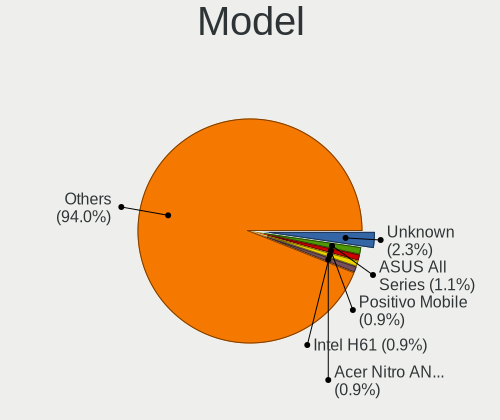
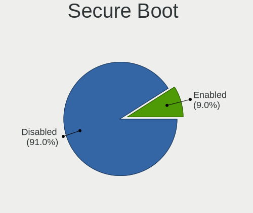
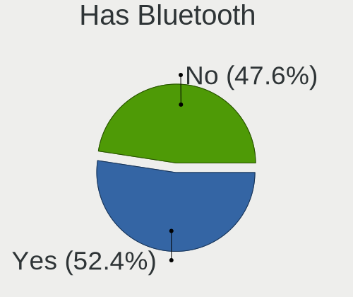
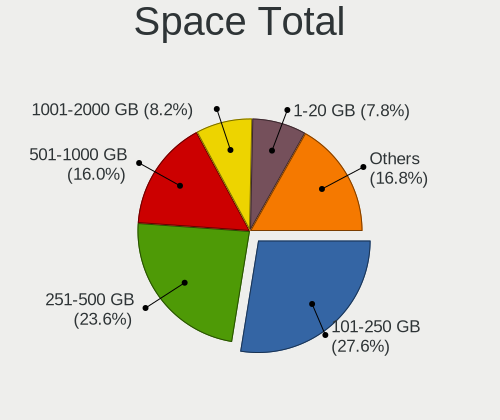
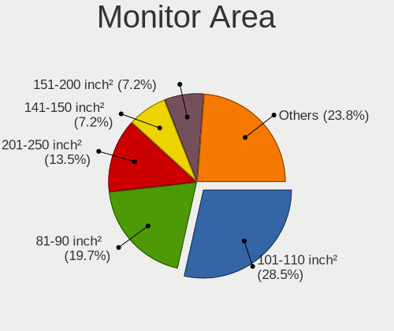
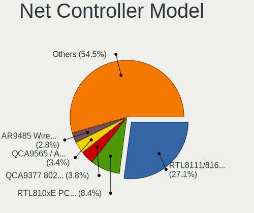
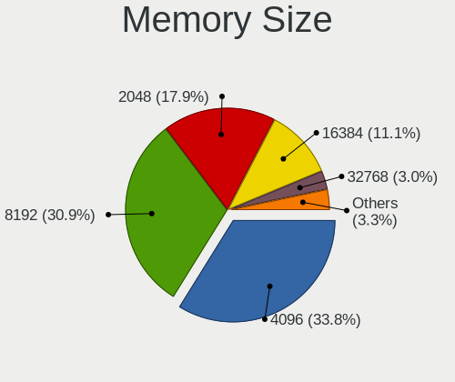
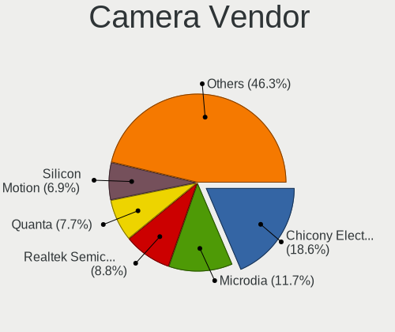
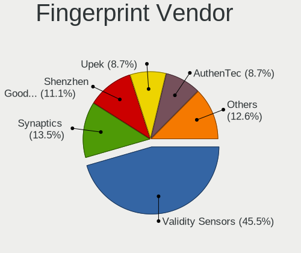

Linux in Brazil - Tested Hardware & Statistics
----------------------------------------------

A project to collect tested hardware configurations for Linux in Brazil.

Anyone can contribute to this report by the [hw-probe](https://github.com/linuxhw/hw-probe) tool:

    sudo -E hw-probe -all -upload

Please contribute! Especially if your hardware is rare.

This is a report for all computer types. See also reports for [desktops](/Location/Brazil/Desktop/README.md) and [notebooks](/Location/Brazil/Notebook/README.md).

Contents
--------

* [ Test Cases ](#test-cases)

* [ System ](#system)
  - [ OS                       ](#os)
  - [ OS Family                ](#os-family)
  - [ Kernel                   ](#kernel)
  - [ Kernel Family            ](#kernel-family)
  - [ Kernel Major Ver.        ](#kernel-major-ver)
  - [ Arch                     ](#arch)
  - [ DE                       ](#de)
  - [ Display Server           ](#display-server)
  - [ Display Manager          ](#display-manager)
  - [ OS Lang                  ](#os-lang)
  - [ Boot Mode                ](#boot-mode)
  - [ Filesystem               ](#filesystem)
  - [ Part. scheme             ](#part-scheme)
  - [ Dual Boot with Linux/BSD ](#dual-boot-with-linuxbsd)
  - [ Dual Boot (Win)          ](#dual-boot-win)

* [ Board ](#board)
  - [ Vendor                   ](#vendor)
  - [ Model                    ](#model)
  - [ Model Family             ](#model-family)
  - [ MFG Year                 ](#mfg-year)
  - [ Form Factor              ](#form-factor)
  - [ Secure Boot              ](#secure-boot)
  - [ Coreboot                 ](#coreboot)
  - [ RAM Size                 ](#ram-size)
  - [ RAM Used                 ](#ram-used)
  - [ Total Drives             ](#total-drives)
  - [ Has CD-ROM               ](#has-cd-rom)
  - [ Has Ethernet             ](#has-ethernet)
  - [ Has WiFi                 ](#has-wifi)
  - [ Has Bluetooth            ](#has-bluetooth)

* [ Location ](#location)
  - [ Country                  ](#country)
  - [ City                     ](#city)

* [ Drives ](#drives)
  - [ Drive Vendor             ](#drive-vendor)
  - [ Drive Model              ](#drive-model)
  - [ HDD Vendor               ](#hdd-vendor)
  - [ SSD Vendor               ](#ssd-vendor)
  - [ Drive Kind               ](#drive-kind)
  - [ Drive Connector          ](#drive-connector)
  - [ Drive Size               ](#drive-size)
  - [ Space Total              ](#space-total)
  - [ Space Used               ](#space-used)
  - [ Malfunc. Drives          ](#malfunc-drives)
  - [ Malfunc. Drive Vendor    ](#malfunc-drive-vendor)
  - [ Malfunc. HDD Vendor      ](#malfunc-hdd-vendor)
  - [ Malfunc. Drive Kind      ](#malfunc-drive-kind)
  - [ Failed Drives            ](#failed-drives)
  - [ Failed Drive Vendor      ](#failed-drive-vendor)
  - [ Drive Status             ](#drive-status)

* [ Storage controller ](#storage-controller)
  - [ Storage Vendor           ](#storage-vendor)
  - [ Storage Model            ](#storage-model)
  - [ Storage Kind             ](#storage-kind)

* [ Processor ](#processor)
  - [ CPU Vendor               ](#cpu-vendor)
  - [ CPU Model                ](#cpu-model)
  - [ CPU Model Family         ](#cpu-model-family)
  - [ CPU Cores                ](#cpu-cores)
  - [ CPU Sockets              ](#cpu-sockets)
  - [ CPU Threads              ](#cpu-threads)
  - [ CPU Op-Modes             ](#cpu-op-modes)
  - [ CPU Microcode            ](#cpu-microcode)
  - [ CPU Microarch            ](#cpu-microarch)

* [ Graphics ](#graphics)
  - [ GPU Vendor               ](#gpu-vendor)
  - [ GPU Model                ](#gpu-model)
  - [ GPU Combo                ](#gpu-combo)
  - [ GPU Driver               ](#gpu-driver)
  - [ GPU Memory               ](#gpu-memory)

* [ Monitor ](#monitor)
  - [ Monitor Vendor           ](#monitor-vendor)
  - [ Monitor Model            ](#monitor-model)
  - [ Monitor Resolution       ](#monitor-resolution)
  - [ Monitor Diagonal         ](#monitor-diagonal)
  - [ Monitor Width            ](#monitor-width)
  - [ Aspect Ratio             ](#aspect-ratio)
  - [ Monitor Area             ](#monitor-area)
  - [ Pixel Density            ](#pixel-density)
  - [ Multiple Monitors        ](#multiple-monitors)

* [ Network ](#network)
  - [ Net Controller Vendor    ](#net-controller-vendor)
  - [ Net Controller Model     ](#net-controller-model)
  - [ Wireless Vendor          ](#wireless-vendor)
  - [ Wireless Model           ](#wireless-model)
  - [ Ethernet Vendor          ](#ethernet-vendor)
  - [ Ethernet Model           ](#ethernet-model)
  - [ Net Controller Kind      ](#net-controller-kind)
  - [ Used Controller          ](#used-controller)
  - [ NICs                     ](#nics)
  - [ IPv6                     ](#ipv6)

* [ Bluetooth ](#bluetooth)
  - [ Bluetooth Vendor         ](#bluetooth-vendor)
  - [ Bluetooth Model          ](#bluetooth-model)

* [ Sound ](#sound)
  - [ Sound Vendor             ](#sound-vendor)
  - [ Sound Model              ](#sound-model)

* [ Memory ](#memory)
  - [ Memory Vendor            ](#memory-vendor)
  - [ Memory Model             ](#memory-model)
  - [ Memory Kind              ](#memory-kind)
  - [ Memory Form Factor       ](#memory-form-factor)
  - [ Memory Size              ](#memory-size)
  - [ Memory Speed             ](#memory-speed)

* [ Printers & scanners ](#printers--scanners)
  - [ Printer Vendor           ](#printer-vendor)
  - [ Printer Model            ](#printer-model)
  - [ Scanner Vendor           ](#scanner-vendor)
  - [ Scanner Model            ](#scanner-model)

* [ Camera ](#camera)
  - [ Camera Vendor            ](#camera-vendor)
  - [ Camera Model             ](#camera-model)

* [ Security ](#security)
  - [ Fingerprint Vendor       ](#fingerprint-vendor)
  - [ Fingerprint Model        ](#fingerprint-model)
  - [ Chipcard Vendor          ](#chipcard-vendor)
  - [ Chipcard Model           ](#chipcard-model)

* [ Unsupported ](#unsupported)
  - [ Unsupported Devices      ](#unsupported-devices)
  - [ Unsupported Device Types ](#unsupported-device-types)

Test Cases
----------

Total: 20347

| Vendor        | Model                       | Form-Factor | Probe                                                      | Date         |
|---------------|-----------------------------|-------------|------------------------------------------------------------|--------------|
| Dell          | 0PV3YR A05                  | Server      | [aae60ff071](https://linux-hardware.org/?probe=aae60ff071) | Oct 01, 2023 |
| Notebook      | NJx0MU                      | Notebook    | [7b44ef8cd1](https://linux-hardware.org/?probe=7b44ef8cd1) | Oct 01, 2023 |
| Lenovo        | ThinkPad L14 Gen 1 20U6S... | Notebook    | [b79529501a](https://linux-hardware.org/?probe=b79529501a) | Oct 01, 2023 |
| Notebook      | NJx0MU                      | Notebook    | [a1f20bb140](https://linux-hardware.org/?probe=a1f20bb140) | Sep 30, 2023 |
| Notebook      | NJx0MU                      | Notebook    | [1449844643](https://linux-hardware.org/?probe=1449844643) | Sep 30, 2023 |
| Toshiba       | STI 009169                  | Desktop     | [0b76bae8f3](https://linux-hardware.org/?probe=0b76bae8f3) | Sep 30, 2023 |
| ASUSTek       | TUF Gaming B660M-PLUS D4    | Desktop     | [f3d279f91b](https://linux-hardware.org/?probe=f3d279f91b) | Sep 30, 2023 |
| ASRock        | A320M-DGS                   | Desktop     | [63aafe31f1](https://linux-hardware.org/?probe=63aafe31f1) | Sep 30, 2023 |
| ASUSTek       | TUF Gaming B660M-PLUS D4    | Desktop     | [02af70281a](https://linux-hardware.org/?probe=02af70281a) | Sep 30, 2023 |
| MSI           | B550M PRO-VDH WIFI          | Desktop     | [770e7037d3](https://linux-hardware.org/?probe=770e7037d3) | Sep 30, 2023 |
| Dell          | 0PV3YR A05                  | Server      | [ba4aa68077](https://linux-hardware.org/?probe=ba4aa68077) | Sep 30, 2023 |
| Unknown       | Phitronics N68C-M           | Desktop     | [72b5c903d3](https://linux-hardware.org/?probe=72b5c903d3) | Sep 30, 2023 |
| Gigabyte      | B550M AORUS ELITE           | Desktop     | [74bed86ee5](https://linux-hardware.org/?probe=74bed86ee5) | Sep 30, 2023 |
| Intel         | H61                         | Desktop     | [f6a417439c](https://linux-hardware.org/?probe=f6a417439c) | Sep 29, 2023 |
| Intel         | H61                         | Desktop     | [e7dac2f9ed](https://linux-hardware.org/?probe=e7dac2f9ed) | Sep 29, 2023 |
| Tectoy        | Pense Bem Notebook          | Notebook    | [6a6e6af34c](https://linux-hardware.org/?probe=6a6e6af34c) | Sep 29, 2023 |
| ASUSTek       | ROG STRIX B550-F GAMING ... | Desktop     | [6177caee37](https://linux-hardware.org/?probe=6177caee37) | Sep 29, 2023 |
| Positivo      | C14CR01                     | Notebook    | [11b171838d](https://linux-hardware.org/?probe=11b171838d) | Sep 29, 2023 |
| ASUSTek       | VivoBook_ASUSLaptop X515... | Notebook    | [772e866a05](https://linux-hardware.org/?probe=772e866a05) | Sep 29, 2023 |
| Dell          | Inspiron 5437               | Notebook    | [c0301c2fbb](https://linux-hardware.org/?probe=c0301c2fbb) | Sep 29, 2023 |
| Positivo      | POS-PIH81DI                 | Desktop     | [0e67f3a0f3](https://linux-hardware.org/?probe=0e67f3a0f3) | Sep 29, 2023 |
| Acer          | Nitro AN515-43              | Notebook    | [e55a394d41](https://linux-hardware.org/?probe=e55a394d41) | Sep 29, 2023 |
| Samsung       | 340XAA/350XAA/550XAA        | Notebook    | [ccc715eeb6](https://linux-hardware.org/?probe=ccc715eeb6) | Sep 29, 2023 |
| MACHINIST     | X99-RS9 V2.0                | Desktop     | [51272b2713](https://linux-hardware.org/?probe=51272b2713) | Sep 28, 2023 |
| Lenovo        | IdeaPad 330S-15IKB 81JN     | Notebook    | [747f0d45fe](https://linux-hardware.org/?probe=747f0d45fe) | Sep 28, 2023 |
| ASUSTek       | TUF Gaming X570-PLUS_BR     | Desktop     | [ce3a9f8960](https://linux-hardware.org/?probe=ce3a9f8960) | Sep 28, 2023 |
| Huanan        | X99-F8 GAMING V5.0          | Desktop     | [62ba806672](https://linux-hardware.org/?probe=62ba806672) | Sep 28, 2023 |
| MACHINIST     | X99-RS9 V2.0                | Desktop     | [1509f60079](https://linux-hardware.org/?probe=1509f60079) | Sep 28, 2023 |
| Dell          | Vostro 5470                 | Notebook    | [b6f9976e23](https://linux-hardware.org/?probe=b6f9976e23) | Sep 28, 2023 |
| ASUSTek       | K45VM                       | Notebook    | [6c167e69a4](https://linux-hardware.org/?probe=6c167e69a4) | Sep 28, 2023 |
| Acer          | Acadia V1.35                | Notebook    | [c2074b2535](https://linux-hardware.org/?probe=c2074b2535) | Sep 28, 2023 |
| Acer          | Aspire E5-571               | Notebook    | [acd3733ebf](https://linux-hardware.org/?probe=acd3733ebf) | Sep 27, 2023 |
| EUROCOM       | RACER 2.0                   | Notebook    | [4351733d37](https://linux-hardware.org/?probe=4351733d37) | Sep 27, 2023 |
| Positivo      | POS-RIH470EM 11179450       | Desktop     | [cf8e3e73bb](https://linux-hardware.org/?probe=cf8e3e73bb) | Sep 27, 2023 |
| Samsung       | 550XDA                      | Notebook    | [ab1fabfe9b](https://linux-hardware.org/?probe=ab1fabfe9b) | Sep 27, 2023 |
| ASUSTek       | PRIME B350-PLUS             | Desktop     | [546df5b57f](https://linux-hardware.org/?probe=546df5b57f) | Sep 27, 2023 |
| ASUSTek       | PRIME B350-PLUS             | Desktop     | [503570ad7a](https://linux-hardware.org/?probe=503570ad7a) | Sep 27, 2023 |
| Unknown       | Unknown                     | Desktop     | [cb12d6c853](https://linux-hardware.org/?probe=cb12d6c853) | Sep 27, 2023 |
| ASUSTek       | M5A78L-M PLUS/USB3          | Desktop     | [f47347fb9b](https://linux-hardware.org/?probe=f47347fb9b) | Sep 27, 2023 |
| Dell          | System XPS L502X            | Notebook    | [06d6fd95d1](https://linux-hardware.org/?probe=06d6fd95d1) | Sep 27, 2023 |
| Acer          | Aspire A315-53              | Notebook    | [c20a9f8f96](https://linux-hardware.org/?probe=c20a9f8f96) | Sep 27, 2023 |
| Dell          | G15 5520                    | Notebook    | [64cfeba3ee](https://linux-hardware.org/?probe=64cfeba3ee) | Sep 26, 2023 |
| Dell          | Inspiron 5423               | Notebook    | [a6a3b2697f](https://linux-hardware.org/?probe=a6a3b2697f) | Sep 26, 2023 |
| Dell          | Inspiron 5567               | Notebook    | [6ebf39a37a](https://linux-hardware.org/?probe=6ebf39a37a) | Sep 26, 2023 |
| Dell          | Inspiron 5567               | Notebook    | [644a616222](https://linux-hardware.org/?probe=644a616222) | Sep 26, 2023 |
| ASUSTek       | TUF B450M-PRO GAMING        | Desktop     | [811818acb8](https://linux-hardware.org/?probe=811818acb8) | Sep 26, 2023 |
| Huanan        | X99-8M-F V1.2               | Desktop     | [4ddba514a1](https://linux-hardware.org/?probe=4ddba514a1) | Sep 26, 2023 |
| Dell          | 0PV3YR A05                  | Server      | [acde6e2ba0](https://linux-hardware.org/?probe=acde6e2ba0) | Sep 26, 2023 |
| Samsung       | 340XAA/350XAA/550XAA        | Notebook    | [3d8dfdbf80](https://linux-hardware.org/?probe=3d8dfdbf80) | Sep 26, 2023 |
| HP            | Folio 13                    | Notebook    | [a5a1ae29a7](https://linux-hardware.org/?probe=a5a1ae29a7) | Sep 26, 2023 |
| Notebook      | NJx0MU                      | Notebook    | [89d81885ff](https://linux-hardware.org/?probe=89d81885ff) | Sep 26, 2023 |
| Intel         | H61                         | Desktop     | [ee0266b53c](https://linux-hardware.org/?probe=ee0266b53c) | Sep 25, 2023 |
| Intel         | W7645                       | Notebook    | [8a83c23785](https://linux-hardware.org/?probe=8a83c23785) | Sep 25, 2023 |
| ASUSTek       | M5A78L-M/USB3               | Desktop     | [0b586071f1](https://linux-hardware.org/?probe=0b586071f1) | Sep 25, 2023 |
| HP            | Presario CQ43               | Notebook    | [c206dc84ad](https://linux-hardware.org/?probe=c206dc84ad) | Sep 25, 2023 |
| Acer          | Aspire F5-573G              | Notebook    | [a2f6814940](https://linux-hardware.org/?probe=a2f6814940) | Sep 25, 2023 |
| Dell          | 0PV3YR A05                  | Server      | [8a7db88ae5](https://linux-hardware.org/?probe=8a7db88ae5) | Sep 25, 2023 |
| Dell          | Latitude E5440              | Notebook    | [f4accb1cb0](https://linux-hardware.org/?probe=f4accb1cb0) | Sep 25, 2023 |
| ASUSTek       | PRIME A320M-K/BR            | Desktop     | [fee2fdb49a](https://linux-hardware.org/?probe=fee2fdb49a) | Sep 25, 2023 |
| Dell          | XPS 13 9380                 | Notebook    | [705c3fdeff](https://linux-hardware.org/?probe=705c3fdeff) | Sep 25, 2023 |
| Acer          | Aspire E5-571               | Notebook    | [e74a87d3f4](https://linux-hardware.org/?probe=e74a87d3f4) | Sep 25, 2023 |
| HP            | Presario CQ43               | Notebook    | [b2663eb2fa](https://linux-hardware.org/?probe=b2663eb2fa) | Sep 25, 2023 |
| Acer          | Nitro AN515-51              | Notebook    | [6d6d719f30](https://linux-hardware.org/?probe=6d6d719f30) | Sep 25, 2023 |
| Gigabyte      | H310M M.2 x.x               | Desktop     | [69cccf347a](https://linux-hardware.org/?probe=69cccf347a) | Sep 25, 2023 |
| Acer          | Aspire R3-131T              | Notebook    | [c643f10970](https://linux-hardware.org/?probe=c643f10970) | Sep 24, 2023 |
| Samsung       | 550XBE/350XBE               | Notebook    | [cdbacef976](https://linux-hardware.org/?probe=cdbacef976) | Sep 24, 2023 |
| Lenovo        | IdeaPad S145-15API 81V7     | Notebook    | [eb82ffb863](https://linux-hardware.org/?probe=eb82ffb863) | Sep 24, 2023 |
| OEM           | B75 Ver:1.41                | Desktop     | [01109ec772](https://linux-hardware.org/?probe=01109ec772) | Sep 24, 2023 |
| Lenovo        | ThinkCentre A70z 0401B7P    | Desktop     | [21a635940f](https://linux-hardware.org/?probe=21a635940f) | Sep 24, 2023 |
| ASUSTek       | VivoBook_ASUSLaptop X515... | Notebook    | [d71e760b5c](https://linux-hardware.org/?probe=d71e760b5c) | Sep 24, 2023 |
| PCWare        | APM-A320G                   | Desktop     | [64080404a6](https://linux-hardware.org/?probe=64080404a6) | Sep 24, 2023 |
| Gigabyte      | 945GCM-S2C                  | Desktop     | [9f17460970](https://linux-hardware.org/?probe=9f17460970) | Sep 24, 2023 |
| HOUTER        | OROPC                       | Desktop     | [96625070be](https://linux-hardware.org/?probe=96625070be) | Sep 24, 2023 |
| Notebook      | NJx0MU                      | Notebook    | [84bba5e5a7](https://linux-hardware.org/?probe=84bba5e5a7) | Sep 24, 2023 |
| Positivo      | POS-EIBTPDC                 | Desktop     | [3c2427ba03](https://linux-hardware.org/?probe=3c2427ba03) | Sep 23, 2023 |
| Positivo      | POS-EIBTPDC                 | Desktop     | [586c05976a](https://linux-hardware.org/?probe=586c05976a) | Sep 23, 2023 |
| HOUTER        | OROPC                       | Desktop     | [3f78fb9290](https://linux-hardware.org/?probe=3f78fb9290) | Sep 23, 2023 |
| ASUSTek       | A88XM-A                     | Desktop     | [c2cb8052f9](https://linux-hardware.org/?probe=c2cb8052f9) | Sep 23, 2023 |
| HP            | Presario CQ43               | Notebook    | [d5ee5e4318](https://linux-hardware.org/?probe=d5ee5e4318) | Sep 23, 2023 |
| Gigabyte      | GA-880GMA-UD2H              | Desktop     | [fbeac0cab4](https://linux-hardware.org/?probe=fbeac0cab4) | Sep 23, 2023 |
| Lenovo        | IdeaPad S145-15IGM 81WT     | Notebook    | [7022eac21d](https://linux-hardware.org/?probe=7022eac21d) | Sep 23, 2023 |
| Valve         | Jupiter                     | Notebook    | [287bf4d933](https://linux-hardware.org/?probe=287bf4d933) | Sep 23, 2023 |
| Acer          | Aspire A514-54              | Notebook    | [c74511d498](https://linux-hardware.org/?probe=c74511d498) | Sep 22, 2023 |
| Lenovo        | IdeaPad S145-15IWL 81S9     | Notebook    | [04141bd71c](https://linux-hardware.org/?probe=04141bd71c) | Sep 22, 2023 |
| Dell          | Latitude E7440              | Notebook    | [53e90ca355](https://linux-hardware.org/?probe=53e90ca355) | Sep 22, 2023 |
| Lenovo        | IdeaPad S145-15IGM 81WT     | Notebook    | [65a21a4968](https://linux-hardware.org/?probe=65a21a4968) | Sep 22, 2023 |
| ASUSTek       | TUF B450M-PRO GAMING        | Desktop     | [47e5429752](https://linux-hardware.org/?probe=47e5429752) | Sep 22, 2023 |
| HP            | Folio 13                    | Notebook    | [66f8752b64](https://linux-hardware.org/?probe=66f8752b64) | Sep 22, 2023 |
| Lenovo        | ThinkPad X220 4286BB2       | Notebook    | [a3b217a707](https://linux-hardware.org/?probe=a3b217a707) | Sep 21, 2023 |
| ASUSTek       | TUF B450M-PRO GAMING        | Desktop     | [a35f78cead](https://linux-hardware.org/?probe=a35f78cead) | Sep 21, 2023 |
| Positivo      | POS-AG31AP                  | Desktop     | [2e2072e3ca](https://linux-hardware.org/?probe=2e2072e3ca) | Sep 21, 2023 |
| Megaware      | MW-HDC-M 02/24/2012 - ME... | Desktop     | [d3c9063140](https://linux-hardware.org/?probe=d3c9063140) | Sep 21, 2023 |
| Intel         | B75                         | Desktop     | [37b59e6605](https://linux-hardware.org/?probe=37b59e6605) | Sep 21, 2023 |
| Lenovo        | IdeaPad 3 15ITL6 82MD       | Notebook    | [dd328a6f1f](https://linux-hardware.org/?probe=dd328a6f1f) | Sep 21, 2023 |
| Samsung       | 550XBE/350XBE               | Notebook    | [522d50a437](https://linux-hardware.org/?probe=522d50a437) | Sep 21, 2023 |
| Samsung       | 550XDA                      | Notebook    | [2d15b3f4ca](https://linux-hardware.org/?probe=2d15b3f4ca) | Sep 21, 2023 |
| Gigabyte      | B450 AORUS M                | Desktop     | [e2dda8ebb1](https://linux-hardware.org/?probe=e2dda8ebb1) | Sep 21, 2023 |
| Intel         | H55                         | Desktop     | [03693f8574](https://linux-hardware.org/?probe=03693f8574) | Sep 21, 2023 |
| ASUSTek       | PRIME A320M-K/BR            | Desktop     | [5e05853c00](https://linux-hardware.org/?probe=5e05853c00) | Sep 20, 2023 |
| Samsung       | 340XAA/350XAA/550XAA        | Notebook    | [5a74bb7dde](https://linux-hardware.org/?probe=5a74bb7dde) | Sep 20, 2023 |
| ASUSTek       | M5A78L-M PLUS/USB3          | Desktop     | [f7629203e7](https://linux-hardware.org/?probe=f7629203e7) | Sep 20, 2023 |
| Dell          | XPS 13 9300                 | Notebook    | [49bb68e979](https://linux-hardware.org/?probe=49bb68e979) | Sep 20, 2023 |
| ASUSTek       | Z450UA                      | Notebook    | [60d85e59da](https://linux-hardware.org/?probe=60d85e59da) | Sep 20, 2023 |
| Dell          | Inspiron 15 7000 Gaming     | Notebook    | [16b2b018c1](https://linux-hardware.org/?probe=16b2b018c1) | Sep 20, 2023 |
| ASRock        | A320M-HD                    | Desktop     | [01d8f27500](https://linux-hardware.org/?probe=01d8f27500) | Sep 20, 2023 |
| Chuwi         | GemiBook Pro                | Notebook    | [d8305c7c45](https://linux-hardware.org/?probe=d8305c7c45) | Sep 20, 2023 |
| Dell          | 06HR05 A00                  | Desktop     | [a01d6b8630](https://linux-hardware.org/?probe=a01d6b8630) | Sep 20, 2023 |
| Samsung       | 960XFH                      | Notebook    | [c25c858bd4](https://linux-hardware.org/?probe=c25c858bd4) | Sep 19, 2023 |
| Apple         | Mac-F2208EC8                | Mini pc     | [8f90540e05](https://linux-hardware.org/?probe=8f90540e05) | Sep 19, 2023 |
| Chuwi         | GemiBook Pro                | Notebook    | [7ff48f538f](https://linux-hardware.org/?probe=7ff48f538f) | Sep 19, 2023 |
| Dell          | Inspiron 3442               | Notebook    | [1f6ca2e4f7](https://linux-hardware.org/?probe=1f6ca2e4f7) | Sep 19, 2023 |
| ASUSTek       | PRIME B450M-GAMING/BR       | Desktop     | [6d9002e7e3](https://linux-hardware.org/?probe=6d9002e7e3) | Sep 19, 2023 |
| ASUSTek       | PRIME B450M-GAMING/BR       | Desktop     | [c53d44303e](https://linux-hardware.org/?probe=c53d44303e) | Sep 19, 2023 |
| wpc           | zrd616                      | Desktop     | [f218d73abb](https://linux-hardware.org/?probe=f218d73abb) | Sep 19, 2023 |
| Biostar       | B550GTQ                     | Desktop     | [5478c7bc91](https://linux-hardware.org/?probe=5478c7bc91) | Sep 19, 2023 |
| MSI           | A320M-A PRO                 | Desktop     | [6588973c54](https://linux-hardware.org/?probe=6588973c54) | Sep 19, 2023 |
| Samsung       | 550XDA                      | Notebook    | [763631bfe7](https://linux-hardware.org/?probe=763631bfe7) | Sep 19, 2023 |
| Daten Tecn... | DT02-M4                     | Notebook    | [67c158a4f1](https://linux-hardware.org/?probe=67c158a4f1) | Sep 19, 2023 |
| Lenovo        | 3102 SDK0J40697 WIN 3305... | Desktop     | [1bd2a17c99](https://linux-hardware.org/?probe=1bd2a17c99) | Sep 19, 2023 |
| Biostar       | H61MLC                      | Desktop     | [154ead8447](https://linux-hardware.org/?probe=154ead8447) | Sep 19, 2023 |
| Dell          | XPS 15 9560                 | Notebook    | [28d0c94948](https://linux-hardware.org/?probe=28d0c94948) | Sep 19, 2023 |
| Lenovo        | B490 37722QP                | Notebook    | [d68a92e72a](https://linux-hardware.org/?probe=d68a92e72a) | Sep 19, 2023 |
| Lenovo        | B490 37722QP                | Notebook    | [8b335d6bb0](https://linux-hardware.org/?probe=8b335d6bb0) | Sep 19, 2023 |
| ASRock        | A320M-HD                    | Desktop     | [00ce48a639](https://linux-hardware.org/?probe=00ce48a639) | Sep 19, 2023 |
| ASUSTek       | VivoBook_ASUSLaptop X513... | Notebook    | [0ec89ecd46](https://linux-hardware.org/?probe=0ec89ecd46) | Sep 19, 2023 |
| Acer          | Aspire 5742                 | Notebook    | [430ed1fe6c](https://linux-hardware.org/?probe=430ed1fe6c) | Sep 19, 2023 |
| HP            | Compaq Mini 311-1100        | Notebook    | [418d54b71d](https://linux-hardware.org/?probe=418d54b71d) | Sep 18, 2023 |
| ASUSTek       | VivoBook_ASUSLaptop X515... | Notebook    | [0b036a6058](https://linux-hardware.org/?probe=0b036a6058) | Sep 18, 2023 |
| Dell          | 076VHM A02                  | Desktop     | [518361bbc5](https://linux-hardware.org/?probe=518361bbc5) | Sep 18, 2023 |
| Positivo      | POS-EIH610EX 11187943       | Desktop     | [10fbe8fd9b](https://linux-hardware.org/?probe=10fbe8fd9b) | Sep 18, 2023 |
| Dell          | XPS 15 9510                 | Notebook    | [5701fbde3e](https://linux-hardware.org/?probe=5701fbde3e) | Sep 18, 2023 |
| Dell          | Inspiron 5480               | Notebook    | [51aca22643](https://linux-hardware.org/?probe=51aca22643) | Sep 18, 2023 |
| Dell          | XPS 15 9510                 | Notebook    | [514a5308f2](https://linux-hardware.org/?probe=514a5308f2) | Sep 18, 2023 |
| ASUSTek       | X450CA                      | Notebook    | [b43a3aa61c](https://linux-hardware.org/?probe=b43a3aa61c) | Sep 18, 2023 |
| Kllisre       | X99-B5 V1.1                 | Desktop     | [5597daf348](https://linux-hardware.org/?probe=5597daf348) | Sep 18, 2023 |
| Lenovo        | IdeaPad S145-15IKB 81XM     | Notebook    | [aebeeb7401](https://linux-hardware.org/?probe=aebeeb7401) | Sep 17, 2023 |
| MACHINIST     | X99-RS9 V2.0                | Desktop     | [1875fb96e5](https://linux-hardware.org/?probe=1875fb96e5) | Sep 17, 2023 |
| ASUSTek       | M5A78L/USB3                 | Desktop     | [e1805d26c3](https://linux-hardware.org/?probe=e1805d26c3) | Sep 17, 2023 |
| ASUSTek       | TUF Gaming X570-PLUS_BR     | Desktop     | [d4d891ca35](https://linux-hardware.org/?probe=d4d891ca35) | Sep 17, 2023 |
| ASRock        | B450 Pro4                   | Desktop     | [2e8cd612d8](https://linux-hardware.org/?probe=2e8cd612d8) | Sep 17, 2023 |
| Apple         | MacBookPro9,2               | Notebook    | [b8459514db](https://linux-hardware.org/?probe=b8459514db) | Sep 17, 2023 |
| QIYIDA        | X99-H9 V2.0                 | Desktop     | [1e71e60505](https://linux-hardware.org/?probe=1e71e60505) | Sep 17, 2023 |
| ASRock        | A320M-HD                    | Desktop     | [8db77afc82](https://linux-hardware.org/?probe=8db77afc82) | Sep 17, 2023 |
| Dell          | Inspiron 5566               | Notebook    | [56f2d4d1eb](https://linux-hardware.org/?probe=56f2d4d1eb) | Sep 17, 2023 |
| ANGXUN        | X99 V1.0                    | Desktop     | [c6c6277bf3](https://linux-hardware.org/?probe=c6c6277bf3) | Sep 17, 2023 |
| QIYIDA        | X99-H9 V2.0                 | Desktop     | [656da36be3](https://linux-hardware.org/?probe=656da36be3) | Sep 17, 2023 |
| Lenovo        | IdeaPad 320-15IKB 80YH      | Notebook    | [48ea99b656](https://linux-hardware.org/?probe=48ea99b656) | Sep 16, 2023 |
| Acer          | Aspire 5750Z                | Notebook    | [d42482a830](https://linux-hardware.org/?probe=d42482a830) | Sep 16, 2023 |
| Lenovo        | IdeaPad 320-15IKB 80YH      | Notebook    | [f95cfdee8d](https://linux-hardware.org/?probe=f95cfdee8d) | Sep 16, 2023 |
| ASUSTek       | PRIME H610M-A D4            | Desktop     | [6f73b0398c](https://linux-hardware.org/?probe=6f73b0398c) | Sep 16, 2023 |
| ASUSTek       | PRIME H610M-A D4            | Desktop     | [7b10a3651b](https://linux-hardware.org/?probe=7b10a3651b) | Sep 16, 2023 |
| Dell          | Latitude E6430              | Notebook    | [a426075604](https://linux-hardware.org/?probe=a426075604) | Sep 16, 2023 |
| Compaq        | 420                         | Notebook    | [a0ce747ff2](https://linux-hardware.org/?probe=a0ce747ff2) | Sep 16, 2023 |
| ASUSTek       | ROG CROSSHAIR VIII HERO     | Notebook    | [4298a1ab82](https://linux-hardware.org/?probe=4298a1ab82) | Sep 16, 2023 |
| Biostar       | X370GTN                     | Desktop     | [1ac44acadd](https://linux-hardware.org/?probe=1ac44acadd) | Sep 16, 2023 |
| Dell          | 0VTJVC A00                  | Desktop     | [8a404c05c2](https://linux-hardware.org/?probe=8a404c05c2) | Sep 15, 2023 |
| MSI           | H310M PRO-VDH               | Desktop     | [100f789658](https://linux-hardware.org/?probe=100f789658) | Sep 15, 2023 |
| Positivo      | POS-RIB360EE 11144907       | Desktop     | [8c1887fa93](https://linux-hardware.org/?probe=8c1887fa93) | Sep 15, 2023 |
| Digibras      | CL341                       | Notebook    | [a358f5d40c](https://linux-hardware.org/?probe=a358f5d40c) | Sep 15, 2023 |
| Dell          | Vostro 1510                 | Notebook    | [bf4d733039](https://linux-hardware.org/?probe=bf4d733039) | Sep 15, 2023 |
| Lenovo        | Slim Pro 9 14IRP8 83BV      | Notebook    | [bc86928972](https://linux-hardware.org/?probe=bc86928972) | Sep 15, 2023 |
| Gigabyte      | A320M-S2H-CF                | Desktop     | [e484eea129](https://linux-hardware.org/?probe=e484eea129) | Sep 14, 2023 |
| Foxconn       | 45GM/45CM/45CM-S            | Desktop     | [135712cd9e](https://linux-hardware.org/?probe=135712cd9e) | Sep 14, 2023 |
| Gigabyte      | B550M AORUS ELITE           | Desktop     | [cbe7fd494b](https://linux-hardware.org/?probe=cbe7fd494b) | Sep 14, 2023 |
| Itautec       | Infoway                     | Notebook    | [d4a8bc6420](https://linux-hardware.org/?probe=d4a8bc6420) | Sep 14, 2023 |
| HP            | Folio 13                    | Notebook    | [9ed048b9e4](https://linux-hardware.org/?probe=9ed048b9e4) | Sep 14, 2023 |
| Acer          | Swift SF314-511             | Notebook    | [4714deba45](https://linux-hardware.org/?probe=4714deba45) | Sep 14, 2023 |
| ASUSTek       | TUF Gaming B550M-PLUS       | Desktop     | [9fde2c205d](https://linux-hardware.org/?probe=9fde2c205d) | Sep 14, 2023 |
| Dell          | Vostro 1520                 | Notebook    | [5d70233702](https://linux-hardware.org/?probe=5d70233702) | Sep 14, 2023 |
| Intel         | H61                         | Desktop     | [5dd60be36a](https://linux-hardware.org/?probe=5dd60be36a) | Sep 14, 2023 |
| Lenovo        | IdeaPadFlex 5 14ITL05 82... | Convertible | [0be4e6cba4](https://linux-hardware.org/?probe=0be4e6cba4) | Sep 13, 2023 |
| Dell          | Inspiron 5566               | Notebook    | [6c9eaad10e](https://linux-hardware.org/?probe=6c9eaad10e) | Sep 13, 2023 |
| Positivo      | C14CR21                     | Notebook    | [9d48466eab](https://linux-hardware.org/?probe=9d48466eab) | Sep 13, 2023 |
| Lenovo        | IdeaPad 310-15ISK 80UH      | Notebook    | [df7945af41](https://linux-hardware.org/?probe=df7945af41) | Sep 13, 2023 |
| Pegatron      | 2AC3                        | Desktop     | [4cee44e8ac](https://linux-hardware.org/?probe=4cee44e8ac) | Sep 13, 2023 |
| Dell          | Latitude E4300              | Notebook    | [ed27d2d51c](https://linux-hardware.org/?probe=ed27d2d51c) | Sep 13, 2023 |
| Lenovo        | IdeaPadFlex 5 14IIL05 81... | Convertible | [c2088a6e42](https://linux-hardware.org/?probe=c2088a6e42) | Sep 13, 2023 |
| HOUTER        | OROPC                       | Desktop     | [711d8f8d80](https://linux-hardware.org/?probe=711d8f8d80) | Sep 13, 2023 |
| Dell          | 01XK1W A00                  | Desktop     | [07e5f3eb14](https://linux-hardware.org/?probe=07e5f3eb14) | Sep 13, 2023 |
| Dell          | Inspiron 5590               | Notebook    | [32b69241bf](https://linux-hardware.org/?probe=32b69241bf) | Sep 13, 2023 |
| Gigabyte      | Z390 M GAMING-CF            | Desktop     | [3c36dccf79](https://linux-hardware.org/?probe=3c36dccf79) | Sep 12, 2023 |
| Valve         | Jupiter                     | Notebook    | [bee3c23461](https://linux-hardware.org/?probe=bee3c23461) | Sep 12, 2023 |
| Dell          | Inspiron 15-3567            | Notebook    | [cb58094846](https://linux-hardware.org/?probe=cb58094846) | Sep 12, 2023 |
| Gigabyte      | H110M-H-CF                  | Desktop     | [31cc220aae](https://linux-hardware.org/?probe=31cc220aae) | Sep 12, 2023 |
| Pegatron      | IPMSB-VH1/HDMI/ODM          | Desktop     | [fd4e189b56](https://linux-hardware.org/?probe=fd4e189b56) | Sep 12, 2023 |
| Acer          | Aspire A514-54              | Notebook    | [8ddb560fdc](https://linux-hardware.org/?probe=8ddb560fdc) | Sep 12, 2023 |
| HP            | EliteBook 840 G6            | Notebook    | [4318e0630c](https://linux-hardware.org/?probe=4318e0630c) | Sep 12, 2023 |
| LG Electro... | C400-G.BC22P1               | Notebook    | [caef8df1be](https://linux-hardware.org/?probe=caef8df1be) | Sep 12, 2023 |
| Intel         | H61                         | Desktop     | [513ebd18a2](https://linux-hardware.org/?probe=513ebd18a2) | Sep 12, 2023 |
| Intel         | H61                         | Desktop     | [fec08a2214](https://linux-hardware.org/?probe=fec08a2214) | Sep 12, 2023 |
| PCWare        | IPMH81G1                    | Desktop     | [181367c2db](https://linux-hardware.org/?probe=181367c2db) | Sep 12, 2023 |
| ASUSTek       | VivoBook_ASUSLaptop X571... | Notebook    | [564a2ea72e](https://linux-hardware.org/?probe=564a2ea72e) | Sep 12, 2023 |
| Lenovo        | ThinkPad Edge E431 62779... | Notebook    | [68f0df2a6c](https://linux-hardware.org/?probe=68f0df2a6c) | Sep 12, 2023 |
| Dell          | Latitude E6420              | Notebook    | [2a15e9a8e0](https://linux-hardware.org/?probe=2a15e9a8e0) | Sep 12, 2023 |
| Samsung       | 300E4M/300E4S/300E4L        | Notebook    | [a1f824e885](https://linux-hardware.org/?probe=a1f824e885) | Sep 12, 2023 |
| Positivo      | S14CT01                     | Notebook    | [57ed555d4b](https://linux-hardware.org/?probe=57ed555d4b) | Sep 11, 2023 |
| Dell          | Inspiron 5458               | Notebook    | [ab3824f3d0](https://linux-hardware.org/?probe=ab3824f3d0) | Sep 11, 2023 |
| Acer          | Aspire A315-23              | Notebook    | [ecdef7173c](https://linux-hardware.org/?probe=ecdef7173c) | Sep 11, 2023 |
| ASUSTek       | P8H77-M                     | Desktop     | [61dc55f063](https://linux-hardware.org/?probe=61dc55f063) | Sep 11, 2023 |
| Intel         | X79 (INTEL Xeon E5/Corei... | Desktop     | [c780b34220](https://linux-hardware.org/?probe=c780b34220) | Sep 11, 2023 |
| Gigabyte      | H610M H DDR4                | Desktop     | [e3e2a65f4a](https://linux-hardware.org/?probe=e3e2a65f4a) | Sep 11, 2023 |
| Dell          | 0YXT71 A01                  | Desktop     | [36991ac5a6](https://linux-hardware.org/?probe=36991ac5a6) | Sep 11, 2023 |
| Lenovo        | MAHOBAY NO DPK              | Desktop     | [7f5f0fccd0](https://linux-hardware.org/?probe=7f5f0fccd0) | Sep 11, 2023 |
| Acer          | Aspire A515-47              | Notebook    | [fdc2e70c28](https://linux-hardware.org/?probe=fdc2e70c28) | Sep 11, 2023 |
| Dell          | Vostro 3501                 | Notebook    | [7caa16d219](https://linux-hardware.org/?probe=7caa16d219) | Sep 11, 2023 |
| Dell          | Latitude E6420              | Notebook    | [7e57362cdc](https://linux-hardware.org/?probe=7e57362cdc) | Sep 11, 2023 |
| ASUSTek       | X510UAR                     | Notebook    | [671415f9ca](https://linux-hardware.org/?probe=671415f9ca) | Sep 11, 2023 |
| Samsung       | 530XBB                      | Notebook    | [f6039477c2](https://linux-hardware.org/?probe=f6039477c2) | Sep 11, 2023 |
| Philco        | DTC-A55                     | Desktop     | [30cdd25bb0](https://linux-hardware.org/?probe=30cdd25bb0) | Sep 11, 2023 |
| Sony          | VGN-FZ140E                  | Notebook    | [361226919e](https://linux-hardware.org/?probe=361226919e) | Sep 11, 2023 |
| Samsung       | 550XED                      | Notebook    | [69d754d35b](https://linux-hardware.org/?probe=69d754d35b) | Sep 11, 2023 |
| Samsung       | 550XED                      | Notebook    | [8187eca3e3](https://linux-hardware.org/?probe=8187eca3e3) | Sep 11, 2023 |
| Login Info... | LOG-H61H2-M2                | Desktop     | [fa6e51b9bf](https://linux-hardware.org/?probe=fa6e51b9bf) | Sep 11, 2023 |
| ASUSTek       | TUF Gaming B550M-PLUS WI... | Desktop     | [772c3204b4](https://linux-hardware.org/?probe=772c3204b4) | Sep 10, 2023 |
| Dell          | Vostro 3550                 | Notebook    | [4f0a6ec78c](https://linux-hardware.org/?probe=4f0a6ec78c) | Sep 10, 2023 |
| Positivo      | C464F                       | Notebook    | [e8154e06d4](https://linux-hardware.org/?probe=e8154e06d4) | Sep 10, 2023 |
| ASUSTek       | TUF H310M-PLUS GAMING/BR    | Desktop     | [6dc842bbb4](https://linux-hardware.org/?probe=6dc842bbb4) | Sep 10, 2023 |
| Daten Tecn... | DA75PRO                     | Desktop     | [343cbab6e9](https://linux-hardware.org/?probe=343cbab6e9) | Sep 10, 2023 |
| Unknown       | Unknown                     | Desktop     | [bc06d42fa2](https://linux-hardware.org/?probe=bc06d42fa2) | Sep 10, 2023 |
| Unknown       | Unknown                     | Desktop     | [2f9aef143e](https://linux-hardware.org/?probe=2f9aef143e) | Sep 10, 2023 |
| Gigabyte      | X570 GAMING X               | Desktop     | [8e988d79b7](https://linux-hardware.org/?probe=8e988d79b7) | Sep 09, 2023 |
| Intel         | H61                         | Desktop     | [f8eaac6637](https://linux-hardware.org/?probe=f8eaac6637) | Sep 09, 2023 |
| ASUSTek       | P8H77-M                     | Desktop     | [0916725ace](https://linux-hardware.org/?probe=0916725ace) | Sep 09, 2023 |
| ASUSTek       | PRIME H310M-E/BR            | Desktop     | [87971ac772](https://linux-hardware.org/?probe=87971ac772) | Sep 09, 2023 |
| ASUSTek       | ROG STRIX B350-F GAMING     | Desktop     | [8723b09478](https://linux-hardware.org/?probe=8723b09478) | Sep 09, 2023 |
| Dell          | G15 5511                    | Notebook    | [c382a29576](https://linux-hardware.org/?probe=c382a29576) | Sep 09, 2023 |
| Lenovo        | V720-14 80Y1                | Notebook    | [ec869beffd](https://linux-hardware.org/?probe=ec869beffd) | Sep 09, 2023 |
| Samsung       | 340XAA/350XAA/550XAA        | Notebook    | [7403fec062](https://linux-hardware.org/?probe=7403fec062) | Sep 09, 2023 |
| MSI           | MAG B560M BAZOOKA           | Desktop     | [c3ba2033e2](https://linux-hardware.org/?probe=c3ba2033e2) | Sep 09, 2023 |
| ASUSTek       | P8H61-M LX2 R2.0            | Desktop     | [9d0bacfabd](https://linux-hardware.org/?probe=9d0bacfabd) | Sep 09, 2023 |
| ASUSTek       | M5A78L-M PLUS/USB3          | Desktop     | [2b74633199](https://linux-hardware.org/?probe=2b74633199) | Sep 09, 2023 |
| ASUSTek       | M5A78L-M PLUS/USB3          | Desktop     | [3bb12f9fa5](https://linux-hardware.org/?probe=3bb12f9fa5) | Sep 09, 2023 |
| Standard      | HBT-M Series                | All in one  | [59b9b6af6d](https://linux-hardware.org/?probe=59b9b6af6d) | Sep 09, 2023 |
| Standard      | HBT-M Series                | All in one  | [08e2968c66](https://linux-hardware.org/?probe=08e2968c66) | Sep 09, 2023 |
| Dell          | Latitude 7390               | Notebook    | [3644f0b002](https://linux-hardware.org/?probe=3644f0b002) | Sep 08, 2023 |
| Gigabyte      | B550M AORUS ELITE           | Desktop     | [0c30921512](https://linux-hardware.org/?probe=0c30921512) | Sep 08, 2023 |
| Microsoft     | Surface Pro 4               | Tablet      | [480df18bcb](https://linux-hardware.org/?probe=480df18bcb) | Sep 08, 2023 |
| ASUSTek       | VivoBook_ASUSLaptop X571... | Notebook    | [7c5a19bc69](https://linux-hardware.org/?probe=7c5a19bc69) | Sep 08, 2023 |
| HP            | Compaq Presario CQ40        | Notebook    | [4695b758c9](https://linux-hardware.org/?probe=4695b758c9) | Sep 08, 2023 |
| HP            | Compaq Presario CQ40        | Notebook    | [e8a4fb3aea](https://linux-hardware.org/?probe=e8a4fb3aea) | Sep 08, 2023 |
| Huanan        | X99-F8 GAMING V5.0          | Desktop     | [6dbe579385](https://linux-hardware.org/?probe=6dbe579385) | Sep 08, 2023 |
| Dell          | 0PV3YR A05                  | Server      | [e8fe3531c7](https://linux-hardware.org/?probe=e8fe3531c7) | Sep 08, 2023 |
| Microsoft     | Surface Pro 4               | Tablet      | [d35d89339d](https://linux-hardware.org/?probe=d35d89339d) | Sep 08, 2023 |
| ASUSTek       | TUF Gaming X570-PLUS_BR     | Desktop     | [edf1e3f8c4](https://linux-hardware.org/?probe=edf1e3f8c4) | Sep 08, 2023 |
| ECS           | BSWI-D2                     | Desktop     | [0bf71b9f12](https://linux-hardware.org/?probe=0bf71b9f12) | Sep 08, 2023 |
| MACHINIST     | X99-RS9 V2.0                | Desktop     | [8fc5475fd3](https://linux-hardware.org/?probe=8fc5475fd3) | Sep 08, 2023 |
| Samsung       | 730QED                      | Convertible | [67039750cc](https://linux-hardware.org/?probe=67039750cc) | Sep 08, 2023 |
| Lenovo        | IdeaPad S145-15IIL 82DJ     | Notebook    | [b05fdf4d62](https://linux-hardware.org/?probe=b05fdf4d62) | Sep 08, 2023 |
| Intel         | H61                         | Desktop     | [929cfae9af](https://linux-hardware.org/?probe=929cfae9af) | Sep 08, 2023 |
| Digibras      | NH4CU03                     | Notebook    | [0d0d0bf884](https://linux-hardware.org/?probe=0d0d0bf884) | Sep 07, 2023 |
| HP            | G42                         | Notebook    | [b33a0d0bf6](https://linux-hardware.org/?probe=b33a0d0bf6) | Sep 07, 2023 |
| Lenovo        | IdeaPad 3 15ALC6 82MF       | Notebook    | [89772ef854](https://linux-hardware.org/?probe=89772ef854) | Sep 07, 2023 |
| ASUSTek       | N56VZ                       | Notebook    | [37b42fff22](https://linux-hardware.org/?probe=37b42fff22) | Sep 07, 2023 |
| Lenovo        | IdeaPad 3 15ALC6 82MF       | Notebook    | [c9ea6ff204](https://linux-hardware.org/?probe=c9ea6ff204) | Sep 07, 2023 |
| ASUSTek       | VivoBook_ASUSLaptop X570... | Notebook    | [584a31e54e](https://linux-hardware.org/?probe=584a31e54e) | Sep 07, 2023 |
| Intel         | HM570                       | Desktop     | [ea25bde02e](https://linux-hardware.org/?probe=ea25bde02e) | Sep 07, 2023 |
| ASUSTek       | TUF Gaming X570-PLUS_BR     | Desktop     | [2b734c4a23](https://linux-hardware.org/?probe=2b734c4a23) | Sep 07, 2023 |
| Lenovo        | ThinkPad E14 Gen 3 20YD0... | Notebook    | [2eae1044fc](https://linux-hardware.org/?probe=2eae1044fc) | Sep 07, 2023 |
| ASUSTek       | TUF Gaming Z690-PLUS D4     | Desktop     | [d98f5a5a06](https://linux-hardware.org/?probe=d98f5a5a06) | Sep 07, 2023 |
| ASUSTek       | TUF Gaming Z690-PLUS D4     | Desktop     | [35b6b3a9dd](https://linux-hardware.org/?probe=35b6b3a9dd) | Sep 07, 2023 |
| Gigabyte      | G31M-S2C                    | Desktop     | [a7fb813c79](https://linux-hardware.org/?probe=a7fb813c79) | Sep 07, 2023 |
| Notebook      | NJx0MU                      | Notebook    | [4e54155977](https://linux-hardware.org/?probe=4e54155977) | Sep 07, 2023 |
| Samsung       | 300E5M/300E5L               | Notebook    | [8274cbca33](https://linux-hardware.org/?probe=8274cbca33) | Sep 07, 2023 |
| Acer          | AO722                       | Notebook    | [ae49a1e9c0](https://linux-hardware.org/?probe=ae49a1e9c0) | Sep 07, 2023 |
| Notebook      | NJx0MU                      | Notebook    | [db4ba96400](https://linux-hardware.org/?probe=db4ba96400) | Sep 07, 2023 |
| ASUSTek       | ASUS TUF Gaming F15 FX50... | Notebook    | [e207539e68](https://linux-hardware.org/?probe=e207539e68) | Sep 07, 2023 |
| Huanan        | X99-F8 GAMING V5.0          | Desktop     | [a4624a95da](https://linux-hardware.org/?probe=a4624a95da) | Sep 07, 2023 |
| Dell          | 0PV3YR A05                  | Server      | [da21e863a4](https://linux-hardware.org/?probe=da21e863a4) | Sep 07, 2023 |
| Multilaser    | PC31X                       | Notebook    | [96d451c4a5](https://linux-hardware.org/?probe=96d451c4a5) | Sep 07, 2023 |
| Lenovo        | IdeaPad 330-15IKB 81FE      | Notebook    | [7410c2416c](https://linux-hardware.org/?probe=7410c2416c) | Sep 07, 2023 |
| Alienware     | m15 R7                      | Notebook    | [9e6b80bbf2](https://linux-hardware.org/?probe=9e6b80bbf2) | Sep 07, 2023 |
| ASUSTek       | PRIME H510M-E               | Desktop     | [0be77d9ece](https://linux-hardware.org/?probe=0be77d9ece) | Sep 07, 2023 |
| MSI           | MAG B550 TOMAHAWK           | Desktop     | [f8453df937](https://linux-hardware.org/?probe=f8453df937) | Sep 07, 2023 |
| Toshiba       | STI 006998G                 | Desktop     | [d34aadcc92](https://linux-hardware.org/?probe=d34aadcc92) | Sep 07, 2023 |
| ASRock        | Z97 Killer                  | Desktop     | [a1537a06ee](https://linux-hardware.org/?probe=a1537a06ee) | Sep 07, 2023 |
| Dell          | Inspiron 7460               | Notebook    | [03726302da](https://linux-hardware.org/?probe=03726302da) | Sep 07, 2023 |
| Samsung       | RF511/RF411/RF711           | Notebook    | [ef99cba7a5](https://linux-hardware.org/?probe=ef99cba7a5) | Sep 06, 2023 |
| ASUSTek       | VivoBook_ASUSLaptop X513... | Notebook    | [29f1d7759a](https://linux-hardware.org/?probe=29f1d7759a) | Sep 06, 2023 |
| ASUSTek       | VivoBook_ASUSLaptop X513... | Notebook    | [344a00d524](https://linux-hardware.org/?probe=344a00d524) | Sep 06, 2023 |
| Standard      | MB45II/MB45IN               | Notebook    | [1e46c6aa81](https://linux-hardware.org/?probe=1e46c6aa81) | Sep 06, 2023 |
| ASUSTek       | P8H77-M                     | Desktop     | [ebc8d3e851](https://linux-hardware.org/?probe=ebc8d3e851) | Sep 06, 2023 |
| Acer          | Aspire E1-571               | Notebook    | [5d22a61587](https://linux-hardware.org/?probe=5d22a61587) | Sep 06, 2023 |
| Samsung       | 340XAA/350XAA/550XAA        | Notebook    | [ba05ae3ca2](https://linux-hardware.org/?probe=ba05ae3ca2) | Sep 06, 2023 |
| HP            | 3047h                       | Desktop     | [9b6ecf8471](https://linux-hardware.org/?probe=9b6ecf8471) | Sep 06, 2023 |
| HP            | 3047h                       | Desktop     | [51ba95dc5a](https://linux-hardware.org/?probe=51ba95dc5a) | Sep 06, 2023 |
| Lenovo        | Yoga 520-14IKB 80YM         | Convertible | [a7e1067ce7](https://linux-hardware.org/?probe=a7e1067ce7) | Sep 06, 2023 |
| Samsung       | 340XAA/350XAA/550XAA        | Notebook    | [299a459ec5](https://linux-hardware.org/?probe=299a459ec5) | Sep 06, 2023 |
| Lenovo        | IdeaPad Z360                | Notebook    | [1bb5ebf339](https://linux-hardware.org/?probe=1bb5ebf339) | Sep 06, 2023 |
| Lenovo        | IdeaPad 310-15ISK 80UH      | Notebook    | [0deab6fc8b](https://linux-hardware.org/?probe=0deab6fc8b) | Sep 06, 2023 |
| Dell          | Vostro 5470                 | Notebook    | [aa37593b87](https://linux-hardware.org/?probe=aa37593b87) | Sep 06, 2023 |
| Dell          | Vostro 5470                 | Notebook    | [230cd8c32e](https://linux-hardware.org/?probe=230cd8c32e) | Sep 06, 2023 |
| Dell          | G3 3500                     | Notebook    | [5da26d2241](https://linux-hardware.org/?probe=5da26d2241) | Sep 06, 2023 |
| Biostar       | G31M+                       | Desktop     | [24eb0eb2db](https://linux-hardware.org/?probe=24eb0eb2db) | Sep 06, 2023 |
| Valve         | Jupiter                     | Notebook    | [da71ec43ea](https://linux-hardware.org/?probe=da71ec43ea) | Sep 06, 2023 |
| Lenovo        | IdeaPad 310-15ISK 80UH      | Notebook    | [479d5ea49e](https://linux-hardware.org/?probe=479d5ea49e) | Sep 06, 2023 |
| HP            | 0B54h D                     | Desktop     | [978ff127e9](https://linux-hardware.org/?probe=978ff127e9) | Sep 05, 2023 |
| ASUSTek       | P5KPL-AM-CKD-VISUM-SI       | Desktop     | [4a055a6f9c](https://linux-hardware.org/?probe=4a055a6f9c) | Sep 05, 2023 |
| Biostar       | A320MH                      | Desktop     | [1907707516](https://linux-hardware.org/?probe=1907707516) | Sep 05, 2023 |
| ASUSTek       | ROG STRIX X570-E GAMING ... | Desktop     | [a64157168e](https://linux-hardware.org/?probe=a64157168e) | Sep 05, 2023 |
| Biostar       | A320MH                      | Desktop     | [f13f5f9fe9](https://linux-hardware.org/?probe=f13f5f9fe9) | Sep 05, 2023 |
| ASUSTek       | PRIME B450M-GAMING/BR       | Desktop     | [190675e9f1](https://linux-hardware.org/?probe=190675e9f1) | Sep 05, 2023 |
| Acer          | Aspire 5750Z                | Notebook    | [5bec99a137](https://linux-hardware.org/?probe=5bec99a137) | Sep 05, 2023 |
| Dell          | Inspiron 7560               | Notebook    | [dc22012520](https://linux-hardware.org/?probe=dc22012520) | Sep 05, 2023 |
| Intel         | DH55TC AAE70932-206         | Desktop     | [0576ca20ab](https://linux-hardware.org/?probe=0576ca20ab) | Sep 05, 2023 |
| Dell          | 0PV3YR A05                  | Server      | [0841c5e196](https://linux-hardware.org/?probe=0841c5e196) | Sep 05, 2023 |
| Dell          | G15 5530                    | Notebook    | [91dcc569ee](https://linux-hardware.org/?probe=91dcc569ee) | Sep 05, 2023 |
| Intel         | DH55TC AAE70932-206         | Desktop     | [710c22af52](https://linux-hardware.org/?probe=710c22af52) | Sep 05, 2023 |
| HP            | EliteBook 8470p             | Notebook    | [a658addd87](https://linux-hardware.org/?probe=a658addd87) | Sep 05, 2023 |
| Notebook      | NJx0MU                      | Notebook    | [c02fef3ca2](https://linux-hardware.org/?probe=c02fef3ca2) | Sep 05, 2023 |
| ASRock        | E35LM1                      | Desktop     | [663d9ac1e1](https://linux-hardware.org/?probe=663d9ac1e1) | Sep 04, 2023 |
| ASUSTek       | PRIME B450M-GAMING/BR       | Desktop     | [bcd06888e4](https://linux-hardware.org/?probe=bcd06888e4) | Sep 04, 2023 |
| Gigabyte      | H55M-S2HP                   | Desktop     | [f2ac0f8904](https://linux-hardware.org/?probe=f2ac0f8904) | Sep 04, 2023 |
| ASRock        | A55M-HVS                    | Desktop     | [eaa27d1ba6](https://linux-hardware.org/?probe=eaa27d1ba6) | Sep 04, 2023 |
| HP            | EliteBook 8470p             | Notebook    | [5cb02e099f](https://linux-hardware.org/?probe=5cb02e099f) | Sep 04, 2023 |
| ASRock        | N68-S3 FX                   | Desktop     | [2b503dd2b6](https://linux-hardware.org/?probe=2b503dd2b6) | Sep 04, 2023 |
| Unknown       | SEI Robotics SEI610         | Soc         | [9b43cf14a3](https://linux-hardware.org/?probe=9b43cf14a3) | Sep 04, 2023 |
| Dell          | Inspiron 3576               | Notebook    | [5139d104cc](https://linux-hardware.org/?probe=5139d104cc) | Sep 04, 2023 |
| Acer          | Aspire A315-56              | Notebook    | [1f090fc4fd](https://linux-hardware.org/?probe=1f090fc4fd) | Sep 04, 2023 |
| Dell          | Inspiron 7580               | Notebook    | [b021fe57a6](https://linux-hardware.org/?probe=b021fe57a6) | Sep 04, 2023 |
| Lenovo        | ThinkPad E14 Gen 3 20YD0... | Notebook    | [8253da4d01](https://linux-hardware.org/?probe=8253da4d01) | Sep 04, 2023 |
| Lenovo        | IdeaPad S400 Touch VIUS3    | Notebook    | [d2ac233994](https://linux-hardware.org/?probe=d2ac233994) | Sep 04, 2023 |
| Dell          | Inspiron 3542               | Notebook    | [6046f9d74b](https://linux-hardware.org/?probe=6046f9d74b) | Sep 04, 2023 |
| Compaq        | 430                         | Notebook    | [ac9fb09e14](https://linux-hardware.org/?probe=ac9fb09e14) | Sep 04, 2023 |
| ASUSTek       | VivoBook_ASUSLaptop X515... | Notebook    | [aeebc4664f](https://linux-hardware.org/?probe=aeebc4664f) | Sep 04, 2023 |
| Dell          | 0PV3YR A05                  | Server      | [8d52d37e1e](https://linux-hardware.org/?probe=8d52d37e1e) | Sep 04, 2023 |
| HP            | ENVY 14 SPECTRE             | Notebook    | [1f0a26899c](https://linux-hardware.org/?probe=1f0a26899c) | Sep 04, 2023 |
| HP            | 1000                        | Notebook    | [59cd8d1250](https://linux-hardware.org/?probe=59cd8d1250) | Sep 04, 2023 |
| Lenovo        | ThinkCentre M58e 7303AZ2    | Desktop     | [908a64b09a](https://linux-hardware.org/?probe=908a64b09a) | Sep 04, 2023 |
| Notebook      | NJx0MU                      | Notebook    | [1c048ac799](https://linux-hardware.org/?probe=1c048ac799) | Sep 04, 2023 |
| Dell          | 0CU409                      | Desktop     | [ca461ddc28](https://linux-hardware.org/?probe=ca461ddc28) | Sep 04, 2023 |
| Gigabyte      | A320M-H-CF                  | Desktop     | [8d171f78bf](https://linux-hardware.org/?probe=8d171f78bf) | Sep 04, 2023 |
| MSI           | B450M PRO-VDH PLUS          | Desktop     | [7e0c89dfdb](https://linux-hardware.org/?probe=7e0c89dfdb) | Sep 04, 2023 |
| Samsung       | RV415                       | Notebook    | [dc6aa3101f](https://linux-hardware.org/?probe=dc6aa3101f) | Sep 03, 2023 |
| Gigabyte      | B550M DS3H                  | Desktop     | [b8a2b22a6c](https://linux-hardware.org/?probe=b8a2b22a6c) | Sep 03, 2023 |
| Samsung       | RF511/RF411/RF711           | Notebook    | [522a10f139](https://linux-hardware.org/?probe=522a10f139) | Sep 03, 2023 |
| HP            | Folio 13                    | Notebook    | [d5844cc9e8](https://linux-hardware.org/?probe=d5844cc9e8) | Sep 03, 2023 |
| Acer          | Aspire 5750Z                | Notebook    | [f0b466e572](https://linux-hardware.org/?probe=f0b466e572) | Sep 03, 2023 |
| Lenovo        | ThinkPad E490 20N9001RBR    | Notebook    | [b9de538f7e](https://linux-hardware.org/?probe=b9de538f7e) | Sep 03, 2023 |
| Intel         | H61                         | Desktop     | [209644dbc2](https://linux-hardware.org/?probe=209644dbc2) | Sep 03, 2023 |
| Dell          | Inspiron 5537               | Notebook    | [3aa237c8c6](https://linux-hardware.org/?probe=3aa237c8c6) | Sep 03, 2023 |
| LG Electro... | 22V280 FAB1                 | All in one  | [f02e3011d3](https://linux-hardware.org/?probe=f02e3011d3) | Sep 03, 2023 |
| AMD           | A88K                        | Desktop     | [d58c29d4ad](https://linux-hardware.org/?probe=d58c29d4ad) | Sep 03, 2023 |
| Gigabyte      | B450 AORUS M                | Desktop     | [e58d4f8405](https://linux-hardware.org/?probe=e58d4f8405) | Sep 03, 2023 |
| Acer          | Aspire 5750                 | Notebook    | [2b257d37b3](https://linux-hardware.org/?probe=2b257d37b3) | Sep 03, 2023 |
| MEGA          | G41T-M7 LGT                 | Desktop     | [8d645686ff](https://linux-hardware.org/?probe=8d645686ff) | Sep 02, 2023 |
| ASUSTek       | TUF Gaming FX504GD_FX80G... | Notebook    | [c93a88de93](https://linux-hardware.org/?probe=c93a88de93) | Sep 02, 2023 |
| HP            | 3646h                       | Desktop     | [cd226fee15](https://linux-hardware.org/?probe=cd226fee15) | Sep 02, 2023 |
| Multilaser    | UM125                       | Mini pc     | [a43bdb65de](https://linux-hardware.org/?probe=a43bdb65de) | Sep 02, 2023 |
| ASUSTek       | VivoBook_ASUSLaptop X513... | Notebook    | [76b9023610](https://linux-hardware.org/?probe=76b9023610) | Sep 02, 2023 |
| ASUSTek       | VivoBook_ASUSLaptop X515... | Notebook    | [f5f8737b58](https://linux-hardware.org/?probe=f5f8737b58) | Sep 02, 2023 |
| ASRock        | FM2A55M-VG3+                | Desktop     | [df01a7432c](https://linux-hardware.org/?probe=df01a7432c) | Sep 02, 2023 |
| Apple         | MacBookAir3,2               | Notebook    | [5ee8cbf433](https://linux-hardware.org/?probe=5ee8cbf433) | Sep 02, 2023 |
| Samsung       | 530XBB                      | Notebook    | [30365848c4](https://linux-hardware.org/?probe=30365848c4) | Sep 02, 2023 |
| Dell          | Latitude 7400               | Notebook    | [c98434cc21](https://linux-hardware.org/?probe=c98434cc21) | Sep 02, 2023 |
| ASUSTek       | TUF Gaming X570-PLUS_BR     | Desktop     | [2a9211117f](https://linux-hardware.org/?probe=2a9211117f) | Sep 02, 2023 |
| Lenovo        | Legion 5 15ACH6 82QJ        | Notebook    | [5897684d9e](https://linux-hardware.org/?probe=5897684d9e) | Sep 02, 2023 |
| Samsung       | 500R5L/501R5L/500R5P        | Notebook    | [681c0ca0f9](https://linux-hardware.org/?probe=681c0ca0f9) | Sep 02, 2023 |
| Dell          | Latitude 2120               | Notebook    | [65eed61467](https://linux-hardware.org/?probe=65eed61467) | Sep 02, 2023 |
| Dell          | Latitude 3410               | Notebook    | [695e65a1f0](https://linux-hardware.org/?probe=695e65a1f0) | Sep 02, 2023 |
| Samsung       | 370E4K                      | Notebook    | [19f41e00da](https://linux-hardware.org/?probe=19f41e00da) | Sep 02, 2023 |
| Samsung       | 270E5K/270E5Q/271E5K/257... | Notebook    | [1c1b1adcc9](https://linux-hardware.org/?probe=1c1b1adcc9) | Sep 02, 2023 |
| Samsung       | 550XBE/350XBE               | Notebook    | [6953a7b5f2](https://linux-hardware.org/?probe=6953a7b5f2) | Sep 02, 2023 |
| Dell          | Inspiron 15 7000 Gaming     | Notebook    | [87e1726495](https://linux-hardware.org/?probe=87e1726495) | Sep 01, 2023 |
| Dell          | Inspiron 15 7000 Gaming     | Notebook    | [e73e853358](https://linux-hardware.org/?probe=e73e853358) | Sep 01, 2023 |
| Positivo      | POS-EIH610EX 11189814       | Desktop     | [e6a9006a72](https://linux-hardware.org/?probe=e6a9006a72) | Sep 01, 2023 |
| Dell          | 0XT4CY A01                  | Desktop     | [26665d2c19](https://linux-hardware.org/?probe=26665d2c19) | Sep 01, 2023 |
| Samsung       | 550XED                      | Notebook    | [ba2fe18193](https://linux-hardware.org/?probe=ba2fe18193) | Sep 01, 2023 |
| Dell          | G15 5520                    | Notebook    | [9cfb8ce55a](https://linux-hardware.org/?probe=9cfb8ce55a) | Sep 01, 2023 |
| Positivo      | POS-EIH610EX 11189814       | Desktop     | [e222369e70](https://linux-hardware.org/?probe=e222369e70) | Sep 01, 2023 |
| ASUSTek       | VivoBook_ASUSLaptop X515... | Notebook    | [1f29e90c7f](https://linux-hardware.org/?probe=1f29e90c7f) | Sep 01, 2023 |
| Intel         | X99H                        | Desktop     | [e020530bc8](https://linux-hardware.org/?probe=e020530bc8) | Sep 01, 2023 |
| Foxconn       | A6VMX 0A                    | Desktop     | [338cdb7d40](https://linux-hardware.org/?probe=338cdb7d40) | Sep 01, 2023 |
| Intel         | H110                        | Desktop     | [05970c6811](https://linux-hardware.org/?probe=05970c6811) | Sep 01, 2023 |
| Positivo      | Mobile                      | Notebook    | [3b32864073](https://linux-hardware.org/?probe=3b32864073) | Sep 01, 2023 |
| Dell          | Inspiron 5558               | Notebook    | [77c6379594](https://linux-hardware.org/?probe=77c6379594) | Sep 01, 2023 |
| ASUSTek       | PRIME H410M-D               | Desktop     | [332e78dfba](https://linux-hardware.org/?probe=332e78dfba) | Sep 01, 2023 |
| Foxconn       | G31MXP FAB:1.1              | Desktop     | [4fc2089efc](https://linux-hardware.org/?probe=4fc2089efc) | Sep 01, 2023 |
| ASUSTek       | M4A78LT-M-LE                | Desktop     | [d3d5887ff3](https://linux-hardware.org/?probe=d3d5887ff3) | Sep 01, 2023 |
| Google        | Barla                       | Notebook    | [1beaca005d](https://linux-hardware.org/?probe=1beaca005d) | Sep 01, 2023 |
| ASRock        | A320M-HD                    | Desktop     | [7fd4c8ad9c](https://linux-hardware.org/?probe=7fd4c8ad9c) | Sep 01, 2023 |
| HP            | 1489                        | All in one  | [c53e87bce8](https://linux-hardware.org/?probe=c53e87bce8) | Sep 01, 2023 |
| HP            | Presario CQ43               | Notebook    | [9a02828a68](https://linux-hardware.org/?probe=9a02828a68) | Sep 01, 2023 |
| AMD           | A88K                        | Desktop     | [08a455504f](https://linux-hardware.org/?probe=08a455504f) | Sep 01, 2023 |
| ASRock        | B550M-ITX/ac                | Desktop     | [42eb5f3ad4](https://linux-hardware.org/?probe=42eb5f3ad4) | Aug 31, 2023 |
| PCWare        | IPX1800E1                   | Desktop     | [bfe03f751b](https://linux-hardware.org/?probe=bfe03f751b) | Aug 31, 2023 |
| Intel         | H61                         | Desktop     | [d0bd2f4cfa](https://linux-hardware.org/?probe=d0bd2f4cfa) | Aug 31, 2023 |
| Intel         | B75                         | Desktop     | [d8367a0977](https://linux-hardware.org/?probe=d8367a0977) | Aug 31, 2023 |
| MSI           | H61M-P20/W8                 | Desktop     | [c35045d386](https://linux-hardware.org/?probe=c35045d386) | Aug 31, 2023 |
| Dell          | Inspiron N4050              | Notebook    | [311af8113f](https://linux-hardware.org/?probe=311af8113f) | Aug 31, 2023 |
| Red Hat       | RHEL RHEL-9.2.0 PC          | Desktop     | [ee06e81f13](https://linux-hardware.org/?probe=ee06e81f13) | Aug 31, 2023 |
| Intel         | H55                         | Desktop     | [955198ab64](https://linux-hardware.org/?probe=955198ab64) | Aug 31, 2023 |
| Acer          | Predator PH315-52           | Notebook    | [fd3c900751](https://linux-hardware.org/?probe=fd3c900751) | Aug 31, 2023 |
| Samsung       | 340XAA/350XAA/550XAA        | Notebook    | [064705b919](https://linux-hardware.org/?probe=064705b919) | Aug 31, 2023 |
| Dell          | 0GDG8Y A00                  | Desktop     | [b9c66b93e7](https://linux-hardware.org/?probe=b9c66b93e7) | Aug 31, 2023 |
| MACHINIST     | E5-D8-MAX V1.0              | Desktop     | [339734178a](https://linux-hardware.org/?probe=339734178a) | Aug 31, 2023 |
| Acer          | Nitro AN515-55              | Notebook    | [6c5da44516](https://linux-hardware.org/?probe=6c5da44516) | Aug 31, 2023 |
| Dell          | Inspiron 15-3567            | Notebook    | [9e1df9ff88](https://linux-hardware.org/?probe=9e1df9ff88) | Aug 31, 2023 |
| Megaware      | MW-NM70HD-MI 06/11/2012 ... | Desktop     | [7b8812491c](https://linux-hardware.org/?probe=7b8812491c) | Aug 31, 2023 |
| HP            | Pavilion dv4                | Notebook    | [c84d5215be](https://linux-hardware.org/?probe=c84d5215be) | Aug 30, 2023 |
| Dell          | G15 5530                    | Notebook    | [1027c8fe19](https://linux-hardware.org/?probe=1027c8fe19) | Aug 30, 2023 |
| ASUSTek       | M5A78L-M LX/BR              | Desktop     | [79783b33ff](https://linux-hardware.org/?probe=79783b33ff) | Aug 30, 2023 |
| Avell High... | C62 MOB                     | Notebook    | [04e247a3d3](https://linux-hardware.org/?probe=04e247a3d3) | Aug 30, 2023 |
| Positivo      | POS-RIB360EE 11144907       | Desktop     | [ebcd50f639](https://linux-hardware.org/?probe=ebcd50f639) | Aug 30, 2023 |
| Itautec       | ST 4254 ST-4254 Padrao 0... | Desktop     | [fbbbe0087a](https://linux-hardware.org/?probe=fbbbe0087a) | Aug 30, 2023 |
| Gigabyte      | B550M AORUS ELITE           | Desktop     | [9cf292357b](https://linux-hardware.org/?probe=9cf292357b) | Aug 30, 2023 |
| Lenovo        | IdeaPad S145-15IWL 81S9     | Notebook    | [7075df2d62](https://linux-hardware.org/?probe=7075df2d62) | Aug 30, 2023 |
| Intel         | DH67CL AAG10212-206         | Desktop     | [e3f4b109ff](https://linux-hardware.org/?probe=e3f4b109ff) | Aug 30, 2023 |
| Foxconn       | Lucknow                     | Desktop     | [eece5a84ae](https://linux-hardware.org/?probe=eece5a84ae) | Aug 30, 2023 |
| Acer          | Aspire E5-571               | Notebook    | [500ef94276](https://linux-hardware.org/?probe=500ef94276) | Aug 29, 2023 |
| Positivo      | POS-RIB360EE 11144907       | Desktop     | [c392d83e8e](https://linux-hardware.org/?probe=c392d83e8e) | Aug 29, 2023 |
| MSI           | H61M-E22/W8                 | Desktop     | [2439d2ed95](https://linux-hardware.org/?probe=2439d2ed95) | Aug 29, 2023 |
| LG Electro... | V720                        | All in one  | [28f525b5a1](https://linux-hardware.org/?probe=28f525b5a1) | Aug 29, 2023 |
| LG Electro... | V720                        | All in one  | [7fdfb84d04](https://linux-hardware.org/?probe=7fdfb84d04) | Aug 29, 2023 |
| Gigabyte      | G31M-ES2L                   | Desktop     | [7094317c17](https://linux-hardware.org/?probe=7094317c17) | Aug 29, 2023 |
| Lenovo        | IdeaPad 3 15ALC6 82MF       | Notebook    | [2a5afc6557](https://linux-hardware.org/?probe=2a5afc6557) | Aug 29, 2023 |
| MSI           | MAG B460M BAZOOKA           | Desktop     | [dcd9ab0f79](https://linux-hardware.org/?probe=dcd9ab0f79) | Aug 29, 2023 |
| Lenovo        | IdeaPad Z470                | Notebook    | [d3c372d869](https://linux-hardware.org/?probe=d3c372d869) | Aug 29, 2023 |
| Lenovo        | IdeaPad 330-15IGM 81FN      | Notebook    | [a5f9c0a211](https://linux-hardware.org/?probe=a5f9c0a211) | Aug 29, 2023 |
| Sony          | VPCEA36FX                   | Notebook    | [174aefbf35](https://linux-hardware.org/?probe=174aefbf35) | Aug 29, 2023 |
| Lenovo        | V14 G2 ITL 82NM             | Notebook    | [fd0950b7c1](https://linux-hardware.org/?probe=fd0950b7c1) | Aug 28, 2023 |
| TaNix         | TX3 (QZ)                    | Soc         | [f94a46ad17](https://linux-hardware.org/?probe=f94a46ad17) | Aug 28, 2023 |
| Unknown       | SEI Robotics SEI610         | Soc         | [9ee073735e](https://linux-hardware.org/?probe=9ee073735e) | Aug 28, 2023 |
| Intel         | H81                         | Desktop     | [9b70a28b25](https://linux-hardware.org/?probe=9b70a28b25) | Aug 28, 2023 |
| Intel         | DX79SR AAG57199-200         | Desktop     | [418a709636](https://linux-hardware.org/?probe=418a709636) | Aug 28, 2023 |
| Gigabyte      | H410M H                     | Desktop     | [a4fe691c36](https://linux-hardware.org/?probe=a4fe691c36) | Aug 28, 2023 |
| Lenovo        | Legion 5 15IMH 82CF         | Notebook    | [4d8ac47399](https://linux-hardware.org/?probe=4d8ac47399) | Aug 28, 2023 |
| AZW           | GK mini                     | Mini pc     | [64b25422b0](https://linux-hardware.org/?probe=64b25422b0) | Aug 28, 2023 |
| Positivo B... | VJFE43F11X-XXXXXX           | Notebook    | [94f2581f9f](https://linux-hardware.org/?probe=94f2581f9f) | Aug 28, 2023 |
| Lenovo        | ThinkPad E480 20KQ000EBR    | Notebook    | [40c64b6ec2](https://linux-hardware.org/?probe=40c64b6ec2) | Aug 28, 2023 |
| Acer          | Aspire 5741Z                | Notebook    | [2127326562](https://linux-hardware.org/?probe=2127326562) | Aug 28, 2023 |
| Samsung       | 340XAA/350XAA/550XAA        | Notebook    | [379728237a](https://linux-hardware.org/?probe=379728237a) | Aug 28, 2023 |
| ASUSTek       | VivoBook_ASUSLaptop X515... | Notebook    | [30006f030a](https://linux-hardware.org/?probe=30006f030a) | Aug 28, 2023 |
| Gigabyte      | B75M-D3P                    | Desktop     | [73562af96c](https://linux-hardware.org/?probe=73562af96c) | Aug 28, 2023 |
| Acer          | Aspire 4738                 | Notebook    | [6051c9190a](https://linux-hardware.org/?probe=6051c9190a) | Aug 28, 2023 |
| Apple         | MacBookPro16,2              | Notebook    | [65408b783f](https://linux-hardware.org/?probe=65408b783f) | Aug 28, 2023 |
| Lenovo        | IdeaPad Gaming 3 15IMH05... | Notebook    | [e02ef868a3](https://linux-hardware.org/?probe=e02ef868a3) | Aug 28, 2023 |
| Positivo      | C14CU51                     | Notebook    | [7fa280c987](https://linux-hardware.org/?probe=7fa280c987) | Aug 28, 2023 |
| Positivo      | POS-PQ45AU                  | Desktop     | [aba45a4f14](https://linux-hardware.org/?probe=aba45a4f14) | Aug 27, 2023 |
| MSI           | A68HM-E33 V2                | Desktop     | [bf483bc8d3](https://linux-hardware.org/?probe=bf483bc8d3) | Aug 27, 2023 |
| Dell          | Inspiron 5590               | Notebook    | [5036ce79f9](https://linux-hardware.org/?probe=5036ce79f9) | Aug 27, 2023 |
| Intel         | X79 (INTEL Xeon E5/Corei... | Desktop     | [c9935dab6b](https://linux-hardware.org/?probe=c9935dab6b) | Aug 27, 2023 |
| ASUSTek       | VivoBook_ASUSLaptop X515... | Notebook    | [8b82375189](https://linux-hardware.org/?probe=8b82375189) | Aug 27, 2023 |
| Dell          | Inspiron 5502               | Notebook    | [b2ecdef159](https://linux-hardware.org/?probe=b2ecdef159) | Aug 27, 2023 |
| Dell          | Vostro 3501                 | Notebook    | [0211379a67](https://linux-hardware.org/?probe=0211379a67) | Aug 27, 2023 |
| LG Electro... | A530-T.BE76P1               | Notebook    | [6b9ae23c76](https://linux-hardware.org/?probe=6b9ae23c76) | Aug 27, 2023 |
| LG Electro... | White Tip Mountain FAB3     | All in one  | [91204c1c19](https://linux-hardware.org/?probe=91204c1c19) | Aug 27, 2023 |
| Samsung       | 300E4M/300E4S/300E4L        | Notebook    | [633ddecba0](https://linux-hardware.org/?probe=633ddecba0) | Aug 27, 2023 |
| HP            | 250 G7 Notebook PC          | Notebook    | [a284c141d8](https://linux-hardware.org/?probe=a284c141d8) | Aug 27, 2023 |
| Timi          | TM1701                      | Notebook    | [2a6a4225a0](https://linux-hardware.org/?probe=2a6a4225a0) | Aug 27, 2023 |
| Timi          | TM1701                      | Notebook    | [8ea7c21e18](https://linux-hardware.org/?probe=8ea7c21e18) | Aug 27, 2023 |
| Gigabyte      | GA-MA78GM-S2H               | Desktop     | [8ee437beac](https://linux-hardware.org/?probe=8ee437beac) | Aug 27, 2023 |
| Lenovo        | ThinkPad E14 Gen 2 20TBS... | Notebook    | [7566a0ed19](https://linux-hardware.org/?probe=7566a0ed19) | Aug 27, 2023 |
| ASRock        | A320M-HD                    | Desktop     | [dcb65a221f](https://linux-hardware.org/?probe=dcb65a221f) | Aug 27, 2023 |
| Lenovo        | IdeaPad S145-15IWL 81S9     | Notebook    | [35fede08aa](https://linux-hardware.org/?probe=35fede08aa) | Aug 26, 2023 |
| Positivo      | CHT14B                      | Notebook    | [81a8519b9e](https://linux-hardware.org/?probe=81a8519b9e) | Aug 26, 2023 |
| Lenovo        | ThinkCentre M58e 7303AZ2    | Desktop     | [2eb35196a6](https://linux-hardware.org/?probe=2eb35196a6) | Aug 26, 2023 |
| HP            | 1998                        | Desktop     | [2c6c07a7d3](https://linux-hardware.org/?probe=2c6c07a7d3) | Aug 26, 2023 |
| Lenovo        | IdeaPad 3 15IGL05 82BU      | Notebook    | [c0957b3538](https://linux-hardware.org/?probe=c0957b3538) | Aug 26, 2023 |
| Intel         | D33217CK G76541-301         | Desktop     | [24b3b7aac4](https://linux-hardware.org/?probe=24b3b7aac4) | Aug 26, 2023 |
| Positivo      | POS-PIG41BA POSITIVO        | Desktop     | [05dc1d19de](https://linux-hardware.org/?probe=05dc1d19de) | Aug 26, 2023 |
| Positivo B... | VJFE42F11X-XXXXXX           | Notebook    | [01750cc1d8](https://linux-hardware.org/?probe=01750cc1d8) | Aug 26, 2023 |
| Samsung       | RV419/RV420                 | Notebook    | [77e9d34f16](https://linux-hardware.org/?probe=77e9d34f16) | Aug 26, 2023 |
| Lenovo        | 3136 SDK0J40697 WIN 3305... | Mini pc     | [1f47bfe737](https://linux-hardware.org/?probe=1f47bfe737) | Aug 26, 2023 |
| Samsung       | 300E5K/300E5Q               | Notebook    | [f0f9f25268](https://linux-hardware.org/?probe=f0f9f25268) | Aug 26, 2023 |
| Samsung       | 300E5K/300E5Q               | Notebook    | [95aa33fc09](https://linux-hardware.org/?probe=95aa33fc09) | Aug 26, 2023 |
| ASUSTek       | EX-A320M-GAMING             | Desktop     | [6fc7c35bc9](https://linux-hardware.org/?probe=6fc7c35bc9) | Aug 26, 2023 |
| Google        | Kasumi                      | Notebook    | [9af5f77257](https://linux-hardware.org/?probe=9af5f77257) | Aug 25, 2023 |
| Dell          | Latitude E6440              | Notebook    | [759a858fa1](https://linux-hardware.org/?probe=759a858fa1) | Aug 25, 2023 |
| ASUSTek       | VivoBook_ASUSLaptop X515... | Notebook    | [878476c63f](https://linux-hardware.org/?probe=878476c63f) | Aug 25, 2023 |
| Acer          | Nitro AN515-44              | Notebook    | [b14dfb0798](https://linux-hardware.org/?probe=b14dfb0798) | Aug 25, 2023 |
| Samsung       | RV419/RV420                 | Notebook    | [275cd1500e](https://linux-hardware.org/?probe=275cd1500e) | Aug 25, 2023 |
| Dell          | 0T656F A01                  | Desktop     | [fe9ddfe6d0](https://linux-hardware.org/?probe=fe9ddfe6d0) | Aug 25, 2023 |
| Dell          | Inspiron 15-3567            | Notebook    | [49769c9b38](https://linux-hardware.org/?probe=49769c9b38) | Aug 25, 2023 |
| Dell          | Inspiron 15-3567            | Notebook    | [e3bc104b50](https://linux-hardware.org/?probe=e3bc104b50) | Aug 25, 2023 |
| Samsung       | 305E4A/305E5A/305E7A        | Notebook    | [decfff1e51](https://linux-hardware.org/?probe=decfff1e51) | Aug 25, 2023 |
| Acer          | Aspire ES1-512              | Notebook    | [22187e6de0](https://linux-hardware.org/?probe=22187e6de0) | Aug 25, 2023 |
| Dell          | Vostro 5470                 | Notebook    | [2e62ce7973](https://linux-hardware.org/?probe=2e62ce7973) | Aug 25, 2023 |
| Acer          | Aspire A315-23              | Notebook    | [34e1a0c5c4](https://linux-hardware.org/?probe=34e1a0c5c4) | Aug 24, 2023 |
| Samsung       | 300E5M/300E5L               | Notebook    | [4d99c3a598](https://linux-hardware.org/?probe=4d99c3a598) | Aug 24, 2023 |
| HP            | 3047h                       | Desktop     | [5c415723ef](https://linux-hardware.org/?probe=5c415723ef) | Aug 24, 2023 |
| Gigabyte      | H61M-S1                     | Desktop     | [09db81cde4](https://linux-hardware.org/?probe=09db81cde4) | Aug 24, 2023 |
| Acer          | Aspire 7741                 | Notebook    | [648f667e11](https://linux-hardware.org/?probe=648f667e11) | Aug 24, 2023 |
| AZW           | SER V1.0                    | Mini pc     | [a7fbf7edf2](https://linux-hardware.org/?probe=a7fbf7edf2) | Aug 24, 2023 |
| Dell          | Inspiron 15 3511            | Notebook    | [744be89da4](https://linux-hardware.org/?probe=744be89da4) | Aug 24, 2023 |
| Lenovo        | ThinkServer RD450 70DC00... | Server      | [71859969f5](https://linux-hardware.org/?probe=71859969f5) | Aug 24, 2023 |
| Dell          | Inspiron 7572               | Notebook    | [84f4498af0](https://linux-hardware.org/?probe=84f4498af0) | Aug 24, 2023 |
| Unknown       | Unknown                     | Soc         | [ddc3d0b271](https://linux-hardware.org/?probe=ddc3d0b271) | Aug 24, 2023 |
| Colorful T... | A320M-K PRO YV14            | Desktop     | [0cf842e282](https://linux-hardware.org/?probe=0cf842e282) | Aug 24, 2023 |
| Gigabyte      | H310M M.2                   | Desktop     | [9b1205f50a](https://linux-hardware.org/?probe=9b1205f50a) | Aug 24, 2023 |
| Lenovo        | ThinkServer RD450 70DC00... | Server      | [cfeb45f5a1](https://linux-hardware.org/?probe=cfeb45f5a1) | Aug 24, 2023 |
| Lenovo        | ThinkPad T460 20FMA00F00    | Notebook    | [370de86ed7](https://linux-hardware.org/?probe=370de86ed7) | Aug 24, 2023 |
| ASUSTek       | P7H55-M BR                  | Desktop     | [820b86d560](https://linux-hardware.org/?probe=820b86d560) | Aug 24, 2023 |
| Positivo B... | VJFE59F11X-B0411H           | Notebook    | [5e5059f835](https://linux-hardware.org/?probe=5e5059f835) | Aug 23, 2023 |
| ASUSTek       | TUF Gaming B660M-PLUS D4    | Desktop     | [fd9fa02e66](https://linux-hardware.org/?probe=fd9fa02e66) | Aug 23, 2023 |
| Lenovo        | IdeaPad S145-15IWL 81S9     | Notebook    | [d44597af00](https://linux-hardware.org/?probe=d44597af00) | Aug 23, 2023 |
| Gigabyte      | A520M DS3H                  | Desktop     | [f8990a10d8](https://linux-hardware.org/?probe=f8990a10d8) | Aug 23, 2023 |
| Gigabyte      | A520M DS3H                  | Desktop     | [a09e28d1d6](https://linux-hardware.org/?probe=a09e28d1d6) | Aug 23, 2023 |
| Dell          | System XPS L502X            | Notebook    | [a5357a41b4](https://linux-hardware.org/?probe=a5357a41b4) | Aug 23, 2023 |
| Positivo      | POS-PIH110DV                | Desktop     | [75f0f78d6c](https://linux-hardware.org/?probe=75f0f78d6c) | Aug 23, 2023 |
| Dell          | 0WY45N A00                  | Desktop     | [523c93534d](https://linux-hardware.org/?probe=523c93534d) | Aug 23, 2023 |
| Acer          | Aspire A314-35              | Notebook    | [c9896d5610](https://linux-hardware.org/?probe=c9896d5610) | Aug 23, 2023 |
| Positivo      | M7X0S Bottom                | Notebook    | [f78713080f](https://linux-hardware.org/?probe=f78713080f) | Aug 23, 2023 |
| Gigabyte      | B450 AORUS M                | Desktop     | [38849e44bb](https://linux-hardware.org/?probe=38849e44bb) | Aug 23, 2023 |
| Positivo      | C14CU51                     | Notebook    | [b8c9fbc7b7](https://linux-hardware.org/?probe=b8c9fbc7b7) | Aug 23, 2023 |
| Samsung       | 370E4K                      | Notebook    | [074e0669c7](https://linux-hardware.org/?probe=074e0669c7) | Aug 22, 2023 |
| Gigabyte      | B550I AORUS PRO AX          | Desktop     | [ac09f27b9d](https://linux-hardware.org/?probe=ac09f27b9d) | Aug 22, 2023 |
| Intel         | H55                         | Desktop     | [8320e0c758](https://linux-hardware.org/?probe=8320e0c758) | Aug 22, 2023 |
| Dell          | G3 3579                     | Notebook    | [49b4227da5](https://linux-hardware.org/?probe=49b4227da5) | Aug 22, 2023 |
| Dell          | Inspiron N4050              | Notebook    | [7d5c45785c](https://linux-hardware.org/?probe=7d5c45785c) | Aug 22, 2023 |
| ASUSTek       | TUF Gaming X570-PLUS_BR     | Desktop     | [82c63f13d1](https://linux-hardware.org/?probe=82c63f13d1) | Aug 22, 2023 |
| ASUSTek       | TUF Gaming X570-PLUS_BR     | Desktop     | [1aee954611](https://linux-hardware.org/?probe=1aee954611) | Aug 22, 2023 |
| ASUSTek       | VivoBook_ASUSLaptop X515... | Notebook    | [f2d55c9619](https://linux-hardware.org/?probe=f2d55c9619) | Aug 22, 2023 |
| Lenovo        | IdeaPad S145-15IIL 82DJ     | Notebook    | [698fbb24ed](https://linux-hardware.org/?probe=698fbb24ed) | Aug 22, 2023 |
| Intel         | H81                         | Desktop     | [fe1e95123d](https://linux-hardware.org/?probe=fe1e95123d) | Aug 22, 2023 |
| Acer          | Aspire 5250                 | Notebook    | [8812e20762](https://linux-hardware.org/?probe=8812e20762) | Aug 22, 2023 |
| Dell          | 0DT021 A00                  | Server      | [8598fe0d4b](https://linux-hardware.org/?probe=8598fe0d4b) | Aug 22, 2023 |
| ASUSTek       | X510UAR                     | Notebook    | [cdef569014](https://linux-hardware.org/?probe=cdef569014) | Aug 22, 2023 |
| Acer          | Aspire E5-553G              | Notebook    | [d5350f0d1c](https://linux-hardware.org/?probe=d5350f0d1c) | Aug 22, 2023 |
| ASUSTek       | Z450UAK                     | Notebook    | [68fb2ce5ec](https://linux-hardware.org/?probe=68fb2ce5ec) | Aug 22, 2023 |
| Samsung       | 270E5J/2570EJ               | Notebook    | [04a07b8fa6](https://linux-hardware.org/?probe=04a07b8fa6) | Aug 22, 2023 |
| Gigabyte      | X570 GAMING X               | Desktop     | [6a3c737df2](https://linux-hardware.org/?probe=6a3c737df2) | Aug 22, 2023 |
| Intel         | HuronRiver Platform         | Notebook    | [7cf233eb4d](https://linux-hardware.org/?probe=7cf233eb4d) | Aug 22, 2023 |
| Sony          | SVE14123CBW                 | Notebook    | [b7891b51b2](https://linux-hardware.org/?probe=b7891b51b2) | Aug 21, 2023 |
| Sony          | SVE14123CBW                 | Notebook    | [9730d7f8f5](https://linux-hardware.org/?probe=9730d7f8f5) | Aug 21, 2023 |
| TaNix         | TX3 (QZ)                    | Soc         | [d8a6683747](https://linux-hardware.org/?probe=d8a6683747) | Aug 21, 2023 |
| ASUSTek       | TUF B360M-PLUS GAMING/BR    | Desktop     | [9762e16c0e](https://linux-hardware.org/?probe=9762e16c0e) | Aug 21, 2023 |
| Acer          | Aspire 5750Z                | Notebook    | [8c15b251a7](https://linux-hardware.org/?probe=8c15b251a7) | Aug 21, 2023 |
| AMD           | Inagua CRB                  | Desktop     | [9455337239](https://linux-hardware.org/?probe=9455337239) | Aug 21, 2023 |
| Dell          | Inspiron 15 3515            | Notebook    | [534e1dc3e5](https://linux-hardware.org/?probe=534e1dc3e5) | Aug 21, 2023 |
| ASUSTek       | X510URR                     | Notebook    | [d1ee285db9](https://linux-hardware.org/?probe=d1ee285db9) | Aug 21, 2023 |
| Packard Be... | EasyNote MZ36               | Notebook    | [d628db6497](https://linux-hardware.org/?probe=d628db6497) | Aug 21, 2023 |
| HP            | Pavilion Sleekbook 14 PC    | Notebook    | [feeca36aa9](https://linux-hardware.org/?probe=feeca36aa9) | Aug 21, 2023 |
| Lenovo        | IdeaPad S145-15IIL 82DJ     | Notebook    | [e2c346429e](https://linux-hardware.org/?probe=e2c346429e) | Aug 21, 2023 |
| Clevo         | W240HU/W250HUQ              | Notebook    | [4590ebf626](https://linux-hardware.org/?probe=4590ebf626) | Aug 21, 2023 |
| Samsung       | 270E5G/270E5U               | Notebook    | [930d312c36](https://linux-hardware.org/?probe=930d312c36) | Aug 21, 2023 |
| Samsung       | 270E5G/270E5U               | Notebook    | [2bc8c24081](https://linux-hardware.org/?probe=2bc8c24081) | Aug 21, 2023 |
| ASUSTek       | VivoBook_ASUSLaptop X515... | Notebook    | [b86411b8b0](https://linux-hardware.org/?probe=b86411b8b0) | Aug 21, 2023 |
| Dell          | Inspiron 5737               | Notebook    | [665dbda021](https://linux-hardware.org/?probe=665dbda021) | Aug 21, 2023 |
| Sony          | VPCEG15FB                   | Notebook    | [e3b2126509](https://linux-hardware.org/?probe=e3b2126509) | Aug 20, 2023 |
| Dell          | Inspiron 5558               | Notebook    | [ee47d4b6a7](https://linux-hardware.org/?probe=ee47d4b6a7) | Aug 20, 2023 |
| Apple         | MacBookPro8,1               | Notebook    | [41edd1a16e](https://linux-hardware.org/?probe=41edd1a16e) | Aug 20, 2023 |
| Acer          | Aspire 5750                 | Notebook    | [5b7f4b5a45](https://linux-hardware.org/?probe=5b7f4b5a45) | Aug 20, 2023 |
| Megaware      | MW-G31T-M7                  | Desktop     | [3bed885307](https://linux-hardware.org/?probe=3bed885307) | Aug 20, 2023 |
| Lenovo        | ThinkPad Edge 0578A66       | Notebook    | [6b3703818a](https://linux-hardware.org/?probe=6b3703818a) | Aug 20, 2023 |
| Acer          | Aspire A315-53              | Notebook    | [03bd8885a0](https://linux-hardware.org/?probe=03bd8885a0) | Aug 20, 2023 |
| EUROCOM       | RACER 2.0                   | Notebook    | [b27f687c16](https://linux-hardware.org/?probe=b27f687c16) | Aug 20, 2023 |
| Alienware     | m15 R4                      | Notebook    | [46f36f26ff](https://linux-hardware.org/?probe=46f36f26ff) | Aug 20, 2023 |
| Bananapi      | BPI-M5                      | Soc         | [0bd2202791](https://linux-hardware.org/?probe=0bd2202791) | Aug 19, 2023 |
| Apple         | MacBookPro4,1               | Notebook    | [1c57edc329](https://linux-hardware.org/?probe=1c57edc329) | Aug 19, 2023 |
| Megaware      | MW-G31T-M7                  | Desktop     | [774ca523db](https://linux-hardware.org/?probe=774ca523db) | Aug 19, 2023 |
| Lenovo        | IdeaPad 1 15AMN7 82X5       | Notebook    | [f75baa8a07](https://linux-hardware.org/?probe=f75baa8a07) | Aug 19, 2023 |
| Alienware     | m15 R4                      | Notebook    | [cf9a9e0729](https://linux-hardware.org/?probe=cf9a9e0729) | Aug 19, 2023 |
| Samsung       | 550XBE/350XBE               | Notebook    | [1d08f612ba](https://linux-hardware.org/?probe=1d08f612ba) | Aug 19, 2023 |
| Dell          | Inspiron 5447               | Notebook    | [07a24f8880](https://linux-hardware.org/?probe=07a24f8880) | Aug 19, 2023 |
| ASUSTek       | UX410UQK                    | Notebook    | [cf7a7946dc](https://linux-hardware.org/?probe=cf7a7946dc) | Aug 19, 2023 |
| Samsung       | 300E5M/300E5L               | Notebook    | [e625280525](https://linux-hardware.org/?probe=e625280525) | Aug 19, 2023 |
| ASUSTek       | VivoBook_ASUSLaptop X513... | Notebook    | [f44bc6c057](https://linux-hardware.org/?probe=f44bc6c057) | Aug 19, 2023 |
| AZW           | SER V2.0                    | Mini pc     | [921d699e5d](https://linux-hardware.org/?probe=921d699e5d) | Aug 19, 2023 |
| Gigabyte      | M68MT-S2P                   | Desktop     | [bbf0f31c1b](https://linux-hardware.org/?probe=bbf0f31c1b) | Aug 19, 2023 |
| Positivo      | CHT14B                      | Notebook    | [28106aa94b](https://linux-hardware.org/?probe=28106aa94b) | Aug 19, 2023 |
| Dell          | Inspiron 7520               | Notebook    | [3cdfdae368](https://linux-hardware.org/?probe=3cdfdae368) | Aug 19, 2023 |
| Lenovo        | B490 377224P                | Notebook    | [0e516ea22b](https://linux-hardware.org/?probe=0e516ea22b) | Aug 19, 2023 |
| Toshiba       | IS 1422                     | Notebook    | [2ad1bbf471](https://linux-hardware.org/?probe=2ad1bbf471) | Aug 18, 2023 |
| Samsung       | 750QFG                      | Convertible | [ff0b9fb300](https://linux-hardware.org/?probe=ff0b9fb300) | Aug 18, 2023 |
| HP            | 0266                        | Desktop     | [636546711d](https://linux-hardware.org/?probe=636546711d) | Aug 18, 2023 |
| Dell          | Inspiron 15-3567            | Notebook    | [58af8f5102](https://linux-hardware.org/?probe=58af8f5102) | Aug 18, 2023 |
| ECS           | A55F-M4                     | Desktop     | [93a5944754](https://linux-hardware.org/?probe=93a5944754) | Aug 18, 2023 |
| Acer          | Aspire E1-421               | Notebook    | [bab5968f80](https://linux-hardware.org/?probe=bab5968f80) | Aug 18, 2023 |
| ASUSTek       | PRIME H410M-E               | Desktop     | [ae37d9f640](https://linux-hardware.org/?probe=ae37d9f640) | Aug 18, 2023 |
| Gigabyte      | AB350M-DS3H V2-CF           | Desktop     | [cce6cb2878](https://linux-hardware.org/?probe=cce6cb2878) | Aug 18, 2023 |
| Samsung       | RV411/RV511/E3511/S3511/... | Notebook    | [04ebdc3ec0](https://linux-hardware.org/?probe=04ebdc3ec0) | Aug 18, 2023 |
| Lenovo        | IdeaPad S145-15IIL 82DJ     | Notebook    | [55b9d87888](https://linux-hardware.org/?probe=55b9d87888) | Aug 18, 2023 |
| MSI           | X470 GAMING M7 AC           | Desktop     | [92f8391f8f](https://linux-hardware.org/?probe=92f8391f8f) | Aug 18, 2023 |
| ASUSTek       | M5A78L-M PLUS/USB3          | Desktop     | [024d9028bb](https://linux-hardware.org/?probe=024d9028bb) | Aug 18, 2023 |
| ASRock        | H61M-HG4                    | Desktop     | [6fbc46fea9](https://linux-hardware.org/?probe=6fbc46fea9) | Aug 17, 2023 |
| Dell          | G3 3579                     | Notebook    | [567acf505b](https://linux-hardware.org/?probe=567acf505b) | Aug 17, 2023 |
| QIYIDA        | X79 (INTEL Xeon E5/Corei... | Desktop     | [1aeba3a6ec](https://linux-hardware.org/?probe=1aeba3a6ec) | Aug 17, 2023 |
| QIYIDA        | X79 (INTEL Xeon E5/Corei... | Desktop     | [b44417fa3d](https://linux-hardware.org/?probe=b44417fa3d) | Aug 17, 2023 |
| Dell          | Inspiron 15-3567            | Notebook    | [1739e9ff2d](https://linux-hardware.org/?probe=1739e9ff2d) | Aug 17, 2023 |
| Gigabyte      | B75M-D3H                    | Desktop     | [93f7041d2f](https://linux-hardware.org/?probe=93f7041d2f) | Aug 17, 2023 |
| Lenovo        | IdeaPad 3 15ALC6 82MF       | Notebook    | [1f416788fa](https://linux-hardware.org/?probe=1f416788fa) | Aug 17, 2023 |
| ASUSTek       | VivoBook_ASUSLaptop X515... | Notebook    | [35b8929f7f](https://linux-hardware.org/?probe=35b8929f7f) | Aug 17, 2023 |
| ASUSTek       | B150M-C/BR                  | Desktop     | [78e12f014e](https://linux-hardware.org/?probe=78e12f014e) | Aug 17, 2023 |
| Intel         | H55                         | Desktop     | [9d45836b3b](https://linux-hardware.org/?probe=9d45836b3b) | Aug 17, 2023 |
| Daten Tecn... | DV3N-4                      | Notebook    | [7a95cb94da](https://linux-hardware.org/?probe=7a95cb94da) | Aug 17, 2023 |
| ASRock        | A320M-HD R4.0               | Desktop     | [f67dd298b1](https://linux-hardware.org/?probe=f67dd298b1) | Aug 16, 2023 |
| Intel         | MAHOBAY                     | Desktop     | [cf9cfddfa5](https://linux-hardware.org/?probe=cf9cfddfa5) | Aug 16, 2023 |
| Acer          | Aspire A315-33              | Notebook    | [a1db467e0a](https://linux-hardware.org/?probe=a1db467e0a) | Aug 16, 2023 |
| Acer          | Aspire 5050                 | Notebook    | [63329f0ff6](https://linux-hardware.org/?probe=63329f0ff6) | Aug 16, 2023 |
| Intel         | MAHOBAY                     | Desktop     | [6c3b1a6ddd](https://linux-hardware.org/?probe=6c3b1a6ddd) | Aug 16, 2023 |
| Acer          | Aspire 5750                 | Notebook    | [ec4afb1917](https://linux-hardware.org/?probe=ec4afb1917) | Aug 16, 2023 |
| Lenovo        | IdeaPad Gaming 3 15IHU6 ... | Notebook    | [8733f22b33](https://linux-hardware.org/?probe=8733f22b33) | Aug 16, 2023 |
| Lenovo        | IdeaPad S145-15IIL 82DJ     | Notebook    | [d7ec063f46](https://linux-hardware.org/?probe=d7ec063f46) | Aug 16, 2023 |
| PCWare        | IPMH110G                    | Desktop     | [c07caba6a9](https://linux-hardware.org/?probe=c07caba6a9) | Aug 16, 2023 |
| Apple         | MacBookPro11,1              | Notebook    | [a6ad62b671](https://linux-hardware.org/?probe=a6ad62b671) | Aug 15, 2023 |
| ASRock        | A320M-HDV R4.0              | Desktop     | [f88687d2f0](https://linux-hardware.org/?probe=f88687d2f0) | Aug 15, 2023 |
| Dell          | Vostro 3501                 | Notebook    | [c36d4d9de0](https://linux-hardware.org/?probe=c36d4d9de0) | Aug 15, 2023 |
| Positivo      | POS-RIQ470EN 11190998       | Desktop     | [1eec60309a](https://linux-hardware.org/?probe=1eec60309a) | Aug 15, 2023 |
| HP            | 3047h                       | Desktop     | [b136128b47](https://linux-hardware.org/?probe=b136128b47) | Aug 15, 2023 |
| Samsung       | 550XDA                      | Notebook    | [5e5606074a](https://linux-hardware.org/?probe=5e5606074a) | Aug 15, 2023 |
| Multilaser    | PC13X                       | Notebook    | [d79767b027](https://linux-hardware.org/?probe=d79767b027) | Aug 15, 2023 |
| Gigabyte      | B550M AORUS ELITE           | Desktop     | [11dafc79e8](https://linux-hardware.org/?probe=11dafc79e8) | Aug 15, 2023 |
| Topstar       | Cantiga & ICH9M Chipset     | Notebook    | [5102056c71](https://linux-hardware.org/?probe=5102056c71) | Aug 15, 2023 |
| Dell          | Latitude E6530              | Notebook    | [9cbe752127](https://linux-hardware.org/?probe=9cbe752127) | Aug 15, 2023 |
| Intel         | B75A                        | Desktop     | [c081fb2ca8](https://linux-hardware.org/?probe=c081fb2ca8) | Aug 15, 2023 |
| Positivo      | S14CT01                     | Notebook    | [e865565207](https://linux-hardware.org/?probe=e865565207) | Aug 15, 2023 |
| ASUSTek       | ROG STRIX Z590-E GAMING ... | Desktop     | [f6892c6532](https://linux-hardware.org/?probe=f6892c6532) | Aug 15, 2023 |
| HP            | 3047h                       | Desktop     | [4c2aba9453](https://linux-hardware.org/?probe=4c2aba9453) | Aug 14, 2023 |
| Samsung       | 340XAA/350XAA/550XAA        | Notebook    | [da3036b8e3](https://linux-hardware.org/?probe=da3036b8e3) | Aug 14, 2023 |
| Gigabyte      | AB350M-DS3H V2-CF           | Desktop     | [8803256d2e](https://linux-hardware.org/?probe=8803256d2e) | Aug 14, 2023 |
| ASUSTek       | H110M-C/BR                  | Desktop     | [e6da28e1fb](https://linux-hardware.org/?probe=e6da28e1fb) | Aug 14, 2023 |
| Positivo      | N1250                       | Notebook    | [8c1d1f89f7](https://linux-hardware.org/?probe=8c1d1f89f7) | Aug 14, 2023 |
| Positivo      | N1250                       | Notebook    | [17ce4f01a7](https://linux-hardware.org/?probe=17ce4f01a7) | Aug 14, 2023 |
| Positivo      | Mobile                      | Notebook    | [4111fa6520](https://linux-hardware.org/?probe=4111fa6520) | Aug 14, 2023 |
| Lenovo        | ThinkCentre Edge71 1577K... | Desktop     | [8127e491dc](https://linux-hardware.org/?probe=8127e491dc) | Aug 14, 2023 |
| ASUSTek       | TUF Gaming B550M-PLUS       | Desktop     | [c342e06960](https://linux-hardware.org/?probe=c342e06960) | Aug 14, 2023 |
| Gigabyte      | B450M GAMING                | Desktop     | [495c01f301](https://linux-hardware.org/?probe=495c01f301) | Aug 14, 2023 |
| Alienware     | m15 R7                      | Notebook    | [a501a43d37](https://linux-hardware.org/?probe=a501a43d37) | Aug 14, 2023 |
| Gigabyte      | B450M DS3H WIFI-CF          | Desktop     | [e6fe434dfa](https://linux-hardware.org/?probe=e6fe434dfa) | Aug 13, 2023 |
| Apple         | Mac-F65AE981FFA204ED Mac... | Mini pc     | [f256ce0d84](https://linux-hardware.org/?probe=f256ce0d84) | Aug 13, 2023 |
| Apple         | Mac-F65AE981FFA204ED Mac... | Mini pc     | [7612329440](https://linux-hardware.org/?probe=7612329440) | Aug 13, 2023 |
| Acer          | Aspire E1-571               | Notebook    | [0afd683e48](https://linux-hardware.org/?probe=0afd683e48) | Aug 13, 2023 |
| ASUSTek       | M5A78L-M PLUS/USB3          | Desktop     | [3decac5b92](https://linux-hardware.org/?probe=3decac5b92) | Aug 13, 2023 |
| Intel         | H61                         | Desktop     | [0f81745861](https://linux-hardware.org/?probe=0f81745861) | Aug 13, 2023 |
| HP            | 450                         | Notebook    | [242d41f5e9](https://linux-hardware.org/?probe=242d41f5e9) | Aug 13, 2023 |
| Intel         | H61                         | Desktop     | [cbf83ef64b](https://linux-hardware.org/?probe=cbf83ef64b) | Aug 13, 2023 |
| Huanan        | X99-F8 V2.0                 | Desktop     | [60746f5bad](https://linux-hardware.org/?probe=60746f5bad) | Aug 13, 2023 |
| Acer          | Aspire A515-51              | Notebook    | [7dd490a028](https://linux-hardware.org/?probe=7dd490a028) | Aug 13, 2023 |
| Dell          | 0PV3YR A05                  | Server      | [3508d6c711](https://linux-hardware.org/?probe=3508d6c711) | Aug 13, 2023 |
| Supermicro    | X9DRi-LN4+/X9DR3-LN4+       | Desktop     | [d1fddefbb1](https://linux-hardware.org/?probe=d1fddefbb1) | Aug 13, 2023 |
| Daten Tecn... | DT02-M4                     | Notebook    | [39acd7fbd5](https://linux-hardware.org/?probe=39acd7fbd5) | Aug 13, 2023 |
| HP            | Folio 13                    | Notebook    | [62fcebde8c](https://linux-hardware.org/?probe=62fcebde8c) | Aug 13, 2023 |
| Intel         | H55                         | Desktop     | [9eb68ebabb](https://linux-hardware.org/?probe=9eb68ebabb) | Aug 13, 2023 |
| Notebook      | NJx0MU                      | Notebook    | [b97fcb7117](https://linux-hardware.org/?probe=b97fcb7117) | Aug 12, 2023 |
| Lenovo        | ThinkBook 15 G3 ACL 21A4    | Notebook    | [d81314b86d](https://linux-hardware.org/?probe=d81314b86d) | Aug 12, 2023 |
| Intel         | B75A                        | Desktop     | [91f9e56ace](https://linux-hardware.org/?probe=91f9e56ace) | Aug 12, 2023 |
| Samsung       | 730QED                      | Convertible | [c6bb6c3646](https://linux-hardware.org/?probe=c6bb6c3646) | Aug 12, 2023 |
| Samsung       | 300E5M/300E5L               | Notebook    | [9aa2cd7b81](https://linux-hardware.org/?probe=9aa2cd7b81) | Aug 12, 2023 |
| Notebook      | NJx0MU                      | Notebook    | [6f230d02c1](https://linux-hardware.org/?probe=6f230d02c1) | Aug 12, 2023 |
| HP            | Compaq nx9420 (RH457EA#A... | Notebook    | [1b7c441369](https://linux-hardware.org/?probe=1b7c441369) | Aug 12, 2023 |
| Dell          | 0PV3YR A05                  | Server      | [ed029dd5e3](https://linux-hardware.org/?probe=ed029dd5e3) | Aug 12, 2023 |
| Multilaser    | PC024                       | Notebook    | [3311e26ac5](https://linux-hardware.org/?probe=3311e26ac5) | Aug 12, 2023 |
| Lenovo        | ThinkPad T14 Gen 1 20S00... | Notebook    | [53196a01fa](https://linux-hardware.org/?probe=53196a01fa) | Aug 12, 2023 |
| Dell          | Inspiron 5558               | Notebook    | [5bb31ccda3](https://linux-hardware.org/?probe=5bb31ccda3) | Aug 12, 2023 |
| Dell          | G3 3579                     | Notebook    | [09ba53e3c1](https://linux-hardware.org/?probe=09ba53e3c1) | Aug 12, 2023 |
| Intel         | DG31PR AAE58249-301         | Desktop     | [28bc891b6d](https://linux-hardware.org/?probe=28bc891b6d) | Aug 12, 2023 |
| ASUSTek       | J1800I-C/BR                 | Desktop     | [5226916c20](https://linux-hardware.org/?probe=5226916c20) | Aug 12, 2023 |
| ASUSTek       | J1800I-C/BR                 | Desktop     | [f59a93f116](https://linux-hardware.org/?probe=f59a93f116) | Aug 12, 2023 |
| Intel         | DG31PR AAE58249-301         | Desktop     | [3050db3fbf](https://linux-hardware.org/?probe=3050db3fbf) | Aug 12, 2023 |
| ASUSTek       | P5G41T-M LX2/BR             | Desktop     | [f8fa12cc07](https://linux-hardware.org/?probe=f8fa12cc07) | Aug 11, 2023 |
| Acer          | Aspire F5-573G              | Notebook    | [019f3a6d1f](https://linux-hardware.org/?probe=019f3a6d1f) | Aug 11, 2023 |
| Acer          | Nitro AN517-54              | Notebook    | [4daff2c43f](https://linux-hardware.org/?probe=4daff2c43f) | Aug 11, 2023 |
| TaNix         | TX3 (QZ)                    | Soc         | [3ab135e657](https://linux-hardware.org/?probe=3ab135e657) | Aug 11, 2023 |
| Unknown       | Unknown                     | Notebook    | [8d7674c3b3](https://linux-hardware.org/?probe=8d7674c3b3) | Aug 11, 2023 |
| Positivo      | C4128B-1                    | Convertible | [ef67e885dc](https://linux-hardware.org/?probe=ef67e885dc) | Aug 11, 2023 |
| Dell          | G15 5520                    | Notebook    | [3bec284af8](https://linux-hardware.org/?probe=3bec284af8) | Aug 11, 2023 |
| Lenovo        | IdeaPad 320-15IKB 81G3      | Notebook    | [83879b8247](https://linux-hardware.org/?probe=83879b8247) | Aug 11, 2023 |
| Gigabyte      | A520M DS3H AC               | Desktop     | [c53eeb4caf](https://linux-hardware.org/?probe=c53eeb4caf) | Aug 11, 2023 |
| Notebook      | NJx0MU                      | Notebook    | [ea4ae0e0f3](https://linux-hardware.org/?probe=ea4ae0e0f3) | Aug 11, 2023 |
| Dell          | 0PV3YR A05                  | Server      | [053608e18a](https://linux-hardware.org/?probe=053608e18a) | Aug 11, 2023 |
| Acer          | Aspire A515-51              | Notebook    | [4856b9b32f](https://linux-hardware.org/?probe=4856b9b32f) | Aug 11, 2023 |
| Lenovo        | ThinkPad X1 Carbon 2nd 2... | Notebook    | [97e0c46487](https://linux-hardware.org/?probe=97e0c46487) | Aug 11, 2023 |
| Avell High... | A40 LIV                     | Notebook    | [9bc62c7eec](https://linux-hardware.org/?probe=9bc62c7eec) | Aug 11, 2023 |
| Notebook      | NJx0MU                      | Notebook    | [2db90ee24e](https://linux-hardware.org/?probe=2db90ee24e) | Aug 11, 2023 |
| Acer          | Nitro AN515-52              | Notebook    | [30748e95eb](https://linux-hardware.org/?probe=30748e95eb) | Aug 11, 2023 |
| Lenovo        | IdeaPad S145-15IWL 81S9     | Notebook    | [7fe6adce5e](https://linux-hardware.org/?probe=7fe6adce5e) | Aug 10, 2023 |
| Acer          | Aspire E5-571G              | Notebook    | [6c55de5ac8](https://linux-hardware.org/?probe=6c55de5ac8) | Aug 10, 2023 |
| TaNix         | TX3 (QZ)                    | Soc         | [09000d6461](https://linux-hardware.org/?probe=09000d6461) | Aug 10, 2023 |
| TaNix         | TX3 (QZ)                    | Soc         | [c05973af65](https://linux-hardware.org/?probe=c05973af65) | Aug 10, 2023 |
| ASRock        | H310CM-HG4                  | Desktop     | [773b111412](https://linux-hardware.org/?probe=773b111412) | Aug 10, 2023 |
| ASRock        | H310CM-HG4                  | Desktop     | [70c4f2863b](https://linux-hardware.org/?probe=70c4f2863b) | Aug 10, 2023 |
| ASUSTek       | P8Z68-V                     | Desktop     | [cff11cda6f](https://linux-hardware.org/?probe=cff11cda6f) | Aug 10, 2023 |
| Avell High... | A70 HYB                     | Notebook    | [9b03ae1cd3](https://linux-hardware.org/?probe=9b03ae1cd3) | Aug 10, 2023 |
| HP            | Folio 13                    | Notebook    | [67121fc711](https://linux-hardware.org/?probe=67121fc711) | Aug 10, 2023 |
| Avell         | A70 ION                     | Notebook    | [6ab02a34e4](https://linux-hardware.org/?probe=6ab02a34e4) | Aug 10, 2023 |
| Lenovo        | ThinkBook 15 G3 ACL 21A4    | Notebook    | [d4a16b0b3e](https://linux-hardware.org/?probe=d4a16b0b3e) | Aug 10, 2023 |
| HP            | 2AF9                        | Desktop     | [b31b796804](https://linux-hardware.org/?probe=b31b796804) | Aug 10, 2023 |
| Avell         | A70 ION                     | Notebook    | [b71c176ce3](https://linux-hardware.org/?probe=b71c176ce3) | Aug 10, 2023 |
| Acer          | Nitro AN517-51              | Notebook    | [bd3b7989f0](https://linux-hardware.org/?probe=bd3b7989f0) | Aug 10, 2023 |
| Dell          | Vostro 3501                 | Notebook    | [d606f83745](https://linux-hardware.org/?probe=d606f83745) | Aug 10, 2023 |
| Lenovo        | IdeaPad U430 Touch 20270    | Notebook    | [4446f503d5](https://linux-hardware.org/?probe=4446f503d5) | Aug 10, 2023 |
| Dell          | OptiPlex 755                | Desktop     | [279ed1e2d5](https://linux-hardware.org/?probe=279ed1e2d5) | Aug 10, 2023 |
| ASUSTek       | P5KPL-AM-CKD-VISUM-SI       | Desktop     | [7acbd56a40](https://linux-hardware.org/?probe=7acbd56a40) | Aug 10, 2023 |
| MSI           | A68HM-E33                   | Desktop     | [be692e44b5](https://linux-hardware.org/?probe=be692e44b5) | Aug 10, 2023 |
| Dell          | 0VXN67 A01                  | Desktop     | [4fbd39d860](https://linux-hardware.org/?probe=4fbd39d860) | Aug 10, 2023 |
| Positivo      | Presley 3                   | Notebook    | [16ddbd1a75](https://linux-hardware.org/?probe=16ddbd1a75) | Aug 10, 2023 |
| MACHINIST     | E5 MR9A PRO MAX V1.1        | Desktop     | [0c4903c4d2](https://linux-hardware.org/?probe=0c4903c4d2) | Aug 10, 2023 |
| HP            | Folio 13                    | Notebook    | [889aae1772](https://linux-hardware.org/?probe=889aae1772) | Aug 10, 2023 |
| Gigabyte      | G31M-ES2L                   | Desktop     | [1e856f651d](https://linux-hardware.org/?probe=1e856f651d) | Aug 09, 2023 |
| Gigabyte      | B450 AORUS M                | Desktop     | [739bc450b8](https://linux-hardware.org/?probe=739bc450b8) | Aug 09, 2023 |
| Gigabyte      | B560M AORUS ELITE           | Desktop     | [e315608a65](https://linux-hardware.org/?probe=e315608a65) | Aug 09, 2023 |
| Huanan        | X99-TF-Q GAMING V1.2        | Desktop     | [da612198cc](https://linux-hardware.org/?probe=da612198cc) | Aug 09, 2023 |
| Positivo      | Presley 3                   | Notebook    | [9edde2ea30](https://linux-hardware.org/?probe=9edde2ea30) | Aug 09, 2023 |
| SZMZ          | X99M-G2                     | Desktop     | [e22cd6fdac](https://linux-hardware.org/?probe=e22cd6fdac) | Aug 09, 2023 |
| SZMZ          | X99M-G2                     | Desktop     | [2242417727](https://linux-hardware.org/?probe=2242417727) | Aug 09, 2023 |
| ASUSTek       | TUF Gaming X570-PLUS_BR     | Desktop     | [0b1144add1](https://linux-hardware.org/?probe=0b1144add1) | Aug 09, 2023 |
| Gigabyte      | H410M H V3                  | Desktop     | [c4ac4952a4](https://linux-hardware.org/?probe=c4ac4952a4) | Aug 09, 2023 |
| ASRock        | H81M-HG4 R4.0               | Notebook    | [26c322239f](https://linux-hardware.org/?probe=26c322239f) | Aug 09, 2023 |
| Biostar       | X370GT3                     | Desktop     | [6c4e484a34](https://linux-hardware.org/?probe=6c4e484a34) | Aug 09, 2023 |
| Gigabyte      | H410M H V3                  | Desktop     | [62a5817462](https://linux-hardware.org/?probe=62a5817462) | Aug 09, 2023 |
| ASRock        | Z77 Extreme4                | Desktop     | [dace48c9ec](https://linux-hardware.org/?probe=dace48c9ec) | Aug 09, 2023 |
| ASRock        | Z77 Extreme4                | Desktop     | [e4c0e430b2](https://linux-hardware.org/?probe=e4c0e430b2) | Aug 09, 2023 |
| Lenovo        | ThinkPad T460 20FMA00F00    | Notebook    | [4bd13ae71d](https://linux-hardware.org/?probe=4bd13ae71d) | Aug 09, 2023 |
| Itautec       | ST 4273 ST-4273 Custom 0... | Desktop     | [2e2f861c7c](https://linux-hardware.org/?probe=2e2f861c7c) | Aug 09, 2023 |
| ASRock        | A320M-HDV R4.0              | Desktop     | [eb99d95702](https://linux-hardware.org/?probe=eb99d95702) | Aug 08, 2023 |
| Dell          | 0DT021 A00                  | Server      | [f472313f3a](https://linux-hardware.org/?probe=f472313f3a) | Aug 08, 2023 |
| Acer          | Aspire A515-54G             | Notebook    | [cc5ec06f60](https://linux-hardware.org/?probe=cc5ec06f60) | Aug 08, 2023 |
| Dell          | Inspiron 15 3515            | Notebook    | [7ce5fc846b](https://linux-hardware.org/?probe=7ce5fc846b) | Aug 08, 2023 |
| Acer          | Aspire A515-54G             | Notebook    | [14e4cbffd4](https://linux-hardware.org/?probe=14e4cbffd4) | Aug 08, 2023 |
| Dell          | Inspiron 15 3511            | Notebook    | [13cec81a99](https://linux-hardware.org/?probe=13cec81a99) | Aug 08, 2023 |
| Samsung       | 340XAA/350XAA/550XAA        | Notebook    | [d6b7da58e7](https://linux-hardware.org/?probe=d6b7da58e7) | Aug 08, 2023 |
| ASUSTek       | M5A78L-M/USB3               | Desktop     | [88c76f027a](https://linux-hardware.org/?probe=88c76f027a) | Aug 08, 2023 |
| Acer          | Aspire A515-51G             | Notebook    | [1105c8c2ea](https://linux-hardware.org/?probe=1105c8c2ea) | Aug 08, 2023 |
| ASUSTek       | VivoBook_ASUSLaptop X515... | Notebook    | [dd127ca2df](https://linux-hardware.org/?probe=dd127ca2df) | Aug 08, 2023 |
| ASRock        | H81M-HG4 R4.0               | Notebook    | [788c24d04a](https://linux-hardware.org/?probe=788c24d04a) | Aug 08, 2023 |
| Lenovo        | IdeaPad 330-15IKB 81FE      | Notebook    | [965f96493c](https://linux-hardware.org/?probe=965f96493c) | Aug 08, 2023 |
| Lenovo        | IdeaPad Gaming 3 15IMH05... | Notebook    | [ec7a911951](https://linux-hardware.org/?probe=ec7a911951) | Aug 08, 2023 |
| Avell High... | A40 LIV                     | Notebook    | [4022d66d9a](https://linux-hardware.org/?probe=4022d66d9a) | Aug 08, 2023 |
| ASUSTek       | PRIME B760M-A D4            | Desktop     | [b477184f03](https://linux-hardware.org/?probe=b477184f03) | Aug 08, 2023 |
| Acer          | Aspire E5-553G              | Notebook    | [f7845429c8](https://linux-hardware.org/?probe=f7845429c8) | Aug 07, 2023 |
| Acer          | Nitro AN517-52              | Notebook    | [d24385ceb8](https://linux-hardware.org/?probe=d24385ceb8) | Aug 07, 2023 |
| Digiboard     | NM70-I                      | Desktop     | [280ee6d8fe](https://linux-hardware.org/?probe=280ee6d8fe) | Aug 07, 2023 |
| Unknown       | Unknown                     | Desktop     | [e2427beca2](https://linux-hardware.org/?probe=e2427beca2) | Aug 07, 2023 |
| Lenovo        | IdeaPad 330-15IKB 81FE      | Notebook    | [7e185ae211](https://linux-hardware.org/?probe=7e185ae211) | Aug 07, 2023 |
| HP            | 250 G6 Notebook PC          | Notebook    | [c130dece41](https://linux-hardware.org/?probe=c130dece41) | Aug 06, 2023 |
| Dell          | Inspiron 5547               | Notebook    | [8f33c0cf28](https://linux-hardware.org/?probe=8f33c0cf28) | Aug 06, 2023 |
| ASUSTek       | P8H61-M LX3                 | Desktop     | [6875c17337](https://linux-hardware.org/?probe=6875c17337) | Aug 06, 2023 |
| Gigabyte      | B450M GAMING                | Desktop     | [570d622bb5](https://linux-hardware.org/?probe=570d622bb5) | Aug 06, 2023 |
| Notebook      | 1745                        | Notebook    | [3561a5dbbe](https://linux-hardware.org/?probe=3561a5dbbe) | Aug 06, 2023 |
| Dell          | Inspiron 15-3567            | Notebook    | [2e8d48f9bc](https://linux-hardware.org/?probe=2e8d48f9bc) | Aug 06, 2023 |
| HP            | Pavilion dm4                | Notebook    | [521b8518ed](https://linux-hardware.org/?probe=521b8518ed) | Aug 06, 2023 |
| Lenovo        | IdeaPad 3 15IGL05 82BU      | Notebook    | [52b9918d42](https://linux-hardware.org/?probe=52b9918d42) | Aug 06, 2023 |
| Intel         | X79 (INTEL Xeon E5/Corei... | Desktop     | [27792f16e2](https://linux-hardware.org/?probe=27792f16e2) | Aug 06, 2023 |
| Dell          | Inspiron N4050              | Notebook    | [af35c9ce49](https://linux-hardware.org/?probe=af35c9ce49) | Aug 05, 2023 |
| Microsoft     | Surface Pro 4               | Tablet      | [9a45c9f834](https://linux-hardware.org/?probe=9a45c9f834) | Aug 05, 2023 |
| Acer          | Aspire E5-553G              | Notebook    | [39140ff7de](https://linux-hardware.org/?probe=39140ff7de) | Aug 05, 2023 |
| Lenovo        | IdeaPad S145-15IWL 81S9     | Notebook    | [6de5534e97](https://linux-hardware.org/?probe=6de5534e97) | Aug 05, 2023 |
| Dell          | Latitude 5410               | Notebook    | [2838e5d74c](https://linux-hardware.org/?probe=2838e5d74c) | Aug 05, 2023 |
| Dell          | Latitude E5440              | Notebook    | [f6981c56b7](https://linux-hardware.org/?probe=f6981c56b7) | Aug 05, 2023 |
| Multilaser    | PC024                       | Notebook    | [85a4bdd497](https://linux-hardware.org/?probe=85a4bdd497) | Aug 05, 2023 |
| Lenovo        | B330-15IKBR 81M1            | Notebook    | [f03fa524d7](https://linux-hardware.org/?probe=f03fa524d7) | Aug 05, 2023 |
| Multilaser    | PC13X                       | Notebook    | [2f79cffddd](https://linux-hardware.org/?probe=2f79cffddd) | Aug 05, 2023 |
| HP            | Pavilion g4                 | Notebook    | [2094186715](https://linux-hardware.org/?probe=2094186715) | Aug 05, 2023 |
| Dell          | 0PV3YR A05                  | Server      | [da2ada0c83](https://linux-hardware.org/?probe=da2ada0c83) | Aug 05, 2023 |
| Lenovo        | IdeaPadFlex 5 14IIL05 81... | Convertible | [7ffb6822e6](https://linux-hardware.org/?probe=7ffb6822e6) | Aug 05, 2023 |
| Samsung       | 300E4C/300E5C/300E7C        | Notebook    | [24a5183e69](https://linux-hardware.org/?probe=24a5183e69) | Aug 05, 2023 |
| Dell          | G15 5520                    | Notebook    | [baca0d14f5](https://linux-hardware.org/?probe=baca0d14f5) | Aug 05, 2023 |
| MACHINIST     | X99-MR9D PLUS V1.0          | Desktop     | [29f8d73c0e](https://linux-hardware.org/?probe=29f8d73c0e) | Aug 05, 2023 |
| Intel         | B75                         | Desktop     | [9411dd987c](https://linux-hardware.org/?probe=9411dd987c) | Aug 05, 2023 |
| Gigabyte      | H110M-H-CF                  | Desktop     | [17ea53b0c6](https://linux-hardware.org/?probe=17ea53b0c6) | Aug 05, 2023 |
| Intel         | H81                         | Desktop     | [4441a1a1ca](https://linux-hardware.org/?probe=4441a1a1ca) | Aug 05, 2023 |
| ASUSTek       | VivoBook_ASUSLaptop X512... | Notebook    | [8292d9f518](https://linux-hardware.org/?probe=8292d9f518) | Aug 04, 2023 |
| Itautec       | Infoway                     | Notebook    | [1708f5baae](https://linux-hardware.org/?probe=1708f5baae) | Aug 04, 2023 |
| Notebook      | NJx0MU                      | Notebook    | [8b6b5ff142](https://linux-hardware.org/?probe=8b6b5ff142) | Aug 04, 2023 |
| Dell          | 0DT021 A00                  | Server      | [354c40df4e](https://linux-hardware.org/?probe=354c40df4e) | Aug 04, 2023 |
| ASUSTek       | P8Z77-V LX                  | Desktop     | [92ef92268a](https://linux-hardware.org/?probe=92ef92268a) | Aug 04, 2023 |
| ASUSTek       | P8Z77-V LX                  | Desktop     | [ca1a97268c](https://linux-hardware.org/?probe=ca1a97268c) | Aug 04, 2023 |
| ASRock        | A320M-HDV R4.0              | Desktop     | [de07e937bb](https://linux-hardware.org/?probe=de07e937bb) | Aug 04, 2023 |
| Dell          | 0PV3YR A05                  | Server      | [df3495c01c](https://linux-hardware.org/?probe=df3495c01c) | Aug 04, 2023 |
| MANCER        | A320M-DA 1006               | Desktop     | [573affec7b](https://linux-hardware.org/?probe=573affec7b) | Aug 04, 2023 |
| Apple         | MacBookPro8,1               | Notebook    | [61cb65a2e9](https://linux-hardware.org/?probe=61cb65a2e9) | Aug 04, 2023 |
| Acer          | Nitro AN517-54              | Notebook    | [aee5a21c76](https://linux-hardware.org/?probe=aee5a21c76) | Aug 04, 2023 |
| ASUSTek       | TUF Gaming B450M-PRO S      | Desktop     | [a260479012](https://linux-hardware.org/?probe=a260479012) | Aug 04, 2023 |
| Notebook      | NJx0MU                      | Notebook    | [bd88b4e8fa](https://linux-hardware.org/?probe=bd88b4e8fa) | Aug 04, 2023 |
| ASUSTek       | M5A78L-M LX3                | Desktop     | [0ffd23b534](https://linux-hardware.org/?probe=0ffd23b534) | Aug 04, 2023 |
| ASUSTek       | UX490UAR                    | Notebook    | [6a305978e3](https://linux-hardware.org/?probe=6a305978e3) | Aug 03, 2023 |
| Dell          | Inspiron 5566               | Notebook    | [21d7f13381](https://linux-hardware.org/?probe=21d7f13381) | Aug 03, 2023 |
| OEM           | B75 Ver:1.44                | Desktop     | [6dcf79b752](https://linux-hardware.org/?probe=6dcf79b752) | Aug 03, 2023 |
| Lenovo        | ThinkPad Edge E431 6277C... | Notebook    | [6c542a6490](https://linux-hardware.org/?probe=6c542a6490) | Aug 03, 2023 |
| Intel         | H61                         | Desktop     | [7b2774c1a1](https://linux-hardware.org/?probe=7b2774c1a1) | Aug 03, 2023 |
| Acer          | Nitro AN515-44              | Notebook    | [25dcc9a7c5](https://linux-hardware.org/?probe=25dcc9a7c5) | Aug 03, 2023 |
| Intel         | H61                         | Desktop     | [8d450f7e6e](https://linux-hardware.org/?probe=8d450f7e6e) | Aug 03, 2023 |
| ASUSTek       | TUF Gaming FX505DD_FX505... | Notebook    | [67d851300e](https://linux-hardware.org/?probe=67d851300e) | Aug 03, 2023 |
| Win elemen... | M600                        | Desktop     | [b9537c621c](https://linux-hardware.org/?probe=b9537c621c) | Aug 02, 2023 |
| Unknown       | Unknown                     | Desktop     | [3bb1942723](https://linux-hardware.org/?probe=3bb1942723) | Aug 02, 2023 |
| ASUSTek       | TUF H310M-PLUS GAMING/BR    | Desktop     | [11d27dea01](https://linux-hardware.org/?probe=11d27dea01) | Aug 02, 2023 |
| Gigabyte      | B450 AORUS M                | Desktop     | [518512fe78](https://linux-hardware.org/?probe=518512fe78) | Aug 02, 2023 |
| Positivo      | Q232B                       | Notebook    | [006d77a18c](https://linux-hardware.org/?probe=006d77a18c) | Aug 02, 2023 |
| Dell          | 0GY6Y8 A02                  | Desktop     | [e1d2deb748](https://linux-hardware.org/?probe=e1d2deb748) | Aug 02, 2023 |
| Dell          | 0FR6WH A01                  | Desktop     | [38feb4d1f7](https://linux-hardware.org/?probe=38feb4d1f7) | Aug 02, 2023 |
| Acer          | Aspire E1-572               | Notebook    | [af04d8d764](https://linux-hardware.org/?probe=af04d8d764) | Aug 02, 2023 |
| ASRock        | A320M-HDV R4.0              | Desktop     | [2ff30156cf](https://linux-hardware.org/?probe=2ff30156cf) | Aug 02, 2023 |
| Samsung       | 300E5M/300E5L               | Notebook    | [d4c5149060](https://linux-hardware.org/?probe=d4c5149060) | Aug 02, 2023 |
| Gigabyte      | B450 AORUS M                | Desktop     | [0ced83ffed](https://linux-hardware.org/?probe=0ced83ffed) | Aug 02, 2023 |
| ASRock        | H410M-HDV/M.2               | Desktop     | [71a11bdffd](https://linux-hardware.org/?probe=71a11bdffd) | Aug 02, 2023 |
| ASRock        | B650M PG Riptide            | Desktop     | [bdccf9a3db](https://linux-hardware.org/?probe=bdccf9a3db) | Aug 01, 2023 |
| Dell          | Inspiron 5566               | Notebook    | [c4e404738e](https://linux-hardware.org/?probe=c4e404738e) | Aug 01, 2023 |
| Lenovo        | 3188 SDK0J40709 WIN 3259... | Desktop     | [59e7f97f2d](https://linux-hardware.org/?probe=59e7f97f2d) | Aug 01, 2023 |
| Apple         | MacBookPro8,1               | Notebook    | [56e2fa207e](https://linux-hardware.org/?probe=56e2fa207e) | Aug 01, 2023 |
| ASUSTek       | M5A78L-M PLUS/USB3          | Desktop     | [668eb36a4a](https://linux-hardware.org/?probe=668eb36a4a) | Aug 01, 2023 |
| Itautec       | Infoway a7420               | Notebook    | [da7459a0ea](https://linux-hardware.org/?probe=da7459a0ea) | Aug 01, 2023 |
| ASUSTek       | P8H61-M LX                  | Desktop     | [287740b630](https://linux-hardware.org/?probe=287740b630) | Aug 01, 2023 |
| Lenovo        | B330-15IKBR 81M1            | Notebook    | [1f69ed5c1e](https://linux-hardware.org/?probe=1f69ed5c1e) | Aug 01, 2023 |
| Itautec       | ST 4271 ST-4271 Padrao 0... | Desktop     | [2e4793aa6c](https://linux-hardware.org/?probe=2e4793aa6c) | Aug 01, 2023 |
| Gigabyte      | F2A68HM-H                   | Desktop     | [08e1a2a1e1](https://linux-hardware.org/?probe=08e1a2a1e1) | Aug 01, 2023 |
| ASRock        | H110M-HG4                   | Desktop     | [7584e2db20](https://linux-hardware.org/?probe=7584e2db20) | Jul 31, 2023 |
| Intel         | DH55HC AAE70933-502         | Desktop     | [e849da706a](https://linux-hardware.org/?probe=e849da706a) | Jul 31, 2023 |
| HP            | Pavilion 14                 | Notebook    | [313aedd888](https://linux-hardware.org/?probe=313aedd888) | Jul 31, 2023 |
| Acer          | Aspire V3-571               | Notebook    | [9b9830aedf](https://linux-hardware.org/?probe=9b9830aedf) | Jul 31, 2023 |
| Positivo      | POS-PIH110DV                | Desktop     | [faa5c5cda0](https://linux-hardware.org/?probe=faa5c5cda0) | Jul 31, 2023 |
| Dell          | Inspiron 7520               | Notebook    | [b87690f890](https://linux-hardware.org/?probe=b87690f890) | Jul 31, 2023 |
| Unknown       | Phitronics N68C-M           | Desktop     | [0c596c95da](https://linux-hardware.org/?probe=0c596c95da) | Jul 31, 2023 |
| Dell          | Latitude E5510              | Notebook    | [b9208e8c08](https://linux-hardware.org/?probe=b9208e8c08) | Jul 31, 2023 |
| Samsung       | 305E4A/305E5A/305E7A        | Notebook    | [67fbb84480](https://linux-hardware.org/?probe=67fbb84480) | Jul 31, 2023 |
| ASUSTek       | TUF Gaming Z590-PLUS        | Desktop     | [7890c76098](https://linux-hardware.org/?probe=7890c76098) | Jul 31, 2023 |
| Dell          | Vostro 1510                 | Notebook    | [8e49dde20d](https://linux-hardware.org/?probe=8e49dde20d) | Jul 31, 2023 |
| Dell          | Vostro 1510                 | Notebook    | [8d6d8b9243](https://linux-hardware.org/?probe=8d6d8b9243) | Jul 31, 2023 |
| Dell          | Vostro 1510                 | Notebook    | [13e9f3fa3c](https://linux-hardware.org/?probe=13e9f3fa3c) | Jul 31, 2023 |
| Lenovo        | ThinkPad T460 20FMA00F00    | Notebook    | [9268d1c4f9](https://linux-hardware.org/?probe=9268d1c4f9) | Jul 30, 2023 |
| Lenovo        | IdeaPad S145-15API 81V7     | Notebook    | [9371aa866b](https://linux-hardware.org/?probe=9371aa866b) | Jul 30, 2023 |
| Apple         | MacBookPro4,1               | Notebook    | [eedbe7eb59](https://linux-hardware.org/?probe=eedbe7eb59) | Jul 30, 2023 |
| MACHINIST     | E5 MR9A PRO MAX V1.1        | Desktop     | [42a2df4c91](https://linux-hardware.org/?probe=42a2df4c91) | Jul 30, 2023 |
| Intel         | DG41WV AAE90316-102         | Desktop     | [fa7d425224](https://linux-hardware.org/?probe=fa7d425224) | Jul 30, 2023 |
| Acer          | Aspire A315-53              | Notebook    | [28ff56233b](https://linux-hardware.org/?probe=28ff56233b) | Jul 30, 2023 |
| Dell          | Inspiron 5547               | Notebook    | [f3de23350d](https://linux-hardware.org/?probe=f3de23350d) | Jul 30, 2023 |
| Dell          | Inspiron 5547               | Notebook    | [3be466c09c](https://linux-hardware.org/?probe=3be466c09c) | Jul 30, 2023 |
| Lenovo        | ThinkPad E14 20RBS25S00     | Notebook    | [ae14da63f3](https://linux-hardware.org/?probe=ae14da63f3) | Jul 30, 2023 |
| Lenovo        | B330-15IKBR 81M1            | Notebook    | [2a0777f1fd](https://linux-hardware.org/?probe=2a0777f1fd) | Jul 30, 2023 |
| ASUSTek       | M5A78L-M PLUS/USB3          | Desktop     | [fe48f2b4d4](https://linux-hardware.org/?probe=fe48f2b4d4) | Jul 30, 2023 |
| Positivo B... | VJFE59F11X-B0411H           | Notebook    | [24c271e6fd](https://linux-hardware.org/?probe=24c271e6fd) | Jul 30, 2023 |
| Positivo B... | VJFE59F11X-B0411H           | Notebook    | [bb2245d195](https://linux-hardware.org/?probe=bb2245d195) | Jul 30, 2023 |
| MSI           | B85M-E45                    | Desktop     | [dfef6fcff5](https://linux-hardware.org/?probe=dfef6fcff5) | Jul 30, 2023 |
| ASUSTek       | TUF Gaming B460M-PLUS       | Desktop     | [0ce1be51b9](https://linux-hardware.org/?probe=0ce1be51b9) | Jul 30, 2023 |
| Gigabyte      | AB350M-DS3H V2-CF           | Desktop     | [1bcc28bd33](https://linux-hardware.org/?probe=1bcc28bd33) | Jul 29, 2023 |
| Unknown       | GSUO H61V10C                | Desktop     | [9fd25cd0ba](https://linux-hardware.org/?probe=9fd25cd0ba) | Jul 29, 2023 |
| Dell          | Inspiron 5577               | Notebook    | [10b634ac99](https://linux-hardware.org/?probe=10b634ac99) | Jul 29, 2023 |
| Acer          | Nitro AN515-52              | Notebook    | [393c4b7fd3](https://linux-hardware.org/?probe=393c4b7fd3) | Jul 29, 2023 |
| ASUSTek       | TUF Gaming B550M-PLUS WI... | Desktop     | [96b197dffc](https://linux-hardware.org/?probe=96b197dffc) | Jul 29, 2023 |
| ASUSTek       | M5A78L-M LX/BR              | Desktop     | [90c03881ae](https://linux-hardware.org/?probe=90c03881ae) | Jul 29, 2023 |
| HP            | Pavilion 11 x360 PC         | Notebook    | [d693783e7a](https://linux-hardware.org/?probe=d693783e7a) | Jul 29, 2023 |
| HP            | Folio 13                    | Notebook    | [baaa648a4b](https://linux-hardware.org/?probe=baaa648a4b) | Jul 29, 2023 |
| Lenovo        | Unknown                     | Notebook    | [a1dac68b95](https://linux-hardware.org/?probe=a1dac68b95) | Jul 29, 2023 |
| Positivo      | POS-EINM70CS POSITIVO       | Desktop     | [bee5e6175b](https://linux-hardware.org/?probe=bee5e6175b) | Jul 29, 2023 |
| MSI           | A520M-A PRO                 | Desktop     | [733695ae93](https://linux-hardware.org/?probe=733695ae93) | Jul 29, 2023 |
| Samsung       | 550XDA                      | Notebook    | [c140c9176e](https://linux-hardware.org/?probe=c140c9176e) | Jul 29, 2023 |
| Dell          | Inspiron N4050              | Notebook    | [701402e2a7](https://linux-hardware.org/?probe=701402e2a7) | Jul 29, 2023 |
| HP            | 250 G8 Notebook PC          | Notebook    | [502747dd18](https://linux-hardware.org/?probe=502747dd18) | Jul 29, 2023 |
| Dell          | Latitude 5400               | Notebook    | [9416ce803c](https://linux-hardware.org/?probe=9416ce803c) | Jul 28, 2023 |
| Dell          | Inspiron 7520               | Notebook    | [7509644961](https://linux-hardware.org/?probe=7509644961) | Jul 28, 2023 |
| ASUSTek       | TUF Gaming X570-PLUS_BR     | Desktop     | [bc88e3dbae](https://linux-hardware.org/?probe=bc88e3dbae) | Jul 28, 2023 |
| ASRock        | H110M-HG4                   | Desktop     | [205f3a047f](https://linux-hardware.org/?probe=205f3a047f) | Jul 28, 2023 |
| Digitron      | G31T-M7                     | Desktop     | [7b926165d9](https://linux-hardware.org/?probe=7b926165d9) | Jul 28, 2023 |
| Dell          | 0FR6WH A01                  | Desktop     | [d20434fd50](https://linux-hardware.org/?probe=d20434fd50) | Jul 28, 2023 |
| Acer          | Aspire 5350                 | Notebook    | [698672b19c](https://linux-hardware.org/?probe=698672b19c) | Jul 28, 2023 |
| Acer          | Aspire A315-42G             | Notebook    | [0e3aa83494](https://linux-hardware.org/?probe=0e3aa83494) | Jul 28, 2023 |
| Samsung       | 340XAA/350XAA/550XAA        | Notebook    | [8ca0357bf1](https://linux-hardware.org/?probe=8ca0357bf1) | Jul 28, 2023 |
| ASUSTek       | TUF Gaming FX504GD_FX80G... | Notebook    | [bca814cbb5](https://linux-hardware.org/?probe=bca814cbb5) | Jul 28, 2023 |
| MSI           | Z270 GAMING PLUS            | Desktop     | [cc489fad92](https://linux-hardware.org/?probe=cc489fad92) | Jul 28, 2023 |
| PCWare        | IPX1800E2                   | Desktop     | [ee17cd82e7](https://linux-hardware.org/?probe=ee17cd82e7) | Jul 27, 2023 |
| Acer          | Aspire A515-45              | Notebook    | [6287e66ff2](https://linux-hardware.org/?probe=6287e66ff2) | Jul 27, 2023 |
| HP            | EliteBook 8540w             | Notebook    | [d91f2ff8ba](https://linux-hardware.org/?probe=d91f2ff8ba) | Jul 27, 2023 |
| A14CR         | Unknown                     | Notebook    | [4ceb4f6761](https://linux-hardware.org/?probe=4ceb4f6761) | Jul 27, 2023 |
| Compaq        | PRESARIOCQ18                | Notebook    | [c528c90b50](https://linux-hardware.org/?probe=c528c90b50) | Jul 27, 2023 |
| Biostar       | B450MHP                     | Notebook    | [bb12598429](https://linux-hardware.org/?probe=bb12598429) | Jul 27, 2023 |
| Gigabyte      | A320M-S2H-CF SE1            | Desktop     | [b9bba11373](https://linux-hardware.org/?probe=b9bba11373) | Jul 27, 2023 |
| Samsung       | 300E5M/300E5L               | Notebook    | [23b23d59aa](https://linux-hardware.org/?probe=23b23d59aa) | Jul 27, 2023 |
| ASRock        | A320M-HD                    | Desktop     | [26e141980a](https://linux-hardware.org/?probe=26e141980a) | Jul 27, 2023 |
| Intel         | H55                         | Desktop     | [83f249e836](https://linux-hardware.org/?probe=83f249e836) | Jul 27, 2023 |
| Multilaser    | PC024                       | Notebook    | [fa5b5a3146](https://linux-hardware.org/?probe=fa5b5a3146) | Jul 27, 2023 |
| Toshiba       | STI 005492G                 | Desktop     | [6e73cad7e4](https://linux-hardware.org/?probe=6e73cad7e4) | Jul 27, 2023 |
| Acer          | Aspire A315-23G             | Notebook    | [4d7b874be2](https://linux-hardware.org/?probe=4d7b874be2) | Jul 27, 2023 |
| ASRock        | H61M-HVS                    | Desktop     | [ac730fa4ed](https://linux-hardware.org/?probe=ac730fa4ed) | Jul 26, 2023 |
| ASRock        | H61M-HVS                    | Desktop     | [57d93857f1](https://linux-hardware.org/?probe=57d93857f1) | Jul 26, 2023 |
| ECS           | G41T-M7                     | Desktop     | [eb7ea6e3f6](https://linux-hardware.org/?probe=eb7ea6e3f6) | Jul 26, 2023 |
| Intel         | B75                         | Desktop     | [492fa4fc25](https://linux-hardware.org/?probe=492fa4fc25) | Jul 26, 2023 |
| HP            | Folio 13                    | Notebook    | [a3269c0930](https://linux-hardware.org/?probe=a3269c0930) | Jul 26, 2023 |
| HP            | Pavilion 11 x360 PC         | Notebook    | [8daa291377](https://linux-hardware.org/?probe=8daa291377) | Jul 26, 2023 |
| Dell          | G3 3579                     | Notebook    | [b6b50ffa46](https://linux-hardware.org/?probe=b6b50ffa46) | Jul 26, 2023 |
| ASUSTek       | M5A78L-M PLUS/USB3          | Desktop     | [55102fad5b](https://linux-hardware.org/?probe=55102fad5b) | Jul 26, 2023 |
| AZW           | SEi                         | Desktop     | [115142c288](https://linux-hardware.org/?probe=115142c288) | Jul 26, 2023 |
| Gigabyte      | B550I AORUS PRO AX          | Desktop     | [959f3b36df](https://linux-hardware.org/?probe=959f3b36df) | Jul 26, 2023 |
| Dell          | Vostro 15 5510              | Notebook    | [2e810b1c93](https://linux-hardware.org/?probe=2e810b1c93) | Jul 26, 2023 |
| Dell          | Vostro 15 5510              | Notebook    | [4171fc8925](https://linux-hardware.org/?probe=4171fc8925) | Jul 26, 2023 |
| Gigabyte      | G31M-S2L                    | Desktop     | [5af2ea35ee](https://linux-hardware.org/?probe=5af2ea35ee) | Jul 26, 2023 |
| Apple         | MacBookPro12,1              | Notebook    | [45bc8cd978](https://linux-hardware.org/?probe=45bc8cd978) | Jul 26, 2023 |
| Gigabyte      | X570 GAMING X               | Desktop     | [f67be57cba](https://linux-hardware.org/?probe=f67be57cba) | Jul 26, 2023 |
| Dell          | 01XK1W A00                  | Desktop     | [9793da4c20](https://linux-hardware.org/?probe=9793da4c20) | Jul 26, 2023 |
| Dell          | 0PV3YR A05                  | Server      | [2fa28e6952](https://linux-hardware.org/?probe=2fa28e6952) | Jul 26, 2023 |
| HP            | ProBook 640 G2              | Notebook    | [f6400e37f6](https://linux-hardware.org/?probe=f6400e37f6) | Jul 26, 2023 |
| Dell          | Inspiron 5548               | Notebook    | [22b2519a90](https://linux-hardware.org/?probe=22b2519a90) | Jul 26, 2023 |
| HP            | ProBook 640 G2              | Notebook    | [7814bf14ac](https://linux-hardware.org/?probe=7814bf14ac) | Jul 26, 2023 |
| Valve         | Jupiter                     | Notebook    | [8ba9103155](https://linux-hardware.org/?probe=8ba9103155) | Jul 26, 2023 |
| Dell          | Inspiron 5548               | Notebook    | [b583a1fbee](https://linux-hardware.org/?probe=b583a1fbee) | Jul 26, 2023 |
| ASUSTek       | Zenbook UX3402ZA_UX3402Z... | Notebook    | [9878121979](https://linux-hardware.org/?probe=9878121979) | Jul 26, 2023 |
| ASUSTek       | P5G41T-M LX2/BR             | Desktop     | [5ca26c7da9](https://linux-hardware.org/?probe=5ca26c7da9) | Jul 26, 2023 |
| Notebook      | NJx0MU                      | Notebook    | [f720b1a032](https://linux-hardware.org/?probe=f720b1a032) | Jul 26, 2023 |
| Lenovo        | IdeaPad S145-15IWL 81S9     | Notebook    | [6c978ec74d](https://linux-hardware.org/?probe=6c978ec74d) | Jul 26, 2023 |
| Gigabyte      | B550M DS3H                  | Desktop     | [94a5fdec96](https://linux-hardware.org/?probe=94a5fdec96) | Jul 26, 2023 |
| Dell          | Inspiron 3501               | Notebook    | [62bcc903fd](https://linux-hardware.org/?probe=62bcc903fd) | Jul 25, 2023 |
| MSI           | 2A9C                        | Desktop     | [83e6501c96](https://linux-hardware.org/?probe=83e6501c96) | Jul 25, 2023 |
| Acer          | Aspire A514-54              | Notebook    | [787270abee](https://linux-hardware.org/?probe=787270abee) | Jul 25, 2023 |
| Acer          | Aspire E5-571G              | Notebook    | [3f39162908](https://linux-hardware.org/?probe=3f39162908) | Jul 25, 2023 |
| Dell          | Inspiron 5548               | Notebook    | [3d3696e8fa](https://linux-hardware.org/?probe=3d3696e8fa) | Jul 25, 2023 |
| Positivo      | S14SL01                     | Notebook    | [7ee0f7e8d1](https://linux-hardware.org/?probe=7ee0f7e8d1) | Jul 25, 2023 |
| Compaq        | Presario CQ-23              | Notebook    | [b78363eeaf](https://linux-hardware.org/?probe=b78363eeaf) | Jul 25, 2023 |
| Toshiba       | IS 1442                     | Notebook    | [3a66df4c2d](https://linux-hardware.org/?probe=3a66df4c2d) | Jul 25, 2023 |
| Dell          | 0PV3YR A05                  | Server      | [787c6a9252](https://linux-hardware.org/?probe=787c6a9252) | Jul 25, 2023 |
| MAXSUN        | MS-Terminator B660M VER:... | Desktop     | [5cf65783b2](https://linux-hardware.org/?probe=5cf65783b2) | Jul 25, 2023 |
| Notebook      | NJx0MU                      | Notebook    | [c675a3feab](https://linux-hardware.org/?probe=c675a3feab) | Jul 25, 2023 |
| ASUSTek       | M5A97 LE R2.0               | Desktop     | [cfdb26e14f](https://linux-hardware.org/?probe=cfdb26e14f) | Jul 25, 2023 |
| Dell          | Latitude 3420               | Notebook    | [18d920dab2](https://linux-hardware.org/?probe=18d920dab2) | Jul 24, 2023 |
| Dell          | Inspiron 5490               | Notebook    | [25f155c61a](https://linux-hardware.org/?probe=25f155c61a) | Jul 24, 2023 |
| Dell          | Inspiron 5490               | Notebook    | [6b80b41fee](https://linux-hardware.org/?probe=6b80b41fee) | Jul 24, 2023 |
| PCWare        | IPMH61R3 8MB                | Desktop     | [dcbde0a01d](https://linux-hardware.org/?probe=dcbde0a01d) | Jul 24, 2023 |
| Huanan        | X99-F8 GAMING V2.0          | Desktop     | [2c4dce1245](https://linux-hardware.org/?probe=2c4dce1245) | Jul 24, 2023 |
| Lenovo        | IdeaPad 3 15ALC6 82MF       | Notebook    | [f1844a5f28](https://linux-hardware.org/?probe=f1844a5f28) | Jul 24, 2023 |
| Gigabyte      | B450 AORUS M                | Desktop     | [858d935d25](https://linux-hardware.org/?probe=858d935d25) | Jul 24, 2023 |
| Acer          | Nitro AN515-57              | Notebook    | [ae6caf81d7](https://linux-hardware.org/?probe=ae6caf81d7) | Jul 24, 2023 |
| OEM           | Unknown                     | Notebook    | [d0d59fb363](https://linux-hardware.org/?probe=d0d59fb363) | Jul 24, 2023 |
| Acer          | Aspire A515-45              | Notebook    | [e1de4fabc7](https://linux-hardware.org/?probe=e1de4fabc7) | Jul 24, 2023 |
| Dell          | G15 5510                    | Notebook    | [18ceaecd85](https://linux-hardware.org/?probe=18ceaecd85) | Jul 24, 2023 |
| LG Electro... | R490-G.BR51P1               | Notebook    | [eecedbc045](https://linux-hardware.org/?probe=eecedbc045) | Jul 24, 2023 |
| MACHINIST     | X99-MR9D PLUS V1.0          | Desktop     | [d1ef825b01](https://linux-hardware.org/?probe=d1ef825b01) | Jul 24, 2023 |
| Dell          | Inspiron 13-5378            | Notebook    | [7f6b8fc2db](https://linux-hardware.org/?probe=7f6b8fc2db) | Jul 23, 2023 |
| OEM           | Unknown                     | Notebook    | [a45e07b803](https://linux-hardware.org/?probe=a45e07b803) | Jul 23, 2023 |
| Intel         | B75                         | Desktop     | [f6b0d91a50](https://linux-hardware.org/?probe=f6b0d91a50) | Jul 23, 2023 |
| Gigabyte      | H81M-H                      | Desktop     | [50cf88ae28](https://linux-hardware.org/?probe=50cf88ae28) | Jul 23, 2023 |
| ASUSTek       | M5A78L-M LX3                | Desktop     | [8982fa467c](https://linux-hardware.org/?probe=8982fa467c) | Jul 23, 2023 |
| Gigabyte      | B550M AORUS ELITE           | Desktop     | [42d8ff9a34](https://linux-hardware.org/?probe=42d8ff9a34) | Jul 23, 2023 |
| Microsoft     | Surface Laptop Go 2         | Tablet      | [e9d3b3fe8e](https://linux-hardware.org/?probe=e9d3b3fe8e) | Jul 23, 2023 |
| HP            | EliteBook 2530p             | Notebook    | [3733be1f95](https://linux-hardware.org/?probe=3733be1f95) | Jul 23, 2023 |
| Itautec       | ST 4271 ST-4271 Padrao 0... | Desktop     | [5e02d0f4e4](https://linux-hardware.org/?probe=5e02d0f4e4) | Jul 22, 2023 |
| Lenovo        | ThinkPad X1 Carbon 2nd 2... | Notebook    | [808ae8a334](https://linux-hardware.org/?probe=808ae8a334) | Jul 22, 2023 |
| Sony          | SVF15213CBB                 | Notebook    | [569ed328f7](https://linux-hardware.org/?probe=569ed328f7) | Jul 22, 2023 |
| ECS           | A780LM-M2                   | Desktop     | [b8b1304632](https://linux-hardware.org/?probe=b8b1304632) | Jul 22, 2023 |
| Samsung       | 340XAA/350XAA/550XAA        | Notebook    | [c361b3b1ac](https://linux-hardware.org/?probe=c361b3b1ac) | Jul 22, 2023 |
| Itautec       | ST 4271 ST-4271 Padrao 0... | Desktop     | [a12700ebb8](https://linux-hardware.org/?probe=a12700ebb8) | Jul 22, 2023 |
| Biostar       | B350GT3                     | Desktop     | [41d95e4e81](https://linux-hardware.org/?probe=41d95e4e81) | Jul 22, 2023 |
| Lenovo        | ThinkCentre M58e 7303AZ2    | Desktop     | [6285ba6300](https://linux-hardware.org/?probe=6285ba6300) | Jul 22, 2023 |
| Samsung       | 550XDA                      | Notebook    | [c298263c6c](https://linux-hardware.org/?probe=c298263c6c) | Jul 22, 2023 |
| Samsung       | 300E5EV/300E4EV/270E5EV/... | Notebook    | [a9af1efc27](https://linux-hardware.org/?probe=a9af1efc27) | Jul 22, 2023 |
| Intel         | H61                         | Desktop     | [5a977f0aa9](https://linux-hardware.org/?probe=5a977f0aa9) | Jul 21, 2023 |
| Gigabyte      | B450 AORUS M                | Desktop     | [574d6f4393](https://linux-hardware.org/?probe=574d6f4393) | Jul 21, 2023 |
| Acer          | Nitro AN515-44              | Notebook    | [306d51185f](https://linux-hardware.org/?probe=306d51185f) | Jul 21, 2023 |
| Kllisre       | X99-B5 V1.1                 | Desktop     | [b132b3f39c](https://linux-hardware.org/?probe=b132b3f39c) | Jul 21, 2023 |
| Gigabyte      | AB350M-DS3H V2-CF           | Desktop     | [55f5c5bd48](https://linux-hardware.org/?probe=55f5c5bd48) | Jul 21, 2023 |
| Lenovo        | V14 G2 ITL 82NM             | Notebook    | [031d46c9d0](https://linux-hardware.org/?probe=031d46c9d0) | Jul 21, 2023 |
| Intel         | X99H                        | Desktop     | [474e78b162](https://linux-hardware.org/?probe=474e78b162) | Jul 21, 2023 |
| Lenovo        | ThinkPad T450s 20BWS05G0... | Notebook    | [fc45e9b064](https://linux-hardware.org/?probe=fc45e9b064) | Jul 21, 2023 |
| Avell High... | B.ON                        | Notebook    | [8269a683ef](https://linux-hardware.org/?probe=8269a683ef) | Jul 21, 2023 |
| LG Electro... | S425-G.BC31P1               | Notebook    | [2f54821f3f](https://linux-hardware.org/?probe=2f54821f3f) | Jul 21, 2023 |
| Positivo B... | VJFE42F11X-XXXXXX           | Notebook    | [2269e1f3d7](https://linux-hardware.org/?probe=2269e1f3d7) | Jul 21, 2023 |
| Dell          | Latitude 5290               | Notebook    | [66860827b9](https://linux-hardware.org/?probe=66860827b9) | Jul 21, 2023 |
| Itautec       | Infoway w7535               | Notebook    | [bde95c0c99](https://linux-hardware.org/?probe=bde95c0c99) | Jul 21, 2023 |
| Biostar       | A320MH                      | Desktop     | [5fd84925fd](https://linux-hardware.org/?probe=5fd84925fd) | Jul 20, 2023 |
| Dell          | Inspiron 15 5510            | Notebook    | [df2bfbf3e1](https://linux-hardware.org/?probe=df2bfbf3e1) | Jul 20, 2023 |
| ASUSTek       | TUF Gaming B650M-PLUS WI... | Desktop     | [e4cc108748](https://linux-hardware.org/?probe=e4cc108748) | Jul 20, 2023 |
| Acer          | Nitro AN515-55              | Notebook    | [4f438fcc8b](https://linux-hardware.org/?probe=4f438fcc8b) | Jul 20, 2023 |
| ASRock        | X99M Extreme4               | Desktop     | [caf88d9f9d](https://linux-hardware.org/?probe=caf88d9f9d) | Jul 20, 2023 |
| Lenovo        | Legion 5 15ACH6 82QJ        | Notebook    | [c7e1f17f9e](https://linux-hardware.org/?probe=c7e1f17f9e) | Jul 20, 2023 |
| ASUSTek       | ROG CROSSHAIR X670E HERO    | Desktop     | [413194ce8c](https://linux-hardware.org/?probe=413194ce8c) | Jul 20, 2023 |
| Gigabyte      | AB350M-DS3H V2-CF           | Desktop     | [08fccc55c8](https://linux-hardware.org/?probe=08fccc55c8) | Jul 20, 2023 |
| Alienware     | m15 R6                      | Notebook    | [93d5e98358](https://linux-hardware.org/?probe=93d5e98358) | Jul 20, 2023 |
| Lenovo        | IdeaPad S145-15IWL 81S9     | Notebook    | [9b44d7bd03](https://linux-hardware.org/?probe=9b44d7bd03) | Jul 19, 2023 |
| Lenovo        | IdeaPad 330-15IKB 81FD      | Notebook    | [da1ea699ed](https://linux-hardware.org/?probe=da1ea699ed) | Jul 19, 2023 |
| Gateway       | NV55C                       | Notebook    | [a87e93c2a7](https://linux-hardware.org/?probe=a87e93c2a7) | Jul 19, 2023 |
| Unknown       | Unknown                     | Notebook    | [7ff33d80d7](https://linux-hardware.org/?probe=7ff33d80d7) | Jul 19, 2023 |
| Dell          | 02YRK5 A03                  | Desktop     | [a1f7c7f053](https://linux-hardware.org/?probe=a1f7c7f053) | Jul 19, 2023 |
| Acer          | Nitro AN515-57              | Notebook    | [cdad3aa931](https://linux-hardware.org/?probe=cdad3aa931) | Jul 19, 2023 |
| Intel         | H61                         | Desktop     | [10428f5c68](https://linux-hardware.org/?probe=10428f5c68) | Jul 19, 2023 |
| Lenovo        | IdeaPad 3 15ALC6 82MF       | Notebook    | [bddb3e26c1](https://linux-hardware.org/?probe=bddb3e26c1) | Jul 19, 2023 |
| Avell High... | B.ON                        | Notebook    | [bf1f683383](https://linux-hardware.org/?probe=bf1f683383) | Jul 18, 2023 |
| LG Electro... | P420-G.BE42P1               | Notebook    | [9dea573574](https://linux-hardware.org/?probe=9dea573574) | Jul 18, 2023 |
| Positivo      | N4340                       | Notebook    | [fdcc9c264b](https://linux-hardware.org/?probe=fdcc9c264b) | Jul 18, 2023 |
| Positivo      | N4340                       | Notebook    | [1a7db9f33d](https://linux-hardware.org/?probe=1a7db9f33d) | Jul 18, 2023 |
| Positivo      | W942SW_SW1                  | Notebook    | [f8f65185cd](https://linux-hardware.org/?probe=f8f65185cd) | Jul 18, 2023 |
| Acer          | One S1003                   | Tablet      | [380ae70fb2](https://linux-hardware.org/?probe=380ae70fb2) | Jul 18, 2023 |
| Positivo      | Mobile                      | Notebook    | [1a6243fc5d](https://linux-hardware.org/?probe=1a6243fc5d) | Jul 18, 2023 |
| Positivo      | Mobile                      | Notebook    | [0c194a9d1d](https://linux-hardware.org/?probe=0c194a9d1d) | Jul 18, 2023 |
| ASUSTek       | B85M-E/BR                   | Desktop     | [c2ac257f6e](https://linux-hardware.org/?probe=c2ac257f6e) | Jul 18, 2023 |
| Gigabyte      | B450M GAMING                | Desktop     | [d0fff20fb0](https://linux-hardware.org/?probe=d0fff20fb0) | Jul 18, 2023 |
| Lenovo        | IdeaPad S145-15IWL 81S9     | Notebook    | [4cdb03ec24](https://linux-hardware.org/?probe=4cdb03ec24) | Jul 18, 2023 |
| Multilaser    | PC024                       | Notebook    | [b1220586b0](https://linux-hardware.org/?probe=b1220586b0) | Jul 18, 2023 |
| Gigabyte      | A320M-S2H-CF SE1            | Desktop     | [69f0859638](https://linux-hardware.org/?probe=69f0859638) | Jul 18, 2023 |
| ASUSTek       | P8H61-M LE/BR               | Desktop     | [0d9c612141](https://linux-hardware.org/?probe=0d9c612141) | Jul 17, 2023 |
| Acer          | Aspire A515-51G             | Notebook    | [0236d26da7](https://linux-hardware.org/?probe=0236d26da7) | Jul 17, 2023 |
| Dell          | 0WKGTH A02                  | Server      | [00c711574a](https://linux-hardware.org/?probe=00c711574a) | Jul 17, 2023 |
| Multilaser    | PC024                       | Notebook    | [04c0168bce](https://linux-hardware.org/?probe=04c0168bce) | Jul 17, 2023 |
| Lenovo        | IdeaPad Gaming 3 15IMH05... | Notebook    | [86f515ebce](https://linux-hardware.org/?probe=86f515ebce) | Jul 17, 2023 |
| Multilaser    | PC204                       | Notebook    | [35e4b7c5c9](https://linux-hardware.org/?probe=35e4b7c5c9) | Jul 17, 2023 |
| Unknown       | TU-142                      | Notebook    | [d62ade82c2](https://linux-hardware.org/?probe=d62ade82c2) | Jul 17, 2023 |
| Lenovo        | IdeaPad Gaming 3 15IMH05... | Notebook    | [4abe81669a](https://linux-hardware.org/?probe=4abe81669a) | Jul 17, 2023 |
| ASUSTek       | ROG STRIX X470-F GAMING     | Desktop     | [25737bce66](https://linux-hardware.org/?probe=25737bce66) | Jul 17, 2023 |
| PCWare        | APM-A520G                   | Desktop     | [aefd780df7](https://linux-hardware.org/?probe=aefd780df7) | Jul 17, 2023 |
| LG Electro... | A410-G.BC48P1               | Notebook    | [947acba673](https://linux-hardware.org/?probe=947acba673) | Jul 17, 2023 |
| Digibras      | NH4CU53                     | Notebook    | [14efcb6869](https://linux-hardware.org/?probe=14efcb6869) | Jul 17, 2023 |
| Acer          | Aspire A315-23G             | Notebook    | [df26ae3dab](https://linux-hardware.org/?probe=df26ae3dab) | Jul 17, 2023 |
| Biostar       | B450MH                      | Desktop     | [22909715b3](https://linux-hardware.org/?probe=22909715b3) | Jul 16, 2023 |
| MSI           | A68HM-E33 V2                | Desktop     | [2d896167d8](https://linux-hardware.org/?probe=2d896167d8) | Jul 16, 2023 |
| Acer          | Aspire 5920                 | Notebook    | [f574cf0363](https://linux-hardware.org/?probe=f574cf0363) | Jul 16, 2023 |
| Intel         | powered classmate PC        | Notebook    | [fc6b28eb14](https://linux-hardware.org/?probe=fc6b28eb14) | Jul 16, 2023 |
| Dell          | G15 5520                    | Notebook    | [ed22e67151](https://linux-hardware.org/?probe=ed22e67151) | Jul 16, 2023 |
| Compaq        | 420                         | Notebook    | [e5b8695df7](https://linux-hardware.org/?probe=e5b8695df7) | Jul 16, 2023 |
| Dell          | Vostro 5470                 | Notebook    | [0e3bc07183](https://linux-hardware.org/?probe=0e3bc07183) | Jul 16, 2023 |
| Dell          | Inspiron 5537               | Notebook    | [428df654fb](https://linux-hardware.org/?probe=428df654fb) | Jul 16, 2023 |
| Samsung       | 300E4C/300E5C/300E7C        | Notebook    | [7278a4ed50](https://linux-hardware.org/?probe=7278a4ed50) | Jul 16, 2023 |
| Lenovo        | IdeaPad S145-15API 81V7     | Notebook    | [46cfd28279](https://linux-hardware.org/?probe=46cfd28279) | Jul 16, 2023 |
| Acer          | Aspire 5750                 | Notebook    | [e46208d592](https://linux-hardware.org/?probe=e46208d592) | Jul 16, 2023 |
| Gigabyte      | G41MT-S2P                   | Desktop     | [fd05b31515](https://linux-hardware.org/?probe=fd05b31515) | Jul 16, 2023 |
| Lenovo        | ThinkPad X1 Carbon 2nd 2... | Notebook    | [45c881b739](https://linux-hardware.org/?probe=45c881b739) | Jul 16, 2023 |
| Huanan        | X99-F8 GAMING V2.0          | Desktop     | [f81eae6d45](https://linux-hardware.org/?probe=f81eae6d45) | Jul 16, 2023 |

...

See full list of test cases in the file [Test_Cases.md](</Location/Brazil/All/Test_Cases.md>).

System
------

OS
--

Installed operating systems

| Name               | Computers | Percent |
|--------------------|-----------|---------|
| Ubuntu 20.04       | 1536      | 10.64%  |
| Ubuntu 18.04       | 1039      | 7.19%   |
| Ubuntu 22.04       | 605       | 4.19%   |
| OpenMandriva 4.2   | 342       | 2.37%   |
| Pop!_OS 20.04      | 319       | 2.21%   |
| Linux Mint 20      | 315       | 2.18%   |
| OpenMandriva 4.3   | 299       | 2.07%   |
| Linux Mint 19.3    | 288       | 1.99%   |
| Pop!_OS 22.04      | 258       | 1.79%   |
| Linux Mint 19.1    | 235       | 1.63%   |
| Manjaro            | 229       | 1.59%   |
| Zorin 16           | 226       | 1.56%   |
| Linux Mint 20.3    | 224       | 1.55%   |
| Ubuntu 19.04       | 218       | 1.51%   |
| KDE neon 20.04     | 215       | 1.49%   |
| Linux Mint 20.1    | 212       | 1.47%   |
| Debian 11          | 200       | 1.38%   |
| Arch               | 189       | 1.31%   |
| Arch Rolling       | 187       | 1.29%   |
| Linux Mint 20.2    | 185       | 1.28%   |
| Fedora 38          | 175       | 1.21%   |
| Ubuntu 19.10       | 173       | 1.2%    |
| Linux Mint 21.1    | 171       | 1.18%   |
| Debian 10          | 155       | 1.07%   |
| Zorin 15           | 152       | 1.05%   |
| OpenMandriva 23.01 | 132       | 0.91%   |
| Pop!_OS 21.04      | 127       | 0.88%   |
| Pop!_OS 20.10      | 127       | 0.88%   |
| OpenMandriva 23.03 | 125       | 0.87%   |
| Fedora 37          | 124       | 0.86%   |
| Fedora 34          | 120       | 0.83%   |
| Fedora 36          | 119       | 0.82%   |
| Xubuntu 20.04      | 118       | 0.82%   |
| Fedora 32          | 111       | 0.77%   |
| Pop!_OS 21.10      | 110       | 0.76%   |
| Fedora 35          | 110       | 0.76%   |
| Linux Mint 21      | 108       | 0.75%   |
| Fedora 33          | 105       | 0.73%   |
| Linux Mint 19.2    | 104       | 0.72%   |
| Ubuntu MATE 20.04  | 101       | 0.7%    |

OS Family
---------

OS without a version

| Name          | Computers | Percent |
|---------------|-----------|---------|
| Ubuntu        | 3952      | 28.77%  |
| Linux Mint    | 1850      | 13.47%  |
| Endless       | 1068      | 7.77%   |
| OpenMandriva  | 1023      | 7.45%   |
| Pop!_OS       | 906       | 6.6%    |
| Fedora        | 875       | 6.37%   |
| Debian        | 510       | 3.71%   |
| Manjaro       | 417       | 3.04%   |
| Zorin         | 387       | 2.82%   |
| Arch          | 363       | 2.64%   |
| KDE neon      | 285       | 2.07%   |
| Xubuntu       | 243       | 1.77%   |
| Kubuntu       | 225       | 1.64%   |
| openSUSE      | 149       | 1.08%   |
| Ubuntu MATE   | 141       | 1.03%   |
| ROSA          | 136       | 0.99%   |
| Lubuntu       | 115       | 0.84%   |
| Elementary    | 103       | 0.75%   |
| Ubuntu Unity  | 89        | 0.65%   |
| ArcoLinux     | 77        | 0.56%   |
| LMDE          | 76        | 0.55%   |
| Kali          | 73        | 0.53%   |
| Deepin        | 47        | 0.34%   |
| Ubuntu Budgie | 46        | 0.33%   |
| BigLinux      | 45        | 0.33%   |
| LinuxFX       | 40        | 0.29%   |
| Clear Linux   | 37        | 0.27%   |
| CentOS        | 33        | 0.24%   |
| BlackPanther  | 30        | 0.22%   |
| EndeavourOS   | 26        | 0.19%   |
| Gentoo        | 22        | 0.16%   |
| SteamOS       | 19        | 0.14%   |
| Nobara        | 19        | 0.14%   |
| Garuda Linux  | 18        | 0.13%   |
| Parrot        | 17        | 0.12%   |
| Peppermint    | 15        | 0.11%   |
| MX            | 14        | 0.1%    |
| Solus         | 13        | 0.09%   |
| UbuntuDDE     | 12        | 0.09%   |
| Linux Lite    | 12        | 0.09%   |

Kernel
------

Version of the Linux kernel

| Version                  | Computers | Percent |
|--------------------------|-----------|---------|
| 5.4.0-42-generic         | 710       | 4.56%   |
| 5.10.14-desktop-1omv4002 | 331       | 2.12%   |
| 5.8.0-14-generic         | 318       | 2.04%   |
| 5.16.7-desktop-1omv4003  | 279       | 1.79%   |
| 4.15.0-46-generic        | 156       | 1%      |
| 5.3.0-28-generic         | 146       | 0.94%   |
| 5.4.0-48-generic         | 138       | 0.89%   |
| 5.4.0-19-generic         | 138       | 0.89%   |
| 6.2.6-desktop-1omv2390   | 123       | 0.79%   |
| 5.4.0-7634-generic       | 123       | 0.79%   |
| 6.1.1-desktop-1omv2290   | 122       | 0.78%   |
| 5.15.0-56-generic        | 118       | 0.76%   |
| 5.11.0-35-generic        | 113       | 0.73%   |
| 5.4.0-58-generic         | 111       | 0.71%   |
| 5.4.0-40-generic         | 111       | 0.71%   |
| 5.4.0-26-generic         | 106       | 0.68%   |
| 5.4.0-52-generic         | 101       | 0.65%   |
| 4.18.0-15-generic        | 97        | 0.62%   |
| 5.4.0-47-generic         | 96        | 0.62%   |
| 5.3.0-40-generic         | 89        | 0.57%   |
| 5.11.0-7620-generic      | 78        | 0.5%    |
| 5.0.0-32-generic         | 78        | 0.5%    |
| 5.3.0-46-generic         | 77        | 0.49%   |
| 5.0.0-37-generic         | 72        | 0.46%   |
| 4.15.0-20-generic        | 72        | 0.46%   |
| 6.2.6-76060206-generic   | 71        | 0.46%   |
| 5.4.0-70-generic         | 71        | 0.46%   |
| 5.4.0-72-generic         | 68        | 0.44%   |
| 5.15.0-52-generic        | 68        | 0.44%   |
| 5.15.0-46-generic        | 68        | 0.44%   |
| 5.4.0-91-generic         | 67        | 0.43%   |
| 5.15.0-47-generic        | 67        | 0.43%   |
| 6.4.11-desktop-1omv2390  | 66        | 0.42%   |
| 5.4.0-80-generic         | 63        | 0.4%    |
| 5.3.0-23-generic         | 63        | 0.4%    |
| 5.4.0-29-generic         | 62        | 0.4%    |
| 4.18.0-16-generic        | 62        | 0.4%    |
| 5.4.0-65-generic         | 61        | 0.39%   |
| 5.4.0-37-generic         | 61        | 0.39%   |
| 5.15.0-58-generic        | 61        | 0.39%   |

Kernel Family
-------------

Linux kernel without a distro release

| Version | Computers | Percent |
|---------|-----------|---------|
| 5.4.0   | 3055      | 20.67%  |
| 5.15.0  | 1026      | 6.94%   |
| 4.15.0  | 951       | 6.43%   |
| 5.8.0   | 902       | 6.1%    |
| 5.3.0   | 799       | 5.41%   |
| 5.11.0  | 720       | 4.87%   |
| 5.0.0   | 565       | 3.82%   |
| 5.13.0  | 472       | 3.19%   |
| 4.18.0  | 417       | 2.82%   |
| 5.19.0  | 366       | 2.48%   |
| 5.10.14 | 333       | 2.25%   |
| 5.16.7  | 279       | 1.89%   |
| 5.10.0  | 260       | 1.76%   |
| 6.2.6   | 200       | 1.35%   |
| 4.19.0  | 184       | 1.24%   |
| 6.2.0   | 165       | 1.12%   |
| 6.1.1   | 132       | 0.89%   |
| 6.1.0   | 86        | 0.58%   |
| 6.4.11  | 83        | 0.56%   |
| 5.17.5  | 59        | 0.4%    |
| 6.0.12  | 48        | 0.32%   |
| 4.4.0   | 48        | 0.32%   |
| 5.7.9   | 47        | 0.32%   |
| 5.14.0  | 42        | 0.28%   |
| 4.9.0   | 42        | 0.28%   |
| 5.16.11 | 41        | 0.28%   |
| 6.4.6   | 32        | 0.22%   |
| 6.4.8   | 31        | 0.21%   |
| 5.15.5  | 31        | 0.21%   |
| 5.7.0   | 30        | 0.2%    |
| 5.15.15 | 30        | 0.2%    |
| 6.2.9   | 28        | 0.19%   |
| 5.9.16  | 28        | 0.19%   |
| 5.16.13 | 28        | 0.19%   |
| 5.6.19  | 27        | 0.18%   |
| 5.14.21 | 27        | 0.18%   |
| 4.9.60  | 27        | 0.18%   |
| 6.0.0   | 25        | 0.17%   |
| 5.3.18  | 25        | 0.17%   |
| 5.11.12 | 25        | 0.17%   |

Kernel Major Ver.
-----------------

Linux kernel major version

| Version | Computers | Percent |
|---------|-----------|---------|
| 5.4     | 3181      | 21.81%  |
| 5.15    | 1310      | 8.98%   |
| 5.8     | 1015      | 6.96%   |
| 4.15    | 951       | 6.52%   |
| 5.3     | 870       | 5.97%   |
| 5.11    | 818       | 5.61%   |
| 5.10    | 788       | 5.4%    |
| 5.0     | 607       | 4.16%   |
| 5.13    | 565       | 3.87%   |
| 6.2     | 525       | 3.6%    |
| 5.16    | 470       | 3.22%   |
| 5.19    | 467       | 3.2%    |
| 4.18    | 450       | 3.09%   |
| 6.1     | 406       | 2.78%   |
| 6.4     | 255       | 1.75%   |
| 4.19    | 220       | 1.51%   |
| 6.0     | 198       | 1.36%   |
| 5.7     | 172       | 1.18%   |
| 5.17    | 156       | 1.07%   |
| 5.14    | 146       | 1%      |
| 5.18    | 139       | 0.95%   |
| 5.6     | 127       | 0.87%   |
| 6.3     | 120       | 0.82%   |
| 5.12    | 113       | 0.77%   |
| 5.9     | 111       | 0.76%   |
| 4.9     | 110       | 0.75%   |
| 4.4     | 54        | 0.37%   |
| 5.5     | 50        | 0.34%   |
| 6.5     | 39        | 0.27%   |
| 5.1     | 39        | 0.27%   |
| 5.2     | 29        | 0.2%    |
| 3.10    | 19        | 0.13%   |
| 4.13    | 13        | 0.09%   |
| 4.1     | 12        | 0.08%   |
| 4.20    | 10        | 0.07%   |
| 4.10    | 9         | 0.06%   |
| 4.12    | 6         | 0.04%   |
| 4.14    | 5         | 0.03%   |
| 4.8     | 3         | 0.02%   |
| 4.17    | 2         | 0.01%   |

Arch
----

OS architecture (x86_64, i586, etc.)

| Name    | Computers | Percent |
|---------|-----------|---------|
| x86_64  | 12770     | 97.39%  |
| i686    | 306       | 2.33%   |
| aarch64 | 23        | 0.18%   |
| armv7l  | 13        | 0.1%    |

DE
--

Desktop Environment

| Name                     | Computers | Percent |
|--------------------------|-----------|---------|
| GNOME                    | 6298      | 45.9%   |
| KDE5                     | 1894      | 13.8%   |
| Unknown                  | 1844      | 13.44%  |
| X-Cinnamon               | 1138      | 8.29%   |
| XFCE                     | 926       | 6.75%   |
| MATE                     | 384       | 2.8%    |
| KDE                      | 312       | 2.27%   |
| Cinnamon                 | 234       | 1.71%   |
| LXQt                     | 128       | 0.93%   |
| Pantheon                 | 92        | 0.67%   |
| Unity                    | 91        | 0.66%   |
| KDE4                     | 66        | 0.48%   |
| Budgie                   | 66        | 0.48%   |
| Deepin                   | 63        | 0.46%   |
| LXDE                     | 56        | 0.41%   |
| i3                       | 37        | 0.27%   |
| GNOME Flashback          | 16        | 0.12%   |
| GNOME Classic            | 16        | 0.12%   |
| awesome                  | 11        | 0.08%   |
| sway                     | 9         | 0.07%   |
| openbox                  | 6         | 0.04%   |
| Enlightenment            | 6         | 0.04%   |
| Hyprland                 | 5         | 0.04%   |
| bspwm                    | 4         | 0.03%   |
| icewm                    | 3         | 0.02%   |
| qtile                    | 2         | 0.01%   |
| xmonad                   | 1         | 0.01%   |
| Trinity                  | 1         | 0.01%   |
| Phosh:GNOME              | 1         | 0.01%   |
| Lubuntu                  | 1         | 0.01%   |
| jwm                      | 1         | 0.01%   |
| GNUstep                  | 1         | 0.01%   |
| GNOME:Phosh              | 1         | 0.01%   |
| GNOME-Classic            | 1         | 0.01%   |
| fluxbox                  | 1         | 0.01%   |
| DDE                      | 1         | 0.01%   |
| chadwm                   | 1         | 0.01%   |
| 03WindowMaker            | 1         | 0.01%   |
| /usr/bin/openbox-session | 1         | 0.01%   |

Display Server
--------------

X11 or Wayland

| Name    | Computers | Percent |
|---------|-----------|---------|
| X11     | 10679     | 79.21%  |
| Wayland | 1798      | 13.34%  |
| Unknown | 910       | 6.75%   |
| Tty     | 93        | 0.69%   |
| Web     | 2         | 0.01%   |

Display Manager
---------------

SDDM, LightDM, etc.

| Name    | Computers | Percent |
|---------|-----------|---------|
| Unknown | 8222      | 60.41%  |
| SDDM    | 1646      | 12.09%  |
| GDM     | 1314      | 9.65%   |
| GDM3    | 1034      | 7.6%    |
| LightDM | 761       | 5.59%   |
| TDM     | 538       | 3.95%   |
| KDM     | 66        | 0.48%   |
| XDM     | 12        | 0.09%   |
| SLiM    | 8         | 0.06%   |
| LXDM    | 4         | 0.03%   |
| SLIMSKI | 2         | 0.01%   |
| MDM     | 2         | 0.01%   |
| Ly      | 1         | 0.01%   |

OS Lang
-------

Language

| Lang        | Computers | Percent |
|-------------|-----------|---------|
| pt_BR       | 8882      | 66.18%  |
| en_US       | 2446      | 18.23%  |
| Unknown     | 1703      | 12.69%  |
| C           | 198       | 1.48%   |
| en_GB       | 61        | 0.45%   |
| pt_PT       | 56        | 0.42%   |
| es_ES       | 19        | 0.14%   |
| en_CA       | 11        | 0.08%   |
| fr_FR       | 6         | 0.04%   |
| de_DE       | 6         | 0.04%   |
| POSIX       | 3         | 0.02%   |
| C.UTF8      | 3         | 0.02%   |
| pt_BRutf8   | 2         | 0.01%   |
| ja_JP       | 2         | 0.01%   |
| it_IT       | 2         | 0.01%   |
| en_AG       | 2         | 0.01%   |
| UTF-8       | 1         | 0.01%   |
| ru_RU       | 1         | 0.01%   |
| pt_BR~      | 1         | 0.01%   |
| pt_BR.UTF8  | 1         | 0.01%   |
| es_PY       | 1         | 0.01%   |
| es_MX       | 1         | 0.01%   |
| es_CL       | 1         | 0.01%   |
| es_AR       | 1         | 0.01%   |
| eo          | 1         | 0.01%   |
| en_US.UTF8  | 1         | 0.01%   |
| en_US.utf-8 | 1         | 0.01%   |
| en_US.UFT-8 | 1         | 0.01%   |
| en_IN       | 1         | 0.01%   |
| en_IE.UTF8  | 1         | 0.01%   |
| en_DK       | 1         | 0.01%   |
| en-US       | 1         | 0.01%   |
| em_US       | 1         | 0.01%   |
| de_CH       | 1         | 0.01%   |
| ar_EG       | 1         | 0.01%   |

Boot Mode
---------

EFI or BIOS

| Mode | Computers | Percent |
|------|-----------|---------|
| BIOS | 7554      | 56.24%  |
| EFI  | 5877      | 43.76%  |

Filesystem
----------

Type of filesystem

| Type    | Computers | Percent |
|---------|-----------|---------|
| Ext4    | 10118     | 75.02%  |
| Btrfs   | 1123      | 8.33%   |
| Overlay | 1100      | 8.16%   |
| Unknown | 707       | 5.24%   |
| Tmpfs   | 212       | 1.57%   |
| Xfs     | 111       | 0.82%   |
| Zfs     | 49        | 0.36%   |
| Ext3    | 22        | 0.16%   |
| Ext2    | 21        | 0.16%   |
| F2fs    | 18        | 0.13%   |
| Aufs    | 4         | 0.03%   |
| XXXXXXX | 1         | 0.01%   |
| Jfs     | 1         | 0.01%   |

Part. scheme
------------

Scheme of partitioning

| Type    | Computers | Percent |
|---------|-----------|---------|
| Unknown | 8554      | 63.44%  |
| GPT     | 3403      | 25.24%  |
| MBR     | 1527      | 11.32%  |

Dual Boot with Linux/BSD
------------------------

Hosting more than one Linux/BSD

| Dual boot | Computers | Percent |
|-----------|-----------|---------|
| No        | 11736     | 88.01%  |
| Yes       | 1599      | 11.99%  |

Dual Boot (Win)
---------------

Hosting Linux and Windows

| Dual boot | Computers | Percent |
|-----------|-----------|---------|
| No        | 9889      | 74.1%   |
| Yes       | 3456      | 25.9%   |

Board
-----

Vendor
------

Motherboard manufacturer

| Name                   | Computers | Percent |
|------------------------|-----------|---------|
| Dell                   | 2112      | 16.12%  |
| ASUSTek Computer       | 1731      | 13.21%  |
| Acer                   | 1501      | 11.45%  |
| Lenovo                 | 1130      | 8.62%   |
| Gigabyte Technology    | 850       | 6.49%   |
| Positivo               | 741       | 5.65%   |
| Hewlett-Packard        | 699       | 5.33%   |
| Samsung Electronics    | 673       | 5.14%   |
| Intel                  | 507       | 3.87%   |
| ASRock                 | 432       | 3.3%    |
| Unknown                | 244       | 1.86%   |
| MSI                    | 235       | 1.79%   |
| Sony                   | 163       | 1.24%   |
| Apple                  | 144       | 1.1%    |
| LG Electronics         | 135       | 1.03%   |
| Itautec                | 122       | 0.93%   |
| PCWare                 | 121       | 0.92%   |
| Semp Toshiba           | 115       | 0.88%   |
| Biostar                | 106       | 0.81%   |
| Avell High Performance | 89        | 0.68%   |
| Pegatron               | 74        | 0.56%   |
| Digibras               | 74        | 0.56%   |
| ECS                    | 67        | 0.51%   |
| Multilaser             | 57        | 0.43%   |
| OEM                    | 56        | 0.43%   |
| Philco                 | 50        | 0.38%   |
| Compaq                 | 47        | 0.36%   |
| Positivo Bahia - VAIO  | 41        | 0.31%   |
| Huanan                 | 41        | 0.31%   |
| Toshiba                | 36        | 0.27%   |
| Megaware               | 35        | 0.27%   |
| Foxconn                | 32        | 0.24%   |
| Notebook               | 28        | 0.21%   |
| Daten Tecnologia       | 25        | 0.19%   |
| Clevo                  | 25        | 0.19%   |
| Login Informatica      | 22        | 0.17%   |
| Gateway                | 21        | 0.16%   |
| Google                 | 20        | 0.15%   |
| MACHINIST              | 19        | 0.14%   |
| Compal                 | 19        | 0.14%   |

Model
-----

Motherboard model

| Name                                        | Computers | Percent |
|---------------------------------------------|-----------|---------|
| Unknown                                     | 309       | 2.36%   |
| ASUS All Series                             | 151       | 1.15%   |
| Acer Nitro AN515-54                         | 138       | 1.05%   |
| Positivo Mobile                             | 128       | 0.98%   |
| Intel H61                                   | 99        | 0.76%   |
| Acer Nitro AN515-44                         | 87        | 0.66%   |
| Samsung 340XAA/350XAA/550XAA                | 72        | 0.55%   |
| Acer Aspire A315-53                         | 70        | 0.53%   |
| Dell Inspiron 5566                          | 69        | 0.53%   |
| Lenovo IdeaPad S145-15API 81V7              | 65        | 0.5%    |
| ASUS PRIME B450M-GAMING/BR                  | 64        | 0.49%   |
| Dell Inspiron 15-3567                       | 61        | 0.47%   |
| Lenovo IdeaPad 330-15IKB 81FE               | 59        | 0.45%   |
| Dell Inspiron 3583                          | 59        | 0.45%   |
| ASRock A320M-HD                             | 57        | 0.43%   |
| Lenovo IdeaPad S145-15IWL 81S9              | 56        | 0.43%   |
| Intel H55                                   | 55        | 0.42%   |
| ASUS PRIME A320M-K/BR                       | 54        | 0.41%   |
| Acer Aspire A315-34                         | 54        | 0.41%   |
| Acer Nitro AN517-51                         | 53        | 0.4%    |
| ASUS M5A78L-M LX/BR                         | 52        | 0.4%    |
| Acer Aspire A515-51                         | 52        | 0.4%    |
| Samsung 300E5M/300E5L                       | 50        | 0.38%   |
| Lenovo IdeaPad 320-15IKB 80YH               | 50        | 0.38%   |
| Semp Toshiba STI                            | 48        | 0.37%   |
| Acer Nitro AN515-43                         | 46        | 0.35%   |
| Samsung 550XDA                              | 45        | 0.34%   |
| Positivo S14CT01                            | 43        | 0.33%   |
| Dell Inspiron 3442                          | 43        | 0.33%   |
| HP G42                                      | 42        | 0.32%   |
| Gigabyte A320M-S2H                          | 41        | 0.31%   |
| Lenovo IdeaPad 3 15ALC6 82MF                | 40        | 0.31%   |
| Itautec Infoway                             | 40        | 0.31%   |
| Gigabyte H61M-S1                            | 40        | 0.31%   |
| Dell Inspiron N4050                         | 40        | 0.31%   |
| Acer Nitro AN515-52                         | 39        | 0.3%    |
| Dell Inspiron 3421                          | 38        | 0.29%   |
| ASRock B450M Steel Legend                   | 37        | 0.28%   |
| ASUS P8H61-M LX3 R2.0                       | 36        | 0.27%   |
| Samsung RV411/RV511/E3511/S3511/RV711/E3411 | 35        | 0.27%   |

Model Family
------------

Motherboard model prefix

| Name               | Computers | Percent |
|--------------------|-----------|---------|
| Dell Inspiron      | 1182      | 9.02%   |
| Acer Aspire        | 970       | 7.4%    |
| Lenovo IdeaPad     | 559       | 4.27%   |
| Acer Nitro         | 416       | 3.17%   |
| Unknown            | 309       | 2.36%   |
| Dell Vostro        | 264       | 2.01%   |
| ASUS PRIME         | 252       | 1.92%   |
| Lenovo ThinkPad    | 222       | 1.69%   |
| HP Pavilion        | 207       | 1.58%   |
| Dell Latitude      | 203       | 1.55%   |
| Dell OptiPlex      | 174       | 1.33%   |
| ASUS All           | 151       | 1.15%   |
| ASUS VivoBook      | 150       | 1.14%   |
| ASUS TUF           | 131       | 1%      |
| ASUS M5A78L-M      | 130       | 0.99%   |
| Positivo Mobile    | 128       | 0.98%   |
| Itautec Infoway    | 115       | 0.88%   |
| HP Compaq          | 113       | 0.86%   |
| Intel H61          | 103       | 0.79%   |
| ASUS P8H61-M       | 92        | 0.7%    |
| Samsung 340XAA     | 72        | 0.55%   |
| Lenovo ThinkCentre | 71        | 0.54%   |
| Dell G3            | 61        | 0.47%   |
| ASUS ROG           | 61        | 0.47%   |
| Dell XPS           | 60        | 0.46%   |
| ASRock A320M-HD    | 59        | 0.45%   |
| Semp Toshiba STI   | 56        | 0.43%   |
| Intel H55          | 55        | 0.42%   |
| HP ProBook         | 51        | 0.39%   |
| Samsung 300E5M     | 50        | 0.38%   |
| Samsung RV411      | 48        | 0.37%   |
| Samsung 550XDA     | 45        | 0.34%   |
| Positivo S14CT01   | 43        | 0.33%   |
| HP G42             | 42        | 0.32%   |
| Gigabyte A320M-S2H | 41        | 0.31%   |
| Gigabyte H61M-S1   | 40        | 0.31%   |
| Dell System        | 40        | 0.31%   |
| HP EliteBook       | 39        | 0.3%    |
| ASRock B450M       | 39        | 0.3%    |
| Acer Predator      | 39        | 0.3%    |

MFG Year
--------

Motherboard manufacture year

| Year    | Computers | Percent |
|---------|-----------|---------|
| 2019    | 1351      | 10.31%  |
| 2012    | 1299      | 9.91%   |
| 2018    | 1215      | 9.27%   |
| 2011    | 1210      | 9.23%   |
| 2017    | 1050      | 8.01%   |
| 2013    | 983       | 7.5%    |
| 2010    | 820       | 6.26%   |
| 2016    | 803       | 6.13%   |
| 2014    | 786       | 6%      |
| 2020    | 740       | 5.65%   |
| 2021    | 590       | 4.5%    |
| 2009    | 556       | 4.24%   |
| 2008    | 524       | 4%      |
| 2015    | 470       | 3.59%   |
| 2007    | 302       | 2.3%    |
| 2022    | 179       | 1.37%   |
| 2006    | 102       | 0.78%   |
| Unknown | 60        | 0.46%   |
| 2023    | 29        | 0.22%   |
| 2005    | 26        | 0.2%    |
| 2004    | 9         | 0.07%   |
| 2003    | 1         | 0.01%   |

Form Factor
-----------

Physical design of the computer

| Name           | Computers | Percent |
|----------------|-----------|---------|
| Notebook       | 7742      | 59.08%  |
| Desktop        | 4991      | 38.08%  |
| All in one     | 111       | 0.85%   |
| Convertible    | 97        | 0.74%   |
| Mini pc        | 55        | 0.42%   |
| Server         | 48        | 0.37%   |
| System on chip | 32        | 0.24%   |
| Tablet         | 25        | 0.19%   |
| Phone          | 2         | 0.02%   |
| Other          | 1         | 0.01%   |
| Firewall       | 1         | 0.01%   |

Secure Boot
-----------

Enabled or disabled

| State    | Computers | Percent |
|----------|-----------|---------|
| Disabled | 11886     | 90.03%  |
| Enabled  | 1316      | 9.97%   |

Coreboot
--------

Have coreboot on board

| Used | Computers | Percent |
|------|-----------|---------|
| No   | 13081     | 99.82%  |
| Yes  | 24        | 0.18%   |

RAM Size
--------

Total RAM memory

| Size in GB      | Computers | Percent |
|-----------------|-----------|---------|
| 4.01-8.0        | 3611      | 27%     |
| 3.01-4.0        | 3424      | 25.6%   |
| 8.01-16.0       | 2316      | 17.32%  |
| 16.01-24.0      | 2118      | 15.84%  |
| 1.01-2.0        | 846       | 6.33%   |
| 32.01-64.0      | 463       | 3.46%   |
| 2.01-3.0        | 281       | 2.1%    |
| 24.01-32.0      | 137       | 1.02%   |
| 64.01-256.0     | 105       | 0.79%   |
| 0.51-1.0        | 63        | 0.47%   |
| More than 256.0 | 7         | 0.05%   |
| 0.01-0.5        | 2         | 0.01%   |
| Unknown         | 2         | 0.01%   |

RAM Used
--------

Used RAM memory

| Used GB     | Computers | Percent |
|-------------|-----------|---------|
| 1.01-2.0    | 5303      | 36.55%  |
| 2.01-3.0    | 3931      | 27.09%  |
| 3.01-4.0    | 1871      | 12.9%   |
| 4.01-8.0    | 1820      | 12.54%  |
| 0.51-1.0    | 1039      | 7.16%   |
| 8.01-16.0   | 357       | 2.46%   |
| 0.01-0.5    | 129       | 0.89%   |
| 16.01-24.0  | 39        | 0.27%   |
| 24.01-32.0  | 8         | 0.06%   |
| 32.01-64.0  | 5         | 0.03%   |
| Unknown     | 5         | 0.03%   |
| 64.01-256.0 | 2         | 0.01%   |

Total Drives
------------

Number of drives on board

| Drives  | Computers | Percent |
|---------|-----------|---------|
| 1       | 8317      | 61.73%  |
| 2       | 3693      | 27.41%  |
| 3       | 821       | 6.09%   |
| 4       | 318       | 2.36%   |
| 0       | 131       | 0.97%   |
| 5       | 100       | 0.74%   |
| 6       | 62        | 0.46%   |
| 7       | 12        | 0.09%   |
| 8       | 8         | 0.06%   |
| 9       | 6         | 0.04%   |
| 18      | 1         | 0.01%   |
| 15      | 1         | 0.01%   |
| 14      | 1         | 0.01%   |
| 10      | 1         | 0.01%   |
| Unknown | 1         | 0.01%   |

Has CD-ROM
----------

Has CD-ROM on board

| Presented | Computers | Percent |
|-----------|-----------|---------|
| No        | 8339      | 63.09%  |
| Yes       | 4878      | 36.91%  |

Has Ethernet
------------

Has Ethernet on board

| Presented | Computers | Percent |
|-----------|-----------|---------|
| Yes       | 11967     | 91.16%  |
| No        | 1160      | 8.84%   |

Has WiFi
--------

Has WiFi module

| Presented | Computers | Percent |
|-----------|-----------|---------|
| Yes       | 9596      | 72.63%  |
| No        | 3616      | 27.37%  |

Has Bluetooth
-------------

Has Bluetooth module

| Presented | Computers | Percent |
|-----------|-----------|---------|
| Yes       | 6714      | 50.65%  |
| No        | 6541      | 49.35%  |

Location
--------

Country
-------

Geographic location (country)

| Country | Computers | Percent |
|---------|-----------|---------|
| Brazil  | 13105     | 100%    |

City
----

Geographic location (city)

| City                  | Computers | Percent |
|-----------------------|-----------|---------|
| Sao Paulo             | 1675      | 12.19%  |
| Rio de Janeiro        | 807       | 5.87%   |
| Braslia             | 426       | 3.1%    |
| Curitiba              | 382       | 2.78%   |
| Belo Horizonte        | 376       | 2.74%   |
| Porto Alegre          | 303       | 2.21%   |
| Fortaleza             | 288       | 2.1%    |
| Campinas              | 209       | 1.52%   |
| Salvador              | 196       | 1.43%   |
| Recife                | 176       | 1.28%   |
| Goinia              | 156       | 1.14%   |
| Florianpolis        | 152       | 1.11%   |
| Santo Andr          | 147       | 1.07%   |
| Natal                 | 123       | 0.9%    |
| Osasco                | 114       | 0.83%   |
| Manaus                | 112       | 0.82%   |
| Sao Jos dos Campos  | 108       | 0.79%   |
| Niteri              | 102       | 0.74%   |
| Campo Grande          | 100       | 0.73%   |
| Guarulhos             | 99        | 0.72%   |
| Sao Lus             | 90        | 0.66%   |
| Belm                | 88        | 0.64%   |
| Maring              | 86        | 0.63%   |
| Joao Pessoa           | 86        | 0.63%   |
| Sorocaba              | 85        | 0.62%   |
| Joinville             | 84        | 0.61%   |
| Londrina              | 81        | 0.59%   |
| Teresina              | 78        | 0.57%   |
| Uberlndia           | 74        | 0.54%   |
| Aracaju               | 74        | 0.54%   |
| Ribeirao Preto        | 73        | 0.53%   |
| Juiz de Fora          | 68        | 0.49%   |
| Macei               | 67        | 0.49%   |
| Duque de Caxias       | 61        | 0.44%   |
| Serra                 | 59        | 0.43%   |
| Sao Jose              | 59        | 0.43%   |
| Cuiab               | 58        | 0.42%   |
| Sao Bernardo do Campo | 56        | 0.41%   |
| Blumenau              | 56        | 0.41%   |
| Sao Carlos            | 55        | 0.4%    |

Drives
------

Drive Vendor
------------

Hard drive vendors

| Vendor                         | Computers | Drives | Percent |
|--------------------------------|-----------|--------|---------|
| WDC                            | 3638      | 4698   | 19.85%  |
| Seagate                        | 3451      | 4902   | 18.83%  |
| Kingston                       | 1896      | 2459   | 10.35%  |
| Samsung Electronics            | 1774      | 2475   | 9.68%   |
| Toshiba                        | 1025      | 1207   | 5.59%   |
| Sandisk                        | 930       | 1261   | 5.07%   |
| Unknown                        | 555       | 761    | 3.03%   |
| A-DATA Technology              | 513       | 653    | 2.8%    |
| China                          | 471       | 565    | 2.57%   |
| Hitachi                        | 403       | 494    | 2.2%    |
| Crucial                        | 346       | 453    | 1.89%   |
| Intel                          | 321       | 398    | 1.75%   |
| ADATA Technology               | 222       | 260    | 1.21%   |
| Silicon Motion                 | 205       | 261    | 1.12%   |
| SK hynix                       | 161       | 220    | 0.88%   |
| HGST                           | 146       | 173    | 0.8%    |
| KingSpec                       | 138       | 156    | 0.75%   |
| LITEON                         | 135       | 158    | 0.74%   |
| Maxtor                         | 126       | 148    | 0.69%   |
| Lexar                          | 100       | 116    | 0.55%   |
| Realtek Semiconductor          | 92        | 116    | 0.5%    |
| JMicron Technology             | 77        | 86     | 0.42%   |
| Netac                          | 76        | 98     | 0.41%   |
| Phison                         | 70        | 92     | 0.38%   |
| Corsair                        | 64        | 76     | 0.35%   |
| XPG                            | 61        | 76     | 0.33%   |
| SSSTC                          | 59        | 61     | 0.32%   |
| Fujitsu                        | 58        | 69     | 0.32%   |
| PNY                            | 54        | 68     | 0.29%   |
| Patriot                        | 53        | 72     | 0.29%   |
| Apple                          | 51        | 71     | 0.28%   |
| Unknown                        | 51        | 57     | 0.28%   |
| XrayDisk                       | 50        | 67     | 0.27%   |
| Hewlett-Packard                | 50        | 61     | 0.27%   |
| Kingston Technology Company    | 49        | 55     | 0.27%   |
| Solid State Storage            | 45        | 53     | 0.25%   |
| Solid State Storage Technology | 40        | 54     | 0.22%   |
| Gigabyte Technology            | 39        | 53     | 0.21%   |
| KIOXIA                         | 38        | 46     | 0.21%   |
| Micron Technology              | 32        | 35     | 0.17%   |

Drive Model
-----------

Hard drive models

| Model                               | Computers | Percent |
|-------------------------------------|-----------|---------|
| Kingston SA400S37240G 240GB SSD     | 649       | 3.31%   |
| WDC WD10SPZX-21Z10T0 1TB            | 493       | 2.52%   |
| Kingston SA400S37480G 480GB SSD     | 336       | 1.72%   |
| Kingston SA400S37120G 120GB SSD     | 325       | 1.66%   |
| Seagate ST1000LM024 HN-M101MBB 1TB  | 323       | 1.65%   |
| Seagate ST500LM012 HN-M500MBB 500GB | 312       | 1.59%   |
| Seagate ST500DM002-1BD142 500GB     | 269       | 1.37%   |
| Seagate ST1000DM010-2EP102 1TB      | 238       | 1.22%   |
| Toshiba MQ01ABD100 1TB              | 162       | 0.83%   |
| Unknown MMC Card  32GB              | 155       | 0.79%   |
| Kingston SV300S37A120G 120GB SSD    | 155       | 0.79%   |
| SanDisk SSD PLUS 240GB              | 148       | 0.76%   |
| WDC WD10SPZX-24Z10 1TB              | 147       | 0.75%   |
| Seagate Expansion 1TB               | 132       | 0.67%   |
| Samsung HD322HJ 320GB               | 131       | 0.67%   |
| Seagate ST1000LM035-1RK172 1TB      | 129       | 0.66%   |
| Crucial CT240BX500SSD1 240GB        | 118       | 0.6%    |
| WDC WD10JPVX-22JC3T0 1TB            | 117       | 0.6%    |
| Samsung HD502HJ 500GB               | 113       | 0.58%   |
| WDC WDS240G2G0A-00JH30 240GB SSD    | 111       | 0.57%   |
| Samsung HD161HJ 160GB               | 111       | 0.57%   |
| Samsung HM321HI 320GB               | 110       | 0.56%   |
| SanDisk SSD PLUS 120GB              | 106       | 0.54%   |
| Samsung HD502HI 500GB               | 104       | 0.53%   |
| Intel NVMe SSD Drive 512GB          | 103       | 0.53%   |
| Seagate ST1000DM003-1ER162 1TB      | 102       | 0.52%   |
| Seagate ST1000DM003-1CH162 1TB      | 100       | 0.51%   |
| Seagate ST9500325AS 500GB           | 97        | 0.5%    |
| A-DATA IM2S3338-128GD2 128GB SSD    | 93        | 0.48%   |
| WDC WD10SPZX-75Z10T2 1TB            | 87        | 0.44%   |
| Toshiba MQ04ABF100 1TB              | 86        | 0.44%   |
| Toshiba MQ01ABF050 500GB            | 85        | 0.43%   |
| SanDisk SDSSDA240G 240GB            | 82        | 0.42%   |
| WDC WD5000AAKX-003CA0 500GB         | 81        | 0.41%   |
| Seagate ST3500418AS 500GB           | 80        | 0.41%   |
| WDC WD10JPVX-75JC3T0 1TB            | 75        | 0.38%   |
| Seagate ST320LM001 HN-M320MBB 320GB | 74        | 0.38%   |
| SanDisk SSD PLUS 480GB              | 73        | 0.37%   |
| SanDisk NVMe SSD Drive 512GB        | 73        | 0.37%   |
| Seagate ST3500312CS 500GB           | 72        | 0.37%   |

HDD Vendor
----------

Hard disk drive vendors

| Vendor              | Computers | Drives | Percent |
|---------------------|-----------|--------|---------|
| Seagate             | 3435      | 4867   | 35.45%  |
| WDC                 | 3232      | 4056   | 33.36%  |
| Samsung Electronics | 1203      | 1582   | 12.42%  |
| Toshiba             | 970       | 1138   | 10.01%  |
| Hitachi             | 403       | 494    | 4.16%   |
| HGST                | 146       | 173    | 1.51%   |
| Maxtor              | 117       | 137    | 1.21%   |
| Fujitsu             | 57        | 67     | 0.59%   |
| Unknown             | 35        | 40     | 0.36%   |
| Apple               | 20        | 32     | 0.21%   |
| Hewlett-Packard     | 18        | 23     | 0.19%   |
| ExcelStor           | 11        | 12     | 0.11%   |
| SAGE                | 8         | 13     | 0.08%   |
| USB3.0              | 5         | 5      | 0.05%   |
| JMicron Technology  | 5         | 6      | 0.05%   |
| HPE                 | 5         | 5      | 0.05%   |
| External            | 3         | 3      | 0.03%   |
| Initio              | 2         | 2      | 0.02%   |
| WALRAM              | 1         | 1      | 0.01%   |
| SABRENT             | 1         | 1      | 0.01%   |
| Phison              | 1         | 1      | 0.01%   |
| MDT                 | 1         | 1      | 0.01%   |
| Maxtor 6            | 1         | 1      | 0.01%   |
| Lenovo              | 1         | 1      | 0.01%   |
| Intenso             | 1         | 1      | 0.01%   |
| IBM/Hitachi         | 1         | 2      | 0.01%   |
| IBM                 | 1         | 3      | 0.01%   |
| HGST HTS            | 1         | 1      | 0.01%   |
| FEASSO              | 1         | 2      | 0.01%   |
| CLOVER              | 1         | 1      | 0.01%   |
| China               | 1         | 2      | 0.01%   |
| Unknown             | 1         | 1      | 0.01%   |

SSD Vendor
----------

Solid state drive vendors

| Vendor              | Computers | Drives | Percent |
|---------------------|-----------|--------|---------|
| Kingston            | 1802      | 2319   | 32.1%   |
| SanDisk             | 677       | 937    | 12.06%  |
| China               | 469       | 562    | 8.35%   |
| WDC                 | 407       | 518    | 7.25%   |
| Samsung Electronics | 355       | 556    | 6.32%   |
| Crucial             | 329       | 430    | 5.86%   |
| A-DATA Technology   | 287       | 348    | 5.11%   |
| KingSpec            | 132       | 150    | 2.35%   |
| LITEON              | 121       | 143    | 2.16%   |
| Lexar               | 95        | 111    | 1.69%   |
| JMicron Technology  | 64        | 72     | 1.14%   |
| Netac               | 56        | 72     | 1%      |
| Intel               | 55        | 69     | 0.98%   |
| PNY                 | 52        | 66     | 0.93%   |
| Corsair             | 51        | 60     | 0.91%   |
| Patriot             | 50        | 68     | 0.89%   |
| Gigabyte Technology | 31        | 44     | 0.55%   |
| Unknown             | 31        | 32     | 0.55%   |
| KingDian            | 30        | 38     | 0.53%   |
| Apple               | 28        | 34     | 0.5%    |
| Smart               | 27        | 31     | 0.48%   |
| XrayDisk            | 26        | 30     | 0.46%   |
| Hewlett-Packard     | 24        | 28     | 0.43%   |
| Unknown             | 22        | 24     | 0.39%   |
| SK hynix            | 22        | 26     | 0.39%   |
| Toshiba             | 21        | 28     | 0.37%   |
| Seagate             | 18        | 22     | 0.32%   |
| OCZ                 | 15        | 16     | 0.27%   |
| BHT                 | 14        | 19     | 0.25%   |
| LITEONIT            | 13        | 20     | 0.23%   |
| Team                | 12        | 30     | 0.21%   |
| walram              | 11        | 11     | 0.2%    |
| Micron Technology   | 11        | 14     | 0.2%    |
| HUSKY               | 11        | 13     | 0.2%    |
| Win Memory          | 10        | 11     | 0.18%   |
| HS-SSD-C100         | 10        | 10     | 0.18%   |
| Maxtor              | 9         | 11     | 0.16%   |
| S3+                 | 7         | 7      | 0.12%   |
| RZX                 | 7         | 14     | 0.12%   |
| Plextor             | 7         | 8      | 0.12%   |

Drive Kind
----------

HDD or SSD

| Kind    | Computers | Drives | Percent |
|---------|-----------|--------|---------|
| HDD     | 8578      | 12674  | 51.72%  |
| SSD     | 5036      | 7237   | 30.37%  |
| NVMe    | 2352      | 3232   | 14.18%  |
| MMC     | 434       | 618    | 2.62%   |
| Unknown | 184       | 245    | 1.11%   |

Drive Connector
---------------

SATA, SAS, NVMe, etc.

| Type | Computers | Drives | Percent |
|------|-----------|--------|---------|
| SATA | 11371     | 19566  | 77.92%  |
| NVMe | 2351      | 3230   | 16.11%  |
| SAS  | 438       | 592    | 3%      |
| MMC  | 434       | 618    | 2.97%   |

Drive Size
----------

Size of hard drive

| Size in TB      | Computers | Drives | Percent |
|-----------------|-----------|--------|---------|
| 0.01-0.5        | 8671      | 13111  | 63.82%  |
| 0.51-1.0        | 4163      | 5649   | 30.64%  |
| 1.01-2.0        | 516       | 722    | 3.8%    |
| 3.01-4.0        | 91        | 218    | 0.67%   |
| 2.01-3.0        | 77        | 112    | 0.57%   |
| 4.01-10.0       | 56        | 83     | 0.41%   |
| 10.01-20.0      | 11        | 14     | 0.08%   |
| More than 100.0 | 1         | 1      | 0.01%   |
| 0               | 1         | 1      | 0.01%   |

Space Total
-----------

Amount of disk space available on the file system

| Size in GB     | Computers | Percent |
|----------------|-----------|---------|
| 101-250        | 3864      | 27.77%  |
| 251-500        | 3350      | 24.07%  |
| 501-1000       | 2255      | 16.2%   |
| 1-20           | 1107      | 7.95%   |
| 1001-2000      | 1026      | 7.37%   |
| 51-100         | 883       | 6.35%   |
| 21-50          | 628       | 4.51%   |
| 2001-3000      | 288       | 2.07%   |
| More than 3000 | 262       | 1.88%   |
| Unknown        | 253       | 1.82%   |

Space Used
----------

Amount of used disk space

| Used GB        | Computers | Percent |
|----------------|-----------|---------|
| 1-20           | 5480      | 38.12%  |
| 21-50          | 3044      | 21.18%  |
| 101-250        | 1797      | 12.5%   |
| 51-100         | 1739      | 12.1%   |
| 251-500        | 965       | 6.71%   |
| 501-1000       | 662       | 4.61%   |
| 1001-2000      | 289       | 2.01%   |
| Unknown        | 253       | 1.76%   |
| 2001-3000      | 74        | 0.51%   |
| More than 3000 | 70        | 0.49%   |
| 0              | 1         | 0.01%   |

Malfunc. Drives
---------------

Drive models with a malfunction

| Model                               | Computers | Drives | Percent |
|-------------------------------------|-----------|--------|---------|
| Seagate ST500DM002-1BD142 500GB     | 48        | 52     | 3.29%   |
| Seagate ST1000LM024 HN-M101MBB 1TB  | 45        | 51     | 3.09%   |
| Seagate ST500LM012 HN-M500MBB 500GB | 33        | 35     | 2.26%   |
| Samsung Electronics HD322HJ 320GB   | 27        | 38     | 1.85%   |
| WDC WD5000AAKX-003CA0 500GB         | 26        | 27     | 1.78%   |
| Seagate ST9500325AS 500GB           | 25        | 27     | 1.72%   |
| Samsung Electronics HD161HJ 160GB   | 24        | 25     | 1.65%   |
| Samsung Electronics HD502HI 500GB   | 21        | 25     | 1.44%   |
| Samsung Electronics HD502HJ 500GB   | 16        | 17     | 1.1%    |
| Seagate ST1000LM035-1RK172 1TB      | 15        | 16     | 1.03%   |
| Toshiba MQ01ABD100 1TB              | 14        | 14     | 0.96%   |
| Kingston SV300S37A120G 120GB SSD    | 14        | 15     | 0.96%   |
| Toshiba MQ01ABD050 500GB            | 13        | 13     | 0.89%   |
| Seagate ST500LT012-9WS142 500GB     | 13        | 15     | 0.89%   |
| WDC WD10EARS-00Y5B1 1TB             | 12        | 14     | 0.82%   |
| Seagate ST9320325AS 320GB           | 12        | 12     | 0.82%   |
| Seagate ST1000DM010-2EP102 1TB      | 12        | 15     | 0.82%   |
| Samsung Electronics HM321HI 320GB   | 12        | 12     | 0.82%   |
| Seagate ST3500418AS 500GB           | 11        | 16     | 0.75%   |
| Maxtor STM3160215AS 160GB           | 11        | 13     | 0.75%   |
| WDC WD3200AAJS-00L7A0 320GB         | 10        | 10     | 0.69%   |
| Samsung Electronics HD080HJ 80GB    | 10        | 12     | 0.69%   |
| Seagate ST3320418AS 320GB           | 9         | 13     | 0.62%   |
| Seagate ST31000524AS 1TB            | 9         | 9      | 0.62%   |
| Samsung Electronics HM160HI 160GB   | 9         | 9      | 0.62%   |
| Samsung Electronics HD250HJ 250GB   | 9         | 10     | 0.62%   |
| Samsung Electronics HD103SI 1TB     | 9         | 11     | 0.62%   |
| Kingston SA400S37480G 480GB SSD     | 9         | 10     | 0.62%   |
| Kingston SA400S37240G 240GB SSD     | 9         | 9      | 0.62%   |
| China SSD 120GB                     | 9         | 9      | 0.62%   |
| WDC WDS240G2G0A-00JH30 240GB SSD    | 8         | 9      | 0.55%   |
| Seagate ST1000DM003-1CH162 1TB      | 8         | 11     | 0.55%   |
| Samsung Electronics HD103SJ 1TB     | 8         | 10     | 0.55%   |
| Kingston SA400S37120G 120GB SSD     | 8         | 15     | 0.55%   |
| Toshiba MQ02ABD100H 1TB             | 7         | 10     | 0.48%   |
| Toshiba MQ01ABF050 500GB            | 7         | 7      | 0.48%   |
| Toshiba MQ01ABD032 320GB            | 7         | 8      | 0.48%   |
| Seagate ST500LT012-1DG142 500GB     | 7         | 8      | 0.48%   |
| Seagate ST3500413AS 500GB           | 7         | 8      | 0.48%   |
| Seagate ST3500312CS 500GB           | 7         | 7      | 0.48%   |

Malfunc. Drive Vendor
---------------------

Vendors of faulty drives

| Vendor                | Computers | Drives | Percent |
|-----------------------|-----------|--------|---------|
| Seagate               | 445       | 531    | 31.9%   |
| WDC                   | 311       | 357    | 22.29%  |
| Samsung Electronics   | 215       | 269    | 15.41%  |
| Toshiba               | 114       | 124    | 8.17%   |
| Hitachi               | 69        | 73     | 4.95%   |
| Kingston              | 51        | 62     | 3.66%   |
| China                 | 32        | 35     | 2.29%   |
| Maxtor                | 24        | 27     | 1.72%   |
| SanDisk               | 21        | 23     | 1.51%   |
| HGST                  | 13        | 14     | 0.93%   |
| A-DATA Technology     | 12        | 14     | 0.86%   |
| XPG                   | 7         | 7      | 0.5%    |
| Intel                 | 7         | 7      | 0.5%    |
| Netac                 | 5         | 6      | 0.36%   |
| LITEON                | 5         | 6      | 0.36%   |
| Fujitsu               | 5         | 6      | 0.36%   |
| Crucial               | 5         | 5      | 0.36%   |
| PNY                   | 4         | 6      | 0.29%   |
| KingSpec              | 4         | 4      | 0.29%   |
| Unknown               | 4         | 4      | 0.29%   |
| OCZ                   | 3         | 3      | 0.22%   |
| JMicron Technology    | 3         | 3      | 0.22%   |
| Hewlett-Packard       | 3         | 4      | 0.22%   |
| Apple                 | 3         | 3      | 0.22%   |
| XrayDisk              | 2         | 3      | 0.14%   |
| WALRAM                | 2         | 2      | 0.14%   |
| ExcelStor             | 2         | 3      | 0.14%   |
| Corsair               | 2         | 2      | 0.14%   |
| Team                  | 1         | 1      | 0.07%   |
| SSSTC                 | 1         | 1      | 0.07%   |
| SK hynix              | 1         | 1      | 0.07%   |
| Silicon Motion        | 1         | 1      | 0.07%   |
| ShiJi                 | 1         | 4      | 0.07%   |
| SAGE                  | 1         | 1      | 0.07%   |
| Reeinno               | 1         | 1      | 0.07%   |
| Realtek Semiconductor | 1         | 2      | 0.07%   |
| QIANGHE               | 1         | 1      | 0.07%   |
| Plextor               | 1         | 1      | 0.07%   |
| OCZ-VERTEX3           | 1         | 1      | 0.07%   |
| Mushkin               | 1         | 1      | 0.07%   |

Malfunc. HDD Vendor
-------------------

Vendors of faulty HDD drives

| Vendor              | Computers | Drives | Percent |
|---------------------|-----------|--------|---------|
| Seagate             | 445       | 531    | 37.68%  |
| WDC                 | 293       | 336    | 24.81%  |
| Samsung Electronics | 209       | 262    | 17.7%   |
| Toshiba             | 113       | 123    | 9.57%   |
| Hitachi             | 69        | 73     | 5.84%   |
| Maxtor              | 24        | 27     | 2.03%   |
| HGST                | 13        | 14     | 1.1%    |
| Fujitsu             | 5         | 6      | 0.42%   |
| Hewlett-Packard     | 3         | 4      | 0.25%   |
| ExcelStor           | 2         | 3      | 0.17%   |
| Apple               | 2         | 2      | 0.17%   |
| SAGE                | 1         | 1      | 0.08%   |
| Initio              | 1         | 1      | 0.08%   |
| FEASSO              | 1         | 2      | 0.08%   |

Malfunc. Drive Kind
-------------------

Kinds of faulty drives

| Kind | Computers | Drives | Percent |
|------|-----------|--------|---------|
| HDD  | 1083      | 1385   | 83.5%   |
| SSD  | 186       | 211    | 14.34%  |
| NVMe | 28        | 35     | 2.16%   |

Failed Drives
-------------

Failed drive models

| Model                                            | Computers | Drives | Percent |
|--------------------------------------------------|-----------|--------|---------|
| Seagate ST500DM002-1BD142 500GB                  | 4         | 4      | 11.11%  |
| Samsung Electronics HD502HJ 500GB                | 3         | 7      | 8.33%   |
| Samsung Electronics HM321HI 320GB                | 2         | 2      | 5.56%   |
| Samsung Electronics HM250HI 250GB                | 2         | 2      | 5.56%   |
| WDC WD5000AAKS-00C8A0 500GB                      | 1         | 1      | 2.78%   |
| WDC WD3200BPVT-22JJ5T0 320GB                     | 1         | 1      | 2.78%   |
| WDC WD3200BPVT-00JJ5T0 320GB                     | 1         | 1      | 2.78%   |
| WDC WD1600BEVT-22ZCT0 160GB                      | 1         | 1      | 2.78%   |
| WDC WD10SPZX-75Z10T1 1TB                         | 1         | 1      | 2.78%   |
| WDC WD10SPZX-22Z10T0 1TB                         | 1         | 1      | 2.78%   |
| Toshiba MQ01ABD100 1TB                           | 1         | 1      | 2.78%   |
| Toshiba MK5065GSXN 500GB                         | 1         | 1      | 2.78%   |
| Toshiba DT01ACA100 1TB                           | 1         | 1      | 2.78%   |
| Seagate ST500LM012 HN-M500MBB 500GB              | 1         | 1      | 2.78%   |
| Seagate ST3320613AS 320GB                        | 1         | 1      | 2.78%   |
| Seagate ST3250318AS 250GB                        | 1         | 1      | 2.78%   |
| Seagate ST31000528AS 1TB                         | 1         | 1      | 2.78%   |
| Seagate ST31000340NS 1TB                         | 1         | 1      | 2.78%   |
| Seagate ST1000LM024 HN-M101MBB 1TB               | 1         | 1      | 2.78%   |
| Samsung Electronics MZNTY128HDHP-000H1 128GB SSD | 1         | 1      | 2.78%   |
| Samsung Electronics MZMPC032HBCD-000H1 32GB SSD  | 1         | 1      | 2.78%   |
| Samsung Electronics HM641JI 640GB                | 1         | 1      | 2.78%   |
| Samsung Electronics HM320JI 320GB                | 1         | 1      | 2.78%   |
| Samsung Electronics HD322GJ 320GB                | 1         | 1      | 2.78%   |
| Samsung Electronics HD103SJ 1TB                  | 1         | 1      | 2.78%   |
| Samsung Electronics HD080HJ 80GB                 | 1         | 1      | 2.78%   |
| Maxtor STM380215AS 80GB                          | 1         | 1      | 2.78%   |
| Hitachi HTS545032B9A300 320GB                    | 1         | 1      | 2.78%   |
| Hitachi HDS721050DLE630 500GB                    | 1         | 1      | 2.78%   |

Failed Drive Vendor
-------------------

Failed drive vendors

| Vendor              | Computers | Drives | Percent |
|---------------------|-----------|--------|---------|
| Samsung Electronics | 14        | 18     | 38.89%  |
| Seagate             | 10        | 10     | 27.78%  |
| WDC                 | 6         | 6      | 16.67%  |
| Toshiba             | 3         | 3      | 8.33%   |
| Hitachi             | 2         | 2      | 5.56%   |
| Maxtor              | 1         | 1      | 2.78%   |

Drive Status
------------

Number of failed and malfunc. drives

| Status   | Computers | Drives | Percent |
|----------|-----------|--------|---------|
| Detected | 9192      | 16482  | 65.53%  |
| Works    | 3551      | 5852   | 25.31%  |
| Malfunc  | 1248      | 1631   | 8.9%    |
| Failed   | 36        | 40     | 0.26%   |
| Limited  | 1         | 1      | 0.01%   |

Storage controller
------------------

Storage Vendor
--------------

Storage controller vendors

| Vendor                           | Computers | Percent |
|----------------------------------|-----------|---------|
| Intel                            | 9921      | 65.71%  |
| AMD                              | 2162      | 14.32%  |
| ADATA Technology                 | 476       | 3.15%   |
| SanDisk                          | 325       | 2.15%   |
| Nvidia                           | 270       | 1.79%   |
| Samsung Electronics              | 269       | 1.78%   |
| Silicon Motion                   | 231       | 1.53%   |
| Kingston Technology Company      | 153       | 1.01%   |
| Solid State Storage Technology   | 152       | 1.01%   |
| SK hynix                         | 132       | 0.87%   |
| Realtek Semiconductor            | 127       | 0.84%   |
| Phison Electronics               | 121       | 0.8%    |
| Silicon Integrated Systems [SiS] | 107       | 0.71%   |
| Marvell Technology Group         | 94        | 0.62%   |
| JMicron Technology               | 88        | 0.58%   |
| ASMedia Technology               | 80        | 0.53%   |
| VIA Technologies                 | 74        | 0.49%   |
| Micron/Crucial Technology        | 48        | 0.32%   |
| MAXIO Technology (Hangzhou)      | 37        | 0.25%   |
| KIOXIA                           | 36        | 0.24%   |
| Toshiba America Info Systems     | 29        | 0.19%   |
| LSI Logic / Symbios Logic        | 26        | 0.17%   |
| Lite-On Technology               | 26        | 0.17%   |
| Micron Technology                | 21        | 0.14%   |
| Broadcom / LSI                   | 14        | 0.09%   |
| Netac Technology                 | 13        | 0.09%   |
| Union Memory (Shenzhen)          | 9         | 0.06%   |
| Shenzhen Longsys Electronics     | 7         | 0.05%   |
| Silicon Image                    | 6         | 0.04%   |
| Beijing Starblaze Technology     | 6         | 0.04%   |
| Seagate Technology               | 5         | 0.03%   |
| OCZ Technology Group             | 4         | 0.03%   |
| INNOGRIT                         | 4         | 0.03%   |
| Dell                             | 4         | 0.03%   |
| Apple                            | 4         | 0.03%   |
| Adaptec                          | 4         | 0.03%   |
| Hewlett-Packard                  | 3         | 0.02%   |
| TenaFe                           | 2         | 0.01%   |
| O2 Micro                         | 2         | 0.01%   |
| Lenovo                           | 2         | 0.01%   |

Storage Model
-------------

Storage controller models

| Model                                                                                   | Computers | Percent |
|-----------------------------------------------------------------------------------------|-----------|---------|
| AMD FCH SATA Controller [AHCI mode]                                                     | 1312      | 7.14%   |
| Intel Sunrise Point-LP SATA Controller [AHCI mode]                                      | 1093      | 5.95%   |
| Intel 7 Series Chipset Family 6-port SATA Controller [AHCI mode]                        | 910       | 4.95%   |
| Intel 82801 Mobile SATA Controller [RAID mode]                                          | 672       | 3.66%   |
| Intel NM10/ICH7 Family SATA Controller [IDE mode]                                       | 626       | 3.41%   |
| Intel 6 Series/C200 Series Chipset Family 6 port Mobile SATA AHCI Controller            | 520       | 2.83%   |
| Intel 82801G (ICH7 Family) IDE Controller                                               | 488       | 2.66%   |
| Intel 6 Series/C200 Series Chipset Family 6 port Desktop SATA AHCI Controller           | 455       | 2.48%   |
| Intel 8 Series/C220 Series Chipset Family 6-port SATA Controller 1 [AHCI mode]          | 430       | 2.34%   |
| Intel 8 Series SATA Controller 1 [AHCI mode]                                            | 412       | 2.24%   |
| AMD SB7x0/SB8x0/SB9x0 IDE Controller                                                    | 350       | 1.9%    |
| Intel Wildcat Point-LP SATA Controller [AHCI Mode]                                      | 339       | 1.84%   |
| Intel 5 Series/3400 Series Chipset 4 port SATA AHCI Controller                          | 333       | 1.81%   |
| AMD SB7x0/SB8x0/SB9x0 SATA Controller [AHCI mode]                                       | 325       | 1.77%   |
| AMD SB7x0/SB8x0/SB9x0 SATA Controller [IDE mode]                                        | 269       | 1.46%   |
| Intel 6 Series/C200 Series Chipset Family Desktop SATA Controller (IDE mode, ports 4-5) | 260       | 1.41%   |
| Intel 6 Series/C200 Series Chipset Family Desktop SATA Controller (IDE mode, ports 0-3) | 260       | 1.41%   |
| AMD FCH SATA Controller D                                                               | 260       | 1.41%   |
| Intel 82801IBM/IEM (ICH9M/ICH9M-E) 4 port SATA Controller [AHCI mode]                   | 257       | 1.4%    |
| AMD 400 Series Chipset SATA Controller                                                  | 249       | 1.35%   |
| Intel Cannon Point-LP SATA Controller [AHCI Mode]                                       | 228       | 1.24%   |
| Silicon Motion SM2263EN/SM2263XT (DRAM-less) NVMe SSD Controllers                       | 207       | 1.13%   |
| Intel PROSet/Wireless WiFi Software extension                                           | 207       | 1.13%   |
| Intel 7 Series/C210 Series Chipset Family 6-port SATA Controller [AHCI mode]            | 196       | 1.07%   |
| Intel Q170/Q150/B150/H170/H110/Z170/CM236 Chipset SATA Controller [AHCI Mode]           | 191       | 1.04%   |
| Nvidia MCP61 SATA Controller                                                            | 186       | 1.01%   |
| Intel Tiger Lake-LP SATA Controller                                                     | 179       | 0.97%   |
| Intel Celeron/Pentium Silver Processor SATA Controller                                  | 173       | 0.94%   |
| Intel Atom Processor E3800 Series SATA AHCI Controller                                  | 172       | 0.94%   |
| Intel Volume Management Device NVMe RAID Controller                                     | 163       | 0.89%   |
| Intel 82801HM/HEM (ICH8M/ICH8M-E) IDE Controller                                        | 161       | 0.88%   |
| Intel Cannon Lake Mobile PCH SATA AHCI Controller                                       | 160       | 0.87%   |
| Intel 5 Series/3400 Series Chipset 6 port SATA AHCI Controller                          | 159       | 0.87%   |
| ADATA IM2P33F3 NVMe SSD (DRAM-less)                                                     | 157       | 0.85%   |
| Intel Comet Lake SATA AHCI Controller                                                   | 156       | 0.85%   |
| Intel 5 Series/3400 Series Chipset 4 port SATA IDE Controller                           | 153       | 0.83%   |
| Nvidia MCP61 IDE                                                                        | 152       | 0.83%   |
| ADATA IM2P33F8ABR1 NVMe SSD                                                             | 150       | 0.82%   |
| Intel 82801HM/HEM (ICH8M/ICH8M-E) SATA Controller [AHCI mode]                           | 142       | 0.77%   |
| Intel 5 Series/3400 Series Chipset 2 port SATA IDE Controller                           | 141       | 0.77%   |

Storage Kind
------------

Kind of storage controller (IDE, SATA, NVMe, SAS, ...)

| Kind | Computers | Percent |
|------|-----------|---------|
| SATA | 9966      | 62.96%  |
| IDE  | 2532      | 16%     |
| NVMe | 2361      | 14.92%  |
| RAID | 944       | 5.96%   |
| SCSI | 17        | 0.11%   |
| SAS  | 9         | 0.06%   |

Processor
---------

CPU Vendor
----------

Processor vendors

| Vendor       | Computers | Percent |
|--------------|-----------|---------|
| Intel        | 10611     | 80.97%  |
| AMD          | 2453      | 18.72%  |
| ARM          | 33        | 0.25%   |
| CentaurHauls | 5         | 0.04%   |
| Qualcomm     | 2         | 0.02%   |
| Unknown      | 1         | 0.01%   |

CPU Model
---------

Processor models

| Model                                         | Computers | Percent |
|-----------------------------------------------|-----------|---------|
| Intel Core i5-7200U CPU @ 2.50GHz             | 282       | 2.15%   |
| Intel Core i5-9300H CPU @ 2.40GHz             | 167       | 1.27%   |
| Intel Core i3-6006U CPU @ 2.00GHz             | 157       | 1.19%   |
| Intel Core i7-7500U CPU @ 2.70GHz             | 151       | 1.15%   |
| Intel Core i7-8565U CPU @ 1.80GHz             | 150       | 1.14%   |
| Intel Core i5-5200U CPU @ 2.20GHz             | 139       | 1.06%   |
| Intel Core i5-8265U CPU @ 1.60GHz             | 138       | 1.05%   |
| Intel Core i5-8250U CPU @ 1.60GHz             | 137       | 1.04%   |
| Intel Atom x5-Z8350 CPU @ 1.44GHz             | 134       | 1.02%   |
| Intel Core i7-9750H CPU @ 2.60GHz             | 124       | 0.94%   |
| Intel Core i7-8550U CPU @ 1.80GHz             | 117       | 0.89%   |
| Intel 11th Gen Core i7-1165G7 @ 2.80GHz       | 107       | 0.81%   |
| AMD Ryzen 5 3500U with Radeon Vega Mobile Gfx | 106       | 0.81%   |
| AMD FX-6300 Six-Core Processor                | 101       | 0.77%   |
| Intel Core i7-5500U CPU @ 2.40GHz             | 98        | 0.75%   |
| Intel Core i7-10510U CPU @ 1.80GHz            | 98        | 0.75%   |
| Intel Core i3-7020U CPU @ 2.30GHz             | 98        | 0.75%   |
| Intel Core i5-2450M CPU @ 2.50GHz             | 96        | 0.73%   |
| Intel Core i5-4210U CPU @ 1.70GHz             | 95        | 0.72%   |
| Intel Core i5-3470 CPU @ 3.20GHz              | 93        | 0.71%   |
| Intel Core i5-3230M CPU @ 2.60GHz             | 93        | 0.71%   |
| Intel Core i3-3110M CPU @ 2.40GHz             | 92        | 0.7%    |
| Intel 11th Gen Core i5-1135G7 @ 2.40GHz       | 92        | 0.7%    |
| Intel Core 2 Duo CPU E7500 @ 2.93GHz          | 89        | 0.68%   |
| Intel Core i5-3210M CPU @ 2.50GHz             | 88        | 0.67%   |
| Intel Core i3-3217U CPU @ 1.80GHz             | 87        | 0.66%   |
| Intel Core i5-2410M CPU @ 2.30GHz             | 86        | 0.65%   |
| Intel Core i7-7700HQ CPU @ 2.80GHz            | 84        | 0.64%   |
| Intel Core i3-2100 CPU @ 3.10GHz              | 84        | 0.64%   |
| Intel Core i5-4200U CPU @ 1.60GHz             | 82        | 0.62%   |
| Intel Core i5-10210U CPU @ 1.60GHz            | 76        | 0.58%   |
| Intel Core i3-4005U CPU @ 1.70GHz             | 75        | 0.57%   |
| Intel Core i3-2310M CPU @ 2.10GHz             | 73        | 0.56%   |
| Intel Core i5-3330 CPU @ 3.00GHz              | 72        | 0.55%   |
| Intel Core i3-5005U CPU @ 2.00GHz             | 71        | 0.54%   |
| Intel Core i5-1035G1 CPU @ 1.00GHz            | 70        | 0.53%   |
| Intel Core i3 CPU M 370 @ 2.40GHz             | 70        | 0.53%   |
| Intel Core i5 CPU 650 @ 3.20GHz               | 69        | 0.52%   |
| Intel Core i5-3337U CPU @ 1.80GHz             | 68        | 0.52%   |
| Intel Core i5-6200U CPU @ 2.30GHz             | 67        | 0.51%   |

CPU Model Family
----------------

Processor model prefix

| Model                   | Computers | Percent |
|-------------------------|-----------|---------|
| Intel Core i5           | 3169      | 24.12%  |
| Intel Core i7           | 2040      | 15.53%  |
| Intel Core i3           | 1796      | 13.67%  |
| Intel Celeron           | 895       | 6.81%   |
| AMD Ryzen 5             | 627       | 4.77%   |
| Intel Core 2 Duo        | 560       | 4.26%   |
| Other                   | 466       | 3.55%   |
| AMD Ryzen 7             | 367       | 2.79%   |
| Intel Pentium Dual-Core | 338       | 2.57%   |
| Intel Atom              | 329       | 2.5%    |
| Intel Pentium           | 305       | 2.32%   |
| Intel Xeon              | 282       | 2.15%   |
| AMD FX                  | 279       | 2.12%   |
| Intel Pentium Dual      | 152       | 1.16%   |
| AMD Ryzen 3             | 123       | 0.94%   |
| Intel Core 2 Quad       | 107       | 0.81%   |
| AMD Phenom II X4        | 86        | 0.65%   |
| AMD Athlon II X2        | 77        | 0.59%   |
| AMD A4                  | 71        | 0.54%   |
| AMD E                   | 64        | 0.49%   |
| AMD A10                 | 63        | 0.48%   |
| Intel Core 2            | 59        | 0.45%   |
| AMD A6                  | 55        | 0.42%   |
| AMD Athlon              | 54        | 0.41%   |
| AMD Ryzen 9             | 51        | 0.39%   |
| AMD A8                  | 51        | 0.39%   |
| AMD Athlon 64 X2        | 50        | 0.38%   |
| AMD C-60                | 45        | 0.34%   |
| Intel Genuine           | 43        | 0.33%   |
| AMD E1                  | 37        | 0.28%   |
| AMD Phenom II X6        | 33        | 0.25%   |
| AMD Sempron             | 32        | 0.24%   |
| Intel Pentium 4         | 29        | 0.22%   |
| AMD C-70                | 27        | 0.21%   |
| Intel Pentium Gold      | 26        | 0.2%    |
| Intel Core i9           | 23        | 0.18%   |
| AMD Phenom II X2        | 20        | 0.15%   |
| AMD C-50                | 20        | 0.15%   |
| AMD Athlon II X4        | 18        | 0.14%   |
| Intel Celeron Dual-Core | 17        | 0.13%   |

CPU Cores
---------

Number of processor cores

| Number  | Computers | Percent |
|---------|-----------|---------|
| 2       | 6847      | 52.13%  |
| 4       | 4174      | 31.78%  |
| 6       | 934       | 7.11%   |
| 8       | 451       | 3.43%   |
| 1       | 361       | 2.75%   |
| 3       | 150       | 1.14%   |
| 12      | 80        | 0.61%   |
| 10      | 46        | 0.35%   |
| 14      | 30        | 0.23%   |
| 16      | 23        | 0.18%   |
| Unknown | 18        | 0.14%   |
| 24      | 6         | 0.05%   |
| 20      | 6         | 0.05%   |
| 28      | 2         | 0.02%   |
| 18      | 2         | 0.02%   |
| 5       | 2         | 0.02%   |
| 32      | 1         | 0.01%   |
| 22      | 1         | 0.01%   |

CPU Sockets
-----------

Number of sockets

| Number  | Computers | Percent |
|---------|-----------|---------|
| 1       | 13051     | 99.58%  |
| 2       | 48        | 0.37%   |
| Unknown | 5         | 0.04%   |
| 16      | 1         | 0.01%   |
| 4       | 1         | 0.01%   |

CPU Threads
-----------

Threads per core (Hyper-Threading)

| Number  | Computers | Percent |
|---------|-----------|---------|
| 2       | 8535      | 65.02%  |
| 1       | 4571      | 34.82%  |
| Unknown | 18        | 0.14%   |
| 4       | 2         | 0.02%   |
| 8       | 1         | 0.01%   |

CPU Op-Modes
------------

CPU Operation Modes (32-bit, 64-bit)

| Op mode        | Computers | Percent |
|----------------|-----------|---------|
| 32-bit, 64-bit | 12516     | 95.01%  |
| Unknown        | 545       | 4.14%   |
| 32-bit         | 62        | 0.47%   |
| 64-bit         | 51        | 0.39%   |

CPU Microcode
-------------

Microcode number

| Number     | Computers | Percent |
|------------|-----------|---------|
| Unknown    | 3209      | 23.52%  |
| 0x306a9    | 1037      | 7.6%    |
| 0x206a7    | 1022      | 7.49%   |
| 0x1067a    | 669       | 4.9%    |
| 0x806e9    | 426       | 3.12%   |
| 0x906ea    | 423       | 3.1%    |
| 0x306c3    | 384       | 2.81%   |
| 0x20655    | 384       | 2.81%   |
| 0x40651    | 355       | 2.6%    |
| 0x806ec    | 336       | 2.46%   |
| 0x306d4    | 292       | 2.14%   |
| 0x406e3    | 283       | 2.07%   |
| 0x806ea    | 260       | 1.91%   |
| 0x6fd      | 257       | 1.88%   |
| 0x906e9    | 221       | 1.62%   |
| 0x806c1    | 209       | 1.53%   |
| 0x406c4    | 193       | 1.41%   |
| 0x08108109 | 185       | 1.36%   |
| 0x06000852 | 157       | 1.15%   |
| 0x010000c8 | 137       | 1%      |
| 0x30678    | 132       | 0.97%   |
| 0x20652    | 99        | 0.73%   |
| 0x05000119 | 99        | 0.73%   |
| 0x08600103 | 89        | 0.65%   |
| 0x0800820d | 89        | 0.65%   |
| 0x906ed    | 88        | 0.65%   |
| 0x706e5    | 87        | 0.64%   |
| 0x08108102 | 86        | 0.63%   |
| 0x10676    | 84        | 0.62%   |
| 0x706a1    | 78        | 0.57%   |
| 0x506e3    | 78        | 0.57%   |
| 0x08701021 | 78        | 0.57%   |
| 0x6fb      | 67        | 0.49%   |
| 0x406c3    | 64        | 0.47%   |
| 0x106ca    | 64        | 0.47%   |
| 0x706a8    | 61        | 0.45%   |
| 0x306f2    | 61        | 0.45%   |
| 0x806eb    | 58        | 0.43%   |
| 0x0600611a | 56        | 0.41%   |
| 0x08701013 | 55        | 0.4%    |

CPU Microarch
-------------

Microarchitecture

| Name             | Computers | Percent |
|------------------|-----------|---------|
| KabyLake         | 2354      | 17.94%  |
| IvyBridge        | 1347      | 10.27%  |
| SandyBridge      | 1278      | 9.74%   |
| Haswell          | 997       | 7.6%    |
| Penryn           | 897       | 6.84%   |
| Westmere         | 606       | 4.62%   |
| Core             | 506       | 3.86%   |
| Silvermont       | 502       | 3.83%   |
| Skylake          | 477       | 3.64%   |
| Zen+             | 458       | 3.49%   |
| Broadwell        | 373       | 2.84%   |
| K10              | 321       | 2.45%   |
| Piledriver       | 301       | 2.29%   |
| Zen 2            | 294       | 2.24%   |
| TigerLake        | 289       | 2.2%    |
| Zen              | 246       | 1.88%   |
| Unknown          | 199       | 1.52%   |
| CometLake        | 193       | 1.47%   |
| Bobcat           | 183       | 1.39%   |
| Goldmont plus    | 175       | 1.33%   |
| Zen 3            | 154       | 1.17%   |
| IceLake          | 152       | 1.16%   |
| Bonnell          | 134       | 1.02%   |
| K8 Hammer        | 112       | 0.85%   |
| Excavator        | 92        | 0.7%    |
| Nehalem          | 83        | 0.63%   |
| Alderlake Hybrid | 59        | 0.45%   |
| NetBurst         | 52        | 0.4%    |
| Goldmont         | 52        | 0.4%    |
| K10 Llano        | 49        | 0.37%   |
| Bulldozer        | 47        | 0.36%   |
| Steamroller      | 46        | 0.35%   |
| Jaguar           | 41        | 0.31%   |
| P6               | 26        | 0.2%    |
| K8 & K10 hybrid  | 11        | 0.08%   |
| Puma             | 7         | 0.05%   |
| Tremont          | 6         | 0.05%   |
| K6               | 1         | 0.01%   |

Graphics
--------

GPU Vendor
----------

Vendors of graphics cards

| Vendor                           | Computers | Percent |
|----------------------------------|-----------|---------|
| Intel                            | 8804      | 56.31%  |
| Nvidia                           | 3821      | 24.44%  |
| AMD                              | 2803      | 17.93%  |
| Silicon Integrated Systems [SiS] | 104       | 0.67%   |
| VIA Technologies                 | 56        | 0.36%   |
| Matrox Electronics Systems       | 28        | 0.18%   |
| ASPEED Technology                | 9         | 0.06%   |
| Silicon Motion                   | 4         | 0.03%   |
| ATI Technologies                 | 4         | 0.03%   |
| S3 Graphics                      | 1         | 0.01%   |
| Red Hat                          | 1         | 0.01%   |

GPU Model
---------

Graphics card models

| Model                                                                                    | Computers | Percent |
|------------------------------------------------------------------------------------------|-----------|---------|
| Intel 2nd Generation Core Processor Family Integrated Graphics Controller                | 1058      | 6.61%   |
| Intel 3rd Gen Core processor Graphics Controller                                         | 787       | 4.92%   |
| Intel HD Graphics 620                                                                    | 565       | 3.53%   |
| Intel Core Processor Integrated Graphics Controller                                      | 519       | 3.24%   |
| Intel Haswell-ULT Integrated Graphics Controller                                         | 431       | 2.69%   |
| Intel CoffeeLake-H GT2 [UHD Graphics 630]                                                | 392       | 2.45%   |
| Intel HD Graphics 5500                                                                   | 330       | 2.06%   |
| Intel UHD Graphics 620                                                                   | 316       | 1.97%   |
| Intel Skylake GT2 [HD Graphics 520]                                                      | 314       | 1.96%   |
| Intel Atom/Celeron/Pentium Processor x5-E8000/J3xxx/N3xxx Integrated Graphics Controller | 312       | 1.95%   |
| AMD Picasso/Raven 2 [Radeon Vega Series / Radeon Vega Mobile Series]                     | 310       | 1.94%   |
| Intel WhiskeyLake-U GT2 [UHD Graphics 620]                                               | 304       | 1.9%    |
| Nvidia TU117M [GeForce GTX 1650 Mobile / Max-Q]                                          | 295       | 1.84%   |
| Intel Mobile 4 Series Chipset Integrated Graphics Controller                             | 273       | 1.71%   |
| Intel Xeon E3-1200 v2/3rd Gen Core processor Graphics Controller                         | 269       | 1.68%   |
| Intel TigerLake-LP GT2 [Iris Xe Graphics]                                                | 242       | 1.51%   |
| AMD Ellesmere [Radeon RX 470/480/570/570X/580/580X/590]                                  | 204       | 1.27%   |
| Intel HD Graphics 630                                                                    | 192       | 1.2%    |
| Intel Atom Processor Z36xxx/Z37xxx Series Graphics & Display                             | 190       | 1.19%   |
| Intel Xeon E3-1200 v3/4th Gen Core Processor Integrated Graphics Controller              | 189       | 1.18%   |
| Intel CometLake-U GT2 [UHD Graphics]                                                     | 180       | 1.12%   |
| Intel 4 Series Chipset Integrated Graphics Controller                                    | 180       | 1.12%   |
| Intel GeminiLake [UHD Graphics 600]                                                      | 175       | 1.09%   |
| Intel 82G33/G31 Express Integrated Graphics Controller                                   | 173       | 1.08%   |
| Nvidia GT218 [GeForce 210]                                                               | 153       | 0.96%   |
| AMD Topaz XT [Radeon R7 M260/M265 / M340/M360 / M440/M445 / 530/535 / 620/625 Mobile]    | 150       | 0.94%   |
| Intel Mobile GM965/GL960 Integrated Graphics Controller (secondary)                      | 145       | 0.91%   |
| Intel Mobile GM965/GL960 Integrated Graphics Controller (primary)                        | 145       | 0.91%   |
| AMD Renoir                                                                               | 116       | 0.72%   |
| Nvidia GP107 [GeForce GTX 1050 Ti]                                                       | 114       | 0.71%   |
| Nvidia TU117M                                                                            | 107       | 0.67%   |
| AMD Raven Ridge [Radeon Vega Series / Radeon Vega Mobile Series]                         | 106       | 0.66%   |
| Nvidia GP108M [GeForce MX150]                                                            | 104       | 0.65%   |
| Nvidia GM108M [GeForce 940MX]                                                            | 102       | 0.64%   |
| Nvidia GM108M [GeForce MX110]                                                            | 99        | 0.62%   |
| Intel 82945G/GZ Integrated Graphics Controller                                           | 99        | 0.62%   |
| Silicon Integrated Systems [SiS] 771/671 PCIE VGA Display Adapter                        | 98        | 0.61%   |
| Intel CoffeeLake-S GT2 [UHD Graphics 630]                                                | 98        | 0.61%   |
| Intel Iris Plus Graphics G1 (Ice Lake)                                                   | 97        | 0.61%   |
| Nvidia GP107M [GeForce GTX 1050 Mobile]                                                  | 94        | 0.59%   |

GPU Combo
---------

Combinations of graphics cards

| Name                    | Computers | Percent |
|-------------------------|-----------|---------|
| 1 x Intel               | 6497      | 49.26%  |
| 1 x AMD                 | 2068      | 15.68%  |
| 1 x Nvidia              | 1829      | 13.87%  |
| Intel + Nvidia          | 1771      | 13.43%  |
| Intel + AMD             | 434       | 3.29%   |
| AMD + Nvidia            | 187       | 1.42%   |
| 2 x AMD                 | 119       | 0.9%    |
| 1 x SiS                 | 104       | 0.79%   |
| 1 x VIA                 | 55        | 0.42%   |
| Other                   | 38        | 0.29%   |
| 1 x Matrox              | 27        | 0.2%    |
| 2 x Intel               | 23        | 0.17%   |
| 2 x Nvidia              | 18        | 0.14%   |
| 1 x ASPEED              | 8         | 0.06%   |
| Intel + Silicon Motion  | 2         | 0.02%   |
| 1 x Silicon Motion      | 1         | 0.01%   |
| 1 x S3 Graphics         | 1         | 0.01%   |
| 1 x Red Hat             | 1         | 0.01%   |
| Nvidia + Silicon Motion | 1         | 0.01%   |
| Nvidia + ASPEED         | 1         | 0.01%   |
| Intel + 2 x AMD         | 1         | 0.01%   |
| AMD + 2 x Nvidia        | 1         | 0.01%   |
| AMD + Matrox            | 1         | 0.01%   |

GPU Driver
----------

Free vs proprietary

| Driver      | Computers | Percent |
|-------------|-----------|---------|
| Free        | 10549     | 79.5%   |
| Proprietary | 2208      | 16.64%  |
| Unknown     | 512       | 3.86%   |

GPU Memory
----------

Total video memory

| Size in GB | Computers | Percent |
|------------|-----------|---------|
| Unknown    | 8251      | 61.38%  |
| 1.01-2.0   | 1857      | 13.81%  |
| 0.01-0.5   | 1126      | 8.38%   |
| 0.51-1.0   | 857       | 6.38%   |
| 3.01-4.0   | 828       | 6.16%   |
| 7.01-8.0   | 227       | 1.69%   |
| 5.01-6.0   | 199       | 1.48%   |
| 2.01-3.0   | 67        | 0.5%    |
| 8.01-16.0  | 26        | 0.19%   |
| 16.01-24.0 | 3         | 0.02%   |
| 4.01-5.0   | 2         | 0.01%   |

Monitor
-------

Monitor Vendor
--------------

Monitor vendors

| Vendor                  | Computers | Percent |
|-------------------------|-----------|---------|
| Samsung Electronics     | 2036      | 14.4%   |
| Goldstar                | 1854      | 13.12%  |
| BOE                     | 1689      | 11.95%  |
| AU Optronics            | 1649      | 11.67%  |
| Chimei Innolux          | 1332      | 9.42%   |
| LG Display              | 1209      | 8.55%   |
| AOC                     | 942       | 6.66%   |
| Dell                    | 585       | 4.14%   |
| Philips                 | 380       | 2.69%   |
| Acer                    | 221       | 1.56%   |
| Chi Mei Optoelectronics | 165       | 1.17%   |
| LG Electronics          | 160       | 1.13%   |
| Hewlett-Packard         | 148       | 1.05%   |
| InfoVision              | 133       | 0.94%   |
| PANDA                   | 129       | 0.91%   |
| Apple                   | 124       | 0.88%   |
| Lenovo                  | 117       | 0.83%   |
| Sony                    | 94        | 0.67%   |
| BenQ                    | 70        | 0.5%    |
| Unknown                 | 67        | 0.47%   |
| RTK                     | 50        | 0.35%   |
| CPT                     | 50        | 0.35%   |
| Positivo                | 49        | 0.35%   |
| HannStar                | 49        | 0.35%   |
| LG Philips              | 43        | 0.3%    |
| Panasonic               | 38        | 0.27%   |
| ASUSTek Computer        | 36        | 0.25%   |
| SLD                     | 33        | 0.23%   |
| InnoLux Display         | 32        | 0.23%   |
| GDH                     | 30        | 0.21%   |
| Sharp                   | 28        | 0.2%    |
| Unknown (XXX)           | 27        | 0.19%   |
| Ancor Communications    | 27        | 0.19%   |
| VIE                     | 21        | 0.15%   |
| NCS                     | 21        | 0.15%   |
| Toshiba                 | 20        | 0.14%   |
| MTD                     | 20        | 0.14%   |
| STA                     | 19        | 0.13%   |
| HB@                     | 17        | 0.12%   |
| SKY                     | 16        | 0.11%   |

Monitor Model
-------------

Monitor models

| Model                                                                | Computers | Percent |
|----------------------------------------------------------------------|-----------|---------|
| Goldstar ULTRAWIDE GSM59F1 2560x1080 673x284mm 28.8-inch             | 185       | 1.27%   |
| AU Optronics LCD Monitor AUO183C 1366x768 309x173mm 13.9-inch        | 127       | 0.87%   |
| Chimei Innolux LCD Monitor CMN15DC 1366x768 344x193mm 15.5-inch      | 124       | 0.85%   |
| AU Optronics LCD Monitor AUO71EC 1366x768 344x193mm 15.5-inch        | 124       | 0.85%   |
| Chimei Innolux LCD Monitor CMN15E6 1366x768 344x193mm 15.5-inch      | 117       | 0.81%   |
| Chimei Innolux LCD Monitor CMN15DB 1366x768 344x193mm 15.5-inch      | 112       | 0.77%   |
| Samsung Electronics LCD Monitor SEC5441 1366x768 344x194mm 15.5-inch | 107       | 0.74%   |
| LG Display LCD Monitor LGD02E9 1366x768 309x174mm 14.0-inch          | 103       | 0.71%   |
| Goldstar FULL HD GSM5B55 1920x1080 480x270mm 21.7-inch               | 103       | 0.71%   |
| AU Optronics LCD Monitor AUO21ED 1920x1080 344x194mm 15.5-inch       | 102       | 0.7%    |
| Chimei Innolux LCD Monitor CMN15F5 1920x1080 344x193mm 15.5-inch     | 96        | 0.66%   |
| Goldstar HDR WFHD GSM7714 2560x1080 798x334mm 34.1-inch              | 81        | 0.56%   |
| BOE LCD Monitor BOE0812 1920x1080 344x194mm 15.5-inch                | 81        | 0.56%   |
| BOE LCD Monitor BOE0672 1366x768 344x194mm 15.5-inch                 | 79        | 0.54%   |
| AOC 1970W AOC1970 1366x768 410x230mm 18.5-inch                       | 79        | 0.54%   |
| AU Optronics LCD Monitor AUO38ED 1920x1080 344x193mm 15.5-inch       | 78        | 0.54%   |
| BOE LCD Monitor BOE0757 1366x768 344x194mm 15.5-inch                 | 75        | 0.52%   |
| AU Optronics LCD Monitor AUO81EC 1366x768 344x193mm 15.5-inch        | 75        | 0.52%   |
| LG Display LCD Monitor LGD0385 1366x768 309x174mm 14.0-inch          | 68        | 0.47%   |
| Chimei Innolux LCD Monitor CMN14D4 1920x1080 309x173mm 13.9-inch     | 68        | 0.47%   |
| Goldstar HD GSM5ACB 1366x768 410x230mm 18.5-inch                     | 67        | 0.46%   |
| BOE LCD Monitor BOE0818 1920x1080 344x194mm 15.5-inch                | 65        | 0.45%   |
| InfoVision M140NWR2 R1 IVO057A 1366x768 309x174mm 14.0-inch          | 60        | 0.41%   |
| AU Optronics LCD Monitor AUO303C 1366x768 309x173mm 13.9-inch        | 60        | 0.41%   |
| LG Display LCD Monitor LGD02DC 1366x768 344x194mm 15.5-inch          | 59        | 0.41%   |
| Goldstar ULTRAWIDE GSM76F9 2560x1080 798x334mm 34.1-inch             | 59        | 0.41%   |
| BOE LCD Monitor BOE07CE 1366x768 344x193mm 15.5-inch                 | 57        | 0.39%   |
| PANDA LCD Monitor NCP004D 1920x1080 344x194mm 15.5-inch              | 56        | 0.39%   |
| Goldstar 23MP55 GSM5A23 1920x1080 510x290mm 23.1-inch                | 56        | 0.39%   |
| Chimei Innolux LCD Monitor CMN15CA 1366x768 344x193mm 15.5-inch      | 56        | 0.39%   |
| Samsung Electronics LCD Monitor SEC4542 1366x768 309x174mm 14.0-inch | 54        | 0.37%   |
| Chimei Innolux LCD Monitor CMN1470 1366x768 309x174mm 14.0-inch      | 51        | 0.35%   |
| BOE LCD Monitor BOE0671 1366x768 344x194mm 15.5-inch                 | 51        | 0.35%   |
| AOC F19 AOC1900 1366x768 410x230mm 18.5-inch                         | 51        | 0.35%   |
| AU Optronics LCD Monitor AUO40EC 1366x768 344x193mm 15.5-inch        | 48        | 0.33%   |
| LG Display LCD Monitor LGD065A 1920x1080 344x194mm 15.5-inch         | 47        | 0.32%   |
| BOE LCD Monitor BOE0696 1366x768 309x173mm 13.9-inch                 | 47        | 0.32%   |
| BOE LCD Monitor BOE05B1 1366x768 309x173mm 13.9-inch                 | 46        | 0.32%   |
| LG Display LCD Monitor LGD033C 1366x768 309x174mm 14.0-inch          | 45        | 0.31%   |
| Goldstar 2D HD TV GSM59CA 1366x768 509x286mm 23.0-inch               | 45        | 0.31%   |

Monitor Resolution
------------------

Monitor screen resolution

| Resolution         | Computers | Percent |
|--------------------|-----------|---------|
| 1366x768 (WXGA)    | 5428      | 39.45%  |
| 1920x1080 (FHD)    | 4377      | 31.81%  |
| 1600x900 (HD+)     | 574       | 4.17%   |
| 1440x900 (WXGA+)   | 451       | 3.28%   |
| 2560x1080          | 447       | 3.25%   |
| 1360x768           | 375       | 2.73%   |
| 1280x1024 (SXGA)   | 362       | 2.63%   |
| 3840x2160 (4K)     | 352       | 2.56%   |
| 1280x800 (WXGA)    | 334       | 2.43%   |
| 1680x1050 (WSXGA+) | 205       | 1.49%   |
| 2560x1440 (QHD)    | 151       | 1.1%    |
| 1024x768 (XGA)     | 126       | 0.92%   |
| Unknown            | 109       | 0.79%   |
| 1920x1200 (WUXGA)  | 74        | 0.54%   |
| 1280x720 (HD)      | 53        | 0.39%   |
| 1920x540           | 45        | 0.33%   |
| 1024x600           | 43        | 0.31%   |
| 3840x1080          | 30        | 0.22%   |
| 2288x1287          | 27        | 0.2%    |
| 3440x1440          | 22        | 0.16%   |
| 2560x1600          | 21        | 0.15%   |
| 800x1280           | 10        | 0.07%   |
| 1152x864           | 9         | 0.07%   |
| 2880x1800          | 7         | 0.05%   |
| 1600x1200          | 7         | 0.05%   |
| 5760x1080          | 6         | 0.04%   |
| 4480x1080          | 6         | 0.04%   |
| 3840x2400          | 6         | 0.04%   |
| 2736x1824          | 6         | 0.04%   |
| 1280x960           | 6         | 0.04%   |
| 3360x1080          | 5         | 0.04%   |
| 3286x1080          | 5         | 0.04%   |
| 3200x1080          | 5         | 0.04%   |
| 3200x1800 (QHD+)   | 4         | 0.03%   |
| 3600x1080          | 3         | 0.02%   |
| 3520x1080          | 3         | 0.02%   |
| 2732x768           | 3         | 0.02%   |
| 2160x1440          | 3         | 0.02%   |
| 6400x1080          | 2         | 0.01%   |
| 3360x1050          | 2         | 0.01%   |

Monitor Diagonal
----------------

Diagonal size in inches

| Inches  | Computers | Percent |
|---------|-----------|---------|
| 15      | 4111      | 28.97%  |
| 14      | 1697      | 11.96%  |
| 13      | 1472      | 10.37%  |
| 18      | 947       | 6.67%   |
| 21      | 912       | 6.43%   |
| 23      | 846       | 5.96%   |
| 17      | 565       | 3.98%   |
| Unknown | 536       | 3.78%   |
| 24      | 435       | 3.07%   |
| 34      | 388       | 2.73%   |
| 20      | 354       | 2.49%   |
| 27      | 349       | 2.46%   |
| 19      | 337       | 2.37%   |
| 31      | 159       | 1.12%   |
| 11      | 131       | 0.92%   |
| 22      | 123       | 0.87%   |
| 12      | 87        | 0.61%   |
| 54      | 74        | 0.52%   |
| 40      | 71        | 0.5%    |
| 72      | 69        | 0.49%   |
| 28      | 66        | 0.47%   |
| 32      | 64        | 0.45%   |
| 84      | 57        | 0.4%    |
| 10      | 49        | 0.35%   |
| 16      | 46        | 0.32%   |
| 52      | 42        | 0.3%    |
| 26      | 41        | 0.29%   |
| 46      | 35        | 0.25%   |
| 37      | 16        | 0.11%   |
| 142     | 15        | 0.11%   |
| 25      | 12        | 0.08%   |
| 48      | 11        | 0.08%   |
| 7       | 10        | 0.07%   |
| 65      | 7         | 0.05%   |
| 58      | 7         | 0.05%   |
| 47      | 5         | 0.04%   |
| 43      | 5         | 0.04%   |
| 39      | 5         | 0.04%   |
| 55      | 4         | 0.03%   |
| 41      | 4         | 0.03%   |

Monitor Width
-------------

Physical width

| Width in mm    | Computers | Percent |
|----------------|-----------|---------|
| 301-350        | 7159      | 51.18%  |
| 401-500        | 2536      | 18.13%  |
| 501-600        | 1560      | 11.15%  |
| Unknown        | 536       | 3.83%   |
| 201-300        | 524       | 3.75%   |
| 351-400        | 490       | 3.5%    |
| 701-800        | 454       | 3.25%   |
| 601-700        | 271       | 1.94%   |
| 1001-1500      | 195       | 1.39%   |
| 1501-2000      | 128       | 0.92%   |
| 801-900        | 99        | 0.71%   |
| More than 2000 | 15        | 0.11%   |
| 901-1000       | 11        | 0.08%   |
| 1-100          | 10        | 0.07%   |

Aspect Ratio
------------

Proportional relationship between the width and the height

| Ratio   | Computers | Percent |
|---------|-----------|---------|
| 16/9    | 10207     | 79.89%  |
| 16/10   | 1032      | 8.08%   |
| Unknown | 452       | 3.54%   |
| 21/9    | 439       | 3.44%   |
| 5/4     | 358       | 2.8%    |
| 4/3     | 187       | 1.46%   |
| 3/2     | 64        | 0.5%    |
| 1.00    | 17        | 0.13%   |
| 0.67    | 10        | 0.08%   |
| 32/9    | 4         | 0.03%   |
| 0.56    | 3         | 0.02%   |
| 2.00    | 2         | 0.02%   |
| 6/5     | 1         | 0.01%   |
| 0.31    | 1         | 0.01%   |

Monitor Area
------------

Area in inch

| Area in inch | Computers | Percent |
|----------------|-----------|---------|
| 101-110        | 4070      | 28.84%  |
| 81-90          | 2968      | 21.03%  |
| 201-250        | 1962      | 13.9%   |
| 141-150        | 1134      | 8.04%   |
| 151-200        | 994       | 7.04%   |
| 351-500        | 635       | 4.5%    |
| Unknown        | 536       | 3.8%    |
| 301-350        | 361       | 2.56%   |
| More than 1000 | 295       | 2.09%   |
| 71-80          | 202       | 1.43%   |
| 251-300        | 169       | 1.2%    |
| 121-130        | 157       | 1.11%   |
| 501-1000       | 151       | 1.07%   |
| 131-140        | 136       | 0.96%   |
| 51-60          | 131       | 0.93%   |
| 91-100         | 55        | 0.39%   |
| 61-70          | 50        | 0.35%   |
| 41-50          | 49        | 0.35%   |
| 111-120        | 47        | 0.33%   |
| 1-40           | 10        | 0.07%   |

Pixel Density
-------------

Pixels per inch

| Density       | Computers | Percent |
|---------------|-----------|---------|
| 101-120       | 5690      | 41.53%  |
| 51-100        | 4541      | 33.14%  |
| 121-160       | 2295      | 16.75%  |
| Unknown       | 537       | 3.92%   |
| 1-50          | 394       | 2.88%   |
| 161-240       | 213       | 1.55%   |
| More than 240 | 32        | 0.23%   |

Multiple Monitors
-----------------

Total monitors connected

| Total | Computers | Percent |
|-------|-----------|---------|
| 1     | 10621     | 79.22%  |
| 2     | 2141      | 15.97%  |
| 0     | 531       | 3.96%   |
| 3     | 108       | 0.81%   |
| 4     | 6         | 0.04%   |

Network
-------

Net Controller Vendor
---------------------

Controller vendors

| Vendor                            | Computers | Percent |
|-----------------------------------|-----------|---------|
| Realtek Semiconductor             | 9363      | 45.14%  |
| Qualcomm Atheros                  | 3946      | 19.02%  |
| Intel                             | 3601      | 17.36%  |
| Broadcom                          | 959       | 4.62%   |
| Ralink Technology                 | 447       | 2.16%   |
| Marvell Technology Group          | 247       | 1.19%   |
| Ralink                            | 241       | 1.16%   |
| JMicron Technology                | 236       | 1.14%   |
| Nvidia                            | 222       | 1.07%   |
| TP-Link                           | 205       | 0.99%   |
| Broadcom Limited                  | 204       | 0.98%   |
| Qualcomm Atheros Communications   | 141       | 0.68%   |
| Samsung Electronics               | 126       | 0.61%   |
| Silicon Integrated Systems [SiS]  | 105       | 0.51%   |
| D-Link                            | 80        | 0.39%   |
| VIA Technologies                  | 72        | 0.35%   |
| MediaTek                          | 65        | 0.31%   |
| Xiaomi                            | 58        | 0.28%   |
| Microsoft                         | 53        | 0.26%   |
| Motorola PCS                      | 49        | 0.24%   |
| ASIX Electronics                  | 46        | 0.22%   |
| D-Link System                     | 43        | 0.21%   |
| ICS Advent                        | 19        | 0.09%   |
| Motorola                          | 14        | 0.07%   |
| DisplayLink                       | 14        | 0.07%   |
| Huawei Technologies               | 12        | 0.06%   |
| Dell                              | 10        | 0.05%   |
| Edimax Technology                 | 9         | 0.04%   |
| LG Electronics                    | 8         | 0.04%   |
| Qualcomm                          | 7         | 0.03%   |
| Microchip Technology              | 7         | 0.03%   |
| ASUSTek Computer                  | 7         | 0.03%   |
| Mercucys                          | 6         | 0.03%   |
| Lenovo                            | 5         | 0.02%   |
| Arduino SA                        | 5         | 0.02%   |
| Accton Technology                 | 5         | 0.02%   |
| 3Com                              | 5         | 0.02%   |
| Sundance Technology Inc / IC Plus | 4         | 0.02%   |
| STMicroelectronics                | 4         | 0.02%   |
| QinHeng Electronics               | 4         | 0.02%   |

Net Controller Model
--------------------

Controller models

| Model                                                             | Computers | Percent |
|-------------------------------------------------------------------|-----------|---------|
| Realtek RTL8111/8168/8411 PCI Express Gigabit Ethernet Controller | 6140      | 27.02%  |
| Realtek RTL810xE PCI Express Fast Ethernet controller             | 1990      | 8.76%   |
| Qualcomm Atheros QCA9377 802.11ac Wireless Network Adapter        | 922       | 4.06%   |
| Qualcomm Atheros QCA9565 / AR9565 Wireless Network Adapter        | 813       | 3.58%   |
| Qualcomm Atheros AR9485 Wireless Network Adapter                  | 698       | 3.07%   |
| Intel Wi-Fi 6 AX200                                               | 397       | 1.75%   |
| Qualcomm Atheros AR9285 Wireless Network Adapter (PCI-Express)    | 343       | 1.51%   |
| Realtek RTL8188CE 802.11b/g/n WiFi Adapter                        | 340       | 1.5%    |
| Qualcomm Atheros QCA6174 802.11ac Wireless Network Adapter        | 333       | 1.47%   |
| Intel Wi-Fi 6 AX201                                               | 267       | 1.17%   |
| Ralink MT7601U Wireless Adapter                                   | 254       | 1.12%   |
| Broadcom BCM4313 802.11bgn Wireless Network Adapter               | 227       | 1%      |
| Intel 82579LM Gigabit Network Connection (Lewisville)             | 197       | 0.87%   |
| Intel Wireless 7265                                               | 193       | 0.85%   |
| Intel Dual Band Wireless-AC 3165 Plus Bluetooth                   | 183       | 0.81%   |
| JMicron JMC250 PCI Express Gigabit Ethernet Controller            | 168       | 0.74%   |
| Nvidia MCP61 Ethernet                                             | 164       | 0.72%   |
| Qualcomm Atheros AR8151 v2.0 Gigabit Ethernet                     | 161       | 0.71%   |
| Intel Cannon Point-LP CNVi [Wireless-AC]                          | 145       | 0.64%   |
| Realtek RTL8188EE Wireless Network Adapter                        | 133       | 0.59%   |
| Intel Comet Lake PCH-LP CNVi WiFi                                 | 132       | 0.58%   |
| Qualcomm Atheros AR9271 802.11n                                   | 126       | 0.55%   |
| Intel Wireless 7260                                               | 125       | 0.55%   |
| Realtek Killer E2600 Gigabit Ethernet Controller                  | 122       | 0.54%   |
| Realtek RTL8187B Wireless 802.11g 54Mbps Network Adapter          | 120       | 0.53%   |
| Realtek RTL8188FTV 802.11b/g/n 1T1R 2.4G WLAN Adapter             | 119       | 0.52%   |
| Realtek RTL8125 2.5GbE Controller                                 | 118       | 0.52%   |
| Realtek RTL-8100/8101L/8139 PCI Fast Ethernet Adapter             | 117       | 0.51%   |
| Realtek RTL8188EUS 802.11n Wireless Network Adapter               | 116       | 0.51%   |
| Intel Cannon Lake PCH CNVi WiFi                                   | 111       | 0.49%   |
| Realtek 802.11n WLAN Adapter                                      | 109       | 0.48%   |
| Qualcomm Atheros AR8152 v2.0 Fast Ethernet                        | 109       | 0.48%   |
| Broadcom NetLink BCM57785 Gigabit Ethernet PCIe                   | 107       | 0.47%   |
| Intel Wireless 3165                                               | 105       | 0.46%   |
| Silicon Integrated Systems [SiS] 191 Gigabit Ethernet Adapter     | 98        | 0.43%   |
| Intel Ethernet Connection (2) I219-V                              | 98        | 0.43%   |
| Realtek RTL8821CE 802.11ac PCIe Wireless Network Adapter          | 97        | 0.43%   |
| Samsung Galaxy series, misc. (tethering mode)                     | 93        | 0.41%   |
| Broadcom BCM4312 802.11b/g LP-PHY                                 | 93        | 0.41%   |
| Realtek 802.11ac NIC                                              | 92        | 0.4%    |

Wireless Vendor
---------------

Wireless vendors

| Vendor                                | Computers | Percent |
|---------------------------------------|-----------|---------|
| Qualcomm Atheros                      | 3452      | 34.52%  |
| Intel                                 | 2792      | 27.92%  |
| Realtek Semiconductor                 | 1760      | 17.6%   |
| Broadcom                              | 587       | 5.87%   |
| Ralink Technology                     | 447       | 4.47%   |
| Ralink                                | 241       | 2.41%   |
| TP-Link                               | 185       | 1.85%   |
| Qualcomm Atheros Communications       | 141       | 1.41%   |
| Broadcom Limited                      | 115       | 1.15%   |
| D-Link                                | 80        | 0.8%    |
| MediaTek                              | 54        | 0.54%   |
| Microsoft                             | 53        | 0.53%   |
| D-Link System                         | 30        | 0.3%    |
| Marvell Technology Group              | 9         | 0.09%   |
| Edimax Technology                     | 9         | 0.09%   |
| Mercucys                              | 6         | 0.06%   |
| Dell                                  | 6         | 0.06%   |
| Micro Star International              | 4         | 0.04%   |
| Linksys                               | 4         | 0.04%   |
| Encore Electronics                    | 4         | 0.04%   |
| NetGear                               | 3         | 0.03%   |
| 802.11g Adapter [Linksys WUSB54GC v3] | 3         | 0.03%   |
| Xiaomi                                | 2         | 0.02%   |
| Sierra Wireless                       | 2         | 0.02%   |
| Philips (or NXP)                      | 2         | 0.02%   |
| IMC Networks                          | 2         | 0.02%   |
| ASUSTek Computer                      | 2         | 0.02%   |
| Accton Technology                     | 2         | 0.02%   |
| Texas Instruments                     | 1         | 0.01%   |
| Samsung Electronics                   | 1         | 0.01%   |
| Pegatron                              | 1         | 0.01%   |
| Guillemot                             | 1         | 0.01%   |

Wireless Model
--------------

Wireless models

| Model                                                          | Computers | Percent |
|----------------------------------------------------------------|-----------|---------|
| Qualcomm Atheros QCA9377 802.11ac Wireless Network Adapter     | 922       | 9.16%   |
| Qualcomm Atheros QCA9565 / AR9565 Wireless Network Adapter     | 813       | 8.08%   |
| Qualcomm Atheros AR9485 Wireless Network Adapter               | 698       | 6.93%   |
| Intel Wi-Fi 6 AX200                                            | 397       | 3.94%   |
| Qualcomm Atheros AR9285 Wireless Network Adapter (PCI-Express) | 343       | 3.41%   |
| Realtek RTL8188CE 802.11b/g/n WiFi Adapter                     | 340       | 3.38%   |
| Qualcomm Atheros QCA6174 802.11ac Wireless Network Adapter     | 333       | 3.31%   |
| Intel Wi-Fi 6 AX201                                            | 267       | 2.65%   |
| Ralink MT7601U Wireless Adapter                                | 254       | 2.52%   |
| Broadcom BCM4313 802.11bgn Wireless Network Adapter            | 227       | 2.25%   |
| Intel Wireless 7265                                            | 193       | 1.92%   |
| Intel Dual Band Wireless-AC 3165 Plus Bluetooth                | 183       | 1.82%   |
| Intel Cannon Point-LP CNVi [Wireless-AC]                       | 145       | 1.44%   |
| Realtek RTL8188EE Wireless Network Adapter                     | 133       | 1.32%   |
| Intel Comet Lake PCH-LP CNVi WiFi                              | 132       | 1.31%   |
| Qualcomm Atheros AR9271 802.11n                                | 126       | 1.25%   |
| Intel Wireless 7260                                            | 125       | 1.24%   |
| Realtek RTL8187B Wireless 802.11g 54Mbps Network Adapter       | 120       | 1.19%   |
| Realtek RTL8188FTV 802.11b/g/n 1T1R 2.4G WLAN Adapter          | 119       | 1.18%   |
| Realtek RTL8188EUS 802.11n Wireless Network Adapter            | 116       | 1.15%   |
| Intel Cannon Lake PCH CNVi WiFi                                | 111       | 1.1%    |
| Realtek 802.11n WLAN Adapter                                   | 109       | 1.08%   |
| Intel Wireless 3165                                            | 105       | 1.04%   |
| Realtek RTL8821CE 802.11ac PCIe Wireless Network Adapter       | 97        | 0.96%   |
| Broadcom BCM4312 802.11b/g LP-PHY                              | 93        | 0.92%   |
| Realtek 802.11ac NIC                                           | 92        | 0.91%   |
| Ralink RT5370 Wireless Adapter                                 | 92        | 0.91%   |
| Intel Dual Band Wireless-AC 3168NGW [Stone Peak]               | 90        | 0.89%   |
| Realtek RTL8723BE PCIe Wireless Network Adapter                | 89        | 0.88%   |
| Qualcomm Atheros AR9287 Wireless Network Adapter (PCI-Express) | 86        | 0.85%   |
| Intel Wireless 3160                                            | 86        | 0.85%   |
| Intel Comet Lake PCH CNVi WiFi                                 | 86        | 0.85%   |
| Intel Wireless 8265 / 8275                                     | 76        | 0.75%   |
| Intel Centrino Advanced-N 6205 [Taylor Peak]                   | 74        | 0.74%   |
| Intel Centrino Advanced-N 6235                                 | 71        | 0.71%   |
| Ralink RT3090 Wireless 802.11n 1T/1R PCIe                      | 70        | 0.7%    |
| Realtek RTL8191SEvB Wireless LAN Controller                    | 67        | 0.67%   |
| Realtek RTL8822CE 802.11ac PCIe Wireless Network Adapter       | 62        | 0.62%   |
| Intel Ice Lake-LP PCH CNVi WiFi                                | 61        | 0.61%   |
| Realtek RTL8191SEvA Wireless LAN Controller                    | 60        | 0.6%    |

Ethernet Vendor
---------------

Ethernet vendors

| Vendor                            | Computers | Percent |
|-----------------------------------|-----------|---------|
| Realtek Semiconductor             | 8572      | 69.12%  |
| Intel                             | 1220      | 9.84%   |
| Qualcomm Atheros                  | 757       | 6.1%    |
| Broadcom                          | 464       | 3.74%   |
| Marvell Technology Group          | 238       | 1.92%   |
| JMicron Technology                | 236       | 1.9%    |
| Nvidia                            | 221       | 1.78%   |
| Samsung Electronics               | 125       | 1.01%   |
| Silicon Integrated Systems [SiS]  | 105       | 0.85%   |
| Broadcom Limited                  | 96        | 0.77%   |
| VIA Technologies                  | 71        | 0.57%   |
| Xiaomi                            | 56        | 0.45%   |
| ASIX Electronics                  | 46        | 0.37%   |
| Motorola PCS                      | 37        | 0.3%    |
| TP-Link                           | 20        | 0.16%   |
| ICS Advent                        | 19        | 0.15%   |
| DisplayLink                       | 14        | 0.11%   |
| D-Link System                     | 13        | 0.1%    |
| MediaTek                          | 10        | 0.08%   |
| Huawei Technologies               | 7         | 0.06%   |
| Qualcomm                          | 6         | 0.05%   |
| LG Electronics                    | 6         | 0.05%   |
| Microchip Technology              | 5         | 0.04%   |
| Lenovo                            | 5         | 0.04%   |
| ASUSTek Computer                  | 5         | 0.04%   |
| 3Com                              | 5         | 0.04%   |
| Sundance Technology Inc / IC Plus | 4         | 0.03%   |
| OPPO Electronics                  | 4         | 0.03%   |
| Attansic Technology               | 4         | 0.03%   |
| Hangzhou Silan Microelectronics   | 3         | 0.02%   |
| Dell                              | 3         | 0.02%   |
| Aquantia                          | 3         | 0.02%   |
| Apple                             | 3         | 0.02%   |
| Accton Technology                 | 3         | 0.02%   |
| ZTE WCDMA Technologies MSM        | 2         | 0.02%   |
| T & A Mobile Phones               | 2         | 0.02%   |
| Spreadtrum Communications         | 2         | 0.02%   |
| IBM                               | 2         | 0.02%   |
| Standard Microsystems             | 1         | 0.01%   |
| SK hynix                          | 1         | 0.01%   |

Ethernet Model
--------------

Ethernet models

| Model                                                             | Computers | Percent |
|-------------------------------------------------------------------|-----------|---------|
| Realtek RTL8111/8168/8411 PCI Express Gigabit Ethernet Controller | 6140      | 48.87%  |
| Realtek RTL810xE PCI Express Fast Ethernet controller             | 1990      | 15.84%  |
| Intel 82579LM Gigabit Network Connection (Lewisville)             | 197       | 1.57%   |
| JMicron JMC250 PCI Express Gigabit Ethernet Controller            | 168       | 1.34%   |
| Nvidia MCP61 Ethernet                                             | 164       | 1.31%   |
| Qualcomm Atheros AR8151 v2.0 Gigabit Ethernet                     | 161       | 1.28%   |
| Realtek Killer E2600 Gigabit Ethernet Controller                  | 122       | 0.97%   |
| Realtek RTL8125 2.5GbE Controller                                 | 118       | 0.94%   |
| Realtek RTL-8100/8101L/8139 PCI Fast Ethernet Adapter             | 117       | 0.93%   |
| Qualcomm Atheros AR8152 v2.0 Fast Ethernet                        | 109       | 0.87%   |
| Broadcom NetLink BCM57785 Gigabit Ethernet PCIe                   | 107       | 0.85%   |
| Silicon Integrated Systems [SiS] 191 Gigabit Ethernet Adapter     | 98        | 0.78%   |
| Intel Ethernet Connection (2) I219-V                              | 98        | 0.78%   |
| Samsung Galaxy series, misc. (tethering mode)                     | 93        | 0.74%   |
| Realtek RTL8153 Gigabit Ethernet Adapter                          | 90        | 0.72%   |
| Intel Ethernet Connection (7) I219-V                              | 87        | 0.69%   |
| Intel I211 Gigabit Network Connection                             | 86        | 0.68%   |
| Marvell Group 88E8040 PCI-E Fast Ethernet Controller              | 81        | 0.64%   |
| Qualcomm Atheros AR8131 Gigabit Ethernet                          | 80        | 0.64%   |
| Qualcomm Atheros AR8162 Fast Ethernet                             | 74        | 0.59%   |
| Qualcomm Atheros AR8161 Gigabit Ethernet                          | 73        | 0.58%   |
| Intel 82579V Gigabit Network Connection                           | 70        | 0.56%   |
| JMicron JMC260 PCI Express Fast Ethernet Controller               | 68        | 0.54%   |
| Intel Ethernet Connection I217-LM                                 | 64        | 0.51%   |
| VIA VT6102/VT6103 [Rhine-II]                                      | 53        | 0.42%   |
| Broadcom NetXtreme BCM57765 Gigabit Ethernet PCIe                 | 53        | 0.42%   |
| Qualcomm Atheros Attansic L2 Fast Ethernet                        | 52        | 0.41%   |
| Broadcom NetLink BCM57780 Gigabit Ethernet PCIe                   | 52        | 0.41%   |
| Broadcom NetXtreme BCM5761 Gigabit Ethernet PCIe                  | 45        | 0.36%   |
| Xiaomi Mi/Redmi series (RNDIS)                                    | 44        | 0.35%   |
| Qualcomm Atheros AR8132 Fast Ethernet                             | 42        | 0.33%   |
| Intel 82578DC Gigabit Network Connection                          | 41        | 0.33%   |
| Intel 82567LM-3 Gigabit Network Connection                        | 40        | 0.32%   |
| ASIX AX88179 Gigabit Ethernet                                     | 39        | 0.31%   |
| Broadcom NetXtreme BCM57786 Gigabit Ethernet PCIe                 | 38        | 0.3%    |
| Realtek RTL8169 PCI Gigabit Ethernet Controller                   | 37        | 0.29%   |
| Motorola PCS moto g51 5G                                          | 37        | 0.29%   |
| Intel Ethernet Connection (4) I219-LM                             | 36        | 0.29%   |
| Samsung GT-I9070 (network tethering, USB debugging enabled)       | 33        | 0.26%   |
| Intel Ethernet Connection (2) I218-V                              | 33        | 0.26%   |

Net Controller Kind
-------------------

Ethernet, WiFi or modem

| Kind     | Computers | Percent |
|----------|-----------|---------|
| Ethernet | 11956     | 55.25%  |
| WiFi     | 9591      | 44.32%  |
| Modem    | 67        | 0.31%   |
| Unknown  | 25        | 0.12%   |

Used Controller
---------------

Currently used network controller

| Kind     | Computers | Percent |
|----------|-----------|---------|
| WiFi     | 7853      | 57.78%  |
| Ethernet | 5736      | 42.2%   |
| Unknown  | 2         | 0.01%   |

NICs
----

Total network controllers on board

| Total | Computers | Percent |
|-------|-----------|---------|
| 2     | 7530      | 57.17%  |
| 1     | 5120      | 38.87%  |
| 0     | 404       | 3.07%   |
| 3     | 89        | 0.68%   |
| 4     | 21        | 0.16%   |
| 10    | 3         | 0.02%   |
| 5     | 3         | 0.02%   |
| 8     | 1         | 0.01%   |
| 6     | 1         | 0.01%   |

IPv6
----

IPv6 vs IPv4

| Used | Computers | Percent |
|------|-----------|---------|
| No   | 10062     | 74.69%  |
| Yes  | 3409      | 25.31%  |

Bluetooth
---------

Bluetooth Vendor
----------------

Controller vendors

| Vendor                          | Computers | Percent |
|---------------------------------|-----------|---------|
| Intel                           | 2405      | 35.56%  |
| Qualcomm Atheros Communications | 1686      | 24.93%  |
| Lite-On Technology              | 699       | 10.34%  |
| Cambridge Silicon Radio         | 566       | 8.37%   |
| Realtek Semiconductor           | 301       | 4.45%   |
| Broadcom                        | 233       | 3.45%   |
| IMC Networks                    | 163       | 2.41%   |
| Apple                           | 149       | 2.2%    |
| Foxconn / Hon Hai               | 133       | 1.97%   |
| Dell                            | 83        | 1.23%   |
| Hewlett-Packard                 | 64        | 0.95%   |
| Ralink                          | 56        | 0.83%   |
| Smart Modular Technologies      | 48        | 0.71%   |
| Qcom                            | 28        | 0.41%   |
| ASUSTek Computer                | 23        | 0.34%   |
| Ralink Technology               | 17        | 0.25%   |
| MediaTek                        | 17        | 0.25%   |
| Foxconn International           | 15        | 0.22%   |
| Alps Electric                   | 13        | 0.19%   |
| Askey Computer                  | 10        | 0.15%   |
| Integrated System Solution      | 8         | 0.12%   |
| Toshiba                         | 6         | 0.09%   |
| Micro Star International        | 6         | 0.09%   |
| Actions                         | 6         | 0.09%   |
| Opticis                         | 5         | 0.07%   |
| ISSC                            | 4         | 0.06%   |
| Marvell Semiconductor           | 3         | 0.04%   |
| Conwise Technology              | 3         | 0.04%   |
| Unknown                         | 3         | 0.04%   |
| Syntek                          | 2         | 0.03%   |
| SINO WEALTH                     | 2         | 0.03%   |
| USI                             | 1         | 0.01%   |
| TP-Link                         | 1         | 0.01%   |
| Realtek                         | 1         | 0.01%   |
| Motorola PCS                    | 1         | 0.01%   |
| Fujitsu                         | 1         | 0.01%   |
| D-Link                          | 1         | 0.01%   |

Bluetooth Model
---------------

Controller models

| Model                                                                               | Computers | Percent |
|-------------------------------------------------------------------------------------|-----------|---------|
| Qualcomm Atheros  Bluetooth Device                                                  | 974       | 14.4%   |
| Intel Bluetooth wireless interface                                                  | 772       | 11.41%  |
| Intel Bluetooth 9460/9560 Jefferson Peak (JfP)                                      | 611       | 9.03%   |
| Cambridge Silicon Radio Bluetooth Dongle (HCI mode)                                 | 566       | 8.37%   |
| Lite-On Qualcomm Atheros QCA9377 Bluetooth                                          | 390       | 5.76%   |
| Intel AX200 Bluetooth                                                               | 386       | 5.71%   |
| Intel AX201 Bluetooth                                                               | 274       | 4.05%   |
| Qualcomm Atheros AR3012 Bluetooth 4.0                                               | 260       | 3.84%   |
| Realtek Bluetooth Radio                                                             | 228       | 3.37%   |
| Qualcomm Atheros Bluetooth USB Host Controller                                      | 155       | 2.29%   |
| Qualcomm Atheros AR9462 Bluetooth                                                   | 148       | 2.19%   |
| Qualcomm Atheros AR3011 Bluetooth                                                   | 130       | 1.92%   |
| Intel Centrino Bluetooth Wireless Transceiver                                       | 102       | 1.51%   |
| Lite-On Atheros AR3012 Bluetooth                                                    | 101       | 1.49%   |
| Lite-On Bluetooth Device                                                            | 94        | 1.39%   |
| Intel Wireless-AC 3168 Bluetooth                                                    | 89        | 1.32%   |
| IMC Networks Bluetooth Radio                                                        | 88        | 1.3%    |
| Lite-On Qualcomm Atheros Bluetooth                                                  | 67        | 0.99%   |
| Apple Bluetooth Host Controller                                                     | 67        | 0.99%   |
| Intel Centrino Advanced-N 6230 Bluetooth adapter                                    | 61        | 0.9%    |
| Broadcom BCM2070 Bluetooth 2.1 + EDR                                                | 60        | 0.89%   |
| Broadcom BCM2070 Bluetooth Device                                                   | 59        | 0.87%   |
| Ralink RT3290 Bluetooth                                                             | 56        | 0.83%   |
| Smart Modular Bluetooth Device                                                      | 48        | 0.71%   |
| Intel Wireless-AC 9260 Bluetooth Adapter                                            | 46        | 0.68%   |
| Intel AX210 Bluetooth                                                               | 39        | 0.58%   |
| Apple Bluetooth USB Host Controller                                                 | 37        | 0.55%   |
| Dell Wireless 365 Bluetooth                                                         | 35        | 0.52%   |
| HP Broadcom 2070 Bluetooth Combo                                                    | 34        | 0.5%    |
| Foxconn / Hon Hai Foxconn T77H114 BCM2070 [Single-Chip Bluetooth 2.1 + EDR Adapter] | 34        | 0.5%    |
| IMC Networks Bluetooth Device                                                       | 33        | 0.49%   |
| Foxconn / Hon Hai Bluetooth Device                                                  | 31        | 0.46%   |
| Intel Bluetooth Device                                                              | 27        | 0.4%    |
| Foxconn / Hon Hai Bluetooth USB Host Controller                                     | 25        | 0.37%   |
| Apple Built-in Bluetooth 2.0+EDR HCI                                                | 25        | 0.37%   |
| Lite-On Atheros Bluetooth                                                           | 24        | 0.35%   |
| HP Bluetooth 2.0 Interface [Broadcom BCM2045]                                       | 23        | 0.34%   |
| Realtek RTL8822BE Bluetooth 4.2 Adapter                                             | 22        | 0.33%   |
| Lite-On Wireless_Device                                                             | 21        | 0.31%   |
| Foxconn / Hon Hai Broadcom Bluetooth 2.1 Device                                     | 19        | 0.28%   |

Sound
-----

Sound Vendor
------------

Sound card vendors

| Vendor                                          | Computers | Percent |
|-------------------------------------------------|-----------|---------|
| Intel                                           | 10122     | 59.93%  |
| AMD                                             | 2769      | 16.4%   |
| Nvidia                                          | 2597      | 15.38%  |
| C-Media Electronics                             | 283       | 1.68%   |
| Generalplus Technology                          | 139       | 0.82%   |
| Silicon Integrated Systems [SiS]                | 106       | 0.63%   |
| Logitech                                        | 105       | 0.62%   |
| VIA Technologies                                | 77        | 0.46%   |
| JMTek                                           | 74        | 0.44%   |
| Kingston Technology                             | 64        | 0.38%   |
| Texas Instruments                               | 47        | 0.28%   |
| Creative Labs                                   | 41        | 0.24%   |
| Corsair                                         | 31        | 0.18%   |
| Microsoft                                       | 28        | 0.17%   |
| Plantronics                                     | 21        | 0.12%   |
| Razer USA                                       | 19        | 0.11%   |
| GN Netcom                                       | 17        | 0.1%    |
| BEHRINGER International                         | 17        | 0.1%    |
| Sony                                            | 16        | 0.09%   |
| Realtek Semiconductor                           | 16        | 0.09%   |
| Licensed by Sony Computer Entertainment America | 16        | 0.09%   |
| Tenx Technology                                 | 15        | 0.09%   |
| Goldvish                                        | 12        | 0.07%   |
| Dell                                            | 12        | 0.07%   |
| JBL                                             | 10        | 0.06%   |
| Focusrite-Novation                              | 10        | 0.06%   |
| SteelSeries ApS                                 | 8         | 0.05%   |
| Samson Technologies                             | 8         | 0.05%   |
| M-Audio                                         | 8         | 0.05%   |
| HECATE G4 TE GAMING HEADSET                     | 8         | 0.05%   |
| Samsung Electronics                             | 7         | 0.04%   |
| Fry's Electronics                               | 7         | 0.04%   |
| Creative Technology                             | 7         | 0.04%   |
| BR23                                            | 7         | 0.04%   |
| ASUSTek Computer                                | 7         | 0.04%   |
| Philips (or NXP)                                | 6         | 0.04%   |
| fifine Microphones                              | 6         | 0.04%   |
| Tdlasunnic                                      | 5         | 0.03%   |
| KTMicro                                         | 5         | 0.03%   |
| Elite Silicon                                   | 5         | 0.03%   |

Sound Model
-----------

Sound card models

| Model                                                                                             | Computers | Percent |
|---------------------------------------------------------------------------------------------------|-----------|---------|
| Intel 7 Series/C216 Chipset Family High Definition Audio Controller                               | 1307      | 6.66%   |
| Intel 6 Series/C200 Series Chipset Family High Definition Audio Controller                        | 1260      | 6.42%   |
| Intel Sunrise Point-LP HD Audio                                                                   | 1254      | 6.39%   |
| AMD Family 17h/19h HD Audio Controller                                                            | 757       | 3.85%   |
| Intel NM10/ICH7 Family High Definition Audio Controller                                           | 741       | 3.77%   |
| Intel 5 Series/3400 Series Chipset High Definition Audio                                          | 641       | 3.26%   |
| AMD SBx00 Azalia (Intel HDA)                                                                      | 597       | 3.04%   |
| Intel Cannon Lake PCH cAVS                                                                        | 561       | 2.86%   |
| Intel 8 Series/C220 Series Chipset High Definition Audio Controller                               | 464       | 2.36%   |
| Intel 8 Series HD Audio Controller                                                                | 433       | 2.21%   |
| Intel Haswell-ULT HD Audio Controller                                                             | 429       | 2.18%   |
| AMD Raven/Raven2/Fenghuang HDMI/DP Audio Controller                                               | 413       | 2.1%    |
| Nvidia TU107 GeForce GTX 1650 High Definition Audio Controller                                    | 396       | 2.02%   |
| Intel Broadwell-U Audio Controller                                                                | 352       | 1.79%   |
| Intel Wildcat Point-LP High Definition Audio Controller                                           | 349       | 1.78%   |
| Intel 82801I (ICH9 Family) HD Audio Controller                                                    | 342       | 1.74%   |
| Intel Cannon Point-LP High Definition Audio Controller                                            | 328       | 1.67%   |
| Nvidia GP107GL High Definition Audio Controller                                                   | 317       | 1.61%   |
| Intel Tiger Lake-LP Smart Sound Technology Audio Controller                                       | 288       | 1.47%   |
| Intel Xeon E3-1200 v3/4th Gen Core Processor HD Audio Controller                                  | 285       | 1.45%   |
| AMD FCH Azalia Controller                                                                         | 278       | 1.42%   |
| Nvidia High Definition Audio Controller                                                           | 254       | 1.29%   |
| AMD Family 17h (Models 00h-0fh) HD Audio Controller                                               | 235       | 1.2%    |
| AMD Starship/Matisse HD Audio Controller                                                          | 232       | 1.18%   |
| AMD Ellesmere HDMI Audio [Radeon RX 470/480 / 570/580/590]                                        | 227       | 1.16%   |
| Intel 100 Series/C230 Series Chipset Family HD Audio Controller                                   | 224       | 1.14%   |
| Intel Comet Lake PCH-LP cAVS                                                                      | 200       | 1.02%   |
| Nvidia GF108 High Definition Audio Controller                                                     | 195       | 0.99%   |
| Intel 82801H (ICH8 Family) HD Audio Controller                                                    | 187       | 0.95%   |
| Nvidia MCP61 High Definition Audio                                                                | 180       | 0.92%   |
| Intel Atom Processor Z36xxx/Z37xxx Series High Definition Audio Controller                        | 179       | 0.91%   |
| AMD Renoir Radeon High Definition Audio Controller                                                | 179       | 0.91%   |
| Intel Celeron/Pentium Silver Processor High Definition Audio                                      | 175       | 0.89%   |
| Intel 200 Series PCH HD Audio                                                                     | 160       | 0.81%   |
| AMD Wrestler HDMI Audio                                                                           | 160       | 0.81%   |
| Nvidia GK208 HDMI/DP Audio Controller                                                             | 159       | 0.81%   |
| AMD Baffin HDMI/DP Audio [Radeon RX 550 640SP / RX 560/560X]                                      | 157       | 0.8%    |
| Generalplus Technology USB Audio Device                                                           | 139       | 0.71%   |
| Intel Atom/Celeron/Pentium Processor x5-E8000/J3xxx/N3xxx Series High Definition Audio Controller | 129       | 0.66%   |
| AMD Oland/Hainan/Cape Verde/Pitcairn HDMI Audio [Radeon HD 7000 Series]                           | 129       | 0.66%   |

Memory
------

Memory Vendor
-------------

Memory module vendors

| Vendor              | Computers | Percent |
|---------------------|-----------|---------|
| Unknown             | 990       | 17.08%  |
| Kingston            | 925       | 15.96%  |
| Smart               | 777       | 13.4%   |
| Samsung Electronics | 546       | 9.42%   |
| SK hynix            | 384       | 6.62%   |
| A-DATA Technology   | 353       | 6.09%   |
| Corsair             | 253       | 4.36%   |
| Teikon              | 200       | 3.45%   |
| Micron Technology   | 195       | 3.36%   |
| Crucial             | 195       | 3.36%   |
| Smart Brazil        | 123       | 2.12%   |
| Unknown             | 72        | 1.24%   |
| High Bridge         | 70        | 1.21%   |
| Team                | 60        | 1.04%   |
| Multilaser          | 53        | 0.91%   |
| Elpida              | 52        | 0.9%    |
| Unknown (ABCD)      | 45        | 0.78%   |
| G.Skill             | 43        | 0.74%   |
| Apacer              | 36        | 0.62%   |
| Patriot             | 30        | 0.52%   |
| Nanya Technology    | 25        | 0.43%   |
| Kllisre             | 24        | 0.41%   |
| Atermiter           | 24        | 0.41%   |
| Avant               | 18        | 0.31%   |
| Ramaxel Technology  | 15        | 0.26%   |
| PUSKILL             | 15        | 0.26%   |
| HT Micron           | 13        | 0.22%   |
| Smart Modular       | 12        | 0.21%   |
| Kreton              | 12        | 0.21%   |
| HBS                 | 12        | 0.21%   |
| RZX                 | 10        | 0.17%   |
| GeIL                | 10        | 0.17%   |
| CSX                 | 10        | 0.17%   |
| Kingmax             | 8         | 0.14%   |
| Asgard              | 8         | 0.14%   |
| Unknown (0x0B5E)    | 7         | 0.12%   |
| Transcend           | 7         | 0.12%   |
| Walton Chaintech    | 6         | 0.1%    |
| Unknown (82B5)      | 6         | 0.1%    |
| Positivo            | 6         | 0.1%    |

Memory Model
------------

Memory module models

| Model                                                            | Computers | Percent |
|------------------------------------------------------------------|-----------|---------|
| Smart Brazil RAM SMS4TDC3C0K0446SCG 4GB SODIMM DDR4 2667MT/s     | 84        | 1.32%   |
| Unknown                                                          | 72        | 1.13%   |
| Smart RAM SH564128FJ8NWRNSQG 4GB SODIMM DDR3 1600MT/s            | 57        | 0.9%    |
| Smart RAM SH564568FH8NZPHSCR 2048MB SODIMM DDR3 1333MT/s         | 56        | 0.88%   |
| Kingston RAM KHX2400C15/8G 8GB DIMM DDR4 3400MT/s                | 51        | 0.8%    |
| Smart RAM SH564128FH8NZPHSCG 4GB SODIMM DDR3 1334MT/s            | 50        | 0.79%   |
| Samsung RAM M471A5244CB0-CRC 4GB SODIMM DDR4 2667MT/s            | 50        | 0.79%   |
| Smart RAM SH564128FH8NZQNSCG 4GB SODIMM DDR3 1600MT/s            | 47        | 0.74%   |
| Smart RAM SH564128FJ8NWRNSQR 4GB SODIMM DDR3 1600MT/s            | 42        | 0.66%   |
| Unknown (ABCD) RAM 123456789012345678 1GB SODIMM LPDDR4 2400MT/s | 41        | 0.65%   |
| Smart RAM SF4641G8CK8IEHLSBG 8GB SODIMM DDR4 2667MT/s            | 41        | 0.65%   |
| Unknown RAM Module 2GB DIMM SDRAM                                | 40        | 0.63%   |
| Smart RAM SH564128FH8NZPHSCR 4GB SODIMM DDR3 1333MT/s            | 38        | 0.6%    |
| Unknown RAM Module 4GB DIMM DDR3 1333MT/s                        | 36        | 0.57%   |
| Kingston RAM KHX2666C16/8G 8GB DIMM DDR4 3466MT/s                | 34        | 0.54%   |
| Smart RAM SMS4TDC3C0K0446SCG 4GB SODIMM DDR4 2667MT/s            | 33        | 0.52%   |
| Samsung RAM M471B5773CHS-CH9 2GB SODIMM DDR3 4199MT/s            | 33        | 0.52%   |
| Kingston RAM KHX1600C10D3/8G 8GB DIMM DDR3 1648MT/s              | 33        | 0.52%   |
| Unknown RAM Module 4096MB DIMM DDR3 1333MT/s                     | 30        | 0.47%   |
| Unknown RAM Module 2048MB DIMM SDRAM                             | 29        | 0.46%   |
| Smart RAM SH564128FJ8NZRNSDG 4GB SODIMM DDR3 1600MT/s            | 28        | 0.44%   |
| Smart RAM SH564128FJ8NZRNSDR 4GB SODIMM DDR3 1600MT/s            | 27        | 0.42%   |
| Unknown RAM Module 4096MB DIMM 1333MT/s                          | 26        | 0.41%   |
| A-DATA RAM AM1P26KC8T1-BAAS 8GB SODIMM DDR4 2667MT/s             | 26        | 0.41%   |
| Unknown RAM Module 4096MB SODIMM DDR3                            | 24        | 0.38%   |
| Teikon RAM TMA81GS6AFR8N-UHSC 8GB SODIMM DDR4 2400MT/s           | 24        | 0.38%   |
| Smart RAM SH564568FH8NZPHSCG 2GB SODIMM DDR3 1333MT/s            | 24        | 0.38%   |
| Smart RAM SH5641G8FJ8NWRNSQG 8GB SODIMM DDR3 1600MT/s            | 24        | 0.38%   |
| Micron RAM 4ATF51264HZ-2G3B1 4GB SODIMM DDR4 3200MT/s            | 23        | 0.36%   |
| A-DATA RAM AE4S240038G17-BHYA 8GB SODIMM DDR4 2400MT/s           | 23        | 0.36%   |
| Smart RAM SH564568FH8NWPHSFG 2GB SODIMM DDR3 1333MT/s            | 22        | 0.35%   |
| Samsung RAM M471B5273CH0-CH9 4GB SODIMM DDR3 1334MT/s            | 22        | 0.35%   |
| Unknown RAM Module 2GB DIMM DDR2 800MT/s                         | 21        | 0.33%   |
| Unknown RAM Module 2GB DIMM DDR2                                 | 21        | 0.33%   |
| A-DATA RAM AM1P24HC4U1-BBGS 4GB SODIMM DDR4 2400MT/s             | 21        | 0.33%   |
| Unknown RAM Module 4GB SODIMM DDR3 1333MT/s                      | 20        | 0.31%   |
| Unknown RAM Module 4GB DIMM SDRAM                                | 20        | 0.31%   |
| Smart RAM SMS4WEC8C1K0446FCG 8GB SODIMM DDR4 3200MT/s            | 20        | 0.31%   |
| Smart RAM SH564128FH8N6TNSQG 4GB DIMM DDR3 1600MT/s              | 20        | 0.31%   |
| A-DATA RAM DDR4 3000 8GB DIMM DDR4 3600MT/s                      | 20        | 0.31%   |

Memory Kind
-----------

Memory module kinds

| Kind         | Computers | Percent |
|--------------|-----------|---------|
| DDR3         | 2067      | 42.14%  |
| DDR4         | 1834      | 37.39%  |
| DDR2         | 321       | 6.54%   |
| Unknown      | 221       | 4.51%   |
| SDRAM        | 208       | 4.24%   |
| LPDDR4       | 101       | 2.06%   |
| DDR          | 48        | 0.98%   |
| LPDDR3       | 36        | 0.73%   |
| DDR5         | 33        | 0.67%   |
| DRAM         | 24        | 0.49%   |
| LPDDR5       | 9         | 0.18%   |
| RAM          | 2         | 0.04%   |
| DDR2 FB-DIMM | 1         | 0.02%   |

Memory Form Factor
------------------

Physical design of the memory module

| Name         | Computers | Percent |
|--------------|-----------|---------|
| SODIMM       | 2659      | 54.53%  |
| DIMM         | 2057      | 42.19%  |
| Row Of Chips | 134       | 2.75%   |
| Unknown      | 16        | 0.33%   |
| RIMM         | 4         | 0.08%   |
| FB-DIMM      | 4         | 0.08%   |
| Chip         | 2         | 0.04%   |

Memory Size
-----------

Memory module size

| Size  | Computers | Percent |
|-------|-----------|---------|
| 4096  | 1987      | 35.78%  |
| 8192  | 1639      | 29.51%  |
| 2048  | 1080      | 19.45%  |
| 16384 | 513       | 9.24%   |
| 1024  | 173       | 3.11%   |
| 32768 | 138       | 2.48%   |
| 512   | 18        | 0.32%   |
| 256   | 3         | 0.05%   |
| 15616 | 1         | 0.02%   |
| 1536  | 1         | 0.02%   |
| 16    | 1         | 0.02%   |

Memory Speed
------------

Memory module speed

| Speed   | Computers | Percent |
|---------|-----------|---------|
| 1600    | 1185      | 21.55%  |
| 1333    | 684       | 12.44%  |
| 2667    | 683       | 12.42%  |
| 2400    | 502       | 9.13%   |
| 3200    | 375       | 6.82%   |
| Unknown | 283       | 5.15%   |
| 1334    | 267       | 4.86%   |
| 800     | 178       | 3.24%   |
| 2133    | 173       | 3.15%   |
| 667     | 168       | 3.06%   |
| 1066    | 84        | 1.53%   |
| 3600    | 81        | 1.47%   |
| 3000    | 70        | 1.27%   |
| 3400    | 65        | 1.18%   |
| 1067    | 64        | 1.16%   |
| 1867    | 55        | 1%      |
| 4199    | 43        | 0.78%   |
| 4267    | 39        | 0.71%   |
| 3466    | 39        | 0.71%   |
| 533     | 38        | 0.69%   |
| 1866    | 36        | 0.65%   |
| 2800    | 31        | 0.56%   |
| 2933    | 27        | 0.49%   |
| 2666    | 26        | 0.47%   |
| 4800    | 25        | 0.45%   |
| 3733    | 24        | 0.44%   |
| 2048    | 23        | 0.42%   |
| 400     | 23        | 0.42%   |
| 975     | 22        | 0.4%    |
| 3800    | 18        | 0.33%   |
| 3151    | 17        | 0.31%   |
| 333     | 16        | 0.29%   |
| 3266    | 13        | 0.24%   |
| 6400    | 10        | 0.18%   |
| 3334    | 9         | 0.16%   |
| 8400    | 7         | 0.13%   |
| 1800    | 7         | 0.13%   |
| 3333    | 5         | 0.09%   |
| 1200    | 5         | 0.09%   |
| 41632   | 4         | 0.07%   |

Printers & scanners
-------------------

Printer Vendor
--------------

Printer device vendors

| Vendor                | Computers | Percent |
|-----------------------|-----------|---------|
| Hewlett-Packard       | 123       | 42.56%  |
| Seiko Epson           | 81        | 28.03%  |
| Samsung Electronics   | 26        | 9%      |
| Canon                 | 25        | 8.65%   |
| Brother Industries    | 20        | 6.92%   |
| Lexmark International | 3         | 1.04%   |
| QinHeng Electronics   | 2         | 0.69%   |
| Apple                 | 2         | 0.69%   |
| Xerox                 | 1         | 0.35%   |
| Ricoh                 | 1         | 0.35%   |
| Prolific Technology   | 1         | 0.35%   |
| Pantum                | 1         | 0.35%   |
| Oki Data              | 1         | 0.35%   |
| MIIIW                 | 1         | 0.35%   |
| ARGOX                 | 1         | 0.35%   |

Printer Model
-------------

Printer device models

| Model                                        | Computers | Percent |
|----------------------------------------------|-----------|---------|
| Seiko Epson ET-2710 Series                   | 14        | 4.79%   |
| Seiko Epson L396 Series                      | 11        | 3.77%   |
| Seiko Epson L355 Series                      | 9         | 3.08%   |
| HP Ink Tank Wireless 410 series              | 9         | 3.08%   |
| HP DeskJet 2700 series                       | 9         | 3.08%   |
| HP DeskJet 2130 series                       | 9         | 3.08%   |
| Seiko Epson L365 Series                      | 8         | 2.74%   |
| Canon G3010 series                           | 8         | 2.74%   |
| HP Deskjet 3050 J610 series                  | 7         | 2.4%    |
| HP Deskjet 2540 series                       | 7         | 2.4%    |
| HP LaserJet 1020                             | 6         | 2.05%   |
| HP DeskJet F4100 Printer series              | 6         | 2.05%   |
| Samsung SCX-4200 series                      | 5         | 1.71%   |
| Samsung M2070 Series                         | 5         | 1.71%   |
| Samsung M2020 Series                         | 5         | 1.71%   |
| HP LaserJet Professional P1102w              | 5         | 1.71%   |
| HP DeskJet 3630 series                       | 5         | 1.71%   |
| HP DeskJet 2600 series                       | 5         | 1.71%   |
| HP Deskjet 2050 J510                         | 5         | 1.71%   |
| Seiko Epson L360 Series                      | 4         | 1.37%   |
| HP LaserJet P1005                            | 4         | 1.37%   |
| HP DeskJet F4200 series                      | 4         | 1.37%   |
| Seiko Epson XP-240 Series                    | 3         | 1.03%   |
| Seiko Epson ME 320/330 Series [Stylus SX125] | 3         | 1.03%   |
| Seiko Epson L375 Series                      | 3         | 1.03%   |
| Seiko Epson L3110 Series                     | 3         | 1.03%   |
| Seiko Epson L210 Series                      | 3         | 1.03%   |
| Samsung SCX-3200 Series                      | 3         | 1.03%   |
| HP LaserJet 1018                             | 3         | 1.03%   |
| HP Deskjet F4400 series                      | 3         | 1.03%   |
| Canon PIXMA MG3600 Series                    | 3         | 1.03%   |
| Brother HL-1200 series                       | 3         | 1.03%   |
| Seiko Epson L6160 Series                     | 2         | 0.68%   |
| Seiko Epson L380 Series                      | 2         | 0.68%   |
| Seiko Epson L120 Series                      | 2         | 0.68%   |
| Seiko Epson ET-2810 Series                   | 2         | 0.68%   |
| Seiko Epson ET-2700 Series                   | 2         | 0.68%   |
| Samsung SCX-3400 Series                      | 2         | 0.68%   |
| Samsung ML-216x Series Laser Printer         | 2         | 0.68%   |
| QinHeng CH340S                               | 2         | 0.68%   |

Scanner Vendor
--------------

Scanner device vendors

| Vendor          | Computers | Percent |
|-----------------|-----------|---------|
| Canon           | 9         | 42.86%  |
| Hewlett-Packard | 8         | 38.1%   |
| Seiko Epson     | 2         | 9.52%   |
| Plustek         | 1         | 4.76%   |
| Mustek Systems  | 1         | 4.76%   |

Scanner Model
-------------

Scanner device models

| Model                                                   | Computers | Percent |
|---------------------------------------------------------|-----------|---------|
| HP ScanJet 2400c                                        | 5         | 23.81%  |
| Canon CanoScan LIDE 25                                  | 4         | 19.05%  |
| Canon CanoScan LiDE 110                                 | 2         | 9.52%   |
| Seiko Epson GT-F730 [GT-S630/Perfection V33/V330 Photo] | 1         | 4.76%   |
| Seiko Epson GT-F720 [GT-S620/Perfection V30/V300 Photo] | 1         | 4.76%   |
| Plustek 1200dpi USB Scanner                             | 1         | 4.76%   |
| Mustek Systems ScanExpress 1200 UB                      | 1         | 4.76%   |
| HP ScanJet G4050                                        | 1         | 4.76%   |
| HP ScanJet 3800c                                        | 1         | 4.76%   |
| HP Scanjet 200                                          | 1         | 4.76%   |
| Canon CanoScan N670U/N676U/LiDE 20                      | 1         | 4.76%   |
| Canon CanoScan N1240U/LiDE 30                           | 1         | 4.76%   |
| Canon CanoScan LiDE 210                                 | 1         | 4.76%   |

Camera
------

Camera Vendor
-------------

Camera device vendors

| Vendor                                 | Computers | Percent |
|----------------------------------------|-----------|---------|
| Chicony Electronics                    | 1554      | 19.22%  |
| Microdia                               | 923       | 11.41%  |
| Realtek Semiconductor                  | 739       | 9.14%   |
| Quanta                                 | 642       | 7.94%   |
| Silicon Motion                         | 594       | 7.35%   |
| Sunplus Innovation Technology          | 549       | 6.79%   |
| Bison Electronics                      | 378       | 4.67%   |
| IMC Networks                           | 339       | 4.19%   |
| Logitech                               | 303       | 3.75%   |
| Suyin                                  | 297       | 3.67%   |
| Syntek                                 | 242       | 2.99%   |
| Alcor Micro                            | 159       | 1.97%   |
| Acer                                   | 139       | 1.72%   |
| Apple                                  | 135       | 1.67%   |
| Samsung Electronics                    | 100       | 1.24%   |
| Cheng Uei Precision Industry (Foxlink) | 96        | 1.19%   |
| Generalplus Technology                 | 75        | 0.93%   |
| Z-Star Microelectronics                | 66        | 0.82%   |
| Microsoft                              | 63        | 0.78%   |
| Ricoh                                  | 51        | 0.63%   |
| Sonix Technology                       | 50        | 0.62%   |
| ALi                                    | 49        | 0.61%   |
| SunplusIT                              | 34        | 0.42%   |
| GEMBIRD                                | 28        | 0.35%   |
| Aveo Technology                        | 28        | 0.35%   |
| Lite-On Technology                     | 26        | 0.32%   |
| OmniVision Technologies                | 25        | 0.31%   |
| Importek                               | 25        | 0.31%   |
| Unknown                                | 23        | 0.28%   |
| Jieli Technology                       | 23        | 0.28%   |
| icSpring                               | 22        | 0.27%   |
| Pixart Imaging                         | 21        | 0.26%   |
| LG Electronics                         | 19        | 0.23%   |
| Cubeternet                             | 18        | 0.22%   |
| Lenovo                                 | 16        | 0.2%    |
| Y Media                                | 15        | 0.19%   |
| Genesys Logic                          | 13        | 0.16%   |
| Sunplus Technology                     | 11        | 0.14%   |
| Shenzhen Kingcome Optoelectronic       | 11        | 0.14%   |
| Luxvisions Innotech Limited            | 11        | 0.14%   |

Camera Model
------------

Camera device models

| Model                                     | Computers | Percent |
|-------------------------------------------|-----------|---------|
| Microdia Integrated_Webcam_HD             | 344       | 4.25%   |
| Realtek Integrated_Webcam_HD              | 322       | 3.98%   |
| Quanta HD User Facing                     | 280       | 3.46%   |
| Sunplus Integrated_Webcam_HD              | 231       | 2.85%   |
| Chicony HD User Facing                    | 229       | 2.83%   |
| Silicon Motion Web Camera                 | 223       | 2.75%   |
| Chicony HD WebCam                         | 193       | 2.38%   |
| Quanta VGA WebCam                         | 183       | 2.26%   |
| Chicony Integrated Camera                 | 167       | 2.06%   |
| Chicony USB 2.0 Camera                    | 161       | 1.99%   |
| Chicony VGA WebCam                        | 146       | 1.8%    |
| Syntek Integrated Camera                  | 140       | 1.73%   |
| Realtek Integrated Webcam                 | 117       | 1.44%   |
| Sunplus HD WebCam                         | 115       | 1.42%   |
| Quanta HD WebCam                          | 105       | 1.3%    |
| Logitech Webcam C270                      | 105       | 1.3%    |
| Samsung Galaxy series, misc. (MTP mode)   | 99        | 1.22%   |
| Alcor Micro USB 2.0 Web Camera            | 96        | 1.19%   |
| Microdia Laptop_Integrated_Webcam_HD      | 80        | 0.99%   |
| Logitech HD Pro Webcam C920               | 76        | 0.94%   |
| Bison BisonCam, NB Pro                    | 68        | 0.84%   |
| IMC Networks Integrated Camera            | 62        | 0.77%   |
| Microdia Dell Laptop Integrated Webcam HD | 60        | 0.74%   |
| Silicon Motion WebCam SC-10HDD12636N      | 55        | 0.68%   |
| Bison HD Webcam                           | 55        | 0.68%   |
| Bison Lenovo EasyCamera                   | 54        | 0.67%   |
| Microdia Integrated Webcam HD             | 53        | 0.65%   |
| IMC Networks USB2.0 VGA UVC WebCam        | 51        | 0.63%   |
| Realtek USB Camera                        | 50        | 0.62%   |
| IMC Networks USB2.0 HD UVC WebCam         | 49        | 0.6%    |
| Generalplus CAMERA - UVC                  | 48        | 0.59%   |
| Chicony EasyCamera                        | 48        | 0.59%   |
| Bison VGA WebCam                          | 48        | 0.59%   |
| Sonix USB2.0 HD UVC WebCam                | 46        | 0.57%   |
| Acer EasyCamera                           | 46        | 0.57%   |
| Silicon Motion WebCam SCB-1100N           | 45        | 0.56%   |
| Realtek HD WebCam                         | 44        | 0.54%   |
| Silicon Motion WebCam SC-13HDL11939N      | 43        | 0.53%   |
| Syntek EasyCamera                         | 42        | 0.52%   |
| Silicon Motion WebCam SC-0311139N         | 42        | 0.52%   |

Security
--------

Fingerprint Vendor
------------------

Fingerprint sensor vendors

| Vendor                     | Computers | Percent |
|----------------------------|-----------|---------|
| Validity Sensors           | 305       | 46.28%  |
| Synaptics                  | 81        | 12.29%  |
| Shenzhen Goodix Technology | 73        | 11.08%  |
| AuthenTec                  | 63        | 9.56%   |
| Upek                       | 62        | 9.41%   |
| LighTuning Technology      | 33        | 5.01%   |
| Samsung Electronics        | 19        | 2.88%   |
| Elan Microelectronics      | 11        | 1.67%   |
| STMicroelectronics         | 4         | 0.61%   |
| Futronic Technology        | 2         | 0.3%    |
| Focal-systems.Corp         | 2         | 0.3%    |
| Dell                       | 2         | 0.3%    |
| Next Biometrics            | 1         | 0.15%   |
| DigitalPersona             | 1         | 0.15%   |

Fingerprint Model
-----------------

Fingerprint sensor models

| Model                                                  | Computers | Percent |
|--------------------------------------------------------|-----------|---------|
| Validity Sensors VFS5011 Fingerprint Reader            | 117       | 17.75%  |
| Upek Biometric Touchchip/Touchstrip Fingerprint Sensor | 52        | 7.89%   |
| Shenzhen Goodix Fingerprint Reader                     | 46        | 6.98%   |
| Validity Sensors VFS495 Fingerprint Reader             | 30        | 4.55%   |
| Synaptics Metallica MOH Touch Fingerprint Reader       | 28        | 4.25%   |
| Validity Sensors VFS 5011 fingerprint sensor           | 26        | 3.95%   |
| LighTuning ES603 Swipe Fingerprint Sensor              | 26        | 3.95%   |
| Validity Sensors VFS471 Fingerprint Reader             | 24        | 3.64%   |
| Validity Sensors Fingerprint scanner                   | 22        | 3.34%   |
| AuthenTec AES1660 Fingerprint Sensor                   | 20        | 3.03%   |
| Validity Sensors VFS301 Fingerprint Reader             | 19        | 2.88%   |
| Synaptics  WBDI                                        | 19        | 2.88%   |
| Shenzhen Goodix  FingerPrint Device                    | 19        | 2.88%   |
| Samsung Fingerprint Device                             | 19        | 2.88%   |
| Synaptics Prometheus MIS Touch Fingerprint Reader      | 15        | 2.28%   |
| Validity Sensors VFS101 Fingerprint Reader             | 14        | 2.12%   |
| AuthenTec AES2810                                      | 14        | 2.12%   |
| AuthenTec AES2501 Fingerprint Sensor                   | 14        | 2.12%   |
| Validity Sensors VFS491                                | 12        | 1.82%   |
| Validity Sensors VFS451 Fingerprint Reader             | 12        | 1.82%   |
| AuthenTec Fingerprint Sensor                           | 11        | 1.67%   |
| Upek TCS5B Fingerprint sensor                          | 9         | 1.37%   |
| Validity Sensors VFS300 Fingerprint Reader             | 8         | 1.21%   |
| Validity Sensors Swipe Fingerprint Sensor              | 8         | 1.21%   |
| Shenzhen Goodix FingerPrint                            | 8         | 1.21%   |
| Synaptics Metallica MIS Touch Fingerprint Reader       | 7         | 1.06%   |
| Validity Sensors Synaptics WBDI                        | 6         | 0.91%   |
| Synaptics WBDI                                         | 6         | 0.91%   |
| LighTuning EgisTec Touch Fingerprint Sensor            | 6         | 0.91%   |
| Elan ELAN:Fingerprint                                  | 6         | 0.91%   |
| Elan WBF Fingerprint Sensor                            | 5         | 0.76%   |
| STMicroelectronics Fingerprint Reader                  | 4         | 0.61%   |
| AuthenTec AES1600                                      | 4         | 0.61%   |
| Validity Sensors VFS7552 Touch Fingerprint Sensor      | 3         | 0.46%   |
| Synaptics Fingerprint reader [HP G6]                   | 2         | 0.3%    |
| Futronic FS81 Fingerprint Scanner Module               | 2         | 0.3%    |
| Focal-systems.Corp FT9201Fingerprint.                  | 2         | 0.3%    |
| Dell MS819 Wired Mouse With Fingerprint Reader         | 2         | 0.3%    |
| Validity Sensors VFS7500 Touch Fingerprint Sensor      | 1         | 0.15%   |
| Validity Sensors VFS Fingerprint sensor                | 1         | 0.15%   |

Chipcard Vendor
---------------

Chipcard module vendors

| Vendor                            | Computers | Percent |
|-----------------------------------|-----------|---------|
| Broadcom                          | 94        | 45.41%  |
| Alcor Micro                       | 29        | 14.01%  |
| Gemalto (was Gemplus)             | 16        | 7.73%   |
| Lenovo                            | 14        | 6.76%   |
| Giesecke & Devrient               | 13        | 6.28%   |
| Upek                              | 10        | 4.83%   |
| Watchdata                         | 7         | 3.38%   |
| Aladdin Knowledge Systems         | 6         | 2.9%    |
| SCM Microsystems                  | 4         | 1.93%   |
| OmniKey                           | 3         | 1.45%   |
| O2 Micro                          | 3         | 1.45%   |
| Chicony Electronics               | 3         | 1.45%   |
| Castles Technology                | 2         | 0.97%   |
| VASCO Data Security International | 1         | 0.48%   |
| Realtek Semiconductor             | 1         | 0.48%   |
| Advanced Card Systems             | 1         | 0.48%   |

Chipcard Model
--------------

Chipcard module models

| Model                                                                        | Computers | Percent |
|------------------------------------------------------------------------------|-----------|---------|
| Alcor Micro AU9540 Smartcard Reader                                          | 29        | 14.01%  |
| Broadcom 58200                                                               | 26        | 12.56%  |
| Broadcom BCM5880 Secure Applications Processor                               | 24        | 11.59%  |
| Broadcom 5880                                                                | 24        | 11.59%  |
| Broadcom BCM5880 Secure Applications Processor with fingerprint swipe sensor | 20        | 9.66%   |
| Gemalto (was Gemplus) GemPC Twin SmartCard Reader                            | 15        | 7.25%   |
| Lenovo Integrated Smart Card Reader                                          | 14        | 6.76%   |
| Upek TouchChip Fingerprint Coprocessor (WBF advanced mode)                   | 10        | 4.83%   |
| Watchdata USB Key                                                            | 7         | 3.38%   |
| Giesecke & Devrient StarSign CUT                                             | 7         | 3.38%   |
| Giesecke & Devrient StarSign CUT S                                           | 6         | 2.9%    |
| Aladdin Knowledge Systems Token JC                                           | 6         | 2.9%    |
| Chicony Electronics HP Skylab USB Smartcard Keyboard                         | 3         | 1.45%   |
| SCM Microsystems SCR35xx Smart Card Reader                                   | 2         | 0.97%   |
| SCM Microsystems SCR331-LC1 / SCR3310 SmartCard Reader                       | 2         | 0.97%   |
| OmniKey CardMan 3021 / 3121                                                  | 2         | 0.97%   |
| O2 Micro OZ776 CCID Smartcard Reader                                         | 2         | 0.97%   |
| Castles Technology EZCCID Smart Card Reader                                  | 2         | 0.97%   |
| VASCO Data Security International Digipass 905 SmartCard Reader              | 1         | 0.48%   |
| Realtek Semiconductor Smart Card Reader Interface                            | 1         | 0.48%   |
| OmniKey CardMan Smart@Link                                                   | 1         | 0.48%   |
| O2 Micro Oz776 SmartCard Reader                                              | 1         | 0.48%   |
| Gemalto (was Gemplus) GemPC Key SmartCard Reader                             | 1         | 0.48%   |
| Advanced Card Systems ACR38 SmartCard Reader                                 | 1         | 0.48%   |

Unsupported
-----------

Unsupported Devices
-------------------

Total unsupported devices on board

| Total | Computers | Percent |
|-------|-----------|---------|
| 0     | 10571     | 79.24%  |
| 1     | 2384      | 17.87%  |
| 2     | 306       | 2.29%   |
| 3     | 50        | 0.37%   |
| 4     | 20        | 0.15%   |
| 7     | 4         | 0.03%   |
| 5     | 3         | 0.02%   |
| 8     | 2         | 0.01%   |
| 6     | 1         | 0.01%   |

Unsupported Device Types
------------------------

Types of unsupported devices

| Type                     | Computers | Percent |
|--------------------------|-----------|---------|
| Graphics card            | 974       | 31.1%   |
| Fingerprint reader       | 655       | 20.91%  |
| Net/wireless             | 408       | 13.03%  |
| Multimedia controller    | 280       | 8.94%   |
| Chipcard                 | 175       | 5.59%   |
| Communication controller | 129       | 4.12%   |
| Bluetooth                | 102       | 3.26%   |
| Camera                   | 92        | 2.94%   |
| Unassigned class         | 68        | 2.17%   |
| Sound                    | 67        | 2.14%   |
| Storage                  | 47        | 1.5%    |
| Net/ethernet             | 39        | 1.25%   |
| Modem                    | 24        | 0.77%   |
| Flash memory             | 21        | 0.67%   |
| Card reader              | 14        | 0.45%   |
| Network                  | 10        | 0.32%   |
| Storage/ide              | 8         | 0.26%   |
| Storage/raid             | 6         | 0.19%   |
| Firewire controller      | 6         | 0.19%   |
| Storage/nvme             | 3         | 0.1%    |
| Wireless                 | 1         | 0.03%   |
| Video                    | 1         | 0.03%   |
| Storage/ata              | 1         | 0.03%   |
| Dvb card                 | 1         | 0.03%   |

