Linux in Brazil - Tested Hardware & Statistics (Desktops)
---------------------------------------------------------

A project to collect tested hardware configurations for Linux in Brazil.

Anyone can contribute to this report by the [hw-probe](https://github.com/linuxhw/hw-probe) tool:

    sudo -E hw-probe -all -upload

Please contribute! Especially if your hardware is rare.

Contents
--------

* [ Test Cases ](#test-cases)

* [ System ](#system)
  - [ OS                       ](#os)
  - [ OS Family                ](#os-family)
  - [ Kernel                   ](#kernel)
  - [ Kernel Family            ](#kernel-family)
  - [ Kernel Major Ver.        ](#kernel-major-ver)
  - [ Arch                     ](#arch)
  - [ DE                       ](#de)
  - [ Display Server           ](#display-server)
  - [ Display Manager          ](#display-manager)
  - [ OS Lang                  ](#os-lang)
  - [ Boot Mode                ](#boot-mode)
  - [ Filesystem               ](#filesystem)
  - [ Part. scheme             ](#part-scheme)
  - [ Dual Boot with Linux/BSD ](#dual-boot-with-linuxbsd)
  - [ Dual Boot (Win)          ](#dual-boot-win)

* [ Board ](#board)
  - [ Vendor                   ](#vendor)
  - [ Model                    ](#model)
  - [ Model Family             ](#model-family)
  - [ MFG Year                 ](#mfg-year)
  - [ Form Factor              ](#form-factor)
  - [ Secure Boot              ](#secure-boot)
  - [ Coreboot                 ](#coreboot)
  - [ RAM Size                 ](#ram-size)
  - [ RAM Used                 ](#ram-used)
  - [ Total Drives             ](#total-drives)
  - [ Has CD-ROM               ](#has-cd-rom)
  - [ Has Ethernet             ](#has-ethernet)
  - [ Has WiFi                 ](#has-wifi)
  - [ Has Bluetooth            ](#has-bluetooth)

* [ Location ](#location)
  - [ Country                  ](#country)
  - [ City                     ](#city)

* [ Drives ](#drives)
  - [ Drive Vendor             ](#drive-vendor)
  - [ Drive Model              ](#drive-model)
  - [ HDD Vendor               ](#hdd-vendor)
  - [ SSD Vendor               ](#ssd-vendor)
  - [ Drive Kind               ](#drive-kind)
  - [ Drive Connector          ](#drive-connector)
  - [ Drive Size               ](#drive-size)
  - [ Space Total              ](#space-total)
  - [ Space Used               ](#space-used)
  - [ Malfunc. Drives          ](#malfunc-drives)
  - [ Malfunc. Drive Vendor    ](#malfunc-drive-vendor)
  - [ Malfunc. HDD Vendor      ](#malfunc-hdd-vendor)
  - [ Malfunc. Drive Kind      ](#malfunc-drive-kind)
  - [ Failed Drives            ](#failed-drives)
  - [ Failed Drive Vendor      ](#failed-drive-vendor)
  - [ Drive Status             ](#drive-status)

* [ Storage controller ](#storage-controller)
  - [ Storage Vendor           ](#storage-vendor)
  - [ Storage Model            ](#storage-model)
  - [ Storage Kind             ](#storage-kind)

* [ Processor ](#processor)
  - [ CPU Vendor               ](#cpu-vendor)
  - [ CPU Model                ](#cpu-model)
  - [ CPU Model Family         ](#cpu-model-family)
  - [ CPU Cores                ](#cpu-cores)
  - [ CPU Sockets              ](#cpu-sockets)
  - [ CPU Threads              ](#cpu-threads)
  - [ CPU Op-Modes             ](#cpu-op-modes)
  - [ CPU Microcode            ](#cpu-microcode)
  - [ CPU Microarch            ](#cpu-microarch)

* [ Graphics ](#graphics)
  - [ GPU Vendor               ](#gpu-vendor)
  - [ GPU Model                ](#gpu-model)
  - [ GPU Combo                ](#gpu-combo)
  - [ GPU Driver               ](#gpu-driver)
  - [ GPU Memory               ](#gpu-memory)

* [ Monitor ](#monitor)
  - [ Monitor Vendor           ](#monitor-vendor)
  - [ Monitor Model            ](#monitor-model)
  - [ Monitor Resolution       ](#monitor-resolution)
  - [ Monitor Diagonal         ](#monitor-diagonal)
  - [ Monitor Width            ](#monitor-width)
  - [ Aspect Ratio             ](#aspect-ratio)
  - [ Monitor Area             ](#monitor-area)
  - [ Pixel Density            ](#pixel-density)
  - [ Multiple Monitors        ](#multiple-monitors)

* [ Network ](#network)
  - [ Net Controller Vendor    ](#net-controller-vendor)
  - [ Net Controller Model     ](#net-controller-model)
  - [ Wireless Vendor          ](#wireless-vendor)
  - [ Wireless Model           ](#wireless-model)
  - [ Ethernet Vendor          ](#ethernet-vendor)
  - [ Ethernet Model           ](#ethernet-model)
  - [ Net Controller Kind      ](#net-controller-kind)
  - [ Used Controller          ](#used-controller)
  - [ NICs                     ](#nics)
  - [ IPv6                     ](#ipv6)

* [ Bluetooth ](#bluetooth)
  - [ Bluetooth Vendor         ](#bluetooth-vendor)
  - [ Bluetooth Model          ](#bluetooth-model)

* [ Sound ](#sound)
  - [ Sound Vendor             ](#sound-vendor)
  - [ Sound Model              ](#sound-model)

* [ Memory ](#memory)
  - [ Memory Vendor            ](#memory-vendor)
  - [ Memory Model             ](#memory-model)
  - [ Memory Kind              ](#memory-kind)
  - [ Memory Form Factor       ](#memory-form-factor)
  - [ Memory Size              ](#memory-size)
  - [ Memory Speed             ](#memory-speed)

* [ Printers & scanners ](#printers--scanners)
  - [ Printer Vendor           ](#printer-vendor)
  - [ Printer Model            ](#printer-model)
  - [ Scanner Vendor           ](#scanner-vendor)
  - [ Scanner Model            ](#scanner-model)

* [ Camera ](#camera)
  - [ Camera Vendor            ](#camera-vendor)
  - [ Camera Model             ](#camera-model)

* [ Security ](#security)
  - [ Fingerprint Vendor       ](#fingerprint-vendor)
  - [ Fingerprint Model        ](#fingerprint-model)
  - [ Chipcard Vendor          ](#chipcard-vendor)
  - [ Chipcard Model           ](#chipcard-model)

* [ Unsupported ](#unsupported)
  - [ Unsupported Devices      ](#unsupported-devices)
  - [ Unsupported Device Types ](#unsupported-device-types)

Test Cases
----------

Total: 11514

| Vendor        | Model                       | Probe                                                      | Date         |
|---------------|-----------------------------|------------------------------------------------------------|--------------|
| Dell          | 042P49 A01                  | [175500ac35](https://linux-hardware.org/?probe=175500ac35) | Jan 03, 2026 |
| Intel         | H110                        | [dae9aab101](https://linux-hardware.org/?probe=dae9aab101) | Jan 03, 2026 |
| MSI           | A520M-A PRO                 | [43d033633c](https://linux-hardware.org/?probe=43d033633c) | Jan 03, 2026 |
| ASUSTek       | TUF Gaming B550M-PLUS       | [40a3c9deff](https://linux-hardware.org/?probe=40a3c9deff) | Jan 03, 2026 |
| Intel         | X99                         | [a3ce3bf346](https://linux-hardware.org/?probe=a3ce3bf346) | Jan 02, 2026 |
| ASUSTek       | P7P55D-E                    | [e317cf27ff](https://linux-hardware.org/?probe=e317cf27ff) | Jan 02, 2026 |
| MAXSUN        | MS-Challenger A520M         | [93a97665c5](https://linux-hardware.org/?probe=93a97665c5) | Dec 31, 2025 |
| Intel         | H110                        | [e90255c768](https://linux-hardware.org/?probe=e90255c768) | Dec 31, 2025 |
| AFOX          | B550-MA-V4                  | [1b50ecfef0](https://linux-hardware.org/?probe=1b50ecfef0) | Dec 31, 2025 |
| ASUSTek       | P7H55-M BR                  | [920e2b25f7](https://linux-hardware.org/?probe=920e2b25f7) | Dec 31, 2025 |
| Intel         | H81                         | [026b93dd4c](https://linux-hardware.org/?probe=026b93dd4c) | Dec 31, 2025 |
| AMD           | A520                        | [bfcd6cab84](https://linux-hardware.org/?probe=bfcd6cab84) | Dec 30, 2025 |
| AMD           | A520                        | [905c5e97cd](https://linux-hardware.org/?probe=905c5e97cd) | Dec 30, 2025 |
| Gigabyte      | B550M AORUS ELITE           | [83a0820981](https://linux-hardware.org/?probe=83a0820981) | Dec 30, 2025 |
| Dell          | 00V62H A00                  | [b284550c31](https://linux-hardware.org/?probe=b284550c31) | Dec 30, 2025 |
| Unknown       | Unknown                     | [3787122273](https://linux-hardware.org/?probe=3787122273) | Dec 30, 2025 |
| Intel         | X79F1 V2.0                  | [cfb1152bbf](https://linux-hardware.org/?probe=cfb1152bbf) | Dec 30, 2025 |
| Unknown       | Unknown                     | [d78cc8f286](https://linux-hardware.org/?probe=d78cc8f286) | Dec 30, 2025 |
| MSI           | MPG B550 GAMING PLUS        | [863f30dc69](https://linux-hardware.org/?probe=863f30dc69) | Dec 30, 2025 |
| ASUSTek       | ROG STRIX B460-G GAMING     | [c8c69cd98c](https://linux-hardware.org/?probe=c8c69cd98c) | Dec 30, 2025 |
| Intel         | X79F1 V2.0                  | [f54f824dff](https://linux-hardware.org/?probe=f54f824dff) | Dec 30, 2025 |
| MSI           | MPG B550 GAMING PLUS        | [567c497668](https://linux-hardware.org/?probe=567c497668) | Dec 29, 2025 |
| ASUSTek       | TUF Gaming B560M-PLUS       | [ca41065bdd](https://linux-hardware.org/?probe=ca41065bdd) | Dec 29, 2025 |
| ASUSTek       | M5A78L-M PLUS/USB3          | [44655f71ac](https://linux-hardware.org/?probe=44655f71ac) | Dec 29, 2025 |
| ASUSTek       | M5A78L-M PLUS/USB3          | [6614233f22](https://linux-hardware.org/?probe=6614233f22) | Dec 29, 2025 |
| Intel         | X99E V1.0                   | [d916c24c78](https://linux-hardware.org/?probe=d916c24c78) | Dec 29, 2025 |
| ASUSTek       | B85M-E/BR                   | [fd108e88b6](https://linux-hardware.org/?probe=fd108e88b6) | Dec 28, 2025 |
| Intel         | H81                         | [5768aa11c6](https://linux-hardware.org/?probe=5768aa11c6) | Dec 28, 2025 |
| ASUSTek       | Pro WS WRX80E-SAGE SE WI... | [d2af67b2b5](https://linux-hardware.org/?probe=d2af67b2b5) | Dec 28, 2025 |
| ASUSTek       | P5KPL-AM-CKD-VISUM-SI       | [a0d89d8c43](https://linux-hardware.org/?probe=a0d89d8c43) | Dec 28, 2025 |
| Google        | Kench                       | [f46d338b71](https://linux-hardware.org/?probe=f46d338b71) | Dec 28, 2025 |
| Gigabyte      | B550M K                     | [0cec765a3c](https://linux-hardware.org/?probe=0cec765a3c) | Dec 28, 2025 |
| MSI           | H81M-E33                    | [63885387d0](https://linux-hardware.org/?probe=63885387d0) | Dec 28, 2025 |
| ASUSTek       | P5KPL-AM-CKD-VISUM-SI       | [8c6ef3db45](https://linux-hardware.org/?probe=8c6ef3db45) | Dec 28, 2025 |
| Biostar       | A320MH PRO                  | [b99a12247a](https://linux-hardware.org/?probe=b99a12247a) | Dec 27, 2025 |
| ASUSTek       | M4N68T-M-LE-V2              | [ed304bde5a](https://linux-hardware.org/?probe=ed304bde5a) | Dec 27, 2025 |
| Intel         | H110                        | [7fd460ca87](https://linux-hardware.org/?probe=7fd460ca87) | Dec 27, 2025 |
| MSI           | B550M PRO-VDH WIFI          | [bfd2ab96d8](https://linux-hardware.org/?probe=bfd2ab96d8) | Dec 27, 2025 |
| Intel         | H61                         | [90f6e246b8](https://linux-hardware.org/?probe=90f6e246b8) | Dec 27, 2025 |
| Intel         | X99                         | [47b3587e79](https://linux-hardware.org/?probe=47b3587e79) | Dec 26, 2025 |
| ASRock        | B250M Pro4                  | [ccdca07581](https://linux-hardware.org/?probe=ccdca07581) | Dec 26, 2025 |
| Gigabyte      | B450M DS3H-CF               | [4e2e1d3bc2](https://linux-hardware.org/?probe=4e2e1d3bc2) | Dec 26, 2025 |
| AZW           | U59                         | [de6cc89c20](https://linux-hardware.org/?probe=de6cc89c20) | Dec 26, 2025 |
| ASUSTek       | ROG STRIX Z390-H GAMING     | [6008c1505d](https://linux-hardware.org/?probe=6008c1505d) | Dec 26, 2025 |
| Positivo      | POS-PIB150DR                | [a0e653cf7a](https://linux-hardware.org/?probe=a0e653cf7a) | Dec 26, 2025 |
| ASRock        | FM2A68M-HD+ R2.0            | [52d78a3235](https://linux-hardware.org/?probe=52d78a3235) | Dec 26, 2025 |
| ASRock        | FM2A68M-HD+ R2.0            | [0f8b8ab7bc](https://linux-hardware.org/?probe=0f8b8ab7bc) | Dec 26, 2025 |
| Positivo      | POS-AG31AP                  | [90c0ac98df](https://linux-hardware.org/?probe=90c0ac98df) | Dec 25, 2025 |
| ASUSTek       | PRIME H310M-E/BR            | [1a3941dc1c](https://linux-hardware.org/?probe=1a3941dc1c) | Dec 25, 2025 |
| ASUSTek       | TUF Gaming X570-PLUS_BR     | [519d459930](https://linux-hardware.org/?probe=519d459930) | Dec 25, 2025 |
| Unknown       | Unknown                     | [ce1bbd12ea](https://linux-hardware.org/?probe=ce1bbd12ea) | Dec 25, 2025 |
| MAXSUN        | MS-Challenger B760M         | [878a9c4c66](https://linux-hardware.org/?probe=878a9c4c66) | Dec 24, 2025 |
| Gigabyte      | B550M AORUS ELITE           | [8494135d97](https://linux-hardware.org/?probe=8494135d97) | Dec 24, 2025 |
| Dell          | 0NNYWM A01                  | [927653b07d](https://linux-hardware.org/?probe=927653b07d) | Dec 24, 2025 |
| Dell          | 0N826N A01                  | [ce4e163173](https://linux-hardware.org/?probe=ce4e163173) | Dec 24, 2025 |
| Lenovo        | 30D0 SDK0J40697 WIN 3305... | [ea949decee](https://linux-hardware.org/?probe=ea949decee) | Dec 24, 2025 |
| VX            | B75                         | [48ca782567](https://linux-hardware.org/?probe=48ca782567) | Dec 24, 2025 |
| ASRock        | B450 Steel Legend           | [310df92a85](https://linux-hardware.org/?probe=310df92a85) | Dec 24, 2025 |
| ASUSTek       | P7H55-M BR                  | [da346ce3ba](https://linux-hardware.org/?probe=da346ce3ba) | Dec 23, 2025 |
| Itautec       | ST 4265 ST-4265 Padrao 0... | [3e960a5c1d](https://linux-hardware.org/?probe=3e960a5c1d) | Dec 23, 2025 |
| ASUSTek       | TUF Gaming B550M-PLUS       | [82cb92e41f](https://linux-hardware.org/?probe=82cb92e41f) | Dec 23, 2025 |
| Gigabyte      | A320M-S2H V2-CF             | [cf2162dec3](https://linux-hardware.org/?probe=cf2162dec3) | Dec 23, 2025 |
| Gigabyte      | B150M-D3H DDR3-CF           | [1a5b5770bd](https://linux-hardware.org/?probe=1a5b5770bd) | Dec 23, 2025 |
| ASUSTek       | TUF Gaming B650M-E WIFI     | [1f4cb70b97](https://linux-hardware.org/?probe=1f4cb70b97) | Dec 23, 2025 |
| Fujitsu       | D3513-A1 S26361-D3513-A1    | [01489ce15d](https://linux-hardware.org/?probe=01489ce15d) | Dec 23, 2025 |
| ASUSTek       | P8H61-M LX                  | [9493f0443e](https://linux-hardware.org/?probe=9493f0443e) | Dec 23, 2025 |
| Dell          | 0307N2 A00                  | [8a35a85d3e](https://linux-hardware.org/?probe=8a35a85d3e) | Dec 22, 2025 |
| ASUSTek       | TUF Gaming B650M-E WIFI     | [dc68701119](https://linux-hardware.org/?probe=dc68701119) | Dec 22, 2025 |
| Intel         | B75                         | [ba14dd73c2](https://linux-hardware.org/?probe=ba14dd73c2) | Dec 22, 2025 |
| Intel         | H61                         | [da947ff567](https://linux-hardware.org/?probe=da947ff567) | Dec 22, 2025 |
| Gigabyte      | AX370-Gaming 5              | [cf2d5e45d3](https://linux-hardware.org/?probe=cf2d5e45d3) | Dec 22, 2025 |
| Gigabyte      | X870E AORUS PRO ICE         | [19dd148245](https://linux-hardware.org/?probe=19dd148245) | Dec 22, 2025 |
| MSI           | Z97-G45 GAMING              | [5ee39f093f](https://linux-hardware.org/?probe=5ee39f093f) | Dec 22, 2025 |
| ASUSTek       | PRIME B450M-GAMING/BR       | [ef11e23fa8](https://linux-hardware.org/?probe=ef11e23fa8) | Dec 22, 2025 |
| ASUSTek       | PRIME A320M-K/BR            | [4c9cbbd6fa](https://linux-hardware.org/?probe=4c9cbbd6fa) | Dec 22, 2025 |
| Biostar       | B450MHP                     | [f1be78596b](https://linux-hardware.org/?probe=f1be78596b) | Dec 21, 2025 |
| HPE           | ProLiant MicroServer Gen... | [945862a75b](https://linux-hardware.org/?probe=945862a75b) | Dec 21, 2025 |
| Lenovo        | 30D0 SDK0J40697 WIN 3305... | [9c6cdd41ee](https://linux-hardware.org/?probe=9c6cdd41ee) | Dec 21, 2025 |
| Lenovo        | SHARKBAY 0B98401 WIN        | [51ac5c2410](https://linux-hardware.org/?probe=51ac5c2410) | Dec 21, 2025 |
| ASRock        | B550M Pro4                  | [e0d0d353d4](https://linux-hardware.org/?probe=e0d0d353d4) | Dec 21, 2025 |
| Unknown       | Unknown                     | [6cfd603b81](https://linux-hardware.org/?probe=6cfd603b81) | Dec 20, 2025 |
| Gigabyte      | B450M GAMING                | [3c2b56c3da](https://linux-hardware.org/?probe=3c2b56c3da) | Dec 20, 2025 |
| ASUSTek       | Z97M-PLUS/BR                | [c1c0dbacc3](https://linux-hardware.org/?probe=c1c0dbacc3) | Dec 20, 2025 |
| Intel         | X99                         | [c5d974af69](https://linux-hardware.org/?probe=c5d974af69) | Dec 19, 2025 |
| Dell          | 04FF21 A01                  | [e73e732fe7](https://linux-hardware.org/?probe=e73e732fe7) | Dec 19, 2025 |
| Gigabyte      | A520M K V2                  | [a20bc98bd7](https://linux-hardware.org/?probe=a20bc98bd7) | Dec 18, 2025 |
| MACHINIST     | X99 PR9                     | [105c41697e](https://linux-hardware.org/?probe=105c41697e) | Dec 18, 2025 |
| ASUSTek       | P8H61-M LX3 R2.0            | [f1a68cdc46](https://linux-hardware.org/?probe=f1a68cdc46) | Dec 18, 2025 |
| Gigabyte      | X870 AORUS ELITE WIFI7      | [547bbf0898](https://linux-hardware.org/?probe=547bbf0898) | Dec 18, 2025 |
| Intel         | B75                         | [6e92ca85ee](https://linux-hardware.org/?probe=6e92ca85ee) | Dec 17, 2025 |
| Login Info... | BLUE-B75-M2                 | [14fa271ebf](https://linux-hardware.org/?probe=14fa271ebf) | Dec 17, 2025 |
| Daten Tecn... | DH61MXV                     | [d65dd23aab](https://linux-hardware.org/?probe=d65dd23aab) | Dec 17, 2025 |
| ASRock        | B450M-HDV R4.0              | [aaedaa2027](https://linux-hardware.org/?probe=aaedaa2027) | Dec 17, 2025 |
| Gigabyte      | A520M K V2                  | [b89b2ab626](https://linux-hardware.org/?probe=b89b2ab626) | Dec 16, 2025 |
| Intel         | HM570                       | [4b23926958](https://linux-hardware.org/?probe=4b23926958) | Dec 16, 2025 |
| Huanan        | X99-QD4 V1.0                | [d3619e272a](https://linux-hardware.org/?probe=d3619e272a) | Dec 16, 2025 |
| Dell          | 0278MP A00                  | [c1cf483ceb](https://linux-hardware.org/?probe=c1cf483ceb) | Dec 16, 2025 |
| MACHINIST     | X99 B9                      | [13929bb3e7](https://linux-hardware.org/?probe=13929bb3e7) | Dec 16, 2025 |
| Gigabyte      | AB350M-Gaming 3-CF          | [20e72c0672](https://linux-hardware.org/?probe=20e72c0672) | Dec 16, 2025 |
| ASUSTek       | M5A78L-M LX/BR              | [1fd997a9a4](https://linux-hardware.org/?probe=1fd997a9a4) | Dec 16, 2025 |
| ZRD           | H618D3G V10                 | [459aa28ab4](https://linux-hardware.org/?probe=459aa28ab4) | Dec 16, 2025 |
| ASUSTek       | B150M-C/BR                  | [f95ce6abb9](https://linux-hardware.org/?probe=f95ce6abb9) | Dec 15, 2025 |
| Intel         | B75                         | [31661cdbba](https://linux-hardware.org/?probe=31661cdbba) | Dec 15, 2025 |
| Gigabyte      | B450 AORUS M                | [f56a7e28c7](https://linux-hardware.org/?probe=f56a7e28c7) | Dec 15, 2025 |
| ASUSTek       | PRIME H510M-E               | [e5a3d85c4f](https://linux-hardware.org/?probe=e5a3d85c4f) | Dec 15, 2025 |
| Huanan        | X99-QD4 V1.0                | [1e6f62ab06](https://linux-hardware.org/?probe=1e6f62ab06) | Dec 14, 2025 |
| MACHINIST     | X99-RS9 V2.0                | [4bc608374d](https://linux-hardware.org/?probe=4bc608374d) | Dec 14, 2025 |
| ASRock        | H61M-VG3                    | [8de142a061](https://linux-hardware.org/?probe=8de142a061) | Dec 14, 2025 |
| Gigabyte      | A520M K V2                  | [66f23f0ead](https://linux-hardware.org/?probe=66f23f0ead) | Dec 13, 2025 |
| Positivo      | POS-MIH61CF POSITIVO        | [e51f3410af](https://linux-hardware.org/?probe=e51f3410af) | Dec 13, 2025 |
| Gigabyte      | A520M K V2                  | [e5f9a5a456](https://linux-hardware.org/?probe=e5f9a5a456) | Dec 13, 2025 |
| Gigabyte      | B450M GAMING                | [741c8600f7](https://linux-hardware.org/?probe=741c8600f7) | Dec 13, 2025 |
| Gigabyte      | B760M D2H DDR4              | [7c24790dd6](https://linux-hardware.org/?probe=7c24790dd6) | Dec 13, 2025 |
| ASUSTek       | M5A78L-M PLUS/USB3          | [dfc517c3dc](https://linux-hardware.org/?probe=dfc517c3dc) | Dec 12, 2025 |
| ASUSTek       | TUF Gaming B650M-E WIFI     | [976dd927a7](https://linux-hardware.org/?probe=976dd927a7) | Dec 12, 2025 |
| MSI           | MPG B550 GAMING PLUS        | [9e27c35981](https://linux-hardware.org/?probe=9e27c35981) | Dec 12, 2025 |
| ASUSTek       | PRIME A320M-K               | [4a5b00ff49](https://linux-hardware.org/?probe=4a5b00ff49) | Dec 12, 2025 |
| Intel         | B85                         | [ee29b1fae9](https://linux-hardware.org/?probe=ee29b1fae9) | Dec 11, 2025 |
| ASUSTek       | TUF Gaming B550M-PLUS       | [b9bb0881b3](https://linux-hardware.org/?probe=b9bb0881b3) | Dec 10, 2025 |
| ASUSTek       | TUF Gaming B550M-PLUS       | [a70fc399d2](https://linux-hardware.org/?probe=a70fc399d2) | Dec 10, 2025 |
| ASUSTek       | TUF Gaming X570-PLUS_BR     | [cfb2775b1f](https://linux-hardware.org/?probe=cfb2775b1f) | Dec 10, 2025 |
| ASUSTek       | TUF B450M-PLUS GAMING       | [71d5a606ff](https://linux-hardware.org/?probe=71d5a606ff) | Dec 10, 2025 |
| TGT           | H61-T V1.0                  | [48ed4fe8db](https://linux-hardware.org/?probe=48ed4fe8db) | Dec 10, 2025 |
| ASUSTek       | TUF Gaming A520M-PLUS II    | [609fd3dd19](https://linux-hardware.org/?probe=609fd3dd19) | Dec 10, 2025 |
| ASUSTek       | H81M-C/BR                   | [4fb2d9d429](https://linux-hardware.org/?probe=4fb2d9d429) | Dec 10, 2025 |
| ASUSTek       | M5A78L-M PLUS/USB3          | [8a3c1cfa03](https://linux-hardware.org/?probe=8a3c1cfa03) | Dec 09, 2025 |
| Dell          | 07VWPG A01                  | [3565b99abd](https://linux-hardware.org/?probe=3565b99abd) | Dec 09, 2025 |
| Intel         | H81                         | [f452b86ea5](https://linux-hardware.org/?probe=f452b86ea5) | Dec 09, 2025 |
| Intel         | H81                         | [bb10448ca8](https://linux-hardware.org/?probe=bb10448ca8) | Dec 09, 2025 |
| ASUSTek       | PRIME A320M-K/BR            | [9d2f93dd97](https://linux-hardware.org/?probe=9d2f93dd97) | Dec 09, 2025 |
| HP            | 0B4Ch D                     | [e6d202c541](https://linux-hardware.org/?probe=e6d202c541) | Dec 09, 2025 |
| ASRock        | B450M Steel Legend          | [e1cdd2f147](https://linux-hardware.org/?probe=e1cdd2f147) | Dec 09, 2025 |
| ASUSTek       | PRIME B450M-GAMING/BR       | [b135ff85d4](https://linux-hardware.org/?probe=b135ff85d4) | Dec 08, 2025 |
| MSI           | B550M PRO-VDH WIFI          | [61ad7b683e](https://linux-hardware.org/?probe=61ad7b683e) | Dec 08, 2025 |
| Gigabyte      | B660M GAMING X DDR4         | [475e8a21d3](https://linux-hardware.org/?probe=475e8a21d3) | Dec 08, 2025 |
| ASUSTek       | B150 PRO GAMING             | [802eeaef5c](https://linux-hardware.org/?probe=802eeaef5c) | Dec 08, 2025 |
| ASUSTek       | B150 PRO GAMING             | [2764cbd0d2](https://linux-hardware.org/?probe=2764cbd0d2) | Dec 08, 2025 |
| Gigabyte      | H77N-WIFI                   | [4880ab8346](https://linux-hardware.org/?probe=4880ab8346) | Dec 08, 2025 |
| ASUSTek       | P8Z77-V DELUXE              | [0e4c42bb39](https://linux-hardware.org/?probe=0e4c42bb39) | Dec 08, 2025 |
| Intel         | B75                         | [1765729c31](https://linux-hardware.org/?probe=1765729c31) | Dec 08, 2025 |
| Gigabyte      | X870 AORUS ELITE WIFI7      | [ba951808aa](https://linux-hardware.org/?probe=ba951808aa) | Dec 07, 2025 |
| Gigabyte      | X870E AORUS ELITE WIFI7     | [ee8d04b4cd](https://linux-hardware.org/?probe=ee8d04b4cd) | Dec 07, 2025 |
| ASUSTek       | ROG STRIX X870E-H GAMING... | [04a392296f](https://linux-hardware.org/?probe=04a392296f) | Dec 07, 2025 |
| Intel         | H55                         | [6456f6a275](https://linux-hardware.org/?probe=6456f6a275) | Dec 07, 2025 |
| Gigabyte      | B550M DS3H                  | [53509a74aa](https://linux-hardware.org/?probe=53509a74aa) | Dec 07, 2025 |
| ZR            | B450M-F 1006                | [c97ea52d0c](https://linux-hardware.org/?probe=c97ea52d0c) | Dec 07, 2025 |
| Gigabyte      | B450M DS3H V2               | [9271381f89](https://linux-hardware.org/?probe=9271381f89) | Dec 07, 2025 |
| ASRock        | B450M Steel Legend          | [dd47b5ee13](https://linux-hardware.org/?probe=dd47b5ee13) | Dec 06, 2025 |
| Gigabyte      | AB350M-DS3H V2-CF           | [a62e37c81a](https://linux-hardware.org/?probe=a62e37c81a) | Dec 06, 2025 |
| DUEX          | A520 Ver:1.00               | [3f52da0ed2](https://linux-hardware.org/?probe=3f52da0ed2) | Dec 06, 2025 |
| MSI           | B550M PRO-VDH WIFI          | [59fe64f3a5](https://linux-hardware.org/?probe=59fe64f3a5) | Dec 06, 2025 |
| MSI           | A520M-A PRO                 | [335d462af3](https://linux-hardware.org/?probe=335d462af3) | Dec 06, 2025 |
| Gigabyte      | B450M DS3H V2               | [7c16b6421c](https://linux-hardware.org/?probe=7c16b6421c) | Dec 06, 2025 |
| ASUSTek       | TUF Gaming B550M-PLUS       | [c4b776edaf](https://linux-hardware.org/?probe=c4b776edaf) | Dec 06, 2025 |
| ASUSTek       | PRIME H610M-CS D4           | [9f0adef507](https://linux-hardware.org/?probe=9f0adef507) | Dec 06, 2025 |
| Gigabyte      | X570 GAMING X               | [ccf0814d7d](https://linux-hardware.org/?probe=ccf0814d7d) | Dec 06, 2025 |
| SZMZ          | B75-H                       | [15cdde6c25](https://linux-hardware.org/?probe=15cdde6c25) | Dec 06, 2025 |
| Lenovo        | MAHOBAY NO DPK              | [ed4d53721d](https://linux-hardware.org/?probe=ed4d53721d) | Dec 06, 2025 |
| Gigabyte      | B850M GAMING X WIFI6E       | [05284642d8](https://linux-hardware.org/?probe=05284642d8) | Dec 06, 2025 |
| ASUSTek       | TUF Gaming B650M-PLUS       | [09b0bc7450](https://linux-hardware.org/?probe=09b0bc7450) | Dec 05, 2025 |
| MSI           | B550M PRO-VDH WIFI          | [6627dfe0e4](https://linux-hardware.org/?probe=6627dfe0e4) | Dec 05, 2025 |
| Unknown       | Unknown                     | [d416af5048](https://linux-hardware.org/?probe=d416af5048) | Dec 04, 2025 |
| Unknown       | Unknown                     | [82c6beb342](https://linux-hardware.org/?probe=82c6beb342) | Dec 04, 2025 |
| Gigabyte      | H81M-H                      | [c61ffc5306](https://linux-hardware.org/?probe=c61ffc5306) | Dec 04, 2025 |
| ASUSTek       | TUF H310M-PLUS GAMING/BR    | [cd9b138293](https://linux-hardware.org/?probe=cd9b138293) | Dec 04, 2025 |
| MSI           | PRO B650M-E                 | [8709047d78](https://linux-hardware.org/?probe=8709047d78) | Dec 04, 2025 |
| ASUSTek       | TUF H310M-PLUS GAMING/BR    | [0b0a0fee90](https://linux-hardware.org/?probe=0b0a0fee90) | Dec 04, 2025 |
| ASUSTek       | M5A78L-M PLUS/USB3          | [19931e5374](https://linux-hardware.org/?probe=19931e5374) | Dec 03, 2025 |
| Intel         | H61                         | [748af5cc07](https://linux-hardware.org/?probe=748af5cc07) | Dec 03, 2025 |
| Gigabyte      | B450M DS3H V2               | [e3a4684bfd](https://linux-hardware.org/?probe=e3a4684bfd) | Dec 02, 2025 |
| ASUSTek       | P8H61-M LX3 PLUS R2.0       | [10746b5be6](https://linux-hardware.org/?probe=10746b5be6) | Dec 02, 2025 |
| Apple         | Mac-F221BEC8                | [f6cc3444d6](https://linux-hardware.org/?probe=f6cc3444d6) | Dec 02, 2025 |
| Unknown       | Unknown                     | [bfb22347c1](https://linux-hardware.org/?probe=bfb22347c1) | Dec 02, 2025 |
| Intel         | H61                         | [a578a99bd9](https://linux-hardware.org/?probe=a578a99bd9) | Dec 02, 2025 |
| ASUSTek       | M5A78L-M/USB3               | [c72ffa1768](https://linux-hardware.org/?probe=c72ffa1768) | Dec 02, 2025 |
| Gigabyte      | B450M DS3H V2               | [c1b73d575f](https://linux-hardware.org/?probe=c1b73d575f) | Dec 02, 2025 |
| Lenovo        | 1048 NOK                    | [f11d583215](https://linux-hardware.org/?probe=f11d583215) | Dec 01, 2025 |
| Gigabyte      | B850M D3HP                  | [87be5531ef](https://linux-hardware.org/?probe=87be5531ef) | Dec 01, 2025 |
| Positivo      | POS-PIB150DT                | [2fb94995c6](https://linux-hardware.org/?probe=2fb94995c6) | Dec 01, 2025 |
| MSI           | MAG B850M MORTAR WIFI       | [715fe77fbd](https://linux-hardware.org/?probe=715fe77fbd) | Dec 01, 2025 |
| MSI           | MEG Z390 GODLIKE            | [c65d90afe0](https://linux-hardware.org/?probe=c65d90afe0) | Nov 30, 2025 |
| MSI           | A520M-A PRO                 | [f586fe0edc](https://linux-hardware.org/?probe=f586fe0edc) | Nov 30, 2025 |
| ASRock        | B450M Steel Legend          | [019274f8f7](https://linux-hardware.org/?probe=019274f8f7) | Nov 30, 2025 |
| MSI           | B550M PRO-VDH WIFI          | [82440db433](https://linux-hardware.org/?probe=82440db433) | Nov 30, 2025 |
| ASUSTek       | ROG CROSSHAIR X670E HERO    | [771b1ea402](https://linux-hardware.org/?probe=771b1ea402) | Nov 30, 2025 |
| Lenovo        | Win8 STD EM DPK TPG         | [d37fcd1541](https://linux-hardware.org/?probe=d37fcd1541) | Nov 30, 2025 |
| Intel         | H81                         | [0e235d2382](https://linux-hardware.org/?probe=0e235d2382) | Nov 29, 2025 |
| ASUSTek       | TUF Gaming B550M-PLUS       | [2a82b17bc8](https://linux-hardware.org/?probe=2a82b17bc8) | Nov 29, 2025 |
| ASUSTek       | PRIME B450M-GAMING/BR       | [fec762ddea](https://linux-hardware.org/?probe=fec762ddea) | Nov 29, 2025 |
| Biostar       | A320MH PRO                  | [987ce86888](https://linux-hardware.org/?probe=987ce86888) | Nov 29, 2025 |
| Gigabyte      | H410M H V3                  | [32280f1860](https://linux-hardware.org/?probe=32280f1860) | Nov 29, 2025 |
| Gigabyte      | H410M H V3                  | [b64e7368e9](https://linux-hardware.org/?probe=b64e7368e9) | Nov 29, 2025 |
| ASUSTek       | TUF Gaming A620M-PLUS       | [ade415fb83](https://linux-hardware.org/?probe=ade415fb83) | Nov 29, 2025 |
| Intel         | H81                         | [1ec4172ab3](https://linux-hardware.org/?probe=1ec4172ab3) | Nov 29, 2025 |
| HP            | 86FC MVB                    | [154d64d508](https://linux-hardware.org/?probe=154d64d508) | Nov 29, 2025 |
| MSI           | MPG X570S CARBON MAX WIF... | [81de2c1f88](https://linux-hardware.org/?probe=81de2c1f88) | Nov 29, 2025 |
| ASUSTek       | ROG STRIX B450-F GAMING     | [91f435eab5](https://linux-hardware.org/?probe=91f435eab5) | Nov 29, 2025 |
| GOLDENTEC     | B450 Ver:1.00               | [2ad8254460](https://linux-hardware.org/?probe=2ad8254460) | Nov 28, 2025 |
| MSI           | H110M PRO-VH PLUS           | [98b98fb0da](https://linux-hardware.org/?probe=98b98fb0da) | Nov 28, 2025 |
| MSI           | PRO B650M-E                 | [72b99e47ac](https://linux-hardware.org/?probe=72b99e47ac) | Nov 28, 2025 |
| MSI           | B650M GAMING WIFI           | [2bc1e34e99](https://linux-hardware.org/?probe=2bc1e34e99) | Nov 28, 2025 |
| MSI           | PRO B650M-E                 | [de378a7b31](https://linux-hardware.org/?probe=de378a7b31) | Nov 27, 2025 |
| Gigabyte      | AB350M-DS3H V2-CF           | [c07116472b](https://linux-hardware.org/?probe=c07116472b) | Nov 27, 2025 |
| Intel         | H61                         | [e99e4379c7](https://linux-hardware.org/?probe=e99e4379c7) | Nov 27, 2025 |
| Lenovo        | SHARKBAY 0B98401 PRO        | [b80ef9d9c1](https://linux-hardware.org/?probe=b80ef9d9c1) | Nov 27, 2025 |
| ASUSTek       | H81M-C/BR                   | [f10dcf6a5b](https://linux-hardware.org/?probe=f10dcf6a5b) | Nov 27, 2025 |
| ASRock        | A55M-HVS                    | [e52e4fd626](https://linux-hardware.org/?probe=e52e4fd626) | Nov 27, 2025 |
| Dell          | 0NW6H5 A00                  | [b2d88e5a10](https://linux-hardware.org/?probe=b2d88e5a10) | Nov 26, 2025 |
| Itautec       | ST 4265                     | [45604ff6a2](https://linux-hardware.org/?probe=45604ff6a2) | Nov 26, 2025 |
| Intel         | H61                         | [81866f3ad5](https://linux-hardware.org/?probe=81866f3ad5) | Nov 26, 2025 |
| ASRock        | B450M Steel Legend          | [743ca6a387](https://linux-hardware.org/?probe=743ca6a387) | Nov 26, 2025 |
| ASUSTek       | B85M-G                      | [7ff9b822d8](https://linux-hardware.org/?probe=7ff9b822d8) | Nov 25, 2025 |
| Intel         | H81                         | [4cf99569b8](https://linux-hardware.org/?probe=4cf99569b8) | Nov 25, 2025 |
| MACHINIST     | X99 PR9                     | [1ce7d029e8](https://linux-hardware.org/?probe=1ce7d029e8) | Nov 25, 2025 |
| ASUSTek       | TUF Gaming B850M-PLUS WI... | [0047b206a9](https://linux-hardware.org/?probe=0047b206a9) | Nov 25, 2025 |
| ASRock        | 760GM-HD                    | [f8a558bc3b](https://linux-hardware.org/?probe=f8a558bc3b) | Nov 25, 2025 |
| ASRock        | 760GM-HD                    | [a9172032f6](https://linux-hardware.org/?probe=a9172032f6) | Nov 25, 2025 |
| TGT           | H61-T V1.0                  | [183f2b661e](https://linux-hardware.org/?probe=183f2b661e) | Nov 25, 2025 |
| ASRock        | A320M-HD                    | [93730d237f](https://linux-hardware.org/?probe=93730d237f) | Nov 25, 2025 |
| Gigabyte      | H610M K DDR4                | [8f5e5a01cc](https://linux-hardware.org/?probe=8f5e5a01cc) | Nov 25, 2025 |
| TGT           | H61-T V1.0                  | [ac69feb3f2](https://linux-hardware.org/?probe=ac69feb3f2) | Nov 25, 2025 |
| Intel         | X99E V1.0                   | [90cbf18c2e](https://linux-hardware.org/?probe=90cbf18c2e) | Nov 24, 2025 |
| ASUSTek       | P5KPL-AM-CKD-VISUM-SI       | [50a455937c](https://linux-hardware.org/?probe=50a455937c) | Nov 24, 2025 |
| Unknown       | DH61BR G32662-203           | [eaf2cb84f8](https://linux-hardware.org/?probe=eaf2cb84f8) | Nov 24, 2025 |
| ASUSTek       | PRIME B450M-GAMING/BR       | [b65d33482e](https://linux-hardware.org/?probe=b65d33482e) | Nov 24, 2025 |
| ASUSTek       | TUF Gaming B450M-PRO II     | [e0106d8040](https://linux-hardware.org/?probe=e0106d8040) | Nov 24, 2025 |
| Intel         | X99E V1.0                   | [417424c46c](https://linux-hardware.org/?probe=417424c46c) | Nov 24, 2025 |
| ASUSTek       | TUF Gaming A520M-PLUS II    | [68efed7638](https://linux-hardware.org/?probe=68efed7638) | Nov 23, 2025 |
| GMKtec        | NucBoxG2 Plus               | [54f90eb360](https://linux-hardware.org/?probe=54f90eb360) | Nov 23, 2025 |
| Intel         | B85                         | [d98650604f](https://linux-hardware.org/?probe=d98650604f) | Nov 23, 2025 |
| Intel         | B85                         | [9afca459f7](https://linux-hardware.org/?probe=9afca459f7) | Nov 23, 2025 |
| ASRock        | B550M Pro4                  | [486d97b085](https://linux-hardware.org/?probe=486d97b085) | Nov 23, 2025 |
| ASRock        | B550M Pro4                  | [e2e2b3524a](https://linux-hardware.org/?probe=e2e2b3524a) | Nov 23, 2025 |
| Dell          | 0TVR1F A01                  | [21a5f36aab](https://linux-hardware.org/?probe=21a5f36aab) | Nov 23, 2025 |
| ASUSTek       | ROG CROSSHAIR VIII DARK ... | [a99f7f4abc](https://linux-hardware.org/?probe=a99f7f4abc) | Nov 22, 2025 |
| Intel         | X79 (INTEL Xeon E5/Corei... | [c12d5472cd](https://linux-hardware.org/?probe=c12d5472cd) | Nov 22, 2025 |
| Gigabyte      | G41MT-S2P                   | [a92b8d7f95](https://linux-hardware.org/?probe=a92b8d7f95) | Nov 22, 2025 |
| AMD           | A520                        | [9e59086f46](https://linux-hardware.org/?probe=9e59086f46) | Nov 22, 2025 |
| MSI           | B360M PRO-VDH               | [3c42c1ea52](https://linux-hardware.org/?probe=3c42c1ea52) | Nov 22, 2025 |
| ASRock        | N68-GS4 FX                  | [da8c5605e4](https://linux-hardware.org/?probe=da8c5605e4) | Nov 22, 2025 |
| ASUSTek       | TUF H310M-PLUS GAMING/BR    | [58bb243b4c](https://linux-hardware.org/?probe=58bb243b4c) | Nov 21, 2025 |
| ASUSTek       | PRIME H610M-A D4            | [cafb7fef70](https://linux-hardware.org/?probe=cafb7fef70) | Nov 21, 2025 |
| Goldentec     | H310 VER                    | [39aab2c670](https://linux-hardware.org/?probe=39aab2c670) | Nov 21, 2025 |
| Biostar       | A320MH                      | [6952877335](https://linux-hardware.org/?probe=6952877335) | Nov 21, 2025 |
| GMKtec        | NucBoxG2 Plus               | [131c880d29](https://linux-hardware.org/?probe=131c880d29) | Nov 21, 2025 |
| Itautec       | ST 4265                     | [7fedd23ed9](https://linux-hardware.org/?probe=7fedd23ed9) | Nov 21, 2025 |
| Intel         | X99 V1.0                    | [7aabf3c2ad](https://linux-hardware.org/?probe=7aabf3c2ad) | Nov 21, 2025 |
| haoqing       | H61                         | [264b3d7b3b](https://linux-hardware.org/?probe=264b3d7b3b) | Nov 21, 2025 |
| MSI           | MEG Z390 GODLIKE            | [674c122df3](https://linux-hardware.org/?probe=674c122df3) | Nov 21, 2025 |
| ASUSTek       | PRIME H610M-A D4            | [e4bb81c32a](https://linux-hardware.org/?probe=e4bb81c32a) | Nov 21, 2025 |
| Intel         | H61                         | [d112900142](https://linux-hardware.org/?probe=d112900142) | Nov 21, 2025 |
| ASUSTek       | TUF Gaming B550M-PLUS WI... | [dd571f3528](https://linux-hardware.org/?probe=dd571f3528) | Nov 20, 2025 |
| Gigabyte      | B850M D3HP                  | [b870135964](https://linux-hardware.org/?probe=b870135964) | Nov 20, 2025 |
| Gigabyte      | B450M S2H                   | [0797744678](https://linux-hardware.org/?probe=0797744678) | Nov 20, 2025 |
| Intel         | H61                         | [ee988f992d](https://linux-hardware.org/?probe=ee988f992d) | Nov 20, 2025 |
| Intel         | H81                         | [fc4726b6b1](https://linux-hardware.org/?probe=fc4726b6b1) | Nov 19, 2025 |
| ASRock        | X570 Taichi                 | [3aa8f2fc4e](https://linux-hardware.org/?probe=3aa8f2fc4e) | Nov 19, 2025 |
| Itautec       | ST 4265 ST-4265 Padrao 0... | [bc6ca18877](https://linux-hardware.org/?probe=bc6ca18877) | Nov 19, 2025 |
| MSI           | MEG Z390 GODLIKE            | [a08a9a8c9e](https://linux-hardware.org/?probe=a08a9a8c9e) | Nov 19, 2025 |
| ASUSTek       | TUF Gaming X670E-PLUS       | [b26b05b109](https://linux-hardware.org/?probe=b26b05b109) | Nov 18, 2025 |
| ASUSTek       | TUF Gaming B760M-PLUS II    | [869576b914](https://linux-hardware.org/?probe=869576b914) | Nov 17, 2025 |
| Gigabyte      | B450M GAMING                | [5d3db728eb](https://linux-hardware.org/?probe=5d3db728eb) | Nov 17, 2025 |
| Gigabyte      | B450 AORUS ELITE V2         | [fa0623e0eb](https://linux-hardware.org/?probe=fa0623e0eb) | Nov 17, 2025 |
| ASUSTek       | PRIME A320M-K               | [64f7df090b](https://linux-hardware.org/?probe=64f7df090b) | Nov 17, 2025 |
| ASUSTek       | TUF Gaming B650M-PLUS WI... | [5ac2fbc668](https://linux-hardware.org/?probe=5ac2fbc668) | Nov 16, 2025 |
| QIYIDA        | ED4 V1.1                    | [052c31a347](https://linux-hardware.org/?probe=052c31a347) | Nov 16, 2025 |
| Mancer        | B450M-DA V1.1               | [b5cf104129](https://linux-hardware.org/?probe=b5cf104129) | Nov 16, 2025 |
| ASUSTek       | PRIME B450M-GAMING/BR       | [41c3cc0497](https://linux-hardware.org/?probe=41c3cc0497) | Nov 16, 2025 |
| ASUSTek       | J1800I-C/BR                 | [ee5322eddc](https://linux-hardware.org/?probe=ee5322eddc) | Nov 15, 2025 |
| Gigabyte      | A520M DS3H                  | [09744da28b](https://linux-hardware.org/?probe=09744da28b) | Nov 15, 2025 |
| MAXSUN        | MS-Challenger B760M         | [9d2183a169](https://linux-hardware.org/?probe=9d2183a169) | Nov 15, 2025 |
| Gigabyte      | B550M AORUS ELITE           | [92aec3a665](https://linux-hardware.org/?probe=92aec3a665) | Nov 15, 2025 |
| HP            | 1495                        | [29a889f6a6](https://linux-hardware.org/?probe=29a889f6a6) | Nov 15, 2025 |
| ASRock        | A320M-HDV                   | [5b57fb0f99](https://linux-hardware.org/?probe=5b57fb0f99) | Nov 14, 2025 |
| ASRock        | A320M-HDV                   | [2e904cc5a3](https://linux-hardware.org/?probe=2e904cc5a3) | Nov 14, 2025 |
| Itautec       | ST 4273 ST-4273 Custom 0... | [ec80449c30](https://linux-hardware.org/?probe=ec80449c30) | Nov 14, 2025 |
| Intel         | H61                         | [57460be260](https://linux-hardware.org/?probe=57460be260) | Nov 14, 2025 |
| QIYIDA        | ED4 V1.1                    | [ecb4048b19](https://linux-hardware.org/?probe=ecb4048b19) | Nov 14, 2025 |
| ASUSTek       | ROG STRIX B850-F GAMING ... | [a060e62c7a](https://linux-hardware.org/?probe=a060e62c7a) | Nov 14, 2025 |
| Unknown       | DELTA-H61M2K                | [ab05d15ebd](https://linux-hardware.org/?probe=ab05d15ebd) | Nov 14, 2025 |
| Intel         | B75                         | [f6d0587f92](https://linux-hardware.org/?probe=f6d0587f92) | Nov 13, 2025 |
| Intel         | X99-D4 V3.01                | [99549b2ad8](https://linux-hardware.org/?probe=99549b2ad8) | Nov 13, 2025 |
| VX            | B75                         | [3666cac626](https://linux-hardware.org/?probe=3666cac626) | Nov 13, 2025 |
| Huanan        | X99-F8 V5.0 JX-30MV         | [aeca76e1af](https://linux-hardware.org/?probe=aeca76e1af) | Nov 13, 2025 |
| ASUSTek       | P8H61-M LX2 R2.0            | [9506598526](https://linux-hardware.org/?probe=9506598526) | Nov 13, 2025 |
| Intel         | H61                         | [4687e25798](https://linux-hardware.org/?probe=4687e25798) | Nov 13, 2025 |
| AZW           | MINI S                      | [90b95bb53e](https://linux-hardware.org/?probe=90b95bb53e) | Nov 13, 2025 |
| ASUSTek       | P8H61-M LX2 R2.0            | [cd3b16f85e](https://linux-hardware.org/?probe=cd3b16f85e) | Nov 13, 2025 |
| PCWare        | IPMH110G-DDR3               | [4c2d691948](https://linux-hardware.org/?probe=4c2d691948) | Nov 13, 2025 |
| ASUSTek       | B650M-AYW WIFI              | [9f82b4d584](https://linux-hardware.org/?probe=9f82b4d584) | Nov 12, 2025 |
| Dell          | 0KRXWM A02                  | [1feeaa28c0](https://linux-hardware.org/?probe=1feeaa28c0) | Nov 12, 2025 |
| ASUSTek       | TUF Gaming Z590-PLUS        | [b471e805b7](https://linux-hardware.org/?probe=b471e805b7) | Nov 12, 2025 |
| Gigabyte      | 970A-DS3P FX                | [eeca2554e3](https://linux-hardware.org/?probe=eeca2554e3) | Nov 12, 2025 |
| HP            | 18E7                        | [d324d3c2ca](https://linux-hardware.org/?probe=d324d3c2ca) | Nov 11, 2025 |
| AZW           | MINI S                      | [2694898ef5](https://linux-hardware.org/?probe=2694898ef5) | Nov 11, 2025 |
| Intel         | X99-P4 V9.01                | [e88b0e2914](https://linux-hardware.org/?probe=e88b0e2914) | Nov 11, 2025 |
| Gigabyte      | B550M K                     | [c4324962b4](https://linux-hardware.org/?probe=c4324962b4) | Nov 11, 2025 |
| Gigabyte      | B550M K                     | [79dc2282c2](https://linux-hardware.org/?probe=79dc2282c2) | Nov 11, 2025 |
| Gigabyte      | B250M-Gaming 3-CF           | [0792b6c7a9](https://linux-hardware.org/?probe=0792b6c7a9) | Nov 10, 2025 |
| Gigabyte      | B250M-Gaming 3-CF           | [37c22b756d](https://linux-hardware.org/?probe=37c22b756d) | Nov 10, 2025 |
| ASRock        | X570 Steel Legend WiFi a... | [721f2b1e2c](https://linux-hardware.org/?probe=721f2b1e2c) | Nov 10, 2025 |
| HP            | 18E7                        | [9645414710](https://linux-hardware.org/?probe=9645414710) | Nov 09, 2025 |
| ASUSTek       | TUF Gaming X570-PLUS_BR     | [c8c334eb41](https://linux-hardware.org/?probe=c8c334eb41) | Nov 09, 2025 |
| Gigabyte      | B450M DS3H V2               | [6b69f660ab](https://linux-hardware.org/?probe=6b69f660ab) | Nov 08, 2025 |
| Intel         | H310                        | [68a4c370a8](https://linux-hardware.org/?probe=68a4c370a8) | Nov 08, 2025 |
| Dell          | 00V166 A01                  | [e4b5f21c25](https://linux-hardware.org/?probe=e4b5f21c25) | Nov 08, 2025 |
| ASUSTek       | PRIME H510M-A               | [6f57a5659e](https://linux-hardware.org/?probe=6f57a5659e) | Nov 08, 2025 |
| ASUSTek       | TUF Gaming A520M-PLUS II    | [f0b4e8d121](https://linux-hardware.org/?probe=f0b4e8d121) | Nov 08, 2025 |
| Gigabyte      | B450M GAMING                | [2c79f9c7ea](https://linux-hardware.org/?probe=2c79f9c7ea) | Nov 08, 2025 |
| ASUSTek       | PRIME A320M-K/BR            | [fc1dcad88b](https://linux-hardware.org/?probe=fc1dcad88b) | Nov 08, 2025 |
| Gigabyte      | A520M K V2                  | [08afcd7926](https://linux-hardware.org/?probe=08afcd7926) | Nov 08, 2025 |
| Lenovo        | SHARKBAY SDK0E50510 WIN     | [ae48ff6128](https://linux-hardware.org/?probe=ae48ff6128) | Nov 08, 2025 |
| AMD           | A88                         | [1f10921a08](https://linux-hardware.org/?probe=1f10921a08) | Nov 08, 2025 |
| PCWare        | IPX1800E2                   | [9c01591845](https://linux-hardware.org/?probe=9c01591845) | Nov 07, 2025 |
| ASUSTek       | TUF Gaming B660M-PLUS WI... | [adf7edefc2](https://linux-hardware.org/?probe=adf7edefc2) | Nov 07, 2025 |
| Biostar       | Z690A VALKYRIE              | [60f5438f53](https://linux-hardware.org/?probe=60f5438f53) | Nov 07, 2025 |
| ASRock        | B450M Steel Legend          | [61fb120714](https://linux-hardware.org/?probe=61fb120714) | Nov 07, 2025 |
| ASUSTek       | TUF Gaming B550M-PLUS       | [8b8b2fee1b](https://linux-hardware.org/?probe=8b8b2fee1b) | Nov 07, 2025 |
| ASUSTek       | TUF Gaming B550M-PLUS       | [1b6064170b](https://linux-hardware.org/?probe=1b6064170b) | Nov 06, 2025 |
| ASUSTek       | PRIME A320M-K/BR            | [477c7cbe97](https://linux-hardware.org/?probe=477c7cbe97) | Nov 06, 2025 |
| Intel         | Unknown                     | [689c049b8f](https://linux-hardware.org/?probe=689c049b8f) | Nov 06, 2025 |
| MAXSUN        | MS-TZZ A520M                | [d65008bce9](https://linux-hardware.org/?probe=d65008bce9) | Nov 06, 2025 |
| ASRock        | X670E Taichi                | [b638fb7057](https://linux-hardware.org/?probe=b638fb7057) | Nov 05, 2025 |
| Lenovo        | SHARKBAY NOK                | [6b83c01330](https://linux-hardware.org/?probe=6b83c01330) | Nov 05, 2025 |
| ASRock        | X670E Taichi                | [d296b00f20](https://linux-hardware.org/?probe=d296b00f20) | Nov 05, 2025 |
| Dell          | 08NPPY A00                  | [2c4d3d62f3](https://linux-hardware.org/?probe=2c4d3d62f3) | Nov 05, 2025 |
| ASUSTek       | PRIME Z790-P WIFI           | [15939cb6c2](https://linux-hardware.org/?probe=15939cb6c2) | Nov 05, 2025 |
| ASUSTek       | TUF Gaming A520M-PLUS II    | [dae90e620d](https://linux-hardware.org/?probe=dae90e620d) | Nov 05, 2025 |
| ASUSTek       | PRIME Z790-P WIFI           | [8e7b6d764f](https://linux-hardware.org/?probe=8e7b6d764f) | Nov 05, 2025 |
| MACHINIST     | E5 MR9A PRO MAX V1.1        | [32d810084a](https://linux-hardware.org/?probe=32d810084a) | Nov 05, 2025 |
| Intel         | H61                         | [98257ca668](https://linux-hardware.org/?probe=98257ca668) | Nov 05, 2025 |
| Gigabyte      | B550M AORUS ELITE           | [c53552ed73](https://linux-hardware.org/?probe=c53552ed73) | Nov 05, 2025 |
| Intel         | H81                         | [9552e25089](https://linux-hardware.org/?probe=9552e25089) | Nov 04, 2025 |
| Huanan        | X99-4MF V1.0                | [39b8da196e](https://linux-hardware.org/?probe=39b8da196e) | Nov 04, 2025 |
| Gigabyte      | H110M-H DDR3-CF             | [e6f53e648c](https://linux-hardware.org/?probe=e6f53e648c) | Nov 04, 2025 |
| ASUSTek       | TUF Gaming B550M-PLUS WI... | [1ca6be30e5](https://linux-hardware.org/?probe=1ca6be30e5) | Nov 03, 2025 |
| Positivo      | POS-RIH470EM 11178483       | [37ee9f4759](https://linux-hardware.org/?probe=37ee9f4759) | Nov 03, 2025 |
| Biostar       | A320MH PRO                  | [defa049fb0](https://linux-hardware.org/?probe=defa049fb0) | Nov 03, 2025 |
| Dell          | 04FFFM A00                  | [69a928145f](https://linux-hardware.org/?probe=69a928145f) | Nov 03, 2025 |
| Biostar       | A520MH                      | [0153aa3e0e](https://linux-hardware.org/?probe=0153aa3e0e) | Nov 03, 2025 |
| Foxconn       | 2ABF                        | [e95fa6da0c](https://linux-hardware.org/?probe=e95fa6da0c) | Nov 03, 2025 |
| Megaware      | MW-H61H2-M2                 | [df75e5e3e0](https://linux-hardware.org/?probe=df75e5e3e0) | Nov 03, 2025 |
| MAXSUN        | MS-TZZ A520M                | [96b5296f35](https://linux-hardware.org/?probe=96b5296f35) | Nov 03, 2025 |
| ASUSTek       | TUF Gaming A620-PRO WIFI    | [da54fd8737](https://linux-hardware.org/?probe=da54fd8737) | Nov 03, 2025 |
| Gigabyte      | AB350M-Gaming 3-CF          | [78a5f3d91f](https://linux-hardware.org/?probe=78a5f3d91f) | Nov 02, 2025 |
| Gigabyte      | H410M H                     | [55ebf95bf0](https://linux-hardware.org/?probe=55ebf95bf0) | Nov 02, 2025 |
| ASUSTek       | PRIME A320M-K/BR            | [e4364c380c](https://linux-hardware.org/?probe=e4364c380c) | Nov 02, 2025 |
| ASUSTek       | M5A78L-M PLUS/USB3          | [0cd551459d](https://linux-hardware.org/?probe=0cd551459d) | Nov 02, 2025 |
| Intel         | X99                         | [9194308882](https://linux-hardware.org/?probe=9194308882) | Nov 02, 2025 |
| ASUSTek       | P8Z68 DELUXE                | [b6963df9f9](https://linux-hardware.org/?probe=b6963df9f9) | Nov 01, 2025 |
| Gigabyte      | A520M S2H                   | [1c9a21c2ef](https://linux-hardware.org/?probe=1c9a21c2ef) | Nov 01, 2025 |
| Intel         | H61                         | [5791f68a50](https://linux-hardware.org/?probe=5791f68a50) | Nov 01, 2025 |
| Dell          | 0Y7WYT A00                  | [5c60c9a614](https://linux-hardware.org/?probe=5c60c9a614) | Nov 01, 2025 |
| MACHINIST     | X99 PR9                     | [e6d134fa00](https://linux-hardware.org/?probe=e6d134fa00) | Oct 31, 2025 |
| AFOX          | IH110D4-MA5                 | [8735e26d82](https://linux-hardware.org/?probe=8735e26d82) | Oct 30, 2025 |
| Dell          | 04YP6J A03                  | [a0ff7c7a2a](https://linux-hardware.org/?probe=a0ff7c7a2a) | Oct 30, 2025 |
| Intel         | X99-D4-V5 BSF Ver:1.00      | [c6656a994e](https://linux-hardware.org/?probe=c6656a994e) | Oct 30, 2025 |
| Intel         | X99                         | [5a218ed564](https://linux-hardware.org/?probe=5a218ed564) | Oct 30, 2025 |
| HP            | ProLiant ML30 Gen9          | [6437559426](https://linux-hardware.org/?probe=6437559426) | Oct 30, 2025 |
| HP            | ProLiant ML30 Gen9          | [63df3348af](https://linux-hardware.org/?probe=63df3348af) | Oct 30, 2025 |
| Gigabyte      | B550M AORUS ELITE           | [18968551b5](https://linux-hardware.org/?probe=18968551b5) | Oct 30, 2025 |
| MACHINIST     | X99-MR9A PRO MAX V5.1       | [5e79486208](https://linux-hardware.org/?probe=5e79486208) | Oct 30, 2025 |
| ASUSTek       | P8H61-M LX2 R2.0            | [660344157f](https://linux-hardware.org/?probe=660344157f) | Oct 30, 2025 |
| Itautec       | ST 4265 ST-4265 Padrao 0... | [9e0452f60a](https://linux-hardware.org/?probe=9e0452f60a) | Oct 30, 2025 |
| Intel         | H61                         | [345d238d49](https://linux-hardware.org/?probe=345d238d49) | Oct 29, 2025 |
| DUEX          | A320 Ver:1.21               | [d38354d384](https://linux-hardware.org/?probe=d38354d384) | Oct 29, 2025 |
| Intel         | B75                         | [74cfc1e403](https://linux-hardware.org/?probe=74cfc1e403) | Oct 29, 2025 |
| Intel         | Unknown                     | [480423a6b1](https://linux-hardware.org/?probe=480423a6b1) | Oct 29, 2025 |
| ASUSTek       | PRIME A520M-A II            | [2045d55a3c](https://linux-hardware.org/?probe=2045d55a3c) | Oct 29, 2025 |
| MSI           | B450M PRO-VDH MAX           | [2ecb3b563f](https://linux-hardware.org/?probe=2ecb3b563f) | Oct 29, 2025 |
| ASUSTek       | ROG STRIX Z490-G GAMING     | [c19dc113f5](https://linux-hardware.org/?probe=c19dc113f5) | Oct 28, 2025 |
| MSI           | MPG B550 GAMING PLUS        | [cc862822dc](https://linux-hardware.org/?probe=cc862822dc) | Oct 27, 2025 |
| Gigabyte      | Q77M-D2H                    | [1cb2baa6e5](https://linux-hardware.org/?probe=1cb2baa6e5) | Oct 27, 2025 |
| ASUSTek       | TUF Gaming B660M-PLUS WI... | [51c8a79c10](https://linux-hardware.org/?probe=51c8a79c10) | Oct 27, 2025 |
| ASUSTek       | TUF B360M-PLUS GAMING/BR    | [67086ce84c](https://linux-hardware.org/?probe=67086ce84c) | Oct 26, 2025 |
| ASRock        | X570 Taichi                 | [54f987ce1b](https://linux-hardware.org/?probe=54f987ce1b) | Oct 26, 2025 |
| ASUSTek       | TUF B360M-PLUS GAMING/BR    | [32206be85f](https://linux-hardware.org/?probe=32206be85f) | Oct 26, 2025 |
| ASUSTek       | H110M-D                     | [072ec3b6f3](https://linux-hardware.org/?probe=072ec3b6f3) | Oct 26, 2025 |
| MACHINIST     | E5 MR9A PRO MAX V1.1        | [5accee6e84](https://linux-hardware.org/?probe=5accee6e84) | Oct 25, 2025 |
| Positivo      | POS-ECIG41BSA               | [a6c3c8f68d](https://linux-hardware.org/?probe=a6c3c8f68d) | Oct 25, 2025 |
| Gigabyte      | B450M S2H                   | [ce37916ab8](https://linux-hardware.org/?probe=ce37916ab8) | Oct 25, 2025 |
| HP            | 2215                        | [df3ae26acb](https://linux-hardware.org/?probe=df3ae26acb) | Oct 25, 2025 |
| Positivo      | Master D480 POSITIVO        | [c378a9990d](https://linux-hardware.org/?probe=c378a9990d) | Oct 25, 2025 |
| MACHINIST     | E5-D8-MAX V1.0              | [789da109bb](https://linux-hardware.org/?probe=789da109bb) | Oct 24, 2025 |
| ASRock        | A320M-HD                    | [2d899a27e2](https://linux-hardware.org/?probe=2d899a27e2) | Oct 24, 2025 |
| Intel         | H110                        | [38c0fd96ce](https://linux-hardware.org/?probe=38c0fd96ce) | Oct 24, 2025 |
| Dell          | 02YRK5 A03                  | [252b53df77](https://linux-hardware.org/?probe=252b53df77) | Oct 24, 2025 |
| Intel         | X99H                        | [ca607eaacd](https://linux-hardware.org/?probe=ca607eaacd) | Oct 24, 2025 |
| TGT           | H61-T V1.0                  | [74b0c872f8](https://linux-hardware.org/?probe=74b0c872f8) | Oct 24, 2025 |
| Intel         | H61                         | [9fbbaac6f4](https://linux-hardware.org/?probe=9fbbaac6f4) | Oct 24, 2025 |
| Positivo      | POS-AG31AP                  | [8582866e63](https://linux-hardware.org/?probe=8582866e63) | Oct 24, 2025 |
| Positivo      | POS-AG31AP                  | [3f60ef89b8](https://linux-hardware.org/?probe=3f60ef89b8) | Oct 24, 2025 |
| Toshiba       | STI 014349                  | [42dd80d41e](https://linux-hardware.org/?probe=42dd80d41e) | Oct 23, 2025 |
| Gigabyte      | A320M-S2H V2-CF             | [c07f9b635c](https://linux-hardware.org/?probe=c07f9b635c) | Oct 22, 2025 |
| Gigabyte      | H310M M.2                   | [afd4f91524](https://linux-hardware.org/?probe=afd4f91524) | Oct 22, 2025 |
| ASUSTek       | TUF Gaming A520M-PLUS       | [81bdefa2b7](https://linux-hardware.org/?probe=81bdefa2b7) | Oct 22, 2025 |
| ASUSTek       | P7P55D PRO                  | [c561131007](https://linux-hardware.org/?probe=c561131007) | Oct 22, 2025 |
| ASUSTek       | TUF Gaming B550M-PLUS       | [03a186ff50](https://linux-hardware.org/?probe=03a186ff50) | Oct 22, 2025 |
| MACHINIST     | X99 PR9                     | [373056817c](https://linux-hardware.org/?probe=373056817c) | Oct 22, 2025 |
| ASUSTek       | TUF Gaming B550M-PLUS       | [8de635c0f2](https://linux-hardware.org/?probe=8de635c0f2) | Oct 22, 2025 |
| Gigabyte      | B450 AORUS M                | [86c7bb922c](https://linux-hardware.org/?probe=86c7bb922c) | Oct 21, 2025 |
| PCWare        | IPMH81G1                    | [836b5e9269](https://linux-hardware.org/?probe=836b5e9269) | Oct 21, 2025 |
| Gigabyte      | B760M GAMING X DDR4         | [d4fc2481ea](https://linux-hardware.org/?probe=d4fc2481ea) | Oct 21, 2025 |
| Lenovo        | 318E SDK0L22692 WIN 3792... | [1d71832f4d](https://linux-hardware.org/?probe=1d71832f4d) | Oct 20, 2025 |
| Intel         | X99 V1.0                    | [19388c27b6](https://linux-hardware.org/?probe=19388c27b6) | Oct 20, 2025 |
| Gigabyte      | B550M AORUS ELITE           | [02595ec392](https://linux-hardware.org/?probe=02595ec392) | Oct 20, 2025 |
| Huanan        | X99-F8D PLUS V1.3           | [ac0f8b3712](https://linux-hardware.org/?probe=ac0f8b3712) | Oct 20, 2025 |
| Huanan        | X99-F8D PLUS V1.3           | [c2ec807464](https://linux-hardware.org/?probe=c2ec807464) | Oct 20, 2025 |
| LORD ELECT... | LORD G4x 775 ICH7 8712 A... | [8e3e1551d7](https://linux-hardware.org/?probe=8e3e1551d7) | Oct 18, 2025 |
| ASRock        | FM2A68M-HD+ R2.0            | [2d9fce4150](https://linux-hardware.org/?probe=2d9fce4150) | Oct 18, 2025 |
| ASRock        | B450M-HDV R4.0              | [cebd9436bb](https://linux-hardware.org/?probe=cebd9436bb) | Oct 18, 2025 |
| HC Technol... | HCAR6000-MI2                | [ac3c8aafa1](https://linux-hardware.org/?probe=ac3c8aafa1) | Oct 18, 2025 |
| ECS           | MCP61M-M3                   | [f8f60fbd2c](https://linux-hardware.org/?probe=f8f60fbd2c) | Oct 18, 2025 |
| MSI           | H310M PRO-VDH               | [865e1257a0](https://linux-hardware.org/?probe=865e1257a0) | Oct 18, 2025 |
| ASUSTek       | P5G41T-M LX2/BR             | [50ca13b66b](https://linux-hardware.org/?probe=50ca13b66b) | Oct 18, 2025 |
| ASUSTek       | PRIME H310M-E R2.0/BR       | [7ffd664eaa](https://linux-hardware.org/?probe=7ffd664eaa) | Oct 18, 2025 |
| ASUSTek       | PRIME H310M-E R2.0/BR       | [692247351b](https://linux-hardware.org/?probe=692247351b) | Oct 18, 2025 |
| Kllisre       | X99-F4 V2.0                 | [6737f1b15c](https://linux-hardware.org/?probe=6737f1b15c) | Oct 17, 2025 |
| Intel         | H61                         | [e035e33ec1](https://linux-hardware.org/?probe=e035e33ec1) | Oct 17, 2025 |
| ASUSTek       | M4N68T-M LE                 | [65d829607f](https://linux-hardware.org/?probe=65d829607f) | Oct 17, 2025 |
| MSI           | Z270 SLI PLUS               | [00366bf0d6](https://linux-hardware.org/?probe=00366bf0d6) | Oct 17, 2025 |
| Intel         | X99 V1.0                    | [cef0922929](https://linux-hardware.org/?probe=cef0922929) | Oct 17, 2025 |
| Intel         | DH77KC AAG39641-401         | [edb42fe89c](https://linux-hardware.org/?probe=edb42fe89c) | Oct 16, 2025 |
| Intel         | DH77KC AAG39641-401         | [bf016278d7](https://linux-hardware.org/?probe=bf016278d7) | Oct 16, 2025 |
| MACHINIST     | X99-MR9A PRO MAX V5.1       | [71a8a408a2](https://linux-hardware.org/?probe=71a8a408a2) | Oct 16, 2025 |
| MACHINIST     | X99 PR9                     | [68e23eb4db](https://linux-hardware.org/?probe=68e23eb4db) | Oct 16, 2025 |
| Positivo      | POS-PIB150DT                | [f7049afbf6](https://linux-hardware.org/?probe=f7049afbf6) | Oct 16, 2025 |
| Gigabyte      | B550M AORUS ELITE           | [f969b3fe6b](https://linux-hardware.org/?probe=f969b3fe6b) | Oct 16, 2025 |
| Gigabyte      | B550M AORUS ELITE           | [2672384558](https://linux-hardware.org/?probe=2672384558) | Oct 16, 2025 |
| Gigabyte      | A520M K V2                  | [46aaa5ab00](https://linux-hardware.org/?probe=46aaa5ab00) | Oct 16, 2025 |
| Unknown       | Unknown                     | [a4f2f08816](https://linux-hardware.org/?probe=a4f2f08816) | Oct 15, 2025 |
| Gigabyte      | A320M-S2H V2-CF             | [bf66fb8b0e](https://linux-hardware.org/?probe=bf66fb8b0e) | Oct 15, 2025 |
| Intel         | X99-D4 V2.0                 | [95e7fbf563](https://linux-hardware.org/?probe=95e7fbf563) | Oct 15, 2025 |
| AZW           | SER V1.0                    | [d149ac7e5d](https://linux-hardware.org/?probe=d149ac7e5d) | Oct 15, 2025 |
| Pegatron      | IPMH61P1                    | [fb672fff9e](https://linux-hardware.org/?probe=fb672fff9e) | Oct 15, 2025 |
| ASUSTek       | TUF Gaming B550M-PLUS WI... | [1e1b6ad657](https://linux-hardware.org/?probe=1e1b6ad657) | Oct 15, 2025 |
| Gigabyte      | H81M-S1                     | [92d13be6ed](https://linux-hardware.org/?probe=92d13be6ed) | Oct 14, 2025 |
| Megaware      | MW-H61HD-MA 06/17/2013 -... | [34ef4841ee](https://linux-hardware.org/?probe=34ef4841ee) | Oct 14, 2025 |
| MACHINIST     | X99-MR9S V6.1               | [aa4eafb2a9](https://linux-hardware.org/?probe=aa4eafb2a9) | Oct 14, 2025 |
| Huanan        | X99-8M-F V1.1               | [17dc8aaa5a](https://linux-hardware.org/?probe=17dc8aaa5a) | Oct 14, 2025 |
| Huanan        | X99-8M-F V1.1               | [39e624b8f2](https://linux-hardware.org/?probe=39e624b8f2) | Oct 14, 2025 |
| Gigabyte      | B660M GAMING X DDR4         | [dfa55d79d4](https://linux-hardware.org/?probe=dfa55d79d4) | Oct 13, 2025 |
| Intel         | H310                        | [4ea29f8a1e](https://linux-hardware.org/?probe=4ea29f8a1e) | Oct 13, 2025 |
| MSI           | PRO A620M-E                 | [9fd530d388](https://linux-hardware.org/?probe=9fd530d388) | Oct 12, 2025 |
| Intel         | B75                         | [e9ee6830cf](https://linux-hardware.org/?probe=e9ee6830cf) | Oct 12, 2025 |
| ASUSTek       | PRIME B550M-K               | [765ccfd607](https://linux-hardware.org/?probe=765ccfd607) | Oct 12, 2025 |
| MSI           | B550M PRO-VDH WIFI          | [819375b66e](https://linux-hardware.org/?probe=819375b66e) | Oct 12, 2025 |
| Intel         | H55                         | [68f96dc3f9](https://linux-hardware.org/?probe=68f96dc3f9) | Oct 12, 2025 |
| Intel         | H61                         | [a37fc0c7d2](https://linux-hardware.org/?probe=a37fc0c7d2) | Oct 12, 2025 |
| Positivo      | POS-PIMCP7ABP               | [8479545354](https://linux-hardware.org/?probe=8479545354) | Oct 11, 2025 |
| Centrium      | C2018-H310CH5-M2            | [8f20332550](https://linux-hardware.org/?probe=8f20332550) | Oct 11, 2025 |
| ECS           | G31T-M7                     | [5d4d69e4ce](https://linux-hardware.org/?probe=5d4d69e4ce) | Oct 11, 2025 |
| Lenovo        | SDK0E50510 WIN 262507903... | [522119ffe8](https://linux-hardware.org/?probe=522119ffe8) | Oct 11, 2025 |
| MEGA          | G41T-M7 LGT                 | [c3d1052d13](https://linux-hardware.org/?probe=c3d1052d13) | Oct 11, 2025 |
| Unknown       | Unknown                     | [543918185c](https://linux-hardware.org/?probe=543918185c) | Oct 11, 2025 |
| ASUSTek       | M5A99X EVO R2.0             | [5004eeac27](https://linux-hardware.org/?probe=5004eeac27) | Oct 11, 2025 |
| Positivo      | POS-PIH81DL                 | [c819e3261b](https://linux-hardware.org/?probe=c819e3261b) | Oct 11, 2025 |
| Gigabyte      | B450M DS3H-CF               | [3ea8d01032](https://linux-hardware.org/?probe=3ea8d01032) | Oct 10, 2025 |
| Gigabyte      | B550M K                     | [d69ebdf89b](https://linux-hardware.org/?probe=d69ebdf89b) | Oct 10, 2025 |
| Gigabyte      | B550M K                     | [f9d1e8bf8f](https://linux-hardware.org/?probe=f9d1e8bf8f) | Oct 10, 2025 |
| Intel         | H55                         | [e031db9f42](https://linux-hardware.org/?probe=e031db9f42) | Oct 10, 2025 |
| AMD           | A88                         | [26327eea36](https://linux-hardware.org/?probe=26327eea36) | Oct 10, 2025 |
| ASUSTek       | P8H61-M LE R2.0             | [d98a856238](https://linux-hardware.org/?probe=d98a856238) | Oct 10, 2025 |
| ASUSTek       | P8H61-M LE R2.0             | [a4e4d751a5](https://linux-hardware.org/?probe=a4e4d751a5) | Oct 10, 2025 |
| Intel         | H61                         | [6bc0c0b75c](https://linux-hardware.org/?probe=6bc0c0b75c) | Oct 09, 2025 |
| Intel         | B75                         | [119bc0844e](https://linux-hardware.org/?probe=119bc0844e) | Oct 08, 2025 |
| Google        | Kench                       | [4fe6e07003](https://linux-hardware.org/?probe=4fe6e07003) | Oct 08, 2025 |
| MSI           | 2A9C                        | [d836966f5b](https://linux-hardware.org/?probe=d836966f5b) | Oct 08, 2025 |
| MSI           | PRO A620M-E                 | [1e59901caa](https://linux-hardware.org/?probe=1e59901caa) | Oct 08, 2025 |
| Intel         | H61                         | [a895991035](https://linux-hardware.org/?probe=a895991035) | Oct 06, 2025 |
| ASUSTek       | H110M-K                     | [89e41130e0](https://linux-hardware.org/?probe=89e41130e0) | Oct 06, 2025 |
| Gigabyte      | GA-MA69VM-S2                | [8141c664d7](https://linux-hardware.org/?probe=8141c664d7) | Oct 06, 2025 |
| Dell          | 0478VN A00                  | [8e9f46e664](https://linux-hardware.org/?probe=8e9f46e664) | Oct 06, 2025 |
| Dell          | 0478VN A00                  | [2f9659ad8a](https://linux-hardware.org/?probe=2f9659ad8a) | Oct 06, 2025 |
| Intel         | H61                         | [eb598432b7](https://linux-hardware.org/?probe=eb598432b7) | Oct 06, 2025 |
| ASUSTek       | PRIME A520M-K               | [97e334dac0](https://linux-hardware.org/?probe=97e334dac0) | Oct 06, 2025 |
| Intel         | H61                         | [0b41ca5709](https://linux-hardware.org/?probe=0b41ca5709) | Oct 05, 2025 |
| Positivo      | POS-EINM70CS SIM            | [f99f418e26](https://linux-hardware.org/?probe=f99f418e26) | Oct 05, 2025 |
| ASRock        | A520M-HVS                   | [dfafb8474a](https://linux-hardware.org/?probe=dfafb8474a) | Oct 05, 2025 |
| ASUSTek       | ROG STRIX B760-F GAMING ... | [eb61d229d4](https://linux-hardware.org/?probe=eb61d229d4) | Oct 05, 2025 |
| MSI           | G31M3-L V2                  | [0355864ab9](https://linux-hardware.org/?probe=0355864ab9) | Oct 05, 2025 |
| ASUSTek       | P8H61-M LX3 PLUS R2.0       | [e3994848b6](https://linux-hardware.org/?probe=e3994848b6) | Oct 05, 2025 |
| AMD           | A520                        | [c9ccbfcc24](https://linux-hardware.org/?probe=c9ccbfcc24) | Oct 05, 2025 |
| Intel         | B75                         | [983ea706db](https://linux-hardware.org/?probe=983ea706db) | Oct 05, 2025 |
| Mancer        | B450M-DA V1.1               | [9278d0f4cd](https://linux-hardware.org/?probe=9278d0f4cd) | Oct 05, 2025 |
| JGINYUE       | B650M Snow Dream Ver:       | [9e61a14478](https://linux-hardware.org/?probe=9e61a14478) | Oct 05, 2025 |
| MACHINIST     | X99 PR9                     | [35762c2fa6](https://linux-hardware.org/?probe=35762c2fa6) | Oct 05, 2025 |
| ASRock        | B450M Steel Legend          | [c86cfe8a67](https://linux-hardware.org/?probe=c86cfe8a67) | Oct 05, 2025 |
| ASRock        | B450M Pro4-F R2.0           | [37ca78d7b1](https://linux-hardware.org/?probe=37ca78d7b1) | Oct 04, 2025 |
| ASUSTek       | TUF Gaming B450M-PRO S      | [ae27e5d74f](https://linux-hardware.org/?probe=ae27e5d74f) | Oct 04, 2025 |
| ASUSTek       | M5A97 EVO R2.0              | [83796f179d](https://linux-hardware.org/?probe=83796f179d) | Oct 04, 2025 |
| Intel         | H61                         | [97b18468ba](https://linux-hardware.org/?probe=97b18468ba) | Oct 04, 2025 |
| Google        | Kench                       | [3ed23e7b80](https://linux-hardware.org/?probe=3ed23e7b80) | Oct 04, 2025 |
| Intel         | B75                         | [3240605781](https://linux-hardware.org/?probe=3240605781) | Oct 03, 2025 |
| Intel         | H61                         | [96f2bfa8c9](https://linux-hardware.org/?probe=96f2bfa8c9) | Oct 02, 2025 |
| ASUSTek       | ROG STRIX B350-F GAMING     | [6e6919ac24](https://linux-hardware.org/?probe=6e6919ac24) | Oct 02, 2025 |
| ASUSTek       | PRIME H410M-E               | [662c2990a5](https://linux-hardware.org/?probe=662c2990a5) | Oct 01, 2025 |
| Dell          | 0TVR1F A01                  | [f68e4cdf15](https://linux-hardware.org/?probe=f68e4cdf15) | Oct 01, 2025 |
| Intel         | H61                         | [5b6115f448](https://linux-hardware.org/?probe=5b6115f448) | Oct 01, 2025 |
| TGT           | H310M-T V1.0                | [74fb190de6](https://linux-hardware.org/?probe=74fb190de6) | Oct 01, 2025 |
| ASUSTek       | TUF Gaming B550M-PLUS       | [afa4524db9](https://linux-hardware.org/?probe=afa4524db9) | Oct 01, 2025 |
| Intel         | H61                         | [f22e46ed35](https://linux-hardware.org/?probe=f22e46ed35) | Sep 30, 2025 |
| ASUSTek       | PRIME B450M-GAMING/BR       | [d726ba0281](https://linux-hardware.org/?probe=d726ba0281) | Sep 30, 2025 |
| HP            | 1850                        | [dd05082176](https://linux-hardware.org/?probe=dd05082176) | Sep 30, 2025 |
| MACHINIST     | X79 V2.82H                  | [c5f30cbbf8](https://linux-hardware.org/?probe=c5f30cbbf8) | Sep 29, 2025 |
| Huanan        | X99-BD4 V1.1, NALEX         | [c620ca5aa3](https://linux-hardware.org/?probe=c620ca5aa3) | Sep 29, 2025 |
| Huanan        | X99-F8 GAMING V2.0          | [35b5b38f7c](https://linux-hardware.org/?probe=35b5b38f7c) | Sep 29, 2025 |
| Intel         | H55                         | [7cb2c33e8a](https://linux-hardware.org/?probe=7cb2c33e8a) | Sep 29, 2025 |
| Intel         | H61                         | [77d2a70caf](https://linux-hardware.org/?probe=77d2a70caf) | Sep 29, 2025 |
| Intel         | B75                         | [c61ac258d6](https://linux-hardware.org/?probe=c61ac258d6) | Sep 29, 2025 |
| Mancer        | MCR-H510M-DX V1.0           | [1bd2f2342b](https://linux-hardware.org/?probe=1bd2f2342b) | Sep 29, 2025 |
| MSI           | H110M PRO-VH PLUS           | [33bc014184](https://linux-hardware.org/?probe=33bc014184) | Sep 28, 2025 |
| ASUSTek       | TUF Gaming B460M-PLUS       | [44691d5ebd](https://linux-hardware.org/?probe=44691d5ebd) | Sep 27, 2025 |
| ZR            | A520M-F 1001                | [929b7f43c3](https://linux-hardware.org/?probe=929b7f43c3) | Sep 27, 2025 |
| ZR            | A520M-F 1001                | [b60e16d13c](https://linux-hardware.org/?probe=b60e16d13c) | Sep 27, 2025 |
| ASUSTek       | PRIME H310M-E R2.0/BR       | [de64494634](https://linux-hardware.org/?probe=de64494634) | Sep 27, 2025 |
| Jetway        | A55M                        | [f16cf28054](https://linux-hardware.org/?probe=f16cf28054) | Sep 27, 2025 |
| ASUSTek       | ROG STRIX Z790-F GAMING ... | [9aa81b1243](https://linux-hardware.org/?probe=9aa81b1243) | Sep 27, 2025 |
| ASRock        | B450M Steel Legend          | [3917bc4a29](https://linux-hardware.org/?probe=3917bc4a29) | Sep 27, 2025 |
| Dell          | 0KWVT8 A01                  | [a1faf21949](https://linux-hardware.org/?probe=a1faf21949) | Sep 27, 2025 |
| Gigabyte      | 945GCM-S2C                  | [58f87f9fe5](https://linux-hardware.org/?probe=58f87f9fe5) | Sep 27, 2025 |
| Gigabyte      | B450M DS3H V2               | [da025df7ea](https://linux-hardware.org/?probe=da025df7ea) | Sep 26, 2025 |
| Gigabyte      | H61M-S2PH                   | [a690c4d3f5](https://linux-hardware.org/?probe=a690c4d3f5) | Sep 26, 2025 |
| Gigabyte      | B550M K                     | [8111b4e3f7](https://linux-hardware.org/?probe=8111b4e3f7) | Sep 25, 2025 |
| ASUSTek       | TUF Gaming B460M-PLUS       | [af24667b49](https://linux-hardware.org/?probe=af24667b49) | Sep 25, 2025 |
| MSI           | PRO H510M-B                 | [db17b3c737](https://linux-hardware.org/?probe=db17b3c737) | Sep 25, 2025 |
| ASUSTek       | P5P43TD                     | [acf9e4c4a4](https://linux-hardware.org/?probe=acf9e4c4a4) | Sep 24, 2025 |
| Biostar       | N61PB-M2S                   | [e850eb380a](https://linux-hardware.org/?probe=e850eb380a) | Sep 24, 2025 |
| Daten Tecn... | DA3PRO v5 DC                | [41a6012c4a](https://linux-hardware.org/?probe=41a6012c4a) | Sep 24, 2025 |
| MACHINIST     | X99 PR9                     | [b214d722be](https://linux-hardware.org/?probe=b214d722be) | Sep 23, 2025 |
| Intel         | H61                         | [ef25130131](https://linux-hardware.org/?probe=ef25130131) | Sep 23, 2025 |
| Dell          | 06D7TR A03                  | [fafb05df18](https://linux-hardware.org/?probe=fafb05df18) | Sep 23, 2025 |
| ASUSTek       | P8B75-V                     | [55a17b8069](https://linux-hardware.org/?probe=55a17b8069) | Sep 22, 2025 |
| ASUSTek       | P8B75-V                     | [5017ed6516](https://linux-hardware.org/?probe=5017ed6516) | Sep 22, 2025 |
| ASUSTek       | H61M-A/BR                   | [319291533c](https://linux-hardware.org/?probe=319291533c) | Sep 22, 2025 |
| ASUSTek       | H61M-A/BR                   | [1d85bf95ca](https://linux-hardware.org/?probe=1d85bf95ca) | Sep 22, 2025 |
| HP            | 1497                        | [eec1d8aabe](https://linux-hardware.org/?probe=eec1d8aabe) | Sep 22, 2025 |
| Intel         | MAHOBAY                     | [c3295308da](https://linux-hardware.org/?probe=c3295308da) | Sep 22, 2025 |
| ASRock        | B550M-HDV                   | [b813b10ce1](https://linux-hardware.org/?probe=b813b10ce1) | Sep 22, 2025 |
| Gigabyte      | 945GCM-S2C                  | [9f6dce5f59](https://linux-hardware.org/?probe=9f6dce5f59) | Sep 21, 2025 |
| Intel         | MAHOBAY                     | [8ceada31a4](https://linux-hardware.org/?probe=8ceada31a4) | Sep 21, 2025 |
| Intel         | X99H                        | [6d0415d824](https://linux-hardware.org/?probe=6d0415d824) | Sep 21, 2025 |
| Pegatron      | IPM31G                      | [520cf8b7ea](https://linux-hardware.org/?probe=520cf8b7ea) | Sep 21, 2025 |
| Dell          | 0HN7XN A01                  | [2ad529409d](https://linux-hardware.org/?probe=2ad529409d) | Sep 20, 2025 |
| Gigabyte      | X570 GAMING X               | [13dc461cbc](https://linux-hardware.org/?probe=13dc461cbc) | Sep 20, 2025 |
| Intel         | H61                         | [eca076afbe](https://linux-hardware.org/?probe=eca076afbe) | Sep 20, 2025 |
| HP            | 8299                        | [599392d697](https://linux-hardware.org/?probe=599392d697) | Sep 20, 2025 |
| HP            | 8299                        | [96706b31d4](https://linux-hardware.org/?probe=96706b31d4) | Sep 20, 2025 |
| Firebat_Co... | T8_Plus                     | [53b7b86f1f](https://linux-hardware.org/?probe=53b7b86f1f) | Sep 19, 2025 |
| ASUSTek       | ROG STRIX B350-F GAMING     | [aa80d8822d](https://linux-hardware.org/?probe=aa80d8822d) | Sep 19, 2025 |
| ASUSTek       | P8H61-M LX3 PLUS R2.0       | [7496b2f4de](https://linux-hardware.org/?probe=7496b2f4de) | Sep 19, 2025 |
| Dell          | 06HR05 A00                  | [e9c7e0ae85](https://linux-hardware.org/?probe=e9c7e0ae85) | Sep 19, 2025 |
| Biostar       | H81MHV3 5.0                 | [163cd271cf](https://linux-hardware.org/?probe=163cd271cf) | Sep 19, 2025 |
| Intel         | X99-P4 V8.0                 | [07eda09891](https://linux-hardware.org/?probe=07eda09891) | Sep 18, 2025 |
| ASUSTek       | TUF Gaming Z690-PLUS D4     | [94ec271a83](https://linux-hardware.org/?probe=94ec271a83) | Sep 18, 2025 |
| ASUSTek       | TUF Gaming Z690-PLUS D4     | [bcec509f8c](https://linux-hardware.org/?probe=bcec509f8c) | Sep 18, 2025 |
| ASUSTek       | ROG STRIX Z390-E GAMING     | [db3a3a6840](https://linux-hardware.org/?probe=db3a3a6840) | Sep 18, 2025 |
| Dell          | 0215PR A02                  | [f972482047](https://linux-hardware.org/?probe=f972482047) | Sep 17, 2025 |
| ECS           | H55H-M2                     | [99772b2669](https://linux-hardware.org/?probe=99772b2669) | Sep 17, 2025 |
| Daten Tecn... | DB85PRO                     | [4ce2c09f89](https://linux-hardware.org/?probe=4ce2c09f89) | Sep 17, 2025 |
| Daten Tecn... | DB85PRO                     | [0c14abd815](https://linux-hardware.org/?probe=0c14abd815) | Sep 17, 2025 |
| ECS           | H55H-M2                     | [68235511f4](https://linux-hardware.org/?probe=68235511f4) | Sep 17, 2025 |
| MACHINIST     | E5-MR9A PRO V1.2            | [ac547b1147](https://linux-hardware.org/?probe=ac547b1147) | Sep 17, 2025 |
| ASUSTek       | PRIME B450M-GAMING/BR       | [430c5bca33](https://linux-hardware.org/?probe=430c5bca33) | Sep 16, 2025 |
| ASUSTek       | M5A97 LE R2.0               | [42fef77d99](https://linux-hardware.org/?probe=42fef77d99) | Sep 16, 2025 |
| Apple         | Mac-F221BEC8                | [2787039eb6](https://linux-hardware.org/?probe=2787039eb6) | Sep 16, 2025 |
| MSI           | H61M-E22/W8                 | [101cf208ea](https://linux-hardware.org/?probe=101cf208ea) | Sep 16, 2025 |
| Apple         | Mac-F221BEC8                | [339893bee7](https://linux-hardware.org/?probe=339893bee7) | Sep 16, 2025 |
| ASRock        | A520M-HVS                   | [f3a17a84bb](https://linux-hardware.org/?probe=f3a17a84bb) | Sep 16, 2025 |
| Pegatron      | SM3330 0113                 | [8b0a10e410](https://linux-hardware.org/?probe=8b0a10e410) | Sep 15, 2025 |
| ASRock        | A320M-HD                    | [e4ff6f24f0](https://linux-hardware.org/?probe=e4ff6f24f0) | Sep 14, 2025 |
| ASRock        | A520M-HVS                   | [68a07adc85](https://linux-hardware.org/?probe=68a07adc85) | Sep 14, 2025 |
| Positivo      | POS-PIH81DL                 | [b465021965](https://linux-hardware.org/?probe=b465021965) | Sep 14, 2025 |
| ASUSTek       | TUF Gaming B650M-PLUS       | [2fb0392e26](https://linux-hardware.org/?probe=2fb0392e26) | Sep 14, 2025 |
| ASUSTek       | TUF Gaming B650M-PLUS       | [a6a5a3be1f](https://linux-hardware.org/?probe=a6a5a3be1f) | Sep 14, 2025 |
| Unknown       | Unknown                     | [febafeb9f5](https://linux-hardware.org/?probe=febafeb9f5) | Sep 13, 2025 |
| ASUSTek       | X99-DELUXE                  | [717290e392](https://linux-hardware.org/?probe=717290e392) | Sep 13, 2025 |
| Unknown       | X99H                        | [38d9e3e4a6](https://linux-hardware.org/?probe=38d9e3e4a6) | Sep 13, 2025 |
| Unknown       | X99H                        | [f0f26f7c26](https://linux-hardware.org/?probe=f0f26f7c26) | Sep 13, 2025 |
| Gigabyte      | B450M GAMING                | [75ed1fdd8f](https://linux-hardware.org/?probe=75ed1fdd8f) | Sep 13, 2025 |
| HP            | 18E7                        | [d1405835a2](https://linux-hardware.org/?probe=d1405835a2) | Sep 13, 2025 |
| Positivo      | POS-PQ45AU                  | [b989528419](https://linux-hardware.org/?probe=b989528419) | Sep 13, 2025 |
| Gigabyte      | H110M-H DDR3-CF             | [5e4f63ab74](https://linux-hardware.org/?probe=5e4f63ab74) | Sep 12, 2025 |
| Gigabyte      | B760M GAMING WIFI           | [e709428739](https://linux-hardware.org/?probe=e709428739) | Sep 12, 2025 |
| Positivo      | POS-EIQ87CY POSITIVO        | [057db96690](https://linux-hardware.org/?probe=057db96690) | Sep 12, 2025 |
| Intel         | H61                         | [01e00a06d5](https://linux-hardware.org/?probe=01e00a06d5) | Sep 11, 2025 |
| Positivo      | POS-AG31AP                  | [410e1da0f8](https://linux-hardware.org/?probe=410e1da0f8) | Sep 11, 2025 |
| Toshiba       | STI 005492G                 | [3ede5bfa94](https://linux-hardware.org/?probe=3ede5bfa94) | Sep 11, 2025 |
| MSI           | A520M-A PRO                 | [93ca8d74f5](https://linux-hardware.org/?probe=93ca8d74f5) | Sep 11, 2025 |
| MACHINIST     | X99-MR9A PRO MAX V5.1       | [7840a04b07](https://linux-hardware.org/?probe=7840a04b07) | Sep 10, 2025 |
| MACHINIST     | X99-MR9A PRO MAX V5.1       | [9485081eb3](https://linux-hardware.org/?probe=9485081eb3) | Sep 10, 2025 |
| MSI           | B450M MORTAR MAX            | [2927bd5942](https://linux-hardware.org/?probe=2927bd5942) | Sep 10, 2025 |
| MACHINIST     | X99 PR9                     | [b3d13d050c](https://linux-hardware.org/?probe=b3d13d050c) | Sep 10, 2025 |
| Intel         | B75                         | [ba00cecf3c](https://linux-hardware.org/?probe=ba00cecf3c) | Sep 09, 2025 |
| Pegatron      | SM3330 0113                 | [0e72ab39cc](https://linux-hardware.org/?probe=0e72ab39cc) | Sep 09, 2025 |
| ASUSTek       | Z97M-PLUS/BR                | [7c0d2ba93e](https://linux-hardware.org/?probe=7c0d2ba93e) | Sep 09, 2025 |
| Intel         | X99-P4 V8.0                 | [bcd963735c](https://linux-hardware.org/?probe=bcd963735c) | Sep 09, 2025 |
| ASRock        | B450M-HDV R4.0              | [5419786e89](https://linux-hardware.org/?probe=5419786e89) | Sep 09, 2025 |
| ASRock        | 760GM-HD                    | [e116b603e8](https://linux-hardware.org/?probe=e116b603e8) | Sep 08, 2025 |
| ASRock        | B450M Steel Legend          | [f13d2eb454](https://linux-hardware.org/?probe=f13d2eb454) | Sep 08, 2025 |
| ASUSTek       | ROG CROSSHAIR X870E HERO    | [fdacdbcd0d](https://linux-hardware.org/?probe=fdacdbcd0d) | Sep 08, 2025 |
| ASRock        | B450M Steel Legend          | [9e175cdf3a](https://linux-hardware.org/?probe=9e175cdf3a) | Sep 08, 2025 |
| Unknown       | B75                         | [822344a51e](https://linux-hardware.org/?probe=822344a51e) | Sep 08, 2025 |
| Intel         | H81                         | [9e943ca51d](https://linux-hardware.org/?probe=9e943ca51d) | Sep 07, 2025 |
| Intel         | MATX-CS612 plus V1.1        | [4861509c3d](https://linux-hardware.org/?probe=4861509c3d) | Sep 07, 2025 |
| ASRock        | B450M Steel Legend          | [564634c909](https://linux-hardware.org/?probe=564634c909) | Sep 07, 2025 |
| ASUSTek       | P8H61-M LE/BR               | [b82f1d1406](https://linux-hardware.org/?probe=b82f1d1406) | Sep 07, 2025 |
| ASUSTek       | TUF Gaming B650M-E WIFI     | [cc35291b2c](https://linux-hardware.org/?probe=cc35291b2c) | Sep 06, 2025 |
| ASUSTek       | B85M-E/BR                   | [24c040a7d1](https://linux-hardware.org/?probe=24c040a7d1) | Sep 06, 2025 |
| ASUSTek       | B85M-E/BR                   | [6b0befecb0](https://linux-hardware.org/?probe=6b0befecb0) | Sep 06, 2025 |
| OEM           | MCR-A520M-DXV4 V1.0         | [dbdfa6614b](https://linux-hardware.org/?probe=dbdfa6614b) | Sep 06, 2025 |
| ASUSTek       | TUF Gaming X870-PLUS WIF... | [943676c905](https://linux-hardware.org/?probe=943676c905) | Sep 06, 2025 |
| ASUSTek       | PRIME B450M-GAMING/BR       | [c1e6f9359c](https://linux-hardware.org/?probe=c1e6f9359c) | Sep 06, 2025 |
| Intel         | X99-P4 V5.1                 | [2e37fb14b0](https://linux-hardware.org/?probe=2e37fb14b0) | Sep 06, 2025 |
| Biostar       | B550MX/E PRO                | [a378cee980](https://linux-hardware.org/?probe=a378cee980) | Sep 05, 2025 |
| ASUSTek       | TUF Gaming X670E-PLUS       | [db7f998070](https://linux-hardware.org/?probe=db7f998070) | Sep 05, 2025 |
| Positivo      | POS-EIH61CE POSITIVO        | [cef5597701](https://linux-hardware.org/?probe=cef5597701) | Sep 05, 2025 |
| MSI           | H61M-E22/W8                 | [2eed178511](https://linux-hardware.org/?probe=2eed178511) | Sep 05, 2025 |
| Positivo      | POS-EIH61CE POSITIVO        | [670ed211f0](https://linux-hardware.org/?probe=670ed211f0) | Sep 05, 2025 |
| ASRock        | X570 Steel Legend           | [3f2ea8f7bb](https://linux-hardware.org/?probe=3f2ea8f7bb) | Sep 05, 2025 |
| Intel         | X79 (INTEL Xeon E5/Corei... | [0802078b18](https://linux-hardware.org/?probe=0802078b18) | Sep 05, 2025 |
| Intel         | B75                         | [dbba9d9b21](https://linux-hardware.org/?probe=dbba9d9b21) | Sep 05, 2025 |
| ASUSTek       | PRIME TRX40-PRO S           | [0771c8e39c](https://linux-hardware.org/?probe=0771c8e39c) | Sep 04, 2025 |
| ASUSTek       | PRIME TRX40-PRO S           | [5e984610d8](https://linux-hardware.org/?probe=5e984610d8) | Sep 04, 2025 |
| ASUSTek       | PRIME B350-PLUS             | [dc827e940f](https://linux-hardware.org/?probe=dc827e940f) | Sep 04, 2025 |
| Techvision    | TVI7309X B0                 | [cc7fd1e631](https://linux-hardware.org/?probe=cc7fd1e631) | Sep 04, 2025 |
| Dell          | 0J3C2F A00                  | [49cb6ac1b4](https://linux-hardware.org/?probe=49cb6ac1b4) | Sep 04, 2025 |
| AFOX          | IH110D4-MA5                 | [dd1b19871e](https://linux-hardware.org/?probe=dd1b19871e) | Sep 03, 2025 |
| Danuri        | B550M-PX                    | [fed76e91f4](https://linux-hardware.org/?probe=fed76e91f4) | Sep 03, 2025 |
| Intel         | X99-P4 V8.0                 | [288b1e3105](https://linux-hardware.org/?probe=288b1e3105) | Sep 03, 2025 |
| Intel         | X99-P4 V8.0                 | [43facb4a15](https://linux-hardware.org/?probe=43facb4a15) | Sep 03, 2025 |
| ASUSTek       | TUF Gaming A520M-PLUS II    | [ffb0eb70d8](https://linux-hardware.org/?probe=ffb0eb70d8) | Sep 03, 2025 |
| MACHINIST     | X99 RS9                     | [0b68645af0](https://linux-hardware.org/?probe=0b68645af0) | Sep 02, 2025 |
| ASUSTek       | TUF Gaming B650M-E WIFI     | [f926c52d8f](https://linux-hardware.org/?probe=f926c52d8f) | Sep 02, 2025 |
| Gigabyte      | H310M M.2 x.x               | [fc44d31e6a](https://linux-hardware.org/?probe=fc44d31e6a) | Sep 02, 2025 |
| Intel         | B75A                        | [45438db095](https://linux-hardware.org/?probe=45438db095) | Sep 02, 2025 |
| Intel         | H61                         | [6622936bdd](https://linux-hardware.org/?probe=6622936bdd) | Sep 02, 2025 |
| Dell          | 07F37C A00                  | [e674aa77d6](https://linux-hardware.org/?probe=e674aa77d6) | Sep 01, 2025 |
| Intel         | H61                         | [bec37789f8](https://linux-hardware.org/?probe=bec37789f8) | Sep 01, 2025 |
| Intel         | H55                         | [099904ba04](https://linux-hardware.org/?probe=099904ba04) | Sep 01, 2025 |
| Intel         | H55                         | [67899b182e](https://linux-hardware.org/?probe=67899b182e) | Sep 01, 2025 |
| HP            | 18E7                        | [f8f4bce168](https://linux-hardware.org/?probe=f8f4bce168) | Sep 01, 2025 |
| ASUSTek       | M5A78L LE                   | [d38aeda71d](https://linux-hardware.org/?probe=d38aeda71d) | Aug 31, 2025 |
| Intel         | H61                         | [513be8d6d4](https://linux-hardware.org/?probe=513be8d6d4) | Aug 31, 2025 |
| Google        | Kench                       | [35cfb00d5e](https://linux-hardware.org/?probe=35cfb00d5e) | Aug 31, 2025 |
| ASUSTek       | TUF Gaming B650M-E WIFI     | [cac6666be8](https://linux-hardware.org/?probe=cac6666be8) | Aug 31, 2025 |
| ASRock        | B650M-HDV/M.2               | [67b8cce982](https://linux-hardware.org/?probe=67b8cce982) | Aug 31, 2025 |
| Toshiba       | STI 010718                  | [4e167265ee](https://linux-hardware.org/?probe=4e167265ee) | Aug 30, 2025 |
| MSI           | MEG Z390 GODLIKE            | [76dd14b261](https://linux-hardware.org/?probe=76dd14b261) | Aug 30, 2025 |
| Gigabyte      | B450 AORUS M                | [c801547796](https://linux-hardware.org/?probe=c801547796) | Aug 30, 2025 |
| Dell          | 0KRXWM A02                  | [0477ac0a4c](https://linux-hardware.org/?probe=0477ac0a4c) | Aug 30, 2025 |
| ASRock        | B550M Steel Legend          | [0cda4fc9bf](https://linux-hardware.org/?probe=0cda4fc9bf) | Aug 30, 2025 |
| Dell          | 0KRXWM A02                  | [07eb7b0fb5](https://linux-hardware.org/?probe=07eb7b0fb5) | Aug 29, 2025 |
| Gigabyte      | B360M AORUS Gaming 3-CF     | [1bafe24a38](https://linux-hardware.org/?probe=1bafe24a38) | Aug 29, 2025 |
| ASUSTek       | ROG CROSSHAIR VIII HERO     | [3876edfa12](https://linux-hardware.org/?probe=3876edfa12) | Aug 29, 2025 |
| ASUSTek       | ROG STRIX B350-F GAMING     | [d78e882431](https://linux-hardware.org/?probe=d78e882431) | Aug 29, 2025 |
| MACHINIST     | E5-MR9A V1.0                | [bf355df24b](https://linux-hardware.org/?probe=bf355df24b) | Aug 29, 2025 |
| Intel         | B75                         | [dcb2050142](https://linux-hardware.org/?probe=dcb2050142) | Aug 28, 2025 |
| ASRock        | B550M Steel Legend          | [34d2429ad8](https://linux-hardware.org/?probe=34d2429ad8) | Aug 27, 2025 |
| Biostar       | A520MH                      | [ab2aeae20e](https://linux-hardware.org/?probe=ab2aeae20e) | Aug 27, 2025 |
| ASRock        | X670E Taichi                | [f38c4a921b](https://linux-hardware.org/?probe=f38c4a921b) | Aug 26, 2025 |
| ASRock        | X670E Taichi                | [3ed0f55fed](https://linux-hardware.org/?probe=3ed0f55fed) | Aug 26, 2025 |
| ASUSTek       | B650M-AYW WIFI              | [4d5f770efa](https://linux-hardware.org/?probe=4d5f770efa) | Aug 25, 2025 |
| MSI           | MS-7309                     | [6eea16fa63](https://linux-hardware.org/?probe=6eea16fa63) | Aug 25, 2025 |
| MSI           | MAG B550M BAZOOKA           | [133460a481](https://linux-hardware.org/?probe=133460a481) | Aug 25, 2025 |
| Intel         | H55                         | [e15a35a374](https://linux-hardware.org/?probe=e15a35a374) | Aug 25, 2025 |
| Intel         | B75                         | [99259aaa36](https://linux-hardware.org/?probe=99259aaa36) | Aug 25, 2025 |
| ASRock        | B450M Steel Legend          | [b835779de2](https://linux-hardware.org/?probe=b835779de2) | Aug 24, 2025 |
| ASRock        | B450M Steel Legend          | [a27b1e9af9](https://linux-hardware.org/?probe=a27b1e9af9) | Aug 24, 2025 |
| AFOX          | B550-MA-V4                  | [931187f913](https://linux-hardware.org/?probe=931187f913) | Aug 24, 2025 |
| Mancer        | B450M-DA V1.1               | [fcd95a7841](https://linux-hardware.org/?probe=fcd95a7841) | Aug 24, 2025 |
| Toshiba       | STI 012887                  | [ed18efee4b](https://linux-hardware.org/?probe=ed18efee4b) | Aug 24, 2025 |
| ASUSTek       | M4N68T-M LE                 | [fbf37c4602](https://linux-hardware.org/?probe=fbf37c4602) | Aug 23, 2025 |
| MAXSUN        | MS-Challenger H610M         | [9862fb1a07](https://linux-hardware.org/?probe=9862fb1a07) | Aug 23, 2025 |
| Intel         | DH61WW AAG23116-204         | [4685666433](https://linux-hardware.org/?probe=4685666433) | Aug 23, 2025 |
| ASUSTek       | ROG STRIX B550-F GAMING     | [48b2f209be](https://linux-hardware.org/?probe=48b2f209be) | Aug 23, 2025 |
| MSI           | MAG B550M BAZOOKA           | [ffe5b2e13c](https://linux-hardware.org/?probe=ffe5b2e13c) | Aug 22, 2025 |
| Intel         | DH61WW AAG23116-204         | [08a0dbd3f8](https://linux-hardware.org/?probe=08a0dbd3f8) | Aug 22, 2025 |
| Intel         | H61                         | [0f8f60a2fa](https://linux-hardware.org/?probe=0f8f60a2fa) | Aug 22, 2025 |
| ASRock        | B450M-HDV R4.0              | [dd08740bc7](https://linux-hardware.org/?probe=dd08740bc7) | Aug 22, 2025 |
| Positivo      | POS-PIH81DL                 | [05f4fda758](https://linux-hardware.org/?probe=05f4fda758) | Aug 22, 2025 |
| Intel         | H81                         | [0b43d3e2dc](https://linux-hardware.org/?probe=0b43d3e2dc) | Aug 21, 2025 |
| ASUSTek       | B85-PLUS                    | [27d6c63ce5](https://linux-hardware.org/?probe=27d6c63ce5) | Aug 21, 2025 |
| Dell          | 0WG864                      | [3bce84843b](https://linux-hardware.org/?probe=3bce84843b) | Aug 21, 2025 |
| Biostar       | A320MH                      | [22c0be2377](https://linux-hardware.org/?probe=22c0be2377) | Aug 21, 2025 |
| Gigabyte      | X570 GAMING X               | [2ea501ac91](https://linux-hardware.org/?probe=2ea501ac91) | Aug 21, 2025 |
| Gigabyte      | H61M-DS2                    | [1368d3e2f5](https://linux-hardware.org/?probe=1368d3e2f5) | Aug 21, 2025 |
| Dell          | 0T656F A02                  | [8318883b6c](https://linux-hardware.org/?probe=8318883b6c) | Aug 21, 2025 |
| ECS           | A780GM-A                    | [20ff9ab1ac](https://linux-hardware.org/?probe=20ff9ab1ac) | Aug 21, 2025 |
| MSI           | PRO B650M-P                 | [6b24258498](https://linux-hardware.org/?probe=6b24258498) | Aug 21, 2025 |
| MSI           | PRO B650M-P                 | [9f1ccbeaff](https://linux-hardware.org/?probe=9f1ccbeaff) | Aug 21, 2025 |
| Intel         | X99-D4 V3.01                | [28a9c2086d](https://linux-hardware.org/?probe=28a9c2086d) | Aug 20, 2025 |
| ECS           | G31T-M                      | [5bc8907435](https://linux-hardware.org/?probe=5bc8907435) | Aug 20, 2025 |
| Unknown       | Unknown                     | [e7a16af176](https://linux-hardware.org/?probe=e7a16af176) | Aug 20, 2025 |
| Intel         | H61                         | [7e2272edd7](https://linux-hardware.org/?probe=7e2272edd7) | Aug 20, 2025 |
| Apple         | Mac-27AD2F918AE68F61 Mac... | [a5acf8f312](https://linux-hardware.org/?probe=a5acf8f312) | Aug 19, 2025 |
| ASRock        | B450M Steel Legend          | [a66c78de8c](https://linux-hardware.org/?probe=a66c78de8c) | Aug 19, 2025 |
| Dell          | 0KRXWM A02                  | [f466f4a03e](https://linux-hardware.org/?probe=f466f4a03e) | Aug 19, 2025 |
| Gigabyte      | B650M GAMING PLUS WIFI      | [0fa7b89df6](https://linux-hardware.org/?probe=0fa7b89df6) | Aug 19, 2025 |
| ASRock        | N68-S3 FX                   | [9ff420d3c4](https://linux-hardware.org/?probe=9ff420d3c4) | Aug 19, 2025 |
| MSI           | A520M-A PRO                 | [ae5c369dcd](https://linux-hardware.org/?probe=ae5c369dcd) | Aug 19, 2025 |
| ASUSTek       | PRIME B450M-GAMING/BR       | [48bc848051](https://linux-hardware.org/?probe=48bc848051) | Aug 19, 2025 |
| ASUSTek       | Z97-PRO GAMER               | [b6cb774b44](https://linux-hardware.org/?probe=b6cb774b44) | Aug 18, 2025 |
| ASRock        | A520M-HVS                   | [2fd4bc8243](https://linux-hardware.org/?probe=2fd4bc8243) | Aug 18, 2025 |
| Gigabyte      | H410M H V3                  | [cfd6f9851b](https://linux-hardware.org/?probe=cfd6f9851b) | Aug 18, 2025 |
| MACHINIST     | X99 RS9                     | [bc514ad032](https://linux-hardware.org/?probe=bc514ad032) | Aug 18, 2025 |
| ASUSTek       | H61M-E                      | [0cc9ad5c28](https://linux-hardware.org/?probe=0cc9ad5c28) | Aug 18, 2025 |
| ASUSTek       | H61M-E                      | [ee6324eafe](https://linux-hardware.org/?probe=ee6324eafe) | Aug 18, 2025 |
| ASRock        | X670E Steel Legend          | [ba4f996db6](https://linux-hardware.org/?probe=ba4f996db6) | Aug 17, 2025 |
| Biostar       | B650MS2                     | [c3141194f1](https://linux-hardware.org/?probe=c3141194f1) | Aug 17, 2025 |
| Toshiba       | STI 012887                  | [5fd4bfc726](https://linux-hardware.org/?probe=5fd4bfc726) | Aug 17, 2025 |
| PCWare        | IPMH61R2                    | [1491a8f859](https://linux-hardware.org/?probe=1491a8f859) | Aug 17, 2025 |
| Supermicro    | X9DR3-F                     | [552cfb9890](https://linux-hardware.org/?probe=552cfb9890) | Aug 16, 2025 |
| Supermicro    | X9DR3-F                     | [15bca2223e](https://linux-hardware.org/?probe=15bca2223e) | Aug 16, 2025 |
| Gigabyte      | B450M DS3H V2               | [9e1b7d03e5](https://linux-hardware.org/?probe=9e1b7d03e5) | Aug 16, 2025 |
| ASUSTek       | PRIME H410M-E               | [0332eaecb1](https://linux-hardware.org/?probe=0332eaecb1) | Aug 16, 2025 |
| PCWare        | IPMH61R2                    | [a6b6af7493](https://linux-hardware.org/?probe=a6b6af7493) | Aug 16, 2025 |
| Intel         | X99                         | [a1857b293b](https://linux-hardware.org/?probe=a1857b293b) | Aug 16, 2025 |
| Intel         | H61 V1.6B                   | [a3dfc2106a](https://linux-hardware.org/?probe=a3dfc2106a) | Aug 16, 2025 |
| Intel         | H61                         | [b6547b7ca3](https://linux-hardware.org/?probe=b6547b7ca3) | Aug 16, 2025 |
| Intel         | H61                         | [ff163b0058](https://linux-hardware.org/?probe=ff163b0058) | Aug 16, 2025 |
| ASUSTek       | TUF Gaming B650M-E WIFI     | [084ae22317](https://linux-hardware.org/?probe=084ae22317) | Aug 15, 2025 |
| Lenovo        | 3102 NOK                    | [699b39d6ca](https://linux-hardware.org/?probe=699b39d6ca) | Aug 15, 2025 |
| Intel         | X79 (INTEL Xeon E5/Corei... | [4607649dc7](https://linux-hardware.org/?probe=4607649dc7) | Aug 15, 2025 |
| Intel         | DH61CR AAG14064-208         | [c50c886c0c](https://linux-hardware.org/?probe=c50c886c0c) | Aug 15, 2025 |
| Huanan        | X99-F8D PLUS V1.4           | [d5ee25fbe6](https://linux-hardware.org/?probe=d5ee25fbe6) | Aug 14, 2025 |
| ECS           | H61H2-M12                   | [ba06a51dd6](https://linux-hardware.org/?probe=ba06a51dd6) | Aug 14, 2025 |
| Gigabyte      | 970A-D3P                    | [89d8a65884](https://linux-hardware.org/?probe=89d8a65884) | Aug 14, 2025 |
| Biostar       | A320MH                      | [ca286503ce](https://linux-hardware.org/?probe=ca286503ce) | Aug 14, 2025 |
| ASUSTek       | PRIME B550M-K               | [7dee60f2a1](https://linux-hardware.org/?probe=7dee60f2a1) | Aug 14, 2025 |
| Gigabyte      | Z87-D3HP-CF                 | [e3476fe8ab](https://linux-hardware.org/?probe=e3476fe8ab) | Aug 13, 2025 |
| Unknown       | Unknown                     | [bf9f0fb24b](https://linux-hardware.org/?probe=bf9f0fb24b) | Aug 13, 2025 |
| MACHINIST     | X99 PR9                     | [0e58735a04](https://linux-hardware.org/?probe=0e58735a04) | Aug 13, 2025 |
| Intel         | X99-P4 V9.01                | [f34591df33](https://linux-hardware.org/?probe=f34591df33) | Aug 13, 2025 |
| MACHINIST     | X99 PR9                     | [48e71cb8f0](https://linux-hardware.org/?probe=48e71cb8f0) | Aug 13, 2025 |
| DUEX          | A520 Ver:1.00               | [f0213ea741](https://linux-hardware.org/?probe=f0213ea741) | Aug 12, 2025 |
| HP            | 82A2                        | [9d6e552a9a](https://linux-hardware.org/?probe=9d6e552a9a) | Aug 12, 2025 |
| Intel         | H61                         | [83e139e9cc](https://linux-hardware.org/?probe=83e139e9cc) | Aug 12, 2025 |
| Gigabyte      | H110M-H-CF                  | [92e15f1aef](https://linux-hardware.org/?probe=92e15f1aef) | Aug 12, 2025 |
| BLUECASE      | A78FX VER                   | [ab5db44987](https://linux-hardware.org/?probe=ab5db44987) | Aug 12, 2025 |
| ASUSTek       | M5A78L-M/USB3               | [7ee60d4f2a](https://linux-hardware.org/?probe=7ee60d4f2a) | Aug 12, 2025 |
| ASUSTek       | M5A78L-M/USB3               | [755e0a1e87](https://linux-hardware.org/?probe=755e0a1e87) | Aug 12, 2025 |
| Gigabyte      | H61M-DS2H                   | [a193ff30cc](https://linux-hardware.org/?probe=a193ff30cc) | Aug 12, 2025 |
| Positivo      | POS-EIBTPDC                 | [c131d1e320](https://linux-hardware.org/?probe=c131d1e320) | Aug 12, 2025 |
| Positivo      | POS-EINM10CB SIM            | [a494c88e11](https://linux-hardware.org/?probe=a494c88e11) | Aug 11, 2025 |
| Gigabyte      | H110M-H DDR3-CF             | [a434d9b744](https://linux-hardware.org/?probe=a434d9b744) | Aug 11, 2025 |
| BLUECASE      | A78FX VER                   | [41784bdfd0](https://linux-hardware.org/?probe=41784bdfd0) | Aug 11, 2025 |
| Intel         | B75                         | [4118412083](https://linux-hardware.org/?probe=4118412083) | Aug 10, 2025 |
| MACHINIST     | X99 PR9                     | [f5ae29f1aa](https://linux-hardware.org/?probe=f5ae29f1aa) | Aug 10, 2025 |
| Huanan        | X99-F8D PLUS V1.4           | [d72516f4d6](https://linux-hardware.org/?probe=d72516f4d6) | Aug 10, 2025 |
| HP            | 3047h                       | [2c32d4f457](https://linux-hardware.org/?probe=2c32d4f457) | Aug 10, 2025 |
| Intel         | B75                         | [b98607e5d2](https://linux-hardware.org/?probe=b98607e5d2) | Aug 10, 2025 |
| Biostar       | B650MS2                     | [ed01e24636](https://linux-hardware.org/?probe=ed01e24636) | Aug 10, 2025 |
| PCWare        | IPX1800E2                   | [57d5c67296](https://linux-hardware.org/?probe=57d5c67296) | Aug 10, 2025 |
| Gigabyte      | H610M H DDR4                | [21c3e103a7](https://linux-hardware.org/?probe=21c3e103a7) | Aug 09, 2025 |
| Gigabyte      | B660M DS3H DDR4             | [b2bc089ee5](https://linux-hardware.org/?probe=b2bc089ee5) | Aug 09, 2025 |
| Intel         | H61                         | [e2b53f5993](https://linux-hardware.org/?probe=e2b53f5993) | Aug 09, 2025 |
| Intel         | H61                         | [391cff7719](https://linux-hardware.org/?probe=391cff7719) | Aug 09, 2025 |
| Gigabyte      | H610M H DDR4                | [1ca508602f](https://linux-hardware.org/?probe=1ca508602f) | Aug 09, 2025 |
| Biostar       | B660GTA                     | [0095d452e9](https://linux-hardware.org/?probe=0095d452e9) | Aug 09, 2025 |
| ASUSTek       | TUF Gaming B550M-PLUS       | [ab5980cede](https://linux-hardware.org/?probe=ab5980cede) | Aug 08, 2025 |
| PCWare        | IPMH81G1                    | [ffc4b2d71e](https://linux-hardware.org/?probe=ffc4b2d71e) | Aug 08, 2025 |
| AFOX          | IH110D4-MA5                 | [a2d6aa2dfe](https://linux-hardware.org/?probe=a2d6aa2dfe) | Aug 08, 2025 |
| Intel         | B360                        | [8e246fde4d](https://linux-hardware.org/?probe=8e246fde4d) | Aug 08, 2025 |
| Gigabyte      | B650M H                     | [85e1cf083e](https://linux-hardware.org/?probe=85e1cf083e) | Aug 07, 2025 |
| JINGSHA       | X99E MAX D3                 | [2bc537a61c](https://linux-hardware.org/?probe=2bc537a61c) | Aug 07, 2025 |
| Intel         | DH61WW AAG23116-203         | [f002c250f1](https://linux-hardware.org/?probe=f002c250f1) | Aug 07, 2025 |
| ASUSTek       | P8H61-M LX2 R2.0            | [62e84003a1](https://linux-hardware.org/?probe=62e84003a1) | Aug 06, 2025 |
| Lenovo        | ThinkCentre M91 4514A17     | [f686edc259](https://linux-hardware.org/?probe=f686edc259) | Aug 06, 2025 |
| Gigabyte      | X870 AORUS ELITE WIFI7 I... | [336204dbc7](https://linux-hardware.org/?probe=336204dbc7) | Aug 06, 2025 |
| Daten Tecn... | DB85PRO                     | [071cc7978e](https://linux-hardware.org/?probe=071cc7978e) | Aug 05, 2025 |
| Unknown       | Unknown                     | [bcb1af42a0](https://linux-hardware.org/?probe=bcb1af42a0) | Aug 05, 2025 |
| ASRock        | B450M Steel Legend          | [36549505f4](https://linux-hardware.org/?probe=36549505f4) | Aug 05, 2025 |
| HP            | 18E7                        | [65aa8c719a](https://linux-hardware.org/?probe=65aa8c719a) | Aug 04, 2025 |
| ASUSTek       | ROG STRIX B550-F GAMING     | [a8a6159bb4](https://linux-hardware.org/?probe=a8a6159bb4) | Aug 04, 2025 |
| Intel         | H61S                        | [a9e7d8644a](https://linux-hardware.org/?probe=a9e7d8644a) | Aug 04, 2025 |
| Dell          | 0C2KJT A00                  | [090aaa76fb](https://linux-hardware.org/?probe=090aaa76fb) | Aug 03, 2025 |
| Intel         | X99-D4 V3.01                | [70d327dee1](https://linux-hardware.org/?probe=70d327dee1) | Aug 03, 2025 |
| MSI           | B560M PRO-E                 | [08a7f072b0](https://linux-hardware.org/?probe=08a7f072b0) | Aug 03, 2025 |
| MAXSUN        | MS-Challenger B660M         | [400759fdfc](https://linux-hardware.org/?probe=400759fdfc) | Aug 03, 2025 |
| MSI           | B450M MORTAR MAX            | [239e416ad0](https://linux-hardware.org/?probe=239e416ad0) | Aug 03, 2025 |
| HP            | 18E7                        | [bb66925110](https://linux-hardware.org/?probe=bb66925110) | Aug 02, 2025 |
| ASUSTek       | PRIME X370-PRO              | [a0d93c02aa](https://linux-hardware.org/?probe=a0d93c02aa) | Aug 02, 2025 |
| Intel         | H61                         | [6c77519ac4](https://linux-hardware.org/?probe=6c77519ac4) | Aug 02, 2025 |
| ECS           | H61H2-M12                   | [352c68b439](https://linux-hardware.org/?probe=352c68b439) | Aug 01, 2025 |
| ASRock        | 880GM-LE                    | [0c57a9426c](https://linux-hardware.org/?probe=0c57a9426c) | Aug 01, 2025 |
| Unknown       | DELTA-H61MK                 | [656e6af764](https://linux-hardware.org/?probe=656e6af764) | Aug 01, 2025 |
| Gigabyte      | A520M S2H                   | [ebbf082b62](https://linux-hardware.org/?probe=ebbf082b62) | Aug 01, 2025 |
| ECS           | H61H2-M12                   | [bde4195290](https://linux-hardware.org/?probe=bde4195290) | Aug 01, 2025 |
| Positivo      | POS-PIH81DL                 | [f75c8bdc01](https://linux-hardware.org/?probe=f75c8bdc01) | Aug 01, 2025 |
| ASRock        | B450M Steel Legend          | [eb4406a77d](https://linux-hardware.org/?probe=eb4406a77d) | Aug 01, 2025 |
| ECS           | G41T-M7                     | [aa7e60b87e](https://linux-hardware.org/?probe=aa7e60b87e) | Jul 31, 2025 |
| PCWare        | IPM-B560                    | [6aab528665](https://linux-hardware.org/?probe=6aab528665) | Jul 31, 2025 |
| Pegatron      | IPMIP-GS                    | [ab9ab8d866](https://linux-hardware.org/?probe=ab9ab8d866) | Jul 31, 2025 |
| MSI           | A520M-A PRO                 | [6b77c57e5e](https://linux-hardware.org/?probe=6b77c57e5e) | Jul 31, 2025 |
| MACHINIST     | E5-MR9A V1.0                | [b3550378c4](https://linux-hardware.org/?probe=b3550378c4) | Jul 31, 2025 |
| Mancer        | B450M-DA V1.1               | [7563ca2b25](https://linux-hardware.org/?probe=7563ca2b25) | Jul 30, 2025 |
| ASUSTek       | TUF Gaming X570-PLUS_BR     | [4d624a7a2c](https://linux-hardware.org/?probe=4d624a7a2c) | Jul 30, 2025 |
| OEM           | MCR-A520M-DXV4 V1.0         | [bce2b9dbfc](https://linux-hardware.org/?probe=bce2b9dbfc) | Jul 30, 2025 |
| ASRock        | B650E PG Riptide WiFi       | [a8a02f0909](https://linux-hardware.org/?probe=a8a02f0909) | Jul 30, 2025 |
| MANCER        | MCR-A520M-DXV4 V1.0         | [0121e35009](https://linux-hardware.org/?probe=0121e35009) | Jul 30, 2025 |
| ASUSTek       | PRIME A320M-K/BR            | [7a2c74f368](https://linux-hardware.org/?probe=7a2c74f368) | Jul 30, 2025 |
| Gigabyte      | A520M DS3H V2               | [1ccc7a9b11](https://linux-hardware.org/?probe=1ccc7a9b11) | Jul 30, 2025 |
| Intel         | H61                         | [06912e97ae](https://linux-hardware.org/?probe=06912e97ae) | Jul 29, 2025 |
| MAXSUN        | MS-Challenger B450M         | [4ffc35f21d](https://linux-hardware.org/?probe=4ffc35f21d) | Jul 29, 2025 |
| Intel         | H61                         | [f9b4695003](https://linux-hardware.org/?probe=f9b4695003) | Jul 29, 2025 |
| ASUSTek       | TUF Gaming A520M-PLUS II    | [f7da94f8b0](https://linux-hardware.org/?probe=f7da94f8b0) | Jul 29, 2025 |
| Intel         | H61                         | [a6bae564ee](https://linux-hardware.org/?probe=a6bae564ee) | Jul 28, 2025 |
| Lenovo        | 3132 SDK0J40697 WIN 3305... | [9bc5be9dc3](https://linux-hardware.org/?probe=9bc5be9dc3) | Jul 28, 2025 |
| AMI           | Intel                       | [adca25d677](https://linux-hardware.org/?probe=adca25d677) | Jul 27, 2025 |
| Pegatron      | IPMIP-GS                    | [93fb7ecfc1](https://linux-hardware.org/?probe=93fb7ecfc1) | Jul 27, 2025 |
| ASUSTek       | TUF Gaming B550M-PLUS       | [317841db67](https://linux-hardware.org/?probe=317841db67) | Jul 26, 2025 |
| Biostar       | A320MH                      | [920da382a9](https://linux-hardware.org/?probe=920da382a9) | Jul 26, 2025 |
| MSI           | PRO B650M-P                 | [44aba35a54](https://linux-hardware.org/?probe=44aba35a54) | Jul 26, 2025 |
| ASRock        | B450M Steel Legend          | [56b8f5b320](https://linux-hardware.org/?probe=56b8f5b320) | Jul 26, 2025 |
| ECS           | H55H-M2                     | [b5a499c4e1](https://linux-hardware.org/?probe=b5a499c4e1) | Jul 25, 2025 |
| ASUSTek       | TUF Gaming A520M-PLUS II    | [2af4ca6724](https://linux-hardware.org/?probe=2af4ca6724) | Jul 25, 2025 |
| ASUSTek       | H110M-R                     | [dc4d024a98](https://linux-hardware.org/?probe=dc4d024a98) | Jul 25, 2025 |
| MSI           | MEG Z390 GODLIKE            | [32dc7c5772](https://linux-hardware.org/?probe=32dc7c5772) | Jul 24, 2025 |
| Biostar       | A320MH                      | [b9011a1d60](https://linux-hardware.org/?probe=b9011a1d60) | Jul 24, 2025 |
| MSI           | A520M-A PRO                 | [93cab01dc4](https://linux-hardware.org/?probe=93cab01dc4) | Jul 24, 2025 |
| Gigabyte      | B450 AORUS M                | [9b2753de30](https://linux-hardware.org/?probe=9b2753de30) | Jul 24, 2025 |
| MSI           | B450 GAMING PLUS MAX        | [6f1a0e4554](https://linux-hardware.org/?probe=6f1a0e4554) | Jul 24, 2025 |
| Lenovo        | SHARKBAY 0B98401 PRO        | [8a3a16644c](https://linux-hardware.org/?probe=8a3a16644c) | Jul 23, 2025 |
| Positivo      | POS-EIBTDB                  | [993bd06bbb](https://linux-hardware.org/?probe=993bd06bbb) | Jul 23, 2025 |
| Intel         | B560                        | [3906535659](https://linux-hardware.org/?probe=3906535659) | Jul 23, 2025 |
| Lenovo        | 3102 NOK                    | [8b2176838c](https://linux-hardware.org/?probe=8b2176838c) | Jul 23, 2025 |
| MAXSUN        | MS-Terminator B550MG        | [2b444b0484](https://linux-hardware.org/?probe=2b444b0484) | Jul 23, 2025 |
| MACHINIST     | X99 PR9                     | [8932a21a40](https://linux-hardware.org/?probe=8932a21a40) | Jul 23, 2025 |
| MACHINIST     | X99-MR9A PRO V2.1           | [3bc2208f36](https://linux-hardware.org/?probe=3bc2208f36) | Jul 23, 2025 |
| PICHAU        | H610M-T                     | [624e09d2fe](https://linux-hardware.org/?probe=624e09d2fe) | Jul 23, 2025 |
| ECS           | G41T-M7                     | [4de4593509](https://linux-hardware.org/?probe=4de4593509) | Jul 22, 2025 |
| Gigabyte      | GA-78LMT-USB3               | [6f184ef63e](https://linux-hardware.org/?probe=6f184ef63e) | Jul 22, 2025 |
| MACHINIST     | X99 PR9                     | [2bc136d09f](https://linux-hardware.org/?probe=2bc136d09f) | Jul 22, 2025 |
| Intel         | H61                         | [4362d9f5f4](https://linux-hardware.org/?probe=4362d9f5f4) | Jul 21, 2025 |
| Intel         | H55                         | [45f3e53ac8](https://linux-hardware.org/?probe=45f3e53ac8) | Jul 21, 2025 |
| Dell          | 0P6VDH A00                  | [494264da43](https://linux-hardware.org/?probe=494264da43) | Jul 21, 2025 |
| Gigabyte      | B550M K                     | [1a374de119](https://linux-hardware.org/?probe=1a374de119) | Jul 21, 2025 |
| Dell          | 0XCR8D A02                  | [7f138fd2f3](https://linux-hardware.org/?probe=7f138fd2f3) | Jul 21, 2025 |
| Gigabyte      | AB350-Gaming 3-CF           | [afcad55e90](https://linux-hardware.org/?probe=afcad55e90) | Jul 20, 2025 |
| MSI           | B450M MORTAR MAX            | [afdc061a68](https://linux-hardware.org/?probe=afdc061a68) | Jul 20, 2025 |
| ASRock        | G41C-GS                     | [09d9839545](https://linux-hardware.org/?probe=09d9839545) | Jul 20, 2025 |
| Dell          | 0TVR1F A01                  | [7564dc18a5](https://linux-hardware.org/?probe=7564dc18a5) | Jul 20, 2025 |
| Gigabyte      | B550M AORUS ELITE           | [bc65783532](https://linux-hardware.org/?probe=bc65783532) | Jul 20, 2025 |
| OEM           | MCR-A520M-DXV4 V1.0         | [2e140eef40](https://linux-hardware.org/?probe=2e140eef40) | Jul 20, 2025 |
| Gigabyte      | G31M-S2C                    | [c21f04af3f](https://linux-hardware.org/?probe=c21f04af3f) | Jul 20, 2025 |
| MACHINIST     | X99 PR9                     | [6322a21ab5](https://linux-hardware.org/?probe=6322a21ab5) | Jul 20, 2025 |
| ASUSTek       | PRIME B450M-GAMING/BR       | [947b71eee0](https://linux-hardware.org/?probe=947b71eee0) | Jul 19, 2025 |
| Tianbei       | GEM12                       | [7680980e10](https://linux-hardware.org/?probe=7680980e10) | Jul 18, 2025 |
| Dell          | 0KWVT8 A02                  | [a079bc9bc5](https://linux-hardware.org/?probe=a079bc9bc5) | Jul 18, 2025 |
| ASUSTek       | PRIME B450M-GAMING/BR       | [0c9a610fc4](https://linux-hardware.org/?probe=0c9a610fc4) | Jul 18, 2025 |
| ASUSTek       | TUF Gaming B650M-E WIFI     | [60138cea75](https://linux-hardware.org/?probe=60138cea75) | Jul 18, 2025 |
| ASUSTek       | TUF Gaming B650M-PLUS WI... | [4ee8f32369](https://linux-hardware.org/?probe=4ee8f32369) | Jul 18, 2025 |
| ASRock        | B450M Steel Legend          | [aa56f8ee9c](https://linux-hardware.org/?probe=aa56f8ee9c) | Jul 17, 2025 |
| ASRock        | X570 Steel Legend           | [f0cd3e0d6c](https://linux-hardware.org/?probe=f0cd3e0d6c) | Jul 17, 2025 |
| Google        | Kench                       | [87d2e7e043](https://linux-hardware.org/?probe=87d2e7e043) | Jul 17, 2025 |
| Lenovo        | 3102 NOK                    | [5a95b15bac](https://linux-hardware.org/?probe=5a95b15bac) | Jul 16, 2025 |
| ASRock        | B650M-HDV/M.2               | [437f8aac9d](https://linux-hardware.org/?probe=437f8aac9d) | Jul 16, 2025 |
| Unknown       | Unknown                     | [ad882eecd9](https://linux-hardware.org/?probe=ad882eecd9) | Jul 16, 2025 |
| Gigabyte      | B550M AORUS ELITE           | [15fcbe75ac](https://linux-hardware.org/?probe=15fcbe75ac) | Jul 15, 2025 |
| Dell          | 02W8F2 A00                  | [076fbf174f](https://linux-hardware.org/?probe=076fbf174f) | Jul 15, 2025 |
| Dell          | 02W8F2 A00                  | [e2808304bd](https://linux-hardware.org/?probe=e2808304bd) | Jul 15, 2025 |
| ASUSTek       | H110M-R                     | [1aa8199742](https://linux-hardware.org/?probe=1aa8199742) | Jul 15, 2025 |
| MSI           | A520M-A PRO                 | [3f7d395ae1](https://linux-hardware.org/?probe=3f7d395ae1) | Jul 15, 2025 |
| VS Company    | G31T-M                      | [3618308657](https://linux-hardware.org/?probe=3618308657) | Jul 14, 2025 |
| ASUSTek       | TUF Gaming B760M-PLUS D4    | [07ffba6a9e](https://linux-hardware.org/?probe=07ffba6a9e) | Jul 14, 2025 |
| MSI           | A520M-A PRO                 | [a0972789f4](https://linux-hardware.org/?probe=a0972789f4) | Jul 14, 2025 |
| ASRock        | A620I Lightning WiFi        | [1f71938a20](https://linux-hardware.org/?probe=1f71938a20) | Jul 14, 2025 |
| Dell          | 0GY6Y8 A01                  | [eddd2d33f5](https://linux-hardware.org/?probe=eddd2d33f5) | Jul 14, 2025 |
| Gigabyte      | B450M DS3H V2               | [bd2e2b5cdf](https://linux-hardware.org/?probe=bd2e2b5cdf) | Jul 14, 2025 |
| ASUSTek       | TUF Gaming B550-PRO         | [d653c19b3e](https://linux-hardware.org/?probe=d653c19b3e) | Jul 14, 2025 |
| Intel         | H81                         | [05f057c7d1](https://linux-hardware.org/?probe=05f057c7d1) | Jul 14, 2025 |
| Intel         | H61                         | [1934bb19a8](https://linux-hardware.org/?probe=1934bb19a8) | Jul 14, 2025 |
| Intel         | H61                         | [513d600046](https://linux-hardware.org/?probe=513d600046) | Jul 14, 2025 |
| Google        | Kench                       | [eb9e7c51ad](https://linux-hardware.org/?probe=eb9e7c51ad) | Jul 14, 2025 |
| ASRock        | Z77 Pro3                    | [8778dd713c](https://linux-hardware.org/?probe=8778dd713c) | Jul 13, 2025 |
| ASUSTek       | TUF Gaming B550M-PLUS WI... | [270201beea](https://linux-hardware.org/?probe=270201beea) | Jul 13, 2025 |
| HP            | 18E7                        | [b6be3c9ad2](https://linux-hardware.org/?probe=b6be3c9ad2) | Jul 13, 2025 |
| ASUSTek       | PRIME B350-PLUS             | [9589bbc5f4](https://linux-hardware.org/?probe=9589bbc5f4) | Jul 13, 2025 |
| Intel         | X99E V1.0                   | [f472889c95](https://linux-hardware.org/?probe=f472889c95) | Jul 13, 2025 |
| HP            | 18E7                        | [04bd8ecb77](https://linux-hardware.org/?probe=04bd8ecb77) | Jul 13, 2025 |
| Gigabyte      | F2A68HM-H                   | [6d0da1b14d](https://linux-hardware.org/?probe=6d0da1b14d) | Jul 13, 2025 |
| Intel         | B75                         | [0271e97016](https://linux-hardware.org/?probe=0271e97016) | Jul 13, 2025 |
| ASUSTek       | F1A55-M LE                  | [2821577331](https://linux-hardware.org/?probe=2821577331) | Jul 12, 2025 |
| ASRock        | B450M Steel Legend          | [aea1dbd337](https://linux-hardware.org/?probe=aea1dbd337) | Jul 12, 2025 |
| Intel         | H61                         | [7f827a5eea](https://linux-hardware.org/?probe=7f827a5eea) | Jul 12, 2025 |
| Positivo      | POS-PIH81DL                 | [4837b80079](https://linux-hardware.org/?probe=4837b80079) | Jul 12, 2025 |
| MANCER        | MCR-A520M-DXV3              | [e681655ac0](https://linux-hardware.org/?probe=e681655ac0) | Jul 12, 2025 |
| Gigabyte      | 970A-DS3P                   | [e52da72592](https://linux-hardware.org/?probe=e52da72592) | Jul 12, 2025 |
| Intel         | X99E V1.0                   | [576d741e25](https://linux-hardware.org/?probe=576d741e25) | Jul 12, 2025 |
| Positivo      | P5VD2-MX                    | [5b07c76db2](https://linux-hardware.org/?probe=5b07c76db2) | Jul 11, 2025 |
| Intel         | H81                         | [338632b69c](https://linux-hardware.org/?probe=338632b69c) | Jul 11, 2025 |
| Gigabyte      | B550M AORUS ELITE           | [7079c23794](https://linux-hardware.org/?probe=7079c23794) | Jul 11, 2025 |
| ASUSTek       | EX-B150M-V3                 | [fde98ff383](https://linux-hardware.org/?probe=fde98ff383) | Jul 11, 2025 |
| ASUSTek       | PRIME A520M-A II            | [0bdbbc84df](https://linux-hardware.org/?probe=0bdbbc84df) | Jul 11, 2025 |
| Danuri        | B550M-PX                    | [9c3deeb43d](https://linux-hardware.org/?probe=9c3deeb43d) | Jul 11, 2025 |
| ASUSTek       | PRIME B760M-A D4            | [2883ab63cc](https://linux-hardware.org/?probe=2883ab63cc) | Jul 10, 2025 |
| ASUSTek       | PRIME B760M-A D4            | [07e6d793e2](https://linux-hardware.org/?probe=07e6d793e2) | Jul 10, 2025 |
| MSI           | H81M-E33                    | [cb110310f6](https://linux-hardware.org/?probe=cb110310f6) | Jul 10, 2025 |
| ASUSTek       | ROG CROSSHAIR VIII DARK ... | [bf75fde249](https://linux-hardware.org/?probe=bf75fde249) | Jul 10, 2025 |
| Gigabyte      | B450 AORUS ELITE V2         | [6424bbf1d6](https://linux-hardware.org/?probe=6424bbf1d6) | Jul 10, 2025 |
| MSI           | MPG B550 GAMING PLUS        | [1adf607bc2](https://linux-hardware.org/?probe=1adf607bc2) | Jul 09, 2025 |
| Biostar       | A520MH                      | [7ec0f6b00f](https://linux-hardware.org/?probe=7ec0f6b00f) | Jul 09, 2025 |
| Lenovo        | 0B98401 WIN                 | [e5fb8dbc79](https://linux-hardware.org/?probe=e5fb8dbc79) | Jul 09, 2025 |
| ASRock        | AB350M Pro4                 | [ab330e078c](https://linux-hardware.org/?probe=ab330e078c) | Jul 09, 2025 |
| Toshiba       | STI 012887                  | [d9df19d48a](https://linux-hardware.org/?probe=d9df19d48a) | Jul 09, 2025 |
| ASUSTek       | TUF B360M-PLUS GAMING/BR    | [6213cb631d](https://linux-hardware.org/?probe=6213cb631d) | Jul 09, 2025 |
| Biostar       | B550MXC PRO                 | [425616f35f](https://linux-hardware.org/?probe=425616f35f) | Jul 09, 2025 |
| Intel         | B75                         | [94df0f7615](https://linux-hardware.org/?probe=94df0f7615) | Jul 08, 2025 |
| ECS           | H61H2-M2                    | [88357c5828](https://linux-hardware.org/?probe=88357c5828) | Jul 08, 2025 |
| Unknown       | Unknown                     | [fbae6b196a](https://linux-hardware.org/?probe=fbae6b196a) | Jul 08, 2025 |
| ASUSTek       | B760M-AYW WIFI D4           | [950eb6fb27](https://linux-hardware.org/?probe=950eb6fb27) | Jul 07, 2025 |
| Dell          | 08NPPY A00                  | [3ae2ca8c8a](https://linux-hardware.org/?probe=3ae2ca8c8a) | Jul 07, 2025 |
| Intel         | HURONRIVER                  | [33a3d45a57](https://linux-hardware.org/?probe=33a3d45a57) | Jul 07, 2025 |
| Intel         | H61                         | [2247d5ce90](https://linux-hardware.org/?probe=2247d5ce90) | Jul 06, 2025 |
| ASUSTek       | TUF Gaming B550M-PLUS       | [bea62b7649](https://linux-hardware.org/?probe=bea62b7649) | Jul 06, 2025 |
| ASUSTek       | PRIME H410M-E               | [1e2f3ba0fc](https://linux-hardware.org/?probe=1e2f3ba0fc) | Jul 06, 2025 |
| Gigabyte      | A520M DS3H V2               | [db6fb89ca2](https://linux-hardware.org/?probe=db6fb89ca2) | Jul 06, 2025 |
| ASRock        | A320M-HDV R4.0              | [e21c19a442](https://linux-hardware.org/?probe=e21c19a442) | Jul 06, 2025 |
| ASRock        | A320M-HDV R4.0              | [4967ef3f6b](https://linux-hardware.org/?probe=4967ef3f6b) | Jul 05, 2025 |
| ASUSTek       | H61M-A/BR                   | [5205d6ad18](https://linux-hardware.org/?probe=5205d6ad18) | Jul 05, 2025 |
| ASUSTek       | H61M-A/BR                   | [96e6cb4785](https://linux-hardware.org/?probe=96e6cb4785) | Jul 05, 2025 |
| Intel         | X99                         | [abf4e3d9f9](https://linux-hardware.org/?probe=abf4e3d9f9) | Jul 04, 2025 |
| Itautec       | ST 4265                     | [c8802af527](https://linux-hardware.org/?probe=c8802af527) | Jul 04, 2025 |
| PICHAU        | H610M-T                     | [a9665ade5b](https://linux-hardware.org/?probe=a9665ade5b) | Jul 04, 2025 |
| Gigabyte      | B450M GAMING                | [c776575009](https://linux-hardware.org/?probe=c776575009) | Jul 04, 2025 |
| PICHAU        | H610M-T                     | [63a0fde2eb](https://linux-hardware.org/?probe=63a0fde2eb) | Jul 04, 2025 |
| Intel         | X79G V2.x                   | [22e42825b7](https://linux-hardware.org/?probe=22e42825b7) | Jul 04, 2025 |
| Toshiba       | STI 012887                  | [42fbbb129e](https://linux-hardware.org/?probe=42fbbb129e) | Jul 04, 2025 |
| MACHINIST     | X99-RS9 V2.0                | [c76c450b2c](https://linux-hardware.org/?probe=c76c450b2c) | Jul 03, 2025 |
| Positivo      | POS-EINM70CS POSITIVO       | [148eb3855d](https://linux-hardware.org/?probe=148eb3855d) | Jul 03, 2025 |
| Gigabyte      | H110M-M2-CF                 | [fa57b78eac](https://linux-hardware.org/?probe=fa57b78eac) | Jul 03, 2025 |
| ASRock        | B450M Steel Legend          | [07bfc89785](https://linux-hardware.org/?probe=07bfc89785) | Jul 03, 2025 |
| Gigabyte      | H310M M.2                   | [e3a02e0270](https://linux-hardware.org/?probe=e3a02e0270) | Jul 03, 2025 |
| MSI           | MAG B550M MORTAR            | [1f88e91277](https://linux-hardware.org/?probe=1f88e91277) | Jul 03, 2025 |
| Dell          | 0TVR1F A01                  | [1b24dd0e8f](https://linux-hardware.org/?probe=1b24dd0e8f) | Jul 03, 2025 |
| Lenovo        | 3140 SDK0J40697 WIN 3305... | [54fa3c726e](https://linux-hardware.org/?probe=54fa3c726e) | Jul 03, 2025 |
| Intel         | X99H                        | [b3a742a7dd](https://linux-hardware.org/?probe=b3a742a7dd) | Jul 02, 2025 |
| MSI           | B560M PRO-E                 | [6f2e872e96](https://linux-hardware.org/?probe=6f2e872e96) | Jul 02, 2025 |
| ASUSTek       | B150M-C/BR                  | [cdbda876e2](https://linux-hardware.org/?probe=cdbda876e2) | Jul 02, 2025 |
| Gigabyte      | H61M-S1                     | [bb3fbb0ebb](https://linux-hardware.org/?probe=bb3fbb0ebb) | Jul 02, 2025 |
| ECS           | H61H2-M2                    | [b41d43b6ee](https://linux-hardware.org/?probe=b41d43b6ee) | Jul 02, 2025 |
| ASRock        | A520M-HVS                   | [6cf57b584b](https://linux-hardware.org/?probe=6cf57b584b) | Jul 02, 2025 |
| Intel         | X79 (INTEL Xeon E5/Corei... | [6d70630e39](https://linux-hardware.org/?probe=6d70630e39) | Jul 02, 2025 |
| Unknown       | G41                         | [d06fcfd95e](https://linux-hardware.org/?probe=d06fcfd95e) | Jul 02, 2025 |
| MSI           | MAG B760M MORTAR WIFI       | [c718026615](https://linux-hardware.org/?probe=c718026615) | Jul 01, 2025 |
| MSI           | MAG B760M MORTAR WIFI       | [d9f66eda16](https://linux-hardware.org/?probe=d9f66eda16) | Jul 01, 2025 |
| ASUSTek       | TUF Gaming B650M-PLUS WI... | [6e85130e4d](https://linux-hardware.org/?probe=6e85130e4d) | Jul 01, 2025 |
| Intel         | H61                         | [a54f2eb2b7](https://linux-hardware.org/?probe=a54f2eb2b7) | Jul 01, 2025 |
| Intel         | X99-H9S V1.21               | [4a5b04c83c](https://linux-hardware.org/?probe=4a5b04c83c) | Jun 30, 2025 |
| ASUSTek       | ROG STRIX B350-F GAMING     | [0b6b472c40](https://linux-hardware.org/?probe=0b6b472c40) | Jun 30, 2025 |
| Gigabyte      | B75M-D3H                    | [726093d9c3](https://linux-hardware.org/?probe=726093d9c3) | Jun 30, 2025 |
| Soyo          | SY-YL B550M                 | [4950139e18](https://linux-hardware.org/?probe=4950139e18) | Jun 29, 2025 |
| Gigabyte      | B550M K                     | [10401f856d](https://linux-hardware.org/?probe=10401f856d) | Jun 29, 2025 |
| Gigabyte      | H61M-S1                     | [b76d0aef1d](https://linux-hardware.org/?probe=b76d0aef1d) | Jun 29, 2025 |
| Itautec       | SM 3330 SM-3330 Padrao 0... | [276591c44a](https://linux-hardware.org/?probe=276591c44a) | Jun 29, 2025 |
| OEM           | A320                        | [7711dab79f](https://linux-hardware.org/?probe=7711dab79f) | Jun 29, 2025 |
| ASUSTek       | ROG STRIX B550-F GAMING     | [506f998a7d](https://linux-hardware.org/?probe=506f998a7d) | Jun 29, 2025 |
| ASUSTek       | ROG STRIX B550-F GAMING     | [a26e59c460](https://linux-hardware.org/?probe=a26e59c460) | Jun 29, 2025 |
| Gigabyte      | H97M-Gaming 3               | [aae734c162](https://linux-hardware.org/?probe=aae734c162) | Jun 29, 2025 |
| ASRock        | FM2A55M-VG3+                | [0d4e13342f](https://linux-hardware.org/?probe=0d4e13342f) | Jun 29, 2025 |
| Intel         | X99E V1.0                   | [e0386fafaf](https://linux-hardware.org/?probe=e0386fafaf) | Jun 28, 2025 |
| Gigabyte      | G31M-S2L                    | [233b408fbc](https://linux-hardware.org/?probe=233b408fbc) | Jun 28, 2025 |
| ASUSTek       | ROG CROSSHAIR VIII HERO     | [1fd233bb9a](https://linux-hardware.org/?probe=1fd233bb9a) | Jun 28, 2025 |
| Unknown       | Unknown                     | [bb9720d175](https://linux-hardware.org/?probe=bb9720d175) | Jun 28, 2025 |
| Positivo      | POS-EIH610EX 11210377       | [16188feca3](https://linux-hardware.org/?probe=16188feca3) | Jun 28, 2025 |
| Intel         | H61                         | [72bc98c5b1](https://linux-hardware.org/?probe=72bc98c5b1) | Jun 28, 2025 |
| Gigabyte      | X870 AORUS ELITE WIFI7 I... | [6cfa6e3a9d](https://linux-hardware.org/?probe=6cfa6e3a9d) | Jun 28, 2025 |
| Intel         | H81                         | [1121c2b511](https://linux-hardware.org/?probe=1121c2b511) | Jun 28, 2025 |
| Huanan        | X99-F8 V2.0                 | [86c159250e](https://linux-hardware.org/?probe=86c159250e) | Jun 28, 2025 |
| ASUSTek       | TUF Gaming B550M-PLUS       | [8d7488ab1e](https://linux-hardware.org/?probe=8d7488ab1e) | Jun 28, 2025 |
| ASUSTek       | TUF Gaming A520M-PLUS WI... | [0effc65ddb](https://linux-hardware.org/?probe=0effc65ddb) | Jun 27, 2025 |
| Positivo      | POS-EIQ87CY POSITIVO        | [cb2098c8ef](https://linux-hardware.org/?probe=cb2098c8ef) | Jun 27, 2025 |
| ASRock        | 880GM-LE                    | [20bb9254a8](https://linux-hardware.org/?probe=20bb9254a8) | Jun 27, 2025 |
| Acer          | Aspire GX-783               | [cfb701f6a8](https://linux-hardware.org/?probe=cfb701f6a8) | Jun 27, 2025 |
| ASRock        | G41M-VS3                    | [a3770c8672](https://linux-hardware.org/?probe=a3770c8672) | Jun 27, 2025 |
| Gigabyte      | B550M DS3H AC               | [4b555f3ae8](https://linux-hardware.org/?probe=4b555f3ae8) | Jun 27, 2025 |
| Intel         | H61                         | [70b18ad183](https://linux-hardware.org/?probe=70b18ad183) | Jun 26, 2025 |
| Gigabyte      | X870 AORUS ELITE WIFI7 I... | [db8f2faad3](https://linux-hardware.org/?probe=db8f2faad3) | Jun 26, 2025 |
| MAXSUN        | MS-Terminator B550MG        | [4e098a969e](https://linux-hardware.org/?probe=4e098a969e) | Jun 26, 2025 |
| Gigabyte      | GA-78LMT-S2                 | [810ef810e5](https://linux-hardware.org/?probe=810ef810e5) | Jun 26, 2025 |
| MSI           | A68HM-E33 V2                | [842ac1357b](https://linux-hardware.org/?probe=842ac1357b) | Jun 26, 2025 |
| Unknown       | EA A520M-E                  | [b048d04c61](https://linux-hardware.org/?probe=b048d04c61) | Jun 26, 2025 |
| AMD           | A520                        | [60c55d96b0](https://linux-hardware.org/?probe=60c55d96b0) | Jun 26, 2025 |
| Huanan        | X99-8M-F V1.2               | [32fbf85477](https://linux-hardware.org/?probe=32fbf85477) | Jun 25, 2025 |
| Intel         | DH55HC AAE70933-505         | [aefe7cd6aa](https://linux-hardware.org/?probe=aefe7cd6aa) | Jun 25, 2025 |
| Gigabyte      | B550M K                     | [04687593dd](https://linux-hardware.org/?probe=04687593dd) | Jun 25, 2025 |
| ASUSTek       | PRIME H310M-E R2.0/BR       | [583989d743](https://linux-hardware.org/?probe=583989d743) | Jun 25, 2025 |
| ASRock        | FM2A55M-VG3+                | [315b43e09e](https://linux-hardware.org/?probe=315b43e09e) | Jun 25, 2025 |
| ASRock        | B450M Steel Legend          | [4f16a2675e](https://linux-hardware.org/?probe=4f16a2675e) | Jun 25, 2025 |
| MSI           | B560M PRO-E                 | [432283dc12](https://linux-hardware.org/?probe=432283dc12) | Jun 25, 2025 |
| Acer          | Aspire GX-783               | [fedd30ef9d](https://linux-hardware.org/?probe=fedd30ef9d) | Jun 24, 2025 |
| ASRock        | B450M Steel Legend          | [8852e0cdae](https://linux-hardware.org/?probe=8852e0cdae) | Jun 24, 2025 |
| Kllisre       | E5 F9 V1.0                  | [bf0a6b6b49](https://linux-hardware.org/?probe=bf0a6b6b49) | Jun 24, 2025 |
| Intel         | X99                         | [d981550a0c](https://linux-hardware.org/?probe=d981550a0c) | Jun 24, 2025 |
| Biostar       | X370GTN                     | [f994c03bed](https://linux-hardware.org/?probe=f994c03bed) | Jun 23, 2025 |
| Lenovo        | 1064 SDK0T76530 WIN 3556... | [5498017e08](https://linux-hardware.org/?probe=5498017e08) | Jun 23, 2025 |
| Biostar       | X370GTN                     | [4d9ce9729d](https://linux-hardware.org/?probe=4d9ce9729d) | Jun 23, 2025 |
| Intel         | B75                         | [6d700c0921](https://linux-hardware.org/?probe=6d700c0921) | Jun 23, 2025 |
| ASUSTek       | M4A78-EM                    | [e3f0c70fd4](https://linux-hardware.org/?probe=e3f0c70fd4) | Jun 23, 2025 |
| Unknown       | G41T-M7                     | [8f7bae702d](https://linux-hardware.org/?probe=8f7bae702d) | Jun 23, 2025 |

...

See full list of test cases in the file [Test_Cases.md](</Location/Brazil/Desktop/Test_Cases.md>).

System
------

OS
--

Installed operating systems

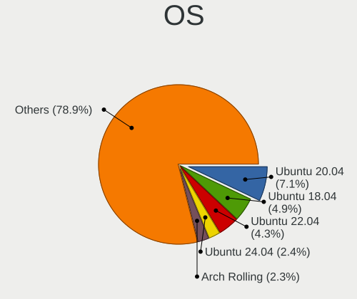

| Name                         | Desktops | Percent |
|------------------------------|----------|---------|
| Ubuntu 20.04                 | 597      | 7.08%   |
| Ubuntu 18.04                 | 416      | 4.94%   |
| Ubuntu 22.04                 | 365      | 4.33%   |
| Ubuntu 24.04                 | 205      | 2.43%   |
| Arch Rolling                 | 197      | 2.34%   |
| Pop!_OS 22.04                | 190      | 2.25%   |
| Zorin 17                     | 189      | 2.24%   |
| OpenMandriva 4.2             | 175      | 2.08%   |
| OpenMandriva 4.3             | 149      | 1.77%   |
| Debian 12                    | 132      | 1.57%   |
| Linux Mint 20                | 121      | 1.44%   |
| Linux Mint 19.3              | 119      | 1.41%   |
| Manjaro                      | 118      | 1.4%    |
| Pop!_OS 20.04                | 114      | 1.35%   |
| OpenMandriva 23.08           | 113      | 1.34%   |
| Linux Mint 19.1              | 110      | 1.31%   |
| Zorin 16                     | 108      | 1.28%   |
| Fedora 40                    | 108      | 1.28%   |
| KDE neon 20.04               | 98       | 1.16%   |
| Ubuntu 19.04                 | 95       | 1.13%   |
| Linux Mint 20.1              | 94       | 1.12%   |
| Linux Mint 20.3              | 92       | 1.09%   |
| Linux Mint 22.1              | 88       | 1.04%   |
| Linux Mint 21.1              | 84       | 1%      |
| Debian 11                    | 83       | 0.98%   |
| OpenMandriva 25.90           | 81       | 0.96%   |
| Fedora 39                    | 80       | 0.95%   |
| Fedora 42                    | 77       | 0.91%   |
| Fedora 38                    | 77       | 0.91%   |
| Fedora 41                    | 73       | 0.87%   |
| OpenMandriva 23.03           | 70       | 0.83%   |
| Arch                         | 69       | 0.82%   |
| openSUSE Tumbleweed-XXXXXXXX | 68       | 0.81%   |
| Linux Mint 20.2              | 68       | 0.81%   |
| OpenMandriva 24.12           | 66       | 0.78%   |
| Fedora 37                    | 63       | 0.75%   |
| Pop!_OS 20.10                | 61       | 0.72%   |
| Debian 10                    | 61       | 0.72%   |
| Ubuntu MATE 20.04            | 60       | 0.71%   |
| Linux Mint 21.2              | 60       | 0.71%   |

OS Family
---------

OS without a version

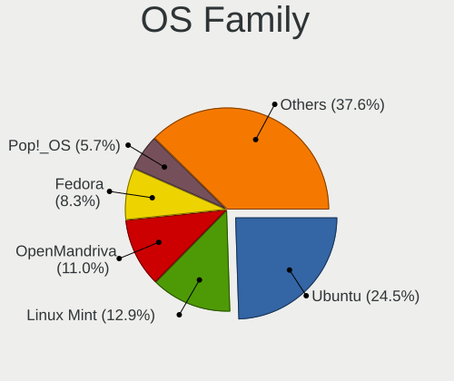

| Name          | Desktops | Percent |
|---------------|----------|---------|
| Ubuntu        | 1945     | 24.49%  |
| Linux Mint    | 1024     | 12.89%  |
| OpenMandriva  | 871      | 10.97%  |
| Fedora        | 658      | 8.29%   |
| Pop!_OS       | 455      | 5.73%   |
| Zorin         | 404      | 5.09%   |
| Debian        | 351      | 4.42%   |
| Arch          | 263      | 3.31%   |
| Manjaro       | 210      | 2.64%   |
| Endless       | 174      | 2.19%   |
| KDE neon      | 154      | 1.94%   |
| Kubuntu       | 139      | 1.75%   |
| Xubuntu       | 123      | 1.55%   |
| openSUSE      | 99       | 1.25%   |
| Bazzite       | 96       | 1.21%   |
| ROSA          | 91       | 1.15%   |
| Ubuntu MATE   | 80       | 1.01%   |
| BigLinux      | 80       | 1.01%   |
| ArcoLinux     | 61       | 0.77%   |
| Elementary    | 51       | 0.64%   |
| Lubuntu       | 47       | 0.59%   |
| LMDE          | 42       | 0.53%   |
| Ubuntu Unity  | 36       | 0.45%   |
| Nobara        | 32       | 0.4%    |
| Kali          | 29       | 0.37%   |
| CentOS        | 23       | 0.29%   |
| Ubuntu Budgie | 22       | 0.28%   |
| SteamOS       | 22       | 0.28%   |
| Gentoo        | 20       | 0.25%   |
| Deepin        | 20       | 0.25%   |
| CachyOS       | 20       | 0.25%   |
| EndeavourOS   | 18       | 0.23%   |
| BlackPanther  | 18       | 0.23%   |
| LinuxFX       | 17       | 0.21%   |
| Garuda Linux  | 16       | 0.2%    |
| Clear Linux   | 12       | 0.15%   |
| Parrot        | 11       | 0.14%   |
| MX            | 11       | 0.14%   |
| Xero          | 9        | 0.11%   |
| NixOS         | 9        | 0.11%   |

Kernel
------

Version of the Linux kernel

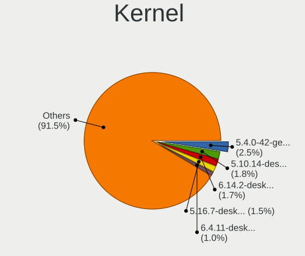

| Version                  | Desktops | Percent |
|--------------------------|----------|---------|
| 5.4.0-42-generic         | 229      | 2.49%   |
| 5.10.14-desktop-1omv4002 | 170      | 1.85%   |
| 6.14.2-desktop-3omv2590  | 157      | 1.71%   |
| 5.16.7-desktop-1omv4003  | 136      | 1.48%   |
| 6.4.11-desktop-1omv2390  | 92       | 1%      |
| 4.15.0-46-generic        | 84       | 0.91%   |
| 6.2.6-desktop-1omv2390   | 68       | 0.74%   |
| 5.4.0-48-generic         | 65       | 0.71%   |
| 6.8.0-52-generic         | 55       | 0.6%    |
| 6.1.1-desktop-1omv2290   | 50       | 0.54%   |
| 4.18.0-15-generic        | 49       | 0.53%   |
| 5.4.0-7634-generic       | 48       | 0.52%   |
| 5.4.0-58-generic         | 47       | 0.51%   |
| 6.8.0-51-generic         | 44       | 0.48%   |
| 6.8.0-60-generic         | 43       | 0.47%   |
| 5.4.0-52-generic         | 43       | 0.47%   |
| 5.3.0-40-generic         | 43       | 0.47%   |
| 6.12.1-desktop-1omv2490  | 41       | 0.45%   |
| 5.4.0-40-generic         | 41       | 0.45%   |
| 5.15.0-56-generic        | 41       | 0.45%   |
| 5.4.0-47-generic         | 40       | 0.44%   |
| 6.10.0-desktop-1omv2490  | 38       | 0.41%   |
| 5.11.0-7620-generic      | 37       | 0.4%    |
| 6.6.2-desktop-1omv2390   | 36       | 0.39%   |
| 6.14.0-33-generic        | 36       | 0.39%   |
| 5.3.0-28-generic         | 36       | 0.39%   |
| 6.8.0-45-generic         | 35       | 0.38%   |
| 5.4.0-26-generic         | 35       | 0.38%   |
| 5.4.0-91-generic         | 34       | 0.37%   |
| 5.15.0-91-generic        | 33       | 0.36%   |
| 4.15.0-20-generic        | 33       | 0.36%   |
| 6.9.3-76060903-generic   | 32       | 0.35%   |
| 6.2.6-76060206-generic   | 32       | 0.35%   |
| 5.4.0-70-generic         | 32       | 0.35%   |
| 6.8.0-49-generic         | 31       | 0.34%   |
| 5.4.0-72-generic         | 31       | 0.34%   |
| 6.14.0-37-generic        | 30       | 0.33%   |
| 5.0.0-32-generic         | 30       | 0.33%   |
| 5.3.0-46-generic         | 28       | 0.3%    |
| 5.15.0-78-generic        | 28       | 0.3%    |

Kernel Family
-------------

Linux kernel without a distro release

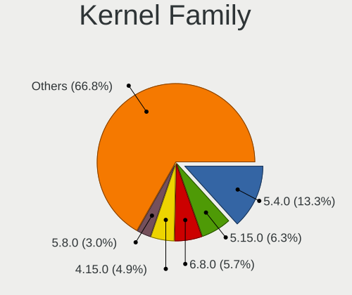

| Version | Desktops | Percent |
|---------|----------|---------|
| 5.4.0   | 1158     | 13.29%  |
| 5.15.0  | 552      | 6.34%   |
| 6.8.0   | 497      | 5.7%    |
| 4.15.0  | 427      | 4.9%    |
| 5.8.0   | 259      | 2.97%   |
| 5.11.0  | 251      | 2.88%   |
| 5.3.0   | 244      | 2.8%    |
| 5.0.0   | 234      | 2.69%   |
| 6.5.0   | 192      | 2.2%    |
| 4.18.0  | 178      | 2.04%   |
| 5.13.0  | 176      | 2.02%   |
| 5.10.14 | 170      | 1.95%   |
| 6.14.0  | 169      | 1.94%   |
| 6.14.2  | 165      | 1.89%   |
| 5.19.0  | 152      | 1.74%   |
| 6.1.0   | 146      | 1.68%   |
| 5.16.7  | 136      | 1.56%   |
| 6.2.0   | 122      | 1.4%    |
| 5.10.0  | 108      | 1.24%   |
| 6.2.6   | 104      | 1.19%   |
| 6.4.11  | 101      | 1.16%   |
| 6.11.0  | 89       | 1.02%   |
| 4.19.0  | 74       | 0.85%   |
| 6.1.1   | 53       | 0.61%   |
| 6.6.2   | 47       | 0.54%   |
| 6.12.1  | 44       | 0.51%   |
| 6.17.7  | 40       | 0.46%   |
| 6.10.0  | 39       | 0.45%   |
| 6.9.3   | 38       | 0.44%   |
| 6.12.10 | 33       | 0.38%   |
| 6.5.6   | 29       | 0.33%   |
| 6.4.8   | 28       | 0.32%   |
| 6.0.7   | 26       | 0.3%    |
| 6.12.6  | 24       | 0.28%   |
| 6.8.5   | 22       | 0.25%   |
| 6.16.3  | 21       | 0.24%   |
| 5.7.9   | 21       | 0.24%   |
| 5.17.5  | 21       | 0.24%   |
| 5.14.0  | 21       | 0.24%   |
| 4.4.0   | 21       | 0.24%   |

Kernel Major Ver.
-----------------

Linux kernel major version

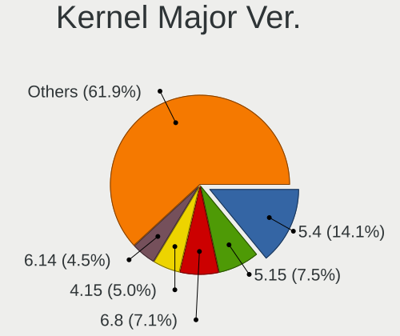

| Version | Desktops | Percent |
|---------|----------|---------|
| 5.4     | 1207     | 14.07%  |
| 5.15    | 647      | 7.54%   |
| 6.8     | 605      | 7.05%   |
| 4.15    | 427      | 4.98%   |
| 6.14    | 386      | 4.5%    |
| 5.10    | 362      | 4.22%   |
| 6.1     | 304      | 3.54%   |
| 5.8     | 301      | 3.51%   |
| 6.2     | 288      | 3.36%   |
| 5.11    | 279      | 3.25%   |
| 6.5     | 273      | 3.18%   |
| 5.3     | 264      | 3.08%   |
| 5.0     | 248      | 2.89%   |
| 6.12    | 237      | 2.76%   |
| 5.13    | 209      | 2.44%   |
| 5.19    | 205      | 2.39%   |
| 4.18    | 196      | 2.28%   |
| 5.16    | 195      | 2.27%   |
| 6.4     | 190      | 2.21%   |
| 6.6     | 186      | 2.17%   |
| 6.11    | 179      | 2.09%   |
| 6.17    | 121      | 1.41%   |
| 6.9     | 110      | 1.28%   |
| 6.0     | 95       | 1.11%   |
| 6.10    | 93       | 1.08%   |
| 4.19    | 90       | 1.05%   |
| 6.15    | 83       | 0.97%   |
| 5.7     | 70       | 0.82%   |
| 6.7     | 69       | 0.8%    |
| 6.13    | 64       | 0.75%   |
| 5.14    | 63       | 0.73%   |
| 6.16    | 61       | 0.71%   |
| 5.18    | 58       | 0.68%   |
| 4.9     | 57       | 0.66%   |
| 6.3     | 53       | 0.62%   |
| 5.6     | 52       | 0.61%   |
| 5.17    | 52       | 0.61%   |
| 5.12    | 49       | 0.57%   |
| 5.9     | 35       | 0.41%   |
| 4.4     | 21       | 0.24%   |

Arch
----

OS architecture (x86_64, i586, etc.)

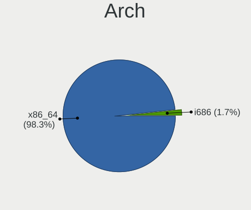

| Name   | Desktops | Percent |
|--------|----------|---------|
| x86_64 | 7423     | 98.25%  |
| i686   | 132      | 1.75%   |

DE
--

Desktop Environment

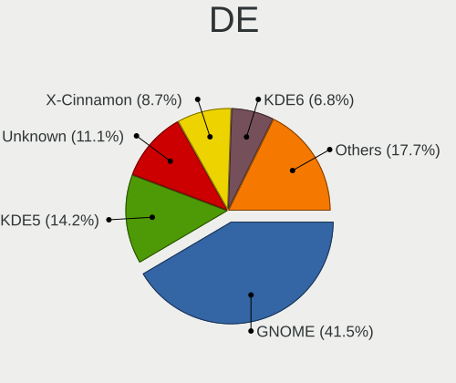

| Name                     | Desktops | Percent |
|--------------------------|----------|---------|
| GNOME                    | 3314     | 41.53%  |
| KDE5                     | 1132     | 14.19%  |
| Unknown                  | 889      | 11.14%  |
| X-Cinnamon               | 693      | 8.68%   |
| KDE6                     | 539      | 6.75%   |
| XFCE                     | 520      | 6.52%   |
| MATE                     | 214      | 2.68%   |
| KDE                      | 156      | 1.95%   |
| Cinnamon                 | 101      | 1.27%   |
| LXQt                     | 85       | 1.07%   |
| Pantheon                 | 47       | 0.59%   |
| KDE4                     | 45       | 0.56%   |
| Budgie                   | 38       | 0.48%   |
| Unity                    | 37       | 0.46%   |
| Deepin                   | 23       | 0.29%   |
| LXDE                     | 20       | 0.25%   |
| GNOME Flashback          | 17       | 0.21%   |
| i3                       | 16       | 0.2%    |
| COSMIC                   | 16       | 0.2%    |
| Hyprland                 | 15       | 0.19%   |
| GNOME Classic            | 9        | 0.11%   |
| Endless:GNOME            | 9        | 0.11%   |
| Enlightenment            | 7        | 0.09%   |
| sway                     | 5        | 0.06%   |
| openbox                  | 5        | 0.06%   |
| DDE                      | 5        | 0.06%   |
| awesome                  | 5        | 0.06%   |
| icewm                    | 4        | 0.05%   |
| bspwm                    | 4        | 0.05%   |
| qtile                    | 2        | 0.03%   |
| WindowMaker              | 1        | 0.01%   |
| trinity                  | 1        | 0.01%   |
| niri                     | 1        | 0.01%   |
| Lingmo                   | 1        | 0.01%   |
| default                  | 1        | 0.01%   |
| Cutefish                 | 1        | 0.01%   |
| 03WindowMaker            | 1        | 0.01%   |
| /usr/bin/openbox-session | 1        | 0.01%   |

Display Server
--------------

X11 or Wayland

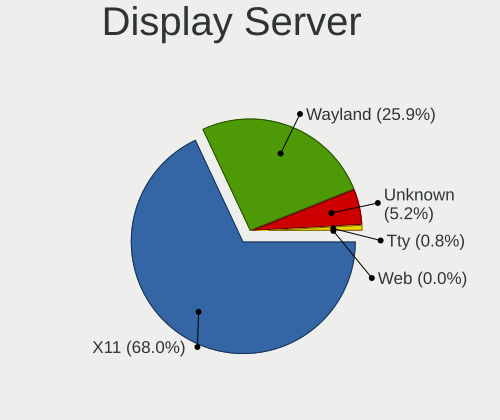

| Name    | Desktops | Percent |
|---------|----------|---------|
| X11     | 5322     | 68.03%  |
| Wayland | 2027     | 25.91%  |
| Unknown | 405      | 5.18%   |
| Tty     | 66       | 0.84%   |
| Web     | 3        | 0.04%   |

Display Manager
---------------

SDDM, LightDM, etc.

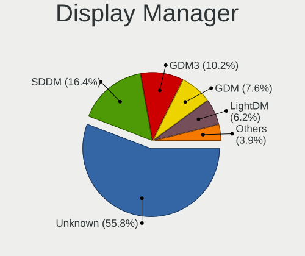

| Name           | Desktops | Percent |
|----------------|----------|---------|
| Unknown        | 4372     | 55.8%   |
| SDDM           | 1284     | 16.39%  |
| GDM3           | 796      | 10.16%  |
| GDM            | 594      | 7.58%   |
| LightDM        | 487      | 6.22%   |
| TDM            | 237      | 3.02%   |
| KDM            | 41       | 0.52%   |
| XDM            | 6        | 0.08%   |
| SLiM           | 6        | 0.08%   |
| SLIMSKI        | 4        | 0.05%   |
| LXDM           | 3        | 0.04%   |
| LY-DM          | 2        | 0.03%   |
| MDM            | 1        | 0.01%   |
| GREETD         | 1        | 0.01%   |
| COSMIC-GREETER | 1        | 0.01%   |

OS Lang
-------

Language

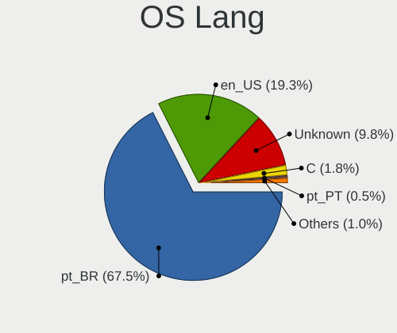

| Lang        | Desktops | Percent |
|-------------|----------|---------|
| pt_BR       | 5235     | 67.55%  |
| en_US       | 1499     | 19.34%  |
| Unknown     | 762      | 9.83%   |
| C           | 143      | 1.85%   |
| pt_PT       | 36       | 0.46%   |
| en_GB       | 34       | 0.44%   |
| es_ES       | 8        | 0.1%    |
| en_CA       | 8        | 0.1%    |
| en_DK       | 3        | 0.04%   |
| es_VE       | 2        | 0.03%   |
| es_US       | 2        | 0.03%   |
| en_AG       | 2        | 0.03%   |
| de_DE       | 2        | 0.03%   |
| C.UTF8      | 2        | 0.03%   |
| UTF-8       | 1        | 0.01%   |
| pt_BRutf8   | 1        | 0.01%   |
| pt_BR.UTF8  | 1        | 0.01%   |
| pt_BR.UFT-8 | 1        | 0.01%   |
| it_CH       | 1        | 0.01%   |
| fr_FR       | 1        | 0.01%   |
| es_BO       | 1        | 0.01%   |
| eo          | 1        | 0.01%   |
| en_US.UTF8  | 1        | 0.01%   |
| en_US.utf-8 | 1        | 0.01%   |
| en_IN       | 1        | 0.01%   |
| en_IE.UTF8  | 1        | 0.01%   |

Boot Mode
---------

EFI or BIOS

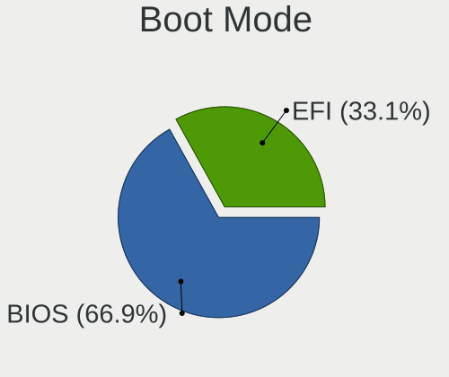

| Mode | Desktops | Percent |
|------|----------|---------|
| BIOS | 5194     | 66.92%  |
| EFI  | 2567     | 33.08%  |

Filesystem
----------

Type of filesystem

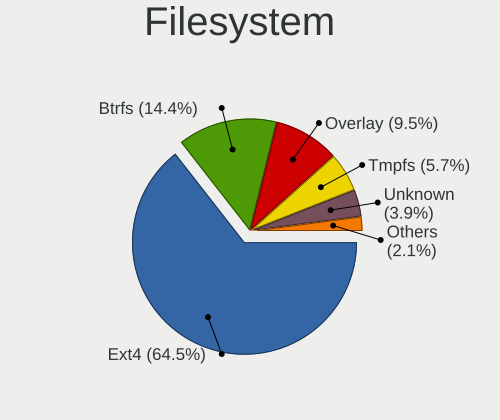

| Type     | Desktops | Percent |
|----------|----------|---------|
| Ext4     | 5058     | 64.46%  |
| Btrfs    | 1129     | 14.39%  |
| Overlay  | 746      | 9.51%   |
| Tmpfs    | 445      | 5.67%   |
| Unknown  | 306      | 3.9%    |
| Xfs      | 88       | 1.12%   |
| Zfs      | 35       | 0.45%   |
| F2fs     | 15       | 0.19%   |
| Ext3     | 10       | 0.13%   |
| Ext2     | 9        | 0.11%   |
| Aufs     | 2        | 0.03%   |
| XXXXXXX  | 1        | 0.01%   |
| XXXXX    | 1        | 0.01%   |
| Reiserfs | 1        | 0.01%   |
| Jfs      | 1        | 0.01%   |

Part. scheme
------------

Scheme of partitioning

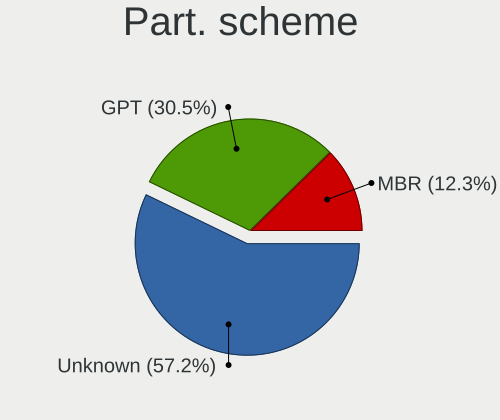

| Type    | Desktops | Percent |
|---------|----------|---------|
| Unknown | 4450     | 57.18%  |
| GPT     | 2372     | 30.48%  |
| MBR     | 961      | 12.35%  |

Dual Boot with Linux/BSD
------------------------

Hosting more than one Linux/BSD

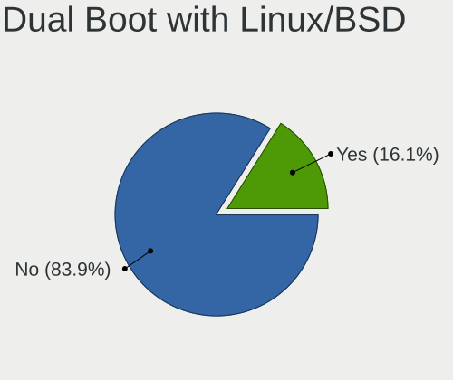

| Dual boot | Desktops | Percent |
|-----------|----------|---------|
| No        | 6514     | 83.92%  |
| Yes       | 1248     | 16.08%  |

Dual Boot (Win)
---------------

Hosting Linux and Windows

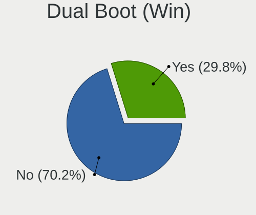

| Dual boot | Desktops | Percent |
|-----------|----------|---------|
| No        | 5440     | 70.21%  |
| Yes       | 2308     | 29.79%  |

Board
-----

Vendor
------

Motherboard manufacturer

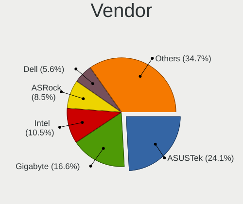

| Name                | Desktops | Percent |
|---------------------|----------|---------|
| ASUSTek Computer    | 1820     | 24.1%   |
| Gigabyte Technology | 1250     | 16.55%  |
| Intel               | 794      | 10.52%  |
| ASRock              | 640      | 8.48%   |
| Dell                | 425      | 5.63%   |
| MSI                 | 372      | 4.93%   |
| Positivo            | 290      | 3.84%   |
| Unknown             | 232      | 3.07%   |
| Hewlett-Packard     | 214      | 2.83%   |
| Biostar             | 161      | 2.13%   |
| Lenovo              | 151      | 2%      |
| PCWare              | 150      | 1.99%   |
| Pegatron            | 97       | 1.28%   |
| ECS                 | 88       | 1.17%   |
| MACHINIST           | 87       | 1.15%   |
| Itautec             | 75       | 0.99%   |
| Semp Toshiba        | 66       | 0.87%   |
| Huanan              | 65       | 0.86%   |
| OEM                 | 35       | 0.46%   |
| Megaware            | 35       | 0.46%   |
| Foxconn             | 35       | 0.46%   |
| AMD                 | 34       | 0.45%   |
| Daten Tecnologia    | 21       | 0.28%   |
| Login Informatica   | 20       | 0.26%   |
| AZW                 | 20       | 0.26%   |
| Digiboard           | 15       | 0.2%    |
| Colorful Technology | 13       | 0.17%   |
| Qbex                | 12       | 0.16%   |
| VS Company          | 11       | 0.15%   |
| Supermicro          | 11       | 0.15%   |
| MAXSUN              | 11       | 0.15%   |
| Philco              | 10       | 0.13%   |
| PCChips             | 10       | 0.13%   |
| MANCER              | 10       | 0.13%   |
| Kllisre             | 9        | 0.12%   |
| Digitron            | 9        | 0.12%   |
| QIYIDA              | 8        | 0.11%   |
| Duex                | 8        | 0.11%   |
| AFOX                | 8        | 0.11%   |
| Acer                | 8        | 0.11%   |

Model
-----

Motherboard model

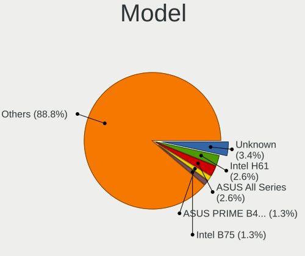

| Name                         | Desktops | Percent |
|------------------------------|----------|---------|
| Unknown                      | 256      | 3.39%   |
| Intel H61                    | 199      | 2.64%   |
| ASUS All Series              | 197      | 2.61%   |
| ASUS PRIME B450M-GAMING/BR   | 97       | 1.28%   |
| Intel B75                    | 96       | 1.27%   |
| Intel H55                    | 80       | 1.06%   |
| ASUS PRIME A320M-K/BR        | 79       | 1.05%   |
| ASRock B450M Steel Legend    | 76       | 1.01%   |
| ASRock A320M-HD              | 76       | 1.01%   |
| Semp Toshiba STI             | 65       | 0.86%   |
| ASUS M5A78L-M LX/BR          | 57       | 0.75%   |
| ASUS TUF Gaming B550M-PLUS   | 51       | 0.68%   |
| Gigabyte A320M-S2H           | 49       | 0.65%   |
| Gigabyte H61M-S1             | 46       | 0.61%   |
| ASUS TUF Gaming X570-PLUS_BR | 45       | 0.6%    |
| ASUS P8H61-M LX3 R2.0        | 43       | 0.57%   |
| ASUS M5A78L-M PLUS/USB3      | 43       | 0.57%   |
| Intel H81                    | 42       | 0.56%   |
| Gigabyte B75M-D3H            | 41       | 0.54%   |
| Gigabyte B550M AORUS ELITE   | 38       | 0.5%    |
| ASUS H61M-A/BR               | 36       | 0.48%   |
| Intel X99                    | 35       | 0.46%   |
| Gigabyte B450M DS3H          | 34       | 0.45%   |
| ASRock N68-S3 FX             | 32       | 0.42%   |
| Gigabyte B450 AORUS M        | 31       | 0.41%   |
| Biostar A320MH               | 31       | 0.41%   |
| Gigabyte AB350M-DS3H V2      | 30       | 0.4%    |
| ASUS P5G41T-M LX2/BR         | 30       | 0.4%    |
| ASUS M5A78L-M/USB3           | 30       | 0.4%    |
| HP Compaq 6005 Pro SFF PC    | 28       | 0.37%   |
| Positivo POS-EIH61CE         | 27       | 0.36%   |
| ASUS P8H61-M LX2 R2.0        | 27       | 0.36%   |
| Gigabyte 970A-DS3P           | 26       | 0.34%   |
| Dell XPS 8700                | 25       | 0.33%   |
| Gigabyte GA-78LMT-USB3 6.0   | 24       | 0.32%   |
| Gigabyte B450M GAMING        | 24       | 0.32%   |
| ASUS PRIME H310M-E R2.0/BR   | 23       | 0.3%    |
| ASUS M4N68T-M LE             | 23       | 0.3%    |
| ASRock A320M-HDV R4.0        | 23       | 0.3%    |
| Gigabyte G31M-ES2C           | 22       | 0.29%   |

Model Family
------------

Motherboard model prefix

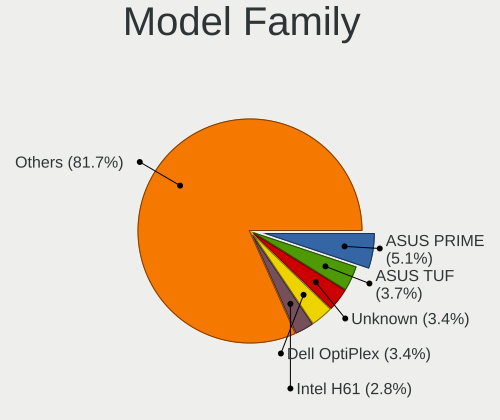

| Name                   | Desktops | Percent |
|------------------------|----------|---------|
| ASUS PRIME             | 388      | 5.14%   |
| ASUS TUF               | 278      | 3.68%   |
| Unknown                | 256      | 3.39%   |
| Dell OptiPlex          | 253      | 3.35%   |
| Intel H61              | 209      | 2.77%   |
| ASUS All               | 197      | 2.61%   |
| ASUS M5A78L-M          | 152      | 2.01%   |
| ASUS P8H61-M           | 111      | 1.47%   |
| Lenovo ThinkCentre     | 108      | 1.43%   |
| Intel B75              | 101      | 1.34%   |
| HP Compaq              | 98       | 1.3%    |
| ASUS ROG               | 92       | 1.22%   |
| ASRock A320M-HD        | 82       | 1.09%   |
| Gigabyte B450M         | 81       | 1.07%   |
| Intel H55              | 80       | 1.06%   |
| ASRock B450M           | 79       | 1.05%   |
| Semp Toshiba STI       | 66       | 0.87%   |
| Itautec Infoway        | 64       | 0.85%   |
| Gigabyte B550M         | 60       | 0.79%   |
| Dell XPS               | 52       | 0.69%   |
| Intel X99              | 51       | 0.68%   |
| Gigabyte A320M-S2H     | 51       | 0.68%   |
| Gigabyte B450          | 47       | 0.62%   |
| Gigabyte H61M-S1       | 46       | 0.61%   |
| Dell Inspiron          | 45       | 0.6%    |
| Gigabyte GA-78LMT-USB3 | 44       | 0.58%   |
| Intel H81              | 42       | 0.56%   |
| Gigabyte B75M-D3H      | 41       | 0.54%   |
| Gigabyte A520M         | 41       | 0.54%   |
| HP EliteDesk           | 39       | 0.52%   |
| Biostar A320MH         | 37       | 0.49%   |
| ASUS P5G41T-M          | 36       | 0.48%   |
| ASUS H61M-A            | 36       | 0.48%   |
| Dell Precision         | 34       | 0.45%   |
| Dell Vostro            | 33       | 0.44%   |
| ASRock N68-S3          | 33       | 0.44%   |
| Gigabyte H310M         | 30       | 0.4%    |
| Gigabyte H110M-H       | 30       | 0.4%    |
| Gigabyte AB350M-DS3H   | 30       | 0.4%    |
| Gigabyte 970A-DS3P     | 29       | 0.38%   |

MFG Year
--------

Motherboard manufacture year

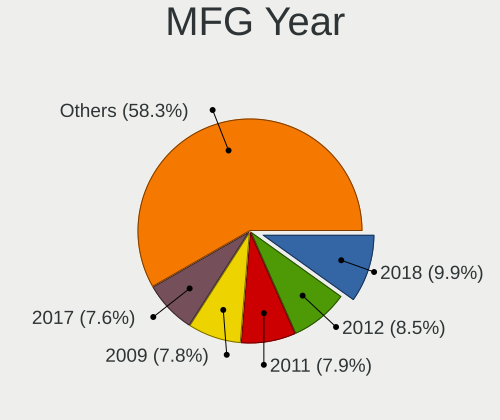

| Year    | Desktops | Percent |
|---------|----------|---------|
| 2018    | 746      | 9.88%   |
| 2012    | 641      | 8.49%   |
| 2011    | 600      | 7.95%   |
| 2009    | 586      | 7.76%   |
| 2017    | 577      | 7.64%   |
| 2013    | 540      | 7.15%   |
| 2019    | 520      | 6.89%   |
| 2020    | 504      | 6.67%   |
| 2014    | 449      | 5.95%   |
| 2010    | 442      | 5.85%   |
| 2016    | 302      | 4%      |
| 2008    | 290      | 3.84%   |
| 2021    | 269      | 3.56%   |
| 2022    | 261      | 3.46%   |
| 2023    | 238      | 3.15%   |
| 2007    | 223      | 2.95%   |
| 2015    | 155      | 2.05%   |
| 2024    | 92       | 1.22%   |
| 2006    | 67       | 0.89%   |
| 2025    | 19       | 0.25%   |
| 2005    | 17       | 0.23%   |
| Unknown | 6        | 0.08%   |
| 2004    | 5        | 0.07%   |
| 2003    | 1        | 0.01%   |
| 2002    | 1        | 0.01%   |

Form Factor
-----------

Physical design of the computer

| Name    | Desktops | Percent |
|---------|----------|---------|
| Desktop | 7551     | 100%    |

Secure Boot
-----------

Enabled or disabled

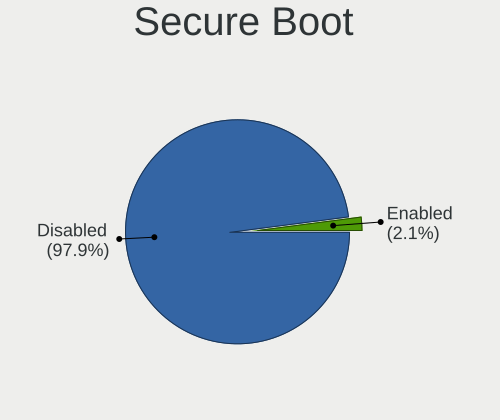

| State    | Desktops | Percent |
|----------|----------|---------|
| Disabled | 7421     | 97.94%  |
| Enabled  | 156      | 2.06%   |

Coreboot
--------

Have coreboot on board

| Used | Desktops | Percent |
|------|----------|---------|
| No   | 7550     | 99.99%  |
| Yes  | 1        | 0.01%   |

RAM Size
--------

Total RAM memory

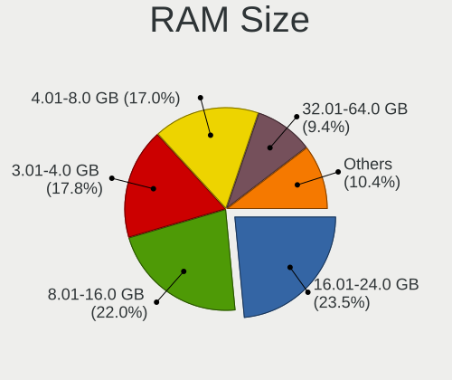

| Size in GB      | Desktops | Percent |
|-----------------|----------|---------|
| 16.01-24.0      | 1828     | 23.5%   |
| 8.01-16.0       | 1708     | 21.96%  |
| 3.01-4.0        | 1381     | 17.75%  |
| 4.01-8.0        | 1323     | 17.01%  |
| 32.01-64.0      | 732      | 9.41%   |
| 1.01-2.0        | 296      | 3.81%   |
| 24.01-32.0      | 198      | 2.55%   |
| 64.01-256.0     | 168      | 2.16%   |
| 2.01-3.0        | 115      | 1.48%   |
| 0.51-1.0        | 20       | 0.26%   |
| More than 256.0 | 6        | 0.08%   |
| 0.01-0.5        | 2        | 0.03%   |
| Unknown         | 2        | 0.03%   |

RAM Used
--------

Used RAM memory

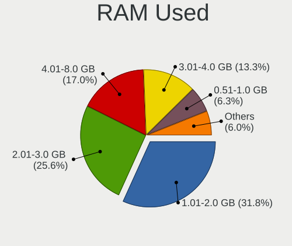

| Used GB     | Desktops | Percent |
|-------------|----------|---------|
| 1.01-2.0    | 2702     | 31.8%   |
| 2.01-3.0    | 2172     | 25.56%  |
| 4.01-8.0    | 1446     | 17.02%  |
| 3.01-4.0    | 1128     | 13.27%  |
| 0.51-1.0    | 537      | 6.32%   |
| 8.01-16.0   | 347      | 4.08%   |
| 0.01-0.5    | 91       | 1.07%   |
| 16.01-24.0  | 45       | 0.53%   |
| 32.01-64.0  | 12       | 0.14%   |
| 24.01-32.0  | 12       | 0.14%   |
| Unknown     | 4        | 0.05%   |
| 64.01-256.0 | 1        | 0.01%   |
| 0           | 1        | 0.01%   |

Total Drives
------------

Number of drives on board

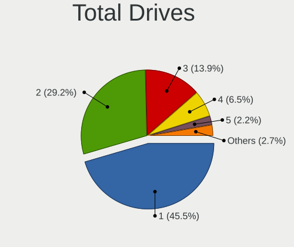

| Drives  | Desktops | Percent |
|---------|----------|---------|
| 1       | 3611     | 45.47%  |
| 2       | 2316     | 29.17%  |
| 3       | 1107     | 13.94%  |
| 4       | 518      | 6.52%   |
| 5       | 175      | 2.2%    |
| 0       | 86       | 1.08%   |
| 6       | 80       | 1.01%   |
| 7       | 25       | 0.31%   |
| 8       | 14       | 0.18%   |
| 9       | 7        | 0.09%   |
| 14      | 1        | 0.01%   |
| Unknown | 1        | 0.01%   |

Has CD-ROM
----------

Has CD-ROM on board

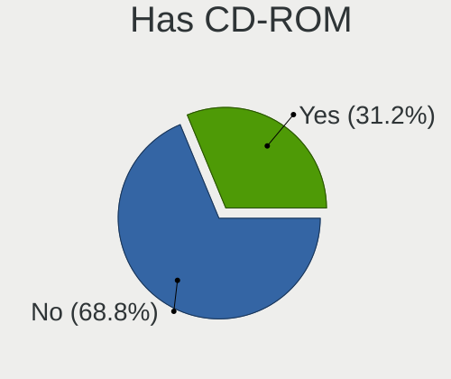

| Presented | Desktops | Percent |
|-----------|----------|---------|
| No        | 5269     | 68.75%  |
| Yes       | 2395     | 31.25%  |

Has Ethernet
------------

Has Ethernet on board

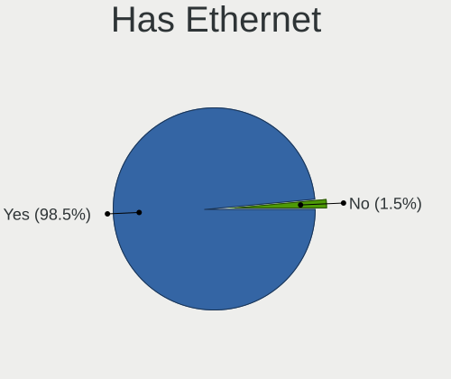

| Presented | Desktops | Percent |
|-----------|----------|---------|
| Yes       | 7440     | 98.52%  |
| No        | 112      | 1.48%   |

Has WiFi
--------

Has WiFi module

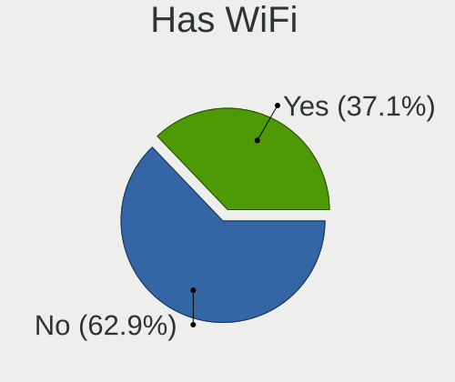

| Presented | Desktops | Percent |
|-----------|----------|---------|
| No        | 4841     | 62.85%  |
| Yes       | 2861     | 37.15%  |

Has Bluetooth
-------------

Has Bluetooth module

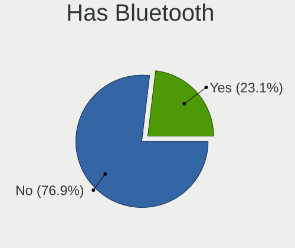

| Presented | Desktops | Percent |
|-----------|----------|---------|
| No        | 5903     | 76.9%   |
| Yes       | 1773     | 23.1%   |

Location
--------

Country
-------

Geographic location (country)

| Country | Desktops | Percent |
|---------|----------|---------|
| Brazil  | 7551     | 100%    |

City
----

Geographic location (city)

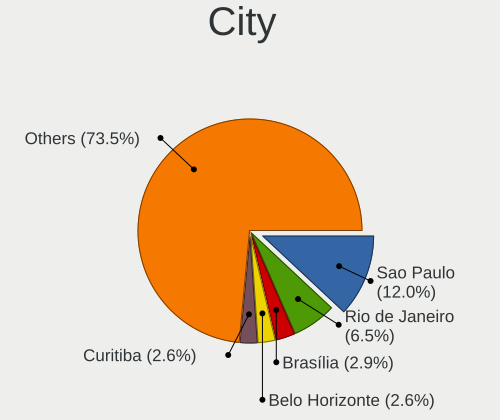

| City                 | Desktops | Percent |
|----------------------|----------|---------|
| Sao Paulo            | 944      | 11.97%  |
| Rio de Janeiro       | 512      | 6.49%   |
| Brasília            | 226      | 2.87%   |
| Belo Horizonte       | 204      | 2.59%   |
| Curitiba             | 203      | 2.57%   |
| Porto Alegre         | 188      | 2.38%   |
| Fortaleza            | 144      | 1.83%   |
| Campinas             | 116      | 1.47%   |
| Salvador             | 99       | 1.26%   |
| Recife               | 93       | 1.18%   |
| Goiânia             | 85       | 1.08%   |
| Florianópolis       | 81       | 1.03%   |
| Santo André         | 78       | 0.99%   |
| Guarulhos            | 74       | 0.94%   |
| Niterói             | 63       | 0.8%    |
| Sao José dos Campos | 62       | 0.79%   |
| Manaus               | 61       | 0.77%   |
| Osasco               | 60       | 0.76%   |
| Palmas               | 58       | 0.74%   |
| Sorocaba             | 51       | 0.65%   |
| Belém               | 51       | 0.65%   |
| Juiz de Fora         | 48       | 0.61%   |
| Sao Goncalo          | 47       | 0.6%    |
| Ribeirao Preto       | 47       | 0.6%    |
| Londrina             | 46       | 0.58%   |
| Natal                | 45       | 0.57%   |
| Joao Pessoa          | 44       | 0.56%   |
| Maringá             | 43       | 0.55%   |
| Joinville            | 42       | 0.53%   |
| Duque de Caxias      | 40       | 0.51%   |
| Campo Grande         | 40       | 0.51%   |
| Teresina             | 37       | 0.47%   |
| Serra                | 37       | 0.47%   |
| Aracaju              | 37       | 0.47%   |
| Uberlândia          | 36       | 0.46%   |
| Contagem             | 36       | 0.46%   |
| Blumenau             | 35       | 0.44%   |
| Bauru                | 34       | 0.43%   |
| Sao Carlos           | 33       | 0.42%   |
| Nova Iguaçu         | 32       | 0.41%   |

Drives
------

Drive Vendor
------------

Hard drive vendors

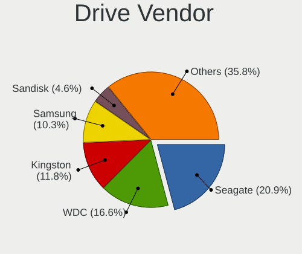

| Vendor                      | Desktops | Drives | Percent |
|-----------------------------|----------|--------|---------|
| Seagate                     | 2741     | 4241   | 20.86%  |
| WDC                         | 2180     | 3089   | 16.59%  |
| Kingston                    | 1555     | 2221   | 11.84%  |
| Samsung Electronics         | 1354     | 2045   | 10.31%  |
| Sandisk                     | 598      | 840    | 4.55%   |
| China                       | 514      | 623    | 3.91%   |
| Toshiba                     | 512      | 616    | 3.9%    |
| Crucial                     | 294      | 374    | 2.24%   |
| Silicon Motion              | 253      | 341    | 1.93%   |
| Hitachi                     | 253      | 317    | 1.93%   |
| A-DATA Technology           | 209      | 264    | 1.59%   |
| Kingston Technology Company | 187      | 251    | 1.42%   |
| Realtek Semiconductor       | 149      | 191    | 1.13%   |
| Maxtor                      | 146      | 174    | 1.11%   |
| MAXIO Technology (Hangzhou) | 131      | 196    | 1%      |
| KingSpec                    | 124      | 151    | 0.94%   |
| ADATA Technology            | 113      | 139    | 0.86%   |
| Lexar                       | 105      | 130    | 0.8%    |
| XrayDisk                    | 87       | 118    | 0.66%   |
| Unknown                     | 87       | 141    | 0.66%   |
| Unknown                     | 85       | 108    | 0.65%   |
| Patriot                     | 73       | 100    | 0.56%   |
| Netac                       | 71       | 105    | 0.54%   |
| Phison Electronics          | 65       | 108    | 0.49%   |
| HGST                        | 65       | 75     | 0.49%   |
| JMicron Technology          | 57       | 63     | 0.43%   |
| XPG                         | 54       | 68     | 0.41%   |
| PNY                         | 52       | 59     | 0.4%    |
| Intel                       | 49       | 55     | 0.37%   |
| Corsair                     | 49       | 62     | 0.37%   |
| Hewlett-Packard             | 45       | 60     | 0.34%   |
| Micron/Crucial Technology   | 40       | 57     | 0.3%    |
| WALRAM                      | 34       | 41     | 0.26%   |
| Phison                      | 34       | 52     | 0.26%   |
| Gigabyte Technology         | 32       | 41     | 0.24%   |
| LITEON                      | 28       | 36     | 0.21%   |
| Team                        | 24       | 26     | 0.18%   |
| SK hynix                    | 24       | 64     | 0.18%   |
| HS-SSD-C100                 | 20       | 20     | 0.15%   |
| HUSKY                       | 19       | 39     | 0.14%   |

Drive Model
-----------

Hard drive models

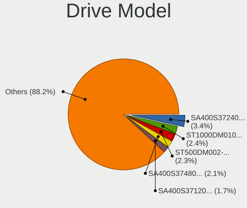

| Model                                                 | Desktops | Percent |
|-------------------------------------------------------|----------|---------|
| Kingston SA400S37240G 240GB SSD                       | 497      | 3.41%   |
| Seagate ST1000DM010-2EP102 1TB                        | 344      | 2.36%   |
| Seagate ST500DM002-1BD142 500GB                       | 331      | 2.27%   |
| Kingston SA400S37480G 480GB SSD                       | 299      | 2.05%   |
| Kingston SA400S37120G 120GB SSD                       | 250      | 1.72%   |
| Samsung HD322HJ 320GB                                 | 168      | 1.15%   |
| Silicon Motion SM2263EN/SM2263XT SSD Controller 512GB | 139      | 0.95%   |
| Samsung HD502HJ 500GB                                 | 137      | 0.94%   |
| Seagate ST1000DM003-1ER162 1TB                        | 133      | 0.91%   |
| Samsung HD161HJ 160GB                                 | 132      | 0.91%   |
| Seagate ST1000DM003-1CH162 1TB                        | 131      | 0.9%    |
| Samsung HD502HI 500GB                                 | 122      | 0.84%   |
| Kingston SV300S37A120G 120GB SSD                      | 117      | 0.8%    |
| SanDisk SSD PLUS 240GB                                | 107      | 0.73%   |
| Seagate ST500LM012 HN-M500MBB 500GB                   | 106      | 0.73%   |
| Kingston Company SNV2S1000G 1TB                       | 104      | 0.71%   |
| Crucial CT240BX500SSD1 240GB                          | 104      | 0.71%   |
| WDC WD5000AAKX-003CA0 500GB                           | 100      | 0.69%   |
| Seagate ST3500312CS 500GB                             | 95       | 0.65%   |
| MAXIO (Hangzhou) NVMe SSD Controller MAP1202 2TB      | 95       | 0.65%   |
| Seagate Expansion 2TB                                 | 92       | 0.63%   |
| WDC WD10EARS-00Y5B1 1TB                               | 88       | 0.6%    |
| WDC WDS240G2G0A-00JH30 240GB SSD                      | 87       | 0.6%    |
| Seagate ST3500418AS 500GB                             | 86       | 0.59%   |
| Seagate ST1000LM024 HN-M101MBB 1TB                    | 86       | 0.59%   |
| Unknown                                               | 85       | 0.58%   |
| Toshiba HDWD110 1TB                                   | 82       | 0.56%   |
| Seagate ST31000524AS 1TB                              | 82       | 0.56%   |
| WDC WD10EZEX-00BN5A0 1TB                              | 79       | 0.54%   |
| Toshiba DT01ACA050 500GB                              | 78       | 0.54%   |
| Seagate ST2000DM006-2DM164 2TB                        | 76       | 0.52%   |
| WDC WD5000AAKX-00U6AA0 500GB                          | 74       | 0.51%   |
| WDC WD10EZEX-00WN4A0 1TB                              | 74       | 0.51%   |
| Seagate ST2000DM008-2FR102 2TB                        | 71       | 0.49%   |
| Kingston SA400S37960G 960GB SSD                       | 71       | 0.49%   |
| WDC WD10EZEX-08WN4A0 1TB                              | 70       | 0.48%   |
| Seagate ST3500413AS 500GB                             | 65       | 0.45%   |
| Samsung HD103SI 1TB                                   | 63       | 0.43%   |
| Samsung HD103SJ 1TB                                   | 62       | 0.43%   |
| Seagate ST3320418AS 320GB                             | 61       | 0.42%   |

HDD Vendor
----------

Hard disk drive vendors

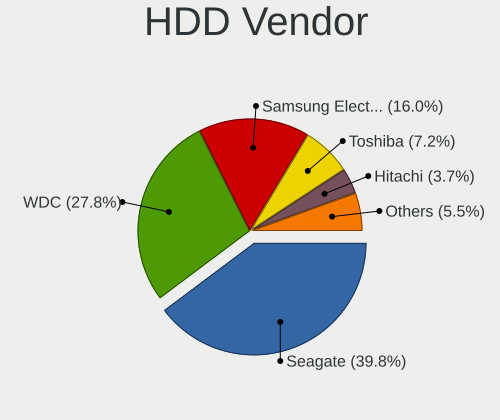

| Vendor              | Desktops | Drives | Percent |
|---------------------|----------|--------|---------|
| Seagate             | 2723     | 4204   | 39.77%  |
| WDC                 | 1905     | 2645   | 27.82%  |
| Samsung Electronics | 1096     | 1527   | 16.01%  |
| Toshiba             | 492      | 589    | 7.19%   |
| Hitachi             | 253      | 317    | 3.7%    |
| Maxtor              | 140      | 166    | 2.04%   |
| HGST                | 64       | 74     | 0.93%   |
| JMicron Technology  | 47       | 52     | 0.69%   |
| Hewlett-Packard     | 27       | 39     | 0.39%   |
| Fujitsu             | 19       | 24     | 0.28%   |
| Unknown             | 16       | 16     | 0.23%   |
| ExcelStor           | 14       | 15     | 0.2%    |
| USB3.0              | 10       | 11     | 0.15%   |
| HPE                 | 7        | 7      | 0.1%    |
| XrayDisk            | 6        | 6      | 0.09%   |
| External            | 4        | 4      | 0.06%   |
| Min Yi U            | 3        | 3      | 0.04%   |
| WALRAM              | 2        | 2      | 0.03%   |
| SAGE                | 2        | 3      | 0.03%   |
| Initio              | 2        | 2      | 0.03%   |
| Apple               | 2        | 2      | 0.03%   |
| TO Exter            | 1        | 1      | 0.01%   |
| T-FORCE             | 1        | 1      | 0.01%   |
| Shenzhen            | 1        | 1      | 0.01%   |
| SATAFIRM            | 1        | 1      | 0.01%   |
| NETAPP              | 1        | 3      | 0.01%   |
| MDT                 | 1        | 1      | 0.01%   |
| MARVELL             | 1        | 2      | 0.01%   |
| Lenovo              | 1        | 1      | 0.01%   |
| IBM                 | 1        | 3      | 0.01%   |
| HGST HTS            | 1        | 1      | 0.01%   |
| FEASSO              | 1        | 2      | 0.01%   |
| China               | 1        | 2      | 0.01%   |
| Unknown             | 1        | 1      | 0.01%   |

SSD Vendor
----------

Solid state drive vendors

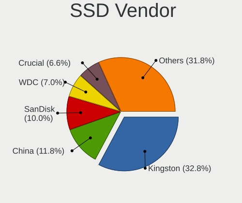

| Vendor              | Desktops | Drives | Percent |
|---------------------|----------|--------|---------|
| Kingston            | 1420     | 1990   | 32.81%  |
| China               | 510      | 617    | 11.78%  |
| SanDisk             | 432      | 594    | 9.98%   |
| WDC                 | 305      | 397    | 7.05%   |
| Crucial             | 285      | 363    | 6.59%   |
| Samsung Electronics | 170      | 331    | 3.93%   |
| A-DATA Technology   | 161      | 197    | 3.72%   |
| KingSpec            | 122      | 149    | 2.82%   |
| Lexar               | 99       | 124    | 2.29%   |
| Patriot             | 66       | 91     | 1.52%   |
| Unknown             | 57       | 73     | 1.32%   |
| PNY                 | 50       | 57     | 1.16%   |
| XrayDisk            | 43       | 58     | 0.99%   |
| Netac               | 42       | 59     | 0.97%   |
| Corsair             | 35       | 45     | 0.81%   |
| Intel               | 34       | 37     | 0.79%   |
| Gigabyte Technology | 26       | 34     | 0.6%    |
| LITEON              | 23       | 31     | 0.53%   |
| Team                | 20       | 22     | 0.46%   |
| HUSKY               | 19       | 39     | 0.44%   |
| KingDian            | 18       | 25     | 0.42%   |
| OCZ                 | 17       | 19     | 0.39%   |
| Seagate             | 16       | 19     | 0.37%   |
| Toshiba             | 14       | 17     | 0.32%   |
| Hewlett-Packard     | 13       | 15     | 0.3%    |
| RZX                 | 11       | 18     | 0.25%   |
| Win Memory          | 10       | 13     | 0.23%   |
| Smart               | 10       | 12     | 0.23%   |
| Pichau              | 10       | 10     | 0.23%   |
| BHT                 | 10       | 19     | 0.23%   |
| KODAK               | 9        | 9      | 0.21%   |
| HS-SSD-C100         | 8        | 8      | 0.18%   |
| WALRAM              | 7        | 9      | 0.16%   |
| Unknown             | 7        | 7      | 0.16%   |
| NTC                 | 6        | 6      | 0.14%   |
| Maxtor              | 6        | 8      | 0.14%   |
| KingFast            | 6        | 6      | 0.14%   |
| Fanxiang            | 6        | 10     | 0.14%   |
| Apacer              | 6        | 7      | 0.14%   |
| AFOX                | 6        | 14     | 0.14%   |

Drive Kind
----------

HDD or SSD

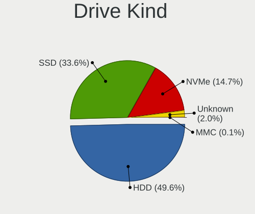

| Kind    | Desktops | Drives | Percent |
|---------|----------|--------|---------|
| HDD     | 5417     | 9728   | 49.58%  |
| SSD     | 3669     | 5828   | 33.58%  |
| NVMe    | 1610     | 2610   | 14.74%  |
| Unknown | 215      | 299    | 1.97%   |
| MMC     | 15       | 19     | 0.14%   |

Drive Connector
---------------

SATA, SAS, NVMe, etc.

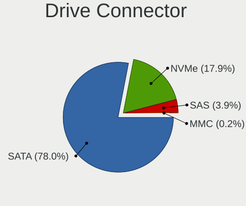

| Type | Desktops | Drives | Percent |
|------|----------|--------|---------|
| SATA | 6991     | 15361  | 78.03%  |
| NVMe | 1604     | 2594   | 17.9%   |
| SAS  | 349      | 510    | 3.9%    |
| MMC  | 15       | 19     | 0.17%   |

Drive Size
----------

Size of hard drive

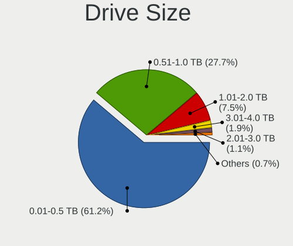

| Size in TB | Desktops | Drives | Percent |
|------------|----------|--------|---------|
| 0.01-0.5   | 5685     | 10039  | 61.18%  |
| 0.51-1.0   | 2571     | 3927   | 27.67%  |
| 1.01-2.0   | 693      | 1060   | 7.46%   |
| 3.01-4.0   | 172      | 267    | 1.85%   |
| 2.01-3.0   | 104      | 143    | 1.12%   |
| 4.01-10.0  | 57       | 105    | 0.61%   |
| 10.01-20.0 | 11       | 15     | 0.12%   |

Space Total
-----------

Amount of disk space available on the file system

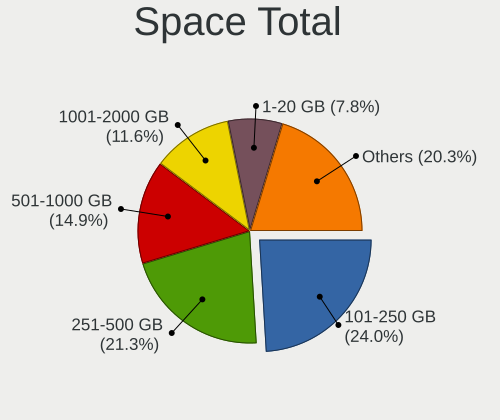

| Size in GB     | Desktops | Percent |
|----------------|----------|---------|
| 101-250        | 1967     | 24.05%  |
| 251-500        | 1739     | 21.26%  |
| 501-1000       | 1222     | 14.94%  |
| 1001-2000      | 947      | 11.58%  |
| 1-20           | 641      | 7.84%   |
| 51-100         | 451      | 5.51%   |
| More than 3000 | 373      | 4.56%   |
| 2001-3000      | 365      | 4.46%   |
| 21-50          | 251      | 3.07%   |
| Unknown        | 223      | 2.73%   |

Space Used
----------

Amount of used disk space

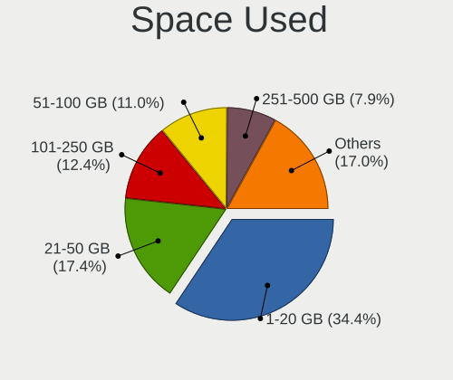

| Used GB        | Desktops | Percent |
|----------------|----------|---------|
| 1-20           | 2894     | 34.35%  |
| 21-50          | 1464     | 17.38%  |
| 101-250        | 1042     | 12.37%  |
| 51-100         | 926      | 10.99%  |
| 251-500        | 665      | 7.89%   |
| 501-1000       | 641      | 7.61%   |
| 1001-2000      | 336      | 3.99%   |
| Unknown        | 223      | 2.65%   |
| More than 3000 | 119      | 1.41%   |
| 2001-3000      | 106      | 1.26%   |
| 0              | 9        | 0.11%   |

Malfunc. Drives
---------------

Drive models with a malfunction

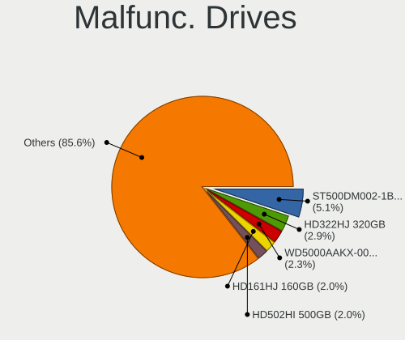

| Model                               | Desktops | Drives | Percent |
|-------------------------------------|----------|--------|---------|
| Seagate ST500DM002-1BD142 500GB     | 68       | 79     | 5.13%   |
| Samsung Electronics HD322HJ 320GB   | 39       | 59     | 2.94%   |
| WDC WD5000AAKX-003CA0 500GB         | 31       | 34     | 2.34%   |
| Samsung Electronics HD161HJ 160GB   | 27       | 30     | 2.04%   |
| Samsung Electronics HD502HI 500GB   | 26       | 33     | 1.96%   |
| WDC WD10EARS-00Y5B1 1TB             | 20       | 22     | 1.51%   |
| Samsung Electronics HD502HJ 500GB   | 20       | 21     | 1.51%   |
| Seagate ST500LM012 HN-M500MBB 500GB | 19       | 21     | 1.43%   |
| Seagate ST1000DM010-2EP102 1TB      | 19       | 26     | 1.43%   |
| Seagate ST1000DM003-1CH162 1TB      | 14       | 20     | 1.06%   |
| Maxtor STM3160215AS 160GB           | 14       | 17     | 1.06%   |
| WDC WD3200AAJS-00L7A0 320GB         | 13       | 13     | 0.98%   |
| Seagate ST3500312CS 500GB           | 13       | 14     | 0.98%   |
| Seagate ST31000524AS 1TB            | 13       | 13     | 0.98%   |
| Seagate ST1000LM024 HN-M101MBB 1TB  | 13       | 16     | 0.98%   |
| Seagate ST3320418AS 320GB           | 12       | 16     | 0.91%   |
| Samsung Electronics HD250HJ 250GB   | 12       | 13     | 0.91%   |
| Toshiba MQ01ABD050 500GB            | 11       | 11     | 0.83%   |
| Seagate ST3500418AS 500GB           | 11       | 16     | 0.83%   |
| Seagate ST1000DM003-1ER162 1TB      | 11       | 14     | 0.83%   |
| Samsung Electronics HD080HJ/ 80GB   | 11       | 13     | 0.83%   |
| Seagate ST3500413AS 500GB           | 10       | 11     | 0.75%   |
| Seagate ST2000DM001-1CH164 2TB      | 10       | 19     | 0.75%   |
| Samsung Electronics HD103SI 1TB     | 10       | 15     | 0.75%   |
| WDC WD5000AAKX-083CA1 500GB         | 9        | 10     | 0.68%   |
| WDC WD10EZEX-00BN5A0 1TB            | 9        | 9      | 0.68%   |
| Samsung Electronics HD103SJ 1TB     | 9        | 11     | 0.68%   |
| Kingston SV300S37A120G 120GB SSD    | 9        | 9      | 0.68%   |
| Kingston SA400S37120G 120GB SSD     | 9        | 15     | 0.68%   |
| WDC WD5000AVCS-632DY1 500GB         | 8        | 10     | 0.6%    |
| WDC WD10EZEX-08WN4A0 1TB            | 8        | 8      | 0.6%    |
| Seagate ST1000DM003-9YN162 1TB      | 8        | 8      | 0.6%    |
| Samsung Electronics HM321HI 320GB   | 8        | 8      | 0.6%    |
| Samsung Electronics HD161GJ 160GB   | 8        | 10     | 0.6%    |
| WDC WD5000AAKX-00U6AA0 500GB        | 7        | 8      | 0.53%   |
| Toshiba DT01ACA050 500GB            | 7        | 7      | 0.53%   |
| Seagate ST3160318AS 160GB           | 7        | 7      | 0.53%   |
| Seagate ST31000528AS 1TB            | 7        | 11     | 0.53%   |
| Seagate ST1500DL003-9VT16L 1TB      | 7        | 10     | 0.53%   |
| SanDisk SSD PLUS 240GB              | 7        | 8      | 0.53%   |

Malfunc. Drive Vendor
---------------------

Vendors of faulty drives

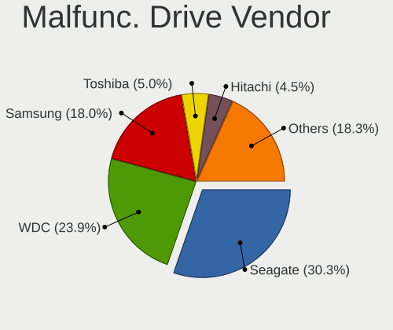

| Vendor                      | Desktops | Drives | Percent |
|-----------------------------|----------|--------|---------|
| Seagate                     | 378      | 487    | 30.31%  |
| WDC                         | 298      | 353    | 23.9%   |
| Samsung Electronics         | 225      | 295    | 18.04%  |
| Toshiba                     | 62       | 66     | 4.97%   |
| Hitachi                     | 56       | 64     | 4.49%   |
| Kingston                    | 48       | 55     | 3.85%   |
| China                       | 39       | 42     | 3.13%   |
| Maxtor                      | 31       | 37     | 2.49%   |
| SanDisk                     | 16       | 18     | 1.28%   |
| Crucial                     | 9        | 9      | 0.72%   |
| XPG                         | 7        | 7      | 0.56%   |
| Realtek Semiconductor       | 6        | 8      | 0.48%   |
| Netac                       | 6        | 8      | 0.48%   |
| Intel                       | 4        | 4      | 0.32%   |
| HGST                        | 4        | 4      | 0.32%   |
| A-DATA Technology           | 4        | 4      | 0.32%   |
| Unknown                     | 4        | 4      | 0.32%   |
| JMicron Technology          | 3        | 3      | 0.24%   |
| Hewlett-Packard             | 3        | 3      | 0.24%   |
| Fujitsu                     | 3        | 4      | 0.24%   |
| XrayDisk                    | 2        | 4      | 0.16%   |
| OCZ                         | 2        | 2      | 0.16%   |
| Mushkin                     | 2        | 2      | 0.16%   |
| KingSpec                    | 2        | 2      | 0.16%   |
| Fanxiang                    | 2        | 2      | 0.16%   |
| ExcelStor                   | 2        | 3      | 0.16%   |
| Corsair                     | 2        | 2      | 0.16%   |
| ADATA Technology            | 2        | 2      | 0.16%   |
| ACOS                        | 2        | 2      | 0.16%   |
| USB3.0                      | 1        | 1      | 0.08%   |
| Team                        | 1        | 1      | 0.08%   |
| Silicon Motion              | 1        | 4      | 0.08%   |
| ShiJi                       | 1        | 1      | 0.08%   |
| Reeinno                     | 1        | 2      | 0.08%   |
| PNY                         | 1        | 1      | 0.08%   |
| Plextor                     | 1        | 1      | 0.08%   |
| OCZ-VERTEX3                 | 1        | 1      | 0.08%   |
| Min Yi U                    | 1        | 1      | 0.08%   |
| MAXIO Technology (Hangzhou) | 1        | 2      | 0.08%   |
| MACROVIP                    | 1        | 1      | 0.08%   |

Malfunc. HDD Vendor
-------------------

Vendors of faulty HDD drives

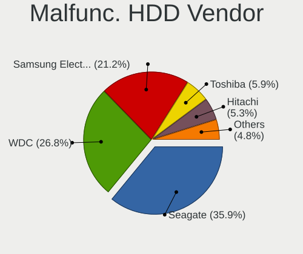

| Vendor              | Desktops | Drives | Percent |
|---------------------|----------|--------|---------|
| Seagate             | 378      | 487    | 35.93%  |
| WDC                 | 282      | 334    | 26.81%  |
| Samsung Electronics | 223      | 292    | 21.2%   |
| Toshiba             | 62       | 66     | 5.89%   |
| Hitachi             | 56       | 64     | 5.32%   |
| Maxtor              | 31       | 37     | 2.95%   |
| HGST                | 4        | 4      | 0.38%   |
| JMicron Technology  | 3        | 3      | 0.29%   |
| Hewlett-Packard     | 3        | 3      | 0.29%   |
| Fujitsu             | 3        | 4      | 0.29%   |
| ExcelStor           | 2        | 3      | 0.19%   |
| USB3.0              | 1        | 1      | 0.1%    |
| Min Yi U            | 1        | 1      | 0.1%    |
| Initio              | 1        | 1      | 0.1%    |
| HPE                 | 1        | 1      | 0.1%    |
| FEASSO              | 1        | 2      | 0.1%    |

Malfunc. Drive Kind
-------------------

Kinds of faulty drives

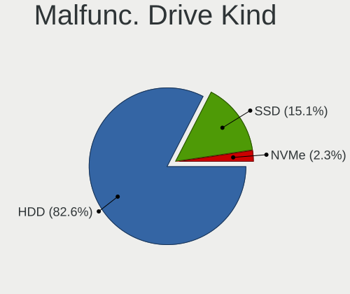

| Kind | Desktops | Drives | Percent |
|------|----------|--------|---------|
| HDD  | 914      | 1303   | 82.57%  |
| SSD  | 167      | 189    | 15.09%  |
| NVMe | 26       | 33     | 2.35%   |

Failed Drives
-------------

Failed drive models

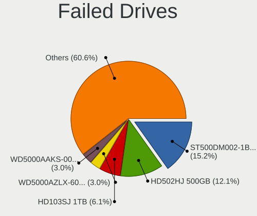

| Model                                       | Desktops | Drives | Percent |
|---------------------------------------------|----------|--------|---------|
| Seagate ST500DM002-1BD142 500GB             | 5        | 5      | 15.15%  |
| Samsung Electronics HD502HJ 500GB           | 4        | 8      | 12.12%  |
| Samsung Electronics HD103SJ 1TB             | 2        | 2      | 6.06%   |
| WDC WD5000AZLX-60K2TA1 500GB                | 1        | 1      | 3.03%   |
| WDC WD5000AAKS-00C8A0 500GB                 | 1        | 1      | 3.03%   |
| WDC WD3200BPVT-22JJ5T0 320GB                | 1        | 1      | 3.03%   |
| WDC WD3200BPVT-00JJ5T0 320GB                | 1        | 1      | 3.03%   |
| WDC WD1600BEVT-22ZCT0 160GB                 | 1        | 1      | 3.03%   |
| Toshiba MQ01ABD050 500GB                    | 1        | 1      | 3.03%   |
| Toshiba DT01ACA100 1TB                      | 1        | 1      | 3.03%   |
| SK hynix BC501 NVMe Solid State Drive 512GB | 1        | 1      | 3.03%   |
| Seagate ST3320613AS 320GB                   | 1        | 1      | 3.03%   |
| Seagate ST3320418AS 320GB                   | 1        | 1      | 3.03%   |
| Seagate ST3250318AS 250GB                   | 1        | 1      | 3.03%   |
| Seagate ST31000528AS 1TB                    | 1        | 1      | 3.03%   |
| Seagate ST31000340NS 1TB                    | 1        | 1      | 3.03%   |
| Samsung Electronics HM641JI 640GB           | 1        | 1      | 3.03%   |
| Samsung Electronics HM321HI 320GB           | 1        | 1      | 3.03%   |
| Samsung Electronics HM250HI 250GB           | 1        | 1      | 3.03%   |
| Samsung Electronics HD322GJ 320GB           | 1        | 1      | 3.03%   |
| Samsung Electronics HD080HJ/ 80GB           | 1        | 1      | 3.03%   |
| Realtek Semiconductor XrayDisk 1TB SSD      | 1        | 1      | 3.03%   |
| Hitachi HDS721050DLE630 500GB               | 1        | 1      | 3.03%   |
| China SSD 240GB                             | 1        | 1      | 3.03%   |
| ADATA Technology SX6000LNP 1024GB           | 1        | 1      | 3.03%   |

Failed Drive Vendor
-------------------

Failed drive vendors

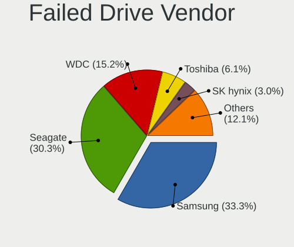

| Vendor                | Desktops | Drives | Percent |
|-----------------------|----------|--------|---------|
| Samsung Electronics   | 11       | 15     | 33.33%  |
| Seagate               | 10       | 10     | 30.3%   |
| WDC                   | 5        | 5      | 15.15%  |
| Toshiba               | 2        | 2      | 6.06%   |
| SK hynix              | 1        | 1      | 3.03%   |
| Realtek Semiconductor | 1        | 1      | 3.03%   |
| Hitachi               | 1        | 1      | 3.03%   |
| China                 | 1        | 1      | 3.03%   |
| ADATA Technology      | 1        | 1      | 3.03%   |

Drive Status
------------

Number of failed and malfunc. drives

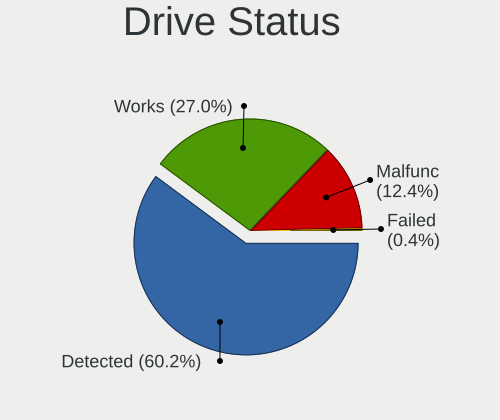

| Status   | Desktops | Drives | Percent |
|----------|----------|--------|---------|
| Detected | 5065     | 12223  | 60.15%  |
| Works    | 2275     | 4699   | 27.02%  |
| Malfunc  | 1047     | 1525   | 12.43%  |
| Failed   | 33       | 37     | 0.39%   |

Storage controller
------------------

Storage Vendor
--------------

Storage controller vendors

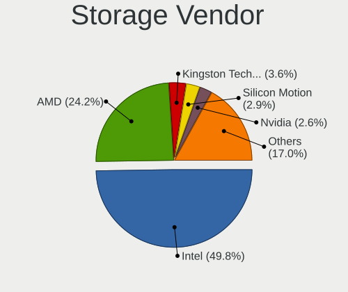

| Vendor                           | Desktops | Percent |
|----------------------------------|----------|---------|
| Intel                            | 4820     | 49.76%  |
| AMD                              | 2343     | 24.19%  |
| Kingston Technology Company      | 345      | 3.56%   |
| Silicon Motion                   | 281      | 2.9%    |
| Nvidia                           | 252      | 2.6%    |
| SanDisk                          | 216      | 2.23%   |
| Realtek Semiconductor            | 178      | 1.84%   |
| ADATA Technology                 | 178      | 1.84%   |
| MAXIO Technology (Hangzhou)      | 140      | 1.45%   |
| ASMedia Technology               | 124      | 1.28%   |
| Samsung Electronics              | 121      | 1.25%   |
| Marvell Technology Group         | 120      | 1.24%   |
| Phison Electronics               | 119      | 1.23%   |
| JMicron Technology               | 107      | 1.1%    |
| VIA Technologies                 | 56       | 0.58%   |
| Micron/Crucial Technology        | 50       | 0.52%   |
| INNOGRIT                         | 25       | 0.26%   |
| Netac Technology                 | 24       | 0.25%   |
| Shenzhen Longsys Electronics     | 22       | 0.23%   |
| Solid State Storage Technology   | 19       | 0.2%    |
| SK hynix                         | 18       | 0.19%   |
| Hosin Global Electronics         | 18       | 0.19%   |
| Micron Technology                | 14       | 0.14%   |
| LSI Logic / Symbios Logic        | 13       | 0.13%   |
| Broadcom / LSI                   | 12       | 0.12%   |
| Silicon Integrated Systems [SiS] | 11       | 0.11%   |
| Lite-On Technology               | 9        | 0.09%   |
| Silicon Image                    | 7        | 0.07%   |
| KIOXIA                           | 7        | 0.07%   |
| Beijing Starblaze Technology     | 7        | 0.07%   |
| Seagate Technology               | 5        | 0.05%   |
| OCZ Technology Group             | 4        | 0.04%   |
| Yangtze Memory Technologies      | 3        | 0.03%   |
| Adaptec                          | 3        | 0.03%   |
| Toshiba America Info Systems     | 2        | 0.02%   |
| TenaFe                           | 2        | 0.02%   |
| Hewlett-Packard                  | 2        | 0.02%   |
| Biwin Storage Technology         | 2        | 0.02%   |
| Union Memory (Shenzhen)          | 1        | 0.01%   |
| ULi Electronics                  | 1        | 0.01%   |

Storage Model
-------------

Storage controller models

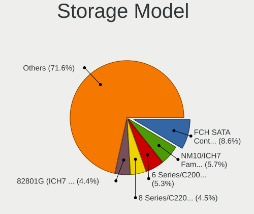

| Model                                                                                   | Desktops | Percent |
|-----------------------------------------------------------------------------------------|----------|---------|
| AMD FCH SATA Controller [AHCI mode]                                                     | 1094     | 8.55%   |
| Intel NM10/ICH7 Family SATA Controller [IDE mode]                                       | 727      | 5.68%   |
| Intel 6 Series/C200 Series Chipset Family 6 port Desktop SATA AHCI Controller           | 678      | 5.3%    |
| Intel 8 Series/C220 Series Chipset Family 6-port SATA Controller 1 [AHCI mode]          | 577      | 4.51%   |
| Intel 82801G (ICH7 Family) IDE Controller                                               | 561      | 4.39%   |
| AMD 400 Series Chipset SATA Controller                                                  | 456      | 3.56%   |
| AMD SB7x0/SB8x0/SB9x0 IDE Controller                                                    | 410      | 3.21%   |
| AMD 500 Series Chipset SATA Controller                                                  | 366      | 2.86%   |
| AMD A320 Chipset SATA Controller [AHCI mode]                                            | 362      | 2.83%   |
| Intel 7 Series/C210 Series Chipset Family 6-port SATA Controller [AHCI mode]            | 341      | 2.67%   |
| Intel 6 Series/C200 Series Chipset Family Desktop SATA Controller (IDE mode, ports 4-5) | 323      | 2.53%   |
| Intel 6 Series/C200 Series Chipset Family Desktop SATA Controller (IDE mode, ports 0-3) | 323      | 2.53%   |
| AMD SB7x0/SB8x0/SB9x0 SATA Controller [IDE mode]                                        | 308      | 2.41%   |
| Intel Q170/Q150/B150/H170/H110/Z170/CM236 Chipset SATA Controller [AHCI Mode]           | 277      | 2.17%   |
| Silicon Motion SM2263EN/SM2263XT (DRAM-less) NVMe SSD Controllers                       | 244      | 1.91%   |
| AMD SB7x0/SB8x0/SB9x0 SATA Controller [AHCI mode]                                       | 240      | 1.88%   |
| Nvidia MCP61 SATA Controller                                                            | 211      | 1.65%   |
| Intel 200 Series PCH SATA controller [AHCI mode]                                        | 196      | 1.53%   |
| Intel Cannon Lake PCH SATA AHCI Controller                                              | 193      | 1.51%   |
| Nvidia MCP61 IDE                                                                        | 171      | 1.34%   |
| Intel SATA Controller [RAID mode]                                                       | 153      | 1.2%    |
| Kingston Company NV2 NVMe SSD [SM2267XT] (DRAM-less)                                    | 132      | 1.03%   |
| Intel 5 Series/3400 Series Chipset 4 port SATA IDE Controller                           | 131      | 1.02%   |
| AMD 300 Series Chipset SATA Controller                                                  | 125      | 0.98%   |
| Intel 5 Series/3400 Series Chipset 6 port SATA AHCI Controller                          | 121      | 0.95%   |
| Intel 5 Series/3400 Series Chipset 2 port SATA IDE Controller                           | 119      | 0.93%   |
| ASMedia ASM1061/ASM1062 Serial ATA Controller                                           | 107      | 0.84%   |
| MAXIO (Hangzhou) NVMe SSD Controller MAP1202 (DRAM-less)                                | 102      | 0.8%    |
| AMD 600 Series Chipset SATA Controller                                                  | 101      | 0.79%   |
| Realtek RTS5762 NVMe SSD Controller                                                     | 87       | 0.68%   |
| Intel 500 Series Chipset Family SATA AHCI Controller                                    | 82       | 0.64%   |
| Samsung NVMe SSD Controller SM981/PM981/PM983                                           | 78       | 0.61%   |
| Intel Atom Processor E3800 Series SATA AHCI Controller                                  | 76       | 0.59%   |
| Intel Alder Lake-S PCH SATA Controller [AHCI Mode]                                      | 76       | 0.59%   |
| Intel 9 Series Chipset Family SATA Controller [AHCI Mode]                               | 75       | 0.59%   |
| Intel 7 Series/C210 Series Chipset Family 4-port SATA Controller [IDE mode]             | 74       | 0.58%   |
| Intel 7 Series/C210 Series Chipset Family 2-port SATA Controller [IDE mode]             | 74       | 0.58%   |
| SanDisk WD Green SN350 240GB (DRAM-less) / SN560E NVMe SSD                              | 69       | 0.54%   |
| Intel 400 Series Chipset Family SATA AHCI Controller                                    | 69       | 0.54%   |
| Intel C610/X99 series chipset 6-Port SATA Controller [AHCI mode]                        | 68       | 0.53%   |

Storage Kind
------------

Kind of storage controller (IDE, SATA, NVMe, SAS, ...)

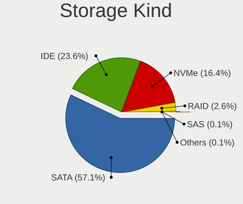

| Kind | Desktops | Percent |
|------|----------|---------|
| SATA | 5610     | 57.08%  |
| IDE  | 2322     | 23.63%  |
| NVMe | 1612     | 16.4%   |
| RAID | 260      | 2.65%   |
| SAS  | 13       | 0.13%   |
| SCSI | 11       | 0.11%   |

Processor
---------

CPU Vendor
----------

Processor vendors

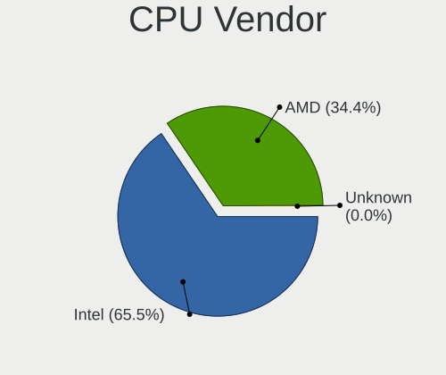

| Vendor       | Desktops | Percent |
|--------------|----------|---------|
| Intel        | 4948     | 65.51%  |
| AMD          | 2599     | 34.41%  |
| CentaurHauls | 5        | 0.07%   |
| Unknown      | 1        | 0.01%   |

CPU Model
---------

Processor models

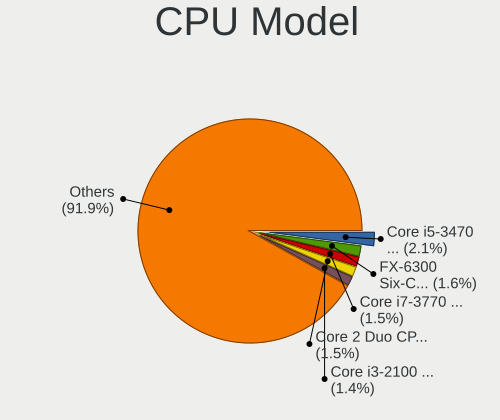

| Model                                       | Desktops | Percent |
|---------------------------------------------|----------|---------|
| Intel Core i5-3470 CPU @ 3.20GHz            | 157      | 2.06%   |
| AMD FX-6300 Six-Core Processor              | 123      | 1.62%   |
| Intel Core i7-3770 CPU @ 3.40GHz            | 113      | 1.48%   |
| Intel Core 2 Duo CPU E7500 @ 2.93GHz        | 113      | 1.48%   |
| Intel Core i3-2100 CPU @ 3.10GHz            | 108      | 1.42%   |
| Intel Core i5-3330 CPU @ 3.00GHz            | 106      | 1.39%   |
| AMD Ryzen 5 3600 6-Core Processor           | 101      | 1.33%   |
| Intel Core i5 CPU 650 @ 3.20GHz             | 100      | 1.31%   |
| Intel Core i5-2400 CPU @ 3.10GHz            | 96       | 1.26%   |
| AMD Ryzen 5 5600G with Radeon Graphics      | 94       | 1.24%   |
| AMD Ryzen 5 1600 Six-Core Processor         | 90       | 1.18%   |
| Intel Core i7-2600 CPU @ 3.40GHz            | 87       | 1.14%   |
| Intel Core i3-3240 CPU @ 3.40GHz            | 82       | 1.08%   |
| Intel Core i3-2120 CPU @ 3.30GHz            | 79       | 1.04%   |
| AMD Ryzen 5 3400G with Radeon Vega Graphics | 78       | 1.02%   |
| Intel Core i3-3220 CPU @ 3.30GHz            | 75       | 0.99%   |
| AMD Ryzen 3 3200G with Radeon Vega Graphics | 72       | 0.95%   |
| Intel Celeron CPU J1800 @ 2.41GHz           | 71       | 0.93%   |
| AMD Ryzen 5 4600G with Radeon Graphics      | 71       | 0.93%   |
| Intel Core i7-4790 CPU @ 3.60GHz            | 70       | 0.92%   |
| AMD Ryzen 3 2200G with Radeon Vega Graphics | 69       | 0.91%   |
| Intel Core 2 Duo CPU E8400 @ 3.00GHz        | 65       | 0.85%   |
| Intel Core i5-3570 CPU @ 3.40GHz            | 64       | 0.84%   |
| AMD Ryzen 7 5700G with Radeon Graphics      | 64       | 0.84%   |
| Intel Core i5-9400F CPU @ 2.90GHz           | 57       | 0.75%   |
| Intel Pentium Dual-Core CPU E5700 @ 3.00GHz | 55       | 0.72%   |
| Intel Core i5-7400 CPU @ 3.00GHz            | 54       | 0.71%   |
| AMD Ryzen 5 5600X 6-Core Processor          | 52       | 0.68%   |
| AMD FX-8300 Eight-Core Processor            | 52       | 0.68%   |
| Intel Core i3-7100 CPU @ 3.90GHz            | 50       | 0.66%   |
| AMD Ryzen 7 5700X 8-Core Processor          | 47       | 0.62%   |
| AMD Ryzen 5 5500                            | 46       | 0.6%    |
| Intel Pentium Dual-Core CPU E5400 @ 2.70GHz | 45       | 0.59%   |
| AMD Ryzen 5 5600 6-Core Processor           | 44       | 0.58%   |
| Intel Core i7-4770 CPU @ 3.40GHz            | 43       | 0.57%   |
| Intel Core i5-4570 CPU @ 3.20GHz            | 43       | 0.57%   |
| AMD Ryzen 5 2400G with Radeon Vega Graphics | 43       | 0.57%   |
| Intel Core i5-8400 CPU @ 2.80GHz            | 42       | 0.55%   |
| Intel Core i5-4440 CPU @ 3.10GHz            | 42       | 0.55%   |
| Intel Xeon CPU E5-2680 v4 @ 2.40GHz         | 40       | 0.53%   |

CPU Model Family
----------------

Processor model prefix

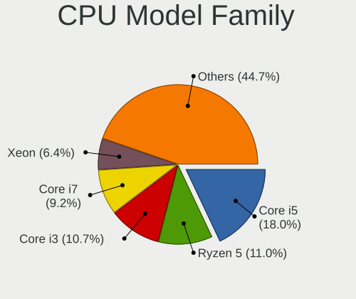

| Model                   | Desktops | Percent |
|-------------------------|----------|---------|
| Intel Core i5           | 1365     | 17.96%  |
| AMD Ryzen 5             | 839      | 11.04%  |
| Intel Core i3           | 812      | 10.68%  |
| Intel Core i7           | 702      | 9.24%   |
| Intel Xeon              | 483      | 6.36%   |
| AMD Ryzen 7             | 387      | 5.09%   |
| AMD FX                  | 351      | 4.62%   |
| Intel Core 2 Duo        | 329      | 4.33%   |
| Intel Celeron           | 326      | 4.29%   |
| Intel Pentium Dual-Core | 218      | 2.87%   |
| Intel Pentium           | 176      | 2.32%   |
| AMD Ryzen 3             | 161      | 2.12%   |
| Other                   | 155      | 2.04%   |
| Intel Core 2 Quad       | 135      | 1.78%   |
| AMD Phenom II X4        | 107      | 1.41%   |
| AMD Ryzen 9             | 96       | 1.26%   |
| AMD Athlon II X2        | 86       | 1.13%   |
| Intel Pentium Dual      | 85       | 1.12%   |
| AMD Athlon              | 69       | 0.91%   |
| AMD A8                  | 62       | 0.82%   |
| AMD A10                 | 50       | 0.66%   |
| AMD Athlon 64 X2        | 48       | 0.63%   |
| Intel Atom              | 46       | 0.61%   |
| AMD A6                  | 42       | 0.55%   |
| AMD Phenom II X6        | 41       | 0.54%   |
| AMD A4                  | 41       | 0.54%   |
| Intel Core 2            | 37       | 0.49%   |
| AMD Sempron             | 33       | 0.43%   |
| Intel Core i9           | 31       | 0.41%   |
| Intel Pentium 4         | 29       | 0.38%   |
| AMD Phenom II X2        | 29       | 0.38%   |
| Intel Pentium Gold      | 25       | 0.33%   |
| AMD Athlon II X4        | 22       | 0.29%   |
| Intel Genuine           | 18       | 0.24%   |
| AMD Ryzen 5 PRO         | 18       | 0.24%   |
| AMD Athlon II X3        | 17       | 0.22%   |
| AMD Phenom              | 15       | 0.2%    |
| Intel Pentium D         | 14       | 0.18%   |
| AMD Ryzen 3 PRO         | 13       | 0.17%   |
| AMD E                   | 11       | 0.14%   |

CPU Cores
---------

Number of processor cores

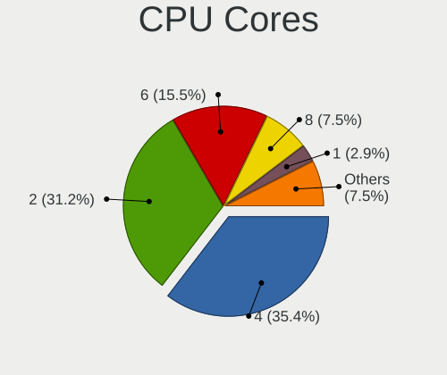

| Number  | Desktops | Percent |
|---------|----------|---------|
| 4       | 2694     | 35.42%  |
| 2       | 2372     | 31.19%  |
| 6       | 1182     | 15.54%  |
| 8       | 571      | 7.51%   |
| 1       | 219      | 2.88%   |
| 3       | 169      | 2.22%   |
| 12      | 153      | 2.01%   |
| 10      | 69       | 0.91%   |
| 14      | 60       | 0.79%   |
| 16      | 51       | 0.67%   |
| 24      | 21       | 0.28%   |
| 20      | 11       | 0.14%   |
| Unknown | 11       | 0.14%   |
| 18      | 9        | 0.12%   |
| 28      | 4        | 0.05%   |
| 36      | 3        | 0.04%   |
| 44      | 2        | 0.03%   |
| 32      | 2        | 0.03%   |
| 22      | 2        | 0.03%   |
| 5       | 1        | 0.01%   |

CPU Sockets
-----------

Number of sockets

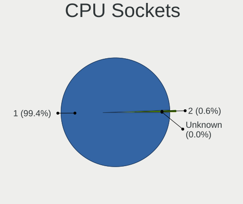

| Number  | Desktops | Percent |
|---------|----------|---------|
| 1       | 7505     | 99.38%  |
| 2       | 44       | 0.58%   |
| 16      | 1        | 0.01%   |
| 4       | 1        | 0.01%   |
| Unknown | 1        | 0.01%   |

CPU Threads
-----------

Threads per core (Hyper-Threading)

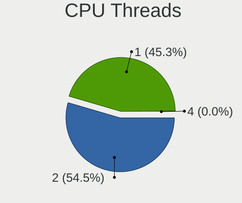

| Number  | Desktops | Percent |
|---------|----------|---------|
| 2       | 4129     | 54.53%  |
| 1       | 3431     | 45.31%  |
| Unknown | 11       | 0.15%   |
| 4       | 1        | 0.01%   |

CPU Op-Modes
------------

CPU Operation Modes (32-bit, 64-bit)

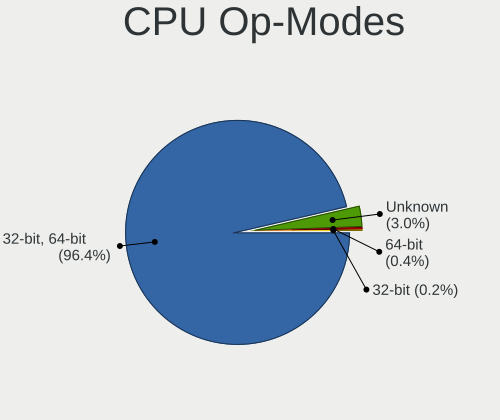

| Op mode        | Desktops | Percent |
|----------------|----------|---------|
| 32-bit, 64-bit | 7304     | 96.37%  |
| Unknown        | 231      | 3.05%   |
| 64-bit         | 29       | 0.38%   |
| 32-bit         | 15       | 0.2%    |

CPU Microcode
-------------

Microcode number

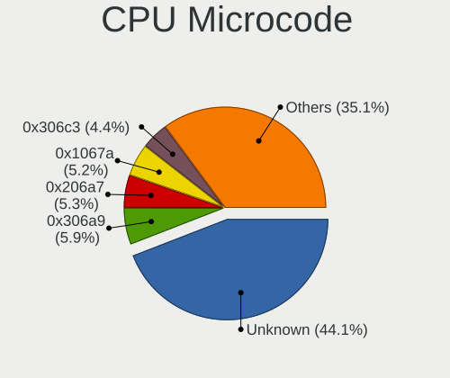

| Number     | Desktops | Percent |
|------------|----------|---------|
| Unknown    | 3478     | 44.11%  |
| 0x306a9    | 467      | 5.92%   |
| 0x206a7    | 415      | 5.26%   |
| 0x1067a    | 412      | 5.23%   |
| 0x306c3    | 343      | 4.35%   |
| 0x06000852 | 174      | 2.21%   |
| 0x906e9    | 142      | 1.8%    |
| 0x010000c8 | 129      | 1.64%   |
| 0x906ea    | 127      | 1.61%   |
| 0x6fd      | 104      | 1.32%   |
| 0x08108109 | 102      | 1.29%   |
| 0x0800820d | 94       | 1.19%   |
| 0x20655    | 88       | 1.12%   |
| 0x08701021 | 87       | 1.1%    |
| 0x306f2    | 73       | 0.93%   |
| 0x506e3    | 57       | 0.72%   |
| 0x6fb      | 54       | 0.68%   |
| 0x08701013 | 54       | 0.68%   |
| 0x08101016 | 53       | 0.67%   |
| 0x20652    | 50       | 0.63%   |
| 0x06001119 | 48       | 0.61%   |
| 0x10676    | 46       | 0.58%   |
| 0xa0653    | 43       | 0.55%   |
| 0x106e5    | 42       | 0.53%   |
| 0x08001138 | 42       | 0.53%   |
| 0x0a50000d | 39       | 0.49%   |
| 0x06003106 | 38       | 0.48%   |
| 0x010000db | 38       | 0.48%   |
| 0x30678    | 36       | 0.46%   |
| 0x906eb    | 35       | 0.44%   |
| 0x906ed    | 34       | 0.43%   |
| 0x0600611a | 34       | 0.43%   |
| 0x010000dc | 32       | 0.41%   |
| 0x306e4    | 31       | 0.39%   |
| 0x0810100b | 31       | 0.39%   |
| 0x0600063e | 30       | 0.38%   |
| 0x10661    | 25       | 0.32%   |
| 0x206d7    | 22       | 0.28%   |
| 0x08001137 | 22       | 0.28%   |
| 0x010000b6 | 22       | 0.28%   |

CPU Microarch
-------------

Microarchitecture

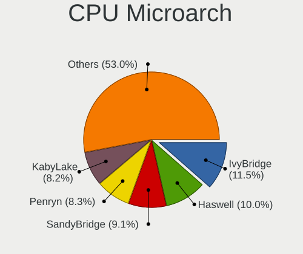

| Name             | Desktops | Percent |
|------------------|----------|---------|
| IvyBridge        | 872      | 11.49%  |
| Haswell          | 757      | 9.97%   |
| SandyBridge      | 687      | 9.05%   |
| Penryn           | 630      | 8.3%    |
| KabyLake         | 621      | 8.18%   |
| Zen 3            | 451      | 5.94%   |
| Zen+             | 369      | 4.86%   |
| Piledriver       | 361      | 4.76%   |
| Zen 2            | 358      | 4.72%   |
| K10              | 351      | 4.63%   |
| Core             | 283      | 3.73%   |
| Zen              | 281      | 3.7%    |
| Westmere         | 227      | 2.99%   |
| Unknown          | 216      | 2.85%   |
| CometLake        | 172      | 2.27%   |
| Skylake          | 135      | 1.78%   |
| Broadwell        | 100      | 1.32%   |
| Silvermont       | 96       | 1.26%   |
| Nehalem          | 89       | 1.17%   |
| K8 Hammer        | 72       | 0.95%   |
| Steamroller      | 61       | 0.8%    |
| Excavator        | 61       | 0.8%    |
| Alderlake Hybrid | 58       | 0.76%   |
| Bulldozer        | 56       | 0.74%   |
| NetBurst         | 53       | 0.7%    |
| Bonnell          | 38       | 0.5%    |
| Bobcat           | 26       | 0.34%   |
| Icelake          | 25       | 0.33%   |
| Jaguar           | 23       | 0.3%    |
| K10 Llano        | 22       | 0.29%   |
| Goldmont plus    | 16       | 0.21%   |
| Tremont          | 12       | 0.16%   |
| Gracemont        | 4        | 0.05%   |
| Goldmont         | 4        | 0.05%   |
| Puma             | 1        | 0.01%   |
| K6               | 1        | 0.01%   |

Graphics
--------

GPU Vendor
----------

Vendors of graphics cards

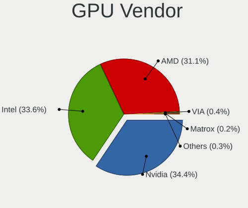

| Vendor                           | Desktops | Percent |
|----------------------------------|----------|---------|
| Nvidia                           | 2759     | 34.41%  |
| Intel                            | 2693     | 33.59%  |
| AMD                              | 2495     | 31.12%  |
| VIA Technologies                 | 33       | 0.41%   |
| Matrox Electronics Systems       | 16       | 0.2%    |
| Silicon Integrated Systems [SiS] | 7        | 0.09%   |
| ATI Technologies                 | 5        | 0.06%   |
| Silicon Motion                   | 4        | 0.05%   |
| ASPEED Technology                | 3        | 0.04%   |
| S3 Graphics                      | 1        | 0.01%   |
| Red Hat                          | 1        | 0.01%   |

GPU Model
---------

Graphics card models

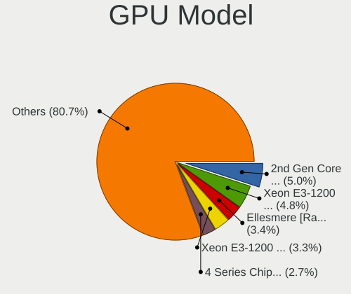

| Model                                                                       | Desktops | Percent |
|-----------------------------------------------------------------------------|----------|---------|
| Intel 2nd Generation Core Processor Family Integrated Graphics Controller   | 412      | 5%      |
| Intel Xeon E3-1200 v2/3rd Gen Core processor Graphics Controller            | 399      | 4.84%   |
| AMD Ellesmere [Radeon RX 470/480/570/570X/580/580X/590]                     | 281      | 3.41%   |
| Intel Xeon E3-1200 v3/4th Gen Core Processor Integrated Graphics Controller | 272      | 3.3%    |
| Intel 4 Series Chipset Integrated Graphics Controller                       | 225      | 2.73%   |
| Intel 82G33/G31 Express Integrated Graphics Controller                      | 203      | 2.46%   |
| Nvidia GT218 [GeForce 210]                                                  | 200      | 2.43%   |
| Nvidia GP107 [GeForce GTX 1050 Ti]                                          | 162      | 1.97%   |
| Intel Core Processor Integrated Graphics Controller                         | 153      | 1.86%   |
| AMD Picasso/Raven 2 [Radeon Vega Series / Radeon Vega Mobile Series]        | 152      | 1.84%   |
| Intel CoffeeLake-S GT2 [UHD Graphics 630]                                   | 144      | 1.75%   |
| AMD Cezanne [Radeon Vega Series / Radeon Vega Mobile Series]                | 137      | 1.66%   |
| AMD Lexa PRO [Radeon 540/540X/550/550X / RX 540X/550/550X]                  | 126      | 1.53%   |
| Nvidia GK208B [GeForce GT 710]                                              | 124      | 1.5%    |
| AMD Cedar [Radeon HD 5000/6000/7350/8350 Series]                            | 124      | 1.5%    |
| AMD Polaris 20 XL [Radeon RX 580 2048SP]                                    | 112      | 1.36%   |
| Intel 82945G/GZ Integrated Graphics Controller                              | 110      | 1.33%   |
| Intel Kaby Lake-S GT2 [HD Graphics 630]                                     | 109      | 1.32%   |
| AMD Raven Ridge [Radeon Vega Series / Radeon Vega Mobile Series]            | 109      | 1.32%   |
| Nvidia GP106 [GeForce GTX 1060 6GB]                                         | 104      | 1.26%   |
| AMD Navi 23 [Radeon RX 6600/6600 XT/6600M]                                  | 103      | 1.25%   |
| AMD RS780L [Radeon 3000]                                                    | 100      | 1.21%   |
| AMD Caicos [Radeon HD 6450/7450/8450 / R5 230 OEM]                          | 81       | 0.98%   |
| Intel Atom Processor Z36xxx/Z37xxx Series Graphics & Display                | 80       | 0.97%   |
| AMD Baffin [Radeon RX 550 640SP / RX 560/560X]                              | 78       | 0.95%   |
| Nvidia GM107 [GeForce GTX 750 Ti]                                           | 76       | 0.92%   |
| Nvidia GF108 [GeForce GT 730]                                               | 76       | 0.92%   |
| Intel IvyBridge GT2 [HD Graphics 4000]                                      | 75       | 0.91%   |
| Intel 4th Generation Core Processor Family Integrated Graphics Controller   | 75       | 0.91%   |
| Nvidia GT218 [GeForce 8400 GS Rev. 3]                                       | 73       | 0.89%   |
| Nvidia C61 [GeForce 7025 / nForce 630a]                                     | 72       | 0.87%   |
| Nvidia GF119 [GeForce GT 610]                                               | 70       | 0.85%   |
| Intel CometLake-S GT2 [UHD Graphics 630]                                    | 68       | 0.83%   |
| AMD Renoir [Radeon Vega Series / Radeon Vega Mobile Series]                 | 67       | 0.81%   |
| Intel Skylake-S GT2 [HD Graphics 530]                                       | 62       | 0.75%   |
| Nvidia TU117 [GeForce GTX 1650]                                             | 59       | 0.72%   |
| Nvidia GP108 [GeForce GT 1030]                                              | 59       | 0.72%   |
| AMD Raphael                                                                 | 59       | 0.72%   |
| Nvidia GP107 [GeForce GTX 1050]                                             | 58       | 0.7%    |
| Nvidia GM206 [GeForce GTX 960]                                              | 58       | 0.7%    |

GPU Combo
---------

Combinations of graphics cards

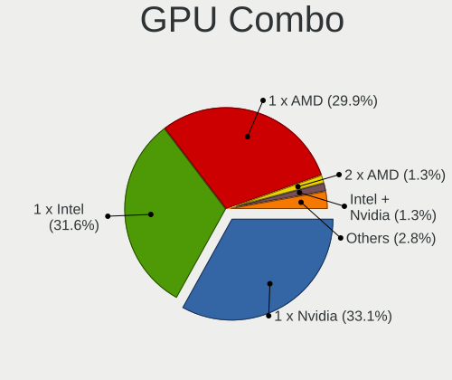

| Name                     | Desktops | Percent |
|--------------------------|----------|---------|
| 1 x Nvidia               | 2545     | 33.08%  |
| 1 x Intel                | 2428     | 31.56%  |
| 1 x AMD                  | 2303     | 29.93%  |
| 2 x AMD                  | 100      | 1.3%    |
| Intel + Nvidia           | 100      | 1.3%    |
| AMD + Nvidia             | 78       | 1.01%   |
| Intel + AMD              | 37       | 0.48%   |
| 1 x VIA                  | 32       | 0.42%   |
| 2 x Nvidia               | 22       | 0.29%   |
| 1 x Matrox               | 14       | 0.18%   |
| 2 x Intel                | 12       | 0.16%   |
| 1 x SiS                  | 7        | 0.09%   |
| Other                    | 2        | 0.03%   |
| Nvidia + ASPEED          | 2        | 0.03%   |
| Intel + Silicon Motion   | 2        | 0.03%   |
| 1 x Silicon Motion       | 1        | 0.01%   |
| 1 x S3 Graphics          | 1        | 0.01%   |
| 1 x Red Hat              | 1        | 0.01%   |
| Nvidia + Silicon Motion  | 1        | 0.01%   |
| Nvidia + Matrox          | 1        | 0.01%   |
| Intel + 2 x AMD          | 1        | 0.01%   |
| Intel + AMD + 1 x Nvidia | 1        | 0.01%   |
| 1 x ASPEED               | 1        | 0.01%   |
| AMD + 2 x Nvidia         | 1        | 0.01%   |
| AMD + Matrox             | 1        | 0.01%   |

GPU Driver
----------

Free vs proprietary

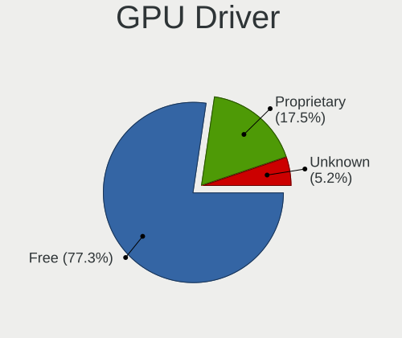

| Driver      | Desktops | Percent |
|-------------|----------|---------|
| Free        | 5957     | 77.32%  |
| Proprietary | 1348     | 17.5%   |
| Unknown     | 399      | 5.18%   |

GPU Memory
----------

Total video memory

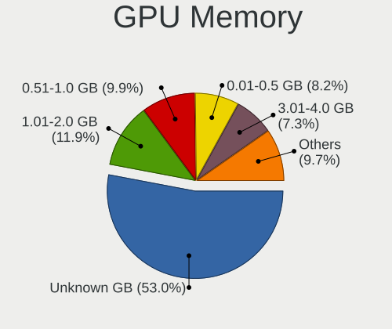

| Size in GB | Desktops | Percent |
|------------|----------|---------|
| Unknown    | 4176     | 52.98%  |
| 1.01-2.0   | 938      | 11.9%   |
| 0.51-1.0   | 782      | 9.92%   |
| 0.01-0.5   | 645      | 8.18%   |
| 3.01-4.0   | 576      | 7.31%   |
| 7.01-8.0   | 409      | 5.19%   |
| 5.01-6.0   | 178      | 2.26%   |
| 8.01-16.0  | 112      | 1.42%   |
| 2.01-3.0   | 54       | 0.69%   |
| 16.01-24.0 | 9        | 0.11%   |
| 4.01-5.0   | 3        | 0.04%   |

Monitor
-------

Monitor Vendor
--------------

Monitor vendors

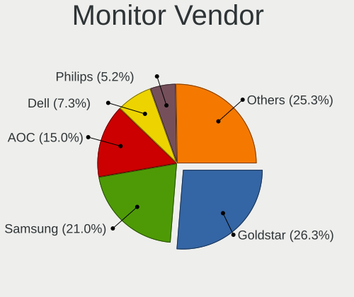

| Vendor               | Desktops | Percent |
|----------------------|----------|---------|
| Goldstar             | 2022     | 26.29%  |
| Samsung Electronics  | 1612     | 20.96%  |
| AOC                  | 1150     | 14.95%  |
| Dell                 | 564      | 7.33%   |
| Philips              | 400      | 5.2%    |
| Acer                 | 261      | 3.39%   |
| LG Electronics       | 178      | 2.31%   |
| Hewlett-Packard      | 144      | 1.87%   |
| Unknown              | 98       | 1.27%   |
| Sony                 | 90       | 1.17%   |
| BenQ                 | 80       | 1.04%   |
| Lenovo               | 72       | 0.94%   |
| Unknown (XXX)        | 61       | 0.79%   |
| Positivo             | 61       | 0.79%   |
| VIE                  | 58       | 0.75%   |
| ASUSTek Computer     | 56       | 0.73%   |
| Panasonic            | 32       | 0.42%   |
| Ancor Communications | 31       | 0.4%    |
| GDH                  | 27       | 0.35%   |
| Denver               | 25       | 0.33%   |
| RTK                  | 23       | 0.3%    |
| STD                  | 21       | 0.27%   |
| Unknown              | 20       | 0.26%   |
| SGT                  | 19       | 0.25%   |
| Philco               | 19       | 0.25%   |
| Pixio                | 18       | 0.23%   |
| TXD                  | 17       | 0.22%   |
| NCS                  | 17       | 0.22%   |
| STA                  | 16       | 0.21%   |
| Gigabyte Technology  | 15       | 0.2%    |
| Toshiba              | 14       | 0.18%   |
| AGO                  | 14       | 0.18%   |
| Envision             | 13       | 0.17%   |
| Daewoo               | 13       | 0.17%   |
| PZG                  | 12       | 0.16%   |
| JRY                  | 12       | 0.16%   |
| ITE                  | 12       | 0.16%   |
| IPS                  | 12       | 0.16%   |
| MStar                | 11       | 0.14%   |
| MSI                  | 11       | 0.14%   |

Monitor Model
-------------

Monitor models

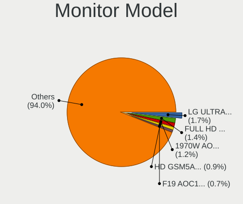

| Model                                                                | Desktops | Percent |
|----------------------------------------------------------------------|----------|---------|
| Goldstar LG ULTRAWIDE GSM59F1 2560x1080 670x280mm 28.6-inch          | 143      | 1.74%   |
| Goldstar FULL HD GSM5B55 1920x1080 480x270mm 21.7-inch               | 117      | 1.42%   |
| AOC 1970W AOC1970 1366x768 410x230mm 18.5-inch                       | 100      | 1.22%   |
| Goldstar HD GSM5ACB 1366x768 410x230mm 18.5-inch                     | 76       | 0.93%   |
| AOC F19 AOC1900 1366x768 410x230mm 18.5-inch                         | 59       | 0.72%   |
| Goldstar 2D HD TV GSM59CA 1366x768 509x286mm 23.0-inch               | 55       | 0.67%   |
| AOC 27G2G4 AOC2702 1920x1080 598x336mm 27.0-inch                     | 54       | 0.66%   |
| Goldstar HDR WFHD GSM7714 2560x1080 798x334mm 34.1-inch              | 53       | 0.65%   |
| Unknown LCD Monitor FFFF 2288x1287 2550x2550mm 142.0-inch            | 45       | 0.55%   |
| Goldstar 20EN33 GSM4EE1 1600x900 443x249mm 20.0-inch                 | 45       | 0.55%   |
| Goldstar ULTRAWIDE GSM76F9 2560x1080 531x298mm 24.0-inch             | 44       | 0.54%   |
| Goldstar 23MP55 GSM5A23 1920x1080 510x290mm 23.1-inch                | 44       | 0.54%   |
| Goldstar W2043 GSM4E9D 1600x900 443x249mm 20.0-inch                  | 41       | 0.5%    |
| Goldstar 25UM58G GSM5B98 2560x1080 673x284mm 28.8-inch               | 41       | 0.5%    |
| AOC 1950W AOC1950 1366x768 410x230mm 18.5-inch                       | 41       | 0.5%    |
| Goldstar W1943 GSM4BAD 1360x768 406x229mm 18.4-inch                  | 40       | 0.49%   |
| Goldstar W1752 GSM4490 1440x900 370x232mm 17.2-inch                  | 38       | 0.46%   |
| Dell 1708FP DEL4023 1280x1024 338x270mm 17.0-inch                    | 38       | 0.46%   |
| AOC 24G2W1G3 AOC2402 1920x1080 527x296mm 23.8-inch                   | 38       | 0.46%   |
| AOC 22B15HN AOC2201 1920x1080 478x260mm 21.4-inch                    | 38       | 0.46%   |
| Samsung Electronics SyncMaster SAM02E3 1440x900 367x229mm 17.0-inch  | 37       | 0.45%   |
| Samsung Electronics SMB1930N SAM0632 1366x768 410x230mm 18.5-inch    | 37       | 0.45%   |
| Samsung Electronics C24F390 SAM0D2C 1920x1080 521x293mm 23.5-inch    | 36       | 0.44%   |
| Goldstar 22MP55 GSM5A26 1920x1080 477x268mm 21.5-inch                | 36       | 0.44%   |
| Samsung Electronics LCD Monitor SAM0C3C 1366x768 609x347mm 27.6-inch | 35       | 0.43%   |
| Philips PHL 242V8 PHLC219 1920x1080 527x296mm 23.8-inch              | 34       | 0.41%   |
| AOC 2470W AOC2470 1920x1080 521x293mm 23.5-inch                      | 34       | 0.41%   |
| AOC 1619w AOC1619 1366x768 340x190mm 15.3-inch                       | 34       | 0.41%   |
| Philips PHL 223V5LH PHLC114 1920x1080 477x268mm 21.5-inch            | 33       | 0.4%    |
| Acer V226HQL ACR032D 1920x1080 477x268mm 21.5-inch                   | 33       | 0.4%    |
| Samsung Electronics LF24T35 SAM707D 1920x1080 528x297mm 23.9-inch    | 31       | 0.38%   |
| AOC 936W AOC1936 1366x768 410x230mm 18.5-inch                        | 31       | 0.38%   |
| AOC 912Vwa AOC1912 1440x900 408x255mm 18.9-inch                      | 31       | 0.38%   |
| Samsung Electronics SyncMaster SAM0598 1360x768 410x230mm 18.5-inch  | 30       | 0.37%   |
| AOC 2270W AOC2270 1920x1080 477x268mm 21.5-inch                      | 30       | 0.37%   |
| Samsung Electronics S24D332 SAM0F5E 1920x1080 531x299mm 24.0-inch    | 29       | 0.35%   |
| Goldstar E2011 GSM4ED4 1600x900 443x249mm 20.0-inch                  | 29       | 0.35%   |
| Goldstar FULL HD GSM5BFB 1920x1080 480x270mm 21.7-inch               | 28       | 0.34%   |
| Samsung Electronics SMB1630N SAM0630 1366x768 344x194mm 15.5-inch    | 27       | 0.33%   |
| Philips PHL 193V5 PHLC0CD 1366x768 410x230mm 18.5-inch               | 27       | 0.33%   |

Monitor Resolution
------------------

Monitor screen resolution

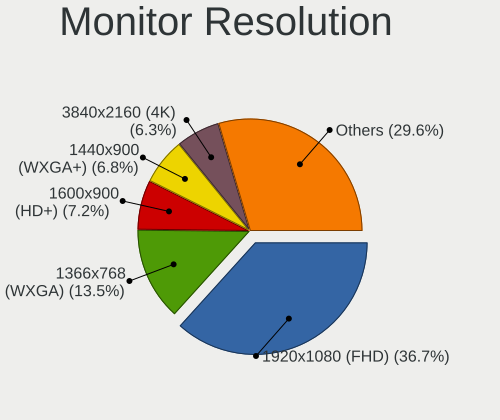

| Resolution         | Desktops | Percent |
|--------------------|----------|---------|
| 1920x1080 (FHD)    | 2813     | 36.71%  |
| 1366x768 (WXGA)    | 1033     | 13.48%  |
| 1600x900 (HD+)     | 550      | 7.18%   |
| 1440x900 (WXGA+)   | 518      | 6.76%   |
| 3840x2160 (4K)     | 484      | 6.32%   |
| 1280x1024 (SXGA)   | 408      | 5.32%   |
| 2560x1080          | 402      | 5.25%   |
| 1360x768           | 388      | 5.06%   |
| 2560x1440 (QHD)    | 222      | 2.9%    |
| 1680x1050 (WSXGA+) | 198      | 2.58%   |
| 1024x768 (XGA)     | 132      | 1.72%   |
| Unknown            | 112      | 1.46%   |
| 1280x720 (HD)      | 58       | 0.76%   |
| 2288x1287          | 50       | 0.65%   |
| 1920x540           | 49       | 0.64%   |
| 3440x1440          | 46       | 0.6%    |
| 3840x1080          | 34       | 0.44%   |
| 1920x1200 (WUXGA)  | 32       | 0.42%   |
| 1152x864           | 10       | 0.13%   |
| 1600x1200          | 9        | 0.12%   |
| 1280x800 (WXGA)    | 8        | 0.1%    |
| 5760x1080          | 6        | 0.08%   |
| 4480x1080          | 6        | 0.08%   |
| 3286x1080          | 6        | 0.08%   |
| 2560x1600          | 6        | 0.08%   |
| 3200x1080          | 5        | 0.07%   |
| 1280x960           | 5        | 0.07%   |
| 3360x1080          | 4        | 0.05%   |
| 5760x2160          | 3        | 0.04%   |
| 5120x1440          | 3        | 0.04%   |
| 3520x1080          | 3        | 0.04%   |
| 2732x768           | 3        | 0.04%   |
| 2646x1024          | 3        | 0.04%   |
| 1360x765           | 3        | 0.04%   |
| 640x480            | 2        | 0.03%   |
| 6400x1080          | 2        | 0.03%   |
| 3600x1080          | 2        | 0.03%   |
| 3360x1050          | 2        | 0.03%   |
| 3280x1080          | 2        | 0.03%   |
| 2800x900           | 2        | 0.03%   |

Monitor Diagonal
----------------

Diagonal size in inches

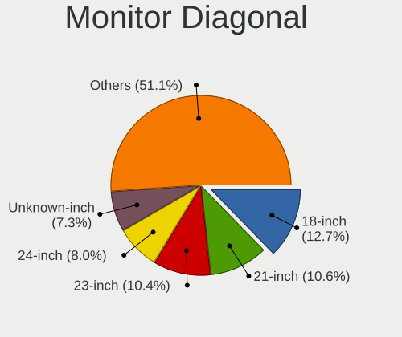

| Inches  | Desktops | Percent |
|---------|----------|---------|
| 18      | 994      | 12.72%  |
| 21      | 827      | 10.58%  |
| 23      | 810      | 10.36%  |
| 24      | 622      | 7.96%   |
| Unknown | 571      | 7.31%   |
| 27      | 506      | 6.47%   |
| 19      | 461      | 5.9%    |
| 17      | 440      | 5.63%   |
| 20      | 405      | 5.18%   |
| 15      | 402      | 5.14%   |
| 31      | 340      | 4.35%   |
| 34      | 297      | 3.8%    |
| 22      | 148      | 1.89%   |
| 32      | 87       | 1.11%   |
| 28      | 85       | 1.09%   |
| 54      | 82       | 1.05%   |
| 72      | 80       | 1.02%   |
| 84      | 71       | 0.91%   |
| 63      | 67       | 0.86%   |
| 40      | 66       | 0.84%   |
| 26      | 48       | 0.61%   |
| 52      | 47       | 0.6%    |
| 142     | 45       | 0.58%   |
| 46      | 39       | 0.5%    |
| 16      | 34       | 0.44%   |
| 14      | 33       | 0.42%   |
| 25      | 29       | 0.37%   |
| 12      | 29       | 0.37%   |
| 49      | 23       | 0.29%   |
| 48      | 20       | 0.26%   |
| 13      | 19       | 0.24%   |
| 37      | 15       | 0.19%   |
| 65      | 12       | 0.15%   |
| 43      | 9        | 0.12%   |
| 29      | 7        | 0.09%   |
| 41      | 6        | 0.08%   |
| 60      | 5        | 0.06%   |
| 47      | 5        | 0.06%   |
| 39      | 5        | 0.06%   |
| 50      | 4        | 0.05%   |

Monitor Width
-------------

Physical width

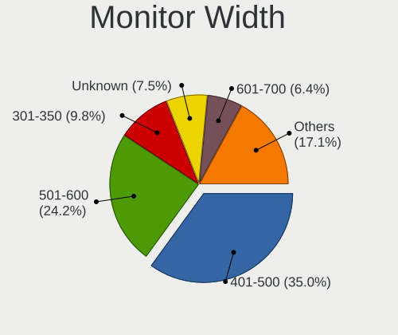

| Width in mm    | Desktops | Percent |
|----------------|----------|---------|
| 401-500        | 2656     | 35.02%  |
| 501-600        | 1837     | 24.22%  |
| 301-350        | 741      | 9.77%   |
| Unknown        | 571      | 7.53%   |
| 601-700        | 484      | 6.38%   |
| 701-800        | 383      | 5.05%   |
| 1001-1500      | 309      | 4.07%   |
| 351-400        | 239      | 3.15%   |
| 1501-2000      | 153      | 2.02%   |
| 801-900        | 88       | 1.16%   |
| 201-300        | 61       | 0.8%    |
| More than 2000 | 45       | 0.59%   |
| 901-1000       | 16       | 0.21%   |
| 101-200        | 1        | 0.01%   |

Aspect Ratio
------------

Proportional relationship between the width and the height

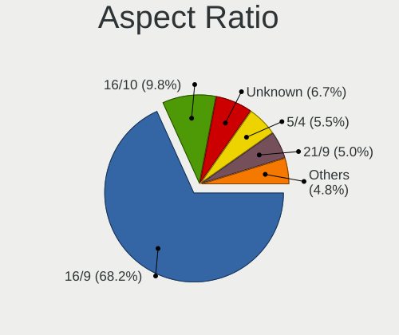

| Ratio   | Desktops | Percent |
|---------|----------|---------|
| 16/9    | 4917     | 68.23%  |
| 16/10   | 703      | 9.76%   |
| Unknown | 486      | 6.74%   |
| 5/4     | 397      | 5.51%   |
| 21/9    | 360      | 5%      |
| 4/3     | 197      | 2.73%   |
| 3/2     | 55       | 0.76%   |
| 1.00    | 47       | 0.65%   |
| 32/9    | 27       | 0.37%   |
| 2.00    | 11       | 0.15%   |
| 6/5     | 2        | 0.03%   |
| 2.24    | 1        | 0.01%   |
| 1.96    | 1        | 0.01%   |
| 0.56    | 1        | 0.01%   |
| 0.25    | 1        | 0.01%   |

Monitor Area
------------

Area in inch²

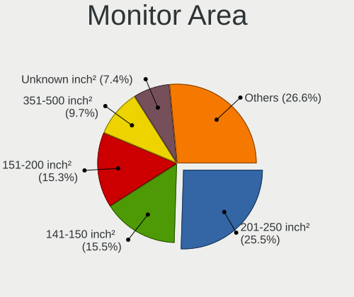

| Area in inch² | Desktops | Percent |
|----------------|----------|---------|
| 201-250        | 1960     | 25.49%  |
| 141-150        | 1190     | 15.47%  |
| 151-200        | 1180     | 15.34%  |
| 351-500        | 747      | 9.71%   |
| Unknown        | 571      | 7.43%   |
| 301-350        | 515      | 6.7%    |
| More than 1000 | 434      | 5.64%   |
| 101-110        | 377      | 4.9%    |
| 251-300        | 269      | 3.5%    |
| 501-1000       | 178      | 2.31%   |
| 131-140        | 123      | 1.6%    |
| 111-120        | 40       | 0.52%   |
| 81-90          | 29       | 0.38%   |
| 71-80          | 29       | 0.38%   |
| 91-100         | 24       | 0.31%   |
| 121-130        | 20       | 0.26%   |
| 51-60          | 2        | 0.03%   |
| 41-50          | 1        | 0.01%   |
| 1-40           | 1        | 0.01%   |

Pixel Density
-------------

Pixels per inch

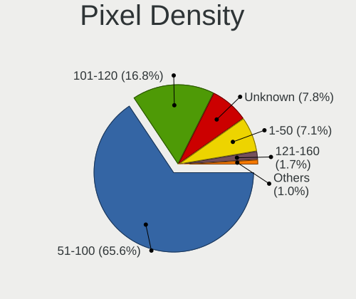

| Density | Desktops | Percent |
|---------|----------|---------|
| 51-100  | 4790     | 65.63%  |
| 101-120 | 1223     | 16.76%  |
| Unknown | 572      | 7.84%   |
| 1-50    | 519      | 7.11%   |
| 121-160 | 124      | 1.7%    |
| 161-240 | 70       | 0.96%   |

Multiple Monitors
-----------------

Total monitors connected

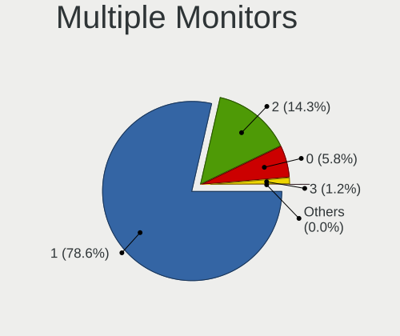

| Total | Desktops | Percent |
|-------|----------|---------|
| 1     | 6076     | 78.55%  |
| 2     | 1108     | 14.32%  |
| 0     | 449      | 5.8%    |
| 3     | 92       | 1.19%   |
| 4     | 9        | 0.12%   |
| 6     | 1        | 0.01%   |

Network
-------

Net Controller Vendor
---------------------

Controller vendors

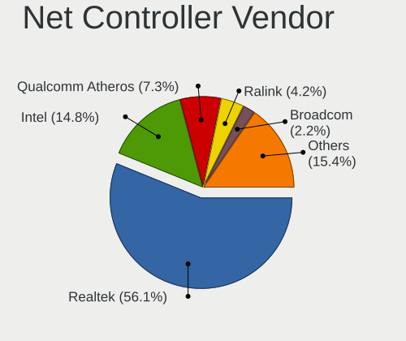

| Vendor                            | Desktops | Percent |
|-----------------------------------|----------|---------|
| Realtek Semiconductor             | 5693     | 56.14%  |
| Intel                             | 1501     | 14.8%   |
| Qualcomm Atheros                  | 737      | 7.27%   |
| Ralink Technology                 | 421      | 4.15%   |
| Broadcom                          | 223      | 2.2%    |
| Nvidia                            | 215      | 2.12%   |
| TP-Link                           | 209      | 2.06%   |
| Qualcomm Atheros Communications   | 144      | 1.42%   |
| Ralink                            | 127      | 1.25%   |
| MediaTek                          | 114      | 1.12%   |
| Samsung Electronics               | 100      | 0.99%   |
| D-Link                            | 77       | 0.76%   |
| Microsoft                         | 71       | 0.7%    |
| Xiaomi                            | 53       | 0.52%   |
| VIA Technologies                  | 51       | 0.5%    |
| Marvell Technology Group          | 47       | 0.46%   |
| Broadcom Limited                  | 43       | 0.42%   |
| D-Link System                     | 38       | 0.37%   |
| JMicron Technology                | 30       | 0.3%    |
| Motorola PCS                      | 29       | 0.29%   |
| ASIX Electronics                  | 23       | 0.23%   |
| Motorola                          | 15       | 0.15%   |
| Huawei Technologies               | 9        | 0.09%   |
| Edimax Technology                 | 9        | 0.09%   |
| Silicon Integrated Systems [SiS]  | 8        | 0.08%   |
| QinHeng Electronics               | 8        | 0.08%   |
| ICS Advent                        | 7        | 0.07%   |
| Sundance Technology Inc / IC Plus | 6        | 0.06%   |
| Qualcomm                          | 6        | 0.06%   |
| Microchip Technology              | 6        | 0.06%   |
| Mercucys                          | 6        | 0.06%   |
| ASUSTek Computer                  | 6        | 0.06%   |
| Aquantia                          | 6        | 0.06%   |
| STMicroelectronics                | 5        | 0.05%   |
| Encore Electronics                | 5        | 0.05%   |
| DisplayLink                       | 5        | 0.05%   |
| 3Com                              | 5        | 0.05%   |
| ZTopInc                           | 4        | 0.04%   |
| Hangzhou Silan Microelectronics   | 4        | 0.04%   |
| GERTEC Telecomunicacoes           | 4        | 0.04%   |

Net Controller Model
--------------------

Controller models

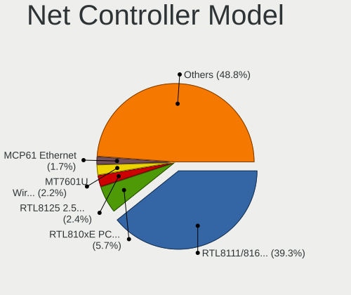

| Model                                                                  | Desktops | Percent |
|------------------------------------------------------------------------|----------|---------|
| Realtek RTL8111/8168/8211/8411 PCI Express Gigabit Ethernet Controller | 4415     | 39.27%  |
| Realtek RTL810xE PCI Express Fast Ethernet controller                  | 641      | 5.7%    |
| Realtek RTL8125 2.5GbE Controller                                      | 268      | 2.38%   |
| Ralink MT7601U Wireless Adapter                                        | 244      | 2.17%   |
| Nvidia MCP61 Ethernet                                                  | 186      | 1.65%   |
| Realtek RTL8188FTV 802.11b/g/n 1T1R 2.4G WLAN Adapter                  | 157      | 1.4%    |
| Realtek 802.11ac NIC                                                   | 136      | 1.21%   |
| Intel 82579LM Gigabit Network Connection (Lewisville)                  | 132      | 1.17%   |
| Qualcomm Atheros AR9271 802.11n                                        | 130      | 1.16%   |
| Intel Ethernet Connection (2) I219-V                                   | 124      | 1.1%    |
| Intel Ethernet Connection (7) I219-V                                   | 121      | 1.08%   |
| Realtek RTL8188EUS 802.11n Wireless Network Adapter                    | 117      | 1.04%   |
| Intel I211 Gigabit Network Connection                                  | 116      | 1.03%   |
| Realtek RTL-8100/8101L/8139 PCI Fast Ethernet Adapter                  | 113      | 1%      |
| Qualcomm Atheros AR9485 Wireless Network Adapter                       | 110      | 0.98%   |
| Qualcomm Atheros AR8151 v2.0 Gigabit Ethernet                          | 107      | 0.95%   |
| Intel Wi-Fi 6E(802.11ax) AX210/AX1675* 2x2 [Typhoon Peak]              | 105      | 0.93%   |
| Intel Wi-Fi 6 AX200                                                    | 103      | 0.92%   |
| Ralink RT5370 Wireless Adapter                                         | 87       | 0.77%   |
| Intel 82579V Gigabit Network Connection                                | 83       | 0.74%   |
| Samsung Galaxy series, misc. (tethering mode)                          | 77       | 0.68%   |
| Realtek RTL88x2bu [AC1200 Techkey]                                     | 76       | 0.68%   |
| Intel Ethernet Connection I217-LM                                      | 74       | 0.66%   |
| Qualcomm Atheros AR8152 v2.0 Fast Ethernet                             | 64       | 0.57%   |
| Intel Wireless 7260                                                    | 61       | 0.54%   |
| Qualcomm Atheros Attansic L2 Fast Ethernet                             | 59       | 0.52%   |
| Microsoft Xbox 360 Wireless Adapter                                    | 54       | 0.48%   |
| Realtek RTL8188EE Wireless Network Adapter                             | 53       | 0.47%   |
| Intel Ethernet Controller I225-V                                       | 53       | 0.47%   |
| Realtek RTL8192EE PCIe Wireless Network Adapter                        | 51       | 0.45%   |
| Intel 82578DC Gigabit Network Connection                               | 51       | 0.45%   |
| Intel 82567LM-3 Gigabit Network Connection                             | 49       | 0.44%   |
| Broadcom NetXtreme BCM5761 Gigabit Ethernet PCIe                       | 47       | 0.42%   |
| Realtek RTL8169 PCI Gigabit Ethernet Controller                        | 45       | 0.4%    |
| Intel Ethernet Connection (2) I218-V                                   | 45       | 0.4%    |
| TP-Link TL-WN823N v2/v3 [Realtek RTL8192EU]                            | 44       | 0.39%   |
| Ralink RT2870/RT3070 Wireless Adapter                                  | 44       | 0.39%   |
| Intel 82578DM Gigabit Network Connection                               | 41       | 0.36%   |
| Realtek RTL8188CE 802.11b/g/n WiFi Adapter                             | 40       | 0.36%   |
| Qualcomm Atheros Killer E220x Gigabit Ethernet Controller              | 36       | 0.32%   |

Wireless Vendor
---------------

Wireless vendors

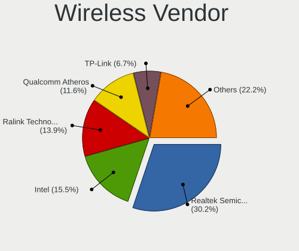

| Vendor                                | Desktops | Percent |
|---------------------------------------|----------|---------|
| Realtek Semiconductor                 | 911      | 30.16%  |
| Intel                                 | 467      | 15.46%  |
| Ralink Technology                     | 421      | 13.94%  |
| Qualcomm Atheros                      | 349      | 11.55%  |
| TP-Link                               | 201      | 6.65%   |
| Qualcomm Atheros Communications       | 144      | 4.77%   |
| Ralink                                | 127      | 4.2%    |
| MediaTek                              | 100      | 3.31%   |
| D-Link                                | 77       | 2.55%   |
| Microsoft                             | 71       | 2.35%   |
| Broadcom                              | 64       | 2.12%   |
| D-Link System                         | 25       | 0.83%   |
| Broadcom Limited                      | 10       | 0.33%   |
| Edimax Technology                     | 9        | 0.3%    |
| Marvell Technology Group              | 7        | 0.23%   |
| Mercucys                              | 6        | 0.2%    |
| Encore Electronics                    | 5        | 0.17%   |
| ZTopInc                               | 4        | 0.13%   |
| Linksys                               | 3        | 0.1%    |
| ASUSTek Computer                      | 3        | 0.1%    |
| Xiaomi                                | 2        | 0.07%   |
| Qualcomm Technologies                 | 2        | 0.07%   |
| NetGear                               | 2        | 0.07%   |
| Micro Star International              | 2        | 0.07%   |
| IMC Networks                          | 2        | 0.07%   |
| 802.11g Adapter [Linksys WUSB54GC v3] | 2        | 0.07%   |
| ZyDAS                                 | 1        | 0.03%   |
| Texas Instruments                     | 1        | 0.03%   |
| Samsung Electronics                   | 1        | 0.03%   |
| Philips (or NXP)                      | 1        | 0.03%   |
| Accton Technology                     | 1        | 0.03%   |

Wireless Model
--------------

Wireless models

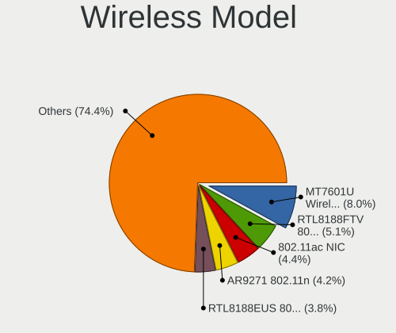

| Model                                                                | Desktops | Percent |
|----------------------------------------------------------------------|----------|---------|
| Ralink MT7601U Wireless Adapter                                      | 244      | 7.97%   |
| Realtek RTL8188FTV 802.11b/g/n 1T1R 2.4G WLAN Adapter                | 157      | 5.13%   |
| Realtek 802.11ac NIC                                                 | 136      | 4.44%   |
| Qualcomm Atheros AR9271 802.11n                                      | 130      | 4.25%   |
| Realtek RTL8188EUS 802.11n Wireless Network Adapter                  | 117      | 3.82%   |
| Qualcomm Atheros AR9485 Wireless Network Adapter                     | 110      | 3.59%   |
| Intel Wi-Fi 6E(802.11ax) AX210/AX1675* 2x2 [Typhoon Peak]            | 105      | 3.43%   |
| Intel Wi-Fi 6 AX200                                                  | 103      | 3.36%   |
| Ralink RT5370 Wireless Adapter                                       | 87       | 2.84%   |
| Realtek RTL88x2bu [AC1200 Techkey]                                   | 76       | 2.48%   |
| Intel Wireless 7260                                                  | 61       | 1.99%   |
| Microsoft Xbox 360 Wireless Adapter                                  | 54       | 1.76%   |
| Realtek RTL8188EE Wireless Network Adapter                           | 53       | 1.73%   |
| Realtek RTL8192EE PCIe Wireless Network Adapter                      | 51       | 1.67%   |
| TP-Link TL-WN823N v2/v3 [Realtek RTL8192EU]                          | 44       | 1.44%   |
| Ralink RT2870/RT3070 Wireless Adapter                                | 44       | 1.44%   |
| Realtek RTL8188CE 802.11b/g/n WiFi Adapter                           | 40       | 1.31%   |
| TP-Link TL-WN821N v5/v6 [RTL8192EU]                                  | 35       | 1.14%   |
| Realtek RTL8192EU 802.11b/g/n WLAN Adapter                           | 35       | 1.14%   |
| Realtek RTL8192CU 802.11n WLAN Adapter                               | 35       | 1.14%   |
| Broadcom BCM4360 802.11ac Dual Band Wireless Network Adapter         | 32       | 1.05%   |
| Qualcomm Atheros AR9287 Wireless Network Adapter (PCI-Express)       | 30       | 0.98%   |
| Qualcomm Atheros AR9285 Wireless Network Adapter (PCI-Express)       | 30       | 0.98%   |
| Ralink RT2561/RT61 802.11g PCI                                       | 29       | 0.95%   |
| Qualcomm Atheros QCA6174 802.11ac Wireless Network Adapter           | 29       | 0.95%   |
| TP-Link AC600 wireless Realtek RTL8811AU [Archer T2U Nano]           | 28       | 0.91%   |
| Realtek RTL8821CE 802.11ac PCIe Wireless Network Adapter             | 28       | 0.91%   |
| Intel Dual Band Wireless-AC 3168NGW [Stone Peak]                     | 28       | 0.91%   |
| Realtek RTL8188CUS 802.11n WLAN Adapter                              | 27       | 0.88%   |
| Qualcomm Atheros AR9227 Wireless Network Adapter                     | 27       | 0.88%   |
| Qualcomm Atheros AR5212/5213/2414 Wireless Network Adapter           | 26       | 0.85%   |
| MediaTek MT7921K (RZ608) Wi-Fi 6E 80MHz                              | 26       | 0.85%   |
| Intel Wireless 7265                                                  | 26       | 0.85%   |
| Intel Wi-Fi 5(802.11ac) Wireless-AC 9x6x [Thunder Peak]              | 26       | 0.85%   |
| Intel Cannon Lake PCH CNVi WiFi                                      | 25       | 0.82%   |
| MediaTek MT7922 802.11ax PCI Express Wireless Network Adapter        | 24       | 0.78%   |
| TP-Link Archer T3U [Realtek RTL8812BU]                               | 22       | 0.72%   |
| Ralink RT2790 Wireless 802.11n 1T/2R PCIe                            | 21       | 0.69%   |
| MediaTek MT7921 802.11ax PCIe Wireless Network Adapter [Filogic 330] | 21       | 0.69%   |
| D-Link DWA-123 Wireless N 150 Adapter (rev.D1)                       | 21       | 0.69%   |

Ethernet Vendor
---------------

Ethernet vendors

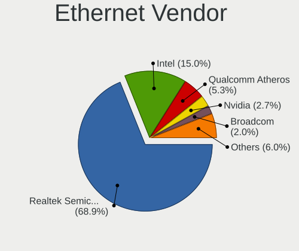

| Vendor                            | Desktops | Percent |
|-----------------------------------|----------|---------|
| Realtek Semiconductor             | 5453     | 68.93%  |
| Intel                             | 1189     | 15.03%  |
| Qualcomm Atheros                  | 421      | 5.32%   |
| Nvidia                            | 215      | 2.72%   |
| Broadcom                          | 162      | 2.05%   |
| Samsung Electronics               | 99       | 1.25%   |
| Xiaomi                            | 51       | 0.64%   |
| VIA Technologies                  | 50       | 0.63%   |
| Marvell Technology Group          | 40       | 0.51%   |
| Broadcom Limited                  | 33       | 0.42%   |
| JMicron Technology                | 30       | 0.38%   |
| Motorola PCS                      | 29       | 0.37%   |
| ASIX Electronics                  | 23       | 0.29%   |
| MediaTek                          | 14       | 0.18%   |
| D-Link System                     | 13       | 0.16%   |
| TP-Link                           | 8        | 0.1%    |
| Silicon Integrated Systems [SiS]  | 8        | 0.1%    |
| ICS Advent                        | 7        | 0.09%   |
| Sundance Technology Inc / IC Plus | 6        | 0.08%   |
| Qualcomm                          | 6        | 0.08%   |
| Huawei Technologies               | 6        | 0.08%   |
| Aquantia                          | 6        | 0.08%   |
| DisplayLink                       | 5        | 0.06%   |
| 3Com                              | 5        | 0.06%   |
| Hangzhou Silan Microelectronics   | 4        | 0.05%   |
| OPPO Electronics                  | 3        | 0.04%   |
| LG Electronics                    | 3        | 0.04%   |
| ASUSTek Computer                  | 3        | 0.04%   |
| Accton Technology                 | 3        | 0.04%   |
| T & A Mobile Phones               | 2        | 0.03%   |
| Spreadtrum Communications         | 2        | 0.03%   |
| Lenovo                            | 2        | 0.03%   |
| Apple                             | 2        | 0.03%   |
| SysKonnect                        | 1        | 0.01%   |
| SK hynix                          | 1        | 0.01%   |
| Qualcomm Technologies             | 1        | 0.01%   |
| Netchip Technology                | 1        | 0.01%   |
| IBM                               | 1        | 0.01%   |
| HMD Global                        | 1        | 0.01%   |
| Google                            | 1        | 0.01%   |

Ethernet Model
--------------

Ethernet models

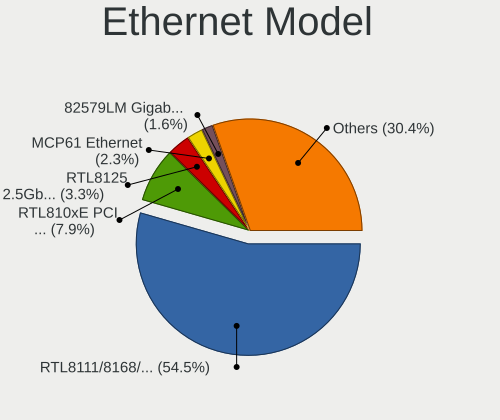

| Model                                                                  | Desktops | Percent |
|------------------------------------------------------------------------|----------|---------|
| Realtek RTL8111/8168/8211/8411 PCI Express Gigabit Ethernet Controller | 4415     | 54.45%  |
| Realtek RTL810xE PCI Express Fast Ethernet controller                  | 641      | 7.91%   |
| Realtek RTL8125 2.5GbE Controller                                      | 268      | 3.31%   |
| Nvidia MCP61 Ethernet                                                  | 186      | 2.29%   |
| Intel 82579LM Gigabit Network Connection (Lewisville)                  | 132      | 1.63%   |
| Intel Ethernet Connection (2) I219-V                                   | 124      | 1.53%   |
| Intel Ethernet Connection (7) I219-V                                   | 121      | 1.49%   |
| Intel I211 Gigabit Network Connection                                  | 116      | 1.43%   |
| Realtek RTL-8100/8101L/8139 PCI Fast Ethernet Adapter                  | 113      | 1.39%   |
| Qualcomm Atheros AR8151 v2.0 Gigabit Ethernet                          | 107      | 1.32%   |
| Intel 82579V Gigabit Network Connection                                | 83       | 1.02%   |
| Samsung Galaxy series, misc. (tethering mode)                          | 77       | 0.95%   |
| Intel Ethernet Connection I217-LM                                      | 74       | 0.91%   |
| Qualcomm Atheros AR8152 v2.0 Fast Ethernet                             | 64       | 0.79%   |
| Qualcomm Atheros Attansic L2 Fast Ethernet                             | 59       | 0.73%   |
| Intel Ethernet Controller I225-V                                       | 53       | 0.65%   |
| Intel 82578DC Gigabit Network Connection                               | 51       | 0.63%   |
| Intel 82567LM-3 Gigabit Network Connection                             | 49       | 0.6%    |
| Broadcom NetXtreme BCM5761 Gigabit Ethernet PCIe                       | 47       | 0.58%   |
| Realtek RTL8169 PCI Gigabit Ethernet Controller                        | 45       | 0.56%   |
| Intel Ethernet Connection (2) I218-V                                   | 45       | 0.56%   |
| Intel 82578DM Gigabit Network Connection                               | 41       | 0.51%   |
| Qualcomm Atheros Killer E220x Gigabit Ethernet Controller              | 36       | 0.44%   |
| Xiaomi Mi/Redmi series (RNDIS)                                         | 35       | 0.43%   |
| Qualcomm Atheros AR8161 Gigabit Ethernet                               | 33       | 0.41%   |
| Realtek RTL8153 Gigabit Ethernet Adapter                               | 32       | 0.39%   |
| VIA VT6102/VT6103 [Rhine-II]                                           | 31       | 0.38%   |
| Intel Ethernet Connection (14) I219-V                                  | 31       | 0.38%   |
| Intel Ethernet Connection I217-V                                       | 28       | 0.35%   |
| Realtek RTL-8110SC/8169SC Gigabit Ethernet                             | 27       | 0.33%   |
| Samsung GT-I9070 (network tethering, USB debugging enabled)            | 24       | 0.3%    |
| Motorola PCS motorola one 5G ace                                       | 23       | 0.28%   |
| Qualcomm Atheros AR8131 Gigabit Ethernet                               | 22       | 0.27%   |
| Intel Ethernet Connection (12) I219-V                                  | 22       | 0.27%   |
| Intel 82574L Gigabit Network Connection                                | 22       | 0.27%   |
| ASIX AX88179 Gigabit Ethernet                                          | 21       | 0.26%   |
| Realtek RTL8111/8168/8411 PCI Express Gigabit Ethernet Controller      | 20       | 0.25%   |
| Qualcomm Atheros Attansic L1 Gigabit Ethernet                          | 20       | 0.25%   |
| Intel 82566DM-2 Gigabit Network Connection                             | 19       | 0.23%   |
| Qualcomm Atheros QCA8171 Gigabit Ethernet                              | 18       | 0.22%   |

Net Controller Kind
-------------------

Ethernet, WiFi or modem

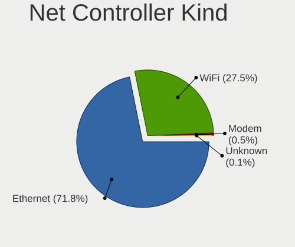

| Kind     | Desktops | Percent |
|----------|----------|---------|
| Ethernet | 7440     | 71.84%  |
| WiFi     | 2845     | 27.47%  |
| Modem    | 56       | 0.54%   |
| Unknown  | 15       | 0.14%   |

Used Controller
---------------

Currently used network controller

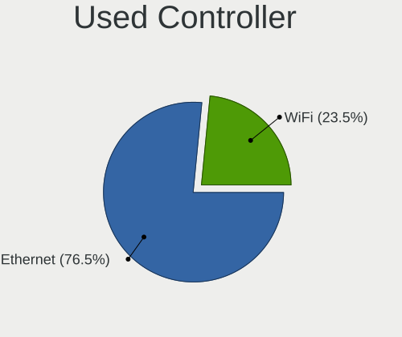

| Kind     | Desktops | Percent |
|----------|----------|---------|
| Ethernet | 5950     | 76.54%  |
| WiFi     | 1824     | 23.46%  |

NICs
----

Total network controllers on board

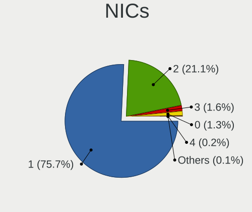

| Total | Desktops | Percent |
|-------|----------|---------|
| 1     | 5778     | 75.74%  |
| 2     | 1607     | 21.06%  |
| 3     | 122      | 1.6%    |
| 0     | 100      | 1.31%   |
| 4     | 18       | 0.24%   |
| 6     | 2        | 0.03%   |
| 5     | 2        | 0.03%   |

IPv6
----

IPv6 vs IPv4

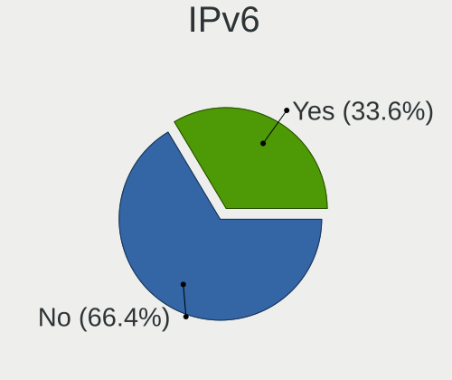

| Used | Desktops | Percent |
|------|----------|---------|
| No   | 5173     | 66.41%  |
| Yes  | 2616     | 33.59%  |

Bluetooth
---------

Bluetooth Vendor
----------------

Controller vendors

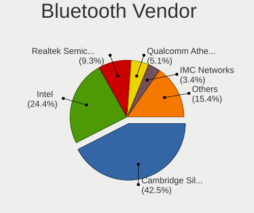

| Vendor                          | Desktops | Percent |
|---------------------------------|----------|---------|
| Cambridge Silicon Radio         | 769      | 42.49%  |
| Intel                           | 441      | 24.36%  |
| Realtek Semiconductor           | 168      | 9.28%   |
| Qualcomm Atheros Communications | 92       | 5.08%   |
| IMC Networks                    | 62       | 3.43%   |
| TP-Link                         | 52       | 2.87%   |
| MediaTek                        | 48       | 2.65%   |
| ASUSTek Computer                | 28       | 1.55%   |
| Broadcom                        | 25       | 1.38%   |
| Unknown                         | 22       | 1.22%   |
| Foxconn / Hon Hai               | 21       | 1.16%   |
| Actions                         | 21       | 1.16%   |
| Apple                           | 19       | 1.05%   |
| Realtek                         | 9        | 0.5%    |
| SiW                             | 8        | 0.44%   |
| Integrated System Solution      | 8        | 0.44%   |
| Conwise Technology              | 3        | 0.17%   |
| Micro Star International        | 2        | 0.11%   |
| Lite-On Technology              | 2        | 0.11%   |
| SINO WEALTH                     | 1        | 0.06%   |
| Ralink                          | 1        | 0.06%   |
| Qcom                            | 1        | 0.06%   |
| Motorola PCS                    | 1        | 0.06%   |
| Logitech                        | 1        | 0.06%   |
| Dynex                           | 1        | 0.06%   |
| D-Link                          | 1        | 0.06%   |
| AICSemi                         | 1        | 0.06%   |
| Accel Semiconductor             | 1        | 0.06%   |
| AboCom Systems                  | 1        | 0.06%   |

Bluetooth Model
---------------

Controller models

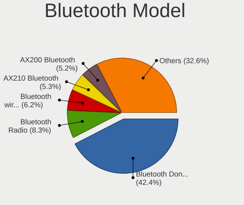

| Model                                                 | Desktops | Percent |
|-------------------------------------------------------|----------|---------|
| Cambridge Silicon Radio Bluetooth Dongle (HCI mode)   | 769      | 42.44%  |
| Realtek Bluetooth Radio                               | 150      | 8.28%   |
| Intel Bluetooth wireless interface                    | 112      | 6.18%   |
| Intel AX210 Bluetooth                                 | 96       | 5.3%    |
| Intel AX200 Bluetooth                                 | 94       | 5.19%   |
| TP-Link TP-T@- UB500 Adapter                          | 52       | 2.87%   |
| MediaTek Wireless_Device                              | 48       | 2.65%   |
| Qualcomm Atheros  Bluetooth Device                    | 44       | 2.43%   |
| IMC Networks Wireless_Device                          | 38       | 2.1%    |
| Intel Bluetooth 9460/9560 Jefferson Peak (JfP)        | 34       | 1.88%   |
| Intel Wireless-AC 3168 Bluetooth                      | 28       | 1.55%   |
| Intel Wireless-AC 9260 Bluetooth Adapter              | 27       | 1.49%   |
| Qualcomm Atheros Bluetooth USB Host Controller        | 25       | 1.38%   |
| Intel AX201 Bluetooth                                 | 25       | 1.38%   |
| Intel Bluetooth Device                                | 22       | 1.21%   |
| Unknown                                               | 22       | 1.21%   |
| IMC Networks Bluetooth Radio                          | 21       | 1.16%   |
| Actions general adapter                               | 21       | 1.16%   |
| Apple Bluetooth Host Controller                       | 14       | 0.77%   |
| Realtek Bluetooth Radio                               | 9        | 0.5%    |
| Qualcomm Atheros AR9462 Bluetooth                     | 9        | 0.5%    |
| Foxconn / Hon Hai Wireless_Device                     | 9        | 0.5%    |
| Foxconn / Hon Hai Bluetooth Device                    | 9        | 0.5%    |
| SiW SiW                                               | 8        | 0.44%   |
| Realtek Bluetooth 5.3 Radio                           | 8        | 0.44%   |
| Qualcomm Atheros AR3012 Bluetooth 4.0                 | 5        | 0.28%   |
| Qualcomm Atheros AR3011 Bluetooth                     | 5        | 0.28%   |
| ASUS Qualcomm Bluetooth 4.1                           | 5        | 0.28%   |
| ASUS Bluetooth Radio                                  | 5        | 0.28%   |
| ASUS Bluetooth Adapter                                | 5        | 0.28%   |
| ASUS BCM20702A0                                       | 5        | 0.28%   |
| Intel Centrino Bluetooth Wireless Transceiver         | 4        | 0.22%   |
| Integrated System Solution KY-BT100 Bluetooth Adapter | 4        | 0.22%   |
| Integrated System Solution Bluetooth Device           | 4        | 0.22%   |
| Broadcom Bluetooth Controller                         | 4        | 0.22%   |
| Broadcom BCM20702A0 Bluetooth 4.0                     | 4        | 0.22%   |
| ASUS Broadcom BCM20702 Single-Chip Bluetooth 4.0 + LE | 4        | 0.22%   |
| Realtek  Bluetooth 4.2 Adapter                        | 3        | 0.17%   |
| Realtek 802.11ac WLAN Adapter                         | 3        | 0.17%   |
| Qualcomm Atheros Bluetooth                            | 3        | 0.17%   |

Sound
-----

Sound Vendor
------------

Sound card vendors

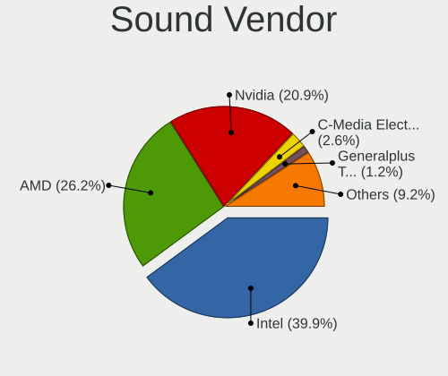

| Vendor                                          | Desktops | Percent |
|-------------------------------------------------|----------|---------|
| Intel                                           | 4813     | 39.89%  |
| AMD                                             | 3160     | 26.19%  |
| Nvidia                                          | 2527     | 20.94%  |
| C-Media Electronics                             | 317      | 2.63%   |
| Generalplus Technology                          | 144      | 1.19%   |
| Logitech                                        | 102      | 0.85%   |
| JMTek                                           | 87       | 0.72%   |
| Kingston Technology                             | 70       | 0.58%   |
| Texas Instruments                               | 63       | 0.52%   |
| VIA Technologies                                | 59       | 0.49%   |
| Creative Labs                                   | 53       | 0.44%   |
| Jieli Technology                                | 42       | 0.35%   |
| Corsair                                         | 30       | 0.25%   |
| ASUSTek Computer                                | 28       | 0.23%   |
| Unknown                                         | 27       | 0.22%   |
| Razer USA                                       | 22       | 0.18%   |
| Fifine Microphones                              | 22       | 0.18%   |
| Microsoft                                       | 20       | 0.17%   |
| KTMicro                                         | 19       | 0.16%   |
| Tenx Technology                                 | 18       | 0.15%   |
| Sony                                            | 17       | 0.14%   |
| Hewlett-Packard                                 | 16       | 0.13%   |
| Zoran Co. Personal Media Division (Nogatech)    | 15       | 0.12%   |
| Plantronics                                     | 15       | 0.12%   |
| Weltrend Semiconductor                          | 14       | 0.12%   |
| Creative Technology                             | 14       | 0.12%   |
| BEHRINGER International                         | 14       | 0.12%   |
| Licensed by Sony Computer Entertainment America | 13       | 0.11%   |
| SteelSeries ApS                                 | 12       | 0.1%    |
| Goldvish                                        | 12       | 0.1%    |
| Focusrite-Novation                              | 11       | 0.09%   |
| Dell                                            | 11       | 0.09%   |
| Silicon Integrated Systems [SiS]                | 10       | 0.08%   |
| GN Netcom                                       | 10       | 0.08%   |
| Realtek Semiconductor                           | 9        | 0.07%   |
| JBL                                             | 9        | 0.07%   |
| Samson Technologies                             | 8        | 0.07%   |
| Micro Star International                        | 8        | 0.07%   |
| Medeli Electronics                              | 8        | 0.07%   |
| Thesycon Systemsoftware & Consulting            | 7        | 0.06%   |

Sound Model
-----------

Sound card models

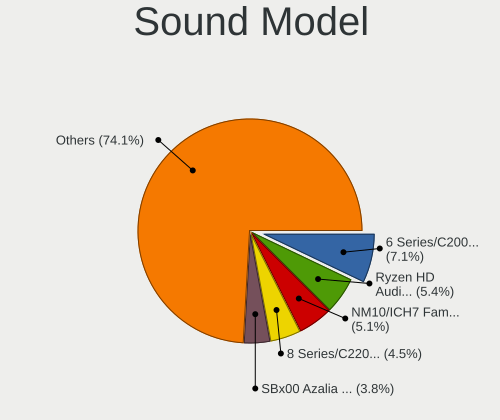

| Model                                                                             | Desktops | Percent |
|-----------------------------------------------------------------------------------|----------|---------|
| Intel 6 Series/C200 Series Chipset Family High Definition Audio Controller        | 1012     | 7.1%    |
| AMD Ryzen HD Audio Controller                                                     | 766      | 5.37%   |
| Intel NM10/ICH7 Family High Definition Audio Controller                           | 732      | 5.13%   |
| Intel 8 Series/C220 Series Chipset High Definition Audio Controller               | 639      | 4.48%   |
| AMD SBx00 Azalia (Intel HDA)                                                      | 543      | 3.81%   |
| Intel 7 Series/C216 Chipset Family High Definition Audio Controller               | 472      | 3.31%   |
| AMD Starship/Matisse HD Audio Controller                                          | 467      | 3.28%   |
| AMD Ellesmere HDMI Audio [Radeon RX 470/480 / 570/580/590]                        | 392      | 2.75%   |
| AMD Renoir/Cezanne HDMI/DP Audio Controller                                       | 328      | 2.3%    |
| Intel Xeon E3-1200 v3/4th Gen Core Processor HD Audio Controller                  | 310      | 2.17%   |
| AMD Family 17h (Models 00h-0fh) HD Audio Controller                               | 308      | 2.16%   |
| Nvidia High Definition Audio Controller                                           | 302      | 2.12%   |
| Intel 5 Series/3400 Series Chipset High Definition Audio                          | 284      | 1.99%   |
| Intel 100 Series/C230 Series Chipset Family HD Audio Controller                   | 282      | 1.98%   |
| AMD Raven/Raven2/Fenghuang HDMI/DP Audio Controller                               | 261      | 1.83%   |
| AMD Baffin HDMI/DP Audio [Radeon RX 550 640SP / RX 560/560X]                      | 255      | 1.79%   |
| Intel 200 Series PCH HD Audio                                                     | 233      | 1.63%   |
| Intel Cannon Lake PCH cAVS                                                        | 226      | 1.59%   |
| Nvidia GP107GL High Definition Audio Controller                                   | 224      | 1.57%   |
| Nvidia MCP61 High Definition Audio                                                | 203      | 1.42%   |
| AMD FCH Azalia Controller                                                         | 193      | 1.35%   |
| AMD Navi 21/23 HDMI/DP Audio Controller                                           | 189      | 1.33%   |
| Nvidia GK208 HDMI/DP Audio Controller                                             | 165      | 1.16%   |
| AMD Oland/Hainan/Cape Verde/Pitcairn HDMI Audio [Radeon HD 7000 Series]           | 160      | 1.12%   |
| Nvidia GF108 High Definition Audio Controller                                     | 156      | 1.09%   |
| Nvidia GP106 High Definition Audio Controller                                     | 150      | 1.05%   |
| Nvidia TU116 High Definition Audio Controller                                     | 145      | 1.02%   |
| Generalplus Technology USB Audio Device                                           | 144      | 1.01%   |
| AMD Cedar HDMI Audio [Radeon HD 5400/6300/7300 Series]                            | 131      | 0.92%   |
| Nvidia GM107 High Definition Audio Controller [GeForce 940MX]                     | 116      | 0.81%   |
| Nvidia GF119 HDMI Audio Controller                                                | 113      | 0.79%   |
| AMD Navi 10 HDMI Audio                                                            | 101      | 0.71%   |
| Intel C610/X99 series chipset HD Audio Controller                                 | 97       | 0.68%   |
| AMD Caicos HDMI Audio [Radeon HD 6450 / 7450/8450/8490 OEM / R5 230/235/235X OEM] | 96       | 0.67%   |
| AMD Radeon High Definition Audio Controller                                       | 95       | 0.67%   |
| Nvidia GA106 High Definition Audio Controller                                     | 89       | 0.62%   |
| Nvidia TU106 High Definition Audio Controller                                     | 88       | 0.62%   |
| C-Media Electronics USB Audio Device                                              | 82       | 0.58%   |
| Intel Atom Processor Z36xxx/Z37xxx Series High Definition Audio Controller        | 80       | 0.56%   |
| Nvidia GA104 High Definition Audio Controller                                     | 79       | 0.55%   |

Memory
------

Memory Vendor
-------------

Memory module vendors

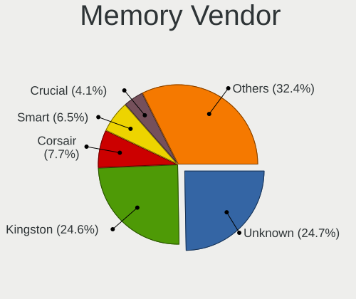

| Vendor                       | Desktops | Percent |
|------------------------------|----------|---------|
| Unknown                      | 898      | 24.72%  |
| Kingston                     | 894      | 24.61%  |
| Corsair                      | 279      | 7.68%   |
| Smart                        | 236      | 6.5%    |
| Crucial                      | 149      | 4.1%    |
| A-DATA Technology            | 148      | 4.07%   |
| Unknown                      | 118      | 3.25%   |
| Samsung Electronics          | 113      | 3.11%   |
| SK hynix                     | 104      | 2.86%   |
| Team                         | 89       | 2.45%   |
| Micron Technology            | 66       | 1.82%   |
| G.Skill                      | 54       | 1.49%   |
| Teikon                       | 45       | 1.24%   |
| Multilaser                   | 41       | 1.13%   |
| Atermiter                    | 26       | 0.72%   |
| Apacer                       | 24       | 0.66%   |
| Asgard                       | 23       | 0.63%   |
| Patriot                      | 22       | 0.61%   |
| Kllisre                      | 21       | 0.58%   |
| Avant                        | 14       | 0.39%   |
| Kreton                       | 12       | 0.33%   |
| Juhor                        | 11       | 0.3%    |
| Hewlett-Packard              | 11       | 0.3%    |
| GeIL                         | 11       | 0.3%    |
| Elpida                       | 9        | 0.25%   |
| RZX                          | 8        | 0.22%   |
| Hikvision                    | 8        | 0.22%   |
| HBS                          | 8        | 0.22%   |
| GLOWAY                       | 8        | 0.22%   |
| CSX                          | 8        | 0.22%   |
| Nanya Technology             | 7        | 0.19%   |
| MemoWise                     | 7        | 0.19%   |
| Unknown (82B5)               | 6        | 0.17%   |
| Smart Modular                | 6        | 0.17%   |
| PUSKILL                      | 6        | 0.17%   |
| Patriot Memory (PDP Systems) | 6        | 0.17%   |
| Golden Empire                | 6        | 0.17%   |
| Unknown (ABCD)               | 5        | 0.14%   |
| Transcend                    | 5        | 0.14%   |
| PNY                          | 5        | 0.14%   |

Memory Model
------------

Memory module models

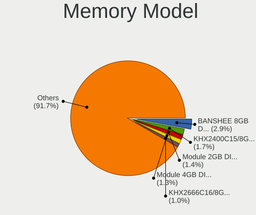

| Model                                                 | Desktops | Percent |
|-------------------------------------------------------|----------|---------|
| Unknown                                               | 118      | 2.94%   |
| Kingston RAM KHX2400C15/8G 8GB DIMM DDR4 3400MT/s     | 68       | 1.69%   |
| Unknown RAM Module 2GB DIMM SDRAM                     | 56       | 1.4%    |
| Unknown RAM Module 4GB DIMM DDR3 1333MT/s             | 52       | 1.3%    |
| Kingston RAM KHX2666C16/8G 8GiB DIMM DDR4 3466MT/s    | 41       | 1.02%   |
| Kingston RAM KHX1600C10D3/8G 8GB DIMM DDR3 2133MT/s   | 39       | 0.97%   |
| Unknown RAM Module 4GB DIMM 1333MT/s                  | 36       | 0.9%    |
| Unknown RAM Module 4GB DIMM SDRAM                     | 31       | 0.77%   |
| Unknown RAM Module 4096MB DIMM DDR3 1333MT/s          | 31       | 0.77%   |
| Unknown RAM Module 2048MB DIMM SDRAM                  | 29       | 0.72%   |
| Unknown RAM Module 2GB DIMM DDR2 800MT/s              | 28       | 0.7%    |
| Unknown RAM Module 2GB DIMM DDR2                      | 28       | 0.7%    |
| Smart RAM SH564128FH8N6TNSQG 4GB DIMM DDR3 1600MT/s   | 28       | 0.7%    |
| Unknown RAM Module 4096MB DIMM 1333MT/s               | 26       | 0.65%   |
| Kingston RAM 99U5403-159.A01LF 8GB DIMM DDR3 1600MT/s | 26       | 0.65%   |
| A-DATA RAM DDR4 3000 8GB DIMM DDR4 3600MT/s           | 26       | 0.65%   |
| A-DATA RAM DDR4 3200 16GB DIMM DDR4 3600MT/s          | 22       | 0.55%   |
| Unknown RAM Module 2GB DIMM 800MT/s                   | 21       | 0.52%   |
| Team RAM TEAMGROUP-UD4-3200 8GB DIMM DDR4 3800MT/s    | 21       | 0.52%   |
| Kingston RAM KF3200C16D4/8GX 8GiB DIMM DDR4 3600MT/s  | 21       | 0.52%   |
| Unknown RAM Module 8GB DIMM DDR3 1333MT/s             | 19       | 0.47%   |
| Unknown RAM Module 2GB DIMM DDR3 1333MT/s             | 19       | 0.47%   |
| Smart RAM SH564128FH8N0TNSDR 4GB DIMM DDR3 1600MT/s   | 19       | 0.47%   |
| Unknown RAM Module 8GB DIMM DDR4 2667MT/s             | 18       | 0.45%   |
| Team RAM TEAMGROUP-UD4-3200 8GB DIMM DDR4 3733MT/s    | 18       | 0.45%   |
| Smart RAM SH564568FH8N6PHSFG 2GB DIMM DDR3 1333MT/s   | 18       | 0.45%   |
| Smart RAM SH564568FH8N0QHSCR 2GB DIMM DDR3 1333MT/s   | 18       | 0.45%   |
| Kingston RAM KHX2400C15D4/4G 4GB DIMM DDR4 3151MT/s   | 18       | 0.45%   |
| Kingston RAM Module 8GB DIMM DDR3 1600MT/s            | 17       | 0.42%   |
| Kingston RAM KHX1866C10D3/8G 8GB DIMM DDR3 1867MT/s   | 17       | 0.42%   |
| Kingston RAM 99U5474-028.A00LF 4GB DIMM DDR3 1333MT/s | 17       | 0.42%   |
| Unknown RAM Module 2048MB DIMM DDR2 800MT/s           | 16       | 0.4%    |
| Kingston RAM Module 8GB DIMM DDR3                     | 16       | 0.4%    |
| Kingston RAM KHX1600C10D3/4G 4GB DIMM DDR3 1866MT/s   | 16       | 0.4%    |
| Kingston RAM 9905471-006.A00LF 4GB DIMM DDR3 1333MT/s | 16       | 0.4%    |
| Kingston RAM KF3200C16D4/16GX 16GB DIMM DDR4 3733MT/s | 15       | 0.37%   |
| Unknown RAM Module 8GB DIMM DDR3 1600MT/s             | 14       | 0.35%   |
| Unknown RAM Module 4096MB DIMM SDRAM                  | 14       | 0.35%   |
| Unknown RAM Module 2GB DIMM DDR2 667MT/s              | 14       | 0.35%   |
| Unknown RAM Module 2GB DIMM 1333MT/s                  | 14       | 0.35%   |

Memory Kind
-----------

Memory module kinds

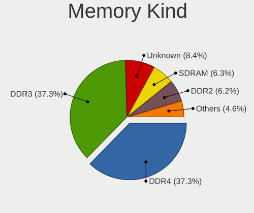

| Kind         | Desktops | Percent |
|--------------|----------|---------|
| DDR4         | 1181     | 37.29%  |
| DDR3         | 1180     | 37.26%  |
| Unknown      | 265      | 8.37%   |
| SDRAM        | 199      | 6.28%   |
| DDR2         | 195      | 6.16%   |
| DDR5         | 88       | 2.78%   |
| DDR          | 39       | 1.23%   |
| LPDDR4       | 10       | 0.32%   |
| DRAM         | 4        | 0.13%   |
| RAM          | 3        | 0.09%   |
| LPDDR5       | 2        | 0.06%   |
| DDR2 FB-DIMM | 1        | 0.03%   |

Memory Form Factor
------------------

Physical design of the memory module

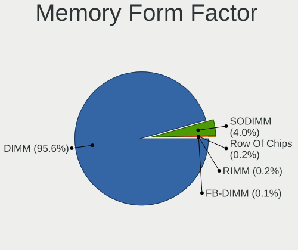

| Name         | Desktops | Percent |
|--------------|----------|---------|
| DIMM         | 2987     | 95.61%  |
| SODIMM       | 125      | 4%      |
| Row Of Chips | 5        | 0.16%   |
| RIMM         | 5        | 0.16%   |
| FB-DIMM      | 2        | 0.06%   |

Memory Size
-----------

Memory module size

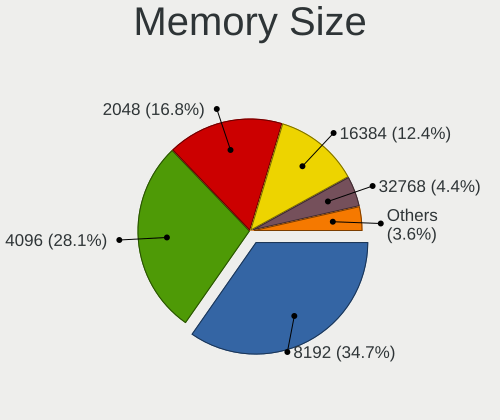

| Size  | Desktops | Percent |
|-------|----------|---------|
| 8192  | 1221     | 34.7%   |
| 4096  | 990      | 28.13%  |
| 2048  | 592      | 16.82%  |
| 16384 | 435      | 12.36%  |
| 32768 | 156      | 4.43%   |
| 1024  | 99       | 2.81%   |
| 512   | 13       | 0.37%   |
| 65536 | 3        | 0.09%   |
| 256   | 3        | 0.09%   |
| 12288 | 2        | 0.06%   |
| 49152 | 1        | 0.03%   |
| 24576 | 1        | 0.03%   |
| 15616 | 1        | 0.03%   |
| 1536  | 1        | 0.03%   |
| 16    | 1        | 0.03%   |

Memory Speed
------------

Memory module speed

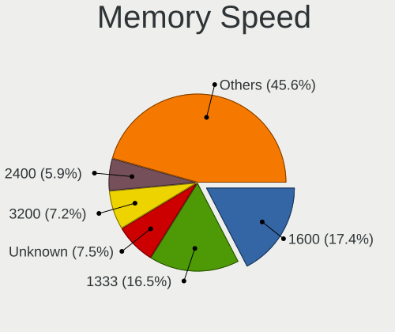

| Speed   | Desktops | Percent |
|---------|----------|---------|
| 1600    | 614      | 17.37%  |
| 1333    | 584      | 16.52%  |
| Unknown | 264      | 7.47%   |
| 3200    | 253      | 7.16%   |
| 2400    | 208      | 5.88%   |
| 2667    | 178      | 5.04%   |
| 2133    | 150      | 4.24%   |
| 3600    | 146      | 4.13%   |
| 800     | 135      | 3.82%   |
| 667     | 116      | 3.28%   |
| 3400    | 95       | 2.69%   |
| 3000    | 68       | 1.92%   |
| 1866    | 66       | 1.87%   |
| 2666    | 47       | 1.33%   |
| 3466    | 46       | 1.3%    |
| 3733    | 42       | 1.19%   |
| 3800    | 40       | 1.13%   |
| 1066    | 37       | 1.05%   |
| 6000    | 33       | 0.93%   |
| 1067    | 32       | 0.91%   |
| 400     | 24       | 0.68%   |
| 4800    | 22       | 0.62%   |
| 2933    | 21       | 0.59%   |
| 2800    | 21       | 0.59%   |
| 3151    | 18       | 0.51%   |
| 533     | 18       | 0.51%   |
| 333     | 18       | 0.51%   |
| 3066    | 17       | 0.48%   |
| 1800    | 15       | 0.42%   |
| 1334    | 15       | 0.42%   |
| 3334    | 13       | 0.37%   |
| 3266    | 13       | 0.37%   |
| 5200    | 11       | 0.31%   |
| 4000    | 11       | 0.31%   |
| 3333    | 10       | 0.28%   |
| 5600    | 8        | 0.23%   |
| 1867    | 8        | 0.23%   |
| 3933    | 7        | 0.2%    |
| 3467    | 6        | 0.17%   |
| 2448    | 6        | 0.17%   |

Printers & scanners
-------------------

Printer Vendor
--------------

Printer device vendors

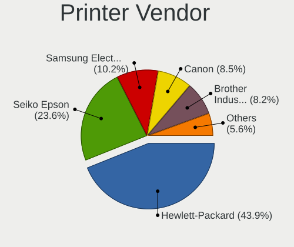

| Vendor                | Desktops | Percent |
|-----------------------|----------|---------|
| Hewlett-Packard       | 134      | 43.93%  |
| Seiko Epson           | 72       | 23.61%  |
| Samsung Electronics   | 31       | 10.16%  |
| Canon                 | 26       | 8.52%   |
| Brother Industries    | 25       | 8.2%    |
| Lexmark International | 4        | 1.31%   |
| QinHeng Electronics   | 3        | 0.98%   |
| Apple                 | 2        | 0.66%   |
| Xiaomi                | 1        | 0.33%   |
| Xerox                 | 1        | 0.33%   |
| Ricoh                 | 1        | 0.33%   |
| Prolific Technology   | 1        | 0.33%   |
| Oki Data              | 1        | 0.33%   |
| NXP Semiconductors    | 1        | 0.33%   |
| ICS Advent            | 1        | 0.33%   |
| ARGOX                 | 1        | 0.33%   |

Printer Model
-------------

Printer device models

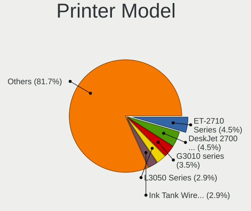

| Model                                        | Desktops | Percent |
|----------------------------------------------|----------|---------|
| Seiko Epson ET-2710 Series                   | 14       | 4.5%    |
| HP DeskJet 2700 series                       | 14       | 4.5%    |
| Canon G3010 series                           | 11       | 3.54%   |
| Seiko Epson L3050 Series                     | 9        | 2.89%   |
| HP Ink Tank Wireless 410 series              | 9        | 2.89%   |
| Seiko Epson L365 Series                      | 8        | 2.57%   |
| Seiko Epson L355 Series                      | 8        | 2.57%   |
| HP DeskJet 2130 series                       | 8        | 2.57%   |
| Samsung M2070 Series                         | 7        | 2.25%   |
| HP Deskjet 3050 J610 series                  | 7        | 2.25%   |
| HP LaserJet P1005                            | 6        | 1.93%   |
| HP DeskJet 3630 series                       | 6        | 1.93%   |
| HP DeskJet 2600 series                       | 6        | 1.93%   |
| Seiko Epson ET-2810 Series                   | 5        | 1.61%   |
| HP DeskJet F4100 Printer series              | 5        | 1.61%   |
| HP Deskjet 2540 series                       | 5        | 1.61%   |
| HP Deskjet 2050 J510                         | 5        | 1.61%   |
| Brother HL-1200 series                       | 5        | 1.61%   |
| Seiko Epson L3110 Series                     | 4        | 1.29%   |
| Samsung SCX-4200 series                      | 4        | 1.29%   |
| Samsung M2020 Series                         | 4        | 1.29%   |
| HP LaserJet 1020                             | 4        | 1.29%   |
| HP Deskjet F4400 series                      | 4        | 1.29%   |
| HP DeskJet 2300 series                       | 4        | 1.29%   |
| Seiko Epson XP-240 Series                    | 3        | 0.96%   |
| Seiko Epson L375 Series                      | 3        | 0.96%   |
| Seiko Epson L120 Series                      | 3        | 0.96%   |
| Seiko Epson EPSON L220 Series                | 3        | 0.96%   |
| Samsung SCX-3200 Series                      | 3        | 0.96%   |
| QinHeng CH340S                               | 3        | 0.96%   |
| HP Smart Tank 510 series                     | 3        | 0.96%   |
| HP PSC-1315/PSC-1317                         | 3        | 0.96%   |
| HP LaserJet Professional P1102w              | 3        | 0.96%   |
| HP DeskJet F4200 series                      | 3        | 0.96%   |
| Canon G4010 series                           | 3        | 0.96%   |
| Seiko Epson XP-211 214 216 Series            | 2        | 0.64%   |
| Seiko Epson ME 320/330 Series [Stylus SX125] | 2        | 0.64%   |
| Seiko Epson L210 Series                      | 2        | 0.64%   |
| Samsung SCX-4600 Series                      | 2        | 0.64%   |
| Samsung SCX-3400 Series                      | 2        | 0.64%   |

Scanner Vendor
--------------

Scanner device vendors

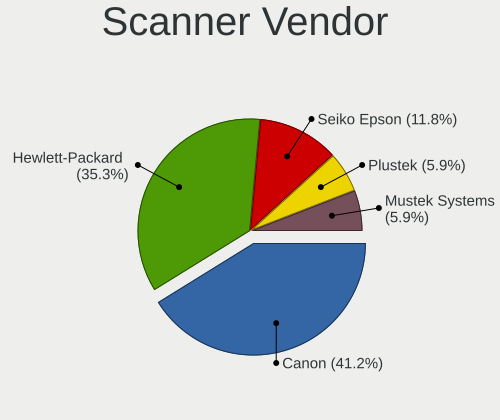

| Vendor          | Desktops | Percent |
|-----------------|----------|---------|
| Canon           | 7        | 41.18%  |
| Hewlett-Packard | 6        | 35.29%  |
| Seiko Epson     | 2        | 11.76%  |
| Plustek         | 1        | 5.88%   |
| Mustek Systems  | 1        | 5.88%   |

Scanner Model
-------------

Scanner device models

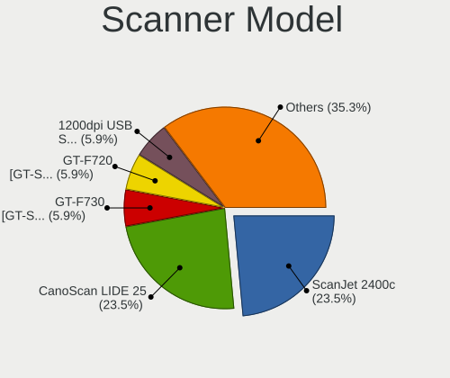

| Model                                                   | Desktops | Percent |
|---------------------------------------------------------|----------|---------|
| HP ScanJet 2400c                                        | 4        | 23.53%  |
| Canon CanoScan LIDE 25                                  | 4        | 23.53%  |
| Seiko Epson GT-F730 [GT-S630/Perfection V33/V330 Photo] | 1        | 5.88%   |
| Seiko Epson GT-F720 [GT-S620/Perfection V30/V300 Photo] | 1        | 5.88%   |
| Plustek 1200dpi USB Scanner                             | 1        | 5.88%   |
| Mustek Systems ScanExpress 1200 UB                      | 1        | 5.88%   |
| HP ScanJet G4050                                        | 1        | 5.88%   |
| HP ScanJet 3800c                                        | 1        | 5.88%   |
| Canon CanoScan LiDE 500F                                | 1        | 5.88%   |
| Canon CanoScan LiDE 210                                 | 1        | 5.88%   |
| Canon CanoScan LiDE 110                                 | 1        | 5.88%   |

Camera
------

Camera Vendor
-------------

Camera device vendors

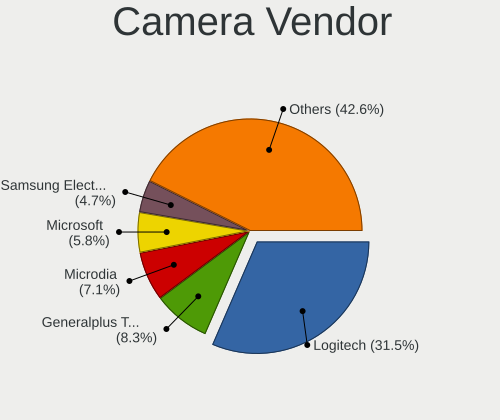

| Vendor                        | Desktops | Percent |
|-------------------------------|----------|---------|
| Logitech                      | 391      | 31.51%  |
| Generalplus Technology        | 103      | 8.3%    |
| Microdia                      | 88       | 7.09%   |
| Microsoft                     | 72       | 5.8%    |
| Samsung Electronics           | 58       | 4.67%   |
| Z-Star Microelectronics       | 47       | 3.79%   |
| GEMBIRD                       | 37       | 2.98%   |
| Sunplus Innovation Technology | 35       | 2.82%   |
| Jieli Technology              | 34       | 2.74%   |
| Aveo Technology               | 32       | 2.58%   |
| Cubeternet                    | 20       | 1.61%   |
| Chicony Electronics           | 20       | 1.61%   |
| Realtek Semiconductor         | 17       | 1.37%   |
| Pixart Imaging                | 14       | 1.13%   |
| Alcor Micro                   | 14       | 1.13%   |
| Anker PowerConf C200          | 12       | 0.97%   |
| Genesys Logic                 | 11       | 0.89%   |
| Arkmicro Technologies         | 11       | 0.89%   |
| Apple                         | 11       | 0.89%   |
| Unknown                       | 10       | 0.81%   |
| LG Electronics                | 10       | 0.81%   |
| Lenovo                        | 10       | 0.81%   |
| KYE Systems (Mouse Systems)   | 10       | 0.81%   |
| WaveRider Communications      | 9        | 0.73%   |
| SunplusIT                     | 9        | 0.73%   |
| MacroSilicon                  | 9        | 0.73%   |
| A4Tech                        | 9        | 0.73%   |
| Asuscom Network               | 8        | 0.64%   |
| Philips (or NXP)              | 7        | 0.56%   |
| Hewlett-Packard               | 7        | 0.56%   |
| webcam                        | 6        | 0.48%   |
| Huawei Technologies           | 6        | 0.48%   |
| Creative Technology           | 6        | 0.48%   |
| Bison Electronics             | 6        | 0.48%   |
| Sunplus Technology            | 5        | 0.4%    |
| Sonix Technology              | 5        | 0.4%    |
| ezcap                         | 5        | 0.4%    |
| Silicon Motion                | 4        | 0.32%   |
| GenesysLogic Technology       | 4        | 0.32%   |
| YGTek                         | 3        | 0.24%   |

Camera Model
------------

Camera device models

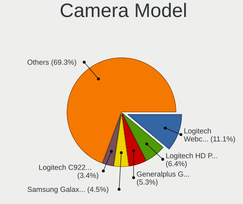

| Model                                     | Desktops | Percent |
|-------------------------------------------|----------|---------|
| Logitech Webcam C270                      | 138      | 11.09%  |
| Logitech HD Pro Webcam C920               | 80       | 6.43%   |
| Generalplus GENERAL WEBCAM                | 66       | 5.31%   |
| Samsung Galaxy series, misc. (MTP mode)   | 56       | 4.5%    |
| Logitech C922 Pro Stream Webcam           | 42       | 3.38%   |
| Jieli USB PHY 2.0                         | 33       | 2.65%   |
| Generalplus 808 Camera #9 (web-cam mode)  | 32       | 2.57%   |
| GEMBIRD USB2.0 PC CAMERA                  | 32       | 2.57%   |
| Microdia Integrated Camera                | 25       | 2.01%   |
| Logitech C920 PRO HD Webcam               | 24       | 1.93%   |
| Microdia USB 2.0 Camera                   | 21       | 1.69%   |
| Z-Star Venus USB2.0 Camera                | 20       | 1.61%   |
| Logitech Logitech Webcam C925e            | 20       | 1.61%   |
| Logitech BRIO Ultra HD Webcam             | 18       | 1.45%   |
| Microdia Webcam Vitade AF                 | 17       | 1.37%   |
| Aveo USB2.0 Camera                        | 16       | 1.29%   |
| Sunplus Integrated Camera                 | 15       | 1.21%   |
| Logitech HD Webcam C525                   | 15       | 1.21%   |
| Microsoft LifeCam HD-3000                 | 13       | 1.05%   |
| Microsoft LifeCam VX-800                  | 12       | 0.96%   |
| Microsoft LifeCam VX-500 [1357]           | 12       | 0.96%   |
| Anker PowerConf C200 Anker PowerConf C200 | 12       | 0.96%   |
| Microsoft LifeCam VX-2000                 | 11       | 0.88%   |
| Logitech Logi Webcam C920e                | 11       | 0.88%   |
| Z-Star A4 TECH USB2.0 PC Camera E         | 10       | 0.8%    |
| Unknown HD camera                         | 10       | 0.8%    |
| Pixart Imaging GE 1.3 MP MiniCam Pro      | 10       | 0.8%    |
| Microsoft LifeCam Cinema                  | 10       | 0.8%    |
| Lenovo Lenovo FHD Webcam Audio            | 10       | 0.8%    |
| Chicony HP Webcam                         | 9        | 0.72%   |
| A4Tech PK-635G                            | 9        | 0.72%   |
| Logitech Webcam C930e                     | 8        | 0.64%   |
| Cubeternet GL-UPC822 UVC WebCam           | 8        | 0.64%   |
| Asuscom Network HD 1080P PC-Camera        | 8        | 0.64%   |
| Apple iPhone 5/5C/5S/6/SE/7/8/X           | 8        | 0.64%   |
| Sunplus SPCA2281 Web Camera               | 7        | 0.56%   |
| Realtek USB Camera                        | 7        | 0.56%   |
| Philips (or NXP) Webcam SPC530NC          | 7        | 0.56%   |
| Microsoft LifeCam HD-5000                 | 7        | 0.56%   |
| MacroSilicon USB Video                    | 7        | 0.56%   |

Security
--------

Fingerprint Vendor
------------------

Fingerprint sensor vendors

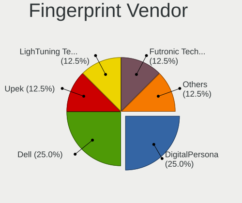

| Vendor                | Desktops | Percent |
|-----------------------|----------|---------|
| DigitalPersona        | 2        | 25%     |
| Dell                  | 2        | 25%     |
| Upek                  | 1        | 12.5%   |
| LighTuning Technology | 1        | 12.5%   |
| Futronic Technology   | 1        | 12.5%   |
| AuthenTec             | 1        | 12.5%   |

Fingerprint Model
-----------------

Fingerprint sensor models

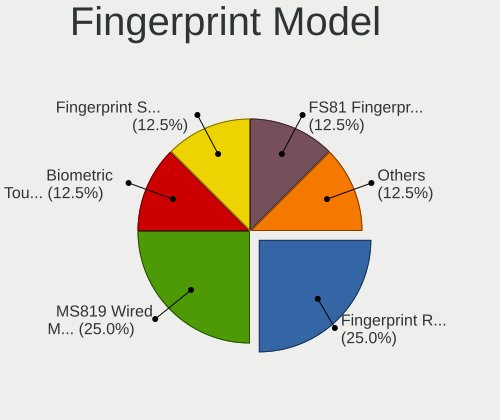

| Model                                                  | Desktops | Percent |
|--------------------------------------------------------|----------|---------|
| DigitalPersona Fingerprint Reader                      | 2        | 25%     |
| Dell MS819 Wired Mouse With Fingerprint Reader         | 2        | 25%     |
| Upek Biometric Touchchip/Touchstrip Fingerprint Sensor | 1        | 12.5%   |
| LighTuning Fingerprint Sensor                          | 1        | 12.5%   |
| Futronic FS81 Fingerprint Scanner Module               | 1        | 12.5%   |
| AuthenTec AES1600                                      | 1        | 12.5%   |

Chipcard Vendor
---------------

Chipcard module vendors

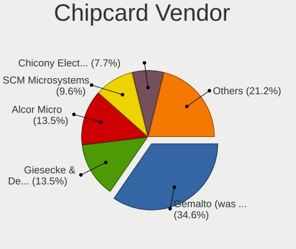

| Vendor                            | Desktops | Percent |
|-----------------------------------|----------|---------|
| Gemalto (was Gemplus)             | 18       | 34.62%  |
| Giesecke & Devrient               | 7        | 13.46%  |
| Alcor Micro                       | 7        | 13.46%  |
| SCM Microsystems                  | 5        | 9.62%   |
| Chicony Electronics               | 4        | 7.69%   |
| Aladdin Knowledge Systems         | 3        | 5.77%   |
| Watchdata                         | 2        | 3.85%   |
| OmniKey                           | 2        | 3.85%   |
| Castles Technology                | 2        | 3.85%   |
| VASCO Data Security International | 1        | 1.92%   |
| Realtek Semiconductor             | 1        | 1.92%   |

Chipcard Model
--------------

Chipcard module models

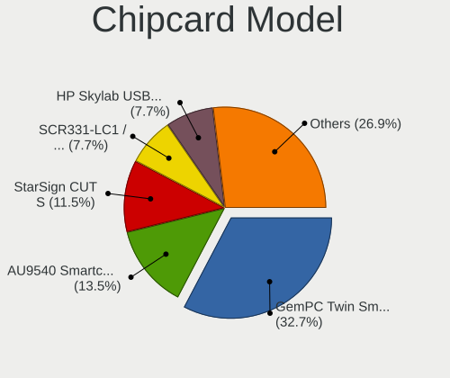

| Model                                                           | Desktops | Percent |
|-----------------------------------------------------------------|----------|---------|
| Gemalto (was Gemplus) GemPC Twin SmartCard Reader               | 17       | 32.69%  |
| Alcor Micro AU9540 Smartcard Reader                             | 7        | 13.46%  |
| Giesecke & Devrient StarSign CUT S                              | 6        | 11.54%  |
| SCM Microsystems SCR331-LC1 / SCR3310 SmartCard Reader          | 4        | 7.69%   |
| Chicony Electronics HP Skylab USB Smartcard Keyboard            | 4        | 7.69%   |
| Aladdin Knowledge Systems Token JC                              | 3        | 5.77%   |
| Watchdata USB Key                                               | 2        | 3.85%   |
| OmniKey CardMan 3021 / 3121                                     | 2        | 3.85%   |
| Castles Technology EZCCID Smart Card Reader                     | 2        | 3.85%   |
| VASCO Data Security International Digipass 905 SmartCard Reader | 1        | 1.92%   |
| SCM Microsystems SCR35xx Smart Card Reader                      | 1        | 1.92%   |
| Realtek Semiconductor Smart Card Reader Interface               | 1        | 1.92%   |
| Giesecke & Devrient Chipcard Reader                             | 1        | 1.92%   |
| Gemalto (was Gemplus) GemPC Key SmartCard Reader                | 1        | 1.92%   |

Unsupported
-----------

Unsupported Devices
-------------------

Total unsupported devices on board

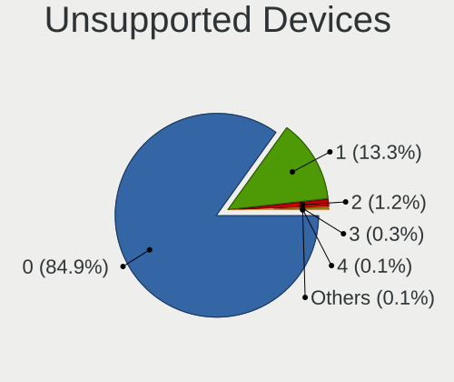

| Total | Desktops | Percent |
|-------|----------|---------|
| 0     | 6559     | 84.93%  |
| 1     | 1029     | 13.32%  |
| 2     | 94       | 1.22%   |
| 3     | 24       | 0.31%   |
| 4     | 11       | 0.14%   |
| 5     | 4        | 0.05%   |
| 7     | 1        | 0.01%   |
| 6     | 1        | 0.01%   |

Unsupported Device Types
------------------------

Types of unsupported devices

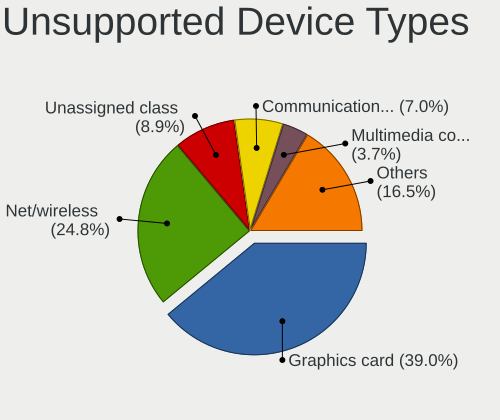

| Type                     | Desktops | Percent |
|--------------------------|----------|---------|
| Graphics card            | 500      | 39.03%  |
| Net/wireless             | 318      | 24.82%  |
| Unassigned class         | 114      | 8.9%    |
| Communication controller | 90       | 7.03%   |
| Multimedia controller    | 48       | 3.75%   |
| Sound                    | 45       | 3.51%   |
| Chipcard                 | 34       | 2.65%   |
| Camera                   | 22       | 1.72%   |
| Net/ethernet             | 21       | 1.64%   |
| Modem                    | 18       | 1.41%   |
| Storage/raid             | 14       | 1.09%   |
| Bluetooth                | 14       | 1.09%   |
| Network                  | 11       | 0.86%   |
| Storage/ide              | 9        | 0.7%    |
| Fingerprint reader       | 5        | 0.39%   |
| Card reader              | 5        | 0.39%   |
| Storage/nvme             | 4        | 0.31%   |
| Firewire controller      | 3        | 0.23%   |
| Dvb card                 | 2        | 0.16%   |
| Wireless                 | 1        | 0.08%   |
| Video                    | 1        | 0.08%   |
| Unclassified device      | 1        | 0.08%   |
| Storage                  | 1        | 0.08%   |

